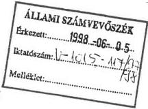
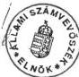

Állami Számvevőszék

# JELENTÉS

az alapfokú oktatásra fordított
pénzeszközök felhasználásának
vizsgálatáról

9818

424.

1998.

---

A vizsgálat végrehajtásáért felelős:

V. Önkormányzati és Területi Ellenőrzési Igazgatóság

Dömötör Gyula

számvevő igazgató

A vizsgálatot vezette, a jelentést összeállította:

dr. Felleg Zsoltné

régióvezető főtanácsos

A jelentés összeállításában közreműködött:

Berényi Magdolna

számvevő tanácsos

Bocsi Sándor

számvevő tanácsos

dr. Lacó Bálintné

számvevő tanácsos

Az ellenőrzésben részt vettek:

A résztvevők névsorát az 1. sz. melléklet tartalmazza.

---

V-1015-114/1997-98. TSZ.: 391

# TARTALOMJEGYZÉK

BEVEZETÉS 3

I. ÖSSZEGZŐ MEGÁLLAPÍTÁSOK, KÖVETKEZTETÉSEK, JAVASLATOK 5

II. RÉSZLETES MEGÁLLAPÍTÁSOK 9

1. Társadalmi-gazdasági körülmények, demográfiai tényezők változásának hatása a közoktatás intézményrendszerére 9
2. A közoktatás információs rendszere, annak változása 11
3. A közoktatási feladatok jogi szabályozása 13
4. Pénzügyi szabályozórendszer jellemzői, változása, hatása a feladatok ellátására 15
5. A települési önkormányzatok testületeinek, hivatalainak oktatás-irányító, fenntartó tevékenysége 18
6. Megyei önkormányzatok szerepe a szakmai feladatok ellátásában, koordinálásában 22
7. A pénzügyi lehetőségek és demográfiai tényezők hatása az oktatás körülményeire 24
8. Az alapfokú oktatási intézményekben folyó tevékenység ellenőrzése 32

1

---

[Non-Text]

[Non-Text]

1. 2017年1月1日至2018年1月1日（含）的公司股票交易均价为4.56元/股，与前一交易日收盘价相比，涨幅为-0.97%。

[Non-Text]

[Non-Text]

[Non-Text]

[Non-Text]

[Non-Text]

[Non-Text]

[Non-Text]

[Non-Text]

[Non-Text]

[Non-Text]

[Non-Text]

[Non-Text]

[Non-Text]

[Non-Text]

[Non-Text]

[Non-Text]

[Non-Text]

[Non-Text]

[Non-Text]

[Non-Text]

[Non-Text]

[Non-Text]

[Non-Text]

[Non-Text]

1. 2017年1月1日至2018年1月1日（含）的公司股票交易均价为4.56元/股，与前一交易日收盘价相比，涨幅为-0.97%。

[Non-Text]

[Non-Text]

[Non-Text]

[Non-Text]

[Non-Text]

[Non-Text]

[Non-Text]

[Non-Text]

[Non-Text]

[Non-Text]

[Non-Text]

[Non-Text]

[Non-Text]

[Non-Text]

[Non-Text]

[Non-Text]

[Non-Text]

[Non-Text]

[Non-Text]

[Non-Text]

[Non-Text]

The Ground Truth image displays a single, solid horizontal line. According to Rule 2 (UNDERSCORE & LINE RULES), this is a stylistic or background line, not a placeholder underscore. Therefore, the OCR result must ignore it and output nothing or only meaningful text. The provided OCR content is "____", which consists of four underscores. This is an incorrect interpretation of the line as a placeholder, violating the rule that stylistic lines must be ignored. The OCR has hallucinated underscores where none should exist based on the GT's visual context. Hence, the OCR result is inconsistent with the Ground Truth.

---

# JELENTÉS
az alapfokú oktatásra fordított pénzeszközök
felhasználásának vizsgálatáról

## BEVEZETÉS

Az 1990-es évek elején bekövetkezett társadalmi változások az alapfokú oktatás körülményeire jelentős hatással voltak. A tanácsi struktúrához képest csaknem duplájára növekedett azon közigazgatási egységek száma, amelyek a helyi önkormányzatokról szóló 1990. évi LXV törvény előírásai szerint az alapfokú oktatási feladatok ellátására kötelezettek. Az önkormányzatok jogosítványaikkal élve mind több településen intézkedtek a korábban megszüntetett iskolák újraindítására, a helyben történő oktatás feltételeinek megteremtésére.

Az Állami Számvevőszék az alapfokú oktatás területén felhasznált pénzeszközök hasznosulását 1992. évben ellenőrizte. A vizsgálat alapvetően arra irányult, hogy az oktatásirányítás új rendszere, a finanszírozás megváltozott feltételei hogyan hatottak a gazdálkodásra, az ott folyó tartalmi munka színvonalára. A vizsgálati tapasztalatok alapján - többek között - a valós kiadásokhoz jobban igazodó támogatási rendszer kidolgozására, a feladatok társulásos formában történő ellátásának ösztönzésére tettünk javaslatot.

A számvevőszéki ellenőrzés lezárását követő időszakban jelentős változások következtek be a közoktatás szakmai irányításában és a pénzügyi szabályozásban egyaránt. A szakmai elvárásokat az 1993. évben megalkotott, a közoktatásról szóló - azóta több alkalommal módosított - 1993. évi LXXIX. törvény fogalmazta meg, amelyet kormány- és tárca szintű rendeletek egészítettek ki. Az 1995. évben kiadott Nemzeti Alaptanterv az oktatás kötelező tartalmi követelményeit foglalta rendszerbe. Központi intézkedések születtek a gazdaságosabb, magasabb színvonalú szakmai ellátást biztosító közös önkormányzati feladatmegoldások ösztönzésére. Mindezek indokolttá tették a feladatellátás ismételt áttekintését, annak felmérését, hogy a változások:

- milyen elmozdulást idéztek elő az alapfokú oktatást biztosító intézményhálózat összetételében
- az önkormányzatok mennyiben és milyen módon tettek eleget kötelező feladat-ellátási kötelezettségüknek,
- hogyan változtak az oktatási intézmények tárgyi és személyi feltételei,
- az alapfokú oktatás működtetésére, fejlesztésére fordított pénzeszközök miként hatnak az intézményekben folyó tartalmi munka színvonalára,
- hogyan halad a közoktatási törvényben foglalt feladatok végrehajtása.

3

---

BEVEZETÉS---

**Az ellenőrzés időszaka:** 1994 - 1996. évek, 1997 év a vizsgálat befejezéséig.

**Az ellenőrzés kiterjedt:-** a Művelődési és Közoktatási Minisztériumra, 74 települési önkormányzatra, azok 99 oktatási intézményére. A vizsgált önkormányzatok alapfokú oktatási intézményeiben 85 588 fő tanul, ez az összes tanulólétszám 8,9%-át teszi ki.

---4

---

I. ÖSSZEGZŐ MEGÁLLAPÍTÁSOK, KÖVETKEZTETÉSEK, JAVASLATOK

# I. ÖSSZEGZŐ MEGÁLLAPÍTÁSOK, KÖVETKEZTETÉSEK, JAVASLATOK

A közoktatás rendszere az elmúlt években jelentős változásokon ment keresztül. Az iskolák világát körülvevő társadalmi-gazdasági környezet alapjaiban megváltozott. Az átalakulás folyamata mindmáig nem zárult le.

A közoktatás szempontjából a politikai rendszer átalakulásával együtt járó legnagyobb horderejű változás a közigazgatás átalakításához kapcsolódik. A parlament által elfogadott, a helyi önkormányzatokról szóló — többször módosított — 1990. évi LXV. törvény (továbbiakban: Ötv.) nagyfokú autonómiával ruházta fel a választópolgárok helyi közösségét. Az alap- és középfokú oktatás intézményeit tulajdonukba adta, ezzel egyidejűleg meghatározta az ellátandó feladatok körét és az azzal kapcsolatos hatásköröket.

A közoktatásról szóló 1993. évi — időközben többször módosított — LXXIX. tv. (továbbiakban: Kt.) rendelkezései szerint a **közoktatás rendszerének működtetése az állam feladata**, melyről az állami és helyi önkormányzati feladatellátás keretében gondoskodik. A törvényi szabályozás kapcsán ugyanakkor lehetővé vált, hogy a feladatellátásból a helyi önkormányzatok, állami szervezetek mellett fokozottabb mértékben részt vállaljanak az egyházak, alapítványok, gazdálkodó szervezetek, egyéb jogi és természetes személyek. E folyamatban nagy szerepe volt az egyházi ingatlanok visszajuttatásáról rendelkező törvénynek. Mindezen tényezők hatást gyakoroltak az alapfokú oktatás intézmény-hálózatának szerkezeti átalakulására. A feladatellátásban — bár **nem meghatározó mértékben, — de arányában nőtt a nem önkormányzati szervezetek szerepe**. (Országos szinten az 1994/95-ös tanévben az általános iskolák 4,6%-a, 1996/97-es tanévben 6,4%-a működött nem önkormányzati fenntartásban).

Magyarország az évtized elején gazdasági teljesítőképességéhez képest más országoknál jóval nagyobb arányban költött a közoktatásra. **Az 1989-1992. között bekövetkezett gazdasági visszaesés a közoktatás területét nem érintette**. Miközben a nemzeti össztermék nagysága csökkent, a **közoktatási kiadások megőrizték reálértéküket**. (1993. évi adatok szerint az OECD 3,7%-os átlagával szemben Magyarországon a GDP 4,1%-át fordították alap és középfokú oktatásra.)

A közoktatási kiadások reálértékének csökkenése az 1992. évet követően következett be, amikor a nemzeti össztermék visszaesése megállt, sőt növekedés kezdődött. Ezen időszaktól kezdődően - e két egymással ellentétes tendencia hatására - a közoktatás részesedése a nemzeti össztermékből csökkent és e mutató tekintetében a korábbi kedvező helyzetünket elveszítettük. **1995 és 1996 években a közoktatási kiadások aránya már az OECD országok átlaga alatt volt**.

5

---

I. ÖSSZEGZŐ MEGÁLLAPÍTÁSOK, KÖVETKEZTETÉSEK, JAVASLATOK---

A közoktatásra, ezen belül az **alapfokú oktatásra fordított pénzeszközök csak részben szolgálták az oktatás valós céljait**, abban jelentős tartalékok vannak. E kiadásokban az oktatás helyi szintjén meghozott, gyakran nem gazdaságos és szakmai szempontból sem támogatható döntések hatása is megjelent. Ezekre a jelenségekre az ÁSZ 1992. évi vizsgálata már utalt. A **felesleges kiadások az oktatás iskolaszerkezetének kedvezőtlen változásában**, ezzel összefüggésben **az e szakterületen foglalkoztatott létszám** valós igényeket meghaladó **nagyságrendjében keresendők**.

Az intézményfenntartók az oktatási intézmények létesítése, azok fenntartása során az elmúlt évtizedben bekövetkezett demográfiai folyamatokat nem vették figyelembe. **Miközben a tanulók száma az 1980-as évek közepe óta fokozatosan csökkent** (1986 - 1996. évek között a csökkenés 26%), ezen időszak alatt **az iskolák, az iskolai tanulócsoportok száma, valamint a pedagóguslétszám** egyránt **növekedett**.

Az 1986/87-es tanévben 1,3 millió gyermek általános iskolai oktatásáról kellett gondoskodni, az 1996/97. tanévben már csak 966 ezer főt tett ki az alapfokú oktatási intézményekben nevelt tanulók száma.

Az önkormányzati rendszer megalakulását követően a helyi képviselőtestületek alapvető feladatuknak tartották az oktatás feltételeinek helyben történő megteremtését. Ezen döntések meghozatalánál a demográfiai folyamatok hatása (egyes falvakban ezen korosztályok teljes visszaesése) kevés szerepet játszott. Mindezek következtében **az 1986/87-as tanévhez képest 10 évvel később 334 ezerrel kevesebb gyermeket 225.-tel több intézményben oktattak**. A testületi döntések az oktatás létszámigényét szükségszerűen megnövelték. A **pedagógusok száma még az 1994/95-ös esztendőben is tovább növekedett, amikor** - az önkormányzatok tanulócsoportok összevonásával, egyes intézmények bezárásával kapcsolatos intézkedései nyomán **lecsökkent tanulócsoport szám miatt - az már semmiképpen nem volt indokolt**.

Az évtized elején a kistelepülések iskolalétesítési törekvéseit az állam anyagi ösztönzőkkel támogatta, hiszen az önkormányzatok tanterem építéséhez, tornaterem létesítéshez is kaptak támogatást. 1995. évtől a központilag támogatott célok köre némileg módosult és azok közé - a központosított előirányzatok között - az oktatási feladatok társult formában való ellátásának pénzügyi ösztönzése is bekerült. Az önkormányzatok többsége azonban oktatási feladatait továbbra is saját intézményi keretek között kívánja ellátni. Az alapfokú oktatás **intézményi szerkezetére** továbbra is az **elaprózottság**, az alacsony kihasználtság mellett **magas fajlagos kiadásokkal fenntartható iskolahálózat a jellemző**.

**1995. évtől bizonyos változások érzékelhetők az intézmények számának, az oktatás személyi feltételeinek a tanulólétszámhoz való igazításában**. Ezeket a döntéseket központi intézkedések és - az önkormányzatok gazdasági helyzetének rosszabbodásával összefüggő - helyi kényszer is motiválta. Oktatási kiadások csökkentésére a népesebb, több oktatási intézménnyel rendelkező településeknél volt nagyobb lehetőség, ahol a tanulócsoportok

---6

---

I. ÖSSZEGZŐ MEGÁLLAPÍTÁSOK, KÖVETKEZTETÉSEK, JAVASLATOK

számának csökkentésével, esetenként 1-1 iskola bezárásával az oktatás létszámszükségletét mérsékelték. Az intézkedésekre ösztönzőleg hatott a pedagógusok kötelező óraszámának emelésére vonatkozó törvényi rendelkezés, valamint a központi költségvetésből létszámleépítés esetén igénybe vehető támogatás is.

Az intézkedések a korábbi évek nemzetközi összehasonlításban is kedvező tanuló/pedagógus arányán alig változtattak. 1994-es adatok szerint az OECD országokban az egy pedagógusra jutó tanulók száma 16-17 fő körül alakult, ez az arány Magyarországon 11 fő alatt volt. 1996 évben a megtett intézkedések ellenére a mutatószám csak 11,5 főre növekedett.

A helyszíni ellenőrzési tapasztalatok azt mutatják, hogy miközben az alapfokú oktatás kiadásában - az iskolahálózat elaprózottságából adódóan - további tartalékok vannak, az önkormányzatok az oktatás feltételeit biztosító előirányzatokra az indokoltnál kevesebbet biztosítottak. Ennek következtében **az alapfokú oktatás intézményeinek működtetésében a pénzügyi eszközök hiánya és bősége egyaránt jelen van.**

A Kt megalkotása, a Nemzeti Alaptanterv kiadása révén az önkormányzatok számára ismertté váltak a feladatellátás állami elvárásai, követelményei. A Kt. a megyei önkormányzatok számára kiemelt szerepet szán a megyehatáron belüli feladatok koordinálásában, a térségi - körzeti jellegű tevékenységek ellátásában. Az Ötv-vel való teljes összhang megteremtése érdekében ugyanakkor indokolt a megyék és települések kötelező feladatainak, hatáskörének pontosítása.

A **Parlament** a szakmai elvárások megfogalmazásával egyidejűleg **pénzügyi garanciákat is beépített a szaktörvénybe.** Ezek a közoktatás kiemelt szerepét mutató előírások - amelyek a felhasználási kötöttséggel nem járó normatív hozzájárulások minimális összegét, valamint a központosított előirányzatok között igényelhető, felhasználási kötöttséggel adható pénzeszközök nagyságrendjét is meghatározzák - **biztonságot jelentenek az intézményfenntartó önkormányzatok számára.** A központosított előirányzatok jelenlegi - pályázati úton történő - elosztási rendje a pénzösszegek nagysága és a pályázók jelentős száma miatt ebben a formájában nehézkes és hosszadalmas. Azok egy részének felhasználási kötöttséggel történő elosztása már az éves költségvetési törvényben megtörténhetne. Ehhez azonban pontos adatokra, a jelenlegi információs rendszer korszerűsítésére lenne szükség.

A vizsgálattal érintett önkormányzatok oktatási intézményeiben folyó munka - Kt-ben foglaltak szerinti - szakmai ellenőrzésére alig került sor. A tapasztalatok alapján a **közoktatás évek óta rendszeres, külső szakmai kontroll nélkül működik.** Ennek hiányában nincs kellő információ arra vonatkozóan sem, hogy a közoktatásra fordított erőforrások hogyan hasznosulnak, az iskolaszerkezet változása, az alkalmazott pedagógiai módszerek milyen hatást gyakorolnak a tanulók teljesítményére.

A számvevőszék a helyszíni ellenőrzések lezárását követően az alábbi -helyi szinten megvalósítható - javaslatokat tette az önkormányzatok részére:

7

---

I. ÖSSZEGZŐ MEGÁLLAPÍTÁSOK, KÖVETKEZTETÉSEK, JAVASLATOK

- Mérjék fel az oktatási feladatok gazdaságosabb, jobb szakmai feltételek közötti ellátásának lehetőségeit, tegyenek intézkedéseket a tanulólétszámhoz igazodó intézményrendszer kialakítására.
- A költségvetési előrányzatokat az ellátandó feladatok figyelembevételével határozzák meg. Ennek során törekedjenek az oktatás minőségi feltételeinek javítását szolgáló források biztosítására.
- Kerüljön sor az intézmények működését szabályozó alapdokumentumok (alapító okirat, szervezeti és működési szabályzat) felülvizsgálatára, és azoknak a tényleges feladatokhoz történő igazítására.
- Az intézményekben folyó szakmai munka és gazdálkodási tevékenység javítása érdekében intézkedni kell a belső ellenőrzés rendszerének továbbfejlesztésére és a külső szakmai kontroll megteremtésére.

**Az Állami Számvevőszék** az ellenőrzési tapasztalatok alapján a következő intézkedéseket javasolja:

a Kormány részére

1. **A Kt feladat - és hatásköri előírásainak pontosításával** meg kell teremteni az Ötv-vel való teljes összhangot,
2. **Intézkedni szükséges egy kevésbé széttagolt**, az emberi erőforrásokkal jobban takarékoskodó **Intézményrendszer kialakítására**. Ennek érdekében

- tovább kell fejleszteni az alapfokú oktatás társulásos formában történő ellátásának támogatási rendszerét,
- pénzügyi ösztönzőknek és szakmai korlátoknak (pl. minimális osztálylétszám meghatározása) a szabályozó rendszerbe való beépítésével el kell érni, hogy az ágazatban dolgozók száma a lecsökkent tanulólétszámhoz, az ellátandó feladathoz igazodjék. Ezzel egyidejűleg intézkedni szükséges az ott dolgozók anyagi megbecsülésének javítására.

**A Művelődési- és Közoktatási Minisztérium részére:**

1. Dolgozza ki a **közoktatásról szóló törvény** egyes rendelkezéseinek pontosítására vonatkozó elgondolásait. Ennek során legyen figyelemmel az önkormányzatokról szóló törvény hatásköri kérdésekre, valamint önkormányzati alapjogokra vonatkozó előírásaira.
2. A Pénzügyminisztériummal és a KSH-val együttműködve kerüljön sor egy olyan, a jelenlegi iskolaszerkezethez igazodó **szakmai és pénzügyi információs rendszer kialakítására**, amely mind a helyi döntéshozók, mind a szakmai irányítást végzők részére meghatározott rendszerességgel, megbízható adatokat szolgáltat.
3. Az oktatási intézményekben folyó **szakmai** tevékenység színvonalának javítása érdekében intézkedni szükséges a jelenlegi **ellenőrzési gyakorlat áttekintésére**, annak rendszeressé tételét segítő feltételek megteremtésére.

8

---

II. RÉSZLETES MEGÁLLAPÍTÁSOK

4. Kerüljön sor az egyes intézmények létesítésénél, működtetésénél a közoktatási törvény előírásai szerint kötelező érvényű, de mindezideig kiadásra nem került, **eszköz- és felszerelési jegyzék megjelentetésére.**

## II. RÉSZLETES MEGÁLLAPÍTÁSOK

### 1. TÁRSADALMI-GAZDASÁGI KÖRÜLMÉNYEK, DEMOGRÁFIAI TÉNYEZŐK VÁLTOZÁSÁNAK HATÁSA A KÖZOKTATÁS INTÉZMÉNYRENDSZERÉRE

**A nyolcvanas évek vége óta az általános iskolák száma folyamatosan nő.** A fenntartók iskolalétesítési törekvését kevésbé motiválta a gyermeklétszám nagyságában bekövetkezett folyamatos csökkenés. A növekedés az 1990/91-es tanévtől felerősödött, s ha kisebb mértékben is, de még a vizsgált időszak első szakaszában, az 1994/95-ös tanévben is folytatódott. Az iskolák számának növekedése mögött mindenekelőtt az önállóságukkal és lehetőségeikkel élni kívánó, a tanácsi rendszerben végrehajtott körzetesítések eredményeként saját intézménnyel nem rendelkező települések iskolavisszaállítási törekvései húzódnak meg. Országos adatok szerint **az iskolák száma az 1986/87. tanévhez mérten az 1994/95. tanévre 274-el 7,7%-kal nőtt** (3814 iskola). **Iskolák bezárására, oktatási intézmények összevonására csak az 1995/96. tanévtől kezdődően került sor**, amit a gyermeklétszám évek óta tartó folyamatos visszaesése mellett az önkormányzatok egyre nehezedő pénzügyi helyzete is indokol.

A helyszíni vizsgálati tapasztalatai is azt mutatják, hogy az **önkormányzatok a kötelező általános iskolai oktatási feladataikat** meghatározó részben **saját intézmény fenntartásával kívánják biztosítani.** Az intézményhálózat fenntartásához forrásaik szűkössége esetén is ragaszkodnak. A vizsgált önkormányzatok **közös intézményfenntartásra** vagy a feladatok **intézményirányító társulás keretében történő ellátására kevésbé vállalkoztak.** A vizsgált 75 önkormányzat közül mindössze 10 önkormányzat látja el a feladatot társulás keretében. A társulások szélesebb körben történő létrehozására a múltbeli sérelem, a korábbi időszak erőszakos körzetesítésének negatív tapasztalatai hátrányosan hatnak. A **megkötött szerződések** - amelyek célja több esetben a központosított előirányzatok pályázati feltételeinek történő megfelelés, az állami támogatás elnyerése volt - **gyakran formálisak**, deklarálják ugyan az együttműködést, a valóságban azonban azok megkötését követően sem következnek be tartalmi változások a korábbi gyakorlathoz képest. Gyakori, hogy a szerződés megkötését követően sem vesz részt a társult önkormányzat a feladatellátás megszervezésében, irányításában, a működtetési költségek biztosításában. A lét-

9

---

II. RÉSZLETES MEGÁLLAPÍTÁSOK

rejött társulások működése sem felel meg minden esetben a jogszabályi előírásoknak. Előfordult ugyanakkor az is, hogy a közös intézménnyel kapcsolatos feladatok ellátására, hatáskörök gyakorlására létrehozott bizottság döntését a polgármesterek megváltoztatták.

**Iharosberény** (Somogy megye) községi önkormányzat 1991-től társulás keretében gondoskodik az általános iskolai oktatásról és nevelésről. A társulás jogi személy, elnevezése Iharosberény, Iharos és Pogányszentpéter Községek Önkormányzatainak Általános Iskolai Társulása. A közös intézménnyel kapcsolatos feladatok ellátására az érintett képviselőtestületek bizottságot hoztak létre. A társulás működik, de annak hatékonyságát rontja, hogy előterjesztéseit időnként a polgármesterek együttes ülése felülbírálja.

**Balatonszentgyörgy** (Somogy megye) községi önkormányzat Hollád, Titkos, Vörs községekkel 1990. december 29-én megállapodást kötött intézményirányító társulás létrehozásáról, amely társulás nem a megállapodás alapján működik. A közös tulajdonú intézményt az érintett önkormányzatok közösen működtetik, de abban részt vesz a tulajdonosi jogokkal nem rendelkező Balatonberényi önkormányzat is, amely a második legtöbb települési tanulólétszámot biztosítja az Intézményben.

A Nógrád megyei **Magyargéc** település **Nógrádmegyer** községi önkormányzattal **kötött társulási szerződést a 7. és 8. osztályos tanulók oktatására** 1994. évben. A létrehozott intézményirányító bizottság működése nem folyamatos, a két dokumentált ülés napirendjén az igazgató kinevezésével kapcsolatos kérdéseket tárgyalták meg. Időközben az **érintett tanulók száma 2 főre csökkent**, a költségek arányos megosztására is csak 1995. évben került sor. Ugyanakkor az intézményfenntartó társulási szerződés tette lehetővé az önkormányzat számára, hogy iskolabusz vásárlása címén 8 millió Ft összeget központosított támogatásként elnyerjen.

Az iskolák számának növekedésével ellentétben az **általános iskolákba beírt tanulók létszámában az 1986/87-es tanévtől kezdődően erőteljes csökkenés következett be**. Az elmúlt években az általános iskolákban, két év óta pedig már a középiskolákban is egyre kisebb létszámú korosztályok vesznek részt az oktatásban. **Míg 1986/87-es tanévben 1,3 millió gyerek tanult az általános iskolákban, azok létszáma az 1996/97. tanévben már csak 966 ezer főt tett ki**, (a csökkenés 26%-os). A gyermeklétszám csökkenésének üteme az 1990-es évektől mérséklődött. Az egyes évfolyamok létszáma nagyrészt kiegyenlítődött A vizsgált időszakban (1993/94 — 1996/97. tanév) a gyermeklétszám csökkenése országosan már csak 4,3% volt. (A vizsgált önkormányzatoknál ezt meghaladó mértékű 8,7%-os fogyást tapasztaltunk).

A demográfiai tényezők hatása az egyes településeken eltérő mértékű volt. Kisebb településeken az egyébként is alacsony gyermeklétszám csökkenése átlag alatti. A vizsgált 500-1000 fő lakónépességgel rendelkező községekben a tanulók számában 3,4%-os, míg a megyei jogú városokban 7%-os csökkenés következett be 3 év alatt. A demográfiai folyamatok eredményeként az intézmények tanulólétszám szerinti összetétele megváltozott, az **500 főnél**

10

---

II. RÉSZLETES MEGÁLLAPÍTÁSOK

**magasabb tanulólétszámmal rendelkező általános iskolák részaránya csökkent.** A vizsgálattal érintett önkormányzati általános iskolák 53,5%-a 100-500 fő közötti tanulólétszámmal működik. Mindezek mellett a **200-500 fő lakónépességgel rendelkező községekben** működő általános **iskolák** mintegy **67%-ában** — rendkívül magas fajlagos kiadások mellett — **20 főnél kevesebb gyermeket oktatnak.** Az iskolák elnéptelenedésére a tanulólétszám csökkenésén túl az un. szerkezetváltó iskolák megjelenése is kedvezőtlenül hatott. Egyes középfokú oktatási intézmények a kiemelkedő tanulmányi eredménnyel rendelkező tanulók tehetséggondozása, a gyermekek felsőoktatásra történő felkészítésének szakmai érvei mellett, figyelemmel a demográfiai változás miatti hosszú távú érdekeikre is (gyermeklétszám szintentartása) egyedi engedéllyel 6 illetve 8 osztályos gimnáziumi képzésre tértek át. A vizsgált körben ezen iskolák aránya az 1993/94. tanévi 8,9%-ról 1996/97. tanévre 11,1%-ra emelkedett. Az e képzésben részesülő tanulók kiesése miatt az érintett általános iskolákban komoly tanulócsoport - szervezési problémák adódnak az 5-8. osztályos tanulók körében.

## 2. A KÖZOKTATÁS INFORMÁCIÓS RENDSZERE, ANNAK VÁLTOZÁSA

A közoktatás keretében jelentkező feladatok meghatározásához, szervezeti kereteinek kialakításához, tényleges ellátásához és annak ellenőrzéséhez nélkülözhetetlenek a pontos, naprakész információk. Az ehhez szükséges adatok több forrásból, információs bázisból nyerhetők.

Az önkormányzatok a tankötelezett korúak, ezen belül az első osztályos gyermekek létszámát a népesség-nyilvántartás adataiból kiindulva az oktatási intézményekkel történő jelentős szervezési tevékenységet igénylő egyeztetések alapján állapítják meg. Kisebb településeken az önkormányzatok hivatalai közvetlen lakossági kapcsolat útján is naprakész információhoz jutnak, nagyobb településeken ennek megszervezése bonyolultabb feladatot jelent. A vizsgálat tapasztalatai szerint a gyakorlatban azon 8 osztályt végzett, tanköteleskorú tanulók sorsának figyelemmel kísérése jelent problémát, akik nem kívánják tanulmányaikat folytatni, illetve a tanköteles kor elérése előtt abbahagyják azt. Ezen gyermekekről az önkormányzatok jegyzői nagyrészt nem rendelkeznek naprakész nyilvántartással.

A települési önkormányzatoknak az oktatási feladatok tervezéséhez a közigazgatási területükön működő egyéb szervezetek (egyházak, alapítványok stb.) által fenntartott intézmények adataira, információira is szükségük van. Az adatszolgáltatás és feldolgozás jelenlegi rendjében azonban erről nem kapnak folyamatos tájékoztatást. Bár a Kt. 79. § (3) bekezdése szerint a nem helyi önkormányzat által fenntartott közoktatási intézmény működését az illetékes jegyző engedélyezi, az engedélyezést követően azonban már nincs rendszeres információ arról, hogy a működő intézmény milyen mértékben vesz részt egy-egy település lakóinak általános iskolai oktatásában.

11

---

II. RÉSZLETES MEGÁLLAPÍTÁSOK---

A közoktatással kapcsolatos szakmai információk döntő elemét az országos statisztikai adatgyűjtési program keretében szolgáltatott adatok képezik. A **statisztikai jelentések a tanulókról, az oktatási intézmények tárgyi, személyi feltételeiről számos fontos információt nyújtanak.** Kitöltési utmutató kiadásával a kért statisztikai adatok egyértelműbbé, pontosabbá tehetők. Általános gond, hogy a szerkezetváltó iskolák többsége az általános, illetve középiskoláról készített statisztikai jelentésében nem bontja meg adatait a közoktatás két vagy több intézménytípusa között. Mindez a statisztikai jelentések hitelességét, az azokból számított mutatók (pl. tanuló/pedagógus arány) pontosságát rontja.

A KSH által összesített **éves statisztikai adatok nem adnak kellő időben és elegendő információt a közoktatás változásairól, körülményeiről.** Nem alkalmasak a feladatellátásban résztvevő intézmények, fenntartók (önkormányzatok, egyházak, egyéb jogi személyiségek) és a szakmai irányítást végzők megnövekedett információs igényének kielégítésére sem.

Az oktatás-statisztikai rendszer korszerűsítésében meghatározó feladata van a Művelődési és Közoktatási Minisztériumnak. A közoktatási területnek évek óta igénye a tanügyigazgatáshoz és a költségvetési tervezéshez egyaránt hiteles adatokat szolgáltató, korszerű oktatás-statisztikai rendszer létrehozása. A tárca eddigi kezdeményezései nem jártak eredménnyel. Jelentős előrelépésként értékelhető ugyanakkor, hogy a **statisztikai rendszer korszerűsítésére vonatkozó feladattervet** az 1997. június 30-i **miniszteri értekezlet megtárgyalta és azt jóváhagyta.**

Az önkormányzatok, ezen belül a közoktatási intézmények gazdálkodásáról, a költségvetési előirányzatok tervezéséről és felhasználásáról tájékoztatást nyújtó pénzügyi információs rendszer óriási adatbázist alkot. A költségvetési adatok információ tartalma és osztályozási rendszere képezi az alapját az alapfokú oktatásra fordított kiadások elemzésének, a változás figyelemmel kísérésének.

A feladatokra fordított költségvetési kiadások elkülönítésére a szakfeladatrend szolgál. A pénzügyi információs rendszer keretében kimutatott szakfeladatok tartalmi meghatározása szerint 1994-96. években külön-külön szakfeladaton kellett tervezni és elszámolni az iskolás korúak általános iskolai oktatása, a középfokú oktatás, illetve a tanórán kívüli foglalkozások bevételi és kiadási előirányzatait és azok teljesítését.

Az 1997. évtől érvényes előírás ugyanakkor egyetlen szakfeladaton kezeli a nappali rendszerű (általános iskolai, gimnáziumi, szakközépiskolai stb.) iskolai oktatás általános műveltséget megalapozó pedagógiai szakaszának tanórai és tanórán kívüli foglalkozásai kiadásait, bevételeit. A változás miatt az 1997. évi adatok az 1996, illetve az azt megelőző évek adataival nem hasonlíthatók össze, és az egyes szakterületek elkülönült elemzésére sincs mód.

---12

---

II. RÉSZLETES MEGÁLLAPÍTÁSOK

### 3. A KÖZOKTATÁSI FELADATOK JOGI SZABÁLYOZÁSA

Az elmúlt évek legjelentősebb oktatáspolitikai történése a **közoktatásról szóló** 1993. évi LXXIX. tv. megjelenése volt. A **törvény az oktatás feladatait a rendszerváltást követő új körülményekhez igazította.** Legitimizálta, illetve jogszabályi keretek közé szorította az oktatási rendszerben már lezajlott, illetve folyamatban lévő változásokat. A törvény és annak módosításai **az ellátandó feladatok körét, mértékét**, ezen belül a saját intézmény fenntartásával történő feladatellátás paramétereit **is meghatározták.** Módosításra került az egyes évfolyamokon kötelezően ellátandó tanórák száma, a tanórán kívüli foglalkozások, csoportbontások órakerete. A Kt. módosítása újólag szabályozta a tanulócsoportok maximális és ajánlott átlag-létszámait. Mindezek alapján megállapítható az egyes nevelési-oktatási intézményekben biztosítandó szolgáltatások köre.

A Kt. a közoktatás tartalmi megújítását az országos és helyi szabályozás kétpólusú rendszere bevezetésével kívánja megoldani. A tartalmi korszerűsítés követelményrendszerét a 130/1995.(X.26.) sz. kormányrendelettel kiadott **Nemzeti alaptanterv** szabja meg. E dokumentumban foglaltak figyelembevételével **a helyi önkormányzatok képviselőtestületei** az oktatási intézmények aktív közreműködésével **maguk alakítják ki a helyi sajátosságokhoz igazodó pedagógiai programot és helyi tantervet.** Az 1998. augusztus 31-i határidőre elvégzendő munka előkészítésében és jóváhagyásában mind a fenntartók, mind az intézmények számára óriási felelősség hárul.

A Kt. részletesen taglalja a pedagógiai program fenntartó részéről történő jóváhagyásának szabályait, rendjét (szakértői véleményeztetés, jóváhagyás megtagadásának jogcímei stb.). A Kt. 103. § (3) bekezdése szerint ugyanakkor jóváhagyottnak kell tekinteni a pedagógiai programot, ha a fenntartó 30 napon belül, illetve az azt követő első képviselőtestületi ülésen sem nyilatkozik. E jogszabályhely érvényesülésével fennáll a veszélye, hogy szakmailag nem megalapozott és/vagy pénzügyi feltételek hiánya miatt nem megvalósítható programok kerülnek beindításra. Fentiekre tekintettel célszerű lett volna az önkormányzatokat konkrét határidő megjelölésével — a szabályozott eljárás szerint — döntés meghozatalára kötelezni.

A közoktatás rendszerének hatékonyabb működtetése érdekében a törvény fővárosi, megyei szintű fejlesztési tervek készítését a nagyobb területet átfogó, több települést érintő feladatok ellátásának összehangolását, ésszerű megoldások alkalmazását segítő közalapítványok létesítését írta elő. Az egyes önkormányzatok mellérendeltségi helyzete miatt azonban **nem születhet olyan megyei önkormányzati döntés, amely kötelező szabályokat állapít meg a területén működő települési önkormányzatok számára.** Így a megyei önkormányzatok által elfogadott, a törvény 88. § (2) bekezdésben meghatározott, középtávú beiskolázási terv egyes iskolák

13

---

II. RÉSZLETES MEGÁLLAPÍTÁSOK

részére előírt feladatai nem lehetnek a települési önkormányzatok számára kötelező érvényűek.

**A Kt. nem határolja el egyértelműen az általános iskolai oktatással kapcsolatos feladat- és hatásköröket** a fővárosi-, megyei, illetve a települési önkormányzatok között és rendelkezései az önkormányzatok kötelező feladatellátását meghatározó **Ötv. előírásaival sincsenek teljes szinkronban**. A Kt. 86. § (1) bekezdése szerint „a községi, városi, fővárosi, kerületi és a megyei jogú város önkormányzata köteles gondoskodni ...a tankötelezettség teljesítéséhez szükséges általános iskolai oktatásról...”, ugyanakkor a 87. § (1) bekezdés a) pontjában foglaltak alapján „a megyei önkormányzat, továbbá - ... - a fővárosi önkormányzat köteles gondoskodni azoknak a tanulóknak különböző vizsga vagy évfolyamismétlés nélküli iskolaváltásáról, akiknek a lakóhelyén, ennek hiányában tartózkodási helyén, a tankötelezettség végéig nem biztosítottak az iskolai nevelés és oktatás feltételei. 'Megítélésünk szerint a **feladatellátás kötelezettsége** - ami természetesen nem jelent feltétlenül intézmény-fenntartást - egyidejűleg **csak egy önkormányzat részére írható elő**.

**A Kt.** részletesen szabályozza az oktatási és nevelési intézményekben folyó szakmai munka ellenőrzésének célját és feltételeit, de **nem rendelkezik a szakmai ellenőrzés kötelező jellegéről, gyakoriságáról**. Mivel a külső szakértők által végzett ellenőrzés költségei az önkormányzatokat terhelik arra, a tapasztalatok szerint csak elvétve és többnyire akkor kerül sor, ha az a megrendelő sajátos érdekeit szolgálja (pl. igazgatói pályázat elbírálása, fegyelmi eljárással kapcsolatos döntések alátámasztása stb.).

A Kt. 1996. évi módosítása **jelentős garanciákat fogalmaz meg a közoktatás pénzügyi forrásának biztosításában**. A Kt. megfogalmazása szerint (118. § /4/) a helyi önkormányzatok részére biztosított éves normatív költségvetési hozzájárulások összege nem lehet kevesebb, mint a tárgyévet megelőző második évben a helyi önkormányzatok által e feladatra fordított teljes kiadás 80%-a. A törvény további rendelkezései szerint a költségvetési támogatásokra meghatározott összegen felül, központosított előirányzatként vagy az MKM költségvetésében külön e célra megtervezett összeggel támogatni kell a közoktatás egyéb fejlesztési feladatait, szakmai célkitűzéseit. A Kt-ben megfogalmazott **költségvetési garanciák az ágazat kiemelt kezelését jelentik**.

A Kt. eredeti, 1993 évi megfogalmazása szerint (118. § /3/ bek.) az állami költségvetésnek a közoktatás alapszolgáltatásainak ellátásához szükséges pedagógusok és egyéb közalkalmazottak törvény szerinti illetményét, pótlékait és ezek járulékait kell biztosítania. A **törvényi rendelkezés hatályba lépése** a közoktatás területén az egyéb önkormányzati feladatellátást **finanszírozó rendszertől eltérő** - a kistelepülések számára egyértelműen hátrányokkal járó - **rendszert eredményezett volna**. A törvényben foglalt paraméterek alapján meghatározott finanszírozási módszer - mint egy-

14

---

II. RÉSZLETES MEGÁLLAPÍTÁSOK

fajta feladat-finanszírozás - **hatékony eszköze lehetett volna** a takarékos, **alacsonyabb költségszintű iskolaszerkezet kialakításának**. A törvényhely szerinti költségvetési támogatási rendszer **bevezetésére azonban nem került sor. Azt a Kt. 1996 évi módosítása hatályon kívül helyezte**. Így a központi költségvetési támogatás megállapítása a vizsgálat teljes időtartamában a gyermek, tanulólétszám, valamint az egyes ellátásokhoz kapcsolódó normatív költségvetési hozzájárulás alapján történt.

#### 4. PÉNZÜGYI SZABÁLYOZÓRENDSZER JELLEMZŐI, VÁLTOZÁSA, HATÁSA A FELADATOK ELLÁTÁSÁRA

Az alapfokú oktatásra fordított pénzeszközök nagyságrendjét alapvetően az intézményfenntartók pénzügyi lehetőségei határozzák meg. **A feladatok ellátását az állam** a központi költségvetésből különböző címeken **támogatja**. A vizsgált időszakban (1994—1996. években) az önkormányzatok költségvetési bevételei 43,1%-kal emelkedtek. (A vizsgált körben a bevételek növekedése 53,5% volt). Ez a változás az infláció mértékét figyelembe véve nem jelentett tényleges növekedést, csak a bevételek reálértékének megőrzését szolgálta.

Településenként a bevételek növekedése eltérő mértékű és szerkezete is módosult. Egyes településeken a gazdálkodó szervezetek, vállalkozások jelenléte, gazdasági ereje különböző, mely alapjaiban meghatározza az önkormányzat bevételi lehetőségeit, fejlődését. A dinamikus gazdasággal rendelkező települések növekvő arányú és jelentős volumenű bevételeket realizáltak a helyi adókból, vagyontárgyaik értékesítéséből (a helyi adóbevételek országos szinten 1994 és 1996 évek között több, mint a duplájára emelkedtek).

Az önkormányzatok meghatározó részénél **az állami támogatás** és hozzájárulás összes bevételen belüli **részaránya** a vizsgált időszakban **mérsék-lődött**. (A vizsgált önkormányzatoknál 35,9%-ról 27,0%-ra csökkent.) Az átlaghoz képest településenként nagy a szóródás. Kisebb településeken a bevételen belül a támogatások aránya meghatározó, míg a fővárosban és kerületeiben, nagyobb településeken az egyéb önkormányzati saját források aránya jelentős.

A költségvetési támogatások egyik legfontosabb eleme a **normatív állami hozzájárulás**, melynek összege a vizsgált időszakban mindössze 10%-kal emelkedett, ezen belül azonban a nevelési-oktatási feladatokhoz kapcsolódó hozzájárulás változása jelentős (+40,5%). **Országos szinten 1994. évben 95,7 milliárd Ft, 1996. évben 130,9 milliárd Ft volt közoktatási feladatok címén a helyi önkormányzatok által igénybe vett normatív állami hozzájárulás összege**. Az alapfokú oktatás feladatmutatói alapján a vizsgált önkormányzatok 1994. évben 3,9 milliárd forint, illetve 1996. évben 5,3 milliárd Ft állami támogatást vettek igénybe.

15

---

II. RÉSZLETES MEGÁLLAPÍTÁSOK

A közoktatási feladatokhoz kapcsolódó **normatív állami hozzájárulások rendszere**, a szabályozás tartalma a vizsgált időszakban **megváltozott**. A normatív támogatás igénylésének alapját 1994-1995. években 11 feladatmutató képezte. A feladatmutatók száma és fajlagos értéke ezen években nem változott, így a feladatellátáshoz nyújtott normatív állami hozzájárulás összege a tanulólétszám csökkenése következtében összességében csökkent. **1996 évtől a támogatások** jogcím- és igénybevételi **rendszere feladatorientáltabbá vált és volumenét tekintve is jelentősen megnőtt**. Új igények befogadásával a jogcímeken belül az ún. kódokhoz rendelt fajlagos összegek száma (238) megsokszorozódott. 1997 évben pedig az állami hozzájárulások fajlagos értéke évfolyam-csoportonként is eltérően alakult. Mindezek mellett **forrás-kiegyenlítő szerepe és a gazdaságosabb feladatszervezésben érdekeltséget teremtő szerepe is erősödött**. 1996 évtől a kistelepülések általános iskoláiban tanuló, valamint a fenntartó önkormányzat ellátási körzetébe nem tartozó gyermekek után magasabb hozzájárulás igényelhető, ezáltal ezen települések pótlólagos forráshoz jutnak.

A vizsgálat tapasztalatai szerint a normatív **állami hozzájárulások volumenének** 1996. évtől bekövetkezett **növekedése az önkormányzatokat oktatási kiadásaik növelésére nem ösztönözte**. Ennek csak részben oka az, hogy a finanszírozási rendszer változása miatt az önkormányzati bevételek nem emelkedtek olyan mértékben, amilyen nagyságrendű az oktatási feladatokhoz nyújtott állami hozzájárulás növekedése volt.

**Komárom városban** a normatív támogatás - alapvetően a normatívák összegének növekedéséből adódóan - a tanulói létszám csökkenése ellenére növekvő tendenciát mutat. A növekedés - az alapfokú oktatás összes kiadásaihoz viszonyított - részaránya különösen 1996 évben jelentős, az előző évi 34,7%-ról 42,1%-ra emelkedett.

**Zalaegerszegen** (Zala megye) az elmúlt években a feladatok finanszírozásában a normatív állami hozzájárulás szerepe növekedett. Ezt mutatja, hogy az intézményi működési kiadásoknak 1994-ben még csak 43%-át, 1996-ban pedig már 56,1%-át központi forrás fedezte. Az intézmények saját bevételei ugyancsak növekvő arányban (9,17%) vettek részt az alapfokú oktatási tevékenység biztosításában. E számadatok azt is tükrözik, hogy a központi és az intézményi források szerepének emelkedésével az önkormányzati tehervállalás csökkent.

**Bősárkány község** (Győr-Moson-Sopron megye) önkormányzatánál az alapfokú oktatás kiadásait alapvetően a normatív állami hozzájárulások fedezik. A megállapítás különösen 1996 évre érvényes, ahol a normatív támogatás az összes kiadás 93%-át fedezte.

A közoktatási feladatellátás központi költségvetésből származó bevételei **a cél és címzett támogatások**, a **központosított előirányzatok** valamint a Művelődési és Közoktatási Minisztérium **fejezeti kezelésű pénz-**

16

---

II. RÉSZLETES MEGÁLLAPÍTÁSOK

**eszközei** is. Ezen támogatások döntően nem az intézmények működtetéséhez, hanem fejlesztésekhez, beruházásokhoz jelentenek pótlólagos forrásokat.

A beruházásokhoz, fejlesztésekhez nyújtott **céltámogatások** az **önkormányzatokat** a törvényben előírt feltételek teljesítése esetén **alanyi jogon illetik meg**. A céltámogatás igénybevétele olyan jelentős beruházások megvalósításához biztosít lehetőséget, amelyekre az önkormányzatok többsége saját erőből hosszú távon sem lenne képes. Az elmúlt években állami céltámogatással **jelentős tornaterem** (tornacsarnok) **fejlesztések valósultak meg**. Céltámogatás igénybevételével vált lehetővé több kistelepülésen az általános iskolai oktatás helyben történő megszervezéséhez szükséges tárgyi feltételek kialakítása is.

A vizsgált időszakban az **alapfokú oktatás területét érintő támogatott célok köre erőteljesen beszűkült, csak** egyetlen célt, az **életveszélyessé vált iskolai tanterem kiváltását támogatták**.

A céltámogatások számvevőszéki ellenőrzésének megállapításai szerint a közoktatás területét érintő előirányzat a vizsgált három évben 8 056 millió Ft-ot, a tényleges teljesítés 5 372 millió Ft-ot tett ki.

A helyi önkormányzatok beruházásainak, rekonstrukcióinak megvalósítását a **címzett támogatások** rendszere is segíti. Az 1996 és 1997 években e támogatási forma a **közoktatás területén elsősorban az életveszélyes középiskola, diákotthon és kollégium rekonstrukcióját**, a középfokú oktatási intézményekben az elhelyezési feltételek javítását, gazdaságos épület-vásárlást **segítette**. 1997 évben címzett támogatást kaphattak az önkormányzatok egyes, 1994-1995 évben céltámogatásban nem részesített, tornaterem építésekhez is.

Az oktatásra fordított címzett támogatások összege - egyes beruházások komplex jellege miatt - nem állapítható meg.

A költségvetés - a **központosított előirányzatok** között - évről-évre jelentősebb összeget biztosít az oktatási ágazat számára.

1994. évben 300 millió Ft, 1995. évben 1200 millió Ft 1996. évben a közalkalmazottakat érintő, így az oktatási kiadásokra is ható bérpolitikai intézkedések mellett további 7 000 millió Ft, 1997. évben 11 500 millió Ft állt rendelkezésre.

A vizsgált időszak elején (1994 évben) a felhasználási kötöttséggel igénybevehető előirányzatok főként az oktatás helyben történő megszervezéséhez nyújtottak segítséget (100 fő alatti tanulólétszámú általános iskolát fenntartó önkormányzatok pályázhattak), **1995 évtől** azonban a **célkitűzések megváltoztak**. Felismerve az alacsony tanulólétszámú iskolai oktatás gazdasági és szakmai hátrányait a **költségvetési törvény azon önkor-**

17

---

II. RÉSZLETES MEGÁLLAPÍTÁSOK

**mányzatok számára biztosított forrásokat, amelyek az alapfokú oktatási feladatoknak társulásos vagy egyéb közös formában való ellátását vállalták.** Mindezek figyelembevételével lehetett - többek között - intézményfenntartó társulás létesítéséhez, a gyermekek utaztatását segítő iskolabusz vásárlásához pályázatokat benyújtani.

Az 1997. évre megállapított előirányzatok nagyságrendjét, a költségvetési törvényben meghatározott célkitűzések tartalmát alapvetően a Kt 1996. évi módosítása határozta meg. A **szaktörvényben rögzített szakmai célok** és az ehhez rendelt **pénzügyi garanciák** lényegében **egyértelművé tették az 1997. évi pénzügyi tervezés irányát és lehetőségeit.**

A pályázati pénzek a Kt-ben előírt feladatok végrehajtását, a NAT bevezetését segítik. Ennek keretében a pedagógusok továbbképzését, átképzését a megyei fejlesztési tervekben foglaltak megvalósulását támogatták. Lehetőség volt a közoktatás országos számítógépes hálózatahoz való csatlakozásra is.

A központosított előirányzatok pályázati rendszerének kidolgozásában évről-évre előrelépés tapasztalható. A pályázati pénzhez jutás feltételrendszere - normatív elemek beépítésével - az évek során mind objektívabbá vált. Ilyen nagyságrendű pénzeszközök több ezer pályázó részére történő gyors és körültekintő elosztásának feltételei nem, vagy csak komoly apparátus működtetésével teremthetők meg. Megoldást az jelentene, ha egyes, jelenleg is normatív alapon számított támogatások - felhasználási kötöttséggel - az éves költségvetési törvényben kerülnének elosztásra.

## 5. A TELEPÜLÉSI ÖNKORMÁNYZATOK TESTÜLETEINEK, HIVATALAINAK OKTATÁS-IRÁNYÍTÓ, FENNTARTÓ TEVÉKENYSÉGE

Az alapfokú oktatási intézmények helyi irányításában, fenntartásában meghatározó szerepük van a települési önkormányzatoknak. Az Ötv-ben rögzített feladat- és hatásköri előírásokból adódóan **a helyi oktatás-irányító hatóságok száma** nemzetközi összehasonlításban is **magas, jogosítványaik széleskörűek.**

Az alapfokú oktatási intézmények működtetésével, fenntartói irányításával kapcsolatos önkormányzati **jogosítványokat meghatározó részben a képviselőtestületek gyakorolják. Oktatási bizottságot** általában **csak a nagyobb települések testületei hoztak létre.** Alapvető feladatuk a testületi előterjesztések előzetes véleményezése. Esetenként a közoktatási intézmények működését érintő döntéseket (pl. szervezeti - működési szabályzatok jóváhagyása) átruházott hatáskörben e testületek hozzák. A bizottságok munkáját felkért szakértők is segítik. Néhány kivételtől eltekintve a képviselő-testületekben van pedagógus végzettségű szakember, amely garanciát jelenthet a szakmai érdekek testületi döntésekben történő érvényesítésére. Mindezek ellenére az önkormányzatok többsége az alapfokú oktatási

18

---

II. RÉSZLETES MEGÁLLAPÍTÁSOK

feladatellátással kapcsolatos követelmények teljesítésére, a gyakran változó joganyag értelmezésére és alkalmazására nincs kellően felkészülve.

**A testületek és bizottságaik rendszeresen foglalkoztak közoktatást érintő kérdésekkel.** Ezek egy része meghatározott időközönként ismétlődő feladatokkal van összefüggésben, (pl. költségvetési előirányzatok jóváhagyása, igazgatói kinevezés stb.), más része pedig olyan témaköröket érint, melyeknél döntéshozatalra az önkormányzatokat jogszabály kötelezi (pl. alapító okiratok felülvizsgálata, kötelező óraszám emelésének bevezetése stb.). **Hosszabb távra érvényes oktatáspolitikai koncepciót**, fejlesztési tervet, az ennek készítésére kötelezett önkormányzati körön túl, **csak néhány település készített.**

Az intézmények néhány kivételtől eltekintve, rendelkeznek testület által jóváhagyott **alapító okirattal**. Azok azonban nem minden esetben felelnek meg maradéktalanul a követelményeknek. Az ellátandó feladatok körének (pl. évfolyamok száma, napközis ellátás stb.) meghatározása helyett azok gyakran csak a pénzügyi információ szerinti szakfeladatokat rögzítik. Esetenként nem szabályozzák az intézmények gazdálkodási jogosítványait, az előirányzatok feletti rendelkezések jogkörét.

Az intézmények **szervezeti és működési szabályzatának** jóváhagyásáról több esetben átruházott hatáskörben az oktatási bizottságok döntöttek. Néhány helyen a jóváhagyás dokumentáltsága nem volt követhető. A jóváhagyott szervezeti és működési szabályzatok esetenként hiányosak, elavultak, nem tükrözik az intézmény működésének rendjét, szabályait, a feladatellátás helyi gyakorlatát.

A Baranya megyei Körzeti Általános Iskola **Baksa** SZMSZ-ét a fenntartó önkormányzatok 1995. október 26-al hagyták jóvá. A szabályzat az ellátandó feladatokat hiányosan rögzíti. Az iskola alapfeladatként ellát nemzeti-etnikai, kisebbségi feladatokat is, ezeket az SZMSZ nem rögzíti. A szabályzatok nem határozzák meg az előirányzatok feletti rendelkezési jogosultságot sem.

Az iskolák költségvetési keretszámait az éves költségvetési rendeletek határozzák meg. A részletes költségvetési tervezési munkálatokat megelőzően az önkormányzatok általában felmérik az intézmények igényeit. A keretszámok meghatározásánál azonban — az igényektől függetlenül — az előző évi bázis adatokat csak a törvényi rendelkezések alapján kötelezően végrehajtandó előirányzatokkal emelték. A vizsgálat tapasztalatai alapján ma még **nem jellemző az ellátott feladatok szerinti finanszírozás**. Fentiek miatt az intézményi költségvetési előirányzatok gyakran nem fedezik teljeskörűen a szükséges személyi és dologi kiadási igényeket. Az eredeti intézményi költségvetések alultervezettek, nem számolnak az infláció hatásaival. Ennek következtében **rendszeresek az előirányzat-módosítások, de sok esetben az intézmények még így sem kapják meg az őket**

19

---

II. RÉSZLETES MEGÁLLAPÍTÁSOK

**megillető költségvetési forrásokat, melynek következtében csorbulnak a gazdálkodási jogosítványok.**

A polgármesteri **hivatalok szervezeti kereteinek** meghatározása testületi hatáskör. Így a hivatalok szervezeti felépítését tekintve igen változatos a kép. A pénzügyi lehetőségeken túlmenően annak **kialakításában jelentős szerepet játszik, hogy a testület mely önkormányzati feladatokat kíván kiemelten kezelni.**

**Fővárosi kerületekben, megyei jogú- és nagyobb városokban** külön apparátus (művelődési osztály, oktatási iroda stb.) vesz részt az oktatási feladatok szervezésében, irányításában. A szakmai-tanügyi, igazgatási feladatokat ellátó köztisztviselők általában a pedagógus munkakör betöltéséhez szükséges felsőfokú iskolai végzettséggel és több éves szakmai gyakorlattal rendelkeznek. Ezeken a településeken az igényes szakmai munka, a testületi döntések színvonalas előkészítésének személyi feltételei többségében adottak. **Kisebb városokban, nagyközségekben** már gyakori, hogy e terület ellátására egy szakembert (szakreferens) foglalkoztatnak, aki esetenként kapcsolt munkakörben más feladatokat is ellát. Nem ritka azonban az sem, hogy többezer lakosú település polgármesteri hivatalában egyáltalán nincs oktatási szakember.

**Kisebb községekben** a hivatalon belül a munkakörök összevontak, a közoktatással kapcsolatos szervező, irányító tevékenységet a polgármester, a jegyző továbbá a gazdálkodási feladatokkal megbízott dolgozó látja el. Képzettségükből, felkészültségükből adódóan az oktatás szervezése, irányítása nagyrészt pénzügyi-gazdasági megfontolások alapján történik. Szakmai kérdésekben az iskolától bekért javaslatok alapján, egyéni problémaérzékenységük függvényében tesznek javaslatot a testületek részére.

**Leányvár község** önkormányzatánál (Komárom-Esztergom megye) a polgármesteri hivatalon belül (1653 fő lakónépesség) az oktatási feladatok szervezését, helyi irányítását nem határozták meg. A feladatok ellátása érdekében megállapodást kötöttek Dorog város önkormányzatával, melynek értelmében a város polgármesteri hivatalának Művelődési Osztálya segíti a község képviselőtestületét, a polgármestert, jegyzőt a nevelési-oktatási intézmény működtetésében, a művelődési-irányítási feladatok ellátásában. A megállapodás 1996. szeptember 1-től 1999. augusztus 31-ig érvényes, a dologi költségekhez való hozzájárulás intézményenként 5000 Ft/év. A biztosított szolgáltatások széleskörűek, az intézményvezetők irányító-ellenőrző munkájának segítése, továbbképzések szervezése, SZMSZ elkészítése stb.

Jász-Nagykun-Szolnok megyei **Kunszentmárton városi** önkormányzat 35 fős egységes hivatalán belül szervezési és humánpolitikai osztály működik az aljegyző irányításával. E szervezeten belül 1 fő foglalkozik az oktatási, közművelődési, egészségügyi és városi sport feladatok irányításával, szervezésével. A főtanácsosi munkakörben foglalkoztatott köztisztviselő testnevelés szakos tanár, munkaköri feladatai körében a sportszervezési feladatok domináltak, egyéb területeken inkább csak a közvetítői feladatok érvényesülnek.

20

---

II. RÉSZLETES MEGÁLLAPÍTÁSOK

Csongrád megyei **Dóc községi** önkormányzat polgármesteri hivatalában oktatási szakembert nem foglalkoztatnak. Az oktatással kapcsolatos szervező, irányító tevékenységet a jegyző mellett a gazdálkodási előadó látja el. Képzettségéből, munkaköri feladataiból adódóan oktatás-szervező, irányító tevékenysége a költségvetés összeállítására, a gazdálkodási feladatok irányítására korlátozódik.

A Kt. 1996. évi módosítása szerint, a **NAT követelményeinek megfelelő** helyi tantervek alapján folyó **oktatást** az iskolák első és hetedik évfolyamán **1998. szeptember 1. napjával kell megkezdeni**. Mindez komoly feladatot ró a közoktatás intézményeire, a közoktatásban foglalkoztatott pedagógusokra, valamint a fenntartókra egyaránt.

A helyszíni vizsgálat tapasztalatai szerint a NAT bevezetésére az önkormányzatok különféle intézkedéseket tettek. Több fenntartó meghatározta a pedagógiai programok benyújtásának határidejét. Előfordult, hogy a képviselőtestületek arra vonatkozóan is iránymutatást adtak, hogy az intézmények pedagógiai programjuk összeállítása során milyen célokat, elveket érvényesítsenek. Néhány fenntartó az általa felvállalt - törvényben kötelezően előírt tanórán kívüli - foglalkozások óraszámait is meghatározta. Általános tapasztalat ugyanakkor, hogy az **önkormányzatok a NAT bevezetése kapcsán** várhatóan **felmerülő többletkiadások nagyságrendjére nem készítettek számításokat**.

Szabolcs-Szatmár-Bereg megyei **Nyíregyháza megyei jogú város** képviselők testülete a NAT bevezetésének alapelveiről határozatot fogadott el. Meghatározta az osztályok, napközis és tanulószobai csoportok szervezésénél alkalmazandó létszámokat. Az emeltszintű oktatás, az esélyegyenlőség biztosítása érdekében megállapította a Kt-ben rögzített időkereten felüli óraszámok mértékét.

**Túrkeve város** (Jász-Nagykun-Szolnok megye) képviselőtestülete határozatban rendelkezett arról, hogy oktatási intézményei a pedagógiai programok, tantervek kialakításában milyen célokat, elveket érvényesítsenek. Kijelölte a dokumentumok kidolgozásának és benyújtásának határidejét. Előzetes számítások azonban a bevezetéssel összefüggő költségvetési kiadásokra nem készültek.

A vizsgálat időszakában a pedagógiai programok, helyi tantervek kidolgozása, összeállítása folyamatban volt. Elfogadott, a fenntartó által jóváhagyott pedagógiai programmal az ellenőrzés nem találkozott. A nevelőtestületek felkészültségüktől függően, a helyi tantervek kidolgozásának különböző módját választották. Kisebb létszámú tantestületek általában az oktatási információs központokban rendelkezésre álló minta-tanterveket adaptálják. A különböző szakmai programokat megvalósító, tehetséggondozással foglalkozó intézmények nagy szakismerettel rendelkező pedagógusai saját tanterveket dolgoztak ki.

21

---

II. RÉSZLETES MEGÁLLAPÍTÁSOK---

## 6. MEGYEI ÖNKORMÁNYZATOK SZEREPE A SZAKMAI FELADATOK ELLÁTÁSÁBAN, KOORDINÁLÁSÁBAN

**A szakmai szolgáltatások** megszervezését, ellátását az Ötv., valamint a Kt egyaránt a fővárosi, fővárosi kerületi, **megyei önkormányzatok kötelező feladataként** határozza meg. A szolgáltatásokat döntően **pedagógiai intézetek, pedagógiai kabinetek végzik**, de megállapodások alapján vállalkozások is látnak el ilyen feladatokat. Az ellátott feladatok köre és mértéke megyénként rendkívül eltérő, azt alapvetően a rendelkezésre álló személyi és tárgyi feltételek határozzák meg.

**A Főváros VI. kerület** (Terézváros-i) önkormányzata szakmai pedagógiai szolgáltatást intézményi jelleggel nem működtet. A kerületi Pedagógiai Intézet 1989-ben megszűnt. Szakmai pedagógiai szolgáltatásokat az önkormányzat számára az OKKER Oktatási és Kiadói Kereskedelmi Kft szolgáltat, az 1995. december 15-én megkötött szerződésben foglaltak alapján.

**Budapest, IV. kerület** önkormányzatánál az oktató-nevelő munkát Pedagógiai Szolgáltató Központ segíti. A központ munkatársai gyakorló pedagógusok. Munkaidejükből a tanárok, tanítók heti 8 órát, az igazgató 4 órát oktató-nevelő intézetben tanít.

**A Csongrád megyei önkormányzat** pénzügyi nehézségeire tekintettel a szakmai szolgáltatással megbízott intézményének költségvetési támogatását évről-évre jelentősen csökkentette. A költségvetési intézményi forma átalakult közhasznú társasági szervezetté. Az átalakulás folyamatos létszámcsökkentéssel járt. Az átalakítás nem hozta a tervezett pénzügyi eredményt. A települési önkormányzatok anyagi eszközök hiányára hivatkozva, nem vették igénybe a szervezet szolgáltatásait, megrendeléseket alig adtak. A feladat-ellátás nehézkesen, nem kellő mértékben szabályozottan, a működőképesség határán folyik.

Néhány szakmai szolgáltatást nyújtó intézményben jelentős számú közalkalmazottat foglalkoztatnak, de előfordul hogy a pedagógus munkatársak jelentős része nem főállású. Munkaidejük egy részében a közoktatás intézményeiben nevelési-oktatási tevékenységet folytatnak.

A szakmai szolgáltatások ellátásában jelentős szerepük van a pedagógiai intézetek által foglalkoztatott szaktanácsadóknak. A szaktanácsadással kapcsolatos feladatok szabályozásának elhúzódása, rendezetlensége, valamint a megyei önkormányzatok egyre szűkülő pénzügyi lehetőségei következtében a szaktanácsadók létszáma az 1990-es évek elején erőteljesen lecsökkent, amely az oktatási intézményekben folyó pedagógiai munka támogatásához kedvezőtlen feltételeket teremtett.

**A vizsgált időszakban megjelent jogszabályok a pedagógiai szakmai szolgáltatások körét jelentősen bővítették.** A szaktanácsadás mellett, pedagógiai értékelés, mérés, pedagógusok továbbképzése, tanulmányi versenyek szervezése stb. is feladataik közé tartozik. A NAT-ra való felké-

---22

---

II. RÉSZLETES MEGÁLLAPÍTÁSOK

szítés kapcsán részt vesznek a helyi minta-tantervek hozzáférhetőségét szolgáló információs központok működtetésében is. A **feladatok teljeskörű ellátásához** a fenntartó **megyei önkormányzatok által biztosított előirányzatok** általában **nem elegendők**. **Kiadásaikat egyre nagyobb mértékben** a pályázat útján elnyert központosított előirányzatok, MKM fejezet és annak intézményei által juttatott **támogatásokból fedezik**. A vizsgált intézményekben a **költségvetési előirányzatoknak** 1994 évben 59,3%-a, **1996 évben 68,3%-a volt átvett pénzeszköz**.

A Kt. 88. §-a a **megyei önkormányzatok** részére közoktatási feladatellátási, intézményhálózat működtetési és **fejlesztési terv készítését írta elő**. A megyei szintű tervezési tevékenység részeként, azzal összhangban a **megyei jogú városok és** néhány, ilyen terv készítésére nem kötelezett városi önkormányzat is elkészítette saját közoktatás-fejlesztési tervét. Azok a folyamatos koordináció eredményeként beépültek a megyei tervekbe.

**Győr-megyei Jogú Város** az oktatási-fejlesztés középtávú programjában megfogalmazott célkitűzés szerint az önkormányzat megkülönböztetett figyelmet szán az oktatás korszerűsítése és az oktató-nevelő munka szakmai színvonalának emelése érdekében a kiemelt műveltségelemek iskolai feldolgozására. Az önkormányzat álláspontja szerint meg kell őrizni és fejleszteni a város közoktatásának legjobb hagyományait hordozó intézményeket és intézményi jellemzőket. Az önkormányzat támogatja a hátránykompenzáló és tehetséggondozó iskolai megoldásokat. Ezekről a helyi tantervek jóváhagyásakor fognak az intézményekkel megállapodni és dönteni a 9. és 10. évfolyamok indításáról.

**Barcs város** (Somogy megye) képviselőtestülete az 1995 évben elfogadott ciklusprogramjában meghatározta a városnak az oktatás területén végrehajtandó hosszú távú célkitűzéseit. Ezek elsősorban az intézményhálózat megtartását, az intézmények tárgyi feltételeinek színtanítását, a NAT bevezetésére történő felkészülést, az intézmények kihasználtságának növelését és az ésszerű takarékos gazdálkodást tűzték ki célul. A ciklusprogram alapvető elveit megtartva a képviselőtestület 1997. júniusában elfogadta a város hosszú távú oktatási koncepcióját. Ez részletesen foglalkozik mindegyik képzési formával és intézményi szinten fogalmazza meg a hosszú távú oktatási feladatokat a megyei fejlesztési tervvel összhangban.

A helyszíni vizsgálatok megállapításai szerint a terv készítésére kötelezett önkormányzatok képviselő-testületei határozatban rögzítették a tervben foglaltak jóváhagyását. Néhány esetben előfordult, hogy a jóváhagyás a törvényben foglalt határidőhöz mérten csúszott.

A **tervben meghatározott feladatok megvalósulását** - a törvény szerint - **megyei közalapítványok segítik**. Az 1997 évi költségvetési törvény a közalapítványok működőképességének megteremtéséhez anyagi ösztönzőket biztosított. A központosított előirányzatok között rendelkezésre álló 1,4 milliárd Ft-os előirányzathoz való hozzájutás feltétele az alapítvány bejegy-

23

---

II. RÉSZLETES MEGÁLLAPÍTÁSOK---

zése volt, így az kedvezően hatott mind a fejlesztési tervkészítés, mind az alapítvány-létesítési munkák ütemére.

Az elkészült tervek tartalma, részletezettsége eltérő színvonalú. A megyei fejlesztési tervek, annak mellékletei nem minden esetben tartalmazzák a helyzetfelmérés részletes adatait tükröző, településekre lebontott számszaki kimutatásokat. A beiskolázási tervek esetenként nem eléggé konkrétak. Sok esetben nem egyértelmű a térségi, körzeti feladatellátás és az e feladatot ellátó - a megyei közalapítvány által támogatható - önkormányzatok és intézmények köre.

**Az elkészült megyei fejlesztési tervekben** foglaltak megvalósulását - még teljes részletezettséggel kidolgozott célok és feladatok mellett is - nehezíti, hogy az **csak ajánlás lehet a települési önkormányzatok számára**. Ennek ellenére előfordult, hogy a megyei önkormányzat — az Ötv-ben foglaltakat figyelmen kívül hagyva — határozat-hozatalra szólította fel a települési önkormányzatokat. Ezek elmaradása esetén pedig kizárta őket a közalapítványi pályázati lehetőségekből.

## 7. A PÉNZÜGYI LEHETŐSÉGEK ÉS DEMOGRÁFIAI TÉNYEZŐK HATÁSA AZ OKTATÁS KÖRÜLMÉNYEIRE

**Az 1994-1996. közötti időszakban az alapfokú** oktatás jellemző szakfeladati **kiadásai** (általános iskolai oktatás, napközi otthoni ellátás, diákotthoni ellátás, étkeztetés) **mindössze 18,7%-kal növekedtek**. A szerény mértékű emelkedés a tanulólétszám 2%-os csökkenése és az infláció közel 60%-os növekedése mellett következett be. Mindezek együttes hatását figyelembe véve egyértelmű, hogy az **alapfokú oktatás kiadásainak reálértéke csökkent**. Az alapfokú oktatás kiadásainak növekedése az önkormányzati összes kiadás növekedési üteme alatt maradt, ennek következtében annak részesedése az önkormányzati kiadásokon belül csökkent (1994 év: 13,9%, 1996 év: 13,4%). Az alapfokú oktatás kiadásai közül kizárólag az étkeztetési kiadások követték az inflációt. (1994-1996 között e kiadások 49,4%-kal növekedtek).

Az alapfokú oktatási **kiadások szintjére** az egyes intézményekben oktatott **tanulók száma, ezen belül a tanulócsoportok fajlagos létszáma alapvető hatással van**. A nagyobb települések magasabb tanulólétszámmal működő oktatási intézményei feladataikat általában kedvezőbb fajlagos ráfordítások mellett látják el.

Az ellenőrzött iskolák fajlagos kiadásai az 1994. évi 93 300 Ft-ról 1996-ra 115 900 Ft-ra növekedtek. Az átlagos értéket jelentősen meghaladóak a kiadások a 500-1000 fő lélekszámú települések iskoláiban. Itt 1996 évben egy tanulóra 137 900 Ft-ot költöttek.

A tanulólétszám évek óta tartó fokozatos csökkenése ellenére az önkormányzatok a tanulócsoportok számának csökkentésére a vizsgált időszak el-

---24

---

II. RÉSZLETES MEGÁLLAPÍTÁSOK

só felében alig vállalkoztak. Így a tanulócsoportok számához szorosan kapcsolódó pedagógus létszám-igény sem csökkent. **Az 1994/95-ös tanévben tovább növekedett a pedagógusok száma, holott a tanulólétszám fogyása mellett ebben az oktatási évben már a tanulócsoportok számában is némi csökkenés következett be.** A közoktatás intézményhálózatát érintő gazdasági, **költségtakarékossági indíttatású elképzelések megvalósítására az önkormányzatok csak 1995. évtől vállalkoztak. Az intézkedések megtételét az önkormányzatok pénzügyi helyzetének romlása, forrásaik erőteljes beszűkülése kényszerítette ki.** 1996 évben az intézkedések meghozatalára ösztönzőleg hatott, hogy a létszámcsökkentések munkáltatót terhelő pénzügyi kötelezettségének fedezetét a központi költségvetés biztosította. A jórészt nagyobb településeken megtett intézkedések egy része (iskolák bezárása, tanulócsoportok összevonása, pedagóguslétszám leépítése) a tartalékok feltárását szolgálta és az oktatás fajlagos mutatóira kedvezően hatott.

**Budapest főváros IV. kerület** önkormányzata a költségvetési pénzügyi pozíció javítása végett 1996. évben megszüntetett egy általános iskolát. A Viola utcai iskola bezárását az iskola épületének katasztrófális állapota (födémbeszakadás) indokolta. A tanulók, pedagógusok, egyéb munkatársak elhelyezésére két közeli intézményben került sor. A megszüntetés az önkormányzat számára mintegy 16 millió Ft megtakarítást eredményezett.

**Székesfehérvár megyei jogú város** gazdálkodásának legkritikusabb esztendeje az 1995. év volt. Ekkor intézményi pénzmaradványok elvonására is sor került. Közgyűlési határozat alapján 1996. évben intézmény - összevonásokra, pedagógus, - nem pedagógus létszám leépítésekre intézkedtek.

**Kisebb településeken** az önkormányzatok lehetőségei az intézményi tartalékok feltárásában korlátozottak. Tanulócsoportok összevonására, pedagógus létszám leépítésére alig van mód. Bár a kislétszámú, alacsony kihasználtsággal működő intézmények gazdaságosan nem üzemeltethetők és a pénzügyi elvárásokon túl a **szakmai követelmények sem érvényesíthetők** (az osztott tanulócsoportok működtetése, a teljeskörű szakos ellátottság, a csoportbontás lehetőségei mind olyan tényezők, amelyek csak megfelelő intézményi méretek esetén használhatók ki), azok megszüntetésére kevés képviselő-testület hozott döntést. Ehelyett inkább finanszírozták a többletköltségeket, illetve **megnyírbálták a hatékony feladatellátáshoz nélkülözhetetlenek előirányzatokat is** (pl: szakmai eszközbeszerzés, szakkörök csökkentése, napközis ellátás visszaesése).

Jász-Nagykun-Szolnok megyei **Szászberek** önkormányzat bevételeinek jelentős hányadát leköti az alacsony tanulólétszámmal működő iskola fenntartása, miközben a működtetés tárgyi feltételei csak minimális szinten biztosítottak. A pénzügyi feszültségek hatására napközis csoportot szüntettek meg, minimálisra korlátozták a tanórán kívüli foglalkozások időkeretét.

**Túrkevén** (Jász-Nagykun-Szolnok megye) a napközis csoportok összevonása révén próbáltak takarékoskodni. A Petőfi Általános Iskolában az 1994 évi 93

25

---

II. RÉSZLETES MEGÁLLAPÍTÁSOK---

főről 1996-ra 63 főre csökkent a napközis tanulólétszám, ami már csak 12%-át jelenti az összes tanulólétszámnak. Az alacsony igénybevétel ellenére az intézmény csak azon szülők gyermekét fogadja, ahol az anya is munkaviszonyban áll

A megtett intézkedések ellenére **a tanulócsoportok átlagos létszáma** országos szinten és a vizsgált körben is **alacsony. 1996. évben országos átlagban 21,2 fő**, a vizsgált körben 22,1 fő **volt** az egy tanulócsoportban tanulók száma. **Egyes kistelepüléseken** az összevont tanulócsoportok szervezése mellett a **tanulócsoportok átlagos létszáma mindössze 5-6 fő volt**. Az alapfokú oktatásra továbbra is az **elaprózott, magas fajlagos ráfordításokkal**, gazdaságilag hatékonyan nem **működtethető iskolahálózat a jellemző**.

Az oktatási kiadások meghatározó hányadát - mintegy 80%-át - a bér- és bérjellegű kiadások, valamint azok járulékai teszik ki. Az ellenőrzött önkormányzatoknál az oktatással kapcsolatos személyi jellegű kifizetések volumene a vizsgált időszakban - a működési kiadások 16,4%-os emelkedését meghaladó mértékben- 22%-kal növekedett. A személyi juttatások zöme rendszeres jellegű kifizetés. A nem rendszeres személyi juttatások közel 20%-át tették ki az összes ilyen célú ráfordításnak. A személyi juttatások és járulékaik működési költségvetéshez való viszonyában a különböző nagyságú önkormányzatok között meghatározó különbség nem mutatható ki. Az alacsony népességű községekben valamivel kisebb arányú a személyi juttatás és az erre jutó közteher. Ennek oka, hogy ezekben a községekben nagyobb az alsó tagozatos osztályok aránya. Mivel itt a szakos ellátottság még nem kritérium, továbbá nincs lehetőség csoportbontásra, ezért ezen évfolyamok fajlagos pedagógusigénye kisebb.

Az oktatás színvonalát a személyi feltételrendszer befolyásolja a legnagyobb mértékben. **Az oktatás személyi feltételei a mennyiségi mutatók tekintetében egyértelműen kedvezőnek minősíthetők**. Az elmúlt évtizedben bekövetkezett nagyarányú tanulócsökkenést csak megkésve követte az oktatási ágazatban dolgozók létszámának csökkenése. A vizsgált időszak második felében, az ellenőrzött körben és országosan is, kimutatható a pedagóguslétszámnak a tanulólétszám csökkenés mértékét meghaladó fogyása, ez azonban a korábbi kedvező tanuló-pedagógus arányon lényegesen nem rontott.

1994 és 1997 között az országos adatok szerint 6,7%-os, - a vizsgált körben ezt némileg meghaladó 9,1%-os - fogyás volt az oktatói létszámnál. Az ellenőrzött önkormányzatoknál az **1 pedagógusra jutó tanulók száma alig változott** (11,0; 11,1 fő/pedagógus). Országosan is hasonló folyamat érzékelhető, mivel a mutató 11,3-ről 11,5-re módosult. Értéke a kisközségekben a legalacsonyabb, nem éri el a 10 főt és lényeges elmozdulást nem mutat.

Az oktatók számának csökkentésére hozott önkormányzati döntésekben jelentős szerepe volt a létszámleépítésekhez igénybevehető központi támoga-

---26

---

II. RÉSZLETES MEGÁLLAPÍTÁSOK

tásnak. Az ellenőrzött önkormányzatok többsége az ahhoz biztosított anyagi lehetőségeket igénybe vette. A központi támogatással megvalósuló létszámleépítést követően jelent meg az oktatási törvény azon módosítása, amely szabályozta az ellátandó órák számát. A **kötelező órák számának emelése kevés helyen okozott létszámleépítést**. Többségében a meglévő túlórák számát csökkentették, esetleg üres státuszokat szüntettek meg. A nagyobb városi intézményekben előforduló létszámleépítések többnyire az idősebb korosztályt érintették, amit öregségi nyugdíjazással vagy korengedményes nyugdíjazással oldottak meg.

A **főváros VI. kerületének** iskoláiban a kötelező óraszámok emelésére 1997. február 1-vel került sor. A feladat megvalósításához a szükséges pénzügyi fedezetet az önkormányzat 1997 évi költségvetésében biztosította. A létszámcsökkentés a vizsgált időszakban természetes fluktuáció, lejárt szerződések, illetve nyugdíjazás révén valósult meg, elbocsátásokra nem került sor.

Több fenntartó már a kötelező óraszámok törvényi emelése előtt, saját elhatározásból - gazdasági kényszerűségből - végrehajtott létszámcsökkentést, így az óraszámok emelése már nem váltott ki ilyen intézkedést, az csak a túlórák számát csökkentette. (Pl. **Edelény város**, Borsod-Abaúj-Zemplén megye). A létszámcsökkentést részben az üres álláshelyek, illetve a túlórák terhére hajtották végre **Oroszlány Város** (Komárom-Esztergom megye) intézményeinél is.

Az oktatás körülményeire a nem pedagógus munkakörben foglalkoztatottak aránya és szakmai összetétele egyaránt hatással van. Összességében ezen a területen a tanári állásokhoz hasonló arányú létszámcsökkenés következett be. Néhány iskolában gazdasági okokból olyan mértékű volt a státuszok megszüntetése, hogy az már zavarokat okoz a feladatellátásban.

**Túrkeve** (Jász-Nagykun-Szolnok megye) város két intézményében a nem pedagógus munkakörökben foglalkoztatottak száma az 1993/94-es tanév elején még 34 fő volt, az 1996/97-es tanévben pedig már mindössze 20 fő. A leépítések részben azokat a munkaköröket érintették, amelyeket az intézmények a fenntartó hozzájárulása nélkül saját hatáskörben alakítottak ki (pl. pedagógus asszisztens), másrészt tradicionális kiszolgáló munkaköröket is megszüntettek. Adminisztratív, gazdasági, iskolatitkári (stb.) munkakörökben a két intézménynél 11 fő helyett mindössze 4 fő dolgozik, és intézményenként - a területi szétszórtság ellenére - egy karbantartót alkalmaznak.

Az **oktatás személyi feltételei a minőségi mutatók tekintetében összességében megfelelőek**. A tanulólétszám csökkenésével összefüggő létszámleépítés elsősorban a képesítéssel nem rendelkező pedagógusokat, illetve az alacsony iskolai végzettségű dolgozókat érintette. Ez önmagában is javította az ellátás minőségi mutatóit. A **nagyvárosokban** az átlagosnál is kedvezőbbek a személyi feltételek. Szinte teljeskörű a szakos ellátottság, nagyon ritka, és csak átmeneti jellegű a képesítés nélküliek alkalmazása, jellemző a többszakos, többdiplomás munkaerő. A tantestület stabil, a korösz-

27

---

II. RÉSZLETES MEGÁLLAPÍTÁSOK---

szetétel kedvező, a szakmai felkészültség az ellátandó feladatokkal szinkronban van.

**Székesfehérváron** egyetlen képesítés nélkülit sem foglalkoztattak, a város valamennyi intézményében megfelelő a szakos ellátottság, a pedagógus állomány fluktuációja nem jellemző.

**Zalaegerszegen** a szakmai feltételek jók, a tantestületek korösszetétele kedvező.

**A VI. ker.** Terézvárosi Kéttannyelvű Általános Iskola és Gimnáziumban évek óta alacsony a fluktuáció, stabil a tantestület.

**A kisvárosokban** a többnyire kedvező létszámellátottság mellett előfordul, hogy a napközi otthonokban képesítés nélküli munkaerőt foglalkoztatnak. A szakos órák aránya ugyan megközelíti a 100%-ot, de úgynevezett hiányszakmák előfordulnak. Néhány helyen az idegen nyelv, a számítástechnika oktatását nem az adott szakra képzett pedagógussal tudják csak megoldani. Ennek alapvető oka, hogy a megüresedett álláshelyeket helyenként hosszabb ideig nincs lehetőség betölteni.

**Tótkomlós** Városban (Békés megye) a pedagógus - állomány összetétele kedvező, mindössze 2 fő napközis tanárnak hiányzik a végzettsége.

**Túrkevén** (Jász-Nagykun-Szolnok megye) a Petőfi Sándor Általános Iskolában a pedagógusok szakképzettsége az intézményben oktatott tantárgyakkal illetve az ellátott feladatokkal - néhány kivételével - összhangban van. Angol és német nyelvet 3 fő középfokú nyelvvizsgával tanít, közülük 1 fő nyelvtanári tagozaton tanul. A számítástechnikát oktatók közül 1 fő ezen szakon tanul, 1 fő tanulmányait most kezdi. Ének tantárgyat a zeneiskolából átjáró óraadóval oktatnak. A 16 fő tanító végzettségű pedagógus közül 13 főnek szakkollégiumi végzettsége is van.

**Kunszentmárton** Város Általános Iskola és Diákotthona (Jász-Nagykun-Szolnok megye) intézményénél a pedagógusok szakképzettsége az intézményben oktatott tantárgyakkal - a német és az angol nyelv kivételével - szinkronban van. A tanárok közül 1 fő a német, 1 fő az angol szak megszerzése érdekében utolsó évi tanulmányait folytatja, 1 fő pedig az angol szakot most kezdte meg. Az óratervi órák szakos ellátása a felső tagozaton közel 90%-os, és az idegen nyelveket tanulók tanulmányainak befejeztével várhatóan tovább javul. A tanítói végzettségűek közül többen speciális, illetve szakkollégiumi képesítést szereztek.

**A községek többségében a személyi feltételek kedvezőtlenek.** A megfelelő szakmai összetétel a kis intézményi méretek és alacsony nevelőtestületi létszám miatt nem biztosítható. Az **5-8. osztályban a szakosan leadott órák aránya** a vizsgált időszakban **nem érte el a 80%-ot sem**. Nagyon gyakori, hogy idegen nyelvi, természettudományi és a készségtárgyak szakszerű oktatására nincs megfelelő szakember. Egyes térségekben még a külső óraadó is szakképzetlen, de előfordult, hogy egyáltalán nem tudták az oktatás tantervi kötelezettségét teljesíteni. **Néhány községben a**

---28

---

II. RÉSZLETES MEGÁLLAPÍTÁSOK

**törvényi előírások ellenére sem volt idegen nyelv oktatás** (Pl. Erzsébet, Erdőkürt). A községekben a képesítés nélküli alkalmazottak aránya 5%-os, és az leggyakrabban a napközis ellátás területét érinti. Foglalkoztatásuknak munkaerő-piaci és gazdasági okai egyaránt vannak.

**Tiszaug** Általános Iskolája (Jász-Nagykun-Szolnok megye) 12 pedagógus és 7 nem pedagógus álláshellyel rendelkezik. A 12 pedagógus álláshely közül egy álláshely betöltetlen.

A pedagógusok közül 4 fő főállású tanári, 1 fő óraadó tanári és 5 fő tanítói képesítésű. Egy fő napközis nevelő óvónői végzettségű, egy fő képesítés nélküli. A szakos tanárok közül egyes tanárok nem szakosan is oktatnak tantárgyakat (pl. a földrajz-rajz szakos fizikát, kémiát is tanít). Felső tagozatos órákat tanítói végzettségűek tartanak (magyar, ének, német nyelv).

Nyugdíjba vonulás és más okok miatt eltávozott szakos tanárok pótlását nem sikerült megoldani. Ennek következtében az óratervi órák szakos ellátásának aránya 83%-ról 57%-ra romlott.

**Honton** (Nógrád megye) az oktatás személyi feltételei összességében kedvezőtlenek. A jelenleg 3 főállású pedagógus közül 1 fő matematika-fizika szakos tanár, 2 fő tanító végzettségű. Külső óraadóként oldják meg a magyar nyelv- és irodalom, az angol nyelv, a rajz, a biológia, a földrajz és a testnevelés tantárgyak oktatását. A három óraadó közül kettő az adott tárgyak esetében nem minősül szakképzett pedagógusnak.

Jelenleg az iskolavezetésnek nincs konkrét elképzelése a NAT-ban rögzített új műveltségi területek szakképzett pedagógusok által történő tanítására.

A fenntartó költségtakarékossági okból a napközis felügyeletet az élelmezésvezető feladatává tette, aki osztott munkaidőben napi 2 órában végzi ezt a munkát.

Az iskolai **oktatás körülményei** a korábbi évek fejlesztései következtében, valamint a tanulólétszámban bekövetkezett csökkenés hatására **javultak**. Az újonnan épített, vagy átalakított épületek többsége kényelmes, tágas, oktatási célra jól használható. A korábban túlsúfolt **városi iskolákban** a tanulólétszám csökkenése következtében az elhelyezési feltételek javultak, de **még mindig használnak szükségtantermeket**. A vizsgált városi önkormányzatoknál az ellenőrzött időszak elején az összes tanterem 8-9%-a szükségtanterem volt. Arányuk az időszak végére alig változott. A nagyobb lélekszámú **községi településeken** a **városihoz hasonló arányú szükségtanterem** a vizsgált időszak végére jelentősen **csökkent**.

**A vizsgált városi iskolák mindegyike rendelkezett tornateremmel.** E tekintetben előrelépés történt a községi intézményekben is. A vizsgált időszak végén már több mint kétharmadukban tornateremben tartották a testnevelési órákat.

A vizsgált önkormányzatok 3/4 részében volt 162 m² alapterületnél nagyobb tornaterem, melyeknek több mint fele a 288 m²-t is meghaladta.

A tornatermek magas fenntartási költségei miatt azonban előfordult, hogy takarékossági okokból korlátozták a használatát. Máshol az igényekhez viszonyított túlméretezettség miatti többletköltségek okoznak gondot.

29

---

II. RÉSZLETES MEGÁLLAPÍTÁSOK

Örvendetes, hogy **kiemelkedően jó elhelyezési körülményekre városban és falun egyaránt van példa**. Ezek zömében néhány éve épült, korszerű, minden igényt kielégítő, szaktantermekkel, esetenként uszodával ellátott ingatlanok.

**Magyargécen** (Nógrád megye) az önkormányzat céltámogatási pályázati összeg segítségével átalakította, kibővítette és lényegesen komfortosabbá tette az épületet. A beruházás eredményeként egy struktúrájában teljesen új, korszerű, kulturált építmény jött létre, amely minden tekintetben megfelel a kor elvárásainak. Az átalakítás során létrehoztak egy viszonylag jól felszerelt tornaszobát is. Nagysága, eszköztára - figyelembe véve az alacsony létszámú tanulócsoportokat - megfelelőnek minősíthető.

**Pusztaszentlászlón** (Zala megye) az iskola egészen újszerű, alig több mint hat éve üzembehelyezett épületben működik, amelyet eredetileg is oktatási célra létesítettek. Benne kezdetben hat tanterem volt, amely a 7., illetve 8. osztály beérkezésekor fokozatosan bővült. A megnövekedett feladatok helyszükségletét belső átalakítással, illetve átszervezéssel biztosították.

Az épület esztétikus és tájjelleget közvetítő külső megjelenésével, valamint a változó funkcióhoz igazodó belső struktúrával szolgálja az általános iskolások alapfokú oktatását, valamint a 3-6 éves korosztály óvodai ellátását.

**Almáskamaráson** (Békés megye) az oktatás tárgyi feltételei az 1992-93-as fejlesztés hatására az átlagosnál jobbak. Az épületek hideg-meleg vízzel felszereltek, a központi fűtés kedvező hőmérsékletet biztosít. Minden tanulócsoport önálló tanteremmel rendelkezik, nincs közöttük szükségtanterem. Az új -1993-ban üzembehelyezett- tornaterem 162 m²-es. A felső tagozatos osztályokkal egy épületben működik a gyermekétkeztetést biztosító konyha és az iskolások étkeztetésére szolgáló étterem.

**Az iskolák taneszközökkel való ellátottsága, központi előírás hiányában, egzakt módon nem ítélhető meg.** A számítástechnikai ellátottság tekintetében igen változatos a kép. A legmodernebb, valamint az erkölcsileg elavult, alig használható gépek egyaránt megtalálhatók. Sok településen semmilyen számítástechnikai eszköz nem volt. **A szemléltető eszközöknél szinte általános volt a hiány**, sok volt a selejtes eszköz. Pótlásra szorulnak a természettudományos kísérleti eszközök is. Kevés helyen található korszerű audiovizuális felszerelés. Egy-két esetben a tárolás körülményei alapján a rendkívül ritka használatra is következtetni lehetett. A vizsgált időszak alacsony volumenű dologi kiadásai az e területen korábban is létező elmaradottságot tovább mélyítették. A városi intézmények előnye a hagyományos eszközök terén mérséklődött, de a legkorszerűbb technika (főleg számítástechnika) felhasználásához szükséges feltételek tekintetében a különbség növekedett.

Az ellenőrzött önkormányzatoknál a **dologi előirányzatokra** fordított kiadások **volumene a három évben átlagosan mindössze 2,8%-kal gyarapodott**. A **kiadások mind nagyobb hányadát** az intézmények üzemeltetésére fordított **energia költségek teszik ki**. Mivel az önkormányzatok az előirányzatok meghatározása során nem számolnak az e területen évente végrehajtásra kerülő jelentős áremelkedések hatásával, az

30

---

II. RÉSZLETES MEGÁLLAPÍTÁSOK

ellátottság szintjét lényegesen befolyásoló **egyéb előirányzatokra** (karbantartás, eszközbeszerzés, továbbképzés) **egyre kevesebb forrás jut.**

**A dologi kiadásokra fordított összegek tekintetében visszaesés mutatkozott a 74 vizsgált településből 15-nél.** Az összegszerű csökkenés minden településcsoportnál megfigyelhető volt: a nagyvárosok közül a IV. ker. önkormányzat, Nyíregyháza, Zalaegerszeg m.j. város; a városok közül Siklós (Baranya megye), Szeghalom (Békés megye), Edelény (Borsod-Abaúj-Zemplén megye), Mindszent (Csongrád megye), Enying (Fejér megye), Lőrinci, Pétervására (Heves megye), Marcali (Somogy megye); a nagyközségek, községek közül: Erzsébet (Baranya megye), Kertészsziget (Csongrád megye), Almás-kamarás (Békés megye), Dóc (Csongrád megye), Gánt, Cece, Mezőszilas (Fejér megye), Szászberek (Csongrád megye), Hont (Nógrád megye), Kállósemjén (Jász-Nagykun-Szolnok megye), Kölesd (Tolna megye) Nemesapáti, Alsónemesapáti (Zala megye).

**Karbantartásra** az egyébként is szűkös éves előirányzatoknak mindössze 2-4%-át fordították az önkormányzatok. Ez a kis összeg gyakorlatilag a tisztasági meszelésre és a nélkülözhetetlen hibaelhárításra volt elegendő. Egyre több helyen ezeket a rendkívül alacsony előirányzatokat sem engedte a fenntartó felhasználni.

A karbantartási munkák elmaradása miatt a nyílászárók többnyire elhanyagolt állapotban vannak, helyenként teljes cserére szorulnak. Előfordul, hogy az egyes tantermek, a tornaterem szellőztetése emiatt biztonságosan nem oldható meg. A rosszul záródó, mázolatlan, elvetemedett ablakok, ajtók a használat nehézségein túl jelentős fűtési többletet is igényelnek. A munkák halasztása következtében gyakori, hogy a javítások már csak jelentősebb ráfordításokkal végezhetők el.

**Bősárkány** községben (Győr-Moson-Sopron megye) a karbantartásra tervezett összegek alig érték el a kiadások 1%-át.

**Túrkevén** (Jász-Nagykun-Szolnok megye) a Kossuth Lajos Általános Iskolában és **Mindszent** város (Csongrád megye) iskoláiban csak az elodázhatatlan feladatoknál volt lehetőség a karbantartás finanszírozására.

A **Nyíregyházi** Móricz Zsigmond Általános Iskolában a karbantartásokra mindig a maradékelv alapján terveztek előirányzatot. Ennek megfelelően a szűkülő lehetőségek miatt a közegészségügyi előírásoknak való megfelelésen túl, csak a halaszthatatlan karbantartási munkák kerülnek elvégzésre.

**Dorogháza község** (Nógrád megye) Általános Iskolájánál a nyílászárók cseréjén kívül évek óta indokolt lenne a homlokzat felújítása is. A külön épületben elhelyezett technika teremnél esőcsatorna hiánya miatt a lábázat felújítása is időszerű.

**A szakmai eszközök és folyóiratok beszerzésére, a továbbképzésekre is szűkös előirányzatok álltak rendelkezésre.** A vizsgált körben

31

---

II. RÉSZLETES MEGÁLLAPÍTÁSOK

az önkormányzatok a működési kiadásaik kevesebb mint 3%-át fordították ilyen célra, a községekben ez az arány általában nem érte el a 2%-ot sem, helyenként pedig százalékosan ki sem fejezhető mértékű. Kevés helyen jutott anyagi fedezet az elhasználódott eszközök pótlására esetleg bővítésére. Többségében pályázatok útján igyekeztek erre pénzt szerezni az iskolák, de néhány helyen már az ahhoz szükséges saját erő előteremtése is gondot okozott. Bár a különböző pályázati pénzforrások a költségvetés volumenéhez viszonyítva nem voltak számottevők, de jelentőségük abban állt, hogy azokon a területeken nyújtottak többletlehetőségeket, amelyekre a fenntartó az elmúlt években csak rendkívül alacsony összegű előirányzatot biztosított. Kedvező tapasztalat, hogy néhány iskola megtakarításait rendszeresen szakmai beszerzésekre fordítja.

## 8. AZ ALAPFOKÚ OKTATÁSI INTÉZMÉNYEKBEN FOLYÓ TEVÉKENYSÉG ELLENŐRZÉSE

A Kt. előírásai szerint a fenntartó önkormányzatok feladata az iskola nevelési, oktatási programjában meghatározott feladatok végrehajtásának, a pedagógiai szakmai munka eredményességének értékelése. Szakmai ellenőrzés végzésére a Kt. előírásai szerint az országos szakértői névjegyzékben szereplő szakemberek jogosultak. A helyszíni vizsgálat tapasztalatai szerint **az oktatási intézményekben felkért szakértő által végzett szakmai ellenőrzésre alig került sor**. Néhány esetben fordult elő, hogy a fenntartó megbízást adott a pedagógiai intézetnek, valamint az időközben már megszűnt Területi Oktatási Központnak, oktatási intézménye (annak vezetője) szakmai munkájának értékelésére. Volt példa arra is, hogy a szakmai ellenőrzést az önkormányzat hivatali dolgozói végezték. A szakmai munka megítélése címén készült jelentések azonban döntően törvényességi, szabályszerűségi kérdésekkel foglalkoztak (pl. SZMSZ tartalma, teljessége, tanulócsoportok szervezésének szabályossága). Néhány esetben történt csak utalás a szakos ellátás szintjére, a tanulócsoportok alacsony létszámára, a napközis ellátás színvonalának csökkenésére.

**Székesfehérvár megyei jogú város** intézményeiben a vizsgált időszakban első ízben 1997 évben került sor szakmai ellenőrzésre, a pedagógiai munka értékelésére. A megyei jogú város önkormányzata a Fejér megyei Pedagógiai Szolgáltató Intézettel kötött szerződést tantárgyi mérések megszervezésére 3 iskolában. További 6 intézményben pedig az intézményvezető munkájának értékelésére közoktatási szakértőt bíztak meg.

A Baranya megyei **Kémes község** önkormányzata a vizsgált időszakban a Baranya megyei Közgyűlés Pedagógiai Intézetével két alkalommal is ellenőriztette oktatási intézményét. Az ellenőrzés felvetette a napközis ellátás színvonalának csökkenését, a gyengülő szakos oktatást, megkérdőjelezte a felhasznált túlórák szükségességét.

A Nógrád megyei **Erdőkürt** önkormányzat jegyzője 1995 évben a Közép-Magyarország-i Tankerületi Oktatási Központot kérte fel intézményi ellenőr-

32

---

II. RÉSZLETES MEGÁLLAPÍTÁSOK

zésre. A TOK vizsgálata kapcsán az alacsony tanulólétszámra tekintettel javasolta az 1-3, 4-6, és 7-8. osztályok összevonását, illetve alternatív megoldásként a felső tagozat környező településekre történő átcsoportosítását. 1997-ben a település általános iskolájában a Nógrád megyei Pedagógiai Intézet vizsgálta a kötelezően ellátandó, illetve ténylegesen megtartott órák számát. Megállapítást nyert, hogy az iskola nem veszi igénybe a tv-ben rögzített órakeretet sem. A szakmai jelentések megállapításaival a képviselőtestület nem foglalkozott.

Intézményen belül, esetenként több intézményt érintően is működtek a minőségértékelés és minőségbiztosítás hagyományos formái (például tantárgyi munkaközösségek, tanulói teljesítmények mérése stb.). Ezen belső szakmai ellenőrzést is szolgáló kezdeményezések önkéntesek, és többnyire csak nagyobb, több intézménnyel rendelkező településeken szervezhetők meg. Mindezek mellett a közoktatás évek óta rendszeres külső szakmai kontroll nélkül működik. Ennek következtében nincs kellő információ arra vonatkozóan, hogy a közoktatásra fordított erőforrások hogyan hasznosulnak, az iskolaszerkezet változása, az alkalmazott pedagógiai módszerek milyen hatást gyakorolnak a tanulók teljesítményére.

A helyszíni vizsgálatok tapasztalatai szerint az önkormányzatok által végzett pénzügyi ellenőrzések gyakorlata is nagyon eltérő. Azokon a településeken ahol az oktatási intézmények gazdálkodásának rendszeres ellenőrzése megtörténik, a jelentésekben foglaltak alapján megteszik a szükséges intézkedéseket is. Más önkormányzatoknál ezen feladatok ellátása nem kap megfelelő hangsúlyt. Jellemző, hogy az önkormányzatok nem tartják indokoltnak a részben önálló gazdálkodási jogkörrel rendelkező intézmények esetében a pénzügyi ellenőrzést arra való hivatkozással, hogy a gazdálkodás érdemi része a hivatalnál bonyolódik.

Budapest, 1998. május "14".

Dr. Kovács Árpád  
elnök

33

---

1. sz. melléklet

a V-1015-114/1997-98. sz. jelentéshez

# A vizsgálatot végezték:

# Baranya megye:

dr. Koronics Károlyné számvevő tanácsos

Maczekó Károly számvevő tanácsos

# Békés megye:

Kollár László számvevő tanácsos

# Borsod-Abaúj-Zemplén megye:

Kocsis István számvevő tanácsos

# Csongrád megye:

dr. Klapcsik László számvevő tanácsos

# Fejér megye:

Czifra Erzsébet számvevő tanácsos

# Főváros:

Gordos László számvevő tanácsos

Somogyiné dr. Legény Mária számvevő

# Győr-Moson-Sopron megye:

Berényi Magdolna számvevő tanácsos

dr. Lacó Bálintné számvevő tanácsos

# Heves megye:

Hevesi Kornél számvevő tanácsos

Maróti Sándor számvevő tanácsos

# Jász-Nagykun-Szolnok megye:

Csomán Mihály számvevő tanácsos

# Komárom-Esztergom megye:

György Árpád számvevő

# Nógrád megye:

Bocsi Sándor számvevő tanácsos

# Somogy megye:

dr. Hegedűs György számvevő tanácsos

Zsigmondné Preller Zsuzsa számvevő

---

Szabolcs-Szatmár-Bereg megye:

Szabó Zoltán számvevő

Szűcs Zoltán számvevő tanácsos

Tolna megye:

Kispálné Wiedemann Györgyi számvevő tanácsos

Zala megye:

Köcse Istvánné számvevő tanácsos

2

---

2. sz. melléklet
a V-1015/1997. sz. jelentéshez

Helyszíni vizsgálattal érintett települési önkormányzatok

|  Ász kirendeltség (megye) | Vizsgált önkorm. száma | Fővárosi kerület | Megyeszékhely megyei város | Város | Községek  |   |   |   |
| --- | --- | --- | --- | --- | --- | --- | --- | --- |
|   |   |   |   |   |  200-499 | 500-999 | 1000-4999 | 5000 felett  |
|  fő lakónépesség  |   |   |   |   |   |   |   |   |
|  Főváros | 2 | IV. kerület VI. kerület |  |  |  |  |  |   |
|  Baranya | 8 |  |  | Siklós | Erzsébet Kátoly | Baksa Bicsérd Bogád Kémes Máriakéménd |  |   |
|  Békés | 4 |  |  | Szeghalom Tótkomlós |  | Kertészsziget | Almáskamarás |   |
|  Borsod-Abaúj-Zemplén | 5 |  |  | Edelény Mezőcsát |  |  | Hejőbába Parasznya Vatta |   |
|  Csongrád | 5 |  |  | Mindszent Szentes |  | Dóc Öttömös | Bordány |   |
|  Fejér | 5 |  | Székesfehérvár | Enying |  | Gánt | Cece Mezőszilas |   |

---

|  Ász kirendeltség (megye) | Vizsgált önkorm. száma | Fővárosi kerület | Megyeszékhely megyei város | Város | Községek  |   |   |   |
| --- | --- | --- | --- | --- | --- | --- | --- | --- |
|   |   |   |   |   |  200-499 | 500-999 | 1000-4999 | 5000 felett  |
|  fő lakónépesség  |   |   |   |   |   |   |   |   |
|  Győr-Moson-Sopron | 3 |  | Győr |  |  | Rábacsécsény | Bősárkány |   |
|  Heves | 7 |  |  | Hatvan Lőrinci Pétervására |  | Hevesvezekény | Karácsond Szihalom Gyöngyöstarján |   |
|  Jász-Nagykun-Szolnok | 5 |  |  | Türkeve Kunszentmárton |  | Szászberek Tiszaug | Kengyel |   |
|  Komárom-Esztergom | 5 |  |  | Komárom Oroszlány |  | Bakonybánk | Leányvár Nagyigmánd |   |
|  Nógrád | 5 |  |  | Balassagyarmat |  | Erdőkürt Hont Magyargéc | Dorogháza |   |
|  Somogy | 7 |  |  | Barcs Marcali |  | Ordacsehi Szenna | Baltonszentgyörgy Iharosberény Öreglak |   |
|  Szabolcs-Szatmár-Bereg | 5 |  | Nyíregyháza | Tiszavasvári |  |  | Jánd Székely | Kállósemjén  |
|  Tolna | 4 |  |  | Tamási | Kistormás |  | Kölesd Tolnamémedi |   |
|  Zala | 4 |  | Zalaegerszeg |  |  | Alsónemesapáti Nemesapáti Pusztaszentlászló |  |   |

2

---

3. sz. melléklet  
a V-1015/1997. sz. jelentéshez

# **Közoktatási kiadások alakulása az önkormányzatoknál**  
(Országos adatok 1994-1996)

Millió Ft

|  Megnevezés | 1994 |   | 1995 |   | 1996 |   | Vált. %-a 1996/94  |
| --- | --- | --- | --- | --- | --- | --- | --- |
|   |  M Ft | % | M Ft | % | M Ft | %  |   |
|  Folyó kiadások | 204432 | 90,5 | 215152 | 91,4 | 246802 | 92,7 | 120,7  |
|  Fejlesztési kiadások | 21514 | 9,5 | 20285 | 8,6 | 19545 | 7,3 | 90,8  |
|  Oktatási kiadások összesen | 225946 | 100,0 | 235437 | 100,0 | 266347 | 100,0 | 117,9  |
|  Kiadások összesen | 762853 |  | 817390 |  | 940226 |  | 123,3  |
|  Oktatási kiadásokok az össz. kiadások %-ában | 29,6 |  | 28,8 |  | 28,3 |  | 95,6  |

---

4. sz. melléklet  
a V-1015/1997. sz. jelentéshez

# **Alapfokú oktatás főbb kiadásai az önkormányzatoknál**  
(Országos adatok 1994-1996)

Millió Ft

|  Szakfeladat | 1994 | 1995 | 1996 | Vált. %-a 1996/94  |
| --- | --- | --- | --- | --- |
|  Alapfokú általános iskolai oktatás | 83366 | 89886 | 98206 | 117,8  |
|  Általános iskolai napközi otthoni ellátás | 13399 | 13886 | 14207 | 106,0  |
|  Általános iskolai diákotthon | 821 | 819 | 921 | 112,2  |
|  Általános iskolai étkezés | 8272 | 10016 | 12355 | 149,4  |
|  **Összes kiadás** | **105858** | **114607** | **125689** | **118,7**  |

---

5. sz. melléklet

a V-1015/1997. sz. jelentéshez

Általános iskolai tanulók létszámának főbb mutatói
(1993/1994 - 1996/97. tanévek)

|  Megnevezés | Tanulók száma (fő) |   |   |   | 1996/97 1993/94 (%) | Más településről bejárók aránya (%) |   |   |   | Általános iskolai tanulók aránya az össz lakosság %-ában (%)  |   |   |   |
| --- | --- | --- | --- | --- | --- | --- | --- | --- | --- | --- | --- | --- | --- |
|   |  1993/94 | 1994/95 | 1995/96 | 1996/97 |   | 1993/94 | 1994/95 | 1995/96 | 1996/97 | 1993/94 | 1994/95 | 1995/96 | 1996/97  |
|  Ország összesen | 1009416 | 985291 | 974806 | 965988 | 95,7 | - | - | - | - | - | - | - | -  |
|  Vizsgált önkormányzatok összesen | 93777 | 90644 | 87094 | 85588 | 91,3 | 4,1 | 4,1 | 4,4 | 5,7 | 10,1 | 9,1 | 9,4 | 9,3  |
|  Fővárosi kerületek | 16841 | 16213 | 15492 | 15094 | 89,6 | 0,5 | 0,5 | 0,8 | 1,6 | 9,7 | 9,6 | 9,2 | 9,1  |
|  Megyeszékhely megyei jogú város | 41725 | 40144 | 38022 | 37335 | 89,5 | 3,2 | 3,4 | 3,8 | 4,9 | 9,8 | 8,1 | 8,9 | 8,9  |
|  Városok | 27051 | 26325 | 25716 | 25404 | 93,9 | 3,0 | 3,3 | 3,2 | 5,3 | 10,3 | 10,1 | 9,8 | 9,7  |
|  Községek összesen | 8160 | 7962 | 7864 | 7755 | 95,0 | 20,2 | 19,1 | 18,6 | 19,4 | 11,1 | 11,0 | 10,9 | 10,8  |
|  0 - 199 népesség | - | - | - | - | - | - | - | - | - | - | - | - | -  |
|  200 - 499 | 61 | 69 | 60 | 52 | 85,2 | 16,4 | 14,5 | 20,0 | 25,0 | 4,9 | 6,0 | 5,2 | 4,6  |
|  500 - 999 | 1987 | 1993 | 1993 | 1940 | 97,6 | 28,7 | 25,9 | 27,2 | 26,7 | 11,2 | 11,4 | 11,3 | 11,1  |
|  1000 - 4999 | 5636 | 5454 | 5380 | 5321 | 94,4 | 17,7 | 16,8 | 15,8 | 17,1 | 11,9 | 11,5 | 11,4 | 11,3  |
|  5000 - | 476 | 446 | 431 | 442 | 92,9 | 0,0 | 0,0 | 0,0 | 0,0 | 10,9 | 10,4 | 10,1 | 10,5  |

---

6. sz. melléklet
a V-1015/1997. sz. jelentéshez

Oktató-nevelő munka személyi feltételeinek főbb mutatói
(1993/1994 - 1996/97. tanévek)

|  Megnevezés | Pedagógusok száma (fő) |   |   |   | 1996/97 1993/94 (%) | Képesítés nélküliek aránya (%) |   |   |   | 1 pedagógusra jutó tanulók száma (fő) |   |   |   | Szakos tanítás 5-8. évfolyam * (%)  |   |   |   |
| --- | --- | --- | --- | --- | --- | --- | --- | --- | --- | --- | --- | --- | --- | --- | --- | --- | --- |
|   |  1993/94 | 1994/95 | 1995/96 | 1996/97 |   | 1993/94 | 1994/95 | 1995/96 | 1996/97 | 1993/94 | 1994/95 | 1995/96 | 1996/97 | 1993/94 | 1994/95 | 1995/96 | 1996/97  |
|  Ország összesen | 89655 | 89939 | 86891 | 83658 | 93,3 | 1,8 | 1,8 | 1,5 | - | 11,3 | 11,0 | 11,2 | 11,5 | - | - | - | -  |
|  Vizsgált önkormányzatok összesen | 8502 | 8641 | 8190 | 7725 | 90,9 | 1,1 | 1,1 | 1,0 | 1,0 | 11,0 | 10,5 | 10,6 | 11,1 | 89,4 | 89,2 | 89,0 | 89,4  |
|  Fővárosi kerületek | 1391 | 1447 | 1432 | 1367 | 98,3 | 0,4 | 0,7 | 0,6 | 0,9 | 12,1 | 11,2 | 10,8 | 11,0 | 100,0 | 100,0 | 100,0 | 100,0  |
|  Megyeszékhely megyei jogú város | 3907 | 3947 | 3714 | 3461 | 88,6 | 0,1 | 0,2 | 0,1 | 0,1 | 10,7 | 10,2 | 10,2 | 10,8 | 94,4 | 94,6 | 90,2 | 90,9  |
|  Városok | 2435 | 2464 | 2305 | 2180 | 89,5 | 1,9 | 1,7 | 1,4 | 1,4 | 11,1 | 10,7 | 11,2 | 11,6 | 92,8 | 92,7 | 93,7 | 94,4  |
|  Községek összesen | 769 | 783 | 739 | 717 | 93,2 | 4,3 | 4,7 | 5,1 | 4,9 | 10,6 | 10,2 | 10,6 | 10,8 | 78,9 | 79,9 | 79,8 | 78,5  |
|  0 - 199 népesség | - | - | - | - | - | - | - | - | - | - | - | - | - | - | - | - | -  |
|  200 - 499 | 6 | 7 | 6 | 5 | 83,3 | 0,0 | 0,0 | 16,0 | 0,0 | 10,1 | 9,9 | 10,0 | 10,4 | 0,0 | 0,0 | 0,0 | 0,0  |
|  500 - 999 | 232 | 244 | 238 | 226 | 97,4 | 5,6 | 5,7 | 5,9 | 6,2 | 8,6 | 8,2 | 8,4 | 8,6 | 76,0 | 76,8 | 77,8 | 74,9  |
|  1000 - 4999 | 487 | 489 | 455 | 448 | 92,0 | 3,9 | 4,5 | 4,8 | 4,7 | 11,6 | 11,2 | 11,8 | 11,9 | 80,3 | 80,7 | 80,3 | 79,8  |
|  5000 - | 44 | 43 | 40 | 38 | 86,4 | 2,3 | 2,3 | 2,5 | 0,0 | 10,8 | 10,4 | 10,8 | 11,6 | 77,1 | 85,8 | 84,4 | 85,6  |

* Nem önkormányzati szintű, vizsgált intézmények adata

---

7. sz. melléklet

a V-1015/1997. sz. jelentéshez

Általános iskolák száma, megoszlása
(1993/94 - 1996/97. tanévek)

|  Megnevezés | Iskolák száma összesen (db) |   |   |   | 1996/97 1993/94 (%) | Önkormányzati fenntartásban lévő iskolák száma (db) |   |   |   | 1996/97 1993/94 (%) | Önkormányzati fenntartásban működő iskolák aránya (%) |   |   |   | Szerkezetváltó iskolák aránya (%)  |   |   |   |
| --- | --- | --- | --- | --- | --- | --- | --- | --- | --- | --- | --- | --- | --- | --- | --- | --- | --- | --- |
|   |  1993/94 | 1994/95 | 1995/96 | 1996/97 |   | 1993/94 | 1994/95 | 1995/96 | 1996/97 |   | 1993/94 | 1994/95 | 1995/96 | 1996/97 | 1993/94 | 1994/95 | 1995/96 | 1996/97  |
|  Ország összesen | 3771 | 3814 | 3809 | 3765 | 99,8 | - | 3640 | 3600 | 3530 | - | - | 95,4 | 94,5 | 93,6 | 4,1 | 5,6 | 6,5 | 7,1  |
|  Vizsgált önkormányzatok összesen | 282 | 284 | 279 | 274 | 97,2 | 258 | 259 | 250 | 249 | 96,5 | 91,5 | 91,2 | 89,6 | 88,3 | 8,9 | 9,2 | 10,0 | 11,1  |
|  Fővárosi kerületek | 32 | 33 | 33 | 32 | 100,0 | 31 | 32 | 32 | 31 | 100,0 | 96,8 | 96,9 | 96,9 | 96,9 | 6,4 | 9,3 | 9,3 | 9,6  |
|  Megyeszékhely megyei jogú város | 108 | 108 | 108 | 108 | 100,0 | 96 | 95 | 92 | 89 | 92,7 | 88,9 | 87,9 | 85,2 | 82,4 | 9,3 | 8,4 | 9,7 | 10,0  |
|  Városok | 92 | 93 | 89 | 84 | 91,3 | 81 | 82 | 77 | 72 | 88,9 | 88,0 | 88,1 | 86,5 | 85,7 | 14,9 | 15,7 | 16,7 | 20,7  |
|  Községek összesen | 50 | 50 | 49 | 50 | 100,0 | 50 | 50 | 49 | 50 | 100,0 | 100,0 | 100,0 | 100,0 | 100,0 | 0,0 | 0,0 | 0,0 | 0,0  |
|  0 - 199 népesség | - | - | - | - | - | - | - | - | - | - | - | - | - | - | - | - | - | -  |
|  200 - 499 | 3 | 3 | 3 | 3 | 100,0 | 3 | 3 | 3 | 3 | 100,0 | 0,0 | 0,0 | 0,0 | 0,0 | 0,0 | 0,0 | 0,0 | 0,0  |
|  500 - 999 | 23 | 23 | 22 | 22 | 0,0 | 23 | 23 | 22 | 22 | 95,7 | 0,0 | 0,0 | 0,0 | 0,0 | 0,0 | 0,0 | 0,0 | 0,0  |
|  1000 - 4999 | 23 | 23 | 23 | 24 | 0,0 | 23 | 23 | 23 | 24 | 104,3 | 0,0 | 0,0 | 0,0 | 0,0 | 0,0 | 0,0 | 0,0 | 0,0  |
|  5000 - | 1 | 1 | 1 | 1 | 0,0 | 1 | 1 | 1 | 1 | 100,0 | 0,0 | 0,0 | 0,0 | 0,0 | 0,0 | 0,0 | 0,0 | 0,0  |

---

8. sz. melléklet

a V-1015/1997. sz. jelentéshez

Tanulócsoportok száma, szervezésére vonatkozó főbb mutatók

(1993/1994 - 1996/97. tanévek)

|  Megnevezés | Tanulócsoportok száma (db) |   |   |   | 1996/97 1993/94 (%) | Összevont tanulócsoportok száma (db) |   |   |   | 1996/97 1993/94 (%) | 1 tanulócsoportra jutó tanulók száma (fő) |   |   |   | Összevont tanulócsoportra jutó tanulók száma (fő)  |   |   |   |
| --- | --- | --- | --- | --- | --- | --- | --- | --- | --- | --- | --- | --- | --- | --- | --- | --- | --- | --- |
|   |  1993/94 | 1994/95 | 1995/96 | 1996/97 |   | 1993/94 | 1994/95 | 1995/96 | 1996/97 |   | 1993/94 | 1994/95 | 1995/96 | 1996/97 | 1993/94 | 1994/95 | 1995/96 | 1996/97  |
|  Ország összesen | 47676 | 47578 | 46425 | 45521 | 95,4 | 996 | 1032 | 1071 | 1052 | 105,6 | 21,2 | 20,7 | 21,0 | 21,2 | 13,7 | 13,0 | 13,4 | -  |
|  Vizsgált önkormányzatok összesen | 4303 | 4239 | 4031 | 3875 | 90,1 | 99 | 97 | 91 | 91 | 91,9 | 21,8 | 21,4 | 21,6 | 22,1 | 9,8 | 10,0 | 10,4 | 9,9  |
|  Fővárosi kerületek | 725 | 692 | 674 | 652 | 89,9 | 1 | 1 | 1 | 1 | 100,0 | 23,2 | 23,4 | 23,0 | 23,2 | 17,0 | 19,0 | 22,0 | 21,0  |
|  Megyeszékhely megyei jogú város | 1834 | 1818 | 1718 | 1624 | 88,5 | 8 | 8 | 10 | 8 | 100,0 | 22,8 | 22,1 | 22,1 | 23,0 | 11,7 | 11,5 | 12,2 | 12,5  |
|  Városok | 1267 | 1250 | 1175 | 1138 | 89,8 | 35 | 33 | 26 | 27 | 77,1 | 21,4 | 21,1 | 21,9 | 22,3 | 9,5 | 10,2 | 11,0 | 10,6  |
|  Községek összesen | 477 | 479 | 464 | 461 | 96,6 | 55 | 55 | 54 | 55 | 100,0 | 17,1 | 16,6 | 16,9 | 16,8 | 10,6 | 10,3 | 10,4 | 9,8  |
|  0 - 199 népesség | - | - | - | - | - | - | - | - | - | - | - | - | - | - | - | - | - | -  |
|  200 - 499 | 10 | 10 | 9 | 9 | 90,0 | 10 | 10 | 9 | 9 | 90,0 | 6,1 | 6,9 | 6,6 | 5,8 | 6,1 | 6,9 | 6,6 | 5,8  |
|  500 - 999 | 151 | 155 | 153 | 153 | 101,3 | 32 | 32 | 32 | 32 | 100,0 | 13,2 | 12,9 | 13,0 | 12,6 | 10,6 | 10,4 | 10,3 | 10,0  |
|  1000 - 4999 | 293 | 292 | 282 | 281 | 65,9 | 12 | 12 | 12 | 14 | 116,6 | 19,2 | 18,7 | 19,1 | 18,9 | 9,6 | 9,3 | 10,1 | 9,2  |
|  5000 - | 23 | 22 | 20 | 18 | 78,3 | 1 | 1 | 1 | 0 | 0,0 | 20,7 | 20,3 | 21,6 | 24,6 | 12,0 | 10,0 | 9,0 | 0,0  |

---

9. sz. melléklet
a V-1015/1997. sz. jelentéshez

Tartalmi munka szervezésének néhány fajlagos mutatója

(1993/1994 - 1996/97. tanévek)

|  Megnevezés | 1 iskolára jutó tanulók száma (fő) |   |   |   | Összevont osztályba járók aránya (%) |   |   |   | Szakosított tantervű osztályba járó tanulók aránya (%) |   |   |   | Középiskolában oktatott ált. iskolai tanulók aránya (%)  |   |   |   |
| --- | --- | --- | --- | --- | --- | --- | --- | --- | --- | --- | --- | --- | --- | --- | --- | --- |
|   |  1993/94 | 1994/95 | 1995/96 | 1996/97 | 1993/94 | 1994/95 | 1995/96 | 1996/97 | 1993/94 | 1994/95 | 1995/96 | 1996/97 | 1993/94 | 1994/95 | 1995/96 | 1996/97  |
|  Ország összesen | 267,7 | 258,3 | 255,9 | 256,6 | 1,4 | 1,4 | 1,5 | - | 10,9 | 11,0 | 11,3 | 11,6 | 1,2 | 2,3 | 3,3 | 4,4  |
|  Vizsgált önkormányzatok összesen | 363,5 | 350,0 | 348,4 | 343,7 | 1,0 | 1,1 | 1,1 | 1,1 | 14,5 | 14,9 | 16,1 | 19,9 | 1,9 | 2,4 | 2,6 | 3,1  |
|  Fővárosi kerületek | 543,3 | 506,7 | 484,1 | 486,9 | 0,1 | 0,1 | 0,1 | 0,1 | 19,8 | 20,9 | 26,3 | 24,4 | 1,8 | 2,2 | 2,9 | 3,4  |
|  Megyeszékhely megyei jogú város | 434,6 | 422,6 | 413,3 | 419,5 | 0,2 | 0,2 | 0,3 | 0,3 | 13,6 | 13,7 | 14,1 | 14,8 | 1,9 | 2,5 | 2,8 | 3,5  |
|  Városok | 334,0 | 321,0 | 333,9 | 352,8 | 1,2 | 1,3 | 1,1 | 1,1 | 16,2 | 16,5 | 16,9 | 29,7 | 2,5 | 3,2 | 2,9 | 3,2  |
|  Községek összesen | 163,2 | 159,2 | 160,5 | 155,1 | 7,5 | 7,6 | 7,7 | 7,7 | 4,2 | 4,3 | 4,1 | 4,4 | 0,0 | 0,0 | 0,0 | 0,0  |
|  0 - 199 népesség | - | - | - | - | - | - | - | - | - | - | - | - | - | - | - | -  |
|  200 - 499 | 20,3 | 23,0 | 20,0 | 17,3 | 100,0 | 100,0 | 100,0 | 100,0 | 0,0 | 0,0 | 0,0 | 0,0 | 0,0 | 0,0 | 0,0 | 0,0  |
|  500 - 999 | 86,4 | 86,7 | 90,6 | 88,2 | 17,2 | 16,7 | 16,6 | 16,5 | 0,0 | 0,0 | 0,0 | 0,0 | 0,0 | 0,0 | 0,0 | 0,0  |
|  1000 - 4999 | 245,0 | 237,1 | 233,9 | 221,7 | 2,1 | 2,1 | 2,3 | 2,4 | 0,0 | 0,0 | 0,0 | 0,0 | 0,0 | 0,0 | 0,0 | 0,0  |
|  5000 - | 476,0 | 446,0 | 431,0 | 442,0 | 2,5 | 2,2 | 2,1 | 0,0 | 0,0 | 0,0 | 0,0 | 0,0 | 0,0 | 0,0 | 0,0 | 0,0  |

---

10. sz. melléklet  
a V-1015/1997. sz. jelentéshez

# **Nem pedagógus munkakörben foglalkoztatott dolgozók adatai**  
(1993/1994 - 1996/97. tanévek)

|  Megnevezés | Nem pedagógus munkakörben foglalkoztatott száma összesen (fő) |   |   |   | 1996/97 1993/94 (%) | 1 pedagógusra jutó oktatást közvetlenül segítő nem pedagógus dolgozó (fő)  |   |   |   |
| --- | --- | --- | --- | --- | --- | --- | --- | --- | --- |
|   |  1993/94 | 1994/95 | 1995/96 | 1996/97 |   | 1993/94 | 1994/95 | 1995/96 | 1996/97  |
|  Ország összesen | 35985 | 36676 | 35098 | - | - | 1,8 | 2,0 | 1,7 | -  |
|  Vizsgált önkormányzatok összesen | 3297 | 3379 | 3113 | 2931 | 88,9 | 1,7 | 1,7 | 1,7 | 1,7  |
|  Fővárosi kerületek | 418 | 435 | 432 | 446 | 106,7 | 2,2 | 2,2 | 2,2 | 2,1  |
|  Megyeszékhely megyei jogú város | 1550 | 1568 | 1447 | 1356 | 87,5 | 1,7 | 1,7 | 1,7 | 1,7  |
|  Városok | 973 | 1008 | 891 | 813 | 83,6 | 1,6 | 1,6 | 1,7 | 1,7  |
|  Községek összesen | 356 | 368 | 343 | 316 | 88,8 | 1,3 | 1,3 | 1,3 | 1,3  |
|  0 - 199 népesség | - | - | - | - | - | - | - | - | -  |
|  200 - 499 | 4 | 7 | 7 | 5 | 125,0 | 1,0 | 0,6 | 0,6 | 0,6  |
|  500 - 999 | 112 | 105 | 103 | 96 | 85,7 | 1,3 | 1,4 | 1,4 | 1,5  |
|  1000 - 4999 | 202 | 218 | 199 | 184 | 91,1 | 1,6 | 1,5 | 1,5 | 1,6  |
|  5000 - | 38 | 38 | 34 | 31 | 81,6 | 0,7 | 0,7 | 0,7 | 0,7  |

---

11. sz. melléklet
a V-1015/1997. sz. jelentéshez

Oktatást szolgáló helyiségek adatai
(1993/1994 - 1996/97. tanévek)

(db)

|  Megnevezés | Osztálytermek száma |   |   |   | Tornatermek száma  |   |   |   |
| --- | --- | --- | --- | --- | --- | --- | --- | --- |
|   |  1993/94 | 1994/95 | 1995/96 | 1996/97 | 1993/94 | 1994/95 | 1995/96 | 1996/97  |
|  Ország összesen | 48148 | 48677 | 48615 | 48231 | 3616 | 3706 | 3752 | 3791  |
|  Vizsgált önkormányzatok összesen | 4321 | 4251 | 4155 | 4071 | 255 | 264 | 265 | 261  |
|  Fővárosi kerületek | 699 | 702 | 702 | 705 | 40 | 43 | 43 | 43  |
|  Megyeszékhely megyei jogú város | 1820 | 1809 | 1752 | 1702 | 105 | 104 | 106 | 100  |
|  Városok | 1239 | 1253 | 1223 | 1183 | 81 | 84 | 82 | 83  |
|  Községek összesen | 473 | 487 | 478 | 481 | 29 | 33 | 34 | 35  |
|  0 - 199 népesség | - | - | - | - | - | - | - | -  |
|  200 - 499 | 5 | 6 | 5 | 4 | 1 | 1 | 2 | 2  |
|  500 - 999 | 138 | 148 | 145 | 144 | 11 | 13 | 13 | 13  |
|  1000 - 4999 | 306 | 309 | 306 | 311 | 16 | 18 | 18 | 19  |
|  5000 - | 24 | 24 | 22 | 22 | 1 | 1 | 1 | 1  |

---

12. sz. melléklet  
a V-1015/1997. sz. jelentéshez

# **Általános iskolák megoszlása a tanulók létszáma szerint**  
(1993/1994 - 1996/97. tanévek)

(%)

|  Megnevezés | I s k o l á k  |   |   |   |   |   |   |   |   |   |   |   |   |   |   |   |
| --- | --- | --- | --- | --- | --- | --- | --- | --- | --- | --- | --- | --- | --- | --- | --- | --- |
|   |  20-nál kevesebbet oktató |   |   |   | 20-100 főt oktató |   |   |   | 100-500 főt oktató |   |   |   | 500-nál többet oktató  |   |   |   |
|   |  1993/94 | 1994/95 | 1995/96 | 1996/97 | 1993/94 | 1994/95 | 1995/96 | 1996/97 | 1993/94 | 1994/95 | 1995/96 | 1996/97 | 1993/94 | 1994/95 | 1995/96 | 1996/97  |
|  Ország összesen | - | - | - | - | - | - | - | - | - | - | - | - | - | - | - | -  |
|  Vizsgált önkormányzatok összesen | 2,4 | 1,6 | 2,1 | 1,3 | 14,7 | 15,5 | 14,0 | 14,8 | 48,8 | 52,4 | 53,1 | 53,5 | 34,1 | 30,5 | 30,8 | 30,4  |
|  Fővárosi kerületek | 0,0 | 0,0 | 0,0 | 0,0 | 0,0 | 0,0 | 0,0 | 0,0 | 45,2 | 50,0 | 56,2 | 48,4 | 54,8 | 50,0 | 43,8 | 51,6  |
|  Megyeszékhely megyei jogú város | 1,0 | 1,1 | 0,0 | 0,0 | 7,4 | 7,4 | 7,7 | 7,9 | 46,3 | 52,1 | 54,9 | 55,7 | 45,3 | 39,4 | 37,4 | 36,4  |
|  Városok | 3,9 | 2,6 | 2,8 | 0,0 | 18,2 | 19,5 | 16,7 | 18,8 | 44,1 | 46,8 | 43,0 | 46,4 | 33,8 | 31,1 | 37,5 | 34,8  |
|  Községek összesen | 4,1 | 2,0 | 6,3 | 6,1 | 32,6 | 34,7 | 31,2 | 30,6 | 63,6 | 63,3 | 62,5 | 63,6 | 0,0 | 0,0 | 0,0 | 0,0  |
|  0 - 199 népesség | - | - | - | - | - | - | - | - | - | - | - | - | - | - | - | -  |
|  200 - 499 | 66,7 | 33,3 | 66,7 | 66,7 | 33,3 | 66,7 | 33,3 | 33,3 | 0,0 | 0,0 | 0,0 | 0,0 | 0,0 | 0,0 | 0,0 | 0,0  |
|  500 - 999 | 0,0 | 0,0 | 4,5 | 4,5 | 60,9 | 60,9 | 54,5 | 50,0 | 39,1 | 39,1 | 41,0 | 45,5 | 0,0 | 0,0 | 0,0 | 0,0  |
|  1000 - 4999 | 0,0 | 0,0 | 0,0 | 0,0 | 4,5 | 4,5 | 9,1 | 13,0 | 95,5 | 95,5 | 90,9 | 87,9 | 0,0 | 0,0 | 0,0 | 0,0  |
|  5000 - | 0,0 | 0,0 | 0,0 | 0,0 | 0,0 | 0,0 | 0,0 | 0,0 | 100,0 | 100,0 | 100,0 | 100,0 | 0,0 | 0,0 | 0,0 | 0,0  |

---

13. sz. melléklet
a V-1015/1997. sz. jelentéshez

Általános iskolai tanulók napközis ellátásának főbb mutatói
(1993/1994 - 1996/97. tanévek)

|  Megnevezés | Napközis tanulók aránya (%) |   |   |   | Napközis nevelők aránya (%) |   |   |   | Egy napközis csoportra jutó tanulók száma (fő) |   |   |   | Egy iskolára jutó napközis csoportok száma (db)  |   |   |   |
| --- | --- | --- | --- | --- | --- | --- | --- | --- | --- | --- | --- | --- | --- | --- | --- | --- |
|   |  1993/94 | 1994/95 | 1995/96 | 1996/97 | 1993/94 | 1994/95 | 1995/96 | 1996/97 | 1993/94 | 1994/95 | 1995/96 | 1996/97 | 1993/94 | 1994/95 | 1995/96 | 1996/97  |
|  Ország összesen | 36,1 | 36,6 | 34,1 | 33,5 | 16,5 | 16,1 | 14,3 | - | 22,9 | 22,8 | 23,9 | - | 4,2 | 4,1 | 3,7 | -  |
|  Vizsgált önkormányzatok összesen | 40,9 | 42,5 | 40,6 | 41,6 | 19,7 | 19,2 | 17,9 | 17,8 | 22,2 | 22,3 | 23,4 | 23,8 | 6,7 | 6,2 | 6,1 | 6,2  |
|  Fővárosi kerületek | 40,1 | 42,4 | 42,7 | 42,4 | 19,2 | 19,8 | 18,8 | 17,9 | 23,7 | 23,8 | 24,6 | 24,5 | 9,2 | 9,0 | 8,4 | 8,4  |
|  Megyeszékhely megyei jogú város | 43,3 | 43,9 | 43,9 | 46,1 | 20,6 | 20,0 | 18,9 | 18,7 | 22,3 | 22,1 | 23,0 | 23,8 | 8,4 | 8,5 | 8,0 | 8,1  |
|  Városok | 40,9 | 42,9 | 39,3 | 39,2 | 20,0 | 20,0 | 18,4 | 18,2 | 21,3 | 21,7 | 23,1 | 23,5 | 6,4 | 6,3 | 5,7 | 5,9  |
|  Községek összesen | 31,4 | 29,7 | 25,4 | 26,1 | 14,6 | 13,9 | 11,5 | 11,7 | 22,3 | 21,9 | 24,1 | 22,7 | 2,3 | 2,2 | 1,7 | 1,8  |
|  0 - 199 népesség | - | - | - | - | - | - | - | - | - | - | - | - | - | - | - | -  |
|  200 - 499 | 34,4 | 29,0 | 28,3 | 25,0 | 0,0 | 0,0 | 0,0 | 0,0 | 21,0 | 20,0 | 17,0 | 13,0 | 0,3 | 0,3 | 0,3 | 0,3  |
|  500 - 999 | 51,8 | 44,4 | 39,6 | 39,6 | 18,5 | 17,6 | 13,9 | 13,7 | 23,4 | 22,1 | 23,9 | 21,9 | 1,9 | 1,7 | 1,5 | 1,6  |
|  1000 - 4999 | 22,7 | 22,6 | 19,1 | 18,8 | 11,9 | 11,2 | 9,5 | 10,0 | 21,3 | 21,6 | 23,6 | 22,2 | 2,6 | 2,5 | 1,9 | 1,9  |
|  5000 - | 49,4 | 50,7 | 37,4 | 25,0 | 25,6 | 22,5 | 21,1 | 23,5 | 22,6 | 26,8 | 26,8 | 30,0 | 10,0 | 10,0 | 6,0 | 8,0  |

---

14. sz. melléklet

a V-1015/1997. sz. jelentéshez

Alapfokú oktatás egyes fajlagos mutatói
(1993/1994 - 1996/97. tanévek)

(fő)

|  Megnevezés | 1 iskolára jutó tanulók száma |   |   |   | 1 pedagógusra jutó tanulók száma |   |   |   | 1 pedagógusra jutó oktatást közvetl. segítő nem pedagógus dolgozó  |   |   |   |
| --- | --- | --- | --- | --- | --- | --- | --- | --- | --- | --- | --- | --- |
|   |  1993/94 | 1994/95 | 1995/96 | 1996/97 | 1993/94 | 1994/95 | 1995/96 | 1996/97 | 1993/94 | 1994/95 | 1995/96 | 1996/97  |
|  Ország összesen | 267,7 | 258,3 | 255,9 | 256,6 | 11,3 | 11,0 | 11,2 | 11,5 | 1,8 | 2,0 | 1,7 | -  |
|  Vizsgált önkormányzatok összesen | 363,5 | 350,0 | 348,4 | 343,7 | 11,0 | 10,5 | 10,6 | 11,1 | 1,7 | 1,7 | 1,7 | 1,7  |
|  Fővárosi kerületek | 543,3 | 506,7 | 484,1 | 486,9 | 12,1 | 11,2 | 10,8 | 11,0 | 2,2 | 2,2 | 2,2 | 2,1  |
|  Megyeszékhely megyei jogú vár | 434,6 | 422,6 | 413,3 | 419,5 | 10,7 | 10,2 | 10,2 | 10,8 | 1,7 | 1,7 | 1,7 | 1,7  |
|  Városok | 334,0 | 321,0 | 333,9 | 352,8 | 11,1 | 10,7 | 11,2 | 11,6 | 1,6 | 1,6 | 1,7 | 1,7  |
|  Községek összesen | 163,2 | 159,2 | 160,5 | 155,1 | 10,6 | 10,2 | 10,6 | 10,8 | 1,3 | 1,3 | 1,3 | 1,3  |
|  0 - 199 népesség | - | - | - | - | - | - | - | - | - | - | - | -  |
|  200 - 499 | 20,3 | 23,0 | 20,0 | 17,3 | 10,1 | 9,9 | 10,0 | 10,4 | 1,0 | 0,6 | 0,6 | 0,6  |
|  500 - 999 | 86,4 | 86,7 | 90,6 | 88,2 | 8,6 | 8,2 | 8,4 | 8,6 | 1,3 | 1,4 | 1,4 | 1,5  |
|  1000 - 4999 | 245,0 | 237,1 | 233,9 | 221,7 | 11,6 | 11,2 | 11,8 | 11,9 | 1,6 | 1,5 | 1,5 | 1,6  |
|  5000 - | 476,0 | 446,0 | 431,0 | 442,0 | 10,8 | 10,4 | 10,8 | 11,6 | 0,7 | 0,7 | 0,7 | 0,7  |

---

15. sz. melléklet  
a V-1015/1997. sz. jelentéshez

# **Az ellenőrzött iskolák fajlagos költségeinek alakulása**  
(1994 - 1996)

(E Ft/fő/év)

|  Megnevezés | 1 tanulóra jutó alapfokú oktatási  |   |   |   |   |   |   |   |
| --- | --- | --- | --- | --- | --- | --- | --- | --- |
|   |  kiadás összesen |   |   |   | működtetési kiadás  |   |   |   |
|   |  1994 | 1995 | 1996 | Index (%) | 1994 | 1995 | 1996 | Index (%)  |
|  Vizsgált iskolák | 93,3 | 108,5 | 115,9 | 124,2 | 88,4 | 104,3 | 110,7 | 125,2  |
|  Fővárosi kerületek | 103,6 | 112,7 | 123,2 | 118,9 | 96,1 | 103,5 | 115,3 | 120,0  |
|  Megyeszékhely megyei jogú város | 92,5 | 109,1 | 121,8 | 131,6 | 89,2 | 106,1 | 116,6 | 130,7  |
|  Városok | 87,7 | 94,5 | 103,7 | 118,2 | 82,5 | 92,1 | 100,4 | 121,6  |
|  Községek összesen | 94,5 | 102,9 | 113,0 | 119,6 | 87,6 | 97,6 | 107,0 | 122,1  |
|  0 - 199 népesség | - | - | - | - | - | - | - | -  |
|  200 - 499 | 123,4 | 114,2 | 134,3 | 108,8 | 123,4 | 114,2 | 134,3 | 108,8  |
|  500 - 999 | 116,6 | 129,6 | 137,9 | 118,3 | 103,6 | 114,3 | 125,2 | 120,8  |
|  1000 - 4999 | 84,3 | 90,6 | 100,1 | 118,7 | 79,0 | 88,6 | 96,3 | 121,9  |
|  5000 - | 119,1 | 132,7 | 159,9 | 134,3 | 118,7 | 130,8 | 152,5 | 128,5  |

---

16. sz. melléklet
a V-1015/1997. sz. jelentéshez

A vizsgált önkormányzatok költségvetési támogatásának aránya a
a költségvetési bevételek %-ában, alapfokú oktatás normatív
támogatásának aránya az alapfokú oktatás kiadásaihoz viszonyítva

(1994 - 1996)

|  Megnevezés | Az önk. kigvet. támogatása a kigvet. bevételek %-ában |   |   | Alapfokú oktatás normatív támog.-nak aránya az alapfokú okt. kiad.-hoz (%)  |   |   |
| --- | --- | --- | --- | --- | --- | --- |
|   |  1994 | 1995 | 1996 | 1994 | 1995 | 1996  |
|  Vizsgált önkormányzatok összesen | 35,9 | 33,1 | 27,0 | 44,3 | 39,8 | 52,0  |
|  Fővárosi kerületek | 25,6 | 23,3 | 23,4 | 41,3 | 37,5 | 49,3  |
|  Megyeszékhely megyei jogú város | 35,5 | 32,3 | 23,5 | 44,7 | 38,1 | 48,3  |
|  Városok | 39,9 | 37,1 | 32,4 | 47,6 | 45,4 | 58,6  |
|  Községek összesen | 46,5 | 46,9 | 45,5 | 39,1 | 36,5 | 56,6  |
|  0 - 199 népesség | - | - | - | - | - | -  |
|  200 - 499 | 54,9 | 54,4 | 51,3 | 35,4 | 34,3 | 60,0  |
|  500 - 999 | 51,2 | 50,2 | 56,8 | 32,3 | 31,2 | 50,9  |
|  1000 - 4999 | 45,4 | 46,5 | 45,7 | 45,5 | 43,2 | 65,0  |
|  5000 - | 19,4 | 19,0 | 25,4 | 34,1 | 30,9 | 38,3  |

---

17. sz. melléklet  
a V-1015/1997. sz. jelentéshez

# **A működtetési kiadások és az alapfokú oktatás működtetési  
kiadásainak arányai  
(1994 - 1996)**

(%)

|  Megnevezés | Önkorm. műk.-i kiad. aránya a ktgvet.kiad. viszonyítva |   |   | Alapf. oktatási kiadások aránya az önk. ktgvet. kiad.-hoz |   |   | Alapf.okt.műk-i kiad.az önk. összes műk.kiad-hoz visz. |   |   | Alapf.okt.műk.kiad.aránya az alapf.okt.kiad.  |   |   |
| --- | --- | --- | --- | --- | --- | --- | --- | --- | --- | --- | --- | --- |
|   |  1994 | 1995 | 1996 | 1994 | 1995 | 1996 | 1994 | 1995 | 1996 | 1994 | 1995 | 1996  |
|  Vizsgált önkormányzatok összesen | 72,1 | 67,8 | 62,8 | 15,0 | 13,5 | 11,4 | 19,7 | 19,1 | 17,3 | 94,7 | 96,1 | 95,5  |
|  Fővárosi kerületek | 77,7 | 85,7 | 76,1 | 22,1 | 20,1 | 17,4 | 26,4 | 21,6 | 21,4 | 92,7 | 91,8 | 93,8  |
|  Megyeszékhely megyei jogú város | 69,5 | 59,5 | 53,1 | 13,4 | 11,7 | 9,5 | 18,6 | 19,1 | 17,1 | 96,3 | 97,3 | 95,7  |
|  Városok | 74,3 | 73,9 | 74,9 | 12,7 | 12,0 | 10,6 | 16,1 | 15,8 | 13,7 | 94,0 | 97,5 | 96,8  |
|  Községek összesen | 69,3 | 74,6 | 69,5 | 25,4 | 25,5 | 24,3 | 34,0 | 32,4 | 33,1 | 92,8 | 94,8 | 94,7  |
|  0 - 199 népesség | - | - | - | - | - | - | - | - | - | - | - | -  |
|  200 - 499 | 27,5 | 32,1 | 29,5 | 16,3 | 18,5 | 13,0 | 58,4 | 57,5 | 59,4 | 100,0 | 100,0 | 100,0  |
|  500 - 999 | 71,1 | 71,7 | 73,1 | 26,2 | 26,4 | 26,7 | 32,8 | 32,4 | 33,1 | 88,9 | 88,1 | 90,8  |
|  1000 - 4999 | 69,9 | 75,3 | 67,0 | 24,7 | 24,4 | 22,4 | 33,1 | 31,7 | 32,1 | 93,7 | 97,8 | 96,1  |
|  5000 - | 64,1 | 93,0 | 93,8 | 31,6 | 34,7 | 40,6 | 49,1 | 36,8 | 41,4 | 99,6 | 98,5 | 95,4  |

---

18. sz. melléklet  
a V-1015/1997. sz. jelentéshez

# **Az ellenőrzött önkormányzatok tárgyi feltételeinek legfontosabb  
mutatószámai I.  
(1993/1994 - 1996/97. tanévek)**

|  Megnevezés | Szükségtantermek az összes tanteremhez viszonyítva (%) |   |   |   | 1 osztályteremre jutó tanulók száma (fő)  |   |   |   |
| --- | --- | --- | --- | --- | --- | --- | --- | --- |
|   |  1993/94 | 1994/95 | 1995/96 | 1996/97 | 1993/94 | 1994/95 | 1995/96 | 1996/97  |
|  Vizsgált önkormányzatok összesen | 5,8 | 5,7 | 5,4 | 4,8 | 22,1 | 20,6 | 20,9 | 21,0  |
|  Fővárosi kerületek | 2,4 | 2,7 | 2,4 | 2,1 | 24,1 | 23,1 | 22,1 | 21,4  |
|  Megyeszékhely megyei jogú város | 5,2 | 4,7 | 4,4 | 4,5 | 22,9 | 22,2 | 21,7 | 21,9  |
|  Városok | 8,9 | 9,4 | 9,2 | 7,3 | 21,8 | 21,0 | 21,0 | 21,5  |
|  Községek összesen | 4,4 | 3,9 | 4,0 | 3,5 | 17,3 | 16,3 | 16,5 | 16,1  |
|  0 - 199 népesség | - | - | - | - | - | - | - | -  |
|  200 - 499 | 0,0 | 0,0 | 0,0 | 0,0 | 12,2 | 11,5 | 12,0 | 13,0  |
|  500 - 999 | 2,1 | 2,0 | 2,1 | 2,8 | 14,4 | 13,5 | 13,7 | 13,7  |
|  1000 - 4999 | 5,2 | 4,9 | 5,2 | 4,2 | 18,4 | 17,7 | 17,6 | 17,1  |
|  5000 - | 8,3 | 4,2 | 0,0 | 0,0 | 19,8 | 18,6 | 19,6 | 20,1  |

---

19. sz. melléklet
a V-1015/1997. sz. jelentéshez

Az ellenőrzött önkormányzatok tárgyi feltételeinek legfontosabb

mutatószámai II.

(1993/1994 - 1996/97. tanévek)

| Megnevezés | 1 iskolára jutó tornatermek száma (db) | 162-287 m² közötti tornatermek aránya az összes tornateremhez visz. (%) | 288 m²-nél nagyobb tornatermek aránya az összes tornateremhez visz. (%) |
| --- | --- | --- | --- |
| 1993/94 | 1994/95 | 1995/96 | 1996/97 | 1993/94 | 1994/95 | 1995/96 | 1996/97 | 1993/94 | 1994/95 | 1995/96 | 1996/97 |
| Vizsgált önkormányzatok összesen | 1,00 | 1,01 | 1,06 | 1,08 | 35,7 | 35,2 | 33,9 | 34,0 | 39,6 | 40,5 | 39,6 | 39,8 |
| Fővárosi kerületek | 1,29 | 1,34 | 1,34 | 1,38 | 62,5 | 65,1 | 65,1 | 65,1 | 27,5 | 25,6 | 25,6 | 25,6 |
| Megyeszékhely megyei jogú város | 1,09 | 1,09 | 1,15 | 1,12 | 28,6 | 26,0 | 24,5 | 25,0 | 43,8 | 45,2 | 42,4 | 44,0 |
| Városok | 1,00 | 1,02 | 1,06 | 1,15 | 35,8 | 35,7 | 34,1 | 33,7 | 39,5 | 40,5 | 41,5 | 40,9 |
| Községek összesen | 0,58 | 0,66 | 0,69 | 0,70 | 24,1 | 24,2 | 23,5 | 22,9 | 41,4 | 45,5 | 44,1 | 42,9 |
| 0 - 199 népesség | - | - | - | - | - | - | - | - | - | - | - | - |
| 200 - 499 | 0,33 | 0,33 | 0,66 | 0,66 | 0,00 | 0,00 | 0,00 | 0,00 | 0,00 | 0,00 | 0,00 | 0,00 |
| 500 - 999 | 0,47 | 0,56 | 0,59 | 0,59 | 36,40 | 30,80 | 30,80 | 30,80 | 27,30 | 30,80 | 30,80 | 30,80 |
| 1000 - 4999 | 0,69 | 0,78 | 0,78 | 0,79 | 18,70 | 22,20 | 22,20 | 21,10 | 50,00 | 55,50 | 55,50 | 52,60 |
| 5000 - | 1,00 | 1,00 | 1,00 | 1,00 | - | - | - | - | 100,00 | 100,00 | 100,00 | 100,00 |

---

# BELÜGYMINISZTÉRIUM
ÖNKORMÁNYZATI HELYETTES ÁLLAMTITKÁR

Szám: 305-500/10 /1998.

Dr. Kovács Árpád úrnak
elnök

Állami Számvevőszék

Budapest

Tisztelt Elnök Úr!

ÁLLAMI SZÁMVEVŐSZÉK
Érkezett: 1998 -05- 29
Illatószám: V-1015-116/1998
Melléklet:

„Az alapfokú oktatásra fordított pénzeszközök felhasználásának vizsgálatához”
című jelentéssel kapcsolatban, Miniszter úr megbízásából az alábbiakról
tájékoztatom.

A vizsgálati jelentést körültekintő, minden részletre kiterjedő, tanulságos
anyagnak tartom, az abban foglalt megállapításokkal, az ellenőrzési tapasztalatok
alapján tett javaslatokkal továbbra is egyetértek.

Végül megköszönöm az Önök előremutató, segítőkész, nagyon hasznos
megállapításaikat, javaslataikat, melyet munkánk során hasznosítunk.

Budapest, 1998. május „26”

Üdvözlettel:

Dr. Kara Pál

---

PÉNZÜGYMINISZTER

5330/98

dr. Kovács Árpád
elnök úr

Állami Számvevőszék
Budapest

Tisztelt Elnök Úr!

Az alapfokú oktatásra fordított pénzeszközök felhasználásának vizsgálatához
készült Állami Számvevőszéki Jelentést köszönettel vettem. Örömmel
tapasztaltam, hogy az előzetes egyeztetések alapján a Pénzügyminisztérium
részéről született helyettes államtitkári észrevételek többsége a Jelentésbe
beépült.

Ezzel együtt - korábbi megjegyzéseinkre hivatkozva - szükségesnek tartom a
továbbiakban három lényeges momentumra a Jelentés szerzőinek figyelmét
felhívni.

- Az alapfoku oktatásban a társulásos megoldások preferált támogatását az 1998. évi költségvetési szabályozás tovább erősítcic. Az Allami Számvevószék által is kifogásolt, a társulásos oktatási feladatellátás mellett elvarhato hatékonyság-javulás a rafordításokban, mint támogatási feltétel már a szabályozás réséve valt.
- A mai támogatási rendszerben a kistelepólési diferenciát támogatás valóban ellentmondásokat rejt magában. Itt a szakma állasfoglalása hiányzik az oktatási szírvonal követelmenyéire vonatkozoan, amely alatt már, vagy nem lehet intézményt muködtetni, vagy nincs létjogosultsága a kistelepólési támogatásnak.
- Ki kell emelnem tovabbá, hogy az elsdlegesen helyi politikai dontési körbe tartozó oktatás-szervezésre a kormányzatnak szinte semmi rahatása nincs ellenörzési jogositványok hiányaban. Az 1998. évi koltsegvetési törvennyel bevezétésre került pedagogus keresetkiegészítés a jobb minósegü

---

munkavégzés differenciált elismerésére szolgál. Ez a rendszerben ugyan növeli a bértömeget és ezen belül az egyes egyéni kereseteket, de nem oldja meg az oktatás-szervezési kérdéseket, illetve ettől nem kerülnek felszínre a jelenlegi oktatás-szervezésben meglévő tartalékok.

Kérem Elnök Urat, hogy a nyilvánosságra kerülő Jelentésbe az idevonatkozó megállapítások a fentiek figyelembevételével kerüljenek véglegzésre.

Meggyőződésem, hogy az 1999. évi szabályozás során az Állami Számvevőszék és a Pénzügyminisztérium munkatársai között kialakult jó munkakapcsolat megfelelő biztosítékot ad a Jelentésben foglalt megállapítások eredményes hasznosításához.

Budapest, 1998. május " 4."

Üdvözlettel:

Dr. Medgyessy Péter

---

MŰVELŐDÉSI ÉS KÖZOKTATÁSI

MINISZTER

36.528/98/XI.

ÁLLAMI SZÁMVEVŐSZÉK

Érkezett: 1998 -06- 0 9

Iktatószám: V-1015-118/97

Melléklet: ~

Dr. Kovács Árpád úrnak
az Állami Számvevőszék elnökének

Budapest
Pf. 432.

1393

# Tisztelt Elnök Úr!

1. Az alapfokú oktatásra fordított pénzeszközök felhasználásának vizsgálatáról szóló jelentésben foglaltakkal kapcsolatosan álláspontom a következő:

Megítélésem szerint a közoktatásról szóló törvény hatásköri szabályainak az újragondolása akkor válik esedékessé, amikor a tankötelezettség tizenhatodik életévről tizennyolcadik életévre történő kiterjesztése miatt át kell tekinteni az önkormányzati feladatellátás rendjét. Ennek keretei között indokoltnak tartom megvizsgálni a feladatmegosztást a községi, városi, megyei jogú városi, fővárosi, kerületi önkormányzatok, illetőleg a megyei illetve fővárosi önkormányzatok között. Felhívom azonban a figyelmet arra, hogy a községi, városi, fővárosi, kerületi és megyei jogú városi önkormányzat a közoktatásról szóló törvény 86. §-ának (1) bekezdése alapján a tankötelezettség teljesítéséhez szükséges általános iskolai oktatásról köteles gondoskodni. A 87. § (1) bekezdésének a) pontja szerint a megyei önkormányzat, illetőleg a törvényben meghatározott kivétellel a fővárosi önkormányzat köteles gondoskodni azoknak a tanulóknak a különböző vizsga vagy évfolyamismétlés nélküli iskolaváltásáról, akiknek a lakóhelyén, ennek hiányában tartózkodási helyén a tankötelezettség végéig nem biztosítottak az iskolai nevelés és oktatás feltételei. A törvénynek ez a rendelkezése már nem az általános iskoláról rendelkezik. A közoktatásról szóló törvény 7. §-ának (3) bekezdése alapján ugyanis a tankötelezettség teljesíthető a gimnáziumban, továbbá a szakközépiskolában és szakiskolában is.

2. Az Állami Számvevőszék által a Kormány részére tett javaslat jelenlegi formájában nem fogadható el. Általánosságban nem lehet levonni

---

2

azt a következtetést, hogy nincs összhang a közoktatásról szóló törvény, valamint a helyi önkormányzatokról szóló törvény között.

a) A helyi önkormányzatokról szóló törvény 8. §-ának (1) bekezdése alapján a települési önkormányzat – és ezek közé tartozik a községi, városi, fővárosi és kerületi önkormányzat – feladatai közé tartozik többek között az óvodáról és az alapfokú nevelésről és oktatásról való gondoskodás. Ezzel összhangban szabályoz a közoktatásról szóló törvény 86. §-a, amikor akként rendelkezik, hogy a községi, a városi, a fővárosi, kerületi és a megyei jogú városi önkormányzat köteles gondoskodni az óvodai nevelésről, a tankötelezettség teljesítéséhez szükséges általános iskolai oktatásról. A Magyar Köztársaság Alkotmánya 70/F. §-ának (2) bekezdése ingyenes és kötelező általános iskoláról rendelkezik, ennek megfelelően a helyi önkormányzatokról szóló törvénynek az alapfokú nevelésre vonatkozó rendelkezését kell hozzáigazítani az Alkotmány hatályos szövegéhez. Egyébként a 8. § (4) bekezdése már általános iskolai oktatásról és nevelésről rendelkezik.

b) A helyi önkormányzatokról szóló törvény 69. §-ának (1) bekezdése szerint a megyei önkormányzat köteles ellátni azokat a törvényben előírt feladatokat, amelyek megoldására települési önkormányzat nem kötelezhető. Törvény a megyei önkormányzat kötelező feladatává teheti az olyan körzeti jellegű közszolgáltatás biztosítását, amely a megye egész területére vagy nagy részére kiterjed. Törvény kötelező megyei feladatként írhatja elő az olyan körzeti jellegű közszolgáltatás megszervezését, ahol a szolgáltatást igénybevevők többsége nem a szolgáltatást nyújtó intézmény székhelye szerinti települési önkormányzat területén lakik. A közoktatásról szóló törvény 87. §-ának (1) bekezdése ilyen feladatokat fogalmaz meg a megyei önkormányzat részére.

c) A közoktatásról szóló törvény 86. §-ának (3) bekezdése a helyi önkormányzatokról szóló törvény 1. §-ának a) pontjára épül, amelyben foglaltak szerint a megyei önkormányzat kötelező feladatként gondoskodik különösen a középiskolai, szakiskolai és kollégiumi ellátásról, amennyiben azt a külön törvény szerint ellátást biztosító települési önkormányzat nem vállalja.

3. Mindezekre tekintettel, megítélésem szerint ténylegesen meg kell határozni, hogy az Állami Számvevőszék milyen paragrafusoknál lát ellentmondást a két törvény között.

4. Nem fogadható el az a javaslat, miszerint meg kell határozni jogszabályban a minimális osztálylétszámot. Ennek törvényben történő rögzítése 1993-ban és 1996-ban is komoly vitát váltott ki az Országgyűlésben. A képviselők az ilyen irányú javaslatokat mind a két alkalommal elvetették. A közoktatásról szóló törvény meghatározza a maximális osztálylétszámot, amelytől a közoktatásról szóló törvény 118. §-ának (6) bekezdése alapján az óvoda, iskola csak a fenntartó egyetértésével

---

3

térhet el és csak abban az esetben, ha az ehhez szükséges többlet költségvetési fedezetet helyben biztosítják. Nem indokolt megtiltani, hogy a helyi önkormányzat óvodát, iskolát és kollégiumot létesítsen, ha annak fenntartásához szükséges, a normatív költségvetési hozzájárulásokból nem fedezett költségeket saját bevételéből biztosítani tudja.

5. Az elo z o pontokban foglaltak alapjan a Muvelodési es Kozoktatasi Minisztérium részere meghatarozott feladatok kozul az 1. pontot is pontositani szükséges.
6. A 14. oldal utolsó, a 15. oldal tetejère athuzódo megallapías nem fogadható el. Az Állami Számvevőszék megallapíasai nem épulhetnek feltételezésre. Az, hogy milyen hatása lett volna egy olyan rendelkezsnek, amelyik nem lépett hatályba, nem szolgálhat alapul semmilyen számvevőszéki megallapíasnak. Megítelesem szerint a közoktatásrol szoló törvenyben meghatározott paramétrerek és annak betartatása Sokkal hatékonyabbul képesek szabályozni a közoktatás feladatellátasi rendszerének muködését, mint az említett rendelkezesek.

Tisztelt Elnök Úr!

Megítélésem szerint az Állami Számvevőszék munkatársai által elvégzett vizsgálat igen körültekintő, alapos és nagy segítséget nyújt ahhoz, hogy megismerjük a közoktatás jelenlegi rendszerét és annak hibáit. Úgy gondolom, hogy az észrevételeinkkel módosított javaslatok jelentős mértékben hozzá tudnának járulni a Művelődési és Közoktatási Minisztérium munkájához.

Budapest, 1998. június " 4 "

Köszönettel

Dr. Magyar Bálint

---

V-1015-119/97-98.

**dr. Magyar Bálint úr,**

miniszter

Budapest

*Tisztelt Magyar Úr!*

Az alapfokú oktatásra fordított pénzeszközök felhasználásának ellenőrzéséről készített jelentésünkre tett észrevételeit nem tudom elfogadni. A jelentésben foglalt megállapításokat és az azok alapján megfogalmazott javaslatainkat nem kívánom módosítani.

Az ellenőrzés tapasztalatai azt mutatják, hogy az önkormányzatok megalakulását követően egy szétaprózott, alacsony kihasználtsággal működő iskolahálózat jött létre. Az alacsony lélekszámú községek többségében az oktatás magas fajlagos ráfordítások mellett alacsony szakmai színvonalon folyik. Bár 1995. évtől kedvező változások érzékelhetők az intézmények számának és az oktatás személyi feltételeinek a tanulólétszámhoz való igazításában, megítélésünk szerint az esélyegyenlőség megteremtéséhez további intézkedések szükségesek. Javaslatainkkal ehhez kívántunk segítséget nyújtani.

A közoktatásról szóló törvény hatásköri előírásainak pontosításával azt kívántuk elérni, hogy minden települési önkormányzat számára legyen egyértelmű és világos, hogy az alapfokú oktatásról történő gondoskodás - akár saját intézmény létesítésével vagy társulásban való részvétellel, akár más önkormányzattal vagy fenntartóval kötött megállapodás alapján történik - alapvetően a gyermek lakhelye szerinti település önkormányzatának kötelezettsége. Tekintettel arra, hogy ezen települési önkormányzati feladatokat a közoktatásról szóló törvény 86 § (1) bekezdése meg is fogalmazza, zavaró és szükségtelen is a törvény 87 § (1) a.) pontjában a megyei önkormányzatok számára

---

alapfokú oktatási feladatokat előírni. E jogszabályhely törlésével a közoktatási törvény alapfokú oktatásra vonatkozó hatásköri előírásai az önkormányzati törvénnyel összhangba kerülnének.

A szakmai korlátok (minimális osztálylétszám) törvényi előírására vonatkozó javaslatunknak pénzügyi és szakmai okai egyaránt vannak. A kistelepülések alacsony tanulólétszámú iskoláiban az összevont tanulócsoportokban folyó oktatás a szakmai követelményeket nem elégti ki, ugyanakkor a fajlagos kiadások magasak. Amint azt a pénzügyi tárca vizsgálatunkhoz küldött észrevétele is jelezte szakmai állásfoglalás szükséges az intézmények létesítése és működtetése minimális feltételei meghatározásához. Szakmai korlátok előírásainak hiányában folytatódni fog az a - jelentésünkben is jelzett - törekvés, hogy az alacsony tanulólétszámú kistelepülések önkormányzatai a társulásos megoldások helyett továbbra is a saját iskola fenntartását szorgalmazzák még akkor is, ha a normatíván felüli kiadások fedezetére saját forrással nem rendelkeznek. Ezek az önkormányzatok forráshiányossá válnak és kiegészítő állami források (ÖNHIKI) nyújtására tartanak igényt. Végülis ez a magatartás az állami pénzeszközök pazarló felhasználáshoz vezet.

Az Ön által jelzett véleménykülönbség ellenére bízom abban, hogy a jelentésben foglalt megállapítások, következtetések munkájukban hasznosulnak.

Budapest, 1998. június „ „

Tisztelettel

dr. Kovács Árpád

2