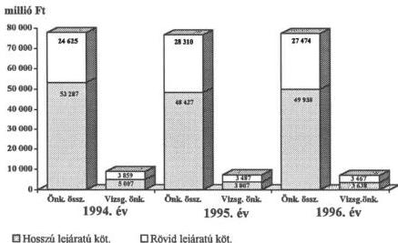
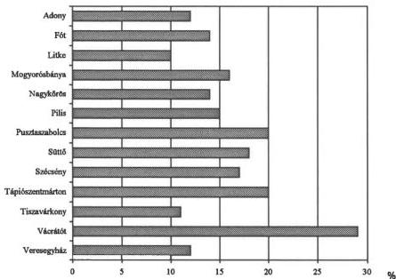
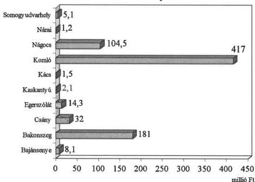

Állami Számvevőszék

# JELENTÉS

a jelentős hitelállománnyal, vagy
forráshiánnyal rendelkező egyes helyi
önkormányzatok gazdálkodásának
ellenőrzéséről

9819

425.

1998. június

---

Az ellenőrzés végrehajtásáért felelős:

Dömötör Gyula
számvevő igazgató

Az ellenőrzést vezette:

Nagy József
igazgató-helyettes

Koltayné Szepesi Zsuzsanna
számvevő tanácsos

Huberné Kuncsik Zsuzsa
számvevő tanácsos

Zeke József
számvevő tanácsos

közreműködésével.

A helyszíni vizsgálatot végezték:

Benczik Lászlóné

dr. Csapó Anna

Csuti Lajos

dr. Gyuk József

Huberné Kuncsik
Zsuzsanna

Kalmár Ferencné

Kerezsi Pál

Koltayné Szepesi
Zsuzsanna

Komlósiné Bogár
Éva

Kóródi József

Nagy János

Nagy Józsefné

Remeczki László

Szikszainé Király
Mária

Tormáné Ivánfi
Irén

dr. Tóth András

Zeke József

---

TSZ: S+H

V-1010-189./1997-98.

# TARTALOMJEGYZÉK

|  **I. BEVEZETÉS** | **3**  |
| --- | --- |
|  **II. ÖSSZEGZŐ MEGÁLLAPÍTÁSOK, KÖVETKEZTETÉSEK, JAVASLATOK** | **6**  |
|  **III. RÉSZLETES MEGÁLLAPÍTÁSOK** | **9**  |
|  1. A nehéz pénzügyi helyzet kialakulásának okai | 9  |
|  1.1. A működési forráshiány keletkezése | 9  |
|  1.2. Hitelből megvalósított fejlesztések | 11  |
|  1.3. Önkormányzati belső ellenőrzések szerepe a kedvezőtlen pénzügyi folyamatok megállításában | 14  |
|  2. Az adósságszolgálat mértéke, következményei, a kötelezettségek nyilvántartása | 15  |
|  2.1. Az adósságszolgálat mértéke | 15  |
|  2.2. Fizetési kötelezettségek teljesítése | 16  |
|  2.3. Az eladósodottságból származó veszteségek | 17  |
|  2.4. A kötelezettségek nyilvántartása | 19  |
|  3. Az adósságrendezési eljárás, az önkormányzati biztos működésének tapasztalatai | 20  |
|  3.1. Az adósságrendezési eljárás | 20  |
|  3.2. Az önkormányzati biztos működésének tapasztalatai | 22  |
|  4. Intézkedések a pénzügyi egyensúly javítására | 24  |

1

---

      .
    .

---

# Jelentés

# a jelentős hitelállománnyal, vagy forráshiánnyal rendelkező egyes helyi önkormányzatok gazdálkodásának ellenőrzéséről

# I. BEVEZETÉS

# Előzmények:

A helyi önkormányzatok pénzügyi egyensúlyi helyzetét 1995. évben vizsgálta az Állami Számvevőszék. Az ellenőrzés során érzékelhető volt, hogy az önkormányzatok számára biztosított nagyfokú döntési szabadság és a rendelkezésre álló pénzügyi források korlátozottsága magában hordozza a pénzügyi egyensúlyi helyzet felbomlásának a lehetőségét. A közfeladatok finanszírozását segítő rendszer folyamatos kiigazításával, a hátrányosabb helyzetű önkormányzatok részére juttatott pótlólagos forrásokkal azonban sikerült az egyensúlyi helyzetet fenntartani.

Az állami támogatás rendszerén belül az önkormányzatok pénzügyi egyensúlyi helyzetére, kötelezettség-vállalásaira a pénzügyi szabályozás beruházásokat ösztönző elemei voltak közvetlen hatással. Az önkormányzatok beruházási tevékenységét a kormányzat jelentős állami pénzeszközökkel (cél-, címzett támogatás, elkülönített állami alapok, fejezeti támogatás) segítette.

A saját gazdasági helyzetüket rosszul megítélő önkormányzatok – az erőltetett ütemű fejlesztések miatt – kritikus helyzetbe kerültek.

E vizsgálat alapján a következő intézkedések megtételét kezdeményezte az ÁSZ a Pénzügyminisztériumnál és a Belügyminisztériumnál:

- A felelős és átgondolt helyi döntések elősegítése érdekében hosszabb időszakra érvényes – az állami és önkormányzati feladatok ésszerű megosztásán alapuló – pénzügyi szabályozó rendszert alakítsanak ki. A támogatási rendszer tartalmazzon ösztönző elemeket a kisebb önkormányzatok számára az ésszerű, költségkímélő szervezeti megoldások (körjegyzőség, intézményirányító társulás stb.) alkalmazására.

- A beruházások támogatásának feltételei szigorodjanak. A támogatási igényt az ellátottsági szint figyelembevételével bírálják el és elsősorban a kötelező önkormányzati feladatok ellátásához kapcsolódó beruházásokhoz nyújtson segítséget. A beruházások megvalósításához szükséges saját forrás megléte legyen a támogatás kizárólagos feltétele.

- A kötelező önkormányzati feladatok köre – a különböző nagyságú települések sajátosságai és lehetőségei figyelembevételével – differenciáltan kerüljön

3

---

I. BEVEZETÉS

meghatározásra. A kis lélekszámú, alacsony költségvetési forrásból gazdálkodó önkormányzatok ellátási kötelezettségét – gazdaságossági, célszerűségi szempontok miatt – indokolt szűkíteni.

- Az önkormányzati feladatok finanszírozásában a külső források növekedési üteme gyorsult. A saját bevételek nem nyújtanak fedezetet az adósságszolgálati kötelezettségek rendezésére. A források hitellel való bővítésének jogi szabályozását indokolt finomítani. A hitelhez jutás feltételei között az adott évi kötelezettségek mellett a későbbi évek adósságszolgálati terheit is célszerű figyelembe venni.

Az ÁSZ 1995. évi vizsgálata alapján a Kormány a következő intézkedéseket tette: Növekedett a körjegyzőségekhez tartozó önkormányzatok támogatásának az összege és a társulásokban résztvevő önkormányzatok támogatása. Az Országgyűlés törvényt alkotott az önkormányzati társulások működésének szabályairól.

Az eltelt időszakban szigorodtak az önkormányzatok adósságot keletkeztető kötelezettség-vállalásainak a feltételei és az adósság menedzselés törvényi szabályai. Ezt megelőzően azonban már 4 önkormányzat csődbe került, ahol egyedi Kormányhatározatban történt az érintett önkormányzatok megsegítése.

**A fenti előzmények alapján a vizsgálat arra keresett választ, hogy:**

- milyen helyi döntések, vagy egyéb okok miatt következett be az önkormányzatok eladósodása, nehéz pénzügyi helyzete. A kötelezettség-vállalások állománya hogyan befolyásolta a vizsgált időszak és a következő évek pénzügyi helyzetét;
- figyelembe vették-e az önkormányzati testületek, polgármesterek az adósságot keletkeztető kötelezettség-vállalásokról hozott döntéseiknél a vonatkozó korlátozó és egyéb rendelkezéseket. A vizsgált önkormányzatok belső ellenőrzési rendszerének működése milyen szerepet játszott a pénzügyi egyensúly megbomlásának megakadályozásában, illetve az egyensúly helyreállításában;
- miképpen ítélhető meg a vizsgált önkormányzatok adósságterhének, működési forráshiányának mértéke, az önkormányzatok likviditási helyzete. Az adósságteher, a nehéz pénzügyi helyzet milyen hatással volt a kötelező feladatok ellátására;
- milyen intézkedéseket tettek a gazdálkodás egyensúlyi helyzetének javítására, helyreállítására, indult-e adósságrendezési eljárás az önkormányzatoknál, illetve az önkormányzatok betartották-e az ide vonatkozó jogszabályi előírásokat.

**A nehéz pénzügyi helyzet megítélésére nincs objektív kritérium, statisztikai megfigyelés sem terjed ki az ilyen állapotú önkormányzatok regisztrálására.** Vizsgálat szempontjából nehéz pénzügyi helyzetűnek azokat az önkormányzatokat tekintettük, amelyeknél állandósultak a likviditási nehézségek. A vizsgálat 14 megyében és a fővárosban: 3 megyei, 4 fővárosi kerületi, 12 városi, 11 nagyközségi és 43 községi, összesen 73 önkormányzatra ter-

4

---

I. BEVEZETÉS

jedt ki. Tájékozódást végeztünk kórházaknál, egyes önkormányzatoknál (1. sz. melléklet). Célirányosan azokat az önkormányzatokat ellenőriztük, amelyek jelentős, a költségvetésük 10%-át elérő, vagy meghaladó nagyságrendű hitellel rendelkeztek, illetve – az OTP-től és a TÁKISZ-októl, FÁKISZ-tól szerzett információ alapján – forráshiány miatt nehéz anyagi helyzetbe kerültek. A vizsgálatba bevont kör nem fedi le a nehéz anyagi helyzetben lévő önkormányzatokat.

Évente mintegy 740-820 önkormányzat részesedik működési forráshiány miatt kiegészítő (ÖNHIKI) támogatásba. Kedvező, hogy ezen önkormányzatoknak csak egy része került kritikus helyzetbe.

A vizsgálatba bevont 73 önkormányzat közül 54 önkormányzat hosszú lejáratú kötelezettség állománnyal rendelkezett 1997. június 30-án, a többi önkormányzat pedig forráshiány és egyéb ok miatt került nehéz anyagi helyzetbe. **A nehéz anyagi helyzet kialakulásában az önkormányzatoknál – saját hibájukból jellemzően – döntő szerepe volt a magas hitelállomány miatti adósságszolgálati tehernek, az erőltetett beruházásoknak és az intézményi kapacitások mérsékelt kihasználásának.**

A vizsgálatot a bekért dokumentumok és tanúsítványok, a vezetők és a pénzügyi-számviteli feladatokat ellátó munkatársak nyilatkozatai alapján végeztük.

A vizsgálat kiterjedt az 1995-1997. évek dokumentumaira, az egyes pénzügyi folyamatok tekintetében a korábbi időszak tendenciájára is figyelemmel voltunk.

5

---

II. ÖSSZEGZŐ MEGÁLLAPÍTÁSOK, KÖVETKEZTETÉSEK, JAVASLATOK

## II. ÖSSZEGZŐ MEGÁLLAPÍTÁSOK, KÖVETKEZTETÉSEK, JAVASLATOK

A vizsgált időszakban az önkormányzatok egyre nehezebb anyagi körülmények között gazdálkodtak. Ennek ellenére döntő többségük – a bevételeinek csökkenő reálértéke mellett – kiegyensúlyozott gazdálkodást folytatott. A gazdasági lehetőségeiket rosszul megítélő önkormányzatoknál azonban a pénzügyi egyensúly megbomlott. A nehéz pénzügyi helyzet kialakulásának jellemző okai:

- A költségigényes beruházások pénzügyi fedezetére nem rendelkeztek elegendő forrással, így azok pótlására hosszú futamidejű, nagy összegű hiteleket, kölcsönöket vettek fel. A bevont külső források jelentős mértékben ugyan javították a települések infrastrukturális ellátottságát, esetenként azonban a vállalt kötelezettségek kihatása (törlesztő részlet) olyan magas terhet rótt az önkormányzatokra, amelynek visszafizetése forrásokat vont el a szakfeladatok ellátásától.
- A pénzügyi egyensúlyi követelményekhez az önkormányzatok nem tudtak alkalmazkodni. Ragaszkodtak a magas fajlagos költséggel működő intézményeik, illetve intézményhálózatuk fenntartásához, továbbra sem terjedtek el a költségkímélő szervezeti formák. A vizsgált önkormányzatok mintegy 80%-a az éves költségvetési rendeleteikben forráshiányt tervezett. A kevés lélekszámú – 500-1000 fős – települések bevételi lehetőségei korlátozottak, társulási készségük mérsékelt. A kevésbé kihasznált intézményhálózatuk működésének a költségvetési kiadási szükségletét a normatív alapon juttatott támogatások összege egyre kevésbé fedezi.

Az éves költségvetési rendeletben kimutatott forráshiány néhány vizsgált önkormányzatnál az eredeti költségvetési előirányzat 30-40%-át is elérte, de a többségüknél (85-90%-uknál) ennek aránya 10-12%-ra tehető. A forráshiány áthidalására az önhibáján kívül hátrányos helyzetbe került önkormányzatok – a törvényben meghatározott feltételek esetén – kiegészítő támogatásban (ÖNHIKI) részesültek. A kiegészítő támogatások az önkormányzatok számára esetenként jelentős, de többnyire csak átmeneti segítséget jelentettek, mert a forráshiány rendre újra termelődik.

1995 végén a törvényi szabályozás hiányában egyedi döntéssel a Kormány négy – saját hibájából tartósan fizetésképtelennek minősített – önkormányzatnak a költségvetés általános tartaléka terhére átmeneti támogatást biztosított, Bakonszeg, Bátorliget és Páty községeknek, valamint Szerencs városnak.

Az eladósodott önkormányzatok nem képesek önerőből úrrá lenni a helyzeten. A településeken lakó állampolgárok jogos igénye ugyanakkor, hogy az önkormányzat minden körülmények között ellássa legalább az alapvető, jogszabályban előírt feladatait és gyakorolja a hatáskörét.

A kedvezőtlen folyamatok megállítása sürgetően felvetette a kormányzati intézkedések szükségességét. Az önkormányzatok hitelfelvételének mértékét ugyanis 1995-ig központi szabályozás nem korlátozta. A központi intézkedések

6

---

II. ÖSSZEGZŐ MEGÁLLAPÍTÁSOK, KÖVETKEZTETÉSEK, JAVASLATOK

első lépéseként az állami támogatások a hitelfedezetként nem szolgálhattak, a pénzintézetek a követeléseik kiegyenlítésére azokat nem vehették igénybe.

**Az 1996. január 1-től hatályos rendelkezés a helyi önkormányzatok adósságát keletkeztető éves kötelezettség-vállalásainak** (hitelfelvételének és járulékainak, valamint kötvény kibocsátásának, garancia és kezesség-vállalásának, lízingjének) **felső határát a korrigált saját folyó bevétel mértékéhez kötötte**. 1997. január 1-től pedig a hitelfedezeti tilalmat kibővítették az SZJA-ából származó, továbbá a működésre államháztartáson belül átvett bevételekre is.

**A kormányzati intézkedések az önkormányzatokat megfontoltabb kötelezettség-vállalásokra késztették.** A hosszú lejáratú kötelezettségek állománya az önkormányzatok teljes körében és a vizsgálatba bevontaknál csökkent, többségük nem vállalhatott újabb tartós kötelezettséget. A helyzetképet e vonatkozásban rontja, hogy a megvizsgált önkormányzatok 10%-a a korlátozó intézkedéseket figyelmen kívül hagyta.

Az Országgyűlés 1996. I. negyedévében megalkotta a helyi önkormányzatok adósságrendezéséről (csőd) szóló törvényt. E törvény hatálybalépését követően hét önkormányzatnál indult meg az eljárás. (Bakonszeg, Bátorliget, Páty, Egerszólát, Csány, Nágocs, Kács). A vizsgálat befejezéséig öt önkormányzatnál a csőd egyezséggel befejeződött, kettőnél még nem zárult le.

A vizsgálat tapasztalata szerint az adósságrendezésről szóló törvény elérte célját. A törvényalkotói szándék megvalósult, az eljárásban részt vett önkormányzatok gazdasági helyzete konszolidálódott.

Az eladósodott önkormányzatoknál az adósságteher nemcsak a folyó költségvetéstől von el forrásokat, hanem az önkormányzati vagyont is apasztja. A vizsgált körben a negatív tőkeváltozás 767 M Ft összegű volt, ami vagyoncsökkenést jelentett az érintett önkormányzatoknál. A vizsgált önkormányzatok 84%-a kisebb-nagyobb összegben késedelmesen teljesítette fizetéseit. A késedelmes fizetések összege az 1995. évi 2,3 Mrd Ft-ról 1996-ra 3,9 Mrd Ft-ra nőtt. 1997. I. félévében 2,2 Mrd Ft volt, és tovább is emelkedő irányzatú.

A vizsgálat során öt önkormányzati kórháznál tájékozódást végeztünk az adósságállomány menedzseléséről. (Lásd 2. sz. Függelék.)

Az önkormányzati kórházak adósságállományának kialakulását külső tényezők mellett belső okok is előidézték:

- a működési feltételek rosszabbodása, például a gazdaságtalan hő- és energiaszolgáltató rendszerek – beruházási források hiánya miatti – kényszerű használata,
- a kihasználatlan kapacitások, ezzel összefüggő strukturális problémák,
- a fejlesztéseknek a működésekhez biztosított forrásokból történő finanszírozása,
- a szükséges ellenőrzések elmaradása.

Az adósságrendezési eljárás 1998-ig nem terjedt ki az önkormányzati tulajdonban lévő kórházakra és az ott felgyülemlett adósságteher jogi rendezésére is csak 1998. december 1-től nyílik lehetőség. A kórházaknál adósságrendezésre

7

---

II. ÖSSZEGZŐ MEGÁLLAPÍTÁSOK, KÖVETKEZTETÉSEK, JAVASLATOK

irányuló kormányzati intézkedések tartós megoldást nem ígérnek, mert a gazdasági konszolidáció anyagi alapjai hiányoznak.

A vizsgált önkormányzatok nem fordítottak kellő figyelmet a belső ellenőrzési rendszerük kiépítésére. A vezetői és munkafolyamatba épített belső ellenőrzés a vizsgált önkormányzatok mintegy felénél felhívta ugyan a figyelmet az egyre súlyosbodó gondokra, likviditási problémákra. A külső szakértők által lefolytatott vizsgálatok, néhány kivételtől eltekintve, az eladósodottság, a likviditási gondok ok-okozati összefüggéseit nem érintették, általában a szabályozottságra, a számviteli előírások betartására vonatkoztak.

Az adósságteher csökkentése, a pénzügyi egyensúly javításának igénye számos intézkedés meghozatalára kényszerítette az önkormányzatok döntő többségét. A vizsgálat időpontjáig tett intézkedések, a központi források csökkenő reálértéke a saját bevételek növelésére, az adóbevételek növelésére ösztönözték az önkormányzatokat. A nagyobb bevétel eléréséhez azonban az anyagi feltételek nem mindenütt voltak adottak.

A helyi adók elsősorban a városokban jelentettek számottevő, pótlólagos forrásokat. A gazdasági környezet követelményeihez igazodva általában az önkormányzatok igyekeztek költségeiket csökkenteni. Ennek érdekében törekedtek feladataik felülvizsgálatára, szűkítésére, bár ez utóbbi általában a lakossági érdekekkel való ütközéssel járt együtt. Az intézkedések sorozata a létszám-gazdálkodás racionalizálásától a dologi kiadások lehetséges mértékű csökkentésén túl egészen az intézmények megszüntetéséig terjedt. Az eddigi intézkedések eredményt elsősorban az összetettebb feladatokat ellátó városi önkormányzatoknál hoztak.

Az önkormányzatok felismerték, hogy az utólagos finanszírozás és ennek előnye helyi szinten is érvényesíthető. A vizsgálat során 3 megyei önkormányzatnál tanulmányoztuk az un. „kiskincstári” finanszírozási rendszer tapasztalatait. A „kiskincstári” finanszírozás azáltal fejtette ki kedvező hatását, hogy e körbe tartozó intézmények likviditási gondjait megszüntette és önkormányzati szinten csökken a külső forrás (hitel) bevonása.

A helyszíni vizsgálatok megállapításaira és javaslataira az önkormányzatok intézkedési tervet dolgoztak ki.

Összegezésként megállapítható, hogy a tömeges eladósodási folyamat megállítása érdekében az elmúlt években bevezetett központi intézkedések elérték céljukat. További hitelfelvételi korlátozó, megszorító intézkedésekre nincs szükség. Ez nem azt jelenti, hogy ma nincsenek nehéz pénzügyi helyzetben lévő, eladósodott önkormányzatok. Ezt kizárni a jövőben sem lehet. E vizsgálati és az egyéb önkormányzati ellenőrzési tapasztalatok azonban ráirányítják a figyelmet arra, hogy az önkormányzatok eladósodását – a saját hibájukon kívül – generálja a társadalmi, gazdasági környezet is. Az önkormányzati tulajdon kiteljesedésével, az őket érintő privatizációval az önkormányzatok – anyagi helyzet szempontjából – differenciálódtak. A hátrányos gazdasági térségben működő önkormányzatok „még szegényebbek lettek”, a fejlett iparral rendelkező városban, térségben működők viszont pótlólagos forrásokat tudtak realizálni. Ez utóbbi körben lévők az átmenetileg felszabadítható forrásaik vállalkozásba fektetésével további anyagi eszközöket tudtak, tudnak realizálni. **A normatív alapon működő forrásszabályozás azonban nem képes az ellátottságbeli differenciákat mérsékelni, kiegyenlíteni.** Szükség lenne

8

---

III. RÉSZLETES MEGÁLLAPÍTÁSOK

pótlólagos, kiegyenlítő pénzügyi mechanizmusra, amely az elmaradott térségben lévő önkormányzatoknak normatív alapon forrásokat juttatna mind a működéshez, mind pedig a fejlesztésekhez.

A vizsgálat alapján javasoljuk a Kormánynak, hogy:

- kezdeményezze az adósságrendezési eljárásról szóló törvény 2. § f) pontjában foglaltak módosítását annak érdekében, hogy – a helyi önkormányzatok rendeleteikben egyértelműen szabályozhassák – melyek azok a vagyonrészek, amelyek az adósságrendezésbe nem vonhatók be;
- gondoskodjon további ösztönzésről a települések együttműködésének fokozása érdekében, különösen az oktatás, a szociális intézmények működtetése, valamint az igazgatási feladatok ellátása területén;
- tekintse át a kórházi adósságállomány eredményes menedzselése céljából az e területen jelenleg érvényes szabályokat és a kedvezőbb, hosszabb távú finanszírozási feltételek megteremtésével, az adósságállomány megszüntetése érdekében dolgozzon ki intézkedéseket;
- dolgozzon ki az önkormányzatok forrás-szabályozásának továbbfejlesztése érdekében kiegyenlítő pénzügyi mechanizmust, amely a nehéz gazdasági körülmények között működők részére normatív alapon juttatott pótlólagos anyagi eszközökkel nivellálni tudná az önkormányzatok között kialakult különbségeket.

### III. RÉSZLETES MEGÁLLAPÍTÁSOK

#### 1. A NEHÉZ PÉNZÜGYI HELYZET KIALAKULÁSÁNAK OKAI

##### 1.1. A működési forráshiány keletkezése

A helyi önkormányzatok pénzügyi egyensúlyi helyzetét – a saját hibájukon kívül – determinálja a társadalmi, gazdasági környezet is. A gazdaságilag elmaradott térségben lévő önkormányzatok anyagi helyzete rosszabbodott. Az önkormányzati tulajdon kiteljesedésével, az őket érintő privatizációval az önkormányzatok jövedelmi helyzete differenciálódott. A „gazdagabb” önkormányzatok az átmenetileg felszabadítható forásaik vállalkozásba fektetésével további anyagi eszközöket tudtak, tudnak realizálni. Az önkormányzatok többsége azonban ilyen lehetőséggel nem rendelkezett.

A vizsgált önkormányzatok egy részénél a rendelkezésre álló források a működési kiadásokat nem fedezték, így az éves költségvetési rendeleteikben forráshiányt terveztek.

A működési forráshiányok kialakulásának okai összetettek. A kedvezőtlen adottságú – túlnyomó részben kevés lélekszámú – települések saját bevételi le-

9

---

III. RÉSZLETES MEGÁLLAPÍTÁSOK---

hetőségei korlátozottak. Társulási készségük mérsékelt, többségük ragaszkodik az önálló hivatal, a magas fajlagos költséggel működtethető intézmények fenntartásához.

Például: Kőrösszakál község 8 osztályos iskolájában az átlagos osztálylétszám 11 fő, a kiadások 54%-át fedezte a normatív állami hozzájárulás, az óvodánál ez az arány 59%-os volt.

Vásárosbéc községben a 19 fő általános iskolás korú gyermek oktatását helyben oldják meg, 1996-ban egy gyermek oktatási költsége 225 ezer Ft volt, ez többszöröse a normatív támogatás összegének.

A tapasztalatok szerint az intézményfenntartás kiadásai dinamikusan emelkedtek, az egységnyi normatívák növekedési üteme viszont attól lényegesen elmaradt, így egyre több egyéb forrást kellett bevonni az adott szakfeladat finanszírozásába.

Ezen megállapítás vonatkozik a térségi feladatokat ellátó megyei önkormányzatokra is, a forráshiány itt is jelentkezik.

Például: Pest megye önkormányzata mintegy 45 intézményére 1997. évben 1 milliárd Ft-tal többet tervezett költeni, mint a neki járó normatív támogatás összege. 1992-1996. évek között 13 intézmény működtetését vette át, többségüknél az éves kiadás alig felét fedezte az állami támogatás.

A működési forráshiányok kialakulásában szerepet játszott a korábbi kedvezőbb gazdálkodási helyzetben képződött tartalékok kimerülése, az adósságszolgálat törlesztési kötelezettsége, továbbá helyenként a szétaprózott, túlzott gazdálkodási önállóság mellett működtetett, célszerűtlenül szervezett intézményhálózat is (pl. Érd város).

Az éves költségvetési rendeletekben kimutatott forráshiány pótlására – az adott évi pályázati feltételek teljesülésekor – elsősorban az önhibáján kívül (ÖNHIKI) hátrányos pénzügyi helyzetben lévő önkormányzatok kiegészítő támogatása szolgált.

A vizsgált körben 1995-ben 38; 1996-ban 36 és 1997-ben pedig 45 önkormányzat pályázott forrás-kiegészítő támogatásra, azonban 1995-ben 7, 1996-ban 8 és 1997-ben pedig 4 önkormányzat igényét elutasították.

Például: Gönc, Mezősas, Kőrösszegapáti községek mindhárom vizsgált évben az összes éves (tervezett) bevételük 15-30 %-át az ÖNHIKI-s támogatásból kapták meg. Ilyen volumenű, arányú egyéb bevételt vagy kiadási megtakarítást ezek a települések adottságaikból következően nem tudtak volna elérni.

A kiegészítő támogatások az önkormányzatok számára esetenként jelentős, de többnyire csak átmeneti segítséget jelentettek. A pályázók, a támogatottak köre alig változik, a forráshiány kisebb-nagyobb mértékben rendszeresen újratermelődik. Olyan önkormányzatok is sikerrel pályázhattak forrás-kiegészítő támogatásra, amelyek hitelállománnyal rendelkeztek. A hitelállomány nem kizáró ok a pályázati feltételek között.

---10

---

III. RÉSZLETES MEGÁLLAPÍTÁSOK

## 1.2. Hitelből megvalósított fejlesztések

A fejlesztési célkitűzések megvalósítását több éves futamidejű hitelek segítették. Az adósság keletkeztetésénél a testületek nem mérlegelték körültekintően a hitelek visszafizetésének lehetőségeit, arra vonatkozóan megalapozott prognózisok nem készültek. A kötelezettségekhez viszonylag magas kamatkifizetés járult, rendszerint a törlesztési időszak alatt ezek mértéke a tőketartozást is meghaladta.

Az önkormányzatok a megalakulásukat követő években a bankok körében jól fizető adósoknak számítottak, a hitelkihelyezések többnyire alacsony kockázatúnak minősültek, a kölcsön iránti igényüket kedvezően bírálták el.

A beruházás megvalósításához szükséges önerő hiányában ritkán mondtak le a már megítélt támogatásról, ilyenkor egyre gyakrabban vonták be a kivitelezőket is, akik meghatározott feltételek mellett kölcsönt is nyújtottak az önkormányzatok részére.

A gazdálkodási nehézségek felmerülésében az is szerepet játszott, hogy egyes települések nem a valóságos igényüknek megfelelő méretű beruházásokról döntöttek, pl. a túlméretezett tornacsarnok, nem kellően kihasznált szennyvíztisztító telep, stb kivitelezését határozták el.

A fejlesztési kiadások, az adósságszolgálati kötelezettségek teljesítése az egyes önkormányzatok költségvetésében jelentős súllyal szerepelt, ennek következtében a működtetésre fordítható forrás csökkent, s ez esetenként a pénzügyi egyensúly megbomlását eredményezte.

A vizsgált körből 8 önkormányzat hosszú lejáratú kötelezettség állománya az 1996. év végi mérlegben a forrásokon belül 20% fölötti, ami jelentős idegen forrás jelenlétére utal.

Például: Kiskunlacháza nagyközség 1996. évi forrásainak 47 %-át tette ki a hosszú lejáratú kötelezettség, Táplószentmárton nagyközségben 28,3, Nagykőrös városnál 29,7.

A helyi önkormányzatok bruttó adósságállománya 1994-96. között a 13,2 Mrd Ft-ról 1996-ra 65,6 Mrd Ft-ra emelkedett. E kedvezőtlen tendenciát felismerve a Kormány intézkedést kezdeményezett.

Az önkormányzatok kötelezettség-vállalásának korlátozását, szigorítását célzó jogszabályi előírások több lépcsőben születtek. Kezdetben a helyi önkormányzatokról szóló 1990. évi LXV. tv. 88. §-a a hitelfedezeti kört szűkítette, arra nem szolgálhat törzsvagyon, állami hozzájárulás. Később a 23/1995. (III.8.) sz. Korm. rend. a hitellel rendelkező, illetőleg tartós kötelezettséget vállaló önkormányzatok számára az állami hozzájárulásokkal kapcsolatos alszámla megnyitási kötelezettséget is előírta, mely szerint az állami támogatást a hitel fedezetéből kivonta, elkülönített számlán kezelte.

**Az 1996. január 1-től hatályos rendelkezés a helyi önkormányzat adósságot keletkeztető éves kötelezettség-vállalásának** (hitelfelvételének és járulékainak, valamint kötvény kibocsátásának, garancia és kezesség vállalásának, lízingjének) **felső határát a korrigált saját folyó bevétel mértékéhez kötötte. A korrigált saját folyó bevétel: a rövid lejáratú kötelezettségek** (tőke és kamattörlesztés, lízing díj) **adott évre eső részével**

11

---

III. RÉSZLETES MEGÁLLAPÍTÁSOK

**csökkentett saját folyó bevétel éves előirányzatának 70%-a.** A központi intézkedések hatását gyengítette, hogy a vizsgált önkormányzatok több mint 10%-a megsértette az Ötv. 88. § (2),(3) bekezdésében foglaltakat, a számított felső korlátnál magasabb összegben vállalt kötelezettséget és erre esetenként akkor is sor került, ha az előzetes számításokat elvégezték.

Például: Szécsény, Egyházasdengeleg, Szendehely, Böhönye, Baja, Kiskunlacháza, Kisbér, Komló a számított felső határnál magasabb összegű kötelezettséget vállalt.

1997. január 1-től a hitelfedezeti tilalmat kibővítették az SZJA-ából származó, továbbá a működésre államháztartáson belül átvett bevételekre is.

### **A központi intézkedések hatására az önkormányzatok eladósodásának tendenciája megállt.**

A mérleg adatok szerinti hosszú- és rövid lejáratú kötelezettségek alakulását a következő grafikon szemlélteti:

### **Kötelezettségek alakulása**

Az önkormányzatoknál a hosszú- és rövid lejáratú kötelezettségek együttes állománya a mérleg főösszegének 1994-ben 6,8; 1995-ben 6,1 és 1996-ban 5,1%-át tette ki.

A vizsgált önkormányzati körben a kötelezettségek aránya az előzőeknél ugyan magasabb, de csökkenő irányzatú. Arányukat tekintve: 1994-ben 10,2; 1995-ben 7,7 és 1996-ban 7,1%-os volt.

A hosszabb időszakra szóló kötelezettséggel terhelt önkormányzatok száma az 1994. évi 68-ról 1996-ra 51-re mérséklődött. A rövid lejáratú hitelek igénybevételével – arra a korlátozó előírások nem vonatkoztak – a vizsgált körbe tartozó önkormányzatok mintegy 60%-a élt, ezen belül a munkabérhitel is rendszeressé vált. A likviditást biztosító hitelek nem naptári évhez kapcsolódnak, így

12

---

III. RÉSZLETES MEGÁLLAPÍTÁSOK

igénybevételük nem függ az adott költségvetési év pénzügyi kondícióitól, ugyanakkor a kamatok jelentős többletterhet jelentenek.

Például: 1996. évben Szécsény városa a rövid lejáratú hitel kamataira közel 40 M Ft-ot, a Főváros III. kerületi önkormányzata 31 millió Ft-ot fordított.

A hitelállomány összesített adatai a teljes önkormányzati körre, és **a vizsgálatba bevont önkormányzatokra vetítve nem olyan nagyságrendű, amely további központi intézkedés bevezetését igényelné.** Ennek ellenére 51 önkormányzatnál az adósság mértéke jelentősen terheli a folyó évi költségvetést. Ez kedvezőtlenül hat a feladatellátás színvonalára.

Néhány önkormányzat a vizsgált időszak elején már tapasztalható eladósodottság ellenére újabb kötelezettségeket vállalt, hosszú lejáratú hitelt vett fel a folyamatban lévő vagy kezdődő beruházásához.

Például: Jelentős állományú befejezetlen beruházása mellett Tápiószentmárton a szennyvízcsatorna hálózat II. ütemének építését tervezi 1997-98-ban.

Komló városban megkezdődtek a 883 M Ft-os összköltséggel tervezett gázellátási beruházások. A beruházási forrásokból 256 M Ft még a vizsgálat időpontjában bizonytalan volt. A város a saját erő biztosításához többféle hitel felvételét tervezi.

Szécsény városban a Számvevőszék 1993. évben már feltárta a pénzügyi helyzet romlását. Ezt követően hitelfelvétellel, kisebb-nagyobb arányú önkormányzati forrás bevonással gáz-, szennyvíz beruházásokat valósítottak meg, indítottak el. Önként vállalt feladatként gimnáziumi oktatást indítottak, ipari terület kialakítását kezdték meg stb.

Az 1997. június 30-án fennálló tartós adósságszolgálati terhek túlnyomó része még nem esett korlátozó feltételek alá azok vállalásakor. Ez időpontban a vizsgált önkormányzatok 74%-a rendelkezett hosszú távra szóló kötelezettséggel, azoknak mindössze 30%-a keletkezett 1996. január 1-jét követően (mintegy 2 Mrd Ft.)

A vizsgált önkormányzatok fejlesztési célkitűzéseik megvalósításához kapcsolatosan 6,2 Mrd Ft-os kötelezettség-vállalásról döntöttek, ennek 8%-a nem közvetlen hitelfelvételként jelentkezett (kezesség-vállalás).

A külső források 22%-a szennyvíztisztítók, csatornahálózat megépítése következtében keletkezett (26 db önkormányzat), 18%-a kórház rekonstrukciók megvalósítását segítette (5 db önkormányzat), gázberuházások következtében 12 önkormányzat vállalt fel adósságterhet, útépítésekhez 4 önkormányzat vett fel kölcsönt, ugyanez jellemző a telefonhálózat létesítésére is.

Hét önkormányzat a hitel segítségével óvodát, faluházat, általános iskolát, tornatermet épített, az általánostól eltérő egyedi célokat nyolc önkormányzat valósított meg.

A hitelből, kötvénykibocsátásból megépülő létesítmények, egyéb eszközbeszerzések nagymértékben növelték a települések kommunális ellátottságát, javították a lakosság komfortérzetét, a mai kor követelményének megfelelő színvonalas egészségügyi ellátás biztosítását szolgálták. Ugyanakkor a terhek vállalása több évre meghatározza a fejlesztéseket megvalósító önkormányzatok további gazdasági mozgásterét.

13

---

III. RÉSZLETES MEGÁLLAPÍTÁSOK---

### 1.3. Önkormányzati belső ellenőrzések szerepe a kedvezőtlen pénzügyi folyamatok megállításában

A vizsgált önkormányzatok nem fordítottak kellő figyelmet az ellenőrzési rendszer kiépítésére és hatékony működtetésére, így annak sem a forráshiány, sem az eladósodottság okainak feltárásában, kezelésében nem jutott hangsúlyos szerep.

A vezetői és a munkafolyamatba épített ellenőrzés a vizsgált önkormányzatok mintegy felénél felhívta ugyan a figyelmet az egyre súlyosbodó pénzügyi gondokra, likviditási problémákra. A jelzéseket azonban többnyire nem követték érdemi, hatékony intézkedések. A döntést hozó testületek a gazdálkodási nehézségek ismeretében sem rendeltek el célirányos ellenőrzést a kedvezőtlen pénzügyi helyzet okainak mélyreható elemzésére. Esetenként tudatosan vállaltak további pénzügyileg megalapozatlan kötelezettségeket.

Például: Szécsényben a pénzügyi vezető többször is felhívta a testület figyelmét az eladósodottságot növelő döntés veszélyeire, a hitelfelvétel biztosítékainak törvénysértő megjelölésére, de indokait nem fogadták el.

Az önkormányzatok mindössze egyharmada tett eleget az Ötv. 92. § (2) bekezdés előírásának. A külső szakértők által lefolytatott vizsgálatok – néhány kivételtől eltekintve – az eladósodottság, a likviditási gondok ok-okozati összefüggéseit nem érintették, általában a szabályozottságra, a számviteli előírások betartására súlypontoztak.

Színvonalas, jól hasznosítható jelentések készültek, Például: Domaháza, Nagykőrös, Kisbér, Veresegyház, Budapest III. kerületi és a Veszprém Megyei Önkormányzatoknál.

Az Ötv. 92/A.§-ának előírása szerint az önkormányzatok egy bizonyos köre köteles éves költségvetési beszámolóját könyvvizsgálóval felülvizsgálni. E rendelkezés a vizsgált körbe tartozók 53%-át érintette. (7 db folyamatos, 32 db eseti könyvvizsgálatra volt kötelezett, utóbbiak közül kettő – Heréd, Szendehely – törvénysértő módon nem auditáltatta éves beszámolóját.)

A könyvvizsgálók a jelentéseikben rendszerint különböző mutatókkal elemezték a vagyoni, pénzügyi helyzetet. Tényként megállapították a gazdálkodási folyamat tendenciáját, ellenben kétharmaduk nem törekedett a jelenség ok-okozati összefüggéseinek a feltárására, a szükségesnek ítélt javaslatok kimunkálására.

A könyvvizsgálók 35%-a a valós helyzet részletes elemzésével, a kedvezőtlen pénzügyi helyzet kezelésére alkalmas módszerek bemutatásával segítette a gazdálkodás biztonságáért felelős testületek munkáját.

Például: Adonyban a képviselő-testület többször foglalkozott a település „csődhelyzetével”, a könyvvizsgálóval és a Pénzügyi Ellenőrzési Bizottsággal együttműködve a gazdálkodás stabilizálására konkrét intézkedéseket is tettek.

---14

---

III. RÉSZLETES MEGÁLLAPÍTÁSOK

Süttő önkormányzatánál a könyvvizsgáló a felelőtlen kötelezettség-vállalások miatt felvetette a testület felelősségét is, közvetve ez is hozzájárult annak későbbiekben történő lemondásához.

A könyvvizsgálói jelentés a mérlegvalódiság szakszerű értékelésén túlmenően átfogóan tartalmazta a gazdálkodás helyzetét, a likviditási problémák okait. A könyvvizsgálók intézkedési javaslatokat is megfogalmaztak. Pl. Érd, Gyöngyös, Sümeg, Baja, Fót, Vácrátót, Kiskunlacháza városokban, illetve községekben.

## 2. AZ ADÓSSÁGSZOLGÁLAT MÉRTÉKE, KÖVETKEZMÉNYEI, A KÖTELEZETTSÉGEK NYILVÁNTARTÁSA

### 2.1. Az adósságszolgálat mértéke

A vizsgált 73 önkormányzat közül 54 önkormányzatot terhelt 1997. VI. 30-án hosszú lejáratú kötelezettség, ezek állománya 5,1 Mrd Ft, az adósságszolgálati teher pedig 8,9 Mrd Ft volt. A fennálló kötelezettségből az 1998. évben esedékes törlesztés összege a legmagasabb, 1,8 Mrd Ft. 1997. június 30.-ai állapot szerint az adósságteher (tőke + kamat) összege évenként a következők szerint alakult:

|  1997-ben: | 1.417 M Ft  |
| --- | --- |
|  1998-ban: | 1.750 M Ft  |
|  1999-ben: | 1.297 M Ft  |
|  2000-ben: | 1.017 M Ft  |
|  2000 után: | 3.489 M Ft.  |

Az önkormányzatok jelenlegi, nyilvántartott hosszú lejáratú adósságszolgálata közül a lakáshoz jutás támogatására felvett hitelek általában 2004-ig lejárnak, a fejlesztési célú hitelek többségét 2000-2002. előtt kell visszafizetni, a társulati hitelfelvételek kezesség-vállalásából származó teher a 10 éves törlesztési időre tekintettel néhány esetben 2007-ben szűnik meg.

Az adósságszolgálati terhekre az önkormányzatok általában fedezetet biztosítottak az 1997. évi költségvetéseikben. Előfordult, hogy a kötelezettség teljesítésére újabb hitel felvételét tervezték, esetleg a költségvetésben további adósságteher vállalást jeleztek (Vácrátót, Szécsény, Litke). Az adósságszolgálati terhek többségében az éves költségvetésben 10% alatti, de 13 önkormányzatnál a hitel-visszafizetés az 1997. évi eredeti költségvetési előirányzatának 10,5-28,7%-a között szóródott. Ennek arányát a következő grafikon szemlélteti:

15

---

III. RÉSZLETES MEGÁLLAPÍTÁSOK

# Az adósságszolgálat aránya az 1997. évi költségvetésben

Az önkormányzatok a költségvetésbe nem tervezték a kezesi helytállásból, a visszatérítendő központi támogatásokból származó kötelezettségeket. Például: Kajászó, Egerszólát, Mogyorósbánya, Böhönye.

## 2.2. Fizetési kötelezettségek teljesítése

A vizsgált körben általános jelenségeként értékelhető a fizetési kötelezettségek késedelmes teljesítése. Az önkormányzatok 90%-a nem tudta a teljesítés határidejére előteremteni a szükséges fedezetet. A késedelmes fizetések összege az 1995. évi 2 364 M Ft-ról 1996-ra 3 985 M Ft-ra nőtt. 1997. I. félévben 2 202 M Ft volt, továbbra is emelkedő irányzatú. Az önkormányzati válsághelyzet kialakulásával dinamikusan emelkedett a kifizetetlen, késedelmesen kiegyenlített számlák állománya is. Például: Egerszólát, Vácrátót, Komló, Nágocs, Zalahaláp, stb.

A likviditási gondokkal küzdő önkormányzatoknál és intézményeiknél hosszabb ideje alkalmazott gyakorlat, hogy azon szállítói követelések kiegyenlítését helyezik előtérbe, akiktől többszörös felszólítást kaptak, vagy akiknél tapasztalták, hogy a késedelmi kamat felszámítási jogukat érvényesítik. A beruházást kivitelezők jelentős hitelezői voltak az önkormányzatnak. Tapasztalható továbbá, hogy a részben vagy teljes egészében önkormányzati tulajdonban lévő gazdasági társaságok követelésének a kiegyenlítését halasztják.

Egyes önkormányzatok részben a hitelezők elszámolási számláról történő inkasszálási lehetőségének megakadályozása érdekében működési, szolgáltatási,

16

---

III. RÉSZLETES MEGÁLLAPÍTÁSOK

ingatlan-értékesítési stb. bevételeiket készpénzben szedik be és abból teljesítik a kiadásait. Például: Litke és Szendehely községekben.

A vizsgált önkormányzati kórházakra is jellemző volt a dologi kiadások késedelmes teljesítése.

Például: a Vas Megyei Markusovszky Kórház késedelmesen kifizetett számláinak összege 1995-ről 1996-ra közel megháromszorozódott, 422 M Ft-ról 1 251 M Ft-ra nőtt.

A Veszprém Megyei Csolnoky Ferenc Kórház 1997. VI. 30-i kifizetetlen számláinak állománya 169,5 M Ft. Az 1996. évi dologi kiadások 82 %-át késedelmesen teljesítette a kórház.

Nagyobb összegű, illetve arányú késedelmi kamat fizetési kötelezettség keletkezett annál a néhány önkormányzatnál, intézménynél is, ahol a nagyobb beruházáshoz saját erőt nem tudták időben biztosítani, vitatott számlák, követelések voltak.

Például: Veresegyházán 1996-ban fizetett, abszolút összegében jelentős 17,2 M Ft késedelmi kamat közel felét egy a szennyvízberuházást kivitelező gazdasági társaság részére teljesítették. Sorkikápolna községet a környező községeknek meg nem fizetett 1994-95. évi tartozás után mintegy 4,5 M Ft kamat megfizetésére kötelezte a bíróság. A kamat összege az 1996. éves költségvetésének több mint fele.

A jelen vizsgálat egyetlen önkormányzatnál sem találkozott olyan esettel, hogy a késedelmes fizetésekből származó késedelmi kamat keletkezésének okairól, mértékéről, az ebből származó veszteségről, az esetleges személyi felelősségről az önkormányzat képviselő-testülete, vagy pénzügyi bizottsága tárgyalt volna.

A nehéz pénzügyi helyzet kezelését szolgáló likviditási terv készítése az önkormányzatok nagy többségénél nem volt jellemző. A kisebb időszakokra, vagy a hosszabb távra készített finanszírozási, pénzellátási terveket sem tudták betartani, azok legtöbb esetben csak a várható helyzetről tájékoztatás céljából készültek.

## 2.3. Az eladósodottságból származó veszteségek

Az eladósodottság, a forráshiány miatt egyes vizsgált önkormányzatoknál a beruházás ütemét lassították, néhány önkormányzat a saját erő biztosításának a hiánya miatt kénytelen volt a beruházást leállítani vagy lemondani a céltámogatásról. Az elhúzódásból származóan többletköltségek keletkeznek, továbbra is gond a saját erő megteremtése.

Például: Pest Megye Önkormányzata, Nagykőrös Város Önkormányzata saját forrás hiánya miatt egészségügyi gép-műszer beszerzéshez kapott céltámogatásról mondott le a saját forrás hiánya miatt.

Szendehely Község Önkormányzata a szennyvíztisztító telep megépítéséhez megítélt céltámogatást nem tudta igénybe venni forráshiány miatt, a beruházás emiatt meghiúsult.

17

---

III. RÉSZLETES MEGÁLLAPÍTÁSOK

A vizsgált körben 10 önkormányzatnál a negatív tőkeváltozás, a vagyoncsökkenés 766,8 M Ft volt, az 1996. évi mérlegadatok alapján, aminek grafikus képét a következő ábra szemlélteti:

### Negatív tőkeváltozást, veszteséget szenvedő önkormányzatok

A vizsgálatba bevont önkormányzatok egy része kis településen működik. Ezek értékesebb forgalomképes ingatlannal nem rendelkeztek. Jellemző továbbá ezen kisközségekre, hogy az esetleges forgalomképes ingatlanjaikra nincs megfelelő kereslet, nem tudják értékesíteni. Az Ötv. 88. § (1) bekezdés b) pontjában foglaltakat megsértve, törzsvagyonba tartozó ingatlanokat ajánlott fel hitel, vagy kezességvállalás biztosítékául 12 önkormányzat, többségükben amiatt, mert nem rendelkeztek felajánlható jelentősebb értékű forgalomképes ingatlannal.

Törzsvagyonba tartozó ingatlant terhel jelzálog például Tiszavárkonyban, Mogyorósbányán, Somogyudvarhelyen (az adósságrendezési eljárás megindításáig), Böhönyén, Pogányszentpéteren, Táskán, Szécsényben, Szendehelyen, Zalahalápon, Nágocson, Sümegen, Fóton.

Az eladósodott, forráshiányos, forgalomképes ingatlannal rendelkező önkormányzatok folyamatosan értékesítették vagyontárgyaikat. Általában a térítés nélkül kapott részvényeiket, üzletrészeiket már közvetlenül a birtokbavétel után eladták. A vizsgált önkormányzatok 89%-a értékesítette részvényeit, ebből 2,4 Mrd Ft árbevételt realizáltak.

18

---

III. RÉSZLETES MEGÁLLAPÍTÁSOK

## 2.4. A kötelezettségek nyilvántartása

Az önkormányzatok többsége a pénzforgalmilag keletkezett kötelezettségek (rövid és hosszú lejáratú hitelek, kölcsönök) állományát az 1996. évi költségvetési mérlegben helyesen, teljes körűen kimutatta. Hiányosságot tapasztalt a vizsgálat a szállítói, a közműtársulat megszűnése esetén az egyéb kötelezettségek, az elismert követelések nyilvántartásba vétele és a mérlegben történő kimutatásával kapcsolatban.

A valóságosnál több hiteltartozást mutatott ki az 1996. évi könyvviteli mérlegében Szécsény, Csepel, Tápiószentmárton és Egyházasdengeleg önkormányzata.

Például: Egyházasdengeleg önkormányzati hiteltartozásként szerepeltette a mérlegében a településen működő társulat által felvett hitelt a társulat megszűnése előtt.

Nem egységes a gyakorlat a megszűnő közműtársulatok vagyona önkormányzati nyilvántartásba vételénél, a lakossági befizetések és a hitel-visszafizetések tervezésénél, elszámolásánál. A számviteli szabályok alapján a megszűnt közműtársulatok követeléseit, kötelezettségeit a jogutód önkormányzatnak nyilvántartásba kell vennie. Ennek ellenére egyes önkormányzatok egy könyvviteli segédletre hivatkozva a társulattól átvett követeléseket, kötelezettségeket, eszközöket és forrásokat nem vették főkönyvi nyilvántartásba. Más önkormányzat viszont a megszűnt társulat fennálló kötelezettségét nyilvántartásába vette, könyvviteli mérlegeiben kimutatta, ugyanakkor a követeléseket csak az analitikus nyilvántartásba jegyezte fel.

Például: Bajánsenye község a megszűnt társulattól „örökölt” követeléseket, kötelezettségeket a mérlegeiben nem mutatta ki, a még fennálló társulati hiteltörlesztés lakossági befizetéseken túli hányadát az önkormányzat függő kiadásként számolta el.

Kajászó községben a lakossági részletfizetések és abból a hitel törlesztése egyrészt a közműberuházás lebonyolítási számlán, másrészt az önkormányzat költségvetési számláján bonyolódnak. A mérleg, a főkönyvi könyvelés a volt társulattól átvállalt követeléseket, kötelezettségeket nem tartalmazta.

A vizsgált községi önkormányzatok több mint fele a szállítókkal szemben fennálló kötelezettségét nem, vagy nem teljes körűen mutatta ki az adott év könyvviteli mérlegében. A szállítókról, a beérkező számlákról nem vezettek nyilvántartást, vagy a nyilvántartás nem volt megfelelő.

Például: Baranya megyében a vizsgálatba bevont öt önkormányzat közül háromnál nem a valóságnak megfelelő volt az 1996. évi könyvviteli mérlegben kimutatott kötelezettség állománya.

Litke, Bajánsenye önkormányzatoknál nem vezettek szállítói analitikus nyilvántartást.

Vizsgálati tapasztalat szerint az önkormányzatoknál az Áht. 118. §-a szerinti tájékoztatási kötelezettségeiknek nem tettek eleget. A testületek nem ismerik a hosszú lejáratú hitelfelvételi és egyéb döntéseik kamatterheit, készfizető kezeség vállalásból adódó kötelezettségeit, a több éves kihatással járó döntéseik számszerűsített kihatását, stb.

19

---

III. RÉSZLETES MEGÁLLAPÍTÁSOK

Számviteli hiányosság továbbá, hogy a mérlegekben a hosszú lejáratú kötelezettségből a következő évben esedékes törlesztő részlet összegét a rövid lejáratú kötelezettségek közé nem vezették át.

Például: Pilis, Kiskunlacháza, Pogányszentpéter, Tiszavárkony, Karmacs, települések.

### 3. AZ ADÓSSÁGRENDEZÉSI ELJÁRÁS, AZ ÖNKORMÁNYZATI BIZTOS MŰKÖDÉSÉNEK TAPASZTALATAI

#### 3.1. Az adósságrendezési eljárás

A vizsgálati időszak kezdetén az önkormányzatok tartós fizetésképtelensége esetén alkalmazandó eljárást törvény még nem szabályozta. Emiatt nem voltak biztosítottak a fizetésképtelen helyzetbe került önkormányzatoknál a kötelező feladat-ellátások garanciái. A Kormány 1995. év végén egyedi döntéssel – saját hibájából tartósan fizetésképtelennek minősített – négy önkormányzatnak a költségvetés általános tartaléka terhére átmeneti támogatást nyújtott. Bakonszeg községnek 19,8; Bátorliget községnek 7,5; Páty községnek 13,8; Szerencs városnak 131,2 M Ft-ot, összesen: 172,3 M Ft összegben.

Szerencs városnál a csődhelyzet 1996. évben oly módon volt elkerülhető, hogy az 1995. november 9-én kötött megállapodásban rögzített átmeneti támogatás 1996. évben esedékes törlesztőrészletére – kérelmük alapján – haladékot kaptak. Így a 131,2 M Ft támogatást 3 egyenlő részletben 1997., 1998. és 1999. években kell a központi költségvetésnek visszafizetniük.

Az első törlesztőrészletet az önkormányzat 1997. december 31-ig nem fizette vissza, 1998. januárjában ismét kérelmezték a határidő módosítását a belügyminisztertől.

A tapasztalatok azt mutatták, hogy az eladósodott önkormányzatok nem képesek önerőből úrrá lenni a helyzeten. A településeken lakó állampolgárok jogos igénye ugyanakkor, hogy az önkormányzat minden körülmények között ellássa legalább a jogszabályban előírt alapvető feladatait.

Az Országgyűlés 1996. III. 26-án megalkotta a helyi önkormányzatok adósságrendezési eljárásáról szóló 1996. évi XXV. törvényt, végrehajtásának egyes kérdéseiről pedig a 95/1996.(VII.4.) sz. Kormányrendelet intézkedik.

A helyi önkormányzatok sajátosságai miatt az adósságrendezési eljárásról szóló törvény megalkotásának alapvető célja az volt, hogy a csődhelyzetbe jutott önkormányzatoknál:

- helyreállítsa a fizetőképességet,
- megteremtse a kötelező feladatellátás feltételeit, s
- biztosítsa a hitelezők követeléseinek vagyonarányos kielégítését.

20

---

III. RÉSZLETES MEGÁLLAPÍTÁSOK

A törvény hatálybalépését követően még 1996. évben hét önkormányzat esetében indult meg az adósságrendezési eljárás.

- Bakonszeg, Bátorliget, Páty községi önkormányzatoknál – amelyek 1995. évben átmeneti támogatásban részesültek – a polgármesterek kezdeményezésére 1996. augusztusában kezdődött meg az adósságrendezés.
- Egerszólát, Csány községi önkormányzatok szintén 1996. augusztusában Bizottsági döntésre indult az eljárás.
- Nágocs községben 1996. szeptemberétől folyik az adósságrendezés.
- Kács község esetében az adósságrendezés megindításának időpontja 1996. december hónap.

Az adósságrendezési eljárás során mind az önkormányzatok, mind a kirendelt pénzügyi gondnokok teljesítették a törvényben előírt kötelezettségeiket.

Mindenütt elkészítették – többek között – a válságköltségvetéseket, a fizetőképesség helyreállítását szolgáló reorganizációs programot és az egyezségi javaslatot, amelyeket az adósságrendezési bizottságok előterjesztése alapján fogadtak el a képviselő-testületek.

**A hét önkormányzat közül ötnél – Bakonszeg és Páty községek kivételével – az adósságrendezési eljárást a cégbíróság 1997. évben befejezettnek nyilvánította.**

**Mind az öt önkormányzatnál az adósságrendezési eljárás egyezségi tárgyaláson történő vagyonfelosztással végződött. Két önkormányzatnál (Páty és Bakonszeg) az eljárás folyik, a vagyon felosztásáról bíróság fog dönteni.**

Az adósságrendezési törvény gyakorlati végrehajtásának eddigi tapasztalatai azt bizonyítják, hogy a jogalkotói szándék – az önkormányzati érdekek érvényesítését illetően – maradéktalanul teljesül. Az adósságrendezési eljárás alatt az önkormányzatok a kötelező feladataikat finanszírozni tudták, a pénzügyi helyzetük normalizálódott, azóta nincs szállítói tartozásuk.

Az eddigi tapasztalatok azt mutatják, hogy az adósságrendezési eljárásra – a törvényi kötelezettség ellenére – csak végszükség esetén került sor, akkor, amikor az önkormányzati feladatok már finanszírozhatatlanná váltak. A hitelezők egy esetben se kezdeményezték az eljárás megindítását. Ennek oka az, hogy a kisközségi önkormányzatoknál követeléseik kiegyenlítésére – a mobilizálható vagyon hiánya miatt – általában esélyük sincs. Az önkormányzatok is késlekedtek a törvényi előírásoknak megfelelni, mivel az adósságrendezési eljárás eleve kizárja a központi pályázatok, támogatások elnyerésének lehetőségét is. Így fordulhatott elő, hogy a vizsgált önkormányzatok 10%-a mulasztásos törvénysértést követett el azáltal, hogy nem kezdeményezte önmaga ellen az adósságrendezési eljárás lefolytatását. Például: Litke, Sorkikápolna, Sorokpolány, Szendehely, Táska, Zaláta községek, Szécsény, Tapolca városok.

**A vizsgálatot követően kezdődött meg az adósságrendezési eljárás Somogyudvarhely és Domaháza községekben. (Az adósságrendezési eljárás tapasztalatait az 1. sz. Függelék tartalmazza.)**

21

---

III. RÉSZLETES MEGÁLLAPÍTÁSOK

### 3.2. Az önkormányzati biztos működésének tapasztalatai

A költségvetési szervek tervezésének, gazdálkodásának, beszámolásának rendszeréről szóló 212/1996.(XII.23.) Kormányrendelettel módosított 156/1995. (XII.26.) sz. Kormányrendelet 1997. I. 1-től bevezette az önkormányzati biztos jogintézményét.

A szabályozás lényege: A helyi önkormányzat képviselő-testülete – amennyiben a helyi önkormányzatok adósságrendezési eljárásáról szóló 1996. évi XXV. törvény 4. §-a szerinti adósságrendezési eljárást az önkormányzat vagy hitelezői nem kezdeményezték – önkormányzati biztos rendel ki a felügyelete alá tartozó költségvetési szervhez, ha annak elismert tartozásállománya a rendeletében meghatározott időtartamot és mértéket eléri.

Az önkormányzat rendeletét arra figyelemmel alkotja meg, hogy abban az elismert tartozásállomány ne haladja meg a 30 napot, és mértékét tekintve a költségvetési szerv éves eredeti kiadási előirányzatának 10%-át, de legfeljebb a 100 millió forintot.

A vizsgált önkormányzatok döntő többsége, 78%-a nem tett eleget ez irányú szabályozási kötelezettségének.

A megyei (Pest, Vas, Veszprém) és négy városi (Gyöngyös, Komló, Sümeg, Tapolca) önkormányzat a jogszabályi előírásokkal összhangban szabályozta e kérdést, de nem ellenőrizték a rendeleteikben foglaltak betartását, nem szervezték meg az információ szolgáltatás rendjét. A tartozásállományok mértékéről és időtartamáról több esetben az ellenőrzés számára összegyűjtött adatokból értesültek először.

A vizsgált körben önkormányzati biztos kijelölésére – kórházak kivételével – nem került sor.

A vizsgálat témaköréhez kapcsolódóan öt önkormányzati kórháznál tájékozódtunk az adósságállomány kialakulásának körülményeiről.

Az önkormányzati fenntartású kórházak jelentős részénél nagymértékű eladósodás, fizetésképtelenség, működési zavarok tapasztalhatók. A helyzet kialakulását az önkormányzatok elsősorban külső okokra vezetik vissza, amelyek a következőkben összegezhetők:

- A feladatellátás egyértelműen nem elhatárolt a tulajdonosi jogokat gyakorló önkormányzatok, a működtetést finanszírozó OEP és az ellátási szerződést kötő kórházak között.
- A teljesítményelvű finanszírozás független az önkormányzatoktól, ennek ellenére mint tulajdonosok felelősek az intézmények működőképességének a biztosításáért.
- A bevezetett finanszírozási rendszer a teljesítményértéket évek óta alulfinanszírozza, az amortizációt, a közalkalmazotti juttatások teljes vertikumát nem tartalmazza.

22

---

III. RÉSZLETES MEGÁLLAPÍTÁSOK

A tapasztalatok szerint a kórházak adósságállományának kialakulását a külső tényezők mellett számos belső ok is előidézte:

- A működési feltételek – a több telephelyes tagoltság, gazdaságtalan energiaátalakító rendszerek alkalmazása, elöregedett műszerpark – eleve kedvezőtlen feltételeket jelentettek.
- Az intézmények túlméretezett kapacitása (férőhely, ágyszám), létszámtöbblet, nem megfelelő szakmastruktúra.
- Esetenként a fejlesztések finanszírozása a működtetésre biztosított pénzeszközökből történtek, amely közvetlenül is pénzügyi feszültséget okozott.

**Az önkormányzati kórházak konszolidációja során adott előfinanszírozás az adósságállományt csak átmenetileg csökkentette, gyakorlatilag elodázta a csődhelyzetek bekövetkezését. A működés racionalizálására készített intézkedési tervek költségcsökkentő hatásai ugyanis rövid távon nem érvényesültek. A kórházak pénzügyi helyzete instabillá vált.**

Az államháztartásról szóló 1992. évi XXXVIII. tv. 98. § (6) pontja szerint az OEP által finanszírozott intézménynél a helyi önkormányzat képviselő-testülete önkormányzati biztost csak az OEP kérésére, illetve az OEP véleményének előzetes kikérésével jelölhet ki.

Az öt önkormányzati kórház közül **egy városi és két megyei intézményhez rendeltek ki önkormányzati biztost**, de két további kórház pénzügyi helyzete is kritikus volt. (A vizsgált kórházak pénzügyi helyzetét a jelentéshez csatolt 2. számú Függelék tartalmazza.)

Az adósságrendezési eljárásról szóló tv. nem terjedt ki azon intézmények körére, amelyeket nem a helyi önkormányzat finanszíroz. Így az Egészségbiztosítási Alapból finanszírozott kórházak törvényben rögzített határidőn túli fizetési nehézségei esetén a tulajdonosi jogokat gyakorló önkormányzatok ellen nem indulhatott adósságrendezései eljárás.

E fő szabály alóli törvényi kivételt az 1998. évi költségvetésről szóló 1997. évi CXLVI. tv. 61. §-a módosította. Ennek alapján 1998. december 1-től a kórházak fizetésképtelensége miatt is indulhat adósságrendezési eljárás a helyi önkormányzatok ellen.

Az Egészségbiztosítási Alap 1998. évi költségvetési mérlegében az önkormányzati kórházak csődjével összefüggő központi támogatásra egy milliárd Ft-ot különített el. A visszatérítendő támogatás – maximum 3 évi részletfizetéssel – nyújtható az eladósodott kórházakat fenntartó önkormányzat részére.

Az egészségügyi reformintézkedésekkel (például ágyszám csökkentéssel) nem sikerült megelőzni a kritikus helyzetek kialakulását. Ugyanakkor az egészségügyi ellátási kötelezettségről szóló 1996. évi LXIII. tv. a fenntartó önkormányzatokat teszi felelőssé a kórházak működésének biztosításáért.

Gondot jelent továbbá, hogy az 1996. évben nyújtott konszolidációs hitelek törlesztése a működéstől von el forásokat, amely a feladatellátást tovább nehezíti.

23

---

III. RÉSZLETES MEGÁLLAPÍTÁSOK---

**Az eladósodott kórházak adósságterheinek rendezésére irányuló eddigi intézkedések (konszolidációs hitelek és az önkormányzatoknak nyújtandó visszterhes támogatások) nem jelentenek végleges megoldást. A hitelt ugyanis a kórházaknak kell visszafizetni, a támogatás a fenntartó önkormányzatot terheli és mindezeknek a fedezetét sem a OEP finanszírozása, sem pedig az önkormányzatok bevételi szabályozása nem tartalmazza.**

#### 4. INTÉZKEDÉSEK A PÉNZÜGYI EGYENSÚLY JAVÍTÁSÁRA

Az adósságszolgálati teher, a pénzügyi egyensúly javításának igénye számos intézkedés meghozatalára kényszerítette az önkormányzatok döntő többségét.

A központi források beszűkülése, csökkenő reálértéke a saját bevételek növelésére, az adózási lehetőségek kihasználására ösztönözték az önkormányzatokat.

A nagyobb bevétel eléréséhez azonban nem mindenütt van elegendő mozgástér. A saját bevételek realizálásának egyre inkább gátat szab a fizetőképes kereslet hiánya, csökken az intézményi szolgáltatásokat igénybe vevők száma pl. élelmezés esetében, a fizetési morál általános romlása is megfigyelhető.

A források bővítését célzó intézkedések közül a legjellemzőbb a helyi adók körének, mértékének bővítése volt.

A helyi adók nagyobbrészt a városokban jelentenek pótlólagos forrást, elsősorban az iparűzési adó kivetésének a lehetősége miatt.

Az infrastrukturális szempontból ellátatlan településeken, általában a kisközségekben, ahol magas a munkanélküliség, a vállalkozások nem jelentősek, a lakosság jövedelmi viszonyai miatt kevésbé tudnak élni az adókivetési jogukkal.

Minden vizsgált önkormányzat a helyi adó valamilyen formáját bevezette, de az ebből származó bevételek a városi önkormányzatok kivételével csak jelképes összegek voltak. A legtöbb helyen – a kisközségek esetében – azért vezették be, mert a központi előírások a támogatások igénybevételénél (ÖNHIKI) ezt feltételül megkövetelik.

Az önkormányzatok törekedtek a szaktárcák által kiírt pályázati pénzek elnyerésére is.

Az önkormányzatok többsége mobilizálható vagyonnal sem rendelkezik, s a mindenáron való többletforrás elérése, ahol erre lehetőség van, rövidesen vagyonfeléléshez vezet.

Például: Pogányszentpéter község önkormányzata a pénzügyi egyensúly megteremtése érdekében értékesítette valamennyi eladható ingatlanát, valamin névértéken, illetve névérték alatt részvényeit.

---24

---

III. RÉSZLETES MEGÁLLAPÍTÁSOK

A megtett intézkedések ellenére az önkormányzat saját erőből nem tudja fizető-képességét helyreállítani, pénzügyi egyensúlyát megteremteni.

A gazdasági környezet követelményeihez igazodva általában az önkormányzatok igyekeztek költségeiket csökkenteni.

Ennek érdekében törekedtek feladataik felülvizsgálatára, szűkítésére, bár ez utóbbi általában a lakossági érdekek ütközésével járt együtt.

Az intézkedések sorozata a létszámgazdálkodás racionalizálásától a hitel átütemezésén, a dologi kiadások lehetséges mértékű csökkentésén túl egészen az intézmények megszüntetéséig terjedt.

Privatizációs többletbevételéből hitel előtörlesztést hajtott végre a kamatkiadás megtakarítás érdekében például a Pest Megyei Önkormányzat és Érd Városi Önkormányzat. Átmenetileg 'lélegzethez jutott' a hitelek átütemezésével (egyben bankszámla vezető pénzintézet váltással) például Szécsény, Nagykőrös. Az intézkedésekkel azonban újabb kamatterheket vállaltak fel, és az adósságteher megszüntetését a későbbi évekre odázták el.

Például: Szécsény városnak az 1997. VI. 30-án 100 M Ft hosszúlejáratú tőketartozása állt fenn. A város a hitelek és kamatai kiváltására 1997. X. 30-án 193 M Ft éven túli hitelt vett fel törlesztés kezdési haladékkal, jelentős kamatkiadási többletet is vállalva.

Nagykőrös önkormányzata a 15 éves futamidejű 650 M Ft-os hitele kiváltására az új bankjával 740 M Ft hitelkeret rendelkezésre tartásáról állapodott meg.

Tápiószentmárton Nagyközség Önkormányzata az OTP-vel 1997. februárban megállapodott a hitel visszafizetések átütemezéséről és a tőkésítésre kerültek a meg nem fizetett kamatok, így a fennálló 185,8 M Ft tőketartozás 77,9 M Ft-tal növekedett.

Az eddigi intézkedések számottevő eredményt elsősorban a városi önkormányzatoknál hoztak.

Például: Tapolca Város Önkormányzatnál az adósságteher, a forráshiány csökkentése érdekében a képviselő-testület 1996. évben elrendelte az intézményhálózat racionalizálását. Az önkormányzat polgármesteri hivatalánál is átszervezéseket hajtottak végre. Az intézmény-átszervezés során önálló költségvetési szerveket részben önállóvá soroltak át és városi szinten mintegy 100 fős létszámcsökkentést hajtottak végre. Ennek eredményeként a várható kiadási megtakarításokat 55-60 M Ft-ban határozták meg. Az óvodai csoportok számának csökkentésével, az alapfokú oktatási program elfogadásával sikerült épületeket felszabadítani, ami ugyancsak csökkentette a kiadásokat.

Komló város önkormányzata 1995. évben intézményeit átvilágította és annak eredményeként egy óvodát és 82 fő leépítését határozta el. Az ebből származó 32 M Ft bér és munkaadót terhelő járulék megtakarítást az önkormányzat 1996. évi költségvetésében az intézményeinél érvényesítette. További két intézményt szüntettek meg, amely dologi megtakarítással is járt, a megtakarításról azonban számítás nem készült. Intézmények összevonására szintén két esetben került sor, amelyből csak bér megtakarítás származott, dologi nem, mivel az intézmények fizikailag nem szűntek meg, csak beolvadtak egy másik intézménybe és annak vezetése alatt állnak.

25

---

III. RÉSZLETES MEGÁLLAPÍTÁSOK

Baja város önkormányzatánál az adósságteher, a pénzügyi forráshiány csökkentésére már 1995. évben megtették az első lépéseket.

Intézményeket szerveztek át, vontak össze, álláshelyeket szüntettek meg a közalkalmazotti szférában. A közoktatásban pl. 1995-1996. évben együttesen mintegy 150 álláshely szűnt meg, ugyanakkor az egészségügy területén 70 álláshelyet zároltak.

Az önkormányzatok egy részénél a feladatellátás struktúrájának átalakítására, az intézményrendszer felülvizsgálatára vonatkozó döntéseket még nem hozták meg a testületek (Pest megyei, Kisbér, Érd városi önkormányzatok).

A községi önkormányzatoknál a további kiadások lefaragása nem sok eredményt hoz. Az állandó költségek ugyanis (pl. egy iskolánál) megvannak akkor is, ha az 50%-os kihasználtsággal működik. Ezen a területen abban az esetben van remény a javulásra, ha az önkormányzatok között együttműködési készség javul, főleg az igazgatás, az általános iskolai oktatás, illetve a szociális intézményi ellátás területén.

Bács megyében például Dunaszentbenedek község 10 km-es körzetében 5 hasonló nagyságú település található (mind volt már forráshiányos), mégsem sikerült valamilyen együttműködést eddig megvalósítaniuk annak ellenére, hogy próbálkozások erre már történtek.

Kaskantyú körzetében hasonló a helyzet, valamelyest annyival más, hogy a környező települések nem forráshiányosak.

A működési forráshiánnyal küzdő településeken a bevételnövelő és kiadáscsökkentő önkormányzati döntések esetenként segítették az adott költségvetési évek pénzügyi egyensúlyának a megteremtését, de a hosszabb távú stabilitását nem tudták megalapozni.

A bevétel-növelési, kiadáscsökkentési intézkedések körébe tartozik az önkormányzatoknál a „kiskincstári típusú” gazdálkodás alkalmazása, amelyre a nagy intézményhálózattal rendelkező önkormányzatok esetében kerülhet sor.

A vizsgált önkormányzatoknál a „kiskincstár” bevezetésének és működésének kezdeti tapasztalatai a következőkben foglalhatók össze:

- A „kiskincstári” körbe bevont önállóan gazdálkodó megyei városi költségvetési szervek – az intézményi önállóság megsértésének elkerülése érdekében – mindegyike egy-egy felhatalmazó levélben adott lehetőséget az Önkormányzati Polgármesteri Hivatal részére, hogy a bankszámlájuk egyenlegébe bármikor betekinthessenek.
- A likviditás tervezhetősége érdekében a legtöbb helyen az intézmények a közszolgáltatás végző szervezetekkel az incasso fizetési módra korábban kötött megállapodást felmondták, s írásban megkeresték a szolgáltatást nyújtó, áruszállítást, kivitelezést végző társaságokat, szervezeteket, hogy az általuk kibocsátandó számlák kiegyenlítésének határidejében megállapodjanak.

Az intézmények saját bevételeik várható teljesülésének időütemére is figyelemmel havi ütemtervet készítenek – napi bontásban – pénzellátási szükségletükről.

26

---

III. RÉSZLETES MEGÁLLAPÍTÁSOK

A számlavezető pénzintézetek és az önkormányzatok hivatalai megállapodást kötnek arra vonatkozóan, hogy az adott pénzintézet – számítógépes rendszeren keresztül – naponta biztosítja az önkormányzati hivatalok részére az intézményi bankszámlák adatainak megismerését, az intézményi pénzforgalom kontrollálását.

A rendszer működési elvei értelmében az intézményi kiadások teljesítéséhez elsősorban az intézményi számlákra beérkező saját bevételek nyújtanak fedezetet, majd amennyiben ez a jelentkező kiadásokat nem fedezi, az önkormányzati hivatalok elszámolási számlájáról a havi likviditási összeg erejéig a számlavezető pénzintézet az intézményfinanszírozást elvégzi.

A finanszírozási módszer technikai feltételeit a legtöbb helyen a számlavezető bank biztosítja.

A kialakított és működtetett rendszerek gyors reagálási lehetőséget biztosítanak a hivatalok részére. Így a források, az intézményi bankszámlák adatainak, a likviditási terv, s a napi információk ismeretében a hivatal a szabad pénzeszközöket lekötött betétként kezelheti.

A vizsgált önkormányzatok közül „kiskincstári” rendszert jellemzően a megyei önkormányzatoknál vezették be.

- A Hajdú-Bihar Megyei Önkormányzat az elmúlt időszakban havonta kényszerült jelentős összegű rövid lejáratú likviditási és munkabér hitelek felvételére, melyek kamata 3-3,2 M Ft/hó többletkiadást jelentett. A kiskincstári rendszerű finanszírozásra történő végleges átállás után – 1997. augusztustól – az önkormányzatnak viszont sem likviditási, sem munkabér hitelt nem kellett felvennie, sőt szeptembertől november végéig közel 2 M Ft kamatbevételhez jutott.
- A Somogy Megyei Önkormányzatnál a kincstári rendszert 1997. VII. 1-vel vezették be. Az intézmények részéről kezdetben az önállóság csorbítását látták, a feladatmélységű szükséglet számítást többlet munkának tekintették. Az új típusú finanszírozási rend a kezdeti nehézségek ellenére működőképes, hatékony. Az elérhető, növekvő szintű kamatbevételeken túl lehetővé teszi, hogy az átmenetileg képződő forrástöbletek fedezetet nyújtsanak az önkormányzat likviditásának egyenletes biztosítására, az esetleges nagyobb kifizetések (fejlesztések) külső forrás igénybevétele nélküli finanszírozására. E finanszírozás kapcsán a mintegy 40 M Ft és ennek kamatai azok, amelyek havonta a megyénél képződnek.
- A Veszprém Megyei Önkormányzatnál is 1997. július 1-től vezették be a rendszert. A „kiskincstári” rendszer bevezetésének eredményeként minden intézménynél megszűntek a késedelmes számlakiegyenlítések, a likviditási problémák.

Az önkormányzatnál lehetségessé vált 1-3 hónapos időtartamú betételhelyezés, ennek eredményeként a második félévben 8 M Ft-ot meghaladó kamatbevétele származott az önkormányzatnak.

Az önkormányzatnál bevezetett „kiskincstári” rendszer az intézményi önállóságot nem sérti. Hatására az önkormányzati szintű költségvetés pénzfor-

27

---

III. RÉSZLETES MEGÁLLAPÍTÁSOK

galma kiegyenlítettebbé vált, lehetőség nyílt az intézmények folyamatos
– a kiadási szükségletek mértékéig történő – finanszírozására.

Összegezve a kincstári rendszer kedvezően hat az önkormányzatok pénzügyi,
likviditási helyzetére, s ésszerű, tervszerű gazdálkodásra ösztönzi az intézmé-
nyeket.

Budapest, 1998. június „4”

dr. Kovács Árpád  
elnök

28

---

1. sz. melléklet
a V-1010-189/1997-98. sz. jelentéshez

# **A helyszíni vizsgálatba bevont önkormányzatok felsorolása:**

**Baranya megye:**

1. Vásárosbéc
2. Alsószentmárton
3. Zaláta
4. Romonya
5. Komló

**Bács-Kiskun megye:**

1. Baja
2. Kiskőrös
3. Lakitelek
4. Dunaszentbenedek
5. Kaskantyú

**Borsod-Abaúj-Zemplén megye:**

1. Kács
2. Domaháza
3. Gönc
4. Csernely

**Fejér megye:**

1. Kajászó
2. Pusztaszabolcs
3. Adony

**Hajdú-Bihar megye:**

1. Bakonszeg
2. Kőrösszegapáti
3. Kőrösszakál
4. Mezősas
5. Bagamér

**Heves megye:**

1. Csány
2. Egerszólát
3. Heréd
4. Gyöngyös

---

**Jász-Nagykun-Szolnok megye:**

1. Pusztamonostor
2. Kunhegyes
3. Cibakháza
4. Tiszavárkony

**Komárom-Esztergom megye:**

1. Kisbér
2. Mogyorósbánya
3. Süttő

**Nógrád megye:**

1. Litke
2. Pusztaberki
3. Egyházasdengeleg
4. Szécsény
5. Szendehely

**Somogy megye:**

1. Somogyudvarhely
2. Nágocs
3. Pogányszentpéter
4. Táska
5. Böhönye

**Vas megye:**

1. Bajánsenye
2. Sorokpolány
3. Sorkikápolna
4. Nárai
5. Kőszeg
6. Vas Megyei Önkormányzat

**Veszprém megye:**

1. Zalahaláp
2. Tés
3. Tapolca
4. Sümeg
5. Veszprém Megyei Önkormányzat

2

---

# **Zala megye:**

1. Bagod
2. Hahót
3. Karmacs
4. Gelse
5. Zalavár
6. Becsvölgye

# **Fővárosi Régió, Pest megye:**

1. Kiskunlacháza
2. Tápiószentmárton
3. Veresegyház
4. Vácrátót
5. Fót
6. Pilis
7. Érd
8. Nagykőrös
9. Pest Megyei Önkormányzat
10. III. Ker. Önkormányzat
11. XX. Ker. Önkormányzat
12. XVIII. Ker. Önkormányzat
13. XXI. Ker. Önkormányzat

# **Tájékozódást végeztünk:**

Az adósságrendezés helyzetéről
Bátorliget, Szerencs és Páty önkormányzatoknál.

Az adósságállomány csökkentése érdekében tett intézkedésekről
Esztergomi Vaszary Kolos,
Somogy Megyei Kaposi Mór,
Jász-Nagykun-Szolnok Megyei Hetényi Géza,
Gyöngyösi Bugát Pál és a
Veszprém Megyei Csolnoky Ferenc Kórházakban.

A „Kiskincstár”-i finanszírozással kapcsolatban a Hajdú-Bihar és Somogy Megyei Önkormányzatoknál.

3

---

.

---

1. sz. Függelék
a V-1010-189/1997-98. sz. jelentéshez

## Tájékoztató
az adósságrendezési eljárás menetéről

- **Bátorliget** önkormányzat gazdálkodását a pénzügyi gondnok 1997. március hó végéig figyelemmel kísérte. Az önkormányzat és 4 hitelező között az egyezség 1997. március 4-én létrejött. A hitelezők közül a legjelentősebb követelés – 41 M Ft-tal – a közműberuházást végző vállalkozóé volt. Az OTP követelése 15 M Ft összegű, mely az iskola építéshez nyújtott hitel és kamataiból tevődött össze. A BM-nek 9 M Ft-tal tartozott az önkormányzat. A 41 M Ft-os tartozás, valamint a bonyolító követelésének a kiegyenlítése megtörtént, a BM és az OTP követelését azonban átütemezték 2000-re. 1998-ra az önkormányzat hitel felvételét nem tervezte, a meghozott költségvetési rendeletében 18 M Ft hiányt mutatott ki. A hiány fedezésére az ÖNHIKI támogatására pályázatot nyújtottak be.
- **Csány** községben a nagy költségvonzatú, csak jelentős hitelfelvétellel megvalósított gázberuházás okozta az önkormányzat eladósodottságát 1994. évben. A hitelezői követelések összege 45,6 M Ft volt, amelyből az OTP Rt felé a gázberuházás hitel- és kamattartozás összege 39,3 M Ft. Az 1997. február 26-i egyezségi tárgyalás után a követelések a gázhálózati vagyon 49 M Ft-os értékesítési árából kiegyenlítésre kerültek. Az önkormányzatnak 26,9 M Ft vagyonvesztése következett be a gázvagyon értékesítéséből. Az eljárás befejezésének tényét a Cégközlöny 14. száma (1997. IV. 3.) tartalmazza.
- **Egerszólát** községben a jelentős hitelfelvétellel megvalósuló gázberuházás vezetett az önkormányzati gazdálkodás csődhelyzetének kialakulásához. A pénzügyi gondnok által elfogadott hitelezői követelések összege 24,2 M Ft volt. Az egyezségi tárgyaláson kötött megállapodás szerint ennek kiegyenlítésére csekély mértékben a meglévő 1,7 M Ft készpénz és döntő többségében a forgalomképes vagyontárgyak szolgáltak, amelyek értéke a helyi forgalmi értékek alapján 22,9 M Ft volt. A gázvagyon értékét a 44,4 M Ft-os értékkel szemben csak 11 M Ft-tal vették figyelembe, ami 25 %-os értékesítésnek felel meg. Az önkormányzatnál - a földterületeket figyelmen kívül hagyva, mivel ezek „0” értéken szerepelnek - 21 M Ft tőkeveszteség keletkezett. Az eljárás befejezése a bírósági 1997. II. 17-i határozata alapján jogerőre emelkedett (Cégközlöny 1997. IV. 3.).
- **Kács** község önkormányzata ugyancsak a kommunális ellátottság javítása érdekében vállalta fel az erejét meghaladó gázhálózat megépítését. Az elismert hitelezői követelések összege 32,4 M Ft, amelynek kiegyenlítése az 1997. június 19-én megtartott egyezségi tárgyaláson elfogadott megállapodás alapján történik. E szerint az OTP Bank Rt 2,6 M Ft-os és a Belügyminisztérium

---

2,0 M Ft-os (visszterhes vis maior) követelésének kiegyenlítése részletekben az éves költségvetési pénzeszközökből történik 1999. december 25-ig, a további hitelezők követelésének kiegyenlítését döntően a gázközmű vagyon értékesítéséből való részesedéssel jelölték meg. Az ellenőrzés idején az értékesítésre még nem került sor. Az adósságrendezési eljárás befejezését a bíróság 1997. VII. 24-én a Cégközlöny 30. számában tette közzé.

- **Nágocs** községben az 1995. májusában elrendelt számvevőszéki vizsgálat megállapította, hogy az önkormányzatnál folytatott törvénysértő gyakorlat, a számviteli- és bizonylati fegyelem súlyos megsértése, az önként vállalt, vállalkozási feladatok nagyságrendje miatt az önkormányzat fizetésképtelen helyzetbe jutott, adóssága meghaladta a 120 M Ft-ot.

Az önkormányzatot a teljes „összeomlástól” 1995. évben a 16,2 M Ft ÖNHIKI támogatás, 1996. évben pedig a 9 M Ft tartósan fizetésképtelen helyzetbe került önkormányzatok támogatása (ebből 5,1 M Ft visszatérítendő) mentette meg.

Az adósságrendezési törvény hatálybalépésekor, azonnal kezdeményezték az eljárás megindítását.

Összesen 23 hitelező 78 M Ft tőke és 45 M Ft kamattörlesztésre nyújtott be igényt, amely a vagyonfelosztási javaslat elkészítéséig további 7,3 M Ft-tal nőtt. A benyújtott követelések vizsgálata során 62,3 M Ft tőke követelést javasolt elfogadásra az adósságrendezési bizottság.

A pénzügyi gondnok az egyezséget tartalmazó okiratot 1997. IV. 3-án tudta benyújtani a megyei bírósághoz.

Az adósságrendezésbe vonható vagyon fogalmi értéke 49,2 M Ft, amelynek 99 %-át a cipőüzemi ingatlan, 1 %-át pedig kis értékű telkek, termőföldek jelentették.

A vagyonértékesítés a hitelezők megbízása alapján, az adósságrendezési eljáráson kívül, a cipőüzem eladásával megkezdődött. Az üzemért kapott összeg mindössze 20 M Ft + ÁFA volt. Ennek felosztása a tőkekövetelés arányában megtörtént. Az önkormányzat a 62 M Ft elfogadott és nem vitatott követelést összességében, mintegy 20-23 M Ft értékű vagyontárggyal tudja csak kiegyenlíteni.

Az adósságrendezési eljárást a megyei bíróság az 1997. V. 23-i határozatával befejezettnek nyilvánította.

Az adósságrendezési eljárás során a vagyon bíróság által történő felosztására kerül sor Bakonszeg és Páty községek önkormányzatainál.

- **Bakonszeg** önkormányzata – az 1995. évben elvégzett ÁSZ vizsgálat megállapításai szerint – a gazdasági erejét meghaladó fejlesztési tevékenység erőltetése, a kellően át nem gondolt vállalkozás és az ezek „sikeres” végrehajtása érdekében elkövetett sorozatos törvénysértések következtében jutott csődbe. A törvény hatálybalépésével egyidejűleg megindított adósságrendezési eljárásban az önkormányzat 154 M Ft-os hitelezői igénnyel szemben csupán 1,8 M Ft vagyoni értéket ajánlhatott fel a hitelezők követelésének rendezésére, ami a követelések mintegy 1,2 %-át teszi ki. Így a pénzügyi gondok, az önkormányzat és a hitelezők között meghiúsult egyezségi tárgyalást követően, 1996. december 22-én írásban kérte a területileg illetéke Hajdú-Bihar Megyei Bíróságot az adósság-

2

---

rendezésbe bevonható vagyon hitelezők közötti felosztására. A bíróság – e vizsgálat befejezésének időpontjáig – döntést még nem hozott.

- **Páty** község önkormányzata 1991-től nagyléptékű infrastrukturális beruházásokat hajtott végre, amelyek finanszírozását jelentős eladósodás felvállalásával tudták biztosítani. Az önkormányzat pénzügyi ellehetetlenülése valójában 1994. évben következett be a csatornázási beruházás kapcsán. Az 1995. évi költségvetés készítése már nélkülözött minden alapot. Teljesíthetetlen vagyonhasznosítási és saját bevételek álltak szemben az adósságszolgálati és tőketörlesztési kötelezettségekkel, amelyeket már nem tudtak teljesíteni.

Az 1996. augusztus 15-i közzététel folytán indult adósságrendezési eljárás során a pénzügyi gondnok – 1997. IV. 16-án – jelentette be a bíróságnak, hogy – a képviselő-testület által jóváhagyottan – egyezség született, amely egyben reorganizációs programnak is minősül.

A bíróság nem fogadta el az egyezségi megállapodást, elrendelte a vagyon bíróság által történő felosztását. Ezt követően a pénzügyi gondnok – többek között – jelentést készített a bíróságnak, amelyben kijelölte az önkormányzat jogszabályokban kötelezően előírt feladatainak és hatáskörének helyi ellátási formáit, az azokhoz szükséges pénzügyi forrásokat és megállapította, hogy az önkormányzat kötelezettségeinek teljesítéséhez bevonható vagyoni kört, amelynek összege 227 M Ft.

Végül is a pénzügyi gondnok jelentését jóváhagyó bírósági végzés 1997. XI. 5-én emelkedett jogerőre. Ezután kellett megkísérelni a kijelölt vagyontárgyak értékesítését.

A nyilvános értékesítések eredménytelenül zárultak.

Az 1996. évi XXV. törvény 30. § (1) b) szerint a nyilvános értékesítés 60 napos határideje egy alkalommal meghosszabbítható. A pénzügyi gondnoknak a határidő lejártát követő 30 napon belül az adósságrendezésbe vonható vagyon hitelezők részére történő felosztására kell javaslatot tennie, a kielégítési sorrend és a hitelezői követelések arányának figyelembevételével kell a vagyont szétosztania. A vagyonfelosztási javaslatra az érdekeltek kifogással élhetnek. A bíróság ezek figyelembevételével fog dönteni a vagyonfelosztásról.

Az adósságrendezési eljárás befejezéseinek várható időpontja 1998. május hó.

Domaháza és Somogyudvarhely községek polgármesterei a jelenlegi ÁSZ vizsgálatát követően kezdeményezték a bíróságnál az adósságrendezései eljárás megindítását.

- **Domaháza** községben a polgármester 1997. szeptember 18-án kelt 2-7/1997. sz. ügyiratával kereste meg az önkormányzat Pénzügyi Bizottságának elnökét, melyben tájékoztatta, hogy az 1997. augusztus 24-én önkormányzat ellen benyújtott 16 M Ft-os fizetési meghagyás miatt megvalósult az önkormányzat adósságrendezéséről szóló 1996. évi XXV. tv. 4. § (2) bekezdés c) pontjában szereplő feltétel és egyidejűleg szükségessé vált az 5. § (1) bekezdésében előírt intézkedések megtétele.
- Az önkormányzatnak 1997. december 31-ig az érvényes szerződések és bírói ítéletek alapján 21.554 E Ft-ot kellett volna megfizetnie.

3

---

- **Somogyudvarhely** községben 1994-ben a gázprogram megvalósításához 20 M Ft OTP hitelt vett fel a testület, a még fennálló közel 11 M Ft adósságot a szigorú takarékossági intézkedések ellenére sem tudják kifizetni. A polgármester 1998. január végén kezdeményezte az adósságrendezési eljárás megindítását.

Budapest, 1998. június

---4

---

2. számú Függelék
a V-1010-189/1997-98. sz. jelentéshez

## A vizsgált önkormányzati körhöz tartozó, kritikus helyzetbe került kórházaknál tapasztal-takról

- **A gyöngyösi Bugát Pál Kórházhoz** az önkormányzati biztost 1997. szeptember 15-től rendelték ki. A kórház tartozásállománya akkor 141,4 M Ft volt, amelynek megoszlása a következő: 30 napon belüli 18 %, 30-60 nap közötti 20 % és 60 napon túli 62 %. Az önkormányzati biztos a képviselő-testület előtt beszámolt az 1997. szeptember 15.-október 23-a között végzett tevékenységéről. A beszámoló összefoglaló értékelést adott a pénzügyi-gazdasági helyzetről, az adósságállomány kialakulásának okairól. Továbbá az önkormányzati biztos a megbízatása óta kezdeményezett intézkedésekről adott számot, amelyben bemutatta a kórház pénzügyi helyzetének alakulását, az október havi likviditási helyzetet, a szállítói tartozás alakulását. Továbbá javaslatot tett az adósságállomány rendezésére: a gazdálkodás stabilizálását, az adósságállomány fokozatos felszámolását, a kórház konszolidációs hitelének átütemezését, 90 fős létszámleépítését kezdeményezte.
- **A Jász-Nagykun-Szolnok Megyei Hetényi Géza Kórház és Rendelőintézethez** kirendelt önkormányzati biztos megbízási szerződése 1997. október 7.- december 31-e közötti időszakra vonatkozott. A kórház szállítói tartozás állománya dinamikusan növekedett. A fizetési határidőn túli szállítói tartozás az 1997. I. 31-i 115,6 M Ft-ról 1997. X. 10-re 207,3 M Ft-ra, 79,3 %-kal emelkedett. Az önkormányzati biztos megállapítása szerint az eladósodási folyamat az 1993 - 1997. közötti időszakban három, egymásra szinte minden tekintetben hasonló szakaszra osztható. Mindhárom szakasz a szállítókkal szembeni eladósodással kezdődött, melyet az előző két esetben az OEP konszolidációs hitele hidalt át. A konszolidációs hitel egyik esetben sem fedte le teljes egészében a szállítói tartozások forrásigényét, illetőleg a konszolidációs hitel törlesztése miatti forráskivonást a gazdálkodás belső forrásaiból – sem a saját bevételek növeléséből, sem pedig a működési költségek megtakarításából – nem sikerült egyik esetben sem megteremteni, illetve visszapótolni. A kórház vezetése egyoldalúan az OEP-finanszírozás problémáinak tudta be az adósság újratermelődését, s nem fordított kellő figyelmet a belső problémák feltárására. Az önkormányzati biztos pénzügyi válsághelyzet közvetlen elhárítása érdekében számos döntést igénylő javaslatot fogalmazott meg, s három változatban elkészítette a Kórház 1998. évi likviditási prognózisát. A döntések meghozatala (pl. 160 M Ft visszterhes forrás biztosítása; 100 fős létszámleépítés) esetén az önkormányzati biztos lehetőséget lát a válsághelyzet elhárítására, a stabilizációs intézkedési terv összeállítására.

---

- **Az esztergomi Vaszary Kolos Kórház** 1994-ig a város fenntartásában működött, akkor került a megyei önkormányzat kezelésébe.

A szolnoki kórházhoz hasonlóan itt is az eladósodottság eredendő okának az OEP teljesítményelvű finanszírozását tartják. A megyében mindkét megyei fenntartású kórházban alkalmazott szorzószámok alatt maradtak az elmúlt négy év folyamán az országos átlagnak.

A finanszírozási különbségek országos és intézményi átlaggal számolva 3 év alatt az esztergomi kórház kárára 267,3 M Ft különbséget jelentettek.

Az adósságállomány annak ellenére növekedett folyamatosan, hogy a kórházi ágyak számát 1997. évre 202-vel csökkentették, a szakmai struktúrát jelentősen átalakították. A kórháznál az intézkedések hatására csökkent az átlagos ápolási idő, és javult az ágykihasználtság, növekvő tendenciájú teljesítmény elérése mellett.

A kórház adósságállománya (konszolidációs hitel; szállítói-, egyéb tartozások) 1997. X. 31-én összességében – az előző hónaphoz képest kis mértékben csökkenő – 319,0 M Ft volt.

A teljes válsághelyzet 1997. november 4-én következett be, amikor a kórház dolgozóinak jogerős ügyeleti díjkövetelése miatt a Munkaügyi Bíróság zárolta a kórház bankszámláját.

A dolgozók 1996. december 31-éig ki nem fizetett ügyeleti díjakból keletkezett bérkövetelése 33 millió forint. Ennek további növekedése várható a folyamatban lévő ügyek miatt. A kamatok és a bérek költségvonzatával (TB járulék, munkavállalói járulék) együtt a tartozás összege a 100 M Ft-ot meghaladja.

Ezt az összeget növeli még a nem perelt, de érintetteket megillető járandóság összege, amely mintegy 40 M Ft.

A kórház vezetése a jogszabály szerint járó ügyeleti díjak kifizetése mellett döntött. A Népjóléti Minisztérium szerint az 1993. óta halmozott finanszírozási problémák, az alkalmazkodóképesség hiánya, az intézményen belüli párbeszéd elmaradása együttesen vezetett a kórház számlájának zárolásához.

A válsághelyzet áthidalására a Népjóléti Minisztérium 80 M Ft visszatérítendő, egyszeri, rendkívüli támogatást nyújtott a megyei önkormányzatnak.

A rendkívüli támogatást a megyei önkormányzat huszonnégy havi egyenlő részletben köteles visszatéríteni 1998. február 1-jével kezdődően.

A megyei önkormányzat kötelezettséget vállalt a támogatás határidőben történő visszafizetésének biztosítására, valamint a kórház gazdasági helyzetének stabilizálására, jelenleg fennálló adósságállományának fokozatos rendezésére, továbbá arra, hogy a tulajdonos önkormányzatok polgármestereivel egyeztetve, a kórház gazdálkodásának segítésére önkormányzati biztosít nevez ki a kórházhoz.

1998. jan. 1-i hatállyal határozatlan időre a Vaszary Kolos Kórháznál az önkormányzati biztos kinevezése megtörtént.

- **A „Kaposi Mór” Megyei Kórház (Kaposvár)** pénzügyi helyzete instabillá 1996. év folyamán vált, amely 1997. év elején a jelentős összegű kifizetetlen számlaállomány miatt tovább romlott.

A 30 napon túli kifizetetlen számlaállománya 1997. áprilisára meghaladta a 100 millió Ft-ot, amely önkormányzati biztos kinevezését indokolta volna.

A megyei közgyűlés májusi ülésén elvetette az önkormányzati biztos kinevezését azzal az indokkal, hogy a 30 napon túli kifizetetlen számlaállomány ingadozó, nem mindig éri el a 100 millió Ft-ot.

---2

---

A válságmenedzselés érdekében 1997. júniusban külső szakértői céget bíztak meg, amely a kórház helyzetét részletesen áttekintette és a kórházi menedzsment által elkészített intézkedési tervre alapozva, azt kibővítve, javaslatot tett a pénzügyi helyzet javítására.

A vizsgálat a kórház kiadásait a hasonló méretű intézményekhez képest magasabbnak találta, különösen a fekvőbeteg ellátást illetően. Ennek okait a magas intézményi létszámban látták.

A dologi kiadások közül a szakmai anyagok felhasználásának arányát kedvezőtlennek, míg az élelmezési kiadások mértékét kedvezőnek ítélte meg.

A megyei közgyűlés 96/1997.(IX.24.) sz. határozatával elfogadta a szakértő cég megállapításait, javaslatait és döntött a kórház struktúra átalakításáról, a munkaerőgazdálkodás optimalizálása érdekében további 300 fő leépítéséről, valamint egyetértett a kórházi mosoda privatizációjának előkészítésével.

A stabilizációs intézkedések várható hatásaként mintegy 400 M Ft éves szintű megtakarítást prognosztizáltak.

A megtett intézkedések következtében a kórház adósságállománya javuló tendenciát mutat, a 30 napon túli kifizetetlen számlák összege az 1997. májusi 123,5 M Ft-ról októberre 63,6 M Ft-ra csökkent.

- **A Veszprém Megyei Önkormányzat** rendeletét arra figyelemmel alkotta meg, hogy abban az elismert tartozásállomány ne haladja meg a 30 napot és mértékét tekintve a költségvetési szerv éves eredeti kiadási előirányzatának 10 %-át, de legfeljebb 100 M Ft-ot. Amennyiben ezt a határt bármely intézmény túllépi, úgy önkormányzati biztos rendel ki a megyei közgyűlés. Ez szinkronban van a 212/1996.(XII.23.) Korm. sz. rendelet előírásaival.

Nem szabályozták azonban, hogy a hónap mely napján kell figyelni az értékhatárok elérését, valamint az sem, hogy az adatszolgáltatást az intézményeknek milyen módon kell teljesíteni.

Ezért fordulhatott elő, hogy a kórház a hónap közben többször is túlhaladta a 100 M Ft-os értékhatárt és a következő havi finanszírozási összeg tárgyhó végén történő utalása után tudta a 30 napon túli tartozásállományt a kritikus értékhatár alá vinni.

A kórház 1996. évi konszolidációja során 91,4 M Ft-os finanszírozási előleget kapott, amit 6 hónapos moratórium után 13 havi egyenlő részletben kell az intézménynek visszafizetnie.

A rendelkezésre bocsátott „ideiglenes pénzeszközátadás” egyértelműsítette, hogy az intézményi működési kiadásokat igen gyorsan és hatékonyan csökkenteni szükséges, mert egyébként csak elhúzódik, de nem szűnik meg a csődközeli állapot. A gyors intézkedések szükségességét csak fokozta az a tény, hogy a kórház a kötelezettségvállalás nyilvántartásának a hiánya miatt nem volt tisztában a felvállalt kötelezettségei pénzügyi kihatásával, annak nagyságrendjével. A kórháznál 1997. áprilisában, májusában ismét súlyos pénzügyi gondok jelentkeztek és a konszolidációs hitel törlesztésének megkezdése előtt 1997. június 30-án már ismét 169,5 M Ft volt a szállítói tartozás, amelyből a 30 napon túli állomány összege 90,3 M Ft volt. A kiegyenlítetlen szállítói állomány 1997. november 30-án 159,2 M Ft volt, amelyből a 30 napon túli állomány összege 99,5 M Ft volt.

A megyei főjegyző 1997. júniusától több célvizsgálatot rendelt el az intézménynél, melynek eredményeként megindultak a működési kiadások csökkentését célzó intézkedések (pl: mintegy 80 fős létszámleépítés, megrendelések korlátozása, kötelezettség nyilvántartás kialakítása, a kórházi kiadások „kézi vezérlésre” történő átállítása, fo-

---3

---

lyamatos figyelemmel kísérése). Jelenleg tárgyalások folynak a teljes tevékenység átvilágítására és a racionális szervezeti megoldások kialakítására vállalkozó külső céggel. A kórház jelenleg önmaga képtelen a kritikus szintre nőtt adósságállományt kezelni, ezért a 30 napon túli tartozásállománya bármelyik hónap végén túllépheti a 100 M Ft-ot. Ennek bekövetkezésekor pedig az önkormányzat a költségvetési rendelete értelmében önkormányzati biztost kell kirendelni az intézményhez.

Budapest, 1998. június

---4

---

BELÜGYMINISZTÉRIUM
ÖNKORMÁNYZATI HELYETTES ÁLLAMTITKÁR

Szám: 305-502/13/1998.

|  **ÁLLAMI SZÁMVEVŐSZÉK**  |   |
| --- | --- |
|  Érkezett: | 1998.-06.-17.  |
|  Iktatószám: | V-1010-190/97  |
|  Melléklet: |   |

**Dr. Kovács Árpád úr**
**Állami Számvevőszék**
**elnöke**

**B u d a p e s t**

**Tisztelt Elnök Úr!**

A jelentős hitelállománnyal, vagy forráshiánnyal rendelkező egyes helyi önkormányzatok gazdálkodásának ellenőrzéséről készült jelentéssel kapcsolatban Miniszter úr megbízásából az alábbiakról tájékoztatom.

Az Állami Számvevőszék jelentés tervezetének 9. oldal 3. bekezdése javasolja a Kormánynak, hogy „kezdeményezze az adósságrendezési eljárásról szóló törvény 2. § f) pontjában foglaltak módosítását annak érdekében, hogy - a helyi önkormányzatok rendeleteikben egyértelműen szabályozhassák - melyek azok a vagyonrészek, amelyek az adósságrendezésbe nem vonhatók be;”

*E javaslattal összefüggésben a véleményem az, hogy az Ötv. és az adósságrendezési eljárásról szóló törvény e kérdést - a bevonásra kerülő vagyontárgyak forgalomképességére vonatkozóan - megfelelően rendezi. A gyakorlati tapasztalataink alapján konkrét példaként kívánom megemlíteni, hogy az egyik adósságrendezés alatt álló önkormányzat esetében a hitelezői igények közel százszorosan meghaladták az önkormányzat által az eljárásba bevonhatónak ítélt vagyon mértékét. Mindezzel szemben a település egyik képviselője vitatta a bíróság azon döntését, mely alapján az önkormányzat tulajdonában lévő - falusi turizmust szolgáló - tó bekerült a felosztásra kerülő vagyontárgyak közé.*

*Megítélésem szerint azt Ötv. megfelelő biztosítékot tartalmaz arra vonatkozóan, hogy mely vagyontárgyak azok, melyek elengedhetetlenek az önkormányzati feladatok ellátásához. Az adósságrendezési eljárásról szóló törvény szintén megerősíti, hogy a hatósági feladatok és az alapvető lakossági szolgáltatások ellátásához szükséges vagyontárgyak nem képezhetik a vagyonfelosztás részét. Véleményem szerint az adósságrendezési eljárás során - az önkormányzatok érdekei mellett - a hitelezők érdekeit is figyelembe kell venni, ezért nem értek egyet azzal, hogy az adósságrendezés alatt álló önkormányzatok szabadon dönthessenek az eljárásból kizárandó vagyontárgyak (mely a konkrét példa esetében akár az említett tó is lehet) köréről.*

---

A jelentés-tervezet 20. oldal 3.1. pontjának második bekezdése említi Szerencs Önkormányzat visszafizetési kötelezettségének késedelmét. Mindezzel összefüggésben - kiegészítésként - megjegyzem, hogy az önkormányzat a Belügyminisztérium többszöri felszólítására a közelmúltban teljesítette az első törlesztő részlet visszafizetését.

Az 1. sz. Függelék bemutatja - többek között - Bátorliget Önkormányzat adósságrendezési eljárásának körülményeit. Mindezzel összefüggésben - pontosításként - megemlítem, hogy a Belügyminisztérium a kb. 9 millió forintos követelését 1997-2000 között érvényesítheti, melyből az első - 3,5 millió forintos - törlesztő részlet visszafizetése 1997. évben megtörtént. Helytelen tehát az a megállapítás, mely szerint „a BM követelését átütemezték 2000-re”.

A jelentés-tervezetnek a kórházi adósságállomány kialakulását bemutató, és a mielőbbi megoldás szükségességét hangsúlyozó részével messzemenően egyetértek. Az ezzel összefüggő döntés-előkészítő munka során az Állami Számvevőszék munkatársainak gyakorlati, helyszíni tapasztalatai nagyban segíthetik az érintett tárcák munkáját.

Végül megköszönöm az Önök előremutató, segítőkész, hasznos megállapításaikat, melyeket munkánk során hasznosítunk.

B u d a p e s t, 1998. június „15”

Tisztelettel:

---

V-1010-191/1997-98.

**Kuncze Gábor úr,**

belügyminiszter

*B u d a p e s t*

*Tisztelt Kuncze Úr!*

A jelentős hitelállománnyal, vagy forráshiánnyal rendelkező egyes helyi önkormányzatok gazdálkodásának ellenőrzéséről készült jelentésre dr. Kara Pál helyettes államtitkár úr által – Miniszter Úr nevében – tett észrevételt megkaptam. Az abban foglalt pontosítást és a jelentésünk hasznosítására tett ígéretét megköszönöm.

A helyi önkormányzatok adósságrendezési eljárásáról szóló 1996. évi XXV. törvény 2.§ f.) pontjában foglaltak módosító kiegészítését kezdeményeztük annak érdekében, hogy konkrétabb segítséget adjon a helyi önkormányzatoknak a tekintetben, hogy melyek azok a vagyonelemek, amelyek az adósságrendezésbe nem vonhatók be. Elismerjük, hogy az adósságrendezésről szóló törvény 2. § f.) pontja tömören ugyan rendezi ezt a kérdést, de e törvényhely gyakorlati alkalmazása nehézséget jelentett. Az adós önkormányzatok és a hitelezők közötti viták csökkenthetők lennének azáltal, ha a törvényben konkrétan, egyértelműen lenne rögzítve, hogy melyek azok a vagyonelemek, amelyek az adósságrendezésbe nem vonhatók be. Különösen Bakonszeg Önkormányzatnál tapasztaltunk e kérdésben bizonytalanságot. Javaslatunkat továbbra is fenntartjuk.

---

Az adósságrendezési eljárásba vont önkormányzatok visszterhes támogatásának ütemezésével kapcsolatban tett pontosító megjegyzését köszönettel elfogadjuk.

Tisztelt Miniszter Úr!

Egy kérdésben maradt véleménykülönbség ellenére bízom abban, hogy a jelentésben foglalt megállapítások, következtetések hasznosulnak.

Budapest, 1998. június „ 17 „

Tisztelettel

dr. Kovács Árpád

2

---

(1) 2017年1月1日至2018年1月1日，公司与关联方累计发生关联交易的总金额为人民币45,000万元。

[Non-Text]

The Ground Truth image displays a single, solid horizontal line. According to Rule 2 (UNDERSCORE & LINE RULES), this is a stylistic or background line, not a placeholder underscore. Therefore, the OCR result must ignore it and output nothing or only meaningful text. The provided OCR content is "____", which consists of four underscores. This is an incorrect interpretation of the line as a placeholder, violating the rule that stylistic lines must be ignored. The OCR has hallucinated underscores where none should exist based on the GT's visual context. Hence, the OCR result is inconsistent with the Ground Truth.

[Non-Text]

[Non-Text]

[Non-Text]

[Non-Text]

[Non-Text]

[Non-Text]

[Non-Text]

[Non-Text]

[Non-Text]

[Non-Text]

[Non-Text]

[Non-Text]

[Non-Text]

[Non-Text]

[Non-Text]

[Non-Text]

[Non-Text]

[Non-Text]

[Non-Text]

[Non-Text]

[Non-Text]

[Non-Text]

[Non-Text]

[Non-Text]

[Non-Text]

[Non-Text]

[Non-Text]

[Non-Text]

[Non-Text]

[Non-Text]

[Non-Text]

[Non-Text]

[Non-Text]

[Non-Text]

[Non-Text]

[Non-Text]

[Non-Text]

[Non-Text]

[Non-Text]

[Non-Text]

[Non-Text]

[Non-Text]

[Non-Text]

[Non-Text]

[Non-Text]

[Non-Text]

(1) 2017年1月1日至2018年1月1日，公司与关联方累计发生关联交易的总金额为人民币45,000万元。