Állami Számvevőszék

# JELENTÉS

a Miniszterelnökség fejezet
működésének pénzügyi-gazdasági
ellenőrzéséről

426.

1982

1998. június

---

•

•

•

•

---

**A vizsgálat végrehajtásáért felelős:**

**III. Költségvetési Ellenőrzési Igazgatóság**

**Bihary Zsigmond**

számvevő igazgató

**Az ellenőrzést vezette:**

**Hegedűsné dr. Müllern Veronika**

számvevő főtanácsos

(1997. V. 9-től 1997. X. 24-ig)

**Nagy Ákosné**

igazgatóhelyettes

(1997. X. 25-től)

**Az ellenőrzésben részt vettek:**

**dr. Burján Margit**

számvevő tanácsos

**Bánkné Simon Judit**

számvevő tanácsos

**Czunyi Lajos**

számvevő tanácsos

**dr. Horváth Margit**

számvevő

**dr. Ligeti Miklós**

számvevő

**Nagyné Lunger Éva**

számvevő

**Séra Andrásné**

számvevő

---

**Simon Ákosné**
számvevő tanácsos

**Szijártó Károly**
számvevő tanácsos

**Trenovszki István**
számvevő

**dr. Erőss Aladár**
külső szakértő

**Varga Balázs**
külső szakértő

**Vargáné Loch Márta**
külső szakértő

---

# Rövidítések jegyzéke

|  ÁPV Rt. | Állami Privatizációs és Vagyonkezelő Részvénytársaság  |
| --- | --- |
|  ÁSZ | Állami Számvevőszék  |
|  BM | Belügyminisztérium  |
|  EKT | Egyházi Koordinációs Tanács  |
|  GYIAT | Gyermek és Ifjúsági Alapprogram Titkársága  |
|  HTMH | Határon Túli Magyarok Hivatala  |
|  IKM | Ipari, Kereskedelmi Minisztérium  |
|  KEI | Kormányzati Ellenőrzési Iroda  |
|  KVSZ | Kincstári Vagyonkezelő Szervezet  |
|  ME | Miniszterelnökség  |
|  MEH | Miniszterelnöki Hivatal  |
|  MKI | Magyar Közigazgatási Intézet  |
|  MKM | Művelődési és Közoktatási Minisztérium  |
|  MISZ | Mobilitás Ifjúsági Szolgálat  |
|  MKGI | Miniszterelnökség Közbeszerzési és Gazdasági Igazgatóság  |
|  NEKH | Nemzeti Etnikai és Kisebbségi Hivatal  |
|  OGY | Országgyűlés  |
|  OTKA | Országos Tudományos Kutatási Alap  |
|  PM | Pénzügyminisztérium  |
|  SZMSZ | Szervezeti Működési Szabályzat  |

---

|  Áht. | Az államháztartásról szóló 1992. évi XXXVIII. törvény (többször módosított)  |
| --- | --- |
|  Ktv. | 1992. évi XXIII. törvény a köztisztviselők jogállásáról  |
|  Ltv. | A lakások és helyiségek bérletéről, valamint az elidegenítésükre vonatkozó egyes szabályokról szóló 1993. évi LXXVIII. törvény  |
|  Sztv. | A számvitelről szóló 1991. évi XVIII. törvény (többször módosított)  |

---2

---

# TARTALOMJEGYZÉK

I. ÖSSZEFOGLALÓ MEGÁLLAPÍTÁSOK, KÖVETKEZTETÉSEK, JAVASLATOK...5

II. RÉSZLETES MEGÁLLAPÍTÁSOK ...10

1. A SZAKMAI FELADATOK, A SZERVEZETI RENDSZER, A LÉTSZÁM ÖSSZHANGJA, A MŰKÖDÉS SZA-
BÁLYOZOTTSÁGA ...10

1.1.A fejezet szakmai feladatainak, cimstrukturajanak valtozasai 10
1.2.A MEH feladatainak, szervezetenek alakulasa 13
1.3.A fejezet szakmai feladatainak es koltsegvetesi-, letszam- es berkereteinek osszhangja 15
1.4.A mukodes szabalyozottsaga 16

2. A KÖLTSÉGVETÉS TERVEZÉSI ÉS FINANSZÍROZÁSI RENDSZERE...17

2.1. Az eloiranyzatok megalapozottsaga 17
2.2.Az eloiranyzatok modositasa 21
2.3.A penzellatas, a leteti penzkezelis 22

3. A KÖLTSÉGVETÉS VÉGREHAJTÁSA...23

3.1. A létszám- és bérgazdálkodás...23

3.1.1.A letszam alakulasa 23
3.1.2.A besorolasi rendszer sajatossagai 24
3.1.3.A szemelyi juttatasokkal valo gazdalkodas 25

3.2. Dologi kiadások...28

3.2.1.A kikuldetesi kiadasok 28
3.2.2. Representación kiadások 29

4. ESZKÖZ- ÉS VAGYONGAZDÁLKODÁS...30

4.1. Ingatlan- es helyiseg gazdalkodas 30
4.2.Gepjarmueke beszerese, izemeltetese 34
4.3.Keszletgazdalkodas 36
4.4.Abiztonsag-ésvagyonvedelem 37
4.5.A MEH reszveete gazdasagi tarsasagokban 37

5. A FEJEZETI KEZELÉSŰ ELŐIRÁNYZATOK ÉS FELHASZNÁLÁSUK ...39

5.1.Balatoni kutatasok tamogatasa 42
5.2.A kormanyzati informatikai es tavkozlési rendszer letrehozasa, fejlesztese celjat szolgalo eloranyzatok. 43
5.3.Egyhazakkal kapcsolatos tamogatasok 44

6. A SZÁMVITEL...46

7. AZ ELLENŐRZÉSI TEVÉKENYSÉG...47

7.1.A feligyeleti jellegu koltsegvetesi ellenorzs 47
7.2.Belso ellenorzs 48
7.3.A fejezeti kezelésu eloranyzatok ellenorzese 49

1

---

# TÁBLÁZATOK A JELENTÉSHEZ:

1. sz. tablazat: A MEH kozigazgatasi allamtitkára által felügyelt, illetve nem a felügyelete alá tartozó címek valtozása 1992-1997. kozott
2., 2/a. sz. tablazatok: A MEH kozigazgatasi allamtitkára koltsegvetesi felugyelete ala tartozó intezmények és cimeknél a kiadásí és bevételi elöirányzatok modositása hataskörönkénti bontásban
3., 3/a., 3/b. sz. tablazatok: A MEH kozigazgatasi allamtitkára koltsegvetesi felugyelete ala tartozó intezmények és cimeknél a bevetelek alakulásáról
4., 4/a., 4/b. sz. tablazatok: A MEH kozigazgatasi allamtitkára koltsegvetesi felugyelete ala tartozó intezmények és cimeknél a kiadások alakulása kiemelt elöirányzatonként
5., 5/a. sz. tablazatok: A MEH kozigazgatasi allamtitkára koltsegvetesi felugyelete ala tartozó intezmények és a szemelyi juttatások alakulásáról
6. sz. tablazat: A Miniszterelnökség fejezet immaterialis javak és tárgyi eszköz allományanak alakulása 1992. januar 1. - 1997. januar 1.
7. sz. tablazat: A MEH gepkosci beszerzesenek és ertekesitesenek alakulasa 1992-1997. években
8. sz. tablazat: A Celeloiranyzat 2. alcimen belul az alapitvanyok, kozalapitvanyok reszere megallapitott eliranyzatok alakulasa

# MELLÉKLETEK A JELENTÉSHEZ:

1. sz. melleklet: A kormányzati informatikai és távközlési rendszer letrehozása, fejlesztése
2. sz. melleklet: Egyhazakkal kapcsolatos kiadasok

# FÜGGELÉK:

Függelék: A Kormányzati Ellenőrzési Iroda cím működésének pénzügyi-gazdasági ellenőrzése

1. sz. melleklet a fuggelkhez: A KEI szervezeti semaja
2. sz. melleklet a fuggelkhez: A KEI befejezett ellenorzeseinek alakulasa 1995-1996-ban
3. sz. melleklet a fuggelkhez: A mukodesi koltsegvetes eredeti eloranyzatainak levezetese
4., 4/a. sz. mellektek a fuggelkhez: A bevetelek alakulasa
5., 5/a. sz. mellektek a fuggelkhez: A kiadások alakulása kiemelt elöirányzatonként
6., 6/a. sz. mellektek a fuggelkhez: Dokumentum masolatok

2

---

ÁLLAMI SZÁMVEVŐSZÉK

V-17-55/1997-98.

Témaszám: 386

# J e l e n t é s

## a Miniszterelnökség fejezet működésének pénzügyi-gazdasági ellenőrzéséről

A miniszterelnök munkáját, a Kormány testületi működését, továbbá egyes, a kormányzati feladatok ellátását segítő szervezetek költségvetését tartalmazó Miniszterelnökség (ME) fejezethez több „fejezeti” jogosítvánnyal rendelkező szervezet is tartozik, így a felügyeleti jogosítványok is megoszlanak. A fejezet felügyeletét ellátó szerv vezetője - az alá besorolt költségvetési intézmények tekintetében - a Miniszterelnöki Hivatal (MEH) közigazgatási államtitkára. A Kormányzati Ellenőrzési Iroda (KEI) címet ugyanakkor a miniszterelnök a MEH közigazgatási államtitkára közreműködésével felügyeli, míg a Polgári Nemzetbiztonsági Szolgálatok cím felügyeletét tárca nélküli miniszter látja el. (A MEH közigazgatási államtitkára költségvetési felügyelete alá rendelt, illetve a hozzá nem tartozó intézmények és címek megnevezését az 1. sz. táblázat tartalmazza.)

A fejezet tartalmazza továbbá - a Kormánynak az állami költségvetés végrehajtásában betöltött szerepével összhangban - a költségvetés általános és céltartalékát, egyes más fejezetbe nem sorolható, illetve rendkívüli kiadásként tervezett előirányzatokat is.

A fejezet cím- és feladatrendszere évről-évre módosult. A legjelentősebb változások 1993-1995. között zajlottak le, a profiltisztítás eredményeként 1995-re a címek egy része a szakmailag érintett minisztériumok felügyelete alá került.

A ME fejezet 1997-ben 13 címmel rendelkezett, amihez a költségvetési törvény 48 Mrd Ft kiadási előirányzatot rendelt, költségvetési létszámuk 4.772 fő volt. Ezen belül a közigazgatási államtitkár költségvetési felügyelete alá tartozó címek kiadási előirányzata 10 Mrd Ft, költségvetési létszáma 620 fő volt.

A fejezetnél az Állami Számvevőszék (ÁSZ) 1991-92-ben átfogó pénzügyi-gazdasági ellenőrzést végzett, ezt követően az ellenőrzéseink elsősorban a zárszámadásra, illetve a költségvetési tervezésre irányultak.

---3

---

Az 1989. évi XXXVIII. tv. 2. § (5) bekezdése alapján végzett ellenőrzés célja annak megállapítása volt, hogy

- a fejezet szervezete, működési mechanizmusa, költségvetési előirányzata összhangban volt-e a szakmai feladatokkal, segítette-e azok hatékony és eredményes ellátását;
- a költségvetési gazdálkodás során hogyan érvényesültek a törvényesség, a célszerűség és az eredményesség szempontjai;
- milyen eredménnyel hasznosította a fejezet a korábbi számvevőszéki ellenőrzések megállapításait?

Az 1992-1997. I. féléve közötti időszak gazdálkodására kiterjedő ellenőrzés - 1997-ben a fejezethez tartozó 13 címből - tíz cím előirányzatára (1997-ben összesen 13,5 Mrd Ft) irányult. Ezen belül a Fejezeti kezelésű előirányzatok cím Célelőirányzatok alcímének két előirányzat csoportját (X-400-as rendszer üzemeltetése 60 M Ft; Balatoni kutatások támogatása 125 M Ft), az Egyházak támogatása alcímének négy előirányzat csoportját (Egyházi alapintézmények működése, felújítása, beruházás fejlesztés 2350 M Ft; Egyházi szociális intézmények felújítása, fejlesztése, beruházás 180 M Ft; Egyházi személyek járulékfizetése 250 M Ft; Egyházi nyugdíjalapok támogatása 170 M Ft); a Kormányzati rendkívüli kiadások cím egy alcímét (Egyházi ingatlanok visszaadása 4000 M Ft) érintette részletesebben az ellenőrzés.

Az ellenőrzött címek közül a KEI költségvetési cím fejezeti jogosítvánnyal rendelkezik, tehát nem tartozik a MEH közigazgatási államtitkárának költségvetési felügyelete alá. A KEI ellenőrzéséről a megállapításainkat a függelék tartalmazza.

Az ellenőrzés tehát nem terjedt ki az 1997-ben már nem a ME fejezetben lévő címekre, továbbá a Polgári Nemzetbiztonsági Szolgálatok, a tartalékok (költségvetés általános tartaléka; céltartalékok), valamint a Gyermek- és Ifjúsági Érdekegyeztető Tanács címekre. (Megjegyezzük, hogy a fejezeti jogosítvánnyal rendelkező Polgári Nemzetbiztonsági Szolgálatok cím gazdálkodásának ellenőrzését ez évben megkezdjük; a tartalékok címet pedig minden évben a zárszámadás ellenőrzése keretében vizsgáljuk.)

Megállapításainkat a dokumentumok szűrőpróbaszerű ellenőrzésére, a beszámolók, tanúsítványok adatainak értékelésére alapoztuk. Az értékelést nehezítette, hogy az egyes évek gazdálkodását jellemző fejezet szintű adatok - a permanens feladatváltozásokkal összefüggésben - eltérő tartalmuk miatt nem voltak összevethetők. A mellékelt táblázatok az adott költségvetési évben a MEH közigazgatási államtitkárához tartozó címek előirányzatait és teljesítési adatait tartalmazzák.

A jelentés két mellékletében értékeltük a kormányzati informatikai és távközlési rendszer létrehozását, fejlesztését (1. sz. melléklet), valamint az egyházak támogatásának rendszerét (2. sz. melléklet).

4

---

# I. ÖSSZEFOGLALÓ MEGÁLLAPÍTÁSOK, KÖVETKEZTETÉSEK, JAVASLATOK

A feladat- és hatáskört érintő folyamatos változásokhoz kapcsolódóan évről-évre - tendenciájában kedvező irányban - módosult a fejezet költségvetési szerkezete. Az állami feladat-felülvizsgálat (a profiltisztítás) hatása tükröződött a fejezet cím, illetve intézmény struktúrájának egyszerűsödésében, karcsúsodásában. A feladat leépítési folyamat azonban 1995-től megállt, és a kormányzati munkamegosztással, a prioritások változásával összhangban emelkedett a fejezet szakmai-gazdálkodási felügyeleti körébe sorolt címek, intézmények száma. Erőteljesen bővültek a fejezeti kezelésű előirányzat-csoportok is, ami tükrözi a MEH tevékenységi körének szélesedését is.

A fejezethez visszakerült ifjúságpolitikai és egyházügyi támogatások, továbbá a határon túli magyarokkal, valamint a nemzeti etnikai kisebbségekkel kapcsolatos feladatok esetében háttérbe szorult a szervezeti, gazdálkodási formák optimális, célszerű megválasztása. Ennek folytán az intézményi szerkezet nagyságrendi szempontból - figyelemmel az irányító apparátusra is - aránytalanul elaprózódott.

A tartalmában heterogén feladatbővítés kapcsán nőtt a MEH szerepe a Kormány döntéseinek előkészítésében, végrehajtásában és ellenőrzésében. A MEH feladatrendszere összetettebbé vált, s abban szerepelnek szakmailag más tárcákhoz is rendelhető tevékenységek. Ugyanakkor a folyamatos átszervezés nyomán a MEH szervezete nagyobb, tagoltabb lett, szélesedett az államtitkári irányítás hatóköre. A szervezeti tagoltságot jellemzi a vezetői státuszok - a vezetői besorolású munkaköröket nem számítva - számának, arányának folyamatos gyarapodása is. A szervezet, az irányítás tagoltsága a feladatok nem kellő elhatárolásával is járt, illetve annak veszélyét hordozza. Megfontolandó továbbá a kormányzati munkával együttjáró szükséges feladatváltozások mellett a feladat-szervezet rendszerben a stabilitás erősítése.

Kedvező intézkedések születtek ugyanakkor az intézményi költségvetési gazdálkodás, a számviteli tevékenység ésszerűbb formáinak alkalmazására (az önálló költségvetési szervek részben önálló jogkörűvé minősítése, a feladatellátás költségvetésen kívüli szervezetbe integrálása).

Az ellenőrzött időszakban a fejezeti szinten rendelkezésre álló források biztosították a szakmai feladatok ellátásához szükséges pénzügyi feltételeket, miközben a feladatok átrendeződése nem járt költségvetési támogatás megtakarítással, esetenként pedig (pl. az üdülőknél) a támogatás növekedése volt megfigyelhető. A fejezeti tartalék előirányzatok lehetőséget adtak a támogatással nem fedezett intézményi többletfeladatokhoz a források kiegészítésére, pótlására. A forrásellátottságot jellemzi, hogy nem kényszerültek a költségvetési pénzeszközök kímélésére. Az egyes években a fejezeti tartalék előirányzatokat nem használták fel teljes mértékben. A kincstári

5

---

rendszer bevezetését megelőzően a fejezetnél átmenetileg szabad pénzeszközök befektetési hozamával bővítették a tartalék előirányzatot. A MEH az eredményesen működő gazdasági társaságaiból - melyek felett a tulajdonosi jogokat az 1988. évi VI. tv-ben előírtak szerint gyakorolta - osztalékot egy évben sem vett ki, erre költségvetési pozíciója nem késztette.

Az összességében kedvező forrásellátottság mellett, különösen az 1992-1994-es években **nem minden intézménynél sikerült megteremteni a feladat-létszám-bérgazdálkodás összhangját.** A bérgazdálkodásra jellemző volt a nagyarányú előirányzat-módosítás, a bérkiadások jelentős emelése, majd a teljesítés módosított előirányzattól való eltérése, az átcsoportosítás, a számottevő összegű, arányú bérmaradvány.

A feladat, a szervezet, a létszám, illetve a költségvetési keretek összhangjának a követelménye a feladat átcsoportosítások során esetenként nem teljesült. Így például az egyházakkal kapcsolatos feladat-szervezet 1996. évi ME fejezethez rendelése időben megelőzte a kapcsolatos költségvetési keretek átcsoportosítását (1997).

**A fejezethez tartozó intézmények működésének jogszabályi háttere rendezett, szervezetük, működésük belső szabályozottsága javult, többségük működési rendje az ellenőrzésünk idején már jól szabályozott volt.** A gazdálkodás, különösen a számvitel szabályozottsága - a fokozatos és szerény mértékű előrelépés ellenére - nem tekinthető megfelelőnek. A számlarend, számviteli politika, leltározás, selejtezés, pénzkezelés, stb. szabályozása az 1992-1997. közötti időszakban nem volt teljeskörű, a belső szabályzatok folyamatos aktualizálása is csak részben történt meg. A főkönyvi számlák és analitikus nyilvántartások rendszerét jellemzően nem a vonatkozó kormányrendeleteknek megfelelően határozták meg.

Az intézmények költségvetési előirányzatai az ellenőrzött hat év viszonylatában mintegy megkétszereződtek. A feladatok finanszírozásában a növekvő összegű és arányú költségvetési támogatáson kívül az intézményi saját bevételek, átvett pénzeszközök szerény és csökkenő mértékben játszottak szerepet. **A költségvetés tervezése - elsősorban bevételi oldalról - megalapozottabbá vált. Ebben a fejezeti tervezést irányító, összehangoló tevékenység kedvező hatása is megnyilvánult.** A fejezet felmérte az intézményi gazdálkodás feszültségpontjait, mozgásterét és differenciáltan érvényesítette a szigorító intézkedéseket is. Ugyanakkor a végrehajtás tükrében egyes előirányzatok (pl. bér, kiküldetések, (köz)alapítványok, kormányzati informatikai fejlesztés támogatása) megalapozottságát érintő észrevételeket tettünk. A feladatváltozásokhoz kapcsolódó jelentős előirányzat módosításokat a hatásköri előírásoknak megfelelően hajtották végre, azokról részletes analitikát vezettek.

**A fejezet és intézményei** a kincstári rendszer bevezetéséhez jól alkalmazkodtak, **gazdálkodásuk kiegyensúlyozott volt**, likviditási (fedezeti) problémák csak kivételesen (HTMH) merültek fel. Az intézményi pénzmaradványok elszámolása, a letéti számlák kezelése az előírásoknak megfelelő volt. A pénzmaradvány felhasználását érintően **észrevételeztük, hogy** a pénzügyminisztériumi jóváhagyást megelőzően **a Kormány határozatban** döntött (1995-

6

---

ben) - a hatályos kormányrendelet előírásaitól eltérően - a pénzmaradvány terhére alapítványi támogatás kiutalásáról.

**Az intézmények költségvetési gazdálkodása nagyobb részt szabályszerű volt.** Hiányosságot e téren a megbízási szerződéseknél (HTMH, NEKH, MKI), belföldi kiküldetések napidíj elszámolásánál (NEKH), a külföldi kiküldetések költségelszámolásánál (HTMH), illetve 1994-ben a 36/1988. (VIII.16.) PM rendelet versenytárgyalásokra vonatkozó előírásainak be nem tartása miatt (MEH) tapasztaltunk. Az intézmények költségvetési gazdálkodása **ugyanakkor nem volt mindig célszerű, hatékony.** A költségvetési források kímélése többször nem kapott prioritást, így a MEH gazdasági társaságaival (pl. a Magyar Hivatalos Közlönykiadó Kft-vel) kialakított - egyébként jogszerű - ügyleteivel (bérleti díj, költségtérítés, ingóságok értékesítése) összefüggésben sem. A gépkocsi javító műhely kapacitásának egy része tartósan kihasználatlan. A MEH iroda épületében a biztonságvédelmi rendszer használata utólag nem igazolta a bevezetésével kapcsolatos magas költségeket.

**Az intézmények eszközgazdálkodása lényegében megfelelt a követelményeknek. Az eszközellátottság jó színvonalú.** A tárgyieszköz- és készletbeszerzéseknél a közbeszerzési törvény előírásait érvényesítették, ezzel kapcsolatban a vizsgált körben hiányosságot nem állapítottunk meg. **A MEH irodaház felújítása indokolt, az elvégzett munkák szükségesek voltak, melyeket az évi ütemezésének megfelelően, a megadott határidőre, a rendelkezésre álló előirányzatok jelentősebb módosítása nélkül hajtották végre.** A szervezetek elhelyezése összességében jó irányban változott, javult az épület kihasználtsága. Példa értékű lehet a MEH és az IM közös épületben történő elhelyezése. Kapcsolódóan azonban kifogásoltuk az ingatlan működtetését, a szociális ellátást biztosító gazdálkodó szervezet másutt történő elhelyezését. A MEH rendelkezésére álló lakások tekintetében nem tettek eleget az 1993. évi LXXVIII. tv. 87. §-ában előírt rendeletalkotási kötelezettségnek. Ugyanakkor a **MEH lakásgazdálkodása összességében a törvényeknek megfelelő volt.** Előfordultak azonban célszerűtlen, az állami vagyonnal való takarékos, ésszerű gazdálkodás követelményét ki nem elégítő lakásértékesítési, -felújítási ügyletek is (a kifogásolt célszerűtlen intézkedések nem a rendeletalkotás elmulasztásának a következményei).

**A fejezeti kezelésű előirányzatok mértékének alakulása, a kapcsolódó fejlesztési többletek, szerkezeti változások is tükrözik a feladatok egyre dinamikusabb növekedését.** A fejezeti kezelésű előirányzatokon belül a célelőirányzatok aránya jelentős volt (66%), nagyobb hányadukban (köz)alapítványok támogatására szolgáltak. Ugyanakkor kifogásoltuk e kört érintően, hogy az egyedi kormányhatározatokkal adományozott állami támogatásokat egyes esetekben - elsősorban az ellenőrzött időszak első felében - célmegjelölés és elszámolási kötelezettség előírása nélkül biztosították, emiatt az ellenőrzés lehetőségei csorbultak. Eseti jelleggel előforduló hiányosságként észrevételeztük az előirányzat megalapozatlanságát (földrendező és földkiadó bizottságok, valamint a kárpótlási és érdekegyeztető fórumok előirányzata), vagy jogszabályi előírásba ütköző - nem a fejezetnek felróható - eljárást (gazdasági kamarák megalakulásával kapcsolatos előirányzat, pénzforgalmi lebonyolítás és erről a beszámolás).

7

---

A balatoni kutatások támogatását, a kormányzati informatikai és távközlési rendszer létrehozását, fejlesztését, továbbá az egyházak támogatását szolgáló előirányzatok esetében a támogatások utalása megfelelt a költségvetési, számviteli előírásoknak. A kormányzati informatikai stratégia hatására a közigazgatási szerveknél előrelépés tapasztalható, az informatika folyamatosan beépül(t) a munkavégzési folyamatokba, a megvalósulás azonban a kitűzött céloktól részben elmaradt, a szükséges és az elvárt ütemnél lassúbb. A pénzeszközök felhasználásának célszerűségét, eredményességét esetenként (pl. a kormányzati informatikai fejlesztések, balatoni kutatások) kedvezőtlenül befolyásolták a koordinációs feltételekben, a szabályozásban, pályáztatási rendszer működésében tapasztalt hiányosságok.

**Az intézmények többségénél a számviteli tevékenység gyenge pont.** A szabályozás jelzett problémáin túl, könyvelési és elszámolási (rendszerbeli és eseti) hibák miatt, jellemzően - a MEH és a MEH Ellátó Szolgálat kivételével - a mérlegek és a pénzforgalmi jelentések között az összhang nem minden esetben volt biztosított, a mérlegvalódiság elve egyes években csak korlátozottan érvényesült.

**A költségvetési és a belső ellenőrzés funkcionálásában szerény mértékű volt az előrelépés,** a tapasztalt problémák elsősorban szervezeti, személyi feltételekre vezethetők vissza. **A fejezet a 23/1979. (VI.28.) MT rendelet 97. § (1) bekezdésében előírt kétévenkénti felügyeleti jellegű költségvetési ellenőrzési kötelezettségének nem tett maradéktalanul eleget.** Az ellenőrzések hatékonyságát az intézkedések hiánya, a végrehajtás következetlensége rontotta. Az intézményeknél a vezetői és a munkafolyamatba épített ellenőrzés hézagosan funkcionált. Kedvező, hogy erősödött a fejezeti kezelésű előirányzatok felhasználásának ellenőrzése, számonkérő jellege. Ugyanakkor a támogatások felhasználásának ellenőrzése nem terjedt ki valamennyi területre, illetve nem volt kellően hatékony (pl. a balatoni kutatások, a kormányzati informatikai fejlesztések támogatása).

A ME fejezet a korábbi ellenőrzésünk megállapításaira, javaslataira intézkedéseket hozott, melynek eredményei tükröződnek a gazdálkodásban, a tevékenység vitelében elért fejlődésben.

A Központi Számvevőségi Hivatal jogutódjaként 1994-ben megalakult **KEI feladatköre, feladatainak tartalma, felügyelete és státusza a jogelődéhez képest jelentősen és több ponton változott.** Feladatai - az ÁSZ-hoz hasonlóan - az ellenőrzés Áht. szerinti komplex rendszerébe illeszkednek. **A KEI feladatköre tekintetében azonban az Áht. jelenleg hatályos 121. § (5) bek. szövegével a 138/1994. (X. 28.) Korm. rendelet 2. §-a nincs teljesen összhangban,** ugyanis az Áht. hivatkozott szakasza időközben jelentősen bővült. Az eltérő szabályozás a szervezet működésének a kormányrendeletre alapozott belső szabályozásában (SzMSz) is tükröződik.

A KEI szervezete célszerűen kiépített, jól elkülönül a költségvetési gazdálkodási típusú, valamint a kormánydöntések hatályosulását vizsgáló szervezet és feladatkör, e **feladatmegosztással a hatásköri és irányítási viszonyok is összhangban vannak,** tevékenysége - néhány kisebb részterület kivételével - szabályozott.

8

---

**A gyarapodó számban végzett ellenőrzéseken belül jellemzővé vált a munkaterven felüli vizsgálat. A KEI - a rendeleti szabályozástól nem kis mértékben eltérően - a Kormány vezetői irányításának részeként működött.**

Az intézménynél a szakmai feladatok és a pénzügyi lehetőségek összhangban voltak, az 1995. óta változatlan létszámmal - és esetenként szakértők foglalkoztatásával - alapvetően eleget tudott tenni a vele szemben támasztott követelményeknek, amit elősegített a személyi juttatások kedvező alakulása is. A tárgyi eszköz ellátottság jónak minősíthető, a felújítások, karbantartási kiadások indokolt célokat szolgáltak. Az elszámolásoknál kisebb hiányosságokat tapasztaltunk, melyek egy részét - a számvevői jelentésre adott válasz szerint - az intézmény már korrigálta.

Az ellenőrzés megállapításai alapján javasoljuk

### **a Kormánynak**

1. A fejezet (a MEH) feladat és szervezetrendszerének alakításánál törekedjen a szakmai tárcák és a fejezet közötti egyértelmű feladat elhatárolásra; a nagyságrendjében és gazdálkodási jogkörében optimális intézményi szerkezet kialakítására.
2. Tekintse át a kormányzati informatikai fejlesztések szakmai és támogatási feltételrendszerét és tegyen intézkedéseket a pénzeszközök hatékonyabb elosztását szolgáló szabályozási, szervezeti, döntési megoldások kialakítására.
3. Az ellenőrzési tevékenység hatékonyságának javítása érdekében - figyelemmel a lehetséges kapcsolódási pontokra (pl. visszacsatolás a Kormány döntéseinek hatásairól) - tekintse át a KEI és a MEH ellenőrzési tevékenységét.

### **a ME fejezet vezetőjének**

1. Tegyen intézkedéseket a felügyeleti jellegű költségvetési ellenőrzési feladatokhoz igazodó személyi feltételek megteremtésére, szorgalmazza a fejezethez tartozó intézmények belső ellenőrzésének megerősítését, hatékonyságának javítását.
2. Kezdeményezze a Kormánynál a lakások és helyiségek bérletéről, valamint az elidegenítésükre vonatkozó egyes szabályokról szóló 1993. évi LXXVIII. törvény 87. §-ában előírt rendeletalkotás alóli felmentést és belső szabályzatban rögzítsék a rendelkezésükre álló lakásokkal való gazdálkodás rendjét.
3. Tekintse át a gazdasági társaságainak eredménytartalékát, fejlesztési elképzeléseit, a költségvetési források kímélése érdekében vonja be a gazdálkodásba a tartalékul szolgáló pénzeszközöket.

9

---

4. Vizsgalja felul a Magyar Hivatalos Kozlonykiado Kft-vel kottt megallapodásait a koltsegekkel aranyos teritési dijak alkalmazása erdekében.
5. Kezdemenyezze - a koltsegvetesi, gazdalkodasi jogszabalyokra is figyelemmel - a gepjarmu javito muhely szabad kapacitasanak tartos lekoteset.
6. Kiserje figyelemmel, hogy az intezmenyek a feltart hianyossagok, szabalytalanasagok megszuntetesere a szukseges intezkedeseket megtettek-e es azok mennyire voltak eredmenyesek.

# a KEI elnökének

1. A szervezet mukodésenek megfelelo szabályozottsága érdekében tegyen javaslatot a Kormánynak a 138/1994. (X. 28.) sz. Korm. rendelet Åht. 121. § (5) bekezdésben foglaltakhoz igazodó modositára, s az SzMSz-ben a feladatokat a jogszabályi elóirásokkal összhangban rögzítse;
2. A szervezet korszerusitese soran gondolja at, hogy milyen modon lehet az intezmemy feladatat, szervezet, kapacitasat jobban osszehangolni a Kormany vezetoi igenyeihez kapcsolod ollenorzesekkel.

# II. RÉSZLETES MEGÁLLAPÍTÁSOK

1. A SZAKMAI FELADATOK, A SZERVEZETI RENDSZER, A LÉTSZÁM ÖSSZHANGJA, A MÜKÖDÉS SZABÁLYOZOTTSAGA
1.1. A fejezet szakmai feladatainak, cimstrukturajanak valtozasai

A ME fejezet feladatait egyrészt a kormányzati munkamegosztás rendszere, a prioritások változása határozza meg, másrészt a Kormány működését segítő, ahhoz szorosan kapcsolódó szellemi-technikai háttér biztosítása, irányítása képezi. E feladatok egy része külön címként (intézményként) is megjelenik, más részét a MEH-en belül önálló szervezeti egységek végzik.

A kormányzati munkamegosztás, ezen belül a MEH-et, valamint a ME fejezetbe tartozó egyéb szervezeteket érintő feladat- és hatáskör-változások függvényében évről-évre - tendenciájában kedvező irányban - módosult a fejezet költségvetési szerkezete. A fejezeti feladatok egységesebbé tétele, karcsúsítása - melyet korábban javasoltunk - 1993. évben kezdődött és a kormányváltást követően befejeződött. A fejezet közigazgatási államtitkárának felügyelete alá ugyanis 1992-1994. között számos olyan szervezet is tartozott, melyek szakmai felügyeletét jellemzően a szaktárcák (IKM, MKM, PM, stb.) látták el, míg a költségvetés tervezése és végrehajtása tekintetében a ME fejezettel voltak közvetlen kapcsolatban.

10

---

Különösen a címrend struktúráját érintette annak a konstrukciónak az átalakulása, amelynek értelmében egyes feladatokat (címeket, intézményeket) a **Kormány kijelölt tagja**, illetve **tárca nélküli miniszter irányított** (pl. Kárpótlási Hivatal, Országos Bányaműszaki Főfelügyelőség, OTKA Iroda, Hadiipari Hivatal, Központi Ifjúsági Alap). **E feladatok szakmai, költségvetési felügyelete fokozatosan az illetékes szaktárcák vezetőihez helyeződött át.**

1992-ben 13 cím, 1993-ban 12, 1994-ben 10, 1995-ben 6, 1996-ban 7, 1997-ben 13 cím tartozott a fejezethez.

Az Országos Bányaműszaki Főfelügyelőség, a Hadiipari Hivatal 1994. évtől átkerült az IKM fejezethez, 1995. évtől a Kárpótlási Hivatal az FM, a Világkiállítási Programiroda az IKM, az Országos Tudományos Kutatási Alap és az alapot kezelő OTKA Iroda az MKM, a Bankfelügyelet a PM fejezetbe integrálódott.

**A feladat-leépítési folyamat 1995-től megállt** és a Kormány működéséhez közvetlenül kapcsolódó **új, majd a visszarendeződő feladatokhoz igazodóan ismét emelkedett a fejezethez sorolt intézmények, címek száma.** Kedvező viszont, hogy az új címek szakmai felügyeletét is a fejezet látja el. Az **át-, illetve visszarendezett** két **feladatcsoportnak** (az ifjúságpolitika kormányszintű támogatása és az egyházügyek támogatása) **a szerepe, súlya jelentősen változott.** (1994-ben az egyház-, az ifjúságpolitikai feladat- és hatáskörök az MKM-hez kerültek.)

Az **ifjúságpolitika kormányszintű támogatása** 1991-92-ben még csak egy titkárságot, 1997-ben azonban már a MEH-en belül címzetes államtitkári irányítással - külön háttérintézményekkel, új érdekegyeztetési formával alátámasztott - intézményrendszert jelentett. A Gyermek és Ifjúsági Alapprogram Titkársága (GYIAT) 1996-tól, a Mobilitás Ifjúsági Szolgálat (MISZ) költségvetési szervezetek 1997-től tartoznak a fejezethez.

Az **egyházi ügyek támogatását** 1991-1994-ben 2 politikai államtitkár felügyelte. Ez a terület a MEH-en belül 1996. év folyamán - címzetes államtitkári irányítással és az alcímstruktúrán belül az egyházak támogatására szolgáló előirányzat-csoportok számottevő növelésével - ismét előtérbe került. Ezek a feladatcsoportok ezáltal is szakmai prioritást nyertek.

A **közigazgatás korszerűsítése** feladatának kormánybiztoshoz rendelésével a Magyar Közigazgatási Intézet (MKI) a BM fejezetből önálló címként átkerült a ME fejezethez.

A **folyamatosan a fejezetnél maradt** intézmények között vannak olyanok, amelyeknél a **feladatkör tárcaközi jellege, a feladat súlya indokolja a fejezet címrendjébe való besorolást**, noha a szakmai feladatellátás szempontjából **a kompetens szaktárcákhoz sorolás sem zárható ki** (NEKH és a HTMH). E feladatcsoportok jelentősége, szerepe az önálló országos intézeti háttér megteremtésével megnövekedett, a kormányzati munkamegosztásban prioritást kaptak.

A költségvetési irányelvekben szorgalmazott, továbbá az előző ellenőrzésünk során igényként megfogalmazott **állami feladat-felülvizsgálat** kapcsán **ho-**

11

---

**zott intézkedések** érintették a ME fejezet felügyeleti jogkörét, szervezetét is. Ezek eredményeinek hatása tükröződött a fejezeti cím, illetve intézményi struktúra egyszerűsödésében.

1992-ben a Presszinform Külföldi Újságírókat Tájékoztató Irodát jogutód nélkül megszüntették. A volt MSZMP üdülőket egyháznak, illetve a Kincstári Vagyonkezelő Szervezetnek átadták, a gazdaságtalanul üzemeltetett hivatali bölcsődét és óvodát megszüntették.

A MEH feladata egyszerűsödött azzal, hogy átadták a munkahelyi étkeztetést, a vendéglátó szolgáltatást és az üdülők üzemeltetését 1995-től a Magyar Hivatalos Közlönykiadó Kft-nek.

A Miniszterelnökség Közbeszerzési és Gazdasági Igazgatósága (MKGI) létrehozását követően az üdülők cím megszűnt.

A fejezeti kezelésű előirányzat-csoportokat tartalmazó **alcímek** számának növekedése (2-ről 5-re) a címstruktúrához képest kevésbé tükrözi a fejezet feladatkörének változásait, lényegében feladat-tagolást jelent.

A fejezeti kezelésű **előirányzat-csoportok** száma 1992-től 1994-re megkétszereződött (17-ről 36-ra), 1995-1996-ra mérséklődött (18, illetve 21), 1997-re viszont erőteljesen növekedett, 52 volt. **Tartalmi szempontból** az előirányzat-csoportok heterogén feladatokat takarnak, melyek többsége **összefüggésbe hozható a MEH SZMSZ-eiben megfogalmazott feladatokkal**. A fejezeti kezelésű előirányzat-csoportok számának emelkedése egyúttal a fejezethez rendelt, meghatározott feladatokra fordítható pénzeszközökkel való gazdálkodásban a központosítás tendenciáit is jelenti, amelyhez a „Kormány ellenőrzés” is közvetlenebbül kapcsolódhat. Ugyanakkor a heterogén feladatok ilyen ütemű növekedése a feladatellátásnak, a célszerű, hatékony előirányzat felhasználásnak is korlátjává válhat.

A **határon túli magyarok**, illetve a **hazai kisebbségek helyzetének javításához** kapcsolódott pl. az Illyés Alapítvány, a Teleki Alapítvány, a Magyarországi Nemzeti és Etnikai Kisebbségekért Alapítvány, továbbá a kisebbségi lapok, a kisebbségi törvényből adódó hivatali kiadások támogatása. Az **ifjúságpolitikai** feladatokkal a Híd Nemzetközi Ifjúsági Tábor Alapítvány, a **tudománypolitikai** feladatokkal a Tudománypolitikai Alaphoz való hozzájárulás függött össze, a **Duna Vízlépcsővel** kapcsolatos támogatás pedig azzal, hogy e témára külön kormánybiztost neveztek ki. A **kárpótlási** törvény hatása mutatkozott meg a Kárpótlási egyeztető fórumnak, továbbá a Földrendezési és földmérő bizottságok kiadásainak támogatásában.

1994-ben nagy számban jelentek meg további **alapítványi**, illetve **aktuális eseményekhez kötődő támogatások** (pl. Sajtószabadság Alapítvány, Antall József Emlék Alapítvány). 1996-ban a **célelőirányzatok köre** az ismert célokon túl **bővült** a művészeti díjak támogatásával, (amelyek a művelődési szaktárcához tartozhatnának); továbbá a Világbanki segéllyel megvalósuló közigazgatási korszerűsítési program az X.400-as rendszer és a Beruházási célprogramok alcímen belül az „EXPO '96” lemondásával összefüggő feladatok finanszírozásának feladatával.

1997-ben a célelőirányzatok alcímhez részint az **ifjúságpolitika** stratégiai szerepének és háttérintézményeinek megerősítése kapcsán újabb előirányzat-

12

---

csoportok kerültek (Gyermek- és Ifjúsági Alapprogram, Gyermek- és Ifjúsági ÉT, az Ifjúság Európáért program, két- és többoldalú nemzetközi szerződések alapján szervezett csereprogramok) támogatása; részint megjelentek a különböző **egyházi támogatások**.

Mindezekből következően a fejezethez tartozó - **a MEH közigazgatási államtitkára által felügyelt - címek**, illetve **költségvetési szervek száma nőtt**, ugyanakkor az **intézményi szerkezet** nagyságrendi szempontból **elaprózódott**, mivel létrehozásukkor csak a feladat jelentősége kapott prioritást az optimális szervezet-gazdálkodási keretek kialakításával szemben. (Például 6-6 fővel önálló költségvetési szervként működik az MISZ és a GYIAT.)

**A fejezet intézményeit érintő ésszerűbb szervezeti konstrukciók kialakításának kidolgozása** 1996. évben **elkezdődött**, és 1997. évre megteremtődött annak a lehetősége, hogy a korábbi, a MEH szervezeti egységét jelentő MEH Ellátó Szolgálat alcím - Közbeszerzési és Gazdasági Igazgatósággá átalakításával - ellássa a részben önálló költségvetési szervé átminősített NEKH és a HTMH gazdálkodását regisztráló pénzügyi-számviteli-bérszámfejtési feladatokat is. Ettől az intézkedéstől a pénzügyi-számviteli munka szakszerűségének javulása várható. Ugyanez vonatkozik az üdülők üzemeltetési feladatainak költségvetésen kívüli szervezetbe integrálására is. E változások eredményeként jelenleg az intézményi struktúrához jobban igazodik a cím-(alcím) rend.

## 1.2. A MEH feladatainak, szervezetének alakulása

**A Miniszterelnökség fejezeten belül meghatározó a Miniszterelnöki Hivatal szerepe.** Azon túl, hogy a címek egyike, **ellátja a fejezeti irányító szervi teendőket is a többi ide tartozó cím/intézmény felett.**

A MEH - 1992-1994. közötti időszakban viszonylag stabilnak tekinthető - feladatkörét és szervezetét az 1994. évi kormányváltás jelentősen érintette. A kormányzati munkamegosztáshoz és jogi szabályozáshoz kapcsolódóan **folyamatosan módosult az intézmény szervezete.** Az ellátási, működési területet érintő átszervezések a változások közel egyharmadát tették ki.

A MEH szervezetét 63 esetben, döntően (83%) a kormányváltást követően módosították, belső átszervezést 18 alkalommal hajtottak végre. Ennek folytán 33 szervezeti egység megszűnt és 30 alakult.

1994-ben - alapvetően a kormányváltáshoz kapcsolódóan - történtek a vizsgált időszak legjelentősebb szervezeti változásai, 8 titkárság szűnt meg.

A kormányzat munkamegosztásához, egyes funkciók hangsúlyosabbá válásához illeszthető, tartalmában heterogén feladatbővítéssel összefüggésben **nőtt a MEH szerepe a Kormány döntéseinek előkészítésében, végrehajtásában és ellenőrzésében. A szervezet ugyanakkor tagoltabb lett, az államtitkári irányítás hatóköre szélesedett.** Már 1994. év végén megkezdődött, majd 1995-ben intenzíven folytatódott az új titkárságok, bizottságok, főosztályok, osztályok létrehozása.

13

---

A közigazgatási államtitkár tájékoztatást kérhet az illetékes minisztertől a végrehajtás alakulásáról, az érintett szerveknél közvetlenül is tájékozódhat és megállapításairól jelentést készít a Kormány részére. Ha az előterjesztések egyeztetésében a közigazgatási államtitkári értekezletet követően is viták maradnak fenn, a Hivatal közigazgatási államtitkára miniszteri szintű egyeztetést kezdeményezhet.

**Szervezeti módosítást kiváltó feladatváltozás** volt pl. az ifjúság, az egyház, a tudománypolitika, a privatizációs feladat- és hatáskörök át-, majd a két előbbi visszarendezése, a közigazgatás korszerűsítésével, a Balatonnal, az európai integrációval, az idősügyekkel stb. kapcsolatos feladatok kormányzati szintű megjelenítése, továbbá a nemzeti etnikumokat és a határon túli magyarságot érintő tennivalók jelentőségének növelése.

A Kormány ügyrendjéhez kapcsolódó módosítások a döntéselőkészítő testületek eljárási rendjét, s ezen keresztül - elsősorban a Gazdasági Kabinet - kormányzati szerepének erősítését célozták.

**A MEH gazdálkodási feladataiban, azok irányításában**, illetve az e területhez tartozó szervezeti egységek közötti feladat-megosztásban az ellenőrzött időszak utolsó éveiben végrehajtott jelentősebb **változások a fejezet-irányítási, illetve a költségvetési gazdálkodás-szervezői funkciók markánsabbá válását**, a gazdaságpolitikai típusú döntéselőkészítő tevékenység megjelenését és erősödését **eredményezték**, részben párhuzamosan az ellátó-kiszolgáló funkciók leépítésével. Az összességében csökkenő gazdálkodási-ellátási feladatok szervezeti keretei bővültek, ugyanakkor a szétvált szervezeti egységek (főosztályok) tevékenysége nem volt jól elhatárolt.

A jogszabályokban előírt fejezeti jogosítványokat a közigazgatási államtitkár gyakorolja, a gazdasági teendőket helyettes államtitkárhoz rendelt főosztályok, azon belül osztályok látják el.

A Kormány döntéselőkészítő tevékenységét segítő gazdaságpolitikai elemzések, értékelések végzésével 1995-ben egészült ki a Gazdaságpolitikai és Költségvetési Főosztály feladatköre, majd e feladatot 1996-tól önálló - a jelzett főosztályból kivált - Gazdaságpolitikai Főosztály, 1996-tól az újonnan létrehozott Gazdasági Koordinációs Titkárság is ellátja.

A MEH tevékenységében **megjelenik az ellenőrző szervezetek**, így az Állami Számvevőszék, a KEI **kormányzati munkával kapcsolatos megállapításaival, javaslataival kapcsolatos intézkedések megtételének szorgalmazása**. A végrehajtás **rendszerszerű nyomonkövetése** azonban e tekintetben **hiányos**, mivel az csak a kormányhatározatokban is rögzített kötelezettségek teljesítésére irányul. Ebben közrejátszott az is, hogy a MEH feladatait meghatározó jogszabály csak utalásszerűen fogalmaz.

A **gyakorlatban** az ÁSZ jelentésekből az illetékes főosztályok összefoglalót készítettek a miniszterelnök részére, továbbá az érintett minisztereket a MEH közigazgatási államtitkára felkérte a szükséges intézkedések megtételére, illetve kormány-előterjesztés benyújtására.

Ezt a hiányt a KEI ellenőrzései, illetve az abból nyert információk némileg ellensúlyozzák.

A KEI 1993-ban témavizsgálat keretében ellenőrizte a számvevőszéki ajánlások, javaslatok megvalósítását. 21 szervezet - köztük az összes minisztérium és a MEH

14

---

- adatszolgáltatásai alapján az 1990-1993. szeptember közötti időszakra vonatkozóan megállapították, hogy az ÁSZ jelentéseiben szereplő ajánlások végrehajtására valamennyi szervezetnél tettek intézkedéseket, azok eredményessége azonban jelentős eltéréseket mutatott. (Ezért a KEI úgy határozott, hogy a továbbiakban vizsgálatait az ellenőrizendő szervezetnél korábban végzett ÁSZ vizsgálat ajánlásaira tett intézkedések értékelésével kezdi.)

### 1.3. A fejezet szakmai feladatainak és költségvetési-, létszám- és bérkereteinek összhangja

A fejezet költségvetési kiadási előirányzata 1992. és 1997. évek között 3.976,6 M Ft-ról 10.246,5 M Ft-ra nőtt. A kiadásokat egyre növekvő arányú költségvetési támogatás (84-97%) fedezte. A fejezetnél a költségvetési előirányzatok dinamikus emelkedése a feladatok változása (növekedés, csökkenés) mellett következett be. **Fejezeti szinten a feladatok átrendeződése költségvetési támogatás megtakarítással nem járt, sőt (pl. az üdülőknél) a támogatás növekedése volt megfigyelhető.**

**Az ellenőrzött időszakban a fejezetnél a rendelkezésre álló források biztosították a szakmai feladatellátáshoz szükséges pénzügyi feltételeket.** Ezt a fejezet úgy érte el, hogy egyik évben sem élte fel teljes mértékben a fejezeti tartalékát, továbbá a gazdasági társaságokban keletkezett (több mint 500 M Ft) eredménytartalékból a költségvetési feladatok finanszírozásához - a költségvetési források kímélésére - pénzeszközt nem kellett igénybe vennie. Az összhang elérésében szerepe volt a szakmai és pénzügyi irányítás megfelelő együttműködésének, a fejezet jó pénzügyi irányító munkájának is.

**A feladat-létszám-bérgazdálkodás összhangját ugyanakkor - különösen az 1992-1994-es évekre jellemzően - nem minden intézménynél sikerült megteremteni.** A létszám-, bérgazdálkodásban nem tudták minden esetben érvényesíteni a költségvetési irányelveket, amiben közrejátszott az intézménystruktúra állandó változása, új intézmények létrehozása, új feladatok megoldásának szükségessége is.

**A bérgazdálkodásra jellemző volt a nagyarányú előirányzat-módosítás, a bérkiadások jelentős emelése, majd a teljesítés módosított előirányzattól való eltérése, az átcsoportosítás, a számottevő összegű, arányú bérmaradvány. A módosítások egy része - feladat-növekedés miatt - országgyűlési ill. kormányhatáskörben történt. Az üres álláshelyek - ebből következően a módosított előirányzatnál alacsonyabb bérkiadás - jelentős nagyságrendje azt mutatja, hogy a tervezett és engedélyezett létszám nem volt összhangban a feladatokkal, egyes intézmények - különösen 1995-ig - az engedélyezettnél kisebb létszámmal működtek.**

A nagyarányú előirányzat-módosítás (üres álláshelyek) különösen a kárpótlási hivatalokra, az Országos Bányaműszaki Főfelügyelőségre, a Hadiipari Hivatalra volt jellemző. Többletfeladatokra hivatkozva kaptak 30-80%-os - országgyűlési, illetve kormányhatáskörű - béralapnövelést. Az engedélyezett létszámkeretet lassan érték el, az üres álláshelyek bérének nagy részét jutalmazásra, illetve a dologi kiadások fedezetére fordították.

15

---

**Az 1995. évi stabilizációs intézkedésekhez kapcsolódó létszámcsökkentést** - fejezeti rendelkezés alapján intézményi szinten differenciáltan és az 1023/1995. (III.22.) Korm. határozat adta lehetőségek figyelembevételével - **végrehajtották. Hatása nem volt tartós**, a MEH-et érintő új feladatok, belső átszervezések létszámvonzata következtében ugyanis **a létszám 1997-ben** - az 1994-95. évi fejezeti szintű 15%-os létszámcsökkentési kötelezettség végrehajtása után - **hasonló volt, mint az 1993. évi.**

A kormányhatározat lehetővé tette az 1994. évi - már végrehajtott - létszámcsökkentések figyelembe vételét. Az Igazgatás címnél az 1994. évi kormányváltáshoz kapcsolódó 44 fős létszámcsökkentésen túlmenően 1995-ben a kormányhatározat előtti 4 fős csökkentés beszámításával 4 fő felmentésére - illetve üres státusz megszüntetésére - került sor, összesen tehát 52 státusz szűnt meg. (Az Ellátó Szolgálat alcímnél 19 üres álláshelyet szüntettek meg.)

Az 1995. évi stabilizációs intézkedésekhez kapcsolódó létszámcsökkentés a NEKH-nél és a HTMH-nál - a fejezeti szinten előírt 15%-os mértékűnél - kisebb volt.

### 1.4. A működés szabályozottsága

A fejezethez tartozó **intézmények működésének jogszabályi háttere rendezett**, szervezetük, működésük **belső szabályozottsága javult.**

**Az intézmények többségének szervezeti és működési rendje az ellenőrzés idején már jól szabályozott volt.** A szabályzatokban a követelményeknek megfelelően rögzítették az intézmények jogállását, alapvető feladatait, a feladatok változását, a hatáskört, a szervezeti rendet, a köztisztviselők feladat- és hatáskörét. A működést, feladatlebontást azonban esetenként késedelmesen (MISZ - SZMSZ; HTMH, MKGI - ügyrendek) vagy hézagosan (MKGI munkaköri leírások) szabályozták, illetve a szabályzato(ka)t nem aktualizálták (NEKH - SZMSZ).

A fejezeti, illetve az intézményi **gazdálkodás szabályozottsága fokozatosan javult**, melyben korábbi javaslataink realizálása is közrejátszott. A szabályozások körét, a szabályzatok tartalmát, színvonalát, korszerűségét tekintve azonban továbbra is voltak hiányosságok.

**A fejezeti kezelésű előirányzatok felhasználási, elszámolási rendje - egy kivétellel - megfelelően szabályozott, mindenre kiterjedt.**

A Balatonnal összefüggő kutatások fejezeti kezelésű előirányzatát érintő belső eljárási rend késéssel készült és tartalmilag hiányos.

A fejezeti kezelésű előirányzatok bevételeit és kiadásait - a költségvetési törvényben meghatározott célra tekintettel - **a felhasználást, a rendelkezési jogosultságokat, az egyéb eljárási rendet - a módosított Áht. 24. § 3-6. bekezdése, a 49. § o) pontja**, valamint a 158/1995. (XII. 26.) Korm. rendelet **előírásainak megfelelően - közigazgatási államtitkári utasítással szabályozták.** Emellett a kötelezettségvállalások rendjét, a megbízási, illetve felhasználási szerződések elkészítésének követelményeit belső szabályzatokban rögzítették. A fejezeti kezelésű előirányzatok cím beszámolását alátámasztó könyvelési kötelezettségek előírásaira elkészített számlarend és számlatükör kielégíti az 54/1996. (IV. 12.) Korm. rendeletben meghatározott követelményeket.

16

---

**A szabályzatok esetenként** - vagy az időszak egy részében - nem **fogták át az intézményi gazdálkodás teljes körét**. Egyedi szabályozási hiányosság, hogy az MKGI-nél kiegészítő tevékenységeként végzett szolgáltatásokhoz (pl. gépjármű javítás, szállítás) használt árképzési szabályzat tartalmilag elavult. **Nem szabályozták** továbbá az **önköltségszámítás rendjét, holott az** - a számviteli törvény ajánlása alapján - célszerű lett volna, **1997 január 1-jétől** pedig a hatályos 209/1996. (XII.23.) Korm. rendelet előírásai szerint **kötelező**.

**A számlarend, számviteli politika, leltározás, selejtezés, pénzkezelés, stb. szabályozása** az 1992-1997. közötti időszakban **nem volt teljeskörű**, a belső szabályzatok folyamatos aktualizálása is csak részben történt meg.

**A költségvetési beszámolók tartalmi azonosságát a költségvetési szervek számlakerete biztosította.** A számvitellel kapcsolatos szabályozás azonban az ellenőrzött időszak nagyobb hányadát érintően nem elégítette ki a jogszabályi követelményeket, illetve kifogásolható volt. Az intézmények az 1992-től 1996-ig terjedő időszakban **a számlarendekben nem fogalmazták meg a szervezet adottságainak megfelelően a számviteli politikát. E téren az előrelépés 1997-ben kismértékű volt** annak ellenére, hogy a 209/1996. (XII.23.) Korm. rendelet 3. §-a részletes belső szabályozást írt elő.

A **HTMH** és a **NEKH** 1997. évben nem készítette el a számlarendet és nem fogalmazta meg a számviteli politikát. A **MKGI** pedig csak 1997. szeptember 30-val készítette el az új számlarendet, az intézményi sajátosságokat tükröző számviteli alapelvek kidolgozása nem volt hiánytalan. A **GYIAT** csak részben tett eleget az előírásoknak, a számviteli politikát teljes körűen nem alakította ki.

**Az intézmények a számlarendben a főkönyvi számlák és analitikus nyilvántartások rendszerét jellemzően nem a vonatkozó kormányrendeleteknek** - (179/1991. (XII.30.); 67/1993. (V.5.); 139/1995. (XI.24.); 54/1996. (IV.12.); 209/1996. (XII.23.)) - **megfelelően határozták meg.**

A főkönyvi számlákat túlzott mértékben bontották alszámlákra és részletező számlákra, az analitikus nyilvántartások egy részét a főkönyvi számlákon belül vezették. A számlarendekben a kiadási és bevételi előirányzati és teljesítési számlákat nem szerepeltették.

## 2. A KÖLTSÉGVETÉS TERVEZÉSI ÉS FINANSZÍROZÁSI RENDSZERE

### 2.1. Az előirányzatok megalapozottsága

**A fejezeti tervezést irányító, összehangoló tevékenység jól szervezett volt.** A fejezet a költségvetési irányelvek kialakításához a PM-nek megalapozott szakmai véleményt adott.

A kormányhatározatokban, költségvetési tervezési irányelvekben már 1992. évtől és részben visszatérően megfogalmazott célok, követelmények és az ÁSZ javaslatainak megvalósítására - így az intézményi feladatok felülvizsgálatára a gazdaságos üzemeltetési mód, a szervezeti keret kialakítására, az ellátó funkciók koncentrálására - szinte minden évben tettek intézkedéseket.

17

---

**A fejezet intézményeinek költségvetési előirányzatai az ellenőrzött időszakban 1.094,6 M Ft-ról 2.448,1 M Ft-ra emelkedtek, mintegy megkétszereződtek. Az intézményi bevételek viszont 1997. évre az 1992. évinek 67,3%-ára csökkentek, összefüggésben az üdülők üzemeltetési módjának változásával, az MKI feladatcsökkenésével és a MEH ellátó szolgálatnál a helyiség bérbeadási lehetőségek mérséklődésével. (3. a,b. sz. mellékletek)**

**A bevételeken** belül meghatározó arányt képviselt a költségvetési támogatás, amelynek évenkénti növekedési üteme döntően kormányhatározatokkal determinált új feladatok költségvetési hatásaival volt összefüggésben. **A fejezet szakmai feladatainak finanszírozásában 1994. és 1997. között a költségvetési támogatáson (86-88-90-97%) kívül szerepe volt még a saját bevételeknek (12-10-8-2%) és az átvett pénzeszközöknek (2-2-2-1%).** Ezen kívül 1994-ben előfordult, hogy a működési kiadásokat az Üdülők cím esetében a költségvetés általános tartaléka is finanszírozta.

**A kiadási előirányzatok** hat év alatt **megkétszereződtek**, az intézményi előirányzatok **minden évben tartalmaztak** (összesen 189 M Ft) **fejlesztési többletet is**. A kiadások **kiemelt előirányzatonkénti szerkezete** jellemzően a terv és a tényleges teljesítés szintjén **érdemben nem változott**. A béralap, illetve személyi juttatások 37-38%-os, a TB-járulék 14-16%-os, a dologi kiadások 40-42%-os, a felújítások 7-4%-os arányt képviseltek.

**A fejezeti kezelésű** módosított előirányzatok forrásai között a vizsgált időszakban a támogatás 90-91%-os, a pénzforgalom nélküli bevétel (a pénzmaradvány igénybevétele) és átvett pénzeszközök pedig 9-10% közötti részarányt képviseltek.

A fejezeti és intézményi költségvetések összeállításának módszertani megújítása központi intézkedés hiányában elmaradt. A kiadási előirányzatok kialakítása hagyományosan bázis alapon történt, amely tervezési módszer nem a feladatok ellátásához szükséges támogatás összegéből indult ki, hanem a PM-mel egyeztetett sarokszámokból visszafelé történt. Ez a módszer magában hordozta a kiadási előirányzatok tervezésének esetenkénti megalapozatlanságát.

Az évenkénti tervezési irányelvekben és köriratokban a bevételek teljes körű számbavételére irányuló előírásoknak az **1992-1995. közötti időszakban** az intézmények maradéktalanul nem tettek eleget. A saját (intézményi) működési bevételek tervszámainak kialakításában egyaránt tapasztalható volt a visszafogottság és a biztonságra törekvés, ami az intézményi **bevételek** évenként ismétlődő **alátervezését** eredményezte. **Előfordult** ugyanakkor az előirányzatok **túltervezése is**.

**A MEH** Ellátó Szolgálatnál a gépjármű javítás, a gépkocsi- és irodabérleti díjak tervezett bevételi előirányzatát a teljesítés minden évben számottevően meghaladta (pl. 1993-1995. között a javítás 42,5-21-25%-kal, illetve a bérleti díjak 19-16-28%-kal).

**Az üdülők címnél** 1994. évben központi elvárások alapján megalapozatlanul, a támogatás csökkentésére saját bevételi növekedést (30 M Ft) irányoztak elő. Az

18

---

év folyamán keletkezett jelentős bevételkiesés miatt a cím titkos kormányhatározattal a költségvetés általános tartalékából 70,4 M Ft támogatásban részesült.

**A felhalmozási és tőke jellegű bevételek tervezett előirányzata** az 1992-1995. évek közötti időszakban (11 M Ft-ról 693 M Ft-ra módosult) **megalapozatlan volt**, a tárcák beszerzési igényeinek ismerete hiányában ugyanis elmaradt a gépkocsi értékesítés tervezése.

A fejezet intézményeinek feladatellátását az 1992-1997. közötti időszakban mintegy 463 M Ft **átvett pénzeszköz** is támogatta. Ezek költségvetési **előirányzatban** forrásként való számbavétele - rendszerint pályázati pénzeszközök évközbeni elnyerése miatt - csak igen **korlátozott körben történt**.

A tervezés időszakában **intézményekre még fel nem osztható működési kiadásokra**, illetve **tartalék címén**, - mely elsősorban az évközben jelentkező előre nem látható többletfeladatok végrehajtásával kapcsolatos kiadásokra nyújthat fedezetet - az éves költségvetésben - 1995. év kivételével - **növekvő mértékben és arányban terveztek előirányzatot**. Az eredetileg tervezett tartalék a fejezeti kezelésű előirányzaton belül változó összegű, 1-3%-os részarányt képviselt.

**Az 1996-1997. években a bevételek tervezését a számításokkal alátámasztott, reális előirányzat kialakítás jellemezte.**

Kivételt képezett az **MKI**, ahol 1996-ban a közigazgatási és ügykezelői alapvizsgára kötelezettek számának várható csökkenését a tervezésnél nem vették figyelembe, a bevétel csak a tervezett előirányzat 25%-át érte el.

**A fejezet minden évben** - figyelembe véve a köriratban meghatározott paramétereket - az intézményekkel folyamatos konzultációt folytatott, a szakmai feladathoz rendelt **pénzügyi lehetőségeiket**, ezek **feszültségpontjait megismerve felmérte az ennek csökkentésére tehető intézkedéseket**.

**Az 1995. évi költségvetés tervezésénél** a fejezeti tartalék keretet (133,7 M Ft-ot) az intézmények között differenciáltan felosztották, ezzel enyhítve néhány intézmény támogatási többlettel nem fedezett feladatnövekedését. (A NEKH 33,5%-os, a HTMH 12%-os, a MEH Igazgatás cím 7%-os, a MEH Ellátó Szolgálat cím 17%-os többlettámogatáshoz jutott.)

A költségvetési források eloszlása, illetve felhasználása szempontjából **kedvezőtlen** intézkedésnek minősíthető ugyanakkor, **hogy az Üdülők cím előirányzatát 1994-ben** a központi költségvetés pótelőirányzatán felül a fejezet **további 23,5 M Ft működési többletforrással is támogatta**.

A fejezet az 1994. évtől felerősödött - az évenkénti költségvetéshez, illetve pótköltségvetéshez kapcsolódó - **szigorító intézkedések előirányzat csökkentő igényét differenciáltan** - a kisebb pénzügyi mozgástérrel rendelkező intézmények teherbíró képességét figyelembe véve - **érvényesítette**.

**Az 1994. évi pótköltségvetésnél** előírt zárolást - beruházással együtt - (1.380,4 M Ft) a fejezeti kezelésű célelőirányzatok csökkentésével érte el.

19

---

Az **1995. évközbeni** szigorító intézkedések támogatáscsökkentő hatása fejezeti szinten 59,2 M Ft volt, melyből 35,3 M Ft a fejezeti kezelésű előirányzatokat, 23,9 M Ft az intézményi kiadásokat érintette. A személyi juttatásokat (3%) és a TB járulék vonzatot jelentő elvonást az üdülők üzemeltetésének átszervezésével teljes mértékben e címen teljesítették.

A **felhalmozási kiadások 10%-os csökkentését** a fejezet a NEKH-nál és a HTMH-nál az előírt mértékben, a MEH Ellátó Szolgálat alcímen (5,7%) és a MKI-nél (5,8%) - indokoltan - csökkentett arányban hajtotta végre.

Az **1996. és 1997. évekre** a kormányhatározatokban előírt 99,3 M Ft és 33,9 M Ft elvonást a fejezet a beruházási előirányzatoknál hajtotta végre, megőrizve ezzel az intézmények működésének zavartalanságát.

A reális tervezést kedvezőtlenül befolyásolta még, hogy kormánydöntés alapján az intézmények szinte minden gazdasági évben kaptak olyan többletfeladatot, melyet támogatási többlettel nem fedeztek, így ennek költségkihatását saját erőforrásból, ill. fejezeti tartalékból kellett finanszírozniuk.

1995-ben a **MEH Igazgatás** alcímen a privatizációt felügyelő tárca nélküli miniszter és titkársága, valamint a Gazdaságvédelmi Koordinációs Titkárság személyi és tárgyi feltételeit a MEH meglévő erőforrásai átcsoportosításával teremtette meg.

A **NEKH-nál** 1996-tól és a **HTMH-nál** a költségvetési támogatással el nem ismert többletfeladatokat a fejezettől kapott forrástöbblettel, illetve a felhalmozási kiadások működésre történő felhasználásával tudták biztosítani.

A gazdálkodás minden területére kiható folyamatos forintleértékelés, az energia, és üzemanyagok, telefon- és postaszolgáltatások - a tervezés időszakában nem ismert - árváltozásának hatása több előirányzat realitását megkérdőjelezte.

A **MEH Ellátó Szolgálat alcímnél** szinte minden évben az energiaszolgáltatások és közműdíjak 20-23%-kal, az üzemanyag beszerzés 20-25%-kal, a postai szolgáltatások díja 20-22%-kal voltak a tervezettnél magasabbak. A **HTMH-nál** és a **NEKH-nál** ezek a többletköltségek a bérleti díjak emelkedésében jelentek meg, továbbá jelentősen emelkedtek a postai- és telefonszolgáltatás kiadásai is. A **MKI-nél** a dologi kiadási előirányzati hiányt a bérmegtakarításból fedezték.

**Az átadott pénzeszközök tervezése megfelelő volt.** Ez évenként 64 M Ft-ot tett ki és döntően az Országgyűlés Hivatalával kötött megállapodás alapján az egymásnak nyújtott szolgáltatás ellenértékének elszámolásával volt összefüggésben.

A **fejezeti kezelésű** előirányzatokat is alapvetően az adott évre kiadott költségvetési irányelvekben és a tervezési köriratban foglaltak, valamint a törvényekben és a Kormány által meghatározott célfeladatok függvényében dolgozták ki. A teljes mértékben költségvetési támogatásként megállapított **eredeti előirányzatok a feladatbővüléshez kapcsolódóan - 1.096,2 M Ft és 7.648,4 M Ft között - növekvő tendenciával változtak, és összesen 19.547,7 M Ft-ot tettek ki az ellenőrzött időszakban.**

20

---

## 2.2. Az előirányzatok módosítása

A vizsgált időszakban fejezeti szinten 14570 M Ft előirányzat növelésre került sor. Ebből országgyűlési hatáskörben 1689 M Ft, Kormány szinten 7413 M Ft, felügyeleti szervi hatáskörben 3260 M Ft, saját hatáskörben pedig 2208 M Ft módosításról döntöttek. **Az előirányzat-módosításokat a hatásköri előírásoknak megfelelően hajtották végre, azokról részletes, költségvetési címekre, alcímekre kiterjedő analitikát vezettek.**

Fejezeti hatáskörben kiemelten kezelték az intézmények költségvetési támogatással nem fedezett feladatnövekedéséből adódó forráshiányát. Az intézményi gazdálkodás során azonban tapasztalható volt olyan pótelőirányzatot kikövetelő helytelen magatartás is, amely takarékossági intézkedések elmaradásával, illetve gazdálkodási hiányosságokkal volt összefüggésben. Ezen jelenségek megszüntetésére a MEH közigazgatási államtitkára szigorú intézkedéseket hozott.

A **HTMH** a vizsgált időszakban minden évben jelentős többlettámogatásban részesült, ennek ellenére 1997. évben is nehéz pénzügyi helyzetbe került. A fejezet minden évben juttatott egyszeri, illetve szintezett pótlólagos támogatást a hivatal részére, mely 1995-1997. években 66 M Ft-ot tett ki. Az intézménynél évenként visszatérő jelenség volt, hogy a kötelezettségvállalások és a pénzügyi fedezet összhangjára nem fordítottak kellő hangsúlyt.

**A fejezetek közötti előirányzat-módosítások** az érvényben lévő **jogszabályoknak megfelelően** kormányhatáskörben **történtek, ezek célja, jogcíme, ezzel összefüggésben** az érintett fejezeti kör **szinte évenként változott, módosult.**

**A fejezeti kezelésű előirányzat tervezésénél és az előirányzat-módosításoknál - a végrehajtás tükrében - egyes esetekben megkérdőjelezhető volt az előirányzott összegek nagyságrendjének indokoltsága, a módosítási döntések megalapozottsága.**

A fejezeti kezelésű előirányzat címre 1994. évben összesen **3.458,9 M Ft pótelőirányzatot** biztosítottak. A pótköltségvetési törvény viszont a cím előirányzatait **1.110,4 M Ft-tal csökkentette**. Ezen belül az Illyés Alapítványnak az általános tartalékból 400 M Ft-ot csoportosított át a Kormány, a pótköltségvetési törvény viszont 85 M Ft-tal csökkentette az Alapítványnak nyújtott támogatás összegét.

A ME fejezetnél az 1993. évre kisebbségi feladatokra tervezett **312,8 M Ft-ot a Pénzügyminisztérium zárolta és 1994. évben sem került sor az egyes kisebbségi feladatokra együttesen tervezett 789,8 M Ft eredeti előirányzat** (kisebbségi önkormányzatok támogatására: 100 M Ft, kisebbségi kulturális autonómiára 185 M Ft, kisebbségi önkormányzatok megalakulására 4,8 M Ft, kisebbségi kompenzációs keret 500 M Ft) **felhasználására, mivel elhúzódott** a kisebbségi önkormányzatok megválasztása, valamint a közalapítvány létrehozása. Az 1994. évi pótköltségvetési tv. alapján a 789,8 M Ft eredeti előirányzat elvonásra került.

21

---

**A beruházási célprogramon belül a központi kormányzati informatika fejlesztésére** 1993-ban eredetileg tervezett 150 M Ft-ot a pótköltségvetési tv. 90 M Ft-tal növelte, a felhasználás viszont csak 111,8 M Ft volt.

### 2.3. A pénzellátás, a letéti pénzkezelés

Az ellenőrzött időszakban a **költségvetési szervek finanszírozási gyakorlata változott**. Az 1992-1995. közötti időszakra évenként készült - többnyire időarányos havi ütemezéssel - pénzellátási terv. **A Kincstár létrejöttével bevezetett új finanszírozási rendszerhez** (az előirányzat-felhasználási keret) a fejezet **intézményei** - a kezdeti nehézségek után - **jól alkalmazkodtak**.

Az ellenőrzött időszakban az időarányos keretet meghaladó támogatás előrehozására 24 alkalommal került sor. Ezek jellemzően a létszámcsökkentés miatt jelentkező többletkiadások, 13. havi illetménykifizetések miatt, illetve kormányhatározattal alátámasztott azonnali pénzügyi teljesítésekkel kapcsolatban merültek fel, lebonyolításuk PM engedéllyel, szabályszerűen történt.

Az éves költségvetési törvényben meghatározott címzetteknek **a fejezeti kezelésű előirányzatokból a támogatás rendelkezésre bocsátása** az engedélyezett negyedéves előirányzat felhasználási terv havi üteme szerint előre történt, közvetlen átutalással a fejezeti kezelésű előirányzat-felhasználási keretszámla terhére. Ez a finanszírozási megoldás nem igazodott minden esetben a kiadásokhoz, előfordult kiadásokat meghaladó pénzellátás. (Pl. A Magyarországi Cigányokért Közalapítványnál 1996. évben, a Magyarországi Nemzeti és Etnikai Kisebbségekért Közalapítványnál 1994. november 1995. október közötti időszakban.)

Volt rá példa (Balatonnal összefüggő kutatások támogatásánál), hogy az éves pénzellátási tervek nem voltak megfelelően előkészítettek, ami esetenként a várt ágazati (KTM-KKA) források elmaradásával, késésével is összefüggött.

Kedvező változást jelentett az, hogy 1997. január 1-től a költségvetési tv. szerinti célelőirányzatokból a 208/1996. (XII.23.) Korm. rendelet 1. §. (4) pontja tételesen meghatározta a programfinanszírozás körébe tartozó fejezeti kezelésű előirányzatokat.

A többi előirányzat felhasználása - a 211/1996. (XII.23.) Korm. r. 19. §. (7) bek. szerint - **teljesítésarányosan történt**, a Kincstárhoz benyújtott negyedéves **előirányzat felhasználási tervnek megfelelően**.

**Az intézményi gazdálkodás** - a jelzett kivétellel (HTMH) - **kiegyensúlyozott volt, likviditási problémák nem merültek fel**. A kincstári rendszer bevezetését megelőzően a fejezeti szintű pénzellátottság a finanszírozási szükségletet meghaladó volt, az átmenetileg szabad pénzeszközöket forrásbővítés céljából befektették, mellyel a fejezeti tartalékot növelték.

A fejezetnél átmenetileg szabad pénzeszközök befektetése eredményeként az előirányzatot 1993-ban 9,5 M Ft, 1994. évben 31,7 M Ft (hitelkonszolidációs államkötvény és diszkont kincstárjegyekbe befektetett összegek után kapott kamat összegével), 1995. évben (a tartósan lekötött betétek után) 13,3 M Ft kamat bevétel növelte.

22

---

Azt, hogy a fejezethez tartozó címek, intézmények a feladataik ellátásához megfelelő előirányzattal rendelkeztek, az is reprezentálja, hogy a fejezeti tartalékot nem használták fel teljes mértékben, így 1992-ben 24,2 M Ft; 1993-ban 53,1 M Ft; 1994-ben 25,5 M Ft; 1995-ben 21,4 M Ft; 1996-ban 3,4 M Ft volt az előirányzat maradvány.

A fejezet a vizsgált időszakban **két letéti számlával** rendelkezett, melyek **forgalmáról valós számszaki és szöveges beszámolót készítettek.**

A **vagyonrendezési letéti számla** 1993. januárban kormányhatározattal megszűnt és a számla 35 M Ft-os maradványát a MEH kapta meg.

A fejezet 232-901507740 sz. letéti számláján **az egyházak részére visszajuttatott ingatlanok** tulajdoni helyzetének rendezéséről szóló 1991. évi XXXII. tv. végrehajtásával összefüggő pénzforgalom bonyolódott le. Az elszámolások bizonylatolása megfelelt az előírásoknak. (A számlán 1995. I. 19-e óta forgalom nem volt.)

### 3. A KÖLTSÉGVETÉS VÉGREHAJTÁSA

#### 3.1. A létszám- és bérgazdálkodás

##### 3.1.1. A létszám alakulása

A MEH Igazgatás, a Tárca nélküli miniszterek és az Ellátó Szolgálat (illetve 1997-től MKGI) köztisztviselőinek teljes munkaidőben foglalkoztatott átlagos állományi létszáma 1993-1997. között - átmeneti kis mértékű csökkenés után - 431 főről 471 főre emelkedett, a foglalkoztatottak átlagos állományi létszámához mért hányada 91%-ról 98%-ra nőtt. Ebben szerepet játszott, hogy a többlet feladatokhoz a teljes munkaidőben való foglalkoztatás kapcsolódott, valamint növelő hatású volt a statisztikai számbavétel 1995. évi módosítása is (1995. évtől a teljes munkaidős nyugdíjasok létszámát a teljes munkaidőben foglalkoztatottak átlagos állományi létszámában kellett szerepeltetni. Részmunkaidőben 1-2 főt, továbbá 1995-ben 17, 1996-ban 15 státuszban nem lévő nyugdíjast alkalmaztak.) Nőtt a megbízásos foglalkoztatás, ami egyrészt rugalmasabb létszámgazdálkodási formát jelent, másrészt a létszámleépítések látszólagosságára is utal.

**A MEH feladatainak folyamatos változása, az átszervezések** - 1994-ben kiugróan magas - **két irányú permanens létszámmozgással jártak.** A létszámforgalmat a belső áthelyezésekkel, illetve - az átmeneti létszámigényekre tekintettel - központi állomány, igazgatási tartalék kialakításával kívánták mérsékelni.

A legnagyobb létszámmozgás a kormányváltás évében volt, az egész évet jellemző átszervezésekhez kapcsolódó létszámcsökkentés 65 főt érintett.

1992-93-ban jelentősebb, 22 fős létszámcsökkentést jelentett - részben vizsgálatunk javaslatai alapján - az egyik étkezde és az óvoda, bölcsőde bezárása.

23

---

A Határon Túli Magyarok Titkárságának 1992. évi megszüntetése azonban csak az Igazgatásnál jelentette a státuszok - 26 fő - csökkenését, mert megalakult a Határon Túli Magyarok Hivatala 49 fővel. 1994-ben a kisebbségi és határon túli magyarok érdekeinek képviseletére 10 fős titkárságot hoztak létre. (1992-ben ezeket a feladatokat - az intézményekkel együtt fejezeti szinten - kb. 50 fő látta el, 1995-től kb. 100 fő).

1994-ben új feladatként 12 fős létszámmal került az igazgatáshoz a közigazgatás korszerűsítés, 1995-ben pedig 20 fővel az egyes fontos tisztségeket betöltő személyek ellenőrzésének feladata.

1997-ben az MKGI létrehozását túlnyomórészt fejezeten belüli létszám átcsoportosítással oldották meg (HTMH-tól, NEKH-től, üdülőktől átvett 15 fő).

A vizsgált időszakban jelentősen módosult a miniszterelnök munkáját közvetlenül támogató, továbbá az egyes tárca nélküli miniszterek, politikai és címzetes államtitkárok, valamint a közigazgatási államtitkár irányítása alá sorolt feladatok, illetve létszám aránya.

Számottevően csökkent a miniszterelnök munkáját közvetlenül segítők száma és aránya, létszáma 1993-tól 40-50 fő, aránya 10-12% között volt. Erősen ingadozott a titkárságok létszáma, létszámaránya: az 1992. évi több mint 100 főről 1994-ben átmenetileg alig 40 főre csökkent, 1997-ben ismét meghaladta a 80 főt, aránya közel 20%. Folyamatosan nőtt a közigazgatási államtitkár közvetlen felügyelete alá tartozók száma, 1996-ban közel 320 főre, arányuk kb. 70%.

A feladatokat a tervezett, illetve engedélyezett létszámnál kevesebb alkalmazottal látták el, a MEH-nél **az üres státuszok aránya 4-7% között mozgott.**

A NEKH és a HTMH feladatai is folyamatosan bővültek a vizsgált időszakban, amelyeket belső átszervezésekkel (összhatásában a NEKH-nél 1993–1997. között 2 fős létszámcsökkenés, a HTMH-nál 5 fő létszámnövekedés mellett) továbbá külső megbízásokkal tudtak eddig megoldani.

A Magyar Közigazgatási Intézet évek óta változatlan engedélyezett létszámmal - 34 fő - látja el a feladatait. Részben a feladat és a létszám összhangjának hiánya miatt nőtt a külső megbízási szerződéssel végzett munkák aránya.

A **munkaerőgazdálkodás kiegyensúlyozottságát** mindezek mellett jelzi, hogy csak két intézménynél (NEKH, MKI) volt relatív magas a fluktuáció, melynek okát a szakemberhiányban, illetve az alacsony közalkalmazotti bérszínvonalban látják.

### 3.1.2. A besorolási rendszer sajátosságai

Az ellenőrzött intézmények dolgozóinak túlnyomó többsége (565 fő) a köztisztviselői törvény, kisebb hányada (MKI, GYIAT, MISZ: 41 fő) a közalkalmazotti törvény hatálya alá tartozik.

A **MEH** Igazgatás (1993-1994-ben a külön alcímen szereplő tárca nélküli miniszterekkel együtt) **létszámstruktúrája jelentősen módosult** a vizsgált időszakban. A létszám összetételében magas és növekvő a vezetői besorolásúak

24

---

aránya, ami a feladatbővüléssel együttjáró szervezeti változások mellett bérpolitikai megfontolásokkal is összefüggésbe hozható.

A **NEKH-nél** alig változott a létszámstruktúra, a vezető beosztásúak és besorolásúak aránya az összes létszám 65%-a.

A **HTMH-nál** 1997-ben a vezetők száma megduplázódott, aránya a vezető besorolásúakkal együtt közel 75%.

Erőteljesen - 1993-tól 1997-re - 9-ről 24-re, ill. 13-ről 45 főre emelkedett az osztályvezetők és az ügykezelő osztályvezetők száma az Igazgatásnál (és tárca nélküli minisztereknél). **A vezetői beosztású és besorolású státuszok száma** ugyanakkor 95-ről közel 180-ra - ezen belül az állami vezetők átlaglétszáma az 1993. évi 18-ról 1996-ra 25 főre - **aránya** az összes létszámon belül 36%-ról 60%-ra **nőtt**.

A vezető beosztású, besorolású köztisztviselők magas arányát - amit jogszabályok nem korlátoznak - az is okozza, hogy a köztisztviselői törvény, ill. az illetmények kötöttségei miatt a bérfeltételek javításának (a jobb teljesítmény elismerésének, az alkalmazottak megtartásának) a vezetői besorolás is eszköze lehet. Az ügykezelő osztályvezetők számának szembetűnő növekedését is a bérezési korlátok, az ügykezelők alacsony illetménye indokolta.

**Növekvő mértékben éltek a kormány- és miniszteri főtanácsadói munkakörök** létesítésének, illetve **a közigazgatási főtanácsadói, tanácsadói cím adományozásának** - a Ktv., illetve a 173/1992. (XII.23.) Kormányrendelet adta - **lehetőségeivel**. A főtanácsadók és tanácsadók főtanácsosi vagy tanácsos I. besorolást kaphatnak, ami minisztériumi főosztályvezetői, illetve főosztályvezető-helyettesi illetményre jogosít.

A kormány- és miniszteri főtanácsadói, tanácsadói munkakörök maximumát - saját hatáskörben, a MEH SzMSz-ében - 1996-ig 50, 1997-től 70 főben állapította meg a MEH közigazgatási államtitkára.

A főtanácsadók átlaglétszáma 1995-ben 22, 1996-ban 37, 1997-ben 47 fő volt. 1995-ben 36 fő, 1996-ban 51 fő, 1997-ben 64 fő részesült főosztályvezetői és 19 fő, 22 fő, illetve 21 fő főosztályvezető-helyettesi illetményben.

### 3.1.3. A személyi juttatásokkal való gazdálkodás

A MEH bérre, személyi juttatásra fordított kiadása 1992-ről 1996-ra több mint 60%-kal, az összes kiadáson belül aránya 21-ről 25%-ra emelkedett, míg a dologi kiadásokhoz mérten kb. 20% ponttal (87%-ról 67%-ra) csökkent.

Az 1997. évi módosított előirányzata (820 M Ft) közel 120%-kal magasabb, mint az 1992. évi (Igazgatás, Tárca nélküli miniszterek, Ellátó Szolgálat, ill. 1997-től MKGI együtt). Az összehasonlítást nehezítik a szervezeti, tartalmi módosítások.

A MEH-nél a többletfeladatok, a létszámnövekedés, a létszámcsökkentések többletkiadásaira, **a törvényi előírásoknak megfelelő illetmények, pótlékok kifizetésére a megfelelő források rendelkezésre álltak**. A 13. havi illetmény mellett általában évi két havi jutalmat is fizettek.

25

---

A bér-, illetve a személyi juttatások tételeinek belső arányai - összefüggésben a létszámcsökkentéssel is - változtak. A személyi juttatás kiadásokon belül lényegesen **nagyobb mértékű volt a rendszeres személyi juttatások növekedési üteme, mint a nem rendszereseké**, így aránya is nőtt a kiadásokon belül.

Az Igazgatásnál 1992-ben 60%, 1997-ben 75% volt a rendszeres személyi juttatások aránya, ennek oka alapvetően az alapilletmények, illetve a pótlékok növekedése. Az alapilletményekhez hasonlítva 1993-ban a kiegészítés és pótlékok aránya 27,4%, 1996-ban 32,1% volt.

A vezetői besorolású alkalmazottak számának növekedésével az utóbbi években jelentősen megnövekedett az illetmény, illetve pótlék szükséglet is.

**Számottevően és minden intézménynél nőtt a megbízásra, honoráriumokra fordított összeg**, többnyire a létszámcsökkentések miatt hiányzó létszám pótlására. A megbízások mértékét reprezentálja a MEH Igazgatásnál, hogy 1997. első félévében a szerződéssel foglalkoztatottak részére kifizetett díjak, honoráriumok összege több mint harminc fő teljes munkaidős alkalmazott javadalmazásának felelt meg. A díjak egyre nagyobb részét fizették folyamatos megbízásra.

Megbízásra a **MEH** Igazgatás 1993-ban kb. 15 M Ft-ot, 1996-ban már közel 42 M Ft-ot fizetett ki. A **NEKH** kifizetése 140 E Ft-ról 900 E Ft-ra, a **HTMH**-é 2 M Ft-ról 3,6 M Ft-ra nőtt.

A **MKI** jelentős összegű - 1995-ben 29 M Ft, 1996-ban 8,8 M Ft - kifizetése több forrásból, pályázati összegekből is származik (OTKA, PHARE, BM). A GYIAT szakértőknek a pályázatok elbírálására fizetett 1996-ban 2,5 M Ft-ot, 1997. I. félévében 3,6 M Ft-ot.

A HTMH bér-, illetve személyi juttatás kiadásainak növekedése elmaradt a többi cím növekedési arányától.

Többletfeladatokra nem kapott előirányzat-módosítást. Jutalmazásra biztosítottak számára többletjuttatásokat fejezeti forrásokból, ez azonban nem emelte meg számottevően az előirányzatokat.

Az intézményeknél általában két havi illetménynek megfelelő összegű jutalmat fizettek. Az üres álláshelyek bérét túlnyomórészt e célra fordították, továbbá fejezeti forrásból is biztosítottak részükre fedezetet.

**Fejezeti pénzmaradványból** a NEKH 0,5 M Ft-ot, a MEH Igazgatás 15 M Ft-ot, az Ellátó Szolgálat 2 M Ft-ot, az Üdülők alcím 3 M Ft-ot kapott, míg a fejezeti béralapból összesen 6 M Ft-ot adtak (NEKH-nak, az Üdülők alcímnek és a HTMH-nak) jutalmazásra.

**A jutalmazás jellemzően bérarányos volt és több esetben rendszeres illetmény-kiegészítő célokat is szolgált.**

A gépkocsivezetők - sok esetben a havi előírt munkaórák kétszeresét megközelítő - napi, ill. hétvégi túlmunkáját rendszeres jutalom kifizetésével honorálták, ami tételes elszámoláson alapult.

A NEKH és HTMH felsőfokú végzettségű dolgozóinak illetménykiegészítése - jogszerűen, a rendelet előírásainak megfelelően - alacsonyabb, mint a MEH Igazgatásnál. A különbséget jutalomként kapták meg az alkalmazottak.

26

---

A MEH-nél a nyugállományú kormány-főtanácsadó (végkielégítés nem illette meg) eredményes tevékenysége elismeréseként 12 havi illetményének megfelelő jutalmat kapott.

**Végkielégítést** jellemzően a MEH Igazgatás fizetett a létszám leépítésekhez kapcsolódóan (1994-ben 38,3 M Ft-ot, 1995-ben 8,3 M Ft-ot, 1996-ban 1,5 M Ft-ot), a tárca nélküli miniszterek alcímen 1994-ben 3 M Ft végkielégítést fizettek ki. A kifizetések jogszerűek voltak.

A két alcímen 15 fő állami vezető részére közel 30 M Ft felmentési időre járó illetményt és 3,2 M Ft végkielégítést fizettek ki, 26 fő vezetői besorolású felmentett dolgozó részére 25 M Ft felmentési időre járó illetményt és közel 20 M Ft végkielégítést fizettek.

**A költségtérítéseket** - ruházati, étkezési, utazási - az intézmények a jogszabályok, illetve szabályzatok alapján az adható legmagasabb összegben fizették. Üdülési költségtérítést nem fizetett minden intézmény, hanem más formában - pl. saját üdülő alacsonyabb térítési díjai - támogatták a dolgozók pihenését.

A közlekedési és étkezési költségtérítéseket a közalkalmazottakat foglalkoztató intézmények is fizettek. Ruházati költségtérítést - forrás hiányában - a MKI 1996-ban nem fizetett, 1997-re sem tervezett.

A személyi juttatások körében az ellenőrzött **megbízási díjak kifizetésénél különböző szabálytalanságokat állapítottunk meg**. Így - a 156/1995. (XII.25.) Korm. rendelet 35. §-a (2) bekezdésében előírtak ellenére - a kötelezettségvállalás nem írásban történt; a megbízás és a kifizetés dátuma megegyezett; az állományba tartozó dolgozók megbízása nem tartalmazott rendelkezést a munka teljesítésének idejére (munkaidőben, vagy munkaidőn túl) vonatkozóan (pl. MKGI, MKI). A teljesítés igazolás - különösen a folyamatos megbízásoknál - hiányzott, valamint a megbízási szerződés nem tartalmazta az elvégzendő munka megnevezését (HTMH, NEKH, MKI).

**Az átlagilletmények** 1993-97. viszonylatában - intézményenként, illetve állománycsoportonként **differenciáltan - emelkedtek** a biztosított bérfejlesztések következtében.

Az utóbbi évben nagyobb arányú volt a felsőfokú végzettségűek és a vezetők illetményének emelkedése az illetménykiegészítések és pótlékok differenciált emelése miatt. (A vezetői pótlékot a vezetői besorolású, de ténylegesen szervezeti egységet nem vezető főtanácsadók, tanácsadók is megkapják.) Ennek következtében a több ilyen végzettségű, besorolású dolgozót foglalkoztató intézmények (Igazgatás, HTMH) átlagilletménye is nagyobb arányban emelkedett.

Az átlagmutatókat **befolyásolta a besorolási illetményektől történő 20%-os eltérés** lehetősége is, mellyel az intézmények évről-évre növekvő mértékben éltek. A fejezet költségvetési szerveinél dolgozók átlagilletménye hasonló besorolás esetén is - a **foglalkoztatási, besorolási szerkezet változásai**, a köztisztviselői, közalkalmazotti bérezés eltérései miatt - különböző volt.

27

---

A fejezethez tartozó közalkalmazottak illetménye nem mondható magasnak, bár közalkalmazotti törvény csak a minimum illetményt határozza meg, attól felfelé korlátlanul el lehet térni.

A MKI magasan kvalifikált - tudományos fokozattal, oktatói, kutatói gyakorlattal rendelkező - munkatársai a legmagasabb fizetési osztályokban 1995-ben 33-40 E Ft/hó, 1996-ban 43-60 Ft/hó összeget kaptak. Az átlagfizetésük is a legkisebb arányban emelkedett a fejezeten belül. A MISZ-nél és a GYIAT-nél magasabbak az illetmények, mint a MKI-nál.

### 3.2. Dologi kiadások

A dologi kiadások fejezeti szintű adatai - a címrendben bekövetkezett változások miatt - nem tükrözik az intézmények kiadásainak valós alakulását. (A fejezet dologi kiadása 1992-ben 1.761,9 M Ft, 1997-ben 1405,2 M Ft volt.)

A fejezet dologi kiadásainak összege 1994-ről 1995-re, 1.921,0 M Ft-ról 1.014,0 M Ft-ra csökkent 4 cím kiválása miatt. A megmaradt intézmények kiadásai ugyanakkor közel 20%-os növekményt mutattak, a fejezetnél új intézményként (feladatként) megjelent MKI ráfordítása 23,8 M Ft volt.

A címeknél (intézményeknél) a dologi kiadások 50-65%-át kitevő **üzemeltetési, fenntartási kiadások** - az MKI kivételével - dinamikusan emelkedtek, ebben elsősorban az inflációs hatások játszottak szerepet. Kedvező, hogy több intézménynél tapasztaltunk eredményes törekvést a kiadások csökkentésére.

A **MKI** üzemeltetési és fenntartási kiadásaiban (1995-ben 19,5 M Ft, 1996-ban 16,3 M Ft, 1997. I. félévében 5,2 M Ft) elért csökkenés a célszerű gazdasági intézkedések következménye (pl. külön víz- és villanyóra felszerelése).

A **MEH** viszonylatában a nagyobb beszerzéseket (pl. papír, írószer, autóalkatrész), a szolgáltatási szerződéskötéseket megelőzte az árajánlat bekérése. A szolgáltatások igénybevétele többnyire szerződésekre, illetve belső szabályozásra volt alapozott. Az irodatechnikai gépek karbantartására kötött szerződések elsősorban keret jellegűek és csak meghibásodás esetén vették igénybe a szolgáltatást, mivel ez az eljárás gazdaságosabb ezen eszközcsoportra, mint az átalánydíj. Szerződéseiket 1996. év folyamán felülvizsgálták és a közbeszerzési eljárás alapján pályáztatás, értékelés után újrakötötték, ezáltal esetenként megtakarítást értek el.

#### 3.2.1. A kiküldetési kiadások

A **külföldi kiküldetések** kiadásainak **nagyságrendje lényegesen nem változott** a vizsgált időszakban, ugyanakkor az előirányzatok megalapozottsága eltérő színvonalú volt. A külföldi kiküldetési előirányzatot többnyire a kiküldetési tervek alapján határozták meg. Ennek ellenére jelentős volt az előirányzat-módosítások mértéke, azonban a teljesítések tükrében esetenként azok sem voltak mindig reálisak.

A **MEH**-nél az eredeti előirányzatot minden évben (-24 +57%-kal) módosították, mivel a nemzetközi kapcsolatok év közbeni realizálása eltért a szervezeti egységek által tervezettől. A teljesítés a módosított előirányzatnak 84-100%-át érte el.

28

---

A **NEKH** 1993-ban és 1996-ban módosította az eredeti előirányzatot. Az előirányzat módosítás 1993-ban jelentős, az eredeti előirányzat négyszerese volt. A teljesítés a módosított előirányzathoz mérten 50-107% volt.

A **HTMH** 1995-ben és 1996-ban módosította az eredeti előirányzatot. 1996-ban indokolatlanul alacsony előirányzatot terveztek, a módosítás az eredeti előirányzatnak négy és félszerese volt, a teljesítések a módosított előirányzatnak 68-106%-át jelentették.

Az ellenőrzött körben a **külföldi kiküldetések** - kivéve 1997-ig a **HTMH-t - elszámolásának** döntő többsége **megfelelt a szabályszerűségi követelményeknek**. Néhány esetben fordult elő - többnyire technikai hibából következően - szabálytalan elszámolás.

A **HTMH-nál** a külföldi kiküldetések elszámolásának rendje 1996. végéig nem felelt meg a jogszabályi követelményeknek. A „külföldi kiküldetési utasítás és költségelszámolás” bizonylatot csak formálisan töltötték ki, az elszámolások szabályszerűségének ellenőrizhetősége - a bemutatott bizonylatok alapján - nem volt biztosított. A rendszerbeli hiányosságot 1997-től megszüntették, az 1997. I. félévi bizonylatok - a szűrőpróbaszerű ellenőrzés alapján - megfeleltek az előírásoknak.

A **belföldi kiküldetéssel** kapcsolatos **kiadások** összege az egyes években hullámozott, **nagyságrendje nem volt jelentős**. Az előirányzat-módosítások aránya számottevő, de nem minden évben és intézménynél volt megalapozott.

A **MEH-nél** a belföldi kiküldetés előirányzat-módosítása eltérő előjellel 37-100% között mozgott, a teljesítés a módosított előirányzat 81-100%-át tette ki.

A **HTMH** 1995-ben 368%-kal, 1996-ban 204%-kal módosította a belföldi kiküldetés eredeti előirányzatát, ugyanakkor a teljesítés 1996-ban a módosított előirányzatnak három és félszerese volt.

A **NEKH-nél** a teljesítés 38%-kal és 97%-kal haladta meg az előirányzatot.

Az intézményeknél a belföldi kiküldetéssel kapcsolatos **elszámolások dokumentáltak** voltak és egy kivétellel (**NEKH**) **megfeleltek az előírásoknak**.

A **NEKH-nél** esetenként a napidíjat - a belső szabályzatban foglaltól eltérően - nem csökkentették a kiküldetés időtartamára eső étkezési hozzájárulás összegével.

### 3.2.2. Reprezentációs kiadások

A **reprezentációs kiadások dinamikusan nőttek**, melyben az igazgatási cím (MEH) e célú - a fejezet reprezentációs kiadásainak döntő részét kitevő - ráfordításainak emelkedése volt a meghatározó, ugyanakkor más intézmények is növekvő összeget költöttek vendéglátásra.

1992. és 1996. évek viszonylatában a **MEH-nél** a reprezentációs kiadások közel háromszorosára (10,8 M Ft-ról 31,4 M Ft-ra), a **NEKH-nél** közel kétszeresére (0,3 M Ft és 1,1 M Ft szélső értékek között), a **HTMH-nál** (1,8 M Ft és 6,1 M Ft összegek között hullámozóan) mintegy két és félszeresére nőttek.

29

---

Az egyes évek ráfordításának, előirányzat-módosításának alakulása **szorosan összefüggött a** nemzetközi, illetve országos jelentőségű **rendezvényekkel**, melyhez a fedezetet előirányzat-átcsoportosításokkal, illetve pótelőirányzattal biztosították.

A **MEH**-nél az 1996. évi 16,2 M Ft előirányzat módosításból 9,1 M Ft-ot, az 1997. év I. félévi 28,8 M Ft előirányzat-módosításból 16,7 M Ft-ot a Magyarország 2000 rendezvénysorozathoz, illetve 12 M Ft-ot az egyházügyi konferenciához kapcsolódóan használtak fel.

A belföldi és a külföldi vendéglátással, valamint a személyi reprezentációval kapcsolatos **elszámolások**, és azok **dokumentálása megfeleltek a szabályoknak**. Észrevételezhető azonban, hogy a belső szabályzatban meghatározott normatívákat nem minden esetben tartották be, továbbá az ajándékozási normatívák alkalmazása a bizonylatok alapján nem volt ellenőrizhető (MEH).

## 4. ESZKÖZ- ÉS VAGYONGAZDÁLKODÁS

Az intézmények **tárgyi eszközállománya** 1992. I. 1. - 1997. I. 1. között 434,1 M Ft-ról 2.405,3 M Ft-ra nőtt. Az állománynövekedés valamennyi eszközcsoportra jellemző volt, döntő mértékben (62%-ban) azonban az ingatlanok értéknövekedéséből adódott. Az intézményi kör 1995. utáni bővüléséhez az eszközállomány növekményének 5%-a kapcsolható (6. sz. táblázat).

**Az intézmények tárgyi eszköz ellátottságának színvonalában** mutatkoztak eltérések, de az általában **kedvezőnek tekinthető**. A MEH és az MKGI a szakmai munkához szükséges tárgyi eszközökkel jól, az MKI és a NEKH megfelelően ellátott. Ugyanakkor a HTMH tárgyi eszköz gazdálkodására az elmúlt 3 évben az eszközök lassú öregedése volt jellemző.

A HTMH könyveiben kimutatott vagyonérték folyamatosan csökkent (amortizálódott), mivel új beszerzés csak minimális volt. Ez a jövőben elsősorban a számítástechnikai eszközök és személygépkocsik vonatkozásában működési nehézségeket okozhat.

A tárgyi **eszköz-gazdálkodással kapcsolatos feladatok** a legnagyobb eszközállománnyal rendelkező MEH-nél (majd MKGI-nál) jól **körülhatároltak**, a takarékos gazdálkodás, a személyi és technikai feltételek adottak.

A használatba nem adott eszközök biztonságos tárolása megoldott. A beszerzéseket a szakmai és a gazdasági vezetés jóváhagyása előzte meg, a kötelezettségvállalás a vizsgált esetekben csak írásban történt.

### 4.1. Ingatlan- és helyiség gazdálkodás

A fejezetnél a **legjelentősebb vagyontételt** az ingatlanok alkotják. Bruttó állományuk - a részben ellentétes vagyonmozgások folytán - 1992-1997. között 250,6 M Ft-ról 1.469,5 M Ft-ra emelkedett, melynek kezelése két intézményhez - 98%-ban a MEH-hez (majd MKGI-hez), valamint az MKI-hez - koncentrálódott.

30

---

A MEH (MKGI) ingatlan vagyonának bruttó értéke az 1992. év végi 411,1 M Ft-ról 1996. évre 886,1 M Ft-ra, nettó értéke ugyanakkor 293,2 M Ft-ról 716,5 M Ft-ra növekedett.

Az ingatlan vagyon **értéknövekedését** eredményezték az MEH Irodaház és a garázs felújítása, az állami vezetők lakásellátása céljára vásárolt ingatlanok értéke és azok esetenkénti, különböző mértékű felújítása; a MEH üdülő melletti 14.903 m² területű telekrész megvásárlása.

Az ingatlan vagyont **csökkentette** - az épületek elhasználódása mellett - az egyes lakások bérlők részére történő értékesítése, a Fővárosi Vízművek ingatlanán elhelyezett, feleslegessé vált faházak felszámolása, valamint a megszüntetett Szalai u. 4. sz. alatti óvoda és hozzá tartozó szolgálati lakás - versenytárgyalást követő - eladása, mely utóbbit az 1992. évi ellenőrzésünk során javasoltunk.

Az ingatlanok bruttó és nettó értékén 1992-ben **átvezetésre került** (azonos összegű növekedés- és csökkenésként) a balatonföldvári pártüdülő térítésmentes átvétele, majd az értékesítése miatti kivezetés (bruttó: 256,6 M Ft, nettó: 200,4 M Ft összegben).

1997-ben **intézmények közötti ingatlanmozgást** jelentett, hogy - a korábban önálló „Központi Állami Üdülő és Oktatási Központ” cím megszüntetésével - az üdülő ingatlanvagyonát az MKGI vette át 592,5 M Ft bruttó, 492,2 M Ft nettó értékben.

Az ingatlan vagyonváltozásban jelentős tételt jelentett **a felújítás aktivált értéke**, ami 1992-ben 132,7 M Ft-ot, 1993-ban 149,5 M Ft-ot, 1994-ben 136,5 M Ft-ot, 1995-ben 65,1 M Ft-ot, 1996-ban 66,7 M Ft-ot, 1997-ben 124 M Ft-ot tett ki.

A fejezet intézményei részben saját, részben bérelt ingatlanban nyertek elhelyezést, ugyanakkor külső szerveknek is adtak bérbe helyiségeket.

A **MEH** 1989. évben költözött be a Kossuth L. tér 4. szám alatti irodaházba. Az épület nagyobb részét ekkor még bérbe adta elsősorban költségvetési és költségvetési szervekhez kötődő szervezeteknek (1992-1996-ig - a hozzárendelt átlagosan 41% közösen használt részekkel együtt - 8200-9400 m² irodaterületet). 1996. végén a 2273/1996. (X. 11.) Korm. határozat alapján az Igazságügyi Minisztériumnak (IM) a MEH irodaházba való költöztetésével összefüggésben a bérlők egy részének a szerződést felmondták, a felújítási munkákat felgyorsították és a befejezés idejét előbbre hozták. Így 1997. év végére az IM 5626 m² területre beköltözött. Rajta kívül már csak a Magyar Hivatalos Közlönykiadó Kft. bérel helyiségeket az általa üzemeltetett konyha és étterem részére.

**A MEH irodaházban elhelyezett szervezetek változásainak eredményeként az épület az ellenőrzés idején jól és célszerűen kihasznált.** Példa értékű lehet az államigazgatási szervek közös elhelyezése, ugyanakkor kár, hogy a 2185/1997. (VII.3.) sz. Korm. határozat „szellemétől” eltérően az MKGI - a MEH ellátó szervezete - nem ott nyert elhelyezést. A hivatkozott kormányhatározat az ingatlan működtetését, a szociális ellátást biztosító gazdálkodó szervezetet ugyanis az államigazgatási szerv által használt épületbe javasolja elhelyezni.

Az MKGI jelenlegi elhelyezése jelentős költségtöbblettel jár és időveszteséget okoz a vele kapcsolatban állóknak.

31

---

**A bérleti díjak, költségtérítések nem minden esetben voltak arányban a kapott, illetve nyújtott szolgáltatással.**

**A bérlők költségtérítését m² arányosan állapították meg, így a Magyar Hivatalos Közlönykiadó Kft. díjfizetése elmarad az üzemeltetett konyha és étterem átlagot meghaladó energia- és közüzemi fogyasztásától. A burkolt támogatás összefüggésbe hozható a munkahelyi étkeztetési ár szintjének alacsonyan tartása iránti igénnyel.**

Az ÁPV Rt-vel az MKGI elhelyezésére a bérleti szerződést a helyiségek igénybevétele után pár hónappal kötötték meg, szimbolikus összegű 1 Ft/m²/hó bérleti díj fizetési kötelezettséggel. Észrevételezhető, hogy a szerződésben nem határozták meg a közüzemi díjak megosztásának módját, továbbá nem szóltak a felújítás végzésének kérdéséről (a MEH által végzett felújítást).

**Az MKI Ménesi út 5. szám alatti épülete jó állapotú, folyamatos karbantartása megoldott volt. Az ingatlan kezelői joga még rendezetlen, mivel bejegyzése a Földhivatal közismert ügyintézési időigénye miatt több éve húzódik.**

Az Államigazgatási Főiskola 1993. év végén lemondott az intézet javára a 310 m² alapterületű építmény kezelői jogáról, erről a Fővárosi Kerületek Földhivatalát értesítették. A tulajdoni lapra csak a „széljegyzés” - és az is 1996-ban - került rá.

A kezelői jog átvételekor a **MEH irodaház épülete** leromlott műszaki állapotban volt. A **rekonstrukció** ezért **indokolt, az elvégzett munkák** pedig **szükségesek voltak. A felújítást tervszerűen** az évi ütemezésnek megfelelően, a megadott határidőre, a **rendelkezésre álló előirányzatok jelentősebb módosítása nélkül hajtották végre. Eredményeként az épület funkcionálisan megfelelő, továbbá jól és takarékosan működtethető.**

Az épület egységes arculatot nyert, a beépített anyagok jó minőségűek, tartósak, az elvárt színvonalat biztosítják. Az épület adottságait jól használták ki, az egyes terek funkciójukkal összhangban vannak. A megújult épületgépészeti rendszernek része a számítógéppel vezérelt épület-felügyeleti rendszer, melyben 9 fűtési zónára osztva lehet szabályozni a ház fűtését, 28 szakaszra osztva vezérelhető a villamosenergia elosztás, a tanácsterem és konyha-étterem szellőzése központilag szabályozható.

Észrevételezhető azonban, hogy a **kivitelezési munkák indításakor több esetben nem tartották be a versenytárgyalási előírásokat**, ezek mellőzésével döntöttek kivitelezői megbízásokról.

Az ellenőrzött időszak első felében hatályos, a versenytárgyalásról szóló 1987. évi XIX. törvény és a végrehajtására kiadott 36/1988 (VIII. 16.) PM rendelet szerint, ha a szerződés összege 10 M Ft-ot meghaladja, azt versenytárgyalás útján kell megkötni. 1994-ben előfordult, hogy azonos jellegű, összevonható munkákra több szerződést kötöttek, és így maradtak az értékhatár alatt. (Az időben elhúzódó munka több szerződésre bontását a hivatkozott törvény és a PM rendelet kifejezetten nem tiltotta, viszont az eljárás a jogszabály alkalmazásának elkerülésére irányult.)

**Az állami vezetőket** megillető igénybevehető - üres, megfelelő nagyságú, kiutalható fővárosi önkormányzati - **lakások** korlátozott száma miatt a Kormány 3158/1991. számú határozata felhatalmazást adott a MEH számára 100 M Ft felhasználására az állami vezetők fővárosi lakással való **ellátásának**

32

---

**megoldásához.** A kapott keret terhére egyrészt határozott időre bérlőkijelölési jogot vásárolt a MEH az önkormányzatoktól, a CD Hungary Rt-től, valamint örökös bérlőkijelölési jogot a BM-től, másrészt magánszemélyektől vett meg különböző színvonalú és méretű lakásokat.

**A MEH rendelkezésére álló lakások tekintetében nem tettek eleget a lakások és helyiségek bérletéről, valamint az elidegenítésükre vonatkozó egyes szabályokról szóló 1993. évi LXXVIII. tv. (Ltv.) 87 §-ban előírt rendeletalkotási kötelezettségnek, annak ellenére, hogy nem rendelkeztek az Ltv. 87. § (3) bekezdésben előírt kormányfelmentéssel.**

Annyiban sajátos a helyzet, hogy a ME fejezet vezetőjének (közigazgatási államtitkár) nincs rendeletalkotási jogosítványa: Ugyanakkor az Ltv. 87. § (1) bekezdése az illetékes miniszterre nézve határozza meg a szabályozási feladatot.

**A MEH lakásgazdálkodása összességében a törvényeknek megfelelő volt.** Ugyanakkor előfordultak célszerűtlen, az állami vagyonnal való takarékos, ésszerű gazdálkodás követelményének nem megfelelő **vezetői döntések is.** Ezekre azért is sor kerülhetett, mert a MEH lakásgazdálkodására jellemző speciális igényeket, illetve azok kielégítését a jogszabályok nem megfelelően követték. A lakásügyi jogszabályok - a korábbi szabályozás szerinti - „vállalati bérlakás” kategóriába szorították az állami vezető részére kiutalható lakást.

Az adás-vételi ügyleteknél **a forgalmi értékváltozásokat** gyakran **figyelmen kívül hagyták**, s a könyv szerinti értéket vették alapul, valamint a **felújítási döntések** esetenként nem voltak megalapozottak, vagy azokat **nem vették számításba.**

A XII. Csaba utcai önkormányzati lakást a MEH bérlőkijelölési joga alapján 3 évig használta állami vezető, melyet az intézmény 3,2 M Ft-ért felújított. A bérlőkijelölési jog lejártával ez az összeg a MEH számára elveszett, mivel azt nem hosszabbították meg. Célszerű lett volna a bérleményt továbbra is állami vezetői lakásként használni.

A XIII. Hegedűs Gyula utcában (1995. évben) 6 M Ft-ért vettek lakást, melyet a vásárlást követően a MEH 1,1 M Ft-ért felújított. Ezzel szemben 1996. évben megállapították, hogy a lakás állami vezető elhelyezésére nem megfelelő, ezért annak értékesítése a hivatal érdekeit szolgálja.

A keret terhére szerzett lakások közül 1994-ben kettő, 1995-ben egy lakást a bérlők részére értékesítettek. (Az első eladás időpontjában a 32/1969. (IX. 30.) Korm. rendelet, a második és harmadik értékesítéskor az 1993. évi LXXVIII. törvény volt hatályos.) Mindhárom ügylet jogszerű volt, ugyanakkor a MEH (így az állam) számára kedvezőtlenek voltak. Az elhelyezési kötelezettségekre figyelemmel **az értékesítési feltételek** (forgalmi érték alatti eladási ár, részletfizetési kedvezmény, hosszú törlesztési idő) ugyanis **nem szolgálták sem a takarékos lakásgazdálkodást, sem a költségvetési előirányzatok hatékony felhasználását.**

Az 1993. május 17-én vásárolt **XVII. ker. Székicsér utcában lévő családi ház** bérleti szerződését még az évben kiegészítették a bérlő feleségének bérlőtársá minősítésével, majd a bérlők 1994. márciusában a miniszterelnök engedélyé-

33

---

vel megvásárolták az ingatlant. A forgalmi érték 10,98 M Ft, az eladási ár 8 M Ft volt, részfizetési kedvezményekkel (első részlet 800.000 Ft, a további részleteket 3 %-os éves kamat mellett 25 éven keresztül havi törlesztéssel, korábbi törlesztés esetén 40 % engedmény biztosításával). Az ár megállapításakor figyelembe vették a szakértő javaslatára a bérlő által felújítására fordított 3 M Ft-ot, melyről azonban a MEH-nek számlát nem mutattak be. (A felújítás megkezdése előtt a bérlő tájékoztatta szándékáról a műszaki osztályvezetőt, aki a munkák költségét 1,5-1,7 M Ft-ra becsülte.)

**A Sárospatak utcában lévő lakást** tárolóval és gépkocsi beállóval 1992-ben 6,3 M Ft-ért vásárolták meg, és határozott időre (munkaköre betöltéséig) állami vezetőnek bérbe adták. A bérlőnek a lakást a MEH 1994-ben értékesítette részletfizetéssel, 3%-os kamat és 20 éves törlesztési idő feltételekkel 6,3 M Ft-ért.

**A Pasaréti úton lévő lakást** 1991-ben vásárolta meg a MEH 12 M Ft-ért, és 393,8 E Ft-ért felújította, majd határozott időre bérbe adta. 1995-ben eladta a lakást a bérlőnek és feleségének 12 M Ft-ért, 6 M Ft-ot azonnal, a többit 15 éven keresztül, havi részletekben 3% kamat mellett kell törleszteniük. A szerződést ügyvéd készítette és ellenjegyezte.

A 131/1997. (VII.24.) Korm. rendelet megtiltja az állami vezető számára a munkaköréhez kapcsolódóan juttatott lakás megvásárlását, a MEH mégsem állította le a **Cseppkő u. lakás** elidegenítésére irányuló eljárását a Kincstári Vagyonkezelő Igazgatóságnál. A MEH-től kapott észrevétel szerint a helyszíni ellenőrzés lezárását követően a lakás értékesítése a 183/1996. (XII.11.) Korm. rend. és az 1048/1997. (V.13.) Korm. hat. előírásai szerint a Pénzügyminisztérium jóváhagyásával történt. A lakás vásárlója a Korm. rend. szerint értékelt nyertes ajánlattevő. (Megjegyezzük, hogy így kérdésessé vált a lakásban lakó állami vezető lakhatása, illetve lakhatási jogcíme.)

Az állami vezetői jogosultságok feltételeiről szóló 131/1997. (VII. 24.) Korm. rendelet végrehajtását két esetben értelmezési problémák nehezítik.

A rendelet (6. § (2) bekezdése szerint a bérlakás juttatásról a munkáltató miniszter tekintetében a miniszterelnök, gondoskodik (1997. évi LXXIX. tv. 10. § (2). A miniszterelnök hatáskörében a minisztereknek juttatandó lakások azonban vegyes kezelésűek (MEH, minisztériumok), ami megítélésünk szerint nehezíti az egységes szemléletű lakásgazdálkodást.

A rendelet 7. § (1) bek. szerint a lakást fel kell szerelni az állami vezetői tevékenység ellátásához szükséges technikai eszközökkel, azok meghatározásának hiánya a végrehajtás során viták forrása lehet.

## 4.2. Gépjárművek beszerzése, üzemeltetése

A MEH ellátó szervezete 1992. január 1-jén 33 db gépkocsival rendelkezett. (A beszerzéseket és értékesítéseket a 7. sz. táblázat mutatja.)

Az ellenőrzött időszakot megelőzően kezdődött a MEH koordinálásával az a program, melynek keretében az államhatalmi és államigazgatási szervezetek gépjármű parkjukat korszerűsítették. Az új járművek beszerzését - a BM által kiírt tenderhez kapcsolódva - a tendernyertes Porsche Hungária Kft-vel bonyolították le 1991-1995. között. A szerződésben a szállító a szokásos kötelezettségek

34

---

mellett szakember-képzést, alkatrészekkel, szerszámokkal stb. történő ellátást is vállalt, és azt teljesítette.

A közbeszerzésről szóló törvény hatálybalépése óta a tendereket a MEH központilag hirdette meg és végezte a győztesek kihirdetéséig reá háruló feladatokat, megkötötte a vonatkozó keretszerződéseket, de a konkrét ügyleteket már az érdekelt szervezetek bonyolították le a szállítókkal.

Az ellenőrzés időszakában gépkocsik beszerzésére két közbeszerzési eljárást folytattak le (1996, 1997.). Az 1996. évi pályázati kiírásban felmérték az érdekelt szervezetek várható igényeit. Eszerint 1996-ban 166 db, 1997-ben 384 db, 1998-ban 385 db (összesen 935 db) jármű beszerzésére lehetett számítani. A szállítási feltételeket a vonatkozó 1999. XII. 31-ig érvényes keretszerződésben rögzítették.

**A közbeszerzési pályázatok kiírása, a beérkezett pályázatok elbírálása a vonatkozó előírásoknak megfelelően történt. Az eljárás dokumentáltsága megfelelő.** A közbeszerzés révén elért megtakarításként a limitárhoz viszonyítva az egyes típusoknál 15-25% közötti árengedmény mutatkozik. Az 1997. évi versenykiírás nyomán az előző évihez hasonló mértékű (13-24%) árengedményt vállaltak a győztes szállítók.

**A gépkocsik beszerzéseivel, értékesítésével összefüggésben - a dokumentumok szűrőpróbaszerű ellenőrzése alapján - hiányosságot nem állapítottunk meg.**

Az ellenőrzött időszakban 310 db gépkocsit értékesítettek, közel 85%-át (260 db) 1992-93-ban. Az akkori konstrukciónak megfelelően központilag beszerzett járművek egy része ily módon jutott el az intézményekhez.

Az utóbbi években (1994-97. I. félév) 50 db használt gépkocsit értékesítettek, általában a nyilvántartási (nettó) értéket meghaladó árszínvonalon.

A fejezet gépkocsi állományának döntő többségével (évente 80-90 db gépjárművel) a MEH, majd az MKGI rendelkezett, amellyel biztosította az alapfeladatok ellátását, valamint **kiegészítő tevékenységeként más szervezetek részére is végzett bérfuvarozást, személyszállítást és gépjármű javítást.** A gépjárműpark megoszlott személyi használatú (21%), taxi rendszerben üzemeltetett (66 %) és 1996-tól bérelt (13 %) személygépkocsira.

A taxi rendszerű és a személyi használatú gépjárművek futásteljesítménye teljes biztonsággal nem volt elkülöníthető, azonban így is megállapítható, hogy a **személyi használatú gépkocsikkal tették meg a km-ek nagyobb hányadát.** Célszerű lenne megvizsgálni a taxi rendszerben üzemeltetett jelenlegi személygépkocsi állomány szükségességét, az üzemeltetés gazdaságosságát.

Az üzemeltetett gépjárművek kapacitáskihasználtsága a megtett kilométerek alapján 1997-ben 94,4%, ebből 5,8 % az értékesített szállítási kapacitás. A fajlagos km költségeik átlagban 133,- Ft/km-t tettek ki, nagy szórással. Az MKGI által alkalmazott díjtételek magasabbak, mint a személyszállítást végző taxi vállalkozások által ez időben alkalmazott viteldíj.

**A műhely teljesítőképessége meghaladja a saját gépjármű park javításához szükséges kapacitást.** A felesleges, illetve szabad kapacitás **tartós**

35

---

**lekötésére szerződéses rendelésállomány nincs**, csak eseti megbízatásokat teljesítenek.

A korábbi javaslatunkat - mely szerint át kell tekinteni a garázs jelenlegi üzemeltetését és azt a vállalkozási tevékenységgel összhangban kell tovább működtetni részben önálló költségvetési szervként - megvizsgálták, de az intézkedést nem látták indokoltnak.

A belső ellenőrzés vizsgálta a Gépkocsi osztály tevékenységét 1991-1992. és 1994. évre vonatkozóan. Az adatokat elemezve arra a következtetésre jutott, hogy nem célszerű a működés megváltoztatása, ezért nem tett javaslatot a szervezetigazdálkodási forma megváltoztatására sem.

A gépjárművek üzemanyag felhasználását és elszámolását a 60/1992. ( IV. 1. ) Korm. rendelet előírásaival összhangban szabályozták, az elszámolások szabályszerűek voltak.

### 4.3. Készletgazdálkodás

A fejezethez tartozó költségvetési szervezetek közül **készletezési tevékenységet a MEH Ellátó Szolgálat (majd az MKGI) végzett**, míg a többi intézmény raktárral nem rendelkezett, a működéséhez szükséges anyagokat azonnali felhasználásra vásárolt. (Ilyen jellegű beszerzéseik értéke az évi összes bevételük 3-8%-át tette ki.)

Az MKGI készletgazdálkodására elsősorban a **nagyfokú biztonságra törekvés volt jellemző. A készlet felhasználás tervezésekor és a beszerzési döntések alkalmával elsősorban a MEH biztonságos működésének feltételeit vették figyelembe** (nincs előírás raktári minimum-maximum készletre), ugyanakkor tapasztalható volt a törekvés arra, hogy a gyakoribb készletmozgás figyeléssel és az ehhez igazított beszerzés-ütemezéssel, kisebb raktárkészlettel biztosítsák a zavartalan működést.

**A raktáron lévő készletek értéke 1995. december 31-ig folyamatosan emelkedett (44,0 M Ft), amit elsősorban az inflációs ármozgások okoztak. 1996. december 31-re a készletek értéke az 1993. évi szint alá süllyedt (31,2 M Ft).** (A készletek természetes mutatókban kifejezve még nagyobb mértékben csökkentek.)

A készletek legnagyobb részét irodaszerek, nyomtatványok, jármű üzemeltetési anyagok és egyéb működési anyagok - amelyeknek egy kisebb része ajándéktárgy - alkotják. A raktár- és a felhasznált készletek legjelentősebb tételét a gépkocsi alkatrészek adják. Ez 1996-ban az összes anyagbeszerzés 41%-a (60,3 M Ft), a felhasználás 43% (68,8 M Ft) volt.

**Az intézmény készletgazdálkodása során a törvényi előírásoknak és a belső szabályoknak megfelelően járt el. A versenyeztetést a Közbeszerzési törvény hatályba lépése előtt is - meghatározott értékhatár felett - érvényesítették.**

A készletek raktári nyilvántartása folyamatos, megbízható, pontos és naprakész. A raktárakban elkülönítetten, külön helyiségekben tárolják az új, használt és idegen anyagokat.

36

---

A leltározási és selejtezési utasítás szerint a vizsgált időszakban előforduló (jelentéktelen összegű) leltárhiányokat kivizsgálták és szabályosan rendezték. A selejtnek minősített készleteket nyilvános meghirdetés után a legjobb árajánlatot adó részére értékesítették. Két leltár közötti időszakban szűrőpróbaszerűen ellenőrizték a meglévő készletek és a nyilvántartások egyezőségét.

### 4.4. A biztonság- és vagyonvédelem

**A ME fejezethez tartozó intézmények beléptetési rendszerét, az épületek biztonságos őrzését azok jelentőségével, funkciójával összhangban teremtették meg.**

A Parlament őrzése az Őrezred feladata, az MKGI és a MKI védelméről a befogadó intézmények gondoskodnak.

A MEH irodaház vagyoni és védelmi biztonságáról a Secur Intell Biztonsági Szolgáltató Kft. gondoskodott 1995. február 1-jétől 1997. év végéig. Az őrszolgálat tevékenységét hatékonyan egészítik ki az épületben felújítás során felszerelt és beépített biztonságtechnikai eszközök: füst-, tűz- és mozgásérzékelők, kiemelten kezelt területek fokozott védelmi rendszere (épület felügyeleti rendszer).

A MEH irodaházban az ügyfélforgalom, az alkalmazottak mozgása és a különböző eszközök mozgatása kontroll alatt tartható. A rendszer jelenlegi formájában a követelményekkel arányosan biztonságos.

A biztonságot jól szolgálja a funkció szerint elkülönített személy-, illetve anyagmozgatásra szolgáló bejáratok kialakítása, valamint az anyagok, eszközök mozgatásának, bizonylatolásának rendje.

**Az aktív memóriakártyás beléptető rendszer** telepítésével kapcsolatos döntéseket az motiválta, hogy azt az államigazgatás területén másutt is alkalmazzák. A megfelelő koordinálás hiánya miatt azonban a rendszer csak a MEH Kossuth téri épületében valósult meg, így a fajlagos költségei jelentősen magasabbak, mint a tervezéskor becsült értékek. A gyakorlatban a rendszer **használata nem indokolta a bevezetésével kapcsolatos magas költségeket.**

Az irodaház emeleteinek önálló lezárását az indokolta, hogy az épületben több független szervezet működött. Jelenleg csak a MEH, illetve az IM szervezetei vannak az épületben, így az emeleti folyosók lezárása indokolatlan.

### 4.5. A MEH részvétele gazdasági társaságokban

A MEH három gazdasági társaságban kizárólagos, egyben többségi tulajdonos, összesen 540,5 M Ft alapítói vagyonbefektetéssel.

1994-től a Magyar Hivatalos Közlönykiadó Kft. 290,5 M Ft, 1996-tól a PROMEI Kht. 2 M Ft, az Informatikai és Technológiai Innovációs Park Rt. 10 M Ft alapítói vagyonnal van a MEH kizárólagos tulajdonában, míg 238 M Ft alapítói vagyonbefektetéssel a KOPINT DATORG Rt-ben 1995-ben 78,27%-os tulajdonosi részesedést szerzett.

37

---

Az 1988. évi VI. törvényben előírt tulajdonosi jogokat a MEH megfelelően gyakorolta, társaságai az ellenőrzött időszakban eredményesen működtek, összesen 595,2 M Ft nyereséget realizáltak.

A MEH a 100%-os tulajdonú társaságaiból osztalékot egy évben sem vett ki, erre a költségvetési pozíciója nem késztette, hanem a nyereséget minden évben az eredménytartalékba helyezte és ezzel a társaságok saját tőkéjét növelte.

A KOPINT DATORG Rt. esetében a tulajdonosok 1995. és 1996. években az eredmény terhére a jegyzett tőkére vetítve 6-8%-os osztalék kifizetéséről döntöttek. A MEH a tulajdoni hányadára jutó osztalékról (13 M Ft) minden évben lemondott és ezzel támogatta a társaság számítástechnikai fejlesztését. A tulajdonos ezirányú döntése törvényes volt, azonban célszerűbb lett volna, ha minden tulajdonos tulajdoni hányada arányában járul hozzá a társaság fejlesztéséhez.

A társaságai közül a Magyar Hivatalos Közlönykiadó Kft-vel folyamatos és rendszeres a gazdasági kapcsolat, jellemzően 1994-97. között a Kft-nek a fejezet intézményeitől 349,8 M Ft bevétele (ebből 208 M Ft az üdülők üzemeltetéséből) származott, ugyanakkor a Kft. a fejezet intézményeinek tárgyi eszköz értékesítés (46,2 M Ft), bérleti díj (19,2 M Ft) címen összesen 75,4 M Ft-ot fizetett. A társasággal folytatott üzleti kapcsolatokban azonban nem érvényesült a költségvetési érdekek prioritása minden ügyletnél.

A balatonöszödi központi üdülő működtetéséhez szükséges ingóságok adásvételénél a vagyonértékelés szerinti 80 M Ft megfizetésére egyenlő részletekben (20 M Ft + ÁFA) négy éves törlesztéssel állapodtak meg. A Kft. részére nyújtott igen kedvező - kamatmentes - részletfizetési feltétel megadása nem volt kellően körültekintő, megalapozott döntés, mivel a Kft. pénzügyi kondíciói ezt nem indokolták. A döntés meghozatalakor a Kft. mérleg szerinti eredménye, működési körülményei, a mérleg szerinti eredmény tartalékba helyezése rövidebb futamidejű részletfizetés előírását is lehetővé tették volna. (A Kft. szerződésben vállalt fizetési kötelezettségeinek folyamatosan eleget tett.)

Kifogásolható az is, hogy a munkahelyi étkeztetés szolgáltatássá szervezésekor nem törekedtek a valós igénybevétel szerinti költségtérítés műszaki feltételének megoldására, s ezen keresztül a költségvetési források kímélésére, hanem a MEH és a Magyar Hivatalos Közlönykiadó Kft. között létrejött üzemeltetési szerződésben négyzetméterre vetített villamosenergia és vízdíj költségek térítésében állapodtak meg.

A MEH-nél a belföldi vendéglátás jelentős részét a Magyar Hivatalos Közlönykiadó Kft. szolgáltatta 1996-tól, mellyel kötött szerződés értelmében a Kft. 1996. I-V. hónapjában 300%-os, 1996. június 1-jétől 200%-os haszonkulcsot érvényesített a részükre nyújtott szolgáltatásai árában. A vendéglátás szakágazatban 200%-os haszonkulcs felszámítása nem kirívó mértékű, azonban a MEH a Kft egyszemélyes tulajdonosaként - tekintettel, hogy költségoldalról (pl. energia, vízdíj) kedvezményben részesült a költségvetési szervtől - kisebb eredményfedezeti hányadot tartalmazó árakra is igényt tarthatott volna.

38

---

## 5. A FEJEZETI KEZELÉSŰ ELŐIRÁNYZATOK ÉS FELHASZNÁLÁSUK

A MEH fejezetnél önálló címként az évközi előirányzat-módosítások következtében az ellenőrzött hat év alatt összesen: 24.350,4 M Ft fejezeti kezelésű előirányzat állt rendelkezés. Az előirányzat-módosítás közel 80%-a OGY hatáskörben (pótköltségvetési törvény), illetve Kormány hatáskörben - 1994. év végéig jellemzően 3000-es kormányhatározatokkal - történt.

A fejlesztési többletek mértéke jelentős volt, tükrözte a fejezet hatáskörébe vont feladatok egyre dinamikusabb növekedését. Az elsősorban külön törvényekkel, OGY és kormányhatározatokkal determinált feladatokra az éves költségvetésekbe beépült előirányzatok jóváhagyott összege ugyanezen időszak alatt összesen 4.364 M Ft, az eredeti előirányzathoz mért aránya 22% volt. Ennek közel egy negyedét, 1.041 M Ft-ot 1997. évben hagytak jóvá.

Szerkezeti változásként, az ellenőrzött időszakban legjelentősebb összegű - az 1993. évi OGY és Kormány hatáskörben biztosított 1.873 M Ft pótelőirányzatból - az 1994. évi bázisba épülő 1.146 M Ft előirányzat volt, melynek jelentős része alapítványok támogatására szolgált.

Az 1995. évben az előző évi, kormányhatározatokkal biztosított 3.459 M Ft pótelőirányzatból mindössze 521 M Ft épült be véglegesen a költségvetésbe, a közalapítványok támogatása címen. Ugyanakkor a feladatátadások miatt, keretmegszüntetés címén a cím előirányzatát 724,5 M Ft-tal csökkentették (kutatási feladatok támogatása: 89,5 M Ft; kulturális hagyományaink feltárása, nyilvántartása 45 M Ft; földrendező és földkiadó bizottságok kiadásai 400 M Ft; nemzeti tájékoztatásra és országpropagandára biztosított 190 M Ft).

1997. évben - kormányhatározat alapján - a MKM-tól feladat átvétel miatt a Gyermek és Ifjúsági Alapprogram 365 M Ft előirányzata, továbbá az Egyházak támogatására 3.830 M Ft összegű előirányzat - az egyházügyi hatáskörök átvételével összefüggésben - emelte a fejezet forrásait. (Az MKM és a ME fejezet között megosztásra kerültek az egyházi támogatások előirányzatai.)

A fejezeti finanszírozású feladatnövekedést mutatja, hogy 1997. évi eredetileg 7.648,4 M Ft összegű - 21%-ban rendes, 79%-ban rendkívüli - fejezeti kezelésű előirányzat az 1996. évi eredeti előirányzatnál 4.524,1 M Ft-tal, 145%-kal több.

Az ellenőrzött időszakban a fejezeti kezelésű eredeti előirányzaton belül a cél-előirányzatok 12.891 M Ft-ot, 65,9 %-os részarányt képviseltek, nagyobb hányadban (58%) alapítvány, közalapítvány támogatási céllal.

A központi költségvetés általános tartalékából minden esetben kormányhatározatokkal biztosították az előírásoknak megfelelően a pótelőirányzatot az alapítványok részére. Az előterjesztések egy részét nem a fejezet készítette, így megalapozottságát, az átcsoportosítások célszerűségét nem vizsgálhatták. A felhasználás a módosított előirányzatoknak megfelelően alakult.

39

---

**1992-1994. években az alapítványok támogatására biztosított előirányzat a sokszorosára (646 M Ft-ról 3.559 M Ft-ra, 550%-ra) nőtt, 1995. évtől viszont lényegesen csökkent, mivel - részben jogszabály változást követően - a Kormány által alapított közalapítványok támogatása került előtérbe.** (A fejezeti kezelésű előirányzatból az alapítványok és közalapítványok részére biztosított támogatásokat a 8. sz. táblázat mutatja).

Ezen kívül több alapítvány részére nyújtottak támogatást a saját pénzmaradvány vagy eredetileg más célra (nemzeti tájékoztatás és országpropagandára) biztosított előirányzat terhére, előfordult, hogy kormányhatározatok alapján szabálytalanul.

1995. évben a Politikatörténeti Alapítvány részére 36 M Ft-ot biztosított a 2139/1995. (V. 17.) Korm. határozat a ME fejezet 1994. évi kötelezettségvállalással nem terhelt pénzmaradványa terhére. A kormányhatározat szerint „a támogatás egyszeri, a fejezeti pénzmaradvány jóváhagyása előtt kifizethető.” Ezzel az intézkedéssel megsértették a 137/1993. (X. 12.) Korm. rendelet 34. § (1) bekezdésében foglaltakat, mivel a pénzmaradvány felhasználására annak jóváhagyását megelőzően került sor. A pénzmaradvány pénzügyminisztériumi jóváhagyása előtt a Kormány nem dönthetett volna kormányhatározatban a pénzmaradványnak a kormányrendeletben szabályozottól eltérő módon és időpontban való felhasználásáról.

Az egyes években a tartalék-előirányzatot eltérő mértékben és forrásból módosították a Kormány által meghatározott feladatokra, illetve aktuális események kiadására. A tartalék előirányzatokat növelte a fejezetnél az átmenetileg szabad pénzeszközök befektetésének hozama is.

**A tartalék előirányzatból fejezeti hatáskörben, az előírásoknak megfelelően részben a fejezet szinten, részben az intézményeknél felmerült kiadásokat finanszíroztak.**

Az 1996. évi tartalék előirányzatból a MEH által szervezett vagy támogatott jelentős rendezvények, konferenciák, kongresszusok kiadásaira 13,2 M Ft-ot; a fejezet intézményeinek forrás-kiegészítés, ill. többletfeladatok miatti támogatás címén 46,8 M Ft-ot; kiadványokra, közvélemény-kutatásokra 10,6 M Ft-ot; Művészeti Díjak többletkiadásaira 2,1 M Ft-ot; míg a Modernizációs Program finanszírozására 50 M Ft összegben biztosítottak fedezetet.

1997. évben elsősorban igazgatási feladatokra 40,9 M Ft összegű előirányzatot biztosítottak többek között az energiaügyi kormánybiztos kiadásaira, a MEH elvesztett pere miatt megítélt fizetési kötelezettség teljesítésére, tárca nélküli miniszter apparátusa költöztetésére, irodaház, étterem felújításra, jegyzői konferencia kiadásaira. (A tartalék módosított előirányzata 1997. I. félévkor 177,3 M Ft.)

**Észrevételezhető, hogy az egyedi kormányhatározatokkal adományozott állami támogatást egyes esetekben - elsősorban az ellenőrzött időszak első felében - célmegjelölés és elszámolási kötelezettség nélkül biztosították, melynek folytán a felhasználás ellenőrzésének feltételei is csorbultak.**

Vae Victis Alapítvány részére a 3.025/1994.(II.1.) Korm. h. alapján 6 M Ft-ot; az 1956 Tudományos Alapítvány 1994. évi támogatásáról a 2.130/1994(XI.16.) Korm. hat. alapján 10 M Ft-ot; a 3.017/1994.(I.13.) Korm. határozattal, az álta-

40

---

lános tartalékból a Regnum Marianum Alapítvány részére 20 M Ft-ot; a 3.133/1994 sz. s az azt kiegészítő 3.162/1994. (V.12.) Korm. határozattal a Sajtószabadság Alapítvány részére 10 M Ft-ot adtak ily módon.

Azokban az esetekben, **amikor elszámolási kötelezettséget írtak elő** a kormányhatározatok (határidő megjelöléssel) **az érintettek** a támogatás összegével a MEH-nek **elszámoltak**.

A 2255/1995. (VIII. 31.) Korm. határozat alapján az Adriane Alapítvány részére a „ROM SOM Cigányfesztivál” megrendezéséhez adott 20 M Ft támogatással elszámoltak.

A 2042/1996. (II. 26.) Korm. határozat rendelkezett a Magyar Filmesek Világtalálkozójának programjáról, költségvetéséről és ahhoz 20 M Ft-ot biztosított. A rendezvény gazdasági feladatait ellátó Magyar Mozgókép Alapítvány és a MEH megállapodása szerint nyújtották be az elszámolást az okleveles könyvvizsgálóval való egyeztetést követően.

Az 1993. és 1994. évben **a földrendező és földkiadó bizottságok részére** (500 M Ft) és a kárpótlási és érdekegyeztető fórumok költségére (48,5 M Ft) **biztosított** - több részletben lehívott - **összesen 548,5 M Ft előirányzatból 211,1 M Ft nem került felhasználásra** 1994. év végéig. Az 1995. évben történő felhasználásról a MEH fejezetnél nincs információ, mivel az OKKH az 1995. évi költségvetési törvény alapján az FM fejezethez került. **A jelentős összegű, az előirányzat közel 40%-át kitevő maradvány azt jelzi, hogy nem volt megalapozott az OKKH - főleg az 1994. év végi - cél-előirányzat igénylése.**

Hiányolható, hogy az OKKH a pénzeszközök felhasználásról külön, részletesen nem számolt el, továbbá a fejezet sem ellenőrizte a célelőirányzat jog- és szabályszerű felhasználását. (A fejezeti kezelésű előirányzatok felhasználási rendjéről szóló 1994. évre vonatkozó szabályzat 5/e pontja értelmében az OKKH-nak a pénzeszközök felhasználásáról az éves beszámoló keretében - a letéti számla forgalmának kimutatásával - kellett elszámolnia.)

**A gazdasági kamarák megalakulásával kapcsolatos kiadásokra 400 M Ft kiadási előirányzatot** állapított meg az 1994. évi pótköltségvetésről szóló 1994. LXV. tv. A ME fejezet pénzellátási költségvetés elemi beszámolójában a 400 M Ft, mint kiutalt támogatás nem szerepelt, a fejezet pénzforgalmában nem jelent meg, mivel a fenti célú kifizetéseket **a PM teljesítette**. A pénzügyi teljesítés ugyanakkor - a PM előterjesztése alapján - a Magyar Köztársaság 1994. évi költségvetésének végrehajtásáról szóló törvényben a ME fejezet 1994. évi kiadásai között szerepelt. **Ezen** - nem a ME fejezetnek felróható - megoldás **nem felel meg a költségvetés alapján gazdálkodó szervek beszámolási és könyvvezetési kötelezettségéről szóló**, módosított 179/1991. (XII. 30.) Korm. rendelet 26. § (5) bekezdésében foglalt **előírásoknak**, mely szerint „Ténylegesen teljesített bevételként, illetve kiadásként a pénzügyileg realizált összegeket kell figyelembe venni.”

41

---

## 5.1. Balatoni kutatások támogatása

A Balatonnal összefüggő kutatások céljára 1995-ben, évközi forrásátcsoportosítással 63 M Ft, 1996-ban 125 M Ft, 1997-ben 155 M Ft előirányzat állt a ME fejezetnél rendelkezésre, amit egyéb - pl. külföldi természetbeni (japán) és pénzbeli (osztrák, PHARE) - támogatások is kiegészítettek. (Pl. 1997-ben 44 M Ft összegben főként eszköz beszerzési és reklám-propaganda céllal). E fejezeti kezelésű előirányzatok jogalapját - egyebek között - 1995-96. évi kormányintézkedések teremtették meg, mely szabályozások az egyes szaktárcák (pl. KHVM, KTM, FM) között forrásátrendeződéssel is jártak.

Előbb 1994., majd 1996. évben kormányhatározat írta elő **középtávú Balaton kutatási terv** előterjesztését. Az elhúzódó egyeztetés és előterjesztés azt eredményezte, hogy a 5 év helyett 3 **évre rövidült** terv csak a kutatások fő irányait jelölte meg az ajánlott témák címjegyzékszerű felsorolásával, prioritási sorrend, becsült időtartam, elvárt eredmény, várható költség nélkül. (Az utóbbiakat az éves költségvetési lehetőségek alapján meghatározandó keretek függvényeként.)

Az előirányzat célszerű felhasználását a témák támogatottságának összetettsége és a kapcsolódó, korábbi döntések ismeretének hiánya nehezítette. Ugyanakkor a **párhuzamos (ágazati) finanszírozások csökkentésére irányuló intézkedések hézagosak voltak.** (Pl. az MTA-OTKA és az OMFB-KMÚFA megkeresésére egyáltalán nem került sor), a **felkért tárcák adatszolgáltatásai pedig jórészt elmaradtak.** (A kutatások koordinációjának eredményességét javíthatja - a jelen helyszíni ellenőrzés lezárását követően kiadott - 263/1997. (XII.21.) Korm. rendelet betartatása.)

A ME fejezet és a KTM-KKA kutatási támogatása 1995-96-ban már időben és pénzügyi kondíciókban összehangoltabbá vált, viszont - a KKA támogatási elvei miatt - a ME fejezet által biztosított összegek a KKA szerződésekben mint (intézeti) saját források jelentek meg.

Kísérletet tettek a párhuzamos finanszírozás elkerülésére, de végül a pályázatok elbírálásánál erre nem voltak tekintettel.

Az 1995-1996. évi támogatások odaítélését megelőzően a pályázóktól nyilatkozatot kértek a Balaton-kutatási témákban való korábbi vagy párhuzamos érdekeltségükről. A pályázatok befogadását és minősítését az nem befolyásolta, hogy a beérkezett 38 pályázat több mint 1/4-ében nem nyilatkoztak efelől. A kutatási ajánlatokkal kapcsolatos koordinálásra kinevezett (kormány)főtanácsadó mint kutató professzor maga is érdekelt volt: pályázott és nyert el támogatást.

Az előirányzatok felhasználásához nem minden témánál volt célszerűen, illetve következetesen működtetett a kapcsolt pályázati rendszer.

A szűken vett mikro-, illetve halbiológiai témákban láthatóan erőltetett a pályázat. A zárt szakmai kör miatt előfordult, hogy az előírt 3 ajánlatkérés megtörtént, de csak két pályázat érkezett, vagy a döntést az „könnyítette meg”, hogy két pályázat nem egészen a meghirdetett témáról szólt. Szélsőséges esetként az is előfordult, hogy két pályázati anyag kelte 6-8 héttel későbbi volt, mint az azokat értékelő jegyzőkönyvé (új típusú környezetbarát szúnyogirtószer ... c. téma).

42

---

Emellett kifizették a teljes (1,8 M Ft) támogatást, bár a szerződés egy része (közegészségügyi engedélyezés) nem teljesült még az ellenőrzésig sem.

A kutatási szerződéseket érintően kifogásolható, hogy **az elvárt szakmai produktumot nem fogalmazták meg egyértelműen**. Hiányoztak a MEH ellenőrzésre, a pályázó késedelmére vonatkozó kitételek, a jelentések példányszáma is esetleges. A szerződésben később meghatározandó rendelkezési jog kikötésével támogatott eszközbeszerzésekről a MEH nem rendelkezett információval, illetve azok sorsát nem követte nyomon.

Hiányolható az is, hogy a **leadott 1995-96. éves kutatási jelentések egyedi véleményezése jellemzően elmaradt**.

A témafelelősök részvételével a MEH által támogatott K+F témákban évente kétnapos témabeszámoló-konferenciát tartottak, amelyen a Tanácsadó Testület tagjainak egy része vett részt. Az írásos és szóbeli beszámolókat és rövid vitát (közös) jegyzőkönyvvel zárták, amelyben minden esetben mindegyik téma (periódus) eredményes teljesítését rögzítették.

Az ún. program-finanszírozás bevezetésével, illetve az 500 E Ft értékhatár feletti szolgáltatásokra előírt szabadkézi vétellel történő beszerzési előírások érvényesítésével változott a ME fejezet balatoni kutatási előirányzatának (információ szolgáltatási) pályáztatási rendje is. **A lebonyolítás 1997. évben ellentmondásos volt**.

Az 1995. évi pályáztatásokon alapuló szerződések tartalmi-formai kereteit pontosították és igyekeztek eleget tenni a program-finanszírozás bonyolultabb információs követelményeinek is, az ún. szabadkézi beszerzés előírásait azonban a szerződéskötések előtt hiányosságokkal alkalmazták.

**A pályázatok dokumentálása, nyilvántartása nem volt megfelelő**. Elmaradt a pályázati anyagok iktatása, nem volt megállapítható a lebonyolítással megbízott cég felelősségének kezdete, az ügyiratok átadása-átvétele nem dokumentált. A MEH dokumentációk hiányosak, esetenként pontatlanok.

Nem került rögzítésre a döntések eljárási rendje, az elbírálásban résztvevők száma, kijelölése. A szervezési-számítástechnikai vonatkozású témák egymásra építése még nem vált gyakorlattá.

A szakterület törekedett az ellenőrzésünk kezdetén még elfogadhatatlan számítógépi, analitikus szerződés nyilvántartásának rendbetételére és a pályázati, illetve szerződéses dokumentáció rendezésére. Ehhez megfelelő rendezési elvek kidolgozása és érvényesítése is szükséges.

## 5.2. A kormányzati informatikai és távközlési rendszer létrehozása, fejlesztése célját szolgáló előirányzatok

**Informatikai célokra összesen 1858 M Ft előirányzat szolgált** a fejezeti kezelésű előirányzatok között, **melynek felhasználása összességében a költségvetési, számviteli előírásoknak megfelelően történt**. A pénzeszközök felhasználásának **célszerűségét, eredményességét** ugyanakkor **kedvezőtlenül befolyásolták** az informatikai rendszerfejlesztések szakmai és

43

---

koordinációs feltételeiben mutatkozó hiányosságok, továbbá a végrehajtásban és annak szabályozásában tapasztalt mulasztások, következetlenségek.

Az egységes kormányzati informatikai infrastruktúra kialakításának szervezeti, személyi háttere fokozatosan és csak részben épült ki, e tekintetben a tárcáknál eltérőek az informatikai feladatok feltételei.

A központi államigazgatás informatikai infrastruktúrájának kialakítását célzó önmagában helyes informatikai stratégia - az egységes alkalmazási kötelezettség hiányában - a valóságtól elszakadt. A tárca szintű stratégiai tervek nem teljeskörben készültek el, továbbá tartalmilag nem mindegyikük felelt meg a kiadott útmutatásnak.

Gondot jelentett az is, hogy az informatikai stratégia elkészítésének és gyakorlati megvalósításának, a finanszírozási döntések előkészítésének folyamata hiányosan szabályozott, a központi informatikai szervezetek (ITB, IKI) hatásköre a feladatukhoz mérten nem elégséges.

Mindez következményeiben kedvezőtlenül hatott a pénzügyi források elosztásának szakmai megalapozottságára, ezzel összefüggésben felhasználásának hatékonyságára.

A finanszírozott projektek elkészültéről, valamint hasznosulásáról a fejezetnek nincs kellő információja, nem járt kellő eredménnyel az ITB által finanszírozott programok adatbekérés útján való ellenőrzése sem.

Az 1995-1997. évekre szóló kormányzati informatikai stratégia hatására a központi közigazgatási szerveknél tapasztalható előrelépés, a megvalósulás azonban a kitűzött céloktól részben elmaradt, a szükséges és elvárt ütemnél lassúbb.

A központi koordinációjú és támogatott fejlesztési projekt-csoportok felét megvalósították vagy azok közel állnak a befejezéshez, egy negyedüknél érdemi változás nem történt, a többinél részleges eredmények mutathatók fel.

Az ellenőrzés részletes megállapításait az 1. sz. melléklet tartalmazza.

### 5.3. Egyházakkal kapcsolatos támogatások

Az „Egyházak támogatása” feladat szakmai ellátása és pénzügyi kezelése 1996-tól ismét változott: a 27/1996. (II.14.) Korm. rendelet az egyházakkal kapcsolatos feladatok ellátásával megbízott címzetes államtitkárt és a MEH szervezetébe helyezte, majd a 2035/1996. (II.21.) Korm. határozat rendelkezett az áthelyezéssel összefüggő működési forrás átcsoportosításáról. (E kormányintézkedések megelőzték az egyházakra vonatkozó törvények - 1990. évi IV., ill. 1991. évi XXXII. tv. - módosítását.)

Az éves teljes egyházi támogatási keret 1996-ban az MKM-nél maradt, de az egyházakkal való kapcsolattartást és ügyintézést - beleértve az utalványozást, az 1996. év végi elszámolások bekérését, az 1997. évi tervezést - már a MEH-hez tartozó EKT végezte. Az 1997. évi központi költségvetésről szóló 1996. évi CXXIV. tv.

44

---

(Ktv) rendezte pénzügyileg az ellentmondásos helyzetet azzal, hogy az egyházi támogatási kereteket megosztotta közöttük.

Az „egyházi alapintézmények működése, felújítása, beruházás fejlesztés” előirányzat-csoport előirányzatai tették ki 1997-ben a MEH fejezeti kezelésű egyház finanszírozások legnagyobb volumenét (a mindösszesen 3.830 M Ft előirányzatból 2.350 M Ft, 61%). A keret 300 M Ft-tal (14,6%-kal) haladta meg az 1996. évi előirányzatot. A támogatás növekményt a történelmi egyházakkal való megállapodás alapján osztották fel az 1996. évi bázis arányokat némileg korrigálva. Végül is a 4 történelmi egyház e forrásból 93,5%-ban részesült, a 34 ún. kisegyház 6,5%-ban. A korrekciókkal a Katolikus Egyház támogatásának részaránya emelkedett, a többi nagy egyházé csökkent a reális létszámarányokhoz való közeledés indokával.

A beérkezett listaszerű „elszámolások” alapján az egyházak az alapműködésre kapott támogatásokból igen nagyszámú - közel 1000 - kisebb-nagyobb épület fenntartási, felújítási, esetenként építési feladatot terveztek és végeztek. Kb. 500. református, 350 katolikus és 90 evangélikus létesítményen folytak munkálatok, javítva az épületek állagát és/vagy felszereltségét.

Az „egyházi szociális intézmények felújítása, beruházás fejlesztés” esetenként működési célokat is szolgált.

Az 1997. évi beszámoló tanúsága szerint pl. a Katolikus Egyház a 83,5 M Ft támogatás 31%-át dologi és bérköltségekre használta fel.

Az 1997. évben a 28,5%-kal megnövelt 180 M Ft kb. egyharmada volt az egyházak által benyújtott igényeknek. A támogatásból 20 egyház részesült a 120/1996. OGY határozat II. pontja szerint meghatározott bontásban. Az előirányzatok kialakítására vonatkozóan munkaanyag szintű számítások álltak rendelkezésre az ügyintézőnél.

A központi költségvetés 1997-től a ME fejezetben biztosít fedezetet az „egyházi nyugdíjalapok támogatására”, mely kb. 2400 személyt érintett saját, özvegyi vagy árvaellátás jogán. Az egyházak a tárgyévet követően előírt elszámolási kötelezettségeiknek - szűrőpróbaszerű ellenőrzésünk szerint - a támogatási csoportonkénti létszám havonkénti megadásával tettek eleget.

„Egyházi személyek járulékfizetése” címen megállapított keret, 1997-ben 250 M Ft-ot tett ki.

A támogatás pl. 1997. októberében 25 egyház 3246 személyére terjedt ki, mely létszám 86,4%-át 3 egyház tagjai adták (45%-ban katolikus-, 34,5%-ban református-, 6,9%-ban evangélikus).

A volt egyházi ingatlanok tulajdoni helyzetének rendezéséhez kapcsolódóan az egyházak által benyújtott igények száma, a MEH-EKT Tulajdonrendezési Főosztálya által szolgáltatott adatok (1997. dec. 1-jei állapot) szerint 7220 db volt, melynek közel fele (46,6%-a, 3380 ügy) még rendezetlen.

Az 1997. évben az előirányzott 4 Mrd Ft ellenőrzésünk lezárásáig gyakorlatilag átutalásra került.

45

---

Az utóbbi 4 évben változatlan (4 Mrd Ft-os) **kártalanítási keret messze nem biztosította a tervezett ütemű lebonyolítást**, ugyanakkor egyes a reális szükségletek előtt lekötött és kifizetett jelentős összegek évente több, kisebb ügy gyors lerendezését nehezítették. (Az 1992-97. közötti közel 20 Mrd Ft nagyságrendű kifizetés mellett további 14 Mrd Ft kötelezettséget vállalt már a Kormány a 2001. évvel bezárólag teljesítendő pénzbeli kártalanítás címén.) (Az ellenőrzés részletes - az előirányzatok felhasználásának tágabb összefüggéseit is taglaló - megállapításait a 2. sz. melléklet tartalmazza.)

## 6. A SZÁMVITEL

**A költségvetési beszámolók tartalmi azonosságát a költségvetési szervek számlakerete biztosítja.** Az 54/1996. (IV.12.) Korm. rend. 9. sz. és a 209/1996. (XII.23.) Korm. rendelet 3. sz. melléklete kötelezően előírja a könyvviteli számlák számát és megnevezését (számlakeret tükör), valamint a számlaosztályok tartalmára vonatkozó előírásokat.

**A fejezethez tartozó intézményeknél az éves költségvetési beszámolók szabályszerűen elkészültek**, így a könyvviteli mérleg, a pénzforgalmi jelentés, a pénzmaradvány, illetve előirányzat-maradvány kimutatás, a kiegészítő melléklet és a szöveges beszámoló, mely utóbbiak színvonala között jelentős eltérések voltak (pl. míg a MEH szöveges beszámolója okfeltáróan elemezte az alaptevékenységeket, az előirányzatok tervezettől eltérő felhasználását, stb., addig ezzel a HTMH szöveges beszámolói adósak maradtak).

**Az intézményi pénzmaradványok elszámolása az előírásoknak megfelelően történt.** A pénzmaradvány és az előirányzat-maradvány felhasználásáról a szöveges beszámolókban elszámoltak.

A pénzmaradványt terhelő befizetéseket teljesítették, a korrekciókat elvégezték és a 4211 Költségvetési tartalék elszámolás számlára átvezették. A pénzmaradvány felhasználást előirányzat módosítással pénzforgalom nélküli bevételként elszámolták.

**A mérlegek főkönyvi kivonattal és leltárral alátámasztottak voltak. A leltározást a szabályzatokban rögzítettek szerint végezték el.** Kifogásolható, hogy a MEH-nél teljeskörű leltározás utoljára 1992-ben volt.

**A mérlegek és pénzforgalmi jelentések között az összhang nem minden esetben volt biztosított. A mérlegvalódiság elve a különböző könyvelési és elszámolási hibák következtében az egyes években csak korlátozottan érvényesült.** Az ellenőrzött intézmények közül a MEH-nél, illetve a MEH Ellátó Szolgálatnál csak egy-egy évet érintően volt tapasztalható a téves forrásrendezés, hibás könyvelési tétel. Az intézmények többségénél ugyanakkor folyamatosan minden évben előfordultak a jelzethez hasonló „típushibák”. (NEKH, HTMH, MKI). A feltárt szabálytalanságok egy része - a szabályozásbeli hiányosságokra visszavezethetően - rendszerbeli, más része - az ellenőrzési funkciók elégtelen működéséhez kapcsolható - eseti hiba.

**A MEH-nél 1992-ben** pénzforgalmi beszámolóban térítésmentes átadásként 7.075 E Ft, a főkönyvi kivonatban csak 7.012 E Ft, 63 E Ft-tal kevesebb ingatlancsökkenés szerepelt. Ugyanakkor a 412. Tőkeváltozások számlán az átvett ingat-

46

---

lanok bruttó értéke és értékcsökkenése eltér az analitikában szereplő összegektől. Az Étkezde költséghelyen a 412. Tőkeváltozások számlán nem a 179/1991. (XII.30.) Korm. rendelet előírásainak megfelelően könyveltek.

A **MEH-nél** 1992-ben, a **MEH Ellátó Szolgálatnál** 1995. évben a forrásrendezést nem könyvelték el a költségvetési beruházások és felújítások aktiválásával egyidőben tőkeváltozásként (növekedés), hanem helytelenül csak év végén. Ez utóbbinál az 1995. évre elszámolt értékcsökkenés összege a számvitelben és a beszámolóban nem egyezett. (A beszámolóban 176.152 E Ft, az (591) számlán 167.275 E Ft, a (412) számlán 149.566 E Ft.)

A **NEKH-nál** 1992-ben a főkönyvi kivonat - melynek kézi és gépi példányai nem egyeztek - nincs összhangban a pénzforgalmi jelentéssel. A beszámolóban a „pénzforgalmi előirányzat és teljesítése” tételen 442 E Ft-ot mutatnak ki gépek, berendezések és felszerelések beszerzése címén, az helyesen: 337 E Ft a gép, 105 E Ft pedig szellemi termék. 1993-ban 2 db rádiótelefon-vonalat 150 E Ft értékben helytelenül a gépek, berendezések között számoltak el, a vagyonértékű jogok helyett. 1994-ben a teljes munkaidőben foglalkoztatottak összes bére a főkönyvi kivonatban 22.764 E Ft, a beszámolóban 23.357 E Ft, eltérés 593 E Ft. A függő, átfutó, kiegyenlítő kiadások és bevételek összege a főkönyvi kivonatból nem állapítható meg. 1995-ben a mérlegben kimutatott 392. Költségvetési átfutó kiadás 631 E Ft a főkönyvi kivonatban nem szerepel. A 391. Függő béralap számlát rendezték, helytelenül egyenleget nem mutattak ki, a 11-es űrlap 14 során ugyanakkor 213 E Ft szerepel. 1996-ban nincs összhang a főkönyvi kivonat és a pénzforgalmi jelentés között, mert a számlák bontása túlzott volt. Az átfutó, a kiegyenlítő, valamint a függő kiadások és bevételek összegét nem az 1996. évi „Tájékoztató” előírásai szerint állapították meg.

A **HTMH-nál** 1993-ban a beszámolóban kimutatott a Gépek, berendezések és felszerelések tételen szerepeltetett értékcsökkenése nem egyezik a főkönyvi kivonattal, 1.859 E Ft helyett 3.965 E Ft a tényleges értékcsökkenés. A beszámolóban szereplő kiegyenlítő, függő és átfutó kiadások és bevételek összege, a rendelkezésre bocsátott főkönyvi kivonattal nincs alátámasztva, nem ellenőrizhető. 1995-ben a beszámolóban a kommunális eszközök vásárlása (1.050 M Ft), az egyéb eszközök beszerzése (719 E Ft), a gépek, berendezések és felszerelések beszerzése összesen (8.189 E Ft), valamint a működési célra átvett pénzeszközök más költségvetési szervtől (432 E Ft) tételeken kimutatott összegek nem egyeznek meg a főkönyvi kivonatban szereplőtől (1.100 E Ft; 763 E Ft; 8.283 E Ft; 500 E Ft).

A **MKI-nél** 1995-ben a Működési célra átvett pénzeszköz (28.831 E Ft), a támogatások és átvett pénzeszközök (73.945 E Ft) tételeken szereplő összegek eltérnek a főkönyvi kivonatban kimutatottaktól (23.912 E Ft, illetve 69.945 E Ft). A saját tőke nem szerepel a főkönyvi kivonatban. A 494-es számlára könyvelt minden tétel ellenszámlája a 412, tehát csak tőkeváltozásokat könyveltek. 1995. évben a főkönyvi kivonatban és a jogcímenkénti pénzforgalmi kivonatban a dolgozók, hallgatók, tanulók kártérítése és egyéb térítése 379.051 Ft, ugyanakkor a beszámolóban működési bevételek pénzforgalmi előirányzata és teljesítése tételen csak 20 E Ft szerepel. Az 1996. május 23-án és 1994. május 30-án értékesített bútorok nettó értékét szabálytalanul, terven felül értékcsökkenésként számolták el.

## 7. AZ ELLENŐRZÉSI TEVÉKENYSÉG

### 7.1. A felügyeleti jellegű költségvetési ellenőrzés

A felügyeleti jellegű költségvetési ellenőrzés irányítása, szervezete többször módosult, a tevékenység függetlensége szempontjából - az ellenőrzött időszak na-

47

---

gyobb részét érintően - kedvező irányba. Az ellenőrző szervezet hivatali struktúrában elfoglalt helye 1996-ban volt optimális, 1997-re ehhez mérten visszalépés történt.

A szervezeti egység 1993-1995. között a Költségvetési és ellenőrzési főosztály, illetve a Gazdaságpolitikai és költségvetési főosztály keretein belül a főosztályvezető közvetlen irányításával működött, szakmai felügyeletét a gazdaságpolitikai államtitkár látta el.

1996-tól a Gazdaságpolitikai és költségvetési főosztály egységéből - ettől kezdve Ellenőrzési főosztály elnevezéssel - a felügyeleti jellegű költségvetési ellenőrzés a Belső ellenőrzési főosztály feladatkörébe került, a közigazgatási államtitkárhoz tartozóan.

1997-től a fejezeti ellenőrzést a Személyügyi és Közszolgálati főosztály ellenőrzési csoportja végzi, a közigazgatási államtitkár szakmai felügyelete alatt.

**A fejezet a 23/1979. (VI.28.) MT rendelet 97. § (1) bekezdésében előírt kétévenkénti felügyeleti jellegű költségvetési ellenőrzést nem minden intézménynél tartotta meg, melyben a feladattól elmaradó személyi feltételek meghatározó szerepet játszottak.**

Az ellenőrzési munkatervet nem tudták teljesíteni részben más, munkaterven felüli céllellenőrzések, részben az elégtelen kapacitás miatt. Évekig egy fő tényleges létszámmal végezték a feladatokat, esetileg külső szakértő bevonásával.

Az ellenőrzések hatékonyságát a jelentések változó színvonala mellett a szükséges intézkedések hiánya vagy a végrehajtás következetlensége rontotta.

A jelentések egy része leíró jellegű volt, túlnyomó részt a beszámoló adatokat elemezte, készült azonban több részletes, kritikus hangvételű jelentés is.

Leggyakoribb megállapítások: az utalványozás, érvényesítés elmaradása, hiányzó vagy nem aktualizált szabályzatok, számviteli, leltározási hiányosságok, illetve hogy a megbízási szerződések hiányosak, pontatlanok, a napidíj elszámolások nem az előírásoknak megfelelőek, a munkaügyi nyilvántartások nem naprakészek.

Felügyeleti szervi intézkedések voltak pl. vezetők írásbeli figyelmeztetése, jogalap nélkül felvett jutalmak visszafizetése, költségvetési támogatás jogszabályellenes felhasználása miatt támogatás megvonás. Két hivatalnál a fegyelmi felelősségre vonástól eltekintett a fejezet irányítója.

Az intézményi intézkedési tervek végrehajtásának elmaradását jelzi, hogy későbbi fejezeti ellenőrzések, utóvizsgálatok nem számolnak be egyértelmű javulásról (HTMH, NEKH, üdülők).

## 7.2. Belső ellenőrzés

A fejezet intézményeinek belső ellenőrzése az előző vizsgálatunkhoz mérten némileg fejlődött, rendszerében kiépítettebbé vált annak ellenére, hogy függetlenített belső ellenőr folyamatos foglalkoztatása nem volt jellemző. A visszatérő ellenőrzések hatására is javultak az ellenőrzés szabályozási feltételei.

48

---

Főállású függetlenített belső ellenőrt folyamatosan csak a MEH-nél alkalmaztak, a kisebb intézményeknél részmunkaidőben vagy megbízásos jogviszonyban látták el ezt a feladatot.

A vezetői és a munkafolyamatba épített ellenőrzés esetenként hézagosan funkcionált, illetve nem volt hatékony, mint ahogy azt a gazdálkodás, a számvitel területén tapasztalt és az előzőekben már jelzett hibák, hiányosságok, szabálytalanságok mutatják.

A függetlenített belső ellenőrzés elsősorban az intézményi gazdálkodás egyes részterületeire irányultan a szabályozottság, illetve szabályossági követelmények betartásának vizsgálatára terjedt ki. Az utóbbi években azonban már növekvő számban szerepelt feladataik között a működés, beszámolás átfogóbb ellenőrzése.

A MEH-nél összehasonlító vizsgálatot végeztek az étkezde, bölcsőde, óvoda alkalmazottainak illetményéről, a személyügyi nyilvántartások adminisztratív rendjéről, szervezeti egységek szerződéses kapcsolatairól, köztük a megbízási szerződésekről. Viszonylag ritkán vizsgálták a bér- és létszámgazdálkodást.

A vizsgálatok eredményeinek, javaslatainak megismétlése, elfogadtatása, esetleges utóellenőrzése megfelelő.

### 7.3. A fejezeti kezelésű előirányzatok ellenőrzése

A fejezeti kezelésű előirányzatok felhasználásával, elszámolásával kapcsolatos ellenőrzési feladatok elsősorban a Gazdaságpolitikai és költségvetési, valamint az Ellenőrzési főosztály ügyrendjében szerepelnek. Az **ellenőrzések száma növekvő tendenciát** mutat, és az **intézkedéseket számonkérő jellege erősödött. A céltól eltérő felhasználás esetén a támogatási összegek visszafizetésére is történt intézkedés.**

A Gazdaságpolitikai és költségvetési főosztály a Nemzetiségi és Etnikai Kisebbségi Hivatalnál az 1994. évi kisebbségi intervenciós keret felhasználásának tárgyában végzett célellenőrzés során súlyosnak minősíthető, céltól eltérő felhasználást állapított meg. Az ellenőrzés javaslatai alapján 1.208 E Ft összeg elvonásra került, a fejezet részére történő átutalás 1995. szeptember 27-én megtörtént. Az 1995. évi célvizsgálatuk megállapítása szerint az előző ellenőrzés által megfogalmazott javaslatokat hasznosították, a támogatások odaítélésének rendje és lebonyolításának gyakorlata szabályszerű.

Az 1995. évi 245 E Ft keretmaradványt az előírásoknak megfelelően, a fejezet célelőirányzat számlára átutalták.

A Hungária TV. Alapítványnál, a kuratórium felkérése alapján a Költségvetési Főosztály dolgozója 1993. júniusában végzett ellenőrzést a közigazgatási államtitkár megbízólevele alapján. A részletes jelentést a javaslatokkal együtt a kuratóriumi tagok megkapták. A GYIAT az elszámolások ellenőrzése alapján - a helyszíni ellenőrzésünk időpontjáig - 388 E Ft támogatási összeg visszafizetéséről intézkedett.

A közpénzekkel való szigorúbb számadás érdekében 1997. május 8-án a MEH közigazgatási államtitkára az alapítványoktól, közalapítványoktól az 1996. évi költségvetési támogatások felhasználásáról írásbeli jelentést kért. A részletes szö-

49

---

veges és számszaki beszámolókat a megadott szempontok szerint és határidőre minden érintett megküldte.

**Az ellenőrzött időszak második felében a korábbi megállapításainkat, javaslatainkat hasznosították a ME fejezetnél.** A célelőirányzatok felhasználásáról készítendő elszámolások bekérése és felülvizsgálata mellett helyszíni ellenőrzésekre is sor került. Ugyanakkor a támogatások felhasználásának ellenőrzése nem terjedt ki valamennyi területre, illetve nem volt kellően hatékony (pl. a balatoni kutatások, a kormányzati informatikai fejlesztések támogatása).

Budapest, 1998. június

**Melléklet:**

táblázatok: 17 lap

mellékletek: 24 lap

függelék és mellékletei: 20 lap

dr. Kovács Árpád  
elnök

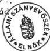

50

---

1. sz. táblázat a V-17-55/1997/98. sz. jelentéshez

# **A MEH közigazgatási államtitkára által felügyelt,  
illetve nem a felügyelete alá tartozó címek változása  
1992-1997. között**

|  Megnevezés | 1992. | 1993. | 1994. | 1995. | 1996. | 1997.  |
| --- | --- | --- | --- | --- | --- | --- |
|  *I. A MEH közigazgatási államtitkára által felügyelt címek* |  |  |  |  |  |   |
|  1. - MEH Igazgatás | x | x | x | x | x | x  |
|  - Ellátó Szolg.*** | x | x | x | x | x |   |
|  - Közbeszerzési és Gazdasági Igazgatóság |  |  |  |  |  | x  |
|  2. Nemzeti és Etnikai Kisebbségi Hivatal | x | x | x | x | x | x  |
|  3. Üdülők *** | x | x | x | x | x |   |
|  4. Határon Túli Magyarok Hivatala | x | x | x | x | x | x  |
|  5. Gyermek- és Ifjúsági Alapprogram Titkársága | - | - | - | - | x | x  |
|  6. Gyermek és Ifjúsági Érdekegyeztető Tanács | - | - | - | - | - | x  |
|  7. Magyar Közigazgatási Intézet | - | - | - | x | x | x  |
|  8. Fejezeti kezelésű előirányzat | x | x | x | x | x | x  |
|  9. Mobilitás Ifjúsági Szolgálat | - | - | - | - | - | x  |
|  10. Tárca nélküli miniszterek | x | - | - | - | - | -  |
|  11. Pressinform Iroda | x | - | - | - | - | -  |
|  12. Kárpótlási Hivatalok | x | x | x | - | - | -  |
|  13. Világkiállítási Programiroda | x | x | x | - | - | -  |
|  14. Országos Bányaműszaki Főfelügyelőség | x | x | x | - | - | -  |
|  15. OTKA Iroda | x | x | x | - | - | -  |
|  16. Hadiipari Hivatal | x | x | x | - | - | -  |
|  17. Állami Bankfelügyelet | - | x | x | - | - | -  |

---

|  Megnevezés | 1992. | 1993. | 1994. | 1995. | 1996. | 1997.  |
| --- | --- | --- | --- | --- | --- | --- |
|  II. A Miniszterelnökség fejezetben lévő, de nem a MEH közigazgatási államtitkár felügyelete alá tartozó címek |  |  |  |  |  |   |
|  1. ÁVÜ | x | x | x | - | - | -  |
|  2. OMFB | x | x | x | - | - | -  |
|  3. Magyar Szabványügyi Hivatal | x | x | x | - | - | -  |
|  4. Országos Találmányi Hivatal | x | x | x | - | - | -  |
|  5. Országos Mérésügyi Hivatal | x | x | x | - | - | -  |
|  6. OMIKK | x | x | x | - | - | -  |
|  7. Országos Atomenergia Hivatal | x | x | x | - | - | -  |
|  8. Magyar Űrkutatási Iroda | x | x | x | - | - | -  |
|  9. OTSH | - | x | x | - | - | -  |
|  10. Magyar Rádió | - | x | x | - | - | -  |
|  11. Magyar Televízió | - | x | x | - | - | -  |
|  12. Polgári Nemzetbiztonsági Szolgálatok * | x | x | x | x | x | x  |
|  13. KEI ** | - | - | - | x | x | x  |
|  14. Céltartalék *** | x | x | x | x | - | -  |
|  15. Költségvetés általános tartaléka *** | x | x | x | x | x | x  |
|  16. Kormányzati rendkívüli kiadások *** | x | x | x | x | x | x  |

Megjegyzés: * A felügyeletet tárca nélküli miniszter látja el

** Fejezeti jogosítvánnyal rendelkező cím

*** Kormányzati hatáskörbe tartozó címek

*** A MEH Ellátó Szolgálata 1997. január 1-jétől átalakult

Közbeszerzési és Gazdasági Igazgatósággá

*** Az Üdülők cím 1997. január 1-jétől megszűnt

2

---

Miniszterelnökség fejezet

2. sz. táblázat

a V-17-55/1997/98. sz. jelentéshez

Fejezet összesen

# A MEH közigazgatási államtitkára

költségvetési felügyelete alá tartozó intézmények és címeknél

# A KIADÁSI ÉS BEVÉTELI ELŐIRÁNYZATOK MÓDOSÍTÁSA HATÁSKÖRÖNKÉNTI BONTÁSBAN

Adatok E Ft-ban

|  Megnevezés | 1992. év | 1993. év | 1994. év | 1995. év | 1996. év | 1997. I. félév  |
| --- | --- | --- | --- | --- | --- | --- |
|  Eredeti kiadási előirányzat | 3.381.600 | 6.075.900 | 7.637.200 | 3.494.300 | 5.397.000 | 10.246.500  |
|  OGY szintű mód. |  | 2.075.971 | - 340.400 | - 16.000 | - 30.769 |   |
|  Kormány szintű mód. | 1.899.329 | 667.660 | 3.941.586 | 190.106 | 274.764 | 439.312  |
|  Felügyeleti szervi mód. | 149.511 | 419.544 | 811.728 | 77.212 | 979.043 | 823.154  |
|  Saját hatáskörű mód. |  |  |  |  |  |   |
|  pénzmaradványból | 129.975 | 235.599 | 175.535 | 91.778 |  | 5.047  |
|  többletbevételből |  |  |  |  |  | 700  |
|  egyéb forrásból | 953.747 | 318.382 | - 119.029 | 260.717 |  | 155.446  |
|  Módosítás összesen: | 3.132.562 | 3.717.156 | 4.469.420 | 603.813 | 1.223.038 | 1.423.659  |
|  Módosított kiad. előirányzat: | 6.514.162 | 9.793.056 | 12.106.620 | 4.098.113 | 6.620.038 | 11.670.159  |
|  Eredeti bevételi előirányzat: | 3.381.600 | 6.075.900 | 7.637.200 | 3.494.300 | 5.397.000 | 10.246.500  |
|  Módosításokból: |  |  |  |  |  |   |
|  Saját bevétel: | 220.315 | 407.949 | 176.695 | 106.317 | 4.039 | 700  |
|  Felhalmozási bevételek: | 437.310 | 132.384 | 38.698 | 71.280 | 10.076 | 16.922  |
|  Átvett pénzeszköz: | 748.797 | 344.216 | 268.405 | 164.130 | 634.257 | 305.770  |
|  Költségvetési támogatás: | 1.236.224 | 2.583.499 | 3.809.526 | 170.308 | 243.992 | 408.312  |
|  Pénzforgalom nélküli bevételek: | 489.916 | 214.108 | 176.096 | 91.778 | 330.674 | 691.955  |
|  Egyéb: |  | 35.000 |  |  |  |   |
|  Módosítások összesen: | 3.132.562 | 3.717.156 | 4.469.420 | 603.813 | 1.223.038 | 1.423.659  |
|  Módosított bevételi előirányzat | 6.514.162 | 9.793.056 | 12.106.620 | 4.098.113 | 6.620.038 | 11.670.159  |

Megjegyzés: a tanúsítványt intézményenként, címenként és fejezeti szinten kérjük kitölteni.

Budapest, 1997. 09. 30.

P.H.

---

•

•

•

[Non-Text]

[Non-Text]

[Non-Text]

[Non-Text]

[Non-Text]

[Non-Text]

[Non-Text]

[Non-Text]

[Non-Text]

[Non-Text]

[Non-Text]

[Non-Text]

[Non-Text]

[Non-Text]

[Non-Text]

[Non-Text]

[Non-Text]

[Non-Text]

[Non-Text]

[Non-Text]

[Non-Text]

[Non-Text]

[Non-Text]

[Non-Text]

[Non-Text]

[Non-Text]

[Non-Text]

[Non-Text]

[Non-Text]

[Non-Text]

[Non-Text]

[Non-Text]

[Non-Text]

[Non-Text]

[Non-Text]

[Non-Text]

[Non-Text]

[Non-Text]

[Non-Text]

[Non-Text]

[Non-Text]

[Non-Text]

[Non-Text]

[Non-Text]

[Non-Text]

[Non-Text]

[Non-Text]

[Non-Text]

[Non-Text]

[Non-Text]

[Non-Text]

[Non-Text]

[Non-Text]

[Non-Text]

[Non-Text]

[Non-Text]

[Non-Text]

[Non-Text]

[Non-Text]

[Non-Text]

[Non-Text]

[Non-Text]

[Non-Text]

[Non-Text]

[Non-Text]

[Non-Text]

[Non-Text]

[Non-Text]

[Non-Text]

[Non-Text]

[Non-Text]

[Non-Text]

[Non-Text]

[Non-Text]

[Non-Text]

[Non-Text]

[Non-Text]

[Non-Text]

[Non-Text]

[Non-Text]

[Non-Text]

[Non-Text]

[Non-Text]

[Non-Text]

[Non-Text]

[Non-Text]

[Non-Text]

[Non-Text]

[Non-Text]

[Non-Text]

[Non-Text]

[Non-Text]

[Non-Text]

[Non-Text]

[Non-Text]

[Non-Text]

[Non-Text]

[Non-Text]

[Non-Text]

[Non-Text]

[Non-Text]

[Non-Text]

[Non-Text]

[Non-Text]

[Non-Text]

[Non-Text]

[Non-Text]

[Non-Text]

[Non-Text]

[Non-Text]

[Non-Text]

[Non-Text]

[Non-Text]

[Non-Text]

[Non-Text]

[Non-Text]

[Non-Text]

[Non-Text]

[Non-Text]

[Non-Text]

[Non-Text]

[Non-Text]

[Non-Text]

[Non-Text]

[Non-Text]

[Non-Text]

[Non-Text]

[Non-Text]

[Non-Text]

[Non-Text]

[Non-Text]

[Non-Text]

[Non-Text]

[Non-Text]

[Non-Text]

[Non-Text]

[Non-Text]

[Non-Text]

[Non-Text]

[Non-Text]

[Non-Text]

[Non-Text]

[Non-Text]

[Non-Text]

[Non-Text]

[Non-Text]

[Non-Text]

[Non-Text]

[Non-Text]

[Non-Text]

[Non-Text]

[Non-Text]

[Non-Text]

[Non-Text]

[Non-Text]

[Non-Text]

[Non-Text]

[Non-Text]

[Non-Text]

[Non-Text]

[Non-Text]

[Non-Text]

[Non-Text]

[Non-Text]

[Non-Text]

[Non-Text]

[Non-Text]

[Non-Text]

[Non-Text]

[Non-Text]

[Non-Text]

[Non-Text]

[Non-Text]

[Non-Text]

[Non-Text]

[Non-Text]

[Non-Text]

[Non-Text]

[Non-Text]

[Non-Text]

[Non-Text]

[Non-Text]

[Non-Text]

[Non-Text]

[Non-Text]

[Non-Text]

[Non-Text]

[Non-Text]

[Non-Text]

[Non-Text]

[Non-Text]

[Non-Text]

[Non-Text]

[Non-Text]

[Non-Text]

[Non-Text]

[Non-Text]

[Non-Text]

[Non-Text]

[Non-Text]

[Non-Text]

[Non-Text]

[Non-Text]

[Non-Text]

[Non-Text]

[Non-Text]

[Non-Text]

[Non-Text]

[Non-Text]

[Non-Text]

[Non-Text]

[Non-Text]

[Non-Text]

[Non-Text]

[Non-Text]

[Non-Text]

[Non-Text]

[Non-Text]

[Non-Text]

[Non-Text]

[Non-Text]

[Non-Text]

[Non-Text]

[Non-Text]

[Non-Text]

[Non-Text]

[Non-Text]

[Non-Text]

[Non-Text]

[Non-Text]

[Non-Text]

[Non-Text]

[Non-Text]

[Non-Text]

[Non-Text]

[Non-Text]

[Non-Text]

[Non-Text]

[Non-Text]

[Non-Text]

[Non-Text]

[Non-Text]

[Non-Text]

[Non-Text]

[Non-Text]

[Non-Text]

[Non-Text]

[Non-Text]

[Non-Text]

[Non-Text]

[Non-Text]

[Non-Text]

[Non-Text]

[Non-Text]

[Non-Text]

[Non-Text]

[Non-Text]

[Non-Text]

[Non-Text]

[Non-Text]

[Non-Text]

[Non-Text]

[Non-Text]

[Non-Text]

[Non-Text]

[Non-Text]

[Non-Text]

[Non-Text]

[Non-Text]

[Non-Text]

[Non-Text]

[Non-Text]

[Non-Text]

[Non-Text]

[Non-Text]

[Non-Text]

[Non-Text]

[Non-Text]

[Non-Text]

[Non-Text]

[Non-Text]

[Non-Text]

[Non-Text]

[Non-Text]

[Non-Text]

[Non-Text]

[Non-Text]

[Non-Text]

[Non-Text]

[Non-Text]

[Non-Text]

[Non-Text]

[Non-Text]

[Non-Text]

[Non-Text]

[Non-Text]

[Non-Text]

[Non-Text]

[Non-Text]

[Non-Text]

[Non-Text]

[Non-Text]

[Non-Text]

[Non-Text]

[Non-Text]

[Non-Text]

[Non-Text]

[Non-Text]

[Non-Text]

[Non-Text]

[Non-Text]

[Non-Text]

[Non-Text]

[Non-Text]

[Non-Text]

[Non-Text]

[Non-Text]

[Non-Text]

[Non-Text]

[Non-Text]

[Non-Text]

[Non-Text]

[Non-Text]

[Non-Text]

[Non-Text]

[Non-Text]

[Non-Text]

[Non-Text]

[Non-Text]

[Non-Text]

[Non-Text]

[Non-Text]

[Non-Text]

[Non-Text]

[Non-Text]

[Non-Text]

[Non-Text]

[Non-Text]

[Non-Text]

[Non-Text]

[Non-Text]

[Non-Text]

[Non-Text]

[Non-Text]

[Non-Text]

[Non-Text]

[Non-Text]

[Non-Text]

[Non-Text]

[Non-Text]

[Non-Text]

[Non-Text]

[Non-Text]

[Non-Text]

[Non-Text]

[Non-Text]

[Non-Text]

[Non-Text]

[Non-Text]

[Non-Text]

[Non-Text]

[Non-Text]

[Non-Text]

[Non-Text]

[Non-Text]

[Non-Text]

[Non-Text]

[Non-Text]

[Non-Text]

[Non-Text][{"box_2d": [954, 804, 968, 814],

---

Miniszterelnökség fejezet

Fejezet összesen

2/a. sz. táblázat

a V-17-55/1997/98. sz. jelentéshez

# A MEH közigazgatási államtitkára

költségvetési felügyelete alá tartozó intézmények és címeknél

# A KIADÁSI ÉS BEVÉTELI ELŐIRÁNYZATOK MÓDOSÍTÁSA HATÁSKÖRÖNKÉNTI BONTÁSBAN

Adatok E Ft-ban

|  Megnevezés | 1992. év | 1993. év | 1994. év | 1995. év | 1996. év | 1997. év  |
| --- | --- | --- | --- | --- | --- | --- |
|  Eredeti kiadási előirányzat | 3.381.600 | 6.075.900 | 7.637.200 | 3.494.300 | 5.397.000 | 10.246.500  |
|  OGY szintű mód. |  | 2.075.971 | - 340.400 | - 16.000 | - 30.769 |   |
|  Kormány szintű mód. | 1.899.329 | 667.660 | 3.941.586 | 190.106 | 274.764 | 909.179  |
|  Felügyeleti szervi mód. | 149.511 | 419.544 | 811.728 | 77.212 | 979.043 | 692.822  |
|  Saját hatáskörű mód. |  |  |  |  |  |   |
|  pénzmaradványból | 129.975 | 235.599 | 175.535 | 91.778 |  |   |
|  többletbevételből |  |  |  |  |  |   |
|  egyéb forrásból | 953.747 | 318.382 | - 119.029 | 260.717 |  | 494.627  |
|  Módosítás összesen: | 3.132.562 | 3.717.156 | 4.469.420 | 603.813 | 1.223.038 | 2.096.628  |
|  Módosított kiad. előirányzat: | 6.514.162 | 9.793.056 | 12.106.620 | 4.098.113 | 6.620.038 | 12.343.128  |
|  Eredeti bevételi előirányzat: | 3.381.600 | 6.075.900 | 7.637.200 | 3.494.300 | 5.397.000 | 10.246.500  |
|  Módosításokból: |  |  |  |  |  |   |
|  Saját bevétel: | 220.315 | 407.949 | 176.695 | 106.317 | 4.039 | 162.010  |
|  Felhalmozási bevételek: | 437.310 | 132.384 | 38.698 | 71.280 | 10.076 | 2.784  |
|  Átvett pénzeszköz: | 748.797 | 344.216 | 268.405 | 164.130 | 634.257 | 473.139  |
|  Költségvetési támogatás: | 1.236.224 | 2.583.499 | 3.809.526 | 170.308 | 243.992 | 762.659  |
|  Pénzforgalom nélküli bevételek: | 489.916 | 214.108 | 176.096 | 91.778 | 330.674 | 691.955  |
|  Egyéb: |  | 35.000 |  |  |  | 4.081  |
|  Módosítások összesen: | 3.132.562 | 3.717.156 | 4.469.420 | 603.813 | 1.223.038 | 2.096.628  |
|  Módosított bevételi előirányzat | 6.514.162 | 9.793.056 | 12.106.620 | 4.098.113 | 6.620.038 | 12.343.128  |

Megjegyzés: a tanúsítványt intézményenként, címenként és fejezeti szinten kérjük kitölteni.

Budapest, 1998. április 9.

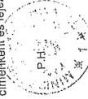

*Munich*

---

1

1

1

1

---

Miniszterelnökség fejezet

Fejezet összesen

3. sz. táblázat

a V-17-55/1997/98. sz. jelentéshez

# A MEH közigazgatási államtitkára
költségvetési felügyelete alá tartozó intézmények és címeknél
A BEVÉTELEK ALAKULÁSÁRÓL

Adatok E Ft-ban

|  Megnevezés | 1992. év |   |   | 1993. év |   |   | 1994. év  |   |   |
| --- | --- | --- | --- | --- | --- | --- | --- | --- | --- |
|   |  Eredeti | Mód. | Teljes. | Eredeti | Mód. | Teljes. | Eredeti | Mód. | Teljes.  |
|   |  előirányzat |   |   | előirányzat |   |   | előirányzat  |   |   |
|  1. Intézményi működési bevételek | 378.984 | 599.299 | 627.556 | 849.200 | 1.257.149 | 1.228.255 | 905.200 | 1.081.895 | 1.066.556  |
|  2. Felhalmozási és tőke jellegű bevételek | 1.150 | 438.460 | 440.232 | 1.000 | 133.384 | 135.003 | 8.000 | 46.698 | 46.877  |
|  3. Felügyeleti szervtől kapott támogatások | 2.874.400 | 4.110.624 | 4.090.624 | 5.103.700 | 7.687.199 | 7.687.163 | 6.634.500 | 10.444.026 | 10.038.306  |
|  4. Átvett pénzeszközök | 127.066 | 875.863 | 956.977 | 62.000 | 406.216 | 417.474 | 89.500 | 357.905 | 312.278  |
|  5. Hitelek, értékpapírok bevételei |  |  |  |  | 35.000 | 345.000 |  |  |   |
|  6. Pénzforgalom nélküli bevételek (pénzmaradványok igénybevétele) |  | 489.916 | 499.199 | 60.000 | 274.108 | 274.866 |  | 176.096 | 175.415  |
|  Költségvetési bevételek összesen: | 3.381.600 | 6.514.162 | 6.614.588 | 6.075.900 | 9.793.056 | 10.087.761 | 7.637.200 | 12.106.620 | 12.841.402  |
|  Függő, átfutó kiegyenlítő bevételek: | 2.874.400 | 4.110.624 | 4.074.368 |  |  | 16.517 |  |  | 15.024  |

Megjegyzés: a tanúsítványt intézményenként, címenként és fejezeti szinten kérjük kitölteni.

Budapest, 1997. 09. 30.

---

.

.

.

.

---

Miniszterelnökség fejezet

Fejezet összesen

3/a. sz. táblázat
a V-17-55/1997/98. sz. jelentéshez

# A MEH közigazgatási államtitkára
költségvetési felügyelete alá tartozó intézmények és címeknél
A BEVÉTELEK ALAKULÁSÁRÓL

Adatok E Ft-ban

|  Megnevezés | 1995. év |   |   | 1996. év |   |   | 1997. I. félév  |   |   |
| --- | --- | --- | --- | --- | --- | --- | --- | --- | --- |
|   |  Eredeti | Mód. | Teljes. | Eredeti | Mód. | Teljes. | Eredeti | Mód. | Teljes.  |
|   |  előirányzat |   |   | előirányzat |   |   | előirányzat  |   |   |
|  1. Intézményi működési bevételek | 369.270 | 475.587 | 470.436 | 458.000 | 462.039 | 442.850 | 204.300 | 205.000 | 167.963  |
|  2. Felhalmozási és tőke jellegű bevételek | 1.330 | 72.610 | 72.610 | 51.400 | 61.476 | 67.954 | 44.000 | 44.000 | 24.594  |
|  3. Felügyeleti szervtől kapott támogatások | 3.107.800 | 3.278.108 | 3.253.740 | 4.873.100 | 5.117.092 | 4.861.504 | 9.983.700 | 10.392.012 | 5.924.949  |
|  4. Átvett pénzeszközök | 15.900 | 180.030 | 180.036 | 14.500 | 648.757 | 666.830 | 14.500 | 337.192 | 250.283  |
|  5. Hitelek, értékpapírok bevételei |  |  |  |  |  |  |  |  |   |
|  6. Pénzforgalom nélküli bevételek (pénzmaradvány igénybevétele) |  | 91.778 | 91.779 |  | 330.674 | 248.082 |  | 691.955 | 467.238  |
|  Költségvetési bevételek összesen: | 3.494.300 | 4.098.113 | 4.068.600 | 5.397.000 | 6.620.038 | 6.287.220 | 10.246.500 | 11.670.159 | 6.835.026  |
|  Függő, átfutó kiegyenlítő bevételek: |  |  | - 5.081 |  |  | - 866 |  |  | 74  |

Megjegyzés: a tanúsítványt intézményenként, címenként és fejezeti szinten kérjük kitölteni.

Budapest, 1997. 09.30.

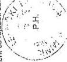

M. L.

---

.

.

.

.

---

Miniszterelnökség fejezet

Fejezet összesen

3/b. sz. táblázat

a V-17-55/1997/98. sz. jelentéshez

# A MEH közigazgatási államtitkára
költségvetési felügyelete alá tartozó intézmények és címeknél
A BEVÉTELEK ALAKULÁSÁRÓL

Adatok E Ft-ban

|  Megnevezés | 1995. év |   |   | 1996. év |   |   | 1997. év  |   |   |
| --- | --- | --- | --- | --- | --- | --- | --- | --- | --- |
|   |  Eredeti | Mód. | Teljes. | Eredeti | Mód. | Teljes. | Eredeti | Mód. | Teljes.  |
|   |  előirányzat |   |   | előirányzat |   |   | előirányzat  |   |   |
|  1. Intézményi működési bevételek | 369.270 | 475.587 | 470.436 | 458.000 | 462.039 | 442.850 | 204.300 | 366.310 | 372.444  |
|  2. Felhalmozási és tőke jellegű bevételek | 1.330 | 72.610 | 72.610 | 51.400 | 61.476 | 67.954 | 44.000 | 29.757 | 30.419  |
|  3. Felügyeleti szervtől kapott támogatások | 3.107.800 | 3.278.108 | 3.253.740 | 4.873.100 | 5.117.092 | 4.861.504 | 9.983.700 | 10.746.359 | 10.746.359  |
|  4. Átvett pénzeszközök | 15.900 | 180.030 | 180.036 | 14.500 | 648.757 | 666.830 | 14.500 | 504.666 | 481.220  |
|  5. Hitelek, értékpapírok bevételei |  |  |  |  |  |  |  |  |   |
|  6. Pénzforgalom nélküli bevételek (pénzmaradvány igénybevétele) |  | 91.778 | 91.779 |  | 330.674 | 248.082 |  | 691.955 | 530.281  |
|  7. Egyéb bevétel |  |  |  |  |  |  |  | 4081 | 4080  |
|  Költségvetési bevételek összesen: | 3.494.300 | 4.098.113 | 4.068.600 | 5.397.000 | 6.620.038 | 6.287.220 | 10.246.500 | 12.343.128 | 12.164.803  |
|  Függő, átfutó kiegyenlítő bevételek: |  |  | - 5.081 |  |  | - 866 |  |  | -13.447  |

Megjegyzés: a tanúsítványt intézményenként, címenként és fejezeti-szinten kérjük kitölteni.

Budapest, 1998. április 9.

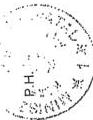

---

•

•

•

•

•

---

4. sz. táblázat
a V-17-55/1997/98. sz. jelentéshez

Fejezet összesen

# A MEH közigazgatási államtitkára
költségvetési felügyelete alá tartozó intézmények és címeknél
A KIADÁSOK ALAKULÁSA KIEMELT ELŐIRÁNYZATONKÉNT

Adatok E Ft-ban

|  Megnevezés | 1992. év |   |   | 1993. év |   |   | 1994. év  |   |   |
| --- | --- | --- | --- | --- | --- | --- | --- | --- | --- |
|   |  Eredeti | Mód. | Teljes. | Eredeti | Mód. | Teljes. | Eredeti | Mód. | Teljes.  |
|   |  előirányzat |   |   | előirányzat |   |   | előirányzat  |   |   |
|  1. Személyi juttatások | 639.519 | 973.053 | 713.592 | 1.203.884 | 1.272.796 | 1.239.812 | 1.089.029 | 1.241.692 | 1.162.582  |
|  Nem rendszeres | 251.560 | 439.823 | 425.860 | 436.164 | 774.936 | 721.754 | 369.481 | 811.727 | 760.292  |
|  2. TB-járulék | 340.100 | 545.546 | 423.448 | 639.500 | 742.042 | 737.626 | 538.900 | 827.917 | 799.647  |
|  3. Dologi kiadások | 1.005.143 | 1.626.619 | 1.761.856 | 1.614.882 | 2.266.124 | 2.231.262 | 1.675.767 | 2.070.032 | 1.920.595  |
|  4. Pénzeszköz átadás | 871.072 | 1.966.099 | 1.930.474 | 1.764.228 | 3.789.670 | 3.641.387 | 3.737.070 | 6.685.734 | 6.257.225  |
|  5. Felújítás | 158.000 | 277.870 | 277.225 | 202.000 | 263.179 | 260.924 | 192.000 | 212.159 | 206.005  |
|  6. Egyéb felhalmozás | 85.006 | 665.487 | 807.816 | 215.242 | 649.309 | 608.518 | 34.953 | 257.359 | 255.402  |
|  7. Fejezeti kezelésű előirányzat |  |  |  |  |  |  |  |  |   |
|  8. Hitelek, értékpapírok kiadásai |  | 16.152 | 1.190 |  | 35.000 | 245.208 |  |  | 1.229.623  |
|  9. Pénzforgalom nélk. kiadások | 31.200 | 3.513 | 1.047 |  |  | 626 |  |  | - 280  |
|  Költségvetési összes kiadás: | 3.381.600 | 6.514.162 | 6.342.508 | 6.075.900 | 9.793.056 | 9.687.117 | 7.637.200 | 12.106.620 | 12.591.091  |
|  Függő, átlütő, kiegyenlítő kiadások: | 2.874.400 | 4.110.624 | 4.066.046 |  |  | -2.789 |  |  | 10.661  |

Megjegyzés: a tanúsítványt intézményenként, címenként és fejezeti szinten kérjük kitölteni.

Budapest, 1997. 09. 30.

P.H.

---

1

2

3

4

5

---

Miniszterelnökség fejezet

Fejezet összesen

4/a. sz. táblázat

a V-17-55/1997/98. sz. jelentéshez

A MEH közigazgatási államtitkára

költségvetési felügyelete alá tartozó intézmények és címeknél

A KIADÁSOK ALAKULÁSA KIEMELT ELŐIRÁNYZATONKÉNT

Adatok E Ft-ban

|  Megnevezés | 1995. év |   |   | 1996. év |   |   | 1997. I. félév  |   |   |
| --- | --- | --- | --- | --- | --- | --- | --- | --- | --- |
|   |  Eredeti | Mód. | Teljes. | Eredeti | Mód. | Teljes. | Eredeti | Mód. | Teljes.  |
|   |  előirányzat |   |   | előirányzat |   |   | előirányzat  |   |   |
|  1. Személyi juttatások | 468.904 | 404.257 | 389.954 | 550.034 | 507.630 | 495.263 | 687.725 | 788.593 | 320.918  |
|  Nem rendszeres | 156.496 | 249.406 | 252.154 | 171.166 | 291.150 | 287.488 | 189.475 | 270.972 | 152.420  |
|  2. TB-járulék | 248.600 | 253.820 | 246.041 | 288.900 | 304.665 | 298.081 | 369.500 | 441.034 | 192.578  |
|  3. Dologi kiadások | 746.800 | 1.106.721 | 1.013.390 | 913.600 | 1.275.617 | 1.242.841 | 956.300 | 1.183.895 | 628.737  |
|  4. Pénzeszköz átadás | 1.753.000 | 1.754.362 | 1.501.952 | 2.274.200 | 3.094.491 | 2.482.598 | 6.685.900 | 7.509.940 | 3.998.508  |
|  5. Felújítás | 100.000 | 110.248 | 108.186 | 125.000 | 153.415 | 146.885 | 101.000 | 107.241 | 38.356  |
|  6. Egyéb felhalmozás | 20.000 | 219.299 | 218.904 | 870.400 | 989.719 | 729.836 | 1.071.500 | 1.191.181 | 205.789  |
|  7. Fejezeti kezelésű előirányzat |  |  |  |  |  |  |  |  |   |
|  8. Hitelek, értékpapírok kiadásai |  |  | 7.000 |  |  |  |  |  |   |
|  9. Pénztorgalom nélk. kiad. |  |  |  | 203.700 | 3.351 |  | 185.100 | 177.303 |   |
|  Költségvetési összes kiadás: | 3.494.300 | 4.098.113 | 3.737.581 | 5.397.000 | 6.620.038 | 5.682.992 | 10.246.500 | 1.1670.159 | 5.537.346  |
|  Függő, átlütő, kiegyenlítő kiadások: |  |  | - 2.615 |  |  | - 5.719 |  |  | 2.736  |

Megjegyzés: a tanúsítványt intézményenként, címenként és fejezeti szinten kérjük kitölteni.

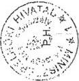

Budapest, 1997. 09.30

---

•

•

•

•

---

Miniszterelnökség fejezet

Fejezet összesen

4/b. sz. táblázat

a V-17-55/1997/98. sz. jelentéshez

# A MEH közigazgatási államtitkára
költségvetési felügyelete alá tartozó intézmények és címeknél
A KIADÁSOK ALAKULÁSA KIEMELT ELŐIRÁNYZATONKÉNT

Adatok E Ft-ban

|  Megnevezés | 1995. év |   |   | 1996. év |   |   | 1997. év  |   |   |
| --- | --- | --- | --- | --- | --- | --- | --- | --- | --- |
|   |  Eredeti | Mód. | Teljes. | Eredeti | Mód. | Teljes. | Eredeti | Mód. | Teljes.  |
|   |  előirányzat |   |   | előirányzat |   |   | előirányzat  |   |   |
|  1. Személyi juttatások | 468.904 | 404.257 | 389.954 | 550.034 | 507.630 | 495.263 | 687.725 | 717.562 | 710.162  |
|  Nem rendszeres | 156.496 | 249.406 | 252.154 | 171.166 | 291.150 | 287.488 | 189.475 | 439.612 | 434.630  |
|  2. TB-járulék | 248.600 | 253.820 | 248.041 | 288.900 | 304.665 | 298.081 | 369.500 | 478.629 | 468.309  |
|  3. Dologi kiadások | 746.800 | 1.106.721 | 1.013.390 | 913.600 | 1.275.617 | 1.242.841 | 956.300 | 1.497.207 | 1.405.213  |
|  4. Pénzeszköz átadás | 1.753.000 | 1.754.362 | 1.501.952 | 2.274.200 | 3.094.491 | 2.482.598 | 6.685.900 | 7.754.018 | 7.249.830  |
|  5. Felújítás | 100.000 | 110.248 | 108.186 | 125.000 | 153.415 | 146.885 | 101.000 | 132.656 | 127.660  |
|  6. Egyéb felhalmozás | 20.000 | 219.299 | 218.904 | 870.400 | 989.719 | 729.836 | 1.071.500 | 1.208.293 | 694.848  |
|  7. Fejezeti kezelésű előirányzat |  |  |  |  |  |  |  |  |   |
|  8. Hitelek, értékpapírok kiadásai |  |  | 7.000 |  |  |  |  |  |   |
|  9. Pénztorgalom nélkül, kiad. |  |  |  | 203.700 | 3.351 |  | 185.100 | 115.151 |   |
|  Költségvetési összes kiadás: | 3.494.300 | 4.098.113 | 3.737.581 | 5.397.000 | 6.620.038 | 5.682.992 | 10.246.500 | 12.343.128 | 11.090.652  |
|  Függő, átlütő, kiegyenlítő kiadások: |  |  | - 2.615 |  |  | - 5.719 |  |  | -15710  |

Megjegyzés: a tanúsítványt intézményenként, címenként és fejezeti szinten kérjük kitölteni.

Budapest, 1998. április 9.

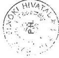

---

1

1

1

1

---

Miniszterelnökség fejezet

Fejezet összesen

5. sz. táblázat

a V-17-55/1997/98. sz. jelentéshez

A MEH közigazgatási államtitkára
költségvetési felügyelete alá tartozó intézmények és címeknél
A SZEMÉLYI JUTTATÁSOK ALAKULÁSÁRÓL

Adatok M Ft-ban

|  Megnevezés | 1993. év |   |   | 1994. év |   |   | 1995. év |   |   | 1996. év |   |   | 1997. év  |   |   |
| --- | --- | --- | --- | --- | --- | --- | --- | --- | --- | --- | --- | --- | --- | --- | --- |
|   |  előir. | mód. előir. | telj. | előir. | mód. előir. | telj. | előir. | mód. előir. | telj. | előir. | mód. előir. | telj. | előir. | mód. előir. | telj.  |
|  1. Rendszeres sz. jutt. összesen: | 1203,9 | 1272,8 | 1239,8 | 1089,0 | 1241,7 | 1162,6 | 468,9 | 404,2 | 390,0 | 550,0 | 507,6 | 495,3 | 687,7 | 788,6 | 320,9  |
|  Ebből: |  |  |  |  |  |  |  |  |  |  |  |  |  |  |   |
|  - alapilletmény |  |  | 978,8 |  |  | 852,7 | 364,8 | 310,8 | 299,6 | 406,9 | 372,8 | 362,1 | 495,7 | 495,9 | 218,4  |
|  - kiegészítés |  |  | 112,8 |  |  | 109,7 | 44,8 | 41,7 | 40,5 | 82,9 | 75,3 | 74,5 | 110,7 | 148,9 | 60,7  |
|  - pótlékok |  |  | 23,6 |  |  | 18,0 | 17,2 | 16,6 | 15,9 | 18,3 | 19,9 | 18,5 | 29,6 | 93,5 | 33,0  |
|  - 13. havi illetmény |  |  | 103,7 |  |  | 82,1 | 35,2 | 35,0 | 33,9 | 41,9 | 39,6 | 40,2 | 51,7 | 50,3 | 8,8  |
|  2. Nem rendszeres sz. jutt. | 436,2 | 774,9 | 721,7 | 369,5 | 811,7 | 760,3 | 156,5 | 249,4 | 252,1 | 171,2 | 291,1 | 287,5 | 189,5 | 271,0 | 152,4  |
|  Ebből: |  |  |  |  |  |  |  |  |  |  |  |  |  |  |   |
|  - jutalom | 78,4 | 260,6 | 266,4 | 60,3 | 291,7 | 292,8 | 12,6 | 56,1 | 60,5 | 13,7 | 66,1 | 74,5 | 13,2 | 44,7 | 18,1  |
|  - helyettesítés |  |  |  |  |  |  | 0,8 | 1,3 | 1,3 | 0,4 | 2,2 | 2,3 | 0,6 | 1,8 | 2,0  |
|  - végkielégítés | 1,0 | 7,0 | 8,2 | 5,0 | 61,9 | 62,3 | 1,7 | 12,7 | 12,2 | 5,2 | 5,5 | 3,3 | 5,6 | 11,3 | 8,8  |
|  - jubileumi jut. |  |  |  |  |  |  | 7,7 | 7,8 | 7,7 | 7,5 | 10,9 | 10,5 | 8,5 | 9,4 | 6,0  |
|  - ruházati kgt. |  |  |  |  |  |  | 14,5 | 13,1 | 12,7 | 14,4 | 14,5 | 14,4 | 18,6 | 18,8 | 16,7  |

---

“

.

.

.

.

---

|  Megnevezés | 1993. év |   |   | 1994. év |   |   | 1995. év |   |   | 1996. év |   |   | 1997. év  |   |   |
| --- | --- | --- | --- | --- | --- | --- | --- | --- | --- | --- | --- | --- | --- | --- | --- |
|   |  előir. | mód. előir. | telj. | előir. | mód. előir. | telj. | előir. | mód. előir. | telj. | előir. | mód. előir. | telj. | előir. | mód. előir. | telj.  |
|  - étkezési hozzájár. | 26,9 | 40,8 | 40,3 | 28,0 | 36,1 | 35,5 | 11,3 | 9,0 | 8,7 | 9,3 | 9,1 | 9,3 | 11,6 | 10,8 | 4,7  |
|  - részmunkaidős fogl.jutt. (1) | 4,6 | 3,8 | 4,1 | 2,8 | 2,5 | 2,5 | 1,8 | 2,2 | 2,3 | 3,5 | 3,5 | 3,5 | 2,6 | 2,8 | 1,8  |
|  - megbízási díj (2) | 116,9 | 82,7 | 66,8 | 80,0 | 117,8 | 94,5 | 5,0 | 9,2 | 9,3 | 1,0 | 5,6 | 5,4 | 1,0 | 3,0 | 1,6  |
|  - nyugdíjas fogl. jutt. (3) | 53,2 | 75,1 | 80,3 | 38,4 | 91,3 | 91,4 | 8,1 | 14,9 | 14,8 | 8,7 | 12,7 | 12,6 | 7,6 | 7,6 | 5,7  |
|  - állományba nem tart. jutt. (4) |  |  |  |  |  |  | 44,1 | 62,6 | 59,0 | 55,7 | 88,8 | 83,9 | 76,8 | 102,2 | 46,7  |
|  3. Személyi juttatás összesen: | 1640,1 | 2047,7 | 1961,5 | 1458,5 | 2053,4 | 1922,9 | 625,4 | 653,7 | 642,1 | 721,2 | 798,8 | 782,8 | 877,2 | 1059,6 | 473,3  |

Megjegyzés: a tanúsítványt intézményenként, címenként és fejezeti szinten kérjük kitölteni.

Budapest, 1997. 09.30.

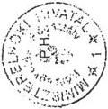

2

---

“

”

“

“

”

---

Miniszterelnökség fejezet

5/a. sz. táblázat
a V-17-55/1997/98. sz. jelentéshez

Fejezet összesen

A MEH közigazgatási államtitkára
költségvetési felügyelete alá tartozó intézmények és címeknél
A SZEMÉLYI JUTTATÁSOK ALAKULÁSÁRÓL

Adatok M Ft-ban

|  Megnevezés | 1993. év |   |   | 1994. év |   |   | 1995. év |   |   | 1996. év |   |   | 1997. év  |   |   |
| --- | --- | --- | --- | --- | --- | --- | --- | --- | --- | --- | --- | --- | --- | --- | --- |
|   |  előir. | mód. előir. | telj. | előir. | mód. előir. | telj. | előir. | mód. előir. | telj. | előir. | mód. előir. | telj. | előir. | mód. előir. | telj.  |
|  1. Rendszeres sz. jutt. összesen: | 1203,9 | 1272,8 | 1239,8 | 1089,0 | 1241,7 | 1162,6 | 468,9 | 404,2 | 390,0 | 550,0 | 507,6 | 495,3 | 687,7 | 717,6 | 710,2  |
|  Ebből: |  |  |  |  |  |  |  |  |  |  |  |  |  |  |   |
|  - alapilletmény |  |  | 978,8 |  |  | 852,7 | 364,8 | 310,8 | 299,6 | 406,9 | 372,8 | 362,1 | 495,7 | 461,6 | 455,3  |
|  - kiegészítés |  |  | 112,8 |  |  | 109,7 | 44,8 | 41,7 | 40,5 | 82,9 | 75,3 | 74,5 | 110,7 | 127,2 | 126,6  |
|  - pótlékok |  |  | 23,6 |  |  | 18,0 | 17,2 | 16,6 | 15,9 | 18,3 | 19,9 | 18,5 | 29,6 | 70,4 | 70,0  |
|  - 13. havi illetmény |  |  | 103,7 |  |  | 82,1 | 35,2 | 35,0 | 33,9 | 41,9 | 39,6 | 40,2 | 51,7 | 58,4 | 58,3  |
|  2. Nem rendszeres sz. jutt. | 436,2 | 774,9 | 721,7 | 369,5 | 811,7 | 760,3 | 156,5 | 249,4 | 252,1 | 171,2 | 291,1 | 287,5 | 189,5 | 439,6 | 434,6  |
|  Ebből: |  |  |  |  |  |  |  |  |  |  |  |  |  |  |   |
|  - jutalom | 78,4 | 260,6 | 266,4 | 60,3 | 291,7 | 292,8 | 12,6 | 56,1 | 60,5 | 13,7 | 66,1 | 74,5 | 13,2 | 159,6 | 158,4  |
|  - helyettesítés |  |  |  |  |  |  | 0,8 | 1,3 | 1,3 | 0,4 | 2,2 | 2,3 | 0,6 | 3,1 | 3,1  |
|  - végkielégítés | 1,0 | 7,0 | 8,2 | 5,0 | 61,9 | 62,3 | 1,7 | 12,7 | 12,2 | 5,2 | 5,5 | 3,3 | 5,6 | 9,4 | 9,4  |
|  - jubileumi jut. |  |  |  |  |  |  | 7,7 | 7,8 | 7,7 | 7,5 | 10,9 | 10,5 | 8,5 | 13,2 | 13,3  |
|  - ruházati kgt. |  |  |  |  |  |  | 14,5 | 13,1 | 12,7 | 14,4 | 14,5 | 14,4 | 18,6 | 17,6 | 17,6  |

---

“

”

“

”

---

|  Megnevezés | 1993. év |   |   | 1994. év |   |   | 1995. év |   |   | 1996. év |   |   | 1997. év  |   |   |
| --- | --- | --- | --- | --- | --- | --- | --- | --- | --- | --- | --- | --- | --- | --- | --- |
|   |  előir. | mód. előir. | telj. | előir. | mód. előir. | telj. | előir. | mód. előir. | telj. | előir. | mód. előir. | telj. | előir. | mód. előir. | telj.  |
|  - étkezési hozzájár. | 26,9 | 40,8 | 40,3 | 28,0 | 36,1 | 35,5 | 11,3 | 9,0 | 8,7 | 9,3 | 9,1 | 9,3 | 11,6 | 10,8 | 10,8  |
|  - részmunkaidős fogl.jutt. (1) | 4,6 | 3,8 | 4,1 | 2,8 | 2,5 | 2,5 | 1,8 | 2,2 | 2,3 | 3,5 | 3,5 | 3,5 | 2,6 | 4,0 | 4,0  |
|  - megbízási díj (2) | 116,9 | 82,7 | 66,8 | 80,0 | 117,8 | 94,5 | 5,0 | 9,2 | 9,3 | 1,0 | 5,6 | 5,4 | 1,0 | 9,1 | 9,0  |
|  - nyugdíjas fogl. jutt. (3) | 53,2 | 75,1 | 80,3 | 38,4 | 91,3 | 91,4 | 8,1 | 14,9 | 14,8 | 8,7 | 12,7 | 12,6 | 7,6 | 11,3 | 11,3  |
|  - állományba nem tart. jutt. (4) |  |  |  |  |  |  | 44,1 | 62,6 | 59,0 | 55,7 | 88,8 | 83,9 | 76,8 | 121,0 | 117,0  |
|  3. Személyi juttatás összesen: | 1640,1 | 2047,7 | 1961,5 | 1458,5 | 2053,4 | 1922,9 | 625,4 | 653,7 | 642,1 | 721,2 | 798,8 | 782,8 | 877,2 | 1157,2 | 1144,8  |

Megjegyzés: a tanúsítványt intézményenként, címenként és fejezeti szinten kérjük kitölteni.

Budapest, 1998 április 9.

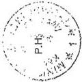

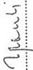

---

“

”

“

“

“

---

6. sz. táblázat

a V-17-55/1997/98. sz. jelentéshez

A Miniszterelnökség fejezet immateriális javak és tárgyi eszköz állományának alakulása
1992. január 1. - 1997. január 1.

1992. január 1.

bruttó érték M Ft

|  Cím | Hat. TMH | GY.I.A. | M. Közig. Int. | M. Közbesz. Ig. | Nem. Etn. K. H. | Mobilitás | Összesen  |
| --- | --- | --- | --- | --- | --- | --- | --- |
|  Immateriális | - | - | - | 10,3 | 0,2 | - | 10,5  |
|  Ingatlan | - | - | - | 250,6 | - | - | 250,6  |
|  Gépek | - | - | - | 141,6 | 7,8 | - | 149,4  |
|  Jármű | - | - | - | 23,6 | - | - | 23,6  |
|  Összesen | - | - | - | 426,1 | 8,0 | - | 434,1  |

1997. január 1.

|  Immateriális | 0,7 | 0,5 | 1 | 245,6 | 1,1 | 0,1 | 249,0  |
| --- | --- | --- | --- | --- | --- | --- | --- |
|  Ingatlanok | - | - | 21,8 | 1447,7 | - | - | 1469,5  |
|  Gépek | 33,7 | 5,7 | 16,4 | 432,3 | 14,1 | 4,1 | 506,3  |
|  Járművek | 10,4 | - | 1,7 | 158,2 | - | 3,3 | 173,6  |
|  Üzemeltetésre átadott | - | - | - | 7 | - | - | 7,0  |
|  Jelzálogjog bejegyzés | 44,8 | 6,2 | 40,9 | 2290,8 | 15,1 | 7,5 | 2405,3  |

---

1

1

1

1

---

7. sz. táblázat
a V-17-55/1997/98. sz. jelentéshez

# A MEH gépkocsi beszerzésének és
értékesítésének alakulása 1992-97. években

|  Év | Beszerzés |   | Értékesítés  |   |
| --- | --- | --- | --- | --- |
|   |  db | Bruttó érték millió Ft | db | Bruttó érték millió Ft  |
|  1992. | 380 | 347,2 | 27 | 16,2  |
|  1993. | 17 | 24,2 | 233 | 191,2  |
|  1994. | 22 | 38,8 | 12 | 14,5  |
|  1995. | 11 | 38,5 | 27 | 33,1  |
|  1996. | 9 | 36,7 | 7 | 17,8  |
|  1997. | 4 | 5,9 | 4 | 7,9  |

Megjegyzés: ezen kívül a MEH 137 db gépkocsi átvételét és 230 db
átadását is lebonyolította.

---

1

1

1

1

---

8. sz. táblázat  
a V-17-55/1997/98. sz. jelentéshez

# **A Célelőirányzat 2. alcímen belül az alapítványok,  
közalapítványok részére megállapított  
előirányzatok alakulása**

M Ft-ban

|   | Alapítvány |   |   | Közalapítvány |   |   | Összesen  |   |   |
| --- | --- | --- | --- | --- | --- | --- | --- | --- | --- |
|   |  Ered. | Mód. | Telj. | Ered. | Mód. | Telj. | Ered. | Mód. | Telj.  |
|  **1992** | 646 | 1059 | 1059 | - | - | - | 646 | 1059 | **1059**  |
|  **1993** | 771 | 2666 | 2666 | - | - | - | 771 | 2666 | **2666**  |
|  **1994** | 1577 | 3559 | 3559 | - | - | - | 1577 | 3559 | **3559**  |
|  **1995** | 141 | 283 | 283 | 970 | 877 | 877 | 1111 | 1160 | **1160**  |
|  **1996** | 150 | 188 | 188 | 1339 | 1339 | 1339 | 1489 | 1527 | **1527**  |
|  **1997** | 374 | 370 | 236* | 1390 | 1378 | 750* | 1764 | 1748 | **986***  |
|  **Össz.** | **3659** | **8125** | **7991** | **3699** | **3594** | **2966** | **7358** | **11719** | **10957**  |

\* Az 1997. évi teljesítési adatok az I. félévre vonatkoznak.

---

1

1

1

1

---

1. sz. melléklet  
a V-17-55/1997/98. sz. jelentéshez

# A kormányzati informatikai és távközlési rendszer létrehozása, fejlesztése

**Informatikai célokra** összesen 1858 M Ft előirányzat **szolgált** a fejezeti kezelésű **előirányzatok** között, melynek **felhasználása** összességében megfelelt a költségvetési, számviteli **előírásoknak** (táblázat). A pénzeszközök felhasználásának **célszerűségét, eredményességét** ugyanakkor **kedvezőtlenül befolyásolták az** informatikai rendszerfejlesztések szakmai és koordinációs feltételeiben **mutatkozó hiányosságok, továbbá a végrehajtásban és annak szabályozásában tapasztalt mulasztások, következetlenségek.**

Az informatikai célú előirányzatok célirányos, hatékony felhasználásának feltételeiről (feladat, szervezet, eszközháttér) az 1039/1993. (V.21.) Korm. határozat rendelkezett, azonban nem születtek meg az optimális megvalósítási környezet kialakításához a megfelelő kormányzati döntések. Így a jogszabályi háttér, a szervezeti kiépítettség hiányos, az informatikai kiadások, az előirányzatok alakulása nem kellően átlátható a teljes kormányzati szférában, a pénzügyi tervezést nem előzi meg az informatikai tervezés, az informatika központi szintre emelésének akadálya az informatikai célú forrásoknak az igényekhez mért szűkössége, a több évre elhúzódó fejlesztések fedezetének bizonytalansága.

**Az egységes kormányzati informatikai infrastruktúra kialakításának szervezeti, személyi háttere fokozatosan és csak részben épült ki.** Ugyanakkor a létrejött szervezetek működése sem volt mindig problémamentes, zavartalan. Ebben közrejátszott, hogy a koordinációs szerepet betöltő központi informatikai szervezetekre vonatkozó kormányhatározatok, illetve a kapcsolódó ajánlások sem valósultak meg maradéktalanul.

A 3296/1991. (VII.25.) Korm.határozat alapján létrehozták az Informatikai Tárcaközi Bizottságot (ITB), amelynek feladata a kormányzati informatikai intézkedések harmonizálása és munkaszervezetein (Informatikai Koordinációs Iroda (IKI), a Szakmai Tanácsadó Testület (SZTT) és különféle munkacsoportok) keresztül a megvalósítás menedzselése.

Az informatikai infrastruktúra kormányzati szintű integrációs feladatainak ellátását szolgáló szervezetek tevékenységének elemzésére alapozott - és az 1106/1995. (XI.9.) Korm. határozat mellékletét képező - ITB ajánlásban javasolt „központi koordinációs szervezetet” nem hozták létre, ezáltal feladataival automatikusan az IKI tennivalói bővültek. Így az ellenőrzés idején az IKI munkatársaira hárult az informatikai stratégiai tervek szakmai kontrollja, ennek alapján a kormányzati stratégiára a javaslat elkészítése, a projektek szakmai véleményezése, menedzselése, ellenőrzése, szakmai irányelvek kidolgozása. A MEH e szerve-

---

zeti egységének a létszáma azonban - a kibővült feladatok ellenére - nem változott.

A SZTT feladatát - az IKI adatszolgáltatására alapozott - elvi állásfoglalások kiadása képezi. A testületet - amelynek az 1994-1996. években végzett tevékenységéről írásos dokumentum nem állt rendelkezésünkre - 1997-ben újjászervezték.

A részben állandó, részben egy-egy konkrét feladatra létrehívott munkacsoportok működését kedvezőtlenül befolyásolta, hogy a minisztériumok által delegált ITB tagok részvétele az érdemi munkában az adott tárca közvetlen érdekeitől, az ottani feladataik mennyiségétől függött, így lényegében az IKI képviselője jelentette a stabilitást.

A kormányzati koordináció elősegítése érdekében az 1106/1995. (XI.9.) Korm. határozattal létrehozott Kormányzati Informatikai Irányító Bizottság (KIB) érdemi munkát nem végzett. Feladatkörét - az 1025/1997. (II. 26.) Korm. határozat értelmében - az Informatikai és Telekommunikációs Kormánybizottság (ITKB) vette át mely megoldással az informatika kormányzati koordinációja magasabb szintre került. A szervezet feladatköre szoros kapcsolatot - részben átfedést - mutat az ITB feladataival, tevékenysége azonban még nem volt megítélhető.

**Az egyes tárcáknál** az informatikai feladatok **szervezeti feltételei eltérőek**. Nem sikerült teljes körben érvényt szerezni az ITB - közigazgatási reformcsomaghoz illeszkedő - ajánlásának, miszerint ezt a szakterületet célszerűen közvetlenül a közigazgatási államtitkár irányítása alá rendelt önálló szervezeti egységnek kell képviselnie.

A Földművelésügyi Minisztériumban nincs informatikával foglalkozó önálló szervezeti egység, e feladatok a közgazdasági főosztályvezető helyetteshez tartoznak.

A Népjóléti Minisztérium 1994. év végén jogutód nélkül megszüntette az Informatikai Osztályát, amit egy évvel később a Gyógyinfok Iroda felállításával korrigált. Ez az intézkedés az előzetesen végzett munkák hasznosulási lehetőségét rontotta (pl.: a központi forrásból finanszírozott 5 M Ft ágazati adatmodell felmérés elkészültekor nem hasznosult, időközben túlhaladottá vált).

Az informatikai feladatok ellátását a létszámhiány, a fluktuáció is nehezítette, ami részben a szakma „piaci” bérétől elmaradó köztisztviselői bérekre, továbbá szemléletbeli okokra vezethető vissza. A létszámgazdálkodásban (a leépítések elkerülése, a létszám fejlesztések) ugyanis többnyire nem kapott prioritást az informatikai terület.

Az **ITB**, mint koordinatív szervezet magas szakmai színvonalú munkát végezve létrehozta a kormányzati **informatikai fejlesztések alapját képező ajánlásait**. A változó körülményeknek, illetve igényeknek megfelelően folyamatosan készített újabb ajánlásokat, valamint karbantartotta a régieket.

Az első ajánlás fogalmazza meg általánosságban a kormányzati informatika körvonalait. Ehhez kapcsolódva készültek el az informatika fejlesztés, kialakítási és menedzselési módszertanát leíró további ajánlások. Ezek a munkák magas szakmai színvonalúak és jól segítették a központi államigazgatásban az informatikai területen dolgozók feladatellátását. Különösen jelentősek közülük az in-

2

---

formatikai stratégia kialakítására vonatkozóak, amelyek változatlanul alapját képezik a kormányzati informatikai munkának.

A központi államigazgatás informatikai infrastruktúrájának kialakítását célzó - önmagában helyes - stratégiai elképzelés nem vette figyelembe az ugyanezen időszakban végzett felmérés eredményét, hanem módszerében az aktuális EU ajánlásokra épített. A hazai kormányzati informatikai infrastruktúra mind hardver, mind szoftver elemeit tekintve alacsony - az EU tagországokétól jelentősen elmaradó - színvonala a stratégiai célok megvalósításához - a választottal ellentétben - erős központosítást igényelt volna a végrehajtás eszközeiben, módszereiben egyaránt.

A központi államigazgatás informatikai stratégiáját alapozó felmérés szerint a minisztériumokban a - gyakran többszörösen párhuzamos - fejlesztések során heterogén és alacsony szakmai színvonalon működtetett információs rendszerek jöttek létre, amelyek integrált rendszerbe kapcsolása bonyolult és célszerűtlen. Ezért a korszerűtlen rendszerek indokolt kiváltására, illetve nagyobb részt „zöldmezős” fejlesztésekre volt szükség.

Az EU aktuális gyakorlatának mintájára kialakított módszerek - a már meglévő infrastruktúrára építkezés, a tárcák nagyfokú informatikai önállóságának biztosítása - alkalmazásával összefüggésben **az informatikai stratégia a valóságtól elszakadt**. Az egységes kormányzati alkalmazások kialakulását szolgáló egységes tematikai és metodikai ajánlások nem jelentettek kötelezettséget a tárcák számára, így hasznosulásuk, betartásuk jellemzően tárca szinten valósult meg.

A kormányzati informatikai stratégia is alulról felfelé történő tervezéssel, a tárcák informatikai stratégiai terveiben szereplő célokból kiindulva történt. Az ilyen típusú tervezésnek minimális feltétele lett volna, hogy **a tárcáknál** az informatika megfelelő súlyt kapjon. Ugyanakkor **az informatikai stratégiákat nem készítették el teljeskörben**, holott az 1039/1993. (V.21.) Korm. határozat előírja, hogy a minisztériumoknál és az országos hatáskörű szervezeteknél rendszeressé kell tenni a stratégiai terv készítését. Emellett **az elkészült stratégiai tervek nem minden esetben feleltek meg tartalmilag a kiadott útmutatásnak**. A finansziális és fluktuációs problémák is hozzájárultak ahhoz, hogy a stratégiai tervezés köre szűkült, minősége fokozatosan csökkent.

A tárcák stratégiai terveiről 1994-1995. években átfogó értékelés, 1996-ban belső munkaanyag készült, mely utóbbi azokat alacsony színvonalúnak ítélte. Értékelhető tervek hiányában 1997-ben nem készült elemzés.

Az ITB néhány esetben pénzbeni forrásokkal is hozzájárult a stratégiai tervek elkészítéséhez, 1993-ban az MKM (700 E Ft), 1994-ben a KSH (300 E Ft) a BM (180 E Ft) és a MKM (200 E Ft) részesült támogatásban. Az érintett szervezetek részére oktatást szervezett, melyen közel 400 fő vett részt.

A folyamatos oktatás pénzügyi forrásai megoldatlanok (1993. és 1995. között az oktatások finanszírozása általában OMFB keretből történt). Ugyanakkor az oktatásban részesülők közül sokan elhagyták a közigazgatást, s ezért a stratégiai tervek elkészítésének szakember háttere nem biztosított.

3

---

Az 1995-1997. évekre az 1106/1995. (XI.9.) Korm. határozat a mellékleteként szereplő (ITB) ajánlást stratégiai tervként elfogadta. Ez azonban csak az elérendő célokat jelölte meg, a szükséges erőforrásokkal csak a létrehozandó szervezetek szintjén foglalkozik. A kitűzött célok és az azokhoz illeszkedő informatikai programok szakmailag helyesek és az adott időpontban szükségesek voltak. Hiányolható azonban, hogy a célokhoz, illetve informatikai programokhoz nem rendeltek prioritást, nem készült megvalósítási terv, ami az ütemezésről, ráfordítás szükségletükről adna információt. Így a központi informatikai stratégia mind szerkezetében, mind tartalmában eltér az ITB vonatkozó ajánlásában megfogalmazott követelményektől.

**Az informatikai stratégia elkészítésének és gyakorlati megvalósításának folyamata hiányosan szabályozott**, a központi informatikai szervezetek (ITB, IKI) hatásköre a feladatukhoz mérten nem elégséges. Mindez következményeiben kedvezőtlenül hatott a pénzügyi források elosztásának szakmai megalapozottságára, ezzel összefüggésben felhasználásának hatékonyságára.

**Az informatikai stratégia megvalósítását szolgáló** projektek kidolgozásához készített **ITB szakmai útmutatók jó színvonalúak** és megfelelnek a céljuknak. Ugyancsak részletes véleményezési szempontok készültek a stratégiai tervek, projektek elbírálásához is. **Nem szabályozták azonban megfelelő módon a finanszírozási döntések előkészítésének folyamatát**, az ebben résztvevő szervezetek kompetenciáját, valamint részben a dokumentálásra vonatkozó követelményeket, illetve ez utóbbiakat nem érvényesítették maradéktalanul.

A tárcák által benyújtott **projektek** központi forrásból történő **támogatására**, annak mértékére **vonatkozó döntéseket** - melyek a MEH közigazgatási államtitkárának kompetenciájába tartoznak - **megelőző szakmai véleményezési folyamat dokumentálisan nem volt nyomonkövethető**. A gyakorlatban gyakran csak az előirányzat átcsoportosításáról szóló engedély a projekt finanszírozására vonatkozó döntésfolyamat egyetlen dokumentuma.

A projektek szakmai véleményezésénél az írásbeliség nem volt követelmény. Az ITB ülésekről az ügyrendben előírt jegyzőkönyv helyett emlékeztetők készültek, melyek a javaslatok, döntések szakmai indokaira nem tértek ki.

Az év végi időszakban többnyire az év utolsó két hónapjára az ITB felhatalmazta az IKI-t, hogy a még fel nem használt - többnyire időarányos - előirányzatokra saját hatáskörben tegyen javaslatot, így előfordul(hatot)t, hogy egy-egy projekttel kapcsolatos szakmai döntés még emlékeztetőben sem jelent meg.

A rendelkezésünkre bocsátott dokumentumok alapján több esetben **a finanszírozási döntések szakmai előkészítésének megalapozottsága, következetessége, szintje megkérdőjelezhető**, illetve kifogásolható.

A Magyar Honvédség Térképészeti Hivatala által benyújtott projektet az 1997. január 15-i dátummal készült szakvélemény nem javasolta támogatni. Ezzel szemben az 1997. január 20-i ITB ülés emlékeztetője alapján támogatásra javasolták és eszerint döntöttek. (Szóbeli tájékoztatás szerint a szakvélemény kifogásait a projekt megvalósítása során figyelembe vették.)

4

---

1997-ben benyújtott és támogatást nem kapott projektekről egy-két kivétellel nincs információ, visszacsatolás. Ezt támasztja alá az is, hogy az október 30-i ITB ülésen a Polgári Nemzetbiztonsági Hivatal képviselője jelezte, hogy az év elején benyújtott projektjeikről nem kaptak tájékoztatást.

Az 1997. augusztus 28-i ITB ülésre készített munkaanyag 13 projektet tartalmazott, melyből az emlékeztető szerint öt projektet javasoltak központi támogatásra. A javasolt ötből azonban kettő (konkrétan: OECD adatbázisok elérése, NJSzT ECDL akkreditációs központjának hálózatépítése) nem szerepelt az 1997-ben benyújtott projektek között. Az ITB napirendjére fel nem vett projektekről az emlékeztetőben nincs információ. Így nem tudható, hogy időhiány, nem a stratégiába illő koncepcionális problémák, vagy egyéb hiányosságok miatt nem foglalkozott velük a bizottság.

A távközlési projektekkel kapcsolatos döntések az ITB ülésekről készült emlékeztetőkben nem követhetők nyomon annak ellenére, hogy az ITB feladatköre 1993-tól erre a területre is kiterjed.

**A finanszírozott projektek elkészültéről, valamint hasznosulásáról nincs kellő információ.** A projektek megvalósulásának nyomonkövetése, illetve a projektek hasznosulásának utólagos kontrollja esetleges, ezért a tapasztalatok hasznosítása sem tekinthető megoldottnak.

Az IKI által 1994-ben kidolgozott „Kormányzati információtechnológiai beruházások megvalósításának, ellenőrzésének általános eljárásrendje” szerint a beruházások lezárásakor az átvételi jegyzőkönyvet, illetve az első éves működés tapasztalatairól értékelést kell küldeni az IKI részére. Ennek a kötelezettségnek a tárcák, illetve az egyéb kormányzati szervek néhány kivételtől eltekintve nem tettek eleget. E dokumentumok hiányát a tárcák által delegált ITB tagok beszámolói nem pótolják, mert azok általában szóban történtek, tartalmukra és formájukra nézve semmilyen megkötés nincs.

**Nem járt kellő eredménnyel az ITB által finanszírozott programok adatbekérés útján való ellenőrzése.** Az utóellenőrzési lapokat ugyanis a vizsgálat időpontjáig az IKI többszöri kísérlete ellenére csak a projektek mintegy feléről küldték vissza, s azok egy részét is hiányosan, illetve tartalmukban ellentmondásosan töltötték ki.

Az 1994-1996. években finanszírozott projektekről a tárcáktól úgynevezett utóellenőrzési formalapokon szakmai tájékoztatást, pénzügyi elszámolást kértek. A beszámolási kötelezettséget nem teljesítő tárcák közül háromnál (NM, FM, IM) folytatott szűrőpróbaszerű tájékozódásunk ugyanakkor a megvalósulásra, illetve a pénzeszközök felhasználására vonatkozóan nem tárt fel mulasztást, szabálytalanságot. Megjegyezzük, hogy mélyebb, a központi informatikai szervezetek ellenőrzését „kiváltó” vizsgálatra ellenőrzésünk keretei között nem volt lehetőség.

---5

---

**Az ITB feladatának ellátásához** - hatáskör hiányában - nem rendelkezik valamennyi szükséges eszközzel. Az informatikai célú különböző források felhasználásának összehangolásához, a MEH fejezetnél központilag biztosított előirányzat felosztásának befolyásolásához **nincs folyamatos, naprakész információ**. Az ezzel kapcsolatos ajánlásban megjelölt feladatokra nem született meg a szükséges jogi szabályozás.

Az ITB 10. számú ajánlásában megfogalmazták azokat a feladatokat, melyek a szabályozás alapját szolgálhatják. Így meg kell oldani a tárcák és főhatóságok által működtetett információrendszerek és az azokból nyerhető információknak a kormányzat információrendszerébe történő integrálását; rövidtávú feladat a minisztériumi és ágazati rendszerek együttműködésének és adatcseréjének a megoldása; a kormányzati munkát támogató információ és adatvagyon a nemzeti vagyon része, használatát a közigazgatási jog eszközeivel alá kell támasztani.

A koordinációhoz szükséges rendszeres, szervezett adatszolgáltatási kötelezettség **hiányát** az informatika néhány területéről készített **felmérések nem pótolják**. Megjegyezzük ugyanakkor, hogy az adatszolgáltatás lehetőségeinek technikai háttere a hiányzó szabályozási keretektől függetlenül fejlődött, melyek szakmai követése megtörtént.

Az IKI a központi közigazgatási szervezetek körében 1994-ben és 1996-ban az informatikai infrastruktúráról, 1995-ben az adatbázisokról, 1994-ben a biztonságtechnikai helyzetről végzett felmérést, melyhez az adatszolgáltatás az önkéntesség elvén alapult.

Az 1997. év elején az adatbázisok aktualizálására tett felmérési kísérlet - az adatok szolgáltatásának elmaradása miatt - nem járt eredménnyel.

Az 1995-1997. évekre szóló **kormányzati informatikai stratégia hatására** a központi közigazgatási szerveknél **előrelépés tapasztalható**, az informatika fokozatosan beépül(t) a munkavégzési folyamatokba. **A megvalósulás azonban a kitűzött céloktól részben elmaradt, a szükséges és elvárt ütemnél lassúbb.**

A központi koordinációjú és támogatott fejlesztési projekt-csoportok felét megvalósították vagy azok közel állnak a befejezéshez, egynegyedüknél érdemi változás nem történt, a többinél részleges eredmények mutathatók fel.

Megvalósult az X.400 kormányzati üzenetkezelő rendszer, a költségvetési tervezésben az elektronikus levelező rendszer, a jogszabály-nyilvántartás és törvénytár használata. A kormányzat integrált telematikai hálózatának tervezésében több projekt van folyamatban, a jogszabály-előkészítési projekt a bemutatás szakaszában van.

A legnagyobb eredmény az infrastruktúrális beruházásokat érintően a minőségi hardver és szoft erő eszközök beszerzésében mutatkozott.

A tipizálható minisztériumi folyamatok számítógépes megoldásai közül az ITB javaslatainak megfelelően az egységes irodai szoftverek, valamint egyes nyilvántartások (raktárkezelő, személyügyi) alkalmazását sikerült elérni. Az egységes ügyiratkezelő rendszer azonban nem valósult meg. Részleges eredmények szület-

6

---

tek továbbá az OECD adatbázisok hazai adaptálásában, a több tárcát érintő fejlesztések összekapcsolásában (térképi alapú rendszer).

A közhasznú nyilvántartások, adatbázisok elérésének informatikai feltételei - összefüggésben a kapcsolódó jogi szabályozás hiányosságaival - nem valósultak meg, elmaradt az adatgazdálkodás közigazgatási feltételeinek szabályozása, s nem történt meg az alapjául szolgáló nemzeti adatvagyon felmérése sem.

A központi államigazgatási informatika helyzetéről és az összehangolt fejlesztési feladatokról az IKI a kormány részére 1997. év végén tájékoztatót készített, amelyben reálisan értékeli a helyzetet és fogalmazza meg a feladatokat. A kapcsolódó döntések a helyszíni vizsgálat lezárásáig nem születtek meg, illetve azokról nincs információnk.

Az 1994-1997. közötti időszakban az informatikai célprogram keretén belül mintegy 110 projektet támogattak. Az egy projekthez adott támogatás összege egy-két kivételtől eltekintve 2 és 30 M Ft között mozgott.

A központilag támogatott projektek az államigazgatási feladatokkal összhangban voltak, s a megvalósítani szándékozott rendszerek többsége a közigazgatási reform céljaival is közvetetten kapcsolatba hozható. A központilag támogatott és megvalósult projektek hasznosulása nem történt meg maradéktalanul, illetve alkalmazásuk a lehetségesnél és az elvártnál szűkebb körű, ami a ráfordítások hatékonyságát rontja, esetenként megkérdőjelezi.

A központi támogatásból - ITB javaslatra - 1995-ben valamennyi tárcánál **biztonságtechnikai felmérés** készült. A projekt hasznosulását kedvezőtlenül befolyásolta, hogy a feltárt hiányosságok megszüntetését nem központi, hanem tárca feladatnak tekintették. A szükséges intézkedéseket nem mindenütt tették meg, ennek folytán biztonságtechnikai szempontból a kormányzati informatikai hálózat továbbra is heterogén.

Az **informatikai célú infrastrukturális beruházásokra** jelentős összeget (kb. 400 M Ft-ot) fordítottak, annak ellenére, hogy az ITB határozatokban a helyi infrastrukturális fejlesztéseket nem tekintették központi finanszírozású feladatnak. Az ITB szakmai kompetenciájába tartozó keret jelentős hányadát (50-25%-át) erre fordították.

Az **egységes ügy-iratkezelési** projektet az ITB már 1994-ben központilag támogatandónak ítélte, ugyanis ezen a területen mutatkozik a legnagyobb lemaradás az átlagos informatikai fejlettségi szinthez mérten. Az 1996-ban 6 M Ft támogatással elindított projekt fő feladata az X.400 üzenetkezelő rendszer szolgáltatásainak az ügy-iratkezelési és ügyintézési folyamatba integrálása, valamint a folyamatoknak az átfogó korszerűsítése. A tender kiíráshoz szükséges szakmai anyagok elkészültek, azonban az új technológiát figyelembevevő konzisztens jogszabályi keretek hiányoznak. A közokiratokról és közlevéltárakról szóló 1995. évi LXVI. törvény iratkezelési szabályzatára vonatkozó előírásai (10. §) közvetett akadályát jelentik az elektronikus úton történő egységes iratkezelés alkalmazásának.

Az 1997-ben 10 M Ft-tal támogatott **egyablakos ügyintézés** projekt megfelelő kidolgozás esetén más területen is hasznosulhat (APEH, KSH, TB, cégbíróság, kamarák). Az elkészült mintarendszert az APEH-nél tesztelik. Nem sikerült azonban a közös adatfelületben megegyezni a KSH-val, az OEP-vel pedig még a kap-

7

---

csolatfelvételre sem került sor. Időközben a KSH és a TB közötti kapcsolat megvalósítását kormányhatározat a KSH hatáskörébe utalta.

A jogszabály előkészítés informatikai támogatására szolgáló projekt, melyet központilag finanszíroztak (35 M Ft), 1997 őszén befejeződött és megkezdődött a rendszer tesztelési célú telepítése. A rendszer dokumentáltsága, a tesztelést végző kodifikátorok betanítása - a helyszíni ellenőrzés idején - nem volt megfelelő, így a rendszer működéséről véleményt alkotni nem tudtunk. Nem készült el a vizsgálat befejezéséig (1997. december) a szakmai, illetve pénzügyi beszámoló az ITB részére. Az igénylő tárcákhoz a telepítés ingyenes, nem tisztázott azonban a közös fejlesztésű rendszerek tulajdonjoga.

Az X.400 kormányzati üzenetkezelő rendszer megvalósításához 286 millió Ft támogatást adtak. Ez az összeg nem tartalmazza a tárcáknak ugyancsak központi forrásból nyújtott támogatások összegét. Az eredetileg kitűzött célok technikailag megvalósultak. A rendszer a hivatali levelezés kritériumainak műszakilag képes eleget tenni, azaz kiszámítható, biztonságos szolgáltatást nyújt, a levél útja követhető és garantált a megérkezés. A gyakorlatban azonban a rendszer használata - az egységes ügy-iratkezelési előírás, illetve az elektronikus okirat törvényi szabályozása hiányában - nem eléggé elterjedt, így a kihasználtság a ráfordításhoz mérten alacsony. A rendszerbe 21 közigazgatási szervezet kapcsolódott be. A kormányzati elektronikus üzenetközvetítő rendszer kölcsönösen elfogadott szabályait 1995 évben létrejött megállapodásban rögzítették, melyet időközben kétszer módosítottak, a 3. változatot azonban a használók még nem teljes körben írták alá a vizsgálat idején, különböző, de elhárítható okok miatt. A rendszer és a használói kör (pl. TÁKISz-ok, munkaügyi központok stb) tovább bővíthető.

Az Egységes Zárt Kormányzati Távközlési Hálózat kialakítása folyamatosan és koordináltan történik. Erre a célra a Távközlési célprogram az 1994-1997. években 878 M Ft-ot szánt. Az előirányzatból 1997. szeptember 27-ig 585 M Ft került felhasználásra. Az erre a célra fordított előirányzat felhasználását az ellenőrzés rendben találta.

Mindazonáltal problémát jelent, hogy az ingatlanhasznosításhoz kapcsolódó költöztetések jelentős költséget jelentenek az új adatátviteli, illetve távközlési hálózatok kiépítése miatt. Ez az összességében nem kis költség rendszerint nem kerül előzetesen felmérésre.

Budapest, 1998. június

8

---

## Az informatikai célprogram előirányzat felhasználása

1994-1997. években

M Ft-ban

|  Év | Informatikai célprogram |   | Távközlési célprogram  |   |
| --- | --- | --- | --- | --- |
|   |  Előirányzat | Teljesítés | Előirányzat | Teljesítés  |
|  **1994** | 453 | 448 | 55 | 44  |
|  **1995** | 400 | 395 | 180 | 87  |
|  **1996** | 400 | 387 | 266 | 266  |
|  **1997** | 605 | 447* | 377 | 188*  |
|  **Összesen** | 1858 | 1677 | 878 | 585  |

\* Megjegyzés: Az 1997-es összeg tartalmazza a maradványt is, a felhasználás pedig az 1997. szeptember 27-ig lekötött összegeket jelenti.

9

---

,

.

.

.

.

---

2. sz. melléklet
a V-17-55/1997/98. sz. jelentéshez

# Egyházakkal kapcsolatos kiadások

Az ellenőrzés az „Egyházak támogatása” fejezeti kezelésű-, valamint a fejezethez rendelt „Egyházi ingatlanok visszaadása” kormányzati rendkívüli kiadások előirányzatokra terjedt ki. Részletesebben ez utóbbit és az „Egyházak támogatása” alcím első négy előirányzat-csoportját (összesen 23 volt 1997-ben) értékeltük.

# 1. AZ EGYHÁZAK KÖLTSÉGVETÉSI TÁMOGATÁSA

Az 1992. évtől napjainkig terjedő időszakban az egyházak állami támogatásának jogalapját a lelkiismereti és vallásszabadságról, valamint az egyházakról szóló 1990. évi IV. törvény teremtette meg.

A törvény 19. § (1) bekezdése szerint „az egyházi jogi személy nevelési-oktatási, szociális és egészségügyi, sport, gyermek- és ifjúságvédelmi intézményei működéséhez - külön törvény szerint - normatív módon meghatározott támogatást nyújt, illetőleg a támogatás az ilyen ellátásokra elkülönített pénzeszközökből történik”. Továbbá „az (1) bekezdésben nem említett egyéb tevékenysége segítésére, állami támogatás adható, amelyet az Országgyűlés - az éves állami költségvetés elfogadása során - egyházanként és konkrét célonként állapít meg.”(19. § (2) bekezdés).

# 1.1. A támogatások főbb jellemzői

Állami támogatásban a MEH kimutatásai szerint 1996-97-ben 79-ből 38 egyház (47%) részesült. (A Katolikus Egyház keretében folyt az egyházmegyék mellett a 78 szerzetesrend támogatása is.)

„Egyházak közvetlen állami támogatása” címén - a törvény szellemében, OGY határozatok által - 5 (főbb) előirányzat-csoportba-foglalva történt állami finanszírozás az elmúlt években (a normatív állami hozzájáruláson kívül):

I. Alapintézményeik működése, felújítása, beruházás, fejlesztés,
II. Szociális intézményeik felújítása, fejlesztése,
III. Közgyűjteményeik támogatása,
IV. Oktatási intézményeik felújítása és karbantartása és
V. Oktatási intézményeik közoktatási megállapodása alapján.

---

Mindezeket még kiegészítették egyes (kiemelt) egyházi létesítmények címzett rekonstrukciójának, felújításának, esetenként új létesítmények építésének állami támogatásai, valamint - az utóbbi 3 évben - az egyházi személyek nyugdíjbiztosítási járulék fizetése, illetve az egyházi nyugdíjalapok állami (rész)finanszírozásai.

A felsorolt előirányzat-csoportokra az 1992-96. évek időszakában az összesen - különböző céllal - 24,5 Mrd Ft nagyságrendű állami támogatást az egyházaknak az MKM fejezetnél elkülönített forrásból biztosították.

Az „Egyházak támogatása” feladat szakmai ellátása és pénzügyi kezelése 1996-tól változott a 27/1996. (II.14.) Korm. rendelet - módosítván a MEH-ről szóló 125/1994. (IX.15.) és az MKM miniszter feladat- és hatásköréről szóló 47/1990. (IX.15.) Korm. rendeletet - az egyházakkal kapcsolatos feladatok ellátásával megbízott címzetes államtitkárt és titkárságát (a teljes - 14 főállású és 9 fő megbízásos, ill. szerződéses, 4-8 óra/nap munkaidejű, benne az ingatlanrendezési - létszámmal) a MEH szervezetébe helyezte, majd a 2035/1996. (II.21.) Korm. határozat rendelkezett az áthelyezéssel összefüggő működési forrás átcsoportosításáról. E kormányintézkedések megelőzték az egyházakra vonatkozó törvények (1990. évi IV., ill. 1991. évi XXXII. tv.) módosítását.

Az éves teljes egyházi támogatási keret 1996-ban az MKM-nél maradt, de az egyházakkal való kapcsolattartást és ügyintézést - beleértve az utalványozást, az 1996. év végi elszámolások bekérését, az 1997. évi tervezést - a MEH-be 1996. májusában átköltözött EKT végezte.

Az 1997. évi központi költségvetésről szóló 1996. évi CXXIV. tv. rendezte pénzügyileg az ellentmondásos helyzetet, azzal hogy az egyházi támogatási kereteket megosztotta.

**Az 1997. évi 7801,5 M Ft támogatási előirányzat kezelése 51:49% arányban megosztott az MKM és a MEH fejezet között (3971,5, ill. 3830 M Ft).** A MEH keretében folyt 1997-ben a I-II-vel jelzett közvetlen támogatás, egyes - főként műemléki-címzett rekonstrukciók, beruházások, a nyugdíjbiztosítási járulék és a nyugdíjalapok támogatása. (Az oktatási és közgyűjteményi (III-V.) támogatások és a címzett támogatások vonatkozó részei maradtak az MKM-nél.) Mindezeket a különböző fejezeteknél még egyéb állami források egészítették ki.

Az 1998. évi költségvetési törvény szerint az egyházi támogatások rendje, tárcák közötti megoszlása újból változott (pl. a beruházások és egyéb támogatások - az MKM-nél - a ME fejezetben kerültek megtervezésre, új előirányzatként járadék megjelenése).

A MEH közigazgatási államtitkárának a fejezeti kezelésű előirányzatok felhasználásának szabályairól szóló 1/1997. sz. utasítása kitér az egyházak támogatására is: többek között rögzíti, hogy az alcím előirányzatcsoportjai felügyeletét és koordinációját, ideértve egyes igények felülvizsgálatát, a folyósítások ütemezését az EKT végzi. A pénzügy-technikai lebonyolítást (keretmegnyitás, átutalás, nyilvántartás) a Költségvetési Főosztály - megfelelően - látja el.

2

---

Az egyházak közvetlen támogatásának részletes eljárási (ügy)rendje külön nem szabályozott. A **kialakult gyakorlat** szerint az évenkénti költségvetési keretek kialakítását a tárgyévet megelőző év júniusában a költségvetési törvény előkészítéséhez kapcsolódóan körlevél kibocsátásával kezdik meg.

A támogatási igény benyújtásának feltételeit az EKT körlevélben ismertette. Ebben kritériumként az állami támogatású hitoktatás, vagy közcélú tevékenység végzését, továbbá az 1991. december 31. előtti nyilvántartásba vételt jelölték meg.

Az 1997. évi támogatásra vonatkozóan a körlevelet - kizárásos alapon - 38 egyháznak küldték meg, s ezek mindegyike nyújtott be igényt, melyek teljes összege az éves költségvetési lehetőséget többszörösen felülmúlta.

Az EKT az igények és a várható költségvetési források ismeretében tett javaslatot a közvetlen támogatási keret egyházak közötti felosztására külön a 4 történelmi (katolikus, református, evangélikus, zsidó) egyház és a többi ún. kisegyház (összessége) tekintetében.

A kialakított arányok alapvetően a történelmi egyházakkal történt egyeztetéseket tükrözik. A közvetlen támogatásra előirányzott összeg végleges felosztását megelőzően az OGY Emberi jogi, Kisebbségi és Vallásügyi Bizottsága (EKVB) és a MEH címzetes államtitkára konzultatív értekezletet hívott össze az elmúlt két évben, az MKM képviselői részvételével. Az ezután véglegesített MEH-EKT javaslatot a Bizottság elfogadta, majd felterjesztette az OGY elé.

Az egyes tárgyalásokhoz, konzultációkhoz a kiküldött meghívók az EKT iratanyagai között megtalálhatók voltak az ellenőrzés idején. Az EKT és az egyházak között lefolytatott egyeztetések jórészt dokumentáltak. Az OGY illetékes bizottságánál felvett jegyzőkönyvek nem állnak rendelkezésre a MEH-EKT-nál.

Az éves költségvetési törvény elfogadása után a **közvetlen támogatások** előirányzat-csoportjaiba foglalt keretek egyházak közötti részletes **felosztásáról**, a folyósítás, felhasználás, elszámolás elveiről az Országgyűlés a törvény szellemének megfelelően - évenként - határozatban intézkedett (pl. az 1997. évre vonatkozóan a 120/1996. (XII.26.) OGY határozat I-VI. pontja). **Az érintett egyházakat előirányzat-csoportonkénti bontásban és az átutalás** (egyösszegbeni, félévenkénti vagy negyedéves) **rendjére vonatkozóan az EKT időben**, az év elején, megfelelően **értesítette**.

**Az egyházak címzett rekonstrukciói, építési munkái** 1997. évi, 880 M Ft támogatási keretének kiutalásáról az OGY határozat nem rendelkezett. Erre a Kincstártól az EKT állásfoglalást kért, melyre adott 1997. január 13. keltű Kincstár-állásfoglalás nem egyértelmű. Az egyik mondatban teljesítményarányos, a másikban időarányosan megillető támogatásról tesz említést. Az egyházak benyújtott, címzett igényei pénzbeli ütemezést általában igen, az elvégzendő konkrét szakmai feladatot nem mindig jelölték meg (pl. a Szt. István bazilikánál, a szegedi Ferences Rendháznál). Az EKT ezt nem kifogásolta. Az **átutalások** az igényelt pénzellátás szerint megtörténtek, azonban a műszaki teljesítések nem mindig feleltek meg az előirányzott ütemezésnek. Az elhúzódó előkészítések, kivitelezések miatt így esetenként az adott célra utalt összeg nagysága az évenkénti reális szükségleteket meghaladta (pl. egyes református egyházi épületeknél, a Bp.

3

---

Szt. István Bazilikánál). Így nem mindig lehet teljesítményarányos átutalásokról beszélni, annak ellenére, hogy a vonatkozó MEH közigazgatási államtitkári utasítás ezt írja elő.

Az egyházaknak adott költségvetési támogatások felhasználásának ellenőrzésére vonatkozó jogi szabályozás hézagos, illetve nem egyértelmű, ami hatással volt a gyakorlatra is.

A lelkiismereti és vallásszabadságról, valamint az egyházakról szóló 1990. évi IV. törvény nem rendelkezik az állami támogatások felhasználásának **elszámolásáról és ellenőrzéséről**.

Csak a törvény 19. §-ához fűzött indoklás 3. pontja tesz említést arra, hogy „az állami költségvetésből adott hozzájárulásra, támogatásra egyébként az államháztartásra, illetve a konkrét feladat ellátására vonatkozó jogszabályokat kell alkalmazni; és a pénz felhasználását - mint minden más esetben - az Állami Számvevőszék ellenőrzi.”

Az éves költségvetési keretek felosztása során - konkrét elszámolási rend és határidő megjelölése nélkül - az OGY határozatok rendelkeztek arról, hogy a kapott támogatási keretek elszámolását a keretgazda fejezethez kell benyújtani, továbbá, hogy „az összegek felhasználásának ellenőrzése az Áht. 121. §-a alapján történik”.

Más oldalról, az Áht. - 1996-tól hatályos - 13/A. § (2) bekezdése szerint „az államháztartás alrendszereiből finanszírozott vagy támogatott szervezetek számára számadási kötelezettség írható elő a részükre céljelleggel juttatott összegek rendeltetésszerű felhasználásáról” és „a finanszírozó ellenőrizni jogosult a felhasználást és a számadást”. E szerint a MEH (-EKT) is végezhetne ellenőrzés számadási kötelezettség előírása esetén az egyházi támogatások általa kezelt részét illetően. (Ellenőrzések lefolytatására utaló dokumentumok nem álltak rendelkezésre.)

Az OGY határozatok alapján az EKT évenként (októberben) körlevélben kérte be az elszámolásokat, a tárgyév november közepére határidőzve.

Az alapintézményi működésre fordított bér-, bérjellegű, valamint dologi kiadásokat egyösszegben, a felújítási, beruházási, fejlesztési jóváhagyott kereteknél ingatlanonként a megnevezést, a felhasználás jogcímét és összegét kérték részletezni. A kiemelt (címzett) támogatásokról szóló elszámolást a folyósítás ütemezésének megfelelően kellett az egyházaknak elkészíteniük.

Az egyházak az elszámolásokat - esetenként 1-2 hét késedelem mellett - megküldték az EKT-nak, amely azokat összesítette, s az egyházi elszámolások mellékletével - az OGY határozat szerint - írásban tájékoztatta az OGY illetékes bizottságát. Néhány címzett rekonstrukció 1997. évre szóló elszámolása a jelen ellenőrzés 1997. december 1-jei lezárásáig még nem érkezett be a MEH-hez.

Megemlíthető, hogy 1996-ban az MKM fejezet forrásaiból folyósított mindennemű összeg elszámolását - ideértve az oktatási és közgyűjteményi szférát is - a MEH-be kérték, mivel az EKT áthelyezésével az ügyekkel kapcsolatban ismeretek-

4

---

kel rendelkező személyeket teljeskörűen, az aktuális dokumentumokkal együtt oda helyezték. A két tárcát érintő parlamenti beszámoló készítése is a MEH-ben folyt. Az ilyen - évközi - szervezeti átcsoportosítások a fejezeti (tárca) felelősséget elmosák. (Az 1996. évi támogatásokról az OGY-EKVB-hez megküldött EKT anyag számelírásokat, pontatlanságokat tartalmazott.)

A november közepétől december elejéig **beérkezett elszámolások érthetően több esetben még nem voltak (nem lehettek) teljes körűek, mivel nem lezárt évre vonatkoztak.** A címzett felújítási-beruházási feladatok közül nem egy példát lehetett találni az átutaláshoz képest jelentősen - 30-40%-kal - elmaradó tényleges felhasználásra, amelyeknél nem egyszer a támogatás átutalása megelőzte a reális szükségleteket, mint már említésre került.

### **A címzett egyházi rekonstrukciók terén a MEH (és az MKM), illetve a KTM-OMVH általi finanszírozási gyakorlat eltért.**

Az MKM, majd a MEH (EKT) rendszeresen az egyházi pénzellátási igények alapján, igazolt számlák bekérése nélkül, pénzellátási terv szerint finanszírozott. Ezzel szemben az OMVH, a sokszor párhuzamosan támogatott címzett rekonstrukciókra - kormányzati beruházásként - finanszírozási alapokmányt készített, amit a KTM hagyott jóvá és küldte meg a Kincstár felé, s a „lehívás” is igazolt számlák ellenében történhetett.

Az egyeztetés, az azonos elveken nyugvó, koordinált finanszírozások rendszerének kialakítása a tárcák között elmaradt. A széttagolt támogatás következtében legjelentősebb egyházi műemlékeken folyó rekonstrukciók részletes szakmai-pénzügyi ismereteivel egyik tárca sem rendelkezik.

A **Szent István Bazilikára**, 15 év alatt kb. 1,8 Mrd Ft-ot biztosított közvetlenül az állami költségvetés az MKM, a MEH, a KTM-OMVH, az IKIM forrásai terhére, melyet a visszaigényelhető ÁFA és az egyház saját eszközei egészítettek ki. A támogatások felhasználása az utóbbi években rendszeresen csúszik, ami az elhúzódó előkészítésekkel, szerződéskötésekkel és a KTM-OMVH-n keresztül biztosított kormánytámogatás késői döntéshozatalával egyaránt összefügg. Az épület romlásának mértékét a közel egyidőben készült előterjesztések, tervezetek különböző értékben becsülik.

A Bp. **Dohány u. Zsinagóga** rekonstrukcióra összesen több mint 1,25 Mrd Ft fedezetet nyújtott a költségvetés 1994-97. között, döntően az MKM (1997-ben MEH) keretében. (Az OMVH 100 M Ft-ot biztosított.) Az évenkénti kivitelezői költségvetések rendszeresen 5-10% tartalékkeretet is tartalmaztak. Az átalányáras kifizetések során e keretek tételes elszámolása 1997. végéig nem került szóba.

## **1.2. Egyes előirányzat-csoportok támogatási sajátosságai a támogatások eredménye**

### **1.2.1. Az egyházi alapintézmények működése, felújítása, beruházás fejlesztés**

A közvetlen támogatások köréből az „egyházi alapintézmények működése, felújítása, beruházás fejlesztés” előirányzat-csoport előirányzatai tették ki 1997-ben a MEH fejezeti kezelésű egyház finanszírozások legnagyobb volumenét (a

5

---

mindösszesen 3.830 M Ft előirányzatból 2.350 M Ft, 61%). A keret 300 M Ft-tal (14,6%-kal) haladta meg az 1996. évi előirányzatot. A támogatás növekményt a történelmi egyházakkal való megállapodás alapján osztották fel az 1996. évi bázis arányokat némileg korrigálva. Végül is a 4 történelmi egyház e forrásból 93,5%-ban részesült, a 34 ún. kisegyház 6,5%-ban. A korrekciókkal a Katolikus Egyház támogatásának részaránya emelkedett, a többi egyház csökkent. Erre az EKT azzal a magyarázattal szolgált, hogy a korrekció a reális létszámarányokhoz való közeledés érdekében történt.

A támogatások egyházak közötti arányának bázisaként lényegében egy, az OGY-EKVB által 1993-94-ben végeztetett és a magyarországi népesség felekezeti megoszlásának megállapítását célzó minta - felmérés becsült adatai szolgáltak. (E szerint pl. a népesség 67,5-74,4%-a katolikus; 15,9-23,5%-a református.)

A MEH-EKT-hoz beérkezett „elszámolások” alapján az a **pozitívum** volt leszűrhető, **hogy az egyházak az alapműködésre kapott támogatásokból igen nagyszámú** - közel 1000 - kisebb-nagyobb épület **fenntartási, felújítási, esetenként építési feladatot terveztek és végeztek**, a bér, bérjellegű és dologi felhasználások mellett. Ebből kb. 500 református, 350 katolikus és 90 evangélikus létesítményen folytak munkálatok, javítva az épületek állagát és/vagy felszereltségét.

Az egy objektumra jutó ráfordítás jelentősen szóródott. Pl. a református létesítményekre kb. 315 E Ft/db, az evangélikusokra 960 E Ft/db, a katolikusokra 2,3 M Ft/db, a zsidó egyházi létesítményekre 4,8 M Ft/db ráfordítás történt átlagosan az elszámolások szerint ebből a forrásból. A tételnagyságok - a 20 E Ft-os meszelésektől, az 500 E Ft-os harangöntésen át a 25 M Ft-os templomépítésig - széles skálán mozogtak.

A beküldött elszámolások viszont nem egyszer még egyes egyházakon belül (pl. az egyházkerületek között) sem voltak egységesek, bár 1997-ben már némi előrelépés volt tapasztalható tartalmi-formai téren egyaránt.

### 1.2.2. Egyházi szociális intézmények felújítása, beruházás fejlesztés

„Egyházi szociális intézmények felújítása, beruházás fejlesztés” címén 1995-től nyújt támogatást az állami költségvetés a szociális intézményt fenntartó, illetve ilyen tevékenységet ellátó egyházak részére. A megnevezéstől eltérően a támogatás esetenként működési célokat is szolgált. Pl. az 1997. évi beszámoló tanúsága szerint a Katolikus Egyház a 83,5 M Ft támogatás 31%-át dologi és bérköltségekre használta fel.

Az 1997. évben az előző évihez mérten 28,5%-kal megnövelt és a MEH fejezeti előirányzatai közé átcsoportosított összeget (180 M Ft-ot) a Költségvetési Főosztály kimutatása szerint teljes egészében átutalták. A jóváhagyott és átutalt összeg kb. egyharmada volt az egyházak által benyújtott igényeknek. Az elosztás arányai a megelőző évhez képest - az egyházakkal és az OGY-EKVB-vel történt egyeztetésre hivatkozással - lényegében változatlanok maradtak. A támogatás a korábbi évekhez hasonlóan 3 fő csoportban történt. Ebből 32 M Ft-ot ún. „feladat arányos” felosztása azt jelentette, hogy a 4 történelmi egyház egyenként 2-2, a kis egyházak összesen 24 m Ft-ot kaptak. További 100 M Ft-ot az NM 1996. szeptember 5-i keltezésű „Humán szolgáltatások” c. számítógépes listája alapján osz-

6

---

tották szét az egyházak között a szociális, napközi, egészségügyi gyermekotthoni, terápiás, GYIVI, hajléktalan ellátottak kb. 5600 fős létszámából kiindulva. Végül 48 M Ft felosztása csak a 4 történelmi egyház között - az egyházak alapintézményi támogatása jogcímcsoportnál kialakított létszámarányokra építve - történt.

A támogatásból 1997-ben 20 egyház részesült a 120/1996. OGY határozat II. pontja szerint meghatározott bontásban. A felhasználás ellenőrzésére tájékoztatásuk szerint több esetben, s több egyházra kiterjedően sor került, de ezekre dokumentumok nem álltak rendelkezésre.

### 1.2.3. Egyházi nyugdíjalapok támogatása

Az éves OGY határozatokban nem érintett (közvetett) támogatási célok közül az „egyházi nyugdíjalapok támogatására” 1995-től biztosít a központi költségvetés fedezetet, előbb az MKM, majd 1997-től a MEH fejezet keretében.

A Kormány, az 1995. évi költségvetésről szóló 1994. évi CIV. tv. 45. § alapján, a 99/1995. (VIII. 24.) Korm. rendeletben szabályozta első ízben a nyilvántartásba vett egyházak - egyházi személy tagjai részére működtetett - nyugdíjalapjai támogatásával kapcsolatos teendőket. A feladat MEH-be történő átcsoportosítását a kormányrendeleten nem vezették át a jelen ellenőrzés lezárásáig.

A rendelet az egyházi személy fogalmát nem definiálja, a meghatározást az egyház belső törvényére, vagy szabályzatára bízta. A támogatási igényt az egyházaknak a rendelet mellékletében megadott „Igénylőlap”-on kellett benyújtaniuk, legfelsőbb szervük által, a saját, az özvegyi jogú nyugellátásban, illetve az árvaellátásban részesülők számának feltüntetésével, s azon nyilatkozattal kiegészítve, hogy az egyházi nyugdíjak rendje megfelel a rendeletbe foglalt követelményeknek. (Ide értendő pl. a nyugdíjalap (meg)léte, belső szabályozottsága, számviteli elhatárolása.)

**Saját (öregségi, rokkant) jogon közel 1900, özvegyként 448-455, árvaként 38-42 fő alapján részesültek az egyházi nyugdíjalapok évente - az EKT kimutatásai szerint - költségvetési támogatásban.** Ez 1997-ben a költségvetési törvényben biztosított 170 M Ft terhére - az előbbi sorrendben - 6500-, 3200, illetve 1600 Ft/fő/hó összeget jelentett.

A saját nyugdíjalap támogatásban részesülők kb. 65%-a katolikus-, 23%-a református, 6,5%-a evangélikus egyházi személy volt az elmúlt 3 év átlagában.

Az egyházak a tárgyévet követően előírt elszámolási kötelezettségeiknek - szúrópróbaszerű ellenőrzésünk szerint - a támogatási csoportonkénti létszám havonkénti megadásával tettek eleget. (Név szerinti elszámolást nem kért és nem kapott a MEH-EKT. Erre a vhr sem kötelezte.) A tervezett létszám alapján havonként történt átutalásokat az egyházi (tény)elszámolások alapján az EKT a következő év első hónapjában (±) korrigálta, a Költségvetési Főosztály pedig a kifizetéseknél érvényesítette.

### 1.2.4. Egyházi személyek járulékfizetése

„Egyházi személyek járulékfizetése” címen ugyancsak 1995-től biztosít a központi költségvetés támogatást, ami az aktív egyházi személyek és szerzetes-

7

---

rendi tagok utáni nyugdíjbiztosítási járulék fizetésére szolgál. Az éves költségvetési törvényben e célra megállapított keret, 1997-ben 250 M Ft-ot tett ki. **A támogatás** pl. 1997. októberében **25 egyház 3246 személyére terjedt ki**, mely létszám 86,4%-át 3 egyház tagjai adták (45%-ban katolikus-, 34,5%-ban református-, 6,9%-ban evangélikus).

A fizetendő nyugdíjbiztosítási **járulék alapját és mértékét a TB törvény állapítja meg**, így pl. 1997-ben (103/C § (5) bekezdése) az év elejei minimálbér (17.000 Ft) 30%-ában határozta meg a MEH által az egyházi személyek és szerzetesrendi tagok után 1997-ben fizetendő járulék mértékét, amit a tárgyhót követő hónap második napjáig kell befizetni a Nyugdíjbiztosítási Alap lebonyolítási számlára. Az 1997. évben a MEH ezen előírásnak rendszeresen eleget tett.

Az aktív egyházi személyek és szerzetesrendi tagok utáni járulékfizetési **kötelezettség és elszámolás módját** - a TB tv. felhatalmazása alapján - a PM, a MEH és az Országos Nyugdíjbiztosítási Főigazgatóság (ONYF) közötti **megállapodás rendezte**.

A nyugdíjjárulék egyházankénti (szerzetesrendenkénti) mértékének kiszámítása az EKT által - eredetileg 1995. áprilisában, még az MKM fejezet kötelékében - bekért átlagos létszámadatokon alapul, az időközbeni (havonkénti) változások figyelembe vételével.

Az eredeti adatszolgáltatásnak az egyházak jellemzően csak számszerű létszámadatokkal tettek eleget, tételes listát az EKT nem kért be. Néhány kisebb egyház adatszolgáltatása volt névre és feladatellátásra szóló (pl. Magyarországi Román Ortodox-, Adventista Egyház, Magyarországi Evangéliumi Testvér Közösség). Az EKT ez utóbbiak esetében végzett kontrollt, illetve korrekciót.

## 2. VOLT EGYHÁZI INGATLANOK TULAJDONI HELYZETÉNEK RENDEZÉSE

A volt egyházi ingatlanok tulajdoni helyzetének rendezéséről szóló 1991. évi XXXII. törvény (Etv.) **nem reprivatizálást, hanem - a funkcionalitás talaján - részleges kártalanítás lehetőséget biztosít** az egyházaktól, vallásfelekezetektől, vallási közösségektől, egyéb egyházi szervezettől, egyházi alapítványoktól (továbbiakban: egyházak) 1948. január 1. után, kártalanítás nélkül állami tulajdonba került, beépített ingatlan, egyes beépítetlen földrészlet, ill. felekezeti temető igénylésére. Az „indoklás” szerint ide értendő a (kényszer)felajánlások esete is. Megállapodás alapján csereingatlannal történő kiváltás, ill. kivételesen ingatlan vásárlására, épület létesítésére pénzbeni kárpótlás lehetőségét is lehetővé tette a törvény.

A funkcionalitás elvének alkalmazása alapján az Etv. hatálya alá a hitéleti, szerzetesrendi, oktatási-nevelési, egészségügyi-szociális, a gyermek- és ifjúságvédelmi és a kulturális célú ingatlanok közül azok kerültek besorolásra, amelyek az Etv. hatályba lépésekor (1991. VII. 30-án) állami vagy helyi önkormányzati tulajdonban voltak, vagy amelyeket az illető egyház az időben már az említett célokra használt.

8

---

**Az egyházak által benyújtott igények száma, a MEH-EKT Tulajdonrendezési Főosztálya által szolgáltatott adatok (1997. dec. I-jei állapot) szerint 7220 db volt, melynek közel fele (46,6%-a, 3380 ügy) még rendezetlen.**

Az igények 18,7%-át (1350 db-ot) - a nyilvántartás szerint - elutasították azzal az indoklással, hogy nem tartozik az Etv. hatálya alá, több mint 450 igényt (6,2%) az egyházak visszavontak. A törvény alapján közvetlen megállapodás szerint is történtek ingatlanátadások, mely esetekben egyik fél sem igényelte a központi költségvetés segítségét. Így rendeződött közel 1000 ügy (13,7%). Végül az ingatlanban lévő funkció (pl. intézmény, bérlemény) kihelyezéséhez, vagy az egyházak pénzbeli kártalanításához a központi költségvetés (évenkénti) rendkívüli kerete terhére - kormánydöntéssel - rendezett igények száma már meghaladta az 1065 db-ot (14,8%).

A rendezésre váró tételek még változhatnak, mivel **az egyházak folyamatosan jeleznek új igényeket**, s a nyilvántartás pontosítása is folyamatban van.

**Az 1991. évi XXXII. törvény végrehajtását, a lebonyolító szervezet munkáját** - a források szűkössége mellett - **annak több tekintetben sem egyértelmű** (rugalmas) **megfogalmazása (is) nehezítette**, melyek közrejátszottak az egyeztetések esetenként több éves elhúzódásában.

- A törvény nem rendelkezett a megítélt (esetleg több évi részletben biztosított) kártalanítási összegek értékállóságáról (kamat, infláció figyelembevétele), másrészt nem számolt azzal, hogy az ügyek elhúzódása mindenképp együtt jár az állami terhek növekedésével.
- A törvény csak ingatlanrendezést említ, nem tesz említést pl. a felszerelési, berendezési tárgyakról. (Az egyházaktól ezekkel együtt vették el az épületeket, s eddig részben üresen kapták vissza.)
- Az ingatlanátadásra vonatkozó igénylés benyújtását - ingatlantípusokra elkülönítve - a törvény a 11. § (1) bekezdésben a hatálybalépését követő 90 napon belül rendelte. Ugyanakkor a (2) bekezdésben határidő megkötöttség nélkül engedélyezte az előbbi (ún. alapigénylés) utáni igénybenyújtásokat is. Az 1997. dec. 2-i törvénymódosítás hatálybalépésével e kiterjesztő értelmezés - az ingatlan igénylés további lehetősége - megszűnt, így lehetővé válhat a végleges jegyzékbe foglalás.
- Bonyolította az egyházi tulajdonrendezést, hogy érvényre juttatása gyakorlatilag egybe esett az önkormányzatok vagyonrendezésével (1990. évi XLV. tv. és 1991. évi XXXIII. tv.), melyek tulajdonosi pozícióban más feltételeket diktálhattak, mint kezelőként. Ez különösen az általános és középiskolák átadásának elhúzódásában, ill. a kártalanítási összegek növekedésében mutatkozott meg.
- A törvény úgy rendelkezik, hogy ha az ingatlant használó elhelyezéséről a tulajdonos helyi önkormányzat, a kezelő vagy alapító szerve nem tud gondoskodni, akkor (kincstári) csereingatlan adható, vagy az állami költségvetés pénzügyi fedezetet biztosít. A végrehajtás során jellemzően nőtt az ilyen jellegű pénzügyi fedezetigénylések száma.

9

---

A Kormány által 1997. dec. 1-ig (már) rendezett 1065 ingatlanigénnyel kapcsolatban 1992-96 között 15.992,6 M Ft felhasználása történt az EKT kimutatása szerint. Az 1997. évben előirányzott 4000 M Ft-ot ellenőrzésünk lezárásáig gyakorlatilag átutalták.

**Az 1992-97 közötti közel 20 Mrd Ft nagyságrendű kifizetés mellett további 14 Mrd Ft kötelezettséget vállalt már a Kormány a 2001. évvel bezárólag teljesítendő pénzbeli kártalanítás címén.**

Az 1997. dec. 1-ig pénzben már odaítélt 34 Mrd Ft-ból 11,05 Mrd Ft (32,5%) szolgálta - mintegy 490 ingatlan kiváltására - az egyházak, 14,05 Mrd Ft (41,3%) 518 ingatlan kapcsán az önkormányzatok kártalanítását. A további kb. 8,9 Mrd Ft pedig egyéb szerveknek (pl. HM; MKM szervek, vállalkozások) ítélték, 53 volt egyházi ingatlan visszaadása, kisajátítása fejében. **Egyes EKT becslések - 1996-os áron - további mintegy 100 Mrd Ft kárpótlási igényt prognosztizáltak.**

Az 1990 óta bejegyzett 79 egyházból a kártalanítás arra a 11 egyházra terjedt ki, amelyek ingatlanait 1948. januárjától - az Etv. hatályától - kezdődően, ellenszolgáltatás nélkül államosították.

Az ellenőrzésig a pénzbeli kártalanítások legnagyobb számban a katolikus egyház és szerzetesrendjei, ill. a református egyház ingatlanrendezéséhez kapcsolódtak (463, ill. 454 db). A pénzbeli kártalanítás az egyes egyházak között, a vagyoni értékek különbözősége miatt jelentős szóródást mutat (M. Ortodox, ill. Református Egyház volt ingatlanait átlag 14-18 M Ft/db, a Metodista Egyház 2-, ill. a MAZSIHISZ 19 ingatlanát átlag 100-, ill. 155 M Ft/db összeggel váltották ki). A szélső értékek néhány 100 ezer és közel 2,8 Mrd Ft közötti intervallumban változtak ingatlanonként.

Az Etv. 20. § (2) bekezdése rendelkezett a törvény végrehajtásáról. Az erről történő „gondoskodást” az MKM miniszter hatáskörébe utalta, ide értve különösen a kormánydöntést kívánó esetekben az egyeztető bizottságok munkájának előkészítését, az egyházaknak átadott ingatlanokról történő nyilvántartás vezetését azzal, hogy a szükséges pénzügyi előirányzatot a Kormány biztosítja. Az ingatlanrendezés átfutási idejét az Etv. 10 évben tervezte. A „gondoskodás”, illetve a pénzügyi fedezet fejezethez rendelkezésre vonatkozóan az eltelt 6 évben a változások voltak jellemzők.

1996 közepéig „gondoskodáson” belül az előkészítő munka (az igénylések befogadása, jegyzékbe foglalása, az egyedi kormánydöntések előterjesztése, majd a döntéshozatal után a közigazgatási határozattal történő rendelkezést, beleértve az átadás, az ingatlan-nyilvántartásba bejegyzés iránti intézkedést és a kártalanítás (évekre, dátumra bontott) mértékének írásba foglalását is) az MKM keretében folyt, az Egyházi Főosztály, majd jogutódja, az EKT által. A Titkárság áthelyezése óta e munka a MEH-en belül folyik.

**Az 1992-94. években hatásköri problémák, benne statútumbeli hiányosságok nehezítették, tették bonyolultabbá az ügyintézést.** Pl. a MEH-ben 1994-ig két egyházi ügyekkel foglalkozó politikai államtitkár működött külön titkársággal. Az egyik a katolikus, a másik az egyéb egyházak ügyében látta el

10

---

az egyeztető bizottsági elnök szerepét, miközben minden egyéb feladat az MKM-ben lévő apparátusra hárult. A rendezéssel foglalkozók MKM-ből való - 1996. évközepi - **átköltözésével járó iratátcsoportosítási igények sem könnyítették meg az ügyintézők munkáját, ami a dokumentációk eseti hiányosságában is megnyilvánul.**

Az állami források 1994. évvel bezárólag a MEH, majd 1995-96-ban az MKM, 1997-től ismét a MEH fejezet rendkívüli kiadási előirányzataként álltak rendelkezésre. Változott időközben a keret átutalásának módja is: 1997-ig fejezeti letéti számlán bonyolódott, majd a Magyar Állam Kincstáron keresztül. Az esedékes kifizetésekről és a tényleges pénzügyi teljesítésekről 1997-ben a MEH fejezetgazda Költségvetési Főosztálya nyilvántartást nem vezetett, ellenjegyzési kötelezettsége nincs.

Az átadások végső határidejét az Etv. módosítással további 10 évvel hosszabbították meg, mivel **az utóbbi 4 évben változatlan (4 Mrd Ft-os) kártalanítási keret messze nem biztosította a tervezett ütemű lebonyolítást.**

Az egyházi ingatlanrendezés központi költségvetést terhelő kihatásai még jelenleg sem ismertek teljeskörűen. Mindez - a már említettek mellett - nagymértékben összefügg azzal, hogy nem volt (1997 végéig) záros határideje az igények benyújtásának. A megfelelő (végleges) jegyzékbe foglalást az igények adathiánya, a kézi és számítógépi nyilvántartások egyeztetési problémái, a még nem egységes dokumentálás is nehezíti.

Az Etv. 23. § - határidő kitűzése nélkül - úgy rendelkezett, hogy az egyházak működéséhez szükséges - s e törvényben nem szabályozott - anyagi feltételekről az OGY külön törvényt alkot. Az erre vonatkozó törvényjavaslat több éves előkészítés elteltével, 1997. szeptemberében jutott túl a tárcaegyeztetésen és 1997. decemberében, az egyházi törvénycsomag részeként került csak parlamenti elfogadásra.

A módosított Etv. 1998 végére teszi az átadására vonatkozó (végleges) ingatlanjegyzék kormány-előterjesztésének határidejét. Ebben figyelembe vették már a miniszterelnöknek az Apostoli Szentszékkel 1997. VI. 20-án aláírt „Megállapodás”-át is.

Az Etv. alapján az ingatlanok tulajdoni helyzetének rendezésére a Kormány és az érdekelt egyház képviselőiből **egyházanként egyeztető bizottságok (EB-k) alakultak**, melyekben a feleket azonos számú tag képviselte. A bizottság elnöke a MEH illetékes államtitkára, társelnöke az egyház képviselőinek vezetője. **Az ülésekről - rendszeresen - emlékeztetők készültek.** Az átadásra javasolt ingatlanok **jegyzékbe foglalásának módja és tartalma megfelelt az Etv. által leírt követelményeknek.**

A szűrőpróba szerűen kiválasztott mintegy 30 jelentősebb volumenű (több 10 M Ft-tól 2,7 Mrd Ft-ig terjedő pénzbeli kártalanítási) ügyben a szükséges 2/3-os részvétel és általában a tagok egyhangú állásfoglalása volt a jellemző. E helyzet eléréséig viszont nem egy esetben több éven keresztül folytatott egyeztetéssorozatra volt szükség, sőt nem egyszer az egyeztetések során sem közeledtek megfelelően a felek álláspontjai, s így a jegyzékbevétel is elhúzódott vagy elma-

11

---

radt. Esetenként több ütemű intézkedéssel - egymást követő határozatokkal - zárult a rendezési folyamat.

Pl. a Premontrei Prépostság jelenleg Agrártudományi Egyetemként használt gödöllői ingatlanának pénzbeli kárpótlására 3 - egymást kiegészítő - kormányintézkedés, s további egy módosítás született. Ezek kapcsán előbb 20-, majd 200-, végül további 420-, együtt 640 M Ft kötelezettséget vállalt a Kormány. Ez - az indoklások szerint - azzal függött össze, hogy a várható költségeket a „hosszabb idejű építkezés miatt” nem tudták előre becsülni.

A megismert ügyekben a kártalanítási költségkalkulációkat (becsléseket) jellemzően az érintett felek (többnyire az önkormányzatok, vagy állami szervek, s kevésbé az egyházak) készítették. Az EKT-nak nincs erre a feladatra felkészült szakembere. Vitás esetekben - néhány szakértői kirendelés mellett - a szaktárcák (NM; MKM) véleményét kérte ki.

A jelentősebb ügyek közül az odaítélt összeget egy ízben csökkentették.

Miskolcon, a volt református gimnázium természetbeni visszaadásáról született döntés, egyben a megyei város önkormányzatának 640 M Ft kártalanítást állapítottak meg - funkciókiváltás címén - új, 16 tantermes gimnázium létesítésére. Az 1064/1997. (VI.11.) Korm. határozat - előzetes egyhangú EB állásfoglalás alapján - az összeget 390 M Ft-ra csökkentette arra hivatkozással, hogy az önkormányzat egy általános iskolát alakított át és bővített, így a további keretre nincs szüksége. A felszabaduló 250 M Ft-ot 26, a Református Egyház által meghatározott ingatlanrendezési ügyre tudták felhasználni.

**Összegezve** megállapítható, hogy a volt egyházi ingatlanok rendezése

- nem kis részben önkormányzati (s ezen belül elsősorban általános és középiskolai), s esetenként kormányzati (pl. felsőoktatási) fejlesztési célokhoz is kapcsolódott. Ugyanis a bentlévő funkció kiváltása érdekében új, korszerű épületek létesítésére szolgált a kárpótlási forrás.
- Többnyire a pénzbeli kártalanítás akkor került fajlagosan kisebb összegbe, ha az az egyházak természetbeni igényét váltotta fel, szemben azokkal az esetekkel, amikor önkormányzati vagy állami szervek „kivonulását” finanszírozták. Ha viszont az egyház az államosításhoz képest nagyobb (bővített) létesítményt kapott vissza, akkor sem kellett kompenzációt fizetnie.
- Az EKT ingatlanrendezési feladatai a szervezet átcsoportosításával nem változtak. Az ügyek vitelének függetlensége ezzel viszont javult.

**A reális szükségletek előtt lekötött és kifizetett jelentős összegek évente több, kisebb ügy gyors lerendezését nehezítették.**

Pl. a volt Lónyai Református Gimnáziumot az Egyház természetben igényelte vissza. Több éves egyeztetés után a Kormány, egyedi döntéssel (a 2169/1996. (VII.4.) Korm. határozatban) intézkedett az államosítás óta a könyvtár szármnyal - mintegy 28%-kal - bővült ingatlan 2000. VII. 31-ig történő átadásáról, egyben a

12

---

Közgazdaságtudományi Egyetemnek funkciókiváltás céljára 2752 M Ft kártalanítást fogadott el. Ebből 1996. IX. 30-ig 300 M Ft, 1997. III. 31-ig további 750 M Ft már átutalásra került, de a jelen vizsgálat 1997. XII. 1-jei lezárásáig még a telek kiválasztására sem került sor. Beruházási program már elkészült, de ebben keveredik az ingatlankiváltás és az egyetemfejlesztés ügye, holott ezek összekapcsolása az MKM szerint nem szükségszerű. Az egyetem „funkció-kiváltási és fejlesztési igényeinek megalapozása és összegzése ...”c. - 1997. áprilisában készült - anyag éppen a folyvást növekvő területigényeket nem összegzi. (A funkciókiváltás és fejlesztés együttes becsült összege már 1995. évi áron is meghaladta a 6,2 Mrd Ft-ot.)

Az ügyek kapcsán nem ritkán 3-4 év alatti részletekben biztosított összegek és a tényleges műszaki felhasználások esetenként kisebb-nagyobb mértékben elszakadtak egymástól a helyszíni tapasztalatok vagy a bekért adatok szerint.

Pl. az ELTE BTK visszaadásához kapcsolódó 1,8 Mrd Ft-ból az Egyetem 1997. november közepéig 157 M Ft-hoz jutott, a szerződéssel lekötött összeg ebből csak 62,7 M Ft-ot tett ki.

A volt zsidó (jelenleg ELTE-Radnóti) gimnázium kiváltására az egyetem által - saját a kiköltözéséhez, 1995-ben - becsült 1527,8 M Ft összeget hagyták jóvá, 1996-tól 2000. III. 31-ig történő folyósítás mellett 1000 diák, s 28 osztály figyelembevételével. A pénzbeli kártalanításban végül a MAZSIHISZ részesült, aki csak 500 fős, 6+12 tantermes iskolát épít hitéleti célra is alkalmas aula díszteremmel, tantermekkel, konyhával, étteremmel. A pályázatás alapján kötött szerződések szerinti kivitelezési és lebonyolítási költség csak 1,3 Mrd Ft-ra tehető, viszont a befejezési kitűzött határideje 1998. július 31., ami több mint 1,5 évvel korábbi, mint a Kormány által garantált teljes kártérítés kifizetése.

Esetenként a kamatmentesen megítélt kártalanítási összegből az inflációs hatások következtében nem tudták a tervezett munkákat sem befejezni (Aszód, új evangélikus gimnázium; Pápa, új önkormányzati gimnázium esetében a tornacsarnok építés maradt el).

**A feleket** és az érintett földhivatalt a (pénzügyi) ingatlanrendezésről hozott kormánydöntésről előbb az MKM minisztere, majd - kormány-felhatalmazás alapján - az EKT címzetes államtitkára általi, s **indoklással ellátott határozattal általában rendben értesítették**. A pénzbeli kártalanításban részesült fél kötelmei ugyanakkor a határozatokban vegyesen, nem teljesen azonos módon, nem mindig egyértelműen jelentek meg, vagy esetenként elmaradtak. Mindez részben összefüggésbe hozható az Etv. vonatkozó rendelkezéseinek értelmezési problémáival is. **Az átutalások eredményei, a felhasználás irányai és mértékei általában nem ismertek az EKT előtt, mivel ellenőrzést - direkt törvényi felhatalmazás hiányában - általában nem végezett.**

Az 1997. évi kormánydöntéseket követő MEH-EKT határozatokban jelent meg egyértelműen, hogy a felhasználás csak a megjelölt célra történhet. Ekkortól kért az EKT a lekötésről, ill. felhasználásról írásos tájékoztatást, és fogalmazta meg, hogy „amennyiben a meghatározott célra a teljes összeg nem kerül felhasználásra, úgy annak megállapításától számított 30 napon belül köteles kezdeményezni a fél a megmaradó összeg visszafizetését”. Az előírásokban az államigazgatási

13

---

eljárásról szóló 1981. évi I. törvénnyel módosított 1957. évi IV. tv. hatósági ellenőrzésről szóló §-aira hivatkoznak.

Az Etv. 13. § szerint hozott MEH (korábban MKM) határozatokkal szemben közigazgatási úton jogorvoslatnak nincs helye. A **felülvizsgálatra peres eljárás formájában van mód**, törvénysértésre hivatkozással, melynek lefolytatására a törvény szerint első fokon a megyei (fővárosi) bíróság bír hatáskörrel és illetékességgel.

**Az EKT - a peres ügyekről elkülönített nyilvántartást - ellenőrzésünkig nem vezetett.** Az egyházi ingatlan rendezési ügyeiről a közelmúltban felfektetett számítógépes nyilvántartás ez irányú kiegészítése szükséges. Az EKT Ingatlanrendezési Főosztálya a referensei által kezelt tételek alapján az ellenőrzés időszaka alatt megkezdte az összesítést (egyházanként), mely szerint - mintegy 100 ügyben - összesen 89 per indult az 1992-től 1997. XII. 1-ig terjedő időszakban. Mindez a kormánydöntéssel (addig) rendezett vagy elutasított (2415) igény összegének 3,5%-át jelenti, egyházanként jelentősebb szóródások mellett.

A MAZSIHISZ 19, határozattal lezárt ügyéből 5 (26,3%) került bíróság elé. Az Unitárius Egyház két igénye közül az egyiknek Etv. hatálya alá tartozása vitatott.

A perek közel négyötödét a kiadott MEH (MKM) határozatokban foglaltakkal szemben indították, az önkormányzatok főként az elidegenítési és terhelési tilalom bejegyeztetése, illetve az egyházak a benyújtott igény elutasítása miatt. A peres eljárások kb. egyötöd része a kártalanítással összefüggő kormánydöntések felülvizsgálatára irányult. Egy-két esetben a MEH (MKM) EKT kezdeményezte az eljárást felperesként az időközbeni elidegenítés, illetve az azt bejegyző földhivatallal szemben, törvénysértés címén.

**A peres ügyek döntő hányada - 75 db, 84% - a vonatkozó ellenőrzés befejezéséig lezárult.** A keresettől elállás, vagy közös megegyezés folytán megszűnt a perek közel 60%-a. A továbbiak jogerős ítélettel zárultak. **A MEH - (MKM) EKT 25 pert nyert meg** (teljesen vagy döntően). Az ellenőrzés idején folyamatban lévő 14 perből 9 a Református Egyház ingatlanigényléséhez kapcsolódott, az ellenőrzés lezárásakor.

Az egyes ügyek bonyolultságát mutatták a függő tételek, s különösen az egymással ellentétes első- és másodfokú bírósági végzések.

A debreceni (volt) egyetemi református templomról - jelenleg egyetemi könyvtárról az EKT állásfoglalása kimondta, hogy ellenérték fejében került állami tulajdonba, s így az Etv. 1.§ (1) bek. szerint nem tartozik az Etv. hatálya alá. Az Egyház ezt vitatja. A felülvizsgálati perben az igényt elutasító határozatot az első fokú bíróság helyben hagyta, másodfokon a Legfelsőbb Bíróság viszont az előbbi ítéletet - az elegendő bizonyíték hiányára hivatkozva - hatályon kívül helyezte. A megismételt első fokú ítélet ismét az elutasító határozat jogosságát ismerte el. Fellebbviteli eljárást még nem tűztek ki az ügyben.

A szegedi (volt) református bérpalota egészét igényelte vissza az Egyház. Az ügyben hozott határozat viszont - az Etv. 2. § (2) bekezdés szerint - részigényt tekin-

14

---

tett csak elfogadhatónak, melyet az Egyház által indított perben az első fokú bíróság helybenhagyott, viszont a másodfokú végzés ezt az ítéletet hatályon kívül helyzete. A megismételt eljárásban az első, illetve másodfokú ítélet - az előbbiekhez hasonlóan - egymással ellentétesen zárult.

**Az elvesztett 6 per 14 ingatlannal kapcsolatos.** Ezek döntően a speciális ún. **kegyúri jogviszonyon** alapuló ingatlanhasználatok kártalanítási elismertetésével függnek össze.

Különösen a fővárosban, de egyes vidéki városokban is gyakorta fordult elő, hogy nagyszámú hitéleti - esetenként oktatási - célú épület (templom, plébánia, rendház, iskola) a város, mint kegyuraság által adott telken állt, vagy az egyház készen kapta, s ily módon az 1948-at követő államosításkor a várostól került állami tulajdonba. Ahogy az egyik vitás ügyben hozott bírósági ítélet indoklása is megfogalmazta, az Etv. „a kegyúri jogra vonatkozóan tartalmi meghatározást nem fogalmaz meg”, viszont erre (és az egyházi alapítványi tulajdonra) is kiterjesztően értelmezi az egyházi tulajdon fogalmát (1. § (2) bek.).

Az ilyen címen benyújtott egyházi tulajdonba vételi igényeket - a jogcím kellő alátámasztottsága hiányára hivatkozva - az egyeztetés során esetenként elutasították. Ugyanakkor a bíróság egyes ügyekben e tulajdonigények jogosságát ismerte el (pl. Debrecenben, a Református Egyház együtt kezelt 8 igénye esetében, 1997. november 4-én a Legfelsőbb Bíróság ítéletével szembeni MEH-EKT felülvizsgálati kérelem elbírálásakor). Mindez pótlólagos jegyzékbe foglalást, kormánydöntést és a végrehajtást (tulajdonba adást) elrendelő határozatokat igényel. A várható, becsült pótlólagos kárpótlási költség a debreceni ügyekben 350-400 M Ft - a megnyert perek, EKT által becsült megtakarításaihoz hasonló - nagyságrendű.

Budapest, 1998. június

---15

---

1

1

1

1

---

Függelék  
a V-17-55/1997/98. sz. jelentéshez

# A Kormányzati Ellenőrzési Iroda cím működésének pénzügyi-gazdasági ellenőrzése

## 1. A KORMÁNYZATI ELLENŐRZÉSI IRODA FELADATÁNAK, SZERVEZETÉNEK, MŰKÖDÉSÉNEK ÉS SZABÁLYOZOTTSÁGÁNAK JELLEMZŐI

### 1.1. A Kormányzati Ellenőrzési Iroda feladatköre, irányítása, felügyelete és gazdálkodási jogköre:

A Kormányzati Ellenőrzési Irodát (KEI) a Kormány az államháztartásról szóló 1992. évi XXXVIII. törvény 121. §-ának (5) bekezdése alapján hozta létre.

A hivatkozott jogszabálynak a KEI alapításakor hatályos szövege szerint: „A Kormány a központi költségvetés, az alapok, valamint a központi költségvetési szervek tekintetében a költségvetési ellenőrzésért felelős állami szervezet köteles kijelölni”.

**A Központi Számvevőségi Hivatal jogutódjaként a 138/1994. (X.28.) Korm. rendelet alapján megalakult a KEI, feladatköre, s feladatainak tartalma, felügyelete és státusza a jogelődéhez képest jelentősen és több ponton változott.**

A Központi Számvevőségi Hivatal önálló gazdálkodási jogkörű költségvetési szerv volt, amelynek a **költségvetése a Pénzügyminisztérium fejezetben** elkülönítetten szerepelt, **felügyeletét** a Kormány nevében a **pénzügyminiszter** látta el.

A Központi Számvevőségi Hivatal ellenőrzése - a létrehozásáról és feladatairól szóló 12/1993. (I.19.) Korm. rendelet alapján - a központi költségvetés forgóalapjának működésére és az abból való finanszírozásra; a központi költségvetésből teljesített kormányzati kiadásokra, engedélyezett támogatásokra és kedvezményekre, kivéve az adóellenőrzés körébe tartozó, jogszabály alapján a vállalkozásoknak folyósított támogatásokat; a fejezetek és az azokhoz tartozó központi költségvetési szervek gazdálkodására, ezen belül a külföldi szervezetek által nyújtott támogatások, segélyek felhasználására, és az elkülönített állami pénzalapok működésére terjedt ki.

A Központi Számvevőségi Hivatal létrehozásáról és feladatairól szóló 3647/1992. sz. Korm. hat. - s később más Kormányhatározatok is - feladatként jelölte meg a számvevőségi rendszer kialakítását is. A határozatok alapján kidolgozott koncepció egy intézményektől független, a munkafolyamatba épített előzetes ellenőrzést végző számvevőségi rendszer lépcsőzetes bevezetését javasolta. Az állam-

---

háztartási reformmunkálatok keretében - a PM elképzelései alapján - a Kincstár létrehozására tett javaslatok is lényegében tartalmazták a számvevőségi rendszer alapvető funkcióit, de más rendszerszemlélettel és szervezeti struktúrával. A Kormány a Kincstár létesítését fogadta el, így a számvevőségi rendszer nem valósult meg.

A 138/1994. (X.28.) Korm. rendelet értelmében az intézmény továbbra is a Kormány irányítása alatt áll, felügyeletét azonban - a pénzügyminiszter helyett - a miniszterelnök látja el. Vizsgálatait munkaterv alapján, illetve a Kormány vagy a miniszterelnök külön utasítására végzi, megszűnt a pénzügyminiszter felkérésére végzett vizsgálat lehetősége. (Megjegyezzük, hogy a nem minisztériumi jogállású központi közigazgatási szervek továbbfejlesztésének szabályozási koncepciójáról és intézkedési tervéről szóló 2396/1997. (XII.8.) Korm. határozat azt a szabályozási irányt határozza meg, hogy kivételes legyen a Kormány által közvetlenül irányított központi közigazgatási szervezet.)

A kormányrendelet a **korábbi feladatkört bővítette** az adóellenőrzés körébe tartozó jogszabályok alapján a vállalkozások részére nyújtott támogatások folyósítására, továbbá a Kormány döntései hatályosulására irányuló ellenőrzéssel. Ez utóbbi jogosítvány lehetőséget ad a **pénzügyi-gazdasági típusú ellenőrzéseken túlmenően, a kormányzati tevékenység hatékonyságának megítélésére is.**

Az Áht. rendelkezik az **államháztartási ellenőrzésről**, aminek **komplex rendszerébe illeszkednek a KEI feladatai.**

A rendszeren belül fontos feladatai vannak a hatóságoknak (Vám- és Pénzügyőrség, adóhatóságok), az ügyészségnek, a felügyeleteknek, a minisztériumoknak, stb.

Döntő szerepe van az Állami Számvevőszéknek, amely a legszélesebb körben végzi ellenőrzéseit. Az Állami Számvevőszékről szóló, többször módosított 1989. évi XXXVIII. törvény 2-5. §-a tételesen is meghatározza az ellenőrzési területeket. Ebből következően az Állami Számvevőszék, mint az állami ellenőrzés legfőbb szerve, lényegében az államháztartás összes alrendszerére kiterjedően, sőt e körön túl is (MNB bankjegy- és érmekibocsátása, pártok gazdálkodása, stb.) végzi ellenőrzési tevékenységét, általános hatáskörrel, az állami költségvetés szerkezeti rendjében önálló fejezetként. Ezzel szemben a költségvetési ellenőrzést végző kormányzati szerv az államháztartás két alrendszerére, a központi költségvetési szférára és az alapokra terjed ki azzal, hogy az ezen forrásokból meghatározott szerveknek juttatott állami pénzeszközök felhasználását is ellenőrzi. Sőt az is előfordult, hogy - a **tulajdonos jogán** - a Kormány elnöke kezdeményezte az állam vállalkozói vagyonára vonatkozó ellenőrzéseket kezdeményezett. Ezekben az esetekben megszerezték a társaságok hozzájárulását az ellenőrzéshez (6-6/a. sz. mellékletek). Ezek az ellenőrzések jellegzetesen nem munkatervi feladatok voltak, hanem a vezetés aktuális igényeihez igazodtak, belső ellenőrzési célokat szolgáltak.

A két szerv feladat-meghatározásából következik, hogy az általuk végzett ellenőrzések körében a párhuzamosságok nem zárhatók ki, hiszen amíg a KEI a Kormány számára végzi ezt a tevékenységet, az ÁSZ - a Kormány munkáját is ellenőrző - Országgyűlés számára.

2

---

A KEI feladatköre tekintetében az Áht. jelenleg hatályos szövegével (121. § (5) bek.) a vonatkozó 138/1994. (X.28.) Korm. rendelet 2. §-a nincs teljesen összhangban. Az Áht. hivatkozott szakasza ugyanis időközben jelentősen bővült, mégpedig a gazdálkodó szerveknek, a közalapítványoknak, az alapítványoknak, a megyei és regionális területfejlesztési tanácsoknak és - a pártok kivételével - társadalmi szervezeteknek a központi költségvetésből, alapokból juttatott pénzeszközök - ideértve a nemzetközi szerződések alapján kapott támogatásokat és segélyeket is - felhasználásának ellenőrzésével.

# 1.2. A KEI szervezete és működése, tevékenységének szabályozottsága

A feladatkörön, az irányítási, felügyeleti jogosítványokon, a gazdálkodási státuszon túl a 138/1994. (X.28.) Korm. rendelet determinálja a KEI szervezetét és működését is (1. § (4), (5). bek; 3. §-5. §).

A KEI feladatkörére vonatkozó részben eltérő jogi szabályozás a szervezet működésének - a kormányrendeletre alapozott - belső szabályozásában is tükröződik. Az SzMSz a jogszabályi előírásokon túlmenően további feladatokat rögzít, amelyek ellátása a fejezetek felügyeleti jellegű ellenőrzési munkája színvonalának javítása, orientálása szempontjából célszerű.

A 1995. februárjában a miniszterelnök jóváhagyásával kiadott Szervezeti és Működési Szabályzatban a KEI feladatát és jogállását illetően lényegében a vonatkozó kormányrendelet előírásait rögzítik azzal, hogy további ellátandó feladatként szerepel a központi költségvetési szervek ellenőrzési szervezetei és a KEI ellenőrzési munkaterveinek koordinálása, módszertani egyeztetése, továbbá egy ellenőrzési szaklap kiadása.

A KEI szervezete célszerűen kiépített, jól elkülönül a költségvetési gazdálkodási típusú, ún. hagyományosnak tekinthető ellenőrzési feladatkör és szervezet (Ellenőrzési Főosztály), amelynek a munkáját jogilag és módszertanilag a Hatékonyságelemző, Módszertani és Jogi Főosztály 2 osztálya segíti, továbbá a kormánydöntések hatályosulását vizsgáló szervezet és feladatkör. E feladatmegosztással a hatásköri és irányítási viszonyok összhangban vannak. (A KEI szervezeti felépítését, egyben a jellemző koordinációs, felügyeleti és irányítási viszonyokat az 1. sz. melléklet mutatja.)

A KEI munkáját államtitkári besorolású elnök irányítja, akit a miniszterelnök nevez ki. Vezető, irányító tevékenységét az általános és a koordinációs elnökhelyettesek segítik, akik helyettes államtitkári besorolásúak és a Miniszterelnöki Hivatal közigazgatási államtitkárának kinevezési jogkörébe tartoznak. Az egyéb munkáltatói jogokat az elnök gyakorolja felettük.

Az általános elnökhelyettes az Ellenőrzési Főosztály felett szakmai felügyeletet gyakorol, a Nemzetközi Önálló Osztályt pedig közvetlenül irányítja. A koordinációs elnökhelyettes irányítja a Hatékonyságelemző, Módszertani és Jogi Főosztályt és a Gazdasági-Pénzügyi Önálló Osztályt.

A KEI szervezeti egységei megfelelő ügyrenddel, a munkatársai pedig a szükséges munkaköri leírásokkal rendelkeznek.

3

---

A KEI tevékenysége néhány kisebb részterület kivételével szabályozott. Szabályzataik színvonala jó, azokat többnyire a jogszabályi változásoknak megfelelően módosították, illetve újrafogalmazták (Ellenőrzési Szabályzat, Számlarend, számviteli politika, pénzkezelési, leltározási, selejtezési, stb. szabályzatok).

Szabályozásbeli hiányt a közbeszerzési törvényhez kapcsolódóan és a gépjárművek üzemanyag elszámolására vonatkozóan tapasztaltunk, ami azonban nem járt helytelen gyakorlattal.

**Beszerzéseik** (irodaszer, nyomtatvány, könyv, folyóirat, kommunikációs rendszer működtetés, stb.) **nem érték el a közbeszerzési törvényben előírt összeghatárokat, de ettől függetlenül a törvény alanyai, ezért a belső szabályozást el kell készíteni.**

A gépjárművek üzemanyag elszámolására vonatkozó belső szabályzattal nem rendelkeztek, de az elszámolásokat a 60/1992. számú kormányrendeletben megállapított normák szerint végezték (tájékoztatásuk szerint a gépjármű üzemeltetési szabályzatot kiegészítették).

### 1.3. A KEI ellenőrzési tevékenysége

A KEI **szakmai munkáját** a Kormány által jóváhagyott, a Határozatok Tárában közzétett féléves munkaterv, továbbá a Kormány vagy a miniszterelnök külön utasítására végzi, tevékenységéről a Kormánynak évente Tájékoztatóban ad számot.

A téma-, cél-, illetve utóellenőrzéseknél szabályszerűségi, célszerűségi és hatékonysági szempontokat érvényesítenek. Újszerű kötelezettséget jelentett a KEI számára a kormánydöntések hatályosulásának vizsgálata. Módszerük a helyszíni ellenőrzés, illetve a vizsgálat keretében elrendelt beszámoltatás.

**A gyarapodó számban végzett ellenőrzéseken belül jellemzővé vált a munkaterven felüli, azaz a Kormány, ill. a miniszterelnök utasítására, továbbá az egyes jogszabályokban, ill. kormányhatározatokban elrendelt ellenőrzési feladat. A szervezet elsősorban ezekre koncentrált, ezeknek adott elsőbbséget. A KEI - a rendeleti szabályozástól nem kis mértékben eltérően - a Kormány vezetői irányításának részeként működött. Ennek hatásaként - szabad kapacitás irányában - a munkatervi feladatokat több esetben határidőcsúszással, illetve a feladat átütemezésével teljesítették. A munkavégzést mindezek ellenére személyi, tárgyi és belső szervezési akadályok nem gátolták.** Ebben az is szerepet játszott, hogy - főleg a Kormány vagy a miniszterelnök által elrendelt - ellenőrzésekben külső szakértők is részt vettek (vesznek), amit az intézmény költségvetési forrásai lehetővé tettek.

Az 1993-94-ben végzett befejezett ellenőrzések száma összesen 38; az 1995-ben végzett ellenőrzéseké 30, az 1996-ban végzetteké pedig 33 volt.

A munkaterven felüli ellenőrzések száma 1993-ban 0, 1994-ben 10, 1995-ben 6, 1996-ban 15, 1997. I. félévében már 14 volt. (1994-ről 1995-re 6, 1995-ről 1996-ra 9, 1996-ról 1997-re 12 vizsgálat befejezése húzódott át.)

4

---

**Növekedett a célellenőrzések száma**, ezen belül jelentősek a felügyeleti szervi utasításra végzett ellenőrzések. Megjelentek és **egyre nagyobb szerephez jutottak** a költségvetési, pénzügyi-gazdasági, azaz hagyományosnak tekinthető ellenőrzéseken túl **az ún. hatékonysági, illetve hatékonysági jellegű vizsgálatok**. A tartalomban és módszerben újszerű hatékonysági vizsgálatok során nem csak a hagyományos pénzügyi-gazdasági szabályszerűséget ellenőrizték, hanem az ún. „pénzért értéket” elv érvényre juttatásával az államigazgatás keretében végzett munka hatékonyságát mérték fel és elemezték. (A KEI 1995-1996. évi befejezett ellenőrzéseinek alakulását a 2. sz. melléklet mutatja.)

A hatékonysági jellegű ellenőrzések száma 1995-ben több, mint háromszorosa, 1996-ban közel kétszerese volt a hagyományos vizsgálatoknak.

A hagyományos ellenőrzések körében a hangsúly - az általános költségvetési ellenőrzések mellett - 1995-ben a létszám- és bérgazdálkodásra, míg 1996-ban az állami alapok vizsgálatára helyeződött.

A hatékonysági jellegű ellenőrzések körében a költségvetési támogatások, a vagyon- (ingatlan, vállalkozás, értékpapír, pénz) gazdálkodás, a külföldi segélyekkel kapcsolatos vizsgálatok száma 1995-1996-ban azonos volt, arányuk azonban 1996-ban csökkent. 1996-ban megnőtt az utasításra végzett ellenőrzések száma. (1995-ben 4, 1996-ban 7 utasításra végzett hatékonysági jellegű vizsgálatot végeztek.)

Jelentősebb hatékonysági vizsgálat volt pl. a Kis-Balaton vízvédelmi rendszer kiépítésének megvalósulása és az erre a célra szolgáló pénzeszközök felhasználása hatékonyságának vizsgálata; az idegenrendészeti feladatok ellátására biztosított költségvetési céltámogatás felhasználása hatékonyságának vizsgálata; a közigazgatási szolgáltatási normák bevezethetőségének vizsgálata.

A témaellenőrzések a befejezett ellenőrzések negyedét, a célellenőrzések 60%-át tették ki, az utóellenőrzések aránya 1995-ben 4%, 1996-ban 11% volt.

Az ellenőrzések során feltárt hiányosságok megszüntetésére, szükség esetén a felelősségre vonásra, a szabályozási anomáliák feloldására a KEI javaslatot tett az ellenőrzött szervezeteknek, felügyeleti szerveiknek, indokolt esetben a Kormánynak is.

A vizsgálatok alapján tett javaslatok, illetve azok alapján tett intézkedések voltak pl.: a Kincstári Vagyonkezelő Szervezet vagyonhasznosítási tevékenységének vizsgálata után feljelentést tettek hűtlen kezelés bűntettének alapos gyanúja miatt; a kárpótlási jegyek kibocsátásának és megsemmisítésének, a minisztériumok és országos hatáskörű szervek belső és fejezeti ellenőrző szervezete működésének, a települési önkormányzatok részére juttatandó belterületi föld megváltása körülményeinek vizsgálata után kormányelőterjesztések, illetve kormányhatározatok készültek.

Kormányhatározatban kapott felhatalmazás alapján a KEI koordinálja saját és a Kormány hatáskörébe tartozó központi költségvetési szervek ellenőrző szervezeteinek vizsgálatait a párhuzamosságok elkerülése érdekében.

5

---

A KEI a féléves ellenőrzési munkaterveit az Állami Számvevőszékkel is egyezteti. Az ellenőrzési programok összeállításakor figyelembe veszik a másik szervezet korábbi, hasonló témakörű vizsgálatainak megállapításait. Ez lehetővé tette a két ellenőrző szervezet egyes ellenőrzésének egymásra épülését, a megállapításaik, javaslataik realizálásának kölcsönös nyomonkövetését. (Pl. a kárpótlási jegyekkel, a bankkonszolidációval, a PHARE programokkal kapcsolatos vizsgálatoknál.)

## 2. A KÖLTSÉGVETÉSI GAZDÁLKODÁS

### 2.1. A költségvetés tervezése, finanszírozása

A KEI 1995-1997. évek közötti működési költségvetési kiadási előirányzata jelentősen (145 M Ft-ról 207 M Ft-ra), mintegy 43%-kal emelkedett. A kiadások fedezetét döntően a költségvetési támogatás biztosította. A költségvetés eredeti előirányzatának jelentős emelkedése (44 M Ft) az 1997. évi keretszámhoz kapcsolódik, amely indokoltan ismerte el a - korábbi évben a pénzmaradvány terhére kifizetett - 35%-os illetménykiegészítés és járulékai, valamint a dologi és felhalmozási kiadások többlettámogatási igényét.

Az intézmény költségvetési előirányzatait az évenkénti költségvetési irányelvekben és a PM által kiadott tervezési köriratokban foglalt szempontok szerint részletes számításokkal támasztotta alá. A központi költségvetést érintő - OGY és Kormány hatáskörében tett - csökkentések a költségvetési címet összesen 26,4 M Ft-tal érintették (1994. év 15 M Ft, 1995. év 2,6 M Ft, 1996. év 5,8 M Ft, 1997. év 3 M Ft).

Az előirányzat csökkentések, valamint a gazdálkodás minden területére kiható áremelkedések kedvezőtlen hatását az intézmény a megalakulásának évében kummulálódott pénzmaradványából évenként (59,6 M Ft, 46,4 M Ft, 19,5 M Ft) ellentételezni tudta. Ennek eredményeként a folyamatos feladatellátáshoz szükséges pénzeszközök rendelkezésre álltak, likviditási nehézségek nem fordultak elő. **Az intézménynél a szakmai feladatok és pénzügyi lehetőségek összhangja biztosított volt.** A pénzmaradványt növelte, hogy a PM az egyes években nem érvényesítette teljes mértékben a bérleti szerződésben rögzített díjtételeket.

A KEI jogelődje 1993. január 17-i létrehozásának évében - döntően az intézmény elhelyezésének átmeneti jellege miatt - a létszámfeltöltés, az irodai helyiségek kialakítása és felszerelése elhúzódott 1993. IV. negyedévére. Ennek következtében mintegy 40 M Ft részben átmeneti kiadási megtakarítás keletkezett. Az elhelyezésükre szolgáló jelenleg a PM birtokában lévő épület kezelői jogának folyamatban lévő átvétele 1998. évben lezárul, s a tervezett felújítási, illetve beruházási munkákkal összefüggésben az előző években tartalékolt pénzmaradványt felhasználják.

6

---

## 2.2. A létszám- és bérgazdálkodás

A bér- és létszámgazdálkodás a jogszabályi előírások keretei között folyt, a próbaszerű ellenőrzés szabálytalanságot nem tárt fel.

**Az intézmény 1995. óta változatlan létszám és esetenként szakértők foglalkoztatásával alapvetően eleget tudott tenni a vele szemben támasztott, mennyiségében növekvő és a dolgozóktól egyre magasabb szintű kvalifikációt igénylő követelményeknek. A KEI létszám állománya stabil, melyben a személyi juttatások kedvező alakulása is közrejátszott.**

A tervezett létszám 60 fő, a tényleges átlagos létszám 1995-ben 57, 1996-ban 58, 1997. I. félévében 60 fő volt, ugyanakkor a tervezett 2 főosztályvezetői státuszból az egyik 1995. óta betöltetlen.

A létszámmozgás, a kilépők-belépők száma minimális volt.

Az állománycsoportok aránya sem változott, a vezetőké 19%, az I. besorolású ügyintézőké több, mint 70%. Egy vezető átlagosan 5 beosztott munkatársat irányított 1996-ban. Államtitkárnak minősülő vezető (elnök) 1 fő, helyettes államtitkárnak minősülő vezető (elnökhelyettesek) 2 fő.

**A személyi juttatásokra fordított kiadások** 1995-ről 1996-ra 14%-kal emelkedtek (78,7 M Ft-ról 89,6 M Ft-ra). Az előirányzat-módosítás 1995-ben 16%-kal, 1996-ban 26%-kal, 1997-ben 10%-kal haladta meg az eredeti előirányzatot.

1995-ben országgyűlési hatáskörben csökkent az eredeti előirányzat 2,2 M Ft-tal, saját hatáskörben azonban - főleg pénzmaradványból - közel 14 M Ft-tal emelkedett. 1996-ban felügyeleti hatáskörű intézményi kezdeményezésű előirányzat-módosítás - döntően pénzmaradványból - közel 22 M Ft-tal emelte a személyi juttatások előirányzatait.

A személyi juttatások módosítása ugyanakkor a teljesítések tükrében nem volt megfelelően megalapozott. A teljesítés - különösen jellemző ez az alapilletményekre - nagy mértékben alatta maradt a módosított előirányzatnak.

Az alapilletmények módosított előirányzata, 1995-ben 15%-kal, 1996-ban 31%-kal volt magasabb, mint a tényleges teljesítés. 1997. I. félévben az illetménykiegészítések módosított előirányzata 25,8 M Ft volt, az első félévi teljesítés - a beszámoló adatai alapján - csak 6,1 M Ft. Az 1997. I. félévi beszámoló pénzforgalmi jelentése az illetménykiegészítés tételének tényleges kiadásán téves könyvelés miatt helytelen összegű felhasználást mutat ki. (A KEI tájékoztatása szerint a téves könyvelést kijavították.)

A személyi juttatás kiadásokon belül a **rendszeres személyi juttatások** súlya növekedett. A nagyarányú növekedést alapvetően törvényi előírások - köztük a vezetői, illetve a felsőfokú végzettségű köztisztviselők illetménykiegészítésének emelése - indokolták.

7

---

A rendszeres személyi juttatások 1995-ben 50%-os, 1996-ban 57%-os, az 1997. évi előirányzat már közel 70%-os arányt képviseltek (1995: 39 M Ft; 1996: 50,6 M Ft; 1997. évi terv: 83,3 M Ft).

1996-ban a felsőfokú végzettségű köztisztviselők illetménykiegészítése 35%-ra történő emelésének és TB járulékának forrása az előző évi pénzmaradvány volt (9,7 + 6 M Ft). Az 1997. évi költségvetésnél ez szintezésre került.

A 13. havi illetményt a tárgyévben fizetik, összege 1995-ben 3,2; 1996-ban 4,2 M Ft volt.

A KEI köztisztviselőinek havi átlagos rendszeres személyi juttatása 1995. és 1997. évek között 27%-kal emelkedett. A főosztályvezetők havi illetménye 122,5 E Ft, az I. besorolású ügyintézőké 73,6 E Ft volt 1996-ban.

**A nem rendszeres személyi juttatások** összege némileg csökkent, ezen belül emelkedett a jutalom kifizetés mértéke 1996-ra 23,9 M Ft-ról 27 M Ft-ra.

1995-ben a jutalom az alapilletmények és kiegészítések együttes összegének 68%-a, 1996-ban 58%-a volt. 1995-ben átlagosan több, mint 7 havi, 1996-ban több mint 6 havi rendszeres személyi juttatásnak megfelelő összeget jelentett a 13. havi illetményen felül.

**A költségtérítéseket** a jogszabályoknak megfelelően és az adható legmagasabb összegben juttatták. Az üdülési hozzájárulást évenként növekvő összegben fizették (1995-ben 16 e Ft, 1996-ban 19 e Ft, 1997-ben 23 e Ft/fő.)

**A külső személyi juttatások** összesen 50%-kal emelkedtek. Megbízási díjakra, szerzői díjakra növekvő összeget fizettek (1995-ben 2,5 M Ft-ot, 1996-ban 4 M Ft-ot). A vizsgálatokban ugyanis **több** külső szakértő vett részt, emellett folyamatosan foglalkoztatnak megbízással belső ellenőrt, jogászt, fordítót. A honoráriumokat az ellenőrzési szakfolyóirat munkálataiért fizetik.

## 2.3. Az eszköz- és vagyongazdálkodás

Az intézmény dolgozóinak elhelyezésére a rendelkezésre álló alapterület elegendő lehetőséget biztosít. A KEI tárgyi eszköz ellátottsága jónak minősíthető.

Az ingatlannal kapcsolatos felújítások, karbantartási kiadások indokolt - a működési feltételek javítását, korszerűsítését állagmegóvási - célokat szolgáltak.

Így pl.: egyes helyiségek légkondicionálását, a gázkazán rekonstrukcióját, a terasz beázásának megszüntetését, a padlástérben pótlólagos irattárolótér kialakítását oldották meg. Ezen kívül 1996. elején számítógépes hálózat kialakítását végeztették el.

A felújítások és az ingatlan létesítés kiadásait a vonatkozó szabályok szerint számolták el és aktiválták.

8

---

Gépek, berendezések beszerzésére a vizsgált években az indokolt mértékben költöttek, a beszerzett eszközök, illetve bútorok a munkavégzéshez szükségesek voltak.

A KEI mindössze egy épületen belüli lokális hálózattal rendelkezik, a vizsgálatokban informatikát egyelőre nem használ, és nem vesz részt olyan vizsgálatokban, amelyeknek nagyobb volumenű informatikai vonatkozása lenne. Iyen vizsgálatra a jelenlegi feltételek mellett a KEI nem is képes. (Az X.400-as kormányzati levelező programra történő kapcsolódásra is alkalmas telefonközpont 1998-tól működik majd.)

A KEI Informatikai Főosztálya gyakorlatilag egy főből áll, akinek feladata a KEI vizsgálatainak informatikai területen történő támogatása.

A vagyonvédelem helyzete a biztonsági feltételeket, a számviteli, a nyilvántartási, a selejtezési előírások megtartását tekintve megnyugtató volt.

1996. évben 92 e Ft nettó értékű számítástechnikai eszközt selejteztek.

A selejtezést bizottság végezte, szakértő cégektől árajánlatot, illetve vételi ajánlatot kértek. A használható alaplapokat összesen 66 e Ft-ért értékesítették saját dolgozók részére, a használhatatlan berendezéseket megsemmisítették. Az 1997. szeptember 29-i selejtezés hasonlóan történt, szintén szabályos és célszerű volt.

## 2.4. A dologi kiadások egyes kiemelt előirányzatai

**A KEI dologi kiadásainak 68-70%-át tették ki az üzemeltetési és fenntartási kiadások**, melyek 1995-ben 31,4 M Ft-ot, 1996-ban 34,0 M Ft-ot és 1997. I. félévében időarányosan 18,0 M Ft-ot jelentettek. Az előirányzatok felhasználásánál az ellenőrzött körben esetenként kisebb hiányosságokat, szabálytalanságokat tapasztaltunk.

A KEI 5 db saját tulajdonú gépjárművet üzemeltetett 1995-1997. között, ebből 2 db ügyintézői, 3 db személyi használatú személygépkocsi.

**A gépjármű üzemeltetéshez kapcsolódóan kifogásolható, hogy az ügyintézői gépkocsik megtett kilométeréről útiokmányt (menetlevelet) nem vezettek.**

A személyi használatú gépjárművek teljesítményét a használó nyilatkozata, míg az ügyintézői gépkocsiknál a pénzügyi főelőadó által leolvasott kilométer óra állása alapján számolták el a megtett kilométereket, illetve az ehhez tartozó norma szerinti üzemanyag értékét.

**A beszerzéseik** (irodaszer, nyomtatvány, könyv, folyóirat, kommunikációs rendszer működtetés stb.) **nem érték el a közbeszerzési törvényben előírt összeghatárokat.** A szolgáltatások igénybevétele esetében és ezen belül is az ingatlan bérleti díj tekintetében a fizetési kötelezettség meghaladta az előírt összeghatárt, de jogszabálysértés nem történt tekintettel a megállapodás létrejöttének korábbi időpontjára. Ugyanakkor a díjfizetés elmaradt a szerződéses kötelezettségtől.

9

---

A KEI az elhelyezésére szolgáló Budapest, Tarcsai Vilmos u. 11/A sz. alatti épületet 1994. január 1-től a Pénzügyminisztériumtól bérli, a megállapodás eredetileg 16,0 M Ft/év díjfizetési kötelezettségről szólt, melyet 1995. dec. 11-én módosítottak, miszerint 1995. januártól 12,0 M Ft/év lett a fizetendő összeg. A KEI 1995-ben 12,0 M Ft-ot, 1996-ban 9,0 M Ft-ot fizetett ki és 1997-ben az ellenőrzés időpontjáig nem teljesített díjfizetést, mivel a PM nem számlázta le a bérleti díjat.

#### **A külföldi kiküldetés nem volt jelentős.**

A külföldi kiküldetések összege 1995-ben 1.799 E Ft, 1996-ban 2.036 E Ft és 1997. I. félévben 792 E Ft volt. A napidíjak címen a kifizetés 1995-ben 570 E Ft, 1996-ban 693 E Ft és 1997. I. félévben 217 E Ft (az éves előirányzat 72%-a) volt.

#### **A külföldi kiküldetések elszámolása - a bizonylatok próbaszerű ellenőrzése alapján - megfelelt a szabályszerűségi követelményeknek.**

Az útiköltséget, a szállásköltséget, az esetlegesen felmerülő egyéb dologi kiadást bizonylat alapján számolták el. A napidíj számításakor a kiküldetés időtartamának, a kiküldött besorolásának, a kiküldött díjtalan ellátásának, az egyes országokra megállapított napidíj alapösszegének figyelembevételével jártak el.

**Rendszerbeli hiányosság, hogy a „kiküldetési utasítás és költségelszámolás” bizonylatról hiányzik a számfejtő, az ellenőr és az utalványozó aláírása.** Ez a hiányosság csak részben magyarázható a Pénzügyi-gazdasági Osztály alacsony létszámával a jogköröket célszerű lenne megosztani a dolgozók között. (A helyszíni ellenőrzés lezárását követően adott tájékoztatásuk szerint a számfejtő, az ellenőr és az utalványozó jogkörét szétválasztották.)

**Kifogásolható továbbá, hogy a beszámolókban helytelenül mutatták ki a külföldi kiküldetéssel kapcsolatos kiadásokat, mert a napidíjat nem a nem rendszeres személyi juttatások között, hanem a külföldi kiküldetéseknél számolták el.**

**A belföldi kiküldetéssel** kapcsolatos kiadások összege alacsony volt a vizsgált időszakban.

A belföldi kiküldetés 1995-ben 462 E Ft, 1996-ban 127 E Ft és 1997. I. félévben 438 E Ft, a napidíjak összege 1995-ben 10 E Ft, 1996-ban 1 E Ft és 1997-ben I. félévben 2 E Ft volt.

**A belföldi kiküldetések elszámolásai többnyire megfeleltek a szabályszerűségi követelményeknek. Esetenként előfordult azonban szabálytalan elszámolás is.**

Kiküldetési rendvényt bemutatni nem tudtak, az Önálló Pénzügyi-gazdasági Osztály részére írt feljegyzések pedig nem igazolják a kiküldetés szükségességét, pl. a 4445/97., a 4520/97., az 5265/97., sorszámon könyvelt belföldi kiadások bizonylata szálloda számla, illetve rendezvény lebonyolítási díjáról szóló számlák esetében.

10

---

**Észrevételezhető az is, hogy az 1997. I. féléves beszámolóban helytelenül mutatták ki a belföldi kiküldetések és a napidíj összegét, mert a napidíjat a belföldi kiküldetések között számolták el.** (A helyszíni ellenőrzés lezárását követően adott tájékoztatásuk szerint a hibát korrigálták.)

**A reprezentációs kiadások összege szintén nem volt jelentős** (1995-ben 401 E Ft, 1996-ban 500 E Ft és 1997. I. félévben 472 E Ft volt). Az elszámolások, a kifizetések dokumentálása az előírásoknak megfelelt.

### 3. A BELSŐ ELLENŐRZÉS

Az ellenőrzött időszakban az éves mérlegek, pénzforgalmi jelentések, főkönyvi kivonatok és analitikus nyilvántartások teljes egyezősége biztosított volt, a mérlegvalódiság elve maradéktalanul érvényesült. Ennek eléréséhez hozzájárult az a hatékony belső ellenőrzési rendszer, a mely a gazdálkodás törvényességét, szabályszerűségét és szakszerűségét a tárgyidőszakban kellő rendszerességgel folyamatában áttekintette.

A belső ellenőrzés mindhárom ágának (vezetői, munkafolyamatba épített, függetlenített belső ellenőrzés) funkcionálásához a szabályozási feltételek megfelelőek.

A folyamatos megbízással foglalkoztatott belső ellenőr az elnök által jóvá hagyott negyedéves munkatervek, illetve részletes ellenőrzési programok alapján végezte munkáját. Rendszeresen ellenőrizte az éves beszámoló jelentéseket, továbbá különböző gyakorisággal a költségvetés, gazdálkodás egyes súlypontinak ítélt területeit. A belső ellenőri jelentések megfelelően dokumentáltak a javaslatok végrehajtására készült intézkedési tervek megfelelőek voltak.

Budapest, 1998. június

---11

---

1

1

1

1

---

1. sz. melléklet
a V-17-55/1997/98. sz. jelentés függelékéhez

# A KEI szervezeti sémája

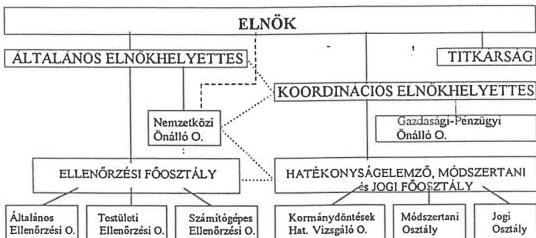

— alá/fölérendeltség
... koordináció
--- felügyelet

---

1

1

1

1

---

2. sz. melléklet
a V-17-55/1997/98. sz. jelentés függelékéhez

# A KEI befejezett ellenőrzéseinek alakulása 1995-1996-ban

A.

|  Az ellenőrzések csoportosítása | 1995. |   | 1996. |   | 1996/95.  |   |
| --- | --- | --- | --- | --- | --- | --- |
|   |   |  db | összet. % | db | összet. % | %  |
|  Hagyományosak | Általános költségvetési ellenőrzés | 4 | 18,2 | 7 | 19,4 | 175  |
|   |  Állami Alapok ellenőrzése | - | - | 3 | 8,3 | -  |
|   |  Létszám- és bérgazdálkodás ellenőrzése | 1 | 4,5 | - | - | -  |
|   |  Egyéb ellenőrzések és az azokkal kapcsolatos feladatok | - | - | 4 | 11,1 | -  |
|   |  Összesen | 5 | 22,7 | 14 | 38,8 | 280  |
|  Hatékonysági jellegűek | Költségvetési támogatások vizsgálata | 4 | 18,2 | 5 | 13,9 | 125  |
|   |  Vagyon (ingatlan, vállalkozás, értékpapír, pénz) gazdálkodás vizsgálata | 4 | 18,2 | 4 | 11,1 | 100  |
|   |  Külföldi segélyekkel kapcsolatos vizsgálatok | 3 | 13,7 | 2 | 5,7 | 67  |
|   |  Hatékonysági vizsgálatok | 1 | 4,5 | 3 | 8,3 | 300  |
|   |  Utasításra végzett vizsgálatok | 4 | 18,2 | 7 | 19,4 | 175  |
|   |  Vizsgálatokhoz kapcsolódó egyéb szakmai feladatok | 1 | 4,5 | 1 | 3,8 | 100  |
|   |  Összesen: | 17 | 77,3 | 22 | 61,2 | 129  |
|  Mindösszesen: |   | 22 | 100,0 | 36 | 100,0 | 164  |

B.

|  Megnevezés | 1995-ben befejezett |   | 1996-ban befejezett  |   |   |   |   |
| --- | --- | --- | --- | --- | --- | --- | --- |
|   |   |  db | összet. % | 1995-ról áthúzódó | 1996-ban indult | Összesen | összet. %  |
|  Témaellenőrzés |   | 6 | 27,3 | 2 | 7 | 9 | 25  |
|  Célellenőrzés | munkaterv szerinti | 6 | 27,3 | 4 | 3 | 7 | 19,4  |
|   |  utasításra | 4 | 18,2 | - | 7 | 7 | 19,4  |
|   |  kormányhatározat alapján | 2 | 9,1 | - | 3 | 3 | 8,3  |
|   |  törvényben előírt | 1 | 4,5 | - | 2 | 2 | 5,7  |
|   |  Összesen: | 13 | 59,1 | 4 | 15 | 19 | 52,8  |
|  Utóellenőrzés |   | 1 | 4,5 | 2 | 2 | 4 | 11,1  |
|  Hatékonysági vizsgálat, illetve feladat |   | 2 | 9,1 | 4 | - | 4 | 11,1  |
|  Mindösszesen: |   | 22 | 100,0 | 12 | 24 | 36 | 100,0  |

(A táblázat a vonatkozó kormányelőterjesztés része, adatai kisebb eltérést mutatnak a jelen vizsgálat kapcsán készített vizsgálati lista adataival. Az eltérés kezelhető, a tendenciákat nem befolyásolja.)

---

1

1

1

1

---

Kormányzati Ellenőrzési Iroda

3) sz. melléklet

a V-17-55/1997/98. sz. jelentés függelékéhez

09
Cím, intézmény

# A MŰKÖDÉSI KÖLTSÉGVETÉS EREDETI ELŐIRÁNYZATAINAK LEVEZETÉSE

Adatok M Ft-ban

|  Megnevezés | 1995. év |   |   | 1996. év |   |   | 1997. év  |   |   |
| --- | --- | --- | --- | --- | --- | --- | --- | --- | --- |
|   |  Kiad. | Bev. | Ebből támog. | Kiad. | Bev. | Ebből támog. | Kiad. | Bev. | Ebből támog.  |
|  Előző évi eredeti előirányzat | 160 |  | 160 | 145 | 145 | 145 | 163 |  | 163  |
|  Szerkezeti (+) változás (-) | - 15 |  | - 15 | - 3 | - 3 | - 3 | 44 |  | 42  |
|  Szintrehozás (+) (-) |  |  |  | 21 | 21 | 21 |  |  |   |
|  Alapelőirányzat | 145 |  | 145 | 163 | 163 | 163 | 207 | 2 | 205  |
|  Fejlesztések |  |  |  |  |  |  |  |  |   |
|  Automatizmusok |  |  |  |  |  |  |  |  |   |
|  Eredeti előirányzat: | 145 | 145 | 145 | 163 | 163 | 163 | 207 | 2 | 205  |

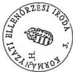

Budapest, 1998. április 20.

R. L. L. L.
Urbán Istvánné
pü. gazd. oszt.vez.

---

#

---

Kormányzati Ellenőrzési Iroda

09

Cím, intézmény

4. sz. melléklet

a V-17-55/1997/98. sz. jelentés függelékéhez

# A BEVÉTELEK ALAKULÁSA

Adatok M Ft-ban

|  Megnevezés | 1995. év |   |   | 1996. év |   |   | 1997. I. félév  |   |   |
| --- | --- | --- | --- | --- | --- | --- | --- | --- | --- |
|   |  Eredeti | Mód. | Teljes. | Eredeti | Mód. | Teljes. | Eredeti | Mód. | Teljes.  |
|   |  előirányzat |   |   | előirányzat |   |   | előirányzat  |   |   |
|  1. Intézményi működési bevételek |  | 7 | 7 |  | 9 | 9 | 2 | 2 | 6  |
|  2. Felhalmozási és tőke jellegű bevételek |  | 6 | 6 |  |  |  |  |  |   |
|  3. Támogatás | 145 | 143 | 143 | 163 | 158 | 158 | 205 | 218 | 127  |
|  4. Átvett pénzeszközök |  |  |  |  |  |  |  |  |   |
|  5. Hitelek, értékpapírok bevételei |  |  |  |  |  |  |  |  |   |
|  6. Pénzforgalom nélküli bevételek (pénzmaradványok igénybevétele) |  | 42 | 42 |  | 46 | 46 |  |  |   |
|  Költségvetési bevételek összesen: | 145 | 198 | 198 | 163 | 213 | 213 | 207 | 220 | 133  |

Budapest, 1997. szeptember 25.

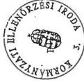

Urbán Istvánné

pü. gazd. oszt.vez.

---

1

1

1

1

---

Kormányzati Ellenőrzési Iroda

09

Cím, intézmény

4/a. sz. melléklet

a V-17-55/1997/98. sz. jelentés függelékéhez

# A BEVÉTELEK ALAKULÁSA

Adatok M Ft-ban

|  Megnevezés | 1995. év |   |   | 1996. év |   |   | 1997. év  |   |   |
| --- | --- | --- | --- | --- | --- | --- | --- | --- | --- |
|   |  Eredeti | Mód. | Teljes. | Eredeti | Mód. | Teljes. | Eredeti | Mód. | Teljes.  |
|   |  előirányzat |   |   | előirányzat |   |   | előirányzat  |   |   |
|  1. Intézményi működési bevételek |  | 7 | 7 |  | 9 | 9 | 2 | 8 | 6  |
|  2. Felhalmozási és tőke jellegű bevételek |  | 6 | 6 |  |  |  |  |  |   |
|  3. Támogatás | 145 | 143 | 143 | 163 | 158 | 158 | 205 | 218 | 218  |
|  4. Átvett pénzeszközök |  |  |  |  |  |  |  | 4 | 5  |
|  5. Hitelek, értékpapírok bevételei |  |  |  |  |  |  |  |  |   |
|  6. Pénzforgalom nélküli bevételek (pénzmaradványok igénybevétele) |  | 42 | 42 |  | 46 | 46 |  | 20 | 8  |
|  Költségvetési bevételek összesen: | 145 | 198 | 198 | 163 | 213 | 213 | 207 | 250 | 237  |

Budapest, 1998. április 20.

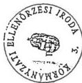

Urbán Istvánné
pü. gazd. oszt.vez.

---

1

1

1

1

---

Kormányzati Ellenőrzési Iroda

09

Cím, intézmény

5. sz. melléklet

a V-17-55/1997/98. sz. jelentés függelékéhez

# A KIADÁSOK ALAKULÁSA KIEMELT ELŐIRÁNYZATONKÉNT

Adatok M Ft-ban

|  Megnevezés | 1995. év |   |   | 1996. év |   |   | 1997. I. félév  |   |   |
| --- | --- | --- | --- | --- | --- | --- | --- | --- | --- |
|   |  Eredeti | Mód. | Teljes. | Eredeti | Mód. | Teljes. | Eredeti | Mód. | Teljes.  |
|   |  előirányzat |   |   | előirányzat |   |   | előirányzat  |   |   |
|  1. Személyi juttatások | 45 | 44 | 39 | 53 | 62 | 51 | 72 | 83 | 38  |
|  Nem rendszeres | 27 | 40 | 40 | 32 | 45 | 39 | 40 | 40 | 17  |
|  2. TB-járulék | 32 | 37 | 31 | 38 | 43 | 36 | 50 | 54 | 23  |
|  3. Dologi kiadások | 38 | 62 | 46 | 37 | 47 | 51 | 38 | 36 | 18  |
|  4. Ellátottak pénzbeli juttatásai |  |  |  |  |  |  |  |  |   |
|  5. Egyéb működési célú támogatások, kiadások |  | 3 | 3 |  | 4 | 5 |  |  |   |
|  6. Intézményi beruházás |  |  |  |  |  |  |  |  |   |
|  7. Felújítás |  | 6 | 6 |  | 1 | 2 |  |  |   |
|  8. Egyéb intézményi felhalmozási kiadások | 3 | 6 | 4 | 3 | 11 | 10 | 7 | 7 |   |
|  9. Pénzforgalom nélk. kiad. |  |  |  |  |  |  |  |  |   |
|  Költségvetési összes kiadás: | 145 | 198 | 169 | 163 | 213 | 194 | 207 | 220 | 96  |

Budapest, 1997. szeptember 25.

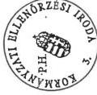

Urbán Istvánné

pü. gazd.oszt.vez.

---

1

1

1

1

---

Kormányzati Ellenőrzési Iroda

5/a. sz. melléklet

a V-17-55/1997/98. sz. jelentés függelékéhez

09

Cím, intézmény

# A KIADÁSOK ALAKULÁSA KIEMELT ELŐIRÁNYZATONKÉNT

Adatok M Ft-ban

|  Megnevezés | 1995. év |   |   | 1996. év |   |   | 1997. év  |   |   |
| --- | --- | --- | --- | --- | --- | --- | --- | --- | --- |
|   |  Eredeti | Mód. | Teljes. | Eredeti | Mód. | Teljes. | Eredeti | Mód. | Teljes.  |
|   |  előirányzat |   |   | előirányzat |   |   | előirányzat  |   |   |
|  1. Személyi juttatások | 45 | 44 | 39 | 53 | 62 | 51 | 72 | 83 | 74  |
|  Nem rendszeres | 27 | 40 | 40 | 32 | 45 | 39 | 40 | 49 | 50  |
|  2. TB-járulék | 32 | 37 | 31 | 38 | 43 | 36 | 50 | 57 | 53  |
|  3. Dologi kiadások | 38 | 62 | 46 | 37 | 47 | 51 | 38 | 53 | 43  |
|  4. Ellátottak pénzbeli juttatásai |  |  |  |  |  |  |  |  |   |
|  5. Egyéb működési célú támogatások, kiadások |  | 3 | 3 |  | 4 | 5 |  |  |   |
|  6. Intézményi beruházás |  |  |  |  |  |  |  |  |   |
|  7. Felújítás |  | 6 | 6 |  | 1 | 2 |  |  |   |
|  8. Egyéb intézményi felhalmozási kiadások | 3 | 6 | 4 | 3 | 11 | 10 | 7 | 7 |   |
|  9. Pénzforgalom nélk. kiad. |  |  |  |  |  |  |  |  |   |
|  Költségvetési összes kiadás: | 145 | 198 | 169 | 163 | 213 | 194 | 207 | 249 | 220  |

Budapest, 1998. április 20.

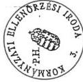

Urbán Istvánné

pü. gazd.oszt.vez.

67

---

a

1

3

1

---

MAGYAR KÖZTÁRSASÁG
MINISZTERELNÖKE

6. sz. melléklet
a V-17-55/1997/98. sz. jelentés függelékéhez

Dr. Rubicsek Sándor úrnak
Kormányzati Ellenőrzési Iroda
elnöke

Budapest

Tisztelt Elnök Úr!

Felkérem, hogy a Kormány döntése alapján a Kormányzati Ellenőrzési Iroda folytasson vizsgálatot a települési önkormányzatok részére 1989. évi XIII. törvény alapján juttatandó belterületi föld megváltásának körülményeiről az ÁPV Rt.-nél.

Tájékoztatom, hogy az ÁPV Rt. Igazgatótanácsa a mai napon hozzájárult a vizsgálat lefolytatásához.

Kérem, hogy a vizsgálati jelentést 1996. október 3-ig juttassa el hozzám, figyelemmel arra, hogy a Kormány e témát az október 4-ei ülésén tárgyalja.

Budapest, 1996. szeptember 30.

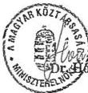

Dr. Horn Gyula

---

1

1

1

1

1

1

---

98 05/26 08:47

FAX -36 1 156 0698

KEI ELNÖK

003

CONCORDIA KÖZRAKTÁR Rt.
Szám: 344/1998.

6/a. sz. melléklet
a V-17-55/1997/98. sz. jelentés függelékéhez

# NYILATKOZAT

A tulajdonosok kérésére az Igazgatótanács 10/1998. számú, illetve a Felügyelő Bizottság 1/1998. számú határozatai alapján hozzájárulunk ahhoz, hogy a Kormányzati Ellenőrzési Iroda munkatársai a CONCORDIA KÖZRAKTÁR Kereskedelmi Rt.-nél, annak működésére, illetőleg gazdálkodására vonatkozóan vizsgálatot végezzenek.

Ezúton utasítjuk a Társaság vezetőit, hogy a szükséges adatszolgáltatással (bele értve a titkosított adatokat is) és információ adással segítsék a vizsgálatot.

Ezen nyilatkozat a vizsgálat befejezéséig érvényes.

Budapest, 1998. március 3.

Igazgatóság elnöke

Felügyelő Bizottság elnöke

Készült: 4 eredeti példányban

Képkép:
1 pl. Földművelésügyi Minisztérium
1 pl. Kereskedelmi és Hitelbank Rt.
1 pl. CONCORDIA KÖZRAKTÁR Rt.
1 pl. Kormányzati Ellenőrzési Iroda

|  Kormányzati Ellenőrzési Iroda  |   |
| --- | --- |
|  Érkezett:  |   |
|  Ék. sz.: 41-36/7/98  |   |
|  Mell.: (A)  |   |

Budapest, 1998. június

---

1. 2. 3. 4. 5. 6. 7. 8. 9. 10. 11. 12. 13. 14. 15. 16. 17. 18. 19. 20. 21. 22. 23. 24. 25. 26. 27. 28. 29. 30. 31. 32. 33. 34. 35. 36. 37. 38. 39. 40. 41. 42. 43. 44. 45. 46. 47. 48. 49. 50. 51. 52. 53. 54. 55. 56. 57. 58. 59. 60. 61. 62. 63. 64. 65. 66. 67. 68. 69. 70. 71. 72. 73. 74. 75. 76. 77. 78. 79. 80. 81. 82. 83. 84. 85. 86. 87. 88. 89. 90. 91. 92. 93. 94. 95. 96. 97. 98. 99.

1. 2. 3. 4. 5. 6. 7. 8. 9. 10. 11. 12. 13. 14. 15. 16. 17. 18. 19. 20. 21. 22. 23. 24. 25. 26. 27. 28. 29. 30. 31. 32. 33. 34. 35. 36. 37. 38. 39. 40. 41. 42. 43. 44. 45. 46. 47. 48. 49. 50. 51. 52. 53. 54. 55. 56. 57. 58. 59. 60. 61. 62. 63. 64. 65. 66. 67. 68. 69. 70. 71. 72. 73. 74. 75. 76. 77. 78. 79. 80. 81. 82. 83. 84. 85. 86. 87. 88. 89. 90. 91. 92. 93. 94. 95. 96. 97. 98. 99.