Állami Számverőszék

# JELENTÉS

a Nemzetközi Pető András Közalapítvány és -
kapcsolódó ellenőrzésként - a Mozgássérültek
Pető András Nevelőképző és Nevelőintézet
pénzügyi-gazdasági ellenőrzéséről

9821

1998. július

---

Az ellenőrzés végrehajtásáért felelős:
az ÁSZ III. Költségvetési Ellenőrzési Igazgatósága

Bihary Zsigmond
igazgató

Az ellenőrzést vezette:

Balázs Andrásné
számvevő főtanácsos

Az ellenőrzést végezték:

Fogarasi Miklós
számvevő tanácsos

Dr. Solymár Károlyné
számvevő tanácsos

Dr. Oszer Sándor Lajos
számvevő

---

V-41-36/1997-98

# TARTALOMJEGYZÉK

I. OSSZEGZO MEGALLAPITASOK, KÖVETKEZTÉSEK, JAVASLATOK. 7
II. RÉSZLETES MEGÁLLAPÍTÁSOK 13
1. A KÖZALAPITVÁNY FELADAT- ES SZERVEZETI RENDSZERE, A KURATORIUM ES A TITKÁRSAG TEVÉKENYSÉGÉNEK SZERVEZETI, SZABÁLYOZASI ES MUKÖDÉSI FELTÉTELEI 13

1.1.A KOZALAPITVANY VAGYONA. 13
1.2.A KOZALAPITVANY SzerVEZETI SZABALYOZOTTSAGA, A KURATORIUM MUKODESE, AZ ULESEK RENDSZERESSEGE, DOKUMENTALTSAGA 15

2.A KOZALAPITVANY GAZDALKODASA 17
3.A VILLANYI UTI BERUHAZAS 20
4.A KOZALAPITVANYNAL LEFOLYTATOTT BELSO ES KULSO ELLENORZESEK 23
5.AZ INTEZET MUKODESENEK,GAZDALKODASANAK SZABALYOZOTTSAGA 24
6.AZ INTEZET GAZDALKODASA 25

6.1.AZ EVES BEVETELEK ES KIADASOK (KOLTSEGEK) TERVEZESE 25
6.2.A BEVETELEK ES KIADASOK TENYLEGES ALAKULASA 26
6.3.A KOZPONTI KOLTSEGVETESI TAMOGATAS FELHASNZALASA 31
6.4. LETSZAM, SZEMELYI JUTTATASOK 34

6.4.1.A letszam alakulasa,annak osszetetele 34
6.4.2.A ber es kereseti viszonyok alakulasa 35

6.5.AZ INTEZET ESZKÖZ- ES VAGYONGAZDALKODASA 37
6.6. EGYEB MUKODESI CELU KIADASOK 39

7. AZ INTÉZET SZÁMVITELI ÉS BIZONYLATI RENDJE, OKMÁNYFEGYELME, A BELSŐ ELLENŐRZÉS RENDJE... 41

1

---

The Ground Truth image displays a single, solid horizontal line. According to Rule 2 (UNDERSCORE & LINE RULES), this is a stylistic or background line, not a placeholder underscore. Therefore, the OCR result must ignore it and output nothing or only meaningful text. The provided OCR content is "____", which consists of four underscores. This is an incorrect interpretation of the line as a placeholder, violating the rule that stylistic lines must be ignored. The OCR has hallucinated underscores where none should exist based on the GT's visual context. Hence, the OCR result is inconsistent with the Ground Truth.

The Ground Truth image displays a single, solid horizontal line. According to Rule 2 (UNDERSCORE & LINE RULES), this is a stylistic or background line, not a placeholder underscore. Therefore, the OCR result must ignore it and output nothing or only meaningful text. The provided OCR content is "____", which consists of four underscores. This is an incorrect interpretation of the line as a placeholder, violating the rule that stylistic lines must be ignored. The OCR has hallucinated underscores where none should exist based on the GT's visual context. Hence, the OCR result is inconsistent with the Ground Truth.

[Non-Text]

[Non-Text]

[Non-Text]

[Non-Text]

[Non-Text]

[Non-Text]

[Non-Text]

[Non-Text]

[Non-Text]

[Non-Text]

[Non-Text]

[Non-Text]

[Non-Text]

[Non-Text]

[Non-Text]

[Non-Text]

[Non-Text]

[Non-Text]

[Non-Text]

[Non-Text]

[Non-Text]

[Non-Text]

[Non-Text]

[Non-Text]

[Non-Text]

[Non-Text]

[Non-Text]

[Non-Text]

[Non-Text]

[Non-Text]

[Non-Text]

[Non-Text]

[Non-Text]

[Non-Text]

[Non-Text]

[Non-Text]

[Non-Text]

[Non-Text]

[Non-Text]

[Non-Text]

[Non-Text]

[Non-Text]

[Non-Text]

[Non-Text]

[Non-Text]

[Non-Text]

[Non-Text]

The Ground Truth image displays a single, solid horizontal line. According to Rule 2 (UNDERSCORE & LINE RULES), this is a stylistic or background line, not a placeholder underscore. Therefore, the OCR result must ignore it and output nothing or only meaningful text. The provided OCR content is "____", which consists of four underscores. This is an incorrect interpretation of the line as a placeholder, violating the rule that stylistic lines must be ignored. The OCR has hallucinated underscores where none should exist based on the GT's visual context. Hence, the OCR result is inconsistent with the Ground Truth.

---

Állami Számvevőszék

V-41-36/1997-98.

Témaszám: 410.

# JELENTÉS

## a Nemzetközi Pető András Közalapítvány és - kapcsolódó ellenőrzésként - a Mozgássérültek Pető András Nevelőképző és Nevelőintézet pénzügyi-gazdasági ellenőrzéséről

A mozgássérültek rehabilitációját célzó konduktív nevelés és a konduktorképzés dr. Pető András magyar orvos-pedagógus nevéhez fűződik, aki 1945-ben kezdte el Budapesten a mozgássérült gyermekek új, egységes rendszerben történő nevelését. A konduktív nevelés programjának megszervezése és megvalósítása új képzési formát igényelt. Ezért dolgozta ki és szervezte meg dr. Pető András a világon egyedülálló módon a konduktorok főiskolai képzését. Első 80 férőhelyes intézetét 1950-ben alapította, ennek utóda a mai Pető Intézet.

A Mozgássérültek Nevelőképző és Nevelőintézetét a Kormány 1963-ban a központi idegrendszer károsodása következtében gátolt mozgássérültek speciális (konduktív) módszerekkel történő helyreállító nevelésének, oktatásának és az e feladatokat ellátó nevelők képzésének biztosítása céljából a művelődésügyi miniszter közvetlen felügyelete és irányítása alatt hozta létre, a főiskolai rangot 1989-ben nyerte el.

A tapasztalatok és az eredmények azt igazolták, hogy a Magyarországon létrehozott konduktív nevelési módszer az egyik legeredményesebb útja a mozgássérültek rehabilitációjának, a Pető módszer világszerte nagy érdeklődést váltott

---3

---

ki. 1988-ra a konduktív neveléssel kapcsolatos magyar és külföldi igények sokszorosan meghaladták a Pető Intézet lehetőségeit, az intézet kapacitásának túlterhelése azonban az elért minőségi színvonalat, a kezelés sikerét veszélyeztette volna. Az egyetlen járható út a Pető Intézet olyan bővítése volt, amely lehetővé teszi az ellátott gyermekek számának növelését és a magas színvonalú konduktornevelő képzést. A Nemzetközi Pető Intézet létesítése komoly anyagi erőforrásokat és nemzetközi összefogást igényelt. A magyar kormány ezért 1988-ban létrehozta a Nemzetközi Pető Alapítványt, és támogatta a Nemzetközi Pető Intézet felépítésére irányuló kezdeményezést abból a célból, hogy a Pető András által kidolgozott módszerrel több hazai és külföldi mozgássérült tanítása, nevelése és magas szintű konduktor-képzés váljon lehetővé. Biztosította az alapítvány számára a konduktív nevelési módszer, mint vagyoni értéket képező szellemi termék alkalmazásának jogát, valamint az alapítványnak adományozta a Pető Intézet épületét, telekingatlanát, berendezési és felszerelési tárgyait, továbbá a leendő új Nemzetközi Pető Intézet felépítésére szolgáló telekingatlant.

Az alapítványi forma létrehozását az a tényező is motiválta, hogy az 1990-es évek elején a Magyar Köztársaság Kormánya és az Egyesült Királyság Kormánya közötti megállapodás értelmében a brit kormány 5 millió GBP adományt ajánlott fel a Pető Intézet új épületének létrehozására, amelyet a Kútvölgyi u. 5-7. sz. telekingatlanon terveztek. A megállapodás szerint a beruházás befejezésének határideje 1996. február volt. A brit kormány e célra 1991. évben az alapítvány számlájára át is utalt 1,75 millió GBP-t. A beruházás megvalósításához a Magyar Állam kiegészítő támogatására is szükség lett volna, ami azonban az évek során nem realizálódott. Emiatt 1995-ig meg sem kezdődtek a munkálatok, a brit kormány letétbe helyezett adományának megtartása kétségessé vált.

Az alapító okirat az alapítvány induló vagyonát 140 millió dollárban határozta meg és előírta, hogy az induló vagyont az alapítást kimondó minisztertanácsi határozat megjelenését követő 30 napon belül az alapítvány rendelkezésére kell bocsátani. Az induló vagyonon belül a konduktív nevelési módszer értékét 1990. január 1-én az Arthur Andersen and Co által készített értékbecslés 120,5 millió dollárra becsülte. Az alapítvány mérlegei (sem a nyitó mérleg, sem az éves mérlegek) azonban nem tartalmazták az alapító okiratban meghatározott induló vagyon teljes értékét. A mérlegekben nem szerepelt a konduktív nevelési módszer és az új Pető Intézet építésére szánt telek értéke.

Az 1099/1988.(XI. 22.) MT határozat és a mellékletét képező alapító okirat a módszer tulajdonjogát illetően nem volt összhangban. A határozat szerint a Minisztertanács „biztosítja az alapítvány számára a konduktív nevelési módszer, mint vagyoni értéket képező szellemi termék alkalmazásának jogát”, az alapító okirat 3. pontja szerint viszont az alapító „az alapítást kimondó határozat megjelenését követő 30 napon belül az alapítvány rendelkezésére bocsátja a konduktív nevelési módszert, mint vagyoni értéket képviselő szellemi terméket”.

4

---

Az 1994. szeptemberében készült és 1994. december 28-án auditált 1993. évi mérleg összeállításánál az alapítvány önrevíziója 1992. január 1-jétől kezdődően levezette az induló vagyont és a tőkeváltozást, így az 1993. évi mérlegben az intézeti vagyont a befektetett pénzügyi eszközök között mint részesedést kimutatták, a telek ingatlan is megjelent az alapítvány könyveiben. **A vagyoni értéket képező konduktív nevelési módszer azonban még az önrevízió után is kimaradt az 1993. évi mérlegből és vagyonleltárból.** A kuratórium - a könyvvizsgálóval és a PM Számviteli Főosztályával egyeztetve - a könyvekben szerepeltetés elvi, szakmai akadályát abban látta, hogy a számviteli törvénynek megfelelően elszámolandó amortizáció finanszírozása nagy terhet jelentene az alapítványnak. A Pető módszer (akkori árfolyamon számított) mintegy 13 milliárd forintos értékének elszámolandó értékcsökkenése - még ha a használati idejét rendhagyóan hosszú időtartamban, pl. 100 évben állapítják is meg - évente 130 millió forint többletfinanszírozást igényelt volna.

**A Kormány 1995. végén az alapítványt közalapítvánnyá nyilvánította. A Pető Intézet állami feladatokat lát el, a közalapítvány keretei között mint nem állami felsőoktatási intézmény működik.**

**Az alapító okirat szerint a közalapítvány célja:**

- a nemzetközi igényeknek megfelelő, budapesti székhelyű Nemzetközi Pető Intézet létrehozása, fenntartása;
- anyagi támogatás nyújtása a Mozgássérültek Pető András Nevelőképző és Nevelőintézet fenntartására, a gyógyító, nevelő, oktató, szervező, kutatómunka továbbfejlesztésére, a közalapítvány részére biztosított ingatlanon - infrastrukturális bővítéssel - a megjelölt feladatok ellátására;
- anyagi támogatás nyújtása a Nemzetközi Pető Társaság tudományos kutatásra irányuló tevékenységéhez;
- a konduktív nevelésre szorulók, a konduktív nevelést elsajátítani kívánók anyagi támogatása;
- a közalapítványi célok megvalósításához szükséges források gyűjtése, illetve befektetések útján történő gyarapítása.

A közalapítvány vagyonát - az alapítvány 1993. december 31-i vagyonállapotának megfelelően - 1322,4 millió forint eszközértékben határozták meg. Ezen belül a Pető Intézet eszközértéke - mint befektetett pénzügyi eszköz - 949,5 millió forintot reprezentált, amely egyben a Pető Intézet - mint gazdálkodó szervezet - induló tőkéje volt.

**Az éves költségvetési törvények** a Művelődési és Közoktatási Minisztérium (MKM) fejezetben **irányozzák elő a közalapítvány támogatását**, ami 1995. évben 275,7 millió forint, 1996. évben 390,1 millió forint, 1997. évben 454,9 millió forint volt. A főiskolai oktatásban résztvevő külföldi hallgatók tandíjat, az ellátottak ellátási díjat fizetnek, a külföldön végzett konduktív nevelésért az intézet árbevételt realizál. 1997-ben a külföldiektől összesen 432,7 millió forint bevétel keletkezett. **A közalapítvány az Egyesült Királyság**

5

---

konkrét beruházási célra rendelt - mintegy 1,7 millió GBP - adományával és annak kamataival is gazdálkodik.

Az Állami Számvevőszék a Polgári törvénykönyv (Ptk.) 74/G. §-ának (8) bekezdése alapján ellenőrzi a közalapítványok gazdálkodásának törvényességét és célszerűségét, továbbá az 1989. évi XXXVIII. tv. 2. §-ának (5) bekezdése alapján az alapítványoknak a központi költségvetésből juttatott támogatás felhasználását, és ugyanezen törvény 21. § (3) bek. alapján szükség szerint kapcsolódó ellenőrzést végez.

Az Állami Számvevőszék 1995. évben - a fejezetek és intézményeik által az alapítványoknak juttatott állami pénzek és vagyon felhasználásának, működtetésének ellenőrzése során 11 közalapítványt a helyszínen ellenőrzött, 308 alapítványt - köztük az akkor még alapítványként nyilvántartott Nemzetközi Pető Alapítványt - 1992-1994. évekre vonatkozóan adatlapok kitöltésével beszámoltatta. Az Állami Számvevőszék éves ellenőrzési terveinek összeállításánál arra törekszik, hogy folyamatosan valamennyi közalapítvány ellenőrzésre kerüljön, így 1996-98. évek között további 6 közalapítványt ellenőriztünk. A Nemzetközi Pető András Közalapítvány jelen ellenőrzését részben tevékenységének nemzetközi összefüggései, részben pedig az motiválta, hogy a legrégebben működő olyan közalapítvány, amit az Állami Számvevőszék a helyszínen még nem ellenőrzött.

Az ellenőrzés törvényességi, célszerűségi és eredményességi szempontból értékelte a közalapítványnak, illetve - kapcsolódó ellenőrzés keretében - a főiskolának átadott vagyon működtetését, a központi költségvetésből származó támogatások felhasználását. Ennek keretében értékelésre került

- a kozalapitvany szervezeti, mukodesi rendjenek, gazdalkodasanak tórvenyessege és celszerüsege;
- az alapíto okiratban meghatározott feladatok megvalósítása és az alapítoi vagyon megörzese és gyarapítása érdekében tett tulajdonosi dontésk megalapozottsága, celszerüsege, ezek érvényesülse a fóiskola muködésében;
- a fóiskola muködésének, gazdalkodásanak szabályozottsága és celszerüsege, a feladatok és a szervezeti rend összhangja;
- a gazdalkodás, a rendelkezésre bocsátott vagyon és a költségvetési támogatás felhasznalásanak szabályossága.

Az ellenőrzés az 1995-1997. évekre terjedt ki.

6

---

I. ÖSSZEGZŐ MEGÁLLAPÍTÁSOK, KÖVETKEZTETÉSEK, JAVASLATOK

# I. ÖSSZEGZŐ MEGÁLLAPÍTÁSOK, KÖVETKEZTETÉSEK, JAVASLATOK

**A Nemzetközi Pető András Közalapítvány és a tulajdonában lévő Mozgássérültek Nevelőképző és Nevelőintézet nemzetközi és hazai elismertséget szerzett** a központi idegrendszer károsodása következtében gátolt mozgássérültek konduktív módszerekkel történő helyreállító nevelésében, oktatásában és az e feladatokat ellátó nevelők képzésében.

**Az intézet az országos egészségügyi ellátás keretein belül teljes körűen biztosította a fenti ellátásra szoruló magyar gyermekek időben történő kiszűrését, konduktív nevelését és oktatását.** A külföldi kapcsolatok kiépítése és ápolása jól szolgálta a módszer nemzetközi elterjesztését, és hozzájárult - a központi költségvetési támogatás szűkössége miatt kényszerűen - a magyar gyermekek ellátásának pénzügyi finanszírozásához.

A közalapítvány alapító okiratát **a Kormány** csak 1995. végén **hagyta jóvá, a jogelőd alapítvány vagyonához képest csökkentett -1.322,4 millió forint összegű - vagyonnal.** A közalapítvány vagyonából **ugyanis kimaradt a 120,5 millió dollárra becsült Pető módszer.** A Ptk. 74/B. §-ának (5) bekezdése értelmében azonban **az alapító az alapító okiratot csak** az alapítvány nevének, céljának és **vagyonának sérelme nélkül módosíthatta volna.** A döntést a Pénzügyminisztériumnak és a közalapítványnak a nagy értékű Pető módszer értékcsökkenésének finanszírozásával összefüggő pénzügyi megfontolásai motiválták, jóllehet az Igazságügyi Minisztérium az alapító okirat közigazgatási egyeztetése során a Ptk. fenti előírásának betartására felhívta a Művelődési és Közoktatási Minisztérium figyelmét.

A közalapítvány induló vagyona értékének pontosításához szükséges, hogy a Kormány, mint alapító a Pető módszer újonnan megállapított értékével módosítsa a közalapítvány alapító okiratában a vagyon értékét. Az értékcsökkenés elszámolásával kapcsolatosan felmerült problémát a számviteli törvény 37. § (4) bekezdésének módosításával lehetne orvosolni, nevezetesen, hogy a földterülethez, az erdőhöz, a képzőművészeti alkotásokhoz stb. hasonlóan a Pető módszer után se kelljen értékcsökkenést elszámolni. (Megjegyezzük, hogy hasonló problémát jelent a Magyar Rádió Rt. és a Magyar Távirati Iroda Rt. hang- és sajtó archívumának értékelése, a szabályozás módosításánál azokra is figyelemmel kell lenni.)

A Mozgássérültek Pető András Nevelőképző és Nevelőintézet (intézet), mint nem állami felsőoktatási intézmény, állami feladatokat lát el. **Az intézet finanszírozását a központi költségvetés az MKM fejezetből a közalapítványon keresztül biztosítja,** a többi állami közfeladatot ellátó, nem állami intézménytől eltérően azonban **a finanszírozás nem normatív jellegű.** Az éves költségvetési törvényekben jelenleg megállapított normatívák nem alkalmasak a speciális feladatokat ellátó intézet finanszírozására. **A kialakított támogatási gyakorlatot azonban az ellenőrzés nem tartja megfe-**

7

---

I. ÖSSZEGZŐ MEGÁLLAPÍTÁSOK, KÖVETKEZTETÉSEK, JAVASLATOK

lelőnek, mivel az alaptevékenység egyösszegű támogatása nem mutatja meg, hogy a magyar gyermekek ellátására és a konduktorképzésre adott központi költségvetési támogatás milyen mértékben fedezi az állami közfeladatokkal kapcsolatos költségeket. E feladatok finanszírozásához a külföldi ellátottak díjfizetése és az intézet külföldön végzett tevékenysége is szükséges. Az intézet számításai szerint - melyet a helyszíni ellenőrzést követően elkészült 1997. évi mérleg adataira alapoznak - 1997-ben a külföldiektől származó mintegy 102 millió forint nyereség kompenzálta az állami közfeladat ellátása miatt keletkezett közel 84 millió forint veszteséget. Az intézet sajátosságait figyelembevevő normatíva rendszer és az ehhez igazított önköltségszámítás alapján megalapozottabban lehetne biztosítani az állami közfeladat maradéktalan finanszírozását, illetve megteremteni az intézet érdekeltségét saját bevétele növelésében.

Az éves költségvetési törvények az infláció ütemétől elmaradva állapították meg a közalapítvány támogatását. Az MKM az előirányzatot megalapozó számításokkal nem támasztotta alá. Az intézet által ellátott alaptevékenységeket csak mennyiségi feladatmutatók rögzítették, ezekhez konkrét pénzügyi támogatást a művelődési és közoktatási miniszter és a közalapítvány által kötött megállapodások nem rendeltek. A megállapodások teljesítésének elszámoltatása az ellenőrzött időszakban formális volt.

A brit és a magyar kormány finanszírozásában folyamatban van az új Nemzetközi Pető Intézet megépítése. A beruházás előkészítése és kivitelezése a kormányközi megállapodásnak megfelelően, a brit kormány szakértőinek szigorú ellenőrzésével példamutató szervezettségű. A beruházás tervezett befejezési határideje 1998. július, a nevelő és oktató munka várhatóan 1998. szeptember 14-én kezdődik.

A kuratórium - miközben tervszerűen eredményesen ellátta a Pető Intézet beruházásával kapcsolatos feladatait - nem fordított kellő figyelmet testületi munkája megfelelő írásba foglalására, határozatai nyilvántartására, saját és az intézet szabályzatai megalkotására, a gazdálkodásával kapcsolatos tervező munkára. Jegyzőkönyvei, szabályzatai nem voltak teljes körűek, éves pénzügyi terveket nem készített.

A kuratórium nem készítette el a tulajdonában lévő intézet - mint felsőoktatási intézmény - alapító okiratát, nem véleményezte szabályzatait, nem határozta meg beszámoló készítési és könyvvezetési kötelezettségét.

A közalapítvány gazdálkodásában egyes döntéseknél nem vették figyelembe a kuratóriumnak az alapító okiratban meghatározott döntési jogkörét, a kötelezettségvállalásra és utalványozásra, illetve a jogkörök átruházására vonatkozó előírásokat. Az ellenőrzött időszakban nem jártak kellő eredménnyel a kuratóriumnak a bel- és külföldi támogatások, adományok növelésére irányuló erőfeszítései. A kuratórium működési költségei a takarékos gazdálkodás következtében minimálisak, a kuratórium tagjai nem igényelték az e tevékenységükkel összefüggésben felmerült költségeik megtérítését sem.

8

---

I. ÖSSZEGZŐ MEGÁLLAPÍTÁSOK, KÖVETKEZTETÉSEK, JAVASLATOK

A kuratórium a közalapítvány egyszerűsített éves beszámoló mérlegeit és eredmény-kimutatásait nyilvánosságra hozta, az ellenőrzött időszakban azonban egy alkalommal sem számolt be az alapítónak a közalapítvány működéséről.

A közalapítvány kuratóriumának ellenőrzését a Ptk. és az alapító okirat szerint felügyelő bizottságnak kell ellátni. A Művelődési és Közoktatási Minisztérium, a Népjóléti Minisztérium és a Pénzügyminisztérium javaslatára a Kormány által felkért személyek testületi feladataikat nem látták el, a közalapítvány fennállása óta ellenőrzést nem végeztek.

A közalapítvány gazdálkodását az intézet bonyolította le és adminisztrálta, ami takarékossági megfontolások miatt célszerű. Ez azonban arra a helytelen gyakorlatra vezetett, hogy a közalapítvány egyes gazdálkodási jogköreit az intézet vezetői gyakorolták, a közalapítvány szabályzatait az intézet határozta meg.

Az ellenőrzés elismerésre méltónak minősítette, hogy az intézet pályázat útján nyert pénzügyi támogatást és választott szakmailag elismert céget stratégiai terve kidolgozásához. A stratégiai terv alapján céltudatos szervezőmunka folyt az intézet szakmai feladatai, létszáma, szervezete, működése, gazdálkodása átalakítására, korszerűsítésére.

Az ellenőrzött időszakban az intézetnél kiemelkedően jó színvonalú volt a nemzetközi kapcsolatok szervezése és ápolása, ami a szakmai eredményeken túl a saját bevételek dinamikus növekedését eredményezte. Ennek köszönhetően az ellenőrzött időszak végén az intézet összes saját bevétele meghaladta a központi költségvetési támogatás összegét, miközben az ellátott közfeladat is nőtt.

Az intézet eszköz- és vagyongazdálkodása tervszerű volt, az ingatlanokon a szükséges felújításokat, javításokat elvégezték. Ugyanakkor az alaptevékenységet szolgáló gépek, berendezések használhatósági foka az elmúlt három évben fokozatosan csökkent. Az anyag- és készletgazdálkodás tervszerű és kiegyensúlyozott volt.

Az intézet számviteli rendje az ellenőrzött időszak végéig fokozatosan javult. A mérlegeket főkönyvi kivonatokkal és analitikus nyilvántartásokkal alátámasztották, azonban a nyilvántartások egy része (pl. a tárgyi eszközök egyedi nyilvántartó kartonjai, vevőkövetelések, szállítói kötelezettségek analitikája) nem felelt meg a rendeltetésének, néhány tárgyi eszköz nyilvántartásánál megsértették a bizonylati fegyelmet. A házipénztár szabályzat hiányos, nem tartalmazza a felelősségi szabályokat. A pénztárzárlattal, a záró pénzkészlettel kapcsolatos szabályozás is megújítást igényel.

9

---

I. ÖSSZEGZŐ MEGÁLLAPÍTÁSOK, KÖVETKEZTETÉSEK, JAVASLATOK

# Az ellenőrzés megállapításai alapján javasoljuk

# a Kormánynak:

- a Nemzetközi Pető András Közalapítvány alapító okiratát - figyelemmel a Ptk. 74/B. § (5) bekezdésére - úgy módosítsa, hogy a közalapítvány vagyona tartalmazza a Pető módszer - mint szellemi termék - új vagyonértékeléssel megállapított értékét;
- gondoskodjon arról, hogy a közalapítvány Felügyelő Bizottsága folyamatosan ellássa az alapító okiratban meghatározott feladatait;

# az oktatási miniszternek:

- dolgoztassa ki a Mozgássérültek Pető András Nevelőképző és Nevelőintézete által ellátott állami közfeladatok finanszírozásának - az intézet sajátosságait figyelembevevő - normatíváit;
- a központi költségvetési támogatás felhasználásáról a közalapítvánnyal kötött megállapodás legyen alkalmas az elszámoltatásra, a teljesítmények mérésére;

# a pénzügyminiszternek:

- kezdeményezze a számviteli törvény 37. §-a (4) bekezdésének az európai számviteli gyakorlattal összehangolt módosítását annak érdekében, hogy a különlegesnek tekinthető tárgyi eszközök és szellemi termékek (pl. a Pető módszer, a hang- és sajtó archívumok) után az érintett vállalkozások mentesüljenek az értékcsökkenés elszámolása alól;

# a Nemzetközi Pető András Közalapítvány kuratóriumának:

- a Ptk. 74/G. §-ának (8) bekezdése, illetve a közalapítvány alapító okirata 5. pontjának megfelelően évente számoljon be az alapítónak a közalapítvány működéséről;
- az 1993. évi LXXX. törvény 2. § (3) bekezdésének megfelelően adja ki az intézet alapító okiratát, gondoskodjék saját szabályzatai elkészítéséről, és az intézet szabályzatainak véleményezéséről;
- a közalapítvány alapító okiratának módosítását követően az új vagyonértékelés alapján módosítsa vagyonának értékét a Pető módszer értékével és döntson a Pető Intézetnek történő tulajdonba vagy használatba adásáról;
- biztosítsa, hogy a kuratóriumi ülések jegyzőkönyvei az alapító okirat 7. pontjának megfelelően legyenek írásba foglalva és nyilvántartva;
- az alapító okirat előírásaival összhangban készítsen éves pénzügyi tervet;
- gondoskodjon arról, hogy a közalapítvány gazdálkodásában maradéktalanul érvényesüljenek az alapító okiratban meghatározott gazdálkodási ha-

10

---

I. ÖSSZEGZŐ MEGÁLLAPÍTÁSOK, KÖVETKEZTETÉSEK, JAVASLATOK

táskörök (pl. a kuratórium döntési jogosultsága, a kötelezettségvállalási és utalványozási jogkör gyakorlása, illetve átruházása);

- ismételten és folyamatosan kezdeményezze, hogy a közalapítvány pénzügyi eszközei bel- és külföldi támogatások, adományok révén is növekedjenek;

**a Mozgássérültek Pető András Nevelőképző és Nevelőintézete főigazgatójának:**

- a kuratóriumnak a Pető módszer átadására vonatkozó döntésével összhangban módosítsa vagyonának értékét a Pető módszer - mint szellemi termék - értékével;
- működjön közre az intézet sajátosságait figyelembevevő egyedi normatívák kidolgozásában, olyan önköltség-számítási rendszert vezessen be, amely alkalmas az állami közfeladatok teljesítéséhez felmerült költségek számbavételére;
- intézkedjen, hogy a vagyonvédelem érdekében az intézet tárgyi eszközeinek nyilvántartásában tüntessék fel a jellemző adatokat, azonosítókat, a tárgyi eszközök aktuális számbavételét a számviteli törvény előírásainak megfelelő dokumentális feltételekkel egészítsék ki, az okmányfegyelem megszilárdításával biztosítsák az alapbizonylatok szabályosságát;
- a házipénztár szabályzatban a biztonsági feltételekre is figyelemmel határozza meg a házipénztár záró pénzkészletét, intézkedjen, hogy a pénztáros adjon nyilatkozatot az Mt. 169. § (3) bekezdésében meghatározott teljes anyagi felelőssége tudomásulvételéről.

11

---

12

---

II. RÉSZLETES MEGÁLLAPÍTÁSOK

## II. RÉSZLETES MEGÁLLAPÍTÁSOK

### A NEMZETKÖZI PETŐ ANDRÁS KÖZALAPÍTVÁNYNÁL

#### 1. A KÖZALAPÍTVÁNY FELADAT- ÉS SZERVEZETI RENDSZERE, A KURATÓRIUM ÉS A TITKÁRSÁG TEVÉKENYSÉGÉNEK SZERVEZETI, SZABÁLYOZÁSI ÉS MŰKÖDÉSI FELTÉTELEI

##### 1.1. A közalapítvány vagyona

**A 2165/1995. (VI. 8.) Korm. határozat csaknem másfél éves késéssel állapította meg, hogy a Nemzetközi Pető András Alapítvány a Ptk., valamint az ezt módosító 1993. évi XCII. törvény 40. § (6) bekezdése alapján közalapítványnak minősül.**

A bírósági bejegyzést követően (8 PK 64008/5. 1995. szeptember 19. 776-os bírósági nyilvántartási szám) a közalapítványról szóló 1138/1995. (XII. 27.) Korm. határozat és a mellékletét képező alapító okirat a Magyar Közlöny 1995/115. számában megjelent. Az adó- és TB. igazgatási, bejelentési kötelezettségeknek a kuratórium eleget tett.

A Polgári Törvénykönyv egyes rendelkezéseinek módosításáról szóló 1993. évi XCII. törvény 8. § (6) bekezdése kimondta, hogy a törvény hatálybalépésekor működő azon alapítványok, amelyek megfelelnek a Ptk. 74/G. § (1-2) bekezdéseiben meghatározott rendelkezéseknek, a törvény hatálybalépését (1994. január 1.) követően közalapítványnak minősülnek. Az alapító okirat módosítása, valamint a bírósági nyilvántartásba vétel ezekben az esetekben sem volt mellőzhető.

**Az alapító okirat a közalapítvány induló, valamint időközben felértékelt vagyonát az alapítvány 1993. december 31-i vagyoni állapota szerint határozta meg, és az alapító okirat mellékletében részletezte. Eszerint a közalapítvány vagyonleltár szerinti eszközeinek értéke összesen 1.322,4 millió forint volt, amelyből a befektetett pénzügyi eszközök értéke (részesedése a Pető Intézetnél) 949,5 millió forint.**

A közalapítvány a tulajdonosa a 10733/9. hrsz.-ú Kútvölgyi úti telek ingatlannak (a 3367/1992. Korm. határozat alapján), a 10171/5. hrsz.-ú (Kútvölgyi út 6-8), valamint 14 914/1. hrsz.-ú (Villányi út 67) teleknek és felépítménynek (a 1138/1995. (XII. 27.) Korm. határozat alapján).

**Az alapítvány 1993. december 31-i vagyon-nyilvántartásában azonban a Pető módszer nem szerepelt, jóllehet az 1988. évi alapító okirata szerint ez tulajdonába került. A közel 13 milliárd forintra értékelt Pető módszer, mint vagyonelem így kimaradt a közalapítvány induló vagyonából. Ez sérti mind a Ptk., mind a számviteli törvény (Szt.) vonatkozó előírásait.**

13

---

II. RÉSZLETES MEGÁLLAPÍTÁSOK

A közalapítvány alapító okirat tervezetének közigazgatási egyeztetése során az IM közigazgatási államtitkára 1995. március 7-én kelt levelében (1. sz. melléklet) kifogásolta - többek között - hogy az induló vagyonból a Pető módszer kihagyását tervezik az előterjesztők. A Pető Alapítvány vagyon-rendelésekor ugyanis a Pető módszer az alapítványi vagyon integráns részévé vált. **Az alapítványi vagyon sérelmére történő alapító okirat módosítás a Ptk. 74/B. §-ának (5) bekezdésébe ütközik.** A vagyonból az alapítvány (közalapítvány) a számviteli szabályok alapján sem fosztható meg, a számviteli rendelkezések egyébként sem eredményezhetnek tulajdoni változást. Az előterjesztést az MKM az 1995. május 23-i közigazgatási államtitkári értekezlet döntése alapján átdolgozta (2. sz. melléklet). A határozati javaslat nem tartalmazta, hogy a Kormány hagyja ki a Pető módszer értékét a közalapítvány vagyonából, de a vagyonleltárban sem mint szellemi terméket, sem mint befektetett pénzügyi eszközt (Pető intézet vagyona) nem tüntette fel.

**A Pető módszer értékének a vagyonból való kihagyása a számviteli törvénnyel is ellentétes volt. A számviteli törvény preambuluma a következőket rögzíti:** „A piacgazdaság működéséhez nélkülözhetetlen, hogy a piac szereplői számára hozzáférhetően döntéseik megalapozása érdekében mind a vállalkozások, mind a nem nyereség-orientált **szervezetek vagyoni, pénzügyi és jövedelmi helyzetéről és azok alakulásáról alapvetően a múltbeli adatokon alapuló, objektív információk álljanak rendelkezésre.** E törvény olyan számviteli szabályokat rögzít, amelyek alapján megbízható és valós összképet biztosító tájékoztatás nyújtható a törvény hatálya alá tartozók vagyonának alakulásáról”. **A 22.§ (3) bekezdése** szerint pedig az „immateriális javak között **azokat a nem anyagi eszközöket (szellemi termék értéke) kell kimutatni, amelyek közvetlenül és tartósan szolgálják a vállalkozási tevékenységet**”. Az intézet nemzetközi elismertségét, a tevékenységük iránt megnyilvánuló keresettséget a Pető módszer alkalmazásának sikere adja, ez olyan szellemi produktum, amelynek hordozója a konduktorok szaktudása és az összegyűjtött tapasztalatok. **A közalapítvány és az intézet tevékenységének szakmai alapját teljes egészében, bevételeit pedig jórészt a Pető módszer biztosítja, tehát a számviteli törvény előzőekben idézett részeit alkalmazni kellett volna a vagyon értékének megállapításakor.**

**A közalapítvány a gyakorlatban - az ellenőrzés álláspontja szerint a Ptk. 74/B. § (5) bekezdése alapján jogosan - a Pető módszer birtokosának tekinti magát.**

Az alapítvány már 1989. április 17-én kérte az Országos Találmányi Hivatalt, hogy a PETŐ CONDUCTIVE EDUCATION ábrával kombinált megjelölést az alapítvány javára lajstromozzák (3. sz. melléklet), ami 128 451 sz. alatt megtörtént.

1996. október 3-án a közalapítvány, mint a védjegy jogosultja a Mozgássérültek Pető András Nevelőképző és Nevelőintézete számára kizárólagos védjegyhasználati jogot biztosított (4. sz. melléklet). A Pető módszer nemzetközi védjegy bejelentésének intézésére a közalapítvány 1995-ben egy nemzetközi szabadalmi irodának adott megbízást.

14

---

II. RÉSZLETES MEGÁLLAPÍTÁSOK

A közalapítvány indokolatlanul késve, **csak 1997. július 17-én** készült beadványában **kérte** a Földhivataltól - a szükséges mellékletek becsatolásával - az induló vagyon részét képező **ingatlanok tulajdonjogának bejegyzését a Nemzetközi Pető András Közalapítvány javára**. A tulajdonjog bejegyzésére 1998. január 30-án soron kívüliség iránti kérelmet nyújtott be. A helyszíni ellenőrzés befejezéséig a tulajdonjog nem került bejegyzésre.

A közalapítvány 1998. május 10-i írásos tájékoztatása szerint az ingatlanok tulajdonjogi bejegyzése 1998. március 23-án megtörtént.

## 1.2. A közalapítvány szervezeti szabályozottsága, a kuratórium működése, az ülések rendszeressége, dokumentáltsága

A közalapítvány vagyonának kezelője és döntéshozó szerve a kilenc tagból álló kuratórium (elnök, alelnök, tiszteletbeli elnök, tagok). A kuratórium alelnöke a főiskola mindenkori főigazgatója. A kuratórium egy tagját az Egyesült Királyság Kormányának jelölése alapján kéri fel az alapító.

A közalapítvány **Szervezeti és Működési Szabályzata** tartalmazza azokat a szervezeti, működési kérdéseket, amelyekre az alapító okirat nem tér ki. Meghatározza a közalapítvány szerveinek jog- és kötelezettség rendszerét, a közalapítvány és a kuratórium működési rendjét.

A Szervezeti és Működési Szabályzat szerint a kuratórium elnöke önállóan képviseli a közalapítványt bíróságok és más hatóságok előtt. A bankszámla feletti rendelkezési jog gyakorlása is az elnököt illeti meg. Az elnök és az alelnök értékhatár nélkül vállalhat kötelezettséget. Az utalványozási jog gyakorlására a kuratórium elnöke, illetve az általa kijelölt személy jogosult. **Az ellenőrzés kifogásolta, hogy a kijelölésekről a kuratórium elnökének írásos utasítása** a dokumentációkban, illetve az SZMSZ mellékleteként **nem volt fellelhető**.

A kuratórium elnökének és tagjainak megbízása 3 év időtartamra szól.

Az alapító okirat szerint évente legalább egy alkalommal kell ülésezniük. Az ellenőrzött időszakban a kuratórium évenként 3 ülést tartott.

Valamennyi ülésen foglalkozott a kuratórium a Villányi úti beruházás aktuális problémáival, helyzetével. Megtárgyalta az intézet éves tevékenységi és pénzügyi tervét, valamint a gazdálkodásról szóló beszámolókat. Véleményezte és elfogadta az intézet Szervezeti és Működési Szabályzatát, tájékoztatásokat kapott és fogadott el az intézet egyes tevékenységeiről.

**A közalapítványnak** a célok között megjelölt feladatok közül **az intézet fenntartása és támogatása érdekében szükséges források gyűjtésében nem sikerült eredményt felmutatni**.

1996. májusában, amikor a Villányi úti beruházás II. üteméhez szükséges pénzügyi fedezet nem állt rendelkezésre, a kuratórium jóváhagyta, hogy a beruházás befejezéséhez a hiányzó pénzösszeg megszerzésére az intézet profi - marketinggel és gyűjtéssel foglalkozó - céget bízzon meg. Ez sem hozott eredményt.

15

---

II. RÉSZLETES MEGÁLLAPÍTÁSOK

A jövőben a pénzügyi források biztosításában a támogatások, adományok gyűjtése lesz az egyik legfontosabb közalapítványi feladat. A Villányi úti beruházás megvalósulását követően ugyanis - a brit kormány adományának felhasználásával - a közalapítvány kamatbevételei gyakorlatilag megszűnnek és az alapító okirat szerint támogatandó célok megvalósítása forrás oldalról kétségessé válhat.

A kuratóriumi ülésekről készített jegyzőkönyvek nem feleltek meg az alapító okiratban és a Szervezeti és Működési Szabályzatban meghatározott tartalmi követelményeknek. Többségük alkalmatlan arra, hogy a témák érdemi tartalmáról, a kifejtett véleményekről, vélemény különbségekről tájékoztatást adjanak.

Nem tartalmazták pl. a jegyzőkönyvek a zömében szóbeli tájékoztatók lényeges tartalmát (csak téma megnevezés szerepelt), a kérdéskörrel kapcsolatban elhangzott véleményeket, a vitában kialakult álláspontokat, a véglegesített javaslatokat, a fenntartott külön véleményeket.

A Szervezeti és Működési Szabályzatban foglaltakkal ellentétben a meghozott határozatokról nem készült külön nyilvántartás.

A közalapítvány a hatályos számviteli törvénnyel ellentétesen önálló számviteli politikával, leltárkészítési, leltározási, selejtezési, pénzkezelési és értékelési szabályzatokkal nem rendelkezik.

A számviteli politika hiányát a könyvvizsgálói jelentések is évek óta kifogásolták.

A Villányi úti beruházással összefüggő kérdéseket az ún. projekt menedzser külön ügyrendben szabályozta. Az ügyrend a gazdálkodással kapcsolatban azonban csak pénzügyi lebonyolításra fogalmaz meg előírásokat.

A közalapítványnak önálló munkaszervezete nincs, a gazdasági, számviteli feladatokat - a főiskola gazdasági ügyeitől elkülönítve - a főiskola apparátusa végzi. Az ellenőrzés ezt a megoldást célszerűnek tartja.

A kuratórium mellett működő titkár - konkrét, írásos feladat-meghatározás nélkül - a kuratóriumi ülések előkészítésének adminisztratív feladataival foglalkozik.

A kuratórium a helyszíni ellenőrzés befejezéséig nem hagyta jóvá az intézet alapító okiratát, amelyet a felsőoktatásról szóló 1993. évi LXXX. tv. 2. § (3) bekezdése ír elő; az alapító okirat 7. d. pontjával ellentétesen nem véleményezte az intézet szabályzatait, továbbá nem határozta meg az intézet könyvvezetési, beszámoló készítési kötelezettségét, melyet 1997. január 1. óta ír elő az Szt. 11. § (5) bekezdése.

16

---

II. RÉSZLETES MEGÁLLAPÍTÁSOK

# 2. A KÖZALAPÍTVÁNY GAZDÁLKODÁSA

A közalapítvány alapító okirata megfelelően rendezte a gazdálkodás, a közalapítvány és az intézet pénzügyi, finanszírozási kapcsolatainak fontosabb szabályait. E szerint a közalapítványnak éves pénzügyi, gazdálkodási tervek alapján kell gazdálkodnia.

Az alapító okirat 5. pontja szerint a közalapítvány pénzügyi terv alapján gazdálkodik, mely a várható bevételeket és kiadásokat oly módon tartalmazza, hogy azok egyensúlyban legyenek.

Az elmúlt 3 évben azonban a közalapítvány kuratóriuma pénzügyi, gazdálkodási terveket nem állított össze, nem fogadott el.

Bár a közalapítvány pénzeszközei döntő hányadának felhasználása (kivéve a Villányi úti beruházást és a közalapítvány kezelési költségeit) az intézetnél történik, ez sem teszi nélkülözhetővé a közalapítvány éves bevételeinek és kiadásainak megtervezését.

A közalapítvány és az intézet szervezeti, pénzügyi különállása az ellenőrzés tapasztalatai szerint a finanszírozást végző MKM előtt sem volt egyértelmű. Az MKM a központi költségvetési támogatásokat az éves költségvetési törvény rendelkezésétől eltérően, közvetlenül az intézetnek utalta át 1995. és 1996. évben. A jogsértő gyakorlat csak 1997. márciusától - a közalapítvány kincstári körbe kerülésével - szűnt meg.

Az éves költségvetési törvények a MKM fejezet címrendjében a Pető Alapítvány támogatására határozták meg az előirányzatot.

A közalapítvány gazdálkodásával kapcsolatos előírásokat - helytelenül - az intézet szabályzatai rögzítik. Az 1997. évre érvényes számviteli politika és az egyéb szabályzatok az intézet nevén kerültek kiadásra, ezekben történt utalás arra, hogy a közalapítványra vonatkozóan is az e szabályzatokban előírtakat kell alkalmazni.

A közalapítvány figyelmen kívül hagyta, hogy a számviteli törvény 11. § (5.) bekezdése szerint 1997. január 1-től az egyéb szervezetek (mint pl. a közalapítványok) által alapított intézmények könyvvezetési, beszámoló készítési kötelezettségét a létrehozó szervezet állapítja meg, és nem fordítva.

A közalapítvány működési költségei szerények, gazdálkodása takarékos. Az ellenőrzött időszakban a kuratórium és a felügyelő bizottság tagjai tiszteletdíjban nem részesültek, költségtérítést nem igényeltek. A közalapítványnál költségek főleg a Villányi úti beruházás miatt keletkeztek, ezek aránya az összköltségen belül 1996-ban 67 %, 1997-ben 73 % volt. 1995-ben 0,6 millió forint, 1996-ban 4,8 millió forint, 1997-ben 3,7 millió forint volt a közalapítvány összes költsége (5. sz. melléklet).

A közalapítvány gazdálkodása megfelelt a törvényi előírásoknak és a belső szabályzatoknak, a szerződések ellenőrzése azonban néhány hiányosságot is feltárt.

17

---

II. RÉSZLETES MEGÁLLAPÍTÁSOK---

A szűrőpróbaszerűen ellenőrzött tizenöt db megbízási szerződés többsége megfelelt a tartalmi és formai követelményeknek, három szerződést viszont visszadátumoztak, egy szerződést a kötelezettségvállalási és utalványozási szabályok figyelembe vétele nélkül kötöttek és teljesítettek.

A jelzett három szerződés megkötésekor (1996. január 2) még nem volt ismert az 1997. január 1-jén bevezetett adóazonosító szám, ezért a szerződéseket nem köthették a jelzett időpontban.

Egy megbízásnál nem tartották be a kötelezettségvállalás belső szabályait. E megbízási szerződésben a közalapítvány tanácsadója (aki az intézet gazdasági igazgatója) bízta meg a kuratórium alelnökét (aki az intézet főigazgatója) a szerződésben foglalt feladatok ellátásával. A megbízás teljesítését is a tanácsadó igazolta. A közalapítvány 1996. január 15-én kelt Pénzgazdálkodási Szabályzata (amely tévesen az intézet Pénzgazdálkodási Szabályzatának kiegészítése) az utalványozási jogot a gazdasági igazgató hatáskörébe utalta ugyan, de arra nem adott felhatalmazást, hogy kötelezettséget vállaljon (szerződést kössön). A szabályzat szerint kötelezettségvállalásra a közalapítvány elnöke és alelnöke jogosult. További szabálytalanság, hogy a pénz kifizetése utalványozás nélkül történt.

A megbízási szerződés előzménye az volt, hogy a Villányi úti építkezési project megvalósításához kapcsolódó szerződés megkötését segítő feladatra négy havi illetménynek megfelelő jutalom kifizetéséről az 1995. november 23-i ülésen döntött a kuratórium. A jutalmazásra javasoltak között a kuratórium alelnöke nem szerepelt, munkája eredményének anyagi elismeréseként készült e fent említett megbízási szerződés. Az intézet gazdasági igazgatója a megbízási szerződést és a visszadátumozást azzal magyarázta, hogy a közalapítvány - mint kifizető - nem adhatott volna jutalmat a vele munkaviszonyban nem állónak, az elvégzett teljesítményt azonban el kívánták ismerni, ugyanis az intézet főigazgatója döntő szerepet vállalt a Villányi úti beruházást finanszírozó brit adomány véglegesítésében.

Az ellenőrzés azt a tájékoztatást kapta, hogy a soron következő kuratóriumi ülésen határozattal rendezik a feltárt szabálytalanságot.

A közalapítványnak 1995. és 1996. évre vonatkozóan nem volt aktualizált számviteli politikája (az 1993. évi számlarend volt érvényben), a főkönyvi számlákat azonban az előírásoknak megfelelően vezették. A mérlegek főkönyvi kivonattal, leltárral, analitikus nyilvántartásokkal alátámasztottak voltak. Véletlenszerű kiválasztással a számlák 15-20 %-a került ellenőrzésre, ezeket az ellenőrzés szabályszerűnek minősítette. **A számvitel szabályozása 1997-ben már megfelelt az előírásoknak.**

A közalapítvány mérleg szerinti eszközértéke az 1995. XII. 31-i 1,3 Milliárd forintról 1997. XII. 31-re 1,6 Milliárd forintra növekedett, amit a Villányi úti beruházás eredményezett (6. sz. melléklet).

---18

---

II. RÉSZLETES MEGÁLLAPÍTÁSOK

# **A közalapítvány eszközeinek alakulása  
(millió Ft-ban)**

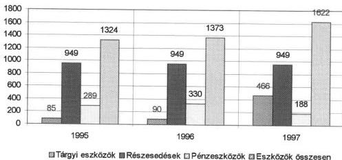

**A közalapítvány beszámolóját 1995. és 1996. években a hatályos előírások szerint okleveles könyvvizsgáló hitelesítette.** Az 1996. évi könyvvizsgálói jelentés olyan megállapításokat is tartalmazott, amelyek a hitelesítő záradék megadásának gondosabb mérlegelését igényelték volna.

A közalapítvány mérlegeiben a valós értéküket meghaladóan szerepeltek a befejezetlen beruházások. A közalapítvány tárgyi eszköz nyilvántartásában 78,2 millió forint (87,1 % részarányú) a befejezetlen beruházás. Az 1991. évben elmaradt beruházás tervdokumentációit a független könyvvizsgálói jelentés 1995. és 1996. években is selejtezésre javasolta, a jelenlegi építkezésnél hasznosíthatók kivételével. A befejezetlen beruházás terveinek selejtezése folyamatban van. A műszaki szakértői vélemény alapján 39,9 millió forint értékű dokumentáció kerül selejtezésre.

Az előírásokkal ellentétben 1995. évben nem alkalmazták az aktív időbeli elhatárolás szabályait a devizakamatok elszámolásánál. Ennek oka, hogy a közalapítvány a számviteli törvény szerinti egyéb szervezetek éves beszámoló készítésének és könyvvezetési kötelezettségének sajátosságáról szóló 8/1996. (I. 24.) Korm. rendelet 12. § (2) és (4) bekezdésekben és az 5. sz. mellékletben **előírt tagolástól eltérő** egyszerűsített éves beszámolót készített. (E jogszabályt a közalapítványoknak a 22. § (1) és (2) bekezdése szerint már az 1995. évi éves beszámoló elkészítésénél alkalmazni kellett.) Az egyszerűsített beszámoló mérlege aktív és passzív időbeli elhatárolásokat nem tartalmazott, ezért a devizakamatot a jóváírás időpontjában, 1996. évben számolták el bevételként, és az Szt. 24. § (1) bekezdésében előírtak szerint nem osztották meg 1995. és 1996. év között. Ennek kihatására többek között az 1995. évi eredmény 499.122 forinttal több, az 1996. évi eredmény ugyanezen összeggel kevesebb lett.

A könyvvizsgáló megállapítása szerint a számviteli, könyvviteli és beszámolási munkáért fizetett megbízási díj három főnél meghaladta a minimálbér időarányosan számított 60%-át, így az társadalombiztosítási kötelezettség alá esett.

19

---

II. RÉSZLETES MEGÁLLAPÍTÁSOK---

Emiatt 125.460 forint. TB. járulék hiány keletkezett, továbbá módosítani kellett a rövid lejáratú kötelezettség, a saját tőke, és az eredmény összegét.

**A közalapítvány mérlegei** - az előzőekben már kifejtettek szerint - **a konduktív nevelési módszer értékét nem tartalmazták**. Állományba vétele - annak ellenére, hogy e vagyonelemet az alapító okirat nem tartalmazta - 1997. január 1-től a számviteli törvény 35. §-ának (14) bekezdése alapján szükséges lett volna.

Mint többletként fellelt eszközt - az állományba vétel időpontjában meglévő piaci értéket tekintve beszerzési árnak - kellett volna a könyvekbe bevezetni. Ugyancsak ez időponttól adott megoldást a számviteli törvény arra is, hogy az amortizációs összeget a hozzárendelt azonos összegű rendkívüli bevétellel kompenzálják, tehát ezzel az értékcsökkenés elszámolásának finanszírozási gondjai is megoldódtak.

**A közalapítvány a könyvvizsgáló által hitelesített mérlegbeszámolóit és eredmény-kimutatásait az ellenőrzött időszakban nyilvánosságra hozta. Nem készített azonban beszámolót az alapító számára a közalapítvány tevékenységéről, ellentétben a Ptk. 74/G. § (8) bekezdésében, illetve az alapító okirata 5. pontjában foglaltakkal.**

### 3. A VILLÁNYI ÚTI BERUHÁZÁS

Az intézet számára 1988-ban tervezett új épület létrehozásának elmaradása ellenére a brit kormány a Pető András nevével fémjelzett konduktív nevelési módszerrel kapcsolatos együttműködés folytatása érdekében 1996. elejére beleegyezett a már hazánknak adományozott pénzeszköz felhasználásába. Ehhez **új kormányközi megállapodást kellett kötni, amit a két kormány 1997. március 25-én aláírt**. Ebben előírták, hogy a közalapítvány számlájára átutalt és fel nem használt 1,75 millió GBP-t és az időközben felhalmozódott kamatot a Villányi u. 67. sz. alatti régi épület kibővítésére és felújítására kell fordítani, a megállapodásban rögzített feltételek szerint. Konkrétan meghatározták azt is, hogy az adomány fejében az intézet milyen szolgáltatásokat köteles az Egyesült Királyság számára nyújtani. A Magyar Köztársaság Kormánya kötelezettséget vállalt arra is, hogy a beruházást 60 millió forinttal támogatja.

A beruházás építési ütemterve 1997. év márciusában készült el, a kivitelezés 1997. áprilisában indult, a tervezett befejezési határidő 1998. július. A tervek szerint a szolgáltatások nyújtása 1998. szeptember 14-én kezdődik. (A beruházás forrásait a 7. sz., költségeit a 8. sz. melléklet tartalmazza.)

**A beruházás előkészítése és lebonyolítása a kuratórium irányítása és döntései alapján folyik.**

**A beruházás eredményeként a Villányi úti épület összességében mintegy 6000 m² alapterületű, három szintes épület lesz. A bentlakó ápoltak elhelyezési lehetőségei 50 férőhellyel növekednek, továbbá 20-22 apartmant alakítanak ki az ápoltak szüleinek elszállásolására. Bővülnek a főiskolai képzés oktatói helyiségei (szemináriumi termek, nagy előadóterem).**

---20

---

II. RÉSZLETES MEGÁLLAPÍTÁSOK

A kuratórium már 1995. végén - az angol fél finanszírozási forrásokat illető válaszától függővé téve - döntött a tervtől a megvalósulásig történő meghívásos pályázat kiírásáról és arról, hogy a tendert a kuratórium elnöke, alelnöke és a kuratórium angol tagja bírálja majd el.

A projekt felelősévé - a kuratórium elnökének irányítása alatt - az intézet gazdasági igazgatóját nevezték ki, a beruházás műszaki felelőse az intézet üzemeltetési osztályának vezetője lett, felvettek továbbá egy műszaki ellenőrt is.

A feladatokat szervezeti- és hatásköri ügyrendben határozták meg. Az ellenőrzés kifogásolta, hogy az ügyrend nem taglalta kellő részletességgel a felelősöknek a beruházásban meghatározott feladatát és felelősségét. Az ellenőrzés számára bemutatott ügyrenden nem szerepelt a kuratórium elnökének jóváhagyó záradéka. A kuratórium vonatkozó határozata is csak a megbízás tényét rögzítette.

Az engedélyezési tervek 1995. végére elkészültek, a tender beadási határidejéről a kuratórium november 27-én döntött.

A beérkezett négy pályázat közül az Olajterv Fővállalkozó és Tervező Rt. nyerte el a beruházás generál kivitelezői jogát.

Az építési-vállalkozói szerződés előkészítésében való részvételre, a beruházás pénzügyeinek ellenőrzésére és a zárójelentés elkészítésére az angolok által ajánlott EC HARRIS Kft kapott megbízást az intézettől, a közalapítvány költségére.

1996. év végén - a kormányközi szerződés előkészítésének biztató előrehaladottsága ismeretében - a kuratórium és az intézet vezetése úgy döntött, hogy a Villányi úti részleget a Kútvölgyi útra költöztetik.

A kuratórium elnöke és az Olajterv Rt. vezetői az építési-vállalkozói szerződést 1997. március végén írták alá, amelyben részletesen meghatározták a fejlesztés célját, az általános és specifikus szerződési feltételeket. A beruházás műszaki megoldásai és paraméterei meghatározásában a brit egészségügyi szolgálat felügyelői is közreműködtek.

A beruházás I. ütemének költségterve 607,6 millió forint, a II. ütemé 49,6 millió forint volt (ÁFA nélkül.)

A II. ütemre az induláskor a források még nem álltak rendelkezésre, erről később, 1997. október 2-án döntött a kuratórium.

Az első ütemre vonatkozó szerződés a következőket tartalmazta: építőmesteri munkák bontással, nyílászárók beépítésével, tetőfedéssel 310 millió forint; épületgépészeti munkák 86 millió forint; elektromos feladatok 76 millió forint; szakipari feladatok 101 millió forint; külső feladatok 34 millió forint.

A beruházás megvalósulásának realitását az 1,75 millió GBP alapozta meg, amely a beérkezéskor - 1991. évben - 227,8 millió forintnak megfelelő összeget tett ki. 1996. év végére az elhelyezett összeg kamata 0,3 millió GBP-t, azaz 44,8 millió forintot eredményezett, ami 1997. évben további 0,1 millió

21

---

II. RÉSZLETES MEGÁLLAPÍTÁSOK

GBP, azaz 15,3 millió forint kamattal növekedett. Az Angol Balett 1995. évben 7 310 GBP adománnyal gyarapította a beruházásra fordítható összeget.

A központi költségvetés az MKM fejezetből 1996. és 1997. évben 30-30 millió forint egyösszegű, kifejezetten a beruházás céljait szolgáló támogatásban részesítette a közalapítványt.

A 2408/1997. (XII. 7.) Korm. határozat az épület-bővítéssel összefüggő személyi és dologi fejlesztésre 30 millió forint támogatást állapított meg 1998. évre.

A közalapítvány saját bevételéből 1996-1997. évben 3,8 millió forinttal, az intézet pedig 1997-ben 33 millió forinttal járult hozzá a beruházás forrásaihoz.

Az általános forgalmi adóról szóló 1992. évi LXXIV. törvény 72. § (2) bekezdése alapján a külföldi adományok után a közalapítvány az ÁFA visszaigénylésére jogosult, az így visszatérített összeg ugyancsak a beruházásra forgatható vissza. Az így felhasznált összeg 1997. év végéig 43,8 millió forintot tett ki. A beruházás befejezéséig várhatóan összesen mintegy 150-160 millió forint ÁFA kedvezmény vehető igénybe.

A beruházás fedezetét biztosító pénzügyi eszközök kezelésének, felhasználásának módjáról a két kormány megállapodása részletesen rendelkezett.

A brit kormány adományát - az egyéb befizetésektől és adományoktól külön kezelve - önálló bankszámlán kell nyilvántartani. Ugyancsak külön számlán kezelik a központi költségvetési támogatásból származó bevételt, az egyéb forrásokból és a visszatérített ÁFA-ból származó, beruházásra fordítható összegeket.

Lényeges eleme a megállapodásnak, hogy az adomány terhére kifizetés csak az Egyesült Királyság megbízottjának jóváhagyásával történhet, a művelet végrehajtását a bank csak a megbízott aláírásával fogadja el, illetve teljesíti azokat. Az ellenőrzés során a megvizsgált számlák e feltételnek minden esetben megfeleltek.

A kuratórium által megbízott EC HARRIS Kft havi értékelést és teljesítményigazolást készít a szerződéses munkák részletes lebontásával, amely alapján igazolja az elvégzett munkát és a kifizethető összeget. Az értékelést a projekt manager révén a kuratórium rendelkezésére bocsátja.

Az 1998. március 8-ig tíz teljesítésértékelés készült a beruházás megvalósításáról.

1997. december 31-én a beruházás nettó teljesítmény értéke 368,7 millió forint volt.

22

---

II. RÉSZLETES MEGÁLLAPÍTÁSOK

A felhasznált beruházási támogatás megoszlása az adományozók szerint (millió Ft-ban)

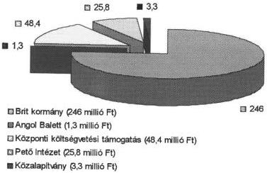

# 4. A KÖZALAPÍTVÁNYNÁL LEFOLYTATOTT BELSŐ ÉS KÜLSŐ ELLENŐRZÉSEK

A közalapítvány ellenőrző szerve a három tagú Felügyelő Bizottság, melynek tagjait a Művelődési és Közoktatási Minisztérium, a Népjóléti Minisztérium és a Pénzügyminisztérium javaslata alapján kérte fel a Kormány, mint alapító.

Az FB az ellenőrzött időszakban nem működött, így az alapító okiratban meghatározott feladatok teljesítése elmaradt.

A könyvvizsgáló által hitelesített beszámolókat nem tárgyalta meg és nem véleményezte a kuratórium számára (alapító okirat 8. pontja). Nincs írásba foglalt jelentés arról sem, hogy az FB vizsgálta volna a közalapítvány működését és gazdálkodását a beszámoló és a könyvvizsgálói jelentés alapján (alapító okirat 8. pontja).

Az FB ellenőrzési tevékenysége gyakorlatilag abban merült ki, hogy az FB elnöke a kuratóriumi üléseken állandó tanácskozási jogú meghívottként rendszeresen részt vett.

Külső ellenőrzést egy alkalommal a Fővárosi Főügyészség folytatott le a közalapítványnál. Ennek során a közalapítvány létrehozásának és működésének törvényességét vizsgálta. A Fővárosi Főügyészség az SZMSZ III/4. pontjának módosítását (a bankszámla feletti rendelkezési jogosultság kiegészítése), valamint a Villányi úti ingatlan tulajdoni lap számának helyesbítését indítványozta. A kuratórium elnöke az indítványban foglaltakkal kapcsolatban a szükséges intézkedéseket megtette.

23

---

II. RÉSZLETES MEGÁLLAPÍTÁSOK---

# A MOZGÁSSÉRÜLTEK PETŐ ANDRÁS NEVELŐKÉPZŐ ÉS NEVELŐINTÉZETNÉL

## 5. AZ INTÉZET MŰKÖDÉSÉNEK, GAZDÁLKODÁSÁNAK SZABÁLYOZOTTSÁGA

**Az intézetet** a Magyar Népköztársaság felsőoktatási intézményeiről szóló 1986. évi 13. törvényerejű rendelet módosításáról szóló **1989. évi 16. törvényerejű rendelet** a magyar felsőoktatás részeként **a főiskolák közé sorolta**.

A felsőoktatásról szóló **1993. évi LXXX. törvény** 1. számú melléklete az intézetet a felsőoktatási intézmények között **mint alapítványi főiskolát** sorolja fel. E törvény 2. §-a szerint **az intézet jogi személy**, mely **alapító okirat alapján működik**.

1997-ben lépett életbe a kuratórium által jóváhagyott új SZMSZ.

Az 1990. évi SZMSZ - mely az 1989. évi 16. tvr. alapján készült - a szervezetet és az irányítást centralizálva túl sok döntéssel terhelte a főigazgatót, ezáltal a stratégiai kérdések helyett a napi feladatokkal való foglalkozásra helyezte a hangsúlyt. Ennek felismerése, valamint a közalapítvány létrejötte és az alapító okiratban meghatározottak indokolták az SZMSZ korszerűsítését. Kialakításánál figyelembe vették a Prince Waterhouse cégnek az intézet átvilágításáról készített megállapításait, javaslatait.

Az SZMSZ korszerűsítésének lényege az volt, hogy a fő szakmai tevékenységi területeknek - főiskola, gyakorló intézmény, tudományos és külső kapcsolatok - főigazgató-helyettesi, a gazdasági szervezetnek igazgatói rangú felelősei lettek, meghatározásra kerültek az intézet és közalapítvány kuratóriuma közötti jogi, gazdasági feladat- és hatáskör megosztások.

Pl. a Főiskolai Tanács hatáskörébe tartozik az intézeti szabályzatok megalkotása és kuratórium elé terjesztése, a főiskolai tanári kinevezésekkel, felmentésekkel kapcsolatos előkészítő javaslat a kuratórium elnöke részére. A Főiskolai Tanács üléseire tanácskozási joggal állandó meghívott a kuratórium elnöke.

Az SZMSZ részletesen tartalmazza az intézet feladatait, a közalapítvány alapító okiratában általánosságban megfogalmazott célokat szakmai területenként konkrétan meghatározva. Rögzíti a vezetéssel kapcsolatos működési és döntési hatásköröket, ezen belül a gazdasági igazgatóhoz tartozó területek részletes szervezeti felépítését.

**Az intézetnek nincs alapító okirata, ennek jóváhagyása a közalapítvány kuratóriumának jogkörébe tartozik.**

A helyszíni ellenőrzés időszakában műhelymunka stádiumában volt mind a főiskolai oktatás, mind a gyakorló terület - az alapfokú óvodai, az általános isko-

---24

---

II. RÉSZLETES MEGÁLLAPÍTÁSOK

lai, a fejlesztő- és gondozó intézményt magába foglaló Többcélú Közoktatási Intézet - alapító okiratainak kialakítása.

A különböző szervezeti egységek ügyrendje, működési szabályai még csak részben épülnek az új Szervezeti és Működési Szabályzatra.

Pl. a Gazdasági Igazgatóság ügyrendje az 1993. évi helyzetet tükrözi, az Óvodai Tagozat működési rendje 1992. évi, a Dokumentációs és Oktatási Csoporté 1991. évi.

A gazdálkodást érintő szabályzatok közül elkészült a számviteli törvény előírásait és változásait figyelembe vevő, az intézet adottságaihoz, körülményeihez igazodó számviteli politika és a számlarend.

A számlaosztályokon belüli tagolást olymódon alakították ki, hogy abból egyértelműen kitűnik azok tartalma, az intézet vezetése részére analitikai kigyűjtés nélkül fontos számviteli információk biztosíthatók, lehetővé teszi mind a bevételeknél, mind a költséghelyeken a tevékenységek szerinti nyilvántartást.

1997. januári hatályba lépéssel készült el a pénzgazdálkodás és leltározás rendjét magába foglaló szabályzat, valamint a házipénztár szabályzata.

A tartozások keletkezésének megakadályozása érdekében ellátási szabályzat készült.

A szabályzat meghatározza, hogy az intézet munkájának magas színvonalú ellátása, pénzügyi egyensúlyának biztosítása érdekében, a közoktatási törvény előírásainak figyelembevételével mely tevékenységek tartoznak a konduktív pedagógia által kötelezően ellátandó feladatok közé, és milyen egyéb szolgáltatásokat nyújt az intézet, melyeket viszont csak díjfizetés ellenében tudnak biztosítani.

Rögzítették a szolgáltatási jegyzéket, a díjfizetés rendjét és az alkalmazandó aktuális árjegyzéket.

Az új fizetési rendszer garanciákat tartalmaz arra, hogy a nyújtott szolgáltatások során fizetési elmaradás ne keletkezzen. Ez zömében azt jelenti, hogy előre kell fizetni a megrendelt szolgáltatásokért. Hátralékos nem kaphat újabb szolgáltatást, amíg nem rendezi tartozását. Az intézet által létrehozott 500 ezer forintos alap átvállalja a legrászorultabbak költségeit.

Az intézet szabályzatait - közalapítvány alapító okiratának 7. d. pontjával ellentétesen - a kuratóriumhoz nem nyújtották be véleményezésre.

**A már elkészült szabályzatok alkalmasak az intézet gazdálkodási rendjének biztosítására.**

## 6. AZ INTÉZET GAZDÁLKODÁSA

### 6.1. Az éves bevételek és kiadások (költségek) tervezése

Az intézet feladatai ellátásához **két meghatározó bevételi lehetőséggel** számolhat, az állami közfeladat ellátásához az éves költségvetési törvényekben az MKM fejezetben jóváhagyott **közalapítványi támogatással és** az alapte-

25

---

II. RÉSZLETES MEGÁLLAPÍTÁSOK

vékenységből - főiskolai képzésből, hazai és külföldi konduktív nevelésből - származó saját bevételekkel.

Az intézet eredeti bevételi tervszáma 1995-ben 537 millió forint, 1996-ban 716 millió forint és 1997-ben 964 millió forint volt. Ebből költségvetési támogatás 1995-ben 376,9 millió forint, 1996-ban 435,8 millió forint és 1997-ben 454,9 millió forint volt.

A saját bevételek tervezése elsősorban külföldi igények és az ehhez kapcsolódó bevételi lehetőségek figyelembe vételével történt.

Az intézet - az általa gyűjtött információkra építve - hatékony propagandamunkát fejtett ki külföldön, melynek célja elsősorban a módszer mind szélesebb körben való elterjesztése, a szülők által alapított érdekvédelmi szervezeteken keresztül az illetékes kormányszervek meggyőzése a Pető módszer bevezetésének szükségességéről és az adott országban történő elterjesztésének a támogatásáról.

A kiadások tervezésénél az állami közfeladatok teljesítése - a főiskolai oktatás és a magyar gyermekek nevelési és egészségügyi ellátása - élvezett prioritást.

Az intézet a jogszabályon alapuló normák szerint tervezte a főiskolai hallgatók pénzbeli juttatásait, előző évi tényszámokon alapuló belső normát használt a kiadások tervezésénél, a létszám, az ellátottak bekerülési költségei és a vásárolt élelmezés meghatározásánál.

Az előző évek tapasztalatai alapján állapították meg a tankönyv- és a tanszerellátás, az oktatási és a foglalkozási anyagok tervszámait. A vásárolt szolgáltatások között az élelmezést az ellátott létszám után tervezték.

Az 1997. évi pénzügyi terv - a kialakított új számviteli politikával és számlarenddel összefüggésben - a vizsgált időszakon belül első alkalommal új szerkezetben készült.

Mind a bevételek, mind a költségnemek szakmai, intézeti és kiszolgáló területi bontásban jelentek meg a tervben, a terv költséghelyek szerinti megbontást is tartalmazott.

A bevételi és kiadási tervek évközben felügyeleti és saját hatáskörű elhatározás alapján módosultak, ezeket az ellenőrzés megalapozottnak minősítette.

# 6.2. A bevételek és kiadások tényleges alakulása

A bevételek évenként változó mértékben és nagyságrendben egészültek ki a OEP-től kapott támogatással, a vállalkozásokból származó bevételekkel és különböző, pályázatok útján elnyert közoktatási támogatásokkal.

Az intézet bevételei minden évben meghaladták a módosított tervben szereplő összeget, és összességében 1995 - 1997. évek között közel 60 %-kal növekedtek, főleg a mind nagyobb szerepet betöltő saját bevételek révén.

26

---

II. RÉSZLETES MEGÁLLAPÍTÁSOK

Az ellenőrzött időszakban **az intézet összes bevételén belül csökkent a központi költségvetési támogatás és nőtt az alaptevékenységből származó saját bevétel részaránya.** (Az intézet bevételeit a 10. sz. melléklet mutatja.)

Amíg 1995-ben a 199,4 millió forint saját bevétel mellett a központi költségvetési támogatás 376,9 millió forint volt, addig 1997-ben a 466 millió forint összegű saját bevétel már több, mint 10 millió forinttal meghaladta a központi költségvetési támogatás összegét. Csökkent az egyéb támogatások mértéke és nagyságrendje is, pl. az OEP támogatás - a járó beteg ellátás finanszírozásának megváltozása miatt - az 1996. évi 13 millió forinttal szemben 1997-ben 8 millió forint volt.

**Jelentős változás** következett be az **alaptevékenységhez** kötődő **saját bevételek** belső szerkezetében is.

A saját bevételeken belül a külföldön és helyben végzett konduktív nevelés bevétele 1997-ben 1995-höz képest 231 %-ra növekedett, és mintegy 354 millió forintot tett ki (15. sz. tanúsítvány). A külföldiek számára nyújtott egyéb szolgáltatással együtt (főiskolai képzés, tanfolyamok stb.) a külföldről származó bevétel 1997-ben 432,7 millió forint volt.

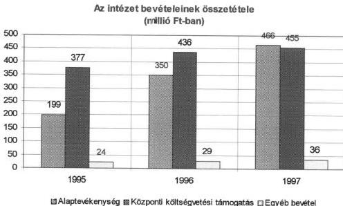

Az alaptevékenység bevételeinek dinamikus emelkedését a külföldön és a helyben végzett, konduktív nevelésben részesülő külföldi ellátottak és a főiskolai képzésben résztvevő külföldi diákok létszámának növelése eredményezte.

Magyarországon a külföldi hallgatók tandíjat, az ellátottak ellátási díjat fizetnek. A külföldön lebonyolított konduktív nevelési programot az intézet és a fo-

27

---

II. RÉSZLETES MEGÁLLAPÍTÁSOK---

gadó fél között megkötött szerződés és számla alapján végzi az intézet. A díjfizetés ellenében nyújtott tevékenységek (szolgáltatások) jövedelmezőek.

A külföldről származó bevételek a Külkereskedelmi Bankon keresztül jut el az intézethez.

A kiküldött konduktorok a fogadó külföldi partnertől nem kapnak díjazást, tevékenységüket hivatalos kiküldetésben látják el. Alapbérüket, napidíjukat és egyéb költségeiket az intézet fizeti. A szerződésben rögzített bevételek fedezik az intézetnél felmerült közvetlen és rezsi költségeket.

Az árakat és egyéb feltételeket - a fogadó ország fizetőképes keresletéhez igazodóan - írásos szerződések rögzítik.

A külföldi partnerekkel a kapcsolatok fenntartása előnyös és jövedelmező a Pető Intézet számára.

A fogadó felek az infrastruktúrát a helyszínen biztosítják, a kiküldött konduktorok a szellemi apportot adják, propagálják az alkalmazott módszert, vonzzák az adott országból a budapesti főiskolára a beiskolázandó konduktor jelölteket. Ez hosszútávon biztosítja a szolgáltatások iránti külföldi igényt.

Az intézetnek **Angliában** a **keeli** egyetemmel és a SCOPE egyesülettel van szoros kapcsolata. (A SCOPE az Egyesült Királyság egyik legnagyobb olyan egyesülete, mely a mozgássérültek érdekében tevékenykedik.) Az intézet a SCOPE-nél közösen működteti a **Pető Centre UK** konduktív nevelési vizsgáló és tanácsadó centrumot. **Sheffieldben** szerviz jelleggel 2 éve működnek csoportok, a megrendelt szolgáltatást a kiutazó magyar konduktorok végzik el.

**Németországban** az intézetnek az a célja, hogy a német szakmai listára felkerüljenek a Pető Intézet által nyújtott speciális konduktori képesítések. A kiépített kapcsolatrendszer többpólusú és ennek a célnak az elérését szolgálja. **Niederpöckingben** szerviz jellegű kapcsolat van, óvodai foglalkoztatással. **Münchenben** kutatási együttműködést folytat az intézet a Kinderzentrum-mal, e munka finanszírozója az egyik legnagyobb német betegbiztosító. **Nürnbergbe** egy fő néhány alkalommal utazik ki évenként. Írásos megállapodás alapján 1998. június 1-től a betegbiztosító finanszírozásával kezdenek **Saarbrücken** közelében egy új konduktív nevelési programot.

Az **USA-ban** szerviz jellegű kapcsolat van **Long Island-ben**.

**Norvégiában** most zárult le egy négy éves projekt, melyet az intézet folytatni kíván a jövőben is, kiegészítve egyetemi kapcsolatfelvétellel.

**Spanyolországban** 1998-tól a spanyol királyné támogatásával képez ki az intézet **Navarra** tartomány számára spanyol hallgatókat.

**Izraelben** az ottani Oktatási Minisztérium által finanszírozott képzési és tanácsadási együttműködés van a Tsad Kadima szervezettel és a **tel-avivi** Bar Ilan Egyetemmel.

A **FÁK országai** számára a főiskola négy évfolyamán orosz, ukrán és jakut hallgatókat képeznek az orosz Egészségügyi Minisztérium felkérésére, a **moszkvai** Szociális Egyetemmel kötött megállapodás szerint.

---28

---

II. RÉSZLETES MEGÁLLAPÍTÁSOK

**Az ellenőrzött időszakban önköltség-számítás** (önköltség-számítási szabályzat alapján) még csak a vállalkozási jellegű tevékenységeknél volt, az alaptevékenység önköltség-számításához szükséges szabályzat kidolgozása a helyszíni ellenőrzés idején folyamatban volt.

Az intézet - a helyszíni ellenőrzést követően elkészült 1997. évi mérleg adataira alapozva - fennállása óta először összeállította az ellátott szakfeladatok 1997. évi önköltségét és az ezekhez kapcsolódó bevételeket (9. sz. melléklet), melyet már nem tudtunk ellenőrizni. E kimutatás alapján **1997-ben a külföldiek számára nyújtott szolgáltatások bevétele 101,6 millió forinttal volt több, a magyar állami közfeladatok ellátásának bevétele 83,6 millió forinttal volt kevesebb, mint az önköltség.**

Az ellenőrzött időszakban **összességében** az intézet **költségei egyensúlyban voltak a bevételekkel**, és a bevételeknél kisebb mértékben emelkedtek (11-12. sz. mellékletek).

A költségeken belül meghatározó volt a személyi jellegű ráfordítások összege, az összes kiadás több, mint 50 %-át a bérköltség és járulékai tették ki.

Az összes költség több, mint fele - 1996. évben 54 %-a, 1997-ben 57 %-a - az alaptevékenység ellátásához kötődött.

A szakmai berendezésekre fordított kiadások között a számítógépek, azok felszerelései és a programok vásárlása volt a meghatározó, ezek összege 1995-ben 10,5 millió forint, 1996-ban több, mint 9 millió forint, 1997-ben 18,6 millió forint volt.

Az intézet költségeinek alakulása (millió Ft-ban)

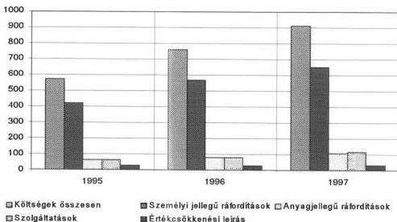

29

---

II. RÉSZLETES MEGÁLLAPÍTÁSOK

Az intézet évi tagsági díj fizetésével **anyagi támogatást nyújtott** a Nemzetközi Pető Társaság tudományos **kutatásra** irányuló tevékenységéhez.

A konduktív nevelési módszert elsajátítani kívánókat anyagilag is segítik, ha a **szociális körülmények** ezt indokolják.

12 ezer forint/hó/fő kedvezményt biztosítanak diákjaik részére a kollégiumi díjak fizetéséhez.

Az **építési, felújítási munkák** az ellenőrzött időszakban a közalapítvány céljainak figyelembevételével folytak.

1995-ben a Kútvölgyi úti épület befejezetlen beruházására 4 millió forintot, az épület felújítására 8 millió forintot, épület-beruházásra 1996-ban 4 millió forintot, 1997-ben 11 millió forintot, felújításra közel 8 millió forintot költöttek.

**Az intézet beruházásai, Villányi úti beruházás nélkül

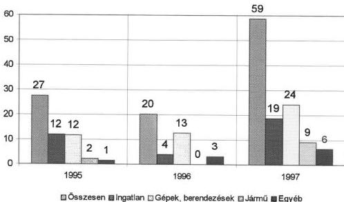

1996-ban a Price Waterhouse cég elkészítette az intézet **üzleti tervét** és kidolgozta a **2000-ig szóló stratégiai tervet**. A **stratégiai tervet a kuratórium és a Főiskolai Tanács** többször tárgyalta, majd **elfogadta**.

**Az intézet a kitűzött stratégiai céloknak megfelelően végzi munkáját.**

A terv 12 stratégiai célt határozott meg, melyeket éves bontásban is részleteztek.

A **pénzügyi-gazdasági** területtel szorosabban **négy stratégiai cél** kapcsolódik.

30

---

II. RÉSZLETES MEGÁLLAPÍTÁSOK

Végrehajtásuk révén **az intézet pénzügyileg szilárd**, bevételei biztonsággal realizálódnak, miközben a források 50 %-a már nem a magyar kormánytól származik.

Biztosították továbbá, hogy a kisegítő szolgáltatások **hatékony költségfelhasználással** valósuljanak meg.

Az intézet több **takarékossági intézkedést** vezetett be az eredményes gazdálkodás érdekében.

Pl. a munkatársak a munkahelyi készülékekről csak egyéni azonosítóval telefonálhatnak, ennek bevezetése 40-50 %-kal csökkentette havonta a telefondíj kiadásait.

Az **átszervezéssel felszabadult kapacitásokat** és helyiségeket az alaptevékenység szolgálatába állították.

Folyamatban van olyan **előléptetési és ösztönző rendszer** kialakítása, amely képes a magas képzettségű szakemberek megszerzésére és megtartására.

Részben már teljesült az a cél is, hogy az intézet szervezeti felépítése megfelelően **alkalmazkodjék a változó külső körülményekhez**.

### 6.3. A központi költségvetési támogatás felhasználása

A kuratórium, illetve az intézet a központi költségvetési támogatás felhasználásáról az ellenőrzött időszakban a tárgyévet követő év február végéig számolt el az MKM-nek.

Az ellenőrzés tapasztalatai szerint **az intézet a törvényi előírásokat betartva, szükségleteinek megfelelően használta fel a kapott költségvetési támogatásokat**.

**Az MKM által kialakított támogatási és elszámoltatási gyakorlatot azonban az ellenőrzés nem tartja célszerűnek, mivel nem teszi lehetővé a részletes tervezést és elszámolást.**

Az MKM a rendelkezésre álló keret függvényében tett javaslatot évenként a központi költségvetési támogatás összegére, melyet **megalapozó számításokkal nem támasztott alá**.

Az éves költségvetési törvényekben a nem állami intézményekre megállapított normatívákat az intézet sajátosságaira tekintettel - az ellenőrzés szerint megalapozottan - az MKM nem alkalmazta. Az intézet sajátosságait tükröző egyedi normatívák kialakítására eddig nem került sor.

A központi költségvetési támogatás elszámolásának tartalmát az MKM és a közalapítvány megállapodásai határozták meg (13. sz. melléklet).

31

---

II. RÉSZLETES MEGÁLLAPÍTÁSOK---

Az ellenőrzött években a szerződések rögzítették a közalapítvány által működtetett intézet állami feladatait, az éves költségvetési törvényben meghatározott előirányzatot, a felhasználás jogcímeit és a mennyiségi feladatmutatókat.

Az MKM kötelezettséget vállalt továbbá arra, hogy az intézet az állami felső- és közoktatási, nevelési intézményekkel azonos mértékben és módon részesül többlet támogatásban az évközben lebontásra kerülő központi bérpolitikai intézkedések, illetve a hallgatói és tanulói juttatások normatíva emelkedése, a felső- és közoktatási intézményeket általánosan érintő egyéb támogatások növekedése miatt, továbbá az egészségügyi alkalmazottak számának megfelelően részesül a központi költségvetési szervekre ilyen címen vonatkozó bér- és dologi automatizmusokban.

Az MKM a támogatás felhasználásának elszámolását az éves költségvetési törvény és az általános számviteli előírások alapján - az MKM intézmények számszaki beszámolójára vonatkozó előírások és nyomtatványok szerint - a tárgyévet követő év január - február hónapjára írta elő, igényelve egyúttal a tevékenység szakmai értékelését tartalmazó szöveges elemzés csatolását is.

A kuratórium alelnöke az 1995. évi támogatás felhasználásáról készült beszámolóban az eltérések indokolása nélkül bemutatta a megállapodásban meghatározott feladatmutatókat és ezek teljesítését, valamint az intézet egyes előirányzatainak terv- és tényszámát, röviden felvázolva a végzett szakmai tevékenységet. (14. sz. mellékelt).

Az 1996. és 1997. évi támogatások felhasználásáról a megállapodásban rögzített határidőre csak a feladatmutatók tényleges alakulását jelentették, ugyancsak indokolás nélkül, a gazdálkodás főbb adatairól az Szt. által a mérlegbeszámolókra előírt határidőben számoltak be (15., 16. sz. mellékletek).

A támogatás elszámolására az MKM tévesen írta elő az MKM intézmények számszaki beszámolójára vonatkozó előírások és nyomtatványok alkalmazását, mivel a közalapítvány és az intézet az Szt.-ben és a 8/1996. (I. 24.) Korm. rendeletben meghatározottak szerinti könyvvezetésre kötelezett.

# **Az írásos megállapodástól eltérő tartalmú, határidejű és hiányos indokolású beszámolókat az MKM nem kifogásolta.**

A költségvetési céltámogatás felhasználását és a feladatmutatók alakulását a 17. sz. melléklet mutatja.

A támogatást a számvitelben az intézet az egyes tevékenységek között önállóan bontotta meg, a kialakult belső arányok az ellenőrzött időszakban gyakorlatilag azonosak voltak.

---32

---

II. RÉSZLETES MEGÁLLAPÍTÁSOK

# A központi költségvetési támogatás megoszlása

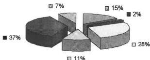

■ Főiskolai hallgatók ellátására (15 %)
■ Továbbképzésben résztvevők ellátására (2 %)
■ Bentlakó és napközis óvodásokra (28 %)
■ Magyar ambuláns ellátásra (11 %)
■ Bentlakó és napközis általános iskolásokra (37 %)
■ Tanácsadásra, utógondozásra, szülők iskolájára (7 %)

A helyszíni ellenőrzés megállapította, hogy a költségvetési támogatást az intézet rendszeresen maradvány nélkül használta fel, azonban - néhány kivételtől eltekintve - a megállapodásban rögzített mennyiségi tervszámokat nem teljesítették (14-15-16 sz. mellékletek).

Az állami közfeladat finanszírozásához ellenőrzés szerint célszerű az intézet sajátos körülményeit figyelembevevő normatívák kidolgozása és alkalmazása, illetve olyan hozzárendelt cél- és támogatási összeg meghatározása, amelynek teljesítése mérhető és elszámoltatható. Az intézet számviteli rendszere részben már alkalmas, illetve alkalmassá tehető az ehhez szükséges feladatok elvégzésére.

Az éves költségvetési törvényekben rögzített egyedi normatívák alkalmazásával lehetővé válik, hogy az MKM a közalapítvánnyal - a többi, nem állami intézmény fenntartójával azonos - kötelezettségeket tartalmazó szerződést kössön, a közalapítvány a hozzájárulás igényléséhez bemutassa az intézet alapító okiratát, illetve működési engedélyét, a létszámjelentésekben szereplő feladatmutatókat, és a feladatmutatók alakulásáról rendszeresen adatszolgáltatást teljesítsen, ahogy ezt például az 1998. évi költségvetésről szóló 1997. évi CXLVI. tv. 30. §-a előírja.

Az intézet a közbeszerzési törvény előírásait egy eset kivételével megfelelően érvényesítette.

1996-97-ben pályázatot hirdettek az őrzésvédelem, élelmezés, takarítás, mosatás és menetrend szerinti gyermekszállítás ellátására. A lebonyolításuk külső cégek megbízásával történt. A pályázatások során szabályszerűen jártak el, bizottság bírálta el a jelentkezőket és az intézet szempontjából legkedvezőbb ajánlattevővel

33

---

II. RÉSZLETES MEGÁLLAPÍTÁSOK

kötöttek szerződést. (Elsődleges értékelési szempont volt az egészségügyben, illetve a mozgássérültek ellátása körében szerzett gyakorlat).

1997-ben a számítógépek és tartozékaik vásárlását nem közbeszerzési eljárással végezték, jóllehet a beszerzés értékhatára miatt a törvény előírásait alkalmazni kellett volna.

## 6.4. Létszám, személyi juttatások

### 6.4.1. A létszám alakulása, annak összetétele

Az intézet stratégiai céljai közé tartozik, hogy olyan szervezetet építsen ki, amely megfelelően alkalmazkodik a változó külső körülményekhez. Ennek érdekében elsődleges cél volt a hatékonyabb és rugalmasabb létszámstruktúra kialakítása, illetve a nem alaptevékenységet ellátó területeken a létszám csökkentése.

A gyakorlati megvalósítás eredményei már több területen, így a létszám alakulásában, összetételének változásában is érzékelhető. (A létszámváltozás eredményességének átfogó értékelését 1998-ban tervezi az intézet.)

Az intézet létszámának alakulása (fő)

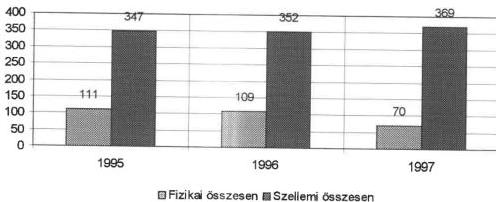

Az 1997-ben végrehajtott létszámcsökkentéssel együtt radikálisan **változott az állomány összetétele** is, ezek összhangban voltak az intézet által kitűzött fő feladatokkal.

Az alaptevékenységet kiszolgálók létszáma az 1995-ös 111 főről 1997-re 70 főre csökkent, a szellemi munkát végző, alaptevékenységi munkakörben foglalkoztatottak száma ugyanezen idő alatt 347-ről 369 főre emelkedett (18. sz. melléklet). A létszámleépítés a biztonsági csoportot, valamint a szállítási, mosodai és élelmezési munkát végzőket érintette.

A változás az állomány iskolai végzettség szerinti összetételére is hatással volt, nőtt a felsőfokú végzettségűek és az érettségizettek létszáma, illetve aránya.

34

---

II. RÉSZLETES MEGÁLLAPÍTÁSOK

### A fejlesztések során az intézet növelte a konduktori létszámot.

Az intézet létszámán belül az 1995. évi 47,2 %-ról 1997-re 53,5 %-ra nőtt a konduktorok létszáma.

A konduktorok létszámának kialakításakor figyelembe vették, hogy - miközben az alapfeladat változatlan - az ellátás helyszíne változik, bővül. A jól képzett, gyakorlott konduktorokra kül- és belföldön egyaránt nagy az igény. A konduktorok egyéni alkalmazására külföldön stabil fizetőképes kereslet van, az elérhető javadalmazás a Pető Intézet lehetőségeit messze meghaladja. Ennek hatására nagy a személyi mozgás, évente 70 fő körüli a létszám hiány, amit a frissen végzett diplomásokkal sem tudnak maradéktalanul pótolni.

**A folyamatos létszámhiány miatt a konduktorok nagymértékben leterheltek, rendszeresen túlóráznak, és általában az optimálisnál nagyobb létszámú beteggel foglalkoznak.**

A konduktorok létszámának alakulása (fő)

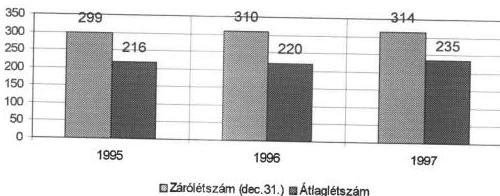

#### 6.4.2. A bér és kereseti viszonyok alakulása

A munkáltatói jogokat a főigazgató felett a kuratórium elnöke, az intézeti dolgozók felett a főigazgató gyakorolta.

Az intézet dolgozóira a Munka Törvénykönyve előírásait alkalmazták. A részletes munkaügyi szabályozást Kollektív Szerződésben rögzítették, amely 1994. december 1-jével készült el és lépett hatályba, azóta a jogszabályi változások miatt többször módosították. A munkaszerződések a Kollektív Szerződés alapján készültek.

**Az intézet az ellenőrzött időszakban biztosította alkalmazottai számára a közalkalmazotti törvényben megállapított, a munkaidőre, pihenőidőre, előmeneteli és illetményrendszerre vonatkozó előírásokat.**

35

---

II. RÉSZLETES MEGÁLLAPÍTÁSOK

Az éves költségvetési törvények fenti követelményrendszert a normatív állami hozzájárulásban részesülő nem állami intézmények számára írják elő. A Pető Intézet - bár működéséhez egyösszegű, nem normatív állami hozzájárulást kapott - tartalmában érvényesítette a közalkalmazotti törvény előírásait.

Az intézet gazdálkodási tervének - melynek része a bérterv - elfogadása után kötötték meg a bérmegállapodásokat. A felső vezetők, az érdekvédelmi felelős és az üzemi tanács által együttesen előterjesztett javaslatot a főiskolai tanács véglegesítette és fogadta el.

A kereseti viszonyokat a KJT előírásait figyelembe véve elemezték és a béreket ennek figyelembe vételével állapították meg és rögzítették a munkaszerződésekben.

Az intézet által alkalmazott bérszerkezet két, markánsan elkülönülő részből áll: Az egyik része a „végleges” bér, amit a dolgozó minden körülmények között megkap. Ennek összetevői: a megállapított alapbér, az ún. „megállapított állandó 2” jutalom és a pótlékok. A másik rész „mobil”, melyet az intézet gazdasági helyzetének függvényében, a mindenkori vezetőtestületi és érdekképviseleti megállapodások szerint fizetnek ki. Ennek részleteit minden munkaszerződésben rögzítették.

Az alkalmazott bérszerkezet - bár eltér a közalkalmazottakétól - nem sértette a munkavállalók érdekeit, mivel a munkaszerződésekben meghatározott ún. végleges bér tartalmazta az állandó jutalomként járó összeget is. A jutalom azonban ösztönzésre szolgál, így az ellenőrzés nem tartja célszerűnek, ha az alapbérrel azonosan kezelik.

Az intézet a helyszíni ellenőrzés idején megkezdte az alkalmazott bérrendszer felülvizsgálatát, és azt tervezi, hogy az „állandó jutalom 2” címen kifizetett juttatásokat beépíti az alapbérekbe.

Az állományi béreken belül az alapbér a keresetek mintegy 70 %-át teszi ki. A jutalom hányad átlagosan 15 %.

A jutalom aránya 1995-ben 13 %, 1996-ban 18 %, 1997-ben 15 % volt.

Az intézetben foglalkoztatott teljes munkaidős dolgozók átlagkeresete (Ft/fő/hó)

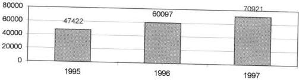

36

---

II. RÉSZLETES MEGÁLLAPÍTÁSOK

Az ellenőrzött időszakban az egyes munkaterületeken dolgozók átlagkeresetének különbségét a beosztás, a képzettség, a munkaterhelés, a felelősség különbsége indokolta. Teljesítmény-elmaradás esetén előfordult, hogy felelősségre vonásként bércsökkentést alkalmaztak.

**A külső és belső megbízások összhangban voltak az intézetben folyó speciális oktatási és gyógyítási igényekkel.** A feladatok egy része nem igényel teljes munkaidős, állandó foglalkoztatást, ellátásukra esetenként van szükség, de nélkülözhetetlenek az intézmény alapfeladata szempontjából. Az ellátottak biztonsága és az oktatás teljessé tétele érdekében ezeknek az igényeknek a kielégítését az intézet megbízási szerződésekkel biztosította. A kialakított rendszert az ellenőrzés célszerűnek tartja.

A megbízási díjak összege 1995-ben 21 millió forint, 1996-ban 7 millió forint, 1997-ben 10 millió forint volt, az állományi béreknek 1995-ben 8 %-át, 1996-ban 2 %-át, 1997-ben közel 3 %-át jelentették. A megbízottak zöme állományon kívüli volt. Belső megbízásokat a főiskolai hallgatók konduktori oktatására és tájékoztató anyagok szakfordítására adtak.

## 6.5. Az intézet eszköz- és vagyongazdálkodása

Az intézet eszközeinek alakulását a 19. sz. melléklet mutatja.

A rendelkezésre álló nyilvántartások, dokumentációk, valamint a szakterületekről kapott tájékoztatás alapján megállapítható, hogy az intézet tárgyi eszközállománya megfelelt a feladatellátás igényeinek.

**Az intézet eszközeinek alakulása (millió Ft-ban)**

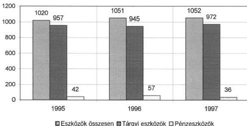

Kedvezőnek tekinthető az ingatlanok arányának növekedése.

37

---

II. RÉSZLETES MEGÁLLAPÍTÁSOK---

Az ingatlan vagyon nettó értéke az értéknövelő beruházások és felújítások, valamint az értékcsökkenés hatásának egyenlegeként 888 millió forintról 912 millió forintra növekedett (ebből a telkek 592 millió forintot tettek ki).

A növekedés azzal kapcsolatos, hogy az ingatlanokon a terveknek megfelelően (az 1996. évről 1997-re áthúzódó tetőfelújítás kivételével) az indokolt és szükséges belső átalakításokat végrehajtották.

Kedvezőtlen, hogy a fő tevékenységet közvetlenül szolgáló szakmai gépek, berendezések (egészségügyi, számítástechnikai, oktatástechnikai, mosodai gépek és berendezések, gyógyászati segédeszközöket előállító gépek) nettó értéke három év alatt mindössze 7,4%-kal emelkedett, a használhatósági fok pedig 57,5%-ról 51,1%-ra csökkent (1997. december 31-i nettó érték 39,9 millió forint).

1997. évben az egészségügyi gépek és berendezések használhatósági foka a 20%-ot sem érte el, a számítástechnikai gépek, berendezések hasonló mutatója 52,8%, az oktatástechnikai gépeké 62,2%, míg a mosodai gépeknél 28,9% volt.

A használhatósági fok romlása úgy következett be, hogy a legfontosabbnak ítélt beszerzések döntő mértékben megtörténtek. A beruházási célok és prioritások megalapozottságát azonban az ellenőrzés esetenként nem találta megfelelőnek.

Pl. a Pető számítógépes program létrehozását és bevezetését az 1995. évi beruházási terv is tartalmazta, de a fejlesztő munka már 1996. évben félbemaradt. Az 1997. és az 1998. évi előzetes tervekben szintén szerepelt a program újraindítása, de erőforrások hiányában a beruházás folytatása az igények szintjén maradt.

A kapott szakmai tájékoztatás szerint a mozgássérültek állapotának diagnosztálását és az intézetben bekövetkezett fejlődését követi nyomon a konduktori munkát segítő Pető program, melynek újraindítására a szükséges 3 millió forint nem állt rendelkezésre.

**Az intézetnél viszonylag alacsony az eszközkihasználtság, ezen belül azonban az egészségügyi gépek és műszerek kihasználtságának mértékét az intézet szakmai feladatainak sajátosságai indokolják.**

Az egészségügyi gépek, műszerek között néhány megbízható gépet csak heti háromszor két órában üzemeltetnek (a kihasználtsági mutató 10-15% között szóródik).

Az intézetnek - az írásban megküldött tájékoztatás szerint - azért van szüksége orvosi berendezésekre, mert a mozgássérült gyermekek egészségügyi problémái összetettebbek az átlagosnál. A konduktív nevelés során felmerülő orvosi feladatok ellátásához felméréseik szerint nem csak célszerűbb és olcsóbb helyben elvégezni a vizsgálatokat, mint a gyermekeket elszállítani szakorvosi vizsgálatokra, hanem lényegesen magasabb színvonalon is lehetséges, mert elengedhetetlen a mozgássérültek körében szerzett szakorvosi tapasztalat az ellátásukhoz. Lehetséges, de sokkal drágább és elégtelen volna a gyerekek szállítása és a szükséges kezelések, vizsgálatok másutt történt elvégeztetése. Az alkalmazott megoldást szakmai okok is indokolják: a speciálisan e gyermekkörre hosszú tapasztalatot szerzett kiemelkedő szakorvosi tudás rendelkezésre állása a helyszínen nagymér-

---38

---

II. RÉSZLETES MEGÁLLAPÍTÁSOK

tékben járul hozzá az ellátás reklamáció és panaszmentességéhez, s emeli annak színvonalát, messze a világ hasonló intézményeiben jellemző ellátási nívó fölé.

A karbantartó műhely gépei és berendezései 30-50%-os kihasználtsággal dolgoznak. A szabad kapacitás értékesítése az 1998. évben átadásra kerülő Villányi úti épület igényeinek függvénye.

Az intézetnél folyó **felújítási munkák** (egy kivétellel) az éves tervek alapján készültek.

A felújítási költségek mintegy 80-85%-a a Kútvölgyi úti épület felújításával volt kapcsolatos. A tervekhez képest - a vizsgált időszakban - összességében alacsonyabb volt a felhasználás: az 1995. évben tervezett 10 millió forinttal szemben 8,6 millió forint valósult meg; az 1996. évben előirányzott 16 millió forinthoz képest mindössze 0,9 millió forint volt a ráfordítás a tető-felújítási munka elmaradása következtében (felújítás helyett 1996-97 években a Kútvölgyi úti ingatlanon beruházás jellegű ráfordításokat végeztek); az 1997. évben a tervezettet megközelítő volt a felhasználás (terv 9,6 millió forint; tény 9,4 millió forint).

Az elvégzett felújítások révén - a kapott szakértői tájékoztatás szerint - az eszközállomány használhatósága döntően biztosítottnak tekinthető.

Az **anyag- és készletgazdálkodást** a kiegyensúlyozottság jellemezte.

A beszerzések az éves terveknek megfelelően alakultak.

A készletállomány változásának megbízható nyomon követése a „forrás” nevű számviteli programmal történik, segítségével valósul meg a készletek mozgásának folyamatos, mennyiségben és értékben való nyilvántartása.

## 6.6. Egyéb működési célú kiadások

A Pető Intézet az oktató-nevelő-helyreállító és tudományos munka színvonalas megvalósítása és fejlesztése érdekében széles körű kapcsolatokat tart fenn hazai és külföldi intézményekkel, valamint szervezetekkel.

**A bel- és külföldi kiküldetések** lebonyolítása és elszámolása szabályozott. A vizsgált három év alatt a belföldi kiküldetési költségek folyamatosan és erőteljesen csökkentek, míg a külföldi kiküldetési költségek növekedtek. A kiküldetések elszámolása szabályosan történt.

A belföldi kiküldetés 1995-ben 0,2 millió forint volt, amely 1996-ban és 1997-ben 0,1 millió forintra csökkent. A külföldi kiküldetés 1995-ben 17 millió forint volt, 1996-ban ez 72 millió forintra, 1997-ben 89,6 millió forintra emelkedett.

A napidíj a belföldi kiküldetések kis hányadát tette ki, míg a külföldi kiküldetések zömét jelentette.

A külföldi kiküldetés elrendelése utazási határozattal történik. E határozat aláírója a főigazgató vagy főigazgató helyettes. Visszaérkezés után megkövetelték a jelentést az elvégzett munkáról.

39

---

II. RÉSZLETES MEGÁLLAPÍTÁSOK

A szállítási tevékenységre, a gépjármű állomány igénybevételére szállítási szabályzat készült, előírásait betartották. A jármű igénybevételek elszámolása szabályos volt.

**A mozgássérült gyermekek intézetbe és onnan haza szállítása az alapszolgáltatások közé tartozik.** Ez hagyományos tömegszállító eszközökkel nem oldható meg, mivel minden esetben egyéni üléskialakítást, biztonsági övet és kísérő személyzetet igényel. E feladatoknak az intézet nagy körültekintéssel és az érintettek megelégedésével tett eleget.

Személyszállításra 1 db 250-es típusú IKARUS autóbuszt, 2 db RENAULT-IKARUS autóbuszt, 2 db PEUGEOT kisbuszt, 2 db Barkas kisbuszt, és 1 db Volkswagen Sharan típusú személygépkocsit üzemeltetnek. A teherszállítást 1 db Barkas kisteher-gépkocsival végzik.

1997. május 1-jétől 1998. június 30-ig kísérleti jelleggel a saját buszparkjukat bérbe adták. Az autóbuszokat - bérleti szerződések alapján - egyéni vállalkozók üzemeltetik. Az intézet szállítási költségei a kedvező bérleti díj eredményeként várhatóan 1998-ban is az 1996. évi (22 millió forint) szinten maradnak, miközben a szolgáltatás mennyisége és minősége nem változott.

A vállalkozók a járművek használatáért bérleti díjat fizetnek (harmadik személynek is végzett szolgáltatás esetén magasabb összegben), és vállalják az üzemeltetéssel kapcsolatos folyamatos kiadásokat. Az intézet megvásárolja a szállítói szolgáltatásokat, mentesül a bér- és közterhei alól, az üzemanyag költség és a gépkocsi folyamatos javítás költségeitől.

**A mosoda és az étterem különböző üzemeltetési módozatainak kipróbálása is a költségtakarékos működtetés érdekében történt.**

A bruttó értékben mintegy 29 millió forintos (nettó érték 7,7 millió forint) eszközállományt képviselő mosodai berendezésekkel az intézet a saját igényét a kapacitások 60 %-os kihasználtságával biztosítani tudta. A kihasználtság 91 %-os mértékét külső megrendelőnek - Garden Hotel - végzett bérmosás révén érték el. A mosoda 1995. és 1996. években a bérmosási szolgáltatás révén évente mintegy 1 millió forint nyereséget realizált. A bérmosás lehetősége azonban 1997-ben megszűnt, így a kihasználatlan kapacitás a költségek jelentős növekedését okozta volna.

Az intézet mosodájának üzemeltetésére kiírt bérleti pályázatot a Kelenföldi mosoda nyerte el. Az előzetes számítások szerint 1998-ban a mosási költségek az 1996-os évi szinten tarthatók.

**Az élelmezési** feladatokat a Pest-Budai Gasztrolánc Vendéglátó Kft végzi az intézet által biztosított helyiségben, amelyért a vállalkozó bérleti díjat, a közüzemi szolgáltatásokért rezsiterítést fizet. Az ételkészítés és az éttermi tálalás a külső vállalkozó feladata, a gondozottakhoz az étel eljuttatását az intézet dolgozói végzik. A tevékenység eddig évi 100 ezer forintos éves eredményt hozott. Az intézet sajátosságaira figyelemmel e megoldás alkalmazása megfelelő.

40

---

II. RÉSZLETES MEGÁLLAPÍTÁSOK

## 7. AZ INTÉZET SZÁMVITELI ÉS BIZONYLATI RENDJE, OKMÁNYFEGYELME, A BELSŐ ELLENŐRZÉS RENDJE

A számvitel kialakított rendje megfelelt a jogszabályi követelményeknek annak ellenére, hogy csak 1997. évre vonatkozóan van az intézetnek aktualizált - a számviteli előírásoknak megfelelő - számviteli politikája és számlarendje.

Az intézet Számviteli Politikájában és Számlarendjében szinte valamennyi témakör szabályozott, beleértve az 1997. január 1-jei változásokat is. Mindössze egyetlen területen szükséges pontosítani. A vállalkozási eredmény alaptevékenységre való visszaforgatásának lehetősége az egyéb szervezeteknél még 1992. évben megszűnt, ezért Számviteli Politikáját - az intézet gazdasági stratégiájának szabályozásával - párhuzamosan helyesbíteni indokolt. Ez a módosítás akkor is szükséges, ha az intézet mentes a társasági adó alól (a vállalkozásból származó bevétele a vizsgált években nem érte el az összes bevétel 10%-át, illetve a 10 millió forintot).

A beszámolók főkönyvi kivonattal és analitikus nyilvántartásukkal alátámasztottak voltak. A helyszíni ellenőrzés idején még csak az 1997. évi nyersmérleg készült el, a szükséges dokumentációkkal.

Az Szt. szerint 1997. január 1-jétől kötelező jelleggel cash flow kimutatást is kell készíteni a beszámoló részeként. A pénzbevételek és pénz kiáramlások különbsége - a nyersmérleg mellett - szintén összeállításra került.

A vizsgált években a leltározásokról leltározási utasítás és ütemterv készült, s az abban foglaltakat általában betartották. A mennyiségi számbavétellel történt 1997. évi leltárak kiértékelése során az ellenőrzés megállapította, hogy a kiértékelés és a kompenzálás megfelelt a leltározási utasításban foglaltaknak.

A Számviteli Politika külön fejezeteként készítették el az Értékelési Szabályzatot.

Az értékelés szabályszerűségét 1996. évben a devizakészlet (dollár) elszámolásánál, 1997. évben pedig a tárgyi eszközök, ezen belül a számítógépek értékcsökkenésénél ellenőriztük. A devizakészlet értékelése az óvatosság elvének figyelembevételével, szabályszerűen történt. A számítógépek amortizációjának számítása megfelelt az előírásoknak.

A Számviteli Politika keretében a Házipénztár Kezelési Szabályzatot is el kellett készíteni. Az 1997. január 1-jével hatályos Házipénztár Kezelési Szabályzat módosításra szorul, mivel nem egyértelmű utasításokat rögzít és a pénztáros felelősségére nem tér ki. E miatt a pénztáros munkakörét anyagi felelősségvállalási nyilatkozat nélkül látja el.

A pénztár zárlatra vonatkozóan a szabályzat rögzíti, hogy a záró pénzkészlet 500 ezer forint, de amennyiben délután nagy a pénztári forgalom, az összeg 2.000 ezer forint is lehet (1.4. pont). E nagyvonalú szabályozással is kapcsolatos, hogy a pénztár zárlatra vonatkozó utasítás nem került betartásra: 1997. IX. 17-én 2.203.287 forint, 1997. X. 15-én 2.905.418 forint, 1997. XI. 19-én 2.324.572 forint volt a záró pénzkészlet. 1997. IV. negyedévben a pénztárban tartósan „nagy volt a forgalom”, mivel a záróállomány néhány nap kivételével 1.500 és 2.000 ezer forint között mozgott.

41

---

II. RÉSZLETES MEGÁLLAPÍTÁSOK---

Az intézet **analitikus nyilvántartása** a vizsgált esetek egy részénél nem felelt meg a rendeltetésének, nem elégítette ki a vagyonvédelmi követelményeket.

A Villányi úti épület egyedi nyilvántartó lapja nem tartalmazza az azonosításhoz szükséges legfontosabb adatokat (a tulajdoni lapszámot, vagy helyrajzi számot és az építmény-jegyzék számát). A Kútvölgyi úti épület, valamint építmény (kerítés) azonosító adatai szintén hiányoznak a nyilvántartó lapokról.

Az új beszerzésű gépek és berendezések egy részének nyilvántartó lapján a legfontosabb azonosító, a gyári szám nem található. (Pl. az 1997. december 10-én vásárolt PENTIUM ASUS típusú alapgép, illetve az EEG 21 típusú minográf nyilvántartó lapja a gyári számot nem tartalmazza.)

A tárgyi eszközök állományba vételét alátámasztó bizonylatot több esetben nem állították ki, **ezzel nem tettek eleget az Szt. 83. § (1) bekezdésében előírtaknak**, mely szerint minden gazdasági műveletről, eseményről, amely az eszközök, illetve az eszközök forrásainak állományát vagy összetételét változtatja, bizonylatot kell kiállítani.

Állományba vételi bizonylatot nem készítettek az EEG 21 típusú minográf, továbbá az ingatlanok esetében.

A vevő követelések és a szállítói kötelezettségek analitikus nyilvántartó lapjai nem teljesen alkalmasak funkcióik ellátására, mert nem tartalmazzák teljes körűen a kintlévőségek, illetve a tartozások figyeléséhez szükséges időpontokat.

Az 1995. januári, illetve márciusi vevőszámla lista csak a fizetési határidőket tünteti fel, a számla keltét nem, a pénzügyi teljesítés helyett pedig a szolgáltatás teljesítésének időpontját rögzíti.

Az 1995. december havi szállítói számlák listája szintén a fizetési határidőt tünteti fel, a számla keltét és a pénzügyi realizálás időpontját nem, így a szállítókkal szembeni tartozások aktuális összege nem követhető nyomon.

A vevők 1997. december havi analitikus nyilvántartásában a számla kelte már feltüntetésre került, a vevő neve viszont nem.

Magasnak ítélhető az összes követelés domináns részét kitevő külföldi kintlévőség. Ezt részben a fizetési készség hiánya okozza. A vevőkövetelések analitikus nyilvántartásainak hiányosságai miatt azonban ezek nyomon követése, így a kintlévőségek csökkentéséhez szükséges intézkedések megtétele is körülményes.

A külföldi vevőállomány az 1995. év végi 4,1 millió forintról 1996. év dec. 31-én 20,4 millió forintra emelkedett. 1997. évben a követelés záró állománya 13,9 millió forint volt.

A külföldi vevőállomány a főiskolai képzés és a külföldi ellátottak (konduktori nevelés) térítési díjának elmaradásával kapcsolatos. Az ellátási díjakból származó 1997. évi 5,9 millió forint kintlévőségből 5 millió forint az az összeg, mely több év alatt (1992-1996. évek) képződött. Ezen összegből 2,5 millió forint pénzügyi realizálása bizonytalan (a többszöri fizetési felszólítás sem járt eredménnyel).

---42

---

II. RÉSZLETES MEGÁLLAPÍTÁSOK

Az intézet 1995-ben és 1996. I. félévében az elszámolási számláját a Magyar Hitel Bank Rt-nél, 1996. II. félévtől a Magyar Külkereskedelmi Bank Rt-nél vezette. 1997. évben - a Kincstár és a közalapítvány közötti szerződéskötés (megállapodás) késedelme miatt január 1. helyett - március 6-ától kapja az intézet a közalapítvány kincstári számláján keresztül a költségvetési támogatást, ezt megelőzően az átutalás közvetlenül az intézet számlájára történt.

A lakásépítési számlát az OTP Bank Rt-nél, a devizaszámlákat (USD, DEM, GBP) a Magyar Külkereskedelmi Bank Rt-nél vezetik.

A bankszámlák vezetése megfelelően szabályozott.

A kötelezettségvállalás, utalványozás és kiadmányozás rendje belső utasításban szabályozott. Az ellenőrzött szerződések, számlák esetében az ellenőrzés nem állapított meg szabálytalanságot.

Az intézetnél a **belső ellenőrzési** rendszer elemeiből csak a vezetői ellenőrzés és a munkafolyamatba épített ellenőrzés működött. A belső ellenőrzést az 1993. március 15-én kelt utasítás szabályozza.

A szabályzat elfogadhatóan kitér a belső ellenőrzés három elemére és annak működésére. Ebből a függetlenített belső ellenőrzés nem értékelhető, mert a vizsgált időszak alatt ilyen szervezet nem volt, ilyen munkakört nem töltöttek be. Az intézet Szervezeti és Működési Szabályzata sem említi az ellenőrzési szervezet létezését.

A vezetői ellenőrzés a vezetői beszámoltatásokon keresztül, a munkafolyamatba épített ellenőrzés a belső szabályzatokba foglalva, a visszajelzéseken keresztül érvényesül. Arról, hogy a vezetői ellenőrzés és a munkafolyamatba épített ellenőrzés hogyan fejti ki hatását, a jelzések alapján milyen intézkedéseket tettek, információ nem állt rendelkezésre.

1998-tól a belső ellenőrzést az egész évben folyamatosan működő könyvvizsgálóval oldják meg.

Budapest, 1998. július 21

Melléklet: 43 lap

dr. Kovács Árpád

elnök

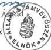

43