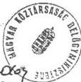

Állami Számvevőszék

# JELENTÉS

A helyi önkormányzatok beruházásaihoz és rekonstrukcióihoz nyújtott 1997. évi címzett- és céltámogatások vizsgálatáról

9823

1998. július

---

Az ellenőrzés végrehajtásáért felelős:

V. Önkormányzati és Területi Ellenőrzési Igazgatóság

Dömötör Gyula

számvevő igazgató

Az ellenőrzést vezette:

Farkas László

régióvezető főtanácsos

A jelentést készítette:

Farkas László

régióvezető főtanácsos

dr. Ernst László

számvevő tanácsos

Fercsik Gyula

számvevő tanácsos

dr. Szirota István

számvevő

közreműködésével

Az ellenőrzésben részt vettek:

A résztvevők névsorát az 1. sz. melléklet tartalmazza.

---

V-1001-324/1998. TSZ.: 412.

# TARTALOMJEGYZÉK

|  **Bevezetés** | **3**  |
| --- | --- |
|  **I. ÖSSZEGZŐ MEGÁLLAPÍTÁSOK, KÖVETKEZTETÉSEK, JAVASLATOK** | **5**  |
|  **II. RÉSZLETES MEGÁLLAPÍTÁSOK** | **9**  |
|  1. Az 1997. évi beruházási célok kijelölése | 9  |
|  2. A pályázati feltételeknek való megfelelés, a beruházások pénzügyi, műszaki előkészítése | 10  |
|  3. A közbeszerzési eljárás betartása | 17  |
|  4. A címzett- és céltámogatási előirányzatok pénzügyi teljesítésének helyzete, a pénzmaradványok alakulása | 18  |
|  5. A támogatások igénybevételének jogszerűsége | 21  |
|  6. A befejezett beruházások műszaki átvétele, üzembe helyezése, számviteli rendezése és értékelése | 23  |
|  7. A létesítmények folyamatos működtetésének forrásai és a közműberuházások üzemelése | 26  |

1

---

---

---

# JELENTÉS

a helyi önkormányzatok beruházásaihoz és rekonstrukcióihoz nyújtott 1997. évi címzett- és céltámogatások vizsgálatáról

## Bevezetés

Az Állami Számvevőszék 1998. évi ellenőrzési terve alapján vizsgálta a címzett- és céltámogatások 1997. évi igénybevételét és felhasználását.

A Magyar Köztársaság 1997. évi költségvetéséről szóló 1996. évi CXXIV. törvény a címzett- és céltámogatásokra 39 000,0 millió forint előirányzatot biztosított. Ezt az összeget növeli az 1996. évi végéig fel nem használt 20 451 millió forint, az évközi lemondásokat, illetve az ebből visszaforgatott összeget figyelembe véve összesen 58 666,8 millió forint állt a helyi önkormányzatok rendelkezésére.

Ezen felül a saját forrás egy részének kiváltása céljából 600,0 millió forint összegű Céltámogatási Kiegészítő Keret (a továbbiakban: CKK) szolgált a társadalmi és gazdasági szempontból elmaradott települések - külön jogszabályban (219/1996. (XII. 24.) Kormányrendelet) felsorolt- önkormányzatai részére.

**Az ellenőrzés célja** annak megállapítása, hogy:

- A címzett- és céltámogatások döntési rendszere és mechanizmusa miként segíti elő a helyi önkormányzatok fejlesztéseinek megvalósítását és az ágazati szakmai szempontok érvényre jutását?
- Az önkormányzatok hogyan és milyen módon készítették elő, illetve biztosítják a beruházások megvalósítását? A támogatásokkal érintett önkormányzatok rendelkeznek-e a feladat megvalósításához szükséges pénzügyi eszközökkel?
- A támogatások igénybevételénél és felhasználásánál érvényesült-e a törvényesség?
- Biztosított-e és milyen módon a megvalósított létesítmények üzemeltetése?
- Célszerű volt-e a támogatás segítségével az adott kapacitások létrehozása, figyelemmel kihasználtságukra? A támogatásokkal megvalósított beruházásoknál és rekonstrukcióknál a pénzeszközöket takarékosan és hatékonyan használták-e fel?

Az ÁSZ az ellenőrzést az Állami Számvevőszékről szóló 1989. évi XXXVIII. törvény 2. § (5) bekezdésében és az államháztartásról szóló 1992. évi XXXVIII. tv. 121. § (3) bekezdésében foglalt felhatalmazás alapján végezte.

3

---

BEVEZETÉS---

Az önkormányzati törvény szerint a helyi önkormányzatok egyes nagy költségigényű beruházási feladatainak megvalósításához az Országgyűlés (a továbbiakban: OGY) címzett támogatást nyújthat, míg az önkormányzatok a társadalmilag kiemelt célok teljesítéséhez a meghatározott mértékben és feltételek mellett - alanyi jogon - céltámogatásra jogosultak. E támogatások kizárólag az adott célra használhatók fel.

A címzett- és céltámogatási rendszer működése lényegét tekintve 1993. évtől nem változott.

A korábbi vizsgálatainkban - az eredmények elismerése mellett - rendszeresen felhívtuk a figyelmet a rendszer „gyenge” pontjaira és javaslatot tettünk ezek javítására. Ezek az ajánlások a különböző jogszabályalkotó munkában nagyobb részben hasznosultak. E jogszabály alkotások közül különösen a következők emelhetők ki: a helyi önkormányzatok címzett- és céltámogatási rendszeréről szóló 1992. évi LXXXIX. törvény (**továbbiakban: Cct.**) módosításáról szóló 1997. évi CXXXI. törvény; a helyi önkormányzatok címzett- és céltámogatásának, a céljellegű decentralizált támogatásának igény-bejelentési, döntés-előkészítési és elszámolási rendjéről, valamint a Magyar Államkincstár finanszírozási, elszámolási és ellenőrzési feladatairól, továbbá a TÁKISZ feladatairól szóló 9/1998. (I. 23.) Korm. rendelet: a fejezeti kezelésű előirányzatok és az elkülönített állami pénzalapok egymáshoz kapcsolódó célú, rendeltetésű előirányzatok összehangolt felhasználásának szabályairól kiadott 263/1997. (XII. 21.) Korm. rendelet.

A jogszabályokban foglalt korszerűsítés célja, hogy a támogatás eljárási rendje alkalmazkodjon a megváltozott körülményekhez, egyszerűsödjön és ellenőrizhetőbbé váljon. E jogszabályok 1998-tól várhatóan hozzájárulnak a támogatási rendszer szabályozottságának továbbfejlesztéséhez.

Az ellenőrzés során összesen 81 db címzett támogatás segítségével megvalósuló helyi önkormányzati fejlesztést vizsgáltunk (az 1997. évi támogatások 72,9%-át). Az ellenőrzött fejlesztések ágazati besorolását tekintve 12 db a vízgazdálkodásba, 29 db az egészségügyi és szociális ellátásba, 40 db pedig az oktatás és kulturális szolgáltatásba tartozik.

A céltámogatások vizsgálata 17 megyére és a főváros 4 kerületi önkormányzatára terjedt ki, összesen 58 helyi önkormányzatra irányult. A rendelkezésre álló céltámogatások 14%-át, 5 141,5 millió forint felhasználását ellenőriztük, mely 129 feladatot érintett. E reprezentációban az ágazati szempontok, a vízgazdálkodási ágazat prioritása mellett meghatározó volt a támogatott feladatok nagyobb volumene és korábbi jelentősebb előirányzat maradványa. A címzett- céltámogatások ellenőrzése összesen 104 önkormányzatnál történt.

(A vizsgált önkormányzatok és feladatok jegyzékét az 2. sz. melléklet tartalmazza).

(Az 1997. évi címzett- és cél támogatások ágazati előirányzatait és a reprezentáció arányait a 7. sz. táblázat mutatja).

Jelentésünk a realizálás, a visszafizettetés érdekében tartalmazza azokat a jogosulatlanul igénybe vett céltámogatásokat is, amelyeket 1997-ben a jelentős

---4

---

I. ÖSSZEGZŐ MEGÁLLAPÍTÁSOK, KÖVETKEZTETÉSEK, JAVASLATOK

hitelállománnyal vagy forráshiánnyal rendelkező egyes helyi önkormányzatok gazdálkodásának ellenőrzése c. témavizsgálat során tártunk fel. (Heréd, Szendehely, Egyházasdengeleg, Táska, Tés önkormányzatoknál).

Ellenőrzött időszak: alapvetően az 1997. év, befejezett beruházások esetében a célszerűség és hatékonyság tekintetében a beruházás teljes időszaka.

# I. ÖSSZEGZŐ MEGÁLLAPÍTÁSOK, KÖVETKEZTETÉSEK, JAVASLATOK

A helyi önkormányzatok létrejöttével 1990. évtől a településeken széles körben merültek fel olyan igények, amelyek a korábban hiányzó, vagy elavult (tönkrement) helyi infrastruktúra fejlesztésére, pótlására irányultak. Ezek az igények és az Országgyűlés által támogathatónak, befogadhatónak ítélt célok, feladatok hosszabb időre is meghatározhatják egy település infrastruktúrális ellátottságát és pénzügyi helyzetét. Ezért van különös jelentősége a hosszabb távú tervezés biztonságának, az igények megfelelő felmérésének és az elhatározott beruházások alapos műszaki, pénzügyi előkészítésének. A címzett- és céltámogatásoknak az önkormányzati forrásokon belüli részesedésüknél jóval nagyobb a jelentősége, mert ezekhez a támogatásokhoz főleg a céltámogatott fejlesztésekhez nagymértékű saját erőt mozgósítanak. A tervezés biztonságát rontotta, hogy 1996. évtől csökkentették a támogatási arányokat.

Az Országgyűlés az Önkormányzatok beruházási feladataihoz nyújtandó címzett- és céltámogatásokról, a központi pénzeszközök hatékony és ellenőrizhető felhasználásának igényével, az önkormányzatok fejlesztési tevékenysége stabilitásának megteremtése érdekében 1992. év decemberében alkotta meg a helyi önkormányzatok címzett- és céltámogatási rendszerét szabályozó törvényt: **Cct.** E törvényhez kapcsolódóan a címzett és céltámogatások döntés-előkészítését szabályozó Kormányrendelet (46/1993.) 1993. márciusban jelent meg.

Az Állami Számvevőszék az állami támogatások felhasználását 1991. évtől kezdődően - a zárszámadáshoz kapcsolódóan - vizsgálta. A Cct. 1993. évi hatálybalépése után a vizsgálatok célja e törvény betartásának ellenőrzése volt.

Az 1993-tól eltelt 5 éves időszak alatt a települési önkormányzatok egyharmadánál 1 570 feladat ellenőrzését végeztük el. A címzett támogatások évenkénti vizsgálata, illetve az adott önkormányzatnál megvalósítandó több céltámogatásos beruházás miatt egyes önkormányzatok ellenőrzése ismétlődött.

Az **előirányzatok felhasználása** tekintetében az Állami Számvevőszék vizsgálatai kedvezőtlen jelenségre hívták fel a figyelmet. A Cct. bevezetésének második évétől kezdődően az éves maradványok jelentős emelkedést mutatnak: a címzett- és céltámogatásoknál együttesen az 1994-95-ben az év végi kimutatott, fel nem használt pénzeszközök aránya 21-24%-ot tett ki, 1996-97. évben ez az arány már 47%-ra növekedett.

5

---

I. ÖSSZEGZŐ MEGÁLLAPÍTÁSOK, KÖVETKEZTETÉSEK, JAVASLATOK---

(A címzett- céltámogatások évenkénti maradványát a 8.és 9. sz. táblázatok mutatják).

A vizsgált évek alatt a **törvényesség** romló tendenciát mutatott. Évente 16, 43, 22, illetve 88 esetben tettünk a támogatások visszavonására javaslatot valamilyen jogszerűtlen felhasználás miatt. Öt év alatt összesen 1074,8 millió forint visszafizettetését kezdeményeztük, amelyeknek nagyságát évenként a következő számok mutatják: 1993. évben 101,6 millió forint, 1994. évben 44,4 millió forint, 1995. évben 178,7 millió forint, 1996. évben 256,9 millió forint, 1997-ben 493,2 millió forint.

A visszafizettetésre javasolt összegek egyharmada az ivóvíz- és a szennyvízhálózat bekötővezetéke miatt, mint nem támogatott műszaki tartalomra történő felhasználásból származott. (A jogtalan igénybevétel keletkezésének oka az önkormányzatok által kitöltött Beruházási Adatlap pontatlansága). Az Állami Számvevőszék az érvényben lévő, a költségviselést szabályozó Kormányrendelet alapján évente kezdeményezte a visszafizettetéseket, illetőleg az egyértelmű törvényi szabályozást. Ennek hiányában a zárszámadáshoz kapcsolódóan, a Számvevőszéki Bizottság ad hoc bizottsága évente döntött a támogatások visszafizettetéséről. A döntés során minden esetben elfogadta, támogatta az ÁSZ megállapításait. A Bizottság 1996. évben is hasonlóan elismerte a jogtalan felhasználást és döntött a felhasznált tőke visszafizettetéséről, azonban méltányosságot gyakorolva a büntető kamat megfizetésétől több esetben eltekintett, vagy a megfizetést átütemezte. Összességében 1997. év végéig a bekötővezetékek létesítésére jogtalanul felhasznált 255 millió forint visszafizettetéséről kellett döntést hozni.

A címzett- és céltámogatások elbírálási, döntési mechanizmusa 1997. évben alapvetően nem változott.

Az önkormányzatok céltámogatási igénybejelentése és annak elfogadása **kétharmad részben megfelelt** a jogszabályi feltételeknek. A **fejlesztések előkészítettsége azonban** főként a pénzügyi megalapozottság tekintében **nem volt megfelelő**.

Az önkormányzatok egy része a beruházáshoz szükséges **saját pénzügyi forrást nem teljeskörűen, vagy egyáltalán nem tudta biztosítani**. Ennek több oka volt: egyrészt az önkormányzatok céltámogatási igénybejelentését továbbra is a befogadtatási szándék érvényesítése jellemezte, ezzel összefüggésben saját pénzügyi teljesítőképességüket túlbecsülték, másrészt a fejlesztések céltámogatása, illetve aránya csökkent. Az önkormányzatok a saját forrás megteremtéséhez az elkülönített és egyéb állami pénzalapokból igényelhető támogatásokra is számítottak, ugyanakkor **ezek elbírálása a céltámogatástól időben is és rendszerében is eltérően történt**. Az önkormányzatok kivárták az egyéb állami támogatások pályázatának az eredményét, ettől tették függővé egy-egy beruházás megindítását. Kedvezőtlen elbírálású pályázat esetén veszélybe került a beruházás megindítása.

A szükséges saját forrás biztosítása érdekében az önkormányzatok egy része szabálytalan ügyletekbe bonyolódott (közterületi használati, bérleti díj fizetése az önkormányzatnak), amely a beruházás saját forrását kímélte, ugyanakkor az állami támogatást terhelte.

---6

---

I. ÖSSZEGZŐ MEGÁLLAPÍTÁSOK, KÖVETKEZTETÉSEK, JAVASLATOK

Az igények benyújtásakor a saját forrásra vonatkozó képviselő - testületi kötelezettségvállalás (határozat) gyakran formális volt. A saját források hiánya, elégtelensége részben a beruházások elhagyásához, vagy csökkentett mértékű megvalósításához, illetve az előirányzatról való lemondáshoz vezetett, részben pedig a fejlesztések megvalósításának elhúzódását idézte elő. A céltámogatásokhoz a saját erőt több önkormányzat csak számottevő hitel (kölcsön) segítségével tudta előteremteni.

A fejlesztések mintegy felének megvalósítása nem tekinthető tervszerűnek. A helyi önkormányzatoknál 1997. év végén az országos összesített adatok alapján a címzett- és céltámogatások összes maradványa 27 297,8 millió forint volt (ez 46,5%). E maradány döntő hányada, 21 360 millió forint a céltámogatásoknál jelentkezik. A helyszíni vizsgálat során ellenőrzött beruházások is hasonló képet mutatnak: a címzett támogatások felhasználásánál 27,1%, a céltámogatásoknál 55,3% maradvány keletkezett.

A támogatások felhasználásának alacsony aránya kedvezőtlennek minősíthető, mivel a központi költségvetésben korlátozottan rendelkezésre álló pénzeszközök hasznosításának, felhasználásának jelentős mértékű lemaradását mutatja. Ez egyidejűleg ellentmondás és pazarlás, és egyben mutatja a címzett- és céltámogatási rendszer rugalmatlanságát is.

Erre vezethető vissza, hogy az önkormányzatoknál növekedett a jogtalanul igénybe vett, ezért a központi költségvetésbe visszafizetendő címzett- és céltámogatások összege, amely nem tulajdonítható csupán a szubjektív elemek szerepének.

Az ÁFA törvények feltételekhez kötötten lehetőséget biztosítottak, illetve biztosítanak a beruházások előzetesen felszámított ÁFA-jának visszaigénylésére, amit az önkormányzatok részben saját ismeretük, részben pedig pénzügyi tanácsadó cégek megbízása alapján - sikerdíj mellett - ki is használtak.

A jogtalan igénybevétel mintegy 30%-a a szennyvíz bekötővezetékkel mint nem támogatható műszaki tartalommal függött össze. A 38/1995. (IV. 5.) Korm. rendelet külön szabályozza a bekötővezeték létesítésének költségviselőjét, megnevezve a bekötés kezdeményezőjét. Így a bekötővezeték létesítése nem támogatható műszaki tartalomnak számít.

Már korábban is a címzett- és céltámogatási rendszer hibájaként jeleztük, hogy a célok kijelölése nem minden esetben a valós helyi szükségleteket tükrözte és kényszerpályára terelte a helyi fejlesztési tevékenységet. Nem ösztönzött kellően az állami pénzeszközök takarékos és hatékony felhasználására. A központi költségvetésben hozzájárult jelentős összegű kiadási előirányzat hosszabb ideig tartó felesleges lekötéséhez. A területi koordináció, a szakmai irányítás és ellenőrzés fogyatékosságai következtében az esetenként „pazarló” pénzfelhasználással létrejött elaprózott, vagy túlméretezett kapacitások működtetése többlet költséget okozott.

Az 1997. évi CXXXI. tv. - 1997. XII. 10-iki, illetve későbbi hatállyal - több vonatkozásban módosította, korszerűsítette a Cct.-t. Ezáltal szabályozottabbá, ellenőrizhetőbbé válik e támogatások feltételrendszere,

7

---

I. ÖSSZEGZŐ MEGÁLLAPÍTÁSOK, KÖVETKEZTETÉSEK, JAVASLATOK

ami egyben a címzett támogatások „felhígulása” ellen is hatni fog. Az ÁSZ több korábbi javaslata is hasznosult a törvénymódosításban. A szabályozás változásának hatása 1999-től várható.

A címzett- és céltámogatási rendszer, valamint a kapcsolódó területek jogi szabályozásának fejlesztése, működésének javítása, és a törvényesség érvényesítése érdekében az Állami Számvevőszék a következőket javasolja:

# A Belügyminisztérium részére

1. A megalapozottabb döntéshoztatal érdekében kétoldalú garanciák beépítésével szükséges szabályozni a folyamat egyes elemeit (több évre garantált azonos pénzügyi feltételek, saját forrás vállalásának megalapozottsága, a szakmai program- műszaki terv és pénzügyi előirányzatok összhangja).
2. A beruházások gazdaságosságának és hatékonyságának javítása céljából a címzett- és céltámogatások igénybejelentéseinek elfogadását fokozottabban hangolják össze az egyéb központi és térségi területfejlesztési programokkal. Ezen belül biztosítsanak prioritást a legfontosabb helyi és térségi feladatoknak.
3. A beruházási igénylések (Beruházási Adatlap) során fokozottabban kísérjék figyelemmel a nem támogatott műszaki tartalom megfogalmazását, különös tekintettel az ivóvízhálózat és a szennyvízcsatorna hálózat bekötővéztékeinek - mint nem támogatott műszaki tartalomnak - elkülönítésére.

# A Pénzügyminisztérium részére

Az ellenőrzés által feltárt és jogtalanul igénybe vett címzett- és céltámogatások utáni büntető kamatot számítsák ki és központi költségvetésbe történő befizettetéséről gondoskodjanak az 1997. évi zárszámadási törvényben.

# A Belügyminisztérium és a Pénzügyminisztérium részére

1. Intézkedjenek a vizsgálat által feltárt jogtalanul igénybe vett 434 127 ezer forint céltámogatás, és 55 597 ezer forint CKK. támogatás, valamint 59 073 ezer forint címzett támogatás visszafizettetéséről (4., 3. sz. mellékletek szerint) és büntető kamatainak megfizettetéséről a Magyar Köztársaság 1997. évi költségvetésének végrehajtásáról szóló törvényben.
2. Az ellenőrzések által feltárt, 1998. május 20-ig a képviselő-testületek által le nem mondott 777 642 ezer forint céltámogatási előirányzat, és 7 ezer forint CKK. csökkentést (6. sz. melléklet szerint), továbbá 18 965 ezer forint címzett támogatási előirányzat csökkentést (5. sz. melléklet szerint) - az időközbeni lemondások figyelembevételével - érvényesítsék az OGY-nek benyújtandó zárszámadási törvényben.

# A Közlekedési, Hírközlési és Vízügyi Minisztérium részére

Kezdeményezze a Belügyminisztérium és a Pénzügyminisztérium bevonásával a víziközművek bekötővezetéke költségviselésének törvényi szabályozását.

8

---

II. RÉSZLETES MEGÁLLAPÍTÁSOK

## II. RÉSZLETES MEGÁLLAPÍTÁSOK

### 1. AZ 1997. ÉVI BERUHÁZÁSI CÉLOK KIJELÖLÉSE

Az önkormányzati törvény szerint a **címzett támogatás** a kiemelten fontos, egyes nagy költségigényű beruházások megvalósítására adható. A Cct-ben azonban nincs meghatározva, hogy milyen beruházás tekinthető kiemelten fontosnak.

Az 1997. évre jóváhagyott új címzett támogatások mintegy 10%-ában igen alacsony - 10 millió forint beruházási összköltséget el nem érő -, minden lényeges jellemzői alapján céltámogatásként is indítható beruházásokat is jóváhagytak. Ez a rendelkezésre álló források szétforgácsolását jelenti.

Az új címzett támogatások számának növekedése összefügg azzal is, hogy az évek során a céltámogatási körből kikerültek a már alapvetően kielégített célok - pl. egészséges ivóvízellátás, tornaterem építés - ezért az egyedi igények a címzett támogatások között szerepelnek.

A címzett támogatási igények kialakításánál alapvetően az motiválta a helyi önkormányzatok képviselő-testületeit, hogy az önkormányzati törvényben megfogalmazott feladatok ellátásának az alapjait megteremtsék, vagy korszerűbb körülményeket hozzanak létre a feladatok magasabb színvonalú ellátása érdekében.

A vízgazdálkodási ágazaton belül a címzett támogatási keret kétharmada az egészséges ivóvízellátásra, egyharmada a belterületi vízrendezésre és a szennyvízelvezetési- és tisztítási feladatok megoldására irányult.

Az egészségügyi és szociális ágazatban, valamint az oktatási és kulturális ágazatban a címzett támogatási igények közös jellemzője, hogy azokat a helyi önkormányzatok elsősorban a leromlott műszaki állapotú épületek korszerűsítésének érdekében fogalmazták meg.

A címzett támogatási igények kialakításánál reális lakossági szükségleteket vettek figyelembe a helyi önkormányzatok, célul tűzve ki a helyi és a térségbe tartozó lakosság magasabb színvonalú ellátását.

Az új induló beruházásokkal érintett önkormányzatok címzett támogatási igényeik véglegesítésénél figyelembe vették, illetve hasznosították az érintett szakminisztériumok javaslatait, amelyek elsősorban a támogatási igények évek közti átütemezésére irányultak és főleg a beruházás induló évének támogatási előirányzatát csökkentették.

A **céltámogatásoknál** a támogatható célokat, az új induló beruházások körét a Magyar Köztársaság 1997. évi költségvetéséről szóló 1996. évi CXXIV. törvény 20. § (2) bekezdése a következők szerint állapította meg és rangsorolta:

- települési szilárdhulladék-lerakó építése,

9

---

II. RÉSZLETES MEGÁLLAPÍTÁSOK

- életveszélyessé vált általános iskolai tanterem kiváltása,
- működő kórházak és szakrendelők (beleértve az önálló fogászati rendelőt is) gép- és műszerbeszerzései,
- a Cct. mellékletében meghatározott igény-kielégítési sorrend, de üzembehelyezhetőség szempontjából műszakilag összetartozó beruházások együttes kezelésének figyelembevételével a költségvetési előirányzatból még kielégíthető szennyvíztisztító telep, települési folyékony hulladék-, tengelyen szállított szennyvíz, tisztítótelep és szennyvízcsatorna-hálózat építés.

Ez évben a legnagyobb volumenű céltámogatási előirányzat (a keret 85%-a) környezetvédelmi új beruházások részeként a szennyvízelvezetés- és tisztítás létesítményeinek megvalósítását szolgálta. Az infrastruktúra-fejlesztés egyes elemeinek az európai integrációval összefüggő gyorsításáról rendelkező 1085/1997. (VII. 24.) Korm. határozat a pénzügyi lehetőségeket is figyelembe véve prioritásként kezeli - többek között - a veszélyeztetett vízbázisok védelmét, valamint az ivóvízellátás és csatornázottság eltérő szintjéből adódó vízi közműolló szűkítését.

Az igénykielégítés sorrendjében a települési szilárdhulladék- lerakó építése első helyre került.

A céltámogatási keret 7%-a az egészségügyi és szociális ellátásra fordítható, míg az oktatás és kulturális szolgáltatásra tervezett összeg 3%-ot jelent.

A céltámogatási igények benyújtásánál és elfogadásánál meghatározóak voltak, egyrészt az adott évben támogatott - az állami prioritásokat kifejező - fejlesztési célok, és a támogatás igénybevételének feltételei, másrészt a helyi igények és az előteremthetőnek ítélt saját források.

Az előírások évenkénti változásával összhangban, a korábbinál fokozottabban került előtérbe a térségi beruházások megvalósítása, melyek főként a közös, társulásos szennyvíztisztító telepek, valamint a szilárd települési hulladék- lerakók építésében jelentkeztek.

## 2. A PÁLYÁZATI FELTÉTELEKNEK VALÓ MEGFELELÉS, A BERUHÁZÁSOK PÉNZÜGYI, MŰSZAKI ELŐKÉSZÍTÉSE

Az 1997. évre jóváhagyott címzett- és céltámogatások előkészítő tevékenysége már 1995-ben megkezdődött.

A Belügyminisztérium 1995. májusában kezdeményezte a szakminisztériumoknál, hogy a címzett támogatások beruházási koncepciójának tartalmi követelményeit határozzák meg. A beruházási koncepciók benyújtási határidejének 1995. szeptember 8-át jelölték meg.

A Belügyminisztérium 1995. október 24-ig kérte a szakminisztériumoktól a beruházási koncepciók szakmai indoklással ellátott, rangsorolt javaslatát.

A Belügyminisztériumba és a szakminisztériumokba 1997. évre összesen 287 db új címzett támogatási pályázat érkezett, amelyek összes támogatási igénye

10

---

II. RÉSZLETES MEGÁLLAPÍTÁSOK

meghaladta a 91,3 milliárd forintot, az 1997. évi támogatási üteme pedig a 20,9 milliárd forintot.

Az önkormányzatok a támogatási igényeik benyújtásánál több esetben saját forrást nem terveztek. Az is jellemző volt, hogy a pénzügyi ütemezésben elsősorban 1997-98. évi felhasználást irányoztak elő, itt kívánták a központi támogatás nagyobb részét igénybe venni.

Mérlegelve a pénzügyi lehetőségeket, figyelembe véve a költségvetés teherbíró képességét, valamint a már folyamatban lévő címzett- és céltámogatással megvalósuló beruházások 1997. évet terhelő összegét, 1997. évben 2,0 milliárd forint új címzett támogatással induló beruházás támogatását javasolták.

A következőkben megkezdődött az igények és a rendelkezésre álló források összehangolása.

A szakmai döntés során különböző szempontokat érvényesítettek:

- A vízgazdálkodás területén javasolt beruházások ellátatlan települések, külterületi lakott helyek egészséges ivóvíz ellátását, valamint a legsürgetőbb ivóvíz-minőségi javítási feladatok megoldását teszik lehetővé, aminek biztosítását a helyi önkormányzatokról szóló törvény kötelező feladatként írja elő. Az egyre gyakoribb nagy intenzitású csapadék okozta károk megelőzése érdekében a támogatásra javasolt körbe kerültek a belterületi vízrendezésre benyújtott legfontosabb és a feltételeknek megfelelő igények.
- Az egészségügyi ellátás területén javasolt kórház rekonstrukciók célja a korszerűbb ellátás megvalósítása. A beruházások megvalósítása legtöbb esetben ágyszám csökkenéssel járt.

A támogatásra javasolt fejlesztési elképzelések közül elsősorban azok indítására tettek javaslatot, melyeknél a műszaki- orvosszakmai elképzelések kidolgozása során a kivitelezési és működési költség- megtakarítás elve fokozottan érvényesült. Mindez azt jelenti, hogy a támogatásra javasolt rekonstrukciók többsége működési többlet- költséggel nem jár.

- Az oktatási és kulturális szolgáltatásnál javasolt beruházások kiválasztásánál elsőbbséget kaptak a halaszthatatlan rekonstrukciós munkálatok, az egyedi képzési profilú, nagy vonzáskörzettel rendelkező középfokú oktatási intézmények és a kistelepüléseken elsősorban a többfunkciós létesítmények fejlesztései, valamint a folyamatban lévő beruházások befejezése. A mérlegelésnél - a fentieken túl - fontos szempont volt a költségkímélő megoldások előtérbe helyezése.

Hat önkormányzat igénybejelentése nem felelt meg a jogszabályi feltételeknek (hiányos dokumentáció), egy önkormányzat visszavonta kérelmét (elállt a beruházás megvalósításától).

A közel kétszáz elutasításra javasolt fejlesztési elgondolás jelentős részének támogatására - bár azok szakmailag indokoltak voltak - alapvetően a pénzügyi lehetőségek szűkössége miatt nem volt mód.

11

---

II. RÉSZLETES MEGÁLLAPÍTÁSOK

Az 1997. évre jóváhagyott fejlesztések jellemző adatait a következő táblázat tartalmazza:

millió Ft

|  Ágazat megnevezése | Beruházási koncepciók |   | Beruházási koncepciókban jelzett címzett támogatási igény  |   |
| --- | --- | --- | --- | --- |
|   |  darab száma | beruházási összköltsége | összes | 1997. évi  |
|  Vízgazdálkodás | 39 | 3 179 | 1 452 | 400  |
|  Egészségügy | 15 | 11 047 | 9 593 | 880  |
|  Oktatás és kulturális | 42 | 7 437 | 5 047 | 720  |
|  **Összesen:** | **96** | **21 663** | **16 092** | **2 000**  |

A **céltámogatások körében** az 1997. évre vonatkozó támogatható célokat és az igénybevétel feltételeit az OGY az 1995. év CIII. törvénnyel fogadta el. A gazdasági stabilizáció érdekében a támogatás mértékének csökkentésére került sor. Az 1997. évi új céltámogatásra 10,1 milliárd forint állt rendelkezésre.

A helyi önkormányzatok az 1997. évi új céltámogatási igényeiket 1996. március 14-ig nyújthatták be. A benyújtott összes igény 505 darab volt. A céltámogatási igényekkel összesen 139 milliárd forint beruházást terveztek az önkormányzatok, amiből 51 milliárd forintot tesz ki az állami támogatás. Az önkormányzatok a beruházások finanszírozásához 88 milliárd forint saját forrás bevonását vállalták. Az alanyi jogosultság alapján benyújtott összes jogos céltámogatási igény kielégítése 1997-ben sem volt lehetséges. A benyújtott céltámogatási igények esetében a döntés-előkészítés arra irányult, hogy az igények megfelelnek-e a jogszabályi feltételeknek.

Az 1997. évi új céltámogatásokra rendelkezésre álló 10,1 milliárd forint előirányzatból 264 darab - a feltételeknek megfelelőnek minősített támogatási igény volt kielégíthető.

A céltámogatásban részesülő célokhoz - a működő kórházak és szakrendelők gép- műszer beszerzései kivételével - a szakminisztériumok által kidolgozott fajlagos költségek alapján lehetett a támogatást igényelni. Általános tapasztalat, hogy az önkormányzatok többsége a beruházás tervezett összköltségét a fajlagos költségek alapján számított értékre állította be. Azon területeken, ahol a kivitelezési költségek alacsonyabbak és az önkormányzatok saját forrásai szűkösebbek, a beruházási összköltség a fajlagos költségek alapján számított költség alatt maradt. Néhány esetben azonban az is előfordult, hogy a fajlagos költség alapján számított beruházási költséget meghaladó kivitelezési költséggel számoltak az önkormányzatok. Az ebből eredő többletköltséget képviselő-testületi határozat alapján saját forrásuk terhére tervezték.

A Magyar Köztársaság 1997. évi költségvetéséről szóló 1996. évi CXXIV. törvény 20. §-a (2) bekezdésének hatálya alá tartozó

12

---

II. RÉSZLETES MEGÁLLAPÍTÁSOK

- települési szilárdhulladék-lerakó céltámogatással történő megvalósítására összesen 14 db igény érkezett be. Ebből 2 db nem tett eleget a jogszabályi feltételeknek. A megfelelőek összes céltámogatási igénye 1,4 milliárd forint, amelyből 0,9 milliárd forint az 1997-ben igényelt támogatás. A céltámogatások segítségével több mint 3 milliárd forint volumenű beruházás valósítható meg. A céltámogatások segítségével így 12 új térségi szilárdhulladék-lerakó hely létesül;
- az életveszélyessé vált általános iskolai tanterem kiváltására 28 db igény érkezett, ebből 1 nem felelt meg a feltételeknek. A feltételeknek megfelelő igények céltámogatási összege 0,4 milliárd forint, aminek a segítségével mintegy 1 milliárd forint beruházás valósítható meg. Az 1997. évi támogatás összege 0,2 milliárd forint;
- működő kórházak és szakrendelők (beleértve az önálló fogászati rendelőt is) gép- műszer beszerzései esetében - a rendkívül elhasználódott orvosi műszerparkra tekintettel - az önkormányzatok részéről továbbra is nagy volt az érdeklődés. A benyújtott igények száma 79 db. A jogszabályi feltételeknek valamennyi megfelelt, azonban 1 önkormányzat visszavonta igényét. A közel 1,4 milliárd forint összegű céltámogatással 4,3 milliárd forint beruházás valósítható meg. Ezek a beszerzések gyakorlatilag egy év alatt megvalósuló beruházások;
- A Cct. 3. számú mellékletének I. Vízgazdálkodás, szennyvízelvezetés- és tisztítás alcím megjegyzésében jelzett igény-kielégítési sorrend figyelembevételével a költségvetési előirányzatból még kielégíthető szennyvíztisztító telep, települési folyékonyhulladék (tengelyen szállított szennyvíz), tisztítótelep és szennyvízcsatorna-hálózat építés területén 147 beruházás támogatására nyílik lehetőség. E több év alatt megvalósuló beruházások összköltsége közel 49 milliárd forint, amelyből 18,2 milliárd forint a céltámogatás. 1997. évre a támogatási igény 7,5 milliárd forint.

Az 505 céltámogatási igénybejelentés közül 17 db nem részesült támogatásban, mert a döntés során nem felelt meg a jogszabályi feltételeknek (az elutasítási javaslat oka például az építési, vagy a vízjogi létesítési engedély hiánya, illetve a határozatok jogerőre emelkedésének beadási határidőt meghaladó időpontja, valamint a nem támogatott célra történő benyújtás). Az önkormányzatok saját döntésük alapján 26 db igényt vontak vissza.

A rangsorolt célok utolsó - d) pontjában szereplő célnál - az 1997. évben rendelkezésre álló 10,1 milliárd forint összegű előirányzat - további 198 db igény esetében már nem nyújt fedezetet a feltételeknek megfelelő önkormányzati fejlesztési elképzelések központi támogatására. Az 1997. évi költségvetési törvény 20. § (4) bekezdése alapján a címzett és céltámogatás 1997. évi előirányzatából, továbbá az előző évek előirányzat- maradványából június 30-ig lemondással felszabaduló előirányzat felhasználható a tárgyévben ki nem elégített, de a feltételeknek megfelelő, az igény-kielégítési sorrendben következő céltámogatási igényekre. Ezen szennyvíztisztítótelep és szennyvízcsatorna-hálózat építésére vonatkozó önkormányzati igények is közzétételre kerültek.

13

---

II. RÉSZLETES MEGÁLLAPÍTÁSOK

A benyújtott és a feltételeknek megfelelő (támogatott) igények célok szerinti bontása a következő:

|  Célok megnevezése | Benyújtott |   | Feltételeknek megfelelő (támogatott)  |   |
| --- | --- | --- | --- | --- |
|   |  céltámogatási igények  |   |   |   |
|   |  darab száma | 1997. évi támogatási üteme (millió Ft) | darab száma | 1997. évi támogatási üteme (millió Ft)  |
|  a) Települési szilárdhulladék-lerakó építése | 14 | 1 073 | 12 | 946  |
|  b) Életveszélyessé vált általános iskolai tanterem kiváltása | 28 | 341 | 27 | 247  |
|  c) Működő kórházak és szakrendelők (beleértve az önálló fogászati rendelőt is) gép- műszer beszerzései | 79 | 1 370 | 78 | 1 355  |
|  d) Szennyvíztisztító telep, települési folyékonyhulladék (tengelyen szállított szennyvíz), tisztítótelep és szennyvízcsatorna-hálózat építés | 384 | 18 282 | 147 | 7 534  |
|  Összesen: | 505 | 21 066 | 264 | 10 082  |

Az 1997-ben új céltámogatással finanszírozásra javasolt beruházási körben az önkormányzatok - több év alatt - közel 58 milliárd forint beruházást terveznek megvalósítani. A beruházás összköltségéből 62%, azaz több mint 36 milliárd forint a saját forrás és mintegy 22 milliárd forint az igényelt céltámogatás.

Az önkormányzatoknak a céltámogatási igényeiket a megyei TÁKISZ (FÁKISZ)-hoz kellett benyújtani. Ezen szervezetek munkatársait a BM munkaértekezlet és egyedi tájékoztatás útján készítette fel az önkormányzatok igénybejelentéssel kapcsolatos problémáinak megoldására. Ezen túl a BM és a szakminisztériumok munkatársai az önkormányzat megkeresésére közvetlenül is tájékoztatást adtak.

A beruházások pénzügyi- gazdasági előkészítettsége, megalapozottsága, az állami támogatáson kívüli forrás-hányad biztosítása tekintetében **a vizsgálat számos hiányosságot állapított meg**, annak ellenére, hogy az igénybejelentések illetőleg az ehhez csatolt képviselő- testületi határozatok a saját források maradéktalan rendelkezésre állását „garantálták”. A **saját források összetétele** (önkormányzati költségvetés, lakosság hozzájárulása, hitel, társulati hitel, átvett pénzek, elkülönített állami pénzalapok stb.) sem az igénybejelentésekben, sem az ehhez mellékelt testületi határozatokban **nem szerepelt**. Gyakran a céltámogatás megítélését követően igyekeztek a saját forrást biztosítani.

A beruházások finanszírozásához a különböző állami támogatások többcsatornán, pályázati rendszereken keresztül, nem kellően koordináltan jutottak el

14

---

II. RÉSZLETES MEGÁLLAPÍTÁSOK

az önkormányzatokhoz. A céltámogatott beruházásoknál a saját forrás melletti összes állami támogatás aránya- esetenként lényeges - különbségeket mutatott, helyenként előfordult, hogy a PHARE támogatás és az összes állami támogatás (céltámogatás, KKA) meghaladta a beruházási összköltséget.

A beruházások egy részének **nem kellő pénzügyi megalapozásához hozzájárult, hogy főként a kisebb önkormányzatok**, egyrészt a nagy költségigényű fejlesztésekhez - az 1996. évtől lecsökkentett céltámogatási támogatási arány mellett - **a saját pénzügyi teljesítő képességüket túlbecsülték, másrészt az elkülönített központi állami pénzalapokra** (KKA-ra, VA-ra), valamint **a CKK-ra, és a megyei területfejlesztési tanácsok hatáskörébe adott decentralizált pénzalapokra benyújtott pályázatok alapján a remélt forrásokhoz az önkormányzatok egy része nem, vagy az elgondoltnál alacsonyabb összegben jutott hozzá.**

Az elkülönített állami pénzalapok a „saját források” részeként, kiegészítéseként továbbra is nehezen voltak tervezhetők, mert ezek pályázati és elbírálási rendje - időben, tartalmában és összehangoltságában - nem illeszkedett kellően a céltámogatásokhoz, ezek nem „egységes” központi forrásként viselkednek. Az alapok igénylésének rendszere, a pályázatok benyújtása, elbírálása, a támogatási és finanszírozási szerződések megkötése 1997-ben is hosszadalmas, időigényes eljárásnak bizonyult. Ezek a körülmények az önkormányzatok költségvetéseiben a fejlesztéseknél - átmenetileg, hosszabb ideig, vagy véglegesen is - bizonytalanságot, forráshiányt okoztak, a beruházások elhúzódását, helyenként meghiúsulását idézték elő. Várhatóan a 263/1997. (XII. 21.) Korm. rendelet a pénzügyi alapok összehangolását elősegíti.

Az 1997. évi területfejlesztési célelőirányzat és a területi kiegyenlítést szolgáló fejlesztési célú támogatás megyék közötti felosztásáról szóló 105/1997. évi (VI. 18.) Korm. rendelet és a területfejlesztés kedvezményezett területeinek jegyzékéről szóló 106/1997. (VI. 18.) Korm. rendelet **viszonylag későn jelent meg.** Ehhez a decentralizálási elvek és feltételrendszer korábban a 30/1997. (IV. 18.) OGY. határozatban jelentek meg. E központi döntések **hatással voltak arra, hogy a megyei területfejlesztési tanácsok 1997. évi támogatás odaítélései elhúzódtak.**

E tanácsok 1996. és 1997. években összesen 4,7 és 5,2 milliárd forint területfejlesztési célelőirányzat, illetve 5,0 és 8,0 milliárd forint területi kiegyenlítést szolgáló fejlesztési célú támogatás felhasználásáról dönthettek. Néhány beruházásnál a saját forrásokon belül meghatározó, többségét képező volt a területfejlesztési tanács által odaítélt támogatás aránya. A saját forrás biztosításának gyakorlatát a következő példák személeltetik:

**Makó, Szentes és Csepreg:** települési szilárdhulladék - lerakó, **Medgyesegyháza:** szennyvíztisztító- telep és szennyvízcsatorna, **Orosháza:** **Szentes:** szennyvízcsatorna, **Sárosd:** életveszélyessé vált általános iskolai tanterem kiváltása, **Szabadbattyán:** térségi szilárd hulladéklerakó, szennyvízcsatorna- és tisztító, **Sopron:** szennyvízcsatorna, **Komárom:** szennyvíztisztítás. **Tiszakóród:** szennyvíztisztító, **Bátaszék, Báta, Bogyiszló, Sorokpolány, Balatonkenese, Várpalota, Balatonalmádi, Zalaegerszeg, Lenti és Hévíz:** szennyvízcsatorna. **Nógrád Megyei Önkormányzat:** megyei kórház telephelyi rekonstrukció II. ütem, **Somogy Megyei Önkormányzat:** megyei kórház egyes osztályainak szociális célú átalakítása. **Sásd, Heréd, Füzesabony:** csatornahálózat. (Függelék: továbbiakban F. 1.)

15

---

II. RÉSZLETES MEGÁLLAPÍTÁSOK

Az önkormányzatok **keresték a saját forrás mentesítése, előteremtése érdekében a különböző lehetőségeket**. A céltámogatott fejlesztéseknél további egyéb forrásokat vettek, illetve terveztek igénybe venni (pl. hitel; kedvezményes kamatozású, a lakosságot terhelő társulati hitel, illetve a különböző mértékű lakossági közműfejlesztési- és érdekeltségi hozzájárulás; befektető tőkehányad; kivitelezői kölcsön; átvett pénzeszköz). E körben gyakran szabálytalan megoldást is alkalmaztak, tanácsadó, szakértő céggel kötött szerződés alapján ÁFÁ-t igényeltek vissza, illetve a kivitelezőkkel közterület-használati és bérleti szerződéseket kötöttek. Az ügyletekben valamely önkormányzati szolgáltatásért - amelynek tartalma vitatható - a kivitelező pénzösszegeket utalt az érintett önkormányzatoknak. Nyilvánvaló, hogy a későbbiek során ezt a költségekben, a vállalkozási díjban érvényesítette, melynek kiegyenlítése jelentős mértékben állami támogatásból történt, ezáltal a pályázatban vállalt önkormányzati saját forrás szintén jelentős részének állami pénzeszközzel való kiváltását jelentette.

**Komló, Bogyiszló:** szennyvízcsatorna (F.2.); **Nemeske:** iskolaberuházás.(F. 8.)

A víziközmű társulatok kedvezményes kamatozású hiteleinek módosított 106/1988. (XII. 26.) MT rendelet 11. § (4) bekezdése szerinti lehetőségét egyes önkormányzatok szabálytalanul kijátszák. Ez oly módon történik, hogy az önkormányzatok átvállalták a lakossági érdekeltségi hozzájárulás egy részét és így kedvezményes kamatozású hitelhez jutottak a társulaton keresztül. Így a központi költségvetést feleslegesen terhelte e hitelek kamatának jogszabály szerinti 70%-a.

**Csepreg, Ják, Sorokpolány:** szennyvízcsatorna. (F. 3.)

Az érintett helyi önkormányzatok a vállalt saját forrásokat eredeti éves költségvetési rendeleteikbe általában beépítették. Jellemző volt viszont, hogy az új induló még pályázati szakaszban lévő beruházásokhoz nem jelenítették meg a vállalt saját forrást, pedig azt a céltartalékok között indokolt lett volna szerepeltetni. A vállalt saját forrást több esetben a költségvetési rendelet módosításával biztosították.

A szükséges saját forrást nem építette be **Csemő és Nagykálló** és csak részben építette be **Cegléd** a költségvetési rendeletébe.

A vizsgált önkormányzatok az előkészítés során az esetek többségében (90%) a szükséges dokumentumokat, hatósági engedélyeket (pl.: engedélyezési terv, elvi vízjogi engedély, kiviteli terv, vízjogi létesítési engedély, építési engedély) a szükséges időben és tartalommal biztosították. Az előkészítéskor tehát a hatósági engedélyek rendelkezésre álltak, azoknak a kivitelezés során történő módosítása, illetve meghosszabbítása jelentett problémát.

A címzett támogatás segítségével megvalósuló beruházásoknál a **nagyvonalú szakmai programok** alapján az esetek mintegy harmadában nem konkretizálták megfelelően a műszaki megoldást. **A szakmai koncepciók bizonytalanságai** és azok változásai gyakran az egész beruházási folyamatot végigkísérték és kihatással voltak a pénzügyi teljesítésekre is.

16

---

II. RÉSZLETES MEGÁLLAPÍTÁSOK

**Budapest Főváros Önkormányzata:** Fazekas M. Gimnázium, Fővárosi Állat- és Növénykert, kórház-rekonstrukciók. (F. 4.)

A vizsgált önkormányzatok mintegy 10%-ára volt jellemző, hogy a **nem megfelelő műszaki előkészítés** miatt az eredeti műszaki terveket, kiviteli tervdokumentációkat több esetben módosítani kellett, amelyek miatt az 1997. évi műszaki teljesítés csúszik és a pénzügyi felhasználás ütemtelen volt.

**Füzesabony, Verpelét, Dunaharaszti, Budaörs:** szennyvízcsatorna, **Füzesabony, Dunaharaszti, Nyírbátor, Tiszakóród:** szennyvíztisztító; **Budapest XXII. ker. és II. kerület:** szennyvízcsatorna **Győr- Moson- Sopron Megyei Önkormányzat:** Petz A. Megyei Kórház rekonstrukciója; **Pest megye:** Cegléd Toldy Ferenc kórház rekonstrukciója; **Tolna Megyei Önkormányzat:** Megyei Kórház rekonstrukciója; **Budapest Főváros Önkormányzata:** Főv. Állat- és Növénykert, Fazekas M. Gimnázium; **Poroszló:** 75 férőhelyes óvoda rekonstrukció; **Cegléd:** Török J. Mezőgazdasági és Egészségügyi Szakközépiskola rekonstrukciója; **Szentendre:** Képzőművészeti Centrum kialakítása. **Jászfényszaru, Tarpa, Nyírbátor, Nyíregyháza, Báta, Bogyiszló, Paks, Balatonalmádi, Balatonkenese, Várpalota, Tatabánya, Komárom, Dunaharaszti, Budaörs, Bp. II. ker., XVI. ker.:** szennyvízcsatorna; **Ják:** szennyvíztisztító; **Sopron:** szennyvízcsatorna; **Karcag:** szilárd hulladéklerakó. (F. 4.)

### 3. A KÖZBESZERZÉSI ELJÁRÁS BETARTÁSA

Az önkormányzatok a beruházások megvalósítása során a versenytárgyalásra, illetve 1995. november 1. után a közbeszerzési eljárásra vonatkozó **központi szabályokat és önkormányzati rendeleteket döntő többségében (70%-ban) betartották.** Az eljárást jellemzően nyílt, vagy előminősítési eljárás, ritkábban tárgyalásos eljárás formájában végezték.

Az ajánlati felhívásban az elbírálás szempontjai általában a következők voltak: ajánlati összeg; referencia; anyagi- személyi- szakmai- pénzügyi alkalmasság; szerződési feltételek, ezen belül garanciális, szavatossági feltételek; biztosítási garanciák; és helyenként a szerződési biztosítékként bizonyos mértékű készpénzletét. (Utóbbi a kivitelező gazdasági társaságoknál, és így az államilag támogatott beruházások megvalósításánál is fennálló kockázatok csökkentése miatt volt célszerű).

A közbeszerzési törvényben előírt pályázatási határidő betartása - ahol nyílt előminősítési eljárást folytattak le, vagy az első pályázat érvénytelen volt - **a kivitelezés megkezdését elnyújtotta.**

A közbeszerzési törvény hatálya alá tartozó, központi támogatás segítségével megvalósuló beruházást a tárgyévben szinte lehetetlen, vagy alig lehetett elkezdeni, ha az érintett önkormányzat maradéktalanul be akarta tartani a hosszadalmas, (4-5 hónapos) közbeszerzési eljárást.

Az 1997. évi új induló céltámogatásokról szóló kormányközleményt - az előírt 1997. IV. 24. határidővel szemben - **1997. VI. 5-én, megkésve** hirdették ki.

A Cct. 14. §-ának (1) bekezdése szerint az önkormányzat a központi támogatás felhasználására a **jogosultságát elveszíti, ha a kivitelezést a támogatás**

17

---

II. RÉSZLETES MEGÁLLAPÍTÁSOK

**első évében nem kezdi meg.** Ezen szabály, továbbá a módosított 46/1993. (III. 17.) Korm. rendelet 9. §-a és a közbeszerzésekről szóló 1995. évi XL. törvény közötti időbeli **összehangolatlanságot** a Cct.-t módosító 1997. CXXXI. törvénnyel, annak 10. §-ával és 21. § (1) bekezdésével **oldották fel**, mely 1997. XII. 10-től hatályos. E szerint **a kivitelezést** a támogatási jogosultság **kihirdetéséről számított tizenkét hónapon belül meg kell kezdeni.**

1997-ben a két törvény ellentmondását az önkormányzatok esetenként úgy oldották meg, hogy vagy egy műszakilag önálló részt kiemeltek az eljárásból, és azt külön indították, vagy az eredménytelen első forduló után áttértek a tárgyalásos eljárásra.

A képviselő - testületi, vagy bizottsági döntéseket szakértői, szakbizottsági értékelések előzték meg.

A gazdasági és szakmai szempontok általában indokolták a nyertes pályázat kiválasztását. Az alábbi esetekben fordultak elő ezzel ellentétes döntések:

**Győr- Moson- Sopron Megyei Önkormányzat:** Megyei múzeum, levéltár rekonstrukciója, bővítése Sopronban, ahol a döntés nem volt kellően megalapozva. (F. 5.)

Előfordult, hogy egyrészt a tervező, a lebonyolító és a kivitelező kiválasztására nem folytatták le a versenyeztetési eljárást, másrészt pedig a versenyeztetési eljárás során a vonatkozó egyes előírásokat megsértették.

**Mór, Verpelét, Budaörs, Dunaharaszti, Nyírbátor, Paks, Bogyiszló, Báta, Sorokpolány, Ják:** szennyvízcsatorna. **Dunaharaszti:** szennyvíztisztítótelep, **Erdőhorváti:** Szlovák nemzetiségi feladatokat szolgáló művelődési ház és könyvtár építése; **Mohács:** 502. sz. Szakmunkásképző Intézet tanműhely építés; **Vásárosnamény:** Általános Iskola bővítése. (F. 5.)

A Közbeszerzési Döntőbizottság 2 esetben (**Ajka, Nógrád Megyei Önkormányzat**) állapította meg az ajánlatkérő részéről a Közbeszerzési Törvény megsértését, de szankcionáló döntést csak 1 esetben (**Ajka**) hozott, amely szerint az önkormányzatot 500 ezer forint bírság megfizetésére kötelezte.

#### 4. A CÍMZETT- ÉS CÉLTÁMOGATÁSI ELŐIRÁNYZATOK PÉNZÜGYI TELJESÍTÉSÉNEK HELYZETE, A PÉNZMARADVÁNYOK ALAKULÁSA

Az önkormányzatok a beruházások egy részére - a számlavezető pénzintézettel, jellemzően az OTP Rt.-vel - a finanszírozási szerződést a 46/1993. (III. 17.) Korm. rendelet 12. §-ában meghatározottak szerinti időben nem kötötte meg. Arra hivatkoztak, hogy ezen előírás, amely a kihirdetést követő 30 napon belüli szerződéskötési kötelezettséget állapítja meg, **korainak** ítélhető. Szerintük elegendő lenne a finanszírozás megkezdése előtti határidőt megjelölni.

A szerződéses kapcsolatban kedvező változásnak minősíthető, hogy 1996. évtől az OTP Rt.-nél a lehívott céltámogatások után felszámított, irányadó **kezelési költség aránya 1,25 ezrelékkel** (a finanszírozási módtól függően 2,8%-ról 2,675%-ra, illetve 4,5 ezrelékről 3,25 ezrelékre) **mérséklődött.** A csökkenés oka, hogy a Magyar Államkincstár a volt AFI Rt.-vel ellentétben már nem szá-

18

---

II. RÉSZLETES MEGÁLLAPÍTÁSOK

molt fel kezelési költséget. A 2,675%-os kezelési költség azonban még így is **magasnak** ítélhető.

A vizsgált önkormányzatok a beruházások finanszírozása során az állami támogatás igényléséhez a szükséges saját forrásokat biztosították, így a támogatási arányokat betartották. A benyújtott számlákat a lebonyolító (műszaki ellenőr) és az önkormányzatok rendszeresen igazolták, nyilatkoztak a visszaigényelhető, illetve vissza nem igényelhető ÁFÁ-ról. Esetenként azonban az igazolt teljesítményeken belül nem különítették el a támogatott és a nem támogatott műszaki tartalmat. Előfordult, hogy nem támogatott műszaki tartalomra a műszaki ellenőr teljesítés igazolása nélkül is hívtak le céltámogatást.

**Összességében** a támogatással megvalósult fejlesztéseknél az ezirányú pénzügyi lebonyolítás, finanszírozás szabályszerűnek ítélhető.

**A megvalósítás helyzete azonban nem tekinthető kielégítőnek. A vizsgálat megállapítása szerint a fejlesztések felének megvalósítása nem ítélhető tervszerűnek. Ezt a támogatási előirányzatok maradványának számottevő összege, aránya is jelzi.**

Az önkormányzatok a vállalkozási szerződésekben általában olyan ütemben határozták meg a kivitelezői feladatokat, ahogyan a saját forrásuk rendelkezésre állt. A saját források hiánya és ütemtelensége, a műszaki változtatások, a nem kellő előkészítés és a közbeszerzési eljárás időigénye miatt -esetenként - a kivitelezések késve indultak.

Több feladatnál a kivitelezés, az épületbontások során előre nem látható statikai, gépészeti és egyéb problémák jelentkeztek, illetve egy esetben felmerült a műemlékvédelmi követelmények érvényesítésének igénye, amelyek pótmunkákat tett szükségessé.

Az ellenőrzött címzett támogatásos beruházások 1997. év végi maradványa 4884,2 millió forint, mely az 1997-ben rendelkezésre álló összes előirányzat 27,1%-ának felel meg.

Az összes maradvány döntő többsége, 4 398,0 millió forint (90,1%) az egészségügyi ágazatban képződött.

A legnagyobb összegű címzett támogatási előirányzat maradvánnyal rendelkező beruházások:

|  **Tolna Megyei Önkormányzat:** Megyei Kórház rekonstrukció | 1.430 668 E Ft | 70,6%  |
| --- | --- | --- |
|  **Fővárosi Önkormányzat:** Uzsoki úti Kórház | 545 069 E Ft | 52,3%  |
|  **Esztergom:** Vaszary Kolos Kórház | 501 974 E Ft | 56,5%  |
|  **Baranya Megyei Önkormányzat:** Megyei Kórház teleph. rek. | 395 729 E Ft | 95,2%  |
|  **Nógrád Megyei Önkormányzat** Megyei Kórház teleph. rek. | 355 934 E Ft | 35,7%  |
|  **Sátoraljaújhely:** Kórházrekonstrukció | 278 925 E Ft | 65,9%  |
|  **Fővárosi Önkormányzat:** Fővárosi Állat- és Növénykert rek. | 163 947 E Ft | 41,2%  |
|  **Tolna Megyei Önkormányzat:** Idősek Ápoló Gondozó Otthonának építése Bátaszéken | 115 907 E Ft | 64,4%  |

19

---

II. RÉSZLETES MEGÁLLAPÍTÁSOK

**Győr- Moson-Sopron Megyei Önkorm.:** Petz A. Megyei Kórház

|  rekonstrukciója | 92 000 E Ft | 76,7%  |
| --- | --- | --- |
|  **Szentendre:** Képzőművészeti Centrum | 88 639 E Ft | 98,4%  |

Ezek együttes maradványa megközelíti a 4 milliárd forintot.

Az egészségügyi és szociális ágazatban a jelentős mértékű maradványok keletkezésében szerepe volt a szakmai programok, műszerlisták felülvizsgálata, illetve esetenként a saját forrás hiányának, a számlázási késedelmeknek, valamint műszaki okok, illetve kivitelezői problémák miatt fennálló ütemtelenségnek. Az egészségügyi ágazatban az 1997. évi CL. törvénnyel jóváhagyott többlettámogatások is hozzájárultak az ágazat maradványainak képződéséhez, hiszen az 1997. évi többlet előirányzatok felhasználására a törvény 1997. december 19-i kihirdetése miatt eleve nem volt lehetőség.

A vízgazdálkodási, valamint az oktatási és kulturális ágazatban a címzett támogatással megvalósuló 1997. évi új induló beruházások 1997. év végi előirányzat maradványa az éves előirányzatnak 40%-a. A maradvány keletkezésének okai között kell említeni az 1997. évi új induló beruházások késői jóváhagyását. (Az 1997. évi XLV. tv. a Magyar Közlöny 1997. június 5-i számában került kihirdetésre). A maradvány keletkezésének okai közé tartozott még a közbeszerzési eljárás időszükséglete. A beruházások kivitelezését szinte kivétel nélkül csak az utolsó negyedévben tudták elkezdeni.

Mindezeken túlmenően a címzett támogatási előirányzat maradványok nagyságát a fel nem használt előirányzatokról való lemondási kötelezettség teljesítésének elmaradása is befolyásolta. A vizsgált önkormányzatok közül 7 önkormányzatnál állapítottunk meg lemondási kötelezettséget, együttesen 19,0 millió forintos összegben.

**Tác, Hajdúböszörmény, Szentendre, Veszprém Megyei Önkormányzat, Ajka, Hárskút, Zala Megyei Önkormányzat.**

Közülük 1998. május 20-ig **Szentendre, Hajdúböszörmény és Ajka** tett eleget lemondási kötelezettségének.

Az ellenőrzött céltámogatások esetében az év végi maradvány 2839,1 millió forint, az éves előirányzat 55,2%-a. A maradvány 90%-a a szennyvízelvezetés és tisztítási feladatoknál jelentkezik.

A vizsgált céltámogatások közül a jelentősebb előirányzat maradványok a következő beruházásoknál keletkeztek. Nem ritka, hogy az önkormányzat az 1997. évre jóváhagyott céltámogatási előirányzatból még nem használt fel.

**Baja, Solt, Szabadbattyán, Tarpa, Várpalota, Balatonalmádi, Balatonkenese, Lenti:** szennyvízcsatorna; **Rátka, Mezőzombor, Hernádnémeti, Heves, Báta, Bogyiszló:** szennyvízcsatorna; **Makó és Szentes:** hulladéklerakó telep; **Dunaharaszti, Budaörs, Budapest, II. ker.:** szennyvízcsatorna; **Szabadbattyán, Szerencs:** szennyvíztisztító. (F. 6.)

A vizsgált céltámogatásos beruházások esetében a maradványok képződésének okai hasonlóak a címzett támogatásoknál tapasztaltakhoz. Sajátos számottevő

20

---

II. RÉSZLETES MEGÁLLAPÍTÁSOK

eleme volt e beruházásoknál az év végi támogatási előirányzat maradványoknak a vissza nem igényelhető ÁFA-ra jóváhagyott rész. Ez akkor keletkezik ha az önkormányzat az ÁFA-t a beruházás megkezdésekor, folyamatában, vagy befejezéskor - jogszabályi feltételeknek megfelelően - visszaigényelheti, de a számlák nettó összege után hívja le a támogatást, és az ÁFA-ra jutó arányos támogatási előirányzatról történő lemondási kötelezettségnek nem tesz eleget.

Az 1997. évi **címzett- és céltámogatások előirányzatait, felhasználását és ezek maradványait országosan az 1., 2., 3. sz. táblázatok, a vizsgált körre vonatkozóan a 4., 5., 6. sz. táblázatok** tartalmazzák.

**Az országos adatok alapján a címzett támogatások maradványa 27%, a céltámogatásoké 58%. A magas maradvány igen kedvezőtlennek minősíthető, mivel a központi költségvetésben korlátozottan rendelkezésre álló pénzeszközök hasznosulásának jelentős mértékű lemaradását mutatja. Ez egyidejűleg ellentmondás és pazarlás is.**

Az önkormányzatok egy része a fel nem használt támogatási keretmaradványokról, illetve a saját források hiánya és egyéb okok miatt indokolatlanul lekötött állami támogatásokról történő - törvényben előírt - lemondási kötelezettségük nem teljesítésével feleslegesen kötött le nagy összegeket az állami támogatásokból. A támogatási keretek indokolatlan lekötése a szükséges saját forrással rendelkező helyi önkormányzatok támogatási lehetőségeit csökkenti, nemzetgazdasági szinten veszteséget okoz és ezen keresztül hátrányosan érinti a címzett- és céltámogatási rendszer működésének hatékonyságát is.

## 5. A TÁMOGATÁSOK IGÉNYBEVÉTELÉNEK JOGSZERŰSÉGE

A jóváhagyott céltól eltérő felhasználás, nem támogatott műszaki tartalom megvalósítása esetén, továbbá egyéb jogszabályba ütköző esetekben lehívott céltámogatásokat az önkormányzatoknak vissza kell fizetniük a központi költségvetésbe.

Az ellenőrzés a helyszíni vizsgálat során jogtalan címzett támogatás felhasználást is megállapított. A jogtalan igénybevételek okai között döntően a következők szerepeltek: megtévesztő igénybejelentés, nem a pályázatban megjelölt feladat, illetve nem támogatott műszaki tartalom megvalósítására igénybevétel, a törvényben rögzített arányt meghaladó mértékű felhasználás, valamint ÁFA mentes kifizetésekkel összefüggő, illetve levonhatóvá vált ÁFA miatti jogtalan igénybevétel.

A vizsgált körben jogtalan címzett támogatás igénybevételre 8 önkormányzatnál került sor, mindegyiknél 1 feladatot érintően. (Egy önkormányzat, a **Hajdú Bihar Megyei Önkormányzat** a Megyei levéltár és könyvtár raktárkapacitás bővítése feladattal összefüggésben 2 ok miatt is jogtalanul vett igénybe címzett támogatást).

Az Állami Számvevőszék **59 073 ezer forint jogtalanul igénybe vett címzett támogatás visszafizettetését** kezdeményezi a Magyar Köztársaság 1997. évi költségvetésének végrehajtásáról szóló törvényben.

21

---

II. RÉSZLETES MEGÁLLAPÍTÁSOK---

(A visszafizetésre javasolt címzett támogatásokat a 3. sz. melléklet tartalmazza).

Az ellenőrzés a vizsgált fejlesztéseknél összesen **434 127 ezer forint jogosulatlanul igénybe vett céltámogatást, továbbá 55 597 ezer forint CKK támogatást tárt fel, ezért a jogtalanul igénybe vett támogatások visszafizetését** kezdeményezi a Magyar Köztársaság 1997. évi költségvetésének végrehajtásáról szóló törvényben.

(A visszafizetésre javasolt céltámogatásokat a 4. sz. melléklet tartalmazza).

Az összes jogtalanul lehívott céltámogatás 52%-a az ÁFA visszaigényléssel és 30%-a szennyvíz bekötővezetékkel (bekötőcsatornával), mint nem támogatható műszaki tartalommal függ össze.

Az önkormányzatok a céltámogatási igénybejelentésekben a beruházások ÁFA-val növelt összköltségére kérték és kapták meg a céltámogatást. A hatályos ÁFA törvény értelmében viszont az általános forgalmi adó feltételektől függően, - elsősorban közmű beruházásoknál - visszaigényelhető. Ennek alapján az önkormányzatok az ÁFA összegére jutó céltámogatás igénybevételére nem váltak jogosulttá. Az önkormányzatok egy része az ÁFA-ra jutó céltámogatást ilyen esetekben is igénybe vette, illetve lemondási kötelezettségét nem teljesítette.

Ez a helyzet a támogatási maradványok keletkezésén túl törvénytelen támogatás igénybevételekre adott lehetőséget, és feleslegesen terhelte a költségvetést.

Az ÁFA visszaigényelhetősége érdekében törvénytelen gyakorlatot is alkalmaztak.

**Hódmezővásárhely Mj. Városban:** az Erzsébet Kórház rekonstrukciója során a címzett támogatással létrejött önkormányzati tulajdont az intézmény részére bérbe adták. Ezzel teremtve lehetőséget ÁFA visszaigénylésre. A bérbeadás vállalkozási tevékenységnek minősül, amely ellentétes a Cct. és az önkormányzati törvényből származó feladatellátási kötelezettséggel.

A szennyvízcsatorna hálózat építésénél jelentkező jogtalan céltámogatás felhasználások oka az, hogy a 38/1995. (IV. 5.) Korm. rendelet külön szabályozza a bekötővezeték létesítésének költségviselőjét, nevezetesen a bekötés kezdeményezőjét megjelölve. A Cct. viszont csupán a műszaki összetartozást szabályozza.

A műszaki csatlakozás és az egyidejű létesítés szükségességét az ÁSZ nem vitatja, amíg azonban az előbb említett rendeleti szabályozás érvényben van, az ÁSZ rögzíti a jogtalan támogatási igénybevételeket és javaslatot tesz a támogatások visszavonására.

Az előbb említett okok következtében a helyszíni ellenőrzés **további 777 642 ezer forint céltámogatási előirányzatról és 7 E Ft CKK-ról való lemondási kötelezettséget tárt fel.** Az önkormányzatok az ellenőrzés javaslatait figyelembe véve utólag 1997. V. 20-ig 303 439 E Ft előirányzatról lemondtak.

---22

---

II. RÉSZLETES MEGÁLLAPÍTÁSOK

Az Állami Számvevőszék **777 642 ezer forint céltámogatási előirányzat, illetve 7 ezer forint CKK előirányzat módosítására tesz javaslatot** az 1997. évi zárszámadási törvényben.

(A lemondásra javasolt céltámogatásokat az 6. sz. melléklet tartalmazza).

Az Állami Számvevőszék a kötelező lemondás elmaradása miatt **18 965 ezer forint címzett támogatás előirányzat csökkentésére** tesz javaslatot az 1997. évi zárszámadási törvényben. Az önkormányzatok egy része 1998. V. 20-ig 6 943 E Ft előirányzatról lemondott.

(A lemondásra javasolt címzett támogatásokat a 5. sz. melléklet tartalmazza).

## 6. A BEFEJEZETT BERUHÁZÁSOK MŰSZAKI ÁTVÉTELE, ÜZEMBE HELYEZÉSE, SZÁMVITELI RENDEZÉSE ÉS ÉRTÉKELÉSE

Az önkormányzatok általában gondoskodtak a támogatások segítségével elkészült beruházások műszaki átvételéről, üzembe helyezéséről, számviteli rendezéséről (aktiválásáról). E vonatkozásban az alábbi esetekben tárt fel szabálytalanságokat az ellenőrzés:

**Nyírbátorban** a Bethlen G. Szakképző Iskola; **Berettyóújfalu**: Területi Kórház rekonstrukció; **Hernádnémeti**: szennyvíztisztító; **Miskolc**: szennyvíztisztító telep iszapkezelés; **Baracska**: ivóvízellátás belterületen; **Debrecen**: szennyvíztisztító telep iszapkezelés; **Alsóberecki**: komplex intézmény építése; **Ják, Csepreg**: szennyvíztisztító- és csatorna; **Sorokpolány, Gyenesdiás**: szennyvízcsatorna; **Tatabánya**: szennyvízcsatorna. (F. 7.) **Nemeske**: faluközpont. (F. 8.)

A címzett- és céltámogatási előirányzatok felhasználásáról az önkormányzatok az 1997. évi költségvetési beszámolóval egyidejűleg, a Belügyminisztérium által a TÁKISZ-okon (FÁKISZ-on) keresztül megküldött adatlapon számoltak el a 9/1998. (I. 23.) Korm. sz. rendelet 25. §-ának megfelelően.

A befejezett beruházásoknál az önkormányzatok a címzett támogatások segítségével a pályázatban megjelölt célokat valósították meg.

A magas maradványok is jelzik, hogy kevés a befejezett beruházás, ezért a beruházások célszerű működtetésére vonatkozóan csak néhány tapasztalat állt rendelkezésre. A vizsgálat három létesítmény esetében kérdőjelezte meg a támogatás segítségével megvalósított beruházás célszerűségét.

**Nemeske**: faluközpont; **Pusztamérges**: középfokú oktatási komplexum - a pályázat benyújtását nem előzte meg területi koordináció. A Csongrád Megyei Önkormányzat fenntartásában hasonló nagyságrendű, kihasználatlan szakmunkásképző iskola működik. (F. 8.)

**Geresdlak**: közösségi ház kialakítása épületvásárlással - az önkormányzat megvalósított és tervezett fejlesztéseinek (általános iskola, tornaterem) ismeretében megkérdőjelezhető a beruházás célszerűsége.

A címzett támogatások segítségével megvalósított létesítményeket az önkormányzatok a támogatott célnak megfelelően használják, amely az érintett

23

---

II. RÉSZLETES MEGÁLLAPÍTÁSOK---

körben mindenütt érzékelhető javulást eredményezett a települések, térségek lakossági ellátási színvonalában.

Kivéve **Hárskút**: művelődési ház és könyvtár rekonstrukciója. (F. 8.)

A vizsgált 81 db címzett támogatásos beruházásnak hozzátevőlegesen az egynegyede fejeződött be 1997. évben. A befejezett beruházások az esetek többségében megfelelnek az eredetileg tervezett **műszaki-gazdasági paramétereknek**.

**Kivéve Csemő**: ivóvízellátás belterületen; **Dunaharaszti**: szennyvízcsatorna. (F. 8.)

A következő beruházásoknál, döntően az egészségügyi ágazatban - alapvetően az időbeli csúszásokból következő költségnövekedések miatt - az eredeti műszaki tartalmat csökkenteni kellett:

**Kisvárda**: Városi Kórház rekonstrukció; **Ajka**: Magyar Imre Kórház; **Hódmezővásárhely**: Erzsébet Kórház; **Veszprém**: Megyei Eötvös Károly Könyvtár. (F. 9.)

A tervezett **költségeket** az esetek egy részében túllépték, a legnagyobb mértékű költségtúllépés is 28%-os

**Szentgotthárd**: Szlovén Gimnázium bővítése és rekonstrukciója; **Kópháza**: nemzetiségi műv. ház. (F. 10.)

Kivételes esetnek tekinthetjük azt, ha egy önkormányzat központi támogatás segítségével megvalósított beruházás üzembe helyezését követően **elemzi, értékeli a beruházás eredményességét**. A vizsgálat során egy ilyen esettel találkoztunk:

**Kisvárda** város önkormányzata a Kórház rekonstrukciójának és a használatba vett egészségügyi gép - műszereknek a hatását a finanszírozás nézőpontjából elemezte és értékelte. Az elemzés során számszerűsítették, hogy az új gépek és műszerek alkalmazásával milyen mértékű teljesítmény, és ezáltal finanszírozási növekményt értek el.

Kedvező jelenség, hogy a támogatható célokhoz igazodva fokozottabban valósultak meg az ésszerűbb, közös (társulásos) beruházások, amelyek elsősorban a szennyvíztisztító-telepekre és a térségi szilárd hulladék lerakókra jellemzőek. Az önkormányzatok egy része célszerűen használta ki a társulásos beruházásokban rejlő preferenciákat, többlettámogatásokat. Ugyanakkor az 1997. év új induló szilárd hulladék lerakó építésénél helyenként tapasztalható volt - hasonlóan a korábbi évekhez -, hogy a közös beruházásban a társult önkormányzat részéről az anyagi hozzájárulás mértéke aránytalanul alacsony, ami arra enged következtetni, hogy a társulást inkább az elbírálás során e formában elérhető előnyök, többlet támogatások miatt hozták létre.

Az önkormányzatok másik része a lehetségesnél és a szükségesnél kisebb mértékben használta, ill. nem használta ki az e területen rendelkezésre álló helyi, térségi adottságokat.

---24

---

II. RÉSZLETES MEGÁLLAPÍTÁSOK

Az ésszerű társulásos beruházások és a térségi adottságok figyelembevétele helyett az önálló fejlesztések szorgalmazása, a megépülő létesítmények kihasználtságát, üzemeltetésének gazdaságosságát és biztonságát is rontják, többletfenntartási költséget okoznak.

Ez főként a korábbi években elindított, nem közös beruházásként már létrejött, eltérő típusú szennyvíztisztító telepeknél, és a meglévő regionális vízellátó rendszerre való rácsatlakozás gazdasági- műszaki elemzése, megvalósítása helyett a települések egyedi bázisú ivóvízellátásának megoldásakor állt elő. Ez összefüggött e céltámogatási feltételek liberális szabályozásával, továbbá az önkormányzatok önállósodási törekvéseivel és a térségi, központi koordináció megoldatlanságával is. Hasonló gondok előfordultak egyes általános iskolai tanterem építéseknél is.

A céltámogatás segítségével létrehozott fejlesztések néhány esetben csak részben feleltek meg az eredetileg tervezett műszaki- gazdasági paramétereknek. Ezek a naturális adatokban, fajlagos költségekben és kihasználtságban is eltéréseket mutatnak a tervezetthez képest. (Meghaladják a tervezettet, illetve elmaradnak attól).

**Tatabánya, Dunaharaszti:** szennyvízcsatorna. ( F. 7., F. 8.)

Az ellenőrzött céltámogatott közműberuházások létrehozása környezetvédelmi, vízügyi és közegészségügyi szempontok miatt összességében célszerű volt, ezek elősegítették a települések, illetve az egyes térségek infrastrukturális ellátottságának, az életkörülményeknek a javítását és a környezeti ártalom csökkenését.

Az önkormányzatok a beruházás megvalósításának folyamatában és/vagy a befejezését követően - a munka folyamatába épített műszaki (lebonyolítói) és pénzügyi (vezetői) ellenőrzésen túlmenően - külön műszaki- gazdasági ellenőrzést lényegében nem végeztek, illetve nem végeztettek. Két önkormányzatnál fordult elő kifejezetten a beruházásra irányuló pénzügyi ellenőrzés.

**Nemeske:** életveszélyes általános iskolai tanterem kiváltása. Sajnálatos azonban, hogy az ellenőrzés megállapításait nem hasznosították. ( F. 8.)

A **Tolna Megyei Önkormányzat** a Megyei Kórház műtő és diagnosztikai blokk építése körül kialakult bizonytalan helyzet okainak feltárására, a várható bekerülési költség meghatározására külső szakértő szervezet részére adott megbízást. Célja az volt, hogy megállapítható legyen a beruházás készültsége, a hátralévő munkák megvalósítási költsége, a többletköltségek okai, valamint a felelősség.

Az **önkormányzatok hivatalainak** munkatársai koordinációs értekezleten, egyeztető tárgyalásokon, helyszíni szemléken kísérik figyelemmel a beruházások állását. A kisebb önkormányzatoknál a polgármester, esetleg a jegyző, körjegyző a **vezetői ellenőrzés** keretében végzett műszaki, pénzügyi teljesítés ellenőrzést.

A **képviselő- testületek, közgyűlések** tájékoztatása a beruházások állásáról szinte kivétel nélkül megtörténik, jellemzően a költségvetési gazdálkodás tervezési, beszámolási rendszeréhez igazodóan, amely folyamatos tájékozta-

25

---

II. RÉSZLETES MEGÁLLAPÍTÁSOK

tásnak felel meg. Van olyan önkormányzat, ahol a helyszíni bejárások tapasztalatait a képviselő-testület is megtárgyalta (Szentendre).

A központi támogatással megvalósuló önkormányzati beruházások vonatkozásában megállapíthatjuk tehát, hogy a **belső ellenőrzés** nem működött megfelelően. A munkafolyamatba épített ellenőrzés és vezetői ellenőrzés funkcionálása nem volt elégséges. Szükséges lenne, hogy a **függetlenített belső ellenőrzés** számára is jelöljék meg minden esetben feladatként a központi támogatással megvalósuló beruházások vizsgálatát. A beruházások folyamatában végzett belső ellenőrzésnek igen jelentős megelőző hatása lehet. Ennek szükségességét támasztja alá a vizsgálat által feltárt nagyszámú szabálytalanság is.

## 7. A LÉTESÍTMÉNYEK FOLYAMATOS MŰKÖDTETÉSÉNEK FORRÁSAI ÉS A KÖZMŰBERUHÁZÁSOK ÜZEMELÉSE

A céltámogatás segítségével megvalósított közműfejlesztések (vízhálózat építés, szennyvízelvezetés- és tisztítás) várható üzemeltetési költségeivel az önkormányzatok költségvetésükben nem számoltak, mivel ezeket a létesítményeket üzemeltetésre e feladatra szakosodott társaságoknak adják át. A lakossági díjakat - a meghatározott díjhatáron felül - a központosított támogatással kiegészítik. Egyes intézmények működtetését saját forrásból és a normatív állami hozzájárulásból kívánják finanszírozni.

Az ivóvíz- és csatornadíjak helyenként csak részben nyújtanak fedezetet az üzemeltetésre, ezért az önkormányzatok támogatási, árkiegészítési igényt nyújtottak be a központosított előirányzat terhére.

**Komló, Tatabánya, Komárom:** szennyvízcsatorna (F. 13.)

Egy eladósodott községi önkormányzatnál előfordult, hogy a szennyvízcsatorna építéséhez felvett hitel törlesztését biztosító koncessziós díj forrásának része a központosított állami támogatás is.

**Böhönye:** szennyvíztisztító- és csatorna (F. 13.)

Az önkormányzatok az elkészült közműberuházásokat általában gazdasági társaságoknak adták át üzemeltetésre. (Üzemeltetési díj, bérleti díj mellett, összekapcsolva az ÁFA visszaigénylés lehetőségével, mivel az előbbi feltétele az utóbbinak). Helyenként az üzemeltetés kérdéseit még nem szabályozták.

A Fővárosban a kerületi önkormányzatok beruházásában létesülő csatornaszakaszok műszaki- átadás- átvételének kritikus részét képezi jelenleg a tulajdonjog kérdése. Az ÁSZ felhívta az ellenőrzött kerületi önkormányzatok figyelmét, hogy az érintett, elkészült csatornaszakaszok gazdasági társasági tulajdonba történő átadása a vonatkozó törvényi előírások miatt nem megengedett, mert azok korlátozottan forgalomképesek, és mint ilyenek az önkormányzati törzsvagyonba tartoznak. Ennek, a víziközmű beruházás önkormányzati tulajdonba, törzsvagyonba vételének jogszabályi alapja a helyi önkormányzatokról szóló 1990. évi LXV. törvény 79. §-a, valamint a vagyonátadásról szóló 1991. évi XXXIII. törvény 20. § (2) bekezdése, továbbá a vízgazdálkodásról

26

---

II. RÉSZLETES MEGÁLLAPÍTÁSOK

szóló 1995. évi LVII. törvény 6. § (3) bekezdése és az 1991. évi XXXIII. törvény 24. § (3) bekezdése.

**Budaörs, Dunaharaszti, Budapest XXII. kerület:** szennyvízcsatorna. ( F. 11.)

**A Legfőbb Ügyészség** 1997. évben folytatott „a közüzemi víziközmű - vagyon tulajdoni helyzetének és működtetésének törvényességi vizsgálat”-át értékelő jelentésben megfogalmazott **törvényességi probléma** (nevezetesen, hogy a helyi önkormányzatoknak átadott, önkormányzati törzsvagyont képező, korlátozottan forgalomképes víziközművagyont az önkormányzati vállalatok gazdasági társasággá való alakítása során az esetek többségében jogellenesen a társaság tulajdonába adták) **rendezésével - a közművagyon visszavonásával** - egy esetben **találkozott az ellenőrzés.**

**Sopron:** szennyvízcsatorna ( F. 12.)

A címzett támogatás segítségével megvalósított létesítmények folyamatos működtetéséhez szükséges forrásokkal az érintett önkormányzatok - egy kivételével - rendelkeztek.

**A Bács- Kiskun Megyei Önkormányzat:** Megyei Kórház Onkológia II. ütem beruházásánál az OEP Főigazgatója az onkoradiológiai működési költségeit nem ismerte el, ezért 30 ágy finanszírozása függőben van.

Néhány térségi feladatot is ellátó középfokú oktatási intézmény (**Pusztamérges:** Középfokú oktatási központ, **Komló:** Közgazdasági és Egészségügyi Szakközépiskola) működtetése - részben kapacitás- kihasználatlanság, részben az önkormányzat nehéz pénzügyi helyzete miatt - gondot okoz. Komló város önkormányzata nehéz pénzügyi helyzetére való tekintettel fontolóra vette a regionális feladatokat is ellátó intézmény átadását a Megyei Önkormányzat számára.

Az egészségügyi ágazatban a rekonstrukció által biztosított magasabb színvonalú felszereltség olyan feltételeket biztosít, amelyek a szakmai - minőségi mutatók és ehhez kapcsolódóan a pontszámok emelkedéséhez vezetnek. A többletforrások csak részben nyújtanak fedezetet a működési többletköltségekre. A működési forráshiányok kezeléséhez a helyi önkormányzatok nem tudnak segítséget adni.

Budapest, 1998. július "9."

dr. Kovács Árpád  
elnök

27

---

The Ground Truth image displays a single, solid horizontal line. According to Rule 2 (UNDERSCORE & LINE RULES), this is a stylistic or background line, not a placeholder underscore. Therefore, the OCR result must ignore it and output nothing or only meaningful text. The provided OCR content is "____", which consists of four underscores. This is an incorrect interpretation of the line as a placeholder, violating the rule that stylistic lines must be ignored. The OCR has hallucinated underscores where none should exist based on the GT's visual context. Hence, the OCR result is inconsistent with the Ground Truth.

[Non-Text]

[Non-Text]

[Non-Text]

[Non-Text]

[Non-Text]

[Non-Text]

[Non-Text]

[Non-Text]

[Non-Text]

[Non-Text]

[Non-Text]

[Non-Text]

[Non-Text]

[Non-Text]

[Non-Text]

[Non-Text]

[Non-Text]

The Ground Truth image displays a single, solid horizontal line. According to Rule 2 (UNDERSCORE & LINE RULES), this is a stylistic or background line, not a placeholder underscore. Therefore, the OCR result must ignore it and output nothing or only meaningful text. The provided OCR content is "____", which consists of four underscores. This is an incorrect interpretation of the line as a placeholder, violating the rule that stylistic lines must be ignored. The OCR has hallucinated underscores where none should exist based on the GT's visual context. Hence, the OCR result is inconsistent with the Ground Truth.

[Non-Text]

[Non-Text]

[Non-Text]

[Non-Text]

[Non-Text]

[Non-Text]

[Non-Text]

[Non-Text]

[Non-Text]

[Non-Text]

[Non-Text]

[Non-Text]

[Non-Text]

[Non-Text]

[Non-Text]

[Non-Text]

[Non-Text]

[Non-Text]

[Non-Text]

[Non-Text]

[Non-Text]

[Non-Text]

[Non-Text]

[Non-Text]

[Non-Text]

[Non-Text]

[Non-Text]

[Non-Text]

[Non-Text]

[Non-Text]

The Ground Truth image displays a single, solid horizontal line. According to Rule 2 (UNDERSCORE & LINE RULES), this is a stylistic or background line, not a placeholder underscore. Therefore, the OCR result must ignore it and output nothing or only meaningful text. The provided OCR content is "____", which consists of four underscores. This is an incorrect interpretation of the line as a placeholder, violating the rule that stylistic lines must be ignored. The OCR has hallucinated underscores where none should exist based on the GT's visual context. Hence, the OCR result is inconsistent with the Ground Truth.

---

1. sz. melléklet
V-1001/1998. sz. vizsgálathoz

A helyszíni vizsgálatot végezték:

Központi szerveknél:

dr. Szirota István számvevő

Baranya megye:

dr. Ernst László számvevő tanácsos
Maczekó Károly számvevő tanácsos

Bács- Kiskun megye:

dr. Botta Tibor számvevő tanácsos
Domján Jenő számvevő tanácsos

Békés megye:

Hirka Mihály számvevő tanácsos
Vida László számvevő

Borsod- Abaúj- Zemplén megye:

dr. Takács András számvevő tanácsos
Kerezsi Pál számvevő

Csongrád megye:

Csiszárné dr. Kosik Mária számvevő tanácsos
Benkéné dr. Lavner Klára számvevő tanácsos

Fejér megye:

Benn Imréné számvevő
Czifra Erzsébet számvevő tanácsos
Ébner Vilmosné számvevő tanácsos

Győr- Moson- Sopron megye:

Kalmár István számvevő tanácsos

98.06.17 02:51 DU o:\users\fzsuzsa\wmunka\laci\v1001-1m.doc

---

**Hajdú- Bihar megye:**

Kozák György számvevő tanácsos
Pálfi András számvevő

**Heves megye:**

Hevesi Kornél számvevő tanácsos
Maróti Sándor számvevő tanácsos

**Jász- Nagykun- Szolnok megye:**

Buczkó András számvevő tanácsos

**Komárom- Esztergom megye:**

Ambrus Lajos számvevő tanácsos
György Árpád számvevő

**Nógrád megye:**

Fercsik Gyula számvevő tanácsos

**Pest megye:**

Benczik Lászlóné számvevő tanácsos
Fancsali Mária számvevő

**Somogy megye:**

Huszti István számvevő tanácsos

**Szabolcs- Szatmár- Bereg:**

Hadházy Sándor számvevő tanácsos
Kenéz Sándor számvevő tanácsos

**Tolna megye:**

Kispálné Wiedemann Györgyi számvevő tanácsos
Major Lászlóné számvevő tanácsos

**Vas megye:**

dr. Gyuk József számvevő tanácsos
Horváth János számvevő tanácsos

2

---

# **Veszprém megye:**

Szikszainé Király Mária számvevő tanácsos  
Komlósiné Bogár Éva számvevő  
Koronczai Sándorné számvevő

# **Zala megye:**

Angyalosi Dániel számvevő tanácsos  
Dér Lívia számvevő  
Gerencsér Ferenc számvevő tanácsos

# **Főváros:**

Gordos László számvevő tanácsos  
dr. Magyar György számvevő tanácsos  
dr. Spilák Antal számvevő tanácsos

---3

---

1

---

2. sz.melléklet

a V-1001/1998.sz. vizsgálathoz

# A VIZSGÁLT ÖNKORMÁNYZATOK ÉS FELADATOK (104 + 210)

# I. CIMZETT TÁMOGATÁSOK (64 + 81 db)

# 1. Vízgazdálkodás (12 + 12 db)

# 1./a Ivóvízellátás (9 + 9 db)

# Baranya megye

Feked - ivóvíz minőség javítás: nitrát

# Békés megye

Megyei Önkormányzat - Dévaványa-Körösújfalu:ivóvíz arzénmentesítés

# Borsod-Abaúj-Zemplén megye

Encs - ivóvíz minőség javítás:nitrát, bakteriális

Gömörszőlős - ivóvíz minőség javítás: nitrit-nitrát

Igrici - ivóvízellátás belterületen

# Fejér megye

Baracska - ivóvízellátás belterületen

Tác - ivóvízellátás belterületen

# Nógrád megye

Megyei Önkormányzat - Közép-Nógrádi ivóvíz távvezeték II.ütem

# Pest megye

Csemő - ivóvízellátás belterületen

98.07.07 03:33 DU o:\users\fzsuzsa\wmunka\laci\celtamo.doc

---

### 1./b.Szennyvíztisztítás (3 + 3)

#### **Borsod-Abaúj-Zemplén megye**

Miskolc - Szennyvíztisztítás

#### **Hajdú-Bihar megye**

Debrecen - Szennyvíztisztítás

#### **Pest megye**

Szentendre - Szennyvíztisztítás

### 2. Egészségügyi és szociális ellátás (27 + 29 db)

#### **Budapest**

Fővárosi Önkormányzat - Uzsoki úti Kórház sebészeti tömb

#### **Baranya megye**

Megyei Önkormányzat - Megyei Kórház

#### **Bács-Kiskun megye**

Megyei Önkormányzat - Megyei Kórház Onkológia II.ütem

- Kiskunhalasi Pszichiátriai betegek otthona

Kalocsa - Városi Kórház rekonstrukció

#### **Békés megye**

Megyei Önkormányzat - Okány-Vésztő Szak.Szoc.Otthon rekonstrukció

Orosháza - Városi Kórház rekonstrukciója

#### **Borsod-Abaúj-Zemplén megye**

Megyei Önkormányzat - Megyei Kórház rekonstrukció

Sátoraljaújhely - Városi Kórház rekonstrukció

#### **Csongrád megye**

Megyei Önkormányzat - Kistelek-Ruzsa két telephelyes szoc.otth.bőv.

Hódmezővásárhely - Erzsébet kórház rekonstrukció

---2

---

Fejér megye

Székesfehérvár

- Gondozási Központ

Győr-Moson-Sopron megye

Megyei Önkormányzat

- Petz A.Megyei Kórház rekonstrukciója

Hajdú-Bihar megye

Megyei Önkormányzat

- Nyíradonyi Pszichiátriai Otthon bővítése

Berettyóújfalu

- Területi Kórház rekonstrukciója

Heves megye

Hatvan

- Városi Kórház rekonstrukciója

Komárom-Esztergom megye

Esztergom

- Vaszary Kolos Kórház rekonstrukciója

Nógrád megye

Megyei Önkormányzat

- Megyei Kórház telephelyi rekonstruk.II.ütem

Bátonyterenye

- 200 fh.-es idősek otthona

Pest megye

Cegléd

- Toldy Ferenc Kórház rekonstrukciója

Somogy megye

Megyei Önkormányzat

- Megyei Kórház belgyógyászati oszt.rek.

- Megyei Kórház egyes oszt.nak szoc.célú átal.

Szabolcs-Szatmár-Bereg megye

Kisvárda

- Városi Kórház rekonstrukciója

Tolna megye

Megyei Önkormányzat

- Megyei Kórház rekonstrukciója

- Idősek Ápoló Gondozó Otth.-nak ép.Bátaszék

Veszprém megye

Veszprém

- Idősek otthona és konyha kialakítása

Ajka

- Magyar Imre Kórház rekonstrukciója

Zala megye

Megyei Önkormányzat

- Megyei Kórház rekonstrukció II.ütem

Nagykanizsa

- Városi Kórház rekonstrukciója

3

---

# 3. Oktatás és Kultúrális szolgáltatás (34 + 40)

# Budapest

Fővárosi Önkormányzat

- Fóvárosi Állat- és Növenykert rekonstr.
- Fazekas M.Gyakorlo Ált.isk.és Gimn.reko.
- Thália Szinház rekonstrukciója

# Baranya megye

Geresdlak

- Községi ház kialak.épületvásárlással

Komló

- Kazinczy F.szakközépiskola bővítése

Mohács

- 502.sz.Szakmunkásképz.Int.tanmű.építés

# Bács-Kiskun megye

Kiskunfélegyháza

- Mezőg. és Közg.Szakköz.isk.és Koll.rek.

# Békés megye

Megyei Önkormányzat

- Békési fiók levéltár rekonstrukciója

Gyula

- Erkel Ferenc Gimnázium bővítése

Gyomaendrőd

- Bethlen G.Szakköz.és Szakm.Int.Koll.rek.

# Borsod-Abaúj-Zemplém megye

Alsóberecki

- Komplex intézmény építése

Erdőhorváti

- Szlovák nem.-i műv.ház és könyvt.építése

# Csongrád megye

Makó

- Erdei F.Művelődési kp. rekonstrukciója

Pusztamérges

- Középfokú okt.komplexum befejezése

# Győr-Moson-Sopron megye

Megyei Önkormányzat

- Megyei múz.levéltár rek.bőv.Sopronban

Kópháza

- Nemzetiségi műv.ház rekonstrukciója

# Hajdú-Bihar megye

Megyei Önkormányzat

- Biharkeresztesi Bocskai Gim.bőv.és Koll.ép.

- Megyei lev.tár és könyvtár rakt.kap.bővítése

Balmazújváros

- Kossuth úti óvoda rekonstrukciója

Hajdúböszörmény

- Mezőgazd.-i Szakm.képz.Int.bővítése

4

---

# Heves megye

Megyei Önkormányzat

- Egri Fogyatékos Intézet rekonstrukciója

Eger

- Kollégium és melegítőkonyha építése

Nagyréde

- Óvoda rekonstrukciója

Poroszló

- Óvoda rekonstrukciója

# Jász-Nagykun-Szolnok megye

Megyei Önkormányzat

- Sz.gépes szaktanterem Mészáros L.Gim.(Jászapáti)

- Jászapáti Ip.Szakm.Int.bőv.koll.építése

# Komárom-Esztergom megye

Kömlőd

- Oktatási és Művelődési Faluház

# Pest megye

Cegléd

- Török J.Mg.-i és Eü.-i Szakköz.isk.rekons.

Szentendre

- Képzőművészeti centrum kialakítása

# Somogy megye

Lakócsa

- Horvát nemz.-i közösségi ház trkonstrukció

# Szabolcs-Szatmár-Bereg megye

Nagykálló

- Budai N.A.Szakközépisk.rekonstrukciója

Nyírbátor

- Bethlen G. Szakképző Iskola bővítése

Vásárosnamény

- Általános Iskola bővítése

# Tolna megye

Szekszárd

- Garay János Gimnázium rekonstrukciója

# Vas megye

Megyei Önkormányzat

- Kőszegi Fogyatékosok Int. rekonstrukciója

Szentgotthárd

- Vörösmarty Szlovén Gim.bőv. és telj.rek.

# Veszprém megye

Megyei Önkormányzat

- Eötvös K.Megyei Könyvtár rekonstruk.

Hárskút

- Művelődési ház és Könyvtár rekonstruk

Mindenszentkálla

- Többcélú kulturális intézmény építése

# Zala megye

Megyei Önkormányzat

- Göcsej Muz.tetőtér beép.rest.műhely kial.

5

---

# II.Céltámogatások (58 önk. és 129 db feladat)

# 1. Vízgazdálkodás (53 és 121 db)

# a.) Ivóvízellátás (1 és 3 db)

# Baranya Megye

Sásd

-Vizkezelési eljárás
-Viztermel'muvek
- Közsegek ivóvízhálozata

# b.)Szennyvízelvezetés és tisztítás (52 és 118 db)

# Budapest

II. kerület

- Szennyvízcsatorna

XVI. kerület

- Szennyvízcsatorna

XVII. kerület

- Szennyvízcsatorna

XXII. kerület

- Szennyvízcsatorna

# Baranya megye

Komló

- Imretelepi szennyvizcsatorna
- Gesztenyési szennyvizcsatorna

# Bács-Kiskun megye

Baja

- Homokváros szennyvizcsatorna
- Józsefváros szennyvizcsatorna
- Katonava. és Szentjános va.rész szennyvizcs.

Hajós

- Szennyviztisztfótele
- Szennyvizcsatorna

Solt

# Békés megye

Medgyesegyháza

- Szennyviztisztfótelep
- Szennyvizcsatorna

Orosháza

- Szennyvizcsatorna
- Szennyvizcsatorna
- Szennyvizcsatorna
- Szennyvizcsatorna
- Szennyvizcsatorna

6

---

**Borsod-Abauj-Zemplén megye**

|  Hernádnémeti | - Szennyvíztisztítótelep  |
| --- | --- |
|   | - Szennyvízcsatorna  |
|  Mezőzombor | - Szennyvízcsatorna  |
|  Rátka | - Szennyvízcsatorna  |
|  Szerencs | - Szennyvíztisztítótelep  |

**Csongrád megye**

|  Szentes | - Szennyvízcsatorna  |
| --- | --- |
|   | - Szennyvízcsatorna  |

**Fejér megye**

|  Mór | - Szennyvízcsatorna  |
| --- | --- |
|  Szabadbattyán | - Szennyvíztisztítótelep  |
|   | - Szennyvízcsatorna  |
|  Székesfehérvár | - Szennyvízcsatorna  |
|   | - Szennyvízcsatorna  |

**Győr-Moson-Sopron megye**

|  Sopron | - Szennyvízcsatorna  |
| --- | --- |
|   | - Szennyvízcsatorna  |
|   | - Szennyvízcsatorna  |

**Heves megye**

|  Füzesabony | - Szennyvízcsatorna  |
| --- | --- |
|   | - Szennyvíztisztítótelep  |
|  Heves | - Szennyvízcsatorna  |
|  Verpelét | - Szennyvízcsatorna  |

**Jász-Nagykun-Szolnok megye**

|  Jászfényszaru | - Szennyvízcsatorna  |
| --- | --- |
|   | - Szennyvíztisztítótelep  |

**Komárom-Esztergom megye**

|  Komárom | - Szennyvízcsatorna  |
| --- | --- |
|   | - Szennyvíztisztítótelep  |
|  Tatabánya | - Szennyvízcsatorna  |
|   | - Szennyvízcsatorna  |

7

---

**Pest megye**

Budaörs

- Szennyvízcsatorna

- Szennyvízcsatorna

- Szennyvízcsatorna

Dunaharaszti

- Szennyvízcsatorna

- Szennyvíztisztítótelep

**Somogy megye**

Kaposvár

- Szennyvízcsatorna

Marcali

- Szennyvízcsatorna

- Szennyvízcsatorna

Siófok

- Szennyvízcsatorna

- Szennyvízcsatorna

- Szennyvízcsatorna

**Szabolcs-Szatmár-Bereg megye**

Nyírbátor

- Szennyvíztisztítótelep

- Szennyvízcsatorna

- Szennyvízcsatorna

- Szennyvízcsatorna

Nyíregyháza

- Szennyvízcsatorna

- Szennyvízcsatorna

- Szennyvízcsatorna

Vásárosnamény

- Szennyvíztisztítótelep

- Szennyvízcsatorna

Tarpa

- Szennyvízcsatorna

Tiszakóród

- Szennyvíztisztítótelep

**Tolna megye**

Báta

- Szennyvízcsatorna

Bátaszék

- Szennyvízcsatorna

Bogyiszló

- Szennyvízcsatorna

8

---

Paks

- Szennyvízcsatorna
- Szennyvízcsatorna
- Szennyvízcsatorna
- Szennyvízcsatorna
- Szennyvízcsatorna
- Szennyvízcsatorna
- Szennyvízcsatorna
- Szennyvízcsatorna
- Szennyvízcsatorna
- Szennyvízcsatorna
- Szennyvízcsatorna
- Szennyvízcsatorna
- Szennyvízcsatorna
- Szennyvízcsatorna

Vas megye

Csepreg

- Szennyvízcsatorna
- Szennyvíztisztítótelep

Ják

- Szennyvízcsatorna
- Szennyvíztisztítótelep

Sorokpolány

- Szennyvízcsatorna

Szombathely

- Szennyvízcsatorna
- Szennyvízcsatorna
- Szennyvízcsatorna

Veszprém megye

Balatonalmádi

- Szennyvízcsatorna
- Szennyvízcsatorna
- Szennyvízcsatorna
- Szennyvízcsatorna
- Szennyvízcsatorna
- Szennyvízcsatorna

9

---

Balatonkenese

- Szennyvízcsatorna

- Szennyvízcsatorna

Balatonakarattya

- Szennyvízcsatorna

- Szennyvízcsatorna

- Szennyvízcsatorna

Várpalota

- Szennyvíztisztítótelep

- Szennyvízcsatorna

- Szennyvízcsatorna

- Szennyvízcsatorna

Veszprém

- Szennyvízcsatorna

- Szennyvízcsatorna

Zala megye

Gyenesdiás

- Szennyvízcsatorna

- Szennyvízcsatorna

- Szennyvízcsatorna

Hévíz

- Szennyvízcsatorna

- Szennyvízcsatorna

- Szennyvízcsatorna

Lenti

- Szennyvízcsatorna

Zalaegerszeg

- Szennyvízcsatorna

- Szennyvízcsatorna

- Szennyvízcsatorna

Nagykanizsa

- Szennyvízcsatorna

# 2. Szilárd hulladék lerakótelep

építés (5 és 5 db)

Csongrád megye

Makó

- Regionális hulladéklerakó telep

Szentes

- Települési hulladéklerakó telep

10

---

Fejér megye

Szabadbattyán

- Települési hulladéklerakó telep

Jász-Nagykun-Szolnok megye

Karcag

- Szilárd hulladéklerakó telep

Vas megye

Csepreg

- Szilárd hulladéklerakó telep

3. Oktatás és kulturális szolgáltatás(2 és 2db)

Baranya megye

Nemeske

- Életveszélyessé vált tant.kiv.

Fejér megye

Sárosd

- Életveszélyessé vált tant.kiv.

4. Egészségügyi és szociális ellátás (1 + 1 db)

Somogy megye

Fonyód

- Szociális otthon férőhely bővítés

11

---

3. sz. melléklet

a V-1001/1998. sz. jelentéshez

# Visszafizetésre javasolt címzett támogatások

Ezer Ft-ban

|  Önkormányzat megnevezése | Feladat megnevezése | A feladat azonosítása a címzett támoga- tást odaítélő törvény alapján | Visszafizetendő, jogtalanul lehívott címzett támogatás  |
| --- | --- | --- | --- |
|  1 | 2 | 3 | 4  |

A/ A címzett támogatási feltételeknek meg nem felelő és elfogadott igénybejelenté-
sek

Pest megye

Cegléd
Török J. szakközépiskola
rekonstrukciója
1997. évi XLV. tv.
12. sorszám
28 000

Az önkormányzat címzett támogatásra vonatkozó igénybejelentése valótlan adatokat
tartalmazott, mellyel megtévesztette a központi szerveket. Olyan beruházási költséget
tüntettek fel (188 millió Ft), amely lényegesen magasabb volt, mint a koncepció be-
yújtása előtt elfogadott beruházói szerződési ajánlat (147,9 millió Ft). Az 1992. évi
LXXXIX. tv. 11. §-ának (1) bekezdése szerint az 1996.IV.9-én benyújtott pályázatban
az önkormányzat már csak a hátralévő munkára (II. ütem), az ennek megfelelő beruhá-
zási összeg feltüntetésével igényelhette volna a támogatást. A beruházási költséget teljes
egészében fedezte volna a testület határozatában vállalt saját forrás (160 millió Ft).

Az 1992. évi LXXXIX. tv. 2. §-a szerint a címzett támogatás mértéke legfeljebb a beru-
házási összköltségnek az önkormányzati saját forrásból nem fedezett része, így az ön-
kormányzat nem volt jogosult a címzett támogatás igénylésére. A címzett támogatás
felhasználása is jogtalan volt, mert részben 1996. évi teljesítésekhez történt, részben
pedig nem támogatható műszaki tartalomra (sportudvar). Az 1996. évi teljesítésekhez
történt felhasználás ütközik az 1992. évi LXXXIX. tv. 11. §-ának (2) bekezdésével. Az
önkormányzat a támogatást jogtalanul, nem a megjelölt feladatra használta fel, ezért az
1996. évi CXXIV. tv. 22. §-ának (5) bekezdése szerint köteles a támogatást visszatérí-
teni a központi költségvetés javára. A megtévesztő igénylés alapján megtörtént a 28 000
E Ft összegű címzett támogatása jóváhagyása, amelynek felhasználása is szabálytalan
volt. A jogosulatlan címzett támogatás igénybevétel a következő részletekben történt
1997. évben: VIII.15-én 23 806 E Ft, VIII.26-án 1 250 E Ft, IX.30-án 530 E Ft, XII.16-
án 2 414 E Ft.

98.06.29 11:03 DE o:\users\fzsuzsa\wmunka\laci\barmcim.doc

---

# B/ Nem a megjelölt, jóváhagyott feladatra felhasznált címzett támogatások

Fejér megye

Baracska

Belterületen közműves

1996. évi XLVI. tv.

4 635

ivóvíz-hálózat építése

1. sz. mell. 6. sorszám

Az önkormányzatnak a közműves ivóvíz-hálózat építésével összefüggésben visszafizetési kötelezettsége keletkezett, ugyanis a címzett támogatás segítségével megvalósított beruházás részeként nem támogatható műszaki tartalom - bekötőcsatornák - finanszírozását is végezték.

Az önkormányzat 1997. évben 326 db bekötésre, a kivitelező nyilatkozata alapján 6 622 E Ft-ot fizetett ki, amely alapján a 70%-os címzett támogatást, 4 635 E Ft-ot jogtalanul vette igénybe.

A 38/1995.(IV.5.) Korm. sz. rendelet határozza meg az ivóvíz bekötővezeték fogalmát. A rendelet szerint a bekötést az ingatlan tulajdonosa, vagy egyéb jogcímen használója a szolgáltatónál kezdeményezheti. A bekötés költségei - a kötelezés kivételével - a bekötés kezdeményezőjét terhelik. A címzett támogatás bekötésekre történt igénybevétele ütközik a 38/1995.(IV.5.) Korm. sz. rendelet 5. §-ának (3) bekezdésével, az 1992. évi LXXXIX. tv. 10. §-ával, és 23. §. b/ pontjával.

Az önkormányzat a támogatás visszafizetési kötelezettségét észrevételében vitatja. Az önkormányzat a 4 635 E Ft-os címzett támogatást teljes egészében 1997.IV.10-én vette igénybe.

Fejér megye

Tác

Belterületen közműves

1996. évi XLVI. tv.

8 250

ivóvíz-hálózat építése

1. sz. mell. 52. sorszám

Az önkormányzatnak a közműves ivóvíz-hálózat építésével összefüggésben visszafizetési kötelezettsége keletkezett, ugyanis a címzett támogatás segítségével megvalósított beruházás részeként nem támogatható műszaki tartalom - bekötőcsatornák - finanszírozását is végezték. A beruházás során 1997. évben megépített 550 db bekötés a kivitelező nyilatkozata alapján 30 000 Ft + ÁFA darabonkénti áron számolva 20 625 E Ft értéket képvisel. Az önkormányzat 1997-ben ÁFA levonásra jogosulttá vált, így nettó módon hívta le a címzett támogatást, ezért nettó áron vehető figyelembe a bekötések értéke (16 500 E Ft). A címzett támogatás mértéke 50% volt, így a jogtalanul igénybe vett címzett támogatás összege 8 250 E Ft.

A 38/1995.(IV.5.) Korm. sz. rendelet határozza meg az ivóvíz bekötővezeték fogalmát. A rendelet szerint a bekötést az ingatlan tulajdonosa, vagy egyéb jogcímen használója a szolgáltatónál kezdeményezheti. A bekötés költségei - a kötelezés kivételével - a bekötés kezdeményezőjét terhelik. A címzett támogatás bekötésekre történt igénybevétele ütközik a 38/1995.(IV.5.) Korm.sz. rendelet 5. §-ának (3) bekezdésével, az 1992. évi LXXXIX. tv. 10 §-ával és 23. §. b/ pontjával.

Az önkormányzat a támogatás visszafizetési kötelezettségét észrevételében vitatja. Az önkormányzat a jogosulatlan címzett támogatást a következők szerint vette igénybe: 1997.VIII.28-án 2 640 E Ft-ot, 1997.XII.20-án 5 610 E Ft-ot.

2

---

# Hajdú-Bihar megye

Megyei Önkormányzat Megyei Levéltár és könyvtár raktárkapacitás bővítése 1996. évi XLVI. tv. 1 601 *
1.sz. mell. 25. sorszám

Az önkormányzat a Megyei Levéltár és könyvtár raktárkapacitás bővítése keretében nem támogatott műszaki tartalomra (pedagógiai intézet, rehabilitációs intézet) is igénybe vett címzett támogatást, amit az alapterület arányában lehetett számszerűsíteni. Az 1 601 E Ft támogatás visszafizetési javaslat jogszabályi alapja az 1996. évi CXXIV. tv. 22. §-ának (5) bekezdése, mivel az önkormányzat a törvényben rögzített arányt meghaladó mértékű támogatást vett igénybe, illetve nem támogatott műszaki tartalomhoz is igénybe vette a címzett támogatást.

A jogosulatlan címzett támogatást az önkormányzat a következő részletekben vette igénybe: 1997.VII.15-én 829 E Ft-ot, 1997.VII.23-án 468 E Ft, 1997.XI.20-án 304 E Ft-ot.

Az önkormányzat a jogtalanul igénybe vett 1 601 E Ft címzett támogatást 1998. április 28-án visszafizette a Magyar Államkincstárnak.

# Komárom-Esztergom

megye

Kömlőd Oktatási és Művelődési Faluház 1996. évi XLVI. tv. 9 917
1.sz. mell. 37. sorszám

A teljes 59 500 E Ft-os címzett támogatási összegből az öltöző-fürdő épületrész elmaradása miatt 9 917 E Ft felhasználás jogtalanul történt. A támogatás visszavonási javaslat jogszabályi alapja az 1996. évi CXXIV. tv. 22. §-ának (5) bekezdése.

A jogosulatlan támogatás igénybevétele a következők szerint történt 1997. évben: VII. 11-én 2 198 E Ft, IX.15-én 7 719 E Ft.

# Pest megye

Szentendre Szennyvíztisztító-telep bővítés 1993. évi LXXXVII.tv. 2 446
6. sorszám

Az önkormányzat az 1997. évben összesen felhasznált 48 415 E Ft-os címzett támogatásból 2 446 E Ft-ot a támogatási igénylésben meghatározott céltól eltérő feladatra fordította, a szennyvíztisztító telepre vezető egy forgalmi sáv szélességű, rossz állapotú út felújítására használta fel.

A nem a megjelölt feladatra történő támogatás felhasználás miatt az önkormányzatnak az 1996. évi CXXIV. tv. 22. §. (5) bekezdése szerint visszafizetési kötelezettsége keletkezett a központi költségvetés javára.

A jogosulatlan címzett támogatás igénybevétele 1997.XI.10-én történt 2 446 E Ft-os összegben.

3

---

## Veszprém megye

### Hárskút

|  Művelődési ház és könyvtár rekonstrukciója | 1996. évi XLVI. tv. 1.sz. mell. 27. sorszám | 1 947  |
| --- | --- | --- |

Az önkormányzat a címzett támogatásból 1 947 E Ft-ot nem támogatott műszaki tartalomra, falusi turizmus céljait szolgáló szálláshely kialakítására és berendezésére használt fel. A nem a megjelölt feladatra történő támogatás felhasználás miatt az önkormányzatnak az 1995. évi CXXI. tv. 22. §. (5) bekezdése, illetve az 1996. évi CXXIV. tv. 22. §. (5) bekezdése szerint visszafizetési kötelezettsége keletkezett a központi költségvetés javára. A jogosulatlan címzett támogatás részösszegei igénybevételének időpontjai a következők: 1996.IX.18-án 292 E Ft, 1996.XI.20-án 292 E Ft, 1996. XII.20-án 78 E Ft, 1997.I.30-án 312 E Ft, 1997.III.14-én 467 E Ft. 1997.VII.11-én 506 E Ft.

### C/ ÁFA mentes kifizetések, illetve levonhatóvá váló ÁFA miatti jogtalan címzett támogatás lehívások

## Hajdú-Bihar megye

|  Megyei Önkormányzat | Megyei Levéltár és könyvtár raktárkapacitás bővítése | 1996. évi XLVI. tv. 1.sz. mell. 25. sorszám | 2 000 *  |
| --- | --- | --- | --- |

Az önkormányzat a Megyei levéltár és könyvtár raktárkapacitás bővítés feladatnál a címzett támogatást az ÁFÁ-val növelt beruházási költségekre kapta, s vette igénybe. Az 1997. évi számlákat ennek ellenére az adó-visszaigénylés kapcsán az arányosításba bevonták. Éves szinten emiatt az ÁFÁ-ból összesen 2 200 e Ft-ot visszaigényeltek. Az ÁFÁ-ra jutó címzett támogatás összege 2 000 e Ft, ami jogtalan, hiszen igénybevétele ütközik az 1992. évi LXXXIX. tv. 5. §-ával, a 46/1993.(III.17.) Korm. sz.13. §. (1) bekezdésével, az 1996. évi CXXIV. tv. 22. §-ának (5) bekezdésével, valamint az 1992. évi LXXXIX. tv. 16. §. (3) bekezdésével.

Az önkormányzat az 1998. február hónapról szóló és 1998.március 20-án benyújtott ÁFA bevallásában, a jogosulatlanul igénybe vett 2 200 E Ft-ot befizetendő összegként szerepeltette. Az ÁFA visszafizetésével az igénybe vett 2 000 E Ft címzett támogatás jogossá vált.

## Veszprém megye

|  Ajka | Magyar I. Kórház rekonstrukciója | 1995. évi XLIII. tv. 1.sz. mell. 1. sorszám 1996. évi CXIX. tv. 2. §. (3) bekezdés | 277*  |
| --- | --- | --- | --- |

A központi támogatást a vissza nem igényelhető ÁFA figyelembevételével határozták meg. A címzett támogatás segítségével megvalósuló rekonstrukciónál tárgyi adómentes szolgáltatások igénybevétele miatt voltak ÁFA mentes kifizetések.

Az 1995. évi és 1996. évi címzett támogatási ütemeket viszont az önkormányzat teljes egészében lehívta. A tervezett, de fel nem merült költségelemre, jelen esetben az ÁFA egy részére jutó címzett támogatás jogtalan.

4

---

A 277 E Ft-os címzett támogatás igénybevétele ütközik az 1992. évi LXXXIX. tv. 5. §-ával, a 46/1993.(III.17.) Korm. r. 13. §. (1) bekezdésével, az 1995. évi CXXI. tv. 22. §. (5) bekezdésével, az 1996. évi CXXIV. tv. 22. §. (5) bekezdésével, valamint az 1992. évi LXXXIX. tv. 16. §. (3) bekezdésével. A jogosulatlan támogatás igénybevétele a következő részletekben történt: 1996.III.18-án 26 E Ft, 1997.I.21-én 251 E Ft.
Az önkormányzat a 277 E Ft jogosulatlan címzett támogatást 1998.V.14-én visszafizette.

|  Címzett támogatások mindösszesen (A + B + C) | 59 073  |
| --- | --- |
|  * Az önkormányzatok által időközben a központi költségvetésbe visszafizetett címzett támogatások, | 3 878  |
|  Önkormányzatok által vissza nem fizetett jogosulatlan címzett támogatások | 55 195  |

# Csongrád megye

# Hódmezővásárhely

Erzsébet Kórház- Rende-
lőint. rekonstrukciója

64 334*

Az Állami Számvevőszék 1997. évi vizsgálata tárta fel, hogy az önkormányzat által az 1996. évben visszaigényelt 64 334 ezer forint ÁFÁ-t 1997. IV. 2-án az APEH átutalta az önkormányzat részére. Ennek jogalapját az teremtette meg, hogy az önkormányzat a címzett támogatással létrejött beruházást intézménye részére bérbe adta. Az 1992. évi LXXXIX. tv. 10. §-a alapján a címzett támogatás a cél szerint alapfunkció ellátását szolgáló beruházásra igényelhető. Az Önkormányzat a pályázatot kizárólag a kórház rekonstrukciójához és az egészségügyi gépek- műszerek beszerzéséhez nyerte el. Ezzel szemben a bérbe adás üzeleti célú felhasználásnak tekintendő.

Az 1990. évi CIV. tv. 5. sz. melléklet, az 1/1991. (XII. 31.) OGY irányelv 6. sz. melléklet 7. pontja táblázata, a 46/1993. (III. 17.) Korm. rendelet szerinti beruházási adatlap együttesen szabályozza a beruházáshoz kapcsolódó ÁFA felhasználását. Ezek szerint állami támogatás a vissza nem igényelhető ÁFA-ra jár.

* Az Önkormányzat az APEH által visszautalt ÁFA összegének 90%-át a Magyar Államkincstár részére visszautalta.

5

---

[Non-Text]

[Non-Text]

[Non-Text]

[Non-Text]

[Non-Text]

[Non-Text]

[Non-Text]

[Non-Text]

[Non-Text]

[Non-Text]

[Non-Text]

[Non-Text]

[Non-Text]

[Non-Text]

[Non-Text]

[Non-Text]

[Non-Text]

[Non-Text]

[Non-Text]

[Non-Text]

[Non-Text]

1. 2017年1月1日至2018年1月1日（含）的公司股票交易均价为4.56元/股，与前一交易日收盘价相比，涨幅为-0.97%。

[Non-Text]

[Non-Text]

[Non-Text]

1. 2017年1月1日至2018年1月1日（含）的公司股票交易均价为4.56元/股，与前一交易日收盘价相比，涨幅为-0.97%。

[Non-Text]

[Non-Text]

[Non-Text]

[Non-Text]

[Non-Text]

[Non-Text]

[Non-Text]

[Non-Text]

[Non-Text]

[Non-Text]

[Non-Text]

[Non-Text]

[Non-Text]

[Non-Text]

[Non-Text]

[Non-Text]

[Non-Text]

[Non-Text]

[Non-Text]

[Non-Text]

[Non-Text]

[Non-Text]

[Non-Text]

The Ground Truth image displays a single, solid horizontal line. According to Rule 2 (UNDERSCORE & LINE RULES), this is a stylistic or background line, not a placeholder underscore. Therefore, the OCR result must ignore it and output nothing or only meaningful text. The provided OCR content is "____", which consists of four underscores. This is an incorrect interpretation of the line as a placeholder, violating the rule that stylistic lines must be ignored. The OCR has hallucinated underscores where none should exist based on the GT's visual context. Hence, the OCR result is inconsistent with the Ground Truth.

---

4. sz. melléklet

a V-1001/1998. sz. jelentéshez

# Visszafizetésre javasolt céltámogatások

|  Önkormányzat megnevezése | Feladat | Feladat azonosítás, a támogatás odaítélését tartalmazó, Magyar Közlönyben (MK-ben) megjelent törvények és Kormány közlemények alapján | ezer Ft-ban Visszafizetendő, jogtalanul lehívott céltámogatás  |
| --- | --- | --- | --- |
|  1. | 2. | 3. | 4.  |

1. Nem a megjelölt, jóváhagyott feladatra felhasznált céltámogatások 13 382

Veszprém megye

|  Balatonalmádi | Szennyvízcsatorna-hálózat építése (Vörösberény városrész) | MK.1996./38.sz. 1.sz. mell./271. | 3 263  |
| --- | --- | --- | --- |
|  Balatonalmádi | Szennyvízcsatorna-hálózat építése (Kisberényi út és környéke) | MK.1996./38. sz. 1.sz. mell./272. | 897  |
|  Balatonalmádi | Szennyvízcsatorna-hálózat építése (Káptalanfüred városrész) | MK.1996./38. sz. 1.sz. mell./273. | 4 544  |
|  Balatonalmádi | Szennyvízcsatorna-hálózat építése (Dózsa-Rege út környéke) | MK.1997./49. 1.sz. mell./150. | 918  |

---

Az önkormányzat nem támogatható célokhoz (üdülőingatlanokkal érintett hálózathoz és üdülőingatlanokhoz kapcsolódó bekötővezetékekhez) vett igénybe céltámogatást. Ennek jogszabályi alapja a helyi önkormányzatok címzett és céltámogatási rendszeréről szóló módosított 1992. évi LXXXIX. törvény (továbbiakban: Cct.) 2. és 3. sz. mellékletének I.-I. sorszámában, továbbá a módosított 46/1993. (III.17.) Korm. r. 8. § (1) bekezdésében, illetve 4. sz. mellékletében foglalt előírások. Az ellenőrzés a jogtalan támogatás összegét a szakminisztériumi nettó fajlagos költség alapján, a céltámogatási arány figyelembevételével adja meg. E támogatás lehívásának időpontjai: Vörösberényi városrésznél 1997-ben VII. 07. 639 E Ft, VIII. 01. 899 E, IX. 30. 70 E Ft, X. 21. 1 655 E Ft; Kisberényi útnál 1996-ban XII. 23. 380 E Ft, 1997-ben I. 30. 74 E Ft, II. 26. 132 E Ft, IV. 04. 120 E Ft, IV. 30. 133 E Ft, VI. 19. 58 E Ft; Káptalanfüredi városrésznél 1997-ben VI. 19. 439 E Ft, VII. 07. 1 587 E Ft, VIII. 01. 2 518 E Ft; Dózsa-Rege útnál 1997-ben XII. 04. 918 E Ft.

|  **Balatonkenese** | Szennyvízcsatorna-hálózat építése (II. ütem) | MK.1996./38. 1.sz.mell./280. | 91  |
| --- | --- | --- | --- |
|  **Balatonkenese** | Szennyvízcsatorna hálózat építése (Ságvári telep) | MK.1996./38. 1.sz.mell./281. | 902  |
|  **Balatonkenese** | Szennyvízcsatorna-hálózat építése (Kisfaludy sétány) | MK.1996./38. 1.sz. mell./282. | 344  |
|  **Balatonkenese** | Szennyvízcsatorna-hálózat építése (Gáspár telep) | MK.1996./38. 1.sz. mell./283. | 2 418  |
|  **Balatonkenese** | Szennyvízcsatorna-hálózat építése (IV. ütem) | MK.1997./49. 1.sz. mell./155. | 5  |

Az önkormányzat nem támogatható célhoz (üdülőingatlanokhoz kapcsolódó bekötővezetékekhez) vett igénybe céltámogatást. Ennek jogszabályi alapja a Cct. 2. és 3. sz. mellékletének I.-I. sorszámában, továbbá a módosított 46/1993. (III.17.) Korm. r. 8. § (1) bekezdésében, illetve 4. sz. mellékletében foglalt előírások. Az ellenőrzés a jogtalan támogatás összegét a bekötővezetékek nettó fajlagos kivitelezési költségének és a beruházásokhoz tartozó üdülőingatlanok településrészénkénti arányának figyelembevételével adja meg. E támogatások lehívásának időpontjai: II. ütemnél 1996-ban XI. 29. 7 E Ft, 1997-ben I. 14. 7 E Ft, I. 30. 3 E Ft, III. 10. 3 E Ft, III. 13. 3 E Ft, IV. 10. 11 E Ft, V. 07. 6 E Ft, VI. 29. 11 E Ft, VII. 29. 7 E Ft, IX. 11. 7 E Ft, X. 10. 2 E Ft,

2

---

X. 10. 12 E Ft, XI. 10. 6 E Ft, XII. 05. 6 E Ft; Ságvári telepnél 1996-ban XII. 23. 35 E Ft, 1997-ben III. 21. 50 E Ft, VI. 19. 118 E Ft, VIII. 28. 132 E Ft, XI. 25. 290 E Ft, XII. 22. 277 E Ft; Kisfaludy sétánynál 1996-ban XII. 23. 4 E Ft, 1997-ben XI. 25. 164 E Ft, XII. 05. 3 E Ft, XII. 22. 173 E Ft; Gáspár telepnél 1996-ban XII. 12. 290 E Ft, XII. 23. 5 E Ft, 1997-ben I. 30. 3 E Ft, III. 13. 164 E Ft, VI. 19. 915 E Ft, VII. 22. 8 E Ft, VII. 29. 5 E Ft, VIII. 28. 280 E Ft, IX. 30. 5 E Ft, XI. 25. 743 E Ft; IV. ütemnél 1997-ben XII. 22. 5 E Ft.

# 2. Az állandó népességet érintő szennyvíz bekötővezetékre (bekötőcsatornára), mint nem támogatható műszaki tartalomra felhasznált céltámogatások

128 716

# Bács-Kiskun megye

|  Solt | Szennyvízcsatorna-hálózat építés | MK. 1997./49. sz. 1. sz. mell./236. | 966  |
| --- | --- | --- | --- |

Az 1997. évi csatornahálózat megvalósítása során az önkormányzat és társberuházója figyelmen kívül hagyták a Cct. 10. §-a, valamint a 23. § b. pontja szerinti előírásokat, ugyanúgy mint a 38/1995. (IV. 5.) Korm. sz. rendelet 5. § (3) bekezdésének előírásait, mely utóbbi szerint: "a bekötés költségei -a kötelezés kivételével- a bekötés kezdeményezőjét terheli." Az ellenőrzés a jogtalan támogatás összegét a szakminisztérium által megadott fajlagos költséggel számította ki, mert az egyösszegű, átalányáras vállalkozási szerződés alapján a tényleges leszámlázott értéket nem lehetett megállapítani. (184 fm x 17,5 Eft x 30 %) E támogatást 1997. XII. 18-án vették igénybe.

# Fejér megye

|  Székesfehérvár | Szennyvízcsatorna-hálózat építése | MK. 1996./38. 1.sz. mell./445. | 13 814  |
| --- | --- | --- | --- |

|  Székesfehérvár | Szennyvízcsatorna-hálózat építése | MK. 1997./49. 1. sz. mell./240. | 735  |
| --- | --- | --- | --- |

A beruházások során az önkormányzat figyelmen kívül hagyta a Cct. 10. §-a, valamint a 23. § b. pontja szerinti előírásokat, ugyanúgy mint a 38/1995. (IV.5.) Korm. sz. rendelet 5. § (3) bekezdésének előírásait, mely utóbbi szerint: "a bekötés költségei -a kötelezés kivételével- a bekötés kezdeményezőjét terheli." A jogosulatlan támogatás lehívásának időpontja: 1996. XII. 23. 1 735 E Ft, 1997. V.7. 988 E Ft, VI. 11. 1 781 E Ft, VIII.8. 1 567 E Ft, IX. 9. 1 590 E Ft, IX. 24. 528 E Ft, X. 14. 2 380 E Ft, XI. 10. 737 E Ft, XII. 15. 533 E Ft, XII. 22. 416 E Ft, 1998. III. 12. 1 559 E Ft, valamint 1997. XII. 22. 735 Ezer Ft.

3

---

|  **Mór** | Szennyvízcsatorna- hálózat építése | MK. 1996./38. 1. sz. mell./387. | 4 336  |
| --- | --- | --- | --- |

A beruházás során az önkormányzat figyelmen kívül hagyta a Cct. 10. §-a, valamint a 23. § b. pontja szerinti előírásokat, ugyanúgy mint a 38/1995. (IV.5.) Korm. sz. rendelet 5. §. (3) bekezdésének előírásait, mely utóbbi szerint: "a bekötés költségei -a kötelezés kivételével- a bekötés kezdeményezőjét terheli." A jogosulatlan támogatás lehívásának időpontja: 1996-ban VI. 27. 288 E Ft, VII. 4. 196 E Ft, VIII. 14. 343 E Ft, XII. 23. 308 E Ft, 1997. I. 16. 1 027 E Ft, VIII. 5. 405 E Ft, VIII. 5. 85 E Ft, IX. 1. 242 E Ft, IX. 23. 1 207 E Ft, XII. 5. 235 E Ft.

### **Győr-Moson-Sopron**
megye

|  **Sopron** | Kis-Balf városrész szennyvízcsatorna- hálózat építése | MK. 1997./49. 1. sz. mell./238. | 450  |
| --- | --- | --- | --- |

A beruházás során az önkormányzat figyelmen kívül hagyta a Cct. 10. §-a, valamint a 23. § b. pontja szerinti előírásokat, ugyanúgy mint a 38/1995. (IV.5.) Korm. sz. rendelet 5. § (3) bekezdésének előírásait, mely utóbbi szerint: "a bekötés költségei -a kötelezés kivételével- a bekötés kezdeményezőjét terheli." A visszafizetést támasztja alá, hogy az önkormányzat azon ingatlanokra nem végzi el a bekötést, akinek tulajdonosa nem kéri. Ennek oka, hogy amennyiben önkormányzat a bekötést -kezdeményezés nélkül - elkészíti a tulajdonosok éjszakánként ideiglenes megoldással bevezetik a szennyvizet a hálózatba, csatornadíj fizetése nélkül. Tehát az üzemeltető ezen tapasztalatai alapján csak annak építik ki a bekötővezetéket a tisztítóaknával, aki kéri és rá is köt, így kötelezhető a szennyvízdíj fizetésére. A jogosulatlan támogatás az 50 db bekötés és az átlag 30 Ezer Ft/bekötés becsült költség figyelembevételével került megállapításra. A jogtalan támogatást 1997. XII. 20-án hívták le.

### **Jász-Nagykunk-Szolnok**
megye

|  **Jászfényszaru** | Szennyvízcsatorna- hálózat építése | MK.1996./38. 1.sz. mell./359. | 14 232  |
| --- | --- | --- | --- |

A céltámogatás segítségével megvalósítás alatt álló szennyvízelvezető csatornarendszerrel egyidejűleg végzik és céltámogatásként elszámolták a bekötőcsatornák rákötését a szennyvízgyűjtő csatornáktól a telekhatárokon belüli 1 m-ig, amely munka a Cct. 10. §-a, a 23. § b. pontja, továbbá a 38/1995. (IV.05.) Korm. rendelet 5. § (3)

4

---

bek. alapján a beruházás részeként nem támogatható. E támogatások igénybevételének időpontjai 1997-ben: II. 26. 6 632 E Ft, IV. 26. 3 200 E Ft, VII. 28. 3 200 E Ft, és X. 29. 1 200 E Ft.

### **Komárom-Esztergom megye**

|  **Komárom** | Szennyvízcsatorna- hálózat építése | MK. 1996./38. 1. sz. mell./373. | 354  |
| --- | --- | --- | --- |

Az önkormányzat a beruházás során figyelmen kívül hagyta a Cct. 10. §-a, valamint a 23. § b. pontja szerinti előírásokat, ugyanúgy mint a 38/1995. (IV.5.) Korm. sz. rendelet 5. § (3) bekezdésének előírásait, mely utóbbi szerint: 'a bekötés költségei -a kötelezés kivételével- a bekötés kezdeményezőjét terheli.' A jogosulatlan támogatást 1997. IV. 30-án vették igénybe. (Az önkormányzat a kamatfizetés időszakának lerövidítése érdekében 1998. 03. 20-án kompenzációt hajtott végre, amely ideiglenes visszafizetésként fogható fel. A végleges visszafizetési kötelezettség fennáll, a kamatfizetési kötelezettség véges lett.)

### **Pest megye**

|  **Dunaharaszti** | Szennyvízcsator- na-hálózat építése | MK.1996./38. 1.sz. mell./327. | 3 793  |
| --- | --- | --- | --- |

A beruházás során az önkormányzat figyelmen kívül hagyta a Cct. 10. §-a, valamint a 23. § b. pontja szerinti előírásokat, ugyanúgy mint a 38/1995. (IV.5.) Korm. sz. rendelet 5. § (3) bekezdésének előírásait, mely utóbbi szerint: 'a bekötés költségei -a kötelezés kivételével- a bekötés kezdeményezőjét terheli.' A jogosulatlan támogatás lehívás időpontjai a következők: 1996. XII. 19. 674 E Ft, 1997-ben II. 17. 1 072 E Ft, V.05. 1 213 E Ft, VI. 30. 348 E Ft, XI. 13. 390 E Ft, XII. 22. 96 E Ft.

|  **Budaörs** | Szennyvízcsator- na-hálózat építése | MK.1996./38. 1.sz. mell./299. | 4 057  |
| --- | --- | --- | --- |

A beruházás során az önkormányzat figyelmen kívül hagyta a Cct. 10. §-a, valamint a 23. § b. pontja szerinti előírásokat, ugyanúgy mint a 38/1995. (IV.5.) Korm. sz. rendelet 5. § (3) bekezdésének előírásait, mely utóbbi szerint: 'a bekötés költségei -a kötelezés kivételével- a bekötés kezdeményezőjét terheli.' A jogosulatlan támogatás a bekötővezeték hossza (999 fm) és pályázati fajlagos költsége (13 538 Ft/fm) figyelembevételével került megállapításra. (támogatási arány 30 %) A támogatást 1996. XII. 13-án hívták le.

5

---

## Somogy megye

|  **Marcali** | Szennyvízcsator- na-hálózat építése | MK1996./38. 1.sz. mell./381. 382. | 619*  |
| --- | --- | --- | --- |

A beruházás során az önkormányzat figyelmen kívül hagyta a Cct. 10. §-a, valamint a 23. § b. pontja szerinti előírásokat, ugyanúgy mint a 38/1995. (IV.5.) Korm. sz. rendelet 5. § (3) bekezdésének előírásait, mely utóbbi szerint: 'a bekötés költségei -a kötelezés kivételével- a bekötés kezdeményezőjét terheli.' A jogosulatlan támogatás a 344 db bekötés (tisztító akna) és a vállalási ár (6 E Ft/tisztító akna) figyelembevételével került megállapításra. (támogatási arány 30 %) A támogatást 1997. IX. 1-én vették igénybe. E támogatást 1998. III. 05-én fizették vissza a Magyar Államkincstár 10032000-01031496 sz. bankszámlájára.

## Szabolcs-Szatmár-Bereg megye

|  **Nyírbátor** | Szennyvízcsator- na-hálózat építése (Déli városrész) | MK.1996./38. 1.sz.mell./30. | 5 542  |
| --- | --- | --- | --- |
|  **Nyírbátor** | Szennyvízcsator- na-hálózat építése (Árpád-Szentvér utcák) | MK.1996./38. 1.sz.mell./31. | 3 900  |

A pályázatokban, a vízjogi létesítési engedélyekben a bekötőcsatornákat szerepeltették, azokat helytelenül támogatott műszaki tartalomként mutatták ki. A beruházás részeként nem támogatott műszaki tartalom -bekötőcsatornák- finanszírozását is végezték céltámogatással és CKK támogatással. A bekötővezeték nem támogatható létesítményként történő minősítésére vonatkozóan a Cct. 10. §-a, 23. § b. pontja, valamint a 38/1995. (IV. 15.) Korm. r. 5. § (3) bekezdése és 21. § (1) bekezdése, továbbá a CKK-ból adható támogatásról szóló módosított 59/1993. (IV.9.) Korm. r. rendelkezik. Az erre jutó céltámogatás és CKK támogatás nem illeti meg az önkormányzatot. A visszafizettetés költségalapja az 1. feladatnál 18 474 E Ft, a 2. feladatnál 13 000 E Ft, melynek 28 %-a -5173 E Ft és 3640 E Ft- a CKK-t illeti.

A jogtalan céltámogatás lehívásának időpontjai 1997-ben: az 1. feladatnál 1997-ben XI. 20. 2963 E Ft, XII. 20. 2579 E Ft, a 2. feladatnál 1997-ben: IX. 05. 1973 E Ft, IX. 22. 360 E Ft, XII. 19. 1541 E Ft, XII. 20. 26 E Ft. A jogosulatlan CKK támogatás igénybevételének időpontjai 1997-ben: az 1. feladatnál XII. 12. 5173 E Ft, a 2. feladatnál VIII. 13. 1836 E Ft, IX. 02. 336 E Ft, X. 13. 6 E Ft, XII. 05. 1438 E Ft, XII. 12. 24 E Ft.

6

---

|  **Tarpa** | Szennyvízcsator- na-hálózat építése | MK.1996./38. 1.sz. mell./454. | 646  |
| --- | --- | --- | --- |

A vízjogi létesítési engedéllyel alátámasztott céltámogatási pályázatban a támogatott műszaki tartalom beruházási költségei között mutatták ki a bekötőcsatornát, annak ellenére, hogy ez ütközik a 38/1995. (IV.5.) Korm. r. 5. § (3) és 21. § (1) bekezdésével. Az eddig megvalósított 170 fm bekötővezeték tényleges költsége 2154 E Ft. A jogosulatlan támogatást 1997. XII. 08-án vették igénybe.

|  **Nyíregyháza** | Szennyvízcsator- na-hálózat építése (Sóstógyógyfürdő) | MK.1996./38. 1.sz. mell./395. | 1 724  |
| --- | --- | --- | --- |

A vízjogi létesítési engedéllyel alátámasztott céltámogatási pályázatban a támogatott műszaki tartalom beruházási költségei között mutatták ki a bekötőcsatornát, annak ellenére, hogy ez ütközik a 38/1995. (IV.5.) Korm. r. 5. § (3) és 21. § (1) bekezdésével. A nem támogatott műszaki tartalomra jutó nettó költség utáni 16 531 E Ft céltámogatás miatt a 14 807 Ezer Ft-ról le kell mondani, a különbözetként jelentkező említett összeget pedig vissza kell fizetni. A jogosulatlan céltámogatást 1997. XII. 12-én vették igénybe.

### Tolna megye

|  **Paks** | Szennyvízcsator- na-hálózat építése | MK.1996./38. 1.sz. mell./405-417. | 9 033  |
| --- | --- | --- | --- |
|   | Szennyvízcsator- na-hálózat építése | MK.1997./49. 1.sz. mell./223. | 6 775  |

A beruházások során az önkormányzat figyelmen kívül hagyta a Cct. 10. §-a, valamint a 23. § b. pontja szerinti előírásokat, ugyanúgy mint a 38/1995. (IV.5.) Korm. sz. rendelet 5. § (3) bekezdésének előírásait, mely utóbbi szerint: 'a bekötés költségei -a kötelezés kivételével- a bekötés kezdeményezőjét terheli.' A számítás arányosítással -ÁFA nélküli összegre- történt. E támogatások igénybevételének részletezése a következő. A 405. sorsz. 1996. VII. 29. 62 E Ft; a 406. sorsz. 1996. XI. 05. 43 E Ft, 1997. II. 04. 377 E Ft; a 407. sorsz. 1996. IX. 25. 761 E Ft; a 408. sorsz. 1996. IX. 25. 82 E Ft, 1997. II. 04. 1 924 E Ft; a 409 sorsz. 1996. XI. 05. 1 563 E Ft; a 410. sorsz. 1996. IX. 25. 166 E Ft; a 411. sorsz. 1996. IX. 25. 88 E Ft, 1997. II. 04. 1 013 E Ft; a 412. sorsz. 1996. IX. 25. 354 E Ft; a 413. sorsz. 1996. XI. 05. 42 E Ft, 1997. II. 04. 298 E Ft; a 414. sorsz. 1996. IX. 25. 186 E Ft; a 415. sorsz. 1996. XII. 19. 126 E Ft, 1997. II. 11. 1 922 E Ft; a 416. sorsz. 1996. VII. 29. 16 E Ft; a 417. sorsz. 1996. VII. 29. 10 E Ft. A 223. sorsz. 1998. I. 13. 6 775 E Ft.

7

---

## Veszprém megye

|  **Balatonalmádi** | Szennyvízcsatorna-hálózat építése (Vörösberény városrész) | MK.1996./38. 1.sz. mell./271. | 4 384  |
| --- | --- | --- | --- |
|  **Balatonalmádi** | Szennyvízcsatorna-hálózat építése (Kisberényi út és környéke) | MK.1996./38. 1.sz. mell./272. | 1 071  |
|  **Balatonalmádi** | Szennyvízcsatorna-hálózat építése (Káptalanfüred városrész) | MK.1996./38. 1.sz. mell./273. | 6 446  |
|  **Balatonalmádi** | Szennyvízcsatorna-hálózat építése (Dózsa-Rege út környéke) | MK.1997./49. 1.sz. mell./150. | 1 719  |

Az önkormányzat figyelmen kívül hagyta a Cct. 10. §-a, valamint a 23. § b. pontja szerinti előírásokat, ugyanúgy mint a 38/1995. (IV.5.) Korm. sz. rendelet 5. § (3) bekezdésének és 2. §-ának rendelkezését, mely utóbbi szerint: a bekötés költségei -a kötelezés kivételével- a bekötés kezdeményezőjét terheli. Az ellenőrzés a jogtalan támogatás összegét a szakminisztériumi nettó fajlagos költség alapján, a céltámogatási arány figyelembevételével adja meg. A jogosulatlan támogatás lehívásának időpontjai: Vörösberényi városrésznél 1997-ben VII.07. 859 E, VIII. 01. 1 209 E Ft, IX. 30. 94 E Ft, X. 21. 2 222 E Ft; Kisberényi útnál 1996. XII. 23. 454 E Ft, 1997-ben I. 30. 90 E Ft, II. 26. 159 E Ft, IV. 04. 144 E Ft, IV. 30. 159 E Ft, VI. 19. 65 E Ft; Káptalanfüredi városrésznél 1997-ben VI. 19. 623 E Ft, VII. 07. 2 251 E Ft, VIII. 01. 3 572 E Ft; Dózsa-Rege útnál 1997. XII. 04. 1 719 E Ft.

|  **Várpalota** | Szennyvízcsatorna-hálózat építése (Inota városrész) | MK.1996./38. 1.sz. mell./465. | 13 994  |
| --- | --- | --- | --- |

A visszafizettetés indoka, jogszabályi alapja, és összegének számítási elve megegyezik az előző feladatcsoportnál leírtakkal. A jogtalan támogatás lehívásának időpontjai: 1997-ben VII. 24. 1 348 E Ft, VIII. 19. 5 407 E Ft, IX. 23. 2 805 E Ft, XI. 04. 4 434 E Ft.

8

---

|  **Veszprém** | Szennyvízcsator- na-hálózat építése (Jeruzsálem-hegy) | MK.1997./49. 1.sz. mell./262. | 234  |
| --- | --- | --- | --- |
|   | Szennyvízcsator- na-hálózat építése (Veszprémvölgyi út) | MK.1997./49. 1.sz. mell./261. | 186  |

A visszafizetés indoka, jogszabályi alapja megegyezik az előző feladatnál leírtakkal. A bekötővezetékek beruházási költsége (arányos támogatása) a benyújtott kivitelezői ajánlatok részletes költségvetéséből került meghatározásra. A jogtalan támogatás lehívásának időpontjai: 1997-ben XII. 17. 234 E Ft, XII. 17. 186 E Ft.

|  **Balatonkenese** | Szennyvízcsator- na-hálózat építése (II. ütem) | MK.1996./38. 1.sz. mell./280. | 2 959  |
| --- | --- | --- | --- |
|  **Balatonkenese** | Szennyvízcsator- na-hálózat építése (Ságvári telep) | MK.1996./38. 1.sz. mell./281. | 1 915  |
|  **Balatonkenese** | Szennyvízcsator- na-hálózat építése (Kisfaludy sétány) | MK.1996./38. 1. sz. mell./282. | 372  |
|  **Balatonkenese** | Szennyvízcsator- na-hálózat építése (Gáspár telep) | MK.1996./38. 1.sz. mell./283. | 531  |
|  **Balatonkenese** | Szennyvízcsator- na-hálózat építése (IV. ütem) | MK.1997./49. 1.sz. mell./155. | 7  |

A visszafizetés indoka, jogszabályi alapja, és összegének számítási elve megegyezik az előző feladatcsoportnál leírtakkal. A jogtalan támogatás lehívásának időpontjai: II. ütemnél 1996-ban XI. 29. 245 E Ft, XII.12. 4 E Ft, 1997-ben I. 14. 240 E Ft, I. 30. 102 E Ft, II. 26. 2 E Ft, III. 10. 91 E Ft, III. 13. 79 E Ft, III. 21. 2 E Ft, IV. 10. 340 E Ft, V. 07. 210 E Ft, VI. 29. 366 E Ft, VII. 29. 212 E Ft, IX. 11. 227 E Ft, IX. 30. 8 E Ft, X. 10. 455 E Ft, XI. 10. 184 E Ft, XII. 05. 192 E Ft; Ságvári telepnél 1996-ban XII. 23. 74 E Ft, 1997-ben I. 30. 1 E Ft, III. 21. 107 E Ft, VI. 19. 250 E Ft, VIII. 28. 280 E Ft, XI. 25. 615 E Ft, XII. 22. 588 E Ft; Kisfaludy sétánynál 1996-ban XII. 23. 5 E Ft, 1997-ben XI. 25. 178 E Ft, XII. 05. 3 E Ft, XII. 22. 187 E Ft; Gáspár telepnél 1996-ban XII. 12. 64 E Ft, XII. 23. 1 E Ft; 1997-ben I. 30. 1 E Ft, III. 13. 36 E Ft, VI.

9

---

19. 201 E Ft, VII. 22. 2 E Ft, VII. 29. 1 E Ft, VIII. 28. 62 E Ft, IX. 30. 1 E Ft, XI. 25. 162 E Ft; IV. ütemnél 1997-ben XII. 22. 7 E Ft.

### Zala megye

|  **Zalaegerszeg** | Szennyvízcsator- na-hálózat építése (Városközpont I. ütem) | MK.1996./38. 1.sz. mell./472. | 1 072  |
| --- | --- | --- | --- |
|  **Zalaegerszeg** | Szennyvízcsator- na-hálózat építése (Városközpont II. ütem) | MK.1997./49. 1.sz. mell./263. | 783  |

A beruházás részeként nem támogatott műszaki tartalom -bekötőcsatornák- finanszírozását is végezték céltámogatással. A bekötővezeték nem támogatható létesítményként történő minősítésére vonatkozóan a Cct. 10. §-a, 23. § b. pontja, valamint a 38/1995. (IV.15.) Korm. r. 5. § (3) bekezdése rendelkezik. A vállalkozók árajánlatukat munkanemenként részletezett költségvetéssel támasztották alá, benne a bekötőcsatornák kivitelezésének költségeire nem történt utalás. Emiatt a bekötőcsatornák építési költségeinek meghatározása az összes költségből arányosítással történt. E támogatások igénybevételének részletezése a következő. A 472. sorszámnál 1996-ban XII. 19. 414 E Ft, 1997-ben IX. 15. 203 E Ft, XI. 10. 122 E Ft, XII. 05. 53 E Ft, XII. 12. 117 E Ft, XII. 20. 163 E Ft; a 263. sorszámnál 1997-ben XII. 05. 140 E Ft, XII. 15. 321 E Ft, XII. 20. 322 E Ft.

|  **Nagykanizsa** | Szennyvízcsator- na-hálózat építése (Sánc városrész) | MK.1996./38. 1.sz. mell./393. | 2 990  |
| --- | --- | --- | --- |

A megvalósult 2004 folyóméter bekötővezeték számított bekerülési költsége 9 966 E Ft. Az erre eső állami támogatás (30 %) jogosulatlan igénybevételnek minősül, miután a 10. §-a, illetve 23. §-ának b. pontja, valamint a 38/1995. (IV.5.) Korm. sz. rendelet 5. § (3) bekezdése szerint a bekötővezeték építése után céltámogatás nem vehető igénybe.

E támogatást a következők szerint hívták le: 1997-ben VI. 17. 630 E Ft, VII. 02. 1 095 E Ft, VIII. 19. 785 E Ft, XI. 11. 480 E Ft.

|  **Hévíz** | Szennyvízcsator- na-hálózat építése (Északi városrész) | MK.1996./38. 1.sz. mell./354. | 441  |
| --- | --- | --- | --- |

10

---

|  **Hévíz** | Szennyvízcsator- na-hálózat építése (Fortuna utca) | MK.1996./38. 1.sz. mell./355. | 471  |
| --- | --- | --- | --- |

A beruházás részeként nem támogatott műszaki tartalom -bekötőcsatornák- finanszírozását is végezték céltámogatással. A bekötővezeték nem támogatható létesítményként történő minősítésére vonatkozóan a Cct. 10. §-a, 23. § b. pontja, valamint a 38/1995. (IV.15.) Korm. r. 5. § (3) bekezdése rendelkezik. Az Északi városrészben elkészült 54 db bekötőcsatorna 398,5 fm hosszúságban, melynek költsége a kivitelező árajánlatában megjelölt 8 750 Ft/db fix ár és 2 500 Ft/fm változó ár figyelembe vételével 1 469 E Ft. A Fortuna utca szennyvízcsatorna építés árajánlatát a kivitelező munkanemenként részletezett költségvetéssel támasztotta alá, benne a bekötőcsatornák kivitelezésének költségeire konkrétan nem történt utalás. Emiatt a bekötőcsatorna 1 fm-re jutó költségeinek meghatározása az összes költségből arányosítással történt. Ezen utcában megépült 226,5 fm bekötőcsatorna, melynek építési költsége 6 934 Ft fm-rel számolva 1 570 E Ft. A 354. és 355. sorsz. beruházásokhoz a céltámogatást 1996. XII. 27-1996. XII. 27-én hívták le.

|  **Gyenesdiás** | Szennyvízcsator- na-hálózat építése | MK.1996./38. 1.sz. mell./341. | 390  |
| --- | --- | --- | --- |
|  **Gyenesdiás** | Szennyvízcsator- na-hálózat építése | MK.1996./38. 1.sz. mell./342. | 242  |
|  **Gyenesdiás** | Szennyvízcsator- na-hálózat építése | MK.1997./49. 1.sz. mell./197. | 810  |

A beruházás részeként nem támogatott műszaki tartalom -bekötőcsatornák- finanszírozását is végezték céltámogatással. Az első kettő feladatnál a közbeszerzési eljárás során elfogadott árajánlat szerint a bekötővezeték bekerülési költsége nettó 5200 Ft/fm, az ebből számított ráfordításra (405 fm x 5,2 E Ft) jutó arányos céltámogatás a fenti két összeg. Az utolsó feladat építési költségét a vállalkozási szerződés 540 fm x 5 E Ft-ban jelölte meg. E ráfordításra eső arányos céltámogatás a megjelölt összeg. A bekötővezetékre céltámogatás nem vehető igénybe. Ennek jogszabályi alapja a Cct. 10. §-a, 23. b. pontja, valamint a 38/1995. (IV.5.) Korm. r. 5. § (3) bekezdése. A három beruházáshoz sorrendben a céltámogatást egy-egy összegben 1997. II. 12-én, II. 12-én és XII. 11-én hívták le.

## Budapest

|  **II. Kerület** | Szennyvízcsator- na-hálózat építése | MK.1997./49. 1.sz. mell.168. | 14 447  |
| --- | --- | --- | --- |

11

---

Az önkormányzat a céltámogatás igénybejelentésében nem szereplő bekötőcsatorna építéséhez -nem támogatható műszaki tartalomra- céltámogatást vett igénybe. Ez ütközik a Cct. 16. § (1) bekezdésének, 10. §-ának és 23. b. pontjának, valamint a 38/1995. (IV.5.) Korm. r. 5.§ (3) bekezdésének, és az 1996. évi CXXIV. tv. 22. § (5) bekezdésének előírásaival. A támogatást 1997. XII. 20-án hívták le.

**XXII. Kerület** Szennyvízcsator- MK.1996./38. 2 276
na-hálózat építése 1.sz.mell./312.

A jóváhagyott céltámogatás felhasználása annak ellenére teljes mértékben megtörtént, hogy az igénybejelentésben rögzített műszaki tartalom csak részben valósult meg. A törzscsatorna 3333 m-re tervezett hosszából csak 2626 m épült meg. (Utóbbiból KG-PVC 2 496 m, beton 130 m). Ennek támogatható bruttó beruházási költsége (figyelembe véve az igénybejelentés és a vízjogi létesítési engedély adatait, valamint a KHVM által kidolgozott fajlagos költségeket) 51 201 E Ft, a jogosan igényelhető céltámogatás 15 360 E Ft. Így az 19 416 E Ft jóváhagyott céltámogatásból a visszafizetendő összeg összesen 4 056 E Ft. Ebből az összegből 2 276 E Ft-ot a törzscsatornák helyett bekötőcsatornák építésére -nem támogatható műszaki tartalomra- használták fel. A visszafizetés jogszabályi alapja a Cct. 10. §-a, 23. § b. pontja, valamint a 38/1995. (IV.5.) Korm. r. 4. §., 5. § (3) bekezdése. A támogatást 1997-ben a következő időpontban hívták le: VII.07. 435 E Ft, IX. 05. 1200 E Ft, IX. 19. 641 E Ft.

**3. A fejlesztésre előzetesen felszámított ÁFA visszaigényelhetősége (visszaigénylése) mellett az ÁFA-ra jutó, arányosan lehívott céltámogatások 229 667**

**Baranya megye**

**Sásd** Víztermelő művek MK. 1995./26. 2 341
kiépítése 1. sz. mell./56.

A céltámogatási igénybejelentésben és ennek elfogadásakor a támogatás alapjául szolgáló beruházási összköltséget ÁFA-val növelten határozták meg. Időközben a víztermelő épületét a 100 %-osan önkormányzati tulajdonú Sásdcsat Kft-nek eladták, így az 5 853 E Ft összegű ÁFA visszaigényelhetővé vált. A visszaigényelt ÁFA-ra jutó 2 341 E Ft céltámogatás az önkormányzatot nem illeti meg. A céltámogatás igénybevétele ütközik a Cct. 5. §-ával és a módosított 46/1993. (III.17.) Korm. sz. rendelet 13. § (1) bekezdésével, továbbá az 1995. évi CXXI. tv. 22. § (5) bekezdésével. E Ft támogatások igénybevételének időpontjai: 1996. XI. 20. 1 940 E Ft, 1997. I. 20. 401 E Ft.

12

---

## Heves megye

|  **Heréd** | Szennyvízcsator- na-hálózat építése | MK.1996./38. 1.sz. mell./22. | 36 549  |
| --- | --- | --- | --- |

A céltámogatási igénybejelentésben és ennek elfogadásakor a támogatás alapjául szolgáló beruházási összköltséget ÁFA-val növelten határozták meg. A fejlesztésre történt ráfordítás alapján az ÁFA-ra az arányos céltámogatást lehívták, s az ÁFA-t visszaigényelték. Ennek felismerését követően a képviselő-testület 53/1997. (VI.26.) sz. határozatával döntött a jogtalan támogatás visszafizetéséről, melyet később e testület visszavont. A jogosulatlan támogatás visszafizetésének jogszabályi alapja a Cct. 5. §-a, 14. § (3) bekezdése, a módosított 46/1993. (III.17.) Korm. sz. rendelet 4. sz. mell. VII. pontja. A jogtalan támogatást 1997. VI. 25-én vették igénybe.

## Nógrád megye

|  **Egyházasdengeleg** | Községi ivóvíz- hálózat építése | MK.1995./26. 1.sz. mell./76. | 2 603  |
| --- | --- | --- | --- |

|  **Egyházasdengeleg** | Községi ivóvíz- hálózat építése (települési belső ivóvíz-hálózat) | MK.1995./26. 1.sz. mell./77. | 267  |
| --- | --- | --- | --- |

A beruházások igénybejelentésében a költségek között a vissza nem igényelhető ÁFA-t is tervezték, melyre arányosan céltámogatásokat is jóváhagytak. A beruházás folyamatában azonban az ÁFA-t visszaigényelték. Az ivóvíz hálózatnál a bruttó költségre, a belső hálózatnál a nettó költségre vették igénybe a céltámogatást, de az utóbbi feladatnál a pályázati nettó költség alapján számított jogos céltámogatásnál magasabb támogatást hívtak le. A jogosulatlan támogatás visszafizetésének jogszabályi alapja a Cct. 5. §-a, 14. § (3) bekezdése, a módosított 46/1993. (III.17.) Korm. sz. r. 4. sz. mell. VII. pontja. E Ft támogatások igénybevételének időpontjai 1996-ban az ivóvíz hálózatnál VII. 01. 507 E Ft, VII. 17. 549 E Ft, VIII. 14. 600 E Ft, IX. 27. 670 E Ft, X. 14. 277 E Ft, illetve a belső hálózatnál X. 22.

## Szabolcs-Szatmár-Bereg megye

|  **Vásárosnamény** | Szennyvíztisz- tító-telep építése | MK.1995./26. 1.sz. mell./207. | 9 309  |
| --- | --- | --- | --- |

13

---

A céltámogatási igénybejelentésben és ennek elfogadásakor a támogatás alapjául szolgáló beruházási összköltséget ÁFA-val növelten határozták meg. A beruházás befejezését követően a fejlesztés folyamán kifizetett teljes ÁFA-t 1997. XII. 20-án visszaigényelték, mely az önkormányzat bankszámláján 1998. I. 20-án írtak jóvá. A visszaigényelt, jóváírt ÁFA-ból a céltámogatásra jutó arányos rész a jelzett összeg, a Céltámogatási Kiegészítő Keretre (CKK-ra) eső hányad pedig 2 945 E Ft, melyek visszafizetendők. A jogosulatlan céltámogatás visszafizettetésének jogszabályi alapja a Cct. 5. §-a, 14. § (3) bekezdése, a módosított 46/1993. (III.17.) Korm. r. 4. sz. mell. VII. pontja, illetve a Cct. módosításáról szóló 1997. évi CXXXI. tv. 14. § (3) bekezdése. Továbbá a CKK-ből adható támogatásról szóló módosított 59/1993. (IV.9.) Korm. rendelet.

|  **Vásárosnamény** | Szennyvízcsator- | MK.1996./38. | 18 841  |
| --- | --- | --- | --- |
|  **(Olcsva)** | na-hálózat építése | 1.sz. mell./56. |   |

A céltámogatási igénybejelentésben és ennek elfogadásakor a támogatás alapjául szolgáló beruházási összköltséget ÁFA-val növelten határozták meg. A beruházás befejezését követően az 1997. X. 31-ig teljesített kifizetések után megfizetett ÁFA-t visszaigényelték 1997. XII. 20-án. Az 1997. XII. hóban megfizetett ÁFA-t pedig 1998. I. 20-án igényelték vissza. A visszaigényelt ÁFA-ra jutó jelzett összegű céltámogatás és 9 665 E Ft CKK támogatás jogtalan igénybevételnek minősül. Ezek jogszabályi alapja megegyezik az előző feladatnál leírtakkal. A XII. 20-án és 1998. I. 20-án visszaigényelt ÁFA összegeket 1998. I. 20-án és II. 18-án írták jóvá az önkormányzat bankszámláján.

|  **Nyírbátor** | Szennyvítisztító | MK.1995./26. | 54 950  |
| --- | --- | --- | --- |
|   | telep építése | 1.sz. mell./191. |   |

A céltámogatás igénybejelentésében és ennek elfogadásakor a támogatás alapjául szolgáló beruházási összköltséget ÁFA-val növelten állapították meg. A megvalósulás folyamán az ÁFA-t folyamatosan visszaigényelték, melynek jogalapja az 1995-ben kötött bérleti előszerződés, illetve az 1996. elején megkötött bérleti szerződés volt. Az önkormányzat a még el nem készült szennyvíztisztítóművet adta bérbe egy BT-nek. A visszaigényelt ÁFA-ra jutó 24 475 Ezer Ft CKK támogatás is jogosulatlan igénybevételnek tekintendő. A jogosulatlan céltámogatás visszafizettetésének jogszabályi alapja a Cct. 5. §-a, 14. § (3) bekezdése, a módosított 46/1993. (III.17.) Korm. r. 4. mell. VII. pontja, illetve a Cct. módosításáról szóló 1997. évi CXXXI. tv. 14. § (3) bekezdése. Továbbá a CKK-ból adható támogatásról szóló módosított 59/1993. (IV.9.) Korm. rendelet. A jogosulatlan céltámogatás igénybevételének időpontjai: 1996-ban II. 13. 4 988 E Ft, III. 04. 3 325 E Ft, IV. 22. 8 313 E Ft, V. 23. 4 156 E Ft, VII. 19. 4 219 E Ft, VIII. 23. 2 526 E Ft, IX. 20. 3 816 E Ft, IX. 30. 5 687 E Ft, X. 21. 2 258 E Ft, XI. 20. 1 460 E Ft, XII. 16. 2 681 E Ft, 1997-ben IV. 17. 1 247 E Ft, V. 08. 878 E Ft, V. 20. 3 356 E Ft, VI. 19. 1 559 E Ft, VII. 17. 1 055 E Ft, IX. 18. 1 258 E Ft, XI. 14. 16 E Ft, XII. 16. 1 291 E Ft, 1998. I. 12. 861 E Ft. A

14

---

jogosulatlan CKK támogatás igénybevételének időpontjai: 1996-ban II. 13. 2 221 E Ft, III. 04. 1 481 E Ft, IV. 22. 3 703 E Ft, V. 23. 1 851 E Ft, VII. 19. 1 879 E Ft, VIII. 23. 1125 E Ft, IX. 20. 1 700 E Ft, IX. 30. 2 533 E Ft, X. 21. 1 006 E Ft, XI. 20. 650 E Ft, XII. 16. 1 194 E Ft, 1997-ben IV. 17. 555 E Ft, V. 08. 391 E Ft, V. 20. 1 495 E Ft, VI. 19. 694 E Ft, VII. 17. 470 E Ft, IX. 18. 560 E Ft, XI. 14. 7 E Ft, XII. 16. 575 E Ft, 1998-ban I. 12. 385 E Ft.

|  **Nyírbátor** | Szennyvízcsator- na-hálózat építése (Északi városrész) | MK.1996./38. 1.sz.mell./29. | 6 251  |
| --- | --- | --- | --- |
|  **Nyírbátor** | Szennyvízcsator- na-hálózat építése (Déli városrész) | MK.1996./38. 1.sz.mell./30. | 6 472  |
|  **Nyírbátor** | Szennyvízcsator- na-hálózat építése (Árpád-Szentvér utcák) | MK.1996./38. 1.sz.mell./31. | 3 918  |

A pályázatokban -céltámogatás és CKK- a támogatás igénylésekor az ÁFA-ra jutó részt is támogatott célként jelölték meg, ugyanakkor a megvalósulás során az ÁFA-t folyamatosan visszaigényelték. Ennek jogalapja az 1995-ben kötött bérleti előszerződés, illetve az 1996. elején megkötött bérleti szerződés volt. A saját erő biztosításához használták fel a visszaigényelt ÁFA-t is. A visszaigényelt ÁFA-ra jutó CKK támogatás (2. feladatnál 6 041 E Ft, 3. feladatnál 3 658 E Ft) is jogosulatlan igénybevételnek tekinthető. A jogosulatlan céltámogatás igénybevétele ütközik a Cct. 5. §-ával, 14. § (3) bekezdésével, a módosított 46/1993. (III.17.) Korm. r. 4. mell. VII. pontjával. Továbbá sérti a CKK-ból adható támogatásról szóló módosított 59/1993. (IV.9.) Korm. rendeletet. A jogosulatlan céltámogatás igénybevételének időpontjai: 1997-ben az 1. feladatnál VI.30. 1220 E Ft, VIII. 08. 1220 E Ft, VIII. 08. 1 E Ft, X. 09. 1221 E Ft, X. 09. 1293 E Ft, XII. 09. 808 E Ft, XII. 20. 480 E Ft, XII. 20. 8 E Ft, a 2. feladatnál III. 20. 244 E Ft, V. 12. 488 E Ft, VI. 25. 1220 E Ft, VII. 04. 1220 E Ft, VII. 17. 46 E Ft, VIII. 18. 976 E Ft, IX. 22. 53 E Ft, IX. 22. 2 E Ft, XI. 19. 397 E Ft, XI. 20. 1310 E Ft, XII. 20. 516 E Ft, a 3. feladatnál III. 20. 878 E Ft, V. 12. 683 E Ft, V. 14. 49 E Ft, VII. 17. 28 E Ft, VIII. 08. 3 E Ft, IX. 05. 1892 E Ft, IX. 22. 72 E Ft, XII. 19. 308 E Ft, XII. 20. 5 E Ft.

A jogtalan CKK támogatás igénybevételének időpontjai: 1997-ben a 2. feladatnál II. 26. 47 E Ft, II. 27. 1 E Ft, IV. 18. 94 E Ft, IV. 18. 2 E Ft, VI. 04. 235 E Ft, VI. 04. 4 E Ft, VI.17. 4 E Ft, VI. 17. 235 E Ft, VI. 23. 9 E Ft, VII. 22. 765 E Ft, VII. 22. 3 E Ft, IX. 02. 108 E Ft, X. 16. 2 E Ft, X. 20. 809 E Ft, XI. 05. 13 E Ft, XI. 05. 2 614 E Ft, XI. 05. 45 E Ft, XII. 09. 1 061 E Ft, XII. 12. -1 061 E Ft, XII. 12. 1 051 E Ft; a 3. feladatnál II. 26. 806 E Ft, II. 27. 14 E Ft, IV. 18. 672 E Ft, IV. 18. 12 E Ft, VI. 23. 26 E Ft, VII. 09. 1 E Ft, VIII. 13. 1 766 E Ft, IX. 02. 67 E Ft, X. 13. 1 E Ft, X. 20.

15

---

658 E Ft, X. 22. 300 E Ft, X. 22. - 658 E Ft, XI. 20. - 300 E Ft, XII. 05. 288 E Ft, XII. 12. 5 E Ft.

### Vas megye

**Csepreg** Szennyvízcsator- MK.1993./119. 1.b.sz. 44 450
(+ több önk.) na-hálózat építése mell./274.

A céltámogatási igénybejelentés vissza nem igényelhető ÁFA-val együtt adta meg a beruházási összköltséget, a támogatást ennek megfelelően hagyták jóvá. A beruházás kezdetétől az ÁFA-t visszaigényelték, melynek jogalapja a csatorna társulat 1992. évtől végzett ezirányú folyamatos tevékenysége, majd az önkormányzat részéről a társulattól 1997-ben átvett beruházási és bonyolítói tevékenység, illetve olyan önkormányzati döntés, hogy a létesítményt üzletszerűen hasznosítják. Az ÁFA-ra eső céltámogatási előirányzatról nem mondtak le. A vissza nem igényelhetőként tervezett ÁFA-ra jóváhagyott céltámogatást a beruházásnál a nettó számlák kifizetésére (kisebb részben a tervezettnél eleve nagyobb versenytárgyalási ajánlatok elfogadásával, döntően azonban többletmunkákat szolgáló szerződésmódosítás útján) felhasználták. A jogtalan támogatás igénybevétel jogszabályi alapja a Cct. 14. § (3) bekezdése, valamint 23. § h. pontja, továbbá a módosított 46/1993. (III.17.) Korm. rend. 8. § (1) bekezdése. A jogtalan igénybevétel időpontjait az ellenőrzés azon utolsó lehívások időpontjaiban határozza meg, amelyek együttes összege kiteszi a lemondási kötelezettség alá eső céltámogatási keretösszeget. A jogosulatlan támogatás igénybevételének időpontjai a következők: 1996. XII. 21. 653 E Ft, 1997-ben I. 10. 519 E Ft, II. 11. 1 038 E Ft, II. 27. 4 475 E Ft, IV. 30. 8 106 E Ft, VII. 22. 3 226 E Ft, IX. 03. 2 915 E Ft, IX. 30. 368 E Ft, X. 02. 5 561 E Ft, X. 16. 8 947 E Ft, X. 20. 2 962 E Ft, XII. 02. 4 671 E Ft, XII. 04. 332 E Ft, XII. 15. 51 E Ft, XII. 18. 364 E Ft, XII. 30. - 1 621 E Ft (visszafizetés), 1998-ban I. 09. 1 883 E Ft.

**Csepreg** Szennyvíztisztító- MK.1996./38. 1.sz. 14 002
(+ több önk.) telep építése mell./3.

A céltámogatási igénybejelentés vissza nem igényelhető ÁFA-val együtt adta meg a beruházási összköltséget, a támogatást ennek megfelelően hagyták jóvá. A beruházás kezdetétől az ÁFA-t visszaigényelték, melynek jogalapja a csatorna társulat 1992. évtől végzett ezirányú folyamatos tevékenysége, majd az önkormányzat részéről a társulattól 1997-ben átvett beruházási és bonyolítói tevékenység, illetve olyan önkormányzati döntés, hogy a létesítményt üzletszerűen hasznosítják.

Az ÁFA-ra eső céltámogatási előirányzatról nem mondtak le. A vissza nem igényelhetőként tervezett ÁFA-ra jóváhagyott céltámogatást a beruházásnál a nettó számlák kifizetésére (többletmunkákat szolgáló szerződésmódosítás útján) felhasználták.

A jogtalan igénybevétel időpontjait az ellenőrzés azon utolsó lehívások időpontjaiban határozza meg, amelyek együttes összege kiteszi a lemondási kötelezettség alá eső

16

---

céltámogatási keretösszeget. A jogosulatlan támogatás igénybevételének időpontjai a következők: 1997-ben IX. 03. 6 303 E Ft, IX. 30. 2 951 E Ft, XI. 18. 546 E Ft, XII. 15. 2 842 E Ft, 1998-ban I. 09. 639 E Ft, II. 18. 721 E Ft.

|  **Ják** | Szennyvízcsator- na-hálózat építése | MK.1993./119. 1.b. sz. mell./299. | 18 242  |
| --- | --- | --- | --- |

A céltámogatási igénybejelentés vissza nem igényelhető ÁFA-val együtt adta meg a beruházási összköltséget, a támogatást ennek megfelelően hagyták jóvá. A beruházási folyamatban kezdődően (nem a beruházás kezdetétől) az ÁFA-t visszaigényelték, ugyanis a képviselő-testület 1995-ben úgy döntött, hogy a csatornahálózat bonyolítási, valamint részbeni kivitelezési feladatait az önkormányzat végzi építőbrigád létrehozásával, majd az APEH Megyei Igazgatóságának -megkeresését követő- válasza után a képviselő-testület 1995-ben döntött abban, hogy szándéka szerint a létesítményt saját üzemeltetésben működteti.

Az ÁFA-ra eső céltámogatási előirányzatról nem mondtak le. A vissza nem igényelhetőként tervezett ÁFA-ra jóváhagyott céltámogatást a beruházásnál a (nettó) számlák kifizetésére (többletmunkákat szolgáló szerződésmódosítás útján) felhasználták.

A jogtalan igénybevétel időpontjait az ellenőrzés azon utolsó lehívások időpontjaiban határozza meg, amelyek együttes összege kiteszi a lemondási kötelezettség alá eső céltámogatási keretösszeget. A jogosulatlan támogatás igénybevételének időpontjai a következők: 1996-ban IX. 11. 1 766 E Ft, IX: 12. 4 E Ft, IX. 17. 6 490 E Ft, IX. 25. 3 E Ft, X. 02. 170 E Ft, X. 07. 197 E Ft, XI. 18. 1 270 E Ft, XII. 21. 50 E Ft, XII. 27. 487 E Ft, 1997-ben I. 29. 3 706 E Ft, III. 11. 1 000 E Ft, IV. 03. 845 E Ft, IV. 08. 121 E Ft, IV. 14. 846 E Ft, IV. 15. 407 E Ft, IV. 26. 22 E Ft, IV. 21. 21 E Ft, V. 08. 407 E Ft, V. 13. 64 E Ft, VII. 15. 366 E Ft.

|  **Ják** | Szennyvíztisztító- telep építése | MK.1993./119. 1.b. sz. mell./189. | 3 766  |
| --- | --- | --- | --- |

A céltámogatási igénybejelentés vissza nem igényelhető ÁFA-val együtt adta meg a beruházási összköltséget, a támogatást ennek megfelelően hagyták jóvá. A beruházási folyamatban kezdődően (nem a beruházás kezdetétől) az ÁFA-t visszaigényelték, ugyanis a képviselő-testület 1995-ben úgy döntött, hogy a csatornahálózat bonyolítási, valamint részbeni kivitelezési feladatait az önkormányzat végzi építőbrigád létrehozásával, majd az APEH Megyei Igazgatóságának -megkeresését követő- válasza után a képviselő-testület 1995-ben döntött abban, hogy szándéka szerint a létesítményt saját üzemeltetésben működteti. Az ÁFA-ra eső céltámogatási előirányzatról nem mondtak le. A vissza nem igényelhetőként tervezett ÁFA-ra jóváhagyott céltámogatást a beruházásnál a (nettó) számlák kifizetésére (részben a tervezettnél eleve nagyobb versenytárgyalási ajánlat elfogadásával, részben pedig többletmunkát szolgáló szerződésmódosítás útján) felhasználták.

A jogtalan igénybevétel időpontjait az ellenőrzés azon utolsó lehívások időpontjaiban határozza meg, amelyek együttes összege kiteszi a lemondási kötelezettség alá eső

17

---

céltámogatási keretösszeget. A jogosulatlan támogatás igénybevételének időpontjai a következők: 1996-ban XII. 21. 2 012 E Ft, XII. 27. 160 E Ft, 1997-ben I. 16. 141 E Ft, I. 29. 523 E Ft, II. 06. 94 E Ft, II. 13. 49 E Ft, II. 17. 90 E Ft, II. 27. 240 E Ft, III. 28. 35 E Ft, IV. 03. 58 E Ft, V. 16. 136 E Ft, VI. 19. 228 E Ft.

|  **Sorokpolány** | Szennyvízcsator- na-hálózat építése | MK.1993./119. 1.a. sz. mell./1157. | 6 932  |
| --- | --- | --- | --- |

A céltámogatási igénybejelentés vissza nem igényelhető ÁFA-val együtt adta meg a beruházási összköltséget, a támogatást ennek megfelelően hagyták jóvá. A beruházási folyamatban kezdődően (nem a beruházás kezdetétől) az ÁFA-t visszaigényelték. Ennek alapja az volt, hogy az APEH Megyei Igazgatóságának -megkeresését követő- válasza után az önkormányzat a létesítmény majdani, bérbeadás útján történő hasznosítási szándékát jelezte az előbbi hatóságnak, és a polgármesteri hivatal az adóhatósághoz bejelentkezett. Az ÁFA-ra eső céltámogatási előirányzatról nem mondtak le. A vissza nem igényelhetőként tervezett ÁFA-ra jóváhagyott céltámogatást a beruházásnál a (nettó) számlák kifizetésére (többletmunkákat szolgáló szerződésmódosítás útján) felhasználták. A jogtalan igénybevétel időpontjait az ellenőrzés azon utolsó lehívások időpontjaiban határozza meg, amelyek együttes összege kiteszi a lemondási kötelezettség alá eső céltámogatási keretösszeget. A jogosulatlan támogatás igénybevételének időpontjai a következők: 1997-ben VI. 09. 1 841 E Ft, VII. 11. 3 422 E Ft, VII. 17. 260 E Ft, VIII. 22. 1 409 E Ft.

### Zala megye

|  **Gyenesdiás** | Szennyvízcsator- na-hálózat építése | MK.1996./38. 1.sz.mell./341. | 254  |
| --- | --- | --- | --- |
|  **Gyenesdiás** | Szennyvízcsator- na-hálózat építése | MK.1996./38. 1.sz.mell./342. | 520  |

A támogatás igénybejelentésekor az önkormányzat még azzal számolt, hogy az ÁFA-t nem lehet visszaigényelni. Időközben azonban tisztázódott, hogy az ÁFA visszaigényelhető. A céltámogatást a számlák nettó összege után kérték le. Az érintett utcák egy részének sávos helyreállítása helyett, műszaki indokokra, illetve követelményekre tekintettel pótlólag teljeskörű munkát rendeltek meg, melyre a jelzett összegeket jogosulatlanul vették igénybe. A támogatásokat 1997. II. 12-én vették igénybe. E támogatás lehívása ütközik a Cct. 5. §-ával, 14. § (3) bekezdésével, a módosított 46/1993. (III.17.) Korm. r. 4. sz. mell. VII. pontjával és az 1995. évi CXXI. tv. 22. § (5) bekezdésével.

18

---

#### 4. Egyéb ok miatti jogtalan céltámogatás lehívások

62 362

##### Baranya megye

|  **Nemeske** | Életveszélyessé vált ált. isk. tanterem kiv. | MK. 1995./26. 1. sz. mell./164. | 1 382  |
| --- | --- | --- | --- |

A jogosultság kihirdetése előtti 2 763 E Ft kifizetéshez is igénybe vettek 1 382 E Ft céltámogatást. A céltámogatás jóváhagyása előtt elvégzett munkákat az önkormányzat saját teljesítményként leszámlázta a kivitelező felé, aki azt a későbbiek során visszaszámlázta. A céltámogatás jóváhagyása előtti teljesítményérték alapján igénybe vett céltámogatás a Cct. 11. § (2) bekezdés szerint jogtalan.

|  **Nemeske** | Életveszélyessé vált ált. isk. tanterem kiv. | MK. 1995./26. 1.sz. mell./164. | 3 799  |
| --- | --- | --- | --- |

A létesített egységet részben a beruházási céltól eltérően hasznosítja az önkormányzat: a három tantermes épület iskolai könyvtárát óvodai célokra alakította ki és használja jelenleg is. A 115,84 m²-es óvodai részre jutó 3 799 E Ft jogosulatlan céltámogatás igénybevételnek minősül a Cct. 19. § (1) bekezdése szerint. Mindkét jogosulatlan támogatást 1996. I. 31-én vették igénybe.

|  **Nemeske** | Életveszélyessé vált ált. isk. tanterem kiv. | MK. 1995./26. 1. sz. mell./164. | 6 500  |
| --- | --- | --- | --- |

A beruházásra Nemeske és Kistamási Község Önkormányzata közösen pályázott, emiatt 20 %-os többlet céltámogatásban részesültek. A közös beruházásból már az első számlázás előtt kilépett Kistamási önkormányzata, így a beruházást Nemeske önkormányzata végezte. Kistamási közös beruházásból való kiválása miatt Nemeske község önkormányzatának 6 500 E Ft céltámogatásról való lemondási és visszafizetési kötelezettsége keletkezett, melynek nem tett eleget. A közös beruházás miatti többlettámogatás a Cct. 16. § (2) bekezdése és a 46/1993. (III.17.) Korm. sz. rendelet 11. § (1) és (2) bekezdése szerint jogtalan céltámogatás igénybevétel. E támogatást 1996. XI. 03-án vették igénybe.

|  **Sásd** | Vízkezelési eljárás | MK. 1995./26. 1. sz. mell./135. | 1 376  |
| --- | --- | --- | --- |

A beruházás műszaki tartalma változott. A tervezett 100 m³-es ivóvíz tárolót kiváltották egy 5 m³-es acéltartállyal, melynek költségeit a vízműtelep beruházási költségei között számolták el. A 100 m³-es ivóvíz tárolót összefüggésben ellenszolgáltatás nélkül történt kifizetés 2 752 E Ft összegben, melynek 50 %-a központi támogatás. Az 1 376 E Ft céltámogatás igénybevétele jogtalan. Ennek jogszabályi alapja a 46/1993.

19

---

(III.17.) Korm. sz. rendelet 8. § (1) bekezdése, az 1990. évi LXV. törvény 85. § (3) bekezdése, valamint a Cct. 14. § (3) bekezdése és a Polgári Törvénykönyv 5. §-a. E Ft támogatást 1996. XII. 20-án hívták le.

### **Komárom-Esztergom megye**

|  **Komárom** | Szennyvízcsator- na-hálózat építése (Koppánymonostor városrész) | MK.1996./38. 1.sz. mell./373. | 817  |
| --- | --- | --- | --- |

Az önkormányzat nem támogatható műszaki tartalom, többletköltség -vasút alatti átsajtolás összegének egy része- után is lehívott támogatást. Ez nincs összhangban a módosított 46/1993. (III.17.) Korm.r. 8. § (1) bekezdésével és az 1995. évi CXXI. tv. 22. § (5) bekezdésében foglaltakkal. E támogatást 1996. XII. 19-én hívták le. (Az önkormányzat a kamatfizetés időszakának lerövidítése érdekében 1998. 03. 20-án kompenzációt hajtott végre, amely ideiglenes visszafizetésként fogható fel. A végleges visszafizetési kötelezettség fennáll, a kamatfizetési kötelezettség véges lett.)

|  **Komárom** | Szennyvízcsator- na-hálózat építése (Koppánymonostor városrész) | MK.1996./38. 1.sz. mell./373. | -  |
| --- | --- | --- | --- |

Az önkormányzat a be nem épített anyag leszámlázott összege után 6 000 Ezer Ft céltámogatást nem elvégzett teljesítményre hívott le. Később a teljesítés igazolás szerint a céltámogatás jogossá vált. A valós teljesítmény elvégzését megelőzően igénybe vett előző összeg után az önkormányzatot késedelmi kamat fizetési kötelezettség terheli. Ennek jogszabályi alapja az államháztartásról szóló módosított 1992. évi XXXVIII. tv. 101. § (3) bekezdése, az 1995. évi CXXI. tv. 22. § (5) bekezdése és az 1996. évi CXXIV. tv. 22. § (5) bekezdése. Az átmenetileg lehívott -csak a kamatszámítás alapjaként megadott- jogtalan céltámogatás igénybevételének időtartama 1996. XII. 19-1997. IV. 30.

|  **Tatabánya** | Szennyvízcsator- na-hálózat építése (Felsőgalla-Alsó- galla városrészek) | MK.1996/38.1.sz. mell./457. | -  |
| --- | --- | --- | --- |

Az ÁFA-ra jutó céltámogatást is igénybe vették nem támogatott műszaki tartalomra. Az ÁFA-t a beruházás megkezdésétől folyamatosan visszaigényelték. A jogtalan

20

---

igénybevétel teljes összegét 1997. XII. 1-én visszafizették, de a kapcsolódó késedelmi kamat fizetésére nem került sor. Ennek jogszabályi alapja a Cct. 5. §-a és az 1996. évi CXXIV. tv. 22. § (5) bekezdése.

Az ideiglenesen lehívott -csak a kamatszámítás alapjaként megadott- céltámogatás igénybevételének időtartamai a következők: 1996-ban VII. 02-31. 1 632 E Ft, VIII. 01-22. 13 246 E Ft, VIII. 23-IX. 22. 10 004 E Ft, IX. 23-X.03. 11 565 E Ft, X. 04-X. 16. 13 165 E Ft, X. 17-XI. 06.14 214 E Ft, XI. 07.-XI. 20. 8 214 E Ft, XI. 21-XII. 17. 4 304 E Ft, XII. 18-22. 3 875 E Ft, XII. 23- 1997. I. 01. 2 808 E Ft, I. 02-16. 13 297 E Ft, I. 17-XI. 30. 13 821 E Ft.

|  **Tatabánya** | Szennyvízcsator- na-hálózat építése (Bánhida-Mészte- lep városrészek) | MK.1997./49. 1.sz. mell./254. | -  |
| --- | --- | --- | --- |

Az önkormányzat a céltámogatási igénybejelentésben nem szereplő, jogszabályilag nem támogatható bekötővezetékekre, valamint törvényileg támogatható, de a céltámogatási igénybejelentésben nem szereplő többletkapacitásként megvalósított törzshálózatra is hívott le céltámogatást. A jogtalan igénybevétel miatt 1998. III. 13-i számlánál kompenzációt hajtottak végre, így a jogosulatlan igénybevétel ideiglenes jellegűvé vált. Ennek jogszabályi alapja a 38/1995. (IV.5.) Korm.r. 5. § (3) bekezdése és 2. § 1. pontja, továbbá a 46/1993. (III. 17.) Korm. r. 8. § (1) bekezdése, valamint az 1996. évi CXXIV. tv. 22. § (5) bekezdése.

Az ideiglenesen lehívott -csak a kamatszámítás alapjaként megadott- céltámogatás igénybevételének időtartamai a következők: 1997. X. 18-XII. 10. 950 E Ft, XII. 11-1998. III. 16. 1 648 E Ft.

## Nógrád megye

|  **Szendehely** | Szennyvíztisztító- telep építése | MK.1993./119. 1.b.sz. mell./226. | 628  |
| --- | --- | --- | --- |

A szennyvíztisztító-telep beruházás nem valósult meg, a céltámogatott alapfunkció nem jött létre. Így a Cct. 10. § és 23. §-a értelmében a lehívott céltámogatás teljes összege jogtalan. E támogatás igénybevételének időpontjai: 1994. XII. 30. 567 E Ft, 1995-ben I. 18. 28 E Ft, V. 25. 33 E Ft.

|  **Szendehely** | Szennyvízcsator- na-hálózat építése | MK.1993./119. 1.b.sz. mell./344. | 34  |
| --- | --- | --- | --- |

Az önkormányzat olyan kifizetések után is hívott le céltámogatást, amelyeket a céltámogatás odaítéléséről szóló közlemény megjelenése előtt teljesítettek. Ez a Cct. 11.

21

---

§ (2) bekezdése alapján jogtalan igénybevétel. A támogatás igénybevételének időpontja 1995. I. 18.

### Pest megye

|  **Budaörs** | Szennyvízcsator- na-hálózat építése | MK. 1996./38. 1.sz. mell./299. | 2 493  |
| --- | --- | --- | --- |

Nem támogatott műszaki tartalomra, nyomvonalas úthelyreállítást meghaladó többlet útépítésre vettek igénybe céltámogatást. A visszafizettetés jogszabályi alapja a Cct. 10. §-a, az 1995. évi CXXI. tv. 22. § (5) bekezdése, és az 1996. évi CXXIV. tv. 22. § (5) bekezdése. E támogatás igénybevételének időpontjai 1997-ben a következők: VII. 11. 50 E Ft, IX. 1. 2 044 E Ft, X. 22. 399 E Ft.

### Somogy megye

|  **Fonyód** | Szociális otthoni férőhely létesítése | MK. 1993./119. 1.a.sz. mell./1020. | 22 400**  |
| --- | --- | --- | --- |

Az önkormányzat a tervezett 30 fh-es szociális otthonnal szemben -az épület tetőterét beépítve- 45 fh-est hozott létre. A kivitelezési munkák elhúzódása, a többletköltségek növekedése is arra késztette a testületet (az interpellációk, fórumokon elhangzottak alapján), hogy az épület a tervezetthez hasonló ellátást biztosítson, de lehetőleg az üzemeltetést ne az önkormányzat végezze. Ezt az álláspontot tartották 1997. X. 28-ig, amikor is a szociális otthont beüzemelés, illetve üzembehelyezés nélkül egy Rt-nek eladásra felajánlották. A vevő a létrejött jogügylet alapján 1997. XII. 9-i érkezéssel (a jogügylet ettől az időponttól vált joghatályossá) az önkormányzat részére 25 000 E Ft foglaló és kárátalányt, továbbá 3 000 E Ft (3 havi) törlesztő részletet utalt át. A Cct. 19. § (1) bekezdése alapján az épület értékesítése miatt ettől az időponttól vált jogtalanná az önkormányzat által igénybe vett céltámogatás. 1998. V. 28-án a képviselőtestület az adás- vételi szerződést egyoldalúan felbontotta, ezzel az eredeti tulajdoni állapot állt helyre.

|  **Táska** | Szociális otthoni fé- rőhely létesítése | 1992. évi XXVI. tv. 2.sz. mell./100. MK. 1992./49.és 1993.évi L.tv. 2.sz. mell./31. | 19 765  |
| --- | --- | --- | --- |

Az önkormányzat a teljes fizetésképtelenség bekövetkezésétől tartva szánta rá magát a céltámogatott beruházás 'eladására' az adósságrendezési eljárás megindítása helyett. Utóbbi kezdeményezése esetén a jelentős vagyonvesztés nem következett volna be. Ekkor a szociális otthon az önkormányzaté maradt volna, a hitel összege a hitele-

22

---

ző veszteségeként jelent volna meg. Az eladástól eltelt egy évben már újabb tulajdonosa van az épületnek, de azóta sem történt semmi az építés befejezése érdekében. A támogatás visszafizetésének jogszabályi alapja a Cct. 19. §-a. Az adásvételi szerződés kelte 1996. IX. 19. A céltámogatás visszafizetésének teljesítésével az önkormányzat működésképtelensége várható.

## Veszprém megye

|  **Tés** | Szennyvízcsator- na-hálózat építése | MK.1996./38. 1.sz. mell./458. | -  |
| --- | --- | --- | --- |

A kivitelező egy számlában - szennyvízcsatorna-hálózat építése címen - rögzítette mind a csatornahálózat, mind pedig a szennyvíztisztító-telep építésének teljesítését, így az önkormányzat a céltámogatást a nem támogatott műszaki tartalomra- a szennyvíztisztításra- is igénybe vette, melyre nem volt jogosult. A szennyvízcsatorna hálózat építéséhez 1996. évben ténylegesen 2 425 947 Ft, 1997. augusztus 27-ig 46 222 816 Ft lehetett volna a lehívható céltámogatás, ezzel szemben 1996. évben 1 890 821 Ft, 1997. évben pedig 20 251 616 Ft-tal vett többet igénybe az önkormányzat. A visszafizetés jogszabályi alapja a Cct. 2. sz. mellékletének I.2.1. pontja. Az időlegesen lehívott -csak a kamatszámítás alapjaként megadott- jogtalan céltámogatás igénybevételének időtartama: 1996-ban XI. 25-XII.30. 1 236 E Ft, XII. 31-1997. I.30. 1 891 E Ft, továbbá 1997-ben I. 31-II. 26. 3 807 E Ft, II. 27-IV. 04. 5 468 E Ft, IV. 05-IV. 30. 6 163 E Ft, V. 01-V. 27. 6 971 E Ft, V. 28-VI. 18. 9 736 E Ft, VI. 19-VII. 24. 12 553 E Ft, VII. 25-VIII. 27. 21 781 E Ft, VIII. 27-én 22 142 E Ft.

## Budapest

|  **XVI. Kerület** | Szennyvízcsator- na-hálózat építése (Szilasmenti gyűj- tőcsatorna I. ütem) | MK.1997./49. 1.sz. mell./171. | 1 388  |
| --- | --- | --- | --- |

Az önkormányzat a sávos útburkolat helyreállítás helyett a teljes útburkolat helyreállítására -nem támogatható műszaki tartalomra- hívott le céltámogatást. Ennek összege az önkormányzat írásbeli nyilatkozata alapján került megállapításra. A visszafizetés jogszabályi alapja a Cct. 10. §-a és 23. §. b. pontja, továbbá az 1996. évi CXXIV. tv. 22. § (5) bekezdése. A támogatást 1997. XII. 12-én hívták le. E támogatás 'visszafizetését olyan formában rendezték', hogy a későbbi részszámlákhoz e jogtalan igénybevétellel kevesebb céltámogatást igényeltek 1998. V. 06-án. Kamatként 1998. VI. 02-án 255 E Ft-ot fizettek meg a Magyar Államkincstár 10032000-01031496. sz. bankszámlájára.

23

---

**XXII. Kerület** Szennyvízcsator- MK.1996./38. 1 780
na-hálózat építése 1.sz. mell./312.

A jóváhagyott céltámogatás felhasználása annak ellenére teljes mértékben megtörtént, hogy az igénybejelentésben rögzített műszaki tartalom csak részben valósult meg. A törzscsatorna 3333 m-re tervezett hosszából csak 2626 m épült meg. (Utóbbiból KG-PVC 2 496 m, beton 130 m). Ennek támogatható bruttó beruházási költsége (figyelembe véve az igénybejelentés és a vízjogi létesítési engedély adatait, valamint a KHVM által kidolgozott fajlagos költségeket) 51 201 E Ft, a jogosan igényelhető céltámogatás 15 360 E Ft. Így az 19 416 E Ft jóváhagyott céltámogatásból a visszafizetendő összeg összesen 4 056 E Ft. Ebből az összegből 1 500 E Ft-ot az utak sávos helyreállítása helyett teljes felületű felújítására, 280 E Ft-ot a betoncsatorna helyett PVC csatorna többletköltségére használtak fel, mely nem támogatható műszaki tartalom. A visszafizetés jogszabályi alapja a Cct. 10. §-a, 16. § (1) bekezdése és 23. § b. pontja. A támogatás lehívásának időpontjai 1997-ben a következők: IX.19. 1 204 E Ft, X. 03. 576 E Ft.

**A. a, Mindösszesen (1 + 2 + 3 + 4) igénybe vett, visszafizetésre javasolt céltámogatások** 434 127
**b, Önkormányzatok által időközben a központi költségvetésbe visszafizetett céltámogatások** 619
** Fonyód Önkormányzatánál a vagyon elidegenítésére nem került sor** 22 400
**c, Önkormányzatok által vissza nem fizetett jogosulatlan céltámogatások (a,-b,=c,)** 411 108
**B. a, Céltámogatási Kiegészítő Keretből (CKK-ból) igénybe vett, visszafizetésre javasolt támogatások**
(Szabolcs-Szatmár-Bereg megyében: Vásárosnamény, Nyírbátor) 55 597
**b, Önkormányzatok által időközben a központi költségvetésnek visszafizetett CKK támogatás**
**c, Önkormányzatok által vissza nem fizetett jogosulatlan CKK támogatás (a,-b,=c,)** 55 597

24

---

5. sz. melléklet

a V-1001/1998. sz. jelentéshez

# A kötelező lemondás elmaradása miatt előirányzott csökkentésre javasolt címzett támogatások

|  Ezer Ft-ban  |   |   |   |   |   |
| --- | --- | --- | --- | --- | --- |
|  Önkorm. megnevezése | Feladat | A feladat azonosítása a címzett támogatást odaítélő törvény alapján | Az ÁSZ javaslata a címzett támogatási előirányzat (keret) lemondására, csökkentésére | Előző alapján 1998.V.20-ig az önkorm. által képv.test. határozattal a TÁKISZ/FÁKISZ-on keresztül lemondott előirányzat | Le nem mondott, ezért az Országgyűlésnek csökkentésre javasolt címzett támogatási előirányzatok  |
|  1 | 2 | 3 | 4 | 5 | 6  |
|  Fejér megye Tác | Belterületen közműves ivóvíz hálózat építése | 1996. évi XLVI. tv. 1. sz. mell. 52. sorszám | 10 732 | - | 10 732  |

A beruházás műszakilag befejeződött, további számlák benyújtása nem várható. Az önkormányzatnak 10 732 E Ft címzett támogatási előirányzatról le kell mondania.

A 10 732 E Ft-os előirányzatnak 3 összetevője van:

- az AFA 1997. évi visszaigényelhetösege miatti elöirányzat (8 904 E FT)
- tevesen kiutalt, de visszafizetett cimzett támogatas (1 053 E FT)
-koltségmegtakaritas (775 E Ft)

A lemondási kötelezettség jogszabályi alapja az 1992. évi LXXXIX. tv. 14. §-a, a 46/1993.(III.17.) Korm. r. 8. §-a és 4. sz. mellékletének VII. 3. pontja.

Hajdú-Bihar megye

Hajdúböszörmény

Mezőgazdasági 1996. évi 4 570 4 570 -

Szakmunkásképző XLVI. tv.

Intézet bővítése 1. sz. mell.

4 tanteremmel 26. sorszám

A beruházás a tervezett határidőre műszakilag és pénzügyileg befejeződött. Az 1992. évi LXXXIX. tv. 14. § (4) bekezdésének e/ pontja értelmében a 4 570 E Ft címzett támogatási

98.06.29 12:35 DU o:\users\fzsuzsa\wmunka\laci\barmcsc.doc

---

maradványról az önkormányzatnak le kell mondania. Hajdúböszörmény város önkormányzatának képviselő-testülete 84/1998.(III.26.) Önk.számú határozatával a 4 570 E Ft-ról lemondott. A polgármester a TÁKISZ-on keresztül a Belügyminisztérium részére a lemondó nyilatkozatot megküldte.

#### **Pest megye**

|  **Szentendre** | Regionális szennyvíztisztító- telep | 1993. évi LXXXVII. tv. 1. sz. mell. 6. sorszám | 1 885 | 1 885 | -  |
| --- | --- | --- | --- | --- | --- |

Az üzembe helyezés tervezett időpontja 1996. novembere volt. A tervezett befejezést követő év, 1997. végén a címzett támogatás maradványa 1 885 E Ft volt, amelyről az 1992. évi LXXXIX. tv. 12. §. (2) bekezdése és a 14. §. (4) bekezdésének f/ pontja értelmében az önkormányzatnak lemondási kötelezettsége keletkezett.

A címzett támogatási előirányzatról való lemondási kötelezettségének az önkormányzat 1996. V. 12-én a 65/1998. (V. 12.) Kt. sz. határozatával eleget tett.

#### **Veszprém megye**

##### **Megyei Önkormányzat**

|  Eötvös Károly | 1996. évi | 636 | - | 636  |
| --- | --- | --- | --- | --- |
|  Megyei Könyvtár | XLVI. tv. |  |  |   |
|  rekonstrukciója | 1. sz. mell. |  |  |   |
|   | 57. sorszám |  |  |   |

Az önkormányzat 1997. évben olyan számlákat is kiegyenlített, amelyek ÁFA mentesek voltak (banki kezelési költségek, alanyi adómentes számlák). Az igénybejelentés minden beruházási költségre 25%-os mértékű, a beruházási költséget terhelő vissza nem igényelhető ÁFÁ-t tartalmazott. Az ily módon meghatározott összköltség alapján történt a címzett támogatás jóváhagyása.

Az önkormányzatnál 1997-ben címzett támogatásból 2 544 E Ft összegben került ÁFA mentes számla kifizetésre, melynél 636 E Ft összegű tervezett ÁFA nem merült fel. A 636 E Ft címzett támogatási előirányzatról - mint tervezett, de fel nem merült költségelemről, felhasználási célról - az önkormányzatnak le kell mondania. A lemondási kötelezettség jogszabályi alapja az 1992. évi LXXXIX. tv. 14. §-a, a 46/1993.(III.17.) Korm. r. 8. §-a és 4. sz. mellékletének VII/3. pontja.

#### **Veszprém megye**

|  **Ajka** | Magyar Imre | 1995. évi | 488 | 488 | -  |
| --- | --- | --- | --- | --- | --- |
|   | Kórház | XLIII. tv. |  |  |   |
|   | rekonstrukciója | 1. sz. mell. |  |  |   |
|   |  | 1. sorszám |  |  |   |
|   |  | 1996. évi CXIX. tv. |  |  |   |

2

---

Az önkormányzat a beruházás folyamatában olyan számlákat is kiegyenlített, melyek ÁFA mentesek voltak (banki kezelési költségek). A címzett támogatásra vonatkozó igénybejelentés minden beruházási költségre 25%-os mértékű, a beruházási költséget terhelő vissza nem igényelhető ÁFÁ-t tartalmazott. Az ily módon meghatározott összköltség alapján történt a címzett támogatás jóváhagyása. Az önkormányzatnál 1995-től 1997. december 31-ig címzett támogatásból 1 954 E Ft összegben került ÁFA mentes számla kifizetésre, melynél 488 E Ft összegű tervezett ÁFA nem merült fel. A 488 E Ft címzett támogatási előirányzatról - mint tervezett, de fel nem merült költségelemről, felhasználási célról - az önkormányzatnak le kell mondania. A lemondási kötelezettség jogszabályi alapja az 1992. évi LXXXIX. tv. 14. §-a, a 46/1993.(III.17.) Korm. r. 8. §-a és 4. sz. mellékletének VII/3. pontja. Az önkormányzat lemondási kötelezettségének eleget tett.

#### Veszprém megye

|  **Hárskút** | Művelődési Ház építése | 1996. évi XLVI. tv. 1. sz. mell. 27. sorszám | 529 | - | 529  |
| --- | --- | --- | --- | --- | --- |

Az önkormányzat a Művelődési Ház rekonstrukciós munkáit 1997. évben befejezte. Az év végén a címzett támogatási előirányzatnak 529 E Ft előirányzat maradványa volt. Az 1992. évi LXXXIX. tv. 14. §. (4) bekezdésének e/ pontja értelmében - tekintettel arra, hogy a beruházás műszakilag és pénzügyileg is befejeződött - az önkormányzatnak az 529 E Ft-os előirányzat maradványról le kell mondania.

#### Zala megye

##### Megyei Önkormányzat

|  Gőcsej Múzeum rekonstrukciója | 1996. évi XLVI. tv. 1. sz. mell. 58. sorszám | 125 | - | 125  |
| --- | --- | --- | --- | --- |

A Gőcsej Múzeum rekonstrukciója műszakilag és pénzügyileg is befejeződött. Az 1992. évi LXXXIX. tv. 14. §. (4) bekezdésének e/ pontja értelmében az 1997. év végi 125 E Ft-os címzett támogatási előirányzat maradványról az önkormányzatnak le kell mondania. A Zala Megyei Önkormányzat főjegyzője írásban nyilatkozott arról, hogy a 125 E Ft összegű címzett támogatási előirányzat lemondásáról szóló előterjesztés a megyei közgyűlés 1998. június 19-i ülésén kerül megtárgyalásra.

|  1 | 2 | 3 | 4 | 5 | 6  |
| --- | --- | --- | --- | --- | --- |
|  **Címzett támogatások összesen** |   |   | **18 965** | **6 943** | **12 022**  |

3

---

6. sz. melléklet
a V-1001/1998. sz. jelentéshez

# **A kötelező lemondás elmaradása miatt előirányzat csökkentésre javasolt céltámogatások**

| Önkormányzat megnevezése | Feladat | A feladat azonosítás, a támogatás odaítélését tartalmazó, Magyar Közlönyben (MK-ben) megjelent törvények és Kormány közl. alapján | Az ÁSZ javaslata a céltámogatási előirányzat (keret) lemondására, csökkentésére | Az előző alapján 1998. V. 20-ig az önkormányzat által képviselő-testületi határozattal lemondott előirányzat (keret) | ezer Ft-ban Le nem mondott, ezért az OGY-nek visszavonásra, illetve csökkentésre javasolt céltámogatási előirányzat (keret) (4 - 5 = 6) |
| --- | --- | --- | --- | --- | --- |
|  |
| 1. | 2 | 3 | 4. | 5. | 6. |

**Bács-Kiskun megye**

|  **Baja** | Homokváros szennyvízcsatorna-hálózat építése | MK.1997./49. 1.sz. mell./146. | 3 060 | 3 060 | -  |
| --- | --- | --- | --- | --- | --- |
|   | Józsefváros szennyvízcsatorna-hálózat építése | MK.1997./49. 1.sz. mell./147. | 12 771 | 12 771 | -  |
|   | Katonaváros szennyvízcsatorna-hálózat építése | MK.1997./49. 1.sz. mell./148. | 5 878 | 5 878 | -  |

Az önkormányzat a beruházást vállalkozási tevékenység keretében végzi és az APEH állásfoglalás alapján a fejlesztés ÁFA-ja visszaigényelhető. Az ÁFA visszaigénylési lehetőséget az önkormányzat a beruházás indításakor már tudta. Így a céltámogatásokra jutó ÁFA miatt az önkormányzatnak lemondási kötelezettsége van. Ez feladatonként: 3 060 E, 572 E, és 856 E Ft. Az önkormányzat az igénybejelentéshez képest kevesebb csatornahálózatot valósít meg. Az eltérések feladatonként a következők: 2 754 fm helyett 522 fm; 1678 fm helyett 772 fm. Ennek megfelelően a műszaki tartalom csökkentése miatti lemondási kötelezettség a 2. feladatnál 12 199 E Ft, a 3. feladatnál pedig 5 022 E Ft. Az előirányzat csökkentés a céltámoga-

---

tások 1997-98. évi jóváhagyott ütemeit érinti. Mindezek jogszabályi alapja a helyi önkormányzatok címzett és céltámogatási rendszeréről szóló módosított 1992. évi LXXXIX. tv. (továbbiakban: Cct.) 5. §-a, 14. § (3) bek., és a módosított 46/1993. (III.17.) Korm. r. 4. sz. mell. VII. pontja.

|  Solt | Szennyvízcsatorna-hálózat építése | MK. 1997./49. 1.sz. mell./236. | 7 827 | 7 827 | -  |
| --- | --- | --- | --- | --- | --- |

Az önkormányzat a beruházást vállalkozási tevékenység keretében végzi, a leendő üzemeltető önkormányzati céggel előszerződést kötött, s így a fejlesztés ÁFA-ja visszaigényelhető. Ezért a céltámogatás ÁFA tartalmáról az önkormányzatnak lemondási kötelezettsége áll fenn. Az önkormányzat e kötelezettségének az 1997. évi ütemre vonatkozóan 1998. III. hóig eleget tett. A beruházás I. ütemének befejező 1998. évére eső céltámogatás ÁFA tartalmát a városi önkormányzat 457/1998. sz. határozata alapján 9 922 E Ft összegben -a TÁKISZ-on keresztül-lemondta (1998. IV. 10-én). Az összes -ÁFA miatti- lemondás tehát 17 749 E Ft. Ennek jogszabályi alapja a Cct. 5. §-a, 14. § (3) bek., és a módosított 46/1993. (III.17.) Korm. r. 4.sz. mell. VII. pontja.

# Borsod-Abaúj-Zemplén megye

|  Szerencs (Mezőzombor, Rátka) | Szennyvíztisztító telep építése | MK.1997./49. 1.sz. mell./137. | 40 205 | 32 164 | 8 041  |
| --- | --- | --- | --- | --- | --- |

Az önkormányzat az 1997. évre megítélt céltámogatás ÁFA tartalmát az 1997. évi kifizetéseknél nem vette igénybe. A lemondási kötelezettség jogszabályi alapja megegyezik az előző beruházásával. E lemondási kötelezettségnek csak Szerencs város tett eleget.

# Fejér megye

|  Szabadbattyán (Kőszárhegy) | Szennyvíztisztító telep építése | MK.1997./49. 1. sz. mell./136. | 26 620 | 26 620 | -  |
| --- | --- | --- | --- | --- | --- |
|   |  Szennyvízcsatorna-hálózat építése | MK.1997./49. 1.sz. mell./239. | 94 825 | 94 825 | -  |

Mindkét beruházásnál a gesztor önkormányzat a céltámogatást az ÁFA visszaigényelhetősége miatt nettó módon vette igénybe. A céltámogatások ÁFA tartalmáról az önkormányzatnak lemondási kötelezettsége keletkezett. A jelzett összegek ennek 1997.-1999. évi ütemeit jelentik. Az előirányzat csökkentés jogszabályi alapja megegyezik az előző beruházásával.

2

---

|  **Szabadbattyán (Kőszárhegy)** | Szennyvízcsator- na-hálózat építése | MK.1997./49. 1.sz. mell./239. | 111 020 | - | 111 020  |
| --- | --- | --- | --- | --- | --- |

Az önkormányzat figyelmen kívül hagyta a Cct. 10. §-a, valamint a 23. §. b. pontja szerinti előírásokat, ugyanúgy mint a 38/1995. (IV.5.) Korm. sz. rendelet 5. §. (3) bekezdésének előírásait, mely utóbbi szerint: " a bekötés költségei -a kötelezés kivételével- a bekötés kezdeményezőjét terheli." A jogtalan céltámogatás lehívás elkerülése érdekében a lakásingatlanok szennyvíz bekötővezetékeire igényelt, jelzett támogatási összegről az önkormányzatnak le kell mondani. (15 250 fm bekötőcsatorna x 14,0 Ezer Ft nettó fajlagos költség + 30 % víztelenítés x 40 %). Az előirányzat csökkentés az 1997-1999. évek céltámogatásait érinti.

|  **Székesfehérvár** | Szennyvízcsator- na-hálózat építése | MK.1996./38. 1.sz. mell./445. | 16 874 | - | 16 874  |
| --- | --- | --- | --- | --- | --- |
|   | Szennyvízcsator- na-hálózat építése | MK.1997./49. 1.sz. mell./240. | 14 771 | - | 14 771  |

Az önkormányzat figyelmen kívül hagyta a Cct. 10. §-a, valamint a 23. § b. pontja szerinti előírásokat, ugyanúgy mint a 38/1995. (IV.5.) Korm. rendelet 5. § (3) bekezdésének előírásait, mely utóbbi szerint: "a bekötés költségei-a kötelezés kivételével- a bekötés kezdeményezőjét terheli." A további jogtalan céltámogatás lehívás elkerülése érdekében a lakásingatlanok szennyvíz bekötővezetékkel kapcsolatos, le nem hívott összegéről az önkormányzatnak le kell mondania. Az előirányzat csökkentés az első feladatnál az 1998. évi, a második feladatnál az 1997-99. évi céltámogatásokat érinti.

|  **Mór** | Szennyvízcsator- na-hálózat építése | MK.1996./38. 1.sz. mell./387. | 633 | - | 633  |
| --- | --- | --- | --- | --- | --- |

Az önkormányzat figyelmen kívül hagyta a Cct. 10. §-a, valamint a 23. § b. pontja szerinti előírásokat, ugyanúgy mint a 38/1995. (IV.5.) Korm. rendelet 5. § (3) bekezdésének előírásait, mely utóbbi szerint: "a bekötés költségei-a kötelezés kivételével- a bekötés kezdeményezőjét terheli." A további jogtalan céltámogatás lehívás elkerülése érdekében a lakásingatlanok szennyvíz bekötővezetékkel kapcsolatos, le nem hívott összegéről az önkormányzatnak le kell mondania. Az előirányzat csökkentés az 1998. évi céltámogatást érinti.

## Heves megye

|  **Verpelét** | Szennyvízcsator- na-hálózat építése | MK.1996./38. 1.sz. mell./57. | 4 099 | 4 099 | -  |
| --- | --- | --- | --- | --- | --- |

Az önkormányzatnak az ÁFA visszaigénylésére 1996. végéig volt lehetősége, ezért az ÁFA összeg csak 1997. évtől szerepel az 1995. évi céltámogatás igénybejelentésében. Az ÁFA

3

---

visszaigénylésére adódott további lehetőség következtében az 1997. évi jóváhagyott céltámogatásra jutó ÁFA-ról az önkormányzat lemondott. Az önkormányzat az 1998. évre jóváhagyott céltámogatási ütem ÁFA tartalomra eső hányadáról -a helyszíni ellenőrzés befejezése után- 1998. V. 28-án mondott le az 1997. évi CXXXI. törvénnyel módosított Cct. 16. § (3) bekezdése alapján.

# **Komárom-Esztergom**
megye

|  **Komárom** | Szennyvízcsatorna-hálózat építése (Koppánymonos-tor városrész) | MK.1996./38. 1.sz. mell./373. | 16 779 | - | 16 779  |
| --- | --- | --- | --- | --- | --- |

Az ellenőrzés felülvizsgálata szerint a támogatott és nem támogatott műszaki tartalom helytelen szétválasztása (a támogatott műszaki tartalomban szerepeltették a lakások bekötővezetékeit, a telekalakítást szolgáló előközművesítést) miatt jogtalanul igényelt és jóváhagyott céltámogatási előirányzat csökkentendő. (13 302 E, illetve 3 477 Ezer Ft) Ennek jogszabályi alapja egyrészt a 38/1995. (VI.5.) Korm. r. 5. § (3) bekezdése, mely szerint a bekötés költségei -a kötelezés kivételével- a bekötés kezdeményezőjét terhelik, másrészt a Cct. 2. sz. mellékletének I. pontja és a módosított 46/1993. (III.17.) Korm. r. 4. sz. melléklete, melyek szerint szennyvízelvezetéssel kapcsolatos támogatás az állandó népesség ellátására igényelhető, illetve nem igényelhető építésre kijelölt terület előközművesítésére. Az előirányzat csökkentés az 1999. évet érinti.

|  **Komárom** | Szennyvíztisztító telep építése | MK.1997./49. 1.sz. mell./129. | 52 200 | - | 52 200  |
| --- | --- | --- | --- | --- | --- |

Az igénybejelentés és céltámogatásának elfogadása nem felelt meg az előírásoknak, mert a nem támogatható műszaki tartalmat is támogatottként tartalmazza. A műszaki leírás szerint a tervezett 4500 m³/d kapacitású szennyvíztisztító telepből 860 m³/d mennyiség ipari- intézményi igényt elégít ki, 40 m³/d mennyiség pedig az üdülők szennyvíztisztítási szükséglete, melyek bruttó költsége 130 500 Ezer Ft. Ezek odaítélt (40 %-os) céltámogatási előirányzata a jelzett összeg. Ennek jogszabályi alapja egyrészt a Cct. 3. sz. mellékletének I. pontja, mely szerint a szennyvíztisztítással kapcsolatos támogatás csak az állandó népesség ellátására igényelhető, másrészt pedig a módosított 46/1993. (III.17.) Korm. r. 13. §-a. Az előirányzat csökkentés az 1997-1999. évi ütemeket arányosan érinti. (1997. év 7 000 E, 1998. 23 500 E, 1999. év 21 700 Ezer Ft). E nem támogatott műszaki tartalom céltámogatásra gyakorolt kihatása a szerződéskötések függvényében és az ÁFA visszaigénylés miatt változhat. Várhatóan a szerződéses összegek alapján költségmegtakarítás lesz és az önkormányzat az ÁFA-t visszaigényli. Az 1998. június havi képviselő-testületi döntés alapján az önkormányzat céltámogatás lemondási kötelezettsége várhatóan növekszik.

4

---

# Pest megye

|  Dunaharaszti | Szennyvízcsator-na-hálózat építése | MK.1996./38. 1.sz. mell./327. | 22 228 | 22 228 | -  |
| --- | --- | --- | --- | --- | --- |

Az 1996. évre jóváhagyott céltámogatásból az említett összegű maradvány keletkezett az 1997. év végén, mivel a beruházás a tervezettnél lényegesen alacsonyabb költségen valósult meg. A lemondás alapja a Cct. 12. §-a. Az önkormányzat lemondási kötelezettségének 10/1998. (II.23.) sz. határozatával eleget tett.

|  Dunaharaszti | Szennyvíztisztító telep építése | MK.1995./26.1.sz. mell./181. | 23 961 | 23 961 | -  |
| --- | --- | --- | --- | --- | --- |

A vissza nem igényelhetőként tervezett ÁFA a beruházás során visszaigényelhetővé vált. Az ÁFA-ra az arányos céltámogatást igénybe vették. A jelzett összeget a központi költségvetésbe visszafizették. Az 1995-96. évekre az előzőek miatt keletkező lemondási kötelezettségének az önkormányzat eleget tett. Ennek jogszabályi alapja a Cct. 5. és 14. §-a, továbbá a módosított 46/1993. (III.17.) Korm. r. 4. sz. mell. VII. pontja.

# Somogy megye

|  Marcali | Szennyvízcsator-na-hálózat építése | MK.1996./38. 1.sz. mell./381. | 4 621 | 4 621 | -  |
| --- | --- | --- | --- | --- | --- |
|  Marcali | Szennyvízcsator-na-hálózat építése | MK.1996./38. 1.sz. mell./382. | 15 576 | 15 576 | -  |

A beruházások befejeződtek. A tényleges ráfordítások elmaradtak a tervezettől. Az önkormányzat a maradványról, annak 1996. évi ütemeiről a módosított 46/1993. (III.17.) Korm. r. 9. §-a alapján -az ellenőrzés kezdeményezésére- lemondott.

# Szabolcs-Szatmár
Bereg-megye

|  Nyírbátor | Szennyvízcsator-na-hálózat építése (Északi városrész) | MK.1996./38. 1.sz. mell./29. | 8 787 | - | 8 787  |
| --- | --- | --- | --- | --- | --- |
|  Nyírbátor | Szennyvízcsator-na-hálózat építése (Árpád-Szentvér utcák) | MK.1996./38. 1.sz. mell./31. | 9 | - | 9  |

5

---

A vissza nem igényelhetőként tervezett ÁFA-t a beruházás kezdetétől folyamatosan visszaigényelték. Az 1. beruházásnál a jóváhagyott céltámogatásra jutó ÁFA (15 038 Ezer Ft) és a már igénybe vett céltámogatás -visszafizetendő 6 251 Ezer Ft- különbözetéről le kell mondani. Az előirányzat csökkentés az 1996. évi ütemet 1 549 E Ft, az 1997. évi ütemet 7 238 E Ft erejéig érinti. A 2. feladatnál szintén az ÁFA visszaigénylés miatt jelentkezik a céltámogatásnál a lemondási kötelezettség, mely az 1996. évi ütemet érinti. E feladatnál a CKK támogatásnál -az ÁFA visszaigényléssel összefüggésben- 7 E Ft a lemondási kötelezettség. Ezek jogszabályi alapja a Cct. 5. és 14. §-a, továbbá a módosított 46/1993. (III.17.) Korm. r. 4. sz. mell., továbbá a CKK-ból adható támogatásokról szóló módosított 59/1993. (IV. 9.) Korm. rendelet.

|  Nyírbátor | Szennyvízcsator- na-hálózat építése (Északi városrész) | MK.1996./38. 1.sz. mell./29. | 3 156 | - | 3 156  |
| --- | --- | --- | --- | --- | --- |

Az önkormányzat a pályázatban, vízjogi létesítési engedélyben a bekötőcsatornát szerepeltette, azokat helytelenül támogatott műszaki tartalomként mutatták ki. A nettó költség arányos része a jelzett összeg. Az önkormányzat figyelmen kívül hagyta a Cct. 10. §-a, valamint a 23. § b. pontja szerinti előírásokat, ugyanúgy mint a 38/1995. (IV.5.) Korm. r. 5. § (3) bekezdésének és 21. § (1) bekezdésében foglaltakat, mely szerint a -kötelezés kivételével- a bekötés költsége a bekötés kezdeményezőjét terheli. A céltámogatási előirányzatról történő lemondási kötelezettség az 1996-1997. évi ütemeket érinti.

|  Tarpa | Szennyvízcsator- na-hálózat építése | MK.1996./38. 1.sz. mell./454. | 16 024 | - | 16 024  |
| --- | --- | --- | --- | --- | --- |

A vízjogi létesítési engedéllyel alátámasztott céltámogatási pályázatban a támogatott műszaki tartalom beruházási költségei között mutatták ki a bekötőcsatornát, annak ellenére, hogy ez ütközik a 38/1995. (IV.5.) Korm. r. 5. § (3) és 21. (1) bekezdésével. Az erre jutó céltámogatás nem illeti meg az önkormányzatot. A beruházási adatlapban szereplő 3 848 fm NA 150 KG PVC bekötővezeték 55 565 Ezer Ft összköltségére jutó 16 670 Ezer Ft céltámogatás és a már jogtalanul igénybe vett 646 E Ft különbözete a lemondási kötelezettség. Ez az 1996-97. évi céltámogatási ütemet érinti 7 690 E Ft, illetve 8 334 E Ft összegben.

|  Nyíregyháza | Szennyvízcsator- na-hálózat építése (Sóstógyógyfürdő) | MK.1996./38. 1.sz. mell./395. | 14 807 | - | 14 807  |
| --- | --- | --- | --- | --- | --- |

A céltámogatási igénybejelentésben helytelenül a bekötőcsatornát is támogatásban részesíthető műszaki tartalomként minősítették, annak ellenére, hogy ez ütközik a 38/1995. (IV.5.) Korm. r. 5. § (3) és 21. § (1) bekezdésével. Az igénybejelentés szerinti 4770 fm bekötőcsatorna KHVM fajlagos költségekkel tervezett nettó költsége alapján az arányos céltámogatás 16 531 Ezer Ft. Ennek és a már jogtalanul lehívott 1 724 Ezer Ft céltámogatás különbözete a lemondási kötelezettség. Az előirányzatcsökkentés az 1997. évi ütemet érinti.

6

---

|  **Nyíregyháza** | Szennyvízcsator- na-hálózat építése (Sóstógyógyfürdő) | MK.1996./38. 1.sz.mell./395. | 13 600 | - | 13 600  |
| --- | --- | --- | --- | --- | --- |
|  **Nyíregyháza** | Szennyvízcsator- na-hálózat építése (Damjanich lakta- nya környéke) | MK.1996./38. 1.sz.mell./396. | 6 894 | - | 6 894  |
|  **Nyíregyháza** | Szennyvízcsator- na-hálózat építése (Bujtos városrész) | MK.1996./38. 1.sz.mell./397. | 4 651 | - | 4 651  |

A céltámogatási igénybejelentésben és ennek elfogadásakor a támogatás alapjául szolgáló beruházási összköltséget ÁFA-val határozták meg.

A Közgyűlés 1997-ben a polgármesteri hivatal vonatkozásában a vállalkozásként végezhető tevékenységek körét a vízilétesítmények bérbeadásával kiegészítette. Ennek megfelelően és ezt követően önrevíziót végeztek, s a vállalkozók által benyújtott számlákon felszámított ÁFA-t az önkormányzat visszaigényelte, de a céltámogatás igénylésénél az ÁFA-t már nem vették figyelembe. A Közgyűlés döntését megelőzően az ÁFA-ra jutó és igénybe vett céltámogatást az önkormányzat visszafizette. Ennek következtében az engedélyezett támogatásból az ÁFA-ra jutó céltámogatás maradványként jelentkezik. Az előirányzat lemondás jogszabályi alapja a Cct. 5. és 14. §-a, a módosított 46/1993. (III.17.) Korm. r. 4. sz. mell. VII. pontja. A lemondás az 1996-1997. évek céltámogatási ütemeit érintik.

## Tolna megye

|  **Báta** | Szennyvízcsator- na-hálózat építése | MK.1997./49. 1.sz. mell./157. | 24 565 | - | 24 565  |
| --- | --- | --- | --- | --- | --- |

Az önkormányzat figyelmen kívül hagyta a Cct. 10. §-a, valamint a 23. § b. pontja szerinti előírásokat, ugyanúgy mint a 38/1995. (IV.5.) Korm. sz. r. 5. § (3) bekezdésének előírásait, mely utóbbi szerint: 'a bekötés költségei -a kötelezés kivételével- a bekötés kezdeményezőjét terheli.' A tervezett beruházás létesítményjegyzék szerinti 4499 fm lakásingatlanokhoz kapcsolódó bekötővezeték ÁFA-val növelt költségelőirányzata 102 352 Ezer Ft. A beruházás 30 %-os támogatottsága -valamint az ÁFA-ra jutó céltámogatásról történt időközi lemondásalapján a bekötővezeték építéséhez a jelzett összegű céltámogatás nem illeti meg az önkormányzatot. Az előirányzat csökkentés az 1997-1999. évek céltámogatásait érinti.

|  **Bogyiszló** | Szennyvízcsator- na-hálózat építése | MK.1997./19. 1.sz. mell./159. | 37 406 | - | 37 406  |
| --- | --- | --- | --- | --- | --- |

7

---

Az önkormányzat figyelmen kívül hagyta a Cct. 10. §-a, valamint a 23. § b. pontja szerinti előírásokat, ugyanúgy mint a 38/1995. (IV.5.) Korm. sz. r. 5. § (3) bekezdésének előírásait, mely utóbbi szerint: "a bekötés költségei -a kötelezés kivételével- a bekötés kezdeményezőjét terheli." A tervezett csatornahálózatból a létesítményjegyzék szerint 7 125 fm lakás ingatlanokhoz kapcsolódó bekötővezeték, melynek költségelőirányzata ÁFA-val együtt 124 688 Ezer Ft. Ennek 30 %-os céltámogatása nem illeti meg az önkormányzatot. Az előirányzat csökkentés az 1997-1998. évek céltámogatásait érinti.

# Veszprém megye

|  Balatonalmádi | Szennyvízcsatorna-hálózat építése (Dózsa-Rege út környéke) | MK.1997./49. 1.sz. mell./150. | 539 | - | 539  |
| --- | --- | --- | --- | --- | --- |
|  Balatonalmádi | Szennyvízcsatorna-hálózat építése (Vörösberény-Keleti rész) | MK.1997./49. 1.sz. mell./152. | 18 414 | - | 18 414  |

Az önkormányzat az üdülőingatlanokkal érintett szennyvíz csatornához, illetve az üdülőingatlanokhoz kapcsolódó bekötővezetékekhez is igényelt, illetve hívott le céltámogatást. A lemondás jogszabályi alapja a Cct. 2. és 3. mellékletének I-I.. sorszámában, továbbá a módosított 46/1993. (III.17.) Korm. r. 8. § (1) bekezdésében, illetve 4. sz. mellékletében foglalt előírások. Az ellenőrzés ennek összegét a szakminisztériumi nettó fajlagos költség alapján adja meg. Emiatt az 1996-1997. évekre jóváhagyott -ÁFA nélküli- céltámogatási keretből lemondási kötelezettség keletkezett.

A Dózsa-Rege út környéke feladatnál az előirányzat csökkentés az 1998. évi céltámogatási ütemet érinti. A Vörösberény-Keleti részen nem állandó lakosú külterületi rész hálózati vezetékeire 11 728 Ezer Ft, üdülőépületek és külterületi vezetékeire 558 Ezer Ft, üdülőingatlanok és külterület bekötővezetékeire 4 994 Ezer Ft, külterület és üdülőingatlanok átemelőire 1 134 Ezer Ft jogosulatlan céltámogatási előirányzatban részesültek 1998. évre.

|  Balatonalmádi | Szennyvízcsatorna-hálózat építése (Dózsa-Rege út környéke) | MK.1997./49. 1.sz. mell./150. | 1 011 | - | 1 011  |
| --- | --- | --- | --- | --- | --- |
|  Balatonalmádi | Szennyvízcsatorna-hálózat építése (Vörösberény-Keleti rész) | MK.1997./49. 1.sz. mell./152. | 4 595 | - | 4 595  |

8

---

Az önkormányzat figyelmen kívül hagyta a Cct. 10. §-a, valamint a 23. § b. pontja szerinti előírásokat, ugyanúgy mint a 38/1995. (IV.5.) Korm. r. 5. § (3) bekezdésének és 2. §-ának előírásait, mely utóbbi szerint: 'a bekötés költségei -a kötelezés kivételével- a bekötés kezdeményezőjét terheli'. Az ellenőrzés ennek összegét a szakminisztériumi fajlagos költség alapján adja meg. A lakó ingatlanok bekötővezetékei miatt az 1996-1997. évekre jóváhagyott - ÁFA nélküli- céltámogatási keretből lemondási kötelezettség keletkezett. A Dózsa-Rege út környéke és a Vörösberény Keleti városrész feladatoknál az előirányzat csökkentések az 1998. évi céltámogatási ütemeket érinti.

|  **Veszprém** | Szennyvízcsatorna-hálózat (Jeruzsálem-hegy) | MK.1997./49. 1.sz. mell./262. | 542 | - | 542  |
| --- | --- | --- | --- | --- | --- |
|  **Veszprém** | Szennyvízcsatorna-hálózat (Veszprémvölgyi út) | MK.1997./49. 1.sz. mell./261. | 74 | - | 74  |

Az önkormányzat figyelmen kívül hagyta a Cct. 10. §-a, valamint a 23. § b. pontja szerinti előírásokat, ugyanúgy mint a 38/1995. (IV.5.) Korm. r. 5. § (3) bekezdésének és 2. §-ának előírásait, mely utóbbi szerint: 'a bekötés költségei -a kötelezés kivételével- a bekötés kezdeményezőjét terheli'. A lakóingatlanok bekötővezetékeinek beruházási költsége (arányos támogatása) a benyújtott kivitelezői ajánlatok részletes költségvetéséből került meghatározásra. A céltámogatási keretről történő lemondási kötelezettség az előbbi feladatnál az 1997-98. évi ütemből 183 E és 359 Ezer Ft-ot, az utóbbi feladatnál pedig az 1997. évi ütemből 74 Ezer Ft-ot érint.

|  **Balatonkenese** | Szennyvízcsatorna-hálózat építése (II. ütem) | MK.1996./38. 1.sz. mell./280. | 77 | - | 77  |
| --- | --- | --- | --- | --- | --- |
|  **Balatonkenese** | Szennyvízcsatorna-hálózat építése (Ságvári telep) | MK.1996./38. 1.sz. mell./281. | 1 081 | - | 1 081  |
|  **Balatonkenese** | Szennyvízcsatorna-hálózat építése (Kisfaludy sétány-71. főközl.között) | MK.1996./38. 1.sz. mell./282. | 827 | - | 827  |
|  **Balatonkenese** | Szennyvízcsatorna-hálózat építése (Gáspár telep, Balatonakarattya) | MK.1996./38. 1.sz. mell./283. | 2 168 | - | 2 168  |

9

---

|  **Balatonkenese** | Szennyvízcsator- na-hálózat építése (IV. ütem) | MK.1997./49. 1.sz. mell./155. | 2 264 | - | 2 264  |
| --- | --- | --- | --- | --- | --- |

Az önkormányzat nem támogatható célhoz (üdülőingatlanokhoz kapcsolódó bekötővezetékekhez) is igényelt céltámogatást. Ennek jogszabályi alapja a Cct. 2. és 3. sz. mellékletének I-I. sorszámában, továbbá a módosított 46/1993. (III.17.) Korm. r. 8. § (1) bekezdésében, illetve 4.sz. mellékletében foglalt előírások. A lemondási kötelezettség a bekötővezetéki nettó fajlagos kivitelezési költségek és a beruházásokhoz tartozó üdülőingatlanok településrészénkénti arányának figyelembevételével került megállapításra, az önkormányzat tanúsítványa alapján. A céltámogatási keretről történő lemondási kötelezettség összegei beruházásonként és évenként a következő: II. ütem 1996. év 26 E, 1998. év 51 Ezer Ft; Ságvári telep 1996. év 288 E, 1997. év 793 Ezer Ft; Kisfaludy sétány 1996. év 159 E, 1997. év 334 E, 1998. év 334 Ezer Ft; Gáspár telep 1996. év 334 E, 1997. év 1 834 Ezer Ft; IV. ütem 1997. év 903 E, 1998. év 680 E, 1999. év 681 Ezer Ft.

|  **Balatonkenese** | Szennyvízcsator- na-hálózat építése (II. ütem) | MK.1996./38. 1.sz. mell./280. | 2 483 | - | 2 483  |
| --- | --- | --- | --- | --- | --- |
|  **Balatonkenese** | Szennyvízcsator- na-hálózat építése (Ságvári telep) | MK.1997./49. 1.sz. mell./281. | 2 298 | - | 2 298  |
|  **Balatonkenese** | Szennyvízcsator- na-hálózat építése (Kisfaludy sétány- 71. főközl.között) | MK.1996./38. 1.sz. mell./282. | 897 | - | 897  |
|  **Balatonkenese** | Szennyvízcsator- na-hálózat építése (Gáspár telep, Balatonakarattya) | MK.1996./38. 1.sz. mell./283. | 475 | - | 475  |
|  **Balatonkenese** | Szennyvízcsator- na-hálózat építése (IV. ütem) | MK.1996./38. 1.sz. mell./155. | 3 126 | - | 3 126  |

Az önkormányzat nem támogatható célhoz, lakóingatlanokhoz kapcsolódó bekötővezetékhez is igényelt céltámogatást. Az önkormányzat figyelmen kívül hagyta a Cct. 10. §-a, valamint a 23. § b. pontja szerinti előírásokat, ugyanúgy mint a 38/1995. (IV.5.) Korm. r. 5. § (3) bekezdésének és 2. §-ának előírásait, mely utóbbi szerint: 'a bekötés költségei -a kötelezés kivételével- a bekötés kezdeményezőjét terheli'. A lemondási kötelezettség a bekötővezetéki nettó fajlagos kivitelezési költségek és a beruházásokhoz tartozó üdülőingatlanok településrészénkénti arányának figyelembevételével került megállapításra, az önkormányzat tanúsítványa

10

---

alapján. A céltámogatási keretről történő lemondási kötelezettség összegei beruházásonként és évenként a következő: II. ütem 1997. év 852 E, 1998. év 1 631 Ezer Ft; Ságvári telep 1996. év 613 E, 1997. év 1 685 Ezer Ft; Kisfaludy sétány 1996. év 175 E, 1997. év 361 E, 1998. év 361 Ezer Ft; Gáspár telep 1996. év 73 E, 1997. év 402 Ezer Ft; IV. ütem 1997. év 1 246 E, 1998. év 940 E, 1999. év 940 Ezer Ft.

|  **Balatonkenese** | Szennyvízcsatorna-hálózat építése (II. ütem) | MK.1996./38. 1.sz. mell./280. | 11 725 | 11 725 | -  |
| --- | --- | --- | --- | --- | --- |
|  **Balatonkenese** | Szennyvízcsatorna-hálózat építése (Ságvári telep) | MK.1996./38. 1.sz. mell./281. | 10 472 | 10 472 | -  |
|  **Balatonkenese** | Szennyvízcsatorna-hálózat építése (Kisfaludy sétány-71. főközl.között) | MK.1996./38. 1.sz. mell./282. | 6 216 | 6 216 | -  |
|  **Balatonkenese** | Szennyvízcsatorna-hálózat építése (Gáspár telep, Balatonakarattya) | MK.1996./38. 1.sz. mell./283. | 8 150 | 8 150 | -  |
|  **Balatonkenese** | Szennyvízcsatorna-hálózat építése (IV. ütem) | MK.1997./49. 1.sz. mell./155. | 13 246 | 13 246 | -  |

Az önkormányzatnak az ÁFA visszaigénylési lehetőség miatt, az ennek fedezeteként kapott céltámogatási keretről le kell mondania. Az erre vonatkozó testületi határozatokat -az ellenőrzés időtartama alatt- a képviselő-testület az 1998. februári ülésen elfogadta. Ennek jogszabályi alapja a Cct. 5. és 14. §-a, továbbá a módosított 46/1993. (III.17.) Korm. r. 4. sz. mell. VII. pontja. A lemondott keretek az 1996-1999. évek ütemeit érintették.

### Zala megye

|  **Lenti** | Szennyvízcsatorna-hálózat építése | MK.1997./49. 1.sz. mell./210. | 6 193 | - | 6 193  |
| --- | --- | --- | --- | --- | --- |

A bekötőcsatornák költségei a 38/1995. (IV.5.) Korm.r. 5. § (3) bekezdése szerint a bekötés kezdeményezőjét -jelen esetben az önkormányzatot- terhelik, ehhez pedig céltámogatás nem vehető igénybe. A kivitelezővel kötött szerződések tartalmazzák a bekötőcsatornák bruttó költségeit is. Ez alapján került kiszámításra a jogtalan támogatás összege. Mivel a költségeket a KHVM által meghatározott fajlagos költségek 100 %-ban tervezték az igénybejelentésben, a

11

---

jelzett összegű céltámogatás az esetleges többletköltségekre sem vehető igénybe. Az előirányzat csökkentése az 1997-1998. évi céltámogatási ütemeket 3 096 E és 3 097 Ezer Ft összeggel érinti.

# Budapest

|  II. Kerület | Szennyvízcsatorna-hálózat építése (Pest hidegkút 15-ös vízgyűjtő II. ütem) | MK.1997./49. 1.sz. mell./168. | 27 371 | - | 27 371  |
| --- | --- | --- | --- | --- | --- |

Az igénybejelentés szerint a támogatás alapjául előzetesen elfogadott beruházási összköltség (237 500 E Ft) nagyobb mint a versenytárgyalás nyertesével kötött vállalkozási szerződés díja (226 611 E Ft). Utóbbinak az igénybejelentés műszaki tartalma szerint támogatható része 145 309 E Ft. A fentiek miatt 36 876 E Ft lemondási kötelezettség keletkezett. Ebből az igénybejelentésben nem szerepeltetett - és egyébként nem támogatható bekötőcsatornákra jutó összeg 27 371 E Ft. Az erre vonatkozó lemondási kötelezettség jogszabályi alapja a Cct. 16 § (1) bekezdés, illetve a 38/1995. (IV.5.) Korm.rend. 5. § (3). bekezdése. Az előirányzat csökkentése az 1997. évi céltámogatási ütemet érinti.

|  II. Kerület | Szennyvízcsatorna-hálózat építése (Pest hidegkút 15-ös vízgyűjtő II. ütem) | MK.1997./49. 1.sz. mell./168. | 9 505 | - | 9 505  |
| --- | --- | --- | --- | --- | --- |

Az igénybejelentés szerint a támogatás alapjául előzetesen elfogadott beruházási összköltség (237 500 E Ft) nagyobb mint a versenytárgyalás nyertesével kötött vállalkozási szerződés díja (226 611 E Ft). Utóbbinak az igénybejelentés műszaki tartalma szerint támogatható része 145 309 E Ft. A fentiek miatt 36 876 E Ft lemondási kötelezettség keletkezett. Ebből a versenytárgyalással elért költségcsökkentésre és az igénybejelentésben nem szerepeltetett törzscsatorna szakaszra jutó összeg 9 505 E Ft. Az erre vonatkozó lemondási kötelezettség jogszabályi alapja a beruházási költség versenytárgyalással történő megalapozottságát illetően a közbeszerzésekről szóló 1995. évi XL. tr. vonatkozó előírásai, a beruházás műszaki tartalmának változásából származó többletköltséget illetően a Cct. 16 § (1) bekezdése. Az előirányzat csökkentése az 1997. évi céltámogatási ütemet érinti.

|  XVI. Kerület | Szennyvízcsatorna-hálózat építése (Szilasmenti gyűjtőcsatorna I. ütem) | MK.1997./49. 1.sz. mell./171. | 1 001 | - | 1 001  |
| --- | --- | --- | --- | --- | --- |

12

---

Az igénybejelentés szerint a támogatás alapjául előzetesen elfogadott beruházási összköltség (189 120 E Ft) nagyobb mint a versenytárgyalás nyertesével kötött vállalkozási szerződés díja ( 137 500 E Ft ). Utóbbinak az igénybejelentés műszaki tartalma szerint támogatható része 126 889 E Ft. A fentiek miatt 24 892 E Ft lemondási kötelezettség keletkezett. Ebből az igénybejelentésben támogatható műszaki tartalomként minősített, de valójában nem támogatható bekötőcsatornákra jutó összeg 1 001 E Ft. Az erre vonatkozó lemondási kötelezettség jogszabályi alapja a 38/19985. ( IV.5. ) Korm.rend. 5 §. (3) bekezdése. Az előirányzat csökkentése az 1997. évi ütemet érinti.

|  **XVI. Kerület** | Szennyvízcsator- na-hálózat építése (Szilasmenti gyűj- tőcsatorna I. ütem) | MK.1997./49. 1.sz. mell./171. | 23 891 | - | 23 891  |
| --- | --- | --- | --- | --- | --- |

Az igénybejelentés szerint a támogatás alapjául előzetesen elfogadott beruházási összköltség (189 120 E Ft) nagyobb mint a versenytárgyalás nyertesével kötött vállalkozási szerződés díja ( 137 500 E Ft ). Utóbbinak az igénybejelentés műszaki tartalma szerint támogatható része 126 889 E Ft. A fentiek miatt 24 892 E Ft lemondási kötelezettség keletkezett. Ebből a versenytárgyalással elért költségcsökkentésre és az igénybejelentésben nem szerepeltetett (egyébként sem támogatható) útfelújításra jutó összeg 23 891 E Ft. Az erre vonatkozó lemondási kötelezettség jogszabályi alapja a beruházási költség versenytárgyalással történő megalapozottságát illetően, a közbeszerzésekről szóló 1995. évi XL. tr. vonatkozó előírásai, az útak sávos helyreállítását meghaladó felújítás nem támogatható létesítményként történő minősítését illetően a Cct.10.§.-a és 23.§.b. pontja. Az előirányzat csökkentése az 1997. évi céltámogatási igényt érinti.

|  **XVII. Kerület** | Szennyvízcsator- na-hálózat építése (Pesti úti tehermen- tesítő csatorna I. szakasz) | MK.1997./49. 1.sz. mell./172. | 15 154 | - | 15 154  |
| --- | --- | --- | --- | --- | --- |

Az igénybejelentésben a fajlagos költségek és a maximális szorzókkal (víztelenítés 1,3-as, a Fővárosi Önkormányzattal közös beruházás miatt további 4,0 -as szorzóval növelten) számított beruházási költség, illetve a szerződés szerinti vállalási díj különbözete miatt az önkormányzatnak -a 46/1993. (III.17.) Korm. r. 9. §-ában foglaltak értelmében- 25,3 %-os lemondási kötelezettsége keletkezett. Az előirányzat csökkentése az 1997. évi céltámogatási ütemet érinti.

|  **Céltámogatások összesen** | 777 642 | 303 439 | 474 203  |
| --- | --- | --- | --- |
|  **CKK összesen (Nyírbátor)** | 7 | - | 7  |

13

---

1

---

1. sz. táblázat

a V-1001/1998. sz. jelentéshez

# Az 1997. évi címzett és céltámogatások

Millió Ft

|  Megnevezés | Összesen  |
| --- | --- |
|  1. Rendelkezésre állt |   |
|  a./ Címzett támogatások |   |
|  1991 - 1996. évi maradvány | 4 489,40  |
|  1997. évi keret | 18 688,90  |
|  Lemondás | -1 126,60  |
|  Címzett támogatások összesen | 22 051,70  |
|  b./ Céltámogatások |   |
|  1991 - 1996. évi maradvány | 15 962,30  |
|  1997. évi keret | 24 975,90  |
|  Lemondás | -4 323,10  |
|  Céltámogatások összesen | 36 615,10  |
|  c./ Címzett és céltámogatások összesen | 58 666,80  |
|  2. Tényleges felhasználás |   |
|  a./ Címzett támogatások |   |
|  Maradványból és 1997. évi keretből | 16 113,90  |
|  Maradvány 1998. évre | 5 937,80  |
|  Teljesítés %-a | 73,10  |
|  b./ Céltámogatások |   |
|  Maradványból és 1997. évi keretből | 15 255,10  |
|  Maradvány 1998. évre | 21 360,00  |
|  Teljesítés %-a | 41,70  |
|  c./ Címzett és céltámogatások összesen |   |
|  Maradványból és 1997. évi keretből | 31 369,00  |
|  Maradvány 1998. évre | 27 297,80  |
|  Teljesítés %-a | 53,50  |

Adatforrás: Magyar Államkincstár

---

2. sz. táblázat

a V-1001/1998. sz. táblázathoz

A helyi önkormányzatok 1997. évi címzett támogatásainak felhasználása

Millió Ft

|  Ágazat megnevezése | Támogatások |   |   | Maradvány 1998. évre | Ágazati megoszlás %  |   |   |
| --- | --- | --- | --- | --- | --- | --- | --- |
|   |  Keret | Felhasználás | % |   | Keret | Felhasználás | Maradvány  |
|  1. Vízgazdálkodás | 1 436,10 | 1 081,30 | 75,30 | 354,80 | 6,60 | 6,70 | 6,00  |
|  ivóvízellátás | 915,10 | 658,20 | 71,90 | 256,9 | 4,10 | 4,10 | 4,30  |
|  szennyvízelvezetés és tisztítás | 420,30 | 382,90 | 91,10 | 37,40 | 1,90 | 2,40 | 0,70  |
|  belterületi vízrendezés | 100,70 | 40,20 | 39,90 | 60,50 | 0,60 | 0,20 | 1,00  |
|  2. Egészségügyi és szociális ellátás | 16 084,30 | 11 154,90 | 69,40 | 4 929,40 | 72,90 | 69,20 | 83,00  |
|  3. Oktatási és kulturális szolgáltatás | 4 531,30 | 3 877,70 | 85,60 | 653,60 | 20,50 | 24,00 | 11,00  |
|  Összesen: | 22 051,70 | 16 113,90 | 73,10 | 5 937,80 | 100,0 | 100,0 | 100,0  |

Adatforrás: Magyar Államkincstár

---

3. sz. táblázat

a V-1001/1998. sz. táblázathoz

A helyi önkormányzatok 1997. évi céltámogatásainak felhasználása

Millió Ft

|  Ágazat megnevezése | Támogatások |   |   | Maradvány 1998. évre | Ágazati megoszlás %  |   |   |
| --- | --- | --- | --- | --- | --- | --- | --- |
|   |  Keret | Felhasználás | % |   | Keret | Felhasználás | Maradvány  |
|  1. Vízgazdálkodás | 31 114,10 | 12 719,60 | 40,90 | 18 394,50 | 85,00 | 83,40 | 86,10  |
|  - ivóvízellátás | 467,40 | 424,70 | 90,90 | 42,70 |  |  |   |
|  - szennyvízelvezetés- és tisztítás | 30 064,70 | 12 294,90 | 40,10 | 18 351,80 |  |  |   |
|  2. Egészségügyi- és szociális ellátás | 2 573,20 | 1 070,20 | 41,60 | 1 503,00 | 7,00 | 7,00 | 7,00  |
|  - kórházrekonstrukció | 192,50 | 75,00 | 39,10 | 117,50 |  |  |   |
|  - szociális otthon | 13,70 | 1,00 | 7,00 | 12,70 |  |  |   |
|  - egészségügyi gép- műsz. besz. | 2 367,00 | 994,20 | 42,0 | 1 372,80 |  |  |   |
|  3. Oktatás és kulturális szolgáltatás | 1 119,40 | 696,00 | 62,20 | 423,40 | 3,00 | 4,60 | 2,00  |
|  - alapfokú oktatás | 4,30 | 0,20 | 0,50 | 4,10 |  |  |   |
|  - középfokú oktatás | 11,0 | 0,00 | 0,00 | 11,00 |  |  |   |
|  - alapfokú tornaterem | 89,80 | 42,60 | 47,40 | 47,20 |  |  |   |
|  - középfokú tornaterem | 1,20 | 1,20 | 100,00 | 0,00 |  |  |   |
|  - alap- és középfokú diákotthon | 47,00 | 35,00 | 74,50 | 12,00 |  |  |   |
|  - életveszélyessé vált tanterem kiv. | 965,90 | 616,80 | 63,80 | 349,10 |  |  |   |
|  - nemzetiségi oktatás tanterem | 0,20 | 0,20 | 100,00 | 0,00 |  |  |   |
|  4. Szilárd hulladéklerakó telep építés | 1 808,40 | 769,30 | 42,50 | 1 039,10 | 5,00 | 5,00 | 4,90  |
|  Összesen: | 36 615,10 | 15 255,10 | 41,70 | 21 360,00 | 100,00 | 100,00 | 100,00  |

Adatforrás: Magyar Államkincstár

---

4. sz. táblázat

a V-1001/1998. sz. jelentéshez

# Az 1997. évi ellenőrzött címett- és céltámogatások

Millió Ft

|  Megnevezés | Összesen  |
| --- | --- |
|  1. Rendelkezésre állt  |   |
|  a./ Címzett támogatások  |   |
|  - 1991 - 1996. évi maradvány | 2 471,5  |
|  - 1997. évi keret | 15 605,7  |
|  - Lemondás | 58,5  |
|  Címzett támogatások összesen | 18 018,7  |
|  b./ Céltámogatások  |   |
|  - 1991 - 1996. évi maradvány | 1 491,3  |
|  - 1997. évi keret | 3 836,1  |
|  - Lemondás | 185,9  |
|  Céltámogatások összesen | 5 141,5  |
|  c./ Címzett- és céltámogatások összesen | 23 160,2  |
|  2. Tényleges felhasználás  |   |
|  a./ Címzett támogatások  |   |
|  - Maradványból és 1997. évi keretből | 13 134,5  |
|  - Maradvány 1998. évre | 4 884,2  |
|  - Teljesítés %-a | 72,9  |
|  b./ Céltámogatások  |   |
|  - Maradványból és 1997. évi keretből | 2 302,4  |
|  - Maradvány 1998. évre | 2 839,1  |
|  - Teljesítés %-a | 44,7  |
|  c./ Címzett- és céltámogatások összesen  |   |
|  - Maradványból és 1997. évi keretből | 15 436,9  |
|  - Maradvány 1998. évre | 7 723,3  |
|  - Teljesítés %-a | 66,6  |

Adatforrás: a vizsgált önkormányzatok 1/a. és 1/b. táblázata

---

# 5.sz. táblázat
a V-1001/1998.sz. jelentéshez

# A helyi önkormányzatok 1997.évi ellenőrzött címzett
támogatásainak felhasználása

Millió Ft

|  Ágazat megnevezése | T á m o g a t á s o k |   |   | Maradvány 1998.évre  |
| --- | --- | --- | --- | --- |
|   |  Keret | Felhaszn. | %  |   |
|  1. Vízgazdálkodás | 1071,70 | 971,00 | 90,60 | 100,70  |
|  - Ívóvízellátás | 651,40 | 552,60 | 84,80 | 98,80  |
|  - Szennyvízelv.- és tiszt. | 420,30 | 418,40 | 99,50 | 1,90  |
|  2. Egészségügyi- és szoc.ellát. | 12494,60 | 8096,60 | 64,70 | 4398,00  |
|  3. Oktatási és kulturális szolg. | 4452,40 | 4066,90 | 91,30 | 385,50  |
|  Ö s s z e s e n : | 18018,70 | 13134,50 | 72,90 | 4884,20  |

Adatforrás: A vizsgált önkormányzatok 1./a. sz. táblázata

---

6.sz. táblázat

a V-1001/1998.sz. jelentéshez

# A helyi önkormányzatok 1997. évi ellenőrzött
céltámogatásainak felhasználása

Millió Ft

|  Ágazat megnevezése | Támogatások |   |   | Maradvány 1998.évre  |
| --- | --- | --- | --- | --- |
|   |  Keret | Felhaszn. | %  |   |
|  1. Vízgazdálkodás | 4729,00 | 2163,10 | 45,70 | 2565,90  |
|  - ivóvízellátás | 0,70 | 0,10 | 14,00 | 0,60  |
|  - szennyvízelvez.-és tisztítás | 4728,30 | 2163,00 | 45,70 | 2565,30  |
|  2. Egészségügyi- és szoc.ellátás | - | - | - | -  |
|  - kórház rekonstrukció | - | - | - | -  |
|  - szociális otthon | - | - | - | -  |
|  - egészségügyi gép-műszer beszer. | - | - | - | -  |
|  3. Oktatás és kultur. szolg. | 59,80 | 58,30 | 97,50 | 1,50  |
|  - alapfokú oktatás tanterem | - | - | - | -  |
|  - középfokú oktatás tanterem | - | - | - | -  |
|  - alapfokú tornaterem | - | - | - | -  |
|  - középfokú tornaterem | - | - | - | -  |
|  - alap- és középfokú diákotthon | - | - | - | -  |
|  - életvesz. vált tanterem kiváltás | 59,80 | 58,30 | 97,50 | 1,50  |
|  - nemzetiségi oktatás | - | - | - | -  |
|  4. Szilárd hull. lerakótel.építés | 352,70 | 81,00 | 22,90 | 271,70  |
|  Ö s s z e s e n : | 5141,50 | 2302,40 | 44,70 | 2839,10  |

Adatforrás: A vizsgált önkormányzatok 1./b.sz. táblázata

---

7.sz. táblázat

a V-1001/1998.sz. jelentélshez

# Az 1997.évi címzett- és céltámogatások

# ellenőrzésének aránya

Millió Ft

|  Megnevezés | K e r e t  |   |   |
| --- | --- | --- | --- |
|   |  Összesen | Ellenőrzött | %  |
|  1. Címzett támogatások |  |  |   |
|  a./ Vízgazdálkodás | 1436,1 | 1071,7 | 74,6  |
|  - ivóvízellátás | 915,1 | 651,4 | 71,2  |
|  - szennyvízelvez.-és tisztítás | 420,3 | 420,3 | 100,0  |
|  b./ Egészségügyi- és szoc.ellátás | 16084,3 | 12494,6 | 77,7  |
|  c./ Oktatás és kulturális szolgáltatás | 4531,3 | 4452,4 | 98,3  |
|  Ö s s z e s e n : (a + b + c) | 22051,7 | 18018,7 | 72,9  |
|  2. Céltámogatások |  |  |   |
|  a./ Vízgazdálkodás | 31114,1 | 4729,0 | 15,2  |
|  - ivóvízellátás | 467,4 | 0,7 | -  |
|  - szennyvízelvez.-és tisztítás | 30646,7 | 4728,3 | 15,4  |
|  b./ Egészségügyi- és szoc.ellátás | 2573,2 | - | -  |
|  - kórház rekonstrukció | 192,5 | - | -  |
|  - szociális otthon | 13,7 | - | -  |
|  - egészségügyi gép-műszer beszerz. | 2367,0 | - | -  |
|  c./ Oktatás és kulturális szolgáltatás | 1119,4 | 59,8 | 5,3  |
|  - alapfokú oktatás tanterem | 4,3 | - | -  |
|  - középfokú oktatás tanterem | 11,0 | - | -  |
|  - alapfokú tornaterem | 89,8 | - | -  |
|  - középfokú tornaterem | 1,2 | - | -  |
|  - alap- és középfokú diákotthon | 47,0 | - | -  |
|  - életvesz. vált.tanterem kiváltása | 965,9 | 59,8 | 5,3  |
|  - nemzetiségi oktatás | 0,2 | - | -  |
|  d./ Szilárd hulladék lerakótelep épít. | 1808,4 | 352,7 | 19,5  |
|  Ö s s z e s e n : (a + b + c + d) | 36615,1 | 5141,5 | 14,0  |
|  Ö s s z e s e n : ( 1 + 2 ) | 58666,8 | 23160,2 | 39,5  |

Adatforrás: Az 1./a. sz. és az 1./b. sz. táblázatok

---

8. sz. táblázat

a V-1001/1998. sz. vizsgálathoz

# A helyi önkormányzatok címzett- és céltámogatásainak alakulása

Millió Ft

|  Év | Előirányzat összesen | Teljesítés | % | Maradvány | Lemondás  |
| --- | --- | --- | --- | --- | --- |
|  1. Címzett támogatások  |   |   |   |   |   |
|  1991. | 11 814,5 | 11 771,9 | 99,6 | 42,5 | -  |
|  1992. | 10 109,2 | 9 441,5 | 93,4 | 667,7 | 4,6  |
|  1993. | 12 651,3 | 10 391,0 | 82,1 | 2 260,3 | -  |
|  1994. | 13 928,7 | 12 561,9 | 90,2 | 1 366,8 | 10,5  |
|  1995. | 12 460,4 | 10 925,0 | 90,1 | 1 535,4 | 0,4  |
|  1996. | 14 891,0 | 10 401,6 | 69,8 | 4 489,4 | 45,1  |
|  1997. | 22 051,7 | 16 113,9 | 73,1 | 5 937,8 | 1 126,6  |
|  Összesen | - | 81 606,9 | - | - | 1 187,2  |
|  2. Céltámogatások  |   |   |   |   |   |
|  1991. | 6 210,8 | 5 568,0 | 89,7 | 642,8 | 98,2  |
|  1992. | 16 112,3 | 13 239,7 | 82,2 | 2 872,6 | 445,1  |
|  1993. | 19 725,1 | 10 936,6 | 55,4 | 8 788,5 | 35,1  |
|  1994. | 29 478,4 | 21 573,2 | 73,2 | 7 905,3 | 637,8  |
|  1995. | 28 187,1 | 19 174,1 | 68,0 | 9 013,0 | 2 224,6  |
|  1996. | 28 757,1 | 12 794,8 | 44,5 | 15 962,3 | 2 089,7  |
|  1997. | 36 615,1 | 15 255,1 | 41,7 | 21 360,0 | 4 323,1  |
|  Összesen | - | 98 541,5 | - | - | 9 853,6  |
|  Mindössz. | - | 180 148,3 | - | - | 11 040,8  |

Megyjegyzés: Az előirányzat összesen oszlop tartalma:

adott év előirányzata + előző évi maradvány - lemondás

---

9. sz. táblázat

a V-1001/1998. sz. vizsgálathoz

# A helyi önkormányzatok címzett- és céltámogatásainak alakulása a szennyvízelvezetés és tisztítás ágazatban

Millió Ft

|  Év | Előirányzat összesen | Teljesítés | % | Maradvány | Lemondás  |
| --- | --- | --- | --- | --- | --- |
|  1. Címzett támogatások  |   |   |   |   |   |
|  1991. | - | - | - | - | -  |
|  1992. | - | - | - | - | -  |
|  1993. | 86,3 | - | - | 86,3 | -  |
|  1994. | 379,3 | 216,7 | 65,8 | 162,6 | -  |
|  1995. | 567,6 | 422,6 | 74,4 | 145,0 | -  |
|  1996. | 557,0 | 506,7 | 91,0 | 50,3 | -  |
|  1997. | 420,3 | 382,9 | 91,1 | 37,4 | -  |
|  Összesen | - | 1 528,90 | - | - | -  |
|  2. Céltámogatások  |   |   |   |   |   |
|  1991. | 1 250,4 | 1 087,0 | 86,9 | 150,4 | -  |
|  1992. | 5 478,5 | 4 468,2 | 81,6 | 1 010,3 | 41,4  |
|  1993. | 7 459,2 | 4 527,8 | 60,7 | 2 931,4 | 11,9  |
|  1994. | 13 919,2 | 10 133,0 | 72,8 | 3 786,2 | 125,9  |
|  1995. | 16 877,5 | 11 942,3 | 70,8 | 4 935,2 | 1 047,8  |
|  1996. | 20 852,4 | 8 396,2 | 40,3 | 12 456,2 | 988,1  |
|  1997. | 30 064,7 | 12 294,9 | 40,1 | 18 351,8 | 2 607,8  |
|  Összesen | - | 52 849,4 | - | - | 4 822,9  |
|  Mindössz. | - | 54 378,3 | - | - | 4 822,9  |

Megyjegyzés: Az előirányzat összesen oszlop tartalma: adott év előirányzata

+ előző évi maradvány - lemondás

---

V-1001/1998. sz.
jelentéshez

# Függelék

# Adatok és tények a vizsgált címzett- céltámogatásokról

1. Csongrád megyében Makón az 1997-ben induló regionális hulladéklerakó telep építéséhez vállalt saját forrást (164 425 E Ft-ot) teljesen a KKA vissza nem térítendő támogatásából (44 260 E Ft) és a PHARE visszatérítendő támogatásból (580 ECU., napi értéke kb. 130,5 Millió Ft) biztosítják. Sőt, így a rendelkezésre álló források meghaladják a tervezett 274 041 Eft-os beruházási összköltséget.

Szentesen az 1997-ben induló szilárd hulladéklerakóra rendelkezésre álló összes forrásból (234,7 Millió Ft) 45,0-45,0 Millió Ft a vissza nem térítendő és a visszatérítendő kamatmentes KKA támogatás. Erre az alapra pályázatukat 1997. V. 8-án nyújtották be és az első elbírálási időpontban, 1997. IX. hóban értesítést nem kaptak.

Az előző elnyert támogatásról írásban 1998. I. 16-án értesültek, de a támogatási szerződést 1998. III. 20-ig a helyszíni ellenőrzésig nem kötötték meg.

A Megyei Területfejlesztési Tanácshoz 1997. IX. hóban benyújtott pályázatuk alapján 66,4 Millió Ft területi kiegyenlítő támogatásban részesültek, az erre vonatkozó támogatási szerződést 1997. XII. 4-én kötötték meg. A megítélt céltámogatás 36,0 Millió Ft. A benyújtott három pályázatban a beruházási összköltség változó volt. Ez a céltámogatásnál 95,5, a KKA-nál 156,5 és a területi kiegyenlítő alapnál 189,7 Millió Ft volt. A beruházásra rendelkezésre álló 234,7 Millió Ft-tal szemben a kivitelezővel megkötött szerződés szerinti vállalkozói díj 174,6 E Ft. A különbözet 60,1 Millió Ft, ennek egy részét útépítésre és szemétszállító autók beszerzésére tervezik fordítani, valamint a megnövelt műszaki tartalommal járó többlet munkálatokra. Tehát a források bővülésével módosult a műszaki elképzelés, növelték a műszaki tartalmat (pl. kompaktor beszerzése, a csapadék elvezetéséhez záportároló medence építése, monitoring szigetelésfigyelő rendszer kiépítése, a lerakóhely a jövőre nézve előrelátó, mert szükség esetén ötszörösére bővíthető). A megnövelt műszaki tartalmat a KKA-ból és a területi kiegyenlítő alapból valósítják meg.

Vas megyében a csepregi 1997-ben induló kistérségi szilárd hulladék lerakó telep beruházásában 24 település érintett, állandó népessége meghaladja a 16 ezer főt. Az

98.07.07 02:27 DU o:\users\fzsuzsa\wmunka\fugg1.doc

---

önkormányzat élve az új PHARE CBC program adta lehetőséggel pályázatot nyújtott be PHARE támogatásért. Az 1996. V. 21-én beadott projekt forrás megoszlásában 157 700 E Ft (830 E ECU) a PHARE CBC támogatás és 73 720 E Ft (388 E ECU) a saját forrás. A pályázatot az EU Brüsszeli Bizottsága 1996. X. 17-én elfogadta, vagyis a beruházáshoz biztosítja a 830 E ECU támogatást. A PHARE támogatás és a jóváhagyott céltámogatás együttes összege meghaladja a beruházás összköltségét. Az ellenőrzés felhívta az önkormányzat figyelmét arra, hogy a céltámogatás részbeni felhasználása után, a fennmaradó céltámogatási előirányzat részről le kell mondaniuk.

Békés megyében az 1996. évben induló beruházások közül a tervezett összes támogatás aránya Medgyesegyházán a szennyvíztisztítónál 93 %, a szennyvízcsatornáknál pedig 81 %, Orosházán pedig az öt feladatnál 70-70 %. A területfejlesztési tanácstól kapott támogatás Medgyesegyházán 33-37 %, Orosházán pedig 40-40 % volt az egyes fejlesztések forrásain belül. Orosházán a csatornatársulati hitel feladatonkénti aránya 18-27 % közötti volt. Medgyesegyházán a VA és KKA-ból a tisztítóhoz 10 és 6 %, a csatornához 10 és 4 % támogatást kaptak. Így az önkormányzati saját pénzeszközök aránya Medgyesegyházán a tisztítónál mindössze 7 %-ot, a csatornánál 19 %-ot (lakossági hozzájárulás nincs), míg Orosházán a csatornánál 3-12 % részarányt képviseltek.

Csongrád megyében Szentesen a két szennyvízcsatorna beruházás 1997. évi céltámogatásának jóváhagyásában kevésbé bíztak, mivel azokat a kiegészítő jegyzékben fogadták el. A beruházási adatlapon ezekhez vállalt saját forrást átcsoportosították egyéb sürgősen elvégzendő feladatokra. (A várost elkerülő út jelentős forrásokat igényel, Kurca holtág élővé tételéhez kotrási munkálatok elvégzése, zsinagóga felújítása.) A kivitelezési munkákat még nem kezdték meg, a teljes 1997. évi céltámogatási ütem (19,1 Millió Ft) maradványként jelentkezik. Az 1998. évi költségvetési rendeletükben a szükséges saját forrást már elkülönítették.

Fejér megyében Sárosd nagyközség az 1996-ban induló életveszélyessé vált általános iskolai tantermek kiváltásához a 40 %-os céltámogatáson kívül egyéb állami támogatást nem tudott bevonni, a megyei területfejlesztési tanácstól támogatásban forráshiány miatt nem részesülhettek. Az életveszélyessé vált általános iskola helyett új iskola építését célzó beruházására 1996. évben 5 éves lejáratra 30 000 Ezer Ft-ról, 1997-ben éves lejáratra 12 000 Ezer Ft-ról szóló hitelszerződést kötöttek.

További 3 500 Ezer Ft-os kamatmentes kölcsönt igényeltek a Fejér Megyei Önkormányzat Pénzügyi Alapjától, melyet 3 év alatt kell törleszteniük.

Szabadbattyán nagyközség a térségi szilárd hulladéklerakóra a KKA-tól és a megyei területfejlesztési alaptól szerződés szerint járó támogatási összegek késése miatt 5 000 Ezer Ft rövid lejáratú hitel felvételére kényszerült 1996. októberében, amelyet év végére visszafizetett.

2

---

A társult településeken (Szabadbattyán, Kőszárhegy) 1997. évi új induló beruházásként a szennyvíztisztító- és a csatorna hálózat építése párhuzamosan folyik. Ezek együttes, támogatott műszaki tartalomra vonatkozó -az 1997.-1999. évekre ütemezett-, tervezett beruházási összköltsége 1 452 Millió Ft, melyből a tisztán önkormányzati pénzeszköz aránya 23,9 %.

Az önkormányzat VA támogatásra a céltámogatáshoz hasonlóan több éven keresztül pályázott. A céltámogatott beruházáshoz 1997. július 24-én kötötték meg a szerződést a VA a szennyvízcsatornára 47 520 E Ft támogatást folyósít. (4,0 %)

A szennyvíztisztító telep Vízügyi Alap támogatás felhasználási szerződést 1997. augusztus 18-án kötötték meg, amely 8 311 E Ft-os támogatási összegről szólt. (3,1 %)

A KKA-pal 1997. december 11-én írták alá a támogatásról szóló szerződést. A KKA a szennyvíztisztító-telep és a -csatornahálózat építésére együttesen 297 000 E Ft összegben határozta meg az 1997-1998-1999. évekre elosztva nyújtandó támogatást. (20,5 %)

A megyei területfejlesztési tanáccsal összesen 18 000 E Ft támogatásról szóló szerződést 1997. december 3-án kötötték meg, együttesen a csatornahálózat és tisztítótelep építésére (1,24 %)

1997. szeptember 22-én megalakították a Szabadbattyán-Kőszárhegyi Beruházó Víziközmű Társulatot, 1 804 érdekeltségi egységgel. Az egy összegben történő befizetésekre 75 E Ft/érdekeltségi egység díjat határoztak meg, vagy 1 E Ft/hó törlesztő részletet, 8 éven keresztül. A Társberuházói megállapodás szerint a közműtársulat 126 400 E Ft-tal vesz részt a beruházásban, amelyből 89 000 E Ft kedvezményes kamatozású hitel, amelyre az önkormányzatok kezességet vállaltak.

Az önkormányzat 1997. évi költségvetési rendeletébe az 1997. évi saját erőt beépítette, és az építkezés megkezdésekor, 1997. év végén ténylegesen is tudta biztosítani.

A PURÁTOR Kft-vel -a nyílt előminősítéses közbeszerzési eljárás alapján- a fővállalkozói szerződést 1997. XI. 28-án írták alá, a vállalási díj a szennyvíztisztító-telepre 206,2, a csatornára 929,0 Millió Ft + ÁFA.

A vállalkozási szerződés mellékletét képezi egy finanszírozási megállapodás a gesztor önkormányzat és a PURÁTOR Kft között, amely 350 000 Ezer Ft a kivitelező által feltételesen nyújtandó kölcsönről rendelkezik, arra az esetre, ha az önkormányzatoknál finanszírozási gondok merülnének fel.

Győr- Moson- Sopron megyében az elkülönített állami pénzalapok igénylésének rendszere a nagy átfutási időből adódóan problémát okoz. Pl. Sopron város a vizsgálat ideje alatt kapott értesítést a Környezetgazdálkodási Intézettől a KKA kezelő szervezetétől, hogy Kis-Balf településrész 1998-ban 10 Millió Ft alaptámogatásban

3

---

"részesíthető". Az 1997-ben indult beruházás a terveknek (alap igénylésnek) megfelelően befejeződött.

Komárom-Esztergom megyében a vizsgált önkormányzatok a VA-tól 10 % -vagy ennél alacsonyabb mértékű, a KKA-tól 15 % mértékű vissza nem térítendő támogatást kaptak. A KKA-tól visszatérítendő kamatmentes kölcsönt kapott Komárom város önkormányzata a szennyvíztisztító telephez és Tatabánya város önkormányzata az Alsógalla-Felsőgalla csatornához.

Szabolcs-Szatmár-Bereg megyében Tiszakóród önkormányzat másik három környező településsel együtt valósítja meg 1996. évtől a szennyvíztisztító építését. A saját erő biztosításából az önkormányzatokra eső részt egyik önkormányzat sem irányozta elő a költségvetési rendeleteiben.

A beruházáshoz szükséges saját erő hiánya miatt -a különböző pályázatokat eltérő időben bírálták el- Tiszakóród a beruházást megkezdte -tereprendezési munkákat végeztek-, de céltámogatás igénybevételére nem került sor. A teljes 1996-97. évi céltámogatási ütem - 45,8 Millió Ft- maradványként jelentkezik.

Tolna megyében Bátaszék város, Báta és Bogyiszló községek önkormányzatainak a saját forrás vállalását tartalmazó képviselő-testületi nyilatkozatai formálisak voltak. A szennyvízcsatorna beruházások pénzügyi forrásait a 30 %-os állami céltámogatáson felül kizárólag az egyéb állami pénzalapokból kívánták megoldani.

Bátaszék város 1996-ban a beruházás kivitelezését saját erő hiányában nem tudta megkezdeni, mivel az ugyanezen évben a VA-hoz és a megyei területfejlesztési tanácshoz benyújtott pályázataik nem jártak eredménnyel. 1996. év végén a 35,4 Millió Ft céltámogatási előirányzatról lemondtak.

Báta községnek a KKA-ból és a megyei területfejlesztési célelőirányzatból a beruházás költségelőirányzatának 30 % illetve 15 %-ára igényelt támogatási kérelmeit elutasították. Az önkormányzat a lakossági források társulat alakításával történő bevonását tervezi. Az önkormányzat az 1997. évi 129 748 E Ft saját forrást az 1997. évi költségvetési rendeletébe nem építette be. A kivitelezés december hónapban történő kezdése miatt a mindössze 1 120 E Ft saját forrást bevételi többleteiből teljesítette.

Bogyiszló község az 1997-1998. évekre a KKA-hoz évi 95 058 E Ft, a megyei területfejlesztési tanácshoz a területi kiegyenlítést szolgáló fejlesztési célú támogatások - 1997-1998. évekre, évi 31 686 E Ft- elnyerésére nyújtott be támogatási kérelmet.

A pályázatok döntései az önkormányzat kérelmétől és ütemezésétől eltértek. A KKA 1998-1999. évekre összesen 158 000 E Ft, a megyei területfejlesztési tanács 1997-1999. évekre összesen 52 000 E Ft támogatást biztosított. Az önkormányzat a megyei területfejlesztési tanáccsal támogatási szerződést, a Magyar Államkincstárral finanszírozási szerződést kötött.

4

---

A támogatási szerződés szerinti **pénzügyi források éves ütemezése nincs összhangban a céltámogatási pályázat forrásainak ütemezésével.**

**Vas megyében Sorokpolány** az 1993-ban induló közös csatornaberuházáshoz 1993. szeptemberében nyújtott be pályázatot a KKA-hoz vissza nem térítendő támogatás elnyerése érdekében. A Tárcaközi Bizottság a pályázatot 1994. február 1-én elutasította, mert forráshiány miatt a nem regionális jellegű és nem kiemelten védett vízbázison elhelyezkedő települések pályázatát nem támogatta.

1993. és 1994. években pályázott az önkormányzat VA-ból elnyerhető szintén vissza nem térítendő támogatásra. A pályázatok elutasításra kerültek az elutasítás okának közlése nélkül.

1996-ban az önkormányzat pályázatot nyújtott be a megyei területfejlesztési tanácsától elnyerhető támogatásra a megyei területfejlesztési tanácshoz. Az alapból 2,5 Millió Ft támogatásban részesült. A támogatás a beruházás tervezett összköltségéhez mérten 1,1 % arányú.

A forráshiány végülis 25 Millió Ft céltámogatási keretmaradványt eredményezett 1996. év végén, nagy összegű (27,7 Millió Ft) kivitelezői számla kiegyenlíthetetlen volt, az 1997. évre is áthúzódó **likviditási probléma csődhelyzetet eredményezett.** A fizetési kötelezettségek nem teljesítése okán az önkormányzat az adósságrendezésről szóló 1996. évi XXV. tv. 4. § (2) bekezdés b./ pontjában foglalt tényállást kimerítette, adósságrendezési eljárást kellett volna kezdeményeznie.

**Veszprém megyében Balatonkenese önkormányzata** a fejlesztési elképzelések kialakításakor azzal számolt, hogy a beruházásokat forrásoldalról 30 %-os céltámogatással, 30 %-ban az egyéb állami pénzalapokból elnyert támogatással a fennmaradó hányadot pedig lakossági forrásokból (érdekeltségi hozzájárulás és a közműfejlesztési hitelek) tudják finanszírozni.

Az igényelt céltámogatásokat az önkormányzat megkapta, viszont az alapokból elnyert támogatások a forráson belül 17,8 %-ot jelentenek, a kivetett érdekeltségi hozzájárulások is kb. 50 %-ban biztosítják a saját forrást. Így a beruházások megvalósításához az önkormányzatnak mindenképpen szükséges egyéb pénzeszközéből is hozzájárulni. A saját pénzeszközöket költségvetésükben nem biztosították.

A vizsgált önkormányzatok közül **Várpalota és Balatonalmádi** városokban a céltámogatott beruházások részei a Várpalota és régiója környezetvédelmi rehabilitációs program kommunális alprogramjának. A térségi rehabilitációs program megvalósításában a vizsgált önkormányzatokon kívül még négy (Berhida, Ősi, Őskü és Tés) település vesz részt.

A programban szereplő beruházások megvalósításához a **Magyar Állam a Japán Tengerentúli Gazdasági Együttműködési Alaptól (OECF-től) 4 914 Millió** yen

---5

---

kölcsönt vett fel, melyet külön szerződésekben továbbított az érintett önkormányzatoknak.

Várpalota és Balatonalmádi városok a szennyvízelvezetési- és tisztítási beruházásaikhoz a térségi környezetvédelmi programon belül az OECF által nyújtott japán kölcsönből részesültek. A közműlétesítmények a településeken gyakorlatilag saját pénzeszköz igénybevétele nélkül valósulnak meg, mivel az állami garanciával biztosított japán kölcsönön felül pályázhattak a céltámogatásra és az elkülönített állami pénzalapokra is, természetesen a pályázati rend betartásával.

A felvett OECF kölcsönből 1995. március 31-én aláírt szerződések értelmében Várpalota város -57,8 %-kal- 2 840 Millió yen, Balatonalmádi város -10,8 %-kal -531 Millió yen felhasználására vált jogosulttá.

Az OECF a nyújtott hitelt a beruházások nettó (ÁFA nélküli) összköltségének 68 %-hoz viszonyította.

Várpalota és Balatonalmádi városok a japán kölcsönt 25 éves futamidővel, ezen belül 7 év türelmi idővel és kamatmentesen kapták meg. A tőke törlesztése 2001. évben kezdődik.

Zala megyében Zalaegerszeg önkormányzata a vizsgált három szennyvízcsatorna fejlesztésnél a saját forrást két célnál csak részben, 1 célnál pedig egyáltalán nem tudta biztosítani.

A vizsgált közműfejlesztések közül VA és KKA támogatásban 7-7 fejlesztés részesült.

A megyei területfejlesztési tanács Lenti (Kerkateskánd és Szécsisziget önkormányzatok) közös beruházásában megvalósuló szennyvízcsatorna hálózat építéséhez biztosított vissza nem térítendő támogatást.

A pályázatok elbírálása, a támogatási szerződések megkötése változatlanul hosszadalmas eljárás.

Az 1996. év elején beadott pályázat kedvező elbírálásáról Hévíz város a KKA-tól novemberben kapott értesítést.

A megyei területfejlesztési tanács az előző közös beruházáshoz 1997. november 6-ai ülésén 1997. évre vonatkozóan 11,1 Millió Ft, 1998. évre pedig 5,4 Millió Ft vissza nem térítendő támogatás odaítéléséről döntött.

Az erre vonatkozó támogatási szerződést a tanács elnöke 1997. december 23-án, míg a finanszírozási szerződést a Magyar Államkincstár Zala Megyei Fiókja részéről 1998. január 12-i dátummal írták alá.

---6

---

A közműberuházást megvalósító ellenőrzött 5 önkormányzat közül csatornamű társulat alakítására 2 önkormányzat esetében került sor.

Azon önkormányzatoknál, ahol társulat nem alakult, a csatornahálózatba bekötött ingatlanok tulajdonosai részére bekötőcsatornánként 40-47 Ezer Ft közötti lakossági hozzájárulást határoztak meg.

**Nógrád megyében** a megyei kórház telephelyi rekonstrukció II. ütemére tervezett összköltség 1 398 000 E Ft, a címzett támogatás 1 198 000 E Ft. Ez utóbbit 245 000 E Ft-tal növelték. A támogatás 1997. évi üteme 500 000 E Ft. A tárgyévi pénzfelhasználási lehetőséget növelte az 1996. évi 443 000 E Ft-os előirányzat maradvány. A megyei önkormányzatnak nehéz pénzügyi helyzete miatt gondot okozott a szükséges saját forrás biztosítása. Ennek érdekében 13 Millió forint fejlesztési hitelt vett fel. A tárgyévben 584 506 E Ft címzett támogatás felhasználása történt meg, így az év végi támogatási előirányzat maradvány 355 934 E Ft. A beruházás ütemcsúszással 1997. év helyett később fejezhető be.

**Somogy megyében** a megyei kórház egyes osztályai szociális célú átalakításának tervezett összköltsége 124 000 E Ft. A címzett támogatás 116 000 E Ft, melynek 1997. évi üteme 16 000 E Ft. A központi támogatást a Szabás községi utókezelő belgyógyászati osztály és a kaposvári bőrgyógyászati osztály szociális otthoni férőhellyé való átalakítására nyerte el az önkormányzat. A beruházások pénzügyi előkészítése nem volt megfelelő, a várható költségeket alul becsülték. A tárgyévben csak a szabási részlegnél kezdték el a kivitelezést. Az előirányzatból az önkormányzatnál 40,6% mértékű maradvány keletkezett.

**Baranya megyében Sásd** város önkormányzata a fejlesztési feladatokhoz szükséges **saját erőt a kivitelezővel (a 100 %-os önkormányzati tulajdonú Sásdcsat Kft-vel) kötött hitelszerződéssel biztosította.** A Kft-től 1995. évre 9 900 E Ft, 1996. évre 9 200 E Ft kölcsönt vett fel kamatmentesen, 1997. évi 10 000 E Ft és 1998. évi 9 100 E Ft-os visszafizetési kötelezettséggel. A nehéz pénzügyi helyzet miatt a víztermelő művet 95 %-os készültségi fokban az önkormányzat eladta e Kft-nek. Az önkormányzat által felvett hitel egy részét, 5 750 E Ft-ot pénzforgalom nélküli könyveléssel rendezték az eladási érték és a hitelösszeg között 1996. december 31-én.

**Heves megyében** a jelentős hitelállománnyal vagy forráshiánnyal rendelkező egyes helyi önkormányzatok gazdálkodásának ellenőrzése c. témaellenőrzés során **Heréden** - többek között - megállapításra került, hogy a szomszédos Nagykökényes községgel közösen épülő regionális szennyvízcsatorna-hálózat megépítése 1996. augusztus 21-én kezdődött 1997. július 31-i tervezett befejezéssel, amely 1998. május 31-re módosult.

A közös beruházást a BAUCO-NT. Kft. kivitelező 560 Millió Ft bruttó értéken vállalta, amelyhez az önkormányzatok 242 Millió Ft céltámogatást kaptak. A többi költséget 318 Millió Ft-ot (nettó 254 Millió Ft-ot) a kivitelező magára vállalta, amelyet

7

---

az 1996. július 31-én megkötött társasági szerződésben rögzítettek. Ennek helyes módosítására az 1996. december 17-én kelt finanszírozási megállapodásban került sor, amelyben a kivitelező saját része hitelként változott, mivel céltámogatott beruházásban tulajdonosként nem szerepelhet.

Az önkormányzat a kivitelezői vállalások enyhítésére benyújtotta támogatási igényét a megyei önkormányzat területfejlesztési tanácsához, amelytől 37 Millió Ft-ot kapott. A támogatás benyújtási kérelem nem a valóságnak megfelelően lett kitöltve, amelyet a támogató nem vizsgált felül. A támogatással csökkentett nettó 217 Millió Ft-os hitel jelentős leterheltséget jelent.

Itt meg kell jegyezni, hogy 1997. március 1-el megkezdték a lakossági hozzájárulás szervezését 20 E Ft/fő részvétellel. Ennek alapján 1997. június 30-ig az önkormányzat ilyen címen 6 970 E Ft bevételt realizált.

Füzesabony csatorna-beruházásának 40%-os, ill. a szennyvíztisztító telep 50,52%-os céltámogatási forrásán túl mindkét vizsgált beruházáshoz igénybe vettek lakossági hozzájárulást, területi kiegyenlítő támogatást, ill. 49 % limitált határon belül rendelkezésre álló befektetői tőkehányadot, ez utóbbi kiváltására az önkormányzat saját vagyona hasznosításából származó forrásokat is felhasznált.

A városnál a vizsgálat mindkét beruházásra vonatkozóan kifogásolta, hogy a céltámogatási pályázatban megjelölt -éves önkormányzati költségvetési kereteket érintő-saját finanszírozási források előirányzatai a költségvetési rendeletekbe nem kerültek beépítésre.

2. Baranya megyében Komló önkormányzata az imretelepi szennyvízcsatorna hálózat építése kapcsán közterület-használói szerződést kötött a beruházás kivitelezőjével a KOMLÓ-VÍZ Kft-vel arra, hogy 1 250 m² közterületen az építéshez szükséges anyagokat tárolja a 36/1995. (X. 4.) Ökr. sz. rendelet szerint közterület használati díjért (2 500 E Ft). Az önkormányzat rosszul értelmezte saját rendeletét, mert a szerint a közművek üzemeltetőinek feladatuk ellátását szolgáló közérdekű létesítményei elhelyezésére nem kell közterület-használati díjat fizetni. Jelen esetben a kivitelező egyben üzemeltető is lesz és a szerződéskötés időpontjában ez már nyilvánvaló volt. A kivitelező a közterület-használati díj miatti 2 500 E Ft-os indokolatlan többletköltséget a vállalkozói díjban figyelembe vett. Tekintettel arra, hogy a beruházás összköltségének (a vállalkozói díjnak) 38,6% -az állami támogatás (céltámogatás, VA, KKA), a közterület-használati díj érvényesítése miatti vállalkozói díjtöbbletből 965 E Ft-ot állami pénzeszköz finanszíroz, kiváltva az önkormányzati saját forrást és rontva az állami pénzeszközök felhasználásának hatékonyságát.

Komló önkormányzata a Gesztenyési szennyvízcsatorna-hálózat építésénél is sajátos megoldásokat alkalmazott a saját forrás biztosításának elősegítése érdekében. A beruházás kivitelezőjével, a T-BAU Rt-vel 3 db szerződést kötött, melyek közül 1 szerződés közterület használói, 2 szerződés pedig bérleti.

8

---

A közterület használói szerint a kivitelező (használó) a kivitelezés által érintett közterületeken az építési anyagokat tárolja és ezért a 36/1995. (X. 4.) Ökr. sz. rendelet szerinti közterület használati díjat fizet. A bérleti szerződések alapján az önkormányzat a tulajdonában lévő ingatlanokat adja bérbe a kivitelezőnek bérleti díjért.

A közterület-használati és bérleti díjak együttes összege 17 000 E Ft. A kivitelező ezt a többletköltséget a vállalkozói díjban eleve figyelembe vett. Tekintettel arra, hogy a beruházás összköltségének (a vállalkozói díjnak) 69,4%-a állami támogatás (céltámogatás, VA, KKA, területi kiegyenlítést szolgáló fejlesztési célú támogatás) a közterület-használati és bérleti díjak miatti vállalkozói díjtöbbletből 11 798 E Ft-ot állami pénzeszköz finanszíroz, kiváltva az önkormányzati saját forrást és rontva az állami pénzeszközök felhasználásának hatékonyságát.

Tolna megyében Bogyiszló önkormányzata a beruházás kivitelezőjével 1998. I. 28-án olyan bérleti szerződést kötött, melynek értelmében az önkormányzat tulajdonát képező földterületek használatáért 12 392,7 E Ft bérleti díjat fizet a vállalkozó.

Bogyiszló önkormányzata 1997. VII. 11-én az OTP Consulting Önkormányzati Pénzügyi Befektetési Tanácsadó Rt.-vel - többek között - a beruházáshoz kapcsolódó számlák ÁFA tartalmának visszaigényléséhez szükséges konstrukció kidolgozására kiterjedően is- megbízási szerződést kötött. Az Rt szakértői díja a visszaigényelt ÁFA összegének 12 %-a. Ehhez hasonló megoldások más megyékben is előfordultak.

3. Vas megyében - Szombathely, Csepreg, Ják, Sorokpolány - a lakossági erőforrások bevonására mind a négy vizsgált önkormányzatnál sor került. A szennyvíz beruházásokkal összefüggésben megalakított csatornatársulatok a megállapított érdekeltségi hozzájárulások fedezetével OTP hitelt vettek fel, mely a beruházások fedezetéül szolgált a beruházást pénzügyileg bonyolítóknál. A megoldásokban sajátosságok is vannak:

- a lakossagi erőforrások bevonása eredetileg nem volt szándék Ják és Sorokpolány közsegekben, erreCsak az egyeb külso források (elkūlönítéttt allami pénzalapok, PHARE) elmaradása után törtent dontés,
- az eredetileg megallapitott erdekeltségi hozzajárulások illetóleg a fedezetük mellett felvett társulati hitelek elegtelenek voltak a saját forrásokBiztositáshoz, ezert az erdekeltségi hozzajárulások emelésere került sor Csepreg varosnal és Sorokpolány kozsegnel. Ják kozsegnel a szokásosnal magasabb erdekeltségi hozzajárulás került megallapitásra. Ennek egy részère, illetve a masik két önkormányzatnál az erdekeltségi hozzajárulások emelésenek megfelelo össgebek megfizétését emlitettt önkormányzatok átvallalták a lakosság helyett, erre vonatkozoan az erintett polgárok irásbeli nyilatkozatot kaptak. Az ügylet celja minded esetben az volt, hogy a lakosság szokásosnal nagyobb, ujabb terhelése nélkül potlólagos társulati hitel felvetelének lehetósegével az önkormányzatok ujabb

9

---

"saját" forráshoz jussanak. E források önkormányzati hitel útján nem voltak biztosíthatók illetőleg rosszabb kondíciók mellett lettek volna biztosíthatók, hiszen a társulati hitelek 28-32%-os változó évi kamatának 70%-át az állami költségvetés viseli, így a társulatokon keresztül az önkormányzatok igen kedvezményes kamatozású hitel útján jutottak forráshoz. Minden érintett önkormányzatnál rögzítettük, hogy e megoldás szabálytalan, mert az e fajta hitel a módosított 106/1988. (XII.26.) MT rendelet 11. § (4) bekezdése alapján úgy illeti meg a társulatot, ha a lakosság fizeti az érdekeltségi hozzájárulást, ezekben az esetekben azonban a lakosság ettől mentesítve lett. Az érdekeltségi hozzájárulások (érdekeltségi egységenként, 10 évi részletfizetési lehetőséggel) a vizsgált körben a következők:

|  Szombathely város | 120 E Ft,  |
| --- | --- |
|  Csepreg város | 60 E Ft + 60 E Ft (1996-ban)  |
|  Ják község | 80 E Ft + 70 E Ft (1995-ben)  |
|  Sorokpolány község | 60 E Ft + 90 E Ft (1995-ben)  |

A társulati hitelek előbbi önkormányzatokra nézve: Csepreg 28 Millió, Sorokpolány 47,7 Millió, Ják 90 Millió Ft (Szombathely függőben). E hitelek szabálytalan hányada az érdekeltségi hozzájárulások előbbi adataiból megbecsülhető.

**4. Heves megyében** a kiviteli tervdokumentáció, valamint azzal összefüggésben a vízjogi létesítési engedélyek és szakhatósági hozzájárulások időközi **módosítására Füzesabony** mindkét beruházásnál, ill. a **Verpeléti** csatornaépítésnél **sor került**, mely beruházások 1996-tól céltámogatottak:

- A füzesabonyi és besenyőtelki csatornahálózat építése során előre nem tervezhető -az építési terület víztelenítéséből adódó- technológiai változtatások, valamint a kivitelezés folyamán jelentkező kedvezőbb költségkihatású és célszerűségi szempontból is előnyösebb megoldások miatt vált szükségessé a kiviteli tervek és engedélyek kisebb módosítása.
- A füzesabonyi szennyvíztisztító telep bővítésére tekintettel, valamint az átemelő berendezésekre vonatkozó kiegészítések miatt a tervdokumentáció és az engedélyek módosítása vált szükségessé.
- A verpeléti csatornaépítés módosított nyomvonala és a kivitelezéshez választott új technológiának megfelelően került sor módosításra.

Mindezek az előkészítési gondok a kivitelezésben ütemtelenséget idéztek elő.

10

---

Pest megyében csak részben volt megfelelő a műszaki előkészítés, mivel

- eltertek a tervezett és engedélyezett műszaki tartalomtól (Dunaharaszti, szennyvizcsatorna és szennyviztisztító telep; Budaörs, Köhegyi csatorna épités)
- a szükséges engedélyeket és dokumentumokat nem kello idöben biztositoták. (Budaörs, Semmelweis u. és Kamaraerdei csatorna épités)

Szabolcs-Szatmár-Bereg megyében az engedélyes tervek, a hatósági engedélyek az előkészítés során rendelkezésre álltak, de nem minden fejlesztés az azokban megfogalmazottak szerint valósult meg.

Nyírbátorban a szennyvíztisztító telep létesítésére vonatkozó vízjogi létesítési engedélyt a szakhatóság 1994-ben kiadta 2 db OWEG-SEWACONT C 2000 tip. 2 000 m³/d kapacitású tisztítómű építésére, melyet 1996-ban módosítottak, mivel a nyertes kivitelező az engedélyben jelzett technológiától teljesen eltérővel pályázott és nyert.

Tiszakóród önkormányzat a pályázat benyújtásakor szintén érvényes vízjogi létesítési engedéllyel rendelkezett a szennyvíztisztító telepre műre vonatkozóan, de a később felmerült föll tulajdoni problémák miatt azt módosítani kellett, új helyre kellett megtervezni. A szennyvíztisztító telepre vonatkozó új építési engedélyt az eljáró kijelölt önkormányzat a tisztázatlan tulajdoni helyzetre való tekintettel még nem adta ki.

Budapest szennyvízcsatornázása során a XXII. kerületi beruházásnál előfordult hiba, hogy az 1995. március 6-án kelt vízjogi létesítési engedélyben az épülő gravitációs csatorna helyett nyomóvezeték szerepel. A H-7011-5/93. október 27-én kelt vízjogi létesítési engedélyben szereplő betoncső helyett KG-PVC-t alkalmaztak.

A II. kerületi önkormányzat az igénybejelentés időpontjáig csak 5315 fm törzscsatorna építéséhez rendelkezett vízjogi létesítési engedéllyel, szemben a kiviteli tervben előirányzott 5724 fm-rel.

Győr- Moson- Sopron megyében a Petz A. megyei kórház rekonstrukciójának tervezett összköltsége 745 000 E Ft, melynek forrása teljes egészében címzett támogatás. A támogatás 1997. évi üteme 120 000 E Ft volt. Az igénybejelentés és a csatolt dokumentumok csak részben feleltek meg a követelményeknek. A beruházás műszaki előkészítése nem volt teljes körű, emiatt a tárgyévben mindössze 28 000 E Ft támogatás felhasználása történt meg, így az év végi maradvány 92 000 E Ft.

Pest megyében a ceglédi Toldy F. Kórház rekonstrukciójánál a címzett támogatás 1 157 400 E Ft, melynek 1997. évi üteme 63 000 E Ft volt. Az igénybejelentés alakilag és tartalmilag sem felelt meg a vonatkozó Kormányrendelet előírásainak. A saját forrás biztosítása az önkormányzatnak gondot okoz. Az 1997. évi saját forrás 51%-át az érintett intézmény utalta az önkormányzat számlájára. A tárgyévben az önkor-

11

---

mányzat mindössze 10 796 E Ft címzett támogatást használt fel, így a maradvány 82%-os.

Tolna megye megyei kórház rekonstrukciójára a jóváhagyott címzett támogatás 1997. évi üteme 1 683 263 E Ft volt. A műszaki előkészítés hiányosságai és a pénzügyi források biztosításának problémái miatt a beruházás rendkívül lassú ütemben haladt. Az 1996. évi 342 543 E Ft-os maradványt is figyelembe véve 1997-ben mindössze 595 138 E Ft-ot használtak fel, így az éves előirányzat 85%-a megmaradt. Az orvostechnológiai gép- műszer felszerelésére ugyanakkor pénzügyi forrás nem áll rendelkezésre.

Budapesten a Fővárosi Állat- és Növénykert rekonstrukciójára jóváhagyott 600 000 E Ft címzett támogatás 1997. évi üteme 380 000 E Ft volt. A tárgyévi keretet az 1996. évi maradvány (20 000 E Ft) is növelte. Az 1997. év végi maradvány az éves előirányzat 43,1%-a.

Budapesten a Fazekas Mihály Gyakorló Ált. Iskola- és Gimnázium rekonstrukció és bővítésének tervezett összköltsége 2 143 000 E Ft, a jóváhagyott címzett támogatás 940 700 E Ft, melynek 1997. évi üteme 50 000 E Ft. A beruházást nem készítették elő megfelelően, a költségelőirányzatot és a műszaki tartalmat időközben megváltoztatták, ezért a Magyar Államkincstár nem kötötte meg a finanszírozási szerződést. A beruházás kivitelezését önkormányzati saját forrásból kezdték meg. A fővárosi közgyűlés lemondott az elnyert címzett támogatásról és új címzett támogatási igénybejelentés benyújtásáról döntött.

Heves megyében Poroszló község a 75 férőhelyes óvoda rekonstrukciójára 7 250 E Ft összköltséget tervezett, ebből 3 500 E Ft a címzett támogatás, amelyet teljes egészében 1997. évi ütemként hagytak jóvá. A tárgyévben felhasználás nem történt. A beruházás szakmai, műszaki és pénzügyi előkészítése nem volt megfelelő. A 100 éves épület rekonstrukcióját a szakértői vélemények nem tartják célszerűnek, a költségeket 12 - 15 000 E Ft-ra becsülik. A képviselő- testület a támogatásról le fog mondani.

Pest megyében a ceglédi Török J. Mezőgazdasági és Szakközépiskola rekonstrukciójára tervezett 188 000 E Ft összköltségből a címzett támogatás 28 000 E Ft, amely teljes egészében 1997. évi ütem. A támogatást felhasználta az önkormányzat, a felhasználás azonban jogtalan, mert részben 1996. évi teljesítésekhez, részben pedig nem támogatható műszaki tartalomra (sport udvar) történt. Az önkormányzat címzett támogatásra vonatkozó igénybejelentése valótlan adatokat tartalmazott.

Pest megyében Szentendre Városban a képzőművészeti centrum kialakításának tervezett összköltsége 150 000 E Ft, a címzett támogatás 90 000 E Ft, melynek 1997. évi üteme 75 000 E Ft volt. A tárgyévi keretet az előző évi 15 000 E Ft-os maradvány is növelte. Az önkormányzat a tárgyévben mindössze 1 361 E Ft címzett támogatást használt fel. A beruházás maradványa 88 639 E Ft. Sem a műszaki, sem a pénzügyi

12

---

előkészítés nem volt megfelelő. A kivitelezési munkákat 1998. január 9-én kezdték meg.

Jász- Nagykun- Szolnok megyében Jászfényszaru szennyvízcsatorna-hálózat kivitelezése során a terveket módosítani kellett, és több mint 200 fm-es szakaszon a gerincvezetéket vissza kellett bontani, át kellett helyezni és egy magasabb műszaki tartalmú megoldásra került sor, amely pótmunka közel 4,5 Millió Ft-ba + ÁFA került.

A céltámogatás igénybejelentésében a szükségesnél kevesebb szennyvízgyűjtő, illetve elvezető csatornahosszal számoltak, állandó lakos ellátására szolgáló bekötőcsatornára -nem támogatott műszaki tartalomra- céltámogatást igényeltek. (Jászfényszaru, és utóbbiak fennállnak Tarpa 1 db, Nyírbátor 3 db, Nyíregyháza 1 db, Báta 1 db, Bogyiszló 1 db, Paks 14 db, Balatonalmádi 5 db, Balatonkenese 5 db és Várpalota 1 db szennyvízcsatorna beruházása esetében.) A csatorna bekötővezetékeket nem támogatott műszaki tartalomként az igénybejelentésben nem mutatták ki, a vízjogi létesítési engedélyek vezeték hosszainak mennyisége több volt az igénybejelentésben szereplő mennyiségnél. (Tatabánya két csatornaberuházása.) A létesítményjegyzékben nem részletezték csőátmérő szerint a vezetékek hosszát és költségelőirányzatát, valamint az átemelők teljesítmény szerint bontott db számát és a kapcsolódó költségelőirányzatokat, a támogatott és nem támogatott műszaki tartalmat nem különítették el, a vízjogi létesítési engedély vezetékhosszai nem egyeznek a fajlagosokkal számított összesítésekkel, helytelenül a támogatott műszaki tartalomban szerepeltették a lakások bekötővezetékeit, a telekalakítást szolgáló előközművesítést. (Komárom szennyvízcsatornázása.) Az igénybejelentés nem támogatható műszaki tartalmat is támogatottként tartalmazza, mert az utóbbiak között szerepeltették az ipari-intézményi és üdülői szennyvíztisztítási igényeket is. (Komárom szennyvíztisztító telep.) Az igénybejelentés nem tartalmazza a bekötőcsatornákat, melynek költségét nem tervezték, de megépítették (Dunaharaszti), a Beruházási adatlap-ot hiányosan töltötték ki. (Budaörs 3 db szennyvízcsatorna.)

A Balaton-parti települések szennyvízcsatornázási beruházásainak igénybejelentése helytelenül, támogatott műszaki tartalomként tartalmazta az üdülőingatlanok bekötővezetékeit (Balatonalmádi, Balatonkenese, Balatonakarattya), az üdülőingatlanok vezetékeit, (házi átemelőket), a nem állandó lakosság ellátását szolgáló külterületi vezetékeit és bekötővezetékeit (házi átemelőket).

Vas megyében Jákón a szennyvíztisztító 1993. évi igénybejelentése 400 m³/d kapacitású létesítmény megvalósítását tartalmazta, ezzel szemben a szándék távlatban két ütemben (200 + 200 m³/d) megvalósuló kapacitás létrehozása volt, és az igénybejelentésben jelzett beruházási volumen is csak az első ütem 200 m³/d kapacitásra vonatkozott. A megvalósult kapacitás 200 m³/d, az igénybejelentésben szereplőtől való eltérést nem a tervezett műszaki tartalomtól (kapacitástól) való eltérésként értékelte az ellenőrzés, hanem az igénybejelentésben szereplő kapacitás mértékét tekintette felületesen meghatározottnak. Az ellenőrzés álláspontját alátámasztja az igénybeje-

13

---

lentés mellékletét képező, a Nyugat-dunántúli Vízügyi Igazgatóság által készített Engedélyezési terv 200 m³/d adata, a vízjogi létesítési engedély két ütemre vonatkozó adata, továbbá az igénybejelentés előtti megrendelésen alapuló kiviteli terv azonos adata.

A Budapest II. kerületi önkormányzatnak az 1996. évi szennyvízcsatorna beruházás igénybejelentésén a FÁKISZ-szal és a BM-mel történt egyeztetések után javítást és pótlást kellett eszközölnie. A beruházási adatlap javított változata a helyszíni ellenőrzés idején az önkormányzatnál nem állt rendelkezésre. A BM-nél történt betekintés alapján megállapítható, hogy annak következő adatai között a javítások ellenére sincs megfelelő összhang:

- IV.B. A beruházás támogatásban részesíthető műszaki tartalma:

|   | nincs konkretizálva  |
| --- | --- |
|  - V./I. 2,3 szennyvízcsatorna hálózat építése | 5 315 fm  |
|  - X./1,2 a létesítmények tételes felsorolása | 5 302 fm  |

A kerületben a céltámogatási igény alapját képező létesítési költséget a KHVM által a Belügyi Közlöny 1995./17. számában közzétett maximált fajlagos költségek figyelembevételével határozták meg. Ezzel kapcsolatban kiemelést érdemel, hogy a számítás 5 315 fm törzscsatornára vonatkozott és ebből 5 096 fm a fővárosban alkalmazható 4 szeres szorzóval növelt fajlagossal szerepelt. Az így kiszámított 492 063 Ezer Ft-hoz képest az igénybejelentésben szerepeltetett költség 237 500 Ezer Ft volt.

A XVI. kerületi önkormányzat 1995. évi igénybejelentésének tartalmi követelményeit a Beruházási adatlap csak részben elégítette ki, mert pl. a létesítményjegyzék (X. tábla) nem tartalmazza a teljesítmények és a költségelőirányzat tételes felsorolását, ezen belül a bekötőcsatornákat, amelynek a költségeit nem is tervezték.

Tolna megyében Bogyiszlón az 1997. évtől induló a csatornahálózat beruházás egy részét 250 mm-es átmérőjű műanyagcsővel tervezték, -amihez fajlagos értéket központilag nem adtak ki- így az önkormányzat 300 mm-es átmérőjű csővel számolt.

Győr- Moson- Sopron megyében Sopron 3.0.0 jelű főgyűjtő III. ütemének céltámogatásánál a minisztérium javította az önkormányzat igényét, mivel a Belügyi Közlöny 1994. évi 19. számában megjelent KHVM közleménye, az 1996. évi önkormányzati vízgazdálkodási céltámogatások fajlagos költségéről nem tartalmaz adatot az 500 mm átmérőjű műanyagcsőre. Az önkormányzat a közlemény adatait extrapolálva, illetve a gyakorlat tapasztalatait figyelembe véve 14 000 Ft/m értéket állított be. A pályázatot elbíráló az adatot módosította 12 000 Ft/m-re (ez a 400 mm átmérőjű műanyagcső fajlagos költsége). Ebből következően a beruházás összkölt-

14

---

ségét 56 874 E Ft-ról 54 683 E Ft-ra csökkentette. Így a kért céltámogatás összege is arányosan lecsökkent 16 405 E Ft-ra.

A megvalósítás az önkormányzat prognózisát igazolta. A KHVM a következő évi fajlagos költség-közleményében a főként megyei jogú városokat érintő nagy átmérőjű (300-1200 m) vezetéknél 2-szeres szorzó figyelembevehetőségét adta meg.

Jász- Nagykun- Szolnok megyében a karcagi szilárd-hulladék lerakóhoz vezető bekötőút nyertes kivitelezőjét a rossz minőségben végzett munka miatt le kellett állítani 1996. december elején. Az új kivitelező 1997. áprilisában kezdte el az útépítést, ami közel fél éves késést jelentett. A munkából kivált vállalkozóval a peres eljárás folyamatban van.

5. Győr- Moson- Sopron megyében Megyei Múzemum- Levéltár rekonstrukciójának összköltsége 80 000 E Ft a címzett támogatás 64 500 E Ft, amelynek első üteme 17 000 E Ft. Ebből mindössze 1 125 E Ft felhasználás történt, így az év végi maradvány a teljes előirányzat 93,4%-a, azaz 15 875 E Ft. Az elmaradás alapvető oka a közbeszerzési eljárás elhúzódása.

Fejér megyében négy folyamatban lévő (1996-ban induló) és egy új induló fejlesztés esetében nem versenyeztetés útján bízták meg a beruházás lebonyolítóját.

Móron az 1996-ban induló szennyvízcsatorna beruházás kivitelezőjét a versenytárgyalásról szóló szabályok érvényesítésével -1996. II. 28-án - választották ki. A cég 1 év eltelte után csődbe ment. Az eddig elkészült létesítmények értéke 27 459 E Ft + ÁFA összegű volt. Az önkormányzat a felszámolónál jelezte a várható garanciális és szavatossági javítás értékének (8 %-nak), mint kárigénynek az érvényesítését és az újabb kivitelező pályáztatásával kapcsolatos többletköltségek megtérítését. Ezideig kártérítésre nem került sor.

Heves megyében Verpeléten az 1996-ban induló szennyvízcsatorna beruházás kivitelezőjének versenytárgyalás útján történő kiválasztásakor a közbeszerzési törvény megszületése előtt jogsértő módon jártak el, a törvény hatálybalépését követően pedig annak előírásait figyelmen kívül hagyták.

Pest megyében a vizsgált beruházások kiviteli tervei még a közbeszerzésre vonatkozó törvény hatályba lépése előtt készültek. A Dunaharaszti szennyvíztisztító telep terveinek elkészítésére - bár azt a beruházás értéke indokolta - versenytárgyalás kiírása nélkül kötöttek szerződést.

Az ellenőrzött beruházások közül kettőnek a versenyeztetésére az 1987. évi 19. sz. tvr., háromnak a versenyeztetésére pedig a közbeszerzésről szóló 1995. XL. tv. alapján került sor. A jogszabályokban foglaltakat egyik esetben sem tartották be maradéktalanul. A leggyakrabban az alábbi törvénysértések és szabálytalanságok fordultak elő:

15

---

- nem az elóirt eljársi formát valasztották, (Budaörs, szennyvizcsatorna; Dunaharaszti, szennyviztisztfó telep)
- nem tartották be az eljárás lefolytatására és az ertékelésre vonatkozo elóirásokat (Budaörs, Dunaharaszti; szennyvizcsatorna)
- a teljes anyagi fedezet megléte nélkül jelentették meg a pályázati felhivast. (Budaörs, Dunaharaszti szennyvizcsatorna)

A pályázatok elbírálását egy esetben (Dunaharaszti szennyvíztisztító telep) nem lehetett minősíteni, mivel nem rendelkeztek magyar nyelvű dokumentációval.

Az értékelésről rendelkezésre bocsátott írásos anyagokban foglaltak egyik esetben sem indokolták meggyőzően a nyertes kiválasztását.

Szabolcs-Szatmár-Bereg megyében Nyírbátor város a szennyvízcsatorna hálózatok építésére vonatkozó ajánlati felhívást úgy tette közzé, hogy a szerződés teljesítését biztosító anyagi fedezet nem állt teljes körűen rendelkezésre -a saját erő kiváltását szolgáló pályázatok még nem kerültek elbírálásra, s a saját erő költségvetési rendeletben nem lett előirányozva-, ennek következtében a közbeszerzési törvény 32. § (2) bek.-ben foglaltak sértették meg.

Ugyanezen beruházások esetében csak két felhívást jelentettek meg, holott mindhárom beruházás egyedileg is elérte azt az összeghatárt mely felett a pályázat kiírása kötelező.

A vállalkozási szerződések megkötésének időpontja a csatornahálózat építésére vonatkozóan megelőzi a pályázati boríték bontási időpontot, illetve a bíráló bizottság döntésének időpontját. A szerződés aláírásának időpontja: 1996. december 4., a boríték bontás dátuma: 1996. december 9., míg a kivitelezőről szóló döntés időpontja 1996. december 16.

Tolna megyében Paks várost a törvényi szabályozás nyílt, előminősítéses eljárás lefolytatására kötelezte, ennek ellenére tárgyalásos eljárást alkalmaztak.

A lefolytatott eljárások során nem minden esetben követelték meg a KBT 31. § (3) és 54. § előírásait.

Egyes községi önkormányzatok a közbeszerzési eljárások lefolytatására külső bonyolító szervezettel kötöttek megbízást, melyet követően a közbeszerzés értékhatárára tekintettel nyílt, előminősítéses eljárást hirdettek.

Az ajánlatok elbírálásának szempontjaként az összességében legelőnyösebb ajánlat szerinti bírálati módot jelölték meg, melynek szempontjait nevesítették. Az ajánlati ár a bírálati szempontok között egyik önkormányzatnál sem került meghatározásra.

16

---

- • **A Bogyiszlói község önkormányzatnál az OVIBER KFT szakértői értékelése alapján 2 pályázót alkalmasnak, 2 pályázót feltételesen alkalmasnak minősítettek kivitelezésre. A pályázatokat elbíráló bizottság elsősorban műszaki szempontokat mérlegelve a feltételesen alkalmasnak minősített BAU TEAM KFT-t javasolta elfogadásra, melyet az önkormányzat képviselő-testülete elfogadott. A győztes pályázó -az egyik legmagasabb ajánlati árral rendelkezett- ÁFA-val növelt vállalkozói díja- 718 719 E Ft.**
- • **Báta községi önkormányzatnál a közbeszerzési eljárás eredményeként a legalacsonyabb versenyárral rendelkező ALISCA BAU KFT-vel kötöttek szerződést. A külső bonyolítót is magába foglaló szakértői bizottság a pályázatok bírálatáról szakvéleményt nem készített, így a kiírásai feltételek és a bírálati szempontok összhangja nem állapítható meg.**

A megkötött fővállalkozói szerződések a kiviteli tervek elkészítésének összegeit is tartalmazzák.

**Vas megyében Sorokpolányban** a csatornaberuházás tervezési szerződés díja meghaladta a 2 Millió Ft-ot, ennek ellenére a munkát nem pályáztatták.

**Jákon** a csatornahálózat III., IV. ütemére **vonatkozó pályázati kiírás elmaradt.** Az önkormányzati hivatal eljárása azért kifogásolható, mert a harmadik ütem 10 Millió Ft alatti volumene, illetőleg a negyedik ütem önkormányzati saját rezsis kivitelezésének szándéka nem indokolta a versenytárgyalási kiírás mellőzését ezen ütemekre, ugyanis a beruházás mint olyan az egész hálózat, és nem annak ütemekre bontott szakaszai, tehát nem szakaszonként értelmezendő, hanem együtt. Másrészt a saját rezsis beruházás sem mentes a versenytárgyalási kötelezettség alól, amennyiben a beruházás részben vagy egészben állami költségvetésből származó pénzeszközből kerül finanszírozásra. (36/1988. (VIII. 16.) PM. rendelet 1. § (1) bekezdés és annak a./pontja; illetőleg az 1994. évi állami költségvetésről szóló 1993. évi XCI. tv. 17. §. (5) bekezdése a 2 Millió Ft feletti, céltámogatott beruházások kivitelezésének versenytárgyalási kötelezettségéről.)

**Baranya megyében Mohács Város** 502. sz. Ipari- és Kereskedelmi Szakmunkásképző Intézet tanműhely építésénél a 95 000 E Ft beruházási összköltségből a címzett támogatás 85 000 Ft, amelynek 1997. évi üteme 55 000 E Ft volt. Az 1997. évi keretet az előző évi 9 246 E Ft-os növelte. A kivitelezéskor a közbeszerzési törvény és az önkormányzat saját rendeletének előírásait csak részben tartották be: nyílt eljárás helyett tárgyalásos eljárás keretében választottak kivitelezőt. A tárgyévben 57 695 E Ft támogatás felhasználása történt meg.

**Borsod- Abaúj- Zemplén megyében az Erdőhorváti** Szlovák Nemzetiségi Művelődési Ház 22 600 E Ft összköltségéből a címzett támogatás 20 000 E Ft. A támogatás 1997. évi üteme 16 000 E Ft volt. A tárgyévi keretet 3 823 E Ft-tal növelte az előző évi maradvány. 1997-ben mindössze 1 770 E Ft címzett támogatás felhasználása

17

---

történt meg, így a maradvány 18 053 E Ft. A közbeszerzési eljárást háromszor hirdették meg, emiatt a kivitelezés elkezdése közel 1 évvel később történt a tervezettnél. A talaj előkészítésekor újabb nem várt problémák késleltették a kivitelezés határidejét.

**Szabolcs- Szatmár- Bereg megyében a vásárosnaményi** Ált. Iskola bővítésének összköltsége 45 489 E Ft volt, a jóváhagyott címzett támogatás 40 989 E Ft, melynek befejező 1997. évi üteme 30 989 E Ft volt. A közbeszerzési eljárás során nem tartották be a vonatkozó önkormányzati rendelet előírásait, mert az eljárást a Polgármester nem határozattal zárta le. A beruházás a tervezett határidőre, 15%-kal meghaladva a tervezettet költségeket fejeződött be. A többlet költséget az önkormányzat saját forrásból fedezte.

# **6. Bács-Kiskun megyében** az 1997-ben induló új szennyvízcsatorna beruházások céltámogatásának előirányzat maradványa **Baján** 15,0 Millió Ft, **Solton** 29,0 Millió Ft volt.

Egyes önkormányzatok eleve úgy terveztek, hogy a beruházás első évében csak az építési napló megnyitásával indítják a beruházást, azonban tényleges munkavégzések nem történtek. Ezek alapján nagyösszegű céltámogatási kereteket kötöttek le.

A kivitelezés során az igénybejelentéshez viszonyítva **Baja** városnál a Józsefváros városrész és a Katonaváros városrész szennyvízcsatorna beruházásainál az **érintett lakosok kedvezőtlen jelentkezési aránya miatt** a tervek műszaki tartalma csökkentésre került.

Előzőek és az ÁFA visszaigénylési lehetősége miatt a céltámogatási keretekről 1997-ben nem mondtak le.

**Fejér megyében Szabadbattyánban** az új induló **szennyvíztisztító telep** céltámogatásának pénzügyi teljesítése 1997-ben 39 %-a a tervezettnek, mert a beruházás csak 1997. novemberében kezdődött el, így az 1997. évi előirányzatmaradvány 26,9 Millió Ft. Ebből -az ÁFA visszaigényelhetősége miatt- az ÁFA tartalom 8,9 Millió Ft, melyről az önkormányzatnak le kellett volna mondania.

**A szennyvízcsatorna** hálózat 1997. évi 164,5 Millió Ft-os bruttó összegű céltámogatási keretéből 1997-ben mindössze nettó 0,6 Millió Ft-ot használtak fel. Ennek egyik oka, hogy a **kétfordulós, előminősítéses közbeszerzési eljárások következményeként** a kivitelezés a komplex beruházást tekintve csupán az év végén kezdődött el, a tisztítótelep kivitelezését indították meg először. Másik oka, hogy az elkülönített állami pénzalapokból igényelt támogatásokról szintén az év végén döntöttek, amely addig bizonytalanná tette a saját források meglétét. E beruházásnál az év végi céltámogatási maradvány 163,9 Millió Ft, ebből az ÁFA tartalom 32,9 Millió Ft, melyről le kellett volna mondani.

**Szabolcs-Szatmár-Bereg megyében Tarpán** az 1996-ban induló szennyvízcsatorna beruházáshoz a saját forrás hiánya miatt kevés céltámogatást hívtak le. A saját forrá-

---18

---

sok csak az 1997. év végén véglegződtek. A vállalkozási szerződés módosításával a teljesítési határidő 1997. X. 30-ról 1998. XII. 15-re változott. 1996-ban a 27,7 Millió Ft céltámogatás maradányként jelentkezett, 1997-ben az együttesen rendelkezésre álló, teljes 57,7 Millió Ft céltámogatási keretből mindössze 3,7 Millió Ft-ot vettek igénybe.

Az önkormányzat a saját erő részbeni biztosítására **kölcsönszerződést kötött** a vállalkozási szerződés létrejöttét követően a beruházást megvalósító **vállalkozóval 23 120 E Ft -5 év alatt visszafizetendő- kölcsön folyósítására évi 10%-os kamattal együtt**. A kölcsön igénybevételére azonban az ellenőrzési időpontjáig nem került sor.

A vállalkozási szerződés III. fejezet (4) pontja szerint a megrendelő a kivitelezés folyamán 20 030 E Ft bruttó értékű **közmunka végzést ajánlott fel**, amelyet a vállalkozó befogadott. Az említett 4. pontban szereplő egyezség miatt a **vállalkozási szerződés** -a Ptk. 322. §-ában foglaltakat figyelembe véve- **semmis (megszűnik)**, egy szerződésen belül ugyanazon **fél kötelezett és kedvezményezett nem lehet**.

**Veszprém megyében Várpalota és Balatonalmádi** városokban a céltámogatott **szennytisztítási és csatornázási beruházások részei a Várpalota és régiója környezetvédelmi rehabilitációs program kommunális alprogramjának**.

Az önkormányzatok a szennyvitisztítási és csatornázási beruházásaikhoz az igénybejelentéseiket az ÁFA-val növelt összköltségben nyújtották be, s ennek alapján kapták meg a céltámogatást.

A hatályos ÁFA törvény értelmében viszont az általános forgalmi adó visszaigényelhető, s ezt a jogot az önkormányzatok kétféleképpen érvényesíthették, vagy a beruházás folyamatában, vagy pedig annak befejezését követően.

A programban érintett önkormányzatok az utóbbi eljárás mellett döntöttek, azaz a kiszámlázott általános forgalmi adó megfizetését választották. Tehették mindezt azért, mivel az ÁFA összege központi pénzeszközből átmenetileg megfinanszírozásra került, így a beruházások folyamatában likviditási probléma az önkormányzatoknál nem keletkezett. A vállalkozói számlákban felszámított ÁFA megelőlegezésére a PM, a Magyar Államkincstár, a finanszírozó pénzintézet és az önkormányzatok 1996. november 12-én kötöttek megállapodást. Ezzel egyidejűleg nyilvánvalóvá vált, hogy a céltámogatás ÁFA tartalmának igénybevételére nem jogosultak az önkormányzatok.

A központi szerveknek (BM, PM) már ekkor kezdeményezni kellett volna az önkormányzatok felé a támogatás ÁFA tartalmáról való lemondást, ez azonban elmaradt. Az önkormányzatok sem tettek eleget időben önként lemondási kötelezettségüknek annak ellenére, hogy pl.: Várpalota városnál az 1997. évi számvevőszéki vizsgálat arra javaslatot tett.

---19

---

Várpalota városnál 1996-ban indult szennyvíztisztító telep- és csatorna beruházásoknál 1997. év végén 116,1 Millió Ft keretmaradvány volt, mely tulajdonképpen a támogatások ÁFA tartalma. Az önkormányzat e támogatás maradványról 1998. januárjában mondott le.

Balatonalmádi város önkormányzata a céltámogatások ÁFA tartalmáról -összesen 37,9 Millió Ft-ról- 1997. év decemberében lemondott, így maradványként csak az 1997. évre biztosított céltámogatás fel nem használt része jelentkezik. Ugyanakkor a TÁKISZ felé benyújtott elszámolásában az előbbi összeget is még maradványként kellett kimutatnia.

Balatonkenese önkormányzata a helyszíni vizsgálat időtartama alatt, 1998. februárjában mondott le a szennyvízcsatorna céltámogatások 49,8 Millió Ft összegű ÁFA tartalmáról. Ebből az összegből igénybe vett 17,3 Millió Ft-ot, amit ugyancsak az ellenőrzés időtartama alatt a központi költségvetésnek visszautalt.

Zala megyében Lenti város beruházásaként (Lenti máhomfai városrészben, valamint Kerkateskánd és Szécsisziget községekben) épülő szennyvízcsatorna hálózat bővítésnél pénzügyi felhasználás nem történt, az 1997. évre engedélyezett 48,1 Millió Ft céltámogatás keretmaradványként mutatkozik. A maradvány keletkezéséhez nagymértékben hozzájárult a műszaki teljesítésben történt elmaradás, de közrehatottak egyéb tényezők is. Ezek közé sorolható a közbeszerzési eljárás időigényessége, a különböző alapokhoz benyújtott pályázatok elbírálásának elhúzódása, a támogatást odaítélő kormány közlemény késői megjelenése.

Borsod-Abaúj-Zemplén megyében Hernádnémeti és térsége szennyvíztisztító telep kivitelezési határideje 1995. augusztus 1998. június közötti időre volt prognosztizálva.

A telep műszaki átadás-átvétele 1997. november 6-án megtörtént, de az üzembe helyezésre szennyvízcsatorna hálózat hiánya miatt nem került sor.

A tervezett beruházások kivitelezésének az elkezdésére jellemzően az év végén (november-december) került sor a közbeszerzési eljárás időigényessége miatt.

A kivitelezés késői kezdése alapvetően befolyásolja a befejezés határidejét is.

A rátkai új induló szennyvízcsatorna hálózat kivitelezését 1997. március-november hónapok közötti időre tervezte az önkormányzat. Ezzel szemben a kivitelezés csak 1997. december 1-én kezdődött el. Az 1997. évi céltámogatási ütem maradványa 68,7 Millió Ft.

Az önkormányzat a saját forrás összegét a következőkből tervezi biztosítani.

KKA-ra nyújtottak be pályázatot 1997. december 18-án 48 500 E Ft támogatás erejéig. A döntésről még nincs visszajelzés.

20

---

Az önkormányzat 1997. július 29-én szintén a megyei területfejlesztési tanácshoz pályázott a területi kiegyenlítő alapból elnyerhető támogatásra 70 203 E Ft összegben, az 1997. november 24-én kelt levél szerint ez a pályázat elutasítást nyert.

A megyei területfejlesztési tanácshoz 1997. október 1-én küldött pályázattal környezetvédelmi célú fejlesztéshez kértek 52 653 E Ft támogatást. Az 1998. január 9-én kelt válaszlevél szerint 26 000 E Ft (≈ 50 %) támogatást kap az önkormányzat. A támogatási és finanszírozási szerződést még nem írták alá.

A képviselő-testületi döntés alapján 1998-ban 23 350 E Ft lakossági hozzájárulással számol az önkormányzat.

Így a 103 199 E Ft saját forrásnak eddig elvileg 49 350 E Ft-ig van meg a fedezete (47,8%) vagyis további intézkedések szükségesek a még hiányzó rész előteremtéséhez.

A mezőzombori új induló szennyvízcsatorna hálózat kivitelezésének kezdését 1997. márciusra tervezte az önkormányzat. Az előminősítést is magában foglaló közbeszerzési eljárás elhúzódása miatt a kivitelezés 1997. december 8-án kezdődött el.

Az önkormányzat a saját forrást a következőképpen tervezi biztosítani. A közös beruházásból eredően Szerencs város önkormányzata átad 2 340 E Ft-ot. Lakossági hozzájárulásként 60 000 E Ft-tal számolnak.

A megyei területfejlesztési tanácshoz 1997. július 28-án elküldött pályázatában 164 848 E Ft támogatást kért az önkormányzat a területi kiegyenlítő alapból elnyerhető vissza nem térítendő támogatásra.

Az 1997. november 24-én kelt levélben az önkormányzatot arról értesítették, hogy ebből a keretből támogatást nem kap.

A megyei területfejlesztési tanácshoz pályáztak 1997. október 1-én 96 004 E Ft vissza nem térítendő támogatásra (1997-ben 61 157 E Ft, 1998-ban 34 947 E Ft.) Az 1998. január 8-án kelt levél szerint a kért összeggel szemben 30 000 E Ft támogatást kap a község környezetvédelmi célú fejlesztéshez. A támogatási és finanszírozási szerződés megkötésére még nem került sor.

1997. december 18-án pályázatot küldtek a KKA-ból elnyerhető 118 000 E Ft vissza nem térítendő támogatásra. Az alapkezelőtől válasz még nem érkezett.

Így a tervezett 247 273 E Ft-os saját forrásból eddig elvileg 92 340 E Ft-nak (37,34 %) van meg a fedezete. Az 1997. évi céltámogatási ütem maradványa 106,5 Millió Ft.

A Hernádnémeti és térsége 1996. évtől induló szennyvízcsatorna hálózat kivitelezését 1996. május - 1998. november közötti időben tervezték az önkormányzatok

21

---

megvalósítani. A kivitelezés részeként 1996-ban csak a szennyvíztelephez kapcsolódó néhány száz méter bekötővezeték készült el. A nagyobb volumenű munkák kivitelezése csak 1997. októberében kezdődött el. A saját források itt sem állnak még teljes körűen rendelkezésre. Az 1996-97. évi céltámogatási ütemekből (191,7 és 383,3 Millió Ft-ból) 1997-ben 20,9 Millió Ft-ot használtak fel, az 1997. évi végi maradvány 554,1 Millió Ft.

A Heves városi szennyvízcsatorna-hálózatának kivitelezése, valamint annak függvényében a finanszírozás megkezdésének jelentős csúszása a műszaki tartalom meghatározásának, tervezésének és szakhatósági jóváhagyásának időtartama mellett a csatornamű társulat céltámogatás odaítélését követően megkezdett szervezésének időigényére, ill. az ennek függvényében indítható közbeszerzési eljárás elhúzódására volt visszavezethető. A teljes 1997. évi céltámogatási ütem (33,7 Millió Ft) maradványként jelentkezik.

Pest megyében a vizsgált feladatok megvalósítása 80 %-ban (négy esetben) tervszerűtlen volt. A tervezett ütemtől való elmaradások az alábbi okokra vezethetők vissza:

- a kivitelezés megkezdésének csúszása, munkavégzés lassúsága (Dunaharaszti szennyvízcsatorna)
- a műszaki tartalom kibővítése, (Budaörs szennyvízcsatorna)
- a közbeszerzési eljárásra igénybe vett -a törvényes mértéknél hosszabb- időráfordítás. (Budaörs szennyvízcsatorna)

Tolna megyében a beruházások forrásainak bizonytalansága, a közbeszerzési eljárások szeptemberi meghirdetése, a pályáztatási határidők betartása, a közbeszerzési eljárások 1997. decemberi eredményhirdetését, illetve azt követő szerződéskötését idézték elő. Az említett okok miatt a bogyiszlói csatornaműépítés az 1997. évben már nem kezdődött meg, a bátai csatornahálózat kivitelezése az építési napló 1997. december 9-i megnyitásával elkezdődött. Így a céltámogatások 1997. évi üteméből csak Bátán használtak fel 0,5 Millió Ft-ot. E céltámogatási ütemek tehát lényegében az év végén maradványként jelentkeznek. (Bogyiszlón a teljes előirányzat 95,1 Millió Ft, Bátán pedig 44,0 Millió Ft, mivel itt a beruházás ÁFA tartalmáról 1997-ben már lemondtak.)

Budapest II. kerületi beruházás elhúzódásának a késedelmes kezdés melletti további oka kisajátítási probléma és a műszaki tartalomban kimutatható többletteljesítmény. A kivitelezés befejezése 1998. áprilisban várható.

Borsod-Abaúj-Zemplén megyében Szerencsen az új induló közös szennyvíztisztító telep beruházás 1997. évi 201,0 Millió Ft céltámogatási üteméből 178,9 Millió Ft maradványként jelentkezik. A céltámogatási előirányzatból 40,2 Millió Ft a tervezett

22

---

vissza nem igényelhető ÁFA-ra jutó rész. Az önkormányzat azonban az ÁFA-t visszagényelte, a céltámogatást ÁFA nélkül vette igénybe, azonban a céltámogatás ÁFA tartalmáról 1997-ben nem mondott le. Tehát ez utóbbi is az év végi előirányzat maradvány része.

**Csongrád megyében Makón és Szentesen** induló új hulladék lerakó telep beruházás jóváhagyott céltámogatásának teljes üteme (109,6 és 36,0 Millió Ft) az 1997. év végén előirányzat maradványként jelentkezik. Ennek oka, hogy Makón a közbeszerzési eljárás elhúzódott, így a kivitelezés csak december végén kezdődött el. Szentes város megvárta a többhelyre benyújtott forrásszerző pályázataik elbírálásának eredményét, és azt ismerve indította el a közbeszerzési eljárást a már módosított tervek alapján megnövelt műszaki tartalommal.

7. **Szabolcs- Szatmár- Bereg megyében Nyírbátor Városban** a Bethlen G. Szakközép- Szakmunkás- és Szakiskola bővítésénél jóváhagyott 127 500 E Ft címzett támogatás 1997. évi befejező üteme 117 500 E Ft volt. A rendelkezésre álló előirányzatot az előző évi maradvánnyal együtt teljes egészében felhasználták, a beruházás befejeződött. A II. ütem műszaki átadása is megtörtént, a használatbavételi engedély kiadására az ellenőrzés időpontjáig nem került sor.

**Hajdú- Bihar megyében a Berettyóújfalu** Városi Területi Kórház rekonstrukciójának eredetileg tervezett beruházási költsége 1 388 970 E Ft volt. Ehhez 1 348 970 E Ft címzett támogatást hagytak jóvá. A támogatás 1997. évi üteme 565 000 E Ft volt. A tárgyévben az előző évi maradvány egy részét is felhasználták, így összességében 651 907 E Ft címzett támogatás vettek igénybe. Az 1997. év végi maradvány 100 846 E Ft. A vizsgálat alapvető hiányosságként megállapította, hogy a műszaki átadás- átvételt követően nem gondoskodott az önkormányzat a használatbavételi engedélyek beszerzéséről, nem állították ki az üzembehelyezési okmányokat, nem aktiválták a beruházásokat annak ellenére, hogy a létrejött eszközök rendeltetésszerű használatbavétele megtörtént.

**Borsod-Abaúj-Zemplén megyében Hernádnémeti** és térsége szennyvíztisztító telep kivitelezési határideje 1995. augusztus 1998. június közötti időre volt prognosztizálva.

A telep műszaki átadás-átvétele 1997. november 6-án megtörtént, de az üzembe helyezésre **szennyvízcsatorna hálózat hiánya miatt** nem került sor.

**Borsod- Abaúj- Zemplén megyében Miskolc** városi szennyvíztisztító- telep iszapkezelés összköltsége 600 000 E Ft-ból a címzett támogatás 480 000 E Ft volt, melynek 1997. évi üteme 170 000 E Ft volt. A címzett támogatás igénybevétele teljes egészében megtörtént, ennek során jogtalan ÁFA visszaigénylés történt, amelyet az önkormányzat visszafizetett. A beruházás teljes bekerülési költsége közel duplája az eredetileg tervezettnek. A beruházás elkészült, de az ellenőrzés időszakában nem volt üzemképes, illetve működő állapotban.

---23

---

Fejér megyében a baracskai belterületi ivóvízellátás beruházási összköltsége 155 021 E Ft volt, a címzett támogatás 110 021 E Ft, melynek 1997. évi üteme 61 021 E Ft volt. A beruházás elkészült, a próbaüzemelés 1997. december 15-ig tartott, üzembehelyezési okmány elkészítésére azonban a helyszíni vizsgálat lezárásáig nem került sor. Nem támogatott műszaki tartalom miatt (bekötővezeték) 4 635 E Ft jogtalan támogatás igénybevétel keletkezett.

Hajdú- Bihar megyében a debreceni szennyvíztisztító telep iszapkezelés összköltségéből (750 000 E Ft) a jóváhagyott címzett támogatás 500 000 E Ft, amelynek 1997. évi üteme 200 000 E Ft volt. A címzett támogatás felhasználása teljes egészében megtörtént. A próbaüzem 1997. október 10-én kezdődött el, de a vizsgálat zárásáig nem sikerült elérni, hogy 15 napig folyamatosan és teljeskörűen működjön a rendszer. Az önkormányzat a határidő csúszás miatt 71,7 Millió Ft kötbérigényt jelzett a kivitelezőnek.

Borsod- Abaúj- Zemplén megyében Alsóberecki komplex intézmény bővítésénél a 25 000 E Ft évi előirányzatot az előző évi maradvánnyal együtt az önkormányzat felhasználta. Az óvodát, konyhát, könyvtárat és nagytermet magában foglaló komplex intézmény a tárgyévben elkészült, a vizsgálat időpontjáig azonban a műszaki átadás-átvétel és a hivatalos - engedéllyel alátámasztott - használatbavétel nem történt meg.

Vas megyében a jáki csatornahálózat illetőleg tisztítótelep az 1996-os műszaki átadás-átvétel óta "próbaüzemen" vannak. Az önkormányzat az üzemeltetésre költségvetési szervet alapított 1998. január 1-től, a helyszíni ellenőrzés idejéig azonba vízjogi üzemeltetési engedélyt még nem kapott. A próbaüzem a polgármester szerint gyakorlatilag üzemelésnek tekinthető, gond nélküli, a csatornadíjat az önkormányzat számlázza a lakosság felé. Csepreg város a csatornahálózat és a tisztító beruházását 1997-től vette át az azokat pénzügyileg bonyolító csatornatársulattól. A társulattól azonban az addig nyilvántartott számviteli állományt nem vette át, 1997. évi mérlegében tehát e beruházásoknak csak az 1997. évi szakasza szerepel. A sorokpolányi önkormányzat 1997. évi mérlegében 172,5 Millió Ft beruházási állomány szerepel, az igénybe vett céltámogatás alapján ennek minimum 186,4 Millió Ft-nak kellene lennie.

Zala megyében Gyenesdiás önkormányzatánál a szennyvízcsatorna beruházást a víziközmű társulat bonyolítja le. Megállapodás alapján az önkormányzat a saját hozzájárulást, valamint az egyes alapoktól elnyert támogatásokat felhalmozás célú átadásként átadja a társulatnak, így a számvitelében végleges kiadásként jelenik meg, nem is szerepel beruházásként.

Tatabánya Felsőgalla és Alsógalla városrészeken a szennyvízcsatorna-hálózat az igénybejelentéshez képest jelentős többletköltséggel valósult meg. A támogatható többlet műszaki tartalom tényleges 101 493 E Ft nettó összegét alapul véve 30 448 E Ft céltámogatástól esett el a város azért, mert előzetes támogatás-igénylés nélkül valósították meg a szennyvízcsatorna-törzshálózat 48 %-át.

24

---

A ténylegesen megvalósított törzshálózat 24 343 fm, az előirányzott 12 763 fm-rel szemben. Az eredeti nulla előirányzattal szemben 2 062 fm nyomott vezeték, 3 db MOBA átemelő, 21 házi beemelő, 9 990 fm bekötővezeték épült meg.

A tervezett csatornahálózat 16 300 E Ft többletköltséggel építették ki. Az igénybejelentésben szereplő NA 200-as vezeték előirányzott fajlagos nettó költsége 15 717 Ft/fm lett. A céltámogatási igénybejelentésen felüli többletkapacitás tényleges fajlagos nettó költsége 8 230 Ft/fm lett.

Az önkormányzat a nyilvántartásba vett aktivált csatornahálózatokat a mérlegben nem az üzemeltetésre átadott eszközök között mutatta ki, hanem az ingatlanok között. Ez a gyakorlat nem felel meg a számviteli előírásoknak.

8. **Baranya megyében Nemeskén** már 1992. évben megfogalmazták az új faluközpont faluház kialakításának igényét, melynek egyik létesítményeként feltüntették az általános iskolát is.

Nemeske (320 fő) és **Kistamási** (152 fő) községek önkormányzatai 1994. március hó 10-én adták be közös pályázatukat életveszélyes iskolaépület kiváltása címen.

**A beruházás szakmai oldalról nem volt megalapozott, mert** a közös beruházásban érintett önkormányzatok **túlzott igényeket** fogalmaztak meg. A megkezdett beruházás közös folytatása előtt nem egyeztettek megfelelően a falvak lakosságával és egymással sem az önkormányzatok, hogy a községekben lakó gyermekek alacsonyabb ellátási szint mellett Nemeskén, vagy a 6 km-rel távolabbi, jobb adottságokkal rendelkező nagydobszai Általános Művelődési Központban kapják-e meg az oktatást.

A közös beruházásból Kistamási önkormányzata kilépett, a 3 tantermes iskolaépítést gyakorlatilag Nemeske önkormányzata végezte, fejezte be.

A beruházás - az időközi változtatások miatt - csak részben felel meg az eredetileg tervezett műszaki-gazdasági paramétereknek. A létesítmény **kihasználtsága nem megfelelő, hiszen a 3 tantermes iskolában jelenleg mindössze 9 tanuló van, ami megkérdőjelezi a létesítmény létrehozásának célszerűségét.** Az egyik tantermet tornaszobaként próbálják hasznosítani, a másikat étkezdének. Ez utóbbi célból - terven felül - melegítő konyhát is kialakítottak az épületben a folyosói rész leválasztásával. A napközi otthonos ellátást nem biztosítják, mert nincs rá szülői igény. Az óvodai egység kialakítása azért vált szükségessé, mert a korábbi óvodai épület privatizációs eljárás alá esett.

A belső ellenőrzéssel megbízott vállalkozás 1996. év végén vizsgálta a céltámogatás segítségével megvalósuló 3 tantermes iskolaépítést. Ez az ellenőrzés már akkor felhívta az önkormányzat figyelmét arra, hogy a közös beruházás meghiúsulásaként céltámogatás lemondási és visszafizetési kötelezettség keletkezett. Ennek ellenére semmifajta intézkedésre nem került sor.

---25

---

Az önkormányzat a versenytárgyalást elnyerő vállalkozó terhére kiszámlázta a már megkezdett munkát és a megvásárolt blokktéglát 2 673 E Ft összegben ÁFA feltüntetése nélkül. Az összeget postai feladással rendezte a kivitelező és ez képezte az önkormányzat saját erőforrását a kivitelező első számlájához.

A kivitelezést vállaló szervekkel és részben a műszaki ellenőrzéssel megbízott magánszeméllyel olyan megállapodást kötött az önkormányzat, hogy az önkormányzatok részére kiállított bruttó számlaérték 30 %-át a kivitelező átutalja a "Nemeskei Iskola Alapítvány" számlájára és az Alapítvány továbbítja az összeget az önkormányzati számlára. Az átutalásra került összegekből biztosították a szükséges saját forrást.

A kivitelezői számlák benyújtásának és azok értékének 30 %-os átutalásai megelőzték a kivitelezői számlát, így nyertek saját erőt, ezáltal egymáshoz fűződő összegszerűségük konkrétan is megállapítható. Az így kapott közvetett támogatás 6 795 E Ft volt, melynek forrása a kivitelezői "nyereség", illetve a kivitelezői szerződés összege.

A befejezetlen beruházások értékét nem teljeskörűen vette figyelembe és így szerepeltette éves mérlegeiben. Az 1992. évtől kezdődő munkák beruházási értékének egy részét -helytelenül- a város- és község gazdálkodási szakfeladatra számolták el.

Csongrád megyében a pusztamérgesi középfokú oktatási komplexum építésének összköltsége 155 000 E Ft, a jóváhagyott címzett támogatás 53 000 E Ft, amelynek első 1997. évi üteme 25 000 E Ft. A tárgyévben ebből 11 440 E Ft felhasználás történt, a maradvány 52,4%. Az önkormányzat a kivitelezésnél közhasznú munkásokat is foglalkoztatott. A beszerzett anyagokról és azok felhasználásáról nyilvántartást nem vezettek. A költségek között nem szerepeltették a közhasznú munkások részére kifizetett munkabérek összegét.

Pest megyében Csemő községben az ivóvízellátás belterületen címen adott címzett támogatásnál a beruházás összköltsége 79 175 ezer forint volt, a jóváhagyott címzett támogatás 55 422 ezer forint, melynek 1997. évi üteme 34 422 ezer forint volt. A támogatásra vonatkozó pályázat nem felelt meg minden tekintetben a feltételeknek és a feladat pénzügyi előkészítése sem volt megfelelő. A címzett támogatást teljes egészében felhasználták. A beruházás próbaüzeme 1997. július 24-én elkezdődött, az első vizsgálatok azonban kedvezőtlen eredményt mutattak.

Veszprém megyében Hárskút községben a művelődési ház és könyvtár rekonstrukciójára kapott címzett támogatásnál a tervezett összköltség 19 549 ezer forint, a címzett támogatás 12 403 ezer forint, melynek befejező 1997. évi üteme 8 403 ezer forint volt. A tárgyévben az önkormányzat 7 874 ezer forintot használt fel. Az önkormányzat 1 947 ezer forint összegű címzett támogatást jogtalanul vett igénybe, mert azt nem a támogatott műszaki tartalomra, hanem falusi turizmus céljait szolgáló szálláshely kialakítására és berendezésére használt fel. Az 529 ezer forint maradványról az önkormányzatnak le kell mondania.

26

---

**Pest megyében Dunaharasztiban** az igénybejelentés beruházási adatlapján szerepeltetett 9502 fm csatorna helyett 8926 fm-t és 529 db bekötőcsatornát valósított meg.

Ezzel a beruházással lényegében a gerincvezeték épült meg, mely nélkül a további csatornázási ütemek sem folytathatók.

9. **Csongrád megyében Hódmezővásárhely** városi Erzsébet Kórház rekonstrukciójának tervezett összköltsége 922 482 E Ft. A jóváhagyott címzett támogatás 839 482 E Ft, melynek 1997. évi üteme 404 482 E Ft volt. Az önkormányzat az 1995-97. évekre biztosított címzett támogatást teljes egészében felhasználta, a kórházi fejlesztéseket már üzembe helyezték. A beruházás csökkentett műszaki tartalommal valósult meg. Az önkormányzat 1996. évtől visszaigényelte a beruházáshoz kapcsolódó ÁFA nagyobbik részét, 183 892 E Ft összegben. Az 1997. évi ÁFÁ-t 105 439 E Ft összegben az önkormányzat ugyan visszaigényelte, de ennek kutalása még nem történt meg. A visszaigénylés jogosságának megítélése érdekében az APEH adóellenőrzést végez az önkormányzatnál. Az adóigazgatási eljárás olyan irányú befejeztével, mely szerint a visszaigényelt ÁFA megilleti az önkormányzatot, úgy az ÁFA-ra jutó címzett támogatás (90%) jogtalan, amit vissza kell fizetnie az önkormányzatnak a Magyar Államkincstár részére.

**Szabolcs- Szatmár- Bereg megyében a kisvárdai** Városi Kórház rekonstrukciójának 968 000 E Ft-os összköltségének forrása teljes egészében címzett támogatás. A támogatás 1997. évi üteme 478 000 E Ft. A tárgyévben 390 815 E Ft címzett támogatás felhasználása történt meg. A szülészet, nőgyógyászati osztály rekonstrukciós munkáinál a pénzügyi fedezet hiánya miatt a műszaki tartalmat csökkenteni kellett. Az év végi maradvány 95 035 E Ft.

**Veszprém megyében Ajka** Városi Magyar I. Kórház rekonstrukciójának beruházási összköltsége 708 438 E Ft, a címzett támogatás 642 438 E Ft, amelynek 1997. évi üteme 292 438 E Ft volt. A tárgyévi keretet az előző évek 53 955 E Ft-os maradványa növelte. Ennek ellenére a beruházás műszaki tartalmát csökkenteni kellett. Jogtalan igénybevétel miatt 277 E Ft-os visszafizetési kötelezettség, illetve 488 E Ft előirányzat lemondási kötelezettség keletkezett. Az év végi előirányzat maradvány 42 286 E Ft.

**Veszprém megyében** az Eötvös Károly megyei könyvtár rekonstrukciójára jóváhagyott 849 000 E Ft címzett támogatás 1997. évi üteme 443 000 E Ft volt. Ebből 437 853 E Ft felhasználás történt. Az önkormányzatnál 636 E Ft előirányzat lemondási kötelezettség keletkezett. A tárgyévben 2 544 E Ft összegű ÁFA mentes számlát fizettek ki címzett támogatásból. A fejlesztés csökkentett műszaki tartalommal történő befejezése is pótlólagos pénzforrásokat igényel.

10. **Vas megyében a Szentgotthárdi** Vörösmarty Szlovén Gimnázium bővítésére kapott 117 538 E Ft-os címzett támogatás 1997. évi befejező üteme 100 538 E Ft volt, ezt az előző évi maradvánnyal együtt teljes egészében felhasználták. A beruházás befejező-

---27

---

dött. A műszaki átadás megtörtént, a beruházás összköltsége 28%-kal haladta meg a tervezettet, melyet az önkormányzat biztosított.

Győr- Moson- Sopron megyében Kópháza községben a nemzetiségi művelődési ház rekonstrukciója tervezett összköltsége 40 344 E Ft, a címzett támogatás 16 800 E Ft, melynek 1997. évi befejező üteme 8 000 E Ft volt. Az előirányzatot az előző évi maradvánnyal együtt az önkormányzat 1997-ben teljes egészében felhasználta. A költségeket alulbecsülték. A beruházás befejezéséhez további 16 000 E Ft-ra lenne szükség.

11. Pest megyében a két megvalósult szennyvízcsatorna-hálózat üzemeltetése az alábbiak szerint történik:

- Budaörsön a TÖRS Kft-nek 1996-ban adták át üzemeltétésre, áki azt irásbafoglalt szabályozás és vizjogi üzemeltétési engedély nélkül vegzi,
- Dunaharasztin -elöberleti szerzödes keretében- a Közmú Iroda Kft-nek adták áta létésitményt üzemeltetésre. Ok berleti dijként 1997. évre 5 000 Ezer Ft + AFA összeget fizettek az önkormányzatnak.

Zala megyében a vizsgált, a víziközmű társaságok által átvett és ténylegesen üzemeltetett csatornahálózatok üzemeltetésének kérdései jogilag még rendezetlenek.

Az önkormányzatok az általános forgalmi adó visszaigénylésének lehetőségével összekapcsolva vizsgálják az üzemeltetés számukra legkedvezőbb módját. Terveik szerint a csatornahálózatot üzemeltetési díj ellenében adják át üzemeltetésre a víziközmű társaságok részére.

A vizsgált önkormányzatok a vagyongazdálkodás szabályairól önkormányzati rendelettel rendelkeznek. A vagyonrendeletek hiányossága, hogy a közművekre, azok hasznosítására, egyáltalán mint létező vagyoni körre még csak utalást sem tartalmaznak.

A fenti szabályozás hiányossága is hozzájárult ahhoz, hogy e jelentős nagyságrendet képviselő vagyoni érték üzemeltetésének szabályos jogi formába történő foglalása még nem történt meg.

A Főváros csatornahálózata egy és oszthatatlan rendszert alkotott. Az egységes rendszer egyetlen üzemeltetőt feltételez. A kerületekben különböző forrásokból megépült csatornaszakaszok korábban is a Fővárosi Tanács, majd a Fővárosi Önkormányzat, s így közvetetten a főváros által csatornahálózat építésére és működtetésére alapított Fővárosi Csatornázási Művek (FCsM) tulajdonába kerültek. Új helyzet állt elő az utóbbi években az FCsM privatizációja kapcsán, amelyet a számvevőszék több szempontból is törvénysértőnek minősített: önkormányzati törzsvagyon nem kerülhet önkormányzati körön kívül szervezet tulajdonába. A kérdés fővárosi szintű rendezése

28

---

folyamatban van. Annak esetleges késlekedése -az ellenőrzés tapasztalatai alapján- zavarokat okozhat az üzemeltetésben. A kerületi önkormányzatok -értelemszerűen- nem felkészültek arra, hogy csatornahálózatot maguk üzemeltessenek akár csak egy átmeneti időszakban is. Fennáll ugyanakkor a lehetősége annak, hogy a jelenlegi, feltárt, de még rendezetlen tulajdonjogi helyzet időszakában az FCsM Rt. nem lesz hajlandó átvenni üzemeltetésre az ellenőrzött, még be nem fejezett három beruházást.

A már befejezett **XXII. kerületi** beruházás műszaki átvétele 1996. augusztus-1997. november között a Fővárosi Csatornázási Művek Rt, mind későbbi üzemeltető (és tulajdonos ?) bevonásával történt. Erre vonatkozóan a műszaki átadás-átvételi jegyzőkönyvek az önkormányzatnak, mint beruházónak a következő nyilatkozatát tartalmazzák:

'Az elkészült csatornát a kivitelezőtől átveszem és **annak tulajdonjogát** és üzemeltetését az FCsM Rt részére térítésmentesen átadom.'

Az átadó és átvevő között könyvelési műveletek egyeztetésére még nem került sor.

Az önkormányzati törvény 1994. XII. 11-től hatályos módosításának 63/A. §. d.) pontja alapján a főváros területén az egy kerületet meghaladó vízszolgáltatási, szennyvíz és csapadékvíz elvezetési, szennyvíztisztítási feladatok ellátásáról a Fővárosi Önkormányzat feladat- és hatáskörében gondoskodik. E feladat ellátásához a kerületi önkormányzat megállapodásban a Fővárosi Önkormányzat részére átadhatja az elkészült vízműveket, azonban az átadást a számviteli nyilvántartásban is dokumentálni kell. A gazdasági társasági tulajdonba történő átadás a vonatkozó törvényi előírások miatt nem megengedett.

12. Az üzembe helyezett **balfi csatornahálózat üzemeltetője** a város többségi tulajdonában lévő **Sopron** és környéke Víz- és Csatornamű Rt. (továbbiakban: Vízmű). A vizsgált beruházás -együtt kezelve a teljes ivóvízellátást, szennyvízelvezetést és tisztítást biztosító közművagyonnal- működtetésére megállapodást kötött az önkormányzat (közösen a többi rendszer tulajdonosával) 1998. januárjában.

A megállapodás szerint a használatbaadás alapja a vízgazdálkodásról szóló 1995. évi LVII. tv. 10. §-a. A vízmű a jó gazda gondosságával a működtetés során gondoskodik: a művek üzemeltetéséről; a felmerülő hibák elhárításáról; a művek jó karbantartásáról; a díjak számlázásáról és beszedéséről; a szolgáltatási szerződések megkötéséről; nyilvántartások, adatszolgáltatások biztosításáról; a tevékenység szakmai irányításáról stb.

A vagyon használatáért a Vízmű Rt. **bérleti díjat** fizet. A szerződés 1998. január 1-én lép hatályba, felmondása 12 hónapos felmondási idő közbeiktatásával lehetséges.

A szerződés számviteli lebonyolításával megoldódtak a Legfőbb Ügyészség 1997. évben folytatott, 'a közüzemi víziközmű-vagyon tulajdoni helyzetének és működteté-

29

---

sének törvényességi vizsgálat'-át értékelő jelentésben megfogalmazott törvényességi problémák. Az önkormányzat a korábbi vállalati vagyonba szereplő **közművagyon** elvonta -könyveibe bevezette- és a fenti szerződéssel működtetésre átadta.

# **13. Baranya megyében Komlón** az ivóvíz és csatornadíjak jelenleg 65-70%-os mértékben nyújtanak fedezetet az üzemeltetésre.

|  1998. január 1-től az ivóvíz díja | 251 Ft/m^{3} + ÁFA  |
| --- | --- |
|  a csatornadíj | 144 Ft/m^{3} + ÁFA  |
|  együtt | 395 Ft/m^{3} + ÁFA  |

Az előzetes információk szerint a támogatott lakossági díjak ÁFA nélküli küszöbértéke ivóvíznél 150-160 Ft/m$^{3}$, szennyvíznél 110-120 Ft/m$^{3}$ között várható 1998-ban. Az árkiegészítésre vonatkozó támogatási kérelmet eljuttatták a KHVM mellett működő Tárcaközi Bizottsághoz. Komló város ilyen igénye -figyelemmel a szolgáltatás tervezett mennyiségére- 143,6 Millió Ft. Ebből 23,8 Millió Ft-ot képvisel a csatornaszolgáltatásból származó támogatási igény. Az építés alatt lévő szennyvízcsatorna szakaszok átadása nem eredményez lényeges változást az ivóvíz- és csatornadíjak üzemeltetésében betöltött szerepében. Az 1998. évihez hasonló támogatással számolnak az új csatornaszakaszok üzembe helyezését követően is.

**Komárom-Esztergom megyében Tatabánya** város víziközművei a regionális rendszer miatt állami tulajdonban maradtak, amelyeket az ÉDV Rt üzemeltet. Az önkormányzat megalakulása óta létrehozott víziközművek önkormányzati tulajdonba kerültek. Ezeket az önkormányzat szolgáltatási szerződéssel az ÉDV Rt-nek adta át üzemeltetésre.

A központilag megállapított csatornadíjak nem nyújtanak kellő fedezetet az amortizációnak megfelelő bérleti díjakra. Ezért az ÉDV Rt csak a csatornadíjban megállapított fajlagos amortizációs összeg és a tényleges szennyvízmennyiség alapján hajlandó megfizetni a bérleti díjat. A szolgáltatási szerződés és a gyakorlati probléma rendezésére a két fél között még nem jött létre megállapodás.

A beruházás keretében megvalósult és üzemeltetésre 1997-ben átadott csatornahálózatokkal még nem lett kiegészítve az ÉDV Rt-vel 1994. május hónapban aláírt szolgáltatási szerződés.

**Komárom** város önkormányzata nem rendelkezik a víziközművek folyamatos működtetéséhez szükséges vagyonnal (eszközökkel, forrásokkal). A saját alapítású önkormányzati VIZÁK Kft részére történő bérbeadásáról az ÁFA visszaigénylés kapcsán döntött a képviselő-testület. A nullszaldó közeli csatornadíjak nem nyújtanak fedezetet a Kft működtető vagyonának bővítésére. A 2 Millió Ft-os törzstőkével alapított VIZÁK Kft eddig is az önkormányzatok által apportált víziközművek amortizációjából töltötte fel a működtető vagyonát.

30

---

Somogy megyében Böhönye önkormányzata (2600 lakossal) az 1990. évi választások óta hitelfelvétellel, kezességvállalással több, jelentős beruházást valósított meg, közötte céltámogatással tornatermet, szennyvíztisztítót és csatornát.

Az 1997. évi 160 Millió költségvetési előirányzat mellett az 1997. VI. 30-i kötelezettségállománya 73,9 Millió Ft, az önkormányzat számottevően eladósodott.

Az 1994. évtől 50 %-os céltámogatással indult a 225 Millió Ft értékű szennyvízprogram.

A szennyvízberuházáshoz a céltámogatáson kívül az elkülönített állami pénzalapoktól többszöri pályázat ellenére, pénzeszközt nem kaptak. 1997. év novemberében a megyei területfejlesztési tanács a területi kiegyenlítést szolgáló alapból 2,7 Millió Ft támogatást nyújtott az eredeti terv befejezéséhez.

A második, a 25 Millió Ft hitelfelvételről 69/1996. (V.23.) sz. határozatával döntött a képviselő-testület, amely a szennyvízcsatorna hálózat befejezéséhez szükséges saját erőt jelentette.

A hitel visszafizetésére a Dunántúli Regionális Vízmű Rt. (továbbiakban: DRV) vállalt készfizető kezességet.

A készfizető kezesség vállalására a DRV és az önkormányzat közti Koncessziós Szerződés alapján került sor. Ennek alapján az önkormányzat koncesszióba adja a DRV részére a szennyvízközműveket 2011. december 31-ig. Az önkormányzat a szerződés 7. pontjában kötelezettséget vállalt arra, hogy a mindenkori szolgáltatási díjak megállapításánál a gazdaságos üzemeltetés költségein túl a hiteltörlesztést fedező szolgáltatási (koncessziós) díjat állapít meg.

Amennyiben a koncessziós díj és a DRV által felajánlott évi 1 Millió Ft támogatás nem fedezné a mindenkori esedékes törlesztő részletet, úgy annak pótlása az önkormányzat feladata.

A KHVM Tárcaközi Bizottsága által megállapított átlag és az önkormányzat rendeletével 1997. évre elfogadott hatósági víz- és csatornaszolgáltatási díj különbözetére a központosított előirányzat terhére támogatást nyújt az üzemeltető részére.

A képviselő-testület által elfogadott koncessziós Megállapodás kifogásolható, ugyanis a hiteltörlesztést biztosító koncessziós díj forrásának része állami támogatás is. Mivel a központi költségvetésből kapott támogatás összege pontosan nem ismert, ezért a koncessziós díj állami támogatás tartalma sem pontos. A részben állami támogatással finanszírozott koncessziós díj miatt a Megállapodás felülvizsgálata és ennek következtében a víz és csatornadíjat megállapító helyi rendelet módosítása szükséges.

31

---

A Bács- Kiskun megyei önkormányzat megyei kórház onkológia II. ütem összköltsége 468 000 E Ft, melynek forrása teljes egészében címzett támogatás. A támogatás 1997. évi üteme 433 000 E Ft volt. Az előző évi maradvánnyal (28,3 millió forint) együtt az 1997. évi összes felhasználás 461,3 Millió Ft volt. Az objektum építése és próbaüzemelése 1997-ben megtörtént. A működtetésénél gondok jelentkeztek, mert az OEP főigazgatója az onkoradiológiai ellátást nem ismerte el, 1998-tól 30 ágy finanszírozása függőben van.

Budapest, 1998. július 8.

32

---

KÖZLEKEDÉSI, HÍRKÖZLÉSI ÉS VÍZÜGYI
MINISZTER

006624/1/1998.

520/Eln/98.

ÁLLAMI SZÁMVEVŐSZÉK

Érkezett: 1998-07-27

Iktatószám: V-1001-334

Melléklet: /

H.sz.: V-1001-324/1998

DR. KOVÁCS ÁRPÁD

elnök

Állami Számvevőszék

BUDAPEST

Tisztelt Elnök Úr!

Tájékoztatom, hogy Állami Számvevőszéknek a helyi önkormányzatok beruházásaihoz és rekonstrukciójához nyújtott 1997. évi címzett- és céltámogatások vizsgálatáról készített jelentését áttanulmányoztam.

Örömmel állapítom meg, hogy a tárca részére tett ajánlás összhangban van ágazati céljainkkal és végső soron nem ellentétes Dr. Hajós Béla helyettes államtitkár úr 005989/001/1998. sz., 1998. június 29.-én írt levelében leírtakkal sem.

Mindezek alapulvételével a jelentésre észrevételt nem teszek.

Budapest, 1998. július hó "21"

Szívélyes üdvözlettel

Katona Kálmán

---

09:57 FAX +36 1 2665471

Miniszteri Titk.

001

A MAGYAR KÖZTÁRSASÁG
BELÜGYMINISZTERE

Szám: 1-a-4/16/1998.

Hiv.sz.: V-1001-324/1998.

Dr. Kovács Árpád elnök úrnak,
Állami Számvevőszék

Budapest

|  ÁLLAMI SZÁMVEVŐSZÉK  |   |
| --- | --- |
|  Érkezett: | V-1001-344/98  |
|  Iktatószám: | 1998-08-10  |
|  Melléklet: |   |

Tisztelt Elnök Úr!

A helyi önkormányzatok beruházásaihoz és rekonstrukcióihoz nyújtott 1997.
évi címzett és céltámogatások vizsgálatáról szóló jelentést köszönöm. Örömmel
vettem, hogy a jelentés tervezethez írt észrevételeink jelentős része
figyelembevételre került.

Sajnálatos, hogy a víziközmű hálózat bekötő vezetékének támogathatóságát
illetően a különböző hatóságok nem azonosan értelmezik a jogszabályokat.

Javasolom ezért, közösen tegyünk erőfeszítéseket annak érdekében, hogy 1999.
január 1-jétől a jogszabályok tartalma mindenki által azonos módon
értelmezhetővé váljék.

Budapest, 1998. augusztus „ 7. „

Üdvözlettel:

Dr. Pintér Sándor

