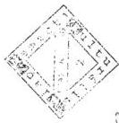
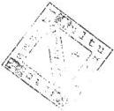

Állami Számverőszék

# JELENTÉS

a Nemzeti Kulturális Alap pénzügyi-
gazdasági ellenőrzéséről

9825

1998. július

---

Az ellenőrzés végrehajtásáért felelős:

az ÁSZ III. Költségvetési Ellenőrzési Igazgatósága

Bihary Zsigmond

számvevő igazgató

Az ellenőrzést vezette:

Matusek István

számvevő főtanácsos

Az ellenőrzést végezték:

Belovai Sándorné

számvevő tanácsos

Benkéné Dr. Lavner Klára

számvevő tanácsos

Szabó Gabriella

számvevő

Éva Katalin

számvevő tanácsos

Csomán Mihály

számvevő tanácsos

Dr. Szeli Tibor

számvevő tanácsos

Norczen Győzőné

számvevő

Ébner Vilmosné

számvevő tanácsos

Valu Tibor

számvevő

dr. Remport Katalin

számvevő

Dr. Koronics Károlyné

számvevő tanácsos

dr. Sipos Dóra

számvevő

Kozák György

számvevő tanácsos

Surányi Tamás

számvevő tanácsos

Köcse Istvánné

számvevő tanácsos

Varga Szabolcs

számvevő

Nagy Józsefné

számvevő tanácsos

dr. Nagy Mihályné

külső munkatárs

dr. Pál Lehelné

számvevő

---

152 : 308

V-32-100/1997-98.

# TARTALOMJEGYZÉK

|  **I. ÖSSZEGZŐ MEGÁLLAPÍTÁSOK, KÖVETKEZTETÉSEK, JAVASLATOK** | **5**  |
| --- | --- |
|  **II. RÉSZLETES MEGÁLLAPÍTÁSOK** | **11**  |
|  1. Az alap kezelésének és működésének szabályozottsága | 11  |
|  1.1. Az Alap jogi szabályozottsága | 11  |
|  1.2. Az Alap belső szabályozottsága | 13  |
|  1.3. Az alapkezelő működésének szabályozottsága | 14  |
|  2. Az Alap döntéshozó szervezeteinek működése | 17  |
|  2.1. A Bizottság működése, szerepe | 18  |
|  2.2. A Bizottság és a szakmai kollégiumok | 21  |
|  2.2.1. A Bizottság és a kollégiumok kapcsolata | 21  |
|  2.2.2. Ad hoc kollégiumok létrehozása és működése | 23  |
|  2.2.3. A bizottsági, kollégiumi tagok megválasztása, kinevezése, felmentése | 24  |
|  2.2.4. A Bizottság és a szakmai kollégiumok elnökeinek és tagjainak díjazása, költségtérítése, felelőssége | 25  |
|  3. Az Alap forrásainak tervezése | 26  |
|  3.1. A bevételi előirányzatok tervezése | 26  |
|  3.1.1. A kulturális járulék tervezése | 27  |
|  3.1.2. A költségvetési támogatás tervezése | 29  |
|  3.1.3. Egyéb bevételek tervezése | 30  |
|  3.2. A kiadási előirányzatok tervezése | 31  |
|  3.3. Az előirányzatok módosítása | 31  |
|  4. Az Alap forrásai, likviditása | 33  |
|  4.1. Az alap bevételi forrásai | 33  |
|  4.2. Az Alap likviditása, finanszírozása | 36  |
|  5. Az Alap felhasználása | 39  |
|  5.1. A pályázati rendszer | 39  |
|  5.2. Az Alap kiadásai | 42  |
|  5.3. A miniszteri keret | 43  |
|  5.4. A támogatások hasznosulása | 47  |
|  5.5. Belső ellenőrzés az Alapnál | 62  |
|  6. Alap számviteli rendje és bizonylati fegyelme | 63  |
|  7. Az alapkezelő működése és gazdálkodása | 65  |
|  7.1. A költségvetési tervek megalapozottsága | 65  |
|  7.2. Személyi és tárgyi feltételek | 67  |

1

---

7.2.1. Személyi feltételek, bergazdálkodás 67
7.2.2. Az alapkezelő elhelyezése. Beruházások és felújítások lebonyolítása 70
7.3. Egyéb juttatások alakulása 72
7.4. Számviteli, bizonylati rend 74

2

---

Állami Számvevőszék

V-32-100/1997-98.

Témaszám: 398

# JELENTÉS

## A Nemzeti Kulturális Alap pénzügyi-gazdasági ellenőrzéséről

**A Nemzeti Kulturális Alap (továbbiakban NKA vagy Alap)**, mint a Kulturális Alap jogutódja, az 1993. évi XXIII. törvénnyel jött létre, célja a nemzeti és egyetemes értékek létrehozásának, megőrzésének, valamint a hazai és határon túli terjesztésének támogatása. Az említett célok finanszírozásának nem egyetlen forrása az Alap.

A kulturális célok finanszírozását a sokcsatornás gyakorlat jellemzi. A központi költségvetés kulturális céllal intézményeket, programokat, illetve az Alapot részesíti támogatásban. Az **MKM költségvetésében több, az Alappal átfedő kulturális célú pályázati keret található** pl. a műalkotások vásárlása, művészeti ösztöndíjak, közművelődési pályázatok, levéltári feladatok, könyvpályázati célok). A kulturális szakterületekhez kapcsolódóan a központi költségvetés - MKM fejezeten kívül - hét fejezete tartalmaz jelentős összegű előirányzatokat: a Miniszterelnökség (pl. Hungária TV Alapítvány, kisebbségi lapok, stb.); a Belügyminisztérium (Művelődési Központ); a Magyar Tudományos Akadémia (pl. tudományos könyv és folyóirat-kiadás); a Honvédelmi Minisztérium (pl. MH kulturális intézmények); a Földművelésügyi Minisztérium (közművelődési intézmények), a Közlekedési, Hírközlési és Vízügyi Minisztérium (Közlekedési Múzeum), valamint az Országgyűlés (Országgyűlési Könyvtár) fejezetek.

A központi **költségvetésen kívül, további összegeket fordítanak kulturális célok támogatására az önkormányzatok is.**

**Az Alap forrását** - a törvény szerint - a kulturális járulék, az éves költségvetési törvényben meghatározott állami támogatás, szerzői jogi bírság befizetések, önkéntes adományok, kulturális vállalatok privatizációjából eredő bevételek, külföldi hozzájárulások, a tartós bankbetétben elhelyezett ideiglenesen szabad pénzeszközeinek kamata és az egyéb bevételek képezik.

---3

---

Az Alappal a művelődési és közoktatási miniszter rendelkezik, kezelője a Művelődési és Közoktatási Minisztérium felügyelete alá tartozó, önálló költségvetési szerv, a Nemzeti Kulturális Alap Igazgatósága (továbbiakban: Igazgatóság).

Az Alap elvi, irányító és koordinációs feladatainak ellátására a miniszter 11 tagú Bizottságot hozott létre, élére - az erre vonatkozó törvényi felhatalmazás alapján - elnököt nevezett ki.

A Nemzeti Kulturális Alap Bizottsága (továbbiakban: Bizottság) az Alap legfőbb döntéshozó szerve, amely - többek között - évente kijelöli a támogatások prioritásait és megállapítja a szakmai kollégiumok éves költségvetését. A pályázatok kiírásáról és elbírálásáról szakmai kollégiumok döntenek. A szakmai kollégiumok 14 kulturális és művészeti ágat képviselnek. A szakmai kollégiumokon kívül 1996-ban a miniszter létrehozta a Digitális Kultúra ideiglenes (ad hoc) kollégiumot, 1997-ben az ipari és kereskedelmi miniszterrel közösen a Magyar Művészet ad hoc kollégiumot, a szakmai kollégiumokkal lényegében azonos hatáskörrel.

Az Alap 1997-ben 2,7 Mrd Ft-ot megközelítő összeget használt fel különböző pályázatok támogatására, ebből az összegből 110 M Ft volt a központi költségvetés hozzájárulása.

**Az ellenőrzés célja** annak értékelése volt, hogy

- az Alapból felhasznált pénzeszközök hogyan segítették a kulturális célok megvalósítását;
- az alapkezelő működése mennyiben járult hozzá az Alap törvényes, célszerű és eredményes felhasználásához;
- az alapkezelő gazdálkodása megfelelt-e a jogszabályi előírásoknak.

A ellenőrzés az 1994-1997. évek közötti időszakra irányult és egyúttal minősítette az Alap 1998. évi költségvetése tervezésének megalapozottságát is. A számvitelt érintő kérdésekben megállapításainkat egybe vetettük az Alap auditálását végző könyvvizsgálóéval. A helyszíni ellenőrzés során felkerestük a Bizottság és valamennyi szakmai kollégium elnökét, és alkalom adódott arra is, hogy több kollégiumi ülésen részt vegyünk és figyelemmel kísérjük a döntések meghozatalát. A pályázati célok megvalósulását, a pénzfelhasználás és elszámolás szabályszerűségét - Budapesten és 10 megyében - összesen 340 pályázat ellenőrzése alapján értékeltük.

4

---

# I. ÖSSZEGZŐ MEGÁLLAPÍTÁSOK, KÖVETKEZTETÉSEK, JAVASLATOK

Az **Alap** deklaráltan **elkülönített állami pénzalap**, ugyanakkor **működésében a közalapítványokhoz hasonló megoldások** is megtalálhatók: az Alappal kapcsolatos elvi, irányító és koordináló jogosítványokat a miniszter által létrehozott **Bizottság** gyakorolja, amelynek öt tagját (50%) az érintett szakmai és társadalmi szervezetek jelölik, ugyanakkor a Bizottság elnöke a miniszter személyes megbízottja, aki legalább negyedévente tájékoztatja az Alap tevékenységéről. A pályázatok kiírásáról és elbírálásáról döntő **szakmai kollégiumok** tagjainak ötven százalékát ugyancsak az érintett szakmai, társadalmi szervezetek delegálják; az Alapot nem a Művelődési és Közoktatási Minisztérium (MKM), hanem egy elkülönült szervezet (önálló költségvetési szerv), a Nemzeti Kulturális Alap Igazgatósága (Igazgatóság) kezeli.

A gyakorlatban létrejöttek a **törvényben**, illetve a **végrehajtási rendeletben nem szabályozott szervezeti és finanszírozási megoldások** is. Ilyen szervezeti képződmények az **ad hoc bizottságok** és az Alaptól részben elkülönített forrás, az úgynevezett **miniszteri keret**, amelynek felhasználását a miniszter, vagy személyes megbízottja ellenőrzi.

Az ellenőrzés tapasztalatai szerint **az Alap pénzeszközei felhasználásának szervezeti keretei, a kialakított döntési mechanizmus összességében eredményesen segíti az alapot létrehozó törvényben deklarált célok megvalósítását.**

A módosításokkal hatályos törvény szerint a Bizottság határozza meg az Alap rövid- és középtávú támogatási stratégiáját, tesz javaslatokat a különösen fontosnak tartott támogatási célokra, ellenőrzi az alap működését és közzéteszi az Alap éves működéséről szóló szakmai és gazdasági beszámolót. A végrehajtási rendelet felhatalmazza a Bizottságot jogszabály-módosítások kezdeményezésére, ellenben az Alapot érintő jogszabálytervezetek véleményezésére nincs lehetősége. Feladataival funkcionálisan összeférhetetlen az egyedi támogatási kérelmek jóváhagyása - amelyre több esetben volt példa - ez a döntési hatáskör a szakmai kollégiumokat illeti meg.

A Bizottság által meghatározott prioritásokban érvényesültek a miniszter kulturális célkitűzései is.

A döntéshozó testületek elnökei és tagjai az adott szakterület elismert és tekintéllyel rendelkező reprezentánsai.

---5

---

I. ÖSSZEGZŐ MEGÁLLAPÍTÁSOK, KÖVETKEZTETÉSEK, JAVASLATOK---

Helyes lenne azt a korábbi gyakorlatot visszaállítani, hogy a szakmai kollégiumok tagjai között képviselve legyen az MKM azon munkatársakkal, akik ismerik a tárca kulturális stratégiáját, pénzforrásainak felhasználását. Részvételük előnyösen hozzájárulna a döntések meghozatalához.

Az Alap 1994. év és 1997. év között összesen 34.985 db pályázatot fogadott. A pályázati eljárás és a miniszteri keretből történő juttatás során 19.379 db pályázatot, a beérkezettek 55,4%-át támogatták. A folyósított támogatások összege az 1994. évi 600,5 M Ft-ról 1997. évre 2.505,4 M Ft-ra, 317,2 %-kal nőtt és 4 év alatt összesen 5.668 M Ft-ot tett ki (3. sz. melléklet).

A kulturális célokra fordítható források szűkösségét jelzi, hogy a pályázatokban igényelt támogatási összeg átlagosan mintegy négyszerese volt az odaítélt összegnek.

Az Alap pénzeszközeinek pénzügyi-számviteli rendje - hibáit is figyelembe véve - jónak minősíthető. Az Alap felhasználásának szakmai eredményessége az MKM és az Alap illetékes vezetőinek véleménye szerint az elvárásokat kielégíti.

A hatályos törvényekkel egyező megoldást kell kialakítani az ún. miniszteri keret felhasználására is, nem vitatva az Alapot felügyelő miniszter azon jogát, hogy lehetősége legyen az általa fontosnak tartott célok támogatására.

A nyertes pályázók vissza nem térítendő, valamint részben vagy egészben visszatérítendő, de kamatmentes támogatásban is részesülhettek. A szakmai kollégiumoknál megszavazott támogatások elszámolási kötelezettség mellett szinte teljes egészében végleges felhasználási lehetőséget jelentettek. A miniszteri keretből juttattak nagyobb mértékben visszafizetési kötelezettség mellett támogatást. **Az elfogadott pályázatokat az Igazgatóság egyre javuló rendszer szerint kezeli és számoltatja el.**

Az Alap kiadásainak nagyobb hányadát a szakmai feladatok és az azokban megtestesülő pályázatok támogatására, kisebb hányadát - ami nem érte el a bevételek 10 %-os engedélyezett mértékét - a működési költségek fedezetére fordította.

A kincstári finanszírozásra történő áttérés az Alapnál sem volt problémamentes. Az ellenőrzés tapasztalatai szerint az első évben kialakult feszültségek tisztázása érdekében az Alap rendszeresen - a tranzakciós kódok folyamatos korrigálása mellett - egyeztetett a Magyar Államkincstárral. Ennek ellenére 1996. év végén is még adódtak problémák, a Kincstár nem azonosítható bevételként kezelte az Alap legfőbb bevételi forrását, a kulturális járulékot. A költségvetési támogatás utalása - a négy év során - nem felelt meg maradéktalanul a jogszabályi kötelezettségeknek, mert ütemessége nem volt megfelelő.

Az Alap likviditása - nagyrészt a járulékbevételek következtében - folyamatosan biztosított volt.

Az Alap pénzügyi forrásai - elsősorban a járulék befizetések növekedésének köszönhetően - folyamatosan bővültek (az 1998. évi költségvetésben jóváhagyott 2.379 M Ft-os kulturális járulék bevételi előirányzat több, mint há-

---6

---

I. ÖSSZEGZŐ MEGÁLLAPÍTÁSOK, KÖVETKEZTETÉSEK, JAVASLATOK

romszorosa az 1994. évi előirányzatnak). A költségvetési támogatás - helyesen - fokozatosan visszaszorult, az 1998. évi költségvetési terv már nem tartalmaz a központi költségvetésből származó bevételt.

Az Alapról szóló törvényben nevesített bevételi források közül több (pl. pénzeszközök tartós betétként való elhelyezése, privatizációs bevételek felhasználása) nincs összhangban más, hatályos törvényi előírásokkal, ezért a törvényben megjelölt bevételi források felülvizsgálata és módosítása szükséges.

Az alapszerű működést hátrányosan befolyásolja 1996. év óta a pénzmaradvány felhasználásának tilalma (az Alap maradványa a róla szóló törvény szerint nem vonható el, ugyanakkor fel sem használható); mert erre a hatályos költségvetési törvények nem adnak lehetőséget.

A pályázatás kialakított rendszere és az alkalmazott szerződési mechanizmus a jogszabályi feltételeknek és tartalmi feltételeknek általában megfeleltek.

A helyszíni tapasztalatok szerint az ellenőrzött **nyertes pályázatok** az előzetesen kiírt **pályázati feltételeknek** összességükben **megfeleltek**.

A pályázatok 98,2%-a vissza nem térítendő támogatásban részesült.

A vizsgált pályázók nagyobb része - mintegy kétharmada - a pályázatban saját és egyéb más forrást is megjelölt a pályázati adatlapokon kulturális céljainak eléréséhez. A pályázók 106 db pályázat esetében kívánták saját forrás nélkül, kizárólagosan az Alap által nyújtott támogatásból megvalósítani céljaikat.

Az ellenőrzött pályázatok kisebb - 20,3%-os - hányadánál egyeztek meg az Alap szakkollégiumától, illetve a miniszteri keretből igényelt és a ténylegesen elnyert támogatások. Ebbe a kategóriába estek a miniszteri keret terhére igényelt és kapott juttatások.

A vizsgált pályázatok keretében rendelkezésre bocsátott támogatások **többségükben** - 95,3 %-ban - a **pályázati** kiírásokban megfogalmazott **célok elérését szolgálták**.

Ellenőrzésünk a vizsgált esetek kisebb hányadánál - 19,7 %-ánál - állapított meg a könyvvezetés, bizonylati rend és fegyelem témakörében szabálytalanságot a pályázóknál. A vizsgálat alá vont pályázatok közül minden ötödikről késve adtak számot az Alap Igazgatósága számára.

Az 1998. évi pályázatoknál nehézséget okozott az adóhatósági igazolások beszerzése az önálló jogi személyiséggel rendelkező, de korlátozott gazdasági jogkörű oktatási intézményeknek, mivel azoknak nincs adószámuk. Hasonló a helyzet a kulturális intézmények esetében is. Igazolást csak a fenntartó önkormányzat, illetve a gazdálkodói tevékenységet ellátó szervezet (GAMESZ, TÁKISZ) tud beszerezni. Ez utóbbi intézmények szakmai feladatellátás vonatkozásában azonban nem állnak kapcsolatban a támogatást igénylő intézménnyel.

7

---

I. ÖSSZEGZŐ MEGÁLLAPÍTÁSOK, KÖVETKEZTETÉSEK, JAVASLATOK

Az információs hálózat számítógépes kiépítése és a programok telepítése, bővítése, a felmerült igények szerinti korrigálása biztosította a döntésekhez szükséges információkat. A pályáztatás és szerződéskötések tapasztalatai szükségszerűvé tették a pályáztatás eljárási szabályainak folyamatos kiegészítését és módosítását. A pályázatok számának gyors növekedése és az adminisztratív kötelezettségek bővülése miatt felmerült egy új, korszerű programrendszer alkalmazásának szükségessége.

A nagyobb értékű pályázatok szakmai és pénzügyi ellenőrzésének feltételei részben létrejöttek, egyelőre azonban az ellenőrzés nem tud maradéktalanul megfelelni a pályázatok nagy száma és területi szétszórtsága miatt a növekvő feladatoknak. Nehezítette az ellenőrzés munkáját, hogy a számítógépes nyilvántartás sem volt korábban tökéletes és naprakész, a pályázati pénzekkel való elszámolás gyakran késedelmes, vagy hiányos volt. Az ellenőrzések javuló színvonala kedvezően hat a pályázati igénylők pénzügyi fegyelmére, de meg kell jegyezni, hogy a megvalósult pályázatoknak csak töredékét lehetséges helyszíni ellenőrzéssel összekapcsolva átvizsgálni, ezért a pályázati támogatások felhasználásának célszerűségi, eredményességi és szabályszerűségi ellenőrzése nem lehet teljes körű.

Az Alapot kezelő Igazgatóság működésének, gazdálkodásának belső szabályozottsága folyamatosan - az intézmény önállóvá válását követően jelentősen - javult. Gazdálkodása összességében szabályszerűnek és célszerűnek minősíthető.

Tevékenységük további javítását a vezetői szintek feladatainak jobb elhatárolásával, a pályázatok ellenőrzési módszereinek fejlesztésével, a szerződési feltételek szigorításával érhetik el.

Az ellenőrzés tapasztalatai alapján javasoljuk

a Kormánynak

1. Tekintse át a kulturális célok sokcsatornás finanszírozási gyakorlatát és kezdeményezze annak átláthatóbbá tételét, az indokolatlan átfedések megszüntetését.

2. Alakítsa ki az Alapot érintő hatályos törvények között előforduló ellentmondások megszüntetése érdekében távlatosabb alapokon álló javaslatait az 1993. évi XXIII. törvény bevételi jogcímere vonatkozóan:

a) a törvény 4. §. (1) bek. e/ pontja szerint az Alap egyik forrása a tartós bankbetétben elhelyezett ideiglenes pénzeszközök kamata, az Államháztartásról szóló 1992. évi XXXVIII. törvény (Áht) 18/D. (2) bek., valamint az 1994. évi XXI. törvény nem engedélyezi az alapok pénzeszközeinek tartós betétben való elhelyezését, ez csak állampapírba fektetve volt megengedett, a kincstári finanszírozás bevezetésével 1996. I. 1-től ez a lehetőség is megszűnt, az 1995. évi CV. törvény az ideiglenes pénzeszközök feletti rendelkezési jogot a Kincstárhoz helyezte;

b) a törvény 4. §. (1) bek. f/ pontjában foglaltak szerinti szerzői jogi-bírság befizetések (Szjt. 53. §. (2) bek.) az Alapot illetik - az ilyen címen beszedett bevételek az

8

---

I. ÖSSZEGZŐ MEGÁLLAPÍTÁSOK, KÖVETKEZTETÉSEK, JAVASLATOK

Alap szempontjából jelentéktelenek, - ellenben beszedésének megszervezése aránytalan többletfeladatot jelent, ezért fenntartása nem célszerű;

c) a törveny 4. § (1) bek. g/ pontjaban kozolt bevételi forrás az allami vagyon privatizaciójának beveteleiból juttatott összegek - az Alapnak ilyen címen tenylegesen bevetele nem volt - a továbbiakban sem varhatók, elhagyása a bevételi jogcimek kozül indokolt;
d) a törveny 4. § (3) bek. szerint az alap bevetele és év vegi maradványa nem vonható el, az 1996. évi CXXIV. törveny 33. §. (3) bek., valamint az 1997. évi CXLVI. tv. 29. §. (3) bek. nem tették lehetőve az Alap penzmaradványanak felhasználását, ezzel szünetelt az alapszerő muködés lehetősege.

3. Tekintse at az elkulönitett allami penzalapok kezelöinek az ugynevezett kozbeszerzési igazolás kiadási kõtelezettsegét, ez alol vagy mentesiteni kell a Nemzeti Kulturális Alapot, vagy a jogszabályok modositásával meg kell teremteni annak törvenyes felteteleit. (1995. évi XL tv. 46. §. (1) bek. b/ pont, továbbá 46§. (2) bek., és Aht: 13/A. §. (5) bek., továbbá 18/c. §. (11) és (13) bek.)
4. Szükséges a 156/1995. (XII. 26.) Kormányrendelet oyan értelmú módosítása, amely az onallo jogi személyiségú, de részben onallo, illetve részjogkörrel rendelkező kolt-segvetési szervek kóztartozásainak adatszolgaltatási modjairól rendelkezik.

# a nemzeti kulturális örökség miniszterének:

1. Indokolt megallapitani a Nemzeti Kulturális alaprol szólo törveny vegrehajtásat szabályozó miniszteri rendeletben az Alapból elkūönítét miniszteri keret celját, képzésenek, elosztásanak, felhasznalásanak és elszamolásanak szabályait.
2. Miniszteri rendelet allapitsa meg az ad hoc bizottsagok tovabbi fenntartasanak szuksegessege eseten letesitsek es mukodesuk szabalyait.
3. Celszeru lehetové tenni aBizottsagi es kollegiumi tagok esetuben az ujravalaszthatosagot, valamint a miniszter altal felkert körben egy-egy koztisztviseló jelolését. Ugyanakkor törvenyi szinten indokolt kimondani a bizottsagi es kollegiumi tagsag kozotti azonos idopontra vonatkozoan az összeferhetelenséget.
4. Boviteni celszeru a Bizottsag hataskoret egyreszt a jogszabaly-velemenyezes jogaval, masreszt szukiteni egyedi donteshozatali es jovahagyasi jogkoret. Megfontolando a miniszteri keret jogi rendezese eseten a keret feletti ellorzesi kotelezettseg elorasa es a miniszter keretenek maximalt osszegben tortenog meghatarozasa.

9

---

I. ÖSSZEGZŐ MEGÁLLAPÍTÁSOK, KÖVETKEZTETÉSEK, JAVASLATOK

**az Alapot kezelő igazgatóságnak:**

1. Jobban határolják el egymástól (a feladatok összemosódása, a feladatkör-átfedések, illetőleg a hézagos szabályozás miatt) az egyes vezetői feladatokat a hatályos Szervezeti és Működési Szabályzat aktualizálása során.
2. Állapítsák meg az ellenőrzés hatékonyabbá tétele érdekében a Belső Ellenőrzési Szabályzatban az alkalmazásra kerülő ellenőrzési módszereket, a helyszíni ellenőrzés általános szempontjait, mentesítsék a pályázatok előzetes elbírálása alól a belső ellenőrzést. Fontossági sorrend szerint ütemezzék a helyszíni ellenőrzéseket.
3. Következetesebben és szigorúbban érvényesítsék a szerződésekben foglalt feltétek betartását (számlabenyújtási kötelezettség megkövetelése, garancia kikötés a visszatérítendő támogatások esetén, visszatérítendő ÁFA céljára történő felhasználás tilalma, elszámolt számlák érvénytelenítése, a támogatási összegek felhasználásának elkülönített nyilvántartásának megkövetelése).
4. Kezdeményezzenek a Kincstárral az Áht 1998. I. 1-je óta hatályos 18/C. §. (11) bekezdésére alapozva olyan tárgyú szerződést, mely szerint a pályázaton nyertes ügyfelek részére pályázati támogatás rendelkezésére bocsátása előtt - a kedvezményezettek írásbeli hozzájárulásával - a Kincstár az ügyfélnek adóhatóságokkal szembeni tartozását megvizsgálja. A Nemzeti Kulturális Alapból a támogatás folyósítására nemleges igazolás birtokában kerülhet sor.
5. Vizsgálják meg a helyszíni tapasztalatok során felmerült hiányosságok alapján a (kétszeres elszámolás, visszaigényelhető ÁFA elszámolása stb.) pótelszámolással történő korrekcióknak a lehetőségét, ellenkező esetben kezdeményezzék a jogosulatlan támogatások visszafizetését.

10

---

## II. RÉSZLETES MEGÁLLAPÍTÁSOK

### 1. AZ ALAP KEZELÉSÉNEK ÉS MŰKÖDÉSÉNEK SZABÁLYOZOTTSÁGA

#### 1.1. Az Alap jogi szabályozottsága

Az 1996. évi XXIX. törvénnyel módosított 1993. évi XXIII. törvény és azok végrehajtási rendeletei ( 8/1994. (IV. 26.), 3/1995. (III. 24.), 12/1996. (X.15.) és a 16/1997. (III. 19.) MKM rendeletek) **megfelelő jogi keretet adnak** az Alap kezelésének és működésének.

Az Országgyűlés az **1993. évi XXIII. törvénnyel** létrehozta a Nemzeti Kulturális Alapot. Az Alappal a művelődési és közoktatási miniszter rendelkezik, az Alap kezelője a Művelődési és Közoktatási Minisztérium felügyelete alá tartozó Nemzeti Kulturális Alap Igazgatósága. Az Alap elvi, irányító és koordináló döntések meghozatalára a miniszter Bizottságot létesít és szakmai kollégiumokat hoz létre, amelyek a pályázatok kiírásáról és elbírálásáról döntenek.

A törvény részletesen meghatározza az Alap forrásait, az Alap által támogatható célokat, a pénzeszközök kezelésének elveit.

Az Alapról szóló **1993. évi XXIII. törvényt az 1996. évi XXIX. törvény** módosította, amely bővítette mind a bevételek, mind a kiadások körét.

A központi költségvetés reálértékben fokozatosan csökkentette az Alap támogatását, ezért elkerülhetetlen volt a bevételek forrásainak bővítése. Erre szolgált a járulékfizetés alapjául szolgáló termékek és szolgáltatások körének kibővítése, valamint a kulturális járulékok mértékének újraszabályozása, amely betöltötte az elvárt célt, **az Alap bevételei fokozatosan növekedtek**.

A módosítással **új irányzatok, kultúrával kapcsolatos kutatások támogatásával bővült az Alap kiadásainak köre**. Az 1998. évi költségvetésről szóló törvény pedig **TB járulékfizetés** céljára is lehetőséget biztosított pályázati úton az Alap támogatásának elnyeréséhez.

A módosítás **lehetővé tette az Alap kötelezettségvállalását** a tárgyévet követő két évre, a tárgyévi bevételi előirányzat 10 %-ának mértékéig. Ennek a **programfinanszírozások**, valamint a nemzetközi hírű művészek meghívása esetében van nagy jelentősége, **előre tervezhetővé válnak** a több évet átölelő nagyobb rendezvények. A törvény a vizsgálati időszakkal egybeeső módosításának tervezete a kötelezettségvállalás idejét 3 évre kívánja emelni.

---11

---

II. RÉSZLETES MEGÁLLAPÍTÁSOK

A törvény jelenlegi előkészületi szakaszban lévő módosító tervezetének alapvető eleme a kulturális járulék alapjának egyértelmű meghatározása, a kulturális járulék halmazódás elkerülése érdekében. Ugyanakkor tervbe vette az MKM az ad hoc kollégiumok és a miniszteri keret jogszabályi rendezését is, azonban a helyszíni ellenőrzés ideje alatt ezen módosításokról írásos dokumentáció még nem állt rendelkezésre.

A törvény végrehajtását a többször módosított 8/1994. (IV. 26.) MKM rendelet (Vhr) szabályozza, amely meghatározza az NKA Igazgatósága, az Alap Bizottsága, a szakmai kollégiumok feladatait, a Bizottság és a szakmai kollégiumok tagjainak felelősségét, valamint az Alap pénzeszközei kezelésének részletes szabályait. Az Alap létrehozásakor az Alap kezelését az MKM szervezetén belül az NKA Igazgatósága, mint önálló szervezeti egység, a pénzügyi feladatokat az MKM Gazdasági és Ellátási Főosztálya látta el.

**A Vhr 1995. évi módosításánál pozitív lépés volt, hogy a miniszter által saját hatáskörben felkérhető tagok esetében is - egy személy kivételével - előírták a szakmai és társadalmi szervek általi jelölést.**

1994-től a szakmai kollégiumokba a miniszter személyes megbízottjaként az MKM illetékes főosztályainak képviselőit delegálta. Az 1996-tól megindult egy eltolódás, melynek eredményeként 1998-ra már nem köztisztviselők töltötték be ezt a szerepet. Ugyanakkor a Bizottságtól kérte a miniszter, hogy szavazati jog nélkül, tanácskozási joggal részt vegyenek a kollégiumok munkájában az MKM részéről is. A köztisztviselők ismerik az MKM kulturális forrásait, összekötők lehetnek az Alap és az MKM között, ismerik a minisztérium kulturális stratégiáját, ezért látszik szükségesnek részvételük a kollégiumok munkájában.

Célszerű visszatérni a régi gyakorlathoz, és miniszteri hatáskörben szavazati joggal ellátott köztisztviselőket is felkérni.

Az 1995. évi módosítás szerint a Bizottság és a szakmai kollégiumok tagjainak megbízatása egy alkalommal meghosszabbítható, a kollégiumi vezetők megbízatása azonban nem újítható meg. A **nem kellő átgondoltságra utal, hogy az 1996. évi Vhr módosításánál ugyanezeket a rendelkezéseket újraszabályozták:** a Bizottság tagjainak megbízatása már nem újítható meg, a kollégiumi vezetőké és tagoké azonban egy évvel meghosszabbítható. **A megbízatások idejére nézve ugyanez az átgondolatlanság jellemző.** A módosítás indokai között szakmai okok nem találhatók.

Az eredeti Vhr a Bizottság 2-2 tagját 4 évre, 3-3 tagját 2 évre, azt követően minden tagot négy évre bízott meg, a szakmai kollégiumok tagjait pedig egységesen négy évre. A Vhr első módosítása a kollégiumi tagok megbízatását 2 évre, a második módosítás 3 évre módosította azzal, hogy a kollégiumi tagok megbízatása egy alkalommal megújítható. A kollégiumi vezetők kinevezése eredetileg 2 évre, azt követően 4 évre történt, az első módosítással egységesen 2 évre korlátozódott, majd 1996-tól 3 évre.

A tagsági jogviszony a vezetői kinevezés alapja. Megállapítható, hogy **egyes kollégiumi vezetők tagsági mandátumukat követően is vezetői pozícióban maradtak.** A pályázati keretek felett döntési jogosultsággal rendelkező kollégiumok esetében célszerű fenntartani a rotációs elvet. A Bizottság esetében azonban az újraválaszthatóság illetve újradelegálás lehetőségének át-

12

---

gondolása megfontolás tárgya lehet. Indoka: jól működő testület esetén, amennyiben a delegáló szervek egyetértenek, a hatékonyságot és szakszerűséget növelné a rendszert már jól ismerő szaktekintélyek pozícióban tartása.

A módosítás **újraszabályozta a Bizottság feladatait** is, azonban **az eredeti és a módosított feladat-felsorolás között lényegi különbség nincs**, gyakorlatilag más rendszerben sorolja fel ugyanazon feladatokat. Egyetlen új elem: az egyedi elbírálást igénylő támogatásokra felhasználható mérték meghatározását is a Bizottság hatáskörébe utalta. A Vhr tartalmazza a bizottsági jogok között a jogszabály-módosítás kezdeményezésének jogát. Ezzel ugyan nem élt a Bizottság, azonban a törvény és a Vhr módosításaikor - bár az üléseken tájékoztatták azok állásáról a tagokat - a Vhr 2. módosítása kivételével véleményüket, javaslataikat nem kérték ki. Célszerű a jogszabály-módosítások véleményezési jogával kibővíteni a Vhr-t.

**Pozitívan értékelhető**, hogy a **módosítás lehetővé tette a Bizottság tagjainak díjazását**. A Bizottság tagjai társadalmilag elismert, fontos és felelősségteljes munkát végeznek, méltatlan volt az eredetileg bevezetett díjazás nélküli állapot. A díjazás mértéke azonban névleges, továbbra sem tükrözi a tagsággal járó kötelezettségeket.

**Az 1996. évi Vhr módosítás egyik legfőbb eleme** az önálló költségvetési szervvé vált **Igazgatóság feladatainak, működésének szabályozása**, amely a közalkalmazotti besorolás szabályait határozta meg az Igazgatóság esetében.

Az Igazgatóság alapító okirata rendelkezik a székhelyéről és előírja, hogy működtetéséről az Alapnak kell gondoskodnia.

## 1.2. Az Alap belső szabályozottsága

**Az Alap belső szabályozottsága** csak a **vizsgált időszak második felében** volt teljes körű. Ebben döntő szerepe volt annak, hogy **Az Alap SZMSZ-ét csak késedelmesen, 1997. április 28-án hagyta jóvá a miniszter**. Az SZMSZ részletesen szabályozza a Bizottság, a bizottsági elnök, tagok, titkár jogait, kötelezettségeit, a szakmai kollégiumokra (elnökökre, tagokra) vonatkozó előírásokat, valamint a szakértőkre és az Igazgatóságra vonatkozó szabályokat. Meghatározza a Bizottság és a kollégiumok működési szabályait. Előírja a pályázatok bírálati rendjével kapcsolatos összeférhetetlenségi szabályokat, valamint a pályázati rendszer ellenőrzését. **Az SZMSZ eleget tesz a törvény által előírt feladatainak, jól összeállított, rendszerezett. A feladatok a szabályzatban jól elhatároltak.**

Mind a Bizottság **elnökét**, mind az Igazgatóság vezetőjét, az **igazgatót a miniszter nevezi ki és menti fel. Együttműködésük szabályait az SZMSZ rendezi.**

Az elnök 1996. V.1-től megbízási jogviszony alapján látja el tevékenységét. A megbízási szerződés azonban nem rendelkezik szabadságról, és akadályoztatás esetén helyettesítéséről. A sajátos jogi szabályozás következtében - a bizottság el-

13

---

II. RÉSZLETES MEGÁLLAPÍTÁSOK---

nöke a miniszter illetve az általa kinevezett személy ( törvény 2. § (3) bekezdés a, pont) - az elnöki jogviszony helyettesítésre is kiterjedő rendezése szükséges.

Az Alap működéséhez **önálló számviteli politika** készült, azonban nem felelt meg teljes körűen a többször módosított számvitelről szóló 1991. évi XVIII. törvény (Szvt) előírásainak.

Az 1997. évben készült szabályzatok a Szvt előírásait kielégítik.

A Nemzeti Kulturális Alap kezelője a vizsgált időszakban **évente elkészítette az Alap számlarendjét**, amely a jogszabályi változásoknak megfelelően aktualizálásra került. A számlarend 1. és 2., ill. 5. számlaosztályt nem tartalmaz, mert eszköz- és készletnyilvántartás nincs az Alapnál, ill. a működési kiadások adminisztrációja az MKM Gazdasági Osztályán, ill. önállóvá válása óta az Igazgatóság rendszerében történik.

**A számlarend** 1994-1997-ben nem minden szempontból elégítette ki a Szvt előírásait, **nem szabályozta a zárlati teendőket**. Egyéb vonatkozásban megfelelt a 179/1991. (XII. 30.) Korm. rendelet, az 54/1996. (IV. 12.) és 209/1996. (XII. 23.) Korm. rendelet előírásainak, alkalmas volt a számviteli és információs rendszer szabályozására.

A számlakeret-tükör, illetve a számlakeret törzslisták az Alappal szemben támasztható szakmai információs igényeknek megfeleltek.

A számlarend alapján 1994-ben **számlatükröt**, 1995-től kezdődően **számlatükör törzslistát** készítettek.

A számlarendek megfelelően tartalmazták a főkönyvi számlák megnevezését, tartalmát, de nem tartalmazták az értékelési módokat, nem szabályozták az analitikus nyilvántartás rendjét.

Az Alap éves számlarendjei - az 1994. évi kivételével - jóváhagyásra kerültek.

1995. I. 27-én kiadásra került az Alap **Pályázatkezelési Szabályzata**, amely részletesen meghatározza a pályázatok döntéselőkészítésével kapcsolatos feladatokat, határidőket és felelősöket a pályázati feltételek kiírásától a döntésig és annak rögzítéséig.

### 1.3. Az alapkezelő működésének szabályozottsága

Az Igazgatóság alapító okirata 1996. szeptember 19-én kelt és az megfelel az államháztartásról szóló 1992. évi XXXVIII. tv. 87. §. (3) bekezdésében foglalt követelményeknek.

**Az Igazgatóság működésének szabályozottsága a vizsgált időszakban nem volt teljes körű, ez döntően a részletes feladatok menetközben történő kialakításával volt összefüggésben. Az intézmény önállóvá válását követően a szabályozottság jelentős mértékben javult.**

---14

---

**Szabályozottabbá vált a számviteli és bizonylati rend is** alapvetően azzal, hogy új számítógépes nyilvántartási rendszert alakítottak ki. Ezzel az analitikus nyilvántartást és a főkönyvvel való egyezőséget, továbbá az analitikus nyilvántartások tartalmát és vezetésük rendjét szabályozottabban oldották meg.

Az Igazgatóság 1994. októberében elkészítette saját szervezeti-működési szabályzatát, melyet azonban miniszteri jóváhagyás hiányában - nem léptettek hatályba./ Az Igazgatóság által 1996. április 5-én kiadott gazdálkodási szabályzat - az ügyrendet részben helyettesítve - a napi ügymenet legfontosabb területeit érintette. (Kötelezettségvállalás, utalványozás, ellenjegyzés, készpénzállomány kezelése.)

Az önállóvá válást követően elkészült és a miniszter által 1997. VII. 28-án jóváhagyott Igazgatósági SZMSZ életbeléptetése jelentős előrelépés volt a korábbi - a minisztérium igazgatási feladatai között szerepeltetett - NKA igazgatósági feladat-meghatározáshoz képest.

**Az Igazgatóság SZMSZ-ében az NKA Igazgatósága szervezeti felépítése, illetve az egyes egységeik feladat-meghatározásánál nem minden esetben a legcélszerűbb munkamegosztást alakították ki.** Mindez az intézményi - elsősorban a belső ellenőrzéssel kapcsolatos - feladatok hatékony működését hátrányosan érintette. Az egyes vezetői szintek közül az igazgató, valamint a helyettese által felügyelt szakmai területek vonatkozásában végső soron **a vezetői szintek felesleges egymásra épültségét eredményezte.**

Az igazgatóhelyettes közvetlen irányítása alá tartoznak egyes igazgatósági szintű - a PR (public relation), a sajtó, valamint a jogi természetű - feladatok, ugyanakkor a számítógépes rendszergazda - akinek a munkaköre döntően a pályázatok feldolgozásával függ össze - közvetlenül az igazgatónak van alárendelve, jóllehet a pályázatással kapcsolatos feladatok végrehajtását - az SZMSZ szerint - elsődlegesen az igazgató helyettes irányítja.

Az SZMSZ szerint az ellenőrzési osztály feladata a pályázók előzetes ellenőrzése abból a szempontból, hogy a korábbi pályázataik pénzeszközeivel elszámoltak-e és nincs tartozásuk. Ezen kívül vizsgálnunk kell a kiutalt támogatások felhasználásának jogszerűségét, valamint az Igazgatóság működésének szabályszerűségét. Megfelelő belső adatok hiányában a korábbi tartozások megállapítása az osztály kapacitásának nagyobb részét lekötötte és azt egyéb irányú feladatai terhére tudta csak elvégezni, ezáltal tevékenységének hatékonysága csökkent. Ezt a feladatot helyesebb lett volna a pénzügyi osztály számára előírni.

**A munkaköri leírások** jó színvonalúak, bár - hasonlóan az intézményi szabályzatokhoz - csak 1997. III. negyedévre lettek teljes körűek; azokban a munkaköri kötelezettségeket, az alá- és fölérendeltségi viszonyokat, valamint a helyettesítési feladatokat egyértelműen meghatározták, pénzkezeléssel megbízott dolgozók esetében továbbá azokhoz anyagi felelősségi záradékot csatoltak.

Az Igazgatóság Szervezeti és Működési Szabályzatában előírt - egy kivétellel - valamennyi belső szabályzat 1997. április és szeptember között elkészült és hatályba lépett. A számviteli politika csak 1997. december 15-ére készült el, jóllehet a számvitelről szóló 1991. évi XVIII. tv. 14. §-a, illetve az annak végrehaj-

15

---

II. RÉSZLETES MEGÁLLAPÍTÁSOK---

tásáról rendelkező 54/1996. (IV. 12.) évi Kormányrendelet 4. §-a 1997. I. 1-től ezt írja elő.

**A Kollektív Szerződés** csak **tervezet szintű**, elfogadva a helyszíni ellenőrzés befejezésének időpontjáig nem volt.

Az Alapból való támogatások juttatásával egyidőben kiemelt figyelmet fordítottak a kiutalt források cél szerinti felhasználásának és az elszámolások alaki és tartalmi helyességének vizsgálatára. Az ellenőrzést szervezetileg már a minisztériumi főosztályi keretben biztosították, a tevékenységet szabályzatba foglalták, melyet az Igazgatóság önállóvá válását követően módosítottak.

Az Igazgatóság által elkészített **Belső Ellenőrzési Szabályzat** funkcionálisan az Alap pénzforrásainak felhasználására irányult, de megfogalmazott igazgatósági belső ellenőri feladatokat is.

A szabályzat a pénzügyi-gazdasági ellenőrzésre vonatkozóan kellően részletes, a szakmai jellegű szabályozás azonban nem kellő mértékben kidolgozott, abban a szakmai kollégiumok ellenőrzésben betöltött szerepe nem tisztázott.

A szabályozás tág értelmezésre ad lehetőséget abban a tekintetben, hogy mely esetben áll fenn helyszíni szakmai ellenőrzési kötelezettség. Mivel nem dolgozták ki annak módszertanát, ebből következően nem határozták meg, mely támogatási formák illetve célok végrehajtását kell komplex módon - a pénzügyi ellenőrzéssel egyidejűleg - vizsgálni, illetve mely esetekben kell „folyamatba építettem” pl. az esemény megvalósulását, annak színvonalát ellenőrizni.

Pénzügyi kifogásai miatt megkérdőjelezhető a kollégiumok vezetőinek azon jogosultsága, miszerint a beérkezett pályázatot nem csak szakmai, hanem pénzügyi szakértővel is megvizsgáltathatják.

**A szabályozásban** (SZMSZ, Belső Ellenőrzési Szabályzat) **az Igazgatóság a belső ellenőrzéssel szemben olyan követelményt támasztott, melyet a gyakorlatban nem tudtak maradéktalanul végrehajtani.**

**A Házipénztár Kezelési Szabályzat** kiadására 1997. VIII. 1-én került sor. Előírásai összességében megfelelőek, kialakításuknál a helyi sajátosságokat és adottságokat figyelembevették.

Az előírások **biztosítják a házipénztár szabályos biztonságos működtetését.**

A pénzkezeléssel (kivéve a számítógépes feldolgozást, amelyet az ügyviteli rendszer szabályoz), az utalványozással, ellenjegyzéssel, kincstári készpénzállomány felvételére vonatkozó előírásokat, felelősséget, feladatkört a Házi pénztár kezelési szabályzat tartalmazza.

Az okmányolási és pénzkezelési feladatok ellátása megfelelően szabályozott. A szigorú számadású nyomtatványok rendje kialakított.

A készpénzfelvételi utalványt, napi pénztárjelentés nyomtatványát, a bevételi és kiadási pénztárbizonylatokat az Igazgatóság számítógépes gazdálkodási prog-

---16

---

ramja állítja ki a szabvány bizonylatoknak megfelelő formában és adattartalommal.

A pénztárban a szabályozásban meghatározott tájékoztatások (a pénztár nyitvatartási ideje, készpénzfelvételre, illetve utalványozásra jogosultak listája) megtalálhatók.

A házipénztári szabályzatban a napi záró pénzkészlet maximált összegét 1.000 E Ft-ban állapították meg. A magas összeg a kb. hetenkénti pénzfeltöltéssel, valamint a Kincstártól való rendkívül hosszadalmas készpénzfelvétel miatt indokoltnak minősíthető.

**A szabályzatok összességében megfelelő színvonalúak, azokban a feladatvégzés főbb súlypontjai kellő meghatározást nyertek.**

## 2. AZ ALAP DÖNTÉSHOZÓ SZERVEZETEINEK MŰKÖDÉSE

A törvény 2. § (1) bekezdése alapján az **Alappal** a művelődési és közoktatási **miniszter rendelkezik**. A Vhr alapján a **miniszter hagyja jóvá** az Alap **költségvetését és beszámolóját**, az Igazgatóság költségvetését és beszámolóját, továbbá az Alap **SZMSZ-ét**.

Az Alapról szóló törvény rendelkezése értelmében a **Bizottság az Alap elvi irányító és koordináló testülete**, a **szakmai kollégiumok** a pályázatok kiírására és elbírálására köteles **döntéshozó testületek**, míg az **Igazgatóság az Alap kezelője**.

A Vhr határozza meg a Bizottság, a kollégiumok és az Igazgatóság feladatait.

**A Bizottság** határozza meg az Alap támogatási stratégiáját, ajánlást tesz a támogatási célokra, összehangolja a kollégiumok tevékenységét, véleményezi az Alap SZMSZ-ét, jogszabály-módosításokat kezdeményez, ellenőrzi az Alap működését, közzéteszi beszámolóját. Megállapítja a miniszteri keretet, a kollégiumok felosztható keretét, és az egyedi elbírálásra felhasználható összeg mértékét.

**A kollégiumok** megfogalmazzák - a Bizottság irányelveivel összhangban - a szakmai terület elsődleges támogatási céljait, meghatározzák az egyes támogatási célokra fordítható összeget, meghirdetik és elbírálják a pályázatokat, beszámoltatják illetve ellenőrzik a pályázókat, tevékenységükről beszámolnak a Bizottságnak.

**Az Igazgatóság** a Vhr értelmében biztosítja a Bizottság és a kollégiumok működését, kezeli az Alap pénzeszközeit, tervezi költségvetését, elkészíti beszámolóit, működteti a pályázati rendszert, előkészíti és végrehajtja a döntéseket, végzi a pályázatok pénzügyi ellenőrzését.

---17

---

II. RÉSZLETES MEGÁLLAPÍTÁSOK

## 2.1. A Bizottság működése, szerepe

Az Alap Bizottságának **tagjai összkulturális érdekeket képviselő** - saját szakterületükön felülemelkedő -, nemzetközileg is elismert kulturális **szakemberek**. Munkájukat nagy felelősséggel, magas színvonalon látják el. 1997. végéig 31 ülést tartottak, amelyeken ellátták az Alap elvi irányítását, meghatározták a fő prioritásokat, megállapították a miniszteri keretet és szétosztották az Alap bevételeit a szakmai kollégiumok között.

A Bizottság a vizsgálati időszakban 10 határozatot és 2 ajánlást fogadott el. Az 1994. évi határozata értelmében a szakmai kollégiumok mind a professzionális, mind az amatőr művészeti tevékenységek iránti pályázatokat kötelesek elbírálni.

A hatályos végrehajtási rendelet 26. §. (1) bek. d) pontja alapján nem részesülhet támogatásban az, akinek az Alappal szemben lejárt, teljesítenlen kötelezettsége van. A kizárás egyértelmű szabályozás alapján mindaddig hatályban van, amíg a pályázó elszámolási kötelezettségét maradéktalanul nem teljesíti, továbbá az azt követő három évig, kivéve, ha a kollégium felmentést ad. Felmentésre csak az elszámolás megtörténte után van a kollégiumnak jogosultsága.

Pozitív változást hozott az Alap forrásainak felosztása tekintetében a 4/1996. sz. határozat. A Bizottság 1996. évi pénznövekmény jelentős hányadára (98 M Ft-ra) pályázatokat kért be a szakmai kollégiumoktól. A beérkezett pályázatok igazolták a Bizottság elképzeléseit, megmozgatta a kollégiumok fantáziáját.

Főként a szakmai kollégiumok esetében gyakori, hogy a megítélt támogatás nem biztosítja teljességében a pályázati cél megvalósulását. A Bizottság a szakmai kollégium feladatának írta elő a részleges támogatásból megvalósítandó cél kijelölését, illetőleg csökkentett támogatás esetén is kötelezően előírni a teljesítést. A szerződések alátámasztják a határozat betartását.

A Bizottság VII. ülésén 15 %-ban állapította meg szakmai kollégiumok esetében az egyedi elbírálásra fordítható keretet. Ezt utólag 5 %-ra mérsékelte. A következő két naptári évre nézve pedig a tárgyévi keret 6 %-ában határozta meg a kollégiumi kötelezettségvállalás mértékét. Néhány kollégium nagyszámú pályázójára tekintettel a Bizottság beszabályozta szakértők alkalmazását.

Két kollégiumra nézve külön határozat született: egyik a Mozgókép Szakmai Kollégium, ahol művészfilmek kópiájának készítésére előírta 50 %-ban magyar, 50 %-ban külföldi kópiák készítését, ugyanakkor **megtiltotta a kollégium részére ún. halasztott döntések meghozatalát**. A másik a Folyóiratkiadási kollégium, ahol a támogatások elaprózódásának elkerülésére 1997-ben szabályozta a keret 80 %-ára a nyertes pályázók számát. 1996-ban folyóiratokra vonatkozóan két határozatot adott ki: egyrészt kizárta a pályáztatási körből azokat a kérelmezőket, akik kötelespéldány beszolgáltatási kötelezettségüknek nem tettek eleget, másrészt a szakmai lapok elbírálását a Folyóiratkiadási Kollégiumtól a szakmai kollégiumokhoz tette át.

18

---

Ez utóbbi határozattal egyidőben ajánlást tett közzé a kollégiumok számára, azzal, hogy a szakmai lapok pályázatát is fogadják el és érdemben bírálják el. A másik ajánlás a nem nyelvhez kötött szakmai kollégiumokhoz szólt: írjanak ki pályázatot művészeti alkotások külföldi magyar intézményekben való bemutatásra. Emögött az ajánlás mögött az Országos Idegenforgalmi Alappal való együttműködés áll.

A Bizottság évente tárgyalta a miniszter jóváhagyása előtt az Alap költségvetését, módosított költségvetését valamint éves beszámolóját. 1997-ben véleményezte az elfogadott SZMSZ-t. Jogszabály módosítást nem kezdeményezett, azonban a változásokról folyamatosan tájékoztatást kapott. Az ellenőrzési jogkör gyakorlását a szakmai kollégiumok munkájának értékelésével illetve az esetenkénti problémák tárgyalásával végzi.

1997-ben a Közművelődési Szakmai Kollégium munkájával kapcsolatban kritikák merültek fel, ezért a Bizottság elemzést végeztetett munkájukról. Ez elegendő volt a munka javításához, ezért szankció alkalmazására nem került sor.

Ugyanakkor megállapítható: **a Bizottság nem ellenőrizte, hogy a szakmai kollégiumok eleget tesznek-e a Vhr 18. §-ában megjelölt feladataiknak.** A helyszíni ellenőrzések tapasztalatai azt mutatják, hogy a kollégiumok különösen a 18. § g, és h, pontjainak nem tesznek teljes mértékben eleget: nem kísérik figyelemmel a pályázatokban kitűzött feladatok teljesítését, nem értékelik az eredményeket, és nem vesznek részt a támogatások felhasználásának ellenőrzésében. A **jövőben nagyobb szerepet kell kapnia a bizottsági ellenőrzésnek.**

**A Bizottság nem fordított kellő figyelmet arra, hogy a kollégiumokra vonatkozó irányelvei, határozatai milyen mértékben valósulnak meg. Szükségesnek tűnik az ellenőrzési tevékenység fokozása a kollégiumok tevékenysége felett, szankciók kidolgozása arra az esetre, ha a kollégiumok nem tartják be a Bizottság irányelveit.** A rendelkezésre álló iratok szerint erre vonatkozó előterjesztést, elemzést nem is kap, az ellenőrzési tevékenység fokozását az elnök nem kezdeményezte, de a napirendre vételre a bizottsági tagok sem tettek indítványt.

A Bizottság külön, több ülésen is foglalkozott az Alap propagandájával. 1996. végén sajtófőnök alkalmazásáról döntött a Bizottság, feladataként az Alap megfelelő imázsának megteremtését határozták meg. Rövid ideig történt alkalmazása nem hozott kellő eredményt, megszüntették a státuszt. Jelenleg sajtótájékoztatók tartásával népszerűsítik az Alap tevékenységét.

A szakmai kollégiumi tagok gyakori pályázatai miatt a Bizottság kiemelten foglalkozott a **kollégiumi tagokkal kapcsolatos összeférhetetlenséggel.** Eredményeként kollégiumi tag saját pályázata elbírálásában illetve a szavazásban nem vehet részt, és az érintett tag szavazata nélküli 75 %-os minősített többséget írtak elő ahhoz, hogy az Alap támogatását elnyerje. Felvetődött **etikai kódex** készítésének szükségessége, az azonban a vizsgálati időszakban **nem született.**

A Bizottság a gyakorlatban több esetben, egyedi döntéshozatalokkal túllépte hatáskörét.

19

---

II. RÉSZLETES MEGÁLLAPÍTÁSOK---

A Bizottság 4. ülésén 31 pályázatot bírált el, melyből 9-nek ítélt meg támogatást. Az 5. ülésen 19 pályázatot tekintett át, részben a helyettes államtitkárhoz tette át, részben a miniszteri keret terhére engedélyezte kifizetésüket. Ekkor még a Bizottság által meghatározott támogatások nem növelték külön a miniszteri keret nagyságát. A 15. ülésen 17 pályázat elbírálásánál 9-et támogatott azzal, hogy az így megítélt összeggel emeli a miniszteri keretet.

A miniszter 1996-tól meghatározott értékhatár felett a Bizottsághoz fordult az általa megítélt támogatások jóváhagyása céljából. A Bizottság 3 ülésen napirendre vette a miniszter által támogatott 14 pályázat jóváhagyását.

A **Bizottság évente egy alkalommal**, a bizottság **elnöke rendszeresen**, legalább **negyedévenként beszámol a miniszternek**. A **Bizottság** beszámolása az Alap hivatalos lapjában, a Hírlevélben közzétett beszámolóval történik, míg az elnök - tájékoztatása szerint - jogszabályi kötelezettségének rendszeresen szóban tesz eleget. A miniszter alkalmanként részt vesz a Bizottság ülésein, azonban az **MKM az Alap beszámolóját nem tárgyalja meg**, nem végez a beszámoló alapján elemzéseket.

Az **Alap beszámolója** részletesen tartalmazza mind a Bizottság, mind a kollégiumok tevékenységének összefoglalását, azonban **nem terjed ki a miniszteri keret felhasználására**.

A **Bizottság** működése **első két évében nem határozott meg** kiemelt célt, **prioritást**.

**1996-ra** az előző miniszter meghirdette az MKM Közművelődési Főosztálya útján a „**Közkönyvtárak éve 96**” programot. Az Alap Bizottsága csatlakozott a programhoz.

A programra az MKM 400 M Ft-ot szánt, költségvetési források szűkösségére tekintettel ezt előbb 40 M Ft-ra csökkentette a központi költségvetés, majd teljes mértékben elvetette a támogatást. A hiányzó források előteremtése céljából az Alap 150 M Ft-ot különített el, ami egy részleges program megvalósítását tette lehetővé. A program lebonyolítója a Könyvtári Szakmai Kollégium volt.

Az **1997. évben** az NKA Bizottsága elnökének kezdeményezésére a Bizottság elfogadta 1997. évi prioritásként a „**Magyar művészet külföldön**” célt.

Megvalósításához az Országos Idegenforgalmi Bizottság döntése alapján a Magyar Turizmus Rt 100 M Ft-tal járult hozzá, és az Alap is ugyanekkora összeget különített el költségvetéséből. A 200 M Ft-os keret felosztása azonban nem az eredetileg tervezett módon (tehát szakmai kollégiumok elkülönített keretén keresztül) történt, hanem a felosztásra az IKIM és az MKM miniszterei által felállított, tehát nem az Alapról szóló törvény és Vhr előírásainak megfelelő Magyar Művészet ad hoc Kollégiumon keresztül történt. A programot mindkét minisztérium sikeresnek minősítette, ezért 1998-ra is megmaradt ez a prioritás, a keret 150-150 M Ft-ra emelésével.

**1998-ra** a Bizottság a fenti cél mellett kiemelt támogatási programként határozta meg a „**Fókuszban a gyermek**” c. témát. Megvalósítása érdekében felhívta a szakmai kollégiumokat a prioritásnak megfelelő célú pályázatok elkészítésére.

---20

---

A 150 M Ft-os elkülönített keretre a kollégiumok elkészítették pályázataikat. A kollégiumok közötti felosztásról a vizsgálati időszakban a Bizottság még nem döntött, de megállapítható, hogy kollégiumokon keresztül való szétosztása szabályszerű.

## 2.2. A Bizottság és a szakmai kollégiumok

### 2.2.1. A Bizottság és a kollégiumok kapcsolata

**A Bizottság határozza meg a szakmai kollégiumok által felosztható pénzeszközök nagyságát, az egyedi elbírálást igénylő támogatásokra felhasználható összeg mértékét és a miniszteri keretet.**

A Bizottság 2. ülésén meghatározta a szakmai kollégiumok létszámát, valamint a szakmai kollégiumok értelmezését, 3. ülésén a kollégiumi vezetők és tagok díjazását, valamint a miniszteri keretet. A díjazást 1996. nyarán újratárgyalta.

Véleményezte a kollégiumi elnökök posztjaira tett minisztériumi javaslatokat. A javaslatok többségével egyetértett, néhány esetben más személyre tett javaslatot (zenei, közművelődési, színházi kollégium), három esetben pedig alternatívát ajánlott (könyvtári, levéltári, népművészeti kollégium). A kezdeti két éves mandátum lejártakor újratárgyalta a Bizottság a kollégiumi létszámokat, és javaslatot tett négy kollégiumi vezető mandátumának hosszabbítására. Véleményezte az újonnan javasolt tagok kinevezését. Ekkor vetődött fel a kollégiumi feladatok átszervezése (szaklapok támogatása szakkollégiumokon keresztül), melynek során négy folyóiratkiadási kollégiumi tag más szakkollégiumba került. Ezzel összefüggésben a Bizottság meghatározta az egyes kollégiumok folyóiratkiadási célokra fordítható keretét is.

A kollégiumok benyújtották keretigényeiket, melyek mintegy 75 %-kal magasabbak voltak a rendelkezésre álló forrásoknál. Több ülésen lefolytatott vita után 1994. márciusában döntött a Bizottság a keret felosztásáról és negyedévi ütemezéséről, azzal, hogy év végén korrekciókra is sor kerülhet, a féléves áttekintés után - annak tükrében, kinek és mire adtak támogatást a kollégiumok - felülvizsgálták az elosztási arányokat.

A megítélt keretek 15-50 M Ft közé estek. Kivételt képezett a Folyóirat Szakmai Kollégium, ahová 600 M Ft értékű igénnyel fordultak, ezért kiemelten 142 M Ft-os keretet ítélt meg részére a Bizottság. A miniszteri keret 100 M Ft volt.

Az évek során azonban a Bizottság nem látott lehetőséget az elosztás rendszerének gyökeres költségvetési tervezésben történő megváltoztatására, csupán kisebb korrekciókra szorítkozott.

1995-ben a kollégiumi keretek 25-70 M Ft közé esetek (kiv.: folyóiratra 142 M Ft). A tényleges támogatás 20-88 M Ft volt kollégiumonként, kivétel a folyóiratkiadási 142 M Ft és a miniszteri keret 206 M Ft-os nagysága. Az 1996-os költségvetés az előző évi bázisszámokat fogadta el kiindulásképpen, minimális változásokkal. Megszűnt a folyóiratkiadás fokozott támogatása, a kollégiumok kerete 20-101 M Ft között volt. 1997-re a tervezett kollégiumi keretek 47-114 M Ft között mozogtak.

21

---

II. RÉSZLETES MEGÁLLAPÍTÁSOK---

Valódi korrekciót az év végi bevételnövekmények kollégiumok közötti felosztása jelentett. Az 1996. évi pénznövekménnyel kapcsolatban a Bizottság úgy határozott, hogy 1/3 része egyenlő mértékben, 1/3 része a korábbi elosztás arányában növelje valamennyi kollégium keretét, míg a fennmaradó részre a kollégiumok nyújtsanak be pályázatot a Bizottsághoz. Ez igazi áttörést jelentett a keretfelosztás rendszerében, a jövőben célszerű nagyobb mértékben alkalmazni a kollégiumi pályázatot rendszerét.

1996-ban 6 kollégium által benyújtott pályázatot részesített 98 M Ft-os támogatásban a Bizottság. 1997-ben 549,7 M Ft-ot osztott fel a Bizottság 13 kollégium 32 nyertes pályázatára.

A Bizottság a **kollégiumi beszámolókat** első ízben 1994. végén **tárgyalta**. Kiemelten foglalkozott a folyóiratkiadási, zenei és színházi kollégiumok munkájával - mivel ezzel kapcsolatban panaszok érkeztek az MKM-be. Mindez felvetette a kollégiumi összeférhetetlenség szabályozásának szükségességét. Minden év végén a beszámoló készítésével kapcsolatban tárgyalta a Bizottság a kollégiumi beszámolókat. **1996-tól egységesített kollégiumi beszámolási rendszert alakított ki, mely javított a beszámolók színvonalán.**

A Mozgókép Kollégium és a Mozgókép Alapítvány átfedése is felvetődött, a támogatási irányultság elválasztása céljából. Másik problémaként egyes járulékfizető területek (főként film és könyv) fokozott elosztási igénye merült fel. A Bizottság helyesen döntött, amikor nem teremtett összefüggést a járulékbefizetések és támogatások között, hiszen több kulturális terület jellegéből adódóan sem lehet járulékbefizető. Szintén a filmmel foglalkozó kollégiumra vonatkozóan fogadta el a Bizottság azt a határozatot, hogy az Alap filmgyártásra és befejezésre nem ad támogatást.

### **A Mozgókép Kollégium működése nem áll teljes mértékben összhangban az NKA jogi szabályozásával.**

Az Alap SZMSZ-e rögzíti, hogy a filmes szakma két önálló - gyártási és forgalmazási - ágra tagozódik, ezzel összhangban két albizottság működik a Kollégiumon belül. Az albizottságok külön-külön foglalkoznak érdemi előkészítő munkával, a döntést ugyanakkor a teljes ülésnek kell meghoznia, amely végül is formálisnak tekinthető.

A 11 fős kollégium 4 tagja a forgalmazói /terjesztési/ albizottságot képviseli. A szabályozás szerint döntésüket a gyártási szakmának teljes körű információ hiányában is - kizárólag az előterjesztés szerint - el kell fogadnia.

Hasonló helyzetben vannak az elnökkel együtt a 7 fős gyártási albizottság tagjai a terjesztői területre vonatkozó pályázatok esetében.

A rendelkezésre bocsátott dokumentációk alapján megállapítható volt, hogy a Kollégium a korábbiakban még e formai kötelezettségének sem tett eleget, az albizottsági döntések egyúttal a pályázati összegek megítélését is jelentették.

A jelzett működési rend egyúttal azt is jelenti, hogy nem érvényesülhet a Nemzeti Kulturális Alapról szóló Vhr 19/A pontja szerinti kollégiumi tagok felelőssége.

---22

---

A fenti problémát az Igazgatóság a Bizottság elnöke részére az 1997. július 14-i feljegyzésében jelezte, az eltelt időszakban azonban érdemi változás nem történt.

### 2.2.2. Ad hoc kollégiumok létrehozása és működése

A Nemzeti Kulturális Alapról szóló törvény 1996. évi módosításának tervezetében szerepelt először ad hoc kollégium létrehozásának szabályozása, azonban ezzel kapcsolatban az egyeztetések során „értetlenség merült fel” (13. Emlékeztető), így az elfogadott módosítás nem tartalmazott az ad hoc kollégiumokra vonatkozó rendelkezéseket.

Miniszteri döntés értelmében állami támogatást az MKM költségvetési fejezetéből 1996-tól csak közalapítványok kaphattak volna, a Magyar Könyvalapítvány valamint a Művészeti és Szabadművelődési Alapítvány azonban nem voltak hajlandók az átalakulásra. Az ezen kulturális célfeladatokra elkülönített pénz hasznosítását az MKM szívesen látta volna vagy az Alap Irodalmi és Könyv Szakmai Kollégiumán, vagy ad hoc kollégiumon keresztül.

A Vhr 1996. évi módosításának tervezete mellékletében 15. kollégiumként felvette a Digitális Kultúra Kollégiumot. Az érdekegyeztetés során ellenállásba ütközött az új kollégium létrehozása, ezért az elfogadott módosítás azt nem tartalmazta.

A Vhr elfogadását követően a Bizottság XXI. ülésének 4. napirendi pontja Digitális Kultúra Szakmai Kollégium létesítése. A bizottsági tagok döntő többsége ellenezte új kollégium létesítését, azonban létrehozásáról szavazás nem történt. Ezt követően a Kollégiumi Elnökök Együttes Ülését is tájékoztatták a Bizottság ellenállásáról, mellyel az elnökök egyetértettek.

A miniszter a CD-ROM terjesztést és Internet bővítést szponzoráló MATÁV RT képviselőinek részvételével **Digitális Kultúra ad hoc Kollégiumot hozott létre**. A cél támogatandó, azonban több bizottsági tag véleménye szerint a digitális kultúra nem új kulturális ág, hanem új kultúraterjesztési eszköz.

**1997-ben** az Alap prioritása a „Magyar művészet külföldön” cél volt, 100 M Ft-os költségvetési kerettel. Ehhez az Országos Idegenforgalmi Alap újabb 100 M Ft-ot adott. A közös keret felosztására **a miniszter az IKIM miniszterével közösen** újabb, **Magyar Művészet ad hoc kollégiumot hozott létre**. A támogatási cél ebben az esetben sem vitatható.

A Vhr 14. § (2) bekezdése kimondja, hogy a szakmai kollégiumok felsorolását a rendelet 1. sz. melléklete tartalmazza, az azonban taxatíve 14 kollégiumot sorol fel, melyek között nem szerepel ad hoc kollégium. Ugyanezen rendelkezés a miniszter számára biztosítja szakmai kollégium létesítését, azonban az azok összeállítására vonatkozó szabályoktól illetve a Vhr mellékletében meghatározott kollégiumoktól való eltérésre nem jogosítja fel.

**Ad hoc kollégiumok létesítése nem szabályszerű.** Az SZMSZ-ben lévő szabályozás ellentmond a törvénynek és a Vhr-nek.

---23

---

II. RÉSZLETES MEGÁLLAPÍTÁSOK---

Pozitívan értékelendő az Alap számára újabb források bevonása, azonban az újabb pénzkeretek elosztása során is a törvényben és Vhr-ben meghatározott eljárást kell alkalmazni. Megoldás egyik lehetősége lehet az újabb pénzforrások cél szerinti elkülönítése, majd kollégiumok közötti felosztása azzal, hogy eltérő célra nem fordíthatják, a másik lehetőség a Vhr mellékletének módosítása, újabb kollégiumok létrehozásával.

### 2.2.3. A bizottsági, kollégiumi tagok megválasztása, kinevezése, felmentése

A törvény pontosan szabályozza a bizottsági, kollégiumi tagok választási, kinevezési, felmentési rendjét, a Vhr pedig a mandátumok idejét, valamint az elnökökre vonatkozó részletes szabályokat.

A miniszter nevezi ki a Bizottság és a szakmai kollégiumok tagjait. A kollégiumi vezetőket a tagok közül ugyancsak a miniszter nevezi ki. A felmentés joga - egyeztetés után - szintén a minisztert illeti meg.

A miniszter határozza meg a kollégiumi vezetők és tagok, valamint a Bizottság elnökének és tagjainak díjazását, továbbá a Bizottság elnökének költségvetési keretét.

A Bizottság tagjai közül 9 főt a miniszter jelölés alapján, egy főt saját hatáskörben nevez ki. A kollégiumi tagokat 50 %-ban - a társadalmi és szakmai szervezetekkel egyeztetve - saját hatáskörben, 50 %-ban a szakmai és társadalmi szervek általi delegálás alapján nevezi ki.

A vizsgálati időszakban a Bizottságban és a Vhr-ben felsorolt szakmai kollégiumokban történt néhány rendkívüli - betegség miatti - lemondás, többségében azonban a mandátum lejártát követően szabályszerűen történt a felmentés és az új tagok kinevezése, megválasztása. Az 1996. évi kollégiumi átszervezés esetén azonban két kollégiumi tag áthelyezése más kollégiumba szabálytalan volt.

1996-ban a szakmai lapok támogatása a Folyóiratkiadási Kollégiumból az illetékes szakkollégiumhoz került. Ezzel párhuzamosan a Folyóiratkiadási Kollégium 4 tagját is más kollégiumba helyezték át. A 4 tag közül kettőt a miniszter saját hatáskörben nevezett ki, kettő azonban az érdekelt szakmai és társadalmi szervezetek delegáltja volt. Tekintettel arra, hogy az egyes kollégiumokba más-más szervek delegálhatnak tagokat, áthelyezésük - bár érthető volt a feladatok átszervezése miatt -, mégis szabálytalannak minősíthető abban az értelemben, hogy az eredetileg delegáló szakmai és társadalmi szervekkel nem egyeztették.

A Bizottság elnöke tagja ad hoc kollégiumnak is. Jogszabály ugyan nem mondja ki a két tagság közötti összeférhetetlenséget, mégis szükséges a jogszabályi tilalom meghozatala, hiszen a funkcionális összeférhetetlenség fennáll: a Bizottság határozza meg a kollégiumi kereteket, beszámoltatja a kollégiumokat, az elnök tehet javaslatot kollégiumi tag felmentésére. A helyszíni ellenőr-

---24

---

zés ideje alatt intézkedés történt: az elnök kezdeményezésére a miniszter mindkét ad hoc kollégiumból felmentette az elnököt.

### 2.2.4. A Bizottság és a szakmai kollégiumok elnökeinek és tagjainak díjazása, költségtérítése, felelőssége

Az eredeti Vhr a bizottsági elnök és tagok részére csak a költségtérítést tette lehetővé (13. §), a szakmai kollégiumok vezetői és tagjai részére biztosította mind a díjazást, mind a költségtérítést (19. §). A Vhr 1996. évi módosítása vezette be a Bizottság elnökének és tagjainak díjazását. Az eredeti Vhr azonban nem rendelkezett arról, kinek a joga a díjazás megállapítása, azt csak az 1996. évi módosítás helyezte miniszteri hatáskörbe. Elfogadott SZMSZ hiányában a Bizottság 1994. januári ülésén tárgyalta a tiszteletdíjak mértékét. A megállapított díjak túlzottan mértéktartóak voltak, nem álltak összhangban az elvégzendő munkával és a felelősséggel.

A Bizottság a Vhr elfogadását megelőzően a kollégiumok esetében a tiszteletdíjba éves honoráriumot és a pályázatok feldolgozásából adódó szakértői díjat értette, a kollégiumi elnökök részére évi két ülést figyelembe véve 2x20 E Ft-ot, a tagok részére 2x16 E Ft-ot állapított meg. A bizottsági tagok honorálására negyedévi 25 E Ft-ot irányozott elő.

A Vhr elfogadását követően a **miniszter határozta meg a tiszteletdíjakat** és a kifizetés módját. Az összeg ekkor is méltánytalanul alacsony volt.

A kollégiumi vezetők tiszteletdíja 40 E Ft/év, a tagoké 36 E Ft/év volt, melynek 80 %-át a bírálati üléseket követően, 20 %-át az éves beszámolót követően lehetett kifizetni.

A Vhr második, 1996. évi módosítását követően a miniszter szabályzatban rendelkezett „a Nemzeti Kulturális Alap Bizottsága tagjainak, valamint a Szakmai Kollégiumok vezetőinek és tagjainak díjazási rendjéről”.

Eszerint a Bizottság tagjainak éves díja 240 E Ft/fő, melynek felét július 31-ig, másik felét a tárgyévet követő március 31-ig fizetik ki. A kollégiumi elnökök díja évi 110 E Ft/fő, a tagoké 70 E Ft/fő. Az összeg 60 %-át a bírálatot követően - esetleg két részletben -, 40 %-át az éves beszámoló elfogadását követően fizetik. A kifizetés részletes rendjét az Alap Igazgatóságának 3. sz. Igazgatói Utasítása szabályozza.

A költségtérítés mérsékelt, gyakorlatilag utazási költségekben nyilvánul meg. Ez alól a Bizottság elnöke kivétel, akinek költségvetését a - a Bizottság általi elfogadása után - miniszter hagyja jóvá. Az elnök tiszteletdíja 1996. július 1-től havi 150 E Ft, 1997-ben havi 234 E Ft. Tiszteletdíján felül személygépkocsi és mobil telefon üzemeltetési költség valamint kiküldetési előirányzat illeti meg.

1996-ban az elnök személygépkocsi és mobil telefon üzemeltetési előirányzata 6 hónapra 600 E Ft, 1997-ben 2.280 E Ft volt. Belföldi kiküldetésekre - szálláskölt-

25

---

II. RÉSZLETES MEGÁLLAPÍTÁSOK---

ségre - 1996-ban 25 E Ft, 1997-ben 50 E Ft volt tervezve. Külföldi kiküldetésre 1996-ban 4 úttal számolva 820 E Ft (utazás: 400 E Ft, napidíj: 60 E Ft, szállás 360 E Ft), 1997-ben 6 úttal számolva 1.023 E Ft (utazás: 600 E Ft, napidíj: 63 E Ft, szállás: 360 E Ft) volt az előirányzat.

A **Vhr 1995. évi módosítása** a rendeletet új 19/A alcímmel egészítette ki: „A Bizottság és a szakmai kollégiumok tagjainak felelőssége” címmel. Eszerint a Bizottság elnöke, tagjai, a kollégiumi elnökök és tagok a **feladatkörük ellátása során az Alapnak okozott kárért a polgári jog általános szabályai szerint felelnek**. Felelősségre vonásra a vizsgálati időszakban **nem volt szükség**.

### 3. AZ ALAP FORRÁSAINAK TERVEZÉSE

Az alapkezelő évenként - a költségvetési törvényjavaslat részeként - az Alap éves költségvetési javaslatait szöveges indoklással együtt elkészítette.

**Kifogásolható**, hogy az éves költségvetési törvények kihirdetését követően - **az Országgyűlés által jóváhagyott előirányzatok alapján - az Alap elemi költségvetését nem készítették el** és ezt a Pénzügyminisztérium sem kérte.

Az elemi költségvetés készítésének kötelezettségét és tartalmát - az alapokra vonatkozóan - a 139/1993. (X. 12.) Korm. rendelet 7. §-a, majd az ezt módosító 158/1995. (XII. 26.) Korm. rendelet 15. § (2) pontja írja elő.

#### 3.1. A bevételi előirányzatok tervezése

Az Alap bevételi forrásait elsődlegesen az egyes kulturális termékek és szolgáltatások után fizetendő kulturális járulék, másodsorban a csökkenő mértékű központi költségvetési támogatás biztosította. A többi bevételi forrás inkább lehetőséget, semmint ténylegesen működő forrást jelentett.

Az 1993. évi XXIII. törvényben meghatározott bevételi források felülvizsgálata és módosítása a megoldandó feladatok közé tartozik.

Az 1993. évi XXIII. törvény bevételi forrásai között olyan bevételi jogcímek is szerepelnek, amelyek nincsenek összhangban az Államháztartásról szóló (Áht) 1992. évi XXXVIII. tv. előírásaival. A bevételi források közül ilyen pl. - az Alap tartós bankbetétben elhelyezett ideiglenesen szabad pénzeszközök kamata. Az 1994. évi XXI. tv. nem engedélyezte az Alap pénzeszközeinek tartós betétben való elhelyezését, csak elsődleges forgalomban és csak közvetítő igénybevétele nélkül vásárolható egy évnél rövidebb lejáratú - az 1990. évi VI. tv. 3. §-ának d) pontja szerinti - állampapír. A kincstári finanszírozás bevezetésével - az 1995. évi CV. tv. 115. §-a alapján - 1996. I. 1-jétől ez a lehetőség is megszűnt.

---26

---

Az 1998. évi költségvetési irányelvekről szóló 3014/1997. (VI. 26.) számú határozat alapján 1998. évtől az Alap költségvetési támogatással nem számolhat, ilyen jogcímen előirányzatot nem képezhet.

A Magyar Köztársaság Országgyűlése által jóváhagyott éves költségvetési előirányzatok **bevételi forrásként** meghatározott együttes összege a vizsgált időszak alatt (1994-1998. évekre) 6.730 M Ft volt. A bevételi előirányzatait és azok teljesítését jogcímenként (1994-1998. évek között) a csatolt 2. számú melléklet tartalmazza.

A kulturális termékek és szolgáltatások után fizetett járulék az összes eredeti bevételi előirányzat 86 %-át tette ki (5.815 M Ft). A költségvetési támogatások eredeti előirányzata 731 M Ft, módosított előirányzata 624 M Ft. Az Országos Játék Alaptól 200 M Ft átvétele (3,1 %) került törvényi jóváhagyásra. Az egyéb tervezett bevételi források aránya csupán az összes bevételi előirányzat 1,1 %-a 84 M Ft volt.

Az Alap **1994. évi** költségvetési bevételi előirányzata - melyet az 1993. CXI. tv. tartalmaz - 925 M Ft volt, a 28 M Ft-os nyitó állománnyal együtt 953 M Ft. Az 1994. évi pótköltségvetésről szóló LXV. tv. a bevételi előirányzatot 958 M Ft-ra módosította (a költségvetési támogatás 67 M Ft-os csökkentésével és az Országos Játék Alaptól 100 M Ft átcsoportosításával), és a tervezett nyitó állomány 67 M Ft-ra emelésével (az együttes bevétel a nyitó állománnyal együtt 1.025 M Ft) módosította. Az **1995. évi** költségvetés az 1994. évi CIV. tv. alapján bevételi előirányzatát 900 M Ft, a 196,7 M Ft tervezett nyitó állománnyal együtt az összes bevételi előirányzatát 1096,7 M Ft-ban határozta meg. Az Alap **1996. évi** bevételi előirányzatai az 1996. évi költségvetésről szóló 1995. XCCI. tv. alapján 1.047 M Ft volt. Az Alap **1997. évi** előirányzatait az 1997. évi költségvetésről szóló 1996. évi CXXIV. tv. tartalmazza 1.457 M Ft bevételi és kiadási előirányzattal, míg az **1998. évi** bevételi és kiadási előirányzatai - az 1998. évi költségvetésről szóló 1997. évi CXLVI. tv. alapján - 2.401 M Ft.

Kifogásolható és az Alap Bizottsága elnökének javaslata alapján - az 1997. december 8-i XXXI. Bizottsági ülésen - hozott döntése, amely szerint a becslések alapján 3,2 Mrd Ft a kollégiumok részére felhasználható keret. A Bizottság hatásköre nem terjedhet ki arra, hogy az Országgyűlés által a költségvetési törvényben jóváhagyott előirányzatnál magasabb szétosztható keretet állapítson meg. A költségvetési törvényben elfogadott előirányzathoz képest jelentős emelést az igazgató csak megfelelő fékek (tartalékok) beépítésével tartotta elfogadhatónak. Ezért a miniszteri keret felét és más, az év második felében tervezett felhasználás fedezetét az első félévi bevételek tendenciája alapján elfogadhatónak tartotta.

### 3.1.1. A kulturális járulék tervezése

Az Alap 1998. éves költségvetésében szereplő 2.379 M Ft-os előirányzat az 1994. éves 771 M Ft tervezett járulékbefizetésnek több, mint háromszorosa.

**A vizsgált időszak alatt a kulturális járulék várható és tervezett összegének megalapozottságát a megbízható információk hiánya hát-**

27

---

II. RÉSZLETES MEGÁLLAPÍTÁSOK---

**rányosan befolyásolta.** Az államigazgatási információs rendszerben (KSH ágazati statisztikák, APEH) nem volt hitelt érdemlő nyilvántartás a kulturális járulékot fizetők köréről, illetve az Alapnak nem volt a költségvetési javaslatok készítésének időszakában a tervezést megalapozó információja.

A kulturális járulék beszedésével és a bevallással kapcsolatos feladatok ellátására az APEH a 3646/1992. Korm. határozatban kapott felhatalmazást. A MKM mint alapkezelő és az APEH - az 1993. évi XXIII. tv. gyakorlati végrehajtása érdekében - 1993. augusztus 2-án kötött megállapodást.

Az 1994. évi bevételi előirányzaton belül az adójellegű folyó bevételek előirányzata 771 M Ft volt, melyet a pótköltségvetési törvény nem módosított.

Az adójellegű tényleges bevétel 1994. évben 682,2 M Ft (88,5 %-os teljesítés) volt.

Az Alap Igazgatósága előkészítette, és a Művelődési Közlöny a NKA Hírlevele című mellékletének 1. számában közzétette a 7001/1994. (Műv. K 4.) MKM Irányelveket az 1993. évi XXIII. tv. végrehajtásának fő irányairól és módszereiről. Az irányelv ajánlást adott a jogalkalmazóknak és a járulék beszedésével megbízott APEH-nek a törvény egységes értelmezésére, ami azért vált szükségessé, mert a törvény mellékletében meghatározott járulékfizetési kötelezettségek több lehetséges értelmezése nehézségeket okozott. A Pénzügyi Közlönyben és az APEH Adó című hivatalos lapjában is közzétett irányelvek kiadásával a járulékfizetéssel kapcsolatos értelmezési gondok nagyrészt megoldódtak.

Az Alap 1995. éves előirányzatait a visszafogottság jellemezte. A tervezet szöveges indokolása szerint a járulékfizetés mértékében csak akkor lehetne lényeges javulást elérni, ha szigorodna az APEH ellenőrzési munkája, ugyanis az Alap megítélése szerint a ténylegesnél jóval több adófizetésre kötelezett van. Felvetődött a járulékfizetés kiterjesztésének lehetősége is.

Az 1995. évi bevételi előirányzaton belül az adójellegű folyó bevételek előirányzata 650 M Ft, amelyhez képest a tényleges bevétel 801,5 M Ft-os teljesítése 123,3 %-os volt.

Megfelelő bázisinformációval az alapkezelő az Alap 1996. éves költségvetésének összeállításakor sem rendelkezett, mivel a befolyt kulturális járulékról 1993. és 1994. évben nem kaptak az APEH-tól negyedévenkénti elszámolást. Az APEH az első elszámolását 1995. június 1-jén küldte meg az Alap részére. Az elszámolás számszaki vonatkozásait az 1994. éves beszámolót auditáló könyvvizsgáló nem fogadta el. Az APEH nem számolt el az Alappal a járulékokkal kapcsolatos nyilvántartási és adatszolgáltatási rendszer kiépítésére átadott 65 M Ft fejlesztési forrással sem.

1995. évtől a kulturális járulék beszedésével kapcsolatos feladatokat az APEH alapfeladatként végezte. 1995. szeptember 12-én az APEH és az Alap között a járulékbeszedéssel kapcsolatos egyeztetés megtörtént.

Az NKA Igazgatósága és az APEH között új megállapodás került aláírásra. A megállapodás tartalmazza az APEH kötelezettségeit, a kulturális járulék befizetések esedékességét és az elszámolás módját, a rendszeres adatszolgáltatás körét, új irányelvek kiadásának igényét stb.

---28

---

Az Alap 1996. évi kulturális járulék bevételi előirányzatát 715 M Ft-ban tervezte meg.

1996-ban a ténylegesen befizetett kulturális járulék összege 1.204,4 M Ft (168,4 % teljesítés) volt.

Az 1997. éves költségvetés tervezésekor követelményként fogalmazódott meg, hogy az Alap folyó kiadásai ne haladják meg a folyó bevételeket, tehát az Alap folyó kiadásai és bevételei egyensúlyban legyenek.

Az 1997. évi előirányzat kialakítása az új törvényi szabályozás alapján történt, a bevételeknél a biztonságra törekvés volt a cél.

Az elérhető becsült többletbevételt, az érintett termékek és szolgáltatások 1994/1995-ös forgalmát alapul véve 1997-ben mintegy 400 M Ft-ra prognosztizálták. Ezt az összeget csökkenthetik a behajtási problémákból adódó késedelmes teljesítések.

1997. évben az összes bevételi előirányzat **89,2 %-a, 1.300 M Ft volt a kulturális járulék befizetés előirányzata.**

1997. évben a ténylegesen befizetett kulturális járulék 2.390,8 M Ft volt, az eredeti előirányzat 163,1 %-a. A teljesítés %-a 183,9%.

Az 1998. évi előirányzat tervezésénél - a NKA Bizottságának döntése alapján - a kulturális járulék bevételénél 17 %-os emelkedést terveztek. 1999. évre 12 %, 2000. évre vonatkozóan 10 %-os járulék emelkedést állítottak be a költségvetésbe.

1998. évben az összes bevételi előirányzat **99,1 %-a, 2.379 M Ft kulturális járulék befizetés jogcímen került meghatározásra.**

Az 1998. éves költségvetési törvény elfogadása után készült el - az Alap megbízásából - az a szakértői vélemény, amely az 1998. éves kulturális járulék bevétel várható összegének prognózisát tartalmazza.

A szakértői vélemény megállapítása szerint 1998-ban 3.500 M Ft körül lesz az elszámolt kulturális járulék befizetés, ebből az adott évben az Alap részére átutalt összeg 2.800 M Ft körül várható. Ez utóbbi összeg az 1997. évben ténylegesen átutalt járulékbevételhez viszonyítva 18 %-os növekedésnek felelt meg.

### 3.1.2. A költségvetési támogatás tervezése

Az Alap második jelentősebb bevételi forrását a költségvetési támogatások biztosították.

Az **1994.** éves költségvetési támogatást a pótköltségvetés 66 M Ft-ig csökkentette, ellentételezését az Országos Játék Alap 100 M Ft átutalása volt hivatva biztosítani.

---29

---

II. RÉSZLETES MEGÁLLAPÍTÁSOK---

Az Alap bevételi forrásai tekintetében **1995**-ben nem történt lényeges változás. A költségvetési támogatás előirányzata - az 1995. éves költségvetésről szóló 1994. évi CIV. tv. alapján - 133 M Ft volt, (az összes bevételi előirányzat 14,8 %-a).

Az **1996.** éves költségvetésről szóló 1995. évi CXXI. tv. alapján az 1996. éves költségvetés bevételi oldalán lényeges változás a költségvetési támogatás - az előző évi előirányzathoz képest több mint kétszerese - 315 M Ft-ra történő növekedése volt, (az összes bevételi előirányzat 30,1 %-a).

A Kormány által megfogalmazott **1997.** éves költségvetési irányelvekben az alapokra vonatkozó követelmények között - az alap kiadásainak és bevételeinek egyensúlya mellett - szerepelt, hogy az elkülönített állami pénzalapok központi költségvetési támogatásban nem részesülhetnek. Az Alap költségvetési javaslata nem tartalmazott költségvetési támogatást.

Az NKA Bizottsága 1996. szeptember 9-i ülésén hozott döntése alapján levélben fordultak az Országgyűlés Kulturális és Sajtó Bizottságához. A Bizottság segítségét kérték ahhoz, hogy az 1997. évi költségvetésben legalább 150 M Ft közvetlen költségvetési támogatás maradjon meg az Alap bevételei között.

Az 1997. éves költségvetésről szóló 1996. évi CXXIV. tv. alapján - az 1997. évi költségvetés 150 M Ft költségvetési támogatást hagyott jóvá (az összes bevételi előirányzat 10,3 %-át), mely év közben a központi költségvetési fejezetek előirányzatainak csökkentéséről szóló 2037/1997. (II. 12.) Korm. határozat alapján 40 M Ft-tal, 110 M Ft-ra csökkent.

A Kormány 3014/1997. (VI. 26.) számú - az **1998.** évi költségvetési irányelvekről szóló - határozatával összhangban költségvetési támogatással 1998. évtől kezdődően nem számoltak. **Az Alap 1998. évi költségvetése költségvetési támogatás jogcímen előirányzatot nem tartalmaz.**

### 3.1.3. Egyéb bevételek tervezése

Az Alap bírság és egyéb bevételi jogcímen tervezett előirányzatai csak szerény mértékben segítették a kulturális projektek megvalósulását.

Egyéb bevétel jogcímen 1994. évben 21 M Ft, 1995 és 1996. években 17-17 M Ft, 1997. évben 7 M Ft, 1998. évben 12 M Ft volt az eredeti előirányzat.

A szerzői jogi bírság címén évente 2-3 M Ft érkezett. A bírság behajtása jelentős kiadásokat ró az Igazgatóságra, így e forrás minimális pályázható bevételt eredményezett.

Az Alap 1998. évi költségvetésében új elemként tüntették fel a mecenatúra bevételi jogcímet 10 M Ft-os bevételi előirányzattal. A tervezés időszakában két érvényes szerződés (és egy szándéknyilatkozat) volt különböző vállalkozásokkal a kultúrának az Alapon keresztül támogatására.

---30

---

Kifogásolható, hogy az **Alap forrásai között nem vették számításba a kintlevőségeket** és erre az elkülönített állami pénzalapokra vonatkozó - PM által készített - nyomtatvány (tervezési tábla) sem adott lehetőséget.

Az Alapra vonatkozó törvény szerinti egyéb bevételeket az Alap költségvetési előirányzatai nem tartalmaztak. Az Alapnak nem sikerült az 1993. évi XXIII. törvényben felsorolt bevételi forrásként megnevezett lehetőségekből pl. privatizációs bevételekkel, hazai, illetve külföldi adományokkal, közérdekű kötelezettségvállalásokkal forrásbővülést elérni.

### 3.2. A kiadási előirányzatok tervezése

Az Alapra vonatkozó - az MK Országgyűlése által jóváhagyott - éves kiadási előirányzatok együttes összege a vizsgált időszak alatt (1994-1998. évekre) 6.673 M Ft volt. Az összes kiadási előirányzaton belül pályázatok támogatására 6.133,4 M Ft (91,9 %), működési költségekre 539,6 M Ft-ot (8,1 %) terveztek.

Az 1994-1997. közötti évek eredeti kiadási előirányzata 4.272 M Ft volt, amely 56,5%-kal emelkedett. A tényleges teljesítés 6.124,3 M Ft, ami az eredeti előirányzat 143,4 %-os, a módosított előirányzat 91,7 %-os teljesítését jelenti.

**Az 1998. évre tervezett összes kiadás 2.401 M Ft, az 1994. évi kiadási előirányzat 2,9-szerese.**

A megfelelő információ hiányában elkészített költségvetési előirányzatok év közben - elsősorban a kulturális járulékfizetésből keletkezett többletbevételekből - jelentősen módosultak. A tervezetet meghaladó fizetési kötelezettségeket nagyrészt a járulékbefizetések többleteiből, 1994-1995. évben részben a pénzpiaci műveletek kamataiból finanszírozták. Az Alap kiadási előirányzatait és a tényleges teljesítés változását, szakmai feladatok és működési kiadások bontásban (az 1994-1998. évek között) a csatolt 3. számú melléklet tartalmazza.

### 3.3. Az előirányzatok módosítása

Az Alap 1994. és 1995. éves beszámoló jelentései a kiadások és bevételek vonatkozásában tévesen - nem a költségvetési törvényben jóváhagyott összegeket tartalmazzák, hanem - csupán 133 M Ft-ot (költségvetési támogatás összegét). A beszámoló jelentések auditálása során a könyvvizsgálat nem terjedt ki az eredeti előirányzatok helyességének vizsgálatára.

**Az eredeti előirányzatok téves meghatározása miatt 1994. és 1995. években a vonatkozó előirányzatok módosításának szabályszerűsége az ellenőrzés számára nem értékelhető.**

1994. évi módosítások szabályszerűségét az is megkérdőjelezi, hogy pl. az 1994. évi pótköltségvetésről szóló LXV. tv. az összes (958 M Ft) bevételi előirányzaton belül az Országos Játék Alaptól 100 M Ft átcsoportosítást írt elő a költségvetési

---31

---

II. RÉSZLETES MEGÁLLAPÍTÁSOK---

támogatás csökkentés ellentételezéseként. Ezzel szemben a beszámolójelentés szerint az Alap összes módosított bevételi előirányzata 863 M Ft, ezen belül az Országos Játék Alaptól átvett bevételi előirányzat (a 100 M Ft helyett) a tényleges teljesítéssel azonosan 82 M Ft.

**1994.** évben az Alap ideiglenes szabad pénzeszközét diszkont kincstárjegyben, - mint 1 éven belüli rövid lejáratú kötelezettségvállalást - kamat ellenében a Magyar Nemzeti Banknál helyeztek el. Az értékpapír vétel 1.304,3 M Ft kiadási, az értékpapír visszaváltás 1.178,9 M Ft bevételi forgalmat jelentett, bevételi előirányzat módosításként a 29 M Ft kamatbevétel került kimutatásra.

**1995.** évben az értékpapír forgalom (2.030 M Ft bevétel és 1.834 M Ft kiadás, mely összegeket az Alap zárszámadása tartalmaz) előirányzat nélküli forgalom. A kamatbevételek miatti előirányzat növekedés 52,3 M Ft, a tényleges kamatbevétel 52,7 M Ft volt.

1995. decemberében a futamidő lejárt, a kincstárjegy mint lekötött kamatozású pénzeszköz megszűnt, névértéken visszaváltásra került. A kincstárjegybe befektetett szabad pénzeszközök megszűnését az 1996. január 1-jétől a kincstári gazdálkodási körbe való kerülés indokolta.

Az Alap éves bevételi előirányzata 1995. év közben 231 M Ft-tal emelkedett a Honfoglalás 1100. éves évfordulójának megünneplésére az MKM-től átvett pénzeszközzel.

A Kormány 1028/1994. (IV. 26.) határozatában, meghatározta a Honfoglalás 1100 éves évfordulója megünneplésének előkészítésével kapcsolatos feladatokat, döntött az előkészítéssel kapcsolatos feladatokról.

A Kormány megbízta a művelődési és közoktatási minisztert a szervezés és pénzügyi feladatok teljes körű ellátásával, felhatalmazta az Emlékbizottság titkárságának létrehozására.

Az 1092/1994. (X. 7.) Korm. határozat 3. pontja rögzítette, hogy a helyi kezdeményezések támogatására pályázatot kell hirdetni. A támogatások odaítélését a Nemzeti Kulturális Alap keretében kell lebonyolítani.

1995. április 6-án megállapodás aláírására került sor az Emlékbizottság és az Alap Igazgatósága között a helyi kezdeményezésű pályázatok lebonyolításával kapcsolatos konkrét feladatokról.

„A Honfoglalás 1100. éves ünnepségekre” a MKM fejezeti előirányzatainak terhére az Alap részére átutaltak 222,5 M Ft-ot pályázatok támogatására és 8,6 M Ft-ot működési célra. A pályázatokra átutalt összeg 393 pályázat támogatására nyújtott fedezetet 222,5 M Ft értékben, ebből 221,8 M Ft vissza nem térítendő támogatás volt.

A beérkezett pályázatok száma 1239 db volt 4.145,9 M Ft összegre. A támogatott pályázatok igényelt összege 923,4 M Ft, melyből a rendelkezésre álló pénzügyi források miatti tényleges kifizetés 222,5 M Ft.

---32

---

**1996.** évtől az éves költségvetési előirányzatok módosítása az 1992. évi XXXVIII. tv. 49. §. i) pontja és 55. § (1)-(2) bekezdése alapján történt. Megoldatlan problémát a pénzmaradvány felhasználásának tilalma jelent.

Az Alapkezelő 1996. éves előirányzat módosítási kérelme során kezdeményezte az 1995. évi 416,9 M Ft-os pénzmaradvány összegével előirányzatai megemelését, azzal az indokkal, hogy az 1993. évi XXIII. tv. (4) bekezdése 3) pontja értelmében az Alap pénzmaradványa nem vonható el. Az Alap pénzmaradványának évenkénti alakulása a 4. sz. mellékletben látható.

Az előirányzat módosításával a Pénzügyminisztérium nem értett egyet, mert az 1995. évi pénzmaradvány nem bevétel. Az Áht. 7. § (2) bekezdése kimondja, hogy a rendelkezésre álló pénzeszköz év végi záró állománya, illetve annak forrásként történő igénybevétele a következő évi költségvetésében folyó évi költségvetési bevételként nem irányozható elő. Az 1996. évi költségvetési törvényben az Alap jóváhagyott GFS egyenlege nem léphető túl.

Az Alapról szóló törvényt a Parlament 1996. április hó elején módosította. A módosítás legfontosabb hatása a kulturális járulék befizetésének jelentős emelkedése volt, amelynek hatására az Alap eredeti 1.047 M Ft-os bevételi előirányzata 1.543,1 M Ft-ra (47,4%-kal) nőtt. Az 1997. éves költségvetési bevétel előirányzata 1.457 M Ft-ról év végére 2.873,8 M Ft-ra (97,2%-kal) emelkedett.

A bírság és egyéb bevételek a 7 M Ft eredeti előirányzatról 48,1 M Ft-ra változtak. A költségvetési támogatás összege 40 M Ft-tal 110 M Ft-ra csökkent a Kormány 2037/1997. (II. 12.) határozatának végrehajtása alapján.

**Az Alap előirányzatainak módosításait az Áht. 55. § (1) és (2) bekezdése alapján, szabályszerűen hajtották végre.**

## **4. AZ ALAP FORRÁSAI, LIKVIDITÁSA**

### **4.1. Az alap bevételi forrásai**

AZ NKA legfőbb bevételi forrását - mind a négy évben - az állam által átengedett **adójellegű kulturális járulék** alkotta.

A Nemzeti Kulturális Alapról szóló törvényt módosító 1996. évi tv. alapján új helyzet jött létre. Az alaptörvény módosítása kiterjesztette a járulék-fizetők körét többek között a szórakoztató elektronika, a nyomdatechnikai eszközök forgalmazóira, a nem lakossági hirdetésekre stb. A kulturális járulék fizetésére kötelezett termékek és szolgáltatások bővülése a legnagyobb súlyú változást a reklámok területén jelentette. Hasonló nagyságú változás az értékesített „szakmai és szórakoztató technikai eszközök” után fizetendő kulturális járuléknál volt.

A kulturális járulék aránya egy - az 1995. - évet kivéve az összes bevételnek legalább 75 %-át tette ki. Az 1995. évi alacsonyabb (60 %-os) arányt az egyéb bevételek többi évekhez viszonyított magas összege és arányeltolódása okozta.

33

---

II. RÉSZLETES MEGÁLLAPÍTÁSOK

A kulturális járulékból az Alap számlájára befolyt összeg a vizsgált időszakban három és félszeresére, 682 M Ft-ról 2.391 M Ft-ra emelkedett. Összegük az évek sorrendjében : 1994. évben 682 M Ft., 1995. évben 801 M Ft., 1996. évben 1.204 M Ft és 1997. évben 2.391 M Ft volt.

Változóan alakult az éves **költségvetési támogatás** összege és bevételek közötti aránya. A ténylegesen ilyen címen folyósított támogatás 1994-ben 66 M Ft-ot (8 %), 1995-ben 133 M Ft-ot (10 %), 1996-ban 315 M Ft-ot (20 %) és 1997-ben 110 M Ft-ot (4 %-ot) tett ki. Az egyes években az eredeti költségvetésekben szereplő és a ténylegesen folyósított költségvetési támogatás összegein , ütemezésén jól érzékelhető a szinte minden évben meglévő bizonytalansága. A rendes éves költségvetési támogatás 1998. évre megszűnt. Ennek kieső összegét várhatóan ellensúlyozni fogja a törvényi módosítással is megemelt kulturális járulék összege.

A hatályos törvényi szabályozás (1993. évi XXIII. tv. 4. §. (1) bek. a/ pontja) úgy rendelkezik, hogy a Nemzeti Kulturális Alap (NKA) bevételi forrásai között első helyen szerepel az éves költségvetési törvényben meghatározott állami támogatás. Az Áht. 38/A. §. (1) bekezdését (az 1996. évi CXXI. tv. 17. §-sal) 1997. 01. 01-től, illetőleg a 39. §-át (az 1997. évi CXLVI. tv. 76. §. (20) bekezdéssel ) 1998. 01. 01-től módosították. Ezen módosítások, keretrendezések hatálybalépését az állami irányítás egyéb jogi eszközeinek minősülő kormányhatározatok (a 2037/1997. (II. 12.) Korm. hat., és a 3014/1997. (VI. 26.) Korm. hat.) előzték meg, mely jogszabályok összességükben hatályos NKA törvény bevételi forrás rendelkezéseit (így: 1993. évi XXIII. tv. 4. §. (1) bek. a/ pont) felülírják. A jogalkotásról szóló 1987. évi XI. tv. 46. §. (1) bek. értelmében a Kormány határozatban szabályozza az általa irányított szervek feladatait, a saját működését, és határozatban állapítja meg a feladatkörébe tartozó terveket. A kormány a hivatkozott határozataiba foglalt tervekbe az állami támogatás előirányzatának 1997. évre vonatkozó csökkentését, az 1998. évre vonatkozó megszüntetését - az Áht. 38/A. §-ra hivatkozással: feltehetően időszakosan, a vélemények előzetes kikérésével, évenkénti felülvizsgálattal - határozta el; ugyanakkor ezzel párhuzamosan határozatába nem tervezte be, tervében nem szerepelteti az NKA jelenleg hatályos törvény 4. §. (1) bek. a/ pont módosítását, az állami támogatásnak, mint bevételi forrásnak a törlését.

Az Alap forrásai között hullámzó összeget és arányt képviseltek az **egyéb bevételek**. Összegük 1994. évben 82,3 M Ft , amely szinte teljes egészében - 81,5 M Ft - az 1994. évi pótköltségvetésről szóló LXV törvény szerinti 100 M Ft-os támogatás volt az Országos Játék Alapból. Ez ellensúlyozta az ugyancsak a pótköltségvetés által elvont 66 M Ft-os költségvetési támogatás összegét.

Az 1995. évben 350 M Ft egyéb bevétel gyarapította az Alap felhasználható forrásait. A kiemelkedő bevételből 231 M Ft-ot kaptak a Honfoglalás 1100. évfordulójára a Művelődési és Közoktatási Minisztériumtól, amelyből a tényleges pályázatásra megítélt összeg 222,5 M Ft volt, a többi működési költségek fedezetére szolgált. Újabb 100 M Ft, és az előző évi 18,5 M Ft átvett pénzeszköz átvétele történt az Országos Játék Alaptól.

Az 1996. évi egyéb bevétel mindössze 12 M Ft, az 1997. évi 140 M Ft volt.

Az 1996. évben született meg első ízben szponzori, támogatási szerződés, amely mind az 1997. évben, mind az 1998. évben forrásbővülés mellett folytatódik.

34

---

Az Alap és a Kereskedelmi és Hitel Bank RT között egy un. 'Ezüstfokozatú' szerződés jött létre 1996. VII. 15-én, amely 3 év - az 1996-1998. évek támogatását öleli fel. A szerződés konkrét támogatási célt nem jelölt meg.

A művelődési miniszter és a MATÁV RT. vezérigazgatója 'Aranyfokozatú' támogatás reményében szándéknyilatkozatot írt alá 1997. I. 21-én. A két fél között létrejött szerződés közel három, a támogatás átutalása mintegy féléves késéssel történt meg az eredeti elképzeléshez képest. A szerződésben meghatározott kikötések között szerepelt, hogy a támogatás felét 1997. évben a 'Digitális Kultúra' ad hoc kollégium költségvetésébe kell integrálni. A támogatás maximum 10 %-a fordítható a pályáztatás lebonyolítására. A támogatási elképzeléseket az elnök és 2 fő delegálásával kívánták érvényesíteni.

További lényeges forrásbővülést jelentett az MKM és az IKIM által, közelebbről az NKA és a Turisztikai Célelőirányzat 100-100 M Ft-os pályázati alap létrehozása. Ennek lebonyolítására 'Magyar Művészet' ad hoc kollégiumot alapított 1997. IV. 14-én a két miniszter.

Az Alapnak az ideiglenesen rendelkezésre álló pénzeszközeinek kamatoztatására és ebből származó kamatbevételi lehetőségre csak a vizsgált időszak első két évében nyílt mód. A Magyar Nemzeti Banknál rövid lejáratra lekötött diszkont kincstárjegyekből származott 1994. évben 29 M Ft és az 1995. évben 52,7 M Ft **kamatbevétele**. A Magyar Államkincstár felállításával, és az Alap kincstári alannyá válásával ez a lehetőség és ezzel a bevételi forrás is megszűnt.

1994. évben 2 alkalommal, 3-3 hónapos befektetésre 75 M és 47 M Ft-os értékben kerülhetett sor. A befektetési lehetőség összefüggött azzal, hogy a pályáztatások a kollégiumok hivatalos felállításának és pályázati kiírásainak időpontjai az I. félév végére csúcsosodtak.

A lekötött összegek a mindenkori lehetőségek függvényében tág határok - 10 - 400 M Ft - között mozogtak, s az 1995. év II. n. évének kimaradása mellett zömmel 1-1 hónapra szóltak.

A lekötések nem tükrözték a ténylegesen szabad pénzeszközöket, miután a Magyar Nemzeti Bankánál jegyzett kamatok 'licitje' alapján nem mindig fogadták el az NKA ajánlatát. Az ilyenkor lekötethető maximális összeg 10 M Ft volt. A két év alatt 25 alkalommal történő megajánlásból 9 ilyen eset fordult elő.

Az Alapnak a lekötések likviditási nehézségeket nem okoztak. A pályázati pénzeszközök folyósításához hitelt nem kellett igénybe vennie, amelyre egyébként a többször módosított 1992. évi, az államháztartásról szóló törvény lehetőséget ad az elkülönített állami pénzalapok számára.

A törvény által megállapított további bevétele származik a **szerzői jogi bírságokból**, mely a szerzői jogdíj elmulasztott fizetéséből ered és jogerős bírósági végzést követően válik esedékessé. A bírság peres úton történő behajtása azonban több esetben megoldhatatlan. Az NKA-ról szóló törvény végrehajtására kiadott 8/1994.(IV. 26)MKM rendelettel a minisztérium módosította a szerzői jogról szóló törvény 9/1969(XII. 29)MM végrehajtási rendeletet oly módon, hogy a bíróság által megítélt szerzői jogi bírságot az NKA javára kell befizetni. További jellemzője, hogy **az Alap profiljába legkevésbé illő** és bevételeinek legkisebb hányadát ( 0,2 - 3,3 % arányt) kitevő forrásról van szó, **amely**

35

---

II. RÉSZLETES MEGÁLLAPÍTÁSOK

**igen komoly adminisztratív terhet ró az Igazgatóságra, s nem áll arányban a befolyt árbevétel nagyságával sem.** Az Alap számlájára ténylegesen befolyt bevétel 1994. és 1995. években 2,8 - 2,8 M Ft-ot, 1996. évben 5,4 M Ft-ot és 1997. évben 8,4 M Ft-ot tett ki.

Az alapszerű működést hátrányosan befolyásolja 1996. év óta a pénzmaradvány felhasználásának tilalma. Az Alap maradványa nem vonható el, de fel sem használható. A Magyar Köztársaság **1997. évi költségvetéséről szóló** 1996. évi CXXIV. **törvény** 33. § (3) bekezdése **korlátozza** az Alapra vonatkozó törvény /4. §. (3.) bek./ előírását. A Kincstár az alapok kiadási előirányzataira addig teljesít kifizetést, amíg az alapok bevételei és az előző évi maradványa erre fedezetet biztosítanak és a folyó bevételek és kiadások különbsége nem haladja meg a jóváhagyott egyenlegüket. Az Alappal ugyanis az úgynevezett **GFS egyenleget „0” Ft-tal terveztették, ami az előző évi maradvány igénybevételének tiltását jelenti.** Az előírás az 1998. évi költségvetésben is szerepel.

Az Alap költségvetése óvatos, a tényleges bevételekhez viszonyítva túlköltés nem következett be. A bevételek túltervezése esetén nagy kockázata lenne annak, hogy kevesebb bevétel nem teszi lehetővé a nyertes pályázatok kifizetését. Alultervezéskor viszont az év végi megnövekedett plusz bevétel pályáztatás útján történő szétosztására már idő hiányában nincs lehetőség, ezért, **ha az Alap nem akarja elveszíteni adott évi bevételének egy részét, az megalapozatlan, esetleg pazarló kérelmek teljesítésével történhet. A megoldást a költségvetési korlátozás alóli mentesítés jelentheti.**

Az NKA Bizottságának XXVI. ülésén, 1996. XII. 16-án 100 M Ft-os többletbevétel felhasználásáról döntött a Bizottság. Nagy vitát váltott ki, hogy 50 M Ft-ot egy júniusi MKM-IKIM-Főváros megállapodásra fizessen ki az Alap, az MKM helyett, a Polonia Express 1997. januári programjára pedig egy hónappal a megrendezés előtt adjon az Alap 10 M Ft-ot. Az esetleges pazarló döntést igazolja, hogy a Műcsarnok még a döntést megelőzően, 1996. novemberében készített egy csökkentett költségvetést is, 7,385 M Ft költséggel, azonban az nem került a Bizottság elé. A vitában az is elhangzott, hogy ilyen közel egy rendezvény idejéhez már nyilvánvalóan rendelkezésre kellett állnia a forrásoknak, a támogatás nélkül is megvalósult volna a Polonia Express. A támogatások megítélésében nagy szerepe volt annak, hogy a Bizottság nem akarta elveszíteni év végi többletbevételét, ugyanakkor a támogatott kérelmek érdemi elbírálására már nem volt idő.

## 4.2. Az Alap likviditása, finanszírozása

A vizsgált időszak alatt - nagyrészt a járulékbevételek következtében - **az Alap likviditása folyamatosan biztosított volt.**

**Kifogásolható, hogy a fejezet az Alap részére 1995. XII. 31-ig nem készített pénzellátási terveket,** megsértve ezzel az államháztartás alrendszereinek bankszámla-vezetését, letéti kezelési, pénzellátási és költségvetési befizetési rendjéről szóló 140/1993. (X. 12.) Korm. rendelet 38. § (1) bekezdésében az elkülönített állami pénzalapok pénzellátási rendjére vonatkozó előírásokat.

36

---

A kiadások teljesülése, illetve a bevételek várható realizálódása ismeretében az **alapkezelő 1996. évtől elkészítette** a negyedéves ütemterven belül a havi bontású **finanszírozási ütemterveket**.

1996. évtől az Alap előirányzatának negyedévenkénti ütemtervét (havi bontásban) az 1992. évi XXXVIII. tv. (Áht.) 101. §-a, a az elkülönített állami pénzalapok pénzellátási, befizetési rendjéről szóló 159/1995. (XII. 26.) Korm. rendelet 36. §. (2) bekezdése, valamint a költségvetési előirányzatok éven belüli teljesítésének, illetve felhasználásának ütemezéséről szóló 158/1995. (XII. 26.) Korm. rendelet 22. §-a alapján elkészítették és a MKM Költségvetési Főosztály és a Pénzügyminisztérium jóváhagyása után a Kincstár részére továbbították.

1996. évtől változott a finanszírozás és az Alap működéséhez kapcsolódó pénzforgalom lebonyolítás rendje. Az Alap, illetve az alapkezelő szervezet kincstári finanszírozása a Pénzügyminisztérium által jóváhagyott éves finanszírozási terv negyedéves (havi) bontása alapján történt. A Kincstár az Alap bevételeit és kiadásait a tranzakciós kódok alkalmazásával tartja nyilván. A tranzakciós kódok kialakításánál az Alap költségvetésében szereplő kiadási és bevételi jogcímeket vették figyelembe.

1997. évben a Kincstár - feladatát képező - kettős fedezetvizsgálatot nem végezte el.

A kincstári finanszírozásra történő áttérés az Alapnál sem volt problémamentes. Az ellenőrzés tapasztalatai szerint az első évben kialakult feszültségek tisztázása érdekében az Alap rendszeresen egyeztetett a Magyar Államkincstárral. Ennek ellenére 1996. év végén is még adódtak problémák.

A NKA feladatának ellátásához szükséges állami pénzellátásnak két csatornája volt, a kulturális járulék és az állami támogatás, amelynek nagyságára az Alapnak közvetlen ráhatása nem, s ütemességére is csak kis mértékben volt.

Az Alapról szóló törvény rendelkezett arról, hogy az állami adóhatóság negyedévenként, a negyedévet követő második hó 20-ig átutalja a kulturális járulék beszedési számla egyenlegét az Alap számlája javára.

A törvény 7. §. f. pontja elismeri az Alap működésével kapcsolatos költségek fedezetére fordítható kiadások között az APEH közreműködésével járó költségeket. A két tényező szoros összefüggése abban áll, hogy az **APEH** működési és behajtási költség címén az **Alapnak járó kulturális járulékot a tényleges költségeket jóval meghaladóan csökkentette az 1993. és 1994. években**. Ennek oka, hogy nyilvántartási és elszámolási kötelezettségeinek nem korrekt módon tett eleget.

Az APEH által visszatartott összeg megalapozatlanságát a számadatok bizonyítják. Már az 1993. évben visszatartottak 100,6 M Ft-ot, amely hosszas vita és levelezést követően az 1993 - 1997. év viszonylatában összesen 95,6 M Ft-os költséggel zárult. **Az 1996. évtől kezdődően a behajtás és költségei az adóhatóság alapfeladatává vált**, s annak kiadásai a költségvetési törvénybe beépültek.

Az APEH és az MKM nevében az NKA Bizottság elnöke között 1993. augusztus 2-án kötött szerződés 4. pontja szerint 'Az APEH a Nemzeti Kulturális Alap bevétele-

37

---

II. RÉSZLETES MEGÁLLAPÍTÁSOK

inek beszedésével és ellenőrzésével kapcsolatos költségeket az éves költségvetésében elkülöníti és azokat az alapkezelővel tételesen elszámolja$^{8}$.

Az Alap 1993. évi költségvetésében ezen a címen 47,5 M Ft-ot irányzott elő. A PM helyettes államtitkára az Alapot arról értesítette, hogy fenti összeget a feladattal arányosan 35,6 M Ft-ra csökkentette, ugyanakkor egyszeri térítési költség címén további 65 M Ft-ot felszámított Így összesen 100,6 M Ft-ot még 1993. évben visszatartott a kulturális járulék bevételéből. 1994-ben folyamatos levélváltásra került sor az Alap igazgatója és az APEH elnöke között, amely az elszámolást sürgette.

Az APEH elnöke az Alap igazgatójának címzett 94. VII. 6-i levelében 9,2 M Ft-ban határozta meg a költségeket. Még ugyanabban a hónapban VII. 28-i módosító levelében 11,9 M Ft-ra korrigálta elszámolásukat. Az APEH - nehéz pénzügyi helyzetükre hivatkozva - nem utalta vissza a (100,6 - 11,9 ) 88,7 M Ft különbözetet.

1995. VI. 01-én újabb bizonylatok nélküli elszámolás készült, amely a 100,6 M Ft-ból (ebből 65 M Ft beszerzés) 763 E Ft maradványt mutatott ki. Az Igazgatóság vezetője az elszámolást nem fogadta el.

Az 1995. IX. 12-én kelt emlékeztető értelmében végleges megállapodásra jutott a két fél. Ennek eredményeként az Alap hozzájárult, hogy költségvetési támogatásából 15 M Ft-ot zároljanak és eljárt annak érdekében, hogy az APEH költségvetésébe beépüljön. Az APEH vállalta, hogy az 1993. és 1994. évi elszámolások rendezésére 1996-ban és 1997 években 15-15 M Ft-ot visszautal, amelynek eleget is tett.

A kulturális járulék utalásának negyedévenkénti ütemessége a törvényi feltételeknek megfelelt. Megfelelő fizetési fegyelemről az 1993-94. években mégsem beszélhetünk. Ennek oka az előbbiekben vázolt elszámolás hiánya, amely egyértelműen hátrányos helyzetet teremtett az Alap számára.

A fizetési feltételek 1995. évtől javultak. Az utalások - a szabályozáshoz képest kedvezően - havonta történtek, amelyeknél jól nyomon követhetők a negyedévi bevallási időszakot követő magasabb járulék összegek.

A költségvetési támogatások átutalásának időzítése - több alkalommal - nem volt összhangban az 1992. évi XXVIII. tv. (Áht.) 101. § (1) bekezdésének, és a 140/1993. (X. 12.) Korm. rendelet 38. § (1) bekezdésének előírásaival, mely szerint a központi költségvetésből a költségvetési törvényben az alapok részére jóváhagyott hozzájárulást időarányosan, havi bontásban kell folyósítani.

1994. évben a költségvetés által jóváhagyott 133 M Ft I-VII. hóig az előírt 1/12 leosztásban történt, havi 11 M Ft-os részletekben. A pótköltségvetésről szóló 1994. évi LXV törvény 65 M Ft-ot elvont, így december közepéig 11 M Ft-ot az Alapnak vissza kellett térítenie. Az ellentételezésére megítélt 100 M Ft-ot az Országos Játék Alapból csak részben, és az év végén, XI. 23 - XII. 28. között kapták meg.

1995. évben az I-IV. hónapig ( a hónapok második felében) a költségvetési támogatás arányos része - 45 M Ft - jóváírásra került az Alap számláján. A további 8 havi javadalom - egyösszegben 88 M Ft - csak az év végén, XII. 01-én folyt be.

38

---

Az 1996. évi költségvetési támogatás igénybevételi lehetősége 315 M Ft volt. A keretösszeg megnyitására egyenetlenül, és a Kincstárnál történt előzetes ütemtervtől eltérően került sor.

Az 1997. évre jóváhagyott 150 M Ft. költségvetési támogatással szemben a tényleges kifizetés 110 M Ft-ot tett ki, amelyet a 2037/1997(II. 12.) Korm. határozat szerint csökkentettek 40 M Ft-tal. Ütemessége az I. n. évi egyösszegű arányos részt követően 1/12-es leosztásban, az ütemezésnek megfelelően történt.

## 5. AZ ALAP FELHASZNÁLÁSA

### 5.1. A pályázati rendszer

A pályázati rendszert a 8/1994.(IV. 26) MKM rendelet szabályozta. A rendelet szerint a Bizottság által jóváhagyott szakmai kollégiumi keretekből történő támogatások nyilvános pályázati rendszerben nyújthatók, indokolt esetben egyedi kérelmek is támogathatók. A pályázati felhívásokat a benyújtási határidő előtt legkésőbb 30 nappal 2 országos napilapban és a Művelődési Közlönyben, majd a rendelet módosítását követően a 3/1995.(III. 24.) MKM rendelet szerint 1 országos napilapban és a NKA Hírlevélben kellett közzétenni. Az ellenőrzési tapasztalatok szerint ennek **a feltételnek és általában a tartalmi elemeknek eleget tettek. Megfelelően alakították ki a pályázati adatlap formátumát**, amely az előírt adatokat és kötelezettségeket tartalmazta. Az adatlapot a folyóiratkiadási kollégium esetében egy külön betétlappal egészítették ki, amelyen felelős szerkesztő, lapalapító, kiadó, valamint a folyóiratra vonatkozó szerkesztési, megjelenési, példányszámra és a lapra vonatkozó főbb gazdasági adatokat kértek. A betétlap alapvetően nem változott. Kiegészítést csak az 1998. évi pályáztatásnál kértek.

Az 1994. évi pályáztatási tapasztalatok szerint a pályáztatási keretek megfelelőek voltak, hatékonyságuk - az információk hiánya, az adatlap részleges kitöltése, a szükséges mellékletek nem vagy részleges csatolása miatt - nem volt még kellően jó. A pályázatok teljessé tétele nagy mértékben függött a kollégiumok titkárainak rugalmasságától.

A pályázati feltételeket szabályozza még az Alap, valamint az Igazgatóság SZMSZ-e.

**A pályázati rendszer alapvetően megfelelő keretek között működött**, de természetesen a nagy számú pályázatok kezelése, az ellenőrzési rendszer (helyszíni ellenőrzés) kialakítása és folyamatos működtetése és a későn hatályba léptetett SZMSZ-ek miatt felszínre kerültek rendszerbeli problémák, hiányosságok, amelyek külön folyamatos szabályozást igényeltek.

Ilyen lényeges probléma volt, hogy a támogatás elszámolásakor a kezdeti időszakban nem követelték meg a számlamásolatok csatolását, amelyek a célszerűségi követelmények ellenőrzését nehezítették. Kezdetben a szakmai kollégiumok többsége nem határozta meg az eredeti pályázati összeghez viszonyított, csökkentett támogatások konkrét felhasználási jogcímeit. Ebből adódóan előfordultak olyan esetek, mint pl. kiállításhoz kapott támogatás terhére számoltak el meghi-

39

---

II. RÉSZLETES MEGÁLLAPÍTÁSOK---

vókat, ablaktisztítási, rovarirtási stb. költségeket. Más esetben pl. nyugdíjas klub kulturális programjának támogatásaként húst és egyéb élelmiszert akart elszámolni. Az 1996. évi 2. sz. igazgatói utasítás ennek kiküszöbölésére egyértelműen szabályozta csökkentett támogatás esetén a támogatandó cél megjelölését, 1 és 5 M Ft között a bizonylatok másolatának, valamint a pályázati cél megvalósítását igazoló 'termékek' csatolását.

Az 1997. évi többletjárulék felosztásának és újonnan elbírálódó pályázatok speciális kezeléséről született meg az 5/1997. évi igazgatói utasítás. Ez lényegében a bírálati munkát leegyszerűsítette, s egyben kényszermegoldást is jelentett. Ez azért vált szükségessé, mert több olyan értékes pályázat érkezett be, amelyet forrás hiányában támogatni már nem, vagy csak részben tudtak. Az új pályázat kiírására nem volt szükség, így ebben az esetben aktualizálták a pályázatokat. A viszonylag gyors, de megfelelő döntések meghozatalát mindenképpen befolyásolta az Alap maradványának 'bennragadásának' félelme is.

A pályázatás-szerződéskötés tapasztalatai is szükségszerűvé tették, hogy az alapszerződést minden évben kiegészítsék és módosítsák a gazdasági környezet változásának és a gyakorlati problémák megjelenése következtében.

Módosításként került a szerződésbe a jogviták esetén választandó Bíróság megnevezése.

A pénzügyi lebonyolító és a felhasználó különbözősége esetén kiegészült az egyetemleges felelősségi záradékkal. A szerződés szoros mellékletét képező elszámolólapon nyilatkozni kell, mely szerint a bizonylatokat szabályszerűen érvénytelenítették, így más elszámolásban nem használták fel. Vizsgálati tapasztalatok szerint ez még sajnos esetenként formális. Lényeges szempont, hogy az ellenőrzésre vonatkozó szerződés pontja kiegészült a szakmai kollégium megbízottjának ellenőrzési jogosultságával.

További kiegészítések születtek - az ÁSZ közbeszerzési vizsgálatát követően - a számviteli, pénzügyi, adó és egyéb gazdálkodási szabályok betartása mellett a közbeszerzésre vonatkozó szabályok betartásának kötelezettségével.

A szerződések az azonosítási adatokon és az alapvető (támogatott cél és összeg) kötelezettségek (elszámolási határidő, pénzügyi elszámolás és szakmai beszámoló benyújtása stb.) megjelölésén túl tartalmaztak olyan feltételeket is, amelyeknek a pályázók nem minden esetben tettek eleget illetve azok érvényre juttatása és számon kérése csak folyamatosan történt vagy igazán nem oldódott meg.

Pl.: Ilyenek a támogatás összegének egyéb pénzeszközöktől történő elkülönített nyilvántartása. Az ellenőrzési tapasztalatok szerint a mai napig nincs egységes értelmezése és gyakorlata sem.

Az NKA szerződések 1994 óta tartalmazták a szerződéses fegyelem betartására vonatkozó szankcionálásokat, amelynek érvényt igazán csak 1997-ben szereztek, s melynek egy újabb igazgatói utasítás adott nagyobb nyomátékot.

Az Alap Igazgatósága igazán nem alkalmazott de nem is tudott olyan ellenőrzési módszereket, amelyek a támogatások célszerű és eredményes felhasználásának egyértelműen megalapozott elbírálását lehetővé tette volna. Ennek személyi feltételei kezdettől fogva nem álltak rendelkezésre, s a vizsgált időszak végén is a mennyiségi feladatok ellátása és az elmaradt kötelezettségek felzár-

---40

---

kóztatása okoz problémát. A célszerű és eredményes felhasználás nem csak a pénzügyi, hanem a szakmai ellenőrzések fokozásával valósíthatók meg. A visszatérítési kötelezettséggel elfogadott pályázatok száma nem volt jelentős. Az ezekre vonatkozó adatokat a 6. sz. melléklet tartalmazza.

**A Nemzeti Kulturális Alap** pályázati rendszere az 1998. január 1-i jogszabályváltozások következtében ellentmondásossá vált, az a feladatellátást hátrányosan befolyásolta, az 1998. évi pályáztatás beindítását jelentősen késleltette.

A probléma a gyakorlatban egyrészt az alábbi három törvényi szabályozás, a Nemzeti Kulturális Alapról szóló 1993. évi XXIII. törvény, az államháztartásról szóló 1992. évi XXXVIII. tv., valamint a közoktatásról szóló 1993. évi LXXIX. tv. ellentmondásából ered.

Az NKA-ról szóló tv. 8. §. (1) bekezdése szerint az Alapokból természetes és jogi személyek, valamint jogi személyiség nélküli gazdasági társaságok pályázhatnak.

Az Áht. az 1997. CXLVI. tv. módosításával az 1998. I. 1-től - 13/A (4)-(5) bekezdése szerint; 'A központi költségvetésből és az elkülönített állami pénzalapokból támogatás ... nem folyósítható, amíg a támogatás kedvezményezettjének ... esedékessé vált és meg nem fizetett köztartozása van'

A közoktatási tv. 37. §. (1) bekezdése alapján a közoktatási intézmények jogi személyek, többségükben - önkormányzati irányításuk miatt - gazdasági jogkörüket tekintve nem, vagy csak részben önállóak. Tevékenységükre vonatkozó teljes körű nyilvántartást általában nem vezetnek, adószámuk nincs, ezért a köztartozásukat vagy annak nemlegességét igazoló dokumentumokat nem áll módjukban beszerezni. Ebből következően az ilyen jellegű igazolást csak az őket fenntartó helyi önkormányzat, illetve a gazdálkodó tevékenységet ellátó szervezet (pl. GAMESZ, TÁKISZ) tudna beszerezni (adószámmal, illetve társadalombiztosítási azonosító jellel ők rendelkeznek), ez utóbbi intézmények azonban a szakmai feladatellátás vonatkozásában nem állnak kapcsolatban a támogatást igénylő intézménnyel.

A fenti szervezetek részére az igazolás kiállítása a saját - mint önálló gazdálkodási jogkörrel rendelkező - gazdálkodó szervezet részére történne, amely viszont magában foglalja az általa kezelt valamennyi intézmény (összevont) pénzügyi pozícióit.

Az államháztartási törvényben célszerű lenne külön is szabályozni az önálló jogi személyiségű, de gazdálkodói jogkörrel nem rendelkező gazdálkodó szervezetek köztartozással kapcsolatos igazolásainak beszerzésének rendjét. A konkrét esetben jogi egységesítés szükséges a korábbiakban jelzett államháztartási, közoktatási, valamint a Nemzeti Kulturális Alapról szóló törvények egyes szakaszai között, így pl. az Államháztartásról szóló többször módosított 1992. évi XXVIII. tv. 13/A §. 5. bekezdése olyan tartalmú kiegészítést igényelne, miszerint a fenti körbe tartozó pályázók, miután azok a fenntartó helyi önkormányzat intézményei, ezért maga az önkormányzat köztartozása vagy annak nemlegessége lenne a támogatás odaítélésének egyik kritériuma.

Az ilyen jellegű szabályozás egyúttal pénzügyi garanciát jelentene az NKA-ból juttatott támogatás célirányos felhasználására, ellenkező esetben e támogatást

41

---

II. RÉSZLETES MEGÁLLAPÍTÁSOK---

is - az Áht. 13/A §. 6. pontja szerint - a helyi önkormányzatnak a köztartozás csökkentésére kellene fordítania.

**Az információs hálózat gépi kiépítése** és az ezzel járó **programok telepítése és bővítése folyamatosan történt** a vizsgált időszak alatt. A programrendszer folyamatos bővítése, a felmerült igényeknek megfelelő korrigálása **megfelelően biztosította a szakmai kollégiumok döntés-előkészítését** és az adat-feldolgozási munkálatokat

A pályázati nyilvántartó rendszert 1994. februárban hozták létre. A szoftver telepítésére, aktuális módosítások és kiegészítésekre abban az évben összesen 2.040 E Ft-ot fordítottak. Az 1995- 1997. években a további program-módosítások 1.660 E Ft-ba kerültek.

A vizsgált időszak utolsó negyedében azonban egyre jobban felmerült egy új, korszerű programrendszer megvalósításának szükségessége. A jelenlegi rendszer további hátránya, hogy bizonyos adat-leválogatások elkészítése erősen a rendszergazda személyétől függőek.

## 5.2. Az Alap kiadásai

Az Alap kiadásai lényegében két nagy csoportba oszthatók (3. sz. melléklet). **Nagyobb hányadát a szakmai feladatok** és az azokban megtestesülő **pályázatok támogatása alkották. A kisebb összeget a működési költségek jelentik**, amelybe beletartoznak az Alap kezelését ellátó Igazgatóság közvetlen és közvetett költségei, valamint minden, a pályáztatással összefüggő kiadások, így a Bizottság és a szakmai kollégiumok költségei is. Az Igazgatóság kiadásaival külön fejezet foglalkozik.

Az Alap az elmúlt négy éves időszakban összesen 5.668 M Ft-ot fizetett ki a nyertes pályázatok finanszírozására. A folyósított támogatások összege az 1994 évi 600,5 M Ft-ról 1997. évre 2.505,4 M Ft-ra, 317,2 %-kal nőtt. 1995-ben 1.170,8 M Ft-ot, 1996-ban 1.391,2 M Ft-ot fordítottak erre a célra. A pályázók támogatására az évek sorrendjében az összes kiadás 89,2 %-a, 94,1 %-a, 91,9 %-a és 93 %-a jutott.

A működési kiadások dinamikus emelkedése - 72,6 M Ft, 74,2 M Ft, 122,5 M Ft és 187,1 M Ft - következtében az Alap kezelésével kapcsolatos kiadások a teljes kiadások 10,8 %-át, 5,9 %-át, 8,1 %-át és 7 %-át jelentették, s minden évben a Vhr-ben meghatározott - bevételek 10 % alatti - mértékén belül (6-8 %) maradt.

A Nemzeti Kulturális Alap 1994. év és 1997. év között összesen 34.985 db pályázatot fogadott. A pályázati eljárás és a miniszteri keretből történő juttatás során 19.379 db pályázatot, a beérkezettek 55,4%-át támogatták. (1/a-1/d. sz. mellékletek).

Az Alaphoz 1994.-ben 4.018 pályázat érkezett Ez a szám az 1995. évre közel háromszorosára, 11473 db pályázatra emelkedett. A pályázati kedv növekedéséhez nagymértékben hozzájárult a Honfoglalás 1100. évfordulójára meghirdetett külön pályázat, amelyhez az MKM 225 M Ft-os keretet biztosított. Az 1996. évi 8888

---42

---

db pályázat az 1997. évre 10.606 db pályázatra emelkedett, amely tartalmazza az Orfeusz pályázatokat is.

A támogatott és a beérkezett pályázatok aránya az évek során 45,1 % és 66,7 % között mozgott, átlaguk 55 %-os volt. A legmagasabb arányú támogatásról a döntést 1997. évben hozták. Ebben meghatározó szerepe volt a forrásbővülés miatti, a már elbírált pályázatok további támogatásának.

A pályázatokban igényelt támogatási összeg átlagosan mintegy négyszerese volt annak az összegnek, amelyet végül odaítéltek. Az 1994. év és 1997. év között beérkezett pályázatokban igényelt támogatás 25.628 M Ft volt, amelynek összességében 25,4 %-át, 6.519 M Ft-ot ítéltek meg.

Rendkívül nagy szórást mutat az egyes kollégiumokra lebontott támogatási arány az igényelt támogatásokhoz képest. Minden évben a miniszteri keretből való igény és teljesítési arány - az Alap birtokában lévő adatok szerint - átlagon felül magas volt. 1995. évben a kielégítettség 88,4 %-os, 1996. évben 94,3 %-os és 1997. évben 100 %-os. (1994. évről nincs adat)

A nyertes pályázók vissza nem térítendő, valamint részben vagy egészben visszatérítendő, de kamatmentes támogatásban részesülhettek. A szakmai kollégiumoknál megszavazott támogatások szinte teljes egészében elszámolási kötelezettség mellett végleges felhasználási lehetőséget biztosítottak. Nagyobb arányban miniszteri keretből juttattak visszafizetési kötelezettség mellett támogatást.

### 5.3. A miniszteri keret

A törvény bekezdése értelmében támogatások nyilvános pályázatok illetve egyedi elbírálás alapján nyerhetők el. A törvény ide vonatkozó indokolása szerint szükséges a bevételek egy részének miniszteri hatáskörben történő elbírálása konkrét egyedi ügyekben. A törvény arra vonatkozóan nem ad iránymutatást, hogy az egyedi kérelmek elbírálása kinek a feladata, azt azonban a Vhr a szakmai kollégiumok hatáskörébe utalta.

A Vhr szerint az éves miniszteri keretet a Bizottság állapítja meg. A Vhr ugyanakkor nem rendelkezik a miniszteri keret funkciójáról és felhasználásának módjáról.

Ennek részletes szabályozása azonban elmaradt: nem szabályozza, milyen célt szolgál a miniszteri keret, milyen módon és eljárással lehet felhasználni, hogyan kell nyilvánosságra hozni, felhasználásáról beszámolni, illetve ellenőrizni.

A miniszteri keret létesítése akkor lenne szabályszerű, ha a törvény 10. § (2) bekezdése szerint a Vhr-ben a felhasználás szabályait is megállapította volna a miniszter. A Vhr 18. § e, pontja az egyedi kérelmek elbírálását a szakmai kollégiumok hatáskörébe utalja, tehát jelenlegi formájában a miniszteri keret a szakmai kollégiumok hatáskörét vonja el. A hatáskörlevonásra és a jogszabályi rendezés hiányára vezethető vissza, hogy néhány projekt szakmai kollégiumtól és a miniszteri keretből is támogatást kap.

---43

---

II. RÉSZLETES MEGÁLLAPÍTÁSOK

A Műcsarnok a Baracskai András kiállításához a Képzőművészeti Szakmai Kollégiumtól 1996-ban 1,2 M Ft, a miniszteri keretből 1997-ben 300 E Ft támogatásban részesült.

**A miniszteri keret létesítése egyedi ügyek elbírálásához törvény által nem kizárt lehetőség, azonban a Vhr jelenleg ezzel ellentétes szabályokat tartalmaz, így funkció nélküli az elkülönített keret. A rendezetlen jogi állapot megszüntetésének két lehetősége: vagy a miniszteri keret megszüntetése, vagy jogszabályi rendezés.**

A miniszteri keret fenntartása indokolt lehet, hiszen ez hivatott biztosítani összkulturális programok megvalósítását. 1998-tól erre a célra külön keretet és kollégiumot kíván az Alap működtetni. Gyors döntést igénylő programok esetén - quasi vis mayor ügyekben - szintén csak ebből a keretből lehet gyors támogatásokat kiutalni. A szakmai kollégiumok döntései feletti fellebbezési lehetőség biztosításának szerepét is óhatatlanul a miniszteri keret tölti be, bár a miniszteri keretet nem erre a célra hozták létre - sőt, a szerződések tartalmazzák is, hogy a kollégiumi döntésekkel szemben fellebbezési lehetőség nincs -.

A miniszteri keretből támogatott pályázatok egy része besorolható valamelyik szakmai kollégium tárgykörébe, 1997-től pedig külön keret felett ad hoc kollégium dönt az összkulturális pályázatokról. Gyakoriak a több évre kiutalt támogatások, illetve kötelezettségvállalások, tehát nem áll fenn a vis major állapot. A miniszterhez közvetlenül forduló pályázók döntő többsége nem fordult szakmai kollégiumhoz, tehát nem érvényesül a fellebbezési indok.

A miniszteri keret két részből áll: egyrészt a szabad rendelkezésű miniszteri keretből (melyben benne foglaltatik a miniszter által kezdeményezett, de Bizottság által jóváhagyott támogatások összege is), másrészt az ad hoc kollégiumok és a Bizottság által kezdeményezett projektekre meghatározott keretből. Utóbbiak esetében - tekintettel arra, hogy jogszabály nem rendelkezik ilyen keretekről - az Igazgatóság kizárólag a miniszteri keretben tüntethette fel az elkülönített összegeket. Ez a megoldás nem ellentétes a fennálló jogszabályokkal. A nyilvántartásban egyesített keret egy ún. technikai jellegű miniszteri keretet képez. A Vhr szerinti szakmai kollégiumok kerete mindössze az Alap 1998. évi költségvetésének 75,5 %-át képezi, a fennmaradó rész a technikai jellegű miniszteri keret, ezért kiemelten fontos annak felhasználásáról a tájékoztatás. A Hírlevélben ugyan rendszeresen közzé teszik az ad hoc bizottságok pályázatait és az elbírálásokat, a miniszter által odaítélt támogatásokat, azonban a miniszter által felosztott keretről év végén összefoglalva a társadalom tájékoztatása, így a társadalmi kontroll elmarad.

A Bizottság 3. ülésén az **1994.** évi várható 780 M Ft bevételére tekintettel 100 M Ft-ban határozta meg a miniszteri keretet. A viszonylag magas arány azért indokolt, mert 1994. elején még csak részlegesen jöttek létre a szakmai kollégiumok, ugyanakkor már folyamatosan érkeztek a támogatási igények az Alaphoz.

Az elkülönített keretből 20 M Ft felett rendelkezett közvetlenül a miniszter, míg a fennmaradó 80 M Ft helyettes államtitkári keretet képezett. 1994-ben a keret felhasználása a meghatározott összegen belül maradt (98.019 M Ft volt). A helyettes államtitkári keret 1994-től megszűnt, a teljes összeg felett a miniszter rendelkezett.

44

---

1994-ben kezdték működésüket a szakmai kollégiumok, a megalakulásukig beérkezett pályázatokról a Bizottság döntött. Összesen 45,56 M Ft-ot ítélt meg a Bizottság, melyet a miniszteri keretből teljesítettek. A 100 M Ft megállapított keretet ez nem növelte.

**1995.** évre a Bizottság ismét 100 M Ft-ban határozta meg a miniszteri keretet, 810 M Ft elosztható bevétel figyelembevételével. A tényleges felhasználás az eredeti előirányzatot lényegesen meghaladta. Az 1.366 M Ft megítélt támogatásból 219 M Ft képezte a miniszteri keretet, mely a Honfoglalás évfordulójára elkülönített összeg nélkül 19 %. A szakmai kollégiumok által szétosztott összeg tehát az éves bevétel 81 %-a volt. 1995-től a Bizottság által kezdeményezett illetve a Bizottság által jóváhagyott miniszteri támogatások növelték az eredetileg meghatározott miniszteri keretet.

A XII. ülésen megemelte a miniszteri keretet 10 M Ft-tal, mely évközi kollégiumi korrekcióra szolgált, majd 5 M Ft-tal, a határon túli színházak támogatására. 1995. novemberében a 72,8 M Ft többletbevételből a Bizottság 17,27 M Ft-ot egyedi határozatával programfinanszírozásokra határozott meg, 50 M Ft kölcsönt határozott meg a Filmalapítvány részére. A fennmaradó összeget a miniszteri keretbe utalta azzal, hogy az esetleges év végi többletbevételek is ide kerülnek.

**1996.**-ban 1.032 M Ft bevétellel számolva 120 M Ft-ra emelte a Bizottság a miniszteri keretet, melyből 80 M Ft-ra már kötelezettséget vállalt az előző miniszter. A miniszter a XIII. ülésen 10 %-ban kérte továbbra is kerete meghatározását. Ezzel együtt szóban vállalta, hogy minden 15 M Ft feletti összegre nézve bizottsági jóváhagyást fog kérni. Utólag nem érvényesítette ezt a határt, később azonban 25 M Ft-ra emelte a jóváhagyási összeget.

A Bizottság operatív jogkörénél fogva elvileg nem hozhat egyedi ügyekben döntést, a jóváhagyási jogkör bevezetése azonban a jelenlegi jogi rendezetlenség következtében pozitívan lenne értékelhető, hiszen a miniszter egyedi döntései felett ezzel ez a fórum gyakorol kontrollt, nagyobb értékű esetekben. A gyakorlatban azonban előfordult, hogy a Bizottság által mérsékelt összegben jóváhagyott összeget utóbb a miniszter felemelte. A jóváhagyási jogkört ezért célszerű a miniszteri keret megfelelő jogi szabályozása esetén megszüntetni.

A Budapesti Fesztiválközpont KHT a Budapesti Tavaszi Fesztivál 1997. évi megrendezésére 50 M Ft támogatást igényelt a miniszteri keretből. A Bizottság jóváhagyási eljárása során ezt - arra hivatkozva, hogy az előző Tavaszi Fesztivál nem tükrözte kellőképpen a magyar kultúrát - túlzottnak minősítette, és 40 M Ft-ban hagyta jóvá a támogatást. Ezt követően a pályázó újabb 10 M Ft-ra pályázott a miniszteri keretből, ugyanerre a célra, tehát az eredetileg igényelt támogatást megkapták.

Az 1.570 M Ft elosztott keretekből 243,4 M Ft-tal rendelkezett a miniszter (15 %), a Digitális ad hoc Kollégium 20 M Ft-jával ez az éves támogatás 17 %. A növekedés lényegében az év végi kulturális járulék többletbevételből adódott. A miniszter által támogatott projektek közül 65 M Ft összeg a Bizottság jóváhagyása alapján lett kifizetve. 12 M Ft-ot pedig bizottsági kezdeményezésre utaltak ki a Magyar Filmintézetnek. Az éves prioritásra elkülönített pénzt a Könyvtári Szakmai Kollégium osztotta fel, helyesen.

---45

---

II. RÉSZLETES MEGÁLLAPÍTÁSOK

**1997**-ben is 10 % elvi határozat állt fenn a miniszteri keret mértékére, és a közvetlenül miniszter rendelkezésére álló összeget ennek megfelelően állapították meg (1.384 M Ft bevételből 130 M Ft). Az ad hoc kollégiumok részére elkülönített összegek is quasi miniszteri keretet képeznek, így együttesen 18 % nem a szakmai kollégiumok keretébe került a tervezetben. A Bizottság nem vette figyelembe a keret meghatározásánál azt a kialakult gyakorlatot sem, miszerint az év végi többletbevételek gyakorlatilag legnagyobb mértékben a miniszteri keretet növelik, az elosztás más formájának ellehetetlenülése következtében. A bevételek 1997-ben is meghaladták a tervezettet, a ténylegesen felosztott összeg 2.873,5 M Ft volt, melyből az ad hoc kollégiumok 231 M Ft-ról rendelkeztek. A miniszter személyes rendelkezésére álló keret a tervezett 130 M Ft-ról 379,3 M Ft-ra növekedett (13,5 %), melyből 142 M Ft összeget a miniszter előterjesztése alapján a Bizottság hagyott jóvá.

A miniszter 1997-ben több esetben fordult támogatás jóváhagyása céljából a Bizottsághoz. Pl. az alábbiak: Magyar Állami Népi Együttes (10 M Ft), 1998. Évi Tavaszi Fesztivál (60 M Ft), Budapesti Filharmóniai Társaság (10 M Ft). A jóváhagyásra Bizottság elé vitt döntések esetében a megszavazott összeggel a tényleges miniszteri keretet nem csökkentették, így a miniszter szabad felhasználására elkülönített keret gyakorlatilag nőtt.

Az **1998.** évi költségvetés tervezésekor az összművészeti fesztiválok rendezésére 100 M Ft-tal külön keretet hozott létre a Bizottság, így ez - a korábban miniszteri keretből támogatott cél - közvetlenül kikerül a miniszter személyes döntési köréből. Ugyanakkor továbbra is fenntartották a 10 %-os mértéket, bár a keretből ellátandó feladatok köre szűkült. Lényegében a technikai jellegű miniszteri keretbe - mely az ad hoc kollégiumi összegeket és a miniszter által külön kért, Bizottság által jóváhagyott projekttámogatásokat is tartalmazza - a felosztható 3.000 M Ft 24,4 %-a, 734 M Ft tartozik. Megállapítható tehát, hogy a miniszteri keret mértéke és aránya fokozatosan nő, ezzel párhuzamosan folyamatosan szűkül az éves költségvetéseken belül a szakmai kollégiumok elosztási kerete.

Még szemléletesebb a miniszteri keretből igényelt és kapott támogatások aránya. Az Alapnál dokumentált iratok szerint 1995-ben és 1996-ban valamennyi miniszterhez közvetlen igénnyel forduló kérelmező támogatásban részesült, a két évben összesen 505 M Ft igényelt támogatással szemben 462 M Ft volt a megítélt összeg, mely 91 %-os teljesítettséget mutat.

1995-ben a miniszteri kereten felül igényelt összeg 13,2 %-át ítélték meg a kollégiumok, a pályázók 54 %-a részesült támogatásban. 1996-ban a pályázatok 44 %-át támogatták a Kollégiumok, az igényelt összegek 21,5 %-át ítélték meg.

A miniszteri kereten belül különösen magas arányt képviselnek a budapesti támogatások, mind darab, mind érték tekintetében. Ugyanakkor meg kell jegyezni, hogy a budapesti pályázatok egy része vidéken realizálódik: pl. a Zempléni Művészeti Napokat az óbudai Liszt Ferenc Kamarazenekar Alapítvány rendezi.

1995-ben a miniszteri keretből támogatott pályázatok 66 %-a volt budapesti, értékben 65 % jutott ide (129 M Ft). 1996-ban a pályázatok 70 %-a, az érték 93 %-a (226 M Ft) esett Budapestre, 1997-ben pedig a pályázatok 69 %-a, az érték 79 %-a (301 M Ft).

46

---

Az 1997. április 28-án elfogadott SZMSZ kimondja, hogy a miniszteri keretből támogatott pályázók szakmai ellenőrzése a Bizottság elnökének feladata. A szakmai ellenőrzés a gyakorlatban azonban a pályázók beszámolóinak rögzítésével történik.

A miniszteri keret felosztása a n. évi Hírlevélben ugyan megjelenik, ez azonban nem pótolja egy év végi, szakmai kollégiumokéhoz hasonló beszámoló elkészítését. Ennek lényeges eleme lenne, milyen koncepció alapján születnek meg a döntések a miniszteri keret felhasználásakor, illetve milyen vis mayor jellegű ügyekben kellett dönteni.

Kiemelten fontos lenne a társadalmi kontroll azért is, mert a jogszabályi rendelkezések értelmében az elnök a miniszter személyes megbízottja, akinek díjazását, költségvetési keretét maga a miniszter hagyja jóvá.

### 5.4. A támogatások hasznosulása

A Nemzeti Kulturális Alap pénzügyi-gazdasági ellenőrzése során **Budapest, Baranya megye, Csongrád megye, Fejér megye, Győr-Moson-Sopron megye, Hajdú-Bihar megye, Jász-Nagykun-Szolnok megye, Pest megye, Szabolcs-Szatmár-Bereg megye, Vas megye és Zala megye** területén elnyert **340 db pályázat** dokumentális és helyszíni **vizsgálatára került sor**. A pályázatok hasznosulásának vizsgálata zömmel az **1995. és 1996.** évben nyert pályázatok közül történő kiválasztással történt, s felölelte a 14 szakmai kollégium döntési hatáskörén túl a művelődési és közoktatási miniszter kompetenciájába tartozó un. miniszteri keretből részesült pályázók, valamint 3 ideiglenesen működő - így a Honfoglalás 1100. évfordulójának megünneplésére, a Digitális Kultúra és a Magyar Művészet támogatására alakult- 'ad hoc' kollégiumok támogatásainak egy részét.

A helyszíni tapasztalatok szerint az **ellenőrzött nyertes pályázatok** az előzetesen **kiírt pályázati feltételeknek döntő többségükben** és összességükben **megfeleltek**.

Néhány esetben azonban az Alap befogadott olyan **pályázatokat** is, amelyek **az 1993. évi XXIII. tv. 8. § /1/** bekezdésének **nem feleltek** meg. Az említett joghely szerint az Alapból természetes és jogi személyek, valamint jogi személyiség nélküli gazdasági társaságok igényelhetnek támogatást.

A **Vas megye** területén végzett ellenőrzések közül az **Életünk könyvek Szerkesztősége** (könyvsorozat, 1996. év, 030965 azonosító), **Savaria Múzeum Természettudományi Osztálya**, és a **Savaria Múzeum Régészeti Osztálya** (Vas megyei Múzeumok Igazgatósága szervezeti egységei, 1996. év 036279 illetve 036345 azonosító) voltak a pályázók. A szerződéskötés is velük történt, a lebonyolító a Magyar Írószövetség, valamint a Vas megyei Múzeumok Igazgatósága volt.

A Fotóművészeti Kollégium 1996. június 10-én 15 M Ft-ot - az igényelt teljes összeget - szavazott meg a **Magyar Fotográfiai Múzeum** egyedi pályázatára. Az

47

---

II. RÉSZLETES MEGÁLLAPÍTÁSOK

intézmény nem minősül jogi személynek, így a pályázat beadására a Múzeumot üzemeltető Magyar Fotográfiai Alapítvány lett volna jogosult.

Az **NKA** által nyújtott **támogatások** egyes intézmények **feladatellátásában** rendszeres forrást jelentettek, sőt szakmai feladatellátásukban is **lényeges szerepet töltöttek be**. (Pl. A Szentendrei Szabadtéri Néprajzi Múzeum 1995. évben elnyert több, mint 10 nyertes pályázata közül az NKA 6-ot finanszírozott. A Fejér Megyei Múzeumok Igazgatósága 11 db támogatási igényét bírálták el kedvezően az 1995-1996. években. Az intézmény a felügyeleti szerv által jóváhagyott költségvetésből képtelen lenne szakmai feladatainak ellátására, amelyet alátámaszt a viszonylag magas, 40 % körüli átvett pénzeszközeinek aránya is.)

A **szakmai kollégiumokhoz benyújtott** támogatási **kérelmekben** a programok **teljes megvalósításához** szükséges összegként a támogatottak a vizsgált 340 pályázat esetében **3.812 M Ft-ot terveztek**. Ebből a **saját és egyéb források** összegét együttesen **2.450 M Ft-ban**, a teljes összeg **64 %-ában határozták meg**. A pályázók az **Alap forrásaiból** kívánták finanszírozni az elképzeléseik megvalósításához szükséges összeg **36 %-át**. Ezzel szemben a szakmai kollégiumok által **odaítélt támogatások** csak a **teljes összeg 20,4 %-ára** nyújtottak fedezetet. A **ténylegesen folyósított** támogatások a megpályázott összegeknek valamivel több mint a felét, **57,2 %-át** tették ki.

A **csökkentett mértékű támogatásokat** a pályázóknak ki kellett egészíteniük - amennyiben erre lehetőségük volt - további saját vagy egyéb más forrással. Másik lehetőségnek kínálkozott az eredetileg kitűzött cél részben történő, vagy szerényebb kivitelű megvalósítása.

A Mándoki Templom ikonosztázionjának restaurálására, konzerválására a pályázatban igényelt 1.300 E Ft támogatással szemben a Múzeumi Kollégium 800 E Ft vissza nem térítendő támogatást ítélt meg a **Szentendrei Szabadtéri Múzeum számára**, amely az igényelt költség 61,5%-át tette ki. A restaurálási munkák elvégzésére a költségvetést készítő EPU Restaurátor-művész Kkt-vel kötött vállalkozási szerződésben a költségvetésnél alacsonyabb összegben, 1.100 E Ft-ban állapodtak meg.

A kapott pályázati összeg 1.300 E Ft-ról 800 E Ft-ra történő lecsökkentése miatt kiemelték a feladatok közül a királykapu restaurálását és kiegészítették az ikonfal mögötti tabernákulum restaurálási munkáinak elvégzésével. A pályázati összegen felüli 300 E Ft-ot a múzeum a saját költségvetéséből biztosította.

Az Alap Könyvtári Szakmai Kollégiumának 'Fókuszban a könyvtár' c. pályázati felhívására a **Mórahalmi Tóth Menyhért Városi Könyvtár és Közösségi Ház** pályázatot nyújtott be a délaiföldi 'Homokháti települések könyvtári információs ellátó rendszerének megteremtése' címmel. A pályázat mind alaki, mind tartalmi szempontból megfelelt a felhívásban foglaltaknak. A pályázati cél megvalósításához szükséges teljes összeget 2.000 E Ft vissza nem térítendő támogatásban határozták meg, saját költségvetési forrás felhasználása nélkül.

A szakmai kollégium döntése alapján a pályázatban igényelt 2.000 E Ft-os vissza nem térítendő támogatással szemben a városi könyvtár az Alaptól 1.000 E Ft-os támogatásban részesült. Céljait a csökkentett támogatás ellenére meg tudta valósítani, miután további forrásokat tudott bevonni céljainak eléréséhez. Az önkormányzat 700 E Ft-tal támogatta a program megvalósításához alapvetően

48

---

szükséges infrastruktúra kialakítását, vállalta továbbá a program fenntartásához szükséges működési költségek finanszírozását. Sikeresen pályáztak a Soros Alapítványnál a 'Könyvtárak összehangolt állomány gyarapítása' címen. A program végrehajtását segítette még a MKM városi könyvtárak részére nyújtott 250 E Ft-os támogatás is.

A **Budaörsi DE-FORMA Csoport** porcelán kiállítás anyagának elkészítéséhez kért támogatást az Iparművészeti Kollégiumtól. A pályázatban igényelt 2.019 E Ft támogatással szemben az Iparművészeti Kollégium 1.500 E Ft vissza nem térítendő támogatást ítélt meg, mely az igényelt összeg 74,3%-át tette ki.

A pályázatban kijelölt célokat a csoport megvalósította. Az előzetesen benyújtott költségvetéstől a csoport a megvalósítás során eltért. A Herendi Porcelángyár is résztvett a szponzorálásban, a munkákhoz szükséges alapanyagokat biztosította, így a csoport a tervezett költségekkel szemben megtakarítást ért el.

A **Győri Városi Könyvtár** 1997. 11. 30-i megvalósítással 1,5 M Ft támogatást nyert el a munkahelyi és városi könyvtári ellátórendszer javítása témakörében. A megvalósítás teljes összege 2.140 E Ft (dologi kiadás), amellyel azonos volt az igény. Ehhez viszonyítva az elnyert támogatás aránya 70%-os volt.

A pályázat a célhoz, feladathoz reális volt, annak jellege — a támogatás összegétől függetlenül — a megvalósítást nem veszélyeztette. A cél döntően könyvbeszerzés volt, ami rugalmasan alkalmazkodhatott az anyagi feltételekhez. A cél a tervezettnél kisebb mértékű kiadással megvalósult.

Az **Operabarát Alapítvány** művészeti folyóirat kategóriában, az Operaélet c. lap 1995. évi szinttartására és fejlesztésére nyújtott be pályázatot, amelyhez az Alaptól 7 M Ft támogatást kért. A kollégium 4 M Ft vissza nem térítendő támogatását a lap szinttartására illetve mérsékelt fejlesztésére ítélte meg. A pályázatban foglalt célokat nem érték el maradéktalanul, mert a csökkentett mértékű támogatás a lap fejlesztésére már nem volt elegendő.

Néhány esetben az **alacsony támogatás** miatt csak a munkálatok **megkezdésére** nyílt lehetőség.

A **Hajdú-Bihar Megyei Múzeumok Igazgatósága** a Déri György néprajzi kiállítás 20 M Ft-os megrendezési költségéhez 10 M Ft támogatást kért, a jóváhagyott összeg 2 M Ft volt. A kiállítás megnyitására nem kerülhetett sor, az összeget csak az előkészítő munkákra tudták felhasználni. A támogatásból összesen 31 db parasztbútor restaurálására nyílt lehetőség. A munkálatokat további pályázatok révén elnyert támogatásokból kívánják folytatni.

A szerződésben meghatározott célnak megfelelően használt fel a **Tagor Ignác Múzeum, Vác** az igényelt 2 M Ft-tal szemben megítélt 1 M Ft támogatást, de a végső cél mégsem valósult meg. A pályázat benyújtásakor tervezett más forrásból igényelt 1,5 M Ft-ot nem kapták meg, így a tervezett - 1997. július - időre a kiállítást nem tudták megnyitni. A rendelkezésre állt pénzből csak a kiállítás céljára kapott épületrészt tudták átalakítani, illetve a kiállítás helyszínéül szolgáló középkori pince átalakítási tervei készültek el, illetve befejeződött a kiállítóhelynek a közönségforgalom fogadására való alkalmassá tétele, a beépített installáció kialakítása. A kiállítás felépítése érdekében további támogatókat keresnek.

A vizsgálatba bevont **pályázók** nagyobb része - mintegy **kétharmada** - a pályázatban **saját és egyéb más forrást** is (alapítványi támogatások, szponzori támogatások stb.) **megjelölt** a pályázati adatlapokon kulturális

49

---

II. RÉSZLETES MEGÁLLAPÍTÁSOK

céljainak eléréséhez. A **pályázók** közel **egyharmada** (106 db pályázat) kívánta **saját forrás nélkül**, kizárólagosan az **Alap** által nyújtott **támogatásból** megvalósítani céljait.

Budapest Filmstúdió Kft, Magyar Filmintézet, Magyar Táncművészeti Főiskola, Magyar Állami Operaház, Szombathelyi Képtár, Biennálé Bizottság, Symposion Alapítvány, Magyar Design Kulturális Alapítvány, Magyar Művelődési Intézet, Megyei Művelődési és Ifjúsági Központ, Szombathelyi, Országos Széchenyi Könyvtár, Keszthelyi Fejér György Városi Könyvtár, Magyar Országos Levéltár, Közlekedési Múzeum, Szépművészeti Múzeum stb.

A csatolt dokumentum alapján derült fény egy esetben az egyéb forrás meglétére. A **Kisebbségkutató Intézet** 35915/96. azonosító-számú pályázatánál az adatlap hiányos volt, s így nem szerepeltették az egyéb bevételi források között a minisztérium Határon Túli Magyarok Főosztálya 201/96 EA becsatolt levele szerinti 2 M Ft támogatás összegét. Nem tartalmazta az igényelt támogatás összegét sem.

A **vizsgált pályázatok** kisebb hányadánál - **20,3 %-nál** - az Alap szakkollégiumától illetve a miniszteri keretből **igényelt és a ténylegesen** elnyert támogatások **megegyeztek**. Rendkívül figyelemreméltó, hogy **ebbe a kategóriába** estek a **miniszteri keret** terhére igényelt és kapott támogatások. Az igények magas kielégítettségében döntően közrejátszott az a tény is, hogy a kérelem utólagossága - a pályázatás fordított sorrendje - miatt a pályázati rendszer módosított 8/1994.(IV. 26.) MKM rendeletben foglalt előírásai nem érvényesülhettek maradéktalanul (benyújtás, elbírálás, a döntésről szóló tájékoztatás határideje, stb.).

A **Zalaegerszegi Hevesi Sándor Színház a Nyílt Fórum 96.** megrendezéséhez a művelődési minisztertől is kért támogatást. A miniszteri keretből megítélt összeg rendelkezésre bocsátásához a döntést követően - az arról szóló értesítésben foglaltak alapján - pályázatot kellett benyújtania. A támogatási pályázat 1996. december 03-án kelt. A megvalósítás szerződés szerinti határideje 1996. december 01., az összeg átutalásának időpontja 1996. december 19-e volt.

A **Műcsarnok a Polonia Express megrendezésére** a miniszteri keretből **10 M Ft** támogatást igényelt. A 10.380.000 Ft teljes költségvetésből 380 E Ft saját forrással rendelkeztek.

Az eljárás érdekessége, hogy a pályázat 1996. XII. 18-án érkezett, még aznap aláírták a felek a szerződést, és három nap múlva átutalták a támogatást. A miniszter azonban már XII. 16-án, a Bizottság 26. ülésén előterjesztette jóváhagyás céljából támogatási szándékát. A pénzforrást a Műcsarnoknál nem tervezték, csak az év utolsó munkanapján módosították előirányzatát.

A **'Balkon'** című művészeti folyóiratot a **Kállai Ernő Művészeti Alapítvány** jelentette meg. A Folyóiratkiadási Kollégium 3,5 M Ft-tal támogatta a lap 1995. évi megjelentetését.

A lap decemberi számához a miniszteri keretből is kaptak 1 M Ft-os támogatást. Ezt az NKA Bizottság döntése alapján ítélték meg, az 1995. évi aránytalanságok korrigálására. Itt is fordítva működött a rendszer. Az 1995 .X. 26-i levélben felkérték az alapítványt, hogy töltse ki a pályázati adatlapot, mert megítéltek számára 1 M Ft támogatást.

50

---

A vizsgált pályázatok között 4 pályázatnál még olyan **folyósítások** is előfordultak, amelyek **meghaladták** az **igényelt** támogatási **összeget**.

A **Jász-Nagykun-Szolnok megyei Verseghy Ferenc Könyvtár** a 12947/95. évi pályázatával 100 E Ft támogatást nyert el a pályázatában igényelt 75 E Ft-tal szemben, mivel egységesen minden megyei könyvtár 2 db CD-Rom beszerzésére kapott lehetőséget 50 E Ft/db egységáron.

A Film- és Video Kollégium az elnyert támogatás kifizetését esetenként a vásárlási számla bemutatásához kötötte, bár a finanszírozást nem mindig a számla szerinti érték szerződésben rögzített %-ában biztosította. Pl. A **Deák F. Zala Megyei Könyvtár** 35690 azonosító számú, ART Videotéka film állományának bővítése céljából benyújtott számla összértékének szerződés szerinti 80 %-a helyett annak 100 %-át átutalta.

A győri **Műhely Folyóiratkiadó KHT** a Műhely c. folyóirat 1995. évi kiadásának szintentartására, a színvonal megőrzésére 1.500 E Ft támogatási igényt nyújtott be az Alaphoz. A Folyóiratkiadási Kollégium ennek 133 %-át, 2.000 E Ft támogatást ítélt meg, de 1996. évben már csak az igényelt támogatás mindössze 43 %-át kapta meg. Ezek az arányok egyben jól példázzák azt, hogy a pályázónak sincs megfelelő tervezési biztonsága abban, hogy a folyóirat folyamatos kiadásához milyen arányban járul hozzá az Alap, illetve igényét milyen mértékben teljesítik.

A **Mecseki Fotóklub** a Nemzeti Kulturális Alap Fotóművészeti Szakmai Kollégium 1994. évi pályázati felhívására a 'Kortárs Magyar Fotográfia '95. Pécs' c. rendezvénysorozatra nyújtott be pályázatot 800 E Ft támogatás elnyerésére. A benyújtott pályázat alaki és tartalmi szempontból megfelelő a pályázati felhívásban foglaltaknak. A pályázatban rögzített cél megvalósításához szükséges tervezett teljes összeg 1 200 E Ft volt. A kért támogatás összegét reálisan határozták meg A Fotóművészeti Kollégium határozata alapján összesen 900 E Ft összegű vissza nem térítendő támogatásban részesültek, mely összeget két részletben kapták meg. A Nemzeti Kulturális Alap Igazgatósága a megkötött szerződések alapján 1995. április 12-én 300 E Ft-ot, 1995. augusztus 30-án 600 E Ft összegű vissza nem térítendő támogatást folyósított.

A **támogatási igények** összességében és **döntő hányadában reálisak** voltak, de **túlzottnak tűnő támogatási** igény is előfordult.

A **Budapesti Filharmóniai Társaság** által beküldött űrlapból nem lehetett megállapítani azt, hogy a kért támogatás reális mértékű-e. A szakmai beszámoló viszont azt mutatta, hogy a költségvetésben megjelölt összeg túlzott mértékű volt. A tényleges költség 25 M Ft lett, miközben a rendezvények költségigényét 38,7 M Ft-ban határozták meg. Ennek több, mint a felét (52 %) támogatásból kívántak megvalósítani, amelyet a szakemberek és a műszaki személyzet honoráriumára és munkabérére kérték. A ténylegesen kiutalt pénz mértéke ezzel szemben csak 5 M Ft vissza nem térítendő támogatás volt. A tényleges kiadások között más tételek is (világítás, terembérlet) elszámolásra kerültek.

A felhasználás során a pályázatban megjelölt célokat feltételezhetően ennek ellenére elérték, ugyanis a szakmai beszámolóban nem jelezték, hogy valamely koncert támogatás hiányában elmaradt volna.

A **Szabolcs-Szatmár-Bereg Megyei Közgyűlés** a megyében megrendezendő millecentenáriumi rendezvénysorozat támogatására pályázatában 15 M Ft támogatási igényt nyújtott be. Az eredeti tervek szerint a közgyűlés további 10.5

51

---

II. RÉSZLETES MEGÁLLAPÍTÁSOK

M Ft támogatást biztosított a rendezvénysorozatra/ „Hét vezér hét helyszín”/. A benyújtott pályázatra az Alap 2 M Ft vissza nem térítendő támogatást biztosított. Az igényelt és ténylegesen megítélt támogatás összegének jelentős eltérése a program megváltoztatását eredményezte: az eredeti több helyszíni rendezvénysorozatot egy rendezvényre korlátozták. A megyei Emlékbizottság határozata értelmében a sok helyi program megvalósítása helyett egy kiemelt megemlékezést tartottak 1996. január 30-án Szabolcs községben. A megemlékezésre a Megyei Közgyűlés 12,5 M Ft-ot fordított, amelyből a saját erő 10,5 M, a támogatás 2 M Ft. Az Alap felé a szerződésnek megfelelően elkészítették a támogatás felhasználásáról szóló beszámolót, melyet az Alap nem fogadott el, mert hiányosnak, nem megfelelően dokumentáltnak ítélte meg az elszámolást. 1997. augusztus 28-án személyes egyeztetés történt a támogatás felhasználásáról, így a felhasználást pótelszámolás alapján elfogadta.

A helyszíni ellenőrzések tapasztalata szerint többségében - 95,3 %-ban - a pályázati szerződésekben meghatározott céloknak megfelelően használták fel a céltámogatásokat. Kis számban találkozott vizsgálatunk a céltól eltérő, vagy részben eltérő felhasználással is. Ezek egy része az Alapról szóló törvény és a többször módosított végrehajtási rendeletben foglaltak megsértését is eredményezték.

- A többször módosított 8/1994.(IV. 26) MKM rendelet 27.§.(1) bekezdése értelmében az Alapból nyújtott támogatás építési beruházásra, felújításra nem fordítható. Megfontolás tárgyát képezi azonban a jogi szabályozásnak olyan jellegű módosítása, amely szerint eseti jelleggel, a különleges értéket képviselő, az épület szerves részét képező művészeti alkotások restaurálása az Alap pénzeszközeiből finanszírozhatók legyenek.

A Fotóművészeti Kollégium 1996. június 10-én 15 M Ft-ot - az igényelt teljes összeget - szavazott meg a Magyar Fotográfiai Múzeum egyedi pályázatára. Az intézmény nem minősül jogi személynek (adószámmal nem rendelkezik), így a pályázat beadására a múzeumot alapító és üzemeltető Magyar Fotográfiai Alapítvány lett volna jogosult. A pályázó konkrét célként a Bp., VI. Nagymező u. 20. sz. alatti ingatlan, az un. Mai Manó műteremház (későbbiekben a Magyar Fotográfusok Háza) rekonstrukciója I. ütemének keretében, a fotográfiával kapcsolatos, az épület egyedi jellemzőinek eredeti állapotnak megfelelő helyreállítását jelölte meg.

A megítélt támogatást az NKA 1996. X. 29-én bocsátotta a pályázó rendelkezésére annak ellenére, hogy építési engedéllyel nem rendelkezett. A jogerős építési engedélyt az Országos Műemlékvédelmi Felügyelőségtől csak 1997. szeptember 25-én kapták meg, az eredetileg tervezett befejezési határidőt követő két hónappal.

A rendelkezésre bocsátott dokumentumokból megállapítható volt, hogy a teljesítés nem a pályázatban megfogalmazott munkálatok elvégzésére irányult /ferde üvegtető, kovácsolt vas tartó- és díszítő elemek, stukkók, domborművek/, továbbá, hogy a kivitelező részére átutalt összeggel arányos teljesítés a számla benyújtásakor nem valósult meg. Ennek ellenére a beruházás bonyolítója /MŰBER/ a kivitelező /ÉPTEK Kft./ számláját leigazolta ezáltal kifizethetőnek minősítette.

Az ellenőrzést nehezítette, hogy a lebonyolító a kivitelezővel átalányáras szerződést kötött, így a teljesítés igazoláskor tételes felmérésre nem került sor, emiatt a túlszámlázás mértékét csak a rendelkezésre álló dokumentumok

52

---

műszaki szakértő által történő ismételt átvizsgálásával, valamint helyszíni bejárással lehet megállapítani.

A MUOSZ Fotóriporteri Szakosztálya részére 1996. augusztus 1-én 4.554 E Ft összegű támogatást szavazott meg a szakkollégium. A pályázatban- a bérleti jog megvásárlási szándékon túl - az előző pályázathoz hasonló célok is megjelölésre kerültek. /Mai Manó műteremház napfényműtermi részeinek rekontsrukciója./ Ennek alapján a támogatás megítélésére hozott kollégiumi határozat jogossága megkérdőjelezhető.

A Kollégium 4.554 E Ft-ot vissza nem térítendő támogatást szavazott meg a fenti célra, mely összeget az Alap két részletben bocsátotta rendelkezésre./ 1996. X. 1-én 3.000 E Ft-ot, XII. 21-én 1.554 E Ft-ot/. A támogatás összegét végül is még 1996. október 31-én a leendő műteremház egy volt önkormányzati lakás örökös bérleti jogának megvásárlására fordították.

A pályázati szerződés értelmében a pályázó részelszámolás benyújtására volt kötelezett, melynek a jelen számvevőszéki ellenőrzés, kapcsolódó helyszíni vizsgálatával összefüggésben elfogadható módon eleget tett.

- A többször módosított végrehajtási rendelet (Vhr) 27.§.(2) bekezdése szerint a támogatás terhére **fenntartási és üzemeltetési kiadásokra** a pályázó vagy a lebonyolítója, a pályázóval történő megállapodás alapján, a jóváhagyott összeg **3 %-át**, a **pénzügyi-számviteli feladatok** ellátására felkért lebonyolító pedig legfeljebb **2 %-át** számolhatja el átalánydíjként.

Az 1996. évi Nemzetközi Film- és Videofesztivál előkészítésére a győri székhelyű **Mediawave Nemzetközi Vizuális Művészeti Alapítványnak** megítélt 500 E Ft támogatásának 1996. 12. 03-án kelt elszámolását az Alap kifogásolta, mert abban a megengedettnél magasabb postaköltség szerepelt. A rendezvény költségei a támogatást enélkül is meghaladták, így a kijavított elszámolásba olyan számlákat vettek fel, amelyek a célnak megfelelőek és elszámolhatóak voltak.

**A Győr-Moson-Sopron megyei Múzeumok Igazgatóságának Soproni Múzeumi** elszámolásában az Alap Igazgatósága 2 havi telefonszámlát nem fogadott el. A Múzeum a lebonyolítóval egyetértésben az elszámolást módosította, miután a tényleges költségek meghaladták az elszámoláshoz csatolt számlák végösszegét.

- A **Vhr 27 §. (3)** bekezdés és a vonatkozó pályázati kiírásokban foglaltak szerint '**a támogatás harmadik fél javára át nem ruházható**'. A jogszabály erre vonatkozó előírásait több esetben nem tartották be.

A miniszter 1994-ben az MKM **Párbeszéd Program Alapítvány részére 5 M Ft** támogatást adott az Alap miniszteri keretéből. Az Alapítvány mellékelte a Párbeszéd Program Programtanácsa által támogatásban részesülő pályázatainak nyerteseit és a megítélt összeget.

Az Alap támogatásából **4.610 E Ft támogatást pályáztatott tovább**, amely ellentétes volt a Vhr 27. §-val. A különbözetként jelentkező 390 E Ft-ot visszautalták az Alapnak.

53

---

II. RÉSZLETES MEGÁLLAPÍTÁSOK

Az **Új Vizuális Kultúra Alapítvány** az 1995. és 1996. években 5 pályázatán összesen 2.650 E Ft támogatást nyert el az Alap Képzőművészeti és Folyóiratkiadási Kollégiumától.

Az alapítvány a támogatási szerződések teljesítéséről az előírt pénzügyi elszámolást és szakmai beszámolót minden esetben elkészítette. Ezekben a dokumentumokban a pályázati cél megvalósulásáról és az igénybevett támogatás felhasználásáról adott számot. Az Alapból 1995. év 1996. években igénybevett összegeket maradéktalanul **átadta az ENIGMA 1900 Szolgáltató Betéti Társaságnak**, amellyel megsértette a Vhr idézett szakaszát.

Ezzel szemben az ellenőrzés rendelkezésére bocsátott bizonylatok azt mutatják, hogy a kapott pénzeszközöket a pályázati cél megvalósítására nem használta fel.

A pénzeszközök átadásának feltételeiről megállapodást, az összeg kifizetéséről alapbizonylatot nem készítettek, mindössze a kiadási pénztárbizonylatot állították ki, de a felhasználási kötöttséget azon sem rögzítették (pl. 869926., 869930. számú pénztárbizonylaton). A támogatási pénzek BT részére történő átadását az Alap felé benyújtott elszámolásokban nem jelezték, hanem saját felhasználásként szerepeltették. A pénzügyi elszámolásokban hivatkozott bizonylatok gyakorlatilag a BT kiadási bizonylatai voltak.

Az Alapítvány Kuratóriumának üléséről rendelkezésre bocsátott jegyzőkönyv másolatok, valamint a két szervezet között létrejött együttműködési megállapodás tartalmából az ugyan látható, hogy a BT az Enigma c. folyóirat kiadója. Ám a társasági szerződés értelmében általában folyóirat kiadási és azon túl több olyan egyéb tevékenységet is folytat, ahol szinte minden - a pályázati elszámolásokban szereplő - típusú költség felmerülhet. Ezért nyilvántartásaiban és elszámolásaiban a központi pénzalapból származó összegek egyértelmű elkülönítése, jelölése az általánosnál is szigorúbb kívánalom lett volna.

Az ÁSZ részjelentésre az Alapítvány a hibák kiküszöbölésére tett intézkedésekről, 1998. 01. 01-től a kiadói tevékenység az ENIGMA BT-től történő visszavételéről számolt be, miután folyó évtől az Alapítvány is gazdálkodhat.

A **Magyar Televízió Drámai Stúdiója** „A rossz orvos” c. kisregény megfilmesítéséhez igényelt 4.000 E Ft összegű támogatást, melyből a kollégium 1.600 E Ft-ot hagyott jóvá. **Az MTV a pályázati támogatás teljes összegét tovább adta a Filmiroda Rt-nek**, aki az MTV felé számolt el. Az MTV támogatással történő elszámolás határidejét (1996. I. 29.) jelentősen túllépte. A pénzügyi elszámolást fél évvel, a szakmai beszámoló megküldését pedig egy évvel a határidő lejáratát követően teljesítette.

A további esetekben tapasztalta még az ellenőrzés a pályázati szerződésben rögzített támogatási céltól való eltérő felhasználását.

Az **Irodalom, Lap- és Könyvkiadó KFT** 8 M Ft-ot kért pályázatában a hetente megjelenő **„Élet és Irodalom” c. lap** 1996. évi jellegének erősítésére, új rovatok indítására, határon túli magyar műhelyek bemutatására. A támogatási cél megjelölésénél az összeget egyértelműen fejlesztésre kérték. A Kollégium a 30039/1996. sz. szerződés szerint 4 M Ft-ot ítélt meg a lap számára. A támogatás jogcíme ugyanaz volt, mint a pályázati kérelemé.

54

---

A kiutalt 4 M Ft-ot a Veszprémi Nyomda RT. 13 számlájára, gyakorlatilag a lap július 04-szeptember 26-ig terjedő időszak 13 számának nyomdaköltségére számolták el, amely nem állt összhangban a szerződésben foglalt célok megvalósításával. Ez főként a vizsgált időszak első két évében a nem kellően kifinomodott, helytelen gyakorlatból adódott. Eszerint a pályázati célkitűzések változatlan formában kerültek be a szerződésekbe annak ellenére, hogy a pályázó az eredeti célhoz igényelt támogatásnak sokszor csak a töredékét kapta meg.

A **Hajdú-Bihar Megyei Könyvtár** a 37310 számú pályázatában a megye 19 településére kiterjedő könyvtári ellátó rendszer kiépítését vállalta. Ennek keretében a csatlakozó könyvtárak részére közös könyvbeszerzést, s egy törzsállomány kialakítását könyvekből, videogyűjteményből és gyermekjátékokból, melyet a települések könyvtárai kölcsönözhetnek ki. A vállalás ellenére nem szerezték be a kölcsönzési célú videogyűjteményt és gyermekjátékokat, helyette a pályázatban szereplő mértéket lényegesen meghaladó számítógépes rendszerfejlesztést valósítottak meg. A pályázat szerint az ellátó rendszer adminisztrációs igényének kialakításához 440 E Ft összegű számítógépes rendszerfejlesztésre lett volna szükség. Ezzel szemben a pénzügyi elszámolásban a támogatás terhére 1.057.293 Ft-ot számoltak el hardver és szoftver beszerzésekre. A számvevőszéki vizsgálatkor helyszínen ellenőrzött számlák tanúsága szerint 496.500 Ft értékben egy központi számítógépet, 210.000 forint értékben a gyermekkönyvtár részére egy kölcsönzési programot szereztek be. Az utóbbit teljes egészében, míg a központi számítógép árából 303 E Ft-ot a támogatás terhére számoltak el.

A **Fővárosi Operett Színház** 1996. május 5-i pályázatában 8 M Ft összegű támogatást kért a Crazy for you c.musical bemutatójára dologi kiadásokra, konkrétan a színpad díszleteinek megvalósítására. A Színházi Kollégium 2 M Ft-ot szavazott meg, az elszámolás azonban nem kizárólag a jelzett kiadásokat tartalmazta. Az NKA-ból nyújtott támogatás felhasználását igazoló bizonylatokról készült „Jegyzék” 2 alkalommal, egyenként 400 E Ft összegű személyi juttatás jellegű kifizetéseket teljesítettek (Bizonylatszám: ADN 0113121 és ... 22.), továbbá egyéb jelmezekkel összefüggő kiadások (Bizonylatszám: 16/95, ill. 778) összesen 244 E Ft összegben is elszámolásra kerültek. Az 1997. V. hó 6-i NKA helyszíni ellenőrzés fentieket nem kifogásolta meg.

A **Film Project Kft.** 1996. december 8-i pályázatán a 28. Magyar Filmszemle megszervezésére kért 15.000 E Ft-ot, melyből a külföldi vendégek utazás, szállás és egyéb szállítási költségeit kívánták fedezni. A pályázott összegből 5.000 E Ft-ot hagyott jóvá a szakmai kollégium.

A szakmai és a pénzügyi elszámolási kötelezettségének a pályázó határidőn belül eleget tett. A pályázó által felhasznált illetve elszámolt költségek között - az eredeti pályázati indoklástól eltérően - 1.981 E Ft összegben a megnyitó ünnepség étel-ital fogyasztását tüntették fel.

Az NKA 1997. III. 27-én helyszíni ellenőrzést tartott, melynek keretében az elszámolást - a jelzett problémák ellenére - rendbenlévőnek találta. Az elszámolás dokumentumaiból az is kitűnt, hogy a pályázó a szerződésben foglaltakkal ellentétben a támogatás egy jelentős hányadát harmadik fél részére tovább utalta /Cinema Film Kft./, aki 2.031 E Ft összegű számlával az Alap felé számolt el.

55

---

II. RÉSZLETES MEGÁLLAPÍTÁSOK

Négy esetben - az esetek 1,2 %-ban - tapasztalta az ellenőrzés, hogy a pénzügyi elszámolásban olyan költségeket is szerepeltettek a pályázók, melyet már egy **korábbi támogatás terhére elszámoltak**. Még ez a néhány eset is elkerülhető lett volna, amennyiben a pályázók a bizonylatokat megfelelően érvénytelenítik.

A **Debreceni Csokonai Színház** a Színházi Kollégium részére 1995. 10. 15-én összeállított 020020 számú és a Zenei Kollégium részére 1996. 01. 19-én összeállított 030274 számú pályázatában egyaránt szerepeltette Mozart: Figaro házassága című opera díszlet, bútor, kellék készítésével kapcsolatos 925.612 Ft értékű műhely költségeket. A mű bemutatója valójában 1996. 01. 19-én megtörtént, s az ezzel összefüggő költségeket az 1995. évben engedélyezett 010685 számú támogatás terhére már elszámolták. Megjegyezzük, a benyújtott két elszámolólapon felsorolt költségek jóval meghaladták a támogatás összegét. A 10685 sz. 500 E Ft-os támogatáshoz 1.885.180 Ft, a 30274 sz. 2.000 E Ft-os támogatáshoz 3.216 E Ft összegű elszámolást tett a Színház. A műhely elszámolás nélkül is mindkét elszámoláshoz csatolt számlák fedezik a támogatás összegeit.

A **Vas megyei Múzeumok Igazgatósága** 1995. évben a Vas Vármegye kincsei - Millecentenáriumi kiállítás megrendezéséhez 700 E Ft támogatást kapott a Nemzeti Kulturális Alapból. A kiállítás költségeihez a fenntartó Vas megye Önkormányzata is hozzájárult, a kapott tájékoztatás szerint az Országos Idegenforgalmi Hivatal támogatása terhére. Az Országos Idegenforgalmi Hivatal a Sopron-Kőszeghegyaljai Intézőbizottságot bízta meg a támogatás felhasználásának ellenőrzésével. Az Intézőbizottság képviselője néhány, a Nemzeti Kulturális Alap felé is benyújtott és az OIH támogatás terhére is elszámolt összesen 323.188 Ft összegű számla felhasználását jegyzőkönyvben rögzítette.

Az eredetileg a **Pesti Szalon Könyvkiadó** által elnyert 3 M Ft összegű kiadói terv támogatását tulajdonos váltás miatt visszamondta. Helyette kérvényezték a Palatinus Könyvek Kiadójának - mint a könyvek kiadásának átvállalójának - a támogatás valamilyen módon történő átruházását, amelyet végül egyedi támogatásként kapott meg.

A szerződésben foglaltak szerint három, egyenként 1-1-1 M Ft-os részletben kérték a támogatás ütemezését. Az első két részletet még 1997. évben megkapták, melyek lehívásához számlákat csatoltak. A Kollégium titkárának tájékoztató levelét, amely szerint a megvalósítás időtartama alatt bármilyen könyvkiadással kapcsolatos számlát benyújthatnak, túl rugalmasan értelmezték. Semmiképpen nem fogadható el az itt kialakult gyakorlat, amely szerint az első két 1-1 M Ft-os részlet alátámasztására a

|  Petro-Land KFT 191039. szla - Örkény:Minimitoszok | 374.490.-Ft-os,  |
| --- | --- |
|  a Mark-Komm KFT 58. szla - Eörsi:A szabadság... | 427.444.-Ft-os,  |
|  a BEJUT KKT az AN 110510 szla Eörsi:A szabadság. | 199.700.-Ft-os  |

számlák másolatait mindkét részlet lehívásánál becsatolták. A részletek kiutalása megtörtént. A további részlet kiutalását vissza kell tartani mindaddig, amíg a kiadó nem rendezi rész-elszámolási kötelezettségét.

Az **Új Művészeti Alapítvány** által elnyert 10005/95. sz. pályázatának elszámolására csak felszólítása után került sor. Az NKA Ellenőrzési Osztálya

56

---

1997.04.24-i helyszíni ellenőrzése során megállapította, hogy az Alapítvány ugyanazt az 1.036 E Ft-os nyomdaszámlát kétszer számolta el. Ezért új elszámolás benyújtását kérte, melyet elkészítettek.

A számvevőszéki helyszíni vizsgálatok tapasztalata szerint a pályázók több helyről is próbáltak forrást szerezni céljuk eléréséhez, ezt különböző eszközökkel tették. Esetenként **azonos cél érdekében** az Alap szervezetén belül **két** különböző **kollégiumnál** is pályáztak. Más esetben két különbözőnek tetsző pályázó egy szakmai kollégiumtól nyert el ugyanarra a célra támogatást nem mindig szabályos finanszírozás és elszámolás mellett.

Az **Új Vizuális Kultúra Alapítvány** részére a Nemzeti Kulturális Alap két Kollégiuma által megítélt támogatások döntően az ENIGMA című folyóirat kiadásához, és adott éven belül - árnyalatnyi eltérésekkel ugyan, de - lényegében egyazon célkitűzéshez kapcsolódtak. Így számára 1995. és 1996. évben mind a Folyóiratkiadási, mind a Képzőművészeti Szakmai Kollégium ugyanazon feladat megvalósításához nyújtott támogatást. (010194. azonosító számon 1.000 E Ft., a 011478. azonosító számon 400 E Ft., a 30029. azonosító számon 800 E Ft, a 03411 azonosító számon 300 E Ft, 038428. azonosító számon 150 E Ft támogatás.)

A rendelkezésre álló dokumentumokból egyértelműen az volt megállapítható, hogy a két-két szakmai kollégiumhoz benyújtott pályázat esetén összeadódó igények **elérik**, vagy **meghaladják** az érintett folyóirat kiadásának, illetve a Kiadó működésének éves kalkulált összköltségét. Az 1995. évben pl. a pályázatban foglalt feladat megvalósításának 2.800 E Ft tervezett költségéhez a Folyóiratkiadási Kollégiumtól 2.700 E Ft, a Képzőművészeti Kollégiumtól pedig 2.000 E Ft-ot kértek. Ugyanakkor a lap főbb gazdasági adatai 1995. évre a pályázati célként is szereplő emelt példányszámra vetítve mindössze 2.800 E Ft tervezett összköltségről adtak tájékoztatást. Az 1996. évi igénybejelentésekben a működési költségvetés 5.850 E Ft főösszegéhez képest együttesen 6.000 E Ft támogatást igényeltek.

Megkérdőjelezhető a szakmai kollégium azon döntése, miszerint ugyanazon célra /a „Haggyállógva Vászka” c. film felnagyítására illetve utómunkálataira/ mind az MTV Fiatal művészek Stúdiója, mind pedig a Magic Media Kft. is kapott támogatást. Ezzel hozható összefüggésbe az a szabálytalan finanszírozás, miszerint az MTV, mint pályázó részére megítélt összeget nem részére, hanem a Magic Média Kft-hez utalták ki, ez utóbbi gazdálkodó szervezet elszámolási kötelezettségével.

A **Fejér megyei Múzeumok Igazgatósága** pályázatainak ellenőrzése során azonos pályázati célkitűzés megvalósítása érdekében (A XX. sz. magyar művészetének történetét bemutató kiállítás megrendezésére) egyidőben két kollégiumnál is pályáztak eredménnyel. (A Képzőművészeti Kollégiumnál a 16031891. sz. pályázattal 250 E Ft, a Múzeumi Kollégiumnál pedig a 25036462. sz. pályázattal szintén 250 E Ft összeghez jutottak).

A vizsgálat alá vont **nyertes pályázatok 98,2 %-a** - eredetileg **334 db - vissza nem térítendő** támogatás volt. Az elszámolás folyamatában a 6 visszatérítési kötelezettséggel jóváhagyott támogatásból **további kettő visszafizetésének egy részétől eltekintettek**.

57

---

II. RÉSZLETES MEGÁLLAPÍTÁSOK

Az **Új Színház** meghirdetett pályázaton kívül **5 M Ft** rendkívüli **visszatérítendő** támogatást igényelt az NKA-tól 1996. február hóban, amit március 6-ával részére az NKA Bizottságának Elnöke a miniszteri keretből jóvá hagyott. A pályázat keretében - címeik megjelölése nélkül - 6 db nagyszínpadi új bemutatóra kért támogatást, a későbbi dokumentumok szerint ez végül is a Don Juan című előadás költségeinek egy részét fedezte. A pályázó határidőre elszámolni nem tudott, a gazdasági nehézségeire való hivatkozással a támogatás visszafizetésének átütemezését kérte. Ennek ellenére a Bizottság Elnöke a támogatási összeg **50%-át vissza nem térítendő támogatássá minősítette át**, az elszámolás határidejét pedig indokolatlanul 1996. október 1-re módosította.

A színházi darab bemutatójának eredeti időpontja (1996. március 31-e) nem változott, a felmerült költségek elszámolása a szerződésben meghatározott határidőre teljesíthető lett volna.

Az Új Színház a fennmaradó 2,5 M Ft visszatérítendő támogatást IX. 12-én visszautalta az Alap részére.

A **Thália Társaság** 1996-ban 20 M Ft-os költségvetési támogatásra kapott ígéretet, a Miniszterelnöki Hivatal költségvetésén belül. 4 színházi előadás **díszleteinek átalakítására, szállítására 5 M Ft visszatérítendő támogatást** igényelt az Alap miniszteri keretéből, melyet meg is kapott. A pályázathoz részletes költségvetést is mellékeltek. Az Alap a visszatérítendő támogatásra tekintettel kötelezettségvállalást írt elő. A garanciát a visszafizetésre az MKM vállalta. Utóbb arra tekintettel, hogy a Miniszterelnöki Hivatal elfogadott költségvetése mindössze 10 M Ft támogatást tartalmazott részükre, a **miniszter engedélyezte**, hogy az Alap támogatását a pályázónak **ne kelljen visszafizetni**.

A visszatérítendő támogatások - gyakorlatilag kamatmentes kölcsönök - esetenként más költségvetési vagy egyéb forrás előfinanszírozására szolgáltak, s egy részük egyáltalán nem kapcsolódott szorosan az Alap által támogatott célkitűzésekhez.

A **Magyar Mozgókép Alapítvány** 1995. XI. 27-i „pályázatában” az Európai Unió Média Programjának magyar tagdíjfizetéshez kért 50.000 E Ft kamatmentes kölcsönt, visszafizetése az eredeti szerződés szerint 1996. február 28-ig lett volna esedékes. Az MKM nevében az NKA Bizottság Elnöke, mint az MKM helyettes államtitkára vállalt egyszemélyben felelősséget. A szerződés szerinti határidőre a pályázó fizetési kötelezettségének nem tett eleget, okát írásban indokolta, melyet az Alap Igazgatója elfogadott, a szerződés határidőre vonatkozó kitételét azonban nem módosították. /Az előzőek értelmében a pályázó öt egyenlő részletben - 1996. március és augusztus közötti hónapokban - vállalta a törlesztést, amit a jelzett határidőn belül teljesített./

A **Budapesti Kamaraszínház** 1996-ra jelentős (több mint 40 M Ft összegű) TB járulék hátralékot halmozott fel. Az intézmény igazgatója 1996. április 30-án az NKA felé levélben jelezte, hogy a művelődési és közoktatási miniszter a fenti tartozásból 4 M Ft-ot átvállalt, melyre azonban átmenetileg az Alap miniszteri kerete kell, hogy fedezetet nyújtson. A miniszter - egy korábbi - 1996. április 9-i levele alapján két új produkció (Haláltánc és az Élő álarc) megvalósításához történő anyagi hozzájárulást vállalt.

58

---

A miniszteri keret fenti célú és összegű felhasználására vonatkozó leirat az Alap részére az MKM-ből nem érkezett. A rendelkezésre bocsátott kölcsönforrás gyakorlatilag utófinanszírozásnak minősíthető, miután az ősbemutatókra március 28., ill. 30-án, a támogatás kiutalását megelőzően már sor került.

A fentiekkel összhangban az Alap 1996. V. 7-én kötött a színházzal szerződést, melyben a visszafizetési kötelezettséget VI. 15-ében, a szakmai és pénzügyi beszámolás teljesítését VII. 30-ával határozta meg.

A kölcsöntámogatást VI. 27-én az Alap részére visszautalták, az elszámolást azonban csak jelentős határidő csúszással 3 hónapos késéssel teljesítették. Ennek okát a pályázó nem indokolta, így a szerződés értelmében a színház kötbér fizetésére lett volna kötelezhető, mely követelését azonban az Alap nem érvényesítette. A pályázatot az NKA Igazgatósága lezártnak minősítette.

Az Alap miniszteri keretéből - az 1997. évi magyar zenei fesztiválon résztvevő magyar művészek utaztatásának biztosításához 15 M Ft visszatérítendő támogatást nyújtottak az **Interart Fesztiválközpont** részére. A visszafizetés fedezete a MKM 01/06/03 Nemzeti évfordulás megemlékezések c. fejezeti kezelésű előirányzat volt. A támogatás Alapból történő átmeneti finanszírozására és a visszafizetésre az MKM államtitkára vállalt garanciát 97. július 12-i visszafizetéssel. A támogatást 3 havi késéssel fizették vissza.

A helyszíni ÁSZ vizsgálat derített fényt egy esetben a **pályázó törvényes működési** feltételeinek hiányára.

A **Színházi Alapítvány** - mint a Színház c. folyóirat kiadójának - helyszíni ellenőrzéskor megállapítást nyert, hogy az Alapítvány törvényes működési feltételei nem biztosítottak. A Színházi Alapítványt - alapító okirata szerint - 1991. júniusában hozták létre a Színház c. folyóirat kiadásának kizárólagos tevékenységi körével. Az alapító okirat egyes pontjai ellentmondásosak, annak alapján nem egyértelmű az Alapítvány működésének időtartama. Nevezett dokumentum 6. pontja szerint az Alapítvány 3 évre jön létre, a 12. pont szerint pedig határozatlan időre alakul meg.

Az Alapítvány szabályos működése ezen kívül sem volt biztosított. A kuratóriumi tagok megbízatása 1996. november 18-án lejárt, újraválasztásukat az alapítók elmulasztották. Ennek hiányában nem történhetett meg a kuratórium által a tisztségviselők megválasztása sem. Az Alapítvány törvényes működésének helyreállítása érdekében a Fővárosi Főügyészség felszólalással élt a kuratórium elnöke felé, ennek ellenére e hiányosságokat az ÁSZ ellenőrzés időpontjáig az Alapítvány nem pótolta.

A Színház c. folyóirat kiadására elsősorban az NKA által évente biztosított anyagi forrás nyújtott (és nyújt) fedezetet. Éppen ezért érzékenyen érintette az Alapítványt, hogy az NKA Igazgatóságának vezetője az Alapítványt - az alapszabálya rendezéséig - a pályázati körből kizárta.

Ellenőrzésünk a **vizsgált esetek kisebb hányadánál** - a pályázatok **19,7 %-ánál** állapított meg a **könyvvezetés, bizonylati rend és fegyelem témakörében** valamilyen **szabálytalanságot**, amelyek nem feleltek meg a többször módosított számviteli törvény és az aktuális kormányrendeletek ide vonatkozó előírásainak.

59

---

II. RÉSZLETES MEGÁLLAPÍTÁSOK

A **Hungaroton Classic** magyar zeneszerzők műveinek CD-n történő kiadásához igényelt 5,335 M Ft összeget. A rendelkezésére bocsátott 2 M Ft támogatás elszámolásánál található volt olyan kiadás is, amelynek valós tartalma bizonytalan. 228,0 E Ft összegű kiadást nem számlával igazoltak, Séfel Tamás 'kimutatása' az elszámolás alapja, amelyről a kifizető részéről a teljesítés igazolása hiányzik. Ez utóbbi dokumentumból a kifizetés ÁFA tartalma sem volt megállapítható.

A **Nagykanizsai Városi Könyvtárnál** történő kifizetések teljesítésének jogszabályi feltételei nem voltak biztosítottak maradéktalanul.

Itt elsősorban a kötelezettségvállalás során alkalmazott helytelen gyakorlat kifogásolható. A **könyvtár igazgatója és gazdasági vezetője** a vizsgált körben a pályázott összeg terhére **ellenjegyzés nélkül** - egyszemélyben - **vállaltak fizetési kötelezettséget**, amely ellentétes a módosított 156/1995.(XII. 26.) Korm. r. (a továbbiakban: Kormányrendelet) 35. §. (2) bekezdésében foglaltakkal. A pénzgazdálkodás folyamatában a vertikális elemek egymásraépülését, elkülönítését nem biztosították és tartalmi követelményeit nem érvényesítették. **Az érvényesítést a teljesítés egyértelmű szakmai igazolása nem mindig előzte meg.** A 'számla kifizetésével egyetértek' szövegű záradék a teljesítés szakmai igazolására nem elegendő. Ilyen 'igazolás' alapján **előfordult valótlan adatokat tartalmazó számla kiegyenlítése is**, amelyen a még csak megrendelt kiadványokat már legyártottként szerepeltették. Ezt a tényt az érvényesítő, az utalványozó és az ellenjegyző sem jelezte, sőt az összeg számviteli elszámolása is végleges kiadásként történt.

A **Zalaegerszegi Hevesi Sándor Színháznál** is a központi pénzeszközök felhasználására irányuló kötelezettségvállalásokat - helytelenül - rendszeresen egy-egy személy végezte. Az igazgató, illetve a gazdasági vezető ezirányú intézkedésének ellenjegyzésére többször nem került sor, amely szintén ellentétes az előzőekben hivatkozott Korm. sz. rendelet 35. §-ában foglalt előírásokkal. Az elszámolásokban hivatkozott tételek **alapbizonylatait** a helyszíni ellenőrzéskor **teljes körűen bemutatták**, azok az előírt alaki és tartalmi követelményeknek általában megfelelőek voltak. Az érvényesítést és az ellenjegyzést gyakran nem tartalmazták. Ezekre a területekre vonatkozóan a vizsgált időszakra érvényes belső szabályozást nem tudtak bemutatni. Mindezek által a kifizetések teljesítésének jogi feltételei és a konkrét helyi követelményei maradéktalanul nem voltak biztosítottak.

A **Párbeszéd Program Alapítvány** részére nyújtott 5 M Ft támogatást az Alap Igazgatósága a helyszínen ellenőrizte. Számos lényegesnek minősíthető hibát tapasztalt a pénzügyi és számviteli ügyrend terén, ezért a miniszternél szakmai ellenőrzésre tettek indítványt. Az ÁSZ ellenőrzés ideje alatt folyamatban volt az MKM pénzügyi ellenőrzése, melynek eredménye az Igazgatóság megállapításainak helyességét igazolta.

Az ellenőrzés megállapította, hogy a pályázati anyagok rendezetlenek, az azonosító számokat nem tüntették fel, a banki átutalásokhoz nem mellékelték a szükséges okmányokat, a készpénzfelvételeket pedig nem bizonylatolták. Az Alapítvány az általa továbbutalt 4,61 M Ft leosztott összegét nem ellenőrizte, illetve nem dokumentálta. Az Alapítványhoz a 12 nyertes pályázó által megküldött elszámolások pontatlanok, szabálytalanok voltak.

60

---

A **Törökszentmiklósi Városi Könyvtárnál** tapasztalta az ÁSZ ellenőrzés, hogy a helytelen könyvelés miatt az 1996. évi költségvetési beszámoló 28. űrlapján a támogatást nem mutatták ki. Másik hiányosság volt, hogy a pályázati pénzeszközből beszerzett és használatba vett számítógépekről állománybavételi bizonylatot és tárgyi eszköz nyilvántartólapot nem fektettek fel. Pozitívumként említhető, hogy a vizsgálat realizálásának idejére a hiányosságot pótolták.

Az Alap és a nyertes pályázó között létrejött szerződésben kikötött feltételek között szerepel az **elkülönített nyilvántartás** biztosítása és az ennek a terhére elszámolt kiadások bizonylatainak érvénytelenítése. A számvevői jelentések a **pályázatok 20,9 %-ánál** jelezték egyértelműen ennek **hiányosságát**. Az elkülönített nyilvántartásra vonatkozó elvárásokat különböző képpen értelmezték a pályázatok nyilvántartói, bár ennek konkrét módját az Alappal kötött szerződés nem határozta meg.

A szerződéses fegyelem megsértését jelentették az egyes pályázók részéről tapasztalt jelentős határidőn túli elszámolások. A vizsgálat alá vont pályázatok közül minden ötödikről késve adtak számot az Alap Igazgatósága számára.

A **Magic Media Kft. a „Haggyállógva Vászka”** c. produkcióra a Film- és Videogytartási, Forgalmazási és Üzemeltetői Kollégiumtól és a miniszteri keretből elnyert 1.000 E Ft-ról és 3.000 E Ft-ról szóló szakmai és pénzügyi elszámolást is a pályázó csak jelentős /2-7 hónapos/ késéssel nyújtotta be. A rendelkezésre álló bizonylatok alapján a pályázati cél határidőn belül teljesült, a késés okát mégsem indokolták.

A **Magic Media Kft. a „Szamba” c. film** forgalmazására - a pályázat kiírással összhangban - elnyert 5.170 E Ft- összeggel elszámolási kötelezettségének csak /2-3 hónap/ késedelemmel tett eleget.

A **Szamba” c. film utómunkáira** megítélt 1.000 E Ft-os támogatás szakmai és pénzügyi elszámolási kötelezettségüknek csak 2,5 hónapos késéssel tettek eleget.

A **Magyar Televízió Drámai Stúdiója „A rossz orvos”** c. kisregény megfilmesítéséhez elnyert támogatással a pályázó az Alap számára történő pénzügyi elszámolást fél évvel, a szakmai beszámoló megküldését pedig egy évvel a határidő lejáratát követően teljesítette. Az Alap szerződésben deklarált kötbér követelését nem érvényesítette.

A vizsgálatunk olyan esettel is találkozott, ahol a pályázati pénzeszköz **több évre elszámolatlanul** került kihelyezésre.

Az **Országos Széchenyi Könyvtár** 3.000 E Ft támogatást kért pályázatában a Könyvtári Kollégiumtól, melyet 1995. június 1-i, 1996. január 1-i és 1997. január 1-i ütemezésben szeretett volna megkapni.

A 012788/95. sz. pályázatra a kollégium csak 1.000 E Ft-ot ítélt meg az OSZK számára, amelynek kiutalása 1995. október 30-án megtörtént, ennek ellenére a pályázat befejezési és elszámolási határidejét 1998. január 30-ban jelölték meg. Az ÁSZ helyszíni vizsgálata során megállapítható volt, hogy a pályázó 1997-ben már 855 E Ft-ot a támogatási összegből elköltött, az összeggel való elszámolás az 1998. január 30-i határidőre mégsem készült el.

61

---

II. RÉSZLETES MEGÁLLAPÍTÁSOK---

## 5.5. Belső ellenőrzés az Alapnál

Az NKA minisztérium szervezeten belüli működésekor hatályos szabályozás helyszíni ellenőrzési kötelezettséget írt elő minden olyan pályázat esetében, amely - összeghatárra való tekintet nélkül - kizárólag az NKA forrásból valósult meg, továbbá azon pályázatok esetében, melynek értéke meghaladta az 500 E Ft-ot. A későbbi - az Igazgatóság önállóvá válását követő - módosítás szerint helyszíni ellenőrzés az 500 E Ft és kizárólag az Alap forrásából, továbbá az 5 M Ft feletti elszámolt pályázatokra vonatkozott.

Ezzel **az Igazgatóság** az úgynevezett belső ellenőrzéssel szemben olyan követelményt támasztott, melyet a gyakorlatban **nem tudtak maradéktalanul végrehajtani**. A tervezett helyszíni ellenőrzéseknél tapasztalható elmaradás az időközben megnövekedett számú pályázatok és azok összegének növekedésére, a belső ellenőrzési kapacitás szűkös voltára, illetve annak nem a legcélszerűbb kihasználtságára volt visszavezethető.

A korábbi és a jelenlegi szabályozás esetenként merev korlátokat határozott meg a pályázatok ellenőrzésnél.

**A szabályozás** a helyszíni ellenőrzési kötelezettséget kizárólag értékhatárhoz köti, annak ellenére, hogy az sokkal inkább a pályázat jellegével hozható összefüggésbe.

Nem feltétlenül kívánnak helyszíni ellenőrzést azok az előfinanszírozásra megítélt, visszatérítendő támogatások, amelyek végső felhasználásának ellenőrzése nem az NKA kompetenciájába tartozik (pl. MKM fejezeti kezelésű előirányzatainak előfinanszírozása, Fővárosi Operett Színház stb).

Az 500 E Ft és az 5 M Ft közötti pályázatok esetében a pályázó által igénybevett egyéb (pl. saját) forrás esetén - függetlenül annak nagyságrendjétől - nem esik a helyszíni ellenőrzési kötelezettség alá.

Az összeg nagyságára tekintettel az Ellenőrzési Osztály 1997. évtől a 4 M Ft feletti pályázatok vizsgálatát is a helyszíni ellenőrzésre vonatkozó éves tervben szerepeltette.

Az „értékhatár alatti” pályázatok elszámoltatása kizárólag a pályázó által beküldött dokumentumok alapján történik. (A 10-20 E Ft-os pályázatok elszámolásánál is gyakorlatilag a teljes munkafolyamatot el kell végezni.) A pályázati rendszer nem zárja ki, hogy korábban megvalósult célokat utólagosan is támogassanak, így egyfajta egyszerűsített elszámolási rendszer kialakítására is mód nyílna.

**Az Ellenőrzési Osztály az éves ellenőrzési tervekben rögzített munkáját csak részben tudta teljesíteni.** Elmaradás elsősorban a nagy összegű (elszámolt) pályázatoknál mutatkozik.

---62

---

**Pozitívan értékelhető** azonban az **az ellenőrzési gyakorlat**, miszerint egy-egy helyszíni ellenőrzéskor a pályázó korábbi kisebb összegű pályázati elszámolása is ellenőrzésre kerülnek. Ezt jelzi az úgynevezett egyéb (kapcsolódó) vizsgálatok magas száma.

Az Ellenőrzési Osztály az Alap pénzeszközeinek felhasználására vonatkozó ellenőrzésein kívül, néhány belső ellenőrzési vizsgálatot is végzett. Többek között 1996-97-ben vizsgálta az Igazgatóság számviteli és bizonylati rendjét, a vagyonvédelmet, a házipénztár működését, az illetmény-kifizetéseket, valamint az üzemanyag-elszámolást.

**A belső ellenőri jelentések minden esetben jó színvonalúak voltak**, azokban a jelzett területekre vonatkozó kisebb szabálytalanságok is megállapítást nyertek.

A feltárt hiányosságok kiküszöbölésére **a szükséges igazgatói intézkedések** - dokumentálhatóan is - **megtörténtek**.

## 6. ALAP SZÁMVITELI RENDJE ÉS BIZONYLATI FEGYELME

Az Alap számviteli rendje és kialakított gyakorlata általában megfelelő a többször módosított, a számvitelről szóló 1991. évi XVIII. tv. (Szvt) előírásainak. Az ellenőrzés során 1996. évig nem a törvényben foglaltaknak megfelelően kerültek elszámolásra a szerzői jogi bírságok és a visszatérítendő kötelezettségek.

A szerzői jogi bírság összegét - melyet a főkönyvi kivonatokban a 9. számlaosztályban a bevételeknél szerepeltették - nem jelentették meg követelésként az Alap mérlegében, amely sértette a **teljesség elvét** az 1994-96. közötti időszakban.

A főkönyvi kivonatok alapján a mérlegbe a vizsgált időszakban összesen 11,1 M Ft nem került bevezetésre. Ennek évenkénti alakulása: 1994-ben 2,8 M Ft; 1995-ben 2,8 M Ft, 1996-ban 5,4 M Ft.

A szerzői jogi törvény 9/1969 (XII. 29.) MM végrehajtási rendelete alapján a bíróság által megítélt bírságot az NKA javára kell befizetni. Továbbá az NKA Igazgatósága az Alap képviseletében a bírságot, mint köztartozást jogszabály alapján köteles behajtani.

1994-95-ben a felszólítások alapján befolyt bevételeket könyvelték, 1996-tól behajtással is bírságolnak, a polgári jog szabályozását (felszólítás, bírósági végzés, behajtás) alkalmazzák. A bírságok analitikus nyilvántartását a vizsgálat ideje alatt fejezték be.

A pályázatok támogatása visszatérítendő kötelezettségek befolyt törlesztőrészleteit 1996-ig helytelenül kiadási megtérülésként könyvelték bevétel helyett, amely nem felelt meg a **bruttó elszámolás elvének**.

Ezt a tényt a belső ellenőrzés 1997. szeptember 18-i vizsgálati jelentése is feltárta és kezdeményezte a követelésekről analitikus nyilvántartás vezetését és bevételként történő könyvelését.

63

---

II. RÉSZLETES MEGÁLLAPÍTÁSOK---

A törlesztőrészleteket a beszámoló mérlegében követelésként nem mutatták ki, amely ellentétes a törvény **mérlegvalódiság elvével**.

Az Alap mérlegeit a vizsgálat minden évében főkönyvi kivonattal megfelelően alátámasztották. **1996-ban az Alap főkönyvi kivonata nem teljesen felelt meg** az 54/1996. (IV. 12.) Korm. rendelet előírásának, azt nem az előírt bontásban (állomány, előirányzat, teljesítés) állították össze. A beszámoló pénzforgalmi jelentése a főkönyvi kivonatból kitölthető volt.

**A kötelezettségvállalást** az Alap esetében a pályázati szerződések jelentik. A pályázatok pénzügyeinek kezelését a számítógépes rendszer pénzügyi alrendszerének alkalmazásával 1994-től kezdődően végzik.

A Kollégiumi ülésen elfogadott pályázatok alapján szerződést kötnek, ez a kötelezettségvállalás. (A továbbiakban számítógéppel átutalási megbízás, pénzügyi ellenőrzés után kifizetési bizonylat készül, annak alapján történik a könyvelés és a kifizetési megbízás. A kifizetés lehet a program kezdetéhez kötött, vagy - az összeg nagyságára tekintettel - ütemezett kiutalás. A vizsgált pályázatok azonosító száma: 39008, 55980, 59046.)

Kötelezettségvállalással terhelt előirányzat maradványra megítélt, nem érkeztetett nyertes pályázatokról (odaítélt pályázat, ahol szerződéskötés jött létre) analitikus nyilvántartással rendelkeztek.

Az előirányzat maradvány 1997. évi összege 436,8 M Ft, ebből kötelezettségvállalással terhelt 389,4 M Ft volt.

**Az Alap és az Igazgatóság** a működéshez és a szakmai tevékenységhez kapcsolódó **kiadások elhatárolását szabályszerűen végezték**.

Az Alap számlájáról a pályázati támogatások, korábban az Igazgatóság esetében (1994-ben) az APEH részére kifizetett működési kiadások, a diszkont kincstárjegy vásárlásra (1994-95-ben) fordított kiadások (és 1994-ben) a PM által elvont költségvetési támogatások szabályosan kerültek kifizetésre. Az Alap a mérlegtételeket pénzügyi leltárral alátámasztotta. A leltárak egyenlege minden esetben megegyezett a bankszámlák, ill. a Magyar Államkincstár záróegyenlegével. A kötelezettségekről - a pályázatok pénzügyi támogatásáról - megfelelő számítógépes analitikus nyilvántartással rendelkeztek.

**Az alapkezelő eleget tett a jogszabályban** (1991. évi XVIII. tv. 179/1991. (XII. 30.) Korm. rendelet, ill. az 54/1996. (IV. 12.) Korm. rendelet) **foglalt beszámolási kötelezettségének**. A vizsgált időszakban féléves és éves beszámolókat készített.

Az 1995. évi CV. tv 53. §. (3) bekezdése alapján a felügyeletet ellátó miniszter és az Alap kezelője gondoskodtak arról, hogy az Alap 1994, 1995 és 1996. évi költségvetési beszámolója és mérlege független könyvvizsgáló által ellenőrzésre és hitelesítésre kerüljön.

---64

---

Az 1994-96. közötti időszakban a könyvvizsgálói jelentés hitelesítő záradékában a pénzeszközök rendeltetésszerű felhasználását, számviteli-pénzügyi elszámolását teljes körűnek, korrekt megbízhatósággal értékelhetőnek minősítette.

## 7. AZ ALAPKEZELŐ MŰKÖDÉSE ÉS GAZDÁLKODÁSA

### 7.1. A költségvetési tervek megalapozottsága

Az Igazgatóság költségvetési (bevételi és kiadási) terveinek megalapozottságát a vizsgált időszak éveire vonatkozóan megállapítani nehezen lehet. Az első években az Igazgatóság a várható kiadásokat részben nem tudta felmérni, részben a jogi önállóság hiánya (MKM egyik Főosztályaként működtek) nehezítette meg a reális kiadások felmérését. Későbbiek során a megalapozott bázis hiánya („még be nem járatott intézmény” működési kiadásainak bizonytalansága) eredményezte azt, hogy végső soron csak az 1997-98. évekre állítottak össze számításokkal alátámasztott költségvetést.

Az egyes évekre vonatkozó költségvetések közös jellemzője, hogy a tárgyévi előirányzatokba automatikusan beépítették az előző évben, akár a más feladathoz kapcsolódó előirányzat módosítások összegét.

Az előirányzat módosítások fedezetének biztosítása az Igazgatóság részére gondot nem okozott. A bevételek - az 1994. évet kivéve - fedezték a kiadásokat. A bevételek összege a vizsgált időszakban több mint ötszörösére (556,0%) - az 1994. évi 41,6 M Ft-ról 1997-re 231,3 M Ft-ra - nőtt.

A bevételi források közül legjelentősebb emelkedés az Alaptól átvett pénzeszközök rovaton valósult meg (438%).

Az Igazgatóság kiadásai a bevételekhez képest valamivel kisebb mértékben - 433%-ra - emelkedtek: az 1994. évi 43,5 M Ft összegről az 1997. évi 188,4 M Ft-ra.

Az Igazgatóság működési kiadásainak kiemelt előirányzatai közül a személyi juttatások, a hozzájuk kapcsolódó TB járulékok, a dologi kiadások névleges értékben több, mint megháromszorozódtak és igen jelentős emelkedést mutatnak a beruházások, amelyek 2,6 M Ft-ról 32,8 M Ft-ra növekedtek.

A kiadási és bevételi előirányzatok eltérő mértékű teljesítése miatt 1995. évben 10,8 M Ft összegű pénzmaradvány keletkezett, míg 1996. évben már ennek közel kétszerese: 19,3 M Ft.

**1994-ben** az Alap pénzeszközeinek kezelését, a pályázati rendszer működtetését, a Bizottság és a szakmai kollégiumok tevékenységével összefüggő feladatokat az Igazgatóság, még mint a minisztérium főosztálya látta el.

65

---

II. RÉSZLETES MEGÁLLAPÍTÁSOK

Az évközi előirányzat módosulásoknak jogcímeiről és azok összegéről dokumentumok az Igazgatóságnál nem álltak rendelkezésre. Az 1994. évi tényleges teljesítés összege a módosított előirányzat összegét 1,8 M Ft-tal haladta meg.

Az 1995. évi költségvetés eredeti előirányzata 49 M Ft volt, amely évközi módosítás eredményeként közel kétszeresére (81,7 M Ft-ra) nőtt.

Már az eredeti előirányzat kialakításánál jelezte az NKA Titkársága, hogy többlet feladatok címén (iskolai könyvbeszerzés - 2,8 M Ft -, Honfoglalás évfordulója - 14,4 M Ft) előirányzat növekedés várható. Az eredeti előirányzat kidolgozásakor azonban a többlet feladatokkal kapcsolatos költségvetés még egyeztetés alatt állt, az előirányzatok a feladatok alakulásától függően változhattak.

A ténylegesen engedélyezett előirányzat módosítások a tervezett adatoktól eltértek:

- Könyvbeszerzéssel kapcsolatosan számított 2,8 M Ft-tal szemben az engedélyezett előirányzat változás összege: 16,5 M Ft volt.
- A Honfoglalás évfordulójára kapott támogatás összege a 14,4 M Ft-tal szemben 8,6 M Ft volt. A 8,6 M Ft-os keretről az Igazgatóságnak felhasználási jogcímenként el kellett számolnia. A teljes összeg felhasználásra került, a kereten felüli tételeket az Igazgatóság terhére fizették ki.

A felügyeleti szervi hatáskörben engedélyezett előirányzat változtatás összege a két jogcímen együttesen 25.084 E Ft volt. Ezzel szemben a ténylegesen végrehajtott előirányzat változtatás összege 23.317 E Ft. A különbözetből (1.767 E Ft) 1.859 E Ft azzal indokolható, hogy az előző évi „túllépés” összegét ebben az évben vették figyelembe. Az Igazgatóság dokumentumai alapján az nem volt megállapítható, hogy mi indokolt további 92 E Ft-tal magasabb összegű előirányzat módosítást. A saját hatáskörben végrehajtott előirányzat változtatás összege 9,4 M Ft volt.

Az 1996. évi bázis előirányzat megegyezett az 1995. évi eredeti előirányzattal. Fejlesztések címén olyan további tételek kerültek megtervezésre, amelyek: az önállóvá válással kapcsolatos kiadásokat, a honfoglalással kapcsolatos kiadások 1996. évi előirányzatait, valamint a feladatnövekedéssel járó előirányzatokat tartalmazta.

Pl. 1996. évben az önállóvá válás címén eredetileg tervezett 3,8 M Ft-tal szemben év közben ugyanezen jogcímen további 49,5 M Ft (tízszeres) előirányzat módosítást kellett végrehajtani, valamint további két alkalommal belső átcsoportosításra került sor a munkaadói járulékok és dologi kiadások között.

1997. évben az előző évi eredeti előirányzatnak megfelelő összegű bázis előirányzatra a következő további kiadások tervezése történt: saját bevételből 20 M Ft összegű kiadást finanszíroztak és véglegesen beépítésre került az előző évben előirányzat módosításként engedélyezett 49 M Ft, amely csak összegében volt azonos az 1996. évi előirányzat módosítással, annak tételes bontása jelentős mértékű belső eltéréseket mutatott.

Az 1997. évi eredeti előirányzatok számítási anyagaiból az volt megállapítható, hogy az egyes kiadási előirányzatokat már számításokkal támasztották alá.

66

---

**1998. évi** eredeti kiadási előirányzatba ismételten beépítésre került az 1997. évben az egyszeri jellegű módosítások között szereplő előirányzat módosítások összege (jogcím szerinti bontása nagyságrendileg megegyezett az előző évvel). Beépült az előző évben saját bevétel növekedés ellentézéséből finanszírozott kiadási előirányzatok növekedése, valamint további 14,8 M Ft összegű fejlesztési lehetőségre nyílt mód. További 5 M Ft-tal lehetett a kiadásokat növelni, mivel számításaik szerint saját bevétel növekedése ezt lehetővé teszi.

A kiemelt előirányzatokat - alapvetően a személyi juttatásokat - számításokkal támasztották alá.

A vizsgált időszakban a kiadási előirányzatok között pénzeszköz átadás címén olyan tételek kifizetése történt, amely az Bizottság élén álló elnök és munkatársának díjazását és az elnöki funkcióval kapcsolatos egyéb kiadások fedezetét jelentette. Ennek összegét évenként a miniszter állapította meg.

A kiadások elszámolásának ez a módja gyakorlatilag nem biztosítja azt, hogy az Igazgatóság költségvetése és beszámolója a valós tételen elszámolandó összegeket tartalmazza. Tekintettel arra, hogy a szóban forgó kiadások az Igazgatóság működéséhez kapcsolódnak, indokolt a jogcímnek megfelelő tételen való tervezése és elszámolása. Az Igazgatóság működésére fordított kiadások főbb jogcímei, évenkénti tagolásban az 5. sz. mellékletben találhatók.

## 7.2. Személyi és tárgyi feltételek

### 7.2.1. Személyi feltételek, bérgazdálkodás

Az Igazgatóság szakmai-gazdálkodási feladatai az NKA-ról szóló törvény hatálybalépését követően fokozatosan bővültek, bizonyos tekintetben módosultak. A szervezeti felépítés csak fokozatosan - többnyire kisebb késéssel - igazodott az Igazgatóság tevékenységéhez, mindez végső soron nagyobb szabadságot biztosított a működési, fenntartási célú éves előirányzatok kialakításában.

Az Alap működtetését az Igazgatóság csak a létszámának folyamatos emelésével tudta biztosítani, amely döntően az intézmény önállóvá válásával, valamint a pályázatok számának nagyfokú növekedésével volt összefüggésben.

Az alaptevékenységi körébe tartoztak olyan jellegű feladatok, amelyek nem közvetlenül a pályázatással, hanem az államigazgatási jellegű feladatok ellátásával kapcsolatosak. E feladatok intézményi szintű végrehajtását jogszabályi ellentmondások hátrányosan befolyásolták, az egyébként sem nagy létszámú szervezet számára nehezen ellátható többletfeladatot jelentettek:

- Az NKA-ról szóló tv. az Alap bevételi forrásai között sorolja fel az ún. szerzői jogi bírság bevételeket, mely a szerzői jogdíj elmulasztott fizetéséből ered és jogerős bírósági végzést követően válik esedékessé.

A problémát az okozza, hogy a bírság peres úton történő behajtása több esetben megoldhatatlan. A bírósági eljárásban (a felperes) a szerzői jogdíjhátralék kedvezményezettje a Szerzői Jogvédő Hivatal jogutódja a Szerzői Jogvédő Egyesület,

67

---

II. RÉSZLETES MEGÁLLAPÍTÁSOK---

akinek behajtási tevékenysége többnyire és egyre inkább csak saját kintlévőségére terjed ki. A bírság behajtása az NKA alapkötelezettsége közé tartozik, ugyanakkor arról általában a bíróság külön nem értesíti az NKA-t, továbbá az Egyesület a korábbiaktól eltérően a fizetési meghagyásaikban a bírságra vonatkozó összeget már nem is tünteti fel, így arról - törvény szerint az Alapot megillető követelésé - ról - tudomást sem szerez.

Előfordult olyan eset is, hogy a jogerős bírói ítélet után, a szembenálló felek utólag megegyeztek, erről az Alapot nem értesítették, ezért a behajtás eredménytelen maradt.

- Többlet feladatot jelent a közbeszerzési eljárásban résztvevők által igényelt, a tartozásuk nemlegességét bizonyító igazolások kiadása. (1997. évben közel 12.000 db igazolást állítottak ki, melyből 6 esetben volt regisztrálható, hogy korábban szerződéses kapcsolatban álltak az Alappal, de az ő esetükben sem mutatkozott hátralék.)

Az NKA közbeszerzési igazolást nem az állammal szembeni köztartozásokról, azaz nem a törvényben meghatározott kulturális járulék bevételi hátralékokról állít ki igazolást, hanem az általa nyújtott támogatásokról. A támogatások rendelkezése viszont polgárjogi szerződés keretében történik, a pályázó általi szerződésszegés nem minősíthető köztartozásnak.

Nem megalapozott a Közbeszerzési Tanács Közbeszerzési értesítőjében megjelent „hatósági igazolás kiállítására” vonatkozó kötelezettség előírása az NKA számára, mivel az alap kezelője nem minősül hatóságnak az általa - az előző „utasítás” alapján - kiadott igazolás tehát nem minősül hatósági igazolásnak, jogkövetkezménye nem lehet.

Mindkét előírt tevékenység ellátása létszámvonzattal és többletköltséggel is járt.

A bírság címen - az előző évek lemaradását is pótolva - 7.463 E Ft-ot realizáltak; elérése 1.713 E Ft tényleges kiadással járt, míg a közbeszerzéssel kapcsolatos igazolások kiadása - bevétel hiányában 1997-ben 1.230 E Ft-tal rontotta az Igazgatóság (végső soron az Alap) pénzügyi pozícióját.

A folyamatosan bővülő szakmai gazdálkodási feladatok - természetszerűleg - növekvő számú, ill. összetételű munkakörök megszervezését igényelték, melyek betöltése nem volt minden esetben zökkenőmentes. Lényegében menet közben alakították ki a két szintű vezetési rendszert.

Az NKA Igazgatásának szervezett engedélyezett létszáma 1994-ben 11 fő volt, 1997-ben 30 fő. A létszám növekedésében szerepet játszott az, hogy korábban megbízásos jogviszonyban ellátott feladatokat (5 munkakört) szervezett álláshelyekké alakították. A kilépők száma - az 1995. évi (4 fő) kivételével - elenyésző, így összességében a feladatellátás személyi feltételeit stabil összetételű munkaerővel biztosították. A kieső munkaerő kapacitás nem volt jelentős, pótlását elsősorban külső foglalkoztatással oldották meg. (A létszámalakulást és a fluktuáció mértékét a 7. sz. tanúsítvány szemlélteti.)

Az SZMSZ-ben alaptevékenységként meghatározott feladatok ellátásához szükséges egyes munkaköröket nem véglegesítettek.

---68

---

A pályázatok ellenőrzésére, a sajtóreferensi feladatokra, a jogtanácsosi, valamint egyes műszaki feladatokra külső és belső munkatársakat egyaránt alkalmaztak, a költség egyrészt a személyi juttatást, másrészt - jogi személyekkel kötött megbízás esetében - a dologi kiadásokat terhelték. A dologi kiadásokat terhelte 1996-ban többek között a sajtóreferensi munkakör ideiglenes betöltése, összesen 1.119 E Ft, a műszaki ellenőri teendők ellátása 1996-97. évben 298 E Ft, egyes belső ellenőri feladatok ellátása 1997-ben 660 E Ft, jogi feladatok ellátása (1997-ben) 325 E Ft értékben.

**Külső megbízási díjakra** 1996-1997. évben 2.420 E - 2.340 E Ft-ot terveztek, mely éves szinten átlagosan 3-4 fő főfoglalkoztatású munkaerő foglalkoztatására nyújtott fedezetet.

A jelzett összeg terhére biztosítottak 1-1 fő belső ellenőri és pályáztatási adminisztrátori tényleges létszámot 1997-ben (és várhatóan 1998-ban is). A fenti összeg fedezetet nyújtott továbbá a pályáztatási rendszer számítógépes programjának bővítésére és folyamatos karbantartására. 1996-97-ben összesen 929 E Ft-ot, valamint egyéb kisebb összegű kifizetésekre is (pénzszállítás fegyveres kíséretére, fordítói feladatok ellátására, szabadság miatti távollétek pótlására).

Az egyes munkakörök - a műszaki ellenőri kivételével - az érvényes SZMSZ-ben megfogalmazást nyertek, ugyanakkor az éves költségvetésekben intézményi létszámirányszám nagyrészt e munkakörben foglalkoztatottakat is magában foglalta, ez a gyakorlatban a feladatellátáshoz szükséges munkaerővel, meglehetősen szabad gazdálkodást tett lehetővé.

A szakmai feladatok bővülésére, ill. differenciálására hivatkozva önállósult a Bizottság elnökének munkaköre, ennek éves szintű közvetlen költsége - kiegészítve a titkári munkakörrel kapcsolatos kiadásokkal és a személyi használatú eszközök költségeivel - 1997-ben kb. 7.900 E Ft-ot képviselt. (A jelzett munkakörben foglalkoztatottak a minisztérium alkalmazottai, az Igazgatóság szervezett létszámában nem jelennek meg, a kifizetésekre a forrást azonban az Igazgatóság biztosítja átadott pénzeszköz formájában.)

Az Igazgatóság dolgozói a vizsgált időszak kezdetétől **1996. október 1-ig** bezárólag a **köztisztviselői törvény** hatálya alá tartoztak. Az önállóvá válás következtében az Igazgatóság dolgozóit a **közalkalmazotti törvény** előírásainak megfelelően kellett besorolni. A besorolással egyidejűleg megszüntették az illetménypótlékot (beépítésre került). A közalkalmazotti törvény az egyes fizetési fokozatokban csak alsó határt ír elő. Az Igazgatóság valamennyi dolgozójának bére a közalkalmazotti törvényben megjelölt határt meghaladta. Az átsorolás során bérfejlesztést is végrehajtottak, amelynek mértéke munkakörönként eltérő, egyes esetekben kiemelkedő mértékű volt (103-136% közötti).

A törvény előírásai alapján a közalkalmazotti besorolással egyidejűleg csak a vezetők részére állapítottak meg pótlékot. Az igazgató az illetményalap 300% (35.400 Ft) az igazgatóhelyettesek 200% (23.600 Ft) mértékű vezetői pótlékban részesültek.

A további munkakörökben csak 1997. szeptemberétől került sor címek adományozására. Ez a dolgozók mintegy felét (13 fő) érintette.

69

---

II. RÉSZLETES MEGÁLLAPÍTÁSOK---

Az Igazgatóság közalkalmazotti munkaköreit, az azokhoz tartozó besorolásokat, illetve az annak megfeleltethető fizetési osztályokat a Nemzeti Kulturális Alapról szóló, többször módosított, 1993. évi XXIII. tv. végrehajtásáról szóló 8/1994. (IV. 26.) MKM rendelet megfelelően szabályozza.

A foglalkoztatott létszám az iskolai és a szakképzettség vonatkozásában egyaránt jól kvalifikált, a vezetők kellő gyakorlattal rendelkeznek. Különösen kedvező képet mutat a kollégiumi titkárok végzettsége; annak ellenére, hogy a munkakör betöltésének feltételül középfokú végzettséget írtak elő, az 5 főből 4 fő felsőfokú iskolai végzettséggel rendelkezik.

A vizsgált időszakban végrehajtott bérfejlesztések, az átsorolások, a pótlékok és címpótlékok rendszerének bevezetése a havi fix jövedelmek összegét különféle mértékben változtatták meg. Az emelkedés mértéke az összehasonlítható munkakörökben a négy év során átlagosan 2-3 szoros mértékű volt.

A köztisztviselői törvény a hatálya alá tartozók esetében felső határt állapít meg, a közalkalmazotti törvény viszont csak a minimum alsó határt határozza meg. Az Igazgatóság dolgozói előnyösebb helyzetbe kerültek azáltal, hogy 1996. október 1-jétől a közalkalmazotti törvény szerint kerültek besorolásra.

Az átlagjövedelem mértékét az eddig ismertetett kereset elemeken kívül jelentős mértékben befolyásolta a 13. havi jutalom felül adható jutalomösszege is, amely négy év alatt több mint kétszeresére nőtt: 1994-ben 1 fő átlagosan 137.000 Ft, 1997-ben 295.800 Ft jutalomban részesült.

Az ismertetett kereset-elemek növekedésének következtében az éves átlagjövedelem összege az 1994. évi 836.000 Ft-ról 1.336.560 Ft-ra változott.

Az Igazgatóság alkalmazottainak bér és jövedelmi adatait a 8. sz. melléklet mutatja be.

### 7.2.2. Az alapkezelő elhelyezése. Beruházások és felújítások lebonyolítása

A NKA Bizottsága, annak elnöke, a szakmai kollégiumok és az Alapot kezelő Igazgatóság - alapítói okiratában foglaltaknak megfelelően - a VI. Bajza u. 32. sz. alatti, egy korábban az MKM által fenntartott óvodaépületben nyert elhelyezést. Az ingatlan tulajdonjogi bejegyzése jelenleg is folyamatban van. Az MKM 1997. március 26-án kezdeményezte a bejegyzést, amely a különféle hatósági eljárások elhúzódása miatt késik.

Az épület teljes birtokba vétele 1998. évben fejeződik be. A folyamatos átvételt követően az egyes helyiségeket felújították, a pincében az iratok tárolására alkalmas helyet alakítottak ki, mely - 5 év utáni selejtezéssel számolva - végleges megoldásul szolgálhat a pályázati dokumentációk megőrzéséhez.

Az Igazgatóság törekvése ellenére a feladatellátás körülményei továbbra is szűkösek, amely különösen az ügyfélszolgálati iroda napi munkáját befolyásolja hátrányosan. Az iroda egyszerre legfeljebb 1-2 ügyfelet képes kiszolgálni, miközben a

---70

---

telefonhívásokat is fogadnia kell. Az épület kapacitása nem minden esetben teszi lehetővé a kollégiumi tagoknak egyes szakmai ellenőrzési feladataik végrehajtását. Külön helyiséget a részükre ki sem alakítottak, pl. a mozgókép kuratórium a video kazettán beküldött képi anyagot csak „házon kívül” tudja átnézni, értékelni.

Az NKA beruházásai intézményi beruházások voltak, így nem tartoztak a központi beruházások költségvetési előirányzatainak megtervezéséről és kiadások finanszírozásáról szóló 157/1995. (XII. 26.) Korm. rendelet hatálya alá.

A vizsgált időszakban az Igazgatóság beruházással, felújítással kapcsolatos kiadásai növekvő tendenciát mutattak.

Beruházásokra a vizsgált időszakban összesen 63,3 M Ft-ot fordított az Igazgatóság, az összeg 92%-át az utóbbi két évben, az önálló intézményé válással összefüggésben. Felújításra 5,5 M Ft-ot költöttek, kizárólag 1996-97. években.

Az 1995. évi XL. tv. a közbeszerzési törvény hatálya alá tartozónak tekintette az építési beruházás esetén a 20 M Ft értékhatár feletti, építési műszaki terv készítése esetén az 5 M Ft értékhatár feletti beruházásokat. Azonban a beruházások műszaki összetétele (ingatlanok létesítése 10,1 M Ft; felújítás 2,4 M Ft) nem indokolta a közbeszerzési törvény alkalmazását.

A 126/1996. (VII. 24.) Korm. rendelet 3. §. szerint a közbeszerzési törvényben, illetve a költségvetési törvényben meghatározott értékhatárok alatt árubeszerzések és szolgáltatások megrendelése a szabadkézi vételi eljárás szerint történhet.

A vonatkozó rendelet az értékhatár alatti intézményi beruházások „szabadkézi vétellel” történő megvalósítására nem terjed ki, ennek ellenére az Igazgatóság a rendelet értelemszerű alkalmazásával hajtotta végre az 1996. évben az I. emeleti átépítéssel kapcsolatos beruházást. Árajánlatot kértek be, az ajánlatok érdemi bírálata rövid úton megtörtént, mivel csak két vállalkozás adott ajánlatot, a vállalási összeg alapján az alacsonyabb ajánlatot adó vállalkozás megbízása mellett döntöttek.

Az NKA hasonló módon járt el, az 1997. évben megvalósított beruházás esetében. A pince szinten kialakított garázs és irattár kivitelezési munkáinak elvégzésére több vállalkozástól kért be ajánlatot. Az ajánlatok több-szempontú összehasonlítása megtörtént, a nyertes fővállalkozóval kivitelezési szerződést kötöttek. A szerződő felek a műszaki ütemezésnek megfelelően részteljesítésben és számlázásban állapodtak meg. Az összeg átutalása a szerződésben foglaltaknak megfelelően történt.

A 125/1996. (VII. 24.) Korm. rendelet szabályozza egyes kiemelt termékek (számítógépek, telefon alközpontok, irodatechnikai berendezések, személygépkocsik, üzemanyagok stb.) beszerzésénél követendő eljárást.

Az Igazgatóság a hivatkozott Korm. rendeletben meghatározott termékek beszerzését a jogszabályi előírásokkal ellentétben saját hatáskörben valósította meg, mintegy 6,2 M Ft értékben.

---71

---

II. RÉSZLETES MEGÁLLAPÍTÁSOK---

### 7.3. Egyéb juttatások alakulása

Az NKA Igazgatósága a 2/1997. évi Igazgatói Utasításban szabályozta a dolgozóknak pénzben és természetben adható juttatások feltételeit és mértékét. A szabályzat 1997. január 1-je és december 31-e közötti időszakra vonatkozott és mindazokat a juttatásokat megadta, amelyek korábban a dolgozókat, mint köztisztviselőket megillette.

Az NKA Igazgatósága, mint önállóan gazdálkodó, teljes jogkörrel rendelkező központi költségvetési szerv csak 1996. október 1-től működik. 1996. április 5-től az Igazgatóság gazdálkodásra vonatkozó szabályzatokat az NKA Igazgatóságának szabályzata tartalmazta, előtte az MKM-re vonatkozó szabályzat volt érvényben. Az 1996. április 5-től érvényes szabályzat részleteiben nem tartalmazta mindazokat a kérdéseket, amelyek rendszerét a 2/1997. évi utasítás átfogta. Részleteiben a következőket:

**Étkezési hozzájárulás** címén az Igazgatóság valamennyi közalkalmazotti jogviszonyban álló munkatársa (amennyiben foglalkoztatása a napi 6 órát elérte) munkahelyi étkeztetés címén választása alapján 1.200 Ft/hó étkezési utalványban, vagy 2.000 Ft/hó étkezési jegyben (amely kizárólag az MKM étkezdéjében vagy büféjében volt beváltható) részesülhetett.

Az állományban lévő dolgozók közül 9 fő 2.000 Ft összegű, 15 fő 1.200 Ft összegű étkezési utalványban részesült.

Az 1997. évi étkezési jegy nyilvántartási és elszámolási rendszere a követelményeknek megfelelő. 1995-96. években a tételen előirányzott összegek túltervezettek voltak, mivel a tényleges felhasználás mindössze 46%-os, illetve 75%-os volt.

A kifizetések éves szinten növekvő tendenciát mutatnak. Az 1997. évi tételen elszámolt kiadás 4,5-szerese az 1995. évi kiadásoknak, mivel az Igazgatóságon dolgozók létszáma az 1994. évi 11 főről 1997-re 30 főre nőtt.

**A ruházati hozzájárulás** tételen elszámolt kiadások 1995. évhez képest 1997. évre 4,5-szeresre növekedtek. Ennek indoka az volt, hogy a dolgozók létszáma megnőtt, valamint a fizethető összeg az 1995. évi 27.000 Ft/főről 1997. évre 35.000 Ft/főre változott.

A vásárolható termékek körét tételesen szabályozták (kosztüm, blézer, sál, kesztyű, kalap stb.). Ha a dolgozó munkaviszonya évközben keletkezett vagy szűnt meg, a ruházati költségtérítésnek csak időarányos része járt.

Beszerzési előlegként a teljes összeg folyósításra került, amellyel 1997. október 31-ig - a számlák leadásával egyösszegben - kellett elszámolni. Ha az igazolásként benyújtott számlák összege meghaladta az engedélyezett keretet, a többlet nem került elfogadásra.

---72

---

**A segélyezésre** fordítható összegek tervezése minden esetben sok bizonytalanságot jelent. Ezen a tételen előirányzott összegek és azok teljesítése tehát az Igazgatóságtól nem kérhető számon.

1997. évben temetési, illetve szociális segély címén - kérelem alapján - a dolgozók 40.000, ill. 20.000 Ft összegű segélyben részesülhettek. A helyszíni ellenőrzés során kiválasztott tételek alapján megállapítható, hogy a kifizetések a szabályzatban rögzített előírásoknak mind összegben, mind jogcím szerint megfeleltek.

**Utazási költségtérítés** címén az Igazgatóság a határozatlan időre kinevezett munkatársai részére Budapest közigazgatási határán belüli utazásokhoz **éves BKV bérletet** biztosít. Az évközi ki- és belépők esetében időarányos költségtérítés jár. Az 1997. évi kifizetéseket áttekintve megállapítható, hogy azok az előírásoknak megfeleltek.

Az Igazgatóság dolgozói évenként növekvő összegű **üdülési támogatásban** részesültek. A hozzájárulás mértéke - a köztisztviselőkre vonatkozó jogszabályi előírásokkal összhangban - 1,5 szeresére nőtt (1994-ben fizetett hozzájárulás összege 16.000 Ft/fő, 1995. évben 18.000 Ft/fő, 1996-ban 20.000 Ft/fő, 1997-ben 25.000 Ft/fő volt).

A közalkalmazotti jogviszonyban álló 1997. évben 25.000 Ft (áfával együtt) összegű üdülési támogatásban részesülhettek. Az üdülési számla kifizetésére „beszerzési előleget” adtak ki, amellyel legkésőbb október 31-ig kellett elszámolni. Az 1997. évi elszámolásokat áttekintve megállapítható volt, hogy az Igazgatóság költségvetése terhére kifizetett összegek az Utasításban rögzített mértéket nem lépték túl.

**Albérleti díj hozzájárulás** az önálló lakással nem rendelkező közalkalmazott részére fizethető. Az Igazgatóságnál 1997. évben ilyen címen kifizetés nem történt.

**Önkéntes kiegészítő nyugdíjpénztári tagság** munkaadói hozzájárulásaként az Igazgatóság 1997. március 1-jétől dolgozóit havi 2.500 Ft munkáltatói támogatásban részesítette.

**A belföldi kiküldetéseket** a 2/1997. sz. Igazgatói utasítás szabályozza.

A kiküldetés elrendelése és a feladat igazolása az erre a célra rendszeresített nyomtatványon történik. Étkezési költségtérítésként napi 110 Ft számla nélkül elszámolható. A belföldi kiküldetéshez az Igazgatóság tulajdonában lévő személygépkocsi vehető igénybe, vagy saját gépkocsi használata is megengedett, a vonatkozó rendeletben meghatározott üzemanyag-fogyasztási norma alapján.

A kiküldetések elszámolása a követelményeknek megfelelt.

**Külföldi kiküldetésekre** összesen 1,2 M Ft előirányzat állt az 1995-1997. évekre rendelkezésre, amelyből 266 E Ft-ot használtak fel. Az előirányzat alacsony teljesítése csak részben hozható összefüggésbe a külföldi utak elmaradásával.

---73

---

II. RÉSZLETES MEGÁLLAPÍTÁSOK---

A **reprezentációs kiadások** 1994-ben 175 E Ft, 1995-ben 291 E Ft; 1996-ban 542 E Ft és 1997-ben 1.120 E Ft összegűek voltak.

A reprezentációval kapcsolatos szabályozás az 1996. évi NKA Igazgatóságának gazdálkodási szabályzatában jelent meg.

Az igazgató személyes reprezentációs kerete a minisztériumi szabályzat szerint: 1.200 Ft/hó összegben került megállapításra.

A bizottsági üléseken és szakmai kollégiumi ülések alkalmával felhasználható keretösszeg: 4 óránál rövidebb ülés esetén 300 Ft/fő, 4 és 8 óra közötti időtartam esetén 1.000 Ft/fő, 8 óránál hosszabb ülés esetén (ebéd, vacsora címén) 2.000 Ft/fő. Sajtótájékoztató esetén 300 Ft/fő volt a felhasználható keretösszeg.

A vizsgálat során az 1996. IV. negyedévi kifizetéseket tételesen megvizsgáltuk. A reprezentáció címén elszámolt kiadások a szabályzatban foglalt jogcímeknek megfeleltek, a kollégiumi/bizottsági ülések esetén a szabályzat szerinti keret összegét egy esetben sem lépték túl. A kiadásokat számlákkal igazolták, a bizonylatok az alaki és tartalmi követelményeknek megfeleltek.

Az 1997. évi reprezentációs kiadások jelentős összegű növekedését az indokolta, hogy az NKA Támogatói Szerződést kötött az OKHB-vel. A szerződés értelmében az NKA évente 10 M Ft összegű támogatásban részesül, az Alap viszonyossági alapon 1 alkalommal (a Kultúra Napján) műsorral egybekötött vacsorára hívta meg az OKHB vezetőit.

A „szállítási szolgáltatás” számlán több, másféle jogcímen felmerült kiadást (bútorszállítás, útiköltség stb.) is elszámoltak. Ezen a számlán számolták el a felmerült **taxi költségeket** is, amelynek az 1997. évi vizsgálata alapján a kifizetések indokoltak voltak.

### 7.4. Számviteli, bizonylati rend

Az **Igazgatóság** önálló központi költségvetési intézménnyé válásáig számviteli elszámolását a minisztérium Gazdálkodási Főosztálya végezte el, a fejezet egészére kialakított pénzügyi-számviteli rend szerint.

Az Igazgatóság önálló számviteli politikája az intézmény önállóvá válását követően 1997. december 15-re készült el.

A működéséről önálló (éves és féléves) költségvetési beszámoló készült, még a minisztériumi szervezeten belül.

A működésre (átadott pénzeszközként) az Alapból biztosított pénzeszközök 1/12 bontásban kerülnek átadásra.

Az **Igazgatóság** eszközökkel történő ellátására és azok nyilvántartására az önállóvá válást követően került sor.

---74

---

A minisztérium szervezetéből való kiválásáról 1997. január 15-én átadás-átvételi jegyzőkönyv készült az MKM Gazdasági Főosztálya és az NKA Igazgatóság között, amely a továbbiakban az Igazgatóság 1997. április 30-i leltára alapját képezte. A főkönyvi és analitikus könyvelés nyitó adatai a minisztérium által átadott zárlati adatokkal megegyeztek. Az 1996. IV. negyedévétől a gazdasági eseményeket az Igazgatóság könyveiben rögzítették.

Az **NKA Igazgatóságán** az 1993-1996. közötti időszakban beszerzett nagyértékű tárgyi eszközök, immateriális javak leltárát ellenőrzésünk rendben találta. A leltáraknak főkönyvi kivonattal történt összevetése a mérleg adatait megfelelően alátámasztotta.

**Az Igazgatóság** vagyonnyilvántartása tartalmazza a Nemzeti Kulturális Alap Bizottsága Elnöke részére az MKM miniszter által személyi használatra korábban engedélyezett mintegy 2,3 M Ft beszerzési értékű személygépkocsit, amely - önállóvá válását követően - az Igazgatóság tulajdonába került. Hasonlóképpen tartalmazza a kiadott eszközök leltárát is.

A személyi használatra kiadott eszközökről átadás-átvételi jegyzőkönyv nem készült, ezt nyilatkozat formájában 1997. január 12-én pótolták.

A személyi használatú személygépkocsi esetében, a tulajdoni viszonyok változása miatt az ellenőrzés indokoltnak tartja a használat Igazgatóság általi ismételt engedélyezését, átadás-átvételi jegyzőkönyv készítését. A kiadott tárgyi eszközök közül az elveszett és az Igazgatóságnak az Elnök által (1996. október 29-én) bejelentett személyi számítógép kárrendezési ügye a vizsgálat idejéig nem rendeződött.

A **pénzkezelés** szabályosságának vizsgálata 1997. XII. havi és az 1998. január 6-19. közötti időszak pénztárjelentéseinek teljes körű és tételes ellenőrzésére terjedt ki. A napi pénztárjelentések ellenőrzése során a vizsgálat megállapította, hogy a jelentések adatai megegyeztek az alapbizonylatok adataival. Az alapbizonylatok a teljesítés igazolását tartalmazták, a kiadási bizonylatoknál az alapbizonylatokat mellékletként csatolták. Az érvényesítés, ellenjegyzés, utalványozás minden esetben az arra jogosultak aláírásával megtörtént.

Az elszámolásokra kiadott ellátmányok és előlegek kezelésével kapcsolatban megállapítható volt, hogy az elszámolási előlegekről naprakész nyilvántartást vezetnek, az ellátmány nyilvántartása, kezelése a szabályozás szerint történik. Az elszámolási előlegek nyomtatványa, ill. a bevételi és kiadási pénztárbizonylatok bizonylati rendje, az okmányfegyelem az előírásoknak megfelelt.

A tételes vizsgálat az 1997. VII. 10 - XII. 19. közötti időszak szűrőpróbaszerű ellenőrzésére terjedt ki.

---75

---

II. RÉSZLETES MEGÁLLAPÍTÁSOK

A szigorú számadású nyomtatványokról naprakész, szabályos nyilvántartást vezettek.

A vizsgálat a szigorú számadású nyomtatványok nyilvántartását 1996. IX. 27-től 1997. év végéig ellenőrizte.

Összességében az NKA Igazgatóságának számviteli, bizonylati rendje megfelelő volt, pénzkezelése, vagyonvédelme szabályszerűen történt.

Budapest, 1998. július 22.

Melléklet: 11 lap

dr. Kovács Árpád  
elnök

76

---

1/a. sz. tanúsítvány
a V-32-100/1997-98. sz-hoz

A pályázatok alakulása 1994-1997. között
1994. év

|  Szakmai kollégiumok | Beérk. p. | Nyertes p. | Elutasított p. | Igényelt támogatás | Megítélt támogatás | Teljes db. | visszafizetési összeg | Részbeni db. | visszafizetési összeg | Vissza nem db. | téntrendő összeg  |
| --- | --- | --- | --- | --- | --- | --- | --- | --- | --- | --- | --- |
|  MÓZGÓKÉP KOLLÉGIUM | 474 | 336 | 138 | 147 533 221 Ft | 49 860 988 Ft |  |  | 1 | 250 000 Ft | 335 | 49 610 988 Ft  |
|  IRODALMI ÉS KÖNYV KOLLÉGIUM | 551 | 183 | 368 | 236 016 000 Ft | 54 584 538 Ft |  |  |  |  | 183 | 54 584 538 Ft  |
|  FOLYÓIRATKIADÁSI KOLLÉGIUM | 299 | 103 | 196 | 570 447 540 Ft | 153 500 000 Ft |  |  |  |  | 103 | 153 500 000 Ft  |
|  SZINHÁZI KOLLÉGIUM | 120 | 76 | 44 | 188 558 000 Ft | 55 922 000 Ft |  |  |  |  | 76 | 55 922 000 Ft  |
|  ZENEI KOLLÉGIUM | 336 | 132 | 204 | 336 026 877 Ft | 76 448 000 Ft |  |  |  |  | 132 | 76 448 000 Ft  |
|  TÁNCMŰVÉSZETI KOLLÉGIUM | 72 | 42 | 30 | 108 103 000 Ft | 34 000 000 Ft |  |  |  |  | 42 | 34 000 000 Ft  |
|  KÉPZŐMŰVÉSZETI KOLLÉGIUM | 397 | 257 | 140 | 206 805 125 Ft | 52 682 000 Ft |  |  |  |  | 257 | 52 682 000 Ft  |
|  IPARMŰVÉSZETI KOLLÉGIUM | 171 | 107 | 64 | 135 975 425 Ft | 30 911 785 Ft |  |  |  |  | 107 | 30 911 785 Ft  |
|  FOTOMŰVÉSZETI KOLLÉGIUM | 167 | 68 | 99 | 77 815 450 Ft | 20 335 000 Ft |  |  | 1 | 500 000 Ft | 67 | 19 835 000 Ft  |
|  NÉPMŰVÉSZETI KOLLÉGIUM | 172 | 95 | 77 | 72 301 410 Ft | 20 000 000 Ft |  |  |  |  | 95 | 20 000 000 Ft  |
|  KÖZMŰVELŐDÉSI KOLLÉGIUM | 669 | 355 | 314 | 159 184 100 Ft | 30 160 000 Ft |  |  |  |  | 355 | 30 160 000 Ft  |
|  KÖNYVTÁRI KOLLÉGIUM | 223 | 62 | 161 | 228 244 475 Ft | 25 000 000 Ft |  |  |  |  | 62 | 25 000 000 Ft  |
|  LEVÉLTÁRI KOLLÉGIUM | 141 | 88 | 53 | 105 423 101 Ft | 17 946 000 Ft |  |  |  |  | 88 | 17 946 000 Ft  |
|  MÚZEUMI KOLLÉGIUM | 226 | 100 | 126 | 260 758 400 Ft | 65 751 988 Ft |  |  |  |  | 100 | 65 751 988 Ft  |
|  AD HOC BIZOTTSÁGOK |  |  |  |  |  |  |  |  |  |  |   |
|  ÖSSZESEN: | 4018 | 2004 | 2014 | 2 833 192 124 Ft | 687 102 299 Ft | 0 | 0 Ft | 2 | 750 000 Ft | 2002 | 686 352 299 Ft  |
|  HATÁRON TÚLI |  |  |  |  |  |  |  |  |  |  |   |

1997.10.29
Készítette: Tóth Sándorné

1. oldal

76-81

---

1/b. sz. tanúsítvány
a V-32-100/1997-98. sz-hoz

A pályázatok alakulása 1994-1997.között

1995. év

|  Szakmai kollégiumok | Beérk. p. | Nyertes p. | Elutasított p. | Igényelt támogatás | Megítélt támogatás | Teljes db. | visszafizetési összeg | Részbeni db. | visszafizetési összeg | Vissza nem térítendő összeg  |
| --- | --- | --- | --- | --- | --- | --- | --- | --- | --- | --- |
|  MOZGÓKÉP KOLLÉGIUM | 1002 | 865 | 137 | 437 013 002 Ft | 87 433 222 Ft |  |  |  |  | 865 87 433 222 Ft  |
|  IRODALMI ÉS KÖNYV KOLLÉGIUM | 710 | 243 | 467 | 275 914 796 Ft | 62 199 000 Ft |  |  |  |  | 243 62 199 000 Ft  |
|  FOLYÓIRATKIADÁSI KOLLÉGIUM | 235 | 84 | 151 | 528 029 500 Ft | 142 850 000 Ft |  |  |  |  | 84 142 850 000 Ft  |
|  SZINHÁZI KOLLÉGIUM | 280 | 104 | 176 | 497 099 521 Ft | 75 338 000 Ft |  |  |  |  | 104 75 338 000 Ft  |
|  ZENEI KOLLÉGIUM | 560 | 237 | 323 | 483 392 617 Ft | 63 400 000 Ft | 1 | 500 000 Ft |  |  | 236 62 900 000 Ft  |
|  TÁNCMŰVÉSZETI KOLLÉGIUM | 101 | 49 | 52 | 114 330 780 Ft | 30 000 000 Ft |  |  |  |  | 49 30 000 000 Ft  |
|  KÉPZŐMŰVÉSZETI KOLLÉGIUM | 537 | 302 | 235 | 267 575 596 Ft | 50 299 900 Ft |  |  |  |  | 302 50 299 900 Ft  |
|  IPARMŰVÉSZETI KOLLÉGIUM | 172 | 127 | 45 | 113 903 400 Ft | 34 979 000 Ft |  |  |  |  | 127 34 979 000 Ft  |
|  FOTÉMŰVÉSZETI KOLLÉGIUM | 131 | 53 | 78 | 99 708 650 Ft | 20 300 000 Ft |  |  | 1 | 1 000 000 Ft | 52 19 300 000 Ft  |
|  NÉPMŰVÉSZETI KOLLÉGIUM | 352 | 145 | 207 | 144 064 330 Ft | 25 010 000 Ft |  |  |  |  | 145 25 010 000 Ft  |
|  KÖZMŰVELŐDÉSI KOLLÉGIUM | 2284 | 1206 | 1078 | 382 757 937 Ft | 70 470 400 Ft |  |  |  |  | 1206 70 470 400 Ft  |
|  KÖNYVTÁRI KOLLÉGIUM | 598 | 168 | 430 | 368 159 765 Ft | 53 590 000 Ft |  |  |  |  | 168 53 590 000 Ft  |
|  ISKOLAKÖNYVTÁRI PÁLYÁZAT | 2688 | 1951 | 737 | 191 780 000 Ft | 139 380 000 Ft |  |  |  |  | 1951 139 380 000 Ft  |
|  LEVÉLTÁRI KOLLÉGIUM | 156 | 105 | 51 | 92 782 870 Ft | 19 900 000 Ft |  |  |  |  | 105 19 900 000 Ft  |
|  MÚZEUMI KOLLÉGIUM | 279 | 111 | 168 | 535 543 000 Ft | 50 000 000 Ft |  |  |  |  | 111 50 000 000 Ft  |
|  MINISZTERI KERETBŐL | 149 | 149 | 0 | 247 564 100 Ft | 218 750 400 Ft | 6 | 66 000 000 Ft |  |  | 143 152 750 400 Ft  |
|  AD HOC BIZOTTSÁGOK |  |  |  |  |  |  |  |  |  |   |
|  HONFOGLALÁS 1100.ÉVES ÉVFORD. | 1239 | 393 | 846 | 4 145 970 238 Ft | 222 371 794 Ft |  |  | 1 | 600 000 Ft | 392 221 771 794 Ft  |
|  ÖSSZESEN: | 11473 | 6292 | 5181 | 8 925 590 102 Ft | 1 366 271 716 Ft | 7 | 66 500 000 Ft | 2 | 1 600 000 Ft | 6283 1 298 171 716 Ft  |
|  EBBŐL |  |  |  |  |  |  |  |  |  |   |
|  HATÁRON TÚLI |  | 52 |  |  |  |  |  |  |  |   |

* A szíró vonatkozó adatok pontszintén folyamatosan is!
K. M.

1997.10.31
Készítette: Tóth Sándorné

1. oldal

---

1/c. sz. tanúsítvány
a V-32-100/1997-98. sz-hoz

A pályázatok alakulása 1994-1997. között

1996. év

|  Szakmai kollégiumok | Beérk. p. | Nyertes p. | Elutasított p. | Igényelt támogatás | Megítélt támogatás | Teljes db. | visszalizetési összeg | Részbeni db. | visszalizetési összeg | Vissza nem db. | téntrendő összeg  |
| --- | --- | --- | --- | --- | --- | --- | --- | --- | --- | --- | --- |
|  MOZGÓKÉP KOLLÉGIUM | 452 | 259 | 193 | 443 371 295 Ft | 103 473 440 Ft |  |  |  |  | 259 | 103 473 440 Ft  |
|  IRODALMI ÉS KÖNYV KOLLÉGIUM | 566 | 264 | 302 | 333 191 136 Ft | 118 634 498 Ft |  |  |  |  | 264 | 118 634 498 Ft  |
|  FOLYÓIRATKIADÁSI KOLLÉGIUM | 99 | 70 | 29 | 264 630 000 Ft | 99 400 000 Ft |  |  |  |  | 70 | 99 400 000 Ft  |
|  SZINHÁZI KOLLÉGIUM | 321 | 128 | 193 | 601 698 000 Ft | 116 295 000 Ft |  |  |  |  | 128 | 116 295 000 Ft  |
|  ZENEI KOLLÉGIUM | 719 | 294 | 425 | 668 483 343 Ft | 93 734 000 Ft |  |  |  |  | 294 | 93 734 000 Ft  |
|  TÁNCMŰVÉSZETI KOLLÉGIUM | 199 | 86 | 113 | 192 197 100 Ft | 58 700 000 Ft |  |  |  |  | 86 | 58 700 000 Ft  |
|  KÉPZŐMŰVÉSZETI KOLLÉGIUM | 992 | 354 | 638 | 641 288 920 Ft | 90 850 000 Ft |  |  | 2 | 300 000 Ft | 352 | 90 550 000 Ft  |
|  IPARMŰVÉSZETI KOLLÉGIUM | 352 | 180 | 172 | 285 898 900 Ft | 59 350 000 Ft |  |  |  |  | 180 | 59 350 000 Ft  |
|  FOTOMŰVÉSZETI KOLLÉGIUM | 169 | 71 | 98 | 137 081 120 Ft | 51 145 000 Ft |  |  |  |  | 71 | 51 145 000 Ft  |
|  NÉPMŰVÉSZETI KOLLÉGIUM | 710 | 245 | 465 | 251 321 572 Ft | 52 535 000 Ft |  |  |  |  | 245 | 52 535 000 Ft  |
|  KÖZMŰVELŐDÉSI KOLLÉGIUM | 2606 | 1103 | 1503 | 839 258 851 Ft | 122 343 200 Ft |  |  |  |  | 1103 | 122 343 200 Ft  |
|  KÖNYVTÁRI KOLLÉGIUM | 428 | 159 | 269 | 212 200 875 Ft | 38 000 000 Ft |  |  |  |  | 159 | 38 000 000 Ft  |
|  FOKUSZBAN A KÖNYVTÁR | 474 | 345 | 129 | 365 328 100 Ft | 152 450 000 Ft |  |  |  |  | 345 | 152 450 000 Ft  |
|  LEVELTÁRI KOLLÉGIUM | 210 | 157 | 53 | 125 069 900 Ft | 50 340 000 Ft |  |  |  |  | 157 | 50 340 000 Ft  |
|  MÚZEUMI KOLLÉGIUM | 317 | 140 | 177 | 310 547 600 Ft | 67 000 000 Ft |  |  |  |  | 140 | 67 000 000 Ft  |
|  MINISZTERI KERETBŐL | 120 | 120 |  | 258 218 000 Ft | 243 412 000 Ft | 4 | 16 000 000 Ft |  |  | 116 | 227 412 000 Ft  |
|  AD HOC BIZOTTSÁGOK |  |  |  |  |  |  |  |  |  |  |   |
|  DIGITÁLIS KULTÚRA | 153 | 32 | 121 | 358 299 670 Ft | 20 000 000 Ft |  |  |  |  | 32 | 20 000 000 Ft  |
|  HONFOGLALÁS 1100.ÉVES ÉVFORD. | 1 | 1 | 0 | 2 000 000 Ft | 2 000 000 Ft |  |  |  |  | 1 | 2 000 000 Ft  |
|  ÖSSZESEN: | 8888 | 4008 | 4880 | 6 290 084 382 Ft | 1 539 662 138 Ft | 4 | 16 000 000 Ft | 2 | 300 000 Ft | 4002 | 1 523 362 138 Ft  |
|  EBBŐL |  |  |  |  |  |  |  |  |  |  |   |
|  HATÁRON TÚLI |  |  |  |  |  |  |  |  |  |  |   |
|  MOZGÓKÉP KOLLÉGIUM | 4 | 2 | 2 | 2 616 961 Ft | 240 000 Ft |  |  |  |  |  |   |
|  IRODALMI ÉS KÖNYV KOLL. | 19 | 11 | 8 | 11 931 000 Ft | 2 749 341 Ft |  |  |  |  |  |   |
|  FOLYÓIRATKIADÁSI KOLL. | 1 |  | 1 | 3 500 000 Ft |  |  |  |  |  |  |   |
|  SZINHÁZI KOLLÉGIUM | 12 | 4 | 8 | 14 374 000 Ft | 2 800 000 Ft |  |  |  |  |  |   |
|  ZENEI KOLLÉGIUM | 4 | 2 | 2 | 2 260 000 Ft | 300 000 Ft |  |  |  |  |  |   |
|  TÁNCMŰVÉSZETI KOLLÉGIUM | 1 |  | 1 | 456 000 Ft |  |  |  |  |  |  |   |
|  KÉPZŐMŰVÉSZETI KOLLÉGIUM | 8 | 1 | 7 | 2 554 000 Ft | 200 000 Ft |  |  |  |  |  |   |
|  IPARMŰVÉSZETI KOLLÉGIUM | 2 |  | 2 | 900 000 Ft |  |  |  |  |  |  |   |
|  FOTOMŰVÉSZETI KOLLÉGIUM | 5 |  | 5 | 5 600 000 Ft |  |  |  |  |  |  |   |
|  NÉPMŰVÉSZETI KOLLÉGIUM | 6 | 5 | 1 | 2 736 000 Ft | 750 000 Ft |  |  |  |  |  |   |
|  KÖZMŰVELŐDÉSI KOLLÉGIUM | 15 | 8 | 7 | 3 145 016 Ft | 840 000 Ft |  |  |  |  |  |   |
|  LEVELTÁRI KOLLÉGIUM | 1 | 1 |  | 400 000 Ft | 200 000 Ft |  |  |  |  |  |   |
|  MÚZEUMI KOLLÉGIUM | 1 |  | 1 | 100 000 Ft |  |  |  |  |  |  |   |
|  DIGITÁLIS KULTÚRA | 2 | 1 | 1 | 4 700 000 Ft | 250 000 Ft |  |  |  |  |  |   |
|  MINISZTERI KERETBŐL | 2 | 2 |  | 3 500 000 Ft | 3 500 000 Ft |  |  |  |  |  |   |
|  HATÁRON TÚLI ÖSSZ. | 83 | 37 | 46 | 58 772 977 Ft | 11 829 341 Ft |  |  |  |  |  |   |

1. oldal

1997.10.31

Készítette: Tóth Sándorné

---

1/3. sz. tanúsítvány
a V-32-100/1997-98. sz-hoz

A PÁLYÁZATOK ALAKULÁSA 1994-1997. KÖZÖTT

1997. ÉV

ezer forintban

|  MEGNEVEZÉS SZAKMAI KOLLÉGIUMOK | Pályázatok száma |   |   | Igényelt | Megítélt | Vissza fizetési kötelezettség szempon tából  |   |   |   |   |   |
| --- | --- | --- | --- | --- | --- | --- | --- | --- | --- | --- | --- |
|   |  Beérkezett | Nyertes | Elutasított |   |   | Teljes összeg |   | Részbeni összeg |   | Nem áll fenn  |   |
|   |   |   |   |   |   |  db | összeg | db | összeg | db | összeg  |
|   | Ebből: határon túli | pályázatok * |  | Ebből: határon túli | folyósított összegek * |  |  |  |  |  |   |
|  MOZGÓRÉP | 939 | 714 | 225 | 555.961.864 | 230.015.746 | - | - | 1 | 3.000.000 | - | -  |
|  IRODALMI ÉS KÖNYVKIADÁSI | 759 | 364 | 395 | 530.238.980 | 199.184.770 | 1 | 5.000.000 | 4 | 4.762.000 | - | -  |
|  FOLYÓIRAT | 194 | 152 | 42 | 388.914.780 | 145.800.000 | - | - | - | - | - | -  |
|  SZÉNHÁZI | 335 | 200 | 135 | 554.811.600 | 217.678.000 | 1 | 2.000.000 | - | - | - | -  |
|  ZENEI | 2288 | 1896 | 392 | 849.120.131 | 284.822.440 | - | - | 1599 | 140.548.440 | - | -  |
|  TÁNCMŰVÉSZETI | 203 | 121 | 82 | 371.235.588 | 135.600.000 | - | - | 1 | 1.400.000 | - | -  |
|  KÉPZŐMŰVÉSZETI | 1046 | 510 | 536 | 760.777.896 | 200.512.000 | - | - | 9 | 19.465.000 | - | -  |
|  IPARMŰVÉSZETI | 287 | 209 | 78 | 264.292.835 | 116.809.090 | - | - | - | - | - | -  |
|  FOTOMŰVÉSZETI | 199 | 100 | 99 | 149.635.198 | 63.046.870 | 1 | 1.500.000 | 2 | 3.136.000 | - | -  |
|  NÉPMŰVÉSZETI | 685 | 310 | 375 | 226.317.199 | 77.000.000 | - | - | 1 | 602.500 | - | -  |
|  KÖZMŰVELŐDÉSI | 1762 | 1162 | 600 | 698.198.094 | 248.762.000 | - | - | - | - | - | -  |
|  KÖNYVTÁRI | 412 | 314 | 98 | 158.413.281 | 100.953.000 | - | - | - | - | - | -  |
|  LEVÉLTÁRI | 307 | 261 | 46 | 128.350.980 | 88.108.000 | - | - | - | - | - | -  |
|  MŰZELEMI | 534 | 286 | 248 | 546.546.390 | 174.860.000 | - | - | 1 | 1.750.000 | - | -  |
|  MINISZTERI KÉRET | 290 | 289 | 1 | 379.718.557 | 379.298.557 | 5 | 22.400.000 | - | - | - | -  |
|  DIGITÁLIS KULTÚRA (AD HOC) | 201 | 22 | 179 | 395.343.655 | 320.500.000 | - | - | 2 | 4.681.600 | - | -  |
|  MAGYAR MŰVÉSZET (AD HOC) | 165 | 97 | 68 | 511.282.068 | 198.500.000 | - | - | - | - | - | -  |
|  ÖSSZESEN | 10.606 | 7.004 | 3602 | 7.469.739.093 | 2.873.450.473 |  |  |  |  |  |   |
|  HATÁRON TÚLI ÖSSZESEN |  | 71 |  | 140.659.000 | 52.647.000 |  |  |  |  |  |   |
|  MINDÖSSZESEN |  | 7.075 |  | 7.610.398.093 | 2.926.097.473 |  |  |  |  |  |   |

* Határon túli adatok csak összesen!

dr. Vincze Tamásné
pályázati osztályvezető

---

2. sz. tanúsítvány
a V-32-100/1997-98. sz-hoz

Az NKA bevételi előirányzata és annak teljesítése jogcímenként 1994-1998. évek között

E Ft-ban

|  Év | 1994. |   |   | 1995. |   |   | 1996. |   |   | 1997. |   |   | 1998.  |   |   |
| --- | --- | --- | --- | --- | --- | --- | --- | --- | --- | --- | --- | --- | --- | --- | --- |
|   |  Eredeti | Mód. | Telj. | Eredeti | Mód. | Telj. | Eredeti | Mód. | Telj. | Eredeti | Mód. | Telj. | Eredeti | Mód. | Telj.  |
|  Jogcím | Előirányzat |   |   | Előirányzat |   |   | Előirányzat |   |   | Előirányzat |   |   | Előirányzat  |   |   |
|  1. Különböző jármű | 771.000 | 682.000 | 682.156 | 650.000 | 801.500 | 801.463 | 715.000 | 1.209.000 | 1.204.367 | 1.300.000 | 2.715.700 | 2.390.800 | 2.379.000 |  |   |
|  2. Bécs, egyéb be-bevétel | 21.000 | 4.000 | 2.848 | 17.000 | 3.000 | 2.826 | 17.000 | 19.100 | 15.418 | 7.000 | 48.100 | 147.258 | 12.000 |  |   |
|  3. Kigy-i tán. | 133.000 | 66.000 | 66.000 | 133.000 | 133.000 | 133.000 | 315.000 | 315.000 | 315.000 | 150.000 | 110.000 | 110.057 | -- |  |   |
|  4. Nem adó jellegű bev. |  | 82.000 | 82.294 | 100.000 | 349.500 | 349.614 |  |  | 2.394 |  |  |  | 10.000 |  |   |
|  5. Nevezési díj |  |  | 580 |  |  |  |  |  | 120 |  |  | 7.965 |  |  |   |
|  6. Értékpapír eladás |  |  | 1.178.959 |  |  | 1.029.733 |  |  |  |  |  |  |  |  |   |
|  7. Kamatbevétel |  | 29.000 | 29.06 |  | 52.300 | 52.733 |  |  |  |  |  |  |  |  |   |
|  8. Összesen: | 925.000 | 863.000 | 2.041.878 | 900.000 | 1.339.300 | 1.369.369 | 1.047.000 | 1.543.100 | 1.537.299 | 1.457.000 | 2.873.800 | 2.656.080 | 2.401.000 |  |   |
|  9. Pályázati visszatérítések |  |  |  |  |  |  |  |  |  |  |  | 32.487 |  |  |   |
|  10. Minél összesen: | 925.000 | 863.000 | 2.041.878 | 900.000 | 1.339.300 | 1.369.369 | 1.047.000 | 1.543.100 | 1.537.299 | 1.457.000 | 2.873.800 | 2.688.567 | 2.401.000 |  |   |

Budapest, 1998. január 27.

Ékesay Éva  
gazd. igazg.  
Perlik Pál  
igazgató

---

3. sz. tanúsítvány
a V-32-100/1997-98. sz-hoz

# Az NKA kiadási előirányzatok és azok teljesítésének változása, szakmai feladatok és működési kiadások bontásban az 1994-1998. évek között

E Ft-ban

|  Időszak | Pályázatok támogatása |   |   |   | Működési kiadások |   |   |   | Kiadások összesen  |   |   |
| --- | --- | --- | --- | --- | --- | --- | --- | --- | --- | --- | --- |
|   |  Eredeti | Mód. | Teljesítés |   | Eredeti | Mód. | Teljesítés |   | Eredeti | Mód. | Teljesítés  |
|   |  Előirányzat |   | összege | aránya ** | Előirányzat |   | összege | aránya ** | Előirányzat |   | összege  |
|  1994. | 773.000 | 725.000 | 600.500 | 89,2 | 68.000 | 78.000 | 72.600 | 10,8 | 841.000 | 803.000 | 673.100  |
|  * 1995. | 853.000 | 1.392.000 | 1.170.800 | 94,1 | 74.000 | 74.000 | 74.178 | 5,9 | 927.000 | 1466000 | 1.244.978  |
|  nőv.%-a | 110,3 | 192,0 | 195,0 | - | 108,8 | 94,9 | 102,2 | - | 110,2 | 182,6 | 185,0  |
|  * 1996. | 974.000 | 1.420.600 | 1.391.159 | 91,9 | 73.000 | 122.500 | 122.529 | 8,1 | 1047.000 | 1543100 | 1.513.688  |
|  nőv.%-a | 114,2 | 102,5 | 118,8 | - | 98,7 | 165,5 | 165,2 | - | 112,9 | 105,2 | 121,6  |
|  * 1997. | 1.335.000 | 2.691.200 | 2.505.436 | 93,0 | 122.000 | 182.600 | 187.126 | 7,0 | 1457.000 | 2873800 | 2.692.562  |
|  nőv.%-a | 137,1 | 189,4 | 180,1 | - | 167,1 | 149,1 | 152,7 | - | 139,2 | 186,2 | 177,9  |
|  * 1998. | 2.198.400 |  |  |  | 202.600 |  |  |  | 2401.000 |  |   |
|  nőv.%-a | 164,7 |  |  |  | 166,1 |  |  |  | 164,8 |  |   |

* az előző évhez képest

** az összes kiadásban belül

Budapest, 1998. január 27.

Ékesay Éva
gazd.igazg.

Perlik Pál
igazgató

---

# 4. sz. tanúsítvány
a V-32-100/1997-98. sz-hoz

Az NKA előirányzat-maradvány alakulása 1994-1997. évek között

E Ft-ban

|  Év | 1994. | 1995. | 1996. | 1997.  |
| --- | --- | --- | --- | --- |
|  Kiadási előirányzat | 930.400 | 1.466.000 | 1.543.100 | 2.873.800  |
|  Kiad. előir. teljesítése | 1.982.993 | 3.079.157 | 1.513.688 | 2.692.562  |
|  Kiad. megtakarítás | -1.052.593 | -1.613.157 | + 29.412 | + 181.238  |
|  Bevételi előirányzat | 930.400 | 1.466.000 | 1.543.100 | 2.873.800  |
|  Bev. előirányzat teljesítése | 2.109.690 | 3.496.066 | 1.537.299 | 2.688.967  |
|  Bevételi túlteljesítés | +1.179.290 | +2.030.066 | - 5.801 | - 184.833  |
|  Kiadási megtakarítás és a bevételi túlteljesítés összevonása | + 126.697 | + 416.909 | + 23.611 | - 3.595  |
|  Költv-i szervet* meg nem illető összeg Függő | - 580 |  | - 120 | - 400  |
|  Felhasználható | 126.117 | 416.909 | 23.491 | - 3.995  |
|  előirányzat | 126.117 | 416.909 | 23.491 | - 3.995  |
|  maradvány |  |  |  |   |
|  (pénzmaradvány) |  |  |  |   |

Megjegyzés: * A központi költségvetést megillető összeget is tartalmazza

198.02.26

---

5. sz. tanúsítvány
a V-32-100/1997-98. sz-hoz

Az Igazgatóság működési kiadásainak alakulása kiemelt előirányzatonként 1994-1998. évek között

E Ft-ban

|  Év | 1994. |   |   | 1995. |   |   | 1996. |   |   | 1997. |   |   | 1998.  |
| --- | --- | --- | --- | --- | --- | --- | --- | --- | --- | --- | --- | --- | --- |
|  Megnevezés | Eredeti | Mód. | Telj. | Eredeti | Mód. | Telj. | Eredeti | Mód. | Telj. | Eredeti | Mód | Telj. | Eredeti  |
|   | Előirányzat |   |   | Előirányzat |   |   | Előirányzat |   |   | Előirányzat |   |   | Előirányzat  |
|  1. Személyi juttatás | - | 15.695 | 15695 | 22.300 | 27.020 | 22594 | 28.900 | 45.116 | 39.234 | 53.400 | 68.882 | 56.114 | 74.937  |
|  ebből: Bizotts. tagok | - | - | - | - | - | - | - | - | - | - | - | - | -  |
|  tiszteletdíjak | - | - | - | - | - | - | - | 1.200 | 1.200 | 2.400 | 2.400 | 2.634 | 2.800  |
|  külség térítése | - | - | - | - | - | - | - | - | - | - | - | - | -  |
|  Kollégiumi tagok: |  |  |  |  |  |  |  |  |  |  |  |  |   |
|  tiszteletdíja |  |  | 3385 |  |  | 4622 | 4.632 | 6.440 | 6.428 | 10.370 | 10.370 | 9.758 | 12.222  |
|  külség térítése |  |  | - |  |  | - | 800 | 417 | 414 | 400 | 400 | 345 | 400  |
|  2. TB járulék | - | 5.267 | 5267 | 9.200 | 10.940 | 8082 | 12.500 | 14.700 | 14.700 | 15.914* | 20.248 | 19.071 | 28.221  |
|  ebből: bizotts. tagok | - | - | - | - | - | - | - | 468 | 468 | 936 | - | - | 1.092  |
|  kollégiumi tagok |  |  | 1136 |  |  | 1653 | 1.716 | 2.512 | 2.507 | 4.044 | - | - | 4.766  |
|  7. Pénzeszköz átadás |  | 690 | 690 |  |  | 20 |  | 13.013 | 9.022 | 20.800 | 20.800 | 16.047 | 27.880  |
|  3. Dologi kiadások |  | 17311 | 19170 | 17.500 | 40.945 | 37879 | 25.500 | 31.000 | 30.992 | 26.486 | 79.770 | 61.749 | 73.292  |
|  4. Értékpapír vásárlás |  |  |  |  |  |  |  |  |  |  |  |  |   |
|  5. Felújítás |  |  |  |  |  |  | 1.100 | 3.000 | 2.970 | 3.000 | 3.000 | 2.567 | 22.000  |
|  6. Beruházás |  | 2.699 | 2699 |  | 2.767 | 2271 | 5.100 | 26.501 | 25.494 | 22.900 | 38.610 | 32.849 | 10.600  |
|  Összesen |  | 41.662 | 43521 | 49.000 | 81.672 | 70842 | 73.000 | 133.330 | 122.412 | 142.500 | 231.310 | 188.393 | 217.006  |

Budapest, 1998. január 14.

1. 2. 3. 4. 5. 6. 7. 8. 9. 10. 11. 12. 13. 14. 15. 16. 17. 18. 19. 20. 21. 22. 23. 24. 25. 26. 27. 28. 29. 30. 31. 32. 33. 34. 35. 36. 37. 38. 39. 40. 41. 42. 43. 44. 45. 46. 47. 48. 49. 50. 51. 52. 53. 54. 55. 56. 57. 58. 59. 60. 61. 62. 63. 64. 65. 66. 67. 68. 69. 70. 71. 72. 73. 74. 75. 76. 77. 78. 79. 80. 81. 82. 83. 84. 85. 86. 87. 88. 89. 90. 91. 92. 93. 94. 95. 96. 97. 98. 99.

---

6. sz. tanúsítvány
a V-32-100/1997-98. sz-hoz

# A kiutalt pályázati támogatás és a visszatérítendő összeg
alakulása 1994-1997. év között

E Ft-ban

| Időszak | Pályázatok alapján folyósított támogatás | Visszafizetési kötelezettség folyó évre | Összesen |
| --- | --- | --- | --- |
| db | összeg | Szerződés szerint db | összeg | Ellenőrzési megállapítások alapj. db | összeg | Kötbér felszámítása miatt db | összeg | összeg |
| 1994. |  | 600.500 | 2 | 520 | 37 | 2.068 | 14 | 2.881 | 5.469 |
| 1995. |  | 1.170.800 | 9 | 67.500 | 67 | 11.585 | 28 | 6.060 | 85.145 |
| 1996. |  | 1.391.200 | 5 | 16.300 | 56 | 5.032 | 15 | 1.852 | 23.184 |
| 1997. |  | 2.505.436 | 1602 | 79.704 | 41 | 3.711 | - | - | 83.415 |

† A kiutaláshoz kapcsolódó db számról nincs információnk.

---

7. sz. tanúsítvány
a V-32-100/1997-98. sz-hoz

# A létszámalakulás és a fluktuáció mértéke

1994-1997. évek között

|  Év | Nyitó létszám | Belépők | Kilépők | Fluktuáció %-a | Záró létszám év végén | Szervezett engedélyezett létszám | Tényleges átlagos létszám | Átlagos kieső létszám | 3 hónapon túli üres álláshely  |
| --- | --- | --- | --- | --- | --- | --- | --- | --- | --- |
|   |   |  száma | száma  |   |   |   |   |   |   |
|  1994. | 8 | 4 | 1 | 45,5 | 11 | 11 | 11 | - | -  |
|  1995. | 11 | 7 | 4 | 84,6 | 14 | 15 | 13 | 2 | 1  |
|  1996. | 14 | 7 | 1 | 42,1 | 20 | 18 | 19 | - | -  |
|  1997. | 20 | 8 | 1 | 36,0 | 27 | 28 | 25 | 3 | 1  |

Budapest, 1998. január 28.

Ékessy Éva
gazd.ig.

Perlik Pál
igazgató

---

8. sz. tanúsítvány
a V-32-100/1997-98. sz-hoz

Az igazgatóság alkalmazotásának 1 félév jutó alapilletménye és átlagjövedezéseinek alakulása

1994-1997. évek között

P/É/Év

|  Év | Alapilletmény | Bőrmény kiegészítés | Vezetői pótlék^{1} - címpótlék^{2} |   | 13. havi bár | Jutalom | Átlagjövedezése | Közisztviselői alapilletmény szerinti bérbeállítás (%) | Közisztviselői alapilletmény szerinti bérbeállítás (%)  |
| --- | --- | --- | --- | --- | --- | --- | --- | --- | --- |
|   |   |   |  ... | ...  |   |   |   |   |   |
|  1994. | 478.000 | 72.000 | 11 | - | 32.000 | 137.000 | 11 | 836.000 | 85  |
|  1995. | 494.000 | 72.000 | 16 | - | 68.000 | 216.000 | 23 | 891.000 | 100  |
|  1996. | 583.157 | 92.615 | 13 | 39.000 | 53.789 | 237.800 | 20 | 1.074.579 | 113  |
|  1997. | 793.960 | - | - | 156.333^{1} 27.429^{2} | 73.680 | 295.080 | 25 | 1.336.560 | 227  |

ügyint: * Bőrmény kiegészítésben részesítik száma

** vezetői pótlékben részesítik száma

*** Jutalomban részesítik száma

(a vezetői alap a "részesebb" száma)

*** az igazgatóság átlagjövedezéseinek alkalmazotása

* A bérbeállítási szint jelentős emelkedése csak látszólagos, amit az adatok tartalmi eltérése / a közisztviselői illetmény-kiegészítés összege a közalkalmazotti alapilletmény részét képezi, amíg a közisztviselői beállításnál ez nem került figyelembe vételre /, továbbá a vetítési alapok / közisztviselői tv.-nél az adható maximum, közalkalmazotti tv-nél a kötelező minimum / különbsége okoz.

Budapest, 1998. január 14.

/ Ékeszy Éva/  
 gazd. ig.

/ Perlik Pál /  
 igazgató

Budapest, 1998. július