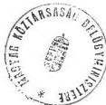
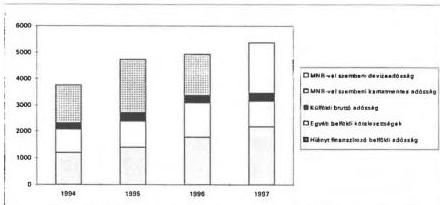
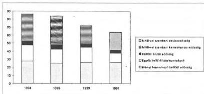
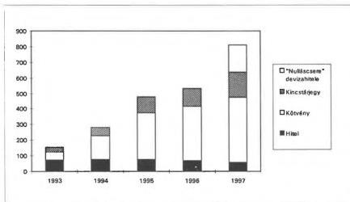

Állami Számvevőszék

# JELENTÉS

a helyi önkormányzatok 1997. évi
zárszámadásának helyszíni
ellenőrzéséről

9826 melléklete 2

1998. augusztus

---

Az ellenőrzés végrehajtásáért felelős:

**Dömötör Gyula**
számvevő igazgató

A vizsgálatot vezette és a jelentést készítette:

**Kóródi József**
számvevő tanácsos

**Benczik Lászlóné**
számvevő tanácsos

**Ébner Vilmosné**
számvevő tanácsos

**Marosi Gyöngyi**
számvevő tanácsos

közreműködésével.

Az ellenőrzésben részt vettek:

- Kollár Lászlóné
- dr. Takács András
- Ébner Vilmosné
- Berényi Magdolna
- Hevesi Kornél
- György Árpád
- Bocsi Sándor
- Huszti István
- Szabó Zoltán
- Major Lászlóné
- Kántor Ilona
- Tóth Ferencné
- Szikszainé Király Mária
- Gerencsér Ferenc
- Benczik Lászlóné
- Kalmár Ferencné
- Marosi Gyöngyi
- Mayer Lajosné
- Nagy Józsefné

---

V-1013-44/1998.

# TARTALOMJEGYZÉK

|  **I. ÖSSZEGZŐ MEGÁLLAPÍTÁSOK, KÖVETKEZTETÉSEK, JAVASLATOK** | **4**  |
| --- | --- |
|  **II. RÉSZLETES MEGÁLLAPÍTÁSOK** | **9**  |
|  1. a helyi önkormányzatok részére nyújtott támogatások, hozzájárulások igénybevétele és elszámolása | 9  |
|  1.1. Az 1997. évi költségvetési előirányzatok, s azok teljesítésének alakulása | 9  |
|  1.2. A helyi önkormányzati tűzoltóságok támogatására szolgáló előirányzat felhasználása | 12  |
|  1.3. A helyi önkormányzatok színházi támogatására szolgáló előirányzatok felhasználása | 12  |
|  1.4. A működésképtelenné vált helyi önkormányzatok kiegészítő támogatása felhasználásának alakulása | 13  |
|  1.4.1. A vis maior támogatás előirányzatának és felhasználásának alakulása | 13  |
|  1.4.2. Az önhibáján kívül hátrányos helyzetben lévő (forráshiányos) helyi önkormányzatok támogatására szolgáló előirányzat felhasználása | 14  |
|  1.4.3. A tartósan fizetésképtelen helyzetbe került önkormányzatok átmeneti támogatására szolgáló előirányzat felhasználása | 16  |
|  1.5. Az önálló témavizsgálatok keretében ellenőrzött központi hozzájárulások és támogatások összegzett vizsgálati megállapításai | 17  |
|  2. az 1996. évről áthúzódó kötelezettségek teljesítése | 21  |
|  3. a helyi önkormányzati költségvetési beszámolók és zárszámadások szabályszerűségének, valódiságának értékelése | 22  |
|  3.1. A számviteli rendszer kialakítása, szabályozottsága | 22  |
|  3.2. A költségvetési előirányzatok tervezésének, jóváhagyásának, évközi módosításának és a teljesítések elszámolásának szabályszerűsége | 23  |
|  3.3. A pénzügyi információs rendszer keretében - a kormányzat részére - készített költségvetési beszámolók valódisága | 26  |
|  3.4. Az önkormányzatok zárszámadási kötelezettségének teljesítése | 28  |
|  3.5. A könyvvizsgálati kötelezettség teljesítése | 30  |
|  4. a helyi kisebbségi önkormányzatok gazdálkodásának, beszámolójának ellenőrzése során szerzett tapasztalatok | 30  |

1

---

•
•
•

---

# JELENTÉS

## a helyi önkormányzatok 1997. évi zárszámadásának helyszíni ellenőrzéséről

Az Állami Számvevőszékről szóló 1989. évi XXXVIII. törvény 2.§.(1) bekezdése alapján évente ellenőrizni kell az állami költségvetés végrehajtásáról készített zárszámadást, s annak részeként a helyi önkormányzatok beszámolóját és azok központi költségvetési kapcsolatait.

Az Állami Számvevőszék – ez utóbbiak közül – 1998. évben önálló témavizsgálat keretében ellenőrzi a normatív állami hozzájárulások, a központosított előirányzatok-, a cél- és címzett támogatások-, s a területi kiegyenlítést szolgáló előirányzatok igénybevételét és elszámolását.

**A zárszámadási vizsgálat célja, ezért** annak megállapítása volt, hogy

- **a helyi önkormányzatok** miként tettek eleget éves beszámolási és egyéb elszámolási kötelezettségeiknek, s azok megfelelnek-e a helyi önkormányzatokról szóló 1990. évi LXV., a számvitelről szóló 1991. évi XVIII., az államháztartásról szóló 1992. évi XXXVIII., a Magyar Köztársaság 1996. évi költségvetésének végrehajtásáról szóló 1997. évi CXL., s az 1997. évi költségvetésről szóló 1996. évi CXXIV. törvény, továbbá ezek végrehajtási rendeletei, valamint a saját önkormányzati rendeletei és határozatai előírásainak.
- A beszámoló megbízható, hiteles képet biztosít-e a képviselő-testület, illetve a központi szervek számára az önkormányzat működéséről, gazdálkodásáról, vagyoni pénzügyi helyzetéről.
- Az auditálásra kötelezett önkormányzatoknál a könyvvizsgáló tevékenysége mennyiben segítette a képviselő-testület, s a hivatali apparátus gazdálkodási munkáját, a helyi és a központi információk megbízhatóságát.
- **A helyi kisebbségi önkormányzatok** költségvetési gazdálkodásuk, s az arról történő beszámolásuk során eleget tettek-e a központi jogszabályokban előírt és a települési önkormányzattal kötött együttműködési megállapodásban foglalt kötelezettségeiknek.
- **Az illetékes kormányzati szervek** - Pénzügyminisztérium, Belügyminisztérium - maradéktalanul teljesítették-e az 1996. évi zárszámadási törvény - központi költségvetés és helyi önkormányzatok közötti pénzügyi elszámolások különbözetei rendezésére - vonatkozó előírásait.
- A helyi önkormányzatokat 1997. évben megillető állami támogatások előirányzatai módosításánál és kiutalásánál az érdekelt főhatóságok betartották-e a vonatkozó törvényi előírásokat. (Kiemelten a működésképtelenné vált helyi önkormányzatok kiegészítő állami támogatásait, a helyi önkor-

3

---

I. ÖSSZEGZŐ MEGÁLLAPÍTÁSOK, KÖVETKEZTETÉSEK, JAVASLATOK

mányzatok hivatásos tűzoltóságai-, és színházi támogatását szolgáló előirányzatok meghatározására és felhasználására.)

A helyszíni ellenőrzés 13 városi, 6 nagyközségi és 30 községi, illetve 24 kisebbségi, összesen: 73 önkormányzat beszámolójának a felülvizsgálatára terjedt ki. Vizsgálatot végeztünk továbbá a Belügyminisztériumban, a Pénzügyminisztériumban és 13 TÁKISZ-nál, illetve a FÁKISZ-nál. A helyi önkormányzatok színházi támogatására szolgáló költségvetési előirányzat települések részére történő juttatása szabályszerűségének megítélése érdekében, ezen túlmenően a Művelődési és Közoktatási Minisztériumban.

Az ellenőrzésbe bevont helyi önkormányzatok darabszámukat illetően 1,5%, költségvetési volumenük tekintetében 1,7% részarányt képviselnek. Továbbá a Belügyminisztériumban és a Pénzügyminisztériumban vizsgáltuk az önkormányzati támogatások és hozzájárulások nyilvántartásának és az előirányzatok megváltoztatásának törvényességét, ami az összes költségvetési előirányzatukon belül 32,9%-ot jelent. A működő kisebbségi önkormányzatoknak pedig mintegy 3%-ára terjedt ki az 1997. évi beszámoló felülvizsgálata.

Az államháztartásról szóló többször módosított 1992. évi XXXVIII. törvény 82.§-a-, valamint a költségvetés alapján gazdálkodó szervek beszámolási és könyvvezetési kötelezettségéről intézkedő 54/1996. (IV.12.) számú Korm. rendelet 33.§-a előírja, hogy az arra kötelezett önkormányzatok a képviselő-testület által elfogadott egyszerűsített tartalmú összevont beszámolót és a könyvvizsgálói jelentést kötelesek minden év június 30-ig megküldeni az Állami Számvevőszék részére. Munkatervünk alapján elvégeztük a részünkre megküldött 588 db könyvvizsgálói jelentés feldolgozását, aminek a főbb megállapításairól is e jelentésben, valamint a jelentéshez csatolt Tájékoztatóban adunk számot.

# I. ÖSSZEGZŐ MEGÁLLAPÍTÁSOK, KÖVETKEZTETÉSEK, JAVASLATOK

**A Pénzügyminisztérium és a Belügyminisztérium** – a Magyar Államkincstár, valamint a TÁKISZ-ok közreműködésével – teljesítette a Magyar Köztársaság 1996. évi költségvetésének végrehajtásáról szóló törvényben részére meghatározott feladatokat. A helyi önkormányzatok és a központi költségvetés közötti – 1996. évi állami hozzájárulási és támogatási – elszámolási különbözetek és kamatok rendezése megtörtént.

A helyi önkormányzatokat – 1997. évben – megillető állami támogatások, hozzájárulások előirányzatainak évközi módosítása szabályszerűen történt. A költségvetés végrehajtásában közreműködő minisztériumok (PM, BM, MKM) azokat a célnak megfelelően bocsátották az önkormányzatok rendelkezésére.

A Belügyminisztériumban a helyi önkormányzatokat, megillető támogatások, hozzájárulások előirányzatairól és azok teljesítéséről vezetett nyilvántartások áttekinthetők. A minisztérium, a kincstár és az önkormányzatok nyilvántartási rendszerében kimutatott adatok közötti számszaki eltérések a rendszer

4

---

I. ÖSSZEGZŐ MEGÁLLAPÍTÁSOK, KÖVETKEZTETÉSEK, JAVASLATOK

egyes elemeinek tökéletesítésével, az adategyeztetések folyamatos végrehajtásával megszüntethetőek.

Az önkormányzatok központi támogatásának elszámolására és a visszafizetési kötelezettségei számítógépes nyilvántartásának programját - PM felkérése alapján - a Komárom- Esztergom Megyei TÁKISZ dolgozta ki. A program alapján a nyilvántartási rendszer áttekinthetővé vált, az önkormányzatok visszafizetési kötelezettségeinek teljesítése, morálja nőtt. A program továbbfejlesztése indokolt, hogy az az ellenőrzési funkcióját is betöltse.

Az Állami Számvevőszék önálló témavizsgálat keretében ellenőrizte az önkormányzatok által 1997. évben igénybe vett normatív állami hozzájárulások, címzett és céltámogatások-, s központosított előirányzatok szabályszerűségét. A vizsgálatok a normatív állami hozzájárulások esetében az igénybevétel-, a címzett és céltámogatások, valamint a központosított támogatások tekintetében pedig a felhasználás törvényességének, célszerűségének minősítésére is kiterjedt.

**A helyi önkormányzatok** gazdálkodási kultúrájának színvonalában – az egy-két területen tapasztalt kedvező jelenségen túl – érzékelhető, érdemi előrelépés 1997. évben sem következett be, ami több okra vezethető vissza. Ezek közül a legfontosabbak az önkormányzatok által kötelezően alkalmazandó számvitel bonyolultsága, vezetésének túlzott munkalégénysége, amihez – főként a kis településeken – a hivatali pénzügyi apparátus alacsony színvonalú szakmai felkészültsége párosul. Esetenként a jogkövető magatartás is kívánni valót hagy maga után. Mindezek következtében a gazdálkodás szervezettségében, szabályozottságában az ellenőrzés alapvető hiányosságokat állapított meg. A vizsgálattal érintett önkormányzatoknak mintegy 70%-a nem készített, vagy a szabályozó funkciója betöltésére nem alkalmas számlarenddel, számviteli politikával rendelkezett. A számvitelszervező munka – analitikus nyilvántartások terén tapasztalt – fogyatékosságai- továbbá a gyakorlati munkavégzés során elkövetett mulasztások következtében a beszámolók több mint egyharmadának a mérleg adatai nem voltak teljes körűek, hitelt érdemlően – leltárral és analitikai nyilvántartással – alátámasztottak.

Az előbbieknél kedvezőbb tapasztalatokat szerzett az ellenőrzés a költségvetés tervezését, s jóváhagyását illetően. A költségvetési rendeletek tartalmi színvonala, szakszerűsége a vizsgált önkormányzatok többségénél javult az előző évhez képest. Reálisan vették számba pénzügyi lehetőségeiket, s a helyben képződő bevételi források feltárására és beszedésére is nagyobb figyelmet fordítottak. A vizsgálatba bevont önkormányzatok 10%-ánál voltak átmeneti gondok a likviditással és a pénzügyi egyensúly helyzetével.

A költségvetés végrehajtása során a vizsgált önkormányzatok jelentős hányada megsértette a gazdálkodási fegyelem több elemi előírását. E területen kedvező változásról nem lehet számot adni. Számottevő – az Áht-t és végrehajtási rendeleteit érintő – jogszabálysértés fordult elő az előirányzat-módosítások rendjének szabályozása, nyilvántartása, s gyakorlati végrehajtása terén. Több helyen nem tartották be a költségvetésben jóváhagyott kiemelt előirányzatokat. Számos esetben mulasztották el az operatív gazdálkodás - kötelezettségvál-

5

---

1. ÖSSZEGZŐ MEGÁLLAPÍTÁSOK, KÖVETKEZTETÉSEK, JAVASLATOK

lalás, ellenjegyzés, érvényesítés, utalványozás - jogszabályban előírt gyakorlását, vagy a gazdálkodás formai követelményének tartották azt.

Valamennyi vizsgált önkormányzat határidőben eleget tett – a pénzügyi információs rendszer keretében részére előírt – központi beszámolási kötelezettségének. A pénzforgalmi kettős könyvvitel zárt rendszerének hiánya, az analitikus nyilvántartások helyi megszervezésének elégtelensége, egyes vagyonrészek számbavételének és a leltározás elmaradása, továbbá az analitikus nyilvántartások és a főkönyvi könyvelés közötti egyeztetési pontok meghatározásának, a folyamatba épített ellenőrzések elmaradásának a következtében a vizsgált önkormányzatok 40%-ának a mérlege nem ad valós képet a vagyoni helyzetről.

A vizsgált helyi önkormányzatok túlnyomó többsége (94%) határidőben eleget tett éves zárszámadási kötelezettségének. A zárszámadási rendeleteknek a háromnegyed része nem felelt meg a központilag előírt tartalmi követelményeknek. A zárszámadást több helyen a költségvetéssel nem összehasonlítható szerkezetben készítették. Mindenütt elmaradt az önkormányzati szintű vagyonnak a képviselő-testület részére történő bemutatása. Az önkormányzatok nem fordítottak kellő figyelmet a zárszámadásban szereplő számszaki adatokra, a gazdasági folyamatok alakulásának – az ok-okozati összefüggéseket is bemutató – szöveges értékelésekre. Széles körben elmaradt a több éves kihatással járó gazdasági döntések számszerűsített következményeinek a bemutatása is.

Az ÁSZ részére megküldött könyvvizsgálói jelentésekből levonható az a következtetés, hogy az önkormányzati könyvvizsgálat színvonala, a jelentések információs tartalma, a megállapítások részletezettsége, megalapozottsága, a gazdálkodás szabályszerűségét pozitívan befolyásoló szerepe továbbra is heterogén. Az igényesen elkészített, a képviselő-testület munkáját érdemben segítő jelentések mellett – amelyek aránya az előző évhez képest növekedett – továbbra is előfordulnak leíró jellegű, elemzéseket, javaslatokat nem tartalmazó könyvvizsgálói jelentések.

A könyvvizsgálói megállapítások alátámasztották az ÁSZ ellenőrzési tapasztalatait az önkormányzatok költségvetési beszámolóinak a valódiságáról, a tipikusnak minősíthető hibákról.

A könyvvizsgálati tevékenység azáltal segítette az érintett önkormányzatok gazdálkodását, hogy a megfogalmazott javaslatok ráirányították a képviselő-testületek figyelmét:

- a számviteli rendszer fejlesztésének,
- a tárgyi eszköz nyilvántartásának,
- a leltározás megszervezésének,
- az auditálási eltérések és az
- értékcsökkenési leírás elszámolásának a fontosságára.

A helyi kisebbségi önkormányzatoknál az előző évben végzett vizsgálatok számos hiányosságot, szabálytalanságot, esetenként törvénysértést tártak fel a gazdálkodásban. A jelen ellenőrzés keretében szerzett tapasztalatok azt bizo-

6

---

I. ÖSSZEGZŐ MEGÁLLAPÍTÁSOK, KÖVETKEZTETÉSEK, JAVASLATOK

nyitják, hogy az e vizsgálattal érintettek gazdálkodásának egyes elemeinél következetesebben érvényesült a törvényesség és a szabályszerűség, az előző évben vizsgált kisebbségi önkormányzatoknál tett megállapításokhoz viszonyítva. Az ellenőrzött kisebbségi önkormányzatok többsége felismerte a helyi önkormányzattal megkötendő – a gazdálkodás vitelére vonatkozó – együttműködési megállapodás fontosságát. Pozitív irányú változás tapasztalható a költségvetési előirányzatok évközi megváltoztatásának jogszerűséget illetően is. Nem történt érdemi előrelépés – a vizsgált körben – a vagyon elkülönített nyilvántartása, az operatív gazdálkodás, s az éves gazdálkodásról történő beszámolás szabályszerűsége, törvényessége területén.

**Ellenőrzésünk alapján a helyi önkormányzatok és a helyi kisebbségi önkormányzatok gazdálkodása szervezettségének javítása-, beszámolása szabályszerűségének, törvényességének szigorítása érdekében javasoljuk, hogy**

### **a Kormány**

- vizsgálja felül a helyi önkormányzatokról és az államháztartásról szóló törvényt, s azok végrehajtási rendeleteit abból a szempontból, hogy miként egyszerűsíthetők az önkormányzatok számviteli, beszámolási rendszere. Ennek során indokolt figyelemmel lenni az önkormányzatok döntő részét kitevő – minimális létszámú hivatali apparátussal rendelkező – kistelepülések sajátosságaira.
- Az önkormányzati képviselő testületek elé terjesztendő, az Áht. 118.§-ában felsorolt, mérlegek tartalmát egyértelműen, az önkormányzati sajátosságokra is figyelemmel, központilag határozza meg.

### **a Pénzügyminisztérium**

- rendeletben szabályozza a költségvetési szervek – köztük a helyi önkormányzatok és az önkormányzati költségvetési intézmények – törzskönyvi nyilvántartásának rendjét.
- Biztosítani kell, hogy a Pénzügyminisztérium rendelkezzen mindazokkal az információkkal, amelyek ismeretében teljes körűen eleget tud tenni azon törvényi feladatának, hogy a kötelezettségeiket nem teljesítő önkormányzatok tartozásait számon kérje. Ehhez a megfelelő információáramlást ki kell dolgozni az önkormányzatok állami támogatásainak elszámolásában érintett szervezetek között. Ezzel alkalmassá tenni a Komárom- Esztergom Megyei TÁKISZ feldolgozási rendszerét arra, hogy az utólagos ellenőrzés szerepét is betöltse. A rendszer jogcímenként szolgáltasson adatokat a pénzforgalmi évet érintő önkormányzati kötelezettségekről és a befizetésekről.

### **a Belügyminisztérium**

az éves költségvetés végrehajtásáról szóló törvényben szereplő önkormányzati támogatások és hozzájárulások adatainak valódisága érdekében:

- a központosított támogatások évközi lemondásával kapcsolatos önkormányzati adatszolgáltatás rendjét úgy alakítsa ki, hogy a minisz-

7

---

I. ÖSSZEGZŐ MEGÁLLAPÍTÁSOK, KÖVETKEZTETÉSEK, JAVASLATOK

tériumok valós, ellenőrizhető információval rendelkezzenek a visszafizetendő támogatás, és az ahhoz kapcsolódó kamat összegéről,

- a Belügyminisztériumban vezetett önkormányzati támogatások és hozzájárulások nyilvántartásának adatait rendszeresen egyeztesse a Magyar Államkincstár vonatkozó, illetve évvégén az APEH-SZTADI által készített összevont szektoros önkormányzati beszámoló azonos tartalmú adataival, s az eltérések okait kérje számon.

**Az Állami Számvevőszék mind a települési önkormányzatoknál, mind a helyi kisebbségi önkormányzatoknál végzett ellenőrzések esetében** - az azok megállapításait tartalmazó egyedi jelentésekben - **megtette intézkedését**. A számvevők javaslatokat fogalmaztak meg a hiányosságok felszámolására, s felhívták a figyelmet a jogszabályi előírások következetes érvényesítésére. **Az önkormányzatoknak tett javaslatok a következő feladatok végrehajtására irányultak:**

### Az ellenőrzött önkormányzatok

- vizsgálják felül a költségvetési gazdálkodásra vonatkozó hatásköröket és feladatokat, készítsék el (korszerűsítsék) a gazdálkodásra vonatkozó alapvető belső szabályzatokat. (SZMSZ, Ügyrend, számviteli politika, gazdálkodási részterületek belső eljárási rendje),
- határozzák meg a költségvetési gazdálkodási jogköröket, azok gyakorlati rendjét, különös tekintettel a 156/1995. (XII.26.) Korm. számú rendelet előírása szerinti kötelezettségvállalás, érvényesítés, utalványozás, ellenjegyzés feladataira. Az utalványozásra és ellenjegyzésre jogosult személyek jogosítványaikkal éljenek, illetve azokat a helyi és a központi szabályok keretei között végezzék,
- az önkormányzati és intézményi költségvetési előirányzatok módosításának helyi rendjét alakítsák ki, s azt SZMSZ-ben, vagy Ügyrendben rögzítsék. Az évközi előirányzat-módosítások a mindenkori helyi rendelettel összhangban, előzetesen történjenek, a kötelező előirányzatokkal való gazdálkodás előírásait érvényesítsék. Átfogó, önkormányzati szintű előirányzat-nyilvántartást alakítsanak ki, amelyből az előirányzat-módosítások ideje, indoka és forrása bármikor megállapítható,
- a zárszámadási rendeletek szerkezeti tagolása összehasonlítható legyen az elfogadott költségvetési rendeletekével.
- A helyi információs igények lehető legteljesebb kielégítése érdekében a zárszámadás során alkalmazzák az Áht 118.§-ában előírt „mérlegek”-et,
- A zárszámadás keretében valósuljon meg az intézményi beszámolók felülvizsgálata, a pénzmaradvány megállapítása és jóváhagyása,
- a beszámoló részét képező mérleg adatainak megfelelő alátámasztása, a valós adatok bemutatása érdekében szükséges a leltározás átfogó szabályozása, következetes végrehajtása, ezt követően a leltárnak, az analitikus nyilvántartási, s a főkönyvi adatokkal való egyeztetése,

8

---

II. RÉSZLETES MEGÁLLAPÍTÁSOK

- a települési önkormányzat és a kisebbségi önkormányzat együttműködési megállapodás keretében határozza meg a költségvetési gazdálkodással összefüggő közös teendőket, a hatáskörök részletes szabályait. A kisebbségi önkormányzat költségvetése épüljön be a települési önkormányzat költségvetési rendeletébe,
- az operatív gazdálkodás terén észlelt számviteli, elszámolási, bizonylati hiányosságok felszámolását a vezetői és a munkafolyamatba épített belső ellenőrzés hatékonyságának növelésével is segítsék elő,
- a könyvvizsgálói jelentésekben foglalt hasznos javaslatokat gazdálkodási kultúrájuk (szabályozás, gyakorlati végrehajtás) továbbfejlesztésében az eddigieknél fokozottabban vegyék figyelembe.

## II. RÉSZLETES MEGÁLLAPÍTÁSOK

### 1. A HELYI ÖNKORMÁNYZATOK RÉSZÉRE NYÚJTOTT TÁMOGATÁSOK, HOZZÁJÁRULÁSOK IGÉNYBEVÉTELE ÉS ELSZÁMOLÁSA

A helyi önkormányzatok a közigazgatási területükön élő lakosság alapvető (kommunális, szociális, oktatási, közművelődési, stb.) szükségletei kielégítéséről-, továbbá a központi jogszabályokban részükre meghatározott feladatok végrehajtásáról kötelesek gondoskodni. Ezek megfelelő színvonalú ellátásához a szükséges pénzügyi fedezetet saját bevételekből, más gazdálkodó szervezetektől átvett pénzekből, s a forrásszabályozás keretében részükre átengedett központi adatokból, központi költségvetési normatív hozzájárulásokból, valamint támogatásokból teremthetik meg. Ez utóbbi központi hozzájárulások és támogatások, nagyságrendjük miatt, meghatározó szerepet töltenek be az önkormányzati feladatok megoldásában. Ezért igénylésük és felhasználásuk törvényességének, szabályszerűségének és célszerűségének ellenőrzése, évente, kiemelt feladatunk. Az ÁSZ 1998-ban önálló témavizsgálat keretében ellenőrizte a normatív állami hozzájárulások-, a címzett és céltámogatások-, s a központosított támogatások 1997. évi előirányzatait. A zárszámadási vizsgálat keretében pedig az alábbiak ellenőrzésére került sor.

#### 1.1. Az 1997. évi költségvetési előirányzatok, s azok teljesítésének alakulása

A helyi önkormányzatok támogatásai, hozzájárulásai a Belügyminisztérium fejezetben a 23. címen szerepel. A cím 1997. évi eredeti 361 810,8 millió Ft-os előirányzata év végére - 20.691,5 millió Ft-tal, 5,7%-kal - 382.502,3 millió Ft-ra növekedett.

A 23. cím évközben 3 új alcímmel is bővült, a feladatok fedezetét a Kormány határozatokban csoportosította át, az általános tartalék terhére, a Belügyminisztérium fejezetbe.

A szociális ágazat egyszeri bérpolitikai intézkedése fedezetére rendelkezésre bocsátott 300 millió Ft előirányzatból az önkormányzatokat megillető támogatás összegét a Népjóléti Minisztérium az általa 1996-ban végzett felmérés - a szociális

9

---

II. RÉSZLETES MEGÁLLAPÍTÁSOK

szakfeladaton foglalkoztatottak létszámadatai - alapján állapította meg. Az 55.739 főt érintő 296,9 millió Ft támogatás kiutalásáról a Belügyminisztérium intézkedett.

Told Község Önkormányzata 10 millió Ft-ot kapott az 1997. május 22-i vihar következtében keletkezett lakossági viharkárok enyhítésére, az elemi lakhatási feltételek megteremtéséhez, illetve a károsultak megsegítéséhez szükséges lakossági támogatás céljára. Az önkormányzat a célra kapott támogatás felhasználásáról elszámolt.

Fejezetektől átvett pénzeszközök alcímként a Fővárosi Önkormányzatnak, ingatlan kiváltásra, jóváhagyott 150,0 millió Ft kiutalásáról a Belügyminisztérium 1997. december 23-án intézkedett a Kincstárnál (az előirányzat módosítására vonatkozó levél egyidejű megküldésével). A támogatást december 30-án utalta ki az APEH-SZTADI. Az önkormányzatot az előirányzat módosításáról - a FÁKISZ-on keresztül - levélben csak 1998. januárban értesítette a Belügyminisztérium.

A főhatóságoknál végzett helyszíni ellenőrzések megállapításai szerint az előirányzat-módosítások a vonatkozó előírásoknak megfelelően, szabályosan történtek.

Az előirányzat-nyilvántartások, valamint az 1997. évi költségvetés végrehajtásáról készített törvénytervezet számadatai szerint a helyi önkormányzatok támogatásai, hozzájárulásai cím 382.502,3 millió Ft módosított előirányzatával szemben, a kiutalás 348.723,9 millió Ft volt, ami 91%-os teljesítésnek felel meg. Az előirányzat-maradvány mintegy 85%-át két alcím - a címzett- és céltámogatások, valamint a területi kiegyenlítést szolgáló fejlesztési célú támogatás - megtakarítása adja. Évközben ugyanis a legnagyobb összeggel e két cím előirányzata változott az előző évek maradványai, illetve az önkormányzatok lemondásai következtében. A növekedés mértéke a tervezetthez viszonyítva a címzett- és céltámogatásoknál 42%, a területi kiegyenlítést szolgáló fejlesztési célú támogatásoknál pedig 52% volt. A teljesítési adatok ugyanakkor azt mutatják, hogy pénzügyileg még az eredetileg tervezett összeget sem használták fel a két alcímen.

A helyszíni vizsgálat megállapítása szerint, az ellenőrzött időszakra fellelhető szabályozás hiánya miatt, a törvénytervezet 1. számú mellékletében szereplő címzett- és céltámogatások 1997. évi teljesítési adata tartalmilag pontatlan. Az évközbeni visszafizetések rendje ugyanis központilag nem volt szabályozott, aminek következtében a címzett- és céltámogatást jogosulatlanul igénybe vett önkormányzatok egyrésze a címzett- és céltámogatások elkülönített bankszámlára, másik része pedig az előző évek befizetései bankszámlára teljesítette befizetési kötelezettségét. A Magyar Államkincstár az általa kiutalt támogatásokat viszont csak a címzett- és céltámogatások elkülönített bankszámlára történt visszafizetések összegével csökkentette.

Az önkormányzatok által 1997. évben befizetett - az 1996. évi költségvetés végrehajtásáról szóló törvény szerint jogosulatlanul igénybe vett - 82,6 millió Ft 71%-a a Belügyminisztérium fejezet címzett- és céltámogatások (kincstár által kiutalt) teljesítés összegét csökkentette, 29%-a pedig a Pénzügyminisztérium fejezet önkormányzatok befizetései alcím bevételét növelte.

10

---

II. RÉSZLETES MEGÁLLAPÍTÁSOK

A címzett- és céltámogatások évközbeni visszafizetési rendjének szabályozása - a vizsgált időszakot követően - a 9/1998. (I.23.) számú Korm. rendelet 21.§. (2) bekezdésében megtörtént. Ennek ellenére az önkormányzatok nem minden esetben a kormányrendeletben megnevezett bankszámlára fizetik vissza a jogosulatlanul igénybe vett címzett- és céltámogatásokat. Az új szabályozásnak megfelelő egységes gyakorlat kialakítása még további intézkedések megtételét indokolja.

A Magyar Köztársaság 1997. évi költségvetéséről szóló CXXIV. törvény 22.§. (7) bekezdése, 1997. évre, már meghatározta a helyi önkormányzatok által évközben visszafizetett tárgyévi támogatások figyelemmel kísérésének, jogcímenkénti nyilvántartásának rendjét, továbbá az azokról való adatszolgáltatás felelősét. A törvény mindezeket a Magyar Államkincstár feladatává tette. A helyszíni vizsgálat megállapításai szerint, a törvényi szabályozás ellenére, még mindig nem sikerült valamennyi támogatási jogcímnél maradéktalanul megteremteni az adatok egyenlőségét a Belügyminisztérium, a Magyar Államkincstár és a helyi önkormányzatok nyilvántartási rendszerében. Ez egyrészt a szabályozásban még fellelhető hiányosságra, másrészt az önkormányzatok mulasztására vezethető vissza.

A minisztériumokban végzett helyszíni ellenőrzés a nyilvántartásokban, illetve a zárszámadási törvénytervezetben támogatási jogcímenként kimutatott teljesítési adatokat összehasonlítva az önkormányzatok 1997. évi szektoros beszámolójában szereplő költségvetési támogatás bevételeivel eltéréseket állapított meg. Az önkormányzatok beszámolójában a központosított előirányzatok teljesítési adata 17,9 millió Ft-tal kevesebb a zárszámadási törvénytervezetben szereplő összegnél. Az pedig, hogy nem minden önkormányzat tett eleget azon kötelezettségének, miszerint támogatás visszafizetésekor az előirányzat-módosítást is kezdeményezni kell az előirányzatok utólagos egyezőségének megteremtésénél okozott és okoz gondot, mind az önkormányzatoknál, mind a Belügyminisztériumban.

Az eltéréseket a teljesítési adatoknál elsősorban az önkormányzatok év végi visszafizetései okozzák, melyekről a Kincstár is csak a december 31-i zárás után értesül. A Belügyminisztérium és a Kincstár év végi adateltérése ugyanis abból adódik, hogy a Kincstár - a rendszer jelenlegi sajátosságából adódóan - a december havi önkormányzati visszafizetésekkel, nem tudja korrigálni a kiutalt központosított támogatásokat. Részben ezzel függ össze az előirányzatok következő évi módosításának ügye is, de itt más ok is közrejátszik. Ugyanis minden évben, így az 1997. évet követően is, több pótelőirányzatot biztosító levél érkezett az önkormányzatokhoz, melyeknek összegét az előző évi előirányzatok között szerepeltetni kell. Ezek rendkívül megnehezítik az önkormányzatok év végi zárlati munkálatait, valamint a TÁKISZ-ok beszámoló felülvizsgálati tevékenységét egyaránt. Az Áht. előírása szerint, az önkormányzat testülete az évközi előirányzat-változásokkal legkésőbb december 31-ig köteles költségvetési rendeletét módosítani. Így az említett utólagos pótelőirányzatok általában testületi döntés nélkül, vagy a testület utólagos tájékoztatása alapján épülnek be az önkormányzati beszámolókba.

A Belügyminisztériumba vezetett előirányzat-nyilvántartások - a fenti anomáliáktól eltekintve - áttekinthetők, ellenőrizhetők. A szabályozás további pontosításával, továbbá a jogszabályoknak az önkormányzatok által történő betartatásának következetesebb számonkérésével a Belügyminisztérium, a

11

---

II. RÉSZLETES MEGÁLLAPÍTÁSOK

Kincstár, s az önkormányzatok nyilvántartási rendszerének konzisztenciája, s az adatok egyezősége megteremthető.

## 1.2. A helyi önkormányzati tűzoltóságok támogatására szolgáló előirányzat felhasználása

Az 1997. évi költségvetési törvény a helyi önkormányzati tűzoltóságok támogatására 8768,0 millió Ft kiadási előirányzatot határozott meg. Az év közben nem módosult, és teljes összegben átutalták az önkormányzatok részére.

A hivatásos önkormányzati tűzoltóság finanszírozása, a tűz elleni védekezésről, a műszaki mentésről és tűzoltóságról szóló 1996. évi XXXI. törvény 41.§. alapján 1997. január 1-től normatív módon történik.

A hivatásos tűzoltóságot fenntartó önkormányzatok központi támogatásának megállapítására adatszolgáltatásuk alapján a tűzoltási, tűzmegelőzési és a műszaki mentési feladatok ellátásának feltételeit leginkább jellemző szakmai mutatók és az azokhoz kapcsolódó normatívák alapján került sor. A hivatásos tűzoltóságot fenntartó (vizsgált) önkormányzatok az e címen kapott központi támogatást teljes összegben a tűzoltóság rendelkezésére bocsátották.

Esztergom Város Hivatásos Önkormányzati Tűzoltóságánál, a gépjárművek futásteljesítményének pontatlan számbavétele miatt, 1.355 ezer Ft többlettámogatás igénybevételét állapította meg a helyszíni ellenőrzés. A vizsgált szerv az eltérést rendezte a központi költségvetéssel. Az eset ráirányította a figyelmet arra, hogy a tűzoltóságok normatív finanszírozására történő átálláskor az adatkérés (a felmérés) a tűzoltóság teljes gépjármű állományának futásteljesítményére vonatkozott, a költségvetési törvény viszont már csak a tűzoltó járművek futásteljesítményére biztosított normatív támogatást.

## 1.3. A helyi önkormányzatok színházi támogatására szolgáló előirányzatok felhasználása

A Magyar Köztársaság 1997. évi költségvetéséről szóló 1996. évi CXXIV. törvény 4. sz. melléklete tartalmazza a helyi önkormányzatok színházi támogatását. Aminek teljes összege 4.337,6 millió Ft, amely a következők szerint oszlik meg:

|  a) épületműködtetési hozzájárulás: | 2.829,6 millió Ft  |
| --- | --- |
|  b) művészeti tevékenység kiadásaihoz való hozzájárulás: | 1.178,0 millió Ft  |
|  c) bábszínházak művészeti támogatás: | 80,0 millió Ft  |
|  d) színházak pályázati támogatás: | 250,0 millió Ft  |
|  ezen belül: | szabadtéri színházak 120 millió Ft nemzetiségi színházak 35 millió forint színházi vállalkozások, alternatív műhelyek 95 millió Ft  |

A tervezett összeg év közben nem módosult, és teljes mértékben szétosztásra került.

12

---

II. RÉSZLETES MEGÁLLAPÍTÁSOK

Az épületműködtetési hozzájárulás összegét a költségvetési törvény színházat fenntartó önkormányzatonként tételesen meghatározta.

A művészeti tevékenység kiadásaihoz való hozzájárulás és a bábszínházak művészeti támogatása előirányzatának felosztási rendjét a művelődési és közoktatási miniszter a 3/1997. (I.31.) számú rendeletében határozta meg.

Ennek alapján a helyi önkormányzatok költségvetési rendeletük elfogadását követően értesítették a minisztériumot a színházak részére juttatott önkormányzati támogatás összegéről, intézményenkénti bontásban. A minisztérium így az önkormányzatok támogatásának ismeretében s arányának megfelelően osztotta szét a művészeti tevékenység kiadásához való központi hozzájárulást. Az 1997. évi keret minden önkormányzati támogatási forint 0,68 forintos központi támogatását tette lehetővé. A bábszínházak pedig az önkormányzati támogatásukhoz, forintonként, 1,84 forint központi támogatást kaptak.

A helyszíni vizsgálatok megállapításai szerint az érintett önkormányzatok a művészeti tevékenység kiadásaihoz kapott központi támogatás összegét maradéktalanul átutalták a színház részére.

A színházak támogatására kiírt pályázatokban pontosan meghatározták azokat a feltételeket, amelyek alapján azok támogatáshoz juthattak, valamint a pályázat feltételeként szerepelt az előző támogatással való elszámolás is.

A pályázatok elbírálásáról kuratórium döntött. A döntés alapján került az összeg szétosztásra. A pályázat elutasítására, illetve a kértnél alacsonyabb összegű támogatás jóváhagyására vonatkozóan az ellenőrzés kuratóriumi indoklással nem találkozott.

#### **1.4. A működésképtelenné vált helyi önkormányzatok kiegészítő támogatása felhasználásának alakulása**

A Magyar Köztársaság 1997. évi költségvetéséről szóló 1996. évi CXXIV. törvény 21.§ a meghatározza a működésképtelenné vált helyi önkormányzatok kiegészítő támogatásának lehetőségét, amelyet a 6. sz. mellékletben foglalt feltételek szerint három jogcímen igényelhettek. Így:

- a vis maior helyzetek megoldására,
- az önhibáján kívül hátrányos helyzetben lévő helyi önkormányzatok forráshiányának rendezésére,
- a tartósan fizetésképtelen helyzetbe került helyi önkormányzatok gondjai átmeneti kezelésére.

##### **1.4.1. A vis maior támogatás előirányzatának és felhasználásának alakulása**

A költségvetési törvény a vis maior esetén nyújtandó támogatásokra 500 millió Ft-ot hagyott jóvá. A keretösszeg, év közben, a normatív állami hozzájárulásokból, a címzett- és céltámogatásokból való lemondásokból és a tartósan fizetésképtelen helyzetbe került helyi önkormányzatok támogatásából átcsoporto-

13

---

II. RÉSZLETES MEGÁLLAPÍTÁSOK

sított 491,2 millió Ft eredményeként, 991,2 millió Ft módosított előirányzatra változott. A teljesítés 768,9 millió Ft volt.

A támogatás igénybevételének 1997. évi feltételeit az Országgyűlés a költségvetési törvény 6. sz. mellékletében szabályozta, mely szerint: kiegészítő, központi támogatást azon önkormányzatok igényelhettek, amelyeknél rendkívüli, váratlan események miatti, valamint az önkormányzati tulajdont súlyt természeti vagy más károk által okozott többletkiadás forrását saját erőből - az önkormányzat körültekintő gazdálkodása ellenére - sem voltak képesek előteremteni.

A vis maior támogatási igényekben az önkormányzatok döntően a rendkívüli időjárás - tavaszi és nyári felhőszakadással, jégveréssel kísért esőzések - által okozott károk megszüntetésére, árvíz és belvíz védekezések többletkiadásaira, az aszálykárok miatt életveszélyessé vált önkormányzati intézmények épületeinek helyreállításához kértek központi segítséget.

A vizsgált évben az önkormányzatoktól 238 db kérelem érkezett összesen 2.298,4 millió Ft támogatási igénnyel. Az önkormányzatok által beküldött igények felülvizsgálata folyamatosan öt ütemben történt, mely 178 önkormányzat kérelmének (78 db teljes (32,7%) és 100 db részbeni (42%) 768,9 millió Ft összeggel történő elismerését jelentette. Ez megegyezik a zárszámadási törvény tervezetében szereplő összeggel.

Az elmúlt évekhez hasonlóan 1997. évben sem támogatták azokat a kérelmeket - számuk 60 db (arányuk 25%) volt - amelyeknél nem rendkívüli, váratlan esemény okozta a károkat, ahol az az önkormányzat működési kiadásainak kiegészítésére irányult, illetve a támogatási igényt más forrás - például céltámogatás - hivatott fedezni.

A kérelem elbírálásáról viszont, függetlenül annak eredményétől, minden érintett önkormányzatot írásban értesítést kapott, melyben a felhasználást követő harminc napos utólagos elszámolási kötelezettséget is rögzítették. Ennek ellenére a vizsgálat által kiválasztott 16 támogatásban részesült közül mindössze egy önkormányzat (Gacsály község) tett eleget a törvényben előírt elszámolási kötelezettségének.

### 1.4.2. Az önhibáján kívül hátrányos helyzetben lévő (forráshiányos) helyi önkormányzatok támogatására szolgáló előirányzat felhasználása

Az önhibáján kívül hátrányos helyzetben levő helyi önkormányzatok támogatása a költségvetési törvény szerint eredetileg 5.000 millió Ft állt rendelkezésre. Az év során előirányzata 6.000 millió Ft-ra változott, az előzőekben már említett lemondásokból, a felhasználás 5.991,2 millió Ft volt.

A költségvetési törvényben foglaltaknak megfelelően 1997. évben is két alkalommal nyújthatták be az önkormányzatok támogatási kérelmeiket a TÁKISZ-okhoz, április 30-ig és szeptember 30-ig.

14

---

II. RÉSZLETES MEGÁLLAPÍTÁSOK

A Pénzügyminisztérium és a Belügyminisztérium 1997. márciusában, együttes útmutatót adott ki, amelynek leírása alapján igényelhettek a helyi önkormányzatok kiegészítő támogatást.

A támogatás célja, hogy az önkormányzatok kötelező alapellátási feladatainak működtetési gondjain segítsen kiemelten is a

- közalkalmazotti bértáblából adódó többletkiadásokra, s a

A feltételrendszer alapvetően nem változott az előző évihez képest, de a forráshiány megalapozottabb számításához részletesebb módszert dolgoztak ki.

Az első ütemben 831 támogatási igény érkezett a TÁKISZ-okhoz. Azok a forráshiány számítás felülvizsgálatát a rendelkezésre álló 30 napon belül elvégezték, majd azt rövid elemzéssel ellátva továbbították minisztériumok felé.

Az első ütemben a TÁKISZ-ok 48 támogatási igényt utasítottak el (5,8%), 612 db-ot (73,6%) alacsonyabb, 106 db-ot (12,8%) magasabb és 65 db-ot (7,8%) az igénynek megfelelő összegben fogadtak el.

Az elutasítás, illetve a csökkentés legjellemzőbb oka a saját bevételek alultervezése, a pénzmaradvány nem megfelelő figyelembevétele, a forráshiány levezetésének hibája volt.

A minisztériumok felülvizsgálatuk során további 52 igényt utasítottak el, így az összes elutasítás az igények 12%-a. A jóváhagyott támogatások száma 731 volt.

A támogatás elbírálásának döntés-előkészítési szakaszában a pénzügyminiszteri-belügyminiszteri együttes javaslatot bemutatták az Országgyűlés Önkormányzati és Rendészeti Bizottságának, a testület a javaslatokkal egyetértett.

Ennek eredményeképpen az első ütemben beérkezett támogatási igényből, amely az önkormányzatok részéről 10.242.359 ezer Ft volt és a TÁKISZ felülvizsgálata alapján 6.760.732 ezer Ft-ra csökkent, s 4.294.542 ezer Ft-ot jóváhagytak.

Az 1997. évi költségvetési törvény 29.§.(2) bekezdése szerint az 1996-ban forráshiányos önkormányzatoknak lehetőségük nyílt finanszírozási előleget igénybe venni az 1996. évben folyósított ilyen célú támogatás 50%-ának erejéig. Az előleg átutalása az első félév során havonta időarányosan, a nettó finanszírozás keretében történt.

Előleget 1997-ben 585 önkormányzat 2.029 millió Ft összegben vett igénybe. Az 585 önkormányzat közül 31 már a támogatási igényt sem adta be (39.500 ezer Ft), 36-nak pedig támogatási igénye elutasításra került (404.556 ezer Ft). Ez azt jelenti, hogy az igényelt összeg 21,9%-át kellett az önkormányzatoknak év végéig visszafizetni. Erre 1997. évben még kamatfizetés nélkül volt lehetőség.

A második ütemben 179 önkormányzat igényelt támogatást. Az első ütemhez kiadott útmutatóban még úgy rendelkeztek a minisztériumok, hogy csak azok az önkormányzatok terjeszthetnek fel a második ütemben kérelmet, amelyek az első ütemben nem tették meg. A részben vagy egészében elutasított kérel-

15

---

II. RÉSZLETES MEGÁLLAPÍTÁSOK

mek újbóli felülvizsgálatára a második ütemben nincs lehetőség. Az 1997. augusztus 21-én kelt TÁKISZ-oknak címzett pénzügyminisztériumi levél már a felülvizsgálat „rendkívül indokolt esetben” való lehetőségét említi.

A fentiekkel ellentétben áll az, hogy a 179 igényből több, mint a fele (55,3%) ismételt igény, amelyből 56 önkormányzat már az első ütemben is kapott támogatást, 42 pedig olyan önkormányzat, amelynek az igényét az első ütemben elutasították, a második ütemben pedig támogatták.

A második ütemben beérkezett összes igény 2.822.771 ezer Ft, a TÁKISZ javaslata 2.045.257 ezer Ft, a jóváhagyott támogatás pedig 1.696.633 ezer Ft volt.

A Pénzügyminisztériumban folytatott ellenőrzés kiemelten vizsgálta olyan önkormányzatok igényét és azok elbírálását, ahol az első ütemben elutasítás történt, majd a második ütemben kaptak támogatást. Az átvizsgált dokumentumok alapján az volt megállapítható, hogy a TÁKISZ-ok az esetek nagy részében igyekeztek kiszűrni a halmozódásokat, a bevételi alultervezéseket, s véleményükkel továbbították az igényeket.

### 1.4.3. A tartósan fizetésképtelen helyzetbe került önkormányzatok átmeneti támogatására szolgáló előirányzat felhasználása

A fenti támogatás három címen igényelhető.

- A visszterhes kamattámogatás iránti kérelmet az az önkormányzat nyújthatta be, amely a helyi önkormányzatok adósságrendezési eljárásáról szóló 1996. évi XXV. törvényben szabályozott eljárás keretében az egyezséget pénzintézeti hitellel teremtette meg. Ezen a címen egyetlen önkormányzat nem igényelt támogatást.
- Az adósságrendezés megindítását követően, az adósságrendezési eljárás időtartama alatt a forráshiányból eredő jelentős ellátóképesség-csökkenés esetén a helyi önkormányzat támogatást igényelhet. Az 1092/1995. (IX:28.) Korm. határozat alapján Bakonszeg, Nágocs, Bátorliget, Szerencs és Páty, majd a 1117/1996. (XII.26.) Korm. határozat alapján Kács kapott visszterhes támogatást, amelynek visszafizetésére az adósságrendezési eljárás során az állam benyújtotta követelését.

A fenti önkormányzatok közül Bátorliget, Kács és Nágocs esetében az adósságrendezési eljárás jogerősen lezárult, a visszafizetés megkezdődött. Kács fizetési halasztást kért, amelyet a Belügyminisztérium elutasított. Szerencs elkerülte az adósságrendezési eljárást. Megállapodás alapján három részletben fizeti vissza tartozását, az első rész visszafizetésének a megszabott határidőben nem tett eleget, csak 1998. májusában. Bakonszeg és Páty esetében az adósságrendezési eljárás jogerősen még nem zárult le.

- A helyi önkormányzatok adósságrendezési eljárásában közreműködő pénzügyi gondnokok díjazására állami támogatás vehető igénybe, amelyet három önkormányzat kapott 1997. évben (Egerszólát, Csány és Kács).

16

---

II. RÉSZLETES MEGÁLLAPÍTÁSOK

## 1.5. Az önálló témavizsgálatok keretében ellenőrzött központi hozzájárulások és támogatások összegzett vizsgálati megállapításai

A **normatív** és az azt kiegészítő (továbbiakban együtt: normatív) **állami hozzájárulás** összegét a költségvetési törvény 21 kiemelt előirányzatban (jogcímen) határozta meg. Az önkormányzatok az 1997. évi költségvetési beszámolójuk elkészítése során a feladatmutatóhoz kapcsolt normatív állami hozzájárulásról az elszámolást ennél sokkal részletesebben állították össze. Alkalmazniuk kellett a Pénzügyminisztérium és az érintett ágazati minisztériumok által közösen kialakított csoportosítást, amelyek elsősorban a Művelődési és Közoktatási Minisztérium részére biztosítottak részletes szakmai információkat. A 196 csoportot a költségvetési törvényben meghatározott kiemelt előirányzatok alábontásával képezték és un. feldolgozási kódszámmal azonosították.

Az önkormányzatok számára elsősorban bonyolultsága és többletmunkaigénye miatt gondot jelentett az igénybejelentéshez kialakított és a költségvetési törvényben megfogalmazott jogcímeknél sokkal részletesebben feldolgozási kódszámrendszer alkalmazási kényszere. A normatív állami hozzájárulás rendkívül nagyszámú feldolgozási kódját az Állami Számvevőszék évek óta folyamatosan kifogásolta, tekintettel arra, hogy a hozzájáruláshoz az önkormányzati törvényben foglaltak alapján a jogcímmel összefüggő felhasználási kötöttség nem kapcsolódik.

A központi tervezés alapját képező alapadatokat az önkormányzatok hivatalai általában időben, de többnyire nem megfelelően dokumentáltan kapták meg az intézményektől. A hiányosságot elsősorban az okozta, hogy az önkormányzati hivatalok az intézmények részére nem adtak ki megfelelő intézkedést a jogszabályokban megfogalmazott követelményekkel összhangban lévő adatszolgáltatás elkészítéséhez. Az éves elszámoláshoz bekért adatokra is ugyanez vonatkozik. Az önkormányzati hivatalok nem fordítottak kellő figyelmet arra, hogy az elszámolásba a megfelelő nyilvántartási, statisztikai adatokra épülő mutatószámok kerüljenek.

Az előző évi számvevőszéki ellenőrzések során tett felelősségi felvetések hatására az önkormányzati hivatalok a korábbinál nagyobb arányban, 43%-ban a helyszínen ellenőrizték az intézmények által közölt adatok valódiságát, de az ellenőrzöttség még mindig nem elegendő és a végrehajtott ellenőrzések szakmai színvonala sem volt megfelelő. A vizsgálati megállapítások szerint a korábbiaknál nagyobb szükség lett volna a helyszíni ellenőrzésekre. A közoktatás területén bekövetkezett nagyarányú változásokat nem, vagy csak jelentős késéssel követő alapnyilvántartások és statisztikai jelentések nem minden esetben voltak alkalmasak a megalapozott tervezéshez és elszámoláshoz. A normatív állami hozzájárulások összegének tervezése, elszámolása az előző évben megfogalmazott javaslataink ellenére nem egyszerűsödött.

Az előző években visszatérően tett javaslataink ellenére a közoktatási statisztikai jelentések adattartalma többnyire jelenleg sem alkalmas a normatív állami hozzájárulás túlzottan részletes mutatószámainak képzésére. Legtöbb problémát a közoktatási törvény alapján biztosított oktatás, valamint az egyéb

17

---

II. RÉSZLETES MEGÁLLAPÍTÁSOK

közoktatási hozzájárulások csoportjába sorolt tevékenységek értelmezése okozott.

Az egyes iskolatípusokon belüli évfolyambontás, az oktatási törvény szerinti régi rendszerű, és a közoktatási törvény vagy egyedi engedély szerinti új rendszerű elméleti és gyakorlati képzés alapján történő elkülönítés, az „Egyéb közoktatási hozzájárulások” bevezetése, azonos fajlagos támogatási összegű és jogcímű, de különböző kódszámú hozzájárulási csoportok alkalmazása, egyes normatívák tervezéstől eltérő módszerrel történő elszámolásának előírása, valamint a jogi szabályozás pontatlansága a normatív állami hozzájárulások tervezési, elszámolási és ellenőrzési feladatait nehezítette.

Az önkormányzatok **címzett és céltámogatási** igénybejelentése és annak elfogadása kétharmad részben megfelelt a jogszabályi feltételeknek. A fejlesztések előkészítettsége azonban főként a pénzügyi megalapozottság tekintetében nem volt megfelelő.

Az önkormányzatok egy része a beruházáshoz szükséges saját pénzügyi forrást nem teljes körűen, vagy egyáltalán nem tudta biztosítani. Ennek több oka volt: egyrészt az önkormányzatok céltámogatási igénybejelentését továbbra is a befogadtatási szándék érvényesítése jellemezte, ezzel összefüggésben saját pénzügyi teljesítőképességüket túlbecsülték, másrészt a fejlesztések céltámogatása, illetve aránya csökkent. Az önkormányzatok a saját forrás megteremtéséhez az elkülönített és egyéb állami pénzalapokból igényelhető támogatásokra is számítottak, ugyanakkor ezek elbírálása a céltámogatástól időben is és rendszerében is eltérően történt. Az önkormányzatok kivárták az egyéb állami támogatások pályázatának az eredményét, ettől tették függővé egy-egy beruházás megindítását. Kedvezőtlen elbírálású pályázat esetén veszélybe került a beruházás megindítása. A szükséges saját forrás biztosítása érdekében az önkormányzatok egy része szabálytalan ügyletekbe bonyolódott (közterületi használati, bérleti díj fizetése az önkormányzatnak), amely a beruházás saját forrását kímélte, ugyanakkor az állami támogatást terhelte. Az igények benyújtásakor a saját forrásra vonatkozó képviselő - testületi kötelezettségvállalás (határozat) gyakran formális volt. A saját források hiánya, elégtelensége részben a beruházások elhagyásához, vagy csökkentett mértékű megvalósításához, illetve az előirányzatról való lemondáshoz vezetett, részben pedig a fejlesztések megvalósításának elhúzódását idézte elő. A céltámogatásokhoz a saját erőt több önkormányzat csak számottevő hitel (kölcsön) segítségével tudta előteremteni.

A fejlesztések mintegy felének megvalósítása nem tekinthető tervszerűnek. A helyi önkormányzatoknál 1997. év végén az országos összesített adatok alapján a címzett- és céltámogatások összes maradványa 27 297,8 millió forint volt (ez 46,5%). E maradvány döntő hányada, 21 360 millió forint a céltámogatásoknál jelentkezik. A helyszíni vizsgálat során ellenőrzött beruházások is hasonló képet mutatnak: a címzett támogatások felhasználásánál 27,1%, a céltámogatásoknál 55,3% maradvány keletkezett.

A támogatások felhasználásának alacsony aránya kedvezőtlennek minősíthető, mivel a központi költségvetésben korlátozottan rendelkezésre álló pénzeszközök hasznosításának, felhasználásának jelentős mértékű lemaradását mutatja. Ez egyidejűleg ellentmondás és pazarlás, és egyben mutatja a címzett- és céltámogatási rendszer rugalmatlanságát is. Erre vezethető vissza, hogy az önkormányzatoknál növekedett a jogtalanul igénybe vett, ezért a központi költségvetésbe visszafizetendő címzett- és céltámogatások összege, amely nem tulajdonítható

18

---

II. RÉSZLETES MEGÁLLAPÍTÁSOK

csupán a szubjektív elemek szerepének. A jogtalan igénybevétel mintegy 30%-a a szennyvíz bekötővezetékkel mint nem támogatható műszaki tartalommal függött össze. A 38/1995. (IV. 5.) Korm. rendelet külön szabályozza a bekötővezeték létesítésének költségviselőjét, megnevezve a bekötés kezdeményezőjét. Így a bekötővezeték létesítése nem támogatható műszaki tartalomnak számít.

Már korábban is a címzett- és céltámogatási rendszer hibájaként jeleztük, hogy a célok kijelölése nem minden esetben a valós helyi szükségleteket tükrözte és kényszerpályára terelte a helyi fejlesztési tevékenységet. Nem ösztönzött kellően az állami pénzeszközök takarékos és hatékony felhasználására. A központi költségvetésben hozzájárult jelentős összegű kiadási előirányzat hosszabb ideig tartó felesleges lekötéséhez. A területi koordináció, a szakmai irányítás és ellenőrzés fogyatékosságai következtében az esetenként „pazarló” pénzfelhasználással létrejött elaprózott, vagy túlméretezett kapacitások működtetése többlet költséget okozott.

Az 1997. évi CXXXI. tv. több vonatkozásban módosította, korszerűsítette a helyi önkormányzatok címzett és céltámogatási rendszerét szabályozó törvényt. Ezáltal szabályozottabbá, ellenőrizhetőbbé válik e támogatások feltételrendszere, ami egyben a címzett támogatások „felhígulása” ellen is hatni fog. Az ÁSZ több korábbi javaslata is hasznosult a törvénymódosításban. A szabályozás változásának hatása 1999-től várható.

**A központosított előirányzatok** számának csökkentésére és a szabályozás pontosítására, egyértelművé tételére irányuló korábbi javaslatainkkal a pénzügyminisztérium is egyetértett, és valamennyi javaslatunkat érintően intézkedések történtek. A Pénzügyminisztérium szakmailag indokolt törekvése, hogy a meghatározott célra juttatott központosított előirányzatok köre és szerepe szűküljön, és csak azokat hagyja központi elosztásban, amely feladatok a normatív forrásszabályozással nem finanszírozhatók és megyei (régió) elosztásba se vonhatók. Ugyanakkor tapasztaltuk, hogy ezt nem mindig sikerült érvényesíteni.

1997. évben az előirányzatok jogcímeiben jelentős szerkezeti változás következett be. Az 1996. évi előirányzatokhoz képest elsősorban a bérpolitikai intézkedések, a HTO támogatás és a nevelési segély kiegészítésének megszűnése, illetve a normatív támogatási forrásokba történő beépítése jelentett csökkenést. Ugyanakkor - a közoktatási törvény előírásainak megfelelően - számos új jogcím jelent meg a támogatási rendszerben, aminek következtében a központosított előirányzatok közel egyharmada a közoktatási feladatokra állt rendelkezésre. Ezen feladatok megvalósításához az 1997. évi költségvetési törvény értelmében további forrásokat biztosítottak a Művelődési és Közoktatási Minisztérium költségvetésében megtervezett előirányzatok. Ez a megosztottság gyengítette a támogatások felhasználásának áttekinthetőségét.

A támogatási rendszerben hangsúlyozottabbá vált a racionális létszámgazdálkodás ösztönzése, mivel a létszámcsökkentési kiadásokhoz való hozzájárulás önálló támogatási jogcímként jelent meg, míg az előző évben az egyes közoktatási feladatok és a bérpolitikai intézkedések előirányzatain belül támogatták a feladat végrehajtását.

A helyi önkormányzatok által felhasználható központi előirányzatok terhére történő finanszírozás a lényegét, alapjait tekintve feladatfinanszírozásnak mi-

19

---

II. RÉSZLETES MEGÁLLAPÍTÁSOK

nősíthető. A költségvetési források szűkössége, valamint az elosztási mechanizmus jelenlegi gyakorlata következtében azonban a központosított előirányzatok mint kiegészítő források nem képesek maradéktalanul betölteni eredeti funkciójukat, amit az önkormányzati törvény tulajdonít e forrásoknak.

Vizsgálatunk tapasztalatai ez évben is azt igazolták, hogy az önkormányzatok (elsősorban a kisebb települések) nem kellően felkészültek - az elaprózott és bonyolult támogatási rendszerben - a támogatási formákhoz kapcsolódó jogszabályok, közlemények, pályázati kiírások egész sorának alkalmazási szintű ismeretére, az egyes jogcímek igénybevételével, felhasználásával összefüggő bonyolult nyilvántartási, elszámolási feladatok előírásszerű megoldására. Részben ebből is adódóan a támogatások igénylésénél, felhasználásánál a vizsgált szervek nem mindig tartották be a jogszabályi előírásokat. Ugyanakkor a központosított előirányzatok igénybevételének, felhasználhatóságának feltételeit meghatározó szerteágazó, folyamatosan változó jogszabályi és pályázati háttér nem minden esetben szabályozta egyértelműen, a költségvetési törvény előírásaival összhangban a követelményeket. Mindezek következményeként a támogatások igénylésénél, felhasználásánál a törvényességben és a szabályszerűségben előrelépést nem tapasztaltunk.

A jogtalanul igénybe vett központosított támogatások összege, illetve a visszafizetési kötelezettséggel terhelt önkormányzatok aránya az elmúlt 4 évben folyamatosan növekedett. A vizsgált körben 1994-ben 23 millió, 1995-ben 26 millió, 1996-ban 51,7 millió, 1997-ben 59,4 millió Ft visszafizetési kötelezettséget állapítottunk meg a vizsgált önkormányzatok 40,5-81,3%-ára kiterjedően.

A központosított előirányzatok korábbi években történt vizsgálatainál észrevételeztük, hogy a felhasználási kötöttséggel nyújtott támogatások elszámolásának és visszafizetésének szabályozása nem megoldott. Az 1997. évi költségvetési törvény 22. §-a, valamint a költségvetési beszámoló központosított támogatások elszámolására szolgáló módosított űrlapja ezen kívánt változtatni.

A közoktatási célú állami támogatások elszámolásánál problémát okozott, hogy az elszámolás szabályait későn, 1998. februárjában, a felhasználást követően tudták meg az önkormányzatok. Az elszámolásokban a pénzügyi kötelezettséggel terhelt, maradványként kimutatott támogatási összegek nem minden esetben voltak megalapozottak.

Az 1997. évi központosított előirányzatok az igénylés szempontjából alapvetően két típusúak. Az egyik típus az önkormányzatok által a központilag meghatározott feladatokra teljesített kiadások finanszírozására szolgál, előre meghatározott módon és mértékben. Az önkormányzatok ebben az esetben ismerték a támogatás feltételeit, amelynek alapján számszakilag kimutatták az igénylés összegét. Az így igényelt támogatást minden esetben folyósították, érdemi felülvizsgálat nélkül. A támogatási igények megfelelő, valós adattartamú dokumentáltságára általában hangsúlyt helyeztek az önkormányzatok. A központosított előirányzatok másik típusánál az önkormányzatok intézményeik mutatószámai alapján pályáztak úgy, hogy a támogatás tényleges összegét előre nem ismerték. Az önkormányzatok ebben az esetben közvetítői szerepnek tekintették tevékenységüket, a kapott támogatások felhasználásával kapcsolatban nem érezték felelősségüket. Az év végi beszámolók összeállításához ellenőrzés nélkül elfogadták az intézményeik adatszolgáltatását.

20

---

II. RÉSZLETES MEGÁLLAPÍTÁSOK

Összességében a központosított előirányzatok elosztásának normativitása erősödött, ugyanakkor az állami források felhasználásának szabályszerűségét és célszerűségét - az adott feladattól függően - számos tényező mérsékelte. Néhány előirányzatnál a nem egyértelmű felhasználási célok, valamint az annak érvényesülését szolgáló önkormányzati feladatok ellátását segítő szakmai útmutatások, ellenőrzések hiánya miatt az előirányzatok szerepe nem kellően érvényesült.

Az önkormányzatok felelős gazdálkodási szemléletének, ellenőrző szerepének hiányosságai következtében az állami támogatások felhasználásának hatékonysága nem kielégítő. Emellett a kitűzött célok néhány előirányzatnál a megvalósítás feltételeinek - a támogatás előkészítettségének - hiányosságai, menetközbeni módosulásai, az intézkedések elhúzódása miatt sem voltak maradéktalanul megvalósíthatók.

## 2. AZ 1996. ÉVRŐL ÁTHÚZÓDÓ KÖTELEZETTSÉGEK TELJESÍTÉSE

A Pénzügyminisztérium és a Belügyminisztérium helyi önkormányzatok és központi költségvetés közötti - 1996. évi állami hozzájárulási és támogatási - elszámolási különbözetek rendezésével kapcsolatos feladatait az 1997. évi CXI. törvény 7-11.§-a határozza meg.

A minisztériumok, az ott végzett helyszíni vizsgálatok megállapításai szerint, a törvényben előírt kötelezettségüket teljesítették. Határidőben gondoskodtak ugyanis a központi költségvetést terhelő elszámolási különbözeteknek az önkormányzatok részére történő átutalásáról. A fizetési kötelezettségüket nem-, vagy csak részben teljesítő önkormányzatok tartozásait pedig a nettó finanszírozás keretében levonták.

Az önkormányzatok 1996. évi zárszámadáshoz kapcsolódó fizetési kötelezettségei teljesítését a Pénzügyminisztérium megbízására 1998-ban is - az előző évben kidolgozott számítógépes rendszer alapján - a komáromi TÁKISZ mérte fel. A program szerinti adatfeldolgozás a normatív állami hozzájárulás, a központosított előirányzatok és az 1995. évi HTO elszámoláshoz kapcsolódó adatokat tartalmazta. A feldolgozáshoz valamennyi megyei TÁKISZ megkapta a számítógépes programot. Az önkormányzatok befizetési kötelezettséginek teljesítését két ütemben vizsgálták, 1997. május 20-ig a saját elszámolás szerinti befizetést mérték fel, majd a zárszámadási törvény elfogadását követően decemberben a ÁSZ vizsgálat miatti változásokat vették számba.

A kialakított rendszer eredményeként az önkormányzatok fizetési morálja a korábbi évekhez képest jelentősen javult. Az 1557 fizetésre kötelezett önkormányzatból 1109 teljes körűen rendezte tartozásait 1998. februárig, amelynek összege 2043,1 millió Ft volt, ebből a kamat 33,7 millió Ft. 448 önkormányzat csak részben tett eleget törvényi kötelezettségének, összes tartozásuk 156,8 millió Ft volt (88,0 millió Ft tőke és 68,8 millió Ft kamat), amelynek helyessége a dokumentumokból megállapítható, a tőke és kamattartozásra történő megbontása azonban egyértelműen nem dokumentált. Az összeg levonása az 1998. február havi nettó finanszírozás keretében megtörtént.

A cél-címzett támogatások - ütemezés szerinti - visszafizetési kötelezettségének két önkormányzat nem tett eleget, az összesen 23,2 millió Ft tartozásukat a Pénzügyminisztérium - a törvényi előírás szerint - az 1998. február havi nettó finanszírozás összegéből levonta.

21

---

II. RÉSZLETES MEGÁLLAPÍTÁSOK

Az előbb vázolt felmérés kizárólag az 1996. évi zárszámadási törvényben megállapított, az önkormányzatok évvégén fennálló, fizetési kötelezettséget vette számba. A feldolgozási rendszer nem tartalmazta viszont az évközben jogtalanul igénybe vett központosított támogatások miatti önkormányzati visszafizetési kötelezettségeket és azok kamatait. A minisztériumok az ezekből eredő önkormányzati kötelezettségek mértékéről nem, csak a visszafizetések összegéről rendelkeznek információval, a Kincstártól. Az 1996. évi zárszámadási törvény alapján ugyanis az önkormányzatok a központosított előirányzatokat illetően a jogtalan igénybevétel miatti évközi visszafizetések tekintetében maguk állapítják meg adott központosított támogatás összegére vonatkozóan annak jogosságát, ill. jogtalanságát és a jogtalan igénybevétel időtartamát, azaz önbevallók lettek. Ellenben a bevallás információs rendszere nincs kialakítva. Az önkormányzatok által ilyen címen visszafizetett összeg és a hozzá kapcsolódó kamat helyességéről jelenleg csak helyszíni ellenőrzéssel lehetne meggyőződni, ami a minisztérium és a Kincstár részéről megoldhatatlan. A visszafizetések évközi ellenőrzésének, a Kincstártól kapott adatok egyeztetésének feltételeit ezért a feldolgozási rendszer keretében indokolt megteremteni, valamint az önbevallást az év végi beszámoló információs rendszerében is számon kérni.

### 3. A HELYI ÖNKORMÁNYZATI KÖLTSÉGVETÉSI BESZÁMOLÓK ÉS ZÁRSZÁMADÁSOK SZABÁLYSZERŰSÉGÉNEK, VALÓDISÁGÁNAK ÉRTÉKELÉSE

#### 3.1. A számviteli rendszer kialakítása, szabályozottsága

A számviteli törvény és a költségvetés alapján gazdálkodó szervek beszámolási és könyvvezetési kötelezettségéről szóló 54/1996. (IV.12.) számú Korm. rendelet előírja, hogy a költségvetési szerveknek számlarendet kell készíteni, s ki kell alakítani számviteli politikájukat. E tekintetben – a központi szabályozás oldaláról – előrelépést jelentett, hogy az 1997. január 1-től hatályba lépő 209/1996. (XII.23.) számú Korm. rendeltben a számviteli politika lényegét, tartalmát meghatározták.

A vizsgált körben általánosítható megállapítás, hogy több önkormányzat egyáltalán nem rendelkezett számlarenddel, illetve számviteli politikával. Jelentős hányaduk csupán formai kötelezettségének tartotta a számlarend készítését. A meglévő számlarendek, illetve egyéb – a számviteli politika keretébe tartozó – szabályzatok tartalmi előírásainak minősítése kapcsán alapvető hiányosság, hogy nem, vagy nem teljes körűen szabályozzák azokat a feladatokat, amelyeket a központi jogszabály a költségvetési szerv szabályozási kompetenciájába utal.

Az ellenőrzött önkormányzatok 12%-a egyáltalán nem-, 57%-a pedig a szabályozó funkciója betöltésére alkalmatlan, a helyi sajátosságokra nem adaptált „minta” számlarenddel rendelkezett a helyszíni vizsgálat időpontjában. A számviteli politika kialakításánál, 1997. január 1-től, a központi jogszabály által előírt követelményeket pedig csupán két önkormányzat építette be helyi szabályzatába.

22

---

II. RÉSZLETES MEGÁLLAPÍTÁSOK

Az 54/1996. (IV.12.) számú Korm. rendelet több alternatív lehetőséget biztosít, illetve a szabályozást a költségvetési szerv hatókörébe utalja (számviteli alapelvek érvényesítése érdekében teendő intézkedések-, analitikus nyilvántartások körének, tartalmának, vezetésük módjának, a kis értékű tárgyi eszközök körének, az egyeztetési zárlati teendők rendszerességének, az általános kiadások felosztása módjának, az alkalmazott bizonylatok körének, s azok használatára vonatkozó előírások, stb. meghatározása). Az ellenőrzés olyan számlarendet nem talált a vizsgált körben, amelyben e feladatok, és a képviselő-testületi, illetve egyéb helyi (vezetői) információs igények teljes körűen meg lennének fogalmazva.

A pénzforgalmi kettős könyvvitel, kizárólagos pénzforgalmi szemléletéből adódóan egyes aktív és passzív vagyonrészek (készletek, adósok, vevők, munkavállalókkal kapcsolatos követelések, szállítókkal szembeni tartozások) értékéről, s az azokban bekövetkezett változásokról csak az analitikus nyilvántartásokból lehet adatokat és információkat szerezni. Ebből következően a mérlegben kimutatandó értékük is kizárólag az analitikából állapítható meg. A tulajdon védelmének maradéktalan biztosítása érdekében az említetteken túl még számos a főkönyvi könyveléshez kapcsolódó analitikus nyilvántartást is vezetni kell a költségvetési szerveknél, köztük az önkormányzatoknál és azok intézményeinél. Mindezekből kitűnik, hogy – főként a pénzforgalmi kettős könyvvitel bevezetése óta – az analitikus nyilvántartások szerepe jelentősen felértékelődött. Szabályozásuk, kialakításuk, s folyamatos vezetésük ezért elengedhetetlen lett volna az önkormányzati szférában is. Ez azonban a vizsgált körben többnyire elmaradt. Megállapítható az is, hogy az 1995. január 1-től bevezetett új költségvetési szerkezeti rend, s az 1996-tól alkalmazandó új pénzforgalmi kettős könyvvitel igen bonyolult. A szerkezeti rend túlzott részletezettsége (tétel, altétel, rovat, alrovat), s azok előirányzatainak és teljesítéseinek könyvviteli nyilvántartása – főként a kistelepülési önkormányzatoknál – komoly erőfeszítéseket igényel az apparátustól. A rendszer mielőbbi egyszerűsítése elengedhetetlen lenne.

Az 54/1996. (IV.12.) számú Kormány rendelet 37.§.(2) bekezdése szerint „Az analitikus nyilvántartások– ide értve az egyéb kiegészítő és részletező számviteli nyilvántartásokat is – formáját, tartalmát, azok vezetésének módját a költségvetés alapján gazdálkodó szerv saját hatáskörben szabályozza.” Tehát a rendszer kialakítására, s eredményes működtetésére központi előírások nincsenek. Általános jelenségként minősíthető, hogy a vizsgált önkormányzatok analitikus nyilvántartási rendszerüket átfogóan nem alakították ki, s nem szabályozták. Ennek következményeként a munka gyakorlati végrehajtását illetően is sok hiányosságot tapasztaltak a helyszíni ellenőrzések. A vizsgált önkormányzatok nem fordítottak kellő gondot például a számviteli munkavégzés során a főkönyvi és az analitikus nyilvántartások adatai munkafolyamatba épített ellenőrzésének, egyeztetésének időközönkénti elvégzésére, aminek következtében a mérlegadatok tekintetében jelentős nagyságrendű eltéréseket állapított meg az ÁSZ ellenőrzése (II/3.3 pont).

### 3.2. A költségvetési előirányzatok tervezésének, jóváhagyásának, évközi módosításának és a teljesítések elszámolásának szabályszerűsége

A vizsgálatba bevont önkormányzatok a költségvetés jóváhagyását illetően eleget tettek az Áht. előírásának, költségvetési javaslatukat ugyanis a testület

23

---

II. RÉSZLETES MEGÁLLAPÍTÁSOK

elé terjesztették, s azt az előírt határidőig rendeletalkotással is megerősítették. A költségvetési rendeletek tartalmi színvonaláról, szakszerűségéről, a korábbi évekénél, kedvezőbb tapasztalatokat szereztek az ellenőrzések. Általában figyelembe vették annak szerkezetére, tartalmára, részletezettségére vonatkozóan az Áht-ban és a 156/1995. (XII.26.) számú Korm. rendelet 12-18. §-aiban megfogalmazott előírásokat. Nem nevezhetők tipikusnak azok a hibák, amelyeket a vizsgálatok egy-egy önkormányzatnál tapasztaltak.

Az önkormányzatok egy kisebbik része (15%) nem adott számot azokról a kötelezettségvállalásokról, vagy bevételi forrást csökkentő döntésekről, amelyek több évre szóló kihatással bírnak a költségvetési előirányzatok alakulására. Így e vizsgált települések a „gördülő” tervezés követelményének csupán formálisan tettek eleget (Galguta, Baj, Káloz, Horpács, Nadap, Pilisszántó).

Rábapaty községnél és Herend nagyközségnél a költségvetés szerkezeti tagolása nem tartalmazott címrendet, így az előirányzatok nem alkotnak címeket. Baj és Lábatlan községek nem különítették el és nem részletezték a kisebbségi önkormányzat bevételi és kiadási előirányzatait. Adács és Kömlő községeknél a települési önkormányzat rendeletalkotása megelőzte a kisebbségi önkormányzat költségvetési határozathozatalának időpontját, emiatt az utóbbi összege nem épülhetett be a települési önkormányzat költségvetési rendeletébe. Badacsonytomaj községben nem határozták meg az önálló és részben önálló költségvetési szervek kiemelt előirányzatait. Őriszentpéter nagyközség polgármesteri hivatal költségvetésének feladatonkénti tervezése elmaradt.

A vizsgált önkormányzatok többsége reálisan vette számba pénzügyi lehetőségeit, a költségvetések - a zárszámadások teljesítési adatai tükrében - reálisak és megalapozottak voltak. A költségvetések bevételi tervszámait a központi tájékoztatókra, az éves költségvetési törvény előírásaira, valamint a korábbi időszak tényadataira alapozták.

Az önkormányzatok zöme élt a helyi adóztatás lehetőségével. Ez egyrészt bevételi lehetőségeik bővítésére, másrészt előirányzataik átrendezésére, esetleges tartalékaik mozgósítására adott lehetőséget. Nem hagyható figyelmen kívül az a tény, hogy az önkormányzatok egy része a helyi adó bevezetését amiatt vette fontolóra és hozta meg döntését, mert annak hiányában kizárta volna magát a kiegészítő állami támogatás igénybevételi lehetőségéből.

A saját bevételek beszedésére, a korábbi időszakhoz viszonyítva, nagyobb gondot fordítottak a vizsgált települések. Ez megmutatkozott abban is, hogy a beszámolóban egyre szélesebb körben mutatták ki a különböző követeléseik állományát. Ennek ellenkezőjét a vizsgált önkormányzatok csupán egynegyedénél tárták fel az ellenőrzések.

Az 1997. évi költségvetési rendeletében az ellenőrzött önkormányzatok 10%-a mutatott ki forráshiányt. A hiány pótlására az érintett önkormányzatok hitel felvételét határozták el. Egyidejűleg azonban más lehetőségeket is igyekeztek keresni a költségvetés egyensúlyának megteremtésére, így egyikük sem került olyan pénzügyi helyzetbe, amit saját hatáskörbe nem lehetett volna rendezni.

A költségvetési előirányzatok évközi megváltoztatásának szabályszerűségében, a korábbi évekhez képest, nem történt előrelépés. Számottevő jogszabálysértést

24

---

II. RÉSZLETES MEGÁLLAPÍTÁSOK

tártunk fel, az előirányzat-módosítások rendjének szabályozottsága, végrehajtása és nyilvántartása terén egyaránt.

Közel 20% volt azon önkormányzatok aránya, ahol a költségvetési előirányzat-módosítások helyi rendjét nem szabályozták, illetve évente a költségvetési rendeletben adtak egyedi felhatalmazást – értékhatárhoz, előirányzathoz kötve – a polgármesternek, a utólagos tájékoztatási kötelezettsége mellett.

Az előirányzatok évközi megváltoztatásának gyakorlata az ellenőrzött önkormányzatok 40%-ánál volt jogszabályt sértő. Sorozatban fordult elő, hogy a módosítások utólagosan és a gazdálkodási év lezárását követően történtek. A központi támogatásokat biztosító pótelőirányzatokat közlő levelek több esetben az 1997. évet követően érkeztek meg az önkormányzatokhoz. Részben ezek is előidézői voltak az utólagos előirányzat-módosításoknak.

Az önkormányzatok nem rendelkeztek az előirányzatok változásáról, gyors informálódási lehetőséget biztosító, analitikus nyilvántartással. A költségvetések rendelet-módosításaiból pedig nehézkesen, igen nagy munkaráfordítással követhetők a kiemelt előirányzatok, illetve azok betartása.

**Győrvár** község, az előirányzat-módosítások elmaradása és azok analitikus nyilvántartásának hiánya miatt az 1997. évi beszámoló tanúsága szerint valamennyi kiemelt előirányzatát túllépte.

**Körösladány** nagyközségnél és **Baj** községnél az önkormányzat által elhatározott előirányzat-módosítások sem részleteiben, sem főösszegében nem voltak egyezők a költségvetési beszámoló vonatkozó adataival.

A képviselő-testületek többsége az önkormányzati feladatok végrehajtását szolgáló fizetési kötelezettségek vállalásának szabályait (kötelezettségvállalás, ellenjegyzés, érvényesítés, utalványozás) általában a Szervezeti és Működési Szabályzatban, néhányan pedig az Ügyrendben, vagy egyéb belső szabályzatban rögzítették.

Az önkormányzatok kétharmadánál a kifizetések alapjául szolgáló bizonylatok mind tartalmi, mind alaki szempontból megfeleltek a követelményeknek. Azokon ugyanis az elvégzett munka, szolgáltatás igazolása megtörtént, s a beszerzés célja, továbbá a vásárolt eszköz átvételére és nyilvántartására vonatkozó aláírások szerepeltek. Okmány nélküli kifizetést az ellenőrzések nem tártak fel. Az alapbizonylatok érvényesítése, a kiadás elrendelése (utalványozása) és ellenjegyzése rendszeresen megtörtént. Az önkormányzatok egy kisebb hányadánál részben szabályozási hiányosságok, részben a helyben kialakult helytelen gyakorlat következtében az érvényesítés, utalványozás és az ellenjegyzés nélkül rendszeresen teljesítettek kiadásokat.

Az operatív gazdálkodásban jelzett szabálytalanságok főként a kistelepüléseken voltak jellemzőek. A hiányosságok részben magyarázhatók a megfelelő szakmai képzettség hiányával. Azok kialakulásához hozzájárult az is, hogy a gazdálkodási jogkörök gyakorlásával felhatalmazott személyek (polgármester, jegyző) nem fordítottak kellő figyelmet a belső ellenőrzés hatékony működtetésére, a törvényben foglalt kötelezettségük teljesítésére.

25

---

II. RÉSZLETES MEGÁLLAPÍTÁSOK

### 3.3. A pénzügyi információs rendszer keretében - a kormányzat részére - készített költségvetési beszámolók valódisága

A vizsgált önkormányzatok és intézményeik az 1997. évi költségvetésük végrehajtásáról az Áht-ban-, illetve a vonatkozó kormányrendeletekben (158/1995. (XII.26.) Korm. rendelet, 54/1996. (IV.12.) Korm. rendelet) előírt tartalommal és határidőben eleget tettek. A vizsgált beszámolók 60%-át minősítették megfelelőnek, 30%-ot tett ki azon önkormányzatok aránya, ahol a beszámolók nem voltak hibamentesek. Ezek a számviteli törvény, illetve a vonatkozó kormányrendelet egyes előírásait sértették meg, vagy figyelmen kívül hagyták számviteli nyilvántartásaik vezetésére vonatkozó kötelezettségük teljesítését. Az önkormányzatok 10%-ánál tapasztaltak az ellenőrzések tartalmilag és nagyságrendileg is jelentős hibákat.

A vagyon számbavételénél, nyilvántartásánál, leltározásánál, s az e folyamatokban elvégzendő egyeztetéseknél még mindig több kisebb-nagyobb hiányosságot állapítottak meg a helyszíni vizsgálatok.

Az önkormányzatok az állami tulajdon lebontása révén számottevő vagyonhoz jutottak. Ezeknek az önkormányzatoknál történő nyilvántartásba vételének előírásait a számviteli jogszabályok tartalmazzák. Ennek ellenére – a vizsgált körben – tapasztaltunk hiányosságokat.

**Lenti** város 1997. évi mérlegében üzemeltetésre, kezelésre átadott eszközértéket nem mutattak ki, amely az 1996. évi nyitómérlegben 148 millió Ft összegben szerepelt. A közművagyon üzemeltetése jelenleg részvénytársasági formában történik. Az átadással kapcsolatos vagyonmozgások nem voltak tisztázhatók.

**Újudvar** községnél több mérlegsor eltéréseiből adódott, hogy az eszközök értékét 7,7 millió Ft-tal alacsonyabb összeggel mutatták ki a tényleges helyzettől, mivel részvényeiket, értékpapírjaikat nem vették állományba, az adott kölcsönökből fennálló követelések felmérése elmaradt, az aktív kiegyenlítő tételeket pedig bemondás alapján állították a mérlegbe. Számos rendezetlen tétel fordult elő a mérleg forrás oldalán is.

A költségvetés alapján gazdálkodó szervek beszámolási és könyvvezetési kötelezettségéről szóló 54/1996 (IV.12.) számú Korm. rendelet kimondja, hogy a mérlegben kimutatott aktív és passzív vagyonrészek értékét leltárral kell alátámasztani. Ennek ellenére az ellenőrzött önkormányzatok 13%-a a vagyon-tárgyak leltározását egyáltalán nem végezte el, 40%-a pedig csak egyes mérlegtételekre vonatkozóan tette azt meg. Az eszközök felmérésének legelhanyagoltabb területei a tárgyi eszközök és a részesedések voltak.

A vizsgált önkormányzatok 15%-ánál nem vezették, a vagyon-tárgyak részletező, a beazonosításukra alkalmas adatokat is tartalmazó, analitikus nyilvántartásokat. Ezen túl az önkormányzatok

- A különféle gazdasági társaságokban meglévő részesedéseik (részvény, üzletrész) felmérését, nyilvántartását nem kezelik súlyának megfelelően.

26

---

II. RÉSZLETES MEGÁLLAPÍTÁSOK

- A pénzeszközök között kimutatott idegen pénzek forrását nem minden esetben képezik meg az idegen források között, ami túlköltekezést, vagy valótlan költségvetési pénzmaradvány kimutatását eredményezhet.
- Az aktív és passzív függő, átfutó, kiegyenlítő főkönyvi számlák év végi adatait tételes leltárral nem támasztják alá.
- A helyi adók év végi hátralékának összegét általában nem jelenítik meg a mérlegben követelésként. Az egyéb követelésekről és tartozásokról vezetett nyilvántartások is vagy hiányoznak, vagy pontatlanok.
- A főkönyvi és a kapcsolódó analitikus nyilvántartások adatainak egyeztetését általában nem hajtják végre, vagy azok megtörténtét hitelt érdemlően nem dokumentálják.

A 49 helyi önkormányzatnál lefolytatott vizsgálat vonatkozó mérlegadatainak összegzése alapján a mérlegek, a kapcsolódó analitikus nyilvántartások a helyenként elkészített, s kiértékelt leltárak adatai között 84,5 millió Ft mínusz és 175,3 millió Ft plusz eltérést állapítottak meg a számvevők a vagyon értékében. Az eltérések okai egyrészt számvitel-szervezési, szabályozási hiányosságokra, másrészt a gyakorlati munkavégzés – előbb felsorolt – fogyatékosságaira vezethetők vissza.

Mezőkövesd városi önkormányzatnál a tárgyi eszközök beszerzése során felmerült, le nem vonható ÁFA összegét költségként nem aktiválták, nem szerepeltették a mérlegben a Városüzemeltetési szervezet leltár szerinti készleteinek értékét, ezen felül a könyvvizsgáló által elfogadott összeggel szemben magasabb összegű követelést mutattak ki az egyszerűsített mérlegben (a mérleg -21.900 ezer Ft összeggel tér el a valós adatokhoz képest).

Káloz községben a tárgyi eszközök állományát a főkönyv adatai szerint 88 millió Ft nagyságrendben mutatták ki, ez az összeg az analitikus nyilvántartásokhoz képest 11,7 millió Ft-tal több, az eltérés csak egy vagyonmegállapító leltározással és az ingatlan-nyilvántartás összevetése útján tisztázható.

A beszámolók általános és egyedi hibái mögött szándékosan téves adatszolgáltatást nem tapasztaltak az ellenőrzések, annál inkább a pénzügyi apparátus nagyfokú leterheltségét, a szakmai képzettség és gyakorlat hiányát, továbbá a vezetői és a munkafolyamatba épített ellenőrzés elmaradását.

A több éves és a jelenlegi ellenőrzési tapasztalatok egyértelműen alátámasztják, hogy az önkormányzati pénzügyi számviteli információs rendszer egyszerűsítése, s a költségvetési és számviteli továbbképzések – központilag is támogatott – megvalósítása nélkül a könyvvezetési és beszámolási munka színvonalának érdemi javulására nem lehet számítani.

Az államháztartás pénzügyi információs rendszerének egyik lényeges része a költségvetési szervek törzskönyvi nyilvántartása. Az Áht. 48.§-a-, továbbá a 158/1995.(XII.26.) számú Korm. rendelet 7.§-a annak vezetését a pénzügyminiszter feladatává tette. A rendelet 7.§.(2) bekezdése azt is előírta, hogy a törzskönyvi nyilvántartás adatait és az adatszolgáltatás rendjét a pénzügyminiszternek rendeletben kell szabályoznia, ami jelen vizsgálat befejezésének időpontjáig nem történt meg. A nyilvántartást jelenleg is a PSZTI által 1991. év-

27

---

II. RÉSZLETES MEGÁLLAPÍTÁSOK

ben kiadott „A költségvetési szervek törzskönyvi nyilvántartása” című rendszer-leírás alapján végzik az illetékesek (APEH-SZTADI, TÁKISZ-ok).

A helyi önkormányzatok zárszámadásának ellenőrzése keretében, néhány önkormányzatnál, ismét felszínre került a törzskönyvi nyilvántartás központi szabályozásának hiánya. A körjegyzőséget, mint költségvetési szervek, ugyanis megyénként eltérő módon vették törzskönyvi nyilvántartásba. Az egységes eljárást és értelmezést jelentős mértékben segítené a törzskönyvi nyilvántartás adattartamának és rendjének pénzügyminiszteri rendeletbe foglalása, s annak kiadása.

### 3.4. Az önkormányzatok zárszámadási kötelezettségének teljesítése

A vizsgált helyi önkormányzatok az éves zárszámadási kötelezettségüknek – Győrvár, Paszab és Pilisszántó községek kivételével – eleget tettek. A jegyzők által elkészített zárszámadási rendelettervezetet a polgármesterek, az Áht. 82.§-ában előírt határidőn belül, a képviselő-testületük elé terjesztették.

A zárszámadási rendelet tartalmára, szerkezetére az Áht. 69.§-a, valamint a 156/1995. (XII.26.) számú Korm. rendelet 18.§-a tartalmaz előírásokat. A helyszíni vizsgálatok megállapításait tartalmazó jelentések szerint e központi jogszabályokban előírt tartalmi követelményeknek maradéktalanul az ellenőrzött önkormányzatoknak csak a kisebbik hányada felelt meg. A számvevők ugyanis az általuk megvizsgált zárszámadásoknak csupán 26%-át minősítették megfelelőnek.

Az ellenőrzött önkormányzatok háromnegyed részénél viszont számos hiányosságot, esetenként több visszatérő típushibát tárt fel a vizsgálat, melyek közül a legjellemzőbbek a következők voltak.

- A zárszámadások számos helyen a költségvetési rendelettel nem azonos szerkezetben készültek, aminek következtében azok adatai összehasonlításra, elemzések végzésére, s így következtetések levonására kevésbé voltak alkalmasak.
- Az Áht. 118.§-ában előírt mértlegeket mindössze négy város csatolta zárszámadásához. Helyette azt a megoldást választották az önkormányzatok, hogy azokat a táblázatokat és kimutatásokat mellékelték, amelyek a központi nyomtatvány-garnitúra részét képezik. Ezzel mintegy leegyszerűsítették a testületek jobb informáltságát biztosító részletező adatok közlését. Itt meg kell jegyezni, hogy ennek egyik oka az, hogy a Kormány sem tett eleget azon kötelezettségének, miszerint e mérlegek tartalmát rendeletben szabályozza (Áht. 124.§.(1) bekezdés b) pontja).
- Az önkormányzatok nagyobb hányada nem fordított kellő figyelmet a gazdasági folyamatok alakulásáról megfelelő mélységű szöveges értékelést adjon így az előirányzatok jelentősebb változásairól, a módosítások indokairól a pénzügyi helyzetről, s az azt befolyásoló tényekről a képviselő-testület részére a zárszámadási rendelettervezetben, vagy az előterjesztésben.

28

---

II. RÉSZLETES MEGÁLLAPÍTÁSOK

- Az ellenőrzést végzők nem találtak olyan önkormányzatot, ahol a teljes vagyoni kört – naturáliákban és értékben – bemutatták volna a zárszámadás mellékleteként (Ötv. 78.§.). A legtöbb helyen úgy oldották meg a vagyonnal kapcsolatos adatközlést, hogy a központi beszámoló mérleg űrlapját csatolták mellékletként a zárszámadási előterjesztéshez. Sőt arra is volt példa, hogy vagyonleltár helyett a vagyonkataszterről készített statisztikai jelentést mellékelték a zárszámadási előterjesztéshez.
- Széles körben elmaradt a több éves kihatással járó gazdasági döntéseknek a számszerűsített – a bevételekre és a kiadásokra, így a pénzügyi likviditási helyzetre is kiható – következményeinek a bemutatása, értékelése.
- Az önkormányzatok többségénél volt tapasztalható, hogy a kiemelt előirányzatok módosított összegeit és azok teljesítési adatait a polgármesteri hivatalra és a hozzá kapcsolódó részben önállóan gazdálkodó költségvetési szervekre elkülönítetten nem mutatták ki. Így elmaradt a részben önálló költségvetési szervek személyi juttatása, év végi maradványának - a testület által - részükre történő jóváhagyása.

Az 1997. évi költségvetés végrehajtásáról szóló beszámolás keretében a vizsgált önkormányzatok 70%-ának volt kötelezettsége, hogy a fenntartásában lévő önállóan gazdálkodó költségvetési szervek beszámolóit - a 156/1995. (XII.26.) számú Korm. rendelet 40.§. (3-5) bekezdésében előírtak szerint - felülvizsgálja. Ezek közül két önkormányzat (Regöly és Tevel község) nem tett eleget ezirányú kötelezettségének, a többi teljesítette azt.

Tevel Községi Önkormányzatnál a képviselő-testület- a TÁKISZ-hoz benyújtandó beszámoló határideje előtt - 3 héttel - fogadta el a zárszámadási rendeletet. A szakszerű felülvizsgálat hiánya miatt mind a bevételeknél, mind a kiadásoknál milliós nagyságrendű eltérések mutatkoztak a beszámoló és a zárszámadás között (a bevételek között nem szerepeltették a közműfejlesztési hozzájárulást, a visszaigényelt ÁFA összegét, átvett pénzeszközöket, összesen 6,7 millió Ft összegben, a kiadások főösszegéből kimaradt 1 millió Ft-nyi összeg, a vásárolt termékek és szolgáltatások áfája). kisebb összegű eltérés - a zárszámadás adatai és a központi beszámoló között - más önkormányzatnál is előfordultak (Pl.: Pilisszentlászló községnél).

Az önkormányzatok többsége - főként a kisebb települések - az intézményi beszámolók átvételénél, csupán a számszaki összefüggések megteremtésére törekedett. A nagyobb számú (5-12 között) önállóan gazdálkodó - költségvetési beszámoló készítésére kötelezett - intézményeket fenntartó települések (városok, nagyközségek) a beszámolók számszaki felülvizsgálatát elsősorban a K11-es ellenőrző program segítségével végezték. A belső ellenőrt foglalkoztató önkormányzatok az előbbieknél bővebb és mélyrehatóbb ellenőrzést is elrendeltek. Ennek során vizsgálták a főkönyvi könyvelés és az analitikus nyilvántartások egyezőségét, a pénzforgalom és az előirányzat-módosítások elszámolásának szabályszerűségét, egy szűkebb körben pedig a feladat-, és teljesítménymutatók nyilvántartásának, s az állami támogatásokkal való elszámolások szabályszerűségét is.

A helyi önkormányzat képviselő-testülete elé terjesztendő zárszámadási rendelettervezetnek - az Áht. 82.§-a értelmében - része a pénzmaradvány-kimutatás,

29

---

II. RÉSZLETES MEGÁLLAPÍTÁSOK

s - vállalkozási tevékenység folytatása esetén - az eredmény-kimutatás is. Az alaptevékenységet illetően a pénzmaradvány kimutatás, a vállalkozási tevékenység tekintetében pedig az eredmény-kimutatás igen fontos információkat tartalmaz az önkormányzat egészére, illetve intézményei pénzügyi helyzetéről. Ezért mindkét kimutatás kötelezően előírt tartalmát a pénzmaradvány és az eredmény megállapításainak szabályait az 54/1996. (IV.12.) kormányrendelet írja alá.

A vizsgált körben - e témában - tett megállapítások szerint az önkormányzatok egy része még mindig nem tartotta be maradéktalanul a vonatkozó központi előírásokat. Közel 20% ugyanis azoknak az aránya, akik egyáltalán nem tettek eleget a pénzmaradvány megállapításával kapcsolatos kötelezettségüknek. Számottevő (10% feletti) azon önkormányzatoknak száma is, akik nem a kormányrendeletben előírt módon megállapított összeget fogadtak el, illetve hagytak jóvá pénzmaradványként (a különböző korrekciós tételekkel nem módosították az év végi pénzkészlet összegét).

### 3.5. A könyvvizsgálati kötelezettség teljesítése

A helyi önkormányzatokról szóló 1990. évi LXV. törvény rendelkezik a könyvvizsgálati kötelezettségről. Az 588 önkormányzat által az Állami Számvevőszék részére megküldött könyvvizsgálati dokumentumok feldolgozása során szerzett tapasztalatokról részletesen a jelentéshez csatolt Tájékoztatóban adunk számot, aminek a legfőbb megállapításait a következőkben foglaltuk össze.

A könyvvizsgálatok tartalmi színvonalukat illetően igen eltérőek. A feldolgozott körben - az előző évhez viszonyítva - nagyobb számban vannak olyan könyvvizsgálatok, amelyek hasznosak, kedvező hatásúak a gazdálkodási és számviteli munka fejlődésére. Mindezek mellett viszont jelentős számban fellelhetők olyanok is, amelyek a törvényi követelményeket nem elégítik ki.

A könyvvizsgálat az önkormányzatok 1997. évi egyszerűsített beszámolóinak auditálása során 3 Mrd Ft nagyságrendű eltérést mutatott ki, amely becslésünk szerint 0,3%-os arányú.

A könyvvizsgálók a beszámolók 87%-át hitelesítették, 8,5%-át korlátozott és 3,9%-át függő záradékkal látták el.

A záradék megtagadására (0,3%-ban) 2 esetben történt a számviteli szabályok súlyos megszegése miatt.

### 4. A HELYI KISEBBSÉGI ÖNKORMÁNYZATOK GAZDÁLKODÁSÁNAK, BESZÁMOLÓJÁNAK ELLENŐRZÉSE SORÁN SZERZETT TAPASZTALATOK

A helyi önkormányzatok 1997. évi zárszámadásának ellenőrzése keretében 24 helyi kisebbségi önkormányzat (10 cigány, 7 szlovák, 5 német, 1 lengyel, 1 szerb) költségvetési beszámolásának az ellenőrzésére került sor. A helyszíni vizsgálati jelentések alapján megállapítható, hogy az érintettek gazdálkodásának egyes elemeinél következetesebben érvényesült a törvényesség és a sza-

30

---

II. RÉSZLETES MEGÁLLAPÍTÁSOK

bályszerűség, az előző évben ellenőrzött kisebbségi önkormányzatokhoz viszonyítva.

A vizsgált kisebbségi önkormányzatok nem éltek azon törvény által biztosított lehetőségükkel, miszerint feladatokat és hatásköröket vehetnek át a települési önkormányzattól. Eredményesen együttműködtek viszont a települési önkormányzattal egyes helyi - közművelődési, kulturális - feladatok megvalósításában. A rendelkezésükre álló forrásokat, főként, a helyi kisebbséghez tartozó lakosság életfeltételeinek javítására, nemzetiségi hagyományok ápolására, testvérvárosi kapcsolatok fenntartására, kulturális, népművészeti, anyanyelv-ápolási feladatokra, illetve nemzetiségi oktatásra fordították.

Az Áht. 66.§.(3) bekezdése alapján a helyi kisebbségi önkormányzatnak a települési önkormányzattal megállapodásban kell rögzíteni:

- a költségvetés tervezésének, összeállításának és a kisebbségi önkormányzat költségvetési határozatának, illetve a települési önkormányzat költségvetési rendeletének megalkotására;
- a költségvetési előirányzatok módosítására, az információ szolgáltatásra;
- a gazdálkodással összefüggő operatív feladatok végrehajtására;
- a kisebbségi önkormányzat pénzkezelése, vagyonnyilvántartása-,
- a költségvetés végrehajtásáról szóló zárszámadás összeállítása kapcsán

a két önkormányzat együttműködésére vonatkozó részletes szabályokat és eljárási rendet.

A helyszíni vizsgálatok megállapításai azt bizonyítják, hogy a kisebbségi önkormányzatok többsége felismerte a törvény által előírt együttműködési megállapodás fontosságát, szükségességét. Kétharmaduk az ellenőrzés időpontjáig megkötötte azt a települési önkormányzattal (míg az 1997. évben vizsgált kisebbségi önkormányzatok háromnegyede egyáltalán nem-, egynegyede pedig jelentős időbeni késéssel, illetve hiányosan kötötte meg a megállapodást).

Az Áht. 65.§.(2) bekezdésében foglaltak szerint a helyi kisebbségi önkormányzatok költségvetését önállóan, költségvetési határozatban állapítja meg. A törvény 65.§. és 69.§-aiban foglaltak értelmében a települési önkormányzat költségvetési rendeletének, e határozat alapján, elkülönítetten, kiemelt előirányzatonkénti részletezésben tartalmaznia kell a kisebbségi önkormányzat költségvetését is. Ugyancsak e törvény 74.§.(3) bekezdése szerint a kisebbségi önkormányzat költségvetési előirányzatait kizárólag a helyi kisebbségi önkormányzat határozata alapján lehet megváltoztatni.

Az ellenőrzött kisebbségi önkormányzatok mindegyike határozatban döntött az 1997. évi költségvetésének elfogadásáról. Néhány viszont jelentős időbeni késéssel tett eleget e törvényi kötelezettségének, aminek következtében az Ők előirányzatai nem épülhettek be a települési önkormányzat költségvetésébe.

A költségvetési előirányzatok évközi megváltoztatásánál a vizsgált kisebbségi önkormányzatok kétharmad része járt el jogszerűen, egyharmaduk viszont el-

31

---

II. RÉSZLETES MEGÁLLAPÍTÁSOK

mulasztott azokról testületi határozatokat alkotni. Igaz ugyan, hogy a költségvetések elfogadását és évközi módosítását illetően még mindig számottevő a jogsértést elkövető kisebbségi önkormányzatok részaránya, de - az 1997. évben vizsgált körben tett ezirányú megállapításokhoz viszonyítva - némi előrelépés itt is kimutatható (az 1997. évben ellenőrzött kisebbségi önkormányzatoknak ugyanis még közel fele nem, vagy nem maradéktalanul tett eleget említett kötelezettségeinek).

A 20/1995. (III.3.) számú Korm. rendelet tartalmaz részletes előírásokat a kisebbségi önkormányzatok költségvetési gazdálkodásának végrehajtásához. Ennek 13.§-a intézkedik a pénzkezelésük rendjéről, illetve bankszámlanyitási, 15.§-a pedig a számvitelük - azon belül - vagyonuk elkülönített vezetésének, nyilvántartásának a kötelezettségéről.

A vizsgált helyi kisebbségi önkormányzatok – **Arnót Cigány Kisebbségi Önkormányzat kivételével** – a gazdálkodásukkal kapcsolatos pénzforgalmat az önkormányzati hivatal költségvetési elszámolási számlájához kapcsolódó alszámlán – elkülönítetten – bonyolították, általában, a jogszabályi előírásoknak megfelelően. Az ellenőrzés – az előzőn kívül – még két helyen vetett fel hiányosságot a pénzellátás, illetve a pénzkezelés terén.

A pénzforgalmat illetően valamennyi vizsgált önkormányzat polgármesteri hivatala eleget tett az említett kormányrendelet azon előírásának, miszerint a helyi kisebbségi önkormányzat számviteli nyilvántartásait, a pénzforgalmi kettős könyvvitel szabályai szerint, saját nyilvántartásain belül elkülönítetten köteles vezetni. A települési önkormányzatok nem mindegyike gondoskodott viszont a kisebbségi önkormányzat vagyonának elkülönített nyilvántartásáról. E kötelezettségének ugyanis az arra kötelezett polgármesteri hivataloknak a 36%-a nem tett eleget.

A helyi kisebbségi önkormányzatok operatív gazdálkodásának (kötelezettségvállalás, utalványozás, ellenjegyzés, érvényesítés) fő szabályait az Áht. 74/A.§-a, részletes előírásait pedig a 20/1995.(III.3.) számú Korm. rendelet 14.§-a tartalmazza.

A vizsgálattal érintett helyi kisebbségi önkormányzatok többsége (75%) a pénzgazdálkodással kapcsolatos feladat és hatásköröket szabályozta. A helyszíni ellenőrzési tapasztalatok szerint a gazdálkodás gyakorlati végrehajtása során a helyi kisebbségi önkormányzatok jelentős hányada (58%) nemcsak a központi jogszabályok, hanem a saját szabályzataikba foglalt előírásait sem tartotta be. Az operatív gazdálkodás nem történt előrelépés a helyi kisebbségi önkormányzatoknál.

A kifizetések okmányainak ellenőrzése során a következő jellemző, általánosítható hibákat, hiányosságokat tárták fel a vizsgálatok:

- a beszerzett áru, illetve az elvégzett szolgáltatás átvételének igazolása a bizonylatokon nem történt meg,

32

---

II. RÉSZLETES MEGÁLLAPÍTÁSOK

- az érvényesítő, illetve az ellenjegyző aláírása hiányzott a pénzügyi dokumentumokról,
- volt olyan kisebbségi önkormányzat is, ahol az elnök helyett a polgármester végezte az utalványozást,
- előfordult, hogy a kisebbségi önkormányzat elnöke, több esetben, saját maga részére utalványozott kifizetéseket. Ugyanitt bizonylat helyett kézzel írott átvételi elismervényekre történtek kifizetések.

A helyi kisebbségi önkormányzat az Áht., illetve a 20/1995. (III.3.) számú Korm. rendelet 8.§. és 11.§-a alapján éves gazdálkodásról szóló beszámolóját is határozatban köteles elfogadni, megállapítani. A települési önkormányzat zárszámadási rendeletébe ugyanis csak e határozat alapján épülhet be a költségvetésével összehasonlítható szerkezetben, elkülönítetten, kiemelt előirányzatonkénti részletezésben a kisebbségi önkormányzat beszámolója.

E kötelezettségének az ellenőrzött kisebbségi önkormányzat 33%-a csak hiányosan (nem az előírt tartalommal, vagy határidőben), 13%-a pedig egyáltalán nem tett eleget. A számadatok azt bizonyítják, hogy a beszámolási kötelezettség teljesítésének szabályszerűségében, az előző évhez viszonyítva nem történt előrelépés. Mindezek következtében az érintett települési önkormányzatok – Kormány részére küldött – beszámolója is hiányos adatokat tartalmaz.

Budapest, 1998. augusztus 17

Novács Árpád  
elnök

33

---

•

•

•

•

---

függelék  
a V-1013/1998. sz. jelentéshez

# Tájékoztató

## a helyi önkormányzatok 1997. évi könyvviteli beszámolójának könyvvizsgálati felülvizsgálatának tapasztalatairól

### I. BEVEZETÉS

A helyi önkormányzatokról szóló, többször módosított 1990. évi LXV. törvény 92/A-D. §-ai szerint:

„ (1) A megyei, a megyei jogú városi, a fővárosi és a fővárosi kerületi önkormányzat képviselő-testülete köteles könyvvizsgálót megbízni, továbbá a pénzügyminiszter és a belügyminiszter által meghatározott egyszerűsített tartalmú – a helyi önkormányzat és intézményei adatait összevontan tartalmazó – éves pénzforgalmi jelentését, könyvviteli mérlegét, továbbá pénzmaradvány- és eredmény-kimutatását a Belügyi Közlönyben és a Cégközlönyben közzétenni. A képviselő-testület e rendelkezés hatálybalépésétől számított 60 napon belül köteles – szakmai szempontok szerint – a pályázatot kiírni, azt elbírálni és a polgármester a könyvvizsgáló számára a megbízást kiadni.

(2) A helyi önkormányzat, ha az előző évben a teljesített kiadásainak összege meghaladta a 100 millió forintot és hitelállománnyal rendelkezik, vagy hitelt vesz fel, köteles az (1) bekezdésben foglaltakat a hitelfelvétel évétől a hiteltörlesztés utolsó évéig bezárólag évente könyvvizsgálóval felülvizsgálatni és közzétenni.”

A könyvvizsgálói jelentéseknek, illetve a képviselő-testület által elfogadott egyszerűsített tartalmú összevont éves beszámolónak az Állami Számvevőszékhez való megküldését az Államháztartásról szóló, többször módosított 1992. évi XXXVIII. törvény 82. §-a, valamint a költségvetés alapján gazdálkodó szervek beszámolási és könyvvezetési kötelezettségéről szóló 54/1996.(IV.12.) sz. Kormányrendelet 33. §-a írja elő.

Az 1998. évben 588 önkormányzat (92,3%) határidőre megküldte a könyvvizsgálati jelentését. A könyvvizsgálatra 622 önkormányzat kötelezett. A feldolgozott könyvvizsgálói jelentések főbb megállapításait, következtetéseit a következőkben összegezzük.

---

## II. ÖSSZEFOGLALÓ MEGÁLLAPÍTÁSOK, KÖVETKEZTETÉSEK

A feldolgozott jelentések összegező tapasztalatai alapján arra lehet következtetni, hogy az önkormányzati könyvvizsgálat módszertani kérdései, a jelentések szerepének, hasznosításának a felismerése – bár 1998-ban jelentős előrehaladás történt – még nem teljesen tisztázottak. Ennek oka részben az, hogy az önkormányzati vezetők nem támasztanak követelményeket az auditálással szemben, részben pedig az, hogy az auditálás és a könyvvizsgálatról készített jelentések tartalmi követelményei nincsenek jóváhagyva, szabványok nincsenek kiadva.

A Könyvvizsgálati Szabványok kidolgozása 1998. év elején megkezdődött, terv szerint azok az év végéig befejeződnek.

A beküldött jelentések értékelése alapján arra lehet következtetni, hogy az önkormányzati könyvvizsgálat színvonala, – a jelentések információ tartalma, a megállapítások részletezettsége, megalapozottsága, tényfeltáró, a gazdálkodás szabályszerűségét pozitívan befolyásoló szerepüket illetően – továbbra is heterogén. Az igényesen elkészített, a képviselő-testület munkáját érdemben segítő jelentések mellett – amelyek száma és aránya az előző évhez képest valamelyest növekedett – továbbra is előfordulnak leíró jellegű, elemzéseket, javaslatokat nem tartalmazó jelentések. Szükségesnek tartjuk megjegyezni, hogy esetenként az Állami Számvevőszék vizsgálatai súlyos hiányosságokat tapasztalnak és tárnak fel azon önkormányzatoknál is, amelyek beszámolóját a könyvvizsgáló előzetesen felülvizsgálta és rendben lévőnek minősítette.

A könyvvizsgálat során a tipikusnak minősíthető hiányosságok a következők:

- a számviteli információs rendszer (számviteli politika, számlarend, gazdálkodással kapcsolatos szabályzatok) aktualizálása nem történt meg;
- a mérlegtételek leltárral való alátámasztása hiányos;
- az önkormányzatok vagyonmérlegét nem készítik el, nem mellékelik a zárszámadáshoz, jelentős vagyonelemek (különösen földterületek, telkek) értékelésére nem került sor, így ezek az önkormányzat vagyonában értékkel nem szerepelnek;
- a belső ellenőrzés (kiemelten a függetlenített belső ellenőrzés) nem, vagy hiányosan működik.

A könyvvizsgálói munka jogszabályban jól körülhatárolt része a záradékolás. A számviteli törvény 76. §-a azonban a záradékolás módját illető tartalmi meghatározások ellenére szabad teret enged a könyvvizsgálói mérlegelésnek. A jelentések feldolgozása során arra következtettünk, hogy a "mérlegelés" rendkívül változatos. Ugyanazon hiányosságért esetenként hitelesítő, korlátozott, vagy függő záradékkal látják el a könyvvizsgálók a beszámolót.

2

---

A feldolgozott beszámolók 87 %-át hitelesítő, 8%-át korlátozott 4%-át függő záradékkal látták el a könyvvizsgálók. Két jelentés záradékolása elutasító, egy esetben pedig nem állapítható meg a minősítés.

A könyvvizsgálat egyik fontos funkciója az önkormányzat képviselő-testületének tájékoztatása, munkájának segítése, a feltárt hiányosságok felszámolása. A jelentések 20%-a utal az előző könyvvizsgálat alkalmával feltárt hiányosságok felszámolására, a javasolt intézkedések megtételére.

A feldolgozás tapasztalatai alapján az Állami Számvevőszék javasolja:

a Magyar Könyvvizsgálói Kamara részére:

- a Könyvvizsgálati Szabványok véglegzéséhez hasznosítsák az Állami Számvevőszék által összeállított tájékoztatót,
- a könyvvizsgálók részére 1998. évben tartandó továbbképzésen ismertessék az 1997. évi önkormányzati beszámolók könyvvizsgálati tapasztalatait.

### III. RÉSZLETES MEGÁLLAPÍTÁSOK

1. Az auditálásra kötelezett önkormányzatok többsége eleget tett jogszabályi kötelezettségének. A kötelezett önkormányzatok mindössze 8%-a mulasztotta el könyvvizsgálói jelentését határidőre megküldeni az ÁSZ számára.

Az önkormányzatok több esetben hivatkoztak arra, hogy csak a hosszúlejáratú, a lakásvásárlás támogatásával összefüggésben keletkezett garanciális hitelük volt 1996-ban, amit a tárgyév folyamán (1997-ben) visszafizettek (Pest megyei önkormányzatok).

Több önkormányzat azért nem teljesítette auditálási kötelezettségét, mert a 100 M Ft-os teljesített kiadási értékhatárt csak a felvett és visszafizetett működési hitel összegével lépte túl.

Gondot okozott az önkormányzatok körében az auditálási kötelezettséggel kapcsolatban a törvényi megfogalmazásban szereplő "az előző évben" kifejezés, ami félreérthetővé tette számukra a könyvvizsgálati kötelesség keletkezésének idejét. A zavart növelte a Belügyminisztérium 1997. május 18-19-i Államháztartási Kollégiuma szakmai szekciójának tájékoztatása, amely szerint előző évnek a költségvetési év befejezésével lezárt évet (1997. év) kell tekinteni.

Az auditálásra kötelezetteken kívül saját kezdeményezésre 21 önkormányzat végeztetett könyvvizsgálatot (Pest megyében; 6, Komárom-Esztergom megyében; 5, Nógrád megyében; 2, Veszprém megyében; 2, Borsod-Abaúj-Zemplén megyében; 6 önkormányzat). Pozitív tendencia, hogy a könyvvizsgálaton belül növekszik a folyamatos könyvvizsgálatok száma, ami az önkormányzati, gazdálkodási, pénzügyi fegyelem javulását eredményezheti.

2. A könyvvizsgálati jelentések alig több mint felénél (55%)nem, vagy csak közvetve állapítható meg, hogy az önkormányzati gazdálkodás szabályozottságát a könyvvizsgálók hogyan minősítették.

3

---

A gazdálkodás helyi adottságainak megfelelő számviteli politika körébe tartozó kérdésekkel a könyvvizsgálók több mint fele nem foglalkozott. A témával foglalkozó könyvvizsgálók általában a számviteli politika és a szabályzatok kidolgozásának, írásba foglalásának a szükségességére hívták fel az önkormányzatok figyelmét.

A gazdálkodás viteléhez szükséges, a számviteli politika keretében elkészítendő szabályzatokkal, leltározási- és leltárkészítési, pénzkezelési, az eszközök és források értékelésének szabályozásával a jelentések sorrendben 43,40, illetve 34%-a foglalkozott.

A belső ellenőrzés helyzetével kapcsolatban a könyvvizsgálók a belső ellenőrzés megerősítését, független belső ellenőri munkakörök kialakítását szorgalmazzák.

A kialakított számviteli rend az önkormányzatok több mint felénél biztosítja a központilag előírt beszámoló összeállításához szükséges adatokat, ami az előző évihez hasonló helyzetet tükröz.

A vagyonnal való gazdálkodás rendjének (szabályozottság, számbavétel, nyilvántartás) értékelése az esetek 43%-ában történt meg.

3. A zárlati feladatok elvégzésének vizsgálatát, minősítését a könyvvizsgálói jelentések közel fele tartalmazza. Az esetek 40%-ában nem állapítható meg, hogy az értékcsökkenés elszámolását a jogszabályi előírásoknak megfelelően végezték-e el, ebből következően nem lehet a mérleg valódiságára vonatkozóan megalapozott következtetéseket levonni.

4. Bár az 54/1996. (IV.12.) Korm. rendelet 2 éve hatályos, kifogásolható, hogy több önkormányzat (31 eset; 5%) egyszerűsített beszámolója nem felelt meg a kormányrendeletben előírt követelményeknek, mert 1997. évi egyszerűsített mérlegük, valamint egyszerűsített maradvány-kimutatásaik nem tartalmazzák a tárgyévi auditált adatokat, csak a beszámoló szerinti adatokat.

A könyvvizsgálói jelentések 80%-ából megállapítható, hogy az egyszerűsített beszámolók a polgármesteri hivatalok és az önkormányzati intézmények beszámolóinak összesítésével készültek.

A beszámolók felülvizsgálatát a könyvvizsgálók általában szúrópróbaszerűen egy-egy intézmény kiválasztásával végezték el. A könyvvizsgálói jelentések többsége főként a könyvviteli mérleg értékelését tartalmazza a pénzforgalmi jelentést (33 eset, 5,6%), illetve a pénzmaradvány-kimutatást (20 eset, 3,4%) nem minősítették a jelentések.

Az eredmény-kimutatások értékelése a könyvvizsgálati jelentések legkevésbé érintett területe, mivel elenyésző a vállalkozási tevékenységet folytató önkormányzatok száma.

A mérlegtételek tartalmi helyességét, leltárral történő alátámasztását – a mérlegvalódiság alapfeltételét – 395 jelentésből (jelentések 67%-a) lehetett egyértelműen megállapítani. Több esetben az eszközökről, hiányos adattartalmú leltárfelvételi ívek készültek, a leltárak kiértékelése nem történt meg. Hiányos a forgalomképes és forgalomképtelen vagyontárgyak körének elhatárolása.

4

---

A mérlegadatok tartalmi helyességét az esetek 39%-ában ellenőrizték.

Gyakori, hogy a könyvvizsgálói jelentésekben bemutatott eltérések nem jelennek meg az egyszerűsített tartalmú beszámolók mérlegében, azok nem a kormányrendelet mellékletében meghatározott szerkezetben készültek. Előfordult az is, hogy a mérlegben kimutatott eltérések okait a könyvvizsgálói jelentések nem tartalmazzák, nem magyarázzák meg.

A könyvvizsgálat az önkormányzatok 1997. évi egyszerűsített beszámolóinak auditálása során a mérlegfőösszeget illetően a következő eltéréseket állapították meg:

a./ eszközöknél: + 3 485 588 E Ft - 3 130 044 E Ft

b./ forrásoknál: - 3 138 843 E Ft + 3 494 387 E Ft

A pénzforgalmi jelentésben, illetve a pénzforgalmi maradványban kimutatott eltérések:

pénzforgalmi jelentés: + 56 200 E Ft - 1 600 E Ft

pénzmaradvány kimutatásnál: + 46 600 E Ft - 340 800 E Ft

A mérlegfőösszeget érintő eltérések arányára nincs statisztikai adat, becslések szerint mintegy 3,5 ezrelékben fejezhető ki és az az auditálásra kötelezett önkormányzatok 20%-ánál fordult elő.

5-6. Az önkormányzatok vagyoni, pénzügyi helyzetének értékelését a könyvvizsgálói jelentések fele tartalmazza. A likviditási helyzetet és az eladósodás mértékét a könyvvizsgálók különböző mutatók számításával állapították meg. A mutatószámok alkalmazását ritkán követi elemzés, a következményeket előrevetítő értékelés.

Több könyvvizsgáló a pénzforgalmi jelentéssel kapcsolatban általánosságban fogalmazta meg véleményét a pénzügyi helyzet stabilitására, a fizetőképesség megőrzésére vonatkozóan. Következtetéseiket nem mindig alapozták meg kellőképpen.

Az előző évi könyvvizsgálat által feltárt hiányosságok felszámolása tárgyában csak a jelentések negyedében találunk utalást. A jelentések többsége nem tesz említést a hiányosságok megszüntetéséről.

A könyvvizsgálati jelentések mintegy harmada fogalmaz meg javaslatokat. A könyvvizsgálati tevékenység azáltal segítette az érintett önkormányzatok gazdálkodását, hogy a megfogalmazott javaslatok ráirányították a képviselőtestületek figyelmét a:

számviteli rendszer fejlesztésének, tárgyi eszközök nyilvántartásának,

5

---

belső ellenőrzési rendszer kiépítésének,  
a leltározás megszervezésének,  
az auditálási eltérések és  
az értékcsökkenési leírás elszámolásának a fontosságára.

7. A záradékolás módját illetően az Állami Számvevőszékhez megküldött 588 önkormányzati egyszerűsített beszámoló megoszlása a következő:

|  Hitelesítő | 512 eset | 87,1%  |
| --- | --- | --- |
|  Korlátozott | 50 eset | 8,5%  |
|  Függő | 23 eset | 3,9%  |
|  Elutasító | 2 eset | 0,3%  |
|  Nem állapítható meg | 1 eset | 0,2%  |

A Győr-Sopron megyei Kimlei Önkormányzat könyvvizsgálati jelentéséből nem állapítható meg a záradékolás milyensége.

könyvvizsgálók 512 esetben (87%) hitelesítették az önkormányzati beszámolókat. Véleményük szerint a beszámolók megfelelnek a számviteli alapelveknek és a vonatkozó jogszabályi előírásokban foglaltaknak.

A hitelesítő záradékkal kapcsolatban hiányosságként megjegyezzük, hogy pl. nem minden esetben egyezik a mérleg szerinti főösszeg az auditált mérleg főösszegével, vagy nem követhető a jelentésben a számszakilag kimutatott auditálási különböző (fővárosi kerületi könyvvizsgálói jelentések).

Elutasító záradékkal Pécel város (Pest megye), valamint Hajdúbagos község beszámolóját látta el a könyvvizsgáló. Az elutasító záradék okaként mindkét önkormányzat esetében a mérlegadatok leltári alátámasztásának a hiányát, valamint a jelentős nagyságrendű eltéréseket jelölték meg a mérleg eszközök és források tételei tekintetében.

Pécel Város Önkormányzat képviselő-testülete az 1997. évi költségvetés zárszámadási rendelet tervezet vitája során elfogadta a könyvvizsgáló jelentését. Egyúttal a könyvvizsgáló, illetve a testületi tagok javaslatára a Képviselő-testület úgy döntött, hogy felkéri az Állami Számvevőszéket egy átfogó vizsgálat elvégzésére, mivel az önkormányzatnak sem az 1995., sem az 1996. évi egyszerűsített tartalmú mérlegét nem lehetett auditálni, az elkövetett szabálytalanságok miatt.

Korlátozó záradékolásra a könyvvezetési előírások-, a bizonylati fegyelem megsértése, az értékcsökkenés helytelen elszámolása, leltározási mérlegkészítési előírások be nem tartása következtében került sor.

Budapest, 1998. augusztus

6

---

A MAGYAR KÖZTÁRSASÁG
BELÜGYMINISZTERE

Szám: 1-a-4/24/98

dr. Kovács Árpád úrnak,
elnök
Állami Számvevőszék

Budapest

hatoljult a
anyaghoz !
kovács ár
08.28.

|  **ÁLLAMI SZÁMVEVŐSZÉK**  |   |
| --- | --- |
|  Érkezett: | **1998 -08- 3 1**  |
|  Iktatószám: | **V-1013-46/99**  |
|  Melléklet: | —  |

Tisztelt Elnök Úr !

Az Állami Számvevőszék által készített, a helyi önkormányzatok 1997. évi
zárszámadásának vizsgálatáról szóló jelentést és a témában korábban
megfogalmazott észrevételeink figyelembevételét ezúton köszönöm.

A Jelentés megállapításaival egyetértek, az abban foglaltakkal kapcsolatban
további észrevételt nem teszek.

Budapest, 1998. augusztus „ 08”

Tisztelettel:

dr. Pintér Sándor

---

Állami Számvevőszék

T/42/1.

# JELENTÉS

a Magyar Köztársaság 1997. évi
költségvetése végrehajtásának
ellenőrzéséről

1. sz. füzet

Összefoglaló és javaslatok

1998. augusztus

---

## Rövidítések jegyzéke

|  APEH- SZTADI | — | Adó- és Pénzügyi Ellenőrző Hivatal Számí- tástechnikai és Adóelszámolási Intézet  |
| --- | --- | --- |
|  Áht. | — | Államháztatási törvény  |
|  ÁKK | — | Államadósság Kezelő Központ  |
|  ÁSZ | — | Állami Számvevőszék  |
|  BM | — | Belügyminisztérium  |
|  Kincstár | — | Magyar Államkincstár  |
|  PM | — | Pénzügyminisztérium  |
|  MNB | — | Magyar Nemzeti Bank  |
|  MTI Rt. | — | Magyar Távirati Iroda Rt.  |

---

A-215-8/98

# 1. BEVEZETÉS

„...Az állami zárószámadás célja a számadási évben előfordult bevételeknek és kiadásoknak a költségvetési törvény rendszerében való csoportosítása és a felhatalmazással való összehasonlítása avégett, hogy a gazdálkodás eredményei és a kormánynak a gazdálkodásért való felelőssége elbírálhatók legyenek.

A Legfőbb Állami Számvevőszék a m. kir. kormánytól, amelyet ellenőriz, független, önálló hatóság. ...A számvevőszék feladata: az állam bevételeinek és kiadásainak, az államvagyonnak, az államadósságok kezelésének és általában az állam számvitelének ellenőrzése,...végül az állami zárószámadásnak és az azt kísérő jelentésnek a költségvetési év végét követő 8 hónap alatt való elkészítése.”

Fenti idézet Magyary Zoltán 1942-ben megjelent, A magyar közigazgatás szervezete működési és jogi rendje című könyvében található. Az eltelt több, mint 50 esztendő sem változtatott e megfogalmazás aktualitásán. A költségvetés tervezésére, a zárószámadásra, sőt még az Állami Számvevőszékre (ÁSZ) vonatkozó megállapítás is megállja a helyét azzal a szűkítéssel, hogy a zárószámadás munkálatait a Pénzügyminisztérium végzi. Már a század első felében is kiemelt, fontos szerepet kapott a közszükségletek kielégítésében a költségvetési előirányzatok célszerűsége, illetőleg ennek megfelelő felhasználás, az elszámolásokban a teljesség, valódiság, pontosság, a kormány gazdálkodási felelősségének a kérdése.

A költségvetés végrehajtásának folyamata azt jelenti, hogy az arra felhatalmazott és közfunkciók, közszolgáltatások ellátására alapított szervezetek megvalósítják azokat a feladatokat, amelyekre a költségvetés forrást biztosított számukra. A végrehajtás során érvényesíteniük kell mindazokat a szabályokat, amelyek a közpénzek elköltésének átláthatóságát garantálják. Azoknak a szervezeteknek tehát, amelyek felhatalmazást kaptak arra, hogy az adófizetők pénzéből és azok kockázatára hajtsanak végre feladatokat, a felhatalmazás mellett törvényi kötelezettségük is, hogy a rájuk bízott pénzzel és vagyontárgyakkal elszámoljanak.

A közpénzekkel való elszámolás csak részben oldható meg azzal, hogy a költségvetési szervek beszámolnak a rájuk bízott vagyon alakulásáról, a tárgyévben rendelkezésükre álló költségvetési előirányzatok felhasználásáról. Az el-

---

számolás akkor tekinthető teljes körűnek, ha az érintettek arról is számot adnak, hogy a felhasznált előirányzatok fejében milyen „értéket” adtak az állampolgároknak, a társadalomnak. A beszámolás így annak visszacsatolása is, hogy a célok miként valósultak meg, a szolgáltatások tervezett mennyiségi és minőségi szintje hogyan teljesült.

A Kormány – zárszámadási törvényjavaslatával – ezen elszámolási kötelezettségének kíván eleget tenni, az ÁSZ pedig az Alkotmányban, a róla szóló törvényben kapott felhatalmazás alapján – a költségvetés végrehajtásának helyszíni ellenőrzése, a benyújtott dokumentumok felülvizsgálata során szerzett tapasztalatokra támaszkodva – jelentést készít az Országgyűlésnek

- az elszámolások valódiságáról, valamint
- a jogi szabályok működéséről, a politikai és gazdasági döntések hatásairól.

Az elszámolások akkor tekinthetők megbízhatónak és hitelesnek, ha külső, független ellenőrzés hitelesíti azokat, ha az ellenőrzött szervezettől független ellenőr véleményt alkot arról, hogy a pénzügyi beszámoló minden vonatkozásban megbízható és valós képet ad az intézményről. Az államháztartásban, a közszektorban a külső ellenőrzés tanúsítja az Országgyűlésnek, az önkormányzati testületeknek és a választópolgároknak, hogy a közpénzekből gazdálkodó szervezetek törvényesen, gazdaságosan, hatékonyan és eredményesen látják-e el azt a feladatot, amelyre az alapítók kötelezték és felhatalmazták őket.

Az Országgyűlés költségvetési joga a Magyar Köztársaság költségvetésének megállapítása mellett a zárszámadási jogot is magában foglalja. A zárszámadás feladata, hogy az előirányzatokat összehasonlítsa a számadási évben ténylegesen befolyt bevételekkel és a teljesített kiadásokkal. Az összehasonlítás alapján értékelhető az államháztartás vitelének törvényessége és szabályszerűsége, a gazdálkodás eredménye. A Kormány felelőssége a költségvetés végrehajtásáért ennek alapján ítélhető meg. A zárszámadási törvényjavaslat jóváhagyása azért érdemel kitüntetett figyelmet, mert ezzel az Országgyűlés elfogadja a végrehajtók elszámolásait a feladatok teljesítéséről, tudomásul veszi az előirányzatoktól való eltérések indokolását és a kifizetett összegeket.

Az ÁSZ ellenőrzése a következőkre terjedt ki:

- a zárszámadási törvényjavaslat normaszövege teljeskörűen és helyesen tartalmazza-e mindazokat a rendelkezéseket, amelyek a költségvetési év lezárásához szükségesek;
- az államháztartás gazdálkodására vonatkozó törvényeket, egyéb jogszabályokat a Kormány, a miniszterek, valamint a költségvetés végrehajtásában részt vevő szervezetek betartották-e;
- a benyújtott dokumentumok számszaki adatai pontosak, valódiak, áttekinthetőek-e.

Az ÁSZ elsősorban törvényességi szempontból ellenőrzi a benyújtott törvényjavaslatot. A jogosítványai közé tartozó célszerűségi és eredményességi ellenőr-

2

---

zésre a zárszámadás során csak esetenként kerül sor. Az ellenőrzés a következő módszerrel történt:

- az ÁSZ kivételével valamennyi fejezetnél, a fejezetek néhány intézményénél, 476 helyi önkormányzatnál a pénzügyi beszámolókban közölt adatok valódiságának, a gazdálkodás szabályszerűségének helyszíni ellenőrzésével,
- a törvényjavaslat és a kapcsolódó dokumentumok adatainak ellenőrzésével, elemzésével;
- a központi költségvetési szervekre, a helyi önkormányzatokra vonatkozó zárszámadási adatoknak a pénzügyi beszámolók adataival történő összehasonlításával,
- a helyi önkormányzatok normatív állami hozzájárulásának és különféle támogatásainak igénybevételéről és felhasználásáról készített számvevőszéki vizsgálati jelentések hasznosításával,
- az 1997. évi költségvetés végrehajtását érintő vizsgálati jelentéseink felhasználásával.

Az ellenőrzések főbb megállapításait és a javaslatokat az Összefoglaló Jelentés (1. sz. füzet) tartalmazza, amit a zárszámadási dokumentum törvényességi és számszaki ellenőrzése (2. sz. füzet), valamint a helyszíni ellenőrzések részletes jelentései (3. és 4. sz. füzet) egészítenek ki, illetve támasztanak alá.

3

---

## 2. ÖSSZEFOGLALÓ MEGÁLLAPÍTÁSOK

A költségvetés tervezése és a költségvetési gazdálkodás területén – világos és egyértelmű szabályok alapján – áttekinthető helyzetet, rendet kell teremteni. Ez az egyéb előnyök mellett az Országgyűlés felelős munkáját is megalapozza, továbbá a számvevők számára is megkönnyíti feladataink végrehajtását. Az ÁSZ megalakulása óta folyamatosan jelzi a finanszírozási, a szabályozási és gazdálkodási rendszer működésében tapasztalt hiányosságokat. Szükségesnek tartja az államháztartás pénzügyi reformjának folytatását, a költségvetési szervek tervezési, gazdálkodási, s különösen az információs rendszerének felülvizsgálatát, korszerűsítését. Fontosnak tartja olyan új költségvetési gazdálkodási szabályok kidolgozását, melyek megvalósíthatóak, végrehajthatóak, nem növelik az adminisztrációs terheket, és az irányítás minden szintjén csak a szükséges, a döntéseket megalapozó, értelmezhető, áttekinthető és világos információkat biztosítanak.

Az utóbbi 2-3 évben a költségvetési és a zárszámadási törvényjavaslatok évről-évre több adatot, elszámolást tartalmaznak. A megnövekedett adathalmaz hasznosíthatósága azonban nem egyértelmű, némely esetben az átláthatóságot nehézkessé teszi. A jelenlegi nyilvántartási és információs rend az előrelépések ellenére sem biztosít teljeskörű (és valós helyzetet tükröző) elszámolást. Az alábbi területeken az 1997-es évet érintően sem tapasztaltunk változást.

- Az államháztartási törvény (Áht.) 116. §-a felsorolja azokat a **mérlegeket** (központi költségvetés, a hiány finanszírozása, az államháztartás, az államadósság, alapok, helyi önkormányzatok, helyi kisebbségi önkormányzatok, társadalombiztosítás, mérlege, alrendszerek vagyonkimutatása, többéves kihatással járó döntések számszerűsítése évenként, közvetett támogatások), amelyeket a zárszámadáskor az **Országgyűlés részére be kell mutatni**.

Az Áht. 124. § /2/ bek. b.) pontja arra kötelezte a Kormányt, hogy rendeletben állapítsa meg a 116. §-ban említett **mérlegek tartalmának részletes szabályait**. Ezeket azonban a Kormány nem dolgozta ki. A szabályozottság, a mérlegek, a különféle kimutatások tartalmi meghatározottsága nélkül viszont a törvényjavaslat dokumentumaiban szereplő mérlegeknek, egyéb kimutatásoknak az Áht. 116. §-a szerint kötelezően bemutatandó mérlegekkel, táblázatokkal való egyértelmű megfeleltetése esetenként nem, vagy csak következtetéssel lehetséges. (Pl. az államadósság, a hiány finanszírozásának különböző szerkezetben történő bemutatása.) A mérlegeket, táblázatokat a szerkezet, a tartalmi meghatározottság hiányában az adott évben rendelkezésre álló adatok alapján mutatják be, esetenként évről-évre változó tartalommal. A benyújtott mérlegek sem felelnek meg teljeskörűen annak a tagolásnak, amit a törvény előír (terv és tényadatok, illetve az előző év tényadatai).

4

---

- Alrendszerekre bontva nem mutatta be a Kormány az Országgyűlésnek az Áht. 112. § (1) bekezdésében foglaltak szerint az **államadósságot**. Nem kapott az Országgyűlés tájékoztatást a helyi önkormányzatok, a társadalombiztosítási és az elkülönített állami pénzalapok adósságáról.
- Nem tett eleget a Kormány az Áht. 124. § (2) bek. j) pontjának, amely az államháztartás alrendszereire vonatkozóan a **vagyonnyilvántartás** részletes **szabályainak** kidolgozását írta elő. Egységes szemléletű vagyonnyilvántartás az államháztartás alrendszereiben ezért nem is jelenhetett meg.

Az Áht. 105. §-a kimondja, hogy az államháztartás alrendszereihez kapcsolódó vagyont, annak változásait és értékét nyilván kell tartani. Ezek az adatok – az államtitok kivételével – nyilvánosak. E körbe tartozik a kincstári vagyon (benne az olyan állami tulajdonban lévő társasági részesedés, amely központi költségvetésből, vagy elkülönített állami pénzalapokból származó pénzeszközök felhasználásával került állami tulajdonba), az a vagyon melynek tulajdonjogát törvény köztestületre ruházta, a helyi önkormányzatok, a helyi kisebbségi önkormányzatok és a társadalombiztosítás vagyona.

A törvényjavaslat és a csatolt dokumentumok mindezen kötelezettség teljesítéséről keveset szólnak. Mindössze annyi található meg az általános indokolás 203. oldalán, hogy a tulajdonosi jogok gyakorlásának elsődleges feltétele volt a kincstári tulajdon konkrét felmérése részben az államigazgatási körben, részben az egyéb gazdálkodók területén. Ezen feladatot az Igazgatóság (a Kincstári Vagyoni Igazgatóság) 1997. évben meghatározóan elvégezte. Megjelent a Kincstári Vagyon nyilvántartási szabályzat, s a kincstári tulajdonra vonatkozó adatok feldolgozására az előkészületek elkezdődtek.

- Az Áht. 1996. január 1-i hatályú módosítása (114. §.) előírta, hogy az államháztartás információs rendszerét úgy kell kialakítani, hogy az segítse a pénzügyi folyamatok tervezését, a költségvetési előirányzatok meghatározását, és a teljesítés elemzésére, értékelésére, valamint az ellenőrzésre is alkalmas legyen. Az új **információs rendszer** mérlegbeszámolóit, költségvetési beszámolóit **össze kell hangolni a statisztikai, a nemzetközi kormányzati pénzügyi statisztikai adatszolgáltatási kötelezettségekkel, a nemzeti számlákkal**.

Törvényi kötelezettség az is, hogy a bevételeket, kiadásokat és a finanszírozási műveleteket a költségvetési gazdálkodásra feljogosított, előirányzattal rendelkezők szerinti **adminisztratív**, valamint **funkcionális és közgazdasági** osztályozási rendszerben kell nyilvántartani és a zárszámadás során így bemutatni.

Az adminisztratív osztályozás a végrehajtásért felelősök szerint, a funkcionális tagolás az ellátott feladatok, tevékenységek szerint, a közgazdasági osztályozás pedig a jövedelemfolyamatok (folyó és tőke jellegű bevételek) és a felhasználás jogcíme (személyi juttatások, tb. járulék, szolgáltatások stb.) szerint csoportosítja az előirányzatokat.

5

---

Az Áht-ban megfogalmazott új osztályozási struktúra azt jelenti, hogy a költségvetés tételei kormányzati funkciók és tevékenységek szerint is megjeleníthetők, összegezhetők, elemezhetők, ezáltal a ráfordítások és a célok egymásnak közvetlenül megfeleltethetők. Így a költségvetési rendszer, a költségvetés egésze – az egyéb korszerűsítésekkel együtt – nemcsak átláthatóbb lenne, hanem a parlament, a kormány és a miniszterek az eddigieknél használhatóbb információkat kaphatnak a költségvetésből finanszírozott feladatok tartalmáról, erőforrás és költségigényéről.

- A költségvetés végrehajtásának szabályozása laza. Indokolatlanul nagy mozgásteret ad a végrehajtóknak. Lehetővé teszi, hogy az Országgyűlés döntéseit gyakorlatilag elszámolási kötelezettség nélkül módosítsák. 1997-ben az intézményi hatáskörben született előirányzatmódosítások 100 milliárd forintot tettek ki, ami a korrekciók 48 %-át jelentette. Így módon azok felét kivonták az Országgyűlés döntési hatásköréből. A módosításra elsősorban a saját bevételek alultervezése miatti többletbevétel realizálása adott lehetőséget. (Ez a költségvetési gazdálkodás évek óta ismétlődő problémája.) Az előirányzat módosításokat a megfelelő hatáskörrel rendelkező, illetve arra illetékes személyek engedélyezték, de arra is volt példa, hogy az előirányzatot meghaladó kiadások teljesítése esetén a forrást jelentő bevételek és kiadások előirányzatait utólag, s nem a kiadási szükséglethez, hanem a bevételhez igazították.
- A törvényjavaslat 1. és 2. számú mellékleteiben a tényleges teljesítések – az összegzés hiányában – nehezen áttekinthetőek. Egy-egy cím tényleges teljesítése, különösen pedig a fejezet teljes felhasználása csak külön-külön összegzéssel állapítható meg, emiatt a további mellékletekkel, valamint a számítási anyagokkal való összevetése nehéz.
- A világos, áttekinthető elszámolást, az értékelést nehezíti az a körülmény, hogy a törvényjavaslat 1. és 2. számú mellékletei a módosított előirányzatokat nem tartalmazzák, azok csak a fejezeti kötetekben jelennek meg. Emiatt az eredeti előirányzat és a teljesítési adatok összevetése megtévesztő lehet, mert a túlteljesítések jogszerűsége a törvényjavaslat 1. és 2. számú mellékleteiből nem állapítható meg.

A teljesség, a valódiság és az összemérhetőség megítélésénél meghatározó jelentőségű a módosított előirányzat, mert a gazdálkodás során a költségvetési egyensúly a módosított előirányzatok ismeretében biztosítható. Az összeméréshez, a ténylegesen keletkező megtakarítások és többletbevételek megállapításához a teljesítést a módosított előirányzathoz kellett volna viszonyítani.

Az 1. és 2. számú mellékletekben egyes tételeknél túlteljesítések szerepelnek. Ezekről nem lehet megállapítani, hogy túllépésről van-e szó, vagy az előirányzat összegét megnövelték és jogszerűen használtak fel többet, mint az eredeti előirányzat.

- A benyújtott dokumentumokból szinte lehetetlen megállapítani, hogy mely feladatok elvégzésére kötelezettek a költségvetési szervek, és melyek azok a feladatok, amelyeket önként vállaltak. A teljesítésről a zárszámadás nagyon kevés információt tartalmaz. Még várat magára az államháztartási reform azon ígéretének teljesítése, amely az állam által vállalt feladatok meghatározását tűzte ki célul. Helyszíni vizsgálataink megállapításai szerint a

6

---

feladatokat még mennyiségi kritériumok alapján sem határozták meg, teljesítésük igazolása pedig az intézmények önbevallása alapján történik. A feladatellátás és a pénzügyi források közötti összhang kormányzati ellenőrzése hiányos. Ennek következtében a fejezeteket felügyelő szervek többsége számára nem ismert a különböző forrásokból finanszírozott feladatok megvalósulása, és az sem, hogy a forrásokat az indokolt, jóváhagyott feladatokra fordították-e.

A 156/1995.(XII. 26.) Korm. számú rendeletben előírt, a szakmai feladatok teljesítését, megvalósulásának színvonalát értékelő szakmai ellenőrzés elmaradása a gazdálkodás alapján képződött előirányzat-maradványok meghatározásának, elfogadásának megalapozottságát is csökkentette.

A költségvetés előirányzatai – a feladatokkal összefüggő teljesítmény megkövetelése, mérése nélkül – csak a pénz elköltésére jogosítanak.

- A módosított előirányzatok hiányában az előirányzat-maradványok összege közvetlenül nem állapítható meg. A törvényjavaslat általános indokolása részleteiben nem mutatja be, nem vezeti le a különféle jogcímeken keletkezett előirányzat maradvány ( 78,8 Mrd Ft) összetevőit (bevételi többlet, kiadási megtakarítás), az elvont, illetőleg a visszahagyott maradvány jogcímeit és összegét.
- A kincstári rendszer 1997-ben tovább fejlődött, de még nem minősíthető hibamentesnek. Eltérések voltak a kincstári beszámoló és a költségvetési beszámoló módosított előirányzatai, a teljesítési adatok, valamint a költségvetési támogatások összegénél, az önkormányzati normatív támogatások visszafizetései nem voltak nyomonkövethetőek a kincstári számlán stb.
- A fejezetek többsége elvégezte a költségvetési szervek beszámolóinak felülvizsgálatát. Ez azonban nem jelentette egyben a kiadások és a bevételek teljesítési adatainak a valódiságát. A fejezetek egy részénél a zárszámadás egyes adatai nem valósak. (3. sz. füzet).
- A mintavételes eljárás alapján kiválasztott helyi önkormányzatok zárszámadási beszámolóinak ellenőrzése szerint az önkormányzatok egyharmadának mérlegadatai nem voltak teljeskörűek, hitelt érdemlően – leltárral és analitikus nyilvántartással – alátámasztottak. A mérlegek 40 %-a nem adott valós képet a vagyoni helyzetről.
- A törvényjavaslat normaszövegének részletes indokolása (271-277. oldal) nem ad elegendő információt a törvényjavaslat §-aihoz. A paragrafusokban szereplő intézkedések háttere csak az általános indokolásokból, esetenként a fejezeti kötetekből értelmezhető.
- Az Áht. 53. §-a szerint „A Kormány a zárszámadásról szóló törvényjavaslatot a költségvetési évet követően nyolc hónapon belül terjeszti az Országgyűlés elé. A zárszámadásról szóló törvényjavaslatot az Országgyűlés elé történő terjesztést megelőzően két hónappal benyújtja az Állami Számvevőszéknek.”

A Pénzügyminisztérium 1998. június 30-ig csak a zárszámadási törvényjavaslat tervezetét adta át az ÁSZ számára. A törvényjavaslat parlamenti beterjesztéséig szakértői egyeztetések, konzultációk folytak annak érdekében,

7

---

hogy a parlamenti bizottságok előtt szakértői, szakmai jellegű viták, nézeteltérések az ellenőrzés kapcsán felmerült kérdésekben lehetőség szerint már ne legyenek a két szervezet között. A rendelkezésére álló rövid idő alatt az ÁSZ-nak több alkalommal is át kellett tekintenie a dokumentum tervezeteket, hogy Kormány által végrehajtott változtatásokat megállapíthassa.

A zárszámadás a számszaki eltérések és a hatályos jogszabályokkal ellentétes elszámolási megoldások következtében – a korábbi évekhez hasonlóan – nem tekinthető teljeskörű, a valóságos helyzetet tükröző elszámolásnak. Ez a minősítés is indokolja annak megfontolását, hogy a **központi költségvetési szerveknél** is **külső ellenőrzés hitelesítse** a gazdálkodás jogszerűségét, az intézményi beszámolók adatainak valódiságát. Ez biztosíthatná, hogy az intézményi beszámolókra épülő, az éves gazdálkodásról szóló zárszámadási törvény, a csatlakozó dokumentumok tartalmilag, formailag és az összegszerűséget tekintve is a valós helyzetet tükrözzék.

8

---

### 3. JAVASLATOK

Javaslataink egy része a rendszerbeli problémákra vonatkozik. Ezek szabályozási kérdéseket érintenek, és az évek óta visszatérően jelzett hiányosságok megszüntetését célozzák. A javaslatainkat megalapozó indokolások az egyes füzetekben megtalálhatók (visszautalunk rájuk a zárójelben szereplő füzetszámmal).

#### A zárszámadási törvényjavaslat normaszövegének korrekciója

Az alábbi *helyesbítéseket* az Országgyűlés Számvevőszéki bizottságának módosító indítványaival javasoljuk realizálni. (Az indítványokat az ÁSZ előkészíti.)

1. A zárszámadási törvényjavaslat 8. § (3) bekezdésében szereplő összegeket és a (4) bekezdésben előírt kamatfizetési kötelezettségeket – a helyi önkormányzatokat meg nem illető normatív hozzájárulás befizetéséhez kapcsolódó javaslattal összefüggésben – módosítani szükséges. (2. sz. füzet 9. old.)
2. A helyi önkormányzatokat meg nem illető normatív hozzájárulás befizetéséhez a 8. § (5) bekezdésében a normaszöveg teljessé tételéhez a szövegjavaslatunk a következő: (2. sz. füzet 9. old.)

„A (3) bekezdés a) pontjában meghatározott visszafizetési kötelezettségből 267,2 millió forintot, a b) pontban meghatározott a központi költségvetést terhelő kiegészítésből 37,8 millió forintot – figyelemmel az Állami Számvevőszéknek az Áht. 121. §-ának (3) bekezdése szerinti vizsgálatára – a PM-BM. rendelet önkormányzatok szerint részletezi.”

3. A helyi önkormányzatok által jogtalanul igénybe vett támogatások visszafizetési kötelezettségével kapcsolatban a 8. § (6) bekezdésére a szövegjavaslatunk a következő: (2. sz. füzet 9. old.)

„... szerinti vizsgálatára – 493,2 millió forint jogtalanul igénybe vett cél- és címzett támogatás visszafizetési kötelezettség, 55,6 millió forint jogtalanul igénybe vett Céltámogatási Kiegészítő Keret támogatás és további 13,4 millió forint összegű jogtalanul igénybe vett központosított támogatás visszafizetése terheli.”

4. A törvényjavaslat 8. § (6) bekezdésének további kiegészítését javasoljuk: (2. sz. füzet 10. old.)

A helyi önkormányzatok címzett és céltámogatási rendszeréről szóló 1992. évi LXXXIX. törvény 14. §-a alapján 777,6 millió forint a céltámogatási és 19 millió forint a címzett támogatási előirányzat kötelező lemondás elmaradása miatti – ÁSZ

9

---

vizsgálat által feltárt – előirányzat. Ennek visszavonásáról, illetve csökkentéséről – a BM nyilvántartása és az időközi lemondások alapján – intézkedni kell.

### **A zárszámadási törvényjavaslat kiegészítése**

A zárszámadási törvényjavaslathoz – a hatályos törvényi előírásokkal összhangban – az alábbi kiegészítéseket javasoljuk.

5. A törvényjavaslat 1. és 2. számú, valamint 11. számú (mérleg) mellékleteit a Kormány egészítse ki az 1996. évi tényadatokkal. (2. sz. füzet 17. old.)
6. A Kormány az Áht. 27. § (2) bekezdése értelmében a törvényjavaslatot egészítse ki a költségvetési évet megelőző év előirányzat-maradványának költségvetési évben történő felhasználásával és ennek a költségvetés egyenlegére gyakorolt hatásának bemutatásával úgy, hogy az a zárszámadási törvény része legyen. (2. sz. füzet 20. old.)
7. A Kormány a törvényjavaslat mellékleteként – az Áht. 108/A § (6) bekezdése előírását teljesítendő – kiegészítésképpen mutassa be a kétessé vált külföldi követeléseket. (2. sz. füzet 17. old.)
8. A törvényjavaslat – az Áht. 116. §-ában előírt mérlegek egy részét nem mutatja be. Az előterjesztő egészítse ki a zárszámadási törvényjavaslatot – a hivatkozott paragrafus 2. és 9. pontjának megfelelően – a költségvetési hiány finanszírozásának előírt bontású mérlegeivel, továbbá a többéves kihatással járó döntések számszerűsítésével. (2. sz. füzet 16. old.)

### **Javaslatok a Kormánynak**

9. Dolgozza ki az Áht. 124. § (2) bekezdés b) pontjában kapott felhatalmazása alapján az Áht. 116. §-ban szereplő mérlegek tartalmának részletes szabályait. (2. sz. füzet 17. old.)
10. Dolgozza ki az Áht. 124. § (2) bekezdés j) pontjában kapott felhatalmazása alapján az államháztartás alrendszerei vonatkozásában a vagyonnyilvántartás részletes szabályait. (2. sz. füzet 18. old.)
11. Határozza meg a zárszámadási törvényjavaslat dokumentumának tartalmát és szerkezetét, illetve összeállításának metodikáját annak érdekében, hogy az maradéktalanul betöltse döntés-előkészítő és tájékoztató szerepét, biztosítva egyben az ellenőrizhetőséget. (2. sz. füzet 3. old.)
12. Határozza meg központilag az önkormányzati képviselő testületek elé terjesztendő – az Áht. 118. §-ában felsorolt – mérlegek tartalmát egyértelműen, az önkormányzati specialitásokra is figyelemmel. (4. sz. füzet 27. old.)

10

---

13. Módosítsa az Áht. vegrehajtására kiadott 156/1995. (XII. 26.) Korm. rendelet 40. S-át. Ebben határozza meg a költségvetési szervek beszámolójának felügyeleti szervi felülvizsgálata során a feladatok szakmai teljesítese ertekelesenek tartalmát és dokumentálásanak modját.(3. sz. füzet 9. oldal).
14. Tartsa be az Aht. 25. § (1) bekezdésiben elóirt elvet és követelje meg, hogy az általános tartalek felhasznalásat kezdeményező javaslatok szakmai és számszaki szempontból egyarant megalapozottak legyenek. (2. sz. füzet 29. old.)
15. Szerezzen érvényt a kezességvallások dontési kriteriumaira vonatkozo jogszabályi elóírasoknak (Aht. 42. § és 151/1996. /X. 1./ Korm. rendelet). (3. sz. füzet 51. oldal).
16. Keszítse elő a bírosági vegrehajtásról szólo 1994. évi LIII. törveny 170. S-ának módosításat annak érdekében, hogy az adó- és más köztartozások előzzek meg a jelzá-loggalBiztosított koveteléseket (csak a hitelintézetek által jelzáloggal, a törvenyben meghatározott celra biztosított hiteleknél kikööttt zalogjog elvezzen elöbsseget). (3. sz. füzet 28. old.)
17. Szabályozza az év kozben megszünő fejezetek beszámoló keszítésenek (feladatellátásuk számszaki és szöveges értékelésenek), a költségvetési gazdalkodási körból való kivezetésenek, költségvetési elöirányzatai további sorsanak rendjét. (3. sz. füzet 9. oldal, fuggelék 118-119. oldalak).
18. Intézkedjen az egyes sajatos szakmai feladatokat meghatározó törvenyek és a kolt-segvetési gazdalkodást meghatározó jogszabályok össehangolásáról, dolgoztassa ki a feltart ellentmondások megszüntetését szolgálo törvenymódositási javaslatokat. (3. sz. füzet 35. oldal).
19. Biztositsa a fejezeti eloiranyzat-maradvanyok penzugyminiszteriumi erdemi felulvizsgalatanak felteteleit. (3. sz. fuzet 11., 36. oldal).
20. Intézkedjen a fejezeti kezelésu elöiranyzatok - a programfinanszírozásba vont elöiranyzatok - egységes szabályozásáról, és ennek keretében határozza meg az un. számlahelyettesítoBizonylatok tartalmát, az ezek benyújtásakor a Kincstár által követendő eljárast.(3. sz. füzet 13., 18. oldal, fuggelék 86-87. oldalak).
21. Gondoskodjon a külképviseletek szervezeti és eljárási rendjének - a kincstári rendszer általános szabályaitól elterő - részletes szabályozásáról (Aht. 124. § (2) bekezdés d) pont). (Függelék 70. oldal).
22. Hatarozza meg a Magyar Koztarsasag nemzetkozi kovetelesei lebontasanak reszletes szabalyait. (3. sz. fuzet 40-41. oldal, fuggelék 131., 137. oldalak).
23. Intézkedjen, hogy az MTI Rt. - mint az MTI költségvetési fejezet altalános jogutódja - az 1997. évi költségvetésben meghatározott bevetelek utani befizetési kötelezett-segenek tegyen eleget. (3. sz. füzet 36. oldal, fuggelék 117-118. oldalak).
24. Kezdemenyeze a celtamogatott vizikozmuek bekotovezeteke tamogatottsaganak törvenyi szintu szabalyozasat. (4. sz. fuzet 11. old.)

11

---

## Javaslatok a Pénzügyminiszternek

1. **25.** Alakítson ki a központi költségvetésre vonatkozóan olyan, zárt rendszerű beszámolási rendszert, ami megfelel a számviteli elveknek. (2. sz. füzet 3. old.)
2. **26.** Dolgozza ki az Áht. 124. § (4) bekezdés e) pontjában kapott felhatalmazása alapján az államháztartás osztályozási rendjének és az Áht. 116. §-ában felsorolt mérlegek összeállításának részletes szabályait. (2. sz. füzet 17. old.)
3. **27.** Mutassa ki az államháztartás alrendszereinek vagyonát a mérlegrendszerben teljeskörűen. Alakítson ki olyan nyilvántartási rendet, aminek alapján a vagyonelemek változása a valóságnak megfelelően, természetes mértékegységben is követhető. (2. sz. füzet 3.5 pont).
4. **28.** Biztosítsa a zárszámadási adatok valódiságát és ellenőrizhetőségét. Gondoskodjon arról, hogy a beszámoló-garnitúra csak olyan adatokat tartalmazzon, amelyekre szükség van. (2. sz. füzet 3. old.)
5. **29.** Készítse el az év közben megszűnő (átalakuló) költségvetési fejezetek beszámoló készítéséről, előirányzataik további sorsáról szóló kormányrendelet tervezetét. Ehhez kapcsolódva szabályozza a beszámolók fogadásának, feldolgozásának és a zárszámadásban való szerepeltetésének rendjét. (3. sz. füzet 9. oldal, függelék 118-119. oldalak).
6. **30.** Gondoskodjon a technikai fejezetekkel összefüggő elszámolási- és nyilvántartási rendszerek kialakításáról, működtetéséről, továbbá az ehhez kapcsolódó hatáskör és felelősség érvényesítéséről, az előirányzat-kezelés eljárási rendjének aktualizálásáról, az automatikusan teljesülő előirányzatok ellenőrzési kötelezettségéről. (3. sz. füzet 43. oldal, függelék 135., 141. és 143. oldalak).
7. **31.** Gondoskodjon arról – megfelelő elszámolási rendszer bevezetésével –, hogy a központi költségvetés terhére nyújtott kölcsönöket (hiteleket) és azok visszatérüléseit az Áht. 8. § (2) bekezdésében foglaltak szerint kiadásként és bevételként – teljes összegükben – elszámolják. Ebben teremtse meg a feltételeit annak, hogy az egyes hiteltípusok elkülönítésénél és az adósság lebontásánál a számviteli és egyéb jogszabályok maradéktalanul betartásra kerüljenek. (3. sz. füzet 40. oldal, függelék 133. oldal).
8. **32.** Egyértelműen határozza meg az elkülönített állami pénzalapok pénzmaradványa felhasználásának szabályait. (2. sz. füzet 32. old.).
9. **33.** Rendeletben szabályozza a költségvetési szervek – köztük a helyi önkormányzatok és az önkormányzati költségvetési intézmények – törzskönyvi nyilvántartásának rendjét. (4. sz. füzet 26. old.).

12

---

34. Intézkedjen - az év vegi zárlati tevekenység elteró idopontjaiból adódo adatkūlönb-segek megszüntetése érdekében - a jogszabályokban rögzítét teltő beszámolás határidők egységesitésére(3. sz. füzet 6. oldal).
35. Tegyen lépéseket a kozponti költségvetés technikai fejezeteivel kapcsolatos szakmai szempontok szerinti, egységes nyilvantartási rendszerek kialakítására, az MNB-nél és a Kincstárnál (ÁKK), továbbá a devizában jelentkező kõtelezettsegek és követelések egységes ertékelésere (forint-ertéke meghatározására). (3. sz. füzet 42. oldal, fuggelék 135., 139-140. oldalak).
36. Szabályozza a PM és a Kincstár (ÁKK) együttműkódénék rendjét és határozza meg a hiányfinanszírozással és a források biztosításával kapcsolatos adatszolgáltatas egységes tartalmát. (3. sz. füzet 6-8. oldalak).
37. Kezdemenyezze a 157/1995. (XII. 26.) Korm. rendelet modositásat a Kincstár beruházás-ellenőrzési feladatainak pontos meghatározása érdekében. (3. sz. füzet 37-38. oldalak).
38. Keszítse elő az 54/1996. (IV. 12.) Korm. rendelet módosítását, ebben kezdeményezze a leltár helyettesíró részletező nyilvántartások vezetése követelményeinek egyertelmú meghatározásat (25. §), és rögzítse, hogy a kóztulajdon védelme érdekében ezek szabályszerő vezetése eseten is milyen gyakorisággal kell a leltározást elvegezni.(3. sz. füzet 10-11. oldalak, fuggelék 42., 68. és 126. oldalak).
39. Keszítse elő az Áht. 108/A. S-ának módosítását, ebben határozza meg a 100 M USD összegő követelésallomány ertekesitésenek hatás- és jogkörét. (3. sz. füzet 40. oldal, fuggelék 132. oldal).
40. Kezdemenyezze az MNB-vel kottt megallapodasok felulvizsgalatat annak erdekében, hogy a nemzetkozi hitelek banki megbizasi dijainal az allam terhei csokkenjenek.(3. sz. fuzet 39. oldal, fuggelék 129-130. oldal).

# Javaslatok a Belügyminiszternek

41. Alakitsa ki ugy a kozpontositott tamogatasok evkozi lemondasaval kapcsolatos onkormanyzati adatszolgaltatas rendjet, hogy a miniszteriumok valos, ellenorizheto informacioval rendelkezzenek a visszafizetendto tamogatas es az ahhoz kapcsolodkamat osszegerol. (4. sz. fuzet 21. old.)
42. Egyeztesse a BM-ben gezetett onkormanyzati támogatások és hozzájárulások nyilvantartásanak adatait rendszeresen a Magyar Államkincstár vonatkozo, illetve év vegén az APEH-SZTADI altal keszített összesített onkormanyzati beszámolok azonos tartalmú adataival. (4. sz. füzet 15. old.)

13

---

### Javaslatok a fejezeteket felügyelő szervek vezetőinek

43. Vizsgálják felül az intézmények alapító okiratait, pótolják a hiányzókat.( 3. sz. füzet 10., 34-35. oldalak, függelék 9., 13., 21., 37., 55., 125., 127. oldalak).

44. Rendeljék el az intézmények működésére, gazdálkodására vonatkozó belső szabályzatok felülvizsgálatát. Intézkedjenek a hiányzó szabályzatok pótlásáról, az elavultak hatályos jogszabályi előírásokkal való aktualizálásáról. Ennek keretében:

- vizsgálják felül az intézményi szervezeti, működési szabályzatokat (3. sz. füzet 9-10. oldalak, függelék 9-10., 13., 31., 36., 42., 69-70., 75., 82., 90-91., 98. oldalak);
- a számviteli rendben (számviteli politika, számlarend, számlakeret-tükör) határozzák meg a kötelezően előírt, de az intézmények gazdálkodási sajátosságai miatt nem használt számlák körét, különítsék el a vállalkozási tevékenység elszámolását, határozzák meg a nyilvántartások, költségelszámolások pontos rendjét (3. sz. füzet 10. oldal, függelék 1., 6., 36., 64., 69., 91., 99., 107., 125. oldalak);
- a beszámoló (mérleg) alátámasztása érdekében aktualizálják a leltározási szabályzatokat, követeljék meg - a kincstári vagyon védelme érdekében - a leltározás végrehajtását, illetve a kapcsolódó nyilvántartások pontos, naprakész vezetését (3. sz. füzet 10-11. oldal, függelék 4., 10., 36., 42., 68., 74., 91., 106. oldalak);
- aktualizálják a szabályszerű gazdálkodás érdekében elengedhetetlen belső szabályzatokat (kötelezettségvállalás, ellenjegyzés, érvényesítés, utalványozás, pénzkezelés stb.) és ellenőrizzék azok maradéktalan betartását (3. sz. füzet 10. oldal, függelék 4., 31., 36., 69., 101. oldalak).

45. Követeljék meg a vevőkövetelések és a szállítói kötelezettségek analitikus nyilvántartásának naprakész vezetését. Intézkedjenek a fizetési határidőn túli követelések behajtására (3. sz. füzet 11. oldal, függelék 4-5., 75. oldalak).

46. Írják elő a központi költségvetés általános, illetve valamely céltartalékából (pl. bérpolitikai keret) adott, valamint a fejezeti kezelésű előirányzatokból nyújtott támogatások felhasználásának részletes, számszaki és szakmai szöveges értékelés készítésének kötelezettségét. A feladatellátás megvalósulását ellenőrizzék (3. sz. füzet 13., 47-48. oldalak, függelék 10., 48-49., 76., 83., 99-100. oldalak).

47. Szabályozzák a beszámoló számszaki és szöveges értékelésének fejezeti rendjét, biztosítsák az ehhez szükséges feltételeket. Az érdemi felülvizsgálat során – az állami feladatok ellátására szolgáló előirányzatokkal, létszámmal és vagyonnal való szabályszerű és hatékony gazdálkodás követelményének (Áht.) érvényesítése alapján – határozzák meg az intézmények előirányzat-maradványának reális összegét. A feladat-elmaradásból származó előirányzat-elvonásról intézkedjenek (3. sz. füzet 9., 33., 36. oldal, függelék 6., 17., 42., 104-105., 126. oldalak).

14

---

48. Gondoskodjanak arról, hogy az éves költségvetési törvényjavaslatok fejezeti indokolásai - a törvényhozói munka megalapozottságának javítása, a kitűzött célok teljesítésének ellenőrizhetősége érdekében - a szükséges részletezettséggel tartalmazzák a fejezeti kezelésű előirányzatok között tervezett ágazati, szakmai programok által elérni kívánt célok meghatározását. Térjenek ki a feladat teljesítéséhez meghatározható mennyiségi és minőségi mutatókra (3. sz. füzet 12., 17. oldalak).

49. Intézkedjenek, hogy a felügyeletük alá tartozó költségvetési szervek a jogszabályokban előírt befizetési kötelezettségeiknek határidőben és megfelelő összegben eleget tegyenek (3. sz. füzet 36. oldal, függelék 38., 70., 77., 81-82., 99-100. oldalak).

Budapest, 1998. augusztus 28.

Sándor István  
alelnök

Dr. Nyikos László  
alelnök

Dr. Kovács Árpád  
elnök

15

---

$$\therefore m = \frac{3}{11}$$

---

*Állami Számvevőszék*---

Együtt kezelendő a T/42/1-gyel.

# JELENTÉS

## a Magyar Köztársaság 1997. évi költségvetése végrehajtásának ellenőrzéséről

2. sz. füzet

**A zárszámadási dokumentum törvényességi és számszaki ellenőrzése**

---1998. augusztus

---

A vizsgálat végrehajtásáért felelős:

VI. Elemző, Módszertani és Informatikai Igazgatóság

dr. Nagy Zoltán

számvevő igazgató

Az ellenőrzést vezette:

Bakonyi Sándorné

számvevő igazgatóhelyettes

Az ellenőrzésben részt vettek:

Horváthné Menyhárt Erika

számvevő főtanácsos

Bojtos Rózsa

számvevő tanácsos

Göller Géza

számvevő tanácsos

dr. Somorjai Zsoltné

számvevő

Bálint Józsefné

főelőadó

---

# Rövidítések jegyzéke

APEH- — Adó- és Pénzügyi Ellenőrzési Hivatal Számítástechnikai
SZTADI és Adóelszámoltatási Intézet

ÁFI Rt. — Állami Fejlesztési Intézet Rt.

Áht. — Államháztartási törvény

ÁKK — Államadósság Kezelő Központ

APEH — Adó- és Pénzügyi Ellenőrzési Hivatal

ÁPV Rt. — Állami Privatizációs és Vagyonkezelő Részvénytársaság

ÁSZ — Állami Számvevőszék

BM — Belügyminisztérium

E-hitel — Egzisztencia- hitel

Eximbank — Magyar Export-Import Bank Rt.

FM — Földművelésügyi Minisztérium

GDP — bruttó hazai termék (General Domestic Product)

HM — Honvédelmi Minisztérium

KESZ — Kincstári Egységes Számla

Kjt — 1992. évi XXXIII. Közalkalmazottak jogállásáról szóló
törvény

KTM — Környezetvédelmi és Területfejlesztési Minisztérium

KVI — Kincstári Vagyoni Igazgatóság

MÁK — Magyar Államkincstár

MÁV Rt. — Magyar Államvasutak Részvénytársaság

Mehib Rt. — Magyar Exporthitel Biztosító Rt.

MFB — Magyar Befektetési és Fejlesztési Bank Rt.

MKM — Művelődési és Közoktatási Minisztérium

MNB — Magyar Nemzeti Bank

PEH — Privatizációs Ellenérték Hányad

PM — Pénzügyminisztérium

TÁKISZ — Területi Államháztartási és Közigazgatási Információs
Szolgálat

TB — Társadalombiztosítás

VPOP — Vám és Pénzügyőrség Országos Parancsnoksága

---

1

2

3

4

---

# TARTALOMJEGYZÉK

# ÖSSZEFOGLALÓ ...3

1. A TÖRVÉNYJAVASLAT NORMASZÖVEGÉNEK ÁTTEKINTÉSE ...5

1.1.A kozponti koltsegvetes bel- es kulfodi adossaganak torlesztese. 5
1.2.Az 1997.evi koltsegvetesi hiany finanszirozasa 6
1.3.Az allamadossag alakulasa 6
1.4.A helyi onkormanyzatok 8

1.4.1.A helyi onkormanyzatok normativ allami hozzajarulasanak elszamolasa 9
1.4.2.Jogtalanul igenybe vett helyi onkormanyzati tamogatasok 9
1.5.Az APV Rt-vel kapcsolatos elszamolasok 9
1.6.Az allamhaztartasi koron kivuli adosokkal szemben fennallo kovetel'sallomany 10
1.7.A Bos-Nagymaros Vizlepcsorendszer hitelallomanya 11
1.8.A gazdasagi kamarak kamattartozasanak elengedese 12

2. AZ 1997. ÉVI KÖLTSÉGVETÉSI TÖRVÉNYBEN KAPOTT EGYES FELHATALMAZÁSOKRÓL VALÓ ELSZÁMOLÁS ...13

2.1.A privatizaciós bevetelek es azok felhasznalasa 13
2.2.Az allami vagyon hasznositasabol, ertekesitesebol szarmazo bevetelek. 14
2.3.Berpolitikai keret 15
2.4.Az allami kezessegvallalasok 15

2.4.1.Az 1997-ben az allam altal ujonnan vallalt egyedi kezessegek 15
2.4.2.Egyeb allami kezessegvallalasok 16
2.4.3.Az 1997-ben bevaltott kezessegek elszamola 16

3. AZ ÁHT-BAN ELŐÍRT EGYES KÖTELEZETTSÉGEK TELJESÍTÉSÉNEK VIZSGÁLATA ...17

3.1.Hianyzó merlegek 17
3.2.Beszamolas a kulfodi kovetelasekrol 17
3.3.Hianyzó adatsorok 18
3.4.Az allami kezessegek bemutatasa 18
3.5.Az allami vagyon kimutatasa 18
3.6.Maradvanyok felhasznalasa 20
3.7.Az elkulonitett allami penzalapok konyvvizsgalata 20
3.8.Rendes es rendkivuli eliranyzatok 21

4. A ZÁRSZÁMADÁSI DOKUMENTUM BELSŐ ÉS KÜLSŐ EGYEZŐSÉGE ...22

4.1.A tórvényjvaslat 1., 2.és a 11. sz.melleketeinek szamszaki egyezósege es tartalma 22
4.2.Egyeb bevetelek es kiadasok 22
4.3.Helyi onkormanyzatok tamogatasa 23
4.4.Az APV Rt. koltsegvetesi befizetesei 23
4.5.Kormányzati beruházások 23
4.6.A kozponti koltsegvetesi szervek kiadasa es tamogatasa 25
4.7.A kozponti koltsegvetesi szervek eliranyzat-maradva-nyanak alakulasa 27

5. AZ ÁLLAMHÁZTARTÁS ALRENDSZEREINEK A ZÁRSZÁMADÁSHOZ KAPCSOLÓDÓ EGYES KÉRDÉSEI ...29

5.1. Altalanos tartalek 29
5.2.Kormányzati rendkivuli kiadások 29
5.3.A kozponti koltsegvetesi szervek bevetelei 30
5.4.Az elkulonitett allami penzalapok maradvanya 31
5.5.A helyi onkormanyzatok beszamolasi kotelezettsegeinek teljesitese 33
5.6.A Tarsadalombitzositas koltsegvetesenek vegrehajtsa 34

5.6.1.Az Alapok tervezett es kialakult pozioca 34
5.6.2.A Tarsadalombitzositasi Alapok es kozponti koltsegvetes kapcsolata 35

---

•

•

•

•

•

•

•

---

A-215-8/98

# ÖSSZEFOGLALÓ

A zárszámadási törvényjavaslat előterjesztésének egyik fontos feladata, hogy a Kormány elszámolását **megfelelő információkkal** támassza alá. Az ÁSZ évek óta jelzi a zárszámadási dokumentumokkal kapcsolatos hiányosságokat. Néhány területen történt előrelépés. 1996-ban első ízben mutatta be a Kormány az ÁPV Rt. hozzárendelt vagyonát, a KVI által kezelt ingatlanállományt. **1997-ben jelentek meg először** – számozott törvényi mellékletként – az ÁPV Rt. befizetési kötelezettségei és ráfordításai, megvalósult az állami kezességvállalások bruttó elszámolása.

A zárszámadási dokumentáció azonban továbbra sem tartalmazza teljeskörűen az Áht. által előírt **mérlegeket**. Az évente változó szerkezetű táblázatok miatt a beruházások idősorban nem követhetők. A központi költségvetés mérlege esetében az előző évi tény, a tárgyévi előirányzat, a módosított előirányzat és a teljesítés adatainak külön táblázatokban való szerepeltetése megnehezíti a folyamatok alakulásának értékelését. A normaszövegben foglaltak alátámasztására a törvényjavaslat mellékletein kívül az általános indokolásban, az általános indokolás mellékleteiben, a részletes indokolásban és a fejezeti kötetekben lehet, de csak esetlegesen további információkat találni. A törvényjavaslat számszaki melléklete az indokoló táblákkal közvetlenül – esetenként összesített adatok hiánya, eltérő szerkezet és tartalom miatt – nem egyeztethető, az ellenőrizhetőség nincs biztosítva.

A bevételek és kiadások az előterjesztésben külön mellékletben (1. és 2. számú mellékletek) jelennek meg. A bevételek és kiadások ebben a formában való bemutatása a bruttó elszámolás elvének megfelel, de emellett fontos lenne ezen adatokhoz a támogatások hozzárendelése. A támogatások a törvényjavaslat számozott mellékleteként részletesen nem jelennek meg. A gazdálkodási szabályok szerint az intézmények többletbevételének egy része saját hatáskörben felhasználható, tehát az intézmények **automatikusan növelhetik** kiadásaikat. A jelenlegi előterjesztési rendben az Országgyűlés az adott feladattal kapcsolatos összes kiadásról és bevételről dönt, és nem jelenik meg a feladathoz rendelhető központi támogatásból finanszírozandó rész.

A költségvetési pénzeszközök felhasználásával megvalósított feladatokról, a feladatellátás minőségéről, az abban bekövetkezett változásokról, a kormányzati célok eléréséről nincs áttekinthető információ a dokumentációban. A költségvetési feladatok egy része több fejezetet, elkülönített állami pénzalapot, önkormányzatokat is érintő program. A feladat megvalósítására elkülönített előirányzat és a feladat végrehajtásáról történő beszámolás egysége nincs megte-

3

---

remtve. A céljellegű előirányzatok a szakmai cél szerinti fejezetnél tervezettek és többnyire előirányzat módosításokkal jutnak el a végrehajtókhoz. A jelenlegi megjelenítési rendben az előirányzatok és a teljesítések nem vethetők egybe. A több ezer oldalas, változó minőségű fejezeti szöveges indokolások áttekintésével lehet ugyan a feladatellátásról egyfajta képet kapni, de biztosítani kellene, hogy olyan aggregáltságú információk keletkezzenek, amelyek nem terhelik túl az Országgyűlést.

Összességében elmondható, hogy az elszámolás megjelenítési gyakorlata nehezen áttekinthető. A megfelelő döntéshozatalhoz, illetve elemzésekhez **célirányos és összefogott** információk lennének szükségesek, mert ezek esetenként csak jelentős többletmunkával állíthatók elő. A dokumentum ellenőrzése során tapasztalt eltérések felsorolását nem hibajegyzéknek szántuk, inkább az előterjesztés jelenlegi gyakorlatának **rendszerbeli** – tartalmi, szerkezeti – hiányosságaira hívjuk fel a figyelmet. Ennek alapján javasoljuk a zárszámadási dokumentum összeállítási gyakorlatának tartalmi áttekintését, annak érdekében, hogy mind jobban betöltse tájékoztató és az Országgyűlés döntéseinek megalapozását elősegítő feladatát.

---4

---

# 1. A TÖRVÉNYJAVASLAT NORMASZÖVEGÉNEK ÁTTEKINTÉSE

## 1.1. A központi költségvetés bel- és külföldi adósságának törlesztése

A zárszámadási törvényjavaslat 3. §-a – a Magyar Köztársaság 1997. évi költségvetéséről rendelkező 1996. évi CXXIV. törvény 4. § (1) bekezdésében kapott felhatalmazás alapján – a szerződéseknek megfelelő esedékesség, illetve a rendkívüli visszafizetés szerint teljesített adósságtörlesztésekről számol be. A törvényjavaslat normaszövegének 3. § (1) és (2) bekezdése azonban nincs **maradéktalan** összhangban az 1. sz. melléklet XLIII. A költségvetés belföldi hitelfelvételei és adósságának törlesztése fejezetnél bemutatott teljesítésekkel.

A törvényjavaslat 1. sz. melléklete XLIII. A költségvetés belföldi hitelfelvételei és adósságának törlesztése fejezetnél bemutatott teljesítések összességükben megegyeznek a normaszöveg 3. §-ában szereplő összegekkel. Jogcímenként összevetve a paragrafus és a melléklet adatait a következő eltérések adódnak: a 3. § (1) a) pont összege 0,1 M Ft-tal alacsonyabb, míg a 3. § (2) a) pontja 0,1 M Ft-tal magasabb a mellékletből kiszámítható összegnél. Hasonlóképpen a 3. § (2) b) pontja 1,4 M Ft-tal alacsonyabb, míg a 3. § (1) b) és (3) bekezdése összege 1,4 M Ft-tal magasabb a mellékletből kiszámítható összegnél.

A különféle címen történt törlesztéseket a törvényjavaslat általános indokolásának melléklete részletesen – szerződés szerinti és rendkívüli visszafizetés, ezen belül törlesztési számláról, privatizációs bevételből, egyéb forrásból, valamint a KESZ-t érintő és a pénzforgalmat nem érintő bontásban – bemutatja „Az egy évnél hosszabb futamidejű költségvetési adósság visszafizetés 1997-ben” című táblázatában (592. oldal). Az itt bemutatott összegek számszakilag megegyeznek az 1. számú melléklet XLII. A költségvetés nemzetközi hitelfelvételei és külföldi adósságának törlesztése és a XLIII. A költségvetés belföldi hitelfelvételei és adósságának törlesztése fejezeteknél található teljesítésekkel.

1997-ben összesen 2.495,3 Mrd Ft-ot teljesített a központi költségvetés különféle adósságtörlesztési címeken a külföldi és belföldi adósságállományból. Ebből a normaszöveg 2.494,4 Mrd Ft összegű törlesztésről tételesen beszámol. A fennmaradó 846,1 M Ft ún. automatikus törlesztésként teljesült.

Ez utóbbi törlesztésről a jegybanktörvény 19. § (6) és 21. §-a rendelkezik. Az állami vagyon privatizációjához nyújtott hitelekkel (pl. E-hitel) kapcsolatosan 353,9 M Ft-os, a pénzbevonási nyereségből (vissza nem váltott lejárt érvényességű bankjegyek) 492,2 M Ft-os törlesztés adódott.

A központi költségvetés finanszírozási és adósságműveletei, az egy évnél hosszabb futamidejű költségvetési adósság 1997-es visszafizetése és a privatizációs bevételek adósságtörlesztési célú felhasználása az általános indokolás mellékleteiben táblázatos formában jelenik meg. E mellékletek bemutatják a finanszírozási igényt és műveleteket, az adósság visszafizetések esetében a szerződés szerinti és a rendkívüli törlesztéseket. A törvényjavaslat a privatizációs bevételek felhasználását bemutató táblázatában (602. oldal), az 1996. évről maradt 201,5 M Ft-os **privatizációs bevételi maradvánnyal** nem számol el.

5

---

Az általános indokolás 602. oldalán a privatizációs bevételek felhasználását levezető táblázattal kapcsolatosan a következő észrevételeket tehetjük: A táblázat az 1995-ben a fel nem használt 87.165,91 M Ft-os privatizációs bevételt – átemelve az új évre – 1996-ban privatizációs bevétel maradványként kezelte. Az 1996. évi 201,5 M Ft privatizációs maradvány azonban 1997-ben – a táblázat 1. során – nem került megnyitásra bevételi maradványként. Így 1997-ben ez a 201,5 M Ft nem kerülhetett felhasználásra.

Az általános indokolás belföldi adósságszolgálattal foglalkozó szakaszában néhány helyen **számszaki eltérés** tapasztalható. Az eltérések nem nagyságrendi különbségek, azonban azt az összhangot bontják meg, amely szükséges lenne ahhoz, hogy a szöveges indokolás maradéktalanul betöltse magyarázó feladatát.

Példaként említhetők a következők: a törvényjavaslat általános indokolása 246. oldalán a központi költségvetés bruttó adósságának 1996. évi összegét mintegy 2 Mrd Ft-tal alacsonyabb összegben mutatja be a melléklet 4.932,3 Mrd Ft-os (591. oldal) adatánál. Hasonló összegű eltérés mutatkozik a hivatkozott oldalon a hiányt finanszírozó és adósságmegújító tartozások növekedésének magyarázatánál. Az 1. számú melléklet XLIII. adósságtörlesztési fejezetéből kiszámolva az államkötvények rendes visszafizetését 520,8 Mrd Ft-ot kapunk, szemben az indokolás 520,1 Mrd Ft-os értékével (245. oldal).

## 1.2. Az 1997. évi költségvetési hiány finanszírozása

A Költségvetési Törvény 7. § (2) bekezdése alapján adósságtörlesztésre fordított privatizációs bevételek nélkül kialakult költségvetési hiány finanszírozásának összetevőit a normaszöveg 4. §-ával összhangban mutatja be az általános indokolás központi költségvetés finanszírozási és adósságműveleteit levezető (590. oldal) melléklete. A bemutatott adatok egy részét mögöttes tartalom nélkül nehéz értelmezni. Amennyiben ezek bonyolult levezetésű technikai jellegű számok, abban az esetben csak kialakulásuk fő menetét lenne szükséges és elégséges bemutatni.

A táblázat második (a KESZ likviditásával kapcsolatos műveletek) és negyedik (a KESZ-t nem érintő adósság műveletek) oszlopában szereplő számok mögöttes tartalmát az általános indokolás szövegszerűen nem mutatja be. Tételesen: nem derül ki a dokumentumból egyértelműen a TB Alapok forgóalap igénybevétel változásának kialakulása (52.883,1 M Ft), illetve ezen oszlop finanszírozási oldalán a KESZ 1997. évi állományváltozása (67.091 M Ft) és korrigált változása (5.990,2 M Ft) soron hozott összegek mögöttes tartalma.

## 1.3. Az államadósság alakulása

A központi költségvetés bruttó adósságállománya nominális értéken az 1996. évi 4.932,3 Mrd Ft-ról 1997 végére **5.370,7 Mrd Ft-ra emelkedett**. A 438,4 Mrd Ft-os növekedés meghaladja az előző évi 198,8 Mrd Ft-os emelkedést, az állomány GDP-hez viszonyított értéke azonban az 1996. évi 72%-ról mintegy **64%-ra csökkent** (ÁKK adat). Az 1997 végén fennálló 5.370,7 Mrd Ft-os adósságállományból a központi költségvetés bruttó belföldi kamatozó adóssága 3.151,7 Mrd Ft-ot, a bruttó külföldi adósság 315,3 Mrd Ft-ot, a jegybanktól átvett devizaadósság 1.903,7 Mrd Ft-ot tesz ki.

6

---

**Ábra 1**

# **A központi költségvetés adósságállományának alakulása 1994-97**

Mrd Ft

Forrás: ÁKK, Állampapírpiac 1997

A Költségvetési Törvény 5. § (1) bekezdésének felhatalmazása alapján a központi költségvetés jegybank által nyújtott kamatmentes forinthitel adóssága – és a korábban a „nullás” adósság lecserélésére kibocsátott államkötvények meghatározott része – piaci kamatozású devizahitelre cserélődött le. Az adósságcseréről a törvényi előírásnak megfelelően az ÁSZ 1997. júniusában elkészítette véleményét. Az 1.749,6 Mrd Ft összegű adósságcserét a szerződő felek végrehajtották, amit az ÁSZ az 1996. évi CXXIV. törvény 5. §-a alapján **törvényességi** szempontból ellenjegyzett.

Nem lenne teljes a kép, ha a központi költségvetés adósságának alakulását pusztán nominális értékben – mintegy 9%-os növekedés – követnénk figyelemmel. Ez a GDP és az infláció alakulását figyelembe véve reálérték csökkenést jelent. A központi költségvetés tartozását a GDP %-ában a következő ábra szemlélteti.

**Ábra 2**

# **A központi költségvetés tartozása a GDP %-ában**

Forrás: ÁKK, Állampapírpiac 1997

7

---

Az államadósság alakulásához szorosan kapcsolódik a **fizetendő kamatok** alakulása. Erről tájékoztat az alábbi ábra néhány év távlatában. A XLI. Belföldi államadósság fejezet 1997. évi 835 Mrd Ft-os kiadásából a kamatkiadások 802,5 Mrd Ft-ot képviselnek.

**Ábra 3**

### A központi költségvetés kamatkiadásai

Forrás: ÁKK, *Állampapírpiac 1997*

A grafikonokból is követhető, hogy 1997-ben a kamatmentes adósságot felváltotta az MNB-vel szembeni kamatozó devizaadósság, így a költségvetés kamatkiadásaiban ez a kamatfizetés növelő tényezőként jelent meg. (Az árfolyamváltozásból adódó állománynövekedés továbbra is az adósságállományt növeli. A kamatra jutó árfolyamváltozás a jövőben nem okoz adósságemelkedést, mivel kamatkiadásként folyó kifizetést jelent a költségvetés számára.)

## 1.4. A helyi önkormányzatokkal kapcsolatos elszámolások

A zárszámadási törvényjavaslat 8-12. §-aiban, illetve a 3-9. sz. mellékletekben elszámol a költségvetési törvény alapján a helyi önkormányzatoknak juttatott támogatások, állami hozzájárulások teljesítéséről és az 1996. évi zárszámadási törvényben előírtak végrehajtásáról.

A PM és a BM, a Kincstár és a TÁKISZ-ok közreműködésével teljesítette az 1996. évi zárszámadási törvény 7-9. §-ainak előírását. A központi költségvetés és a helyi önkormányzatok közötti – 1996. évet érintő – elszámolási különbözetek és kamatok **rendezése megtörtént**.

Az ÁSZ zárszámadáshoz kapcsolódó helyszíni vizsgálata megállapította, hogy a helyi önkormányzatokat 1997. évre megillető támogatásokat, hozzájárulásokat a költségvetés végrehajtásában közreműködő minisztériumok (PM, BM, MKM) az előírásoknak megfelelően bocsátották az önkormányzatok rendelkezésére. Az évközi módosítások szabályszerűen történtek.

8

---

Az előirányzatok teljesítésével kapcsolatos adatok, elszámolások a dokumentumban bemutatásra kerülnek. A helyi önkormányzatok gazdálkodásáról az általános indokolás (214-241 oldal) ad képet.

#### **1.4.1. A helyi önkormányzatok normatív állami hozzájárulásának elszámolása**

A törvényjavaslat 8. § (5) bekezdése tartalmazza a helyi önkormányzatok normatív és kiegészítő hozzájárulásának elszámolását felülvizsgáló számvevőszéki ellenőrzés által megállapított összegeket. A **normaszöveg teljessé tételéhez** az ahhoz illesztendő összegek a következők:

- visszafizetési kötelezettség: 267,2 M Ft,
- központi költségvetést terhelő kiegészítés: 37,8 M Ft.

A fentiekkel összefüggésben módosítani szükséges a 8. § (3) bekezdésében szereplő összegeket és a (4) bekezdésben előírt kamatfizetési kötelezettséget is, mert ezek az összegek csak az önkormányzatok elszámolásait tartalmazzák.

#### **1.4.2. Jogtalanul igénybe vett helyi önkormányzati támogatások**

A törvényjavaslat 8. § (6) bekezdése a helyi önkormányzatok által jogtalanul igénybe vett cél-, címzett, Céltámogatási Kiegészítő Keret és központosított támogatások visszafizetési kötelezettségéről rendelkezik. Az Állami Számvevőszék vizsgálatai alapján a **törvényjavaslat normaszövegébe illesztendő** összegek a következők:

- 493,2 M Ft jogtalanul igénybe vett cél- és címzett támogatás,
- 55,6 M Ft jogtalanul igénybe vett Céltámogatási Kiegészítő Keret támogatás,
- 59,4 M Ft jogtalanul igénybe vett központosított támogatás. Ebből pénzügyileg nem rendezett 13,4 M Ft.

A fentieken kívül az 1992. évi LXXXIX. tv. 14. §-a alapján – kötelező lemondások elmaradása miatt – 777,6 M Ft céltámogatási és 18,9 M Ft címzett támogatási előirányzat megvonásáról illetve csökkentéséről kell rendelkezni a normaszövegben.

#### **1.5. Az ÁPV Rt-vel kapcsolatos elszámolások**

Az ÁPV Rt. 1997. évi tevékenységének ellenőrzéséről – a jogszabályi előírásnak megfelelően – **külön jelentést** készít a Számvevőszék. Ennek megfelelően zárszámadási jelentésünkben csak szorosan a költségvetési törvény végrehajtásához kapcsolódó – helyszíni vizsgálatokra alapozott – észrevételeinket fogalmazzuk meg.

A törvényjavaslat 17. §-a alapján kerülhet jóváhagyásra az ÁPV Rt. költségvetési befizetési kötelezettsége és a privatizációval, vagyonkezeléssel összefüggő ráfordítási, tartalékolási előirányzatainak teljesítése.

9

---

Az ÁPV Rt. az 1997. évi költségvetési törvény 7. § (2) bekezdésében előírt – a költségvetés felé közvetlenül irányuló – befizetési **kötelezettségét 1997-ben nem teljesítette maradéktalanul**. A törvényi rendelkezés értelmében az állami vagyon privatizációjából 50 Mrd Ft-ot köteles a részvénytársaság befizetni a központi költségvetésbe. Az ezt meghaladó privatizációs többletbevételt – a törvényben előírt ráfordítások és tartalékképzés teljesítése után – az államadósság törlesztésére kell fordítani. A költségvetési törvény rendelkezésének az ÁPV Rt. úgy tett részben eleget, hogy az előirányzott 50 Mrd Ft-ot privatizációs bevételként, 94,5 Mrd Ft-ot privatizációs többletbevételként teljesített a központi költségvetésbe.

A kötelezettségek teljesítése után az ÁPV Rt. 1997. évi nyitó és záró pénzkészlete meg kell egyezzen. A helyszíni vizsgálat ezzel szemben megállapította, hogy az 1997. évi nyitó pénzállomány 23,3 Mrd Ft, míg az évet záró pénzkészlet 43,6 Mrd Ft volt. A pénzállomány 20,3 Mrd Ft-os növekedése 1997-ben a központi költségvetést illette meg, melyet az államadósság törlesztésére kellett volna fordítani.

A 20,3 Mrd Ft-ból 1998-ban 11,8 Mrd Ft-ot fizetett be **késedelmesen** a költségvetés javára az ÁPV Rt., a fennmaradó 8,5 Mrd Ft-ot – a PM-mel egyeztetve – tartalékalapja feltöltésére használta fel. A késedelmes költségvetési befizetésre, illetve a további tartalékalap feltöltésre törvényi felhatalmazással az ÁPV Rt. nem rendelkezett.

### 1.6. Az államháztartási körön kívüli adósokkal szemben fennálló követelésállomány

A törvényjavaslat 18. § (1) bekezdése 51.137,5 M Ft-ban határozza meg a Magyar Államkincstár által kezelt, az államháztartási körön kívüli adósokkal szemben fennálló követelések – 1997. december 31-ére vonatkozó – állományát. A **megfogalmazásból nem derül ki**, hogy ezen államháztartási körön kívüli adósok alatt külföldi vagy belföldi adósok, esetleg mindkét csoport értendő. Az államadósság ellenőrzéséről szóló 1997 decemberében készült számvevőszéki jelentés helyszíni vizsgálatának adatai alapján megállapítható, hogy a törvényjavaslat csak az államháztartási körön kívüli belföldi követelésekről, de ezeknek is csak az államkölcsön, alapjuttatás (ÁFI Rt.) jogcímen nyújtott részéről számol be.

---10

---

**Táblázat 1**

# **A költségvetés belföldi követelései**

|  Megnevezés | ÁSZ jelen- tés* | Zárszámadási törvényjavaslat  |   |
| --- | --- | --- | --- |
|   |  1996 | 1996 | 1997  |
|  Államháztartáson belül | 92,3 | n.a. | n.a.  |
|  Államháztartáson kívül | 99,9 | 66,7 | 51,1  |
|  *ebből: államkölcsön, alapjuttatás (ÁFI)* | 66,7 | n.a. | n.a.  |
|  *hitel- és adóskonszolidáció* | 4,7 | n.a. | n.a.  |
|  *alárendelt kölcsöntőke*** | 28,5 | – | –  |
|  Alárendelt kölcsöntőke *** |  | 28,5 | 22,6  |
|  KESZ betéti állomány | 321,8 | 276,9 | 209,8  |
|  **Összesen:** | **514,0** | **372,1** | **283,5**  |

Megjegyzés: * ÁSZ, Jelentés az államadósság ellenőrzéséről 1997. december

** az ÁSZ jelentésnek megfelelő bontásban

*** az 1997. évi zárszámadási tv.javaslat szerinti bontásban

A törvényjavaslat általános indokolásának mellékletei között (605. oldal) található – a központi költségvetés belföldi követeléseit bemutató – táblázat hiányos és nehezen értelmezhető. **Hiányos**, mert 1996. évi állományként 372,1 Mrd Ft-ot mutat be az ÁSZ által helyszíni vizsgálattal feltárt 514,0 Mrd Ft-tal szemben. Ennek egyik oka, hogy a törvényjavaslat nem mutatja be az államháztartási körön belüli követelések állományát. Belföldi, államháztartáson kívüli követelésekként csupán az államkölcsönökről (ÁFI Rt.) – illetve azok állományváltozásáról – számol be. A kölcsöntőke állomány csak egy része az államháztartáson kívüli adósokkal szemben fennálló követeléseknek, ezzel szemben az előterjesztés önálló tételként szerepelteti. Az 1996. évi KESZ állomány – jegybanki betét – eltérésének okára a zárszámadási dokumentumból nem lehet következtetni. Összességében megállapítható, hogy az előterjesztés a központi költségvetés belföldi követeléseinek **csak egy részéről** számol be. Ennek megfelelően célszerű lenne a normaszöveget és az általános indokolás vonatkozó táblázatát (605. oldal) módosítani.

## 1.7. A Bős-Nagymaros Vízlépcsőrendszer hitelállománya

A törvényjavaslat 21. §-a 59.399,5 M Ft-ban rögzíti a központi költségvetés nevében átvállalt Bős-Nagymarosi Vízlépcsőrendszer beruházás hitelének 1997. év végi adósságállományát. Az adott adósságállomány normaszövegbeli rögzítése esetleges, mivel a korábbi években **nem került folyamatosan bemutatásra**. Az 1991. évi költségvetés végrehajtásáról szóló 1992. évi LXII. törvény 13. §-a 32.096,6 M Ft-ot határozott meg az átvállalt beruházás hitelállomá-

11

---

nyának. A hitel lejárata 1992-től kezdődően 5 év türelmi idővel együtt 15 év. A két időpont közti folyamatokról nem ad képet a törvényjavaslat indokolási része. Bár nincs jogszabályi előírás a zárszámadási törvényjavaslat normaszövegének tartalmára, az általános indokolás tájékoztatásul a normaszöveg alátámasztására egy áttekintő táblázatban közölhette volna a vízlépcsőrendszerrel kapcsolatos hitelek állományának és törlesztésének évenkénti alakulását.

### 1.8. A gazdasági kamarák kamattartozásának elengedése

A zárszámadási törvényjavaslat normaszövegének 24. § b) pontja és 25. §-a nincs összhangban a hatályos törvényi előírással. Az 1997. évi CXI. törvény 24. §-a értelmében csak azok a kamarák mentesülnek a kamatfizetési kötelezettség alól, amelyek 1997. december 31-ig rendezik tőketartozásaikat. A törvényjavaslat 25. §-a felhatalmazza ugyan a pénzügyminisztert, hogy a tőketartozások végleges rendezésére megállapodást kössön az érintett kamarákkal, de ezen rendelkezés életbe lépésével **sem hagyható figyelmen kívül** a hatályos – ezzel nem összhangban álló – törvényi rendelkezés.

---12

---

## 2. AZ 1997. ÉVI KÖLTSÉGVETÉSI TÖRVÉNYBEN KAPOTT EGYES FELHATALMAZÁSOKRÓL VALÓ ELSZÁMOLÁS

A költségvetési törvény normaszövegének előírásai nem jelentik azok automatikus teljesülését. Jogszabályi előírás a **zárszámadási törvényjavaslat szöveges tartalmára és előterjesztésére** nincs. A költségvetési törvény normaszövegében szereplő rendelkezések végrehajtásáról a zárszámadási törvényjavaslat különféleképpen számol be: a törvényjavaslat normaszövegében, számozott mellékletében, általános indokolásában, illetve annak mellékletében. Az 1997. évi költségvetési törvény néhány paragrafusának (pl. 9. §, 12. §, és 61. §) rendelkezéséről nem számol be a törvényjavaslat.

### 2.1. A privatizációs bevételek és azok felhasználása

A már korábban tárgyalt – az állami vagyon privatizációjából származó bevétel, illetve többletbevétel – befizetési kötelezettségen túl a Költségvetési Törvény az ÁPV Rt-re vonatkozóan **egyéb kötelezettségeket** is megfogalmazott. A privatizációs szervezet 1997. évi tevékenységének vizsgálati tapasztalatait összegező önálló számvevőszéki jelentés helyszíni ellenőrzése szerint a költségvetési törvény ide vonatkozó előírásai a **következőképpen teljesültek**:

A Költségvetési Törvény 7. § (3) bekezdésében előírt – a társaságoktól az adózott eredmény után kivont 10 Mrd Ft – osztalékot az állami vagyon utáni részesedés címén az ÁPV Rt. befizette a központi költségvetésbe.

Az ÁPV Rt. a Költségvetési Törvény 7. § (5) bekezdésében meghatározott feltételekkel – a még át nem adott vagyont – az Egészségbiztosítási Alapnak teljes mértékben átadta, de a Nyugdíjbiztosítási Alap részére nem teljesítette maradéktalanul vagyonátadási kötelezettségét. Az Egészségbiztosítási Alap 1997. év végéig 28.808 M Ft vagyonhoz jutott és ezzel részére a vagyonátadási folyamat – törvényi maximumon lezárult. A Nyugdíjbiztosítási Alap részére a vagyonátadás nem fejeződött be. Az ÁPV Rt-nek valamivel több mint 4,8 Mrd Ft vagyonátadási kötelezettsége áll fenn a Nyugdíjbiztosítási Alap felé. Az ÁPV Rt. ezt a vagyonrészt 1998. évben szándékozik átadni.

Az ÁPV Rt. 1997. évben a belterületi föld értéke alapján, alapítói jogon 26,4 Mrd Ft helyi önkormányzatokat megillető kifizetést teljesített. Ez az összeg az 1996. évi 21,3 Mrd Ft-tal együtt 47,7 Mrd Ft-ot tett ki, ami nem haladta meg a törvényben megszabott 61 Mrd Ft-os felső határt. Az ÁPV Rt. 1997. évben a Privatizációs Ellenérték Hányad (PEH) kapcsán 15,2 Mrd Ft-ot fizetett ki. Ez az összeg az 1996. évi 0,9 Mrd Ft-tal együtt 16,1 Mrd Ft-ot tett ki, ami nem haladta meg a törvényben megszabott 32 Mrd Ft-os limitet. (A zárszámadási törvényjavaslat 12. számú melléklete a 32 Mrd Ft-os előirányzat helyett 1997. évi módosított előirányzatként 27 Mrd Ft-ot szerepeltet.) Az ÁPV Rt. tehát a Költségvetési Törvény 7. § (6) bekezdésében meghatározott módon biztosította az önkormányzatokat megillető kifizetéseket, valamint az átalakult gazdálkodó szervezeteket és gazdasági társaságokat megillető (privatizáció után visszautalandó) 20%-os részesedéseket.

A Költségvetési Törvény 7. § (8) bekezdése értelmében az ÁPV Rt. átvállalta privatizációs bevételei terhére, a Mezőgazdasági Reorganizációs Programhoz kapcsolódó 5,3 Mrd Ft-ot kitevő kamattámogatási kötelezettséget. Ebből az összegből

13

---

0,935 Mrd Ft-ot, mint maradványösszeget 1997. év végén a Földművelési Minisztérium visszautalt az ÁPV Rt. részére.

Az ÁPV Rt. vezérigazgatójának írásbeli nyilatkozata alapján a szervezet betartotta az 1997. évi költségvetési törvény 7. § (4) bekezdésében foglaltakat. Hitelt és kötvényt nem bocsátott ki.

Az ÁPV Rt. – a Költségvetési Törvény 7. § (7) bekezdésében előírtaknak megfelelően – térítésmentesen átadta a Győr-Gönyű közforgalmú kikötő létesítésére kijelölt földterületeket (összesen 76 ha 2646 m2) a Kincstári Vagyoni Igazgatóság részére.

Az ÁPV Rt. a Költségvetési Törvény 9. §-ában meghatározott ingatlanokat az I. ker. Donáti u. 35-45. sz. (Alkotmánybíróság) és a IX. ker. Mester u. 7. sz. (VPOP) ingatlanok kivételével, térítésmentesen átadta 1997. december 31-éig a KVI-nek.

A zárszámadási törvényjavaslat a 12. számú mellékletében és az általános indokolásban (168-171. oldal) bemutatja a Költségvetési Törvény ÁPV. Rt-vel kapcsolatos rendelkezései teljesítését, kivéve a Költségvetési Törvény 7. § (4) és (7) bekezdésében, valamint a 9. §-ban előírtakat.

## 2.2. Az állami vagyon hasznosításából, értékesítéséből származó bevételek

A Költségvetési Törvény 10. §-a előírja, hogy *'A KVI vagyonkezelésében lévő kincstári vagyon átmeneti vagy tartós hasznosításából, értékesítéséből származó - kiadásokkal csökkentett - bevétel a központi költségvetés központosított bevételét képezi. 850 M Ft a KVI javaslatára, a pénzügyminiszter egyedi hozzájárulása alapján, a vagyonhasznosítással, illetve a vagyongazdálkodással kapcsolatos, az állami feladatellátással összefüggő kiadásokra fordítható.'*

A zárszámadási törvényjavaslatban e témakörre vonatkozó értékelés az általános indokolásban **nem található**. A fejezeti indokolásban (22 036. oldal) a XXII. PM fejezetnél részletes elszámolás olvasható a hasznosítási bevételek alakulásáról. E szerint 1997. évben 1.482,8 M Ft hasznosítási bevétel realizálódott. Ebből a költségvetési törvénynek megfelelően 850 M Ft a kiadásokra visszaforgatásra került, a költségvetési törvényben előirányzott 300 M Ft bevétellel szemben a központi költségvetésnek készpénzben teljesített összeg a KVI szerint 322,2 M Ft volt.

Ugyanakkor az előterjesztés 2. sz. mellékletében a (XXII. PM fejezet 9. cím 6. alcímen) kincstári vagyonkezeléssel és hasznosítással kapcsolatos központi költségvetést megillető bevételek címen az előirányzott 300,0 M Ft-tal szemben nem 322,2 M Ft, hanem 192,2 M Ft jelenik meg bevételi teljesítésként. A fejezeti beszámoló szerinti 322,2 M Ft befizetés és a törvényjavaslat 2. számú mellékletében kimutatott 192,2 M Ft teljesítés közötti 130 M Ft-os eltérés oka az előterjesztésből nem állapítható meg. (A **PM észrevétele szerint** a 130 M Ft befizetés a központi költségvetést nem vagyon-hasznosítási bevételként, hanem az egyéb bevételek jogcímén illeti meg.)

14

---

## 2.3. Bérpolitikai keret

1997-ben az Áht. felhatalmazása alapján a Kormány rendelkezett a céltartalékról. A Költségvetési Törvényben céltartalékként megjelenő bérpolitikai keretet a Kormány a Költségvetési Törvény 6. §-ának felhatalmazása alapján a 2037/97. (II.12.) Korm. határozattal 950 M Ft-ról 8.950 M Ft-ra megemelte, felhasználását részletesen előírta. Az előirányzat teljesítéséről az általános indokolásban (198. oldal) **beszámol** a törvényjavaslat.

## 2.4. Az állami kezességvállalások

### 2.4.1. Az 1997-ben az állam által újonnan vállalt egyedi kezességek

A Költségvetési Törvény 36. § (1) bekezdése szerint a Kormány által a költségvetési évben elvállalásra kerülő egyedi kezességek együttes összege nem haladhatja meg a költségvetés kiadási főösszegének 2%-át. A módosított költségvetési törvény kiadási főösszegével – 2.564.318,2 M Ft-tal – számítva a garancia-vállalás keretösszege 1997-ben 51.286,4 M Ft volt.

**Táblázat 2**

#### 1997-ben vállalt új egyedi kezességek

|   |   |   |   | M Ft  |
| --- | --- | --- | --- | --- |
|  No. | Korm. hat. | A garancia célja | Összege | Típusa  |
|  1. | 1041/1997 | a G-MODUS Kft. Postabank Rt-vel szembeni tartozására | 12.000 | készfizető  |
|  2. | 1050/1997 | a közoktatás tankönyvellátása | 2.600 | készfizető  |
|  3. | 1087/1997 | a Nemzeti Kataszteri Prog. Kht. MFB Rt-tól felvett hitelére | 2.600 | készfizető  |
|  4. | 1105/1997 | a Facultas Kft. MFB Rt-tól felvett hitelére | 13.100 | készfizető  |
|  5. | 2320/1997 | a BVM Rt. veszélyes hulladék lokalizációjára felvett hitele | 1.800 | egyszerű  |
|  6. | 1102/1997 | a MÁV Rt. EUROFIRMA hitele | 36 M DEM +30 M CHF | egyszerű  |
|  7. | 2384/1997 | M5 autópálya kedvezményes díja | 3.000 | készfizető  |
|  8. | 2438/1997 | gabonatermesztést célzó hitelek | 8.100 | egyszerű  |

*Forrás: a kezességekről döntő kormányhatározatok*

A fenti táblázat 6. sorában szereplő kormányhatározatban a kezességvállalás összege **forintra átszámítva** nem található meg. A hivatkozott állami kezességvállalás forintértékét a határozathozatal időpontjában érvényes árfolyamon számítva az 1997-ben az elvállalható egyedi kezességek összege a törvé-

15

---

nyi **keretösszegen** – szinte teljesen kihasználva azt – **belül maradt**. A törvényjavaslat általános indokolásában 51.209,2 M Ft szerepel az 1997. évi keretösszeg terhére. Ez azonban a határozatok alapján nem összegezhető.

### 2.4.2. Egyéb állami kezességvállalások

A korábbi éveknek megfelelően az állam törvényi felhatalmazással kezességet vállalt – a Költségvetési Törvény 36. § (1) bekezdésében meghatározott **egyedi kezességeken felül** – az energiahordozók biztonsági készletezésével kapcsolatos ügyletekre. Ezen kezességekkel kapcsolatban az állammal szembeni érvényesítésre nem került sor 1997-ben.

A Költségvetési Törvény 37. § a) pontja felhatalmazást ad – a törvényben nevesített – egyes nemzetközi pénzintézetektől felvett hitelek kezesi biztosítására, összegszerű korlátozás nélkül. A törvényjavaslat a kezességekről szóló határozatokat bemutatja.

A zárszámadási törvényjavaslat általános indokolása alapján megállapítható, hogy az MFB Rt. a Költségvetési Törvény 37. § b) pontjában előírt kezességvállalás felső állományi határát **nem lépte túl**. Az Eximbank Rt., a Mehib Rt. és a Hitelgarancia Rt. teljesítette Költségvetési Törvény 38. § szerint rájuk vonatkozó – a felvett hiteleket, a kibocsátott kötvényeket, a exportgarancia ügyleteket és egyéb biztosítási kötelezettségek felső állományi határát korlátozó – előírásokat.

### 2.4.3. Az 1997-ben beváltott kezességek elszámolása

Az állam által vállalt kezességek érvényesítésére a Költségvetési Törvény a XXII. PM fejezet 18. címén összesen 15.000 M Ft kiadást irányzott elő. Az előirányzat 14.087,5 M Ft-ra teljesült. A törvényjavaslat általános indokolása tételesen bemutatja a beváltott garanciákat (253. oldal). A XXII. PM fejezet 22. cím 1. alcím 8. előirányzat csoportján garanciákkal kapcsolatos megtérülésként 1.700,3 M Ft bevétel szerepel. Ezzel 1997-ben **először valósult meg a kezességek bruttó elszámolása**. Kezességvállalási díjakból 56,4 M Ft bevétele volt a költségvetésnek, amely az egyéb vegyes bevételeken belül került elszámolásra.

---16

---

### 3. AZ ÁHT-BAN ELŐÍRT EGYES KÖTELEZETTSÉGEK TELJESÍTÉSÉNEK VIZSGÁLATA

#### 3.1. Hiányzó mérlegek

Az Áht. – a témakör súlyának megfelelően – külön fejezetben rendelkezik az államháztartás információs és mérlegrendszeréről. A jól működő, összehangolt információs és mérlegrendszer biztos alapot adhat az államháztartási pénzügyi folyamatok megtervezésére, a költségvetési előirányzatok kialakítására, a teljesülés értékelésére és az ellenőrzésre. Az Áht. 116. §-a előírja az Országgyűlés részére a központi költségvetés tárgyalásakor, illetve a zárszámadáskor tájékoztatásul **bemutatandó mérlegeket**. A zárszámadási törvényjavaslat az elmúlt évek folyamán e tekintetben a törvényi előírások egyre nagyobb részének felel meg, de **teljeskörűen nem teljesíti** az információs mérlegrendszerre vonatkozó előírásokat.

Az előterjesztés nem mutatja be például: a költségvetési hiány finanszírozásának mérlegei közül a hiány finanszírozásának mérlegét hitelezők szerinti bontásban, valamint az államadósságot hitelezők szerinti bontásban.

Az Áht. 116. §-ban meghatározott mérlegek tartalmának részletes szabályozására az Áht. 124. § (2) bekezdés b) pontjában a Kormány kapott felhatalmazást. Ezen mérlegek összeállításának és az államháztartás osztályozási rendjének kidolgozására az Áht. 124. § (4) bekezdés e) pontja a pénzügyminisztert hatalmazza fel. A hivatkozott előírásoknak 1992 óta **nem tett eleget sem a Kormány, sem a pénzügyminiszter**. Az ellenőrzés véleményalkotását nagyban akadályozza az a tény, hogy az Áht. vonatkozó előírásainak jogszabályban rögzített tartalmi és formai meghatározása nem létezik. Ennek hiányában nem ítélhető meg egyértelműen, hogy eleget tett-e az előterjesztő a törvényi előírásnak.

#### 3.2. Beszámolás a külföldi követelésekről

Az Áht. 108/A. § (7) bekezdése értelmében a külföldi követelésekkel való gazdálkodásról az Országgyűlést a zárszámadás keretében tájékoztatni kell. Ennek során be kell mutatni a külföldi követelések állományát országonként, követeléstípusonként, lejárat szerint, ezeken belül külön a lejárt és a kétessé vált állományt. A törvényjavaslat általános indokolás mellékletében (587. oldal) bemutatásra kerül a dollár elszámolású közép- és hosszúlejáratú hitelek állománya, és a volt szocialista viszonylatban fennálló kintlévőségek (588. oldal). E táblázatok **részben tesznek csak eleget** a törvényi előírásnak. Hiányosságuk, hogy nem mutatják be a követeléseket lejárat szerint, illetve a kétessé vált követelések állományát.

17

---

### 3.3. Hiányzó adatsorok

Az Áht. 115. §-a szerint „*A mérlegeknek a zárszámadáskor a vonatkozó év terv- és tény-, illetve az előző év tényadatait kell tartalmazniuk.*”

Az előterjesztés 11. számú melléleteként beterjesztett „A központi költségvetés 1997. évi végrehajtásának mérlege” a bevételek és kiadások bemutatásához a vonatkozó év tervadataként az „1997. évi módosított előirányzat” és tényadatként az „1997. évi teljesítés” oszlopokat tartalmazza. A „módosított előirányzat” megnevezés alatt „A Magyar Köztársaság 1997. évi költségvetéséről szóló – 1997. évi CXI. törvénnyel módosított – 1996. évi CXXIV. törvényben jóváhagyott bevételi és kiadási adatok előirányzata van feltüntetve. A táblázat oszlopának ez a megnevezése a **tartalmához képest megtévesztő**, mivel a módosított előirányzat fogalmába nem csak törvényi, hanem felügyeleti és saját hatáskörű módosítások is beleértendők.

Az előző évi teljesítési adatok az általános indokolás mellékletében (290-291. oldal) a „központi költségvetés mérlege” címen találhatók meg. A mérleg előterjesztése nem felel meg az Áht. előírásának, mert nem egy táblázaton belül hozza a törvényi rendelkezésnek megfelelő adatsorokat.

### 3.4. Az állami kezességek bemutatása

Az Áht. 42. § (1) értelmében a Kormány a Költségvetési Törvényben meghatározott célokra, illetve mértékben történő kezességvállalásról nyilvános határozatban dönt. Ebben rögzíti a kezességvállalás indokát, annak mértékét vagy összegét, feltételeit, a hitelfelvevőt, a fizetésre kötelezettet, illetve a kezesség típusát, a típus megválasztásának indokát. A határozatok rögzítik a törvényben előírt adatokat. Fő hiányosságként említhető, hogy a kezesség típusának megválasztási indoka helyett többnyire a kezesség célját jelölik meg. Áttekintve az elvállalt kezességeket ez azért is fontos, mert 1997-ben a **kezességek zöme készfizető biztosítékot nyújt**. Az Áht. 33. § (3) bekezdése értelmében a Kormány csak **kivételesen indokolt** esetben vállalhat készfizető kezességet. Készfizető kezesség esetén a kezes nem követelheti, hogy a követelést a jogosult először a kötelezettől hajtsa be.

Az Áht. 42. § (5) bekezdésének megfelelően a Kormány a zárszámadási törvényjavaslat általános indokolási részében (253-257. és 260-263. oldal) **teljesíti** a kezességvállalásaival és a kezességi helytállás alapján teljesített kifizetéseivel kapcsolatos beszámolási kötelezettségeit.

### 3.5. Az állami vagyon kimutatása

Az Áht. 105. § (1) bekezdése értelmében „*Az államháztartás alrendszereihez kapcsolódó vagyont, annak változásait és értékét nyilván kell tartani...*”

A 104. § meghatározza az állami vagyon fogalmát és rendeltetését. E szerint az állami vagyon körébe tartozik a kincstári vagyon, az a vagyon, melynek tulajdonjogát az állam köztestületre bízta, a helyi önkormányzatok vagyona, a helyi kisebbségi önkormányzatok vagyona, és a társadalombiztosítás vagyona.

18

---

A kincstári vagyon fogalma rendkívül széleskörű, tartalmi megfogalmazását és a hozzá tartozó vagyonelemeket az Áht. 109/A. és 109/B. §-ai rögzítik.

A KVI feladata a kincstári vagyon, annak változásainak és értékének nyilvántartása. A kincstári vagyon kezelésének, értékesítésének és nyilvántartásának részletes szabályait a 183/1996. (XII.11.) Korm. rendelet tartalmazza. E szerint a kincstári vagyonról vezetett nyilvántartásnak (vagyonkataszter) a kincstári vagyon egészéről részletes információkat, adatokat kell tartalmaznia.

A törvényjavaslat általános és fejezeti indokolása (203. és 22 030. oldalak) a vagyonkataszter tekintetében még csak **a vagyonnyilvántartás kialakításának megkezdéséről számol be.**

Az államháztartási törvény 116. §-ának 8. pontja szerint zárszámadáskor be kell mutatni az államháztartás alrendszereinek vagyonkimutatását. Az 1997. évi zárszámadási **törvényjavaslat bemutatja** a központi költségvetési szervek (560., 561. oldalak), a helyi önkormányzatok (578. oldal), az elkülönített állami pénzalapok (584. oldal) vagyonmérlegét és a társadalombiztosításét (282/1 és 282/2 oldal). Közöl táblázatot az ÁPV Rt. hozzárendelt vagyonának változásáról (585. oldal) és a KVI befektetett eszköz állományának változásáról (586. oldal), ezek azonban **szerkezetükben eltérnek** az előző mérlegektől.

A zárszámadási törvényjavaslatban bemutatásra került vagyonmérlegek forint értékben jelennek meg, ami vagyonról lévén szó, nem pótolja a naturáliákban történő bemutatást.

A zárszámadási törvényjavaslat átláthatóságát csökkenti, hogy az egyes táblázatok évről-évre **eltérő tartalommal** kerülnek bemutatásra. Ezen túlmenően az azonos tartalommal rendelkező adatok összevetésekor is eltérések adódnak.

A KVI által kezelt vagyon bemutatása az 1996. évi zárszámadási törvényjavaslatban „Kimutatás a Kincstári Vagyoni Igazgatóság által kezelt ingatlan állomány 1996. évi változásáról” címmel szerepelt. Az 1997. évi törvényjavaslat már nem pontosan erről, hanem a befektetett eszközök állományának változásáról számol el az előző évben bemutatott ingatlanállománnyal szemben. A két táblázat adataiból az 1996. évi záró és az 1997. évi nyitó állománynak meg kellene egyeznie. Ezzel szemben több soron **eltérés tapasztalható**, mint ahogy azt az alábbi táblázat mutatja.

---19

---

Táblázat 3

# 1996. évi záró és 1997. évi nyitó állomány közötti eltérések

|  Származás | 1996. évi záró állomány |   | 1997. évi nyitó állomány |   | Eltérés  |   |
| --- | --- | --- | --- | --- | --- | --- |
|   |  Tételsz. | M Ft | Tételsz. | M Ft | Tételsz. | M Ft  |
|  Dunai vízlépcső | 133 | 707,1 | 133 | 707,1 | 0 | 0  |
|  DHDCS állomány | 493 | 6 900,2 | 494 | 6 901,2 | 1 | 1,0  |
|  Volt m. őrs. állomány | 74 | 983,3 | 74 | 983,3 | 0 | 0  |
|  Volt MHSZ állomány | 1 080 | 9 626,0 | 1 080 | 9 626,0 | 0 | 0  |
|  Egyéb TÁSZ állomány | 2 086 | 9 815,1 | 2 088 | 9 815,2 | 2 | 0,1  |
|  KVSZ tulajdon | 0 | 0 | 3 | 161,0 | 3 | 161,0  |
|  Egyházi állomány | 299 | 1 716,6 | 300 | 1 717,6 | 1 | 1,0  |
|  Műemlék állomány | 1 237 | 12 025,8 | 1 238 | 12 025,9 | 1 | 0,1  |
|  VÁB-tól átv. egyéb áll. | 4 | 364,0 | 4 | 364,0 | 0 | 0  |
|  Állam által örökölt | 1 516 | 226,4 | 1 667 | 243,9 | 151 | 17,5  |
|  Min. eln.hiv-től kapott | 22 | 181,3 | 51 | 182,3 | 29 | 1,0  |
|  Pártok használatában | 109 | 271,8 | 109 | 271,8 | 0 | 0  |
|  Áll-i tul. föld előv. jogán | 29 | 16,8 | 29 | 16,8 | 0 | 0  |
|  Rögzített hadiipari kap. | 13 | 61,1 | 1 412 | 374,6 | 1 399 | 313,5  |
|  Nemzeti erdővagyon | 48 | 345 519,7 | 48 | 345 519,7 | 0 | 0  |
|  Állami Fejl. Intézet portf. | 30 | 1 238,3 | 63 | 1 250,1 | 33 | 11,8  |
|  Határőrizeti őrsök | 5 | 17,3 | 5 | 17,3 | 0 | 0  |
|  Egyéb ingatlanállomány | 18 | 639,7 | 18 | 639,7 | 0 | 0  |
|  Expo Világkiállítási Ir. | 0 | 0 | 108 | 4 095,0 | 108 | 4 095,0  |
|  Jogszab. alapján kez. vett | 32 | 376,2 | 32 | 376,2 | 0 | 0  |
|  Egyéb ingatlanok | 2 | 121,1 |  |  |  |   |
|  Egyéb tárgyi eszközök |  |  | 2 127 | 672,3 | 2 125 | 551,2  |
|  **Ingatlanok mindössz.:** | **7 230** | **390 808,1** |  |  |  |   |
|  **Befektetett eszk. össz.:** |  |  | **11 083** | **395 961,2** | **3 853** | **5 153,1**  |

Forrás: az 1997. évi zárszámadási törvényjavaslat

### 3.6. Maradványok felhasználása

Az Áht. 1997. január 1-jétől hatályos 27. § (2) bekezdése szerint „A zárszámadási törvényben kell bemutatni a költségvetési évet megelőző év előirányzat-maradványának a költségvetési évben történt felhasználását, és ennek a költségvetési év költségvetési egyenlegére gyakorolt hatását.” Ennek az előírásnak a törvényjavaslat nem tesz eleget. A törvényjavaslat általános indokolás „A központi költségvetési szervek előirányzat-maradványának alakulása” című mellékletében (528-556. oldal) közli a keletkezett előirányzat-maradványokat és az előző évi maradvány-felhasználás összegét, de a törvény részeként nem mutatja be az előző évi előirányzat-maradványok tárgyévi felhasználásáról, és ezzel összefüggésben a központi költségvetés mérlege egyenlegének változásáról.

### 3.7. Az elkülönített állami pénzalapok könyvvizsgálata

Az Áht. 57. §-ának megfelelően az elkülönített állami pénzalapok könyvvizsgálóval hitelesítették beszámolóikat és megküldték az ÁSZ részére. Az elmúlt

20

---

évek tapasztalata szerint az elkülönített állami pénzalapok könyvvizsgálata mind szakmai, mind számviteli területen jelentős eredményeket hozott. Az alapok működése szabályszerű, a könyvvizsgálói jelentés mind az öt alap tekintetében **hitelesítő záradékot** tartalmazott. Az alapok gazdálkodását alapvetően nem érinti, azonban minőségileg javítaná a belső ellenőrzések hatékonyságának fokozása, az ellenőrzési feladatok jobb szervezése.

### 3.8. Rendes és rendkívüli előirányzatok

Az Áht. 16. § (1) bekezdése előírja, hogy „*A tervezés és beszámolás során külön kell választani az államháztartás rendes bevételeit és kiadásait a rendkívüli bevételektől és kiadásoktól.*”. Ezen előírásnak a törvényjavaslat eleget tesz.

Az előző évekhez hasonlóan az 1997. évi zárszámadási törvényjavaslatban is tapasztalható, hogy néhány fejezet **nem alkalmazza következetesen** az Áht. előírását és így előfordul, hogy az 1. és 2. számú mellékletben a költségvetési törvénnyel nem azonos szerkezetű a teljesítés elszámolása.

**Táblázat 4**

#### A rendes és rendkívüli előirányzatok keveredése a törvényjavaslatban

|  Fejezet/cím/ alcím/kiem. előir. | Neve | 1997. évi költségvetési tv. előirányzata |   | 1997. évi zárszá- madási tv.jav. teljesítése  |   |
| --- | --- | --- | --- | --- | --- |
|   |   |  rendes | rendkívüli | rendes | rendkívüli  |
|  **KIADÁS**  |   |   |   |   |   |
|  XI.19.2.14. | BM és felügyelete alá tartozó szervek pül.- gazd. rendsz. fejl. | 50,0 |  |  | 5,2  |
|  XVI.8.2.10. | Grassalkovich Kastély Közalapítvány tám. |  | 170,0 | 162,6 |   |
|  XVI.8.2.28. | Örökségünk Őrei Alapít- vány támogatása |  | 5,0 | 5,0 |   |
|  XVI.8.2.31. | BAZ Megyei Integrált Szerkezetátalakítási és Válságkezelési Program |  | 10,0 | 92,6 |   |
|  XX.10.9.52. | Egyházi oktatási intéz- mények felújítása és karbantartása | 540,0 |  |  | 540,6  |
|  XX.10.9.53. | Egyházi okt. int. közok- tatási megállapodása | 1800,0 |  |  | 1800,0  |
|  XX.10.9.54. | Egyházi intézmények Kjt-vel összefüggő tám. | 331,0 |  |  | 311,4  |
|  XX.10.10.22. | Magyar Történelmi Film Alapítvány |  | 25,0 | 24,0 |   |
|  XXXIII.12.3.1. | Fejezeti ált. tartalék | 141,8 |  |  | 2,0  |
|  **BEVÉTEL**  |   |   |   |   |   |
|  XVI.8.4. | Területfejlesztési céifeladatok | 290,0 |  |  | 681,0  |

Forrás: az 1997. évi zárszámadási törvényjavaslat

21

---

## 4. A ZÁRSZÁMADÁSI DOKUMENTUM BELSŐ ÉS KÜLSŐ EGYEZŐSÉGE

A címben jelzett „belső” egyezőségen a zárszámadási dokumentum saját, belső összhangját és következetességét, „külső” egyezőségen a zárszámadási törvényjavaslat ellenőrzéséhez igénybe vett különféle adatbázisokkal – kincstári jelentések, APEH-SZTADI füzetek – való összhangot és megfelelést érjük.

Az Állami Számvevőszék zárszámadási ellenőrzési tevékenységébe beletartozik a beterjesztett dokumentum számszaki adatai valódiságának, pontosságának, áttekinthetőségének vizsgálata. A dokumentum ellenőrzés egyik módszere az adatok külső informatikai adatbázisokkal (elsősorban APEH-SZTADI, MÁK) történő egyeztetése, összehasonlítása. Az 1996. évi kincstári adatszolgáltatás – **az előterjesztő véleményével egyezően – nem volt alkalmas** arra, hogy a zárszámadási előterjesztés információs bázisát képezze. Az első év tapasztalatai alapján 1997. évben a kincstári rendszer működésében végbement **pozitív változások ellenére** a kincstári elszámolás és az intézményi beszámolók adatai között – az elszámolási rendszerbeli különbözőségekből is adódóan – az 1997. évi zárszámadási adatoknál is **tapasztalhatók eltérések**. Ezeket a helyszíni ellenőrzési jelentés részletesen tartalmazza.

A zárszámadási előterjesztésben a központi költségvetési szervek kiadási és bevételi adatai az 1997. évi összesített intézményi beszámolók adataival is csak megközelítő egyezőséget mutatnak. Így a zárszámadási dokumentum hitelességét az ellenőrizhető dokumentumok teljes körűen nem támasztják alá.

### 4.1. A törvényjavaslat 1., 2. és a 11. sz. mellékleteinek számszaki egyezősége és tartalma

Az Országgyűlés a zárszámadási törvényjavaslat 1. §-ában a központi költségvetés főösszegeit, 2. §-ában a kiadási és a bevételi előirányzatok teljesítését, 16. §-ában pedig a központi költségvetés mérlegét hagyja jóvá.

A zárszámadási törvényjavaslat 1. és 2. sz. melléklete tartalmazza a kiadásokat és bevételeket fejezetenként, költségvetési címenként, alcímenként, előirányzat-csoportonként. Az 1. és 2. sz. melléklet formailag megegyezik a költségvetési törvény szerkezetével, számszaki tartalmát tekintve pedig a költségvetés összevont mérlegét tartalmazó 11. sz. melléklet adataival. Eltérés tapasztalható azonban a rendes és rendkívüli kiadások költségvetési **törvény szerinti tervezése** és a **teljesítés elszámolása** között (részletesebben a 3.8. pontban).

### 4.2. Egyéb bevételek és kiadások

Az előző évek zárszámadási törvényjavaslataihoz hasonlóan, a 11. számú – „A központi költségvetés végrehajtásának mérlege” – mellékletben megjelenő „Egyéb bevételek” és „Egyéb kiadások” mérlegsorok az általános indokolásban (251. oldal) *Vegyes bevételek és kiadások* megnevezéssel jelennek meg.

Az általános indokolás tételesen felsorolja az egyéb kiadások mérlegsorban összegezett kiadási tételeket, amely összességében megegyezik a mérlegben szereplő teljesítéssel. A bevételek részletezése – hasonlóan az előző évekhez – vi-

22

---

szont nem teljeskörű, mert a bemutatott tételek összege **nem adja ki a mérlegben** szereplő teljesítést. A szöveges indokolásban nem válik egyértelműen külön a kiadás és a bevétel, a még érvényesíthető állami kötelezettség, illetve a várható visszatérülés. Az egyéb kiadások és bevételek teljesítéséről – ha azt az előterjesztő be kívánja mutatni – célszerű lenne olyan módon beszámolni, hogy az teljeskörű, pontos és egyértelmű legyen.

### 4.3. Helyi önkormányzatok támogatása

A helyi önkormányzatok a zárszámadási törvényjavaslat „A központi költségvetés 1997. évi végrehajtásának mérlege” (11. számú melléklet) szerint 348.723,9 M Ft támogatásban részesültek. A helyi önkormányzatok beszámolóit összesítő APEH-SZTADI adatbázisában ugyanezen a jogcímen 349.055,3 M Ft jelenik meg.

A legnagyobb eltérés a cél-, címzett támogatásoknál (+351,5 M Ft) és a központosított előirányzatoknál (-17,6 M Ft) van. Az eltérés oka a helyszíni vizsgálat megállapítása szerint a cél-, címzett támogatások esetében az, hogy a visszafizetések **rendjének szabályozatlansága** miatt a jogosulatlanul igénybe vett támogatások egy részét az önkormányzatok a cél-, címzett támogatások elkülönített bankszámlára, míg mások az előző évek befizetései bankszámlára teljesítették. A Kincstár a kiutalt támogatások összegét viszont csak a cél-, címzett támogatások elkülönített bankszámlára történő visszafizetések összegével csökkentette. Így tartalmilag pontatlan a mérlegben megjelenő támogatások adata. A központosított előirányzatoknál az eltéréseket elsősorban az önkormányzatok év végi visszafizetései okozták, amelyről a Kincstár csak a december 31-i **zárás után értesült**.

### 4.4. Az ÁPV Rt. költségvetési befizetései

Az állami vagyon privatizációjából a törvényjavaslat 11. sz. melléklete (mérleg) és a 2. sz. melléklet teljesítési adatai szerint 160.854,0 M Ft bevétel folyt be az állami költségvetésbe.

Az előterjesztett törvényjavaslat 12. sz. melléklete tartalmazza az ÁPV Rt. befizetéseit és az előírt ráfordítási kötelezettségek teljesítését. (Az előző évi zárszámadás ellenőrzésekor ezt az elszámolást az ÁSZ jelentés hiányolta.) A melléklet '1997. évi előzetes tény' adata szerint a költségvetésbe befizetett privatizációs bevétel 160.405,0 M Ft, amely 449,0 M Ft -tal **kevesebb mint a mérlegben** szereplő összeg.

### 4.5. Kormányzati beruházások

A zárszámadási törvényjavaslat – a kormányzati beruházások vonatkozásában – az Áht. 116. §-ában előírtaknak megfelelően, a többéves kihatással járó döntéseket (kiemelt jelentőségű kormányzati beruházásokat, beruházási célprogramokat, egyéb kormányzati beruházásokat, lakástámogatást és lakásépítést) számszerűsítve, évenkénti bontásban és összesítve is bemutatja.

23

---

A törvényjavaslatban szereplő különböző táblázatok összesen adtai, adott költségvetési éven belül, korrekt módon megegyeznek. A gondos munkával összeállított **hatalmas adattömeg** (139 oldal terjedelmű felsorolás) azonban **nem alkalmas** arra, hogy egy-egy beruházás pénzügyi alakulását végig lehessen követni. Ez a tájékoztatásban visszalépést jelent az előző évekhez képest, mert az 1995. és 1996. évek zárszámadási törvényjavaslatai bemutatták a beruházás megkezdésétől az előző évek teljesítésére vonatkozó adatokat, az 1997-es zárszámadási törvényjavaslat azonban már nem tartalmazza a beruházások **folyamatának** bemutatását.

Külön gondot jelent, hogy az egyes beruházások **évről-évre más** megnevezéssel és bontásban kerülnek bemutatásra és még a kiemelt jelentőségű kormányzati beruházások és beruházási célprogramok évek közötti azonosítása is nehézkes, egyes beruházások esetén lehetetlen. Így ezeknél az igen magas költséggel járó beruházásoknál sem lehet idősort felállítani az egyes beruházások teljes időtartamára.

A központi beruházások adatait megjelenítő táblázatok szerkezete is évente változik, összehasonlításokat az **eltérő tartalmú adatok** miatt nem lehet végezni.

Az 1997. évi zárszámadási törvényjavaslatban a központi beruházásokat fejezetenként, címenként, előirányzat csoportonként részletesen bemutató táblázat szerkezete nehezen kezelhető, az adatok egyeztetése bonyolult. A különböző döntési hatáskörű és nagyságrendű beruházások „ömlesztett” felsorolása helyett **célszerű lenne** a 157/1995. (XII. 26.) Korm.rendeletben foglaltak szerint az Országgyűlés részére csak a kiemelt jelentőségű beruházásokat, és a kiemelt jelentőségű beruházási célprogramokat bemutatni.

A központi beruházásokat részletező táblázatban, a fejezeti indokolásban több **pontatlanságot** találtunk:

- Az 1997. évi beruházási kiadások teljesítésének részletezése nem fedi le esetenként az összes teljesítést;

A. XX. Művelődési és Közoktatási Minisztérium fejezet 1. cím 3. alcím 2. előirányzat csoport egyéb központi beruházás 1997. évi teljesítése: 26,5 M Ft, ugyanakkor a részletezésben csak 11,4 M Ft-ról ad számot (általános indokolás 404. oldal).

A XVI. Környezetvédelmi és Területfejlesztési Minisztérium 8. cím 3. alcím 5. előirányzat csoporton a Phare CBC program 1997. évi teljesítése: 27,5 M Ft, ugyanakkor a részletezésben csak 18,3 M Ft-ot mutat be (általános indokolás 359. oldal).

- Néhány beruházásnál a táblázatban szerepeltetett 1997. évi teljesített kiadás kevesebb, mint a támogatással fedezett költségvetési előirányzat 1997. évi teljesítésének összege;

A XIII. Honvédelmi Minisztérium 8. cím 1. alcím 2. előirányzat csoport egyéb központi beruházás 1997. évi teljesített kiadása 70,0 M Ft, ugyanakkor a támogatással fedezett költségvetési előirányzat teljesítése 2.122,7 M Ft (általános indokolás 340. oldal).

24

---

A XX. Művelődési és Közoktatási Minisztérium 10. cím 1. alcím 4. előirányzat csoporton a célprogram a királyi városok rekonstrukcióira teljesített kiadás 319,3 M Ft, ugyanakkor a támogatással fedezett költségvetési előirányzat teljesítése 349,3 M Ft (általános indokolás 413. oldal).

- Az új nemzeti színház, kiemelt jelentőségű beruházás, 1997. évi teljesítése eltérő módon kerül bemutatásra a központi beruházások összesítő és részletező táblázatában (I. kötet 67., 304. és 414. oldal XX. Művelődési és Közoktatási Minisztérium fejezet 10. cím 12. alcím), valamint a fejezeti részletes indokolásban (20 050, 20 107, 20 178. oldalak).

Az összesítő és részletező táblázat teljesítésként egyaránt 305,4 M Ft-ot, a 20 050. oldalon a fejezeti kezelésű előirányzatok bevételeinek és kiadásainak alakulása című táblázat nem közöl teljesítést, 20 107. oldalon, a beruházás szöveges indokolása szerint 336,0 M Ft-ot fordítottak az előkészületekre – azonban csak 304,2 M Ft-ról közöl részletes felsorolást –, 20 178. oldalon ismét 305,4 M Ft-os teljesítést mutat be.

Az 1997. évi központi beruházások zárszámadási törvényjavaslatban (központi beruházások összesítő és részletező táblázataiban, valamint a fejezeti indokolásban) bemutatott teljesítés összege **jelentősen eltér** a központi költségvetési szervek beszámolóinak összesített adataitól. Beruházás fajtánként az alábbi eltérések tapasztalhatók:

**Táblázat 5**

# **Eltérés az intézményi beszámolók összesített adataitól**

|  Megnevezés | 1997. évi zárszámadás | Int. besz. össz. adatai | M Ft  |
| --- | --- | --- | --- |
|   |   |   |  Eltérés  |
|  Beruházási célprogramok | 32 471,8 | 38 641,8 | -6 170,0  |
|  Kiemelt jelentőségű beruházások | 22 003,1 | 19 036,5 | 2 966,6  |
|  Lakástámogatás | 1 379,1 | 1 379,1 | 0  |
|  Lakásépítés | 2 469,5 | 2 448,7 | 20,8  |
|  Egyéb központi beruházás | 35 738,0 | 29 462,4 | 6 275,6  |
|  **Összesen** | **94 061,5** | **90 968,5** | **3 093,0**  |

Forrás: az 1997. évi zárszámadási törvényjavaslat és az összesített intézményi beszámolók adatai

Az eltérést a törvényjavaslat **nem indokolja**.

#### 4.6. A központi költségvetési szervek kiadása és támogatása

A törvényjavaslat áttekinthetőségét, ellenőrizhetőségét megnehezíti, hogy a mérlegekben, az indokolásokban szereplő kimutatásokban **azonos elnevezéssel, de összegében eltérő adatok** szerepelnek. Az eltérések tartalmi hát-

25

---

terét az előterjesztő nem mutatja be. A központi költségvetési szervek teljesített kiadásainak összege a törvényjavaslat 11. sz. (mérleg) melléklete adatai alapján a következő:

**Táblázat 6**

# **A központi költségvetési szervek teljesített kiadásai**

|  Megnevezés | Támogatással fedezett kiadások | Saját bevétellel fedezett kiadások | M Ft  |
| --- | --- | --- | --- |
|   |   |   |  Összesen  |
|  Költségvetési szervek | 547.139,4 | 284.724,2 | 831.863,6  |
|  Támogatási célprog. | 61.176,5 | 15.388,8 | 76.565,3  |
|  **Összes kiadás** | **608.315,9** | **300.113,0** | **908.428,9**  |

A 11. sz. (mérleg) mellékletben bemutatott összes kiadás 2.986,9 M Ft-tal kevesebb mint a „központi költségvetési szervek mérlege” táblázat (294. oldal) „Folyó évi kiadás” összesen sorában szereplő adat (911.415,8 M Ft). Ennek oka, hogy a 11. sz. (mérleg) mellékletben nem a központi költségvetési szervek kiadásában jelenik meg a kormányzati felhalmozásokra fordított – saját forrással finanszírozott – 2.986,9 M Ft kiadási teljesítés, hanem a felhalmozási kiadások között. A mérlegnek ezt a **szerkezetét helyesnek tartjuk**, de a fentiekben leírtak a 11. sz. (mérleg) melléklet **tartalmi változtatását jelentik** az előző évhez képest. A változtatás indokolt – mivel egy kialakulóban lévő mérleg-szerkezetről van szó –, erre azonban utalni kellett volna az előterjesztésben.

Több információt adna a mérleg és követhetőbb lenne a bevétel–kiadás összhangja, ha a felhalmozási kiadás is megbontásra kerülne támogatásból és saját forrásból fedezett kiadási sorokra.

**A 11. sz. (mérleg) melléklet további változtatását jelenti, hogy a folyó évben keletkezett előirányzat-maradvány 1997-ben már nem jelenik meg külön soron a mérlegben. A törvényjavaslat által bemutatott mérlegszerkezetben a maradvány-változással a költségvetési támogatással fedezett kiadások összegét korrigálták. Emiatt az általános indokolás (182. oldal) adatai eltérnek a törvény javaslat 11. sz. (mérleg) mellékletében feltüntetett teljesítési adatoktól.**

26

---

Táblázat 7

# A központi költségvetési szervek támogatása

Mrd Ft

|  Megnevezés | 11. sz. melléklet szerint | Ált. indokolás szerint | Eltérés a 11. sz melléklethez viszonyítva  |
| --- | --- | --- | --- |
|  Költvt-i szervek támogatással fedezett kiadásai | 547,1 | 572,1 | + 25,0  |
|  Támogatási célprg-ok támogatással fedezett kiadásai | 61,2 | 40,4 | - 20,8  |
|  **Költvt-i támogatással fedezett kiadások össz.:** | **608,3** | **612,5** | **+ 4,2**  |

Az előirányzat-maradványok ily módon történő számbavétele a mérlegben szintén **módszertani kérdés**, de a támogatási összegek közötti eltérést számszakilag a törvényjavaslatban le kellett volna vezetni.

A 11. számú (mérleg) melléklettől eltérő összegű költségvetési támogatás szerepel „A központi költségvetési szervek működési előirányzatainak ágazatos megoszlása” (473. oldal), valamint „A támogatási célprogramok ágazatos megoszlása” (509. oldal) címet viselő táblázatokban is.

A mérleg táblázat sorainak, azok összetevőinek évről-évre történő változtatása az elemzést és az összehasonlítást nagymértékben nehezíti, **sérti** a beszámolóval kapcsolatban támasztott **következetesség elvét**.

A bemutatott eltérések mellett a központi költségvetési szervek 1997. évi teljesített kiadásai megnevezéssel az előterjesztésben szereplő adatok nem egyeznek meg az intézményi beszámolók és a kincstári éves beszámoló **azonos tartalmú** adataival.

### 4.7. A központi költségvetési szervek előirányzat-maradványának alakulása

Az általános indokolás szerint a központi költségvetési szerveknél az előirányzat-maradvány felülvizsgálata során (önrevízió és felügyeleti felülvizsgálat együttesen) összesen 5,9 Mrd Ft összegű elvonandó-maradványt állapítottak meg, ebből az ágazati és célfeladatok maradványa közel 4 Mrd Ft. Ezzel szemben az intézményi beszámolók adatai szerint a költségvetési szervezet meg nem illető maradvány összege 3,4 Mrd Ft. A **különbség oka** az előterjesztett dokumentumból **nem állapítható meg**.

27

---

Az előterjesztő „A központi költségvetési szervek előirányzat-maradványának alakulása” táblázatban (556. oldal) mutatja be az „előző évi előirányzat-maradvány felhasználását”, a „keletkezet előirányzat-maradványt” és az utolsó oszlopban az „előirányzat-maradvány változást”. Az adatok **eltérnek** a központi költségvetési szervek **mérlegében szerepeltetett összegektől**. A számszaki eltéréseket az alábbi táblázat tartalmazza.

**Táblázat 8**

# **A központi költségvetési szervek előirányzat-maradványa**

|  A táblázat oszlopainak megnevezése | Táblázat szerinti adat | Központi költségvetési szervek mérlegében szereplő adat | M Ft  |
| --- | --- | --- | --- |
|   |   |   |  Eltérés a mérleghez viszonyítva  |
|  Előirányzat-maradvány felhasználás | 67.626,4 | 67.147,3 | + 479,1  |
|  Keletkezett előirányzat-maradvány | 71.347,5 | 71.347,5 | –  |
|  Előirányzat-maradvány változás | 3721,1 | 4.200,2 | - 479,1  |

Az adattartalom eltérésének indokolása az előterjesztésben **nem szerepel**.

28

---

# 5. AZ ÁLLAMHÁZTARTÁS ALRENDSZEREINEK A ZÁRSZÁMADÁSHOZ KAPCSOLÓDÓ EGYES KÉRDÉSEI

# 5.1. Általános tartalék

A zárszámadási törvényjavaslat – az előző évek gyakorlatának megfelelően – beszámol az általános tartalék felhasználásáról:

- az általános indokolásban főbb jogcímenként (259. oldal),
- a mellékletek között pedig táblázatos formában, a kormányhatározatokat fejezetenként csoportosítva (606. oldal).

Az általános tartalék képzése megfelel az Áht. 26. §-a előírásának, mely szerint „Az általános tartalék előirányzata nem lehet több, mint a központi költségvetés kiadási főösszegének 2%-a és nem lehet kevesebb, mint annak a 0,5%-a.”

Az általános tartalék eredeti előirányzata 12.850,0 M Ft-ról, a költségvetési törvény módosításai után (1997. évi CXI. törvény 21. § (9) bekezdés, 1997. évi CXLVI. törvény 83. §) 16.335,3 M Ft-ra változott. A felhasználás viszont 16.336,2 M Ft, ami 0,9 M Ft előirányzat túllépést jelent.

Az Áht. 25. § (1) bekezdése szerint „A központi költségvetésben általános tartalékot kell képezni az előre nem valószínűsíthető, nem tervezhető kiadásokra, illetve az előirányzott, de elháríthatatlan ok miatt elmaradó bevételek pótlására.”

Az általános tartalék jogcímenkénti felhasználásának bemutatását táblázatban (1. sz. melléklet) foglaltuk össze, az 1995-1997. évek kormányhatározatai alapján. Ebből és az általános indokolás 606-610. oldalain közölt táblázatból is megállapítható, hogy az 1997. évi felhasználás 51%-a a fejezeteknek juttatott, jellemzően az intézményi működési és felhalmozási kiadásokra fordított támogatás, 49%-át pedig olyan feladatok finanszírozása teszi ki, melyeket évek óta ismétlődően az általános tartalékból fedez a költségvetés. Ezeknek a támogatásoknak többsége a költségvetésnek olyan területét érinti, amely jó megközelítéssel előre tervezhető és nem indokolja az általános tartalék igénybevételét. Döntő részben tehát nem az Áht-ban megfogalmazott célnak megfelelő felhasználás történt, hanem az általános tartalék költségvetést kiegészítő forrásként funkcionált.

# 5.2. Kormányzati rendkívüli kiadások

A zárszámadási törvényjavaslat indoklásában (249. oldal) az előterjesztő tételesen beszámol a kormányzati rendkívüli kiadásokról. Az előző évek gyakorlatával ellentétben az 1997. évi költségvetési törvény nem részletezte külön paragrafusban ezen kiadásokat.

A kormányzati rendkívüli kiadások négy fejezetnél (X., XIII., XVII., XXII.), nyolc különböző jogcímen jelennek meg.

29

---

A költségvetési törvényben előirányzott 21.379,3 M Ft-tal szemben a teljesítés 23.353,4 M Ft. Ez abból adódik, hogy

- a pénzbeni kárpótlás (XXII. Pénzügyminisztérium fejezet, 24. cím. 2 alcím) előirányzat-módosítási kötelezettség nélkül túlteljesülhet,
- két új előirányzatra fedezetet az általános tartalékból történő átcsoportosítás biztosított:
  = XXII. PM fejezet 24. cím 3. alcím Földhitel és Jelzálogbank Rt. alapításában való állami részvétel,
  = XIII. HM fejezet 9. cím 1. alcím Légvédelmi oltalmazóképesség növelése.

Táblázatban foglaltuk össze (2. sz. melléklet) az elmúlt három évben kormányzati rendkívüli kiadások címen megjelenő előirányzatokat és a teljesítések adatait. A kormányzati rendkívüli kiadások összege nominálisan emelkedik, és a kiadási főösszeg százalékában is emelkedést mutat. A felhasználások jogcímei általában rendkívüli kiadásoknak tekinthetők, bár van olyan előirányzat is (egyházi ingatlanok visszaadása), ami már évek óta folyamatosan szereplő tétel.

### 5.3. A központi költségvetési szervek bevételei

A központi költségvetési szervek és támogatási célprogramok bevételeinek alakulása a zárszámadási törvényjavaslat indokolása (181-182. oldalak) alapján:

**Táblázat 9**

**A központi költségvetési szervek bevételei**

| Megnevezés | 1996. évi teljesítés | 1997. év eredeti előir. | 1997. év teljesítés | 1997. évi telj. az eredeti elői. %-ában | 1997. évi telj az 1996. évi %-ában |
| --- | --- | --- | --- | --- | --- |
| Mrd Ft |
| 1. Intézmények saját folyó bevételei | 140,8 | 115,1 | 140,5 | 122,1 | 99,8 |
| 2. Felhalmozási és tőke jellegű bevételek | 2,8 | 3,5 | 11,2 | 325,7 | 407,1 |
| 3. Támogatások, visszatérülések, átvett pénzeszközök | 156,9 | 90,0 | 138,5 | 153,9 | 88,3 |
| 4. Korábban nyújtott kölcsönök visszatérülése |  | 0,9 | 0,9 | 100,0 |  |
| **I. Saját bevételek** | **300,5** | **209,5** | **303,1** | **144,6** | **100,8** |
| **II. Költségvetési támogatás** | **469,3** | **552,4** | **612,5** | **110,9** | **130,5** |
| **BEVÉTELEK ÖSSZ.:** | **769,8** | **761,9** | **915,6** | **120,2** | **118,9** |

Forrás: az 1997. évi zárszámadási törvényjavaslat

30

---

1997. december 31-én a beszámoló készítésére kötelezett költségvetési szervek száma 801 volt. Ez a szám – feltehetően az általános indokolásban taglalt intézmény megszüntetések, átszervezések következtében – 20-szal kevesebb, mint az előző évben. A központi költségvetési szervek összes teljesített bevétele a zárszámadási törvényjavaslat központi költségvetési szervek mérleg melléklete (294. oldal) szerint 1997-ben 915,6 Mrd Ft volt. Az intézmények szakmai feladatai ellátásához szükséges kiadások fedezésére a központi költségvetés 612,5 Mrd Ft költségvetési támogatást biztosított, ami 143,3 Mrd Ft-tal magasabb az előző évinél és 60,2 Mrd Ft-tal **meghaladja a költségvetésben előirányzott** összeget. Ezen túlmenően az intézmények 303,1 Mrd Ft saját bevételt realizáltak, ami 2,5 Mrd Ft-tal haladja meg az 1996. évi teljesítést, de 93,5 Mrd Ft-tal magasabb mint az eredeti költségvetési előirányzat. Ez utóbbi összefüggés rámutat arra a tényre, hogy az intézmények – a korábbi évek gyakorlatát folytatva – továbbra is **nagy mértékben „alul tervezik”** saját bevételüket. Az 1995. évben befolyt 243,1 Mrd Ft bevétel és az 1996. évi részteljesítések sem indokolták az 1997. évi alacsony összegű (209,5 Mrd Ft) bevételi tervet.

A saját bevételeken belül az egyes bevételi jogcímek alakulásának összetevőit, a tervtől való eltéréseket a törvényjavaslat általános indokolása (182. oldal táblázata) tartalmazza. E táblázat adatai azonban **belső összetételét tekintve eltérést mutatnak** az intézményi beszámolók összesített adataihoz viszonyítva.

Például: a támogatások, visszatérülések, átvett pénzeszközök összege indokolás szerint 138,5 M Ft, intézményi beszámolók összesített adata szerint 148,2 M Ft.

Az előterjesztés olyan kategóriákat használ, amelyek alapján az intézményi beszámolók adatai csak számításokkal feleltethetők meg az általános indokolásban szerepeltetett táblázatoknak és kimutatásoknak. Például: saját folyó bevétel.

Az intézmények alaptevékenység bevételei címen tervezett 47,8 Mrd Ft eredeti előirányzat – az intézményi beszámolók összesített adatai szerint – 50,9 Mrd Ft-ra teljesült. A 3,1 Mrd Ft összegű túlteljesített bevétel 50 %-a (1,55 Mrd Ft) a Költségvetési Törvény 13. §-a szerint a központi költségvetést illeti. Az intézményi beszámolók összesített adatai szerint a központi költségvetésbe ezen a címen 0,8 Mrd Ft folyt be, ami arra utal hogy az intézmények egy része 1998. évre **áthúzódóan teljesítette** e befizetési kötelezettségét.

### 5.4. Az elkülönített állami pénzalapok maradványa

Az elkülönített állami pénzalapok előirányzat-maradványának kezelésére, felhasználására több törvény is vonatkozik.

Az Áht. 7. § (2) bekezdése értelmében

„...Az alrendszerek tulajdonát képező,... év végi záró állomány -... előirányzat-maradvány - forrásként történő számbavétele a következő év költségvetésében eredeti előirányzatként,... nem tervezhető, a folyó évi költségvetési kiadások forrásául... - jogszabályban meghatározott módon - megjelölhető és elszámolható. ... A pénzeszközök...év végi záróállománya felhasználására, az áthúzódó kiadások teljesítésére vonatkozó részletes szabályokat... az alapok esetében törvény ... állapítja meg.”

31

---

Az Áht. 93.§ (3) bekezdése kimondja, hogy a

„...saját hatáskörű előirányzat-módosítással az előző évben vállalt kötelezettségek áthúzódó teljesítésével összefüggő kiadásokat teljesíthetnek. Az előirányzat-maradványok felülvizsgálatát követő jóváhagyásig más kifizetés azok terhére nem teljesíthető.”

Az 1996. évi CXXIV. költségvetési törvény 33.§ (3) bekezdése értelmében

„a Kincstár az alapok kiadásaira addig teljesít kifizetést, ...amíg az alapok bevételei és az előző évi maradványa erre fedezetet biztosít és a folyó bevételek és kiadások különbsége nem haladja meg a jóváhagyott egyenlegüket.”

Az 1992. évi LXXXIII. törvény 30. § (2) bekezdése kimondja, hogy

a Környezetvédelmi Alap év végi maradvány nem vonható el, átvihető a következő évre.

Az 1993. évi XXIII törvény 4. § (3) bekezdése megfogalmazása szerint

a Nemzeti Kulturális Alap maradványa és bevétele nem vonható el.

A maradványok kérdésének **egyértelmű rendezése** azért fontos, mert – ahogy azt már az előző évi zárszámadási véleményünkben is bemutattuk – jelentős összeg halmazódott fel az alapoknál maradványként. Ezt mutatja be a következő táblázat:

**Táblázat 10**

# **Az elkülönített állami pénzalapok kiadási, bevételi és maradvány adatai**

|  Alapok | Összes kiadás | Bevételből |   | Maradvány  |   |   |   |
| --- | --- | --- | --- | --- | --- | --- | --- |
|   |   |  Kv-i tám. | Priv. bev. | 1996. nyitó | 1996. záró | 1997. záró | % (7/2)  |
|  1 | 2 | 3 | 4 | 5 | 6 | 7 | 8  |
|  Útalap | 71 117 | - | - | 261 | 3 120 | 2 484 | 3,5  |
|  Vízügyi A. | 4 338 | - | - | 814 | 1 841 | 1 774 | 40,9  |
|  Munkaerő-piaci A. | 120 901 | - | - | 32 308 | 39 207 | 48 745 | 40,3  |
|  Nemzeti Kulturális A. | 2 693 | 110 | - | 417 | 441 | 437 | 16,2  |
|  Környezetvédelmi A. | 16 750 | - | 1000 | 13 164 | 18 497 | 16 861 | 100,7  |
|  **Összesen** | **215 799** | **110** | **1000** | **46 964** | **63 106** | **70 301** | **32,6**  |

32

---

A Munkaerőpiaci Alap maradványa – közel 50 Mrd Ft – eléri az összes kiadás 40%-át. A maradványt az előterjesztő a következőkkel indokolja:

„Az előző évi, fel nem használt maradványt csak növelte, a bevételek túlteljesülése, ami abból adódott, hogy a bevételek pontos tervezhetősége szinte lehetetlen, mert a bevételek nagy részét jelentő járulékok a kiáramló bérek függvényében változnak (a bruttó bérnövekedés a prognosztizált 16%-kal szemben 21,5%-ra teljesült).

A bevétel növekedés másik jelentős forrását képezte az 1996. évi LXXVII. törvény hatása, melynek értelmében a gyakorlati képzést nem szervező, hozzájárulásra kötelezettek az első félévre szakképzési előleget voltak kötelesek fizetni.

Az eredeti kiadási előirányzat emelkedése, feladatbővülés nem volt számottevő.”

Indokoltnak tartanánk ezzel kapcsolatban a **források–feladatok felülvizsgálatát**. (Felvetődhet e vizsgálat függvényében pl. a munkaadói járulék mértékének áttekintése). Jelentős a Környezetvédelmi Alap maradványa is. Meghaladja az éves kiadásainak összegét. Célszerű lenne a maradványok felhasználása körül kialakult ellentmondásos helyzet mielőbbi feloldása és egyértelmű szabályozása.

### 5.5. A helyi önkormányzatok beszámolási kötelezettségeinek teljesítése

A 73 helyi önkormányzatnál lefolytatott zárszámadási helyszíni ellenőrzés tapasztalatai szerint az önkormányzatok és intézményeik az 1997. évi költségvetésük végrehajtásáról az Áht-ban, illetve a vonatkozó kormányrendeletekben **előírt tartalommal és határidőben eleget tettek**. A beszámolók pénzforgalmi adattartamáról érdemi hiányosságot az ellenőrzés nem állapított meg. A mérleg azonban – az analitikus nyilvántartások elégtelensége, az egyes vagyonrészek számbavételének és a leltározás elmaradása, valamint a folyamatba épített ellenőrzések elmaradása miatt – nem ad valós képet a vagyoni helyzetről.

A vizsgált önkormányzatok testületük felé határidőben eleget tettek zárszámadási kötelezettségüknek, de zárszámadási rendeleteik **háromnegyede nem felelt meg** az előírt tartalmi követelményeknek. Ennek részben oka, hogy az államháztartás mérlegrendszerének konkrét tartalmára vonatkozó szabályozás az államháztartási törvény **megjelenése óta** nem került kidolgozásra. Ennek hiányában az Áht. 118. §-a előírása – a képviselőtestület részére bemutatandó mérlegek tekintetében – nehezen teljesíthető.

A helyi önkormányzatokról szóló törvény 92/A-D. § (1) és (2) bekezdéseiben megfogalmazott feltételek szerint – az intézményi beszámolók összesített adatai alapján 1997. évi költségvetési beszámolóját 622 helyi önkormányzat volt köteles könyvvizsgálóval felülvizsgáltatni. Határidőre 588 helyi önkormányzat tett eleget kötelezettségének és küldte meg 1997-re vonatkozóan könyvvizsgálói jelentését az ÁSZ-nak. Hitelesítő záradékot 512, korlátozott záradékot 50, függő záradékot 23, elutasító záradékot 2 önkormányzat kapott. Egy önkormányzat esetében a minősítés nem állapítható meg.

33

---

## 5.6. A Társadalombiztosítás költségvetésének végrehajtása

Az Áht. 86/A. § (3) bekezdése értelmében a Társadalombiztosítási Alapok költségvetésének végrehajtásáról szóló törvényjavaslat a költségvetési évet követő szeptember 30-ig kerül az Országgyűlés elé. Az Országgyűlés a törvényjavaslatot az ÁSZ jelentésével együtt tárgyalja. Ennek megfelelően a törvényjavaslatban a Társadalombiztosítási Alapok költségvetése végrehajtásának bemutatása előzetes adatokat tartalmaz. Az alábbiakban csak a Társadalombiztosítási Alapok és a központi költségvetés kapcsolatára tér ki jelentésünk.

### 5.6.1. Az Alapok tervezett és kialakult pozíciója

Előzetes adatok szerint az Egészségbiztosítási Alap 1997-re tervezett eredeti 3,8 Mrd Ft-os hiányával szemben a módosított 40,7 Mrd Ft-ot is meghaladó 54,5 Mrd Ft-os **hiánnyal** zárta az évet. A Nyugdíjbiztosítási Alap az eredeti 9,7 Mrd Ft hiánnyal szemben 5,4 Mrd Ft **többletet** teljesített. Az 1997. évi zárszámadási törvényjavaslat – a korábbi évekhez hasonlóan – a KESZ-hez kapcsolódó megelőlegezési számlán lévő adósságából 1998. december 31-ével elengedi az Egészségbiztosítási Alap 1997-ben kialakult hiányát. Az alábbi táblázat a Társadalombiztosítási Alapok tervezett és kialakult hiányait mutatja be néhány évre visszamenőleg.

**Táblázat 11**

#### A Társadalombiztosítási Alapok tervezett és kialakult éves egyenlege

|  Év | Egészségbiztosítási Alap |   | Nyugdíjbiztosítási Alap  |   |
| --- | --- | --- | --- | --- |
|   |  Tervezett | Tény | Tervezett | Tény  |
|  1995 | 0 | -22,22 | 0 | -18,19  |
|  1996 | -38,92 | -43,48 | -21,19 | -25,14  |
|  1997 | -40,67 | -54,47 | -9,68 | 5,38  |

Forrás: TB Alapok költségvetési és zárszámadási tv-ei (1997-re előzetes adatok)

A törvényjavaslat általános indoklása 579. oldalán az Alapok összevont költségvetési mérlegét tekintve szembetűnő, hogy az előírt 36,3 Mrd Ft-os behajtási előirányzattal szemben **teljesítés nem található**. Ennek oka, hogy a „*Járulékbevételek és hozzájárulások összesen*” sor tartalmazza a behajtások összegét. A társadalombiztosítás költségvetésében önálló soron szereplő behajtási bevételi terv végrehajtását a költségvetési törvénnyel **egyező szerkezetben** kellett volna teljesítésként is bemutatni.

34

---

### 5.6.2. A Társadalombiztosítási Alapok és központi költségvetés kapcsolata

A Társadalombiztosítási Alapok egyik legfontosabb kapcsolata a központi költségvetéshez az alapok működése érdekében a KESZ-hez kapcsolt megelőlegezési számláról nyújtott **kamatmentes hitel igénybevételi lehetősége**, amit 1997-ben a Költségvetési Törvény 31. § írt elő. Az Egészségbiztosítási Alap 58.337 M Ft, a Nyugdíjbiztosítási Alap 54.054 M Ft összegig volt jogosult a kamatmentes hitel felvételére. A hitelek felvétele és törlesztése év közben folyamatosan történt az alapok pénzügyi helyzetének megfelelően. A törvényjavaslat általános indokolásának melléklete bemutatja az alapok által 1997-ben felvett napi hitelösszegeket. A táblázat számaiból látható, hogy az Egészségbiztosítási Alap jellemzően **túllépte** a Költségvetési Törvény által engedélyezett összeget, a Nyugdíjbiztosítási Alap ellenben jellemzően jóval **alatta** maradt. Erre mutat be egy rövid számítást az alábbi táblázat.

**Táblázat 12**

#### A Társadalombiztosítási Alapok KESZ hiteleinek éves átlaga

Mrd Ft

|  TB Alapok | 1996 |   | 1997  |   |
| --- | --- | --- | --- | --- |
|   |  Kvtv-i limit | Tényátlag | Kvtv-i limit | Tényátlag  |
|  **E. Alap** | 30,0 | 41,04 | 58,3 | 69,4  |
|  **Ny. Alap** | 24,0 | 21,81 | 54,1 | 23,5  |

*Forrás: az 1996. évi és 1997. évi költségvetési törvény és zárszámadási törvényjavaslat*

A meghatározott kamatmentes keretösszegen felül igénybevett pénzállomány után az Alapok 1997-ben is kamatot fizettek. Az Egészségbiztosítási Alap 3.306,0 M Ft-ot a Nyugdíjbiztosítási Alap 61,0 M Ft-ot. A kamatfizetési kötelezettség az alapok kiadását, ezáltal a kialakuló hiányát növelheti. A kialakult hiányokért végül a központi költségvetés áll helyt, így **ezen kamatok visszatartó ereje csekély**.

35

---

1

1

1

1

---

# Mellékletek

---

1

2

---

# Általános tartalék felhasználása

(1995-1997. években)

1. sz. melléklet

millió forintban

|  Tárgya | 1995. Támogatás összege | 1996. Támogatás összege | 1997. Támogatás összege  |
| --- | --- | --- | --- |
|  **Egyéb, fejezeteknek juttatott támogatások:**  |   |   |   |
|  Köztársasági Elnökség | 0 | - | -  |
|  Országgyűlés | 27,3 | 40,0 | 471,9  |
|  Alkotmánybíróság | - | 15,5 | -  |
|  Legfelsőbb Bíróság | - | - | -  |
|  Állami Számvevőszék |  |  | 6,0  |
|  Bíróságok |  |  | 90,0  |
|  Magyar Köztársaság Ügyészsége | 6,0 | 20,0 | -  |
|  Miniszterelnökség | 988,6 | 263,0 | 396,3  |
|  Belügyminisztérium | 553,2 | 925,4 | 4431,9  |
|  Honvédelmi Minisztérium | 45,0 | 1600,6 | 208,8  |
|  Népjóléti Minisztérium | 693,8 | 5765,0 | 826,4  |
|  Igazságügyi Minisztérium | 299,0 | 6,4 | 49,0  |
|  Közlekedési, Hírközlési és Vízügyi Min. | 91,2 | 6,1 | 32,5  |
|  Külügyminisztérium | 251,6 | 72,5 | 290,6  |
|  Földművelésügyi Minisztérium | 407,6 | 519,0 | 93,7  |
|  Munkaügyi Minisztérium | 28,2 | 31,0 | 32,2  |
|  Pénzügyminisztérium | 5107,5 | 103,6 | 1214,0  |
|  Művelődési és Közoktatási Minisztérium | 563,8 | 154,6 | 695,5  |
|  Ipari és Kereskedelmi Minisztérium | 55,0 | 50,0 | 10,9  |
|  Környezetvédelmi és Területfejl. Min. | 76,9 | - | 19,5  |
|  Magyar Tudományos Akadémia | 374,7 | 80,0 | 343,1  |
|  Magyar Távirati Iroda | 148,4 | - | -  |
|  Magyar Rádió | 0 | - | -  |
|  Magyar Televízió | 0 | - | -  |
|  Központi Statisztikai Hivatal | 3,0 | - | 437,6  |
|  Állampolgári Jogok Orszgy. Bizt.Hivatala | 104,0 | - | -  |
|  Országgyűlési Biztosok Hivatala | - | 1,5 | -  |
|  **összesen:** | **9824,8** | **9654,2** | **9649,9**  |
|  **Kiemelt témakörök:**  |   |   |   |
|  Alapítványok támogatása | 366,0 | 78,0 | 542,0  |
|  Állami ünnepek, kitüntetések | 7,8 | 441,8 | 8,0  |
|  Árvízkárok | - | 871,0 | 831,0  |
|  BM, rendőrségek tám., bérfejlesztések | 290,1 | 809,5 | 3536,0  |
|  Bős-Nagymaros | 674,7 | - | 74,0  |
|  IFOR, SFOR | 250,0 | 2659,6 | 1645,3  |
|  Televízió, rádió | 2010,0 | 1239,0 | 50,0  |
|  **összesen:** | **3598,6** | **6098,9** | **6686,3**  |
|  **Mindösszesen:** | **13423,4** | **15753,1** | **16336,2**  |

---

1

1

---

# Részletező táblázat az általános tartalék felhasználásáról

(összehasonlítható adatok 1995-1997. években)

millió forintban

|  Tárgya | 1995. |   | 1996. |   | 1997.  |   |
| --- | --- | --- | --- | --- | --- | --- |
|   |  Korm.h. száma | Támogatás összege | Korm.h. száma | Támogatás összege | Korm.h. száma | Támogatás összege  |
|  **Alapítványok támogatása**  |   |   |   |   |   |   |
|  1956-os Magyar Forradalom Történetének Dokumentációs és Kutatóintézete Közalapítvány | 1026 | 40,0 |  |  |  |   |
|  Illyés Alapítvány | 2373 | 12,0 |  |  |  |   |
|  Szabadságharcos Alapítvány | 2066 | 10,0 | 2101 | 10,0 | 2441 | 12,0  |
|   | 2330 | 3,2 |  |  |  |   |
|  Első Közép és Kelet-európai Együttműködés Alapítvány | 2199 | 50,0 |  |  |  |   |
|  Segítő Jobb Egészségügyi Humanitárius Alapítvány | 2373 | 30,0 |  |  |  |   |
|  Nemzeti Gyermek és Ifjúsági Alapítvány | 2373 | 25,0 |  |  |  |   |
|  Belvárosi Tanoda Alapítvány | 2027 | 2,8 |  |  |  |   |
|  Reménység és Hit Alapítvány | 2027 | 3,0 |  |  |  |   |
|  Magyar-francia Ifjúsági Alapítvány | 2027 | 25,0 |  |  |  |   |
|  Magyar Alkotóművészek Közalapítvány | 2239 | 60,0 |  |  |  |   |
|   | 2373 | 10,0 |  |  |  |   |
|  Erdélyi Magyar Templomokért Alapítvány | 2373 | 10,0 |  |  |  |   |
|  Magyar Fotográfiai Alapítvány | 2373 | 30,0 |  |  |  |   |
|  Pázmány Péter Katolikus Egyetem Alapítvány | 2373 | 50,0 |  |  |  |   |
|  Nagy Imre Alapítvány (1995. évben Társaság) | 2117 | 5,0 | 2118 | 6,0 | 2441 | 50,0  |
|   |  |  | 2150 | 4,0 |  |   |
|  Politikatörténel Alapítvány |  |  | 2366 | 8,0 |  |   |
|  Mező Ferenc alapítvány |  |  | 2312 | 50,0 |  |   |
|  Esély Közalapítvány létrehozása, támogatása |  |  |  |  | 1078 | 200,0  |

2

---

1

1

1

1

---

|  Tárgya | 1995. |   | 1996. |   | 1997.  |   |
| --- | --- | --- | --- | --- | --- | --- |
|   |  Korm.h. száma | Támogatás összege | Korm.h. száma | Támogatás összege | Korm.h. száma | Támogatás összege  |
|  Gerevich Aladár Nemzeti Sport Közalapítvány, Wesselényi Miklós Nemzeti Ifjúsági Közalapítvány |  |  |  |  | 2239 | 250,0  |
|  Pető Alapítvány támogatása |  |  |  |  | 2408 | 30,0  |
|  **Alapítványok támogatása összesen:** | - | 366,0 | - | 78,0 | - | 542,0  |
|  **Állami ünnepek, kitüntetések**  |   |   |   |   |   |   |
|  Október 23-i ünnepségekre |  |  |  |  | 2305 | 8,0  |
|  Állami kitüntetések többletkiadásai | 2373 | 7,8 |  |  |  |   |
|  Honfoglalás 1100 éves ünnepségekre |  |  | 1010 2120 2074 | 349,0 41,5 20,0 |  |   |
|  Nagy Imre születése 100. évfordulója |  |  | 1009 | 7,0 |  |   |
|  Magyar Köztársaság Kiváló és Érdemes Művésze, valamint Babérkoszorúja díjak alapítása |  |  | 2178 2312 | 11,5 6,8 |  |   |
|  Augusztus 20-i ünnepségek |  |  | 2312 | 6,0 |  |   |
|  **Állami ünnepek, kitüntetések összesen:** | - | 7,8 | - | 441,8 | - | 8,0  |
|  **Árvízkárok**  |   |   |   |   |   |   |
|  Az elmúlt évi feladatok áthúzódó hatása az árvízvédelemnél |  |  |  |  | 2108 | 131,0  |
|  Árvízvédelmi töltések fenntartása, vízminőségi kárelhárítás |  |  | 2060 2312 2366 | 300,0 559,0 12,0 | 2177 2341 | 300,0 200,0  |
|  Dunán és a Lajtán 1997. júliusában kialakult árvízi helyzetről és az ennek kapcsán szükséges intézkedésekről |  |  |  |  | 2242 | 200,0  |
|  **Árvízkárok összesen:** | - | - | - | 871,0 | - | 831,0  |

3

---

1

---

|  Tárgya | 1995. |   | 1996. |   | 1997.  |   |
| --- | --- | --- | --- | --- | --- | --- |
|   |  Korm.h. száma | Támogatás összege | Korm.h. száma | Támogatás összege | Korm.h. száma | Támogatás összege  |
|  **BM, rendőrségek támogatása, bérfejlesztések**  |   |   |   |   |   |   |
|  Illetményemelés (minimálbér emelés) | 2160 | 0,2 |  |  |  |   |
|  (önkormányzatoknál) | 2160 | 178,9 |  |  |  |   |
|  Rendőrségi békefenntartó erők támogatása, | 2002 | 11,0 |  |  | 2074 | 10,0  |
|  Déli határszakaszon Határőrség többletkiadásai | 2332 | 100,0 |  |  |  |   |
|  Központi Bűnüldözési Ig. felállítása, működtetése |  |  | 1077 | 680,5 | 2125 | 40,0  |
|  Köztársasági Örezred |  |  | 2329 | 129,0 |  |   |
|  Rendőrség hosszú távú fejlesztésének pénzügyi feltételei |  |  |  |  | 2072 | 959,0  |
|  Rendőrség gazdasági helyzete, fizetőképességének megőrzése |  |  |  |  | 2431 | 2500,0  |
|  Köztársasági Örezred jutalmazására |  |  |  |  | 2441 | 27,0  |
|  **BM, rendőrségek támogatás, bérfejl. összesen:** | - | 290,1 | - | 809,5 | - | 3536,0  |
|  **Bős-Nagymaros**  |   |   |   |   |   |   |
|  Bős-Nagymaros nemzetközi per költségei, többletköltségei | 2146 | 105,0 |  |  | 2367 | 19,4  |
|  Szigetközi vízpótlással kapcs. monitoring rendszer üzemeltetése | 2109 | 450,0 |  |  |  |   |
|   | 2113 | 119,7 |  |  |  |   |
|  Miniszterlenöki Hivatal Bős-Nagymarosi Projektből adódó többletfeladataira |  |  |  |  | 2312 | 54,6  |
|  **Bős-Nagymaros összesen:** | - | 674,7 | - | - | - | 74,0  |
|  **IFOR, SFOR**  |   |   |   |   |   |   |
|  NATO csapatok magyarországi tartózkodása | 2391 | 250,0 |  |  |  |   |
|  Rendőri békefenntartó erők IFOR-erők kötelékében való részv. |  |  | 2047 | 40,7 |  |   |
|  IFOR-erők, SFOR-erők kötelékében résztvevő magyar műszaki kontingens |  |  | 2007 | 310,0 | 2001 | 301,0  |
|   |  |  | 2072 | 1305,4 | 2046 | 531,5  |
|   |  |  | 2204 | 803,5 | 2196 | 812,8  |
|  IFOR-küldetéssel kapcsolatos kártérítések |  |  | 2142 | 100,0 |  |   |
|   |  |  | 2204 | 100,0 |  |   |
|  **IFOR, SFOR Összesen:** | - | 250,0 | - | 2659,6 | - | 1645,3  |

4

---

+

1

1

1

---

|  Tárgya | 1995. |   | 1996. |   | 1997.  |   |
| --- | --- | --- | --- | --- | --- | --- |
|   |  Korm.h. száma | Támogatás összege | Korm.h. száma | Támogatás összege | Korm.h. száma | Támogatás összege  |
|  **Televízió, rádió**  |   |   |   |   |   |   |
|  Hungária Televízió Alapítvány | 2027 | 300,0 |  |  |  |   |
|  Mentesítettek TV előfizetési díja |  |  |  |  |  |   |
|  MR sugárzási díjjal kapcsolatos céltámogatása | 2373 | 80,0 |  |  |  |   |
|   |  2257 | 130,0 |  |  |  |   |
|  MR szervezeti korszerűsítés és létszámleépítés |  |  |  |  |  |   |
|  MTV Központi Szervezete |  |  |  |  |  |   |
|  Magyar Televízió (működőképesség, közszolgálati feladatok) | 2027 | 1100,0 |  |  |  |   |
|  DUNA TV kísérleti adások 1992. évi költségekre |  |  |  |  |  |   |
|  Hungária TV, Duna TV támogatása | 2269 | 200,0 |  |  |  |   |
|   |  2381 | 200,0 |  |  |  |   |
|  MR Közalapítvány (indulóvagyon) |  |  | 2027 | 15,0 |  |   |
|   |   |  | 2202 | 10,0 |  |   |
|  MTV Közalapítvány (indulóvagyon) |  |  | 2027 | 15,0 |  |   |
|   |   |  | 2202 | 14,0 |  |   |
|  Országos Rádió és Televízió Testület (megalakítás, működés, elhelyezéshez szükséges ingatlanvásárlás) |  |  | 2164 | 50,0 |  |   |
|   |   |  | 1056 | 130,0 |  |   |
|   |   |  | 2202 | 430,0 |  |   |
|   |   |  | 2366 | 240,0 |  |   |
|   |   |  | 1051 | 335,0 |  |   |
|  Nemzetközi ALFA TV együttműködés budapesti központjának kiépítésével kapcsolatos pénzügyi forrás |  |  |  |  | 2404 | 50,0  |
|  **Televízió, rádió összesen:** | - | 2010,0 | - | 1239,0 | - | 50,0  |
|  **Mindösszesen:** |  | 3598,5 |  | 6098,9 |  | 6686,3  |

5

---

[{"box_2d": [0, 0, 999, 999], "label": "code", "caption": "\n   1.   2.   3.   4.   5.   6.   7.   8.   9.   10.   11.   12.   13.   14.   15.   16.   17.   18.   19.   20.   21.   22.   23.   24.   25.   26.   27.   28.   29.   30.   31.   32.   33.   34.   35.   36.   37.   38.   39.   40.   41.   42.   43.   44.   45.   46.   47.   48.   49.   50.   51.   52.   53.   54.   55.   56.   57.   58.   59.   60.   61.   62.   63.   64.   65.   66.   67.   68.   69.   70.   71.   72.   73.   74.   75.   76.   77.   78.   79.   80.   81.   82.   83.   84.   85.   86.   87.   88.   89.   90.   91.   92.   93.   94.   95.   96.   97.   98.   99.   100.   101.   102.   103.   104.   105.   106.   107.   108.   109.   110.   111.   112.   113.   114.   115.   116.   117.   118.   119.   120.   121.   122.   123.   124.   125.   126.   127.   128.   129.   130.   131.   132.   133.   134.   135.   136.   137.   138.   139.   140.   141.   142.   143.   144.   145.   146.   147.   148.   149.   150.   151.   152.   153.   154.   155.   156.   157.   158.   159.   160.   161.   162.   163.   164.   165.   166.   167.   168.   169.   170.   171.   172.   173.   174.   175.   176.   177.   178.   179.   180.   181.   182.   183.   184.   185.   186.   187.   188.   189.   190.   191.   192.   193.   194.   195.   196.   197.   198.   199.   200.   201.   202.   203.   204.   205.   206.   207.   208.   209.   210.   211.   212.   213.   214.   215.   216.   217.   218.   219.   220.   221.   222.   223.   224.   225.   226.   227.   228.   229.   230.   231.   232.   233.   234.   235.   236.   237.   238.   239.   240.   241.   242.   243.   244.   245.   246.   247.   248.   249.   250.   251.   252.   253.   254.   255.   256.   257.   258.   259.   260.   261.   262.   263.   264.   265.   266.   267.   268.   269.   270.   271.   272.   273.   274.   275.   276.   277.   278.   279.   280.   281.   282.   283.   284.   285.   286.   287.   288.   289.   290.   291.   292.   293.   294.   295.   296.   297.   298.   299.   300.   301.   302.   303.   304.   305.   306.   307.   308.   309.   310.   311.   312.   313.   314.   315.   316.   317.   318.   319.   320.   321.   322.   323.   324.   325.   326.   327.   328.   329.   330.   331.   332.   333.   334.   335.   336.   337.   338.   339.   340.   341.   342.   343.   344.   345.   346.   347.   348.   349.   350.   351.   352.   353.   354.   355.   356.   357.   358.   359.   360.   361.   362.   363.   364.   365.   366.   367.   368.   369.   370.   371.   372.   373.   374.   375.   376.   377.   378.   379.   380.   381.   382.   383.   384.   385.   386.   387.   388.   389.   390.   391.   392.   393.   394.   395.   396.   397.   398.   399.   400.   401.   402.   403.   404.   405.   406.   407.   408.   409.   410.   411.   412.   413.   414.   415.   416.   417.   418.   419.   420.   421.   422.   423.   424.   425.   426.   427.   428.   429.   430.   431.   432.   433.   434.   435.   436.   437.   438.   439.   440.   441.   442.   443.   444.   445.   446.   447.   448.   449.   450.   451.   452.   453.   454.   455.   456.   457.   458.   459.   460.   461.   462.   463.   464.   465.   466.   467.   468.   469.   470.   471.   472.   473.   474.   475.   476.   477.   478.   479.   480.   481.   482.   483.   484.   485.   486.   487.   488.   489.   490.   491.   492.   493.   494.   495.   496.   497.   498.   499.   500.   501.   502.   503.   504.   505.   506.   507.   508.   509.   510.   511.   512.   513.   514.   515.   516.   517.   518.   519.   520.   521.   522.   523.   524.   525.   526.   527.   528.   529.   530.   531.   532.   533.   534.   535.   536.   537.   538.   539.   540.   541.   542.   543.   544.   545.   546.   547.   548.   549.   550.   551.   552.   553.   554.   555.   556.   557.   558.   559.   560.   561.   562.   563.   564.   565.   566.   567.   568.   569.   570.   571.   572.   573.   574.   575.   576.   577.   578.   579.   580.   581.   582.   583.   584.   585.   586.   587.   588.   589.   590.   591.   592.   593.   594.   595.   596.   597.   598.   599.   600.   601.   602.   603.   604.   605.   606.   607.   608.   609.   610.   611.   612.   613.   614.   615.   616.   617.   618.   619.   620.   621.   622.   623.   624.   625.   626.   627.   628.   629.   630.   631.   632.   633.   634.   635.   636.   637.   638.   639.   640.   641.   642.   643.   644.   645.   646.   647.   648.   649.   650.   651.   652.   653.   654.   655.   656.   657.   658.   659.   660.   661.   662.   663.   664.   665.   666.   667.   668.   669.   670.   671.   672.   673.   674.   675.   676.   677.   678.   679.   680.   681.   682.   683.   684.   685.   686.   687.   688.   689.   690.   691.   692.   693.   694.   695.   696.   697.   698.   699.   700.   701.   702.   703.   704.   705.   706.   707.   708.   709.   710.   711.   712.   713.   714.   715.   716.   717.   718.   719.   720.   721.   722.   723.   724.   725.   726.   727.   728.   729.   730.   731.   732.   733.   734.   735.   736.   737.   738.   739.   740.   741.   742.   743.   744.   745.   746.   747.   748.   749.   750.   751.   752.   753.   754.   755.   756.   757.   758.   759.   760.   761.   762.   763.   764.   765.   766.   767.   768.   769.   770.   771.   772.   773.   774.   775.   776.   777.   778.   779.   780.   781.   782.   783.   784.   785.   786.   787.   788.   789.   790.   791.   792.   793.   794.   795.   796.   797.   798.   799.   800.   801.   802.   803.   804.   805.   806.   807.   808.   809.   810.   811.   812.   813.   814.   815.   816.   817.   818.   819.   820.   821.   822.   823.   824.   825.   826.   827.   828.   829.   830.   831.   832.   833.   834.   835.   836.   837.   838.   839.   840.   841.   842.   843.   844.   845.   846.   847.   848.   849.   850.   851.   852.   853.   854.   855.   856.   857.   858.   859.   860.   861.   862.   863.   864.   865.   866.   867.   868.   869.   870.   871.   872.   873.   874.   875.   876.   877.   878.   879.   880.   881.   882.   883.   884.   885.   886.   887.   888.   889.   890.   891.   892.   893.   894.   895.   896.   897.   898.   899.   900.   901.   902.   903.   904.   905.   906.   907.   908.   909.   910.   911.   912.   913.   914.   915.   916.   917.   918.   919.   920.   921.   922.   923.   924.   925.   926.   927.   928.   929.   930.   931.   932.   933.   934.   935.   936.   937.   938.   939.   940.   941.   942.   943.   944.   945.   946.   947.   948.   949.   950.   951.   952.   953.   954.   955.   956.   957.   958.   959.   960.   961.   962.   963.   964.   965.   966.   967.   968.   969.   970.   971.   972.   973.   974.   975.   976.   977.   978.   979.   980.   981.   982.   983.   984.   985.   986.   987.   988.   989.   990.   991.   992.   993.   994.   995.   996.   997.   998.   999.   1000.   1001.   1002.   1003.   1004.   1005.   1006.   1007.   1008.   1009.   1010.   1011.   1012.   1013.   1014.   1015.   1016.   1017.   1018.   1019.   1020.   1021.   1022.   1023.   1024.   1025.   1026.   1027.   1028.   1029.   1030.   1031.   1032.   1033.   1034.   1035.   1036.   1037.   1038.   1039.   1040.   1041.   1042.   1043.   1044.   1045.   1046.   1047.   1048.   1049.   1050.   1051.   1052.   1053.   1054.   1055.   1056.   1057.   1058.   1059.   1060.   1061.   1062.   1063.   1064.   1065.   1066.   1067.   1068.   1069.   1070.   1071.   1072.   1073.   1074.   1075.   1076.   1077.   1078.   1079.   1080.   1081.   1082.   1083.   1084.   1085.   1086.   1087.   1088.   1089.   1090.   1091.   1092.   1093.   1094.   1095.   1096.   1097.   1098.   1099.   1100.   1101.   1102.   1103.   1104.   1105.   1106.   1107.   1108.   1109.   1110.   1111.   1112.   1113.   1114.   1115.   1116.   1117.   1118.   1119.   1120.   1121.   1122.   1123.   1124.   1125.   1126.   1127.   1128.   1129.   1130.   1131.   1132.   1133.   1134.   1135.   1136.   1137.   1138.   1139.   1140.   1141.   1142.   1143.   1144.   1145.   1146.   1147.   1148.   1149.   1150.   1151.   1152.   1153.   1154.   1155.   1156.   1157.   1158.   1159.   1160.   1161.   1162.   1163.   1164.   1165.   1166.   1167.   1168.   1169.   1170.   1171.   1172.   1173.   1174.   1175.   1176.   1177.   1178.   1179.   1180.   1181.   1182.   1183.   1184.   1185.   1186.   1187.   1188.   1189.   1190.   1191.   1192.   1193.   1194.   1195.   1196.   1197.   1198.   1199.   1200.   1201.   1202.   1203.   1204.   1205.   1206.   1207.   1208.   1209.   1210.   1211.   1212.   1213.   1214.   1215.   1216.   1217.   1218.   1219.   1220.   1221.   1222.   1223.   1224.   1225.   1226.   1227.   1228.   1229.   1230.   1231.   1232.   1233.   1234.   1235.   1236.   1237.   1238.   1239.   1240.   1241.   1242.   1243.   1244.   1245.   1246.   1247.   1248.   1249.   1250.   1251.   1252.   1253.   1254.   1255.   1256.   1257.   1258.   1259.   1260.   1261.   1262.   1263.   1264.   1265.   1266.   1267.   1268.   1269.   1270.   1271.   1272.   1273.   1274.   1275.   1276.   1277.   1278.   1279.   1280.   1281.   1282.   1283.   1284.   1285.   1286.   1287.   1288.   1289.   1290.   1291.   1292.   1293.   1294.   1295.   1296.   1297.   1298.   1299.   1300.   1301.   1302.   1303.   1304.   1305.   1306.   1307.   1308.   1309.   1310.   1311.   1312.   1313.   1314.   1315.   1316.   1317.   1318.   1319.   1320.   1321.   1322.   1323.   1324.   1325.   1326.   1327.   1328.   1329.   1330.   1331.   1332.   1333.   1334.   1335.   1336.   1337.   1338.   1339.   1340.   1341.   1342.   1343.   1344.   1345.   1346.   1347.   1348.   1349.   1350.   1351.   1352.   1353.   1354.   1355.   1356.   1357.   1358.   1359.   1360.   1361.   1362.   1363.   1364.   1365.   1366.   1367.   1368.   1369.   1370.   1371.   1372.   1373.   1374.   1375.   1376.   1377.   1378.   1379.   1380.   1381.   1382.   1383.   1384.   1385.   1386.   1387.   1388.   1389.   1390.   1391.   1392.   1393.   1394.   1395.   1396.   1397.   1398.   1399.   1400.   1401.   1402.   1403.   1404.   1405.   1406.   1407.   1408.   1409.   1410.   1411.   1412.   1413.   1414.   1415.   1416.   1417.   1418.   1419.   1420.   1421.   1422.   1423.   1424.   1425.   1426.   1427.   1428.   1429.   1430.   1431.   1432.   1433.   1434.   1435.   1436.   1437.   1438.   1439.   1440.   1441.   1442.   1443.   1444.   1445.   1446.   1447.   1448.   1449.   1450.   1451.   1452.   1453.   1454.   1455.   1456.   1457.   1458.   1459.   1460.   1461.   1462.   1463.   1464.   1465.   1466.   1467.   1468.   1469.   1470.   1471.   1472.   1473.   1474.   1475.   1476.   1477.   1478.   1479.   1480.   1481.   1482.   1483.   1484.   1485.   1486.   1487.   1488.   1489.   1490.   1491.   1492.   1493.   1494.   1495.   1496.   1497.   1498.   1499.   1500.   1501.   1502.   1503.   1504.   1505.   1506.   1507.   1508.   1509.   1510.   1511.   1512.   1513.   1514.   1515.   1516.   1517.   1518.   1519.   1520.   1521.   1522.   1523.   1524.   1525.   1526.   1527.   1528.   1529.   1530.   1531.   1532.   1533.   1534.   1535.   1536.   1537.   1538.   1539.   1540.   1541.   1542.   1543.   1544.   1545.   1546.   1547.   1548.   1549.   1550.   1551.   1552.   1553.   1554.   1555.   1556.   1557.   1558.   1559.   1560.   1561.   1562.   1563.   1564.   1565.   1566.   1567.   1568.   1569.   1570.   1571.   1572.   1573.   1574.   1575.   1576.   1577.   1578.   1579.   1580.   1581.   1582.   1583.   1584.   1585.   1586.   1587.   1588.   1589.   1590.   1591.   1592.   1593.   1594.   1595.   1596.   1597.   1598.   1599.   1600.   1601.   1602.   1603.   1604.   1605.   1606.   1607.   1608.   1609.   1610.   1611.   1612.   1613.   1614.   1615.   1616.   1617.   1618.   1619.   1620.   1621.   1622.   1623.   1624.   1625.   1626.   1627.   1628.   1629.   1630.   1631.   1632.   1633.   1634.   1635.   1636.   1637.   1638.   1639.   1640.   1641.   1642.   1643.   1644.   1645.   1646.   1647.   1648.   1649.   1650.   1651.   1652.   1653.   1654.   1655.   1656.   1657.   1658.   1659.   1660.   1661.   1662.   1663.   1664.   1665.   1666.   1667.   1668.   1669.   1670.   1671.   1672.   1673.   1674.   1675.   1676.   1677.   1678.   1679.   1680.   1681.   1682.   1683.   1684.   1685.   1686.   1687.   1688.   1689.   1690.   1691.   1692.   1693.   1694.   1695.   1696.   1697.   1698.   1699.   1700.   1701.   1702.   1703.   1704.   1705.   1706.   1707.   1708.   1709.   1710.   1711.   1712.   1713.   1714.   1715.   1716.   1717.   1718.   1719.   1720.   1721.   1722.   1723.   1724.   1725.   1726.   1727.   1728.   1729.   1730.   1731.   1732.   1733.   1734.   1735.   1736.   1737.   1738.   1739.   1740.   1741.   1742.   1743.   1744.   1745.   1746.   1747.   1748.   1749.   1750.   1751.   1752.   1753.   1754.   1755.   1756.   1757.   1758.   1759.   1760.   1761.   1762.   1763.   1764.   1765.   1766.   1767.   1768.   1769.   1770.   1771.   1772.   1773.   1774.   1775.   1776.   1777.   1778.   1779.   1780.   1781.   1782.   1783.   1784.   1785.   1786.   1787.   1788.   1789.   1790.   1791.   1792.   1793.   1794.   1795.   1796.   1797.   1798.   1799.   1800.   1801.   1802.   1803.   1804.   1805.   1806.   1807.   1808.   1809.   1810.   1811.   1812.   1813.   1814.   1815.   1816.   1817.   1818.   1819.   1820.   1821.   1822.   1823.   1824.   1825.   1826.   1827.   1828.   1829.   1830.   1831.   1832.   1833.   1834.   1835.   1836.   1837.   1838.   1839.   1840.   1841.   1842.   1843.   1844.   1845.   1846.   1847.   1848.   1849.   1850.   1851.   1852.   1853.   1854.   1855.   1856.   1857.   1858.   1859.   1860.   1861.   1862.   1863.   1864.   1865.   1866.   1867.   1868.   1869.   1870.   1871.   1872.   1873.   1874.   1875.   1876.   1877.   1878.   1879.   1880.   1881.   1882.   1883.   1884.   1885.   1886.   1887.   1888.   1889.   1890.   1891.   1892.   1893.   1894.   1895.   1896.   1897.   1898.   1899.   1900.   1901.   1902.   1903.   1904.   1905.   1906.   1907.   1908.   1909.   1910.   1911.   1912.   1913.   1914.   1915.   1916.   1917.   1918.   1919.   1920.   1921.   1922.   1923.   1924.   1925.   1926.   1927.   1928.   1929.   1930.   1931.   1932.   1933.   1934.   1935.   1936.   1937.   1938.   1939.   1940.   1941.   1942.   1943.   1944.   1945.   1946.   1947.   1948.   1949.   1950.   1951.   1952.   1953.   1954.   1955.   1956.   1957.   1958.   1959.   1960.   1961.   1962.   1963.   1964.   1965.   1966.   1967.   1968.   1969.   1970.   1971.   1972.   1973.   1974.   1975.   1976.   1977.   1978.   1979.   1980.   1981.   1982.   1983.   1984.   1985.   1986.   1987.   1988.   1989.   1990.   1991.   1992.   1993.   1994.   1995.   1996.   1997.   1998.   1999.   2000.   2001.   2002.   2003.   2004.   2005.   2006.   2007.   2008.   2009.   2010.   2011.   2012.   2013.   2014.   2015.   2016.   2017.   2018.   2019.   2020.   2021.   2022.   2023.   2024.   2025.   2026.   2027.   2028.   2029.   2030.   2031.   2032.   2033.   2034.   2035.   2036.   2037.   2038.   2039.   2040.   2041.   2042.   2043.   2044.   2045.   2046.   2047.   2048.   2049.   2050.   2051.   2052.   2053.   2054.   2055.   2056.   2057.   2058.   2059.   2060.   2061.   2062.   2063.   2064.   2065.   2066.   2067.   2068.   2069.   2070.   2071.   2072.   2073.   2074.   2075.   2076.   2077.   2078.   2079.   2080.   2081.   2082.   2083.   2084.   2085.   2086.   2087.   2088.   2089.   2090.   2091.   2092.   2093.   2094.   2095.   2096.   2097.   2098.   2099.   2100.   2101.   2102.   2103.   2104.   2105.   2106.   2107.   2108.   2109.   2110.   2111.   2112.   2113.   2114.   2115.   2116.   2117.   2118.   2119.   2120.   2121.   2122.   2123.   2124.   2125.   2126.   2127.   2128.   2129.   2130.   2131.   2132.   2133.   2134.   2135.   2136.   2137.   2138.   2139.   2140.   2141.   2142.   2143.   2144.   2145.   2146.   2147.   2148.   2149.   2150.   2151.   2152.   2153.   2154.   2155.   2156.   2157.   2158.   2159.   2160.   2161.   2162.   2163.   2164.   2165.   2166.   2167.   2168.   2169.   2170.   2171.   2172.   2173.   2174.   2175.   2176.   2177.   2178.   2179.   2180.   2181.   2182.   2183.   2184.   2185.   2186.   2187.   2188.   2189.   2190.   2191.   2192.   2193.   2194.   2195.   2196.   2197.   2198.   2199.   2200.   2201.   2202.   2203.   2204.   2205.   2206.   2207.   2208.   2209.   2210.   2211.   2212.   2213.   2214.   2215.   2216.   2217.   2218.   2219.   2220.   2221.   2222.   2223.   2224.   2225.   2226.   2227.   2228.   2229.   2230.   2231.   2232.   2233.   2234.   2235.   2236.   2237.   2238.   2239.   2240.   2241.   2242.   2243.   2244.   2245.   2246.   2247.   2248.   2249.   2250.   2251.   2252.   2253.   2254.   2255.   2256.   2257.   2258.   2259.   2260.   2261.   2262.   2263.   2264.   2265.   2266.   2267.   2268.   2269.   2270.   2271.   2272.   2273.   2274.   2275.   2276.   2277.   2278.   2279.   2280.   2281.   2282.   2283.   2284.   2285.   2286.   2287.   2288.   2289.   2290.   2291.   2292.   2293.   2294.   2295.   2296.   2297.   2298.   2299.   2300.   2301.   2302.   2303.   2304.   2305.   2306.   2307.   2308.   2309.   2310.   2311.   2312.   2313.   2314.   2315.   2316.   2317.   2318.   2319.   2320.   2321.   2322.   2323.   2324.   2325.   2326.   2327.   2328.   2329.   2330.   2331.   2332.   2333.   2334.   2335.   2336.   2337.   2338.   2339.   2340.   2341.   2342.   2343.   2344.   2345.   2346.   2347.   2348.   2349.   2350.   2351.   2352.   2353.   2354.   2355.   2356.   2357.   2358.   2359.   2360.   2361.   2362.   2363.   2364.   2365.   2366.   2367.   2368.   2369.   2370.   2371.   2372.   2373.   2374.   2375.   2376.   2377.   2378.   2379.   2380.   2381.   2382.   2383.   2384.   2385.   2386.   2387.   2388.   2389.   2390.   2391.   2392.   2393.   2394.   2395.   2396.   2397.   2398.   2399.   2400.   2401.   2402.   2403.   2404.   2405.   2406.   2407.   2408.   2409.   2410.   2411.   2412.   2413.   2414.   2415.   2416.   2417.   2418.   2419.   2420.   2421.   2422.   2423.   2424.   2425.   2426.   2427.   2428.   2429.   2430.   2431.   2432.   2433.   2434.   2435.   2436.   2437.   2438.   2439.   2440.   2441.   2442.   2443.   2444.   2445.   2446.   2447.   2448.   2449.   2450.   2451.   2452.   2453.   2454.   2455.   2456.   2457.   2458.   2459.   2460.   2461.   2462.   2463.   2464.   2465.   2466.   2467.   2468.   2469.   2470.   2471.   2472.   2473.   2474.   2475.   2476.   2477.   2478.   2479.   2480.   2481.   2482.   2483.   2484.   2485.   2486.   2487.   2488.   2489.   2490.   2491.   2492.   2493.   2494.   2495.   2496.   2497.   2498.   2499.   2500.   2501.   2502.   2503.   2504.   2505.   2506.   2507.   2508.   2509.   2510.   2511.   2512.   2513.   2514.   2515.   2516.   2517.   2518.   2519.   2520.   2521.   2522.   2523.   2524.   2525.   2526.   2527.   2528.   2529.   2530.   2531.   2532.   2533.   2534.   2535.   2536.   2537.   2538.   2539.   2540.   2541.   2542.   2543.   2544.   2545.   2546.   2547.   2548.   2549.   2550.   2551.   2552.   2553.   2554.   2555.   2556.   2557.   2558.   2559.   2560.   2561.   2562.   2563.   2564.   2565.   2566.   2567.   2568.   2569.   2570.   2571.   2572.   2573.   2574.   2575.   2576.   2577.   2578.   2579.   2580.   2581.   2582.   2583.   2584.   2585.   2586.   2587.   2588.   2589.   2590.   2591.   2592.   2593.   2594.   2595.   2596.   2597.   2598.   2599.   2600.   2601.   2602.   2603.   2604.   2605.   2606.   2607.   2608.   2609.   2610.   2611.   2612.   2613.   2614.   2615.   2616.   2617.   2618.   2619.   2620.   2621.   2622.   2623.   2624.   2625.   2626.   2627.   2628.   2629.   2630.   2631.   2632.   2633.   2634.   2635.   2636.   2637.   2638.   2639.   2640.   2641.   2642.   2643.   2644.   2645.   2646.   2647.   2648.   2649.   2650.   2651.   2652.   2653.   2654.   2655.   2656.   2657.   2658.   2659.   2660.   2661.   2662.   2663.   2664.   2665.   2666.   2667.   2668.   2669.   2670.   2671.   2672.   2673.   2674.   2675.   2676.   2677.   2678.   2679.   2680.   2681.   2682.   2683.   2684.   2685.   2686.   2687.   2688.   2689.   2690.   2691.   2692.   2693.   2694.   2695.   2696.   2697.   2698.   2699.   2700.   2701.   2702.   2703.   2704.   2705.   2706.   2707.   2708.   2709.   2710.   2711.   2712.   2713.   2714.   2715.   2716.   2717.   2718.   2719.   2720.   2721.   2722.   2723.   2724.   2725.   2726.   2727.   2728.   2729.   2730.   2731.   2732.   2733.   2734.   2735.   2736.   2737.   2738.   2739.   2740.   2741.   2742.   2743.   2744.   2745.   2746.   2747.   2748.   2749.   2750.   2751.   2752.   2753.   2754.   2755.   2756.   2757.   2758.   2759.   2760.   2761.   2762.   2763.   2764.   2765.   2766.   2767.   2768.   2769.   2770.   2771.   2772.   2773.   2774.   2775.   2776.   2777.   2778.   2779.   2780.   2781.   2782.   2783.   2784.   2785.   2786.   2787.   2788.   2789.   2790.   2791.   2792.   2793.   2794.   2795.   2796.   2797.   2798.   2799.   2800.   2801.   2802.   2803.   2804.   2805.   2806.   2807.   2808.   2809.   2810.   2811.   2812.   2813.   2814.   2815.   2816.   2817.   2818.   2819.   2820.   2821.   2822.   2823.   2824.   2825.   2826.   2827.   2828.   2829.   2830.   2831.   2832.   2833.   2834.   2835.   2836.   2837.   2838.   2839.   2840.   2841.   2842.   2843.   2844.   2845.   2846.   2847.   2848.   2849.   2850.   2851.   2852.   2853.   2854.   2855.   2856.   2857.   2858.   2859.   2860.   2861.   2862.   2863.   2864.   2865.   2866.   2867.   2868.   2869.   2870.   2871.   2872.   2873.   2874.   2875.   2876.   2877.   2878.   2879.   2880.   2881.   

---

# KORMÁNYZATI RENDKÍVÜLI KIADÁSOK

2. sz. melléklet

millió forint

|  Jogcím | 1995. évi |   |   | 1996. évi |   |   | 1997. évi  |   |
| --- | --- | --- | --- | --- | --- | --- | --- | --- |
|   |  eredeti | módosított | teljesítés | eredeti | módosított | teljesítés | eredeti | teljesítés  |
|  Pénzbeni kárpótlás | 2.500,0 | 2.500,0 | 1200,0 |  |  |  | 3.000,0 | 3.977,4*  |
|  Pénzbeni kárpótlás 1996. előtt keletkezett jogcímeire |  |  |  | 2.400,0 | 2.400,0 | 2.426,0 |  |   |
|  Pénzbeni kárpótlás törvénymódosításból eredő új jogcímeire |  |  |  |  | 200,0 | 200,0 |  |   |
|  Az 1947-es Párizsi Békeszerződésből eredő kárpótlás |  |  |  |  |  |  | 1.200,0 | 1.100,0  |
|  Büntetőeljárásról szóló törvény alapján megállapított kártalanítás | 100,0 | 100,0 | 18,8 |  |  |  |  |   |
|  Magyar Export-Import Bank Rt. és a Magyar Exporthitel Biztosító Rt. alaptőke-juttatása | 4.000,0 | 4.000,0 | 4.000,0 | 1.000,0 | 1.000,0 | 1.000,0 |  |   |
|  "NATO Békepartnerségi program" kiadásai | 4930, | 493,0 | - |  |  |  |  |   |
|  Speciális eszközök bérleti díja |  |  |  |  |  |  | 2.239,3 | 2.239,3  |
|  Egyházi nemzetközi rendezvények |  |  |  | 300,0 | 300,0 | 186,1 | 150,0 | -  |
|  Egyéb rendkívüli kiadások |  |  |  | 3.000,0 | 3.000,0 | 3.000,0 | 7.500,0 | 5.839,7  |
|  Közszolgálatban állók Önkéntes Kölcsönös Biztosító Pénztára szervezésének támogatása |  |  |  | 1.500,0 | 1.500,0 | 1.068,5 |  |   |
|  Észak-kelet Magyarországi Autópálya Fejlesztő és Üzemeltető Rt. támogatása az M3-as autópálya építésének gyorsítására |  |  |  |  | 1.500,0 | 1.500,0 | 3.290,0 | 3.290,0  |
|  Egyházi ingatlanok visszaadása | 4.000,0 | 4.000,0 | 4.000,0 | 4.000,0 | 4.000,0 | 4.000,0 | 4.000,0 | 3.987,0  |
|  Honfoglalás 1100 éves évfordulója megünneplésének előkészítése, múzeumi rekonstrukció | 1.800,0 | 1.759,5 | 1.759,5 | 1.800,0 | 1.800,0 | 1.684,9 |  |   |
|  Lágymányosi egyetemi fejlesztések |  |  |  | 3.002,5 | 3.002,5 | 6.277,5 |  |   |
|  Légvédelmi oltalmazóképesség növelése |  |  |  |  |  |  | - | 1.820,0  |
|  Földhitel- és Jelzálogbank Rt. alapítása |  |  |  |  |  |  | - | 1.100,0  |
|  Mérleg szerinti összeg: | 12.893,0 | 12.852,5 | 10.978,3 | 18.702,5 | 18.702,5 | 21.343,0 | 21.379,3 | 23.353,4  |

* Előirányzat-módosítási kötelezettség nélkül növelhető

---

1. 2. 3. 4. 5. 6. 7. 8. 9. 10. 11. 12. 13. 14. 15. 16. 17. 18. 19. 20. 21. 22. 23. 24. 25. 26. 27. 28. 29. 30. 31. 32. 33. 34. 35. 36. 37. 38. 39. 40. 41. 42. 43. 44. 45. 46. 47. 48. 49. 50. 51. 52. 53. 54. 55. 56. 57. 58. 59. 60. 61. 62. 63. 64. 65. 66. 67. 68. 69. 70. 71. 72. 73. 74. 75. 76. 77. 78. 79. 80. 81. 82. 83. 84. 85. 86. 87. 88. 89. 90. 91. 92. 93. 94. 95. 96. 97. 98. 99.

1

---

*Állami Számvevőszék*---

Együtt kezelendő a T/42/1-gyel.

# JELENTÉS

## a Magyar Köztársaság 1997. évi költségvetése végrehajtásának ellenőrzéséről

3. sz. füzet

A központi költségvetés helyszíni ellenőrzése

---1998. augusztus

---

Az ellenőrzés végrehajtásáért felelős:
az ÁSZ III. Költségvetési Ellenőrzési Igazgatósága

Bihary Zsigmond
igazgató

Az ellenőrzést vezette:

Horváth Sándor
számvevő főtanácsos

Az ellenőrzésben részt vettek:

Csontosné Kiss Margit
számvevő

Norczen Győzőné
számvevő

Deák Tamásné
számvevő tanácsos

Patai Tamás
számvevő tanácsos

Éva Katalin
számvevő tanácsos

Dr. Remport Katalin
számvevő

Fogarasi Miklós
számvevő tanácsos

Dr. Sipos Dóra
számvevő

Gömöri József
számvevő tanácsos

Séra Andrásné
számvevő

Hegedűsné Erdélyi Piroska
számvevő tanácsos

Surányi Tamás
számvevő tanácsos

Karsai Lászlóné
számvevő

Szöllősiné Hrabóczki Etelka
számvevő tanácsos

László Józsefné
számvevő tanácsos

Uram Ferenc
számvevő

Dr. Ligeti Miklós
számvevő

Varga Szabolcs
számvevő

Maklári Ferencné
számvevő tanácsos

Bakonyvári Róbertné
külső munkatárs

Dr. Mihály Sándor
számvevő tanácsos

---

# TARTALOMJEGYZÉK

|  **I. MEGÁLLAPÍTÁSOK** | **5**  |
| --- | --- |
|  1. A ZÁRSZÁMADÁS SZÁMSZAKI ÉS TARTALMI HELYESSÉGE | 5  |
|  1.1 A kincstári rendszer szerepe | 5  |
|  1.2 A fejezetek és intézményeik költségvetési beszámolójának valódisága | 7  |
|  2. AZ ELŐIRÁNYZATOK MÓDOSÍTÁSA | 12  |
|  2.1 A fejezeti kezelésű előirányzatok módosításai, átcsoportosításai | 13  |
|  2.2 Az intézményi előirányzatok módosításai | 15  |
|  3. A KINCSTÁRI EGYSÉGES SZÁMLA LIKVIDITÁSA | 14  |
|  3.1 A KESZ központi költségvetéssel összefüggő állományváltozása | 14  |
|  3.2 A TB alapok hitelfelvételei a KESZ megelőlegezési hitelszámláról | 16  |
|  3.3 A kincstári vagyon értékesítéséből, hasznosításából származó bevételek | 17  |
|  4. A PROGRAMFINANSZÍROZÁS TAPASZTALATAI | 17  |
|  5. A KÖZPONTI KÖLTSÉGVETÉS FŐ BEVÉTELI JOGCÍMEI | 19  |
|  5.1 Gazdálkodó szervezetek befizetései | 19  |
|  5.1.1 Társasági adó (pénzintézetek nélkül) | 19  |
|  5.1.2 Vám- és importbefizetések | 19  |
|  5.1.3 Egyéb befizetések | 20  |
|  5.2 Fogyasztáshoz kapcsolt adók | 21  |
|  5.2.1 Általános forgalmi adó | 21  |
|  5.2.2 Fogyasztási adó | 22  |
|  5.3 Lakosság befizetései | 22  |
|  5.3.1 Személyi jövedelemadó | 23  |
|  5.3.2 Egyéb lakossági adók | 23  |
|  5.3.3 Lakossági vámbefizetések | 23  |
|  5.4 Pénzintézetek társasági adója és osztaléka | 23  |
|  5.5 Az MNB befizetései | 23  |
|  5.6 Egyéb bevételek | 24  |
|  6. ADÓELENGEDÉSEK, ADÓKEDVEZMÉNYEK, TÁMOGATÁSOK | 24  |
|  7. AZ ADÓSKONSZOLIDÁCIÓ MEGVALÓSULÁSA | 26  |
|  8. AZ ADÓ- ÉS VÁMHÁTRALÉKOK BEHAJTÁSÁRA TETT INTÉZKEDÉSEK | 27  |
|  9. A KÖLTSÉGVETÉSI GAZDÁLKODÁS TAPASZTALATAI A FEJEZETEKNÉL ÉS INTÉZMÉNYEIKNÉL | 33  |
|  9.1 A feladatok és a pénzügyi források összhangja | 33  |
|  9.1.1 Az intézmény- és feladatrendszer felülvizsgálata | 34  |
|  9.2 Az előirányzat-maradványok jóváhagyása, befizetési kötelezettség teljesítése | 35  |
|  9.3 A vagyoni helyzet változása | 36  |
|  10. A KÖZPONTI KÖLTSÉGVETÉS TECHNIKAI FEJEZETEI | 38  |
|  10.1 A nemzetközi elszámolások előirányzatainak teljesítése | 38  |
|  10.2 A belföldi államadósság költségvetési elszámolásai | 41  |

1

---

10.3 A költségvetés nemzetközi hitelfelvételei és külföldi adósságának törlesztése 44
10.4 A költségvetés belföldi hitelfelvételei és belföldi adósságának törlesztése 45
11. AZ ÁLTALÁNOS TARTALÉK FELHASZNÁLÁSA 46
12. A CÉLTARTALÉKOK ÉS CÉLPROGRAMOK FELHASZNÁLÁSA 48
12.1 A céltartalékok felhasználása 48
12.1.1 A bérpolitikai keret forrásainak biztosítása, felhasználása 48
12.1.2 A Külszolgálat céltartalék felhasználása 48
12.2 A Borsod-Abaúj-Zemplén megyei szerekezetátalakítási program 50
13. KEZESSÉGVÁLLALÁSOK ÉS ÉRVÉNYESÍTÉSEK 51
14. A LETÉTI PÉNZKEZELÉS 53
14.1 A központi letéti számlák pénzforgalma 53
14.2 A költségvetési szervek letéti számlái 54

2

---

# RÖVIDÍTÉSEK JEGYZÉKE

|  I. | OGY | - | Országgyűlés  |
| --- | --- | --- | --- |
|  II. | KE | - | Köztársasági Elnökség  |
|  III. | AB | - | Alkotmánybíróság  |
|  IV. | OBH | - | Országgyűlési Biztosok Hivatala  |
|  VI. | LB | - | Legfelsőbb Bíróság  |
|  VII. | BIR | - | Bíróságok  |
|  VIII. | MKÜ | - | Magyar Köztársaság Ügyészsége  |
|  X. | ME | - | Miniszterelnökség  |
|  XI. | BM | - | Belügyminisztérium  |
|  XII. | FM | - | Földművelésügyi Minisztérium  |
|  XIII. | HM | - | Honvédelmi Minisztérium  |
|  XIV. | IM | - | Igazságügyi Minisztérium  |
|  XV. | IKIM | - | Ipari, Kereskedelmi és Idegenforgalmi  |
|  XVI. | KTM | - | Környezetvédelmi és Területfejlesztési Minisztérium  |
|  XVII. | KHVM | - | Közlekedési, Hírközlési és Vízügyi Minisztérium  |
|  XVIII. | KÜM | - | Külügyminisztérium  |
|  XIX. | MÜM | - | Munkaügyi Minisztérium  |
|  XX. | MKM | - | Művelődési és Közoktatási Minisztérium  |
|  XXI. | NM | - | Népjóléti Minisztérium  |
|  XXII. | PM | - | Pénzügyminisztérium  |
|  XXX. | GV | - | Gazdasági Versenyhivatal  |
|  XXXI. | KSH | - | Központi Statisztikai Hivatal  |
|  XXXII. | MTI | - | Magyar Távirati Iroda  |
|  XXXIII. | MTA | - | Magyar Tudományos Akadémia  |
|  XXXIV. | TH | - | Történeti Hivatal  |
|  KEH |  | - | Köztársasági Elnöki Hivatal  |
|  MEH |  | - | Miniszterelnöki Hivatal  |
|  OGYH |  | - | Országgyűlés Hivatala  |
|  ME-PNSZ |  | - | Miniszterelnökség fejezeten belül a tárca nélküli miniszter által felügyelt Polgári Nemzetbiztonsági Szolgálatok  |
|  APEH |  | - | Adó- és Pénzügyi Ellenőrzési Hivatal  |
|  APEH-SZTADI |  | - | Adó- és Pénzügyi Ellenőrzési Hivatal Számítástechnikai és Adatfeldolgozó Intézet  |
|  ÁFI Rt. |  | - | Állami Fejlesztési Intézet Rt.  |
|  MNB |  | - | Magyar Nemzeti Bank  |

---

|  ÁÉB Rt. | - | Általános Értékforgalmi Bank Rt.  |
| --- | --- | --- |
|  VP | - | Vám- és Pénzügyőrség  |
|  VPOP | - | Vám- és Pénzügyőrség Országos Parancsnoksága  |
|  GFS | - | Government Financial Statistics (kormányzati pénzügyi statisztika)  |
|  GFKA | - | Gépjármű Felelősségbiztosítási és Kárrendezési Alap  |
|  EBRD | - | Európai Újjáépítési és Fejlesztési bank  |
|  IBRD | - | Nemzetközi Újjáépítési és Fejlesztési Bank  |
|  KGA | - | Kisvállalkozói Garancia Alap  |
|  EU | - | Európai-Unió  |
|  OECD | - | Gazdasági Együttműködési és Fejlesztési Szervezet  |
|  WTO | - | Kereskedelmi Világszervezet  |
|  KfW | - | Kreditanstalt für Wiederaufbau (német Újjáépítési és Hitelbank)  |
|  Áht. | - | az államháztartásról szóló - többször módosított - 1992. évi XXXVIII. törvény  |
|  ART | - | az adózás rendjéről szóló - többször módosított - 1990. évi XCI. törvény  |
|  Ktv. | - | a köztisztviselők jogállásáról szóló - többször módosított - 1992. évi XXIII. törvény  |
|  Kjt. | - | a közalkalmazottak jogállásáról szóló - többször módosított - 1992. évi XXXIII. törvény  |
|  Költségvetési Törvény | - | a Magyar Köztársaság 1997. évi költségvetéséről elfogadott - az 1997. évi LXXVII., CXI. és CL. törvényekkel módosított - 1996. évi CXXIV. törvény  |
|  Szt. | - | a számvitelről szóló - többször módosított - 1991. évi XVIII. törvény  |
|  Ftv. | - | A felsőoktatásról szóló - többször módosított - 1993. évi LXXX. törvény  |
|  Abtv. | - | az Alkotmánybíróságról szóló - többször módosított - 1989. évi XXXII. törvény  |
|  ÁSZ tv. | - | az Állami Számvevőszékről szóló - többször módosított - 1989. évi XXXVIII. törvény  |
|  KESZ | - | Kincstári Egységes Számla  |

---

|  ÁKK | - | Magyar Államkincstár Államadósság zelő Központ  |
| --- | --- | --- |
|  IM-Bv | - | Igazságügyi Minisztérium Büntetésvégrehajtási Intézet  |
|  MÜM-OMMF | - | Munkaügyi Minisztérium Országos Munkabiztonsági és Munkaügyi Fő- felügyelőség  |
|  MÜM-NSZI | - | Munkaügyi Minisztérium Nemzeti Szakképzési Intézet  |
|  KTK | - | Kincstári tranzakciós kód  |

---

1

1

1

1

1

---

# JELENTÉS

## a Magyar Köztársaság 1997. évi költségvetése végrehajtásának helyszíni ellenőrzéséről

Az 1997. évi központi költségvetés zárszámadásának ellenőrzését a Magyar Köztársaság Alkotmányában (32/C. § (1) bekezdés), valamint az Állami Számvevőszékről szóló - a többször módosított - 1989. évi XXXVIII. törvényben (Ász tv. 2. § (1) bekezdés) és az Államháztartásról szóló - többször módosított - 1992. évi XXXVIII. törvényben (Áht. 53. §, 121. §) kapott felhatalmazás alapján folytattuk le. A helyszíni ellenőrzés a Magyar Köztársaság 1997. évi központi költségvetéséről elfogadott - az 1997. évi LXXVII., CXI. és CL. törvényekkel módosított - 1996. évi CXXIV. törvény végrehajtására irányult.

Az **ellenőrzés célja** annak értékelése volt, hogy a központi költségvetés teljesítését bemutató adatok valósághűen tükrözik-e az 1997. évi pénzügyi folyamatokat; az egyes pénzügyi műveletek miként befolyásolták a költségvetés pozícióját. Ellenőrzésünk arra is kiterjedt, hogy a költségvetés végrehajtásában jog- és hatáskörrel rendelkező szervek (Országgyűlés, Kormány, fejezet felügyeletét ellátó szervek és költségvetési intézményeik) az államháztartási és az éves költségvetési, illetve az azt módosító törvényekben kapott felhatalmazásuk keretei között jártak-e el, kötelezettségeiknek megfelelően tettek-e eleget.

Helyszíni ellenőrzést végeztünk - az Állami Számvevőszék kivételével - valamennyi költségvetési fejezetnél (a költségvetés technikai fejezeteivel együtt összesen 29-nél) az éves költségvetési beszámolójuk számszaki és tartalmi valódisága, a költségvetési irányító és végrehajtó tevékenységük megítélése, a gazdálkodás fő folyamatainak áttekintése érdekében. (Az Állami Számvevőszék költségvetési beszámolóját - az Állami Számvevőszék elnökének döntése szerint - külső auditáló szervezet vizsgálta).

Megállapításaink megfogalmazásánál figyelembe vettük a Miniszterelnökség, a Köztársasági Elnökség, a Földművelésügyi Minisztérium, a Külügyminisztérium, a Központi Statisztikai Hivatal és a Magyar Távirati Iroda fejezeteknél 1998-ban befejezett, illetve befejeződő számvevőszéki ellenőrzések tapasztalatait.

---3

---

**A Kincstári Egységes Számla központilag teljesített bevételi és kiadási pénzforgalmát** (beleértve a nemzetközi elszámolásokat, a belföldi államadósság költségvetési elszámolásait, a költségvetés nemzetközi hitelfelvételeit és külföldi adósságának törlesztését, a költségvetés belföldi hitelfelvételeit és belföldi adósságának törlesztését), **egyes pénzműveletek hatását**, továbbá az általános- és céltartalék felhasználásával kapcsolatos és egyéb, **fejezetek közötti előirányzat átcsoportosításokat**, valamint az **előirányzat megnyitások** alakulását a Pénzügyminisztériumnál és a Magyar Államkincstárnál (Kincstár) vizsgáltuk.

A Magyar Nemzeti Banknál, a Pénzügyminisztériumnál, az Államadósság Kezelő Központnál, illetve a Magyar Államkincstárnál költségvetési hitelkapcsolataikról és finanszírozási tevékenységükről, továbbá az adósságcsere megvalósításának 1997. évi költségvetési kihatásáról tájékozódtunk. A költségvetés fő bevételi forrásait jelentő adóbevételek előirányzatainak teljesítése, valamint a kintlévőségek csökkentése érdekében tett intézkedések eredményességét az Adó- és Pénzügyi Ellenőrzési Hivatalnál, a vám-, adó- és illetékkiszabási, valamint behajtási tevékenységet a Vám- és Pénzügyőrségnél értékeltük.

Az egyes fejezeteknél végzett helyszíni ellenőrzések tapasztalatait **függelékben** szerepeltetjük. A megállapításokat alátámasztó példák részletesen - a betűkiemeléssel hivatkozott fejezeteknél - ebből ismerhetők meg. A helyszíni ellenőrzés megállapításai alapján megfogalmazott javaslatainkat az 1. sz. Összefoglaló és javaslatok füzet tartalmazza.

Az 1997. évi központi költségvetés zárszámadásáról szóló törvényjavaslat tervezetét 1998 június 30-án kaptuk meg a Pénzügyminisztériumtól. (Az Áht. 53. §-a szerint a Kormány a zárszámadásról szóló törvényjavaslatot a költségvetési évet követő nyolc hónapon belül terjeszti az Országgyűlés elé, ezt megelőzően két hónappal benyújtja az Állami Számvevőszéknek.) A korábbi évekhez hasonlóan ismételten sérült az Áht. előírása. Ugyanakkor a követett gyakorlat kétségtelen előnye, hogy az Állami Számvevőszék észrevételeit, ajánlásait is figyelembevevő törvényjavaslatot nyújthat be a pénzügyi kormányzat az Országgyűlésnek. Az ellenőrzés szempontjából azonban nem megnyugtató ez a megoldás, mivel - a rendelkezésre álló rendkívül rövid idő miatt - nincs módunk a benyújtott törvényjavaslat dokumentumainak érdemi ellenőrzésére. Ezért továbbra is **szükségesnek tartjuk az Áht. előírásainak betartását, illetve módosítását.**

4

---

MEGÁLLAPÍTÁSOK

# MEGÁLLAPÍTÁSOK

## 1. A ZÁRSZÁMADÁS SZÁMSZAKI ÉS TARTALMI HELYESSÉGE

Az 1997. évi zárszámadás összeállítására lényegében az előző évhez hasonló körülmények között került sor. A Magyar Államkincstár elmúlt évi működésében a központi költségvetés alrendszeréhez tartozó kincstári alanyok bankszámla-vezetési, előirányzat-kezelési és információs rendszerében jelentős átalakulás - a kiemelt előirányzatok kettős fedezetvizsgálata évközi bevezetésén túlmenően - nem volt, így a **zárszámadás munkálatait megalapozó, előkészítő szerepe lényegében nem változott**. Továbbra is éreztették kedvezőtlen hatásukat a Kincstár működésének rendszerbeli hibái, a kincstári alanyok adatszolgáltatásának és a kincstári informatikai rendszerek még 1997-ben is meglévő gyengeségei, valamint az éves zárlati munka technikai megvalósításának hiányosságai.

A jelzett hiányosságok és problémák mellett is a Magyar Köztársaság **1997. évi** központi költségvetése teljesítésének (**zárszámadás**) **adatai alkalmasak a költségvetés teljesítésének** átfogó, **makroszintű értékelésére, a gazdasági, pénzügyi folyamatok általános megítélésére**. Ugyanakkor a tapasztalt számszaki eltérések és a jogszabályokkal ellentétes elszámolási megoldások következtében a **zárszámadási adatok** (a központi költségvetés végrehajtásának mérlege, a törvényjavaslat 1. és 2. sz. melléklete) **számviteli szempontból több hiányossággal terheltek**.

A tényleges helyzet bemutatását hátrányosan befolyásolták a kincstári számlavezetésben mutatkozó, az előző évinél kisebb összegű eltérés, a devizahitel késedelmes elszámolása, a letéti számlákról való gazdálkodás és az ÁKK adatainál tapasztalt - a folyamatos módosítások következtében egyre kisebb összegű - eltérések.

### 1.1. A kincstári rendszer szerepe

A Kincstár az 1997. évi zárszámadás előkészítéséhez, a gazdasági események, pénzügyi folyamatok értékeléséhez **az előző évihez hasonló tartalmú adatszolgáltatással járult hozzá**. A bevezetett folyószámla-vezető, előirányzat-kezelő és nyilvántartási **rendszerek nem minősíthetők hibamentesnek** (az előirányzatok, teljesítések nyilvántartása, kezelése, egyeztetése, a programfinanszírozás befogadása folyamatos korrekciót, intézkedéseket igényelt), **ennek ellenére** a kettős könyvelésre való áttéréssel, a könyvelési, folyószámla-vezetési rendszer korszerűsítésével **tevékenysége** tovább **fejlődött az elmúlt évben**.

A rendszer a bevezetés kezdeti anomáliáinak megszüntetésével - általában - alkalmassá vált a kettős (likviditási, kiemelt előirányzati) fedezet vizsgálatra, a költségvetési szervek számláinak kezelésére, a kincstári tranzakciós kódrendszer (KTK) fejlesztésével az azonosítatlan (függő, átfutó) tételek csökkentésére, a nettó kifizetésekhez

5

---

MEGÁLLAPÍTÁSOK

(pl.: a bér, ösztöndíj- kollégiumi térítési díj) kapcsolódó bruttó elszámolások kezelésére, a pénzforgalom nélküli gazdasági események regisztrálására (kiegészítő szelvényen a függő kiadások elszámolása), a Kincstáron kívül vezetett számlák (deviza, magánlakás-építés) forgalmának befogadására, elszámolására. Ugyanakkor a rendszer több hiányosságot hordoz (késedelmes indulás, adatszolgáltatási problémák, pontatlan adatok stb.).

**A Kincstár a költségvetés mérlegéhez az alapadatokat - bár hiányosan** (pl. finanszírozási tételek megjelölése, fejezetek, költségvetési szervek bevételi forgalma nélkül) - a kincstári számlák forgalmáról összeállított napi jelentés formájában **szolgáltatta**. A 1997. december 31-ére vonatkozó jelentés egymást követő - 1998. évi - változatai az elmúlt év zárszámadási adatait pontosították.

Az 1997. december 31-i és az 1998. április 19-i (XV.) változat között egyrészt eltérés volt a fejezetek, intézmények bevételi forgalma miatt (1480-1520. sz. tételek összesen 10.094,0 M Ft); a XV. változat adatai az analitikával egyezőek voltak; másrészt az év végi rendezés tételeit a rendező számlákra átvezették (9124-9130. sz. tételek az éves nyitóegyenlegnél: költségvetési hiány számla, rövid távú államadósság kincstárjegy kibocsátás, 1996. évi hiányt finanszírozó 1995. évi maradvány).

Az eszközökön belül a KESZ könyvelt egyenlege 119.484,0 M Ft, a pénztári számláké 348,0 M Ft, az úton lévő tételek egyenlege 60,0 M Ft volt. A forrásokon belül az ügyfélszámlák egyenlege 114.869,0 M Ft. (A napi jelentés szerinti 113.933,0 M Ft összegű pénzállomány növekszik a P jelű számlák 925,6 M Ft maradványával, ami megegyezik az ügyfélszámlák 114.859,0 M Ft egyenlegével.) A K betétkönyv számlák egyenlege 426,0 M Ft és a rendezetlen tételeké 25,0 M Ft, amely összeggel a KESZ-en több volt az eszköz, mint a forrás.

A Kincstár a szolgáltatott adatok ellenőrzésére sem hatáskörrel, sem szervezeti struktúrával nem rendelkezik. A jelenlegi szabályozás szerint az intézmények beszámolói képezik a hiteles zárszámadáshoz felhasznált adatforrást. Az eltérés abból is adódik, hogy a kincstári nyilvántartás és a költségvetési szervek beszámolói elkészítési határidői eltérőek (tárgyévet követő március 10, illetve február 10.).

**A Kincstár és a költségvetési szervek közötti adategyeztetések** egész évben folytak. Az **eltérések** - főként a nagyobb költségvetési szerveknél - az előirányzatok módosításainak és a tényleges teljesítés adatainak eltérő rögzítése (könyvelése) miatt keletkeztek, illetve **halmozódtak**. Csökkent a nem azonosított tételek állománya (postai csekkek beazonosítása, rögzítésük KTK-kal a bevételi jogcímen), de **teljes mértékben nem sikerült felszámolni**.

Az év végi előirányzat-maradványok és a teljesítések lezárása a költségvetési év zárlati teendőivel kapcsolatos műveletek ütemezésével történt.

A támogatást nem érintő előirányzat-módosításokat 1997. december 31-ig fogadta be a Kincstár. A támogatást érintő előirányzat-módosítások befogadási határideje 1997. december 20. volt. A teljesítések lezárásának határidejét 1997. december 31-i időponttal jelölték meg, de 1998. január 24-ig befogadtak javítást a kiemelt jogcímeknél, kiegészítő szelvények beküldésével.

**A kincstári nyilvántartás és az intézményi főkönyvi nyilvántartás közötti eltéréseket az intézményeknek indokolniuk kellett** a beszámolás keretében. A Kincstár feladata az intézményi adatok összesítésére korlátozódott, tényként fogadva az indokolási címekhez kötött adatokat. Az indokoláshoz hasz-

6

---

MEGÁLLAPÍTÁSOK

nos segítséget jelentett a féléves elemi beszámoló és a kincstári nyilvántartás közötti eltérések, rendezések leggyakrabban előforduló eseteinek közreadása.

Az intézményektől - a felügyeleti szervek közbeiktatásával - a beszámolókkal együtt bekért és az APEH-SZTADI által összesített adatokat a Kincstár június hó elején kapta meg. A kincstári adatállomány és az APEH-SZTADI által feldolgozott adatok között jelentős volt az **eltérés**.

Számottevő eltérés volt tapasztalható a kincstári beszámoló és a költségvetési beszámoló **módosított előirányzata** között.

A kiadásoknál 470,8 M Ft, a bevételeknél 676,6 M Ft volt az eltérés a költségvetési beszámoló javára. Az eltérések nagyobb részt intézményi hatáskörű módosítás és egyéb ok miatt (amit a részletes indokolásnak kellett tartalmaznia) következtek be, számottevőek az eltérések a Kincstáron kívül vezetett számlák, a kincstári téves adatfeldolgozás és a maradványmódosítás miatt is.

A kincstári beszámoló és a költségvetési szervek beszámolói **teljesítési** adatainak eltérése mind számban, mind összegszerűségében is jelentősebb.

A bevételeknél 10.005,8 M Ft, a kiadásoknál 10.003,5 M Ft volt az eltérés a költségvetési beszámoló javára. Az egyéb okok miatti eltérések a teljesítés összehasonlításánál is nagy összegűek, azonban jelentős különbségek adódtak a kincstári nyilvántartás felhasználható előirányzat hiánya, a zárlati átkönyvelések, a nagyságrendileg minimális kincstári téves adatfeldolgozás és a nettó kifizetés bruttó elszámolása miatt. Az eltérések döntő része a költségvetési szervek beszámolóiban többletteljesítésként jelent meg.

Az intézményi költségvetési beszámolókból összesített **költségvetési támogatás eltérése** az előirányzati adatoknál -84,5 M Ft volt a kincstári beszámolóhoz viszonyítva. Az eltérések indokolásánál a kincstári téves adatfeldolgozást a költségvetési szervek nem tudták hitelt érdemlően bizonyítani, illetve több esetben beigazolódott, hogy a helytelenül kitöltött vagy határidőn túl beküldött bizonylat miatt nem történt meg a feldolgozás.

Az eltérés a KHVM-nél volt jelentős (- 84,0 M Ft), mivel a más fejezettől előirányzat-módosítással kapott támogatási előirányzatot és az 1996. évi jóváhagyott beruházási támogatási maradványt átvett pénzeszközként és nem támogatási előirányzatként szerepeltették az intézmények. Az MKM-nél a 0,3 M Ft eltérés oka, hogy a fejezet a programfinanszírozás támogatás előirányzat-módosítást - keretnyitás elmaradása miatt - nem szerepeltette a beszámolóban.

A **költségvetési támogatás teljesítési adatai** között az eltérés -74,7 M Ft volt a kincstári beszámolóhoz viszonyítva.

Jelentősebb eltérés volt a HM-nél (+ 15,7 M Ft) a keretátadás KTK helyett a költségvetési támogatás csökkentés KTK alkalmazása miatt; az IKIM (- 9,6 M Ft) a megnyitott beruházási támogatás keretmaradványt figyelmen kívül hagyta; a KHVM (- 84,3 M Ft) a támogatási előirányzat felhasználást pénzeszköz átvételként szerepeltette; az MKM-nél téves kódhasználat miatt a kiadásból a Kincstárnál támogatáscsökkenés jelent meg, a teljesített adat helyett az előirányzat adatát szerepeltette (2,0 M Ft); a programfinanszírozás keretében jóváírt támogatás (0,07 M Ft) a beszámolóból hiányzott.

7

---

I. MEGÁLLAPÍTÁSOK

A Kincstártól kapott információk szerint az adatok közötti eltérések az elmúlt évhez képest csökkentek. Ugyanakkor a bekért adatok feldolgozása csupán az eltérések bemutatására és informálásra szolgált. Megjegyezzük, hogy a zárszámadási törvényjavaslat 1. és 2. számú mellékleteinek a központi költségvetési szervek teljesítéseit tartalmazó adataira, valamint a központi költségvetés mérlegére a kincstári eltérések ezekre nem voltak kihatással.

A KESZ egyenlegében a **25,0 M Ft összegű eltérés** nagyságrendje nem jelentős a több ezer Mrd Ft lebonyolított pénzforgalomhoz viszonyítva, ugyanakkor **megengedhetetlen**, mivel a Kincstár nem tett eleget az Szt. 4. § és 12-15. §-aiban foglalt követelményeknek. Az eltérést folyószámlánként és ügyfelenként vizsgálták, de okait - helyszíni ellenőrzésünk befejezéséig - nem sikerült tisztázni.

A Magyar Államkincstár elnökének 1998. július 28-i tájékoztatása szerint a kettős könyvvezetés bevezetését megelőző időszakból származó eltérés - helyszíni ellenőrzésünk befejezését követő - egyeztetéseik eredményeként az 1997. december 31-én kimutatott 25,0 M Ft eszköztöbbletről (a visszamenőleges leltárak tanúsága szerint) 1,9 M Ft eszközhiányra változott.

Az **önkormányzati normatív támogatások** visszafizetései nem voltak nyomonkövethetőek a kincstári számlán, mivel a befizetések többféle jogcímen, összevontan is érkeztek, a befizetési számlán nem különítették el a normatív támogatásokból a visszafizetéseket, illetve nem oldották meg kigyűjtésüket (a Kincstár e számla megbontására alszámla struktúrát nem alakított ki).

Kedvező változást jelent, hogy 1997-ben a visszafizetési kötelezettségek teljesítésének figyelemmel kísérésére külön számítógépes programot dolgoztak ki (Komárom Esztergom megyei TÁKISZ), amely alkalmas a visszafizetendő összeg, a teljesítés és a hátralék nyilvántartására.

A helyi önkormányzatok a **központosított előirányzati** támogatásból (34.052,2 M Ft) bruttó 29.438,6 M Ft-ot, nettó 29.330,2 M Ft-ot használtak fel, a különbség, 108,4 M Ft, a visszafizetések összege. A maradvány összege 4.722,0 M Ft volt. A Kincstár a Költségvetési Törvény 22. § (7) bekezdésében előírt tájékoztatási kötelezettségének eleget tett a BM felé a központosított és egyéb támogatások visszafizetéséről.

## 1.2. A fejezetek és intézményeik költségvetési beszámolójának valódisága

**A fejezetek felügyeletét ellátó szervek** - az évek óta eredményesen alkalmazott számítástechnikai program (K11) segítségével, a kötelező egyezőség ellenőrzésén túlmenően - **többségében elvégezték a költségvetési szervek beszámolóinak felülvizsgálatát.**

**Az intézményi beszámolók felügyeleti szervi felülvizsgálata nem jelentette egyben a kiadások és bevételek teljesítési adatainak valódiságát**, amely követelményt egyébként az 156/1995. (XII. 26.) Korm. rendelet nem fogalmazta meg. A helyszíni ellenőrzések tapasztalata szerint a fejezetek egy részének zárszámadásában megállapíthatók egyes adatok valódiságát megkérdőjelező, megalapozottságuknak, megbízhatóságuknak ellentmondó tényezők (pl.: a törvénytervezet táblázata adatainak, az intézményi beszámoló

8

---

I. MEGÁLLAPÍTÁSOK

űrlapjai adatainak és a főkönyvi kivonat adatainak eltérése; térítményezés miatt alacsonyabb összeg szerepeltetése). Ezek okai és nagyságrendjük eltérő. A feltárt esetek nem teljes körűek, a helyszíni ellenőrzés időkorlátai miatt a viszonylag szűk körű mintavétellel kiválasztott költségvetési intézményeknél szerzett tapasztalatokat jelentik.

**A számszaki felülvizsgálat mellett** az Áht. végrehajtására kiadott 156/1995. (XII. 26.) Korm. rendelet **előírta a szakmai feladatok teljesítésének, a feladatellátás és a pénzügyi források összhangjának értékelését** is. Helyszíni ellenőrzésünk tapasztalatai szerint **ennek a követelménynek a fejezetek többsége eleget tett**. Az intézményi sajátosságoknak megfelelő, a szakmai feladatellátásra is kiterjedő értékelést négy fejezetnél (NM, MÜM, GV, MKM) tapasztaltuk. A fejezetek egy része viszont e jogszabályi előírásnak egyáltalán nem, vagy csak hiányosan tett eleget (AB, BIR, HM, KÜM, PM, TH). A szakmai ellenőrzés szóbeli értékeléssel való helyettesítése (HM), illetve a későbbi, utólagos fejezeti felügyeleti ellenőrzés keretében tervezett megvalósítása (IKIM) **csökkentette a** zárszámadási értékelések, az 1997. évi feladatellátás, gazdálkodás alapján képződött **előirányzat-maradványok meghatározásának, elfogadásának megalapozottságát**. Megítélésünk szerint a jogszabályban rögzített követelményeket évente és írásban kell teljesíteni. Az egyértelműség érdekében azonban szükséges az e követelményt támasztó 156/1995. (XII. 26.) Korm. rendelet 40. § (3) bekezdésének pontosítása.

Kedvező tapasztalatunk volt, hogy egyes esetekben a fejezet külön „segédlet”, illetve körirat közreadásával segítette az intézményi zárszámadási beszámolók elkészítését (KTM, MKM, IKIM, MTA).

Az 1996. évi zárszámadás ellenőrzésénél feltárt, és az **1997. évi zárszámadás** ellenőrzése során - a szükséges jogszabályi rendezés hiányában - ismételten tapasztalt **speciális probléma, hogy a költségvetési gazdálkodásban még nem szabályozott a fejezet évközi megszüntetésének és ezzel összefüggésben a beszámolók** (számszaki és szakmai értékelés) **elkészítésének határideje, benyújtásának, fogadásának, felülvizsgálatának és feldolgozásának rendje**. (Az MR, illetve az MTV 1996. évi átalakulása hozta felszínre ezt a hiányosságot, amely megoldására 1997-ben sem történt intézkedés. Az ebből adódó problémák ismét jelentkeztek az 1997-ben megszűnt MTI fejezetnél, és a későbbiek során is előfordulhatnak.)

**A központi költségvetési szervek beszámolójának, mérlegének valódiságát** néhány esetben az is **hátrányosan befolyásolta, hogy egyes fejezeteknek, illetve intézményeknek nem volt (TH), illetve a jogszabályi előírásoknak nem felelt meg a számlarendje és az alkalmazott számlakeret-tükör (AB, GV, FM, PM, NM, MTI)**.

A Szervezeti és Működési Szabályzatok, az önállóan és részben önállóan gazdálkodó szervezetek feladat-hatáskör elhatárolásai, illetve a gazdálkodás egyéb szabályzatai hiányoztak, elavultak, illetve csak a módosítások tervezetei álltak rendelkezésre (OBH, LB, BIR, NM, KÜM, PM, MÜM-OMMF, FM). Tapasztaltuk a hatályos szabályozással ellentétes gyakorlatot is (BM).

9

---

MEGÁLLAPÍTÁSOK

Az 1995. évtől kezdődően rendezetlen egyes (FM-től átkerült) felsőoktatási intézmények jogi helyzete. A felsőoktatás **MKM** fejezethez történő átadásakor, ezen intézmények leválasztása a felsőoktatási intézményekről jogilag nem történt meg, így törzskönyvileg továbbra is annak részben önállóan működő szervezetei. Az **FM** fejezetnél maradt intézmények nem rendelkeztek olyan alapító okirattal, amely rögzítené az FM tárca felügyeletét, az intézmények gazdálkodási jogkörét.

Előfordult, hogy a jogszabályi előírásokkal ellentétes, a költségvetési szerv állományába nem tartozó, megbízás alapján munkát végző Kft. dolgozója aláírási jogosultságot kapott (**PM**).

Tapasztaltuk, hogy az intézmények - gazdálkodási sajátosságaik következtében - **egyes számlákat** (pl.: vállalkozási tevékenység hiányában az ennek elszámolására szolgáló számlákat), **számlaosztályt** (pl.: „0” nyilvántartási számlák számlaosztályt) **nem szerepeltették számlakeretükben (AB)**, illetve **számlarendjükben**. A számlák használata elmaradásának indokait azonban nem rögzítették (**OGY, MÜM**).

A költségvetés alapján gazdálkodó szervek beszámolási és könyvvezetési kötelezettségéről szóló - többször módosított - 54/1996. (IV. 12.) Korm. rendelet 36. §-ával jóváhagyott, a jogszabály 9. sz. mellékletében szereplő számlák megnyitása - álláspontunk szerint - kötelező. A költségvetési szervek ennél részletesebb (feladataik, tevékenységük sajátosságaihoz igazodó, szükség esetén hat számjegyű bontását tartalmazó) számlakeretet megállapíthatnak, a 9. számú mellékletben szereplő számlák számlakeretbe való felvétele azonban a jogszabály következtében szükséges. A kormányrendelet hivatkozott szakasza ugyanis nem megengedő abban a tekintetben, hogy a költségvetési szerv által nem végzett tevékenység számláit a számlakeret ne tartalmazza.

Az 54/1996. (IV. 12.) Korm. rendelet 37. §-ában a számlarend megállapítására, tagolására vonatkozó előírások úgy értelmezhetők, hogy a számlákat (a rendelet 9. sz. mellékletében feltüntetett mélységig) kötelezően tartalmaznia kell. Amennyiben a költségvetési szerv tevékenysége a számla megnyitását és vezetését nem indokolja, úgy azt a számviteli politikájában, vagy a számlarend bevezető részében, vagy az adott számlánál magyarázatként, vagy számlarendet hatályba léptető illetékes vezető rendelkezésében kell - konkrét számla megnevezésekkel - rögzíteni.

**A mérleg leltárral való alátámasztottságát kedvezőtlenül érintette, hogy a számviteli törvény végrehajtására 1996-ban kiadott** (a 179/1991. (XII. 30.) Korm. rendeletet felváltó) **54/1996. (IV. 12.) Korm. rendelet 25. § (3)** bekezdésének **előírásai szerint** - a tulajdon védelmének megfelelő biztosítása, ellenőrzése és folyamatosan vezetett részletező nyilvántartások esetén - **a leltározás elvégzését** (a belső szabályzatban való rögzítésnek megfelelően) **helyettesítheti a részletező nyilvántartás**. A mennyiségi leltárfelvétel elhagyása nem indokolt, mivel a költségvetési szervek még nem rendelkeznek megfelelő nyilvántartással és a tulajdonvédelem területén is hiányosságaik vannak.

A pontosan vezetett, megfelelő részletezettségű, az állomány mennyiségi és értékbeni változtatását azonnal regisztráló számítástechnikai nyilvántartást vezető gazdálkodó szervek is időszakonként (1-3 évenként) részletes, tételes leltárt készítenek. A leltározás részletes szabályai meghatározásának - így részletező nyilvántartás vezetésével a tényleges leltározás elhagyásának - gazdálkodó szervi hatáskörbe utalása a költségvetési szerveknél a gazdálkodási fegyelem fellazulását, esetenként

10

---

MEGÁLLAPÍTÁSOK

felelősség érvényesítése nélküli vagyonvesztést eredményezhet, így indokolt lenne a folyamatosan vezetett részletező nyilvántartás követelményeinek (a kormányrendelet 25. §-ának kiegészítésével való) rögzítése.

A mérleg adatainak bizonylatokkal (elsősorban leltárral) való alátámasztása több fejezetnél nem volt megfelelő. Ez részben a leltározás részleges hiányát ((BM, FM, HM, NM, GV), vagy szabálytalan elvégzését (KE, MÜM) jelentette.

**A beszámolók helyességét hátrányosan befolyásolta, hogy a helyszíni ellenőrzésünk során próbaszerűen kiválasztott számviteli bizonylatok nem minden esetben feleltek meg a számvitelről szóló, többször módosított 1991. évi XVIII. tv. 85-86. §-aiban foglalt alaki és tartalmi követelményeknek (KÜM, PM).**

Az 1997-ben keletkezett előirányzat-maradványokat a függő, átfutó, kiegyenlítő elszámolások, valamint a közös gazdálkodást folytató intézmények közötti helytelen költségfelosztások eltérítették a szabályszerű gazdálkodás esetén képződő mértékektől.

**Az elszámolások és a mérleg valódiságát egyes esetekben hátrányosan befolyásolta, hogy a fejezet egyes címei között teljesítési adatok keveredtek, a címek közötti pontos, elhatárolt elszámolás nem valósult meg (KÜM), illetve bizonyos követeléseket hibás, a jogszabályi előírásokkal összhangban nem álló (az 54/1996. (IV. 12.) Korm. rendelet 13. § (3) bekezdés) mérlegtételben szerepeltettek (KE).**

Egyedi jelenség volt, hogy a fejezet intézményének dologi és felhalmozási kiadásai a fejezet beszámolójában nem voltak teljes körűen elszámoltak (MÜM, KE), mivel azok a MÜM esetében közös üzemeltetést végző szervezet (Lánchíd Irodaház) beszámolójában szerepeltek.

**A bruttó elszámolás elvét sértő** (a bevételeket kiadás-csökkentésként számba vevő) elszámolást is tapasztaltunk (MÜM-Munkaügyi Központok), ami az előirányzat-maradványok helytelen kimutatásával együtt sértette a mérlegvalódiságot.

A beszámoló valódiságát megkérdőjelezi az a helyszíni ellenőrzés során feltárt körülmény, hogy a fejezetnél (MKM) a nem állami felsőoktatási intézmények finanszírozására biztosított források (fejezeti kezelésű előirányzatok) elszámolása - a Gazdálkodási Szabályzatban rögzítettekkel ellentétben - a zárszámadás keretében nem valósult meg, bár a fejezet előirányzat-maradvány elszámolása a PM jóváhagyásával megtörtént.

Tapasztaltuk a kötelezettségek nyilvántartásának hiányát, illetve a bevételi előírások analitikus nyilvántartása vezetésének késői (1997. október 1-jétől) megvalósítását is (MÜM).

11

---

MEGÁLLAPÍTÁSOK

## 2. AZ ELŐIRÁNYZATOK MÓDOSÍTÁSA

A központi költségvetés 1997. évi előirányzatai év közben - a költségvetési törvényben adott felhatalmazások alapján a Kormány, illetve a költségvetési törvényt módosító törvények intézkedései következtében is - módosultak. A változásokon belül a központi költségvetési szervek - Kormány, felügyeleti szervi, illetve saját hatáskörben végrehajtott módosítások következményeként - bevételi és kiadási előirányzatainak eredetitől való eltérése is jelentős volt.

**Az 1997. évi gazdálkodást egyes fejezeteknél nehezítette, hogy a Költségvetési Törvény 41. § (1) bekezdés c. pontjában foglalt rendelkezésben az I-VIII. fejezetek előirányzatai teljes körének átcsoportosítási jogát az Országgyűlés kizárólagos hatáskörébe vonta.** A törvényi előírásból származó gazdálkodási problémák feloldását jelentő előirányzat-átcsoportosítás lehetőségét csak a Költségvetési Törvényt módosító 1997. évi CXI. törvény (102. számú Magyar Közlöny, kihirdetés napja 1997. november 20.) 21. § (7) bekezdése adta meg.

Az 1997. évi előirányzat-módosításokon belül a növekedés jelentős részét a központosított tartalékok kormányzati és fejezeti szintű átcsoportosítása jelentette, ami a központi költségvetés előirányzatainak együttes összegét nem növelte. Számottevő volt ugyanakkor az eredetileg tervezett bevételek túlteljesítéséhez kötődő kiadási előirányzat módosítások mértéke.

### 2.1. A fejezeti kezelésű előirányzatok módosításai, átcsoportosításai

**A fejezeti szinten kezelt**, elsősorban ágazati, szakmai feladatok, államháztartáson kívüli szervezetek (alapítványok, társadalmi szervezetek stb.) támogatásának, a fejezeten belüli felújítások, nagyjavítások finanszírozására szolgáló **előirányzatok átcsoportosításának, felhasználásának nyilvántartása általában megfelelt a jogszabályi előírásoknak**, az Áht. 24. § (3) - (4) bekezdéseiben, valamint a 158/1995. (XII. 26.) Korm. rendelet 15. § (3) bekezdésében rögzített követelményeknek.

**Az előirányzatok fejezetek közötti átcsoportosítására** - az ellenőrzött körben általában - **a szabályszerűség**, a feladatokkal arányos forrásátadás **volt jellemző**, de a fejezeti kezelésű előirányzatok törvényben meghatározott céltól eltérő felhasználását is rögzítettük (**NM**).

Szabálytalan, a törvényi előírással (Áht. 24. § (5) bekezdés) ellentétes - bár szakmailag indokolt - előirányzat-átcsoportosítást (**MKM**) is feltártunk, amelynek során a fejezeti előirányzatok alcímei között - a Költségvetési Törvény felhatalmazása nélkül - hajtottak végre átcsoportosítást.

A fejezetek általában eleget tettek az Áht. 24. § (3) bekezdésében, valamint a 156/1995. (XII. 26.) Korm. rendelet 22. § (4) bekezdésében foglalt azon kötelezettségüknek, hogy a fejezeti kezelésű előirányzatok felhasználásának rendjét (az igénylés és elosztás módját, az engedélyezési hatásköröket, az előirányzat-módosítás rendjét, a pénzügyi lebonyolítást és a szakmai és pénzügyi teljesítés el-

12

---

MEGÁLLAPÍTÁSOK

lenőrzését) írásban szabályozzák. Néhány esetben a folyamat teljes körű szabályozását és az ennek megfelelő feladatellátást is tapasztaltunk (**MTA, NM, IM**).

A fejezeti kezelésű előirányzatok szabályozása szempontjából hátrányos volt, hogy egyes esetekben a PM többhónapos késedelemmel, vagy egyáltalán nem nyilatkozott a fejezet által kidolgozott és - a törvényi kötelezettségnek megfelelően a pénzügyminiszter egyetértése érdekében - a részére megküldött szabályzatok helyességéről (**OBH, BIR, IM**). Egyes esetekben a szabályzattal való egyetértés megadására nem a törvény által felhatalmazott pénzügyminiszter, hanem helyettes államtitkár (**MÜM**), illetve főosztályvezető (**GV**) részéről került sor.

## 2.2. Az intézményi előirányzatok módosításai

**A jogszabályi előírásoknak megfelelően a fejezetek és intézményeik időben elkészítették előirányzat keret-megnyitási (pénzellátási) terveiket**, bár tapasztaltuk annak részleges (**MÜM-OMMF**), illetve teljes (**GV**) elmaradását is, ami a 158/1995. (XII. 26.) Korm. rendelet 22. §-ában foglalt kötelezettség figyelmen kívül hagyását jelentette.

A költségvetési szervek előirányzatainak saját hatáskörű módosítása az évközben realizált többletbevételek és az azokból teljesíthető kiadások előirányzatokon való átvezetésével függött össze. A módosításokra alapvetően az eredetileg alultervezett bevételi előirányzatok miatt, működőképességük biztosítása érdekében volt szükség. Az is előfordult, hogy az előirányzatokat az elért bevételekhez és nem az indokolt kiadási szükségletekhez igazították. Ennek a gyakorlatnak is következménye, hogy a felhasználatlan többletforrásokat, előirányzat-maradványokat kiadási megtakarításként és nem bevételi többletként mutatták ki. A módosításokat - tapasztalataink szerint - a megfelelő hatáskörrel rendelkező, illetve arra illetékes személyek engedélyezték.

**Az általános és a bérpolitikai tartalék terhére** általában számításokkal alátámasztottan, megalapozott igény alapján, feladatbővülés fedezeteként, kormányhatározatok alapján valósultak meg az átcsoportosítások a fejezetekhez, illetve intézményeikhez (**LB, HM, NM**), de a célirányos felhasználást, hasznosítást alátámasztó dokumentumok, a kellő számszaki megalapozottság hiányát (**MKM**), illetve a felhasználás ellenőrzésének elmaradását is tapasztaltuk (**KHVM, PM**).

Esetenként a költségvetési intézmények és felügyeleti szerveik az 1997. évi gazdálkodás során is figyelmen kívül hagyták az Áht. 93. § (1) bekezdésében, valamint a 98. § (3) bekezdésében megfogalmazott - az előirányzatok túllépésének tilalmára vonatkozó - követelményeket. A kincstári rendszer 1997-től elvileg már nem tette ugyan lehetővé a módosított előirányzatot meghaladó felhasználást, de pl. a kiadásnak nem megfelelő KTK-k alkalmazásával a rendszer előírásai megkerülhetők voltak. Így a Kincstár az Áht. 93. § (1), valamint a 98. § (3) bekezdésében rögzített követelmények betartását nem tudta biztosítani.

13

---

MEGÁLLAPÍTÁSOK

Tapasztalataink szerint az év második felében került sor az előirányzatot meghaladó kiadások teljesítésére. A forrást jelentő bevételek és kiadások előirányzatait utólag, nem minden esetben a szakmailag indokolt időpontban módosították (**KÜM, HM**), illetve a tényleges teljesítés meghaladta a módosított előirányzatot (**AB, BM, NM, PM**).

Tapasztaltunk a jogszabályi előírást (156/1995. (XII. 26.) Korm. rendelet 43. § (1) bekezdés) sértő módosítást is (**BM**), illetve a jogszabályokban rögzített hatásköri előírásokkal ellentétesen az állami feladatok díjbevételei előirányzatát a fejezet csökkentette, bár erre - a Költségvetési törvény 44. §-a szerint - csak a pénzügyminiszternek volt jogosultsága (**KÜM**).

Az ellenőrzött költségvetési intézmények többsége az előirányzatok módosításának és teljesítésének nyilvántartását (az Áht. 103. §-ában foglalt kötelezettségnek megfelelően) áttekinthetően, kellő részletezettséggel vezette, kivételes esetnek számított ennek elmaradása (**NM**).

### 3. A KINCSTÁRI EGYSÉGES SZÁMLA LIKVIDITÁSA

A KESZ - az ÁPV Rt. számlaegyenlegével együttes - nyitóegyenlege az 1997. január 1-jei KESZ kivonat szerint 276.893,7 M Ft, az 1997. december 31-i záróállománya 209.802,7 M Ft volt, a változás 67.091,0 M Ft csökkenéssel járt.

A KESZ számított egyenlegét befolyásolták a devizaadósság-csere hatása, az ÁPV Rt. mindenkori számlaegyenlege, a kötvény- és kincstárjegy állományának változásai, a központi költségvetés külföldi hitelfelvételei és törlesztései, a TB alapok hitelfelvételei, valamint a kincstári vagyon értékesítéséből, hasznosításából származó bevételek.

A Költségvetési Törvény 33. §-a szabályozta a központi költségvetés és az elkülönített állami pénzalapok kapcsolatát. E szerint legfeljebb 3 hónapra - a pénzügyminiszter engedélyével - a KESZ-t igénybe vehetik. Erre azonban nem került sor, mivel az Alapok viszonylag magas nyitóállománya, a jó gazdálkodási körülmények, a kiadásokat folyamatosan meghaladó bevételek biztosították a tervezett (nullszaldós) GFS egyenleg év végi teljesítését azáltal, hogy a folyó bevételek meghaladták a folyó kiadásokat.

#### 3.1. A KESZ központi költségvetéssel összefüggő állományváltozása

A központi költségvetés finanszírozási és adósságműveleti igénye 1997-ben 2.899.362,5 M Ft volt. A finanszírozási, adósságműveleti adatok 1997. december 31-ét követően többször módosultak. A kincstári napi jelentések záró adatai, valamint az ÁKK különböző időpontokban összeállított adatszolgáltatásai és a PM nyilvántartási adatai eltértek egymástól és újabb pontosításokra volt szükség az egyezőség biztosításához.

14

---

MEGÁLLAPÍTÁSOK

A finanszírozáshoz szükséges forrást - a KESZ likviditását szem előtt tartva a bevételek és a kiadások havi prognózisa alapján - kötvénykibocsátásból, nettó kincstárjegy kibocsátásból, egyéb hitelfelvételből és privatizációs bevételből biztosították.

A prognosztizált adatok összességükben a bevételeknél és a kiadásoknál is elmaradtak a teljesítéstől (65,0 Mrd Ft-tal, illetve 75,0 Mrd Ft-tal), azonban az előirányzatot jelentősen meghaladták (94,0 Mrd Ft-tal, illetve 64,0 Mrd Ft-tal). A privatizációs bevételek 50,0 Mrd Ft előirányzatával szemben az év közben folyamatosan prognosztizált összeget (145,7 Mrd Ft) is meghaladó 160,9 Mrd Ft teljesítés eredményeként a költségvetés hiánya 338,5 Mrd Ft-ról 177,6 Mrd Ft-ra csökkent.

Egyes bevételi jogcímeknél - annak ellenére, hogy az adatszolgáltatók (APEH, VPOP, fejezetek) a gazdasági, pénzügyi folyamatok reális számbavételére, mérlegelésére törekedtek - jelentős eltérések voltak a várható és a teljesítési adatok között. (A társasági adónál közel + 10,0 Mrd Ft, az ÁFÁ-nál + 20,0 Mrd Ft, a pénzügyi intézetek társasági adójánál - 5,0 Mrd Ft, a nemzetközi bevételeknél + 11,0 Mrd Ft, a költségvetési szervek saját bevételeinél + 33,0 Mrd Ft.)

A kiadásoknál - összegét és arányát tekintve - a várható adatok kisebb eltérést mutattak a teljesítésekhez képest. Nagyobb eltérés a költségvetési szervek, társadalmi szervek támogatásánál (+ 27,0 Mrd Ft), a költségvetési szervek bevételből fedezett kiadásainál (+ 33,0 Mrd Ft) volt.

A kiadások és a bevételek várható alakulását a Kincstár folyamatosan figyelemmel kísérte és a teljesítéstől eltérő adatok alapján a prognózisok pontosítására visszajelzést adott az adatszolgáltatóknak. A prognosztizáló tevékenység és a visszajelzés hozzájárult a tudatosabb likviditásmenedzseléshez.

A bevételeknél az ÁFÁ, a fogyasztási adó, a vám, az adósságszolgálat és a költségvetési szervek prognosztizált bevételei voltak azok a tételek, amelyek folyamatos figyelmet igényeltek, többször módosultak és a tényleges bevételi lehetőséghez jobban közelítettek. (December hónapban az ÁFÁ 43,8 Mrd Ft várható bevétele 65,5 Mrd Ft-ra, a vámbevétel 15,2 Mrd Ft-ról 12,1 Mrd Ft-ra, az adósságszolgálat 10,2 Mrd Ft-ról 13,3 Mrd Ft-ra, a költségvetési szervek bevételei 26,4 Mrd Ft-ról 59,4 Mrd Ft-ra teljesültek.)

A kiadásoknál a decemberi adatok mutatták, hogy a többszöri módosítással a fogyasztói árkiegészítés várható kiadása (4,5 Mrd Ft) megközelítette a teljesítést (4,6 Mrd Ft), a magánerős-lakásépítés támogatása csökkent (4,8 Mrd Ft-ról 4,0 Mrd Ft-ra), a költségvetési szervek bevétellel fedezett kiadása emelkedett (26,4 Mrd Ft-ról 59,4 Mrd Ft-ra). Az utóbbi teljesítés nem megalapozott prognózisra utal.

**A KESZ egyenlege időnként jelentősen ingadozott** és ezeket is meghaladóan, kiugró eltérés január és február hónap között (329,7 Mrd Ft és 249,1 Mrd Ft között), illetve november és december hónap között (224,1 Mrd Ft és 119,5 Mrd Ft között) volt, ami jelentősebb csökkenést okozott a KESZ állományában. A KESZ havi záróegyenlege átlagosan 250,0 Mrd Ft összegű volt. Az 1997. január 1-jei nyitóegyenleghez viszonyítva a december 31-i záróegyenleg jelentős mértékben csökkent (276,9 Mrd Ft-ról 209,8 Mrd Ft-ra). A KESZ állomány növekedésénél a privatizációs bevételek szeptember közepétől jelentkeztek kisebb összegben (4,5 Mrd Ft), majd november hónaptól fokozatosan növekedtek, legnagyobb összegben befizetés december hó elején volt. A Kincstár törekedett a túlzott likviditásbőség csök-

15

---

MEGÁLLAPÍTÁSOK

kentésére, azonban az átlagos havi záróállomány volumene azt mutatja, hogy tevékenységében még mindig jelentős a reálisabb mértéket meghaladó biztonságra való törekvés. A Kincstári Tanács döntése szerinti havi felhasználásnak megfelelő tartaléknál lényegesen nagyobb összegű volt a KESZ egyenlege.

### 3.2. A TB alapok hitelfelvételei a KESZ megelőlegezési hitelszámláról

Az 1997. évi Költségvetési Törvény 31. §-a alapján az Egészségbiztosítási Alap 58,3 Mrd Ft, a Nyugdíjbiztosítási Alap 54,0 Mrd Ft kamatmentes hitelt vehetett igénybe a KESZ Megelőlegezési hitelszámláról. A limitet meghaladó hitel igénybevételéért a jegybanki alapkamat mértékének megfelelő kiadás terhelte a TB alapokat.

**A TB alapok a Megelőlegezési számláról a hitelhez a Kincstár által jóváhagyott éves finanszírozási terv alapján jutottak. A hitelfinanszírozási terv 3 hónapra előre, havi, napi bontásban készült, amely tartalmazta a napi hitel tervadatait, a tervtől és a limittől való eltérést, az 1996. évi záró és az 1997. évi napi tényadat közötti változást. A hitelállomány napi változásai a hitelfelvételre, illetve a hitelvisszafizetésre utalnak. A hiteltörlesztés a bevételek növekedésével folyamatos volt. A hitelfelvétel elbírálásánál vizsgálták az elszámolási, célszámolási számlákon meglévő pénzeszközök összegét, a bevételi számlák napi forgalmát, a kiadások teljesítését, a működési számla kiadásait és a kiadási többlet mértékének megfelelően terhelték a megelőlegezési számlát a finanszírozás biztosítása érdekében.**

**A finanszírozás tervezése nem töltötte be funkcióját, nem jelentette a hitelnyújtás ütemezésének megalapozását.** A TB alapok hitelállományáról készített havi kimutatások szerint a terv- és tényadatok rendszerint (és több esetben + - előjellel) eltértek egymástól. (Augusztus hóig az Alapok tervszámai átlagosan 8,0-9,0 Mrd Ft-tal, szeptembertől a teljesítések adatai voltak átlagosan 7,0 Mrd Ft-tal magasabbak.) A tervtől való eltérés az Egészségbiztosítási Alapnál volt nagyobb mértékű.

Az Egészségbiztosítási Alapnál 1997. március hónaptól növekvő és kamatfizetéssel járó volt a hitelfelvétel. A Nyugdíjbiztosítási Alapnál csak december hónapban haladta meg a kamatmentes hitel mértékét a felvétel összege.

A Kincstár Alapok és Önkormányzatok Főosztálya szerint a társadalombiztosítási alapok limitet meghaladó hitelek után felszámított kamata 3.367,0 M Ft volt, ebből az Egészségbiztosítási Alap részesedése 98,2 %, az Nyugdíjbiztosítási Alapé 1,8 % volt. A megoszlásban nyilvánvaló szerepe van annak, hogy az Egészségbiztosítási Alap hitelállománya 2-3-szorosa az Nyugdíjbiztosítási Alap hitelállományának, a kamatmentes hitel limit-összege közötti különbség viszont minimális (4,3 Mrd Ft).

16

---

MEGÁLLAPÍTÁSOK

### 3.3. A kincstári vagyon értékesítéséből, hasznosításából származó bevételek

A **Költségvetési Törvény** 10. §-a alapján **850,0 M Ft a kincstári vagyon-gazdálkodással**, hasznosítással, állami feladatellátással **összefüggő kiadásokra fordítható**, amelynek forrása a kincstári vagyon hasznosításából származó bevétel visszaforgatása. A visszaforgatható hasznosítási bevétel 850,0 M Ft előirányzatából 202,1 M Ft-ot az intézményi költségvetés, 647,9 M Ft-ot a kezelt vagyon finanszírozására lehetett fordítani. A teljesítés ennek megfelelően valósult meg.

A 850,0 M Ft-ból 300,0 M Ft felhasználásáról - a folyamatos üzemeltetés és működés biztosítása érdekében ügyletenként 30,0 M Ft-ig - a KVI vezérigazgatója saját hatáskörben döntött; tíz esetben engedélyezte ügyletenként 30,0 M Ft felhasználását (intézményi költségvetésre, kezelt vagyonnal kapcsolatos költségvetésre).

Ezekről a döntésekről egy esetben (1997. február 5.) tájékoztatták a pénzügyminisztert, bár a törvény 10. §-a negyedévenkénti tájékoztatási kötelezettséget írt elő. Így a törvényi előírásnak nem tettek eleget.

A KVI vezérigazgatója a pénzügyminiszter egyedi engedélyét kérte a 850,0 M Ft-ból fennmaradó 550,0 M Ft felhasználásához (1997. november 27.), javaslatában az összeg felosztását konkrét feladatokra bontva jelölte meg. A késői engedélykérés összefügg a központi költségvetést megillető befizetés elhúzódásával. A pénzügyminiszter válaszában (1997. december 18.) hozzájárult, hogy a KVI az 550,0 M Ft-ot az engedélykérésben javasolt feladatokra fordítsa. Hozzájárulásának feltétele az volt, hogy a költségvetési törvény alapján a központi költségvetést megillető, még fennálló 188,0 M Ft befizetési kötelezettség teljesítése megtörténjen.

A **Költségvetési Törvény a kincstári vagyonkezeléssel kapcsolatos** központi költségvetést megillető **bevételt** 300,0 M Ft rendes előirányzatként állapította meg.

A banki átutalásról készült kimutatások és a főkönyvi számlák analitikája alapján 1997. január 31-én 112,2 M Ft-ot, 1997. december 17-én 130,0 M Ft-ot, 1997. december 22-én 80,0 M Ft-ot, összesen 322,2 M Ft-ot fizettek be a központi költségvetés javára. Az átutalt összegek közül a 130,0 M Ft befizetés állami örökség értékesítéséből származott és ezért az Egyéb bevételek jogcímen jelent meg. Az előbbiekből következően a Kincstár Állami ingatlanok értékesítése bevételi számlán nem szerepel, így a kincstári vagyonkezeléssel kapcsolatos központi költségvetést megillető bevételek közé nem számítódik be.

## 4. A PROGRAMFINANSZÍROZÁS TAPASZTALATAI

A Kormány a 208/1996. (XII. 23.) Korm. rendeletében szabályozta a **programfinanszírozás** körébe vont fejezeti kezelésű előirányzatok megtervezését, és az ezek felhasználásával megvalósuló kiadások finanszírozásának rendjét.

**A jogalkotási folyamat elhúzódása következtében a kormányrendelet késői kiadása** - amely így a jogalkotásról szóló 1987. évi XI. törvény 12. § (3) bekezdésében foglalt követelménynek nem tudott eleget tenni - **hátrányosan be-**

17

---

MEGÁLLAPÍTÁSOK

**folyásolta** mind a programfinanszírozásba vont előirányzatokkal rendelkező **fejezetek és intézményeik** gazdálkodását, mind a **Kincstár munkáját**.

**Általános tapasztalat volt** a fejezeteknél, **hogy a programfinanszírozás körébe vont fejezeti kezelésű előirányzatok felhasználásának** - fejezeti sajátosságokat is tükröző - **szabályozását nem készítették el, a felhasználást** a kormányrendeletben foglalt **általános szabályozásnak megfelelően végezték**. Néhány esetben tapasztaltuk csak a sajátosságoknak megfelelő szabályozást és alkalmazást (**NM, IM, MKM**).

**A Kincstárban március végéig nem történt meg a programfinanszírozásba vont előirányzatok növelése:** a fejezeti kezelésű előirányzatfelhasználási keretszámlákon csak azok a tételek jelentek meg terhelésként és jóváírásként, amelyek közvetlenül és előirányzat-módosítással teljesültek. Ha központi költségvetési szerv volt a programot megvalósító, ahhoz előirányzat-módosítással történt a finanszírozás és a kifizetésre is ott került sor.

A Pj 01-es tábla 001 keretnyitás jogcíme csak május hónap végétől - a T'97 könyvelési rendszer bevezetésének köszönhetően - tartalmazta a programfinanszírozásba bevont fejezeti kezelésű előirányzatok terhére a részprogram okmánynak, illetve teljesített kiadásnak megfelelően megnyitott támogatási kereteket. A Kincstár a „Fejezeti programfinanszírozási felhasználási keretszámla”-t év végén nyitotta meg.

A kormányrendelet mellékletében felsorolt előirányzatok programfinanszírozásba vonásának nem kellő átgondolását is tapasztaltuk. Egyes esetekben ugyanis rendkívül kis összegű, illetve csak az adott célra nevesítetten felhasználható előirányzatokat határoztak meg.

A helyszíni ellenőrzés során tapasztaltuk egyes intézményeknél, hogy lektorok lakbértámogatásának kiegészítésére stb. kis összegű, programfinanszírozásba vont előirányzat meghatározására került sor. Előfordult, hogy a konkrét szakmai feladat (pl. tanulmányút, konferencia stb.) helyett különböző, a működéshez szükséges irodaszerek beszerzését fedezték (**MKM**).

A programfinanszírozás kincstári rendszerben való ellenőrzésének hatékonyságát hátrányosan befolyásolta, hogy a programfinanszírozás bevezetését, előirányzatainak körét szabályozó kormányrendelet - az elszámolások alapbizonylataként - bevezette az ún. számlát helyettesítő bizonylat használatát, de tartalmát, használatának kincstári rendszerben való eljárási rendjét nem szabályozta. Emiatt előfordult, hogy a kincstári rendszer korábban - a kincstár más szervezeti egységénél - a konkrét alapbizonylatok alapján működési költségként elszámolt összegek programfinanszírozásba vont előirányzatok terhére való elszámolásakor csak számlát helyettesítő bizonylat kiállítására került sor.

Ez a programfinanszírozás előirányzatai felhasználásának ellenőrzését nehezítette, egyben forrásává válhat a felhasználások eltéréseinek is. A pontos elszámolás érdekében indokolt a bizonylat fogalmának, tartalmának, elszámolása eljárási rendjének szabályozása.

A programfinanszírozás bevezetése (az adott program jelentős számú részprogramra való bontása, illetve a területi felhasználás megszervezése és összehangolása) különösen a nagyobb fejezeteknél jelentett többletmunkát. Ugyanakkor bevezetése segítette a rendelkezésre álló keretek célirányos felhasználását. A jelentős

18

---

MEGÁLLAPÍTÁSOK

számú részprogramra bontott, illetve területileg széttagolt felhasználásnál a többlépcsős egyeztetés, a pályázatás időben késleltette, esetenként gátolta az előirányzat felhasználását.

## 5. A KÖZPONTI KÖLTSÉGVETÉS FŐ BEVÉTELI JOGCÍMEI

A központi költségvetés fő bevételi jogcímei, a különböző adó-, vám-, illeték- és egyéb bevételek a központi költségvetés nemzetgazdasági elszámolási körébe - a Pénzügyminisztérium fejezetnél tervezetten, de a központi költségvetés mérlegében önálló jogcímként szereplően - tartoznak.

### 5.1. Gazdálkodó szervezetek befizetései

Az **APEH** hatáskörébe tartozó adók bevételi előirányzatai összességükben túlteljesültek. A kiemelt adónemekből (társasági adó, általános forgalmi adó, fogyasztási adó, személyi jövedelemadó) származó bevételek mintegy 100 Mrd Ft-tal (6,4 %-kal) haladták meg az eredeti, illetve az ÁFÁ-nál a módosított előirányzatot.

A reálfolyamatok alakulása mellett az APEH behajtási és ellenőrzési tevékenysége is hozzájárult az eredményekhez.

A kiemelt adónemek közül a társasági adó számottevően, az általános forgalmi adó és a személyi jövedelemadó jelentős, a fogyasztási adó csak kis mértékben növekedett az eredeti, illetve a módosított előirányzathoz viszonyítva.

A VP hatáskörébe tartozó vám- és illetékbefizetések teljesítése elmaradt az előirányzattól és a vámbeszedési tevékenységnél sem realizálódott a tervezett bevétel.

#### 5.1.1 Társasági adó (pénzintézetek nélkül)

A vállalkozásoktól származó **társasági adóbevétel** (144,7 Mrd Ft) 20,6 %-kal volt magasabb az előirányzatnál. A havi ütemességet minősíti, hogy - hasonlóan az előző évekhez - a decemberi feltöltési kötelezettség időszakában folyt be a bevételek 50 %-a. Az év végi befizetéseket döntő mértékben - a PM véleménye szerint - a tervezettet meghaladó nyereség növekedés indokolta.

#### 5.1.2 Vám- és importbefizetések

A Költségvetési Törvény a **vám- és importbefizetések** rendes, eredeti előirányzatát 196,0 Mrd Ft-ban állapította meg. A **jogcímen** 159,9 Mrd Ft volt a bevétel, az előirányzatnál 36,1 Mrd Ft-tal, 18 %-kal kevesebb.

Vámbevételként 86,9 Mrd Ft, vámpótlék címén 29,1 Mrd Ft, statisztikai illeték jogcímen 9,5 Mrd Ft folyt be, a vámbiztosíték számla egyenlege pedig 34,4 Mrd Ft volt.

19

---

MEGÁLLAPÍTÁSOK

Az 1997. évi költségvetési törvényjavaslat megalapozottságról készített ÁSZ „Vélemény”-ben rögzítettük, hogy az előirányzat nem kellően megalapozott, mivel részletes, jogcímekre bontott adatok csak 155 Mrd Ft vám- és vámjellegű (pl.: vámpótlék, statisztikai illeték, vámbiztosíték) előirányzatról álltak rendelkezésre. A 15 Mrd Ft adóbeszedési eredményjavulásból és egyéb intézkedésekből (végrehajtási tevékenység javítása, ellenőrzés szigorítása) tervezett többletbevétel teljesítését - az addigi eredmények ismeretében - is kétségesnek ítéltük.

A vámbeszedési tevékenység (csőd-, felszámolási-, végrehajtási-, adóskonszolidációs eljárások hozadéka, utólagos ellenőrzések nyomán befolyt összeg stb.) nem realizálta a tervezett bevételt.

A vámbeszedési tevékenység hatékonyságának javítása azonban közvetlenül nem mérhető minden területen és az elért bevételek a hatékonyság-javulás hatását is tartalmazzák (pl. vám kintlevőségek állományának csökkentése, szakosított vámkezelőhely kialakítás hatása, Központi Járőparancsnokság szerepe). A vámpótlék 1997. július 1-jére megszűnt. A vámpótlék bevétel tervezettől való jelentős elmaradását a vámbevétel túlteljesülése ugyan részben kompenzálta, azonban a vám- és importbefizetések jogcím előirányzata nem teljesült.

**A Költségvetési Törvény 94. §-a alapján a vámbiztosíték bevételi számla egyenlege a központi költségvetés rendes bevételét képezi.**

A vámbiztosíték bevételi számla elszámolásának, pénzforgalmának rendjét a vámtörvény végrehajtásáról rendelkező 10/1996. (III. 25.) PM rendelet szabályozta. A vámbiztosíték bevételi számla 1997. december 31-i záró egyenlege 34,4 Mrd Ft volt, melyet a központi költségvetés bevételeként - a vám- és importbefizetések bevételi jogcímnél - elszámoltak.

### 5.1.3. Egyéb befizetések

Az **egyéb befizetések** jogcímen belül - az APEH és a VPOP által kezelt adóbevételként - befolyt 18,7 Mrd Ft jelentős mértékben (27,2 %-kal) elmaradt az előirányzattól. A tervezettől való elmaradás az előirányzat kellő megalapozottságának hiányára vezethető vissza, amelyre az ÁSZ az 1997. évi költségvetés megalapozottságának ellenőrzése alapján készített „Vélemény”-ében felhívta a figyelmet.

Az APEH a tárgyidőszakban 3,5 Mrd Ft-tal több nettó késedelmi pótlék és bírság bevételt realizált, mint 1996-ban.

Az előző évi bevételi előirányzat közel kétszerese (25,7 Mrd Ft) volt az 1997. évi előirányzat, melyből 7,7 Mrd Ft-ot adóbeszedési eredményjavulás útján terveztek beszedni bírságból és késedelmi pótlékból.

A különféle szankciókból származó bruttó bevétel (23 Mrd Ft) ugyan megközelítette az előirányzatot, azonban az 1996. évi tényszámokhoz hasonló mértékben a tárgyévben is az APEH 4,6 Mrd Ft késedelmi pótlékot és 2,7 Mrd Ft bírságot (ebből 1,4 Mrd Ft a VPOP) fizetett vissza az adóalanyoknak, elsősorban a késedelmes, 30 napon túli ÁFA és SZJA visszautalások miatt.

20

---

MEGÁLLAPÍTÁSOK

# 5.2. Fogyasztáshoz kapcsolt adók

# 5.2.1. Általános forgalmi adó

Az általános forgalmi adóból 674,8 Mrd Ft folyt be a központi költségvetésbe, 7,6 %-kal meghaladva az eredeti és - az orosz adósságtörlesztéshez kapcsolódó import ÁFA miatt - 6,4 %-kal a módosított előirányzatot. Ezen belül a VPOP által kezelt importtermék ÁFA bevételi számla 1997. december 31-i záró egyenlege 597,6 Mrd Ft volt, ami az éves bevételt jelentette.

Az előző évi bevételekhez viszonyítva 30,9 % (159,3 Mrd Ft) volt a növekedés. Ebből a belföldi értékesítés utáni befizetések 23,9 %-kal (132,7 Mrd Ft), az import ÁFA bevételei 22,9 %-kal (111,5 Mrd Ft) növekedtek.

A nettó bevételeket kedvezően érintette, hogy a visszautalások a befizetéseknél mérsékeltebben, mindössze 16 %-kal (84,4 Mrd Ft) emelkedtek.

Az adóbeszedési eredmény javulással (22 Mrd Ft) növelt előirányzat túlteljesítésében - a prognosztizáltnál nagyobb mértékű vásárolt fogyasztás emelkedés mellett - a kényszerintézkedések eredményei is jelentős szerepet játszottak. A 84,2 Mrd Ft adóhatósági beavatkozásból származó bevételből 60,7 Mrd Ft az ÁFA (ebből a behajtás és utóellenőrzés 46 Mrd Ft-tal, a kiutalás előtti ellenőrzés 14,7 Mrd Ft-tal részesedett).

Az adóhatóság 1997. évben is súlyponti kérdésként kezelte - a hátralékbehajtás után - a kiutalás előtti ellenőrzést.

A kiutalást megelőző ellenőrzés során visszatartott összeg az adóhiánnyal együtt 20,5 Mrd Ft, amelyből az összes adó- és támogatásnemet érintő végleges visszatartás 18,4 Mrd Ft volt.

A kiutalás előtti ellenőrzésekből változatlanul az ÁFA visszatartás volt a legeredményesebb. Ezért is indokolt volt az adóhatóság azon intézkedése, hogy növelte ezen adónem kiutalás előtti ellenőrzéseinek számát, így az ellenőrzöttségi szint 10,4 %-ról 18,6 %-ra emelkedett.

A kiutalás előtti ellenőrzések eredményeként a visszatartott összeg 80 %-a (18,4 Mrd Ft) származott az ÁFÁ-ból - amelyből a végleges visszatartás 14,7 Mrd Ft volt.

A tárgyévben 389.329 db visszaigénylést tartalmazó bevallásból (657,6 Mrd Ft adóösszeggel) az APEH 78.467 db bevallást ellenőrzött, ebből 59.693 db-ot iratbetekintéssel, 18.774 db-ot adónem vizsgálattal.

Az előző évben 441444 adóalany 552,7 Mrd Ft visszaigénylést szerepeltetett bevallásában. Az adóhatóság 45.958 db bevallást ellenőrzött, ebből 35.850 db-ot iratbetekintéssel, 10.108 db-ot adónem ellenőrzéssel.

Az ellenőrzés eredményességét a számítógépes kiválasztási rendszer is segítette.

Az előző évben alkalmazott rendszereken felül a kiválasztási feltételek köre többek között bővült a VPOP import ÁFA adataival, a köztartozások figyelési szempontjaival, a tevékenységüket megszüntetőkkel, valamint a beszerzéseket terhelő ÁFA szakágazati és foglalkozási körönkénti átlagadataival.

21

---

MEGÁLLAPÍTÁSOK---

### 5.2.2. Fogyasztási adó

A **fogyasztási adó** bevétel 267,5 Mrd Ft volt, 0,5 %-kal magasabb a jóváhagyott előirányzatnál. A növekedés azonban az előző évhez viszonyítva is jelentős, 45,4 Mrd Ft volt. Ezen belül a VPOP által kezelt importtermék fogyasztási adó bevételi számla év végi záró egyenlege 35,7 Mrd Ft volt, ami az éves bevételt jelentette.

A bázisidőszakhoz viszonyított növekedésben az üzemanyagok, a személygépkocsik és a dohányáruk forgalmának bővülése dominált. A forgalom ingadozását jól jellemzi, hogy az 1997. évi növekedés (11 %) az 1996. évi forgalomcsökkenés (7 %) után következett be.

### 5.3. Lakosság befizetései

A lakosság költségvetési befizetései jogcímen (SZJA, egyéb lakossági adó- és vámbevételek) teljesült bevételek meghaladták az 1997. évre előirányzott összeget. Ezen belül - nagyságrendileg - a személyi jövedelemadó bevétel összegének volt meghatározó szerepe.

#### 5.3.1. Személyi jövedelemadó

A **személyi jövedelemadóból** államháztartási szinten 560,2 Mrd Ft bevétel származott, amely 4,4 %-kal haladta meg az előirányzatot (536,5 Mrd Ft). Ebből az önkormányzatoknak átengedett 135,7 Mrd Ft után a központi költségvetést megillető bevétel 424,5 Mrd Ft volt. Az utóbbi esetben a növekedés mértéke az előirányzathoz viszonyítva 5,9 % (23,7 Mrd Ft), az előző évihez (389,4 Mrd Ft) mérten 9,0 % volt.

A bevételek az év első hónapjaiban dinamikusan növekedtek a bevallások időpontjához kapcsolódó befizetések miatt. Az előirányzatnál magasabb jövedelemkiáramlásnak tulajdonítható - az APEH szerint - a többletbevétel több mint kétharmada.

A **személyi jövedelemadó** bevallások **kiutalás előtti ellenőrzése** során visszatartott összeg - az előző évihez viszonyítva - jelentősen csökkent.

A tárgyévben 17.868 db visszaigénylést tartalmazó bevallásból mindössze 318 M Ft volt a visszatartott összeg. Az előző évben a befektetési kedvezmények miatt az 1997. évi darabszám több mint háromszorosát (54.560 db-ot) ellenőrizte az adóhatóság, ennek eredményeként 3.925 M Ft volt a visszatartás összege.

---22

---

MEGÁLLAPÍTÁSOK

### 5.3.2. Egyéb lakossági adók

A lakosság egyéb adóbefizetései címen eredetileg előirányzott 3,25 Mrd Ft összeg 4,03 Mrd Ft-ban realizálódott. Ezen belül kiemelkedő volt a bérfőzési szeszadóból befolyt adóbevétel összege és növekedési üteme.

A **bérfőzési szeszadóból** 1997. évben származó 2,63 Mrd Ft összegű bevétel több mint 80 %-kal, 1,18 Mrd Ft-tal meghaladta az 1,45 Mrd Ft-os előirányzatot.

Az előirányzat kialakításánál figyelemmel voltak ugyan a korábbi évek csökkenő tendenciájára, de nem támaszkodtak kellőképpen a vám- és pénzügyőrség által közölt adatokra. A jelentős túlteljesítésben szerepe volt az adótételek 1997. január 1-jei megemelésének és a jó gyümölcstermésnek is.

### 5.3.3. Lakossági vámbefizetések

A VP megyei vámbevételi számláira az 1,8 Mrd Ft-os előirányzattal szemben 22 %-kal, azaz 0,4 Mrd Ft-tal kevesebb összeg, 1,4 Mrd Ft folyt be. Az elmaradás fő oka a személygépkocsi import megszigorítása és az ennek következtében lecsökkent forgalom volt.

## 5.4. Pénzintézetek társasági adója és osztaléka

A pénzintézeti tevékenységet folytatók társasági adó bevétele (19,4 Mrd Ft) 11,1 %-kal haladta meg az előirányzatot és 21,2 %-kal az előző évi teljesítést. A befizetések ütemessége - eltérően a tervezettől - egyenletesebben alakult a vállalkozásokból származó adóbevételnél.

A tárgyév decemberére prognosztizált 11 Mrd Ft bevétellel szemben 5,5 Mrd Ft folyt be, mivel az adózás előtti eredmény emelkedése elmaradt a tervezett nyereségnövekedéstől.

A pénzügyi intézményeknél a legnagyobb mértékű befizetést a hitelintézetek realizálták.

## 5.5. Az MNB befizetései

A Költségvetési Törvényben előirányzott 55,7 Mrd Ft osztalék befizetési kötelezettség csak töredékében, 357,6 M Ft összegben realizálódott.

Az eltérések fő okait a törvényjavaslat általános indokolása ismerteti. Helyszíni ellenőrzés keretében azonban nem ismerhettük meg a számok mögött meghúzódó MNB döntéseket és intézkedéseket, mivel erre nem terjedt ki az Állami Számvevőszék ellenőrzési hatásköre. Így nem tudjuk értékelni az előirányzattól való eltérés okait.

23

---

MEGÁLLAPÍTÁSOK

## 5.6. Egyéb bevételek

A Költségvetési Törvényben a Pénzügyminisztérium fejezetnél az egyéb költségvetési bevételek címen belül a vegyes bevételek között tervezték- többek között - a szerencsejáték után járó koncessziós díjbevétel (250,0 M Ft) összegét.

**A Költségvetési Törvény** a Pénzügyminisztérium fejezet Egyéb költségvetési bevételeknél a **koncessziós díjbevétel** (szerencsejáték) előirányzatát 250,0 M Ft összegben hagyta jóvá.

A koncessziós díjbevétel előirányzatának kialakításánál reálisan azzal számoltak, hogy 1996-ban egy koncessziós szerződés (GFG Játékkaszinó Kft. - Vigadó), 1997-ben két koncessziós szerződés (Orfeum Casino-Béke Szálló, Blackburn-Las Vegas) meghosszabbításával, illetve megújításával egyenként 0,5 M dollár, összesen 1,5 M dollár, átszámítva 250,0 M Ft díjbevételhez jut a központi költségvetés.

A díjbevétel összességében az előirányzatnak megfelelően teljesült, ebből azonban a Vigadó Casino 1996. december 27-i szerződés meghosszabbítását követően még 1996. évben befizette a koncessziós szerződés díját (66,5 M Ft összegben), ezért kevesebb, 73,4 %-os a díjbevétel teljesítése. (Csak az 1997-ben meghosszabbított két koncessziós szerződés központi költségvetést megillető díjbevétele, a 183,5 M Ft jelent meg a nemzetgazdasági számlán teljesítésként. A megújított három szerződést az állam nevében a pénzügyminiszter írta alá.)

**A vállalkozások** költségvetési befizetései jogcímen a **koncessziós díj eredeti és módosított előirányzatához** (574,0 M Ft) **viszonyítva a teljesítés lényegesen elmaradt** (178,8 M Ft, 31,1 %). A teljesítés összege a nemzetgazdasági számlán bevételként megjelent. A termelő infrastruktúrában a **koncessziós díjbevétel tervezettnél alacsonyabb összegét az Antenna Hungária Rt. 1997. évre ütemezett privatizációjának és koncesszióba adásának elmaradása okozta.**

A távközlésben jelentkező koncessziós díjbevétel 70 %-a a KHVM fejezet hírközlési célelőirányzat forrását, 30 %-a pedig a központi költségvetés bevételét képezte. Az ezen felüli 13,4 M Ft autópálya koncessziós díjból származott (6,1 M Ft az M1-es és 7,3 M Ft az M5-ös autópálya után).

A **vegyes bevételek** kiemelt előirányzaton belül az egyéb vegyes bevételek között került elszámolásra - az állami örökség értékesítéséből származó - a Kincstári Vagyoni Igazgatóság 1997. december 17-i 130,0 M Ft befizetése is.

## 6. ADÓELENGEDÉSEK, ADÓKEDVEZMÉNYEK, TÁMOGATÁSOK

A kérelmek elbírálásánál az adóhatóság az adózás rendjéről szóló, többször módosított 1990. évi XCI. törvény 82. §-ában rögzített feltételeken belül - a kivételes **méltányosság** megadásának növelésével - az adózók pénzügyi stabilitásához számszerűsíthetően is hozzájárult. Az adósok 1997-ben az előző évinek közel kétszeresét elérő adó-, bírság- és pótléktartozását engedte el első fokon (az adótartozás elengedésére kizárólag magánszemély esetében van lehetőség). A méltányosság gyakorlásának általánosan és egyes konkrét ügyekben kedvezőnek ítélhető

24

---

MEGÁLLAPÍTÁSOK

hatására tekintettel tevékenysége - az egyéb befizetések jogcímen jelentkező bevétel-elmaradás ellenére - helyeselhető.

A méltányosság gyakorlására az ART 82. §-ában meghatározott feltételek fennállása (magánszemély esetén a megélhetés súlyos veszélyeztetettsége, az egyéb adózói körben a gazdálkodás ellehetetlenülése) esetén van lehetőség. Az adótartozás mérséklésének, illetve fizetési könnyítés engedélyezésének eljárási, jóváhagyási hatásköri mechanizmusát a 7004/1995. (AEÉ. 4.) és a 7008/1991. (AEÉ.7) APEH Irányelv, valamint 9/1995. (AEÉ.4) APEH utasítás részleteiben is szabályozta.

A tárgyidőszakban az előző időszak végéről áthúzódó kérelemmel együtt 55.950 db beterjesztésben 20.145 M Ft-ot kértek törölni, amelyből 8.177 M Ft tartozást engedett el első fokon az adóhatóság. A törölt összeg a kérelmezettnek 40,6 %-a volt. A végrehajtással érintett adóalanyok fizették meg az elengedett hátralék kétharmad részét (1996-ban 14.914 M Ft összegű törölni kértből 4.178 M Ft-ot engedtek el első fokon, mely a törölni kért összeg 28 %-a volt.)

A törölni kért összeg a késedelmi pótléknál növekedett a legnagyobb mértékben. A benyújtott 22.675 db kérelemben 15.767 M Ft-ot kértek elengedni, amelyből 6.922 M Ft összegben első fokon a kérelmeknek helyt adtak, a törölni kért tartozás 44 %-át engedték el.

Az első fokon hozott döntések megalapozottságát támasztja alá, hogy azt a másodfokon hozott határozatok 80 %-ban változatlanul hagyták.

Másodfokon az APEH Jogi Főosztálya, valamint Felszámolási és Végrehajtási Főosztálya 1.770 határozatot hozott, amelyből 1.408 esetben változatlanul hagyták az első fokú határozatot, 265 esetben megváltoztatták azt, míg 43 ügyben megsemmisítő, 11 esetben megszüntető határozat született. A másodfokú eljárás felfüggesztésére 43 fellebbezés alapján került sor. A másodfokú eljárás során 219 M Ft-ot töröltek, melynek 30 %-át az önellenőrzési pótlék, 60 %-át a késedelmi pótlék vonatkozásában engedték el.

**A támogatások kiutalás előtti vizsgálatának eredményessége** az igényelt támogatásokhoz és az előző évi tényadatokhoz képest **számottevően nem változott**, a befektetett revizori munkához viszonyítva jelentősen mérséklődött.

A tárgyidőszakban az igényelt támogatás 1,1 %-át (2,1 Mrd Ft-ot) tartotta vissza az adóhatóság annak ellenére, hogy a kiutalás előtti ellenőrzések számát több mint 120 %-kal növelte (1996-ban 1 %-ot tartott vissza). E területen 1997-ben 3.901 db, 1996-ban 1.755 db ellenőrzés történt.

**A kiutalások előtti ellenőrzések sorolásában** az APEH ellenőrzési irányelvei szerint - az ÁFA után - **a mezőgazdasági és élelmiszeripari export támogatás élvezett 1997-ben prioritást**. Az ez irányú ellenőrzések száma és a visszatartások eredménye nem támasztja alá az irányelvben megfogalmazottakat.

A tárgyidőszakban 11.700 db mezőgazdasági és élelmiszeripari export-támogatás igénylést nyújtottak be, 3.200 db-bal kevesebbet, mint az előző évben. A mindössze 159 db kiutalás előtti ellenőrzés eredményeként a visszatartott összeg 358 M Ft volt, amely az előző évinek csupán 50,9 %-a.

Az ellenőrzések alacsony száma arra is visszavezethető volt, hogy év közben már célvizsgálat irányult erre a területre. Az információs rendszer anomáliái miatt az egyes igénybevételi jogcímeknél látszólag nem volt olyan nagyságrendű élőállat ki-

25

---

MEGÁLLAPÍTÁSOK

szállítás, amely indokolta volna az igényelt támogatás mértékét. Az eltérés elsősorban azzal kapcsolatos, hogy a számítógépes rendszert a jogszabályi változásokkal nem hozták összhangba. Ennek eredményeként valamennyi egyéb jogcímen igényelt támogatás „Élő marha és marhahús” exportra vonatkozóan került rögzítésre. Ezért a PM Élelmiszergazdasági főosztályának - IKIM-APEH forrásra hivatkozott - kimutatása szerint e jogcímen 132 %-ot meghaladó volt az igénybevett támogatás az export után igénybe vehető összeghez képest.

Az APEH a tárgykörrel kapcsolatosan jogcímenként felülvizsgálta a támogatási igényléseket, de jogosulatlan támogatás igénybevételt nem állapított meg.

A **vámteher visszatérítésére** vonatkozó előírásokat a vámtörvény és végrehajtási rendelete tartalmazta. Az eljárást a vámszerveknek ügyrendjükben kellett szabályozniuk.

A számlavezető vámszervtől kapott információ szerint a vámtörvény 137. §-ában foglalt visszatérítési jogcímeken a vámvisszatérítés összege 1997-ben 19,5 Mrd Ft (1996-ban 20,7 Mrd Ft) volt.

A vámteher visszatérítések főbb jogcímei a vámmentesség utólagos igazolása, külföldi tértáru, apport, exportált termékbe való beépítés, vámsemlegesítési jog utólagos igazolása, vámfelfüggesztés, vámkontingens, kedvezőbb vámtételre jogosultság utólagos igazolása, preferenciális vámtétel, szerződéses vámtétel stb. voltak.

Az 1996. évi zárszámadás ellenőrzésekor - az összeg nagyságrendjére tekintettel - már hiányoltuk, hogy e körben nem volt kiemelt (előzetes vagy utólagos) ellenőrzés, ami 1997. évben is elmaradt. A VPOP - a megállapítással egyetértve - 1998. március 24-én a 34109/1998. VPOP. I. sz. utasítással elrendelte a területi parancsnokságok részére a felügyeletük alá tartozó vámhivataloknál a visszatérítések jogszerűségének vizsgálatát.

A **vámteher mérséklését**, illetve **elengedését** a vámtörvény 138. §-a tette lehetővé, megjelölve az eljárásban a vámhivatalok illetékességét.

A kérelmek elbírálásánál az 1996. évben e tárgykörben - a vámtörvény alapján - kiadott belső utasítás volt hatályban, amelyet 1997-ben is alkalmaztak, mivel aktualizálására nem volt szükség.

A magánszemélyek részére 1997-ben méltányosságból elengedett vámteher esetszáma 145, összege 85,3 M Ft (1996-ban 195,1 M Ft) volt.

## 7. AZ ADÓSKONSZOLIDÁCIÓ MEGVALÓSULÁSA

Az 1995. évi költségvetéséről szóló 1994. évi CIV. tv. 93. §-ában foglaltak alapján, az **adóskonszolidáció** keretében az érintett gazdálkodó szervezetekkel az adó- és a vámhatóság 1995. június 30-ig köthetett egyezséget arról, hogy - a feltételek fennállása esetén - a tartozás fejében tulajdonrészt fogad el, vagy lemond az adósok 1993. december 31-ig keletkezett adó-, vám-, vámkezelési díj és kamattartozásáról, illetve átütemezi a tartozást.

26

---

MEGÁLLAPÍTÁSOK

Az adóhatóságok (APEH, VP) 1997. évben is az adóskonszolidációs folyamat céljait tartották szem előtt, amikor a tartozások feltételes elengedése és átütemezése által az adósságterheket csökkentették.

Az APEH-nak 1997. évben 3,5 Mrd Ft adótartozás rendezésére 26 adóskonszolidációs szerződése volt érvényben, amelyből 15 gazdálkodó szervezeté a tárgyévben lejárt. A tartozásból 2,6 Mrd Ft a tőke-, 0,9 Mrd Ft a pótlék tartozás összege. Az érvényben lévő szerződések alapján 720 M Ft folyt be a költségvetésbe.

A gazdálkodó szervezetek kérelme alapján az adóhatóság 442 M Ft tartozást elengedett, 3 adózó szerződését (746 M Ft tartozással érintve) pedig a kötelezettség nem teljesítése miatt felbontotta. Az átütemezett adósság összege összességében 2,3 Mrd Ft volt.

A VPOP 1994-ben és 1995-ben 32 gazdálkodóval kötött egyezséget a tőketartozás átütemezésére, illetve a késedelmi pótlék feltételes elengedésére. Tartozás fejében tulajdonrész elfogadására nem került sor.

A teljesült egyezségek hozadéka érdemben alig növelte a költségvetési bevételeket: 1995-ben 155 M Ft-ot, 1996-ban 36,8 M Ft-ot, 1997-ben 171,8 M Ft-ot fizettek be az érintett gazdálkodó szervezetek. Az adóskonszolidációs megállapodások egy része még 1997. előtt meghiúsult, mivel e gazdálkodó szervezetek időközben csőd- illetve felszámolási eljárás alá kerültek. Az 1997-ben érvényben volt négy megállapodásból három teljesült.

## 8. AZ ADÓ- ÉS VÁMHÁTRALÉKOK BEHAJTÁSÁRA TETT INTÉZKEDÉSEK

Az APEH adóhatósági beavatkozásaiból a hátralékbehajtás adta az önadózáson kívüli technikával realizált bevételek 61,5 %-át, 54,4 Mrd Ft-ot (15,8 Mrd Ft-tal többet mint 1996. évben).

Az előbbi összegből 49,9 Mrd Ft a végrehajtási eljárás során, 4,1 Mrd Ft a felszámolási eljárásokból, 0,4 Mrd Ft a csődegyezségi megállapodások alapján folyt be a központi költségvetésbe.

A hátralékbehajtás pozitív irányú változásai az összes kintlévőségek alakulásában nem tükröződtek: az APEH nyilvántartása szerint a kintlévőségek záróállománya 1997. december 31-én 399,7 Mrd Ft volt, 87,6 Mrd Ft-tal nagyobb, mint 1996. december 31-én.

Az APEH Felszámolási és Végrehajtási Főosztálya által kimutatott 399,7 Mrd Ft záróállományt tovább növelte a még mozgásban lévő nem ellenőrzött kintlévőség, amelynek összege az ellenőrzés számítása szerint 97,7 Mrd Ft volt 1997. december 31-én.

A hátralékok növekedése elsősorban a felszámolási eljárás alatt álló adóalanyok tartozásának emelkedésével kapcsolatos.

A 399,7 Mrd Ft 1997. évi záróállományból 285,8 Mrd Ft hátralék nem, illetve csak korlátozottan behajtható, amelynek alakulására az APEH nincs hatással.

27

---

MEGÁLLAPÍTÁSOK

Az állomány 85,9 %-a a felszámolás alatt álló gazdálkodók adótartozása, ahol már minimális az értékesíthető vagyon. Az 1997. évben befejezett felszámolásoknál mindössze 3,2 % volt a hitelezői igény kielégítése.

Korlátozottan beszedhető tartozásnak minősül a végrehajtás szüneteltetése és felfüggesztése, amely átmenetileg akadályozza a beszedést, ez az adótartozások 13,1 %-a volt 1997. év végén.

Az APEH kintlévőségi állományáról, annak alakulásáról a zárszámadási törvényjavaslat nem tesz említést.

**Az adóhatóság 1997. évben is a kényszerintézkedések között a végrehajtási tevékenységet részesítette előnyben.** Ez a végrehajtások mennyiségi növekedésében és a kényszerintézkedéseken belüli arányának emelkedésében is megmutatkozott.

Az 1997-ben indított végrehajtási ügyek száma 38.279 (1996-ban mindössze 27.922 ügyet indítottak), a folyamatban lévő ügyek száma 1997. évben 53.668 (1996-ban 39.795) volt. A végrehajtási cselekmény hatására, valamint az engedélyezett fizetési könnyítésekre teljesített befizetésekből származott a végrehajtási bevétel 83 %-a.

Az előbbiekkel is összefüggött, hogy a lefoglalt vagyon értéke és annak értékesítése elmaradt az 1996. évitől, mivel az adósok inkább a fizetési könnyítést választották az ingó, illetve ingatlan árverés helyett, ahol a becsérték alatt értékesített vagyon többnyire csak részben fedezi az adótartozás összegét.

**A hátralékos adóalanyok vagyontárgyainak lefoglalásából, illetve értékesítéséből realizálható bevételek mértékét az 1997. év közepétől hatályos új jogszabályi rendelkezések is korlátozták.**

A végrehajtás során értékesített vagyontárgyak ellenértékéből történő hitelezői kielégítés sorrendjét a bírósági végrehajtásról szóló 1994. évi LIII. tv. 170. §-át a jelzá-log hitelintézetekről szóló 1997. évi XXX. törvény 29. §-ának 1997. június 7-től hatályos előírása megváltoztatta, hátrább sorolva az adóhatósági és más köztartozásokat a jelzáloggal biztosított követeléseknél. A korábbi előírás szerint az ingatlanokat érintő végrehajtás során a Vht-nek a kielégítési sorrendre vonatkozó szabályai érvényesültek, ahol a rangsorban előbbre álló adó- és más köztartozás az egyéb, így a banki követeléseket is megelőzték függetlenül attól, hogy azok jelzáloggal biztosítva voltak-e, vagy a végrehajtási eljárás folyamatban volt.

A törvény módosítása után előfordult, hogy a pénzintézetek mellett a gazdálkodó szervezetek egymás közötti szerződéses kapcsolataiban jelzáloggal biztosítják az egymással szemben fennálló követeléseiket.

A végrehajtás alatt álló adóalanyok vagyona jelentős mértékben jelzáloggal terhelt, így az adóhátralék behajtásának ily módon történő realizálása már 1997-ben is csökkent. Ezzel is összefügg, hogy a lefoglalt vagyonból származó bevétel mintegy 50 %-kal, az 1996. évi 4 Mrd Ft-ról 2 Mrd Ft-ra mérséklődött. Ezen belül az ingatlan árverésből beszedett összeg ennél is kedvezőtlenebbül alakult, az 1996. évben 2,5 Mrd Ft, az 1997. évben 0,5 Mrd Ft volt.

Az APEH 1997. évben is csak akkor kezdeményezte a felszámolási eljárást, amikor a végrehajtási eljárás nem, vagy előreláthatólag aránytalanul hosszú idő elteltével vezetett volna eredményre. Ennek ellenére a felszámolási eljárások eredményessége változatlanul csökkenő tendenciát mutatott.

28

---

MEGÁLLAPÍTÁSOK

A felszámolási eljárásokból 1996. évben 2,6 Mrd Ft, 1997. évben 2,3 Mrd Ft folyt be a központi költségvetésbe, az engedményezési megállapodásokból származó összegek nélkül.

A felszámolási eljárásokhoz kapcsolódóan ugyanakkor a követelés átruházások útján az adóhatóság 1997. évben a felszámolási eljárásokból az átlagos kielégítési szint (3-4 %) többszörösét elérő (12-15 %) hátralékos árbevételt realizált.

Az engedélyezést, vagyis a követelés egy részéről való lemondást az 1996. VII. 25-étől hatályos 1996. évi LX. tv. 3. §-ával módosított a csődeljárásról, a felszámolási eljárásról és a végelszámolásról szóló 1991. évi IL. tv. 80. §-a tette lehetővé.

A törvénymódosítás hatályba lépése óta fokozatosan növekedett a felszámolás alatti adósokkal szemben fennálló APEH követelés kivásárlására tett ajánlatok száma. Követelés átruházásra 1997. évben 42 szerződést kötött az adóhatóság 11,2 Mrd Ft hátralékot érintően. Az előző évi és az 1997. évi teljesített szerződésekből befolyt ellenérték 1,8 Mrd Ft volt, mellyel szemben az átruházott hátralék 12 Mrd Ft volt.

**A vámhatóság által kezelt adó- és vámbevételek** 1997. december 31-én nyilvántartott **tőkehátraléka** az előző év végi 63,5 Mrd Ft-tal szemben **54,3 Mrd Ft, összes kamathátraléka** 156,3 Mrd Ft-tal szemben **139,3 Mrd Ft volt**. (Utóbbiból az előírt kamatkintlévőség összege 66,5 Mrd Ft.)

A tőkehátralék csökkenésének mértéke 14,5 % volt, ami kedvező. A tőkehátralékból a vámteher 8,5 Mrd Ft-ot, az általános forgalmi adó 28,3 Mrd Ft-ot, a fogyasztási adó 17,5 Mrd Ft-ot tett ki. A tárgyévet megelőző év december 31-i hátralékállományát - hasonlóan az előző évek gyakorlatához - visszamenőlegesen 1997-ben is módosították, főleg a folyószámla rendezések, különféle utólagos helyesbítések, (pl. téves előírások és befizetések helyesbítése, elmaradt előírások felvezetése) miatt. Az 1996. december 31-i tőkehátralékot 1997-ben 63,5 Mrd Ft-ról 70 Mrd Ft-ra, a kamathátralékot 156,3 Mrd Ft-ról 140,4 Mrd Ft-ra módosították.

A Vám- és Pénzügyőrség által kezelt előírásokról és bevételekről készített éves kimutatás késedelmi kamat összege a tényleges kamathátralékon kívül informatikai (számítógéppel számolt, de határozattal elő nem írt) kamat összeget is tartalmaz. A tájékoztatás szerint az összes kimutatott kamaton belül az előírt kamatkintlévőség összege 1996. év végén 84,1 Mrd Ft, 1997. év végén 66,5 Mrd Ft volt.

A vámhatóság által kezelt kintlévőség összegéről a zárszámadási törvényjavaslat nem tesz említést.

A VPOP nyilvántartásaiban szereplő hátralékállomány 193,6 Mrd Ft volt 1997. december 31-én, 26,1 Mrd Ft-tal kevesebb, mint 1996. december 31-én.

**Az adó- és vámteher hátralékállomány az 1997. előtti évekből származik.** A VP tájékoztatása szerint 1997-ben a tárgyévi előírásnál 15,7 Mrd Ft-tal nagyobb összegű tőkét fizettek be a szervezetek. Ennek okai között - a vámszervezettől kapott szóbeli tájékoztatás szerint - a korábbi tartozások rendezése, egyes előírások kiesése, valamint a fordulónapot megelőző fizetések jelölhetők meg. **A tárgyévi előírás összege bizonytalansági tényezőt is tartalmazott.** Előfordult ugyanis, hogy a folyószámlákról olyan előírások hiányoztak, amelyek összegét az ügyfél befizette és a határozatot is be tudta mutatni.

29

---

MEGÁLLAPÍTÁSOK

A vámhivatalok adatküldéseiből kimaradt vámteher előírások rendszerbe viteléről több ízben intézkedtek. A számlavezető szervezet vezetője az 1998-ban felállított revizori osztályt megbízta a probléma kivizsgálásával. Megállapították, hogy számítástechnikai programhiba miatt nem kerültek fel tételek a folyószámlára. Ezek kiszűrésére figyelő programot rendeltek meg.

**A hátralékállományt növelte a kiszabott, de be nem folyt jövedéki bírság 7,4 Mrd Ft-os összege** (1996-ban a tartozás 6,2 Mrd Ft volt). A vámhatóság 1997. évben jogerősen 4,6 Mrd Ft jövedéki bírságot szabott ki.

A jogerősen kiszabott bírságból az év során 0,6 Mrd Ft-ot (1996-ban 0,5 Mrd Ft-ot) fizettek be az adósok, míg a végrehajtással beszedett bírság összege 1997-ben 139 M Ft (1996-ban 23 M Ft) volt.

A végrehajtások közül azonnali beszedési megbízás kibocsátására 1997-ben 62 (1996-ban 84), ingó vagyon foglalásra 233 (1996-ban 82), ingatlanfoglalásra 78 (1996-ban 10) és követelés, üzletrész foglalására 11 (1996-ban 62) esetben került sor.

**A vámhatóság 1997-ben** - hasonlóan az előző évhez - **több folyószámla nyilvántartást vezetett**. A jövedéki bírság, valamint a bérfőzési szeszadó előírások és bevételek gazdálkodónkénti nyilvántartása 1997. december 31-ig a Jövedéki Főosztály feladata volt. Ez a nyilvántartás 1998-tól a számlavezető szervezethez került.

A vámtörvény végrehajtásának részletes szabályairól szóló - többször módosított - 10/1996. (III. 25.) PM rendelet számlarend, számlakeret-tükör, valamint az államháztartási számlák kettős könyvvitelének pénzügyi művelettára közlésével szabályozta a vámhatóság által kezelt államháztartási bevételi számlák vezetési rendjét. Az új folyószámla-vezetési rendszer mellett - amely a VAX 7000-es számítógépen került kialakításra és 1996 óta működik - az 1996. év előtt kialakított folyószámla-nyilvántartást (AS rendszer) 1998. júliusában is még működtették. Az 1995-re és a korábbi évekre vonatkozó terhelések, jóváírások, befizetések helyesbítése, a hibás tételek rendezése stb. itt valósult meg. **Helytelen, hogy a korrekciók elszámolása visszamenőleg történik, kihatásaként az előző év végi hátralék összegét módosítják.**

A kettős folyószámla nyilvántartó rendszer egymás mellett működését - amely valószínűsíthetően potenciális hibalehetőségeket hordoz magában - az AS rendszerben lévő adatállomány teljes rendezéséig fenn kívánják tartani.

**A vámhatóság által 1997. december 31-én kimutatott 54,3 Mrd Ft tőke- és 139,3 Mrd Ft kamathátralék** nagyobb része (35,2 Mrd Ft tőke- és 67,0 Mrd Ft kamathátralék) **a csőd-, felszámolási- és végelszámolási eljárás alatt álló gazdálkodóké**. Ez egyúttal jelzi, hogy az összeg korlátozottan, vagy alig hajtható be.

**A felszámolás** alatt álló közel 6 ezer gazdálkodó tőkehátraléka 33,6 Mrd Ft, kamathátraléka 63,3 Mrd Ft volt 1997. év végén. Ez az előző év végi állapothoz képest (tőketartozás 37,4 Mrd Ft, kamattartozás 73,6 Mrd Ft) csak kisebb elmozdulást mutatott.

A felszámolási eljárásoknál alacsony fokú a tartozás megtérülése. Okai közt szerepel - az adóhatóságok tájékoztatása szerint - a felszámolás előtt kimentett, illet-

30

---

MEGÁLLAPÍTÁSOK

ve felélt vagyon, valamint az adó- és vámtartozások kielégítésének a csődtörvényben előírt kedvezőtlen sorrendje (57. § (1) bekezdés e. pont).

A területi vámszervek jelentése szerint az 1996. évi 21,0 M Ft-tal szemben 1997-ben 228,1 M Ft hitelezői igénykielégítés történt. Ezen kívül részvényben, üzletrészben további 868,8 M Ft névértékű kielégítést regisztrált és adott át a vámhatóság a Kincstári Vagyoni Igazgatóságnak.

A VPOP, a csődeljárásról, a felszámolási eljárásról és a végelszámolásról szóló - módosított - 1991. évi II. törvény szervezeten belüli végrehajtásáról, a 133/1997. (XI. 13.) VPOP utasítással módosított 191/1995. (XII. 11.) VPOP utasításban rendelkezett. Az ebben foglalt előírások gyakorlati végrehajtását 1997-ben 5 megyeszékhelyi vámhivatalnál (köztük a fővárosnál), valamint a számlavezető szervnél ellenőrizték.

A feltárt hiányosságok pótlásáról, a szükséges intézkedések megtételéről jelentéstételi kötelezettség mellett utasították a vámszerveket.

**A vámtartozás behajtása érdekében indított végrehajtási eljárásra** vonatkozó előírásokat 1997-ben is a vámtörvény (1995. évi C. törvény) és végrehajtási rendelete szabályozta.

A törvény szerint a vámhatóság a vámtartozás végrehajtása előtt jogosult a vámárun fennálló törvényes zálogjogból eredő igényei érvényesítésére. Ha az igény zálogjogból történő kielégítésére nincs lehetőség, a vámtartozás megfizetésére a vámfizetésre kötelezettet felhívja, eredménytelen felhívás esetén a végrehajtási eljárást megindítja. A végrehajtási eljárásban szinte minden vámszerv érintett. Alapvetően az adós vámkezelését végző vámhivatalok illetékesek az eljárás lefolytatásában, de az azonnali beszedési megbízást - a vámhivatal jelentése alapján - a számlavezető vámszerv, az ingatlan végrehajtást pedig az illetékes területi vámhatóság határozatban rendeli el.

Már az előző évi zárszámadási ellenőrzés során is megállapítást nyert, hogy **a végrehajtási cselekmények központosított részletező nyilvántartási rendszere** - amely a hatékony irányító tevékenység egyik feltétele lenne - **hiányzik**. Sajnálatos, hogy **1997-ben** ezen a téren **nem történt előrelépés**.

**A végrehajtási tevékenység belső szabályozása** helyszíni ellenőrzésünk befejezéséig **nem történt meg**.

Előrelépést jelentett 1998-ban, hogy a szervezet elkészítette a közös - a vám- és a jövedéki igazgatási - végrehajtási tevékenységre vonatkozó utasítás tervezetét.

**A jövedéki bírság és a bérfőzési szeszadó tartozások végrehajtásának** előírásait 1997-ben még a jövedéki szabályozásról és ellenőrzéséről, valamint a bérfőzési szeszadóról szóló 1993. évi LVIII. törvény szabályozta.

A törvény a végrehajtást - az ingatlanvégrehajtás kivételével - a vámhivatalok hatáskörébe utalta.

A Jövedéki Főosztály - felügyeleti tevékenysége keretében - a jogerős jövedéki bírságok érvényesítése érdekében szükséges intézkedések megtételéről, ezek elmaradása esetén az okokról és a felelősségre vonásról, valamint a végrehajtási cselekményekre vonatkozó alapnyilvántartások folyamatos vezetéséről belső utasítást

31

---

MEGÁLLAPÍTÁSOK

adott ki, negyedévenként számon kérve a feladatok végrehajtását. Ezen kívül a -15-20 szervet érintő - 100 M Ft feletti jogerős bírságok sorsáról az érintett vámhivataloktól kiemelten, havonta kért adatszolgáltatást.

**A végrehajtási tevékenység eredményessége összességében kedvezőbben alakult az 1996. évinél, bár a beszedett összeg (336,6 M Ft) csak töredéke volt a nyilvántartott tartozásnak (0,6 %) és a költségvetési bevételekre nem gyakorolt számottevő hatást. Ezen belül a jövedéki terület arányaiban kedvezőbb képet mutatott.**

A vám- és adótartozások behajtására irányuló végrehajtási eljárások során beszedett összeg 197,5 M Ft volt, az előző évi 202,4 M Ft-tal szemben.

A végrehajtással beszedett jövedéki bírság 139,1 M Ft-os összege többszöröse az előző évi 23,2 M Ft-os összegnek.

A vámtestületnél a **végrehajtási tevékenység szervezeti feltételei** 1996-hoz viszonyítva javultak. A létszám és az anyagi lehetőségek függvényében a megyeszékhelyi vámhivatalok többségében létrehozták a végrehajtási alosztályokat, illetve végrehajtási csoportokat.

A végrehajtási tevékenység szabályozásában és struktúrájában a jövőben a vámtestület egységes végrehajtási utasítás kiadásával, valamint egységes végrehajtási szervezet felállításával, a jövedéki- és a vámszakmai terület végrehajtási tevékenységének közös irányítás alá vonásával kíván előbbre lépni.

Ennek megvalósításához a Pénzügyminisztérium jóváhagyása is szükséges a kihatások (állománytábla, ügyrend módosulása, létszám és költség kihatás) miatt. Itt jegyezhető meg, hogy a VPOP-nak a pénzügyminiszter által jóváhagyott ügyrendje 1993. évi, azóta több tervezet készült. A PM elvárásokhoz igazított aktualizált ügyrend több hónapja vár elfogadásra.

Az **APEH**-nél eredményesnek tekinthető az adótörvények 1997. évi változásaival összefüggő új feladat, a köztartozások ellenértékének visszatartása és a jogosultak részére történő teljesítése.

Az APEH az ART. 32. § (3), (4) bekezdésében foglaltak szerint - az adózó köztartozásra vonatkozó nyilatkozata, vagy a köztartozás jogosultjainak megkeresése alapján - az adózó által kiutalni kért és jogosnak ítélt költségvetési támogatást vagy adóvisszaigénylést visszatartja és azt a jogosultak - társadalombiztosítási szerv, vámhatóság, más adóhatóság - részére átutalja.

A visszatartásokról 6.411 db határozatban rendelkezett az adóhatóság. A 4,2 Mrd Ft visszatartott összeg 80 %-a az általános forgalmi adó visszaigénylésének átvezetéséből származott.

Az egyes köztartozások behajtási igénye ugyanakkor indokolatlan teherként jelentkezett az APEH 1997. évi feladatai között. A végrehajtási eljárás körébe tartozó adóhatósági intézkedés elmaradása - adott esetekben - jogszerűnek és helyesnek értékelhető.

Az adóhatóság feladata az ART 87. § (2) bekezdése, valamint a 93. § (1) és (5) bekezdésében foglaltak alapján az adók módjára behajtandó köztartozás végrehajtás útján történő beszedése abban az esetben, ha azt külön törvény az APEH hatásköré-

32

---

MEGÁLLAPÍTÁSOK

be utalja. Az állami kezességvállaláson kívül 1997. évben csak a Gazdasági Versenyhivatal által kiszabott versenybírság beszedése tartozott az adóhatóság hatáskörébe az 1996. évi VII. tv. 90. § (5) bekezdése alapján. (A Gazdasági Versenyhivatal három esetben olyan végrehajtási cselekmény foganatosításának igényével kereste meg az APEH Kelet-Budapesti Igazgatóságát, ahol két esetben 1.000 Ft, egy esetben 15.000 Ft volt a tartozás összege és az érintett gazdálkodókkal szemben felszámolási eljárás volt folyamatban. A végrehajtás realizálására a csődtörvény tiltó rendelkezése folytán nem kerülhetett sor.)

## 9. A KÖLTSÉGVETÉSI GAZDÁLKODÁS TAPASZTALATAI A FEJEZETEKNÉL ÉS INTÉZMÉNYEIKNÉL

### 9.1. A feladatok és a pénzügyi források összhangja

A fejezetek intézményei az éves gazdálkodás során rendelkezésükre álló forrásokból fent tudták tartani működőképességüket. Ugyanakkor a feladatellátást veszélyeztető feszültségeket, forráshiányt is tapasztaltunk egyes fejezeteknél (**BM, HM, MTI**).

A súlyos gazdálkodási helyzetben lévő szervezeteknél már a korábbi években megbomlott az ellátandó feladatok és a rendelkezésre álló források közötti összhang. A kialakult helyzet okainak feltárása további részletes elemzést igényelne.

Előfordult, hogy a gazdálkodást az esedékes köztartozások megfizetésének elmulasztásával is finanszírozták (**BM, NM**). Esetenként jelentős szállítói tartozások alakultak ki, amelyek az intézmények kedvezőtlen megítélését okozták (**BM, HM, NM, MKM**).

A gazdálkodás teljes ellehetetlenülésének elkerülése érdekében egyes fejezeteknél néhány központi költségvetési szervhez kincstári biztos rendeltek ki (**BM, HM - Központi Honvéd Kórház -, FM**).

**A kialakult gazdálkodási feszültségek megítélését az is motiválja, hogy a feladatok még mennyiségi kritériumok alapján sem kerültek meghatározásra** - ezen a területen évek óta nem valósult meg érdemi előrelépés -, teljesülésük igazolása az intézmények önbevallása szerint történt. **A szakmai feladatok és pénzügyi források összhangja ellenőrzésének** - korábban már említett - **elmaradása** azt jelentette, hogy **a fejezeteket felügyelő szervek többsége számára nem ismert** részleteiben a különböző forrásokból finanszírozott **feladattömeg megvalósulása**.

A gazdálkodás speciális problémáját jelentette, hogy a szakmai feladatok ellátásához az egyes fejezetek (intézmények) elhelyezésének megoldása elmaradt, ami a szakmai tevékenység ellátását is hátrányosan befolyásolta (**TH**), illetve az elhelyezés (pl. tulajdonosváltás következtében) bizonytalanná vált és a meglévő ingatlan sem teszi lehetővé a szakmai feladatok ellátásához jóváhagyott létszámkeret betöltését (**OBH**).

33

---

MEGÁLLAPÍTÁSOK

### 9.1.1. Az intézmény- és feladatrendszer felülvizsgálata

Az államháztartás reformjának elhúzódása következtében - az 1996. évben megvalósult intézkedések áthúzódó hatásain túlmenően - 1997-ben a központi költségvetési szervek lényegében változatlan szervezeti keretek között és feladatrendszerben működtek.

Az állami feladatellátás intézményrendszerének felülvizsgálatában az 1997. év során - a Költségvetési Törvényben előírt, az **IKIM** fejezet felügyelete alá tartozó **Külkereskedelmi Szolgálatok** átszervezésén, és az MH felső vezetési rendszerén túlmenően, amelyet részletesebben a céljellegű előirányzatok felhasználásánál értékelünk - alapvető változások nem valósultak meg. A korábbi intézkedések áthúzódó hatásaként az egyes fejezetek által felügyelt intézmények közötti átrendeződés volt megfigyelhető (**OGY, ME**), de jelentős módosulást (pl. közhasznú társaságok alapítása) is tapasztaltunk a költségvetési intézményhálózatnál (**KHVM, FM**).

Az intézmények jelentős részénél a kiadások mérséklésére és a bevételek növelésére már a korábbi években intézkedési tervet készítettek és léptettek életbe. A korábbi évek megszorító intézkedései hatására takarékos gazdálkodást tapasztaltunk egyes fejezeteknél (**OGY, KE, LB, MKÜ**). A takarékossági intézkedések keretében a feladatellátás a kompromisszumokkal való működés fenntartására irányult (**BM, HM**).

A zárszámadás ellenőrzése során feltártunk az Áht. 97-98. §-aiban rögzített, a hatékonysági és gazdaságossági követelményeknek, valamint az előirányzatfelhasználási terven alapuló kötelezettségvállalás követelményének ellentmondó gyakorlatot. Az ellenőrzött fejezet, illetve intézmény részleges, vagy kizárólagos tulajdonában lévő gazdasági társaságnak számlafizetéssel, vagy pénzeszköz átadással nyújtott hitelezés ellentétes volt a hitelintézetekről és a pénzügyi vállalkozásokról szóló 1996. évi CXII. törvény - 1997-ben hatályos - előírásaival is (**KSH**).

Az **alapító okiratok** fejezeti szintű felülvizsgálatának részletes ellenőrzése - az Áht. és a végrehajtására kiadott kormányrendeletek alapján - 1997-ben is indokolt lett volna. Korábbi tapasztalataink alapján a zárszámadás helyszíni ellenőrzésekor - az 1996. évi zárszámadási ellenőrzés realizálásának (az e területen feltárt hiányosságok megszüntetésére tett intézkedések) áttekintésével - vizsgáltuk az alapító okirat meglétét, a hatályos jogszabályi előírásokkal összhangban álló aktualizálását.

Az Áht. 1992. évi elfogadását, hatályba lépését, valamint a törvény végrehajtására kiadott kormányrendeletek alapító okiratokra vonatkozó szabályozásának érvényesülését az éves zárszámadási ellenőrzések során évről-évre visszatérően vizsgáltuk. Minden évben hangot adtunk azon tapasztalatainknak, hogy az alapító okiratok jogszabályi előírásokkal való összhangja jelentős számban nem valósult meg, illetve az intézmények egy része még mindig nem rendelkezik ezzel a dokumentummal (pl. 1992-ben a költségvetési szervek 40-50 %-ának nem volt, vagy a jogszabályi feltételeknek nem tett eleget a meglévő alapító okirata).

A központi költségvetés 1997. évi zárszámadásának ellenőrzése során ismételten azt kellett megállapítanunk, hogy a fejezeteket felügyelő szervek nem fordítottak

34

---

MEGÁLLAPÍTÁSOK

megfelelő hangsúlyt a törvényi előírás megvalósítására. Az alapító okirat **hiányát** tapasztaltuk több fejezetnél (**OBH, LB, FM, IKIM, TH**).

Az Áht. 88. § (3) bekezdésében foglalt tartalmú alapító okirat (megszüntető okirat) kiadására, illetve az ebben a bekezdésben meghatározott, már meglévő alapító okirat módosítására az alapító (pl. az Országgyűlés), illetve a 156/1995. (XII. 26.) Korm. rendelet 5. § (1) bekezdésében foglaltaknak megfelelően a fejezet felett felügyeletet gyakorló szerv vezetője (személyét a 158/1995. (XII. 26.) Korm. rendelet 2. § 12-15. pontjai rögzítik) köteles kiadni.

Az előbbiekből következően minden olyan esetben, amikor (szakmai törvénnyel, illetve 1998. január 1-jétől az Áht. 87. § (1) bekezdésében foglaltaknak megfelelően) határozatban, vagy alapító okiratban hoztak létre költségvetési fejezetet, a létrehozó (megalapító) dokumentumnak kell megfelelnie az Áht. által támasztott követelményeknek. Amennyiben ez nem történt meg, úgy az alapító okirat kiadása, vagy módosítása a fejezet felügyeletét ellátó szerv vezetőjének kötelessége.

Az alapító okiratok felülvizsgálata, a költségvetési szerv gazdálkodásának - jogszabályi előírásokkal összhangban álló - szabályozása a gazdálkodás szabályszerűségét (számviteli elszámolások, költségelhatárolások, vállalkozási tevékenység stb.) is alapvetően befolyásolja.

Az intézményi működés sajátos problémáját jelentette az a helyszíni ellenőrzésünk során feltárt eset, amikor a fejezetet alkotó központi költségvetési szerv gazdálkodási feladatai ellátásához - bár törzskönyvileg bejegyeztette - ténylegesen önálló, gazdasági szervezettel rendelkező költségvetési szervet nem hozott létre (**TH**), egyes gazdasági tevékenységét más költségvetési szervezettel végeztette el.

Amennyiben önállóan gazdálkodik egy költségvetési szerv, az Áht. végrehajtására kiadott, a 156/1995. (XII. 26.) Korm. rendelet 10. § (1) bekezdése szerint meghatározott, a gazdálkodással kapcsolatos feladatokat a költségvetési szerv egy szervezeti egységének, azaz gazdasági szervezetének kell ellátnia. A kormányrendelet 10. § (2) bekezdése kifejezetten kimondja, hogy az a fejezet felett felügyeletet gyakorló szerv, amelynek felügyelete alá más költségvetési szerv nem tartozik, saját gazdasági szervezete útján látja el az (1) bekezdésben felsorolt valamennyi feladatot.

A 156/1995. (XII. 26.) Korm. rendelet 10. § (1) bekezdése alapján az önállóan gazdálkodó költségvetési szervnek kell saját gazdálkodó szervezettel rendelkeznie. A (4) bekezdés szerint az (1) bekezdésben leírt egyes feladatokat, meghatározott feltételek betartásával - a felügyeleti szerv egyetértésével - más költségvetési szerv is elláthatja.

## 9.2. Az előirányzat-maradványok jóváhagyása, befizetési kötelezettség teljesítése

Az 1996. évi előirányzat-maradványok keletkezésében (amelyek jóváhagyására és felhasználására 1997-ben került sor) a központi költségvetés még meglévő - a kincstári rendszer jogszabályi elvárásoknak (Áht. 18/B. §) még nem mindenben eleget tevő működéséből következően is - a tudatos megtakarításnak is szerepe volt. Jelentősebb előirányzat-maradványok a nagyobb szakmai programok, célfeladatok finanszírozásával megbízott fejezeteknél képződtek, de a maradványok

35

---

MEGÁLLAPÍTÁSOK

kialakulásában közrejátszott az előirányzat-átcsoportosításról rendelkező kormányhatározatok kedvezőtlen időbelisége is (**IM, IKIM**).

A fejezetek 1996. évi előirányzat-maradványai jóváhagyásánál a PM nem tett eleget a 156/1995. (XII. 26.) Korm. rendeletben foglalt, a előirányzat-maradvány jóváhagyására vonatkozó (évet követő április 30-ig) kötelezettségének. A PM a fejezetek 1996. évi előirányzat-maradványát több hónapos késéssel (június, július) hagyta jóvá.

Egyes esetekben a fejezetek az előirányzat-maradványt terhelő befizetési kötelezettségeket (a fejezeten kívülálló okokra visszavezethetően is) csak késéssel utalták át a PM Előző évi költségvetési maradványok befizetési számlájára (**KÜM, PM**).

Kivételes esetnek számított, hogy a PM jóváhagyását követően a fejezet azonnal intézkedett (**NM, MÜM**) az intézményi előirányzat-maradványok jóváhagyásáról. Általános volt a fejezetek részéről a jelentős, egy-két hónapos késlekedés, ami a felhasználást hátráltatta.

A PM 1998-ban, a fejezetek 1997. évi előirányzat-maradványainak jóváhagyásánál - az 1997. évben tapasztaltakhoz hasonlóan - ismételten megsértette a 156/1995. (XII. 26.) Korm. rendeletben foglalt kötelezettségét. A maradványok jóváhagyására - az előző évinél kisebb késedelemmel - csak májusban került sor.

Az előirányzat-maradványt terhelő elvonások között tártuk fel, hogy a kötelezettséggel terhelt összegeket nem minden esetben fedték le bizonylatokkal, szerződésekkel, illetve kötelezettségvállalással terheltként mutatták ki az 1998-ban kifizetendő jutalom összegét és a maradványt nem ajánlották fel elvonásra (**KE, PM**). Az elszámolást - az 1997. évi többletfeladatokra hivatkozással visszahagyni kért előirányzatot - a PM érdemi felülvizsgálat nélkül elfogadta és jóváhagyta.

A költségvetési szerveknek az eredeti előirányzatokban rögzített többletbevételük után - az 1997. évi költségvetésről szóló törvény 14-15. §-aiban foglalt előírás alapján - meghatározott mértékű (az eredeti bevételi előirányzatot meghaladó tényleges bevétel 50 %-át; az állami feladatok ellátása során, az alaptevékenység körében végzett, az intézmények egyéb sajátos bevételei stb. után 5 %) befizetést kellett teljesíteniük a központi költségvetésbe. A befizetési kötelezettséget a fejezetek, illetve költségvetési intézményeik nem, vagy helytelen értelmezésből következően hiányosan, illetve nem az előírt határidőre teljesítették (**FM, LB, MÜM-NSZI, MKM, PM, GV, MTI**). Előfordult, hogy a tényleges befizetés ugyan megtörtént, de azt részben nem a PM által megjelölt számlára teljesítették (**KÜM**).

### 9.3. A vagyoni helyzet változása

A költségvetési szervek vagyona összességében növekedett. Egyes fejezeteknél jelentősebb vagyongyarapodás következett be, ami az ingatlanokkal kapcsolatos felújítások, bővítések aktivált összege elszámolásának, valamint a beszerzett eszközök állománynövekedésének eredménye volt (**OGY, LB, MKÜ, BM, KÜM**).

36

---

MEGÁLLAPÍTÁSOK

A vagyongyarapodás forrása alapvetően a költségvetési támogatás volt, de jelentős forrást jelentett egyes fejezeteknél, illetve intézményeiknél az igazgatási szolgáltatási, valamint felügyeleti díjakból és egyéb saját bevételekből származó összeg is.

A vállalkozásokban tulajdonnal rendelkező szervezetek az elért eredményt a vállalkozásokba visszaforgatták (**HM, NM**).

Az intézmények által alapított gazdasági társaságok részvényadatai és az intézmény által nyilvántartott adatok eltérését is tapasztaltuk (**PM**).

A költségvetési gazdálkodási rendben működő intézmények a korábbi években - az egyre szigorodó jogszabályi előírások betartásával - ideiglenesen szabad pénzeszközeik lekötésére, illetve egyéb célból (pl. telefonkötvény) vásárolhattak kereskedelmi bankoktól is (államilag nem garantált) értékpapírokat. Ezek lejárata (futamideje) különböző volt. Egyes fejezeteknél az intézmények egy része a korábban vásárolt telefonkötvényeket - helyesen - értékpapírként tartotta nyilván (**BIR, IM-Bv, IKIM, HM**).

Az egyes bankok, befektetést végző szervezetek gazdasági helyzetében bekövetkezett kedvezőtlen változások következtében az intézmények egy része még rendelkezett olyan nem mobilizálható, a kibocsátó, vagy megbízott szervezet helyzetéből következően visszaválthatatlan értékpapírokkal, követelésekkel (pl. Ybl Bank Rt.), amelyek érvényesítésére - a befektetett összeg teljes vagy részleges visszatérítésére - nincs reális esély (**PM, IM-Bv**).

Általános törekvés volt a költségvetési intézmények körében 1997-ben is a kihasználatlan, illetve feleslegessé vált vagyontárgyak bérbeadása, vagy értékesítése. Előfordult, hogy az ingatlanértékesítés utáni befizetési kötelezettségnek csak késve tettek eleget (**IKIM**).

A központi beruházási előirányzatok 1996. évi teljesítésének elszámolása alapján 3.648 M Ft maradvány képződött. Az 1997. évi költségvetésről szóló törvény 46. §. (5) bekezdése alapján, a pénzügyminiszter hatáskörében - a Költségvetési Törvény 46. § (3) bekezdésében a pénzügyminiszter részére adott felhatalmazással ellentétben - a PM közigazgatási államtitkára a fejezetek 1997. évi központi beruházási kiadási és támogatási előirányzatát - az 1996. évi központi beruházási előirányzatok teljesítése figyelembevételével - összesen 2.555,4 M Ft-tal megnövelte. A 2189/1997. (VII. 9.) Korm. határozat alapján az egyes központi költségvetési fejezetek 1997. évi központi beruházási előirányzatát 549 M Ft-tal növelték meg és 543,6 M Ft-ot (PM fejezet beruházási célprogramok alcím) visszavontak.

A Kincstár a 157/1995. (XII. 26.) Korm. rendelet 6. §-a alapján a központi beruházások megvalósítását - a pénzügyi lebonyolítás keretében - ellenőrizheti, a Kormányzati Ellenőrzési Iroda (KEI) pedig folyamatos és utólagos ellenőrzéseket végezhet.

A Kincstár részéről az Ellenőrzési Főosztály és a Beruházási Főosztály 8 központi beruházás megvalósítását ellenőrizte (FM Népligeti Sportcsarnok, IM BV Kecskeméti fiatalkorúak börtöne, MÁV Rt. Dél-dunántúli létszámkiváltása, MÁV Rt. Záhony térség széles nyomtávú vágányhálózat korszerűsítése, Magyar Posta Rt. Keszthely 1. sz.

37

---

MEGÁLLAPÍTÁSOK

posta rekonstrukciója, VPOP Rédics és Rajka határátkelőhelyek rekonstrukciója, Székesfehérvári Városi Bíróság rekonstrukciója).

A megvizsgált ügyekben a kincstári ellenőrzés rendeltetésellenes pénzfelhasználást nem állapított meg, intézkedésre nem volt szükség. A KEI - a Kincstártól kapott információ szerint - 16 kiemelt beruházás ellenőrzését végezte el. A jelentések a Kincstárban nem voltak megtalálhatók.

**Az 1997. évi költségvetés zárszámadásának helyszíni ellenőrzése során kedvező tapasztalatként rögzítettük, hogy a Kincstári Vagyoni Igazgatóság az Áht. 109/C. § (3) bekezdésében foglalt nyilvántartási kötelezettségének teljesítéséhez 1997-ben megkezdte az Áht. 109/F. § (2) bekezdésében érintett központi költségvetési szervezetekkel a költségvetési vagyon kezelésére vonatkozó vagyonkezelési szerződések megkötését. Ugyanakkor fel kell hívnunk a figyelmet arra, hogy ezek a vagyonkezelési szerződések megkötésük időpontjában - és ebből következően az ezek alapján kialakított nyilvántartások adatai - nem alkalmasak a vagyoni állapotok pontos bemutatására, mivel a szerződések mellékletei az 1995. év végi állapotokat tükrözik. A vagyonkezelési szerződések aktualizálását a KVI a későbbiekben kívánja elvégezni.**

## 10. A KÖZPONTI KÖLTSÉGVETÉS TECHNIKAI FEJEZETEI

**A központi költségvetés nemzetközi és belföldi hitelkapcsolatainak, gazdaságpolitikai döntéseinek, intézkedéseinek kiadási és bevételi előirányzatait, az azok teljesítéséhez kapcsolódó adatokat négy technikai** (a Nemzetközi elszámolások, a Belföldi államadósság költségvetési elszámolásai, a Költségvetés nemzetközi hitelfelvételei és külföldi adósságának törlesztése és a Költségvetés belföldi hitelfelvételei és belföldi adósságának törlesztése) **fejezet tartalmazza.**

A Magyar Köztársaság külkapcsolatait (hitelfelvétel, hitelkihelyezés, nemzetközi segély, külföldi adósság törlesztése stb.) reprezentáló adatok a Nemzetközi elszámolások és a Költségvetés nemzetközi hitelfelvételei és külföldi adósságának törlesztése fejezetekben; az MNB-vel és egyéb jövedelemtulajdonosokkal kapcsolatos hitelműveletek, az állami vagyonhoz, a tartozás átvállalásokhoz és átalakításokhoz, konszolidálásokhoz stb. kapcsolódó költségvetési és zárszámadási adatok a Belföldi államadósság költségvetési elszámolásai és a Költségvetés belföldi hitelfelvételei és belföldi adósságának törlesztése fejezetekben kerülnek bemutatásra.

**A négy technikai fejezet szakmai- és pénzügyi felügyelete a Pénzügyminisztérium hatáskörébe tartozik.**

### 10.1. A nemzetközi elszámolások előirányzatainak teljesítése

A Nemzetközi elszámolások fejezet 48,5 Mrd Ft kiadási és 55,6 Mrd Ft bevételi előirányzatának különbsége a költségvetés hiányát 7,1 Mrd Ft-tal irányozta elő csökkenteni. A kiadás 36,4 Mrd Ft-ban, a bevétel 45,7 Mrd Ft-ban realizálódott, és

38

---

MEGÁLLAPÍTÁSOK

az előirányzattól való elmaradás ellenére, az előirányzatnál nagyobb összeggel javította a költségvetés egyenlegét.

A kiadások és a bevételek az egyes előirányzat csoportokban nem az előirányzatban foglaltak szerint teljesültek, attól mind pozitív, mind negatív irányban eltértek. Az eltérő hatások következtében a fejezet kiadásainak és bevételeinek különbsége az előirányzott 7,1 Mrd Ft helyett 9,3 Mrd Ft bevételi többletben realizálódott.

Az előirányzott kiadást csökkentette, hogy a Világbanktól a Kis-Balaton és a Vízközmű és Csatornázási programra tervezett hitelszerződés nem realizálódott és a Felsőoktatási Reformprogram szerződéskötése is a következő költségvetési időszakra húzódott át.

A már működő project hitelfelvétele is lelassult pl.: az Utak II programra előirányzott 7,4 Mrd Ft 3,2 Mrd Ft-ban realizálódott. Az előirányzat 43 %-os teljesülésnek felel meg, ami a az előző évinél gyorsabb, de még mindig a beruházás tervezett ütemétől elmaradt.

A fejezet kiadásai között jelentek meg a kihelyezett hitelek, valamint a felvett hitelek után fizetett kamatok és a még le nem hívott hitelkeret után fizetett rendelkezésretartási jutalékok, valamint a vegyes kiadások tételei.

**Az elmaradt hitelfelvételek következtében csökkent a fizetendő kamat és nőtt a rendelkezésretartási jutalék összege**, amit a hatályos hitelszerződések alapján a rendelkezésre álló hitelkeret után kell fizetni.

Az MNB-nél elhelyezett deviza betétek után fizetett 8,7 Mrd Ft kamat a költségvetés pozíciójára nem volt hatással, mert az itt kiadásként elszámolt összeg azonos összegű kamatbevételként jelent meg a Belföldi államadósság költségvetési elszámolásai fejezetben.

**A vegyes kiadások között** szereplő, **az állam által felvett nemzetközi hitelek banki megbízási díja** az előirányzott 760 M Ft helyett 1.407 M Ft-ban realizálódott. A **közel duplájára emelkedett** kiadási tétel indokolja az MNB-vel érvényben lévő megállapodások felülvizsgálatát.

A fejezetben bevételként jelentek meg a külföldi követelések törlesztései, amelyek az előző évek gyakorlatához hasonlóan áruszállítással, illetve készpénzben történtek.

**Az Oroszországi Föderáció adósságának ellentételezéseként beszállított haditechnikai termékek** - pénzforgalom nélküli - bevételként való **pénzügyi elszámolása időben nem volt összhangban az eszközök leszállításával**, illetve a **követelés jóváírásával**.

Az Oroszországi Föderáció által az államadósság terhére teljesített és az MNB által (1996-ban és 1997-ben) jóváírt 69,5 M USD ( 14,14 Mrd Ft.) értékű eszközbeszerzés pénzügyi elszámolása 1997-ben nem történt meg.

**A késedelmes pénzügyi elszámolások nem felelnek meg** az Oroszországi Föderáció adósságának ellentételezéseként beszállított haditechnikai termékek elszámolásáról szóló - módosított - 1994. évi XIII. tv. 2. § (2) bekezdésében foglal-

39

---

MEGÁLLAPÍTÁSOK

taknak, mert azt „... az orosz haditechnikai szállítások tárgyévi szállításai ütemezésének megfelelően ...” rendeli el a pénzügyi elszámolást.

**Az orosz államadósság polgári célú értékesítéséből előirányzott 23,2 Mrd Ft bevétel** az elvárt és a szükséges ütemtől **elmaradt**, mivel nem érte el az előirányzott összeg 46 %-át a 10 Mrd Ft-ban realizálódott bevétel.

**Az orosz államadósság polgári célú értékesítésénél a már többször kifogásolt hiányosságok ismételten jelentkeztek.** Az Általános Értékforgalmi Bank Rt. 100 M USD orosz államadósság 58 %-on való kivásárlására kapott engedélyt. A követelés értékesítéséhez, a szerződés megkötéséhez az engedélyt - általános helyettesítési jogkörében - a PM részéről a politikai államtitkár, az IKIM részéről a közigazgatási államtitkár adta meg.

Az ellenőrzés álláspontja szerint az államtitkárok a konkrét esetben nem járhattak el általános helyettesítési jogkörükben, mivel a Tárcaközi Bizottság megszűnését követően a követelés lebontásával a Kormány (1110/1996. (XI. 14.) Korm. határozat 1/c. pontja) az ipari, kereskedelmi és idegenforgalmi, valamint a pénzügyminisztert hatalmazta fel. Ezért az államtitkárok csak a miniszterek nevében és felhatalmazásával intézkedhettek volna.

Itt kell felhívnunk arra a tényre a figyelmet, hogy az Áht. előírásaiban joghézag tapasztalható, mivel a pontosan 100 M USD összegű követelésállomány értékesítésének hatás- és jogköréről a törvényben nincs rendelkezés. Ezért indokolt az Áht. 108/A. § (3) bekezdésének, vagy (5) bekezdésének módosítása.

A Orosz Föderáció által átvállalt tartozások törlesztésének megváltozott üteme és határideje miatt egy gazdasági társaság részére a befizetett bánatpénzt vissza kellett fizetni. **A meghiúsult szerződés miatt a bánatpénz visszafizetésének elszámolása nem felelt meg az Áht. 12. - 13. §-aiban foglalt előírásoknak**, mivel a bevétel és a kiadás egyaránt a költségvetés részét képezi, így a bevételeket és a kiadásokat részletesen, teljes összegükben, pénzforgalmi szemléletben kell számításba venni.

A dollár elszámolású hitelek visszatérülésére előirányzott 1,6 Mrd Ft bevétel ténylegesen 2,1 Mrd Ft összegben, az előirányzat 132 %-ában teljesült.

A Nigériai Szövetségi Kormánnyal szemben - az előzetes számítások szerint - 1996. december 31-én fennálló 4,2 M USD követelésállomány egy részének „speciális” módon való lebontásából származó bevételt nettó módon számolták el a Nemzetközi Elszámolások fejezet bevételei között, ami nem felel meg a többször módosított 1991. évi XVIII. tv. 15. §-ban foglalt számviteli alapelvek közül a **bruttó elszámolás és a valódiság elvének**, valamint **az Áht. 12. § (1)** bekezdésében foglaltaknak, amely szerint a költségvetésben minden pénzmozgásról el kell számolni.

A Nigériai Szövetségi Kormánynak 1996. december 31-én kamatokkal együtt 4,2 M USD tartozása volt a Magyar Köztársaság Kormánya felé. Egy Kft. 1996. november 24-én kelt levelében felajánlotta a Pénzügyminisztériumnak, hogy a szóban forgó állami „kinnlevőségekért vállalatunk 50 %-ot fizet az államnak”. A PM politikai államtitkára - a Nemzetközi Gazdasági Kapcsolatok Főosztályának december 9-i előterjesztése alapján - a pénzügyminiszter hozzájárulását kérte 3,1 M USD követelés 50 %-os díszázisával való lebontásához. A miniszter december 11-én „Ha ez való-

40

---

MEGÁLLAPÍTÁSOK

ban jobb kihozatal az eddiginél, úgy rendben” ráírással juttatta vissza az ügyiratot. A PM közigazgatási Államtitkára december 19-i (javított) keltezésű levelében meghatalmazta a Magyar Államkincstár elnökét, hogy az ajánlatot tevő Kft-vel mielőbb kössön szerződést a 3,1 M USD visszafizetésével kapcsolatban a költségvetés felé történő elszámolásra vonatkozóan. A Magyar Államkincstár december 27-én megkötötte a szerződést a Kft-vel. A szerződés szerint a Kft. azt vállalta, hogy a Nigériai Kormány a 3,1 M USD-t átutalja az MNB számlájára 1996. december 31-ig, a Kincstár pedig arra vállalt kötelezettséget, hogy az átutalás megérkezéséről kapott értesítést követően 14 napon belül intézkedik, hogy a beérkezett összeg 50 %-a az MNB-n keresztül egy afrikai magánbank számlájára átutalásra kerüljön.

A Nigériai Szövetségi Kormány az 1978. évi kormányközi megállapodásra hivatkozva a 3,1 M USD-t az MNB számlájára 1996. december 30-án utaltatta át a Nigériai Központi Bankkal (Central Bank OF NIGERIA). Az összeg 50 %-át - a Kincstár diszpozíciója alapján - konzultációs díj megjelöléssel az MNB 1997. január 13-án átutalta az afrikai magánbank számlájára.

A Kft. tehát nem vásárolta meg a követelésállományt. Az 50 %-os kihozatali követelmény teljesülését jelenleg nem lehet megítélni, mivel a fennmaradó 1,1 M USD követeléssel kapcsolatos megegyezésről nincs információnk.

A Nemzetközi elszámolások fejezet bevételei között a konzultációs díjjal csökkentett összeget számolták el.

## 10.2. A belföldi államadósság költségvetési elszámolásai

A XLI. A belföldi államadósság költségvetési elszámolásai fejezet 1997. évi módosított kiadási előirányzata 835,0 Mrd Ft-ra (100,9 %), bevételi előirányzata 366,4 Mrd Ft-ra (167,2 %) teljesült. A bevételi többlet 147,3 Mrd Ft-tal javította a fejezet és a központi költségvetés tervezett egyensúlyi pozícióját.

A központi költségvetés a szerződéses **kamatfizetés kötelezettségeinek** az esedékesség idejében **eleget tett**. A kiadási előirányzattól való eltérést alapvetően a szerződéses és egyéb kötelezettségeket időben megelőző tőketörlesztésekhez kapcsolt kamatfizetések okozták.

A Magyar Köztársaság 1996. évi költségvetéséről szóló 1995. évi CXXI. törvény 48. § (1) bekezdése - a pénzügyminiszter számla-összevonást kezdeményező intézkedése alapján - 1996. január 1-jétől bevezette a Kincstári Egységes Számla használatát. Egyenlege a nyitó állományhoz viszonyítva - az ÁPV Rt. számlaegyenlegével együtt számítottan - 67 Mrd Ft-tal csökkent. Éven belül azonban 6 hónapban (január, május, június, július, október, december) túlfinanszírozás, 6 hónapban (február, március, április, augusztus, szeptember, november) pedig alulfinanszírozás valósult meg. Éves szinten a túlfinanszírozás 22,78 Mrd Ft-ot jelentett (forrás: Államadósság Kezelő Központ 1998. július 13-i keltezésű táblázata a nettó finanszírozás alakulásáról). Mindez alapvetően összhangban volt a Kincstári Tanács döntésével.

**A központi költségvetés által felvett hitelek** utáni 1997. évi kamatfizetés előirányzattól való elmaradása 257,6 M Ft, míg az államkötvények és kincstárjegyek kamatkiadás túllépése 9,5 Mrd Ft, illetve 1,2 Mrd Ft volt.

41

---

MEGÁLLAPÍTÁSOK

Az **államkötvények** után 1997-ben kifizetett kamatok összege 9,5 Mrd Ft-tal (2,3 %-kal) haladta meg a költségvetési törvény kiadási előirányzatát. Az, hogy az MNB és az állam közötti devizaadósság cserébe kisebb mértékben kellett bevonni a többször módosított jegybanktörvény 22. § (2) bekezdése alapján kamatozóvá alakított kötvényadósságot, növelte az 1997. évi kamatkiadásokat. A cserében az MNB-től „kapott” devizahitel kamatcsökkenése viszont másik (4.) kiadási címen jelent meg. Az MNB és az állam közötti portfólió cserével, valamint a privatizációs bevételek felhasználásával a lejárat előtti kötvényvisszaváltásokkal együtt esedékessé vált kamatfizetések ugyancsak kiadást növelő jelentőséggel bírtak. Tárgyévi kamatmegtakarítást jelentett az 1997. évben kibocsátott - évenként egyszeri kamatfizetésű - kötvények időarányos kamatának 1998-ra történő áthúzódása.

**Az átváltott devizakötvények kamata** („nullás adósságcsere”) cím előirányzatától való teljesítés elmaradását alapvetően a prognózis alatti hitelátvétel indokolja. Ez az MNB és az állam között 1997. január 2-i értéknappal megvalósított devizaadósság-csere lebonyolítására kötött szerződésekkel összhangban volt.

A többször módosított jegybank törvény 78. §-a alapján 1997. novemberben és decemberben teljesített 23,2 Mrd Ft-os **jegybanki támogatás** indokoltságát a PM Gazdaságpolitikai Főosztálya - a jogcím szakmai felelőse - az ellenőrzésnek bemutatta.

A kapott dokumentumokból az is megállapítható volt, hogy azok az MNB eredmény- és eredménytartalék alakulásának, tőkekövetelményének (a többször módosított, 1991. évi LX. törvény 78. §) 1997. évi értékelésére vonatkozóan havonta ellentétes előjelű pénzügyi elszámolások indokoltságát mutatták be.

A Magyar Köztársaság 1997. évi költségvetésének végrehajtásáról összeállított zárszámadási törvényjavaslat tervezet (1. sz. melléklet XLI. fejezet 9. kiadás címén) szerint kifizetett 23,2 Mrd Ft jegybanki támogatás az MNB 1997. évi tevékenységéről az Országgyűlésnek J/7. számon benyújtott beszámolójának Eredménykimutatásában (XV/2. melléklet, 135. oldal, V/4. sorának az 1997. évi oszlop) bevételként nem jelent meg.

**A költségvetés követeléseit csökkentő bevételek** címen a tőke- és járadékfizetési bevételek tényleges teljesítési összegei (2.353,1 M Ft, illetve 8.527,7 M Ft) meghaladták az előirányzott összeget (800 M Ft, illetve 7.740 M Ft), de - alapvetően az adósok felszámolási eljárása miatt - több mint 38 %-kal alatta maradtak a hatályos szerződések betartásával teljesíthető összegnek.

**A Kamatbevételek** bevételi cím legjelentősebb előirányzat-túlteljesülése a Kincstári Egységes Számla (forint- és devizabetét) napi záró állománya utáni MNB kamatfizetésnél következett be.

A KESZ napvégi egyenlege utáni kamattérítésre vonatkozó, 1997. május 23-án aláírt Megállapodás teljesülésének helyességéről az ellenőrzés csak részben tudott meggyőződni, mivel a Magyar Államkincstár nem gondoskodott az MNB adatszolgáltatásának olyan kezeléséről, amellyel megteremthette volna az egyezőség feltételét.

Az alárendelt kölcsöntőke-kötvény 6 Mrd Ft-os kamatbevételi előirányzata mindössze 3,3 Mrd Ft-ra teljesült, ebből 0,2 Mrd Ft kötvény-visszavásárlás időarányos, esedékesség előtti kamatfizetését jelentette. Az 1997. évben mindössze egy kereskedelmi bank esetében teljesült az előirányzat meghatározásánál figyelembevett

42

---

MEGÁLLAPÍTÁSOK

azon szempont, hogy a bankkonszolidáláskor kötött szerződések alapján a kamat ki- és visszafizetése egyezzen. Az ÁKK a befizetés elmaradások okát nem tárta fel, a követelés behajtására nem intézkedett.

Az egyéb kamatok között az államkötvények felhalmozott kamataként elszámolt összeg közel 50 %-os túlteljesülése - elismerve az előirányzat-tervezés nehézségeit - meghaladja azt a mértéket, amely „tervezési hiba”-ként értékelhető. Az államkötvény-kibocsátás évek óta követett „rányitásos” gyakorlatával összefüggő bevétel előirányzatát már a költségvetési törvényjavaslat összeállításának időszakában is alultervezettnek minősítette a Számvevőszék.

Az 1997-ben teljesített **privatizációs bevételek**, bár több mint kétszeresen haladták meg előirányzatukat (50 Mrd Ft előirányzathoz tartozóan 160,9 Mrd Ft-os befizetés), alatta maradtak az ÁPV Rt. - a privatizációval, illetve a vagyonkezeléssel összefüggő kiadásokkal nem indokolható - többletbevételének. Az 1997. évi CXI. törvény 21. § (3) bekezdésével módosított költségvetési törvény 11. mellékletében a jótállással, szavatossággal, kezességvállalással kapcsolatos jövőbeni kifizetésekre előirányzott 16,7 Mrd Ft helyett elszámolt 54,6 Mrd Ft-os tartalékalapnövekedés mellett kimutatott 20,2 Mrd Ft-os pénzkészlet-növekedését 1997. december 31-ig az ÁPV Rt. a központi költségvetésbe nem fizette be. Az 1998. január 12-én befizetett 11,8 Mrd Ft-ból 8 Mrd Ft-tal a központi költségvetés következő évi (1998. évi) privatizációs bevételi előirányzatát tekintették teljesítettnek.

A pénzügyminiszter központi költségvetési hiányfinanszírozói, államadósság kezelői és gazdálkodói jogkörét a Kincstár útján gyakorolja (Áht. 113/A. § (1) bekezdés b. pontja), aminek döntő részét az Államadósság Kezelő Központ látta el, miközben a PM 1997-ben hatályos Működési Rendje szerint az Állami Költségvetési Főosztály a fejezet szakmai felelőse. A belső szabályozás hiányából, a szokásjogon követett gyakorlatból következően **a hatás- és felelősségi köröknél, az információs folyamatoknál** 1997-ben is kettősség állt fenn.

Alapvető munkafolyamat-szervezési és ellenőrzési hiányosság következtében a PM, illetve a Kincstár **1997-ben sem biztosította teljes körűen a** belföldi államadósság fejezetének zárszámadásához általa előállított **pénzforgalmi és nyilvántartási** - a különböző szervezeti egységen belül azonos adat-előállítást ismétlő, manuális és/vagy gépi nyilvántartási - **adatok** (forgalmi, állományi) **egyezőségét**. Ennek következtében az, az adatfeldolgozás zárt rendszerének és a végeredmény egyezőségének hiányában, megbízhatatlan.

A tényleges pénzforgalomtól eltérő nyilvántartási és beszámolási hiányosságnak is szerepe lehet abban, hogy a ténylegesen kibocsátott kötvényértékeknél 100 M forint(ok)kal nagyobb összegű visszafizetést mutat ki az 1996. évi zárszámadási törvény, és az 1997. évi zárszámadási törvényjavaslat tervezete együttesen (pl. az 1997/H., az 1997/J., az 1997/V., az 1997/Y1. kötvényeknél).

A nemzetgazdasági számlák forgalmi és állományi adataitól részben eltérő **beszámolás, zárszámadás** nem egyeztethető össze - a többször módosított - Áht. 13. §-ában, a számviteli törvény 15. § (3) bekezdése szerinti valódiság elvével.

A PM a törvényi kötelezettsége és többszöri számvevőszéki javaslat ellenére nem dolgozta ki az 1997. költségvetési évben sem az **államháztartás adósságának** alrendszerek szerinti bemutatását szolgáló nyilvántartási rendszerét. Nem gon-

43

---

doskodott továbbá az államháztartási szintű adósságkonszolidálás metodikájának kialakításáról sem.

### **10.3. A költségvetés nemzetközi hitelfelvételei és külföldi adósságának törlesztése**

A központi költségvetés külföldi adósság állománya 1996. dec. 31-én 289.925,16 M Ft volt, ez az állomány 1997. december 31-én 315.297,6 M Ft-ra növekedett. A forintban mutatkozó külföldi adósság növekedése árfolyamváltozás következménye, mivel a dollárban (USD) kifejezett külföldi adósság állomány több mint 10 %-kal csökkent azonos időpontot figyelembe véve.

A fejezet külföldi hitelfelvételéből származó 40,5 Mrd Ft bevételi előirányzata 92 %-ra, 37,2 Mrd Ft-ra teljesült, a kiadási előirányzat 42,5 Mrd Ft helyett 132 %-on 56,5 Mrd Ft-ban realizálódott. Az előirányzatok alapján 2 Mrd Ft-tal haladta meg a külföldi adósság törlesztése a külföldi hitelfelvételt. Az előrehozott hiteltörlesztések és az elmaradt hitelfelvételek következtében a realizálódott bevételek és kiadások különbsége alapján megállapítható, hogy 19 Mrd Ft-tal kevesebb volt a hitelfelvétel a hitelek törlesztésére fordított összegnél.

Az előirányzott kiadások az egyes előirányzat csoportokban nem az előirányzatban foglaltak szerint teljesültek, attól mind pozitív, mind negatív irányban eltérés volt tapasztalható.

Az előirányzott 28,3 Mrd Ft kiadási előirányzat 39,4 Mrd Ft-ban teljesült. A több mint 10 Mrd Ft-os eltérés gazdasági megfontoláson alapult, mivel a kedvezőtlen kondíciójának ítélt - az MNB devizatartalékának biztosítására, az MNB-nél devizabetétként elhelyezett - hiteleket (Norvégia, Finnország, Svájc) lejárat előtt fizették vissza. Az előtörlesztés hatásaként a következő évben közvetlenül nem az állam, hanem az MNB kamatterhei csökkennek, mivel ezen hitelfelvételek kamatterhei átfutó tételként (bevétel XLI. fejezetben, kiadás XI. fejezetben azonos összeggel) jelennek meg a költségvetésben. (Megjegyezzük, hogy a költségvetés számára kedvezőbb kihatású lett volna a világbanki hitelek előbbi visszafizetése, mivel azok kamatterhei közvetlenül a költségvetésben jelennek meg kiadásként, míg az MNB kamatterheinek csökkentéséből származó eredménynövekedés - az MNB eredménye utáni osztalékbefizetésen keresztül - csak közvetett és kisebb hányadú költségvetési kihatással bír.)

Az EF SAL hitelfelvételre előirányzott 17,8 Mrd Ft 21,8 Mrd Ft-ban realizálódott. Ez az 1997. évi hitelfelvétel 59 %-ának felel meg. A hitel nem jelenik meg a nemzetközi elszámolások fejezetben, mert az MNB-nél deviza betétként került elhelyezésre. A hitel a költségvetésben a felvételtől kezdődően nem szerepelt, a hitelfelvételi számlára késve (1998. június 30-án) vezették át. Ez ellentétes a bruttó elszámolás elvével (Áht. 13. §-a).

Az ÁKK. 1998. július 24-i észrevétele szerint „A 21,8 milliárd Ft értékű EF-SAL devizahitel felvétele nem sértette az Áht. 13. §-át, ugyanis elszámolása és könyvelése devizában megtörtént.” Megjegyezzük, hogy az Áht. 119. § (4) bekezdése szerint a nemzetgazdasági számlákat a Magyar Köztársaság pénznemében kell vezetni.

44

---

I. MEGÁLLAPÍTÁSOK

Az MNB-nél devizabetétként elhelyezett kölcsönök portfólióját kedvezőbb kondíciójú EF SAL hitelfelvétellel váltották ki, miközben csökkent a devizabetét állománya is.

#### 10.4. A költségvetés belföldi hitelfelvételei és belföldi adósságának törlesztése

A fejezet 1997. évi zárszámadási törvényjavaslata a költségvetési törvénnyel szinkronban csak a kiadási előirányzatokat és teljesítési adatokat tartalmazza, bár a MÁV hitelátvállalása, illetve állampapír-kibocsátások formájában idegen forrásbevonás is megvalósult. A törlesztések pénzforgalmi elszámolásának a jogcímenkénti egyezőségét - több száz Mrd Ft rendezésével - kézi feladás teremtette meg.

A fejezet tőketörlesztési előirányzattól való eltérését alapvetően a szerződéses és egyéb kötelezettségeket időben megelőző tartozás visszafizetések okozták. A központi költségvetés **szerződéses tőketörlesztési kötelezettségein** kívül **előtörlesztéseket** is teljesített.

**A költségvetés által az MNB-től felvett hitelek előirányzat** szerinti törlesztése a hatályos szerződésekkel összhangban van, összegük azonban pontosan nem egyezik meg a törvényjavaslat normaszövegének 3. § (1) bekezdés szerinti adatával. A zárlati kimutatással egyező az 1991-ben felvett hiányfinanszírozó hitel rendkívüli 59,5 Mrd Ft-os előtörlesztése. Az MNB és más belföldi hitelezők felé fennálló hitel rendkívüli tőketörlesztési adata - melynek az előző tétel is része - 0,1 Mrd Ft-tal alacsonyabb a normaszöveg 3. § (2) bekezdés a) pontjában szereplő 79.687,6 M Ft összegnél.

A Magyar Nemzeti Bankról szóló 1991. évi LX. törvény 21. §-ára alapozva 1997-ben 0,5 Mrd Ft pénzbevonási nyereséget fordítottak az 1991. évi költségvetési hiányt finanszírozó, jegybanki alapkamattal terhelt hitel csökkentésére. Az MNB pénzbevonási nyereségét illetően a zárszámadási törvényjavaslat normaszöveg tervezete (22. §) szerint a pénzbevonási nyereséget az államadósság csökkentésére kell fordítani. Célszerűnek tartanánk a normaszöveget kiegészíteni azzal, hogy a költségvetés szempontjából legkedvezőbb törlesztést kell választani.

**Az államkötvény-adósság törlesztése címen** az 1997. évi tőke-visszafizetés 18,8 Mrd Ft-tal maradt el a tervezett összegtől. A prognózis és a tényleges törlesztési teljesítés szerkezete között lényeges eltérés volt. A kötvényadósság, az 1997-re tervezett 113,34 Mrd Ft-os állománycsökkenésével szemben, mindössze 5,76 Mrd Ft-tal csökkent.

Legnagyobb volumenű adósságcsökkentési eltérés az egyéb kötvénycsoportban következett be, míg a hiányfinanszírozó államkötvények előirányzat alatti törlesztése alapvetően az 1996. évi privatizációs többletbevételek felhasználására kötött szerződés alapján valósult meg (1997/L kötvény, 17 Mrd Ft).

Mintegy 167 Mrd Ft-os eltérést jelent az 1997. január 2-i értéknappal az állam és az MNB között végrehajtott devizaadósság csere részeként alacsonyabb szinten törlesztett - az 1991. évi LX. törvény 20. §-a alapján kamatozóvá alakított - kötvények állománycsökkenése.

45

---

I. MEGÁLLAPÍTÁSOK

Az MNB portfóliójából 80 Mrd Ft értékű konszolidációs államkötvényt - az 1997. május 30-án megkötött **portfóliócsere** megállapodás alapján - „friss” kibocsátású (1997. évi) hiányt finanszírozó és adósságmegújító kötvényekre, kincstárjegyekre cseréltek. A 2013-ban lejáró Hitelkonszolidációs államkötvényeket diszkont kincstárjegyekre, illetve 2-3 éves lejáratú kötvényekre cserélték, ami állandósuló megújítási kényszerrel jár. A PM tájékoztatása szerint a „speciális, nem finanszírozási célt szolgáló” portfóliócsere mintegy 4 Mrd Ft-tal növelte az államadósságot.

**A privatizációs bevételből teljesített előtörlesztés törvényes**, de felhasználásának módja miatt csak korlátozottan volt biztosított a költségvetés érdekeinek érvényesülése. A keret-megállapodás nem követelte meg, hogy az MNB, az ebből származó többlet bevételét a külső devizaadósságának csökkentésére köteles használni.

A költségvetési bevételek felhasználására a szerződéseket lényeges időbeli késlekedéssel kötötték meg.

Az **egyéb hitelek törlesztése címen** a központi költségvetés átvállalt adósságának (MÁV pénzügyi szanálása miatti adósság, a helyi önkormányzatok, illetve a fővárosi infrastrukturális hitel, a STRABAG hitele stb.) törlesztési előirányzatát a hatályos szerződést lényegesen meghaladó összegben teljesítették (13,9 Mrd Ft helyett 34,6 Mrd Ft). Az előirányzatnál magasabb törlesztés melletti döntés - az aránytalanul magas kamatfeltételek miatt - szakmailag védhető, azonban az államadósság-menedzselés minősítésnél nem hagyható figyelmen kívül az a körülmény, hogy ezek döntő része már az éves költségvetési törvényjavaslat összeállításának idején is ismert volt.

A Magyar Köztársaság 1997. évi költségvetéséről szóló 1996. évi CXXIV. törvény 5. §-ában felhatalmazást adott a pénzügyminiszternek arra, hogy a korábbi években a külföldről felvett hiteleken az MNB könyveiben elszámolt árfolyamveszteségre a központi költségvetésnek nyújtott, nem kamatozó, lejárat nélküli adóssága fejében devizahitelt vegyen fel. Továbbá, hogy a kamatozóvá alakított kötvényeit olyan mértékig vonja be a devizaadósság cserébe, hogy az az előbbi tétellel együtt feleljen meg az MNB 1996. december 31-i nettó deviza pozíciójának.

Az állam devizaadósságának árfolyam-különbözetéből felhalmozódott, és az MNB könyveiben kimutatott lejárat nélküli, nulla kamatozású adósság tényleges pénzforgalom nélküli „törlesztésére” vonatkozó megállapodásokat és elszámolásokat a Számvevőszék alapvetően törvényességi szempontból ellenőrizte. A Számvevőszék az adósságcsere végrehajtásáról készített „Vélemény”-ét 1997. júniusában, a J. 4652/1. számon nyújtotta be az Országgyűlésnek.

## 11. AZ ÁLTALÁNOS TARTALÉK FELHASZNÁLÁSA

Az 1997. évi Költségvetési Törvény az általános tartalék előirányzatát 12.850,0 M Ft összegben határozta meg. Az 1996. évi zárszámadásról szóló 1997. évi CXI. tv. 985,3 M Ft-tal, az 1997. évi CXLVI. tv. 2.500 M Ft-tal növelte meg az általános tartalék előirányzatát, így a felosztható keret 16.335,3 M Ft-ra emelkedett.

46

---

MEGÁLLAPÍTÁSOK

**A felhasználás jogcíméről és az érintett kiemelt előirányzat összegéről, az átcsoportosítás módjáról, a fedezet biztosításáról a Kormány egyedileg hozott határozatokban döntött.** A felosztható keretet 0,9 M Ft-tal meghaladó összeg felhasználásáról 47 kormányhatározat született. (A PM-től szóban kapott tájékoztatás szerint a túllépés az egyes tételek kerekítéséből származott.)

Az általános tartalékból jelentősebb felhasználás történt a 2431/1997. (XII. 20.) Korm. határozat alapján a rendőrség gazdasági helyzetéről és megerősítéséről tárgykörben 2.500 M Ft, a 2231/1997. (VII. 29.) Korm. határozat alapján a Földhitel és Jelzálogbank Rt. alapításának állami részvételéről 1.100,0 M Ft, az SFOR erők kötelékében részt vevő magyar műszaki kontingens kiadásainak biztosításához - több kormányhatározattal - összesen 1,6 Mrd Ft összegről.

Az előterjesztéseket a tárcaközi egyeztetések után a közigazgatási államtitkári értekezlet, illetve a Gazdasági Kabinet állásfoglalása alapján véglegesítették és azt követően nyújtották be a kormányülésre. Szakmailag az illetékes tárcák, finanszírozás szempontjából a pénzügyminiszter feladata volt az előterjesztések megalapozása. A fejezetek helyszíni ellenőrzése alapján megállapítást nyert, hogy nem minden esetben volt kellően megalapozott az általános tartalékból juttatott támogatás előterjesztése.

Az MKM Külkapcsolatok Főosztálya a londoni Magyar Kulturális Központ előkészítésének támogatása érdekében kormány-előterjesztésben jelölte meg az induló pénzügyi szükségletet, azt azonban részletes kalkulációval nem támasztotta alá (15,0 M Ft).

**A kiadási és támogatási előirányzatok megemeléséről** - a Miniszterelnökség fejezet 10. cím, 1-es alcím általános tartalék csökkentésével a kormányhatározatok alapján - **a PM intézkedett** (a költségvetési eljárási szabályoknak megfelelően) és erről az előirányzatok módosítását tartalmazó adatlap kitöltésével, valamint az államháztartási egyedi azonosító jogcím megküldésével az illetékes fejezetet és a Kincstárt értesítette. **A fejezetek a kapott támogatás összegét** - a költségvetési szerv megnevezésével - **kiemelt előirányzatokra bontották** az EG-03 F űrlap kitöltésével. Az előirányzat-módosításokról a fejezetek az űrlapok megküldésével tájékoztatták a Kincstárt, ahol ennek alapján a fejezetek előirányzatait a megemelt támogatással módosították. A támogatási keret jóváírásával nyílt meg a lehetőség a pótelőirányzatok felhasználására.

Az általános tartalékból jelentősebb összegben részesült jogcímek közül a BM helyi önkormányzatok szociális ágazat egyszeri bérpolitikai támogatására - a 2019/1997. (I. 30.) Korm. határozatnak megfelelően - a nyilvántartás szerint 300,0 M Ft-ot csoportosítottak át. A KHVM fejezet a 2242/1997. (VII. 29.) Korm. határozat szerint az árvízvédelmi munkák kiadásaira - személyi, TB járulék, dologi előirányzat megbontásban - 200,0 M Ft támogatásban részesült.

A BM fejezet a 2431/1997. (XII. 20.) Korm. határozat alapján kapott 2.500,0 M Ft támogatást kizárólag a szállítói tartozás csökkentésére fordíthatta. A költségvetési előirányzat módosítását tartalmazó adatlap szerint a 2.500,0 M Ft-ból az ORFK dologi kiadásra 458,0 M Ft, egyéb működési célra 13,5 M, intézményi, beruházási kiadásokra 970,0 M Ft-ot, felújításra 10,5 M Ft-ot; a BRFK személyi juttatásokra 250,0 M Ft-ot, intézményi beruházásra 415,0 M Ft-ot; a megyei rendőrfőkapitányságok a dologi kiadásra 45,0 M Ft-ot, személyi juttatásra összesen 338,01 M Ft-ot fordítottak. A támogatásokat a személyi juttatásokból szállítói tartozások kiegyenlítésére megelőlegezett kiadások visszapótlására is felhasználták. A

47

---

MEGÁLLAPÍTÁSOK

támogatás felhasználása - a fejezeti helyszíni ellenőrzésének tapasztalata szerint - rendeltetésének megfelelően történt.

## 12. A CÉLTARTALÉKOK ÉS CÉLPROGRAMOK FELHASZNÁLÁSA

### 12.1. A céltartalékok felhasználása

A Költségvetési Törvény a céltartalékok között - a X. Miniszterelnökség fejezetnél - Bérpolitikai keretként 950,0 M Ft, a Külszolgálat kiemelt előirányzataként 1.100,0 M Ft összegű eredeti előirányzatot tartalmazott.

#### 12.1.1. A bérpolitikai keret forrásainak biztosítása, felhasználása

**A bérpolitikai keret forrásának kiegészítésére, felhasználására vonatkozó részletes előírásokat** a Költségvetési Törvény 6. § (1)-(4) bekezdései tartalmazták.

A Költségvetési Törvény 6. § (1) bekezdésében foglaltak szerint a társadalombiztosítási járulék alapjának szélesítésével, az egészségügyi hozzájárulás bevezetésével, az 1997. évben megvalósuló létszámcsökkentésekkel összefüggő egyszeri kifizetésekkel, a Ktv. és a Kjt., valamint más szakmai törvényekben foglalt, jelentős pénzügyi kihatással járó illetménykiegészítések folyósításával kapcsolatos többletkiadások részbeni, illetve teljes fedezetére szolgált a törvényben jóváhagyott előirányzat.

A (4) bekezdésben foglaltak szerint a Költségvetési Törvényben jóváhagyott céltartalék kiegészítésére 8 Mrd Ft-ot kell év közben átcsoportosítani. A bekezdés előírásai szerint az átcsoportosítást valamennyi fejezet előirányzataiból támogatásuk arányában, fejezeten belül differenciáltan kell megvalósítani.

**A törvény által támasztott követelmények** - megítélésünk szerint - **ellentmondtak egymásnak**. A két feltétel - támogatás-arányos és differenciált csökkentés - együttes alkalmazása nem lehetséges, ugyanakkor a jogalkotó nem adott támpontot a megvalósítás, az eltérő követelmények érvényesítésének módjára.

A támogatás-arányos csökkentés a támogatások egységes mértékű (valamennyi előirányzat egyenlő százalékkal való) csökkentését jelenti. Ez a támogatási előirányzatok eltérő összegei miatt önmagában is differenciáló hatású, de mértéke egységes.

A differenciált elvonás követelményének alkalmazása esetén az előirányzatok nem támogatásuk arányában, hanem attól eltérítetten kerülnek csökkentésre.

A bérpolitikai keret forrásainak kiegészítését szolgáló előirányzatok csökkentését - helyszíni ellenőrzési tapasztalataink szerint - a fejezetek egy részénél a differenciálás elmaradásával, illetve a felhalmozási, vagy a fejezeti kezelésű előirányzatokból részben, vagy teljes egészében való elvonással teljesítették (**IM, BIR, KTM, KSH**).

A bérpolitikai keret felhasználásához az intézményi igényeket a fejezetek döntő többsége - a PM útmutatásának felhasználásával - részletesen felmérte, megalapozottságát ellenőrizte.

48

---

MEGÁLLAPÍTÁSOK

A Költségvetési Törvény 6. § (2) bekezdésében foglaltak szerint a céltartalék terhére csak azok a központi költségvetési szervek nem nyújthattak be igényt, amelyek kiadási előirányzatát teljes egészében saját bevétel fedezte, illetve azon munkavállalók után, akiket saját bevételeik terhére foglalkoztattak. A zárszámadás helyszíni ellenőrzése során a törvényi előírás megsértését - az ellenőrzött fejezeti és intézményi körben - nem tapasztaltuk.

**A bérpolitikai keret felhasználását a fejezetek döntő többsége külön nem ellenőrizte**, annak megvalósítását a beszámoló átvétele során elvégzett egyeztetéssel teljesítettnek tekintették.

A felhasználások külön fejezeti ellenőrzésének elmaradásában az is közrejátszott, hogy előre ismert volt annak Kormányzati Ellenőrzési Iroda által való ellenőrzése. Helyszíni ellenőrzésünk során tapasztaltuk, hogy a KEI a vizsgálatot elvégezte. Az ellenőrzésük tapasztalatait rögzítő jelentések azonban általában a fejezeteknél nem álltak rendelkezésre.

### 12.1.2. A Külszolgálat céltartalék felhasználása

A Miniszterelnökség fejezeten belül a Tartalékok cím, Céltartalékok alcímének **Külszolgálat** kiemelt előirányzata felhasználásának célját a Költségvetési Törvény 6. § (5) bekezdése, a forrás kiegészítésének módját a 16. §-a határozta meg.

A céltartalék kiemelt előirányzatát az IKIM fejezeten belül önálló költségvetési címen szereplő Külkereskedelmi Szolgálat feladatai átszervezésének kiadásaira hagyták jóvá.

A helyszíni ellenőrzés megállapítása szerint a fejezet intézkedett a 211/1996. (XII. 23.) Korm. rendelet előírásai alapján a Külkereskedelmi Szolgálat előirányzat-felhasználási keretszámla 15 napon belüli megszüntetéséről. Az IKIM Külkereskedelmi Szolgálat a költségvetési szervek törzsadattárából (APEH-SZTADI) jogutód nélküli megszüntetéssel került kivezetésre.

A Külkereskedelmi Szolgálat cím pénzeszközeinek záróegyenlege 642.821,5 E Ft volt, mely összeget az IKIM Igazgatás „mint alapító” átvett pénzeszközként vett nyilvántartásba. A fent említett összegből 143.064,9 E Ft a Magyar Államkincstárnál vezetett előirányzat-felhasználási keretszámlára került átvezetésre. A külföldön lévő állomáshelyek 499.756,6 E Ft-os záró pénzeszköz-állománya pénzforgalom nélküli átvett pénzeszközként került átvételre. Az előirányzat-módosítást utólag, 1997. december 18-án „saját hatáskörbe tartozó előirányzat-módosítás” részeként végezték el.

**A Külkereskedelmi Szolgálat átszervezése során a költségvetési szervek működésére, gazdálkodására vonatkozó jogszabályi előírások figyelmen kívül hagyását is tapasztaltuk.**

**A Külkereskedelmi Szolgálat nem rendelkezett alapító és megszüntető okirattal**, sértve ezzel az Áht. 88. § (3) bekezdésében, valamint a költségvetési szervek tervezésének, gazdálkodásának, beszámolásának rendszeréről szóló 156/1995. (XII. 26.) Korm. rendelet 2. § (2) bekezdésében, az 5. és 6. §-aiban foglalt

49

---

MEGÁLLAPÍTÁSOK

előírásokat.

A Külkereskedelmi Szolgálat megszűnését követően 1997. VII. 1-16. között - a törvény normaszövegével összhangban nem álló módon, gazdasági kényszerűségből - 110.078,3 E Ft kifizetést teljesítettek.

Az 1997. június 30-ával megszűnt Külkereskedelmi Szolgálat költségvetési beszámolója a szerv vezetőjének aláírását és az átszervezést elrendelő fejezet egyetértő záradékát - a költségvetés alapján gazdálkodó szervek beszámolási és könyvvezetéséről szóló 54/1996. (IV. 12.) Korm. rendelet 9. §-a előírásával ellentétesen - nem tartalmazza.

## 12.2. A Borsod-Abaúj-Zemplén megyei szerkezetátalakítási program

**A Költségvetési Törvény 54. §-a alapján a Kormány felhatalmazást kapott, hogy a Borsod-Abaúj-Zemplén megyei szerkezetátalakítási program (XVI. KTM fejezet, 8. cím, 2. alcím, 31. előirányzat-csoport) 1997. évi állami támogatásának fedezetét** fejezeti kezelésű támogatási célprogramok, cél-előirányzatok terhére - fejezetek közötti átcsoportosítással - **biztosítsa, illetve** erre a feladatra 1997. július 31-ig meghatározott mértékű **tartalékot különítsen el**.

A Kormány a feladat végrehajtása érdekében a 2345/1996. (XII. 11.) Korm. határozatban intézkedett. A határozat 6/a. pontjában a Gazdaságfejlesztési célelőirányzatból 700,0 M Ft-ot, a Mezőgazdaságfejlesztési célelőirányzatból 400,0 M Ft-ot, az NM fejezet Térségi válságkezelő programok és az aktív szociálpolitikai eszközök előirányzataiból összesen 150,0 M Ft-ot csoportosított át a KTM fejezethez a program támogatására.

**A kormányhatározat alapján a PM 1997. január hónapban intézkedett** a fejezeteknél és a KTM szerkezetátalakítási (programfinanszírozási) előirányzatát 10,0 M Ft-ról 1260,0 M Ft-ra emelte, egyidejűleg **a támogatás fedezetének biztosítására** a fejezeteknél a kormányhatározatban jelzett jogcímeken az előirányzatot a megfelelő összeggel csökkentette. A támogatási keret - a KTM fejezet igazgatási címhez történt 13,8 M Ft átcsoportosítással - 1.246,2 M Ft-ra módosult. A fejezetek által kitöltött EG-03 F adatlapok megküldésével a Kincstár 1997. január hónapban intézkedett az előirányzatok módosításáról, a keretek megnyitásáról.

A szerkezetátalakítási program megvalósítására rendelkezésre álló 1.260,0 M Ft-ból mindössze 106,0 M Ft került kifizetésre. A programra ezen felül 1.151,0 M Ft összegű támogatási döntés, illetve ezt követően szerződéskötés történt, amelyet részprogram engedélyezési okiratba is foglaltak. Ennek alapján a teljes előirányzatnak csak a 0,3 %-ára nem történt kötelezettségvállalás.

A megyei területfejlesztési programokra - az előbbi támogatásokon felül - előirányzott 7,0 Mrd Ft privatizációs bevételből 1,5 Mrd Ft-ot biztosítottak a B.A.Z. megyei szerkezetátalakítási program megvalósítására. Ugyancsak fedezetet biztosítottak a feladatra a Központi Környezetvédelmi Alapból 386 M, a Vízügyi

50

---

MEGÁLLAPÍTÁSOK

Alapból 205,0 M, a Munkaerőpiaci Alapból 500,0 M, a Borsod Abaúj Zemplén Megyei Munkaügyi Tanács Munkaerőpiaci Alap megyére decentralizált részéből 140-160 M Ft összegben.

A Kincstár 1997-ben a programfinanszírozás keretébe tartozó programok - így a szerkezetátalakítási program - megvalósítására fordított költségvetési előirányzaton kívüli forrásokat nem vonta be a kincstári fizetések közé. Az egyéb forrásokat a rendelkező közvetlenül fordította a program költségeinek kifizetésére. (1998-tól az eljárási rend változott, a Kincstár a költségvetésen kívüli forrásokat is tudja kezelni.)

### 13. KEZESSÉGVÁLLALÁSOK ÉS ÉRVÉNYESÍTÉSEK

**A Kormány**, az Áht. 42. §-ában foglaltaknak megfelelően, **az 1997. évi kezességvállalásokról nyilvános határozatokban döntött**. A határozatok tartalma többnyire megfelelt az Áht. előírásainak, követelményeinek, azonban - különösen a **készfizető kezességvállalások** (8-ból 5 db) - **megalapozottabb és részletesebb indokolást igényeltek volna**. A részletesebb indokolás nélkül vállalt készfizető kezességek 50 %-ot meghaladó aránya nem a kivételesen alkalmazott eljárásokra utal (Postabank Rt., Budapest Bank Rt., M 5-ös autópálya, tankönyvellátás, Nemzeti Kataszteri Program). Az e célra rendelkezésre álló keretet (51.232,0 M Ft, a kiadási főösszeg 2 %-a) nyolc nevesített kezességvállalásra kötötte le és év végén mindössze 22,9 M Ft szabad keret maradt a kezességvállalási lehetőségből.

A kezességvállalási keretből legnagyobb összegű kezességvállalás történt a Kormány részéről az 1041/1997. (IV. 29.) Korm. határozattal a Postabank Rt-vel szemben fennálló „tőketartozás” és kamatterhei visszafizetéséért, összesen 12,0 Mrd Ft összegben és az 1105/1997. (X. 11.) Korm. határozat alapján a Budapest Bank Rt-től megvásárolandó eszközök (kihelyezett követelések, társasági részesedések, ingatlanok, ingóságok) vételárának finanszírozására felvett hitelek és járulékainak törlesztésére, összesen 13,1 Mrd Ft megfizetésére.

**Az Áht.**, valamint az állam által vállalt kezesség előkészítésének és a kezesség beváltásának eljárási rendjéről szóló 151/1996. (X. 1.) **Korm. rendelet előírásai** a kormányelőterjesztések benyújtásánál, a határozatok, a kezesi szerződések és a megállapodások előkészítésénél **érvényesültek, azonban az indokoltnál időigényesebben, nem kellő gyorsasággal valósultak meg**. Megfelelő előkészítés hiányában a vitatott kérdések hosszadalmas egyeztetéssel jártak, az előterjesztés-tervezetek többször módosításra és pontosításra szorultak.

A Nemzeti kataszteri programnál vitatott volt, hogy a nemzetközi hitelfelvételnél az állami kezességvállalás szükséges-e.

A Budapest Bank Rt-től megvásárolni kívánt eszközök vételárának finanszírozására a kezességvállalási szerződés az aláírást követően pontosításra, kiegészítésre szorult és kellékihiányos volt (adatlap kitöltése). A közoktatás tankönyv ellátásához 1997. évben szükséges állami kezességvállaláshoz kapcsolódó szerződések egy részében hiányzott a hitel és járulékai együttes összege, a pályázati kiírás igazolása, a szerződések előkészítésénél nem volt megfelelő a szakértői együttműködés a PM és az MKM között.

51

---

MEGÁLLAPÍTÁSOK

**Az állam által vállalt kezességek, a kezességgel biztosított hitelek állományáról a Kincstár nyilvántartással nem rendelkezett.** Az érvényben lévő egyedi kezességvállalások főbb adatait a PM Állami Költségvetési Főosztályán tartották nyilván. A nyilvántartás vezetésének elmulasztásával a Kincstár megsértette az Áht. 18/B. § (2) bekezdését és a 113/A. § (1) bekezdés c. pontját. (A Kincstár csak 1998. január 1-jétől tartja nyilván az adatokat.)

A főosztályon vezetett nyilvántartás szerint a kormányhatározatokkal alátámasztott 47 érvényes kezességvállalási tétel tőke összege 1997. december 31-én 241.882,7 M Ft, ebből szerződéssel lekötött 222.496,9 M Ft volt. A szerződéssel lekötött összegből 212.376,9 M Ft ütemezett (ebből 1997-ben esedékes 43.547,7 M Ft) és nem volt ütemezés 10.120,0 M Ft összegre.

**A Költségvetési Törvényben rögzített 2 %-os keret feletti egyedi kezességek vállalására** - az energiahordozók biztonsági készletezési célú beszerzéséhez - **a Költségvetési Törvény 36. § (2) bekezdése adott felhatalmazást a Kormány részére.** A Kormány az 1034/1997. (IV. 10.) Korm. határozattal 31.960,0 M Ft összegben vállalt kezességet energiahordozók behozatalához. Hitelfelvételre 28.210,5 M Ft összegben került sor, amelynek összege 1997-ben 6.170,0 M Ft volt, a többit (22.040,5 M Ft) 1998. évre ütemezték. **A jogosultak részéről beváltási igény,** fizetési kötelezettség 1997-ben sem merült fel, az importőrök, a Készletező Szövetség a beszerzéssel járó kiadásokat fedezték.

Az 1997. évi Költségvetési Törvény az állam által vállalt kezességek érvényesítésére 15.000,0 M Ft-ot irányzott elő, ebből a jogszabályi és a Kormány által vállalt egyedi kezességből eredő fizetési kötelezettségre 11.000,0 M Ft, az Eximbank által vállalt garanciaügyletekre 1.500,0 M Ft, az EB Rt. általi biztosítási tevékenységre 1.000,0 M Ft, a Hitelgarancia Rt. garanciaügyleteire 1.500,0 M Ft állt rendelkezésre.

A kiadások 94 %-ra teljesültek az eredeti előirányzathoz képest, ugyanakkor 1.700,3 M Ft beváltási összeg visszafizetésére került sor. Az előirányzatot (11,0 Mrd Ft) lényegesen meghaladó teljesítés volt a jogszabályi és az egyedi kezességből eredő fizetési kötelezettségeknél (13.683,8 M Ft, 124,3 %), a túllépés a banki kezességek érvényesítésénél következett be. A bevételek 47 %-a a garancia intézményektől származott (Eximbank 126,7 M Ft, EB Rt. általi biztosítási tevékenység 713,1 M Ft, Hitelgarancia Rt. befizetése 60,3 M Ft).

Az állam által vállalt kezességek egyéb területén (Eximbank, EB Rt., Hitelgarancia Rt.) a tervezett összes 4.000,0 M Ft kiadással szemben csupán a Hitelgarancia Rt-nél merült fel 386,2 M Ft kiadás, azonban mindhárom pénzintézetnél jelentős volt a visszafizetés összege (Eximbank 126,7 M Ft, EB Rt. 713,1 M Ft, Hitelgarancia Rt. 60,3 M Ft).

**A fizetési kötelezettségek teljesítéséről, a beváltás összegéről a PM és a Kincstár tételes kimutatással rendelkezett.** Az utalványozás és az inkasszó alapján elindított kifizetéseket naprakész nyilvántartásban rögzítették a PM Állami Költségvetési Főosztályán. A Kincstár Nemzetgazdasági Számlakezelő Osztálya az utalványozás és az inkasszó tételeit (beváltás, visszafizetés összegét) az állami kezességbeváltás folyósítási számláról és a megfelelő ellenszámlára utalta át, illetve könyvelte.

52

---

MEGÁLLAPÍTÁSOK

A kezesség beváltását a hitelezők döntően a kötelezettek (több Kft.) fizetésképtelensége miatt érvényesítették (hitel, kamat fizetési késedelme, elmaradása, felszámolás, kötvények visszavásárlásának elmaradása).

A fentiekben érvényesített kezességeket adók módjára köztartozásként a kötelezettek részére előírták, nyilvántartják és a végrehajtásról intézkedtek. Az IKARUS Rt. 36,0 M Ft kötelezettségét teljesítette, a Bihari Közmű, a G-Módus és Hubor Kft. az APEH-től pótlékmentes fizetési halasztást kapott, a Csepeli Csógyár Vagyonkezelő Rt., a Rizikó Kft. és a Risk Kft. felszámolás alatt áll, a kezességekre a hitelezői igényt bejelentették.

**Az Áht. 12. §-ának megfelelően a kezesség érvényesítésénél, a visszatérítésnél a bruttó elszámolás elvét betartották, külön szerepeltették a kiadásokat és külön számolták el a bevételeket. Ugyanakkor olyan nyilvántartás nem volt sem a PM-ben, sem a Kincstárban, amely a tőke és az egyéb fizetési kötelezettségeket (a tőke után felszámított összegeket) elkülönítetten, megbontottan tartalmazza.**

## 14. A LETÉTI PÉNZKEZELÉS

### 14.1. A központi letéti számlák pénzforgalma

**A Kincstár 1997-ben 3 központi letéti számlát vezetett** (Egyéb pénzügyi lebonyolítások letéti számla, Hungarocamion Vállalat világbanki adósságszolgálatok letéti számla, Külföldi államsegélyek forgalma letéti számla).

**Az Egyéb pénzügyi lebonyolítások letéti számla** nyitóegyenlege 1997. január 1-jén 94.430,0 E Ft volt. Ebből az előző évről 1997. évi felhasználásra áthozott összeg 29.443,0 E Ft, melyből a Társadalmi szervezetek támogatása 1.260,0 E Ft, a Közalkalmazottak nyugdíjpénztári támogatása 28.016,0 E Ft, a Megszűnt társadalmi szervezetek támogatása 167,0 E Ft volt. **A letéti számla** - az Áht. 12/A. § (4) bekezdése szerinti - **rendeltetésével, céljával ellentétes, hogy azt az 1996. évi költségvetési támogatási maradványok elhelyezésére használták.** Ezek az összegek nagy részben az év folyamán kifizetésre kerültek, maradvány a társadalmi szervek támogatási címén keletkezett 100,0 E Ft összegben. Az év folyamán bevételt számoltak el a Közalkalmazottak nyugdíjpénztári támogatása címen 1.322,0 E Ft-tal és a Megszűnt társadalmi szervezetek vagyona címén 2.561,0 E Ft-tal. A számlát a jelzett kiadási tételeken kívül 64.987,0 E Ft maradvány költségvetési befizetése terhelte. A maradvány több tétele az előző években befolyt, nem volt rendeltetésük, befizetésük már korábban indokolt lett volna.

**A Hungarocamion Vállalat világbanki adósságszolgálata letéti számla** a világbanki kölcsön visszafizetésére és újbóli kikölcsönzésére szolgált. A számla 1997. január 1-jén 1.071.747,0 E Ft egyenleggel nyitott. A számla bevételi forgalma (visszaforgatott hitelei) 281.692,0 E Ft, kiadása 1.353,439 E Ft volt. A kiadásból a hiteltörlesztés és kamatfizetés a költségvetésbe 847.803 E Ft, az OECF hitel ÁFA fedezet megtérítése 484.000,0 E Ft, a számla egyenlegének befizetése a költségvetésbe 21.636 E Ft volt.

53

---

MEGÁLLAPÍTÁSOK

A számlát 1997. év végén megszüntették, a további hiteltörlesztések, elszámolások a költségvetés megfelelő bevételi számláján jelentkeznek.

**A Külföldi államsegélyek forgalma letéti számla** a külföldi kormányoktól, nemzetközi szervezetektől kapott segélyek jóváírására szolgált, holott az Áht. 21. §-a szerint ezek az adományok - elkülönített számlán való nyilvántartással - a költségvetés bevételét képezik. A számla 1997. január 1-jén 38.551,0 E Ft egyenleggel nyitott. Az év során bevételként 1.009.377,0 E Ft „TS” japán segély és ózonsegély, kiadásként 983.298,0 E Ft jelent meg a számlán.

A számla év végén megszűnt, ezért a záróegyenlegét az MNB devizaszámlájára vezették át, így a költségvetésben - helyesen - sem kiadásként, sem bevételként nem jelent meg.

## 14.2. A költségvetési szervek letéti számlái

A fejezetek (a fejezeteket felügyelő szervek) és a jogosult költségvetési intézmények rendelkezhetnek letéti számlával. Az éves költségvetési gazdálkodásuk során - az Áht. 12/A. § (4) bekezdésében foglaltaknak megfelelően - alkalmazhatják a költségvetési szervek tevékenységi körén kívül eső, a költségvetésben bevételként, illetve kiadásként el nem számolható pénzmozgások (pénzforgalomban is elkülönített) kezelésére szolgáló letéti számlákat.

Az Áht. 1992. évi hatályba lépését követően a fejezetek részben felülvizsgálták a letéti pénzkezelés és számlák szükségességét. A felülvizsgálat eredményeként az elmúlt években - a jogszabályi előírásoknak megfelelő rendeltetéssel is - csökkent a számlák száma és az ezeken megvalósított pénzforgalom.

A központi költségvetés 1997. évi zárszámadása helyszíni ellenőrzésének tapasztalata szerint a **letéti számlák pénzforgalma** - az ellenőrzött körben - **a törvényben szabályozottaknak általában megfelelt**. A letéti számlákon kezelt összegek rendeltetésszerű felhasználása mellett indokolatlan pénzforgalmat is tapasztaltunk (**FM**).

Az FM irányító szervezetnél kezelt letéti számla az Agrárpiaci rendtartással összefüggő pályadíjak kezelésére (befizetésére, illetve visszafizetésére) szolgált, azonban ezen túlmenően az Agrárpiaci rendtartás működési feltételeinek biztosításával kapcsolatos kifizetéseket is megvalósítottak a számláról. Ezzel a letéti számláról - a jogszabályi előírásokkal ellentétes - operatív gazdálkodással összefüggő kifizetések valósultak meg 1997-ben. Jelentős volt a letéti számla év végi záróállományában a szabad pénzeszközök összege.

Az összeg célirányos felhasználása érdekében indokolt a számla működésének felülvizsgálata és az 1993. évi VI. tv. 10. § (2) bekezdésének megfelelően külön számla nyitása és az Agrárpiaci rendtartással kapcsolatos összegek ezen való kezelése.

Budapest, 1998. augusztus

54

---

1. 2017年1月1日，公司与上海浦东发展银行股份有限公司签订了《关于使用部分闲置募集资金进行现金管理的协议》。

---

**FÜGGELÉK** a 3. sz. füzethez

# **A HELYSZÍNI ELLENŐRZÉS TAPASZTALATAI  
KÖLTSÉGVETÉSI FEJEZETENKÉNT**

1998. augusztus

---

$$\therefore m = \frac{3}{11}$$

---

# I. ORSZÁGGYŰLÉS

Az Országgyűlés fejezetnél és intézményeinél - az ellenőrzött intézményi körben - a költségvetési beszámolók számszaki egyezősége fennállt. A fejezet felügyeletét ellátó Országgyűlés Hivatala a jogszabályi előírásoknak megfelelően - az évek óta eredményesen alkalmazott K11 számítástechnikai program segítségével - ellenőrizte az intézményi beszámolókat.

A fejezetnél a „0” számlaosztályt nem vezették egységesen. Az Országgyűlés Hivatala a számlaosztályt megnyitotta és teljes körűen vezette, a Közbeszerzések Tanácsa a „0” számlaosztályt nem használta.

Az Országgyűlés Hivatalánál a raktári készleteket és tárgyi eszközöket fordulónapi, a használatban levő tárgyi eszközöket folyamatos leltározással, az egyéb mérlegtételeket egyeztetéssel leltározták és értékelték. A leltárakat a mérleg mellékleteként, alátámasztó dokumentumként kezelték.

A fejezet vagyonának bruttó értéke 1997-ben mintegy 17 %-kal növekedett. A folyamatban lévő beruházás állománya megközelítette az előző évi érték 7 %-át. A vagyonnövekedés döntő mértékben költségvetési támogatásból megvalósított beruházásból és felújításból következett be. Saját bevételből a vagyon növekedése mintegy 40 M Ft-ot tett ki.

A központi költségvetési szervek rendelkeztek a működéshez szükséges, a törvényi és egyéb jogszabályi előírásokkal összhangban álló szabályzatokkal. A magasabb rendű jogszabályok változását követve módosították belső gazdálkodási szabályzataikat. A kiadott gazdasági főigazgatói szabályzatok rendelkeztek a működési, valamint a felhalmozási és fejezeti kezelésű előirányzatok felhasználásának rendjéről.

A fejezeti kezelésű előirányzatok felhasználási rendjéről szóló szabályzatot azonban csak 1997. szeptemberében adták ki, mivel az 1996. decemberében, a PM-hez küldött egyetértést kérő levélre csak 9 hónappal később érkezett válasz. Érvényes szabályzat hiányában is - a PM szóbeli engedélyével - az év során mindvégig a szabályzat szellemében kezelték a fejezeti kezelésű előirányzatokat.

Az ellenőrzött időszakban az előirányzat-módosítások szabályozottsága, nyilvántartása, dokumentáltsága megfelelő volt.

Az előirányzat-módosításokra nem a szakmailag megfelelő időpontban, de megfelelő mértékben került sor. Az 1997. évi költségvetési törvény 41. §-a az I-VIII. költségvetési fejezet tekintetében az év jelentős részében tiltotta az előirányzat-módosításokat. A módosítások végrehajtására csak az e tilalmat feloldó 1997. évi CXI. tv. 21. § (7) bekezdése alapján, 1997. december 5-e után kerülhetett sor. A végrehajtott előirányzat-módosítások a hatásköri előírásoknak megfeleltek.

A felügyeleti szerv hatáskörében 309,4 M Ft előirányzat-módosítás történt. Fejezeti kezelésű előirányzat módosítására 8 alkalommal, egyéb átcsoportosításra 3

1

---

alkalommal került sor. Előirányzat-maradvány átcsoportosítás 3 esetben történt.

Saját hatáskörben 196,2 M Ft értékben módosítottak előirányzatot. Többletbevételből (Közbeszerzési Értesítő, közzétételi díjak) a Közbeszerzések Tanácsánál 3 alkalommal, összesen 84,6 M Ft, az Országgyűlés Hivatalánál 2 alkalommal, összesen 72,3 M Ft értékben. (Átvett pénzeszközök visszatérülése az Országgyűlés Hivatalánál 32,6 M Ft. Előirányzat-maradvány igénybevételére a Közbeszerzések Tanácsánál 6,7 M Ft értékben került sor.) Az előirányzat-módosításokkal kapcsolatos adatszolgáltatásoknak a fejezet a PM, a Kincstár és az Állami Számvevőszék részére az előírt határidőre eleget tett. A különböző hatáskörben végrehajtott előirányzat-módosítások következtében a fejezet éves költségvetése az eredeti előirányzathoz (5.349,9 M Ft) viszonyítva - az év végére - 15 %-kal növekedett.

Az Országgyűlés hatáskörében nem történt előirányzat-módosítás. Fejezetek közötti előirányzat-módosításra, átcsoportosításra nem került sor.

A központi költségvetés általános tartalékából kapott előirányzatok megalapozott számításokon alapultak. A kormányszintű előirányzat-módosítások összesen 343 M Ft-tal növelték a fejezet támogatását. Kormányhatározatok alapján támogatásnövelés történt központi beruházásra 267 M Ft, illetménykiegészítésre 81,5 M Ft, beruházásra és dologi kiadásokra 30 M Ft összegben.

Az előirányzat-felhasználási keret megnyitása igazodott a feladatok végrehajtásához. A megállapított előirányzatok felhasználása és hasznosulása követhető volt, a fejezet részéről ellenőrzésre került.

A fejezet bérpolitikai céltartalékra 37,6 M Ft csoportosított át. Ebből az Országgyűlés Hivatalától 27,6 M Ft, a megalakuló bizottságok várható kiadásaiból 10,0 M Ft került elvonásra.

A fejezeti kezelésű előirányzatok felhasználása - címek közötti átcsoportosítása - a Hivatalnál valósult meg. A fejezeti kezelésű előirányzatok alcímei között átcsoportosításra nem került sor. Az előirányzatok elkülönített nyilvántartása fejezeti és intézményi szinten történt. Az előirányzatok átcsoportosítása, felhasználása követhető. A fejezeti kezelésű előirányzatok eredeti előirányzata 146 M Ft, maradványa 50 M Ft volt. A feladatelmaradásból származó 45,6 M Ft maradványt felajánlották elvonásra, a 4,4 M Ft 1998-ra áthúzódó feladatra kötelezettségvállalással terhelt.

A fejezeti kezelésű előirányzatokat, azok megnevezésének és a felhasználásukra készített terveknek megfelelő célokra használták fel. Az alkotmányozással összefüggő többletfeladatokra jóváhagyott 40 M Ft-ot felhasználták. A megalakuló országgyűlési bizottságok működésére jóváhagyott 38 M Ft-ból 10,8 M Ft-ot használtak fel. A fennmaradó összeget elvonásra felajánlotta a fejezet. A programfinanszírozás körébe vont előirányzatoknál feladatelmaradás volt.

Az Országház felújítására, felhalmozási kiadásokra jóváhagyott 349 M Ft előirányzatot a meghatározott célokra használták fel. Az év végi 27,8 M Ft maradvány az egyes közbeszerzési eljárások elhúzódásából adódott, kötelezettségvállalással terhelt volt.

2

---

A kiadási előirányzatok felhasználása során a Hivatalnál a takarékos gazdálkodás érvényesült. Nem törekedtek az előirányzatok teljes körű felhasználására. Ezt támasztják alá az előirányzat-maradványok kötelezettségvállalással lekötött, 1998. évre áthúzódó kifizetései. A kiadásokban törekedtek a gazdálkodás racionalizálására. A keretek alakulásáról a főigazgató minden hónapban levélben tájékoztatta az érintett főosztályokat, bizottságokat, frakció hivatalokat. A fejezet a több éves kihatású kötelezettségvállalás további éveket érintő hatásainak nyilvántartási rendszerét kialakította.

A bevételi előirányzatok jelentős mértékű (72,3 M Ft) módosítására került sor. A jelentős bevételi többlet oka a Parlament épületének ugrásszerűen megnőtt látogatottsága és az előre nem tervezett rendezvények számának növekedése. A Hivatalnál az 1997. évi bevételek nem érték el az eredeti kiadási előirányzat 5 %-át, ezért a Költségvetési Törvény 15. § (3) bekezdése alapján a havi befizetésektől eltekintettek. Befizetési kötelezettségüket 1997. december 23-án 4,8 M Ft összegben teljesítették.

Az 1997. évi fejezeti előirányzat maradvány 571,1 M Ft, ebből önrevízió útján felajánlott maradvány 142 M Ft volt. A jelentős előirányzat-maradvány a bevételi előirányzatok növekedéséből, valamint az elmaradt feladatokra tervezett, de fel nem használt pénzeszközökből adódott. Felhasználásra visszahagyni javasolt előirányzat maradvány 429 M Ft volt. A maradvány-elszámolást a PM változtatás nélkül jóváhagyta.

A szervezetkorszerűsítés keretében az Országgyűlési Könyvtár, mint önálló költségvetési szerv megszűnt. A Költségvetési Törvény fejezetrendjében a Könyvtár az Országgyűlés Hivatalán belül alcímként szerepelt. A szervezeti változás költségcsökkentő hatása csak a későbbi évek folyamán lesz értékelhető. A létszámcsökkentés miatti bérjellegű kiadások 1997-ben 2,2 M Ft többletköltséget okoztak.

Az Országgyűlés fejezet alapítványokat, közalapítványokat, társadalmi szervezeteket nem támogatott, gazdasági társaságban nem vett részt.

A Hivatal letéti számlával rendelkezett, azon pénzforgalom nem volt, a számla egyenlege (nyitó és záró) „0” volt.

Az 1996. évi zárszámadás ellenőrzése során feltárt hiányosságokat már az 1997. évben végzett fejezeti ellenőrzés ideje alatt megszüntették.

3

---

## II. KÖZTÁRSASÁGI ELNÖKSÉG

A fejezet intézményeinek (Köztársasági Elnöki Hivatal, Köztársasági Elnök Katonai Irodája) beszámolóiban az előírt számszaki egyezőségek teljesültek. A pénzügyi teljesítés értékelését a fejezeti szintű szöveges beszámoló tartalmazta.

Az intézmények leltározási kötelezettségüknek eleget tettek. A leltározás során azonban a készletek leltározása nem volt szabályszerű. A mérleg adatai a leltári értékekkel megegyeztek, de a lakásvásárlási támogatás mérlegtételnél nem érvényesült az 54/1996. (IV. 12.) Korm. rendelet 13. § (3) bekezdésének előírása, mivel a támogatás (egy éven belül visszafizetendő kölcsönök) összegét helytelen mérlegsoron mutatták ki.

A működéssel és gazdálkodással kapcsolatos alapvető szabályzatok elkészültek, azok a jogszabályi előírásokkal összhangban álltak.

Az állami kitüntetések adományozásával összefüggő pénzeszközöket a költségvetés fejezeti kezelésű célelőirányzatként biztosítja a Köztársasági Elnökség fejezet számára. Az Áht. 24. § (4) bekezdésében foglalt kötelezettség szerint, amelyet az 1996. évi CXI. törvény 11. § (2) bekezdése állapított meg és 1997. január 1-jétől hatályos, a fejezeti kezelésű előirányzatok felhasználását, kezelési költségeit, a rendelkezési jogosultságokat - ha a Költségvetési Törvény eltérően nem rendelkezik - a fejezet felügyeletét ellátó szerv vezetője a pénzügyminiszterrel egyetértésben szabályozza. Az 1997. évi Költségvetési Törvény a Köztársasági Elnöki Hivatal részére a szabályozási kötelezettség alól felmentést nem adott, a szabályzatot a Hivatal vezetőjének el kellett volna készítenie.

A Köztársasági Elnökség fejezetnek nincs ráhatása az előirányzatban szereplő, az állami kitüntetések pénzügyi fedezetét jelentő előirányzat felhasználására, mivel az a Kormány döntésének függvénye.

A köztársasági elnök által magánszemélyeknek nyújtott támogatás (segélyezés) eljárási és pénzkezelési rendjét a fejezetnél belső szabályzat nem rögzíti.

A fejezet vagyonát képező - az OGYH által az átadott pénzeszköz terhére beszerzett - tárgyi eszközök nyilvántartásának és vagyonként történő kimutatásának 1997-ben követett gyakorlata következtében az intézményi mérlegek a vagyont nem a valóságnak megfelelően tükrözték.

Személyi feltételek hiányában a kötelezettségvállalási jogkörök (kötelezettségvállalás, ellenjegyzés, utalványozás, érvényesítés) megfelelő szétválasztását nem biztosították, így nem teljesült a 156/1995. (XII. 26.) Korm. rendelet 39. § (1) bekezdésének előírása.

Az intézmények a tárgyévi előirányzat-maradvány megállapítását ugyan szabályszerűen végezték el, de a fejezet - helytelenül - a megtakarításból eredő személyi juttatás előirányzat-maradványát és a fejezeti kezelésű célelőirányzat fel nem használt összegét (maradványát) kötelezettségvállalással terhelt maradványként mutatta ki.

4

---

A fejezet - a kötelezettségvállalással nem terhelt - fejezeti kezelésű célelőirányzat maradványát nem ajánlotta fel elvonásra, nem vette figyelembe a 156/1995. (XII. 26.) Korm. rendelet 42. § (3) bekezdésének b. pontjában előírtakat. A PM az előirányzat-maradvány elszámolását érdemben nem vizsgálta felül.

A fejezetnél - a módosítások hatására - az eredeti előirányzathoz képest 10,6 % növekedés következett be. Az előirányzat-módosítások és átcsoportosítások indokoltak és szabályosak voltak.

A céltartalékként előirányzott bérpolitikai kerethez a fejezet a 2037/1997. (II. 12.) Korm. határozat előírásai szerint a dologi kiadások terhére 3 M Ft-tal járult hozzá. Márciusban a 2054/1997. (III. 5.) Korm. határozatnak megfelelően 15.407 E Ft-ot kapott személyi juttatásokra és munkaadókat terhelő járulékra. Az előirányzatokat a költségvetési törvényben előírtak teljesítésére használták fel.

A köztársasági elnök az állami kitüntetésekkel kapcsolatos alkotmányos feladatainak ellátására - a fejezeti kezelésű előirányzatokon belül célelőirányzatként - 1997-ben 86 M Ft költségvetési támogatást kapott. Az előirányzatot a feladatot ellátó Hivatalhoz csoportosították át. A felhasználás az engedélyezett jogcímen feladatarányosan történt. Cél szerinti felhasználása az előirányzat-maradvány tekintetében nem teljesült, mivel a jóváhagyást követően az előirányzat-maradvány a KEH dologi kiadási előirányzatát növelve „beleolvadt” a működési előirányzatba.

A fejezet módosított kiadási előirányzatától (323 M Ft) a teljesítés 20,7 M Ft-tal elmaradt. A maradvány keletkezésének oka, hogy magas volt a tartósan üres álláshelyek száma, valamint a fejezeti kezelésű előirányzatokból 3,6 M Ft nem került felhasználásra. A kiadások tényleges teljesítését általában a takarékosságra való törekvés jellemezte, a fejezet nem törekedett az előirányzatok teljes mértékű felhasználására.

A fejezet beruházási, felújítási pénzeszközzel 1997-ben nem rendelkezett.

A tárgyi eszközöket - az átadott pénzeszköz terhére - az OGYH szerezte be, melynek értéke 3 M Ft volt.

A KEH-OGYH között 1993. óta fennálló feladatmegosztást megállapodás rögzíti, melynek az egymás közötti elszámolásra és a számviteli nyilvántartásra vonatkozó előírásait 1998. január 1-jétől módosították. A módosításnak megfelelően a szolgáltatások számlázásra kerülnek, ezáltal eleget tesznek az ÁFA törvény előírásainak, miszerint; ha az átadott pénzeszköz szolgáltatás megfizetésére irányul, ÁFA köteles.

A fejezetnek értékpapír állománya nem volt. Letéti számlával a fejezet nem rendelkezett, letéti jellegű pénzkezelésre nem került sor.

Az intézmények az 1996. évi zárszámadás ellenőrzése során kifogásolt hiányosságokat (Alapító Okirat és SZMSZ ellentmondásai) megszüntették.

5

---

### III. ALKOTMÁNYBÍRÓSÁG

Az Alkotmánybíróság nem rendelkezett szervezetére és eljárására vonatkozó, az Abtv. 29. §-ában rögzített - Országgyűlés által elfogadott - Ügyrenddel. A fejezet a kötelezően előírt Szervezeti és Működési Szabályzatot és a Munkaügyi Szabályzatot sem készítette el, bár a 158/1995. (XII. 26.) Korm. rendelet 2. § 13. pontjában kapott felhatalmazás alapján ezek kiadása az Alkotmánybíróság elnökének feladata.

Az Alkotmánybíróság beszámolója a főkönyvi kivonat teljesítési adataival teljes egyezőséget mutatott. Az intézményi beszámoló részét képező kiegészítő melléklet szöveges indokolása azonban nem tartalmazta az előírt részletezésben a PM zárszámadásra vonatkozó Kőrirata melléklete szerinti fejezeti értékelést és eltért az 54/1996. (IV. 12.) Korm. rendelet 28. § (4) bekezdésben foglalt előírástól is.

A fejezet számlarendjét nem aktualizálták, tartalma nem elégítette ki a számviteli törvény 79. § (2)-(3) bekezdéseiben foglalt követelményeket.

Az 1997. évben alkalmazott számlakeret-tükör teljes körűen nem tartalmazta az 54/1996. (IV. 12.) Korm. rendelet 9. sz. mellékletében rögzítetteket. A „0” nyilvántartási számlaosztály számlái, a költségvetési előirányzatok számlái, a rendkívüli kiadások számlái hiányoztak a számlatükörből.

A számlarend részét képező Leltározási Szabályzat, Pénzkezelési Szabályzat és Értékelési Szabályzat az előírt határidőre elkészült.

A feladatok szakmai teljesítésének, valamint a pénzügyi teljesítés és a feladatok végrehajtása összhangjának értékelése dokumentáltan nem történt meg, így a fejezet nem tett eleget a 156/1995. (XII. 26.) Korm. rendelet 40. §-ának a szakmai felülvizsgálatra vonatkozó (3) bekezdésében foglalt előírásainak. Ezen értékelést a fejezet (szöveges) beszámolója sem tartalmazza az előírt részletezésben.

A beszámolási időszakban az előirányzat-módosítások dokumentáltak voltak, minden esetben rendelkeztek a módosítást elrendelő, illetve engedélyező leirattal. A felügyeleti és az intézményi saját hatáskörű előirányzat-módosításokat belső utasításban indokolt meghatározni a döntési hatáskörök rögzítésével, mivel erre vonatkozóan sem fejezeti, sem intézményi szinten szabályozás nem állt rendelkezésre.

A számviteli alapelvek közül a valódiság elvét sérti, hogy a mérlegben szállítói kötelezettséget nem mutattak ki, ezért a saját tőke sem a tényleges vagyoni helyzetet szemléltette, eltérően az 54/1996. (IV. 12.) Korm. rendelet 17. § (1), (4) bekezdésében foglalt előírásoktól. Az 1998. január 7-i bankkivonat mintegy 2 M Ft összegű 1997. évi teljesítésű, december 31-ig esedékes számla kiegyenlítését mutatja.

A PM, az Alkotmánybíróság 1996. évi előirányzat-maradványát a 156/1995. (XII. 26.) Korm. rendelet 42. § (1) bekezdésében előírt határidőhöz mérten egy

6

---

hónapos késedelemmel, 1997. május 30-án hagyta jóvá. Az előirányzat-maradvány összege 1.405 E Ft volt, amelyből a személyi juttatás maradványa 630 E Ft volt.

A fejezet 1997. évi előirányzat-maradványa (3 M Ft) teljes összegben kiadási megtakarításból származott, amelyből 0,3 M Ft volt a kötelezettségvállalással terhelt, míg 2,7 M Ft a kötelezettségvállalással nem terhelt maradvány. Ennek ellentmond, hogy a szállítói kötelezettségek közül közel 1 M Ft-ot tett ki az az összeg, amelyre 1997-ben kötelezettséget vállalt kiadási előirányzatai terhére, de nem került kiegyenlítésre, így teljesítése 1998-ra húzódott át.

Az előirányzat-módosítások a hatásköri előírásoknak megfeleltek. A többletbevételből származó előirányzat-módosítást követő felhasználásnál azonban nem vették figyelembe az Áht. kötelezettségvállalásra vonatkozó 98. § (2) és (3) bekezdéseiben foglalt előírásokat.

A bevételi többletből a fejezet felhalmozási előirányzatát növelte, de nem olyan mértékben, hogy az a beszerzéseket teljes összegben ellentételezte volna. Ennek következtében - az Áht. 93. § (1) bekezdésében foglaltakat figyelmen kívül hagyva - az intézményi beruházási kiadások és az egyéb központi beruházási kiadások kiemelt előirányzatok módosított összegeit is túllépték.

A fejezet szerint a felhalmozási kiadási előirányzat-csoporton belül a beszerzést a felújítás terhére lépték túl. Az egyéb központi beruházás 351 E Ft-os túllépését saját forrásból pótolták.

Fejezetek közötti előirányzat-átcsoportosítás nem volt, a központi költségvetés általános tartalékából előirányzatot a fejezet nem kapott.

Fejezeti kezelésű előirányzattal, valamint a programfinanszírozás körébe vont előirányzattal a fejezet a beszámolási időszakban nem rendelkezett.

A bérpolitikai keretből a fejezet a 2054/1997. (III. 5.) Kormányhatározat alapján részesült. Az előirányzatot a rendelkezéseknek megfelelően használták fel.

A beszámolási időszakban mennyiségi felvétellel leltározást nem hajtottak végre. A folyamatosan vezetett analitikus nyilvántartások azonban kielégítően helyettesítették az eszközök számbavételét.

A fejezet a negyedéves előirányzat-felhasználási tervét időben elkészítette. A terv és a finanszírozási igény között összhang volt, likviditási probléma nem merült fel.

A fejezet (költségvetési szerv) az eszközértékesítésből származó bevétele után befizetési kötelezettségét teljesítette.

A vizsgált időszakban fejezetnél a költségvetési előirányzatok zárolására nem került sor.

A beruházások alapvetően az ütemezést megközelítően, a felújítások a tervtől eltérően teljesültek. A beszámolási időszakban az immateriális javak és a tárgyi eszközök bruttó értéke 71,9 M Ft-tal emelkedett.

7

---

A mérlegben kimutatott ingatlanállomány értéke - az Alkotmánybíróság székhelye kezelői jogának több éve húzódó rendezetlensége miatt - csak az ingatlanon végrehajtott értéknövelő felújítások összegét tartalmazta.

Az Állami Számvevőszék, az Alkotmánybíróság fejezet pénzügyi-gazdasági ellenőrzéséről készült jelentésében javasolta az ingatlan kezelői jogának átvételét. A fejezet ennek érdekében a szükséges intézkedéseket megtette, melynek eredményeként ugyan 1997. december 11-én létrejött a Vagyonkezelői Szerződés a Kincstári Vagyoni Igazgatóság és az Alkotmánybíróság között, de a kezelői jogot a tulajdonviszonyok rendezetlensége miatt az Alkotmánybíróság nem gyakorolhatja.

---8

---

# IV. ORSZÁGGYŰLÉSI BIZTOSOK HIVATALA

Az OBH költségvetési fejezet 1995. év közepén kezdte meg működését. Az elmúlt év volt a második teljes gazdálkodási év a Hivatal létesítése óta. Az OBH alapításától kezdve a szakmai feladatok ellátásával párhuzamosan alakította, illetve alakítja szervezeti, működési és gazdálkodási feltételeit.

Az OBH az 1997. évi zárszámadáshoz egy intézményi és egy pénzellátási költségvetési beszámolót készített. A Hivatal a formanyomtatványok adatait számítógépre vitte az APEH-SZTADI által közreadott K11-es program segítségével. Az adatok összesítésével előállította a fejezeti beszámolót. A számítógépes feldolgozás segítette a fejezetet a beszámoló és a főkönyvi kivonat egyezőségének, ellenőrzésében.

A fejezet 1997. évi mérleg szerinti vagyonállományként év elején 184,3 M Ft-ot, év végén 205,8 M Ft-ot mutatott ki. Az év során a vagyonállományban bekövetkezett 21,5 M Ft összegű változás - az előző évhez hasonlóan - túlnyomórészt két eszközcsoport állományban következett be. A gép-berendezés felszerelés eszköz állomány 5,1 M Ft-tal, a pénzeszköz 19,5 M Ft-tal volt több az év végén, mint az év elején.

Az OBH pénzellátási mérlege még további 18,5 M Ft pénzeszközt tartalmaz.

A fejezetet az állampolgári jogok országgyűlési biztosáról szóló - módosított - 1993. évi LIX. törvény hozta létre. Alapító okirat azonban a helyszíni ellenőrzés befejezéséig nem készült.

Az ÁSZ ellenőrzés az alapító okirat hiányát már 1997-ben is kifogásolta. Az OBH hivatalvezetője szóbeli megbeszélésen kezdeményezte az OGY Elnöki Hivatalánál az alapító okirat elkészítését, de az OGY Elnöki Hivatal munkatársa nem tartotta indokoltnak a kérést.

Az Országgyűlési Biztosok Hivatala, mint központi költségvetési szerv, fejezet gazdálkodó szerve alapításában - az 1996. évi zárszámadás ellenőrzése során tapasztaltakhoz viszonyítva - előrelépés nem történt. A fejezet felett felügyeletet gyakorló szerv vezetője a gazdálkodó szervezet részére alapító okiratot nem adott ki.

Az OBH működését megalapozó törvény szerint a Hivatal SZMSZ-ét az országgyűlési biztos állapítja meg. Az 1998. március 16-án kiadott végleges SZMSZ korrigálta azokat az anomáliákat és ellentmondásokat, amelyek az országgyűlési biztosok közjogi egyenlőségének státuszából, illetve a hivatalvezetés és gazdálkodás fejezeten belüli szükségszerűen hierarchizált rendjéből következtek. Az ellenőrzött időszakban hatályos ideiglenes SZMSZ ezeket az ellentéteket, illetve problémákat markánsan tükrözte.

Az új SZMSZ melléklete tartalmazza az OBH ügyrendjével, gazdálkodásával összefüggő szabályokat, amelyek elkészítésének végső határideje 1998. december 31. Az ellenőrzés időpontjában és így az ellenőrzött időszakban sem volt a

9

---

fejezetnek leltározási-, a pénzügyminiszter által jóváhagyott fejezeti kezelésű előirányzatainak felhasználásáról szóló szabályzata, és ügyrendje.

A fejezet gazdasági főigazgatója 1997. január 6-án megküldte a PM-be az OBH fejezet fejezeti kezelésű előirányzatainak felhasználásáról szóló szabályzatot. Az ellenőrzés időszakáig jóváhagyott szabályzatot nem kaptak vissza. Az Áht. 24. § (3) bekezdésében foglalt előírás nem teljesült.

Az OBH-nak az 1997. évi költségvetési törvényben meghatározott előirányzataival kapcsolatosan 10 módosítást hajtottak végre. A módosításokról nyilvántartást vezettek, az iratanyag sorrendben, a nyilvántartással egyezően (külön dossziében) rendelkezésre állt.

A módosítások közül egy csökkentette, kilenc növelte a Hivatal költségvetési előirányzatát. Az összes előirányzat növelés 75,2 M Ft a csökkentés 6,5 M Ft volt, így a fejezet eredeti kiadási előirányzata 444,1 M Ft-ról 512,8 M Ft-ra növekedett.

Az előirányzat módosítások közül háromt kormányhatáskörben, egyet felügyeleti kezdeményezésre, hatot pedig intézményi kezdeményezésre hajtottak végre.

A kormányhatásköri módosítások a bérpolitikai céltartalék feltöltésére, illetve a fejezet felsőfokú végzettségű köztisztviselői illetmény-kiegészítésének törvény szerinti növelésére, valamint - egyszeri jelleggel - a munkaadói járulék és az egészségügyi hozzájárulás bevezetésével összefüggő többletkiadások részbeni fedezetére vonatkoztak. (Az elvonás 6,5 M Ft, az előirányzat növelés 35,8 M Ft, illetve 0,6 M Ft volt.)

A fejezet gazdálkodása nem igényelt sajátos finanszírozást. A Magyar Államkincstár havonta, az aktuális kiadási előirányzat egy tizenketted részét biztosította, amely elegendő volt a Hivatal biztonságos működtetéséhez, így likviditási probléma 1997. évben nem volt.

A Költségvetési Törvény a fejezetnek 1997. évre bevételi előirányzatot nem írt elő. Az év során végrehajtott módosítások eredményeként a fejezet kiadási előirányzata 512,8 M Ft-ra emelkedett, amelyből 437,1 M Ft-ot teljesítettek. Az 1997. évi előirányzat maradvány 75,7 M Ft volt. A megtakarítás összetétele felhasználási cél szerint a következő tételekből állt: személyi juttatás 19,6 M Ft, munkaadókat terhelő járulék 13,9 M Ft, dologi kiadás 20,3 M Ft, felhalmozási kiadás 3,4 M Ft, fejezeti tartalék 18,5 M Ft.

A PM az 5112/1997. sz. 1997. május 30. keltezésű ügyiratban 1996. évről 108,9 M Ft előirányzat maradványt hagyott jóvá a fejezetnek. A jóváhagyásnak a 156/1995. (XII. 26.) Korm. rendelet 42. § (1) pontja szerint április 30-ig meg kellett volna történnie.

Az előirányzat-maradványok kialakulásához hozzájárult, hogy a Hivatal épületében már nem volt lehetőség a költségvetési törvényben engedélyezett álláshelyek teljes betöltésére, így 1997. év végén 17 álláshely volt betöltetlen. További megtakarítást jelentett az épületben tervezett átalakítási munkák elmaradása, amely az épület tulajdonviszonyában bekövetkezett változással is összefüggött.

10

---

A fejezet 1997. évben alapítványokat, társadalmi szervezeteket nem támogatott, gazdasági társaságokban nem tulajdonos.

A fejezetnek letéti számlája nem volt.

Az 1996. évi zárszámadás ellenőrzése során feltárt hiányosságok felszámolására tett javaslatok alapján kidolgozták és 16-án hatályba léptették az új, végleges SZMSZ-t.

---11

---

# V. ÁLLAMI SZÁMVEVŐSZÉK

Az Állami Számvevőszék költségvetési fejezet 1997. évi zárszámadását független könyvvizsgálók ellenőrizték.

Az Állami Számvevőszék elnöke a Magyar Közlöny 1998. évi 34. számában pályázatot írt ki az Állami Számvevőszék 1997. év költségvetési beszámolójának könyvvizsgálatára. A pályázatot az AUDIT Könyvszakértő és Tanácsadó Rt. nyerte el.

A felülvizsgálatot követően az auditor az alábbi hitelesítő záradékkal hagyta jóvá a beszámolót:

„A beszámolóban a bevételek 1.501.666 E Ft, a kiadások 1.462.904 E Ft összegei helyesen, a vonatkozó nyilvántartások alapján nyertek kimunkálást. A mérlegben az eszközök és források összege egyezően 306.939 E Ft.

Vizsgálataink alapján kijelentjük, hogy az éves beszámolót a számviteli törvényben és az általános számviteli elvekben foglaltak szerint állították össze.

Az éves beszámoló az Állami Számvevőszék vagyoni és pénzügyi helyzetéről megbízható és valós képet ad.”

12

---

# VI. LEGFELSŐBB BÍRÓSÁG

A Legfelsőbb Bíróság fejezet önállóan gazdálkodó, teljes jogkörű költségvetési intézmény, a Legfelsőbb Bíróságot (LB) és két részben önállóan gazdálkodó, részjogkörű jóléti intézményt (Balatonszemesi Üdülő és Csillaghegyi Pihenőház) foglal magába. Mindhárom intézmény pénzügyi és gazdálkodási feladatait a Költségvetési és Ellátási Főosztály (KEF) látta el. A felügyeleti szervi hatáskör szintén az LB-hez tartozott, így a fejezetnél gyakorlatilag önellenőrzés valósult meg a felügyeleti felülvizsgálat keretében.

A felügyeleti felülvizsgálat a fejezet beszámolójával kapcsolatban megállapította a számszaki egyezőséget és a mérleg valódiságát. Az ÁSZ helyszíni ellenőrzése mintavételszerű ellenőrzéssel az egyezőséget és valódiságot alátámasztotta.

A két jóléti intézménynél 1997-ben teljes körű leltározást végeztek. Az LB esetében az analitikus nyilvántartás szolgált a mérleg alátámasztására, de 1997-ben teljes körű szobaleltározást is végeztek. Az ellenőrzés szabálytalanságot nem tapasztalt. A fejezet a tulajdonvédelmi követelményeknek eleget tett. A mintavételszerű ellenőrzés a bizonylatok szabályszerűségét állapította meg.

A Magyar Államkincstár és a fejezet zárszámadási adatai között eltérés volt az előirányzatok teljesítésénél. Az eltérés indokát az LB írásban megadta, azok lényegében a Kincstár nyilvántartási rendszerére voltak visszavezethetők.

A központi beruházásokra saját forrásból átadott pénzeszköz, 6,8 M Ft a főkönyvi kivonatban kiadásként jelent meg, míg a Kincstárnál keretátadásként került kimutatásra. Ugyanez volt a magyarázata kimutatott a 6,8 M Ft bevétel eltérésének is. A 4,7 M Ft ÁFA visszatérítés a számviteli rendnek megfelelően a főkönyvi könyvelésben az intézményi működési kiadások között szerepelt, míg a Kincstárnál a Költségvetési kiegészítések, visszatérülések között.

Az LB fejezetnél a saját tőke értéke 298,2 M Ft-ról 657,3 M Ft-ra növekedett. Kiemelkedően magas volt a bekövetkezett tőkeváltozás (196,6 M Ft-ról 555,7 M Ft), amely részben az Ítéltáblák felállítása, részben az LB tanácstermének felújítása miatt keletkezett.

A Legfelsőbb Bíróság - két részben önálló jóléti intézményén kívül - nem rendelkezik alapító okirattal. Szervezeti és Működési Szabályzata és Gazdálkodási Szabályzata elavult, aktualizálásuk a LB-on kívül álló okok miatt maradt el, azt az igazságszolgáltatás folyamatban lévő reformja késlelteti. 1998-tól a LB már nem önálló fejezet, hanem a Bíróságok fejezet intézménye.

A fejezet rendelkezett az előírt belső szabályzatokkal, azok aktualizálását folyamatosan végezte.

A fejezet az önálló és részben önálló intézmények költségvetési előirányzatait a jogszabályi előírásokkal összhangban és határidőben hagyta jóvá. A költségvetési előirányzat-felhasználási keret elegendő volt, biztosította a feladatok idő-

13

---

arányos ellátását. Kiadási előirányzat csökkentés nem történt. Szükségletet meghaladó előirányzattal a fejezet nem rendelkezett. A fejezetnél és intézményeinél finanszírozási rendből származó likviditási probléma nem volt tekintettel a fejezet és intézmény azonosságára.

Felügyeleti és intézményi hatáskörben az előirányzat-módosításokat szabályszerűen hajtották végre.

Fejezetek közötti előirányzat-átcsoportosítás egy esetben történt a Külügyminisztérium fejezettől, ami 5 M Ft-tal növelte az LB előirányzatát.

Az előirányzatok közötti átcsoportosításokból - a fejezet és az intézmény azonossága miatt - feszültségek nem keletkeztek.

A fejezet fejezeti kezelésű előirányzattal nem rendelkezett, programfinanszírozást nem végzett.

A központi költségvetés általános tartalékából a 2189/1997. (VII. 9.) Korm. határozattal 15 M Ft előirányzatot csoportosítottak át - az ítélőtáblák létrehozásával kapcsolatban - a fejezethez. Az átcsoportosítás indokolt és kellően alátámasztott volt, a kiadás a költségvetés tervezésekor nem volt tervezhető.

A központi bérpolitikai keret forrásának megteremtéséhez a 2037/1997. (II. 12.) Korm. határozattal a fejezettől 17,7 M Ft-ot vontak el. Az elvonás az LB-nél valósult meg. A céltartalékból bérjellegű támogatást a fejezet nem kapott.

A fejezet eredeti kiadási előirányzata 1.267,7 M Ft, módosított előirányzata 1.377,2 M Ft, teljesítése 1.368,5 M Ft volt. Az eredeti előirányzat mintegy 60 %-át a személyi juttatások (545,8 M Ft) és a munkaadókat terhelő járulék (235,6 M Ft) tette ki.

A bírák, az ügyészek, a bírósági és ügyészségi dolgozók előmeneteléről szóló, többszörösen módosított 1990. évi LXXXVIII. tv. alapján, a Költségvetési Törvény a bírói pótlék 35 %-ra emeléséhez 44,3 M Ft többletforrást biztosított. A mintavételszerű ellenőrzés alátámasztotta a többlettámogatás célirányos felhasználását.

A fejezet a 17 %-os átlagkereset növelés és a bírói előmeneteli rendszer bértöbbletére a Költségvetési Törvény alapján 110,9 M Ft többlettámogatásban részesült. A mintavételszerű ellenőrzés az előresorolás és az átlagkereset növekedés szabályszerű végrehajtását igazolta. A bírói körre vonatkozóan az átlagkereset növekedése - ugyancsak a mintavételszerű ellenőrzés alapján - 24,5 % volt. A magasabb arány az 1990. évi LXXXVIII. tv. mellékletének 1996. évi módosításából (a szorzószámok megváltoztatásából) adódott.

A rendszeres személyi juttatások esetében 35-40 betöltetlen, főként bírói státusz miatt keletkezett 93,7 M Ft bérmegtakarítás - az 503,5 M Ft-os eredeti előirányzattal szemben a teljesítés 409,8 M Ft - lehetőséget nyújtott 80,3 M Ft többletjutalom kifizetésére is.

A Költségvetési Törvény a fejezet részére 1997-ben összesen 366 M Ft rendkívüli előirányzatot biztosított. Az eredeti rendkívüli előirányzat 60 M Ft-ot tartalma-

14

---

zott felújításra, azonban a fejezet felújításra ténylegesen csak 31 M Ft-ot fordított.

Az Ítéltáblák létrehozása miatt szükségessé vált belső felújítási munkák illetve a berendezés biztosítása érdekében a székházfelújítást átütemezte a fejezet. A megtakarítást a felújításból a beruházásokhoz csoportosították át, és gépek, berendezések, járművek beszerzésével kapcsolatos többletigényeket fedeztek belőle.

Felhalmozási kiadásokra 290 M Ft-ot, intézményi beruházásra 16 M Ft-ot (összesen 306 M Ft-ot) terveztek, azonban - részben az Ítéltábla, részben az OIT létrehozása miatt - ennél lényegesen több valósult meg, az előirányzat együttesen 421,1 M Ft, a teljesítés 412,6 M Ft volt.

A fejezetnél kiadási előirányzat túllépés nem történt.

A bevételek között a legjelentősebb többlet az OIT létrehozásával kapcsolatban az IM-től kapott 75 M Ft volt. Nem tervezett bevétel volt a Külügyminisztériumtól, konkrét feladatra átvett 5 M Ft. A működési bevételeknél az áremelkedésekkel összefüggésben jelentkezett többletbevétel. Bár tervezéskor az áremelkedéseket figyelembe vették, azok pontos alakulása nem volt prognosztizálható.

Alapvetően a bevétel mértéke nem befolyásolta a fejezeti gazdálkodást, mégis tervezési hiányosságnak minősíthető, hogy - bár a gépkocsi cserét a kiadási oldalon figyelembe vették - a tervezéskor az eladásból származó bevételt nem tüntették fel. Gépjármű értékesítésből 0,8 M Ft volt a fejezet bevétele.

A fejezet tárgyévi előirányzat-maradványa 8.707 E Ft volt, amelyből 21 E Ft az 1997. évi központi beruházás miatt kötelezettségvállalással terhelt, 8.548 E Ft pedig az OIT felállításával kapcsolatosan az LB-re háruló kiadások fedezetéül szolgált. A felhasználásra javasolt előirányzat-maradvány 8.707 E Ft volt, amelyből az LB 159 E Ft-os befizetési kötelezettségének eleget tett.

A fejezetnek vállalkozási tevékenysége nem volt.

Szervezetkorszerűsítő intézkedéseket a fejezet nem tett. A gazdálkodás racionalizálására, takarékosságra sem hozott külön intézkedéseket, azonban a reprezentáció és az irodaszer felhasználás tekintetében jelentős megtakarításokat ért el.

A reprezentáció esetében 47 %, a sokszorosítási anyagok felhasználásánál 42 %, a sokszorosítási eszközök karbantartása, javítása esetében - a fejezet számára kedvező karbantartási szerződés meg kötése miatt - 24 % volt a megtakarítás.

Az ingatlanok nyitó állománya a fejezetnél 360,9 M Ft volt, amely az év végére 644,8 M Ft bruttó, 483,5 M Ft nettó záró állományra változott.

A gépek, berendezések és felszerelések nyitó állománya 120,7 M Ft, bruttó záró állománya 261,9 M Ft, nettó záró állománya 130 M Ft volt. A járművek állománya 7,7 M Ft-ról 32,1 M Ft-ra nőtt.

A fejezet alapítványt, közalapítványt, társadalmi szervezetet nem támogatott, gazdasági társaságban nem vett részt. Rövid-, illetve hosszabb távú megtakarítással nem rendelkezett.

15

---

A fejezet egy letéti számlával rendelkezett. A számlán kizárólag elnöki és bírói ítélkezéssel összefüggő letétek pénzeszközeit kezelték. A tárgyévi nyitó állomány 549.625 Ft, a záró állomány 370.632 Ft volt. Az elnöki letétek kezelését a 11/1974. (XII. 17.) IM rendelet és a 115/1994. (IK 1975/I) IM utasítás szabályozta. A letéti forgalom indokolt, szabályszerű és megfelelően dokumentált volt az ellenőrzött időszakban.

A fejezet 1996. évi zárszámadásáról készült számvevői jelentés javasolta, hogy fokozott figyelmet fordítsanak a szabályozási feladatokra és a Kincstárral történő évközi folyamatos egyeztetésre.

Az LB 1997-ben aktualizálta a kötelezettségvállalás és utalványozás rendjére vonatkozó elnöki utasítását, a bizonylatkezelés, ügyintézés rendjét, a pénzkezelési szabályzatot, a házipénztár szabályzatot, a számlarendet, az LB ügyviteli szabályzatát, valamint a munkavállalók részére 1997. évben adható juttatások feltételéről és mértékéről szóló elnöki utasítást.

A Kincstárral történő évközi egyeztetési kötelezettségének a fejezet a vizsgált időszakban folyamatosan eleget tett.

---16

---

# VII. BÍRÓSÁGOK

A fejezet felügyeletét 1997-ben még az Igazságügyi Minisztérium látta el. A fejezet felügyeletét ellátó szerv a 156/1995. (XII. 26.) Korm. rendelet 40. § (2) bekezdés a. pontjában előírtaknak megfelelően végezte el az intézményi beszámolók felülvizsgálatát. Az előírt tartalmi és számszaki egyezőséget átvételkor a főkönyvi kivonattal összevetve, valamint a K11-es számítógépes program alkalmazásával ellenőrizték.

Az Intézményi beszámolók ellenőrzése a Gazdasági Hivatalok vezetőinek és könyvelőinek bevonásával történt.

A bíróságok 1997-ben a számviteli törvény 42. §-ában és az 54/1996. (IV. 12.) Korm. rendelet 25. §-ában előírt leltározási kötelezettségnek eleget tettek. A leltárfelvétel és kiértékelés az intézményi szabályozásnak megfelelően történt. A mérleg adatai - az ellenőrzött szervezeteknél - megegyeztek a leltári értékekkel.

Az intézményi beszámolók felülvizsgálata nem terjedt ki a feladatok szakmai teljesítésének, valamint a pénzügyi teljesítés és a feladatmegvalósítás összhangjának értékelésére.

A feladatok szakmai teljesítését az Ellenőrzési Főosztály a két évenkénti intézményi ellenőrzés során vizsgálta, de ezzel nem tettek eleget a 156/1995. (XII. 26.) Korm. rendelet 40. § (3) bekezdésében, a beszámoló felülvizsgálatára előírt kötelezettségnek.

A bíróságok a működéshez szükséges, jogszabályokban kötelezően előírt szabályzatokkal rendelkeztek, de a jogszabályi változásokat nem minden esetben vezették át. A fejezeti kezelésű előirányzatok szabályzata 1997. áprilisában elkészült és a PM részére is megküldésre került, azonban a PM - törvényi kötelezettsége ellenére - egyetértéséről nem nyilatkozott.

A fejezetnél 1997-ben az év közben végrehajtott átcsoportosításokról, módosításokról naprakész nyilvántartást vezettek. Az előirányzat-módosítások a hatásköri előírásoknak megfeleltek, kivéve az 1997. május hóban benyújtott fejezeti hatáskörben kiemelt előirányzatok közötti átcsoportosítást. Ez utóbbit a Kincstár elutasította, mivel a Költségvetési Törvény 41. § (1) bekezdése értelmében a kiemelt előirányzatok év közbeni megváltoztatása az Országgyűlés kizárólagos hatáskörébe tartozott.

A bíróságok fejezet a költségvetés általános tartalékából, a 2108/1997. (IV. 29.) Korm. határozat alapján 140 M Ft pótelőirányzatot kapott a végrehajtással kapcsolatos hátralékos ügyek feldolgozására.

A Költségvetési Törvény 6. § (4) bekezdése szerinti céltartalék fedezetéül szolgáló előirányzat-elvonásról a PM a 2037/1997. (II. 12.) Korm. határozatának megfelelően intézkedett, a fejezet kiadási és támogatási előirányzatát 220,8 M Ft-tal csökkentette. A fejezet a zárolást a bíróságoknál a működési kiadási előirányzatok csökkentésével érvényesítette, ezzel nem tett eleget a Költségvetési Törvény 6. § (4) bekezdésében előírt differenciált elvonás követelményének.

17

---

A központi költségvetés bérpolitikai céltartalékából a fejezet pótelőirányzatban nem részesült. A Bíróságok fejezet részére azonban az 1997. évi költségvetésben a személyi juttatások emelésére 2 Mrd Ft többletfelhasználást biztosítottak. Az előirányzat-módosítására a törvényi előírásokkal összhangban került sor.

A fejezetnél a finanszírozási rendből adódóan nem volt probléma, az alkalmanként jelentkező pénzügyi gondokat előirányzat-keret előrehozatallal megoldották.

Az előirányzatok elkülönített kezelése, felhasználása megfelelően dokumentált volt. Felhasználásuk a Költségvetési Törvényben engedélyezett jogcímre és rendeltetésnek megfelelően valósult meg.

A gyermektartási díjak állam általi megelőlegezésére 1997-ben rendelkezésre álló 164,1 M Ft-ból 155,1 M Ft-ot fizettek ki az előirányzat terhére. Az előirányzatot - pótelőirányzat formájában - a bíróságokhoz osztották. A maradványt az intézményi maradvány-elszámolás keretében rendezték, a jóváhagyást követően a következő évben a gyermektartási díjak megelőlegezését szolgálja.

A büntetéseljárásról szóló törvény alapján megállapított kártalanítás 100 M Ft-os előirányzatából 15,3 M Ft-ot használtak fel, a 84,7 M Ft maradványt - mint elmaradt feladatok miatti maradványt - felajánlották elvonásra.

A jogosultak részére a kártalanítás összegét az IM Pénzügyi Főosztálya - jogerős bírói végzés alapján - utalta ki a fejezeti kezelésű előirányzat-felhasználási számláról.

A Bíróságok fejezet 1997. évi eredeti kiadási- és bevételi előirányzata 16.856,6 M Ft volt, amely az évközi módosítások eredményeként 18.073,9 M Ft-ra emelkedett.

A ténylegesen teljesített kiadások összege az eredeti előirányzatok összegét 923,2 M Ft-tal haladta meg. A többlet kiadások elsősorban a dologi kiadások növekedéséből adódtak, ennek forrásai a személyi juttatások és a társadalombiztosítási járulék megtakarítása, valamint a többletbevételek voltak.

A kiadási előirányzatokat nem lépték túl, a teljesítés a jogszabályi előírásokkal összhangban, előirányzat-módosítás mellett történt.

A működési bevételek az eredeti előirányzatot 849,2 M Ft-tal haladták meg. A jelentős többletbevétel az igazgatási szolgáltatási, valamint felügyeleti díjbevételeknél keletkezett, amely bírói döntések eredménye. Alakulása a bírói függetlenség sérelme nélkül nem befolyásolható, ezért nehezen tervezhető.

A bevételek utáni - az ún. támogatás értékű bevételek eredeti előirányzatát meghaladó többlet utáni 50 %-os és a költségvetési törvényben meghatározott bevételek teljesítése utáni 5 %-os - befizetési kötelezettségnek az intézmények eleget tettek.

A fejezet felügyeletét ellátó szerv az előirányzat-maradványok jóváhagyását az Áht. 93. § (1) - (2), valamint a 156/1995. (XII. 26.) Korm. rendelet 42. § (2) - (7) bekezdéseinek megfelelően, az intézményi beszámolók felülvizsgálata alapján végezte el.

18

---

A Bíróságok fejezetnél 1997-ben összesen 327,4 M Ft előirányzat-maradvány keletkezett, melyből a PM felülvizsgálata és a fejezet felajánlása alapján a központi költségvetést megillető bevétel 215,2 M Ft összegű.

A fejezet alapítványokat, közalapítványokat nem támogatott. Gazdasági társaságokban egyik intézménynek sem volt érdekeltsége.

A fejezetnél a Fővárosi Bíróság rendelkezett a Magyar Postánál 1988-ban vásárolt telefonkötvénnyel 25 E Ft-os összegben, tíz éves lekötéssel.

A bíróságok két letéti számlát kezeltek, egy végrehajtási, valamint egy bírói és elnöki letéti számlát. A végrehajtási letéti számla kezelését az 1994. évi LIII. tv., a bírói és elnöki letétek kezelését a 11/1974. (XII. 17.) IM rendelet szabályozza.

A letéti kezelés az Áht. 12. § (4) bekezdésében előírtaknak megfelelően valósult meg. A bíróságok a letéti forgalomról analitikus nyilvántartást vezettek.

---19

---

# VIII. MAGYAR KÖZTÁRSASÁG ÜGYÉSZSÉGE

A fejezet felett felügyeletet gyakorló szerv feladatait - a fejezet sajátosságából adódóan - a legfőbb ügyész látta el, a Legfőbb Ügyészség Pénzügyi Főosztályának (Pénzügyi Főosztály) közreműködésével. Felügyeleti szervi hatáskörében a fejezet költségvetési intézményei beszámolóinak számszaki és tartalmi egyezőségét felülvizsgálta. A Pénzügyi Főosztály, mint a Legfőbb Ügyészség Gazdasági Szervezetének (LÜGSZ) és a Területi Ügyészség Gazdasági Szervezetének (TÜGSZ) pénzügyi feladatait ellátó szervezet készítette el az intézményi beszámolókat, így a felülvizsgálat esetükben önellenőrzésnek minősült.

A helyszíni ellenőrzés során az LÜGSZ-nél a beszámoló számszaki egyezőségének és valódiságának vizsgálata alapján a beszámoló és a mérleg főkönyvi kivonattal alátámasztott volt, az egyezőség fennállt.

A leltározási szabályzatban rögzített 3 évenkénti leltározási kötelezettségének a Legfőbb Ügyészség 1996-ban tett eleget. A kötelezően előírt leltározáson kívül az analitikus nyilvántartás szolgált a mérleg alátámasztására. Az ellenőrzés szabálytalanságot nem tapasztalt. A tárgyi eszközök beszerzéseinek nyilvántartása az 54/1996. (IV. 12.) Korm. rendelet 18. § (2) bekezdés a. és b. pontja alapján szabályszerűen történt.

Az 1997-ben végzett leltározás, a záró-jegyzőkönyvek elkészítése az előírásoknak megfelelő volt. Az előirányzat-módosításokra vonatkozó hatásköri előírásokat 1997-ben betartották.

A mintavételszerűen kiválasztott számviteli bizonylatok az előírt tartalmi és formai követelményeknek megfeleltek.

A Magyar Államkincstár és az intézmények számviteli nyilvántartása között - mind az előirányzatoknál, mind a teljesítésnél - eltérés volt. Az APEH-SZTADI felé az eltérések kimunkálása megtörtént. A Legfőbb Ügyészség Pénzügyi Főosztálya az eltérési okokról a Gazd. 290/1998. számú tájékoztató átiratában indokolást adott a Kincstár felé. Az eltérések a K11 programot kiegészítő 81. (előirányzatok eltéréseinek levezetése) és 82. (teljesítések eltérésének levezetése) űrlapon kerültek kimunkálásra.

A 81. űrlap eltérésének okai: a Csongrád, Fejér, Győr-Moson-Sopron, Veszprém Megyei Főügyészségek és az Országos Kriminológiai és Kriminalisztikai Intézet (OKKri) esetében az intézményi hatáskörű előirányzat-módosítás jogcímét tévesen jelezték a Kincstár felé. A 82. űrlapon az eltérések abból adódtak, hogy kiemelt előirányzat hiányában függő kiadásra és más kiemelt előirányzat terhére számoltak el teljesítéseket és a zárlati munkák miatt a határidő lejárta következtében nem lehetett a kincstári rendezéseket már elvégezni. Előfordult a Kincstár általi téves adatfeldolgozásból is - keret átadás-átvétel, valamint egyéb központi beruházás intézmények közötti felhasználásának téves bontása - eltérés. További eltérési okok voltak még: kerekítés, visszautasított rendezőlista, előirányzat-maradvány igénybevételének kincstári nyilvántartásban nem szerepeltetése.

A befektetett eszközök állománya 1997-ben 515,95 M Ft-ról 753,6 M Ft-ra nőtt. Legjelentősebb változás az ingatlanállománynál történt. A vagyon növekedése

20

---

teljes egészében központi költségvetési támogatásból megvalósított beruházás, rekonstrukció és felújítás volt. A Költségvetési Törvény a fejezet részére 480 M Ft rendkívüli felhalmozási támogatást biztosított, amelyből 350 M Ft központi beruházási előirányzat volt, a korábban elhalasztott rekonstrukciós munkák egy részének elvégzésére.

Az Állami Számvevőszék a Magyar Köztársaság Ügyészsége fejezet pénzügyi-gazdasági ellenőrzését 1997-ben végezte. Jelentésében egyrészt rögzítette egyes belső szabályzatok meglétét, másrészt a szabályozottság területén megállapította az alapító okirat hiányát, valamint egyes belső szabályzatok aktualizálásának szükségességét. Az ÁSZ javaslataival összhangban intézkedési terv készült, melynek megfelelően a szabályzatok módosítása a helyszíni ellenőrzés ideje alatt folyamatban volt, azok várhatóan az intézkedési tervben megállapított határidőn belül elkészülnek.

A fejezet és a hozzá tartozó önálló és részben önálló intézmények költségvetési előirányzatát a legfőbb ügyész szabályszerűen, a jogszabályban meghatározott határidőn belül, 1997. január 13-án hagyta jóvá.

Az időarányos költségvetési előirányzat felhasználási keret nem biztosította a 13. havi illetmény kifizetését, ezért a fejezet egy alkalommal kért a hozzá tartozó intézményei részére a Kincstártól az időarányostól eltérő előirányzatfelhasználási keretet. Visszafizetése a Kincstár felé havi azonos összegű részletekben történt.

A Magyar Köztársaság Ügyészsége fejezetnél fejezetek közötti előirányzat-átcsoportosítás nem volt. A központi költségvetés általános tartalékából a fejezet nem részesült.

A központi bérpolitikai keret létrehozása miatt a fejezet támogatási előirányzatát 106,4 M Ft-tal csökkentették. A csökkentést a jogszabályi előírásokkal összhangban előirányzat-arányosan differenciáltan hajtották végre, 10 M Ft az LÜ-t érintette, támogatás elvonás címen, míg a különbözetként jelentkező 96,4 M Ft a Területi Ügyészségeket. Az elvonás legnagyobb mértékben a még el nem kezdett beruházási és felújítási munkálatainak későbbi időpontra történő átütemezését eredményezte. A központi támogatás csökkentés a főügyészségeket és az OKKrI-t nem érintette, összege az éves költségvetéshez viszonyítva nem volt jelentős, ezért az intézmények esetében feszültséget nem okozott.

A fejezet 4,4 M Ft előirányzat-módosításban részesült a Miniszterelnökség fejezet bérpolitikai kerete terhére, így a fejezettel szemben az elvonás összességében 102 M Ft volt.

A fejezethez tartozó részben önálló költségvetési intézményeknél (főügyészségeknél) a finanszírozási rendből és abból adódóan, hogy a szükséges előirányzat nem volt tervezhető, finanszírozási problémák jelentkeztek. A Költségvetési Törvény a fejezet előirányzat-módosítási jogát megszüntette, azt csak az 1996. évi költségvetés végrehajtásáról szóló 1997. évi CXI. tv biztosította újra, 1997. novemberében. E jogszabályi hiányra tekintettel a főügyészségek likviditási problémáit - előirányzat módosítás nélkül - előirányzat felhasználási

21

---

keret átadásával oldották meg, az előirányzat-módosítást csak a jogszabályi felhatalmazást követően, 1997. decemberében rendezték.

Az egyes előirányzatok teljesítésénél meglévő hiányt a más előirányzatoknál keletkező megtakarításokkal fedezni lehetett, így a gazdálkodás során jelentkező feszültségek, forráshiányok a módosításokkal feloldódtak.

A fejezetnek vállalkozási tevékenysége nem volt és programfinanszírozás körébe tartozó előirányzatot sem határoztak meg részére.

Az eredeti kiadási előirányzat 7.326 M Ft, a módosított 7.439,5 M Ft, a teljesítés 7.209,8 M Ft volt. Tartalékot nem terveztek. Kiemelt kiadási előirányzat túllépés a fejezetnél nem történt. Az eredeti előirányzat csaknem 80 %-a a személyi juttatásokhoz (4.385,6 M Ft) és a társadalombiztosítási járulékhoz (1.695,9 M Ft) kapcsolódott. A beruházásokra tervezett összeg 350 M Ft volt, a dologi kiadás 543,6 M Ft volt.

A saját bevételek eredeti előirányzata 16,8 M Ft (a módosított 64,6 M Ft), a teljesítés 62 M Ft volt. Tervezési hiányosságnak minősíthető, hogy - bár a kiadási oldalon a gépkocsi cserét tervbe vették - bevételként nem számoltak a gépjárművek eladásából származó bevétellel.

Pótlólagos forrást képezett az 1996. évi (167,5 M Ft) előirányzat-maradvány. Ebből 35,5 M Ft-tal az LÜGSZ, a TÜGSZ 124,1 M Ft-tal, a főügyészségek 2,5 M Ft-tal, az OKKrl 5,4 Ft-tal részesült. Az 1996. évi előirányzat-maradványból a személyi juttatásra fordítható rész 104,4 M Ft volt, azonban erre összesen 16,7 M Ft-ot fordított a fejezet.

Az előző évi előirányzat-maradvány felhasználásának kiemelt előirányzat szerinti megoszlása: személyi juttatásokra 16,7 M Ft, munkaadókat terhelő járulékra 1,8 M Ft, dologi kiadásokra 124,6 M Ft, pénzeszköz átadásra 18,9 M Ft, intézményi beruházásra 5,5 M Ft.

A fejezetnek nem volt az 1996. évi zárszámadásnál előirányzat-maradványt terhelő befizetési kötelezettsége. Az 1997. évi befizetési kötelezettség 117 E Ft volt, amelynek határidőn belül eleget is tettek.

A fejezetnél 1997-re általános jelleggel, valamint a gazdasági bűnözéssel kapcsolatban és a korrupció ellenes hatékonyabb fellépés érdekében, összesen 243,5 fős létszámbővítést engedélyeztek, melyből 136 az ügyészi állás, a fennmaradó 107,5 álláshely tisztviselői, ügykezelői és fizikai állományú alkalmazottakra vonatkozott. A vizsgálati időszakban 112 ügyészi és 66,5 egyéb állást töltöttek be, tehát 65 álláshely - főként elhelyezési problémák miatt - betöltetlen maradt.

A szervezett, gazdasági jellegű bűnözés elleni hatékonyabb fellépés jogszabályi és anyagi feltételeinek megteremtéséről szóló 1077/1996. (VII. 16.) Korm. határozat az ügyészség részére 1997-ben 290 M Ft többlettámogatást biztosított. A vizsgálati évben a betöltött 88 álláshely bére és járuléka 213,5 M Ft volt. Az ügyészi szervezetre háruló többletfeladatok ellátása miatt 126,5 fős létszámfejlesztésre 143 M Ft-ot terveztek, az általános létszámbővítést 96 %-ban végrehajtották.

22

---

A Pénzügyi Főosztály az 1997. évi előirányzat maradvány megállapításnál szabályosan járt el. A fejezet - teljes egészében kötelezettség-vállalással terhelt - visszahagyásra javasolt előirányzat-maradványa 227 M Ft volt, amelyből 33,9 M Ft a központi beruházási előirányzat maradványa, 193 M Ft a működési előirányzatok maradványa. Az előirányzat-maradvány összege és aránya (3,05 %) az eredeti előirányzathoz viszonyítva nem minősült túlzottnak.

A legfőbb ügyész 1995-ben körlevelet bocsátott ki a takarékosságra vonatkozó intézkedések tárgyában, amely a vizsgálati időszakban is hatályban volt. A mennyiségi csökkentések azonban az áremelkedések következtében nem minden esetben hoztak számszerűsíthető megtakarítást.

A befektetett eszközök állománya 1997-ben 515,95 M Ft-ról 753,6 M Ft-ra nőtt. Legjelentősebb változás az ingatlanállománynál történt: 346,8 M Ft-ról 450,7 M Ft-ra emelkedett. A gépek, berendezések, felszerelések állománya a fejezetnél a tárgyévben 65 M Ft-ról 114,2 M Ft-ra emelkedett, amelynek nagy része a központi beruházási előirányzatból történő beszerzés volt.

A járművek állománya 38,2 M Ft-ról 50,1 M Ft-ra változott. A növekedés 2 gépkocsi fejlesztéséből és 12 cseréjéből adódott.

A felhalmozási kiadások között rendkívüli kiadásként előirányzott 350 M Ft-ot 40 M Ft-tal csökkentette a bérpolitikai keret forrásának kiegészítéséhez központilag elvont összeg. A módosított előirányzat 310.182 E Ft-jával szemben 276.296 E Ft-ot használt fel a fejezet. A különböző kötelezettségvállalással terhelt.

A központi beruházások finanszírozása 1996. évi előirányzatának maradványát - 182.300 Ft - rendezték, megemelve azzal a fejezet 1997. évi központi beruházási kiadási és támogatási előirányzatát. Az emelést - a pénzügyminiszter hatáskörében - a közigazgatási államtitkár hajtotta végre.

Pozitívan értékelhető, hogy a felújítási és rekonstrukciós munkák kijelölésekor a legrosszabb állapotú épületek és a Fővárosi Főügyészség kerületi ügyészségeinek felújítását, valamint az ügyészségi kezelésű épületek már megkezdett munkálatainak folytatását helyezték előtérbe.

Kifogásolható, hogy a KVI-vel kötött - a KVI által előírt - vagyonkezelési szerződések és mellékletei már az 1997. évi szerződéskötés pillanatában sem voltak alkalmasak a vagyoni állapot pontos tükrözésére, mivel a mellékletek 1995. évi állapotra vonatkoztak.

A fejezet alapítványnak, közalapítványnak támogatást nem nyújtott. Társadalmi szervezeteknek a központi támogatási előirányzat terhére összesen 106 E Ft-ot biztosítottak. A tárgyévben - a korábbi évekhez hasonlóan - a fejezet gazdasági társaságban nem vett részt, és rövid- illetve hosszabb távú megtakarítása sem volt.

A letéti számlák nyitó állománya 407 E Ft, záró állománya 693 E Ft volt. A letéti számlák vezetése szabályszerűen történt.

23

---

A fejezet 1996. évi költségvetés végrehajtásának ellenőrzéséről készített számvevői jelentés felhívta a figyelmet a hiányzó szabályzatok pótlására, a meglévők aktualizálására. A módosítások, pótlások a helyszíni ellenőrzés ideje alatt napirenden voltak, az ÁSZ pénzügyi-gazdasági ellenőrzéséről készített jelentésre tett intézkedési tervben meghatározott időpontig várhatóan elkészülnek.

---24

---

# X. MINISZTERELNÖKSÉG

Az 1996. évi CXXIV. törvény a központi költségvetés X. fejezeteként határozta meg a Miniszterelnökséget. A Miniszterelnökség fejezeten belül a Miniszterelnöki Hivatal közigazgatási államtitkárának felügyelete alá tartozó címek részére a Költségvetési Törvény az 1997. évre 10.246,5 M Ft eredeti kiadási-előirányzatot határozott meg, amelyből a költségvetési támogatás 9.983,7 M Ft volt.

Az 1997. évi zárszámadáshoz a fejezet és intézményei a beszámolót elkészítettek. A Hivatal a formanyomtatványok adatait számítógépre vitte az APEH-SZTADI által közreadott K11-es program segítségével. Az adatok összesítésével előállította a fejezeti beszámolót. A számítógépes feldolgozás segítette a fejezetet a beszámoló és a főkönyvi kivonat egyezőségének ellenőrzésében.

A fejezet 1997. évi mérleg szerinti vagyonállományként év elején 3.989,7 M Ft-ot, év végén 5.440,3 M Ft-ot mutatott ki.

A megnövekedett vagyon szerkezetében a befektetett eszközök között jelentősebb változás volt tapasztalható a tárgyi eszközök év elejei értékének 2.491,6 M Ft-ról 1.757,7 M Ft-ra való csökkenése, az üzemeltetésre átadott eszközök 905,3 M Ft-ra való növekedése és a befektetett pénzügyi eszközök összegének 574,9 M Ft-ról 1.393,6 M Ft-ra való növekedése terén.

A fejezet 1997. évben 905,3 M Ft összegben a létrehozandó „Infopark” részére beépítési és földhasználati joggal telkeket adott át. A befektetett pénzügyi eszközök növekedésében az „Infopark” részére átadott területnek beépítési és földhasználati joga 821,2 M Ft-tal szerepelt.

A forgóeszközök mérleg szerinti értéke 811,1 M Ft-ról (20,3 %) 1.321,9 M Ft-ra (24,3 %) változott, amelyet a pénzeszközök 519,7 M Ft-os növekedése okozott.

A MEH feladatait a Miniszterelnöki Hivatalról szóló - többször módosított - 125/1994. (IX. 15.) Korm. rendelet szabályozta. A MEH közigazgatási államtitkárához tartozó intézmények rendelkeztek a működéshez szükséges, jogszabályi előírásokkal összhangban lévő alapító okirattal és szabályzatokkal.

A fejezeti kezelésű előirányzatok felhasználásának rendjét a közigazgatási államtitkár - az Áht-val összhangban - szabályozta. A szabályzat kiterjedt az előirányzat-maradványok jóváhagyására, felhasználására, az előirányzat-gazdálkodás egyéb kérdéseire, az elkülönített nyilvántartás vezetésére és az elszámolási kötelezettségre.

A fejezetnél a keretmegnyitás általános szabályait betartották. Az előirányzat-felhasználási terv készítésekor jellemzően időarányos - havi bontásban részletezett - felhasználást terveztek, de indokolt esetben, ha a feladat jellege ezt megkövetelte az időarányostól eltérő előirányzat-felhasználást terveztek és alkalmaztak. A költségvetési előirányzatokat teljes összegben megnyitották.

A fejezetek közötti átcsoportosítások a törvényi előírásokkal összhangban törvények, illetve kormányhatározat alapján valósultak meg. Az általános tarta-

25

---

lékból átcsoportosított előirányzat-többletek kormányhatározatok alapján kerültek a fejezethez.

A bérpolitikai céltartalék feltöltésére a Költségvetési Törvény és az annak végrehajtására kiadott kormányhatározat alapján a fejezettől 69 M Ft-ot elvontak. Az elvonás mértékének megállapításakor figyelembe vették - a Költségvetési Törvény 6. § (4) bekezdésében foglaltakon túlmenően - a költségvetési címek teherbíró képességét.

A fejezet a bérpolitikai céltartalékból - kormányhatározat alapján - 197,9 M Ft kiadási előirányzat-emelésben részesült a köztisztviselői törvényben meghatározott illetmény és járulékok kiegészítésére.

A fejezeti kezelésű előirányzatok kezelése elkülönítetten történt, az átcsoportosított előirányzatok nyilvántartására és elszámolására vonatkozó szabályozással rendelkeztek. Eljárásuk megfelelt a 156/1995. (XII. 26.) Korm. rendeletben foglaltaknak. A hatásköri előírásokat az előirányzat-módosítások során betartották.

Az előirányzat-keretek megnyitásának központi szabályozásából likviditási problémák nem származtak a fejezetnél.

A fejezetnél a MEH közigazgatási államtitkára által felügyelt intézmények Költségvetési Törvényben meghatározott kiadási és bevételi előirányzata 10.246,9 M Ft volt, amelyből a költségvetési támogatás 9.983,7 M Ft-ot, a fejezet működési bevétele 204,3 M Ft-ot és az átvett pénzeszközök összege 58,5 M Ft-ot tett ki.

Az eredeti kiadási és bevételi előirányzat a módosítások következtében 12.343,1 M Ft-ra emelkedett. Az előirányzat-módosítások összege 2.096,6 M Ft volt, ebből a Kormány hatáskörében 909,2 M Ft, felügyeleti kezdeményezésre 692,8 M Ft, intézményi kezdeményezésre 494,6 M Ft valósult meg.

A ténylegesen teljesített kiadás 11.190,6 M Ft-ot, a bevétel 12.164,8 M Ft-ot tett ki. Az 1997. évben keletkezett előirányzat-maradvány 1.074,2 M Ft, ebből az intézmények maradványa 457,6 M Ft, a fejezeti kezelésű előirányzatok maradványa 616,6 M Ft volt. A PM által jóváhagyott, az 1997. évi kormányzati beruházás nélküli maradvány 602,1 M Ft, amely magában foglalta a 26,8 M Ft-os önrevízió alapján felajánlott előirányzat elvonást. A fejezet központi beruházásainak maradványa 472,0 M Ft volt, amelyből 177,2 M Ft-ot feladathalasztás következtében elvontak.

A fejezet az 1998. június 10-én kelt, IX-4/17/1998. sz. ügyiratban hagyta jóvá a hozzá tartozó címek előirányzat-maradványait. A fejezet - a PM-nek a rendeletben előírt határidőn túli rendelkezése miatt - nem tudta betartani a 156/1996. (XII. 26.) Korm. rendelet 42. § (2) bekezdésben meghatározott határidőt.

A fejezet, az 1996. évi maradványa terhére előírt 5,9 M Ft-os befizetési kötelezettségének 1997. június 27. és július 4. között eleget tett. Az elhúzódó befizetési a Kincstár tranzakciós kódjai szerinti utalásnál jelentkező kezdeti nehézségek okozták.

26

---

Szervezetkorszerűsítő intézkedés a fejezetnél 1997. évben nem volt. A fejezeten belül 1997. január 1-jével létrehozták a Miniszterelnökség Közbeszerzési és Gazdasági Igazgatóságot, amely átvette és mint jogutód teljesíti a MEH Ellátó Szolgálat, a Központi Állami Üdülő és Oktatási Központ, valamint a MEH Hivatali Üdülő címek feladatait. Az új költségvetési intézményt a Pozsonyi úti székházban kellett elhelyezni, ezt az IM-nek a MEH irodaházba való beköltözése indokolta.

Az alapítványok, közalapítványok és társadalmi szervezetek támogatása a Költségvetési Törvényben meghatározott, valamint kormányhatározatokban rögzített keretek között történt. A fejezet 1997. évben 2.251 M Ft támogatást adott, amelyet a kedvezményezettek teljes egészében működési célra használtak fel.

A MEH három gazdasági társaságban kizárólagos, egyben többségi tulajdonos összesen 540,9 M Ft alapítói vagyon befektetéssel. A társaságok alapítása a korábbi években történt. A fejezetnek a társaságokban való részvétele a törvényi előírásokkal és jogszabályokkal összhangban volt. A társaságok eredményesen működtek, de osztalékot a fejezet mint tulajdonos nem vett ki.

A fejezet letéti számláján 1997. évben pénzforgalom nem volt.

Az 1996. évi zárszámadás ellenőrzése során hiányosságként került rögzítésre, hogy a Magyar Közigazgatási Intézet (MKI) nem rendelkezett alapító okirattal. A Belügyminiszter - a MEH közigazgatási államtitkárral közösen - 1997. aug. 29-i keltezéssel kiadta a MKI alapító okiratát.

**X. Miniszterelnökség fejezet 8. Polgári Nemzetbiztonsági Szolgálatok (PNSZ) címén** három szervezet előirányzatait állapította meg az 1997. évi költségvetésről szóló 1996. évi CXXIV. törvény, amelyek felett a tv. 45. § (1) - (2) bekezdései - amelyek kivonták a Miniszterelnökség fejezet felett felügyeletet ellátó Miniszterelnöki Hivatal közigazgatási államtitkárának felügyelete alól - valamint a 158/1995. (XII. 26.) Korm. rendelet alapján, a szolgálatokat irányító tárca nélküli miniszter rendelkezett fejezetirányítási jogosultságokkal. A Polgári Nemzetbiztonsági Szolgálatok címhez alcímként három önálló kincstári alanyként kezelt szervezet tartozott [a Nemzetbiztonsági Hivatal (NBH), az Információs Hivatal (IH) és a Nemzetbiztonsági Szakszolgálat (NBSZ)].

A cím és az intézmények költségvetési beszámolóinak számszaki egyezősége, valódisága, a beszámoló és a főkönyvi kivonat, valamint az azt alátámasztó analitika közötti egyezőség - a szolgálatok sajátosságainak figyelembe vételével - fennállt. A próbaszerűen ellenőrzött tételeknél a leltárral alátámasztottság megfelelő volt.

A Szolgálatok vagyoni helyzetében lényeges változás nem történt.

A szolgálatok felett felügyeletet gyakorló tárca nélküli miniszter (TNM) által kiadott 5/1996. (VI. 26.) TNM utasítás rendelkezett a polgári nemzetbiztonsági szolgálatok gazdálkodási rendjére vonatkozó szabályzatok kiadásáról. A miniszteri utasításban tételesen felsorolt intézményi szabályzatokat a szolgálatok

27

---

nem teljes körűen, és eltérő szakmai színvonalon adták ki. A kiadásra került szabályzatok előírásait az intézmények betartották.

A kincstári rendszer 1996. évi bevezetéséből és a szolgálatok más költségvetési szervtől eltérő adatszolgáltatási kötelezettségei miatt kialakult feszültségek feloldására kiadták a polgári nemzetbiztonsági szolgálatok költségvetése tervezésének, pénzellátásának, előirányzat-felhasználásának, kincstári gazdálkodásának és nyilvántartásának egyes szabályairól szóló 19/1997. (II. 13.) Korm. rendeletet, amelyben meghatározták, hogy a szolgálatok milyen adatszolgáltatásra kötelezettek. A kormányrendelet hiányossága, hogy nem rögzítette az egyéb kormányrendeletekben meghatározott adatszolgáltatás Kincstár általi kérésének és teljesítésének - azok minősített adattartalma miatti - tilalmát. Emiatt év közben néhány alkalommal előfordult, hogy a Kincstár olyan részletezettségű adatszolgáltatást kért, amely „Szigorúan titkos” minősítésű. Ezekben az esetekben a kért adatok teljesítésére a Szolgálatok részéről - jogosan - nem került sor.

A cím összesített eredeti költségvetési kiadási előirányzata 9.135,4 M Ft, költségvetési támogatása 8.982,0 M Ft, tervezett saját bevétele 153,4 M Ft volt. Az év során a Szolgálatok költségvetése - a különböző kormányhatározatok alapján - több alkalommal módosult.

A bérpolitikai célelőirányzat forrásának kiegészítését szolgáló, a Költségvetési Törvény 6. § (4) bekezdésében előírtak teljesítése érdekében kiadott, a központi költségvetési fejezetek előirányzatainak csökkentéséről szóló 2037/1997. (II. 12.) Korm. határozat alapján 130,7 M Ft-ot vontak el. Az összegből az NBH-nál 59,6 M Ft, az IH-nál 46,6 M Ft és az NBSZ-nél 24,5 M Ft előirányzat csökkentésére került sor.

Az elvonás a szolgálatoknál működési zavarokat okozott. Ezért a polgári nemzetbiztonsági szolgálatok működőképessége fenntartásához szükséges intézkedésekről szóló 2406/1997. (XII. 12.) Korm. határozat 377,9 M Ft előirányzat átcsoportosításáról döntött. Ezen belül az NBH-nál 70 M Ft, az IH-nál 27,9 M Ft, NBSZ-nél 130 M Ft átcsoportosítás történt, továbbá az NBSZ a dologi kiadásaira további 150 M Ft pótelőirányzatot kapott.

A központi célelőirányzat átcsoportosításáról és felhasználásáról szóló 2054/1997. (III. 5.) Korm. határozat alapján a szolgálatok 11,5 M Ft költségvetési támogatás-kiegészítést kaptak személyi juttatásaik emelésére.

A PNSZ-en belül, az egyes szolgálatok között, szakmai konferencia megrendezésének pénzügyi fedezetére 3,7 M Ft-ot csoportosítottak át az IH-tól az NBH-hoz.

Saját hatáskörben mindhárom szolgálatnál volt előirányzat-módosítás. A szolgálatoknál keletkezett előirányzat-maradvány döntő hányada kötelezettségvállalással terhelt volt.

Az előirányzat keretek megnyitásának központi szabályozásából likviditási feszültségek nem alakultak ki. A szolgálatoknál szervezetkorszerűsítő intézkedésre nem került sor. Alapítványokat, közalapítványokat és társadalmi szervezeteket nem támogattak.

28

---

A gazdasági társaságokban a nemzetbiztonsági szolgálatokról szóló, 1995. évi CXXV. törvény előírásainak megfelelően vettek részt.

A szolgálatok letéti számlával nem rendelkeztek. Az intézmények működését jelentős mértékben nehezítette a kiadási előirányzatok szükségé, az előirányzatok év közbeni többszöri átcsoportosítása.

A Költségvetési Törvény X. Miniszterelnökség fejezet 11. cím Kormányzati rendkívüli kiadások 8. alcímén előirányzott 2.239,3 M Ft speciális eszközök bérleti díját felhasználták.

A **Nemzetbiztonsági Hivatal** eredeti költségvetési kiadási előirányzata összesen 2.793,9 M Ft, módosított előirányzata ennél 11,0 M Ft-tal alacsonyabb 2.782,9 M Ft volt. A teljesítés 2.779,5 M Ft összegben realizálódott. Az intézmény eredeti bevételi előirányzata 34,8 M Ft, teljesítése 65,4 M Ft volt. A jelentős bevétel-növekedés oka előre nem tervezett pénzeszköz átvétel volt.

A dologi kiadások előirányzatánál jelentős feszültségek keletkeztek, ezért az előirányzat jelentősebb növelésére volt szükség az év során. A Költségvetési Törvényben a Hivatal részére összesen jóváhagyott dologi kiadási előirányzat 497,2 M Ft volt, a módosított előirányzat 582 M Ft-ra teljesült, amely 83,9 M Ft-tal magasabb az eredeti előirányzatnál. A felhalmozási kiadások közül az intézményi beruházásra 45,4 M Ft-ot terveztek, amelynek teljesítése 16,6 M Ft-tal haladta meg az eredeti előirányzatot.

Jelentős kiadást jelentett a gépjárművek cseréje 30,8 M Ft, valamint a szakmai célokat szolgáló gépek és felszerelések beszerzése 15,7 M Ft értékben. A teljesített kiadások döntő hányadát az elavult, kiselejtezett eszközök pótlására fordították.

A felújítási kiadások (27,4 M Ft) jelentős hányadát a vidéki kirendeltségek ingatlanai felújítására fordították. Szakmai gépek és felszerelések felújítására 1,3 M Ft-ot, gépjármű vásárlásra 1,1 M Ft-ot használtak fel.

Az Egyéb központi beruházás címén jóváhagyott rendkívüli kiadási előirányzatot (350 M Ft) év közben 122,1 M Ft-tal csökkentették. Ezen előirányzatból fedezték a központi épület rekonstrukciós munkálatait és az informatikai rendszer bővítését. A beruházási maradvány 2,1 M Ft volt.

Az NBH összesített előirányzat-maradványa (4,0 M Ft) kötelezettségvállalással terhelt.

Az **Információs Hivatal** eredeti kiadási előirányzata összesen 2.583,9 M Ft, módosított előirányzata 2.754,9 M Ft volt. A tényleges teljesítés 2.753,9 M Ft összeget tett ki.

A személyi juttatások eredeti előirányzatát (812,6 M Ft) - a fegyveres szervek hivatásos állományú tagjainak szolgálati viszonyáról szóló törvény rendelkezéseinek végrehajtása érdekében - (26 M Ft-tal) megnövelték.

A dologi kiadások módosított előirányzata 1.360,4 M Ft volt, amelyet teljes egészében felhasználtak. A 175 M Ft többlet-előirányzat a létszámcsökkentés

29

---

többletkiadásának részbeni fedezetére, valamint dologi kiadások teljesítésére szolgált.

Az Egyéb központi beruházásként jóváhagyott 180,0 M Ft összegű rendkívüli kiadási előirányzatot 39,1 M Ft értékben csökkentették. Így az egyéb beruházások kiadási előirányzata 140,9 M Ft-ra teljesült. A megvalósított beruházásokat technikai információszerzésre, informatikai infrastruktúra-, műveleti és védelmi biztonságtechnikai rendszerek fejlesztésére használták fel.

Az IH-nál összesen 1,0 M Ft - kötelezettségvállalással nem terhelt - előirányzat-maradvány keletkezett, amelyet a szervezet feladatai ellátásához visszahagyni kért.

**A Nemzetbiztonsági Szakszolgálat**, mint szolgáltató szervezet - a jogszabályokban rögzített módon - a nemzetbiztonsági szolgálatok, a rendőrség és egyéb (titkos információgyűjtésre felhatalmazott) szervezet munkáját segítve, azok felkérése alapján tevékenykedett. Feladatait az év közbeni igények határozták meg.

Az NBSZ eredeti kiadási előirányzata 3.757,6 M Ft, módosított előirányzata 4.058,7 M Ft volt. A kiadási előirányzat ténylegesen 4.057,3 M Ft összegben teljesült. A saját bevételek előirányzata 85,0 M Ft, amelynek teljesülése 218,6 M Ft volt. A növekedés jelentős hányadát nem tervezett pénzeszköz átvétel képezte.

A személyi juttatások előirányzatát összesen 1.481,3 M Ft összegben állapította meg a Költségvetési Törvény. A fegyveres szervek hivatásos állományú tagjainak szolgálati viszonyáról szóló törvényi rendelkezés végrehajtására 10,3 M Ft-tal módosították az előirányzatot.

A dologi kiadások eredeti előirányzatát (676,3 M Ft), a szolgálat működőképességének fenntartása érdekében hozott 2406/1997. (XII. 12.) Korm. határozat, valamint saját hatáskörű előirányzat-módosítások alapján 329,3 M Ft-tal megemelték. Az előirányzat-módosítások nem nyújtottak fedezetet a dologi kiadásoknál jelentkező 1.006,4 M Ft finanszírozási igény költségvetési támogatásból való kielégítésére, így a különbözetet saját bevételből finanszírozták.

A felújításra jóváhagyott 37,5 M Ft eredeti rendkívüli kiadási előirányzat az év során - beruházási rendkívüli kiadási előirányzatból való átcsoportosítás következtében - 30 M Ft-tal növekedett. A felújítási tevékenység módosított előirányzatát felhasználták.

A szolgálat intézményi beruházási kiadási előirányzata 216,9 M Ft volt. Év közben - az átcsoportosítások miatt - összesen 102,5 M Ft-tal csökkentették. Az év végi teljesítések után 2,3 M Ft előirányzat-maradvány keletkezett.

A szakszolgálat részére, a felhalmozási előirányzatokon belül, az Egyéb központi beruházás címén rendkívüli jelleggel 690,5 M Ft előirányzatot tartalmazott a Költségvetési Törvény. Év közbeni módosítások (elvonás, juttatás) következtében az előirányzat 703,5 M Ft-ra módosult. Az előirányzatot teljes egészében felhasználták.

30

---

# XI. BELÜGYMINISZTÉRIUM

A fejezeti szintű beszámolási feladatokat jó színvonalon végezték, jelentősen hozzájárulva ezáltal a fejezet (összevont) zárszámadásának valódiságához.

A fejezeti kezelésű előirányzatok és az intézmények költségvetési számszaki beszámolói belső tartalmában egyezők voltak, ugyanakkor - elsősorban az intézmények által használt helytelen pénzforgalmi kódok miatt - a kincstári nyilvántartástól eltérő teljesítési adatok mutatkoztak.

A mérlegvalódiság problémája - a helyszíni ellenőrzés tapasztalatai alapján - döntően a Rendőrség címnél volt megállapítható, ahol is a rendőrség Teve utcai székháza központi költségvetésből finanszírozott, majd üzembe helyezett beruházását pénzügyileg nem aktiválták, ami egyúttal vagyonvédelmi problémákat is felvetett (bútorok leltári egységenkénti nyilvántartásának hiánya).

A BM Központi Igazgatás a minisztérium épületében 1997. évben kezdte meg az eszközök vonalkód szerinti nyilvántartását, mely egyúttal ismételt leltározási kötelezettséget is jelentett. A raktárban lévő készletek teljes körűen nyilvántartásba kerültek, ugyanakkor a munkahelyi készletek értékelése a helyszíni ellenőrzéskor is tartott, így az esetleges eltérések a mérlegben kimutatásra nem kerülhettek.

A minisztérium a működéshez szükséges jogszabályok által előírt szabályzatokkal (Szervezeti és Működési, Számvitel-politikai) rendelkezett az alkalmazott gyakorlat azonban esetenként az abban foglaltakkal nem volt összhangban (pl. BM Központi Igazgatás kötelezettségvállalás, utalványozás, ellenjegyzés). Így a szabályzatok módosítása is indokolt.

A fejezet, illetve az intézményi kör költségvetési támogatása - 3,1 M Ft kivételével - megnyitásra kerültek, a kiemelt előirányzatok közötti átcsoportosítást általában szabályosan hajtották végre, ugyanakkor a BM Központi Igazgatás esetében a jogszabályi előírással ellentétes előirányzat-módosítások is tapasztalhatóak voltak.

A jóváhagyott előirányzat-maradvány 82,2 M Ft-ban realizálódott, melyből - az 1996. évi számszaki beszámoló alapján - a személyi juttatás kiemelt előirányzat maradványa mindössze 3,5 M Ft volt. Ezzel szemben a teljes maradványból 1997-re 32,0 M Ft személyi juttatásra való felhasználását irányozták elő. A jelzett gyakorlat ellentétes a 156/1995. (XII. 26.) Korm. rendelet 43. § (1) bekezdésével.

Nem jogszerűen hajtották végre a kormányzati hatáskörben biztosított - az országmozgósítással összefüggő feladatokkal kapcsolatos - jutalmazási célú összeg (5,5 M Ft) kiemelt előirányzatonkénti megosztását. Figyelmen kívül hagyták a PM erre vonatkozó körlevelét, amely szerint a rendelkezésre bocsátott összegből kellett volna a munkaadókat terhelő járulékok fedezetét is biztosítani (780 E Ft). Ennek hiányában a teljes összeget személyi jellegű kifizetésre fordították.

Nem voltak megfelelően dokumentáltak a Központi Gazdasági Főigazgatóság (KGF) saját hatáskörben végrehajtott előirányzat-módosításai, miután hiányzott annak az intézmény vezetője általi írásbeli elrendelése.

31

---

Az előirányzat-átcsoportosítással kapcsolatos megállapítások esetenként rendszerbeli problémákra is utalnak, a nem megfelelő vezetői ellenőrzésre voltak visszavezethetőek.

A fejezet nem vonta magához az Áht. 24. § (2) bekezdésében foglaltak szerinti azon jogosultságát, miszerint a működési kiadásokon belül az eredeti előirányzat 10 %-ának megfelelő összeg terhére intézményi előirányzat-átcsoportosításról döntsön.

A jelzett törvényi felhatalmazás szerint a Rendőrség cím esetében a 10 %-os előirányzat-átcsoportosítás mértékéig 982,5 M Ft-tal emelték a személyi juttatás előirányzatát, ennek fedezetére azonban elsősorban a munkaadókat terhelő járulék szolgált fedezetül (683,2 M Ft), kisebb részben a dologi kiadások 299,5 M Ft-os átcsoportosításával oldották meg. A jelzett intézkedés egyúttal hozzájárult a munkaadókat terhelő járulék kiemelt előirányzat további hiányához.

A fejezeti szintű előirányzat-módosításokat, beleértve a fejezeti kezelésű előirányzatok módosítását, a szakmai-gazdasági indokolások tartalmaztak. A fenti előirányzat-átcsoportosítás egységesen a közgazdasági helyettes államtitkár hatáskörében történt.

A fejezetek közötti átcsoportosítást - a próbaszerű ellenőrzés alapján - szabályos keretek között hajtották végre, kormányhatározat alapján a népjóléti tárcától 45 M Ft került átvételre a súlyos testi fogyatékosok pénzbeli juttatására.

A költségvetési gazdálkodásban elengedhetetlenül szükséges volt a költségvetés általános tartalékainak igénybevétele, ami legnagyobb részben (3.000 M Ft) a Rendőrség adósságállományának csökkentését szolgálta.

A bérpolitikai céltartalék átcsoportosítását, illetve a címektől (intézményektől) történt összesen 1.493 M Ft összegű elvonást - összhangban az 1997. évi költségvetésről szóló 1996. CXXIV. tv. 6. § (4) bekezdésével - támogatás arányosan hajtották végre. A céltartalék összegébe fejezeti kezelésű előirányzatokat is bevontak. A bérpolitikai keret felosztása a gazdálkodó címeknél egységesen 17 %-os bérfejlesztésre nyújtott lehetőséget, ebből csak 10%-nak megfelelő összeg került többlettámogatásként részükre biztosításra, illetve a bérpolitikai céltartalékként elvonásra. Ennek alapján 455,1 M Ft-ot központosítottak, differenciált elosztásának a törvényi előírások szabtak korlátot.

A bérpolitikai intézkedésekkel kapcsolatos támogatás csökkentés a Rendőrség címnél, valamint a KGF-nél okozott gazdálkodási feszültséget, bár döntően nem e tételek (335,6 M beruházási előirányzat - 29,9 M Ft dologi előirányzat csökkentés) okozták, hogy e szervezetekhez tartozó egyes alárendelt (részben önálló) intézményeknél kincstári biztos kijelölésére került sor.

A fejezeti kezelésű előirányzatok terhére megvalósuló ágazati és célfeladatok összességükben teljesültek, a maradványokról a fejezet megfelelő információtartalmú tájékoztatást adott, melyet a Pénzügyminisztérium gyakorlatilag el is fogadott.

Céltól eltérő felhasználás a Határőrség címnél, a határforgalommal kapcsolatos létszámfejlesztéseknél, valamint a létszámában és technikailag elmaradt

32

---

megyei rendőr-főkapitányságok megsegítésére jóváhagyott előirányzat felhasználásánál volt tapasztalható.

Az 1997-ben átadásra kerülő határátkelőhelyek működési költségeire eredetileg 136 M Ft-ot terveztek ágazati célfeladatként.

E célra a Határőrség szöveges indokolása szerint 131 M Ft-ot igényelt, melyből mindössze 60 M Ft állt rendelkezésre, az előirányzat terhére személyi juttatás fejlesztési kifizetéseket realizáltak; az azonban nem függött össze az új határátkelőhelyek megnyitása miatti létszámfejlesztéssel.

A Költségvetési Törvényben eredetileg megállapított 136 M Ft-os összegből 66 M Ft-ot központosítottak, míg további 5 M Ft-ot számítástechnikai beruházásra fordítottak.

Az Országgyűlés 1996. december 10-i ülésén megszavazta azt a képviselői indítványt, miszerint az ORFK költségvetéséből 701 M Ft-ot különítettek el „a létszámában és technikai, dologi ellátásban lényegesen elmaradó megyei rendőrfőkapitányságok létszám- és dologi kiadásaira”. A jelzett összegből azonban mindössze 298,1 M Ft képezte az eredetileg megállapított előirányzat rendeltetésszerű felhasználását.

A programfinanszírozásba vont fejezeti kezelésű előirányzatok felhasználásának jogszabályban előírt nyilvántartásai - az előzetes témaismertetés kivételével - rendelkezésre álltak.

A Kincstárban a programfinanszírozás bonyolítását ellátó Beruházási Igazgatóság az elszámolás során a számlák utólagos átterhelésekor a már egyszer, más kincstári szervezeti egységben - korábban működési kiadásként - elszámolt bizonylatok meglétét nem szabta feltételül; az előirányzat-felhasználási keret terhére ún. számlahelyettesítő bizonylatokat is befogadott, mindez hátrányosan befolyásolta a kincstári ellenőrzés hatékonyságát.

A BM Központi Igazgatás által kezelt előirányzat terhére („Schengeni egyezményből és más nemzetközi kapcsolatokból adódó feladatok”) a Kincstár olyan jellegű kifizetéseket is teljesített, amelyeket a részprogram engedélyezési okirat nem tartalmazott. (Tárgyaláskészség-javító szeminárium, nyelvtanfolyam költségei.)

A fenti problémával kapcsolatos, hogy a programfinanszírozásba vont fejezeti kezelésű előirányzatok megtervezéséről, az ezek felhasználásával megvalósuló kiadások finanszírozásának rendjéről szóló 208/1996. (XII. 23.) Korm. rendelet 5. § (4) - (5) bekezdésében pontosítást, illetve részletesebb meghatározást igényelne a „számlát helyettesítő bizonylat” kifejezés tartalma.

A fejezethez tartozó fejlesztések közül kiemelkedett a Teve utcai ORFK-BRFK (eredetileg) TOP székház létesítése. A tervezettnél magasabban alakult fejlesztési költségek alapvetően annak finanszírozási konstrukciójára (ingatlanok cseréjére), illetve a beruházás nem megfelelő előkészítettségére vezethetők vissza. A menet közben módosuló igények többletköltségekkel párosultak, az építési beruházás elhúzódása az eredeti szerződésben megállapított összeg reálértékének csökkenését okozta.

33

---

Az épület eredetileg 3 szintet tartalmazott a föld felszíne alatt, melyből csak két szint valósult meg. Nem készült el végül is az ún. Tűzoltó torony épülete, az eredetileg tervezett helikopter leszállópályával. A Tűzoltóság Országos Parancsnoksága nem az épületben nyert elhelyezést, ide költözött azonban a Pest Megyei Rendőrfőkapitányság. (Ennek is köszönhetően a ténylegesen beköltöző létszám 1900 főről 2100 főre növekedett.) Az épület beépített bruttó (összes) alapterülete - a jelzett épületszárny elhagyása miatt - 65.400 m²-ről 60.713 m²-re csökkent. Az eredetileg tervezett főzőkonyha kapacitásnak mindössze a fele (1000 adag/nap) valósult meg.

A Teve utcai beruházás ráfordítási igénye (1997. december 31-ig) 13.127,7 M Ft volt, mely ÁFA kiadásokat is tartalmaz.

A fejezet bevételi előirányzatai gyakorlatilag 100 %-ra teljesültek; az előirányzat teljesítése azonban esetenként megoldhatatlan feladatot jelentett (pl. Rendőrség cím).

A KGF - bevételi előirányzata teljesítése érdekében - több olyan intézkedésre kényszerült, amely a BM szakmai feladatrendszerét is érintette.

Nevezett intézménytől - amely többek között a központi igazgatási feladatok ellátására szakosodott - a BM Központi Igazgatás mind több gazdálkodással összefüggő feladat finanszírozását kénytelen volt átvállalni (takarítás, leltározás, komplett gépkocsi üzemeltetés); a kormány vendéglátás önállására kényszerült, ezáltal csak szabad kapacitásának hasznosításával képes önmagát fenntartani.

A kiadások területén - ha minimális mértékben - de megtakarításokat mutattak ki, eléréséhez azonban elengedhetetlenül szükségesek voltak az évközi kormányhatározattal részben a központi költségvetés általános tartaléka terhére elrendelt kiadási előirányzat és támogatás növekmények.

A gazdálkodás során fejezet szinten 3.821,4 M Ft előirányzat-maradvány képződött, amely a teljes (módosított) előirányzat 3 %-a.

A legjelentősebb forráshiány a Rendőrségnél mutatkozott, adósságállománya 1997-ben közel kétszeresére nőtt, annak ellenére, hogy a Kormány több intézkedést hozott az adósságállomány csökkentésére. (Az eladósodás folyamata 1998. évben is fennáll, az adósságállomány - ha kisebb mértékben is, de - növekvő tendenciájú.)

A fenti okokra visszavezethetően a Rendőrség gazdálkodásában az ellenőrzés az Áht. 12/A. § (1) és 24. § (1) bekezdésében foglaltakkal ellentétes gyakorlatot is tapasztalt, melyet a fedezetlen kötelezettségvállalás (és erre visszavezethetően) a kiemelt előirányzatok túllépése jelzett.

Más intézményeknél tapasztalt kiemelt előirányzat-túllépések figyelmetlenségből, a saját hatáskörben végrehajtott előirányzat-módosítások megfelelő időben történő elmulasztásából eredtek (BM Központi Igazgatás, KGF).

A Belügyminisztérium 1997. évi alapvető szakmai feladatai - a Közigazgatási Hivatalok kivételével - nem változtak, a szervezeti változás nagyobb mértékű fejezeti átszervezést nem igényelt.

34

---

A BM fejezet továbbra is több jelentős költségkihatású ún. szakmai alapfeladathoz nem kötődő tevékenységet is ellát, illetve finanszíroz, mely egyben számottevő mértékű gazdálkodási tartalékot is jelent (üdülőhálózat, óvodák, BM művészeti együttesek).

Nem elhanyagolható ugyanakkor egyes jóléti intézmények munkaerő stabilizáló funkciója sem (pl. óvodák); az intézményhálózat esetleges átszervezésénél ennek figyelembevétele elengedhetetlen követelmény.

A fejezet pénzügyi irányítását és a minisztérium gazdálkodási feladatait egyaránt szervezetileg széttagoltan látták el.

Az intézményhálózat vizsgálata során szükséges a minisztérium (központi igazgatás) gazdálkodási feladatai megszervezésének újragondolása, ez annál is inkább időszerű, miután a fejezet egyes intézményei gazdálkodása feszültségektől sem mentes (BM és részben önálló intézményei).

Az alapítványoknak, közalapítványoknak és társadalmi szervezeteknek juttatott források az intézmények vagyoni helyzetét nem befolyásolták, azok többnyire kormányhatározatok alapján kerültek támogatásra. (Szabadságharcosokért Alapítvány, Nemzeti Panteon Alapítvány).

Az ellenőrzött letéti számlák forgalma a Rendőrség esetében szabályosnak minősíthető.

Az 1996. évi zárszámadás ellenőrzésekor az Állami Számvevőszék által tett javaslatok részben hasznosultak, a fejezet szabályozottsága javult (aktualizálták a BM SZMSZ-ét és Gazdálkodási Szabályzatát), a zárszámadással kapcsolatos befizetési kötelezettségeknek eleget tettek, ugyanakkor a mérlegvalódiság követelményeinek egyes intézmények továbbra sem tudtak teljes körűen megfelelni.

35

---

# XII. FÖLDMŰVELÉSÜGYI MINISZTÉRIUM

Az intézmények éves beszámolójának felülvizsgálatát a fejezet számszakilag a K11-es számítógépes program alkalmazásával, a főkönyvi kivonatokkal való - mintavétellel történő - összevetéssel, továbbá a központi és fejezeti hatáskörben történő előirányzat-változások egyeztetésével végezte el.

A jogszabályban előírt a szakmai feladatok megvalósításának teljesítésére, értékelésére, a pénzügyi teljesítés és megvalósítás összhangjának felülvizsgálatára az 1997. évi zárszámadás során tett fejezeti kezdeményezés - Adatlap az intézmények főbb adataira és ennek záradékolatása a szakmai főosztállyal - helyeselhető, ami továbbfejlesztve alkalmassá válhat a jogszabályi előírásnak megfelelő feladatmegvalósításra.

A mérlegvalódiság, teljes körűség követelménye (54/1996. (IV. 12.) Korm. rendelet 25. §) a zárszámadási adatoknál nem érvényesült maradéktalanul.

A mérlegadatok valódisága, leltárral való alátámasztottsága az FM Gazdálkodó Szervezetnél (FMGSZ), az FM Gazdasági Hivatalnál nem felelt meg a követelményeknek. A PHARE program keretében beszerzett eszközök számbavétele, a külső szerveknek üzemeltetésre átadott eszközök egyeztetése, megfelelő számlán való kezelése rendezetlen, ezt hiányosságként a zárszámadási vizsgálatok 1994. év óta rögzítették.

A Phare forrásból nyújtott támogatásokhoz kapcsolódó feladatokat és eljárási rendjét a fejezet átfogóan nem szabályozta.

Az FMGSZ új Szervezeti és Működési Szabályzata csak részben ad útmutatást a Phare Segélyprogram keretében megvalósuló programok tervezésének, szervezésének és lebonyolításának rendjére. Ezeknek az eszközöknek az átadás-átvételét, a nyilvántartások rendjét az 1994. évben kiadott, nem aktualizált államtitkári utasítás szabályozta (75020/10/1994. sz. államtitkári utasítás).

A szervezeti szabályozottság az 1997. év folyamán javult az FM Gazdasági Hivatalnál.

Az FM Gazdasági Hivatal 1997. évben elkészítette új Szervezeti és Működési Szabályzatát és ügyrendjét, a munkaköri leírásokat, a kötelezettségvállalás és utalványozás rendjét, korszerűsítette a leltározási, selejtezési és belső ellenőrzési szabályzatot. Folyamatban van az önköltség-számítási szabályzat, valamint az iratkezelési szabályzat elkészítése is.

Az FMGSZ a törvényi és egyéb jogszabályi előírásokkal összhangban álló szabályzatokkal 1997. évben nem rendelkezett.

A számviteli törvény előírja a számlarend meglétét (79. §), de az FMGSZ számviteli szabályzatát 1997. évben sem készítette el, csak számlatükörrel rendelkezett. Elavult, korszerűtlen szabályzatai - pl. a minisztérium reprezentációjának felhasználásáról 1/B/1988. sz. utasítás, az ideiglenes külföldi kiküldetés engedélyezéséről és költségvetéséről 1/B/1991. - nem segítették az intézményi gazdálkodást.

36

---

A szabályozottságban előrelépést jelentett, hogy a minisztérium új Szervezeti és Működési Szabályzata 1997. év december 20-án hatályba lépett, azonban az egyes gazdálkodási területek új szabályai csak 1998-ban készültek el (munkaköri leírások, FM Központi Házipénztár Kezelési Szabályzata, Nemzetközi együttműködés rendje, köztisztviselők belföldi kiküldetése). A számvitel rendjét a helyszíni ellenőrzés befejezésének időpontjáig 1998-ban sem szabályozta az FM Gazdálkodó Szervezet, mivel csak tervezet készült az FM GSZ számviteli politikája címen (a tervezet nem tartalmazza pl. az alkalmazandó főkönyvi számlákat, gazdasági események könyvelésére, főkönyv-analitika kapcsolatára, főkönyvi kivonat összeállítására, zárlati tétel könyvviteli mérleg összeállítására vonatkozó előírásokat, szabályokat).

Az FM szabályozottságában továbbra is megoldatlan maradt a fejezeti ellenőrzés és az FM belső ellenőrzés irányításának helyzete, az ellenőrzés függetlenségének biztosítottsága.

Az FM Költségvetési Főosztály szervezeti keretén belül és irányításával működik a fejezeti ellenőrzést és a fejezetre vonatkozóan a belső ellenőrzést végző Revizori Osztály.

A szervezet függetlensége e szervezeti felállásban nem biztosított, az összeférhetetlenség kérdése is felmerül.

Az 1995. évtől kezdődően rendezetlen egyes felsőoktatási intézmények jogi helyzete. A felsőoktatás MKM fejezethez történő átadásakor, ezen intézmények leválasztása a felsőoktatási intézményekről jogilag nem történt meg, így törzskönyvileg továbbra is annak részben önállóan működő szervezetei. Az FM fejezetnél maradt intézmények olyan alapító okirattal, amely az FM tárca felügyeletét, önálló gazdálkodási jogkörét támasztaná alá, nem rendelkeztek.

A minisztérium közigazgatási államtitkárának levele szerint az egyes intézmények, szakiskolák jogi helyzetének rendezésére, az oktatási törvény vonatkozó szabályozásának módosításával egyidejűleg lesz lehetőség.

A fejezet költségvetési előirányzatai teljes összegben megnyitásra kerültek.

Az időarányos költségvetési előirányzat-felhasználási kerettől eltérő keretmegnyitásra a Földhivataloknál, a Földmérési és Távérzékelési Intézetnél a fejjújtások, beruházások megvalósításával, valamint a szakoktatási intézeteknél a nyári szabadságokkal összefüggően került sor. Az igények indokoltak voltak.

A fejezetek közötti előirányzat-átcsoportosítás a 102/1997. (VI. 13.) Korm. rendelet alapján valósult meg (22,5 M Ft), szabályos volt.

A céltartalékként előirányzott bérpolitikai keret forrásának létrehozása a fejezet kiadási és támogatási előirányzatát 681,3 M Ft-tal csökkentette, zömében a fejezeti kezelésű ágazati célelőirányzatokat (311,3 M Ft), illetve a mezőgazdasági alaptevékenységek beruházásainak támogatását (340 M Ft) csökkentették. Ennek következtében a fejezet nem tett eleget a Költségvetési Törvény 6. § (4) bekezdésében rögzített, támogatásarányos, differenciált csökkentési követelménynek.

37

---

A minisztérium közigazgatási államtitkárának levele szerint a további elvonásokat az intézményhálózat pénzügyi helyzete nem teszi lehetővé a szakmai teljesítés sérelme nélkül.

A bérpolitikai keretből a fejezet összességében 763,9 M Ft támogatásban részesült, a felosztás a felülvizsgált intézményi igények alapján történt.

A bérpolitikai keret intézményi felhasználását nem ellenőrizte a fejezet, a szöveges beszámolóban az intézmények részben számot adtak a felhasználásról.

Az előirányzat-módosításokról megfelelő nyilvántartást vezetett a fejezet, a hatásköri előírásokat figyelembe vették.

A fejezeti kezelésű előirányzatok felhasználásának rendjét - a pénzügyminiszterrel egyetértésben - a földművelésügyi miniszter az 1/1997. sz. miniszteri utasításban szabályozta, amelyet 1997. márciusában adtak ki.

A szabályozás az előirányzat-maradványok jóváhagyására nem terjedt ki, elkülönített nyilvántartás vezetését és elszámolási kötelezettséget sem írt elő, azonban egyes feladatokat programfinanszírozás körébe vont, amelyeknél az elkülönített elszámolás érvényesült.

Az 1998. évi szabályozás szélesítette a programfinanszírozás körébe vont feladatokat és tartalmazza az előirányzat-maradványok szabályait is.

A fejezeti kezelésű előirányzatokat elkülönítetten kezelték, az előirányzat-változásokról a nyilvántartást kialakították.

A programfinanszírozás körébe vont fejezeti kezelésű előirányzatok összege a fejezetnél meghaladta a 2,0 Mrd Ft-ot, amely 8 program 41 részprogram forrásait biztosította.

A tényleges felhasználás 1,6 Mrd Ft, a részprogramokkal lekötött, kötelezettséggel terhelt maradvány 413,4 M Ft volt.

A vizsgált három programnál a szükséges dokumentumok rendelkezésre álltak, a Kincstár elfogadta a benyújtott okmányokat, a finanszírozáshoz szükséges dokumentumokat (programok: Mezőgazdasági birtokrendezés feladatai, Gazdajegyző hálózat üzemeltetése, Agrárkutatási feladatok támogatásán belüli részprogram Erdészeti Tudományos Intézet megvalósításában, pályázat útján elnyert több kutatási feladat).

A programfinanszírozás körébe vont fejezeti kezelésű előirányzatokról szóló 208/1996. (XII. 23.) Korm. rendelet 8. §-ában előírt beszámolók rendszere nem alakult ki, eltérő módon és formában (zárszámadás keretében, külön beszámoló) számoltak be az intézmények a megvalósult feladatokról.

A fejezeti kezelésű ágazati célelőirányzatok között a Nemzeti Kataszteri Program feltételrendszerére és a kárpótlási földkimérésre 1.950 M Ft-ot hagyott jóvá a Költségvetési Törvény, amelyből 150,1 M Ft-ot bérpolitikai céltartalék képzésére elvontak.

Az év során a Földhivatalok és a Földmérési és Távérzékelési Intézet részére (3. cím) az intézmények indokai, kérelmei alapján 22 módosítással történt az

38

---

1.654,3 M Ft támogatás lebontása, odaítélése. Az összeg 59%-ban működési kiadásokra, 38%-ban intézményi beruházásokra, 3%-ban felújításokra nyújtott többlettámogatást a címhez tartozó 21 intézménynek, különféle feladatok ellátásához.

A fejezeti szabályozás csak az odaítélés, lebontás rendjét rögzítette, amelyet betartott a fejezet, de egyéb rendelkezést nem tartalmazott.

Az intézményi beruházásokhoz, felújításokhoz adott póttámogatás zömében meghatározott feladatokhoz nyújtott kiegészítő forrásokat, az intézmények zárszámadási szöveges beszámolójukban erről - többségében - számot adtak.

A mintegy 1 Mrd Ft összegű működési kiadásokat finanszírozó póttámogatás elvileg többletfeladatokhoz kötött, azonban ennek elkülönítése az intézmények működési kiadásaiban nem történt meg. Több esetben az elemi költségvetésben nem tervezett, vagy igen alacsonyan tervezett dologi kiadások többleteit finanszírozta e forrás (alapvető működési kiadás), de egyes esetekben jutalmazási célokat is szolgált. Pl. a földügyi szakigazgatási szervezet 30 éves jubileumi ünnepségének (3 M Ft), a kitüntetésben részesülők jutalmazásának (32 M Ft) finanszírozását is, vagy a Soproni Egyetem Földmérési és Földrendezői Főiskolai Kar alapításának 25. éves jubileuma alkalmából tartott, tudományos konferencia anyagi támogatását is (100 E Ft) ezen forrás biztosította.

A minisztérium közigazgatási államtitkárának levele szerint a Nemzeti Kataszteri Program elkülönített elszámolása 1998-ban megoldódik, mivel az a programfinanszírozás keretében külön kincstári számlán bonyolódik majd.

Az ágazati célelőirányzatok között jóváhagyott 1,9 Mrd Ft előirányzaton belüli egyes feladatok előirányzatai nem kerültek a tervezés időszakában számszerűsítésre. Az év során történt esetenkénti odaítéléssel az előirányzat, a cím általános tartalékaként funkcionált a földügyi szakigazgatási szervek feladatai teljesítésénél.

Az Állatkártérítés (10. cím 6. alcím) jogcímnél - az 1997. évi költségvetésről szóló törvény 42. §-a alapján - a teljesülés előirányzat-módosítási kötelezettség nélkül eltérhet az előirányzattól.

A Költségvetési Törvény e feladatra 2,2 Mrd Ft-ot hagyott jóvá 1997. évre, amely a zárszámadási adatok szerint 2.573,8 M Ft-ra teljesült. Az állatkártérítések kifizetése az állategészségügyről szóló 1995. évi XCI. törvény és végrehajtási rendelete alapján történik, az FM Költségvetési Iroda közreműködésével.

A kerületi főállatorvosok által kiállított leölési határozatokat a Megyei Állategészségügyi és Élelmiszer-Ellenőrző Állomások megküldik az FM Költségvetési Irodához, ennek alapulvételével - számszaki ellenőrzés után - állítja össze az Iroda a „Kártalanításra jogosultak listáját”. Az FM Költségvetési Főosztály e lista alapján a kért összeget a Költségvetési Iroda számlájára utalja, amelyet az Iroda tovább utal (a lista alapján) az arra jogosultaknak.

A szűrőpróbaszerű ellenőrzés tapasztalata szerint a kifizetést igazoló dokumentumok rendelkezésre álltak.

A fejezet Költségvetési Törvényben meghatározott kiadási és bevételi előirányzata - a vállalkozások folyó támogatása nélkül - 71,3 Mrd Ft volt, amely az év

39

---

során 80,8 Mrd Ft-ra emelkedett. A tényleges kiadás 74,3 Mrd Ft-ban, a módosított előirányzathoz viszonyítva 92%-ban teljesült, 67,8%-os központi támogatás igénybevételével.

A saját bevételek 41,4%-kal haladták meg az eredeti előirányzatot. A növekedésből az előző évi előirányzat-maradvány igénybevétele 3,2 Mrd Ft, az átvett pénzeszközök többlete 3,0 Mrd Ft volt. Az intézményi bevételek és az egyéb bevételek - döntően az év során bevezetett díjtétel emelések következtében - 2,6 Mrd Ft-tal haladták meg az eredeti előirányzatot.

Az intézmények bevétele utáni tényleges befizetések összegét és a beérkezések idejét a fejezet bevételi számlájához kapcsolódó nyilvántartás tartalmazta, azonban nem nyújtott információt az éves bevételek utáni befizetési kötelezettségről.

A minisztérium a két évenként esedékes felügyeleti ellenőrzés keretében vizsgálja a befizetési kötelezettség alá tartozó bevételeket, illetve a kötelezettségek megállapításának nyilvántartását. A tárgyévben a június 30-i állapot szerint felmérte az intézmények tényleges bevételek után keletkezett befizetési kötelezettségét, valamint az 1995. és 1996. évi esetleges tartozást is. A célvizsgálat eredménye szerint 39 intézmény adóssága 169,1 M Ft-ot tett ki, melyből 53% korábbi évek tartozása volt.

A fejezet intézkedésének - felszólították az intézményeket tartozásállományuk rendezésére - eredményeként (1998. március 16-i Feljegyzés) az intézetek tartozásaikat döntő többségben rendezték 1997. év végén, illetve 1998. I. negyedévben. Nem került rendezésre az Öntözési Kutató Intézet, az FM Műszaki Intézet, az FM Szőlészeti és Borászati Kutató Intézet, a Szakoktatási Intézet (VÉP) intézmények tartozása, valamint Lovas Tanüzem, a Szakoktatási Intézet Kétegyháza, a Szakoktatási Intézet Sellye tartozása. A felsorolt kutatóintézetekben 1997. szeptember 1-jétől kincstári biztosok felügyelték a gazdálkodást a nagy összegű APEH, TB, Országos Műszaki Fejlesztési Bizottság, Országos Tudományos Kutatási Alapprogram tartozások miatt, amelyek rendezését ingatlanok értékesítésével kívánják megoldani.

Az Állami Méngazdaság 1998. június 25-én rendezte 1.332 E Ft tartozását, amire korábban halasztást kért. A Költségvetési Törvény előírása szerint e kötelezettséget a tárgyhónapot követő hó 20. napjáig kell befizetni, halasztás, részletfizetés engedélyezésére nincs mód.

A fejezet tárgyévben keletkezett előirányzat-maradványa - a kormányzati beruházások maradványa nélkül - 5.870,3 M Ft, az elvonásra felajánlott előirányzat-maradványa 2,8 M Ft volt.

A képződött előirányzat-maradvány 54,2%-a fejezeti kezelésű előirányzatok (10. cím) maradványa volt.

A fejezet előirányzat-maradványából 5,5% kötelezettséggel nem terhelt maradvány volt, melyet dologi és intézményi beruházások többleteire kért visszahagyásra a PM-től a fejezet. A Pénzügyminisztérium az FM előirányzat-maradvány elszámolását elfogadta, és 1997. május 25-én jóváhagyta.

Vállalkozási bevételeinek magas aránya miatt - korábbi kormányzati döntés alapján - a Gabonatermesztési Kutató Intézet teljes tevékenységét - 1997. szep-

40

---

tember 1-jétől - közhasznú társaságként végzi; meghatározott tevékenységére az Öntözési Kutató Intézet 1997. június 1-jétől, az FM Műszaki Intézet 1997. július 1-jétől alapított közhasznú társaságot.

Az átalakulás költségvetési támogatás megtakarításával nem jár, mivel az állami feladathoz kapcsolódó kutatási feladatokat az FM megbízásából (szerződés alapján) továbbra is ellátják a megalapított közhasznú társaságok.

Alapítványt a fejezet és intézménye (Országos Kárrendezési és Kárpótlási Hivatal) feladathoz kötötten támogatott.

Az intézmények értékpapírral és lekötött betéttel számottevően nem rendelkeztek, a Kht-k kivételével további gazdasági társaság alapítását (Rt., Kft.) 1997. évben nem kezdeményezték.

Az FM Irányító Szervezetnél kezelt letéti számla az Agrárpiaci rendtartással összefüggő pályadíjak kezelésére (befizetésére - visszafizetésére) szolgált. Ezen túlmenően azonban az agrárpiaci rendtartás működési feltételeinek biztosításával kapcsolatos kifizetéseket is tartalmazta, így a letéti számláról operatív gazdálkodással összefüggő kifizetések is történtek 1997. évben. Jelentős volt a letéti számla év végi záróállományában a szabad pénzeszköz (516,2 M Ft).

Az összeg célirányos felhasználása érdekében indokolt a számla működésének felülvizsgálata, az 1993. évi VI. tv. 10. § (2) bekezdésének megfelelően külön számla nyitása és az Agrárpiaci rendtartással kapcsolatos összegek ezen való kezelése.

A minisztérium közigazgatási államtitkárának levele szerint a letéti számla helytelen kezelése az Agrárintervenciós Központ feladatára vonatkozó jogszabály módosításával oldódik meg, a feladatok operatív gazdálkodási része átkerül a központ működési feladatai közé.

41

---

# XIII. HONVÉDELMI MINISZTÉRIUM

Az év folyamán átalakult a honvédség vezetése, megszűnt a Magyar Honvédség Parancsnoksága (MHP), megalakult a Honvéd Vezérkar, létrejött a Szárazföldi csapatok Vezérkara, a Légvédelmi csapatok Vezérkara, az anyagitechnikai biztosítást végző Logisztikai Főigazgatóság, kiépült a központi irányítású HM Pénzügyi Számviteli Szolgálat (HM PSZSZ). A szervezeti, hatásköri, személyi változások a fejezet működésében zavart nem okoztak.

A HM PSZSZ alapításától 1997. I. féléve végéig a fejezet szervezetei zöménél a pénzügyi-számviteli munkatársak a szervezet vezetőjének hatásköréből a HM PSZSZ állományába és hatáskörébe kerültek. Ez jelentős személyi változást és létszámcsökkenést is eredményezett. A kialakított pénzügyi referensi rendszer a szabályszerűség erősítése mellett a központosított gazdálkodásirányítást is szolgálja.

A HM PSZSZ szervei SZMSZ-ei a tervezett határidőre (1997. szeptember 30.) jóváhagyásra és kiadásra nem kerültek. A HM Központi Pénzügyi és Számviteli Hivatal (KPSZH) SZMSZ-ét, a HM közigazgatási államtitkára csak 1998. április 1-jével a minisztérium új SZMSZ-e kiadása után hagyta jóvá. A KPSZH igazgatóságai, a Területi Pénzügyi és Számviteli Igazgatóságok (TPSZI) és a Pénzügyi-Számító és Nyugdíjmegállapító Igazgatóság (PSZNYI) elkészült SZMSZ-eit csak 1998. június 15-e után hagyták jóvá és adták ki.

A fejezet költségvetési szervezetei számszaki beszámolói összesítését, ellenőrzését, hibajavítását a K11 számítógépes program alkalmazásával elvégezték.

A fejezet szervezetei központilag kiadott számlarendet alkalmaztak. A fejezet központilag kiadott számlarendje mellékletét képezi a leltározás általános szabályozása. A leltározás elrendelése a költségvetési szervezet vezetőjének/parancsnokának jogköre. A leltárhiány-leltártöbblet kompenzálás előírásairól a szolgálati ágak szakutasításai rendelkeznek. A fejezetnek nincsen információja arról, hogy az éves beszámolók eszköz és készlet adatai tételes leltározás vagy a nyilvántartások egyeztetése alapján kerültek beállításra a szervezetek beszámolóiba.

A helyszínen ellenőrzött MH Térképészeti Hivatal (MH-TEHI) részben tételesen, részben a nyilvántartások egyeztetésével leltározott. A HM Hadtörténeti Intézet és Múzeum (MH-HIM) a nyilvántartások egyeztetésével leltározott (múzeumi tárgyai egyedi nyilvántartásai nem teljes körűek, hiányosak, a tárgyak értéke a HM-HIM eszközértékében feltüntetve nincs).

A pénzügyi teljesítés és a szakmai feladatmegvalósítás összhangjának szervezetenkénti értékelését a fejezet a 156/1995. (XII. 26.) Korm. rendelet 40. § (5) bekezdése alapján az 1997. évi előirányzat-maradvány jóváhagyó-értesítésekkel együtt tervezi elvégezni.

A fejezet eszközei értéke 650,1 Mrd Ft, az előző időszakhoz képest 2,8 %-kal alacsonyabb. Ezen belül a készletek és az immateriális javak állománya emelkedett, a tárgyi eszközök állománya értéke 442,6 Mrd Ft-ról 400,1 Mrd Ft-ra, 5,4 %-kal csökkent. Az orosz államadóssági haditechnikai szállítások új eszközei-

42

---

nek rendszerbe állítása kedvező hatása ellenére a gépek, berendezések, felszerelések elhasználatossága 1997. év végén 80,9 %-os, a járműveké 85,5 %-os.

Az 1997. év végén a 216 fejezeti szervezet az Áht. 88. § (3) bekezdése szerinti alapító okirattal rendelkezett.

Az év folyamán az Áht. és a végrehajtásáról szóló kormányrendeletek előírásainak a fejezet területén érvényesülő sajátosságoknak megfelelő elvégzéséről a 90/1997. (V. 30.) Korm. rendelet intézkedett. Ezt figyelembe véve a gazdálkodás számos területére történtek rendelkezések, amelyek végleges szabályozás formájában a 9/1998. (HK. 4.) utasításban jelentek meg 1998. február végén.

A fejezeti kezelésű előirányzatok felhasználási rendjét a miniszter a pénzügyminiszterrel egyetértésben, az Áht. 24. § (3) bekezdése szerint, a 27/1997. (HK. 11) HM utasítással szabályozta.

Az 1997. évi jóváhagyott intézményi költségvetési előirányzatokat a fejezet 1997. április-május hónapban juttatta el szervezeteihez, amivel eltért az Áht. 52. § (4) bekezdésében foglaltaktól. Az elemi költségvetések kései jóváhagyása az előirányzat-gazdálkodást nehezítette, a felhasználásokra kedvezőtlenül hatott.

Az elemi költségvetések jóváhagyása során a fejezet a címek, alcímek költségvetési törvényben jóváhagyott kiadási előirányzataitól eltérő előirányzatokat engedélyezett (pl. HM Hivataloknak 310 M Ft-tal többet, a Bólyai János Katonai Műszaki Főiskolának mintegy 440 M Ft-tal kevesebbet, a Zrínyi Miklós Nemzetvédelmi Egyetemnek 35 M Ft-tal többet, a Kormányzati Frekvenciagazdálkodási Hivatalnak 4 M Ft-tal kevesebbet stb.), részben a költségvetési törvényjavaslat beterjesztése és a jóváhagyása közti időszak szervezeti változásai, részben a költségvetési okokból megnövelt központosított ellátási rend miatt.

A fejezet előirányzatait és változásaik alakulásának nyilvántartását naprakészen, alcím bontásig a HM KPSZH vezette. Az előirányzat-módosítások a hatásköri előírásoknak megfelelően történtek. Az előirányzat-módosítások okai a dologi kiadási előirányzatok szűkössége, a költségvetési tervezéskor még nem ismert 1997. év folyamán megvalósított átszervezések, valamint a kapott előirányzati többletek elosztása voltak.

Az előirányzat-módosítások nem mindig a szakmailag indokolt időpontban történtek, mivel a módosítás adminisztrációs időigénye még optimális esetben is mintegy 30 nap, és így a hirtelen feladatváltozások egyáltalán nem lekövethetők.

A 158/1995. (XII. 26.) Korm. rendelet 20. §-a előírta előirányzat-módosításokkal kapcsolatos tájékoztatást a fejezet (HM-KPSZH) az előírt szervezeteknek - az Állami Számvevőszék kivételével - megküldte.

A központi költségvetés általános tartalékából kapott előirányzati többleteket a fejezet számításokkal alátámasztottan megalapozottan igényelte.

A SFOR feladatokra a fejezet igénylésétől eltérően nem egyszerre, hanem három részletben (összesen 1.645,3 M Ft) kapta meg a költségvetési támogatást -

43

---

2001/1997. (I. 10.), 2046/1997. (II. 25.), 2196/1997. (VII. 11.) Korm. határozatok - mivel az Áht. előírása szerint a Kormány az első félévben az általános tartaléknak csak a 40 %-ára vállalhat kötelezettséget.

A központi költségvetés általános tartalékából kapott előirányzat-felhasználási keretek megnyitása a feladatok végrehajtási ütemezéséhez - a hosszú hivatali átfutási idő miatt (az előterjesztés belső és államigazgatási egyeztetési procedúrája, döntés, kihirdetés, értesítés stb. mintegy 5-5,5 hónap) - nem igazodott.

A központi bérpolitikai céltartalék kiegészítése érdekében a fejezettől a 2037/1997. (II. 12.) Korm. határozattal 1.199,4 M Ft-ot vontak el. A fejezet nem a dologi kiadások, hanem a személyi juttatások és a munkaadókat terhelő járulékok előirányzatait csökkentette címeinél, alcímeinél - kivéve az 1., 6., 7. címeket - egységesen, az előírt differenciálási követelményeket figyelmen kívül hagyva, azonos mértékben, ezzel nem tett eleget a Költségvetési Törvény 6. § (4) bekezdés előírásainak.

A Hadigondozottak Közalapítványa költségvetési törvényben előírt támogatási előirányzatát is csökkentette a fejezet 55,3 M Ft-tal.

A bérpolitikai keretek igényfelmérését, a kapott keretek felosztását az előírásoknak megfelelően végezték. A központi számítógépes illetményszámfejtés az igényelt és felhasznált keretek figyelését, ellenőrzését biztosította.

A HM fejezet költségvetési létszáma az 1996. évi 70.945 főről 1997. év végére 63.129 főre (89 %), 7816 fővel csökkent. A létszámcsökkenés a hivatásos állományt mintegy 14 %-ban, a közalkalmazottakat és a sorállományt kb. 13 %-ban érintette. A minisztérium és a felügyelete alá tartozó intézmények létszáma 1160 fő távozásával 6849 főre csökkent. Az MH létszámát a költségvetési törvény 9. sz. melléklete 55.757 főben állapította meg. Az 1997. évi átlagos létszám 56.280 főre alakult, ami a törvényi előírást 523 fővel meghaladja (a 9 hónapos sorkatonai szolgálat bevezetésekor a sorállomány létszámát alátervezték). 1997-ben a szerződéses katonák tervezett 4000 fős állományát 3411 fővel sikerült teljesíteni (85 %).

A HM fejezet a létszámcsökkentés (4318 fő) egyszeri többletkiadásai (3.252 M Ft) egy részének fedezetére 1.465,7 M Ft pótelőirányzatot kért és kapott a 2191/1997. (VII. 9.) Korm. határozattal a központi bérpolitikai keretből. A felhasználás 1.373,5 M Ft volt 1997. évben, a maradvány kötelezettségvállalással terhelt (144 fő korengedményes nyugdíjazása áthúzódik 1998. évre). A felmondási járandóságokat a jogszabályi előírásoknak megfelelően teljesítette a fejezet.

A fejezeti kezelésű előirányzatok évközi átcsoportosítása nyomonkövethető volt. Az előirányzatok az engedélyezett jogcímeken kerültek felhasználásra.

1997. évben is előfordult az időarányos előirányzat-felhasználási kerettől eltérő ütemezés kérése (13. havi személyi járandóságok kifizetése, az 1996. évről áthúzódó kifizetetlen számlaállomány rendezése).

A fejezetnél a finanszírozási rendből következő likviditási probléma nem fordult elő, de a katonai szervezetek hosszúnak minősítik a kincstári átfutási időt.

44

---

A fejezet 1997. évi költségvetése eredeti kiadási előirányzata 96.814 M Ft, saját bevételi előirányzata 12.800 M Ft volt. Év végével a módosított kiadási előirányzat 132.262,9 M Ft-ra (136,6 %), teljesítése 129.998 M Ft-ra (98,3 %) alakult. A saját bevételek módosított előirányzata 14.134 M Ft (110,4 %), teljesítése 13.004,4 M Ft (92 %) lett.

A 2103/1997. (IV. 25.) Korm. határozat a fejezet kiadási és támogatási előirányzatát 1.820 M Ft-tal megemelte. A PM 306/1998. sz. levele szerint az előirányzat és a felhasználás pénzforgalma nem része a fejezet elemi beszámolójának „a fejezet a kiadásról a zárszámadás során egy összegben a szöveges indoklásban számol el”. Ennek a HM fejezet eleget tett, így az összeg a számszaki beszámolóban nem szerepel. A PM ezzel megsértette az Áht. 12. - 13. § előírásaiban foglalt bruttó elszámolás követelményét.

A fejezet kiadási előirányzatai 35.448,9 M Ft-os növekményéből az 1996-1997. évi orosz államadóssági haditechnikai szállítások 28.954,7 M Ft-ot jelentettek, így a tényleges kiadási lehetőségek csak 6.494,2 M Ft-tal növekedtek. Az év folyamán a fejezet szervezetei napi működésének fenntartása feszültségekkel terhes volt (nem tervezett közüzemi díjemelés), ezért számos szigorító, korlátozó intézkedést kellett életbe léptetni. Mind a szigorító intézkedések, mind a katonai szervezetek átszervezése eredményeként az év végi kifizetetlen számlaállomány alig magasabb az előző évinél, 895 M Ft-ot tett ki (ebből 462 M Ft a MH Egészségügyi Intézmények részesedése).

A MH Központi Honvéd Kórháznál (MH-KHK) a 156/1995. (XII. 26.) Korm. rendelet előírása szerint - mivel 1997. június 30-án 292 M Ft adósságállománya volt - kincstári biztos kellett kijelölni. Féléves működése rajta kívül álló okok miatt csak minimális eredményt mutat.

Az év folyamán beérkezett orosz államadóssági hadiszállítások döntő többségének elszámolása az év során megtörtént.

A sorállomány étkezési normái kétszeri rendezésével 1997. évben sikerült azt számottevően közelíteni a reálértékhez. A ruházati normák növelésére a szűkös költségvetési lehetőségek miatt nem került sor.

A háborúban elesett katonák, polgári áldozatok emlékének megörökítése, sírjaik rendbetétele céljaira a 2158/1996. (VI. 25.) Korm. határozat az orosz államadóssági tartozásból 10 M USD-t biztosított. Ennek terhére a 2427/1997. (XII. 20.) Korm. határozat a magyar hadisírok 1997. évi létesítése forint ellenértékét fejezeti kezelésű előirányzatként a HM fejezetnél helyezte el (105.776,0 E Ft).

A HM fejezet nemzetközi feladatainak előirányzatai 1997. évben döntően az MH-n belül kerültek meghatározásra. Az előirányzott mintegy 5,2 Mrd Ft alapvetően az eredeti céloknak megfelelően került felhasználásra.

A saját bevételek előirányzathoz képest kis mértékű növekedése hozzájárult az intézményi gazdálkodás feszültségei enyhítéséhez.

A fejezet a realizált bevételekhez kapcsolódó befizetési kötelezettségeit, a december havi kötelezettség kivételével határidőre teljesítette. A befizetési kötelezettség teljesítése nyomonkövethető.

45

---

A fejezetnél 1997. évben kincstári vagyon koncesszióba adására, a Költségvetési Törvény 14. § (1) bekezdésében felsorolt bevételek csökkentésére nem került sor.

Az 1997. évi költségvetésről szóló törvény a fejezet részére a felújítási, felhalmozási, beruházási előirányzatokat mint rendkívüli előirányzatokat hagyta jóvá. Felhasználásuk során a fejezet és szervezetei a jogszabályi kötelezettségeknek eleget tettek.

Az MH KHK több éve megszakadt rekonstrukciója döntés és fedezet hiányában 1997. évben sem folytatódott, az éves 100 M Ft-os kiadási rendkívüli előirányzat az állagmegóvásra, őrzés-védelemre került felhasználásra.

A HM fejezet az 1996. évben vásárolt fehérorosz harckocsiknak az ÁPV Rt. által kifizetett vételárát (2.727,5 M Ft) 102 felesleges ingatlan (nyilvántartási értéken kb. 30 Mrd Ft) versenytárgyalások utáni értékesítésével kívánta kiegyenlíteni az ÁPV Rt-nek. Az 1996-1997. években összesen 24 ingatlan értékesítése történt meg 115,1 M Ft értékben, amelyhez 100,7 M Ft költség (értékelés, hirdetés stb.) kapcsolódik. Ez a harckocsik vételára rendezését az ÁPV Rt-vel irreálisa teszi. Célszerű lenne, ha a zárszámadási törvényben az OGY e kérdést valamilyen módon (pl. az ÁPV Rt. eredménye terhére) rendezné.

A HM fejezet 1997. évi előirányzat-maradványa 1.208,1 M Ft, az elvonásra javasolt előirányzat-maradvány 1,7 M Ft. A felhasználásra javasolt előirányzat-maradványból 1.162,7 M Ft kötelezettségvállalással terhelt.

A 156/1995. (XII. 26.) Korm. rendelet 42. § (1) bekezdése szerinti kötelezettségét - a fejezet összesített előirányzat-maradványának jóváhagyását - a PM 1998. április 30-ig nem teljesítette.

Mivel a PM az előirányzat-maradvány jóváhagyását 1998. május 25-i keltezésű levelével teljesítette, a fejezet nem tudta betartani a hivatkozott rendelet 42. § (2) bekezdése - május 15-i határidejű - előírását.

A fejezet az alapítványok, közalapítványok, társadalmi szervezetek támogatását, az 1997. évi költségvetési törvényben e célra a fejezeti kezelésű előirányzatok között jóváhagyott, majd módosított előirányzatai erejéig egyszerűsített programfinanszírozás keretében, a törvényi előírásokkal összhangban intézte. A támogatott célok megvalósulásának ellenőrzési rendje, módja - erre írott szabályozás nem készült - még nem kiforrott.

Az augusztus 20-i tűzijáték költségeit 1997. évben teljes egészében költségvetési támogatásból fedezte a minisztérium.

Az 1997. év folyamán elkészült a fejezet és a KVI közötti vagyonkezelési szerződés (ingatlanok, erdők, eszközök, gazdasági társaságok tekintetében), amelyet 1998. január 15-én aláírtak a két szervezet vezetői.

A fejezet 1997. évben új gazdasági társaságot nem alapított. A meglévő 9 Rt.- a HM Radar Rt. kivételével - nyereséges gazdálkodást folytatott. Osztalékait a fejezet fejlesztési célokra az Rt-knél visszahagyta.

46

---

1997. évben a fejezet és szervezetei befektetési célú értékpapír vásárlást, rövid vagy hosszabb távú banki pénzeszköz lekötést nem hajtottak végre. A fejezet mérlegében 27 M Ft értékpapír-állományt (telefonkötvény) mutattak ki.

A fejezet kezelésében lévő kárpótlási jegyeket ellentételezés nélkül, jegyzőkönyv felvétele mellett megsemmisítésre, a 2385/1995. (XII. 7.) Korm. határozattal erre kijelölt Nemzetbiztonsági Szakszolgálatnak átadták és térítésmentes átadásként értéküket a fejezet nyilvántartásaiból kivezették.

A fejezet egyetlen letéti számlával rendelkezett, amelyen az év során forgalom nem volt, nyitó és záró egyenlege „0”.

---47

---

# XIV. IGAZSÁGÜGYI MINISZTÉRIUM

A fejezet felügyeletét ellátó szerv az intézmények beszámolóit részleteiben is (az előírt tartalmi és számszaki egyezőséget átvételkor a főkönyvi kivonattal összevetve, valamint a K11-es számítógépes program alkalmazásával) ellenőrizte. Az intézményi beszámolók ellenőrzése az IM Pénzügyi Főosztályán a gazdasági vezetők és könyvelőik részvételével történt.

Az 1997. évi intézményi beszámolókat leltárral támasztották alá, a számviteli törvény 42. §-ában és az 54/1996. (IV. 12.) Korm. rendelet 25. § (3) bekezdésében előírt leltározási kötelezettségnek eleget tettek. A mérleg adatai megegyeztek a leltári értékekkel. A leltárfelvétel és kiértékelés a leltározási szabályzatnak megfelelően történt.

Az IM intézményei a gazdálkodáshoz szükséges, jogszabályokban kötelezően előírt, szabályzatokkal rendelkeztek, de esetenként előfordult, hogy már nem hatályos rendeletre hivatkoztak. A fejezeti kezelésű előirányzatok 1997. évi szabályzata 1997. áprilisában elkészült és a PM részére is megküldték, azonban a PM törvényi kötelezettsége ellenére egyetértéséről nem nyilatkozott.

A fejezetnél az 1997. évi gazdálkodás folyamán végrehajtott módosításokról, átcsoportosításokról naprakész nyilvántartást vezettek.

Az előirányzat-módosítások a hatásköri előírásoknak megfeleltek, figyelembe véve az Áht. 24. §. (2) bekezdésének, a kiemelt előirányzatok túllépését tiltó törvényi előírásait. A működési előirányzaton belüli átcsoportosítások nem haladták meg a törvényben meghatározott, az eredeti működési előirányzat összegének 10%-os mértékét.

A Kormány 2408/1997. (XII. 17.) Korm. határozata értelmében a fejezet az általános tartalék terhére 3,0 M Ft kiadási és támogatási előirányzat-emelésben részesült a Deák-kúriával összefüggő kiadások fedezetére. A előirányzat maradványa 2,6 M Ft volt, így csak 1998-ban kerül felhasználásra az év végi utalás miatt.

A tárca a központi költségvetés céltartalékából a Kormány 2054/1997. (III. 5.) Korm. határozata alapján a felsőfokú végzettségű köztisztviselők illetménykiegészítésének, a vezetői illetménypótléknak és a nyelvpótlék mértékének emelésére 93,8 M Ft pótelőirányzatot kapott.

A költségvetésről szóló 1996. évi CXXIV. törvény 6. §. (4) bekezdés szerint bérpolitikai céltartalék feltöltését szolgáló előirányzat elvonásról a PM a Kormány 2037/1997. (II. 12.) Korm. határozatában megfelelően intézkedett, a fejezet kiadási és támogatási előirányzatát 220,4 M Ft-tal csökkentette. A fejezet a zárolást intézményeinél a felhalmozási előirányzatok csökkentésével érvényesítette.

A fejezetnél a finanszírozási rendből adódóan probléma nem volt, az alkalmanként jelentkező pénzügyi problémákat előirányzat-keret előrehozatallal - indokoltan - oldották meg.

48

---

A fejezeti kezelésű előirányzatok elkülönített kezelése és felhasználása megfelelően dokumentált volt. A felhasználás a költségvetési törvényben engedélyezett jogcímen és rendeltetéssel valósult meg.

A 16,6 M Ft felhalmozási előirányzat az IM Gazdálkodó Szervezetéhez került átcsoportosításra, gépkocsi beszerzésre.

Az IM-nél, a 208/1996. (XII. 23.) Korm. rendelet 1. sz. melléklete értelmében 1997-ben több fejezeti kezelésű előirányzatot a programfinanszírozás körébe vontak.

Az Emberi Jogok Magyar Központja Közalapítvány 10 M Ft-os előirányzatát a célnak megfelelően teljes mértékben felhasználták, illetve átadásra került. Finanszírozása egyszerűsített programfinanszírozási eljárás alapján történt.

A fogvatartottakat foglalkoztató gazdálkodó szervezetek támogatása célfeladatra a biztosított 410 M Ft-ból 390,8 M Ft-ot használtak fel, a 19,2 M Ft maradvány elvonásra került. Az előirányzat felhasználási rendjét a 12/1997. (IV. 10.) IM-PM együttes rendelettel módosított 2/1996. (III. 13.) IM-PM együttes rendelet szabályozta, amelynek értelmében az előirányzat 50%-a havi egyenlő ütemezésben, 50%-a pedig jóváhagyott pályázatok alapján, időarányostól eltérő ütemben történt, ez utóbbi egyszerűsített eljárás formájában. A fejezet felhatalmazása alapján az előirányzat felhasználása feletti rendelkezési jogot a BV Országos Parancsnoksága gyakorolja.

A részletes programismertető, a részprogram, valamint az egyszerűsített részprogram engedélyezési okiratok tartalmukban megfeleltek a rendeletben előírtaknak, az okmányokat a Kincstár beruházási igazgatója elfogadta. A benyújtott dokumentumokat a programismertetőben felhatalmazott felelős hagyta jóvá.

Az IM fejezet 1997. évi kiadási és bevételi előirányzata 16.371,7 M Ft volt, amely az évközi módosítások hatására 17.150,8 M Ft-ra változott.

A kiadások az eredeti előirányzatok összegét 533,0 M Ft-tal haladták meg. A többletkiadás elsősorban az üzemeltetés, karbantartás, szolgáltatás díjainak emelkedéséből, a fogvatartottak élelmezési kiadásainak növekedéséből adódott. Jelentős volt a kábítószeres vizsgálatok számának, valamint az ehhez szükséges hatóanyagok beszerzési költségeinek emelkedése is.

A többletkiadásokra az 1996. évi előirányzat-maradvány, az intézményeknél elért többletbevétel, valamint a Büntetés-végrehajtásnál kormányhatáskörben végrehajtott felhalmozási kiadásokból történt átcsoportosítás nyújtott fedezetet.

A módosított kiadási előirányzatok túllépésére nem került sor, a túlteljesítés a jogszabályi előírásokkal összhangban, előirányzat-módosítások mellett történt.

A bevételek az eredeti előirányzatok összegét 565,0 M Ft-tal haladták meg. A számottevő többletbevétel a működési bevételeknél elért többletbevételekből, a felhalmozási bevétel növekedéséből, valamint a nem tervezett pénzeszköz átvételből származott.

49

---

A bevételek utáni - az ún. támogatás értékű bevételek eredeti előirányzatát meghaladó többlet utáni 50%-os és a költségvetési törvényben meghatározott bevételek teljesítése utáni 5%-os - befizetési kötelezettségnek a fejezet intézményei eleget tettek.

A fejezet felügyeletét ellátó szerv az Áht. 93. §. (1)-(2) bekezdéseinek, valamint a 156/1995. (XII. 26.) Korm. rendelet 42. §. (2)-(7) bekezdéseinek megfelelően, az intézményi beszámolók felülvizsgálata alapján végezte el az előirányzat-maradványok jóváhagyását.

A fejezetnél az 1997. évben keletkezett előirányzat-maradvány összesen 264,3 M Ft volt, amelyből a PM felülvizsgálata alapján a központi költségvetést megillető bevétel 33,0 M Ft összegű volt.

Az Emberi Jogok Magyar Központja Közalapítvány 10 M Ft-os támogatási előirányzata teljes mértékben felhasználásra került. Az előirányzat közvetlenül szervezetre címzett volt, így az Áht. 94. §-ának (5) bekezdés értelmében az alapítványokra vonatkozó (1)-(2) bekezdésében előírtak nem vonatkoztak felhasználására.

A gazdasági társaságoknak átadott pénzeszköz a Büntetés-végrehajtásnál 633,7 M Ft volt, amely összeg - a fogvatartottak foglalkoztatásából adódóan - a gazdálkodó szervezeteknél felmerült kiadások kompenzálását szolgálta.

A fejezetnél a Büntetés-végrehajtás rendelkezett 200 E Ft értékben telefonkötvénnyel, valamint az YBL Bank Rt-nél 1992-ben lekötött 26.894 E Ft összegű értékpapírral. Rendezése még nem történt meg, a bank felszámolási eljárása folyamatban van.

Letéti számlával a büntetés-végrehajtási intézetek rendelkeztek, ezen valósult meg - az Áht. 12/A. § (4) bekezdésének előírása szerint - a fogvatartottak saját pénzeszközeinek forgalma.

Az intézetek a letéti forgalomról analitikus nyilvántartást vezettek. A letéti számlák bevételeinek összege 1997-ben 691,8 M Ft volt, a kiadások 684,4 M Ft-ot tettek ki.

50

---

# XV. IPARI, KERESKEDELMI ÉS IDEGENFORGALMI MINISZTÉRIUM

A fejezet zárszámadási feladatait döntően a 156/1995. (XII. 26.) Korm. rendelet előírásai szerint valósította meg. A 156/1995. (XII. 26.) Korm. rendelet 40. § (2) bekezdésében meghatározott feladatokat megfelelően, a 40. § (3) - (5) bekezdéseiben foglalt feladatokat csak részben végezte el.

Az IKIM Költségvetési Főosztálya feladata az éves intézményi zárszámadási beszámolók átvétele, fejezeti felülvizsgálata, a fejezet összevont beszámolójának elkészítése és az előirányzat-maradvány felülvizsgálata.

A zárszámadási feladatokról - a határidők betartása érdekében - az intézetek részére körleveleket készítettek.

A költségvetési beszámolók számszaki felülvizsgálatát a K11-es számítógépes program alkalmazásával elvégezték. A K11-es számítógépes program az év közben megszűnt Külkereskedelmi Szolgálat mérlegbeszámolójában - a rendszer működéséből adódóan - 8 külső hibát mutatott.

Az intézményektől írásos nyilatkozatot kértek arról, hogy a beszámoló adatai a főkönyvi és az analitikus nyilvántartásokkal megegyeznek.

Az 1997. június 30-ával megszűnt Külkereskedelmi Szolgálat költségvetési beszámolója a szerv vezetőjének aláírását és az átszervezést elrendelő fejezet egyetértő záradékát nem tartalmazta.

A szakmai feladatok értékelését - a költségvetési intézmények szöveges beszámolói alapján - az IKIM főosztályai - eltérő színvonalon - elkészítették. Azonban nem álltak az ellenőrzés rendelkezésére azonban olyan anyagok, dokumentumok, amelyből megállapítható, hogy fejezeti szinten megvalósult a szakmai feladatellátás és a pénzügyi teljesítés összhangjának átfogó értékelése. Erre a fejezeti felülvizsgálatot végző Költségvetési Főosztálynak nincs is kapacitása.

Az érdemi pénzügyi-számviteli ellenőrzés a két évenkénti felügyeleti ellenőrzések keretében valósul meg. Az IKIM Ellenőrzési Főosztálya 1997. évi 10 költségvetési ellenőrzése azonban jellemzően az 1994-96. évek közötti időszakot érintette.

A megállapítások hatása az 1997. évi elszámolásokban nem érvényesíthető (szemben egyes tárgyévi célvizsgálatokkal).

Az Igazgatás 1997. évi mérlegének - mintavétellel kiválasztott - soraiból a mérleg 26. sor vevők 837,3 M Ft, megegyezett a 282. vevők főkönyvi számla adatával.

A jogutód nélkül megszűnt szervezetek követeléseit, kötelezettségeit az Igazgatás alcím mérlege tartalmazta. A kimutatott követelés 96,2 %-a a Tartalékgazdálkodási Igazgatóságtól (TIG) „örökölt” 38 tételből álló 805,8 M Ft nettó állomány, amelyből 423,9 M Ft kétesnek minősített.

51

---

A megszűnt Külkereskedelmi Szolgálattól átvett 1997. december 31-i követelés állomány 4,5 M Ft volt.

Az 1997. év folyamán 5 esetben került kis összegű (5000 Ft alatti) tartozás leírásra, összesen 10.143 Ft (nettó) értékben, ami nem okozott gazdálkodási problémát.

Az aktív pénzügyi elszámolások összege 82,3 M Ft volt, amely a megszűnt kereskedelmi kirendeltségek el nem számolt kintlevőségeit, 70,2 M Ft-ot tartalmazott az átfutó kiadások között. A megszűnt kereskedelmi kirendeltségek kintlevőségeinek elszámoltatása a megoldandó feladatok közé tartozik.

A 39,6 M Ft összegű passzív elszámolásokból 22,9 M Ft volt a függő bevételek értéke, amelyből 0,6 M Ft a TIG nyitó egyenlege, 21,99 M Ft a TIG 1997. május 14-i banki átutalása, 0,25 M Ft BM téves átutalás miatti bevétel volt.

Az 1994-ben a TIG-től mérleg szerint átvett függő bevételekből a rendezések során fennmaradt egy Kft. túlfizetése. A TIG Kht. tájékoztatása szerint a cég „ismeretlen” volta miatt a 634 E Ft-os függő bevételt nem tudták rendezni.

A Gazdasági Igazgatóság 1997. évi költségvetési beszámolójáról szóló belső ellenőrzési jelentés az év közben folyamatosan, a beszámolókészítés időszakában a dokumentumok, leltárak áttekintésével végzett belső ellenőrzések, előzetes egyeztetések és konzultációk alapján készült.

A Magyar Geológiai Szolgálatnál az alvállalkozói teljesítmények 283,6 M Ft-os továbbszámlázott tételei a költségvetési beszámolóban nem a megfelelő bevételi soron szerepelnek.

A fejezeti kezelésű célelőirányzatok felhasználásáról készült költségvetési beszámolók felülvizsgálatát könyvvizsgálók végezték el. Az ellenőrzés részére bemutatott 1997. éves beszámoló jelentéseket felülvizsgáló könyvvizsgálói jelentések hiteles záradékával az IKIM Gazdaságfejlesztési célelőirányzata (GFC), a Központi Műszaki Fejlesztési Alapprogram (KMÜFA) célelőirányzata, a Piaci Intervenciós célelőirányzat és a Magyar találmányok külföldi bejelentése célelőirányzata rendelkezett. Az IKIM Turisztikai célelőirányzat (TC) 1997. éves beszámolóját a könyvvizsgálói jelentés korlátozással záradékolta.

A kimutatott követelés állomány teljes összegének realizálása kétséges, 3 M Ft összegű befektetésének megléte nem bizonyítható. A hiányosságok felszámolása érdekében a szükséges intézkedéseket megtették.

A minisztérium leltározási kötelezettségét 1997. évben az Igazgatás és a Gazdasági Igazgatóság által közösen kiadott leltározási szabályzat, leltározási ütemterv és utasítás alapján végezte. A leltárak értékelése összességében a korábbi évek tapasztalatainál kedvezőbb képet mutatott. A belső eszközmozgások bizonylatolásánál azonban előfordultak hiányosságok.

Az IKIM Igazgatás 1997. évi mérlege tartalmazta a megszűnt Külkereskedelmi Szolgálattól átvett IKIM kezelésében levő 22 állomáshely ingatlanállományának 1997. december 31-i 604,5 M Ft bruttó (504,1 M Ft nettó) értékét.

52

---

A Kincstár és a fejezet (illetve APEH-SZTADI) adatok között a kiadás, a bevétel és a támogatás eredeti előirányzati adataiban nem volt eltérés, de a módosított előirányzatok, a bevételek és kiadások, s így a maradványok teljesítési összegeinél azonban igen. Az eltérések nagy része téves kódolás, kerekítési hiba, átvett pénzeszközök elszámolása és az év végi elszámolások időbeli elhúzódása miatt keletkezett.

Az IKIM fejezet 1997. évi - PM által már jóváhagyott - az 1997. évi központi beruházások előirányzat-maradványát is tartalmazó 6.003,2 M Ft előirányzat-maradványa döntő hányada (4.584,6 M Ft, 76,4 %) a fejezeti kezelésű előirányzatok (1091 szektor) és ezen belül is a volt elkülönített állami pénzalapok maradványa. Az intézményi előirányzatok maradványa (1051 szektor) 1.418,6 M Ft volt. A fejezet önrevízió útján 287,2 M Ft-ot ajánlott fel elvonásra.

Az előirányzat-maradvány elszámolás nem készült el a megszűnt Külkereskedelmi Szolgálatról. A megszűnt költségvetési intézmények előirányzat maradványának rendezési kötelezettségét az 54/1996. (IV. 12.) Korm. rendelet 3. § (6) bekezdése írja elő.

A költségvetési intézmények évközi megszüntetésének rendje, a beszámolók (számszaki és szakmai értékelése) és előirányzat-maradvány elszámolás benyújtásának, fogadásának, felülvizsgálatának és feldolgozásának rendje a költségvetési gazdálkodásban - az 54/1996. (IV. 12.) Korm. rendelet 3. § (5) - (6) bekezdésében foglaltak szerint - hiányosan szabályozott.

Az IKIM a fejezeti kezelésű előirányzatok szabályozása során nem vette figyelembe az 1992. évi XXXVIII. törvény 49. § o. pontja alapján a fejezeti kezelésű előirányzatok bevételeinek és kiadásainak évente január 15-ig történő szabályozási kötelezettségét.

A fejezeti kezelésű előirányzatok szabályozása 1996. évben megtörtént. A cél-előirányzatok döntési rendszerének felülvizsgálatáról szóló 1104/1996. (X. 16.) Korm. határozat alapján a fejezet úgy ítélte meg, hogy sem a feladat meghatározásban, sem a támogatások és előlegek folyósításának rendjében nem következett be olyan változás, amely 1997. évben indokolta volna a rendeletek módosítását.

Az új feladatok szabályozását a fejezet elkészítette pl. a 6/1997. (III. 7.) IKIM rendelet a Magyar találmányok külföldi bejelentése célelőirányzat eljárási rendjéről, illetve a 40/1997. (VII. 10.) IKIM rendeletet a „Kereskedelmi Szolgálat támogatása” fejezeti célelőirányzat felhasználásának és kezelésének szabályairól.

A Minisztérium 1997. augusztus 4-től rendelkezett - a 8/1997. (IKK. 12.) IKIM utasítás alapján - Szervezeti és Működési Szabályzattal.

A szabályzatot kiegészítette a 10/1997. (IKK. 15.) IKIM utasítás, amely a minisztérium szervezeti és felügyeleti rendjében felsorolt szervezeti egységek feladatait tartalmazta.

A IKM Gazdasági Igazgatósága Szervezeti és Működési Szabályzata 1996. július 1-jétől hatályos.

53

---

Az IKM Jóléti Intézmények Igazgatósága 1995-től rendelkezett Szervezeti és Működési Szabályzattal.

Az IKM Gazdasági Igazgatósága gazdálkodásának szabályozottsága megfelelő, a számviteli politikáját tartalmazó Számlarenddel, Leltározási szabályzattal, az eszközök és források értékelésének szabályzatával, az önköltségszámítás rendjére vonatkozó belső szabályzattal, pénzkezelési szabályzattal stb. rendelkeztek.

A programfinanszírozás körébe vont 7 program kiadási előirányzata 538,9 M Ft, ebből programismertetővel lekötött kiadási előirányzat 532,4 M Ft, ezen belül részprogram okirattal lekötött kiadási előirányzat 530,6 M Ft volt. Az összes folyósítás értéke 330,1 M Ft. A kiadási előirányzat fedezetének 98,8 %-a költségvetési támogatás, 6,9 M Ft pedig bevételi előirányzat volt.

A Hannoveri Expo 2000 Világkiállítás program 1997. éves kiadási előirányzata 73 M Ft programismertetővel és részprogram okirattal rendelkezett. A tényleges kifizetés 3,8 M Ft (5,1 %), 69,2 M Ft kötelezettségvállalással terhelt előirányzat-maradvány volt. Helyszíni ellenőrzésünk idején folyamatban volt a Világkiállításon történő magyar megjelenés szervezésének fővállalkozója kiválasztására kiírt - közbeszerzési törvény szerinti - tárgyalásos közbeszerzési eljárás. A közbeszerzési eljárás részvételi pályázata 1998. január 28-án jelent meg a Közbeszerzési Értesítőben.

A „Lisszabon Expo '98” program 1997. éves kiadási előirányzata 98 M Ft volt programismertetővel és részprogram okirattal rendelkezett. A tényleges kifizetés 21,7 M Ft (22,2 %-os teljesítés), kötelezettségvállalással terhelt maradványa 76,3 M Ft volt.

Az I-II. Ipari Szerkezetátalakítási Program 1997. éves módosított kiadási előirányzata 19,9 M Ft, amelyből 18,1 M Ft programismertetővel, ezen belül 16,3 M Ft részprogram okirattal rendelkezett. A tényleges kifizetés 18,1 volt, amelyből 16,3 M Ft a részprogram okirattal lefedett adósságszolgálat, és 1,8 M Ft az 1996. évi előirányzat-maradvány befizetése. Az 1997. évi lekötetlen előirányzat-maradvány ismételten 1,8 M Ft volt, amelyet a fejezet a maradvány-elszámolás során önrevízió keretében elvonásra felajánlott.

Az IKIM fejezet 1997. évben 19 címen gazdálkodott. Az intézményi (1051 szektor) címeken teljesült a fejezet összes kiadásainak 42,8 %-a, a fejezeti kezelésű előirányzatok terhére (1091 szektor) 57,2 %-a. A fejezet 1997. évi kiadási előirányzata 36.287,9 M Ft-ról év végére 53.470,8 M Ft-ra nőtt. A tényleges kiadás 46.216,3 M Ft (pénzforgalom nélküli kiadásokkal együtt), a módosított előirányzat 86,4 %-a volt. A személyi juttatásokra történt kifizetés a módosított előirányzat 90,9 %-a, az összes működési kiadás 20,4 %-a (munkaadókat terhelő járulékokkal együtt 27,3 %). A ténylegesen kifizetett személyi juttatásból 6.258,3 M Ft rendes, 2,0 M Ft rendkívüli kiadás volt.

A fejezet 1997. évi bevételi előirányzata (12.493,7 M Ft) év végére 29.520,1 M Ft-ra nőtt. A költségvetési bevétel 25.562,4 M Ft (pénzforgalom nélküli bevételekkel együtt), a módosított előirányzat 86,6 %-a volt.

A költségvetési támogatás eredeti előirányzata 23.794,2 M Ft, kormányzati hatáskörben 142 M Ft-tal, felügyeleti hatáskörben 14,5 M Ft-tal nőtt. A támogatás

54

---

módosított előirányzata 23.950,7 M Ft, a tényleges teljesítéssel megegyezik. A fejezet tényleges kiadási és bevételi adatait csökkenti az aktív (-585,3 M Ft) és passzív (-1.206,9 M Ft) elszámolások összege, amelyeket a zárszámadás nem tartalmazott.

A Külkereskedelmi Szolgálat átszervezése során a költségvetési szervek működésére, gazdálkodására vonatkozó jogszabályi előírások figyelmen kívül hagyását is tapasztaltuk.

A Külkereskedelmi Szolgálat nem rendelkezett alapító és megszüntető okirattal, sértve ezzel az Áht. 88. § (3) bekezdésében, valamint a költségvetési szervek tervezésének, gazdálkodásának, beszámolásának rendszeréről szóló 156/1995. (XII. 26.) Korm. rendelet 2. § (2) bekezdésében, az 5. és 6. §-aiban foglalt előírásokat.

A külföldön működő magyar kereskedelmi képviseletek integrációjáról szóló 2229/1996. (VIII. 30.) Korm. határozat - a központi költségvetési intézmények korszerűsítésének keretében - döntött arról, hogy a külföldön működő kereskedelmi képviseleteket 1997. június 30-ig meg kell szüntetni. A továbbra is szükségesnek ítélt állami feladatokat a külföldi magyar diplomáciai képviseletek keretében kell ellátni és ott kell biztosítani a feladatellátás megfelelő személyi, tárgyi és pénzügyi feltételeit az 1996. évi CXXIV. tv. (Költségvetési Törvény) 16. § rendelkezései alapján.

A Kormány a külföldön működő magyar kereskedelmi képviseleteknek a diplomáciai és konzuli képviseleti rendszerébe történő integrálásáról szóló 2086/1997. (IV. 3.) Korm. határozata alapján a megszűnő kereskedelmi kirendeltségek által ellátott feladatokat megosztotta államközi, gazdaságdiplomáciai és kereskedelemfejlesztési feladatokra.

A Külkereskedelmi Szolgálat feladatát négyfelé osztották.

1. Az államközi gazdaságdiplomáciai feladatokat 1997. július 1-jétől a külgazdasági attasék az IKIM szakmai irányítása és a Külügyminisztérium felügyelete alatt végezték.
2. A kereskedelem fejlesztési feladatok ellátására az átalakulás alatt álló Magyar Befektetési és Kereskedelemfejlesztési Rt. (ITD Rt., 1998. május 4-étől Kht.) keretében létrehozásra került a Kereskedelmi Szolgálat.

A 2086/1997. (IV. 3.) Korm. határozat 9. pontja megfogalmazta a kereskedelemfejlesztési tevékenység ellátásában és finanszírozásában hosszabb távon szükséges állami szerepvállalás igényét. A külgazdasági attaséi hálózat létrehozásához szükséges tárgyi feltételek biztosítása mellett a meglévő kirendeltségi infrastruktúrából fennmaradó részt a Kereskedelmi Szolgálat rendelkezésére kell bocsátani és a költségvetés a Szolgálat működési költségeihez hozzájárul.

A Kereskedelmi Szolgálat irodáinak működésébe és finanszírozásába bevonandó a magyar vállalkozói szektor, a három köztestületi kamara útján.

3. A Moszkvai Kereskedelmi Képviselet, az IKIM felügyelete alatt álló részben önálló költségvetési szervként működött tovább.

55

---

A megszűnő kereskedelmi kirendeltségek által ellátott feladatok átvételéhez kötődő költségvetési előirányzatok átcsoportosításáról szóló 2161/1997. (VI. 26.) Korm. határozat 2. pontja alapján a Kormány egyetértett „Moszkva Kereskedelmi Képviselet” elnevezéssel, az IKIM felügyelete alatt álló költségvetési szerv alapításával.

Az Áht. 88. § (2) bekezdésében foglalt felhatalmazás alapján - a pénzügyminiszterrel egyetértésben - az ipari, kereskedelmi és idegenforgalmi miniszter aláírásával Alapító Okirat készült. A 2229/1996. (VIII. 30.) Korm. határozat alapján 1997. június 30-ával megszüntetésre került IKIM Külkereskedelmi szolgálat központi költségvetési szerv keretében működő Moszkvai Kereskedelmi Képviseletből, annak jogutódjaként 1997. július 1-jével Magyar Köztársaság Kereskedelmi Képviselet, Moszkva néven központi költségvetési szerv alapítására került sor.

A Képviselet az IKIM Igazgatásához rendelt részben önálló gazdálkodási jogkörrel rendelkező központi költségvetési szerv. A Képviselet feladatainak ellátásához rendelkezésre álltak a székhelyen és telephelyein, regionális irodáiban lévő befektetett eszközök. A rendelkezésére álló vagyontárgyakat feladatainak ellátásához szabadon használhatja, ingatlanvagyonát azonban nem jogosult elidegeníteni, illetőleg biztosítékként felhasználni.

A Képviselet alap- és vállalkozási tevékenységet folytatott. A vállalkozási tevékenységből származó bevételének a költségvetési összkiadáshoz viszonyított mértéke 95 % volt.

Az alapító vagyon értéke 2.482,0 M Ft volt.

4. A minisztérium évközi szervezeti változtatását eredményezte, hogy a nemzetközi szervezetek (OECD, WTO, EU Misszió) mellett működő, az ipari, kereskedelmi és idegenforgalmi miniszter illetékességi körébe tartozó képviseletek (22 fő létszámmal) az IKIM Igazgatás szervezetében tevékenykednek tovább.

Az 1997. évi költségvetésről szóló 1996. évi CXXIV. tv. 16. §-ának rendelkezése alapján az IKIM fejezet, 17. Külkereskedelmi Szolgálat címen a külszolgálatok működésére szolgáló előirányzatból 1997. június 30-ig teljesíthető kifizetés. Az előirányzat fel nem használt része a X. Miniszterelnökség fejezet, 10. Cím, 2 alcím, 4 előirányzat-csoport „Külszolgálat” céltartalékot növeli.

Ezzel ellentétben a Kormány 2161/1997. (VI. 26.) Korm. határozata, mely a megszűnő kereskedelmi kirendeltségek által ellátott feladatok átvételéhez kötődő költségvetési előirányzatok átcsoportosításáról rendelkezett, céltartalékra való átcsoportosítást nem írt elő. Így a X. Miniszterelnökség fejezethez céltartalékra átcsoportosítás nem történt.

A Külkereskedelmi Szolgálat megszűnését követően 1997. július 1-16. között - a törvény normaszövegével összhangban nem álló módon, gazdasági kényszerűségből -110.078,3 E Ft kifizetést teljesítettek (elsősorban munkabér és közterhei, utazási és szállítási költségeket, a KÜM felé konzuli díj elszámolásokat stb.).

A Külkereskedelmi Szolgálat cím pénzeszközeinek 1997. július 16-i záró egyenlege 642.821,0 E Ft volt, mely összeget az IKIM Igazgatás „mint alapító” átvett

56

---

pénzeszközként vett nyilvántartásba. A fent említett összegből 143.064,9 E Ft a Magyar Államkincstárnál vezetett előirányzat-felhasználási keretszámlára került átvezetésre. A külföldön lévő állomáshelyek 499.756,6 E Ft-os záró pénzeszköz-állománya pénzforgalom nélküli átvett pénzeszközként került átvételre. Az előirányzat-módosítást utólag 1997. december 18-án „saját hatáskörbe tartozó előirányzat-módosítás” részeként végezték el.

A helyszíni ellenőrzés megállapítása szerint a fejezet intézkedett a 211/1996. (XII. 23.) Korm. rendelet előírásai alapján a Külkereskedelmi Szolgálat előirányzat-felhasználási keretszámla 15 napon belüli megszüntetéséről.

Az IKIM Külkereskedelmi Szolgálat a költségvetési szervek törzsadattárából (APEH-SZTADI) jogutód nélküli megszüntetéssel került kivezetésre. A Magyar Államkincstár számlanyilvántartásából az IKIM Külkereskedelmi Szolgálat előirányzat-felhasználási keretszámláját 1997. július 17-én törölték, jogutódként az IKIM központi Igazgatást (mint alapítót) jelölték meg. A jogutód nélkül megszűnt költségvetési szerv 1997. június 30-i előirányzat-maradványa az IKIM Igazgatás eredeti előirányzatát növelte, amely a megszűnt Külkereskedelmi Szolgálatot terhelő kötelezettségek teljesítését szolgálta.

A személyes adatok védelméről és a közérdekű adatok nyilvánosságáról szóló 1992. évi LXIII. törvény 19. § (5) bekezdése figyelembe vételével az IKIM és a KÜM 911/344/2/1997. számú előterjesztése tartalmazta az átalakuló kereskedelmi kirendeltség-hálózat létszám és 1997. II. félévi működési kiadás (személyi juttatás, munkáltatói járulék, dologi kiadás) és hivatali elhelyezés felosztását.

A megszűnő kereskedelmi kirendeltségek által ellátott feladatok átvételéhez kötődő költségvetési előirányzatok átcsoportosításáról szóló 2161/1997. (VI. 26.) Korm. határozat alapján az államközi gazdaságdiplomáciai feladatok ellátására a Külügyminisztérium fejezethez 528 M Ft, a nemzetközi szervezetek mellett működő magyar képviseletek működése az IKIM Igazgatás címhez 186,2 M Ft, a kereskedelem fejlesztési feladatok (ITD Kereskedelmi Szolgálat) támogatására az IKIM fejezeti kezelésű előirányzatok között 530,8 M Ft előirányzat került átcsoportosításra, a Miniszterelnökség fejezet 10 cím 2 alcím 4 Külszolgálat előirányzat (1.100 M Ft) terhére. Ezen túlmenően az IKIM Külkereskedelmi Szolgálat 17 cím, 2 előirányzat-csoport, 4 kiemelt előirányzat terhére 120 M Ft, a Külkereskedelem Szolgálat központi beruházás előirányzat-maradványa, az IKIM Külkereskedelmi Szolgálat 17 cím, 1 előirányzat-csoport terhére 25 M Ft pedig az 1997. évi bérpolitikai intézkedés 1997. II. félévre jutó időarányos előirányzata.

A fejezetnél 1997. december 31-én az immateriális javak állományának bruttó értéke 498,0 M Ft, az ingatlanoké 6.685,6 M Ft, a gépek, berendezések és felszerelések 4.053,9 M Ft, a járműveké 665,5 M Ft, az átadott eszközök 420,9 M Ft volt.

A vagyoncsökkenés 7.833,4 M Ft, ebből térítésmentes átadás 3.158,6 M Ft, értékesítés 227,8 M Ft, selejtezés 121,7 M Ft, egyéb csökkenés 4.288,2 M Ft és nem aktivált beruházás és előleg 37,1 M Ft volt.

A fejezetnél, a tanúsítványok szerint jelentősebb volumenű ingatlanértékesítésre nem került sor.

57

---

A IKIM Igazgatásnak 3 értékesített ingatlanából 22.605 E Ft bevétele keletkezett, a 11.303 Ft befizetési kötelezettségből 9.788 Ft teljesítése 1998. évre húzódik át. Ingatlan bérbeadásából (helyiségek tartós és eseti hasznosítása) származó bevételről 14 intézmény állított ki tanúsítványt. Az intézmények többsége befizetési kötelezettségét teljesítette. Befizetési hátralék az IKIM Gazdasági Igazgatóságnál 250 E Ft, a Magyar Bányászati Hivatalnál 22 E Ft, a Műszaki Biztonsági Főfelügyeletnél 847 E Ft és a Magyar Geológiai Szolgálatnál 44 E Ft volt.

Az IKIM fejezet intézményeinél az alapítványok, közalapítványok és társadalmi szervezetek támogatása nagyobb részt nem jellemző. Ugyanakkor jelentős, megközelítőleg 2,5 Mrd Ft az alapítványok (közalapítványok, társadalmi szervezetek) által a célirányzatokból (GFC, TC, KMÜFA) azok felhasználási céljainak megfelelően, nyilvánosan meghirdetett pályázatok útján elnyert (visszatérítendő, vagy vissza nem térítendő) támogatások összege. Az összes kifizetés 77,7 %-a, 1,9 Mrd Ft alapítványok támogatása, 22,2 %-a társadalmi szervezetek támogatása, míg 0,1 %-a (1,7 M Ft) egyházi támogatás volt.

Az IKIM fejezet összesített zárómérleg adatai szerint 29,4 Mrd Ft az intézmények részesedése a különféle gazdasági társaságokban.

Az IKIM Igazgatás 1997. évben 10 - többségében a korábban IKIM felügyelete alá tartozó, a közigazgatási reform keretében megszüntetett költségvetési szervek vagyonának felhasználásával alapított 100 %-os állami tulajdonú - gazdasági társaságban vett részt, és ezzel összesen 28,4 Mrd Ft részesedést tartott nyilván. A befektetésekből 20,4 % (5,8 Mrd Ft) a pénzeszköz, 79,6 % (22,6 Mrd Ft) az apport értéke. A befektetésekből osztalék bevétel 1997. évben nem keletkezett, az elszámolt értékvesztés 0,9 M Ft.

A fejezetnél 4 intézmény nyilatkozott meglévő értékpapírokról és pénzeszközök tartós betétként történő elhelyezéséről. Korábban vásárolt telefonkötvényekkel, amelyeket értékpapírként tartottak nyilván, három intézmény rendelkezett.

A Műszaki Biztonsági Főfelügyelet tanúsítványában 3.302 E Ft részvény befektetést mutatott ki, amely összeg a mérlegbeszámolójában részesedésként került nyilvántartásra.

Az IKIM 1997. évben egy a Hadiipari Önálló Osztály Gyártmányfejlesztési Forgóalap (GYFA) letéti számlával rendelkezett.

Az 1997. január 1-jei 143,8 M Ft-os nyitó egyenleg év végére 167,0 M Ft-ra nőtt. A teljesített kiadás 11,9 M Ft, a tényleges bevétel 35,1 M Ft volt. A GYFA 1997. évben a költségvetéstől pénzellátást nem igényelt.

Az előző évi (1996) zárszámadás ellenőrzése során feltárt hiányosságok megszüntetése érdekében az ellenőrzés által bekért tanúsítványok szerint a szükséges intézkedéseket megtették.

58

---

# XVI. KÖRNYEZETVÉDELMI ÉS TERÜLETFEJLESZTÉSI MINISZTÉRIUM

A fejezet felügyeletét ellátó szerv az intézményi beszámolók ellenőrzését elvégezte. A K11 program a beszámolók formai, tartalmi összefüggései kontrolljaként került alkalmazásra.

A beszámolókészítés során - a KG 99/1/97. számú ügyirat alapján - a 156/1995. (XII. 26.) Korm. rendelet 40. § (2) bekezdése előírásának megfelelően jártak el. A KTM Igazgatásnál a leltározási követelményeknek eleget tettek, a leltárfelvételt és kiértékelést a leltározási szabályzat alapján végezték el. A minisztérium Közgazdasági és Költségvetési Főosztálya a költségvetési beszámoló elkészítéséhez kiadott körlevele alapján a beszámolóhoz csatolt nyilatkozatban kérte annak igazolását, hogy az intézményi beszámoló leltárral alátámasztott mérlegadatokat tartalmaz és a mérleg és pénzforgalmi adatok az éves főkönyvi kivonattal megegyeznek.

A készletek, tárgyi eszközök köréből mintavétellel választott adatok megegyeztek a mérleg, illetve a főkönyvi kivonat adataival. Ezzel az intézménynél eleget tettek az Szt. 42. § és az 54/1996. (IV. 12.) Korm. rendelet 25. § előírásainak.

A KTM Igazgatás nyilvántartásaiban kimutatott eszközök és források összege 1997-ben 1.231 M Ft-ról 2.048,1 M Ft-ra emelkedett.

A vagyonváltozás döntően a tárgyi eszközök növekedéséből (a minisztériumi székházon, a Költő utcai ingatlanon történt beruházások és felújítások aktiválása), befejezetlen beruházások értékéből, számítástechnikai eszközök, irodabútorok, járművek beszerzéséből adódott. A befektetett pénzügyi eszközöknél vagyonváltozás gyakorlatilag nem történt.

A KTM Igazgatásnál rendelkeznek a működéshez szükséges szabályzatokkal, azok a törvényi és jogszabályi előírásoknak (Áht., 156/1995. (XII. 26.) és 54/1996. (IV. 12.) Korm. rendeletek) megfelelően kerültek kiadásra.

A Számviteli politika és mellékletei 1997-ben módosított formában újra kiadásra kerültek. Az SZMSZ szabályozását a 3/1996. évi miniszteri utasítás tartalmazza.

A fejezet felügyeletét ellátó szerv vezetője - az alábbiakban felsoroltak kivételével - a megadott határidőn belül, megfelelően szabályozta a fejezeti kezelésű előirányzatok felhasználási rendjét. Az 1/1997. (KÉ Ért. 2) KTM Utasításban meghatározott követelményeknek a vizsgált fejezeti kezelésű előirányzatok (Budai vár, Szt. György tér környékének rendezése; Balaton intézkedési terv és nagy tavaink védelme program) felhasználása a szabályozásnak megfelelően történt.

A Kormány 2303/1997. (IX. 30.) Korm. határozattal a ME fejezettől átcsoportosított előirányzatok (8/2/37-39. a fejezeti kezelésű előirányzatokon belül az ágazati célelőirányzatok) felhasználási szabályairól kiadott 10/1997. (KÉ Ért. 10) KTM Utasítás, a kiadás időpontja (XII. 23.) miatt nem volt alkalmazható, így nem felelt meg az Áht. 24. § (3) bekezdés előírásának.

59

---

Az intézmények 1997. január 15-ig megküldték az I. negyedéves előirányzat teljesítési, illetve felhasználási tervet a Kincstár részére.

Az előirányzat teljesítési és felhasználási tervet a továbbiakban is időben benyújtották. A havi részletezettség megfelelő volt, az érintettek részére időben megküldték. Ezzel eleget tettek a 158/1995. (XII. 26.) és az azt módosító 210/1996. (XII. 23.) Korm. rendelet előírásainak.

A fejezetek közötti előirányzat-átcsoportosításra a törvényi előírásokkal összhangban, indokoltan, megfelelő hatáskörben került sor.

Az Országmozgósítás gazdasági felkészülés központi kiadásai 8 M Ft összegben a PM fejezettől kerültek átadásra.

A mintavétellel vizsgált átcsoportosítások: B.A.Z. Megyei Integrált Szerkezet-átalakítási és Válságkezelési program (FM: 400 M Ft, IKIM: 700 M Ft; NM: 150 M Ft), a területi információs rendszer megyei termináljainak kialakítására (a Központi Kormányzati Infrastruktúra fejlesztési beruházási célprogram terhére) MEH 15 M Ft (MEH HJ 1155/2/1997. sz. ügyirat).

A központi költségvetés általános tartalékából 19,47 M Ft jóváhagyott többlet előirányzat a 2241/1997. (VII. 29.) Korm. határozat alapján került a fejezethez. A többlet előirányzat a nukleáris baleset-elhárítási tevékenység feladatainak finanszírozására szolgált.

A KTM Igazgatás által intézményi beruházásra kapott 14 M Ft többlet-előirányzat átcsoportosításra került a felhalmozásra adott pénzeszköz javára az alábbiak szerint: Alsó-Dunavölgyi KVF 10,6 M Ft, Észak-Dunántúli KVF 1,8 M Ft, Dél-Dunántúli KVF 1,6 M Ft.

A fejezet felmérte a köztisztviselők illetménykiegészítésének intézményi igényeit, az igényeket a PM Útmutató alapján állította össze. A felosztás a forrásarányos intézményi igényekkel megegyezően történt.

A 251.714 E Ft többlettámogatás 1997-re eső 131.714 E Ft-jából az Igazgatás kiadási és támogatási előirányzata 117.010 E Ft volt.

A bérpolitikai céltartalék forrásának kiegészítése érdekében hozott, a központi költségvetés fejezetek előirányzatainak csökkentéséről szóló 2037/1997. (II. 12.) Korm. határozat alapján a fejezet kiadási előirányzata 164,6 M Ft-tal csökkent. A bérpolitikai keret forrásának kiegészítéséhez a Költségvetési Törvény 6. § (4) bekezdése differenciált előirányzat csökkentést határozott meg, amelynek a KTM úgy tett eleget, hogy nem az intézményi, hanem a fejezeti kezelésű előirányzatokat (Természetvédelmi területek védettségi szintjének helyreállítása program: 100 M Ft, Területfejlesztési célfeladatok: 64,6 M Ft) csökkentette.

Az intézményi előirányzatok fejezeti és saját hatáskörű módosításáról a fejezetnél tételes nyilvántartással rendelkeznek. Az előirányzat módosítások - a mintavétellel vizsgált körben - a fejezeti hatáskörű módosításoknál, illetve a saját hatáskörű módosításoknál megfeleltek a jogszabályi és a hatásköri előírásoknak.

60

---

Fejezeti kezelésű előirányzatokon belül, alcímek közötti átcsoportosításra a fejezetnél 1997-ben nem került sor.

Az intézményi és a fejezeti kezelésű előirányzatok módosítása a jogszabályi előírásoknak megfelelően történt.

Több esetben sor került - és a Kincstár részére folyamatosan megküldték - az előirányzat-felhasználási tervben foglalt igénytől eltérő keret megnyitására. Az igények indokoltak voltak, a Kincstár a kifizetéseket teljesítette.

Finanszírozási rendből származó likviditási probléma a fejezetnél, illetve az intézménynél nem volt.

Az intézménynél a mérleg szerinti szállítói kötelezettség 28,8 E Ft volt, ebből a XII. 31-i átutalási kötelezettséggel terhelt összeg 8,7 E Ft.

A fejezeti kezelésű előirányzatokból a programfinanszírozás körébe öt előirányzat került.

A Grassalkovich Kastély Közalapítvány (170 M Ft) részprogramjai: törzstőke emelés a Gödöllői Királyi Kastély Kht-ben 150 M Ft, tudományos kutatások, műtárgyvásárlás, restaurálás 20 M Ft. A Közalapítvány 1997. évi tevékenységéről beszámolt a fejezetnek. (Tényleges felhasználás 162,6 M Ft, kötelezettségvállalással terhelt maradvány 7,4 M Ft volt.)

A Természetvédelmi területek védettségi szintjének helyreállítása program 600 M Ft kiadási előirányzatát a 2037/1997. (II. 12.) Korm. határozat 100 M Ft-ra csökkentette, egyidejűleg fejezeti hatáskörben (a KKA-ból felhalmozási célra átvett pénzeszköz) növelésre került. A tényleges teljesítés 530,9 M Ft, a kötelezettségvállalással terhelt előirányzat maradvány 69,1 M Ft volt. Az előirányzat terhére 25.964 ha földterület vásárlására történt szerződéskötés. A vételár átadásáról vizsgált dokumentumok: KG 220/31, KG 220/47, KG 220/58.

Az Örökségünk Őrei Alapítványnál az előirányzat teljes összege (5 M Ft) felhasználásra került. Az alapítvány kuratóriuma beszámolt az előirányzat felhasználásról.

A B.A.Z. megyei Integrált Szerkezet-átalakítási és Válságkezelési program 1997. évi, fejezeti szinten összesen 1.260 M Ft előirányzatából a tényleges teljesítés 106,4 M Ft volt. Kötelezettségvállalással terhelt maradványa 1.151,3 M Ft, kötelezettségvállalással nem terhelt maradványa 2,3 M Ft. Az Országhatárokon átterjedő környezeti hatások vizsgálata 6 M Ft előirányzatából a tényleges felhasználás 0,5 M Ft, a kötelezettségvállalással nem terhelt 5,5 M Ft volt.

A felhasználás dokumentáltsága - a mintavétellel vizsgált előirányzatoknál - (Grassalkovich Kastély Közalapítvány, Örökségünk Őrei Alapítvány) teljes körű volt, a felhasználás a jogszabályi előírásoknak megfelelően történt.

A fejezet összes bevételi és kiadási előirányzata az 1997. évi költségvetésben 15.362,2 M Ft összegben került jóváhagyásra. Az előirányzatot a különböző hatáskörű módosításokkal 14.889,6 M Ft-tal megnövelték. A tárca bevételi előirányzatai 31.033,4 M Ft összegben, ténylegesen teljesített kiadásai 22.669,3 M Ft-ra teljesültek.

61

---

A KTM Igazgatás eredeti kiadási előirányzatát (1.255,6 M Ft) az év folyamán több, mint kétszeresére, 2.585,5 M Ft-ra emelték. A tényleges előirányzat teljesítés összege 2.478,8 M Ft, a módosított előirányzat 95,9%-a, az eredeti előirányzatot azonban 97%-kal meghaladta.

A növekedés fő oka a fejezettől az Igazgatás részére történt feladatátcsoportosítás és pénzeszközátadás volt, a jelentős előirányzat-módosítást ez tette szükségessé.

A fejezet 1996. évi előirányzat maradványát a Pénzügyminisztérium 1997. május 30-i levelében 6.788 M Ft összegben hagyta jóvá. Az összes elvonás 228,8 M Ft volt. A befizetését a fejezetnek június 30-ig kellett teljesíteni, a tényleges befizetés dátuma július 17. volt.

Az 1997. évi fejezeti előirányzat-maradvány (kormányzati beruházások nélkül) 7.278,4 M Ft, az előző évek felhasználatlan pénzmaradványa 33 M Ft volt. A jóváhagyott előirányzat-maradvány 7.311,4 M Ft volt, elvonásra került önrevízió alapján 1,3 M Ft, felülvizsgálat alapján 6,9 M Ft. Kötelezettségvállalással terhelt maradvány 7.285,6 M Ft.

A fejezeti kezelésű előirányzatok maradványa 6.491,1 M Ft, ebből kötelezettségvállalással terhelt 6.470,9 M Ft volt. A KTM Igazgatás 16,9 M Ft jóváhagyott előirányzat maradványa teljes egészében kötelezettségvállalással terhelt.

A PM nem tartotta be a fejezeti összesített előirányzat maradvány jóváhagyásának a 156/1996. (XII. 26.) Korm. rendelet 42. §-ában meghatározott április 30-i határidejét.

A fejezetnél szervezetkorszerűsítésre 1997-ben intézkedések nem történtek. Az előző évek jogszabály változás miatt áthúzódó, valamint a minisztérium tárca szintű informatikai rendszerének átalakításával járó többletfeladatok további létszám- és előirányzat növelést eredményeztek. A 34 fő létszám növekedés többlet előirányzata 260,4 M Ft, forrása a fejezeti költségvetésből (155,2 M Ft) és a KKA-ból (105,2 M Ft) tevődött össze.

A KTM több alapítványt és társadalmi szervezetet támogatott a fejezeti kezelésű előirányzatok terhére. A támogatás a törvényi előírásoknak (Áht. 94. § (3) és (4) bek.) megfelelt.

Az Örökségünk Őrei Alapítvány 5 M Ft támogatást kapott, a Kuratórium a támogatással elszámolt. A Tiszamenti Önkormányzatok Szövetsége az Alföld program előirányzatából 1,5 M Ft támogatást kapott. (Regionális tervekkel kapcsolatos tájékoztató a tudatformálás érdekében.)

A támogatások elszámolása a megfelelő címen történt, a dokumentáció rendelkezésre állt.

A minisztérium gazdasági társaságokat 1997-ben nem alapított, részvétele a már korábban - 1997. előtt - létesített gazdasági társaságokban (közhasznú társaságokban) nem változott.

62

---

A társaságok státusza miatt az Igazgatásnak nem volt osztalékbevétele. Az állam tulajdonában lévő vállalkozói vagyon módosításáról szóló 1997. évi LXXIV. törvény a Hortobágyi Halgazdaság Rt. részvényesi jogait a minisztériumhoz rendelte, így a részesedések bővültek.

A fejezetnek és az Igazgatásnak 1997-ben letéti számlája nem volt.

---63

---

# XVII. KÖZLEKEDÉSI, HÍRKÖZLÉSI ÉS VÍZÜGYI MINISZTÉRIUM

A fejezet felügyeletét ellátó szerv az intézményi beszámolók ellenőrzését elvégezte. A K11 program jellemzően a beszámolók formai, tartalmi összefüggései ellenőrzéseként került alkalmazásra.

A KHVM Gazdálkodó Szervezeténél (GSZ) a leltározási követelményeknek eleget tettek, a leltárfelvételt- és kiértékelést a Leltározási Szabályzatban foglaltaknak megfelelően végezték el.

A tárgyi eszközök köréből mintavétellel kiválasztott adatok megegyeznek a mérleg, illetve a főkönyvi kivonat adataival. Ezzel az intézménynél eleget tettek a Szt. 42. § és az 54/1996. (IV. 12.) Korm. rendelet 25. § előírásainak.

A GSZ nyilvántartásaiban kimutatott eszközök és források 1997-ben az előző évhez képest 305,9 M Ft-ról 430,5 M Ft-ra növekedtek. A vagyonváltozás döntően a tárgyi eszközök növekedéséből (beruházásra adott előlegek, immateriális javak, gépek, berendezések, felszerelések, járművek beszerzéséből) adódott. A befektetett pénzügyi eszközöknél vagyonváltozás gyakorlatilag nem történt.

A KHVM GSZ-nél rendelkeztek a működéshez szükséges szabályzatokkal, azok a törvényi és jogszabályi előírásoknak megfelelően - a Számviteli politika-számlarend kivételével - kerültek kialakításra.

A Számviteli politika-számlarend 1995-ben készült a többször módosított 179/1991. (XII. 30.) számú kormányrendelet alapján, ezért nem felel meg - a hivatkozott rendeletet felváltó - 54/1996. (IV. 12.) Korm. rendeletet 36-37. § előírásának.

Az államháztartás alrendszerei részére adható segélyeket, adományokat 1997-ben a fejezet nem kapott. A GSZ-nél alapítványok, társadalmi szervezetek, illetve egyéb szervezetek támogatására nem került sor, így a támogatások rendjének szabályozására, elszámolási kötelezettség előírására nem volt szükség.

Az intézmények 1997. január 15-ig megküldték az I. negyedéves előirányzat teljesítési, illetve felhasználási tervet a Kincstár részére. Az előirányzat teljesítési és felhasználási tervet a továbbiakban is időben benyújtották. A havi részletezettség megfelelő volt, az érintettek részére időben megküldték. Ezzel eleget tettek a 158/1995. (XII. 26.) és az azt módosító 210/1996. (XII. 23.) Korm. rendelet előírásainak.

A fejezetek közötti előirányzat átcsoportosításra a törvényi előírásokkal összhangban, indokoltan, megfelelő hatáskörben került sor.

Átcsoportosításra egy esetben a Közép-Kelet-Európai térség árvízkárosultjainak megsegítéséről szóló 1084/1997. (VII. 24.) Korm. határozat alapján került sor. A KTM-KHVM közötti megállapodás alapján 40 M Ft került átcsoportosításra a Központi Környezetvédelmi Alap terhére.

64

---

A központi költségvetés általános tartalékából összesen 833,5 M Ft jóváhagyott többlet-előirányzat öt esetben, kormányhatározatok (2108/1997. (IV. 29.) 131 M Ft; 2177/1997. (VII. 3.) 300 M Ft; 2241/1997. (VII. 29.) 2,5 M Ft; 2242/1997. (VII. 29.) 200 M Ft; 2341/1997. (X. 30.) 200 M Ft) alapján került a fejezethez. Négy esetben belvíz és árvízvédelmi feladatok, árvízvédekezési munkák finanszírozására (831 M Ft), egy esetben nukleáris balesetelhárítási feladatok fedezeteként (2,5 M Ft).

Az előirányzatok célirányos felhasználását, hasznosulását a fejezet nem ellenőrizte, bár az annak teljesítéséről való számadás kötelezettségét - egyes esetekben - a kormányhatározat előírta.

A fejezet bekérte a köztisztviselők illetménykiegészítésének intézményi körű igényeit, az igényeket a PM által kiadott Útmutató alapján állította össze. A felosztás a forrásarányos intézményi igényekkel megegyezően történt.

A 122,6 M Ft többlettámogatás 1997-re eső 95,1 M Ft-jából a GSZ kiadási és támogatási előirányzata 79,9 M Ft volt.

A Kormánynak a központi költségvetési fejezetek előirányzatainak csökkentéséről szóló 2037/1997. (II. 12.) Korm. határozata alapján a fejezet kiadási előirányzata 109 M Ft-tal csökkent. A bérpolitikai keret forrásának csökkentéséhez intézményi előirányzatok (Közlekedési Felügyeletek: egyéb beruházás 30 M Ft, vízügyi és árvízvédelmi intézmények: egyéb beruházás 59 M Ft) és fejezeti kezelésű előirányzatok (pénzügyi kormányzati beruházásokat terhelő hatósági díjak, illetékek: 20 M Ft) szolgáltak.

A fejezet felügyeletét ellátó szerv a bérpolitikai keret kiegészítéséhez intézményeinél az elvonásokat a Költségvetési Törvény 6. § (4) bekezdés előírásának megfelelően hajtotta végre.

Az intézményi előirányzatok fejezeti és saját hatáskörű módosításairól a fejezetnél tételes nyilvántartással rendelkeztek. Az előirányzat módosítások - a próbaszerű mintavétellel vizsgált körben - a saját hatáskörű módosításoknál (vizsgált dokumentumok: 757092/97; 759981/97. számú ügyiratok), illetve a fejezeti hatáskörű módosításoknál (vizsgált dokumentumok: 762.318/97; 760.908/97. számú ügyiratok) megfeleltek az Áht. 24. § előírásának.

A fejezeti kezelésű előirányzatok alcímek közötti átcsoportosítására egy alkalommal került sor. A fejezet felügyeletét ellátó szerv vezetője engedélyezte az 1996. évi fejezeti költségvetés Kombinált fuvarozás, koncessziós kikötők előirányzatából 180 M Ft átcsoportosítását a Vasúthálózat fejlesztési előirányzat javára (660012. számú ügyirat, PM ügyirat száma: 2598/BF/96.) 1997. évi visszapótlási kötelezettséggel. Az előirányzat 1997-ben visszapótlásra került.

Az előirányzat-felhasználási tervben foglalt igénytől eltérő keret megnyitásának kérésére a vizsgált körben nem került sor.

Finanszírozási rendből származó likviditási probléma a fejezetnél, illetve intézménynél nem volt.

65

---

A fejezetnél a programfinanszírozás körébe az Ágazati célelőirányzatokból 3 előirányzat (Kutatási feladatok 200 M Ft, Informatikai eszközfenntartás 15 M Ft, Veszélyes árufuvarozás szabályozása 4,5 M Ft) került.

Az előirányzatok felhasználásáról a szakfőosztályok készítettek beszámolót.

A Kutatási feladatok 200 M Ft előirányzatából a fejezet 169,3 M Ft-ot használt fel közlekedési- (előirányzat 57 M Ft, kifizetés 46,8 M Ft), vízügyi- (54 M Ft, illetve 54 M Ft), a tárcavezetés nemzetközi döntéseit előkészítő- (10 M Ft, illetve 9,5 M Ft), űrkutatási (15 M Ft, illetve 9,5 M Ft) és ágazati gazdaságirányítási és informatikai alkalmazás kutatásokra (64 M Ft, illetve 49,5 M Ft). A fel nem használt 30,7 M Ft, kötelezettségvállalással lekötött előirányzat maradvány.

Az informatikai eszközfenntartás 15 M Ft előirányzata (a dokumentumkezelés korszerűsítésére), valamint a veszélyes árufuvarozás szabályozása kutatási feladat előirányzata teljes összegben felhasználásra került.

Az 1997. évi költségvetési törvényben a fejezet összes bevételi és kiadási előirányzatát 57.239,9 M Ft-ban hagyták jóvá. Az előirányzatot - a különböző hatáskörű módosítások során - 11.018,9 M Ft-tal 68.258,8 M Ft-ra megnövelték. A tárca bevételi előirányzata 62.245,7 M Ft-ban, ténylegesen teljesített kiadásai csak 52.093 M Ft-ban teljesültek. Az intézményi kör összes működési bevétele 2.641 M Ft-tal, a működési célú pénzeszköz átvétele 2.516 M Ft-tal növekedett.

A GSZ eredeti kiadási előirányzatát 800,1 M Ft-ot az év során több, mint 150%-kal, 2.044,4 M Ft-ra emelték. A tényleges előirányzat teljesítés összege a módosított előirányzatot közelítő mértékben 2.023,5 M Ft-ban realizálódott, így a teljesítés az eredeti előirányzatot 153 %-kal meghaladta.

A tárgyévben keletkezett fejezeti előirányzat maradvány 9.512,3 M Ft, amelyből kötelezettségvállalással terhelt 8.111,3 M Ft volt. A fejezeti kezelésű előirányzatok maradványa 3.193,6 M Ft, összetétele: távközlési és frekvenciagazdálkodási feladatoknál (amely a Hírközlési Alap átvett feladatainak pénzmaradványa és a következő évben felhasználható) 3.162,2 M Ft; kutatási feladatoknál 30,7 M Ft; egyéb feladatoknál 0,7 M Ft volt.

A GSZ 162,8 M Ft összegű előirányzat maradványa a fejezeti kezelésű előirányzatok átvett pénzeszközeinek előirányzat maradványából (134,7 M Ft), szerződéssel lekötött felhalmozási kiadások áthúzódó maradványából (26,1 M Ft), személyi juttatások áthúzódó kötelezettségének fedezetéből (2,1 M Ft) tevődött össze. Az előirányzat-maradványok teljes összege kötelezettségvállalással terhelt.

A fejezethez tartozó intézményekben 1996. XII. 31-én 2798 fő köztisztviselő és 17543 fő közalkalmazott, 1997. XII. 31-én 2821 fő köztisztviselő és 12636 fő közalkalmazott dolgozott. A létszámcsökkenés 1653 fő felvétel mellett valósult meg, ami kisebb részben a megnövekedett feladatellátás, nagyobb részben a vízügyi intézményeknél a közmunka foglalkoztatás eredménye.

A KHVM alapítványt, társadalmi szervezetet nem támogatott, gazdasági társaságban nem vett részt.

66

---

A fejezet letéti számláján nem volt pénzforgalom, a Gazdálkodó Szervezetnek 1997-ben letéti számlája nem volt.

Az 1996. évi zárszámadás ellenőrzése során feltárt hiányosságok felszámolására tett javaslatok alapján intézkedésre nem került sor.

67

---

# XVIII. KÜLÜGYMINISZTÉRIUM

A beszámolók felülvizsgálata, egyeztetése a bekért főkönyvi kivonatokkal, az APEH-SZTADI-hoz történt továbbítás előtt megtörtént. A fejezet összesített adatai a módosított kincstári előirányzati adatoktól 341 M Ft-tal tértek el.

Az előirányzatnál mutatkozó eltérések elsősorban a jogszabályi előírásokkal ellentétes előirányzat-módosításokra vezethetők vissza, valamint a zárlati adatok könyvelése miatt fordultak elő.

A beszámoló Pénzforgalom egyeztetése (24 űrlap) 01 sora nem tartalmazta a célelszámolási Ft számla 1996. december 31-i záregyenlegét.

A Gazdálkodási Főosztály felügyeleti szervi észrevételei az 1997. évi számszaki beszámolóhoz (G-K/1-16/98. sz. ügyirat), több problémát vetett fel.

Az Igazgatás cím dologi kiadásainak 1-10. sorai nem a tényleges felhasználást tükrözik, ugyanis a cím kiadásait az év közbeni raktári felhasználások értékével nem terhelték meg, előirányzat hiánya miatt. Az Igazgatás cím dologi kiadásainak 15. sora nem a tényleges kiadásokat tartalmazza. (1997-ben a távközlési díjak kifizetése teljes egészében a Külképviseletek címen történt.) Az Igazgatás cím 41. sora az állami protokoll külföldi kiküldetéseihez nem tartalmazott előirányzatot. Az Igazgatás címnél a Szakszervezetnek adott évi támogatás sora nem helyes.

Az Igazgatás cím mérlege nem teljes körűen tartalmazta a fellelhető készletek állományát.

A Külképviseletek cím dologi kiadások 1-10. és 15. sora magába foglalta az Igazgatási cím felhasználását is.

A Külképviseleti cím mérlege nem teljes körűen tartalmazta a fellelhető készleteket.

A fejezet felügyeletét ellátó szerv az intézmények beszámolóinak felülvizsgálatát, az előirányzat maradvány jóváhagyását nem az előírásoknak megfelelően végezte el.

A beszámoló Előirányzat-maradvány alakulása (42 sz.) űrlapon a felhasználható előirányzat-maradvány módosításaként (csökkenésként) nem szerepeltették az 1996. évi CXXIV. tv. 14. § (1) és 15. § (1) bekezdésében meghatározott bevételek központi költségvetést megillető összegét. Nem mutatták ki a jogszabályon alapuló jogcímenkénti befizetési kötelezettséget. Ugyanakkor a PM részére a valóságnak megfelelően nyújtották be az előirányzat-maradvány elszámolást.

Az intézményi beszámolók felülvizsgálata nem terjedt ki - a 210/1996. (XII. 23.) Korm. rendelettel módosított 158/1995. (XII. 26) Korm. rendelet 40. § (3) és (5) bekezdésében előírt - pénzügyi teljesítés, a feladatmegvalósítás összhangjára, a költségvetés által jóváhagyott feladatok szakmai teljesítésére, értékelésére.

Minden vagyontárgyra kiterjedő leltározást nem végeztek, így a mérleg leltárral való alátámasztása nem tekinthető teljes körűnek, a tulajdon védelmét nem biztosította megfelelően.

68

---

A „0” számlaosztályban a nyilvántartási számlákat nem teljes körűen nyitották meg és vezették, csak a készletek elszámolásáról vezették a nyilvántartást.

A 2 számlaosztályon belül a Követelések számlacsoport főkönyvi számláira a funkcionális osztályok adatszolgáltatása alapján könyveltek. Év végén, a leltározás alapján megállapított és értékelt követelések összege jelentősen (3,5-szeresére) növekedett a nyitó értékhez viszonyítva. A követelések év végi állománya 807,9 M Ft volt, amely az eredetileg tervezett működési bevételek 19 %-a.

A fejezet tájékoztatása szerint a 807,9 M Ft-ból 601,4 M Ft a külképviseletek év végi elszámolási előlegre kiadott valutaösszeg, 180,5 M Ft az I. félévben rendeződött, 26,0 M Ft követelés behajtása peres úton folyamatban van.

A fejezet gazdálkodási tevékenységének szabályozása nem megfelelő, s ez a törvényi előírások megsértésén túl a mérlegvalódiságot is kedvezőtlenül befolyásolta.

A fejezet és intézményei csak részben rendelkeznek a működéshez szükséges, a törvényi és egyéb jogszabályi előírásokkal összhangban álló szabályzatokkal. A meglévő szabályzatok nem teljes körűen tartalmazzák a pénzügyi-, számviteli feladatok ellátás rendjét, a jogszabályi változásokat nem követték.

Az államháztartás pénzügyi információs rendszeréről, az államháztartás alrendszereinek tervezési, beszámolási és adatszolgáltató kötelezettségéről, valamint a központi költségvetés végrehajtásával kapcsolatos egyes kérdésekről szóló 210/1996. (XII. 23.) Korm. rendelettel módosított 158/1995. (XII. 26.) Korm. rendelet 37. § szerinti hatáskörök, illetve a felügyeleti szerv vezetője meghatározott jogainak és kötelességeinek átruházásáról szóló belső szabályzatát nem készítették el.

Az előirányzatok évközi módosításával kapcsolatos hatáskörök átruházása csak lehetőség az SZMSZ-ben, az előirányzatok feletti rendelkezési jogosultságot, az előirányzat-módosítás rendjét nem szabályozták.

Az Igazgatás és a Külképviseletek cím rendelkezik - a helyettes államtitkár által - jóváhagyott számlarenddel, amelyet a módosított 54/1996. (IV. 12.) Korm. rendelet előírásai alapján készítettek el. A számlarend nem megfelelően tartalmazza az adatszolgáltatás és beszámolás rendjét, valamint a számviteli alapelvek értelmezését (főleg annak érvényesítés módját), az analitikus nyilvántartás formáját, tartalmát, azok vezetését, illetve a főkönyvi könyveléssel való egyeztetés módját, a 30 E Ft alatti tárgyi eszközök felsorolását, valamint az alkalmazandó bizonylatok körét, s az azok használatára vonatkozó előírásokat.

A számviteli rendben nem szabályozták, hogy a számviteli elszámolás során mit tekintenek lényegesnek, a megbízható és valós összkép kialakítását befolyásoló információnak.

A Külképviselet címnél a gazdasági folyamatok elszámolásainak helyi sajátosságait írásban nem dokumentálták.

69

---

Az Áht. 124. § (2) bekezdés. d. pontja a Kormányt felhatalmazta, hogy „a külképviseleti hálózatok költségvetése tervezésének, pénzellátásának, előirányzatfelhasználásának, kincstári gazdálkodásának és nyilvántartásának - e törvény előírásaival összehangolt - sajátosságainak megfelelő szervezeti és eljárási rendjére vonatkozó, a kincstári rendszer általános szabályaitól eltérő részletes szabályait” rendeletben szabályozza. A rendelet alkotás nem valósult meg.

A gazdálkodási rend szabályozottsága annak ellenére sem javult az elvárható mértékben, hogy az ÁSZ számvevői jelentései javasolták az ezen a területen tapasztalt hiányosságok megszüntetését.

A fejezet felülvizsgálta intézményei 1996. évi előirányzat-maradványát és 79,5 M Ft központi költségvetést megillető előirányzat-maradványt állapított meg. A megjelölt összeget azonban csak 1997. decemberében teljesítette a PM által megadott számla javára. Ezzel megsértették a 156/1995. (XII. 26.) Korm. rendelet 42. §-ában foglaltakat.

A fejezetnél 1997. évben az eredeti előirányzat 6 %-át jelentő előirányzat-maradvány képződött, összegszerűen 1.112 M Ft, amelynek meghatározó része (81 %-a) a Külképviseletek címnél keletkezett.

Az elszámolás szerint az előirányzat maradvány 1.469 M Ft kiadási megtakarításból és 357 M Ft bevételi előirányzat lemaradásból tevődik össze.

A tárgyévben keletkezett 1.112 M Ft előirányzat-maradványból 1.083 M Ft megfelelően dokumentált, kötelezettségvállalással terhelt előirányzat-maradvány. Az önrevízió alapján elvonásra felajánlott maradvány összege 29 M Ft.

A PM a fejezet 1997. évi előirányzat-maradványát 1998. május 18-án hagyta jóvá 1.109,5 M Ft összegben. A tárgyévben keletkezett előirányzat-maradványból 2,5 M Ft-ot a PM elvont. A fejezet személyi juttatás előirányzat maradványa: 521,5 M Ft. A fejezet egy intézményt 1998. május 27-én, két intézményt pedig 1998. június 4-én értesítette a jóváhagyott előirányzat-maradványáról. Ugyanakkor nem hívta fel az intézmények figyelmét az előirányzat-módosítási, illetve befizetési kötelezettségükre.

A fejezet tájékoztatása szerint az intézmények befizetési kötelezettségüknek 1998. június 11-én eleget tettek. A befizetett összeg egy részét azonban - szabálytalanul - nem a PM által megjelölt Előző évi költségvetési maradvány befizetési számlára, hanem a Fejezeti bevételi számlára teljesítették.

Az általános tartalékból jóváhagyott előirányzat többletek igénylését megalapozott számításokkal alátámasztották, az intézményi igényeket a fejezet részéről ellenőrizték.

A fejezet intézményeinél az előírásoknak megfelelően felmérték a társadalombiztosítási járulék alapjának szélesítése, valamint az egészségügyi hozzájárulás bevezetése miatti többletkiadásokat, ez alapján 208,8 M Ft igényt nyújtottak be. A 2409/1997. (XII. 17.) Korm. határozat a többletkiadások részbeni fedezetére 46,1 M Ft-ot biztosított.

70

---

A fejezettől a bérpolitikai keret forrásának kiegészítéséhez a 2037/1997. (II. 12.) Korm. határozat 184,8 M Ft-ot zárolt. A fejezet a felügyelete alá tartozó szervek támogatás csökkentésénél azt az elvet követte, hogy Külképviseletek előirányzatát csökkentette, figyelmen kívül hagyva a költségvetési törvény differenciálásra vonatkozó előírását. A többletigény felmérését, az igények felülvizsgálatát a PM Útmutatóban előírtaknak megfelelően hajtották végre. A célelőirányzatok felhasználásáról az előírásoknak megfelelően elszámoltak, azt a Kormányzati Ellenőrzési Iroda ellenőrizte.

A fejezet részére 1997. évre a költségvetési törvény célelőirányzatot nem állapított meg.

Az állami protokoll kiadásaira eredetileg biztosított 144 M Ft - a feladat végrehajtásában résztvevő Protokoll főosztály szerint - nem teljes mértékben fedezte a feladatok végrehajtásával kapcsolatban ténylegesen felmerült kiadásokat. A 2262/1997. (IX. 5.) Korm. határozat - az általános tartalék terhére - a költségvetési évben egyszeri jelleggel 192,6 M Ft pótelőirányzatot biztosított. Az állami protokoll bevételi előirányzatot eredetileg 29 M Ft-ban határozták meg, a teljesítés mindössze 13,1 M Ft volt.

A nemzetközi tagdíjakra tervezett összeget - az eredeti célnak megfelelően - tagdíjfizetésre használták fel, amelynek során 763,1 M Ft került kifizetésre (ebből: Európa Tanács tagdíja 222 M Ft, ENSZ tagdíj 283 M Ft). A KÜM-nek a nemzetközi szervezetek kimutatása alapján 1997. év végén nemzetközi tagdíj hátraléka nem volt. A tagdíj fizetésekkel kapcsolatos feladatokat 4 szakmai főosztály látja el.

Az intézményi működési bevételek 4.214,9 M Ft eredeti előirányzatát 362,9 M Ft-tal növelték, amelyből a módosítás felügyeleti szervi hatáskörben 0,6 M Ft, intézményi hatáskörben 362,3 M Ft volt. E bevételi csoporton belül az állami feladatok díjbevételét 3.046,5 M Ft-ról 2.906 M Ft-ra csökkentették. A teljesített bevétel megegyezik a módosított előirányzat összegével. Az a tény, hogy a teljesítési adat megegyezik a módosított előirányzattal azt mutatja, hogy szabálytalanul, utólag történt az előirányzat-módosítás. Az állami díjbevétel előirányzatának 140,5 M Ft-tal saját hatáskörben történő csökkentésével megsértették a Költségvetési Törvény 44. §-ának előírását, amely szerint a fejezet a 14. § (1) bekezdésben meghatározott bevételeinek összesített előirányzatát év közben kizárólag a pénzügyminiszter csökkentheti.

Kedvezőtlenül alakultak a saját bevételi előirányzatok teljesítési adatai. A 4.998 M Ft módosított előirányzathoz viszonyítva mindössze 4.292,6 M Ft realizálódott, ami 86 %-os teljesítésnek felel meg. (Az eredeti előirányzat 4.531,9 M Ft volt.) A teljesítési adatok a bevételi előirányzatok nem megalapozott módosítására, illetve - elismerve a bevételek túlnyomó többségét kitevő vízumdíj alakulása tervezésének nehézségeit - a nem kellően megalapozott tervezésre hívja fel a figyelmet.

A felhalmozási célú bevételeknél eredetileg 340 M Ft-ot terveztek, amelyet 554 M Ft-ra módosítottak (ebből saját hatáskörben 153 M Ft-ot), a teljesítés azonban az eredeti előirányzatot sem érte el, mindössze 287 M Ft bevétel realizálódott.

71

---

A bevételi és kiadási előirányzatokat, azok utólagos módosításával az elért bevételekhez és nem az indokolt kiadási szükséglethez igazították.

A Kincstár által megállapított időarányos előirányzat-felhasználási keret a fejezetnél nem mindig volt elegendő a feladatok ellátására. Az előirányzat felhasználási terv készítésekor figyelembe vették a saját bevételek várható alakulását is. Az előirányzat-felhasználási keretek ütemezéstől eltérő lekérése és teljesítése indokolt volt az ellenőrzött esetekben.

A fejezet információja alapján, szükségletet meghaladó előirányzattal nem rendelkeztek. A költségvetési előirányzatok teljes összegben megnyitásra kerültek.

A fejezet 17.254,9 M Ft eredeti kiadási előirányzata a módosítások következtében 19.698,4 M Ft-ra növekedett. Az előirányzat-módosítások kormányhatáskörben 1.157,4 M Ft, felügyeleti szervi hatáskörben 160 M Ft, intézményi hatáskörben 1.125 M Ft összegben történtek. A kiadási előirányzat teljesítése 18.229,5 M Ft (92,5 %) volt. Az előirányzat teljesítésénél mutatkozó eltéréshez hozzájárult az a tény is, hogy a saját bevételek nem a tervezettnek megfelelően realizálódtak.

Kiemelt kiadási előirányzat túllépésre nem került sor.

A személyi juttatás megtakarítását befolyásoló tényező volt a külképviseleti vezetői váltások 12 és 307 nap közötti időbeli, valamint a létszámbővítés belföldi betanulás miatti elhúzódása. Ennek kiadási megtakarítása 101 M Ft. A külképviseleti megnyitás elhúzódása miatt a kolozsvári külképviseletnél 16,8 M Ft, a szarajevói külképviseletnél 21,1 M Ft megtakarítás képződött.

A fejezet 17.254,9 M Ft eredeti bevételi előirányzata 2.443,5 M Ft-tal növekedett. Az előirányzat-módosítás 47,4 %-a kormány hatáskörben történt, 1.096 M Ft-ot költségvetési támogatásként biztosítottak, 61 M Ft-tal pedig az egyéb felhalmozási célú pénzeszközök előirányzatát növelte a Kormány. Az intézményi működési bevétel előirányzatát felügyeleti hatáskörben 0,6 M Ft-tal, intézményi hatáskörben 362,2 M Ft-tal emelték. Így az intézményi működési bevételek 4.577,8 M Ft módosított előirányzata a bevételeken belül 23 %-os részarányt képvisel.

Alapítványokat nem támogattak. Társadalmi szervezetek támogatása címén az Igazgatás 1997. évben a Külügyminisztériumi Dolgozók Önálló Szakszervezete - mint a munkahelyi érdekképviselet és érdekvédelmi szervezet - részére 3,5 M Ft-ot biztosított az Áht. 94. § (2) bekezdésében foglaltaknak megfelelően.

Ingatlanértékesítés a Külképviseletek cím két képviseletén (Caracas, Krakkó), ingatlancsere Ankarában történt. Santiago de Chilében egy közismerten szabálytalan ingatlaneladást a pénzügyminiszter engedélyével szabályos ingatlanvétel követte. Az értékesített ingatlanok nettó értéke 117,5 M Ft, az értékesítésből származó bevétel 193,5 M Ft volt.

A Külképviseleteknél az ingatlanok bérbeadásából 31,8 M Ft bevétel realizálódott, mely a Magyar Köztársaság 1997. évi költségvetéséről szóló 1996. évi

72

---

CXXIV. tv. 15. § (2) bekezdése c. pontja alapján mentes a központi költségvetésbe történő befizetési kötelezettsége alól.

A fejezet 1997. évi vagyongyarapodása 4.947,7 M Ft volt, ebből beszerzés, létesítés címén 1.623,2 M Ft, térítésmentes átvétel 360 M Ft, felújítás miatti növekedés 567,5 M Ft, egyéb növekedés 2.396,9 M Ft. A vagyoncsökkenés összesen: 2.345,3 M Ft. A fejezet mérleg szerinti immateriális javak és tárgyi eszközök állománya év végén 14.492,3 M Ft volt.

Fejezeti szinten a nagy értékű tárgyi eszközök között a legjelentősebb volument az ingatlanok állománya jelenti 10.181,6 M Ft értékben (70 %), (ebből a Külképviseleteknél 7.159 M Ft jelenik meg). A gépek, berendezések, felszerelések állománya 3.110,5 M Ft értékben (21 %), a járművek 869,9 M Ft értékben pedig 6 %-os részarányt képviselnek. Az immateriális javak és tárgyi eszközök 1997. év végi bruttó állománya fejezet szinten 330 M Ft, amelynek 58 %-a a Külképviseletek nyilvántartásaiban szerepel.

A fejezet az 1.000 M Ft összegű Egyéb központi beruházási juttatást a célnak megfelelő beszerzésekre fordította. A Kincstár által befogadott alapokmány szerint a központi beruházás teljes előirányzata 3.959,1 M Ft, amelyhez 1997. évi ütem szerint a költségvetésből 1.000 M Ft, az előző évi maradvány összege 0,1 M Ft volt, saját forrásból 0,6 M Ft-ot biztosítottak. A rendelkezésre álló 1.000,7 M Ft előirányzat felhasználásra került. A terv szerinti munkákat az épület részleges működése akadályozta, ezért kétszeri átköltöztetésre került sor. Ez az akadályoztatás kisebb költségnövekedéssel járt.

Az Áht. előírásai alapján a fejezet és intézményei a KVI-vel - a kincstári vagyont képező ingatlanokra vonatkozóan - a vagyonkezelési szerződést 1997. december 18-án kötötték meg. A szerződés 2. sz. mellékletében a 452,7 M Ft tárgyi eszköz, valamint 7,6 M Ft értékű járműveknél a megjegyzés rovatban jelezték, hogy nincs tételes nyilvántartás.

Az intézmények értékpapír-állománnyal nem rendelkeztek.

A minisztérium letéti számlával nem, a Külképviseletek cím 2 letéti számlával rendelkezett, ami szabálytalan és indokolatlan. A számlák megnyitásához nem rendelkeztek a 211/1996. (XII. 23.) Korm. rendelet 6. és 10. §-ban foglalt PM engedéllyel. A számlákon 1997 évben nem volt forgalom. A számlák megszüntetése érdekében a helyszíni ellenőrzés ideje alatt intézkedtek. A megszüntetés érvénybelépésének időpontja 1998. július 12.

73

---

# XIX. MUNKAÜGYI MINISZTÉRIUM

A fejezet felügyeletét ellátó szerv az intézményi beszámolók számszaki és tartalmi egyezőségét részleteiben felülvizsgálta, a főkönyvi kivonatokkal összevetette. Az ellenőrzés a K11 számítógépes program alkalmazásával is megtörtént. Emellett a felügyeleti szerv egyéb adatszolgáltatást is bekért az intézményektől, pl. a bérpolitikai céltartalék terhére kapott pótelőirányzat felhasználásának elszámolását, valamint az intézmények belső ellenőreivel felülvizsgáltatta és hitelesítette az előirányzat-maradvány kimutatást, beleértve a kötelezettségvállalással terhelt maradvány helyességének felülvizsgálatát is.

A fejezet, az intézmények és a minisztérium szakmai főosztályainak bevonásával, részletes szakmai beszámolót készített, amelyet a tárca közigazgatási államtitkára jóváhagyott. A szakmai beszámolót - a minisztérium munkatervétől eltérően - vezetői értekezleten nem értékelték. A feladatmegvalósítás és a pénzügyi teljesítés összhangjának értékelése gyakorlatilag a zárszámadás fejezeti szintű, a munkaügyi miniszter által aláírt szöveges beszámolóval történt meg, ezzel eleget téve a 156/1995. (XII. 26.) Korm. rendelet 40. § (3) bekezdésében foglaltaknak.

A Munkaügyi Minisztérium igazgatás (MÜM igazgatás) mérlegében a vagyoni értékű jogokat 6.884 E Ft értékben mutatták ki, ami helyesen 31.500 Ft volt. Ezzel összefüggésben a szellemi termékek mérlegsor sem a valós értéket mutatta.

A mérleg szerinti beruházás-állomány, az adott kölcsönök, az elszámolási számlák, idegen pénzeszközök számlái leltárral, illetve bankkivonattal egyezőek voltak.

A leltározást nem minden intézmény hajtotta végre teljes mértékben szabályszerűen. [A MÜM igazgatás, az Országos Munkabiztonsági és Munkaügyi Főfelügyelőség (OMMF), a Veszprém Megyei Munkaügyi Központ, az Országos Munkaügyi és Módszertani Központ (OMMK).]

A leltározás és a MÜM igazgatás mérlegvalódiságára vonatkozó megállapítások következménye, hogy a fejezeti szintű mérleg sem elégti ki teljes mértékben az Szt. valódiságának elvét.

A próbaszerűen kiválasztott számviteli bizonylatok a számvitelről szóló módosított 1991. évi XVIII. törvényben előírt formai és tartalmi követelményeknek megfeleltek.

A fejezet (intézmények) beszámolójának adatai és a Magyar Államkincstár által prezentált adatok közötti eltéréseket, azok okait a fejezet (intézmények) kidolgozták. Fejezeti szinten az eltérés az előirányzatoknál 21.164 E Ft volt, amelynek okai két megyei munkaügyi központ - a Munkaerőpiaci Alapból (MPA-ból) finanszírozott - postaköltségének nettósított elszámolása miatt elmaradt, valamint egyéb intézmények esetében helytelen jogcímen történt előirányzat-módosítások voltak.

74

---

A teljesítésnél jelentős volt az eltérés amiatt, hogy az OMMK és a húsz megyei (fővárosi) munkaügyi központ 1997. január 1-jei fejezetbe sorolása miatt nyitó pénzkészletét folyó évi bevételként számolta el, a Kincstár ugyanakkor nyitó tételként könyvelte. (Emiatt a fejezet beszámolójának egyes adatai a zárszámadás adataitól is eltértek.) Másrészt, valószínűsíthetően kincstári rendszerbeli probléma miatt, az előző évi pénzmaradvány igénybevétele a kincstár teljesítési adataiban nem jelent meg. Rendszerbeli probléma volt, hogy a Kincstár a függő, átfutó, kiegyenlítő tételeket nem az intézmények által követett számviteli szabályok szerinti módon kezelte. Az eltérésekben a kincstári téves adatfeldolgozás kevésbé volt jellemző.

A MÜM igazgatás 1997. június 1-jei hatállyal új Szervezeti és Működési Szabályzatot léptetett hatályba, tekintettel a szervezet 1997. évi feladatváltozásaira. Az OMMF SZMSZ-ét annak ellenére nem aktualizálta, hogy a jogszabályváltozás következtében feladatai, hatásköre, szervezete 1997. január 1-től módosultak.

A MÜM igazgatás és a költségvetés címrendjében önálló címet alkotó, a gazdálkodás szempontjából részben önálló Érdekegyeztető Tanács Titkárságával (ÉT) közös számlarendet készítettek. (A számlarend szerint az ÉT gazdasági, pénzügyi feladatait a MÜM igazgatás látta el.)

A számlarend, mint komplex szabályzat mind a MÜM igazgatás, mind az OMMF esetében tartalmazta a jogszabályok által előírt szabályzatokat. Az ellenőrzés szükségesnek tartja a MÜM igazgatás számlarendjének pontosítását az 54/1996. (IV. 12.) Korm. rendelet 37. § (4) bekezdésében foglaltaknak megfelelően, valamint a szakfeladatok tartalmának pontos meghatározásával.

Hiányosság, hogy a MÜM igazgatás nem minden szervezeti egysége (pl. az Informatikai Főosztály) rendelkezett főosztályi Ügyrenddel.

A fejezet rendelkezett belső szabályzattal a felügyeleti rendről, számviteli politikával, számlarenddel és számlatükörrel.

Az Áht. 49. § o. pontjában előírt, a fejezeti kezelésű előirányzatokra vonatkozó szabályzatot a fejezet az előírt tartalommal elkészítette, amit a PM helyettes államtitkára hagyott jóvá.

A MÜM igazgatás a kötelezettségekről - kivéve a szakképzési feladat előirányzata terhére vállalt kötelezettségeket, amely analitikája adattartalom szempontjából ugyanakkor hiányos volt - és a bevételi előírásokról analitikus nyilvántartást 1997. október 1-jétől vezetett. A kötelezettségek nyilvántartásának hiányát az ÁSZ az 1995. évi zárszámadás ellenőrzése során már kifogásolta. (A vámpótlék visszatérítéséhez kapcsolódó analitikát elkülönítve vezették.)

A „0” számlaosztály főkönyvi számláit nem nyitották meg, nem vezették, ami nem felelt meg az 54/1996. (IV. 12.) Korm. rendelet 9. számú mellékletében foglaltaknak. A „0” számlaosztály főkönyvi számlái közül az OMMF is csak a befektetett eszközök nyilvántartási számláját vezette.

75

---

A mintavételes vizsgálat megállapítása szerint a fejezet és a helyszínen ellenőrzött intézmények az előirányzatok közötti átcsoportosításokat a hatásköri előírások betartásával hajtották végre. A módosítások dokumentáltak, nyomonkövethetők voltak, a hatáskörönkénti és kiemelt előirányzatok szerinti analitikus nyilvántartás rendelkezésre állt.

Az általános tartalék terhére 32.269 E Ft pótelőirányzatban részesültek. Pl. a 2174/1997. (IV. 26.) Korm. határozat a „Nők IV. Világkonferenciáján elfogadott Nyilatkozatban megfogalmazott feladatok magyarországi megvalósítását szolgáló cselekvési programról”, alapján 30 M Ft többlettámogatást kapott a MÜM igazgatás cím. A kormányhatározatban határidővel megállapított konkrét feladatok döntően teljesültek, illetve beindultak. A 30 M Ft felhasználásáról elszámolást az Egyenlő Esélyek Titkársága, mint a feladat szakmai végrehajtója készített, ami azonban nem volt egyeztethető a pénzügyi elszámolásokkal. Emiatt a konkrét célra biztosított előirányzat rendeltetésszerű felhasználása egyértelműen nem volt nyomonkövethető. A többlettámogatások igénylései számításokkal alátámasztottak voltak. A fejezet a felhasználásokat nem ellenőrizte.

A bérpolitikai céltartalék forrásának kiegészítésére a 2037/1997. (II. 12.) Korm. határozat alapján a fejezettől 106,5 M Ft támogatást vontak el. A tárca közigazgatási államtitkárának döntése alapján az elvonás a MÜM igazgatás cím felhalmozási kiadási előirányzata, ezen belül a VB program ifjúsági komponense (46,5 M Ft) és a Közmunkavégzés támogatása fejezeti kezelésű előirányzat (60 M Ft) terhére történt. A fejezetnél nem állt rendelkezésre dokumentum arra vonatkozóan, hogy milyen elvek, megfontolások alapján érvényesítették e két előirányzatnál az elvonást.

A bérpolitikai céltartalék keretből a fejezet összesen 123.238 E Ft pótelőirányzatban részesült. A felügyeleti szerv az intézményi igényeket felmérte, a felhasználásokról elszámolást kért be.

A fejezeti kezelésű előirányzatok elkülönített kezelése megoldott volt, a kormányrendeletben előírt, az előirányzat-módosításokra vonatkozó adatszolgáltatási kötelezettségének a fejezet eleget tett.

Az előirányzat-átcsoportosításokra esetenként az év utolsó hónapjában került sor, ami a felhasználást késleltette.

Pl. a „Munkaerőpiaci Szervezet fejlesztési program” 1.000 M Ft előirányzatából a munkaügyi központokhoz történt átcsoportosítás 31 %-a, a MÜM igazgatáshoz, illetve az OMMK-hoz való átcsoportosítás 76 %-a, illetve 82 %-a 1997. év decemberében történt meg. A késői átcsoportosításokat a fejezet a szakmai döntések elhúzódásával, a közbeszerzési eljárás időigényével, valamint a Költségvetési Törvény 45.§ (13) bekezdésében előírt egyeztetési kötelezettség lefolytatásával magyarázta.

A MÜM fejezetnél fejezetek közötti előirányzat-átcsoportosítás nem volt.

A 208/1996.(XII. 23.) Korm. rendelet 1. számú melléklete alapján a fejezetnél a „III. Ipari Szerkezetátalakítási Program visszafizetése”(III. ISZP) az egyszerűsí-

76

---

tett programfinanszírozás, a „Közmunkavégzés támogatása” a normál programfinanszírozás körébe tartozott.

A „Közmunkavégzés támogatása” fejezeti kezelésű előirányzat felhasználásáról MÜM rendelet intézkedett, amely nem volt teljes mértékben összhangban a programfinanszírozásról szóló kormányrendelettel. (Pl. az előirányzat felhasználása pályázati rendszerben történt, a nyertes pályázó azonban sok esetben nem volt azonos a megvalósítóval.) Emiatt a finanszírozás során nem minden tekintetben lehetett eljárni a kormányrendeletben rögzítettek szerint.

A kormányrendelet alapján minden részprogram megvalósítóval finanszírozási szerződést kellett volna kötnie a Kincstárnak. Jelen esetben egy finanszírozási szerződést kötöttek, mivel az előirányzat felhasználásához 400 részprogram tartozott.

Három részprogram felülvizsgálata alapján az ellenőrzés hiányosságot nem állapított meg.

A Kincstár a programfinanszírozás körébe vont előirányzatok szakmai, pénzügyi értékeléséhez, amelynek a fejezet eleget tett, a teljesítési adatokat időben biztosította.

Egyes költségvetési szerveknél az időarányostól eltérő finanszírozási szükséglet miatt került sor keret megnyitás előrehozására. Pl. a MÜM igazgatás esetében az ILO tagdíj 1997. januári befizetése, több intézmény esetében a 13. havi illetmény januári kifizetése, az NSZI-nél a tankönyv forgalmazáshoz kapcsolódó bevételek-kiadások időbeni eltérése miatt. A keret-előrehozások indokoltak voltak.

A MÜM igazgatás elkészítette negyedéves előirányzat-felhasználási terveit, az OMMF ugyanakkor csak 1997. év II. negyedévére készített tervet, ami nem felelt meg a 158/1995. (XII. 26.) Korm. rendelet 22. §-ában foglaltaknak. Az előirányzat-felhasználási tervekben mindkét intézmény számolt a saját bevétellel.

A fejezetnél likviditási probléma 1997. évben az ÉT-nél volt, amelyet a MÜM igazgatás költségvetése terhére történt 2.650 E Ft működési célú pénzeszközátadással oldottak meg. A fejezet költségvetési előirányzatai teljes összegükben megnyitásra kerültek.

A Költségvetési Törvényben meghatározott befizetési kötelezettség teljesítését a helyszínen ellenőrzött intézmények (MÜM igazgatás, OMMF) teljesítették. Előfordult azonban késedelmes befizetés is (pl. az NSZI esetében).

A kiadási és ezzel összefüggésben a bevételi előirányzatok jelentős növekedését elsősorban a Munkaerőpiaci Alaptól (MPA) különböző feladatokra történt évközi előirányzat-átcsoportosítások okozták.

Fejezeti szinten az MPA-tól működésre és felhalmozásra 13.261,4 M Ft pénzeszközt vettek át. A pénzeszközátvétel egyrészt az 1997. év január 1-től a fejezetbe integrálódott munkaügyi központok és az OMMK működését finanszírozta, másrészt a munkaerőpiaci szervezet fejlesztési programja, a munkaügyi központok működési tartaléka fejezeti kezelésű előirányzat átcsoportosításából,

77

---

valamint a munkaerőpiaci szervezet fejlesztésére rendelkezésre álló forrásnak a Munkaerőpiaci Alap Irányító Testülete (MAT) döntése alapján 1.307 M Ft-tal való kiegészítéséből származott. Az átvett pénzeszközök felhasználásáról az Alappal való elszámolás - a Pénzügyi és Intézményfelügyeleti Főosztály vezetőjének tájékoztatása szerint - az ellenőrzés lezárásakor még folyamatban volt, beleértve az Alaptól átvett, kötelezettséggel nem terhelt maradvánnyal (a MÜM igazgatás kimutatása szerint 10,5 M Ft-tal) való elszámolást is.

A munkaerőpiaci szervezet fejlesztési programjának 1.000 M Ft előirányzatából az informatikai fejlesztésekre elkülönített 650 M Ft összegű keretet (amelyet a MAT döntésével 940 M Ft-tal kiegészítettek) az Informatikai Döntő Bizottság által meghatározott fejlesztésekre tervezték felhasználni. Az éves felhasználásról készített tájékoztató anyagból azonban nem volt megállapítható a rendelkezésre álló forrásból történt tényleges felhasználás, így a maradvány összege sem. Az előirányzatok átcsoportosítására szerződések alapján került sor. A felhasználást 1997. évben nem ellenőrizték, egyrészt mivel az előirányzatok jelentős részét csak 1997. decemberében csoportosították át az intézményekhez, másrészt az Ellenőrzési Főosztály 1998. évi ellenőrzési tervébe építették be a munkaerőpiaci szervezet 1997. évi informatikai fejlesztése célvizsgálatát.

A MÜM igazgatás beszámolójában megjelent dologi kiadások nem tartalmazták teljes körűen a minisztérium tényleges dologi kiadásait, mivel azok egy része - az üzemeltetésre átadott pénzeszközök miatt -, az ezeket a feladatokat ellátó Lánchíd Irodaház (LIGI) beszámolójában szerepelt.

Az 1997. évi pénzforgalom szűrőpróbaszerű felülvizsgálata alapján az ellenőrzés az előirányzatok teljes mértékű felhasználására vonatkozó törekvést nem tapasztalt.

A MÜM igazgatásnál 1997. évben is a korábbi években hozott takarékossági intézkedések voltak hatályban, az intézkedések kihatását utoljára 1995. évben számszerűsítették. Mivel a minisztérium üzemeltetési feladatait a LIGI látja el, a dologi kiadások egy részének alakulására a MÜM igazgatásnak nincs ráhatása.

Az intézmény üzemeltetési, fenntartási feladatait ellátó LIGI-nek 221,7 M Ft pénzeszközt adtak át. A LIGI elszámolása szerint a MÜM igazgatásnak év végén túlfizetése volt. A MÜM igazgatás ugyanakkor az év első két negyedévében nem utalta át egyenletesen a LIGI-nek a pénzeszközt (az egyhavi átutalandó összeg - az esetleges beszerzéseken, felújításokon túl - 17 M Ft volt), ami a LIGI-nél folyamatos likviditási problémákat okozott.

A „Polgári szolgálat” fejezeti kezelésű előirányzat tervezéséről és felhasználásáról 1997. évben a módosított 75/1989. (VII. 7.) MT rendelet, majd 1997. VII. 25.-től „A polgári szolgálatról” szóló 1997. évi XXI. törvény és a 11/1997. (VII. 18.) MÜM rendelet, valamint a minisztérium belső szabályzata rendelkezett. A költségvetésben rendelkezésre álló 200,3 M Ft előirányzatot a teljesítés 9,2 M Ft-tal meghaladta (a módosított előirányzat 9,2 M Ft-tal való túllépése a Költségvetési Törvény 42. § (1) bekezdés f. pontja alapján jogszerű volt).

A belső szabályzatban foglaltaknak megfelelően a munkaügyi központok negyedéves előirányzat-felhasználási tervet készítettek, így a leutalt, de fel nem

78

---

használt összeg minimális volt. (A felhasználatlan pénzeszközt a fejezetnek visszautalták.) Fejezeti ellenőrzés a kifizetések jogszerűségére vonatkozóan 1997. évben nem volt, az Ellenőrzési Főosztály ellenőrzési terve alapján 1998. évben három munkaügyi központnál végeznek ellenőrzést.

A fejezet vagyona 6.827,4 M Ft-ról 13.540,6 M Ft-ra, 98%-kal emelkedett 1997. évben. A vagyonnövekedésből 2.855,7 M Ft a munkaügyi központoknak és az OMMK-nak az MPA-ból való kiválásának és a fejezetbe való integrálódásnak a következménye volt. A fennmaradó 3.857,5 M Ft vagyongyarapodásból a tárgyi eszközök nettó értékének növekedése - beruházás, beszerzés, felújítás - 1.357,8 M Ft volt.

A fejezeti szintű 527,4 M Ft értékű beruházásból a MÜM igazgatás mérlegében kimutatott 241,8 M Ft döntően a világbanki program keretében a programban résztvevő szakképző iskoláknak beszerzett, de 1997. december 31-ig át nem adott eszközökből adódott. Az átadás-átvételek esetenként indokolatlanul elhúzódtak.

A fejezetnél 1997. évben ingatlanértékesítés nem volt.

A fejezet a beszámoló szerint alapítványt, közalapítványt 19.629 E Ft-tal támogatott 1997. évben.

A MÜM igazgatás kormányhatározatok alapján a Nemzeti Gyermek és Ifjúsági Közalapítványt 6.129 E Ft-tal támogatta, a Nyitott Szakképzésért Közalapítványnak 5 M Ft induló vagyont biztosított. (Az Áht. 94. §-a közalapítványhoz való hozzájárulásra, illetve támogatására korlátozó szabályokat nem tartalmaz.) Az OMMF alapítványoknak, pályázati rendszer keretében, szerződésben rögzített feltételek szerint, a munkavédelmi jellegű bírságok terhére 8.500 E Ft támogatást nyújtott. A támogatások odaítélésének jogalapja a munkavédelmi jellegű bírságok felhasználásáról szóló módosított 2/1996. (II. 21.) MÜM rendelet volt.

A fejezet intézményei közül csak az NSZI vett részt 3.200 E Ft-tal az OPITECH Kft-ben. Az intézménytől a társaság helyzetére vonatkozóan bekért jelentés szerint a Kft. fizetésképtelenné vált, ezért döntés született a felszámolási eljárás kezdeményezéséről, aminek a társaság megbízott ügyvezető igazgatója nem tett eleget.

A fejezet letéti számláján 1997. évben forgalom nem volt, a számla nyitó- és záróegyenlege „0”.

A helyszínen ellenőrzött intézmények a mintavételes felülvizsgálat alapján kötelezettségvállalással terhelt maradványukat dokumentálisan alátámasztva, a jogszabályi előírásoknak megfelelően állapították meg. A PM az előirányzat-maradvány jóváhagyásánál nem tartotta be a 156/1995. (XII. 26.) Korm. rendelet 42.§ (1) bekezdésében foglaltakat. A fejezet a PM jóváhagyása alapján az intézményi maradványokat 1998. június 4-én hagyta jóvá.

A fejezet (intézmény) az 1996. évi zárszámadás ellenőrzése során megállapított hiányosságokat részben felszámolta. Pl. az Egyenlő Esélyek Titkársága kidolgozta pályázati rendszere általános szabályait, a MÜM igazgatás mérlegében az adott kölcsönöket helyesen bontották meg, a mintavételes felülvizsgálat

79

---

szerint a számviteli bizonylatok megfeleltek az alaki és tartalmi követelményeknek, a szűrőpróbaszerű vizsgálat alapján a kötelezettségvállalással terhelt maradvány-kimutatás a jogszabályi előírásoknak megfelelt. Az OMMF pénzügyi helyzete 1997. évben stabilizálódott, az 1996. évben a Lánchíd Irodaház mérlegében szereplő, a MÜM igazgatás kezelésében és használatában lévő eszközöket a LIGI, leltározást követően, a minisztériumnak átadta, azok azonban a MÜM igazgatás 1997. évi mérlegében már szerepeltek. Ugyanakkor a „0” számlaosztály főkönyvi számláit és a kötelezettségek nyilvántartását teljes körűen nem vezették, a mérleg leltárral való alátámasztottsága egyes intézményeknél 1997. évben sem felelt meg a jogszabályi követelményeknek.

80

---

# XX. MŰVELŐDÉSI ÉS KÖZOKTATÁSI MINISZTÉRIUM

Az MKM fejezet felett felügyeletet ellátó szerv az intézmények költségvetési beszámolójának - a K11 számítógépes program alkalmazásával - számszaki egyezőségét vizsgálta. A főkönyvi kivonatok, a különböző részletező táblák (létszámcsökkentéssel összefüggő előirányzat elszámolása, magyar állampolgárságú, nappali tagozatos felsőoktatási hallgatók pénzbeli juttatása, felsőoktatási hallgatók által fizetett térítési díjak, Széchenyi professzori ösztöndíj a pályázati pénzeszközök felhasználása, az előirányzat-maradvány, illetve befizetési kötelezettség részletezése stb.) bekérésével, egyeztetésével tartalmi ellenőrzést is végeztek.

A fejezeti kezelésű előirányzatok felhasználásáról a szakmai főosztályok készítettek szöveges értékelést.

A helyszínen vizsgált intézmények (Bánki Donát Műszaki Főiskola, a minisztérium Gazdálkodási Főosztálya) az 1997. évi gazdálkodásról a számszaki beszámolót a K11 számítógépes program alkalmazásával, az előírt tartalmi és számszaki egyezőségek betartásával, határidőre elkészítették. A pénzügyi teljesítés és a feladatmegvalósítás összhangjának bemutatására szöveges értékelést készítettek, amelyet a fejezet Költségvetési Főosztályára megküldtek.

A beszámoló részét képező mérleg a főkönyvi kivonattal egyezően (tételes egyeztetés) készült el mindkét intézménynél.

A kiválasztott tételek (készletek) év végi záró értékét a leltározás is alátámasztotta, amellyel eleget tettek az Szt. 42. §-ában, valamint az 54/1996. (IV. 12.) Korm. rendelet 25. §-ában foglaltaknak. A további mérlegsorok (adósok, pénztár és számlaegyenlegek, függő-, kiegyenlítő-, számlák, szállítók) az azok részletezését tartalmazó kimutatásokkal megegyeztek. Ezek a mérlegmellékletek a nevezett mérlegtételeket tételesen, áttekinthetően rögzítik.

A készletek leltározása szabályszerűen történt. A tárgyi eszközök leltározására egyik intézménynél sem került sor, mivel 1997. évben - a szabályzat értelmében - nem volt aktuális. A mérleg záró értéke a nyilvántartási adatokon alapult, amelyet az Szt. 42. §. az 54/1996. (IV. 12.) Korm. rend. 25. §. (3) bekezdése lehetővé tett.

Az MKM fejezet 1997. évi előirányzat-maradványa - a központi beruházás nélkül - összesen 17.221 M Ft volt, amelyből 8.080 M Ft a fejezeti kezelésű, 9.141 M Ft az intézményi maradvány. Az önrevízió alapján elvonásra felajánlott előirányzat-maradvány összege 3.209 M Ft volt. Ennek 70 %-a a fejezeti kezelésű ágazati és célfeladatok maradványát érintette. Ezen belül meghatározó szerepe volt a felsőoktatási intézmények hallgatóinak pénzbeli juttatása, a nem állami intézmények hallgatói létszám képzési többlete, a hitoktatók díjazása jogcímeknek.

Az MKM fejezet 1997. évi központi beruházási előirányzatának tényleges teljesítése 14.710,6 M Ft volt. Forrása döntően költségvetési támogatás (13.679,9 M

81

---

Ft), amely 922,7 M Ft saját forrással, illetve 108,0 M Ft külső forrással (segély) egészül ki.

Ez a felhasználás magában foglalta a kiemelt jelentőségű beruházásokat (Lágymányosi Egyetemek fejlesztése, Új Nemzeti Színház építése) 8.320,4 M Ft, a beruházási célprogramokat (múzeumi rekonstrukciók, királyi székhelyek rekonstrukciói, Szabadtéri Néprajzi Múzeum új tájegység létrehozása) 1.9578,7 M Ft, illetve az egyéb központi beruházásokat 4.431,5 M Ft ráfordítással.

A fejezeti kezelésű beruházási előirányzatok felhasználásánál a maradvány összesen 166,8 M Ft, az intézmények beruházási maradványa (költségvetési támogatás-maradvány) fejezeti szinten összesen 558 M Ft volt, amelyek a folyamatban lévő beruházások befejezését szolgálják. Az 1998. évben az előirányzat-módosításhoz szükséges intézkedést a Kincstár felé a fejezet megtette.

A helyszíni ellenőrzés a minisztériumnál az egyéb központi beruházás vizsgálatára terjedt ki. Az e jogcímen teljesített kiadás ( 210,8 M Ft ) során a közbeszerzési eljárások eredményét érvényesítették. Az állományba vételt dokumentáló bizonylatokat a számlákhoz mellékelték. A beruházásoknál az utalványozás, teljesítés igazolás az illetékesség szerint történt.

Az MKM intézményei fejezeti szinten, összesen 3.882 M Ft volumenű felújítást hajtottak végre.

A helyszíni ellenőrzés alapján megállapítható, hogy az MKM Igazgatás a felújításra fordítható 65,6 M Ft-ból (55,0 M Ft eredeti előirányzat, 10,6 M Ft kormány-hatáskörű módosítás az Európai Ifjúsági Központ felújítására) 64,1 M Ft-ot használt fel. A feladatok végrehajtásához a kivitelezőt pályáztatással, árajánlat bekérésével választották ki.

A széles intézményhálózatból mindössze öt intézménynek származott ingatlanértékesítés jogcímen bevétele.

Az ellenőrzés részére adott tanúsítványok adattartalma szerint az MKM intézményei 1997. évben ingatlanértékesítésből összesen 108 M Ft-ot realizáltak. A számszaki beszámoló ugyanezen adata 28,8 M Ft-ot mutatott.

A Janus Pannonius Tudományegyetem 83 M Ft bevétele a tanúsítványon „ingatlanértékesítés”, a beszámoló 08. kimutatásban „immateriális javak értékesítése” (használati jog). Előfordult téves könyvelés is (bérleti díjat ingatlanértékesítésként tartalmaz a számszaki beszámoló).

Az ingatlanértékesítéshez kapcsolódó előírásokban foglaltakat - Áht. 109/I. § (3) bekezdés, valamint az Áht. 109/H. § (1) bekezdés - érvényesítették. Az ingatlanvagyon változásával összefüggő adatszolgáltatást a KVI felé az ellenőrzött intézmények teljesítették.

A fejezet SZMSZ-e az intézmények szabályozottságának felmérését, nyilvántartási kötelezettségét a szakmai főosztályok feladatai között nem azonos szempontok szerint tartalmazta. Konkrét nyilvántartási, felülvizsgálati és ellenőrzési kötelezettséget a Felsőoktatási Főosztály feladatköre rögzített. Ennek ellenére az intézmények szabályozottságáról teljes körű, áttekinthető nyilvántartási rend-

82

---

szert az ellenőrzés időpontjáig nem dolgoztak ki. E témakörrel kapcsolatos információ csak ún. „akta” szinten nyerhető, kigyűjtéssel.

A helyszíni ellenőrzésbe bevont intézmények rendelkeztek a működéshez szükséges szabályzatokkal, amelyek a törvényi és jogszabályi előírásokkal alapvetően összhangban voltak. Az ellenőrzött főiskola leltározási és selejtezési szabályzatának szükséges aktualizálására az ellenőrzés felhívta a figyelmet.

A fejezeti kezelésű előirányzatok gazdálkodási, kötelezettségvállalási, utalványozási rendjét, elszámolási kötelezettségét, az előirányzat-maradványok jóváhagyását a fejezet felügyeletét ellátó szerv vezetője - az Áht. 24. §. (3)-(4) bekezdés és a 49. §. o. pontjában foglaltaknak megfelelően - 1997. január 1-től, a pénzügyminiszterrel egyetértésben szabályozta.

Az MKM és más fejezetek közötti átcsoportosítás részben a Széchenyi professzori ösztöndíj miatt merült fel. Az MKM a Honvédelmi Minisztérium költségvetésébe szerkezeti jelleggel 3,5 M Ft-ot adott át, amely - a 2258/1997. (VIII. 29.) Korm. határozat alapján - az ösztöndíjat elnyertek részére való kifizetés fedezetét jelentette.

A BM és az MKM fejezetek között 95 M Ft összegű átcsoportosítást hajtottak végre a BM „Helyi önkormányzatok támogatásai, hozzájárulásai” cím terhére. Az MKM Humánszolgáltatási normatív állami támogatása előirányzatot érintő átcsoportosítás a Költségvetési Törvény 20. § (8) bekezdés alapján valósult meg. Az átcsoportosítást a PM leirat a Költségvetési Törvény 43. § (5) bekezdése alapján, helyesen kormány-hatáskörűnek minősítette.

A fejezet a költségvetés általános tartalékából 1997. évben összesen 1.223 M Ft-ban részesült. Ebből a kultúra területét 41 M Ft, alapítványok támogatását 230 M Ft érintette.

Feladattámogatással összesen 952 M Ft függött össze, amelyből a bérpolitikai intézkedések fedezetéül szolgáló összegek - a 2191/1997. (VII. 9.), 2054/1997. (III. 5.), és a 2409/1997. (XII. 17.) Korm. határozatok alapján - összesen 826,4 M Ft-ot tett ki.

A támogatás igényléséhez egyes esetekben nem készült számítási anyag (kalkuláció), más esetekben az a fejezetnél nem állt rendelkezésre (intézményt érintő támogatás). A bérpolitikai előirányzat-módosítást 1997. évben az erre a célra rendelkezésre álló céltartalék fedezte.

Az előirányzat-módosításokkal kapcsolatosan a fejezet a 158/1995. (XII. 26.) Korm. rendelet 20. §-ában rögzített adatszolgáltatási kötelezettségének eleget tett.

A megállapított előirányzatok célirányos felhasználását, hasznosulását a bérpolitikai intézkedések esetében a zárszámadás, illetve az előirányzat-maradvány felülvizsgálata során, kiegészítő kimutatásokon keresztül a Költségvetési Főosztály ellenőrizte.

A fejezet az intézmények költségvetési előirányzatainak változásáról hatáskör és jogcím szerinti nyilvántartást vezetett. Ezt az ún. „tématablót” az intézmények részére megküldte, amelyek egyeztetése biztosította a felügyeleti szerv és

83

---

az intézmény nyilvántartása közötti összhangot. Ez a kimutatás szolgált alapul az év végi beszámolóban rögzített előirányzat-módosítások ellenőrzéséhez.

Az ellenőrzött főiskola eredeti előirányzatát a tényleges teljesítés 36 %-kal haladta meg. Valamennyi előirányzat-csoportot érintette az előirányzat-módosítás, mely elsősorban a tervezési mechanizmusból és a pályázati rendszerből adódott. Előirányzat-módosítást kormány-hatáskörben 2,7 M Ft, felügyeleti hatáskörben 65,3 M Ft, saját hatáskörben 129,5 M Ft összegben eszközöltek. Az előirányzat-módosítások a hatásköri előírásoknak megfeleltek. A nyilvántartás és a kapcsolódó dokumentáció megfelelő áttekintést nyújtott.

Az MKM Gazdálkodási Főosztályának 1997. évi eredeti előirányzatával szemben (1.633 M Ft) a ténylegesen teljesített kiadás 3.257 M Ft-ra (kétszeresére) alakult. Az előirányzatok változásáról áttekinthető nyilvántartást vezettek.

Az 1997. év során összesen 1.793 M Ft-tal módosult az előirányzat, amelyből az igazgatás (működési költségvetés) 411,6 M Ft-ot, a külön kezelt szakmai pénzeszközök 1.381,7 M Ft-ot képviseltek.

A szakmai feladatok ellátására a külön kezelt pénzeszközök és a programfinanszírozás körébe vont szakmai célú pénzeszközök szolgáltak. Azokkal a szakmai területek (osztályok, főosztályok) gazdálkodtak a Gazdálkodási Szabályzat alapján. Nyilvántartásukat a Gazdálkodási Főosztály a működési költségvetéstől elkülönítetten kezelte.

Az előirányzat-módosítások a hatásköri előírásoknak megfeleltek, dokumentáltak voltak. A saját hatáskörű átcsoportosításokat megfelelően kimunkálták, (az összesítők mellékleteiben a bevétel és kiadás jogcímenként, szervezeti kódonként), a szükséges alapbizonylatokat csatolták.

A működési költségvetéshez kapcsolódó előirányzat-módosítás a feladat jellegének megfelelő ütemezéssel (részben havi, részben egy összegben) történt.

A felügyeleti szerv a zárszámadás keretében kiegészítő, részletező - a beszámoló mellékletét képező - táblázatokon keresztül ellenőrizte a pótelőirányzatok célirányos felhasználását.

A fejezeti kezelésű előirányzatok módosított előirányzata 34.240,8 M Ft volt. A bevételi teljesítés összege 36.061,8 M Ft-ra, a kiadási teljesítés 28.873,2 M Ft-ra alakult a számszaki beszámoló adatai szerint.

A kiadási megtakarítás, a bevételi többlet, valamint a tárgyévre jóváhagyott, előző évekből származó előirányzat-maradvány összege együttesen 8.247,0 M Ft volt. A visszahagyásra javasolt maradvány összege 6.023 M Ft (következő évre áthúzódó, év végi elszámolás korrekciója, központi beruházás előirányzat-maradványa), az önrevízió alapján elvonásra felajánlott ágazati és célfeladatok maradványa 2.167 M Ft-ot tett ki. Az egyéb elmaradt feladatok maradványa, összesen 58 M Ft-ot képviselt.

Az 1997. évi gazdálkodás során az MKM fejezet intézményi szektorában 228,3 M Ft, a fejezeti szektorban 841,9 M Ft előirányzat átcsoportosítása vált szükségessé a kiemelt előirányzatok között (a működési előirányzat terhére, a felhalmozás javára). Az előirányzat-módosítás mindkét szektorban valamennyi cí-

84

---

met (1-10.) érintette. Az átcsoportosítások engedélyezése - a 2373/1997. (XI. 20.) Korm. határozattal - megtörtént.

Formailag az Áht. 24. § (5) bekezdésében foglaltaknak nem megfelelő, de tartalmi szempontból helyes volt, amikor a Felsőoktatási intézmények hallgatói pénzbeli juttatása terhére (10/2/1 kiemelt előirányzat), a Köztársasági Ösztöndíj (10/5/9 kiemelt előirányzat) előirányzatot 4 M Ft-tal megemelték.

A korábbi években a normatív finanszírozás keretében, a felsőoktatási intézmények hallgatóinak pénzbeli juttatásai költségvetési előirányzat magában foglalta a Köztársasági Ösztöndíj fedezetét is, amely beépült az intézmények költségvetésébe. Összegét a létszámjelentések alapján aktualizálták (további támogatás folyósítása, vagy elvonása).

Az 1997. évtől kezdődően az előirányzatok szétbontásra kerültek. A Köztársasági Ösztöndíjban részesülők száma pontosan nem volt meghatározható (a felsőoktatási hallgatók 1 %-a részesülhet Köztársasági Ösztöndíjban). Év közben az erre előirányzatra tervezett összeg kevésnek bizonyult, ezért a fejezet vállalta a szabálytalan átcsoportosítást.

A fejezeti kezelésű előirányzatok alcímen belüli módosítása - a szabályzat értelmében - a miniszter hatásköre, az eljárás ennek megfelelő volt. Az előirányzat-felhasználási keret megnyitása a kormányhatározatban megjelölt ütemezésnek megfelelően történt.

Likviditási nehézségek a fejezet intézményei közül a Magyar Testnevelési Egyetem és a Liszt Ferenc Zeneművészeti Főiskolánál jelentkeztek, ahol a kincstári biztosok vizsgálatainak eredményeként az egyetem részére az MKM 100 M Ft-os többlettámogatást vállalt, a főiskola pedig - kormánydöntés alapján - a kormányzati tartalékból részesült 50 M Ft többlettámogatásban. A helyszíni ellenőrzés során vizsgált két intézménynél (Bánki Donát Műszaki Főiskola, MKM Gazdálkodási Főosztály) nem merültek fel likviditási gondok.

Az előirányzat-keretek megnyitásának központi szabályozásából eredő likviditási problémák a fejezet egy intézményénél sem merültek fel. Az előirányzatok megnyitásának ütemezéstől eltérő igénye - esetenként felújítási kötelezettségek teljesítése érdekében -, illetve az egyes intézmények alaptevékenységétől függően jelentkezett. (Felsőoktatási intézményeknél, színházaknál nyári szabadság miatt kifizetett személyi juttatás fedezetét biztosították ütemezéstől eltérően.)

A vizsgált fejezeti kezelésű előirányzatok közül a nem állami intézmények által ellátott feladat normatív finanszírozására - több jogcímen - összesen 10.263 M Ft állt rendelkezésre. Az ebből keletkezett maradvány 905 M Ft-ot tett ki.

A maradvány döntő része (829 M Ft) a hallgatói létszám képzési többletére biztosított előirányzat-maradványa, amely a költségvetés tervezésekor meglévő bizonytalanságok (a felhasználás rendszerét szabályozó jogi - a tényleges hallgatói létszám közlésének módja és ideje - háttér hiánya) következménye.

A nem állami felsőoktatási intézmények finanszírozására biztosított források (fejezeti kezelésű előirányzatok) elszámolása - a Gazdálkodási Szabályzatban rögzítettekkel ellentétben - a zárszámadás keretében nem történt meg, bár en-

85

---

nek ellenére a fejezet előirányzat-maradvány elszámolása a Pénzügyminisztérium jóváhagyásával megtörtént.

A Felsőoktatási Könyvtár-támogatási Pályázatot 1997. évben első ízben hirdette meg az MKM, a hatályos felsőoktatási törvény 9/D. § (3) bekezdése alapján. A művelődési és közoktatási miniszter 7/1997. (II. 13.) rendelete értelmében a rendelkezésre álló forrás (500 M Ft) 30 %-a pályázati rendszerben, 70 %-a normatív módon került felosztásra. Az intézmények a rendelkezésre álló pénzeszközökkel különböző részletezettségű beszámolók útján elszámoltak, amelyek feldolgozása nem történt meg. A kiutalt támogatás nyilvántartása 7,2 M Ft előirányzat-maradványt tükrözött, amelynek - a beszámolók összesítésének hiányában - nincs kontrollja.

A Költségvetési Törvényben 1.600 M Ft összegű felsőoktatási kutatási - programfinanszírozásba vont - előirányzatot hagytak jóvá. A felsőoktatásról szóló 1993. évi LXXX. tv. 11. § (6) bekezdése alapján az előirányzat 50 %-a pályázat útján, 50 %-a normatív módon került felosztásra. Ez utóbbi megvalósításának módját a 6/1997. (II. 12.) MKM rendelet szabályozta.

Év végén 497,2 M Ft maradvány keletkezett, amelyhez hozzájárultak a programfinanszírozás gyakorlatának bevezetésével összefüggő nehézségek. A támogatás szinte az év végén került az intézményekhez. Az intézmények részben megelőlegezték a programfinanszírozással összefüggő kifizetéseket, részben az utolsó két hónapra korlátozódott a felhasználás.

A programfinanszírozás keretében a részprogramok megnyitása döntően a második félévben történtek. A pályázati rendszer jelentősen lassította a folyamatot (az elbírálás és a kincstárral kötött szerződés közötti időtartam hosszú volt). Év végén (novemberben) nyitották meg az előirányzatot, melynek megfelelő felhasználása így nem történhetett meg.

Az előirányzat-maradvány a 156/1995. (XII. 26.) Korm. rendelet 42. §. (7) bekezdésében foglaltak alapján a költségvetési szerveket nem illeti meg. Az MKM kérésére azonban az 1998. évben történő felhasználás lehetőségével a 10.685/97. sz. leiratában a Pénzügyminisztérium egyetértett. A megállapodásokat módosították, és így a maradványt 1998. év végéig lehet felhasználni.

A normatív kutatási támogatás - a Ftv. értelmében - kutatási és fejlesztési feladatokra használható fel. Az MKM gazdasági helyettes államtitkárának 94.441/1997. sz. intézkedése alapján az intézmények egy része a normatív kutatás támogatást - felhalmozási részének kivételével - a személyi juttatáson belül bérfejlesztésre fordította. (A tárca álláspontja szerint a kutatók béremelése közvetlen kapcsolatba hozható a kutatással.)

A kutatás támogatás felhasználásáról készült intézményi beszámolók - a szakmai főosztály részéről - szakmai szempontból kerültek feldolgozásra. Pénzügyi vonatkozásban nem kerültek összesítésre, így az elszámolás (maradvány megállapítása) a fejezet (Költségvetési Főosztály) nyilvántartási adatain alapult.

A programfinanszírozásba vont valamennyi fejezeti kezelésű előirányzat felhasználásával összefüggően, rendkívül megnövekedett az adminisztráció mind

86

---

a fejezetnél, mind az intézményeknél, amely - az érintettek álláspontja szerint - indokolatlan és aránytalan.

A programfinanszírozás keretmegnyitásának elhúzódása következtében a felmerült kiadásokat az intézmények megelőlegezték és egy része ezzel egyidejűleg - a mérlegvalódiság érdekében - megfelelő helyre (személyi juttatás, Tb, a beérkezett eszköz bevételezte stb.) könyvelte, míg az intézmények másik része függő kiadásként szerepeltette. Mindkét változat hátrányosan hat a beszámoló valódiságára. Az egyik esetben az előirányzat-maradvány, a másik esetben a vagyonmérleg nem valós.

Olyan programfinanszírozás is tapasztalható volt a helyszínen vizsgált intézménynél, amelyet feladat nem indokolt (pl: lektorok lakbér támogatásának kiegészítése), előfordult az is, hogy konkrét szakmai feladatok (pl.: tanulmányút, konferencia stb.) helyett különböző segédanyagok beszerzését (papír, festékhenger stb.) eszközölték.

Az MKM fejezet 1997. évi 158.541 M Ft eredeti kiadási előirányzata (intézményi és fejezeti szektor együtt) 198.290,5 M Ft-ra módosult (25,1%). A bevétel 200.805 M Ft-ra teljesült. (A bevételi adatok az állami támogatást is tartalmazzák.)

A bevételi források között a működési (81,4%-os növekedés) és felhalmozási célra (5,6-szoros növekedés) átvett pénzeszközök növekedése játszotta a legnagyobb szerepet. A működési célú, átvett pénzeszközök volumene 39.437,7 M Ft-ra, a felhalmozási célúaké 5.711,9 M Ft-ra alakult.

Fejezeti szinten, az intézményi működési bevételek tervezetthez viszonyított 30,1%-os emelkedését elsősorban az alaptevékenységgel összefüggő, illetve az azt kiegészítő tevékenységükkel és a szabad kapacitásaik hasznosításával érték el (pl.; önköltséges tanfolyami képzés, jegyzetértékesítés, szállás-, terembérleti díj stb.). A támogatás mértéke az eredeti előirányzathoz viszonyítva számottevően nem változott (4,9%).

Az MKM bevételének összetételét (forrását) tekintve megállapítható, hogy az eredeti előirányzatnál a költségvetési támogatás dominál, mely a teljesített bevételnél eltolódott az átvett pénzeszközök javára.

A fejezet 183.996 M Ft összegű kiadásai (szektorok együtt) 16,1%-os emelkedést tükröztek. A személyi juttatások jogcímen teljesített kiadás (48.601 M Ft) 5,1%-kal nőtt az eredeti előirányzathoz viszonyítva a bérpolitikai intézkedések következtében.

A legnagyobb mértékű változás (46,8%-os növekedés) a dologi előirányzatot érintette, mivel ennek forrását - a tervezési sajátosságok következtében - alapvetően év közben, döntően a többletbevételek terhére biztosították az intézmények (1997. évi teljesítés: 49.068 M Ft).

Előirányzat túllépést az ellenőrzés a fejezet összesített beszámolójában nem tapasztalt. A helyszínen ellenőrzött intézmények közül a Gazdáikodási Főosztály igazgatási (működési) költségvetésében a személyi juttatások jogcímen teljesített kiadás 4,6 M Ft-tal meghaladta a módosított előirányzatot, amely ellentmond az Áht. 12. §. (4) bekezdésében foglaltaknak. A külön kezelt szakmai pénzeszközökkel együtt készített beszámoló a túllépést már nem tükrözi.

87

---

A felhalmozási lehetőségeket a források évközi alakulása befolyásolta. Az 1997. évi felhasználás (25.015 M Ft) 32,3%-os emelkedést jelentett a tervezett előirányzathoz képest.

A fejezetnek, az intézmények előirányzat-maradványának felülvizsgálata során készített feldolgozó kimutatása tükrözi az intézmények különböző jogcímeken megállapított befizetési kötelezettségét és annak teljesítését. Ebből megállapítható, hogy az intézmények a jogszabályban meghatározott határidőben (1998. február 20-ig) összesen 68,8 M Ft befizetését nem teljesítették.

Az MKM Gazdálkodási Főosztály bevételi teljesítéssel kapcsolatos 5%-os befizetési kötelezettsége 1997. évben 5,2 M Ft volt, amelyből 4 M Ft-ot 1997. december 31-ig befizettek a fejezeti számlára, míg 1,2 M Ft áthúzódott az 1998. évre, de azt február 20-ig nem rendezték.

A PM, az MKM fejezet előirányzat-maradványát a beterjesztett összeggel azonos mértékben jóváhagyta. Érdemi felülvizsgálat végrehajtása nem valósult meg, a jóváhagyás az MKM által beküldött elszámoláson (részletezésen) alapult.

A költségvetési szervek költségvetési körből való kikerülésének megvalósítására (megszüntetésére) irányuló tevékenység a kulturális területen kezdődött meg, illetve van folyamatban. Az Interart 1997. évben még költségvetési intézményként működött, megszüntetése 1998. évre húzódott át (január 31.). A Játékszín, a Budapesti Kamara Színház, a Táncfórum 1997. évben szintén költségvetési intézményként működtek, közhasznú társaságba történő átszervezésük folyamatban van.

Az MKM hét alapítvány és négy közalapítvány részére folyósított támogatást - a fejezeti kezelésű előirányzatokra vonatkozó szabályok szerint - az 1997. évi költségvetésben jóváhagyott 1432,8 M Ft, illetve 896,5 M Ft összegben.

Év közben a Kjt-vel összefüggő támogatás jogcímén 650 E Ft került felhasználásra, valamint a Pető Alapítvány - kormányzati tartalékból - 30 M Ft beruházási pótelőirányzatban részesült. Ugyanezen célra az MKM ezt további, összesen 30 M Ft-tal más előirányzat (Egyéb központi beruházás, Fejezeti kezelésű intézményi előirányzatok, Felsőoktatási Fejlesztési Alapprogram) terhére kiegészítette.

Az MKM különböző feladatellátáshoz kapcsolódóan, a fejezeti kezelésű (illetve külön kezelt) előirányzatok terhére, az alapítványok részére összesen 6,7 M Ft kifizetést teljesített.

A Költségvetési Törvényben nevesített támogatásban részesülő alapítványok az MKM Gazdálkodási Szabályzatában rögzített beszámolási kötelezettségüknek eleget tettek. Azonos szempontrendszer hiányában azonban a beszámolók tartalma és terjedelme változó volt.

Az MKM fejezetnél 1997. évben gazdasági társaságban való részvételt egy intézménynek (SOTE) engedélyeztek az 1992. évi XXXVIII. tv. 77. § (4) bekezdés, valamint a Pénzügyminisztérium 478/1997. számon kiadott hozzájárulása alapján.

88

---

A SOTE, a Hőgyes Endre Betéti Társaságban kültagként történő alapító részvételére 4.884 E Ft részesedést vásárolt, melyet a fejezeti számszaki összesítő megfelelő (05. sz.) kimutatása is tükröz.

Rövid, ill. hosszabb távú egyéb (értékpapír, kötvény) pénzügyi befektetést - költségvetési források terhére - az intézmények nem eszközöltek 1997. évben.

A fejezetnek egy letéti számlája volt, amelyen, az Új Nemzeti Színház építésére összegyűlt vagyon kimutatására van lehetőség. A fejezet államkötvénybe történő befektetéssel növelte a rendelkezésre álló összeget.

Az Új Nemzeti Színház építésére összegyűlt teljes vagyon 1997. december 31-én 2.077 M Ft volt, azonban a letéti számlán csak az 1997. évi hozam jelent meg, mivel a tőke folyamatosan értékpapírban (államkötvényben) került lekötésre.

Az MKM fejezethez tartozó intézmények nem rendelkeztek letéti számlával.

Az 1996. évi gazdálkodásról készült számvevői jelentés javaslatait az MKM nem kísérte kellő figyelemmel.

A központi költségvetés általános tartalékából kapott támogatások felhasználásáról részletes beszámolót nem készítettek 1997. évet illetően sem. A fejezeti kezelésű előirányzatok szabályzatában meghatározott, felhasználási célok szerinti, teljes körű beszámoltatás 1997. évben sem érvényesült, ezáltal a hiányosság nem szűnt meg.

---89

---

# XXI. NÉPJÓLÉTI MINISZTÉRIUM

A Népjóléti Minisztérium fejezet felügyelete alá 1997-ben 64 önállóan gazdálkodó költségvetési intézmény tartozott.

A fejezet a beszámolókat a K11 számítógépes program alkalmazásával számszakilag ellenőrizte. A szakmai feladatok teljesítését felsővezetői értekezleteken, a szakmai főosztályvezetők előterjesztése alapján értékelték. Ezzel a fejezet a 156/1995. (XII. 26.) Korm. rendelet 40. §-ában foglaltaknak eleget tett.

Az NM Gazdasági Igazgatósága (GI) leltározási kötelezettségének nem tett eleget, ezzel megsértette az Szt. 42. §-át, valamint az 54/1996. (IV. 12.) Korm. rendelet 25. §-át is. A mérleg adatainak leltárral való alátámasztása elmaradt, így annak valódisága megkérdőjelezhető.

Az Országos Sportegészségügyi Intézet (OSEI) leltározása teljes körű volt. A hiány-többlet kiértékelésének eredménye 160 E Ft többlet volt.

A próbaszerűen kiválasztott számviteli bizonylatok (bank és pénztár) az előírt formai és tartalmi követelményeknek megfeleltek a kiválasztott intézményeknél (GI, OSEI).

A függő, átfutó elszámolási számlák tartalma mindkét intézménynél kifogásolható. A fejezet és intézményei, valamint a Magyar Államkincstár által prezentált zárszámadási adatok több esetben eltértek, amiben a Kincstárnak is negatív szerepe volt. A fejezeti költségvetési beszámoló egyeztetése 1998. márciusában megtörtént és a Kincstár részére benyújtották.

A fejezet vagyoni helyzetének növekedését a tárgyi eszközök állományának 2.520 M Ft-os változása okozta, ugyanakkor egyes beruházások aktiválása nem történt meg év végéig. A több évre áthúzódó központi beruházásokra közel 4 M Ft-ot fordított a tárca 1997-ben.

A GI-nél vagyoncsökkenés következett be 1997-ben.

Az Egészségügyi Készletgazdálkodási Intézet ingatlanainak értékével 1996-ban növelték, 1997-ben csökkentették a GI ingatlanainak állományát (bruttó 215,3 M Ft).

A fejezet és intézményei működését az NM Szervezeti és Működési Szabályzata hangolta össze, mely az időközi, 1998. év eleji módosításokkal egységes szerkezetben jelent meg.

A gazdálkodásra vonatkozó szabályokat „A fejezet költségvetésének tervezésével, beszámolójának összeállításával, valamint az évközi gazdálkodással és ellenőrzéssel összefüggő kötelezettségek, jogosítványok rendje” tartalmazta. A szabályzat részletezte az évközi gazdálkodással összefüggő kötelezettségvállalások rendjét.

90

---

A fejezeti kezelésű előirányzatok évközi felhasználásával és ellenőrzésével összefüggő kötelezettségeket a szabályzat V. pontja tartalmazta, mely összeállítással a pénzügyminiszter - közigazgatási államtitkára útján - egyetértett.

Az összeállítás az államháztartásról szóló 1992. évi XXXVIII. tv. 49.§ o. pontjában foglaltakkal és a Magyar Köztársaság 1997. évi költségvetéséről szóló 1996. évi CXXIV. törvényben jóváhagyott előirányzatokkal összhangban volt.

A vizsgált intézményeknél - GI és OSEI - a működéshez és törvényes gazdálkodáshoz szükséges szabályzatokat nem készítették el.

A GI-nél - a belső ellenőr megállapításaival egyezően - a Számviteli Szabályzat általánosságokat tartalmaz, a számviteli előírások nem tükrözik a GI feladatait, Számlarend nem készült. Érvényes Leltározási Szabályzata nem volt 1997. évre vonatkozóan. Az 1997. szeptember 1-jén kiadott szabályzatot 1998-ban a belső ellenőri vizsgálat észrevételei alapján át kellett dolgozni. Az OSEI-nél hasonló a helyzet a szabályozást illetően, a gazdasági főigazgató aktualizálásokra törekszik, de leltározási szabályzata 1985-ben, a számlarend és önköltségszámítási szabályzat 1983-ban készült.

A további két intézménytől bekért szabályzatok: Országos Kórház- és Orvostechnikai Intézet (OKRI) SZMSZ-e, számviteli politikája, Számlarendje 1997-ben lépett hatályba, Leltározási szabályzata (ütemterv, kiértékelés rendje) 1996. évi, a számviteli törvény előírásaira épült. Az Országos Onkológiai Intézet (ONKI) munkája 18 féle érvényes (a jogszabályokkal összhangban álló) szabályzaton alapult.

Az intézményi költségvetési előirányzatokat a fejezet a tárgyévre vonatkozóan május 14-én hagyta jóvá, amely ugyan a 156/1995. (XII. 26.) Korm. rendelet 19. § (5) bekezdésében foglalt felhatalmazás alapján történt, de a késői jóváhagyással megsértették az Áht. 52. §-ában foglaltakat.

Előirányzat-felhasználási (pénzellátási) tervet havi, fejezeti kezelésű előirányzatok esetében negyedéves bontásban készítettek. A saját bevételeket figyelembe vették. A Kincstár az előirányzatokat teljes összegben megnyitotta.

Fejezetek közötti előirányzat-átcsoportosításra elsősorban a programfinanszírozás feladatkörén belül került sor, a törvényi hatásköröknek megfelelően (Áht. 39. § (1)-(3) bekezdés).

A fejezeti kezelésű előirányzatok között megjelölt feladatot a szakmai főosztály saját, vagy más fejezet intézményének átadhatta teljesítésre, melyet előirányzat-módosítás követett az Áht. 24. § (3) bekezdésében előírtak szerint történt.

Az előirányzat-maradvány a feladatot ellátó intézménynél maradt. Az NM-nél a fejezeti kezelésű előirányzatok alcímekre nem tagozódtak, így átcsoportosításra nem kerülhetett sor. A felhasználás a törvényben engedélyezett jogcímen valósult meg, rendeltetésének megfelelően.

A költségvetés általános tartalékából 796 M Ft-ot kapott a fejezet öt kormányhatározat alapján, melyet a fejezeti kezelésű előirányzatok kiemelt feladatainak finanszírozására és váratlanul felmerülő események megoldására fordított.

91

---

A fejezet az Áht. 25. § (1) bekezdésében foglaltak szerint járt el, mert az igénylés során előre nem valószínűsíthető feladatokra kért az általános tartalékkeretből.

A kapott összegek célirányos felhasználásának mintegy 10 %-át a fejezet szúrópróbaszerűen ellenőrizte.

A céltartalékként előirányzott bérpolitikai keret forrása a fejezeti kezelésű előirányzatok tizenegy témája volt, melyekből átlagosan 16,3 %-kal 540,6 M Ft-ot csökkentett a fejezet. A Költségvetési Törvény 6. § (4) bekezdés előírásait megszegték, mert nem differenciáltan csökkentettek a fejezeten belül. Az intézményektől nem vont el a fejezet felügyeletét ellátó szerv, így ebből az okból adódó gazdálkodási feszültségek nem merültek fel.

A tárca 7 %-kal kevesebbet kapott vissza a bérpolitikai keretből, mint amennyivel támogatta azt. Nem teljesítés miatt visszafizetési kötelezettséget írt elő, pl. létszámcsökkentés elmaradása miatt. Az intézményeknél előirányzat-módosítási kötelezettség keletkezett, végrehajtását a fejezet ellenőrizte.

A felügyeleti hatáskörben végrehajtott előirányzat-módosítás egyenlege 2.785,4 M Ft, ami mögött 7.384,9 M Ft saját, tárcán belüli átcsoportosítás is volt fejezeti kezelésű előirányzatokból az intézményi szektorba. A módosítás nem működési célú többletfelhasználás finanszírozását fedezte, hanem az adott szakmai feladat ellátását célozta. A módosítások a hatásköri előírásoknak megfeleltek. Adatszolgáltatási kötelezettségének a fejezet a 158/1995. (XII. 26.) Korm. rendelet 20. §-ában előírtak szerint eleget tett.

Az intézmények saját hatáskörű előirányzat-módosítása 12.704,6 M Ft volt, mely összességében nem érte el a működési költségvetés eredeti előirányzatának 10 %-át, az engedélyezett mértéket.

A GI a vizsgálat ideje alatt készített összesített kimutatást a saját hatáskörű előirányzat-módosításokról, melyeket 1997. szeptember 21. és december 30. között hajtottak végre. Év közben módosítás nélküli teljesítés is volt, amit alátámasztanak a Kincstárral év végén történt egyeztetés hiányosságai is.

Az OSEI-nél likviditási problémák voltak, éveken keresztül TB tartozása keletkezett.

Az OSEI a kiemelt előirányzatok felhasználására vonatkozó jogszabályt megszegte (dologi kiadást fedezett a visszatartott TB-től).

Felhalmozási és működési kiadások között előirányzat-módosítást a fejezet nem engedélyezett.

Az előirányzat-keretek - jogszabályok szerinti - időarányos megnyitásából gazdálkodási problémák adódtak, amelyeket keretmegnyitás előrehozatalával oldottak meg.

A fejezetnél keret-előrehozásra volt szükség a 13. havi illetmény kifizetéséhez, időarányostól való eltérés történt. Az oltóanyag beszerzése esetén szintén az ütemezéstől való eltérésre volt szükség.

92

---

A kiemelt előirányzatokon belül - a saját hatáskörű módosítás lehetősége miatt - a szükségleteket meghaladó előirányzatokat más célra használták fel.

A fejezeti kezelésű előirányzatok felhasználását a fejezet szabályozta, külön részletezve a programfinanszírozás feladatait.

Felsővezetői értekezleteken számoltak be a diszpozíciós joggal rendelkező főosztályok vezetői arról, hogy az általuk megvalósítandó állami feladat milyen stádiumban van. Ennek ismeretében javaslatot fogalmaztak meg a szükséges megvalósulást gyorsító, illetve forrás átrendezést célzó intézkedésekre.

A sajátos ellenőrzési feladatok között kiemelt Előzetes letartóztatásba kerülő fiatalkorúak elhelyezése (9/2/20) fejezeti kezelésű előirányzat felhasználásakor nem tartották be a törvény szöveges indoklásában megfogalmazott előírásokat. A Zalaegerszegi Gyermekotthon átalakítása nem történt meg, azt 1999. évre tervezik. A Zalaegerszegi Gyermekotthon átalakítására is jóváhagyott előirányzat a Debreceni Gyermekotthon és a Nevelő Intézetek átalakítása során került felhasználásra, így ott több férőhelyet alakítottak ki. Az előirányzott 400 M Ft-ból kötelezettségvállalással terhelt 46,2 M Ft maradvány keletkezett. A téma gazdája a Család, gyermek- és ifjúságvédelmi Főosztály volt.

A feladat a BM-től került át az NM hatáskörébe. Megoldása az 1995. évi XLI. (1995. V. 26.) tv. 29. § (3) bekezdésében megfogalmazottakat teljesíti.

A Hajléktalanok ellátására jóváhagyott 500 M Ft-ot a célnak megfelelően használták fel, de gyakran csak a benyújtott pályázatok egyharmadának kielégítésére volt lehetőség. Az így elnyert összegekről „Elszámolási adatlap” készült, mely szakmai - pénzügyi elszámolást egyaránt tartalmazott. Az év végi - kötelezettségvállalással terhelt - előirányzat-maradvány 111,1 M Ft.

A programfinanszírozás körébe vont előirányzatok közül vizsgálat témáját képezte az Egészségügyi technológia fejlesztő program és a Térségi válságkezelő programok, aktív szociálpolitikai eszközök. Mindkét téma a fejezeti kezelésű előirányzatokon belül kiemelt a programfinanszírozására vonatkozó 208/1996. (XII. 23.) Korm. rendelet szerint. Mindkét program teljesítése során a feladatot kezelő főosztályok a programfinanszírozás előírásai szerint jártak el. Míg az Egészségügyi technológia fejlesztő programból nagy értékű eszközöket vásároltak (pl. Fővárosi Onkoradiológiai Központ 1 db lineáris gyorsító berendezés 110 M Ft), addig a Térségi válságkezelő program felhasználása elaprózódott.

A B.A.Z. Megyei Területfejlesztési Tanács döntése alapján - pl. a Falugondnoki hálózat fejlesztése támogatáson belül - működési költségre 98 település 35,3 M Ft támogatásban részesült, ez átlagosan 360 E Ft/települést jelentett.

Mindkét programnál az intézmények és a felhasználók 40 %-os önrészesedése egészítette ki a felhasználható összeget, illetve a válságkezelő programok esetében a bevitt eszközök és a saját munka pótolta azt. A Kincstár ezt a finanszírozási formát nem tudta kezelni, ellenőrzése is gondot okozott a területi szerveknél.

A 2345/1996. (XII. 11.) Korm. határozat 5. pontja szerint ki kellett alakítani a központi döntési körben, illetve a területfejlesztés decentralizált döntési rend-

93

---

szerében működő pályázati rendszerek közötti kölcsönös egyeztetési és információs kapcsolatrendszert.

Fentiek teljesítése során került sor a B.A.Z. Megyei Területfejlesztési Tanács által készített Tanulmányok kidolgozására, melyek rámutattak a pénzügyi források elaprózottságára, mely gátolta a szétosztás megalapozottságát és nehezítette az ellenőrzést, valamint többletfeladatokat jelentett mind a központi, mind a decentralizált döntési rendszerben, mind a Kincstárnál. Az 1997. évi pénzügyi forrás 5.786 M Ft, amely tíz féle célelőirányzatból és alapból tevődött össze, melyen belül egy - az NM kezelésében lévő - 150 M Ft-os szociális és válságkezelési támogatás.

Az OSEI-nél a programfinanszírozási feladatok közül három ellenőrzésére került sor, a pénzeszközök felhasználása az előírásokkal egyező volt.

A programfinanszírozás bevezetése segítette a rendelkezésre álló keretek célirányos felhasználását, de a többlépcsős egyeztetés, pályázatás időben gátolta annak megvalósulását és többletkiadás is keletkezett. Mind az intézményeknek, mind a Kincstárnak ma még gondot és többletfeladatot jelent a finanszírozás, nem készültek fel rá.

A programfinanszírozott és a fejezeti kezelésű előirányzat feladatai között a felső vezetés nem tesz különbséget minden esetben.

A fejezet Költségvetési Törvény által jóváhagyott 1997. évi kiadási és bevételi eredeti előirányzata 277.137 M Ft. A költségvetési támogatás eredeti előirányzata 250.740 M Ft. A hatáskörönként végrehajtott előirányzat-változások hatására a módosított kiadási és bevételi előirányzat 292.443,9 M Ft-ra módosult, mely 5,5 %-os emelkedést jelentett.

A kiadások teljesítése 302.615 M Ft, mely 3,5 %-kal több, mint a módosított előirányzat összege. A bevételi előirányzat teljesítése 309.600,1 M Ft, amely a módosított előirányzat 105,8 %-a.

A kiadási volument alapvetően az előirányzat-módosítási kötelezettség nélkül teljesíthető kiadások - humánszolgáltatások normatív támogatása - túlteljesítése okozta (normatíva és a ténylegesen igénybevevők szorzata adja), az Áht. 12. § (4) bekezdéssel azonosan.

Fejezeti szinten a személyi juttatások módosított előirányzata 18,6 %-kal, teljesítése 15,8 %-kal magasabb az eredeti előirányzat összegénél.

Elsősorban az intézmények által kezdeményezett (74 %) előirányzat-változások eredményezik a pénzmaradvány igénybevételével az OGY, a Kormány, a felügyeleti szerv előirányzat-növelése a személyi juttatások kiadásainál 26 %.

A tervezés során előirányzott végkielégítés több mint háromszorosát fizették ki. A jutalom kifizetés nyolcszoros, a jubileumi jutalom 44 %-kal növelten, az állományba nem tartozók juttatásai több mint kétszeresen kerültek felhasználásra. Ez ad hoc jellegű kifizetésekre, illetve helytelen tervezésre vezethető vissza (GI).

94

---

A fejezet bevételének 86,6 %-a költségvetési támogatás, 8,7 %-a a működési célra átvett pénzeszköz és 2 %-a intézményi működési bevétel volt.

A saját bevétel fejezeti szinten 17,7 %-kal több volt a tervezettnél, 5.642,9 M Ft.

A vizsgált intézményeknél ez nem mondható el, ahol a saját bevétel az eredeti és a módosított előirányzattól egyaránt elmaradt.

A felhasználásra javasolt előirányzat-maradvány 6.520,0 M Ft volt. A Pénzügyminisztérium az NM előirányzat-maradványát jóváhagyta, de nem tartotta be a 156/1995. (XII. 26.) Korm. rendelet 42. § (1) bekezdésében előírt április 30-i határidőt. Az NM-hez az értesítés május 28-án érkezett, így nem volt módja a jóváhagyott maradványról az intézményeket értesíteni, az ugyanazon rendeletben előírt május 15. határidőig.

A PM a fejezetekhez küldött zárszámadási köriratának II/5/A. számú mellékletében az előirányzat-maradvány elszámolását az előző években is használt formanyomtatvány szerinti bontásban kérte. Így sem a PM, sem az NM nem alkalmazta az 54/1996. (IV. 12.) Korm. rendelet 26. § (1) bekezdés 2. számú új mellékletét.

Az Ellenőrzési Főosztály létszáma 1997-ben egy állandó státuszú fővel növekedett. Lehetőségük adódott megbízott külső szakértőként 3 plusz főt igénybe venni, továbbá 1997-ben már könyvvizsgáló cég is folyamatosan részt vett feladataik végzésében.

Fentiek ellenére az 1997. évi előirányzat-maradvány felülvizsgálatának határideje 1998. június 30., ami a tényleges jóváhagyás után van. A GI ellenőrzésének határideje 1998. március 30. volt, az május elejéig még nem fejeződött be.

Az NM GI maradványa a bemutatott dokumentumok, valamint az Ellenőrzési Főosztály vizsgálata alapján rendben van.

A jóváhagyott 632,0 M Ft-ból 5,6 M Ft volt az intézmény maradványa, a többi a Mozgáskorlátozottak közlekedési támogatása 9/2/36. fejezeti kezelésű előirányzat-maradványa, mely finanszírozása az intézményen keresztül történt.

Az OSEI a TB járulék befizetési kötelezettségének év végéig nem tett eleget, e maradványa terhére 10,7 M Ft-tal túllépte dologi kiadásait. Sem az előirányzat-maradvány, sem a függő számlák elszámolása, illetve állománya nem elfogadható. Az NM az intézmény előirányzat-maradványát fentiek szerint jóváhagyta. Ezzel megsértette a 156/1995. (XII. 26.) Korm. rendelet 42. § (3) bekezdés d. pontjában foglaltakat.

A fejezetnél az előirányzat-maradványok keletkezését a pályázatások elhúzódásával magyarázták, sok esetben a pénzügyi teljesítés csak szeptemberben indult.

Az önrevízió alapján elvonásra felajánlott előirányzat-maradvány 628,5 M Ft, melyből a fejezeti kezelésű ágazati és célfeladatok maradványa 358,5 M Ft, az intézményekhez rendelt ágazati és célfeladatoké 180,9 M Ft. Jogszabályi előírások alapján több címnél került sor elvonásokra.

95

---

Szervezetkorszerűsítő intézkedéseket nem foganatosítottak.

Alapítványok, közalapítványok és társadalmi szervezetek támogatása; 1,4 M Ft összegben öt intézmény adományként adott át pénzeszközöket működésre az ÁSZ részére kitöltött tanúsítványok szerint. Ezen felül az Országos Mentőszolgálat (OMSZ) - a tanúsítványa szerint - 15,8 M Ft-ot adott át működésre különböző szervezeteknek. Ebből 10 M Ft-tal egy Kft. tevékenységét az Országos Egészségbiztosítási Pénztár, az OMSZ-on keresztül finanszírozta. 3,0 M Ft a Debrecen Város Önkormányzata által Hajdú megye területén működő légi mentésre átutalt támogatás továbbadása a légi járművek üzemeltetését végző Kft. felé. A Kft-ket megillető pénzösszegeket a Magánintézmény támogatása rovaton utalta tovább az OMSZ. A tanúsítványban jelzett támogatások nem fejezeti kezelésű előirányzatból átadott pénzeszközök, hanem költségvetési szervek - gazdálkodó szervezetek közötti átadások voltak.

A fejezeti kezelésű előirányzatok 9,2-9,5 témáiból 156,4 M Ft-ot - feladat átadással együtt alapítványoknak ítéltek oda pályázat útján. Ebből társadalmi szervezetek támogatására pl. 42,1 M Ft-ot.

Társadalmi szervezetek támogatására 150 M Ft-ot irányoztak elő (módosított előirányzat), felhasználásra került belőle 148,9 M Ft. A támogatás részletezése öt sorban, konkrét megnevezés nélkül említi a pályázatok támogatását 103,5 M Ft összegben (előirányzat 2/3-al). Ugyanebből a keretből támogatták a gyermekek megmentését célzó lélegeztetőgép beszerzést 2,5 M Ft-tal.

A fejezet 9.8.1-14. fejezeti kezelésű előirányzatok között felsorolt alapítványait külön is támogatta, melynek eredeti előirányzata 1.286 M Ft, a törvényi támogatásként jóváhagyott keret teljesülése 1.255,8 M Ft.

Egy-egy alapítvány és társadalmi szervezet támogatása 50 E Ft - 2,5 M Ft között volt a mintavétellel ellenőrzött esetekben. Ez a pénzek rendkívüli elaprózására utal, az alapítvány, illetve társadalmi szervezetek nevének ismeretében, a megkötött szerződések alapján nem lehet megállapítani a felhasználás célszerűségét, valamint azt, hogy a fejezet feladatainak ellátását szolgálja-e.

A mintavétellel ellenőrzött pályázati listák, a pénzkiutalási kérelmek, valamint a Közgazdasági Főosztály Kincstáron keresztül történt teljesítései alátámasztottak, szabályosak voltak.

A fejezet és intézményei gazdasági társaságot 1997-ben nem alapítottak, a meglévő társaságokban tulajdoni hányadukat nem növeltek.

A vállalkozási tevékenység eredményéből alaptevékenységre 233 M Ft-ot forgattak vissza.

A vállalkozási tevékenységből adódó bevétel nem érte el a saját bevételek 20 %-át. A veszteséges vállalkozások finanszírozására az intézményeknek nem volt forrása, kiemelkedően jól működő vállalkozás - ami a költségvetési támogatást az intézménynél kiválthatná - nem volt a fejezetnél.

A GI és az OSEI alapítványokat, társadalmi szerveket nem támogatott, gazdasági társaságban részvétele nem volt, vállalkozási bevételt nem realizált.

96

---

A fejezet letéti számláján pénzmozgás nem volt.

Az előző évi (1996. évi) zárszámadás ellenőrzése során feltárt hiányosságok felszámolására tett javaslatok alapján meghozott intézkedések során a fejezet az intézmények alapító okiratait teljes körűen felülvizsgálta, azok az Áht. az 88. §-ban foglaltaknak megfeleltek.

Az ÁSZ zárszámadási vizsgálatában, valamint az NM belső ellenőri megállapításaiban egyaránt jelzett szabályzatok hiányára reagálva a GI intézkedési tervet készített a közigazgatási államtitkár részére, határidők megjelölésével (1998).

---97

---

# XXII. PÉNZÜGYMINISZTÉRIUM

A fejezet a fejezethez tartozó intézmények beszámolóit a főkönyvi kivonatokkal egyeztette és számszakilag a K11-es számítógépes programmal ellenőrizte.

A PM Igazgatás cím mérlegének függő, átfutó és kiegyenlítő sorait valamint a követeléseket és kötelezettségeket analitikával támasztották alá, amely a jogszabályi előírásoknak megfelelt. A mérleg készlet sorait leltározták és a leltár által felvett készletek értékét szerepeltették az 1997. évi beszámolóban.

Az Igazgatás címnél az Üzemeltetési Igazgatósághoz tartozó üdülők leltározásánál azt a helytelen gyakorlatot folytatták, hogy a selejtezést nem a leltározás előtt, hanem a leltározással együtt, egy időben végezték el. A selejtezésről és a leltározásról készült jegyzőkönyvek ugyanazon napon készültek. Az időpont egybeesése miatt a leltáríveken olyan eszközök is szerepeltek, amelyek a selejtezési jegyzőkönyvekben is megtalálhatók. Ezt a kettősséget észlelve 1998. február 6-án „Feljegyzés alapján” storníroztatták a leltárívekről a selejtezett eszközöket.

A Kincstárnál a függő, átfutó és kiegyenlítő mérlegsorokat, valamint a követeléseket és kötelezettségeket analitikával támasztották alá, a mérlegsorok megegyeztek az analitikában szereplő értékekkel.

A fejezet intézményeinek elszámolási számla egyenlegét összehasonlítva a Magyar Államkincstárban vezetett számlák 1997. december 31-i záró egyenlegével, az ellenőrzés 3 intézménynél talált eltérést.

Az Igazgatás címnél - a mintavétellel kiválasztott bizonylatoknál - az óvoda által elszámolt eredeti készpénzfizetési számlákon nem szerepeltek az utalványozók és ellenjegyzők aláírásai, holott a tervezet szintjén rendelkezésre álló kötelezettségvállalási szabályzatban is az szerepel, hogy utalványozni az eredeti bizonylatot kell.

A pénztárbizonylatok ellenőrzése alapján további hiányosság, hogy a PM által vásárolt szigorú számadású nyomtatványok közé tartozó étkezési utalványok esetében nem szerepel az átadás-átvételi jegyzőkönyvben az átvett étkezési utalványok sorszáma.

A Kincstárnál, a mintavétellel kiválasztott pénztárbizonylatoknál hiányosság, hogy a taxi költségeknél és a reprezentációs kiadásoknál nem minden esetben szerepelt az eredeti bizonylatokon az utalványozó aláírása.

A Pénzügyminisztérium 1997. évben az 1992. évben jóváhagyott és 1994. évben módosított Szervezeti és Működési Szabályzattal rendelkezett. A jóváhagyást követő szervezeti változásokat nem tükrözte a szervezet szabályozása.

A Magyar Államkincstár az 1996. október 14-én jóváhagyott Szervezeti és Működési Szabályzattal rendelkezik, amely szintén nem tükrözi az 1997. évben végrehajtott szervezeti változásokat, amelyek átvezetésére szükség lett volna, hiszen a végleges szervezet csak 1997. évben alakult ki.

98

---

Az irányító szervezet 1997. évre szabályozta a fejezeti kezelésű előirányzatok felhasználását.

A PM Igazgatás cím gazdasági szabályzatai a vizsgálat évében elavultak voltak, a 90-es évek elején készültek. A szabályzatok 1997-ben ugyan felülvizsgálatra kerültek, de az új szabályzatok 1997. évben csak tervezet szintjén álltak rendelkezésre.

A Kincstár gazdasági szabályzatai 1996. és 1997. évben készültek, amelyekben figyelembe vették a vizsgált időszak jogszabályainak előírásait.

Az irányító szervezet és a PM Igazgatás cím a vizsgált évben nem rendelkezett számlarenddel csak számlatükörrel, ezzel nem tettek eleget a számvitelről szóló 1991. évi XVIII. törvény 79. § (3) bekezdése és az 54/1996. (IV. 12.) Korm. rendelet 37. §-a előírásainak. A Kincstár rendelkezett aktualizált Számlarenddel és Számlatükörrel.

A fejezetnél az előirányzatok módosítására kormány, felügyeleti és intézményi saját hatáskörben került sor. A mintavétellel ellenőrzött előirányzat módosítások a hatásköri előírásoknak megfeleltek. A működési kiadásokon belüli átcsoportosítások nem haladták meg az Áht-ban meghatározott 10%-os mértéket. A Kincstári Vagyoni Igazgatóság két alcíme közti átcsoportosítást a 2382/1997. (XI. 26.) Korm. határozat engedélyezte.

A fejezet és vizsgált intézményei az előirányzat módosításokkal kapcsolatos adatszolgáltatási kötelezettségeiknek eleget tettek.

A fejezet a Költségvetési Törvény 6. § (4) előírásait betartotta amikor a bérpolitikai keret céltartalék képzésénél differenciáltan csökkentette az intézményei előirányzatait.

A központi költségvetés általános tartalékából a fejezet a 2108/1997. (IV. 29.) Korm. határozat alapján 24 M Ft-ot kapott.

A bérpolitikai keretből a 2054/1997. (III. 5.), a 2191/1997. (VII. 9.) és a 2409/1997. (XII. 17.) Korm. határozatok alapján kaptak a fejezet azon intézményei (PM Igazgatás, Adó-, és Pénzügyi Ellenőrzési Hivatal, Kincstári Vagyoni Igazgatóság), amelyek döntően költségvetési támogatásból fedezik kiadásaikat. Az igényléshez szükséges információkat a fejezet az intézményeitől bekérte. A rendelkezésre bocsátott előirányzat felhasználásról azonban a fejezet nem számoltatta el az intézményeit. Az 1997. évi bérpolitikai keretből 2,05 M Ft-ot a PM Igazgatás címénél és 0,14 M Ft-ot az Állami Pénz- és Tőkepiaci Felügyeletnél ajánlottak fel visszaadásra, amit a vizsgált évben nem használtak fel az adott célra.

A bérpolitikai keretből a 2054/1997. (III. 5.) Korm. határozat alapján az APEH-nak juttatott összeg a kormányhatározatban helytelenül szerepelt, ugyanis a személyi juttatás 341,955 M Ft-os és a munkaadókat terhelő járulék 158,35 M Ft-os összege, amely 500,305 M Ft nem egyezett meg a rendelkezésre bocsátott költségvetési támogatás 498,305 M Ft-os összegével, attól 2 M Ft-tal kevesebb volt.

99

---

A fejezet felügyeletét ellátó szerv vezetője a fejezeti kezelésű előirányzatok felhasználását szabályozta, de a szabályozás nem terjedt ki az előirányzat-maradványok jóváhagyására, felhasználására.

A fejezet az 1996. évi előirányzat-maradványokat felülvizsgálta és befizetési kötelezettségeket írt elő az intézmények részére.

A Pénzügyminisztérium, a PM fejezet 1996. évi előirányzat-maradványát a 156/1995. (XII. 26.) Korm. rendeletben meghatározott április 30-i határidővel szemben 1997. július 22-én hagyta jóvá, ezért az intézményi előirányzat-maradványok jóváhagyása is késett, így a fejezet az intézményi előirányzat-maradványokat csak 1997. augusztus 18-án hagyta jóvá.

Az 1996. évi előirányzat-maradványt meghaladó befizetési kötelezettség két intézménynél (KVI Club Aliga, VP) magasabb volt a rendelkezésre álló maradványnál. A VP a befizetését az 1997. évi előirányzatai terhére, míg a KVI Club Aliga helyett a befizetési kötelezettséget a KVI teljesítette.

Az Igazgatás cím a tárgyévi (1997. évi) előirányzat-maradvány megállapításánál kötelezettségvállalásként tüntet fel a személyi juttatások maradványából 44,5 M Ft-ot és az ehhez tartozó munkaadókat terhelő járulékok maradványát. A maradványból 1998. évi jutalmat terveznek kifizetni.

A programfinanszírozás körébe a PM fejezetnél 4 előirányzat csoportot rendeltek. Az ellenőrzött 2 programnál a fejezet rendelkezett Programismertetőkkel, Részprogram okmányokkal, ezeket a Kincstár elfogadta és visszaigazolta.

Az államháztartással összefüggő rendszerfejlesztési munkákra az irányítószervezetnél az 1997. évi költségvetésben 200 M Ft állt rendelkezésre. Az előirányzatból a 2037/1997. (II. 12.) Korm. határozat alapján 2,9 M Ft-ot zároltak. A felügyeleti szerv az előirányzat-csoport előirányzatát 145 M Ft-tal növelte a nyugdíjreform technikai feltételeinek megteremtésére rendelkezésre bocsátott előirányzatból. Az átcsoportosított összeget külön részprogramként szerepeltették, mint a nyugdíjrendszer kommunikációs tevékenységének kiadását. A 145 M Ft-ból 114,6 M Ft-ot fizettek ki 1997. évben.

Az államháztartási reform 16 részprogramjából 7 részprogram 50 M Ft előirányzattal az önkormányzati adók és illetékadatok, modellezések, elemzések, valamint költségvetések és beszámolók kiadásait fedezte 44,7 M Ft összegben.

A fennmaradó 147 M Ft-ból a következő részprogramok pénzügyi teljesítése valósult meg: az egészségügyi reform 35,1 M Ft-jából 24,9 M Ft-ot, a reformok szociális ellátó rendszerének kiadásai 5,6 M Ft-jából 2,8 M Ft-ot, a pénzügyi rendszer reformja 37,8 M Ft-jából 12,4 M Ft-ot, az oktatási reform 20 M Ft-jából 7,9 M Ft-ot, az államháztartási reform titkársági feladatai 37,3 M Ft-jából 24,6 M Ft-ot, a miniszteri biztosok kiadásai 6,3 M Ft-jából 3,4 M Ft-ot fizettek ki 1997. évben.

Az államháztartási reform előző évi maradványa 337,7 M Ft összegben a PM Igazgatás címénél jelent meg mint jóváhagyott előirányzat-maradvány és itt is számolták el az ezzel kapcsolatos kiadásokat az előirányzat-maradvány terhére.

Az irányító szervezetnél, a programfinanszírozási összegből elszámolt kiadások egy része mint átadott pénzeszköz jelent meg a fejezetnél, és a PM Igazgatás

100

---

címénél pedig mint átvett pénzeszköz. Az Igazgatás cím által az államháztartási reformból átvett pénzeszközök összege 134,4 M Ft volt. Az átvett összegből 36,6 M Ft-ot fizettek ki személyi juttatásokra, amelyből 25,5 M Ft-ot a PM dolgozók jutalmazására fordítottak.

A Nyugdíjreform technikai feltételeinek megteremtésére a Pénzügyminisztérium fejezet 13. cím 2. alcím 7. előirányzat-csoportjában 500 M Ft szerepelt az 1997. évi költségvetésben. Az eredeti előirányzatból a 2037/1997. (II. 12.) Korm. határozat alapján 20 M Ft-ot zároltak. A fennmaradó 480 M Ft-ot 5 részprogramra bontották.

A fejezet beszámolójában megjelenő 158,2 M Ft kiadás a KATOR Iroda létrehozásával kapcsolatos. A KSH által megkötött megbízási szerződésekre kifizetett megbízási díjak, a szakmai tevékenységhez igénybe vett szolgáltatások a PM fejezet beszámolójában jelentek meg. A szerződést a KSH kötötte, a számlát a KSH nevére állították ki, a kifizetést pedig a programfinanszírozás keretében a PM számlájáról teljesítették. A KSH részére megtérített 28,9 M Ft mindkét intézmény beszámolójában szerepel mind a bevételek, mind a kiadások között.

A Nyugdíj Munkacsoport feladatainak ellátására a PM megbízási szerződést kötött egy Kft-vel. A Kft egyik dolgozóját a PM két számlája felett aláírási jogosultsággal látta el.

A PM eljárásával megsértette az Áht. 20. § (7)-(8) bekezdéseiben, valamint a 156/1995. (XII. 26.) Korm. rendelet 10. § (1) bekezdésében foglalt előírásokat, mivel olyan jogosítványokat adott át a Kft-nek, amelyhez nem volt felhatalmazása.

Az Áht. hivatkozott törvényhelyei szerint a meghatározott költségvetési jogosítványokat gyakorló felügyeleti szerv (158/1995. (XII. 26.) Korm. rendelet 2. § 16. pont) csak törvényi felhatalmazás alapján térhet el a költségvetési törvényben meghatározott feladatok ellátására kiadott törvényi, illetve a végrehajtást szabályozó rendeletekben foglalt előírásoktól. Az 1997. évi központi költségvetésről szóló 1996. évi CXXIV. tv ilyen felhatalmazást a pénzügyminiszter részére nem adott.

Az előbbiekből következően az alapfeladatok közé tartozó - a Kft. dolgozója által ellátott - feladatokat a fejezet irányító szervének, vagy megbízása alapján, a 156/1995. (XII. 26.) Korm. rendelet 10. § (1) bekezdésében foglaltak betartása érdekében a PM Gazdálkodó Szervezetének kellett volna ellátnia.

A Ktv. 1. § (1) és (4) bekezdése szerint a törvény hatálya alá tartozó szervezeteknél - így a PM-nél is - a feladat és hatáskörben eljáró ügydöntő, illetve érdemi feladatot ellátó vezető és ügyintéző köztisztviselő. Ebből következően aláírási jogosultsága, kötelezettségvállalási joga a szervezettel köztisztviselői jogviszonyban álló személynek lehet. A PM rendelkezése a Ktv. fenti paragrafusát is sérti.

A PM számlák feletti rendelkezési jogosultság átadására a PM kötelezettségvállalás az érvényesítés és az utalványozás rendjéről, valamint a PM költségvetési fejezetbe tartozó, fejezeti kezelésű előirányzatok feletti rendelkezés módjáról szóló eljárási szabályzatai nem rendelkeztek. Az aláírási jogosultság átadása ellentétes a PM szabályzataival is.

101

---

A Kötelező pénztárak megalakításával kapcsolatos kiadások az Állami Pénztárfelügyelet beszámolójában jelennek meg. A fedezetet a fejezet előirányzatátadásként biztosította az intézménynek.

A Kincstár, mint gazdálkodó szervezet időben elkészítette a negyedéves előirányzat-teljesítési, illetve felhasználási tervét, annak havi részletezettsége rendelkezésre állt. Az Igazgatás címnél az előirányzat-teljesítési, illetve felhasználási terv nem állt rendelkezésre.

A Kincstár által meghatározott időarányos előirányzat-felhasználás általában elegendő volt a kiadások finanszírozására, de az időarányostól eltérő támogatás folyósítására is sor került a 13. havi illetmény előrehozatalán kívül. Három intézmény kért költségvetési támogatás előrehozást: az Adó- és Pénzügyi Ellenőrzési Hivatal, a Vám- és Pénzügyőrség és a Kincstári Vagyoni Igazgatóság. Az intézményektől bekért tanúsítványok alapján a rendelkezésre bocsátott összeget általában az adott célra használták fel.

A Kincstárnál 716,9 M Ft volt a kiadási megtakarítás összege. Ebből 638 M Ft-ot meghatározott célra kaptak - 550 M Ft a Váci út 71. felújítására, 88 M Ft világbanki hitel vám, ÁFA vonzatára -, amelyet az adott időszakban nem használtak fel, így az az előirányzat-maradvány részét képezi.

A vizsgált időszakban több intézménynél is sor került a Költségvetési Törvényben meghatározott kiemelt és a törvény 42. §-a alá nem tartozó kiadási előirányzatok túllépésére, ezzel megsértették az Áht. 98. §-át. Az Adó- és Pénzügyi Ellenőrzési Hivatal (a dologi kiadások), a Vám- és Pénzügyőrség (a felhalmozási kiadások), a Nemesfémvizsgáló és Hitelesítő Intézet (a dologi kiadások) kiemelt előirányzatait lépte túl.

Az Igazgatás cím kiadásai között tervezték meg a Gazdasági Kabinet többletfeladatainak megvalósításához szükséges 40 M Ft-ot. Az 1997. évi eredeti előirányzatból 37,8 M Ft-ot használtak fel.

A kifizetés jogcímei és teljesítései: személyi juttatásokra 16,8 M Ft-ot, külsős megbízási díjakra, tiszteletdíjakra 6,6 M Ft-ot, az előbbiek munkaadókat terhelő járulékára 9,1 M Ft-ot, dologi kiadásokra 4 M Ft-ot, míg költségvetési befizetésekre 1,3 M Ft-ot fizettek ki.

A személyi juttatások között elszámolt összegekben szerepelnek a PM szervezetnél alkalmazott munkatársaknak egyéb megbízási jogviszony keretében folyósított megbízási díjak is.

Az APEH az Adóigazgatás korszerűsítési programjának működési kiadásaira a PM Fejezeti kezelési előirányzataiban biztosított, valamint a programhoz kapcsolódóan az APEH Egyéb központi beruházások címen rendelkezésre álló előirányzatait a rendetetésüknek megfelelően használta fel.

A működési kiadások eredeti előirányzata (860 M Ft) amely a központi költségvetési fejezetek előirányzatainak csökkentéséről szóló 2037/1997. (II. 12.) Korm. rendelet előírásai alapján 847,5 M Ft-ra módosult. A felhasználás a Kincstár Részprogram felhasználási értesítője szerint 846,3 M Ft. Ebből - az APEH kimutatása szerint - 834,9 M Ft volt a működési és 11,4 M Ft volt a felhalmozási kiadás.

102

---

Az 1,2 M Ft előirányzat-maradvány 1998. évre rendelkezésre áll. A programfinanszírozás körébe vont feladattal kapcsolatos 208/1996. (XII. 23.) Korm. rendelet előírásait betartották.

Az Egyéb központi beruházások címen az eredeti előirányzat 1.147 M Ft volt, mely az előző évi maradvány figyelembevételével 1.339 M Ft-ra módosult. Az előirányzatból 743,2 M Ft teljesítés történt, ebből az informatikai berendezések beszerzésére fordított kiadás 627,7 Mrd Ft volt. Az év végi 595,8 M Ft maradvány kötelezettségvállalással terhelt (szerződéssel lekötött).

A VPOP az 1997. évi tervezés során 2.193,3 M Ft többlettámogatással számolt, ami több meghatározott szakmai tevékenység fejlesztését szolgálta, 850 fő létszámnövelési lehetőséggel.

Az igényben a létszámfejlesztést és a kapcsolódó működési és felhalmozási kiadás növekményt szakmai tevékenységenként mutatta ki és indokolta.

A jóváhagyott létszámfejlesztés szakterületi és felvételi időbeli ütemezésétől a tényleges létszámfejlesztés eltért.

A támogatás összegét illetően a számítások szerint a személyi juttatás és a dologi kiadás esetében megtakarítást, a felhalmozási kiadásnál túllépést mutattak ki az igényben foglaltakhoz képest.

A felhasználás indokolása megtörtént.

A Kincstár, mint gazdálkodó szervezet eredeti előirányzathoz viszonyított bevételei 381,5 M Ft-tal növekedtek, ennek döntő részét az alaptevékenységet kiegészítő pályázatos támogatásokból a Belügyminisztérium, a Földművelésügyi Minisztérium és a Környezetvédelmi és Területfejlesztési Minisztériumtól befolyt 273,8 M Ft tette ki. Az egyéb bevételi többletet az intézmény vidéki fiókjainál, a Kincstár által nem használt helyiségek bérbeadásából származó bevételek eredményezték.

Az intézmények - a Költségvetési Törvény 15. §-ában meghatározott ténylegesen befolyt bevételeik utáni - befizetési kötelezettségeiknek általában eleget tettek. A szűrőpróbaszerűen végzett ellenőrzés tapasztalata szerint azonban az Igazgatás cím az október havi 2.749 E Ft-os befizetési kötelezettségéből csak 1.477 E Ft-ot utalt át november 20-ig.

A fejezet intézményei - a Költségvetési Törvény 14. §-ában meghatározott - az eredeti előirányzatot meghaladó többletbevételeik utáni befizetési kötelezettségeiket nem egységesen teljesítették, ennek oka, hogy az adott § (3) bekezdése csak az előirányzat-változtatásokra rendelkezett, „az előirányzat-változtatást az eredeti előirányzat teljesítését követően legalább havonta, a hónap 20. napjáig kell végrehajtani és a Kincstárnak bejelenteni” arra azonban nem adott iránymutatást, hogy milyen időpontban kell az intézményeknek teljesíteni a bevételeket terhelő befizetési kötelezettségüket.

A vizsgált intézmények vagyonát elemezve megállapítható, hogy a Kincstárnál bruttó értékben 1.563,6 M Ft-tal nőtt a vagyon és ugyanezen időszak alatt bruttó értékben 178,8 M Ft-tal csökkent. A növekedés döntően a világbanki hitelből

103

---

megvalósított eszköz és immateriális javak beszerzéséből, valamint a költségvetési támogatásból megvalósított beruházási összegekből valósult meg.

Az Igazgatás címnél a bruttó vagyon növekedése 1.684,8 M Ft, míg a vagyon csökkenése pedig 1.471,2 M Ft volt. A vagyon jelentős csökkenését az okozta, hogy a világbanki hitelből megvalósított beruházásból 1.064,9 M Ft értékű eszköz a kincstári számítógépeket és az ehhez tartozó immateriális javakat tartalmazta, amelyeket az Igazgatás cím 1997. évben átadott a Kincstárnak.

A Magyar Államkincstárnál az egyéb központi beruházások eredeti előirányzata 428 M Ft volt, amelyből 1997. év folyamán 340 M Ft-ot átcsoportosítottak a PM Igazgatás címéhez felügyeleti hatáskörben. Az egyéb központi beruházások soron megtervezett kiadási összeg (a 2256/1996. (IX. 26.) Korm. határozat alapján), az államháztartás működési rendjének korszerűsítésére - 1996. XII. 13-án a Nemzetközi Fejlesztési és Újjáépítési Bank és a Magyar Köztársaság között - megkötött világbanki kölcsönegyezmény végrehajtásához kapcsolódó, hitelből nem finanszírozható terhek fedezetére szolgált (Vám, ÁFA, stb.).

A világbanki kölcsön aláírása előtt 1996. december hónapban már fizettek ki a Router hálózat eszközeire 48,7 M Ft értékben számlákat a Kincstár gazdálkodó szervezeténél, melynek fedezetét a kölcsön egyezmény aláírását követően a kölcsönből megtérítették.

A kölcsönből 1997. évben 831,4 M Ft értékben szereztek be eszközöket és szoftvereket. A nettó eszközértékre rakódó vám és ÁFA összege ugyanezen időszak alatt 251,9 M Ft volt. Az eszköz és szoftver beszerzések, valamint ezek járulékos költségeinek értékét a Kincstár Informatikai Beruházási Főosztályának szakmai és a Beruházási Igazgatóság pénzügyi lebonyolítói közreműködésével a PM Igazgatási címénél könyvelték le és a PM főkönyvi adatai között szerepeltek. A beszerzett eszközök döntő részét a Magyar Államkincstár központjába és fiókhálózatába telepítették. Ebből a beruházásból valósították meg a Kincstár információs rendszerét.

A PM Igazgatás cím a kincstári eszközöket térítésmentesen átadta a Kincstár gazdálkodó szervezetének, így az 1997. évi mérlegadatok között az eszközök már a Kincstár adataiban szerepelnek. E forrásból beszerzett eszköz és szoftver érték a PM Igazgatás címnél 22,7 M Ft, míg a Kincstárnál 1064,9 M Ft volt.

A vizsgált intézményeknél ingatlan értékesítésre csak az Igazgatás címnél került sor, amelyhez a 2400/1995. (XII. 12.) Korm. határozat alapján rendelkeztek kormányengedéllyel.

A Kincstár, mint gazdálkodó szervezet 1997. évi mérlegében szerepel az adott kölcsönök és a hosszúlejáratú kötelezettségek között 40.789,35 M Ft 200 M USD értékkel a 2078/1996. (III. 29.) Korm. határozat alapján a Nemzetközi Újjáépítési és Fejlesztési Bankkal, az Állami Fejlesztési Intézet által megkötött szerződések alapján az ÁFI kötvénykibocsátásával kapcsolatos kötelezettsége. A Kincstár 1997. évi pénzügyi-gazdasági ellenőrzése során az ÁSZ jelentésében megállapította, hogy ennek a tételnek nem a Kincstár, mint gazdálkodó szervezet adatai között kellene megjelennie. Ennek ellenére az 1997. évi mérleg

104

---

adataiban ismételten szerepel. A Kincstárnál csak 1998. évben kezdeményezték az adatok rendezését.

A fejezeti összesített költségvetési beszámoló adatai szerint a fejezet intézményei alapítványokat nem támogattak, társadalmi szervezetek támogatására pedig 10,7 M Ft-ot fordítottak. A társadalmi szervezetek támogatásának eredeti előirányzata 14,6 M Ft volt.

Az ÁSZ által a PM többségi részesedésében lévő REORG Rt-től bekért 1997. évi mérleg alapján megállapítható, hogy a mérlegben szereplő jegyzett tőke összege és a PM által kimutatott részesedések összege nem egyezik meg.

A REORG Rt. módosított alapítói okirata szerint a PM 33,77 M Ft készpénzzel és 6,13 M Ft apporttal rendelkezik az Rt-ben, ez összesen 39,9 M Ft részesedésének felel meg, amely a jegyzett tőke 99,75%-a. A PM-en kívül csak egy magánszemélynek van 100 E Ft-os részesedése az Rt-ben.

A PM 1997. évi költségvetési beszámolója szerint 42,825 M Ft értékű részesedése van a REORG Rt-ben. A PM kimutatása szerint a REORG Rt-be befektetett vagyon értéke 40,7 M Ft készpénzből és 2,1 M Ft apportból áll.

A PM és a REORG Rt. könyveiben szereplő különbözetet tisztázni kell a PM és az Rt. között.

A fejezetnél a hosszú lejáratú értékpapírok állománya 822,4 M Ft-ról 815,5 M Ft-ra csökkent. A csökkenést az időközben történt értékpapír beváltások okozták.

A rövid lejáratú kincstárjegyek és kötvények állománya megegyezett a nyitó értékkel. A rövid lejáratú kincstárjegyek 132,5 M Ft-os értéke megegyezik az Igazgatási cím által az YBL Bankban 1992. évben vásárolt, azóta kétessé vált követelés értékével.

---105

---

# XXX. GAZDASÁGI VERSENYHIVATAL

A fejezet felügyeletét ellátó szerv - ebből fakadó hatáskörét a Hivatal gazdálkodási feladatait is ellátó Költségvetési és Munkaügyi Iroda gyakorolja - a beszámoló számszaki és tartalmi egyezőségét a K-11 számítógépes program alkalmazásával, valamint a főkönyvi kivonattal való összevetéssel részleteiben felülvizsgálta. Mivel a Hivatal önmaga felügyeleti szerve, fenti felülvizsgálat mellett a belső ellenőr próbaszerűen ellenőrizte a beszámoló tartalmi helyességét, a készlet leltározást és gazdálkodást, valamint a házipénztár működését. Eltérést nem állapított meg.

Az elvégzett felülvizsgálatok ellenére az ellenőrzés több hiányosságot állapított meg.

A mérleg mintavétellel kiválasztott sorainál a készletek a leltárral, az elszámolási számlák a banki kivonattal egyezőek voltak. A járművek értékelése megfelelt az 54/1996. (IV. 12.) Korm. rendelet előírásának. A dolgozóknak lakásvásárlásra, felújításra adott kölcsönök mérleg szerinti állományát leltárral nem támasztották alá. (Az ellenőrzés megállapítása alapján a leltárt utólag elkészítették.) Az analitikus nyilvántartásban a teljesített törlesztések és a hátralévő tartozások összegét rögzítették dolgozóként - manuális úton - vezetett kartonokon. E nyilvántartásból az éven belül esedékes törlesztés állománya közvetlenül nem volt megállapítható, holott a mérlegben az adott kölcsönöket - a főkönyvben való átkönyvelés nélkül - meg kellett bontani hosszú lejáratú és éven belül esedékes állományra, aminek a GV nem tett eleget.

A mérleg szerinti aktív átfutó elszámolások értéke 7.099 E Ft volt, amelyből 6.955 E Ft az 1998. január 5-én esedékes illetmény - bankszüneti nap miatti - 1997. decemberi kifizetése volt. Az átfutó állományból 144 E Ft a nyitó mérlegadat szerinti összeg, ami az előre felvett illetmények még 1997. december 31-ig sem rendezett értékéből adódott. Az aktív átfutó és függő állomány a főkönyvi kivonattal nem egyezett meg.

Az intézmény 1997. évben - tekintettel arra, hogy az eszközökről mennyiségben és értékben folyamatos, részletező nyilvántartást vezetett, amelyet az 1996 - 1997. évben végzett pénzügyi-gazdasági ellenőrzés a jogszabályi követelményeket kielégítőnek minősített, mennyiségi leltározást csak a készletekre vonatkozóan végzett. A leltári érték megegyezett a mérleg szerinti értékkel, a leltározást ugyanakkor részben nem az intézményi szabályozásban foglaltak szerint hajtották végre.

A „0” számlaosztály nyilvántartási számláit nem nyitották meg, nem vezették, ami nem felelt meg a módosított 54/1996. (IV. 12.) Korm. rendelet 9. számú mellékletében foglaltaknak. (A fejezet nyilatkozata szerint 1997. évben térítésmentes szolgáltatást a GV nem nyújtott, így e főkönyvi számlák vezetésére nem volt szükség.)

A beszámolóban és a főkönyvi elszámolásban az intézményi működési bevételeken belül - az ÁFA bevétel kivételével - minden bevételt az alaptevékenység sajátos szolgáltatásainak ellenértékeként mutattak ki három alszámlán. (Az

106

---

alszámlákon számolták el pl. a Versenyfelügyeleti Értesítő előfizetési díját, az üdültetésben részt vett dolgozók térítéseit, a devizabetét számla kamatát, az ÁFA túlfizetést, a dolgozói térítést.) Mivel a különböző jogcímeken elszámolandó bevételeket egy jogcímen mutatták ki, az elszámolásokat önrevízió keretében helyesbíteni szükséges és ennek alapján kell megállapítani a GV-t a Költségvetési Törvény 15. §-ában foglaltak alapján terhelő befizetési kötelezettséget.

A mintavétellel kiválasztott bizonylatok a számvitelről szóló módosított 1991. évi XVIII. törvény előírásait kielégítették, az előírt tartalmi és formai követelményeknek megfeleltek.

A GV rendelkezett a jogszabályokban előírt gazdálkodási szabályzatokkal. A gazdálkodás szabályozottságának színvonala azonban nem minden tekintetben elégítette ki a jogszabályi követelményeket, mivel pl. a számlarend nem rögzítette a főkönyvi számlák és az analitikus nyilvántartások kapcsolatát, ami nem felelt meg a módosított 54/1996. (IV. 12.) Korm. rendelet 37.§ (4) bekezdésében foglaltaknak. A fejezetnél végzett pénzügyi-gazdasági ellenőrzés 1996. évre már kifogásolta, hogy a kötelezettségvállalásokat nem kötötték értékhatárhoz. Ennek az 1997. évi szabályozás sem tett eleget.

A fejezet felügyeletét ellátó szerv vezetője az Áht. előírásait kielégítő módon, határidőben szabályozta a fejezeti kezelésű előirányzatok felhasználásának rendjét, amit a PM főosztályvezetője hagyott jóvá.

A felügyeleti szerv a módosított 156/1995. (XII. 26.) Korm. rendelet 40.§ (3) bekezdésében előírt, a feladatok szakmai teljesítése, valamint a feladatmegvalósítás és a pénzügyi teljesítés összhangja értékelésének, egyrészt a versenytörvényben előírt, az Országgyűlésnek benyújtandó beszámoló elkészítésével, másrészt a zárszámadás szöveges indokolásával tett eleget.

A Kincstár a fejezet (intézmény) havi előirányzat-felhasználási keretét a jogszabályi előírásoknak megfelelően állapította meg, az időarányostól eltérő keret-előrehozást nem igényeltek. Az előirányzat-felhasználási keret - évközben növelve, illetve csökkentve a különböző hatáskörű előirányzat-módosításokkal - fedezetet nyújtott a havi, éves teljesítésre, sőt a keretszámla havi egyenlegei év közben változó mértékben, de esetenként jelentős többletet mutattak. (Pl. 1997. VII. 31-én a keretszámla egyenlege 48,6 M Ft, VIII. 31-én 57,3 M Ft, X. 31-én 66,2 M Ft volt. A működési költségvetés eredeti előirányzata alapján a havi előirányzat-felhasználási keret 27,9 M Ft volt.)

A GV előirányzat-felhasználási tervet nem készített, ami nem volt összhangban a 158/1995. (XII. 26.) Korm. rendelet 22. §-ában foglalt előírással.

A fejezetnél (intézménynél) sem a finanszírozási rendből, sem egyéb okból eredő likviditási probléma nem volt, a költségvetési előirányzatok teljes összegükben megnyitásra kerültek.

A bérpolitikai céltartalék keret forrásának kiegészítésére a GV dologi kiadási előirányzatából 5 M Ft-ot vontak el. A bérpolitikai céltartalék keretből a fejezet a felsőfokú végzettségű köztisztviselők illetménykiegészítésének, valamint a vezetői- és a nyelvpótlék mértékének emelkedése miatt, igényfelmérés alapján, 34.105 E Ft, az egészségügyi hozzájárulás miatti többletkiadások ellentételezé-

107

---

sére az igényelt 2300 E Ft-tal szemben 508 E Ft pótelőirányzatot kapott. Az elszámolás szerint egészségügyi hozzájárulás jogcímen 2.032 E Ft volt a teljesítés. A bérpolitikai keretből kapott pótelőirányzatok felügyeleti szervi felülvizsgálata, mivel a Hivatal önmaga felügyeleti szerve, önellenőrzésnek minősült.

A fejezet az előirányzat-módosításokkal összefüggő adatszolgáltatási kötelezettségének az ÁSZ részére nem tett eleget, ami nem felelt meg a 158/1995. (XII. 26.) Korm. rendelet 20. § (4) bekezdésében foglaltaknak.

Fejezetek közötti előirányzat-átcsoportosítás a fejezetnél nem volt, a központi költségvetés általános tartalékából nem részesült.

A fejezeti kezelésű előirányzatok elkülönített kezelése megoldott, a felhasználás dokumentált, nyomonkövethető volt, valamint megfelelő rendeltetésének. A fejezeti kezelésű célelőirányzat nem tartozott a programfinanszírozás körébe.

Az ágazati célelőirányzatot (2,1 M Ft) és a fejezeti tartalékot (3,2 M Ft) jutalmazásra fordították. A célelőirányzat terhére megvalósított jutalmazást az 1997. január 1-jén hatályba lépett új versenytörvénnyel kapcsolatos többletfeladatok végrehajtása alátámasztotta.

Az eredeti kiadási előirányzatot legjelentősebb mértékben (17,5%-kal) a személyi juttatások teljesítése haladta meg, ami döntő részben a Ktv. módosításával összefüggő kormányhatáskörű pótelőirányzat következménye volt. Az egyéb működési célú támogatások, kiadások teljesítése ugyanakkor az eredeti és a módosított előirányzattól 10%-kal elmaradt.

A fejezet az 1997. évi költségvetési javaslatának indokolása szerint a 35.150 E Ft eredeti előirányzatot a Lánchíd Irodaháznak (LIGI) tervezte átadni a székházban való elhelyezés és üzemeltetés kiadásaira. Az eredeti előirányzatból 3.500 E Ft-ot a dologi kiadásokra csoportosítottak át, a fennmaradó összeg finanszírozta ezt a feladatot. A LIGI elszámolása szerint a GV-nek 1997. december 31-én 630 E Ft tartozása volt.

A fejezet az 1997. évi költségvetési javaslatának indokolása szerint az előző évi előirányzathoz képest biztosított többlet intézményi beruházási előirányzatát (mintegy 11 M Ft-ot) az Európai-Uniós jogharmonizáció hivatali megvalósításának informatikai feltételei megvalósítására tervezte felhasználni. A tényleges felhasználás szerint az EU-val és az OECD-vel kapcsolatos informatikai beruházási kiadások mintegy 10,5 M Ft-ot tettek ki. A GV egyéb központi beruházási előirányzattal nem rendelkezett.

A kiadások döntő részét költségvetési támogatás fedezte, a saját bevételek a finanszírozásban csekély szerepet játszottak.

Az 1997. évi december havi pénzforgalom mintavétellel történt felülvizsgálata alapján az ellenőrzés az előirányzatok teljes mértékű felhasználására való törekvést nem tapasztalt.

A fejezet (intézmény) 1997. évben takarékossági intézkedéseket nem hozott, de a gyakorlatban érvényesített. Kihatásait nem számszerűsítették. Kis összegű (5000 Ft alatti) követelést nem töröltek, kincstári vagyont koncesszióba nem adtak.

108

---

A fejezet felügyeletét ellátó szerv az előirányzat-maradványt felülvizsgálta. A beszámoló adatai alapján az előirányzat-maradvány megállapítása megfelelt az előírásoknak. A fejezet tárgyévi maradványa 6.003 E Ft volt (az 1996. évi maradványnak csaknem kétszerese), amely az intézménynél keletkezett. A GV előirányzat maradványából 4.373 E Ft kiadási megtakarításból, 1.630 E Ft bevételi többletből adódott. Önrevízió alapján, feladatelmaradás miatt, elvonásra nem ajánlottak fel maradványt. A maradvány teljes összegét kötelezettségvállalásként terhelt maradványként mutatták ki, amely egyrészt az áthúzódó SZJA fizetési kötelezettség, másrészt az 1997. évi előirányzat terhére vállalt szellemi termék vásárlás fedezete volt. A kötelezettségvállalással terhelt maradvány dokumentált volt és a jogszabályi előírásokkal összhangban állt.

A PM a fejezet előirányzat maradványát 1998. április 30-ig nem hagyta jóvá, ami nem felelt meg a 156/1995. (XII. 26.) Korm. rendelet 42. § (1) bekezdésében foglaltaknak. A PM jóváhagyása 1998. május 20-án született meg, ami alapján 1998. május 26-án a fejezeti jóváhagyás is megtörtént.

A fejezet (intézmény) mérleg szerinti nettó eszközállományának értéke az 1996. évi záró állományhoz képest 38%-kal emelkedett. Az immateriális javak és a tárgyi eszközök bruttó értéke 14.147 E Ft-tal nőtt. Ebből legjelentősebb mértékben a gépek, berendezések, felszerelések értéke növekedett a beszerzések következtében. A selejtezés és az értékcsökkenés miatt a bruttó érték 11.267 E Ft-tal csökkent. Mindezek hatásaként a tárgyi eszközök 1997. évi nettó értéknövekedése mindössze 2.880 E Ft volt, a saját tőke csökkenése 1997. évben megállt.

A fejezet ingatlant nem értékesített, nem adott bérbe, az értékesített gépjármű egyedi könyv szerinti bruttó értéke nem érte el a Költségvetési Törvényben meghatározott 5 M Ft-os értékhatárt, így nem esett a tv. 11.§ (1) és (5) bekezdéseinek hatálya alá. Az értékesítéshez kapcsolódóan az előirányzatot nem növelték.

A fejezet alapítványt, közalapítványt, társadalmi szervezetet nem támogatott, gazdasági társaságban nem vett részt. Rövid, illetve hosszú távú megtakarítása (befektetése) nem volt. Vállalkozási tevékenységet nem folytatott, letéti számlával nem rendelkezett.

Az 1996. évi zárszámadás ellenőrzéséről készült számvevői jelentésben rögzített hiányosságokat részben számolták fel. Pl. térítményezéses elszámolással az Szt. bruttó elszámolási elvét 1997. évben már nem sértették meg, a fejezeti kezelésű előirányzatok átcsoportosítását megelőzően nem teljesítettek kifizetést. Ugyanakkor 1997. évben is túlléptek kiemelt előirányzatokat, a kincstár és a fejezet nyilvántartása közötti eltérésekben továbbra is szerepet játszott a hibás tranzakciós kódok használata, ami jelzi, hogy e területen a munkafolyamatba épített és a vezetői ellenőrzés érzékelhetően nem javult.

109

---

# XXXI. KÖZPONTI STATISZTIKAI HIVATAL

A beszámolók felülvizsgálata, egyeztetése a bekért főkönyvi kivonatokkal, az APEH-SZTADI-hoz történt továbbítás előtt megtörtént. Az ellenőrzés során észlelt hibák javításra kerültek. Az intézmények, és a fejezet által adott zárszámadási, teljesítési adatok 177 E Ft-tal tértek el a Magyar Államkincstár által prezentált adatoktól.

Az eltérések a zárlati adatok könyvelése miatt fordultak elő, elsősorban egyedi hibák. Az eltérés levezetését a beszámolóhoz mellékelték.

Az intézményi beszámolók felülvizsgálata kiterjedt a feladatok szakmai teljesítésének, a pénzügyi teljesítés és a feladatmegvalósítás összhangjának értékelésére, különös tekintettel a Költségvetési Törvényben kiemelt célfeladatokra.

Az értékelésre a szakmai felügyeltet ellátó elnökhelyettesek, a megyei igazgatóságoknál az illetékes szakmai főosztályok közreműködésével, illetve állásfoglalásuk alapján, a meghatározott szempontok szerint, intézményenként írásos minősítést adtak, a javasolt felügyeleti intézkedésekkel együtt.

A mérlegtételek értékelésére vonatkozó jogszabályi előírásokat betartották. A fejezet és intézményei a 2. számlaosztályon belül a Követelések számlacsoport főkönyvi számláihoz évközben analitikus nyilvántartást vezettek. Év végén, leltározás alapján megállapított és értékelt követelések összege 141 %-ra növekedett a nyitó értékhez viszonyítva, így 1997. december 31-én 23.147 E Ft összegű volt.

A Gazdaságelemzési és Informatikai Intézetnél - legjelentősebb tételként - az 1997 évet megelőző követelések között szerepelt egy gazdálkodó szervezet 6.656 E Ft bérleti díj tartozása, amely peresítés alatt áll. Az 1997. év végi követelés állományból 1998. január - február hónapokban 1.620 E Ft bevétel realizálódott, ami a követelésállomány 18 %-a.

Az intézmények a leltározási kötelezettségüknek - az írásban rögzített szabályozás szerint - eleget tettek. A mérleg adatainak leltárral való alátámasztása, a tárgyi eszközök dokumentáltsága, a tulajdon védelmét megfelelően biztosította.

A mérlegben - helytelenül - nem a Befektetett eszközök között mutatták ki a gazdasági társaságba befektetett állomány összegét.

A próbaszerűen kiválasztott 1997. december havi számviteli bizonylatok az előírt tartalmi és formai kellékekkel rendelkeztek.

A fejezet és intézményei csak részben rendelkeznek a működéshez szükséges, a törvényi és egyéb jogszabályi előírásokkal összhangban álló szabályzatokkal. Az 1/1997. (SK. 1.) KSH utasítással kiadott SZMSZ - melyet 1997. november 1-én módosítottak - a feladatleírásokat osztály mélységig tartalmazza. A fejezet gazdálkodási feladatainak egységes irányítása a gazdasági és informatikai elnökhelyettes felügyeletével valósult meg.

110

---

A fejezetnél a 156/1995. (XII. 26.) Korm. rendelet 10. § (6) bekezdésében foglalt előírásoknak megfelelő ügyrendet nem készítettek el.

A KSH elnöke - a 158/1995. (XII. 26.) Korm. rendeletnek megfelelően - a fejezeti kezelésű előirányzatok felhasználását, a rendelkezési jogosultságokat szabályozta, de azt elnöki utasításként nem adták ki. A szabályzatot megküldték - a jogszabályi előírásokkal összhangban - a pénzügyminiszternek, de az ellenjegyzés nem történt meg.

Az SZMSZ szerint a megyei igazgatóságok (2. cím) részben önállóan gazdálkodó költségvetési szervként kerültek besorolásra, ezért az 54/1996. (IV. 12.) Korm. rendelet 4. § (2) bekezdése, ill. az azt módosító 209/1996. (XII. 23.) Korm. rendelet (7) bekezdése értelmében az önállóan gazdálkodó költségvetési szervnek kell szabályozni a hozzá kapcsolódó részben önállóan gazdálkodó költségvetési szervek könyvvezetési kötelezettségét. A 7/1997. (SK. 11.) elnöki utasításban megfogalmazottak, amely a megyei igazgatóságok jog- és felelősségi körébe tartozónak sorolta az intézményi belső szabályzatok kidolgozását és jóváhagyását, ellentétes a kormányrendelet előírásaival.

A Központi Igazgatás rendelkezik - az elnökhelyettes által - jóváhagyott számlarenddel, amelyet az 54/1996. (IV. 12.) Korm. rendelet előírásai alapján készítettek el. A számlarend összességében megfelelően tartalmazza az adatszolgáltatás és beszámolás rendjét, de azt az 1997. évre nem aktualizálták.

A KSH Igazgatás számviteli politikája kiterjed a könyvvezetési kötelezettség szabályozására, a számviteli alapelvek meghatározására, a számviteli nyilvántartások vezetésére. A számviteli politika keretében nem szabályozták, hogy a számviteli elszámolás során mit tekintenek lényegesnek, a megbízható és valós összkép kialakítását befolyásoló információnak.

A számlarendben megfelelően szabályozott a főkönyvi számlákhoz kapcsolódó analitikus nyilvántartások részletezése, vezetésének és egyeztetésének módja.

Fejezeti szinten az egyéb kötelezettséggel terhelt előirányzat-maradvány összege 10.149 E Ft, kötelezettséggel nem terhelt előirányzat-maradvány: 2.761 E Ft.

A PM a fejezet 1997. évi előirányzat-maradványát 1998. május 22-én hagyta jóvá, a fejezet az intézményeket május 26-án értesítette ki a maradvány jóváhagyásáról.

A fejezethez tartozó intézmények az 1996-ban keletkezett befizetési kötelezettségüknek eleget tettek 1997. évben abban az esetben is, ha nem rendelkeztek megfelelő összegű előirányzat-maradvánnyal. A teljesítés az 1997. évi előirányzat terhére történt. A Központi Igazgatás az 1997. évi 4.248 E Ft befizetési kötelezettségének - likviditási problémák miatt - csak 1998. január 19-én tett eleget.

Az általános tartalékból jóváhagyott előirányzat többletek igénylését megalapozott számításokkal alátámasztották, az intézményi igényeket a fejezet részéről ellenőrizték.

111

---

A fejezettől a bérpolitikai keret forrásának kiegészítéséhez a 2037/1997. (II. 12.) Korm. határozat 58 M Ft-ot zárolt. A KSH, a felügyelete alá tartozó szervek támogatás csökkentésénél azt az elvet követte, hogy elsősorban a központi, fejezeti kezelésben lévő előirányzatokat csökkentette (a fejezeti kezelésű intézményi előirányzatok tartalék címén tervezett dologi előirányzatból 29,2 M Ft-ot). A fennmaradó összeget a megyei igazgatóságok dologi előirányzataiból, egységesen 10 % mértékig - összesen 12,5 M Ft összegben és a KSH Gazdálkodó Szervezetnél 16,3 M Ft - csökkentettek előirányzatot.

A Kincstár által megállapított időarányos előirányzat-felhasználási keret nem mindig volt elegendő a feladatok ellátására a fejezetnél. Az előirányzat felhasználási terv készítésekor figyelembe vették a saját bevételek alakulását is.

A feladatok és a pénzügyi teljesítés összhangját a kormányhatározatok által évközben elrendelt feladatok esetében nem biztosították. A feladatok finanszírozása nem mindig időben történt. Ezért likviditási problémák miatt több alkalommal kellett keret megnyitás előrehozását kérniük. Az előirányzat-felhasználási keretek ütemezéstől eltérő megnyitásának kérése és teljesítése indokolt volt.

A fejezet szükségletet meghaladó előirányzattal nem rendelkezett.

A költségvetési előirányzatok teljes összegben megnyitásra kerültek, kivéve a statisztikai regiszterre biztosított 300 M Ft kiadási előirányzatot, mivel annak fedezeteként tervezett saját bevétel nem realizálódott.

Az 1997. évi költségvetésben a fejezet által számításokkal kellően alátámasztott célelőirányzat támogatásigénye 683 M Ft volt, amelyből a Költségvetési Törvény 600 M Ft rendkívüli előirányzatot biztosított.

A célfeladatok szakmai és pénzügyi teljesítésének ellenőrzésénél megállapítható, hogy prioritást a feladatok végrehajtása jelentett. Ez a Hivatallal szemben támasztott elvárás következménye, mivel az EU társult tagsága, az OECD taggá válás a hazai információs rendszer átalakítását kényszerpályára helyezi, mert a teljes jogú taggá válás szakmai feltételeinek vizsgálata csak nagymértékben konform információs rendszer keretei között kezdődhet meg. Emellett a statisztikai információs rendszer fejlesztése a hazai igények kielégítése szempontjából is jó befektetés, mert a pontos döntés-előkészítéssel, hatásvizsgálatokkal a kormányzati döntések előkészítését, végrehajtását nagymértékben elősegítheti. Az Unió és a Kormány által egyaránt elfogadott ütemterv teljesítését, a program végrehajtását a nemzetközi szervezetek is figyelemmel kísérik, ezért azokban lényeges elmaradás nem keletkezhet.

A programfinanszírozás körébe vont előirányzatok felhasználásával megvalósuló kiadások finanszírozása a 208/1996. (XII. 23.) Korm. rendelet előírásainak és a belső szabályzatnak megfelelően történt. A célfeladatokra biztosított előirányzatokat általában a célnak megfelelően, a szakmai feladatok megvalósítására használták fel.

A fejezet 4.598 M Ft eredeti kiadási előirányzata a módosítások következtében 5.393 M Ft-ra növekedett. A teljesítés 4.956,5 M Ft (92 %) volt. Az előirányzat teljesítésénél mutatkozó eltérés legfőbb oka, hogy a KSH saját bevételei a terve-

112

---

zett összegben nem teljesültek. A tényleges kiadásokban a takarékosságra való törekvés és az intézkedések eredményei is tükröződtek, a kényszerűségi okok mellett. A takarékos, hatékony anyag-eszköz gazdálkodás elősegítésére az elnökhelyettes körlevelet adott ki.

A fejezet 4.598,5 M Ft bevételi előirányzata 794,5 M Ft-tal növekedett. Az előirányzat-módosítás 72 %-a kormány hatáskörben történt. Az intézményi működési bevétel előirányzatát felügyeleti hatáskörben 2,2 M Ft-tal, intézményi hatáskörben 37,8 M Ft-tal emelték. Így az intézményi működési bevételek 650,5 M Ft módosított előirányzata a bevételeken belül 12 %-os részarányt képviselt.

Az ÁSZ korábbi javaslatait figyelembe véve 1997. évben (is) kiemelt jelentőséget tulajdonítottak a saját bevételek alakulásának. Elnökhelyettesi hatáskörben felhívták az intézmények, a szakfőosztályok vezetőinek figyelmét a bevételek kedvezőtlen alakulására, a szükséges intézkedések megtételére. Ennek ellenére kedvezőtlenül alakultak a saját bevételi előirányzatok teljesítési adatai. A 610 M Ft módosított előirányzathoz viszonyítva mindössze 210 M Ft realizálódott, ami 34,4 %-os teljesítésnek felel meg.

Az átvett pénzeszközök fejezeti szinten 161.566 E Ft pótlólagos forrást jelentettek, amely a realizált bevétel 3 %-a volt. A Népességtudományi Kutató Intézetnél azonban az éves kiadás 29 %-át a kutatók által elnyert pályázati pénzeszközökből finanszírozták.

A Központi Igazgatás a bevételek meghatározott köre utáni befizetési kötelezettségének - amely 1997. november hónapban lett volna esedékes (4 M Ft) -, likviditási problémák miatt csak 1998. január hónapban tudott eleget tenni.

A fejezetnél 1997. évben szervezetkorszerűsítési intézkedésekre nem került sor.

A fejezetnél vállalkozási tevékenységet nem végeztek, 1996. április 1-én érvényét vesztette a vállalkozási tevékenységről szóló 1991. évi szabályzat. A KSH Elnökének 7/1996. (SK. 6.) KSH utasítása szabályozta a területi szervezeti egységeinek alaptevékenységén belüli, térítéssel járó tevékenységét, elveit és módszereit.

A fejezet 1997. évi vagyongyarapodása egyenlegében összesen 393,7 M Ft volt. Beszerzés, létesítés címén 429,5 M Ft, térítésmentes átvétel 6,7 M Ft, felújítás 47 M Ft, egyéb növekedés 2,2 M Ft, a vagyoncsökkenés összesen 91,7 M Ft volt.

Az immateriális javak és tárgyi eszközök 1997. év végi bruttó állománya fejezeti szinten 233,4 M Ft volt, amelynek 82 %-a a Központi Igazgatás nyilvántartásaiban szerepel. Fejezeti szinten a nagy értékű tárgyi eszközök között a legjelentősebb volument a gépek, berendezések, felszerelések állománya jelenti 1.471,7 M Ft értékben (57 %). Ezek a KSH profiljával összefüggésben, döntően számítástechnikai eszközök. Az ingatlanok 838,9 M Ft értékben a tárgyi eszközök 32 %-os, a járművek 51 M Ft értékben pedig 2 %-os részarányt képviselnek.

A Központi Statisztikai Hivatal Könyvtár és Dokumentációs Szolgálatnak gazdasági társaságban való részvételét a Kormány a 2063/1994. (VI. 20.) Korm. határozatával engedélyezte, melynek alapján a „DEPO” Logisztikai Korlátolt Felelősségű Társaságban 4.477.228 Ft értékű törzsbetéttel vesz részt.

113

---

A Rózsadomb Vendéglő Kft. 1993. évben veszteséges működése miatt a KSH eredeti 24 %-os üzletrészét 4 %-ra csökkentették, mivel a veszteséget tulajdoni hányad arányában kellett befizetni. A KSH 1997-ben a Kft. helyett 7.138 E Ft-ot előlegezett meg. A számlákat a Kft. késedelmesen egyenlítette ki. Az 1993. március 29-én kelt szerződés 3. pontja szerint: a KSH biztosítja - az általa is bérelt helyiséget- az éttermet, annak összes helyiségeit, teraszait albérletként a Kft. részére. A helyiség használatával kapcsolatos valamennyi közüzemi számlát, energia- és fűtésköltségeket szintén a KSH előlegezte meg. A szerződés az Áht. 97-98. §-aiban rögzített, a hatékonysági és gazdaságossági követelményeknek, valamint az előirányzat-felhasználási terven alapuló kötelezettségvállalás követelményének nem tett eleget és a hitelintézetekről és a pénzügyi vállalkozásokról szóló 1996. évi CXII. törvény - 1997-ben hatályos - előírásaival is ellentétes volt.

A fejezet írásos tájékoztatása szerint a számvevői jelentésben rögzített, helytelen kiadás-megelőlegezést megszüntették, a mérőórákat a Kft. nevére átírtatták.

Nem végeztek célvizsgálatot a Kft-vel kapcsolatos jogi- és pénzügyi elszámolások témakörében. A belső vizsgálatnak, illetve a munkafolyamatba épített ellenőrzésnek ki kellett volna terjednie a szerződés egyes pontjainak - elsősorban azokra, amelyek a KSH számára előnytelennek bizonyultak - értékelésére.

A Kormány a 2084/1997. (IV. 3.) Korm. határozatával rendelkezett a társadalombiztosítási jogosultság ellenőrzésére alkalmas nyilvántartási rendszer kialakításáról és az országos nyilvántartási rendszerek összehangolásáról.

Ehhez kapcsolódóan az információs rendszerek összehangolására, egyeztetésére Központi Adategyeztető és Továbbító Országos Rendszert (KATOR) kell biztosítani. Ezzel párhuzamosan meg kell oldani a TB. nyilvántartási rendszerének, a Nyugdíjigazgatási és Egészségbiztosítási Világbanki Projektnek és a KATOR-nak az összehangolását. Az adategyeztető és továbbító rendszer mellett a Nyugdíjigazgatási és Egészségbiztosítási Világbanki Projektnek (PAHIP), valamint a TB nyilvántartási rendszernek (TIR) az összehangolását is meg kell oldani.

A feladat végrehajtásához meg kellett teremteni a nyugdíjreformmal kapcsolatosan 1998. január 1-től életbe lépő adatszolgáltatási, nyilvántartási, ügyviteli feladatok ellátásához szükséges feltételeket. Ehhez feltétlenül szükség volt a gazdasági szervezetek teljes körű összeírásának a KSH által történő végrehajtására, amelynek fedezetéről a 2246/1997. (VII. 29.) Korm. határozat rendelkezett.

A Kormány a nyilvántartási rendszerek informatikai összehangolását a KSH feladatául jelölte, s irányítására - kormánybiztosként - a KSH elnökét nevezték ki. A kitűzött feladat elérése érdekében a kormánybiztos - a KSH szervezetén belül, közvetlen alárendeltségében KATOR Irodát hozott létre (315-226/97.sz. intézkedés), az eljárási rend, a feladat- és felelősségi kör tételes részletezése nélkül.

Az iroda fenntartási, szolgáltatási és beszerzési kiadásaira a Pénzügyminisztérium fejezet részére jóváhagyott 000110 program, 003 részprogram biztosított fedezetet 158.207 E Ft összegben, ami kiadásként a PM fejezetnél jelent meg. A KSH által elszámolt 28.956 E Ft, a 158.207 E Ft-nak is része. A részprogram felhasználásának szabályai megegyeztek a programfinanszírozás általános szabályaival, azzal az eltéréssel, hogy csak az egyik aláíró a KSH dolgozója, a másik aláíró a PM megbízottja volt. Így nem közvetlenül a Kincstárnak küldték be az okmányo-

114

---

kat, hanem aláírás és továbbítás céljából a PM-nek. A KSH az általa megelőlegezett, illetve kifizetett számlák összegét átvett pénzeszközként kapta meg.

A fejezetnél 1997. évben a központi letéti számlán forgalom nem volt, belső intézkedéssel korlátozták a számla használatát.

115

---

# XXXII. MAGYAR TÁVIRATI IRODA

Az ellenőrzés az 1997. január 1-jétől 1997. július 15-ig terjedő időszak gazdálkodását vizsgálta, mert 1997. július 15-től az MTI a Nemzeti hírügynökségről szóló 1996. évi CXXVII. törvény 31. §-a és az erre épülő 70/1997. (VII. 15.) Országgyűlési határozat alapján mint Részvénytársaság működött tovább. Az MTI csak 1997. július 15-ig volt költségvetési fejezet. A zárszámadás ellenőrzése során a megállapítások döntő része a fejezetnél 1998. évben lefolytatott pénzügyi-gazdasági ellenőrzés megállapításait tartalmazza.

Az 54/1996. (IV. 12.) Korm. rendelet 2. §. (6) bekezdése szerint, ha a költségvetési szerv megszűnik a megszűnés napjával az éves beszámolóval azonos tartalmú beszámolót kell készítenie. Az MTI intézményi beszámolóját 1997. július 15-i fordulónapra elkészítette.

A költségvetési beszámoló elkészítésére vonatkozó PM tájékoztató szerint az évközben megszűnő költségvetési intézmény záró mérlegében (beszámolójában) a mérleg fordulónapját követő 15 napon belül megtörtént pénzügyi teljesítéseket még a beszámolási időszak részeként kell elszámolni. Az MTI záró és a zárszámadási törvényjavaslatba kerülő költségvetési beszámolója a Tájékoztató alapján az 1997. július 30-i pénzforgalmi teljesítésnek megfelelő adatokat tartalmazza.

Az 1997. július 15-i fordulónapra elkészített költségvetési beszámolót főkönyvi kivonattal alátámasztották. Mennyiségi leltározást - az 1996. december 31-i fordulónapi leltározásra való tekintettel - csak a készletekre vonatkozóan végeztek.

A mintavétellel ellenőrzött mérlegtételek közül a készletek, a vevők, a szállítók, a bank megegyeztek a leltárral, illetve az analitikus nyilvántartás szerinti értékkel, banki kivonattal.

Az 1997. július 15-én elkészített beszámoló azonban a mérleg tételek vonatkozásában nem azonos az év végi beszámolóval - ami a zárszámadási törvényjavaslat mellékletét képezi -, ahol a vagyon már az Rt részére átadásra került, ezért a törvényjavaslatban az MTI szervezetnek már nem voltak mérleg sorai.

Az MTI gazdálkodási szabályzatai a vizsgált időszakban elavultak voltak. A szabályzatok aktualizálásának elmaradása részben azzal a körülménnyel magyarázható - bár a hiányosság alól az Intézmény nem menthető fel -, hogy az MTI társasággá való alakítása már évek óta napirenden volt.

Az MTI rendelkezett 1997. évben érvényes Számlatükörrel.

Az MTI-nél a vizsgált időszakban országgyűlési és kormányzati hatáskörben zárolták az előirányzatokat. A költségvetési intézmény 1997. július 15-i megszűnésével a támogatási előirányzatból fel nem használt összeget - 289,5 M Ft működési, 85,5 M Ft beruházási és 10 M Ft felújítási előirányzatot zároltak. A 2037/1997. (II. 12.) Korm. határozat alapján az MTI fejezettől 13,9 M Ft összegű dologi kiadási és költségvetési támogatási előirányzatot zároltak.

116

---

Az előirányzat-módosítások dokumentáltsága megfelelőnek mondható. A saját hatáskörben végrehajtott módosítások esetében nem jelent meg a belső szabályozásokban annak meghatározása, hogy kinek van joga ezeknek a jóváhagyására, de az előző évek gyakorlatának megfelelően minden esetben a gazdasági vezérigazgató-helyettes engedélyezte.

A fejezet időben elkészítette a negyedéves előirányzat-teljesítési tervét, annak havi részletezettsége megfelelő volt, az érintettek részére időben megküldték.

Előirányzat előrehozásra a 13. havi illetmény finanszírozását kivéve nem került sor.

Az MTI költségvetési fejezet már évek óta folyamatosan pénzügyi likviditási gondokkal küzdött.

Az MTI zárszámadási törvényjavaslatban és az intézményi költségvetési beszámolóban szereplő előirányzatai megegyeztek a Kincstár által közölt előirányzatokkal.

A tényleges teljesítési adatokban azonban eltérések mutatkoztak, ennek egyrészt az volt az oka, hogy az MTI rossz tranzakcióskódokat használt, eltérésként mutatkozott az is, hogy a Kincstár nem jól kezelte a keret átadást és átvételt.

Az MTI 1996. évi előirányzat maradványa 76,4 M Ft volt. A PM az MTI 1996. évi előirányzat-maradványát a 156/1995. (XII. 26.) Korm. rendelet 42. § (1) bekezdésében meghatározott április 30-i határidővel szemben egy hónapot késve 1997. május 30-án hagyta jóvá.

Az MTI 1997. július 15-i előirányzat-maradványa 29,3 M Ft volt, amelyet a PM jóváhagyása nélkül három részletben átutaltak a jogutód Magyar Távirati Iroda Rt számlájára. Az átutalásra az adott lehetőséget, hogy nincs jogszabályi előírás arra vonatkozóan, hogy az évközben megszűnő költségvetési fejezet előirányzat-maradványát a PM-nek jóvá kell-e hagynia.

Az MTI a Költségvetési Törvény által jóváhagyott kiadási előirányzatait az alábbiak szerint teljesítette: személyi juttatások 61,3%, munkaadókat terhelő járulékok 75,7%, dologi kiadások 67,9%, pénzeszközátadás, egyéb támogatás 502,4% A felújítások előirányzatát 56,3%-ra, a beruházások előirányzatát (intézményi és egyéb központi) 64,2%-ra teljesítették.

Az időarányos teljesítéshez (54,2%) viszonyítva túlteljesítés mutatkozik minden kiadási előirányzatnál. A személyi juttatások és a munkaadókat terhelő járulékok esetében e többlet egy részét az előző évi maradvány képezte. A személyi juttatások többleténél szerepet játszott a 13. havi illetmény kifizetése is.

A fejezet felhalmozási kiadásai között az Egyéb központi beruházás rendkívüli kiadásaként 170 M Ft-ot terveztek az 1997. évi költségvetési törvényben. A beruházás ÁFA részének fedezetét saját forrás, saját bevétel képezte, ennek összege 42,5 M Ft volt. A beruházás döntő részét gép, berendezés, eszköz vásárlásra fordították.

117

---

Az MTI mint költségvetési intézmény az intézményi működési bevételét az eredeti előirányzathoz viszonyítva 68,5%-ra a felhalmozási bevételét pedig 106,7%-ra teljesítette.

A fejezet 1997. július 15-ig az 1997. évi költségvetésben megtervezett 1.140 M Ft-tal szemben 781,2 M Ft bevételt ért el, amely meghaladta az időarányosan teljesítendő bevétel összegét.

A bevételi előirányzat időarányos túlteljesítését a bevételek nem egyenlő volumenű befolyása okozta. A 'pótlólagos' forrás a többlet kiadások fedezetét biztosította.

Az MTI-t 1996. évben mentesítették a Költségvetési Törvény 15. § (1) bekezdésében meghatározott ténylegesen befolyó bevételeit terhelő befizetési kötelezettsége alól. Ezt a mentességet az MTI mint költségvetési intézmény 1997. évben nem kapta meg, ezért az 1997. évi Költségvetési Törvény 15. § (1) bekezdése rá is vonatkozik, vagyis az MTI-nek az 1997. július 15-ig a törvény adott §-ában meghatározott ténylegesen befolyt bevételei után 5%-os befizetési kötelezettsége volt. A ténylegesen befolyt bevételei után 29,98 M Ft-os befizetési kötelezettsége keletkezett a szervezetnek, amelyet a helyszíni ellenőrzés befejezéséig nem rendeztek.

Az MTI fejezet Rt-vé történő átalakulás előtti (1997. július 15.) mérleg adataiban az alábbi tételek helytelenül szerepeltek.

Az ingatlanok értéke helytelenül szerepelt, mert az MTI kezelői jogában lévő a győri szerkesztőség elhelyezését szolgáló ingatlanrészt értékkel nem szerepeltették.

Ugyanígy helytelenül szerepelt - az 54/1996. (IV. 12.) Korm. rendelet 9. sz. mellékletének 1/h. pontja szerint a részesedések között kell a mérlegben kimutatni - a gazdasági társaságba apportként bevitt eszközhasználat értéke.

Az 1997. évre vonatkozó beruházási és felújítási tervet elkészítették és megküldték a Kincstárnak.

A költségvetési fejezet a vizsgált időszakban ingatlant nem értékesített, ingóvagyon értékesítésnél pedig nem haladták meg a költségvetési törvényben meghatározott 5 M Ft-os értékhatárt.

A vizsgált időszakban új gazdasági társaságot nem alapított, csak az előzőleg (1989-1993 években) alapított gazdasági társaságokban volt érdekeltsége. A Kft-k közül 3 Kft-ben van 100 %-os érdekeltsége, míg másik 3 esetében csak rész érdekeltsége van az MTI-nek. A Kft-ktől 1997. évben az MTI nem kapott osztalékot.

A vizsgált időszakban az MTI értékpapírokkal nem rendelkezett, letéti számlája nem volt.

A fejezet átalakulása során problémát okozott, hogy a jogszabályok nem egyértelműen rendezik a megszűnő költségvetési intézmények teendőit.

118

---

Az Nht. 32. § (2) bekezdése szerint az MTI, mint költségvetési szerv - az államháztartásról szóló 1992. évi XXXVIII. törvény 88. §-ának (4) bekezdése szerint nyilvántartásból való törléssel - az Rt. megalakulásának napján szűnik meg. A 70/1997. (VII. 15.) OGY határozat alapján a megszűnés napja 1997. július 15-e volt.

A módosított 156/1995. (XII. 26.) Korm. rendelet 44. § (4) bekezdése szerint a törzskönyvi nyilvántartásból való törlést a felügyeleti szerv a változást követő 5 munkanapon belül köteles bejelenteni a nyilvántartást vezető szervnek. (Az 1060/1997. (V. 30.) Korm. határozat 1. pontja ugyanakkor ez esetben a pénzügyminiszter feladataként jelölte meg a törzskönyvi nyilvántartásból való törlést.)

Az év közben megszűnő költségvetési szerv (fejezet) záró költségvetési beszámolójának megküldési határidejéről jogszabály nem rendelkezik, ugyanígy nincs jogszabályi előírás arra, hogy az év közben megszűnő költségvetési fejezet előirányzat-maradványát a Pénzügyminisztériumnak jóvá kell e hagynia.

Az 1996. évi zárszámadás vizsgálatakor az ÁSZ már javasolta a Kormánynak, hogy szabályozza az évközben megszűnő fejezetek, intézmények beszámoló készítésének, a költségvetési gazdálkodásból való kivezetésének rendjét.

---119

---

# XXXIII. MAGYAR TUDOMÁNYOS AKADÉMIA

A fejezet felügyeletét ellátó szerv az intézményi beszámolókat részleteiben ellenőrizte, a beszámolók főkönyvi kivonatokkal történő összevetése megtörtént, a K11-es számítógépes program alkalmazásával az előírt tartalmi és számszaki egyezőségeket ellenőrizték.

Az intézményi beszámolók felülvizsgálata kiterjedt a feladatok szakmai teljesítésének, valamint a pénzügyi teljesítés és a feladatmegvalósítás összhangjának értékelésére. Az intézményeknek a beszámoló jelentéshez szöveges indokolást is kellett csatolniuk, amelyben a szakmai indokolást a tudományterületi főosztályok iránymutatása alapján kellett összeállítani, részletesen bemutatva a beszámolási időszakban megvalósult, gazdálkodással kapcsolatos folyamatokat.

A tárca a fejezeti kezelésű előirányzatainak felhasználásáról szabályzatot készített, amelyet 1997. január 15-én az Akadémia főtitkára valamint a pénzügyminiszter is aláírt.

A szabályzatot a többször módosított 1992. évi XXXVIII. törvény előírásai, a 212/1996. (XII. 23.), a 156/1995. (XII. 26), a 210/1996. (XII. 23.) és a 158/1995. (XII. 26.) Korm. rendeletekben foglaltak figyelembe vételével állították össze. Jogcímenként részletezésre került a fejezeti kezelésű előirányzatok tartalma, a keret igénylésének és elosztásának módja, a döntésre jogosult személy vagy testület, az előirányzat módosításának rendje és annak nyilvántartása, a pénzügyi lebonyolítás, a szakmai és a pénzügyi ellenőrzés rendje.

Szabályozásra került továbbá a kötelezettség vállalás rendje, az ellenjegyzésre és az érvényesítésre jogosultak köre.

A fejezeti kezelésű előirányzatok főkönyvi könyvelésének rendjéhez a beszámolási időszakra vonatkozó számlarendet a tárca elkészítette. A számlarend az 54/1996. (IV. 12.) és a 211/1996. (XII. 23.) Korm. rendeletek előírásain alapult. Tartalmazta a számlatükröt, az egyes számlákhoz kapcsolódó kiegészítéseket, magyarázatokat, fontosabb számlaösszefüggéseket.

Az MTA Titkárság mérlege leltárral alátámasztott volt, az ellenőrzés keretében a költségvetési aktív átfutó és kiegyenlítő elszámolások vizsgálatára került sor. A mérlegben szereplő összegek a leltár adataival megegyeztek.

A Titkárság kezelésében lévő tárgyi és forgóeszközök a törzsvagyon részét képezték, így annak értéke nem az intézmény mérlegében szerepel. Ennek ellenére a teljes körű leltározást a leltározási szabályzatban foglaltaknak megfelelően elvégezték. Leltározási ütemtervet készítettek, a leltáreltérések kiértékelésre kerültek.

Az 1997. december havi pénztár bizonylatai az előírt formai és tartalmi követelményeknek megfeleltek.

A Matematikai Kutató Intézet a „0” számlaosztályból a készletek és a befektetett eszközök nyilvántartási számláit nyitotta meg.

120

---

Az Intézetnél 1997-ben teljes körű leltározást hajtottak végre, a leltár kiértékelés megtörtént.

A mérlegből a szellemi termékek és a rövid lejáratú kötelezettségek tételei ellenőrzésére került sor. A szellemi termékek mérleg értéke a folyamatosan vezetett analitikus nyilvántartás alapján megállapítható volt, a rövid lejáratú kötelezettség összegéről részletes kimutatás állt rendelkezésre.

A fejezet felügyeletét ellátó szerv az intézmények beszámolóinak felülvizsgálata és működésük elbírálása alapján végezte el az 1996. évi pénzmaradványok jóváhagyását, a vonatkozó elvonási, módosítási és befizetési előírások érvényre jutottak, az 1996. évi pénzmaradványt terhelő (önrevízió alapján felajánlott) pénzmaradványt június 24-én, az előírt határidőig a PM részére átutalták.

Az 1997. évi pénzmaradvány elszámoláshoz a fejezet felügyeletét ellátó szerv a szükséges információkat az intézményeknek megadta, illetve megkérte.

A beszámolási időszakban keletkezett pénzmaradvány elszámolásnál részleteiben ki kellett mutatni az előző években keletkezett pénzmaradvány összegét (feladat/jogcím szerinti bontásban); a tárgyévi költségvetési pénzmaradvány összegét jogcímenként (személyi juttatások maradványa, azt terhelő járulékok, 13. havi illetmény maradványa, szállítói kötelezettség összege, kutatási programok maradványa - Országos Tudományos Kutatási Alapprogram, - Országos Műszaki Fejlesztési Bizottság - Akadémiai Kutatási Alap - Felsőoktatás Fejlesztési Alapprogram - stratégiai kutatások, stb., felújítás, egyéb maradványai, feladat elmaradás miatti maradvány, célfeladat maradványa stb.).

Az Akadémia felügyelete alá tartozó intézmények 1997. évi alaptevékenységével összefüggésben 1.661,2 M Ft pénzmaradvány keletkezett, amely az előző évhez viszonyítva 90,3 %-os növekedést jelentett. A pénzmaradvány 71,0 %-a a kutatóintézetekben keletkezett. Ez a rendkívüli összegű maradvány nem a takarékos gazdálkodást, illetve a túlfinanszírozást jelentette, hanem központi programok finanszírozásából adódott.

A tárcánál az előirányzat-módosításokra - a Kjt. kivételével - szakmailag indokolt időpontban került sor.

A közalkalmazottak jogállásáról szóló tv. módosításával 1997. február 1-jétől új illetmény tábla lépett hatályba, amelynek kötelező tételei szerinti illetmények kifizetésére az intézmények költségvetése csak részben tartalmazott fedezetet. A hiányzó forrást sem az Akadémia, sem a központi költségvetés nem tudta időben biztosítani. Erre való tekintettel az Akadémia és a PM között megállapodás született az intézményi költségvetési támogatások átütemezéséről.

A fejezet a Kormány 2356/1997. (XI. 12.) Korm. határozata alapján - az MTA felügyelete alá tartozó költségvetési szerveknél a Kjt. illetményrendszerének módosításával összefüggően - az általános tartalék terhére 300 M Ft összegű többlet-támogatásban részesült. Az előirányzat megnyitásának időpontja: 1997. november 7-e volt.

121

---

A fejezetek közötti előirányzat-átcsoportosításra a Kormány 2258/1997. (VIII. 29.) Korm. határozata alapján került sor. Az MKM és az MTA között létrejött szerződésnek megfelelően a tárca költségvetését 32,5 M Ft-tal megnövelték. A tárcák közötti előirányzat átcsoportosítás a törvényi előírásoknak megfelelt.

A központi költségvetés általános tartalékából a tárca részére átcsoportosított támogatási előirányzat 300 M Ft volt. A többlet-támogatás számításokkal alátámasztott volt. A támogatás igénylése nem „előre nem látható” okra vezethető vissza, mivel a tárca már az 1997. évi költségvetés benyújtásakor jelezte, hogy az illetményemeléssel összefüggő kiadási többletek fedezetét az intézmények nem tudják kigazdálkodni.

A fejezethez tartozó kutatási intézmények közalkalmazottainak egyszeri kereset-kiegészítésére - céljellegű pótelőirányzatként - 43,1 M Ft átcsoportosítására került sor a költségvetés általános tartaléka terhére. A többlet-támogatás összegét a MÜM - az átcsoportosítás előkészítése során - a tárca számadatainak figyelembe vételével állapította meg.

Az előirányzatok célirányos felhasználásának és hasznosulásának ellenőrzése a két évenkénti felügyeleti ellenőrzés keretében történik meg.

A céltartalékként előirányzott bérpolitikai keret forrásának létrehozásával és felhasználásával kapcsolatosan megállapítható volt, hogy a tárca a 2191/1997. (VII. 9.) Korm. határozat alapján az 1997. évben megvalósuló létszámcsökkenés egyszeri többlet kiadásainak fedezetére 469,2 M Ft összegű céljellegű pótelőirányzatban részesült. A pótelőirányzat forrása a Miniszterelnökség fejezetben előirányzott bérpolitikai keret volt.

Az előirányzat felhasználására a tényleges felmondással megszüntetésre kerülő álláshelyek alapján kerülhetett sor. Erről a zárszámadás keretében a pénzmaradvány elszámolás során külön el kellett számolni. A fejezet az ezzel kapcsolatos kötelezettségének eleget tett.

A Kormány 2054/1997. (III. 5.) Korm. határozata alapján a köztisztviselők jogállásáról szóló tv. értelmében a felsőfokú végzettségű köztisztviselők illetménykiegészítésének növelése miatt a fejezet kiadási- és bevételi előirányzata 25,8 M Ft-tal, bázis jelleggel emelkedett. Az előirányzatok megnyitására 1997. március 5-én került sor, az intézményi szintű, január 1-jei hatállyal történő rendelkezésre bocsátás nem valósult meg. Ebben az esetben az előirányzat-felhasználási keret megnyitása a feladatok végrehajtásának ütemezéséhez nem igazodott.

A fejezetnél finanszírozási rendből származó likviditási probléma nem jelentkezett, mivel fejezeti szinten az egyes intézményeknél jelentkező feszültségek feloldásra kerültek.

Az 1997. évben mind az intézmények, mind a fejezet költségvetési előirányzatai megnyitásra kerültek.

A fejezet és egyes intézményei a beszámolási időszakban még nem tartoztak a Kincstár ügyfélkörébe. Előirányzat-felhasználási terv helyett pénzellátási tervet készítettek. A pénzellátási tervtől eltérő finanszírozási igény a 13. havi bér kifizet-

122

---

tésével kapcsolatosan jelentkezett. A havi támogatás igénylése az intézmények esetében időarányosan történt, a fejezeti kezelésű előirányzatoknál arra az előirányzat felhasználására jogosult szervezet igénylése alapján került sor.

A fejezet intézményeinél jelentős összegű pénzmaradvány keletkezett, ennek indoka az akadémiai intézetek sajátos helyzetével függ össze. A kutató intézetek elnyert pályázatainak összegei ugyanis jellemző módon év végén érkeztek meg az intézményi számlákra, így azok felhasználása nem történhetett meg (OMFB közel 500 M Ft) az év végéig.

A kiadási előirányzatok túllépésére 1997-ben az ellenőrzött intézményeknél nem került sor.

Az Akadémia, mint köztestület és a felügyelete alá tartozó köztestületi költségvetési szervek (kutatóintézetek, egyéb intézmények), támogatott kutatóhelyek részére és a központilag ellátott feladatokra az OTKA-val együtt 1997. évben - a költségvetésben jóváhagyott - 11.236 M Ft működési és felújítási célú, valamint 600 M Ft beruházási célú költségvetési támogatással számolhatott.

A működési és felújítási célú támogatási keretből az intézményi költségvetési előirányzatok meghatározásakor 7.444,2 M Ft (66,3 %) az intézmények részére lebontásra került, míg a fennmaradó 33,7 % a központi, illetve központilag kezelt feladatok megvalósításának pénzügyi forrását jelentette.

A jóváhagyott költségvetési támogatás a Kormány által elrendelt intézkedések következtében - beruházás nélkül - 11.961,1 M Ft-ra módosult. Az akadémiai intézmények bevételének összességében közel 80 %-a a központi költségvetésből származik (támogatás és központi programok).

A beszámolási időszakban az intézményeknél jelentős mértékű (31,1 %) bevételi növekedés következett be, amely elsősorban az átvett pénzeszközökkel (ide tartoznak: OMFB, OTKA, Országos Kiemelésű Társadalomtudományi Kutatások, Akadémiai Kutatások Pályázata és egyéb központi programok megbízásai), valamint a korábbi időszak tartalékainak bevonásával függött össze.

Az akadémiai törzsvagyon 1997. év végi állománya 5,0 Mrd Ft volt, ami 13,6 %-kal magasabb az előző évi állománynál. A növekedést a Székház rekonstrukció 1997. évi befejezett szakasza üzembe helyezése eredményezte. Ennek megfelelően a használhatósági szint az ingatlanoknál 1,6 %-kal növekedett.

A rábízott vagyon - az akadémiai intézmények által kezelt vagyon másik - nagyobbik része - az ún. rábízott, befektetett eszközökből álló vagyon 1997. év végére 15,1 Mrd Ft-ra növekedett, a jelenlegi nettó (forgalmi) értéke 6,3 Mrd Ft-ot tett ki. Az állomány bruttó értéke az előző időszakhoz viszonyítva 4,1 %-kal növekedett, míg a nettó érték 1,6 %-kal csökkent.

A használhatósági szint a beruházások és felújítások volumenének növekedése ellenére tovább romlott, az 1997. év végén átlagosan 39,4 %-os volt. Ezen belül a gép-műszer állománynál az elhasználódás 78,5 %-os volt. A helyzetet tovább súlyosbítja, hogy a 0-ra leírt eszközök az összállománynak (nettó érték + 0-ra leírt) változatlanul jelentős részét, 43,3 %-át teszi ki.

123

---

Az akadémiai intézmények 1997. évben - a központi beruházásokon túlmenően - 879,2 M Ft-ot fordítottak fejlesztésre, amely összeg még mindig nem volt elégséges az elhasználódási szint romlásának megállításához.

Az akadémiai intézmények eszközállományának másik részét a forgóeszközök alkották, amelynek értéke 3,0 Mrd Ft volt, ez az összeg az előző év végi állománynál 15,4 %-kal volt magasabb. A növekedést egyértelműen a pénzkészlet állományának változása okozta.

A beszámolási időszakban társaság alapításra, a társaságokban részesedési hányad növelésére nem került sor.

A fejezet letéti számlával nem rendelkezett.

---124

---

# XXXIV. TÖRTÉNETI HIVATAL

A Történeti Hivatal költségvetési fejezetet az Országgyűlés az 1994. évi XXIII. törvénnyel alapította meg. A Hivatal alapításától kezdődően kiemelt hangsúlyt helyezett a szakmai feladatok ellátására. Ezzel párhuzamosan alakította, illetve alakítja szervezeti, működési és gazdálkodási feltételeit, de a rendelkezésre álló rövid idő következtében a fejezet és intézmény szervezeti szabályozottsága a jogszabályi előírásoknak (Áht. 88. § (3) bekezdés, a 156/1995. (XII. 26.) Korm. rendelet 5. § (1) bekezdés) 1997-ben még nem felelt meg.

A fejezetnél nem volt alapító okirata a Történeti Hivatal intézménynek. Érvényes SZMSZ-szel a szervezet nem rendelkezett, annak összeállítása az ellenőrzés ideje alatt volt folyamatban.

A Történeti Hivatal elnöke, kinevezését követően első teendői között fogalmazta meg a Hivatal alapító okiratát. Az alapító Országgyűlés nevében eljáró elnök - a Hivatal tájékoztatása szerint - azonban nem tartotta hatáskörébe tartozónak az okmány aláírását.

Az Áht. 88. § (3) bekezdésében foglalt tartalmú alapító okirat kiadására, illetve az ebben a bekezdésben meghatározott, már meglévő alapító okirat módosítására az alapító (pl. az Országgyűlés), illetve a 156/1995. (XII. 26.) Korm. rendelet 5. § (1) bekezdésében foglaltaknak megfelelően a fejezet felett felügyeletet gyakorló szerv vezetője (amelyet a 158/1995. (XII. 26.) Korm. rendelet 2. § 12-15. pontjai rögzítenek) köteles kiadni.

A Hivatal a működéshez szükséges, a törvényi és egyéb jogszabályi előírásokkal összhangban álló pénzügyi-számviteli saját szabályzatokkal nem rendelkezett.

A költségvetés alapján gazdálkodó szervek beszámolási és könyvvezetési kötelezettségéről szóló 54/1996. (IV. 12.) Korm. rendelet 34-37. §-ai a Történeti Hivatalnál sajátos módon teljesültek.

A TH teljes körű könyvelését - az 1997. július 31-én kötött szerződés alapján - a Belügyminisztérium felügyelete alá tartozó BM Központi Gazdasági Főigazgatósága (KGF), önálló költségvetési intézmény végezte.

A Hivatal saját számlakerettel nem rendelkezett, a könyvelés alapját a KGF számlakerete jelentette. A Hivatal saját számlarenddel nem rendelkezett, a BM-KGF számlarendjét használta.

Ezzel a Hivatal megsértette a számvitelről szóló - többször módosított - 1991. évi XVIII. tv. 79. § (4) bekezdésében rögzített előírást, amely szerint az újonnan alakuló gazdálkodó szerv a megalakulás időpontjától számított 90 napon belül köteles számlarendjét elkészíteni. A számlarend és számlakeret hiánya egyben a költségvetés alapján gazdálkodó szervek beszámolási és könyvvezetési kötelezettségéről szóló - többször módosított - 54/1996. (IV. 12.) Korm. rendelet 36-37. §-aiban meghatározott követelmények megsértését is jelentette.

125

---

Analitikus nyilvántartások szabályozása nem történt meg, azok vezetése szintén a KGF hatáskörében történt.

A hivatal nem rendelkezett saját leltározási, értékelési, pénzkezelési szabályzattal. A KGF 1991. évtől hatályos szabályzatait tekintette önmagára nézve érvényesnek. Ezek a szabályzatok korszerűsítésre szorulnak.

A felügyeleti szerv és gazdálkodó szervezet tagozódás hiányzott annak ellenére, hogy az APEH-SZTADI-nál a Történeti Hivatal fejezetet (pénzellátás) és intézményt (gazdálkodó szervezet) jelentették be és vették nyilvántartásba.

A beszámoló részleteiben való ellenőrzése így a fejezet részéről nem történt meg. A beszámoló, a főkönyvi kivonatokkal történő összevetés, a K11 számítógépes program alkalmazása, az előírt tartalmi és számszaki egyezőségek vizsgálata, más fejezet intézménye (BM KGF) hatáskörében valósult meg.

A fejezet felügyeletét ellátó szerv az ellenőrzési kötelezettségének elmulasztásával megsértette az Áht. 93. § (7) bekezdésében, valamint a 156/1995. (XII. 26.) Korm. rendelet 40. § (2) bekezdésének b. és c. pontjaiban és (3)-(5) bekezdéseiben foglaltakat.

A mérleg tételei leltárral alátámasztottak voltak, az 54/1996. (IV. 12.) Korm. rendelet 25. §-a által előírtaknak megfeleltek.

Az intézmény által adott zárszámadási adatok a Magyar Államkincstár által prezentált adatokkal nem egyeztek meg. Az eltérések levezetését a beszámolóhoz nem mellékelték, azt csak a revízió kérésére csatolták. Az eltérés indoka azonban így sem volt megállapítható.

A fejezet eredeti kiadási/bevételi előirányzata 200 M Ft, módosított előirányzata 147,1 M Ft volt. A teljesítés mértéke az eredeti előirányzathoz viszonyítva 50%, a módosított előirányzathoz képest 68 % volt.

A teljesítés mértékét meghatározó módon az befolyásolta, hogy a költségvetés összeállítása során nem volt előre látható a Hivatal végleges elhelyezésének elmaradása. Jelentősebb összegű előirányzat-maradványt a beruházási kiadások jelentettek, a maradvány dokumentáltan kötelezettség vállalással terhelt.

A Pénzügyminisztérium az előirányzat-maradványok felülvizsgálatára és jóváhagyására vonatkozó határidőt nem tartotta be, mivel az 1997. évi előirányzat-maradvány jóváhagyását csak 1998. május 23-án írta alá. A Hivatal felügyeleti szerve a PM által közölt előirányzat maradványt nem hagyta jóvá, a korábban ismertetett ellentmondások miatt (fejezet/gazdálkodó szervezet) tudomásul vette.

Az előirányzat-módosítások a hatásköri előírásoknak megfeleltek. Tekintettel arra, hogy a fejezet nem küzdött forráshiánnyal, hanem meglévő forrásait sem tudta az adott célra felhasználni, a gazdálkodás területén az előirányzat-módosításoknak hatása nem jelentkezett.

126

---

A fejezetek közötti előirányzat-átcsoportosításra 1997. év végén került sor, a BM fejezet részére 50 M Ft-ot csoportosítottak át. Az előirányzat átcsoportosítás kormányhatározat alapján történt.

A központi költségvetés általános tartalékából, valamint a bérpolitikai keretből a fejezet nem részesült.

A fejezet az előirányzatokat nem a 156/1995. (XII. 26.) Korm. rendeletben foglalt időpontban hagyta jóvá, mivel megalakulása a tárgyidőszak szeptemberében történt.

Előirányzat-teljesítési és -felhasználási tervet nem készítettek.

Felesleges vagyontárgyat nem értékesítettek, alapítványokat, közalapítványokat, társadalmi szervezeteket nem támogattak.

Kincstári vagyon koncesszióba adására nem került sor, a Hivatalnak gazdasági társaságban érdekeltsége nem volt, értékpapírállománnyal és letéti számlával nem rendelkezett.

---127

---

# XL. NEMZETKÖZI ELSZÁMOLÁSOK

A fejezet 1997. évi eredeti 48,5 Mrd Ft kiadási és 55,6 Mrd Ft bevételi előirányzatának különbsége a költségvetés hiányát 7,1 Mrd Ft-tal irányozta elő csökkenteni. Az előirányzott kiadás 36,4 Mrd Ft-ban, a bevétel 45,7 Mrd Ft-ban realizálódott. A kiadások és a bevételek az egyes előirányzat-csoportokban nem az előirányzatban foglaltak szerint teljesültek, attól mind pozitív, mind negatív irányban eltérés volt tapasztalható. Az eltérő hatások eredményeként a 7,1 Mrd Ft bevételi többlet 9,3 Mrd Ft-ban realizálódott.

A fejezet legnagyobb tételét a **Nemzetközi pénzügyi szervezetek és külföldi pénzintézetek kihelyezett hitelei** címen, a **Hitelek kihelyezései** alcímen 19,8 Mrd Ft összegben jóváhagyott előirányzata jelentette. A hitelfelvétel (illetve annak kihelyezése) 12,9 Mrd Ft-ban realizálódott. Az összességében 65 %-os teljesült hitelkihelyezés eltérő nagyságrendben, de minden előirányzat-csoportnál elmaradást jelentett az előirányzathoz képest.

Az előirányzott kiadást csökkentette, hogy volt olyan világbanki project, amelyre hitelkihelyezés nem történt. Az elmaradás oka a megállapodás meghiúsulása, illetve a szerződés megkötésének időbeni elhúzódása volt.

Az előirányzattól való elmaradást növelte, hogy a Világbanktól a Kis-Balaton és a Vízközmű- és Csatornázási program - amire már 1996-ban is terveztek előirányzatot - finanszírozására tervezett hitelfelvétel nem realizálódott. Ez arra volt visszavezethető, hogy a hitelfeltételek nem voltak kedvezőek, az MNB szóbeli tájékoztatása szerint.

A Világbank által finanszírozott és már 1997-ben elindítani tervezett Felsőoktatási reform program (145 M USD) hitelszerződésének aláírására is csak 1998-ban került sor.

Az Utak II. programra előirányzott 7,4 Mrd Ft csak 3,2 Mrd Ft összegben realizálódott. Az előirányzat 43 %-ban való teljesülése az előző évhez viszonyítva (1996. évi 29 %) kedvezőbb, de a prognosztizált ütemtől a beruházás üteme még mindig jelentősen elmaradt.

A **Nemzetközi pénzügyi szervezetektől és külföldi pénzintézetektől felvett hitelek kamat- és rendelkezésretartási jutalék törlesztése** alcímre eredetileg előirányzott kiadás 25,9 Mrd Ft volt, amely 20,0 Mrd Ft-ban realizálódott (ez 5,9 Mrd Ft-tal kevesebb az előirányzott összegnél). Az alacsonyabb összegben megvalósult kiadás részben a meghiúsult világbanki hitelfelvétel következménye, valamint a hatályos hitelszerződésekből a hitelek (lehívása) kihelyezése nem a tervezett ütemben történt.

Az alcím legnagyobb kiadási tétele (8,7 Mrd Ft) az MNB-nél elhelyezett devizabetétek után fizetett kamat volt. A kamatkiadás a költségvetés pozíciójára nem volt kihatással, mert a kiadásként jelentkező összeg azonos összegű kamatbevételt jelent a Belföldi államadósság költségvetési elszámolásai fejezetben.

128

---

A fejezet **Vegyes kiadások címen** jóváhagyott előirányzatai a különböző forrásból származó segélyek és a nemzetközi szervezetek tagsági díjainak előirányzatait tartalmazta.

A fejezet kiadásainak 10 %-át sem érte el az e címre előirányzott 2,8 Mrd Ft. Az előirányzat-csoport kiadásai 9,4 %-kal haladták meg az eredetileg előirányzott összeget. A kiadási tételek között szerepelt a **Japán segély** is, amely 414 M Ft-tal haladta meg az előirányzott összeget (részletesebben a vegyes bevételek címnél).

A korábban a fejezetben szereplő, **a nemzetközi szervezeteknek fizetendő tagdíjak** és az ENSZ önkéntes felajánlások előirányzatai a funkcionális fejezeteknél kerültek megtervezésre 1997-ben (az ÁSZ nemzetközi elszámolások fejezet pénzügyi-gazdasági ellenőrzéséről készült jelentésében javasoltaknak megfelelően).

A **Nemzetközi fejlesztési intézményekben való tagsággal** összefüggő tőke-hozzájárulás kiemelt előirányzatára tervezett összeg, az előirányzat 60 %-ában realizálódott. Az eltérés oka, hogy az IBRD (Nemzetközi Újjáépítési és Fejlesztési Bank) részére értékállóság címén előirányzott 1 Mrd Ft befizetés nem teljesült. Az Európai Újjáépítési és Fejlesztési Bank (EBRD), melynek hazánk 1990-től tagja - és az alaptőke hozzájárulást évente kell fizetni -, valamint a Nemzetközi Pénzügyi Társaság (IFC) tagsági viszonyából eredő részvény vásárlásra nem terveztek előirányzatot, de 343,0 M Ft kifizetést teljesítettek.

A **magyar-angol** és a **magyar-amerikai** kötvény-megállapodással kapcsolatban intézkedési tervet készített a PM a nemzetközi elszámolások pénzügyi gazdasági ellenzéséről készült jelentésben foglalt megállapítások alapján. Az intézkedési tervben foglaltak részben végrehajtásra kerültek, mivel a korábbinál részletesebb elszámolást küldött a Pénzintézeti Központ Bank Rt. a PM részére az átutalásokról, de az érintettek között a megállapodás felülvizsgálata nem történt meg a kijelölt határidőre.

A magyar-angol kötvény megállapodás alapján kifizetett 45,5 M Ft elszámolására a Barclays Bank által megküldött elszámolások alapján történt, ami közel 10 M Ft-tal haladta meg az előirányzott összeget.

A magyar-amerikai kötvény-megállapodás alapján 1997-ben nem történt átutalás, az előirányzott 12,6 M Ft nem került felhasználásra. A kötvény visszavásárlás és kamatfizetés a Chase Manhattan Banknál elhelyezett 240 E USD összegből történt, erről a felhasználásról a Pénzintézeti Központ Bank Rt. nem küldött elszámolást a PM részére, így ez a teljesítés a zárszámadásban sem szerepel (tájékoztató adatként sem).

Az **állam által felvett nemzetközi hitelek banki megbízási díja** alcímen a tényleges kiadás az előirányzott 760 M Ft helyett 1407 M Ft-ban realizálódott. A közel duplájára emelkedett kiadási tétel indokolttá teszi a megállapodások felülvizsgálatát.

A megbízási díj számítására változatlan feltételek mellett került sor. A Magyar Államkincstár létrehozásával az MNB - megállapodásokban rögzített - felada-

129

---

tai jelentősen lecsökkentek. Ezért indokolt a megállapodások felülvizsgálata és az új megállapodásokban a tényleges feladatokkal összhangban álló megbízási díj meghatározása.

Az előirányzat-csoporton belül **függő tételként** jelent meg a KfW-től felvett 28,0 M Ft hitel elszámolása a fejezetnél (a nemzetgazdasági elszámolások között a Kincstárban) az év végi banki zárlat miatt 1997-ben csak kiadásként, bevételként nem került elszámolásra, mivel az MNB 1997. XII. 30-án terhelte meg az Államkincstár számláját. A Kincstár a kiadás megtérítését (bevételként való elszámolását) csak 1998-ban teljesítette. A helytelen elszámolás következményeként 1997-ben a költségvetés hiánya 28 M Ft-tal magasabb összegű, ugyanakkor 1998-ban javítja a költségvetés pozícióját.

A fejezet eredetileg előirányzott **bevétele** 55,6 Mrd Ft volt - a haditechnikai szállítások figyelembe vételével -, ami 45,7 Mrd Ft-ban realizálódott, így az (9,9 Mrd Ft) 18 %-kal maradt el az előirányzattól.

A Költségvetési Törvényben jóváhagyott bevételek több mint 76 %-át, 24,8 Mrd Ft-ot a korábban nyújtott **kormányhitelek visszatérüléséből** tervezték. Az 1997. évi költségvetés megalapozottságának ellenőrzéséről készült ÁSZ „Vélemény” a bevételi előirányzat teljesülését bizonytalannak ítélte, amit a 82 %-os mértékű teljesítés igazolt.

Az Oroszországi Föderációval kötött megállapodás hatálytalanná vált, és a befogadó nyilatkozatok alapján hatályba lépett engedményezési szerződések sem fedték le a követelésállomány egészét. Bizonytalan volt, hogy a továbbiakban az Oroszországi Föderáció miként kívánja adósságát törleszteni.

A **rubelelszámolású hitelek visszatérülése** alcímen jóváhagyott előirányzaton belül az Oroszországi Föderáció adósságának ellentételezéseként beszállított **haditechnikai termékek** beszállításából az 1994. évi XIII. törvény rendelkezésének és a már kialakult gyakorlatnak megfelelően az 1997. évi költségvetési törvényben nem terveztek bevételi előirányzatot. A fejezetben a haditechnikai szállításokból származó bevétel (23,2 Mrd Ft) pénzügyi elszámolása a vonatkozó kormányhatározatokban - 2283/1997. (IX. 18.), 2426/1997. (XII. 20.), 2427/1997. (XII. 20.) - foglaltak alapján történt. Ez az összeg tartalmazta az Oroszországi Föderáció területén létrehozott magyar hadisírokkal kapcsolatos 1997. évi pénzügyi elszámolásokat is.

A haditechnikai szállítások pénzügyi elszámolása időben nem volt összhangban az eszközök leszállításával, illetve a követelés jóváírásával. Ezt a központi költségvetés éves zárszámadásainak ellenőrzéséről készült jelentéseinkben (már 1993. évtől) rendszeresen kifogásoltuk, ennek ellenére ismételten meg kell állapítani, hogy a követeléseknek az orosz államadósság terhére való jóváírása és annak pénzügyi elszámolása 1997-ben sem volt összhangban.

Az Oroszországi Föderáció által az államadósság terhére teljesített és az MNB által (1996-ban és 1997-ben) jóváírt **69,5 M USD** (14,14 Mrd Ft) értékű eszközbeszerzés **pénzügyi elszámolása nem történt meg 1997-ben**.

A BM részére leszállított technika értéke 1996-ban 5,6 M USD, 1997-ben 47,7 M USD volt, amelyek pénzügyi elszámolása elmaradt. A Belügyminisztérium fejezet

130

---

1997. évi zárszámadásának ellenőrzéséről készült jelentés megállapította, hogy „A beérkező számlákat a Kormány Ellenőrzési Iroda rendben levőnek találta, azokat teljes körűen ellenjegyezte.” A Belügyminisztérium e tárgykörben az előterjesztést a Kormány részére 1998-ban - szóbeli információk szerint - elkészítette.

A Magyar Honvédség részére történt haditechnikai szállítások pénzügyi elszámolása szintén nem volt teljes körű, mert a 16,2 M USD értékű haditechnikai szállítás elszámolása nem történt meg 1997-ben.

A késedelmes pénzügyi elszámolások nem felelnek meg a - módosított - 1994. évi XIII. tv. 2. § (2) bekezdésében foglaltaknak, mert az „... az orosz haditechnikai szállítások tárgyévi szállításai ütemezésének megfelelően...” rendeli a pénzügyi elszámolást.

**Az orosz államadósság polgári célú értékesítéséből** előirányzott 23,2 Mrd Ft bevétel az elvárt és a szükséges ütemtől elmaradt, nem érte el prognosztizált összeg 46 %-át, így csak 10 Mrd Ft-ban realizálódott.

A bevétel tartalmazta azt a 260 M Ft kamatbevételt is, amelyet a követelések kivásárlói az Államkincstárral kötött engedményezési szerződés alapján fizettek. Az 1996. évi zárszámadásról készült jelentésben már kifogásoltuk, hogy ez a kamat nem nemzetközi megállapodáson alapul, tartalmát tekintve belföldi kamatbevételnek minősül, a kamatszámítás alapja a szerződés szerint a bánatpénzzel csökkentett tőketartozás, időtartama pedig a szerződés hatálybalépésének időpontjától a maradéktalan kiegyenlítésig tart.

Az Orosz Föderáció által átvállalt tartozások törlesztése az 1994-ben aláírt kormányközi megállapodásban foglaltak szerint (1996. dec. 31-ig törleszti adósságát) nem realizálódott. Az adósság törlesztésére rendelkezésre álló határidőt (kormányközi megállapodásban) újabb négy évvel hosszabbították meg - 2000. december 31-ig - az egyéb feltételek változatlanul hagyása mellett.

Az adósságtörlesztés megváltozott üteme és véghatárideje miatt, a 1114/1997. (XI. 12.) Korm. határozat alapján a Magyar Államkincstárnak a hatályos szerződéseket újból érvényesíteni kellett. A szerződő felek arról nyilatkoztak, hogy a feltételekben bekövetkezett változásokra tekintettel a megkötött szerződésüket továbbiakban is hatályban kívánják-e tartani.

A kormányhatározat alapján egy cég kérte a szerződése hatályon kívül helyezését és a bánatpénz visszautalását. A Magyar Államkincstárba a költségvetési évet megelőzően (1996-ban) a befizetett bánatpénzt (296.393 USD) két részletben utalta vissza, amelynek első részlete (1997-ben) 25 M Ft volt. A bruttó elszámolás elvét megsértve az összeggel a rubelkövetelések bevételét csökkentették és nem kiadásként számolták el. Az elszámolásból árfolyamveszteség is keletkezett, mivel a visszafizetés aktuális USD árfolyamon történt.

Az alkalmazott elszámolási mód nem tesz eleget az Áht. 12. § és a 13. §-ban foglaltaknak, miszerint valamennyi bevétel és kiadás a költségvetés részét képezi, továbbá a bevételeket és kiadásokat részletesen, teljes összegükben, pénzforgalmi szemléletben kell számításba venni.

Meg kell jegyezni ugyanakkor, hogy az MNB egy Kft-vel szemben 4,7 M USD követelést tartott nyilván 1997. december 31-én, amelynek rendezése nem történt meg.

131

---

Az MNB nyilvántartásában összesen 62,4 M USD rendezetlen követelés szerepelt különböző Kft-kel és Rt-kel szemben, eltérő nagyságú összegekkel. Az MNB rendszeresen küldött sürgető leveleket az érintett gazdasági társaságoknak, de az évek óta húzódó ügyekben előrelépés nem történt.

Az előbbi tételekre az áruszállítás az orosz fél részéről megtörtént, de a követelés orosz fél felé való leírása - különböző okok miatt, pl. a leszállított áru, illetve az ehhez kapcsolódó fizetési inkasszó kifogásolása - nem valósult meg.

Az államadósság ellenőrzéséről 1997-ben készült (406. számú) ÁSZ jelentésben - illetve az ellenőrzés és az egyeztetés során - az orosz államadósság polgári célú értékesítésével kapcsolatban tett megállapításaink ellenére az 1997-ben történt értékesítéseknél csak részben változtattak a kifogásolt, helytelen gyakorlaton.

Az Általános Értékforgalmi Bank Rt. (ÁÉB Rt.) 100 M USD orosz államadósság 58 %-on való kivásárlására kapott engedélyt (bár a banki tevékenység körébe nem tartozik a gázimport). E problémát úgy oldották meg, hogy az Államkincstár háromoldalú megállapodást kötött (1997. december 5-én) az ÁÉB Rt. és a Milford Holdings Limited cégekkel. A szerződés megkötésére a felhatalmazást a PM részéről a politikai államtitkár, az IKIM részéről a közigazgatási államtitkár adta meg (1997. augusztus 15.).

A követelések - meghatározott feltételek szerinti - polgári célú értékesítésére a Kormány a 3053/1995. (V. 11.) Korm. határozat 2. pontjában a Tárcaközi Bizottságot hatalmazta fel. A Kormány az orosz államadósság törlesztésével kapcsolatos kormányzati tevékenységről szóló 1110/1996. (XI. 14.) Korm. határozat 1/a. pontjában megszüntette a tárcaközi bizottságot és ugyanezen határozata 1/c. pontjában elrendelte, hogy az orosz államadósság törlesztésével kapcsolatos tevékenységet az ipari, kereskedelmi és idegenforgalmi miniszter a pénzügyminiszterrel egyetértésben végezze. Az előbbiekből következően - az ellenőrzés álláspontja szerint - az államtitkárok a konkrét esetben nem járhattak el általános helyettesítési jogkörükben, mivel a Tárcaközi Bizottság megszűnését követően a követelés lebontásával a Kormány (1110/1996. (XI. 14.) Korm. határozat 1/c. pontja) az ipari, kereskedelmi és idegenforgalmi, valamint a pénzügyminisztert hatalmazta fel. Ezért az államtitkárok csak a miniszterek nevében és felhatalmazásával intézkedhettek volna.

A szerződéskötést megelőzően (1997. augusztus 6. és 1997. november 5. között), összesen 29 M USD értékben valósult meg gázszállítás - a követelés jóváírásra került a Vnesheconombank által - fizetési garancia nélkül. Az előre leszállított áru engedménnyel csökkentett Ft ellenértékét (3,4 Mrd Ft) csak a szerződés aláírásával egyidejűleg, kamat felszámítása nélkül kellett megfizetni.

Itt kell felhívnunk arra a tényre a figyelmet, hogy az Áht. előírásaiban joghézag tapasztalható, mivel a pontosan 100 M USD összegű követelésállomány értékesítésének hatás- és jogköréről a törvényben nincs rendelkezés. Ennek megszüntetésére indokolt az Áht. 108/A. § (3) bekezdésének, vagy (5) bekezdésének módosítása.

Az előbbi szerződést megelőzően a 1114/1997. (XI. 12.) Korm. határozat 5. pontja a bánatpénz befizetése helyett 1 % óvadék letétbe helyezését rendelte el. Az óvadék letétbe helyezése azért előnyösebb az ezt megelőzően alkalmazott

132

---

bánatpénz gyakorlatánál, mert visszaszolgáltatása esetén nem keletkezik árfolyamveszteség és nem jelenik meg bevételként sem a fejezetben. Az Államkincstár óvadékul állampapírokat fogadott el, amely megfelel a Ptk. előírásainak.

A Oroszországi Föderációval szemben fennálló követelésállományt az 1997. évi zárszámadásban lejárt követeléssé minősítették, függetlenül attól, hogy a követelések 1997-ben átütemezésre kerültek.

A rubelelszámolású hitelek visszatérülésén belül a további, eredetileg rubel viszonylatú követelések leépítése bolgár és a vietnami követelésállomány lebontása szintén áruvásárlással történt.

A bolgár viszonylatú rubel követeléseket az IKIM pályázat útján értékesítette. A 92 M tr Rb (1,2 Mrd Ft-nak felel meg 27,5 Ft/tr Rb) követelés 51%-áért, öt társas vállalkozás 501 M Ft-ot fizetett a 47,7 M tr Rb fejében

A vietnami követelés-állomány - a PM tájékoztatása szerint - 45,7 M USD volt (1996 december 31-én), ebből 5 M USD értékben történt levásárlás, illetve jóváírás 1997-ben. Ennek ellenértékeként a pályázatot elnyert gazdasági társaság 854 M Ft-ot fizetett be a dollárelszámolású hitelek visszatérülése számlára.

**A dollár elszámolású hitelek visszatérülése** alcímen az előirányzott 1,6 Mrd Ft bevétel nem teljes körűen tartalmazta a várható bevételeket, állapította meg az 1997. évi központi költségvetés megalapozottságának ellenőrzéséről készült ÁSZ Vélemény. A 2,1 Mrd Ft 1997. évi realizált bevétel az előirányzat 132 %-os teljesülését jelentette, ami a Véleményben foglaltakat igazolta.

A Nigériai Szövetségi Kormánnyal december fennálló követelésállomány egy részének „speciális” módon való lebontásából származó bevételt nettó módon számolták el a Nemzetközi Elszámolások fejezet bevételei között.

A Nigériai Szövetségi Kormánynak 1996. december 31-én kamatokkal együtt 4,2 M USD tartozása volt a Magyar Köztársaság Kormánya felé. Egy Kft. 1996. november 24-én kelt levelében felajánlotta a Pénzügyminisztériumnak, hogy a szóban forgó állami „kinnlévőségekért vállalatunk 50 %-ot fizet az államnak”. A PM politikai államtitkára - a Nemzetközi Gazdasági Kapcsolatok Főosztályának december 9-i előterjesztése alapján - a pénzügyminiszter hozzájárulását kérte 3,1 M USD követelés 50 %-os diszázisával való lebontásához. A miniszter december 11-én „Ha ez valóban jobb kihozatal az eddiginél, úgy rendben” ráírással juttatta vissza az ügyiratot. A PM közigazgatási Államtitkára december 19-i (javított) keltezésű levelében meghatalmazta a Magyar Államkincstár elnökét, hogy az ajánlatot tevő Kft-vel mielőbb kössön szerződést a 3,1 M USD visszafizetésével kapcsolatban a költségvetés felé történő elszámolásra vonatkozóan. A Magyar Államkincstár december 27-én megkötötte a szerződést a Kft-vel. A szerződés szerint a Kft. azt vállalta, hogy a Nigériai Kormány a 3,1 M USD-t átutalja az MNB számlájára 1996. december 31-ig, a Kincstár pedig arra vállalt kötelezettséget, hogy az átutalás megérkezéséről kapott értesítést követően 14 napon belül intézkedik, hogy a beérkezett összeg 50 %-a az MNB-n keresztül egy afrikai bank számlájára átutalásra kerüljön.

A Nigériai Szövetségi Kormány az 1978. évi kormányközi megállapodásra hivatkozva a 3,1 M USD-t az MNB számlájára 1996. december 30-án átutalta. Az ösz-

133

---

szeg 50 %-át - a Kincstár diszpozíciója alapján - konzultációs díj megjelöléssel az MNB 1997. január 13-án átutalta az afrikai bank számlájára.

A Kft. tehát nem vásárolta meg a követelésállományt. Az 50 %-os kihozatali követelmény teljesülését jelenleg nem lehet megítélni, mivel a fennmaradó 1,1 M USD követeléssel kapcsolatos megegyezésről nincs információnk.

A Nemzetközi elszámolások fejezet bevételei között a konzultációs díjjal csökkentett összeget számolták el.

Ez nem felel meg a többször módosított 1991. évi XVIII. tv. 15. §-ban foglalt számviteli alapelvek közül a **bruttó elszámolás** és a **valódiság elvének**, valamint **az Áht. 12. § (1)** bekezdésében foglaltaknak, amely szerint a költségvetésben minden pénzmozgásról el kell számolni.

A Nemzetközi elszámolások fejezet pénzügyi-gazdasági ellenőrzéséről készült jelentésben, továbbá az éves zárszámadások ellenőrzéséről készült jelentésekben már többször kifogásoltuk a bruttó elszámolás elve érvényesülésének elmaradását, de az MNB és PM a követelések megtérülésének elszámolása során továbbra sem szerzett érvényt ezen törvényi előírás betartására.

Míg az MNB 1,37 M USD kormányhitel kintlévőséget tartott nyilván Nigériával szemben, addig a PM ezt a követelést 279 M Ft bankhitelként rögzítette az 1997. évi zárszámadási törvényjavaslatban.

**A Nemzetközi pénzügyi szervezetek és külföldi pénzintézetek kihelyezett hiteleinek visszatérülése** címen, a belföldre továbbkölcsönzött hitelek kamat- és rendelkezésretartási jutalékának visszatérülésére előirányzott összeg 4.615 M Ft volt, ami 4.767 M Ft összegben teljesült (az eltérés 3,2 %).

Az előző évek zárszámadás ellenőrzési tapasztalatai alapján is megállapítható, hogy a bevételi előirányzat összegét megfelelően prognosztizálták.

**A vegyes bevételek** címre eredetileg előirányzott 558,8 M Ft összeg 745,7 M Ft-ra teljesült, ami 13,3 %-os növekedést jelentett az előirányzott bevételhez viszonyítva. A címhez tartozó kiemelt bevételi előirányzatok között a túlteljesítés és az előirányzattól való elmaradás egyaránt előfordult.

A fejezetben két külföldi államsegély, a „Technikai Segítségnyújtás az Államháztartási Reform Kölcsönhöz” program és a Globális Környezetvédelmi Alapból kapott ózonsegély 1995. szerepel - feltehetően utoljára - e fejezet bevételei és kiadásai között, mivel a továbbiakban a funkcionális fejezeteknél kerülnek megjelenítésre. Ezen projektekből származó bevétel 26%-kal haladta meg az előirányzott összeget.

A segélyek elszámolása mind a bevételi, mind a kiadási oldalon azonos összegű volt, így a költségvetés pozícióját az elszámolás nem befolyásolta. A segélyekből származó bevételekből fizette ki az Államkincstár a szerződések alapján a konzulensi és szakértői díjakat a természetes személyek és a gazdasági társaságok részére.

134

---

Az egyéb bevételre prognosztizált 300 M Ft csupán 24 %-ban teljesült. Az MNB 73 M Ft kamatot fizetett KfW-től felvett, de még fel nem használt, devizabetétként elhelyezett összeg után.

A Nemzetközi elszámolások fejezet pénzügyi - gazdasági ellenőrzéséről készült jelentésben (az ÁSZ 348. számú jelentése) foglalt megállapítások alapján a PM intézkedési tervet készített (1997. szept. 4.), amely tartalmazott feladatokat e címhez kapcsolódóan. Az intézkedési tervben meghatározott feladatok részben megvalósultak - pl. a hitelszerződések elhelyezése, a szerződések magyar nyelvű fordításai is elkészültek - másrészt teljesítésük az 1998-as zárszámadás ellenőrzésekor, illetve folyamatosan az új hitelszerződések előkészítésénél kérhető számon.

Az intézkedési tervtől függetlenül, a folyamatos átszervezések következtében - ami az MNB-nél helyszíni ellenőrzésünk idején is tartott - történtek változások a fejezetet érintően.

Egyre több helyen - MNB, Kincstár, ÁKK, PM - vezetnek különböző nyilvántartást részben eltérő szempontok figyelembe vételével. A különböző nyilvántartások egyeztetése és áttekintése nehézségbe ütközik, ugyanakkor nem egészen indokolt duplicitások is előfordulnak. Pl.: az Orosz államadósságról nyilvántartást az MNB USD-ben vezeti; az Államkincstár csak az engedményezett követelésekről vezet nyilvántartást, az állományi adatok alakulását csak az engedményezési szerződések alapján kíséri figyelemmel; a PM forintban vezet nyilvántartást, ami a kormányrendeletek alapján veszi figyelembe a haditechnikai szállításokat.

A felvett hitelek elszámolásánál és nyilvántartásánál is hasonló a helyzet (bár kétségtelen, hogy ezen a téren javuló tendencia mutatkozott). Az MNB és az ÁKK kötelezettség-állomány devizaforint értékének meghatározása, a kamat- és tőketörlesztés arányának ÁKK által kialakított nyilvántartása alkalmas az MNB elszámolásának ellenőrzésére.

135

---

# XLI. A BELFÖLDI ÁLLAMADÓSSÁG KÖLTSÉGVETÉSI ELSZÁMOLÁSAI

A XLI. A belföldi államadósság költségvetési elszámolásai fejezet 1997. évi módosított kiadási előirányzata 835,0 Mrd Ft-ra (100,9 %), bevételi előirányzata 366,4 Mrd Ft-ra (167,2 %) teljesült. A bevételi többlet 147,3 Mrd Ft-tal javította a fejezet és a központi költségvetés tervezett egyensúlyi pozícióját.

A központi költségvetés-finanszírozás prognózisánál figyelembe vett éves nettó kamatkiadás kedvezőbb alakulásában (707,87 Mrd Ft helyett 645,09 Mrd Ft) a kisebb bruttó kifizetésnek és a bevétel-növekedésnek egyaránt szerepe volt.

A Magyar Köztársaság 1996. évi költségvetéséről szóló 1995. évi CXXI. törvény 48. § (1) bekezdése 1996. január 1-től bevezette a Kincstári Egységes Számla használatát, amelybe integrálódott a központi költségvetés korábbi állami forgóalapja is. Állományát azonban az 1997. évi zárlati dokumentumok között adateltéréssel továbbra is kimutatták (Kincstár Nemzetgazdasági Számlakezelő Osztálya szerint 75,6 Mrd Ft, a Kincstár Államadósság Kezelő Központja szerint 12,86 Mrd Ft, eltérés 62,74 Mrd Ft).

A két adat közötti eltérést a PM és az ÁKK természetesnek tartja, mivel az egyiket könyvviteli adatként, a másikat az ÁKK számított állományként értékeli.

A központi költségvetés által felvett hitelek utáni 1997. évi kamatfizetés előirányzattól való eltérése - 257,6 M Ft, míg az államkötvények és kincstárjegyek kamatkiadása +9,5 Mrd Ft-tal, illetve +1,2 Mrd Ft-tal haladta meg az előirányzatot. A központi költségvetés mindenkori likviditása, az 1997-ben ténylegesen teljesített kiadás nem igényelte annak a forrástöbbletnek a megteremtését, ami végül kamatkiadási és kamatbevételi növekmény alapját képezte.

**A központi költségvetés által felvett hitelek kamata** címen belül az MNB-től felvett hitelek 1997. évi kamatfizetése az előirányzott összegektől minimális eltéréssel, a szerződésekben, illetve a költségvetési törvényben rögzített kamatfizetési %-okkal teljesült. Az alcímen belüli kamat-előirányzatoktól való 1-4 %-os eltéréseket alapvetően (5,6 M Ft - 254,0 M Ft) az egyes hitelek 1997. I. 1. nyitó állománynak tervezési pontatlansága (E-hitel, szerződéses kötelezettséget megelőző 1996. év végi törlesztés) okozta.

A központi költségvetésnek továbbkölcsönzött világbanki (származékos) hitelek kamat-előirányzata 4,0 %-os (12,2 M Ft-os) túlteljesülésének indokoltságát a PM a hatályos szerződésekből nem vezette le. Mivel 1997-ben hitelfelvétel nem volt, a korábbi hitelfelvételekkel kialakult tartozás összegének Ft-ban történt meghatározása következtében, az árfolyamváltozás jelentőséggel nem bír. Az állami forgóalap-létesítési hitel kamat-előirányzatának 0,3 M Ft-os alulteljesítése megalapozott.

Az **államkötvények** után 1997-ben kifizetett kamatok összege 9,5 Mrd Ft-tal (2,3 %-kal) haladta meg a költségvetési törvény kiadási előirányzatát. Az, hogy az MNB és az állam közötti devizaadósság cserébe kisebb mértékben kellett bevonni a többször módosított jegybanktörvény 22. § (2) bekezdése alapján ka-

136

---

matozóvá alakított kötvényadósságot, növelte az 1997. évi kamatkiadásokat. A cserében az MNB-től „kapott” devizahitel kamatcsökkenése viszont másik (4.) kiadási címen jelent meg. Az MNB és az állam közötti portfólió cserével, valamint a privatizációs bevételek felhasználásával a lejárat előtti kötvényvisszaváltásokkal együtt esedékessé vált kamatfizetések ugyancsak kiadást növelő jelentőséggel bírnak. Tárgyévi kamatmegtakarítást jelentett az 1997. évben kibocsátott - évenként egyszeri kamatfizetésű - kötvények időarányos részének 1998-ra történő áthúzódása. A kamat-előirányzat tényleges teljesülésére kedvező hatással voltak az 1996. év végi előtörlesztések (1997/L, 2006/A kötvényeknél 6,5 Mrd Ft kamatcsökkenés), valamint az évenként egyszeri kamatfizetésű kötvénykibocsátások (1997. év) 1998-ra áthúzódó kamatkiadásai (-9,5 Mrd Ft).

Eredménytelen, illetve a szándékánál kisebb eredménnyel járó állampapírkibocsátási kísérlet 1997-ben két alkalommal (április, május) fordult elő.

**Az átváltott devizakötvények kamata** („nullás adósságcsere”) cím előirányzatától való teljesítés elmaradását, alapvetően a prognózis alatti hitelátvétel indokolja. Ez egyébként az MNB és az állam között 1997. január 2-i értéknappal lebonyolított devizaadósság-cserére kötött szerződésekkel összhangban volt.

**A kincstárjegyek** 1997. éves kamatkiadásában az állomány mennyiségi növekedésének - mintegy 196 Mrd Ft-os tervezett állományváltozását 14 Mrd Ft-tal haladta meg a tényleges - és a kamatszázalékok alakulásának is szerepe volt. A diszkont kincstárjegy állományból több mint 30 Mrd Ft-ot tett ki az MNB és az állam közötti portfólió csere miatti növekmény.

A költségvetés hitelezői között egész évben növekvő szerep jutott a lakosságnak. A diszkont kincstárjegy aukciók tervezett kibocsátási értékét mindenkor - esetenként többszörösen - meghaladta a benyújtott ajánlatok értéke. Ennek ellenére a megnövekedett kereslet, befektetési igény általában nem párosult tartós hozamcsökkenéssel. Előfordult az is, hogy a tervezett mértéket jóval meghaladó lakossági értékesítés miatt a Kincstári Tanács a kibocsátás mennyiségi csökkentéséhez adta hozzájárulását, azonban ezzel a lehetőséggel az ÁKK - a 20 % fölötti kamatszint tartósága ellenére - nem élt (március).

Kedvező és kedvezőtlen hatásukat is éreztetik az 1997. évi kincstárjegy kibocsátások azáltal, hogy tovább nőtt a 12 hónapos diszkont kincstárjegyek részaránya, valamint a korábbi évek gyakorlatától eltérően - alapvetően az MNB monetáris politikája következtében - a rövidebb lejáratú diszkont kincstárjegyek kamata a magasabb.

Kedvező a hosszabb lejáratból következő ritkább megújítási kényszer, az alacsonyabb kamatszint miatti kiadáscsökkenés. Kedvezőtlen azonban, hogy a rövidebb lejáratú diszkont kincstárjegyek magasabb kamata a nagyobb pénzügyi forrásigényén túl, közvetve növeli a hozzákapcsolt változó kamatozású államkötvények jövőbeni kamatkiadását is.

Valamennyi tényező együttesen járult hozzá ahhoz, hogy a kincstárjegyek után a központi költségvetés 1997. évi kamatkiadása 0,8 %-kal (1,2 Mrd Ft-tal) több az előirányzatánál.

137

---

**Egyéb kamat-, költség- és jutalékfizetések címen** az állampapírok reklám- és nyomdaköltségének zárszámadási adata az elszámolt pénzforgalommal egyező.

Az 1997. évben ismét hitelfelvétel nélkül helyezett ki a PM származékos világbanki hitelt, ami csak a központi költségvetés hiánynövelésével történhetett. Az 1997-ben elszámolt hitelfolyósítás 49,2 M Ft volt. A 60 %-os előirányzat-teljesülésben 19,4 M Ft a kamatkiadás.

Előirányzat nélkül, a többször módosított 1991. évi LX. törvény 78. §-a alapján, 1997. november, decemberében kifizetett 23,2 Mrd Ft-os **jegybanki támogatás** indokoltságát a PM Gazdaságpolitikai Főosztálya - a jegybanki befizetés, illetve támogatás szakmai felelőse - által összeállított dokumentumokkal igazolták. Az MNB és a központi költségvetés között, az MNB nyereségprognózisára alapozott elszámolás 55,7 Mrd Ft-os előirányzatával - XXII. Pénzügyminisztérium fejezet 26. bevételi cím - szemben, az év első 10 hónapjának osztalékelőleg befizetéseit (az 1996. évet érintő 357,6 M Ft kivételével) a Kincstár november hónapban visszafizette (17,4 Mrd Ft). Az MNB eredmény- és eredménytartalék alakulásának, tőkekövetelményének (a többször módosított, 1991. évi LX. törvény 78. §) 1997. évi értékelése (levelezése), hatásaiban havonta ellentétesen változó pénzügyi elszámolásokat dokumentál.

A Magyar Köztársaság 1997. évi költségvetésének végrehajtásáról összeállított zárszámadási törvényjavaslat tervezet (1. sz. melléklet XII. fejezet 9. kiadás címén) szerint kifizetett 23,2 Mrd Ft jegybanki támogatás az MNB 1997. évi tevékenységéről az Országgyűlésnek J/7. számon benyújtott beszámolójának Eredménykimutatásában (XV/2. melléklet, 135. oldal, V/4. sorának az 1997. évi oszlop) bevételként nem jelent meg.

**A költségvetés követeléseit csökkentő bevételek címen** a tőke- és járadékfizetési bevételek tényleges teljesítési összegei (2.353,1 M Ft, illetve 8.527,7 M Ft) meghaladták az előirányzott összeget (800 M Ft, illetve 7.740 M Ft), de lényegesen alatta maradtak a hatályos szerződések betartásával teljesíthető összegnek. Az 1996. évről áthúzódott és a szerződések szerint 1997-ben esedékes 20,8 Mrd Ft együttes követelésből ugyanis az adósok törlesztését és egyéb rendezést (átütemezés, tőkekonverzió, szerződésmódosítás) követően 1997. XII. 31-én 7, 2 Mrd Ft esedékes adóskötelezettség maradt behajtás, rendezés nélkül. A hátralékos követelés érvényesítése (összege és ideje) döntően az adósok ellen folyó felszámolási eljárás kimenetelének függvénye.

A központi költségvetés államháztartáson kívüli adósokkal szembeni követelése a Kincstár kimutatása szerint mindössze 51,1 Mrd Ft (állami kölcsön, járadékfizetéses alapjuttatás) és 20,6 Mrd Ft névértékű tőkekonverzió, amivel szemben az állam - MNB felé 1997. december 31-én fennálló - hiteltartozása 179,7 Mrd Ft volt.

A jamburgi gázszállítás bevételi előirányzattól való 56,4 %-os elmaradását a Kazah Köztársaság gázszállításainak tervezett mennyiségtől való elmaradását, a jamburgi Kormányközi Egyezmény lezárásának sikertelensége okozta. Az Egyezménymódosítás szerinti 14,6 Mrd m³ összesen földgázszállítással szemben (1997-ig) 13,3 Mrd m³ érkezett. Ebből az 1997. évi teljesítés 0,3 m³ volt. A beruházás műszaki megvalósításának és a pénzügyi ráfordítás ellentételezésének, visszafizetésének lényeges időbeli eltolódásával a követelés és a kötelezettség

138

---

(minden év folyóáron) összege ugyan Ft-ra egyező, azonban rendezetlenül maradt 1,3 Mrd m³ gáz szállítása.

A MOL késedelmi kamatokkal együtt 1998. januárjában rendezte az 1992. évről elmaradt 158 M Ft-os tartozását.

A kereskedelmi banki privatizációval összefüggésben 5,9 Mrd Ft költségvetési bevétel és kiadás elszámolásának fejezeti elkülönülése javította az XLI. fejezet és a központi költségvetés egyensúlyát.

Azzal, hogy az állam 5,9 Mrd Ft névértékű alárendelt kölcsöntőke kötvényt visszaadott egy kereskedelmi banknak, a XLI. fejezetben egyéb rendkívüli bevétele keletkezett, míg a banknak ugyanakkor visszafizetett 2014/B konszolidációs államkötvény tőketörlesztés miatti kiadásának elszámolása vonal alatti fejezetbe (XLIII.) tartozik.

Az 1997. évi zárlati dokumentumok részét képező a PM Konszolidációs és Privatizációs Titkárság feljegyzése szerint 1997-ben a Magyar Takarékszövetkezeti Bank Rt., valamint a Mezőbank privatizációja is befejeződött. Törvényi, illetve szerződéses kötelezettség ugyan nem állt fenn, de mivel mindkét bank esetében értékesítésre kerültek az állam tulajdonát képező részvények, ezért elvárható lett volna az alárendelt kölcsöntőke (állam által korábban nyújtott) visszafizetése. Erre 1997-ben nem került sor.

**A Kamatbevételek bevételi cím** legjelentősebb előirányzatai a Kincstári Egységes Számla (Ft- és devizabetét) napi záró állománya utáni MNB kamatfizetés, valamint az 1997. I. 2-i értéknappal lebonyolított devizaadóság cseréhez kapcsolódó egyszeri kamatfizetés összegei. Az előző tétel alátervezett előirányzata (az 1997. évi központi költségvetés megalapozottságáról készített számvevőszéki „Vélemény”-ben rögzített minősítés) a KESZ, illetve az ÁPV Rt. betétének magas napi állománya miatt közel 34,9 Mrd Ft-tal túlteljesült. A devizaadóság csere összege a prognosztizálthoz viszonyított alacsonyabb volt, így az MNB 1996. december 31-ig elszámolt, felhalmozott kamat befizetésének összege mintegy 10 %-kal maradt el, a jóváhagyott rendkívüli költségvetési előirányzattól.

A Kincstári Egységes Számla devizabetéte utáni 1997. évi rendkívüli kamatbevétel elszámolása összegében egyezik a Nemzetközi elszámolások fejezetben a nemzetközi pénzügyi szervezetek és külföldi pénzintézeti hitelek kamatkiadásaival (3/2/9. kiemelt előirányzat). Kifogásolható azonban, hogy az MNB csak jelentős időbeli késlekedéssel tett eleget a devizabetét szerződésekből eredő kötelezettségének, amit a PM, illetve a Kincstár tudomásul vett.

A forintbetét utáni kamatfizetési előirányzat, valamint a KESZ napvégi egyenlege utáni kamattérítésre vonatkozó, 1997. május 23-án aláírt Megállapodás teljesülésének helyességéről az ellenőrzés csak részben tudott meggyőződni. A Magyar Államkincstár nem gondoskodott ugyanis az információs rendszerének, és az MNB adatszolgáltatásának olyan zárt kialakításáról, amellyel megteremtette volna a egyezőség és ellenőrizhetőség feltételét. Szükségességét fokozottan indokolta, hogy a két szerv (MNB, Kincstár ÁKK) által eredetileg összeállított adat (az MNB által fizetendő kamat összege) júniustól decemberig csak egy hónapban egyezett.

139

---

A PM észrevétele szerint az eltérést rendszerint a KESZ állományának az utólagos módosítása okozta, amiről az ÁKK nem minden esetben kapott értesítést.

Az MNB Likviditási Főosztálya a belföldi folyószámla-vezetésénél technikailag nem oldotta meg a KESZ kamatszámítás - a teljes adatállomány ismételt előállítása nélküli - ellenőrizhetőségét.

Az alárendelt kölcsöntőke-kötvény 6 Mrd Ft-os kamatbevételi előirányzata mindössze 3,3 Mrd Ft-ra teljesült, ebből 0,2 Mrd Ft kötvény-visszavásárlás időarányos, esedékesség előtti kamatfizetését jelentette. Az 1997. évben nem teljesült az előirányzat meghatározásánál figyelembe vett azon szempont, hogy a bankkonszolidáláskor kötött szerződések alapján a kamat ki- és visszafizetése egyezzen.

Az ellenőrzés megállapítása szerint egy kereskedelmi bank 1997. júniusi kamatfizetésénél egyezett meg a kiadási és bevételi összeg. A befizetések elmaradását és az eltérés okát - az adósságot és követelést kezelő - ÁKK nem tárta fel. Nem mutattak a követelés behajtására intézkedő iratot sem.

Az egyéb kamatok között az államkötvények felhalmozott kamataként elszámolt bevétel közel 50 %-os túlteljesülése a tervezés hiányosságára utal. Az előirányzatot már a költségvetési törvényjavaslat összeállításának időszakában is alultervezettnek minősítette a Számvevőszék.

Évek óta követi az ÁKK a kötvénykibocsátás „rányitásos” gyakorlatát, amiből származó bevételprognózis 50 %-os teljesítési eltérése - nem vitatva a tervezhetőség nehézségét - meghaladja a tervezési hibaként értékelhető mértéket.

A TB Alapok mintegy 3,4 Mrd Ft-os kamatbefizetése az előzetes prognózisnál magasabb költségvetési forrás igénybevételéhez tartozik. Az 1996. évi CXXIV. törvény 31. § (1) bekezdésében maximált kamatmentes hitelnyújtás (KESZ igénybevétel) összegét a Nyugdíjbiztosítási Alap 1997. decemberében összesen 9 napon át haladta meg. A kamatbevétel döntő részét az Egészségbiztosítási Alap márciustól havonta többszöri, majd a júliustól folyamatosan fennálló kerettúllépése idézte elő. A forrás igénybevétel miatt év végén a központi költségvetésnek 52,8 Mrd Ft követelése áll fenn, elengedését a zárszámadási törvényjavaslat normaszövegének 19. § b. pontjában kezdeményezte a Kormány.

A Magyar Köztársaság 1995. évi költségvetéséről szóló 1994. évi CIV. törvény 4. § (6) bekezdése alapján, a gazdasági kamarák által 1995-ben, a tagdíjbevételek megelőlegezésére igénybevett 1,6 Mrd Ft állami finanszírozási forrás (forgóalap) tőkerészét - három kamara túlfizetése mellett - 67,8 M Ft kivételével visszafizették. Az 1997. évi törlesztés 32,7 M Ft volt.

**Az állami vagyonnal kapcsolatos bevételek** közül az osztalékbevétel 1,1 Mrd Ft összegű túlteljesülése a kereskedelmi banki befizetésekből származik, míg a privatizációs bevételek központi költségvetést megillető hányadának több mint 220 %-os túlteljesülése (50 Mrd Ft előirányzathoz tartozóan 160,9 Mrd Ft-os befizetés) ellenére alacsonyabb annál az összegnél, amit az ÁPV Rt-nek módja lett volna befizetni. Az 1997. évi CXI. törvény 21. § (3) bekezdésével módosított költségvetési törvény 11. mellékletében a jótállással, szavatossággal, kezességvállalással kapcsolatos jövőbeni kifizetésekre előirányzott 16,7

140

---

Mrd Ft helyett, elszámolt 54,6 Mrd Ft-os tartalékalap-növekedés mellett kimutatott 20,2 Mrd Ft-os pénzkészlet-növekedését 1997. december 31-ig az ÁPV Rt. a központi költségvetésbe nem fizette be. Az 1998. január 12-én befizetett 11,8 Mrd Ft-ból, 8 Mrd Ft-tal a központi költségvetés következő évi (1998. évi) privatizációs bevételi előirányzatát tekintették teljesítettnek.

Időbeli eltérést állapított meg továbbá az ellenőrzés az ÁPV Rt-hez érkező bevételek és abból a költségvetés felé teljesített befizetések között. Eredményelszámolása szerint 1997. szeptember 30-ig már 126,7 Mrd Ft készpénzes privatizációs bevételt realizált az ÁPV Rt., amiből a központi költségvetést megillető hányad jogcímén mindössze 4,5 Mrd Ft befizetést teljesített. A privatizációs bevételek több, mint kétharmadát devizában teljesítették (317,6 Mrd Ft készpénzes bevételből 208,6 Mrd Ft devizában érkezett), azonnali forintra, majd decemberben devizára váltásuk a központi költségvetésnek árfolyamveszteséget okozott, amit a PM és a Magyar Államkincstár véleménye szerint az átváltás utáni magasabb KESZ-egyenlegre kapott forintkamatok ellensúlyoztak.

A **származékos világbanki hitelek törlesztése** bevételi címen van elszámolva az állam közvetlen világbanki hitelfelvételének MNB és más költségvetésen kívüli adósoknak továbbkölcsönzött programok tárgyévi tőketörlesztése (60,1 M Ft) és kamatfizetése (18,8 M Ft). Az előirányzattól való közel 50 %-os elmaradást a hatályos szerződés alatti teljesítés okozta.

A belső szabályozás hiányából, a szokásjogon követett gyakorlatból következően a hatás- és felelősségi köröket, az információs folyamatokat illetően kettősség áll fenn. A pénzügyminiszter központi költségvetési hiányfinanszírozói, **államadósság kezelői és gazdálkodói jogkörét** a Kincstár útján gyakorolja (Áht. 113/A. § (1) bekezdés b. pontja). Az ellátandó feladatok döntő része szervezetileg a Kincstáron belül az Államadósság Kezelő Központhoz tartozik, miközben a PM hatályos Működési Rendje szerint az Állami Költségvetési Főosztály a fejezet szakmai felelőse.

Az ÁKK Szervezeti és Működési Rendje számos vonatkozásban nevesíti a PM vezetésének, vagy egyes szervezeti egységeinek a szakmai irányítási kapcsolatát, felelősségét. Ebből, valamint a Kincstáron belüli feladatmegosztás és adatszolgáltatási rendből következően az ÁKK számos kérdésben végrehajtási felelősséget tulajdonít magának.

Az állam konszolidációs szerződéseiből eredő kötelezettségek teljesítéséhez, követelések érvényesítéséhez kapcsolódóan már az 1996. évi zárszámadás helyszíni ellenőrzésénél is felvetette a számvevőszék a PM-en belüli jog- és felelősségi viszonyok, illetve információs folyamatok rendezetlenségét.

A finanszírozással, a hitelfelvétellel, az állampapír-kibocsátással kapcsolatos feladatellátás hagyományosan tartozik az ÁKK-hoz, míg csak az adósságkezelés oldaláról integrálták a Központba azokat a feladatokat, amelyeknek funkcionális felelősei vannak a PM-ben (állami vagyonnal, bankokkal, MNB-vel kapcsolatos feladatok).

A Kincstáron belül nem állt ugyanakkor rendelkezésre a beszámolás valamennyi követelményét - ezáltal a PM és a Kincstár közötti, teljes

141

---

részletezettségű adatszolgáltatási feladat koordinálását - megoldó, belső számviteli-, feldolgozási rendje. Alapvető munkafolyamat szervezési és ellenőrzési hiányosság következtében a PM, illetve a Kincstár 1997-ben sem biztosította a belföldi államadósság fejezetének zárszámadásához általa előállított pénzforgalmi és nyilvántartási - a különböző szervezeti egységen belül azonos adat-előállítást ismétlő, manuális és/vagy gépi - adatok (forgalmi, állományi) teljes egyezőségét. A fejezethez kapcsolódó, többszörösen ismétlődő adatfeldolgozás - a megtartott manuálisával - zárt rendszerének és a végeredmény egyezőségének hiányában megbízhatatlan, a maga célszerűtlensége mellett, a rendelkezésre álló erőforrásokkal (eszköz, munkaerő, készlet) való pazarló gazdálkodásra utal.

Pazarlásként értékeli az ellenőrzés az egyes feladatok többszörösen párhuzamos elvégzését, a gépi feldolgozások mellett, a manuális munkavégzés megtartását. A munkavégzés folyamatában lévő redundanciák kiszűrési lehetősége, átgondolt munkaszervezés helyett, egy-egy feladat elvégzésének feltételéről ismétlődésekkel kell gondoskodni (szakképzett munkaerő biztosításáról, annak személyi juttatásairól, a munkaadót terhelő járulékokról, a munkavégzés feltételeként gépek, telefonok és egyéb munkaeszközök beszerzéséről, üzemben tatásáról, készletbeszerzésekről, egyéb dologi kiadásokról, stb.).

A tényleges pénzforgalomtól eltérő nyilvántartási és beszámolási hiányosságnak is szerepe lehet abban, hogy a ténylegesen kibocsátott kötvényértékeknél 100 M forint(ok)kal nagyobb összegű visszafizetést mutat ki az 1996. évi zárszámadási törvény, és az 1997. évi zárszámadási törvényjavaslat tervezete együttesen (pl. az 1997/H., az 1997/J., az 1997/V., az 1997/Y1. kötvényeknél).

A belföldi államadósság költségvetési elszámolásai fejezet gazdasági eseményeinek és azok pénzforgalmának könyvelési egyezőségét a Kincstár által kialakított informatikai rendszer automatikusan, „kézi belenyúlás nélkül” nem biztosította.

Nem segítette az adatok egyezőségének megteremtését a célszerűtlen pénzforgalmi számlakijelölés sem („állampapír számlák” benne kötvény, kincstárjegy, kincstári takarékjegy stb. pénzforgalmának azonos számlára teljesítése és elszámolása; egy számlán belül elszámolt tőketörlesztés, kamatfizetés és ráadásul ez valamennyi állampapír típushoz).

Az 1997. évi zárszámadási törvényjavaslat, a Nemzetgazdasági számlák mérlege és főkönyvi kivonatai, valamint az adatok megalapozottságát alátámasztó egyéb, ellenőrzésre átadott dokumentumok között nincs teljes egyezőség. Az adateltérések csak az egyeztetési mechanizmus kialakításának, rendszeres működtetésének, illetve egyéb ellenőrzési funkció gyakorlásának hiányában állhatott elő.

A nemzetgazdasági számlák pénzforgalmi és állományi adataitól részben eltérő beszámolás, zárszámadás nem egyeztethető össze - a többször módosított - Áht. 13. §-ával.

Gondot jelent, hogy a nemzetgazdasági elszámolásokhoz kapcsolódóan az államszámvitel kettős könyvvezetésének évközi kezdete nem az eszközök és források nyitó leltárával indult, mert azok nem álltak rendelkezésre. Esetenként az

142

---

év végi zárást sem a nyitó adatok utólagos pótlását követő pénzforgalmi és a pénzforgalom nélkül teljesülő adatok elsődleges dokumentumaiból, hanem feladásokból állították elő. Az 1997. évi zárlat feladójának (ÁKK), a tényleges pénzmozgástól részben eltérő adatszolgáltatása a számvitelben is eltérést okozott. Következményeként a Nemzetgazdasági elszámolások könyvviteli mérlege - egyes kötelezettsége és a főösszege - nem elégti ki a számvitelről szóló - többször módosított - 1991. évi XVIII. törvény 15. § (3) bekezdésben rögzített valódiság elvét.

A Nemzetgazdasági elszámolások könyvviteli mérleg forrás oldalán a II. Rövid lejáratú kötelezettségen belül a „Tartozás belföldi értékpapír kibocsátásból” soron mindössze a kincstárjegyek záró állománya szerepel, az államkötvényadósság 1998-ban lejáró része nem, bár az is értékpapírnak minősül. Utóbbiak az „Egyéb rövid lejáratú kötelezettségek” között vannak számba véve.

Sajátos, technikailag kivitelezhetetlen gazdasági intézkedés - finanszírozási forrásbiztosítás - tudomásul vételét kéri a Kormány az 1997. évi zárszámadási törvényjavaslatában az Országgyűléstől. A Kincstári Egységes Számla folyamatos likviditása és a társadalombiztosítási alapokból teljesített kiadásokhoz vállalt állami garancia fedezetének megteremtéséhez kincstárjegyekben megtestesülő államadósságot csökkentve, „mínusz kibocsátást” valósított meg a Pénzügyminisztérium (nincs ezzel szinkronban az általános és részletes indokolás melléklete sem, I. kötet 601. oldal).

---143

---

# **XLII. A KÖLTSÉGVETÉS NEMZETKÖZI HITELFELVÉTELEI ÉS KÜLFÖLDI ADÓSSÁGÁNAK TÖRLESZTÉSE**

A központi költségvetés külföldi adósságállománya az 1996. december 31-i 289,9 Mrd Ft-ról 315,3 Mrd Ft-ra növekedett egy év alatt. A Ft-ban mutatkozó 25,4 Mrd Ft (8,75%-os) külföldi adósságnövekedés árfolyamváltozás következménye. A dollárban (USD) kifejezett külföldi adósságállomány ugyanis több mint 10 %-kal csökkent a bázisul szolgáló 1996. december 31-i állományhoz viszonyítva.

A forint-dollár árfolyam változása - az év nyitó és záró árfolyamok viszonylatában - 12,3 % volt. Az árfolyam 164,93 Ft/USD-ről 203,5 Ft/USD-re emelkedett.

A fejezet 40,5 Mrd Ft bevételi előirányzata 91,8%-ra, 37,2 Mrd Ft összegben teljesült, a kiadási előirányzat 42,5 Mrd Ft helyett 132 %-ban, 56,5 Mrd Ft összegben realizálódott. Az előirányzatok alapján 2 Mrd Ft-tal haladta meg a külföldi adósság törlesztése a külföldi hitelek felvételét. Az előrehozott hiteltörlesztések és az elmaradt hitelfelvételek következtében a realizálódott bevételek és kiadások különbsége alapján megállapítható, hogy a hitelfelvétel 19 Mrd Ft-tal kevesebb volt, mint a felvett hitelek törlesztésére fordított összeg.

Az ÁKK és az MNB nyilvántartása - az 1997. év végén - nem egyezett meg az állam közvetlen külföldi adósságállományának összegében. Az ÁKK által feltárt különbségek hibás devizanem, eltérő technika a világbanki árfolyam-különbözet számításánál stb. következtében adódtak.

Az ÁKK, a világbank által is használt pool unit-ban tartja nyilván az adósságot, így a Világbank által megadott árfolyam-különbözet alapján (pool unit value) naponta meg tudta adni USD-ben a pontos adósságállományt. Az MNB USD-ben tartotta nyilván az adósságot és árfolyam-különbözetet csak állományváltozáskor számolt. A világbanki árfolyam-különbözet technikailag eltérő számítása következtében az eltérés 13,8 M USD. Az MNB számítása szerint magasabb az adósságállomány. A devizabetét állományát viszont az ÁKK 397 E Ft-tal magasabb összegben mutatta ki.

A világbanki hitelek közül négy projectnél (1997. IV. hótól a Single Currency Loan, ugyanazon devizanemben történő visszafizetés) konvertálták a még hátralévő kölcsön összegét. A hitelfelvétel és visszafizetés ugyanabban a devizában (DEM-ben) realizálódik, így nem kell árfolyam-különbözettel számolni. A világbanki szerződéseket ennek megfelelően módosították és DEM-re konvertálták a lehívható hitel összegét.

Az ország számára kedvező, ha a hitel portfólió deviza-összetétele az exportból származó devizabevételeknek megfelelően alakul, ezzel az árfolyamváltozás kedvezőtlen hatását lehet csökkenteni a kevesebb számú konverzió következtében.

144

---

A már lehívott hiteleket továbbra is az eredeti megállapodásban foglaltak szerint, pool unit-ban kell visszafizetni.

**A költségvetés külföldi adósságának törlesztése** címen a fejezet tényleges kiadásai 32,7 %-kal, 12 Mrd Ft-tal haladták meg az előirányzatot. Az előirányzott kiadások az egyes előirányzat-csoportokban nem az előirányzottak szerint teljesültek, attól mind pozitív, mind negatív irányban eltérés tapasztalható.

**A korábban nemzetközi pénzügyi szervezetektől és külföldi pénzintézetektől felvett hitelek törlesztése** alcímen belül a Bős-Nagymaros Víz-lépcsőrendszer építéséhez felvett osztrák hitel tőketörlesztésre előirányzott 7,3 Mrd Ft ténylegesen 6,6 Mrd Ft-ban valósult meg. Az átvállalt hitel visszafizetése villamosenergiával történik. A visszafizetett 9,3 Mrd Ft összegből a kamat összege 2,7 Mrd Ft a XL. fejezetben került elszámolásra. A 6,6 Mrd Ft tőketörlesztés elszámolása valósult csak meg ebben a fejezetben, amelyet utólag, a számlakivonatok alapján számoltak el.

**A Költségvetési (állami) devizabetét törlesztése** alcímen előirányzott 28,3 Mrd Ft kiadási előirányzat 39,4 Mrd Ft-ban teljesült. A több mint 10 Mrd Ft-os eltérés gazdasági megfontoláson alapult, mivel a kedvezőtlen kondíciójának ítélt hiteleket (Norvégia, Finnország, Svájc) lejárat előtt fizették vissza.

Az előtörlesztés hatásaként a következő évben - várhatóan - közvetlenül nem az állam, hanem az MNB kamatterhei csökkennek, mivel ezen hitelek kamatai átfutó tételként (bevétel XLI. fejezet kiadás XL. fejezet, egyidejűleg azonos összegben) jelennek meg a költségvetésben.

Az MNB devizatartalékának feltöltésére felvett hitelek törlesztései jelentek meg még ezen a címen. A korábbi években realizálódott hitelfelvétel kormányközi megállapodáson alapult (kölcsönt nyújtó országok Canada, Norvégia, Finnország, Svájc, Svédország és Ausztria), és a törlesztések ezen alcímen kerültek elszámolása.

Függetlenül a hitelnyújtótól itt került elszámolásra az Ipari Ágazati Szerkezetkiigazítási program keretében felvett (200 M USD) tőke törlesztése is, amely funkcióját tekintve szintén az MNB devizatartalékát növelte.

A tőke törlesztése az előirányzat 165 %-ában teljesült, a gyorsabb ütemben történő visszafizetés gazdasági megfontoláson alapult.

A fejezet **bevételei** tartalmazzák a külföldről felvett és lehívott hitelek összességét. Az itt elszámolt bevételek a Nemzetközi Elszámolások fejezetnél hitelek kihelyezése címen kerültek kihelyezésre, felhasználásra.

**A költségvetés külföldi hitelfelvételei** címen előirányzott 40,5 Mrd Ft hitelfelvétel közel 92 %-a megvalósult. Összességében a hitelfelvétel megközelítette az előirányzatot, de összetételében, előirányzat-csoportonként ez az arány nagyobb mértékben tért el a tervezettől.

A világbanki hitelfelvétel csak az előirányzat 70 %-ában realizálódott (az eltérés oka a hitelek kihelyezésénél került kifejtésre).

145

---

A Budapest-Hegyeshalom, vasútvonal korszerűsítésére felvett KfW hitel teljes összegben lehívásra került. Az előirányzott összeg 2,9 Mrd Ft, a teljesülés M 2,8 Mrd Ft volt, a különbözet az árfolyamváltozásból adódott.

Az EF SAL hitelfelvételre előirányzott 17,8 Mrd Ft 21,8 Mrd Ft-ban realizálódott ez az 1997. évi hitelfelvétel 59 %-ának felel meg. A hitel nem jelent meg a nemzetközi elszámolások fejezetben (ahol a tényleges kiadásoknak meg kellene jelenniük), mert az MNB-nél devizabetétként került elhelyezésre. Az MNB-nél devizabetétként elhelyezett kölcsönök portfólióját kedvezőbb kondíciójú EF SAL hitelfelvétellel váltották ki, miközben csökkent a devizabetét állománya is.

---146

---

# XLIII. A KÖLTSÉGVETÉS BELFÖLDI HITELFELVÉTELEI ÉS BELFÖLDI ADÓSSÁGÁNAK TÖRLESZTÉSE

A fejezet 1997. évi zárszámadási törvényjavaslata a költségvetési törvénnyel szinkronban csak kiadási előirányzatokat és teljesítési adatokat tartalmaz, bár MÁV hitel átvállalás, illetve állampapír-kibocsátások formájában idegen forrás bevonás is megvalósult. A pénzforgalmi elszámolások számítógépes rendszerének (T'97) működtetésével 1997-ben a Kincstár nem biztosította a fejezet törlesztési teljesítésének előirányzatonként, a Nemzetgazdasági Számlakezelő Osztálya által elkülönülten, ugyancsak számítógéppel előállított adatának az egyezőségét.

A pénzforgalmi elszámolások zártságának hiányában a jogcímenkénti egyezőséget - több száz Mrd Ft rendezésével - kézi feladás teremtette meg. Külföldi forrásbevonásból (hitelfelvétel, kötvénykibocsátás) az MNB-nél elhelyezett devizabetét-állomány 1997. évi csökkenésének nettósított pénzügyi és számviteli elszámolásával több ponton sérült a számviteli törvény (15. §, 77. §, 83. §) és az Áht. (13. §) hatályos előírása.

**A költségvetés által az MNB-től felvett hitelek előirányzat** szerinti törlesztése a hatályos szerződésekkel összhangban volt, összegük azonban pontosan nem egyezik meg a törvényjavaslat normaszövegének 3. § (1) bekezdés szerinti adatával. A zárlati kimutatással egyező az 1991-ben felvett hiányfinanszírozó hitel rendkívüli 59,5 Mrd Ft-os előtörlesztése. Az MNB és más belföldi hitelezők felé fennálló hitel rendkívüli tőketörlesztési adata - melynek az előző tétel is része - 0,1 Mrd Ft-tal alacsonyabb a normaszöveg 3. § (2) bekezdés a) pontjában szereplő 79.687,6 M Ft összegnél.

A Magyar Nemzeti Bankról szóló 1991. évi LX. törvény 21. §-ára alapozva 1997-ben 0,5 Mrd Ft pénzbevonási nyereséget fordítottak az 1991. évi költségvetési hiányt finanszírozó, jegybanki alapkamattal terhelt hitel csökkentésére.

**Az államkötvény-adósság törlesztése** címen az 1997. évi tőke-visszafizetés 18,8 Mrd Ft-tal maradt el a tervezett összegtől, azonban a prognózis és a tényleges törlesztési teljesítés szerkezete között lényeges eltérés volt. Legnagyobb volumenű adósságcsökkentési eltérés az egyéb kötvénycsoportban következett be, míg a hiányfinanszírozó államkötvények előirányzat alatti törlesztése alapvetően az 1996. évi privatizációs többletbevételek felhasználására kötött szerződés alapján valósult meg (1997/L kötvény, 17 Mrd Ft).

Mintegy 167 Mrd Ft-os eltérést jelent az 1997. január 2-i értéknappal az állam és az MNB között végrehajtott devizaadósság csere részeként alacsonyabb szinten törlesztett - az 1991. évi LX. törvény 20. §-a alapján kamatozóvá alakított - kötvények állománycsökkenése.

147

---

Ugyanakkor a Magyar Államkincstár és az MNB között 1997. május 30-án kötött **portfoliócsere** megállapodás alapján 80 Mrd Ft-ot tett ki a konszolidációs államkötvények törlesztése. Az MNB portfóliójából 80 Mrd Ft értékű konszolidációs államkötvényt „friss” kibocsátású (1997. évi) hiányt finanszírozó és adósságmegújító kötvényekre, kincstárjegyekre cserélték. A 2013-ban lejáró Hitelkonszolidációs államkötvényeket diszkont kincstárjegyekre, illetve 2-3 éves lejáratú kötvényekre cserélték, ami állandósuló megújítási kényszerrel jár. A PM tájékoztatása szerint a „speciális, nem finanszírozási célt szolgáló” portfóliócsere mintegy 4 Mrd Ft-tal növelte az államadósságot.

Az **állami vagyon privatizációjából** a központi költségvetésbe tervezetten és az ezt meghaladó összegben teljesített befizetések felhasználási elveiben - az 1996. évi CXXIV. törvény 7. § (2) bekezdésében adott felhatalmazás alapján - a pénzügyminiszter és az MNB elnöke 1997. XII. 16-án megállapodott. A keretjellegű megállapodás csak részben épült az ÁKK szakmai érvekkel alátámasztott javaslatára, megkötésére lényeges időbeli késlekedéssel került sor (az első bevétel szeptemberben érkezett, november végén az ÁPV Rt. költségvetési befizetése már meghaladta a 60,7 Mrd Ft-ot).

A privatizációs bevételéből a központi költségvetés kizárólag az MNB felé fennálló adósságából előtörlesztett.

Az MNB portfólió szerkezetéhez igazodó 160,9 Mrd Ft-os tőketörlesztésből 8,4 Mrd Ft a kedvezményes kamatozású (8,18 %) kötvényadósságot csökkentette.

A privatizációs bevétel felhasználás keretszerződése nincs összhangban az állam és az MNB közötti devizaadósság csere Alap-megállapodásával, mivel attól eltérő árfolyam alkalmazást rögzít, ami egyébként a központi költségvetésnek kedvezőbb volt. (A keretszerződés 3/ a) pontja szerint az előtörlesztés az MNB 1997. október 31-én érvényes hivatalos deviza közép árfolyamon történt, miközben az Alap-megállapodás I/13. pontja fizetési feltételként a törlesztés napjára jegyzett deviza eladási árfolyamot rögzíti.)

A pénzügyi teljesítések konkretizált megállapodásainak aláírására mindkét szervezetnél felhatalmazások születtek (Kincstár elnöke, MNB alelnöke). A befizetések és azok államadósságot érintő elszámolásai minden vonatkozásban a konkrét szerződésekben (3 db) rögzítettnek megfelelően történt.

Az **egyéb hitelek törlesztése címen** a központi költségvetés átvállalt adósságának (MÁV pénzügyi szanálása miatti adósság, a helyi önkormányzatok, illetve a fővárosi infrastrukturális hitel, a STRABAG hitele stb.) törlesztési előirányzatát a hatályos szerződést lényegesen meghaladó összegben teljesítették (13,9 Mrd Ft helyett 34,6 Mrd Ft). Az előirányzatnál magasabb törlesztés melletti döntés - az aránytalanul magas kamatfeltételek miatt - szakmailag védhető, azonban az államadósság-menedzselés minősítésnél nem hagyható figyelmen kívül az a körülmény, hogy ezek döntő része már az éves költségvetési törvényjavaslat összeállításának idején is ismert volt (kivétel a Magyar Köztársaság 1996. évi költségvetésének végrehajtásáról szóló 1997. évi CXI. törvény 25. §-ával átvállalt MÁV hitelek 15,74 Mrd Ft összege).

148

---

Az állam devizaadósságának árfolyam-különbözetéből felhalmozódott, és az MNB könyveiben kimutatott lejárat nélküli, nulla kamatozású adósság „törlesztésére” vonatkozó megállapodásokat és elszámolásokat a Számvevőszék alapvetően törvényességi szempontból ellenőrizte. A számvevőszék az adósságcsere végrehajtásáról készített „Vélemény”-ét 1997. júniusában, a J. 4652/1. számon nyújtotta be a Parlamenthez.

Budapest, 1998. augusztus

---149