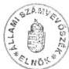

Állami Számvevőszék

# JELENTÉS

a Külügyminisztérium fejezet
működésének pénzügyi-gazdasági
ellenőrzéséről

9827

1998. augusztus

---

Az ellenőrzés végrehajtásáért felelős:

III. Költségvetési Ellenőrzési Igazgatóság

Bihary Zsigmond

számvevő igazgató

Az ellenőrzést vezette:

Holé Sándorné dr.

számvevő főtanácsos

Az ellenőrzésben részt vettek:

Eötvös Magdolna

számvevő tanácsos

Hegedűsné Erdélyi Piroska

számvevő tanácsos

László Józsefné

számvevő tanácsos

Patai Tamás

számvevő tanácsos

Számely Kornél

számvevő tanácsos

---

V.

# TARTALOMJEGYZÉK

|  **I. ÖSSZEGZŐ MEGÁLLAPÍTÁSOK, KÖVETKEZTETÉSEK, JAVASLATOK** | **4**  |
| --- | --- |
|  **II. RÉSZLETES MEGÁLLAPÍTÁSOK** | **9**  |
|  1. A SZAKMAI FELADATOK, A SZERVEZETI RENDSZER, A SZEMÉLYI FELTÉTELEK ÖSSZHANGJA, A MŰKÖDÉS SZABÁLYOZOTTSÁGA | 9  |
|  1.1. A fejezet címrendjének változásai | 10  |
|  1.2. A KÜM feladatainak, szervezetének alakulása | 11  |
|  1.2.1. A fejezet szervezeti változásai | 11  |
|  1.2.2. A külföldön működő magyar képviseletek (diplomáciai, konzuli, kereskedelmi) és azok külképviseleti rendszerbe való integrálása | 12  |
|  1.2.3. A szakmai feladatellátás személyi feltételei | 14  |
|  1.3. A működés és a gazdálkodás szabályozottsága, irányítási, döntési rendje | 16  |
|  1.3.1. A működés és a gazdálkodás szabályozottsága | 16  |
|  1.3.2. A gazdálkodás irányítási, döntési rendje | 18  |
|  2. A KÖLTSÉGVETÉS TERVEZÉSE ÉS A FINANSZÍROZÁS RENDJE | 19  |
|  2.1. A költségvetés tervezése | 19  |
|  2.2. Az előirányzatok módosítása | 22  |
|  2.3. A finanszírozási rendszer működése | 23  |
|  2.3.1. A pénzellátás rendszere, a bankszámlák vezetése | 23  |
|  2.3.2. A kincstári rendszer működése | 26  |
|  2.4. A pénzmaradványok, illetve előirányzat maradványok alakulása és felhasználása | 27  |
|  3. A KÖLTSÉGVETÉS VÉGREHAJTÁSA | 29  |
|  3.1. A fejezet költségvetési egyensúlyának értékelése | 29  |
|  3.2. A minisztérium belső keretgazdálkodása | 31  |
|  3.3. A létszám- és a bér-, illetve a személyi juttatásokkal való gazdálkodás | 33  |
|  3.3.1. A létszám alakulása | 33  |
|  3.3.2. A bér-, illetve a személyi juttatásokkal való gazdálkodás | 34  |
|  3.4. Egyéb működési kiadások | 38  |
|  4. AZ ESZKÖZ ÉS VAGYONGAZDÁLKODÁS | 40  |
|  4.1. A fejezet ingatlan- és helyiséggazdálkodása | 41  |
|  4.2. A KÜM székház rekonstrukciója | 45  |
|  4.3. Tárgyi eszköz- és készletgazdálkodás | 46  |
|  5. A FEJEZETI KEZELÉSŰ ELŐIRÁNYZATOK FELHASZNÁLÁSA | 50  |
|  6. A SZÁMVITELI ÉS BIZONYLATI REND | 53  |
|  7. AZ ELLENŐRZÉSI TEVÉKENYSÉG | 56  |

1

---

[Non-Text]

1. 2017年1月1日至2018年1月1日（含）的公司股票交易均价为4.56元/股，与前一交易日收盘价相比，涨幅为-0.97%。

[Non-Text]

[Non-Text]

[Non-Text]

1. 2017年1月1日至2018年1月1日（含）的公司股票交易均价为4.56元/股，与前一交易日收盘价相比，涨幅为-0.97%。

1. 2017年1月1日至2018年1月1日（含）的公司股票交易均价为4.56元/股，与前一交易日收盘价相比，涨幅为-0.97%。

1. 2017年1月1日至2018年1月1日（含）的公司股票交易均价为4.56元/股，与前一交易日收盘价相比，涨幅为-0.97%。

1. 2017年1月1日至2018年1月1日（含）的公司股票交易均价为4.56元/股，与前一交易日收盘价相比，涨幅为-0.97%。

1. 2017年1月1日至2018年1月1日（含）的公司股票交易均价为4.56元/股，与前一交易日收盘价相比，涨幅为-0.97%。

[Non-Text]

[Non-Text]

1. 2017年1月1日至2018年1月1日（含）的公司股票交易均价为4.56元/股，与前一交易日收盘价相比，涨幅为-0.97%。

[Non-Text]

1. 2017年1月1日至2018年1月1日（含）的公司股票交易均价为4.56元/股，与前一交易日收盘价相比，涨幅为-0.97%。

1. 2017年1月1日至2018年1月1日（含）的公司股票交易均价为4.56元/股，与前一交易日收盘价相比，涨幅为-0.97%。

[Non-Text]

[Non-Text]

1. 2017年1月1日至2018年1月1日（含）的公司股票交易均价为4.56元/股，与前一交易日收盘价相比，涨幅为-0.97%。

[Non-Text]

[Non-Text]

[Non-Text]

[Non-Text]

[Non-Text]

[Non-Text]

1. 2017年1月1日至2018年1月1日（含）的公司股票交易均价为4.56元/股，与前一交易日收盘价相比，涨幅为-0.97%。

[Non-Text]

[Non-Text]

[Non-Text]

[Non-Text]

[Non-Text]

[Non-Text]

[Non-Text]

[Non-Text]

[Non-Text]

[Non-Text]

[Non-Text]

[Non-Text]

[Non-Text]

[Non-Text]

[Non-Text]

[Non-Text]

[Non-Text]

1. 2017年1月1日至2018年1月1日（含）的公司股票交易均价为4.56元/股，与前一交易日收盘价相比，涨幅为-0.97%。

1. 2017年1月1日至2018年1月1日（含）的公司股票交易均价为4.56元/股，与前一交易日收盘价相比，涨幅为-0.97%。

[Non-Text]

[Non-Text]

[Non-Text]

[Non-Text]

The Ground Truth image displays a single, solid horizontal line. According to Rule 2 (UNDERSCORE & LINE RULES), this is a stylistic or background line, not a placeholder underscore. Therefore, the OCR result must ignore it and output nothing or only meaningful text. The provided OCR content is "____", which consists of four underscores. This is an incorrect interpretation of the line as a placeholder, violating the rule that stylistic lines must be ignored. The OCR has hallucinated underscores where none should exist based on the GT's visual context. Hence, the OCR result is inconsistent with the Ground Truth.

---

# ---## ÁLLAMI SZÁMVEVŐSZÉK

V-34-36/1997-98.

Témaszám: 402

# JELENTÉS

## a Külügyminisztérium fejezet működésének pénzügyi-gazdasági ellenőrzéséről

A Külügyminisztérium költségvetési fejezet a Kormány külpolitikájának megvalósítására irányuló feladatok, s az azok végrehajtásában részt vevő szervezetek költségvetési előirányzatait tartalmazza. A tárca speciális tevékenysége az állami protokoll ellátása.

A Külügyminisztérium (KÜM) szakmai feladatait részben az igazgatási szervezet apparátusával, részben a külképviseleteken keresztül végzi. A Magyar Köztársaság - a külügyminiszter irányítása alatt működő - külképviseleteinek (diplomáciai, konzuli, egyéb) száma az ellenőrzött időszakban 87-ről 99-re nőtt.

A fejezeten belül szervezeti változást jelentett 1991-ben a Magyar Külügyi Intézet átsorolása (amely ezt követően Teleki Alapítványként működik) a Miniszterelnökség fejezetbe, továbbá 1992-ben a Jóléti Intézmények létrehozása.

A fejezet növekvő feladataival és szervezeti változásaival összefüggésben az éves költségvetési törvényekben jóváhagyott kiadási előirányzata 1991. és 1997. évek között 5,3 Mrd Ft-ról 17,3 Mrd Ft-ra, ezen belül a költségvetési támogatás 5 Mrd Ft-ról 13 Mrd Ft-ra emelkedett, a magyar állampolgárságú foglalkoztatottak költségvetési létszáma 1634 főről 1555 főre csökkent.

Az Állami Számvevőszék (ÁSZ) a fejezetnél 1990-ben végzett átfogó pénzügyi-gazdasági ellenőrzést, ezt követően az ellenőrzések néhány külképviselet gazdálkodására, az éves költségvetések tervezésére és zárszámadására irányultak, s témavizsgálatok is érintették a fejezetet (1. sz. melléklet).

### Ellenőrzésünk során arra kerestünk választ, hogy

- a fejezetnél a szervezet, a működés mechanizmusa, a szabályozottság, a költségvetési előirányzatok összhangban voltak-e a szakmai feladatokkal, segítették-e azok hatékony és eredményes ellátását;

---3

---

I. ÖSSZEGZŐ MEGÁLLAPÍTÁSOK, KÖVETKEZTETÉSEK, JAVASLATOK

- a költségvetési gazdálkodás során hogyan érvényesültek a törvényesség, a célszerűség és az eredményesség szempontjai;
- a KÜM a fejezet irányító tevékenysége keretében megoldotta-e az ÁSZ korábbi ellenőrzéseinek megállapításaiban jelzett problémákat.

Az ellenőrzés a fejezet és címei 1991-1997. évek közötti költségvetési gazdálkodására, továbbá az Ausztriában, Németországban, Belgiumban és Franciaországban működő külképviseletekre terjedt ki. Ezzel egyidejűleg került sor a korábbi ÁSZ ellenőrzések megállapításaihoz, javaslataihoz fűződő intézkedések utóellenőrzésére is.

# I. ÖSSZEGZŐ MEGÁLLAPÍTÁSOK, KÖVETKEZTETÉSEK, JAVASLATOK

Az ellenőrzött években a nemzetközi kapcsolatok folyamatos szélesedése, az Európai Unióhoz és a NATO-hoz való csatlakozás előkészítése, a külképviseleti hálózat racionalizálása a KÜM tevékenységi körének bővülését, tartalmi változását eredményezte. Mindezek többletfeladatot jelentettek a fejezeti irányító munka és a gazdálkodás területén is.

A fejezet címrendje, illetve annak módosításai, a gazdálkodási tevékenység szabályozása nem teremtette meg a feladatok és a szervezeti rendszer, valamint a költségvetési gazdálkodás összhangját.

A fejezet intézményeinek az államháztartásról szóló, többször módosított 1992. évi XXXVIII. tv. (továbbiakban: Áht.), valamint a végrehajtására kiadott kormány rendeleteknek megfelelő alapító okiratuk nincs, gazdálkodásuk megszervezésének módját és az előirányzatok feletti rendelkezési jogosultságukat nem szabályozták. Ezideig nem alkották meg az Áht. 124. § (2) bekezdés d) pontja szerint a külképviseletek - költségvetésének tervezése, pénzellátása, előirányzat-felhasználása, kincstári gazdálkodása és nyilvántartása - sajátosságainak megfelelő szervezeti és eljárási rendjére vonatkozó kormányrendeletet. Az Igazgatás- és a Külképviseletek címhez tartozó feladatok meghatározásának és elkülönítésének hiánya akadályozta a feladatok és a költségvetési előirányzatok közötti összhang kialakítását.

Az 1992 óta címet alkotó, 1992-ben önállóan gazdálkodó költségvetési szervként létrehozott Jóléti Intézmények induló vagyonát nem határozták meg, a használatukba adott eszközök az Igazgatás mérlegében szerepelnek.

A fejezeti kezelésű speciális előirányzatoknak 1997-től az intézményi működési költségvetésbe történő beépítése nem felel meg a célirányos feladatfinanszírozásnak.

Az új követelményekhez, a feladatbővülésekhez igazodóan - a minisztérium működésének rendszeres felülvizsgálata alapján - végrehajtott átszervezések következtében a szervezeti felépítés tagoltabbá vált, a főosztályok,

4

---

I. ÖSSZEGZŐ MEGÁLLAPÍTÁSOK, KÖVETKEZTETÉSEK, JAVASLATOK

önálló osztályok száma 26-ról 36-ra emelkedett 1990-1997. között. A külképviseletek száma 87-ről 99-re gyarapodott.

**A külképviseleti hálózat racionalizálásában** előrelépést jelentett 1997. II. félévében a külföldön működő kereskedelmi képviseleteknek a külképviseleti rendszerbe való integrálása. A döntés végrehajtása keretében meghatározták az érintett szervezetek (KÜM, IKIM) közötti feladatmegosztást, módosították az 1997. évi költségvetési előirányzatokat, s 90 fő áthelyezésével gondoskodtak a külképviseleteken ellátandó feladatok személyi feltételeiről. A tárgyi eszközök átvételének rendezése - a helyszíni ellenőrzés lezárásáig - nem történt meg, további problémát jelent az átvett eszközök használhatósága az érintett külképviseleteknél. Mindezek mellett - a külképviseleteken végzett helyszíni ellenőrzésünk megállapításai alapján - az integráció a külgazdasági feladatok ellátásában nem okozott fennakadást.

A fejezet szakmai feladatrendszeréhez igazodóan a külképviseleteken foglalkoztatottak létszáma mintegy 2/3-át tette ki a tényleges éves összlétszámnak. **Az Igazgatás** szervezeti egységeinél **nem érvényesült** teljes körűen és következetesen a **feladatok és a személyi feltételek összhangja**. A Gazdálkodási Főosztályon belül a költségvetési gazdálkodás területén egyidejűleg állt fenn a feladatbővülés, valamint a személyi erőforrásokkal való célszerűtlen gazdálkodás, ami esetenként feladatellátási hiányt, illetve párhuzamosságot okozott (részletesen a 15. oldalon). Az Igazgatás feladatellátásának személyi feltételeit rontotta a - külképviseletekre való távozás miatti - nagyarányú fluktuáció, különösen a vezető beosztásúak esetében.

A Külképviseleteknél a diplomaták szakmai felkészültsége, nyelvismerete biztosította a színvonalas feladatellátást. A gazdasági vezetők (felelősök) személyi feltételeinek hiányosságai (iskolai végzettség, nyelvismeret), továbbá az a tény, hogy egy részük más munkakört is betölt, korlátozta a szakszerű gazdasági-pénzügyi munkavégzést.

A minisztérium az ellenőrzött időszakban **hatályos Szervezeti és Működési Szabályzatát** (SZMSZ) a feladatváltozásokkal összefüggően módosította, a módosító utasításokból többnyire elmaradt az új egységek jog- és hatáskörének, feladatának meghatározása. A munkaköri leírások, valamint a személyi változásoknál a munkakör átadás-átvétel dokumentálása terén több hiányosság fordult elő.

**A gazdálkodás rendjének belső szabályozása** hiányos volt, nem biztosította a hatályos jogi szabályozással, az Áht-val, valamint a számvitelről szóló többször módosított 1992. évi XVIII. törvénnyel (továbbiakban: Szt) való összhangot. Mindezek kedvezőtlenül hatottak az operatív gazdálkodásra, a vagyon nyilvántartására, illetve a mérlegek valódiságára.

**A gazdálkodás irányítási és döntési jogkörét** - az ellenőrzött időszakban - szabályozó belső utasítások aktualizálása elmaradt, így azok eltértek a vonatkozó törvényi előírásoktól (Áht., Köztisztviselői tv., Közalkalmazotti tv. stb.). Mindezek következtében az új SZMSZ hatályba lépését követően is ellentmondásos a költségvetési előirányzatok feletti döntési jogkörök meghatározása, hiányos a feladatok és a gazdálkodási jogkörök szabályozása. (A KÜM tájékozta-

5

---

I. ÖSSZEGZŐ MEGÁLLAPÍTÁSOK, KÖVETKEZTETÉSEK, JAVASLATOK---

tása szerint a gazdálkodás részletes szabályaira vonatkozó utasítások megalkotása folyamatban van.)

**A költségvetés tervezési és finanszírozási rendje** - az utóbbi két év kivételével - nem teremtette meg a feladatok és a rendelkezésre álló források összhangját. A finanszírozási források 1991-1993. évek között, a bevételek alátervezése miatt az igényeket meghaladták, 1994-1995. években szűkösnek bizonyultak. A címenkénti tervezés, a szervezet, a feladat és a hozzájuk rendelt pénzeszközök elhatárolásának hiányában nem volt megalapozott. Az igazgatási ágazatot érintő korlátozó intézkedések végrehajtása, a fejezetnél az Igazgatás címnél realitásokat mellőző költségvetési szerkezet kialakulásához vezetett.

**Az 1994-1995. évi pénzügyi egyensúlyi zavarokat elsődlegesen** a forint leértékelésekkel összefüggő kompenzálatlan veszteségek idézték elő, de azt a szabálytalan gazdálkodás és a helytelen gazdasági döntések is fokozták. (A külképviseleti hálózat racionalizálása elhúzódott, a költségek csökkentésére - a feladatok felülvizsgálatával járó - hatékony intézkedéseket nem hoztak.) **A kialakult gazdálkodási feszültségeket esetenként jogszabályi előírásokba ütköző belső átcsoportosításokkal oldották fel.**

**A kincstári rendszer bevezetése hozzájárult a fejezet 1996. évi pénzügyi egyensúlyának helyreállításához.** A rendszer 1997. évi továbbfejlesztése - a hiányosságok ellenére - erősítette a gazdálkodási fegyelmet, elősegítette az előirányzat-módosítások naprakészségét. A fejezetnél a központi költségvetési szervek bankszámlavezetésére vonatkozó előírásoknak - a letéti és célszámolási számlák kivételével - megfelelően jártak el. A pénzmaradvány elszámolások nem mindig voltak szabályszerűek, esetenként a visszaigényelt maradványokat céltól eltérően használták fel.

A minisztérium belső keretgazdálkodása - a keretek felhasználásának folyamatos nyomon követése, ellenőrzése hiányában - nem segítette elő hatékonyan a költségvetési gazdálkodást, bár az utolsó évben pozitív irányú változások tapasztalhatók. (Nem követelték meg a kötelezettségvállalások folyamatos nyilvántartásának vezetését, nem határozták meg a keret felhasználások egységes nyilvántartási rendjét, tartalmát.)

**A fejezet létszám- és bér-, illetve személyi juttatásokkal való gazdálkodása** 1996-ig nem volt kellően összehangolt. A tényleges létszám az engedélyezett költségvetési létszámot - az 1993-1995. éves időszakban - mintegy 4-5%-kal túllépte. Az 1994-1995. évek gazdálkodására jellemző fedezethiány a bérgazdálkodásban is érvényesült, a béralap, illetve a személyi juttatások előirányzatai a költségvetési létszámnak megfelelő bérigényt nem fedezték.

A köztisztviselői és a közalkalmazotti törvény végrehajtásánál a jogszabályi rendelkezéseknek megfelelően jártak el. Az Igazgatás címnél éltek a törvény által biztosított differenciálás lehetőségével. A Külképviseletek címnél a személyi juttatások kiadásainak négyszeres (1359 M Ft-ról 5509 M Ft-ra) emelkedése a bérpolitikai intézkedések mellett, a külszolgálatot teljesítők külföldi megélhetését szolgáló juttatások forint értékének növekedésével áll összefüggésben, amelyben érvényesül a forintleértékelések hatása is.

---6

---

I. ÖSSZEGZŐ MEGÁLLAPÍTÁSOK, KÖVETKEZTETÉSEK, JAVASLATOK

**A reprezentációs kiadások** az állami protokoll, a minisztériumi protokoll, a személyi reprezentáció mellett a miniszteri rendelkezési keret felhasználását tartalmazták. A miniszteri rendelkezési keret felhasználásának és elszámolásának gyakorlata nem felelt meg a költségvetési szervek beszámolási és könyvvezetési kötelezettségéről szóló 179/1991. (XII.30.) és az 54/1996. (IV.12.) Korm. rendeletek előírásainak, mert reprezentációs kiadásként számoltak el jogcím szerint oda nem tartozó felhasználásokat (segélyek, kegyeleti kiadások, nyugdíjasok tárgyjutalma, dolgozóknak nyújtott lakás célú kölcsönök stb.).

**A fejezet eszközgazdálkodásának** hatékonyságát az időszakonként változó forrásbőség, illetve forráshiány negatívan érintette. A KÜM ingatlan és helyiséggazdálkodására az ellenőrzött időszakot felölelő hosszabb távú koncepciót nem alakítottak ki. A megvalósított külképviseleti beruházásokat, ingatlanvásárlásokat a rendelkezésre álló pénzügyi források, valamint politikai döntések határozták meg. A hatékony ingatlangazdálkodást gátolta, hogy továbbra sem valósult meg a külképviseletek és a külföldön állami feladatokat ellátó testületek ingatlan állományának, elhelyezéseinek egységes kezelése. A külképviseletek bérleménygazdálkodásában elsődlegesen a költségcsökkentést vették figyelembe, ami azonban nem mindig vezetett optimális megoldáshoz.

**A rendelkezésre álló tárgyi feltételek összességében biztosították a feladatellátást**, bár az ellenőrzött időszak második felében - jellemzően a szűkös költségvetési keretek miatt - az eszközök elhasználódottsága (különösen a külképviseleteknél a gépek, berendezések, gépjárművek vonatkozásában) nagymértékű. A készlet- és eszközgazdálkodás hatékonyságát a decentralizált gazdálkodás rontotta.

**A fejezeti kezelésű-, valamint a fejezeti kezelésű speciális előirányzatok** nem voltak minden esetben kellően megalapozottak, ami szükségessé tette az évközi módosításukat (állami protokoll, turista kölcsön). Az előirányzatok felhasználási és elszámolási rendjére vonatkozó - a jogszabályi előírásoknak megfelelő - belső szabályozást nem készítették el. A felhasználásokról azonban elkülönített számviteli nyilvántartást vezettek. A fejezeti kezelésű előirányzatokból - rendeltetésüktől eltérően - 1994-1995. években két esetben működési célú kiadásokat finanszíroztak.

**A számviteli tevékenység** - a javuló tendencia ellenére - nem felelt meg minden tekintetben a jogszabályi követelményeknek. Nem érvényesült maradéktalanul a mérlegvalódiság elve, a mérleget a főkönyvi kivonatok és az analitikus nyilvántartások nem támasztották alá megfelelően. A szintetikus könyvelés és az analitikus nyilvántartások nem képeztek zárt rendszert. A vagyonnyilvántartás teljeskörűségének hiányában a vagyonvédelmi követelmények érvényesítése nem volt kifogástalan. A pénzügyi, bizonylati fegyelem betartásánál szabálytalanságok merültek fel. A jogszabályi rendelkezésekkel ellentétes belső szabályozás következtében a készpénzkezelés bizonylati alkalmazása nem volt előírásszerű.

**Az ellenőrzési tevékenység feltételei** - a belső ellenőrzés szervezeti kereteinek, függetlenségének és szabályozottságának megteremtésével - **jelentősen fejlődtek**. A feladatellátás személyi feltételeit azonban nem biztosították kellő mértékben. Nem fordítottak megfelelő hangsúlyt a felügyeleti jellegű

7

---

I. ÖSSZEGZŐ MEGÁLLAPÍTÁSOK, KÖVETKEZTETÉSEK, JAVASLATOK

költségvetési ellenőrzési feladatok és azok szervezeti kereteinek meghatározására. A fejezet ennek következtében a jogszabályban előírt kétévenkénti felügyeleti jellegű költségvetési ellenőrzési kötelezettségének nem tett eleget. A fejezet irányítása alá tartozó Jóléti Intézményeknél a megalakulás óta nem volt átfogó ellenőrzés. A vezetői- és a munkafolyamatba épített ellenőrzést nem érvényesítették minden területen maradéktalanul, nem fordítottak kellő figyelmet folyamatos működésükre, mindezek miatt nem válhattak az irányítás hatékony eszközévé.

Az ellenőrzés részletes megállapításainak hasznosítása mellett javasoljuk:

a Kormánynak

1. Az Áht. 124. § (2) bekezdés d) pontja alapján rendeletben határozza meg a külképviseletek költségvetési tervezésének, pénzellátásának, előirányzatfelhasználásának, kincstári gazdálkodásának és nyilvántartásának - a terület sajátosságait figyelembevevő - szabályait.
2. A Magyar Állam tulajdonában lévő külföldi ingatlanok hatékony és célirányos hasznosítása érdekében gondoskodjon a külföldön lévő állami tulajdonú ingatlanvagyon egységes nyilvántartásáról és kezeléséről. Vizsgálja felül az ingatlanállomány jelenlegi hasznosítását és a célszerűség, hatékonyság követelményét szem előtt tartva döntsön a külföldön állami feladatot ellátó szervezetek elhelyezéséről.

a külügyminiszternek

1. A fejezetnél a feladatok, a szervezeti rend és a költségvetési gazdálkodás összhangjának megteremtése érdekében határozza meg az Áht. végrehajtására kiadott kormányrendeleteknek megfelelően az intézmények (alapító okiratban rögzített) feladatait, gazdálkodásuk megszervezésének módját és az előirányzatok feletti rendelkezési jogosultságukat.
2. A költségvetési gazdálkodásra vonatkozó belső szabályozás teljessé tételével (a hiányzó szabályzatok pótlásával és a meglévők aktualizálásával) teremtse meg a jogszabályokhoz igazodó gazdálkodás, valamint a számviteli és bizonylati rend, a vagyonvédelmi követelmények érvényesítésének feltételeit.
3. Intézkedjen a Jóléti Intézmények eszközállományának meghatározásáról, valamint a használatukban lévő eszközök intézményi vagyonnyilvántartásba vételéről.
4. Gondoskodjon arról, hogy az Igazgatás-, a Külképviseletek- és a Jóléti Intézmények cím feladatainak elhatárolásával, az azokhoz rendelt források meghatározásával megteremtse a címenként megalapozott költségvetési tervezés feltételeit.
5. Gondoskodjon a Gazdálkodási Főosztályon belül a költségvetési gazdálkodási feladatok ellátásának megfelelő személyi feltételeiről.

8

---

II. RÉSZLETES MEGÁLLAPÍTÁSOK

6. A minisztérium belső keretgazdálkodásában követelje meg a kötelezettségvállalások naprakész nyilvántartását, az egységek felhasználásának a pénzforgalmi adatokkal való folyamatos egyeztetését, s a felhasználások évközi értékelését.
7. Az eszköz- és készletgazdálkodás hatékonysága érdekében mérlegelje egyes tevékenységek (anyagbeszerzés, eszközjavítás, nyomdai kiadványok készítése) központosított elvégzését.
8. Vizsgálja felül a miniszteri rendelkezési keret képzését és felhasználását, s szüntesse meg annak szabálytalan gyakorlatát.
9. Gondoskodjon a fejezet működésétől, gazdálkodási tevékenységétől független, speciális feladatok (állami protokoll, nemzetközi tagdíjak, turista kölcsönök, külügyi segélyezés) célirányos finanszírozásáról, ennek érdekében az azokhoz rendelt forrásoknak az intézményi működési költségvetéstől elkülönített megtervezéséről.
10. Követelje meg a belső ellenőrzési rendszer működtetésén keresztül a korszerűsített belső szabályzatok maradéktalan betartását. Fordítson különös figyelmet a költségvetési gazdálkodás kritikus területeit jelentő számviteli, bizonylati, vagyonvédelmi tevékenységek hézagmentes kontrolljára.
11. Gondoskodjon a felügyeleti jellegű költségvetési ellenőrzési feladatok és azok szervezeti kereteinek meghatározásáról a két évenkénti ellenőrzési kötelezettség teljesítése érdekében.

## II. RÉSZLETES MEGÁLLAPÍTÁSOK

### 1. A SZAKMAI FELADATOK, A SZERVEZETI RENDSZER, A SZEMÉLYI FELTÉTELEK ÖSSZHANGJA, A MŰKÖDÉS SZABÁLYOZOTTSÁGA

A KÜM a Kormány külpolitikai irányelveinek, döntéseinek megvalósítása érdekében külső- és belső irányító, koordináló és végrehajtó feladatokat lát el. A külpolitikai, külgazdasági, biztonsági érdekek érvényesítésére, koordinálására irányuló tevékenysége során a KÜM képviseli a Magyar Köztársaságot és a Kormányt, a más államokkal, az ENSZ-vel, az Európa Tanáccsal és egyéb nemzetközi politikai, biztonsági és gazdasági kormányközi szervezetekkel fenntartott kapcsolatokban. Koordinálja és irányítja az Észak-atlanti Szerződés Szervezetével, az Európai Unióval, a Nyugat-európai Unióval kapcsolatos tevékenységet. Kidolgozza és végrehajtja a Kormány segélyezési politikáját, előkészíti és lebonyolítja az Európai Unió által Magyarország részére nyújtandó támogatások (elsősorban a PHARE program) több évre vonatkozó prioritásainak meghatározásával összefüggő nemzetközi tárgyalásokat, közreműködik az ezek alapján kötendő megállapodások előkészítésében.

9

---

II. RÉSZLETES MEGÁLLAPÍTÁSOK

A külügyminiszter feladat- és hatáskörét - ezáltal az irányításával működő szervezet feladatát - a Kormány 1990-ben és 1994-ben rendeletben szabályozta (45/1990. (IX. 15.) Korm. rendelet, 152/1994. (XI. 17.) Korm. rendelet), amit 1997. évben két alkalommal módosítottak.

A Magyar Köztársaság diplomáciai kapcsolatot nagyköveti szinten (párhuzamos akkreditálásokkal) az ellenőrzött időszak kezdetén 152, a végén 172 állammal (99 külképviseleten) tartott fenn. A külképviseletek számának bővülésében meghatározó szerep jutott a Közép-, Kelet-Európában lezajlott rendszerváltásokkal (FÁK államai, volt Csehszlovákia, Jugoszlávia) összefüggő nyitásoknak.

A KÜM szakmai feladatait - a külügyi irányítás területi tagozódásának megfelelően - alapvetően a külügyminisztériumi igazgatással és a külképviseletekkel látja el. A külügyi szolgálat felépítését, szervezeti rendszerét, egységes irányítását az egyes országok gyakorlatában a külügyi törvény, a konzuli feladatokat a konzuli törvény határozza meg. Megalkotásukra a magyar jogrendben nem került sor, aminek következtében a külképviseletek feladatait alapvetően a nemzetközi jog szabályai határozzák meg (a diplomáciai kapcsolatokról és a konzuli kapcsolatokról szóló bécsi egyezmények).

### 1.1. A fejezet címrendjének változásai

Az ellenőrzött időszakban a központi költségvetésen belül a KÜM fejezeti rendjének változásai következtében a címek száma 6-ról 4-re csökkent. A fejezet 1995-1996. között az Igazgatás, a Külképviseletek és a Jóléti Intézmények címekre tagolódott, 1997-ben a Fejezeti tartalékkal bővült a címek száma.

A fejezet intézményei gazdálkodásuk tekintetében nem feleltek meg maradéktalanul az Áht. végrehajtására kiadott, a költségvetési szervek tervezésének, gazdálkodásának és beszámolásának rendszeréről szóló - az ellenőrzött időszakban hatályos - 137/1993. (X. 12.) és a 156/1995. (XII. 26.) Korm. rendeletek előírásainak.

Az intézményeknek nem volt a 137/1993. (X. 12.) Korm. rendelet 3. §-ában, majd a 156/1995. (XII. 26.) Korm. rendelet 5. §-ában meghatározott alapító okiratuk.

A költségvetési szervek gazdálkodása megszervezésének módjára vonatkozó 137/1993. (X. 12.) Korm. rendelet 6. §-a, illetve a 156/1995. (XII. 26.) Korm. rendelet 8. §-a előírásainak, valamint az előirányzatok feletti rendelkezési jogosultság szempontjait rögzítő 156/1995. (XII. 26.) Korm. rendelet 7. §-a követelményeinek sem tett minden tekintetben eleget a felügyeleti szerv.

Az ellenőrzött időszakban, valamint az 1998. január 1-től hatályos SZMSZ-ban egységes szervezetként határozták meg a minisztériumot, amelynek szervezeti egységei a főosztályok és a külképviseletek.

A belső szabályozás nem határolta el a külképviseletek működésével, irányításával összefüggő szakmai feladatokat olyan módon, hogy azok alapul szolgáljanak az Igazgatás és a Külképviseletek címek költségvetési előirányzatai tervezéséhez, az azokkal való gazdálkodáshoz és felhasználásuk elszámolásához.

10

---

II. RÉSZLETES MEGÁLLAPÍTÁSOK

A KÜM gazdálkodása a két cím tekintetében sem szervezetileg, sem gazdálkodási jogkörében nem különült el.

A minisztérium azonos szervezeti egységei látták el a két cím pénzügyi, ügyviteli, munkaügyi, bérszámfejtési, műszaki ellátási feladatait. A külképviseleti hálózat fenntartásához szükséges belföldi hátteret az Igazgatás biztosítja. A belföldi gazdálkodó egységek látják el a külképviseleti címhez tartozó, a korábbi években cél- és speciális előirányzatokhoz kapcsolódó feladatokat, így gazdálkodási jogkörükben rendelkeznek ezen előirányzatok felhasználásáról.

Mindezek következtében a Külképviseletek cím a PM nyilvántartásába történő bejegyzés ellenére sem jelent önállóan gazdálkodó költségvetési szervet.

Az igazgatási és a külképviseleti feladatok szoros összefüggéseire, a feladatvégrehajtás személyi-tárgyi feltételeinek elkülönítési gondjaira, a költségtakarékosságra is tekintettel, indokolatlan a két önálló intézményi besorolás. Az Igazgatáshoz kapcsolódóan célszerű meghatározni - az államháztartási törvény előírásainak megfelelően - a külképviseletek működésének rendszerét.

Megjegyezzük, hogy mindezekre az 1990. évi átfogó pénzügyi-gazdasági ellenőrzéskor, valamint azt követően az éves zárszámadási ellenőrzések keretében tett megállapításokban felhívtuk a tárca figyelmét.

A feladatok elkülönítése ellenére a Jóléti Intézmények tevékenységével összefüggő kiadások és bevételek csak 1993-tól képeznek önálló címet, bár az intézmény létrehozásáról még 1992. január 1-i hatállyal intézkedett a külügyminiszter. Ekkor azonban nem határozták meg a költségvetési szerv induló vagyonát, a használatukba adott eszközök átadását nem végezték el, azok továbbra is az Igazgatásnál szerepelnek.

**A fejezeti kezelésű költségvetési előirányzatok** 1994-ben önálló címet alkottak, 1995-1996. években viszont a fejezethez kapcsolódó kiadások elkülönítését csak címen belüli előirányzat-csoport biztosította. 1997-ben valamennyi fejezeti kezelésű speciális előirányzatot beépítettek a címek működési kiadásainak előirányzataiba, ami lehetőséget teremtett a feladatok keresztfinanszírozásához.

## 1.2. A KÜM feladatainak, szervezetének alakulása

A Magyar Köztársaság külpolitikai, külgazdasági, biztonsági érdekeinek érvényesítését, diplomáciai képviseletét, segélyezési tevékenységét, a társszervekkel való koordinálási, kapcsolattartási, szabályozási kötelezettségét a külügyminiszter feladat és hatásköréről szóló kormányrendeletek rögzítették.

### 1.2.1. A fejezet szervezeti változásai

**A KÜM fejezet szervezete** az 1991-1992. évben végrehajtott átszervezéseket követően nem változott.

Az intézményhálózat felülvizsgálata következtében a Magyar Külügyi Intézet - eszközeinek könyv szerinti állományával, időarányos költségvetési előirányzatával - 1991. szeptember 1-től a Teleki Alapítványhoz került.

11

---

II. RÉSZLETES MEGÁLLAPÍTÁSOK

1992. január 1-én - székhely, alap és vállalkozói tevékenységi kör elkülönítés, mérték meghatározás nélkül - létrehozták a KÜM Jóléti Intézményeket.

Az ellenőrzött időszakban a **minisztérium, szervezetének** működését - a feladat-változásokkal is összefüggően - szinte évenként felülvizsgálta, s különböző mértékű korrekciót hajtott végre, folyamatosan növelve a szervezeti egységek számát. A feladatok ellátásának szervezeti kereteire jellemző, hogy 1990. és 1997. évek között a minisztériumi főosztályok, önálló osztályok száma 26-ról 36-ra, míg a külképviseleti állomáshelyeké 96-ról 99-re emelkedett. A tevékenységi kör lényeges tartalmi változását, bővülését az európai integrációs (az Európai Unióhoz, a NATO-hoz való csatlakozási) feladatok, valamint a külképviseleti hálózat racionalizálása jelentették. Feladatcsökkenést mindössze a PHARE támogatási rendszer irányítói és koordinálói feladatának a Miniszterelnöki Hivatalhoz történő átcsoportosítása okozott.

A minisztériumban 1994. év második felében a helyettes államtitkári jogkörrel rendelkező igazgatóhoz csoportosították a működési feltételek biztosításával foglalkozó funkcionális főosztályok irányítását (Gazdálkodási Főosztály, Távközlési és Számítástechnikai Főosztály, stb.).

A minisztérium felügyeleti rendszerének korszerűsítése, a jogi és közigazgatási munka egységes irányításának biztosítása céljából 1995-ben új helyettes államtitkári státusz létrehozására kapott engedélyt a KÜM. Ugyanerre az évre esik az integrációs feladatok önálló blokkba szervezésének kezdete, ami főosztályok feladatkörének tartalmi szétválasztásával és a NATO Főosztály létrehozásával járt.

Az Integrációs Államtitkárság 1996. évi létrehozása további feladatkoncentrálást jelentett, amihez 36 fős létszámnövekményt engedélyeztek. A Kormány 1041/1996. (V. 3.) határozatával a helyettes államtitkári rangban lévők száma 7-re emelkedett.

A 152/1994. (XI. 17.) Korm. rendelet 8. §-a alapján a Magyarországra irányuló segélyek felhasználásának irányítói és koordinálói feladatai ellátásához 1994. szeptemberétől segélykoordinációs miniszteri biztos kinevezéséről, majd 1996. őszétől Segélykoordinációs Titkárság felállításáról intézkedtek. 1997. december 1-től a Magyarországra irányuló EU és OECD segélyek felhasználását a Miniszterelnöki Hivatal irányítja, annak ellenére, hogy a többször módosított 152/1994. (XI. 17.) Korm. rendelet 6. §-a szerint a külügyminiszter koordinálja és irányítja Magyarország és az Európai Unió közötti kapcsolatot.

### 1.2.2. A külföldön működő magyar képviseletek (diplomáciai, konzuli, kereskedelmi) és azok külképviseleti rendszerbe való integrálása

A gazdaságdiplomácia irányítói feladatát a KÜM részlegesen látja el. A 152/1994. (XI. 17.) Korm. rendelet 5. §-a külügyminiszter feladataként határozta meg az integrált irányítást, koordinálást, ennek ellenére a Magyar Állam differenciált képviseletét több tárca látja el (IKIM, MKM, HM, FM, stb). Már az 1992. évi költségvetési törvényjavaslat a központi költségvetési szervek intézményrendszerének felülvizsgálatára vonatkozó feladatai között megfogalmazta a magyar külügyi hálózat racionalizálását, rögzítve a társtárcák együttműködési kötelezettségét.

12

---

II. RÉSZLETES MEGÁLLAPÍTÁSOK

A minisztériumok közötti - külképviseleti - kapcsolattartás eseteit, megvalósítási módját évtizedekkel korábbi, közös miniszteri utasítások szabályozták (az 1/1977. KÜM-KKM együttes utasítás, az 1/1981. és a 2/1981. KÜM-MKM együttes utasítás, az 1/1994. KÜM-IKM együttes utasítás stb.). Ennek ellenére 1997-ig nehezen kivitelezhetőnek bizonyult **a külképviseleti hálózatok felülvizsgálata, racionalizálása**. Előrelépést jelentett a 2086/1997. (IV. 3.) Korm. határozat, amely a külföldön működő kereskedelmi képviseletek megszüntetéséről rendelkezett, valamint a 2/1997. sz. HM-KÜM közös utasítás, amely a brüsszeli magyar NATO képviseleten belüli katonai hivatal és személyzete státuszát határozta meg. Nem döntött azonban a Kormány, **a Magyar Állam tulajdonjogát jelentő hálózati ingatlanok** sorsáról, a kulturális vonatkozású képviseleti hálózat diplomáciai rendszerbe történő integrálásáról.

A korábban az IKIM használatába tartozó ingatlanok sorsa - egy kivételével (Róma) - még azokban az államokban is rendezetlen maradt, ahol a tárca jelenléte teljesen megszűnt.

A KÜM, tájékoztatása szerint - a helyszíni ellenőrzés lezárása után - a szaktárcák kiküldötteinek egységes kezelése érdekében kormányrendelet tervezetet dolgozott ki.

A külképviseleti feladatellátás korszerűsítése, racionalizálása (a többszöri külügyminisztériumi kezdeményezés ellenére) csak a kereskedelmi képviseletek esetében és ott is csak részlegesen valósult meg. A döntés végrehajtásaként az érintett szervezetek közötti feladatmegosztásról, valamint a külgazdasági attaséi hálózat dolgozói esetében a munkáltatói jogkör gyakorlásáról a KÜM és az IKIM együttes utasításában intézkedtek.

A külképviseleti hálózat összevonásaként - 48 állomáshelyet érintve - 51 fő kereskedelmi attasé és 39 fő kisegítő adminisztratív állományú munkavállalót helyeztek át a KÜM-hoz. Előirányzat-módosítással rendezték a két minisztérium közötti 1997. évi költségvetési előirányzatokat is. Könyvjóváírással (térítés nélkül) átadott továbbá az IKIM 52,3 %-ban leírt, 188,9 M Ft bruttó értékű - gépek, berendezések és járművek eszközcsoportba tartozó - tárgyi eszközt. A két minisztérium közötti átadás-átvételi összesítő záró jegyzőkönyv azonban még nem készült el, ennek hiányában az eszköz átvétel főkönyvi rendezése is elmaradt (a KÜM tájékoztatása szerint az átadás-átvétel rendezése folyamatban van). Az eszközök használhatósága, a működő számítógépes rendszerhez illeszthetősége nem volt minden esetben megfelelő (Bonn, Brüsszel, Párizs).

A négy nagykövetségen (Bonn, Brüsszel, Bécs, Párizs) végzett helyszíni ellenőrzésünk tapasztalatai szerint, az integráció a külgazdasági feladatok ellátásában általában nem okozott fennakadást, bár ahhoz a szükséges - szabályozási, személyi, tárgyi - feltételek nem álltak (állnak) teljeskörűen rendelkezésre.

A külgazdasági attasé tevékenységét szabályozó 1/1997. KÜM-IKIM együttes utasítás nem országspecifikus, egységesen valamennyi külgazdasági attasé számára azonos feladatokat tartalmaz, függetlenül attól melyik országban teljesítenek szolgálatot. Az egyes relációk sajátosságai szerint szükséges a külgazdasági attasék feladatkörének részletes meghatározása a munkaköri leírásokban. (A KÜM tájékoztatása szerint a külgazdasági attasék feladatbővülésének részletes leírását a két tárca közigazgatási államtitkárai által 1998. március 31-én kiadott

13

---

II. RÉSZLETES MEGÁLLAPÍTÁSOK---

irányelvek tartalmazzák. Megjegyezzük azonban, hogy az nem helyettesíti az egyes külképviseleteknél foglalkoztatott külgazdasági attasék megfelelő mélységű munkaköri leírását.)

A feladatvégzés személyi feltételei 1997. II. félévben - a bécsi nagykövetség kivételével - megfelelően rendelkezésre álltak. Bécsben a külgazdasági attaséi munkakört csak 1998. január közepétől töltötték be. Az integráció végrehajtása így késedelemmel - s a személyi kapcsolatok hiányában - nem problémamentesen történt.

Brüsszelben és Párizsban a külgazdasági attasé változatlanul elkülönült elhelyezése akadálya a rendelkezésre álló személyi (adminisztrációs) és tárgyi feltételek optimális igénybevételének.

A külgazdasági attasé irodák létrehozásához, illetve működtetésükhöz nyújtott 1997. II. félévi pótkeretek fedezték a feladatbővülés többletkiadásait a nagykövetségeken. Ezekhez azonban beszerzési keret nem társult, figyelembevéve, hogy a kormányhatározat alapján az eszközöket is átvették a megszűnt kereskedelmi kirendeltségekről. Az átvett tárgyi eszközök műszaki színvonaluk, elhasználatosságuk miatt cserére, kiegészítésre szorulnak.

### 1.2.3. A szakmai feladatellátás személyi feltételei

A fejezet szakmai feladatrendszeréhez igazodóan - az ellenőrzött időszakban 1993-tól rendelkezésre álló adatok alapján - a külképviseleteken foglalkoztatott kiküldöttek és idegen állampolgárok együttes létszáma mintegy 2/3-át tette ki a tényleges éves összlétszámnak.

**Az Igazgatásban foglalkoztatottak** évvégi létszáma 1991-1997. között 771 főről 651 főre csökkent.

A szervezeti egységeknél - a rendelkezésre álló évvégi létszámadatok alapján - a feladatkörök és a létszám változása esetenként nem volt összhangban az ellenőrzött időszakban.

A területi főosztályok együttes létszáma, a Távközlési és Számítástechnikai Főosztály, az Ingatlan- és Építési Iroda a nagy belföldi és külföldi rekonstrukciós feladatok ellenére folyamatosan csökkent. A Gazdálkodási Főosztály létszáma hullámzó volt, ugyancsak lecsökkent a Konzuli Főosztály létszáma, bár az utóbbi két év végén 1-1 fő növekedés következett be.

A feladatellátás személyi feltételeit kedvezőtlenül érintette - a KÜM foglalkoztatási gyakorlatából eredő - jelentős mértékű fluktuáció a vezető beosztású alkalmazottak körében. Jellemző, hogy 1991-1997. évek között az újonnan létrehozott osztályokat, főosztályokat kivéve, átlagosan több, mint háromszori vezetőváltás volt.

Az elmúlt hét évben 6 főosztály vezetője vagy helyettese ötször változott, 14 szervezeti egység élén pedig - vezetőként, vagy helyettesként - négyen váltották egymást.

**A Gazdálkodási Főosztály** feladat- és létszám változásainak viszonya ellentmondásos volt. A főosztály feladatának mennyiségi bővülése és a személyi erőforrásokkal való célszerűtlen gazdálkodás egyidőben állt fenn. Munkaszer-

---14

---

II. RÉSZLETES MEGÁLLAPÍTÁSOK

vezési hiányosság, az egyes feladatok párhuzamos ellátása és a feladatellátási hiány egyaránt előfordult.

A főosztály létszáma 1992. és 1997. év végén 140 fő volt. Ez időszakon belül 1993-ban 157 főre emelkedett, ezt követően 1996-ig csökkent, s 1997-re 7%-kal nőtt az előző évihez képest. A főosztály érdemi feladatot ellátó egységeinek létszámalakulására csökkenő tendencia mellett a hullámzás volt jellemző (Bér- és Munkaügyi-, Pénzügyi-, Számviteli osztályok). A Gazdasági Osztály volt a teljes időszakban létező egyetlen olyan egység, amelynek létszáma minden év végén meghaladta az 1992. dec. 31-i állományt. A Pénzügyi Osztály 1995-ben ketté vált (Pénzügy, Számvitel), majd 1996-tól létrehozták a Külképviseleti Osztályt.

Munkaszervezési hiányosság következtében az 1993. évben végrehajtott tárgyi eszköz leltár felvétele, adatainak számítógépes rögzítése, feldolgozása, folyamatos továbbvezetése eredménytelen volt, amelyben a párhuzamosság is előfordult. A kialakított nyilvántartás sem a számviteli törvény, sem a vagyonvédelem követelményeinek nem felelt meg.

Figyelmet érdemelnek továbbá: a személyügyi és bér számítógépes programrendszer adatbeviteli és működési nehézségei, a házipénztár és a pénzügyi ügyintézők munkakapcsolatának hiányosságai és párhuzamosságai, a kerettel gazdálkodó egységeknél a felhasználás ellenőrzésének elmulasztása, a külképviseleti tárgyi eszközök analitikus nyilvántartásának hiánya, a leltárak manuális feldolgozása.

**A külképviseleteken foglalkoztatott** kiküldöttek évvégi létszáma 1991. és 1997. évek között 789 főről 873 főre növekedett, amelyben az új képviseletek nyitásának, az 1995. évi - központilag elrendelt - 10%-os létszám leépítésnek, valamint a külgazdasági attaséi hálózat kiépítése 90 fős létszámbővítésének együttes hatása érvényesült.

A külképviseleteknél végzett helyszíni ellenőrzéseink megállapításai alapján - az érintett nyolc nagykövetségen, illetve misszión - **a diplomaták** szakmai felkészültsége, nyelvismerete megfelelő feltételeket teremtett a jelentős mértékben megnövekedett feladatok színvonalas és eredményes ellátásához.

A diplomaták létszámának alakulása ugyanakkor - takarékossági okokból - nem igazodott minden területen a tevékenységi kör folyamatos bővüléséhez, amely esetenként feszültségeket okozott a munkavégzésben, illetve a kapcsolattartás szűkítéséhez vezetett. A KÜM értékelése szerint ezt a helyzetet olykor a külgazdasági attasék IKIM általi visszahívása, vagy az ITD-H Kereskedelmi Szolgálat irodáinak bezárása is súlyosbította.

A bonni nagykövetségen 1995-ben a hazatért kulturális attasé munkakörét a sajtó attasé vette át, ami az alapvető feladatok ellátásában nem okozott gondot, azonban a kapcsolattartásban szűkülést, az intenzitás csökkenését vonta maga után.

A bécsi nagykövetségen a feladatok teljesítéséhez optimális diplomata létszám mellett átmeneti feszültséget jelentett a külgazdasági attaséi munkakör betöltésének féléves késedelme.

A párizsi nagykövetségen a bilaterális kapcsolatok mellett előtérbe kerülő EU integrációval összefüggő tevékenység okozott változást a feladatrendszerben. Mindezt megfelelően követte a diplomaták munkamegosztása, miközben a lét-

15

---

II. RÉSZLETES MEGÁLLAPÍTÁSOK---

szám nem emelkedett. Az EU integrációhoz fűződően - tekintettel arra, hogy Franciaország agrár nagyhatalom - indokolt mezőgazdasági attaséi státusz létesítése a relációban.

A brüsszeli nagykövetség 5 fős diplomata státuszából egy betöltetlen volt a helyszíni ellenőrzés idején, a már korábban, a NATO Misszióra átrendelt diplomata áthelyezése miatt.

A Brüsszelben működő EU Misszió folyamatosan növekvő feladatainak személyi feltételei fokozatosan épülnek ki. A környezetvédelem, szállítás, közlekedés területéről nincs hazai kiküldött, így ezeket a feladatokat a diplomaták más munkaköri kötelezettségekkel együtt végzik.

**A gazdasági vezetők**, illetve **felelősök** egy része más munkakörhöz csatoltan végzi gazdasági tevékenységét. Számos állomáshelyen az ellátandó feladatok mennyisége mellett célszerű az összevont státusz alkalmazása. A személyi feltételekre jellemző, hogy 1998. év elején a gazdasági felelősök közel fele csak középfokú végzettséggel rendelkezik. A Pályázati rendszerről szóló, 1996 februárjától hatályos KÜM utasítás 3. § (1) bekezdésének b./ pontja felsőfokú (esetenként középfokú) szakirányú végzettséget rögzít a pályázat elnyerésének feltételeként.

Az utasítás hatálybalépését követően kezdte 23 középfokú végzettségű munkatárs a külszolgálatát (Buenos Aires, Bukarest, Hága, Helsinki, Koppenhága, Los Angeles, New York, Peking, stb.), aminél - az 1998. februári kimutatás szerint - lényegesen kevesebb a feltételt teljesítő, új kihelyezettek száma. A gazdasági felelősök közel egyharmadának (30 fő) nincs nyelvvizsgája.

Helyszíni ellenőrzéseink során elsősorban a személyi feltételek hiányosságaira voltak visszavezethetők a gazdasági-pénzügyi feladatellátás területén jelentkező problémák.

A bécsi nagykövetségen nem tekinthető megoldottnak a gazdasági vezetőre háruló feladatok ellátásának személyi feltétele. A gazdasági vezető látja el a kibővült ENSZ Misszió gazdálkodási, pénztárosi, bérszámfejtői teendőit is.

A brüsszeli nagykövetségen a pénzügyi-gazdasági tevékenységhez rendelt létszám nem teremti meg a szakszerű feladatvégzés feltételeit, mivel a gazdasági felelős munkakörébe tartozik a rejtjelzés, a futárszolgálat fogadása is.

A bonni nagykövetségen a feladat-ellátásban feszültséget okozott, hogy a konzuli osztályon a munkakör betöltéséhez szükséges 8 órás szakképzett főkiküldött helyett 4 órás szerződéses pénztárost alkalmaztak. A főkiküldött konzuli pénztárosi státusz betöltésére a KÜM a nagykövet javaslatára is figyelemmel a pályázatot meghirdette.

### 1.3. A működés és a gazdálkodás szabályozottsága, irányítási, döntési rendje

#### 1.3.1. A működés és a gazdálkodás szabályozottsága

A KÜM szervezeti és működési rendjének szabályozottsága terén az ellenőrzött időszak utolsó évében előrelépés történt. Ennek eredményeként 1997-ben elké-

---16

---

II. RÉSZLETES MEGÁLLAPÍTÁSOK

szítették a minisztérium új SZMSZ-át, szabályozták a IKIM-mel együtt az átalakuló külgazdasági képviseleti rendszert, a több éves hiányt megszüntetve elkészítették a Ktv. végrehajtásáról szóló 22/1997. (II.13.) Korm. rendelet tervezetét, s szabályozták a belső ellenőrzés rendjét.

Az ellenőrzött időszakban hatályos, a külügyminiszter feladat és hatáskörét rögzítő kormányrendelet alapján elkészített **SZMSZ-ot, a feladatrendszerhez igazodóan**, több alkalommal **módosították**. A módosítások megfelelően rögzítették a szervezeti egységek elnevezésében, felügyeleti rendjében végrehajtott változásokat. A módosuló, illetve az újonnan létrehozott egységek jog- és hatáskörének, részletes feladatának meghatározása azonban az SZMSZ módosításokból többnyire elmaradt annak ellenére, hogy a külügyminiszter 6/1993. sz. utasításának 3 §-a az egyes szervezeti egységek feladatainak pontos meghatározási kötelezettségét írta elő.

A **Gazdálkodási Főosztály ügyrendjének** egyes rendelkezései, valamint részletes feladatellátása és osztálytagozódása, sem az ellenőrzött időszak nagyobb részében hatályos, sem az 1998. III. 15-én kiadott SZMSZ előírásaival nem voltak összhangban. Az 1996. novemberi ügyrenden a felügyeletet gyakorló helyettes államtitkár jóváhagyó aláírása nem szerepel, azt a főosztályvezető saját hatáskörében kiadottnak tekintette, kézbesítése még a főosztályon belül sem történt meg.

Megjegyezzük, hogy a dokumentumról a T/4770/1/1997. (augusztus) számvevőszéki Jelentés 3. füzet 1/2 pontjában, mint tervezetről ír, valamint azt, hogy az Ügyrend és annak aktája az összeállítás szakaszában megmaradt problémák további rendezetlenségére utal.

A szűrőpróbaszerűen kiválasztott (a minisztériumon belül 1/3-os arányt képviselő) szervezeti egységek többségénél hiányosan - leginkább az utóbbi időből - állnak rendelkezésre a **dolgozók munkaköri leírásai** (Gazdálkodási Főosztály, 5. 8. 9. Területi Főosztályok, Dokumentációs Főosztály stb.). Még a vezetők személyi változásánál is alig fordult elő a munkakörök átadás-átvételének írásos dokumentálása. Pozitív példa a Konzuli Főosztály, ahol a beosztottak személyi változásánál is jegyzőkönyvvel dokumentálták a munkaköri átadásokat.

A **KÜM gazdálkodását belső szabályzatok nem segítették elő**, azok részben hiányoztak, részben elavultak (még 25 éves szabályzat is hatályban van). A jogszabályi követelményekhez igazodó folyamatos szabályozási tevékenység elmulasztása szükségessé tette az 1996. júniusában megkezdett - a korábban kiadott és átdolgozásra, módosításra szoruló - miniszteri utasítások felülvizsgálatára irányuló, deregulációs és jogszabályalkotó munkát. A helyszíni ellenőrzés lezárásáig elkészült jogszabályok, utasítások a minisztérium működésének csak - bár igen fontos - néhány részterületére vonatkoznak.

A gazdálkodás, továbbá egyes részterületeinek és munkaszakaszainak teljes szabályozatlansága, a hatályban lévő utasítások közötti összhanghiány, illetve azok önállóan is felmerülő korszerűsítési igénye egy időben áll fenn, ami az irányítói funkciógyakorlás, a minisztériumon belüli ellenőrzések, valamint a külső ellenőrzési megállapítások, javaslatok hasznosításának elmaradására utal.

17

---

II. RÉSZLETES MEGÁLLAPÍTÁSOK---

**A számlarendet és a leltározási szabályzatot** a törvényi kötelezettség ellenére öt éves késedelemmel készítették el.

**A gazdálkodási tevékenységet**, a vezetők kötelezettségvállalási jogkörét mintegy 25 éve hatályos miniszteri utasítás (1/1973. sz.) rendezi, az éves költségvetési előirányzatokat és eseti gazdálkodási, eljárási szabályokat Körlevelekben közölték.

A többször módosított 1991. évi XVIII. törvény 14. § (5) bekezdés d) pontjának 1997-től hatályos előírása ellenére nem rendelkezik a minisztérium **Pénzkezelési Szabályzattal**, a készülő tervezet sem tesz javaslatot az ÁSZ által korábban kifogásolt gyakorlat (összevont forintpénztár, előirányzatok címenkénti szétválasztásának hiánya) megszüntetésére.

**A külképviseletek gazdálkodását szabályozó** belső utasításokat (a Külképviseletek gazdálkodási rendjéről szóló, módosított 1/1992. sz. külügyminiszteri utasítás, az 1/1992. sz. Gazdálkodási főosztályvezetői utasítás a külképviseleti pénztárnapló vezetéséről) a jogszabályi változások ellenére nem módosították.

**A hatáskörök megállapításáról személyzeti kérdésekben** a minisztérium területén az 5/1975. sz. külügyminiszteri utasítás rendelkezik, miközben csak az ellenőrzött időszakban két - többször módosított - SZMSZ volt hatályban.

**A Jóléti Intézmények** az Áht. 88. § (3) bekezdésében foglaltaknak megfelelő alapító okirattal nem rendelkezik. A módosított 14/1991. sz. miniszteri utasítás 5. pontja lehetőséget teremt a saját bevétel szerzésére, de az önálló költségvetési intézmény vállalkozási tevékenységét és annak mértékét nem határozta meg. A Jóléti Intézmények 1998-ban hatályba lépő szabályzatainak kiadásáig semmilyen szabályrenddel, a frekventált munkakörökben (főkönyvelő, pénztáros) következetesen számon kérhető feladat-meghatározással, munkaköri leírással nem rendelkezett, amit a helyszíni ellenőrzés ideje alatt pótoltak.

### 1.3.2. A gazdálkodás irányítási, döntési rendje

Az ellenőrzött időszakban hatályos SZMSZ a minisztérium vezetésének **irányítási és döntési jogkörét** általánosan rendezi, hivatkozva a személyi, a munkáltatói és a pénzügyi jogkörök külön utasításban történő szabályozottságára.

Az 1973. és 1975. években kiadott utasítások nem voltak szinkronban a vonatkozó törvényekkel (Áht., Köztisztviselői törvény, stb.), korszerűsítésük az ellenőrzött időszakban nem történt meg.

A minisztériumnál a döntések megalapozottsága érdekében - az SZMSZ 15-20. §-ai szerint a döntést nem átvállalva - rendszeresen **miniszteri, közigazgatási államtitkári, főosztályvezetői értekezleteket** tartanak.

A folyamatosság csak a miniszteri értekezletek esetében követhető, emlékeztetőit a Közigazgatási Koordinációs Főosztály (korábban a Minisztérium Titkársága) készítette. A Minisztérium Titkárságát jelölte ki az SZMSZ a közigazgatási államtitkári értekezlet határozatainak rögzítésére is. Az évenként egyszer megtartott külképviselet-vezetői (követi) értekezleteken elhangzottak megfelelően dokumentáltak.

---18

---

II. RÉSZLETES MEGÁLLAPÍTÁSOK

A minisztérium **új Szervezeti és Működési Szabályzatában** (1/1998. sz. KÜM utasítás) hézagos az irányítási feladat és a döntési szintek meghatározása, esetenként az ellátandó feladatok és a hozzárendelt jogkörök nincsenek összhangban.

A szabályozásban **ellentmondásos és hiányos a költségvetési előirányzatok feletti döntési jogkörök meghatározása.**

Az SZMSZ az ügyintézéssel kapcsolatos általános jogköröket határozza meg. A döntési jogkörök, a kötelezettségvállalás, utalványozás, ellenjegyzés, érvényesítés szabályozására vonatkozó új utasítás - a KÜM tájékoztatása szerint - előkészítés alatt áll. A jelenleg még hatályos 1/1973. sz. külügyminiszteri utasítás elavult.

A **fejezet felügyeletét ellátó szerv vezetőjének feladatai** (államháztartási törvény 49. §), valamint a fejezeti, felügyeleti jellegű költségvetési ellenőrzési kötelezettség teljesítésének (96/1987. (XII. 30.) PM rendelet) szervezeti kereteiről sem a régi, sem az új SZMSZ nem rendelkezik. **A fejezetirányítás keretében végrehajtandó feladatok többsége az éves költségvetési tervezéshez és beszámoláshoz kapcsolódik.**

**A közel 30 - önálló kerettel gazdálkodó - egység részletes feladatleírásánál** (új SZMSZ 2. sz. melléklete) túlnyomó többségben (a Gazdálkodási Főosztály, a Dokumentációs Főosztály, Futár- és Biztonsági Főosztály, Távközlési és Számítástechnikai Főosztály, Nemzetközi Szervezetek Főosztálya stb.) **hiányzik a rendelkezésre bocsátott kerettel való gazdálkodási tevékenység meghatározása.**

Az új SZMSZ - a korábbi gyakorlatnak megfelelően - egy központi költségvetési szervként határozza meg a minisztériumot, egy szervezet látja el az Igazgatás- és a Külképviseleti címek gazdálkodási tevékenységét, s ugyanakkor nem rendelkezik a feladatok címenkénti elkülönítéséről.

## 2. A KÖLTSÉGVETÉS TERVEZÉSE ÉS A FINANSZÍROZÁS RENDJE

A fejezet költségvetésének főösszege 1991-1997. évek között 224%-kal, 5318,7 M Ft-ról 17.254,9 M Ft-ra, a költségvetési támogatás 153%-kal 5012 M Ft-ról 12700 M Ft-ra emelkedett. A növekedést a feladatok bővülése, a forint, valutakosárral szembeni leértékelése és egyéb inflációs tényezők egyaránt befolyásolták.

### 2.1. A költségvetés tervezése

A fejezet az 1991-1998. évi költségvetéseit alapvetően a Kormány által elfogadott költségvetési irányelvek és a PM tervezési körirataiban foglaltak alapján dolgozta ki.

Az ellenőrzött időszakban az előirányzatok tervezése - a bázis szemléletű tervezési rendszer keretei között - mechanikus volt: a költségvetés főösszegét a jóváhagyott fejlesztési előirányzatok nagyságrendje határozta meg. Ugyanakkor nem minden esetben vették figyelembe a tényleges elszámolások alapján várható kiadásokat és bevételeket.

19

---

II. RÉSZLETES MEGÁLLAPÍTÁSOK---

A külképviseletektől és a gazdálkodási kerettel rendelkező egységektől bekérték ugyan az igényeket, ám azokat a tervjavaslat összeállításánál nem minden esetben vették figyelembe, de a belső keretgazdálkodás kialakításánál hasznosították.

Az 1996-1997. évek kivételével a fejezet költségvetési tervezése nem biztosította a finanszírozási igények és a rendelkezésre álló források összhangját. Az 1991-1992. időszakban a saját bevételek alátervezése miatt, a források meghaladták az igényeket. Ezzel szemben az 1994-1995. közötti időszakban a költségvetési források a bővülő feladatok mellett szűkösnek bizonyultak.

**A bevételek tervezésénél** a költségvetési támogatás volt a meghatározó. Annak nagyságrendje a PM-mal folytatott egyeztetések során, jellemzően a fejezeti igények alatt realizálódott.

A fejezet által igényelt költségvetési támogatás és a pénzügyi kormányzat által jóváhagyott előirányzat közötti eltérés 1994-ben 2200 M Ft-ot, 1995-ben 2500 M Ft-ot tett ki.

Az 1992-1994. évek között a központi költségvetés nem kompenzálta a fejezet gazdálkodását érintő, forint leértékelések következtében előállt veszteségeket, ami hozzájárult az 1994-1995. években kialakult fedezethiányos gazdálkodáshoz. 1994-ben a KÜM több esetben kérte a fejezet speciális költségvetési helyzetének elismerését, az ún. „értékállósági klauzula” bevezetését, azonban erre nem volt lehetőség. A következő években a pénzügyi kormányzat fokozatosan elismerte a fejezet ezirányú kompenzációs igényét.

Az 1992-1994. közötti időszakban a fejezet költségvetését a devizakiadások átlagosan 70%-ban terhelték, a devizabevételek a kiadások közel egyharmadát jelentették, így az árfolyamváltozások negatív hatása érvényesült. A kompenzálatlan leértékelésből származó hiány - a fejezetnél végzett számítások alapján - 1380 M Ft-ot jelentett 1994-ben.

1995-ben a költségvetés tervezésekor 360 M Ft-ot, év közben 434,5 M Ft-ot biztosítottak az árfolyamveszteségek ellentételezésére, így azokat közel 60%-ban kompenzálták. Ezt követően - a KÜM ellenőrzött számításai alapján - 1996-ban 40%-ban, 1997-ben 60%-ban, 1998-ban 80%-ban vállalta át a központi költségvetés az előző időszak forint leértékeléseiből származó veszteségeket.

Feszültség forrásává vált, hogy az intézmények működési támogatása az 1991-1995. évek időszakában közel azonos szinten maradt, mert a PM által elfogadott támogatási előirányzat általában az előző időszak eredeti előirányzatával egyezett meg.

Az intézményi finanszírozás költségvetési támogatása mindössze 2,2%-kal, az 1991. évi 4697 M Ft-ról 1995-ben 4799,8 M Ft-ra növekedett. (Ezen belül az Igazgatásnál 33%-kal 568,1 M Ft-ról 755,9 M Ft-ra emelkedett, a Külképviseletek címnél 20%-kal 4128,9 M Ft-ról 4029,3 M Ft-ra csökkent.)

A saját bevételek tervezésénél a források reális számbavétele fokozatosan valósult meg. Az ellenőrzött időszak első két évében, a várható felhalmozási és tőke jellegű bevételekkel, a költségvetés tervezésekor nem számoltak.

---20

---

II. RÉSZLETES MEGÁLLAPÍTÁSOK

A Külképviseletek címen 1991-ben 1260 M Ft ár és díjbevételt, 1992-ben 479 M Ft felhalmozási bevételt teljesítettek, eredeti előirányzat egyik évben sem volt.

A vízum és konzuli díjbevételek előirányzatának megalapozottságát bizonytalansági tényezők (kialakult nemzetközi válsághelyzetek, vízummentesség érvényesítése) befolyásolták. Az 1991-1992. évi számottevő túlteljesítés a török vendégmunkások átutazásának ugrásszerű növekedésével függött össze.

A teljesített vízum és konzuli díjbevételek összege 1991-ben közel 9-szerese lett az előirányzatnak, 1992-ben 80%-kal haladták meg az eredeti tervszámokat, ezzel szemben 1993-ban 9%-kal, 1994-ben 34%-kal, 1995-ben 44%-kal, 1996-ban 3%-kal, 1997-ben 5 %-kal alacsonyabb szinten realizálódtak.

**A kiadások tervezésénél** az 1991-1993. közötti időszakban előfordult, hogy az előirányzatok nagyságrendje a szükségleteket meghaladta, a prioritással kezelt jogcímeknél tartalékokkal számoltak.

A Külképviseletek címnél az 1992. évi 2.328 M Ft összegű béralap előirányzat 85%-kal haladta meg a cím előző évi eredeti előirányzatát. A béralapnövekményt az engedélyezett létszám 3%-os, a Ft illetmények és alapellátmányok tervezett 10%-os növekedése (a forintleértékelések ellenére) nem alapozta meg. A teljesített bérkiadások 1.692 M Ft-ot tettek ki.

1994-1995. években a fejezetnél érvényesítették a költségvetés összeállítására vonatkozó kormányzati megszorító döntéseket, azonban a kiadások szinten tartására, illetve azok csökkentésére intézkedéseket nem hoztak, az előirányzatok fokozatosan elmaradtak a tényleges igényektől.

Az 1994. évi költségvetés tervezésekor a Külképviseletek cím támogatási előirányzatát a bázis időszakhoz viszonyítva 100 M Ft-tal csökkentették. A támogatás leépítését a külképviseleti hálózat racionalizálásából származó megtakarításokkal tervezték kompenzálni, azonban a külképviseleti hálózat felülvizsgálatára 1994-ben nem került sor.

A szervezet, a feladatok és a hozzájuk rendelt források elhatárolásának hiányában a címenkénti tervezés az Igazgatásra és Külképviseletekre vonatkozóan nem volt megalapozott. A két cím részletes kiadási jogcímenkénti előirányzatai a kiadási főösszeg függvényében alakultak, kidolgozásukkor meghatározó volt az előző időszak gyakorlata, s a tervezési alkumechanizmus során érvényesülő prioritási rend.

A KÜM fejezetnél az 1991-1992. években központilag elrendelt, az igazgatási ágazatot érintő korlátozó intézkedések nem az adott apparátus fenntartásával kapcsolatos tényleges kiadások csökkenéséhez, hanem a realitásokat mellőző költségvetési szerkezet kialakulásához vezettek.

Az intézményi költségvetésben a tényleges szükséglettől eltérően alacsony szinten határozták meg az Igazgatás kiadásait, különösen a dologi kiadásoknál. Az előirányzat nélküli kiadások fedezetét 1991-1993-ban elsősorban a Külképviseletek címtől átcsoportosított pénzeszközök biztosították.

Az átcsoportosítások következtében az Igazgatás összes kiadásainál a teljesítések 1991-ben 36%-kal, 1992-ben 62%-kal, 1993-ban 99%-kal, a dologi kiadásoknál

21

---

II. RÉSZLETES MEGÁLLAPÍTÁSOK---

1991-ben 122%-kal, 1992-ben 153%-kal, 1993-ban 161%-kal haladták meg a tervszámokat.

1993-tól ágazattisztítás keretében, a külképviseleti hálózat működését elősegítő Konzuli-, Futár- és Biztonsági-, valamint Távközlési és Számítástechnikai Főosztály létszám-, bér, dologi és felhalmozási kiadásainak előirányzatait átcsoportosították a Külképviseletek címhez.

Kétségtelen, hogy ezen főosztályok tevékenysége nagy mértékben kötődik a külképviseletek fenntartásához, azonban a feladatok elhatárolásának hiányában (a főosztályok mindkét címhez tartozó feladatokat ellátnak) indokolatlan volt a személyi juttatások, külföldi kiküldetések, távközlési, számítástechnikai, karbantartási dologi és felhalmozási kiadásaiknak teljeskörű besorolása a Külképviseletek címhez.

A főosztályok létszám- és személyi juttatásainak előirányzatait 1996-tól visszasorolták az Igazgatás címhez, ám a dologi kiadások tervezése, elszámolása nem változott.

Mindezek következményeként az Igazgatás cím költségvetése az 1994-1996. közötti időszakban nem tartalmazott előirányzatot több kiadási jogcímre: külföldi kiküldetés, irodaszer, sokszorosítási és számítástechnikai papiranyag, távközlési díjak, postai szolgáltatás, számítástechnikai eszközök karbantartása, gépjármű üzemeltetés. A minisztérium ezirányú felhasználásait a Külképviseletek címnél tervezték meg és számolták el. 1997-ben az Igazgatási cím költségvetése már tartalmazott előirányzatot irodaszerre, sokszorosítási és számítástechnikai anyagokra, számítástechnikai eszközök karbantartására, valamint a gépjárművek üzemeltetésére.

A minisztérium két budai székházában lévő biztonsági- és beléptető berendezések beruházására, üzemeltetésére előirányzat az Igazgatás cím költségvetésében nem volt, a kiadások a Külképviseletek címet terhelték.

## 2.2. Az előirányzatok módosítása

Az ellenőrzött időszakban a különböző hatáskörben végrehajtott előirányzat - módosítások következtében a fejezet éves költségvetése az eredeti előirányzathoz képest 1991-ben 47,5%-kal, 1992-ben 56,3%-kal, 1993-ban 57,9%-kal, 1994-ben 26,2%-kal, 1995-ben 21,2%-kal, 1996-ban 15,9%-kal, 1997-ben 14,2%-kal növekedett.

Az előirányzat-módosítások döntő többségét az 1991-1993. évek időszakában saját hatáskörben, 1994-1997. években Kormány, illetve felügyeleti hatáskörben hajtották végre.

1994-ben felügyeleti hatáskörű módosítást jelentett a Kormány által a PM fejezet 23 cím, 1 alcím (vegyes kiadások) előirányzatának terhére biztosított 500 M Ft összegű pótforrás.

A Kormány hatáskörű módosítások (fejezeti szinten 1994-ben 586,5 M Ft, 1995-ben 1341 M Ft, 1996-ban 665 M Ft, 1997-ben 1159 M Ft) 1994-ben és 1995-ben jellemzően a fejezet költségvetési egyensúlyának helyreállítását célozták. 1996-ban - többek között - a székház-rekonstrukcióra (300 M Ft), az Integrációs Állam-

---22

---

II. RÉSZLETES MEGÁLLAPÍTÁSOK

titkárság kialakítására (69,5 M Ft). 1997-ben a külgazdasági attaséi hálózat kialakítása (528 M Ft), az állami protokoll (192,6 M Ft), bérpolitikai intézkedés (199 M Ft) céljára juttatott pótforrást a Kormány.

A módosítások folyamatossága és naprakészsége nem volt mindig teljeskörű, az 1991-1995. évek időszakában azokat jellemzően utólagosan - a kötelezettségvállalást és teljesítést követően - hajtották végre, ami sértette az Áht. 93. § (1) és 98. § (3) bekezdésében foglalt előírásokat. A módosítások dokumentáltsága nem volt mindig megfelelő, a nyilvántartások áttekinthetősége fokozatosan javult.

Az 1993. évi saját és felügyeleti hatáskörű módosításokat 1994. februárjában végezték el. 1994-1995-ben az évközi átcsoportosítások dokumentálása hiányos volt, áttekinthető, folyamatos nyilvántartást nem vezettek, a hiányt év végén pótolták.

## 2.3. A finanszírozási rendszer működése

A KÜM fejezetnél a finanszírozási igények és a pénzügyi források összhangja az ellenőrzött időszak utolsó két évében (1996-1997-ben) valósult meg, ezt megelőzően a finanszírozás eltért a tényleges szükséglettől.

1991-1993. időszakában jelentős pénzbőség keletkezett. A fejezet 1991. évi pénzmaradványa a teljesített működési költségvetés 27%-át tette ki, az évenként lekötött pénzeszközök állománya 1991-1993. évek között átlagosan a működési támogatás 9-28%-át jelentette. Az átmenetileg szabad pénzeszközöket - a jogszabályi lehetőségek figyelembevételével - rövid lejáratú állampapírokba fektették. Ezek átlagos állománya 1991-ben 1020 M Ft-ot, 1992-ben 1560 M Ft-ot, 1993-ban 700 M Ft-ot tett ki. 1993. év végére az értékpapírokat beváltották. A kihelyezésből származó kamatbevételek összege 1991-ben 275 M Ft, 1992-ben 498 M Ft, 1993-ban 350 M Ft volt.

Az 1994-1995. években a fejezet gazdálkodását a pénzügyi feszültségek jellemezték. A finanszírozásban átmeneti zavarok keletkeztek, majd folyamatos likviditási fedezethiány állt fenn. 1994. év végén a teljesítetlen kötelezettségekből származó adósságállomány 1132,4 M Ft-ra emelkedett, mely a következő év gazdálkodását is megnehezítette.

### 2.3.1. A pénzellátás rendszere, a bankszámlák vezetése

**A fejezet pénzellátása** és az ahhoz kapcsolódó finanszírozási tevékenysége fokozatosan javult a pénzügyi stabilitás helyreállításával. A pozitív irányú tendenciához nagymértékben hozzájárult 1996. január 1-től a kincstári rendszer bevezetése. Ezt megelőzően a pénzügyi helyzet javítása érdekében hozott intézkedések nem álltak mindig összhangban az érvényes jogszabályi előírásokkal.

A felújítási és felhalmozási pénzeszközök időarányos igénybevétele 1994-1995. között ellentétes volt az Áht. 102. § (3) bekezdésében előírt teljesítmény arányos folyósítással.

23

---

II. RÉSZLETES MEGÁLLAPÍTÁSOK---

1994-ben és 1995-ben éves szinten 200 M Ft volt a felújításra igénybevett előirányzat, ebből 1994-ben 133 M Ft, 1995-ben mindössze 51 M Ft kifizetést teljesítettek ingatlan felújításra.

A fejezeti kezelésű és a fejezeti kezelésű speciális előirányzatokhoz kapcsolódó forrásokat esetenként nem a kiadások felmerüléséhez igazodóan vették igénybe, ami ellentétes a vizsgált időszakban hatályos Áht. 101. § (2) bekezdésében foglalt, a céltámogatások teljesítmény arányos folyósítására vonatkozó előírással.

1994-ben a fejezeti kezelésű előirányzatok 1332,1 M Ft összegéből az év végéig - a meghatározott célokra - 838 M Ft-ot használtak fel, a nemzetközi tagdíjak befizetésénél jelentős elmaradás mutatkozott. A fejezeti számlára átutalt célpénzekből a címek (Külképviseletek és Igazgatás) likviditási nehézségeit küszöbölték ki.

1995-ben a fejezeti kezelésű előirányzatok összege 1562,9 M Ft volt. Ebből a II. negyedév végéig 1281,4 M Ft-ot (az éves előirányzat 82%-át) vettek igénybe. A tényleges felhasználás mindössze 522 M Ft volt.

Az Áht. 102. § (1) bekezdésében előírt időarányos átutalástól eltért az 1994. évi költségvetési támogatás folyósítása, amikor a PM - a likviditási feszültségek enyhítésére - október hónappal bezárólag, a fejezet éves működési támogatását átutalta a fejezetnek.

Az 1994. évi 6422 M Ft összegű támogatási előirányzatból az I. negyedévben a PM 2414 M Ft-ot nyitott meg, mely az éves előirányzat 38%-át tette ki. Az előrehozás évközi visszapótlására - a működőképtelenség elkerülése érdekében - nem volt lehetőség.

A hatályos jogszabályi rendelkezés az előfinanszírozást a Kormány hatáskörébe utalta. A 2093/1994. (X.7.) Korm. határozat rendelkezett ugyan 400 M Ft-os évközi előfinanszírozásról október hónapban, de ez valójában az éves előirányzat utolsó részletének leutalását jelentette.

**A külképviseletek pénzellátását** 1991-1994. között általában 2 havi igény figyelembevételével biztosították. A belső szabályozás 1 havi ellátmánytartalékra adott lehetőséget, azonban esetenként a külképviseleteknél nagyobb pénzkészletek is felhalmozódtak. 1995. januárjától - a megszorító intézkedésekkel összefüggésben - megszüntették az ellátmánytartalékok rendszerét, ezt követően a működési ellátmányt a havi szükségletnek megfelelően, a várható bevételek figyelembevételével időarányosan folyósították. Azokon az állomáshelyeken, ahol - jellemzően a turistaszezon idején megnövekedett vízumforgalommal összefüggésben - jelentősebb bevételek képződtek, ettől eltérő pénzkészletek is előfordultak.

1991. és 1992. év végén a külképviseleteknél lévő pénzeszközök állománya (1991-ben 1074 M Ft, 1992-ben 1001 M Ft) az éves leosztott keretek 50%-át tette ki.

Három havi ellátmánynál ideiglenesen magasabb pénzkészletek halmozódtak fel 1993-1994-ben, többek között (Berlinben, Bonnban, Kijevben, Rómában 1993. május végi és 1994. május végi adatok szerint), Brüsszelben, Szöulban, Bécsben (1993. év végén).

---24

---

II. RÉSZLETES MEGÁLLAPÍTÁSOK

A bécsi nagykövetségnél - ahol a realizált bevételek megközelítették a külképviselet pénzszükségletét - a nyári hónapokban a hóvégi pénzkészletek jelentősebbek voltak (1996. júl. 31-én 6018 ezer ATS).

A külképviseletek részére a feladatok ellátásához szükséges ellátmányt bankátutalással vagy ahol a helyi viszonyok indokolták (a konvertibilis valuta hozzáférhetősége nem biztosított) készpénzküldéssel bocsátották rendelkezésre. Többségében jellemző volt a banki átutalás.

Egyes külképviseletek, a részükre készpénzben megküldött valuta ellátmány nem hivatalos váltásával pótlólagos fedezetet biztosítottak a feladatok ellátásához.

A külképviseletek gazdálkodását szabályozó 1/1992. miniszteri utasítás bizonyos feltételek mellett (abban az esetben ha a hivatalos és nem hivatalos váltás árfolyama között jelentős eltérés mutatkozik, a központ előzetes tájékoztatásával) lehetővé teszi a konvertibilis valuta nem hivatalos váltását is. A pénzváltás bizonylati alátámasztása nem felel meg a számviteli törvény 83-84. §-aiban foglalt bizonylati elv követelményének, a gyakorlat az adott ország devizajogát is sértheti. A KÜM utasítás rendelkezései a befogadó ország devizajogszabályait sértő helyzetbe hozhatják a külképviseletet. A devizáról szóló 1995. évi XCV. tv. 6. § (3) bekezdése értelmében - a vásárlástól számított 5 évig - a külképviseleteknek a deviza hatósággal szemben elszámolási kötelezettségük van a rendelkezésre bocsátott valuta rendeltetésszerű felhasználásáról. A bizonylatokkal nem alátámasztott váltás fennállása esetén, elszámolási kötelezettségének a KÜM nem tud eleget tenni.

A külképviseleti bizonylatok szűrőpróbaszerű ellenőrzése alapján 1997-ben 3 állomáshelyen (Algir, Bagdad, Lagos) fordult elő esetenként nem hivatalos pénzváltás (a Lagos-i külképviseletnél a 1017 szám alatti, a Bagdad-i külképviseletnél 668, 669, 686,687 szám alatti, az Algir-i külképviseletnél 316, 338 szám alatti pénztárnapló tételeknél).

Az 1990. évi ÁSZ ellenőrzés már felhívta a KÜM figyelmét az eljárás szabálytalanságára. A helyzetet rontja, hogy ezt követően a gyakorlatot belső szabályzatban rögzítették.

A fejezetnél a központi költségvetési szervek bankszámlavezetésére vonatkozó előírásoknak - a letéti és a célszámolási számlák kivételével - megfelelően jártak el.

Az ellenőrzött időszakban a KÜM a Külképviseletek címnél 2 letéti számlával rendelkezett, ami szabálytalan és indokolatlan volt.

Az Áht. végrehajtási rendeleteiben (140/1993. (X.12.) Korm. rendelet 4. §; 159/1995. (XII.26.) Korm. rendelet 7. §; 211/1996. (XII.23.) Korm. rend. 6. és 10. §) foglalt előírások alapján a költségvetési szerv letéti számla vezetésére - a költségvetésen kívüli pénzeszközök elkülönítésére - meghatározott feltételek mellett, a PM engedélyével volt jogosult.

A letéti számlákat 1990. évet megelőzően nyitották meg. A számlák felülvizsgálatát elmulasztották, a későbbiekben előírt PM engedélyt nem kérték meg. A

25

---

II. RÉSZLETES MEGÁLLAPÍTÁSOK

KÜM Külszolgálati számláján (01397291-21000005) 1993. óta, a másik letéti számlán (01397291-20000002) 1990-1997. időszakában nem volt forgalom.

A Külszolgálati letéti számla 1991-1993. évek közötti forgalma - 1991. év kivételével, amikor intézményi bevételek elkülönítésére is használták - tartalmában szabályszerű volt. Megjegyezzük, hogy a helyszíni ellenőrzést követően - 1998. június 10-én - a KÜM kezdeményezte a letéti számlák megszüntetését.

1994-ben a **célelszámolási számla** nyitása a Magyar Külkereskedelmi Banknál (a továbbiakban MKB) nem állt összhangban az államháztartás alrendszereinek bankszámlavezetését szabályozó 140/1993. (X.12.) Korm. rendelet 8. §-ában, valamint 12. §-ában foglaltakkal, mely szerint a központi költségvetési szerv bankszámláit a Magyar Nemzeti Bank vezeti.

Az EBEÉ 1994. évi budapesti Felülvizsgálati Konferenciájának és Csúcstalálkozójának előkészítését és lebonyolítását szolgáló pénzeszközök kezelésére az MNB-nál és a MKB-nál is számlát nyitottak, (ami egyébként is nehezítette az elszámolás áttekinthetőségét). A KÜM indoklása szerint erre azért volt szükség, mert a MKB vállalta, hogy az értekezlet helyszínén ideiglenesen bankfiókot üzemeltet.

Az ellenőrzött időszakban a fejezetnek devizaszámlája nem volt. A külképviseletek valutaellátását és az egyéb valutában történő kifizetéseket a minisztérium az MNB-nál vezetett devizakeret terhére valósította meg.

### 2.3.2. A kincstári rendszer működése

**1996-tól a fejezet finanszírozása és számlavezetése a Magyar Államkincstár közreműködésével**, a Kincstári Egységes Számlán **történik**. A kincstári rendszer bevezetése és működése finanszírozási zavart nem idézett elő. 1996. január 1-jétől címenként a Kincstárnál előirányzat-felhasználási keret számlát nyitottak, a kapcsolódó havi keretnyitásokat időben elvégezte a Kincstár. 1996-ban az időarányos pénzellátástól indokoltan - a PM engedélyével - három esetben tértek el. 1997-ben a negyedéves pénzellátási tervek figyelembevételével történt a finanszírozás.

A kincstári rendszer bevezetése a fejezet pénzellátására, a gazdálkodás egészére pozitív hatással bírt. Erősítette a gazdálkodási fegyelmet, elősegítette a felhasználások évközi folyamatos nyomonkövetését, az előirányzat-módosítások naprakészségét. Ugyanakkor a fejezet költségvetésének végrehajtása meghatározóan (1996. és 1997. években a fejezet költségvetésének 62,8-63,9% kincstári körön kívül realizálódott, melynek következtében a KÜM-nál - más fejezettől eltérően - az intézményi pénzgazdálkodást az előirányzat-gazdálkodás csak részben váltotta ki.

A fejezet sajátos helyzetéből adódóan, a számviteli adatok és a kincstári jelentések adatai közötti folyamatos eltérés nem küszöbölhető ki.

A Külképviseletek cím költségvetését 80%-ban külföldön valutában és devizában teljesítik. A kincstári nyilvántartásban az előirányzatok felhasználása az ellátmányok igénybevételének időpontjában függő kiadási tételen jelenik meg. A tényleges felhasználás, utólagosan, a számviteli elszámolást követően helyesbítésként kerül a Kincstárnál a kiemelt előirányzati jogcímre, a függő tétel egyidejű

26

---

II. RÉSZLETES MEGÁLLAPÍTÁSOK

rendezésével. A valutabevételek felhasználásának kincstári elszámolása is utólagos.

Az 1995. évi CV. törvénnyel módosított Áht. 124. § (2) bekezdés d) pontja alapján a Kormány felhatalmazást kapott arra, hogy „... a külképviseleti hálózatok költségvetése tervezésének, pénzellátásának, előirányzatfelhasználásának, kincstári gazdálkodásának és nyilvántartásának - e törvény előírásaival összehangolt - sajátosságainak megfelelő szervezeti és eljárási rendjére vonatkozó, a kincstári rendszer általános szabályaitól eltérő részletes szabályait” rendeletben határozza meg, amely ezideig nem valósult meg.

Az 1996. évi bevezetést követően, a kincstári nyilvántartási rendszer 1997-ben nagymértékben korszerűsödött. A kincstári adatszolgáltatás teljeskörűsége - a napi kincstári kivonatok által, a havi jelentések tartalmának bővítésével - jelentősen javult. 1997. májusától az átutalási megbízások teljesítését megelőzően, kettős, likviditási és előirányzat-fedezet vizsgálatot végeztek, ami hozzájárult az előirányzat-módosítások naprakész követelményének érvényesítéséhez. A tranzakciós kódrendszer bővítésével az 1996. évi hiányosságok nagy részét kiküszöbölték, azonban néhány probléma kielégítő megoldását nem sikerült elérni.

A Kincstár továbbra sem oldotta meg a más pénzintézetek befizetéseinél fennálló kódvesztést. Nehézségek merültek fel a közbeszerzési törvény alá eső bejelentett kötelezettségvállalások nyilvántartásánál, azok előirányzatból történő fedezetlekötésénél.

A bevételeknél továbbra is fennálló nem azonosított tételek miatt, a kettős fedezetvizsgálat végrehajtásánál, a Kincstár nem a jogszabályi előírásoknak megfelelően járt el. A nem azonosítható bevételeket bevonták a likviditási vizsgálatba, ami nem állt összhangban a 211/1996. (XII.23.) Korm. rendelet 22. § (2) bekezdésében foglalt előírásokkal, mely szerint „a vizsgálat során figyelmen kívül kell hagyni a számlára érkezett nem azonosított bevételeket, amelyeket csak a megfelelő kiemelt előirányzatra történő átvezetést követően lehet bevonni a fedezetvizsgálatba”.

A fejezetnél 1996-ban a kincstári jelentések és az intézmények előirányzati és teljesítési adatai eltértek egymástól. Az év végi előirányzati adatok részleteiben (az utólagos saját hatáskörű átvezetések miatt), kiemelt előirányzatonként nem egyeztek a kincstári jelentésben foglaltakkal. 1997-ben az egyeztetéseket folyamatosan végezték, az előirányzati adatok 1997. év végén egyezőek voltak. A teljesítési adatok mindkét címnél (az Igazgatásnál a KÜM hibája miatt) eltértek.

## 2.4. A pénzmaradványok, illetve előirányzat maradványok alakulása és felhasználása

A pénzmaradványok nagyságrendje az ellenőrzött időszak első éveiben volt jelentősebb, a tárgyévben képződött pénzmaradványok 1991-ben a működési költségvetés 27%-át, 1992-ben 17%-át, ezt követően 4-5%-át tették ki.

27

---

II. RÉSZLETES MEGÁLLAPÍTÁSOK---

A PM által jóváhagyott maradványok évenkénti összege 1991-ben 1439 M Ft, 1992-ben 1141 M Ft, 1993-ban 962 M Ft, 1994-ben 440 M Ft, 1995-ben 606 M Ft, 1996-ban 591 M Ft volt.

A pénzmaradványok elszámolása esetenként nem volt szabályszerű, a zárszámadás során kimutatott pénzmaradványokat a számviteli adatok nem minden esetben támasztották alá, az elszámolás dokumentálása nem volt mindig megfelelő.

1991-ben és 1992-ben a zárszámadás során kimutatott és a PM által elfogadott pénzmaradványok eltértek a beszámoló szerinti adatokról, 1991-ben a zárszámadás adatainál a beszámolóban kimutatott pénzmaradvány összege 785 M Ft-tal nagyobb, 1992-ben 690 M Ft-tal kisebb volt.

1993-ban az Igazgatásnál 7,6 M Ft - gépjármű értékesítésből származó - végleges bevételt szabálytalanul kiegyenlítő bevételként számoltak el. Így a megállapított pénzmaradvány nem volt helytálló.

1994-ben és 1995-ben a finanszírozással összefüggő - esetenként bizonylat nélkül lekönyvelt - év végén rendezetlen átfutó, függő tételek egyenlege az elszámolt pénzmaradvány megbízhatóságát rontotta.

Az elmaradt ágazati és célfeladatok előirányzat-maradványát 1996-ban elvonásra felajánlották, a többi évben az áthúzódó feladatok miatt kötelezettségvállalással terhelt fejezeti kezelésű előirányzatok maradványát visszaigényelték. Jellemzően a pénzmaradványok nem jelentettek mobilizálható pénzkészletet, annak nagy részét a külképviseleti működési célú valutaellátmányok év végi tartaléka tette ki. A konkrét célokra megjelölt előirányzat-maradványok (pl. beruházások, nemzetközi tagdíjak) valós pénzügyi fedezete nem minden esetben volt meg. Ezért a visszaigényelt maradványokat esetenként az indoklásban részletezett céloktól eltérően használták fel.

A fejezet összes pénz-, illetve előirányzat-maradványán belül az év végi külképviseleti valutaellátmányok aránya 1991-ben 66%, 1992-ben 80%, 1993-ban 50%, 1994-ben 68%, 1995-ben 61%, 1996-ban 85% volt.

Az 1993. évi maradvány elszámolásánál, a külképviseleti beruházások fedezetére 651 M Ft-ot igényeltek vissza. Az e célra elköltött pénzmaradvány 1994-ben 327 M Ft-ot tett ki, a következő évre átvitt maradvány 390 M Ft volt, melyet 1995-ben a dologi kiadások fedezetére használtak fel.

1994-ben a nemzetközi tagdíjak célelőirányzatának maradványa 358 M Ft volt. 1995-ben a céltámogatás éves előirányzata 747 M Ft volt, évközben célirányosan 385,5 M Ft-ot juttattak központi forrásból, így a módosított előirányzat 1132,5 M Ft, a kifizetés ennél kevesebb 901,6 M Ft volt. Az előző évi célmaradvány egyéb dologi kiadások fedezetét szolgálta.

A fejezeti kezelésű előirányzat eltérő célú felhasználása 1994. és 1995. évben ellentétes volt az Áht. 24. § (1-3) bekezdésekben foglalt előírásokkal.

---28

---

II. RÉSZLETES MEGÁLLAPÍTÁSOK

### 3. A KÖLTSÉGVETÉS VÉGREHAJTÁSA

#### 3.1. A fejezet költségvetési egyensúlyának értékelése

Az ellenőrzött időszakban a **fejezet összes bevétele** az 1991. évi 9420 M Ft-ról 1997-ben 19341 M Ft-ra, mintegy kétszeresére növekedett (1. sz. táblázat). Az eredeti bevételi előirányzatait a fejezet jelentősen túllépte, 1991-1993. között 57-77%-kal, 1994-től 14-20%-kal, míg a módosított előirányzathoz képest - 1991. év kivételével - nem volt számottevő az eltérés.

1991-ben a teljesítés 1576 M Ft-tal haladta meg a módosított előirányzatot.

A teljesített bevételek között meghatározó volt a költségvetési támogatás, melynek növekvő részaránya évenként 38-71% között mozgott. A részarány növekedése a saját bevételek csökkenésével és a bővülő feladatok költségvetési finanszírozásával függött össze.

Az intézményi működési bevételek az 1992. évi 106%-os növekedés kivételével 1995-ig mintegy 10%-kal csökkentek, majd 1997-ig 50%-kal növekedtek az 1991. évi bázis időszakhoz viszonyítva.

A tendenciát befolyásolta a konzuli- és vízumdíjbevételek 1992. évi túlteljesítése, 1993. és 1994. évi lemaradása, majd az intézkedések (díjak emelése 1995-ben, az IBUSZ Rt-től korábban elmaradt bevételek rendezése 1996-ban) hatására 1995-1996. évi növekedése. 1997-ben a japán vízummentesség bevezetése okozott kiesést.

A teljesített konzuli- és vízumdíjbevételek 1991-ben 1729 M Ft-ot, 1992-ben 2031 M Ft-ot, 1993-ban 1345 M Ft-ot, 1994-ben 1146 M Ft-ot, 1995-ben 1797 M Ft-ot, 1996-ban 3186 M Ft-ot, 1997-ben 2883 M Ft-ot tettek ki.

**A fejezeti szintű kiadások** az 1991. évi 7948 M Ft-ról 18230 M Ft-ra emelkedtek, 129%-kal haladták meg a bázis év összegét, s ezen belül tendenciájuk változó volt (2. sz. táblázat).

Az 1992. évi 58%-os növekedést fokozatos csökkenés követte (évi 5-10%-os), majd 1995-től évi 20%-os emelkedés volt jellemző.

A teljesítések az eredeti előirányzatokat jelentősen meghaladva, a módosított előirányzatokon belül maradtak.

Az összes kiadásokon belül az ellenőrzött időszakban a dologi kiadások aránya volt a legmagasabb (42-72%), ezt követte a folyamatosan emelkedő személyi juttatásoké (részarányuk 16%-ról 36%-ra bővült). A felújítási és felhalmozási kiadások az 1992-1994. közötti időszakban képviseltek jelentősebb arányt (11-13%-ot).

Az 1994-1995. évek kivételével a fejezet rendelkezésére álló költségvetési keretek megfelelő feltételeket nyújtottak kiegyensúlyozott gazdálkodás teljesítésére.

29

---

II. RÉSZLETES MEGÁLLAPÍTÁSOK

**Az 1994-1995. években a fejezet költségvetési egyensúlya nem valósult meg**, a számítások alapján az 1994. évi fedezethiány 2,9 Mrd Ft-ot tett ki, amelyben több tényező együttes hatása jutott kifejezésre.

A költségvetési tervezés nem teremtette meg a feladatok és a hozzájuk rendelt pénzügyi források összhangját. Az alátervezett kiadásokat a szintén alátervezett bevételek túlteljesítésével igyekeztek pótolni, ami a működési bevételek 1993. évi elmaradását követően, már nem valósult meg. A vízumbevételek kiesését - átmenetileg - az egyéb, kamat és felhalmozási bevételekkel ellensúlyozták.

A vízum- és konzuli díjbevételek 1993-ban 130 M Ft-tal, 1994-ben 594 M Ft-tal elmaradtak az eredeti előirányzatoktól.

A szabálytalan gazdálkodás és a helytelen gazdasági döntések következményeként 1990-1994. évek között erőn felüli, feszített ütemű ingatlanvásárlásokra került sor, forrás biztosítása nélkül. A korábbi években már jóváhagyott, illetve megkezdett beruházásokat - tekintettel a szerződéses kötelezettségekre és a politikai célokra - 1994-ben folytatni kellett, ami megnehezítette a költségvetési egyensúly stabilizálását.

Külképviseleti ingatlan-beruházásokra - jellemzően a többletbevételek és a pénzmaradványok (kisebb mértékben központi forrás) terhére - 1991-ben 1080,5 M Ft-ot, 1992-ben 1150 M Ft-ot, 1993-ban 843 M Ft-ot, 1994-ben 1060 M Ft-ot fordítottak.

A KÜM-ot a székház rekonstrukciójához kötődően évenként jelentős többletkiadások terhelték.

A saját beruházási forrás 1992-ben 182 M Ft, 1993-ban 200 M Ft, 1994-ben 50 M Ft, 1995-ben 100 M Ft volt. Ezen túl a rekonstrukció elhúzódása miatti többszöri költöztetések, kényszerű elhelyezési megoldások, többlet bérleti díj kifizetéseket, felújítási és beszerzési kiadásokat okoztak. 1994-ben a minisztérium részlegei 7 helyen nyertek elhelyezést.

A kialakult fedezethiányt a minisztérium 1994-ben nem tudta kezelni, átfogó feladat finanszírozási szükséglet felülvizsgálatot, költségcsökkentésre irányuló szervezet-módosítást nem hajtott végre. Az intézkedések (pl. beszerzési tilalom elrendelése) a kiadások átmeneti visszafogására irányultak.

Az 1994. febr. 25-i miniszteri értekezletre készült helyzetfelmérés reálisan feltárta a kialakult pénzügyi helyzetet. Ennek ellenére a kiadások visszafogására javasolt rövid és középtávú cselekvési programot nem fogadták el.

A likviditási nehézségek enyhítése miatt 1994. második felében a Kormányhoz fordultak. A Kormány által juttatott póttámogatás (1994-ben 860 M Ft) nem bizonyult elégségesnek, az átvitt adósságállomány (1,1 Mrd Ft) miatt a fedezethiány a következő évre is áthúzódott.

A gazdálkodási feszültségeket - esetenként jogszabályi előírásokba ütköző - belső átcsoportosításokkal oldották fel. A fejezeti kezelésű előirányzatoknak az Áht. 24. §-ában előírt célirányos felhasználásától esetenként eltértek, az évközben juttatott pénzeszközöket nem mindig az adott célra használták fel.

30

---

II. RÉSZLETES MEGÁLLAPÍTÁSOK

A Nemzetközi tagdíjak célelőirányzatának rendeltetéstől eltérő felhasználásán túl, hasonlóan szabálytalan volt 1995-ben az ingatlan adás-vétel fejezeti kezelésű speciális előirányzatának részben működési célú felhasználása. 1995-ben a fejezet 400 M Ft összegű céltámogatást vett igénybe külképviseleti beruházás céljára. Ingatlan értékesítésből (Ottawa, San José, Pozsony) 206 M Ft bevétel képződött, mely abban az esetben maradhatott a fejezetnél 100%-ban, ha ingatlanberuházásra fordítják. Évközi póttámogatásként 80 M Ft-ot kaptak a brüsszeli beruházásra, így az ingatlanberuházást szolgáló, rendelkezésre álló, célirányosan felhasználható források összesen 886 M Ft-ot tettek ki. A tényleges felhasználás (388,3 M Ft) ettől 277,7 M Ft-tal elmaradt, a maradványt azonban nem mutatták ki, működési célra használták fel.

1994-ben Krakkóban és Hongkong-ban tervezett külképviseletek nyitására összesen 171 M Ft-ot juttatott a Kormány, ebből 33,7 M Ft-ot használtak fel a krakkói ingatlanvásárlásokra, a hongkongi képviselet létrehozása nem valósult meg.

A Kormány által juttatott évközi póttámogatások (1995-ben a nemzetközi tagdíjtartozásokra 385,5 M Ft, a forintleértékelések miatt 434,5 M Ft, a külképviseletek működésére 200 M Ft) és az 1995. évi saját hatáskörben hozott intézkedések hatására a fejezet költségvetési egyensúlya 1996-ra helyreállt.

Az 1995. februárjában elfogadott takarékossági program keretében sor került a külképviseleti hálózat felülvizsgálatára, 7 külképviseletet bezártak, ingatlanértékesítéseket és létszámleépítést hajtottak végre. (A Külügyminisztérium fejezeti létszáma 1994. augusztusától 1995. november 20-ig 1765-ről 1468-ra csökkent.)

Mérsékelték a felhalmozási kiadásokat. A bérlemény-gazdálkodásban, a külföldi kiutazásoknál és az egyéb dologi kiadásoknál költségcsökkentő változtatásokat rendelték el. Mindezek eredményeként 1995-ben a fejezet összkiadásait (leszámítva az előző évi adósságállomány rendezését), az 1994. évi teljesítés szintjén sikerült tartani.

Intézkedéseket hoztak a saját bevételek növelésére, a kintlevőségek gyorsított behajtására (pl. az IBUSZ Rt-vel és az IBUSZ Utazási Irodák Kft-vel szemben összesen 548,3 M Ft követelést érvényesítettek).

### 3.2. A minisztérium belső keretgazdálkodása

A KÜM gazdálkodására - a feladatok összetettsége, a szervezet nagysága és tagoltsága miatt - egyaránt jellemző a centralizáltság és a decentralizáltság.

A központosítottan kezelt költségvetési előirányzatok - az egyes években változóan - a bér, illetve a személyi juttatások, a felhalmozási és felújítási kiadások, a kiküldetési költségek, a gépkocsi használat, a protokoll kiadások, a bútor-, irodagép-, sajtótermékek-, dokumentációk beszerzésének előirányzatai voltak.

A dologi, a fejezeti kezelésű és a felhalmozási előirányzatok egy részét a szervezeti egységek között felosztották. A szabályozás lehetőséget adott egyes központosított feladatok (eszköz-, irodaszer-, nyomdai termékek beszerzésére) leosztott keretből történő teljesítésére is. A minisztérium egyes főosztályai, osztályai a részükre jóváhagyott költségvetési keretekkel önállóan gazdálkodtak.

31

---

II. RÉSZLETES MEGÁLLAPÍTÁSOK

A szervezeti egységek keretgazdálkodása, a feladat-végrehajtás és a döntés szintjének összekapcsolásával, megteremtette a források feladatarányos hatékony felhasználásának elvi feltételeit. A decentralizált gazdálkodás követelményéhez azonban megfelelő szabályozással nem rendelkeztek. A központi irányítás a gazdálkodási folyamatok évközi nyomon követését, folyamatos ellenőrzését nem minden esetben végezte el. A rendszer ily módon történő működtetése nem erősítette a gazdálkodási fegyelmet, a keretek szigorú betartását, a pénzeszközök gazdaságos felhasználását, bár az utolsó két évben (különösen 1997-ben) pozitív irányú változások tapasztalhatók.

A költségvetési előirányzatok felhasználásának módjáról évenként kiadott körlevelekben rendelkeztek, ám azokban a jogcímenkénti felhasználásra (pld: a belföldi tájékoztatási keretből teljesíthető kiadások) nem tértek ki.

A szervezeti egységek a keretek felhasználásáról nyilvántartást vezettek, de a nyilvántartás rendjét, tartalmát nem szabályozták, így azok színvonala, teljeskörűsége eltért. Az előírt negyedéves beszámolót a keret felhasználásáról a gazdálkodó egységek nem minden esetben készítették el. Előfordult, hogy elkészítették, továbbították a pénzügyi osztályhoz, ám annak felülvizsgálatát, feldolgozását nem végezték el. Nem ellenőrizték a gazdálkodási keretek felhasználásának hatékonyságát és célszerűségét. A gazdálkodó egységek által nyilvántartott keretfelhasználások egyeztetését a számviteli adatokkal, azok - minisztériumi szintű - évközi értékelését csak 1997-ben vezették be. Az egyeztetéseknél nehézséget okozott a nyilvántartás tartalmi szabályozásának hiánya (a kötelezettségvállalással terhelt, de pénzforgalmilag nem teljesített tételek eltérést okoztak).

A gazdálkodók szerződéskötéseinél jogi végzettségű munkatárs nem minden esetben működött közre, így azok egy része nem tartalmazott olyan kikötéseket, melyek hibás, hiányos teljesítés esetén a megrendelő biztonságát szolgálták volna.

A fenntartással kapcsolatos egyes feladatok (anyagbeszerzés, gépkarbantartás, nyomdai kiadványok megrendelése) keretgazdánkénti ellátása célszerűtlen, az anyagi források szétforgácsolásához vezet.

**A külképviseletek, mint gazdálkodó egységek, feladataikat** a rendelkezésükre bocsátott **kötött és globál keretek** terhére látták el. Az ellenőrzött időszakban bővült a kötött keretek köre, ami - tekintettel a kiemelt előirányzatok felhasználására irányuló szigorító jogszabályi rendelkezések hatályba lépésére - célszerűnek értékelhető.

1997-ben kötött keretként határozták meg többek között a bérleti díjak, a felhalmozási kiadások, a reprezentáció, az idegen állampolgárok személyi juttatásai, a magántulajdonú gépkocsi használata miatti költségtérítés felhasználásait.

Kötött jelleggel, ám a gazdálkodási keret meghatározását követően rendelkeztek a külképviseletek tájékoztatási keretéről.

Az 1991-1997. évek időszakában a kötött keretek a külképviseletek gazdálkodási kereteinek 60-80%-át tették ki. A saját hatáskörben átcsoportosítható globál keret felhasználása is nagy mértékben determinált volt (távhő, gáz, energia, telefon, adatviteli díjak stb).

32

---

II. RÉSZLETES MEGÁLLAPÍTÁSOK

A helyszínen ellenőrzött külképviseletek gazdálkodási kereteit jellemzően célszerűen és szabályszerűen használták fel. Egy esetben tapasztaltunk a kötött keretek felhasználásánál - célszerűségében nem vitatható - ám szabálytalan megoldást.

A bécsi nagykövetségen, egy korábban idegen állampolgárságú dolgozó által ellátott munkakört 1996. április-1997. december közötti időszakban, magyar állampolgárságú családtag látott el. A helyettesítést a belső utasítások nem tették lehetővé. A járandóságot (1996-ban 68,5 ezer ATS, 1997-ben 106,7 ezer ATS) nem a megfelelő jogcímen számolták el.

### 3.3. A létszám- és a bér-, illetve a személyi juttatásokkal való gazdálkodás

#### 3.3.1. A létszám alakulása

Az ellenőrzött időszakban a fejezetnél a magyar állampolgárságú alkalmazottak tényleges átlagos állományi létszáma 1572 főről 1545 főre csökkent (3. sz. táblázat), az egyes években azonban a tendencia hullámozott. Az idegen állampolgárságú foglalkoztatottak tényleges átlagos állományi létszáma 1993. és 1997. között 310 főről 342 főre emelkedett. (A korábbi évekről nem állt rendelkezésre adat, mivel 1991-ben a külföldi státuszok számának központi meghatározása átmenetileg megszűnt, szerepe van ebben a kereskedelmi kirendeltségeken foglalkoztatott alkalmazottak átvételének is.)

1993-1996. évek között a fejezetnél a tényleges átlagos állományi létszám a költségvetési létszámot meghaladta. (1993-ban 5,8%-os, 1995-ben 8,1%-os volt a túllépés az engedélyezett létszámhoz képest.) Az Igazgatás címen mindhárom évben túllépték az engedélyezett létszámkeretet. Hasonló volt a helyzet a Külképviseletek címen a magyar és idegen állampolgárságúak együttes adatánál, miközben a magyar alkalmazottaknál a túllépés és megtakarítás szinte váltakozva fordult elő. (Az 1995-1996. években a túllépésben szerepe volt a külképviseleteken foglalkoztatott idegen állampolgárságúak - tervezésnél és beszámolásnál - nem egységes számbavételének.) A Jóléti Intézmények címnél a tényleges átlagos állományi létszám 1995-ben meghaladta a költségvetési létszámot, a többi évben azon belül alakult.

A minisztérium **igazgatási és külképviseleti létszáma** feladatokhoz és szervezeti egységekhez rendelésének módja, a létszámváltozások figyelemmel kísérésének hiányosságai korlátozottan segítették a gazdálkodást. A létszám tervezésénél a feladatorientáltság csak esetenként jutott markánsabban kifejezésre.

A **Jóléti Intézményeknél** az 1991-ben felszámolt diákotthon létszámkeretével (24 fő) továbbra is számolt a minisztérium, amelynek más feladatra történt átcsoportosítását a PM tudomásul vette. A megszűnt óvoda és bölcsőde 22 fő közalkalmazottja közül 6 főt más intézményhez helyeztek át.

A minisztériumban 1990-ben 26, 1994-ben 28, 1997. év végén pedig 36 főosztály, önálló osztály működött, a szervezeti bővülés a vezetői munkakört betöl-

33

---

II. RÉSZLETES MEGÁLLAPÍTÁSOK

tőknél az ellenőrzött időszakban 43%-os létszámemelkedést okozott. (A vezetők száma 1992. XII. 31-i 76 fővel szemben 1998. IV. 2-án 109 fő volt.)

A Kormány gazdasági stabilizációs intézkedéseinek keretében 1994-ben és 1995-ben az igazgatásban és a külképviseleteknél összesen 139 fős **létszámcsökkentést hajtottak végre**. Az egyszeri többletkiadásokra 1995-ben 36,1 M Ft központi támogatást kapott a fejezet, amit célirányosan használtak fel. A felmentések végrehajtásánál a köztisztviselői törvény előírásait betartották.

**A költségvetési létszámot és a személyi juttatások előirányzatát növelte az Integrációs Államtitkárság 1996. évi létrehozása, valamint a külgazdasági attaséi hálózat kialakítása 1997-ben.**

Az Integrációs Államtitkárság felállítása összesen 36 fős létszám és 48,3 M Ft személyi juttatások előirányzat növekedéssel járt. Az átvett előirányzat megalapozottnak bizonyult.

1997. II. félévében a külföldön működő magyar kereskedelmi képviseleteknek a diplomáciai és konzuli képviseleti rendszerbe integrálására nyújtott 528 M Ft összegű pótelőirányzatból 253 M Ft érintette a személyi juttatásokat, mely a többletfeladatokkal járó 1997. évi személyi jellegű kifizetéseket fedezte. A feladatbővüléssel összefüggésben belföldön létszámnövekedés nem volt, a feladatot a meglévő apparátussal látják el.

A fejezeten belül **címek közötti létszámváltozást** okozott három főosztály (Konzuli-, Futár és Biztonsági, valamint Távközlési és Számítástechnikai Főosztály) 1993. évi átcsoportosítása az Igazgatástól a Külképviseletek címére, majd azok 1996. évi visszarendezése. A profiltisztítás címén végrehajtott áthelyezés tényleges feladatváltozással nem járt.

### 3.3.2. A bér-, illetve a személyi juttatásokkal való gazdálkodás

Az ellenőrzött időszakban a KÜM a béralappal, illetve a személyi juttatásokkal való gazdálkodását teljeskörű belső szabályozással nem segítette elő. A külképviseleteknél a belső szabályozás aktualizálását hátráltatta 1992-1997. évek között a külszolgálatra kirendelt köztisztviselők javadalmazására vonatkozó jogszabályi rendelkezés hiánya is. A KÜM munkaügyi vagy belső közszolgálati szabályzattal nem rendelkezett, de a köztisztviselői, valamint közalkalmazotti besorolásoknál a törvény előírásait vették figyelembe, esetenként miniszteri utasításokban, körlevelekben határozták meg a törvény végrehajtásának egyes kérdéseit.

A Ktv. 80. § (1) bekezdésében előírt és a 170/1992. (XII.22.) Korm. rendeletben részletesen meghatározott egyéb köztisztviselői juttatások mértékét évenként határozták meg.

A Külképviselet címnél a tartósan külföldön foglalkoztatottak járandóságait 1992-1997. között a többször módosított G-U 1/1990. Körlevélben szabályozták, melyet az 1992. II. 13-ig hatályos 157/1989. (XII.30.) MT rendelet alapján állítottak össze, így annak egyes részei elavultak. Az évenkénti devizaellátmányok mértékét 1992-ig kormányrendeletben, ezt követően a 29/1992. (II.13.) Korm. rendelet felhatalmazása alapján külügyminiszteri utasításban szabályozták.

34

---

II. RÉSZLETES MEGÁLLAPÍTÁSOK

A tartósan külföldön foglalkoztatott köztisztviselők és egyéb alkalmazottak közszolgálati jogviszonyát szabályozó 22/1997. (II.13.) Korm. rendelet végrehajtási szabályairól a 10/1997. évi Külügyminiszteri utasításban rendelkeztek, melyet 1998. január 1-től helyeztek hatályba.

A közalkalmazottak jogállásáról szóló 1992. évi XXXIII. tv. 2. § és 17. § (1)-(4) bekezdésében előírt közalkalmazotti szabályzatot a Jóléti Intézményeknél ezideig nem készítették el. (A tájékoztatás szerint folyamatban van a szabályzat kidolgozása.)

A béralap és a személyi juttatások felhasználása fejezeti szinten az 1991. évi 1621 M Ft-ról 1997-ben 6709 M Ft-ra növekedett.

Az **Igazgatásnál** a bérkiadások, illetve a személyi juttatások kiadásainak szerkezetében meghatározó arányt képviseltek a besorolás szerinti alapbérek, illetve illetmények, annak ellenére, hogy 1995-től jelentősen bővült a dologi kiadásokból a személyi juttatásokhoz átsorolt nem rendszeres juttatások köre. Az 1992-1993. évi 5,5 havi bérnek megfelelő jutalom kifizetések következtében részarányuk 22-32%-ot tett ki a bérkiadásokon belül.

A **Külképviseletek** címnél a bérkiadások, illetve a személyi juttatások összetételében meghatározó a - külföldi megélhetést szolgáló - valutaellátmány aránya (55-67%). Ezt követte az alapbér, valamint az illetmények 9-18%-os aránya és az idegen állampolgárok bére, ami 10-11%-ot tett ki.

A minisztérium létszám- és bér-, illetve személyi juttatásokkal való gazdálkodása 1994-1995. években nem volt kellően összehangolt, a fedezethiány a bérgazdálkodásban is tükröződött. A Külképviseletek címnél az 1994-1995. évi béralaphiányt meghatározóan a valutaellátmányokat érintő kompenzálatlan forintleértékelések hatása idézte elő, de a gazdálkodási hiányosságok is fokozták.

A fejezetnek az engedélyezett költségvetési létszámot meghaladó tényleges létszáma fokozta az 1994-1995. évi gazdálkodás fedezethiányát.

Az 1994. évi tervezéskor - az Igazgatás és Külképviseletek címek - béralap és TB előirányzat növekményét a központi költségvetés nem biztosította. Az előirányzat növekményt - a fejezet indoklása szerint - a vízumdíj bevételek többletéből és az átmenetileg szabad pénzeszközök befektetéseiből származó jövedelmekből tervezték fedezni. A tervezett többletbevételeket azonban 1994-ben nem teljesítették, s a fejezetnek szabad pénzeszközei sem voltak. Ennek ellenére - az egyébként mértékben nem magas (az Igazgatásnál és a Külképviseletek címhez tartozó, de belföldön dolgozóknál 10%-os, a külszolgálatos dolgozóknál 7,7%-os), ám fedezethiányos - bérfejlesztést végrehajtották.

Az 1996-1997. években a KÜM bérgazdálkodása kiegyensúlyozottá vált.

A fejezetnél a **köztisztviselői és közalkalmazotti törvény** előírásait megfelelően végrehajtották. A Ktv. hatályba lépését követően az átminősítéseket elvégezték, a foglalkoztatottak besorolásánál a jogszabályi előírások szerint jártak el. A Jóléti Intézményeknél a közalkalmazotti besorolásokat 1993. január

35

---

II. RÉSZLETES MEGÁLLAPÍTÁSOK---

1-től végezték el, azt a végrehajtási rendelet megjelenését követően felülvizsgálták.

Az alapilletmény Ktv. által kötelezően előírt mértékét 1995-től - évközi központi bérintézkedés által - teljesítették.

Az **Igazgatásnál** 1996-tól éltek a törvény által biztosított differenciálás lehetőségével. Az érdemi állomány erkölcsi és anyagi elismerése - fokozatosan - közigazgatási tanácsadói, főtanácsadói címek adományozásával, személyi illetménnyel való besorolással valósult meg.

A személyi illetmények rendszerét a kevesebb közszolgálati jogviszonnyal rendelkező ügykezelőknél és felsőfokú végzettségű köztisztviselőknél alkalmazták.

Személyi illetménnyel 1996-ban 4 fő, 1997-ben 45 fő rendelkezett, közigazgatási tanácsadói, főtanácsadói címet 1996-ban 30, 1997-ben 34 főnek adományoztak, a személyi illetménnyel rendelkezők aránya 1997-ben 7% volt.

Az Igazgatás teljes munkaidőben foglalkoztatott köztisztviselőinek egy főre jutó éves átlagilletménye 1991-1997. között 244%-kal, a Ktv. bevezetését követően 1993-1997. között 115%-kal növekedett. A kifizetett jutalmak hullámzóan alakultak, így az átlagjövedelmeket 1992-93-ban 27%-kal, 1994-1995-ben 1-2%-kal, 1996-ban 10%-kal, 1997-ben 24%-kal emelték meg.

A **Külképviseletek** címnél az átlagbérek és jövedelmek alakulását nagymértékben befolyásolta a valutaellátmányok elszámolásának időközi változása: a valutaellátmányt 1994-ig a béralapnál, ezt követően 1995-től a költségtérítéseket magába foglaló, egyéb személyi juttatásoknál számolták el. Az állománycsoportonként kimutatott átlagbérek 1991-ben és 1992-ben a valuta ellátmányokat is tartalmazták, 1993-tól mindössze a Ktv. szerinti bért, valamint rendszeres személyi juttatásokat foglalták magukba.

Az így számított átlagjövedelmek az 1991-1992. években - a valuta alapellátmányok mértékének emelése és a forintleértékelések következtében - 53%-kal növekedtek, mértékük (1991-ben 1643 e Ft, 1992-ben 2516 e Ft/év/fő) 4-szeresen meghaladta az Igazgatásnál foglalkoztatott köztisztviselők átlagjövedelmét.

Az 1993-1997. közötti időszakban a külszolgálatot teljesítő teljes munkaidőben foglalkoztatott köztisztviselőknél az átlagbérek és átlagjövedelmek 50%-kal emelkedtek, ebben azonban már nem szerepelt a valutaállomány.

A valutaellátmány az 1992. II. 13-ig hatályos 157/1989. (XII.30.) MT rendelet értelmében a külföldi megélhetést szolgáló költségtérítés. A 22/1997. (XI.13.) Korm. rendelet azt a tartósan külföldön foglalkoztatottak járandóságaként határozza meg. Az alapellátmány mértékét - állomáshelyenként differenciáltan - az ENSZ statisztika alapján, a forint valutakosárral szembeni árfolyama és a helyi infláció figyelembevételével állapítják meg. Az adható pótlékok a kiküldött családi állapotával és a helyi körülményekkel (klíma, háború stb.) állnak összefüggésben.

A külképviseleti kiküldöttek külföldi életmódhoz igazított valutaellátmányai egy főre jutó átlagos értéke többszörösen meghaladta a Ktv. szerinti átlagilletményeket, az 1993-1996. évek közötti tendencia a járandóságokon belül a Ktv. szerinti illetmények lemaradását tükrözi.

---36

---

II. RÉSZLETES MEGÁLLAPÍTÁSOK

Míg 1993-ban az egy főre jutó átlagos valutaellátmány forint értéke 2,3-szor haladta meg a külképviseleti köztisztviselői átlagbéreket, addig 1997-ban az eltérés 3,7-szeresre emelkedett, amelyben azonban kifejezésre jut a forintleértékelések hatása is. Az egy főre jutó átlagos valutaellátmány USD-ban számítva 1993-1997. között 21%-kal, Ft-ban 138%-kal növekedett.

Nemzetközi viszonylatban a fejlett országok külszolgálati dolgozóinak javadalmazása több szempontból eltér a hazai rendszertől. A javadalmazásban meghatározó szerepet a köztisztviselői vagy állami alkalmazotti illetmények játszanak, amit a külföldi megélhetést szolgáló pótlékokkal egészítenek ki.

Pl. az ENSZ és a nemzetközi szervezetek javadalmazási rendszerében meghatározó szerepet az alapfizetések jelentenek, amit az állomáshelyi pótlék (post adjustment) a nettó alapbér 9-150% arányában - állomáshelytől függően - kiegészít. Az alapfizetések lényegesen differenciáltak, általában a szóródás 1:6 arányt jelent, de vannak helyek, ahol a legkisebb és legnagyobb jövedelmek között a különbség tízszeres.

A **Jóléti Intézményeknél** 1992-1997. évek között a közalkalmazotti illetmények 78%-kal, az átlagjövedelmek 80%-kal emelkedtek, a besorolás szerinti illetmények 32%-kal haladták meg a kötelező minimális bérbeállási szintet.

Az ellenőrzött időszakban a fejezetnél a **megbízási díjként** elszámolt teljesítések változóan alakultak. A kifizetések (jellemzően) a Külképviseletek cím célfeladataira (euro-atlanti integráció előkészítés) juttatott fejezeti kezelésű speciális előirányzatok teljesítésével álltak összefüggésben.

A megbízásra kifizetett összegek a Külképviseletek címnél 1994-ben 100 M Ft-ot, 1995-ben 135 M Ft-ot, 1996-ban 81 M Ft-ot, 1997-ben 69 M Ft-ot, az Igazgatásnál 1995-ben 1,3 M Ft-ot, 1996-ban 2,8 M Ft-ot, 1997-ben 3,7 M Ft-ot tettek ki.

A megbízási díjak teljesítésénél a bizonylati fegyelem betartása fokozatosan javult, 1997-ben a megbízási szerződések megkötésénél, a teljesítések igazolásánál megfelelően jártak el. A kifizetésekről folyamatos nyilvántartást vezetett a Bér és Munkaügyi Osztály (BMO).

1994-1995-ben a kifizetések szabályszerű megállapodásokkal történő dokumentálása még nem volt teljeskörű, előfordult, hogy a kifizetés előzetes utalványozását nem a BMO, hanem a szakmai főosztályok végezték el.

Az **idegen állampolgárságú alkalmazottak** részére teljesített bérkiadások az 1991. évi 155 M Ft-ról 1997-ben 378 M Ft-ra emelkedtek. A növekvő tendenciához a forintleértékelések, a helyi infláció, valamint az adott ország törvényi rendelkezései járultak hozzá. Kisebb mértékben befolyásolta ezt az alkalmazotti létszám is.

Az engedélyezett létszám alakulását (általában 310 fő) nem kísérték folyamatosan figyelemmel, így előfordult, hogy (1995. év elején 15%-kal) túllépték azt.

Idegen állampolgárok alkalmazása általában a helyi szokásokhoz igazodott. Legnagyobb számban az ázsiai, dél-amerikai (Bangkok, Delhi, Peking, Buenos Aires, Brazília város) és a volt szocialista országokban működő külképviseleteken (Kijev, Moszkva, Bukarest, Szófia) fordult elő.

37

---

II. RÉSZLETES MEGÁLLAPÍTÁSOK---

A foglalkoztatás dokumentáltsága külképviseletenként a helyi rendelkezések függvényeként eltérő színvonalú volt.

Míg a moszkvai nagykövetségen a munkaszerződések teljes körűek voltak (azok magyar nyelvű fordításával is rendelkeztek), a tuniszi nagykövetség alkalmazottainál 1993-1997. időszakban munkaszerződések nem, mindössze általános munkaköri leírások voltak.

### 3.4. Egyéb működési kiadások

A nemzetközi kapcsolatrendszer bővülésének következtében a **külföldi kiküldetésekre fordított kiadások** az ellenőrzött időszakban 61%-kal emelkedtek. Ezen belül 1994-ig csökkenő, az időszak második felében dinamikusan növekvő tendencia figyelhető meg.

A külföldi kiküldetést teljesítők költségtérítéseit és az elszámolások rendjét a vonatkozó jogszabályok alapján 1991. évtől - többszöri módosítással - külügyminiszteri utasítás keretében szabályozták.

A devizaellátmányok mértékét 1995. december 31-ig a 30/1992. (II.13.) Korm. rendeletben határozták meg. Ezt követően miniszteri utasításban rendelkeztek azokról.

A külföldi utak elszámolásának szűrőpróbaszerű ellenőrzése az elszámolások szabályszerűségét, bizonylatokkal, számlákkal történő dokumentálását állapította meg. Hiányosságként merült fel, hogy az elszámolási határidőt (8 nap) nem minden esetben tartották be, annak ellenére, hogy a Gazdálkodási Főosztály erre intézkedéseket tett.

A futárutak szervezettségében figyelemre méltó előrelépés történt az 1990. évi átfogó számvevőszéki pénzügyi-gazdasági ellenőrzés óta (amely javasolta a futárutak számának, fontosságának, valamint a ráfordítások indokoltságának felülvizsgálatát).

1990-től a MALÉV valamennyi útvonalán az ún. kapitányi postát veszik igénybe a diplomáciai küldemények továbbítására, így az érintett állomáshelyekre futárutat nem szerveznek. 1990-ben a minisztérium megszüntette a hivatásos futárok státuszát, ezt követően a futárszolgálatot az ügyintéző és középvezető munkatársak látják el, összehangolva azt a hivatalos, konzultációs és ellenőrzési feladatok elvégzésével. A futárutakat felhasználva a minisztérium illetékes munkatársai javítási és szerelési feladatokat is ellátnak.

Az intézkedések hatására a futárutak száma csökkent. Az 1989. évi 98, illetve az 1990. évi 61 futárúttal szemben 1996-ban 35, 1997-ben 38 futárutat indítottak a külképviseletekre, utanként átlagosan 4-5 állomást összekötve. A kiküldetési költségek, ezen belül a futárutak vonatkozásában költségcsökkenés ennek ellenére nem mutatható ki, amiben nagy szerepe van a forintleértékelések, valamint a repülőjegy áremelkedések hatásának.

A futárutak szabályozottsága még nem kielégítő, az ellenőrzött években a 14/1990. sz. utasítás volt hatályban, amelynek egyes részletei elavultak. Az új

---38

---

II. RÉSZLETES MEGÁLLAPÍTÁSOK

utasítás tervezete elkészült, kiadása a légi teherszállításról szóló új kormányrendelet megjelenésének a függvénye.

Az Igazgatási cím **reprezentációs kiadásai** az állami protokoll mellett, a minisztériumi protokoll, a személyi reprezentáció és a miniszteri rendelkezési keret felhasználását tartalmazták. A minisztériumi protokoll szabályait aktualizált belső utasításban nem határozták meg.

A gyakorlatban a 4/1974. sz. Külügyminiszteri utasítást, valamint a 2/1992. MEH közigazgatási államtitkári utasítás módosított mellékleteit alkalmazták. A felhasználás helyettes államtitkári engedélyhez kötött és a Protokoll Főosztály igazolása, ellenőrzése után kerül kifizetésre.

A felhasználás számviteli elszámolása nem mindig volt szabályszerű.

1996-1997. években 430 e Ft, illetve 620 e Ft ásványvíz beszerzést élelmezésként az üzemeltetési és nem a reprezentációs célú kiadások között terveztek meg és számolták el.

A takarékosság szem előtt tartásával a vezetők személyi reprezentációs kereteit 1993. augusztus és 1997. január között változatlanul (48 főből 36 részére) 900 Ft/hó összegben határozták meg, 1997-ben ezt 1200 Ft-ra emelték. A személyi reprezentációs kiadások a szervezeti változások mellett az 1991. évi 377 e Ft-ról 1997. évre 1023 e Ft-ra 171%-kal növekedett.

A rendeltetésétől fogva reprezentációs célokat szolgáló u.n. miniszteri rendelkezési keret tervezése és felhasználása nem állt összhangban Áht. 24. §-ba foglalt célirányos felhasználásra vonatkozó előírásokkal, mert a reprezentációs kiadások előirányzatát - átcsoportosítás nélkül - eltérő célra használták fel. A gyakorlatot már az 1990. évi átfogó jellegű számvevőszéki ellenőrzés is kifogásolta.

A keret felhasználásának elszámolási gyakorlata nem felelt meg a költségvetés alapján gazdálkodó szervek beszámolási és könyvvezetési kötelezettségéről szóló, többször módosított 179/1991. (XII.30.) Korm. rendelet, valamint az 54/1996. (IV.12.) Korm. rendeletben foglalt, a számlaosztályok tartalmára vonatkozó előírásoknak, mert reprezentációs kiadásként számoltak el jogcím szerint nem oda tartozó felhasználásokat is.

A reprezentációs kiadások előirányzatából, éves szinten 2 M Ft-ot különítettek el miniszteri rendelkezési keret jogcímen. A keretből készpénzes kifizetéseket teljesítettek, a készpénzfelvételt azonos összegben negyedévenként végezték, amikor a főkönyvi könyvelésben miniszteri reprezentációként tényleges kiadásként elszámolták az igénybevételt. Ezt követően a házipénztárban a keretet elkülönítetten kezelték, a felhasználásról analitikát vezettek, ami tartalmában eltért a főkönyvi nyilvántartástól. A miniszteri rendelkezési keret terhére teljesített ráfordítások kis mértékben szolgáltak reprezentációs célokat. A keret felhasználása - többségében - dolgozók részére adott lakáscélú kölcsönökre, segélyekre, nyugdíjasok tárgyjutalmára, kegyeleti kiadásokra, társadalmi szervezetek és esetenként alapítványok támogatására terjedt ki. A nyugdíjasok tárgyjutalmára és a kegyeleti kiadásokra 1997-ben 1,5 M Ft-ot fordítottak.

Az évenkénti felhasználás összetételében a leggyakoribbak - tendenciájukban csökkenően - a dolgozóknak juttatott kölcsönök voltak (1992-ben 40%-ot, 1997-

39

---

II. RÉSZLETES MEGÁLLAPÍTÁSOK

ben 8%-ot tettek ki). Ezt követték a kegyeleti kiadások évenként változó (7-50%-os) arányban és az egyéb segélyek, tárgyjutalmak (3-9%). 1991-1994. időszakban jelentős az egyéb támogatások aránya (7-18%). A reprezentációs célú kiadások minimálisak (1-3%) voltak minden évben.

A miniszteri keret terhére nyújtott alapítványi támogatások 1993-1994-ben ellentétesek voltak az Áht. 94. § (1) bekezdésében foglalt rendelkezésekkel, mely szerint költségvetési szerv alapítványhoz csak a Kormány engedélyével járulhat hozzá.

1993-ban - határon túli fiatalok nyári táborozásához - összesen 300 e Ft-ot juttattak alapítványoknak (100 e Ft „Zöld út” Caritas, 200 e Ft Ifjúsági Caritas). 1994-ben a „Kiszolgáltatottak Alapítványa a Művészekért” javára 50 e Ft-ot juttattak egy emlékmű anyagi alapjának megteremtésére. A Kormány engedélyével egyik esetben sem rendelkeztek.

**A Külképviseletek** cím reprezentációs kiadásait döntően az állomáshelyek reprezentációs kereteinek felhasználásai jelentették. A felhasználás módját szabályzatban rögzítették, melyet a külképviseletek betartottak.

A cím reprezentációs kiadásai 1991. évi 110 M Ft-ról 1997-ben 233,6 M Ft-ra emelkedtek, ami azonban a forintleértékelés hatását figyelembe véve reálérték csökkenést jelent.

Az ellenőrzött időszakban a **helyszíni vizsgálatra kijelölt képviseleteknél** mérséklődtek a reprezentációs kiadások. A vendéglátással összefüggő pénzfelhasználások alakulására kedvező hatással volt az azonos állomáshelyen működő külképviseletek közötti együttműködés és koordináció, a célszerű szervezés és takarékosság. Ugyanakkor feszültség mutatkozott a vállalt feladatok (rendezvények) és a jóváhagyott költségvetési keretek szabta lehetőségek között.

A bécsi nagykövetségen a reprezentációs célú felhasználások az 1994. évi 1150 e ATS-ről 1997. évre 565,3 ezer ATS-re csökkentek, miközben a rendezvények száma emelkedett. A jelentős takarékossági intézkedések mellett a nagykövetség törekszik arra, hogy a jelentősebb rendezvények műsoraihoz szponzori támogatást is sikerüljön biztosítani. Ez egyben a rendezvények száma és kiadási keretek közötti összhang hiányát is jelzi, ami az adminisztratív-technikai létszám időnkénti jelentős mértékű leterheltségéhez vezet.

#### 4. AZ ESZKÖZ ÉS VAGYONGAZDÁLKODÁS

A fejezet tárgyi eszközállománya 1992. I. 1.-1998. I. 1. között - a bruttó érték figyelembevételével - 392%-kal, 2877 M Ft-ról 14160 M Ft-ra emelkedett. Az állománynövekedés valamennyi eszközcsoportra jellemző volt, döntő mértékben (74%-ban) azonban az ingatlanok értéknövekedéséből adódott. Az ellenőrzött időszakban a növekedés nem volt egyenletes, 1991-1993. időszakában évenként 35-55%-kal, 1994-ben 2%-kal, 1995-1997. évek között 11-20%-kal emelkedett a tárgyi eszközállomány.

Hasonlóan a felhalmozási kiadásokhoz az eszközellátottság mértéke, színvonala a hét éven belül az ellenőrzött időszak első felében volt kedvezőbb. A KÜM eszközgazdálkodására az elmúlt 3 évben - az 1997. évi jelentősebb beszerzések

40

---

II. RÉSZLETES MEGÁLLAPÍTÁSOK

ellenére - az eszköz állomány (különösen a számítástechnikai és a személygépkocsik tekintetében) folyamatos öregedése volt a jellemző.

#### 4.1. A fejezet ingatlan- és helyiséggazdálkodása

A fejezetnél a legjelentősebb vagyontételt (1997-ben az eszközállomány 70%-át) az ingatlanok alkották, bruttó állományuk 1991-1997. között 1848 M Ft-ról 10181 M Ft-ra emelkedett. 1997-ben az ingatlanvagyon bruttó értékének 30%-át az Igazgatás cím, 70%-át a Külképviseletek cím ingatlanai tették ki.

Az ingatlanvagyon 1991-1997. évek közötti alakulása tendenciájában azonos, időszakonként változó volt: 1991-1993. között évenként 20-60%-kal, 1994-ben 10%-kal, 1995-1997. között 16-20%-kal gyarapodott.

Az ingatlanvagyon növekedése az Igazgatás címnél a székházrekonstrukciónak, a Külképviseletek címnél a külföldi ingatlanvagyon fokozatos gyarapítására irányuló beruházásoknak, ingatlanvásárlásoknak tulajdonítható.

A külképviseletek ingatlangazdálkodására az ellenőrzött időszakban hosszabb távú koncepciót nem alakítottak ki. (A minisztérium az 1988-93. közötti időszakra dolgozott ki középtávú tervet. Ezt követően 1998-2000-ig a gördülő tervezés keretében végzett számításokat.) Az egyes években megvalósított beruházásokat, ingatlanvásárlásokat a rendelkezésre álló pénzügyi források, valamint politikai döntések határozták meg. Célszerűen a költséges bérlemények saját ingatlannal való kiváltására törekedtek. A tervezett költségvetési beruházási források csekély mértékűek voltak, (a fedezethiányos gazdálkodási években egyáltalán nem álltak rendelkezésre). A beruházásokat jellemzően a pénzmaradványok, többletbevételek és ingatlan értékesítésből származó bevételek terhére hajtották végre.

A külképviseleti ingatlanberuházásokra 1991-ben 1080,5 M Ft-ot, 1992-ben 1150 M Ft-ot, 1993-ban 843 M Ft-ot, 1994-ben 1060 M Ft-ot, 1995-ben 388,3 M Ft-ot, 1996-ban 83,6 M Ft-ot, 1997-ben 137,6 M Ft-ot költöttek. A vásárlások következtében a saját épületek száma az 1991. évi 51-ről 1997-ben 61-re, a telkek száma az 1991. évi 4-ről, 1997-ben 5-re növekedett.

Az ingatlanok értékesítése az ellenőrzött időszak első felében jellemzően ingatlancserékkel, majd az 1995. évi külképviseleti bezárásokkal is összefüggésben volt.

Az értékesítésekből származó bevételek 1991-ben 425,9 M Ft-ot, 1992-ben 238,7 M Ft-ot, 1995-ben 219,3 M Ft-ot, 1996-ban 120,9 M Ft, 1997-ben 193,5 M Ft-ot tettek ki.

Az ellenőrzött időszakban döntöttek 7 ingatlan értékesítéséről, ebből 5 esetben a külképviselet bezárása miatt (San José, Montevideo, Lima, Caracas, Harare), 2 esetben új ingatlanok vásárlása miatt került sor az elidegenítésre (Pozsony, Ottawa). A Harare-i és Lima-i ingatlanokat 1997. végéig még nem értékesítették. A Lima-i hivatali épületre értékelhető ajánlatot nem kaptak, ezért átmenetileg bérleményként hasznosították.

41

---

II. RÉSZLETES MEGÁLLAPÍTÁSOK

Az ingatlan értékesítéssel kapcsolatban a KÜM kezdeményezésére egy esetben büntető eljárás indult, amely eljárás - a gyanúsított elhalálozása miatt - megszűnt.

1996-ban a chilei magyar nagykövet - a KÜM felhatalmazása nélkül - értékesítette a nagyköveti rezidenciát. A bevételből új ingatlan vásárlására 78,1 M CLP előleget fizetett, a fennmaradó 56,9 M CLP összeggel nem tudott elszámolni. A vételár fennmaradó részét a minisztérium fizette ki, a későbbiekben az ingatlan a fejezet tulajdonába került. 1997. júniusában a KÜM vezetése büntető feljelentést tett és fegyelmi eljárást folytatott a nagykövet ellen. A büntető eljárás az elkövető 1997. okt. 16-i elhalálozásával megszűnt. A hagyatéki eljárásban a KÜM igényt tartott az elhunyt tartozásának (2 e USD, 6094,5 e CLP, 25 M Ft) megtérítésére. Az eljárás a helyszíni ellenőrzés lezárásakor még folyamatban volt.

Az ellenőrzött időszakban a fejezet ingatlan nyilvántartása nem felelt meg a számviteli, valamint az ingatlankataszteri nyilvántartások követelményeinek. Az ingatlanállomány és változásai figyelemmel kísérésének, az adatok feldolgozásának kialakult gyakorlata, rendje, nem volt alkalmas a megfelelő, naprakész helyzet kimutatására.

Az 1996. évet megelőzően a KÜM részletes, ingatlanonként vezetett analitikával nem rendelkezett. Az egyedi kartonokat 1996-ban nyitották meg, az adatok rekonstruálása - a több évre visszamenő hiányok miatt - megbízható számviteli adatokhoz nem vezetett. Az utólagosan elkészített összesítő éves kimutatások a főkönyvi adatokkal nem voltak egyezők. (A Külképviseletek címnél 1992-ben 1,5 Mrd Ft, 1993-ban 2,4 Mrd, 1994-ben 10,2 Mrd eltérés volt az ingatlanonként összesített és a mérlegadatok között.) Az eltéréseket a helyszíni vizsgálatot követően (1998. június 8-án) korrigálták.

A fejezet ingatlankataszteri nyilvántartásában a dokumentáció nem minden esetben volt teljeskörű, nem tartalmazta a külképviseletek lakásszámait, a tulajdonjogra, műszaki leírásra, fordításra vonatkozó hiányosságok merültek fel.

Az ellenőrzött időszakban a külképviseletek döntő többsége (1997-ben 53) bérelt ingatlanban működött, s a kiküldöttek is bérleményekben nyertek elhelyezést. 1997-ben a bérleti díjak a Külképviseletek cím dologi kiadásainak 29%-át tették ki.

Az ingatlanok, hivatali helyiségek és lakások bérbevételének eljárási rendjét a külképviseletek gazdálkodási szabályzatában határozták meg.

Tekintettel a felhasználás nagyságrendjére, a bérleti díjak előirányzatát a külképviseletek gazdálkodási keretein belül, kötött jelleggel határozták meg, ami szigorúbb gazdálkodási fegyelmet követelt meg. Új szerződéskötésre a Központ előzetes engedélyével kerülhet sor. A külképviseletek a bérelt ingatlanokról nyilvántartást vezettek, negyedéves beszámolási kötelezettségük teljesítésekor az esetleges változásokról, a keret felhasználásának alakulásáról tájékoztatták a Központot.

1994-1997. közötti időszakban a külképviseleti ingatlanállomány megóvására 49 állomáshelyen végeztek felújításokat.

**A helyszínen ellenőrzött külképviseletek ingatlan helyzete, elhelyezése** - az adott viszonylatbeli követelményeket is figyelembevéve - megfelelő szín-

42

---

II. RÉSZLETES MEGÁLLAPÍTÁSOK

vonalú, de egyben igen differenciált is. A munkavégzéshez szükséges eszközellátottság - a tapasztalható elavulás mellett - kielégítő volt. A munkahelyi bérlemények állapota megfelelő, színvonaluk esetenként alacsony.

A bécsi magyar nagykövetség épülete 1747. óta a Magyar Állam tulajdona. Az ingatlan egy része - építési adottságai miatt - kiemelkedően reprezentatív színvonalú. Gondos, folyamatos felújítási munkálatokkal sikerült fenntartani az eredeti milliót és megoldásokat. A reprezentatív termek felszereltsége, bútorzata és kiegészítő berendezései összhangban vannak az épülettel. Ezáltal az épületegyüttes a nemzeti vagyon igen értékes része, helyi viszonylatban is számottevő műemlék.

Az ingatlan beépített területe 9540 m², melynek 30%-át a reprezentációs termek és irodák, valamint a nagyköveti rezidencia, 11%-át követségi irodák, 28%-át garázsok, raktárak, közlekedők, 28%-át lakások, munkásszállások, vendéglakások, 3%-át a MK ENSZ Missziója és a Katonai Attaséi Hivatal irodái tették ki. Az épület nagy részét 1995-1997. évek között többségében kívül-belül felújították.

A MK EBESZ Missziója Bécsben 253 m² alapterületű irodákban, bérelt ingatlanban működik.

A MK bonni nagykövetségének elhelyezésére a Magyar Állam tulajdonaként bejegyzett 1600,84 m² alapterületű ingatlan szolgál. A négyszintes épületben hat szolgálati és négy vendéglakást is kialakítottak.

A MK brüsszeli nagykövetsége bérelt ingatlanban nyert elhelyezést. A munkahelyi körülmények színvonala, állapota megfelelő, a helyiségek elrendezési adottságai (a nagyköveti és a titkárnői iroda összekapcsolásának hiánya, a konyha és az ebédlő távolsága) azonban funkcionálisan nem elégítik ki teljes körben a célszerű munkavégzés követelményeit.

A brüsszeli magyar EU-Misszió a Magyar Állam tulajdonában lévő és a Misszió által kezelt 1993-1996. között átépített telkes ingatlanban nyert elhelyezést közösen a magyar NATO Misszióval. Az irodahelyiségek zsúfoltak, de ezt részben enyhíteni fogja - a tájékoztatás szerint - a NATO Misszió májusban esedékes elköltözése. Hosszútávon azonban - figyelemmel az EU igényeire - az elhelyezési gondokat ez nem oldja meg.

A MK párizsi nagykövetsége a Magyar Állam tulajdonát képező 3 épületben működik. A nagykövetség főépületében (1345 m² hasznos alapterületen) 30 szobában irodahelyiséget, ezen kívül 3 szolgálati lakást és 2 vendégszobát alakítottak ki. Az ingatlan állaga, műszaki állapota felújításra szorul. A Konzuli Osztály a MKM fejezet kezelésében lévő Párizsi Magyar Intézet épületében van elhelyezve. A külgazdasági attasé továbbra is az IKIM kezelésében lévő épületben van. A nagykövetség kezelésében van továbbá a párizsi Magyar Ház, mely a párizsi magyar egyesületeknek biztosított elhelyezést. Az ingatlan műszaki állapota leromlott, jelenleg gyakorlatilag nem funkcionál.

A hatékony gazdálkodást nem segíti elő az, hogy továbbra sem érvényesül a külképviseletek és külföldön állami feladatot ellátó testületek ingatlan állományának egységes kezelése, nyilvántartása, mely lehetőséget adna a közös üzemeltetésből származó előnyök kihasználására.

A területi széttagoltság következtében a párizsi nagykövetség gazdálkodási kereteit jelentős üzemeltetési költségek terhelik, ami a számítások alapján 1998-ben közel 600 ezer FRF-ot (a nagykövetségnél 243 ezer FRF-ot, a nagyköveti rezi-

43

---

II. RÉSZLETES MEGÁLLAPÍTÁSOK---

denciánál 60 ezer FRF-ot, a Magyar Intézetnek megtérített költségek 122 ezer FRF-ot, a Magyar Háznál 175 ezer FRF-ot) tesz ki.

A külképviselet vezetése 1997. decemberében alternatív javaslatot terjesztett fel a Magyar Állam tulajdonában lévő párizsi ingatlanok hasznosításáról. A minisztérium végül is csak a kezelésében lévő ingatlanokkal kapcsolatban hozott döntést. E szerint a nyár folyamán várhatóan megkezdődik a Magyar Ház teljes felújítása, a rezidenciát és a nagykövetség épületét pedig funkcionálisan célszerűbb ingatlanokra kívánják cserélni.

Az ellenőrzés nem vitatja a KÜM döntésének indokoltságát, ugyanakkor - a helyszíni ellenőrzés során a Magyar Állam tulajdonát képező valamennyi ingatlant megismerve - célszerűnek tartaná, hogy a Párizsban ellátandó állami feladatok áttekintését követően, a teljes ingatlanállomány hatékony és célirányos hasznosítását szem előtt tartva, születne döntés bármilyen felújításról, ingatlanértékesítésről, valamint vásárlásról.

A helyszíni ellenőrzés körébe vont külképviseleteknél **a bérlemény gazdálkodásban** a lakások és helyiségek kihasználtságának fokozásával, bérlemények leadásával, előnyös lakáscserékkel, elsődlegesen (a bérleti díjak folyamatos emelkedése mellett) a kiadások csökkentésére törekedtek. Ugyanakkor a költségkímélés prioritása nem minden esetben vezetett előnyös megoldásokhoz.

Az ellenőrzött külképviseleteknél csökkent a lakásbérlemények száma, így pl. a párizsi nagykövetségnél az 1994. év végi 17-ről, 1997-ben 15-re, a bonni nagykövetségnél az 1993. évtől a következő években átlagosan 7-el lett kevesebb.

1995-ben a bécsi nagykövetség épületében két új lakást alakítottak ki, ahová a korábban bérleményben elhelyezett munkatársakat költöztették át. Ugyanakkor a bécsi magyar EBESZ Misszió hivatali elhelyezését takarékos, ám színvonalában szerény, reprezentációs helyiségekkel nem rendelkező bérleményben oldották meg. A tájékoztatás szerint 1995-ben felmerült a Misszió áthelyezésének kérdése, de elsősorban anyagi okok miatt az nem valósult meg, a lakások kialakítására született döntés. Megítélésünk szerint, figyelembe véve a nagykövetségi ingatlan elsődleges funkcióját, különleges adottságait, reprezentatív jellegét, a jelenlegi megoldás nem optimális.

Az ingatlanok és helyiségek bérbevételénél a külképviseletek jellemzően szabályszerűen jártak el. A lakás szerződések nyilvántartása, a lakások állapot felmérése és annak dokumentálása (a kisebb hiányosságok ellenére is) megfelelő. A lakásokért fizetett letéti díjak (kauciók) nyilvántartása áttekinthető. A bérlemények felmondásakor a letétek visszafizetéséből származó követeléseket többnyire érvényesíteni tudták.

A bonni nagykövetségen, a brüsszeli NATO Missziónál, a brüsszeli EU Missziónál, a szerződések magyar nyelvű fordításai nem álltak rendelkezésre.

A bonni nagykövetségnél a teljesített kauciók 1996. év végi kimutatása nem volt pontos, mert tartalmazott két olyan tételt, amit már visszafizettek. Az ellenőrzés időpontjában rendezetlen volt egy 1995. évben esedékes követelés érvényesítése, szükséges annak jogi úton való érvényesítése.

---44

---

II. RÉSZLETES MEGÁLLAPÍTÁSOK

Az előírt „diplomata klauzula” érvényesítését a bérleti szerződések egy-egy esetben a brüsszeli EU Missziónál, valamint a párizsi nagykövetségnél (az IKIM-től átvett lakásnál) nem tartalmazták.

Az ellenőrzött időszakban a jobb kihasználtság érdekében a nagykövetségek csökkentették a vendégszobák számát. Az igénybevétel nyilvántartásánál, a szállásdíjak elszámolásánál azonban hiányosságok fordultak elő.

A bécsi nagykövetségen a vendéglakások számát az 1995. év előtti 13-ról 5-re csökkentették. A vendéglakások igénybevételéről a nagykövetségen belső szabályzattal nem rendelkeztek. A díjak meghatározásánál a KÜM 10/7-45/1992. számú táviratában foglalt előírások szerint jártak el. A vendéglakások kihasználtsága - a szobafoglalások alapján - 1997-ben mintegy 60%-os volt. Vendégkönyv, szállásdíj összesítő nem készült.

A bonni nagykövetségen 1997-ben 3 vendéglakást működtettek, melynek átlagos igénybevétele 10-12 éjszaka/hó. Az igénybevétel nyilvántartása és a befizetési bizonylatok a térítések helyességének ellenőrzéséhez csak részben feleltek meg.

A brüsszeli nagykövetségnél a vendéglakások igénybevételéről nyilvántartást nem vezettek.

A párizsi nagykövetségnél a vendégszobák számát 1995-ben 5-ről 2-re csökkentették. A nyilvántartás alkalmas a bevételek elkülönített elszámolására.

## 4.2. A KÜM székház rekonstrukciója

A KÜM székház Bem rakparti épülettömbjének rekonstrukcióját 1991. évben kezdték el és a beruházási alapokmány értelmében 1998-ban fejeződik be.

Az eredeti elképzelések szerint a beruházás a Bem rakparti főépület rekonstrukciójára, tetőtérbeépítésére terjedt ki, melynek összes költségét (600 M Ft-ot), 400 M Ft erejéig a két vegyes lakóház (B, C épületek) értékesítéséből és 200 M Ft költségvetési támogatásból kívánták fedezni. Az értékesítések meghiúsulását követően, a beruházás magába foglalta a B, C épületek, így a Bem rakparti teljes épülettömb rekonstrukcióját, melynek összes bekerülési költsége 4 Mrd Ft-ot tesz ki.

A beruházás I. ütemében végezték el az A épület tetőtér beépítését, kazánház, víznyomásfokozó, transzformátorház és központi fűtés rekonstrukcióját. A II. ütemben került sor a székház teljes épülettömbjének átalakítására, (bontás, szerkezetépítés, villanyszerelés, belsőépítészeti munkák stb.). A III. ütem, mely 1998-ra áthúzódik, tartalmazza az A épület rekonstrukciójának befejezési munkálatait.

Az 1991-1997. években a rekonstrukció összes előirányzata 4 Mrd Ft (amely fedezetül szolgált az épületek berendezéseinek, biztonság-technikai felszereléseinek, beléptető rendszerének, telefon-informatikai rendszerének finanszírozására is), ebből 3,4 Mrd Ft költségvetési juttatás, 0,6 Mrd Ft saját forrás volt.

A rekonstrukció 7 évet átfogó elhúzódása egyaránt visszavezethető a beruházás pénzügyi megalapozottságának hiányára, valamint a minisztérium folyamatos szervezeti módosításaival összefüggő igények változására. Nehezítő körülmény volt az is, hogy a rekonstrukció ideje alatt tovább folyt az épületen belüli munkavégzés. A rekonstrukció befejezését hátráltatta a KÜM 1994-1995. évi instabil pénzügyi helyzete is. Az időbeli eltolódás növelte a költségeket.

45

---

II. RÉSZLETES MEGÁLLAPÍTÁSOK---

A beruházási alapokmány módosítására tizenkétszer került sor. A módosítások növelték a feladatokat, a kiadási előirányzatokat, így a teljesítési határidőket folyamatosan későbbi időpontokra ütemezték át. Az 1991. évi alapdokumentáció (Engedélyokirat) a tervelőkészítéssel együtt 58,9 M Ft, az alapokmány XII. sz. módosítása 4 Mrd Ft beruházási kiadással számol. A saját forrás aránya folyamatosan csökkent. Az első években a saját ráfordítás meghaladta a költségvetési támogatás arányát (az alapokmány második módosításának megfelelő 70%-ról az utolsó módosítás alapján 13,8%-os arányra csökkent).

Az 1992. évi munkálatokra pályázatot hirdettek, azonban a kötelezettségvállalást (1992. március hó) követően sem rendelkeztek annak pénzügyi fedezetével. Az A épület tetőtér beépítésének és a kazánház kialakításának 400 M Ft-os kiadására mindössze 100 M Ft költségvetési támogatás állt rendelkezésre, ezért a hiányzó 300 M Ft-ot a gazdálkodó egységhez leosztott keretek zárolásával pótolták.

1994-ben a rekonstrukció II. ütemére vonatkozó három fordulós pályáztatást, annak lefolytatása után, pénzügyi fedezet hiányában eredménytelenné nyilvánították.

1995-ben az Építőmester Kft. 13 M Ft összegű árengedményét csak részben tudták érvényesíteni. Fedezethiány miatt a kivitelező számlájának kifizetése eltolódott, a munkaterület rendelkezésre bocsátása 3 hónapot késett, emiatt a KÜM 8 M Ft árengedményről lemondott. A szerződés 1,1 Mrd Ft összege, a devizaárfolyam, az ügyleti kamat és az elrendelt pótmunkák miatt 151 M Ft-tal emelkedett, a munkálatok elvégzése 4 hónappal csúszott.

A Közbeszerzési törvény hatályba lépését követően a szerződéskötéseknél figyelemmel voltak a jogszabályi rendelkezésekre.

### 4.3. Tárgyi eszköz- és készletgazdálkodás

A fejezet tárgyi eszközállományán belül a gépek, berendezések, felszerelések bruttó értéke az 1992. I. 1-i 1414 M Ft-ról 1997. év végére 3110 M Ft-ra növekedett. Az eszközállomány elhasználódási szintje a beszerzések ellenére folyamatosan romlott, az elhasználódási szint 29%-ról 71%-ra nőtt. A címeken belül az eszközök elhasználódottsága a Külképviseletek címnél volt nagyobb mértékű.

Míg az Igazgatás cím felszereléseinek elhasználódottsági szintje - a folyamatos számítástechnikai eszköz beszerzések, a székház rekonstrukciójával járó bútorzat, irodagép csere hatására - kismértékben változott (44%-ról-46%-ra) addig a Külképviseletek címnél (ami a fejezet gép, berendezés, felszerelés állományának 70%-át teszi ki) jelentősen (24%-ról 82%-ra) romlott.

**Az informatikai eszközökkel való gazdálkodás** a távközlés-technikai és telefontechnikai eszközök tekintetében kialakult és szervezetileg rendezett volt. A számítástechnikai fejlesztési, valamint gazdálkodási feladatok szervezeti besorolása többször változott.

1990-ben még a Dokumentációs Főosztályhoz, 1993-tól a Távközlési és Számítástechnikai Főosztályhoz (TÁSZ), részfeladatai az Informatikai Bizottság működéséhez tartozott.

---46

---

II. RÉSZLETES MEGÁLLAPÍTÁSOK

A számítástechnikai eszközökről egyetlen szervezeti egység sem rendelkezett olyan teljes körű nyilvántartással, ami a gazdálkodás, illetve a vagyonvédelem feltételét jelenthetné.

Nincs összhang a főkönyv és az analitika között, a TÁSZ is csak a kiadott eszközök induló állományára vonatkozó (belföldi) információval rendelkezett, a külképviseletek eszközeiről nem vezetnek tételes nyilvántartást, azt helyettesíti a mindenkori leltár.

A szükséges méretű géppark kialakítását az 1994-1995. években a költségvetési források szűkössége gátolta. A kisszámú beszerzést a TÁSZ koordinálta.

Az eszközbeszerzések - főként 1992-1993. években - részben külföldön történtek. Az eszközök Magyarországra hozataláról a hatályos vámjogszabályok betartásával kapcsolatos dokumentumokat a helyszíni ellenőrzés lezárásáig nem tudták rendelkezésre bocsátani.

A minisztérium az 1996-1997. évi számítástechnikai eszközbeszerzéseinél évenként egy-egy alkalommal járt el a közbeszerzésről szóló, 1995. évi XL. törvény hatálya alá tartozóan. A tenderek bontásával kapcsolatos eljárási hiba miatt több ajánlattevő jogorvoslati kérelemmel élt.

1996-ban a Közbeszerzések Tanácsa Közbeszerzési Döntőbizottsága helyt adott az eljárást sérelmező ajánlattevőnek és 30.000 Ft igazgatási szolgáltatási díj megfizetésére kötelezte a minisztériumot.

Az Informatikai Bizottság közreműködésével központi forrásokból megvalósított beszerzéseknél, a Országgyűlés Külföldi Bizottságának 9/1997. sz. határozata alapján közbeszerzési eljárást nem folytattak.

A fejezet **gépjármű állományának értéke** az 1991. évi 160 M Ft-ról 1997. év végére 166 M Ft-ra nőtt. Az ellenőrzött években a KÜM átlagosan 350 db gépjárművel rendelkezett. A személygépkocsi állomány az Igazgatás címnél közel azonos maradt (1991-ben 47 db, 1997-ben 46 db), a Külképviseletek címnél kismértékben emelkedett (1991-ben 270 db - 1997-ben 280 db). A Jóléti Intézmények 1993. óta 4 db gépjárművel rendelkeznek. A gépkocsik elhasználatottsága fejezeti szinten 52%-ról 88%-ra romlott.

A gépjármű állomány elhasználatási szintje az Igazgatás címnél 32%-ról 80%-ra, a Külképviseletek cím 54%-ról 89%-ra, a Jóléti Intézményeknél 40%-ra emelkedett.

A Külképviseletek gépjármű normatíváit az 1/1980. KÜM-KKM-PM-MÜM sz. együttes utasítás szabályozza, melynek értelmében a gépkocsi cseréjére minimum 100 ezer km vagy 5 év üzemelés után kerülhet sor. A futás-teljesítményt a KÜM saját hatáskörben 150 ezer km-re emelte. 1997. év végére a külképviseleti járművek közel 30%-a vagy 7 éve üzemel, vagy 170-200 ezer km-t teljesített. A helyzetet némileg javítja, hogy a külgazdasági attasé hálózat kialakításával az IKIM-től átvett 37 db gépkocsi mintegy fele 1996-1997. évi beszerzésű, átlagosan 15-20 ezer km futásteljesítménnyel. Az utasítás szerint külképviseletenként általában 3 db, a KÜM 1995. évi rendezése alapján általában 2 db gépjármű használata engedélyezett, azonban ettől több esetben eltértek.

47

---

II. RÉSZLETES MEGÁLLAPÍTÁSOK---

1997. év végén közel 50 külképviseleten (engedélyezetten) 3-5 gépkocsi is üzemel.

A **művészeti alkotások** (antik bútor, festmény, kézi csomózású szőnyeg, ezüst tárgy, márkás - főként Herendi - porcelán) értéke az 1993. évi 117 M Ft-ról, 1997. végére 220,7 M Ft-ra emelkedett. A növekedés döntően a Külképviseletek cím beszerzéseinek (összesen 140 M Ft) tulajdonítható.

A művészeti alkotások nyilvántartási értéke nem tükrözi a valós helyzetet, mert a KÜM tulajdonába 30-40 évvel ezelőtt került műtárgyak a jogszabályi előírások szerint az akkori értékkel tartották nyilván. (A költségvetési szervek számvitelére vonatkozó jogszabályi rendelkezések nem teszik lehetővé az eszközök felértékelését.)

A művészeti alkotások beszerzése, selejtezése, a selejtezett darabok értékesítése szabályozott. Értékesítéseket 1991-1993. évek között végeztek, a szabályozásnak megfelelően jártak el, azonban az eladási érték a forgalmi érték alatt volt.

Az értékesített 79 tétel - közte Molnár C. Pál, Vén Emil, Kerényi, Kisfaludy Stróbl művek - nyilvántartási áron, összesen 412 e Ft-ért került a műkereskedő tulajdonába.

A művészeti alkotások nyilvántartása nem mindenben felelt meg a vagyonvédelmi követelményeknek, mert az eszközök azonosítását garantáló feltételeket nem biztosították.

Az előírt egyedi fényképes nyilvántartólapok nem teljeskörűek. Az eszközöket egyedi, nem változó leltári számmal nem látták el (a jelenlegi azonosítási szám a tárgy mozgatásával változik, így az egyeztetés időigénye nagy). Az ezüstneműek és márkás porcelánok beazonosítható jeleit (fémjelzés, mintázat, gyártási szám vagy jel) a nyilvántartó kartonokon nem tüntették fel.

A KÜM az informatikai eszközök kivételével az eszköz (gépjármű, irodabútor) és készlet beszerzéseinél a 125/1996. (VII.24.) Korm. rendelet központosított közbeszerzési előírásai szerint járt el.

A KÜM részlegei 1996. évben 6 közbeszerzési eljárást folytattak, azonban a Közbeszerzések Tanácsa felé a törvényben (Kbt. 64. § (1) bekezdés) előírt éves jelentési kötelezettségének a minisztérium nem tett eleget. A KÜM tájékoztatása szerint - a helyszíni ellenőrzést követően - az 1997. évi közbeszerzési eljárásokról készült jelentést megküldte a Közbeszerzések Tanácsának.

A KÜM **készletbeszerzésekkel kapcsolatos** kiadásai 230,3 M Ft-ról, 595,2 M Ft-ra, 158,4%-kal emelkedtek az 1991-1997. közötti időszakban. A növekedés nem volt egyenletes, 1994. évben a beszerzéseket szigorító intézkedések hatására 31%-kal visszaesett az előző évhez képest, majd ezt követően mérsékelten fejlődő tendenciát követett.

A készletgazdálkodás hatékonyságát a decentralizáltság negatívan érintette, mivel lehetővé tette, hogy a gazdálkodó egységek a központi raktárak beszerzésein túl, kereteik terhére vásároljanak.

---48

---

II. RÉSZLETES MEGÁLLAPÍTÁSOK

A központi irodaszer és ajándékraktárak kezeléséről utasításban nem rendelkeztek, a készletek nagyságrendjét nem szabályozták, vezetőiktől raktári felelősségvállalási nyilatkozatot nem kértek.

Az **ajándék raktár** (amely ellátja az állami protokollal kapcsolatos funkciókat is) forgalma 1995-1997. évek között 90%-kal (20 M Ft-tal) emelkedett. A raktári immobília minimális. A raktár végzi igény szerint a külképviseletek Herendi tárgyai pótlásának beszerzéseit (1996. évben 0,9 M Ft, 1997. évben 1,9 M Ft) a külképviseletek kerete terhére. A beszerzéseknél törekedtek költségtakarékos megoldásokra, árengedmények (1996. évben 4,1 M Ft, 1997-ben 3,9 M Ft) elérésére.

Az **irodaszer raktár** forgalma 1995-1997. évek között 106%-kal (50 M Ft-tal) emelkedett. Felhasználási normákat nem határoztak meg, így az igények kielégítését nem korlátozták.

A KÜM anyaggazdálkodási rendjét szabályozó utasítás értelmében a gazdálkodó egységek kizárólag közvetlen felhasználásra kerülő készleteket szerezhetnek be, raktári készlettel nem rendelkezhetnek. A szabályozást azonban nem tartották be, így a részlegek kéziraktáraiban eltérő mennyiségű és értékű készleteket halmoztak fel.

A gépjármű javítóműhely alkatrész raktára 1996-1997. években 8-12 M Ft-os éves forgalom mellett, 2,5 M Ft-os év végi készlettel zárt.

1997. év végén a Dokumentációs Főosztály sokszorosító gépeihez tárolt alkatrészek értéke közel 300 e Ft, a Sajtó és Nemzetközi Tájékoztatási Főosztályon az általuk gyártott kiadványokon túl, a vásárolt kiadványok értéke 2,8 M Ft volt. A főosztályhoz tartozó video stúdió 4673 db videokazettával, a Futár és Biztonsági Főosztály 50,1 M Ft értékű készlettel rendelkezett.

A KÜM Jóléti Intézmények anyagkészletei az 1992-1995. évek 60%-os növekedés mellett 1996-ra 26%-kal csökkentek a bázis időszakhoz képest. Az intézmény készletgazdálkodási rendjét 1997-ben szabályozták.

**A helyszínen ellenőrzött külképviseletek** eszközállománya a szűkös beszerzési keretek ellenére növekedett. A beszerzések a szükségletekhez igazodtak. A reprezentációs készletek csökkentek, a felhasználások elszámolásai, a nyilvántartások megfelelőek voltak. A gépjárműpark üzemeltetésénél hatékonyan jártak el. Annak ellenére, hogy a gépkocsik száma az utasításban foglalt normatívát meghaladta, nem volt elégséges, ezért éltek a magángépkocsi hivatali célú használatának igénybevételével. Az ide vonatkozó rendelkezéseknek megfelelően jártak el.

A beszerzések nagy részét - 1996. és 1997. évek kivételével - az évközi pótkeretekből és a globál keretek megtakarításaiból végezték (pl. a bécsi nagykövetségen 1995-ben 510,9 e ATS).

A párizsi nagykövetség eszközállománya 1994-1997. évek között 18%-kal, a szakmai feladatellátást szolgáló tárgyi eszközök bruttó értéke 48%-kal emelkedett. A költségvetési keret terhére végzett beszerzésekre jellemzően az utolsó 2 évben került sor. A bútorok elhasználódottsága nagymértékű, cserére, felújításra szorulnak.

49

---

II. RÉSZLETES MEGÁLLAPÍTÁSOK

A gépjárműpark általában elhasználódott. A bonni nagykövetségen 2 db gépkocsi futásteljesítménye 210-220 ezer km, a brüsszeli EU Misszióval 1 db gépkocsi több mint 160 ezer km-t futott, 1998-ban esedékes a párizsi nagyköveti személygépkocsi cseréje. A kereskedelmi kirendeltségek integrálásával összefüggésben a párizsi, brüsszeli, bonni nagykövetségeken 1 db gépkocsival gyarapodott az állomány 1997-ben.

Az eszközselejtezéseknél szabályosan - ám nem minden esetben a szabványos selejtezési jegyzőkönyv használatával - jártak el. Az eszközök értékesítését (járművek) a központ jóváhagyásával végezték.

## 5. A FEJEZETI KEZELÉSŰ ELŐIRÁNYZATOK FELHASZNÁLÁSA

Az ellenőrzött időszakban a fejezet éves költségvetései 1992-ben és 1993-ban 944,4 M Ft, 1994-ben 1332,1 M Ft, 1997-ben 280 M Ft fejezeti kezelésű előirányzatot, 1995-ben 1562,9 M Ft, 1996-ban 1420,5 M Ft fejezeti kezelésű speciális előirányzatot tartalmaztak.

A fejezeti kezelésű előirányzatok 139/1993. (X.12.) Korm. rendelet 19. § (7) bekezdésében előírt felhasználási rendjére, beleértve - többek között - az igényléselosztás módjára, a pénzügyi lebonyolítás és a szakmai és a pénzügyi ellenőrzésre vonatkozó belső szabályozást nem készítették el.

A fejezeti kezelésű speciális előirányzatok felhasználási rendje tárgykörében kiadott G-K/1-4/1996. sz. körlevél rendelkezései nincsenek összhangban az Áht. 13/A. § (2)-(3) és 24. § (3)-(4) bekezdéseivel és a 158/1995. (XII. 26.) Korm. rendelet 15. § (3) bekezdésében foglalt előírásokkal. Mindezeket az ÁSZ éves zárszámadási ellenőrzései is kifogásolták.

Részben az 1993-1995. évek közötti időszakra előírt tervezési irányelvek miatt is, az előirányzatok nem bizonyultak megalapozottaknak, szükségessé vált azok évközi módosítása (állami protokoll, turista kölcsön).

A fejezet a tervezés során nem tudta érvényesíteni a feladat ellátásához szükséges, előző évi tényleges kiadás elismerését, az eredeti tervszámok 1992-1996. között nem változtak.

A tervjavaslatokat nem minden esetben támasztották alá ellenőrizhető részletezettségű számításokkal. A nemzetközi tagdíjkifizetések nyilvántartása nem szolgáltatott megfelelő adatokat a megalapozott tervezéshez.

A nemzetközi tagdíjak előirányzatából, a minisztérium belső keretgazdálkodása során, több szakmai főosztály gazdálkodott. A KÜM nem rendelkezett olyan összesítő nyilvántartással, melynek alapján pontosan meg lehetett volna határozni, adott évre a várható kötelezettségeket, azok teljesítését, az esetleges hátralékokat.

Az **állami protokollal kapcsolatos** tevékenységet az ellenőrzött időszakban a 2028/1965. (X.10.) Korm. sz. határozat, a 2016/1990. (HT.9) Korm. sz. határozat, a 4/1974. sz. Külügyminiszteri utasítás, valamint a 2/1992. MEH közigazgatási államtitkári utasítás melléklete és módosításai szabályozták. A jogi

50

---

II. RÉSZLETES MEGÁLLAPÍTÁSOK

szabályozás azonban nem tért ki a keret tervezésének és kezelésének kérdéseire, azt belső utasításokkal nem egészítették ki.

A felhasználásokat a 2/1992. MEH közigazgatási államtitkári utasítás alapján meghatározott normatívák szerint számolták el, s törekedtek költségtakarékos megoldások elérésére.

1995-ig a kiutazó delegációt kísérő újságírói - vállalkozói kör költségeit külön járat esetén az állami protokoll fedezte, 1996. évtől a költségeket megtéríttetik.

Mindezek ellenére az állami protokoll tényleges kiadásai az eredeti előirányzatokat - a pénzmaradványok és év közben juttatott póttámogatások terhére végrehajtott módosításokkal - évenként meghaladták.

1991-1993. években átlagosan 110 M Ft, 1994-1996. években átlagosan 150 M Ft, 1997-ben 243 M Ft-ot tettek ki.

**A turista kölcsön előirányzata** a külképviseletekhez forduló, anyagi segítségre szoruló, bajba jutott magyar állampolgárok megsegítésére szolgál, felhasználását a Konzuli Főosztály irányítja. 1995-ig a kölcsönök visszafizetésének figyelemmel kísérése a Pénzintézeti Központ (PK) tevékenységi körébe tartozott, ezt követően a KÜM feladata lett.

A Gazdálkodási Főosztály és a Konzuli Főosztály között a ki- illetve visszafizetési nyilvántartás rendszere és egyeztetési mechanizmusa még nem teljesen kiforrott. Az elmaradt visszafizetések (1996-ban 400 e Ft, 1997-ben 340 e Ft) behajtása peres úton történik, amelynek megindítására a KÜM belső szabályozása határidőt nem ír elő.

A kifizetett turista kölcsönök eltértek az évente azonos összegben meghatározott előirányzattól.

A kifizetett turista kölcsönök a kiadási előirányzatot 1992-1995. években 100%-kal (1993. évben 200%-kal) haladták meg, ezt követően elmaradtak 52, illetve 85%-kal.

**A Külügyi Segélyezés** keretét 1996-ban fejezeti kezelésű speciális előirányzatként határozták meg a Külképviseletek címnél. A korábban Külügyi Segély Alapként működő keretet 1972-ben MT határozattal hozták létre, elemi csapások esetén nyújtható humanitárius segélyezés céljára. Az alap kezelése a működési költségvetésen belül 1992-1995. között ellentétes volt az Áht. 54. §-ában, valamint az elkülönített állami pénzalapokról szóló 1992. évi LXXXIII. tv. 73. § (2) bekezdésében foglalt rendelkezésekkel, azt az ÁSZ az 1993. zárszámadási jelentésében kifogásolta. A jelentés alapján felülvizsgálták az alap működését, s ennek eredményeként született meg a Kormány 1096/1995. (X. 4.) sz. határozata a külügyi segélyezési keret létrehozásáról. Az alapszerű kezelés miatt a kiadások eltértek a támogatás éves összegétől. A felhasználás rendjére a fejezet 1997. évtől érvényes szabályozást nem adott ki.

1994. évben a kifizetések 19,4 M Ft-tal meghaladták a segélykeretet, azt a működési költségvetésből pótolták. A többi évben a maradvány a fejezetnél maradt.

51

---

II. RÉSZLETES MEGÁLLAPÍTÁSOK---

A keret felhasználásáról 1996. óta a KÜM-nak beszámolási kötelezettsége van a Kormány felé, ennek 1997-ben eleget tettek.

**A Bős-Nagymaros hágai nemzetközi bírósági eljárás céljára** juttatott pénzeszközök felhasználására a Kormány döntéseinek alapján került sor. A bírósági eljárás 1993-1997. években 608 M Ft kiadással járt.

**Az Európai Integráció Kommunikációs Stratégiája** céljára meghatározott támogatás, az Európai Unióhoz történő csatlakozással összefüggésben a hazai közvélemény felvilágosítását, tájékoztatását, felkészítését szolgálta.

Az 1996. évi 210,6 M Ft-ból a teljesítés 112,7 M Ft, a kötelezettséggel terhelt maradványt, valamint az 1997. évi 260,6 M Ft összegű keretet célirányosan használták fel.

Az előirányzatot döntően pályázati rendszer keretében használták fel. A támogatásokat a megállapodások alapján és a szerződéses feltételek teljesítése után fizették. A szerződések tartalmazták a keretgazda főosztály jogosultságát a támogatás felhasználásának ellenőrzéséhez, azonban létszám és szakismeret hiányában az érdemi felülvizsgálatot nem tudták elvégezni (pl. rendezvényeknél az elszámolt kiadások mértékének indokoltságát nem tudták megítélni).

**A NATO Békepartnerségi Program** 1996. évi 62 M Ft fejezeti kezelésű speciális előirányzat felhasználása 38%-os volt, ami a külföldi rendezvények részvételi költségeit, valamint a hazai rendezvények hozzájárulásait fedezte.

**A NATO kommunikációs stratégiája és csatlakozási feladatok** 160 M Ft-os támogatását 1997-ben 88%-ban használták fel a KÜM-HM Kommunikációs Munkabizottság döntéseinek alapján, jellemzően támogatási rendszerben.

**A külföldi tájékoztatás/idegen nyelvű lapkiadás** fejezeti kezelésű, 1995-től fejezeti kezelésű speciális előirányzat, évenkénti 52,8 M Ft összegű előirányzata a teljesítéshez viszonyítva megalapozottnak bizonyult. Az előirányzat felhasználását részben meghatározta a hat nyelven megjelenő The Hungarian Observer lapcsalád és más újságok megállapodások alapján történő támogatása. A Honfoglalás 1100. és az 1956-os forradalom 40. évfordulója külföldi megemlékezéseire összesen 40 M Ft-ot biztosított a Kormány, melyet 800 e Ft kivételével felhasználtak.

Az 1995. évi **ingatlan adás-vételek** 400 M Ft-os fejezeti kezelésű speciális előirányzata a külképviseleti ingatlancserékre biztosított forrást. Az előirányzat részben működési célú felhasználása - a 30 oldalon részletezett indokok miatt - nem állt összhangban az Áht. 24. § (1)-(3) bekezdésében foglalt előírásokkal.

**A nemzetközi tagdíjak** kiadási előirányzata az 1991. évi 155 M Ft-ról 1997. évre 870 M Ft-ra emelkedett, részben a tagsági hozzájárulások módosítása, részben az árfolyamváltozások és az új tagságok következtében. A teljesítések évente változóan alakultak. Az egyes években jelentős tartozások keletkeztek, melynek okai a finanszírozási nehézségeken túl, a kötelezettségek folyamatos, áttekinthető nyilvántartásának hiányában is fellelhetőek.

---52

---

II. RÉSZLETES MEGÁLLAPÍTÁSOK

A tagdíj kifizetésekkel kapcsolatos feladatokat több szervezeti egység, 1997-ben négy szakmai főosztály látta el. Sem a szakmai főosztályok, sem a Gazdálkodási Főosztály nem tudta az ellenőrzés számára egyértelműen bemutatni, hogy mely nemzetközi szervezeteknek, milyen címen, milyen határidőre, mennyi tagdíjfizetést kellett volna teljesíteni 1991-1997. években. Csak az igazolt, hogy a kifizetési rendelkezéseket - gyakran nem a szükséges határidőre - a Gazdálkodási Főosztály mikor és milyen mértékben teljesítette. Jelenleg a KÜM egyik szervezetének sem feladata a nemzetközi tagdíjakról összesítő nyilvántartás vezetése.

1994. év végén a KÜM-nak a nemzetközi tagdíj kifizetéseknél - a számítások alapján - 688 M Ft hátraléka volt. 1995. évben a Kormány a KÜM hatáskörébe nem tartozó nemzetközi tagságok díjait az illetékes szakminisztériumokhoz csoportosította át. Az átcsoportosítás a ki nem fizetett kötelezettségeket nem érintette, azok továbbra is a KÜM költségvetését terhelték, ám azokat a kiadási előirányzat tervezésekor nem vették figyelembe (erre nem volt lehetőségük). A hátralékokat részben a Kormány által biztosított póttámogatásokból (1995-ben 385,5 M Ft), részben a pénzmaradványokból fizették ki. 1996. és 1997. évek végére, a KÜM-nak - a nemzetközi szervezetek kimutatásai szerint - nemzetközi tagdíjhátraléka nem volt.

A fejezeti kezelésű speciális előirányzatok 1997-től beépültek az Igazgatás, illetve Külképviseletek címek működési költségvetésébe. Az állandó jellegű - a KÜM működési, gazdálkodási tevékenységétől független - feladatok (állami protokoll, nemzetközi tagdíjak, turista kölcsön, külügyi segély) célirányos finanszírozását gátolja a működési költségek közé történő besorolásuk.

1997-ben az állami protokoll előirányzatát (144 M Ft) közel 50%-kal emelték meg, közelítve a reális felhasználáshoz. Az igények ezt is meghaladták, ezért a Kormány évközi póttámogatást juttatott. A nemzetközi tagdíjak teljesítése a működési költségvetésbe beépített 1015 M Ft előirányzattal szemben 250 M Ft-tal volt kevesebb, a különböző egyéb működési kiadások fedezetét szolgálta.

## 6. A SZÁMVITELI ÉS BIZONYLATI REND

A minisztérium számviteli tevékenysége nem felelt meg minden tekintetben a jogszabályi követelményeknek. A számviteli munkában nem érvényesült maradéktalanul a mérlegvalódiság elve, a mérleget a főkönyvi kivonatok és analitikus nyilvántartások nem minden esetben támasztották alá megfelelően. A szintetikus könyvelés és analitikus nyilvántartások nem képeztek zárt rendszert. Kétségtelenül előrelépés történt az utóbbi években, azonban - a törekvések ellenére - a hiányosságok egy részét nem küszöbölték ki.

Számlarenddel az Igazgatás és Külképviseletek címek 1996-tól rendelkeztek, ezt megelőzően az évenként kiadott számlatükrökben követték a jogszabályi változásokat. 1997-ben mindhárom cím hatályos jogszabályok alapján összeállított számlarendjét jóváhagyták.

Nem szabályozták azonban teljeskörűen az analitikus nyilvántartások vezetésének módját, a főkönyvi könyveléssel való egyeztetések rendjét, a kis értékű tárgyi eszközök minősítésének szempontjait.

A leltározási szabályzatokat az Igazgatásnál és a Jóléti Intézményeknél 1996-ban, valamint 1997-ben készítették el. A külképviseletek 1992-ben kiadott lel-

53

---

II. RÉSZLETES MEGÁLLAPÍTÁSOK

tározási szabályzata a jogszabályi változások miatt elavult, átfogó felülvizsgálata időszerű.

Az Igazgatás leltározási szabályzata (az 1996. és 1997. évi leltározás lebonyolításához kapcsolódó utasításokkal együtt) tartalmazza az eszközök és források leltározása és értékelése előírásait, azonban nem mindig határozza meg a konkrét eljárási szabályokat (leltár különbözetek kompenzálhatóságának feltétele, több megoldási lehetőség esetén a leltárfelvétel módját) vagy nem szabályszerű megoldást ír elő (immateriális eszközök mérlegértékének leltárral való alátámasztása csak értékben).

A Jóléti Intézményeknél a leltározás késedelmes szabályozását az is befolyásolta, hogy az 1992. óta önálló intézmény használatában lévő induló eszközállomány továbbra is az Igazgatás cím könyveiben szerepelt, így a leltározást is az Igazgatás eszközeivel együtt végezték. A tárgyi eszközök tekintetében rendezetlen vagyoni helyzet miatt, az intézménynél a megalakulás óta beszerzett eszközöket tartják nyilván.

A fejezet címei költségvetési beszámolóit főkönyvi kivonatok alapján állították össze, azonban a mérleg főösszegei és a főkönyvi kivonatok záró adatai között eltérések fordultak elő.

Az Igazgatás cím 1995. évi mérlegében a beruházások állományi értéke 427668 e Ft, a főkönyvi kivonatban szereplő adat ettől eltérő, 604565 e Ft volt. Az eltérést a székház rekonstrukcióval kapcsolatos elszámolások téves könyvelése idézte elő. A rendezést az 1997. évi zárás során végezték el.

1995-ben az Igazgatás és a Külképviseletek címmel a mérleg szerinti saját tőke összetétele nem egyezett a főkönyvi kivonat megfelelő adataival, mivel 1994-ben a tőkeváltozás év végi egyenlegét átvezették az induló tőke számlára. A későbbiekben a korrekciót elvégezték.

Az Igazgatás cím 1996. évi záró főkönyvi kivonatában szereplő költségvetési elszámolási számlák egyenlege, a mérleg elszámolási számlák sorában lévő összegtől a kormányzati beruházások előirányzat maradványának összegével eltért. Az eltérés abból adódik, hogy az 1997. május 7-i PM utasításban módosították a kormányzati beruházások előirányzat-maradványát, azonban az 1996. évi könyvelési zárás miatt a főkönyvi kivonatot nem tudták korrigálni.

A főkönyvi könyvelés megbízhatóságát garantáló analitikus nyilvántartások rendszere az ellenőrzött időszakban fokozatosan javult, azonban még nem teljes körű. Előrelépést jelent, hogy az Igazgatás címmel 1996. óta a lakásépítés és vásárlás munkáltatói támogatásáról dolgozóként analitikus nyilvántartást vezetnek. A külképviseletek nyilvántartásával történő egyeztetések folyamata még nem teljesen kiforrott, a feladat időigényessége miatt azok menete lassú, a naprakészséget nem biztosítják, így az esetleges korrekciók lehetősége is eltolódik.

A külképviseletek tárgyi eszközeiről egységes, az 54/1996. (IV.12.) Korm. rendelet előírása szerinti részletező nyilvántartást nem vezetnek. Ennek hiányában a külképviseletektől évenként bekérik az év végi leltárral egyeztetett állomány változásokat, tételesen, eszközcsoportonként és főkönyvi számlánként. A külképviseletenkénti eszközszámlák egyenlegének egyeztetése a leltárak feldolgozása, kiértékelése után lehetséges, ami időben jelentősen eltér. (A párizsi nagykövetség 1993.

54

---

II. RÉSZLETES MEGÁLLAPÍTÁSOK

és 1994. évi leltárának kiértékelését 1995. novemberében, az 1995-1996. évekre vonatkozóan 1997. júniusában fejezeték be. Az 1995. évi 97 db külképviseleti leltárból 1996. dec. 31-ig 43-at értékeltek ki. Az 1996. évi 89 db külképviseleti leltárból 1997. dec. 31-ig 75 leltárt értékeltek ki.)

A követelések és szállítói tartozások egységes intézményi szintű nyilvántartását nem alakították ki. Ezt hátrányosan befolyásolja a decentralizált keretgazdálkodás. Az analitika folyamatos vezetését a gazdálkodó egységektől sem követelték meg. Az év végi záráshoz bekérték a keretgazdáktól a kiegyenlítetlen követelések és szállítói tartozások állományát, melynek alapján meghatározták a főkönyvi számla egyenlegét. Ennek valódisága, a folyamatos nyilvántartás hiányában nem garantált.

A tárgyi eszközök tételes, folyamatosan vezetett részletező nyilvántartásának hiánya, a vagyoni helyzet ismeretét megbízhatatlanná teszi.

A mérlegek leltári alátámasztása, továbbá a tényleges számbavétel által a vagyonvédelmi követelmények érvényesítése - az egyes években változóan és címenként differenciáltan - nem volt kifogástalan.

Az Igazgatásnál a minisztériumra kiterjedő eszközleltár 1989-ben volt. Az ellenőrzött időszakban 1993-ban elrendelték a használatban lévő eszközök tényleges számbavételét, azonban a leltározáshoz szükséges feltételeket nem teremtették meg, így az nem vezetett eredményhez. A székház rekonstrukció alatt, a folyamatos költözéseknél az eszközmozgatásokat belső bizonylattal nem dokumentálták, így azok fellelhetősége követhetetlenné vált. Mindezek következtében az 1996-ban elrendelt és végrehajtott leltárnál (ami a későbbiekben kialakított nyilvántartás alapját jelentette) mintegy 3131 e Ft nettó értékű, 255 db (ebből 47 db művészeti alkotás) hiányt és 800 db többletet állapítottak meg. A kimutatott hiányt kivezették az 1996. évi főkönyvi állományból, a többletet az analitikában rendezték, de a felelősség megállapítására intézkedéseket nem hoztak.

A Sajtó és Nemzetközi Tájékoztatási Főosztály kéziraktárában fellelhető tájékoztatási eszközöket (albumok, videokazetták) év végén nem leltározták, amivel a tulajdon védelme csorbult.

A külképviseletek eszközeinek leltározását évenként elvégezték. A felterjesztéseknél az előírt határidőt (tárgyév febr. 28.) nem minden esetben tartották be, a leltár kiértékeléseket (a személyi feltételek hiányában) késedelmesen végezték el. (Pl. 1994-ben 19, 1995-ben 26 állomáshelyről küldték be a leltárakat határidőre.)

A Jóléti Intézményeknél az 1996. évi leltár minden eszközre és készletre kiterjedt, a leltározás során megfelelően jártak el, azonban az alapbizonylatokon esetenként hiányoztak a hitelesítést igazoló aláírások.

A vagyonvédelmet érintő hiányosságok mellett a pénzügyi fegyelem betartása terén is szabálytalanságok fordultak elő. A korábbi számvevőszéki ellenőrzések több esetben kifogásolták a minisztériumi házipénztár működési és kezelési rendjét, a készpénzkezelés bizonylati elszámolásának módját, azonban e terület problémái továbbra is megoldatlanok maradtak.

Az ellenőrzött időszakban a minisztérium (az Igazgatás és Külképviselet címek) házipénztári szabályzattal nem rendelkezett. Megjegyezzük, hogy a jogszabályi előírások kötelezően nem írták elő 1990-1995. között ennek meglétét.

55

---

II. RÉSZLETES MEGÁLLAPÍTÁSOK---

A 156/1995. (XII.26.) Korm. rendelet 31. § 1996. jan. 1-től úgy rendelkezik, hogy a pénztárkeret nagyságrendjét a házipénztár pénzkezelési szabályzatában kell meghatározni. A számviteli törvény módosításáról szóló - 1997. jan. 1-től hatályos - 1996. CXV. tv. 10. § rendelte el a pénzkezelési szabályzat elkészítését, azonban ennek nem tettek eleget (a szabályzat tervezeti szinten van).

Az Igazgatás és a Külképviseletek címek forint és valuta készpénzkezelését egy házipénztáron keresztül bonyolították le. A ki- és befizetéseket a havi zárás keretében bontották címekre. Címenként napi pénztár jelentést, az utólagos szétválasztás miatt nem készítettek. A pénztárkeret nagyságrendjét nem szabályozták.

A minisztériumnál a készpénzkezelés bizonylati elszámolása - annak ellenére, hogy a gyakorlatot az 1990. évi ÁSZ ellenőrzés is kifogásolta - nem áll összhangban a Szt. 86. §-ában foglalt szigorú számadási kötelezettség alá vont bizonylatok elszámolásával. A sorszámozott nyomtatványok használatáról - az Szt 1997. jan. 1-től hatályos módosítása alapján - nyilvántartás vezetését nem írták elő, így az elmaradt.

Az alkalmazott sorszámozás nélküli ki- és befizetési pénztári bizonylatok, nyugták, ellennyugták nem felelnek meg a szigorú számadású nyomtatvány követelményének.

A helyszínen ellenőrzött külképviseleteknél a pénztárak kezelésénél a pénzügyi bizonylati fegyelem betartásánál az alábbi hiányosságok fordultak elő.

Mivel a gazdálkodási szabályzat erre lehetőséget adott, a bécsi és a bonni külképviseletek nem alkalmaztak szigorú számadási kötelezettség alá vont formanyomtatványt, vagy sorszámozott gépi bizonylatokat a készpénz kezelésénél.

Az elszámolási előlegek felvételét nem szabályszerűen dokumentálták, az előleg elszámolásnál nem a bruttó elszámolás figyelembevételével jártak el a bécsi külképviseleteken és a brüsszeli nagykövetségén.

A váratlan pénztárellenőrzéseket nem az előírt gyakorisággal végezték a bonni, a brüsszeli (a NATO Missziónál 1997. év kivételével) és a bécsi külképviseleteken.

## 7. AZ ELLENŐRZÉSI TEVÉKENYSÉG

Az ellenőrzési tevékenység szervezeti, személyi feltételeinek kialakításában és függetlenségének megteremtésében 1995-től kibontakozó fejlődés csak kezdeti lépésként értékelhető. A személyi feltételeket az ellenőrzött évek egyikében sem biztosították kellő mértékben, s 1997-ig nem fordítottak hangsúlyt a megfelelő belső szabályozásra sem.

A minisztériumban 1995. márciusában alakult meg az Önálló Ellenőrzési Osztály. Korábban a Gazdálkodási Főosztály rendelkezett egy belső ellenőri státusszal.

A vezetőt is beszámítva két érdemi munkatárs volt az osztályon, ezért az ellenőrzések lebonyolításában a Konzuli, valamint a Gazdálkodási Főosztály egy-egy munkatársa is részt vett.

---56

---

II. RÉSZLETES MEGÁLLAPÍTÁSOK

Az átfogó ellenőrzések végzése érdekében a szervezet továbbfejlesztése keretében 1996. IV. negyedévében hozták létre az Ellenőrzési Főosztályt 9 fős létszámkerettel, melynek feltöltése azonban áthúzódott 1997-re. Az ellenőrzés függetlenségét a főosztály felügyeletének a közigazgatási államtitkár irányítási körébe helyezésével teremtették meg.

Ezt megelőzően az Önálló Ellenőrzési Osztály 1995. nov. 5-ig az igazgató, majd 1995. nov. 6-1996. okt. 31. között az 5. helyettes államtitkár felügyelete alá tartozott.

**A felügyeleti jellegű költségvetési ellenőrzési** kötelezettség szervezeti kereteinek meghatározásáról az SZMSZ nem rendelkezett. E feladatok - a 96/1987. (XII.30.) PM rendelet szerint - a függetlenített ellenőrzési szervvel is elláthatók, azonban erre sem az Ellenőrzési Főosztály ügyrendjében, sem a jogelőd Önálló Ellenőrzési Osztály feladat-meghatározásában nem történt utalás.

Mindezek szerepet játszottak abban, hogy a fejezetnél elmaradt az intézmények egészére kiterjedő - két évenként esedékes - felügyeleti jellegű költségvetési ellenőrzés, annak ellenére, hogy ezt a 2/1981. KÜM utasítás előírta. Így pl. a Jóléti Intézményeknél megalakulása óta nem volt ellenőrzés. Az ellenőrzést, végző szervezeti egység 1995. óta a Külképviseletek cím mintegy 30 külképviseleténél és az Igazgatás cím néhány főosztályán folytatott átfogó ellenőrzést. Az utóbbi keretében vizsgálat tárgyát képezte az eszközgazdálkodás szabályszerűsége, a bizonylati rend és fegyelem, ugyanakkor évek óta nem ellenőrizték a mérleg és a költségvetési beszámoló valódiságát, szabályszerűségét annak ellenére, hogy amely a 96/1987. (XII.30.) PM rendelet 3. § (1) bekezdés e) pontja, valamint a 10. § (1) bek. d) pontja értelmében egyaránt feladata a felügyeleti jellegű és a függetlenített belső ellenőrzésnek.

**A függetlenített belső ellenőrzés** személyi feltételeinek és a tevékenység szabályozásának hiányosságai 1997-ig korlátozták a rendszeres és komplex feladatellátást.

1991-1995 között a Gazdálkodási Főosztály által végzett külképviseleti belső ellenőrzésekről rendelkezésre állnak a jelentések. Igen hiányosak viszont a minisztérium belföldi szervezeti egységeinek ellenőrzését dokumentáló iratok (ajándékraktár, pénztárrovancs), társfőosztályi gazdálkodást értékelő jelentés egyáltalán nem áll rendelkezésre.

1996-ban az osztály, később főosztály az éves terv alapján - az abban foglalt 28 vizsgálat helyett - 1 átfogó és 11 témavizsgálatot végzett. Az 1996. évi átfogó ellenőrzés - amely a Gazdálkodási Főosztály Üzemeltetés, Gondnokság részlegére terjedt ki - áthúzódott 1997. évre.

Az ellenőrzések elmaradásában, illetve elhúzódásában szerepet játszott az 1996. évi átszervezés. A KÜM tájékoztatása szerint 1998-ban pótolják az elmaradt ellenőrzéseket.

A függetlenített belső ellenőrzésről szóló 1997. februárjában kiadott miniszteri utasítással a főosztály tevékenysége szabályozást nyert. Az utasítás célul tűzte ki minden külképviselet és központi szervezeti egység 2-4 évente történő ellenőrzését.

57

---

II. RÉSZLETES MEGÁLLAPÍTÁSOK

A főosztály 1997. évben, jóváhagyott munkaterv alapján, 18 külképviseletet ellenőrzött, 1 külképviseleten utóellenőrzést és 3 főosztályon átfogó ellenőrzést végzett. A témavizsgálatok kiterjedtek a külképviseleti munka feltételrendszerére, ezen belül a munka és életkörülményekre is, a külképviselet gazdálkodására és működtetésére, ezen belül a pénzügyi fegyelem, az elszámolási rend, a költségvetés kérdésére, a biztonsági helyzetre stb.

A jelentésekben a gazdálkodás dokumentális ellenőrzésére alapozott megállapítások több ponton elmaradnak a 96/1987. (XII. 30.) PM rendelet 3. § (1) bekezdésében, valamint az Áht. 49. és a 97. §-aiban megfogalmazott elvárástól. Általában minősítés nélkül marad a gazdálkodás színvonala, a pénzeszközök felhasználásának célszerűsége, az egyes erőforrások (munkaerő, tárgyi eszközök, készletek stb.) működtetésének hatékonysága, az ellenőrzés színvonala, bár ezek részletkérdéseire vonatkozó megállapításokat - elsősorban törvényességi minősítéssel - tartalmaznak a jelentések.

Az ellenőrzésről készített jelentéseket megküldték véleményezésre az érintett főosztályoknak. A tapasztalt hiányosságok súlyától függően került sor zárótárgyalásra, illetve a főosztályok állásfoglalása, javaslata alapján - államtitkári jóváhagyást követően - az ellenőrzési végrehajtási utasítás kiadására.

A függetlenített belső ellenőrzés működésének hatékonysága - melyet az érintett főosztályok időben történő megfelelő reagálása nagyban befolyásol -, preventív jellege, továbbá az irányításra gyakorolt kedvező hatása az első évben még kevésbé mérhető, illetve érzékelhető. A főosztály feladatának tekinti, hogy a realizálás érdekében kidolgozza az ellenőrzési végrehajtási utasítások hatékonyabb nyomon követésének módszerét.

**A vezetői ellenőrzési kötelezettségről** az SZMSZ 26. § (1) bekezdése általánosan rendelkezik, amely szerint a minisztérium minden szervezeti egységének vezetője végrehajtási és ellenőrzési felelősséggel tartozik.

A vezetői ellenőrzés fontos megvalósulási formái az értekezletek és a beszámoltatások. Ezeket szükség szerinti gyakorisággal tartják, igazodva a közigazgatási államtitkár által havi rendszerességgel összehívott főosztályvezetői értekezletekhez is.

Írásos feljegyzés, emlékeztető azonban általában nem áll rendelkezésre, ezért hatásuk nem értékelhető.

Az 1996. előtti időszakban a vezetői ellenőrzés, számonkérés nem megfelelő működésével volt összefüggésbe hozható pl. egyes címeknél a már említett belső szabályzatok akár több éves késedelemmel történő kiadása.

**A munkafolyamatba épített ellenőrzésről** a 2/1981. Külügyminiszteri utasítás rendelkezik, amely a szakmai és a gazdasági munkafolyamatok olymódon történő szervezését, a feladatok tételes kijelölését írja elő, hogy a hibák, hiányosságok időben feltárhatók és megelőzhetők, az intézkedők felelőssége, a végrehajtás minden szakaszában megállapítható legyen.

Nem készültek el ugyanakkor azok a kellő részletezettségű munkafolyamatszabályozások, amelyek kijelölték volna az ellenőrzési feladatokat, illetve azoknak vezetői, beosztott dolgozói munkakörhöz rendelését, meghatározták

58

---

II. RÉSZLETES MEGÁLLAPÍTÁSOK

volna az ellenőrzés végrehajtásának módját, gyakoriságát (96/1987. (XII. 30.) PM rendelet 9. § (2) bekezdés b) pont).

A munkafolyamatba épített ellenőrzés működésének hiányosságát többször tapasztalta az ellenőrzés. A gazdálkodási tevékenység körében eltérő gyakoriságúak voltak a pénztárnaplók, a pénztári bizonylatok ellenőrzései, a számlaellenőrzések, a leltárellenőrzések.

A pénztárbizonylatok ellenőrzése esetenként elmaradt: a nyugtán az érvényesítő és az utalványozó aláírása hiányzott (1996. XII. 19-i nyugta 2.552.915 Ft-ról, rögzítve 1997. I. 2., száma 1230258, ellennyugta 6.984.269 Ft-ról, rögzítve 1997. I. 2., száma 1230259).

A külképviseleti referensek feladatát képezi - az irányító, intézkedő, értékelő, adatszolgáltatást nyújtó stb. tevékenység mellett - a külképviseletek gazdálkodásának folyamatos ellenőrzése. Ennek hatékonysága azonban - a személyenkénti 20 vagy annál is több külképviseletet tekintve - kétséges.

A folyamatos ellenőrzési kötelezettség ellenére (1996-tól) nem állapították meg a havonta megküldött pénztárnaplókból és bizonylataiból, hogy a bonni nagykövetségben a konzuli bevételeknek a tárgyhavi követségi folyószámlára utalása 1,5-4 hónapos késedelemmel történt.

A munkafolyamatba épített ellenőrzési kötelezettségének szórványosan, és inkább csak a Külképviseletek, illetve a titkos ügykezelési körbe tartozó anyagok vonatkozásában tett eleget a Dokumentációs Főosztály is. 1991-től teljes körűen elmaradt a decentralizált iktatási rendet követők (Nemzetközi Jogi Főosztály, Sajtó és Nemzetközi Tájékoztatási Főosztály, Protokoll Főosztály, Gazdálkodási Főosztály, stb.) szabályszerű munkavégzésének ellenőrzése.

Megjegyezzük, hogy a vezetői és a munkafolyamatba épített ellenőrzések megfelelő, felelősségteljes működését hátrányosan befolyásolta a minisztérium kiküldetési gyakorlatával összefüggő rendszeres belső fluktuáció is.

Mindezek következtében a vezetői- és a munkafolyamatba épített ellenőrzés nem válhatott az irányítás hatékony eszközévé.

Budapest, 1998. augusztus

Melléklet: 6 lap

Dr. Kovács Árpád

59

---

“ ”

---

## **1. sz. melléklet**

a V-34-36/1997-98. sz. jelentés-tervezethez

### **Utóellenőrzés keretében ellenőrzendő témakörök**

1. Jelentés a Külügyminisztérium fejezet pénzügyi-gazdasági ellenőrzéséről (1990.)

2. Jelentés a minisztériumok, országos hatáskörű szervek költségvetési és vállalati felügyeleti ellenőrzési tevékenységének, valamint a belső ellenőrzési rendszere működésének vizsgálatáról (1992.)

3. Jelentés a költségvetési fejezetek jóléti célú kiadásainak és jóléti intézményei működésének pénzügyi-gazdasági ellenőrzéséről (1994.)

4. Jelentés a központi államigazgatási szervek létszám- és bérgazdálkodásának ellenőrzéséről (1992.)

5. Jelentés az 1992-97. évi központi költségvetés előirányzatai megalapozottságáról (Külügyminisztérium fejezetre vonatkozó megállapítások tekintetében)

6. Jelentés az 1992-96. évi központi költségvetés zárszámadásainak ellenőrzéséről (Külügyminisztérium fejezetre vonatkozó megállapítások tekintetében)

7. Jelentés a Magyar Köztársaság helsinki, koppenhágai, prágai nagykövetségeinek és a pozsonyi főkonzulátusának 1990. évi pénzügyi-gazdasági ellenőrzéséről (1990.)

8. Jelentés a Magyar Köztársaság Szovjetunióban működő külképviseleteinek 1991. évi pénzügyi-gazdasági ellenőrzéséről (1991.)

---

9. Jelentés a Magyar Köztársaság Ausztriában működő külképviseleteinek pénzügyi-gazdasági ellenőrzéséről (1991.)

10. Jelentés a Magyar Köztársaság Németországban működő külképviseleteinek pénzügyi-gazdasági ellenőrzéséről (1992.)

11. Jelentés a Magyar Köztársaság Lengyelországban működő külképviseleteinek pénzügyi-gazdasági ellenőrzéséről (1992.)

12. Jelentés a Magyar Köztársaság Nagy-Britanniában működő külképviseleteinek pénzügyi-gazdasági ellenőrzéséről (1993.)

2

---

1. sz. táblázat

Külügyminisztérium fejezet

BEVÉTELEK ALAKULÁSA

adatok E Ft-ban

|  Megnevezés | 1991. év |   |   | 1992. év |   |   | 1993. év |   |   | 1994. év  |   |   |
| --- | --- | --- | --- | --- | --- | --- | --- | --- | --- | --- | --- | --- |
|   |  Eredeti | Mód. | Teljes. | Eredeti | Mód. | Teljes. | Eredeti | Mód. | Teljes. | Eredeti | Mód. | Teljes.  |
|  e l ö i r á n y z a t  |   |   |   |   |   |   |   |   |   |   |   |   |
|  1. Intézményi működési bevételek | 186 900 | 1 028 699 | 3 004 697 | 1 638 200 | 5 194 004 | 6 198 130 | 1 817 000 | 2 316 976 | 2 315 713 | 2 233 600 | 2 709 404 | 2 473 510  |
|  2. Felhalmozási és tőke jellegű bevételek | 0 | 0 | 0 | 0 | 479 787 | 479 787 | 0 | 70 135 | 70 135 | 0 | 42555 | 51170  |
|  3. Felügyeleti szervtől kapott támogatások | 5 011 800 | 5 054 337 | 4 949 342 | 5 381 200 | 5 270 929 | 5 596 521 | 6 583 900 | 6 594 341 | 6 594 341 | 6 721 600 | 7 339 308 | 7 039 008  |
|  4. Átvett pénzeszközök | 120 000 | 582 088 | 582 088 | 0 | 360 012 | 360 012 | 0 | 3 266 954 | 3 266 954 | 0 | 616 440 | 616 440  |
|  5. Pénzforgalom nélküli bevételek | 0 | 1 178 339 | 883 468 | 1 456 200 | 1 938 288 | 1 938 288 | 0 | 1 017 360 | 1 017 360 | 0 | 594 413 | 594 413  |
|  Bevételek összesen: | 5 318 700 | 7 843 463 | 9 419 595 | 8 475 600 | 13 243 020 | 14 572 738 | 8 400 900 | 13 265 766 | 13 264 503 | 8 955 200 | 11 302 120 | 10 774 541  |

---

1. sz. táblázat

Külfögyminisztérium fejezet

# BEVÉTELEK ALAKULÁSA

Adatok E Ft-ban

|  Megnevezés | 1995. év |   |   | 1996. év |   |   | 1997. év  |   |   |
| --- | --- | --- | --- | --- | --- | --- | --- | --- | --- |
|   |  Eredeti | Mód. | Teljes. | Eredeti | Mód. | Teljes. | Eredeti | Mód. | Teljes.  |
|   |  e l ő i r á n y z a t  |   |   |   |   |   |   |   |   |
|  1. Intézményi működési bevételek | 3 738 200 | 3 474 879 | 2 713 627 | 4 058 200 | 4 581 963 | 4 584 841 | 4 214 900 | 4 641 861 | 4 551 627  |
|  2. Felhalmozási és tőke jellegű bevételek | 0 | 284 221 | 284 221 | 0 | 120 490 | 120 490 | 340 000 | 554 079 | 287 413  |
|  3. Felügyeleti szervtől kapott támogatások | 6 867 100 | 7 187 771 | 7 187 771 | 8 736 700 | 9 164 874 | 9 165 000 | 12 700 000 | 13 829 133 | 13 829 133  |
|  4. Átvett pénzeszközök | 0 | 1 492 031 | 1 492 031 | 0 | 361 032 | 292 932 | 0 | 2 546 | 2 546  |
|  5. Pénzforgalom nélküli bevételek | 0 | 411 717 | 411 717 | 0 | 606 452 | 606 375 | 0 | 670 760 | 670 760  |
|  **Bevételek összesen:** | **10 605 300** | **12 850 619** | **12 089 367** | **12 794 900** | **14 834 811** | **14 769 638** | **17 254 900** | **19 698 379** | **19 341 479**  |

2. oldal

---

2. sz. táblázat

Külügyminisztérium fejezet

KIADÁSOK ALAKULÁSA KIEMELT ELŐIRÁNYZATONKÉNT

adatok E Ft-ban

|  Megnevezés | 1991. év |   |   | 1992. év |   |   | 1993. év |   |   | 1994. év  |   |   |
| --- | --- | --- | --- | --- | --- | --- | --- | --- | --- | --- | --- | --- |
|   |  Eredeti | Mód. | Teljes. | Eredeti | Mód. | Teljes. | Eredeti | Mód. | Teljes. | Eredeti | Mód. | Teljes.  |
|  e l ő i r á n y z a t  |   |   |   |   |   |   |   |   |   |   |   |   |
|  1. Személyi rendszeres juttatások nem rendsz. | 1 533 500 | 1 639 914 | 1 620 757 | 2 644 100 | 2 336 857 | 1 963 266 | 2 509 536 | 2 415 745 | 2 410 711 | 2 615 959 | 2 842 337 | 2 815 715  |
|   |  0 | 0 | 0 | 6 040 | 139 867 | 139 868 | 150 164 | 328 447 | 301 425 | 164 291 | 332 360 | 331 056  |
|  2. TB-járulék | 260 600 | 265 058 | 256 036 | 278 600 | 343 551 | 343 191 | 278 700 | 494 594 | 492 584 | 453 300 | 495 998 | 480 342  |
|  3. Dologi kiadások | 3 199 800 | 5 605 389 | 5 649 313 | 4 036 360 | 7 558 273 | 7 278 957 | 3 767 000 | 6 388 338 | 6 166 855 | 3 889 550 | 4 424 200 | 4 389 326  |
|  4. Pénzeszköz átadás | 0 | 203 500 | 205 238 | 0 | 382 725 | 382 725 | 0 | 1 115 765 | 858 000 | 0 | 219 710 | 219 710  |
|  5. Felújítás | 0 | 5 305 | 5 305 | 200 000 | 253 739 | 253 739 | 200 000 | 266 920 | 266 920 | 200 000 | 133 358 | 133 478  |
|  6. Egyéb felhalmozás | 10 000 | 8 157 | 8 157 | 251 100 | 1 586 608 | 1 589 696 | 251 100 | 1 955 957 | 1 293 787 | 0 | 1 289 652 | 1 289 652  |
|  7. Fejezeti kezelésű előir. | 264 800 | 66 200 | 162 205 | 944 400 | 513 400 | 513 400 | 944 400 | 0 | 0 | 1 332 100 | 1 093 800 | 675 500  |
|  8. Pénzforg. nélk. kiadás | 0 | 0 | 0 | 0 | 0 | 0 | 0 | 0 | 0 | 0 | 170 705 | 0  |
|  9. Központi beruházások | 50 000 | 50 000 | 41 000 | 115 000 | 128 000 | 128 000 | 300 000 | 300 000 | 300 000 | 300 000 | 300 000 | 300 000  |
|  Összes kiadás: | 5 318 700 | 7 843 523 | 7 948 011 | 8 475 600 | 13 243 020 | 12 592 842 | 8 400 900 | 13 265 766 | 12 090 282 | 8 955 200 | 11 302 120 | 10 634 780  |

---

2. sz. táblázat

Külügyminisztérium fejezet

KIADÁSOK ALAKULÁSA KIEMELT ELŐIRÁNYZATONKÉNT

|  Megnevezés | 1995. év |   |   | 1996. év |   |   | 1997. év  |   |   |
| --- | --- | --- | --- | --- | --- | --- | --- | --- | --- |
|   |  Eredeti | Mód. | Teljes. | Eredeti | Mód. | Teljes. | Eredeti | Mód. | Teljes.  |
|  e l ő i r á n y z a t  |   |   |   |   |   |   |   |   |   |
|  1. Személyi rendszeres juttatások nem rendsz. | 1 048 114 | 1 050 687 | 1 050 664 | 1 163 256 | 1 185 998 | 1 145 317 | 6 591 000 | 7 225 312 | 6 703 982  |
|   |  2 925 586 | 3 233 015 | 3 135 212 | 3 656 844 | 3 618 149 | 3 560 115 | 1 300 | 4 720 | 4 517  |
|  2. TB-járulék | 512 000 | 531 941 | 527 435 | 557 200 | 622 741 | 603 359 | 992 800 | 1 243 402 | 1 102 629  |
|  3. Dologi kiadások | 4 052 200 | 6 329 047 | 5 484 939 | 4 692 600 | 7 059 456 | 6 690 267 | 7 516 000 | 8 267 083 | 7 850 236  |
|  4. Pénzeszköz átadás | 0 | 262 516 | 260 816 | 0 | 126 913 | 126 526 | 3 500 | 118 248 | 116 748  |
|  5. Felújítás | 124 500 | 124 500 | 51 123 | 304 500 | 426 314 | 246 338 | 427 500 | 606 976 | 579 297  |
|  6. Egyéb felhalmozás | 0 | 610 430 | 577 980 | 200 000 | 716 640 | 611 812 | 442 800 | 958 240 | 850 353  |
|  7. Fejezeti kezelésű előir. | 1 562 900 | 328 483 | 14 746 | 1 420 500 | 0 | 0 | 0 | 0 | 0  |
|  8. Pénzforg. nélk. kiadás | 0 | 0 | 0 | 0 | 0 | 0 | 0 | 0 | 0  |
|  9. Központi beruházások | 380 000 | 380 000 | 380 000 | 800 000 | 1 078 600 | 887 350 | 1 000 000 | 1 024 198 | 1 021 738  |
|  10. Fejezeti tartalék | 0 | 0 | 0 | 0 | 0 | 0 | 280 000 | 250 200 | 0  |
|  Összes kiadás: | 10 605 300 | 12 850 619 | 11 482 915 | 12 794 900 | 14 834 811 | 13 871 084 | 17 254 900 | 19 698 379 | 18 229 501  |

2. oldal

---

3. sz. táblázat

# Átlagos állományi létszám alakulása

adatok főben

|  Megnevezés | 1991 | 1992 | 1993 | 1994 | 1995 | 1996 | 1997  |
| --- | --- | --- | --- | --- | --- | --- | --- |
|  Igazgatás |  |  |  |  |  |  |   |
|  Engedélyezett | 756 | 713 | 536 | 536 | 553 | 633 | 685  |
|  Tényleges | 737 | 691 | 599 | 589 | 593 | 659 | 678  |
|  Eltérés | -19 | -22 | 63 | 53 | 40 | 26 | -7  |
|  Külképviselet |  |  |  |  |  |  |   |
|  Engedélyezett | 878 | 908 | 1 085 | 1 085 | 997 | 807 | 828  |
|  Tényleges | 835 | 872 | 1 132 | 1 080 | 1 081 | 794 | 832  |
|  Eltérés | -43 | -36 | 47 | -5 | 84 | -13 | 4  |
|  Jóléti |  |  |  |  |  |  |   |
|  Engedélyezett |  | 47 | 47 | 47 | 42 | 42 | 42  |
|  Tényleges |  | 47 | 34 | 37 | 48 | 32 | 35  |
|  Eltérés |  |  | -13 | -10 | 6 | -10 | -7  |
|  Összesen |  |  |  |  |  |  |   |
|  Engedélyezett | 1 634 | 1 668 | 1 668 | 1 668 | 1 592 | 1 482 | 1 555  |
|  Tényleges | 1 572 | 1 610 | 1 765 | 1 706 | 1 722 | 1 485 | 1 545  |
|  Eltérés | -62 | -58 | 97 | 38 | 130 | 3 | -10  |
|  Idegen engeg. |  | 310 | 310 | 310 | 350 | 300 | 346  |
|  Idegen tényl. |  | * | 310 | 350 | 255 | 385 | 342  |
|  eltérés |  |  |  | 40 | -95 | 85 | -4  |

* adathiány

Budapest, 1998. július

---

1