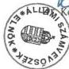
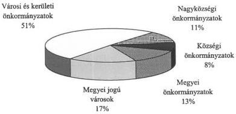
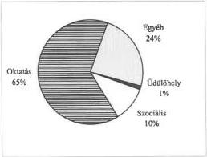
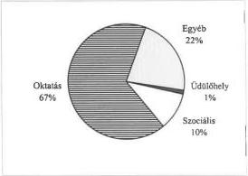
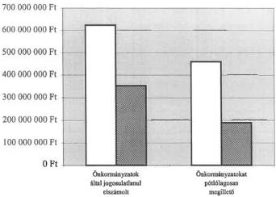

*Állami Számvevőszék*---

# JELENTÉS

**a helyi önkormányzatok 1997. évi  
normatív állami hozzájárulás  
igénybevételének és elszámolásának  
ellenőrzési tapasztalatairól**

---**1998. augusztus**

---

Az ellenőrzés végrehajtásáért felelős:

Dömötör Gyula

számvevő igazgató

Az ellenőrzést vezette:

Csecserits Imréné

régióvezető főtanácsos

A jelentést készítette:

Csecserits Imréné

régióvezető főtanácsos

Ambrus Lajos

számvevő tanácsos

dr. Magyar György

számvevő tanácsos

Németh Gábor

számvevő tanácsos

közreműködésével.

Az ellenőrzésben részt vettek:

Lásd 1. számú mellékletben felsoroltak

---

V-1012-81/1998. TÉMASZÁM: 432

# TARTALOMJEGYZÉK

|  Bevezetés | 3  |
| --- | --- |
|  **I. ÖSSZEGZŐ MEGÁLLAPÍTÁSOK, KÖVETKEZTETÉSEK, JAVASLATOK** | 5  |
|  **II. RÉSZLETES MEGÁLLAPÍTÁSOK** | 11  |
|  1. A normatív állami hozzájárulások 1997. évi feltételeinek kialakítása, központi tervezése | 11  |
|  2. A normatív állami hozzájárulások jogcímeinek, fajlagos összegeinek tervezése | 15  |
|  3. A normatív állami hozzájárulás helyi önkormányzati tervezésének, elszámolásának szabályozása | 17  |
|  4. A normatív állami hozzájárulások tervezésének és elszámolásának helyessége a helyi önkormányzatoknál | 18  |
|  4.1. Általános tapasztalatok | 18  |
|  4.2. Jogcímenkénti tapasztalatok | 21  |
|  4.2.1. Népességszám és idegenforgalmi adó alapján biztosított hozzájárulások | 21  |
|  4.2.2. A helyi önkormányzatok szociális feladataihoz kapcsolódó normatív állami hozzájárulások | 22  |
|  4.2.2.1. Gyermek- és ifjúságvédelem | 22  |
|  4.2.2.2. Bentlakásos és átmeneti elhelyezést nyújtó intézményi ellátás | 22  |
|  4.2.2.3. Nappali szociális intézményi ellátás | 23  |
|  4.2.2.4. Hajléktalanok átmeneti intézményei | 23  |
|  4.2.2.5. Fogyatékosok ápoló-, gondozóotthoni és gyógypedagógiai intézeti ellátása | 23  |
|  4.2.2.6. Bölcsődei ellátás | 24  |
|  4.2.3. A helyi önkormányzatok közoktatási feladataihoz kapcsolódó normatív állami hozzájárulások | 24  |
|  4.2.3.1. Óvodai nevelés | 25  |
|  4.2.3.2. Iskolai oktatás; 1-13. évfolyamokon és iskolai szakképzés | 26  |
|  4.2.3.3. Kollégiumi, externátusi ellátás | 28  |
|  4.2.3.4. Különleges gondozás keretében nyújtott ellátás | 29  |
|  4.2.3.5. Alapfokú művészetoktatás | 30  |
|  4.2.3.6. Egyéb közoktatási hozzájárulások | 31  |
|  4.2.4. Kiegészítő hozzájárulás a nemzeti, etnikai kisebbséghez tartozók óvodai neveléséhez, iskolai oktatásához, továbbá a két tanítási nyelvű középiskolai oktatáshoz | 34  |

Mellékletek: 1-10-ig

1

---

2

---

# Jelentés

# a helyi önkormányzatok 1997. évi normatív állami hozzájárulás igénybevételének és elszámolásának ellenőrzési tapasztalatairól

# Bevezetés

Az Állami Számvevőszék az 1989. évi XXXVIII. számú törvény, valamint az államháztartásról szóló 1992. évi XXXVIII. számú törvény előírásai alapján, az 1997. évi zárszámadási törvényjavaslathoz kapcsolódóan ellenőrizte az 1996. évi CXXIV. törvényben a helyi önkormányzatok részére 1997. évre – felhasználási kötöttség nélkül és felhasználási kötöttséggel – biztosított normatív állami hozzájárulások tervezésének és elszámolásának törvényességét, szabályszerűségét.

A vizsgálat célja annak megállapítása volt, hogy:

- a normatív és az azt kiegészítő (a továbbiakban: normatív) állami hozzájárulások tervezése összhangban volt-e a költségvetési törvény 3. és 8. számú mellékletében foglalt előírásokkal;
- az önkormányzatoknál a tervezés alapját képező mutatószámok, adatok időben megfelelően dokumentálva rendelkezésre álltak-e;
- az önkormányzatok költségvetési szerveinél az elszámolást megelőzően ellenőrizték-e a mutatószámok meghatározásához szükséges nyilvántartások meglétét, adatainak helytállóságát, törvényi előírásoknak való megfelelését;
- a törvényi előírásoknak megfelelő volt-e a normatív állami hozzájárulások igénybevétele és elszámolása.

Tételes helyszíni ellenőrzést folytattunk az önkormányzatok 6,6%-ánál, 213 önkormányzatnál (3 megyei, 3 fővárosi kerületi, 3 megyei jogú városi, 48 városi, 53 nagyközségi 103 községi) és ezen önkormányzatok irányítása alá tartozó szociális és oktatási feladatot ellátó intézménynél. (A vizsgált önkormányzatokat településtípusonként a 2. számú melléklet ismerteti.)

A vizsgálat a helyi önkormányzati hivatalok mellett kiterjedt 1372 önálló költségvetési intézmény és a hozzájuk kapcsolódó 55 részben önálló intézmény által a normatív állami hozzájárulás igényléséhez, elszámolásához adott adatok helyszíni ellenőrzésére, valamint az intézmények részére a normatív állami hozzájárulás igényléséhez jogosultságot jelentő tevékenységek engedélyezettségének és a költségvetési törvényben, valamint ehhez kapcsolódóan az ágazati jogszabályokban előírt feltételek teljesítésének az ellenőrzésére. A vizsgált önkormányzatok által az ellátott feladatokkal összefüggésben igényelhető nor-

3

---

matív állami hozzájárulási jogcímekre teljeskörűen kiterjedt az ellenőrzés. Kivételt jelentett Érd Város Önkormányzata, ahol az ellenőrzési programban – a helyszíni vizsgálatra kijelölt időszak végén érkezett több bejelentésben foglalt kérés alapján – csak a nemzeti, etnikai kisebbséghez tartozók oktatására elszámolt normatív állami hozzájárulásra vonatkozóan végeztünk ellenőrzést.

A vizsgálatot az önkormányzati hivataloknál és intézményeiknél az 1996. és 1997. évi dokumentumok alapján végeztük. A helyszíni ellenőrzést a vizsgálat megkezdését megelőzően kidolgozott részletes útmutatóban foglalt módszertani ajánlás közreadásával segítettük.

**Az ellenőrzésbe bevont önkormányzatok összesen 36,4 milliárd Ft normatív állami hozzájárulásban részesültek.** (Részletezését a 3. számú melléklet tartalmazza.) **Ez az összeg a költségvetési törvényben a helyi önkormányzatok részére ilyen címen tervezett eredeti előirányzat 14,1%-a.**

A vizsgált önkormányzatok kiválasztásánál szerepet játszott az a szempont, hogy 1991. év óta évente más-más településtípusokra koncentrálódott a vizsgálat, így biztosítva, hogy minden önkormányzatra bizonyos időközönként sor kerüljön. 1997. évben a városok, nagyközségek mintegy 25%-ára, valamint a megyei és a megyei jogú városok 15%-ára terjedt ki az ellenőrzés, amelynek során az adott önkormányzat elszámolását teljeskörűen, minden normatív állami hozzájárulási jogcímre kiterjedően vizsgáltuk.

1990. év óta a normatív állami hozzájárulás elszámolását összesen 3.799 önkormányzatnál ellenőriztük, több önkormányzatnál 2-3 alkalommal is. Pl. 1994. évben valamennyi városban vizsgálatot végeztünk, de a többi évben is kitért a vizsgálat a városok 5-10%-ára.

Az ezévben vizsgált önkormányzatoknál a normatív állami hozzájárulás jogcímenkénti összetétele $\pm 2\%$ eltéréssel megegyezik az országos szintűvel (részletezését a 4. számú melléklet ismerteti).

A vizsgálat a normatív állami hozzájárulás legnagyobb (98,6%) részarányát képviselő – feladatmutatóhoz (létszám, férőhely stb.) kötött szociális és oktatási jellegű tevékenységhez kapcsolódó – kiemelt előirányzatok (jogcímek) 14,4%-ára terjedt ki.

A vizsgált önkormányzatok településtípusonkénti összetétele, az ezen önkormányzatokhoz tartozó nagyszámú intézmény és az adott önkormányzatok esetében az ellenőrzés teljes körűségének biztosítása elegendő reprezentációt nyújtott ahhoz, hogy általánosítható megállapításokat tehessünk a normatív állami hozzájárulás 1997. évi elszámolására vonatkozóan.

---4

---

I. ÖSSZEGZŐ MEGÁLLAPÍTÁSOK, KÖVETKEZTETÉSEK, JAVASLATOK

# I. ÖSSZEGZŐ MEGÁLLAPÍTÁSOK, KÖVETKEZTETÉSEK, JAVASLATOK

A helyi önkormányzatok forrás-finanszírozási rendszerének 1990. óra legkarakterisztikusabb eleme mind összegszerűségében, mind jellegében a normatív állami hozzájárulás. Az önkormányzatoknak 1997. évben adott költségvetési támogatások, hozzájárulások 71,6%-át képviseli, azaz a 361,8 milliárd Ft eredeti előirányzatból 259,1 milliárd Ft a normatív állami hozzájárulás.

Az elmúlt négy évben a költségvetési törvényben évente 10-12%-kal emelkedett a normatív állami hozzájárulás összege, amely a helyi önkormányzatok összes bevételeinek évente csökkenő részarányát képviseli. A tényszámok alapján 1994. évben az összes önkormányzati bevétel 30,4%-a, 1997. évben 25,6%-a volt a normatív állami hozzájárulás.

A költségvetési törvényben megállapított eredeti előirányzathoz viszonyítva az önkormányzatok éves elszámolásaikban minden évben visszafizetési kötelezettséget állapítottak meg, amely aránya 1994-96. év között 0,23%; 0,42%, illetve 0,2% volt, jelentősebb a részarány 1997. évben, 0,74%.

Az Állami Számvevőszéki vizsgálatok 1994-97. év között a költségvetési törvényben megállapított eredeti előirányzathoz viszonyítva egyre növekvő arányú visszafizetési kötelezettséget tártak fel. Míg 1994. évben 0,08%, addig 1997. évben 0,63% volt az Állami Számvevőszék vizsgálata szerinti visszafizetési kötelezettség.

Az egyre bonyolultabbá váló igénybevételi, illetve elszámolási módszer a tervezés és elszámolás pontatlanságának fokozódását és a jogosulatlanul igénybe vett normatív állami hozzájárulás növekedését okozta.

Tekintettel arra, hogy ez a hozzájárulási rendszer a helyi önkormányzatokról szóló törvény alapján a forrásfinanszírozás része, ezért indokolatlan a tervezésnél, elszámolásnál tapasztalható azon törekvés, hogy a rendkívül részletes szabályozás révén a feladatfinanszírozás elemei egyre szélesedő körben beépüljenek a normatív állami hozzájárulás rendszerébe.

Az 1997. évi normatív állami hozzájárulás eredeti előirányzata az év folyamán történt lemondások, önkormányzati körön kívülre történt intézmény átadások, valamint központilag engedélyezett kiegészítések következtében 260,9 milliárd Ft-ra módosult. Ez az összeg az 1996. évi módosított előirányzatnál 12,6%-kal magasabb. Az inflációt figyelembe véve megállapítható, hogy a normatív állami hozzájárulások reálértéke a vizsgált évben is tovább csökkent. (A normatív állami hozzájárulás évenkénti költségvetési törvényben megállapított eredeti előirányzatainak 1990-197. évi nominálértékét az 5. számú melléklet tartalmazza.)

A normatív és az azt kiegészítő (továbbiakban együtt: normatív) állami hozzájárulások összegét a központi költségvetési törvény 21 kiemelt előirányzatban (jogcímen) határozta meg. Az önkormányzatok az 1997. évi költségvetési beszámolójuk elkészítése során a feladatmutatóhoz kapcsolt normatív állami

5

---

I. ÖSSZEGZŐ MEGÁLLAPÍTÁSOK, KÖVETKEZTETÉSEK, JAVASLATOK---

hozzájárulásról az elszámolást ennél sokkal részletesebben állították össze. Alkalmazniuk kellett a Pénzügyminisztérium és az érintett ágazati minisztériumok által közösen kialakított csoportosítást, amelyek elsősorban a Művelődési és Közoktatási Minisztérium részére biztosítottak részletes szakmai információkat. A 196 csoportot a költségvetési törvényben meghatározott kiemelt előirányzatok (jogcímek) alábontásával képezték és un. feldolgozási kódszámmal azonosították.

Az 1997. évi költségvetésről szóló 1996. évi CXXIV. számú törvényben (továbbiakban: költségvetési törvény) az egyes jogcímek tervezésére vonatkozó előírásokat az önkormányzati hivatalok – kisebb hibáktól eltekintve – betartották. A Belügyminisztérium és a Pénzügyminisztérium illetékes főosztályai az önkormányzatok tervezéssel kapcsolatos feladatait tájékoztató kiadásával segítették. Az önkormányzatok számára elsősorban bonyolultsága és többletmunkaigénye miatt gondot jelentett a költségvetési törvényben megfogalmazott jogcímeknél sokkal részletesebben kialakított feldolgozási kódszámok alkalmazási kényszere. A normatív állami hozzájárulás rendkívül nagyszámú feldolgozási kódjait az Állami Számvevőszék évek óta folyamatosan kifogásolta, tekintettel arra, hogy a hozzájáruláshoz az önkormányzati törvényben foglaltak alapján a jogcímmel összefüggő felhasználási kötöttség nem kapcsolódik.

A hozzájárulás központi tervezéséhez a közoktatásról szóló 1993. évi LXXIX. törvény (továbbiakban: közoktatási törvény) kötelező jellegű előírást tartalmaz, amely szerint az évenkénti közoktatási célú normatív állami hozzájárulások összege nem lehet kevesebb mint a tárgyévet megelőző második évben a helyi önkormányzatok által – meghatározott számítási mód szerint kiszámított – közoktatásra fordított kiadások 80%-a és el kell érnie az előző évi normatív hozzájárulás összegét. Ezeknek a feltételeknek az 1997. évi eredeti előirányzat megfelelt.

A központi tervezés alapját képező alapadatokat az önkormányzatok hivatalai általában időben, de többnyire nem megfelelően dokumentáltan kapták meg az intézményektől. A hiányosságot elsősorban az okozta, hogy az önkormányzati hivatalok az intézményeik részére nem adtak ki megfelelő intézkedést a jogszabályokban megfogalmazott követelményekkel összhangban lévő adatszolgáltatás elkészítéséhez. Az éves elszámoláshoz bekért adatokra is ugyanez vonatkozik. Az önkormányzati hivatalok nem fordítottak kellő figyelmet arra, hogy az elszámolásba a megfelelő nyilvántartási, statisztikai adatokra épülő mutatószámok kerüljenek.

Az előző években visszatérően tett javaslataink ellenére a közoktatási statisztikai jelentések adattartalma többnyire jelenleg sem alkalmas a normatív állami hozzájárulás túlzottan részletes mutatószámainak képzésére. Legtöbb problémát a közoktatási törvény alapján szervezett oktatás, valamint az egyéb közoktatási hozzájárulások csoportjába sorolt tevékenységek értelmezése okozott.

Az előző évi számvevőszéki ellenőrzések során tett felelősségi felvetések hatására az önkormányzati hivatalok a korábbinál nagyobb arányban, 43%-ban a helyszínen ellenőrizték az intézmények által közölt adatok valódiságát, de az

---6

---

I. ÖSSZEGZŐ MEGÁLLAPÍTÁSOK, KÖVETKEZTETÉSEK, JAVASLATOK

ellenőrzöttség még mindig nem elegendő és a végrehajtott ellenőrzések szakmai színvonala sem volt megfelelő.

A vizsgálati megállapítások szerint a korábbiaknál nagyobb szükség lett volna a helyszíni ellenőrzésekre. A közoktatás területén bekövetkezett nagyarányú változásokat nem, vagy csak jelentős késéssel követő alapnyilvántartások és statisztikai jelentések nem minden esetben voltak alkalmasak a megalapozott tervezéshez és elszámoláshoz.

A normatív állami hozzájárulások összegének tervezése, elszámolása az előző évben megfogalmazott javaslataink ellenére nem egyszerűsödött.

A szociális feladatok közül a gyermek- és ifjúságvédelem jogcím és a fogyatékosok ápoló, gondozóotthoni és gyógypedagógiai intézeti ellátás jogcím alkalmazása okozott gondot. A gyógypedagógiai intézetekben ellátott állami gondozott gyermekek után a költségvetési törvény szerint gyermek- és ifjúságvédelem jogcímen lehetett a hozzájárulást igénybe venni, ennek ellenére általánosan az ápoló-, gondozóotthoni és gyógypedagógiai intézeti ellátás jogcímen igényelték azt. A gyermek- és ifjúságvédelem jogcímű normatív állami hozzájárulást jogszerűtlenül vették igénybe a helyi önkormányzatok az egyházak által fenntartott intézményekben ellátott fogyatékos állami gondozott gyermekek után és az ellátási körből már kikerült, rendszeres segélyezésre nem jogosult fiatalok esetében.

A hiányos jogszabályi előírás miatt nem állapítható meg egyértelműen, hogy ki állapíthatja meg – az értelmi fogyatékosság kivételével – az ápoló-, gondozóotthoni ellátás jogszerű igénybevételét indokló fogyatékosság mértékét.

1997. évben a szociális intézmények működési engedélyét jogszabályi előírás alapján meg kellett újítani. Az ezt megalapozó alapító okirat tartalmi követelményére azonban megfelelően részletezett előírás nincs.

Az egyes iskolatípusokon belüli évfolyambontás, az oktatási törvény szerinti régi rendszerű, és a közoktatási törvény vagy egyedi engedély szerinti új rendszerű elméleti és gyakorlati képzés alapján történő elkülönítés, az „Egyéb közoktatási hozzájárulások” bevezetése, azonos támogatási összegű és jogcímű, de különböző kódszámú hozzájárulási csoportok alkalmazása, egyes normatívák tervezéstől eltérő módszerrel történő elszámolásának előírása, valamint a jogi szabályozás pontatlansága a normatív állami hozzájárulások tervezési, elszámolási és ellenőrzési feladatait nehezítette.

A túlrészletezett csoportok (kódszám) miatt gyakran előfordult, hogy a kódszám téves megállapítása, vagy számítógépes rögzítése (elírás) miatt az önkormányzat által elszámolt teljes összeg az egyik kódszámnál jogtalanná vált, míg másik kódszámon ugyanezt az összeget az önkormányzat részére még járó hozzájárulásként kellett figyelembe venni. Az egymást kiegyenlítő pluszmínusz különbözetek döntően a közoktatási feladatokhoz kapcsolódó jogcímeknél eredményeztek halmazódást. Az oktatási és közoktatási törvény, illetve az egyedi engedély szerinti oktatás felcserélése is gyakran előforduló eltérést okozott.

7

---

I. ÖSSZEGZŐ MEGÁLLAPÍTÁSOK, KÖVETKEZTETÉSEK, JAVASLATOK

A vizsgálat során a nem teljesen egyértelmű szabályozások miatt az önkormányzatok számára kedvezőbb meghatározást tartalmazó előírást vettük figyelembe akkor, ha a különböző jogszabályok között nem volt meg az összhang, valamint elfogadtuk az önkormányzati hivatal számítási módját azokban az esetekben amikor a jogszabályi előírás nem volt egyértelmű. A nem egyértelmű szabályozás következtében a különleges gondozás keretében végzett korai fejlesztés normatív állami hozzájárulás jogcímnél a feladatmutató helyi számítási „hibája” miatt elvonási javaslatot nem tettünk. Az alapfokú művészetoktatási tevékenység alapján igényelhető normatív állami hozzájárulásnál évek óta gondot jelent a képzési követelmény pontos meghatározásának hiánya. Az egyéb közoktatási hozzájárulási jogcím közül az intézményi étkeztetés, a napközis ellátás, az iskolai sportkör, valamint az iskolai könyvtár működtetéséhez kapcsolódó hozzájárulás feltételrendszerének jogszabályi meghatározása pontatlan és félreérthető.

Az 1997. évi költségvetési törvény a nemzeti, etnikai kisebbséghez tartozók óvodai neveléséhez és iskolai neveléséhez, oktatásához, valamint a két tanítási nyelvű oktatáshoz más célra fel nem használható, kiegészítő normatív állami hozzájárulást tartalmaz. A felhasználási kötöttség nincs összhangban a helyi önkormányzatokról szóló törvény 84. §-ában foglaltakkal, amely szerint a normatív költségvetési hozzájárulás felhasználásra vonatkozó kötöttség nélkül megilleti a feladatot ellátó önkormányzatot.

Tekintettel arra, hogy a felhasználási kötöttség nélküli és a felhasználási kötöttséggel járó normatív állami hozzájárulások ugyanazt az intézményi kört érintik, a gyakorlatban a kiegészítő támogatás útja nem követhető nyomon. A csak feladatmutatóhoz kötött hozzájárulásokat az önkormányzatok nem kötelesek átadni a feladatot ellátó intézmények részére, ebből következően jogszerűen nem kifogásolható, ha az intézményeknek adott önkormányzati támogatás kevesebb mint a normatív és az azt kiegészítő hozzájárulások együttes összege. Gondot jelentett továbbá, hogy a felhasználási kötöttség érvényesítéséhez nem került meghatározásra az elszámolható kiadások köre.

**A vizsgált helyi önkormányzatoknál összesen 774.915.856 Ft jogosulatlanul elszámolt és 545.503.602 Ft önkormányzatok részére pótlólagosan még járó normatív állami hozzájárulást állapítottunk meg, amelynek különbsége 229.412.254 Ft.**

A vizsgált 213 önkormányzati elszámolás ellenőrzése során az eltérések egyenlegeként 123 önkormányzatnál 267.191.382 Ft visszafizetési kötelezettséget, 75 önkormányzat esetében pedig 37.779.128 Ft pótlólagosan kiutalandó hozzájárulást tártunk fel. Az ellenőrzés 15 önkormányzatnál az elszámolásban eltérést nem állapított meg.

A jogtalan igénybevételek és a pótlólagos járandóságok egyenlege a szociális feladatoknál 65.885.400 Ft, a közoktatási feladatoknál pedig 163.696.428 Ft.

A vizsgálati megállapítások alapján összesen 25 esetben vetettük fel a jegyző felelősségét az ellenőrzési kötelezettség visszatérő elmulasztása, valamint jogosulatlan állami hozzájárulás igénylése és elszámolása miatt.

8

---

I. ÖSSZEGZŐ MEGÁLLAPÍTÁSOK, KÖVETKEZTETÉSEK, JAVASLATOK

Mindezeket figyelembe véve az Állami Számvevőszék javasolja az Országgyűlés részére, hogy

1. az 1997. évi zárszámadási törvény elfogadása során hagyja jóvá a jelentés 8. számú mellékletében részletezettek szerint az önkormányzatok által a központi költségvetésbe visszafizetendő 267.191.382 Ft-os, illetve az önkormányzatoknak a költségvetésből pótlólagosan kiutalandó 37.779.128 Ft-os összeget.

Az Állami Számvevőszék fontosnak ítéli, hogy a belügyminiszter és a pénzügyminiszter az érintett tárcák bevonásával közösen

1. hozák összhangba a finanszírozási szempontokat a szakmai statisztkai adatszolgál-tatásokat és a költségvetési információs rendszert; ennek során szüntessék meg a szükségtelen párhuzamosságokat és az önkormányzati forrás-finanszírozás szem-pontjából indokolatlan részletezettségü jogcim alabontási rendszert,
2. adjak kozre az allamhaztartasi tórvenyhez kapcsolódo, a vegrehajtast segitó elóirások kozott evente aktualizalva a normativ allami hozzajárulások onkormányzati tervezésenek, elszamolásanak részletes szabályait, valamint határozzák meg az alapnyilvantartásokat;
3. egymás kozott egyezteten alakítsák ki az oktatási és szociális feladatokat egyarant ellátó intézmények muködtétese alapján igényelhető normativ allami hozzájárulás feltételrendszerét (feladatmutatóját).

Az oktatási miniszter

1. biztositsa, hogy a kotelezó tanügy-igazgatási nyilvántartások tartalma legyen alkalmas a finanszirozási kovetelmenyek által igenyelt adatszolgaltatasra;
2. kezdemenyeze 1999. evi koltsegvetesi törvenyjavaslat elokeszitésekor a nem egyertelmü jogcimek tartalmának, igenylésük, elszamolásuk kovetelmenyeinek pontositásat, egyertelmübbe tetelet, különös tekintettel az ovodai nevelés, a szervezzett ektezétés, a napközis ellatás, valamint az iskolai sportköri és konyvtári tevekenységhez kapcsolódo jogcimekre.

A szociális és családügyi miniszter

1. hatarozza meg a normativ allami hozzajárulas elszamolásanál figylembe vehető mozgásfogyatékosság megallapítására iltekesek körét;
2. kezdemenyezen jogszabaly-módositast annak érdekében, hogy a szociális intézmények alapíto okirata pontosan határozza meg az ellatando feladatot.

A helyszíni vizsgálati jelentésekben a megállapítások alapján az önkormányzatok részére az alábbi javaslatok megfogalmazására került sor:

• Fizessék vissza az Országgyűlés döntése alapján az ellenőrzés által feltárt, egyenlegében jogtalanul elszámolt normatív állami hozzájárulás és kiegészítő állami hozzájárulás összegét.

9

---

I. ÖSSZEGZŐ MEGÁLLAPÍTÁSOK, KÖVETKEZTETÉSEK, JAVASLATOK---

- • Vegyék figyelembe a normatív állami hozzájárulások elszámolásánál az éves költségvetési törvény előírásai mellett a szakmai jogszabályok előírásait, a saját ellenőrzéseik megállapításait.
- • Terjesszék ki az ellenőrzést a szakmai jogszabályokban előírt feltételek meglétének ellenőrzésére, valamint az adatrögzítés és feldolgozás helyességének ellenőrzésére is.
- • Vonják be az önkormányzati hivatal közoktatási és szociális területen dolgozó munkatársait a létszám és gondozási napok intézményi jelentéseinek ellenőrzésébe, valamint konkrét normatív állami hozzájárulási jogcím (kódszám) meghatározásába.
- • Ütemezzék úgy az oktatási intézmények létszámadatainak ellenőrzését a tanévnyitó statisztikai jelentések leadását követő időre, hogy az éves beszámoló elkészítéséhez az ellenőrzött adatok időben rendelkezésre álljanak.
- • Gondoskodjanak az egyértelmű intézményi adatszolgáltatás és hasznosítás biztosítása érdekében arról, hogy az egyes adatlapokon – a becsült helyett – a tényleges adat megjelölés és az adatszolgáltatás kelte megjelenjen.
- • Elkülönítve mutassák ki a felhasználási kötöttséggel biztosított normatív állami hozzájárulási jogcímeknél a bevételi és kiadási előirányzatot az önkormányzati költségvetési rendeletekben; a cél szerinti felhasználást elkülönítetten dokumentálják; az erre vonatkozó előírásokat a helyi számlarendben rögzítsék.
- • Éljenek a tárgyév elején felismerhető feladatmutató változások esetén a lemondási lehetőséggel.
- • Adjanak több konkrét segítséget az intézményeiknek a normatív állami hozzájárulások tervezéséhez és elszámolásához.
- • Gondoskodjanak az enyhén értelmi fogyatékos tanulók kijelölt iskolába történő elhelyezése indokoltságának – az áthelyezést követő második tanévben történő – felülvizsgálatáról.
- • Bocsássák ki egységes elvek alapján az önkormányzati fenntartásban működő szociális, valamint gyermekjóléti és gyermekvédelmi intézmények alapító okiratát, továbbá az intézmények különféle alapfeladatai mellett jelenítsék meg az adott feladatok ellátására szolgáló maximális férőhelyszámokat is.
- • Kérjék meg pótlólag a hiányzó intézményi működési engedélyeket és alakítsák ki az előírásszerű működéshez, illetve feladatellátáshoz szükséges személyi és tárgyi feltételeket.

---10

---

II. RÉSZLETES MEGÁLLAPÍTÁSOK

## II. RÉSZLETES MEGÁLLAPÍTÁSOK

### 1. A NORMATÍV ÁLLAMI HOZZÁJÁRULÁSOK 1997. ÉVI FELTÉTELEINEK KIALAKÍTÁSA, KÖZPONTI TERVEZÉSE

Az 1997. évi költségvetési törvény előkészítése keretében a normatív állami hozzájárulások keretösszegeinek és jogcímeinek, valamint az ehhez kapcsolódó fajlagos értékek kialakítása a korábbi évekhez hasonló elvek és módszerek szerint történt. A tervezés során kiemelt jelentősége volt az alábbiaknak:

- az egészségügyi és szociális intézményrendszer struktúrájának átalakítása 1997. évben tovább folytatódott;
- a többször módosított közoktatási törvény 1996. szeptember 1-től hatályos szövege több olyan előírást tartalmaz, amelyet teljes évre vonatkozóan először 1997. évben kellett figyelembe venni;
- ezek együttes hatásaként a helyi önkormányzatoknál a szociális és közoktatási jellegű kiadások számottevő növekedésével kellett számolni.

A szociális intézményrendszernél kiindulási alap volt, hogy az 1997. évi működési feltételeket alapvetően befolyásolta a bővülő ellátások iránt megnyilvánuló növekvő társadalmi igény, amelyet tovább fokozott a kórházi struktúra már folyamatban lévő átalakítása. Az 1997. évi önkormányzati kiadások tervezett 9%-os növekedésén belül prioritást kapott a szociális ágazat, ahol a kiadások csaknem 13%-os növekedésével számoltak. Ennek figyelembevételével kerültek kialakításra az intézményi működéshez kapcsolódó normatív hozzájárulások fajlagos mértékei, amelyek átlagosan 20%-kal, jogcímenként pedig 17-32%-kal emelkedtek.

A fogyatékosok ápoló-, gondozóotthoni és gyógypedagógiai intézeti ellátása jogcímen belül szociális és közoktatási feladat ellátásához is nyújt normatív állami hozzájárulást a költségvetés. Az intézeti ellátás igénybevételéhez a fogyatékosságot meg kell állapítani.

A gyógypedagógiai intézeti ellátást megalapozó szakértői vizsgálat végzésének részletes szabályait a 14/1994. (VI.24.) számú MKM rendelet tartalmazza. A jogszabály kijelöli a szakértői vizsgálat végzésére jogosult intézményeket és meghatározza a szakértői vélemény tartalmi követelményeit.

A szociális ellátást biztosító ápoló-, és gondozóotthonok igénybevételéhez szükséges igazolásokra vonatkozó követelmények több jogszabály hiányosan tartalmazza: 1993. évi III. törvény a szociális igazgatásról és szociális ellátásról, 32/1993. (II.17.) számú Kormányrendelet a gyermeknevelési támogatás megállapításának szabályairól, valamint a szociális ellátások igényléséhez felhasználható bizonyítékokról, 2/1994. (I.30.) számú NM rendelet a személyes gondoskodást nyújtó intézmények szakmai feladatairól és működésük feltételeiről.

11

---

II. RÉSZLETES MEGÁLLAPÍTÁSOK

A normatív állami hozzájárulásra való jogosultság megítélésénél gondot jelentett, hogy az értelmi fogyatékosság kivételével nincs szabályozva ki igazolhatja azt, hogy valaki a fogyatékosságának mértéke alapján ápoló-, és gondozóotthoni elhelyezésre jogosult.

A két ellátás külön jogcímen szerepeltetése indokolt lenne, mivel a szociális intézményeknél a gondozási napok alapján kell a normatív állami hozzájárulás igényléséhez a mutatószámot képezni, a közoktatási intézménynél pedig a két tanév tanévnyitó statisztikai jelentésében szereplő tanulók súlyozott számtani átlagából. A nem egyértelmű jogi szabályozás miatt a nevelést, oktatást végző gyógypedagógiai intézetek az ápoló-, és gondozóotthonokkal azonos módon számítják ki az igénybevételhez szükséges mutatószámot (hallássérültek és beszédfogyatékosok gyógypedagógiai intézetei).

**A közoktatási törvény módosító rendelkezései közül kiemelést érdemel** az államnak a közoktatás finanszírozásában vállalt kötelezettsége, amely szerint

„A helyi önkormányzatok részére biztosított mindenkori éves normatív költségvetési hozzájárulások összege nem lehet kevesebb, mint a tárgyévet megelőző második évben a helyi önkormányzatok által a közoktatásra fordított teljes kiadások – csökkentve a felhalmozási és tőkejellegű kiadások és az intézmények működési célú bevételei, valamint a központosított előirányzatok összegével – nyolcvan százaléka. A normatív hozzájárulások összegének el kell érniük az előző évi normatív hozzájárulások összegét, ...” (közoktatási törvény 118. § (4) bekezdés)

A rendelkezés végrehajtását vizsgálva mindenekelőtt azt kell megállapítani, hogy a fogalmazása nem teljesen egyértelmű. Megítélésünk szerint a jogalkotói szándék kifejezése akkor lenne pontos és következetes, ha:

- kifejezetten a közoktatást megillető részként szerepelne a szövegben az évente minimálisan biztosítandó összeg;
- arról is volna rendelkezés, hogy szükséges-e intézkedés abban az esetben, ha valamelyik garanciális követelmény a tényadatok alapján nem teljesül.

A törvényi előírás figyelembevételével a közoktatási normatív hozzájárulás 1997. évi minimális összege az 1995. évi tényadatok alapján 157,9 milliárd Ft, az 1996. évi tényleges normatív állami hozzájárulás szerint pedig 132,77 milliárd Ft. Az 1997. évi költségvetési törvényben előirányzott összeg 166,5 milliárd Ft, ami 8,6 milliárd Ft-tal (5,4%-kal) haladja meg az alsó határként előírt magasabb értéket, ez esetben a tárgyévet megelőző második évben (1995. évben) a helyi önkormányzatok közoktatási törvény szerint számított közoktatási kiadásának 80% százalékát.

A közoktatási törvény 1996. szeptember 1-től hatályos módosításában meghatározásra kerültek a normatív állami hozzájárulások mutatószámainak kialakításakor figyelembe vehető gyermek, illetve tanulói létszám megállapításának szabályai, különös tekintettel a számbavétel szempontjából kritikus csoportokra pl. alapfokú művészetoktatásban részt vevők létszáma.

**Az egyéb közoktatási hozzájárulási jogcím közül az intézményi étkeztetés, a napközis ellátás, az iskolai sportkör, valamint az iskolai**

12

---

II. RÉSZLETES MEGÁLLAPÍTÁSOK

### **könyvtár működtetéséhez kapcsolódó hozzájárulás feltételrendszerének jogszabályi meghatározása pontatlan és félreérthető.**

Az 1997. évre vonatkozó költségvetési törvény a tervezéstől eltérő elszámolási módot írt elő az étkeztetés és a napközis ellátáshoz kapcsolódó hozzájárulások esetében. A mutatószámokat tervezni a statisztikai jelentésekben szereplő mérési időpontok szerinti létszám 8/12-ed és 4/12-ed része alapján lehetett, az elszámolásnál pedig a tényleges napi igénybevételt kellett figyelembe venni. Ezen előírások betartása automatikusan magában hordozta – a távollévők miatt – a többlet-igénybevételt is. Az elszámolásra vonatkozó szabályozás nem volt egyértelmű. A napközis foglalkoztatás esetében a nehezen értelmezhető „nyilvántartási napok” mint osztószámok mellett az önkormányzatok számára gondot jelentett, hogy a napközis foglalkozásokhoz kapcsolódó kiadások nem a szolgáltatást naponta ténylegesen igénybe vevők létszámától, hanem az igénylések és beiratkozások alapján kialakított napközis csoportok számától függ.

A szervezett étkeztetésnél és napközis foglalkoztatásoknál a feldolgozási kódszámok alapján az egyes oktatási formák szerinti csoportosítás és az állami gondoskodás alatt álló gyermekek, illetve volt gondozott fiatal felnőttek miatti korrekció naponkénti követésének előírása indokolatlan és jelentős adminisztrációs többletterhet jelentett az önkormányzatoknak.

Az iskolai sportköri szolgáltatáshoz kapcsolódó normatív állami hozzájárulás költségvetési törvényben lévő meghatározása ellentmondásos. Nincs összhangban a közoktatási törvény vonatkozó előírásaival. A nem teljesen egyértelmű szabályozás miatt az önkormányzatok számára kedvezőbb meghatározást tartalmazó közoktatási törvényt vettük alapul az ellenőrzés során és az iskolai célokat is szolgáló könyvtárak esetében eltekintettünk a költségvetési törvényben hivatkozott, de részletesen nem kifejtett szakmai feltételek meglétének vizsgálatától a minimális tárgyi feltételek biztosítása esetén. A költségvetési törvényben szereplő megfogalmazásnál félreértésekre adott okot „a könyvtári ellátásához, továbbá az informatikai oktatás megszervezéséhez” feltétel megfogalmazása. Nem egyértelmű, hogy a „továbbá” ebben az esetben mit jelent, valamint kérdéses, hogy az iskolában tanulók közül legalább hány fő részére kell egy tanéven belül megszervezni az informatikai oktatást annak érdekében, hogy a teljes tanulólétszám után elszámolható legyen a hozzájárulás.

**A nemzeti, etnikai kisebbséghez tartozók** óvodai neveléséhez és iskolai neveléséhez, oktatásához, valamint a két tanítási nyelvű oktatáshoz más célra fel nem használható, kiegészítő normatív állami hozzájárulás biztosításának követelményét is tartalmazza a közoktatási törvény. Ezért a nemzeti, etnikai kisebbséghez tartozók részére biztosított nevelési, oktatási tevékenység normatív jellegű támogatása az 1997-es költségvetési törvényben már nem szerepel a felhasználási kötöttség nélküli normatív állami hozzájárulások között, hanem a XI. Belügyminisztérium fejezetben a 23-as címen belül (helyi önkormányzatok támogatásai, hozzájárulásai) a 8. alcímen található.

A felhasználási kötöttségre vonatkozó döntés valószínűsíthetően azt a célt szolgálta, hogy ezt az összeget kizárólag a nemzetiségi kultúra ápolására, a kisebb-

13

---

II. RÉSZLETES MEGÁLLAPÍTÁSOK

ség hátrányos helyzetéből fakadó különbségek mérséklésére lehessen felhasználni.

A törvényelőkészítők is nehezen tudtak helyet találni a költségvetési törvényjavaslatban ennek a közvetlenül a közoktatási normatív állami hozzájárulásokhoz kapcsolódó, de felhasználási kötelezettséggel járó hozzájárulási formának. Ezt az elnevezésének változatossága is jelzi: alcím szerint „kiegészítő támogatás”, a költségvetési törvény 8. mellékletében részletezettek szerint „normatív hozzájárulás” és ez a melléklet nem tartalmazza a felhasználási kötöttséget. A költségvetési törvény 20. §.(1.) bekezdés e) pontjában pedig „felhasználási kötöttséggel járó állami támogatás”-ként szerepel.

A kiegészítő hozzájárulás a közoktatási és a költségvetési törvény szerint felhasználási kötöttséggel járó normatív állami hozzájárulás, s mint ilyen nincs összhangban a helyi önkormányzatokról szóló törvény 84. §-ában foglaltakkal, amely szerint „az Országgyűlés normatív költségvetési hozzájárulást állapít meg a települések lakosságszámával, egyes korcsoportokkal, intézményi ellátottakkal arányosan és egyéb mutatók alapján. A központi költségvetésben meghatározott összeg felhasználásra vonatkozó kötöttség nélkül közvetlenül megilleti a helyi önkormányzatokat, illetőleg a törvény által meghatározott körben a feladatot ellátó önkormányzatot.” Ezért sajnálatos, hogy a felhasználási kötöttségű normatív állami hozzájárulási kör 1998. évben újabb jogcímekkel bővült. Az ilyen típusú támogatások elterjedése aláássa az önkormányzati forrásszabályozás egyik alapelvének a felhasználási kötöttség nélküli normatívításnak az érvényesülését. Amennyiben egyes önkormányzati feladatok, vagy központilag meghatározott célok megvalósításához kíván a költségvetés forrást biztosítani, célszerűbb lenne a feladatfinanszírozás általános követelményeinek megfelelő módszert alkalmazni. (Pl. elszámolható kiadások pontos meghatározása.)

Az önkormányzatok a közoktatási alap- és egyéb kiegészítő normatív állami hozzájárulást felhasználási kötöttség nélkül kapták, emellett intézményeik működési költségeihez maguk is hozzájárultak (1997-ben nevelési, oktatási intézményeknél jelentős mértékű szóródások mellett, átlagosan 30%-ban.)

Miután a felhasználási kötöttség nélküli normatív állami hozzájárulások és a felhasználási kötöttséggel járó kiegészítő támogatások ugyanazt az intézményi kört érintik, a gyakorlatban a kiegészítő támogatás útja nem követhető nyomon. A csak feladatmutatóhoz kötött hozzájárulásokat az önkormányzatok nem kötelesek átadni a feladatot ellátó intézmények részére, ebből követően jogszerűen nem kifogásolható, ha az intézményeknek adott önkormányzati támogatás kevesebb, mint a normatív és az azt kiegészítő hozzájárulások együttes összeg. Gondot jelentett továbbá, hogy a felhasználási kötöttség egyértelművé tétele érdekében nem került meghatározásra az elszámolható kiadások köre, pl. épület-felújítás, -bővítés esetében a kiadások milyen hányada vehető figyelembe.

A felhasználási kötöttségű kiegészítő hozzájárulás esetében – hasonlóan a normatív állami hozzájárulások ellenőrzésének gyakorlatához – az ÁSZ a hozzájárulás igényléséhez és elszámolásához szükséges feltételek meglétét, és az ágazati-szakmai szabályok alapján meghatározott feladatok tényleges ellátását ellenőrizte. Figyelembe vette, hogy az önkormányzati intézmények költség-

14

---

II. RÉSZLETES MEGÁLLAPÍTÁSOK

vetésének, a beszámolójának elfogadása, pénzügyi ellenőrzése a helyi önkormányzatok törvényben előírt kötelezettsége.

## 2. A NORMATÍV ÁLLAMI HOZZÁJÁRULÁSOK JOGCÍMEINEK, FAJLAGOS ÖSSZEGEINEK TERVEZÉSE

Az előző évhez viszonyítva a szociális feladatokhoz kapcsolódó normatív állami hozzájárulások köre a bölcsődei ellátással bővült. Az egyes jogcímek meghatározását tekintve pedig az alábbi helyeken módosult:

- a gyermek- és ifjúságvédelemre vonatkozó rendelkezések kiegészítése alapján a fajlagos érték 20%-a vehető igénybe, ha a sorkatonai szolgálatot teljesítő, korábban gondozott fiatal felnőtt számára ellátást biztosítanak és még nem töltötte be a 24. életévet;
- nappali szociális intézményi ellátásként nappali melegedőt igénybe vevőket akkor is figyelembe lehet venni a taglétszám meghatározásánál, ha 30 napnál folyamatosan hosszabb ideig távolmaradtak;

Jelentősebb mértékben változott a közoktatási célú normatív állami hozzájárulások rendszere. A változtatásokat döntően a közoktatásról szóló többször módosított törvény 1996. szeptember 1-től hatályos rendelkezései miatt kellett végrehajtani. Ettől az időponttól kell pl. kötelezően alkalmazni az új iskolaszerkezetre, ezen belül az iskolai évfolyamok számozására, a csoport- és osztálylétszámokra, a térítési- és a tandíjra vonatkozó rendelkezéseket.

A közoktatási normatív hozzájárulás 1997. évi rendszerében a kiemelt jogcímek un. alap-, egyéb- és kiegészítő jogcím-csoportokat alkotnak.

Az alap-jogcímek között összesen 9 kiemelt jogcím szerepel, nevezetesen: óvodai nevelés; iskolai oktatás 1–6., 7–8., 9–10., 11–13. évfolyamokon; iskolai szakképzés; kollégiumi, externátusi ellátás; különleges gondozás keretében nyújtott ellátás; alapfokú művészeti oktatás. Itt az előző évhez viszonyítva az a legfontosabb eltérés, hogy a középfokú és a szakmai képzésnél elválnak egymástól a hagyományos (oktatási törvény szerinti), valamint az új rendszerű (közoktatási törvény szerinti) képzések, amit a támogatási rendszer is követ és az utóbbiakat preferálja.

Az „Egyéb közoktatási hozzájárulások”-nak nevezett jogcím összesen 15 részből áll: 11 teljesen új (művészeti szakmai vizsgára felkészítés szakiskolában, szakközépiskolában; szakiskolai felzárkóztatás; súlyos beilleszkedési-, tanulási-, magatartási zavarokkal küzdő gyermekekkel való foglalkozás; intézményi étkeztetés, általános iskolában napközis foglalkozás; szülő szervezet-, iskolaszék- és diákönkormányzat működése; iskolai sportkör fenntartása; könyvtári ellátás, informatikai oktatás), 4 pedig az előző évhez viszonyítva a jogosultak körét, vagy tartalmi meghatározását illetően módosult (nem állandó lakóhelyükön óvodába, általános iskolába járók; 3.000 illetve 3.500 fő állandó népességszám alatti települések óvodáinak és iskoláinak támogatása; intézményfenntartó társulások létesítésének ösztönzése).

15

---

II. RÉSZLETES MEGÁLLAPÍTÁSOK

„Kiegészítő hozzájárulások”-ként kerültek meghatározásra a nemzeti és etnikai kisebbséghez tartozók neveléséhez és oktatásához igényelhető normatív hozzájárulások. Itt a korábbi időszakhoz viszonyítva jelentős változás, hogy az igénybevétel felhasználási kötelezettséggel jár és a kistelepülések kis intézményei külön hozzájárulást vehetnek igénybe a nemzeti, etnikai kisebbséghez tartozók óvodai neveléshez és iskolai oktatáshoz, valamint a cigány kisebbséghez tartozók esetén további feltétel, hogy legalább heti 6 tanórai vagy tanórán kívüli foglalkozást biztosítsanak a program megvalósításához. Nem jár hozzájárulás abban az esetben, ha az óvoda, általános iskola olyan településen működik, amelyen nem alakult helyi kisebbségi önkormányzat, illetve nincsen kisebbségi szószóló, kivéve ha legalább nyolc ugyanahhoz a nemzeti, etnikai kisebbséghez tartozó szülő kezdeményezte az óvodai nevelés, iskolai oktatás indítását. Ha az óvoda, iskola olyan településen működik, amelyen nem alakult helyi kisebbségi önkormányzat, illetve nincsen kisebbségi szószóló, a hozzájárulás az előzőekben meghatározott feltételek fennállása esetén is csak akkor vehető igénybe, ha az országos kisebbségi önkormányzat véleménye alapján az nemzeti, etnikai kisebbségi feladatot lát el.

A szociális feladatokhoz kapcsolódó fajlagos hozzájárulási mértékek differenciált emelésével a szociális intézmények közötti fedezeti aránytalanságok mérséklését, valamint a szociális kiadások tekintetében az önkormányzatok között mutatkozó különbségek miatti hátrány csökkentését kívánták elősegíteni. E célkitűzés érdekében a kisebb arányú emelés a hajléktalanok átmeneti intézményeinél, valamint a fogyatékosok ápoló-, gondozóotthoni és gyógypedagógiai intézeti ellátásánál, jelentősebb pedig a nappali szociális intézményi ellátásnál történt.

A közoktatáshoz kapcsolódó fajlagos értékek meghatározásakor a kiindulási alapot a közoktatási törvényben előírt kötelezettségek teljesítésének igénye jelentette.

A közoktatási jogcímek szerinti fajlagos mértékek kialakításához a Művelődési és Közoktatási Minisztériumban először egy un. alapnormatívát, majd az egyes jogcímeknek az alapnormatívához, illetve egymáshoz viszonyított értékét határozták meg. Mindezt a komplex rendszereknél alkalmazott elemzési, értékelési és számítási módszereket alkalmazva, az igények és a korlátok fokozatos közelítése alapján sok változatban végezték el. A költségvetési törvényben elfogadott fajlagos értékek a 18. változatnak megfelelően elvégzett számítás eredményét rögzítik. Itt az alapnormatíva összege 65.000 Ft/fő, amely megközelíti az általános iskola 1–6. évfolyama 64.000 Ft/fős fajlagos értékét. A szélső értékek a következők: kollégiumi, externátusi ellátás 126.000 Ft/fő; szülői szervezetek, és/vagy iskolaszékek működése 50-50 Ft/fő.

A közoktatási feladatokhoz kapcsolódó jogcímek szerkezetében végrehajtott viszonylag jelentős változást is jelzi, hogy pl. a megközelítően alapnormatívának számító általános iskolai oktatás 1–6. évfolyamán a hozzájárulás 1996. évi mértékének növekedése csak 12-13 %-os volt, az együttes összeg 25-26%-os növekedésével szemben.

16

---

II. RÉSZLETES MEGÁLLAPÍTÁSOK

### 3. A NORMATÍV ÁLLAMI HOZZÁJÁRULÁS HELYI ÖNKORMÁNYZATI TERVEZÉSÉNEK, ELSZÁMOLÁSÁNAK SZABÁLYOZÁSA

**A költségvetési törvényben foglalt előírások mellett a szociális és közoktatási jogszabályok részletes ismeretére és körültekintő alkalmazására volt szükség az 1997. évi hozzájárulás tervezéséhez és elszámolásához.** Ugyanakkor a szabályozásban több pontatlanság tapasztalható a létszám-számítások, az alap-, egyéb és kiegészítő normatív állami hozzájárulások tekintetében.

Pl. A közoktatási törvény 1. számú mellékletének második része a 100%, vagy 50%-os jogosultságra vonatkozóan az „igényli”, illetve „veszi igénybe” megfogalmazást használja, így továbbra sem egyértelmű az óvodai ellátottak után járó hozzájárulás igénybevételi feltételének szabályozása. A jogosultsági előírás pontatlansága 1997-ben is bizonytalanságot okozott az elszámolás, illetve az ellenőrzés során. Az 1998. évi költségvetési törvény ezt a pontatlanságot megszüntette.

Az önkormányzatok költségvetésének tervezését segítő tájékoztató elkészítésében az Népjóléti Minisztérium nem vett részt. A Művelődési és Közoktatási Minisztérium által összeállított létszám-felmérő adatlapokat a Belügyminisztérium és a Pénzügyminisztérium illetékes főosztályai küldték ki az önkormányzatoknak. Az önkormányzatok által kitöltött és visszaküldött adatszolgáltatásban lévő feladatmutatók és mutatószámok alapján, az 1997. évi költségvetésről szóló törvény 3. és 8. számú mellékletei szerint kiszámított normatív állami hozzájárulásokat önkormányzatonként és ezen belül jogcímenként részletezve az 1/1997. (I.28.) számú BM–PM együttes rendeletben tették közzé. A közzététel segítette a helyi önkormányzatoknál a költségvetés előkészítésével kapcsolatos feladatok végrehajtását és a külön törvényben szereplő információszolgáltatási kötelezettség határidőben történő teljesítését.

A normatív állami hozzájárulás elszámolásához az 1997. évi költségvetési beszámoló elkészítését szolgáló pénzügyminisztériumi tájékoztatóban leírtak tartalmaztak útmutatást, azonban ez a gyakorlatban kevésnek bizonyult.

A fenti tájékoztatókkal kapcsolatban megjegyzést érdemel, hogy a létszámfelmérő adatlapok és az év végi elszámoláshoz kiadott kódjegyzékek tartalma nem volt teljesen összhangban a közoktatási törvény vonatkozó előírásaival. Pl. a közoktatási törvény szerint meghatározott esetekben a gyermek és tanulólétszám felezése-harmadolása helyett a fajlagos hozzájárulások felezésére harmadolására került sor. A kétféle számítási mód ugyanazt az eredményt adja, azonban több önkormányzat mindkét előírásnak eleget kívánt tenni és a létszám elosztása mellett a már arányosan csökkentett fajlagos értékkel számolt. További hiányosságként kell megállapítani, hogy az elszámoláshoz nem került kiadásra létszámfelmérő adatlap. Ezt az önkormányzatok az 1998. évi tervezéshez kapott nyomtatványok felhasználásával igyekeztek pótolni, ami az 1997. évi szabályokhoz viszonyítva bekövetkezett változások miatt nem volt megfelelő.

17

---

II. RÉSZLETES MEGÁLLAPÍTÁSOK

## 4. A NORMATÍV ÁLLAMI HOZZÁJÁRULÁSOK TERVEZÉSÉNEK ÉS ELSZÁMOLÁSÁNAK HELYESSÉGE A HELYI ÖNKORMÁNYZATOKNÁL

### 4.1. Általános tapasztalatok

A normatív állami hozzájárulások mutatószámainak és összegeinek tervezése, elszámolása az előző évben megfogalmazott javaslataink ellenére nem egyszerűsödött.

A Művelődési és Közoktatási Minisztérium a normatív állami hozzájárulási jogcímeken belül túlzott részletezettségű elszámolási rendszer kialakítását évek óta szorgalmazta. Ennek eredményeként az igénybe vett hozzájárulás elszámolásánál kötelezően alkalmazni kellett a kialakított, bonyolult csoportosítást. A jogcímeken belüli részletes információkat biztosító csoportok un. feldolgozási kódszámokat kaptak. A csoportokat nevelési, oktatási intézménytípusonként alkalmazott oktatási programonként, valamint a nevelt, oktatott, ellátott létszám szakmai szempontok szerint elkülönített csoportosítása és a települések népességszáma alapján alakították ki. Tehát a költségvetési törvényben meghatározott 21+4 igénybevételi csoportnál (jogcímnél) sokkal több, 196 csoport szerinti elszámolási kötelezettséget írt elő a Pénzügyminisztérium.

Pl. a 9-10. évfolyamokon történő iskolai oktatás hozzájárulási jogcímén belül 10 különböző kódszám biztosítja azt az információt, hogy hány magántanuló és vendégtanuló vesz részt a különböző típusú oktatási intézményben.

Hasonló a tapasztalat a különleges gondozás keretében nyújtott gyógypedagógiai ellátásnál, amely a költségvetési törvény 3. számú mellékletében egy jogcím alábontásaként jelenik meg. Az előírt csoportosítási rendszerben azonban 18 kódszám alkalmazása biztosított további szakmai információt az ellátást nyújtó intézmények típusáról, az ellátottak korösszetételéről, az ellátottak szolgáltatással szembeni igényéről, az ellátottak tanulói jogviszonyáról, az ellátást nyújtó oktatási intézmények által alkalmazott oktatási programról. Ezeket az információkat ennél a jogcímnél a közoktatási hozzájárulások összes kódszámainak 10%-a nyújtja, ugyanakkor az óvodai, iskolai nevelésben, oktatásban részesülők mindössze 2,5%-ára vonatkoztak az adatok a vizsgált önkormányzatoknál. Erre a kis létszámra a 18 féle csoport (kódszám) kialakítása túlzott és indokolatlan.

Ezen szakmai szempontból fontos információkat az elrendelt statisztikai jelentések is tartalmazzák, illetve tartalmazhatják, szükségtelen a párhuzamosság kiépítése az egyébként felhasználási kötöttség nélküli, normatív finanszírozási rendszerben.

Az egyes iskolatípusokon belüli évfolyamszámozás, az oktatási törvény szerinti régi rendszerű, és a közoktatási törvény vagy egyedi engedély szerinti új rendszerű elméleti és gyakorlati képzés alapján történő elkülönítés, az „Egyéb közoktatási hozzájárulások” bevezetése, azonos fajlagos támogatási összegű és jogcímű, de különböző kódszámú hozzájárulási címek alkalmazásai, egyes normatívák tervezéstől eltérő módszerrel történő elszámolásának előírása, valamint a jogi szabályozás pontatlansága a normatív állami hozzájá-

18

---

II. RÉSZLETES MEGÁLLAPÍTÁSOK

## **rulások tervezési, elszámolási és ellenőrzési feladatait jelentősen megnehezítette.**

Az önkormányzati igény megállapítása érdekében az intézmények megkapták a Művelődési és Közoktatási Minisztérium által összeállított közoktatási létszámfelmérő adatlapokat és a kapcsolódó segédleteket, illetve a nem közoktatási jogcímű normatív hozzájárulások (gondozási napok) felmérő lapjait.

A létszám megállapításának közoktatási törvényben foglalt szabályozásához azonban nem kapcsolódott az intézményi statisztikákban szereplő adatrendszer felülvizsgálata és megfelelő módosítása. Így a szakmai statisztikák adattartalma még jelenleg sincs összhangban az ágazati jogszabályok és a költségvetési törvény előírásaival.

Pl. a közoktatási törvényben foglaltak alapján a statisztikai jelentések adattartalmának módosítására még nem került sor; az óvodai statisztikában a napi 5 óránál rövidebb időre óvodát igénybe vevők létszáma szerepel, ugyanakkor az 1996. szeptember 1-től hatályos közoktatási törvény alapján a napi 6 óránál kevesebb időre óvodai ellátást igénylők (akik ebéd után nem igénylik a foglalkoztatást) létszámát kell figyelemmel kísérni, nyilvántartani.

A statisztikai jelentések adatainak részbeni felhasználásával történt az intézményi adatok felülvizsgálata. A szükséges korrekciókat az önkormányzati hivatalok az intézményekkel közösen végezték el. A kisebb községi önkormányzatoknál csak önkormányzati szintű adatlap készült.

A létszámfelmérések alapossága ellenére a normatív állami hozzájárulások tervezése és igénybejelentése egyes jogcímeknél nem volt kellően megalapozott a rendkívül bonyolult szabályozás és a hiányos, az intézményi adatszolgáltatás, valamint az önkormányzati szakterületek közreműködésének hiánya, de különösen a csak alulról építkező tervezés miatt.

**A vizsgált önkormányzatoknál a tervezett normatív állami hozzájárulás összege 0,63%-kal haladta meg az Állami Számvevőszék által felülvizsgált és jogosnak minősített összegeket. (Lásd 6. számú melléklet) Ez az arány a korábbi években tapasztalt eltérésekhez viszonyítva emelkedést jelent, amelyet elsősorban az oktatási és közoktatási törvény szerinti oktatáshoz kialakított eltérő fajlagos hozzájárulási összegek téves alkalmazása okozott.**

A helyi önkormányzatok egyes tervezett normatív állami hozzájárulások összegét 1997. december hóban felülvizsgálhatták, pótigényt jelenthettek be. Ezt is figyelembe véve az önkormányzatok saját elszámolása szerint emelkedett az évközben igénybe vett összeghez viszonyítva a visszafizetendő normatív állami hozzájárulás aránya.

A normatív állami hozzájárulás 1997. évi elszámolásához szükséges adatokat az önkormányzati hivatalok többsége az 1997. évi tervezéshez központilag kialakított formanyomtatványokon kérte be az intézményektől. Az intézményi adatszolgáltatásokban emiatt a becsült feliratú oszlopban tényadatok szerepeltek úgy, hogy sok esetben az adat-megállapítás és adatszolgáltatás kelte nem

19

---

II. RÉSZLETES MEGÁLLAPÍTÁSOK

volt feltüntetve. A tervezéstől eltérő tartalmú elszámolási igényre általában nem tértek ki a körlevelekben az önkormányzati hivatalok. A községi polgármesteri hivatalok esetében még mindig gyakori a dokumentálatlan, szóbeli adatbekérés.

**Az előző években végzett számvevőszéki ellenőrzések során tett felelősségi felvetések hatására az önkormányzati hivatalok a korábbinál nagyobb arányban, 43%-ban a helyszínen ellenőrizték az intézmények által közölt adatok valódiságát és egy-egy önkormányzat az intézményeinek átlag 36%-át ellenőrizte. Az ellenőrzött intézmények 40%-ánál az elszámoláshoz szolgáltatott adatoknál hiányosságot állapítottak meg az önkormányzati hivatalok. Az ÁSZ az 1997. évi elszámolás vizsgálata során az előző években tapasztaltaknál nagyobb arányú eltérést tárt fel, tehát az ellenőrzöttség még mindig nem kielégítő sem a gyakoriság, sem a szakmai színvonal tekintetében.**

A nagyobb önkormányzatoknál vizsgálati program és megbízólevél is készült az ellenőrzéshez. A vizsgálati jegyzőkönyvek egy része egyben adatszolgáltatást pótló adatfelvételt tartalmazott, míg más esetekben csak az intézményi jelentésben foglaltakhoz viszonyított eltéréseket rögzítették.

A tervezéshez és elszámoláshoz adott intézményi adatszolgáltatást számszaki, tartalmi, szakmai szempontból csak kevés önkormányzatnál ellenőrizték az oktatási, illetve a szociális ügyeket ellátó hivatali szervezetek szakemberei.

A községi önkormányzatoknál általában a jegyző és a gazdálkodási főelőadó végezte az ellenőrzést. Vizsgálati program nem készült, az ellenőrzött, jegyzőkönyvezett adatok szolgáltak az elszámolás alapjául.

Az ellenőrzés esetenként formálissá vált azáltal, hogy az intézmények éves elszámoláshoz adott hibás adatszolgáltatását nem vetették össze a korábban már ellenőrzött statisztikai jelentés adataival. Így a végrehajtott ellenőrzés ellenére ellenőrizetlen adatokon alapult a normatív állami hozzájárulás elszámolása.

**Az önkormányzati hivatalok az előírt határidőn belül elkészítették a normatív állami hozzájárulásokkal kapcsolatos elszámolásaikat és azokat az éves költségvetési beszámoló keretében benyújtották a TÁKISZ-okhoz, illetve a FÁKISZ-hoz. Az általuk megállapított eltérések összesített adatait az 5. számú melléklet tartalmazza.**

Az utóbbi években egyre erőteljesebben érződik a települési önkormányzatok azon törekvése, hogy a térségi feladatokat ellátó intézményeiket a megyei önkormányzatoknak átadják.

A részleges állami finanszírozás miatt a települési önkormányzatok a szociális és középfokú oktatási intézmények megyei önkormányzatok részére történő átadásával a finanszírozási gondokat és működési forráshiányt is megyei önkormányzatokhoz telepítették át. Az átvett többletfeladatok a vizsgált megyei önkormányzatok részére hátrányos pénzügyi helyzetet okoztak.

A helyi önkormányzatokról szóló törvény 1. § (5) bekezdése – amely szerint „a kötelezően ellátandó önkormányzati feladatok és hatáskörök meghatározásá-

20

---

II. RÉSZLETES MEGÁLLAPÍTÁSOK

val egyidejűleg az Országgyűlés biztosítja az ellátásukhoz szükséges anyagi feltételeket, dönt a költségvetési hozzájárulás mértékéről és módjáról” – ezeknél az önkormányzatoknál nem érvényesült kielégítően. A feladatátvállalást követte ugyan az ehhez kapcsolódó normatív állami hozzájárulás, azonban az intézmények működtetéséhez ennek kiegészítése vált szükségessé, amely finanszírozási gondokat okozott a megyei önkormányzatok számára.

## 4.2. Jogcímenkénti tapasztalatok

**Az önkormányzati elszámolásokban szereplő adatokhoz viszonyítva a vizsgált körben összesen 774.915.854 Ft jogtalanul elszámolt, valamint az önkormányzatokat pótlólagosan megillető 545.503.602 Ft hozzájárulást állapítottunk meg, amelynek különbözete 229.412.254 Ft.**

A költségvetési törvényben meghatározott normatív állami hozzájárulási jogcímek (kiemelt előirányzatok) alábontásával kialakított kódszámonkénti elszámolást az áttekinthetőség érdekében jogcímenként és önkormányzatonként összevontuk. Az összevonás során az alábontott jogcímek esetében az egyes kódszámokhoz kapcsolódóan feltárt (±) eltérések egymást részben ellentételezték. Ezért a jogcímenkénti és önkormányzatonkénti együttes eltérések összege alacsonyabb, mint a kódszámonkénti részletezésű eltérés, azonban az eltérések különbözete a kétféle kimutatásban megegyező (a jogcímenkénti és önkormányzatonkénti eltérést a 10. számú melléklet tartalmazza).

**A vizsgálati megállapítások alapján a jogcímenkénti és önkormányzatonkénti javasolt elvonásokról és az önkormányzatok részére járó további hozzájárulások összegéről a csatolt mellékletek tájékoztatást nyújtanak, ezért az eltérések okainak részletezésénél az érintett önkormányzatok ismételt felsorolásától eltekintettünk.**

### 4.2.1. Népességszám és idegenforgalmi adó alapján biztosított hozzájárulások

**Az önkormányzatoknál az 1996. január 1-i állandó népességszám alapján igénybe vett normatív állami hozzájárulási jogcímeket** (települési, igazgatási, kommunális és sportfeladatok, szociális és gyermekjóléti feladatok, helyi közművelődési feladatok) nem érintette a vizsgálat, mivel ezekhez **nem kapcsolódott elszámolási kötelezettség**, az összeg automatikusan megillette az önkormányzatokat.

Az üdülővendégek tartózkodási ideje alapján beszedett idegenforgalmi adó minden forintjához a normatív állami hozzájárulási rendszer kialakítása, azaz 1990. év óta minden évben 2 Ft hozzájárulást számolhatnak el az önkormányzatok. Ez a normatív állami hozzájárulási rendszer egyetlen, évek óta változatlan eleme. Ezen a jogcímen 1997. évben 2.813 millió Ft volt a költségvetés eredeti előirányzata.

Az ellenőrzött önkormányzatok közül 34-nél került sor ilyen jogcímen hozzájárulás elszámolására.

21

---

II. RÉSZLETES MEGÁLLAPÍTÁSOK---

A vizsgálat során mindössze hat polgármesteri hivatalnál tapasztaltunk nem megfelelő elszámolást. Az eltérést az okozta, hogy helytelenül nem a beszedett, hanem a tárgyévben a költségvetési számlára átutalt összeget vették figyelembe az elszámolásnál, illetve a késedelmi pótlék és mulasztási bírság összegét is beszámították a hozzájárulás alapjába.

### 4.2.2. A helyi önkormányzatok szociális feladataihoz kapcsolódó normatív állami hozzájárulások

A helyi önkormányzatok szociális feladatait ellátó intézmények működtetéséhez a költségvetési törvény eddig minden évben – változó tartalommal – biztosított normatív állami hozzájárulásokat. Az 1997. évi költségvetési törvény a normatív állami hozzájárulási alcímen belül hat jogcímen (kiemelt előirányzatként) feladatmutatóhoz kötötten 27.559 millió Ft-ot, valamint a települések állandó népességszáma alapján 57.325 millió Ft eredeti előirányzatot tartalmazott.

A szociális feladatokhoz kapcsolódóan elszámolt normatív állami hozzájárulási jogcímeknél összesen 54.885.400 Ft jogtalan igénybevételt állapítottunk meg az elvonások és többletjogosultságok egyenlegeként.

A szociális ellátást nyújtó intézmények alapító okiratai az intézmények alapfeladatait gyakran csak általánosságban határozták meg, így nem egyértelmű, hogy milyen jogcímen vehetik igénybe a normatív állami hozzájárulást, valamint az ellátottak felvétele milyen szakértői vélemény megléte esetén jogszerű. Az alapító okiratok többnyire nem tartalmazzák az intézményi férőhelyeinek számát. Célszerű volna az alapító okiratok részletes tartalmi követelményeit jogszabályban meghatározni.

#### 4.2.2.1. Gyermek- és ifjúságvédelem

A hozzájárulás az állami gondoskodás keretében állami, vagy intézeti nevelésbe vett, valamint intézetben elhelyezett és ideiglenes hatállyal beutaltak után illeti meg a GYIVI-t fenntartó önkormányzatot, amennyiben a regisztráción kívül az ellátást is önkormányzati intézmény nyújtja.

A vizsgálat során a sorkatonai szolgálatot teljesítőknél a szabadságok és eltávozások esetében a nevelőotthonban töltött idő kétszeres figyelembevételét tapasztaltuk. Eltéréseket okozott a rendszeres segélyezésre nem jogosult nagykorúak utáni gondozási nap elszámolása, valamint a nem önkormányzati – pl. egyházi – fenntartású intézményben nyújtott ellátás gondozási napjainak figyelembevétele.

#### 4.2.2.2. Bentlakásos és átmeneti elhelyezést nyújtó intézményi ellátás

A hozzájárulást a költségvetési törvényben meghatározott ápolást, gondozást nyújtó otthonokban, rehabilitációs intézményekben, valamint a gyermekek, az időskorúak és a fogyatékosok átmeneti elhelyezését biztosító intézményekben ellátottak után igényelheti az önkormányzat.

---22

---

II. RÉSZLETES MEGÁLLAPÍTÁSOK

Az 1997. évi ellenőrzésnél a megfelelő intézményalapító okirat és az előírt tárgyi és személyi feltételek betartásának hiánya miatt működési engedély nélkül üzemelő intézmények okoztak gondot jellemzően. A már előző években is működő intézmények esetében, amelyek a működési engedélyt az előírt határidőben megkérték, a hozzájárulás elszámolását jogszerűnek tekintettük akkor is, ha az engedélyt még 1997. évben nem kapták meg. Ezen túlmenően a vizsgálat során tapasztaltuk, hogy naponta bejárók után is számoltak el e jogcímen hozzájárulást, valamint helytelenül a férőhelyek száma és nem a ténylegesen teljesített gondozási nap alapján készítették az elszámolást.

#### 4.2.2.3. Nappali szociális intézményi ellátás

A hozzájárulás az időskorúak, a fogyatékosok, a szenvedélybetegek és a hajléktalanok nappali intézményeiben ellátottak után illeti meg az önkormányzatokat. Ilyen intézményt 129 vizsgált önkormányzat működtetett. **Ezen önkormányzatok közel felénél (59) állapított meg az elszámolt hozzájáruláshoz viszonyított eltérést az ellenőrzés.**

Típushiba a naponkénti összesített taglétszám helytelen megállapítása volt. A napi taglétszám helyett a naponta étkezőket, vagy a naponta megjelenteket vették figyelembe, a napi taglétszámot nem korrigálták megfelelően a 30 napon túl távollévőkkel, illetve a 30 napi távollét után visszatérőkkel; a csak szociális étkeztetésben részt vevőket is taglétszámban szerepeltették; azokat a napokat is gondozási napoknak számolták el, amely napokon az intézmény szolgáltatást nem nyújtott. További eltéréseket okozott a jogszabályban előírt osztószám (313) helyett a tényleges nyitvatartási napokkal történő osztás, valamint a szükséges tárgyi-személyi feltételek hiánya miatt ki nem adott működési engedély ellenére nyújtott ellátás után is elszámolt normatív állami hozzájárulás.

#### 4.2.2.4. Hajléktalanok átmeneti intézményei

A hozzájárulás a hajléktalanok átmeneti intézményében működő férőhelyek száma alapján illeti meg az önkormányzatokat.

A vizsgált önkormányzatok közül 16 működtetett ilyen feladatot ellátó intézményt és ezek közül kettőnél tapasztaltunk eltérést, amelyet az engedélyezettől eltérő férőhelyszám figyelembevétele, illetve a működési engedéllyel nem rendelkező és a követelményeknek sem megfelelő néhány férőhelyes tanyai szállások utáni jogosulatlan igénybevétel okozott.

#### 4.2.2.5. Fogyatékosok ápoló-, gondozóotthoni és gyógypedagógiai intézeti ellátása

A hozzájárulás a fogyatékos gyermekek, illetve a fogyatékos felnőttek ápoló-, gondozóotthonában, valamint a gyógypedagógiai intézetben ellátottak után illeti meg az önkormányzatot.

A vizsgált önkormányzatok közül 10 működtetett ilyen feladatot ellátó intézményt. Az ellenőrzés négy önkormányzatnál állapított meg eltérést, amelyet jellemzően a gyógypedagógiai intézményben ellátott állami gondoskodás alatt

23

---

II. RÉSZLETES MEGÁLLAPÍTÁSOK

álló gyermek, illetve volt gondozott fiatal felnőttek utáni nem megfelelő jogcímű hozzájárulás elszámolása okozott.

A vizsgálat során kétszeres elszámolást is tapasztaltunk, amikor a nevelőszülőhöz kihelyezett, majd gyógypedagógiai intézeti ellátásra – „általános iskola és diákotthon”-nak elnevezett intézményben – a gyermek után a fenntartó megyei önkormányzat a gyógypedagógiai intézeti (337.300 Ft/fő), valamint a gyermek- és ifjúságvédelmi (330.200 Ft/ellátott) hozzájárulást is elszámolta, annak ellenére, hogy csak az utóbbira volt jogosult.

#### 4.2.2.6. Bölcsődei ellátás

E jogcímen hozzájárulás 1997. évtől kezdődően illeti meg az önkormányzatokat az általuk fenntartott (napos és/vagy hetes) bölcsődében ellátottak után.

**A vizsgált önkormányzatok közül 41 működtetett összesen 78 bölcsődét és a vizsgálat 8 önkormányzatnál állapított meg eltérést az elszámoláshoz viszonyítva.** Az eltérés összege az önkormányzatok által e jogcímen elszámolt hozzájárulás 4,6%-a, amelyet elsősorban a jogszabályban meghatározott osztószám (365 nap) helyett a tényleges nyitvatartási napokkal történt osztás okozott. Az önkormányzatok számára hátrányt jelentett a jellemzően heti ötnapos nyitvatartás esetén a 256 nap helyett a 365 nappal történő osztás előírása.

Az ellátottak számának meghatározására vonatkozó előírást az önkormányzatok kedvezőtlenül fogadták, ugyanis a szolgáltatást a beíratott gyermekekre kell megszervezniük, de csak a ténylegesen bentlévő gyermekeket lehet figyelembe venniük. A betegség, vagy más ok miatt néhány napig távollévőket nem számíthatják be az éves gondozási napokba. Ugyanakkor az ellátással kapcsolatos kiadások többségét – bér, közüzemi díjak stb. – a kisebb távollétek nem befolyásolják.

#### 4.2.3. A helyi önkormányzatok közoktatási feladataihoz kapcsolódó normatív állami hozzájárulások

A helyi önkormányzatok részére a központi költségvetésben 1997. évben a normatív állami hozzájárulás alcímen belül közoktatási célra 163.293 millió Ft a nemzeti, etnikai kisebbséghez tartozók óvodai neveléséhez, iskolai neveléséhez és oktatásához, továbbá a két tanítási nyelvű középiskolai oktatáshoz kiegészítő hozzájárulás alcímen 3.246,8 millió Ft eredeti előirányzat szerepelt.

A helyi önkormányzatok közoktatási feladatainak megvalósításához kialakított intézmények működtetéséhez az állami költségvetésben évente eltérő kiemelt előirányzati megnevezéssel, változó összetételben és tartalommal került meghatározásra a hozzájárulás.

**A normatív állami hozzájárulás alcímen belül 1997. évben 10 jogcímen (kiemelt előirányzaton) 31 alpontra bontottan, valamint a kiegészítő hozzájárulások keretében 4 jogcímen juthattak az önkormányzatok központi költségvetési hozzájáruláshoz. A végrehajtás**

24

---

II. RÉSZLETES MEGÁLLAPÍTÁSOK

## során ehhez 185 feldolgozási kódszám pontos használatára volt szükség.

A vizsgált 213 önkormányzatnál összesen 1.212 iskola, óvoda, kollégium és speciális oktatási feladatokat ellátó intézmény létszámnyilvántartásának, statisztikai jelentésének ellenőrzését végeztük el és foglalkoztunk az intézmények által alkalmazott nevelési-oktatási programok engedélyezettségének vizsgálatával is.

Az intézményi nyilvántartás ellenőrzése során megállapított tényadatokat hasonlítottuk össze az önkormányzati összevont elszámolással. **A közoktatási feladatok hozzájárulási jogcímeinél összesen (elvonások és többlet jogosultságok egyenlegeként) 163.696.428 Ft jogtalan igénybevételt állapítottunk meg.** A 14 közoktatási jogcím közül háromnál – a 9-10. évfolyamon történő oktatásnál, az egyéb közoktatási hozzájárulások gyűjtő címnél, valamint a nemzeti, etnikai kisebbséghez tartozó kis létszámú iskolában történő oktatásnál – az önkormányzatok részére még járó hozzájárulást állapítottunk meg, együttesen 79.954.911 Ft összegben.

A többi jogcímnél, a 9. számú mellékletben részletezettek szerinti különböző nagyságrendű visszafizetési kötelezettséget állapítottunk meg. Kiemelhető nagyságrendű eltérést a 11-13. évfolyamon történő oktatásnál, az iskolai szakképzésnél és az óvodai nevelésnél tapasztaltunk.

### 4.2.3.1. Óvodai nevelés

A hozzájárulás a helyi önkormányzatokat az általuk fenntartott óvodában ellátott óvodáskorúak után illeti meg.

A vizsgált önkormányzatok 96%-a (205)működtetett óvodát. A vizsgált során összesen 481 óvodai létszámnyilvántartás ellenőrzésére került sor. A megállapított eltérések alapján a vizsgált önkormányzatok által e jogcímen elszámolt hozzájárulások 6,8%-ának visszafizetésére tettünk javaslatot, amelyet elsősorban 648 fő jogtalan számításba vétele okozott.

Az eltéréseket a három éves korhatár alatt felvett gyermekek; a felvételre előjegyzett, de ténylegesen óvodába nem járó gyermekek helytelen figyelembevétele; a csoportot váltó gyermekek kétszeres szerepeltetése; a heti 30 óra alatti foglalkoztatásúak heti 30 óra feletti igénylőként történő számításba vétele; az állami gondoskodás alatt álló gyermek esetében előírt korrekció elmaradása; a tervadat változatlan elszámolása; a statisztikai mérési időpont helyett január 1-i létszám figyelembevétele és egyéb számítási hibák okozták.

A heti 30 óra feletti – alatti ellátást igénylők elkülönítése a vizsgálati tapasztalatok szerint túl bürokratikus. Az intézmények a reggeli nyitás időpontjának meghatározásával „dokumentálni” tudják a gyermekek heti 30 óra feletti ellátását akkor is, ha a gyermek ténylegesen csak fél napot van az óvodában.

**Az óvodai létszám megállapításához az előző évi ÁSZ vizsgálati jelentésben is jelzett, a közoktatási törvényben szereplő értelmezhetet-**

25

---

II. RÉSZLETES MEGÁLLAPÍTÁSOK

# len megfogalmazás korrekciójára sajnálatos módon még 1998. évben sem került sor.

Nem egyértelmű a közoktatásról szóló törvény 1. számú melléklete második részében „A normatív hozzájárulás meghatározásakor figyelembe vehető gyermek-, tanulói létszám megállapítása” címen belül az óvodai ellátáshoz kapcsolódó 1/b pontban foglalt előírás.

A tanévkezdés rendjéről szóló miniszteri rendelet szerint a nevelési év szeptember elejétől a következő év augusztus végéig terjedő időszak.

A közoktatáshoz kapcsolódó normatív állami hozzájárulások mutatószámainak tervezése és elszámolása az éves költségvetési törvény előírásai szerint két nevelési illetve oktatási év tanévnyitó statisztika mérési időpontjainak létszámadatából 8/12 rész és 4/12 rész figyelembevételével történik.

A „nevelési év átlaga” megfogalmazás a tapasztalatok szerint gyakran félreértéseket okoz az alábbiak miatt:

- a két mérési időpont adatainak (2/3 és 1/3 arányban) súlyozott számtani átlaga mellett egy időszak – nevelési év – átlaga nem értelmezhető;
- nem lehet tudni, hogy a nevelési év milyen (egyszerű vagy súlyozott számtani harmonikus vagy kronologikus) átlagáról van szó, ez tervezett, vagy tényleges adat-e;
- az egyes évekre vonatkozó elszámolás készítésekor – a naptári év első negyedévében – a figyelembe veendő két nevelési év közül az egyik (amelyik éppen folyamatban van) tényleges átlaga még nem ismert;
- az 1997. évtől közreadott, új felvételi és mulasztási naplókban egy harmadik típusú, un. gondozási napokból számított átlaglétszám szerepel, amelyet csak a nevelési év eltelte után lehet kiszámítani, tehát a költségvetési beszámoló elkészítésekor még nem ismert;
- nem értelmezhető a nevelési év átlagára vonatkozó, előre kért szülői nyilatkozattal kapcsolatos követelmény, amely szerint a szülő beiratkozáskor nyilatkozik, hogy egész napos vagy félnapos óvodai ellátást igényel. Ha korábbi nyilatkozatát meg akarja változtatni, akkor ismételten nyilatkozik. Az óvodai ellátást a szülő esetleg változó igényeit követő módon célszerű megszervezni és rugalmasan biztosítani, nem pedig éves átlagnyilatkozatok alapján.

# 4.2.3.2. Iskolai oktatás; 1-13. évfolyamokon és iskolai szakképzés

A hozzájárulást a helyi önkormányzat az általa fenntartott iskolában – iskolatípustól függetlenül az általános műveltséget megalapozó pedagógiai szakasz időtartama alatt oktatott, valamint az iskolai rendszerű szakmai elméleti és gyakorlati képzésben részt vevők után vehette igénybe.

Ehhez a költségvetési törvény 3. számú mellékletében 12 csoport kialakítására került sor, esetenként azonos fajlagos összegek meghatározása mellett. A kiadott feldolgozási kódszámrendszer 65 különböző további részletezést tartalmaz, amelyek a törvényben megfogalmazottnál sokkal részletesebb információgyűjtési lehetőséget biztosítottak.

26

---

II. RÉSZLETES MEGÁLLAPÍTÁSOK

Összesen 76 esetben került sor az iskolai szakképzéshez kapcsolódó kódszámoknál elszámolt normatív állami hozzájárulás módosításra az alábbi okok miatt.

**A vizsgált önkormányzatok és intézményeik számára nem volt egyértelmű, ezért gyakran félreértésekre adott okot az oktatási törvény és az 1993. évtől fokozatosan helyébe lépő közoktatási törvény alapján történő iskolai oktatás és szakképzés szerinti szétválasztás.**

**A normatív állami hozzájárulás tervezéséhez, elszámolásához az ágazati szabályozás részletes ismeretére és a költségvetési törvényben foglaltakkal összehangolt alkalmazására volt szükség, amelynek az önkormányzatok nem tudtak eleget tenni.**

A túl-részletezettség következtében gyakran előfordult, hogy a kódszám helytelen megállapítása, vagy téves számítógépes rögzítése miatt az önkormányzat által elszámolt teljes összeg az egyik kódszámnál jogtalanná vált, míg más kódszámon ugyanezt az összeget az önkormányzat részére még járó hozzájárulásként kellett szerepeltetni. Az egymást kiegyenlítő plusz-mínusz különbözetek az eltérések felnagyításához vezettek. Leggyakrabban a nappali munkarend szerinti felnőttoktatás nappali rendszerű képzésként történő elszámolását (amely két különböző kódszám, de azonos fajlagos összegű), valamint a 9-10. évfolyami iskolai oktatás helyett a 11-13. évfolyami, illetve szakképzési évfolyami jogcím téves elszámolását tapasztaltuk. Gyakran fordult elő az oktatási és közoktatási törvény, illetve az egyedi engedély szerinti oktatás felcserélése is.

Szinte mindegyik évfolyamon és minden oktatási formánál előfordultak számítási hibák, a tényleges – a jogszabály szerinti időpontban mért – létszámadat helyett a tervezett, vagy más időpontra vonatkozó pl. január 1-i létszámmal, illetve az intézményi statisztikától eltérően történt az elszámolás.

A vizsgálati tapasztalatok szerint az 1-6. évfolyamokon oktatottaknál eltérést a saját elhatározás alapján magántanulók egy részének nappali tanulóként történt figyelembevétele, a beiratkozott, de ténylegesen iskolába nem járó – esetleg nem is tanköteles – gyermekek számításba vétele, megfelelő szakértői és rehabilitációs bizottsági véleménnyel rendelkező tanulóknál téves fajlagos érték elszámolása és az 1-2 fős különbözetek okozták.

A 7-8. évfolyamokon oktatottaknál az eltéréseket a felnőttoktatásban (esti, levelező tagozaton) részt vevők helytelenül nappali rendszerű oktatásnál történt figyelembevétele, a magántanulók nem megfelelő elszámolása okozta, valamint előfordult, hogy a hatosztályos gimnáziumokban a 7-8. évfolyami tanulólétszámnál a gimnáziumokra vonatkozó fajlagos összeggel történt az elszámolás. A vizsgált önkormányzatok közül 56 állapította meg tévesen a 7-8. évfolyamon nappali rendszerű oktatásban részt vevők számát. Az eltérések általában 2-3 főt jelentettek, csupán két önkormányzatnál volt jelentősebb (70-90 fős) különbözet – téves kódszám alkalmazása miatt.

A 9-10. évfolyamon oktatottaknál az eltéréseket az oktatási törvény és a közoktatási törvény szerinti oktatás nem megfelelő minősítése, az esti, levelező és nappali munkarend szerinti felnőttképzés helytelen elszámolása, a szakiskolai és a szakmunkásképzésben részt vevő tanulók oktatási tantervüktől eltérő

27

---

II. RÉSZLETES MEGÁLLAPÍTÁSOK

normatív állami hozzájárulási jogcímnél történt figyelembevétele okozta. Összesen 89 esetben állapított meg eltérést a helyszíni vizsgálat, ennek közel 50%-a az oktatási és a közoktatási törvény téves alkalmazásához kapcsolódott.

A 11-13. évfolyamon történő oktatás esetében az eltéréseket a felnőttoktatásnál a nappali munkarend szerinti és a nappali rendszerű oktatási forma helytelen alkalmazása, a szakközépiskolában a 13. szakképzési évfolyamon új rendszerben oktatottak helytelen kétszeres figyelembevétele, a szakiskolai és szakmunkásképzésben részt vevőknél nem az oktatási tantervnek megfelelő jogcím szerinti fajlagos összeggel történt elszámolása okozta. Összesen 56 esetben állapítottunk meg eltérést, amelyet több mint 50%-ban az oktatási és közoktatási törvény szerinti oktatás téves figyelembevétele okozott.

Az iskolai szakképzés hat alcsoportjánál szintén az oktatási és közoktatási törvény alapján történő oktatás helytelen besorolása okozott eltérést, amelyhez kapcsolódik a gyakorlati oktatás besorolásánál tapasztalt bizonytalanság is. Eltérést okozott továbbá a szakmával már rendelkezők után a másodszakma megszerzéséhez is elszámolt hozzájárulás, kisipari szakmunkásképzés esetében a Művelődési és Közoktatási Minisztérium egyedi engedélyének és a fenntartó hozzájárulásának a hiánya, a négyéves, kétszakmás szakmunkásképzés 11-12. évfolyamán tanulók helytelenül a szakképzési évfolyamon történő szerepeltetése, az érettségizettek részére szervezett szakképzés nem szakképzési évfolyamon történő elszámolása.

A nem teljes tanévű szakképzéshez igénybe vehető normatív állami hozzájárulás kiszámítási módjára vonatkozóan sem a költségvetési törvény, sem a közoktatási törvény nem rendelkezik. Pl. a kisipari szakmunkásképzés „A” óratervi képzési ideje 3,5 év. Az Országos Képzési jegyzék az iskolai rendszerű képzésben a szakképesítés megszerzéséhez szükséges képzés időszakát 0,5 és 3,5 év között határozta meg.

A költségvetési törvény 3. számú mellékletében lévő kiegészítő szabályok 4. pontja szerint a közoktatási célú normatív állami hozzájárulásokkal az elszámolás az intézményi étkezés és a napközis ellátás kivételével a közoktatási statisztikai adatokra és az azt megalapozó tanügyi okmányokra épül. **A statisztikai jelentések adattartalma azonban nem igazodik a normatív állami hozzájárulás jogcíméhez és különösen nem a feldolgozási kódszámokhoz. A statisztikai jelentésekből nem derül ki, hogy a tanulók képzése hogyan oszlik meg az oktatási és a közoktatási törvény szerint. Nem tartalmaz arra vonatkozó adatot, hogy a szakmai képzést szakképzési évfolyamon végzik, vagy oktatási törvény szerinti formában.**

### 4.2.3.3. Kollégiumi, externátusi ellátás

A hozzájárulást a helyi önkormányzat az általa fenntartott iskolai kollégiumban, externátusban ellátottak után veheti igénybe. Ezen a jogcímen 1990. év óta igényelhetnek az önkormányzatok normatív állami hozzájárulást.

A vizsgálat során 42 esetben tapasztaltunk 19 önkormányzatot érintően eltérést az önkormányzati elszámolásoknál. Az eltérést az intézménytípus téves be-

28

---

II. RÉSZLETES MEGÁLLAPÍTÁSOK

sorolása, az externátusi ellátásért térítési díjat fizető tanulók létszámának helytelenül a kollégiumi ellátást ingyenesen igénybe vevők létszámánál történő figyelembe vétele, valamint az állami gondoskodás alatt álló gyermek, illetve volt gondozott fiatal felnőttek utáni helytelen elszámolás okozta.

A kollégiumi ellátás alapdokumentumát, a 11/1994. (VI.8.) MKM számú rendelet 2. számú mellékletében kötelezően alkalmazandóként előírt kollégiumi törzskönyvet az intézmények pontatlanul és hiányosan vezetik, sőt egy intézmény helyette lakónyilvántartó könyvet vezetett.

#### 4.2.3.4. Különleges gondozás keretében nyújtott ellátás

A hozzájárulást az illetékes szakértői és rehabilitációs bizottság szakvéleménye alapján otthoni, vagy intézeti ellátás keretében a gyermekek, tanulók részére végzett meghatározott tartalmú nevelés, oktatás, foglalkozás, felkészítés esetén az intézményt fenntartó és a feladatot ellátó önkormányzat veheti igénybe a jogcímen belül kialakított két fajlagos összeghez kapcsolódó hármas alábontásban meghatározottak szerint.

**A jogcímhez tartozó elszámolás ellenőrzésénél gondot jelentett, hogy a korai fejlesztésben és a fejlesztő felkészítésben részt vevő gyermekek számának megállapítására vonatkozóan a költségvetési törvény előírása nincs szinkronban az ezt végző intézmények által készítendő nyilvántartásokkal, statisztikai jelentések adattartalmával és mérési időszakával.**

A költségvetési törvény 3. számú mellékletében a kiegészítő szabályok h) pontja szerint a közoktatási célú normatív állami hozzájárulásokkal az elszámolás a nevelési-oktatási feladatoknak megfelelő közoktatás-statisztikai adatokra és az azt megalapozó, előírt tanügyi okmányokra épül.

A 14/1994. (VI.24.) számú MKM rendelet tartalmaz előírásokat a képzési kötelezettség megállapításával és az ennek alapján végzendő fejlesztő felkészítés és értékelés elvégzésével, dokumentálásával kapcsolatban. Az ezek alapján készített statisztikai jelentés létszámadataiból nem képezhető a normatív állami hozzájárulás igényléséhez szükséges mutatószám.

A korai fejlesztést és gondozást végző intézmények részére nincs előírva a tanügyi okmányok vezetésének és ez alapján az adatszolgáltatási kötelezettség teljesítésének követelménye. A szakértői és rehabilitációs bizottságok tevékenységéről készített statisztikai jelentés nem alkalmas a tanéváltáshoz igazodóan előírt számítások elvégzésére, mivel nem tartalmazza a korai fejlesztésben és gondozásban – egy meghatározott időpontban pl. október 15-én – részt vevők számát.

A nem egyértelmű szabályozás következtében a különleges gondozás keretében végzett korai fejlesztés normatív állami hozzájárulás jogcímnél a feladatmutató helyi számítási „hibája” miatt elvonási javaslatot nem tettünk.

Eltérések megállapítására került sor, amennyiben a nevelési éven belül sem rendelkezett az intézmény a gyermekekre vonatkozóan az illetékes szakértői bizottság szakvéleményével, vagy a jogszabályban előírtak szerinti legalább heti

29

---

II. RÉSZLETES MEGÁLLAPÍTÁSOK

5 órai felkészítés nem volt biztosított és csupán a családdal kapcsolattartás valósult meg; továbbá, ha az otthoni és intézményi ellátásban korai fejlesztés, gondozás, fejlesztő felkészítés (képzési kötelezettség) elmulasztása ellenére elszámolták a hozzájárulást. Többlet hozzájárulási javaslat megállapítására került sor, amennyiben az illetékes szakértői és rehabilitációs bizottság szakvéleményével rendelkező, de nem külön speciális osztályban tanított fogyatékos gyermek után nem számolták el a hozzájárulást, vagy az igénybevétel feltételeinek megfelelő gyógypedagógiai oktatásban részt vevő gyermekek után nem igényelték a hozzájárulást, vagy nem a lehetőség szerinti hozzájárulást igényelték.

#### 4.2.3.5. Alapfokú művészetoktatás

A helyi önkormányzat az általa fenntartott alapfokú művészetoktatási intézményben oktatott tanulók után – több-tanszakos képzésben történő párhuzamos részvétel esetén is csak tanulónként egyszer veheti igénybe a hozzájárulást.

**A hozzájárulás igénybevételénél évek óta gondot jelent a képzési követelmény pontos meghatározása.** A zenei képzésnél az iskolák által elavultnak tekintett követelmények felülvizsgálatra, korszerűsítésre szorulnak. A táncművészet, képző-iparművészet és színművészet-bábművészet alapfokú művészet oktatásra 1993. szeptember 1-ig – a közoktatási törvény hatálybalépéséig – adhatott az Művelődési és Közoktatási Minisztérium egyedi kísérleti oktatásra engedélyt.

A közoktatási törvény 1996. szeptember 1-től hatályba lépett módosítása egyértelműen kimondta, hogy a követelmények jogszabályban történő megállapításáig alapfokú művészetoktatás (zenei ág kivételével) új tevékenységeként nem indítható. Ennek ellenére a vizsgált önkormányzatok közül öt, az 1996. szeptember 1-et megelőzően hozott önkormányzati döntésre és az ennek alapján történt előkészítő intézkedésre hivatkozva, az 1996. szeptember 1-től hatályos törvényi előírást figyelmen kívül hagyva, beindította az alapfokú művészetoktatást és elszámolta az ezzel kapcsolatos hozzájárulást. Ezek közül négy esetben – ahol más intézmény által korábban készített és jóváhagyatott program átvételével történt az oktatás – a törvény félreérthető megfogalmazása miatt nem kifogásoltuk a normatív állami hozzájárulás elszámolását.

A költségvetési törvény az oktatásban részt vevőkre vonatkozóan érdemleges szabályozást nem tartalmaz, míg a közoktatási törvény 1996. szeptember 1-től hatályos szabályozása a tanítási év első napjáig huszonkettedik életévüket betöltő tanulókat és a hat év alatti életkorúakat kizárja az igényjogosultak köréből. (Közoktatási törvény 1. számú melléklet 2. rész.) Zavart okozott, hogy az október 1-i állapotot tükröző közoktatási statisztikai formanyomtatvány tartalmazza a kis-előképző, óvodások számára tartott előképző, zeneóvoda, dalosjáték foglalkozásokon részt vevők létszámát is.

Előbbiek következtében alakult ki – az ilyen oktatásban részt vevő gyermekeknek más típusú oktatásban részt vevőkhöz viszonyítva nem jelentős létszáma ellenére – a nagy összegű (12.840.000 Ft-os) elvonási javaslat.

30

---

II. RÉSZLETES MEGÁLLAPÍTÁSOK

A legalább heti 4 foglalkozáson részt vevők esetében az érintett önkormányzatok (72) felénél, a heti 4-nél kevesebb foglalkozáson részt vevőknél az érintett önkormányzatok (65) 45%-ánál eltérést állapított meg a vizsgálat. A már ismertetetteken kívül eltérést okozott még a több tanszakos hallgatók helytelen többszörös számításba vétele, a felvételre előjegyzett, de ténylegesen fel nem vett tanulók téves figyelembevétele, az általános iskola zenetagozatos előképzős tanulói után helytelenül a fajlagos hozzájárulás 50%-ának elszámolása, a tanárhiány miatt nem oktatott, de beiratkozott létszám számításba vétele, az első évfolyami létszám 120%-a feletti számban előképzősök oktatása, a heti két foglalkozáson részt vevők után a legalább heti 4 foglalkozáson részt vevők után igényelhető hozzájárulás helytelen elszámolása.

#### 4.2.3.6. Egyéb közoktatási hozzájárulások

**Ezen jogcím keretében a helyi önkormányzatok 15 különféle, az oktatáshoz döntően csak közvetetten kapcsolódó feladat, illetve két esetben a település alacsony népességszáma alapján megállapított normatív állami hozzájárulást vehetnek igénybe, összesen 62 féle feldolgozási kódszám alkalmazásával.**

Az egyéb közoktatási hozzájárulások közül a gyermekek részére étkeztetést, iskolai sportkört és könyvtári ellátást biztosító intézményeket fenntartó önkormányzatok részére összesen 35.393.200 Ft további normatív hozzájárulás biztosítására teszünk javaslatot, amely 108 önkormányzatot érint pozitívan. A helyi önkormányzatok által teljesítendő visszafizetési javaslatot az étkeztetési hozzájárulásnál az intézményi közalkalmazottak (dolgozók) téves figyelembevétele az állami gondoskodás alatt álló gyermekek, illetve volt gondozott fiatal felnőttek utáni jogtalan igénylés miatt tartalmaznak a helyszíni vizsgálatról készített jelentések.

**A vizsgálati tapasztalatok szerint az intézményi étkeztetésben részt vevő gyermekeket, tanulókat az önkormányzatok a nem egyértelmű szabályozás következtében többféle módon vették figyelembe az elszámolásban:**

- az egyes évek oktatási statisztikai jelentésében feltüntetett étkező létszámok 8/12, illetve 4/12 részével számoltak;
- az adatszolgáltatás időpontjában, vagy január 1-én étkezők számát jelentették;
- a tényleges élelmezési napok (befizetett étkezések) alapján számoltak naptári évre;
- az 1996. és 1997. naptári évre számított létszámok 8/12, illetve 4/12 részét adták meg;
- az átlaglétszámot 14 havi étkezés adatából adták meg úgy, hogy 1996. évben 4 hónapot, 1997. évben 10 hónapot vettek figyelembe, de a nyitvatartási napok miatt a torzító hatás a tényleges, számított létszámban nem volt jelentős.

A napközis foglalkozásoknál visszafizetésre vonatkozó javaslatot okozott a bentlakásos (gyógypedagógiai) intézeti ellátás után elszámolt hozzájáruláson túlmenően a napközis foglalkoztatás (és étkeztetés) alapján tévesen elszámolt

31

---

II. RÉSZLETES MEGÁLLAPÍTÁSOK

hozzájárulás (a költségvetési törvény 3. számú mellékletében a 18. j. pont általános iskolában napközis foglalkozáson részt vevő gyermeket tartalmaz, intézeti ellátottakat nem említi.

A költségvetési törvény 3. számú mellékletének 4/B pontja, valamint a 18. i. és j. pontjai alapján el kellett vonni az állami gondoskodás alatt álló gyermekek után elszámolt étkeztetési és napközis hozzájárulási jogcím elszámolását.

**A vizsgálatok során az elvonásra javasolt összegeket az önkormányzati számítási eljárás szerint állapítottunk meg, a számítás módját a nem egyértelmű szabályozás miatt nem vitattuk.**

A nem állami gondoskodás alatt álló gyermekek, illetve volt gondozott fiatal felnőttek esetében szintén nem minősítettük az étkeztetési és a napközis normatíva elszámolásának számítási módját.

**Az általános iskolai napközis foglalkozáson résztvevők létszámát az önkormányzatok és intézményeik különbözőképpen állapították meg.**

- Az egyes tanévek statisztikai jelentésében szereplő napközis tanulólétszámok 8/12 és 4/12 részét vették figyelembe a számított létszámnál.
- Az adatszolgáltatás időpontjában, vagy január 1-én a napközibe beírt tanulók aktuális létszámát jelentették a létszámfelmérő adatlapokon.
- A napközis létszámot az összes napközis nap és a nyitvatartási napok hányadosa alapján állapították meg. A napközis naplók figyelembevételével a beírt és a hiányzó létszám különbözetének összegei alapján állapították meg a napközis napokat.
- A napközisek átlaglétszámát a naptári év napközis étkezési adagok és a napközis élelmezési napok hányadosa alapján állapították meg.

A fakultatív jelleggel tartott készségfejlesztő foglalkozások napköziként történt elszámolása sem felel meg a közoktatási törvény 53. § (4) bekezdésében foglalt előírásoknak.

A nyolcosztályos gimnázium 5-6. évfolyamán tanulók részére tartott képességfejlesztő foglalkozások – helytelenül – napközis ellátásként történő elszámolása is negatív eltérést okozott.

**A sportköri feladatok ellátása alapján elszámolható hozzájárulás igénybe vehetőségét az önkormányzatok és intézményeik – a költségvetési törvény pontatlan, a közoktatási törvénnyel nem konform előírása miatt – rendkívül eltérő módon értelmezték. Bizonytalanok voltak abban, hogy milyen tanulói kört vegyenek figyelembe a hozzájárulás feladatmutatójának kialakításánál.**

Az önkormányzatok többségénél a teljes iskolai tanulólétszám után történt a fajlagos összeg elszámolása. Ahol a sportköri foglalkozás igénybevételének lehetőségét biztosították, kialakították jogosnak tekintettük a normatív állami hozzájárulás elszámolását.

32

---

II. RÉSZLETES MEGÁLLAPÍTÁSOK

A könyvtári ellátás és az informatikai oktatás megszervezése jogcímnél a pontatlan törvényi megfogalmazás miatt nem kívántuk hátrányos helyzetbe hozni az önkormányzatokat. Ezért a teljes tanulólétszámra vonatkozó igénybevételt fogadtuk el, ha a könyvtári ellátást – akár iskolán belül, akár iskolán kívül – az önkormányzat biztosította a tanulók részére.

**Az informatikai oktatás megszervezését, ha a könyvtári ellátás biztosított volt, nem tekintettük a normatív állami hozzájárulás igénybevételi feltételének, illetve ha informatikai oktatás megszervezésre került akkor könyvtári ellátás nélkül is elszámolhatónak tekintettük a hozzájárulást.**

Ezen jogcímre vonatkozó igénybejelentésnél és elszámolásnál többféle megoldást tapasztalt a számvevőszéki vizsgálat. Az önkormányzatok többsége a teljes tanulólétszámot alapul véve készítette el az elszámolást. Több általános iskolánál csak az elsősök nélküli tanulólétszámmal számoltak („az elsősök még nem tudnak olvasni” jelszóval).

Az egyéb közoktatási hozzájárulások közül a párhuzamos oktatásban művészeti szakközépiskolai szakképzésben részt vevő tanulók utáni hozzájárulásnál, a súlyos beilleszkedési, tanulási, magatartási zavarral küzdő gyermek, tanuló nevelése, oktatása után igénybe vehető hozzájárulásnál, a nem helyben lakó gyermek, tanuló óvodai, általános iskolai nevelése, oktatása után igényelhető hozzájárulásnál, valamint az intézményfenntartó társulások létrehozása alapján elszámolható hozzájárulásnál állapítottunk meg jelentősebb jogtalan elszámolást. Eltérést okozott a művészeti szakmai vizsgára felkészítő szakközépiskolai oktatás elmaradása ellenére történt hozzájárulás elszámolás (az intézményi alapító okiratban sem szerepelt ez a tevékenység); a szükséges nevelési tanácsadói szakvéleménnyel nem rendelkező tanulók esetében is elszámolt hozzájárulás; az érintett intézmények statisztikai jelentésében szereplőnél magasabb létszám alkalmazása az önkormányzati elszámolásban, a közoktatási törvény 34. §-a szerint a megyei pedagógiai szakszolgálat feladatkörébe tartozó logopédiai ellátásban részesülők, valamint fogyatékosok esetében a súlyos beilleszkedési zavarral küzdő gyermek után elszámolható hozzájárulás téves igénybevétele.

A nem helyben lakó gyermek, tanuló óvodai, általános iskolai nevelése, oktatása után igényelhető hozzájárulást az önkormányzatok gyakran a közigazgatási határon belül, de a településközponttól viszonylag nagy távolságra lévő településrészekről bejáró gyermekek után is elszámolták.

**Az intézményfenntartó társulások esetében gondot jelentett az önkormányzatok számára a helyi önkormányzatokról szóló módosított 1990. évi LXV. törvény 43. §-ában foglaltak értelmezése, alkalmazása. Többen nem vették figyelembe, hogy az intézmény alapítás és a költségvetés megállapítására vonatkozó döntés (rendeletalkotás) a települési önkormányzat képviselő-testületének át nem ruházható hatásköre.**

A testületek felhatalmazást adtak a polgármesternek – törvényellenesen átruházták hatáskörüket – az intézmény fenntartásával kapcsolatos kiadások vál-

33

---

II. RÉSZLETES MEGÁLLAPÍTÁSOK

lalására, az intézményi költségvetés elfogadására, előbbiekkel kapcsolatos megállapodás aláírására, függetlenül a költségvetési rendeletük tartalmától. A téves értelmezést elősegíti a költségvetési törvényben, az intézményi költségvetésről szóló döntés írásos megállapodásban történő megengedése, ezáltal ellentmondásos feltételrendszer kialakítása (az önkormányzati társulás helyi önkormányzati törvény szerinti létrehozására, működtetésére vonatkozó követelmény megfogalmazása mellett ezzel összhangban nem lévő tartalmú megállapodás megengedése).

Egyes önkormányzatoknál a közoktatási alapjogcímek mellett az intézményfenntartó társulás, a nem helyben lakó gyermekek, valamint a 3000, illetve 3500 fő alatti népességszám után elszámolható hozzájárulások együttes összege meghaladta az intézmény tervezett kiadásainak együttes összegét.

#### **4.2.4. Kiegészítő hozzájárulás a nemzeti, etnikai kisebbséghez tartozók óvodai neveléséhez, iskolai oktatásához, továbbá a két tanítási nyelvű középiskolai oktatáshoz**

A helyi önkormányzatok az 1997. évi költségvetési törvény 8. számú mellékletében foglaltak szerint a 3. számú mellékletben meghatározott hozzájárulások mellett kiegészítő normatív állami hozzájárulást igényelhettek az általuk fenntartott nevelési-oktatási intézményben a nemzeti, etnikai kisebbséghez tartozók részére szervezett óvodai neveléshez, iskolai neveléshez és oktatáshoz, valamint a két tanítási nyelvű középiskolai oktatáshoz a költségvetési törvény 20. § (1) bekezdés e) pontjában, valamint a közoktatási törvény 1. számú mellékletének 2. rész 4. pontjában előírt felhasználási kötöttség mellett.

#### **A szabályozás nem terjedt ki arra, hogy milyen kiadási tételek számolhatók el e támogatási előirányzatok terhére.**

A költségvetési törvény 8. számú mellékletében foglaltak alapján a helyi önkormányzatok négyféle normatív állami hozzájárulási jogcímen, 16 feldolgozási kódszámon számolhattak el hozzájárulást.

Az önkormányzatok az 1997. évi költségvetési rendeletükben, vagy annak módosításaiban a felhasználási kötöttséggel kapott források és kapcsolódó kiadási előirányzatok elkülönítéséről többnyire nem gondoskodtak.

Az intézményfinanszírozáson belül és az intézményi kiadások között címzetten és célonként e hozzájárulásokat és felhasználásokat nem részletezték. Az önkormányzatok, illetve hivatalaik a felhasználási kötöttség dokumentálására, bizonylatolására vonatkozó követelményeket előzetesen, de többnyire utólag sem határozták meg. Az intézményi számlarendek sem tartalmaznak útmutatást a felhasználási kötöttség dokumentálásának rendszerére, módjára, tartalmi követelményeire.

A felhasználási kötöttségű hozzájárulásban érintett intézmények a cél szerinti felhasználást nem, vagy csak utólagos kigyűjtéssel tudták dokumentálni. Amennyiben a feladat maradéktalan ellátása, és ehhez a fedezet összességében biztosított volt a számvevőszéki vizsgálat a dokumentálás teljes hiánya, vagy annak részlegessége miatt nem tett elvonási javaslatot.

34

---

II. RÉSZLETES MEGÁLLAPÍTÁSOK

Az érintett intézmények által az ÁSZ vizsgálat ideje alatt készített utólagos elszámolás alapján a személyi jellegű kiadások és járulékok tették ki a kiadások 75-85 %-át, míg a dologi és a felhalmozási kiadásokra az ilyen címen kapott összeg 15-25 %-át fordították.

A feladatmutatóhoz kötött felhasználási és elszámolási kötelezettséggel biztosított kiegészítő hozzájárulások esetében a jogtalan elszámolások domináltak.

**A vizsgálatok összesen, a jogtalan elszámolások és pótlólagos hozzájárulási javaslatok egyenlegeként 15.375.000 Ft jogtalan igénybevételt állapítottak meg.**

**Eltérést a nemzeti, etnikai kisebbséghez tartozók nevelése, oktatása jogcímnél 30, a kis létszámú nemzeti, etnikai kisebbségi óvodába, iskolába járóknál 33, a két tannyelvű oktatásban részt vevők jogcímre vonatkozóan pedig 5 önkormányzat esetében tártunk fel.**

A legkisebb eltérés a két tanítási nyelvű oktatásban részt vevők jogcímnél került feltárásra. A nemzeti, etnikai kisebbséghez tartozók kis létszámú óvodában, iskolában történő neveléséhez-oktatásához adott normatív állami hozzájárulási jogcímnél egyenlegében nem jelentős pótlólagos járandóságot eredményezett a vizsgálat.

A feltárt eltérések okai: a támogatás külön foglalkozások megtartása nélküli igénybevétele; a cigány kisebbség jóváhagyott oktatási programjának végrehajtását, a legalább heti 6 tanórai, vagy tanórán kívüli foglalkozás megtartását nem biztosították; a foglalkozások időtartama, tananyaga, a résztvevő tanulók száma, a foglalkozási napló hiányában nem volt megállapítható; a legalább heti 6 órás foglalkozást nem minden tanuló számára tudták biztosítani, a törvényt úgy értelmezték, hogy a heti 6 órát évfolyamonként kell biztosítani; nem rendelkeztek az etnikai nevelés programjának Művelődési és Közoktatási Minisztérium általi jóváhagyásával; a cigány etnikai foglalkozások naptári év elejétől történt megkezdése miatt a tanévnyitó statisztika mérési időpontjában a létszám figyelembevétele helytelen volt (az önkormányzat a cigány önkormányzattal történt programegyeztetést az etnikai oktatást beindításának tekintette); a cigány etnikai oktatáshoz rendelkeztek Művelődési és Közoktatási Minisztérium által jóváhagyott programmal, de a gyakorlati oktatás nem felel meg az előírt feltételeknek, a heti 6 tanórai vagy tanórán kívüli foglalkozást nem biztosították a program szerint.

Budapest, 1998. augusztus 3.

Kovács Árpád elnök

35

---

# Mellékletek felsorolása:

1. számú A helyszín vizsgálatot vegzők neve
2. számú Összesités a vizsgalt önkormányzatokról (Településtipusonként)
2/a. számú Tájékoztató a vizsgalt önkormányzatok részére az 1997. évi költségvetési törvenyben megallapitott, tervezett normativ allami hozzájárulas összegéról (Településtipusonként)
3. számú Tájékoztató a vizsgalt önkormányzatok részére az 1997. évi költségvetési törvenyben megallapitott normativ állami hozzájárulas összegéról (Önkormányzatonként és megyénként összesíte)
4. számú Tájékoztató a vizsgalt önkormányzatok részére az 1997. évi költségvetési törvenyben megallapitott, tervezett normativ állami hozzájárulas részarányáról (Összevont jogcimenként)
5. számú Tájékoztató a helyi önkormányzatok részére 1990-1997. évben a költségvetési törvenyben megallapitott, tervezett normativ állami hozzájárulas elszamolásáról (Országos összesités)
6. számú Tájékoztató a vizsgalt helyi önkormányzatoknál az ÁSZ Ellenőrzés során 1990-1997. évben feltart elterésekrol
7. számú A feladatmutatókhoz, mutatószámokhoz kötöttt 1998. évi normativ állami hozzájárulások jogcímei és feldolgozási kódjai
8. számú Tájékoztató a vizsgalt helyi önkormányzatoknál az ÁSZ Ellenőrzés során 1997. évben feltart elterésekrol (Önkormányzatonként és megyénként összesíte)
8/a. számú Tájékoztató azon önkormányzatokról, ahol a vizsgálat elszámolásí elterést nem allapitott meg
9. számú Tájékoztató a vizsgalt helyi önkormányzatoknál az ÁSZ Ellenőrzés során 1997. évben feltart elterésekrol (Jogcimenként összesen)
9/a. számú Tájékoztató a fòbb kózoktatási feladatokhoz kapcsolódo normativ állami hozzájárulásoknál a különboző csoportosítások miatt kialakult elterésekrol
10. számú Tájékoztató a vizsgalt helyi önkormányzatoknál az ÁSZ Ellenőrzés során 1997. évben feltart elterésekrol normativ állami hozzájárulásijogcimenként (Önkormányzatonként és megyénként összesíte)

---

V-1012/1998. sz. vizsgálati jelentés

1.számú melléklete

# A helyszíni vizsgálatot végzők neve:

Baranya megye:

Maczekó Károly számvevő tanácsos

Remeczki László számvevő tanácsos

Bács-Kiskun megye:

dr. Botta Tibor számvevő tanácsos

Nagy János számvevő tanácsos

Tréfás Antal számvevő tanácsos

Békés megye:

Vida László számvevő

Borsod-Abaúj-Zemplén megye:

Kocsis István számvevő tanácsos

dr. Szikszai Bertalan számvevő

Csongrád megye:

Benkéné dr. Lavner Klára számvevő tanácsos

Fejér megye:

Czifra Erzsébet számvevő tanácsos

Benn Imréné számvevő

Győr-Moson-Sopron megye:

Fátrainé Zsebedics Katalin számvevő tanácsos

Kalmár István számvevő tanácsos

dr. Szeli Tibor számvevő tanácsos

Hajdú-Bihar megye:

Kozák György számvevő tanácsos

Szilágyi Sándor számvevő tanácsos

Heves megye:

Maróti Sándor számvevő tanácsos

dr. Tóth András számvevő tanácsos

Jász-Nagykun-Szolnok megye:

Buczkó András számvevő tanácsos

dr. Csapó Anna számvevő tanácsos

Csomán Mihály számvevő tanácsos

Komárom-Esztergom megye:

Ambrus Lajos számvevő tanácsos

Koltayné Szepesi Zsuzsa számvevő tanácsos

Nógrád megye:

Huszár Sándorné számvevő tanácsos

Zeke József számvevő tanácsos

1. oldal

---

Somogy megye:

Tormáné Ivánfi Irén számvevő
Zsigmondné Preller Zsuzsa számvevő

Szabolcs-Szatmár-Bereg megye:

Kenéz Sándor számvevő tanácsos
dr.Szűcs Zoltán számvevő tanácsos
Valu Tibor számvevő

Tolna megye:

Kispálné Wiedemann Gyöngyi számvevő tanácsos
Kopaczné Horváth Zsuzsanna számvevő
Péntek László számvevő tanácsos

Vas megye:

Horváth János számvevő tanácsos
dr. Pál Lehelné számvevő

Veszprém megye:

Komlósiné Bogár Éva számvevő
Koronczai Sándorné számvevő

Zala megye:

Angyalosi Dániel számvevő tanácsos
Dér Lívia számvevő
Köcse Istvánné számvevő tanácsos

Pest megye és Főváros:

Gordos László számvevő tanácsos
dr. Kőrös István számvevő
dr. Magyar György számvevő tanácsos
Németh Gábor számvevő tanácsos
Somogyiné dr. Legény Mária számvevő
Szabó Gabriella számvevő
Szabó Tamás számvevő
dr. Telkes Imre számvevő

2. oldal

---

A V-1012/1998. sz. vizsgálati jelentés

2. számú melléklete

# Összesítés

# a vizsgált önkormányzatokról

# (Településtípusonként)

|  Sor-szám | Megnevezés | Megyei (főváros) | Megyei jogú városi | Városi és kerületi | Nagy-községi | Községi | Összesen | Vizsgált önkormányzatok intézményeinek száma  |
| --- | --- | --- | --- | --- | --- | --- | --- | --- |
|   |   |  Önkormányzat  |   |   |   |   |   |   |
|  1 | Budapest főváros | - | - | 3 | - | - | 3 | 127  |
|  2 | Baranya megye | - | - | - | 4 | 5 | 9 | 27  |
|  3 | Bács-Kiskun megye | - | - | 3 | - | 2 | 5 | 70  |
|  4 | Békés megye | - | 1 | - | - | - | 1 | 72  |
|  5 | Borsod-Abaúj-Zemplén megye | - | - | 5 | 1 | 4 | 10 | 80  |
|  6 | Csongrád megye | - | - | 1 | - | 1 | 2 | 43  |
|  7 | Fejér megye | - | - | 1 | 9 | 5 | 15 | 50  |
|  8 | Győr-Moson-Sopron megye | - | - | 4 | 11 | 9 | 24 | 112  |
|  9 | Hajdú-Bihar megye | 1 | - | 1 | 2 | 1 | 5 | 49  |
|  10 | Heves megye | - | - | 2 | 6 | 2 | 10 | 52  |
|  11 | Komárom-Esztergom megye | 1 | - | 2 | - | 2 | 5 | 59  |
|  12 | Nógrád megye | - | - | 3 | - | 4 | 7 | 54  |
|  13 | Pest megye | 1 | - | 3 | 3 | 2 | 9 | 89  |
|  14 | Somogy megye | - | - | 5 | 3 | 10 | 18 | 60  |
|  15 | Szabolcs-Szatmár-Bereg megye | - | - | 6 | 8 | 15 | 29 | 111  |
|  16 | Jász-Nagykun-Szolnok megye | - | 1 | - | - | - | 1 | 49  |
|  17 | Tolna megye | - | - | 4 | 2 | 3 | 9 | 42  |
|  18 | Vas megye | - | - | 4 | 1 | 8 | 13 | 60  |
|  19 | Veszprém megye | - | 1 | 1 | - | 1 | 3 | 60  |
|  20 | Zala megye | - | - | 3 | 3 | 29 | 35 | 106  |
|   | Összesen: | 3 | 3 | 51 | 53 | 103 | 213 | 1 372  |

---

V-1012/1998. sz.vizsgálati jelentés

2/a. számú melléklete

# Tájékoztató

# a vizsgált önkormányzatok részére az 1997. évi költségvetési törvényben megállapított tervezett normatív állami hozzájárulás összegéről (Településtípusonként)

Adatok: Forintban

|  Vizsgált önkormányzatok száma | Megnevezés | Normatív állami hozzájárulás összege (Ft)  |
| --- | --- | --- |
|  3 | Megyei önkormányzatok | 4 779 371 506  |
|  3 | Megyei jogú városok | 6 198 708 921  |
|  51 | Városi és kerületi önkormányzatok | 18 519 229 541  |
|  53 | Nagyközségi önkormányzatok | 4 100 863 213  |
|  103 | Községi önkormányzatok | 2 846 892 763  |
|  213 | Összesen: | 36 445 065 944  |

# Normatív állami hozzájárulás településtípusonkénti megoszlása

---

V-1012/1998. sz. vizsgálati jelentés

3. számú melléklete

# Tájékoztató

a vizsgált önkormányzatok részére az 1997. évi költségvetési törvényben megállapított normatív állami hozzájárulás összegéről

(Önkormányzatonként és megyénként összesítve)

Adatok: Ft-ban

|  Sor-szám | BM | KSH | Önkormányzat megnevezése | Normatív állami hozzájárulás  |   |   |   |
| --- | --- | --- | --- | --- | --- | --- | --- |
|   |   |   |   |  Népességszám alapján | Feladatmutatóhoz kötött |   | Összesen  |
|   |   |   |   |   |  felhasználási kötöttség nélkül | felhasználási kötöttséggel biztosított  |   |
|  **Budapest Főváros** |   |   |  |  |  |  |   |
|  1 | 3 | 0113392 | V. kerület | 165 129 888 | 460 161 470 | 575 000 | 625 866 358  |
|  2 | 3 | 0116586 | VI. kerület | 265 817 372 | 614 286 192 | 5 675 000 | 885 778 564  |
|  3 | 3 | 0116337 | XIV. kerület | 601 908 752 | 1 190 236 888 | 11 309 000 | 1 803 454 640  |
|   |  | **Budapest összesen** |   | **1 032 856 012** | **2 264 684 550** | **17 559 000** | **3 315 099 562**  |
|  **Baranya megye** |   |   |  | - | - | - | -  |
|  1 | 5 | 0224378 | Bár | 3 485 000 | 4 521 650 | 2 037 500 | 10 044 150  |
|  2 | 5 | 0209186 | Dunaszekcső | 15 518 270 | 25 009 900 | 3 557 500 | 44 085 670  |
|  3 | 5 | 0229966 | Homorúd | 5 899 080 | 6 775 250 | - | 12 674 330  |
|  4 | 5 | 0233899 | Nagydobsza | 5 874 588 | 19 010 750 | - | 24 885 338  |
|  5 | 4 | 0228741 | Sellye | 23 540 580 | 67 407 850 | 2 106 500 | 93 054 930  |
|  6 | 5 | 0222257 | Szalánta | 7 571 740 | 28 639 250 | 4 225 500 | 40 436 490  |
|  7 | 4 | 0233765 | Szászvár | 16 617 000 | 42 069 600 | 6 667 000 | 65 353 600  |
|  8 | 4 | 0215866 | Szentlőrinc | 46 642 425 | 137 407 950 | 11 063 000 | 195 113 375  |
|  9 | 4 | 0228538 | Vajszló | 14 944 020 | 62 853 083 | 3 961 000 | 81 758 103  |
|   |  | **Baranya megye összesen** |   | **140 092 703** | **393 695 283** | **33 618 000** | **567 405 986**  |
|  **Bács-Kiskun megye** |   |   |  | - | - | - | -  |
|  1 | 5 | 0308095 | Imrehegy | 4 936 554 | 8 990 000 | - | 13 926 554  |
|  2 | 3 | 0306442 | Kalocsa | 102 422 056 | 464 726 605 | - | 567 148 661  |
|  3 | 3 | 0319789 | Kecel | 59 827 950 | 85 884 333 | 5 492 500 | 151 204 783  |
|  4 | 3 | 0332434 | Kiskunhalas | 191 633 816 | 734 344 643 | 5 370 000 | 931 348 459  |
|  5 | 5 | 0319530 | Szakmár | 11 166 960 | 17 370 550 | - | 28 537 510  |
|   |  | **Bács-Kiskun megye összesen** |   | **369 987 336** | **1 311 316 131** | **10 862 500** | **1 692 165 967**  |
|  **Békés megye** |   |   |  | - | - | - | -  |
|  1 | 2 | 0415200 | Békéscsaba | 358 594 163 | 1 714 114 721 | 15 641 500 | 2 088 350 384  |
|   |  | **Békés megye összesen** |   | **358 594 163** | **1 714 114 721** | **15 641 500** | **2 088 350 384**  |
|  **Borsod-Abaúj-Zemplén megye** |   |   |  | - | - | - | -  |
|  1 | 5 | 0504233 | Aszaló | 20 061 464 | 26 599 332 | 703 000 | 47 363 796  |
|  2 | 5 | 0503823 | Ároktó | 14 400 854 | 16 709 850 | 292 500 | 31 403 204  |
|  3 | 3 | 0510728 | Edelény | 95 618 320 | 180 138 084 | 5 174 000 | 280 930 404  |
|  4 | 3 | 0516054 | Sajószentpéter | 103 940 890 | 185 328 400 | 7 024 000 | 296 293 290  |
|  5 | 4 | 0508077 | Szendrő | 37 199 105 | 54 217 733 | 3 316 000 | 94 732 838  |
|  6 | 3 | 0530739 | Szerencs | 75 109 710 | 297 211 169 | 468 000 | 372 788 879  |
|  7 | 5 | 0521740 | Tareal | 30 400 524 | 40 570 000 | - | 70 970 524  |
|  8 | 3 | 0528352 | Tiszaújváros | 103 095 790 | 426 194 800 | - | 529 290 590  |
|  9 | 3 | 0518306 | Tokaj | 31 436 360 | 334 526 950 | - | 365 963 310  |
|  10 | 5 | 0528051 | Tolcsva | 18 805 176 | 34 352 750 | - | 53 157 926  |
|   |  | **Borsod-Abaúj-Zemplén megye összesen** |   | **530 068 193** | **1 595 849 068** | **16 977 500** | **2 142 894 761**  |
|  **Csongrád megye** |   |   |  | - | - | - | -  |
|  1 | 3 | 0614456 | Szentes | 187 311 528 | 548 913 183 | - | 736 224 711  |
|  2 | 5 | 0625900 | Tömörkény | 11 532 012 | 39 025 000 | - | 50 557 012  |
|   |  | **Csongrád megye összesen** |   | **198 843 540** | **587 938 183** | **-** | **786 781 723**  |
|  **Fejér megye** |   |   |  | - | - | - | -  |
|  1 | 4 | 0720002 | Csákvár | 27 760 337 | 68 187 400 | - | 95 947 737  |
|  2 | 5 | 0721908 | Csókakó | 5 624 009 | 14 502 900 | - | 20 126 909  |

1. oldal

---

|  Sor-szám | BM | KSH | Önkormányzat megnevezése | Normatív állami hozzájárulás  |   |   |   |
| --- | --- | --- | --- | --- | --- | --- | --- |
|   |   |   |   |  Népességszám alapján | Feladatmutatóhoz kötött |   | Összesen  |
|   |   |   |   |   |  felhasználási kötöttség nélkül | felhasználási kötöttséggel biztosított  |   |
|  3 | 4 | 0720358 | Előszállás | 24 106 375 | 39 161 100 | - | 63 267 475  |
|  4 | 3 | 0710296 | Gárdony | 45 085 182 | 125 439 850 | - | 170 525 032  |
|  5 | 5 | 0721926 | Kápolnásnyék | 15 856 130 | 59 793 899 | - | 75 650 029  |
|  6 | 5 | 0734209 | Kulcs | 7 680 448 | 8 869 083 | - | 16 549 531  |
|  7 | 4 | 0707506 | Lajoskomárom | 13 355 836 | 31 404 100 | - | 44 759 936  |
|  8 | 4 | 0704659 | Martonvásár | 22 829 275 | 72 628 817 | - | 95 458 092  |
|  9 | 4 | 0717552 | Mezőfalva | 30 081 088 | 51 361 500 | 3 151 000 | 84 593 588  |
|  10 | 5 | 0727599 | Nadap | 2 436 304 | 1 421 600 | - | 3 857 904  |
|  11 | 4 | 0719354 | Perkáta | 28 779 192 | 41 476 500 | - | 70 255 692  |
|  12 | 4 | 0717525 | Polgárdi | 39 020 340 | 68 969 650 | - | 107 989 990  |
|  13 | 4 | 0720206 | Seregélyes | 26 962 560 | 47 364 550 | - | 74 327 110  |
|  14 | 5 | 0702893 | Söréd | 2 436 304 | 2 042 400 | - | 4 478 704  |
|  15 | 4 | 0725016 | Velence | 18 176 356 | 40 566 250 | - | 58 742 606  |
|   |  |  | **Fejér megye összesen** | **310 189 736** | **673 189 599** | **3 151 000** | **986 530 335**  |
|  **Győr-Moson-Sopron megye** |   |   |   | - | - | - | -  |
|  1 | 5 | 0832249 | Árpás | 1 634 211 | 1 065 600 | - | 2 699 811  |
|  2 | 4 | 0810588 | Beled | 16 610 640 | 41 793 450 | - | 58 404 090  |
|  3 | 4 | 0815501 | Bősárkány | 11 986 254 | 39 550 100 | - | 51 536 354  |
|  4 | 3 | 0804039 | Csorna | 58 641 912 | 216 001 383 | - | 274 643 295  |
|  5 | 5 | 0820288 | Egyed | 3 497 832 | 8 216 900 | - | 11 714 732  |
|  6 | 3 | 0809885 | Fertőd | 15 753 967 | 52 119 150 | - | 67 873 117  |
|  7 | 4 | 0815343 | Fertőszentmiklós | 17 510 400 | 44 821 133 | - | 62 331 533  |
|  8 | 5 | 0802060 | Gönyű | 15 402 830 | 30 987 000 | - | 46 389 830  |
|  9 | 5 | 0831787 | Győrújfalu | 5 309 913 | 5 826 800 | - | 11 136 713  |
|  10 | 4 | 0817905 | Hegyeshalom | 19 404 134 | 34 379 900 | - | 53 784 034  |
|  11 | 4 | 0829221 | Jánossomorja | 36 355 537 | 70 862 267 | 1 771 000 | 108 988 804  |
|  12 | 3 | 0828334 | Kapuvár | 58 379 256 | 166 469 890 | - | 224 849 146  |
|  13 | 4 | 0833668 | Lébény | 16 311 624 | 36 224 400 | - | 52 536 024  |
|  14 | 5 | 0806770 | Markotabödöge | 3 440 834 | 3 531 150 | - | 6 971 984  |
|  15 | 3 | 0804783 | Mosonmagyaróvár | 166 821 582 | 589 034 544 | 7 546 000 | 763 402 126  |
|  16 | 5 | 0802556 | Mórichida | 5 185 122 | 18 790 250 | - | 23 975 372  |
|  17 | 4 | 0802495 | Nagyezenk | 8 540 367 | 22 646 350 | - | 31 186 717  |
|  18 | 4 | 0824305 | Pannonhalma | 21 655 953 | 31 341 950 | - | 52 997 903  |
|  19 | 5 | 0819637 | Páli | 2 497 760 | 3 309 700 | - | 5 807 460  |
|  20 | 5 | 0824208 | Sobor | 2 274 181 | 2 031 050 | - | 4 305 231  |
|  21 | 4 | 0829090 | Sopronhorpács | 4 209 132 | 13 609 850 | 460 000 | 18 278 982  |
|  22 | 4 | 0808536 | Szany | 13 083 366 | 10 185 300 | - | 23 268 666  |
|  23 | 4 | 0819035 | Tét | 25 138 592 | 46 781 750 | - | 71 920 342  |
|  24 | 5 | 0802237 | Vág | 3 569 552 | 5 185 350 | - | 8 754 902  |
|   |  |  | **Győr-Moson-Sopron megye összesen** | **533 214 951** | **1 494 765 217** | **9 777 000** | **2 037 757 168**  |
|  **Hajdú-Bihar megye** |   |   |   | - | - | - | -  |
|  1 | 1 | 0900000 | Hajdú-Bihar | - | 984 854 192 | - | 984 854 192  |
|  2 | 4 | 0912450 | Csökmő | 20 388 050 | 33 393 100 | - | 53 781 150  |
|  3 | 4 | 0902167 | Komádi | 55 746 903 | 81 519 350 | 1 984 000 | 139 250 253  |
|  4 | 3 | 0928103 | Nádudvar | 65 181 723 | 117 942 983 | - | 183 124 706  |
|  5 | 5 | 0923393 | Újírás | 5 456 724 | 14 038 750 | - | 19 495 474  |
|   |  |  | **Hajdú-Bihar megye összesen** | **146 773 400** | **1 231 748 375** | **1 984 000** | **1 380 505 775**  |
|  **Heves megye** |   |   |   | - | - | - | -  |
|  1 | 4 | 1033260 | Bélapátfalva | 27 729 097 | 44 719 717 | 2 482 000 | 74 930 814  |
|  2 | 3 | 1003276 | Füzesabony | 48 333 348 | 124 854 761 | - | 173 188 109  |
|  3 | 4 | 1032179 | Kál | 27 537 634 | 30 244 416 | 2 915 000 | 60 697 050  |
|  4 | 4 | 1018281 | Kisköre | 29 730 240 | 38 150 850 | 4 232 000 | 72 113 090  |
|  5 | 3 | 1030401 | Lőrinci | 37 057 350 | 120 642 050 | - | 157 699 400  |
|  6 | 4 | 1007436 | Parád | 12 788 960 | 37 590 484 | 970 000 | 51 349 444  |
|  7 | 4 | 1009609 | Reesk | 20 080 575 | 36 447 650 | 1 926 000 | 58 454 225  |
|  8 | 5 | 1032966 | Tarnabod | 5 953 774 | 9 711 800 | 1 820 000 | 17 485 574  |

2. oldal

---

|  Sor-szám | BM | KSH | Önkormányzat megnevezése | Normatív állami hozzájárulás  |   |   |   |
| --- | --- | --- | --- | --- | --- | --- | --- |
|   |   |   |   |  Népességszám alapján | Feladatmutatóhoz kötött |   | Összesen  |
|   |   |   |   |   |  felhasználási kötöttség nélkül | felhasználási kötöttséggel biztosított  |   |
|  9 | 5 | 1016160 | Tarnaszentmiklós | 8 960 125 | 8 608 400 | 526 000 | 18 094 525  |
|  10 | 4 | 1024147 | Verpelét | 27 632 451 | 53 205 450 | 3 764 500 | 84 602 401  |
|   |  | **Heves megye összesen** |   | **245 803 554** | **504 175 578** | **18 635 500** | **768 614 632**  |
|  **Komárom-Esztergom megye** |   |   |   | - | - | - | -  |
|  1 | 1 | 1100000 | Komárom-Esztergom megye | - | 1 366 481 915 | - | 1 366 481 915  |
|  2 | 5 | 1106594 | Dömös | 6 724 210 | 12 534 200 | - | 19 258 410  |
|  3 | 5 | 1106664 | Ete | 3 450 345 | 4 296 850 | - | 7 747 195  |
|  4 | 3 | 1117330 | Kisbér | 44 346 372 | 187 848 620 | - | 232 194 992  |
|  5 | 3 | 1120127 | Tata | 149 833 981 | 239 939 450 | - | 389 773 431  |
|   |  | **Komárom-Esztergom megye összesen** |   | **204 354 908** | **1 811 101 035** | **-** | **2 015 455 943**  |
|  **Nógrád megye** |   |   |   | - | - | - | -  |
|  1 | 3 | 1213657 | Balassagyarmat | 113 478 167 | 630 984 007 | 1 937 500 | 746 399 674  |
|  2 | 3 | 1233534 | Bátonyterenye | 135 493 162 | 180 211 199 | 10 363 000 | 326 067 361  |
|  3 | 5 | 1203993 | Héhalom | 6 528 340 | 9 896 450 | 117 000 | 16 541 790  |
|  4 | 5 | 1208712 | Jobbágyi | 16 203 138 | 28 198 967 | - | 44 402 105  |
|  5 | 5 | 1213754 | Szanda | 5 165 325 | 6 043 500 | - | 11 208 825  |
|  6 | 3 | 1206628 | Szécsény | 45 507 294 | 153 034 770 | - | 198 542 064  |
|  7 | 5 | 1219044 | Szurdokpüspöki | 11 564 826 | 26 388 000 | - | 37 952 826  |
|   |  | **Nógrád megye összesen** |   | **333 940 252** | **1 034 756 893** | **12 417 500** | **1 381 114 645**  |
|  **Pest megye** |   |   |   | - | - | - | -  |
|  1 | 1 | 1300000 | Pest megye | - | 2 428 035 399 | - | 2 428 035 399  |
|  2 | 4 | 1322804 | Csömör | 31 097 248 | 60 897 883 | - | 91 995 131  |
|  3 | 5 | 1331811 | Dánszentmiklós | 14 974 528 | 39 948 450 | - | 54 922 978  |
|  4 | 3 | 1330988 | Érd * | 261 089 196 | 649 073 803 | 207 000 | 910 369 999  |
|  5 | 3 | 1313435 | Nagykáta | 81 867 093 | 206 779 350 | - | 288 646 443  |
|  6 | 4 | 1331732 | Nagymaros | 23 675 422 | 49 907 850 | 12 436 500 | 86 019 772  |
|  7 | 4 | 1304057 | Pécel | 65 262 640 | 132 311 106 | - | 197 573 746  |
|  8 | 3 | 1328954 | Szigetszentmiklós | 109 362 792 | 203 821 483 | - | 313 184 275  |
|  9 | 5 | 1319248 | Tésa | 619 633 | 864 000 | - | 1 483 633  |
|   |  | **Pest megye összesen** |   | **587 948 552** | **3 771 639 324** | **12 643 500** | **4 372 231 376**  |
|  **Somogy megye** |   |   |   | - | - | - | -  |
|  1 | 3 | 1433853 | Balatonboglár | 27 567 750 | 145 921 050 | - | 173 488 800  |
|  2 | 5 | 1419460 | Balatonendréd | 6 924 786 | 16 568 333 | - | 23 493 119  |
|  3 | 3 | 1433862 | Balatonlelle | 22 501 125 | 100 517 716 | - | 123 018 841  |
|  4 | 4 | 1424907 | Balatonszárszó | 9 702 750 | 61 573 866 | - | 71 276 616  |
|  5 | 4 | 1430119 | Berzence | 17 829 752 | 33 604 050 | - | 51 433 802  |
|  6 | 3 | 1421315 | Csurgó | 40 565 463 | 84 174 117 | - | 124 739 580  |
|  7 | 5 | 1430571 | Gölle | 7 958 678 | 32 496 233 | 3 433 500 | 43 888 411  |
|  8 | 5 | 1417279 | Juta | 5 829 488 | 7 372 100 | - | 13 201 588  |
|  9 | 4 | 1426453 | Kadarkut | 19 475 064 | 88 896 633 | - | 108 371 697  |
|  10 | 5 | 1411174 | Kéthely | 14 438 918 | 31 502 833 | - | 45 941 751  |
|  11 | 5 | 1428291 | Lábod | 20 596 554 | 40 839 400 | - | 61 435 954  |
|  12 | 3 | 1426675 | Lengyeltóti | 16 610 885 | 51 715 400 | - | 68 326 285  |
|  13 | 5 | 1415626 | Somogysámson | 7 563 024 | 24 708 500 | 789 500 | 33 061 024  |
|  14 | 5 | 1403416 | Somogyszil | 5 269 680 | 17 887 800 | - | 23 157 480  |
|  15 | 5 | 1418546 | Somogyszob | 12 211 965 | 29 408 067 | - | 41 620 032  |
|  16 | 5 | 1411101 | Szölősgyörök | 6 967 800 | 19 417 450 | - | 26 385 250  |
|  17 | 5 | 1410986 | Szulok | 6 331 790 | 7 764 050 | 3 219 500 | 17 315 340  |
|  18 | 3 | 1408590 | Tab | 28 054 240 | 64 619 285 | - | 92 673 525  |
|   |  | **Somogy megye összesen** |   | **276 399 712** | **858 986 883** | **7 442 500** | **1 142 829 095**  |
|  **Szabolcs-Szatmár-Bereg megye** |   |   |   | - | - | - | -  |
|  1 | 5 | 1522239 | Botpalád | 5 425 398 | 19 132 466 | 2 844 500 | 27 402 364  |
|  2 | 5 | 1503647 | Döge | 12 909 392 | 33 266 750 | - | 46 176 142  |
|  3 | 3 | 1518971 | Fehérgyarmat | 65 341 992 | 324 274 067 | - | 389 616 059  |
|  4 | 5 | 1504996 | Garbolc | 1 312 146 | 2 160 000 | - | 3 472 146  |
|  5 | 4 | 1513019 | Hodász | 35 752 130 | 50 001 433 | 5 488 500 | 91 242 063  |

3. oldal

---

|  Sor-szám | BM | KSH | Önkormányzat megnevezése | Normatív állami hozzájárulás  |   |   |   |
| --- | --- | --- | --- | --- | --- | --- | --- |
|   |   |   |   |  Népességszám alapján | Feladatmutatóhoz kötött |   | Összesen  |
|   |   |   |   |   |  felhasználási kötöttség nélkül | felhasználási kötöttséggel biztosított  |   |
|  6 | 3 | 1525636 | Ibrány | 53 776 808 | 99 393 312 | 4 184 000 | 157 354 120  |
|  7 | 4 | 1519992 | Kemecse | 29 858 330 | 66 000 549 | 3 506 000 | 99 364 879  |
|  8 | 3 | 1509265 | Kisvárda | 115 437 400 | 512 467 368 | 682 500 | 628 587 268  |
|  9 | 3 | 1519655 | Máriapócs | 17 710 623 | 36 329 950 | 1 686 500 | 55 727 073  |
|  10 | 4 | 1507463 | Mérk | 19 315 675 | 30 924 600 | 2 969 000 | 53 209 275  |
|  11 | 5 | 1504710 | Nagyar | 6 656 080 | 4 680 000 | - | 11 336 080  |
|  12 | 3 | 1527155 | Nagyhalász | 49 509 662 | 86 877 049 | 4 837 000 | 141 223 711  |
|  13 | 5 | 1526976 | Nagyhódos | 1 014 240 | 1 200 000 | - | 2 214 240  |
|  14 | 4 | 1515802 | Nyírbéltek | 23 548 854 | 53 571 183 | - | 77 120 037  |
|  15 | 5 | 1531158 | Nyírbogát | 30 213 216 | 52 491 916 | - | 82 705 132  |
|  16 | 5 | 1532452 | Nyírkáta | 17 071 230 | 27 330 300 | 2 113 000 | 46 514 530  |
|  17 | 4 | 1511271 | Nyírlugos | 25 965 621 | 45 419 100 | - | 71 384 721  |
|  18 | 4 | 1512274 | Nyírmada | 49 383 300 | 54 621 033 | 3 243 000 | 107 247 333  |
|  19 | 5 | 1529559 | Panyola | 4 808 025 | 6 302 100 | - | 11 110 125  |
|  20 | 5 | 1523685 | Pátyod | 5 177 730 | 10 888 800 | - | 16 066 530  |
|  21 | 5 | 1517084 | Penészlek | 10 786 860 | 15 519 800 | - | 26 306 660  |
|  22 | 5 | 1503391 | Piricse | 15 693 696 | 31 637 467 | 3 316 500 | 50 647 663  |
|  23 | 5 | 1511244 | Pócspetri | 13 814 864 | 31 204 150 | - | 45 019 014  |
|  24 | 4 | 1517428 | Rozsály | 5 539 467 | 30 011 850 | 2 113 000 | 37 664 317  |
|  25 | 5 | 1513046 | Szamosszeg | 19 697 832 | 39 137 784 | - | 58 835 616  |
|  26 | 5 | 1504446 | Tiszakerecseny | 10 002 852 | 18 388 900 | 1 704 500 | 30 096 252  |
|  27 | 5 | 1516957 | Tornyospálca | 20 439 276 | 41 504 633 | - | 61 943 909  |
|  28 | 4 | 1531398 | Tyukod | 24 852 555 | 33 147 800 | - | 58 000 355  |
|  29 | 3 | 1526611 | Újfehérfő | 125 113 596 | 201 915 301 | - | 327 028 897  |
|   |  |  | **Szabolcs-Szatmár-Bereg megye összesen** | **816 128 850** | **1 959 799 661** | **38 688 000** | **2 814 616 511**  |
|  **Szolnok megye** |   |   |   | - | - | - | -  |
|  1 | 2 | 1627854 | Szolnok | 454 180 224 | 1 900 305 374 | 5 464 000 | 2 359 949 598  |
|   |  |  | **Jász-Nagykun-Szolnok megye összesen** | **454 180 224** | **1 900 305 374** | **5 464 000** | **2 359 949 598**  |
|  **Tolna megye** |   |   |   | - | - | - | -  |
|  1 | 3 | 1708864 | Bátaszék | 43 892 680 | 111 256 950 | 11 152 000 | 166 301 630  |
|  2 | 3 | 1707685 | Dombóvár | 140 576 248 | 488 432 158 | 1 692 500 | 630 700 906  |
|  3 | 5 | 1702565 | Döbrököz | 13 174 200 | 31 894 150 | 1 413 000 | 46 481 350  |
|  4 | 5 | 1718962 | Kaposszekcső | 6 736 096 | 34 186 150 | - | 40 922 246  |
|  5 | 4 | 1714030 | Nagymányok | 15 626 816 | 41 620 600 | 7 712 000 | 64 959 416  |
|  6 | 4 | 1719585 | Pincehely | 19 677 300 | 37 189 166 | - | 56 866 466  |
|  7 | 5 | 1716814 | Szedres | 18 442 620 | 38 732 300 | 2 186 500 | 59 361 420  |
|  8 | 3 | 1724563 | Tamási | 68 755 782 | 225 920 521 | 10 396 000 | 305 072 303  |
|  9 | 3 | 1725274 | Tolna | 84 443 856 | 128 414 902 | 19 369 500 | 232 228 258  |
|   |  |  | **Tolna megye összesen** | **411 325 598** | **1 137 646 897** | **53 921 500** | **1 602 893 995**  |
|  **Vas megye** |   |   |   | - | - | - | -  |
|  1 | 5 | 1822549 | Alsószölnök | 2 656 008 | 1 616 600 | 351 000 | 4 623 608  |
|  2 | 4 | 1802431 | Bük | 15 117 094 | 142 198 016 | - | 157 315 110  |
|  3 | 3 | 1827094 | Celldömölk | 64 680 000 | 218 292 197 | - | 282 972 197  |
|  4 | 5 | 1824183 | Gencsapáti | 11 126 400 | 49 594 850 | 391 000 | 61 112 250  |
|  5 | 3 | 1813532 | Körmend | 62 058 047 | 273 367 718 | - | 335 425 765  |
|  6 | 5 | 1825760 | Meggyeskovácsi | 5 855 743 | 3 497 850 | - | 9 353 593  |
|  7 | 5 | 1814809 | Mersevát | 2 967 137 | 6 865 550 | - | 9 832 687  |
|  8 | 5 | 1824509 | Nemesbőd | 2 706 524 | 4 338 600 | - | 7 045 124  |
|  9 | 5 | 1807278 | Püspökmolnári | 4 979 684 | 9 949 450 | - | 14 929 134  |
|  10 | 3 | 1831583 | Szentgotthárd | 49 836 360 | 166 603 768 | 3 145 500 | 219 585 628  |
|  11 | 5 | 1832045 | Táplánszentkereszt | 11 330 415 | 21 267 833 | - | 32 598 248  |
|  12 | 3 | 1804695 | Vasvár | 29 694 440 | 67 089 550 | - | 96 783 990  |
|  13 | 5 | 1802246 | Vát | 3 812 952 | 14 652 200 | - | 18 465 152  |
|   |  |  | **Vas megye összesen** | **266 820 804** | **979 334 182** | **3 887 500** | **1 250 042 486**  |
|  **Veszprém megye** |   |   |   | - | - | - | -  |
|  1 | 5 | 1902936 | Dudar | 12 141 480 | 31 156 050 | - | 43 297 530  |

4. oldal

---

|  Sor-szám | BM | KSH | Önkormányzat megnevezése | Normatív állami hozzájárulás  |   |   |   |
| --- | --- | --- | --- | --- | --- | --- | --- |
|   |   |   |   |  Népességszám alapján | Feladatmutatóhoz kötött |   | Összesen  |
|   |   |   |   |   |  felhasználási kötöttség nélkül | felhasználási kötöttséggel biztosított  |   |
|  2 | 2 | 1911767 | Veszprém | 306 897 437 | 1 434 637 002 | 8 874 500 | 1 750 408 939  |
|  3 | 3 | 1926499 | Zirc | 45 351 512 | 98 763 533 | 1 653 500 | 145 768 545  |
|   |  |  | **Veszprém megye összesen** | **364 390 429** | **1 564 556 585** | **10 528 000** | **1 939 475 014**  |
|  **Zala megye** |   |   |   | - | - | - | -  |
|  1 | 5 | 2030368 | Bagod | 7 178 964 | 29 178 800 | - | 36 357 764  |
|  2 | 5 | 2024864 | Batyk | 2 728 792 | 2 247 600 | - | 4 976 392  |
|  3 | 5 | 2008439 | Bánokszentgyörgy | 3 744 612 | 15 341 850 | 950 000 | 20 036 462  |
|  4 | 5 | 2018698 | Bázakerettye | 10 066 724 | 18 559 500 | - | 28 626 224  |
|  5 | 5 | 2023144 | Becsehely | 11 855 750 | 37 991 216 | - | 49 846 966  |
|  6 | 5 | 2017543 | Bocfölde | 4 884 825 | 22 889 750 | - | 27 774 575  |
|  7 | 5 | 2029364 | Csömödér | 4 400 263 | 22 182 550 | - | 26 582 813  |
|  8 | 5 | 2006178 | Eszteregnye | 4 839 450 | 16 401 750 | - | 21 241 200  |
|  9 | 5 | 2021476 | Felsőrajk | 4 456 526 | 23 033 349 | - | 27 489 875  |
|  10 | 5 | 2012089 | Gelse | 7 255 360 | 30 485 650 | - | 37 741 010  |
|  11 | 5 | 2002097 | Gutorfölde | 6 513 922 | 20 626 950 | - | 27 140 872  |
|  12 | 5 | 2010269 | Hahót | 7 760 400 | 13 695 550 | - | 21 455 950  |
|  13 | 5 | 2032902 | Kehidakustány | 7 429 010 | 18 185 000 | - | 25 614 010  |
|  14 | 5 | 2025353 | Kemendollár | 2 905 896 | 2 401 800 | - | 5 307 696  |
|  15 | 3 | 2018421 | Keszthely | 114 238 980 | 519 206 255 | - | 633 445 235  |
|  16 | 5 | 2033792 | Lakhegy | 2 763 658 | 1 563 200 | - | 4 326 858  |
|  17 | 3 | 2012122 | Letenye | 25 841 530 | 58 948 149 | - | 84 789 679  |
|  18 | 4 | 2033741 | Pacsa | 10 773 422 | 47 753 550 | 1 683 000 | 60 209 972  |
|  19 | 5 | 2029160 | Páka | 8 225 842 | 23 059 250 | - | 31 285 092  |
|  20 | 5 | 2021050 | Pókaszepetk | 5 508 996 | 26 585 500 | - | 32 094 496  |
|  21 | 5 | 2009867 | Pölöske | 5 370 688 | 13 856 700 | - | 19 227 388  |
|  22 | 5 | 2027720 | Salomvár | 2 836 350 | 19 873 533 | - | 22 709 883  |
|  23 | 5 | 2014906 | Sármellék | 11 180 546 | 27 448 800 | - | 38 629 346  |
|  24 | 5 | 2006567 | Sormás | 5 334 598 | 5 134 800 | - | 10 469 398  |
|  25 | 5 | 2007700 | Szepetnek | 10 367 918 | 22 605 467 | 4 741 000 | 37 714 385  |
|  26 | 5 | 2016382 | Tótszentmárton | 5 145 900 | 6 996 700 | 2 051 000 | 14 193 600  |
|  27 | 5 | 2025113 | Tótszerdahely | 6 473 862 | 27 143 800 | 5 483 500 | 39 101 162  |
|  28 | 5 | 2010302 | Vasboldogasszony | 3 248 980 | 3 864 400 | - | 7 113 380  |
|  29 | 5 | 2017400 | Zalaapáti | 10 454 636 | 34 522 717 | - | 44 977 353  |
|  30 | 5 | 2024280 | Zalabér | 4 392 954 | 14 139 150 | - | 18 532 104  |
|  31 | 4 | 2011785 | Zalakaros | 6 623 057 | 79 386 900 | - | 86 009 957  |
|  32 | 4 | 2030313 | Zalalövő | 18 525 500 | 49 306 100 | - | 67 831 600  |
|  33 | 5 | 2018564 | Zalaszenthalázs | 5 718 800 | 27 201 700 | - | 32 920 500  |
|  34 | 3 | 2032522 | Zalaszentgrót | 48 711 460 | 87 908 467 | 975 500 | 137 595 427  |
|  35 | 5 | 2018449 | Zalaszentmihály | 6 550 664 | 10 431 700 | - | 16 982 364  |
|   |  |  | **Zala megye összesen** | **404 308 835** | **1 380 158 153** | **15 884 000** | **1 800 350 988**  |
|  213 |  |  | **Mindösszesen** | **7 986 221 752** | **28 169 761 692** | **289 082 500** | **36 445 065 944**  |

* Megjegyzés: Érd Város Önkormányzatánál (Pest megye)
csak a nemzeti, etnikai kiegészítő normatív állami hozzájárulásra vonatkozóan történt vizsgálat

5. oldal

---

V-1012/1998. számú vizsgálati jelentés

4. számú melléklete

# Tájékoztató

a vizsgált önkormányzatok részére az 1997. évi költségvetési törvényben megállapított, tervezett normatív állami hozzájárulás részarányáról

(összevont jogcímenként)

Adatok: millió Ft-ban

|  Önkormányzati feladat megnevezése | Normatív állami hozzájárulás 1997. évi költségvetési törvényben megállapított összege  |   |   |   |
| --- | --- | --- | --- | --- |
|   |   |  Összesen | Vizsgált önkormányzatok részére | Részarány % (3/2)  |
|  1 |   | 2 | 3 | 4  |
|  1 | Igazgatási, kommunális, sport, szociális, gyermekjóléti és közművelődési feladatokhoz (népességszám alapján - egyébnek jelölve) | 62 214 | 7 986 | 12,8  |
|  2 | Üdülőhelyi feladatokhoz | 2 813 | 380 | 13,5  |
|  3 | Szociális jellegű feladatokhoz | 27 559 | 3 868 | 14,0  |
|  4 | Oktatási jellegű feladatokhoz | 166 541 | 24 211 | 14,5  |
|   | Összesen: | 259 127 | 36 445 | 14,1  |

# Normatív állami hozzájárulás struktúrája

1. Országos adatok alapján

2. Vizsgált önkormányzatok adatai alapján

---

V-1012/1998. sz.vizsgálati jelentés

5. számú melléklete

# Tájékoztató

a helyi önkormányzatok részére 1990-1997. évben
a költségvetési törvényben megállapított,
tervezett normatív állami hozzájárulás elszámolásáról
(országos összesítés)

Adatok: millió Ft-ban

|  Év | Költségvetési törvényben megállapított tervezett normatív állami hozzájárulás | Önkormányzati elszámolás szerint |   |   | Egyenleg a normatív állami hozzájárulás %-ában  |
| --- | --- | --- | --- | --- | --- |
|   |   |  Önkormányzatok által visszafizetendő | Önkormányzatok részére járó | Egyenleg  |   |
|  1990 | 80 087 | 2 296,00 | 798,10 | - 1 497,90 | 1,87  |
|  1991 | 148 527 | 1 792,40 | 292,50 | - 1 499,90 | 1,01  |
|  1992 | 170 314 | 1 387,20 | 606,40 | - 780,80 | 0,46  |
|  1993 | 207 782 | 971,40 | 786,50 | - 184,90 | 0,09  |
|  1994 | 210 828 | 1 194,70 | 710,30 | - 484,40 | 0,23  |
|  1995 * | 204 821 | 1 379,20 | 517,00 | - 862,20 | 0,42  |
|  1996 | 232 183 | 5 764,00 | 5 292,00 | - 472,00 | 0,20  |
|  1997 | 259 127 | 8 220,70 | 6 291,00 | - 1 929,70 | 0,74  |

* Megjegyzés: A korábbi bérpolitikai intézkedések 1995. évi előirányzata nélkül

---

V-1012/1998. sz.vizsgálati jelentés

6.számú melléklete

# Tájékoztató

a vizsgált helyi önkormányzatoknál az ÁSZ ellenőrzés során
1990-1997. évben feltárt eltérésekről

Adatok: millió Ft-ban

|  Év | Normatív állami hozzájárulás |   |   |   | Egyenleg a normatív állami hozzájárulás %-ában  |
| --- | --- | --- | --- | --- | --- |
|   |  Költségvetési törvényben meg- állapított (tervezett) | Állami Számvevőszék vizsgálata szerint  |   |   |   |
|   |   |  önkormányzatok által jogtalanul elszámolt | önkormányzatokat pótlólagosan megillető | különbözet  |   |
|  1990. |  | - 608,30 | 209,20 | - 399,10 |   |
|  1991. | 48 924 | - 215,10 | 66,00 | - 149,20 | 0,30  |
|  1992. | 50 705 | - 155,20 | 35,90 | - 119,30 | 0,23  |
|  1993. | 77 895 | - 311,40 | 97,00 | - 214,40 | 0,28  |
|  1994. | 160 150 | - 462,60 | 326,50 | - 136,10 | 0,08  |
|  1995. * | 66 783 | - 480,50 | 400,60 | - 79,90 | 0,12  |
|  1996. | 20 670 | - 215,95 | 169,63 | - 46,32 | 0,22  |
|  1997. | 36 445 | - 774,91 | 545,50 | - 229,41 | 0,63  |

* Megjegyzés: A korábbi bérpolitikai intézkedések 1995. évi előirányzata nélkül

---

V-1012/1998. számú vizsgálati jelentés
7. számú melléklete

A feladatmutatókhoz, mutatószámokhoz kötött 1997. évi normatív állami hozzájárulások jogcímei és feldolgozási kódjai

|  Sor-sz. | Kiemelt előirányzat |   | Megnevezés | Fajlagos Ft | Feldolg. kód  |
| --- | --- | --- | --- | --- | --- |
|   |  sz. | neve  |   |   |   |
|  1 | 1 |  | Települési, igazgatási, kommunális és sportfeladatok | 312 | 101100  |
|  2 | 2 |  | Üdülőhelyi feladatok | 2 | 103000  |
|  3 | 3 |  | Szociális és gyermekjóléti feladatok | 3500-10500 | 104000  |
|  4 | 4 |  | Gyermek- és ifjúságvédelem | 330 200 | 205000  |
|  5 |  |  | Gyermek- és ifjúságvédelem (sorkatona) | 66 040 | 205001  |
|  6 | 5 |  | Bentlekásos és átmeneti elhelyezést nyújtó intézményi ellátás | 246 900 | 206000  |
|  7 | 6 |  | Nappali szociális intézményi ellátás | 48 000 | 207000  |
|  8 | 7 |  | Hajléktalanok átmeneti intézményei | 102 200 | 208000  |
|  9 | 8 |  | Fogyatékosok ápoló-gondozó otthoni és gyógypedagógiai intézeti ellátása | 337 300 | 209000  |

Közoktatás

|  Sor-szám | Kiemelt előirányzat |   | Megnevezés | Fajlagos Ft | Feldolg. kód  |
| --- | --- | --- | --- | --- | --- |
|   |  sz. | neve  |   |   |   |
|  1 | 9 | Óvodai nevelés | Az óvodai ellátást | 60 000 | 1090105  |
|  2 |  |  | legalább heti 30 órában igénylők | 30 000 | 1090106  |
|  3 | 10 | Iskolai oktatás | heti 30 óránál rövidebb időtartamban igénylők | 64 000 | 1100111  |
|  4 |  | az 1-6. évfolyamokon | Nappali rendszerű oktatásban részt vevők | 21 333 | 1100112  |
|  5 |  |  | Magántanulók | 21 333 | 1100113  |
|  6 |  |  | Vendégtanulók | 61 000 | 1100114  |
|  7 |  |  | Felelőttoktatásban részt vevők | 61 000 | 1100115  |
|   |  |  | nappali munkarend szerinti képzésben | 21 333 |   |
|  8 | 11 | Iskolai oktatás | esti, levelező és más forma szerinti képzésben | 68 000 | 1110111  |
|  9 |  | a 7-8. évfolyamokon | Nappali rendszerű oktatásban részt vevők | 22 667 | 1110112  |
|  10 |  |  | Magántanulók | 22 667 | 1110113  |
|  11 |  |  | Vendégtanulók | 68 000 | 1110114  |
|  12 |  |  | Felelőttoktatásban részt vevők | 22 667 | 1110115  |
|   |  |  | nappali munkarend szerinti képzésben | 70 000 | 1120135  |
|  13 | 12 | Iskolai oktatás a | esti, levelező és más forma szerinti képzésben | 70 000 | 1120141  |
|  14 |  | 9-10. évfolyamokon | Nappali rendszerű | 70 000 | 1120147  |
|  15 |  |  | általános iskolában | 70 000 | 1120225  |
|  16 |  |  | oktatásban részt vevők | 70 000 | 1120230  |
|  17 |  |  | szakiskolában a közoktatási tv. alapján | 70 000 | 1120232  |
|  18 |  |  | szakközépiskolában a közoktatási tv. alapján | 23 333 | 1120136  |
|  19 |  |  | gimnáziumban | 23 333 | 1120142  |
|  20 |  |  | szakközépiskolában az oktatási tv. alapján | 23 333 | 1120148  |
|  21 |  |  | szakközépiskolában a közoktatási tv. alapján |  |   |
|   |  |  | Magántanulók |  |   |
|   |  |  | általános iskolában |  |   |
|   |  |  | szakiskolában a közoktatási tv. alapján |  |   |
|   |  |  | szakmunkásképző iskolában a közoktatási tv. alapján |  |   |

1. oldal

---

|  Sor-sz. | Kiemelt előirányzat neve | Megnevezés | Fajlagos Ft | Feldolg. kód  |
| --- | --- | --- | --- | --- |
|  22 |  | gimnáziumban | 23 333 | 1120226  |
|  23 |  | szakközépiskolában a közoktatási tv. alapján | 23 333 | 1120233  |
|  24 |  | Általános iskolában | 23 333 | 1120137  |
|  25 |  | szakiskolában a közoktatási tv. alapján | 23 333 | 1120143  |
|  26 |  | szakmunkásképző iskolában a közoktatási tv. alapján | 23 333 | 1120149  |
|  27 |  | gimnáziumban | 23 333 | 1120227  |
|  28 |  | szakközépiskolában a közoktatási tv. alapján | 23 333 | 1120234  |
|  29 |  | Általános iskolában nappali munkarend szerinti képzésben | 70 000 | 1120138  |
|  30 |  | Általános iskolában esti, levelező és más forma szerinti képzésben | 23 333 | 1120139  |
|  31 |  | szakiskolában nappali munkarend szerinti képzésben a közoktatási tv. alapján | 70 000 | 1120144  |
|  32 |  | szakiskolában esti, levelező és más forma szerinti képzésben | 23 333 | 1120145  |
|  33 |  | Szakmunkásképző iskolában nappali munkarend szerinti képzésben a közoktatási tv. alapján | 70 000 | 1120150  |
|  34 |  | szakmunkásképző iskolában esti, levelező és más forma szerinti képzésben | 23 333 | 1120151  |
|  35 |  | gimnáziumban nappali munkarend szerinti képzésben | 70 000 | 1120228  |
|  36 |  | gimnáziumban esti, levelező és más forma szerinti képzésben | 23 333 | 1120229  |
|  37 |  | szakközépiskolában nappali munkarend szerinti képzésben az oktatási tv. alapján | 70 000 | 1120231  |
|  38 |  | szakközépiskolában nappali munkarend szerinti képzésben a közoktatási tv. alapján | 70 000 | 1120235  |
|  39 |  | szakközépiskolában esti, levelező és más forma szerinti képzésben a közoktatási tv. alapján | 23 333 | 1120236  |
|  40 |  | Szakiskolában nappali munkarend szerinti képzésben az oktatási tv. alapján | 60 000 | 1120140  |
|  41 |  | Szakmunkásképző iskolában nappali munkarend szerinti képzésben az oktatási tv. alapján | 60 000 | 1120146  |
|  42 | 13 | Iskolai oktatás a 11-13. évfolyamokon | 87 000 | 1130129  |
|  43 |  | Nappali rendszerű oktatásban részt vevők | 87 000 | 1130134  |
|  44 |  | szakközépiskolában az oktatási tv. alapján | 87 000 | 1130135  |
|  45 |  | szakközépiskolában a közoktatási tv. alapján | 29 000 | 1130130  |
|  46 |  | Magántanulók | 29 000 | 1130136  |
|  47 |  | szakközépiskolában a közoktatási tv. alapján | 29 000 | 1130137  |
|  48 |  | Vendégtanulók | 29 000 | 1130137  |
|  49 |  | szakközépiskolában a közoktatási tv. alapján | 29 000 | 1130132  |
|  50 |  | Felnőttoktatásban | 87 000 | 1130133  |
|  51 |  | gimnáziumban nappali munkarend szerinti képzésben | 29 000 | 1130138  |
|  52 |  | szakközépiskolában nappali munkarend szerinti képzésben a közoktatási tv. alapján | 87 000 | 1130139  |
|  53 |  | szakközépiskolában esti, levelező és más forma szerinti képzésben a közoktatási tv. alapján | 29 000 | 1130139  |
|  54 |  | Szakiskolában nappali munkarend szerinti képzésben az oktatási tv. alapján | 60 000 | 1130127  |
|  55 | 14 | Szakmunkásképző iskolában nappali munkarend szerinti képzésben az oktatási tv. alapján | 60 000 | 1130128  |
|  56 |  | Az oktatási tv. szerint szervezett szakképzésben | 20 000 | 1140127  |
|  57 |  | szakiskolában a 9-10. évfolyamokon, nappali munkarend szerinti képzésben | 20 000 | 1140128  |
|  58 |  | szakiskolában a 11-13. évfolyamokon, nappali munkarend szerinti képzésben | 40 000 | 1140132  |
|  59 |  | iskolai gyakorlati oktatásban részt vevők | 40 000 | 1140133  |
|  60 |  | szakiskolában esti, levelező és más forma szerinti képzésben | 23 333 | 1140131  |
|  61 |  | szakmunkásképző iskolában nappali munkarend szerinti képzésben a közoktatási tv. alapján | 70 000 | 1140134  |
|  62 |  | szakmunkásképző iskolában esti, levelező és más forma szerinti képzésben | 23 333 | 1140137  |
|  63 |  | A közoktatási tv. szerint szervezett szakképzési | 70 000 | 1140129  |
|  64 |  | részt vevők | 70 000 | 1140135  |
|  65 |  | szakközépiskolában nappali munkarend szerinti képzésben | 90 000 | 1140138  |
|  66 |  | iskolai gyakorlati képzésben részt vevők | 36 000 | 1140136  |
|  67 |  | szakközépiskolában nappali munkarend szerinti képzésben | 36 000 | 1140139  |
|   |  | szakközépiskolában nappali munkarend szerinti képzésben | 28 000 | 1140130  |

2. oldal

---

|  Sor-sz. | Kiemelt előirányzat |   | Megnevezés |   | Fejlagos Ft | Feldolg. kód  |   |
| --- | --- | --- | --- | --- | --- | --- | --- |
|   |  sz. | neve |  |   |   |   |   |
|  68 | 15 | Kollégiumi | Ingyenesen részt vevők | óvodás | 126 000 | 1150135  |   |
|  69 |  | externátusi ellátás |  | általános iskolai tanuló - nappali | 126 000 | 1150136  |   |
|  70 |  |  |  | szakiskolai tanuló - nappali - a közoktatási tv. alapján | 126 000 | 1150139  |   |
|  71 |  |  |  | szakmunkástanuló - nappali - a közoktatási tv. alapján | 126 000 | 1150142  |   |
|  72 |  |  |  | gimnáziumi tanuló - nappali | 126 000 | 1150145  |   |
|  73 |  |  |  | szakközépiskolai tanuló - nappali - a közoktatási tv. alapján | 126 000 | 1150148  |   |
|  74 |  |  |  | különleges gondozásban részesülő | 126 000 | 1150151  |   |
|  75 |  |  | Térítési díjat fizetők | általános iskolai tanuló - nappali | 63 000 | 1150137  |   |
|  76 |  |  |  | általános iskolai tanuló esti, levelező és más forma szerinti képzésben | 63 000 | 1150138  |   |
|  77 |  |  |  | szakiskolai tanuló - nappali - a közoktatási tv. alapján | 63 000 | 1150140  |   |
|  78 |  |  |  | szakiskolai tanuló esti, levelező és más forma szerinti képzésben | 63 000 | 1150141  |   |
|  79 |  |  |  | szakmunkástanuló - nappali - a közoktatási tv. alapján | 63 000 | 1150143  |   |
|  80 |  |  |  | szakmunkástanuló esti, levelező és más forma szerinti képzésben | 63 000 | 1150144  |   |
|  81 |  |  |  | gimnáziumi tanuló - nappali | 63 000 | 1150146  |   |
|  82 |  |  |  | gimnáziumi tanuló esti, levelező és más forma szerinti képzésben | 63 000 | 1150147  |   |
|  83 |  |  |  | szakközépiskolai tanuló - nappali - a közoktatási tv. alapján | 63 000 | 1150149  |   |
|  84 |  |  |  | szakközépiskolai tanuló esti, levelező és más forma szerinti képzésben, a közoktatási tv. alapján | 63 000 | 1150150  |   |
|  85 | 16 | Különleges gondozás | Otthoni és intézményi ellátásban részesülők, korai fejlesztés, gondozás |  | 90 000 | 1160141  |   |
|  86 |  | keretében nyújtott ellátás | Gyógypedagógiai ellátás | óvodai ellátást legalább heti 30 órában igénylők | 103 000 | 1160143  |   |
|  87 |  |  |  | óvodai ellátást heti 30 óránál rövidebb időtartamban igénylők | 103 000 | 1160144  |   |
|  88 |  |  |  | évfolyamokon | 103 000 | 1160145  |   |
|  89 |  |  |  | az 1-6. évfolyamokon | 103 000 | 1160146  |   |
|  90 |  |  |  |  | felnőttoktatásban részt vevő | 103 000 | 1160147  |
|  91 |  |  |  | a 7-8. évfolyamokon | 103 000 | 1160148 |   |
|  92 |  |  |  |  | magántanuló | 103 000 | 1160149  |
|  93 |  |  |  |  | felnőttoktatásban részt vevő | 103 000 | 1160150  |
|  94 |  |  |  | a 9-10. évfolyamokon | 103 000 | 1160151 |   |
|  95 |  |  |  |  | magántanuló | 103 000 | 1160152  |
|  96 |  |  |  |  | az okt.tv.szerint szervezett szakképzésben isk.gyak.okt.-ban részt vevő | 103 000 | 1160153  |
|  97 |  |  |  |  | felnőttoktatásban részt vevő | 103 000 | 1160154  |
|  98 |  |  |  | a 11-13. évfolyamokon | 103 000 | 1160155 |   |
|  99 |  |  |  |  | magántanuló | 103 000 | 1160156  |
|  100 |  |  |  |  | felnőttoktatásban részt vevő | 103 000 | 1160157  |
|  101 |  |  |  |  | az okt.tv.szerint szervezett szakképzésben isk.gyak.okt.-ban részt vevők | 103 000 | 1160158  |
|  102 |  |  |  |  | a közokt. tv. szerint szervezett szakképzési évf. tanulók (elmélet) | 103 000 | 1160159  |
|  103 |  |  |  |  | a közokt.tv.szerint szervezett szakképzési évf.isk.gyak.oktatásban r. | 103 000 | 1160160  |
|  104 |  |  |  | Otthoni és intézményi ellátásban részesülők, fejlesztő felkészítés (képzési kötelezettség) | 103 000 | 1160142 |   |
|  105 | 17 | Alapfokú |  | Legalább heti 4 foglalkozáson részt vevők | 40 000 | 1170105 |   |
|  106 |  | művészetoktatás |  | Heti 4-nél kevesebb foglalkozáson részt vevők | 20 000 | 1170106 |   |
|  107 | 18 | Egyéb közoktatási hozzájárulások |  | Párhuzamos oktatásban művészeti szakképzésben részt vevők | 28 000 | 1180321 |   |
|  108 |  |  |  | szakközépiskolai nappali munkarend szerinti oktatásban a közoktatási tv. alapján | 36 000 | 1180533 |   |
|  109 |  |  |  | Szakiskolai képzésben felzárkóztató oktatásban részt vevők | 10 000 | 1180322 |   |
|  110 |  |  |  | szakiskolai nappali munkarend szerinti oktatásban a közoktatási tv. alapján | 10 000 | 1180323 |   |
|  111 |  |  |  | Súlyos belieszkedési, tanulási óvodás | 3 000 | 1180117 |   |

3. oldal

---

|  Sor-sz. | Kiemelt előirányzat neve | Megnevezés | Fajlagos Ft | Feldolg. kód  |
| --- | --- | --- | --- | --- |
|  112 |  | magatartási zavarral küzdő gyermek, tanuló | 3 000 | 1180225  |
|  113 |  | általános iskolai tanuló - nappali | 3 000 | 1180324  |
|  114 |  | szakiskolai tanuló - nappali - a közoktatási tv. alapján | 3 000 | 1180415  |
|  115 |  | szakmunkástanuló - nappali - a közoktatási tv. alapján | 3 000 | 1180418  |
|  116 |  | A nem lakóhelyükön óvodába, általános iskolába járók | 9 000 | 1180226  |
|  117 |  | általános iskolai tanuló - nappali | 9 000 | 1180723  |
|  118 |  | gyógypedagógiai ellátásban részesülő | 9 000 | 1180119  |
|  119 |  | Intézményfenntartó társulás | 10 800 | 1180227  |
|  120 |  | óvodájába, általános iskolájába járók | 10 800 | 1180724  |
|  121 |  | általános iskolai tanuló - nappali | 20 000 | 1180120  |
|  122 |  | gyógypedagógiai ellátásban részesülő | 20 000 | 1180228  |
|  123 |  | A 3000 fős és kisebb településeken | 20 000 | 1180725  |
|  124 |  | óvodába, általános iskolába járók | 10 000 | 1180121  |
|  125 |  | általános iskolai tanuló - nappali | 10 000 | 1180229  |
|  126 |  | gyógypedagógiai ellátásban részesülő | 10 000 | 1180726  |
|  127 |  | Intézményi (kollégiumi is) | 8 800 | 1180122  |
|  128 |  | átkeztetésben részt vevők | 8 800 | 1180230  |
|  129 |  | általános iskolai tanuló - nappali | 8 800 | 1180325  |
|  130 |  | szakiskolai tanuló - nappali - a közoktatási tv. alapján | 8 800 | 1180416  |
|  131 |  | szakmunkástanuló - nappali - a közoktatási tv. alapján | 8 800 | 1180527  |
|  132 |  | gimnáziumi tanuló - nappali | 8 800 | 1180534  |
|  133 |  | szakközépiskolai tanuló - nappali - a közoktatási tv. alapján | 8 800 | 1180727  |
|  134 |  | gyógypedagógiai ellátásban részesülő | 3 000 | 1180231  |
|  135 |  | Általános iskolában | 3 000 | 1180728  |
|  136 |  | napközis foglalkozáson részt vevők | 50 | 1180123  |
|  137 |  | Szülői szervezetet működtető nevelési-oktatási intézményekben | 50 | 1180232  |
|  138 |  | a gyermekek, tanulók száma | 50 | 1180326  |
|  139 |  | általános iskolai tanuló - nappali | 50 | 1180417  |
|  140 |  | szakiskolai tanuló - nappali - a közoktatási tv. alapján | 50 | 1180528  |
|  141 |  | szakmunkástanuló - nappali - a közoktatási tv. alapján | 50 | 1180535  |
|  142 |  | gimnáziumi tanuló - nappali | 50 | 1180605  |
|  143 |  | szakközépiskolai tanuló - nappali - a közoktatási tv. alapján | 50 | 1180729  |
|  144 |  | alapfokú művészetoktatásban tanuló | 50 | 1180124  |
|  145 |  | gyógypedagógiai ellátásban részesülő | 50 | 1180233  |
|  146 |  | Óvodaszéket, iskolaszéket, kollégiumi széket működtető | 50 | 1180327  |
|  147 |  | általános iskolai tanuló - nappali | 50 | 1180418  |
|  148 |  | szakiskolai tanuló - nappali - a közoktatási tv. alapján | 50 | 1180529  |
|  149 |  | szakmunkástanuló - nappali - a közoktatási tv. alapján | 50 | 1180536  |
|  150 |  | gimnáziumi tanuló - nappali | 50 | 1180606  |
|  151 |  | szakközépiskolai tanuló - nappali - a közoktatási tv. alapján | 50 | 1180730  |
|  152 |  | alapfokú művészetoktatásban tanuló | 200 | 1180234  |
|  153 |  | gyógypedagógiai ellátásban részesülő | 200 | 1180328  |
|  154 |  | Diákönkormányzatot működtető | 200 | 1180419  |
|  155 |  | általános iskolai tanuló - nappali | 200 | 1180530  |
|  156 |  | nevelési-oktatási intézményekben | 200 | 1180537  |
|  157 |  | a gyermekek, tanulók száma | 200 | 1180731  |
|  158 |  | gimnáziumi tanuló - nappali | 1 000 | 1180235  |
|   |  | szakközépiskolai tanuló - nappali - a közoktatási tv. alapján |  |   |
|   |  | alapfokú művészetoktatásban tanuló |  |   |
|   |  | gyógypedagógiai ellátásban részesülő |  |   |
|   |  | általános iskolai tanuló - nappali |  |   |
|   |  | szakiskolai tanuló - nappali - a közoktatási tv. alapján |  |   |
|   |  | szakmunkástanuló - nappali - a közoktatási tv. alapján |  |   |
|   |  | gimnáziumi tanuló - nappali |  |   |
|   |  | szakközépiskolai tanuló - nappali - a közoktatási tv. alapján |  |   |
|   |  | gyógypedagógiai ellátásban részesülő |  |   |
|   |  | általános iskolai tanuló - nappali |  |   |
|   |  | iskolai sportkőni tag tanulók száma |  |   |

4. oldal

---

|  Sor-sz. | Kiemelt előirányzat sz. | neve | Megnevezés | Fajlagos Ft | Feldolg. kód  |
| --- | --- | --- | --- | --- | --- |
|  159 |  |  | szakiskolai tanuló - nappali - a közoktatási tv. alapján | 1 000 | 1180329  |
|  160 |  |  | szakmunkástanuló - nappali - a közoktatási tv. alapján | 1 000 | 1180420  |
|  161 |  |  | gimnáziumi tanuló - nappali | 1 000 | 1180531  |
|  162 |  |  | szakközépiskolai tanuló - nappali - a közoktatási tv. alapján | 1 000 | 1180538  |
|  163 |  |  | gyógypedagógiai ellátásban részesülő | 1 000 | 1180732  |
|  164 |  | Az iskolai könyvtári ellátásban részesülők száma | általános iskolai tanuló - nappali | 2000 vagy 40 | 1180236  |
|  165 |  |  | szakiskolai tanuló - nappali - a közoktatási tv. alapján | 2000 vagy 40 | 1180330  |
|  166 |  |  | szakmunkástanuló - nappali - a közoktatási tv. alapján | 2000 vagy 40 | 1180421  |
|  167 |  |  | gimnáziumi tanuló - nappali | 2000 vagy 40 | 1180532  |
|  168 |  |  | szakközépiskolai tanuló - nappali - a közoktatási tv. alapján | 2000 vagy 40 | 1180539  |
|  169 |  |  | gyógypedagógiai ellátásban részesülő | 2000 vagy 40 | 1180733  |

|  170 | 19 | Bölcsődei ellátás | 134 000 | 1190102  |
| --- | --- | --- | --- | --- |
|  171 | 20 | Helyi közművelődési feladatok | 157 | 1200101  |

Nemzeti, etnikai kiegészítő hozzájárulás 1997.évben

|  Sor-szám | Kiemelt előirányzat sz. | neve | Megnevezés | Fajlagos Ft | Feldolg. kód  |
| --- | --- | --- | --- | --- | --- |
|  1 | 1a |  | Óvodás | 19500 | 8010133  |
|  2 | 1b |  | általános iskolai tanuló-nappali | 23000 | 8010134  |
|  3 |  |  | általános iskolás - esti-levelező | 23000 | 8010135  |
|  4 |  |  | szakiskolás-nappali - a közoktatási tv. alapján | 23000 | 8010136  |
|  5 |  |  | szakiskolás - esti-levelező | 23000 | 8010137  |
|  6 |  |  | szakmunkástanuló - nappali - a közoktatási tv. alapján | 23000 | 8010138  |
|  7 |  |  | szakmunkástanuló - esti-levelező | 23000 | 8010139  |
|  8 |  |  | gimnazista - nappali | 23000 | 8010140  |
|  9 |  |  | gimnazista - esti-levelező | 23000 | 8010141  |
|  10 |  |  | szakközépiskolás - nappali - a közoktatási tv. alapján | 23000 | 8010142  |
|  11 |  |  | szakközépiskolás - esti-levelező - a közoktatási tv. alapján | 23000 | 8010143  |
|  12 |  |  | gyógypedagógiai ellátás | 23000 | 8010144  |
|  13 | 2 |  | Óvodás | 18000 | 8010145  |
|  14 |  | Kis létszámú nemzetiségi óvodába, általános iskolába járók | általános iskolás - nappali | 18000 | 8010146  |
|  15 | 3 |  | gimnazista - nappali | 10000 | 8010147  |
|  16 |  | Két tanítási nyelvű oktatásban részt vevők | szakközépiskolás - nappali - a közoktatási tv. alapján | 10000 | 8010148  |

5. oldal

---

V-1012/1998. sz. vizsgálati jelentés

8. számú melléklete

# Tájékoztató

# a vizsgált helyi önkormányzatoknál az ÁSZ ellenőrzés során

# 1997. évben feltárt eltérésekről

# (Önkormányzatonként és megyénként összesítve)

Adatok: Ft-ban

|  Sor-szám | BM kód | KSH kód | Önkormányzat megnevezése | Normatív állami hozzájárulás |   | Egyenleg  |   |
| --- | --- | --- | --- | --- | --- | --- | --- |
|   |   |   |   |  Önkormányzatok által jogtalanul elszámolt | Önkormányzatokat pótlólagosan megillető | Önkormányzat által vissza-fizetendő (-) | Önkormányzat részére járó (+)  |
|  **Budapest Főváros**  |   |   |   |   |   |   |   |
|  1 | 3 | 0113392 | V. kerület | 6 112 483 | 6 876 972 | - | 764 489  |
|  2 | 3 | 0116586 | VI. kerület | 61 690 153 | 49 505 417 | 12 184 736 | -  |
|  3 | 3 | 0116337 | XIV. kerület | 2 273 566 | 6 406 300 | - | 4 132 734  |
|  **Budapest összesen** |   |   |   | **70 076 202** | **62 788 689** | **12 184 736** | **4 897 223**  |
|  **Baranya megye**  |   |   |   |   |   |   |   |
|  1 | 5 | 0224378 | Bár | 749 950 | 144 000 | 605 950 | -  |
|  2 | 5 | 0209186 | Dunaszekcső | 822 900 | 240 600 | 582 300 | -  |
|  3 | 5 | 0229966 | Homorúd | 460 850 | 350 | 460 500 | -  |
|  4 | 5 | 0233899 | Nagydobsza | 3 280 500 | 382 250 | 2 898 250 | -  |
|  5 | 4 | 0228741 | Sellye | 2 648 600 | 1 419 800 | 1 228 800 | -  |
|  6 | 5 | 0222257 | Szalánta | 4 845 550 | 776 600 | 4 068 950 | -  |
|  7 | 4 | 0233765 | Szászvár | 1 434 300 | 23 000 | 1 411 300 | -  |
|  8 | 4 | 0215866 | Szentlőrinc | 9 032 800 | 8 493 267 | 539 533 | -  |
|  9 | 4 | 0228538 | Vajszló | 2 920 000 | 763 750 | 2 156 250 | -  |
|  **Baranya megye összesen** |   |   |   | **26 195 450** | **12 243 617** | **13 951 833** | **-**  |
|  **Bács-Kiskun megye**  |   |   |   |   |   |   |   |
|  1 | 5 | 0308095 | Imrehegy | 133 000 | 49 750 | 83 250 | -  |
|  2 | 3 | 0306442 | Kalocsa | 8 727 516 | 9 668 000 | - | 940 484  |
|  3 | 3 | 0319789 | Kecel | - | 757 000 | - | 757 000  |
|  4 | 3 | 0332434 | Kiskunhalas | 37 012 704 | 15 266 433 | 21 746 271 | -  |
|  5 | 5 | 0319530 | Szakmár | 48 000 | 503 750 | - | 455 750  |
|  **Bács-Kiskun megye összesen** |   |   |   | **45 921 220** | **26 244 933** | **21 829 521** | **2 153 234**  |
|  **Békés megye**  |   |   |   |   |   |   |   |
|  1 | 2 | 0415200 | Békéscsaba | 13 332 826 | 12 553 312 | 779 514 | -  |
|  **Békés megye összesen** |   |   |   | **13 332 826** | **12 553 312** | **779 514** | **-**  |
|  **Borsod-Abaúj-Zemplén megye**  |   |   |   |   |   |   |   |
|  1 | 5 | 0504233 | Aszaló | 111 800 | 50 050 | 61 750 | -  |
|  2 | 5 | 0503823 | Ároktő | 216 600 | - | 216 600 | -  |
|  3 | 3 | 0510728 | Edelény | - | 3 300 | - | 3 300  |
|  4 | 4 | 0508077 | Szendrő | 270 000 | 9 000 | 261 000 | -  |
|  5 | 3 | 0530739 | Szerencs | 884 000 | 525 333 | 358 667 | -  |
|  6 | 5 | 0521740 | Tarcal | 5 900 000 | 5 127 100 | 772 900 | -  |
|  7 | 3 | 0528352 | Tiszaújváros | 29 100 | 1 280 000 | - | 1 250 900  |
|  8 | 3 | 0518306 | Tokaj | 566 900 | 714 000 | - | 147 100  |
|  9 | 5 | 0528051 | Tolcsva | 576 000 | - | 576 000 | -  |
|  **Borsod-Abaúj-Zemplén megye összesen** |   |   |   | **8 554 400** | **7 708 783** | **2 246 917** | **1 401 300**  |

1. oldal

---

|  Sor-szám | BM kód | KSH kód | Önkormányzat megnevezése | Normatív állami hozzájárulás |   | Egyenleg  |   |
| --- | --- | --- | --- | --- | --- | --- | --- |
|   |   |   |   |  Önkormányzatok által jogtalanul elszámolt | Önkormányzatokat pótlólagosan megillető | Önkormányzat által vissza-fizetendő (-) | Önkormányzat részére járó (+)  |
|  **Csongrád megye**  |   |   |   |   |   |   |   |
|  1 | 3 | 0614456 | Szentes | 1 427 833 | 4 766 167 | - | 3 338 334  |
|  2 | 5 | 0625900 | Tömörkény | 9 921 000 | 3 281 000 | 6 640 000 | -  |
|  **Csongrád megye összesen** |   |   |   | **11 348 833** | **8 047 167** | **6 640 000** | **3 338 334**  |
|  **Fejér megye**  |   |   |   |   |   |   |   |
|  1 | 4 | 0720002 | Csákvár | 665 550 | 1 456 750 | - | 791 200  |
|  2 | 5 | 0721908 | Csókakő | 144 050 | 31 350 | 112 700 | -  |
|  3 | 4 | 0720358 | Előszállás | 529 064 | 879 450 | - | 350 386  |
|  4 | 3 | 0710296 | Gárdony | 924 750 | 888 666 | 36 084 | -  |
|  5 | 5 | 0721926 | Kápolnásnyék | 18 000 | - | 18 000 | -  |
|  6 | 5 | 0734209 | Kulcs | 607 600 | 60 000 | 547 600 | -  |
|  7 | 4 | 0707506 | Lajoskomárom | 239 000 | 177 600 | 61 400 | -  |
|  8 | 4 | 0704659 | Martonvásár | 360 300 | 403 000 | - | 42 700  |
|  9 | 4 | 0717552 | Mezőfalva | 158 150 | 121 000 | 37 150 | -  |
|  10 | 4 | 0719354 | Perkáta | 210 200 | 486 400 | - | 276 200  |
|  11 | 4 | 0717525 | Polgárdi | 816 950 | 654 000 | 162 950 | -  |
|  12 | 4 | 0720206 | Seregélyes | 309 500 | - | 309 500 | -  |
|  13 | 5 | 0702893 | Söréd | 88 800 | 1 100 | 87 700 | -  |
|  14 | 4 | 0725016 | Velence | 12 900 | 15 900 | - | 3 000  |
|  **Fejér megye összesen** |   |   |   | **5 084 814** | **5 175 216** | **1 373 084** | **1 463 486**  |
|  **Győr-Moson-Sopron megye**  |   |   |   |   |   |   |   |
|  1 | 5 | 0832249 | Árpás | - | 600 | - | 600  |
|  2 | 4 | 0810588 | Beled | 140 100 | 716 000 | - | 575 900  |
|  3 | 3 | 0804039 | Csorna | 5 065 050 | 2 806 150 | 2 258 900 | -  |
|  4 | 5 | 0820288 | Egyed | - | 32 000 | - | 32 000  |
|  5 | 3 | 0809885 | Fertőd | 992 250 | 408 633 | 583 617 | -  |
|  6 | 4 | 0815343 | Fertőszentmiklós | 124 000 | 203 600 | - | 79 600  |
|  7 | 5 | 0802060 | Gönyű | - | 434 000 | - | 434 000  |
|  8 | 5 | 0831787 | Győrújfalu | 220 300 | 103 100 | 117 200 | -  |
|  9 | 4 | 0817905 | Hegyeshalom | 4 600 | 181 000 | - | 176 400  |
|  10 | 4 | 0829221 | Jánossomorja | 371 200 | 479 850 | - | 108 650  |
|  11 | 3 | 0828334 | Kapuvár | 1 045 900 | 916 200 | 129 700 | -  |
|  12 | 4 | 0833668 | Lébény | 350 000 | 274 700 | 75 300 | -  |
|  13 | 3 | 0804783 | Mosonmagyaróvár | 5 048 050 | 5 737 533 | - | 689 483  |
|  14 | 5 | 0802556 | Mórichida | 68 000 | 97 350 | - | 29 350  |
|  15 | 4 | 0802495 | Nagycenk | 204 050 | 39 000 | 165 050 | -  |
|  16 | 4 | 0824305 | Pannonhalma | 132 000 | 44 000 | 88 000 | -  |
|  17 | 5 | 0819637 | Páli | 48 000 | - | 48 000 | -  |
|  18 | 4 | 0829090 | Sopronhorpács | - | 360 000 | - | 360 000  |
|  19 | 4 | 0808536 | Szany | 50 100 | - | 50 100 | -  |
|  20 | 4 | 0819035 | Tét | 128 850 | - | 128 850 | -  |
|  21 | 5 | 0802237 | Vág | 4 250 | - | 4 250 | -  |
|  **Győr-Moson-Sopron megye összesen** |   |   |   | **13 996 700** | **12 833 716** | **3 648 967** | **2 485 983**  |
|  **Hajdú-Bihar megye**  |   |   |   |   |   |   |   |
|  1 | 1 | 0900000 | Hajdú-Bihar megye | 50 832 300 | 44 619 000 | 6 213 300 | -  |
|  2 | 4 | 0912450 | Csökmő | 524 450 | - | 524 450 | -  |
|  3 | 4 | 0902167 | Komádi | 1 823 000 | 103 000 | 1 720 000 | -  |
|  4 | 3 | 0928103 | Nádudvar | 2 147 050 | 537 000 | 1 610 050 | -  |

2. oldal

---

|  Sor-szám | BM kód | KSH kód | Önkormányzat megnevezése | Normatív állami hozzájárulás |   | Egyenleg  |   |
| --- | --- | --- | --- | --- | --- | --- | --- |
|   |   |   |   |  Önkormányzatok által jogtalanul elszámolt | Önkormányzatokat pótlólagosan megillető | Önkormányzat által vissza-fizetendő (-) | Önkormányzat részére járó (+)  |
|  5 | 5 | 0923393 | Újíráz | 809 250 | 249 800 | 559 450 | -  |
|   | **Hajdú-Bihar megye összesen** |   |   | **56 136 050** | **45 508 800** | **10 627 250** | **-**  |
|  **Heves megye**  |   |   |   |   |   |   |   |
|  1 | 3 | 1003276 | Füzesabony | 158 000 | 96 000 | 62 000 | -  |
|  2 | 4 | 1032179 | Kál | 430 950 | 109 100 | 321 850 | -  |
|  3 | 4 | 1018281 | Kisköre | 1 616 450 | 1 193 600 | 422 850 | -  |
|  4 | 3 | 1030401 | Lőrinci | 4 050 | 40 000 | - | 35 950  |
|  5 | 4 | 1007436 | Parád | 280 000 | 10 000 | 270 000 | -  |
|  6 | 5 | 1032966 | Tarnabod | - | 217 100 | - | 217 100  |
|  7 | 5 | 1016160 | Tarnaszentmiklós | 700 | - | 700 | -  |
|  8 | 4 | 1024147 | Verpelét | 51 050 | 221 800 | - | 170 750  |
|   | **Heves megye összesen** |   |   | **2 541 200** | **1 887 600** | **1 077 400** | **423 800**  |
|  **Komárom-Esztergom megye**  |   |   |   |   |   |   |   |
|  1 | 1 | 1100000 | Komárom-Esztergom meg | 47 589 000 | 30 648 450 | 16 940 550 | -  |
|  2 | 5 | 1106594 | Dömös | 356 120 | 109 100 | 247 020 | -  |
|  3 | 5 | 1106664 | Ete | 88 850 | 88 100 | 750 | -  |
|  4 | 3 | 1117330 | Kisbér | 64 650 | 63 650 | 1 000 | -  |
|  5 | 3 | 1120127 | Tata | 1 442 750 | 1 640 000 | - | 197 250  |
|   | **Komárom-Esztergom megye összesen** |   |   | **49 541 370** | **32 549 300** | **17 189 320** | **197 250**  |
|  **Nógrád megye**  |   |   |   |   |   |   |   |
|  1 | 3 | 1213657 | Balassagyarmat | 44 287 750 | 38 874 700 | 5 413 050 | -  |
|  2 | 3 | 1233534 | Bátonyterenye | 1 285 300 | 28 000 | 1 257 300 | -  |
|  3 | 5 | 1203993 | Héhalom | 33 000 | 50 350 | - | 17 350  |
|  4 | 5 | 1208712 | Jobbágyi | 647 250 | 60 333 | 586 917 | -  |
|  5 | 5 | 1213754 | Szanda | 538 100 | 289 000 | 249 100 | -  |
|  6 | 3 | 1206628 | Szécsény | 16 157 750 | 11 250 400 | 4 907 350 | -  |
|  7 | 5 | 1219044 | Szurdokpüspöki | 203 250 | 165 000 | 38 250 | -  |
|   | **Nógrád megye összesen** |   |   | **63 152 400** | **50 717 783** | **12 451 967** | **17 350**  |
|  **Pest megye**  |   |   |   |   |   |   |   |
|  1 | 1 | 1300000 | Pest megye | 98 994 016 | 57 477 495 | 41 516 521 | -  |
|  2 | 4 | 1322804 | Csömör | 464 050 | 1 008 900 | - | 544 850  |
|  3 | 5 | 1331811 | Dánszentmiklós | 912 800 | 627 800 | 285 000 | -  |
|  4 | 3 | 1330988 | Érd * | - | 46 000 | - | 46 000  |
|  5 | 3 | 1313435 | Nagykáta | 2 048 717 | 2 962 650 | - | 913 933  |
|  6 | 4 | 1331732 | Nagymaros | 1 451 800 | 1 510 550 | - | 58 750  |
|  7 | 4 | 1304057 | Pécel | 1 382 483 | 648 000 | 734 483 | -  |
|  8 | 3 | 1328954 | Szigetszentmiklós | 24 100 | 2 532 250 | - | 2 508 150  |
|  9 | 5 | 1319248 | Tésa | 48 000 | - | 48 000 | -  |
|   | **Pest megye összesen** |   |   | **105 325 966** | **66 813 645** | **42 584 004** | **4 071 683**  |
|  **Somogy megye**  |   |   |   |   |   |   |   |
|  1 | 3 | 1433853 | Balatonboglár | 4 543 450 | 3 245 000 | 1 298 450 | -  |
|  2 | 5 | 1419460 | Balatonendréd | 200 750 | 457 250 | - | 256 500  |
|  3 | 3 | 1433862 | Balatonlelle | 327 100 | 208 100 | 119 000 | -  |
|  4 | 4 | 1424907 | Balatonszárszó | 80 000 | 273 600 | - | 193 600  |
|  5 | 4 | 1430119 | Berzence | 560 000 | 403 000 | 157 000 | -  |
|  6 | 3 | 1421315 | Csurgó | 2 061 000 | 2 198 000 | - | 137 000  |
|  7 | 5 | 1430571 | Gölle | 313 300 | 609 300 | - | 296 000  |
|  8 | 5 | 1417279 | Juta | 759 000 | 96 050 | 662 950 | -  |

3. oldal

---

|  Sor-szám | BM kód | KSH kód | Önkormányzat megnevezése | Normatív állami hozzájárulás |   | Egyenleg  |   |
| --- | --- | --- | --- | --- | --- | --- | --- |
|   |   |   |   |  Önkormányzatok által jogtalanul elszámolt | Önkormányzatokat pótlólagosan megillető | Önkormányzat által vissza-fizetendő (-) | Önkormányzat részére járó (+)  |
|  9 | 4 | 1426453 | Kadarkut | 4 926 000 | 6 860 400 | - | 1 934 400  |
|  10 | 5 | 1411174 | Kéthely | 780 150 | 275 000 | 505 150 | -  |
|  11 | 5 | 1428291 | Lábod | 35 100 | 220 000 | - | 184 900  |
|  12 | 3 | 1426675 | Lengyeltóti | 1 202 300 | 886 000 | 316 300 | -  |
|  13 | 5 | 1415626 | Somogysámson | 664 500 | 2 430 050 | - | 1 765 550  |
|  14 | 5 | 1403416 | Somogyszil | 36 750 | 181 000 | - | 144 250  |
|  15 | 5 | 1418546 | Somogyszob | 370 850 | 408 550 | - | 37 700  |
|  16 | 5 | 1411101 | Szőlősgyörök | - | 52 000 | - | 52 000  |
|  17 | 3 | 1408590 | Tab | - | 472 000 | - | 472 000  |
|  **Somogy megye összesen** |   |   |   | **16 860 250** | **19 275 300** | **3 058 850** | **5 473 900**  |
|  **Szabolcs-Szatmár-Bereg megye**  |   |   |   |   |   |   |   |
|  1 | 5 | 1522239 | Botpalád | 1 540 000 | 1 401 533 | 138 467 | -  |
|  2 | 5 | 1503647 | Döge | 224 100 | 68 000 | 156 100 | -  |
|  3 | 3 | 1518971 | Fehérgyarmat | 6 871 583 | 7 898 283 | - | 1 026 700  |
|  4 | 5 | 1504996 | Garbolc | 96 000 | - | 96 000 | -  |
|  5 | 4 | 1513019 | Hodász | - | 250 000 | - | 250 000  |
|  6 | 3 | 1525636 | Ibrány | 60 000 | 38 600 | 21 400 | -  |
|  7 | 4 | 1519992 | Kemecse | 7 597 267 | 4 299 699 | 3 297 568 | -  |
|  8 | 3 | 1509265 | Kisvárda | 3 115 600 | 5 275 666 | - | 2 160 066  |
|  9 | 4 | 1507463 | Mérk | 125 000 | 820 000 | - | 695 000  |
|  10 | 5 | 1504710 | Nagyar | 2 336 000 | - | 2 336 000 | -  |
|  11 | 3 | 1527155 | Nagyhalász | 540 000 | 978 000 | - | 438 000  |
|  12 | 5 | 1526976 | Nagyhódos | 192 000 | - | 192 000 | -  |
|  13 | 4 | 1515802 | Nyírbéltek | 9 000 | 7 200 | 1 800 | -  |
|  14 | 5 | 1531158 | Nyírbogát | 243 666 | 101 000 | 142 666 | -  |
|  15 | 5 | 1532452 | Nyírkáta | 2 025 700 | 447 299 | 1 578 401 | -  |
|  16 | 4 | 1511271 | Nyírlugos | 1 201 600 | 773 033 | 428 567 | -  |
|  17 | 4 | 1512274 | Nyírmada | 1 019 600 | 230 000 | 789 600 | -  |
|  18 | 5 | 1529559 | Panyola | - | 80 050 | - | 80 050  |
|  19 | 5 | 1523685 | Pátyod | 64 000 | 42 200 | 21 800 | -  |
|  20 | 5 | 1517084 | Penészlek | 157 250 | 17 350 | 139 900 | -  |
|  21 | 5 | 1503391 | Piricse | 380 200 | 111 000 | 269 200 | -  |
|  22 | 5 | 1511244 | Pócspetri | 788 700 | 194 450 | 594 250 | -  |
|  23 | 4 | 1517428 | Rozsály | 237 000 | 181 900 | 55 100 | -  |
|  24 | 5 | 1513046 | Szamosszeg | 1 218 000 | 610 100 | 607 900 | -  |
|  25 | 5 | 1504446 | Tiszakerecseny | 2 663 500 | 423 184 | 2 240 316 | -  |
|  26 | 5 | 1516957 | Tornyospálca | 1 857 200 | 215 000 | 1 642 200 | -  |
|  27 | 4 | 1531398 | Tyukod | 223 000 | 1 504 750 | - | 1 281 750  |
|  28 | 3 | 1526611 | Újfehértó | 1 662 250 | 234 534 | 1 427 716 | -  |
|  **Szabolcs-Szatmár-Bereg megye összesen** |   |   |   | **36 448 216** | **26 202 831** | **16 176 951** | **5 931 566**  |
|  **Jász-Nagykun-Szolnok megye**  |   |   |   |   |   |   |   |
|  1 | 2 | 1627854 | Szolnok | 153 486 550 | 98 823 942 | 54 662 608 | -  |
|  **Jász-Nagykun-Szolnok megye összesen** |   |   |   | **153 486 550** | **98 823 942** | **54 662 608** | **-**  |
|  **Tolna megye**  |   |   |   |   |   |   |   |
|  1 | 3 | 1708864 | Bátaszék | 3 511 750 | 2 310 043 | 1 201 707 | -  |
|  2 | 3 | 1707685 | Dombóvár | 3 412 800 | 2 170 884 | 1 241 916 | -  |
|  3 | 5 | 1702565 | Döbrököz | 3 384 750 | 206 000 | 3 178 750 | -  |
|  4 | 5 | 1718962 | Kaposszekcső | - | 234 150 | - | 234 150  |

4. oldal

---

|  Sor-szám | BM kód | KSH kód | Önkormányzat megnevezése | Normatív állami hozzájárulás |   | Egyenleg  |   |
| --- | --- | --- | --- | --- | --- | --- | --- |
|   |   |   |   |  Önkormányzatok által jogtalanul elszámolt | Önkormányzatokat pótlólagosan megillető | Önkormányzat által vissza-fizetendő (-) | Önkormányzat részére járó (+)  |
|  5 | 4 | 1714030 | Nagymányok | 338 500 | 1 803 600 | - | 1 465 100  |
|  6 | 4 | 1719585 | Pincehely | 104 800 | 168 000 | - | 63 200  |
|  7 | 5 | 1716814 | Szedres | 2 431 800 | 184 333 | 2 247 467 | -  |
|  8 | 3 | 1724563 | Tamási | 2 778 300 | 698 000 | 2 080 300 | -  |
|  9 | 3 | 1725274 | Tolna | 698 200 | 1 190 600 | - | 492 400  |
|  **Tolna megye összesen** |   |   |   | **16 660 900** | **8 965 610** | **9 950 140** | **2 254 850**  |
|  **Vas megye**  |   |   |   |   |   |   |   |
|  1 | 4 | 1802431 | Bük | 100 000 | 287 233 | - | 187 233  |
|  2 | 3 | 1827094 | Celldömölk | 240 000 | 250 | 239 750 | -  |
|  3 | 5 | 1824183 | Gencsapáti | 275 000 | 1 390 350 | - | 1 115 350  |
|  4 | 3 | 1813532 | Körmend | 1 563 950 | 203 200 | 1 360 750 | -  |
|  5 | 5 | 1825760 | Meggyeskovácsi | 6 000 | 80 000 | - | 74 000  |
|  6 | 5 | 1814809 | Mersevát | 103 000 | 80 050 | 22 950 | -  |
|  7 | 5 | 1807278 | Püspökmolnári | 80 000 | 4 000 | 76 000 | -  |
|  8 | 3 | 1831583 | Szentgotthárd | 256 663 | 388 100 | - | 131 437  |
|  9 | 5 | 1832045 | Táplánszentkereszt | 384 100 | 179 300 | 204 800 | -  |
|  10 | 3 | 1804695 | Vasvár | 243 050 | 481 000 | - | 237 950  |
|  11 | 5 | 1802246 | Vát | - | 9 000 | - | 9 000  |
|  **Vas megye összesen** |   |   |   | **3 251 763** | **3 102 483** | **1 904 250** | **1 754 970**  |
|  **Veszprém megye**  |   |   |   |   |   |   |   |
|  1 | 5 | 1902936 | Dudar | 181 000 | 88 800 | 92 200 | -  |
|  2 | 2 | 1911767 | Veszprém | 56 088 876 | 32 312 544 | 23 776 332 | -  |
|  3 | 3 | 1926499 | Zirc | 1 897 220 | 1 157 300 | 739 920 | -  |
|  **Veszprém megye összesen** |   |   |   | **58 167 096** | **33 558 644** | **24 608 452** | **-**  |
|  **Zala megye**  |   |   |   |   |   |   |   |
|  1 | 5 | 2030368 | Bagod | 99 850 | 112 000 | - | 12 150  |
|  2 | 5 | 2024864 | Batyk | 80 000 | 96 000 | - | 16 000  |
|  3 | 5 | 2008439 | Bánokszentgyörgy | 1 049 100 | 461 849 | 587 251 | -  |
|  4 | 5 | 2018698 | Bázakerettye | - | 147 000 | - | 147 000  |
|  5 | 5 | 2023144 | Becsehely | 24 250 | 145 000 | - | 120 750  |
|  6 | 5 | 2017543 | Bocfölde | 121 600 | - | 121 600 | -  |
|  7 | 5 | 2029364 | Csömödér | 299 550 | 11 000 | 288 550 | -  |
|  8 | 5 | 2006178 | Eszteregnye | 159 650 | 10 000 | 149 650 | -  |
|  9 | 5 | 2021476 | Felsőrajk | 42 666 | 343 100 | - | 300 434  |
|  10 | 5 | 2012089 | Gelse | 603 400 | 161 000 | 442 400 | -  |
|  11 | 5 | 2002097 | Gutorfölde | 243 850 | 32 000 | 211 850 | -  |
|  12 | 5 | 2032902 | Kehidakustány | 108 850 | 58 800 | 50 050 | -  |
|  13 | 5 | 2025353 | Kemendollár | - | 9 000 | - | 9 000  |
|  14 | 3 | 2018421 | Keszthely | 5 767 883 | 5 698 733 | 69 150 | -  |
|  15 | 5 | 2033792 | Lakhegy | 160 000 | - | 160 000 | -  |
|  16 | 3 | 2012122 | Letenye | 60 050 | - | 60 050 | -  |
|  17 | 4 | 2031741 | Pacsa | 158 400 | 405 833 | - | 247 433  |
|  18 | 5 | 2029160 | Páka | 199 700 | 109 000 | 90 700 | -  |
|  19 | 5 | 2021050 | Pókaszepetk | 10 800 | 131 300 | - | 120 500  |
|  20 | 5 | 2009867 | Pölöske | 60 000 | - | 60 000 | -  |
|  21 | 5 | 2027720 | Salomvár | 218 267 | 85 300 | 132 967 | -  |
|  22 | 5 | 2014906 | Sármellék | 210 600 | 200 400 | 10 200 | -  |
|  23 | 5 | 2007700 | Szepetnek | 730 000 | 82 050 | 647 950 | -  |

5. oldal

---

|  Sor-szám | BM kód | KSH kód | Önkormányzat megnevezése | Normatív állami hozzájárulás |   | Egyenleg  |   |
| --- | --- | --- | --- | --- | --- | --- | --- |
|   |   |   |   |  Önkormányzatok által jogtalanul elszámolt | Önkormányzatokat pótlólagosan megillető | Önkormányzat által vissza-fizetendő (-) | Önkormányzat részére járó (+)  |
|  24 | 5 | 2016382 | Tótszentmárton | - | 27 000 | - | 27 000  |
|  25 | 5 | 2025113 | Tótszerdahely | 99 600 | 228 400 | - | 128 800  |
|  26 | 5 | 2017400 | Zalaapáti | 109 334 | 247 666 | - | 138 332  |
|  27 | 5 | 2024280 | Zalabér | 88 800 | - | 88 800 | -  |
|  28 | 4 | 2030313 | Zalalövő | - | 448 800 | - | 448 800  |
|  29 | 5 | 2018564 | Zalaszentbalázs | - | 198 000 | - | 198 000  |
|  30 | 3 | 2032522 | Zalaszentgrót | 8 029 400 | 1 009 000 | 7 020 400 | -  |
|  31 | 5 | 2018449 | Zalaszentmihály | 98 050 | 44 000 | 54 050 | -  |
|   | **Zala megye összesen** |   |   | **18 833 650** | **10 502 231** | **10 245 618** | **1 914 199**  |

|  198 |  |  | Országos összesen | 774 915 856 | 545 503 602 | 267 191 382 | 37 779 128  |
| --- | --- | --- | --- | --- | --- | --- | --- |

* Megjegyzés: Érd Város Önkormányzatánál (Pest megye)

csak a nemzeti, etnikai kiegészítő normatív állami hozzájárulásra vonatkozóan történt vizsgálat

6. oldal

---

V-1012/1998. vizsgálati jelentés

8/a. számú melléklete

# Tájékoztató

azon önkormányzatokról, ahol a vizsgálat elszámolási eltérést nem állapított meg

|  Sorsz. | BM | KSH | Önkormányzat megnevezése  |
| --- | --- | --- | --- |
|   |  kódszám  |   |   |
|   |  |  | Borsod-Abaúj-Zemplén megye  |
|  1 | 3 | 0516054 | Sajószentpéter  |
|   |  |  | Fejér megye  |
|  2 | 5 | 0727599 | Nadap  |
|   |  |  | Győr-Moson-Sopron megye  |
|  3 | 4 | 0815501 | Bősárkány  |
|  4 | 5 | 0806770 | Markotabödöge  |
|  5 | 5 | 0824208 | Sobor  |
|   |  |  | Heves megye  |
|  6 | 4 | 1033260 | Bélapátfalva  |
|  7 | 4 | 1009609 | Recsk  |
|   |  |  | Somogy megye  |
|  8 | 5 | 1410986 | Szulok  |
|   |  |  | Szabolcs-Szatmár Bereg megye  |
|  9 | 3 | 1519655 | Máriapócs  |
|   |  |  | Vas megye  |
|  10 | 5 | 1822549 | Alsószölnök  |
|  11 | 5 | 1824509 | Nemesbőd  |
|   |  |  | Zala megye  |
|  12 | 5 | 2010269 | Hahót  |
|  13 | 5 | 2006567 | Sormás  |
|  14 | 5 | 2010302 | Vasboldogasszony  |
|  15 | 4 | 2011785 | Zalakaros  |

Az ÁSZ vizsgálat a 213 önkormányzati elszámolás ellenőrzése során

- 15 önkormányzat esetében elterést nem allapitott meg;
- 123 önkormányzatnál jogosulatlanul elszámolt összeget;
- 75 önkormányzat esetében pedig meg pólólagosan megillető hozzájárulást tart fel.

---

V-1012/1998. sz. vizsgálati jelentés

9. számú melléklete

# Tájékoztató

# a vizsgált helyi önkormányzatoknál
az ÁSZ ellenőrzés során 1997. évben feltárt eltérésekről
(jogcímenként összesen)

Adatok: Ft-ban

|  Normatíva jogcím |   | Önkormányzatok által jogosulatlanul elszámolt | Önkormányzatokat pótlólagosan megillető | Különbözet  |
| --- | --- | --- | --- | --- |
|  **1. Felhasználási kötöttség nélküli jogcímek:** |   |  |  |   |
|  Üdülőhelyi feladatok |   | 586 026 | 755 600 | 169 574  |
|  Gyermek- és ifjúságvédelem |   | 26 416 000 | 74 955 400 | 48 539 400  |
|  Bentlakásos és átmeneti elhelyezést nyújtó intézményi ellátás |   | 14 814 000 | 246 900 | - 14 567 100  |
|  Nappali szociális intézményi ellátás |   | 9 312 000 | 9 168 000 | - 144 000  |
|  Hajléktalanok átmeneti intézményei |   | 1 533 000 | 306 600 | - 1 226 400  |
|  Fogyatékosok ápoló-, gyógypedagógiai intézeti ellátása |   | 88 035 300 | - | - 88 035 300  |
|  Óvodai nevelés |   | 44 550 000 | 5 940 000 | - 38 610 000  |
|  Iskolai oktatás | az 1-6. évfolyamon | 22 762 662 | 10 858 640 | - 11 904 022  |
|   |  a 7-8. évfolyamon | 18 677 341 | 9 678 703 | - 8 998 638  |
|   |  a 9-10. évfolyamon | 71 753 263 | 115 702 974 | 43 949 711  |
|   |  a 11-13. évfolyamon | 171 575 000 | 123 136 000 | - 48 439 000  |
|  Iskolai szakképzés |   | 123 944 664 | 37 379 985 | - 86 564 679  |
|  Kollégiumi, externátrusi ellátás |   | 19 908 000 | 7 749 000 | - 12 159 000  |
|  Különleges gondozás keretében nyújtott ellátás |   | 51 278 000 | 43 129 000 | - 8 149 000  |
|  Alapfokú művészetoktatás |   | 20 940 000 | 8 100 000 | - 12 840 000  |
|  Egyéb közoktatási hozzájárulások |   | 55 616 600 | 91 009 800 | 35 393 200  |
|  Bölcsődei ellátás |   | 10 586 000 | 134 000 | - 10 452 000  |
|  **Összesen** |   | **752 287 856** | **538 250 602** | **- 214 037 254**  |
|  **2. Felhasználási kötöttséggel biztosított kiegészítő hozzájárulási jogcímek:**  |   |   |   |   |
|  Nemzeti, etnikai óvodai nevelésben részt vevők |   | 3 705 000 | 1 950 000 | - 1 755 000  |
|  Nemzeti, etnikai iskolai oktatásban részt vevők |   | 17 273 000 | 3 151 000 | - 14 122 000  |
|  Kis létszámú nemzetiségi óvodába, általános iskolába járók |   | 1 530 000 | 2 142 000 | 612 000  |
|  Két tanítási nyelvű oktatásban részt vevők |   | 120 000 | 10 000 | - 110 000  |
|  **Összesen** |   | **22 628 000** | **7 253 000** | **- 15 375 000**  |
|  **Mindösszesen** |   | **774 915 856** | **545 503 602** | **- 229 412 254**  |

---

V-1012/1998. sz. vizsgálati jelentés

9/a számú melléklete

# Tájékoztató

# a főbb közoktatási feladatokhoz kapcsolódó normatív állami hozzájárulásoknál
a különböző csoportosítások miatt kialakult eltérésekről

Adatok: Ft-ban

|  Normatíva jogcím | Kódszám szerint összesen |   | Jogcímenként összesen |   | Eltérés  |   |
| --- | --- | --- | --- | --- | --- | --- |
|   |   |  Önkormányzatok által jogosulatlanul elszámolt | Önkormányzatokat pótlólagosan megillető | Önkormányzatok által jogosulatlanul elszámolt | Önkormányzatokat pótlólagosan megillető | Kódszám szerinti és jogcímenkénti eltérések különbözete  |
|  1 |   | 2 | 3 | 4 | 5 | 6 (2-4) = (3-5)  |
|  **1. Felhasználási kötöttség nélküli jogcímek:** |   |  |  |  |  |   |
|  Óvodai nevelés |   | 44 550 000 | 5 940 000 | 42 780 000 | 4 170 000 | 1 770 000  |
|  Iskolai oktatás | az 1-6. évfolyamon | 22 762 662 | 10 858 640 | 21 376 017 | 9 471 995 | 1 386 645  |
|   |  a 7-8. évfolyamon | 18 677 341 | 9 678 703 | 11 197 306 | 2 198 668 | 7 480 035  |
|   |  a 9-10. évfolyamon | 71 753 263 | 115 702 974 | 19 033 342 | 62 983 053 | 52 719 921  |
|   |  a 11-13. évfolyamon | 171 575 000 | 123 136 000 | 65 246 000 | 16 807 000 | 106 329 000  |
|  Iskolai szakképzés |   | 123 944 664 | 37 379 985 | 94 526 679 | 7 962 000 | 29 417 985  |
|  Kollégiumi, externátrusi ellátás |   | 19 908 000 | 7 749 000 | 12 915 000 | 756 000 | 6 993 000  |
|  Különleges gondozás keretében nyújtott ellátás |   | 51 278 000 | 43 129 000 | 23 791 000 | 15 642 000 | 27 487 000  |
|  Alapfokú művészetoktatás |   | 20 940 000 | 8 100 000 | 15 220 000 | 2 380 000 | 5 720 000  |
|  Egyéb közoktatási hozzájárulások |   | 55 616 600 | 91 009 800 | 24 547 800 | 59 941 000 | 31 068 800  |
|  **Összesen** |   | **601 005 530** | **452 684 102** | **330 633 144** | **182 311 716** | **270 372 386**  |
|  **2. Felhasználási kötöttséggel biztosított kiegészítő hozzájárulási jogcímek:** |   |  |  |  |  | -  |
|  Nemzeti, etnikai óvodai nevelésben részt vevők |   | 3 705 000 | 1 950 000 | 3 705 000 | 1 950 000 | -  |
|  Nemzeti, etnikai iskolai oktatásban részt vevők |   | 17 273 000 | 3 151 000 | 17 158 000 | 3 036 000 | 115 000  |
|  Kis létszámú nemz.óvodába, általános iskolába járók |   | 1 530 000 | 2 142 000 | 1 530 000 | 2 142 000 | -  |
|  Két tanítási nyelvű oktatásban részt vevők |   | 120 000 | 10 000 | 110 000 | - | 10 000  |
|  **Összesen** |   | **22 628 000** | **7 253 000** | **22 503 000** | **7 128 000** | **125 000**  |
|  **Mindösszesen:** |   | **623 633 530** | **459 937 102** | **353 136 144** | **189 439 716** | **270 497 386**  |

Kódszám szerint összesen Jogcímenként összesen

---

V-1012/1998. számú vizsgálati jelentés  
10. számú melléklete

# **T á j é k o z t a t ó**

**a vizsgált helyi önkormányzatoknál az ÁSZ ellenőrzés során 1997. évben feltárt eltérésekről normatív állami hozzájárulási jogcímenként**

**(önkormányzatonként és megyénként összesítve)**

**Adatok: Forintban**

Megjegyzés A kódszám szerinti eltérések jogcímekre történt összevonása során a (+, -) összegek részben ellentételezték egymást, ezért az ezen tájékoztatóban szereplő (+, -) eltérésekre vonatkozó adatok alacsonyabbak, mint a 8-9-es számú mellékletben kimutattak. Az eltérések különbözete (egyenlege) minden mellékletben azonos.

---

V-1012/1998. számú vizsgálati jelentés

10. számú melléklet

|  KSH szám | Megye/önkormányzat | Üdülőhelyi feladatok | Gyermek- és ifjúságvédelem | Bezállítás és átmeneti elhelyezést nyújtó intézményi ellátás | Nappali szociális intézményi ellátás | Hajléktalanok átmeneti intézményei | Fogyatékosok ápoló-, gyógypedagógiai intézeti ellátása | Óvodai nevelés | Iskolai oktatás  |   |   |   |
| --- | --- | --- | --- | --- | --- | --- | --- | --- | --- | --- | --- | --- |
|   |   |   |   |   |   |   |   |   |  az 1-6. évf. | a 7-8. évf. | a 9-10. évf. | a 11-13. évf.  |
|  1 | 2 | 3 | 4 | 5 | 6 | 7 | 8 | 9 | 10 | 11 | 12 | 13  |
|  **Budapest Főváros** |   |  |  |  |  |  |  |  |  |  |  |   |
|  0113392 | V. kerület |  |  |  | 336 000 |  |  | - 750 000 | 256 000 | - 294 666 | 1 913 305 | - 4 031 000  |
|  0116586 | VI. kerület |  |  |  | - 96 000 |  |  | - 1 290 000 | 1 941 332 | - 226 671 | 559 853 | - 2 871 000  |
|  0116337 | XIV. kerület |  |  |  |  |  |  | - 510 000 | 191 999 | - 204 001 | - 46 666 | -  |
|   | Eltérés iránya (-) |  |  |  | - 96 000 |  |  | - 2 550 000 |  | - 521 337 | - 46 666 | - 6 902 000  |
|   | Eltérés iránya (+) |  |  |  | 336 000 |  |  |  | 2 389 331 | 204 001 | 2 473 158 |   |
|   | **Budapest összesen** |  |  |  | **240 000** |  |  | **- 2 550 000** | **2 389 331** | **- 317 336** | **2 426 492** | **- 6 902 000**  |
|  **Baranya megye** |   |  |  |  |  |  |  |  |  |  |  |   |
|  0224378 | Bár |  |  |  |  |  |  | - 150 000 | - 256 000 |  |  |   |
|  0209186 | Dunaszekcső | 41 600 |  |  | 96 000 |  |  | - 270 000 | - 128 000 | - 136 000 |  |   |
|  0229966 | Homorúd |  |  |  |  |  |  | - 180 000 | - 64 000 |  |  |   |
|  0233899 | Nagydobsza |  |  |  |  |  |  | - 120 000 | - 64 000 |  |  |   |
|  0228741 | Sellye |  |  |  | - 240 000 |  |  | - 120 000 | - 128 000 |  |  |   |
|  0222257 | Szalánta |  |  |  |  |  |  | - 180 000 | 192 000 | - 68 000 |  |   |
|  0233765 | Szászvár |  |  |  |  |  |  |  |  |  |  |   |
|  0215866 | Szentlőrinc |  |  |  |  |  |  | - 450 000 | 192 000 | - 45 333 |  | - 87 000  |
|  0228538 | Vajszló |  |  |  |  |  |  | - 60 000 | - 256 000 | - 204 000 |  |   |
|   | Eltérés iránya (-) |  |  |  | - 240 000 |  |  | - 1 530 000 | - 896 000 | - 249 333 |  | - 87 000  |
|   | Eltérés iránya (+) | 41 600 |  |  | - 96 000 |  |  |  | - 384 000 | 204 000 |  |   |
|   | **Baranya megye összesen** | **41 600** |  |  | **- 144 000** |  |  | **- 1 530 000** | **- 512 000** | **- 45 333** |  | **- 87 000**  |
|  **Bács-Kiskun megye** |   |  |  |  |  |  |  |  |  |  |  |   |
|  0308095 | Imrebegy |  |  |  |  |  |  | - 60 000 |  |  |  |   |
|  0306442 | Kalocsa |  |  |  |  |  |  | - 360 000 | - 42 666 |  | 7 710 000 |   |
|  0319789 | Kecel |  |  |  |  |  |  |  |  |  |  |   |
|  0332434 | Kiskunhalas | - 277 004 |  | - 3 703 500 | 1 440 000 | - 1 533 000 | - 5 059 500 | - 3 090 000 | - 234 667 | - 204 000 | - 3 020 000 | - 3 901 000  |
|  0319530 | Szakmár |  |  |  | - 48 000 |  |  |  |  |  |  |   |
|   | Eltérés iránya (-) | - 277 004 |  | - 3 703 500 | - 48 000 | - 1 533 000 | - 5 059 500 | - 3 510 000 | - 277 333 | - 204 000 | - 3 020 000 | - 3 901 000  |
|   | Eltérés iránya (+) |  |  |  | - 1 440 000 |  |  |  |  |  | 7 710 000 |   |
|   | **Bács-Kiskun megye összesen** | **- 277 004** |  | **- 3 703 500** | **1 392 000** | **- 1 533 000** | **- 5 059 500** | **- 3 510 000** | **- 277 333** | **- 204 000** | **4 690 000** | **- 3 901 000**  |
|  **Békés megye** |   |  |  |  |  |  |  |  |  |  |  |   |
|  0415200 | Békéscsaba |  |  |  | - 576 000 |  |  | - 4 590 000 |  |  |  | - 174 000  |
|   | Eltérés iránya (-) |  |  |  | - 576 000 |  |  | - 4 590 000 |  |  |  |   |
|   | Eltérés iránya (+) |  |  |  |  |  |  |  |  |  |  | 174 000  |
|   | **Békés megye összesen** |  |  |  | **- 576 000** |  |  | **- 4 590 000** |  |  |  | **174 000**  |
|  **Borsod-Abaúj-Zemplén megye** |   |  |  |  |  |  |  |  |  |  |  |   |
|  0504233 | Aszaló |  |  |  |  |  |  | 30 000 |  | - 68 000 |  |   |
|  0503823 | Aroktó |  |  |  |  |  |  |  | - 128 000 |  |  |   |
|  0510728 | Edelény |  |  |  |  |  |  |  |  |  |  |   |
|  0516054 | Sajószentpéter |  |  |  |  |  |  |  |  |  |  |   |
|  0508077 | Szendrő |  |  |  |  |  |  |  | - 64 000 |  |  |   |

1. oldal

---

V-1012/1998. számú vizsgálati jelentés

10. számú melléklet

|  KSH szám | Megye/önkormányzat | Iskolai szakképzés | Kollégiumi, externátrusi ellátás | Különleges gondozás keretében nyújtott ellátás | Alapfokú művészet-oktatás | Egyéb közoktatási hozzájárulások | Bölcsődei ellátás | Felhasználási kötöttség nélküli norm.áll.hozzájár. összesen (3-19-ig)  |
| --- | --- | --- | --- | --- | --- | --- | --- | --- |
|  1 | 2 | 14 | 15 | 16 | 17 | 18 | 19 | 20  |
|  **Budapest Főváros**  |   |   |   |   |   |   |   |   |
|  0113392 | V. kerület |  |  | - | 360 000 | 3 694 850 |  | 764 489  |
|  0116586 | VI. kerület |  | 378 000 | 1 545 000 | 560 000 | 1 761 750 | 7 370 000 | 10 073 736  |
|  0116337 | XIV. kerület | 252 000 |  | 309 000 | 660 000 | 4 896 400 |  | 4 132 734  |
|   | Eltérés iránya (-) | 252 000 | 378 000 | 1 545 000 | 1 580 000 | - | 7 370 000 | 21 241 003  |
|   | Eltérés iránya (+) |  |  | 309 000 |  | 10 353 000 |  | 16 064 490  |
|   | **Budapest összesen** | **252 000** | **378 000** | **1 236 000** | **1 580 000** | **10 353 000** | **7 370 000** | **5 176 513**  |
|  **Baranya megye**  |   |   |   |   |   |   |   |   |
|  0224378 | Bár |  |  |  |  | 1 550 |  | 404 450  |
|  0209186 | Dunaszekcső |  |  |  |  | 127 400 |  | 523 800  |
|  0229966 | Homerúd |  |  |  |  | 216 500 |  | 460 500  |
|  0233899 | Nagydobsza |  |  | 206 000 |  | 2 920 250 |  | 2 898 250  |
|  0228741 | Sellye |  |  |  | 80 000 | 1 293 800 |  | 1 701 800  |
|  0222257 | Szalánia |  |  |  |  | 2 522 450 |  | 2 578 450  |
|  0233765 | Szászvár |  |  |  |  | 1 414 800 |  | 1 414 800  |
|  0215866 | Szentlőrinc |  |  | 412 000 |  | 813 800 | 804 000 | 792 533  |
|  0228538 | Vajszló |  |  | 103 000 |  | 337 750 |  | 122 750  |
|   | Eltérés iránya (-) |  |  | 515 000 |  | 8 495 200 | 804 000 | 12 816 533  |
|   | Eltérés iránya (+) |  |  | 206 000 | 80 000 | 1 153 100 |  | 2 164 700  |
|   | **Baranya megye összesen** |  |  | **309 000** | **80 000** | **7 342 100** | **804 000** | **10 651 833**  |
|  **Bács-Kiskun megye**  |   |   |   |   |   |   |   |   |
|  0308095 | Imrebegy |  |  |  |  | 23 250 |  | 83 250  |
|  0306442 | Kalocsa | 7 420 000 | 126 000 |  |  | 1 179 150 |  | 940 484  |
|  0319789 | Kecel |  |  |  |  | 757 000 |  | 757 000  |
|  0332434 | Kiskunhalas | 222 000 |  | 3 192 000 |  | 1 130 400 |  | 21 422 271  |
|  0319530 | Szakmár |  |  |  |  | 503 750 |  | 455 750  |
|   | Eltérés iránya (-) | 7 420 000 | 126 000 | 3 192 000 |  | 23 250 |  | 32 294 587  |
|   | Eltérés iránya (+) | 222 000 |  |  |  | 3 570 300 |  | 12 942 300  |
|   | **Bács-Kiskun megye összesen** | **7 198 000** | **126 000** | **3 192 000** |  | **3 547 050** |  | **19 352 287**  |
|  **Békés megye**  |   |   |   |   |   |   |   |   |
|  0415200 | Békéscsaba | 438 664 |  | 515 000 | 220 000 | 5 405 650 |  | 760 014  |
|   | Eltérés iránya (-) | 438 664 |  | 515 000 | 220 000 |  |  | 6 339 664  |
|   | Eltérés iránya (+) |  |  |  |  | 5 405 650 |  | 5 579 650  |
|   | **Békés megye összesen** | **438 664** |  | **515 000** | **220 000** | **5 405 650** |  | **760 014**  |
|  **Borsod-Ahaúj-Zemplén megye**  |   |   |   |   |   |   |   |   |
|  0504233 | Aszaló |  |  |  |  | 4 250 |  | 42 250  |
|  0503823 | Aroktó |  |  |  |  | 49 600 |  | 177 600  |
|  0510728 | Edelény |  |  |  |  | 3 300 |  | 3 300  |
|  0516054 | Sajószentpéter |  |  |  |  |  |  |   |
|  0508077 | Szendrő |  |  | 206 000 |  | 9 000 |  | 261 000  |

2. oldal

---

V-1012/1998. számú vizsgálati jelentés

10. számú melléklet

|  KSH szám | Megye/önkormányzat | Nemzeti, etnikai kiegészítő hozzájárulás |   |   |   | Felhasználási kötöttséggel járó norm.állami hozzájár. összesen (21-24) | Együttesen (20-25)  |
| --- | --- | --- | --- | --- | --- | --- | --- |
|   |   |  Nemzeti, etnikai óvodai nevelésben részt vevők | Nemzeti, etnikai iskolai oktatásban részt vevők | Kis létszámú nemzetiségi óvodába, általános iskolába járók | Két tanítási nyelvű oktatásban részt vevők  |   |   |
|  1 | 2 | 21 | 22 | 23 | 24 | 25 | 26  |
|  **Budapest Főváros**  |   |   |   |   |   |   |   |
|  0113392 | V. kerület |  |  |  |  |  | 764 489  |
|  0116586 | VI. kerület |  | 2 001 000 |  | 110 000 | 2 111 000 | 12 184 736  |
|  0116337 | XIV. kerület |  |  |  |  |  | 4 132 734  |
|   | Eltérés iránya (-) |  | 2 001 000 |  |  | 2 001 000 | 23 242 003  |
|   | Eltérés iránya (+) |  |  |  |  |  | 16 064 490  |
|   | **Budapest összesen** |  | **2 001 000** |  | **110 000** | **2 111 000** | **7 287 513**  |
|  **Baranya megye**  |   |   |   |   |   |   |   |
|  0224378 | Bár | 19 500 | 92 000 | 90 000 |  | 201 500 | 605 950  |
|  0209186 | Dunaszekcső | 58 500 |  |  |  | 58 500 | 582 300  |
|  0229966 | Homorúd |  |  |  |  |  | 460 500  |
|  0233899 | Nagydobsza |  |  |  |  |  | 2 898 250  |
|  0228741 | Sellye | 312 000 | 161 000 |  |  | 473 000 | 1 228 800  |
|  0222257 | Szalánta | 448 500 | 92 000 | 1 134 000 |  | 1 490 500 | 4 068 950  |
|  0233765 | Szászvár | 19 500 | 23 000 |  |  | 3 500 | 1 411 300  |
|  0215866 | Szentlőrinc |  | 253 000 |  |  | 253 000 | 539 533  |
|  0228538 | Vajszló | 117 000 | 2 162 000 |  |  | 2 279 000 | 2 156 250  |
|   | Eltérés iránya (-) | 663 000 | 2 254 000 | 1 224 000 |  | 4 141 000 | 16 957 533  |
|   | Eltérés iránya (+) | 312 000 | 529 000 |  |  | 841 000 | 3 005 700  |
|   | **Baranya megye összesen** | **351 000** | **1 725 000** | **1 224 000** |  | **3 300 000** | **13 951 833**  |
|  **Bács-Kiskun megye**  |   |   |   |   |   |   |   |
|  0308095 | Imrehegy |  |  |  |  |  | 83 250  |
|  0306442 | Kalocsa |  |  |  |  |  | 940 484  |
|  0319789 | Kecel |  |  |  |  |  | 757 000  |
|  0332434 | Kiskunhalas | 117 000 | 207 000 |  |  | 324 000 | 21 746 271  |
|  0319530 | Szakmár |  |  |  |  |  | 455 750  |
|   | Eltérés iránya (-) | 117 000 | 207 000 |  |  | 324 000 | 32 618 587  |
|   | Eltérés iránya (+) |  |  |  |  |  | 12 942 300  |
|   | **Bács-Kiskun megye összesen** | **117 000** | **207 000** |  |  | **324 000** | **19 676 287**  |
|  **Békés megye**  |   |   |   |   |   |   |   |
|  0415200 | Békéscsaba | 19 500 |  |  |  | 19 500 | 779 514  |
|   | Eltérés iránya (-) | 19 500 |  |  |  | 19 500 | 6 359 164  |
|   | Eltérés iránya (+) |  |  |  |  |  | 5 579 650  |
|   | **Békés megye összesen** | **19 500** |  |  |  | **19 500** | **779 514**  |
|  **Borsod-Abaúj-Zemplén megye**  |   |   |   |   |   |   |   |
|  0504233 | Aszaló | 19 500 |  |  |  | 19 500 | 61 750  |
|  0503823 | Aroktó | 39 000 |  |  |  | 39 000 | 216 600  |
|  0510728 | Edelény |  |  |  |  |  | 3 300  |
|  0516054 | Sajószentpéter |  |  |  |  |  |   |
|  0508077 | Szendrő |  |  |  |  |  | 261 000  |

3. oldal

---

V-1012/1998. számú vizsgálati jelentés

10. számú melléklet

|  KSH szám | Megye/önkormányzat | Üdülőhelyi feladatok | Gyermek- és ifjúságvédelem | Bendlakásos és átmeneti elhelyezést nyújtó intézményi ellátás | Nappali szociális intézményi ellátás | Hajléktalanok átmeneti intézményét | Fogyatékosok ápoló-, gyógypedagógiai intézeti ellátása | Óvodai nevelés | I s k o l a i o k t a t á s  |   |   |   |
| --- | --- | --- | --- | --- | --- | --- | --- | --- | --- | --- | --- | --- |
|   |   |   |   |   |   |   |   |   |  az 1-6. évf. | a 7-8. évf. | a 9-10. évf. | a 11-13. évf.  |
|  1 | 2 | 3 | 4 | 5 | 6 | 7 | 8 | 9 | 10 | 11 | 12 | 13  |
|  0530739 | Szerencs |  |  |  |  |  |  |  | - 106 667 | - 204 000 |  |   |
|  0521740 | Tarcal |  |  |  | - 96 000 |  |  |  | - 704 000 | - 68 000 |  |   |
|  0528352 | Tiszaújváros |  |  |  |  |  |  |  | 1 280 000 |  |  |   |
|  0518306 | Tolaj | 714 000 |  | - 246 900 |  |  |  |  |  |  |  |   |
|  0528051 | Tolcsva |  |  |  | - 96 000 |  |  | - 360 000 |  |  |  |   |
|   | Eltérés iránya (-) |  |  | - 246 900 | - 192 000 |  |  | - 360 000 | - 1 002 667 | - 340 000 |  |   |
|   | Eltérés iránya (+) | 714 000 |  |  |  |  |  | - 30 000 | 1 280 000 |  |  |   |
|   | Borsod-Abaúj-Zemplén megye összesen | 714 000 |  | - 246 900 | - 192 000 |  |  | - 330 000 | 277 333 | - 340 000 |  |   |
|  **Csongrád megye**  |   |   |   |   |   |   |   |   |   |   |   |   |
|  0614456 | Szentics |  |  |  |  |  |  | 210 000 | 618 667 | 158 667 |  | - 87 000  |
|  0625900 | Tömörkény |  |  | - 9 876 000 | 3 120 000 |  |  |  |  |  |  |   |
|   | Eltérés iránya (-) |  |  | - 9 876 000 |  |  |  |  |  |  |  | - 87 000  |
|   | Eltérés iránya (+) |  |  |  | 3 120 000 |  |  | 210 000 | 618 667 | 158 667 |  |   |
|   | Csongrád megye összesen |  |  | - 9 876 000 | 3 120 000 |  |  | 210 000 | 618 667 | 158 667 |  | - 87 000  |
|  **Fejér megye**  |   |   |   |   |   |   |   |   |   |   |   |   |
|  0720002 | Csákvár |  |  |  |  |  |  | - 630 000 | 64 000 | 544 000 | 120 000 |   |
|  0721908 | Csókakő |  |  |  |  |  |  | - 60 000 |  |  |  |   |
|  0720358 | Előszállás |  |  |  |  |  |  |  | 128 000 |  | - 246 664 |   |
|  0710296 | Gárdony |  |  |  | 144 000 |  |  | - 510 000 | - 85 334 |  |  |   |
|  0721926 | Kápolnásnyék |  |  |  |  |  |  |  |  |  |  |   |
|  0734209 | Kulcs |  |  |  |  |  |  | - 300 000 |  |  |  |   |
|  0707506 | Lajoskomárom |  |  |  |  |  |  | - 150 000 |  |  |  |   |
|  0704659 | Martonvásár |  |  |  |  |  |  | - 360 000 |  |  |  |   |
|  0717552 | Mezőfalva |  |  |  |  |  |  | - 60 000 | - 64 000 |  |  |   |
|  0727599 | Nadap |  |  |  |  |  |  |  |  |  |  |   |
|  0719354 | Perkáta |  |  |  |  |  |  |  |  |  |  |   |
|  0717525 | Polgárdi |  |  |  | - 384 000 |  |  | 30 000 |  |  |  |   |
|  0720206 | Seregélyes |  |  |  |  |  |  | - 300 000 |  |  |  |   |
|  0702893 | Söréd |  |  |  |  |  |  | - 60 000 |  |  |  |   |
|  0725016 | Velence |  |  |  |  |  |  |  |  |  |  |   |
|   | Eltérés iránya (-) |  |  |  | - 384 000 |  |  | - 2 430 000 | - 149 334 |  | - 246 664 |   |
|   | Eltérés iránya (+) |  |  |  | - 144 000 |  |  | - 30 000 | 192 000 | 544 000 | 120 000 |   |
|   | Fejér megye összesen |  |  |  | - 240 000 |  |  | - 2 400 000 | 42 666 | 544 000 | - 126 664 |   |
|  **Győr-Moson-Sopron megye**  |   |   |   |   |   |   |   |   |   |   |   |   |
|  0832249 | Árpás |  |  |  |  |  |  |  |  |  |  |   |
|  0810588 | Beled |  |  |  |  |  |  | - 120 000 |  |  |  |   |
|  0815501 | Bősárkány |  |  |  |  |  |  |  |  |  |  |   |
|  0804039 | Csorna |  |  |  |  |  |  | - 570 000 |  |  | 490 000 |   |
|  0820288 | Egyed |  |  |  |  |  |  |  |  |  |  |   |
|  0809885 | Fertőd |  |  |  | 96 000 |  |  | - 300 000 | 85 333 | - 340 000 |  |   |

4. oldal

---

V-1012/1998. számú vizsgálati jelentés

10. számú melléklet

|  KSH szám | Megye/önkormányzat | Iskolai szakképzés | Kollégiumi, externátiusi ellátás | Különleges gondozás keretében nyújtott ellátás | Alapfokú művészet-oktatás | Egyéb közoktatási hozzájárulások | Bölcsődei ellátás | Felhasználási kötöttség nélküli norm.áll.hozzájár. összesen (3-19-ig)  |
| --- | --- | --- | --- | --- | --- | --- | --- | --- |
|  1 | 2 | 14 | 15 | 16 | 17 | 18 | 19 | 20  |
|  0530739 | Szerencs |  | - |  |  | 48 000 |  | 358 667  |
|  0521740 | Tarcal |  |  |  |  | 95 100 |  | 772 900  |
|  0528352 | Tiszaújváros |  |  |  |  | 29 100 |  | 1 250 900  |
|  0518306 | Tokaj |  |  |  | 320 000 |  |  | 147 100  |
|  0528051 | Tolcsva |  |  |  |  | 120 000 |  | 576 000  |
|   | Eltérés iránya (-) |  |  | 206 000 | 320 000 | 250 950 |  | 2 918 517  |
|   | Eltérés iránya (+) |  |  |  |  | 107 400 |  | 2 131 400  |
|   | Borsod-Abaúj-Zemplén megye összesen |  |  | 206 000 | 320 000 | 143 550 |  | 787 117  |
|  **Csoográd megye**  |   |   |   |   |   |   |   |   |
|  0614456 | Szentes | 350 000 |  | 181 000 | 20 000 | 324 000 |  | 1 127 334  |
|  0625900 | Tömörkény |  |  |  |  | 116 000 |  | 6 640 000  |
|   | Eltérés iránya (-) |  |  |  |  | 324 000 |  | 10 287 000  |
|   | Eltérés iránya (+) | 350 000 |  | 181 000 | 20 000 | 116 000 |  | 4 774 334  |
|   | Csoográd megye összesen | 350 000 |  | 181 000 | 20 000 | 208 000 |  | 5 512 666  |
|  **Fejér megye**  |   |   |   |   |   |   |   |   |
|  0720002 | Csákvár | 40 000 |  | 412 000 | 20 000 | 221 200 |  | 791 200  |
|  0721908 | Csókakő |  |  |  |  | 52 700 |  | 112 700  |
|  0720358 | Előszállás | 20 000 |  | 103 000 |  | 592 050 |  | 350 386  |
|  0710296 | Gárdony |  | 126 000 |  |  | 541 250 |  | 36 084  |
|  0721926 | Kápolnásnyék |  |  |  |  | 18 000 |  | 18 000  |
|  0734209 | Kulcs |  |  |  | 120 000 | 127 600 |  | 547 600  |
|  0707506 | Lajoskomárom |  |  |  |  | 88 600 |  | 61 400  |
|  0704659 | Martonvásár |  |  |  |  | 402 700 |  | 42 700  |
|  0717552 | Mezőfalva |  |  | 103 000 |  | 6 850 |  | 14 150  |
|  0727599 | Nadap |  |  |  |  |  |  |   |
|  0719354 | Perkáta |  |  |  | 100 000 | 376 200 |  | 276 200  |
|  0717525 | Polgárdi |  |  |  | 240 000 | 431 050 |  | 162 950  |
|  0720206 | Seregélyes |  |  |  |  | 9 500 |  | 309 500  |
|  0702893 | Séréd |  |  |  |  | 27 700 |  | 87 700  |
|  0725016 | Velence |  |  |  |  | 3 000 |  | 3 000  |
|   | Eltérés iránya (-) | 20 000 | 126 000 | 103 000 | 460 000 | 235 500 |  | 4 154 498  |
|   | Eltérés iránya (+) | 40 000 |  | 515 000 | 20 000 | 2 662 900 |  | 4 267 900  |
|   | Fejér megye összesen | 20 000 | 126 000 | 412 000 | 440 000 | 2 427 400 |  | 113 402  |
|  **Győr-Moson-Sopron megye**  |   |   |   |   |   |   |   |   |
|  0832249 | Árpás |  |  |  |  | 600 |  | 600  |
|  0810588 | Beled |  |  |  |  | 695 900 |  | 575 900  |
|  0815501 | Bősárkány |  |  |  |  |  |  |   |
|  0804039 | Csorna |  |  | 2 408 000 | 40 000 | 189 100 |  | 2 258 900  |
|  0820288 | Egyed |  |  |  |  | 32 000 |  | 32 000  |
|  0809885 | Fertőd |  |  |  | 40 000 | 84 950 |  | 583 617  |

5. oldal

---

V-1012/1998. számú vizsgálati jelentés

10. számú melléklet

|  KSH szám | Megye/önkormányzat | Nemzeti, etnikai kiegészítő hozzájárulás |   |   |   | Felhasználási kötöttséggel járó norm.állami hozzájár. összesen (21-24) | Együttesen (20+25)  |
| --- | --- | --- | --- | --- | --- | --- | --- |
|   |   |  Nemzeti, etnikai óvodai nevelésben részt vevők | Nemzeti, etnikai iskolai oktatásban részt vevők | Kis létszámú nemzetiségi óvodába, általános iskolába járók | Két tanítási nyelvű oktatásban részt vevők  |   |   |
|  1 | 2 | 21 | 22 | 23 | 24 | 25 | 26  |
|  0530739 | Szerencs |  |  |  |  | - | 358 667  |
|  0521740 | Tarcal |  |  |  |  | - | 772 900  |
|  0528352 | Tiszaújváros |  |  |  |  | - | 1 250 900  |
|  0518306 | Tokaj |  |  |  |  | - | 147 100  |
|  0528051 | Tolcsva |  |  |  |  | - | 576 000  |
|   | Eltérés iránya (-) | 58 500 | - | - | - | 58 500 | 2 977 017  |
|   | Eltérés iránya (+) | - | - | - | - | - | 2 131 400  |
|   | Borsod-Abanj-Zemplén megye összesen | 58 500 | - | - | - | 58 500 | 845 617  |
|  **Csongrád megye**  |   |   |   |   |   |   |   |
|  0614456 | Szentos | 429 000 |  | 1 782 000 |  | 2 211 000 | 3 338 334  |
|  0625900 | Tömörköny |  |  |  |  | - | 6 640 000  |
|   | Eltérés iránya (-) | - | - | - | - | - | 10 287 000  |
|   | Eltérés iránya (+) | 429 000 | - | 1 782 000 | - | 2 211 000 | 6 985 334  |
|   | **Csongrád megye összesen** | **429 000** |  | **1 782 000** |  | **2 211 000** | **3 301 666**  |
|  **Fejér megye**  |   |   |   |   |   |   |   |
|  0720002 | Csákvár |  |  |  |  | - | 791 200  |
|  0721908 | Csókakő |  |  |  |  | - | 112 700  |
|  0720358 | Előszállás |  |  |  |  | - | 350 386  |
|  0710296 | Gárdony |  |  |  |  | - | 36 084  |
|  0721926 | Kápolnásnyék |  |  |  |  | - | 18 000  |
|  0734209 | Kulcs |  |  |  |  | - | 547 600  |
|  0707506 | Lajoskomárom |  |  |  |  | - | 61 400  |
|  0704659 | Martonvásár |  |  |  |  | - | 42 700  |
|  0717552 | Mezőfalva |  | 23 000 |  |  | 23 000 | 37 150  |
|  0727599 | Nadap |  |  |  |  | - | -  |
|  0719354 | Perkáta |  |  |  |  | - | 276 200  |
|  0717525 | Polgárdi |  |  |  |  | - | 162 950  |
|  0720206 | Seregélyes |  |  |  |  | - | 309 500  |
|  0702893 | Söröd |  |  |  |  | - | 87 700  |
|  0725016 | Velence |  |  |  |  | - | 3 000  |
|   | Eltérés iránya (-) | - | 23 000 | - | - | 23 000 | 4 177 498  |
|   | Eltérés iránya (+) | - | - | - | - | - | 4 267 900  |
|   | **Fejér megye összesen** |  | **23 000** |  |  | **23 000** | **90 402**  |
|  **Győr-Moson-Sopron megye**  |   |   |   |   |   |   |   |
|  0832249 | Árpás |  |  |  |  | - | 600  |
|  0810588 | Beled |  |  |  |  | - | 575 900  |
|  0815501 | Bősárkány |  |  |  |  | - | -  |
|  0804039 | Csorna |  |  |  |  | - | 2 258 900  |
|  0820288 | Egyed |  |  |  |  | - | 32 000  |
|  0809885 | Fertőd |  |  |  |  | - | 583 617  |

6. oldal

---

V-1012/1998. számú vizsgálati jelentés

10. számú melléklet

|  KSH szám | Megye/ítékmányozat | Üdülőhelyi feladatok | Gyermek- és ifjúságvédelem | Bentlakásos és átmeneti elhelyezést nyújtó intézményi ellátás | Nappali szociális intézményi ellátás | Hajléktalanok átmeneti intézményei | Fogyasztékosok ápoló-, gyógypedagógiai intézeti ellátása | Óvodai nevelés | Iskolai oktatás  |   |   |   |
| --- | --- | --- | --- | --- | --- | --- | --- | --- | --- | --- | --- | --- |
|   |   |   |   |   |   |   |   |   |  az 1-6. évf. | a 7-8. évf. | a 9-10. évf. | a 11-13. évf.  |
|  1 | 2 | 3 | 4 | 5 | 6 | 7 | 8 | 9 | 10 | 11 | 12 | 13  |
|  0815343 | Fertőszentmiklós |  |  |  |  |  |  | - 30 000 | - 64 000 |  |  |   |
|  0802060 | Gönyű |  |  |  |  |  |  |  |  |  |  |   |
|  0831787 | Győrújfalu |  |  |  |  |  |  | - 180 000 |  |  |  |   |
|  0817905 | Hegyeshalom |  |  |  |  |  |  |  |  |  |  |   |
|  0829221 | Jánossomorja |  |  |  |  |  |  | - 270 000 |  | - 68 000 |  |   |
|  0828334 | Kapuvár |  |  |  | 432 000 |  |  | - 30 000 |  |  |  |   |
|  0833668 | Lébány |  |  |  |  |  |  | - 180 000 |  |  |  |   |
|  0806770 | Markotabödöge |  |  |  |  |  |  |  |  |  |  |   |
|  0804783 | Mosonmagyaróvár |  |  |  |  |  |  | - 480 000 | - 170 667 |  |  |   |
|  0802556 | Mórichida |  |  |  |  |  |  | - 60 000 |  | - 68 000 |  |   |
|  0802495 | Nagycenk |  |  |  |  |  |  | - 90 000 | - 64 000 |  |  |   |
|  0824305 | Pannonhalma |  |  |  |  |  |  |  | - 42 667 | - 45 333 |  |   |
|  0819637 | Páli |  |  |  | - 48 000 |  |  |  |  |  |  |   |
|  0824208 | Sobor |  |  |  |  |  |  |  |  |  |  |   |
|  0829090 | Sopronhorpács |  |  |  |  |  |  |  |  |  |  |   |
|  0808536 | Szany |  |  |  |  |  |  | - 30 000 |  |  |  |   |
|  0819035 | Tét |  |  |  |  |  |  | - 120 000 |  |  |  |   |
|  0802237 | Vág |  |  |  |  |  |  |  |  |  |  |   |
|   | Eltérés iránya (-) |  |  |  | - 48 000 |  |  | - 2 370 000 | - 341 334 | - 521 333 |  |   |
|   | Eltérés iránya (+) |  |  |  | - 528 000 |  |  | - 90 000 | - 85 333 |  | - 490 000 |   |
|   | Győr-Moson-Sopron megye összesen |  |  |  | 480 000 |  |  | - 2 280 000 | - 256 001 | - 521 333 | 490 000 |   |
|  **Hajdú-Bihar megye**  |   |   |   |   |   |   |   |   |   |   |   |   |
|  0900000 | Hajdú-Bihar megye |  | 44 577 000 |  |  |  | - 46 884 700 |  |  |  |  |   |
|  0912450 | Csökmő |  |  |  | - 48 000 |  |  | - 300 000 | - 64 000 |  |  |   |
|  0902167 | Komádi |  |  |  | - 864 000 |  |  | - 600 000 |  |  |  |   |
|  0928103 | Nádudvar |  |  |  |  |  |  | - 1 380 000 | - 448 000 | - 68 000 | - 120 000 |   |
|  0923393 | Újráz |  |  | 246 900 | - 240 000 |  |  | - 360 000 | - 64 000 |  |  |   |
|   | Eltérés iránya (-) |  |  |  | - 1 152 000 |  | - 46 884 700 | - 2 640 000 | - 576 000 | - 68 000 | - 120 000 |   |
|   | Eltérés iránya (+) |  | 44 577 000 | 246 900 |  |  |  |  |  |  |  |   |
|   | Hajdú-Bihar megye összesen |  | 44 577 000 | 246 900 | - 1 152 000 |  | - 46 884 700 | - 2 640 000 | - 576 000 | - 68 000 | - 120 000 |   |
|  **Heves megye**  |   |   |   |   |   |   |   |   |   |   |   |   |
|  1033260 | Bélapátfalva |  |  |  |  |  |  |  |  |  |  |   |
|  1003276 | Füzesabony |  |  |  | 96 000 |  |  |  |  |  |  |   |
|  1032179 | Kál |  |  |  | - 288 000 |  |  |  |  | - 136 000 |  |   |
|  1018281 | Kisköre |  |  |  |  |  |  | - 180 000 | 832 000 | 68 000 |  |   |
|  1030401 | Lőrinczi |  |  |  |  |  |  |  |  |  |  |   |
|  1007436 | Parád |  |  |  |  |  |  |  |  |  |  |   |
|  1009609 | Recak |  |  |  |  |  |  |  |  |  |  |   |
|  1032966 | Tarnabod |  |  |  |  |  |  | 60 000 |  |  |  |   |
|  1016160 | Tarnaszentmiklós |  |  |  |  |  |  |  |  |  |  |   |

7. oldal

---

V-1012/1998. számú vizsgálati jelentés

10. számú melléklet

|  KSH szám | Megye/önkormányzat | Iskolai szakképzés | Kollégiumi, externátrusi ellátás | Különleges gondozás keretében nyújtott ellátás | Alapfokú művészet-oktatás | Egyéb közoktatási hozzájárulások | Bölcsődei ellátás | Felhasználási kötöttség nélküli norm.áll.hozzájár. összesen (3-19-ig)  |
| --- | --- | --- | --- | --- | --- | --- | --- | --- |
|  1 | 2 | 14 | 15 | 16 | 17 | 18 | 19 | 20  |
|  0815343 | Fertőszentmiklós |  |  |  |  | 173 600 |  | 79 600  |
|  0802060 | Gönyű |  |  |  |  | 434 000 |  | 434 000  |
|  0831787 | Győrújfalu |  |  | 103 000 |  | 40 200 |  | 117 200  |
|  0817905 | Hegyeshalom |  |  |  |  | 176 400 |  | 176 400  |
|  0829221 | Jánossomorja |  |  |  |  | 446 650 |  | 108 650  |
|  0828334 | Kapuvár |  |  |  | 160 000 | 52 300 | 804 000 | 129 700  |
|  0833668 | Lébény |  |  |  | 40 000 | 144 700 |  | 75 300  |
|  0806770 | Markosabödöge |  |  |  |  |  |  |   |
|  0804783 | Mosommagyaróvár |  | 126 000 | 412 000 |  | 3 350 150 |  | 2 161 483  |
|  0802556 | Mórichida |  |  |  |  | 37 350 |  | 29 350  |
|  0802495 | Nagycenk |  |  |  |  | 11 050 |  | 165 050  |
|  0824305 | Pannonhalma |  |  |  |  |  |  | 88 000  |
|  0819637 | Páli |  |  |  |  |  |  | 48 000  |
|  0824208 | Sobor |  |  |  |  |  |  |   |
|  0829090 | Sopronhorpács |  |  |  |  |  |  |   |
|  0808536 | Szany |  |  |  |  | 20 100 |  | 50 100  |
|  0819035 | Tét |  |  |  |  | 8 850 |  | 128 850  |
|  0802237 | Vág |  |  |  |  | 4 250 |  | 4 250  |
|   | Eltérés iránya (-) |  | 126 000 | 2 820 000 | 80 000 | 169 400 | 804 000 | 7 280 067  |
|   | Eltérés iránya (+) |  |  | 103 000 | 200 000 | 5 732 750 |  | 7 229 083  |
|   | Győr-Moson-Sopron megye összesen |  | 126 000 | 2 717 000 | 120 000 | 5 563 350 | 804 000 | 50 984  |
|  **Hajdú-Bihar megye**  |   |   |   |   |   |   |   |   |
|  0900000 | Hajdú-Bihar megye |  | 630 000 |  |  | 3 275 600 |  | 6 213 300  |
|  0912450 | Csökmő |  |  |  |  | 112 450 |  | 524 450  |
|  0902167 | Komádi |  |  |  |  | 2 500 |  | 1 466 500  |
|  0928103 | Nádudvar | 40 000 |  |  | 20 000 | 465 950 |  | 1 610 050  |
|  0923393 | Újaráz |  |  |  |  | 142 350 |  | 559 450  |
|   | Eltérés iránya (-) | 40 000 | 630 000 |  | 20 000 | 3 532 900 |  | 55 663 600  |
|   | Eltérés iránya (+) |  |  |  |  | 465 950 |  | 45 289 850  |
|   | **Hajdú-Bihar megye összesen** | **40 000** | **630 000** |  | **20 000** | **3 066 950** |  | **10 373 750**  |
|  **Heves megye**  |   |   |   |   |   |   |   |   |
|  1033260 | Bélapátfalva |  |  |  |  |  |  |   |
|  1003276 | Füzesabony |  |  |  |  | 158 000 |  | 62 000  |
|  1032179 | Kál |  |  | 103 000 |  | 850 |  | 321 850  |
|  1018281 | Kisköre |  |  | 1 030 000 |  | 14 650 |  | 295 350  |
|  1030401 | Lőrinci |  |  |  | 40 000 | 4 050 |  | 35 950  |
|  1007436 | Parád |  |  |  | 280 000 | 10 000 |  | 270 000  |
|  1009609 | Recsk |  |  |  |  |  |  |   |
|  1032966 | Tarnabod |  |  |  |  | 40 100 |  | 100 100  |
|  1016160 | Tarnaszentmiklós |  |  |  |  | 700 |  | 700  |

8. oldal

---

V-1012/1998. számú vizsgálati jelentés

10. számú melléklet

|  KSH szám | Megye/tokormányzat | Nemzeti, etnikai kiegészítő hozzájárulás |   |   |   | Felhasználási kötétséggel járó norm.állami hozzájár. összesen (21-24) | Együttesen (20+25)  |
| --- | --- | --- | --- | --- | --- | --- | --- |
|   |   |  Nemzeti, etnikai óvodai nevelésben részt vevők | Nemzeti, etnikai iskolai oktatásban részt vevők | Kis létszámú nemzetiségi óvodába, általános iskolába járók | Két tanítási nyelvű oktatásban részt vevők  |   |   |
|  1 | 2 | 21 | 22 | 23 | 24 | 25 | 26  |
|  0815343 | Fertőszemmiklós |  |  |  |  | - | 79 600  |
|  0802060 | Gönyű |  |  |  |  | - | 434 000  |
|  0831787 | Győriáfalu |  |  |  |  | - | 117 200  |
|  0817905 | Hegyeshalom |  |  |  |  | - | 176 400  |
|  0829221 | Jánossomorja |  |  |  |  | - | 108 650  |
|  0828334 | Kapuvár |  |  |  |  | - | 129 700  |
|  0833668 | Lébény |  |  |  |  | - | 75 300  |
|  0806770 | Markotabödöge |  |  |  |  | - |   |
|  0804783 | Mosonmagyaróvár |  | 1 472 000 |  |  | 1 472 000 | 689 483  |
|  0802556 | Mórschida |  |  |  |  | - | 29 350  |
|  0802495 | Nagycenk |  |  |  |  | - | 165 050  |
|  0824305 | Pannonhalma |  |  |  |  | - | 88 000  |
|  0819637 | Páli |  |  |  |  | - | 48 000  |
|  0824208 | Sobor |  |  |  |  | - |   |
|  0829090 | Sopronhorpács |  |  | 360 000 |  | 360 000 | 360 000  |
|  0808536 | Szany |  |  |  |  | - | 50 100  |
|  0819035 | Tét |  |  |  |  | - | 128 850  |
|  0802237 | Vág |  |  |  |  | - | 4 250  |
|   | Eltérés iránya (-) |  | 1 472 000 |  |  | 1 472 000 | 8 752 067  |
|   | Eltérés iránya (+) |  |  | 360 000 |  | 360 000 | 7 589 083  |
|   | Győr-Moson-Sopron megye összesen |  | 1 472 000 | 360 000 |  | 1 112 000 | 1 162 984  |
|  **Hajdú-Bihar megye**  |   |   |   |   |   |   |   |
|  0900000 | Hajdú-Bihar megye |  |  |  |  | - | 6 213 300  |
|  0912450 | Csökmő |  |  |  |  | - | 524 450  |
|  0902167 | Komádi | 253 500 |  |  |  | 253 500 | 1 720 000  |
|  0928103 | Nádudvar |  |  |  |  | - | 1 610 050  |
|  0923393 | Újtráz |  |  |  |  | - | 559 450  |
|   | Eltérés iránya (-) | 253 500 |  |  |  | 253 500 | 55 917 100  |
|   | Eltérés iránya (+) |  |  |  |  | - | 45 289 850  |
|   | **Hajdú-Bihar megye összesen** | **253 500** |  |  |  | **253 500** | **10 627 250**  |
|  **Heves megye**  |   |   |   |   |   |   |   |
|  1033260 | Bélapátfalva |  |  |  |  | - | -  |
|  1003276 | Füzesabony |  |  |  |  | - | 62 000  |
|  1032179 | Kál |  |  |  |  | - | 321 850  |
|  1018281 | Kisköre | 58 500 | 69 000 |  |  | 127 500 | 422 850  |
|  1030401 | Lőrinczi |  |  |  |  | - | 35 950  |
|  1007436 | Parád |  |  |  |  | - | 270 000  |
|  1009609 | Recsk |  |  |  |  | - | -  |
|  1032966 | Tarnabod | 117 000 |  |  |  | 117 000 | 217 100  |
|  1016160 | Tarnaszemmiklós |  |  |  |  | - | 700  |

9. oldal

---

V-1012/1998. számú vizsgálati jelentés

10. számú melléklet

|  KSH szám | Megye/tekmánnyal | Üdülőhelyi feladatok | Gyermek- és ifjúságródelem | Bentlakásos és átmeneti elhelyezést nyújtó intézményi ellátás | Nappali szociális intézményi ellátás | Hajléktalanok átmeneti intézményei | Fogyasztások ápoló-, gyógypedagógiai intézeti ellátása | Óvodai nevelés | Iskolai oktatás  |   |   |   |
| --- | --- | --- | --- | --- | --- | --- | --- | --- | --- | --- | --- | --- |
|   |   |   |   |   |   |   |   |   |  az 1-6. évf. | a 7-8. évf. | a 9-10. évf. | a 11-13. évf.  |
|  1 | 2 | 3 | 4 | 5 | 6 | 7 | 8 | 9 | 10 | 11 | 12 | 13  |
|  1024147 | Verpelét |  |  |  | 48 000 |  |  | 120 000 |  |  |  |   |
|   | Eltérés iránya (-) |  |  |  | 336 000 |  |  | 180 000 |  | 136 000 |  |   |
|   | Eltérés iránya (+) |  |  |  | 96 000 |  |  | 180 000 | 832 000 | 68 000 |  |   |
|   | Heves megye összesen |  |  |  | 240 000 |  |  |  | 832 000 | 68 000 |  |   |
|  Komárom-Esztergom megye |   |  |  |  |  |  |  |  |  |  |  |   |
|  1100000 | Komárom-Esztergom megye |  | 30 378 400 |  |  |  | 33 055 400 | 60 000 |  |  | 70 000 | 2 262 000  |
|  1106594 | Dömös | - 129 570 |  |  |  |  |  | 60 000 | 64 000 |  |  |   |
|  1106664 | Ete |  |  |  |  |  |  | 60 000 | 64 000 |  |  |   |
|  1117330 | Kisbér |  |  |  |  |  |  |  |  |  | 60 000 |   |
|  1120127 | Tata |  |  |  | 1 200 000 |  |  | 750 000 | 384 000 | 612 000 |  |   |
|   | Eltérés iránya (-) | - 129 570 |  |  |  |  | 33 055 400 | 870 000 | 64 000 | 612 000 | 60 000 | 2 262 000  |
|   | Eltérés iránya (+) |  | 30 378 400 |  | 1 200 000 |  |  | 60 000 | 448 000 |  | 70 000 |   |
|   | Komárom-Esztergom megye összesen | - 129 570 | 30 378 400 |  | 1 200 000 |  | 33 055 400 | 810 000 | 384 000 | 612 000 | 10 000 | 2 262 000  |
|  Nógrád megye |   |  |  |  |  |  |  |  |  |  |  |   |
|  1213657 | Balassagyarmat |  |  |  | 96 000 |  |  | 420 000 |  | 68 000 | 18 740 000 | 11 908 000  |
|  1233534 | Bátonyterenye |  |  |  |  |  |  | 600 000 | 64 000 |  |  |   |
|  1203993 | Héhalom |  |  |  |  |  |  |  |  |  |  |   |
|  1208712 | Jobbágyi |  |  |  |  |  |  | 150 000 | 42 667 |  |  |   |
|  1213754 | Stranda |  |  |  |  |  |  |  | 256 000 | 408 000 |  |   |
|  1206628 | Szécsény |  |  |  | 192 000 |  |  | 60 000 | 64 000 | 68 000 | 4 830 000 | 3 219 000  |
|  1219044 | Szurdokpüspöki |  |  |  | 48 000 |  |  | 60 000 |  |  |  |   |
|   | Eltérés iránya (-) |  |  |  | 288 000 |  |  | 1 290 000 | 106 667 | 544 000 |  |   |
|   | Eltérés iránya (+) |  |  |  | 48 000 |  |  |  | 320 000 |  | 23 570 000 | 15 127 000  |
|   | Nógrád megye összesen |  |  |  | 240 000 |  |  | 1 290 000 | 213 333 | 544 000 | 23 570 000 | 15 127 000  |
|  Pest megye |   |  |  |  |  |  |  |  |  |  |  |   |
|  1300000 | Pest megye |  | - 26 416 000 |  |  |  | 3 035 700 |  |  |  | 16 273 279 | 19 919 000  |
|  1322804 | Csömör |  |  |  |  |  |  | 420 000 |  |  |  |   |
|  1331811 | Dánszentmiklós |  |  |  |  |  |  | 240 000 | 128 000 | 68 000 |  |   |
|  1330988 | Érd * |  |  |  |  |  |  |  |  |  |  |   |
|  1313435 | Nagykáta |  |  |  |  |  |  | 360 000 | 128 000 | 22 667 | 100 000 | 60 000  |
|  1331732 | Nagymaros |  |  |  | 48 000 |  |  | 450 000 | 21 333 | 158 667 | 440 000 |   |
|  1304057 | Pécel |  |  |  |  |  |  | 300 000 | 255 999 | 136 001 | 23 333 |   |
|  1328954 | Szigetszentmiklós |  |  |  |  |  |  | 300 000 |  |  |  |   |
|  1319248 | Téta |  |  |  | 48 000 |  |  |  |  |  |  |   |
|   | Eltérés iránya (-) |  | - 26 416 000 |  | 48 000 |  | 3 035 700 | 1 770 000 | 511 999 | 226 668 | 463 333 | 19 919 000  |
|   | Eltérés iránya (+) |  |  |  | 48 000 |  |  | 300 000 | 21 333 | 158 667 | 16 373 279 | 60 000  |
|   | Pest megye összesen |  | - 26 416 000 |  |  |  | 3 035 700 | 1 470 000 | 490 666 | 68 001 | 15 909 946 | 19 859 000  |
|  Somogy megye |   |  |  |  |  |  |  |  |  |  |  |   |
|  1433853 | Balatonboglár |  |  |  | 192 000 |  |  | 300 000 | 64 000 |  | 120 000 | 480 000  |
|  1419460 | Balatonendréd |  |  |  |  |  |  | 300 000 | 128 000 |  |  |   |

10. oldal

---

V-1012/1998. számú vizsgálati jelentés

10. számú melléklet

|  KSH szám | Megye/öskormányzat | Iskolai szakképzés | Kollégiumi, externátrusi ellátás | Különleges gondozás keretében nyújtott ellátás | Alapfokú művészet-oktatás | Egyéb közoktatási hozzájárulások | Bölcsődei ellátás | Felhasználási kötöttség nélküli norm.áll.hozzájár. összesen (3-19-ig)  |
| --- | --- | --- | --- | --- | --- | --- | --- | --- |
|  1 | 2 | 14 | 15 | 16 | 17 | 18 | 19 | 20  |
|  1024147 | Verpelét |  |  |  |  | 13 750 |  | 85 750  |
|   | Eltérés iránya (-) | - | - | 1 030 000 | 280 000 | 163 600 | - | 2 125 600  |
|   | Eltérés iránya (+) | - | - | 103 000 | 40 000 | 78 500 | - | 1 397 500  |
|   | **Háves megye összesen** |  |  | **927 000** | **240 000** | **85 100** |  | **728 100**  |
|  **Komárom-Esztergom megye**  |   |   |   |   |   |   |   |   |
|  1100000 | Komárom-Esztergom megye | - 8 146 000 | - 252 000 | - 2 085 000 |  | - 1 648 550 |  | - 16 940 550  |
|  1106594 | Dömös |  |  |  |  | 6 550 |  | 247 020  |
|  1106664 | Ete |  |  |  |  | 4 750 |  | 750  |
|  1117330 | Kisbér |  |  |  |  | 59 000 |  | 1 000  |
|  1120127 | Tata |  |  |  |  | 24 750 |  | 197 250  |
|   | Eltérés iránya (-) | - 8 146 000 | - 252 000 | - 2 085 000 |  | - 1 678 050 |  | - 49 214 020  |
|   | Eltérés iránya (+) | - | - | - |  | 65 550 |  | 32 221 950  |
|   | **Komárom-Esztergom megye összesen** | **- 8 146 000** | **- 252 000** | **- 2 085 000** |  | **- 1 612 500** |  | **- 16 992 070**  |
|  **Nógrád megye**  |   |   |   |   |   |   |   |   |
|  1213657 | Balassagyarmat | - 35 810 000 |  | - 103 000 | - 420 000 | 855 950 |  | - 5 413 050  |
|  1233534 | Bátonyterenye |  |  | - 103 000 |  | - 88 300 | - 402 000 | - 1 257 300  |
|  1203993 | Héhalom |  |  |  |  | 17 350 |  | 17 350  |
|  1208712 | Jobbágyi |  |  | - 206 000 |  | - 188 250 |  | - 586 917  |
|  1213754 | Szanda |  |  |  |  | - 97 100 |  | - 249 100  |
|  1206628 | Szécsény | - 11 518 000 | - 504 000 |  | - 600 000 | - 78 350 |  | - 4 907 350  |
|  1219044 | Szurdokpüspöki |  |  |  |  | - 26 250 |  | - 38 250  |
|   | Eltérés iránya (-) | - 47 328 000 | - 504 000 | - 412 000 | - 1 020 000 | - 478 250 | - 402 000 | - 52 372 917  |
|   | Eltérés iránya (+) |  |  |  |  | 873 300 |  | - 39 938 300  |
|   | **Nógrád megye összesen** | **- 47 328 000** | **- 504 000** | **- 412 000** | **- 1 020 000** | **- 395 050** | **- 402 000** | **- 12 434 617**  |
|  **Pest megye**  |   |   |   |   |   |   |   |   |
|  1300000 | Pest megye | - 2 174 000 | - 2 646 000 | - 7 145 000 | - 20 000 | 3 555 900 |  | - 41 526 521  |
|  1322804 | Csömör |  |  |  |  | 964 850 |  | 544 850  |
|  1331811 | Dánszentmiklós |  |  | 206 000 | - 40 000 | - 15 000 |  | - 285 000  |
|  1330988 | Erd * |  |  |  |  |  |  |   |
|  1313435 | Nagykáta | 20 000 |  | 103 000 | 120 000 | 1 021 600 |  | 913 933  |
|  1331732 | Nagymaros | - 100 000 |  | 721 000 |  | 157 750 |  | 116 750  |
|  1304057 | Pécel |  |  |  | - 460 000 | 440 850 |  | - 734 483  |
|  1328954 | Szigetszentmiklós |  |  |  |  | 2 208 150 |  | 2 508 150  |
|  1319248 | Téza |  |  |  |  |  |  | - 48 000  |
|   | Eltérés iránya (-) | - 2 274 000 | - 2 646 000 | - 7 145 000 | - 520 000 | - 15 000 |  | - 64 990 700  |
|   | Eltérés iránya (+) | 20 000 |  | 1 030 000 | 120 000 | 8 349 100 |  | - 26 480 379  |
|   | **Pest megye összesen** | **- 2 254 000** | **- 2 646 000** | **- 6 115 000** | **- 400 000** | **8 334 100** |  | **- 38 510 321**  |
|  **Somogy megye**  |   |   |   |   |   |   |   |   |
|  1433853 | Balatonboglár | - 744 000 |  |  |  | - 150 450 |  | - 1 298 450  |
|  1419460 | Balatonendréd |  |  |  |  | 84 500 |  | 256 500  |

11. oldal

---

V-1012/1998. számú vizsgálati jelentés

10. számú melléklet

|  KSH szám | Megye/tekmányozat | Nemzeti, etnikai kiegészítő hozzájárulás |   |   |   | Felhasználási kötöttséggel járó norm.állami hozzájár. összesen (21-24) | Együttesen (20+25)  |
| --- | --- | --- | --- | --- | --- | --- | --- |
|   |   |  Nemzeti, etnikai óvodai nevelésben részt vevők | Nemzeti, etnikai iskolai oktatásban részt vevők | Kis létszámú nemzetiségi óvodába, általános iskolába járók | Két tanítási nyelvű oktatásban részt vevők  |   |   |
|  1 | 2 | 21 | 22 | 23 | 24 | 25 | 26  |
|  1024147 | Verpelét | 39 000 | 46 000 | - | - | 85 000 | 170 750  |
|   | Eltérés iránya (-) | 58 500 | 69 000 | - | - | 127 500 | 2 253 100  |
|   | Eltérés iránya (+) | 156 000 | 46 000 | - | - | 202 000 | 1 399 500  |
|   | Heves megye összesen | 97 500 | 23 000 | - | - | 74 500 | 653 600  |
|  Komárom-Esztergom megye |   |  |  |  |  |  |   |
|  1100000 | Komárom-Esztergom megye |  |  |  |  | - | 16 940 550  |
|  1106594 | Dömös |  |  |  |  | - | 247 020  |
|  1106664 | Ele |  |  |  |  | - | 750  |
|  1117330 | Kisbér |  |  |  |  | - | 1 000  |
|  1120127 | Tata |  |  |  |  | - | 197 250  |
|   | Eltérés iránya (-) | - | - | - | - | - | 49 214 020  |
|   | Eltérés iránya (+) | - | - | - | - | - | 32 221 950  |
|   | Komárom-Esztergom megye összesen |  |  |  |  | - | 16 992 070  |
|  Nógrád megye |   |  |  |  |  |  |   |
|  1213657 | Balassagyarmat |  |  |  |  | - | 5 413 050  |
|  1233534 | Bátonyterenye |  |  |  |  | - | 1 257 300  |
|  1203993 | Héhalom |  |  |  |  | - | 17 350  |
|  1208712 | Jobbágyi |  |  |  |  | - | 586 917  |
|  1213754 | Szanda |  |  |  |  | - | 249 100  |
|  1206628 | Szécsény |  |  |  |  | - | 4 907 350  |
|  1219044 | Szurdokpüspöki |  |  |  |  | - | 38 250  |
|   | Eltérés iránya (-) | - | - | - | - | - | 52 372 917  |
|   | Eltérés iránya (+) | - | - | - | - | - | 39 938 300  |
|   | Nógrád megye összesen |  |  |  |  | - | 12 434 617  |
|  Pest megye |   |  |  |  |  |  |   |
|  1300000 | Pest megye |  |  |  | 10 000 | 10 000 | 41 516 521  |
|  1322804 | Csömör |  |  |  |  | - | 544 850  |
|  1331811 | Dánszentmiklós |  |  |  |  | - | 285 000  |
|  1330988 | Érd * |  | 46 000 |  |  | 46 000 | 46 000  |
|  1313435 | Nagykáta |  |  |  |  | - | 913 933  |
|  1331732 | Nagymaros | 195 000 | 253 000 |  |  | 58 000 | 58 750  |
|  1304057 | Pécel |  |  |  |  | - | 734 483  |
|  1328954 | Szigetszentmiklós |  |  |  |  | - | 2 508 150  |
|  1319248 | Tésa |  |  |  |  | - | 48 000  |
|   | Eltérés iránya (-) | - | 253 000 |  | - | 253 000 | 65 243 700  |
|   | Eltérés iránya (+) | 195 000 | 46 000 |  | - | 241 000 | 26 721 379  |
|   | Pest megye összesen | 195 000 | 207 000 |  | 10 000 | 2 000 | 38 512 321  |
|  Somogy megye |   |  |  |  |  |  |   |
|  1433853 | Balatonboglár |  |  |  |  | - | 1 298 450  |
|  1419460 | Balatonendréd |  |  |  |  | - | 256 500  |

12. oldal

---

V.1012/1998. számú vizsgálati jelentés

10. számú melléklet

|  KSH szám | Megye/bekormányzat | Üdülőhelyi feladatok | Gyermek- és ifjúságvédelem | Bemlákásos és átmeneti elhelyezési nyújtó intézményi ellátás | Nappali szociális intézményi ellátás | Hajléktalanok átmeneti intézményei | Fogyasztékosok ápoló-, gyógypedagógiai intézeti ellátása | Óvodai nevelés | Iskolai oktatás  |   |   |   |
| --- | --- | --- | --- | --- | --- | --- | --- | --- | --- | --- | --- | --- |
|   |   |   |   |   |   |   |   |   |  az 1-6. évf. | a 7-8. évf. | a 9-10. évf. | a 11-13. évf.  |
|  1 | 2 | 3 | 4 | 5 | 6 | 7 | 8 | 9 | 10 | 11 | 12 | 13  |
|  1433862 | Balatonlelle |  |  |  | - 192 000 |  |  | - 120 000 |  |  |  |   |
|  1424907 | Balatonstrátszó |  |  |  |  |  |  | - 60 000 |  |  |  |   |
|  1430119 | Berzence |  |  |  |  |  |  |  |  |  |  |   |
|  1421315 | Csurgó |  |  |  | 48 000 |  |  | - 840 000 | - 1 152 000 | - 68 000 |  |   |
|  1430571 | Gölle |  |  |  | 192 000 |  |  |  | - 128 000 | - 68 000 |  |   |
|  1417279 | Juta |  |  |  |  |  |  | 60 000 | - 576 000 |  |  |   |
|  1426453 | Kadarkut |  |  |  |  |  |  | - 240 000 |  | 340 000 | - 130 000 |   |
|  1411174 | Kéthely |  |  |  | - 480 000 |  |  | - 240 000 |  |  |  |   |
|  1428291 | Lábod |  |  |  |  |  |  |  |  |  |  |   |
|  1426675 | Lengyoltóti |  |  |  |  |  |  | - 360 000 | 256 000 | - 340 000 |  |   |
|  1415626 | Somogysámson |  |  |  |  |  |  | 60 000 | - 384 000 | 68 000 |  |   |
|  1403416 | Somogyszil |  |  |  |  |  |  |  |  |  |  |   |
|  1418546 | Somogyszob |  |  |  |  |  |  | - 180 000 |  | - 68 000 |  |   |
|  1411101 | Szőlősgyörök |  |  |  |  |  |  |  |  |  |  |   |
|  1410986 | Szulok |  |  |  |  |  |  |  |  |  |  |   |
|  1408590 | Tab |  |  |  | 48 000 |  |  |  |  |  |  |   |
|   | Eltérés iránya (-) | - | - | - | - 672 000 | - | - | - 2 340 000 | - 2 368 000 | - 544 000 | - 130 000 | - 480 000  |
|   | Eltérés iránya (+) | - | - | - | 480 000 | - | - | 420 000 | 320 000 | 408 000 | 120 000 | -  |
|   | Somogy megye összesen |  |  |  | - 192 000 |  |  | - 1 920 000 | - 2 048 000 | - 136 000 | - 10 000 | - 480 000  |
|  **Szabolcs-Szatmár-Bereg megye**  |   |   |   |   |   |   |   |   |   |   |   |   |
|  1522239 | Botpalád |  |  |  |  |  |  |  | 469 333 | - 68 000 |  |   |
|  1503647 | Döge |  |  |  |  |  |  | - 120 000 | - 64 000 | 68 000 |  |   |
|  1518971 | Fehérgyarmat |  |  |  |  |  |  | - 780 000 | 21 333 |  | - 2 193 333 | - 3 801 000  |
|  1504996 | Garbolc |  |  |  | - 96 000 |  |  |  |  |  |  |   |
|  1513019 | Hodász |  |  |  |  |  |  |  |  |  |  |   |
|  1525636 | Ibrány |  |  |  |  |  |  | - 60 000 |  |  |  |   |
|  1519992 | Kemecse |  |  |  | 96 000 |  |  | - 60 000 | - 3 072 001 | - 226 667 |  |   |
|  1509265 | Kisvárda |  |  |  | - 1 056 000 |  |  | - 1 080 000 | - 597 334 | 272 000 |  |   |
|  1519655 | Máriapócs |  |  |  |  |  |  |  |  |  |  |   |
|  1507463 | Mérk |  |  |  |  |  |  | 600 000 |  | - 68 000 |  |   |
|  1504710 | Nagyar |  |  |  | - 2 016 000 |  |  | - 240 000 |  |  |  |   |
|  1527155 | Nagyhalász |  |  |  |  |  |  | - 180 000 |  |  |  |   |
|  1526976 | Nagyhódos |  |  |  | - 192 000 |  |  |  |  |  |  |   |
|  1515802 | Nyírbéltek |  |  |  |  |  |  |  |  |  |  |   |
|  1531158 | Nyírbogát |  |  |  | - 192 000 |  |  |  | - 42 666 |  |  |   |
|  1532452 | Nyírkáta |  |  |  | - 288 000 |  |  | - 360 000 | - 192 001 |  |  |   |
|  1511271 | Nyírlugos |  |  |  | 288 000 |  |  | - 540 000 | - 298 667 |  |  |   |
|  1512274 | Nyírmada |  |  |  |  |  |  |  | - 448 000 | - 544 000 |  |   |
|  1529559 | Panyola |  |  |  |  |  |  | 60 000 |  |  |  |   |
|  1523685 | Pátyod |  |  |  |  |  |  |  | - 64 000 |  |  |   |

13. oldal

---

V-1012/1998. számú vizsgálati jelentés

10. számú melléklet

|  KSH szám | Megye/teckormányzat | Iskolai szakképzés | Kollégiumi, externátrusi ellátás | Különleges gondozás keretében nyújtott ellátás | Alapfokú művészet-oktatás | Egyéb közoktatási hozzájárulások | Bölcsődei ellátás | Felhasználási kötöttség nélküli norm.áll.hozzájár. összesen (3-19-ig)  |
| --- | --- | --- | --- | --- | --- | --- | --- | --- |
|  1 | 2 | 14 | 15 | 16 | 17 | 18 | 19 | 20  |
|  1433862 | Balatonlelle |  |  |  |  | 193 000 |  | 119 000  |
|  1424907 | Balatonszárszó |  |  |  |  | 253 600 |  | 193 600  |
|  1430119 | Berzence |  |  |  | 280 000 | 123 000 |  | 157 000  |
|  1421315 | Csurgó |  |  | 1 854 000 |  | 295 000 |  | 137 000  |
|  1430571 | Gölle |  |  | 309 000 |  | 9 000 |  | 296 000  |
|  1417279 | Juta |  |  |  |  | 146 950 |  | 662 950  |
|  1426453 | Kadarkut | 420 000 | 252 000 | 103 000 |  | 2 385 400 |  | 3 130 400  |
|  1411174 | Kéthely |  |  | 103 000 |  | 111 850 |  | 505 150  |
|  1428291 | Lábod |  |  |  |  | 23 900 |  | 23 900  |
|  1426675 | Lengyelőtől |  |  |  | 140 000 | 12 300 |  | 316 300  |
|  1415626 | Somogysámson |  |  | 309 000 |  | 156 550 |  | 209 550  |
|  1403416 | Somogyszil |  |  |  |  | 144 250 |  | 144 250  |
|  1418546 | Somogyszob |  |  | 309 000 |  | 23 300 |  | 37 700  |
|  1411101 | Szőlőgyörök |  |  |  |  | 52 000 |  | 52 000  |
|  1410986 | Szulok |  |  |  |  |  |  | -  |
|  1408590 | Tab |  |  |  |  | 424 000 |  | 472 000  |
|   | Elhérés iránya (-) | 744 000 |  |  | 280 000 | 342 000 |  | 7 900 000  |
|   | Elhérés iránya (+) | 420 000 | 252 000 | 2 987 000 | 140 000 | 4 247 050 |  | 9 794 050  |
|   | Somogy megye összesen | 324 000 | 252 000 | 2 987 000 | 140 000 | 3 905 050 |  | 1 894 050  |
|  Szabolcs-Szatmár-Bereg megye  |   |   |   |   |   |   |   |   |
|  1522239 | Botpalád |  |  | 515 000 |  | 504 800 |  | 618 467  |
|  1503647 | Döge |  |  |  |  | 40 100 |  | 156 100  |
|  1518971 | Fehérgyarmat | 6 870 000 |  |  |  | 909 700 |  | 1 026 700  |
|  1504996 | Garbolc |  |  |  |  |  |  | 96 000  |
|  1513019 | Hodász |  |  |  |  | 250 000 |  | 250 000  |
|  1525636 | Ibrány |  |  |  |  | 38 600 |  | 21 400  |
|  1519992 | Kemecse |  |  | 4 017 000 |  | 165 900 | 804 000 | 215 568  |
|  1509265 | Kisvárda |  | 252 000 | 1 659 000 | 1 420 000 | 1 290 400 |  | 2 160 066  |
|  1519655 | Máriapócs |  |  |  |  |  |  | -  |
|  1507463 | Mérk |  |  |  |  | 143 500 |  | 675 500  |
|  1504710 | Nagyar |  |  |  |  | 80 000 |  | 2 336 000  |
|  1527155 | Nagyhalász |  |  |  | 240 000 | 858 000 |  | 438 000  |
|  1526976 | Nagyhódos |  |  |  |  |  |  | 192 000  |
|  1515802 | Nyírbéltek |  |  |  |  | 1 800 |  | 1 800  |
|  1531158 | Nyírbogát |  |  |  |  | 92 000 |  | 142 666  |
|  1532452 | Nyírkáta |  |  | 309 000 |  | 225 400 |  | 1 374 401  |
|  1511271 | Nyírlugos |  |  | 309 000 |  | 186 900 |  | 428 567  |
|  1512274 | Nyírmada |  |  |  |  | 27 600 |  | 1 019 600  |
|  1529559 | Panyola |  |  |  |  | 20 050 |  | 80 050  |
|  1523685 | Pátyod |  |  |  |  | 42 200 |  | 21 800  |

14. oldal

---

V-1012/1998. számú vizsgálati jelentés

10. számú melléklet

|  KSH szám | Megye/önkormányzat | Nemzeti, etnikai kiegészítő hozzájárulás |   |   |   | Felhasználási kötöttséggel járó norm. állami hozzájár. összesen (21-24) | Együttesen (20-25)  |
| --- | --- | --- | --- | --- | --- | --- | --- |
|   |   |  Nemzeti, etnikai óvodai nevelésben részt vevők | Nemzeti, etnikai iskolai oktatásban részt vevők | Kis létszámú nemzetiségi óvodába, általános iskolába járók | Két tanítási nyelvű oktatásban részt vevők  |   |   |
|  1 | 2 | 21 | 22 | 23 | 24 | 25 | 26  |
|  1433862 | Balatonlelle |  |  |  |  | - | 119 000  |
|  1424907 | Balatonszárszó |  |  |  |  | - | 193 600  |
|  1430119 | Berzence |  |  |  |  | - | 157 000  |
|  1421315 | Czorgó |  |  |  |  | - | 137 000  |
|  1430571 | Gölle |  |  |  |  | - | 296 000  |
|  1417279 | Juta |  |  |  |  | - | 662 950  |
|  1426453 | Kadarkut | - | 1 196 000 |  |  | 1 196 000 | 1 934 400  |
|  1411174 | Kéthely |  |  |  |  | - | 505 150  |
|  1428291 | Lábod |  | 161 000 |  |  | 161 000 | 184 900  |
|  1426675 | Lengyeltóti |  |  |  |  | - | 316 300  |
|  1415626 | Somogysámson | 429 000 | 1 127 000 |  |  | 1 556 000 | 1 765 550  |
|  1403416 | Somogyszil |  |  |  |  | - | 144 250  |
|  1418546 | Somogyszob |  |  |  |  | - | 37 700  |
|  1411101 | Szőlősgyörök |  |  |  |  | - | 52 000  |
|  1410986 | Szulok |  |  |  |  | - | -  |
|  1408590 | Tab |  |  |  |  | - | 472 000  |
|   | Eltérés iránya (-) | - | 1 196 000 | - | - | 1 196 000 | 9 096 000  |
|   | Eltérés iránya (+) | 429 000 | 1 288 000 | - | - | 1 717 000 | 11 511 050  |
|   | Somogy megye összesen | 429 000 | 92 000 |  |  | 521 000 | 2 415 050  |
|  **Szabolcs-Szatmár-Bereg megye** |   |  |  |  |  | - | -  |
|  1522239 | Botpalád | 273 000 | 207 000 |  |  | 480 000 | 138 467  |
|  1503647 | Döge |  |  |  |  | - | 156 100  |
|  1518971 | Fehérgyarmat |  |  |  |  | - | 1 026 700  |
|  1504996 | Garbolc |  |  |  |  | - | 96 000  |
|  1513019 | Hodász |  |  |  |  | - | 250 000  |
|  1525636 | Ibrány |  |  |  |  | - | 21 400  |
|  1519992 | Kemecse | - | 3 082 000 |  |  | 3 082 000 | 3 297 568  |
|  1509265 | Kisvárda |  |  |  |  | - | 2 160 066  |
|  1519655 | Máriapócs |  |  |  |  | - | -  |
|  1507463 | Mérk | 19 500 |  |  |  | 19 500 | 695 000  |
|  1504710 | Nagyar |  |  |  |  | - | 2 336 000  |
|  1527155 | Nagyhalász |  |  |  |  | - | 438 000  |
|  1526976 | Nagyhódos |  |  |  |  | - | 192 000  |
|  1515802 | Nyírbéltek |  |  |  |  | - | 1 800  |
|  1531158 | Nyírbogát |  |  |  |  | - | 142 666  |
|  1532452 | Nyírkáta | 273 000 | 69 000 |  |  | 204 000 | 1 578 401  |
|  1511271 | Nyírlugos |  |  |  |  | - | 428 567  |
|  1512274 | Nyírmada |  | 230 000 |  |  | 230 000 | 789 600  |
|  1529559 | Panyola |  |  |  |  | - | 80 050  |
|  1523685 | Pátyod |  |  |  |  | - | 21 800  |

15. oldal

---

V-1012/1998. számú vizsgálati jelentés

10. számú melléklet

|  KSH szám | Megye/önkormányzat | Ödülőhelyi feladatok | Gyermek- és ifjúságvédelem | Beállításos és átmeneti elhelyezést nyújtó intézményi ellátás | Nappali szociális intézményi ellátás | Hajléktalanok átmeneti intézményei | Fogyasztások ápoló-, gyógypedagógiai intézeti ellátása | Óvodai nevelés | Iskolai oktatás  |   |   |   |
| --- | --- | --- | --- | --- | --- | --- | --- | --- | --- | --- | --- | --- |
|   |   |   |   |   |   |   |   |   |  az 1-6. évf. | a 7-8. évf. | a 9-10. évf. | a 11-13. évf.  |
|  1 | 2 | 3 | 4 | 5 | 6 | 7 | 8 | 9 | 10 | 11 | 12 | 13  |
|  1517084 | Penéztek |  |  |  |  |  |  |  | - 64 000 | - 68 000 |  |   |
|  1503391 | Piricse |  |  |  |  |  |  | - 270 000 |  |  |  |   |
|  1511244 | Pócspetri |  |  | - 740 700 | - 48 000 |  |  |  |  |  |  |   |
|  1517428 | Rozsály |  |  |  | - 192 000 |  |  |  | 64 000 |  |  |   |
|  1513046 | Szamoszeg |  |  |  | 96 000 |  |  | 60 000 | 128 000 | - 68 000 |  |   |
|  1504446 | Tiszakerecseny |  |  |  | - 480 000 |  |  | 60 000 | - 192 000 | - 430 666 |  |   |
|  1516957 | Tornyospálca |  |  |  |  |  |  | - 180 000 | - 768 000 | - 136 000 |  |   |
|  1531398 | Tyukod |  |  |  | 96 000 |  |  | - 900 000 | - 42 667 | - 22 667 |  |   |
|  1526611 | Újfehértó |  |  | - 246 900 | - 144 000 |  |  | - 420 000 | - 128 000 | - 22 666 |  |   |
|   | Eltérés iránya (-) |  |  | - 987 600 | - 4 704 000 |  |  | - 4 290 000 | - 5 973 336 | - 1 631 999 | - 2 193 333 | - 3 801 000  |
|   | Eltérés iránya (+) |  |  |  | 576 000 |  |  | - 1 680 000 | 682 666 | 362 667 |  |   |
|   | **Szabolcs-Szatmár-Bereg megye összesen** |  |  | **- 987 600** | **- 4 128 000** |  |  | **- 2 610 000** | **- 5 290 670** | **- 1 269 332** | **- 2 193 333** | **- 3 801 000**  |
|  **Jász-Nagykun-Szolnok**  |   |   |   |   |   |   |   |   |   |   |   |   |
|  1627854 | Szolnok |  |  |  |  |  |  | - 3 090 000 | - 2 666 679 | - 4 578 637 | 11 566 623 | - 23 849 000  |
|   | Eltérés iránya (-) |  |  |  |  |  |  | - 3 090 000 | - 2 666 679 | - 4 578 637 |  | - 23 849 000  |
|   | Eltérés iránya (+) |  |  |  |  |  |  |  |  |  | 11 566 623 |   |
|   | **Jász-Nagykun-Szolnok megye összesen** |  |  |  |  |  |  | **- 3 090 000** | **- 2 666 679** | **- 4 578 637** | **11 566 623** | **- 23 849 000**  |
|  **Tolna megye**  |   |   |   |   |   |   |   |   |   |   |   |   |
|  1708864 | Bátaszék |  |  |  | 192 000 |  |  | 300 000 | - 64 000 | - 68 000 | 489 993 | - 348 000  |
|  1707685 | Dombóvár |  |  |  | - 96 000 |  |  | - 1 530 000 | 448 000 | - 90 666 |  |   |
|  1702565 | Döbrököz |  |  |  | 48 000 |  |  | - 120 000 | - 213 334 | - 158 666 |  |   |
|  1718962 | Kaposztekcső |  |  |  |  |  |  | 120 000 |  |  |  |   |
|  1714030 | Nagymányok |  |  |  |  |  |  |  |  |  |  |   |
|  1719585 | Pincehely |  |  |  |  |  |  |  | - 64 000 |  |  |   |
|  1716814 | Szedres |  |  |  |  |  |  | - 90 000 | 21 333 | - 68 000 |  |   |
|  1724563 | Tamási |  |  |  | - 192 000 |  |  | - 1 380 000 |  |  | - 60 000 | - 294 000  |
|  1725274 | Tolna |  |  |  | 96 000 |  |  | 30 000 |  |  |  |   |
|   | Eltérés iránya (-) |  |  |  | - 288 000 |  |  | - 3 120 000 | - 341 334 | - 385 332 | - 60 000 | - 642 000  |
|   | Eltérés iránya (+) |  |  |  | 336 000 |  |  | 450 000 | 469 333 |  | 489 993 |   |
|   | **Tolna megye összesen** |  |  |  | **48 000** |  |  | **- 2 670 000** | **127 999** | **- 385 332** | **429 993** | **- 642 000**  |
|  **Vas megye**  |   |   |   |   |   |   |   |   |   |   |   |   |
|  1822549 | Alsószölnök |  |  |  |  |  |  |  |  |  |  |   |
|  1802431 | Bük |  |  |  |  |  |  |  | 213 333 |  | - 60 000 |   |
|  1827094 | Celldömölk |  |  |  |  |  |  |  |  |  | - 60 000 | - 147 000  |
|  1824183 | Gencsapáti |  |  |  |  |  |  | 390 000 | 512 000 | - 272 000 |  |   |
|  1813532 | Körmend |  |  |  | - 48 000 |  |  | - 900 000 |  | 68 000 | - 300 000 | - 58 000  |
|  1825760 | Meggyeskovácsi |  |  |  |  |  |  | 60 000 |  |  |  |   |
|  1814809 | Mersevát |  |  |  |  |  |  | 60 000 |  |  |  |   |
|  1824509 | Nemesbőd |  |  |  |  |  |  |  |  |  |  |   |
|  1807278 | Püspökmolnári |  |  |  |  |  |  | - 60 000 |  |  |  |   |

16. oldal

---

V-1012/1998. számú vizsgálati jelentés

10. számú melléklet

|  KSH szám | Megye/bokormányzat | Iskolai szakképzés | Kollégiumi, externalitási ellátás | Különleges gondozási keretében nyújtott ellátás | Alapfokú művészet-oktatás | Egyéb közoktatási hozzájárulások | Bélcsődei ellátás | Felhasználási kötöttség nélküli norm.áll.hozzájár. összesen (3-19-ig)  |
| --- | --- | --- | --- | --- | --- | --- | --- | --- |
|  1 | 2 | 14 | 15 | 16 | 17 | 18 | 19 | 20  |
|  1517084 | Penészek |  |  |  |  | 7 900 |  | 139 900  |
|  1503391 | Piricse |  |  |  |  | 38 200 |  | 308 200  |
|  1511244 | Pécspetri |  |  |  |  | 194 450 |  | 594 250  |
|  1517428 | Rozsály |  |  |  |  | 72 900 |  | 55 100  |
|  1513046 | Stamosszeg |  |  | 206 000 |  | 1 029 900 |  | 607 900  |
|  1504446 | Tiszakerecseny |  |  | 206 000 |  | 276 150 |  | 1 112 816  |
|  1516957 | Tornyospálca |  |  | 206 000 |  | 352 200 |  | 1 642 200  |
|  1531398 | Tyukod |  |  |  |  | 305 750 |  | 1 281 750  |
|  1526611 | Újfehértó |  | 126 000 | 206 000 | 80 000 | 79 850 | 134 000 | 1 427 716  |
|   | Eltérés iránya (-) |  | 126 000 | 1 236 000 | 320 000 | 2 936 850 | 938 000 | 29 138 118  |
|   | Eltérés iránya (+) | 6 870 000 | 252 000 | 6 397 000 | 1 420 000 | 4 297 400 |  | 22 537 733  |
|   | Szabolcs-Szatmár-Bereg megye összesen | 6 870 000 | 126 000 | 5 161 000 | 1 100 000 | 1 360 550 | 938 000 | 6 600 385  |
|  Jász-Nagykun-Szolnok  |   |   |   |   |   |   |   |   |
|  1627854 | Szolnok | 20 388 015 | 6 048 000 | 927 000 | 400 000 | 3 020 900 |  | 51 547 608  |
|   | Eltérés iránya (-) | 20 388 015 | 6 048 000 |  | 400 000 | 3 020 900 |  | 64 041 231  |
|   | Eltérés iránya (+) |  |  | 927 000 |  |  |  | 12 493 623  |
|   | Jász-Nagykun-Szolnok megye összesen | 20 388 015 | 6 048 000 | 927 000 | 400 000 | 3 020 900 |  | 51 547 608  |
|  Tolna megye  |   |   |   |   |   |   |   |   |
|  1708864 | Bátaszék | 448 000 |  | 103 000 |  | 1 743 200 | 134 000 | 1 658 207  |
|  1707685 | Dombóvár |  | 1 008 000 |  |  | 976 250 |  | 1 300 416  |
|  1702565 | Döbrököz |  |  |  | 2 040 000 | 155 750 |  | 2 639 750  |
|  1718962 | Kaposzékcső |  |  |  |  | 114 150 |  | 234 150  |
|  1714030 | Nagymányok |  |  | 103 000 | 80 000 | 1 546 600 |  | 1 523 600  |
|  1719585 | Pincehely |  |  |  |  | 127 200 |  | 63 200  |
|  1716814 | Szedres |  |  |  |  | 75 700 |  | 60 967  |
|  1724563 | Tamási | 40 000 | 63 000 |  | 40 000 | 356 700 |  | 1 712 300  |
|  1725274 | Tolna |  |  |  | 80 000 | 1 031 400 |  | 1 077 400  |
|   | Eltérés iránya (-) | 488 000 | 1 071 000 | 206 000 | 2 160 000 | 1 898 950 |  | 10 660 616  |
|   | Eltérés iránya (+) |  |  |  | 80 000 | 4 228 000 | 134 000 | 6 187 326  |
|   | Tolna megye összesen | 488 000 | 1 071 000 | 206 000 | 2 080 000 | 2 329 050 | 134 000 | 4 473 290  |
|  Vas megye  |   |   |   |   |   |   |   |   |
|  1822549 | Alsószölnök |  |  |  |  |  |  |   |
|  1802431 | Bük | 40 000 |  |  |  | 73 900 |  | 187 233  |
|  1827094 | Celidőmölk |  |  |  |  | 32 750 |  | 239 750  |
|  1824183 | Gencsapáti |  |  |  |  | 416 350 |  | 1 046 350  |
|  1813532 | Körmend |  |  |  | 140 000 | 17 250 |  | 1 360 750  |
|  1825760 | Meggyeskovácsi |  |  |  |  | 14 000 |  | 74 000  |
|  1814809 | Mersevát |  |  | 103 000 |  | 20 050 |  | 22 950  |
|  1824509 | Nemesbőd |  |  |  |  |  |  |   |
|  1807278 | Püspökmolnári |  |  |  |  | 16 000 |  | 76 000  |

17. oldal

---

V-1012/1998. számú vizsgálati jelentés

10. számú melléklet

|  KSH szám | Megye/önkormányzat | Nemzeti, etnikai kiegészítő hozzájárulás |   |   |   | Felhasználási kötöttséggel járó norm.állami hozzájár. összesen (21-24) | Együttesen (20+25)  |
| --- | --- | --- | --- | --- | --- | --- | --- |
|   |   |  Nemzeti, etnikai óvodai nevelésben részt vevők | Nemzeti, etnikai iskolai oktatásban részt vevők | Kis létszámú nemzetiségi óvodába, általános iskolába járók | Két tanítási nyelvű oktatásban részt vevők  |   |   |
|  1 | 2 | 21 | 22 | 23 | 24 | 25 | 26  |
|  1517084 | Penészlek |  |  |  |  | - | 139 900  |
|  1503391 | Piricse | 39 000 |  |  |  | 39 000 | 269 200  |
|  1511244 | Pócspetri |  |  |  |  | - | 594 250  |
|  1517428 | Rozsály |  |  |  |  | - | 55 100  |
|  1513046 | Szamoszeg |  |  |  |  | - | 607 900  |
|  1504446 | Tiszakerecseny | 253 500 | 874 000 |  |  | 1 127 500 | 2 240 316  |
|  1516957 | Tornyospálca |  |  |  |  | - | 1 642 200  |
|  1531398 | Tyukod |  |  |  |  | - | 1 281 750  |
|  1526611 | Újfehértó |  |  |  |  | - | 1 427 716  |
|   | Eltérés iránya (-) | 526 500 | 3 956 000 | - | - | 4 482 500 | 33 620 618  |
|   | Eltérés iránya (+) | 331 500 | 506 000 | - | - | 837 500 | 23 375 233  |
|   | Szabolcs-Szatmár-Bereg megye összesen | 195 000 | 3 450 000 |  |  | 3 645 000 | 10 245 385  |
|  **Jász-Nagykun-Szolnok**  |   |   |   |   |   |   |   |
|  1627854 | Szolnok | - | 3 105 000 | - | 10 000 | 3 115 000 | 54 662 608  |
|   | Eltérés iránya (-) | - | 3 105 000 | - | - | 3 105 000 | 67 146 231  |
|   | Eltérés iránya (+) | - | - | - | - | - | 12 493 623  |
|   | Jász-Nagykun-Szolnok megye összesen | - | 3 105 000 | - | 10 000 | 3 115 000 | 54 662 608  |
|  **Tolna megye**  |   |   |   |   |   |   |   |
|  1708864 | Bátaszék | 19 500 | 437 000 |  |  | 456 500 | 1 201 707  |
|  1707685 | Dombóvár | 58 500 |  |  |  | 58 500 | 1 241 916  |
|  1702565 | Döbrököz | 585 000 | 46 000 |  |  | 539 000 | 3 178 750  |
|  1718962 | Kaposszokcső |  |  |  |  | - | 234 150  |
|  1714030 | Negymányok | 58 500 |  |  |  | 58 500 | 1 465 100  |
|  1719585 | Pincehely |  |  |  |  | - | 63 200  |
|  1716814 | Szedres | 760 500 | 1 426 000 |  |  | 2 186 500 | 2 247 467  |
|  1724563 | Tamási | - | 368 000 |  |  | 368 000 | 2 080 300  |
|  1725274 | Tolna | 585 000 |  |  |  | 585 000 | 492 400  |
|   | Eltérés iránya (-) | 1 989 000 | 1 794 000 | - | - | 3 783 000 | 14 443 616  |
|   | Eltérés iránya (+) | 78 000 | 483 000 | - | - | 561 000 | 6 748 326  |
|   | Tolna megye összesen | 1 911 000 | 1 311 000 |  |  | 3 222 000 | 7 695 290  |
|  **Vas megye**  |   |   |   |   |   |   |   |
|  1822549 | Alsószölnök |  |  |  |  | - | -  |
|  1802431 | Bük |  |  |  |  | - | 187 233  |
|  1827094 | Celldömölk |  |  |  |  | - | 239 750  |
|  1824183 | Gencsapáti |  | 69 000 |  |  | 69 000 | 1 115 350  |
|  1813532 | Körmend |  |  |  |  | - | 1 360 750  |
|  1825760 | Meggyeskovácsi |  |  |  |  | - | 74 000  |
|  1814809 | Mersevát |  |  |  |  | - | 22 950  |
|  1824509 | Nemesbőd |  |  |  |  | - | -  |
|  1807278 | Püspökmolnári |  |  |  |  | - | 76 000  |

18. oldal

---

V-1012/1998. számú vizsgálati jelentés

10. számú melléklet

|  KSH szám | Megye/önkormányzat | Üdülőhelyi feladatok | Gyermek- és ifjúságvédelem | Bentlakásos és átmeneti elhelyezést nyújtó intézményi ellátás | Nappali szociális intézményi ellátás | Hajléktalanok átmeneti intézményei | Fogyatékosok ápoló-, gyógypedagógiai intézeti ellátása | Óvodai nevelés | Iskolai oktatás  |   |   |   |
| --- | --- | --- | --- | --- | --- | --- | --- | --- | --- | --- | --- | --- |
|   |   |   |   |   |   |   |   |   |  az 1-6. évf. | a 7-8. évf. | a 9-10. évf. | a 11-13. évf.  |
|  1 | 2 | 3 | 4 | 5 | 6 | 7 | 8 | 9 | 10 | 11 | 12 | 13  |
|  1831583 | Szentgotthárd |  |  |  |  |  |  |  |  |  | - 256 663 | 348 000  |
|  1832045 | Táplánszentkereszt |  |  |  |  |  |  | - 210 000 | 42 667 | - 22 667 |  |   |
|  1804695 | Vasvár |  |  |  | 96 000 |  |  | - 60 000 |  |  |  |   |
|  1802246 | Vár |  |  |  |  |  |  |  |  |  |  |   |
|   | Eltérés iránya (-) | - | - | - | 48 000 | - | - | - 1 230 000 | - | - 294 667 | - 676 663 | - 205 000  |
|   | Eltérés iránya (+) | - | - | - | 96 000 | - | - | 510 000 | 768 000 | 68 000 | - | 348 000  |
|   | Vas megye összesen |  |  |  | 48 000 |  |  | - 720 000 | 768 000 | - 226 667 | - 676 663 | 143 000  |
|  Veszprém megye |   |  |  |  |  |  |  |  |  |  |  |   |
|  1902936 | Dudar |  |  |  |  |  |  | - 60 000 |  |  |  |   |
|  1911767 | Veszprém | - 25 132 |  |  | - 192 000 | 306 600 |  | - 1 080 000 | - 5 845 333 | - 90 667 | - 11 153 350 | - 3 111 000  |
|  1926499 | Zirc | - 154 320 |  |  |  |  |  | - 1 320 000 | - 128 000 | - 68 000 |  |   |
|   | Eltérés iránya (-) | - 179 452 | - | - | - 192 000 |  |  | - 2 460 000 | - 5 973 333 | - 158 667 | - 11 153 350 | - 3 111 000  |
|   | Eltérés iránya (+) | - | - | - | - | 306 600 |  |  |  |  |  |   |
|   | Veszprém megye összesen | - 179 452 |  |  | - 192 000 | 306 600 |  | - 2 460 000 | - 5 973 333 | - 158 667 | - 11 153 350 | - 3 111 000  |
|  Zala megye |   |  |  |  |  |  |  |  |  |  |  |   |
|  2030368 | Bagod |  |  |  |  |  |  | - 60 000 |  |  |  |   |
|  2024864 | Batyk |  |  |  | 96 000 |  |  | - 60 000 |  |  |  |   |
|  2008439 | Bánokszentgyörgy |  |  |  | 192 000 |  |  | 60 000 | - 1 |  |  |   |
|  2018698 | Bázakerettye |  |  |  |  |  |  |  |  |  |  |   |
|  2023144 | Becsehely |  |  |  |  |  |  |  |  |  |  |   |
|  2017543 | Bocfölde |  |  |  |  |  |  |  |  |  |  |   |
|  2029364 | Csömödér |  |  |  |  |  |  | - 180 000 |  |  |  |   |
|  2006178 | Eszteregnye |  |  |  |  |  |  | - 60 000 |  |  |  |   |
|  2021476 | Felsőrajk |  |  |  |  |  |  |  | - 42 666 |  |  |   |
|  2012089 | Gelse |  |  |  |  |  |  | - 120 000 | - 64 000 |  |  |   |
|  2002097 | Gutorfölde |  |  |  |  |  |  | - 60 000 |  |  |  |   |
|  2010269 | Hahót |  |  |  |  |  |  |  |  |  |  |   |
|  2032902 | Kehidaksutány |  |  |  | 48 000 |  |  | - 60 000 |  |  |  |   |
|  2025353 | Kemendollár |  |  |  |  |  |  |  |  |  |  |   |
|  2018421 | Keszthely |  |  |  |  |  |  | 90 000 | 575 999 | - 90 666 | - 863 333 | 1 098 000  |
|  2033792 | Lakhegy |  |  |  |  |  |  | - 120 000 |  |  |  |   |
|  2012122 | Letenye |  |  |  |  |  |  | - 60 000 |  |  |  |   |
|  2031741 | Pacsa |  |  |  |  |  |  |  | 21 333 |  |  |   |
|  2029160 | Páka |  |  |  |  |  |  | - 120 000 |  |  |  |   |
|  2021050 | Pókaszepetk |  |  |  |  |  |  |  | 64 000 |  |  |   |
|  2009867 | Pölöske |  |  |  |  |  |  | - 60 000 |  |  |  |   |
|  2027720 | Salomvár |  |  |  |  |  |  | - 60 000 |  | - 22 667 |  |   |
|  2014906 | Sármellék |  |  |  |  |  |  | - 120 000 |  |  |  |   |
|  2006567 | Sormás |  |  |  |  |  |  |  |  |  |  |   |
|  2007700 | Szepetnek |  |  |  |  |  |  | 60 000 |  |  |  |   |

19. oldal

---

V-1012/1998. számú vizsgálati jelentés

10. számú melléklet

|  KSH szám | Megye/önkormányzat | Iskolai szakképzés | Kollégiumi, externátrusi ellátás | Különleges gondozás keretében nyújtott ellátás | Alapfokú művészet-oktatás | Egyéb közoktatási hozzájárulások | Bölcsődei ellátás | Felhasználási kötöttség nélküli norm.áll.hozzájár. összesen (3-19-ig)  |
| --- | --- | --- | --- | --- | --- | --- | --- | --- |
|  1 | 2 | 14 | 15 | 16 | 17 | 18 | 19 | 20  |
|  1831583 | Szentgotthárd |  |  |  | 40 000 | 100 |  | 131 437  |
|  1832045 | Táplánszentkereszt |  |  |  |  | 14 800 |  | 204 800  |
|  1804695 | Vasvár |  |  |  | 80 000 | 281 950 |  | 237 950  |
|  1802246 | Vát |  |  |  |  | 9 000 |  | 9 000  |
|   | Eltérés iránya (-) | 40 000 |  | 103 000 | 220 000 | 63 550 |  | 2 880 880  |
|   | Eltérés iránya (+) |  |  |  | 40 000 | 832 600 |  | 2 662 600  |
|   | Vas megye összesen | 40 000 |  | 103 000 | 180 000 | 769 050 |  | 218 280  |
|  Veszprém megye  |   |   |   |   |   |   |   |   |
|  1902936 | Dudar |  |  |  |  | 32 200 |  | 92 200  |
|  1911767 | Veszprém | 6 948 000 | 756 000 | 1 957 000 | 80 000 | 3 670 550 | 268 000 | 23 615 332  |
|  1926499 | Zirc |  |  |  | 220 000 | 710 400 |  | 739 920  |
|   | Eltérés iránya (-) | 6 948 000 | 756 000 |  | 80 000 | 32 200 | 268 000 | 31 312 002  |
|   | Eltérés iránya (+) |  |  | 1 957 000 | 220 000 | 4 380 950 |  | 6 864 550  |
|   | Veszprém megye összesen | 6 948 000 | 756 000 | 1 957 000 | 140 000 | 4 348 750 | 268 000 | 24 447 452  |
|  Zala megye  |   |   |   |   |   |   |   |   |
|  2030368 | Bagod |  |  |  |  | 72 150 |  | 12 150  |
|  2024864 | Batyk |  |  |  |  | 20 000 |  | 16 000  |
|  2008439 | Bánokszentgyörgy |  |  |  |  | 110 750 |  | 362 749  |
|  2018698 | Bázakerettye |  |  |  |  | 147 000 |  | 147 000  |
|  2023144 | Becsehely |  |  |  |  | 120 750 |  | 120 750  |
|  2017543 | Bocfölde |  |  |  |  | 121 600 |  | 121 600  |
|  2029364 | Csomódér |  |  |  |  | 108 550 |  | 288 550  |
|  2006178 | Eszteregnye |  |  |  |  | 89 650 |  | 149 650  |
|  2021476 | Felsőrajk |  |  | 206 000 |  | 137 100 |  | 300 434  |
|  2012089 | Gelse |  |  |  | 300 000 | 41 600 |  | 442 400  |
|  2002097 | Gutorfölde |  |  |  |  | 151 850 |  | 211 850  |
|  2010269 | Habót |  |  |  |  |  |  |   |
|  2032902 | Kehidakustány |  |  |  |  | 38 050 |  | 50 050  |
|  2025353 | Kemendollár |  |  |  |  | 9 000 |  | 9 000  |
|  2018421 | Keszthely | 40 000 | 252 000 | 1 957 000 | 100 000 | 885 850 |  | 69 150  |
|  2033792 | Lakhegy |  |  |  |  | 40 000 |  | 160 000  |
|  2012122 | Letenye |  |  |  |  | 50 |  | 60 050  |
|  2031741 | Pacsa |  | 126 000 |  |  | 309 600 |  | 204 933  |
|  2029160 | Páka |  |  |  |  | 29 300 |  | 90 700  |
|  2021050 | Pókaszepetk |  |  |  |  | 56 500 |  | 120 500  |
|  2009867 | Pölöske |  |  |  |  |  |  | 60 000  |
|  2027720 | Salomvár |  |  |  |  | 50 300 |  | 132 967  |
|  2014906 | Sármellék |  |  |  |  | 109 800 |  | 10 200  |
|  2006567 | Sormás |  |  |  |  |  |  |   |
|  2007700 | Szepetnek |  |  | 721 000 |  | 13 050 |  | 647 950  |

20. oldal

---

V-1012/1998. számú vizsgálati jelentés

10. számú melléklet

|  KSH szám | Megye/tokormányzat | Nemzeti, etnikai kiegészítő hozzájárulás |   |   |   | Felhasználási kötöttséggel járó norm.állami hozzájár. összesen (21-24) | Együttesen (20+25)  |
| --- | --- | --- | --- | --- | --- | --- | --- |
|   |   |  Nemzeti, etnikai óvodai nevelésben részt vevők | Nemzeti, etnikai iskolai oktatásban részt vevők | Kis létszámú nemzetiségi óvodába, általános iskolába járók | Két tanítási nyelvű oktatásban részt vevők  |   |   |
|  1 | 2 | 21 | 22 | 23 | 24 | 25 | 26  |
|  1831583 | Szentgotthárd |  |  |  |  | - | 131 437  |
|  1832045 | Táplánszentkereszt |  |  |  |  | - | 204 800  |
|  1804695 | Vasvár |  |  |  |  | - | 237 950  |
|  1802246 | Vál |  |  |  |  | - | 9 000  |
|   | Eltérés iránya (-) | - | - | - | - | - | 2 880 880  |
|   | Eltérés iránya (+) | - | 69 000 | - | - | 69 000 | 2 731 600  |
|   | Vas megye összesen |  | 69 000 |  |  | 69 000 | 149 280  |
|  Veszprém megye |   |  |  |  |  | - |   |
|  1902936 | Dudar |  |  |  |  | - | 92 200  |
|  1911767 | Veszprém | - | 161 000 |  |  | 161 000 | 23 776 332  |
|  1926499 | Zirc |  |  |  |  | - | 739 920  |
|   | Eltérés iránya (-) | - | 161 000 | - | - | 161 000 | 31 473 002  |
|   | Eltérés iránya (+) | - | - | - | - | - | 6 864 550  |
|   | Veszprém megye összesen |  | 161 000 |  |  | 161 000 | 24 608 452  |
|  Zala megye |   |  |  |  |  | - |   |
|  2030368 | Bagod |  |  |  |  | - | 12 150  |
|  2024864 | Batyk |  |  |  |  | - | 16 000  |
|  2008439 | Bánokszentgyörgy | - | 644 000 | 306 000 | - | 950 000 | 587 251  |
|  2018698 | Bázakerettye |  |  |  |  | - | 147 000  |
|  2023144 | Becsehely |  |  |  |  | - | 120 750  |
|  2017543 | Bocfölde |  |  |  |  | - | 121 600  |
|  2029364 | Csomódér |  |  |  |  | - | 288 550  |
|  2006178 | Eszteregnye |  |  |  |  | - | 149 650  |
|  2021476 | Felsőrajk |  |  |  |  | - | 300 434  |
|  2012089 | Gelse |  |  |  |  | - | 442 400  |
|  2002097 | Gatorfölde |  |  |  |  | - | 211 850  |
|  2010269 | Habót |  |  |  |  | - | -  |
|  2032902 | Kehidaksutány |  |  |  |  | - | 50 050  |
|  2025353 | Kemendollár |  |  |  |  | - | 9 000  |
|  2018421 | Keszthely |  |  |  |  | - | 69 150  |
|  2033792 | Lakhegy |  |  |  |  | - | 160 000  |
|  2012122 | Letenye |  |  |  |  | - | 60 050  |
|  2031741 | Pacsa | 19 500 | 23 000 |  |  | 42 500 | 247 433  |
|  2029160 | Páka |  |  |  |  | - | 90 700  |
|  2021050 | Pókaszepetk |  |  |  |  | - | 120 500  |
|  2009867 | Pölöske |  |  |  |  | - | 60 000  |
|  2027720 | Salomvár |  |  |  |  | - | 132 967  |
|  2014906 | Sármellék |  |  |  |  | - | 10 200  |
|  2006567 | Sormás |  |  |  |  | - | -  |
|  2007700 | Szepetnek |  |  |  |  | - | 647 950  |

21. oldal

---

V-1012/1998. számú vizsgálati jelentés

10. számú melléklet

|  KSH szám | Megye/önkormányzat | Üdülőhelyi feladatok | Gyermek- és ifjúságvédelem | Bentlakásos és átmeneti elhelyezést nyújtó intézményi ellátás | Nappali szociális intézményi ellátás | Hajléktalanok átmeneti intézményei | Fogyatékosok ápoló-, gyógypedagógiai intézeti ellátása | Óvodai nevelés | Iskolai oktatás  |   |   |   |
| --- | --- | --- | --- | --- | --- | --- | --- | --- | --- | --- | --- | --- |
|   |   |   |   |   |   |   |   |   |  az 1-6. évf. | a 7-8. évf. | a 9-10. évf. | a 11-13. évf.  |
|  1 | 2 | 3 | 4 | 5 | 6 | 7 | 8 | 9 | 10 | 11 | 12 | 13  |
|  2016382 | Tótszentmárton |  |  |  |  |  |  |  |  |  |  |   |
|  2025113 | Tótszerdahely |  |  |  |  |  |  | - 60 000 |  |  |  |   |
|  2010302 | Vasboldogasszony |  |  |  |  |  |  |  |  |  |  |   |
|  2017400 | Zalaapáti |  |  |  |  |  |  |  | - 21 334 | 22 666 |  |   |
|  2024280 | Zalabér |  |  |  |  |  |  | - 60 000 |  |  |  |   |
|  2011785 | Zalakaros |  |  |  |  |  |  |  |  |  |  |   |
|  2030313 | Zalalövő |  |  |  |  |  |  |  |  |  |  |   |
|  2018564 | Zalaszentbalázs |  |  |  |  |  |  |  |  |  |  |   |
|  2032522 | Zalaszentgrót |  |  |  | 288 000 |  |  | - 840 000 |  | - 68 000 |  |   |
|  2018449 | Zalaszentmihály |  |  |  |  |  |  | - 60 000 |  |  |  |   |
|  2099997 | Eltérés iránya (-) | - | - | - | - | - | - | - 2 160 000 | - 128 001 | - 181 333 | - 863 333 | -  |
|  2099998 | Eltérés iránya (+) | - | - | - | 624 000 | - | - | 210 000 | 661 332 | 22 666 | - | 1 098 000  |
|   | Zala megye összesen |  |  |  | 624 000 |  |  | - 1 950 000 | 533 331 | - 158 667 | - 863 333 | 1 098 000  |
|   | Eltérés iránya (-) | - 586 026 | - 26 416 000 | - 14 814 000 | - 9 312 000 | - 1 533 000 | - 88 035 300 | - 42 780 000 | - 21 376 017 | - 11 197 306 | - 19 033 342 | - 65 246 000  |
|   | Eltérés iránya (+) | 755 600 | 74 955 400 | 246 900 | 9 168 000 | 306 600 | - | 4 170 000 | 9 471 995 | 2 198 668 | 62 983 053 | 16 807 000  |
|   | Országos összesen | 169 574 | 48 539 400 | - 14 567 100 | - 144 000 | - 1 226 400 | - 88 035 300 | - 38 610 000 | - 11 904 022 | - 8 998 638 | 43 949 711 | - 48 439 000  |

* Megjegyzés: Érd Város Önkormányzatánál (Pest megye)

csak a nemzeti, etnikai kiegészítő normatív állami

hozzájárulásra vonatkozóan történt vizsgálat

22. oldal

---

V-1012/1998. számú vizsgálati jelentés

10. számú melléklet

|  KSH szám | Megye/önkormányzat | Iskolai szakképzés | Kollégiumi, externátriai ellátás | Különleges gondozás keretében nyújtott ellátás | Alapfokú művészet-oktatás | Egyéb közoktatási hozzájárulások | Bölcsődei ellátás | Felhasználási kötöttség nélküli norm.áll.hozzájár. összesen (3-19-ig)  |
| --- | --- | --- | --- | --- | --- | --- | --- | --- |
|  1 | 2 | 14 | 15 | 16 | 17 | 18 | 19 | 20  |
|  2016382 | Tótszentmárton |  |  |  |  | 27 000 |  | 27 000  |
|  2025113 | Tótszerdahely |  |  |  |  | 162 300 |  | 102 300  |
|  2010302 | Vasboldogasszony |  |  |  |  |  |  | -  |
|  2017400 | Zalaapáti |  |  |  |  | 137 000 |  | 138 332  |
|  2024280 | Zalabér |  |  |  |  | 28 800 |  | 88 800  |
|  2011785 | Zalakaros |  |  |  |  |  |  | -  |
|  2030313 | Zalalövő |  |  |  |  | 448 800 |  | 448 800  |
|  2018564 | Zalaszenthalázs |  |  |  |  | 198 000 |  | 198 000  |
|  2032522 | Zalaszentgrót |  |  | 721 000 | 6 860 000 | 238 400 |  | 6 997 400  |
|  2018449 | Zalaszentmihály |  |  |  |  | 5 950 |  | 54 050  |
|  2099997 | Eltérés iránya (-) | - | 126 000 | 2 678 000 | 7 260 000 | 887 250 | - | 14 283 917  |
|  2099998 | Eltérés iránya (+) | 40 000 | 252 000 | 927 000 | - | 3 021 500 | - | 6 856 498  |
|   | Zala megye összesen | 40 000 | 126 000 | 1 751 000 | 7 260 000 | 2 134 250 | - | 7 427 419  |
|   | Eltérés iránya (-) | 94 526 679 | 12 915 000 | 23 791 000 | 15 220 000 | 24 547 800 | 10 586 000 |   |
|   | Eltérés iránya (+) | 7 962 000 | 756 000 | 15 642 000 | 2 380 000 | 59 941 000 | 134 000 |   |
|   | Országos összesen | 86 564 679 | 12 159 000 | 8 149 000 | 12 840 000 | 35 393 200 | 10 452 000 | 214 037 254  |

* Megjegyzés: Érd Város Önkormányzatánál (Pest megye)

csek a nemzeti, etnikai kiegészítő normatív állami

hozzájárulásra vonatkozóan történt vizsgálat

23. oldal

---

V-1012/1998. számú vizsgálati jelentés

10. számú melléklet

|  KSH szám | Megye/önkormányzat | Nemzeti, etnikai kiegészítő hozzájárulás |   |   |   | Felhasználási kötöttséggel járó norm.állami hozzájár. összesen (21-24) | Együttesen (20-25)  |
| --- | --- | --- | --- | --- | --- | --- | --- |
|   |   |  Nemzeti, etnikai óvodai nevelésben részt vevők | Nemzeti, etnikai iskolai oktatásban részt vevők | Kis létszámú nemzetiségi óvodába, általános iskolába járók | Két tanítási nyelvű oktatásban részt vevők  |   |   |
|  1 | 2 | 21 | 22 | 23 | 24 | 25 | 26  |
|  2016382 | Tótszentmárton |  |  |  |  | - | 27 000  |
|  2025113 | Tótszerdabely | - 19 500 | 46 000 |  |  | 26 500 | 128 800  |
|  2010302 | Vasboldogasszony |  |  |  |  | - |   |
|  2017400 | Zalaapáti |  |  |  |  | - | 138 332  |
|  2024280 | Zalabér |  |  |  |  | - | 88 800  |
|  2011785 | Zalakaros |  |  |  |  | - | -  |
|  2030313 | Zalalövő |  |  |  |  | - | 448 800  |
|  2018564 | Zalaszenthalázs |  |  |  |  | - | 198 000  |
|  2032522 | Zalaszentgrót |  | - 23 000 |  |  | - 23 000 | 7 020 400  |
|  2018449 | Zalaszentmihály |  |  |  |  | - | 54 050  |
|  2099997 | Eltérés iránya (-) | - 19 500 | - 667 000 | - 306 000 | - | - 992 500 | 15 276 417  |
|  2099998 | Eltérés iránya (+) | 19 500 | 69 000 | - | - | 88 500 | 6 944 998  |
|   | **Zala megye összesen** |  | **- 598 000** | **- 306 000** |  | **- 904 000** | **8 331 419**  |
|   | **Eltérés iránya (-)** | **- 3 705 000** | **- 17 158 000** | **- 1 530 000** |  |  |   |
|   | **Eltérés iránya (+)** | **1 950 000** | **3 036 000** | **2 142 000** |  |  |   |
|   | **Országos összesen** | **- 1 755 000** | **- 14 122 000** | **- 612 000** | **- 110 000** | **- 15 375 000** | **229 412 254**  |

* Megjegyzés: Érd Város Önkormányzatánál (Pest megye)

csak a nemzeti, etnikai kiegészítő normatív állami

hozzájárulásra vonatkozóan történt vizsgálat

24. oldal