Állami Számvevőszék

J. 22/1.

# JELENTÉS

a Magyar Távirati Iroda költségvetési fejezet és
a Magyar Távirati Iroda Részvénytársaság pénz-
ügyi-gazdasági ellenőrzéséről

9820

1998. AUGUSZTUS

---

Az ellenőrzés végrehajtásáért felelős:

az ÁSZ III. Költségvetési Ellenőrzési Igazgatósága:

**Bihary Zsigmond**
számvevő igazgató

Az ellenőrzést vezette:

**Matusek István**
számvevő főtanácsos

Az ellenőrzést végezték:

**Csontosné Kiss Margit**
számvevő

**Hámoriné Maróti Györgyi**
számvevő

**dr. Horváth Margit**
számvevő

**Szöllősíné Hrabóczki Etelka**
számvevő tanácsos

---

V-39-38/97-98.

# TARTALOMJEGYZÉK

I. ÖSSZEGZŐ MEGÁLLAPÍTÁSOK, KÖVETKEZTETÉSEK, JAVASLATOK... 6

II. RÉSZLETES MEGÁLLAPÍTÁSOK ... 13

1. A MAGYAR TÁVIRATI IRODA ÁTALAKULÁSA RÉSZVÉNYTÁRSASÁGGÁ ... 13

1.1. Az MTI feladatai és szervezete ... 13

1.1.1. A Magyar Távirati Iroda Rt. megalakulásával bekövetkezett változások a feladatellátásban ... 16

1.2. Az átalakulást megalapozó intézkedések ... 18

1.3. A jogelőd költségvetési intézmény megszüntetése ... 19

1.3.1. A jogelőd költségvetési intézmény megszüntetésére tett intézkedések ... 19

1.3.2. Az MTI költségvetési fejezet zárszámadásának elkészítése ... 20

1.3.3. Az Rt. nyitómérlegének elkészítése ... 21

1.3.4. Az Rt. megalapításához szükséges leltár, vagyonfelmérés, vagyonértékelés ... 24

1.4. A Tulajdonosi Tanácsadó Testület megalakulása, eddigi feladatellátása ... 26

1.5. Az Rt. Felügyelő Bizottsága megalakulása, működése, belső ellenőrzési funkciói ... 28

1.6. A Tulajdonosi Tanácsadó Testület és a Felügyelő Bizottság működésének biztosításával kapcsolatosan felmerült költségek elszámolásának szabályszerűsége ... 29

1.7. A könyvvizsgálói tevékenység ... 31

2. AZ MTI KÖLTSÉGVETÉSI FEJEZET, ILLETVE AZ RT. MŰKÖDÉSE, GAZDÁLKODÁSA TERVEZÉSÉNEK ÉS VÉGREHAJTÁSÁNAK ELLENŐRZÉSE ... 32

2.1. Az éves gazdálkodás tervezése, a bevételek, kiadások (költségek) tervezésének megalapozottsága ... 32

2.2. A bevételek és kiadások (költségek) tényleges alakulása ... 35

3. LÉTSZÁM- ÉS BÉRGAZDÁLKODÁS ... 40

4. AZ ESZKÖZ- ÉS VAGYONGAZDÁLKODÁS ... 47

4.1. Az ingatlanvagyon ... 47

4.2. Tárgyi eszközök (járművek, gépek, berendezések) állományának alakulása ... 49

4.3. Az immateriális javak alakulása ... 50

4.4. Beruházások, tárgyi eszköz beszerzések alakulása ... 51

4.5. A felesleges vagyontárgyak selejtezése és hasznosítása ... 52

4.6. A felújítások és karbantartások alakulása ... 53

4.7. Anyag- és készletgazdálkodás ... 53

5. A BEFEKTETETT ESZKÖZÁLLOMÁNY (VÁLLALKOZÁSOKBAN VALÓ RÉSZVÉTEL) ALAKULÁSA ... 54

6. A GAZDÁLKODÁS NÉHÁNY ELEMÉNEK ELLENŐRZÉSE ... 55

6.1. Az egyéb működési költségek alakulása ... 55

6.1.1. A bel- és külföldi kiküldetések ... 55

6.1.2. A külföldi tudósítói hálózat fenntartási költségei ... 57

6.1.3. A nemzetközi hírhálózatban való részvétel, illetve az ahhoz való kapcsolódás költségkihatásai ... 58

6.1.4. Az MTI gépjárműállományának kihasználtsága, a saját gépjárműhasználat és a taxi igénybevételének indokoltsága, szabályossága, célszerűsége ... 58

6.1.5. A segélyezés és a reprezentáció ... 60

6.1.6. A munkáltatói lakástámogatás rendszere ... 61

7. A SZÁMVITEL RENDJE ... 62

8. A KÖTELEZETTSÉGVÁLLALÁS, ELLENJEGYZÉS, UTALVÁNYOZÁS RENDJE ... 63

9. A VAGYONNYILVÁNTARTÁS VEZETÉSE ... 65

1

---

---

---

---**Állami Számvevőszék**  
**V-39-38/1997-98.**  
**Témaszám: 407**

# JELENTÉS

## a Magyar Távirati Iroda költségvetési fejezet és a Magyar Távirati Iroda Részvénytársaság pénzügyi-gazdasági ellenőrzéséről

A nemzeti kép-, hír- és sajtóügynökségi feladatokat ellátó Magyar Távirati Iroda (továbbiakban MTI) a vizsgált időszakban (1991-től 1997. július 15-ig, az átalakulásig) a többször módosított 1037/1986. (VI. 26.) MT sz. határozat alapján önálló költségvetési fejezetként működött. Feladata a hazai tömegtájékoztatási eszközök, politikai és gazdálkodó szervezetek bel- és külföldi hírekkel, képekkel, sajtószolgálati anyagokkal való ellátása, valamint a külföldi hír-, kép- és sajtóügynökségek részére Magyarországról szóló sajtóanyagok biztosítása volt.

Az Országgyűlés a véleménynyilvánítás és a tájékozódás szabadsága, a tájékoztatás függetlensége, kiegyensúlyozottsága és tárgyilagossága érdekében alkotta meg az 1996. évi CXXVII. törvényt a **nemzeti hírügynökségről**. E tevékenység ellátására az állam nevében az Országgyűlés egyszemélyes részvénytársaságként, 1997. július 15-i hatállyal megalapította a Magyar Távirati Iroda Részvénytársaságot (továbbiakban: Rt.), mint az MTI költségvetési szerv általános jogutódját.

A 70/1997. (VII. 15.) OGY határozattal elfogadott Alapító Okirat az Rt. közszolgálati feladatait részletesen meghatározza.

Az Alapító az MTI költségvetési szerv vagyonmérlegében kimutatott vagyont a részvénytársaság saját tőkéjeként bocsátotta a részvénytársaság tulajdonába és rendelkezésére. Az Rt. alapításkori saját tőkéje 2558,1 M Ft volt, amely 1750,0 M Ft alaptőkéből és 808,1 M Ft tőketartalékból állt. Az alaptőkéből a pénzbeli hozzájárulás összege 250,0 M Ft, a nem pénzbeli hozzájárulás (apport) 1500,0 M Ft volt.

---3

---

Az Alapító Okirat szerint:

- Az Rt. tevékenységét az alapító által rendelkezésre bocsátott vagyon célszerű működtetésével valósítja meg. Az Rt. közszolgálati feladatai ellátása mellett azok elősegítésére vállalkozhat.
- Az Alapító a központi költségvetés Országgyűlés fejezetében az Rt-t közszolgálati feladatai ellátásához szükséges mértékű céltámogatásban részesíti.
- Az Alapító Okirat X/6. pontja értelmében az Rt. gazdálkodását az Állami Számvevőszék ellenőrzi.

**Az ellenőrzés célja az volt, hogy** törvényességi, célszerűségi és eredményességi szempontok szerint értékelje az MTI költségvetési szerv, illetve az általános jogutódjaként megalapított Rt. működését, az állami vagyonnal való gazdálkodását, a közszolgálati feladatok ellátására folyósított költségvetési támogatás (céltámogatás) felhasználását.

Mindezt figyelembe véve arra kerestünk választ, hogy:

- az MTI költségvetési fejezet megszűnése és az Rt. megalakulása a vonatkozó jogszabályok betartásával ment-e végbe;
- a költségvetési szerv megszűnése és az Rt. megalakulása során milyen változások álltak be a vagyoni és pénzügyi helyzetben;
- a változó feladatok ellátásához rendelkezésre álló szervezeti, személyi és tárgyi feltételek miképpen állnak rendelkezésre;
- milyen üzleti stratégia szerint kezdi meg működését az Rt. ;
- az MTI és az Rt. a vonatkozó jogszabályokban, illetve az Alapító Okiratban foglaltaknak megfelelően, törvényesen, célszerűen és eredményesen gazdálkodik-e a rendelkezésére bocsátott vagyonnal és központi költségvetési támogatással;
- milyen mértékben biztosított az összhang a közszolgálati feladatok, valamint az MTI és az Rt. személyi és tárgyi feltételei között;
- az Állami Számvevőszék korábbi ellenőrzésének megállapításaira kidolgozott intézkedési tervek végrehajtása milyen eredményekkel járt, van-e az Rt. gazdálkodását illetően további aktualitásuk, illetve az Rt. milyen távlati stratégiát alakított ki;
- a részvénytársaság Tulajdonosi Tanácsadó Testülete (továbbiakban: TTT) működése, feladatellátása mennyiben segítette az Rt. megalakulásának és működésének törvényességét;
- a részvénytársaság Felügyelő Bizottsága (továbbiakban: FB) megalakulását követően hogyan és milyen tartalommal kezdte meg működését.

4

---

Az ellenőrzés - az államháztartásról szóló 1992. évi XXXVIII. törvény 121. §. (1) bekezdése, illetve az Állami Számvevőszékről szóló, többször módosított 1989. évi XXXVIII. törvény 2. §. (3). bekezdése alapján - az előző számvevőszéki vizsgálat óta eltelt időszak (1991-1997 évek) gazdálkodására terjedt ki, ezen belül kiemelten foglalkozott az Rt. megalakulását megelőző év, valamint az átalakulási időszak gazdálkodásának értékelésével, részben a bekért adatok áttekintésével, részben a helyszíni ellenőrzés során szerzett ismeretek felhasználásával. A költségvetési fejezeti gazdálkodás értékelése elsősorban a tanúsítványokban közölt adatokra alapozódott abból a célból, hogy bemutassa az Rt. megalakulásához rendelkezésre álló személyi, tárgyi és pénzügyi feltételeket. A helyszíni ellenőrzés az átalakulás lebonyolításának szabályszerűségére és a megalakult Rt. gazdálkodásának vizsgálatára koncentrálódott.

Az ellenőrzéssel, illetve az az alapján elkészült jelentéssel egyidejűleg eleget teszünk az Nht. 9. §-ában foglalt azon kötelezettségünknek, hogy az Rt. beszámolójához mellékelendő jelentést az Rt. tevékenységéről elkészítettük, illetve az Nht. 29. §-ában előírt, az Rt. gazdálkodásának ellenőrzésére vonatkozó feladatunkat is teljesítettük.

---5

---

ÖSSZEGZŐ MEGÁLLAPÍTÁSOK, KÖVETKEZTETÉSEK ÉS JAVASLATOK---

# I. ÖSSZEGZŐ MEGÁLLAPÍTÁSOK, KÖVETKEZTETÉSEK, JAVASLATOK

Az MTI, mint költségvetési szerv átalakítása 1993-tól napirenden volt. A Kormány felügyelete alóli kivonás és a Magyar Köztársaság Országgyűlése felügyelete alatt működő gazdasági társaság megalapítása az Alkotmánybíróság 61/1995. (X. 6.) AB határozata alapján történt, az Nht. hatálybalépésével és a Magyar Távirati Iroda Részvénytársaság Alapító Okiratának kibocsátásával.

Az alapítással kapcsolatban előzetes gazdasági koncepció nem készült, a részvénytársasági formában való működéssel kapcsolatosan várható többletköltségekről az Rt. készített egy felmérést, amelyet az országgyűlési bizottságok a költségvetési törvényjavaslat előkészítése során tárgyaltak.

Az igazgatótanács, ill. közgyűlés nélkül létesített Rt. működésének törvényessége érdekében az Nht. és az Alapító Okirat meghatározott jogosítványokkal felruházott testületek, szervek létesítését, feladatát írja elő. A TTT, az FB és a könyvvizsgáló működése megítélésünk szerint képes biztosítani a működés szabályszerűségét. Az Nht. 9. §-ában előírt azon kötelezettség, hogy az Rt. éves beszámolójához mellékelni kell az Állami Számvevőszék elnökének jelentését a részvénytársaság tevékenységéről, nehezen megoldható és rendszeresen ismétlődő párhuzamos ellenőrzést igényel.

Az Rt. **megalapításához szükséges intézkedések** körében az elnöki pályázat kiírása, a beérkező pályázatok értékelése a megfelelő tartalmi és formai előírások betartásával történt meg. A cégbírósági bejelentés megtétele egy hónapos késéssel teljesült. Az Rt. ingatlanait hivatalból kell bejegyezni az ingatlan-nyilvántartásba, erre azonban az ellenőrzés időszakában még nem került sor. A késedelmekben az Rt. vétlen, mert ezek az intézkedések nem az ő hatáskörébe tartoznak. Az MTI Rt. a Fővárosi Bíróság, mint Cégbíróság CG 01-01-001915/10. sz. végzésével 1998. június 15-i kelettel bejegyezte.

Az Rt. tanácsadó, javaslattevő, véleményező és egyes esetekben döntéshozó testülete a TTT, mely az Nht-ben és az Alapító Okiratban meghatározott feladatainak időarányosan eleget tett, hozzájárult az Rt. törvényes működése kereteinek kialakításához.

Az FB a működését lényegében 1998-ban kezdte meg, így az Nht. és az Alapító Okirat által megfogalmazott jogosítványaival még nem élt. Az FB az Rt. belső ellenőrzésének irányítását belső ellenőr, illetve ilyen szervezet hiányában nem gyakorolja.

Mind a TTT, mind az FB működésének adminisztratív háttere biztosított, a megfelelő munkaterveket elfogadták. Az Nht. úgy rendelkezik, hogy a TTT tagjait az országgyűlési képviselők alapdíjának megfelelő összegű díjazás illeti meg. A törvény nem tesz említést az FB tagjainak díjazásáról, sem a TTT- és FB-

---6

---

ÖSSZEGZŐ MEGÁLLAPÍTÁSOK, KÖVETKEZTETÉSEK ÉS JAVASLATOK

tagok költségtérítéséről, ezzel kapcsolatban többszöri egyeztetésre került sor a testületek és az Rt. vezetése között.

Jogértelmezési problémát vetett fel az Rt. vezetése és az FB között az FB tagjainak összeférhetetlenségére vonatkozó azon Nht. előírás, miszerint az FB tagjai nem állhatnak munkaviszonyban a részvénytársasággal. A 70/1997. (VII. 15.) OGY határozat ugyan a dolgozói küldötteket kiveszi a szabály alól, ezzel azonban a törvény vonatkozó előírásának hatályát nem szüntetheti meg; ezért az Rt. ügyvezetését ellenőrző FB tagjainak összeférhetetlenségét szabályozó törvényi előírások pontosítása szükséges a munkavállalói tagokra nézve, vagyis, ne legyen összeférhetetlenségi ok az Rt-vel létesített munkaviszony.

A könyvvizsgálói tevékenység feltételei és keretei adottak, a szükséges szerződést megkötötték, a könyvvizsgáló azonban tevékenysége érdemi részét az ellenőrzés befejezéséig még nem gyakorolta. A helyszíni ellenőrzés befejezését követően megtörtént a könyvvizsgáló részéről az Rt. 1997. évi éves beszámolójának auditálása, a könyvvizsgáló és a FB azóta rendszeres munkakapcsolatot alakított ki.

A jogelőd költségvetési intézmény megszüntetésére a jogszabály által előírt intézkedéseket - az üzleti terv elkészítésének kivételével - az esetek zömében határidőre végrehajtották.

Az MTI megszüntetése nemcsak egy költségvetési intézmény, hanem egyúttal egy fejezet megszüntetését is jelentette, amelynek lebonyolítása a szabályozások elégtelensége és időpontja miatt is sok nehézséggel járt. Az ÁSZ korábban már javasolta az évközben megszűnő fejezetek beszámoló készítésének rendjére vonatkozó jogi szabályozást.

Az 1996. december 31-i fordulónapra elkészített leltár a vagyonértékeléshez teljes körűen nem szolgálhatott alapul, mivel a leltározást nem minden tekintetben hajtották végre szabályszerűen.

Az MTI 1997. július 15-i fordulónappal elkészített beszámolója - néhány kivételtől eltekintve - megfelelt az előírásoknak, kivéve egy győri ingatlan és Kft. apport nyilvántartását, valamint a befizetési kötelezettség nem teljesítését.

Az Rt. nyitómérlegének megállapításához nem történt meg az 1996. év végi és az 1997. július 15-i intézményi beszámolók auditálása, mivel az a vagyonértékelő konzorciumnak a létrejött szerződés alapján nem képezte feladatát. A nyitómérleg eszmei értéken tartalmazta az archívumok állományát, ezzel főösszege 2.950 M Ft-tal alacsonyabb az Szt. előírásait kielégítő értéknél. A felmerült problémát - az archívumok állományának tényleges értéken való felvétele mellett - az Szt. 37. § (4) bekezdésének módosításával lehetne orvosolni azzal, hogy a földterülethez, az erdőhöz és a képzőművészeti alkotásokhoz hasonlóan az Rt. sajtó- és képarchívuma után sem kellene értékcsökkenést elszámolni.

A nyitómérlegbe mintegy 46 M Ft értékkel felvételre kerültek az MTI által bérelt ingatlanok, illetve ingatlanrészek, aminek indokoltsága a jelentésben részletezett okok miatt vitatható.

7

---

ÖSSZEGZŐ MEGÁLLAPÍTÁSOK, KÖVETKEZTETÉSEK ÉS JAVASLATOK---

Az auditált nyitómérleg a 70/1997. (VII. 15.) OGY határozat előírása ellenére 1997. október 31-ig nem került beterjesztésre az OGY-hez. A késedelem oka az Rt-nél nem volt nyomon követhető, az Rt. tájékoztatása szerint a beterjesztés késedelmét az Igazságügyi Minisztérium és a Pénzügyminisztérium okozta.

A nyitómérleg auditálását 1997. november 24-ével ismét elvégezték az időközben feltárt hibák miatt, amelyek a mérleg főösszegéhez viszonyítva nem tekinthetők jelentősnek.

A 70/1997. (VII. 15.) OGY határozattal az Rt. tulajdonába adott, az előzetes vagyonértékelésen alapuló vagyonnal az Rt. könyveit nem nyitotta meg, csak a hitelesített nyitómérleg lekönyvelése történt meg 1997. november 28-án. Ez időpontban az előbbiekben ismertetett késedelem miatt az OGY a véglegesen megállapított vagyont még nem adta az Rt. tulajdonába. A végleges nyitómérleg (vagyoni állapot) 1997. évi lekönyvelésének hiánya ugyanakkor az Szt. előírásait sértette volna. A vagyoni állapot rendezetlenségéért az Rt. nem tehető felelőssé.

Az MTI az 1997. évi intézményi beszámolójában kimutatott 29,3 M Ft összegű előirányzat-maradványát a PM jóváhagyása nélkül átutalta az MTI Rt. számlájára.

A Magyar Távirati Iroda 1997. évre vonatkozóan nem kapott mentességet a bevételi járulék fizetése alól, amelyet azonban sem a fejezet, sem a jogutód Rt. nem fizetett be, forráshiányra hivatkozással. A járulék elengedésére vonatkozó kérelmére az Rt. választ nem kapott.

Az MTI, illetve az Rt. **vagyonáról** az analitikus nyilvántartásokat vezették, a bizonylatolás rendje - elsősorban a raktári nyilvántartások hiányosságai és a belső eszközmozgások bizonylatolásának hiánya miatt - nem alkotott zárt rendszert.

A vagyonnyilvántartásban az idegen helyen tárolt eszközök az MTI-nél, illetve az Rt-nél tárolt eszközként jelentek meg.

Egységes és teljes körű elkülönített nyilvántartás a saját előállítású software termékekről nem állt rendelkezésre.

Az Rt. által 1997. év végi fordulónappal a készletállomány egy részére vonatkozóan végrehajtott leltározás nem felelt meg teljes körűen a belső szabályozásban foglaltaknak.

Az MTI, illetve az Rt. által bérelt eszközökről egységes nyilvántartás nem volt, leltározásuk 1996., illetve 1997. év végén nem történt meg.

**Az MTI fejezet, illetőleg az Rt. feladatát illetően** megállapítható, hogy az 1990-es évek második felére az MTI feladatellátása lényegében az alapfeladatokra szűkült le, romló gazdálkodási feltételek és növekvő állami támogatás biztosítása mellett.

Az Rt. Nht-be foglalt, ún. közszolgálati feladat-meghatározása nem jelentett számottevő változást az MTI korábbi feladataihoz képest.

---8

---

ÖSSZEGZŐ MEGÁLLAPÍTÁSOK, KÖVETKEZTETÉSEK ÉS JAVASLATOK

Az MTI belső szabályozottsága nem volt teljes körű és a folyamatos karbantartás is több esetben elmaradt. A hiányosságok különösen szembetűnőek voltak a gazdálkodással összefüggő területeken.

A számvitel rendjének szabályszerűsége nem volt kielégítő. A költségvetési szerv időszakban alapvető szabályzatok (pl. a számlarend) aktualizálása évekig elmaradt, amivel jogszabályi előírást is sértettek.

Az Rt. 1997. évben nem léptette hatályba az Szt-ben előírt szabályzatokat. A számviteli politikát, a leltározási, az eszköz-forrás értékelési és a pénzkezelési szabályzatot 1997. évre visszamenőleges hatállyal adták ki.

A számviteli rendre és az önköltségszámítás rendjére vonatkozó szabályzatok az ellenőrzés lezárásakor is csak tervezetként álltak rendelkezésre. A számlatükör viszont kiadásra került.

1997. évben - elsősorban a vagyonértékelés elhúzódása miatt - a számviteli politika nem tudta a gyakorlatban megvalósítani fő célkitűzései közül a vezetői információs rendszer folyamatos, naprakész adatokkal való kiszolgálását.

A kötelezettségvállalás, ellenjegyzés, utalványozás rendje a vizsgált időszakban nem működött kellően áttekinthetően, ami részben a szabályozás, részben a munkafolyamatba épített és a vezetői ellenőrzés hiányosságaira vezethető vissza.

Gyakran tapasztalta a vizsgálat, hogy a változások által kikényszerített szabályozásmódosítások szóbeli megállapodásokon, a dolgozók által kialakított gyakorlatokon alapultak, amelyeket írásban később sem rögzítettek.

**Az Rt-nél a belső szabályozás** a kinevezett elnök gyors és határozott intézkedései következtében **jó irányban halad**, az alapvető döntési hatáskörök, az ezekhez kapcsolódó fokozott felelősség, az aláírási és képviseleti jogosultság az SZMSZ elfogadásáig is megfelelően szabályozottak.

Belső ellenőr, illetve belső ellenőrzési szervezet nincs. Az elnöki pályázatban megfogalmazódik az irányítás korszerűsítésének igénye, megkezdődött egy új típusú, a folyamatok nyomonkövethetőségét szolgáló controlling rendszer kiépítése, amelynek hatékonysága ebben a kezdeti stádiumban nem ítélhető meg. A gazdasági folyamatok ellenőrzése érdekében szükségesnek látszik belső ellenőr alkalmazása is és a vezetői, valamint a munkafolyamatokba illesztett ellenőrzési rendszer felülvizsgálata, javítása.

A vizsgált időszakban - különösen annak második felében - sem a támogatások, sem a saját bevételek emelkedése nem érte el a költségek növekedésének ütemét, s tovább nehezítette a helyzetet a szervezeten kívüli okok miatt felhalmozódott jelentős mértékű kinnlevőség. A fejezet vezetése elsősorban költségcsökkentő intézkedések révén igyekezett a működőképességet megőrizni, kisebb figyelmet fordítottak a bevételek növelési lehetőségeinek feltárására. Ezek hatására a vizsgált évek alatt a szervezet eladósodott mind az államnak, mind a szállítóinak. Az Rt. megalapítása során a jogelőd által felhalmozott adósságok rendezése nem történt meg, ezeket az új szervezet teherként örökölte, sőt az

9

---

ÖSSZEGZŐ MEGÁLLAPÍTÁSOK, KÖVETKEZTETÉSEK ÉS JAVASLATOK---

alapítás során a tőkeként juttatott támogatással tovább nehezítették a likviditási helyzetet.

Az Rt. megalapítása utáni átmeneti időszakban a megbízott vezérigazgató, majd a hivatalba lépő elnök hasonló megoldást alkalmazott. A vizsgálat időpontjára az Rt. alapításkori problémáinak egy része működési céltámogatás juttatásával megoldódott. Az elért részeredmények hatására az Rt. likviditási helyzete, a működés feltételei javultak.

Az átalakulás átmeneti időszakának elhúzódása miatt a vizsgálat idejére az Rt. még nem rendelkezett üzleti tervekkel és hosszú távú stratégiával. Az elnöknek a pályázatában foglalt célkitűzései megvalósítására az eltelt rövid idő nem adott lehetőséget, még csak az első lépések történtek meg a legfontosabb kérdésekben, így a szolgáltatási és bérleti szerződések újrakötése, a szervezet legsürgetőbb változásainak megindítása. Ezeknek az intézkedéseknek a hatásai azonban legkorábban az év második felében mutatkozhatnak meg.

**A részletesen vizsgált költségtételek** - kiküldetések, külföldi tudósítói hálózat költségei, gépjárműköltségek, segélyezés, reprezentáció, lakástámogatás - alakulásában elsődlegesen a költségcsökkentési elképzelések és az ezekkel kapcsolatban megtett intézkedések hatásai figyelhetők meg.

A szabályozások hiányosságai, valamint az ellenőrzés elmaradása miatt a vizsgált tételek elszámolása során több, elsősorban formai, de néha tartalmi szabálytalanság is mutatkozott.

**Az MTI létszáma** a vizsgált időszak alatt jelentősen, több, mint a felével csökkent. A csökkenés oka, hogy az MTI Kft-ket hozott létre, valamint megszüntette egyes feladatait.

1994-1995. években az 1023/1995. (III. 22.) Korm. határozat alapján 217 fős létszámcsökkentést hajtottak végre, ugyanakkor az MTI egyes feladatait külsősökkel, megbízási díjas formában, valamint vállalkozási tevékenységeként végeztették el. Az MTI-nél megbízási jogviszony keretében külsős munkavállalóként, havi rendszerességgel foglalkoztatnak dolgozókat, számuk 50 fő körüli. Tapasztalataink szerint a létszámcsökkentés választott módja gazdasági szempontból nem volt előnyös, a költségek számottevően nem csökkentek.

A belső megbízási jogviszonyok keretében foglalkoztatottak szerződéseiből nem volt egyértelműen megállapítható a megbízás tárgyát képező feladat. Egyes esetekben a szerződésből az állapítható meg, hogy a feladat azonos a munkaköri leírásban foglaltakkal. Az Rt. megváltoztatta a megbízási és honorárium szerződések mintáit 1998-ban, ezzel kiküszöbölhetők a korábbi hibák.

Az MTI az Rt. időszakában megvalósítandó 90 fős létszámleépítés fedezetére 195 M Ft költségvetési támogatást kapott 1997. XII. 20-án. A létszámleépítésre az Rt-nél nem készült koncepció. A létszámcsökkentés költségtöbbletének fedezetére nyújtott költségvetési támogatás felhasználásának ellenőrzésére a KEI kapott megbízást a Kormánytól. Mivel a létszámleépítést 1998. év során valósítják meg, indokoltnak tartanánk ezt egy átfogó feladat-felülvizsgálattal összekapcsolni.

---10

---

ÖSSZEGZŐ MEGÁLLAPÍTÁSOK, KÖVETKEZTETÉSEK ÉS JAVASLATOK

Az MTI bérei 1991-1997. között - nominál értékben - éves átlagban 10%-kal emelkedtek, ebből az 1996-97. évi bérfejlesztések voltak jelentősebbek, amelyek fedezetét az 1995-ben végrehajtott létszámcsökkenés adta.

Nem kellő megalapozottsággal döntött az MTI, mint költségvetési fejezet a Kft-k alapításáról, illetve azokban való tulajdonosi részarány vállalásáról, mert a kapott osztalék jelentéktelen összeg volt a befektetésekhez képest. A 100 %-os tulajdonú Kft-k működése veszteséges.

Az MTI a vizsgált időszakban közel 1 Mrd Ft bruttó beruházási támogatásban részesült. Ebből gépbeszerzésekre és épület rekonstrukciókra fordítottak jelentős összegeket.

Az ellenőrzés részletes megállapításainak hasznosítása mellett javasoljuk:

**a Kormánynak:**

1. Készítse el az Országgyűlés számára az Nht. és az Alapító Okirat módosítási anyagát, ehhez vegye figyelembe a TTT munkaanyagát, valamint a jelentésben foglaltakat. Ezek körében kezelje kiemelten az ÁSZ elnökének az Rt. tevékenységével kapcsolatos évenkénti jelentési kötelezettsége szükségességének felülvizsgálatát; a TTT tagokat megillető díjazáson túli juttatások lehetőségét; az FB munkavállalói tagjainak összeférhetetlenségét.
2. Szabályozza az év közben megszűnő fejezetek, intézmények beszámoló készítésének, a költségvetési gazdálkodásból való kivezetésének rendjét.

**a pénzügyminiszternek:**

- Kezdeményezze a számviteli törvény 37. §-a (4) bekezdésének az európai számviteli gyakorlattal összehangolt módosítását annak érdekében, hogy a különlegesnek tekinthető tárgyi eszközök és szellemi termékek (pl. sajtó- kép- és hangarchívumok) után az érintett vállalkozásoknak ne kelljen értékcsökkenést elszámolni.

**az Rt. elnökének:**

1. Gondoskodjon az új szervezet törvényes működése szempontjából alapvető fontosságú belső szabályozások kidolgozásáról, bevezetéséről és folyamatos aktualizálásáról (SZMSZ, ügyrendek és munkaköri leírások).
2. Kezdeményezze a TTT és FB tagok részére adható juttatások körének és mértékének meghatározását a Szervezeti és Működési Szabályzatban, folyamatosan ellenőriztesse a kifizetések szabályosságát.
3. Vizsgáltassa meg a belsős és külsős megbízási jogviszony keretében történő foglalkoztatás szükségességét, a korábban megkötött megbízási szerződések tartalmát, különös tekintettel a díjazás megalapozottságára.

11

---

ÖSSZEGZŐ MEGÁLLAPÍTÁSOK, KÖVETKEZTETÉSEK ÉS JAVASLATOK

4. Gondoskodjon arról, hogy az Rt., mint az MTI költségvetési szerv általános jogutódja, tegyen eleget az 1997. évi költségvetésben meghatározott bevételek utáni befizetési kötelezettségének.

5. Foglalkoztasson - legalább a controlling rendszer tapasztalatainak értékelhetőségéig - függetlenített belső ellenőrt, továbbá gondoskodjon (főleg a Pénzügyi Igazgatóság területén a tervezett szervezési intézkedésekkel együtt) a folyamatba épített és a vezetői ellenőrzés megerősítéséről.

6. Tegyen intézkedéseket az ellenőrzés során feltárt hiányosságok megszüntetésére. Így: a software termékek körének felmérésére, nyilvántartására és leltározására; a leltározási utasítás és ütemterv kiadására; a saját tulajdonú eszközök idegen helyen, az Rt. használatában lévő idegen eszközök kölcsönös felmérésére és nyilvántartásba vételére.

12

---

RÉSZLETES MEGÁLLAPÍTÁSOK

## II. RÉSZLETES MEGÁLLAPÍTÁSOK

### 1. A MAGYAR TÁVIRATI IRODA ÁTALAKULÁSA RÉSZVÉNYTÁRSASÁGGÁ

#### 1.1. Az MTI feladatai és szervezete

A MTI feladata abból ered, hogy a Magyar Köztársaság Alkotmánya elismeri és védi a sajtó szabadságát (Alkotmány 61. § (2) bek.). Ehhez a sajtóról szóló törvény kimondja, hogy az MTI, mint országos hír-, sajtó- és fotógynökség ellátja a belföldi hírszolgálat feladatait és részt vesz a külföldre irányuló tájékoztatásban (1986. évi II. tv. 10. §).

A MTI-ről az 1037/1986. (VI. 26.) MT sz. határozat rendelkezik, **amely megalkotásakor megfelelő jogforrási szintnek minősült**, az Alkotmánynak az 1990. évi XL. törvénnyel történt módosítása viszont kimondta, hogy a hírügynökség felügyeletéről, valamint vezetőinek kinevezéséről 2/3-os törvénynek kell rendelkeznie (Alkotmány 61. § (4) bek.).

A törvény megalkotására az Alkotmánybíróság a 61/1995. (X. 6.) AB határozatában hívta fel az Országgyűlést 1996. június 30-i határidővel. A határozat kimondta, hogy a rendelkezés megsemmisítését a közszolgálati hírügynökségről szóló törvény megalkotásáig felfüggeszti.

Az Nht. 1996. XII. 6-i kihirdetéssel 1997. január 1-i hatálybalépéssel született meg.

**A törvény hatályba lépéséig az MTI feladatát, költségvetési pozícióját, felügyeletét, egyes szervezeti kérdéseit a hivatkozott minisztertanácsi határozat szabályozta.** E szerint az MTI ellátja a klasszikus hármas alapfeladatot, a Magyar Köztársaság hír-, kép- és sajtóügynökségi feladatait.

Ennek keretében feladata a hazai nyomtatott sajtó, a Magyar Rádió, a Magyar Televízió és más tömegtájékoztatási eszközök, valamint a politikai és gazdálkodó szervezetek ellátása bel- és külföldi hírekkel, képekkel és sajtószolgálati anyagokkal, a külföldi hír-, kép- és sajtóügynökségek, valamint más információs szervezetek hír-, kép- és cikkellátása a magyarországi eseményekről, hazánk életéről. Az alapfeladat teljesítése érdekében, illetve azokhoz kapcsolódva kiadványokat jelentet meg, szakjellegű információkat terjeszt, országos sajtó- és politikai adatbankot, illetve képarchívumot működtet, bel- és külföldi tudósítói hálózatot tart fenn, kizárólagosan jogosult a külföldi hírügynökségekkel, tájékoztatási adatbankokkal szerződést kötni.

13

---

RÉSZLETES MEGÁLLAPÍTÁSOK

### **Az MTI feladatellátását, annak pénzügyi-gazdálkodási összefüggéseit az Állami Számvevőszék 1990-ben megvizsgálta.**

Jelentésében több területen gazdálkodási hiányosságot állapított meg, egyben javasolta az MTI vezetésének a feltárt hiányosságok megszüntetésére intézkedési terv kidolgozását, a Kormánynak pedig a nemzeti médiumokra vonatkozó törvény előkészítése keretében - többek között - az MTI eddigi állami feladatellátása áttekintését, a közérdekű működés állami támogatása feltételeinek és mértékének meghatározását, valamint elvi döntést a privatizálhatóságról.

Amíg az utóbbi javaslatból a vizsgálati időszak végére valósultak meg egyes elemek, addig az MTI vezetése az **intézkedési tervet** 1990. decemberében elkészítette. Abban az MTI több részlegét érintő átvilágítás, meghatározott körben átszervezések és a hatékonyabb gazdálkodás érdekében teendő intézkedések szerepeltek. Ezek **nagy részét sikerült is megvalósítani**, de nem a tervben meghatározott határidőre.

1991-ben a szervezetet érintő fontos változtatás volt a 7 igazgatóságból 3 megszüntetése (személyzeti, nemzetközi kapcsolatok, rádiólehallgatásokért felelős), így maradt 4, a pénzügyi, a műszaki, a kiadói és a fotóigazgatóság.

Egyben **kialakult az a struktúra**, amely - kisebb változtatásokkal - **alapját képezte az MTI feladatellátásának**, az intézményi főszerkesztő - egyben általános helyettes - által irányított szakmai munkát a főként szerkesztőségi jellegű szervezeti egységek látták el. A Központi Titkárság egyesítette az eddig szétdarabolt, különböző igazgatási (személyzeti, szociális, jogi, polgári védelmi stb.) funkciókat ellátó szervezeti egységeket. A gazdasági vezérigazgatóhelyetteshez pedig a pénzügyi, műszaki, üzemgazdasági, kereskedelmi területek tartoztak.

A szervezet egészére kiható fontos döntéseket az Igazgatótanács, az operatív döntéseket a Vezérigazgatói Tanács hozta.

E struktúrán belül természetesen voltak különböző elmozdulások, így pl. 1993-ban, abban az évben, amikor a Magyar Nemzeti Múzeum Legújabb Kori Történeti Múzeuma a Fotóarchívumot védetté nyilvánította. Új vezérigazgatóhelyettest neveztek ki, aki a Fotószerkesztőséget, a Fotóarchívumot és a Műszaki Igazgatóságot irányította közvetlenül. 1994-ben viszont ezek a szervezeti egységek visszakerültek részint a főszerkesztő, részint a gazdasági vezérigazgatóhelyettes alá, ugyanakkor előtérbe került a kereskedelmi tevékenység, ezért a vezérigazgatónak közvetlenül alárendelve, azaz a belső hierarchiában kiemelt helyre, Kereskedelmi és Vállalkozásfejlesztési Igazgatóságot szerveztek, élén igazgatóval. Az intézkedések összefüggtek azzal is, hogy 1993. novemberében új vezérigazgatót nevezett ki a köztársasági elnök az MTI élére, mivel az előző megbízatási ideje lejárt.

**Az 1990-es években az MTI működését meghatározó külső körülmények is igen jelentősen megváltoztak**, megszűnt az MTI monopolhelyzete, csökkent a szolgáltatásaik iránti fizetőképes kereslet, a qualifikált újságírók komoly csábításokkal találták szemben magukat a sajtó- és hírpiac új szereplői részéről. Ugyanakkor megkezdődött az állami feladatellátás csökkentésének folyamata is.

14

---

RÉSZLETES MEGÁLLAPÍTÁSOK

Ilyen helyzetben az MTI-nél az 1990-es évek elejétől elkezdődött egy ún. kft-sítési korszak, a kft-k szervezésével részint a folyamatos elvárásként megfogalmazott létszámleépítést lehetett demonstrálni, részint az MTI alaptevékenységén túli feladatok ellátásának próbáltak megfelelő gazdasági keretet biztosítani. (Az MTI részesedésével működő kft-kről rövid áttekintést nyújtunk az 1. sz. függelékben.)

1997. végéig a szervezeti struktúra lényegében nem változott.

**Folyamatos kihívást jelentett az MTI számára a hírügynökségi tevékenység műszaki megoldásait és hátterét biztosító technika, technológia robbanásszerű fejlődése. Ennek igyekezett eleget tenni.**

Példaként hozható fel, hogy 1993-ban megkezdte a műholdas adást, ezáltal az MTI anyagai szélesebb körben voltak teríthetők (külföldi diplomáciai képviseletek, határon túli sajtószervek, önkormányzatok), 1996-ban a Westel Rádiótelefon Kft-vel kötött megállapodás segítségével nyitni tudott a helyi rádiók és televíziók felé (a Westel fax-boxából hívhatták le a híreket a helyi rádiók, tv-k), ebben az évben alakította ki - saját műszaki bázison - az INTERNET csatlakozást is.

**Az MTI belső szabályozottsága nem volt teljes körű és a folyamatos karbantartás is több esetben elmaradt**, melynek egyik indokaként elfogadható, hogy az MTI átalakítása 1993-tól napirenden volt. Ugyanakkor a **Szervezeti és Működési Szabályzat**, amelyet 1994-ben adtak ki és 1996-ban módosítottak, áttekinthető, az egyes szervezeti egységek feladatmeghatározását tekintve ügyrendi mélységű, az irányítási, ügyintézési rendet, a tájékoztatás szabályait, valamint az érdekegyeztetés viszonyait egyértelműen és világosan határozta meg.

Volt a belső szabályozásnak egy olyan területe, amely nem egyoldalú, ez pedig az MTI vezérigazgatója és az SZB-titkár által aláírt **Kollektív Szerződés**. Az 1993-as Kollektív Szerződést már határozatlan időre kötötték azzal, hogy az MTI átalakulása keretében a közalkalmazotti jogviszony munkaviszonnyá, a közalkalmazott munkavállalóvá, az intézmény céggé változhat. Ezzel a közalkalmazotti jogokat, mint szerzett jogokat kívánták továbbvinni az átalakulást követő időre.

A közalkalmazotti törvény hatálybalépését követően megalakult az MTI-nél a Közalkalmazotti Tanács, az MTI vezetésével a közalkalmazotti munkavállalóknak a munkahely vezetésében való részvétele biztosítása érdekében hozták meg az **MTI Közalkalmazotti Szabályzatát**, amely pl. egyetértési jogot állapít meg a Kollektív Szerződés jóléti célú pénzeszközeinek felhasználása tekintetében a Tanács részére.

**Az 1990-es évek második felére az MTI feladatellátása lényegében az alapfeladatokra szűkült le, romló gazdálkodási feltételek mellett.**

15

---

RÉSZLETES MEGÁLLAPÍTÁSOK

### 1.1.1. A Magyar Távirati Iroda Rt. megalakulásával bekövetkezett változások a feladatellátásban

Az Nht. az Rt-t nemzeti hírügynökségeként határozza meg és ebben a minőségben megállapítja annak **közszolgálati** feladatait.

Ez a feladat-meghatározás **nem hozott lényegi változást** az MTI feladataihoz képest, csupán nevesített néhány olyan feladatot, amelyet az MTI az 1990-es években a belpolitikai irányultság növekedése miatt már ellátott, így a Parlamentben képviselettel rendelkező pártok Országgyűléssel összefüggő tevékenységéről, a Kormány tevékenységéről való rendszeres és tényszerű tájékoztatás vagy a határainkon kívül élő magyarság életéről, valamint a hazai nemzeti és etnikai kisebbségekről szóló tájékoztatás.

A közszolgálati feladatok közé a törvény beemelt két, eddig is meglévő, külön törvényben szabályozott feladatot, így a választási időszakban, valamint a rendkívüli ill. szükségállapot idején ellátandó tájékoztatási teendőket.

Jogi szempontból megkönnyítette az átmenetet, hogy - bár új alapítású Rt-ről van szó - maga az Nht. kimondja az **általános jogutódlást** (32. § (1) bek.).

Az átmenet időszakának meghatározása közvetett formában történt, az Nht. kimondta, hogy az MTI hivatalban lévő vezérigazgatójának és helyetteseinek megbízatása a törvény szerint kinevezett elnök hivatalba lépésével szűnik meg.

Az átmenet időszakára korlátozta a vezérigazgató jogosultságait azáltal, hogy csak a működőképesség fenntartásához szükséges intézkedések megtételére jogosította fel, e tevékenységi körön belül még további korlátokat állított, így pl. a vezérigazgató nem jogosult ingatlan elidegenítésére, meghatározott időtartamon ill. összegen túli szerződés megkötésére, az SZMSZ saját hatáskörben történő módosítására.

A törvényi előírások alapján a megbízott vezérigazgató 1997. júl. 16-i keltezéssel kiadta az MTI átalakulásával összefüggő belső átmeneti szabályokról szóló 1/1997. sz. Vezérigazgatói utasítását, amelyben a mindennapi, kisebb súlyú szerződések kivételével az összes többi szerződéssel kapcsolatos aláírási és képviseleti jogosultságot saját hatáskörébe vonta, egyúttal kimondta, hogy az utalványozás, ellenőrzés, igazolás rendje változatlan marad és intézkedett az 1997. júl. 15-ig használatban volt bélyegzők cseréjéről.

#### Az átmeneti időszak alatt az Rt. a működőképességét megőrizte.

Az Rt. elnökét a köztársasági elnök 1997. december 1-jei hatállyal nevezte ki. Az elnök ugyanezen a napon kiadta az 1/1997. sz. rendeletét **az Rt. szervezeti felépítéséről, irányításáról és ideiglenes működéséről. Már az átszervezés első lépései is igen jelentősen érintették az MTI hagyományos struktúráját, irányítási és működési viszonyait.**

Alelnökségeket hozott létre (általános szakmai, gazdasági, informatikai), ezekhez funkcionális alapon rendelte hozzá a meglévő szervezeti egységeket, erre különösen jó példa, hogy az informatikai alelnökséghez tartozik a Sajtóadatbank, a Szakkönyvtár, informatikai összefüggéseit illetően a Műszaki Főigazgatóság, a Fotó Szerkesztőség és a Fotóarchívum. A Központi Titkárságot Elnöki Titkársággá

16

---

RÉSZLETES MEGÁLLAPÍTÁSOK

szervezte, egyben a feladatkörét kibővítette (TTT-FB titkárság, PR, üzemeltetés irányítása és működtetése). Megszüntette a főszerkesztői posztot, ugyanakkor hírigazgatót nevezett ki, aki a szakmai alelnök helyetteseként a napi hír-, fotó- és cikkszolgálat operatív működéséért felel. Stratégiai tervezőcsoport felállítását rendelte el az informatikai alelnökhöz csatlakozva. A legfőbb döntés-előkészítő fórum az Elnöki Kabinet lett (elnök, alelnök, hír- és pénzügyi igazgató, főtitkár). **Az alelnököket és a főtitkárt átruházott hatáskörben az adott területek egyszemélyi felelős vezetésére jogosította fel**, egyúttal megfelelő határidőt szabott a kiemelten fontos korszerűsítési munkálatok előkészítésére (a szakmai alelnök a szerkesztőségek korszerűsítésére 1998. szeptember 30-ig készít javaslatot és ütemtervet, az informatikai alelnök a hírügynökség mikrofilmes és fotóarchívumának korszerű kezelésére pedig 1998. március 31-ig), továbbá rendelkezett a munkáltatói jogokról.

Az elnök a 2/1997. számú rendeletében **kinevezte az alelnököket, a hírigazgatót és a főtitkárt**, ugyancsak 1997. december 1-i hatállyal, egyben **rendezte az aláírási és képviseleti jogosultságát**.

Megjegyezzük, hogy a rendelet elnevezés helyett az Rt. belső szabályozásában az utasítás elnevezés nem ad félreértésre alkalmat.

Az Rt. belső szabályozásának munkálatai megkezdődtek, az SZMSZ előkészítésére kiemelt figyelmet fordítanak, a főtitkár főfelelősségével külön ütemterv szerint végzik. A gazdasági területet érintő szabályzatok közül egyes szabályzatok kiadásra kerültek (Számviteli politika, Pénzkezelési Szabályzat, Eszközök és források értékeléséről szóló, Leltározási Szabályzat) a többi folyamatosan készül. A már elkészült szabályzatoknál a visszamenőleges hatálybaléptetést (1997. július 15.) indokolhatja a számviteli rendben a folyamatosság és az elszámolhatóság biztosítása.

Az elnöki pályázatban megfogalmazódik az új belső kommunikáció kialakításának igénye, ezzel párhuzamosan az irányítás korszerűsítése, ezen belül a szakmai, gazdasági, informatikai területek vezetőinek nagyobb önállósággal párosuló nagyobb felelőssége, amely a vezetői és a munkafolyamatba épített ellenőrzési formák erőteljesebb gyakorlását igényli. Ugyanakkor folytatódik egy új típusú, a folyamatok nyomon követhetőségét szolgáló és biztosító, ún. controlling rendszer kiépítése, amely az Rt. elgondolásai szerint már 1998. első felében biztosítja az Rt. vezetése számára a pénzügyek szervezeti egységekre és termékekre lebontott, naprakész áttekinthetőségét. **A controlling rendszer hatékonyságát a jelen stádiumban még nem lehet megítélni, a bevezetés időszakára megfontolásra javasoljuk a belső ellenőr alkalmazását**.

A belső ellenőrzést az MTI SZMSZ-e tartalmazta, a belső ellenőrt a vezérigazgató közvetlen irányítása alá rendelte, a belső ellenőrzésről egy 1987-ben hozott szabályzat rendelkezett. A belső ellenőri státuszt 1994. óta nem töltötték be. Belső ellenőr hiányában a pénzügyi-gazdasági folyamatok szabályszerűsége, célszerűsége ellenőrizetlen volt.

Miután a controlling rendszer az Rt. összes szerződésének pénzügyi adatait tartalmazni fogja, az **500 E Ft szerződési érték felettiekre egy külön részprogram beiktatásával biztosítható a lekérdezhetőség**. Emellett az El-

17

---

RÉSZLETES MEGÁLLAPÍTÁSOK

nöki Titkárságon tervezik az Nht. előírásai szerinti adatokkal is a külön nyilvántartást (Nht. 27. § (2) bek.).

Tekintettel arra, hogy az Rt. alaptőkéje egy meghatározott névértékű, névre szóló, forgalomképtelen törzsrészvényből áll, amely még nincs kiadva.

A részvény kiadásáról - a cégbejegyzést követően - az elnök köteles gondoskodni a 70/1997. (VII. 15.) OGY határozat mellékletének 3.4 és 5.6 pontja szerint.

Az Nht. előírja az Rt. elnöke számára, hogy az ORTT-vel egyetértésben külön szabályzatban állapítsa meg az archiválás szabályait és feltételeit, a hasznosítás módját a közgyűjteménynek nem minősülő dokumentumokra nézve.

Ebből kettős feladat hárul az Rt. vezetésére, ugyanis a **Fotóarchívum anyaga közgyűjteménynek minősül**. A többi dokumentum - amely főleg a Sajtóadatbankban áll rendelkezésre - nem védett. A megfelelő szabályozást mindkét területre ki kell dolgozni. A hozzáférhetőséget és a hasznosítást illetően jelentős a különbség a két terület között. A Sajtóadatbankra nézve már több, mint 10 éve kifejlesztettek egy osztályozórendszert, amely bevált, ennek a fotóspecifikus kiegészítésekkel történő adaptálását tervezik a közeljövőben a Fotóarchívum anyagára is, ahol jelenleg egy szokásjogi alapon kialakított, zárt rendszert nem képező szisztéma alapján tartják nyilván a fotóanyagokat és biztosítják a hozzáférhetőséget.

**Összességében megállapítható, hogy az elnök gyors és határozott intézkedései következtében a belső szabályozás jó irányban halad**, az alapvető döntési hatásköröket, az ezekhez kapcsolódó fokozott felelősséget, az aláírási és a képviselői jogosultságot már a belépése napján, a szükséges személyi döntésekkel együtt meghatározta az elnök az SZMSZ elfogadásáig.

## 1.2. Az átalakulást megalapozó intézkedések

Az Rt. Alapító Okiratát az Országgyűlés a 70/1997. (VII. 15.) OGY határozatában fogadta el, egyben a cégbírósági bejelentésre 5 hónapos határidőt állapított meg.

Erre azért volt szükség, mert ez alatt az időszak alatt kellett megválasztani a TTT, az FB tagjait, előkészíteni és lebonyolítani az Rt. elnöki tisztségének pályázatását, a leendő könyvvizsgáló megbízatását. A felsoroltak kötelező kellékei a cégbírósági bejegyzésnek.

A TTT tagjait és tisztségviselőit az Országgyűlés választotta meg, a választásról a 76/1997. (VII. 18.) OGY határozat szól. Az FB elnökének és egy tagjának parlamenti megválasztására 1997. december 9-én került sor, erről a 115/1997. (XII. 17.) OGY határozat rendelkezik. **Az elnöki pályázat kiírása, a beérkező pályázatok értékelése a TTT feladatkörébe tartozott, annak a testület a megfelelő formai és tartalmi előírások betartásával eleget is tett.** A pályázat eredményes volt, így a miniszterelnök útján tett felterjesztésre az Rt. elnökét a köztársasági elnök 1997. december 1-ével kinevezte. Az Rt. elnökének kinevezéséig a régi vezetés elsőrendű feladata volt a működőképesség megőrzése. Ennek megbízott vezérigazgató irányításával eleget is tet-

18

---

RÉSZLETES MEGÁLLAPÍTÁSOK

tek. Szorosan e körbe is tartoztak az Rt. pénzügyi kötelezettségei teljesítésével (adó, tb.), illetőleg a bankszámlák jogfolytonosságának biztosításával kapcsolatos intézkedések.

A könyvvizsgáló cég megbízatása 1997. október 1-ével történt meg. 1997. október végére választották meg - a TTT által jóváhagyott külön szabályzat szerint - az FB 2 munkavállalói tagját, továbbá a TTT által választott tagot is, vagyis a teljes FB-t.

A gazdálkodási formaváltás egy sor adminisztratív feladattal járt, amelyek hatósági jóváhagyásáig az Rt. a működését nem kezdhette meg.

# **A cégbírósági bejelentésre csak az előbbi intézkedések megtétele után kerülhetett sor, az előírt 5 hónapos határidőhöz képest 1 hónapos késéssel.**

A cégbírósági eljárás a helyszíni vizsgálat ideje alatt még nem zárult le. A bejegyzés konstitutív hatályú, azzal jön létre az Rt., az alapítás időpontjára visszamenőlegesen.

Az APEH Észak-budapesti Igazgatósága az adószámot és a többi szükséges adatot 1997. VII. 23-i dátummal igazolta vissza. Az új társadalombiztosítási törzsszámot a Fővárosi és Pest Megyei Egészségbiztosítási Pénztár 1997. VII. 31-én adta meg.

Szeptemberben intézkedett az Rt. pénzügyi vezetése az általános társadalombiztosítási kifizetőhelyként való működés engedélyezése iránt.

Több kereskedelmi bank ajánlatát megvizsgálva és mérlegelve a Kereskedelmi és Hitelbank Rt-nél nyitottak számlát, a bankszámla 1997. júl. 21-étől volt forgalomképes. A bankszámla szerződést ezt követően kötötték meg.

Jogfolytonos az Rt. kapcsolata a Magyar Külkereskedelmi Bank Rt-vel, ahol a devizafedezeti számlát, továbbá az I. ker. OTP-vel, ahol a lakásalap számlát vezetik.

Az ingatlan-nyilvántartásba való bejegyzés még nem történt meg, a cégbejegyzés hiányában késedelemről nincs szó. Az Rt. tulajdonába kerülő ingatlanok jegyzékét az alapító okirat meghatározott melléklete tartalmazza. Az Nht. 32. § (3) bekezdése szerint: „Az ingatlan-nyilvántartásba az Alapító Okiratban felsorolt állami tulajdonú ingatlanok tulajdonjogát **hivatalból** a részvénytársaság nevére kell jegyezni.”

### 1.3. A jogelőd költségvetési intézmény megszüntetése

#### 1.3.1. A jogelőd költségvetési intézmény megszüntetésére tett intézkedések

Az Nht. 32. § (2) bekezdése szerint az MTI, mint költségvetési szerv - az államháztartásról szóló 1992. évi XXXVIII. törvény 88. §-ának (4) bekezdése szerinti nyilvántartásból való törléssel - az Rt. megalakulásának napján - szűnik meg.

19

---

RÉSZLETES MEGÁLLAPÍTÁSOK---

A 70/1997. (VII. 15.) OGY határozat alapján a megszűnés napja 1997. július 15-e volt.

A 212/1996. (XII. 23.) Korm. rendelettel módosított 156/1995. (XII. 26.) Korm. rendelet 6. § (3) bekezdésében a költségvetési szerv megszüntetése esetére előírt feladatoknak nem mindenben tettek határidőben eleget.

A módosított 156/1995. Korm. rendelet 44. § (4) bekezdése szerint a törzskönyvi nyilvántartásból való törlést a felügyeleti szerv a változást követő 5 munkanapon belül köteles bejelenteni a nyilvántartást vezető szervnek. (Az 1060/1997. (V. 30.) Korm. határozat 1. pontja ugyanakkor ez esetben a pénzügyminiszter feladataként jelölte meg a törzskönyvi nyilvántartásból való törlést.) Az intézkedést végül az MTI hajtotta végre némi késedelemmel. (A törzskönyvi nyilvántartásból való törléshez szükséges nyomtatványokat 1997. VIII. 14-én küldte meg a nyilvántartást vezető intézménynek.)

Az Rt. az előirányzat-felhasználási keretszámlát a jogszabály - 211/1996. (XII. 23.) Korm. rendelet 10. § (2) bek. - által előírt határidőn belül - a Kincstárral való egyeztetés alapján - pénzforgalmi bevételi számlává alakította át 1997. július 31-től.

A számla megszüntetésére az Rt. 1997. december 22-én intézkedett, amellyel eleget tett a Kincstár által megszabott feltételnek. (A megszüntetést a Kincstár 1997. december 29-én igazolta vissza.)

A MTI többi számláját (pl. fejezeti bevételi, fejezeti elosztási, fejezeti előirányzat maradvány-számla stb.) az Rt. 1997. augusztus 12-én szüntette meg.

### 1.3.2. Az MTI költségvetési fejezet zárszámadásának elkészítése

A módosított 54/1996. (IV. 12.) Korm. rendelet 3. §. (6) bekezdése előírásainak megfelelően az MTI az intézményi beszámolóját 1997. július 15-i fordulónapra elkészítette.

A költségvetési beszámoló elkészítésére vonatkozó PM Tájékoztató szerint az év közben megszűnő költségvetési intézmény záró mérlegében a mérleg fordulónapját követő 15 napon belül megtörtént pénzügyi teljesítéseket még a beszámoló időszak részeként kell elszámolni. Ennek megfelelően az MTI záró költségvetési beszámolója az 1997. július 30-i pénzforgalmi teljesítésnek megfelelő adatokat tartalmazta.

A költségvetési beszámolót főkönyvi kivonattal alátámasztották. Mennyiségi leltározást viszont - az 1996. december 31-i fordulónapi leltározásra való tekintettel - csak a készletekre vonatkozóan végeztek.

**Helytelenül mutatták ki az ingatlanok értékét**, mivel az 1992. óta az MTI kezelői jogában lévő, a győri szerkesztőség elhelyezését szolgáló ingatlanrészt értékkel a mérlegben évek óta, így a záró költségvetési beszámolóban sem szerepeltették. (A vagyonértékeléskor az ingatlanrész felértékelése megtörtént.)

Az 54/1996. (IV. 12.) Korm. rendelet 9. sz. mellékletének 1/h. pontja szerint a részesedések között kimutatták a mérlegben a gazdasági társaságba bevitt vagyon

---20

---

értékét; de a záró költségvetési beszámolóban (az előző évekhez hasonlóan) a részesedések értéke 7.460 E Ft-tal alacsonyabb volt az MTI által a társaságokba bevitt vagyon tényleges értékénél.

A 100 %-os MTI tulajdonú ECO Info Kft. jegyzett tőkéje 25 M Ft volt, ebből az MTI könyveiben 7 M Ft-tal kevesebb szerepelt. (A 7 M Ft a társaságba apportként bevitt eszközhasználati jog értéke volt.)

Ugyanez állapítható meg az MTI Informatika Kft. esetében, ahol az eltérés 460 E Ft volt.

### **Az ingatlan érték és a részesedéseknek a valóságosnál alacsonyabb értéken való kimutatása sérti az Szt. teljesség és valódiság elvét.**

Az MTI az 1997. évi intézményi beszámolójában kimutatott 29.321 E Ft összegű előirányzat-maradványát átutalta az Rt. számlájára, ugyanakkor **a fejezet 1997. évi 29.980 E Ft befizetési kötelezettségének nem tett eleget.**

### **Az évközben megszűnő költségvetési szerv (fejezet) záró költségvetési beszámolójának megküldési határidejéről jogszabály nem rendelkezik.**

A gyakorlatban az MTI az 1997. évi zárszámadását ugyanazon rend keretében készítette el (ellenőrizte a K11 számítógépes program felhasználásával, valamint egyeztette a Kincstárral) és küldte meg, ahogy az a meg nem szűnő költségvetési szervek (fejezetek) esetében történik. (Az ellenőrzés lezárásakor az egyeztetések még folyamatban voltak.)

### **Az 1996. évi zárszámadás során az ÁSZ már javasolta a Kormánynak, hogy szabályozza az évközben megszűnő fejezetek beszámoló készítésének, a költségvetési gazdálkodásból való kivezetésének rendjét.**

Az OGY a törvényben előírt határidő helyett 1997. július 15-ével alapította meg az Rt-t.

Az MTI, mint költségvetési intézmény (fejezet) könyveinek lezárása, záró költségvetési beszámolójának elkészítése szempontjából a **hóközi alapítás nem volt szerencsés, mivel az intézménynek többletmunkát és számviteltechnikai problémákat okozott.**

(Pl. mivel az MTI 1997. június 30-án még költségvetési szervként működött, a szabályozás alapján e fordulónappal még el kellett készítenie 1997. évi I. féléves beszámolóját, majd 1997. július 15-i fordulónappal záró költségvetési mérlegét és beszámolóját is).

### **1.3.3. Az Rt. nyitómérlegének elkészítése**

Az MTI 1996. december 31-i fordulónapi költségvetési mérlegének főösszege 1.399.996 E Ft, a vállalkozási mérleggé való átfordítás után 1.431.595 E Ft, a vagyonértékelési különbözet 1.742.112 E Ft, az előzetes vagyonmérleg főösszege

---21

---

RÉSZLETES MEGÁLLAPÍTÁSOK

3.173.707 E Ft volt. (Az 1997. március 28-án kelt könyvvizsgálói záradék szerint „az MTI 1996. december 31-i előzetes vagyonmérlegében - az archívumok nélkül - az eszközállomány értéke 3.173.707 E Ft-nál, a saját tőke 2.308.138 E Ft-nál nem több”).

Az előzetes vagyonmérleg főösszegének növekedése döntően az ingatlanok felértékelésének a következménye volt. (Az eszközök érték-növekedésének 89,5 %-át az ingatlanok vagyonértékének növekedése tette ki.)

A vagyonértékelés a **jóléti eszközök**, a **részesedések**, az **adott kölcsönök esetében** (a dolgozóknak nyújtott lakásépítési, vásárlási kölcsön) állapított meg a könyv szerinti értéknél **alacsonyabb piaci értéket**, valamint jelentős mértékben csökkentette (az éven túli, a peresített, a felszámolás alatt lévő vevőkkel szembeni követelésekkel) a költségvetési mérleg szerinti, ÁFA-val bruttósított vevőállományt.

A műszaki szakértői vagyonértékelés az Rt. archívumait (Sajtóadatbank 1.700 M Ft, szakkönyvtár 500 M Ft, fotóarchívum 750 M Ft) összesen 2.950 M Ft-ra értékelte. A vagyonértékelő javaslatára mind az előzetes, mind a végleges vagyon-, illetve nyitómérlegbe egyenként 1 E Ft eszmei értéken kerültek az archívumok felvételre, így ez a megoldás, vagyis, hogy finanszírozási gondok miatt az archívumok tényleges értéke nem szerepel az Rt. mérlegeiben, az ellenőrzés álláspontja szerint ellentétes a számviteli törvény hatályos szabályozásával.

A számviteli törvény preambuluma a következőket rögzíti: „A piacgazdaság működéséhez nélkülözhetetlen, hogy a piac szereplői számára hozzáférhetően döntéseik megalapozása érdekében mind a vállalkozások, mind a nem nyereségorientált szervezetek vagyoni, pénzügyi és jövedelmi helyzetéről és azok alakulásáról alapvetően a múltbeli adatokon alapuló, objektív információk álljanak rendelkezésre. E törvény olyan számviteli szabályokat rögzít, amelyek alapján megbízható és valós összképet biztosító tájékoztatás nyújtható a törvény hatálya alá tartozók vagyonának alakulásáról”.

A 22. § (3) bekezdése szerint az „immateriális javak között azokat a nem anyagi eszközöket (szellemi termék értéke) kell kimutatni, amelyek közvetlenül és tartósan szolgálják a vállalkozási tevékenységet”.

**Az ellenőrzés álláspontja szerint az Szt. 22. § (3) és (5) bekezdései alapján az archívumokat a mérlegben értékkel szerepeltetni kellett volna. A megállapított nyitómérleg ennek elmaradása miatt nem felelt meg az Szt-ben meghatározott teljesség elvének.**

Az Rt. Alapító Okiratát tartalmazó 70/1997. (VII. 15.) OGY határozat az Rt-nek vagyonként az 1996. december 31-i előzetes vagyonmérlegben szereplő vagyont adta át 1997. július 15-én.

Az Rt. alapításkori vagyonának hitelesített megállapítása (a könyvvizsgálói hitelesítés módosítása miatt a végleges változat) csak 1997. november 24-ével készült el.

A 7/1998. (II. 18.) OGY határozat az Alapító Okirat módosításával a véglegesen megállapított vagyont 1998. II. 18-án adta át az Rt-nek.

22

---

RÉSZLETES MEGÁLLAPÍTÁSOK

Az 1997. július 15-i fordulónapi állapotot tükröző végleges vagyonmérleg főösszegét a könyvvizsgáló először 1997. szeptember 30-án 3.103.441 E Ft-ban, a saját tőke összegét 2.436.762 E Ft-ban állapította meg, a nyitómérleg esetében az eszközállomány és a saját tőke értéke 250 M Ft-tal magasabb volt. A vagyonmérleg és a nyitómérleg közti eltérés oka, hogy az Alapító Okiratban biztosított 250 M Ft pénzbeli hozzájárulást csak 1997. augusztus 4-én utalták át az Rt. számlájára. Ebből következően az 1997. július 15-i vagyonmérlegben még nem jelenhetett meg, a nyitómérlegben ugyanakkor, mint az alapítókkal szembeni követelés, felvételre került.

1997. november 24-én a végleges vagyon- és nyitómérleget a könyvvizsgáló módosította, alapvetően az állammal szembeni követelések, kötelezettségek helytelen számbavétele miatt. (Törölték az egyéb követelésekből - az APEH-hel való egyeztetés alapján - az adókövetelést, az aktívák közé elszámolásra került a befizetett import ÁFA, amit az Rt. visszaigényelhet, a rövid lejáratú kötelezettségeket megnövelték az MTI július havi ÁFA bevallásában szereplő kötelezettséggel.) A módosítások következtében, amelyek a mérleg főösszegének csupán 1 %-át tették ki, a tőketartalék 936.762 E Ft-ról 892.394 E Ft-ra csökkent. A nyitómérleg főösszege 3.320.090 E Ft-ra módosult.

Az Alapító Okirat 9. pontja szerint **a Kormány feladata volt** az alapítást követő 90 napon belül a megszűnő költségvetési szerv zárómérlege alapján az Rt. átalakulásának napjára vonatkozóan a vagyonértékelés elkészítése és ennek alapján az Rt. saját tőkéjének módosítása, valamint **az Alapító Okirat módosítására vonatkozó javaslatnak legkésőbb 1997. október 31-ig az OGY-hez való benyújtása.**

**Az auditált nyitómérleg 1997. szeptember 30-ára készült el, az OGY-hez azonban határidőre nem került beterjesztésre.** A határidő elmulasztásának oka az Rt-nél dokumentálisan nem volt nyomon követhető.

**Az Rt. a nyitómérleget csak a másodszori könyvvizsgálói hitelesítést követően, 1997. november 28-án könyvelte le, ebből következően eddig az időpontig könyveit nem nyitotta meg, abban a 70/1997. (VII. 15.) OGY határozattal a tulajdonába adott vagyont nem szerepeltette.**

Az ellenőrzés álláspontja szerint - figyelembe véve a 70/1997. (VII. 15.) OGY határozatnak a vagyon tulajdonba adására vonatkozó rendelkezését - **az Szt. előírásainak is megfelelő eljárás az lett volna, ha az Rt. az OGY határozattal tulajdonába adott vagyonnal könyveit megnyitja**, ennek korrekcióját pedig a végleges vagyonértékelés lezárását követően végzi el.

Mivel a végleges vagyon átadására csak 1998. évben került sor, az OGY határozat és az Szt. előírásai között ellentmondás keletkezett.

Az Szt. előírásai alapján az Rt-nek 1997. évi beszámolójában a végleges vagyoni állapotot kellett nyitó tételként feltüntetnie annak ellenére, hogy a végleges vagyonérték OGY általi megállapítása és tulajdonba adása csak 1998. évben történt meg.

23

---

RÉSZLETES MEGÁLLAPÍTÁSOK---

### 1.3.4. Az Rt. megalapításához szükséges leltár, vagyonfelmérés, vagyonértékelés

Az Nht. 31. §-a alapján a Kormánynak a törvény hatálybalépésétől számított három hónapon belül leltár alapján vagyonértékelést kellett készítenie az MTI vagyonáról.

Az OGY-nek a vagyonértékelés befejezését követő harminc napon belül (tehát legkésőbb 1997. április 30-ig) kellett megalapítani az Rt-t, a vagyonértékeléssel megállapított vagyont az Rt. tulajdonába adni.

**A vagyonértékelésre vonatkozó feladatot** - amely már az Nht. elfogadását megelőzően megkezdődött - **a Kormány nem határozta meg egyértelműen.**

A 2279/1996. (X. 18.) Korm. határozat 1. pontja szerint a pénzügyminiszter és az MTI vezérigazgatójának felelőssége mellett azonnali, illetve folyamatos határidővel az Rt-vé alapításához és az állami vagyon átadásához szükséges vagyonfelmérési és értékelési munkálatokat meg kellett kezdeni, valamint fel kellett mérni az MTI „jelenlegi és átalakulás utáni” vagyonának körét és értékét. A kormányhatározat az „átalakulás utáni” vagyonértékelés fordulónapját, valamint a feladat végrehajtásának végső határidejét nem rögzítette.

**A PM 1996. október 29-én a feladat végrehajtásával a KVI-t bízta meg.**

**A vagyonértékelésre vonatkozó pályáztatást a KVI gyorsított tárgyalásos eljárással folytatta le** a közbeszerzésekről szóló, többször módosított 1995. évi XL. törvény 70. § d) pontja és 72. § (1) bekezdésében foglaltak alapján.

Eszerint, ha az ajánlatkérő által előre nem látható okból előállt rendkívüli sürgősség miatt a nyílt vagy meghívásos eljárásra előírt határidők nem lennének betarthatóak, a KVI által alkalmazott eljárás választható.

A hivatkozott kormányhatározat alapot adott a gyorsított tárgyalásos eljárás alkalmazására.

A KVI 16 cégnek küldött részvételi felhívást, a felhívásra pályázatot 6 cég küldött be, az általa felállított Bíráló Bizottság az 5 befogadott pályázat közül kettőt kizárt az eljárásból.

A három elbírálhatónak minősített ajánlatot a Bizottság az ajánlati felhívásban rögzített „a legelőnyösebb ajánlat megítélésére szolgáló szempontok” alapján pontozással értékelte. Az elbírálási szempontrendszerben az ajánlati ár 75 %-os döntő súllyal szerepelt.

A KVI által létrehozott Bíráló Bizottság a szempontok alapján, 3 pontos különbséggel az egyik kft. ajánlatát minősítette a legkedvezőbbnek; ennek ellenére egy jogi személyiség nélküli konzorciumot hirdetett ki nyertesként „arra is tekintettel, hogy a Magyar Rádió vagyonértékelésénél már bizonyította a dokumentum-archívum értékelésében való jártasságát.”

---24

---

RÉSZLETES MEGÁLLAPÍTÁSOK

Az ajánlati felhívásban meghatározott bírálati szempontok alapján a legelőnyösebb ajánlatot a Bizottság értékelése szerint sem a nyertes pályázó tette, ezért a KVI a **Bizottság** által hozott döntéssel a **közbeszerzési törvény 59. § (1) bekezdésének előírását megsértette**, ugyanis a hivatkozott jogszabályhely kogens szabályként mondja ki, hogy csak a legelőnyösebb ajánlatot tevőt lehet nyertesként kihirdetni és vele szerződést kötni.

A KVI a vagyonértékelésre vonatkozó pályáztatással kapcsolatban általunk leírtakat vitatja, másképp ítéli meg.

Álláspontjuk szerint a közbeszerzési törvény 34. § (1)-(2) bekezdése rendelkezik az ajánlatkérés tartalmáról és lehetőséget ad arra, hogy az ajánlatkérő az ajánlati felhívásban, gyorsított tárgyalásos eljárás keretében összességében legelőnyösebb ajánlatot válassza. A bírálat során - a kiírásban rögzített százalékos arányok mellett - a pontozás alkalmazására a bírálati munka segédleteként, a Bíráló Bizottság munkájának munkamódszereként - került sor. Így az ajánlattevőt a pontozás eredményének közzétételére sem a vonatkozó jogszabály, sem az ajánlati felhívás nem kötelezte, tehát így ők a komplex értékelés, a szakmai referenciák alapján választhatták az e szempontokból jobbnak tartott céget.

A konzorciummal kötött szerződéssel kapcsolatban az ellenőrzés kifogásolja, hogy nem képezte a vagyonértékelő feladatát az 1996. december 31-i és az 1997. július 15-i fordulónapi költségvetési mérleg (beszámoló) auditálása.

A vagyonértékelésnél a **konzorcium a mérleg és egyéb adatok helyességét - feladatából következően - nem vizsgálta, azokat valósnak fogadta el**. Az MTI-től kapott teljességi nyilatkozat sem helyettesíthette az auditálást.

**Az MTI által az 1996. dec. 31-i fordulónapra végrehajtott leltározás teljes körűen nem szolgálhatott alapul a vagyonértékeléshez, az analitikus és a szintetikus nyilvántartásokkal való összevetéshez, mivel a leltározást nem szabályszerűen hajtották végre.**

Szabályos leltárkiértékelést nem készítettek, egyes eszközfélések esetében a leltárba leltári-, gyári szám nélkül kerültek az eszközök felvételre, selejtezett eszközök is szerepeltek a leltárban (pl. az idegen helyen tárolt eszközök leltára alkalmatlan volt a könyv szerinti értékkel való egyeztetésre.)

A vagyonértékelő az előírt határidő előtt három nappal, 1997. március 28-án elkészítette és a KVI-nek, valamint az MTI-nek átadta az előzetes vagyonértékelés dokumentációját és a hitelesített előzetes vagyonmérleget.

Mivel az Rt. megalapítására csak 1997. július 15-ével került sor, a **könyvvizsgáló által hitelesített végleges vagyonmérleg és nyitómérleg (amelyet a későbbiekben az auditor módosított) átadása a KVI-nek és az MTI-nek 1997. október 9-én történt meg.**

A feladat teljesítéséért a megbízó két részletben, összesen 7900 E Ft + ÁFA díjat fizetett a vagyonértékelő konzorciumnak a szerződésben foglaltaknak megfelelően.

25

---

RÉSZLETES MEGÁLLAPÍTÁSOK

Az immateriális javak, a tárgyi eszközök és az archívumok műszaki vagyonértékelését alvállalkozóként 1.700 E Ft + ÁFA díjért az Sz & Sz Mérnöki Szolgáltató Kft. végezte el. A KVI a konzorciummal kötött szerződésben foglaltaknak megfelelően az alvállalkozóval kötött szerződést ellenjegyezte.

### 1.4. A Tulajdonosi Tanácsadó Testület megalakulása, eddigi feladatellátása

A nemzeti hírügynökségi tevékenység ellátására az állam nevében az Országgyűlés egyszemélyes részvénytársaságként - egyben a Magyar Távirati Iroda általános jogutódaként - alapította meg a Magyar Távirati Iroda Rt-t, egyúttal speciális, a gazdasági társaságokról szóló 1988. évi VI. tv. szabályaitól eltérő rendelkezéseket is hozott. Így pl. a Nht. szerint az Rt. ügyvezetését az elnök látja el, az Rt-nél igazgatóság nem működik. Közgyűlés sincs, az alapítói, illetve részvényesi jogokat az Országgyűlés gyakorolja. Ebben a szabályozási környezetben - **egyes esetekben a hiányzó szervek jogkörében eljárva** - jut szerephez az Országgyűlés által a képviselőcsoportok jelöltjeiből választott **tanácsadó, javaslattevő, véleményező és egyes esetekben döntéshozó 10 tagú testület, a TTT**. Megalakulásával kapcsolatban az Nht. és az Rt. létrehozásáról szóló OGY határozat állapít meg szabályokat.

Ezek szerint a képviselő-csoportoknak az Alapító Okirat elfogadásától számított 8 napon belül kellett a TTT tagjaira a javaslatokat megtenni. A javaslatok alapján külön OGY határozat, a 76/1997. (VII. 18.) OGY határozat szól a TTT tisztségviselőinek és tagjainak megválasztásáról.

A TTT felállítására határidőben és a vonatkozó formai-tartalmi előírások betartásával került sor.

#### A TTT feladat- és jogkörét az Nht. és az Alapító Okirat határozza meg.

Ezek nagy része az Rt. elnöki tisztségével függ össze, így a TTT határozza meg az Rt. elnöki tisztségére a pályázati szempontokat és írja ki a nyilvános pályázati felhívást, javaslatot tesz a miniszterelnök részére az Rt. elnökének kinevezésére és felmentésére, megállapítja az elnök díjazását, folyamatosan ellenőrzi és évenként értékeli az elnöki pályázatában foglaltak megvalósulását.

#### Ezen túlmenően megválasztja az FB egyik tagját, megállapítja az FB tagok díjazását, megbízza a könyvvizsgálót, jóváhagyja az Rt. díjszabását, előkészíti az Alapító Okirat módosítását.

A TTT a tevékenységét - amelyet az adminisztratív hátteret biztosító titkárság segít - 1997. júliusában megkezdte. A megoldandó feladatok mennyiségét jelzi, hogy a törvényben előírt legalább negyedévenkénti 1 üléssel szemben 15 alkalommal tanácskozott a testület.

A TTT feladatkörében eljárva határidőre eleget tett az elnöki pályázat kiírásának, a beérkezett pályázatok értékelésének és megtette a javaslatát az Rt. elnökének személyére, intézkedett arról, hogy az elnöki posztra érkező pályázatok felbontása közjegyző előtt történjék. Külön határozatban állapította meg az elnök díjazását.

26

---

RÉSZLETES MEGÁLLAPÍTÁSOK

Az Rt. létrehozásáról szóló OGY határozatban megszabott 2 hónapos határidőt túllépve, 1997. október 3-án választotta meg a TTT az egyik FB tagot és november 3-án hagyta jóvá a könyvvizsgáló megbízatását.

Az FB tagok díjazását a 24/1997. (XII. 3.) TTT határozatban állapították meg. Az Rt. működésében kiemelkedő fontosságú díjszabás jóváhagyása a 23/1997. (XII. 3.) TTT határozatban történt meg. Az Alapító Okirat és ezzel összefüggésben az Nht. módosítására vonatkozó anyagot - tekintettel a törvény és az OGY határozat tartalmi-formai összhangjának igényére - szintén elkészítette és elfogadta a testület az 1/1998. (I. 8.) TTT határozattal.

Az ülések előkészítése megfelelő, a működés törvényességét biztosító eljárási rend kialakult, az ezt megtestesítő ügyrendet a TTT a 6/1998. (III. 5.) sz. határozatával elfogadta.

Az ülésekről hangfelvétel, szó szerinti jegyzőkönyv és emlékeztető készült, a hozott döntéseket számozott határozatban rögzítették és biztosított volt a határozatok megfelelő nyilvántartása is.

Különösen az Alapító Okirat módosítására vonatkozó feladat és annak színvonalas megoldása utal a TTT parlamenti visszacsatoló feladatköre kialakításának és gyakorlásának igényére.

1998-ra a TTT rendelkezik elfogadott munkatervvel, amelyben áprilisra ütemezetten szerepel az Rt. elnöke pályázatban megfogalmazott célkitűzései teljesítésének folyamatos ellenőrzése és értékelése.

Az éves munkatervben a saját és az Rt. működésének szabályozottságával összefüggő feladatokon (saját ügyrend elfogadása, Rt. SzMSz véleményezése) túl az Rt. gazdálkodásával összefüggő jelentős témák is szerepelnek, így pl. az Rt. pénzügyi átvilágítása (amely meg is történt), az Rt. új javadalmazási rendszeréről szóló tájékoztató, az Rt. első félévi gazdálkodásának, pénzügyi helyzete alakulásának értékelése, a közép- és hosszú távú műszaki fejlesztési stratégiáról szóló tájékoztató stb.

**A TTT az összes, az Nht-ben és az Alapító Okiratban foglalt feladatának időarányosan eleget tett, ezzel jelentősen hozzájárult az Rt. törvényes működése kereteinek kialakításához.**

**A TTT Titkárságának a működési feltételeit** már az elnök kinevezése előtt **biztosította az átmeneti időszak vezetése**: a TTT titkárságának feladatait - eredeti feladataik mellett - megbízási szerződéssel látták el a munkatársak; erre szükség is volt, hiszen a TTT-nek már az elnök kinevezése előtt, főleg annak előkészítésében megszabott feladatai voltak, amelyek teljesítéséhez az adminisztratív háttér nélkülözhetetlen volt.

A TTT a 7/1997. (VIII. 8.) határozatával rendelkezett a TTT működésével kapcsolatos teendőkről és az ideiglenes titkárság dolgozóinak (4 fő) díjazásáról. Ennek alapján 1997. július 15-ig visszamenőleg megkapták a titkárság munkatársai a díjazásukat. A TTT Titkársága véglegesen kialakult (áll a titkárság vezetőjéből és egy titkársági referensből). A titkárság dolgozói az Rt-vel állnak munkaviszonyban, a TTT működtetésének feladatain túl ellátják az FB működésével kapcsolatos adminisztratív feladatokat is. A működéshez racionális ke-

27

---

RÉSZLETES MEGÁLLAPÍTÁSOK

retek között - az Nht. és az Alapító Okirat szerint eljárva - biztosította az Rt. ügyvezetése a tárgyi feltételeket (irodahelyiség, telefon, számítógép, egyéb eszközök stb.).

A titkárság működésének szabályozása két szintű, részét képezi az Rt. SZMSZ-ének és saját ügyrendet dolgoz ki, amelyet a TTT hagy jóvá. Mindkét szabályozás a kiadás előtti munkafázisban van. A TTT elnöke az 1998. jún. 26-i levelében arról tájékoztatta az ÁSZ-t, hogy a vizsgálat óta eltelt időszakban a TTT Titkársága kidolgozta az Rt. Szervezeti és Működési Szabályzatának a TTT Titkárságára vonatkozó részének tervezetét. Az Rt. SzMSZ-ének teljes körű megvitatását és véleményezését követően - a TTT-re vonatkozó részében egyetértési jogot gyakorolva -, az SzMSZ elfogadásával remélhetőleg még ebben az évben mód nyílik arra, hogy megnyugtatóan rendeződjön a két szervezet egymáshoz való viszonya, egyértelművé váljanak az elszámolási szabályok, valamint megoldódjanak más, a szabályozás hiányosságaiból is adódó vitatható kérdések.

### 1.5. Az Rt. Felügyelő Bizottsága megalakulása, működése, belső ellenőrzési funkciói

Az FB a részvénytársaság ügyvezetését ellenőrző 5 tagú testület. Megalakulására az Nht. speciális szabályokat állapít meg.

Elnökét és egy tagját az Országgyűlés választja. Ez megtörtént a 115/1997. (XII. 17.) OGY határozattal. A TTT is választott egy tagot, 2 tagját pedig az Rt. munkavállalói választották meg az Rt. Üzemi Tanácsa által készített és a TTT által jóváhagyott Választási Szabályzat alapján. A két munkavállalói tagot 1997. októberében választották meg az Rt. alapításáról szóló OGY határozatban foglalt 2 hónapos határidőhöz képest több, mint 1 hónapos késéssel.

Az FB tagok összeférhetetlenségi eseteinek szabályozásánál az Nht. azt tartalmazza, hogy az FB tagja nem lehet politikai párt országos vagy területi szervezetének tisztségviselője, valamint nem állhat munkaviszonyban vagy munkavégzésre irányuló egyéb jogviszonyban az Rt-vel. Ennek a betartása azt jelentené, hogy a munkavállalók közül megválasztott két tagnak a megválasztásukat követően meg kellene szüntetniük az Rt-vel fennálló munkaviszonyukat, ez pedig kifejezetten hátrányos helyzetbe hozná a két tagot. Az Rt. Alapító Okirata e tekintetben már differenciáltan fogalmaz, kivételként említve a munkavállalók által választott tagokat. A törvényi szabályozás e tekintetben történő pontosítása szükséges, a TTT Nht-re és az Alapító Okiratra vonatkozó módosító anyaga is tartalmazza ezt.

Az FB elnökének és tagjainak összeférhetetlenségét az őket megválasztó szervezet megvizsgálta.

Az FB a működését megkezdte, 1998. I. negyedévére rendelkezik munkatervvel, amelyben az Rt. gazdálkodási helyzetéről szóló tájékoztató, az új javadalmazási rendszer mellett egyes szakmai területek (általános, szakmai alelnök, ill. a hírigazgató által irányított terület) megismerése és 1998. áprilisára az Rt. 1997. évi mérleg és eredmény-kimutatásának véleményezése szerepel.

28

---

RÉSZLETES MEGÁLLAPÍTÁSOK

Az Nht. és az Alapító Okirat az FB hatáskörébe utal meghatározott pénzügyi műveletekhez (hitelfelvétel), ill. meghatározott értékhatár feletti szerződéskötésekhez, továbbá ingatlan-elidegenítéshez kötődő előzetes jóváhagyási, ill. tárgyalási felhatalmazási, engedélyezési jogosítványokat. Tekintettel arra, hogy az FB a működését lényegében 1998-ban kezdte meg, e jogosítványokkal még nem élt.

A TTT és az FB munkaterveiben bizonyos párhuzamosságok találhatók, mint ahogy a működésükben is van kapcsolódási pont, az FB elnöke a TTT ülésein tanácskozási joggal részt vesz.

Az FB működésének adminisztratív hátterét a TTT Titkársága biztosítja, az FB-tagok díjazását a TTT állapítja meg, ennek összege a 24/1997. (XII. 3.) TTT határozat szerint a mindenkori országgyűlési képviselői alapdíj összege. 1998-ra a TTT Titkárság és az FB költségvetését a TTT jóváhagyta.

**Az FB törvényben foglalt** feladata az Rt. belső ellenőrzésének irányítása. E jogkörét belső ellenőr, ill. belső ellenőri szervezet hiányában nem gyakorolja.

### 1.6. A Tulajdonosi Tanácsadó Testület és a Felügyelő Bizottság működésének biztosításával kapcsolatosan felmerült költségek elszámolásának szabályszerűsége

A TTT-tagok díjazásáról az Nht. 22. §-a rendelkezik: 'A TTT tagjait az országgyűlési képviselők alapdíjának megfelelő összegű díjazás illeti meg.'

Nem szól a jogszabály további, a TTT tagjait megillető összegekről, költségeik megtérítéséről.

A 10/1997. sz. határozatában a TTT döntött arról, hogy a **tagjait 60 E Ft/hó költségtérítés illeti meg, ezen felül a tisztségviselők 100, 80, 60%-os pótlékban is részesülnek.** Ugyanebben a határozatban fogadták el, hogy a TTT elnöke által a tagoknak ingyenesen juttatott mobil telefonok költségéből 150 perc havi díjat vállalnak át. Majd következő ülésükön, a 13/1997. számú határozatban, döntöttek arról, hogy a TTT elnökét személygépkocsi használat illeti meg.

1997. szeptemberében az MTI megbízott vezérigazgatója és a TTT átmeneti megoldásként megállapodott arról, hogy az Rt. - elismerve a felmerülő költségeket - számlák ellenében megtéríti a taxi költségeket, a busz- és vonatjegyek árát, szűkebb körben étkezési számlát, eseti jelleggel szakkönyvek, folyóiratok vásárlását, vidékről beutazás üzemanyagköltségét, alkalmilag szakmai konferencia díját.

Ennek a megállapodásnak az alapján kezdték meg a TTT tagjai részére bizonyos költségtérítések kifizetését. Az 1997. évet érintő ilyen jellegű összegek alakulását az 1. sz. melléklet tartalmazza.

Az Igazságügyi Minisztérium közigazgatási államtitkárától kapott jogértelmezés szerint a testülettel kapcsolatos költségviselés kérdése az Rt. Szervezeti és Működési Szabályzatában rendezhető, annak minimumát vagy maximumát a jog nem határozza meg. Az állásfoglalás alapján megállapítható, hogy **az**

29

---

RÉSZLETES MEGÁLLAPÍTÁSOK---

**eddigi kifizetések** - miután ezekről az Rt. Szervezeti és Működési Szabályzata nem rendelkezett - **nem voltak szabályszerűek**. A kérdés mielőbbi rendezése a jelenleg készítés alatt lévő SZMSZ feladata.

A költségek kifizetésének tételes vizsgálata alapján megállapítható, hogy a **bérek és egyéb bérjellegű kifizetések** és járulékaik között jelentek meg a TTT adminisztrációs tevékenységének ellátásához igénybevett, az Rt. alkalmazásában álló munkavállalókkal kötött megbízási szerződések alapján kifizetett összegek is.

A vonatkozó szerződésekből nem állapítható meg, hogy a TTT részére végzett tevékenység - amely hasonló, mint a munkaviszonyban folytatott - hogyan különül el az MTI-nél végzett munkától, hogyan ellenőrizhető a többletmunka. Ezért megfontolandó, hogyan lehet a jórészt adminisztratív munkák (gépelés, fénymásolás, kézbesítés) ellátását az Rt. keretében, jelentősen kevesebb költség felmerülésével megoldani.

A **dologi kiadások** körében a TTT üléseivel és tevékenységével kapcsolatos beszerzéseket számlákkal támasztottak alá, a kifizetések szabályosak voltak.

Az egyes tagok saját költségeik megtérítése címén benyújtott számláival kapcsolatosan több probléma merült fel. A számlák elszámoláshoz benyújtott bizonylatainak jelentős része nem felelt meg az MTI vezetése által előírtaknak. Ez volt megállapítható elsősorban a szakkönyvek, valamint az étkezési, utazási, telefon számlák tekintetében.

A szakkönyvről szóló számlák legtöbbjén nem szerepelt a vásárolt könyvek tételes felsorolása, csak a könyvek darabszáma. Miután költségtérítésről van szó, a könyveket be kellett volna vételezni, mint az Rt. tulajdonában, de más használatában lévő tételeket, de ezeknek a számláknak az alapján ez nem volt megoldható (586536, 586545, 586538, 586539 sz. számlák). Azoknál a számláknál, ahol tételesen felsorolásra került a könyvek címe, megállapítható volt, hogy sok esetben szakkönyvnek nem nevezhető könyvek vásárlására vonatkozó számlákkal történt az elszámolás (97/4/10105 vagy a A002465/01 sz. számla).

Az étkezési számláknál előfordult, hogy egy hónapon belül tíz-húszezer Ft értékű étkezési számla elszámolására került sor egy tag részére, szabálytalanul igazolt számlák alapján.

Az utazással kapcsolatban a vidékről történő felutazás esetén az üzemanyagköltség útnyilvántartás nélkül került elszámolásra. Előfordult olyan eset is, hogy azonos időszakban egy TTT tag üzemanyagköltséget is elszámolt, valamint taxi számlát is benyújtott. Ennek indokoltságára az igazolás sem tért ki.

A mobil telefonokkal kapcsolatos TTT határozat 150 percben határozta meg az egy fő részére havonta téríthető költség felső határát. Ezt a határozatot az elmúlt időszakban figyelmen kívül hagyták. A telefonszámlák tanúsága szerint a teljes költség korlátozás nélkül kifizetésre került. A vizsgálat időpontjáig nem szólították fel az engedélyezett határt túllépőket a költségek megtérítésére. Megjegyezzük, hogy az előző hiányosságokat az Rt. pénzügyi területen dolgozó munkatársai folyamatosan jelezték, kérve a szabályok betartását. Kirívó estekben a számlák kifizetését is megtagadták.

---30

---

RÉSZLETES MEGÁLLAPÍTÁSOK

Az előzőeken túlmenően is több szabálytalanságot tártunk fel az elszámolások során.

Gyakori volt az olyan számla - főleg a kezdeti időszakban - amely nem az MTI nevére szólt, hanem az érintett TTT tag volt a vevő ( üzemanyag számlák, telefonszámla ). Előfordult az elszámolások során, hogy 15 napos időszakban egy szállítótól származó 9 db egymás utáni sorszámú számlát találhatunk, eltérő dátumokkal, különböző szolgáltatásokkal. Ez azt feltételezi, hogy ez idő alatt más részére nem került kiállításra számla, ami elég valószínűtlen. További kételyeket ébreszt az a tény, hogy azonos napra kiállított 40 és 42. végződésű számlák közötti 41 számú 3 nappal előbbi teljesítésről szólt. A vizsgálatot végzők a számla kiállítója székhelyén 1998. március 16-án sem étkezési szolgáltatást, sem szakkönyv árusítását nem tapasztalták.

Az FB tagok díjazására vonatkozóan a 70/1997. (VII. 15.) OGY határozat 8/1/a pontja mondja ki, hogy díjazásuk megállapítása a TTT hatásköre. A testület e jogával élve a 24/1997. számú határozatával a saját tagjai díjazásával azonos mértékű díjazást állapított meg az FB tagjainak is. A vizsgálat időpontjáig az elnöki döntésről nincs információ. Az FB tagjai a vizsgálat időpontjáig sem díjazást, sem költségtérítést nem vettek igénybe, s az FB elnökének szóbeli tájékoztatása szerint csak abban az esetben tartanak igényt a kifizetésekre, amennyiben annak jogszabályi hátterét megteremtik.

# 1.7. A könyvvizsgálói tevékenység

Az Rt. Alapító Okirata alapján a könyvvizsgálót a TTT bízza meg 4 évi időtartamra.

A jelen esetben a TTT 1997. augusztusában döntött arról, hogy az Rt. könyvvizsgálójának kiválasztására meghívásos pályáztatás alapján kerüljön sor.

A megfelelő határidőre 10 cég küldte be ajánlatát. A pályázatok közül a TTT az AUDIT Rt-t fogadta el, mint legelőnyösebbet, egyben ugyanabban a határozatában (14/1997. (IX. 11-15.) TTT hat.) felkérte a megbízott vezérigazgatót a szerződés elkészítésére.

A szerződést a felek 1997. október 1-i dátummal kötötték meg, azt a TTT a 20/1997. (XI. 3.) határozatával hagyta jóvá, egyúttal megválasztotta a jelzett cég egyik könyvvizsgálóját az Rt. könyvvizsgálójává.

A könyvvizsgáló feladata az Alapító Okirat szerint a társaság mérlegének és vagyonkimutatásának megvizsgálása, továbbá az alapító (OGY) elé terjesztett minden jelentést az adatok valódisága és szabályszerűsége szempontjából kontrollálni, valamint az Rt. elnöke, az FB és a TTT munkájának szakmai támogatása, ehhez a megfelelő jogok illetik meg, az FB ülésein is részt vesz.

Eddig a könyvvizsgáló és az Rt. megfelelő szervei, valamint a TTT és az FB között a kapcsolat-felvételre került sor, az Rt. az állandó kapcsolatra a megfelelő vezetőt kijelölte. A könyvvizsgáló tevékenysége érdemi részét még nem gyakorolhatta.

31

---

RÉSZLETES MEGÁLLAPÍTÁSOK

## 2. AZ MTI KÖLTSÉGVETÉSI FEJEZET, ILLETVE AZ RT. MŰKÖDÉSE, GAZDÁLKODÁSA TERVEZÉSÉNEK ÉS VÉGREHAJTÁSÁNAK ELLENŐRZÉSE

### 2.1. Az éves gazdálkodás tervezése, a bevételek, kiadások (költségek) tervezésének megalapozottsága

A MTI költségvetésében az előirányzatok a vizsgált időszak alatt az 1991. évi 1.485,7 M Ft-ról 1992-re 1.744 M Ft-ra emelkedtek, majd a következő két év folyamán 1.243 M Ft-ra csökkentek. Az utolsó két évben újra emelkedés volt tapasztalható, aminek eredményeként 1996-ra 1.623,6 M Ft volt a rendelkezésre álló előirányzat, vagyis a vizsgált időszak alatt az előirányzat összességében 9%-kal emelkedett csupán.

Az előirányzatok változásában a költségvetés általános helyzetéből adódó szigorító intézkedéseknek, valamint a szervezeti egységek megszüntetésének volt leginkább szerepe.

A legnagyobb mértékű változást az 1992. évben megszűnt Reuters monitor szolgáltatás és a Fotólabor tevékenység kiválása okozta, amelyek jelentős bevételkiesése és költségelmaradása került figyelembevételre az 1992. évközi előirányzatmódosításkor és az 1993. évi előirányzatok kialakítása során.

A költségvetések nem minden esetben, és nem minden bevétel- és költségfajtánál jelentették a realitások figyelembevételét. Előfordult, hogy már a tervezési időszakban látható volt az előirányzatok teljesíthetetlensége, ezt egyes esetekben az ÁSZ vizsgálatok is megállapították.

Így pl. a dologi kiadások területén - az 1992. évit kivéve - a vizsgált időszak teljes egészében jelentős alultervezettséget mutattak a teljesítései adatok, minden évben több mint 20%-kal haladták meg a tervezett előirányzatokat.

A költségtervezés során nem volt jellemző a normák, normatívák alkalmazása. Ezért, valamint a tevékenység speciális, nehezen mérhető volta miatt az alap-tevékenység legnagyobb részénél nem is dolgoztak ki normákat. Önköltségszámítás is csak egy szűk területen, a papír alapú kiadványokra készült, de a tervezés során ezeket sem hasznosították.

A bevételi oldalnál a saját bevételi előirányzatok alakulásában megmutatkozott a szervezeti változások hatása, amikor jelentősen módosult a tevékenység, a saját bevételi előirányzat a felére csökkent, az utána következő három év alatt 47%-os emelkedést mutatott. Az emelkedés egy, az inflációnál alacsonyabb ütemű áremelkedés, valamint a szolgáltatások iránt mutatkozó igények csökkenésének együttes hatására következett be.

Részben a tervezés során, de főleg a gazdálkodásban bekövetkező anomáliák hatására az elmúlt években törekedett arra az MTI vezetése, hogy a szokásosnak mondható bevételeken felül realizálható újabb bevételi forrásokat tárjon fel.

32

---

RÉSZLETES MEGÁLLAPÍTÁSOK

Ezen belül igyekeztek a rendelkezésre álló, de nem feltétlenül szükséges eszközeiket értékesíteni, továbbá a használatukban lévő, de általuk el nem foglalt területeket hasznosítani.

A **támogatási előirányzat** alakulása hullámzó volt, de a vizsgált időszak alatt ezen a területen is **emelkedés volt tapasztalható**. A két összetevő arányában a kezdeti évhez viszonyítva eltolódás figyelhető meg a támogatás javára, de még mindig a saját bevételek alkották az összes bevétel többségét. A vizsgált időszak második felében stabilizálódás mutatkozott. **A saját bevételek aránya 60% körül állandósult.**

Befolyásolja a részvénytársaság közszolgálati feladatainak ellátását biztosító támogatási előirányzat alakulását, ezzel egyidejűleg az Rt. gazdálkodási lehetőségét, hogy az MTI Gödöllői objektumának fenntartásához 1995-96 évekre beruházási céltámogatásként kapott, összesen 35 M Ft-on túli, **a beruházás befejezéséhez és az objektum rendeltetésszerű működésének biztosításához szükséges**, 1997. januárjában igényelt **20 M Ft fedezetét nem bocsátották rendelkezésükre**. A feladat-ellátáshoz hiányzó összeg nem szerepelt az 1998. évi támogatási előirányzatban sem.

**Az 1998. évi országgyűlési és önkormányzati képviselői választásokkal kapcsolatos többletfeladatok finanszírozására az MTI vezetése** (a korábbi gyakorlatnak megfelelően) **1997. júniusában 178,4 M Ft-os többletigényt nyújtott be**. Az illetékes minisztériumokkal (PM, BM), továbbá az OVB-vel folytatott többszöri, a közbeeső időszakban elutasító levélváltást követően a Kormány a 2074/1998. (III. 31.) Korm. határozatában 90 M Ft-ot biztosított a választási többletfeladatokra.

A **kiadási előirányzatokat** elemezve megállapítható volt, hogy a kiadások **egyre növekvő részét jelentették a személyhez kapcsolódó kiadások, és arányaiban csökkentek a dologi kiadások** annak ellenére, hogy a vizsgált időszak alatt jelentős létszámcsökkenés következett be, valamint nagymértékű áremelkedés jelentkezett a dologi kiadások területén. Mindez azt bizonyítja, hogy a tervezés során nem kerültek minden téren figyelembevételre az előirányzatokat befolyásoló belső és külső tényezők hatásai.

A költségvetés kialakításánál, főleg a központi intézkedések hatásai több ízben tették szükségessé az eredeti előirányzatok évközi módosítását.

A módosítások okait vizsgálva az tapasztalható, hogy ezek több évet érintően azonosak vagy hasonlóak voltak. A közalkalmazotti törvény és egyéb jogszabályok változásának következtében adott juttatások fedezetét központi bérpolitikai intézkedések címén adták meg a fejezet részére, ugyanakkor más központi döntések miatt elvonásokat érvényesítettek. Szintén előirányzat-módosítás keretében engedélyezték a fejezet előző évben keletkezett maradványának felhasználását. Több évet érintően jelentkezett a választások miatti többletfeladatok ellátására biztosított többlettámogatás pótelőirányzatkénti megadása. Általában évközi módosításként jelentek meg a központi elhatározású létszámleépítések egyszeri költségtöbbletére adott összegek is. Saját hatáskörű módosítások a vizsgált években a többletbevétel előirányzatosítását jelentették.

33

---

RÉSZLETES MEGÁLLAPÍTÁSOK

**Az évközi módosítások**, - melyeket az 2. sz. melléklet tartalmaz - a vizsgált időszak első évét kivéve eltérő okokból, de **jelentős nagyságrendet tettek ki** a költségvetésben.

1995-ben kormányzati hatáskörben kapták az önkormányzati választások miatti póttámogatást, a létszámleépítés miatt adott egyszeri többletjuttatást, valamint a likviditási problémák megszüntetésére juttatott összegeket; saját hatáskörű módosításként jelentkezett az előző évi maradvány és a bevételi többlet miatti módosítás.

1997. I. félévében kormányzati hatáskörű zárolás jelentkezett, ugyanezen időszakot érintően a saját hatáskörben végrehajtott módosítások az előző évi maradvány és a bevételi többlet miatt jelentkeztek. A költségvetési intézmény 1997. július 15-i megszűnésével az előirányzatból fel nem használt összeg - 299,5 M Ft működési és 85,5 M Ft beruházási, valamint 21,4 M Ft saját forrás-kiegészítés - zárolásra került.

**Az előirányzat-módosítások dokumentáltsága az országgyűlési és kormányzati hatáskörű módosítások tekintetében megfelelő volt**, minden esetben rendelkeztek a módosítást elrendelő, illetve engedélyező okirattal. **A saját hatáskörben végrehajtott módosítások esetében nem jelent meg a belső szabályozásokban annak meghatározása, hogy kinek van joga ezeknek a jóváhagyására**, de az előző évek gyakorlatának megfelelően ezeket minden esetben a gazdasági vezérigazgató-helyettes engedélyezte.

A bevételek tervezhetősége - a tevékenység jellegénél fogva is - elég bizonytalan volt. Az állandó nagy felhasználókkal rendelkeztek éves szerződésekkel, amelyekből befolyó bevétel jól számítható volt, de jelentősnek mondható eseti bevétel is jelentkezett, amelynek nagysága a tervezés időpontjában nem volt számszerűsíthető.

Az MTI költségvetési intézmény részvénytársasággá alakulásának hatásai a bevételek és költségek alakulására a vizsgálat idején még nem mérhetőek. Ennek oka az is, hogy az átalakulás év közben történt, de szerződései - mind a bevételeket, mind a kiadásokat illetően - egész évre szóltak, továbbá az év utolsó hónapjában munkába álló új elnöknek nem lehetett ráhatása az 1998. évi gazdálkodás keretszámainak kialakítására, mivel az elnök belépése idején került elfogadásra az 1998. évi költségvetés, amelynek összeállításában nem tudott részt venni, az alakítását nem tudta befolyásolni. Ugyanígy készen kapta az 1998. évre érvényes, a TTT által elfogadott díjszabást is.

Mindezek, illetve az időközben hozott döntések hatásaival számolva **készült egy előzetes üzleti terv**, amely még pontosításra szorul.

A terv megvalósítása a jelenlegi kondíciók alapján 192 M Ft nyereséget eredményezne. Amennyiben azonban megteszik a továbbfejlődéshez nélkülözhetetlen minimális lépéseket - a személyi jövedelmek szükséges emelését, a legszükségesebb piackutatást, termékfejlesztést, valamint a foglalkoztatás szerkezetének és módjának a változását, továbbá a létszámleépítést, - várhatóan 24 M Ft veszteségük lenne.

**A stratégiai terv kidolgozására** az elnök munkába lépésétől eltelt rövid idő, a legszükségesebb döntések meghozatala, a folyamatban lévő szervezeti

34

---

RÉSZLETES MEGÁLLAPÍTÁSOK

átalakítások és a választásokkal kapcsolatos többletfeladatok megszervezése miatt **még nem került sor**. Az elnök pályázatában célként tűzte ki az informatikai alelnök irányításával működő stratégiai tervező csoport felállítását, amelynek a hosszabb és rövidebb távra szóló üzleti tervek kidolgozása is a feladata lesz. A vizsgálat időpontjában rendelkezésre álló információk alapján az üzleti tervet legkésőbb 1998. szeptemberében a TTT elé kell terjeszteni jóváhagyás végett.

Az Rt. által megvalósítandó intézkedések közül a legfontosabbnak tekintik a bevétel növelését és ezzel egyidejűleg a kiadások mérséklését, valamint a szervezetnek a mai kor igényeihez és a piaci viszonyokhoz igazított átszervezését.

A célok érdekében a szolgáltatási szerződéskötések során legalább - átlagosan mintegy 20%-os - emelés elérésére törekszenek. Felülvizsgálják a meglévő bérleti szerződéseiket is, és egységes elvek alapján a tényleges piaci viszonyoknak megfelelő áron szándékoznak a szerződéseket újrakötni. A kiadás oldalán elsősorban a létszámcsökkentés hatására bekövetkező költségcsökkenéssel számolnak, mivel az egyszeri költségemelkedés fedezetét 195 M Ft-ot központi költségvetési támogatásként a rendelkezésükre bocsátották.

## 2.2. A bevételek és kiadások (költségek) tényleges alakulása

**Az MTI költségvetési intézmény realizált bevételei** - amelyek alakulását az 1. sz. tanúsítvány adatai tartalmazzák - **az 1991. évi 1.525,8 M Ft-ról 1996. évre 1.877,5 M Ft-ra, 23%-kal emelkedtek**. A bevételek emelkedése a vizsgált időszakban nem volt egyenletes.

1992-ben egy szervezeti módosítás következtében a bevételek 10%-kal visszaestek, majd a bekövetkező, mintegy 20%-os növekedés után stagnálás következett, amelyet ismét egy, több mint 10%-os emelkedés váltott fel. 1996-ban nagyságrendileg az előző évi bevétel szinten maradása volt megfigyelhető.

A bevételek megoszlásának alakulását vizsgálva azt tapasztaltuk, hogy a vizsgált időszak első éveiben **emelkedett** nagy mértékben **a támogatás aránya** a kezdeti 13%-ról 1993. évre 41%-ra, majd kisebb eltérésekkel, ezen a szinten stabilizálódott. Ennek a viszonylag magas aránynak a kialakulásában szerepet játszott az utolsó években a beruházási célú támogatások jelentős összege is.

A saját bevételek aránya értelemszerűen ellenkezően alakult, de a vizsgált időszak teljes egészére elmondható, hogy a **bevételek döntő hányadát, mintegy 60 %-át a saját bevételek tették ki. Az intézményi működési bevétel alakulása** az 1992. évi visszaeséstől eltekintve egy **nem volt túl magas, de állandó növekedést mutatott, amely összesen 23 %-ot tett ki**.

A saját bevételek között szerepelt még - 1992-től kezdődően - egy jelentősnek mondható felhalmozási és tőkejellegű bevétel is, amely a nélkülözhető ingatlanok, tárgyi eszközök értékesítéséből származott, és az évek múlásával a kezdeti 50 M Ft-ot meghaladó összegről 10 M Ft alá csökkent.

35

---

RÉSZLETES MEGÁLLAPÍTÁSOK

# **A saját működési bevételek belső szerkezete a vizsgált évek folyamán nem változott számottevően.**

A bevételek több mint a felét a híranagyok bevétele szolgáltatta. A bevétel 10-12%-a a bérleti díjból származott, illetve a műszaki szolgálat tevékenységének az ellenértéke volt. Közel azonos mértékű, mintegy 6%-os volt a részesedése a bevételből a fotószolgáltatásnak, a Sajtóadatbanknak, a különböző kiadványokból származó összegeknek. Az egyéb bevételek aránya 5% körül alakult, s ezen belül jelentek meg a különböző költségek térítései, a tárgyi eszközértékesítés, a kapott kamatok, a biztosító által térített összegek is.

**A költségek** - melyek alakulását a 2. sz. tanúsítvány mutatja - **megoszlásának a szerkezete** a költségvetési intézmény időszakában **nem változott jelentősen**. A költségek több mint a felét a **bér**, illetve a **személyi juttatások és ezek járulékai** tették ki a vizsgált időszakban a létszámcsökkentés ellenére.

A dologi kiadások közül - melyek belső megoszlását a 6. sz. tanúsítvány tartalmazza - a szervezet tevékenységének jellegéből adódóan magas volt az igénybevett postai szolgáltatások költsége, amely a költségek több mint 10%-át jelentette. A közüzemi díjak és egyéb üzemeltetési és fenntartási költségek nagyságrendje is megközelítette az összes költség 10%-át. Szintén említést érdemel az egyéb szakmai szolgáltatások igénybevételének 8-9%-os aránya az összköltségen belül, amely a hír-, és képügynökségi díjakat, a híranagyvásárlásokat, az igénybe vett nyomdai szolgáltatások, fotólabor szolgáltatások díjait tartalmazta. Az eddig nem említett, mintegy 15%-ot az egyéb dologi költségek, mint az irodaszer, szállítás, könyv és folyóirat vásárlás, reprezentáció, valamint a máshova nem sorolható tételek, mint a vissza nem igényelhető áfa, a beruházás, nagyjavítás költségei tették ki.

**Az MTI költségvetési fejezet** évek óta **folyamatosan pénzügyi likviditási problémákkal küzdött**, részben a költségvetés tervezésének gyakorlata, a bekövetkezett szigorító intézkedések, részben pedig a magas kintlévőségei miatt. Az állandósuló fizetési nehézségek hatására az MTI vezetésének egyik **állandó törekvése volt a költségek csökkentése**. Ezen belül elsősorban a **költségek több mint felét jelentő személyi** jellegű kifizetések és járulékaik visszafogása volt az egyik fő cél.

Ennek elérése érdekében az MTI működésén belül azokat a feladatokat, amelyek nem tartoztak szorosan az alaptevékenységhez, vállalkozási formában működtették, Kft-ket alapítottak saját munkavállalóik részvételével vagy a tevékenység elvégzésére külső vállalkozókat szerződtettek, akik a volt MTI dolgozók egy részét alkalmazták (rendészet, takarítás). Az előzőeknél szűkebb körben megvalósult a klasszikus értelemben vett létszámcsökkentés is.

Csökkentették a megyei szerkesztőségek létszámát, a fotóriportereket több megyére közösen alkalmazták, valamint sok helyen megszüntették a teljes munkaidős adminisztrátori állásokat is.

A dologi kiadások területén, a takarékosságra való törekvés a **hivatali gépjárművek számának** drasztikus **csökkentését eredményezte**.

A vizsgálati időszak elején az intézményi gépkocsik darabszáma - a külföldi tudósítók járművei nélkül - megközelítette a 80-at, míg a vizsgálat idején a teljes gépkocsi állomány 23 db személy és 4 db tehergépkocsiból állt.

36

---

RÉSZLETES MEGÁLLAPÍTÁSOK

További megtakarítást jelentett a külföldi tudósítói álláshelyek számának csökkentése, terület bérleti szerződések megszüntetése, ill. a saját használatban lévő területetek bérbeadása.

**Az MTI költségvetési fejezet pénzügyi helyzetét alapvetően befolyásolta, hogy a költségvetési támogatás 1994. óta nominál értékben jelentősen növekedett. Ugyanezen időszak alatt a saját bevételek emelkedése nem volt olyan mértékű, hogy a takarékosság ellenére is elkerülhetetlenül emelkedő költségeket fedezni tudta volna.**

**Az egyébként rendszeresen befolyó bevételeknél, főleg a vizsgált időszak második felében, komoly problémákat okoztak a szolgáltatásokat igénybevevők likviditási és egyéb finanszírozási gondjai, valamint a fizetési moráljuk romlása. A ki nem egyenlített követelés állományt a 18. sz. tanúsítvány tartalmazza.**

Jelentős - megközelítőleg 200 M Ft nagyságú - kintlévőség alakult ki és termelődött újra, szinte folyamatosan. A kintlévőségek behajtására tett intézkedések - fizetési felszólítások, peresítések, felszámolás esetén azonnali igénybejelentések, stb.- csak részeredményeket hoztak, s a vizsgált időszak alatt nem sikerült nagyságrendileg csökkenteni a tartozások állományát.

Az MTI az évek folyamán komoly köztartozásokat halmozott fel, - ennek az alakulását a 17. és 18. sz. tanúsítvány mutatja - elsősorban az APEH és a Társadalombiztosítás felé - 550 M Ft értékben -, de a szállítói tartozásai is megközelítették az 50 M Ft-ot. Az átalakulás előtti időben az adóhivatallal szembeni tartozás elengedésre került, de a többi kötelezettség a részvénytársaság terheként is jelentkezett.

A költségvetési fejezet időszakában, mint kincstári körbe tartozó szervezetre a bankszámla vezetésére meghatározott feltételek érvényesültek. Az intézmény a bankszámla, illetve az előirányzat-felhasználási keretszámla vezetési kötelezettségeinek eleget tett. Az előirányzat-módosítások, az átutalási megbízások, a pénztári befizetések, a készpénzfelvételek ellenőrzése során a vizsgálat szabálytalanságot nem tapasztalt.

Az eltelt időszakban bekövetkezett változások a banki bejelentésekben nem realizálódtak, a vizsgálat időpontjában is az 1997. július 30-i, illetve az OTP számla vonatkozásában 1997. augusztus 26-i állapotnak megfelelő aláírás-bejelentések éltek. A banki aláírási jogosultságok bejelentésének pontosítása időközben megtörtént.

**A pénzkezelés** szabályozási hátterénél hiányosság, hogy a kötelezettségvállalás, az utalványozás, érvényesítés és ellenjegyzés rendjéről szóló, 5/1992. évi vezérigazgatói utasítást, amely elsősorban a bekövetkezett személycserék miatt elavulttá vált, a költségvetési intézmény nem aktualizálta, illetve a részvénytársaságnál a megalakulása után nem dolgoztak ki újat. A vizsgálat időpontjában volt előkészítés alatt az Rt. cégjegyzési, aláírási és utalványozási szabályzata, amely egyértelműen meghatározza az egyes munkakörökben foglalkoztatottak jogosultságait.

37

---

RÉSZLETES MEGÁLLAPÍTÁSOK

A pénzügyi fegyelem megítélhetősége szempontjából a bizonylatok szűrőpróba szerű ellenőrzése alapján megállapítható volt, hogy a kiadások túlnyomó többsége átutalással került kiegyenlítésre. A számlákat jogosság szempontjából szakmailag felülvizsgálták, és írásban érvényesítették. Az eszközök, anyagok beszerzése esetén ezek bevételezésre kerültek, ennek bizonylata - a bevételi jegy - a számla mellékletét képezte. A számlán szerepelt egy átutalva bélyegző, gyakran dátum és aláírás nélkül. Az utalványozási joggal rendelkező aláírása minden esetben megtalálható volt, de az ellenjegyzés több esetben hiányzott.

A vidéki tudósítók által kezelt ellátmány esetén - mivel két főből állt a szerkesztőség - gyakori volt, hogy a felvevő - maga a tudósító - utalványozott.

Az átutalásos gyakorlat érvényesült a készpénzes beszerzések esetén is előlegfelvétel beiktatásával.

A **bevételek területén** is gyakoribb volt az átutalásos teljesítés, főleg a szerződéses szolgáltatásoknál. Ezekben az esetekben a számlákat kibocsátó szervezeti egység kötelezettsége volt a teljesítések követése, illetve elmaradás esetén a megfelelő intézkedések megtétele. Hiányos volt a szabályozás a követendő eljárási rendre, továbbá a szerződések nyilvántartására vonatkozóan.

A devizacsoportnál kontroll hiánya miatt fordulhatott elő, hogy egy szerződésben szereplő résztétel - 3465 DEM/hó összegben - az elmúlt év folyamán nem került kiszámlázásra és kiegyenlítésre sem. A vizsgálat alatt ennek a pótlása megtörtént.

Egyes szervezeti egységeken gyakori volt az eseti értékesítés, itt készpénzfizetés történt, számla ellenében. A befolyt összegeket bizonyos időnként, illetve összeghatáronként befizették az MTI házipénztárába. **A készpénzkezelési helyek száma a vizsgálat megítélése szerint indokolatlanul nagy volt.** Célszerű lenne ezek összevonása vagy akár egy központi helyre történő telepítése, a megfelelő szabályozás kidolgozása.

A bankból történő készpénzfelvételt bizonyos, írásban meghatározott összeghatárok elérése esetén a pénztáros végezte fegyveres kísérettel és hivatali gépkocsival.

A **pénzszállítással** kapcsolatban megfontolandónak látszik, hogy a pénzfelvételt pénzkezelési gyakorlattal és felelősségvállalási nyilatkozattal rendelkező munkatárs végezze minden esetben, valamint a szerződésben rendezni kell a pénzkísérést végző szervezet felelősségét. Célszerű lenne pl. megfelelő biztosítási szerződési konstrukció kialakítása a szolgáltatóval együtt.

A pénztár működését egy, 1993-ban kiadott házipénztár pénzkezelési szabályzat rendezte. Az 1997. július 15-től hatályos új szabályozás már az új gazdálkodási rendnek megfelelően tartalmazza a pénzkezelésre, a házipénztár működésére vonatkozó feladatokat, belső szabályokat, a felelősséget.

A pénztárban használt **szigorú számadású** nyomtatványokról megfelelő, áttekinthető nyilvántartást vezettek, de hitelesítetlen, sorszámozatlan füzetekben. A szűrőpróbaszerű ellenőrzés során a pénztárbizonylatok, a pénztárjelentések, valamint az étkezési utalványok tekintetében az ellenőrzés eltérést nem

38

---

RÉSZLETES MEGÁLLAPÍTÁSOK

állapított meg. A vizsgálat során megállapítható volt, hogy a pénztár zárása naponta történt, a pénztárellenőr részvételével. **A napi pénztárjelentések vezetése szabálytalan volt**, mivel az üres sorok nem kerültek kihúzásra. A vizsgálat során azonnali rovancs készült, amely szerint a pénztárban lévő pénzkészlet megegyezett a pénztárjelentésben feltüntetettel.

Az elszámolásra felvett előlegek kezelésénél, a saját gépjárműhasználat címén fizetett térítéseknél, a munkábajárási költségeknél, a gépkocsivezetők üzemanyag-előlegeinek nyilvántartásánál eltérés nem mutatkozott.

A szűrőpróbaszerűen ellenőrzött pénztári bizonylatok vizsgálata során az alábbiak voltak tapasztalhatók:

**1996. évben** a kincstári szabályozás betartása érdekében (a befolyt bevételeket nem lehetett a kiadások teljesítésére felhasználni), **két pénztárt vezettek, két pénztárjelentés készült**, külön a bevételekről és külön a kiadásokról. A bevételi pénztárat nem naponta zárták, hanem bizonyos összeg elérése után, s az ily módon a pénztárban lévő összegek nem jelentek meg a másik pénztárjelentésben. Megállapítható, hogy ezzel a módszerrel **a nyilvántartott és a valóságban meglévő összegek eltértek egymástól**.

1996. április 2-án feladásra került az addig realizált bevétel. Ezután következő napon befolyt 27.546 Ft, majd április 4-én befolyt tételek, összesen 205.513 Ft a pénztárban voltak, miközben április 3-án 405.905 Ft-tal, április 4-én 263.615 Ft-tal zártak, amelyek nem tartalmazták a bevételi pénztárban szereplő összegeket.

A tételes ellenőrzés során talált a vizsgálat **igazolatlan számlára történt kifizetéseket** is, amelyek ugyan szerződés alapján kerültek kiegyenlítésre, de a teljesítés igazolása nélkül.

Ilyen igazolatlan kifizetések voltak két, ügyvédi tevékenységgel megbízott személy részére számla alapján 1997. április 2-án a 038519 és 038523 számú pénztárbizonylaton történő készpénzfizetések.

A béreket, illetve az egyéb személyi jellegű juttatásokat a bércsoport feladása alapján fizették szervezeti egységenként. Az összeg felvételére állandó meghatalmazással rendelkezőkről nyilvántartás nem volt, így az utólagos ellenőrzés nem működhetett.

**A vizsgált időszak első éveiben**, 1993-ig a **fejezet pénzmaradványa** elhanyagolhatónak volt mondható, **nem érte el a költségvetési előirányzat összegének 0,5%-át sem. A további években a maradvány** összege és aránya az előirányzathoz viszonyítva egyaránt **jelentősen megnőtt**. Ennek elsődleges oka az évek folyamán halmazódó tartozások miatti tartalékolás volt.

Az **1994. évi 83,8 M Ft** maradványból 2,9 M Ft befizetési kötelezettség jelentkezett vagyonhasználat címén, a fennmaradó összegből 70,4 M Ft a 2139/1994. Korm. határozatban a takarékossági intézkedésekkel összefüggésben biztosított előirányzat áthúzódó része volt, míg a fennmaradó összeg adó és tb. tartozással terhelt volt.

39

---

RÉSZLETES MEGÁLLAPÍTÁSOK

Az **1995. évi 91,6 M Ft** maradványt teljes egészében adó és tb. tartozás terhelte, ez tartalmazta a 2373/1995. (XII.1.) Korm. határozatban átcsoportosított 71,4 M Ft póttámogatást, amelyet a tartozások rendezésére kívántak fordítani.

**1996. évi** előirányzat-maradvány összege **76,4 M Ft volt**, amely teljes egészében tb. fizetési kötelezettséggel terhelt volt.

A keletkező maradványokat a vizsgált időszak alatt minden évben jóváhagyták.

# **Az Rt. megalapításakor jelentős terheket örökölt, amelyeket a megalakításával tovább növeltek.**

A jogelőd szervezet 400 M Ft-ot meghaladó társadalombiztosítási járuléktartozást, illetve késedelmi kamatot halmozott fel, illetőleg a megalakulás időpontjában rendezetlen volt a 187,8 M Ft elengedett adótartozás 16,4 M Ft-os késedelmi kamata, és megközelítőleg 100 M Ft rövidlejáratú kötelezettsége (szállító, közteher, bevételi járulék stb.) is volt. A részvénytársaság alapítása során az alapításkori vagyon részévé tettek 250 M Ft előrehozott támogatást. Ez a helyzet az 1997. év során nem változott, az Rt. napi likviditási gondokkal küzdött, és folyamatosan jelezte általa megalapozottnak tartott igényeit a PM-nek, a Kormánynak, az Országgyűlésnek.

1997. decemberében született döntés **400 M Ft működési céltámogatás** odaítéléséről, amelynek azonban a konkrét célja nem került meghatározásra. Időközben - részben a céltámogatás hatására is - **sikerült megállapodást kötni az OEP-pel.**

A megállapodás szerint 150 M Ft egyösszegű részlet megfizetése mellett az OEP 36 havi részletet engedélyezett a tartozás megfizetésére és a késedelmi pótlék fizetésétől eltekintett, amennyiben, sem a tartozás, sem a havi járulékfizetése során nem esik késedelembe a szervezet. Ellenkező esetben a hitel és a kamat - az eredeti határnaptól történő felszámítása mellett - összegének erejéig az Rt. folyószámláját megterhelik végrehajtás címén és egyéb végrehajtási cselekményeket is foganatosítanak.

A kapott összeg fennmaradó része biztosított fedezetet a 250 M Ft tőkeként juttatott támogatás visszapótlására, valamint a rövid lejáratú kötelezettségek teljesítésére. Az adótartozás késedelmi kamatát időközben elengedték és a külföldi tudósítók illetményének járulék többletére fedezetet biztosított a költségvetés. Az előzőek alapján megoldódni látszik az Rt. helyzete, de változatlanul nem kapott és várhatóan nem is kap fedezetet a részvénytársasági formában történő működés többletköltségeire, ezeket megközelítőleg 50 M Ft-ban számszerűsítették (TTT, FB kiadásai, könyvvizsgálat költsége, kamarai tagdíj).

A kapott többlettámogatással **az Rt. mind 1997. év második felében, mind az 1998. év eddig eltelt időszakában megőrizte fizetőképességét.**

### 3. LÉTSZÁM- ÉS BÉRGAZDÁLKODÁS

A vizsgált időszakban a szervezet **létszám- és bérgazdálkodását 1991-től a Munkaügyi Szabályzat**, a közalkalmazottak jogállásáról szóló 1992. évi XXXIII. törvény (továbbiakban: Kjt.) hatályba lépését követően. A bér- és lét-

40

---

RÉSZLETES MEGÁLLAPÍTÁSOK

számgazdálkodás keretét az 1993. április hó 30-án megkötött Kollektív Szerződés (továbbiakban: KSZ) szabályozta.

Az 1991. évi Munkaügyi Szabályzatban szerepelt, hogy a megbízási díjas MTI nyugdíjas munkatárs havi 400,- Ft étkezési hozzájárulásban részesül. A szabályzat e §-a nem került bele a Kollektív Szerződésbe, így a megbízási szerződéssel foglalkoztatott MTI nyugdíjasok részére kifizetett étkezési hozzájárulás térítésének nem volt meg a jogalapja.

Az előzőekben említett szabályzatokon túl egyes esetekben vezérigazgatói utasítások is jelentek meg, ilyen volt a 2/1994. évi a magasabb vezető és egyéb megbízások elnyerésének rendjéről, valamint az 1/1994. évi a Kjt. által meghatározott összeférhetetlenségi szakaszok értelmezéséről.

A vizsgált időszakban a szervezet létszáma jelentős mértékben, az 1992. évi 809 főről 479 főre (záró létszám) csökkent. A létszámváltozás okai között szerepelt a korlátozott felelősségű társaságok létesítése, az 1023/1995. (III. 22.) Korm. határozattal elrendelt központi intézkedés végrehajtása, melynek hatására 217 fővel csökkent az MTI létszáma. A leépítés a rendészet, őrzés teljes egészét, az épület takarítását végzőket, a Nyomda teljes szervezetét, egyes műszaki, technikai háttértevékenységet és a fotóriporteri létszám egy részét érintette. A létszámleépítés eredménye azonban csak látszólagos volt, mert a feladat nagy része, mint elvégzendő tevékenység továbbra is megmaradt, amelyet megbízási, illetve vállalkozási szerződés keretében végeztettek el.

Az 1994-1995. évi létszám leépítések fedezetére költségvetési támogatást kapott az MTI. Az MTI részére átutalt 146,4 M Ft-ból felmentésre 69,6 M Ft-ot, végkielégítésre 43,7 M Ft-ot, míg a fentiek TB járulékára 33,1 M Ft-ot fizettek ki. Az elszámolt összegek - az MTI kimutatása szerint - 217 fő felmentését és végkielégítését fedezték.

Az 1994-1995. évi létszámleépítések során 162 főnek felmentéssel, 24 főnek nyugdíjazás miatt és 20 főnek korengedményes nyugdíjazás miatt, 11 főnek pedig lemondással vagy közös megegyezéssel szűnt meg a munkaviszonya. A létszámleépítés eredményeként csökkent az Üzemgazdasági Főosztály, a Műszaki Igazgatóság, a Fotó Szerkesztőség, a Nyomda, a Rendészet, valamint a Külpolitikai Főszerkesztőség létszáma. A létszám leépítésből megmaradt összeg a dolgozók illetményemelését biztosította.

A teljes munkaidős létszám alakulását besorolási csoportonként bemutató 10. sz. tanúsítványból az is megállapítható, hogy az 1992. és 1997. évi időszakot összehasonlítva, az egyes besorolási kategóriák között jelentős arányeltolódás következett be. Csökkent az A. és B. fizetési osztályban foglalkoztatottak száma és megnőtt a magasabb besorolási osztályokba soroltaké; egyúttal megnőtt a vezetők száma és aránya (54 főről 78 főre emelkedett).

E változásnak egyik oka, hogy az A. és B. kategóriákból került ki a dolgozók azon köre, akiknek megszűnt a munkaviszonya az MTI-nél. Másik oka pedig, hogy a Kjt. 1997. január 1-től történő módosítása lehetővé tette a közalkalmazottak átsorolását magasabb besorolási kategóriákba.

41

---

RÉSZLETES MEGÁLLAPÍTÁSOK

**Az Rt-nél 1997. évben nagyobb mértékű létszámcsökkentésre nem került sor**, de az elkövetkező időszakban közel **90 fő leépítését tervezik**. Arra vonatkozóan azonban, hogy az mely szervezeti egységet és hogyan érinti, a helyszíni ellenőrzés befejezéséig az egyeztetések még folyamatban voltak.

A tervezett létszámleépítés fedezetét - 195 M Ft - költségvetési támogatás biztosítja, amelyet a 2409/1997. (XII. 17.) Korm. hat. alapján 1997. december 20-án utaltak át az Rt. számlájára. A támogatás egyösszegű átutalása indokolatlanul terhelte a kincstári egységes számlát, mivel az összeg nagy részének felhasználására csak az elkövetkezendő időszakban kerül sor.

A támogatás igénylésénél az Rt 99.000,- Ft/hó/fő átlagkeresettel és 14 havi felmentési és végkielégítési összeggel számolt egységesen, így a helyszíni ellenőrzés időszakában nem volt megállapítható, hogy a kapott támogatási összeg fedezi-e a létszámleépítés költségeit.

Az Rt. rendelkezésére bocsátott 195 M Ft-os célelőirányzat igénybevételének jogszerűségét a Pénzügyminisztérium 8929/1/97. számú, 1997. december 16-án írt levelében meghatározottak szerint a Kormányzati Ellenőrzési Iroda fogja ellenőrizni, valamint a rendelkezésre bocsátott összeg felhasználásáról az Rt-nek el kell számolnia az éves beszámoló keretében.

Az Rt-nél 1997. évben a rendelkezésre bocsátott 195 M Ft-ból 5 M Ft-ot fizettek ki. Ennek egy részét (1,2 M Ft-ot) korengedményes nyugdíjazás miatt, másik részét pedig munkaviszony közös megegyezéssel történő megszüntetése miatt.

**Az 1998. évi létszámleépítést célszerű lenne az Rt-nél egy átfogó feladat felülvizsgálattal összekapcsolni, amely illeszkedne az elnöki pályázatban kifejtett, az Rt. tevékenysége legfőbb elemeit átfogó stratégiához.**

Az Rt-nél a szakszervezet és az Rt. elnöke által 1998. február 17-én aláírt 1998. évi bérmegállapodás szerint a dolgozóknak a bérösszeg egy részét 1998. február 1-jétől vállalkozási jogviszony keretében fizetik ki, álláspontjuk alapján az Rt. állammal szembeni kötelezettségeit jelentősen csökkentve. Az indok nem valós, nem jelent költség-megtakarítást, mivel a megbízási vagy vállalkozási szerződés alapján foglalkoztatott dolgozók megkapják a felmentési és a végkielégítési illetményüket is. Így ez a létszámleépítés csak látszólagos, amelynek fedezetét költségvetési támogatás biztosítja.

Az MTI-nél a vizsgált időszakban az 1991. január 1-jei 1219 fős munkajogi létszámból kiindulva, 1997. december 31-ig összesen 1177 dolgozó lépett ki és 437 fő lépett be.

A létszámcsökkentés az MTI valamennyi szervezeti egységét érintette.

**A vizsgált időszakban végrehajtott létszámleépítés gazdaságosságára az MTI-nél nem készült számítási anyag, így azt nem lehet megítélni;** bár ez a szempont elvárásként megfogalmazódott: „A tevékenységek vállalkozásba vitelénél szigorú követelmény volt az, hogy a vállalkozási díj nem haladhatja meg az eddigi ott foglalkoztatottak összes személyi költségeit és TB járulékát.”

42

---

RÉSZLETES MEGÁLLAPÍTÁSOK

Az MTI létszámában az iskolai végzettség szempontjából csak minimális arányeltolódás következett be. **Kisebb mértékben csökkent az általános iskolát és az egyetemet, míg ugyanezen időszak alatt kis mértékben nőtt a főiskolát és a középiskolát végzettek aránya.**

**A vezető beosztásúak 19,4%-ának van középiskolai és 80,6 %-ának felsőfokú végzettsége.**

A bérgazdálkodással is összefüggő problémaként vetődött fel az Rt. első számú vezetőjének, az elnöknek a díjazása kapcsán az elnöki munkaszerződés kérdése.

Az Nht. 21. §-a rögzíti, hogy a TTT feladat- és jogköre az Rt. elnöke díjazásának megállapítása, de nem szól arról, hogy kinek a jogköre az Rt. elnökével megkötni a munkaszerződést, egyáltalán szükséges-e a munkaszerződés.

A munkaszerződés megkötésével kapcsolatban az Rt. megkérte az Igazságügyi Minisztérium, ill. a Miniszterelnöki Hivatal álláspontját.

Az Igazságügyi Minisztérium szerint „az elnök a tisztségét nem munkaviszony keretében látja el, vele a Munka Törvénykönyvében meghatározott munkaszerződést nem lehet kötni.” Véleményét azzal is alátámasztja, hogy az 1998. június 16-tól hatályos új társasági törvény a jövőre nézve általános jelleggel mondja ki, hogy a részvénytársaság igazgatósága elnökének, illetve tagjának tisztsége munkaviszony keretében nem látható el.

A Miniszterelnöki Hivatal szerint az Rt. Tulajdonosi Tanácsadó Testülete nevében a TTT elnöke jogosult aláírni az Rt. elnökének a munkaszerződését.

A vita lezárása folyamatban van. Mivel a társasági törvény módosításának hatályba lépésétől az elnöki státusz munkaviszonyban való ellátása fel sem merülhet, az átmeneti időszakra is célszerű az Rt. belső szabályzatában meghatározni a díjazáson túli egyéb juttatásokat.

**A munkáltatói jogok gyakorlása** az MTI-nél, mint költségvetési intézménynél szabályozott volt. Az MTI vezérigazgatója az MTI szervezetében meghatározott tevékenységeket végző munkatársak esetében kizárólagos hatáskörrel rendelkezett (pl. főszerkesztők, külföldi tudósítók, igazgatók, stb.). A kizárólagos hatáskörben fenntartott jogok kivételével a munkáltatói jogok gyakorlását a gazdasági vezérigazgató-helyettesre és egyéb vezetői munkakört betöltő munkatársra ruházta át.

Az Rt.-vel kapcsolatban az Nht. 10. §-a rendezi a munkáltatói jogokat, e szerint azokat az elnök gyakorolja. Az 1-es számú elnöki rendelet 15. pontja az alábbiak szerint intézkedik a munkáltatói jogokról:

„Az Rt. elnöke, mint a munkáltatói jogok birtokosa, a vezetői kinevezések, a jogviszonyok megszüntetése, díjazások meghatározása során önállóan jár el. Egyéb kérdésekben alelnökei útján, egyetértési jogát fenntartva gyakorolja a munkáltatói jogokat.”

43

---

RÉSZLETES MEGÁLLAPÍTÁSOK

Amíg a Kjt. nem rendelkezett az összeférhetetlenség azon esetére, hogy a vezető beosztású dolgozó nem lehet tagja olyan vállalkozásnak, amely az MTI-vel gazdasági kapcsolatban van, az Mt. 191. §-a kimondja:

„A vezető nem lehet tagja a munkáltatóhoz hasonló tevékenységet folytató vagy a munkáltatóval rendszeres gazdasági kapcsolatban álló gazdasági társaságnak.”

Az összeférhetetlenség szabályainak megsértése egy esetben fordult elő. Az MTI 1996-ban egy olyan Bt-vel kötött karbantartási szerződést, amelynek ügyvezetője az MTI-nél igazgatói munkakört töltött be. Az összeférhetetlenség 1997-ben az Rt-vé alakulást követően is fennállt. A helyszíni ellenőrzés időszakában 1998. évre vonatkozó hatályos szerződés nem volt.

Az MTI-nél, illetve az Rt-nél foglalkoztatott **dolgozók** általában rendelkeztek és **rendelkeznek munkaköri leírásokkal**.

Vannak azonban olyan területek, ahol a munkaköri leírásokat nem aktualizálták, valamint, ahol a dolgozóknak nem volt munkaköri leírása (Központi Titkárság).

A munkaköri leírásoknál hiányosságként kell megemlíteni, hogy a megyei tudósítók esetében nincs rögzítve, az adott megyei tudósító szükség esetén mely megyében lévő munkatársát helyettesíti.

Jellemző gyakorlat volt, hogy egyes szerkesztőség-vezetők esetében a munkaköri leírás nem tartalmazta az adott szerkesztőség napi hírszolgálatának szerkesztési feladatait, hanem ezért külön szerződés szerinti díjazásban részesültek.

Az MTI-nél az **átlagkeresetek** 1995-97. közötti alakulásáról szóló 11. sz. tanúsítvány adatai azt mutatják, hogy **az elmúlt két év alatt jelentős mértékben nőttek az átlagbérek és az átlagkeresetek**.

Amíg a teljes munkaidőben foglalkoztatottak átlagbére 1995-ben 56 E Ft, átlagkeresete 82 E Ft volt, 1997-re az átlagbér 87 E Ft-ra, az átlagkereset 122 E Ft-ra emelkedett.

**Az MTI-nél 1991. és 1997. év között évente átlagosan 10%-os fizetés-emelést hajtottak végre.**

Ettől eltérő emelés volt 1994. évben V. 1-től 15%-os (a preferált területeken 20%-os) és X. 1-től 5%-os, 1995. évben VII. 1-től 15%-os, 1996. évben 19,5%-os és 1997. évben 17% + 4%-os volt. (a +4%-ot 150 fő részére biztosították).

Az átlagkeresetek alakulásának adatai alátámasztják, hogy egyes munkakörökben (vezető és helyettese, turnusvezető, rovatvezető, rovatszerkesztő, újságíró) az átlagkeresetek növekedése jelentősebb mértékű volt az 1996-1997. években. **Az átlagkeresetek növekedése 10% és 35% között mozgott munkaköri csoportonként.**

A legmagasabb átlagjövedelem emelkedés a Sajtóadatbanknál következett be, ahol 35,9%-kal nőttek a keresetek, de jelentősen nőtt a Kereskedelmi Igazgatóság átlagjövedelme is, 32,1%-kal. A legalacsonyabb átlagkereset-növekedés a Sport-

44

---

RÉSZLETES MEGÁLLAPÍTÁSOK

szerkesztőségnél volt, ahol csak 7%-ot ért el az átlagkeresetek növekedése, e területen a vizsgált időszakban 5 fő lépett ki és 6 főt vettek fel 1996. és 1997. években.

A rovatszerkesztők és kiemelt újságírók, valamint az újságírók között a legjobban fizetettek a Külpolitikai Főszerkesztőség munkatársai voltak, ennek magyarázata az volt, hogy az e területen dolgozók általában minimum 3 idegen nyelvet beszélő munkatársak, a nyelvtudás az egyik alkalmazási feltétel.

Az MTI-nél a bérek alapbérből, pótlékokból, túlóradíjból, hétvégi ügyeleti díjból, jutalomból és 13. havi fizetésből álltak a vizsgált időszakban. A bérek legnagyobb részét az alapbér alkotta. Az alapbér és a 13. havi fizetés az összes kifizetésből közel 88%-ot tett ki minden évben. Az egyéb kifizetések csak 12 % körül mozogtak. A vizsgált időszakban nőtt az alapbérek aránya az egyéb kifizetések csökkenésével egyidejűleg.

# **Az 1996. január 1-jei alapbérekhez viszonyítva az 1997. december 31-i alapbérek 33%-kal magasabbak.**

A pótlékok egy része a KSZ-ben és a Kjt-ben megállapított műszakpótlék, másik része illetmény- és nyelvpótlék. A pótlékok aránya a vizsgált időszakban közel azonos volt.

Az Rt-nél 1997. július 15. és 1997. december 31. között az előző időszak bérkifizetési gyakorlatát és bérezési elveit követték, ennek egyik oka volt, hogy a megbízott elnök feladata az Nht-ben meghatározottak szerint csak a működőképesség fenntartásához szükséges intézkedések megtételére terjedt ki.

Az év elején megkötött megbízási szerződések változatlanul érvényben voltak, a díjak kifizetésénél az előző időszak gyakorlatát követték. A bérszámfejtés alapbizonylatai is hasonlóak voltak a költségvetési időszakban használtakkal.

**Az Rt. megalakulásától 1997. év végéig a teljes munkaidősök alapbérére 214,6 M Ft-ot, bérpótlékára 45,1 M Ft-ot fizettek ki.** A részmunkaidősöknek, valamint a nyugdíjasoknak ugyanezen időszak alatt 8,4 M Ft-ot, míg **megbízási díjakra 48,8 M Ft-ot fizettek ki.**

1996-1997-ben az **egyes szervezeti egységek átlagbérének emelkedésében jelentős arányeltolódás következett be**, volt olyan, ahol 5%-kal (Kereskedelmi Igazgatóság), és volt, ahol 147%-kal (Központi Titkárság - itt azonban nem hagyható figyelmen kívül, hogy a titkárság adataiban az elnök fizetése is szerepel -) nőttek az átlagbérek.

**Az 1997. július 15. utáni időszakban 7%-kal emelkedtek az átlagbérek**, ennek egyik oka volt, hogy az új belépőknek magasabb illetményeket határoztak meg, másik oka pedig, hogy elvétve, de azért bérfejlesztést is hajtottak végre. Jelentősen emelkedtek az átlagbérek a Fotó Archív Sajtószolgálatnál, a Pénzügyi Igazgatóságon, a külföldi tudósítóknál, valamint a Belpolitikai Szerkesztőségen.

45

---

RÉSZLETES MEGÁLLAPÍTÁSOK

A szervezetnél nem volt jelentős a **jutalomra** kifizetett összeg, az egyhavi alapbér közel 60%-át tette ki.

Az **MTI**-nél foglalkoztatott dolgozók **bérproblémáival az MTI Sajtó Szakszervezete és Közalkalmazotti Tanácsa több esetben is foglalkozott.**

Számításokat végeztek az inflációhoz mért bérfejlesztések összehasonlítására. **Számításaik szerint 1996-ig az MTI-nél foglalkoztatottak reálbére 1994. évhez viszonyítva 38%-kal csökkent.** A bérek emeléséhez szükséges többletforrás biztosítása érdekében 1996. évben levélben fordultak a Miniszterelnöki Hivatal államtitkárához, de a magasabb bérek fedezetének biztosítására a költségvetési források szűk kerete miatt nem került sor.

A megbízási díjak éves keretét - a belső és külső megbízási díjak elkülönítése nélkül - a szervezeti egységek között szétosztották. A legnagyobb összegű megbízási díj-, honorárium díjkeretekkel a Külpolitikai és a Belpolitikai Főszerkesztőség rendelkezett, mivel itt díjazták a munkatársakat - külön megállapodások alapján - újságcikkek megírásáért, szerkesztéséért külön honoráriummal. Ugyanígy a belföldi tudósítók mellett lévő adminisztratív dolgozókat is külsős foglalkoztatottként fizették és fizetik. Az MTI az elemi költségvetésében meghatározott megbízási díjkeretet a vizsgált időszakban nem lépte túl.

Az MTI-nél foglalkoztatottak számát vizsgálva nem hagyható figyelmen kívül, hogy 1996. és 1997. évben több mint 350 külsős dolgozó részére fizettek ki megbízási és honorárium díjakat, ebből havi rendszerességgel több mint 50 főnek.

**Az 50 E Ft-ot meghaladó megbízási és honorárium díj kifizetések teszik ki a külsős foglalkoztatottak kifizetésének több, mint 80%-át.**

Az ellenőrzés által vizsgált **megbízási szerződésekre** jellemző, hogy általában **egy évre**, (1997. évben félévre) **előre kötötték meg. A megkötött megbízási szerződések általában nem feleltek meg a szerződésekkel szemben támasztott követelményeknek.** Nem rögzítették, hogy milyen munkára, mennyi időre, milyen díjazási feltételekkel kötötték meg. Különösen a belső megbízási szerződések kereset-kiegészítő jellege a szembeötlő (többletfeladatok, hétvégi ügyeletek, idegen nyelvű kiadványok szerkesztésének díjazása, illetve több szervezeti egységgel történő szerződéskötés).

A megbízási díjjal foglalkoztatott **külföldi tudósítókkal (3 fő) megkötött szerződésekben** szereplő megbízási díj összege havi 1000 és 3000 USD között mozgott.

A kiválasztott dolgozók összesített adatait figyelembe véve megbízási (honorárium) díjak 1996. évben 18,1%, 1997. évben 19,9%-át tették ki összjövedelmüknek, **egyes újságírók esetében a megbízási díj összege meghaladta az adott év bérjövedelmének az összegét.**

A megbízási, honorárium szerződéseket az Rt-nél 1998. évben egységesítették, új szerződési formát dolgoztak ki.

46

---

RÉSZLETES MEGÁLLAPÍTÁSOK

Az átalakulásra tekintettel külön vizsgáltuk az 1997. évi költségvetési személyi juttatások előirányzatának alakulását.

Az MTI részére az 1997. évi költségvetési törvény a személyi juttatásokra 765,5 M Ft-ot hagyott jóvá. Ezt az előirányzatot 120 M Ft-tal csökkentették országgyűlési hatáskörben, az intézmény pedig az előző évi előirányzatmaradványából 37,6 M Ft-tal növelte azt, így alakult ki a 683,1 M Ft-os módosított előirányzat, amelyből az intézmény 1997. július 15-ig 469,4 M Ft-ot használt fel.

A személyi juttatások felhasználásának aránya a módosított előirányzathoz viszonyítva 68,7% volt.

A személyi juttatások legnagyobb részét a rendszeres személyi juttatások tették ki, itt számolták el a teljes munkaidős dolgozók alapilletményét, pótlékait és 13. havi illetményét. A rendszeres személyi juttatások eredeti előirányzata 545,2 M Ft volt, amit az előzőekben már leírt előirányzat módosítások 471,6 M Ft-ra csökkentettek. A módosított előirányzattal szemben az 1997. július 15-ig elszámolt kifizetések összege 332,2 M Ft volt.

# 4. AZ ESZKÖZ- ÉS VAGYONGAZDÁLKODÁS

Az eszköz- és vagyongazdálkodást nagymértékben meghatározta, hogy az MTI-nél az erre vonatkozó szabályozások még a 80-as években készültek, azok aktualizálása elmaradt. (A 3/1988-as számú vezérigazgatói utasítás foglalkozott az MTI tulajdonában lévő felesleges vagy használhatatlan vagyontárgyak selejtezésével és hasznosításával; a 4/1985. évi a leltározással; nem szabályozták a raktározás rendjét.)

1997. év végén megjelent az eszközök és a források értékelési szabályzata, valamint a Leltározási Szabályzat.

# 4.1. Az ingatlanvagyon

Az ingatlanvagyon 1996. I. 1. és 1997. VII. 15. között, közel 50 M Ft-tal nőtt az épületekre elszámolt rekonstrukció és felújítások értékével. Az Rt-vé történő átalakulással egyidejűleg felértékelték az ingatlanvagyont. A vagyonértékelési különbözet 1.571 M Ft volt. (Nettó ingatlan vagyonérték 1997. VII. 15-én 827 M Ft; átértékelt ingatlan érték 2.398 M Ft.)

Az MTI 1996. XII. 31.-i és 1997. július 15.-i ingatlanvagyonában nem szerepelt az MTI kezelésében lévő Győri szerkesztőség épületének értéke. A győri ingatlan értéke csak a vagyonértékelés során került be az MTI ingatlanai közé, ezért az Rt-nél már helyesen szerepel az ingatlanok értéke.

Az MTI Budapesten 4 db nagyobb alapterületű és értékű, valamint 3 db kisebb alapterületű ingatlannal rendelkezett. A budapesti ingatlanok összes alapterü-

47

---

RÉSZLETES MEGÁLLAPÍTÁSOK

lete: 21.411 m² volt. Ezen ingatlanainak közel egyharmadát, azaz 7.242,3 m² alapterületet bérbe adott. A bérbeadásért bérleti díjat számolt fel, amelyből 1996. évben 86 M Ft, 1997. VII. 15-ig 60,7 M Ft árbevétele volt. Az ingatlan bérbeadásoknál egyedileg egyeztek meg a bérbevevőkkel, így az egy négyzetméterre jutó bérleti díjak jelentősen eltértek egymástól.

Az MTI által alapított Kft-knél a m²-re eső bérleti díj összege a Kiadó Kft-nél 1236,- Ft + ÁFA, az ECO Kft-nél 1125,- Ft + ÁFA volt. ( Az MTI és az MTI-ECO Kft között 1997. IV. 15-i megállapodásban bérleti díjként havi 2250,- Ft/ m² szerepelt azzal, hogy ennek az összegnek az MTI-ECO csak az 50%-át fizeti.) Az MTI Fotó Kft. éves szinten fizetett nettó 2 M Ft-ot, ami a laborház éves értékcsökkenésének felelt meg.

Az MTI a kezelésében lévő két öröklakását bérbe adta. Az épületek bérbeadására nincs semmiféle szabályozás. A konkrét esetekben az 1997-ben is érvényes bérbeadásra vonatkozó szerződésekben a Bp., XI. kerület, Budaörsi út 15. szám alatti komfortos társasházi lakás esetében 12,- Ft/m² lakbért, míg a Bp., XII. kerületi, Rege utcában lévő összkomfortos öröklakásért 127,- Ft/m² lakbért + 25% zöldövezeti pótlékot fizetett a bérlő.

Az MTI-nek és jelenleg az Rt-nek vidéken 5 megyében van tudósítói helyisége, ahol a belföldi tudósítókat és a Fotó szerkesztőség munkatársait helyezi el. A szerkesztőségeken kívül Gödöllőn rendelkezik még ingatlannal és Balatonföldváron van az intézménynek az üdülője.

Az MTI-nek, azaz az Rt-nek az ország minden megyéjében van tudósítója, azonban öt megyét kivéve a többi megyeszékhelyen a munkatársakat az MTI által bérelt helyiségekben helyezi el. Az MTI által vidéken bérelt alapterület 609 m²-t tesz ki. Az MTI Budapesten is bérel 595 m²-nyi területet. Az MTI a bérleményekért bérleti díjat fizet.

Az MTI a Bp., I. kerület Lisznyai utca 38. szám alatti ingatlana értékesítésénél nem járt el körültekintően.

Az ingatlanra az eredeti szerződésben 32 M Ft-os vételárat kötöttek ki azzal, hogy a szerződés aláírását követően 8 banki napon belül a vevő átutal 20 M Ft-ot. Az adásvételi szerződést 1992. június 25-én írták alá. A vevő az adásvételi szerződésben rögzített határidőre a 20 M Ft-ot nem utalta át, ennek ellenére az adásvételi szerződés összegét 1992. december 11-én 20 M Ft-ra csökkentették azzal az indoklással, hogy a kerületi önkormányzat az ingatlant a 03-as övezetbe sorolta át. Ekkor a vevőnek újra részlet fizetési haladékot adtak és 3 M Ft-ot kértek készpénzben a szerződés aláírásával egyidejűleg. A 3 M Ft-ot a vevő 1992. XII. 16.-én fizette ki.

Az ellenőrzés véleménye szerint az eladónak az adásvételi szerződést fel kellett volna bontania, mert a vevő nem fizette ki határidőben a szerződésben meghatározott 20 M Ft-ot és nem kellett volna határidő módosítással új szerződést kötni, jóval kevesebb összegért. Az ingatlan értékesítéséhez az MTI rendelkezett Kormányengedéllyel, amely azt is tartalmazta, hogy az értékesítésből befolyó összeget az MTI állammal szembeni /TB, adó, stb./ tartozásainak kiegyenlítésére kellett fordítania.

48

---

RÉSZLETES MEGÁLLAPÍTÁSOK

Ugyanígy nem jártak el körültekintően a Bp., VII. ker., Wesselényi u. 57. szám alatti ingatlan értékesítésekor sem.

Az adott ingatlan használatba adásáért 20 M Ft-ot kért az MTI részletfizetésekkel. A megállapodást 1992. március 3-án írták alá. A használatba vevő csak az első részletet fizette ki, vagyis 5 M Ft-ot. A használatba vevő utolsó fizetési határideje 1992. április 30-a volt. Az MTI a terület használatba vételét nem akadályozta meg, annak ellenére, hogy a kerületi önkormányzat az engedélyező határozatát csak 1992. június 2.-án adta ki. A vevő az önkormányzat határozatának megjelenését követően vehette volna csak használatba az épületrészt a megállapodás szerint.

Az ellenőrzés véleménye szerint az MTI-nek ezt a szerződést is fel kellett volna bontania, mert a vevő nem fizette ki a szerződésben rögzített részhatáridőkre az előírt összegeket.

Az MTI a használatba vevővel szemben megpróbálta érvényesíteni a megállapodásban szereplő azonnali inkasszót (1992. IV. 1., 1992. IV. 15., 1992. IV. 30.), azonban ezek a kísérletek nem vezettek eredményre. A rendelkezésre álló dokumentumok szerint az MTI a követelése behajtása érdekében az első lépéseket csak a Kormányzati Ellenőrzési Iroda által történt ellenőrzést követően tette meg. Ekkor adták ki a fizetési meghagyást, majd annak eredménytelensége után fordultak bírósághoz. A bíróság első fokon 1998. január 5.-én hirdetett ítéletet, és megítélte az MTI-nek a 15 M Ft-os tartozás kiegyenlítését.

# 4.2. Tárgyi eszközök (járművek, gépek, berendezések) állományának alakulása

A vizsgált időszakban a járművek nettó értéke a bruttó érték 42-36%-a között mozgott. A járművek 1996. I. 1-i bruttó értéke: 36.469 E Ft; nettó értéke 15.354 E Ft; az 1997. VII. 15-i bruttó értéke: 47.793 E Ft; nettó értéke 16.948 E Ft volt. A 0-ra leírt járműállomány bruttó értéke 1996. XII. 31-én 8.002 E Ft, 1997. VII. 15-én 9.750 E Ft volt. A nullára leírt eszközök bruttó értékhez viszonyított aránya 17,5% és 20,-% volt. A 23 db jármű döntő részét -17 db-ot - az 1992. és 1993. évben szerezték be. Új beszerzésekre 1996. évben került sor, amikor vásároltak 3 db Volkswagen Passat és 2 db Opel Astra személygépkocsit.

A külföldi tudósítóknál lévő személygépkocsik állományának korösszetétele kedvezőbb volt, mint az MTI központjában lévőké.

A gépek, berendezések értékét vizsgálva megállapítható, hogy az eszközök nettó értéke a bruttó érték 20-25%-a között mozgott. Ezt jól szemlélteti az is, hogy 1996. XII. 31.-én 273.128 E Ft volt a nullára leírt gépek állománya, ami az összes bruttó érték 42,9%-a. Ugyanez az arány 1997. július 15.-én 51,5% volt, ennek oka, hogy 351.012 E Ft-ra nőtt a 0-ra leírt eszközök állománya. E magas arány oka, hogy az MTI eszközeinek egy része elöregedett, nagy része pedig számítástechnikai eszköz volt, amelynek az értékcsökkenési leírása 33%, ezért az eszközök 3 év alatt leírásra kerülnek.

49

---

RÉSZLETES MEGÁLLAPÍTÁSOK---

Az MTI-nél lévő gépek, berendezések többségét hírszolgálati, telefotó, riporteri és tudósítói, valamint igazgatási berendezések és felszerelések tették ki.

Az MTI-nél a **személyi számítógépek között az 1990. évben beszerzett 286-os számítógépektől kezdve az 1997-ben beszerzett legmodernebb személyi számítógépekig minden fajta megtalálható volt.** Az MTI által készített kimutatás szerint 1990. évben 110 db ALR típusú 286-os számítógépet, 1992. évben 52 db 286-os számítógépet, 1993. évben 70 db 386-os és 30 db 486-os számítógépet szereztek be. Az utóbbi időben a modernebb technológiát képviselő eszközöket vásárolták.

A modemek esetében ugyanaz volt elmondható, mint a személyi számítógépeknél, vagyis 1990-től 1997-ig szerezték be ezeket az eszköz fajtákat is. A printerek jelentős részét 1997. évben lecserélték, de található volt az eszközök között 1991. és 1992. évben beszerzett nyomtató is. A monitorok között elvétve akadt egy két 1991., 1993. évben beszerzett eszköz, azok döntő többségét 1996. és 1997. évben vásárolták. A terminálok döntő többségét 1993., 1994. és 1997. évben vásárolták. Az MTI-nél lévő rádiótelefonok nagy részét 1995-1997. években szerezték be.

**Az MTI gépeinek (eszközeinek) nagy részét** (Belföldi, Külföldi, Fotó Főszerkesztőség, Sajtóadatbank) általában **24 órás műszakban működtették**, így hasznosítható szabad kapacitásuk nem volt.

**Az Rt. vezetésének véleménye szerint a hírközlési eszközrendszeren belül a szerkesztőségi rendszer, valamint a tudósítói hálózat** (mind a belföldi, mind a külföldi) **elavult, a megyei tudósítói hálózat műholdas rendszerének**, a telefotó rendszernek a cseréjére, a belföldi és nemzetközi távközlési kapcsolatok, összeköttetések korszerűsítésére és a katasztrófa toleráns rendszer kiépítésére van szükség.

### 4.3. Az immateriális javak alakulása

Az immateriális javak értéke a vizsgált időszakban az 1996. I. 1-i 42.149 E Ft bruttó értékről (7.562 E Ft nettó érték), 1997. XII. 31-re 105.872 E Ft bruttó értékre (99.632 E Ft nettó érték) emelkedett.

E jelentős emelkedést az okozta, hogy a vagyonértékelés során a vagyonértékelő az MTI által bérelt ingatlanokat, mint vagyoni értékű jogokat szerepelteti az immateriális javak között.

**Az immateriális javak jelentős része** a nyilvántartás szerint a költségvetési szervnél **szellemi termék**, vagyis software volt.

Az MTI software értékén belül a 0-ás állomány értéke 1996. évben 26,9 M Ft volt, ami a bruttó érték 43,6%-a. Az 1997. évi költségvetési adatok között 27,9 M Ft értékben fordult elő 0-ás állomány, ami a bruttó érték 35,5%-a volt. A magas arányszám oka a softwarek 33%-os értékcsökkenési leírása.

---50

---

RÉSZLETES MEGÁLLAPÍTÁSOK

#### 4.4. Beruházások, tárgyi eszköz beszerzések alakulása

**Az MTI 1991. január 1. és az 1997 július 15. közötti időszakban 1 Mrd Ft-ot költött beruházásra**, amely összeg tartalmazta az általános forgalmi adó összegét is (170 M Ft).

A beruházások, tárgyi eszköz beszerzések alakulását nyomon követő 7. számú tanúsítványból egyértelműen kitűnik, hogy a vizsgált időszak elején, 1991-1992-ben jóval alacsonyabb volt a beruházások eredeti előirányzata, mint az azt követő időszakokban.

**Az MTI-nél 1995-től kezdődően több, mint 150 M Ft állt rendelkezésre beruházásra. 1996-ban 262 M Ft-ot költöttek e célra.**

A beruházásokat döntően költségvetési támogatásból és saját forrásból valósították meg.

Az MTI a Hírközlési Alapnál sikeresen pályázott 1995-ben, és 1996-ban a pályázat alapján 13 M Ft-ot kapott. Az 1997. évi hírközlési célú pályázatát azonban forráshiányra hivatkozva elutasították. Célkeretként kapott 1995-ben és 1996-ban 15, illetve 20 M Ft-ot.

**A beruházási források döntő részét, (594 M Ft-ot) gépek, berendezések vásárlására fordította az MTI**, ezzel javítva a hírek fogadására és szolgáltatására rendelkezésre álló eszközpark műszaki színvonalát. **Az ingatlanok korszerűsítésére 84 M Ft -ot, az immateriális javakra 80 M Ft-ot és járművek vásárlására 51 M Ft-ot fordítottak.**

**A beruházások egy részével** - a szakmai terület beruházásaival - **a Műszaki Igazgatóság, míg az épület-rekonstrukciókkal**, és az épületek működtetéséhez szükséges eszközbeszerzésekkel az Üzemgazdasági Főosztály foglalkozott.

A két szervezet jelenleg az Rt. szervezeti hierarchiájában nem ugyanazon szervezeti egységvezetőhöz tartozik, ezért az irányításban a feladatorientált koordináció megteremtése különösen fontos.

**Az MTI-nél az eszközbeszerzéseket nem pályáztatták, hanem árajánlatokat kértek be több cégtől is, és azok alapján rendelték meg az eszközöket. Az eszközbeszerzések lebonyolítása több esetben nem volt szabályszerű. Az 1996-ban ugyanazon cégtől, ugyanazon eszközfajtákat részszerződések alapján vásárolták meg, megsértve ezzel a közbeszerzésről szóló 1995. évi XL. törvény 5. §-át.**

Az MTI az 1996. évi eszközbeszerzéseinél részszerződések alapján 42,6 M Ft, 33,2 M Ft és 19,0 M Ft értékű, azonos tárgyú számítástechnikai eszközt és programot vásárolt ugyanazon cégektől.

Az MTI-nél **1997-ben** megpályáztatták a konyha rekonstrukció munkálatait.

51

---

RÉSZLETES MEGÁLLAPÍTÁSOK

A felhívásra 13-an adták be pályázatukat, közülük öt cég nem teljesítette hiánytalanul a feltételeket. A megmaradt 8 pályázó közül került ki a győztes. Az értékelésnél döntő szempont volt, hogy a cég rendelkezzen konyha- és étterem- felújítási referenciával, valamint az árajánlata alacsony legyen.

A konyha és étterem rekonstrukciójára 71.733 E Ft-ot költött az MTI, ebből az aktiválódó összeg 57.386 E Ft volt. A rekonstrukció keretében 14.322 E Ft értékű tárgyi eszközt is vásároltak. Ezek az eszközök a konyha üzemeltetéséhez szükségesek. A konyha rekonstrukciójára fordítható összegből a pályázatot elnyert Kft. 42.772 E Ft-ot kapott.

Az MTI befejezetlen beruházása 1996. I. 1-én 113 E Ft, 1996. XII. 31.-én 11.886 E Ft, míg 1997. VII. 15.-én 33.969 E Ft volt. Az 1997. évi befejezetlen beruházás döntő részét a konyha rekonstrukciós kiadása tette ki.

#### 4.5. A felesleges vagyontárgyak selejtezése és hasznosítása

**A felesleges vagy használhatatlan vagyontárgyak selejtezéséről és hasznosításáról a 3/1988. sz. Vezérigazgatói Utasítás intézkedett. Az utasítás elavult, korszerűtlen, az új utasítás kiadása folyamatban van.**

Az MTI-nél a felesleges eszközök egy részének értékesítése eredményes volt. Így az 1995. június 20-i Vezérigazgatói Tanácsi döntés alapján a riporteri felszerelések értékesítéséből 1996. és 1997-ben 1.854 E Ft folyt be, ez jóval meghaladta az eszközök nettó értékét.

A járművek értékesítésénél is a nettó értéket meghaladó árbevételük keletkezett, a 934 E Ft-os nettó értékkel szemben 2.775 E Ft, 1996. és 1997. VII. 15 között.

A többi felesleges gép- és berendezést (19. sz. tanúsítvány) azonban jóval nettó értéke alatt adták el.

Az egyéb gépek (hírszolgálati eszközök, nyomdai felszerelések) nettó értéke 1.943 E Ft volt, ennek ellenértékeként azonban csak 912 E Ft folyt be az MTI-hez.

Az MTI-nél a leselejtezendő eszközökről **Selejtezési** Jegyzőkönyvet készítettek, ezek azonban **hiányosak voltak**.

A Műszaki Igazgatóság által készített jegyzőkönyvekből hiányzott az elszámolt értékcsökkenés és a nettó érték összege, az Üzemgazdasági Főosztály által selejtezett eszközökről nem derült ki, hogy mikor szerezték be azokat, valamint az eszköz bruttó értéke sem.

**Nem volt megállapítható, hogy az eszközök mely körét értékesítették, mely körét használták fel tartalék alkatrésznek és mely eszközöket semmisítettek meg.**

52

---

RÉSZLETES MEGÁLLAPÍTÁSOK

A leselejtezett eszközök sorsa nyomon követhetetlen. Nincsenek elkülönítve a Műszaki Igazgatóság raktárában a leselejtezett eszközök az új, illetve a használt eszközöktől.

A leselejtezett eszközök egy részét tovább használják az adott munkahelyen.

#### 4.6. A felújítások és karbantartások alakulása

Az MTI-nél 1991. I. 1. és 1997. VII. 15. között évente általában 20 M Ft körüli összeget költöttek felújításokra (7. sz. tanúsítvány), 1996-ban 45,9 M Ft-ot. A felújítások zöme épületfelújítás volt, jelentősebb összegű gépfelújítást csak 1993-1994-ben végeztek.

Az épületfelújítások között kiemelkedő volt az MTI budapesti székházának felújítása. Ezen kívül Gödöllőn és a balatonfödvári üdülőben is végeztek felújítási munkákat.

Az Üzemgazdasági Főosztály számításai szerint az MTI épületeire évente 26,4 M Ft felújítási keret szükséges, amely csak az épületek szinten tartására elégséges. (A számításnál az épületek 2%-os értékcsökkenési leírása szerinti 50 éves amortizációjával szemben a valóságos 100 éves elhasználódással számoltak.) A szükséges 158 M Ft-tal szemben az MTI 1991. és 1996. között 138,6 M Ft-ot költött e célra.

Az MTI-nél a számítástechnikai eszközök karbantartását a Műszaki Igazgatóság dolgozói végezték el. A számítástechnikai eszközök karbantartásánál a belső munkatársak alkalmazására azért volt szükség, mert külső céget nem gazdaságos készenlétben tartani 24 órás üzemeltetés mellett.

Külső vállalkozókkal a másológépek, felvonók, klíma-berendezések, kazánok, softwarek karbantartására kötöttek szerződést.

Az MTI 1996-97-ben ingatlan-karbantartásra évente 7,7 M Ft-ot, gépkarbantartásra 1996-ban 24 M Ft-ot, 1997-ben 12 M Ft-ot költött. Az Üzemgazdasági Főosztály által készített kimutatás szerint az ugyanazon vállalkozóval kötött karbantartási szerződések éves összege nem haladta meg a közbeszerzési törvényben előírt értékhatárt.

#### 4.7. Anyag- és készletgazdálkodás

Az MTI anyagkészlete 1996. január 1-én 28.792 E Ft volt, ez 1997. VII. 15-re 13.615 E Ft-ra, 1997. XII. 31-re 10.789 E Ft-ra csökkent. 1996. évben 45.980 E Ft, míg 1997. VII. 15-ig 26.312 E Ft készletet vásároltak. A készletek nagy részét felhasználták, amint ezt a 20. sz. tanúsítvány is mutatja.

Az MTI-nél az anyag- és készletgazdálkodás rendjére (beszerzés, tárolás, igénylés, nyilvántartás) nem készült szabályzat. Az anyaggazdálkodás-

53

---

RÉSZLETES MEGÁLLAPÍTÁSOK---

sal és raktározással kapcsolatos nyilvántartásokat a két szervezeti egységnél (Műszaki Igazgatóság, Üzemgazdasági Főosztály) egymástól eltérően vezették, és más bizonylatokat alkalmaztak a készletek kivételezésénél.

**A készletbeszerzések elbírálásához nem alakítottak ki készletnormákat.** A készletbeszerzéseket az MTI szervezeti egységeinek mindenkori igényei és a központi raktár készletszintje határozta meg.

Általában havi rendszerességgel töltötték fel a központi raktárkészletet, a pénzügyi fedezetet a pénzügyi osztály ellenjegyzése biztosította.

Az anyag- és készletbeszerzéseknél - a szűrőpróba szerinti vizsgálat körében - nem lépték túl a közbeszerzési törvényben az árubeszerzésekre meghatározott értékhatárt.

Az anyagbeszerzések szállítói számláinak ellenőrzése során megállapítható volt, hogy a számlák ellenjegyzése nem minden esetben történt meg, továbbá a számlákról nem derült ki, hogy mikor történt az átutalás, az 1997. V. 13-i, V. 20-i és a VI. 12-i szállítói számlákat számlamásolat alapján fizették ki úgy, hogy az eredeti számla eltűnéséről nem készült jegyzőkönyv.

A raktári készleteket vizsgálva megállapítható volt, hogy az MTI nem rendelkezett nagy készletmennyiségekkel, általában felhasználásra vásároltak, a készletek 90%-át a rezsi anyagok alkották, amelyekben segédanyagok, fenntartási anyagok és nagyobb részben, 42%-ban üzemeltetési és karbantartási anyagok voltak.

Az Rt-nél 1997. XII. 31-én a Műszaki Igazgatóság által kezelt készletek értéke 4,5 M Ft volt. Ezen készletértékből az 1995. I. 1-je óta nem mozgó készletek értéke 0,9 M Ft-ot tett ki, amely az igazgatóság által kezelt készletérték 20%-a volt. Az Üzemgazdasági Főosztály raktáraiban lévő készletérték 1997. XII. 31-én 6,0 M Ft volt, itt az 1995. I. 1.-je óta nem mozgó készletek értéke 0,5 M Ft volt, ennek aránya pedig 8%-ot tett ki.

A központi raktárban az anyagokat, készleteket készletfajtánkként elkülönítve tárolják. A készletek jól áttekinthetők és ellenőrizhetők. A raktári készleteket az anyagkönyvelési csoporttal egyeztetik, az egyeztetésről azonban semmiféle jegyzőkönyv, dokumentum nem készül.

**A készletek selejtezésénél** ugyanazon problémák merülnek fel, mint a tárgyi eszközök selejtezése esetében. **A készletek megsemmisítéséről itt sem készült megsemmisítési jegyzőkönyv.**

## 5. A BEFEKTETETT ESZKÖZÁLLOMÁNY (VÁLLALKOZÁSOKBAN VALÓ RÉSZVÉTEL) ALAKULÁSA

Az MTI befektetett pénzügyi eszközeinek 1996. I. 1. és 1997. XII. 31. közötti alakulására az jellemző, hogy mind a részesedések, mind az adott kölcsönök több, mint a felével csökkentek. Ebben a vagyonértékelés játszott szerepet.

---54

---

RÉSZLETES MEGÁLLAPÍTÁSOK

Míg 1996. I. 1-én a részesedések 83.742 E Ft-ot, az adott kölcsönök 12.867 E Ft-ot, összesen 96.609 E Ft-ot tettek ki; addig 1997. XII. 31-én a részesedések 38.200 E Ft-nak, az adott kölcsönök 7.039 E Ft-nak, összesen 45.239 E Ft-nak feleltek meg.

Az Rt. időszakában a részesedések állományának egy kisebb, 100 E Ft-os növekedését okozta, hogy 1997. VII. 31-én az Rt. a Fotolux Kft. 6,67%-os üzletrészét megvásárolta.

# **Az MTI-nek a vizsgált időszakban 3 Kft-nél 100%-os, míg a további 3 Kft. esetében 3; 14; 33%-os részesedése volt.**

A részesedés összege, amely a 100%-os tulajdonú Kft-k esetében azonos a jegyzett tőkével, 500 E Ft és 58.440 E Ft közötti volt.

**Az MTI 1996. XII. 31-i részesedései között nem szerepelt 7.460 E Ft összegű apportérték.** Ennek hiányát az ÁSZ az előző években lefolytatott zárszámadási ellenőrzései során kifogásolta, a hiány pótlásáról azonban az MTI nem intézkedett.

Az MTI a Kft-itől csak jelentéktelen összegű osztalékot kapott a vizsgált időszakban.

A FOTOLUX Kft. fizetett 3 alkalommal osztalékot, ennek összege **1,6 M Ft** volt. (Részletek a függelékben.)

## 6. A GAZDÁLKODÁS NÉHÁNY ELEMÉNEK ELLENŐRZÉSE

### 6.1. Az egyéb működési költségek alakulása

#### 6.1.1. A bel- és külföldi kiküldetések

A belföldi ideiglenes kiküldetésekre vonatkozó szabályozást a Kollektív Szerződés tartalmazza, amely kitér a kiküldetést teljesítők élelmezési költségtérítésére, az elszámolható szállás költségre és lehetőséget ad a rendszeresen kiküldetést teljesítő dolgozók esetén a havi átalány megállapítására is. A szabályozás alapjául vett jogszabály időközben hatályát vesztette, valamint a külső körülmények megváltozása miatt is elavulttá vált. A szabályozás aktualizálására a vizsgálat befejezéséig nem került sor, az várhatóan a részvénytársasági működés miatti általános szabályozásokkal együtt készül el.

A vizsgált időszak alatt több alkalommal alapvetően megváltoztak a kiküldetések elszámolásának szabályai. 1995-től a napidíjak elszámolása a személyi juttatások közé került, és a saját gépkocsi hivatali célú felhasználásáért fizetett költségtérítések is a kiküldetési költségek között jelentek meg.

Az előirányzatok kialakítása során az állandó áremelések ellenére csökkenő költségekkel számoltak, 1995-ben az előirányzat: 5.400 E Ft; 1996-ban 5.200 E Ft, 1997-ben 4.500 E Ft volt, takarékos megoldásokra törekedve. A teljesítés

55

---

RÉSZLETES MEGÁLLAPÍTÁSOK

1996-tól általában meghaladta a tervezettet, 1996-ban 5.375 E Ft volt, a többletköltségek felmerülése ellenére a kiküldetésben töltött idő, a kiküldetések száma csökkent.

A költségek között leggyakrabban a megyei tudósítók és a szükség szerint egymást helyettesítő fotóriporterek kiküldetései szerepeltek. Az elszámolások során általában csak a közlekedési költségek kerültek felszámításra, napidíjat csak ritka esetben, az egész napot igénybevevő kiküldetés esetében számoltak el. Napidíjként változatlanul a belső szabályozásban meghatározott 110 Ft/ nap költség jelentkezett.

A bizonylatok ellenőrzése során megállapításra került, hogy a kiküldetési költségek elszámolása minden esetben kiküldetési rendelvény alapján, a jogszabályoknak és a hatályos belső szabályozásnak megfelelő volt.

**A külföldi kiküldetésekkel** kapcsolatban a vizsgált időszakban a 3/1991. számú vezérigazgatói utasítás rendelkezett először az **ideiglenes külföldi kiküldetések** lebonyolításának rendjéről, meghatározta az összes felmerülő költségtérítési forma szabályait, egységes napidíj- és szállásköltség táblázattal. Az időközben bekövetkezett jogszabályi változások és az MTI gazdálkodási formájának változása miatt 1997. októberében kiadásra került a 2/1997. évi vezérigazgatói utasítás, amely az előző szabályozás tartós elemeire épülve, a bekövetkezett változások hatásait figyelembevéve szabályozta a kérdést, kitért számos részletkérdésre is, az elszámolás egységessé tétele érdekében.

A vizsgálat időszakában készült el és került kiadásra az Rt. elnökének 2/1998. számú utasítása az ideiglenes külföldi kiküldetések újabb szabályozásáról, amely tartalmazza a teljes folyamat szabályozását a kiküldött személy meghatározásától, az engedélyezésre jogosultak körének megállapításán keresztül az elszámolható költségek tételes meghatározásáig. Kitér a szabályozás a költségek előzetes tervezésére, valamint a kiküldetés lebonyolításának folyamatára.

**A külföldi kiküldetések előirányzatai és a tényleges felhasználás alakulását mutató** adatokból is látható, hogy **az éves tervekben** a kiküldetésekre rendelkezésre álló kereteket csökkentették (1992. évi: 17.900 E Ft, 1995. évi: 11.250 E Ft, 1996. évi: 11.000 E Ft, 1997. I. félévi: 6.500 E Ft volt).

A teljesítés során törekedtek a költségek csökkentésére, s ez 1993. évtől jelentkezett is, ennek ellenére nem sikerült az előirányzatok betartása. (Az 1992. évi telj.: 21.843 E Ft, 1995. évi telj.: 13.242 E Ft, 1996. évi telj.: 14.839 E Ft, 1997. I. félévi telj.: 8.418 E Ft volt.) A költségek túllépését saját hatáskörű előirányzatként a bevételi többletből fedezték.

**A kiküldetések elrendelése a mindenkori szabályozásokban foglaltak szerint történt, a napidíjak elszámolása során a vizsgálat szabálytalanságot nem tapasztalt.** Az ellenőrzött tételek esetében a költségek elszámolása is az előírásoknak megfelelő volt, a valuta felvételét és elszámolás utáni visszafizetését is megfelelően bizonylatolták. Az árfolyamváltozásból adódó különbözetek elszámolása megtörtént. (A vizsgált bizonylatokon több esetben található volt szabálytalan javítás, de ezek az elszámolás valódiságát nem érintették.)

56

---

RÉSZLETES MEGÁLLAPÍTÁSOK

### 6.1.2. A külföldi tudósítói hálózat fenntartási költségei

Az MTI, majd az Rt. feladatát meghatározó jogszabályok alapján a **tudósítói hálózat fenntartása kötelessége volt a költségvetési fejezetnek és az maradt a részvénytársaságnak is**, az intézmény saját hatáskörben csak a hálózat mértékének kialakításában volt döntési helyzetben.

A vizsgált időszakban a külföldi tudósítói posztok száma 24-ről 13-ra csökkent. A megszűnés elsősorban a nagyon távoli (Buenos Aires, Új-Delhi, Bejrut, Tokió, Havanna, Peking), másrésről a környező (volt szocialista) országokba telepített (Prága, Szófia, Berlin) álláshelyeket érintette.

A külföldi tudósítók járandóságait tartalmazó különböző szintű jogszabályokról, utasításokról az MTI egy belső tájékoztatót adott ki 1991. szeptemberében, melyben összefoglalták az adható juttatások körét, az ezek elszámolására vonatkozó legfontosabb szabályokat.

Az időközi jogszabályi változások, valamint a szervezet gazdálkodási formájának megváltozása felveti az új, korszerű szabályozás kidolgozásának mielőbbi szükségességét. A kérdés fontosságát alátámasztja az a tény is, hogy a tudósítók ezen a címen elszámolt költségei az **összes kiadáson belül** az utóbbi három évben egyaránt **10-11%-os arányt képviseltek az éves, megközelítőleg 170 M Ft-os költségükkel**. Az állomáshelyek számának a csökkentése ellensúlyozta a megmaradó állomások költségeinek emelkedését, s így a felmerülő költségek - nominál értékben - szinte változatlanok maradtak.

A **költségek belső megoszlását** vizsgálva megállapítható, hogy **40% körüli volt a személyi költségek aránya**, amely tartalmazza a tudósító bérét, valutailletményét, családi pótlékát, megbízási díjait, illetve a járulékokat. A fennmaradó **60% a dologi kiadások aránya volt**, amelyen belül a legnagyobb tételeket a lakás és iroda bérleti díjak, valamint a telefon, telefax költségek jelentik. Ezek összege adja a dologi költségek felét, mintegy évi 50-55 M Ft-ot. A további hasonló nagyságú összeget a különböző szolgáltatások - lakásfenntartás, tagdíjak, javítások, - a biztosítások, a szállítási, és irodaszer költségek, a gépkocsi üzemanyag és karbantartási költségek, kiküldetési és reprezentációs költségek teszik ki. Az előzőeken felül felmerülhetnek egyszeri beszerzési költségek is.

Az utóbbi évek adó- és társadalombiztosítási jogszabályváltozásainak hatása, valamint a gazdálkodási forma megváltozása kedvezőtlenül érintette a tartós külföldi kiküldetésben dolgozókat. Az MTI a költségtöbbletként jelentkező adóterheket átvállalta és a nekik járó illetményeket bruttósítva állapította meg. A járulékokkal kapcsolatos többletek nagysága 1997. évben már meghaladta az MTI teherbíró képességét, így erre többlettámogatást kért és kapott a költségvetéstől a 2268/1997. sz. Korm. határozat értelmében 41,9 M Ft összegben céltámogatásként.

57

---

RÉSZLETES MEGÁLLAPÍTÁSOK

### 6.1.3. A nemzetközi hírhálózatban való részvétel, illetve az ahhoz való kapcsolódás költségkihatásai

Az MTI szinte megalakulása óta részt vett a nemzetközi hírhálózatban. Az alapvető formája ennek a hírügynökségekkel megkötött kétoldalú hírcsereszerződés volt.

Jelenleg összesen 28 európai, 20 ázsiai, 5 afrikai és 5 amerikai hírügynökséggel áll szerződéses viszonyban az Rt. Ezek közül mintegy 20 hírügynökséggel tart fenn élő kapcsolatot.

Kapcsolataik a nagy hírügynökségekkel kialakultak és ezen kívül elsősorban a környező országok hasonló szervezeteivel építettek ki együttműködést. A technikai fejlődés komoly változásokat okozott ezekben a kapcsolatokban, a kábelrendszerekről egyre inkább áttérnek a műholdas kapcsolatokra, valamint folyamatosan csökken az MTI tranzitálási tevékenysége.

A tevékenység pénzügyi kihatásai többrétűek. A nagy hírügynökségekkel kialakított szerződések általában hosszú távra szólnak, módosításuk sem túl gyakori. Ezekben kerül meghatározásra az adott és kapott hírek díja és költsége. Az érvényes szerződések közül 15-nek vannak pénzügyi vonzatai, a többinél a kölcsönös hírcserének gazdasági kihatásai nincsenek. **A vizsgált esetek túlnyomó részében az Rt. által fizetett összegek meghaladták a részükre fizetett díjakat.**

Az AFP hírügynökség szerződése szerint 1998. évre az MTI fizetési kötelezettsége havi 16.154 FRF, míg az AFP az MTI híreiért havi 1.530 FRF-ot fizet. Az egymás tudósítóinak ellátása azonos összegbe kerül. Az AP hírügynökséggel kötött szerződés szerint a kötelezettség 15.081 DEM/hó az MTI részéről és 12.275 DEM/hó az AP-nek.

Előfordul azonban olyan eset is, ahol csak a külföldi fél vesz igénybe szolgáltatást és fizet érte. Ilyen szerződés van érvényben a Bloomberg hírügynökséggel, amely havi 1.000 USD díjat fizet az MTI angol nyelvű híreiért.

A tevékenységnek éves szinten több, mint 13 M Ft a költségigénye. Az Rt. versenyképességének a megtartása érdekében kiemelt célként jelenik meg a kidolgozott műszaki fejlesztési koncepció részeként a hírhálózathoz való csatlakozás beruházásának költségigénye is, amely több tételben - nemzetközi távközlési kapcsolatok, tudósítói hálózat korszerűsítése, - megközelítőleg 300 M Ft-ot igényelne.

### 6.1.4. Az MTI gépjárműállományának kihasználtsága, a saját gépjárműhasználat és a taxi igénybevételének indokoltsága, szabályossága, célszerűsége

Az MTI gépjárműállománya - a külföldi tudósítók gépjárművein kívül, amelyek használatát speciális szempontok indokolják - a vizsgált időszak kezdetén 78 db gépkocsiból állt. 1997. decemberére ez a mennyiség 27 db-ra csök-

58

---

kent. A csökkenés számottevő, melyben szerepe volt a nagyarányú létszámcsökkentésnek, valamint annak, hogy már 1991. évben az intézmény által működtetett kocsik jelentős része elhasználódott, működtetésük egyre gazdaságtalanabbá vált. Emellett az intézmény az általa anyagilag kedvezőbbnek ítélt megoldásként bevezette a magántulajdonú gépkocsik hivatali célú felhasználását, szem előtt tartva, hogy az MTI tevékenysége jellegénél fogva nagyfokú mobilitást igényel. Meghatározták azokat a munkaköröket - elsősorban a megyei tudósítói helyek - ahol alkalmazási feltétel volt a saját tulajdonú gépjármű.

A váltás idején a szervezet a feleslegesnek ítélt gépkocsikat kedvező feltétellel eladta a dolgozóinak. A dolgozók számára ez a megoldás a kedvező adójogszabályok - 500 illetve 1.000 km bizonylat nélkül fizethető adómentes átalány - miatt is előnyösnek tűnt. Ma már ez a megoldás a megváltozott jogszabályi feltételek miatt egyre kevésbé kedvező a dolgozók számára.

Az Rt. meglévő 27 db gépkocsi nagy részét főállású gépkocsivezetővel üzemelteti, néhány személyautó a jobb kihasználhatóság érdekében egy-egy kisebb szervezeti egység használatában van, míg a három vegyes használatú járműre átcsoportosítással oldható meg a személyzet biztosítása. A menetlevelek tanúsága szerint 1996-ban és 1997-ben is a gépjárművek **teljesítése** meghaladta a 900 ezer km-t, ami átlagosan egy gépjárműre vetítve **több, mint 30.000 km évente**. Ehhez hozzájárul, hogy ezeknek a kocsiknak a nagy része 4-5 éves, egyre több javítást igényelnek. **Az elkövetkező években szükségessé válik a gépkocsik tervszerű cseréje is.**

A szállítási tevékenység költségei emelkedtek, ami elsősorban az üzemanyagköltségeknél jelentkezik, de növekedtek a biztosítási díjak, valamint a gépkocsik életkorának és futásteljesítményének emelkedésével nagy mértékben nőtt a karbantartási költség is. Éves szinten ennek a tevékenységnek a költsége az 1995. évi 43,0 M Ft-ról 1996-ra 52,0 M Ft-ra nőtt és az 1997. I. félévi költség már meghaladta a 27,0 M Ft-ot. A futott km-ek szerint 1995-ben 1 km 50,49 Ft-ba került, 1996-ban 56,61 Ft-ba, míg 1997. I. félévében ugyanez a költség már 61,78 Ft volt.

**A saját gépjármű hivatali célú felhasználására** részben az igénybevevők körét meghatározó Kollektív Szerződés, részben az igénybevehető km mennyiségét, illetve az ezért fizethető térítéseket, valamint a vezetendő bizonylatokat tartalmazó speciális szabályozások vonatkoznak.

Az első években engedélyezték a bizonylatok nélkül elszámolható km-átalány szerint a térítést, majd később kötelezővé tették az útnyilvántartás vezetését, tételesen meghatározva annak tartalmát is. A költségek elszámolása során választási lehetőséget biztosítottak a 60/1992. (IV.1.) Korm. rendeletben foglalt módszerek között. Egyéb költségek címén az adómentesen fizethető 3 Ft/km térítés felszámítását engedélyezték.

Összhangban a jogszabályok változásával, a hatályos belső szabályozásokban folyamatosan szigorították a kifizetések feltételeit is.

A személyi jövedelem adózásról szóló törvénnyel ellentétes, szabálytalan gyakorlatot tapasztalt a vizsgálat a Belföldi Főszerkesztőségen, ahol a fővárosban foglalkoztatott munkatársak nem vezetnek útnyilvántartást, hanem az általuk elszámolni kívánt km-mennyiséget az egység vezetője összeveti az adott hónap

59

---

RÉSZLETES MEGÁLLAPÍTÁSOK

munkateljesítményével, s annak alapján állapítja meg az elszámolható mértéket. Az útnyilvántartás vezetésére való kötelezés mellett megoldás lehet az átalány rendszerű kifizetés bevezetése egy pontosan meghatározott szűk kör számára, mely után az intézmény adót fizetne.

A saját gépjárműhasználat címén kifizetett összeg a vizsgált időszak alatt emelkedett, az utolsó évre elérte a 24 M Ft-ot, ez elsősorban az üzemanyagköltségek jelentős évenkénti növekedéséből adódott.

**A taxi igénybevétele az intézménynél a vizsgált időszakban minimálisnak mondható**, a számlák illetve nyugták tanúsága szerint az igénybevétel éjszakai munkavégzés esetén indokoltan történt, ezt a munkahelyi vezető igazolta.

### 6.1.5. A segélyezés és a reprezentáció

A segélyezésre vonatkozó szabályozást a vizsgált időszak első két évében a Munkaügyi Szabályzat, majd 1993. évtől Kollektív Szerződés tartalmazta. Kitért az adható segélyek fajtáira, mértékére és a segélykeret nagyságára. **Nem tartalmazta a segélyezés feltételeit, a differenciálás alapját és módját.**

**Temetési segély** címén a vizsgált időszakban évente összesen 200 E és 600 E Ft közötti összeg került kifizetésre.

**A segélyezés lebonyolításáról a hatályos szabályozás nem rendelkezik.** Jelenleg a segélyezés úgymond „szokásjog” alapján történik.

**A szociális (vállalati) segélyek** mértéke a vizsgált időszak elején 5 E Ft/fő volt, majd 7 E Ft/fő-re emelkedett, a vizsgálat időpontjában 10 E Ft/fő volt a segély legnagyobb összege.

A szociális segélyezés további formái, a beiskolázási segély, valamint az év végén a hátrányos helyzetű dolgozóiknak adható rendkívüli segély.

A vizsgált időszak alatt segélyezés címén 1992-ig 200 E Ft előirányzat állt rendelkezésre, 1993-ban a tervezett összeg 500 E Ft volt, majd a következő évtől évente 1.000 E Ft. A tényleges felhasználás 1991. évben 160 E Ft, 1992-től évente (1994-et kivéve) 1.000 E Ft-ot meghaladó volt. Az előirányzatot meghaladó többleteket a bevételi többlet terhére csoportosították át.

Szükséges, hogy a részvénytársaság jelenleg készülő szabályozásai között megjelenjenek a mai igényeket és lehetőségeket figyelembevevő új segélyezési elvek és mértékek, megfelelő eljárási szabályokkal.

Az eltelt időszakban **a szervezetek belső döntésére bízták a reprezentáció kérdésének szabályozását.** A **reprezentáció** felhasználását még a vizsgált időszak előtt, 1987-ben szabályozta a 7. és 8. számú vezérigazgatói utasítás. A vizsgálat idején készült tervezet már a részvénytársaság időszakára vonatkozóan határozza meg e terület fontosabb szabályait.

60

---

RÉSZLETES MEGÁLLAPÍTÁSOK

A különböző címeken felmerülő reprezentációs költségek előirányzata 1992-94-ben változatlan volt (3.250 E Ft), 1995-től emelkedett (1995-ben 4.650 E Ft; 1996-ban 4.800 E Ft, 1997. I. félévében 2.500 E Ft).

A tényleges felhasználás minden évben meghaladta az előirányzatot, kiemelkedő volt az eltérés 1993-ban (6.128 E Ft).

Az úgynevezett **személyes vagy vezetői reprezentációban** részesülő vezetők köre a vizsgált időszak alatt csak nagyon ritkán, vezérigazgatói döntés alapján változott. Az felhasználható összeget évente felülvizsgálták.

A személyes reprezentációs keret összege az 1993. évi 26 E Ft-ról 1997-re 30,8 E Ft-ra emelkedett. A növekedés 18%, alacsonynak mondható.

A személyes reprezentációs keret felhasználásának kialakult **gyakorlata az évek folyamán nem változott.**

A szűrőpróbaszerű vizsgálat szabálytalanságot nem tapasztalt.

A reprezentációs költségek között jelentkeznek a **külföldi tudósítók ilyen irányú felhasználásai** is.

### 6.1.6. A munkáltatói lakástámogatás rendszere

A munkáltatói lakástámogatás rendszerének a vizsgált időszakra vonatkozó szabályozása az 1993-ban kiadott és azóta több ízben módosított Kollektív Szerződés mellékletét képezte, s tartalmazta a támogatással kapcsolatos összes anyagi és eljárási kérdést.

1995-től a Közalkalmazotti Szabályzat része lehetne a módosított Lakástámogatási Szabályzat. A módosított dokumentumokat azonban nem fogadták el. Ennek ellenére néhány kérdésben az el nem fogadott tervezetben foglaltak szerint döntenek.

**A lakástámogatásra felhasználható összeg nagyságát a pénzügyi lehetőségek figyelembevételével évente határozták meg.** A kölcsönök törlesztéséből évente befolyó összeg fedezte az igényeket, a költségvetésből történő kiegészítésre nem volt szükség.

**A vizsgált időszak alatt folyósított lakáskölcsönök száma és összege az 1991. évi 34 db-ról 1997-re 4 db-ra csökkent, a folyósított kölcsönösszeg 2.690 E Ft-ról 1.993 E Ft-ra esett vissza.**

A vizsgálat időszakában a lakástámogatás címén folyósított és még le nem törlesztett összeg meghaladta a 10 M Ft-ot. Jelenleg 140 főnek van kölcsöntartozása, amelyek 1998. és 2024. között járnak le.

A kölcsönök törlesztése a számlát kezelő OTP-n keresztül történik, havonta a szerződés szerint megállapított összegek alapján. A vizsgált időszakban néhány esetben előfordult fizetési késedelem, elmaradás. Ilyen esetben felszólították a munkavállalót a fizetésre, az ügy jogi útra terelésére eddig nem volt szükség.

61

---

RÉSZLETES MEGÁLLAPÍTÁSOK

A munkáltatói lakáskölcsönök tételes vizsgálata során megállapítható volt, hogy a hatályban lévő szabályozásban meghatározott feltételnek meg nem felelő esetben is nyújtottak kölcsönt, így pl. OTP hitel visszafizetésére vagy házastárs munkáltatói kölcsönének törlesztésére; továbbá méltányossági szempontok alapján - a személyi jövedelemadót is átvállalták; illetve az adó összegét megelőlegezték a munkavállalónak és ennek megfizetésére külön - rövid határidejű - szerződést kötöttek.

## 7. A SZÁMVITEL RENDJE

Az MTI, mint költségvetési fejezet megszűnéséig az 1993. szeptember 15-én kiadott - a számviteli politikát is tartalmazó - számlarenddel rendelkezett. A számlarend folyamatos aktualizálása annak ellenére elmaradt, hogy hatályba léptetése óta az alapjául szolgáló jogszabályokat folyamatosan módosították, illetve hatályon kívül helyezték. (Az eltelt időszak alatt már a korábbi jogszabályokat hatálytalanító rendeletek is hatályon kívülre kerültek.)

**Aktualizált számlatükörrel az MTI a vizsgált időszakban rendelkezett.**

A számlarend az Szt. és az Ápt. mellett a 179/1991. (XI. 30.) Korm. rendelet, a 4/1991. (II. 13.) és a 8/1992. (IV. 23.) PM rendeletek előírásai alapján készült.

A számlarend aktualizálásának hiánya 1996., illetve 1997. években sértette az 54/1996. (IV. 12.) Korm. rendelet 36-37. §-ainak előírásait.

A számlarend aktualizálásának elmaradása részben azzal a körülménnyel magyarázható - bár a hiányosság alól az intézmény nem menthető fel -, hogy az MTI társasággá való alakítása már évek óta napirenden szerepelt.

A számlarend (számviteli politika) mellett az **MTI Leltározási szabályzata is régen elavult**, még 1985. évben került kiadásra.

**MTI tulajdonú, idegen helyen tárolt eszközöket 1996. december 31-i fordulónappal a helyszíneken történő egyeztetéssel leltározták.** A leltározásról felvett jegyzőkönyv azonban az eszközök nagy részénél nem tartalmazta a leltári számot, esetenként a gyári számot sem, a felleltározott eszközök között olyanok is szerepeltek, amelyek már 1991., 1993. és 1996. években selejtezésre kerültek. Mindezek miatt a **leltár az analitikus és a szintetikus nyilvántartással való egyeztetésre nem volt alkalmas.** Az MTI által bérelt eszközökről összefogott nyilvántartás nincs, ezeket az eszközöket nem leltározták, a kölcsönadóval nem egyeztették (pl. külföldi hírügynökségektől átvett szatellit rendszerek, bérelt telefonok, a nyomda által bérelt eszközök.)

Az MTI, mint költségvetési intézmény utoljára **1986-ban készített Bizonylati Szabályzatot**, a Házipénztár Pénzkezelésének Szabályzata 1993. július 1-jei hatállyal került jóváhagyásra.

62

---

RÉSZLETES MEGÁLLAPÍTÁSOK

**Az Szt. alapján az Rt-nek el kellett készítenie számviteli politikáját, számlarendjét (az alapítástól számított 90 napon belül), számlatükrét.**

Az Szt. 14. § (5) bekezdése értelmében a számviteli politika keretében szabályozni kellett az eszközök és a források leltárkészítését, leltározását és értékelését, a pénzkezelést és az önköltségszámítás rendjét.

**A számviteli politikát, valamint az előbbiekben felsorolt szabályzatokat - a számlarend és az önköltségszámítás rendjére vonatkozó belső szabályzat kivételével - csak 1998. februárjában véglegezték, kiadásukat azonban 1997. október 15-re visszadátumozták. A számlatükröt 1997. évben elkészítették.**

A számlarend és az önköltségszámítás rendjének szabályzata 1998. február végén sem készült el, a vizsgálat lezárásakor is csak tervezetként állt rendelkezésre. (Az Rt. 1997. évi számviteli rendszere alapján önköltségszámítást csak szervezeti egységekre lehetett végezni, a termékszintű önköltségszámítás még megoldandó feladat.)

A számviteli politika nem mindenben elégítette ki az Szt. követelményeit.

Pl. az Szt. 14. § (4) bekezdése szerint a számviteli politika keretében rögzíteni kell azokat a gazdálkodásra jellemző szabályokat, előírásokat, módszereket, amelyekkel a vállalkozás meghatározza, hogy mit tekint a számviteli elszámolás szempontjából lényegesnek (Szt. 15. § (4), 72. § (6) bek.) adósonként együttesen kisösszegű követelésnek (Szt. 27. § (1) bek.), nem jelentősnek (Szt. 31. § (3) bek.), fajlagosan kis értékűnek (Szt. 39. § (5) bek.). Mindezeket a számviteli politika vagy nem, vagy nem kellő konkrétsággal tartalmazta.

Nem határozta meg, hogy az Szt. szerinti Cash flow kimutatást választja-e, avagy eltér attól.

**A számviteli politika célkitűzései közül a gyakorlatban 1997. évben nem sikerült megvalósítani azt a célt, hogy a számvitel a vezetői információs rendszer működéséhez folyamatos, naprakész adatokat szolgáltasson.**

Ennek oka, hogy a végleges nyitómérleg megállapítása csak 1997. november utolsó felében történt meg. Az Rt. havi főkönyvi kivonatokat készített, de havi eredmény-kimutatást és cash flow jelentést már fenti ok miatt nem.

## 8.

## 8. A KÖTELEZETTSÉGVÁLLALÁS, ELLENJEGYZÉS, UTALVÁNYOZÁS RENDJE

**A kötelezettségvállalás, ellenjegyzés, utalványozás rendje a vizsgált időszakban nem működött kellőn áttekinthetően, ami visszavezethető a szabályozás, valamint a munkafolyamatba épített és a vezetői ellenőrzés hiányosságaira is.**

63

---

RÉSZLETÉS MEGÁLLAPÍTÁSOK

A kötelezettségvállalási, ellenjegyzési, utalványozási jogkörök szabályozásáról az 5/1992. sz. vezérigazgatói utasítás mellett az 1994. július 1-jétől hatályba lépett, 1996. évben kétszer módosított, Szervezeti és Működési Szabályzat rendelkezett. (A házipénztár kezeléséhez kötődő aláírási jogosultságokról a házipénztári szabályzat tartalmazott előírásokat.)

Az SZMSZ III/1.3.2 pontja szerint az MTI nevében az intézmény egészét érintő szerződések megkötésére a vezérigazgató, illetve megbízásából helyettesei, valamint az igazgatók voltak jogosultak.

Emellett a szervezeti egységek működési körében felmerülő szerződések megkötésére az osztályvezetők vagy az annál magasabb beosztású vezetők voltak felhatalmazva. Ez utóbbi előírás a gyakorlatban nem mindig volt egyértelműen értelmezhető, mivel egy-egy szervezeti egység működési körében olyan szerződéskötések is felmerültek, amelyek az MTI-t, mint intézményt egészében érintették (pl. a bérleti szerződések).

Az Rt. megalakulását követően a megbízott vezérigazgató 1997. július 16-i hatállyal minden új szerződéskötési jogosultságot, illetve módosítást saját hatáskörébe vont, az utasítás szerint egyéb vonatkozásokban a régi szabályozásban foglaltak változatlanul érvényben maradtak.

**A szűrőpróbaszerűen kiválasztott szerződések esetében a szerződés aláírásával kötelezettséget vállaló személy és az utasításban foglaltak megfeleltethetők voltak egymásnak.** (Pl. a Magyar Rádióval és a Magyar Televízióval 1996., illetve 1997-ben kötött szerződések, amelyeket a kereskedelmi igazgató írt alá, 1997. év esetében még az I. félévben.)

Kivételt jelentett az 1997. VIII. 12-én kelt 100 M Ft névértékű államkötvény vásárlására a Kereskedelmi és Hitelbank Rt-vel aláírt adásvételi szerződés, amelynél az első aláíró a pénzügyi igazgató, a második aláíró a Pénzügyi Igazgatóság pénzügyi osztályvezető-helyettese volt.

**Az utasítás, illetve az SZMSZ egyetlen jogkör gyakorlását sem kötötte értékhatárhoz.**

**Az ellenjegyzési jogkör gyakorlása nem volt egyértelműen követhető.** Az MTI részéről két személy által aláírt szerződésekből nem volt megállapítható, hogy a második aláíró az ellenjegyzési jogkört gyakorolta-e. (Pl. a „Joe Falat” Vendéglátóipari és Szolgáltató Kft. és az MTI között létrejött megállapodás, a MATÁV-val kötött 33/96V számú szolgáltatási szerződés, a Praesidium Vagyonvédelmi, Kereskedelmi és Szolgáltató Kft-vel 1995. július 12-én kelt vállalkozási szerződés.)

A gyakorlatban a teljesítés igazolását és az érvényesítést - a két jogkör esetében ugyanaz a személy - rendszeresen elvégezték, **az utalványozási rend azonban nem működött kielégítően.**

Az utasítás az érvényesítésre és az utalványozásra meghatározott szabállyal (mindkét jogkör esetében ugyanazt a kört jelölve meg) sértette a hatályos kormányrendeletek előírását, mivel - pl. 1996-1997-ben a 156/1995. (XII.26.)

64

---

RÉSZLETES MEGÁLLAPÍTÁSOK

Korm. rendelet 39. § (2) bekezdése alapján - az érvényesítő és az utalványozó ugyanaz a személy nem lehetett.

# **A raktári számítógépes kiadási és bevételi bizonylatokon az aláírások több esetben hiányosak voltak.**

Előfordult, hogy csak a kibocsátó írta alá a bizonylatot, minden további aláírás - utalványozó, kiadó, átvevő, raktári nyilvántartó - hiányzott. (Pl. a 19-243. sz. 1997. 07. 25-én kelt raktári kivételezési jegyen.) Nem írta alá a bevételezési bizonylatot a bevételező raktáros, a raktári-nyilvántartó (pl. a 3-83. sz. 1997. 09. 9-én kelt anyag-bevételezési jegyen), hiányzott az utalványozó, a kiadó, az átvevő, a raktári nyilvántartó aláírása a 19-21. sz. 1997. 02. 04-én kelt kivételezési jegyről.

Az Rt. 1998. februárjában elkészítette új cégjegyzési, aláírási, utalványozási szabályzatának tervezetét, hatályba léptetése azonban függvénye az új SZMSZ kiadásának. Mivel az Rt. megbízott vezérigazgatója az Nht. 33. § (1) és (2) bekezdésében foglaltak alapján csak korlátozott jogkörrel rendelkezett - jogosítványa többek között nem terjedt ki az SZMSZ módosítására -, a társaság elnökét ugyanakkor 1997. dec. 1-jei hatállyal nevezték ki, az Rt. az új szabályzat kiadásának késedelme miatt nem marasztalható el.

9.

# **A VAGYONNYILVÁNTARTÁS VEZETÉSE**

**Az MTI, illetve az Rt. vagyonának köréről az analitikus, szintetikus (vagyon)nyilvántartásokat a vizsgált időszakban vezették.**

**A bizonylatolás rendjének hiányosságai miatt a vagyonnyilvántartásban megjelent adatok teljes körűsége nem volt kellően biztosított.**

**Nem volt zárt pl. a raktári nyilvántartás rendszere, a belső eszközmozgásokat nem bizonylatolták.**

Az MTI, illetve az Rt. két elkülönített - mindkét esetben több helyiségből álló - raktárral (központi és műszaki raktár) rendelkezett. A műszaki raktár a Műszaki Igazgatóságnak kiadott eszközökről nem minden esetben állított ki bizonylatot. Pl. rendszeresen elmaradt a kiadás bizonylatolása a számítógépek esetében.

Az egyes szervezeti egységeknek a Műszaki Igazgatóság által átadott eszközök bizonylatolására (írásbeli átadás-átvételre) egyáltalán nem került sor. Az igazgatóságon folyamatosan karbantartott nyilvántartások, amelyek tartalmazták, hogy melyik eszköz melyik szervezeti egységhez került, egyrészt a bizonylatolást nem helyettesítik (e nélkül ugyanis az eszközökért való felelősség sem követhető és érvényesíthető), másrészt e nyilvántartások alapján dokumentális ellenőrzésre nincs lehetőség. (Mivel a nyilvántartások karbantartását folyamatos felülírással valósítják meg, nincs olyan nyilvántartás, amely pl. az 1997. dec. 31-i állapotot tükrözné.)

Előfordult, hogy egyes anyagok bizonylat nélkül kerültek visszavételezésre a raktárba. (Pl. újratölthető patronok).

65

---

RÉSZLETES MEGÁLLAPÍTÁSOK

A raktári bizonylatolás eklektikus volta a központilag karbantartott szabályozás hiányosságára utal.

A szigorú számadású nyomtatványoknak sem a nyilvántartása, sem a tárolása nem felelt meg az előírásoknak és a vagyonvédelem követelményének. A központi raktárban nyilvántartást a szigorú számadású nyomtatványokról csak a készpénzfizetéses számlatömbök esetében vezettek.

A szigorú számadású üres nyomtatvány tömböket a raktárban nyitott polcokon tárolják. Nyilvántartásuk, bár kétféle módon történik (anyagként és szigorú számadású nyomtatványként), mégsem biztosítja a bevételezett és a kivételezett tömbök egyértelmű nyomon követését. A központi raktárban egyrészt anyagként, kartonon nyilvántartják a nyomtatványokat, amelyen a bevételezés és a kivételezés a tömbök sorszámának feltüntetése nélkül szerepel. A szigorú számadású nyomtatvány nyilvántartására használt kartonon ugyanakkor nem tüntették fel a bevételezett tömbök sorszámát és a készlet mennyiséget.

A pozitív fotóarchívumból kiadott ún. „nézőképek” esetében sem megoldott, hogy azok minden esetben hiánytalanul visszakerüljenek az archívumba. A nézőkép „eltűnése” ugyanakkor megnehezíti a negatív archívumban való visszakeresést.

**Az egyes szervezeti egységek közti bizonylatáramlás során nem működött érkeztetési rendszer**, ezért pl. nem állapítható meg, hogy az analitikus, illetve a szintetikus nyilvántartásban való késedelmes rögzítésnek, illetve a kétféle nyilvántartás vezetése közti időbeni összhang hiányának mi volt az oka.

Pl. az analitikus tárgyi eszköz nyilvántartást 1997. II. félévében nem tudták naprakészen vezetni. 1998. február közepén még a novemberi állapotot rögzítették az analitikában. (Az Rt. a softwarek esetében eredetileg 33 %-os értékcsökkenési leírási kulcsot állapított meg, csak 1998. február 11-én döntött úgy, hogy a leírási kulcs csak 20 %-os lesz, ami miatt az értékcsökkenést és a nettó értéket újra kellett rögzíteni.)

**A dokumentációk áttekintése alapján az ellenőrzés meggyőződött arról, hogy a vagyonnyilvántartásban az idegen helyen tárolt eszközök az Rt-nél tárolt eszközként jelentek meg** és az így nem tükrözi a valós állapotot, nem felel meg a vagyonvédelmi szempontoknak sem.

A dolgozóknak adott lakásépítési kölcsön analitikus nyilvántartásából az éven belül esedékes törlesztés összege nem volt megállapítható. (Ehhez a dolgozóként vezetett egyedi kartonokból kell az adatokat kigyűjteni.)

**Alapvető, a vagyonvédelmet technikai szempontból szolgáló feltételek hiányoznak a Fotóarchívum esetében.** Pl. nincs füstjelző, légkondicionáló berendezés, vasrács, amellyel lezárnák a tároló helyiségeket, hely hiányában még a folyosón is tárolnak archivált negatívokat.

Az ellenőrzésnek az Rt. beszámolója valódiságának érdemi felülvizsgálatára a vizsgálat lezárásának időpontja (1998. március 13.) és az Szt-ben az auditált beszámoló elkészítésére, illetve letétbe helyezésére előírt határidő (1998. május 31.) közti jelentős időbeli eltérés miatt nem volt módja.

66

---

RÉSZLETES MEGÁLLAPÍTÁSOK

Az Rt. az 1997. évi mérleg alátámasztására mennyiségi leltározást a központi, a műszaki raktár és az üdülő élelmiszer készletére vonatkozóan végzett. A leltározás nem a szabályozás szerint történt meg (leltározási utasítást, ütemtervet nem adtak ki, leltározási bizottságot nem állítottak fel.) A leltárkiértékelés azonban megtörtént. A leltározási zárójegyzőkönyv elkészítése az ellenőrzés lezárásakor folyamatban volt. Mivel a készletek leltározása nem teljes körűen történt meg, a leltárkiértékelés a mérleg szerinti készletértékkel önmagában nem vethető össze.

A Rt. vagyonnyilvántartásában a softwarek és a tárgyi eszközök keverednek. Mivel a két eszközcsoport esetében az értékcsökkenési leírási kulcsok eltérnek, a könyvekben és az eredmény-kimutatásban elszámolt értékcsökkenést felül kell vizsgálni. (Pl. a tárgyi eszközök között mutatták ki a Complex CD jogtárat, az Apple Windows softwarek, Képszerkesztő operációs rendszert stb.) Előfordult, hogy a nyilvántartásban a software terméket tárgyi eszköz tartozékként mutatták ki. (Pl. a 6799. leltári számú üzenetkapcsoló rendszer, a 00006908/94. leltári számú számítógéprendszer, 00008666/97 XYLAN Ethernet kapcsolórendszer esetében.)

Az Rt. tájékoztatása szerint az ellenőrzés megállapítása alapján a hiányosságot felülvizsgálták és intézkedtek annak 1997. december 31.-i megszüntetéséről.

Az Rt. sem vagyonnyilvántartásában, sem könyveiben nem mutatott ki saját előállítású softwarek. Jelenleg nem állapítható meg ezek tényleges köre és értéke.

Az ellenőrzés a vásárolt softwarek között azonosított néhány saját előállítású softwarek is (pl. anyagkönyvelés), de a teljes állomány nem volt nyomon követhető.

Budapest, 1998. augusztus 28.

dr. Kovács Árpád  
elnök

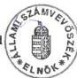

67

---

---

---

1. sz. melléklet
a V-39-38/1997-98. sz-hoz

# A Tulajdonosi Tanácsadó Testület tagjai részére 1997.
évben kifizetett költségtérítések

|  Bérek és bérjellegű költségek | 6,373 ezer Ft  |
| --- | --- |
|  Megbízási díjak | 1,206 ezer Ft  |
|  Bérek járulékai | 3,166 ezer Ft  |
|  Dologi kiadások | 1,457 ezer Ft  |
|  ebből: jegyzőkönyvvezetés és hitelesítés | 194 ezer Ft  |
|  ügyvédi díj | 200 ezer Ft  |
|  útiköltség térítés | 46 ezer Ft  |
|  üzemanyag költség | 93 ezer Ft  |
|  telefon költség | 540 ezer Ft  |
|  könyv és folyóirat vásárlás | 283 ezer Ft  |
|  MTI Rt gépkocsi üa. ksg. | 79 ezer Ft  |
|  Mindösszesen | 12,202 ezer Ft.  |

40

---

---

---

2. sz. melléklet
a V-39-38/1997-98. sz-hoz

# Előirányzat-módosítások hatásköri megoszlásban

millió Ft-ban

MÓDOSÍTÁSOK

|  ÉV | EREDETI ELŐIRÁNYZAT | KORMÁNY HATÁSKÖR | FELÜGYELETI HATÁSKÖR | SAJÁT HATÁSKÖR | MÓDOSÍTOTT ELŐIRÁNYZAT  |
| --- | --- | --- | --- | --- | --- |
|  1991. ÉV | 1.485,7 |  | -1,1 | 41,2 | 1.525,8  |
|  1992. ÉV | 1.744,0 | -12,3 | -585,6 | 223,9 | 1.370,0  |
|  1993. ÉV | 1.327,1 | 3,5 | 39,5 | 256,4 | 1.626,5  |
|  1994. ÉV | 1.243,0 | 210,1 | 0,4 | 232,4 | 1.685,9  |
|  1995. ÉV | 1.593,6 | 155,2 |  | 173,4 | 1.922,2  |
|  1996. ÉV | 1.623,6 | 6,2 |  | 268,3 | 1.898,1  |
|  1997. I. FÉLÉV | 2.098,5 | -13,9 | -406,4 | 120,3 | 1.798,5  |
|   |  |  | (ZÁROLÁS) |  |   |

37

---

1. 2. 3.

---

# Függelék

a V-39-38/1997-98. sz-hoz

# Áttekintés az MTI részesedésével működő Kft-kről

1. Az MTI a vizsgalati idoszak elott is rendelkezett uzletreszekkel, azokat az erdekeltsgi alapjabol vásárolta, a Fotolux Extra Kft. - 500 E Ft - és az ECOINFO Kft. - 9 M Ft - uzletreszét 1989-ben, mig a Nap Tv Kft. - 2,5 M Ft - uzletreszét 1990-ben. Ez utobbival kapcsolatban a Kormányzati Ellenörzési Iroda feltárta, hogy a Nap Tv Kft. uzletreszét az MTI 1994. majus 6-an értékesítette 25 M Ft-ert. Ennek Ellenértekeként azonban a vevöcsak 20 M Ft-ot utalt át. A megallapodás szerint a fennmarado 5 M Ft-ert a vevö szolgaltatastBiztositott volna 1994. XII. 31-ig az MTI részère a Nap Tv-ben megjelenő músorokban reklám, riport, rovat inditasi lehetoseggel. A vevö ezt nem teljesítette, az MTI sem tett további lépeseket az igénye érvényesitésére.
2. Az MTI ECODATA (késöbbiekben ECO INFO, majd MTI-ECO) Gazdasági Információszolgáltató Kft-t három alapíto alapította 25 M Ft törzstó-kével (18 M Ft pénztőke és 7 M Ft apport) 1989. augusztus 15-én. Az MTI törzsbetétje 9 M Ft volt (2 M Ft készpénz és 7 M Ft apport).

Az MTI 1991. évben megállapodott a 2 társtulajdonossal, hogy névértéken megvásárolja az üzletrészüket. Az egyik társtulajdonos üzletrészét 1992. év folyamán részletekben, míg a másik társtulajdonos üzletrészét 1993. évben fizette ki. Az MTI azzal, hogy az előző években veszteséges vállalkozás tőkerészeit vásárolta meg, veszteséges vállalkozásba fektette tőkéjét, ezzel 1992. és 1993-as években megsértette az államháztartásról szóló 1992. évi XXXVIII. törvény 104. § (5) bekezdését.

A társtulajdonosokkal történt megállapodások alapján az MTI kezdeményezte a cégbíróságnál a törzsbetét összegében bekövetkezett változások keresztülvezetését, ennek alapján az MTI 1991. XII. 17. napjától a társaság egyedüli tulajdonosa.

A Kft. az időközben felhalmozódott APEH és TB tartozások, valamint egyéb szállítói tartozások miatt 1992. április 8.-án öncsődöt jelentett.

Tartozásai rendezése érdekében 1993. január 6-án hitelezői egyeztetői tárgyalásokat tartottak, amelynek eredményeként egyezségi megállapodás jött

---

létre az APEH, a TB, és a szállítói hitelezők között. A csődegyezésekben vállalt kötelezettségeit a Kft. 1993. év során teljesítette.

A társaság szerette volna elérni külső tőke bevonását a vállalkozásba. Ennek fejében 12,5 M Ft-os tartós kötelezettsége keletkezett, amelyet 1996. VI. 15-ig törlesztett.

**A társaság 1993. június 28-tól, mint MTI-ECO Kft. szerepel a cégnyilvántartásban.** Ezen időponttól a tevékenységi köre is módosult. **1993. VI. 18.-i Vezérigazgató Tanácsi döntéssel a Kft-hez került az MTI Econews is, amely eddig az MTI keretében végezte a tevékenységét. Egy jól jövedelmező tevékenységi kört kapott az MTI-től az ECO Kft.** Az MTI az Econews-zal egy teljes körű, többnyelvű üzleti, pénzügyi, makro- és mikrogazdasági információs szolgáltatással egészítette tevékenységi körét. A Kft. adatait 1996. évig elemezve megállapítható, hogy **az Econews tevékenység árbevétele 58,6%**, valamint az MTI által a Kft. szolgáltatásaiért fizetett összeg 18,2% teszi ki az összes bevétel 76,8%-át.

Az ECO Kft. adatait elemezve megállapítható, hogy **1990-ben 8,8 M Ft, 1991-ben 6,4 M Ft, míg 1992. évben pedig 12,6 M Ft vesztesége keletkezett.** A Kft. évek hosszú során magával vitte és viszi az **előző évek áthozott veszteségét**, amely **1996. XII. 31.-én 20,4 M Ft** volt.

3. Az **MTI-Fotó** Reklám és Kiadó Kft. létrehozására a 3050/1992. (II. 8.) Korm. határozat adott lehetőséget. A **Kft-t 1 M Ft törzsbetéttel alapították** (500 E Ft készpénz és 500 E Ft apport). A társaság 1992. január 1-én kezdte meg működését. **Alapító-okiratát 1992. december 28-án módosították, 57.440 E Ft apporttal megemelték a törzstőkéjét.** Az MTI az alapító okirat szerint ingyenes mellékszolgáltatásként bocsátotta az MTI-Fotó Kft. részére az MTI Fotóigazgatóság által igénybevett 8 budapesti bérlemény használati jogát. Az alapító ezt a használati jogot 1996. IX. 27-én vonta vissza.

Az MTI Fotó Kft. 1992. évben - meggondolatlanul a következő évek terhére vállalva kötelezettséget - jelentős mértékben gyarapította vagyonát, 29 M Ft értékben berendezéseket vásárolt 5 éves hitelre, gépkocsit lízingelt 3 évre. **A könyvvizsgáló az 1992. évi mérlegét nem hitelesítette**, mert a 4,2 M Ft-os veszteséggel szemben jóval nagyobb vesztesége volt a Kft-nek, valamint több számviteli szabálytalanságot állapított meg.

A Fotó Kft-nek nagy összegű tartozásai voltak az APEH-kel, a TB-vel és az MTI-vel, valamint egyéb szállítókkal szemben is. Az APEH-kel - 1995. évben - és TB-vel - 1994. évben - sikerült megegyeznie az adósságállománya átütemezéséről.

A Fotó Kft-nek az **1996. évi mérlegében még mindig számottevő az előző évekről áthozott vesztesége.**

2

---

Az MTI-Fotó sorsával többször foglalkozott az MTI vezetése, helyzetének megoldására több variációt is kidolgoztak. **Az MTI Fotó Kft. 1996. év végén is több, mint 10 M Ft-tal tartozott az MTI-nek.**

Az MTI-Fotó Kft. egyes munkatársai ellen ügyészi feljelentés van folyamatban.

4. A Kormány a 2027/1993. (VII. 26.) Korm. határozattal **1993. július 14-i hatállyal engedélyezte, hogy az MTI megalakítsa 6 M Ft törzsbetéttel** a 100%-os állami tulajdonú **Magyar Távirati Iroda Kiadói, Ügynöki és Szolgáltató Kft-t.** A társaság 1993. október 1. napjával kezdte meg működését. A törzsbetét 5 M Ft készpénzből és 1 M Ft apportból állt.

A Kft. 1993 tört évben és 1994. évben veszteséges volt, az 1995. évi eredményéből azonban fedezni tudta az előző évek veszteségeit.

Budapest, 1998. augusztus

---3

---

...

---

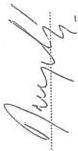

1. 2. 3. 4. 5. 6. 7. 8. 9. 10. 11. 12. 13. 14. 15. 16. 17. 18. 19. 20. 21. 22. 23. 24. 25. 26. 27. 28. 29. 30. 31. 32. 33. 34. 35. 36. 37. 38. 39. 40. 41. 42. 43. 44. 45. 46. 47. 48. 49. 50. 51. 52. 53. 54. 55. 56. 57. 58. 59. 60. 61. 62. 63. 64. 65. 66. 67. 68. 69. 70. 71. 72. 73. 74. 75. 76. 77. 78. 79. 80. 81. 82. 83. 84. 85. 86. 87. 88. 89. 90. 91. 92. 93. 94. 95. 96. 97. 98. 99.

a V-39-391997-98. sz-hoz

Bevételek alakulása

( ezer Ft )

Magyar Távirati Iroda RT

|  Megnevezés | 1991. |   |   | 1992. |   |   | 1993. |   |   | 1994.  |   |   |
| --- | --- | --- | --- | --- | --- | --- | --- | --- | --- | --- | --- | --- |
|   |  Eredeti előirányzat | Módosított előirányzat | Teljesítés | Eredeti előirányzat | Módosított előirányzat | Teljesítés | Eredeti előirányzat | Módosított előirányzat | Teljesítés | Eredeti előirányzat | Módosított előirányzat | Teljesítés  |
|  1. Intézményi működési bevétel | 1286500 | 1241529 | 1241529 | 1289000 | 771605 | 771605 | 657000 | 857938 | 857938 | 833000 | 976972 | 920951  |
|  2. Felhalmozási és tőke jellegű bevétel |  | 5284 | 5284 | 5000 | 57256 | 57256 | 10000 | 62651 | 62651 | 10000 | 26784 | 26784  |
|  3. Felügyeleti szervtől kapott támogatás | 199200 | 209832 | 209832 | 450000 | 448000 | 448000 | 660100 | 663594 | 663594 | 400000 | 610119 | 610119  |
|  4. Átvett pénzeszközök |  | 65000 | 65000 |  | 300 | 300 |  | 41632 | 41632 |  | 13044 | 13044  |
|  5. Pénzforgalom nélküli bevételek (pénzmaradványok igénybevétele) |  | 4159 | 4159 |  | 93090 | 93090 |  | 734 | 734 |  | 59009 | 59009  |
|  Bevételek összesen: | 1485700 | 1525804 | 1525804 | 1744000 | 1370251 | 1370251 | 1327100 | 1626549 | 1626549 | 1243000 | 1685928 | 1629907  |
|  Függő, átfutó kiegyenlítő bevételek |  |  | -231 |  |  | 26212 |  |  | -13274 |  |  | -4023  |

|  Megnevezés | 1995. |   |   | 1996 |   |   | 1997.07.15.-ig  |   |   |
| --- | --- | --- | --- | --- | --- | --- | --- | --- | --- |
|   |  Eredeti előirányzat | Módosított előirányzat | Teljesítés | Eredeti előirányzat | Módosított előirányzat | Teljesítés | Eredeti előirányzat | Módosított előirányzat | Teljesítés  |
|  1. Intézményi működési bevétel | 957000 | 1020730 | 954530 | 965000 | 1102968 | 1081829 | 1140000 | 1161115 | 781240  |
|  2. Felhalmozási és tőke jellegű bevétel | 5000 | 11955 | 11955 | 3000 | 8000 | 8625 | 3000 | 3000 | 1773  |
|  3. Felügyeleti szervtől kapott támogatás | 631600 | 771860 | 771860 | 655600 | 662455 | 662455 | 955500 | 556558 | 556558  |
|  4. Átvett pénzeszközök |  | 21279 | 21279 |  | 33105 | 33105 |  | 1427 | 1427  |
|  5. Pénzforgalom nélküli bevételek (pénzmaradványok igénybevétele) |  | 96403 | 96403 |  | 91530 | 91530 |  | 76413 | 76413  |
|  Bevételek összesen: | 1593600 | 1922227 | 1856027 | 1623600 | 1898058 | 1877544 | 2098500 | 1798513 | 1417411  |
|  Függő, átfutó kiegyenlítő bevételek |  |  | -9022 |  |  |  |  |  | 22394  |

1997.07.15 -től a gazdálkodási forma változása miatt az adatokat altáblában szerepeltetjük

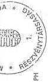

---

---

---

(2. oldal)

32. Magyar Távirati Iroda

Fejezet

# TANÚSÍTVÁNY

az 1997. évi bevételek alakulásáról

Adatok: E Ft-ban

| Megnevezés | Eredeti előirányzat | Előirányzat változások | Előirányzat változás | Módosított előirányzat | Teljesítés |
| --- | --- | --- | --- | --- | --- |
| Országgyűlés | Kormány | Felügyeleti | Intézményi |
| hatáskörben | kezdeményezésre |
| Intézményi működési bevételek | 1.140.000 |  |  | - 21.385 | 42.500 | 21.115 | 1.161.115 | 781.240 |
| Költségvetési támogatás | 955.500 |  | - 398.942 |  |  | -398.942 | 556.558 | 556.558 |
| Átvett pénzeszközök: |  |  |  |  |  |  |  |  |
| - működési célra |  |  |  |  |  |  |  |  |
| - felhalmozási célra | 3.000 |  |  |  | 1.427 | 1.427 | 4.427 | 3.200 |
| Egyéb bevétel (kölcsön visszatérítés, hitelek, értékpapír) |  |  |  |  |  |  |  |  |
| Pénzforgalom nélküli bevételek |  |  |  |  | 76.413 | 76.413 | 76.413 | 76.413 |
| Bevétel összesen (kiegyenlítő, függő, átfutó bev. nélkül) | 2.098.500 |  | - 398.942 | - 21.385 | 120.340 | -299.987 | 1.798.513 | 1.417.411 |

Kitöltés: az 1997. évi beszámoló jelentés 10., 23. sz. űrlappal egyezően

Nyilatkozat: A tanúsítványban szereplő adatok a fejezeti beszámoló ellenőrzött adataival egyezőek, valódiságukat igazolom.

Kelt: Budapest 1998. év ...éprilis... hó 29... nap

---

---

---

1. sz. tanúsítvány

(3. oldal)

# TANÚSÍTVÁNY

a saját bevételek 1997. évi alakulásáról

|  Megnevezés | Eredeti | Módosított | Teljesítés | Befizetési kötelezettség összege  |   |
| --- | --- | --- | --- | --- | --- |
|   |   |   |   |  1997. évi | áthúzódó  |
|  Alaptevékenység bevételei |  |  |  |  |   |
|  Ebből: - Intézményi ellátás díja |  |  |  |  |   |
|  - Alkalmazottak térítése |  |  |  |  |   |
|  - Állami feladatok díjbev. |  |  |  |  |   |
|  - Illeték jellegű bevételek |  |  |  |  |   |
|  Alaptevékenység egyéb bevételek | 822.000 | 834.000 | 532.074 | 26.604 |   |
|  Ebből: |  |  |  |  |   |
|  - áru és készletérték |  |  |  |  |   |
|  - szolgáltatások (sajátos is) ellenértéke | 822.000 | 834.000 | 532.074 | 26.604 |   |
|  Intézmények egyéb sajátos bevételei | 102.000 | 107.000 | 96.369 | 4.818 |   |
|  Ebből: - helyiség, eszköz tartós és eseti bérbeadás díja | 72.000 | 71.300 | 60.703 | 3.035 |   |
|  - lízingdíj bevétel |  |  |  |  |   |
|  - Egyéb (elhasználódott eszközök ért.-se, kártérítések). | 30.000 | 35.700 | 35.666 | 1.783 |   |
|  Tárgyi eszközök, immateriális javak értékesítése | 3.000 | 3.000 | 1.773 |  |   |
|  Ebből: - ingatlanértékesítés |  |  |  |  |   |
|  - gépek, járművek | 3.000 | 1.880 | 653 |  |   |
|  - immateriális javak |  | 1.120 | 1.120 |  |   |
|  Vállalkozási bevétel |  |  |  |  |   |
|  Összesen (pénzforgalom nélküli, kiegyenlítő, függő, átfutó bevételek nélkül) | 927.000 | 944.000 | 630.226 | 31.422 |   |

Felmentés esetén a Korm. határozatot kérjük mellékelni.

Kitöltés: az 1997. évi beszámoló jelentés 07, 08, 10. sz. ürlapokkal egyezően

Nyilatkozat: a tanúsítványban szereplő adatok a fejezeti beszámoló ellenőrzött adataival egyezőek, valódiságukat igazolom

---

---

---

|  Magyar Távirati Iroda RT  |   |   |   |   |   |   |   |   |   |   |   |   |
| --- | --- | --- | --- | --- | --- | --- | --- | --- | --- | --- | --- | --- |
|  Kiadások alakulása kiemelt előirányzatonként (ezer Ft)  |   |   |   |   |   |   |   |   |   |   |   |   |
|  a V-39-38/1997-98. sz-hoz  |   |   |   |   |   |   |   |   |   |   |   |   |
|  Megnevezés | 1991. |   |   | 1992. |   |   | 1993. |   |   | 1994.  |   |   |
|   |  Eredeti előirányzat | Módosított előirányzat | Teljesítés | Eredeti előirányzat | Módosított előirányzat | Teljesítés | Eredeti előirányzat | Módosított előirányzat | Teljesítés | Eredeti előirányzat | Módosított előirányzat | Teljesítés  |
|  Rendszeres személyi juttatások | 432530 | 441966 | 274372 | 401610 | 356017 | 354707 | 377340 | 378675 | 372227 | 419500 | 483500 | 421560  |
|  Nem rendszeres személyi juttatások |  |  | 86544 | 115090 | 137886 | 137859 | 105160 | 179420 | 179420 | 113800 | 235100 | 199242  |
|  Munkaadókat terhelő járulékok | 174000 | 133405 | 107067 | 182800 | 131735 | 131678 | 168200 | 211270 | 210640 | 190100 | 225451 | 180413  |
|  Dologi kiadások | 804270 | 794416 | 839374 | 965200 | 627708 | 628371 | 449400 | 586062 | 585931 | 429600 | 601690 | 601690  |
|  Pénzeszköz átadás |  | 71505 | 71505 |  | 9310 | 9310 |  | 4590 | 4590 |  | 2115 | 2115  |
|  Felújítás | 27900 | 27668 | 27668 | 29300 | 20000 | 19997 | 28000 | 22281 | 22281 | 28000 | 22428 | 22428  |
|  Felhalmozási kiadások | 47000 | 56844 | 56844 | 50000 | 87595 | 87595 | 199000 | 244251 | 192451 | 62000 | 115644 | 115644  |
|  Fejezeti kezelésű előirányzat |  |  |  |  |  |  |  |  |  |  |  |   |
|  Pénzforgalom nélküli kiadások |  |  |  |  |  |  |  |  |  |  |  |   |
|  Kiadások összesen | 1485700 | 1525804 | 1463374 | 1744000 | 1370251 | 1369517 | 1327100 | 1626549 | 1567540 | 1243000 | 1685928 | 1543092  |
|  Függő, átfutó kiegyenlítő kiadások |  |  | 13750 |  |  | 4578 |  |  | 4846 |  |  | 2365  |
|  Megnevezés | 1995. |   |   | 1996. |   |   | 1997.07.15.-ig |   |   |   |   |   |
|   |  Eredeti előirányzat | Módosított előirányzat | Teljesítés | Eredeti előirányzat | Módosított előirányzat | Teljesítés | Eredeti előirányzat | Módosított előirányzat | Teljesítés |   |   |   |
|  Rendszeres személyi juttatások | 445480 | 396281 | 348447 | 411950 | 478372 | 392944 | 545200 | 471608 | 332206 |   |   |   |
|  Nem rendszeres személyi juttatások | 165320 | 331170 | 303685 | 198150 | 218327 | 218327 | 220300 | 211537 | 137204 |   |   |   |
|  Munkaadókat terhelő járulékok | 229400 | 259828 | 177312 | 245200 | 234937 | 40761 | 284000 | 277768 | 214992 |   |   |   |
|  Dologi kiadások | 581100 | 736816 | 736816 | 563600 | 652049 | 834138 | 837900 | 699499 | 568998 |   |   |   |
|  Pénzeszköz átadás | 500 | 3639 | 3639 | 600 | 6591 | 6591 | 7000 | 8427 | 7250 |   |   |   |
|  Felújítás | 16800 | 19738 | 19738 | 28000 | 45876 | 45876 | 28000 | 18000 | 15766 |   |   |   |
|  Felhalmozási kiadások | 155000 | 174755 | 174149 | 176100 | 261906 | 262494 | 176100 | 111674 | 111674 |   |   |   |
|  Fejezeti kezelésű előirányzat |  |  |  |  |  |  |  |  |  |   |   |   |
|  Pénzforgalom nélküli kiadások |  |  |  |  |  |  |  |  |  |   |   |   |
|  Kiadások összesen | 1593600 | 1922227 | 1763786 | 1623600 | 1898058 | 1801131 | 2098500 | 1798513 | 1388090 |   |   |   |
|  Függő, átfutó kiegyenlítő kiadások |  |  | -11324 |  |  | -2085 |  |  | 11101 |   |   |   |
|  1997.07.15 -től a gazdálkodási forma változása miatt az adatokat altáblában szerepeltetjük  |   |   |   |   |   |   |   |   |   |   |   |   |
|  1997.07.15 -től a gazdálkodási forma változása miatt az adatokat altáblában szerepeltetjük  |   |   |   |   |   |   |   |   |   |   |   |   |
|  Megnevezés (sorok módosítandók)  |   |   |   |   |   |   |   |   |   |   |   |   |
|  1997.07.15-12.31.  |   |   |   |   |   |   |   |   |   |   |   |   |
|  1998.  |   |   |   |   |   |   |   |   |   |   |   |   |

---

---

---

2. oldal

32. Magyar Távirati Iroda

Fejezet

# TANÚSÍTVÁNY

az 1997. évi kiadások alakulásáról

Adatok: E Ft-ban

|  Megnevezés | Eredeti előirány- zat | Előirányzat változások |   |   |   | Előirányzat változás összesen | Módosított előirányzat | Teljesítés  |
| --- | --- | --- | --- | --- | --- | --- | --- | --- |
|   |   |  Országgyűlés | Kormány | felügyeleti | intézményi  |   |   |   |
|   |   |  hatáskörben |   | kezdeményezésre  |   |   |   |   |
|  Személyi juttatások | 765.500 |  | - 120.000 | - 18.915 | 37.645 | - 101.270 | 664.230 | 469.410  |
|  Munkaadókat terhelő járulék (TB, munkaadói ügy) járulék) | 284.000 |  | - 45.000 | - 8.172 | 38.768 | - 14.404 | 269.596 | 214.992  |
|  Dologi kiadás | 837.900 |  | - 138.401 |  |  | - 138.401 | 699.499 | 568.998  |
|  Állatottak pénzbeli juttatásai |  |  |  |  |  |  |  |   |
|  Egyéb működési célú támogatás (+égleges pénzeszközátadás, egyéb támogatás) | 7.000 |  |  | 29.321 |  | 29.321 | 36.321 | 35.144  |
|  Felújítás | 28.000 |  | - 10.000 | - 2.234 |  | - 12.234 | 15.766 | 15.766  |
|  Felhalmozás | 176.100 |  | - 85.541 | - 21.385 | 43.927 | - 62.999 | 113.101 | 113.101  |
|  Egyéb kiadás (hitelek, kölcsönök) |  |  |  |  |  |  |  |   |
|  Pénzforgalom nélküli kiadás |  |  |  |  |  |  |  |   |
|  Kiadás összesen (kiegyenlítő, függő, átfutó kiadás nélkül) | 2.098.500 |  | - 398.942 | - 21.385 | 120.340 | - 299.987 | 1.798.513 | 1417411  |

Kitöltés: az 1997. évi beszámoló jelentés 23. sz. űrlappal egyezően.
Nyilatkozat: A tanúsítványban szereplő adatok a fejezeti beszámoló ellenőrzött adataival egyezőek, valóságukat igazolom.

Budapest, 1998. év április hó 29 nap.
Kelt:

16.

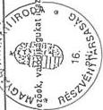

---

---

---

32. MAGYAR TÁVIRATI IRODA
Fejezet/Intézmény

3. sz. tanúsítvány
a V-39-38/1997-98. sz-hoz

# TANÚSÍTVÁNY

közalapítványok, alapítványok, társadalmi szervezetek, önszerveződések, illetve egyéb szervezetek részére adott hozzájárulásról
1997. I. 1. - 1997. XII. 31.

|  Sorszám | Kedvezményezett (alapítvány, közalapítvány, társadalmi szervezet vagy egyéb szervezet) | Hozzájárulás jellege |   |   | A juttatás összege |   |   |   | Hozzájárulás alapja, engedély kelte,  |
| --- | --- | --- | --- | --- | --- | --- | --- | --- | --- |
|   |   |  alapítóként (A) | csatlakozóként (B) | adományozóként (C) | Tárgyi vagyon |   | Pénzátadás  |   |   |
|   |   |   |   |   |  Alapításhoz | Működéshez | Alapításhoz | Működéshez  |   |
|  1. | Egészségmegőrző |  |  | X |  |  |  | 150 | Kollektív.  |
|   | Egyesület |  |  |  |  |  |  |  | Szerz.  |
|  |   |   |   |   |   |   |   |   |   |
|  |   |   |   |   |   |   |   |   |   |
|  |   |   |   |   |   |   |   |   |   |
|  |   |   |   |   |   |   |   |   |   |
|  |   |   |   |   |   |   |   |   |   |
|  |   |   |   |   |   |   |   |   |   |
|  |   |   |   |   |   |   |   |   |   |
|  |   |   |   |   |   |   |   |   |   |
|  |   |   |   |   |   |   |   |   |   |
|  |   |   |   |   |   |   |   |   |   |
|  |   |   |   |   |   |   |   |   |   |
|  |   |   |   |   |   |   |   |   |   |
|  |   |   |   |   |   |   |   |   |   |
|  |   |   |   |   |   |   |   |   |   |
|  |   |   |   |   |   |   |   |   |   |
|  |   |   |   |   |   |   |   |   |   |
|  |   |   |   |   |   |   |   |   |   |
|  |   |   |   |   |   |   |   |   |   |

Megjegyzés: a Fejezet tanúsítványa csak a fejezeti kezelésű előirányzatból adott támogatást tartalmazza.
A társadalmi szervezet vagy egyéb szervezet megjelölése a "hozzájárulás jellege adományozóként (C)" oszlopban szerepeljen.
Nyilatkozat: A tanúsítványban szereplő adatok a beszámoló ellenőrzött adataival egyeznek, valódiságukat igazolom.

Kelt: Bp1998. év ... április ... hó ... 29. nap.

aláírás

---

---

---

Magyar Távirati Iroda RT

4. sz. tanúsítvány
a V-39-38/1997-98. sz-hoz

# Az MTI RT mérleg szerinti eredmény alakulása
( ezer Ft )

|   | Megnevezés | 1997.VII.15.- XII.31. | 1998. terv  |
| --- | --- | --- | --- |
|  I. | Értékesítés nettó árbevétele | 415 688 | 1 192 000  |
|  II. | Egyéb bevételek | 390 881 | 1 287 400  |
|  III. | Aktivált saját telj. értéke | 0 |   |
|  IV. | Anyagjellegű ráfordítások | 203 798 | 483 800  |
|  V. | Személyi jellegű ráfordítások | 525 352 | 1 500 400  |
|  VI. | Értékcsökkenési leírás | 60 133 | 170 000  |
|  VII.-VIII. | Egyéb költségek és ráfordítások | 178 299 | 341 100  |
|  A | Üzleti tevékenység eredménye | -160 813 | -15 900  |
|  IX. | Pénzügyi műveletek bevételei | 13 849 |   |
|  X. | Pénzügyi műveletek ráfordításai | 820 | 8 000  |
|  B | Pénzügyi műveletek eredménye | 13 029 | -8 000  |
|  C | Szokásos vállalkozási eredmény | -147 784 | -23 900  |
|  XI. | Rendkívüli bevételek | 317 468 |   |
|  XII. | Rendkívüli ráfordítások | 1 400 |   |
|  D | Rendkívüli eredmény | 316 068 | 0  |
|  E | Adózás előtti eredmény | 168 284 | -23 900  |
|  XIII. | Adófizetési kötelezettség * |  |   |
|  F | Adózott eredmény | 168 284 | -23 900  |
|  XIV. | Eredménytartalék igénybevétele |  |   |
|  XV. | Fizetett osztalék és részesedés |  |   |
|  G | Mérleg szerinti eredmény | 168 284 | -23 900  |
|  * Az 1991.évi LXXXVI. törvény értelmében a Magyar Távirati Iroda Rt. mentes a társasági adó fizetési kötelezettség alól.  |   |   |   |

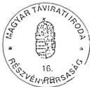

---

.

---

5. sz. tanúsítvány
a V-39-38/1997-98. sz-hoz

Személyi juttatások alakulása
(ezer Ft)

Magyar Távirati Iroda RT

|  Állománycsoportok | 1997.07.15. -12.31. |   | 1998. év  |   |
| --- | --- | --- | --- | --- |
|   |  Rendsz. személyi juttatás | Nem rendszeres személyi jut. | Rendsz. személyi juttatás | Nem rendszeres személyi jut.  |
|   |  Tény |   | Terv  |   |
|  Telj, munkaidőben foglalkoztatott | 259874 | 98049 | 520652 | 135810  |
|  Részidőben foglalkoztatott | 750 |  | 2200 |   |
|  Nyugdíjas foglalkoztatott | 6681 |  | 17300 |   |
|  Foglalkoztatottak össz. | 267105 | 98049 | 540192 | 135810  |
|  Megbízási díj |  | 19543 |  | 34980  |
|  Tiszteletdíj | 6349 |  | 20500 |   |
|  Egyéb kifizetések | 984 | 478 | 2000 | 850  |
|  Állományba nem tartozók össz. | 7333 | 20121 | 22600 | 35830  |
|  Mindösszesen | 274438 | 118170 | 552792 | 171840  |

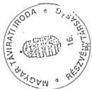

---

1

---

5. sz. tanúsítvány

(2. oldal)

32. MAGYAR TÁVIRATI IRODA

Fejezet

# TANÚSÍTVÁNY

a személyi juttatások alakulásáról

Adatok: E Ft-ba

|  Megnevezés | 1997. évi  |   |   |
| --- | --- | --- | --- |
|   |  előirányzat |   | teljesítés  |
|   |  eredeti | módosított |   |
|  1. Rendszeres személyi juttatás összege | 545.200 | 452.693 | 332.206  |
|  Ebből: |  |  |   |
|  - alapilletmény | 490.000 | 397.493 | 291.206  |
|  - kiegészítés, pótlékok | 14.200 | 14.200 | 7.747  |
|  - egyéb juttatás |  |  |   |
|  - 13. havi illetmény | 41.000 | 41.000 | 33.253  |
|  2. Nem rendszeres személyi juttatás | 179.300 | 166.537 | 107.736  |
|  Ebből: |  |  |   |
|  - jutalom |  | 3.222 | 3.222  |
|  - helyettesítés | 1.000 | 1.000 | 521  |
|  - végkielégítés |  | 134 | 134  |
|  - jubileumi jutalom | 4.100 | 4.100 | 4.005  |
|  - ruházati ktgt., hozzájárulás | 7.000 | 7.000 | 5.949  |
|  - étkezési hozzájárulás | 7.000 | 7.000 | 3.758  |
|  - részmunkaidős fogl. juttatásai | 2.300 | 2.300 | 1.617  |
|  - megbízási díj | 7.000 | 6.000 | 3.017  |
|  3. Külső személyi juttatás | 41.000 | 45.000 | 29.468  |
|  Ebből: - nyugdíjas fogl. juttatásai | 4.500 | 4.500 | 2.316  |
|  - állományba nem tart. jutt. | 36.500 | 40.500 | 27.152  |
|  - a fegyveres és a rendvédelmi szervek állományába nem tartozók juttatásai |  |  |   |
|  Személyi juttatás összesen: | 765.500 | 664.230 | 469.410  |

Kitöltés: az 1997. évi beszámoló jelentés 02. sz. űrlappal egyezően.

Nyilatkozat: A tanúsítványban szereplő adatokat a fejezeti beszámoló ellenőrzött adataival egyezőek valódiságukat igazolom.

Bp.: 1998. év április hó 29.

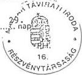

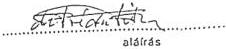

---

---

---

Magyar Távirati Iroda RT

Dologi kiadások alakulása
( ezer Ft )

6. sz. tanúsítvány
a V-39-38/1997-98. sz-hoz

|  Megnevezés | 1997.07.15.-12.31.  |
| --- | --- |
|   |  Tény  |
|  Irodaszer, nyomtatvány sokszorosítás | 10 686  |
|  Könyv folyóirat | 11 092  |
|  Kommunikációs rendsz. működtetése | 100 294  |
|  Számítástechnikai eszk. működtetése |   |
|  Járművek működtetése | 15 414  |
|  Kiküldetés, reklám propaganda | 22 789  |
|  Intézményüzemeltetési szolgáltatás díjai | 75 009  |
|  Üzemeltetési és fenntartási kiadások | 14 389  |
|  Élelmezési kiadások | 1 204  |
|  Szakmai tev.-vel összefüggő spec. kiad. | 117 731  |
|  Jóléti, sport, kulturális kiadások | 78  |
|  Vásárolt termék és szolg. áfája |   |
|  Költségvetési befizetések | 18 873  |
|  Különféle kiadások és befizetések | 9 738  |
|  Dologi kiadások összesen | 397 297  |

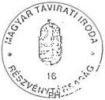

---

---

---

7. sz. tanúsítvány

a V-39-34/1997-98. sz-hoz

# Felújítások és beruházások alakulása

( ezer Ft )

Magyar Távirati Iroda RT

|  Megnevezés | 1991. |   |   | 1992. |   |   | 1993. |   |   | 1994.  |   |   |
| --- | --- | --- | --- | --- | --- | --- | --- | --- | --- | --- | --- | --- |
|   |  Eredeti előirányzat | Módosított előirányzat | Teljesítés | Eredeti előirányzat | Módosított előirányzat | Teljesítés | Eredeti előirányzat | Módosított előirányzat | Teljesítés | Eredeti előirányzat | Módosított előirányzat | Teljesítés  |
|  Ingatlanok felújítása | 27900 | 26068 | 26068 | 21300 | 20000 | 19997 | 15000 | 21267 | 21267 | 22000 | 18155 | 18155  |
|  Gépek, berendezések felújítása |  | 1600 | 1600 | 8000 |  |  | 13000 | 1014 | 1014 | 6000 | 4273 | 4273  |
|  Járművek felújítása |  |  |  |  |  |  |  |  |  |  |  |   |
|  Felújítás összesen | 27900 | 27668 | 27668 | 29300 | 20000 | 19997 | 28000 | 22281 | 22281 | 28000 | 22428 | 22428  |
|  Immateriális javak vásárlása |  |  |  | 3000 | 5826 | 5826 | 6000 | 22622 | 22622 |  | 971 | 971  |
|  Ingatlanok vásárlása |  | 484 | 484 |  | 2800 | 2800 |  | 318 | 318 |  | 18002 | 18002  |
|  Gépek, berendezések vásárlása | 37600 | 47316 | 47316 | 32000 | 39850 | 39850 | 152000 | 170763 | 129363 | 47000 | 73561 | 73561  |
|  Járművek vásárlása |  | 223 | 223 | 5000 | 11722 | 11722 | 7000 | 10676 | 10676 | 3000 | 4647 | 4647  |
|  Pénzügyi befektetések |  |  |  |  | 15337 | 15337 |  | 5662 | 5662 |  |  |   |
|  Beruházások általános forgalmi adója | 9400 | 8821 | 8821 | 10000 | 12060 | 12060 | 34000 | 34210 | 23810 | 12000 | 18463 | 18463  |
|  Felhalmozási kiadások összesen | 47000 | 56844 | 56844 | 50000 | 87595 | 87595 | 199000 | 244251 | 192451 | 62000 | 115644 | 115644  |
|  Megnevezés | 1995. |   |   | 1996. |   |   | 1997.01.01.-07.15. |   |   | 1997.07.15.-12.31. |   | 1998.  |
|   |  Eredeti előirányzat | Módosított előirányzat | Teljesítés | Eredeti előirányzat | Módosított előirányzat | Teljesítés | Eredeti előirányzat | Módosított előirányzat | Teljesítés | Tény* |   | Terv*  |
|  Ingatlanok felújítása | 9800 | 16387 | 16387 | 22400 | 36721 | 36721 | 22400 | 14400 | 12613 | 5322 |   | 15000  |
|  Gépek, berendezések felújítása | 7000 | 3351 | 3351 |  |  |  |  |  |  |  |   | 12000  |
|  Járművek felújítása |  |  |  |  |  |  |  |  |  |  |   |   |
|  Felújítás általános forgalmi adója |  |  |  | 5600 | 9155 | 9155 | 5600 | 3600 | 3153 | 1330 |   | 6750  |
|  Felújítás összesen | 16800 | 19738 | 19738 | 28000 | 45876 | 45876 | 28000 | 18000 | 15766 | 6652 |   | 33750  |
|  Immateriális javak vásárlása | 10000 | 10458 | 10458 | 12500 | 23438 | 23446 | 42200 | 16797 | 16797 | 16046 |   | 32000  |
|  Ingatlanok vásárlása | 13000 | 13060 | 13060 | 36300 | 30482 | 30501 | 50000 | 19077 | 19077 | 47272 |   | 23000  |
|  Gépek, berendezések vásárlása | 94000 | 110058 | 109452 | 115500 | 142662 | 143154 | 80500 | 51709 | 51709 | 66999 |   | 80000  |
|  Járművek vásárlása | 8000 | 8349 | 8349 | 10700 | 13190 | 13228 | 2300 | 2464 | 2464 |  |   | 8000  |
|  Pénzügyi befektetések |  |  |  |  |  |  |  |  |  | 100 |   |   |
|  Beruházások általános forgalmi adója | 30000 | 32830 | 32830 | 1100 | 52134 | 52165 | 1100 | 21627 | 21627 | 19254 |   | 35750  |
|  Felhalmozási kiadások összesen | 155000 | 174755 | 174149 | 176100 | 261906 | 262494 | 176100 | 111674 | 111674 | 149671 |   | 178750  |

* : Rt.-vé alakulás miatt a beruházási ÁFA csak technikai jellegű kiadás

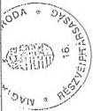

---

---

---

8. sz. tanúsítvány

a V-39-38/1997-98. sz-hoz

Magyar Távirati Iroda RT

A költségek költségnemenkénti alakulása

( ezer Ft )

|   | 1996. év | 1997. év |   | 1997. év összesen | 1998.terv  |
| --- | --- | --- | --- | --- | --- |
|  Megnevezés |  | 01.01.-07.15. | 07.15.-12.31. |  |   |
|  Anyagköltség | 92 867 | 55 996 | 51 477 | 107 473 | 108500  |
|  Anyagjellegű költség | 283 808 | 174 176 | 152 320 | 326 496 | 322300  |
|  Anyagjellegű ráfordítások összesen | 376 675 | 230 172 | 203 797 | 433 969 | 430 800  |
|  Bérköltség | 493 603 | 288 251 | 274 437 | 562 688 | 637900  |
|  Személyi jellegű költség | 183 827 | 119 901 | 118 170 | 238 071 | 289700  |
|  Munkaadókat terhelő járulékok | 223 185 | 127 303 | 132 745 | 260 048 | 302800  |
|  Személyi jellegű ráfordítások összesen | 900 615 | 535 455 | 525 352 | 1 060 807 | 1 230 400  |
|  Értékcsökkenési leírás |  |  | 60 133 | 60 133 | 170000  |
|  Szakmai költségek | 248 239 | 164 841 | 150 414 | 315 255 | 395900  |
|  - |  |  |  |  |   |
|  - |  |  |  |  |   |
|  - |  |  |  |  |   |
|  Egyéb költségek | 11 674 | 6 228 | 4 632 | 10 860 | 5000  |
|  Költségek összesen: | 1 537 203 | 936 696 | 944 328 | 1 881 024 | 2 232 100  |
|  Ráfordítások | 47 095 | 23 645 | 25 473 | 49 118 | 55200  |
|  - ebből ÁFA |  |  |  |  |   |
|  Költségek és ráfordítások össz. | 1 584 298 | 960 341 | 969 801 | 1 930 142 | 2 237 300  |

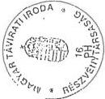

---

1

---

9. sz. tanúsítvány

a V-39-391997-98. sz-hoz

Magyar Távirati Iroda Rt.

A költségek költséghely szerinti alakulása

( ezer Ft )

|  Megnevezés | 1997. év  |   |   |
| --- | --- | --- | --- |
|   |  I.1. - VII.15. Tény | VII.15. - XII.31. Tény | I.1. - XII.31. Tény  |
|  Megnevezés | 1997. év  |   |   |
|   |  I.1. - VII.15. Tény | VII.15. - XII.31. Tény | I.1. - XII.31. Tény  |
|  Külpolitikai szerkesztőség | 110 236 | 100 850 | 211 086  |
|  Külföldi tudósítók | 134 377 | 131 511 | 265 888  |
|  Belpolitikai szerkesztőség | 84 181 | 72 090 | 156 271  |
|  Megyei tudósítók | 48 928 | 44 846 | 93 774  |
|  Sport szerkesztőség | 14 798 | 14 316 | 29 114  |
|  NOTESZ + kiadványok | 29 613 | 31 092 | 60 705  |
|  MTI Press | 10 642 | 11 395 | 22 037  |
|  Könyvtár + kiadványok | 13 155 | 15 343 | 28 498  |
|  Másodlagos hírszolgáltatás | 1 343 | 1 845 | 3 188  |
|  Sajtófotó | 60 219 | 47 553 | 107 772  |
|  SAB | 30 455 | 27 231 | 57 686  |
|  Hírszolgáltatás összesen: | 537 947 | 498 072 | 1 036 019  |
|  Műszaki Igazgatóság | 117 520 | 111 429 | 228 949  |
|  Kereskedelmi Igazgatóság | 12 460 | 13 914 | 26 374  |
|  Fotó Archív | 25 193 | 20 306 | 45 499  |
|  Sokszorosító | 9 707 | 8 239 | 17 946  |
|  Expedíció | 8 165 | 7 616 | 15 781  |
|  Üzemeltetés és épületfenntartás | 107 450 | 91 941 | 199 391  |
|  Jármű fenntartás | 31 506 | 25 579 | 57 085  |
|  Üdülő | 5 794 | 6 347 | 12 141  |
|  Bérbeadás | 21 177 | 18 207 | 39 384  |

---

---

---

Magyar Távirati Iroda Rt.

# A költségek költséghely szerinti alakulása
(ezer Ft)

9. sz. tanúsítvány

(2. oldal)

|  Megnevezés | 1997. év  |   |   |
| --- | --- | --- | --- |
|   |  I.1. - VII.15. Tény | VII.15. - XII.31. Tény | I.1. - XII.31. Tény  |
|  Gödöllő | 0 | 12 078 | 0  |
|  Választott tisztségviselők | 83 422 | 156 073 | 12 078  |
|  Központi irányítás általános költségei | 0 | 0 | 239 495  |
|   | 960 341 | 969 801 | 0  |
|  Összes költséghelyen elszámolt költség |  |  | 1 930 142  |
|  megjegyzés: | A központi irányítás költségei tartalmazzák a Központi Titkárság és a Pénzügyi Igazgatóság költségeit is.  |   |   |
|   | Az 1997. VII.15.-től - XII.31.-ig terjedő időszakban ezen a költséghelyen mutatjuk ki a korábban vagyonváltozásként elszámolt értékcsökkenési leírást.  |   |   |

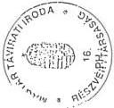

---

---

---

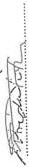

# Munkajogi létszám alakulása

( fő )

Magyar Távirati Iroda RT

10. sz. tanúsítvány

a V-39-38/1997-98. sz-hoz

|  Besorolási osztályok | 1992. tény |   | 1993. tény |   | 1994. tény  |   |
| --- | --- | --- | --- | --- | --- | --- |
|   |  Zárólétszám | Átlaglétszám | Zárólétszám | Átlaglétszám | Zárólétszám | Átlaglétszám  |
|  Magasabb vezetőállásúak | 12 | 11 | 12 | 12 | 11 | 11  |
|  Vezetők | 54 | 54 | 73 | 73 | 76 | 76  |
|  "A" fizetési osztály | 126 | 124 | 110 | 110 | 69 | 64  |
|  "B" fizetési osztály | 336 | 321 | 295 | 289 | 308 | 278  |
|  "C" fizetési osztály | 44 | 42 | 54 | 54 | 58 | 50  |
|  "D" fizetési osztály | 74 | 69 | 72 | 67 | 68 | 64  |
|  "E" fizetési osztály | 147 | 142 | 120 | 114 | 112 | 101  |
|  "F" fizetési osztály |  |  | 7 | 6 | 7 | 6  |
|  "H" fizetési osztály |  |  |  |  |  |   |
|  "I" fizetési osztály |  |  |  |  |  |   |
|  Telj. módon fogl. összesen | 793 | 763 | 743 | 725 | 709 | 650  |
|  Részidőben foglalkoztatott | 3 | 3 | 3 | 3 | 3 | 3  |
|  Nyugdíjas foglalkoztatott | 13 | 11 | 13 | 12 | 14 | 13  |
|  Összes foglalkoztatott | 809 | 777 | 759 | 740 | 726 | 666  |

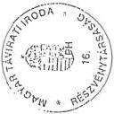

---

---

---

10. sz. tanúsítvány

(2. oldal)

# Munkajogi létszám alakulása

( fő )

Magyar Távirati Iroda RT

|  Besorolási osztályok | 1995. tény |   | 1996. tény |   | 1997.01.01.-07.15. tény  |   |
| --- | --- | --- | --- | --- | --- | --- |
|   |  Zárólétszám | Átlaglétszám | Zárólétszám | Átlaglétszám | Zárólétszám | Átlaglétszám  |
|  Magasabb vezetőállásúak | 12 | 12 | 11 | 10 | 11 | 11  |
|  Vezetők | 86 | 82 | 76 | 76 | 81 | 78  |
|  "A" fizetési osztály | 36 | 31 | 29 | 25 | 23 | 23  |
|  "B" fizetési osztály | 214 | 239 | 194 | 178 | 41 | 39  |
|  "C" fizetési osztály | 54 | 50 | 45 | 42 | 54 | 51  |
|  "D" fizetési osztály | 61 | 58 | 51 | 51 | 91 | 86  |
|  "E" fizetési osztály | 92 | 82 | 70 | 70 | 51 | 51  |
|  "F" fizetési osztály | 6 | 6 | 6 | 6 | 50 | 50  |
|  "H" fizetési osztály |  |  |  |  | 59 | 58  |
|  "I" fizetési osztály |  |  |  |  | 4 | 4  |
|  Telj. midőben fogl. összesen | 561 | 560 | 482 | 458 | 465 | 451  |
|  Részidőben foglalkoztatott | 6 | 5 | 4 | 5 | 4 | 4  |
|  Nyugdíjas foglalkoztatott | 5 | 7 | 5 | 5 | 4 | 4  |
|  Összes foglalkoztatott | 572 | 572 | 491 | 468 | 473 | 459  |

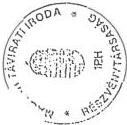

---

                                                                                    ---

---

Magyar Távirati Iroda RT

# Munkajogi létszám alakulása
( fő )

10. sz. tanúsítvány
(3. oldal)

|  Besorolási osztályok | 1997.07.15.-12.31. tény  |   |
| --- | --- | --- |
|   |  Zárólétszám | Átlaglétszám  |
|  Magasabb vezetőállásúak | 13 | 11  |
|  Vezetők | 79 | 78  |
|  "A" fizetési osztály | 23 | 22  |
|  "B" fizetési osztály | 41 | 40  |
|  "C" fizetési osztály | 58 | 56  |
|  "D" fizetési osztály | 88 | 89  |
|  "E" fizetési osztály | 49 | 48  |
|  "F" fizetési osztály | 52 | 49  |
|  "H" fizetési osztály | 65 | 61  |
|  "I" fizetési osztály | 4 | 4  |
|  Telj. módon fogl. összesen | 472 | 458  |
|  Részidőben foglalkoztatott | 3 | 4  |
|  Nyugdíjas foglalkoztatott | 4 | 4  |
|  Összes foglalkoztatott | 479 | 466  |

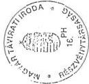

---

---

---

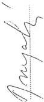

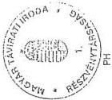

11. sz. tanúsítvány
a V-39-38/1997-98. sz-hoz

Egy főre jutó átlagbér és átlagkereset alakulása
( ezer Ft )

Magyar Távirati Iroda RT

|  Besorolási osztályok | 1995. év tény |   |   | 1996. év tény |   |   | 1997.01.01.-07.15. tény  |   |   |
| --- | --- | --- | --- | --- | --- | --- | --- | --- | --- |
|   |  Átlagbér | Átlagkereset | - ebből megbízási díj | Átlagbér | Átlagkereset | - ebből megbízási díj | Átlagbér | Átlagkereset | - ebből megbízási díj  |
|  Magasabb vezetőállásúak | 141 | 234 | 9 | 165 | 266 | 18 | 214 | 262 |   |
|  Vezetők | 89 | 129 | 13 | 100 | 149 | 11 | 126 | 155 | 11  |
|  "A" fizetési osztály | 52 | 69 | 2 | 36 | 52 |  | 41 | 48 |   |
|  "B" fizetési osztály | 42 | 60 | 2 | 45 | 69 | 2 | 56 | 79 | 1  |
|  "C" fizetési osztály | 61 | 85 | 9 | 66 | 99 | 7 | 54 | 62 | 2  |
|  "D" fizetési osztály | 53 | 74 | 8 | 56 | 83 | 8 | 67 | 84 | 3  |
|  "E" fizetési osztály | 58 | 88 | 14 | 61 | 97 | 15 | 72 | 89 | 7  |
|  "F" fizetési osztály | 58 | 88 | 14 | 63 | 82 | 9 | 80 | 95 | 6  |
|  "H" fizetési osztály |  |  |  |  |  |  | 90 | 108 | 10  |
|  "I" fizetési osztály |  |  |  |  |  |  | 102 | 116 | 7  |
|  Telj. midőben fogl. összesen | 56 | 82 | 8 | 62 | 95 | 7 | 84 | 101 | 6  |
|  Részidőben foglalkoztatott | 23 | 24 |  | 31 | 42 | 3 | 41 | 52 |   |
|  Nyugdíjas foglalkoztatott | 58 | 59 |  | 80 | 82 | 2 | 88 | 88 |   |
|  Összes foglalkoztatott | 55 | 81 | 7 | 62 | 94 | 7 | 82 | 100 | 6  |

---

1

---

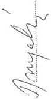

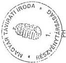

11. sz. tanúsítvány

(2. oldal)

Egy főre jutó átlagbér és átlagkereset alakulása
( ezer Ft )

Magyar Távirati Iroda RT

|  Besorolási osztályok | 1997.07.15.-12.31. tény  |   |   |
| --- | --- | --- | --- |
|   |  Átlagbér | Átlagkereset | - ebből megbízási díj  |
|  Magasabb vezetőállásúak | 256 | 360 | 21  |
|  Vezetők | 136 | 191 | 19  |
|  "A" fizetési osztály | 46 | 64 | 3  |
|  "B" fizetési osztály | 60 | 89 | 1  |
|  "C" fizetési osztály | 55 | 69 | 5  |
|  "D" fizetési osztály | 67 | 97 | 7  |
|  "E" fizetési osztály | 84 | 117 | 14  |
|  "F" fizetési osztály | 83 | 119 | 11  |
|  "H" fizetési osztály | 92 | 124 | 16  |
|  "I" fizetési osztály | 93 | 126 | 11  |
|  Telj. midőben fogl. összesen | 87 | 122 | 11  |
|  Részidőben foglalkoztatott | 34 | 63 |   |
|  Nyugdíjas foglalkoztatott | 90 | 109 |   |
|  Összes foglalkoztatott | 86 | 122 | 11  |

---

---

---

12. sz. tanúsítvány
a V-39-38/1997-98. sz-hoz

# Magyar Távirati Iroda
Tárgyi eszköz állomány alakulása

|  Megnevezés | Nettó érték 1991.XII.31. | Nettó érték költségv.záró 1997.VII.15. | Vagyonérték Nyitó Rt-ben 1997.VII.15.  |
| --- | --- | --- | --- |
|  Vagyoni értékű jogok |  | 1 883 | 48 642  |
|  Szellemi termékek |  | 22 892 | 41 183  |
|  |   |   |   |
|  Tárgyi eszközök: |  |  |   |
|  Ingatlanok | 709 430 | 827 178 | 2 397 804  |
|  Gépek,berendezések | 304 750 | 147 090 | 263 348  |
|  Járművek | 6 304 | 16 948 | 51 059  |
|  |   |   |   |
|  Összesen | 1 020 484 | 1 015 991 | 2 802 036  |

A. K. L.

---

---

---

a V-39-38/1997-98. sz-hoz

Magyar Távirati Iroda RT

# Az immateriális javak és tárgyi eszközök állományának alakulása
1997. évben
( ezer Ft )

|  I. Időszak: 1997.01.01.-07.15.-ig  |   |   |   |   |   |
| --- | --- | --- | --- | --- | --- |
|  Megnevezés | Immateriális javak | Ingatlanok | Gépek, berendezések, felszerelések | Járművek | Összesen  |
|  Bruttó érték |  |  |  |  |   |
|  Előző évi záróállomány (tárgyévi nyitó állomány) | 61 793 | 971 635 | 636 337 | 45 839 | 1 715 604  |
|  Beszerzés, létesítés | 16 797 | 19 077 | 51 709 | 2 454 | 90 047  |
|  Felújítás |  | 12 613 |  |  | 12 613  |
|  Térítésmentes átvétel |  |  |  |  |   |
|  Egyéb növekedés |  |  |  |  |   |
|  -ebből apport |  |  |  |  |   |
|  Összes növekedés | 16 797 | 31 690 | 51 709 | 2 454 | 102 660  |
|  Selejtezés, megsemmisülés |  |  | 848 |  | 848  |
|  Térítésmentes átadás |  |  |  |  |   |
|  Értékesítés |  |  | 1 716 | 510 | 2 226  |
|  Egyéb csökkenés |  | 17 950 | 4 214 |  | 22 164  |
|  Tárgyévi záróállomány | 78 590 | 985 375 | 681 268 | 47 793 | 1 793 026  |
|  Értékcsökkenés |  |  |  |  |   |
|  Előző évi záróállomány (tárgyévi nyitó állomány) | 42 250 | 146 373 | 475 713 | 26 904 | 691 240  |
|  Növekedés | 9 707 | 11 824 | 55 626 | 4 451 | 81 608  |
|  Csökkenés |  |  | 2 760 | 510 | 3 270  |
|  Értékcsökkenés tárgyévi záróállománya | 51 957 | 158 197 | 528 579 | 30 845 | 769 578  |
|  Eszközök nettó értéke | 26 633 | 827 178 | 152 689 | 16 948 | 1 023 448  |
|  Teljesen leírt eszközök eredeti bruttó értéke | 27 897 |  | 351 012 | 9 750 | 388 659  |

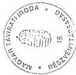

1. oldal

---

---

---

Magyar Távirati Iroda RT

13. sz. tanúsítvány

(2. oldal)

Az immateriális javak és tárgyi eszközök állományának alakulása

1997. évben

( ezer Ft )

|  II. Időszak: 1997.07.15. - Vagyonértékelés  |   |   |   |   |   |
| --- | --- | --- | --- | --- | --- |
|  Megnevezés | Immateriális javak | Ingatlanok | Gépek, berendezések, felszerelések | Járművek | Összesen  |
|  Magyar Távirati Iroda záró nettó érték | 26 633 | 827 178 | 152 689 | 16 948 | 1 023 448  |
|  Pótkezelési időszak beruházásai | -1 858 |  | -5 599 |  | -7 457  |
|  Vagyonértékelési különbözet | 65 050 | 1 570 626 | 116 111 | 34 111 | 1 785 898  |
|  Magyar Távirati Iroda Rt. nyitó vagyonérték | 89 825 | 2 397 804 | 263 201 | 51 059 | 2 801 889  |

2. oldal

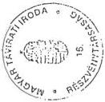

---

---

---

13. sz. tanúsítvány

(3. oldal)

Magyar Távirati Iroda RT

# Az immateriális javak és tárgyi eszközök állományának alakulása

1997. évben

( ezer Ft )

|  III. Időszak: 1997.07.15.-12.31.-ig  |   |   |   |   |   |
| --- | --- | --- | --- | --- | --- |
|  Megnevezés | Immateriális javak | Ingatlanok | Gépek, berendezések, felszerelések | Járművek | Összesen  |
|  Vagyonmérleg szerinti nyitó állomány | 89 825 | 2 397 804 | 263 201 | 51 059 | 2 801 889  |
|  Beszerzés, létesítés | 16 046 | 47 272 | 66 999 |  | 130 317  |
|  Felújítás |  | 5 322 |  |  | 5 322  |
|  Térítésmentes átvétel |  |  |  |  |   |
|  Egyéb növekedés |  |  |  |  |   |
|  -ebből apport |  |  |  |  |   |
|  Összes növekedés | 16 046 | 52 594 | 66 999 | 0 | 135 639  |
|  Selejtezés, megsemmisülés |  |  |  |  |   |
|  Térítésmentes átadás |  |  |  |  |   |
|  Értékesítés |  |  |  |  |   |
|  Egyéb csökkenés |  |  |  |  |   |
|  Tárgyévi záróállomány | 105 871 | 2 450 398 | 330 200 | 51 059 | 2 937 528  |
|  Értékcsökkenés |  |  |  |  |   |
|  Tárgyévi nyitó állomány |  |  |  |  |   |
|  Növekedés | 6 240 | 16 296 | 33 342 | 4 255 | 60 133  |
|  Csökkenés |  |  |  |  |   |
|  Értékcsökkenés tárgyévi záróállománya | 6 240 | 16 296 | 33 342 | 4 255 | 60 133  |
|  Eszközök nettó értéke | 99 631 | 2 434 102 | 296 858 | 46 804 | 2 877 395  |
|  Teljesen leírt eszközök eredeti bruttó értéke |  |  |  |  |   |

1. oldal

1. oldal

---

---

---

14. sz. tanúsítvány
a V-39-38/1997-98. sz-hoz

Személy gépjármű állomány alakulása
( ezer Ft )

Magyar Távirati Iroda RT

|  Megnevezés | 1991. |   |   | 1996. |   |   | 1997.01.01-07.15.  |   |   |
| --- | --- | --- | --- | --- | --- | --- | --- | --- | --- |
|   |  db | Bruttó érték | Nettó érték | db | Bruttó érték | Nettó érték | db | Bruttó érték | Nettó érték  |
|  Nyitó állomány | 101 | 23 906 | 9 938 | 37 | 36 469 | 15 354 | 37 | 45 839 | 18 935  |
|  Összes növekedés | 1 | 223 | 223 | 9 | 13 228 | 13 228 | 1 | 2 464 | 2 464  |
|  - ebből beszerzés | 1 | 223 | 223 | 9 | 13 228 | 13 228 | 1 | 2 464 | 2 464  |
|  Összes csökkenés | 35 | 6 638 | 3 857 | 9 | 3 858 | 9 647 | 1 | 510 | 4 451  |
|  - ebből értékesítés | 33 | 5 446 | 2 482 | 9 | 3 858 | 934 | 1 | 510 |   |
|  Záróállomány | 67 | 17 491 | 6 304 | 37 | 45 839 | 18 935 | 37 | 47 793 | 16 948  |
|  Lízing |  |  |  |  |  |  |  |  |   |

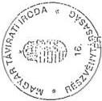

---

---

---

15. sz. tanúsítvány

a V-39-38/1997-98. sz-hoz

A pénzügyi és likviditási helyzet alakulás

( ezer Ft )

|  Megnevezés | 1996.XII.31. | 1997.VI.30. | 1997.VII.15. | 1997.XII.31.  |
| --- | --- | --- | --- | --- |
|  Rendelkezésre álló pénzeszköz | 65 120 | 136 543 | 29 321 | 582 114  |
|  ebből: -pénztár |  | 251 |  | 591  |
|  -bankszámla egyenleg | 65 120 | 136 292 | 29 321 | 581 523  |
|  Rövid lejáratú kötelezettségek | 594 449 | 391 155 | 393 238 | 628 192  |
|  ebből: - vevői előleg |  |  |  |   |
|  - szállítók | 44 624 | 49 124 | 47 898 | 44 762  |
|  - egyéb | 549 825 | 342 031 | 345 340 | 583 430  |
|  = apport |  |  |  |   |
|  rövidlejáratú hitel |  |  |  |   |
|  Likviditási ráta | 0,11 | 0,35 | 0,07 | 0,93  |

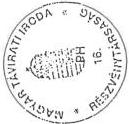

Magyar Távirati Iroda RT

---

---

---

16. sz. tanúsítvány

a V-39-38/1997-98. sz-hoz

Magyar Távirati Iroda RT

1997. július 15. -1997. december 31. közötti időszakban kihelyezett (lekötött, befektetett) eszközök

| Sor-szám | Befektetés | Kihelyezés időpontja | Befektetés időtartama | A kihelyezés feltételei | Kihelyezett érték |
| --- | --- | --- | --- | --- | --- |
| helye | fajtája* | kamat % | kamat (eFt) | lejárat | eFt |
| 1 | K&H Rt. | r.lej.bet. | 1997.08.08. | 28 | 18,00% | 280 | 1997.09.05. | 20 000 |
| 2 | K&H Rt. | r.lej.bet. | 1997.08.08. | 32 | 18,50% | 678 | 1997.09.10. | 40 000 |
| 3 | K&H Rt. | áll.köt. | 1997.08.12. | 48 | 19,80% | 2 604 | 1997.09.30. | 100 006 |
| 4 | K&H Rt. | r.lej.bet. | 1997.09.05. | 26 | 18,00% | 195 | 1997.10.01. | 15 000 |
| 5 | K&H Rt. | r.lej.bet. | 1997.10.02. | 7 | 17,00% | 99 | 1997.10.09. | 30 000 |
| 6 | K&H Rt. | r.lej.bet. | 1997.10.08. | 8 | 16,00% | 71 | 1997.10.16. | 20 000 |
| 7 | K&H Rt. | r.lej.bet. | 1997.10.08. | 23 | 17,75% | 170 | 1997.10.31. | 15 000 |
| 8 | K&H Rt. | r.lej.bet. | 1997.10.08. | 30 | 18,50% | 540 | 1997.11.07. | 35 000 |
| 9 | K&H Rt. | r.lej.bet. | 1997.10.16. | 25 | 18,25% | 405 | 1997.11.10. | 32 000 |
| 10 | K&H Rt. | r.lej.bet. | 1997.11.11. | 22 | 17,75% | 163 | 1997.12.03. | 15 000 |
| 11 | K&H Rt. | r.lej.bet. | 1997.11.18. | 20 | 17,75% | 197 | 1997.12.08. | 20 000 |
| 12 | K&H Rt. | r.lej.bet. | 1997.12.20. | 9 | 17,25% | 1 294 | 1997.12.29. | 300 000 |
| 13 | K&H Rt. | r.lej.bet. | 1997.12.20. | 16 | 17,75% | 316 | 1998.01.05. | 40 000 |
| 14 | K&H Rt. | r.lej.bet. | 1997.12.22. | 18 | 18,00% | 1 800 | 1998.01.09. | 200 000 |
| 15 | K&H Rt. | r.lej.bet. | 1997.12.29. | 7 | 17,00% | 992 | 1998.01.05. | 300 000 |
| * áll.köt.: állam kötvény |
| r.lej.bet.: rövidlejáratú betét |

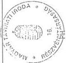

---

---

---

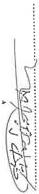

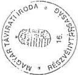

Magyar Távirati Iroda RT

17. sz. tanúsítvány

a V-39-38/1997-98. sz-hoz

A ki nem egyenlített kötelezettségállomány alakulása

( ezer Ft )

|  Megnevezés | 1996.XII.31. | 1997.VI.30. | 1997.VII.15 |   |
| --- | --- | --- | --- | --- |
|  Kötelezettségek | 594 449 | 391 155 | 393 238 |   |
|  ebből: -adóhátralék | 187 810 |  |  |   |
|  - tb. tartozás | 362 015 | 297 561 | 297 561 |   |
|  -egyéb köztartozás |  | 44 470 | 47 779 |   |
|  - szállítói kötelezettség | 44 624 | 49 124 | 47 898 |   |
|  Elengedett/átvállalt kötelezettség |  |  |  |   |
|  |   |   |   |   |
|  Magyar Távirati Iroda Részvénytársaság (1997. VII.15. - XII.31.)  |   |   |   |   |
|  Megnevezés | 1997.VII.15. | 1997.X.31 | 1997.XI.30. | 1997.XII.31  |
|  Kötelezettségek | 677 694 | 645 264 | 657 149 | 628 192  |
|  ebből: -adóhátralék | 16 357 |  |  |   |
|  - tb. tartozás | 448 890 | 467 976 | 468 025 | 484 618  |
|  -egyéb köztartozás | 73 225 | 59 716 | 53 169 | 67 727  |
|  - szállítói kötelezettség | 47 898 | 36 338 | 42 023 | 44 762  |
|  - egyéb kötelezettség | 91 324 | 81 234 | 93 932 | 31 085  |
|  Elengedett/átvállalt kötelezettség |  |  |  |   |
|  |   |   |   |   |
|  Megjegyzés: A Részvénytársasággá történő átalakulás során a vagyonértékelők több olyan tételt is felvettek a kötelezettségek közé, amelyek korábban mérlegtételként nem szerepeltek (pl. tb.tartozás késedelmi pótléka 142 MFt, ÁFA tartozás késedelmi pótléka 16 MFt)  |   |   |   |   |

---

---

---

18. sz. tanúsítvány
a V-39-30/1997-98. sz-hoz

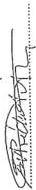

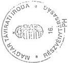

Magyar Távirati Iroda RT

A ki nem egyenlített követelés és kötelezettségállomány alakulása
( ezer Ft )

|  Megnevezés | 1996.XII.31. | 1997.VI.30. | 1997.VII.15 | 1997.IX.30. | 1997.XII.31.  |
| --- | --- | --- | --- | --- | --- |
|  Követelés állomány összesen | 209 683 | 192 202 | 114 480 | 78 299 | 74 102  |
|  ebből: |  |  |  |  |   |
|  - 360 napon belüli | 114 653 | 89 579 | 114 480 | 78 104 | 71 762  |
|  - 360 napon túli | 95 030 | 102 623 |  | 195 | 2 340  |
|  "0" számlaosztályban nyilvántartott követelések |  |  | 119 785 | 118 346 | 116 842  |
|  Kötelezettségek összesen | 594 449 | 391 155 | 393 238 | 649 006 | 628 192  |
|  ebből: |  |  |  |  |   |
|  - 360 napon belüli | 280 460 | 274 820 | 260 873 | 208 794 | 187 980  |
|  - 360 napon túli | 313 989 | 116 335 | 132 365 | 440 212 | 440 212  |
|  Megjegyzés: Az 1997.07.15. vagyonértékelés során a 365 napon túli tételek leírásra kerültek, és a "0"-ás számlaosztályban tartjuk nyilván.  |   |   |   |   |   |
|  Ezért ezen időponttól a vagyonértékelés során leírt tételeket külön soron szerepeltetjük.  |   |   |   |   |   |
|  A kötelezettségállomány növekményét a vagyonértékelés során kötelezettségként a nyíló vagyonmérlegbe felvett tételek okozták.  |   |   |   |   |   |

---

---

---

19. sz. tanúsítvány
a V-39-39/1997-98. sz-hoz.

Magyar Távirati Iroda RT

Feleslegessé vált és értékesített vagyontárgyak adatai
( ezer Ft )

|   | Értékesített vagyontárgyak  |   |   |   |   |   |   |   |   |   |   |   |   |
| --- | --- | --- | --- | --- | --- | --- | --- | --- | --- | --- | --- | --- | --- |
|   |  Bruttó érték |   |   |   | Nettó érték |   |   |   | Elhasználódás mértéke 1997.össz. | Értékesítés árbevétele  |   |   |   |
|  Megnevezés | 1996. év | 1997.I.1.- VII.15. | 1997.VII.15. XII.31. | 1997. össz. | 1996. év | 1997.I.1.- VII.15. | 1997.VII.15. XII.31. | 1997. össz. |   | 1996. év | 1997.I.1.- VII.15. | 1997.VII.15. XII.31. | 1997. össz.  |
|  Ingatlanok |  |  |  |  |  |  |  |  |  |  |  |  |   |
|  Gépek, berendezések | 15684 | 1716 |  | 1716 | 2056 | 136 |  | 136 | 92,07% | 2144 | 622 |  | 622  |
|  ebből: rip.felsz. | 1844 | 1716 |  | 1716 | 113 | 136 |  | 136 | 92,07% | 1232 | 622 |  | 622  |
|  Hírszolg.eszköz | 10568 |  |  |  | 1633 |  |  |  |  | 569 |  |  |   |
|  Nyomdai felszer. | 3272 |  |  |  | 310 |  |  |  |  | 343 |  |  |   |
|  Járművek | 3858 | 510 |  | 510 | 934 |  |  |  | 100,00% | 2744 | 31 |  | 31  |
|  Tárgyi eszközök összesen | 19542 | 2226 |  | 2226 | 2990 | 136 |  | 136 | 93,89% | 4888 | 653 |  | 653  |

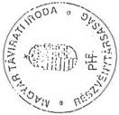

---

i

---

20. sz. tanúsítvány
a V-39-38/1997-9c. sz-hoz

Magyar Távirati Iroda RT

Az anyag- és készletgazdálkodás jellemző mutatóinak alakulása
( ezer Ft )

|  Megnevezés | 1996. év  |   |   |   |
| --- | --- | --- | --- | --- |
|   | Nyitókészlet | Beszerzés | Felhasználás | Zárókészlet  |
|  Szakmai anyag | 3 897 | 8 523 | 11 380 | 1 040  |
|  Rezsianyag | 24 880 | 38 101 | 52 854 | 10 127  |
|  Munka-, védőruha | 15 | 356 | 362 | 9  |
|  Összesen | 28 792 | 46 980 | 64 596 | 11 176  |

|  Megnevezés | 1997.01.01.- 07.15. |   |   |   | 1997.07.15.-12.31.  |   |   |   |
| --- | --- | --- | --- | --- | --- | --- | --- | --- |
|   | Nyitókészlet | Beszerzés | Felhasználás | Zárókészlet | Nyitókészlet | Beszerzés | Felhasználás | Zárókészlet  |
|  Szakmai anyag | 1 040 | 5 111 | 5 083 | 1 068 | 1 068 | 906 | 1 511 | 463  |
|  Rezsianyag | 10 127 | 21 149 | 18 733 | 12 543 | 13 174 | 17 003 | 20 097 | 10 080  |
|  Munka-, védőruha | 9 | 52 | 57 | 4 | 4 | 410 | 410 | 4  |
|  Összesen | 11 176 | 26 312 | 23 873 | 13 615 | 14 246 | 18 319 | 22 018 | 10 547  |

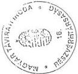

---

 .

---

a V-39-38/1997-98. sz-hoz

MAGYAR TÁVIRATI IKODA INTEZMENYE
Intézmény

# TANÚSÍTVÁNY

az ingatlanok tartós és eseti bérbeadásának 1997. évi alakulásáról

|  Sorszám | Bérbeadott ingatlan |   |   |   | Bérbeadásból származó bevétel | Befizetési kötelezettség összege  |   |
| --- | --- | --- | --- | --- | --- | --- | --- |
|   |  megnevezése | cím e | eredeti funkciója | nettó értéke |   | 1997-ban | áthúzódó  |
|  1 | Budapest | Naphegy tér 6. | irodaház | 613.694 | 59.136 |  |   |
|  2 | Budapest | Fém u.8. | irodaház | 2.739 | 1.236 |  |   |
|  3 | Budapest | Rege u.11. | szolg.lakás | 2.486 | 39 |  |   |
|  4 | Budapest | Budaörsi u.15. | szolg.lakás | 1.973 | 5 |  |   |
|  |   |   |   |   |   |   |   |
|  |   |   |   |   |   |   |   |
|  |   |   |   |   |   |   |   |
|  |   |   |   |   |   |   |   |
|  |   |   |   |   |   |   |   |
|  |   |   |   |   |   |   |   |
|  Összesen |  |  |  | 620.892 | 60.416 | 3.021 |   |

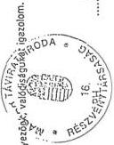

Kitöltés: az 1997. évi beszámoló jelentés 07. sz. űrlappal egyezően.

Nyilatkozat: A tanúsítványban szereplő adatok a könyvviteli nyilvántartással egyezőnk, valódiságukat igazolom.

Kelt: Bp., 1998. év ápr. hó 29. nap

aláírás

---

---

---

22. sz. tanúsítvány

a V-39-38/1997-98. sz-hoz

A Magyar Távirati Iroda gazdálkodásának főbb adatai

|   | 1991.évi | 1992.évi | 1993.évi | 1994.évi | 1995.évi | 1996.évi | 1997.júl.15.  |
| --- | --- | --- | --- | --- | --- | --- | --- |
|  Kiadások |  |  |  |  |  |  |   |
|  Személyi juttatások | 381 294 | 491 429 | 550 552 | 619 917 | 652 132 | 611 271 | 469 410  |
|  Járulékok | 105 917 | 131 678 | 210 640 | 180 413 | 177 312 | 40 761 | 214 992  |
|  Dologi kiadás | 820 146 | 628 339 | 585 931 | 601 690 | 736 816 | 884 138 | 568 998  |
|  Pénzeszk. átad. működésre | 650 | 1 319 | 1 865 | 1 200 | 1 524 | 6 591 | 5 823  |
|  Intézményi felhalmozás | 9 844 | 11 958 | 51 589 | 13 844 | 9 755 | 39 717 | 5 588  |
|  Felújítás | 27 668 | 19 997 | 22 281 | 22 428 | 19 738 | 36 721 | 12 613  |
|  Pénzeszk.átad.felhalmozásra | 5 855 | 24 497 | 9 482 | 1 800 | 2 115 |  | 1 427  |
|  Kormányzati beruházás | 47 000 | 60 000 | 135 200 | 101 800 | 149 394 | 170 612 | 84 459  |
|  Felhalmozás áfa kiadása |  |  |  |  |  | 61 320 | 24 780  |
|  Hitel visszafizetés | 65 000 |  |  |  |  |  |   |
|  Összesen | 1 463 374 | 1 369 217 | 1 567 540 | 1 543 092 | 1 748 786 | 1 801 131 | 1 388 090  |
|  Bevételek |  |  |  |  |  |  |   |
|  Intézményi működési bevétel | 1 241 529 | 771 905 | 858 338 | 925 019 | 955 030 | 1 081 829 | 781 240  |
|  Felhalmozási és tőke jell.bev. | 5 284 | 57 256 | 103 883 | 35 760 | 17 734 | 41 625 | 3 200  |
|  Támogatás eredeti előir.működésre | 164 200 | 400 000 | 473 100 | 350 000 | 481 600 | 485 600 | 472 099  |
|  Céltámogatás, évközi módosítás | -1 368 | -12 300 | 3 494 | 210 119 | 140 260 | 6 249 |   |
|  Támogatás kormányzati beruh.-ra | 47 000 | 60 000 | 187 000 | 50 000 | 150 000 | 170 000 | 84 459  |
|  Támogatás összesen | 209 832 | 447 700 | 663 594 | 610 119 | 771 860 | 661 849 | 556 558  |
|  Egyéb támogatás | 65 000 |  |  |  |  |  |   |
|  Előző évi pénz maradv.igénybev. | 4 159 | 93 090 | 734 | 7 209 | 96 402 | 91 635 | 76 413  |
|  Előző évi beruh.pénzmaradv.ig. |  |  |  | 51 800 |  | 606 |   |
|  Összesen | 1 525 804 | 1 369 951 | 1 626 549 | 1 629 907 | 1 841 026 | 1 877 544 | 1 417 411  |
|  Bevétel - Kiadás különbözete | 62 430 | 743 | 59 009 | 86 815 | 92 240 | 76 413 | 29 321  |
|  Tartozás állomány évvégén | 160 000 | 54 000 | 77 000 | 198 200 | 354 000 | 549 825 | 359 000  |
|  Követelés állomány évvégén | 200 000 | 124 000 | 199 000 | 181 000 | 153 000 | 209 700 | 165 200  |
|  Átlag létszám | 1 059 | 770 | 725 | 667 | 576 | 468 | 459  |
|  Munkajogi főfoglalklétsz. I.1-én | 1 219 | 846 | 796 | 743 | 719 | 495 | 476  |

Budapest, 1998. augusztus

---

1. 2017年，公司与上海浦东发展银行股份有限公司签订了《关于使用部分闲置募集资金进行现金管理的协议》。

[Non-Text]

[Non-Text]

[Non-Text]

[Non-Text]

[Non-Text]

[Non-Text]

[Non-Text]

[Non-Text]

[Non-Text]

[Non-Text]

[Non-Text]

[Non-Text]

[Non-Text]

[Non-Text]

[Non-Text]

[Non-Text]

[Non-Text]

[Non-Text]

[Non-Text]

[Non-Text]

[Non-Text]

[Non-Text]

[Non-Text]

[Non-Text]

[Non-Text]

[Non-Text]

[Non-Text]

[Non-Text]

[Non-Text]

[Non-Text]

[Non-Text]

[Non-Text]

[Non-Text]

[Non-Text]

[Non-Text]

[Non-Text]

[Non-Text]

[Non-Text]

[Non-Text]

[Non-Text]

[Non-Text]

[Non-Text]

[Non-Text]

[Non-Text]

[Non-Text]

[Non-Text]

[Non-Text]

[Non-Text]

The Ground Truth image displays a single, solid horizontal line. According to Rule 2 (UNDERSCORE & LINE RULES), this is a stylistic or background line, not a placeholder underscore. Therefore, the OCR result must ignore it and output nothing or only meaningful text. The provided OCR content is "____", which consists of four underscores. This is an incorrect interpretation of the line as a placeholder, violating the rule that stylistic lines must be ignored. The OCR has hallucinated underscores where none should exist based on the GT's visual context. Hence, the OCR result is inconsistent with the Ground Truth.