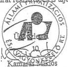
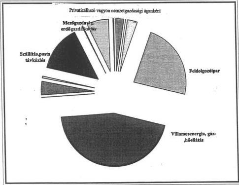

*Állami Számverőszék*---

**J.57.**

## **JELENTÉS**

**AZ ÁLLAMI PRIVATIZÁCIÓS ÉS VAGYONKEZELŐ RT. HOZZÁRENDELT VAGYONNAL KAPCSOLATOS 1997. ÉVI TEVÉKENYSÉGÉNEK ELLENŐRZÉSÉRŐL**

---2820

**1998. SZEPTEMBER**

---

# ---**Az ellenőrzés végrehajtásáért felelős:  
az ÁSZ IV. Vagyonellenőrzési Igazgatósága**

**Halász Gejza** számvevő igazgató

# **A vizsgálatot vezette:**

**Harsányi Sándor** osztályvezető főtanácsos

# **A vizsgálatot végezték:**

**Beck Miklós** számvevő

**Dr. Borisz József** számvevő tanácsos

**Lőrinc Alajos** számvevő tanácsos

**Makkai Mária** számvevő tanácsos

**Németh Béláné** számvevő tanácsos

**Dr. Ocskovszky Jánosné** számvevő tanácsos

**Dr. Szöllősi Géza** számvevő tanácsos

**Szűcs Ivánné** számvevő

**Tornai József** számvevő tanácsos

**Dr. Varga István** számvevő

**Vasas Sándorné dr.** számvevő tanácsos

**Verő Tünde** számvevő

---

V-5-45/1998. TÉMASZÁM: 426

# TARTALOMJEGYZÉK

|  **I. BEVEZETÉS** | **5**  |
| --- | --- |
|  **II. ÖSSZEFOGLALÓ MEGÁLLAPÍTÁSOK, AJÁNLÁSOK** | **7**  |
|  1. Összefoglaló megállapítások | 7  |
|  1.1. A hozzárendelt vagyonnal kapcsolatos bevételek és kiadások alakulása, a követelésállomány helyzete | 7  |
|  1.2. Az értékesítési tevékenység | 8  |
|  1.2.1. A Pénzintézeti Központ Bank Rt. privatizációja | 9  |
|  1.2.2. A cukoripar privatizációja | 9  |
|  1.2.3. A Hungarocamion Rt. privatizációja | 10  |
|  1.2.4. Az ERDÉRT Rt. privatizációja | 10  |
|  1.3. A részvénycserék | 11  |
|  1.4. A szerződéseken alapuló vagyonkezelés és a reorganizációra fordított kiadások | 11  |
|  1.4.1. A vagyonkezelés helyzete | 11  |
|  1.4.2. Az éves reorganizáció alakulása, különös tekintettel a borsodi kohászatra | 12  |
|  1.5. Az ÁPV Rt.-hez rendelt vagyon, a vagyon változása | 12  |
|  1.6. A privatizációhoz és a vagyonkezeléshez kapcsolódó, valamint a jogszabályokból eredő kötelezettségek helyzete | 13  |
|  1.6.1. A privatizációhoz és vagyonkezeléshez kapcsolódó kötelezettségek helyzete | 13  |
|  1.6.2. A jogszabályokból eredő kötelezettségek helyzete | 14  |
|  1.7. Az ellenőrzési szervezetek tevékenysége | 14  |
|  1.7.1. A Tranzakciós Ellenőrzési és Szerződésmenedzsment Ügyvezető Igazgatóság | 14  |
|  1.7.2. A Belső Ellenőrzési Ügyvezető Igazgatóság | 15  |
|  1.7.3. Az ÁSZ 1996. évről szóló vizsgálata ajánlásai alapján készített intézkedési terv végrehajtása | 15  |
|  2. Ajánlások | 15  |
|  **III. RÉSZLETES MEGÁLLAPÍTÁSOK** | **17**  |
|  1. A hozzárendelt vagyonnal kapcsolatos bevételek és kiadások alakulása, a követelésállomány helyzete | 17  |
|  1.1. A szabályozottság alakulása | 17  |
|  1.2. A pénzforgalmi eredmény alakulása | 18  |
|  1.3. Az 1997. évi bevételi és kiadási előirányzat teljesítése | 18  |
|  1.4. Az 1997. évi bevételek alakulása | 19  |
|  1.5. A kiadások alakulása | 20  |

1

---

1.5.1. A privatizációhoz és vagyonhasznosításhoz kapcsolható kiadások 21
1.5.2. A külön jogszabályokban előírt kiadási kötelezettségek 23
1.6. A követelésállomány alakulása 24
2. Az értékesítési tevékenység 26
2.1. Az értékesítés adatai 26
2.2. A kiválasztott tranzakciók 27
2.2.1. A Pénzintézeti Központ Bank Rt. privatizációja 28
2.2.2. A Hungarocamion Rt. privatizációja 32
2.2.3. Az ERDÉRT Rt. privatizációja 37
3. A részvénycsérék 38
3.1. Részvénycseré az ÁPV Rt. és az MFB Rt. között 38
3.2. Részvénycseré az ÁPV Rt. és a Postabank Rt. között 39
4. A szerződéseken alapuló vagyonkezelés helyzete és a reorganizációra fordított ráfordítások alakulása 40
4.1. A szerződésen alapuló vagyonkezelés 40
4.1.1. A CO-NEXUS vagyonkezelési szerződése 40
4.1.2. A DUNAFERR Rt. szerződéses vagyonkezelése 43
4.2. Az éves reorganizáció alakulása, különös tekintettel a borsodi kohászatra 47
4.2.1. A reorganizáció éves költségvetési előirányzata és annak teljesítése 47
4.2.2. Az ÁPV Rt. reorganizációs tevékenységének szervezése, fejlesztése 49
4.2.3. Az egyes reorganizációs tranzakciók 50
4.2.3.1. A DAM Rt.-vel kapcsolatos 1997. évi reorganizációs kifizetések alakulása 50
4.2.4. Az erdőgazdasági portfólió, valamint az egyes agrár társaságok reorganizációja 52
5. Az ÁPV Rt.-hez rendelt vagyon, a vagyon változása 53
5.1. A hozzárendelt vagyon nyilvántartási rendszere 53
5.2. A hozzárendelt vagyon változása 55
5.3. A működő gazdálkodó szervezetek száma, vagyona 56
5.3.1. A tartós állami tulajdon értéke, változása 1997-ben 58
5.3.2. A saját alapítású társaságok 59
5.4. A végelszámolás, felszámolás alatt lévő gazdálkodó szervezetek száma, vagyona 60
5.5. Az elvont, átvett, vásárolt eszközökben lévő állami vagyon 61
5.6. Az ÁPV Rt.-hez tartozó termőföld vagyon 62
6. A privatizációhoz és a vagyonkezeléshez kapcsolódó, valamint a jogszabályokból eredő kötelezettségek helyzete 64
6.1. A privatizációhoz és a vagyonkezeléshez kapcsolódó kötelezettségek helyzete 64
6.1.1. A privatizációhoz kapcsolódó kötelezettségek 64
6.1.2. A vagyonkezeléshez kapcsolódó kötelezettségek 65
6.1.3. Az ÁPV Rt. tartalékképzési kötelezettsége és felhasználása 67

2

---

V-5-45/1998. TÉMASZÁM: 426

6.2. A jogszabályokból eredő kötelezettségek helyzete 67
6.2.1. A társaságoknak visszajáró 20 % (Privatizációs Ellenérték Hányad (PEH) 67
6.2.2. A belterületi föld után az önkormányzatokat megillető járandóságok 69
6.2.2.1. Az 1989. évi XIII. tv. alapján az önkormányzatokat a belterületi föld értéke után megillető járandóságok 69
6.2.2.2. Az 1992. évi LIV. törvény alapján az önkormányzatokat a belterületi föld után megillető járandóság 70
6.2.3. Az önkormányzatokat alapítói jogon megillető kötelezettségek 71
6.2.4. A villamos és a gázközművek után az önkormányzatok felé fennálló kötelezettségek teljesítése 72
6.2.5. Vagyonátadás a társadalombiztosítási önkormányzatok részére 72
7. A belső ellenőrzési szervezetek tevékenysége 73
7.1. Az Etikai, Tranzakciós és Szerződésmenedzsment Ügyvezető Igazgatóság 73
7.1.1. Az ÁPV Rt. tevékenysége szakszerűségének és szabályszerűségének folyamatos vizsgálata 73
7.1.2. Az ellenőrzési szervezet irányítása, munkaszervezete, az ellenőrzési célok megvalósulása 76
7.1.3. Az ellenőrzés megállapításának hasznosulása, az intézkedések végrehajtásának beszámolási rendje 77
7.1.4. A privatizációs szerződések utógondozása, irat- és adatkezelése, archiválása 77
7.1.5. A felelősségrevonás és annak formái 1997-ben 78
7.2. A Belső Ellenőrzési Ügyvezető Igazgatóság 79
Mellékletek
Függelék

3

---

4

---

V-5-45/1998. TÉMASZÁM: 426

## az Állami Privatizációs és Vagyonkezelő Rt. hozzárendelt vagyonnal kapcsolatos 1997. évi tevékenységének ellenőrzéséről

### I. BEVEZETÉS

Az állam tulajdonában lévő vállalkozói vagyon értékesítéséről szóló 1995. évi XXXIX. törvény 25. § (1) bekezdése szerint az Állami Privatizációs és Vagyonkezelő Rt. (továbbiakban ÁPV Rt.) tevékenységének ellenőrzése az Állami Számvevőszék feladata. A törvény előírja, hogy az Állami Számvevőszék köteles jelentését - a Kormány beszámolójával együtt - a Zárászámadással egyidőben, minden év augusztus 31-ig benyújtani az Országgyűlésnek.

A számviteli törvény szerint az ÁPV Rt. a jóváhagyásra jogosult testület által elfogadott, könyvvizsgálói záradékot is tartalmazó beszámolóját - amelynek része a hozzárendelt vagyonról szóló beszámoló és a könyvvizsgáló erre vonatkozó véleménye - a tárgyévet követő augusztus 31-ig köteles letétbe helyezni. E törvényi szabályozásból következően **a helyszíni vizsgálat időpontjában, sem a beszámoló, sem a könyvvizsgáló véleménye nem állt rendelkezésre.** A könyvvizsgálat az Állami Számvevőszék helyszíni vizsgálata után kezdődött meg. A jelentés pénzügyi-számviteli adatai többségükben a tendenciák bemutatására alkalmasak. Ugyanakkor az Állami Számvevőszék valószínűsíti, hogy az ÁPV Rt. tevékenységét jellemző legfontosabb végleges adatoktól olyan szignifikáns eltérés, amely a jelentés megállapításait érdemben megváltoztatná, nem lesz.

**Az ellenőrzés célja:** annak megállapítása volt, hogy az ÁPV Rt. 1997. évi tevékenysége megfelelt-e a jogszabályokban és a belső szabályzatokban előírtaknak.

Biztosította-e számviteli rendszere az előirányzatok figyelemmel kísérését, tudott-e megfelelő adatokat szolgáltatni a gazdasági folyamatok elemzéséhez, értékeléséhez.

Eleget tett-e a privatizációból és vagyonkezelésből, valamint jogszabályokból eredő kötelezettségeinek, azokat határidőre és az előirányzatnak megfelelően teljesítette-e. Hogyan érvényesítette az állam tulajdonosi érdekeit az egyes privatizációs tranzakciók lebonyolításakor. Betartotta-e a költségvetési törvény által meghatározott főbb kiadási előirányzatokat. Az 1996. évi számvevőszéki jelentés ajánlásaira kiadott intézkedési tervet hogyan hajtotta végre. (9. sz. melléklet)

5

---

I. BEVEZETÉS---

Az ellenőrzött időszak: 1997. év és egyes témáknál 1998. I. félév.

A vizsgálat, mint azt az ellenőrzött időszak jelzi - az előző évek gyakorlatával megegyezően - a pénzügyi folyamatokat 1997. december 31-ig követte nyomon, ahol a folyamat jellege indokolta, 1998. év I. félévére is kiterjedt. Ebből következik, hogy az ÁPV Rt. 1997. I. félévi tevékenységének számos vonását, az arra vonatkozó megállapításokat az 1996. évi - tehát az ezt megelőző - számvevőszéki jelentés tartalmazza. Ezek tapasztalatai beépültek e jelentés összefoglalójába.

---6

---

II. ÖSSZEFOGLALÓ MEGÁLLAPÍTÁSOK, AJÁNLÁSOK

## II. ÖSSZEFOGLALÓ MEGÁLLAPÍTÁSOK, AJÁNLÁSOK

### 1. ÖSSZEFOGLALÓ MEGÁLLAPÍTÁSOK

#### 1.1. A hozzárendelt vagyonnal kapcsolatos bevételek és kiadások alakulása, a követelésállomány helyzete

Az állami tulajdon átalakulásának, privatizációjának 1990 óta tartó folyamatában az 1997. évi eredmények jelentősnek bizonyultak. 1997-ben az ÁPV Rt. összes bevétele 350 milliárd Ft volt, ami a privatizáció történetében a második legnagyobb érték.

Az 1980-as évek végén, az 1990-es évek elején a régi típusú gazdálkodó szervezetekből átalakult 1300 gazdasági társaság közül a privatizáció nyolc éve alatt 1110 társaságot teljesen sikerült értékesíteni. A privatizációból befolyt összes bevétel ebben az időszakban folyó árakon 1.400 milliárd Ft volt. Az ÁPV Rt. előző évi értékesítési bevétele tehát arányában is jelentős, hiszen 25 %-ot tesz ki.

1997. év végére a tömeges privatizáció jó része befejeződött. Lényegében lezárult a magánosítás - többek között - az élelmiszeriparban, a kereskedelemben és a vendéglátásban, a nyomdaiparban, az alumíniumiparban, valamint az acéliparban, de például csak néhány százaléknyi az állami tulajdon a távközlésben is. Mindezek mellett ugyanakkor még mindig jelentős állami tulajdon áll rendelkezésre. Az ÁPV Rt.-hez tartozó és még privatizálható vagyon értéke 1997. végén meghaladta a 350 milliárd Ft-ot.

1997-ben az ÁPV Rt. a privatizációs törvény változására gyorsan, felkészülten reagált és élt a törvénymódosítás nyújtotta lehetőséggel és ez a magas bevétel egyik fontos tényezője volt (MATÁV és OTP részvények értékesítése).

Az 1997. évi privatizáció sajátossága volt a tőzsdei kibocsátások és ezen belül a nemzetközi tőkepiaci elhelyezések magas aránya. **A bevételeken belül az összes készpénzbevétel 80 %-a, 253,2 milliárd Ft adódott tőzsdei értékesítésből** és a devizabevétel 85 %-a - 177 milliárd Ft - a nemzetközi tőkepiaci forgalmazásból folyt be.

A bevételek tervezetthez képest nagyarányú növekedése - az előirányzott 180 milliárd Ft-os privatizációs bevétellel szemben 350 milliárd Ft - átrendezte a kiadás nagyságát és struktúráját is. Az eredeti 257 milliárd Ft-os tervezett kiadással szemben a tény 330 milliárd Ft lett. A többletbevétel lehetővé tette, hogy a költségvetési törvényben rögzített 50 milliárd Ft-os befizetés helyett 145 milliárd Ft-ot, azaz 95 milliárd Ft-al többet utaljanak át a központi költségvetésnek.

7

---

II. ÖSSZEFOGLALÓ MEGÁLLAPÍTÁSOK, AJÁNLÁSOK---

A közvetlen költségvetési befizetés ellenére is az 1997. év végi privatizációs bevételi számlán **20,3 milliárd Ft többletpénzkészlet jelentkezett. A költségvetési törvény előírásai szerint, ezt még 1997. évben át kellett volna utalni a központi költségvetés részére.**

A 20,3 milliárd Ft-os többletbevételből mintegy 8,5 milliárd Ft-ot önkormányzati járandóságra és a privatizációs ellenérték hányad pontosan meg nem állapítható, 1998. évi fizetési kötelezettsége fedezeteként tartalékoltak. 8 milliárd Ft-ot és 3,8 milliárd Ft-ot 1998. évi teljesítésként és többlet teljesítésként, 1998. január 12-én utaltak át a központi költségvetésnek. **A késedelmes átutalásra, annak módjára az ÁPV Rt. törvényi felhatalmazással nem rendelkezett**, amit nem pótolt az sem, hogy a választott megoldással - beleértve a 8,5 milliárd Ft-os tartalékolást is -, az ÁPV Rt. könyvvizsgálója, a pénzügyminiszter és a privatizációért felelős tárca nélküli miniszter egyaránt egyetértett.

A privatizációhoz és vagyonhasznosításhoz kapcsolódó tényleges kiadások megegyeztek a költségvetési törvényben előírt 32,0 milliárd Ft-tal. Az ÁPV Rt. betartotta a saját működési költségre vonatkozó, törvényben meghatározott 3,5 milliárd Ft-os előirányzatot is. A belterületi föld értéke miatti az önkormányzatoknak kiadott járandóságok értéke az előirányzott 25 milliárd Ft helyett, 26,4 milliárd Ft lett. A privatizációs ellenérték hányadra 15,2 milliárd Ft-ot fizettek ki az előirányzott 27 milliárd Ft-tal szemben. A 12 milliárd Ft-os eltérésben szerepet játszott a kötelezettségek kiszámításában meglévő eltérő értelmezés, valamint a nagy számú peres ügy elhúzódása.

Reorganizációs kiadásokra 12,7 milliárd Ft-ot költöttek, amely a költségvetési törvényben előirányzott keretet, mintegy 200 millió Ft-tal meghaladta.

A külön jogszabályokban előírt fizetési kötelezettségeket teljesítették, összesen 200 milliárd Ft értékben. A követelésállomány összege 88 milliárd Ft volt, ebből 58 milliárd Ft 1998-1999. években esedékes. A követelések között szerepel a Honvédelmi Minisztérium 2,7 milliárd Ft-os tartozása. Ezt az összeget az ÁPV Rt. 1996-ban utalta át a honvédségi ingatlanok értékesítése előlegeként. 1998. májusáig az értékesítésből minimális bevétel származott, így várható, hogy 1998. szeptember 30-ig - az elszámolás végső határidejéig - az előleg nem térül meg.

## 1.2. Az értékesítési tevékenység

Az ÁPV Rt. 1997-ben 222 db értékesítési tranzakciót hajtott végre, amelynek szerződéses értéke 386,7 milliárd Ft. Az értékesítés átlagos árfolyama a jegyzett tőkéhez viszonyítva 287 %, a saját tőkéhez viszonyítva 170 %- volt.

Az értékesítés szerződéses értékének 72 %-a - mely 7 társasághoz kapcsolódik - a tőkepiac intézmény rendszerén keresztül privatizációból származott.

A további 25 %-ot a korábbi privatizációt követően megmaradt kisebbségi részesedések értékesítése tette ki. Ezzel teremtette meg az ÁPV Rt. a kárpótlási jegyek felhasználásának lehetőségét a kisbefektetők számára. Összesen 102

---8

---

II. ÖSSZEFOGLALÓ MEGÁLLAPÍTÁSOK, AJÁNLÁSOK

tranzakciónál fizethettek a vevők kárpótlási jeggyel 22,2 milliárd forint értékben.

Az ÁPV Rt. 1997. évi értékesítési tevékenységében az tükröződik, hogy a részvénytársaság a privatizáció lezárását tűzte ki célul. Mindez megnyilvánult abban, hogy egyes társaságoknál (pl. cukoripar, Hungarocamion) a minél előbbi értékesítésre törekedtek.

Az ÁPV Rt. privatizációs tevékenységének szabályozottsága 1997-re teljeskörűvé vált. A privatizációs törvény módosításával a törvényalkotók pontosították a versenyeztetés mellőzésének lehetséges esetein belül a zártkörű elhelyezés és a részvénycsere megfogalmazását, definiálását.

### 1.2.1. A Pénzintézeti Központ Bank Rt. privatizációja

Az ÁPV Rt. 100 %-os tulajdonában lévő Pénzintézeti Központ Bank Rt. (továbbiakban PK) privatizációját megelőzően 1997. májusában részvénycsere keretében az ÁPV Rt. a bank részvényeinek 33,3 %-át (2,08 milliárd Ft) elcserélte annak két társasága (ITC és Árpád Kft.) üzletrészei ellenében.

#### **A privatizációs törvény előírásai szerinti értékarányos csere biztosításának alapjául szolgáló vagyonértékelés nem történt meg.**

1997. júliusában az ÁPV Rt. nyílt, egyfordulós pályázat keretében a PK 61,67 %-os részvényhányadát meghirdette, melyet az Atlasz Biztosító Rt. által vezetett konzorcium, mint egyetlen pályázó megnyert és 160 %-os árfolyamon a részvénycsomagot megvásárolta.

A korábbiakban névértéken végrehajtott részvénycsérét is figyelembe véve a konzorcium rendelkezik a 95 %-os részvénypakettel, melyhez összességében 104 %-os árfolyamon jutott. Az állami tulajdon eladásából származó ÁPV Rt., illetve állami bevétel azonban átlagosan 139,4 %-nak felel meg. Ez azt bizonyítja, hogy **a privatizációt megelőzően lebonyolított részvénycsere nem volt értékarányos, ezért nem felelt meg az 1995. évi XXXIX. tv. 28. § (2) c. pontja előírásainak.**

Az ÁPV Rt. a részvények fennmaradó 5 %-át a munkavállalók részére értékesítette bizományosan keresztül. **A bizományosi szerződésben meghatározott dolgozói kedvezmény mértéke 110,8 millió Ft-tal magasabb a privatizációs törvény által megadott lehetőséggel szemben, és ezzel az ÁPV Rt. megsértette az 1995. évi XXXIV. tv. 55. § előírásait.**

### 1.2.2. A cukoripar privatizációja

A cukoriparon belül a Kabai és Petőházi Cukorgyárak értékesítése igazolta azt, hogy a két állami vállalat átalakulásával - tőkeemeléssel - kezdődő magánosításban a kisebbségben lévő külföldi tulajdonosnak biztosított elővásárlási jog, meghatározta a privatizáció későbbi folyamatát is.

9

---

II. ÖSSZEFOGLALÓ MEGÁLLAPÍTÁSOK, AJÁNLÁSOK---

1997-ben a Kabai és a Petőházi Cukorgyár Rt. privatizációja befejeződött. Többségi tulajdonba azok a külföldi befektető társaságok kerültek, amelyek az elővásárlási joggal rendelkeztek.

Komoly erőfeszítéseket kellett az ÁPV Rt.-nek tennie annak érdekében, hogy a mezőgazdasági termelők és a társaságok menedzsmentje 25 % + 1 szavazatnyi tulajdonhoz jusson.

A multinacionális cégekkel szembeni összefogás és a magyar répatermelők fenntartása érdekében 1995-ben létrejött Magyar Cukor Rt. a kitűzött célt nem tudta megvalósítani. A társaságnál a csődhelyzet elkerülését privatizációval lehetett megoldani. Az állami tulajdonú részesedések értékesítését megelőzően a társaság többségi tulajdonosán keresztül az osztrák Agrana Internaional AG. 2,3 milliárd Ft tőkét emelt a Magyar Cukor Rt.-ben. Az ÁPV Rt. tulajdonában levő részvényeket a társaság tagjai vagyonarányosan, 42 %-os árfolyamon megvásárolták.

A Magyar Cukor Rt.-hez tartozó öt cukorgyár közül két gyárat (Ercsi és Mezőhegyes) 1997. év végére bezártak, a Sarkadi Cukorgyárat értékesítették a Kabai Cukorgyár Rt.-nek, így a társaság öt gyára kettőre csökkent. 1998. január 1-jével az azonos többségi tulajdonos Agrana AG. beolvasztotta a Petőházi Cukorgyár Rt.-t a Magyar Cukor Rt.-be. (Az egyes cukorgyárak privatizációját az 1. sz. Függelék részletezi)

### 1.2.3. A Hungarocamion Rt. privatizációja

A Hungarocamion Rt. részvényeire 1997-ben három ízben írt ki az ÁPV Rt. pályázatot. Az első pályázatra érkezett egyik ajánlat 1.035 millió Ft-os vételáron - 25 %-os árfolyamon - szándékozta a társaság részvényeinek 79,2 %-os hányadát megvásárolni. A harmadik kiírás eredményeként a társaság részvényeinek 81,31 %-át 426,3 millió Ft-ért - 10 %-os árfolyamon - értékesítették. **A privatizáció elhúzódása, illetve a mindenáron történő értékesítés a felajánlott vételár folyamatos csökkenéséhez vezetett.** Ebben szerepe volt az időközben felszínre került vám és egyéb kötelezettségeknek is.

A győztes pályázó ajánlata nem felelt meg a pályázati kiírás azon előírásának, amely csak - a Versenyeztetési Szabályzat végrehajtásáról szóló 10/1996. számú vezérigazgatói utasítással összhangban - bank által kiállított hitelígérvény elfogadását engedi meg. A pályázat nyertese által csatolt hitelígérvényt nem bank bocsátotta ki, így **a Hungarocamion Rt.-t az ÁPV Rt. érvénytelen pályázatot benyújtó ajánlattevőnek adta el.**

### 1.2.4. Az ERDÉRT Rt. privatizációja

Az Erdért Rt. értékesítésére 1997-ben két alkalommal írt ki az ÁPV Rt. pályázatot. A második pályázati kiírásban meghatározott limitárat 20 millió Ft-tal meghaladva, 2.020 millió Ft-ért értékesítette a társaságot az Erdért Rt. MRP szervezete és az Erdőgazdasági Részvénytársaságok által alakított Konzorciumnak.

---10

---

II. ÖSSZEFOGLALÓ MEGÁLLAPÍTÁSOK, AJÁNLÁSOK

**Az Erdért Rt. privatizációja jól előkészített volt, mindvégig szem előtt tartották a nyereségesen működő társaság nemzetgazdaságban betöltött szerepét, valamint az egész ország erdőgazdálkodása és fakereskedelme érdekeit.**

### 1.3. A részvénycserék

Részvénycsere keretében az ÁPV Rt. tulajdonából névértéken 36.643 millió Ft, saját vagyon értéken 44.848 millió Ft részvény és üzletrész hányad került ki, melynek szerződéses értéke 20.740 millió Ft. Ezekből három társaság 100 %-os, egy társaság 75 %-os részvényhányadát adták át és 75 cég esetében a tulajdoni arány 50 % alatti volt.

A részvénycserék alapjául kormányhatározatok, illetve országgyűlési határozatból kiinduló igazgatósági határozatok szolgáltak.

A megvalósított részvénycsere nem magánosítás, mivel az ÁPV Rt.-től elkerült vagyonelemek állami tulajdonban álló társaságokhoz kerültek, így közvetve továbbra is állami tulajdonban maradtak.

A portfólió csere értékarányosságának biztosítását szolgáló vagyonértékelés - a PK-t kivéve - az 1997. évi valamennyi részvénycsere esetében megtörtént.

A cserével a privatizációs társasághoz került vagyonrészek közül a Rába Rt. részvényeit az ÁPV Rt. 147,5 %-os árfolyamon értékesítette.

### 1.4. A szerződéseken alapuló vagyonkezelés és a reorganizációra fordított kiadások

#### 1.4.1. A vagyonkezelés helyzete

Az ÁPV Rt. a hatáskörébe tartozó, teljes portfólióra kiterjedő vagyonkezelési tevékenysége szervezettségében az elmúlt időszakban előrelépés nem történt. Az ÁPV Rt.-nek továbbra sem volt átfogó vagyonkezelési koncepciója.

A társaságok gazdálkodásában jelentkező kedvezőtlen folyamatok megállítására az intézkedések késtek. Preventív jellegű, aktív vagyonkezelési feladatok ellátásához az ÁPV Rt. kialakított döntési mechanizmusa nehézkes, és információs bázisa is jelentős fejlesztésre szorul.

Az 1991. december 20-án megkötött és ma is lezáratlan **CO-NEXUS Rt. vagyonkezelői szerződés teljesítését** csak az 5 éves futamidő utolsó évében, 1996. áprilisában ellenőrizték és megállapították, hogy 3 milliárd Ft-ot is meghaladó vagyonvesztés várható. Ezt a biztosítékokat sem rögzítő szerződés, valamint a mindenkori állami vagyonkezelő szervezet ellenőrzési kötelezettségének mulasztása idézte elő.

Az ÁPV Rt. vezérigazgatója 1997. március 24-én a Központi Bűnüldözési Igazgatóságon feljelentést tett a vagyonkezelési szerződés körében felmerült bűncselekmények alapos gyanúja miatt ismeretlen tettes(ek) ellen. **Az ügy jelenleg nyomozati szakaszban van.**

11

---

II. ÖSSZEFOGLALÓ MEGÁLLAPÍTÁSOK, AJÁNLÁSOK---

A DUNAFERR Dunai Vasmű Rt. vagyonkezelési szerződésének nagy a kockázata a társaság nemzetgazdaságban betöltött szerepe és vagyonának volumene miatt. A felajánlott bankgarancia nagyságrendekkel alatta maradt a kezelésbe vett vagyonnak.

A szerződés szerint az ÁPV Rt. a vagyonkezelés sikerdíját a konszolidált beszámoló elfogadása után évente készpénzben fizeti. A sikerdíj előleg számítási módszere, - mely az időszaki konszolidált társasági mérlegben szereplő saját tőke növekedésére vonatkozó prognosztizáción alapul - nagy bizonytalanságot jelent. Jelentősen csökkentette volna az állami tulajdonos kockázatát, ha a sikerdíjat a társaság éves nyereségéhez kapcsolja, illetve az elért vagyongyarapodás meghatározását egy indító, valamint a vagyonkezelési ciklust lezáró vagyonértékeléshez rendeli. **A szerződés megkötésekor a vagyonértékelés elmaradt.**

Az összes körülményt mérlegelve, szoros tulajdonosi ellenőrzés mellett a dunaújvárosi kohászat menedzseri vagyonkezelése megfelelő lehet a szerződés díjazásra vonatkozó feltételeinek kisebb korrekciójával.

### 1.4.2. Az éves reorganizáció alakulása, különös tekintettel a borsodi kohászatra

Az ÁPV Rt. az 1997. évi költségvetési törvényben meghatározott éves reorganizációs költségkerettel - 12,5 milliárd Ft - folytatott gazdálkodása javítására jelentős szervezési, szabályozási lépéseket tett. Szabályozták a pénzügyi kötelezettségvállalások rendjét, elrendelték az ehhez kapcsolódó kockázatelemzési és megtérülési vizsgálatok lefolytatását, szigorító jelleggel rendezték a reorganizációs költségek fogalmát. Az éves reorganizációs költségkerettel tervszerű gazdálkodást folytatnak. Előrelépés tapasztalható a döntési hatásköri jogosultságra vonatkozó törvényi szabályozás betartásában, az egyes döntések dokumentálásában.

Az ÁPV Rt. a költségvetési törvényben rögzített éves reorganizációs költségelőirányzatot, mint a saját hatáskörű döntési keretet, közel 200 millió Ft-al túllépte.

Kormányhatározatok alapján a DAM Rt.-nek összesen 3 milliárd Ft tervszerű reorganizációs támogatást folyósítottak. A gazdálkodás egyensúlyának helyreállítását célzó intézkedések nem jártak eredménnyel, a beindított privatizációval párhuzamosan egy elmélyülő gazdálkodási válság alakult ki. Az ezzel kapcsolatos váratlan csődmenedzselési beavatkozások költsége 3,6 milliárd Ft volt. Így a DAM Rt., 1997. év során az előirányzott 3 milliárd Ft-al szemben összesen 6,6 milliárd Ft reorganizációs támogatásban, illetve kezességi helytállásban részesült.

### 1.5. Az ÁPV Rt.-hez rendelt vagyon, a vagyon változása

A hozzárendelt vagyon nyilvántartási rendszere a törvényi és a belső előírásoknak megfelelt.

---12

---

II. ÖSSZEFOGLALÓ MEGÁLLAPÍTÁSOK, AJÁNLÁSOK

Az ÁPV Rt.-hez tartozó hozzárendelt vagyon, 1997. december 31-i záróértéke 793,4 milliárd Ft volt. Ebből 766 milliárd Ft a gazdálkodó szervezetekben lévő állami vagyon a többi az elvont, illetve átvett eszközök értéke. E vagyon 83 %-a a működő 282 társasághoz tartozik.

Az ÁPV Rt.-hez tartozó gazdálkodó szervezetekben lévő, még privatizálható vagyon értéke az 1997. év végi adatok szerint, mintegy 353 milliárd Ft. A privatizálható vagyonból 164 milliárd Ft öt társaságra koncentrálódik. (MAHART Rt., MALÉV Rt., MVM Rt., MOL Rt., Antenna Hungaria Rt.)

1997. végére végelszámolás és felszámolás alatt volt az ÁPV Rt. által nyilvántartott gazdálkodó szervezetek 63 %-a. Az elvont, átvett, vásárolt eszköz vagyon 1997. évi záró értéke 27,4 milliárd Ft lett.

## 1.6. A privatizációhoz és a vagyonkezeléshez kapcsolódó, valamint a jogszabályokból eredő kötelezettségek helyzete

### 1.6.1. A privatizációhoz és vagyonkezeléshez kapcsolódó kötelezettségek helyzete

1997. év végén a **privatizációhoz kapcsolódó** számított kötelezettség, mintegy 29 milliárd Ft volt. 1997-ben az ÁPV Rt. a privatizációs szerződésekben nem vállalt új kötelezettséget.

**Az ÁPV Rt. a kötelezettség beváltás várható értékére alkalmazott számítási metodikán, sem a figyelembevett valószínűségi kulcsokon évek óta nem változtatott.** Ezzel is összefügg, hogy lényegesen kisebb összegeket fordítottak a tényleges kifizetésekre, mint amennyit az alkalmazott módszerrel és valószínűségi kulcsokkal becsültek. 1997-ben a kalkulált 29 milliárd Ft kötelezettség helyett 8,5 milliárd Ft-ot fizettek ki.

**Az ÁPV Rt. teljesítette** az 1997. évi költségvetési törvényben, illetve pótköltségvetésben **előírt 16,7 milliárd Ft tartalékalap feltöltési kötelezettségét.**

A **vagyonkezeléshez kapcsolódó** kötelezettségek körébe egyrészt az elvont vagyon utáni fizetési terhek, másrészt az ÁPV Rt.-hez tartozó társaságok működéséhez vállalt kezességek és hitelek tartoznak. A vagyonelvonáshoz kötődő kötelezettségállomány - az adatok feldolgozottságának hiányában - még nem volt megállapítható, az 1997. évi prognosztizált záróállomány mintegy 5 milliárd Ft. A vagyonkezeléshez kapcsolódó kezességek 1997. évi december 31-i záróállománya 2,9 milliárd Ft volt. **A kezességvállalások kimutatása az ellenőrzés idején nem volt teljeskörű**, többek között nem tartalmazza a DAM Rt., (2 milliárd Ft) a Nitrokémia 2000 Rt. (2 milliárd Ft) esetében különböző címeken vállalt kötelezettségeket. A kezességvállalásokhoz és a pénzügyi támogatásokhoz az ÁPV Rt. biztosítékot, fedezetet teljeskörűen nem követelt meg.

13

---

II. ÖSSZEFOGLALÓ MEGÁLLAPÍTÁSOK, AJÁNLÁSOK---

### 1.6.2. A jogszabályokból eredő kötelezettségek helyzete

Az 1989. évi XIII. tv. szerint átalakult, vállalati tanács által vezetett, illetve „önigazgató” állami vállalatok privatizációjakor a társaságoknak az árbevétel 20 %-a visszajár. Ez az alaptőkén felüli vagyonukat növeli és dolgozói részvény kibocsátására szolgál. Ennek neve Privatizációs Ellenérték Hányad, rövidítve PEH. **Az 1997. január 1-én fennálló 27,2 milliárd Ft kötelezettségből 15,2 milliárd Ft-ot fizettek ki**, szemben a megelőző években kifizetett 6,6 milliárd Ft-al.

**Az ÁPV Rt. az önkormányzatokat a belterületi földérték után megillető járandóság címén, az 1989. évi XIII. tv. alapján 10,9 milliárd Ft-ot utalt át készpénzben.** Az ÁPV Rt. e kötelezettségének teljesítése 1997-ben felgyorsult.

Az 1992. évi LIV. tv. hatályon kívül helyezte az 1989. évi XIII. tv.-t a belterületi föld után járó önkormányzati járandóságot illetően, de nem határozta meg egyértelműen az ÁPV Rt. számára, hogy a járandóság a saját tőkéből, vagy az értékesítési árbevételből illeti meg az önkormányzatot.

Az ÁPV Rt. 1997-ben az értékesítési árbevételt vetítési alapul véve e jogcímen 2,8 milliárd Ft-ot fizetett ki. Egy precedens értékű perben a bíróság kimondta, hogy a saját tőke a vetítési alap, ezért a továbbiakban az ÁPV Rt. kötelezettségei módosulhatnak.

Az ÁPV Rt. 1997. évben az 1992. évi LIV. és az 1989. évi XIII. törvény alapján az alapértéken számított összegen felül 8,1 milliárd Ft kamatot, osztalékot és osztalék után számított kamatot fizetett ki. **Így összesen a két törvény teljesítésére 21,8 milliárd Ft-os kiadás történt.**

**Az alapítói jogon az önkormányzatokat megillető kötelezettségre 4,5 milliárd Ft-ot fizettek ki.**

Az Egészségbiztosítási Alapnak járó térítésmentes vagyonátadás a törvényben előírt maximum 29 milliárd Ft-on lezárult. Az Egészségbiztosítási és Nyugdíjbiztosítási Önkormányzatok megszűnésével a Nyugdíjbiztosítási Alapnak történő, a törvény szerinti lehetőség maximumát elérő vagyonátadáshoz hiányzó 4,8 milliárd Ft rendezése kétségessé vált.

## 1.7. Az ellenőrzési szervezetek tevékenysége

### 1.7.1. A Tranzakciós Ellenőrzési és Szerződésmenedzsment Ügyvezető Igazgatóság

A privatizációs ügyletek lebonyolításának folyamatos ellenőrzését a Tranzakciós Ellenőrzési és Szerződésmenedzsment Ügyvezető Igazgatóság, (továbbiakban TESZÜI) végzi, illetve végezte. Az igazgatóság munkájának szervezettsége, irányítása, áttekinthetősége javult.

---14

---

II. ÖSSZEFOGLALÓ MEGÁLLAPÍTÁSOK, AJÁNLÁSOK

A TESZÚI további jelentős feladata az igazgatóság és az ügyvezetés által hozott határozatok végrehajtásának, a Privatizációs Információs Rendszerben tárolt adatok megfelelőségének ellenőrzése.

Az ellenőrzési szervezet vizsgálatai alapján indított felelősségrevonások szankciói egyaránt érintették a büntetőjog, a polgári jog és a munkajog területeit.

### 1.7.2. A Belső Ellenőrzési Ügyvezető Igazgatóság

Az ügyvezető igazgatóság tevékenységét a vezérigazgatóval egyeztetett ellenőrzési munkaterv, illetve az FB határozatai alapján végezte. Az igazgatóság 14 témavizsgálatot készített 1997-ben.

Az ellenőrzési jelentések szakszerűsége, szabályszerűsége javult.

### 1.7.3. Az ÁSZ 1996. évről szóló vizsgálata ajánlásai alapján készített intézkedési terv végrehajtása

Az ÁSZ 1996. évi ajánlásai javaslatokat tartalmaztak, mind a tárca nélküli miniszter, mind az igazgatóság és az ügyvezetés részére.

Az ÁPV Rt. az ajánlások alapján intézkedési tervet dolgozott ki, melyben az igazgatóság és az ügyvezetés számára szabott meg feladatokat.

Az intézkedési terv az ÁSZ összes ajánlására meghatározott feladatokat, de a határidők nem voltak kellően átgondoltak, ennek következtében az intézkedési terv végrehajtása részben nem teljesült, részben nem zárult megfelelő eredménnyel. A részletes megállapításokat a 7. számú melléklet tartalmazza.

## 2. AJÁNLÁSOK

### A kormánynak

**Intézkedjen** a jövő évi költségvetési törvényben - az ÁPV Rt. és a Honvédelmi Minisztérium között létrejött értékesítési megbízás keretében - a Honvédelmi tárcának kifizetett 2,7 milliárd Ft előleg rendezéséről.

### A pénzügyminiszternek

**Kezdeményezze** az 1998. évi költségvetési törvény olyan módosítását, amely a tartalékra vonatkozó számításnál a nyitó készpénz állományból levonandó összeget 11,8 milliárd Ft-tal megemeli.

### Az igazgatóságnak

1. **Vizsgáltassa ki**, hogy a Pénzintézeti Központ Bank Rt.-vel lebonyolított részvényesre során miért nem történt vagyonértékelés. Indokolt esetben tegyen intézkedést a felelősség megállapítására.
2. **Vizsgáltassa ki** a törvénysértés körülményeit a Pénzintézeti Központ Bank Rt. részvényeinek kedvezményes dolgozói értékesítésénél és tegyen in-

15

---

II. ÖSSZEFOGLALÓ MEGÁLLAPÍTÁSOK, AJÁNLÁSOK

tézkedést a szükséges felelősségrevonásra. **Utasítsa vissza** a nem törvény szerinti kedvezményes jegyzéseket és **érvényesítse** az ebből eredő kárát a bizományossal szemben.

3. **Rendeljen el** vizsgálatot annak feltárására, hogy a Hungarocamion Rt.-t miért érvénytelen pályázatot benyújtó ajánlattevőnek értékesítették. Tegye meg a szükséges intézkedéseket annak érdekében, hogy a további privatizációs eljárásokban ez ne ismétlődhessen meg.

4. **Kezdeményezze** egy átfogó, konzisztens vagyonkezelési koncepció kidolgozását, amely kitér az operatív vagyonkezelési és vagyonvédelmi feladatokra is.

5. **Vizsgáltassa meg** a Dunaferr vagyonkezelési szerződés módosításának lehetőségét. Tekintse át a sikerdíj előleg számítási módszerét és alakítson ki a jelenleginél megbízhatóbb prognosztizációt a vagyongyarapodás előrejelzésére.

6. **Aktualizálja** a szavatosság jellegű kötelezettségek bekövetkezésének számítási módszerét és az alkalmazott valószínűségi kulcsokat a privatizációs tartalék összegének reálisabb meghatározása érdekében.

**Az ügyvezetésnek**

1. **Szerezzen érvényt** a 8/1997. vezérigazgatói utasítás betartásának, amely a befektetések megtérülésére, a kockázatok bekövetkezési valószínűségére ír elő szabályokat.

2. **Gondoskodjon** arról, hogy a kezességvállalások fedezetét, biztosítékait minden kötelezettségvállalásnál külön kössék ki.

3. **Készíttessen** részletes kimutatást, illetve felmérést az önkormányzati kötelezettségekhez kapcsolódó perekről és prognosztizáltassa azok jövőbeni pénzügyi kihatásait.

16

---

III. RÉSZLETES MEGÁLLAPÍTÁSOK

### III. RÉSZLETES MEGÁLLAPÍTÁSOK

#### 1. A HOZZÁRENDELT VAGYONNAL KAPCSOLATOS BEVÉTELEK ÉS KIADÁSOK ALAKULÁSA, A KÖVETELÉSÁLLOMÁNY HELYZETE

A hozzárendelt vagyon az állam vállalkozói vagyonának döntő részét testesíti meg, amelyet mielőbb - a tartós állami tulajdonon felül - értékesíteni kell. Az értékesítésig az ÁPV Rt. gondoskodik a privatizáció előkészítéséről, a vagyon rendeltetésszerű működtetéséről és gyakorolja az állam tulajdonosi jogait.

Mindezt sajátos törvényi, belső szabályozási keretek között végzi.

##### 1.1. A szabályozottság alakulása

A főbb működési kereteket meghatározta, illetve meghatározza:

- a mindenkori költségvetési törvény az ÁPV Rt. befizetési kötelezettségeit, a ráfordítás és a tartalékolás rendjét és azok összegét,
- az 1995. évi XXXIX. törvény az állam tulajdonában levő vállalkozói vagyon értékesítését,
- a 87/1996. (VI. 19.) Korm. rendelet az ÁPV Rt. éves beszámolási és könyvvezetési kötelezettségeinek sajátosságait,
- a 2/1996. (II. 1.) Részvényesi Jogok Gyakorlójának, (továbbiakban RJGY, aki a mindenkori privatizációért felelős tárca nélküli miniszter) határozata a hozzárendelt vagyonhoz kapcsolódó értékesítési és hasznosítási műveletek bevételeinek és kiadásainak nyilvántartási rendszerét, a vagyon értékelésével kapcsolatos előírásokat, az analitikus nyilvántartást biztosító integrált számítógépes rendszer felépítését, és az egyes szervezeti egységek feladatát a nyilvántartások létrehozásával, karbantartásával és működtetésével.

A szabályozottság biztosítását szolgálják továbbá a belső szabályzatok és utasítások; a pénzügyi (utalványozási) rendszer ügyviteli szabályozása (a 28/1996. sz. vezérigazgatói utasítás), valamint az 1997. évi számviteli politika, a számlárend és a számlatükr. Ezek a hozzárendelt vagyon pénzforgalmi eredménye ellenőrzésének legfontosabb eszközei. A 22/1997. vezérigazgatói utasítás a követelések és kötelezettségek nyilvántartását szabályozta.

**Az ÁPV Rt.-nél az előző évek ellenőrzési tapasztalataihoz viszonyítva 1997. évben a szabályozottság javult és összehangoltabb volt.**

17

---

III. RÉSZLETES MEGÁLLAPÍTÁSOK

## 1.2. A pénzforgalmi eredmény alakulása

Az ÁPV Rt. a hozzárendelt vagyon pénzforgalmi eredményének kimutatására, a bevételek és kiadások számbavételére - a szabályozásnak megfelelően - az egyszeres, pénzforgalmi szemléletű könyvvezetést alkalmazza. A könyvelt pénzforgalmi tételek egyenlegének meg kell egyezni a banki pénzforgalom egyenlegével. Ez az 1997. évi eredmény levezetésekor egyezőséget mutatott, mindkettő 28.105 millió Ft volt (a pénzforgalmi eredmény levezetését az 1. sz. melléklet tartalmazza).

Az adott időszak pénzügyi egyenlege 37.003 millió Ft, a tartalék felhasználása garanciára, szavatosságra 8.898 millió Ft volt, így az egyenleg 28.105 millió Ft, mely megegyezik a bankszámlák nyitó és záróegyenlegének különbségével.

A bevételek és a privatizációhoz és vagyonhasznosításhoz kapcsolható kiadások különbözete, azaz a pénzforgalmi eredmény 275,1 milliárd Ft.

A külön jogszabályokban előírt kiadási kötelezettségek összege 238,1 milliárd Ft volt, melyet az ÁPV Rt. teljesített. Ebből a központi költségvetés részesedése 145 milliárd Ft volt, és további 10 milliárd Ft-ot osztalék címén utaltak át.

A pénzügyi egyenleg + 37,0 milliárd Ft volt. A költségvetési törvény előírása szerint elkülönített privatizációs tartalékra (ez a garanciális és szavatossági kötelezettségek számlája) 16,7 milliárd Ft-ot utaltak át. **A nettó pénzügyi egyenleg a privatizációs többletbevétel, valamint a költségek, kiadások és a költségvetési kötelezettségek teljesítésének különbségeként 20,3 milliárd Ft többletet mutat.**

**Az ÁPV Rt.-hez rendelt vagyon 1997. év végi pénzkészlete összességében 84.524 millió Ft volt, amely a vagyonkimutatással egyező.**

## 1.3. Az 1997. évi bevételi és kiadási előirányzat teljesítése

Az 1997. évi pénzforgalmi eredmény tervét az ÁPV Rt. igazgatósága 1997. február 26-án fogadta el (123/1997. határozat). E szerint az igazgatóságot negyedévenként tájékoztatni kell a terv teljesítésének állásáról, amely rendszeresen megtörtént. Ez a vezetői információs rendszer javulását mutatja. Az éves üzleti és pénzügyi tervet júniusban felülvizsgálták, aktualizálták.

Az ügyvezetés 1997. október 29-én a privatizációs törvény módosítását figyelembe véve áttekintette a további privatizációs lehetőségeket, mert az OTP Rt. és a MATÁV Rt. részvényeinek értékesítési lehetősége megnyílt. Az ügyvezetés az értékesítések átütemezésével módosított 1997. évi előirányzatot terjesztett az igazgatóság elé, amely azt elfogadta. Az eredeti 180 milliárd Ft-os privatizációval és vagyonhasznosítással kapcsolatos készpénz bevételeket 335 milliárd Ft-ra, az egyéb bevételeket az eredeti 64,8 milliárd Ft helyett 31,7 milliárd Ft-ra prognosztizálták. (A csökkenést döntően a kárpótlási jegy bevételeknél várták.)

A készpénzbevételek majdnem megduplázódásával együttjárt az összes kiadások módosítása is. Az eredeti terv 257 milliárd Ft-os kiadásával és a külön jogszabályokban előírt kötelezettségével szemben - mely utóbbi lényegében az államháztartás készpénz bevételeit jelenti - 366,7 milliárd Ft-ot irányoztak elő.

18

---

III. RÉSZLETES MEGÁLLAPÍTÁSOK

A kiadások belső struktúrája is lényegesen módosult:

- a privatizációt előkészítő kiadás 12 milliárd Ft-ról 32 milliárd Ft-ra,
- a reorganizációs kiadás 10 milliárd Ft-ról 12,5 milliárd Ft-ra,
- a tartalékképzés 6,7 milliárd Ft-ról 16,7 milliárd Ft-ra

nőtt.

**Mindez beépült a módosított költségvetési törvénybe.**

**A privatizációs többletbevétel várható teljesítése alapján lehetőség nyílott mintegy 100 milliárd Ft körüli többlet befizetésre a központi költségvetésbe.**

**A 1997. évi tényleges teljesítmény megközelítette az 1997. októberben előirányzottakat.** Az összes bevétel 349,9 milliárd Ft (ebből készpénz 317,6 milliárd Ft) a kiadások értéke pedig a tartalékképzési kötelezettség teljesítésével 329,6 milliárd Ft lett. **A költségvetési törvényben rögzített 50 milliárd Ft-os költségvetési befizetési kötelezettséget az ÁPV Rt. 95 milliárd Ft-tal megnövelve 145 milliárd Ft-ban teljesítette úgy, hogy ezt követően 1997. év végén, mintegy plusz 20,3 milliárd Ft-os pénzforgalmi egyenlege maradt.**

Az ÁPV Rt. a költségvetésbe 1997. november 10-én 25, november 24-én 25, 28-án 35, december 8-án 25, december 11-én 25, december 30-án 10 milliárd Ft-ot fizetett be, holott a december 18-án már rendelkezésére álló pénzeszközből módja lett volna a többlet befizetésére is.

#### 1.4. Az 1997. évi bevételek alakulása

Az ÁPV Rt. bevételeit tekintve a privatizáció időszakában a második legeredményesebb évet zárta. A bevételek alakulását a következő táblázat szemlélteti.

érték: millió Ft

|  Értékesítés és vagyonhasznosítás bevételei összesen: | 340.606  |
| --- | --- |
|  **ebből:** készpénz | 317.649  |
|  E-hitel | 301  |
|  kárpótlási jegy | 22.656  |
|  Kapott osztalék | 5.770  |
|  Egyéb bevételek | 3.482  |
|  **Hozzárendelt vagyonnal kapcsolatos bevételek összesen** | **349.858**  |

A készpénzbevétel aránya 91 % volt, - értékben 317,6 milliárd Ft - megközelítette az 1995-ös év arányát (92 %), ezen belül a devizabevétel 208,6 milliárd Ft-os értéke és 65 %-os részaránya továbbra is jelzi a külföldi befektetők érdeklődését

19

---

III. RÉSZLETES MEGÁLLAPÍTÁSOK

a magyarországi privatizáció iránt. A Pénzügyminisztériumnak mint tulajdonosnak a devizabevételből 15 milliárd Ft-ot utaltak át a Takarékbank Rt., a Mezőbank Rt., és a Kereskedelmi és Hitelbank Rt. privatizációs bevétele jogcímén, ugyanis ezeknél a pénzintézeteknél a PM megbízása alapján végezte az ÁPV Rt. az értékesítést.

Az 1997. évi magánosítás egyik sajátossága a tőzsdei kibocsátások és azon belül is a nemzetközi tőkepiacon való megjelenés korábbi évekhez viszonyított magas aránya. A 208,6 milliárd Ft-os devizabevétel jelentős többsége - 85 %-a, 176,9 milliárd Ft - a nemzetközi tőkepiaci forgalmazásból folyt be. Az összes készpénzbevétel 80 %-a (253,7 milliárd Ft) nyilvános és zártkörű tőzsdei értékesítésből származott, messze meghaladva az előző évek - 1994. év 11 milliárd Ft, 1995. év 167 milliárd Ft, 1996. év 36 milliárd Ft-os - hasonló forrású bevételeit. Ebben jelentős szerepet játszott a MATÁV Rt. és a MOL Rt. részvények értékesítéséből származó 116,7 milliárd Ft és 52,0 milliárd Ft-os bevétel. Ezen tranzakciókból a szerződés szerinti részletfizetési kedvezmény miatt mintegy 30 milliárd Ft további bevétel várható 1998. évben.

Az E-hitelből származó bevétel jelentősen visszaszorult az utóbbi években, az 1995. évi 4 milliárd Ft-tal, és az 1996. évi 2,6 milliárd Ft-tal szemben, 1997. évben 0,5 milliárd Ft lett.

A kárpótlási jegyek bevonásából elszámolható bevétel 22,7 milliárd Ft, a felajánlott részvények értéke 4,7 milliárd Ft volt. Az ÁPV Rt. folyamatos vagyonkínálata mellett a kárpótlási jegyek árfolyama 1997-ben fokozatosan emelkedett és az év végére megközelítette a névértéket, 902 Ft-ra nőtt.

A kapott osztalék - 5.771 millió Ft - az előző évhez (7.858 millió Ft) viszonyítva alacsonyabb lett, mivel az ÁPV Rt. tulajdonában lévő társaságok száma és vagyona csökkent.

Egyéb bevételek jogcímén 3,6 milliárd Ft folyt be, amely 0,5 milliárd Ft-tal haladta meg a tervezettet. Ezen belül a reorganizációs kölcsönök törlesztéséből származó bevétel mintegy 1 milliárd Ft volt, a korábbi évek követeléseinek kiegyenlítéseként 1,2 milliárd Ft-ot szedtek be, a végelszámolás, felszámolás utáni bevételek értéke 0,9 milliárd Ft volt. Az átvett követelések kiegyenlítéséből 13 millió Ft bevétel származott.

A vizsgálatba vont gazdasági események elszámolása, nyilvántartása a szabályzatokban előírtaknak megfelelt.

# 1.5. A kiadások alakulása

Az ÁPV Rt. kiadásai a költségvetési törvény által meghatározottak és két fő csoportba sorolhatók. Az egyik fő csoport a privatizációhoz és vagyonhasznosításhoz kapcsolható kiadás, melynek értéke 74,7 milliárd Ft volt.

A másik fő csoportba a külön jogszabályokban előírt kiadási kötelezettségek tartoznak, amelyre 1997. évben 238,1 milliárd Ft-ot fordítottak.

A kiadások szerkezetét és 1997. évi összegét az 1. sz. melléklet szemlélteti.

20

---

III. RÉSZLETES MEGÁLLAPÍTÁSOK

# 1.5.1. A privatizációhoz és vagyonhasznosításhoz kapcsolható kiadások

A privatizáció előkészítésének kiadásai közé, az előkészítés a vagyonkezelés költségei, az értékesítésért járó díj, a befektetési alapok és gazdasági társaságok alapítására fordított kiadások tartoznak. A tényleges kiadás megegyezik a költségvetési törvényben előírt 32,0 milliárd Ft-tal.

A privatizáció előkészítésének költsége 3.672 millió Ft, az értékesítésért járó díj pedig 8.667 millió Ft volt. E kettő együttesen 12.339 millió Ft, az összes bevétel 3,6 %-a, amely az előző évi 7 %-os arányhoz viszonyítva jelentősen lecsökkent.

A privatizációt előkészítő költségek közül jelentőseb összegeket a vagyon értékeléséhez szükséges díjakra (108 millió Ft-ot), tanulmányra, szakvéleményre (141 millió Ft-ot), marketingre és hirdetésre (468 millió Ft-ot), ingatlanfelújításra (25 millió Ft-ot), a tőzsdei bevezetések (MOL Rt., Richter Gedeon Rt., OTP Rt., MATÁV Rt. stb) előkészítésére (1.255 millió Ft-ot) fordítottak.

Az értékesítésért járó díj 8.667 millió Ft volt. Ennek nagyobb tételei a tanácsadói díj 541 millió Ft, a szakértőknek (az önprivatizációba tartozó cégek privatizációját bonyolító, valamint az egyszerűsített privatizációt véleményező szakértői cégek) kifizetett díj 70 millió Ft, a sikerdíj (a privatizációban sikeresen közreműködő szervezetek) 191 millió Ft, a bonyolítási díj pedig 7.766 millió Ft volt. A bonyolítási díjak jelentős többségét (7.731 millió Ft) a tőzsdén keresztül értékesített cégek privatizációjához kapcsolódó értékesítési jutalék tette ki.

A vagyonkezelés költsége 1.933 millió Ft volt. Az ÁPV Rt.-nél ez a költség elsősorban a tartós állami tulajdonban maradó társaságok miatt merült fel. A vagyon kezelésére és működtetésére 605 millió Ft-ot, a részvények kezelésével és nyilvántartásával összefüggően 320 millió Ft-ot, környezetvédelmi célokra 727 millió Ft-ot adtak ki.

Az ÁPV Rt. saját működésének kiadásaira a költségvetési törvény alapján 3.500 millió Ft-ot fordíthatott. Év elején ennek felhasználását az üzletipénzügyi tervben rögzítették, az előirányzat és a tényleges helyzet alakulását a következő táblázat szemlélteti:

Az ÁPV Rt. 1997. évi működési költségei

érték: millió Ft

|  Megnevezés | Előirányzat | Tény | Teljesítés %  |
| --- | --- | --- | --- |
|  Bér | 1.484 | 1.479 | 99,7  |
|  Személyi jellegű | 256 | 247 | 96,4  |
|  Költségvetési kötelezettség | 724 | 784 | 108,2  |
|  Egyéb | 1.036 | 855 | 82,5  |
|  Összesen | 3.500 | 3.365 | 96,1  |

Az ÁPV Rt. működési költségei az előirányzaton belül maradtak.

21

---

III. RÉSZLETES MEGÁLLAPÍTÁSOK

**A befektetési alapok, gazdasági társaság alapítására, tőkeemelésre** 17.860 millió Ft-ot számoltak el. Ebből 14.160 millió Ft volt a Richter Gedeon Rt. értékesítésével összefüggő technikai jellegű kiadás, amely azzal a tranzakcióval függött össze, hogy az ÁPV Rt. az értékesítésre felkínált saját részvényeivel együtt értékesítette a Richter Gedeon Rt. részvényeit. A tőkeemelésre kínált részvényeket az ÁPV Rt. jegyezte le abból a bevételből, amelyet saját részvénycsomagjából átmenetileg átadott részvények ellenértékeként kapott. A 14.160 millió Ft a bevételben is szerepel, így ez a privatizáció pénzügyi egyenlegét nem befolyásolta.

A további 3.700 millió Ft-ból, - amely az egyéb befektetéseket tartalmazza - 1.694 millió Ft volt a Budapesti Erőmű Rt. törzsrészvényeinek adás-vételi szerződése alapján a MOL Rt. részére kifizetett összeg, 240 millió Ft pedig a Tesco-Globál Áruházak Rt.-től megvásárolt ingatlan ellenértéke.

Ezt a 2152/1996. Korm. határozat és az ÁPV Rt. igazgatósága 655/1997. (VIII. 27.) sz. határozata írta elő, és a Nemzeti Színház felépítésével összefüggő telekrendezést szolgálta.

**Az önkormányzatoknak kiadott ellenérték az ÁPV Rt. által előirányzott 25 milliárd Ft helyett, azt némileg meghaladva, 26,4 milliárd Ft lett.** A többlet kifizetés törvényes volt, mivel az 1997. évi költségvetési törvény 2 évre együttesen 61 milliárd Ft-ban határozta meg a kifizetés keretösszegét, de azt évente nem részletezte. Az ÁPV Rt. számára az önkormányzatoknak kiadott ellenérték szempontjából a költségvetési törvény az irányadó. A törvény biztosította előirányzaton és időkereten belül az ÁPV Rt. az igények jogi tisztázását követően a saját tervszámait meghaladóan is teljesíthet.

**A privatizációs ellenértékhányadra** 12,0 milliárd Ft-tal kevesebbet fizettek ki a költségvetési törvényben számszerűsítettnél (27 milliárd Ft). A jelentős lemaradást az összegek és kamataik számításának eltérő értelmezése, valamint a nagyszámú peres ügy elhúzódása okozta.

**A reorganizációs kiadásokra** a költségvetési törvény 12,5 milliárd Ft-ot írt elő. Az ÁPV Rt. 12,1 milliárd Ft ráfordítást mutatott ki, de miután mintegy 0,6 milliárd Ft-os valójában reorganizációt szolgáló ráfordítást privatizációt előkészítő költségként számoltak el, **a valóságos reorganizációs ráfordítás mintegy 12,7 milliárd Ft** volt és ez a törvényi előírást némileg meghaladta.

A privatizáció előkészítésének költségei közé sorolták 575 millió Ft értékben a DAM Rt. kintlevőségei közül a Csepeli Csőgyár Rt, DAM Rt. felé fennálló tartozásának kivásárlását, az eredeti érték 80 %-áért. Az ÁPV Rt., mint engedményes, kötelezte a DAM Rt.-t az ÉMÁSZ Rt. és a MOL Rt. felé fennálló követeléseinek kiegyenlítésére. Az 575 millió Ft-os követeléskivásárlás a DAM Rt. reorganizációját szolgálta, így nem a privatizáció előkészítés költségeit terheli.

A Csepeli Csőgyár Rt. felé fennálló követelés a bejelentett hitelezői igény alapján az ÁPV Rt. követelésállományának részét képezi.

A költségvetési törvénynek a privatizációhoz és vagyonhasznosításhoz kapcsolódó kiadási előírásait az ÁPV Rt. többségében teljesítette. A 16,7 milliárd Ft-os tartalékalap feltöltési előírást is végrehajtotta.

22

---

III. RÉSZLETES MEGÁLLAPÍTÁSOK

A kiadások ellenőrzése szűrőpróbaszerű volt, a költségcsoportokon belül a tételszámmal arányos kiválasztással. A költségek és ráfordítások részletezettsége a számlarendben rögzítetteknek megfelelt, a kifizetések rendje, bizonylati alátámasztása, utalványozása a szabályzatokkal összhangban volt.

### 1.5.2. A külön jogszabályokban előírt kiadási kötelezettségek

A külön jogszabályokban előírt kiadások összege 238,1 milliárd Ft, amelyből a kárpótlási jegy bevonása és a PM-nek mint tulajdonosnak átutalt privatizációs bevétel nélküli kifizetés közel 200 milliárd Ft volt. Ebből a legjelentősebb tétel volt a közvetlen költségvetési befizetés, amelyet a 145 milliárd Ft-os privatizációs bevétel és többletbevétel teljesítése, valamint a 10 milliárd Ft-ot osztalék címén utaltak át. Az 1997. évi költségvetési törvény e kötelezettséget úgy rögzíti, hogy az 50 milliárd Ft értékű és az ezen felüli privatizációs többletbevételt - a törvényben rögzített ráfordítások és tartalékképzési előirányzatok teljesítése után - az államadósság törlesztésére kell fordítani. Ez annyit jelent, hogy az ÁPV Rt. 1997. évi nyitó és záró pénzkészlete a privatizációs bevételi számlán azonos kell, hogy legyen e kötelezettség teljesítése után. Az ÁPV Rt. nyitó pénzkészlete 23,3 milliárd Ft, záró pénzkészlete 43,6 milliárd Ft volt, **a növekedés 20,3 milliárd Ft**. Ez az összeg 1997 évben a központi költségvetést illette meg, amelyet az államadósság törlesztésére kellett volna fordítani, de a társaság nem utalta át.

#### Az ÁPV Rt. így az 1996. évi CXXIV. törvény 7. § (2) bekezdésében rögzített törvényi rendelkezést nem teljes egészében teljesítette.

Az ÁPV Rt. pénzügyi-gazdasági vezérigazgató-helyettese 1998. január 10-én írt levelében Dr. Draskovics Tibor, a PM államtitkára részére tájékoztatást adott az ÁPV Rt. 1997. évi pénzügyi zárásáról (2. és 2/a. számú mellékletek).

A tájékoztatás szerint „...a decemberi 95 milliárd Ft privatizációs többletbefizetésen túl, további 11,8 milliárd Ft befizetésre van lehetőségünk. Ennek az összegnek a meghatározásánál természetesen figyelemmel voltunk arra - a Pénzügyminisztériummal is több menetben egyeztetett szándékra -, hogy a költségvetési törvényben meghatározott, de megegyezések hiányában fel nem használt önkormányzati és PEH kötelezettségekre elegendő összeg maradjon a tartalékalap feltöltésével”.

A további 8,5 milliárd Ft tartalékolását az önkormányzati és PEH kötelezettségekre - az óvatosság elvének alkalmazásával - az ÁPV Rt. azzal indokolta, hogy ennyivel kevesebb összeget kalkuláltak az 1998. évi költségvetési törvényhez adott előirányzataikban és ezek kifizetése 1998. évben aktuálissá válik.

A pénzügyminiszter és a privatizációt felügyelő tárca nélküli miniszter egyeztetése alapján (3 sz. melléklet) 1998. január 12-én, **1998. évi privatizációs bevétel teljesítéseként 8 milliárd Ft-ot, többletteljesítésként 3,8 milliárd Ft-ot utaltak át a központi költségvetés részére. A késedelmes befizetésre törvényi felhatalmazással nem rendelkezett az ÁPV Rt.**

A 22/1997. vezérigazgatói utasítás - 2.1. pont - előírja, hogy az állammal szembeni (törvényi vagy egyéb jogszabályi előírásokon alapuló) kötelezettségeket is nyilván kell tartani. A központi költségvetéssel szembeni év végi kötele-

23

---

III. RÉSZLETES MEGÁLLAPÍTÁSOK---

zettség az ÁPV Rt. kimutatásaiban nem szerepel, így év végi állománya 11,8 milliárd Ft-tal alacsonyabb volt.

A vizsgálat hatására a könyvvizsgálóval történt számvevőszéki egyeztetést követően az éves beszámoló tervezete ezt az összeget, mint kötelezettséget már tartalmazza.

Az **adóskonszolidációs követelések** értékesítéséből a költségvetésnek 12 milliárd Ft-os bevétele származott.

Maradéktalanul teljesült a Központi Környezetvédelmi Alapba való befizetés, (1 milliárd Ft), a Mecsek Urán Kft veszteségfedezetének átvállalása (1,0 milliárd Ft), valamint a területfejlesztési programok pénzügyi támogatása (7 milliárd Ft) a területfejlesztési alapon keresztül.

Az **agrár-reorganizációs program** kamatterheinek átvállalása, fedezetvisszautalás miatt, kisebb mértékben - 4,4 milliárd Ft-ban - realizálódott, a volt szovjet ingatlanok környezetvédelmi kárelhárítására pedig az előirányzat kevesebb mint egy tizedét, mindössze 32 millió Ft-ot fordítottak.

**A kárpótlási jegyek életjáradékra váltásával** kapcsolatos kifizetés 2,2 milliárd Ft-ot tett ki.

Az ÁPV Rt. kiegyenlítette - a költségvetési törvényben előírt - az Antenna Hungária Rt.-től engedményezési megállapodás keretében átvett, a Magyar Rádió Rt.-vel és a Magyar Televízió Rt.-vel szemben fennálló 3,8 milliárd Ft követelést, melyből az 1997. évi teljesítés 2,0 milliárd Ft- volt.

A külön jogszabályi kötelezettségekből fennmaradó 15,2 milliárd Ft, a későbbiekben részletezett, társaságoknak visszajáró PEH kifizetés.

## 1.6. A követelésállomány alakulása

**Az ÁPV Rt. nyilvántartásában 1997. december 31-én 88 milliárd Ft követelés szerepel.** A követelések átértékelését még nem végezték el a vizsgálat befejezéséig, így ez bruttó állomány. 1997. év végén ugyancsak bruttó értéken a követelésállomány 51 milliárd Ft volt.

Az ÁPV Rt. alaptevékenységéből következően a követelések 63 %-a, 53,8 milliárd Ft az értékesítésekből, részletfizetésekből adódott. Ebből 10,2 % az 1997. évet érintő kiegyenlítetlen követelés, a többit szerződés szerint 1998., 1999. években fizetik ki a vevők (48,3 milliárd Ft-ot).

Az összes követelésállományon belül **a lejárt követelések aránya** 31 %, értéke 27 milliárd Ft, melyből az értékesítések, részletfizetések, lízingek és föld haszonbérlet lejárt követelése 2,4 milliárd Ft, a végelszámolás, felszámolás utáni 10,6 milliárd Ft és az egyéb tranzakciókból származó követelés 14,0 milliárd Ft. A végelszámolás, felszámolás utáni bejelentett hitelezői igények alapján a Csepeli Csógyár Rt. 1,4 milliárd Ft-tal a Csepeli Csógyár Vagyonkezelő Rt. 1 milliárd Ft-tal, az Elzett Certa 2,5 milliárd Ft-tal és a Szekszárdi Húsipari Rt. 1,6 milliárd Ft-tal tartozik.

---24

---

III. RÉSZLETES MEGÁLLAPÍTÁSOK

Az egyéb követelések közül a kiegyenlítetlen állomány a CO-NEXUS Értékház vagyonkezelési szerződéséből származik 4 milliárd Ft, a kifizetett kezességvállalásokból (DAM Diósgyőri Acélművek Rt.-nél 2,8 milliárd Ft, a Kistex MHB-től megvásárolt követelésénél 1,2 milliárd Ft), a peres követelésből a Rair Holdingtól 1,2 milliárd Ft és Tocsik Mártától 800 millió Ft várható.

### **A Honvédelmi Minisztériummal szembeni követelés összege 2,7 milliárd Ft.**

1996. július 4-én a honvédelmi miniszter és az ÁPV Rt. vezérigazgatója kormányhatározat alapján megbízási szerződést kötött 2,7 milliárd Ft bevételt biztosító ingatlanok átvételéről annak érdekében, hogy azokat az ÁPV Rt. értékesítse. Az ÁPV Rt. az ellenértéket két héten belül előlegként átutalta a Honvédelmi Minisztérium (továbbiakban HM) részére. Az átadott ingatlanok értékesítését 1998. szeptember 30-ig kell befejezni, ekkor kell elszámolnia a HM-nek és az ÁPV Rt.-nek a szerződés szerint.

1997. év végéig az ÁPV Rt. az ingatlanokat nem tudta értékesíteni, így bevétele sem származott, ezért 2,7 milliárd Ft a követelésállományban szerepel.

1998. júniusában a HM ingatlanok értékesítéséből 115 millió Ft bevétel keletkezett, amellyel szemben 70 millió Ft ráfordítás állt. A portfólió minőségi változtatására irányuló kísérletek nem vezettek eredményre és a tárca nélküli miniszter sem kezdeményezett további intézkedéseket a probléma kormányzati szintű rendezésére. Az ÁPV Rt. szerint a lehetséges portfólióból kiválasztandó ingatlanok csak mintegy 560 millió Ft forgalmi értéket képviselnek. A megbízási szerződés előlegeként felvett összeg visszafizetésének végső határideje 1998. szeptember 30. **Az értékesítésre felajánlott HM ingatlanok messze nem fedezik a felvett előleget (2,7 milliárd Ft).**

Az ÁPV Rt. az értékesítésből, vagyonhasznosításból eredő **követelések behajtása érdekében fizetési felszólítást küldött ki a nem teljesítő partnerek részére.** A felszólításra sem fizetők ellen fizetési meghagyást bocsátottak ki, szükség esetén a követelés behajtását peres útra terelték.

Az 1997. évet érintő fizetési felszólítások hatására 100 %-ban befolyt 1.481 millió Ft tulajdonosi kölcsön, a 310 millió Ft osztalékkövetelésből pedig 115,5 millió Ft 1998-ban.

A korábbi évekhez képest javult a követelések nyilvántartásának zártsága és ezzel az egyeztetési lehetőségek biztosítottak voltak. A Tranzakciós Ellenőrzési és Szerződésmenedzsment Ügyvezető Igazgatóság feladata a szerződésekben rögzített vevői kötelezettségek nyilvántartása és figyelemmel kísérése. A követelésállomány rendszerére vonatkozó szabályzat kidolgozásával, rendszeres egyeztetéssel, betartásának számonkérésével, a követelések nyilvántartása teljes körű lett és így behajtásuk is jobban figyelemmel kísérhető.

25

---

III. RÉSZLETES MEGÁLLAPÍTÁSOK

## 2. AZ ÉRTÉKESÍTÉSI TEVÉKENYSÉG

### 2.1. Az értékesítés adatai

Az ÁPV Rt. 1997. évben 222 db. részvény- és üzletrész értékesítési tranzakciót hajtott végre. **Az értékesítés volumene** névértéken 131.277 millió Ft, saját vagyon értéken 226.715 millió Ft, **szerződéses értéken** pedig **386.558 millió Ft volt**. Mindez 158 társaságot érintett Az értékesítések szerződéses értékéből készpénz 358.178 millió Ft, melyből mintegy 40 milliárd Ft, a szerződéseknek megfelelően 1998.-ban folyik be az ÁPV Rt.-hez. Az értékesítések átlagos árfolyama a jegyzett tőkéhez viszonyítva 287 %, a saját tőkéhez viszonyítva 170 % volt.

Az összes tranzakcióból a **tőkepiac intézményrendszerén keresztül 7 értékesítés történt, amely az értékesítések szerződéses értékének döntő hányadát - 276.897 millió Ft-ot - mintegy 72 %-át teszi ki.**

**Nyilvános pályázat keretében 78 tranzakció valósult meg**, ennek szerződéses értéke **59.644 millió Ft**, amely 15 % -ot reprezentál, és 67 céget érint.

**Zárt körű pályázattal 2 társaságot értékesítettek 10.408 millió Ft szerződéses értéken (3 %).**

**Zárt körű elhelyezés 4 esetben történt 10.914 millió Ft értéken (3 %).**

Az 1997. évi további 131 tranzakció a következő értékesítési technikák szerint oszlik meg:

Érték: millió Ft-ban

|  megnevezés | darab | szerződéses érték  |
| --- | --- | --- |
|  • egyszerűsített privatizáció | 22 | 1.065  |
|  • elővásárlási jog, vételi kötelezettség és kisebbségi résztulajdonosoknak történő felajánlás, stb. alapján | 51 | 5.482  |
|  • kárpótlási jegy csere | 4 | 6.895  |
|  • munkavállalók részére | 48 | 15.564  |
|  • vezetői kivásárlás | 6 | 754  |

A tranzakciók megoszlása az értékesített tulajdoni hányadok alapján az alábbi:

|  1-25 % közötti | 136 db | 62 %  |
| --- | --- | --- |
|  25,00-50 % közötti | 23 db | 10 %  |
|  50,01-99,99 % közötti | 49 db | 22 %  |
|  100 % | 14 db | 6 %  |
|  **Összesen:** | **222 db** | **100 %**  |

26

---

III. RÉSZLETES MEGÁLLAPÍTÁSOK

A tranzakciók nagy részét a kisebbségi részesedések értékesítése teszi ki. Ebben a körben volt elsősorban jellemző a kárpótlási jegy ellenében történő értékesítés. Összesen 102 tranzakciónál fizethettek a vevők kárpótlási jeggyel 22.215 millió Ft értékben.

Egzisztencia hitel igénybevételével 8 esetben élhettek a vevők, 1.333 millió Ft értékben.

Az ÁPV Rt. 1997. évi értékesítésének meghatározó hányadát a MATÁV Rt., MOL Rt., Richter Gedeon RT., Rába Rt. és az OTP Rt. teszi ki. Ez az öt társaság az értékesítés szerződéses értékének 75 %-át képviseli, és ezeknél az elért árfolyam a névértékhez képest 506 %, a saját vagyonhoz képest pedig 234 %. Az átlagos értékesítési árfolyam nagyságát ezen értékesítések árfolyama emelte meg.

# 2.2. A kiválasztott tranzakciók

Az ÁPV Rt. 1997. évi értékesítési tevékenységének tranzakciói közül a MATÁV, az energiaszektor, a vegyipar egyéb területei, és néhány jelentős társaság korábbi években lezajlott privatizációját az ÁSZ már vizsgálta.

Így az 1995. évi vizsgálat során - többek között - a következő társaságok privatizációjának részletes értékelését végezte el az ÁSZ: MOL Rt., gázszolgáltató társaságok, villamosenergiaipari társaságok, BIOGAL Rt., Pénzintézeti Központ Rt.

Az ellenőrzésben érintett összes privatizációs tranzakciók értéke a teljes bevétel 62 %-át tette ki.

Az 1996. évi tevékenységet bemutató vizsgálati jelentés a következő privatizációs szerződések ellenőrzését részletezi: FÓRUM Szálloda, Hungária Szálloda Rt., TAURUS Rt., ALKALOIDA Rt., Általános Értékforgalmi Bank Rt. A vizsgálatba bevont tranzakciók értéke a teljes privatizációs bevétel 34 %-át érte el.

Az 1997. évben a privatizációban érintett bankokat pedig - OTP Rt., K & H Rt. - egyéb szempontok alapján végzett ÁSZ vizsgálat érintette. Mindezek alapján a felsorolt társaságok 1997. évi értékesítésével jelen vizsgálat nem foglalkozott. E társaságok 1997. évi értékesítésének szerződés szerinti értéke közel 303 milliárd Ft. A fennmaradó 84 milliárd Ft szerződéses értékből a vizsgálatba bevont tranzakciók értéke mintegy 14 milliárd Ft, amely ebből az értékből 17 %-ot reprezentál.

A vizsgálat kiterjedt a pénzügyileg csak 1998-ban realizálódó Hungarocamion Rt. értékesítésére (426 millió Ft), mivel a privatizáció teljes folyamata 1997. évben zajlott.

27

---

III. RÉSZLETES MEGÁLLAPÍTÁSOK

### 2.2.1. A Pénzintézeti Központ Bank Rt. privatizációja

A Pénzintézeti Központ Bank Rt. (továbbiakban PK.) 1992. december 31-ével alakult át 100 %-os állami tulajdonú részvénytársasággá. Ekkor 2,0 milliárd Ft jegyzett tőkével és 10,4 milliárd Ft saját tőkével rendelkezett.

1995. januárjában az MBFB Rt. egyszemélyes tulajdonosa lett a társaságnak, miután a PM a PK részvényeit apportálta a befektetési bankba. 1995. július 1-jétől kereskedelmi bankként működött és ez időponttal fuzionált az Investbank Rt.-vel.

1995. november 2-án az MBFB privatizációjának előkészítése kapcsán, portfóliótisztítás érdekében az ÁPV Rt. megvásárolta a PK-t. Az Állami Bankfelügyelet ellenőrzésének megállapítása szerint a bank tőkeerős, likviditása megbízható.

A PK. további sorsát illetően többféle elképzelés merült fel, míg az ÁPV Rt. igazgatósága 36/1997. (I. 15.) határozatában felkérte az ügyvezetést a bank privatizációs alternatíváinak kidolgozására.

Az erről szóló előterjesztés több variációs lehetőséget tartalmazott, így

- a teljes részvénycsomag értékesítése zártkörű pályázat keretében,
- a teljes részvénycsomag értékesítése tőzsdei bevezetés formájában,
- részvénycsere zárt körben kiválasztott önkormányzatokkal,
- a bank felszámolása,
- az ITC üzemeltetési kft. különválasztása a banktól (e kft. kis irodaházakból és diplomata lakásokból áll).

Az előterjesztés alapján az ÁPV Rt. igazgatósága 82/1997. (II. 5.) határozatában úgy döntött, hogy a PK. teljes részvénycsomagjának 95 %-át egyfordulós pályázat keretében, a fennmaradó 5 %-ot pedig a dolgozók és a menedzsment számára értékesíti.

Az ÁPV Rt. 1997. május 28-i igazgatósági ülésén megtárgyalta az „éves közgyűlés hatáskörébe tartozó ügyek, alaptőke emelés és az ITC Kft. kérdése a PK Bank Rt.-nél” c. előterjesztést.

Az anyag készítői szerint az ÁPV Rt. a bank eszközeiből ingatlanokat akart elvonni. Ezért azt a megoldást tartotta legcélszerűbbnek, ha az ÁPV Rt. megkapja az ITC Kft. és az Árpád Kft. üzletrészeket és az ellenértéket a PK saját részvényeivel egyenlíti ki.

A részvénycsere esetén az 1995. évi XXXIX. tv. 28. § (2) c. pontja kimondja, hogy mellőzni lehet a versenyeztetést „állami tulajdonon belüli, vagy privatizáció előkészítését, illetőleg a tartós állami tulajdon biztosítékát célzó részvény, üzletrész, vagy ingatlan értékarányos cseréje esetében.” E részvénycsere esetében feltűnő, hogy vagyonértékelés nem történt és a csere alapja a könyvszerinti érték volt. Ez ellentétes az ÁPV Rt. gyakorlatával és nincs össz-

28

---

III. RÉSZLETES MEGÁLLAPÍTÁSOK

hangban a Jogi és a Könyvszakértő és Környezetvédelmi Ügyvezető Igazgatóságai szakvéleményével sem.

Az igazgatóság 440/1997. (V. 28) határozatában a részvénycsere végrehajtását jóváhagyta.

A cserére ajánlott üzletrészek névértéke 2,08 milliárd Ft, és ennyi névértékű saját részvényt kapott a bank. A Gt. 247 § (2) pontjának előírása szerint egy társaság saját részvényeinek maximum egyharmadát tarthatja tárcában. Mivel az ellenérték összege, a visszaadott részvény a jegyzett tőke 41,6 %-ának felelt meg, ezért tőkeemelést kellett végrehajtani, melyet a bank eredménytartaléka, illetve tőketartaléka terhére eszközöltek [541/1997. (VII. 2.) határozat]. Így a bank jegyzett tőkéje 6.250 millió Ft lett, ennek egyharmada 2,08 milliárd Ft.

Az ÁPV Rt. és a PK között megvalósult részvénycsereivel az ÁPV Rt.-hez került két társaság privatizációját az illetékes ügyvezető igazgatóság előkészítette, a pályázatok kiírása 1998-ban várható.

A PK privatizációs stratégiája és a pályázati kiírás című előterjesztést az ÁPV Rt. igazgatósága megtárgyalta és 631/1997. (VIII. 27.) határozatával jóváhagyta. E szerint az ÁPV Rt. nyílt, egyfordulós pályázat keretében meghirdette a PK 61,67 %-os részvényhányadát (3.855 millió Ft). A pályázat beadási határideje 1997. november 3. volt.

A megadott határidőre egy pályázat érkezett, melyet az Atlasz Biztosító Rt. által vezetett konzorcium nyújtott be. A konzorcium tagjai a Bankár Kft., a Magyar Tőkealap, a Cél Motors, Argenta, Axon, Timesco, Post Meritum, Fázis és a Postabank Értékpapírforgalmazási és Befektetési Rt.

Az ajánlat bontásának közjegyzői tanúsítványa szerint a bontó bizottság rögzítette, hogy „ a pályázatban a vételárajánlatot tartalmazó oldal az összefűzött példányokba (máshonnan kiemelve) utólagosan lett beillesztve...A bizottság megállapítja, hogy az angol nyelvű pályázatban megjelölt vételár a magyar nyelvű példányoktól eltér, az angol nyelvű vételárajánlat 390.000.000 Ft névértékű részvénycsomagra 3.223.245 USD, 3.465.000.000 Ft névértékű részvénycsomagra 5.580.000.000 Ft”. Azaz a vételár forintban 1.440.000.000 Ft-tal, dollárban 832.321 USD-vel alacsonyabb a magyar nyelvű ajánlatban.

A pályázathoz csatolták a Postabank és Takarékpénztár Rt. által adott fedezetigazolást, amely az angol nyelvű pályázatban megjelölt vételárról szólt.

Csatolták továbbá a Postabank szándéknyilatkozatát melyben együttműködését fejezi ki tanácsadói tevékenységben, meghatározott üzletágak felfuttatásában, infrastruktúra és fiókhálózatának kialakítása érdekében.

A konzorcium tagjai által megvásárolt tulajdoni hányad egyenként 10 % alatti, ezen belül azonban két társaság a Postabank érdekeltségébe tartozik, így azok részesedése már meghaladja a 10 %-ot. Ezért a hitelintézeti törvény szerint a tulajdonszerzéshez az Állami Pénz- és Tőkepiaci Felügyelet engedélyét

29

---

III. RÉSZLETES MEGÁLLAPÍTÁSOK

kellett volna beszerezni. A felügyelet a közvetett tulajdoni hányadokat nem vizsgálta, ezért az engedély beszerzését nem tartotta szükségesnek.

A PK részvények adás-vételi szerződését az ÁPV Rt. és a konzorcium képviselői 1997. november 17-én alá írták. A vételár 5.580 millió Ft és 3.223.245 USD, amely összesen 6.192.796.550 Ft-nak felel meg. A konzorcium nyilatkozata alapján ez az angol nyelvű változatban szereplő magasabb vételárral azonos. A szerződés tartalmazza azokat a kötelezettségeket, melyeket az igazgatósági határozatok megfogalmaztak.

Az adás-vételi szerződés szerint a konzorcium a 61,67 %-os részvénycsomagot 160 %-os árfolyamon vásárolta meg. **A korábban névértéken végrehajtott részvénycsere alapján azonban a konzorcium rendelkezik a 95 %-os részvénypakettel, így összességében 139,4 %-os árfolyamon szerezte meg a részvények 95 %-a feletti rendelkezési jogot.**

**A privatizáció bebizonyította, hogy a bank üzleti értéke jóval a névérték fölött volt, és ez támasztja alá, hogy a PK-ÁPV Rt. között lebonyolított csere nem volt értékarányos. Így az ÁPV Rt. az 1995. évi XXXIX. tv. 28. § (2) bekezdés c.) pontjának értékarányosságra vonatkozó előírását nem tartotta be.**

Az ÁPV Rt. igazgatósági határozatának és az adás-vételi szerződés előírásainak megfelelően a PK. részvényeinek 5 %-át a munkavállalók részére kellett értékesíteni. Ennek lebonyolítására az ÁPV Rt. és a PK Értékpapírforgalmazó és Befektetési Rt. bizományosi szerződést írt alá 1997. november 28-án.

A szerződés szerint:

“3. Az eladási ár az ÁPV Rt. és az Atlasz Biztosító által vezetett 10 tagú konzorcium között a PK Bank Rt. részvényei 61,7 %-ára vonatkozó, 1997. november 17-én létrejött szerződésben meghatározott részvényenkénti 160 %-os vételár, amelyből az 1995. évi XXXIX. tv. 57. § (2) bekezdésének rendelkezése szerint a jogosultakat 50 % árkedvezmény illeti meg, amely azonban nem haladhatja meg személyenként az éves minimálbér 150 %-át. **A munkavállalók által összesen igénybe vehető kedvezmény maximális mértéke 178.092.000 Ft**, azaz Egyszázhetvennyolcmillió-kilencvenkettőezer forint. Egy munkavállaló legfeljebb 536 darab részvény kedvezményes megvásárlására jogosult.”

A kedvezmény mértékének maximumaként meghatározott összeg – figyelembe véve az 1997. évi éves minimálbér 150 %-át, amely 306.000 Ft - 582 fő munkavállalónak felel meg. A PK 1996. évi beszámolója szerint tényleges létszáma 216 fő, 1997. évi tervezett létszáma pedig 220 fő volt. Ennek alapján **a kedvezmény maximális mértéke 67.320.000 Ft lehetett**. A bizományosi szerződésben szerepeltetett összeg meghatározásánál az ÁPV Rt. nem tartotta be a törvényi előírást, hiszen mint a PK volt tulajdonosának, illetve mint az állami tulajdon eladójának tudnia kellett a kedvezményre jogosult alkalmazottak létszámát.

Sem az igazgatósági előterjesztésekben, határozatokban, sem a bizományosi szerződésben nincs olyan kitétel, hogy a PK alkalmazottain kívül a bankcsoporthoz tartozó egyéb társaságok alkalmazottai is részesülhetnek a kedvezmé-

30

---

III. RÉSZLETES MEGÁLLAPÍTÁSOK

nyes részvényvásárlásból, melyet a privatizációs törvény sem tesz egyébként lehetővé. Mindezek alapján a bizományosi szerződésből levezethető 582 fő létszámra nincs magyarázat.

A bizományosi szerződés tervezetet észrevételezte többek között az ÁPV Rt. Jogi Ügyvezető Igazgatósága is és véleményében felhívta a figyelmet arra, hogy „ a szerződéses konstrukció nem biztosítja az ÁPV Rt. ellenőrzését afelett, hogy a dolgozók valóban a szerződés 3. pontja szerint egyénileg, személyenként veszik-e igénybe a törvényben biztosított kedvezményt a részvényvásárlásra.

A privatizációs törvény szabályainak következetes érvényesítése érdekében javasoljuk, hogy az aktuális dolgozói létszám, az ez alapján kiszámított lehetséges kedvezmény maximuma és a személyenként megszerezhető részvénymennyiség is szerepeljen a szerződésben. „

A bizományosi szerződésben az aktuális létszám nem szerepel, arra a személyenként megszerezhető részvény darabszámából, illetve a minimálbér 150 %-át jelentő 306.000 Ft-tal számított kedvezmény maximális mértékéből lehet következtetni. Az így számított létszám viszont nem felel meg, illetve többszöröse a PK. beszámolójában szereplő létszámnak.

A bizományosi szerződés szerint az 1998. január 30-i zárónappal megkötött adásvételi szerződések alapján az átutalás határideje 1998. február 6. volt. Ezen a napon a bizományos köteles elszámolást készíteni és az el nem adott részvényekről a szerződés szerint intézkedni.

A bizományostól 1998. május 29-én érkezett telefax szerint 97.314 db részvényt nem vásároltak meg a dolgozók. Ugyanezen telefaxból állapítható meg, hogy a PK dolgozói 94.736 db, a Polgári Bank Rt. dolgozói 114.220 db, és a PK Értékpapír Rt. dolgozói 5.730 db részvényt vásároltak.

A két utóbbi társaság ugyan a PK Bank Rt. tulajdona de a törvény csak a PK Bank Rt. dolgozói részére teszi lehetővé a kedvezményes munkavállalói tulajdonszerzést. Ezzel az ÁPV Rt. megsértette az 1995. évi XXXIX. tv. 55. § előírásait. A vizsgálat hatására a törvénysértés megszüntetése érdekében az ÁPV Rt. - írásos tájékoztatása szerint - intézkedéseket tesz.

A vételár a bizományostól - 171.748.800 Ft összegben – 1998. február 6-án befolyt. Az elszámolás és így a részvények kiadása május végéig nem történt meg. A befolyt vételárból kitűnik, hogy mind a 312.000 db. részvény nem kelt el.

A konzorciummal kötött adásvételi szerződésben a Vevő vállalta, hogy a dolgozók által a megadott határidőn belül meg nem vásárolt részvényeket 160 %-os árfolyamon megvásárolja. Ezt az árat a vevő a munkavállalók által történő részvényjegyzés lezárását követő 90 napon belül vállalta. Ez a 90 napos határidő nemcsak a jegyzéshez, hanem már a vételár befizetéséhez képest is lejárt. Ebből az következik - miután az ÁPV Rt. nem kellő gondosságú eljárása miatt a 90 napos határidő lejárt -, hogy a Vevő mentesülhet a szerződésben vállalt részvényvásárlási kötelezettsége és annak feltételei alól, tehát megteheti hogy nem vásárolja meg a fennmaradó részvényeket, vagy megvásárolja, de nem azon az áron.

31

---

III. RÉSZLETES MEGÁLLAPÍTÁSOK

### 2.2.2. A Hungarocamion Rt. privatizációja

A Hungarocamion Nemzetközi Autóközlekedési Vállalat 1992. július 1-jével alakult át részvénytársasággá. Tulajdonosa 96,61%-ban az ÁV Rt. és 3,39 %-ban az önkormányzatok voltak. Átalakuláskor jegyzett tőkéje 5.230 millió Ft, saját tőkéje 8.846 millió Ft volt.

**A Hungarocamion privatizációjának folyamata 1994. decemberében kezdődött**, amikor az ÁV Rt. igazgatósága privatizációs tanácsadók meghívásáról döntött. **1994.-ben nyílt, kétfordulós pályázat alapján megkísérelték az értékesítést, de a pályázat eredménytelenül zárult.** Ezt követően az ÁV Rt. igazgatósága 19/1995. (II. 21.) határozatában a társaság igazgatóságát egy önerős reorganizációs és privatizációs terv kidolgozására kérte fel. A reorganizációs tevékenység eredménye 1995.-ben már jelentkezett, a társaság vesztesége lényegesen csökkent.

1996.-ban az ÁPV Rt. a Hungarocamion Rt. részvényeinek értékesítésére, illetve tőkeemeléses privatizáció előkészítésére pénzügyi tanácsadói pályázatot írt ki. A pályázat nyertese a K & H Brókerház Rt. lett.

Az ÁPV Rt. igazgatósága 1057/1996. (XII. 11.) határozatában jóváhagyta a társaság állami tulajdonban levő részvényeinek értékesítésére, valamint a tőkeemelésre vonatkozó nyílt, egyfordulós pályázati kiírást. Ennek keretében a társaság jegyzett tőkéjének 79,2 %-át képviselő 4.142.095 ezer Ft névértékű részvénycsomag egészére lehetett pályázatot benyújtani.

A privatizációs érték korrekt meghatározása érdekében az Ernst & Young elvégezte a társaság üzleti- és az ingatlanok vagyon-értékelését. Szakvéleménye szerint a társaság 100 % -os tulajdonrészének üzleti értéke 1.528 millió Ft, ingatlanjainak becsült értéke pedig 3.239 millió Ft.

A pályázatra két pályázó nyújtott be ajánlatot:

- az Első Európai Logisztikai Kft., ajánlott vételára 1.035 millió Ft, és
- az Internationale Spedition Willi Betz GmbH & Co.IK.G., 300 millió Ft-os vételár mellett.

Az utóbbi pályázat a formai követelményeknek nem felelt meg, mivel nem volt igazolás a bánatpénz befizetéséről, amely nem pótolható hiányosság volt, ezért a bíráló bizottság érvénytelennek minősítette.

Az Első Európai Logisztikai Kft. ajánlatával kapcsolatban felmerült hiányosságok miatt a pályázót hiánypótlásra szólították fel, melyet a Kft. határidőre nem teljesített.

Az ÁPV Rt. igazgatósága 225/1997. (III. 26) határozatával a második nyilvános pályázatot is eredménytelennek nyilvánította és rendelkezett arról is, hogy az ÁPV Rt. vezérigazgatója „a döntést követően kezdjen tárgyalásokat a pályázó (Első Európai Logisztikai Kft.) által eddig biztosított és ajánlott anyagi feltételek megtartásával ajánlata módosítására és a szerződés megkötésére.”

32

---

III. RÉSZLETES MEGÁLLAPÍTÁSOK

A tárgyalásokat megkezdték, a szerződéskötést előkészítették. Az ÁPV Rt. Jogi Ügyvezető Igazgatósága állásfoglalása szerint a versenyeztetés mellőzése nem felelt meg a privatizációs törvény előírásainak és arra csak kivételes esetben kerülhet sor. Emiatt az ÁPV Rt. igazgatósága 475/1997. (VI. 4.) határozatában új pályázat kiírásáról döntött.

**A harmadik kiírás** szerint nyílt, egyfordulós pályázat keretében a jegyzett tőke 81,31%-át képviselő 4.252.653 ezer Ft névértékű részvényre lehetett pályázatot beadni.

E pályázatra négy ajánlat érkezett, melyből kettő érvénytelen volt, mivel a bánatpénzt nem fizették be. A fennmaradó két pályázatot,

- a GBT. Gartner Beteiligungs und Transportgesellschaft mbh. (300 millió Ft vételáron),
- a Ventura Pénzügyi Befektetési Rt. (639 millió Ft vételáron) nyújtotta be.

A bíráló bizottság többszöri egyeztetés során megállapította, hogy a Ventura Rt.-nek szóló Bankamerica által kiállított kötelezettségvállalás nem visszavonhatatlan, nem feltétel nélküli és nem eredeti. A másik ajánlattevőt hiánypótlásra szólították fel, de annak teljesítése nem volt megfelelő. Ezért a bizottság eredménytelennek nyilvánította a pályázatot.

A pályázat értékeléséről szóló igazgatósági előterjesztés javaslata az eredménytelenné nyilvánítást követő teendőkre három változatot tartalmaz:

- készüljön új pályázati kiírás,
- kezdjen tárgyalásokat az ÁPV Rt. a jelenlegi és más potenciális befektetőkkel,
- zártkörű elhelyezés keretében értékesítsék a részvénycsomagot.

Az igazgatóság 669/1977. (IX. 10.) határozatában a pályázatot érvényes ajánlat hiányában eredménytelennek nyilvánította. Egyben felhatalmazta az ÁPV Rt. ügyvezetését, hogy "a legrövidebb időn belül, saját hatáskörben új pályázatot írjon ki 30 napos ajánlati határidővel a korábbi pályázati feltételekkel."

1997. október 16-án a pénzügyminiszter engedélyt adott 500 millió Ft mértékig a Hungarocamion Rt.-vel szembeni VPOP követelés garanciájára.

Az igazgatósági döntésnek megfelelően az ügyvezetés 1030/1997. (XI. 30.) határozatával az egyfordulós, nyilvános pályázati kiírást jóváhagyta. A pályázatok beadási határideje 1997. december 8. volt.

A pályázatra három ajánlat érkezett:

- első Európai Logisztikai Kft. – ajánlott vételára 200 millió Ft, 2,1 milliárd Ft alaptőkeemelést és 7.311 millió Ft értékű beruházás megvalósítását vállalta,

33

---

III. RÉSZLETES MEGÁLLAPÍTÁSOK

- G.B.T. Gartner Beteiligungs und Transportgesellschaft mbh. – ajánlott vételára 300 millió Ft, 1,2 milliárd Ft alaptőke-emelést és 9,5 milliárd Ft értékű beruházást vállalt,
- HC-Invest Kft. – ajánlott vételára 426.297 ezer Ft, 2,6 millió Ft- alaptőke-emelés és 5,0 milliárd Ft beruházás vállalása mellett.

Mindhárom pályázó vállalta az ÁPV Rt. áltat nyújtott 200 millió Ft kamatmentes kölcsön visszafizetését.

A bíráló bizottság négy alkalommal ülésezett a pályázatok értékelésével kapcsolatban.

**Első ülésén** (1997. december 15.) az első két társaság pályázatát érvénytelennek nyilvánította, mert nem csatolták a tőkeemelési vállalásukhoz a bankgaranciát, fedezetigazolást, vagy hiteligérvényt. A két pályázat érvénytelenségének megállapítása mellett szükségesnek tartották a HC-Invest Kft. pályázata érvényességének megállapításához a Bankamerica ígérvénye valódiságának ellenőrzése céljából „megvizsgálni, hogy ki és milyen formában fordult a Bankamericához az ígérvény kiadása tárgyában. További nyitott kérdés még az aláírók személye és jogosultsága, valamint az, hogy milyen formában vállalta a Bankamerica ezen kötelezettségvállalását.” Ezért a bizottság a bírálat időtartamát 30 nappal meghosszabbította.

A bizottság **második ülésén** (1998. január 12.) a HC-Invest Kft. ajánlatához mellékelt hiteligérvény minősítésével foglalkozott. Ekkor rendelkezésére állt egy **ügyvédi vélemény, amely szerint az okiratok nem tekinthetők a pályázati kiírásban körülírt hiteligérvénynek, így azok biztosítéknak sem minősíthetők.** Bár a Jogi és a Könyvszakértői Ügyvezető Igazgatóság képviselői a hiteligérvényt megfelelőnek tartották, a bizottság felkérte a Jogi Igazgatóságot független külső szakértő szakvéleményének bekérésére, valamint az illetékes tranzakciós igazgatóságot céginformáció beszerzésére. Ezen túl **a pályázótól magyarázatot illetve értelmezést kért arról, hogy milyen jogosítványai vannak** a Bankamerica leányvállalatának, **a Bankamerica International Investment Corp.-nak** (BAIIC) és kérte a hiteligérvényben hivatkozott, a bankok között 1997. december 5-én kötött szerződést. Ez utóbbit azért, mert a „hiteligérvény tartalmából nem derül ki, hogy a BAIIC kötelezettsége milyen mértékű, hiszen a hitelnyújtást a DBG-vel együttesen, csakis e feltétellel, azaz egymásra tekintettel készek vállalni, illetve nyújtani.”

A **harmadik** bizottsági **ülésen** (1998. január 20.) a HC-Invest kft. a kért szerződést banktitokra hivatkozással nem küldte meg és a Kft. „nyilatkozott” arról, hogy a pénzintézetek közötti megállapodás nem tartalmaz korlátozó feltételeket a pályázattal kapcsolatosan. Csatolta továbbá az angol nyelvű háttéranyagot és névkártyákat.

Erre az időpontra **nem érkezett meg a BAIIC-ről a céginformáció sem.** A másik külföldi társaságról – DBG Eastern Európa – rendelkezésre állt az információ, miszerint igen kis cég, így nem elfogadható hitelbiztosítékot jelent. A meghívottként jelen lévő privatizációs tanácsadó képviselőjének véleménye

34

---

III. RÉSZLETES MEGÁLLAPÍTÁSOK

szerint a Bankamerica III A minősítésű, de a hitelígérvényt a leányvállalata 100 %-os tulajdonában lévő cég, a BAIIC adta ki.

Az ÁPV Rt. Jogi Igazgatósága 1998. január 14-én a vezérigazgató részére készített feljegyzésében közölte, hogy nem áll módjában „ független külső jogi szakvélemény „ elkészítésére megbízást adni, elsősorban azért, mert az rendszerint kétségesnek tekinthető, másrészt pedig „kizárólag az értékelő Bizottság hivatott a pályázatok határidőben történő elbírálására és a javaslat megtételére az igazgatóság felé. E munkában az ÁPV Rt. jogtanácsosa is részt vesz, ezért nem indokolt a Jogi Ügyvezető Igazgatóságot felkérni - különösen záros határidő megjelölésével - arra, hogy külső jogi szakvéleményt kérjen be, mivel ezzel a jogász bizottsági tag kompetenciája is megkérdőjelezhető lenne”.

**A bizottság a vitatott kérdések tisztázásának hiánya ellenére egyhangú állásfoglalás alapján a BAIIC-t banknak minősítette, és érvényesnek nyilvánította a negyedik privatizációs pályázatot** azzal, hogy az ÁPV Rt. igazgatóságának jogában áll eredménytelennek nyilvánítani a pályázatot, „de ebben az esetben a bizottság javasolja, hogy ne kerüljön új pályázatásra sor, hanem azonos körben meghívásos privatizációra kerüljön sor.”

Annak ellenére, hogy a bíráló bizottság állásfoglalását már a harmadik ülésén kialakította **negyedszer is „sürgősséggel” összeült**. Az információkérésre felkért Creditreform- Interinfo Kft. nem tudott érdemi és hiteles információt szerezni a BAIIC-ről, így a HC-Invest ügyvezetőjétől kapott tájékoztatásra támaszkodva döntötték el, hogy fenntartják-e az előző ülésen rögzített véleményüket. Úgy határoztak, hogy előző döntésüknek megfelelően az igazgatósági előterjesztést haladéktalanul el kell készíteni, mindemellett a Creditreform Kft.-t további információk beszerzésére is meg kell bízni.

**Az igazgatóság részére készített előterjesztés javasolta, hogy hagyja jóvá az igazgatóság a bíráló bizottság döntését, és nyilvánítsa eredményesnek a pályázatot.**

Az ÁPV Rt. igazgatósága 40/1998. (II. 4.) határozatával a javaslatot jóváhagyta és hozzájárult az adásvételi szerződés aláírásához és magát a szerződést pedig 106/1998. (III. 11.) határozatával hagyta jóvá. **A szerződés hatálybalépésének feltétele a Versenyhivatal engedélyének kiadása. A Versenyhivatal határozatát kiadta és a szerződés 1998. május 20-val hatályba lépett.**

**A Hungarocamion Rt.-t többszöri sikertelen pályázatot követően a negyedik alkalommal történt meghirdetés után a HC Invest Kft.-nek értékesítette az ÁPV Rt.**

A HC-Invest Kft.-t 1997. december 2.-án alapította a Ventura Rt. és leányvállalata a Ventura Invest Kft., azzal a céllal, hogy a Hungarocamion Rt.-t megvásárolják. A Ventura Rt. a korábbi pályázaton már megkísérelte a társaság megvásárlását, de akkor nem járt eredménnyel.

A dokumentumok azt bizonyítják, hogy a **privatizáció elhúzódása a felajánlott vételár folyamatos csökkenéséhez vezetett**. Ebben az előzőeken

35

---

III. RÉSZLETES MEGÁLLAPÍTÁSOK---

túl szerepe volt az időközben felszínre került vám és egyéb kötelezettségeknek is.

A pályázati kiírás az érvényesség kritériumaként egyértelműen meghatározta, hogy mind a vételárhoz, mind az alaptőkeemeléshez, mind a beruházási kötelezettség vállalásához feltétel nélküli és visszavonhatatlan biztosíték szükséges, mely lehet bankgarancia, banki fedezetigazolás, banki hitelígérvény, illetve a beruházási kötelezettségnél hitelígérvényt nemzetközileg ismert nehéztehergépjármű gyártó cégtől is elfogad az ÁPV Rt.

A bíráló bizottság tevékenysége arra összpontosult, hogy a HC-Invest Kft. számára a BAIIC és DBG társaságok által kiadott ígérvények e szempontoknak mennyiben felelnek meg.

Többszöri információ kérés és szakvélemény beszerzése után **a bizottság a dokumentumok tanúsága szerint csak vélelmezte az ígérvények megfelelőségét.** Ezt bizonyítja az is, hogy javasolta a szerződés előkészítésének ideje alatt, illetve annak aláírásáig is a további meggyőző és egyértelmű információk beszerzését.

A kiinduló alapul szolgáló, a BAIIC és a DBG által aláírt és kiadott ígérvény a Bankamerica fejlécével ellátott dokumentum, tartalma a BAIIC és a DBG által vállalt kötelezettségekre vonatkozik, aláírásai olvashatatlanok és nincsenek bélyegzővel ellátva. Ez utóbbi hiányosságokat a bizottság nem is kifogásolta, holott ugyanezt egy magyar jogi szakvélemény esetében perdöntőnek tekintette. További tevékenysége arra terjedt ki, hogy a két társaságot és az aláírókat beazonosítsa. Ez a DBG esetében azt az eredményt hozta, hogy a cég minimális tőkével rendelkezik és nem bank. Ezért is vált szükségessé a BAIIC társaságról a további információszerzés, amely viszont sikertelenül zárult. Végül a pályázó HC-Invest Kft. tulajdonosától, mely társaság a BAIIC befektetési tanácsadója – kapott iratanyag alapján **minősítette a bíráló bizottság banknak a céget.**

A Creditreform Interinfo Kft.-től 1998. február 4-én kapott céginformáció szerint a BAIIC - magyarul Bankamerica Nemzetközi Beruházási Vállalat - „holdingtevékenységet folytat, melynek keretén belül elsősorban külföldi társaságokban történő befektetési tervek kezelésével foglalkozik.” Tehát ez a vállalat, amely a hitelígérvény egyik kiadója volt nem bank. Ezért a pályázati kiírásnak nem felel meg az ígérvény, mivel az csak banktól fogadható el.

Ez esetben olyan feltétel meglétéről, vagy hiányáról volt szó, amely a pályázat érvénytelenségét érinti és pótolhatatlan feltétel, vagyis **a Hungarocamion Rt.-t az ÁPV Rt. érvénytelen pályázatot benyújtó ajánlattevőnek adta el.**

Az, hogy a bíráló bizottság kényszerült azt bizonyítani, hogy a pályázathoz hitelígérvényt csatolt társaság bank azt mutatja, hogy **az ÁPV Rt. nincs felkészülve arra, hogy az általa meghatározott kiírási feltételek teljesítését egyértelműen ellenőrizni tudja.**

---36

---

III. RÉSZLETES MEGÁLLAPÍTÁSOK

### 2.2.3. Az ERDÉRT Rt. privatizációja

Az Erdészeti és Faipari Termékeket Értékesítő és Feldolgozó Rt. (továbbiakban Erdért Rt.) 1993. július 1-jén, zárt körű alapítással alakult át egyszemélyes részvénytársasággá a korábbi vállalatból. Jegyzett tőkéje 2.892 millió Ft volt.

A társaság fő tevékenysége faipari termékek behozatala, belföldi felvásárlása, feldolgozása, külkereskedelmi értékesítése.

A társaság gazdálkodása 1994-ig csökkenő árbevételt és növekvő veszteséget mutatott, majd az új menedzsment megválasztása és szervezeti átalakítás után fokozatos javulás következett be.

Az ÁPV Rt. igazgatósága 1997. január 8-án döntött arról, hogy a társaság részvényeit pályázat útján értékesíti. Ennek megfelelően 1997. február 25-én megjelent a kiírás a 85 % állami tulajdonú részvénycsomag nyílt egyfordulós pályázatásáról.

E pályázatra egy ajánlat érkezett, melyet az Erdért Rt. MRP. szervezete és az Erdőgazdasági Részvénytársaságok által alakított Konzorcium nyújtott be.

Az ÁPV Rt. az ajánlatot nem fogadta el és a pályázatot eredménytelennek minősítette.

Az eredménytelen pályázatot követően az ÁPV Rt. többszöri levélváltás és tárgyalás keretében egyeztetett az MFB Rt.-vel és a Záhony és Térsége Fejlesztési Kft.-vel (ZTF Kft.). Az MFB Rt. és az általa alapított ZTF Kft. célja az volt, hogy az Erdért Rt.-ről a fő tevékenységi kör végzését biztosító ingatlant leválasszák, és az kerüljön a tulajdonukba.

Az ÁPV Rt. mélyrehatóan, minden részletre kiterjedően megvizsgálta ezen elképzelés megvalósításának hatásait és megállapította, hogy a tervezett tranzakció kiinduló pontjául szolgáló 1124/1996. (XII. 19.) Korm. határozattal - amely Záhony és térsége gazdasági fejlesztése érdekében teendő lépésekről szól - nincs összhangban. A határozat nem teszi az ÁPV Rt. kötelezettségévé az ingatlan leválasztását. A vizsgálat megállapította azt is, hogy az Erdért Rt. részvényeire meghatározott privatizációs feltételrendszer és a pályázati kiírás áll összhangban a kormányhatározattal, vagyis ez tesz eleget a térség fejlesztési igényei megvalósításának.

1997. július 22-én az MFB Rt. részvénycsere útján az Erdért Rt. teljes részvénypakettjét kérte, felajánlva a csere alapjául a Fégarmy Kft. üzletrészét.

E levelet megelőzően az MFB Rt. és az ÁPV Rt. több ízben tárgyalt a társaság privatizációjáról, sőt 1995-ben a konzorciummal közösen készült a pályázaton részt venni. Erre azért nem került sor, mert az ÁPV Rt. akkor nem írta ki a pályázatot.

Az ÁPV Rt. szakmai és üzleti szempontok alapján foglalkozott e részvénycsere ajánlattal. **Véleménye szerint a jól működő, nyereséges, fejlődő vállalkozást továbbra is állami tulajdonban tartani, feleslegesen reorganizálni semmilyen szempont alapján nem indokolt és nem ésszerű.** Az MFB Rt.-nek történő átadás, figyelemmel a bank jogosítványaira, ezt jelen-

37

---

III. RÉSZLETES MEGÁLLAPÍTÁSOK

tené, mivel a bank a társasággal kapcsolatban reorganizációs szándékáról nyilatkozott.

Erről az álláspontjáról az ÁPV Rt. az MFB Rt.-t 1997. augusztus 4-i levelében értesítette, melyben tájékoztatta arról is, hogy reméli hogy a következő meghirdetés alkalmával számíthatnak a versenyben való részvételére.

Mindezekre tekintettel **az ÁPV Rt.** már a részvénycsere ajánlat megérkezése előtt 576/1997. (VII. 16) igazgatósági határozatában **úgy döntött, hogy a második pályázatot kiírja.**

A második pályázati kiírás 1997. szeptember 9-én, illetve 15-én jelent meg. E szerint a 2.458.520 ezer Ft névértékű részvénycsomag (85 %) egészére lehetett ajánlatot tenni. A kiírás 2.000.000 ezer Ft irányárat jelölt meg. A fennmaradó 15 %-os részvénypakettet a pályázat lezárását követően a dolgozóknak ajánlják megvételre, ennek megvalósulása 1998-ban várható.

**A pályázatra** ez esetben is csak **egy ajánlat érkezett, az előző pályázaton résztvevő konzorcium részéről.** A megajánlott vételár 2.020 millió Ft (82,2 % árfolyam) és a pályázat mindenben eleget tett a kiírási feltételeknek.

Az **ÁPV Rt. igazgatósága** 840/1997. (XI. 11.) határozatával eredményesnek nyilvánította a pályázatot, **győztesnek hirdette a konzorciumot, hozzájárult az értékesítéshez és a szerződés megkötéséhez.** Megszabta mindazokat a feltételeket is, melyeket az adásvételi szerződésbe a vevőnek kötelezettségként vállalnia kell.

A részvény adásvételi szerződést 1997. december 12-én aláírták. A fizetés részben készpénz (744.261 ezer Ft), részben kárpótlási jegy (344.221 ezer Ft) és részben E hitel (931.518 ezer Ft) igénybevételével történt.

A szerződés tartalmazza mindazokat a kötelezettségeket és az azok megszegéséhez kapcsolódó szankciókat, melyeket az igazgatósági határozat előírt. (pl.: létszámcsökkentés üteme, részvény, illetve ingatlan elidegenítésére vonatkozó korlátozás, márkánév megtartása, stb.).

**Az Erdért Rt. privatizációja jól előkészített volt, mindvégig szem előtt tartották a nyereségesen működő társaság nemzetgazdaságban betöltött szerepét, valamint az egész ország erdőgazdálkodása és fakereskedelme érdekeit.**

### 3. A RÉSZVÉNYCSERÉK

#### 3.1. Részvénycsere az ÁPV Rt. és az MFB Rt. között

Az MFB Rt. és az ÁPV Rt. között 1997. évben megvalósult részvénycserek legnagyobb volumenű tranzakciója a 216, 293 és 336/1997. igazgatósági határozatok alapján történt. Kiinduló alapul a 62/1996. (VII. 29.) OGY határozat előírása szolgált, amely a nemzetgazdaság működőképessége szempontjából jelentős társaságok közé sorolta a Rába Rt.-t is.

38

---

III. RÉSZLETES MEGÁLLAPÍTÁSOK

**A Rába Rt. országos jelentőségű ipari társaság.** A Kormány 2051/1997. (II. 28.) határozatában a Rába Rt. privatizációs elképzelését elfogadta és felhatalmazta az ÁPV Rt.-t a privatizáció lebonyolítására. Ennek megvalósítása érdekében vált szükségessé a részvénycsere. A cserébe bevont üzletrészek piaci értékének meghatározását külső szakértők végezték el és azt mind az MFB, mind az ÁPV Rt. elfogadta. Az ÁPV Rt. a részvénycserevel kapcsolatban a Pénzügyminisztérium egyetértését beszerezte, így **a cserére vonatkozó szerződést 1997. május 7-én aláírták.** A csere révén az ÁPV Rt. megkapta a Rába Vagon- és Gépgyár Rt. 49,68%-os részvénycsomagját 56 társaságban meglévő üzletrész, illetve részesedés ellenében.

Az 56 társaság átadott névértéke 11.537,2 millió Ft volt, ennek vagyonértékelők által megállapított értéke 6.707,3 millió Ft, szerződéses értéke pedig 4.970,4 millió Ft (43 %-os árfolyam). Az 5.763 millió Ft névértékű Rába részvények árfolyama 90 % volt, azaz 5.186,7 millió Ft. Az ÁPV Rt. által átadott és az MFB-től kapott üzletrészek közötti 216,3 millió forint különbözetet a későbbiekben rendezték.

Az ÁPV Rt. a Rába Rt. részvényeit 1997. november 11-én és december 4-én 147,5 %-os árfolyamon értékesítette, az 1997. évben befolyt bevétel 10.879 millió Ft volt.

### 3.2. Részvénycsere az ÁPV Rt. és a Postabank Rt. között

A Kormány a Postabank Rt. helyzetének rendezéséről szóló kiegészített 1040/1997. (IV. 29.) határozatában döntött arról, hogy az ' ÁPV Rt. kisebbségi részesedéseinek és egyes ingatlanjainak mielőbbi értékesítése érdekében az ÁPV Rt. és a Postabank Rt. azonos összértékű vagyoncserét hajtsanak végre.' E határozat megvalósítására a privatizációért felelős tárca nélküli miniszter 10/1997. (VII. 4) RJGY. számú alapítói határozatot adott ki.

Az értékarányos csere érdekében a felajánlott részesedések értékelését független vagyonértékelőkkel elvégeztették, melyet a KPMG, mint az ÁPV Rt. könyvvizsgálója hitelesített.

Az ÁPV Rt. igazgatósága 615/1997. (VIII. 14.) határozatában elfogadta a vagyonértékeléseket a KPMG vagyoncsere egyenértékűségére vonatkozó nyilatkozatát és jóváhagyta, valamint felhatalmazta az ÁPV Rt. vezérigazgatóját a szerződés aláírására.

Az 1997. szeptember 11-én aláírt csereszerződés értelmében az ÁPV Rt. 17.297,5 millió Ft névértékű, 10.731,2 millió Ft szerződéses értékű, 19 társaságot érintő részesedést adott át 62 %-os árfolyamon a Postabank Rt. 97,93 %-os tulajdonában lévő járulékos vállalkozásának minősülő Postabank Invest Rt.-nek. Ennek ellenében megkapta a Postabank Invest Rt. 100 %-os tulajdonát képező Váltó 4 Libra Rt. 12.550,0 millió Ft névértékű részvényeit 85,51 %-os árfolyamon. (Az átadott ÁPV Rt. részesedések, valamint a Váltó 4 Libra Rt. vagyonában szerepelt, átvett ingatlanok listáját a 8/a. és 8/b. sz. melléklet tartalmazza.)

39

---

III. RÉSZLETES MEGÁLLAPÍTÁSOK

A Váltó 4 Libra Rt.-t 1997. július 29-én jegyezte be a Pest Megyei Cégbíróság. Alapítása készpénzzel történt, melyet az alapító két részletben befizetett. Az így megalakult Váltó 4 Libra Rt. a Postabanktól megvásárolta azokat az ingatlanokat, amelyek a csereszerződés tárgyát képezték, így a társaság vagyona ingatlanokban testesült meg (telek és ingatlan összesen 29 db).

Az ÁPV Rt. koncepciója a Váltó 4 Libra Rt.-vel kapcsolatban az volt, hogy 1998. második felében kárpótlási jegy, készpénzhányad, részvénycsere formájában privatizálható, mellyel hozzájárulhat a kárpótlási folyamat végleges lezárásához (1997. augusztus 8-i előterjesztés 615/97 ig. hat.).

Az ÁPV Rt. 1997. negyedik negyedévében vette át a Váltó 4 Libra Rt. társaság kezelését. 1998. januárjában előterjesztés készült az igazgatóság számára, melyben az eredeti ÁPV Rt. elképzeléshez képest a Váltó 4 Libra Rt. és az ÁPV Rt. közötti, valamint a Váltó 4 Libra Rt. és a Kincstári Vagyonkezelő közötti ingatlancserét javasolják.

A 20/1998. (I. 14.) igazgatósági határozat szerint döntés született arról, hogy **az igazgatóság hozzájárult az értékarányos csere lebonyolításához, annak ellenére, hogy értékbecslés nem volt.** Döntött továbbá arról is, hogy a KVI-vel a Váltó 4 Libra Rt. az ugyancsak értékarányos cserét hajtsa végre.

## 4. A SZERZŐDÉSEKEN ALAPULÓ VAGYONKEZELÉS HELYZETE ÉS A REORGANIZÁCIÓRA FORDÍTOTT RÁFORDÍTÁSOK ALAKULÁSA

### 4.1. A szerződésen alapuló vagyonkezelés

Az ÁPV Rt. 1997-ben 3 db különböző típusú vagyonkezelési szerződéssel rendelkezett. Az egyik típusú vagyonkezelési szerződés szerint, a vállalkozó megbízása kiterjed a kihelyezett portfólió vagyonkezelése mellett, a vagyon értékesítésére is. Ilyen megbízást tartalmaz a CO-NEXUS Rt., a Zalaegerszegi Ruhagyár Rt. vagyonkezelési szerződése. A másik típusú szerződés esetében a vagyonkezelési időszak lezárultával a portfólió visszakerül az ÁPV Rt. hatáskörébe. Ilyen megbízást tartalmaz a DUNAFERR Rt. vagyonkezelési szerződése.

#### 4.1.1. A CO-NEXUS vagyonkezelési szerződése

Az ÁPV Rt. Felügyelő Bizottsága 1997. I. félévében fejezte be a CO-NEXUS vagyonkezelési szerződés létrehozásának és működtetésének átfogó felmérését és ellenőrzését. Az FB által feltárt hiányosságok és az ÁSZ vizsgálati tapasztalatai lényegében egybeesnek.

Az ÁVÜ igazgatótanácsa 1991. augusztus 14-i ülésén fogadta el a vagyonkezelési pályázat közzétételének a módját, mintegy 11 vállalkozás megkeresésével zártkörű tender meghirdetését. A második fordulóban négy pályázóval szerződés terveztek alapján közvetlen versenytárgyalást folytattak. Az ÁVÜ Igazgatótanácsa 1991. december 11-én döntött a vagyonkezelési pályázat eredményéről és meghatalmazta az ügyvezetést, hogy a győztes CO-NEXUS Rt.-vel kösse meg a szerződést.

40

---

III. RÉSZLETES MEGÁLLAPÍTÁSOK

**A vagyonkezelésbe adott portfólió értéke 3.952,6 millió Ft volt.** A következő társaságokból állt: ARBAU Kft., DÉLKER Rt., HALDEX, HUNICOOR Rt., KALIBER Kft., Pécsi Építő Kft., Pécs Agroker Rt., ROYAL Bútorker Rt..

A vagyonkezelésbe adott portfólió csomagra vonatkozóan az, hogy milyen megfontolások és szempontok alapján kerültek a társaságok kiválasztásra nem állapítható meg, dokumentált információk nincsenek. A vagyonkezelési pályázatás dokumentumai is hiányosak. (Pl. a portfólió csomag értékét a MACON Rt. által készített cégismertető határozta meg. A vagyonértékelésre vonatkozó tételes adatok, illetve vagyonmérlegek nem készültek, illetve nem állnak rendelkezésre).

**A szerződéskötés során az ajánlathoz képest olyan módosulások történtek, melyek az állami privatizációs szervezet érdekeit sértették, pozícióját jelentősen lerontották.**

**A megkötött szerződés a szerződést biztosító mellékkötelezettséget illetően eltér a pályázatban vállalttól. Bankgarancia helyett az ÁVÜ-vel kötött letéti megállapodás alapján a CO-NEXUS részvények letétbe helyezését irányozta elő.** A letéti szerződést 1992. január 29-én kötötték meg. A szerződés kizárólag a letétbe helyezett részvények kezelésére és őrzésére irányult, abban **nem szerepelt a letétnek a vagyonkezelési szerződés teljesítésének biztosítására vonatkozó funkciója.**

További módosulás volt, hogy a vagyonkezelési szerződés megkötésének időpontjáig az ÁVÜ tulajdonában volt a CO-NEXUS társaság részvényeinek 11,2 %-a, 600 db 10.000 Ft névértékű részvény. A vagyonkezelési pályázatot megelőzően a CO-NEXUS Rt. fő tulajdonosa által tett vételi ajánlat elfogadásáról az értesítés - a vagyonkezelési szerződés megkötésének napján, - 1991. december 20-án történt. **A vagyonkezelési szerződéskötéssel párhuzamosan zajló, attól független részvényeladási tranzakció eredményeként azonban megszűnt az ÁVÜ-nek a CO-NEXUS közgyűlésein való részvételi joga, a társaság tevékenységébe történő betekintési lehetősége.**

A megkötött vagyonkezelési szerződés nettó 4 milliárd Ft megfizetését írta elő a vagyonkezelő kötelezettségeként.

A CO-NEXUS Rt.-nek a vagyonkezelési szerződés értelmében az átvett vagyon kezelésével kapcsolatban minden gazdasági év után beszámolót kellett készítenie a Vagyonügynökség számára. A szerződésben a beszámoló részletes tartalmát nem fejtették ki, de ez a szerződés egyéb részeiből kikövetkeztethető volt. Azon esetben, ha a CO-NEXUS Rt. vagyonkezelési tevékenységével szándékosan, súlyos gondatlansággal, vagy bűncselekménnyel veszélyezteti az állami vagyont, akkor a Vagyonügynökség szükség szerint élhetett az egyoldalú elállás, vagy felmondás jogával. Ezen ellenőrzési lehetőség biztosítása megkívánta a kezelt vagyoni körbe tartozó társaságok beszámolói mellett, az elkülönítetten kezelt vagyon változásait tükröző részletes nyilvántartásnak, valamint az értékesített vagyon bevételeit tartalmazó elkülönített bankszámla forgalmának adatszolgáltatását is.

A Vagyonkezelő az idővel átalakított, „átstrukturált” portfólióba tartozó társaságok éves beszámolóinak megküldésekor minden évben közölte, hogy - igény szerint - további információkkal rendelkezésre áll. **Az ÁVÜ, illetve az ÁPV**

41

---

III. RÉSZLETES MEGÁLLAPÍTÁSOK

# **Rt. nem élt a felkínált lehetőséggel, nem igényelte a dokumentumok kiegészítését, érdemi információk szolgáltatását.**

A vagyonkezelési tevékenységet az 1992. évi beszámolót követően ellenőrizték és elemezték, melynek alapján 1993-ban részleges intézkedések is történtek. Ezt követően azonban 1996. áprilisáig érdemi ellenőrzés és értékelés nem történt.

Az Állami Számvevőszék a vagyonkezelési szerződés megkötését követően kezdeményezte a portfólióban szereplő társaságoktól az állami tulajdonost megillető, közel 180 millió Ft osztalék behajtását. Az 1991. évi osztalék állam javára történő rendezését az ÁVÜ azonban meg sem kísérelte.

# **A rendelkezésre álló adatok alapján a CO-NEXUS Rt., illetve Holding Vagyonkezelő Kft. 1993. és 1994. évi vagyonkezelési tevékenysége során már olyan szerződéssel-ellentétes tevékenységet valósított meg, amely az ÁVÜ részéről kiemelt vizsgálatot és azonnali intézkedést igényelt volna.**

Ilyen eset volt a vagyon értékesítéséből származó vételárnak nem az elkülönített számlán történő jóváírása, a szerződésben nem engedélyezett értékesítési árbevételek új befektetésekbe történő forgatása (pl.: Pécsi Árendás Kft.). Továbbá a portfólió „átstrukturálásának esetei”. (pl.: 3 Triál Rt. beolvasztása a vagyonkezelésbe adott Royal Bütorker Rt.-be. A Triál társaságok jelentős hitelállományt, lejárt áruszállítási és egyéb kötelezettséget, valamint számottevő elfekvő készleteket hoztak az addig nyereséges Royal Bütorker Rt.-be, stb.)

A vagyonkezelő 1995-től kezdődően több kezdeményezést tett a vagyonkezelési szerződés módosítására, illetve lezárására, többek között kárpótlási jeggyel történő teljesítésére. A módosítási kezdeményezésekből már körvonalazódott, hogy a CO-NEXUS Rt. az eredeti szerződés szerinti teljesítésre, az ötéves vagyonkezelési és értékesítési folyamatot lezárva 1997. januárjában a 4 milliárd Ft vagyonérték készpénzben történő kifizetésére nem lesz képes.

# **Az állami privatizációs szervezet a CO-NEXUS Rt. vagyonkezelési tevékenységének első mélyrehatóbb ellenőrzését az ötéves futamidejű szerződés utolsó évében, 1996. április 16-val kezdeményezte.**

Ekkor az ÁPV Rt. megbízta a Bonitas Kft.-t a CO-NEXUS Rt., a portfóliójába tartozó CO-NEXUS Vagyonkezelő Kft., valamint az ÁVÜ-től vagyonkezelésbe átvett társaságok pénzügyi, gazdasági és tulajdonjogi átvilágításával, részvények, részesedések értékelésével, a portfólióba tartozó vagyontárgyak mozgásának, a cégek átalakításának, apportálásának a nyomon követésével.

**A Bonitas Kft. jelentése a CO-NEXUS Rt. vagyonkezelési tevékenységét egyes szerződési pontok megsértésével kapcsolatban súlyosan gondatlannak, összességében nem megfelelőnek értékelte. Megállapította, hogy 1993-95. között a végrehajtott gazdasági tranzakciók, a keresztüzletek szinte átláthatatlanná tették a vagyon reális értékének megítélését. A vagyonkezelő az elszámolások összemosásával ellehetetlenítette kötelezettségének számonkérését. A jelentésben a vagyonkezeléssel érintett eszközök értékét minimum 894 millió Ft-ra, maximum 1.290 millió Ft-ra becsülték.**

42

---

III. RÉSZLETES MEGÁLLAPÍTÁSOK

Az ÁPV Rt. vezetése 1996. júliusától többször foglalkozott a BONITAS Kft. jelentése alapján a vagyonkezelési problémák rendezésével. Vizsgálódását külső jogi szakvéleménnyel is kiegészítette. A szerződés lezárására vonatkozó érdemi határozat meghozatalára 1996. decemberében került sor. **A döntést megnehezítette, hogy az előző évek során felhalmozódott problémák érdemi rendezésére már nem volt mód, a kb. 3 milliárd Ft-os vagyonvesztés már bekövetkezett, a szerződésellenes magatartás alapvetően az ÁPV Rt. jogelődeinél már több éve, érdemi közbelépés, intézkedés és beavatkozás nélkül zavartalanul folyt.**

**Az állami vagyon kezelésére kötött szerződésből hiányzott a biztosíték a vállalt szerződéses kötelezettségek teljesítésére. Az állami vagyon védelme érdekében szükséges ellenőrzési jog ellátásának módját és rendszerét a szerződésben nem határozták meg.**

**A vagyonvesztés** - a szerződési hiányosságokból következően is - főként az ÁVÜ működése alatt keletkezett, annak ellenére, hogy **a vagyonkezelő szerződésellenes tevékenysége minimális figyelemmel kísérés mellett is már korai szakaszban felismerhető lett volna. A jelentős vagyonvesztés az elmulasztott intézkedésekkel csökkenthető lett volna. Az ÁPV Rt. csak 1996. áprilisától kezelte a szerződést súlyának, jelentőségének megfelelő módon.**

Az ÁPV Rt. a vagyonkezelési szerződés lejártát követően intézkedett 4 milliárd Ft-os követelésének érvényesítésére. A CO-NEXUS Rt. ellen időközben felszámolási eljárás indult, felszámoló a DUNA-LIBRA Rt.

Az ÁPV Rt. vezérigazgatója 1997. március 24-én a Központi Bűnüldözési Igazgatóságon feljelentést tett a vagyonkezeléssel kapcsolatos bűncselekmények alapos gyanúja miatt ismeretlen tettes(ek) ellen. **Az ügy jelenleg nyomozati szakban van.**

#### 4.1.2. A DUNAFERR Rt. szerződéses vagyonkezelése

A DUNAFERR Dunai Vasmű Rt. (továbbiakban DUNAFERR Rt.) az állam vállalkozói vagyonának egyik legnagyobb vagyoni értéket képviselő tagja, jegyzett tőkéje közel 19,6 milliárd Ft, saját tőkéje 1996-ben 36,9 milliárd Ft, társasági részesedései kapcsán 60-80 milliárd Ft értékű vagyon működését befolyásolja. A társaságcsoport a térségben meghatározó foglalkoztatási centrum, közvetlenül 11 ezer embert foglalkoztat, partner kapcsolatok révén mintegy 130 ezer ember érdekelt kiegyensúlyozott működésében.

A vagyonkezelési szerződés előkészítése hosszabb időszakra nyúlik vissza, konstrukciója a DUNAFERR Rt. által készített, 1996. február 16-át követően előterjesztett privatizációs koncepción alapszik.

A koncepció a DUNAFERR Rt. társaságcsoport hosszú távú működését stratégiai jelentőségűnek minősítette és ezen célnak rendelte alá privatizációját. A prognózis szerint, a DUNAFERR Rt.-nél az ezredfordulóra elkerülhetetlen a technológiai váltással kapcsolatos döntések meghozatala. Ennek 2003-2005. évek között várható költségei mai árakon kb. 60-80 milliárd Ft-ra tehetők.

43

---

III. RÉSZLETES MEGÁLLAPÍTÁSOK---

A technológia váltáshoz szükséges hazai tőke vélelmezhetően nem biztosítható. A hosszabb távon megvalósítható privatizációt távolkeleti és/vagy amerikai befektetők bevonásával, a technológiai váltás lefolytatására javasolták irányítani. A privatizáció elhúzódó előkészítési időszaka alatt, a technológiai váltással összefüggő döntések meghozataláig - az egyéb alternatívák mellett - a DUNAFERR Rt. vagyonkezelésbe adását javasolták.

Az ÁPV Rt. ügyvezetése, illetve igazgatósága több alkalommal foglalkozott a kohászati társaság vagyonkezelésbe adásának javaslatával, végül az igazgatóság az 576/1996. (VI. 5.) határozatával elfogadta a koncepciót és döntött a DUNAFERR Rt. tulajdoni részének vállalkozói típusú vagyonkezelésbe adásáról 5 éves időtartamra. Ennek megvalósítására elrendelte a nyílt, egyfordulós vagyonkezelési pályázat kiírását.

A részletes pályázati kiírást 11 társaság vásárolta meg, a beadási határidőig azonban csak egy pályázat, az Acél XXI. Kft. pályázata érkezett meg. Az igazgatóság 836/1996. (IX. 4.) határozatával kihirdetett nyertes vállalkozó az Acél XXI. Kft., melyet a DUNAFERR Rt. 21 menedzsere 100 millió Ft tőkével - a megpályázott vagyonkezelési feladatokra - alapított.

**Az ÁPV Rt. igazgatósága a 885/1996. (IX. 25.) határozatával a vagyonkezelési szerződés tervezetet jóváhagyta és felhatalmazta az akkori vezérigazgatót a szerződés megkötésére, mely 1996. X. 1-jével meg is történt. A vagyonkezelési szerződés az 1995. évi privatizációs törvény alapján készült, annak formálisan megfelelt.**

A DUNAFERR Rt. vagyonkezelési szerződése, a szerződéstervezet előkészítése az ÁPV Rt. funkcionális (közgazdasági és jogi) ügyvezető igazgatóságai részéről jelentős kritikai észrevételeket váltott ki. A vagyonkezelési teljesítmények első mérési időpontja 1996. december 31-e volt, amely időpontról a holding konszolidált mérlege csak a következő év augusztusában állt rendelkezésre.

A szerződés hatálybalépését és a vagyonkezelés beindítását követően jelentkező működési zavarok alapján -melyet az aktuális éves számvevőszéki ellenőrzés is tapasztalt - az ÁPV Rt. Felügyelő Bizottsága munkatervi ellenőrzési feladatként 1997. I. f. évében egy átfogó vizsgálatot indított be, melyről a jelentését 1997. október 17-vel készítette el.

Az ÁPV Rt. vezérigazgatója a 1068/1997. (XI. 20.) ügyvezetői határozatban a szerződésmódosítás előkészítési feladatai mellett a DUNAFERR Rt. vagyonkezelési szerződésének folyamatos gondozására egy Állandó Bizottság felállítását is elrendelte.

A létrehozott Állandó Bizottság már közreműködött a DUNAFERR Rt. (1996. évi tört időszakban október 1-től ellátott) vagyonkezelési tevékenységének értékelésében, a vagyonkezelési szerződés módosításának előkészítésében.

Az ÁPV Rt. igazgatósága 1997. december 10-i ülésén vitatta meg a 48/11/IG/1997. előterjesztést „a DUNAFERR Dunai Vasmű Rt. vagyonkezelési szerződésének eddigi tapasztalatai, a vagyonkezelési szerződés módosítása” tárgyában.

---44

---

III. RÉSZLETES MEGÁLLAPÍTÁSOK

**Az ÁPV Rt. igazgatósága 914/1997. (XII. 10.) határozatával hozta meg az 1996. évi vagyonkezelési teljesítményeket jóváhagyó, valamint a vagyonkezelési szerződés módosítási kérdéseit rögzítő testületi döntését.**

A szerződés módosítása az ÁPV Rt.-ben tapasztalható jelentős szakmai véleményeltéréseket nem szüntette meg.

A kialakult konfliktust egyrészt az ÁPV Rt. Felügyelő Bizottságának a vonatkozó vizsgálat lezárására irányuló 1998. február 5-i dokumentuma, valamint az ÁPV Rt. vezérigazgatójának 1998. március 14-i feljegyzése mutatja be.

A Felügyelő Bizottság a vizsgálat lezárásának indokaként megállapítja, „tekintettel arra, hogy a szerződés módosítása során a Felügyelő Bizottság javaslatait az ügyvezetés nem vette figyelembe, valamint arra, hogy sem az ÁPV Rt. Igazgatósága, sem vezérigazgatója a mai napig a vizsgálati jelentésbe foglaltakra észrevételt nem tett, a Felügyelő Bizottság a vizsgálatot lezárja”.

Az ÁPV Rt. vezérigazgatójának álláspontja szerint „a részleges ellenőrzési jelentésben foglaltak egyáltalán nem tükrözik a vagyonkezelési szerződés időközben bekövetkezett - sokoldalú szakmai konzultációkon, illetve döntési fórumokon is elfogadott - változásait, a magunk részéről nem tudunk egyetérteni. Vonatkozik ez a vizsgálat ilyen körülmények mellett történő lezárására és a végkövetkeztetésekre is”.

Az ÁSZ ellenőrzés, a szerződés módosítás előkészítése során eszközölt intézkedések közül jelentős előrelépésnek tekinti a funkcionális szervezetek képviselőinek bevonásával történt Állandó Bizottság létrehozását.

Az állami tulajdonos ellenőrzési tevékenységében további fejlődés a felek által elfogadott és 1998-tól bevezetett új adatszolgáltatási rendszer. A vagyonkezelő eszerint a DUNAFERR társaságcsoport nagyságrendileg mértékadó társaságairól negyedévente, a halmazódások kiküszöbölésére alkalmas részletezettségű „kvázi konszolidált” adatokat fog szolgáltatni.

**A szerződés módosítás a fogalmakat, kötelezettségeket, a tulajdonosi ellenőrzés feltételeit pontosította. Egy-egy kritikus területen azonban az FB szigorító kezdeményezésével szemben, a módosítások kiterjesztő jellegűek.** (Pl. sikerdíj előleg kifizetési feltételei)

A vagyonkezelési szerződéssel kapcsolatban számos kritikus (veszély) pont emelhető ki.

**A szerződés előkészítése során a felajánlott bankgarancia nagyságrendekkel alatta maradt a kezelésbe vett vagyonnak, az esetlegesen felmerülő kártérítési felelősségnek, illetve a megbízott által vállalt, a vagyon gyarapítása útján előálló vagyonnövekménynek.**

A vagyonkezelési szerződés mögött a Postabank Rt. által kibocsátott 500 millió Ft-os bankgarancia, a vagyonkezelő Acél XXI. Kft. 100 millió Ft-os törzstőkéje, valamint a megkeresett de még nem folyósított éves vagyonkezelési, illetve sikerdíj áll.

45

---

III. RÉSZLETES MEGÁLLAPÍTÁSOK

Figyelembe véve a DUNAFERR Rt. privatizációs koncepcióját, az 5 éves futamidejű vagyonkezelés a meglévő kohászati technológiai eszközök elhasználódásának időszakára esik. A szerződés szerint ugyan a menedzsment a kohászati vagyon monoton növekedését prognosztizálta, azonban nem zárható ki, hogy a vagyonkezelési ciklus végére a technikailag avult és fizikailag elhasználódott kohászati eszközök tényleges vagyoni értéke lecsökken.

A szerződésben rögzített konstrukció alapján a vállalkozó díjazása két részből tevődik össze. A fix díjból, amely a társaság saját tőkéje egy ezrelékének megfelelő összeg/év. Továbbá a saját tőke növekményének függvényében a sikerdíjból, mely díj az elért vagyonnövekedés 12,5 %-a, mely a vagyonkezelőt az időszak végén egyösszegben illeti meg. A sikerdíj alapja a DUNAFERR Rt. 1996. évi konszolidált mérlege szerinti saját tőkét alapul véve a vagyonkezelési időszak végére, 2001. december 31-re a társaság konszolidált mérlege szerinti saját tőke növekménye. Ha a vállalkozó a tett ígérvények alatt teljesít, akkor csak a vagyonnövekmény 4 %-a illeti meg sikerdíjként.

A szerződés továbbá a vagyonkezelés eredményességének függvényében az évenkénti konszolidált mérlegbeszámolót elfogadó közgyűlést követően egy időarányos sikerdíj előleg kifizetését is szabályozta. Az 1996. évi induló 36,9 milliárd Ft saját tőkéhez viszonyítva a vagyonkezelési ciklus végére 2001. decemberre a szerződés mintegy 8 milliárd Ft saját tőke növekményt előirányozva határozta meg az évente esedékes díjelőleg 125-300 millió Ft közötti nagyságát.

**A sikerdíj meghatározásának módszere, annak a konszolidált mérlegbeszámolóban szereplő saját vagyon alakulásához történő hozzárendelése aggályos, mivel a vagyonkezelési ciklus záró időszakában a mérlegben kimutatott saját tőke értéke jelentősen eltérhet a kohászati vagyon tényleges (az azt jobban közelítő könyvvizsgálói, illetve privatizációs) vagyonértéktől. A kialakított szerződési konstrukció nem biztosítja a kifizetett sikerdíjak fedezetének képződését.**

**Megfelelőbb megoldást a vagyonkezelési szerződés átfogó vagyonértékelést követő indítása, majd a ciklus végén átfogó értékelést követő lezárása eredményezett volna. A szerződés indításakor azonban vagyonértékelés nem történt.**

**Problémát jelent a sikerdíj előleg számítási rendszere is.** A szerződésben rögzített metodikánál nehezen biztosítható, hogy a halmozott éves sikerdíj előlegek belül maradjanak a végső elszámolás szerint meghatározott sikerdíjon. Továbbá a szerződésben szereplő saját tőke növekedésére vonatkozó prognosztizáció bizonytalanságát mutatja, hogy az ötéves futamidőre előirányzott 8 milliárd Ft-os tőkenövekménnyel szemben, 1996-ban a konszolidált mérlegbeszámoló közel 5 milliárd Ft tőkenövekedést mutatott ki. Az éves növekmény egynegyedére vonatkozóan (október 1-jei indítás) a menedzsment a 12,5 %-os sikerdíj előleget (153,4 millió Ft-ot) felvette. Az 1997. évről még nem áll rendelkezésre konszolidált mérlegbeszámoló, a várható saját tőkenövekményt 8-11 milliárd Ft között becsülik. **A vagyonkezelés eddigi időtartama alatt a menedzsment jelentősen nagyobb könyvszerinti kohászati**

46

---

III. RÉSZLETES MEGÁLLAPÍTÁSOK

**vagyon gyarapodást ért el, mint amennyit az ötéves ciklusban összesen vállalt.**

Az elmúlt időszakban a saját tőke növekménye döntően két tételből adódott. Mindkettő a vagyonkezelési szerződés megkötését megelőző időszakra vezethető vissza. Egyrészt a leányvállalatok 1995. évi mérlegében már kimutatott, a DUNAFERR Rt. 1996 évi konszolidált beszámolójában megjelenő 4,5 milliárd Ft vagyonérték. Másrészt az 1996. 09. 04-én alapított EMA-POWER Kft.-be történő **eszközapportálás során elvégzett eszközátértékelés (felértékelés) hatásaként megjelenő 5,75 milliárd Ft érték.**

**A DUNAFERR Rt. vagyonkezelésére irányuló döntés - figyelemmel a társaság vagyonának volumenére, valamint a nemzetgazdaságban betöltött szerepére - jelentős kockázattal jár.** Reálisan nem várható el, hogy a belföldi menedzsment a kezelésbe vett vagyon nagyságrendjének megfelelő biztosítékokat szolgáltasson. **Az összes körülményt mérlegelve, a borsodi kohászat menedzseri, valamint operatív vagyonkezelői működtetésével kapcsolatban kínálkozó analógiát is figyelembe véve, a DUNAFERR menedzseri vagyonkezelés - a szerződés kisebb korrekciója és egy szoros tulajdonosi ellenőrzés mellett - megfelelően működtethető.** A menedzseri vagyonkezelés mellett szól, hogy a dunaújvárosi kohászat az elmúlt időszakban egy adósságkonszolidációs állami beavatkozás mellett önfinanszírozó módon működött és fejlődött.

**A vagyonkezelési szerződés, annak főleg a sikerdíj előlegre vonatkozó része a hosszabb távú sikeres működés érdekében azonban kiigazításra szorul.** A szerződés szükséges módosításánál minimális célkitűzésként el kell érni, hogy az évente meghatározott, illetve kifizetett sikerdíj előlegek belül maradjanak az alapszerződésben a vagyonkezelési időtartamra meghatározott összértéken. (Az évente számított, illetve ténylegesen kifizetett összegek különbözetét zárolt számlán kellene gyűjteni és ez a szerződés lezárásakor az elszámolás tárgyát képezné.)

## 4.2. Az éves reorganizáció alakulása, különös tekintettel a borsodi kohászatra

### 4.2.1. A reorganizáció éves költségvetési előirányzata és annak teljesítése

A Magyar Köztársaság 1997. évi költségvetéséről szóló 1996. évi CXXIV. törvény az éves reorganizációs költségkeretet 10.000 millió Ft-ban határozta meg. Az éves költségelőirányzatot az 1997. évi XCI. törvény 12.500 millió Ft-ra megemelte.

Az ÁPV Rt. igazgatóságának döntési jogosultsága éves szinten 1.000 millió Ft keretösszegig, 200 millió Ft egyedi értékhatárig terjedt.

Az ÁPV Rt. 1997. évi reorganizációs kiadásainak jegyzékét a 4. sz. melléklet tartalmazza.

47

---

III. RÉSZLETES MEGÁLLAPÍTÁSOK

Az ÁPV Rt. 1997. évi reorganizációs ráfordításai közül végleges forrásjuttatásban 26 gazdálkodó egység részesült. Kormányhatározat alapján 7.478 millió Ft, ÁPV Rt. igazgatósági döntés alapján 811 millió Ft, összesen 8.289 millió Ft folyósítása történt meg.

Visszterhes forrásjuttatás (kamatmentes tulajdonosi hitelezés) összesen hat gazdálkodó egységet érintett. Kormányzati hatáskörben 404 millió Ft, ÁPV Rt. testületi döntés alapján 370 millió Ft, (ebből 200 millió Ft DAM Rt.) folyósítása történt. A lejárt, illetve áthúzódó hitelek összesen 774 millió Ft-ot tettek ki.

A DAM reorganizációjára a tárgyidőszakban kormányhatározatok alapján tervszerűen összesen 3.081 millió Ft reorganizációs támogatást fordítottak.

Összegezve a különböző reorganizációs ráfordításokat, az ÁPV Rt. 1997. évre végleges, vagy visszterhes forrás formájában - a költségvetési előirányzaton belül maradva - összesen 12.144 millió Ft támogatás folyósítását mutatta ki. Az éves reorganizációs ráfordításokat megnöveli egy átminősítésre szoruló 575 millió Ft-os költségtétel. A kiadás a DAM Rt. Csepeli Csógyárral szembeni követelésének a kivásárlásával keletkezett, ezt a ráfordítást az ÁPV Rt. a DAM Rt. privatizációt előkészítő költségeként könyvelte. A követelés kivásárlás csődmenedzselési intézkedésként, a szolgáltatásaik beszüntetését bejelentő energia szállítók 60 napon túli tartozásai rendezésével a kohászati termelés fenntartására irányultak. A DAM Rt. a vizsgált időszakban is 3 milliárd Ft-ot meghaladó - kormányzati döntésen alapuló - támogatásban részesült, így az 575 millió Ft-os ráfordítás csak a kormányzati reorganizáció kiegészítését képezte. Továbbá a költségtétel minősítése szempontjából lényeges körülmény, hogy annak megtérülése reálisan nem volt látható, mivel a követelés kivásárlást követően a Csepeli Csógyár felszámolásba került.

A felsorolt ismérvek alapján az 575 millió Ft-os követelés kivásárlás reorganizációs ráfordításnak minősíthető, mely korrekcióval az éves összes reorganizációs ráfordítás 12,7 milliárd Ft körül alakult. Ez több mint 200 millió Ft-tal meghaladja az éves előirányzatot, és a túllépések miatt az ÁPV Rt. a módosított éves költségvetésről szóló 1997. évi CXI. törvény 21. § (3) bekezdésében szabályzottakat megsértette.

Az ÁPV Rt. igazgatóságának döntése alapján - saját hatáskörben - összesen 1.181 millió Ft reorganizációs ráfordítást eszközöltek és ez meghaladta a törvényben éves szinten rögzített 1.000 millió Ft költségkeretet.

A túllépés a DAM hitele kapcsán keletkezett. Ennek ellenére az ÁPV Rt. reorganizációs tevékenységében előrelépés tapasztalható mind a költségkerettel folytatott gazdálkodásban, mind a döntési, hatásköri jogosultság szabályainak a betartásában.

További javulás tapasztalható a kormányzati hatáskörű reorganizációs döntések dokumentálásában, a vonatkozó kormányhatározatok előkészítésének biztosításában.

48

---

III. RÉSZLETES MEGÁLLAPÍTÁSOK

**Kedvező változás az is, hogy kilenc erdőgazdasági társaság, valamint az MFS Magyar Lőszergyártó Vállalkozás esetében új és megfelelő tulajdonosi hitelkonstrukciót alkalmaztak.** E szerint az ÁPV Rt. készfizető kezesség vállalása mellett 1997. évben összesen 920 millió Ft hitel banki folyósítása történt meg. Az ÁPV Rt. reorganizációs ráfordításként csak az átvállalt kamat teljesítését számolta el, ez a tárgyidőszakban 46 millió Ft-ot tett ki.

**A reorganizációs költségkerettel folytatott gazdálkodás javuló tendenciáját főként a megfelelően előkészített és tervezett reorganizációs tranzakciók eredményezték, azonban a II. félévben váratlan csődmenedzselési feladatok is megjelentek** (DAM Rt. elmélyülő gazdálkodási, csődmenedzselési válsága).

#### 4.2.2. Az ÁPV Rt. reorganizációs tevékenységének szervezése, fejlesztése

Az ÁPV Rt. több olyan, - a számvevőszéki ellenőrzés által is kezdeményezett - belső szabályozást alakított ki, melyek bevezetése várhatóan a társaság szervezettségét és áttekinthetőségét jelentősen javítja. Ilyen például a pénzügyi kötelezettségvállalások eljárási rendjét szabályozó 8/1997. sz. vezérigazgatói utasítás.

A szabályzat 1997. június 1-jétől lépett hatályba, azonban alkalmazása még nem teljes körű.

Az új szabályozást főként az ÁPV Rt. saját hatáskörű döntéseinél, illetve az állami beavatkozással érintett 14 erdőgazdasági társaság esetében alkalmazták. Jelentős volumenű és tipikusan nem üzleti célú állami beavatkozások esetében az előírt kockázatelemzési és megtérülési vizsgálatok elkészítését mindezideig mellőzték.

Az ÁPV Rt. számviteli politikájában, számlarendjében 1998. január 1-ig nem definiálta megfelelően a reorganizációs költségeket, ezért a különféle költségszámlák között nagyfokú átjárhatóság tapasztalható.

Az 1998. évi költségvetési törvény jelentősen átalakította az ÁPV Rt. kiadási jogcímeit, így a kiadási előirányzatok felhasználását a 4/1998. sz. vezérigazgatói utasításban újra szabályozták. **Az 1998. január 1-jével hatályba lépett utasítás a reorganizáció fogalmát helyesen úgy határozza meg, hogy az nem más mint a társaságok működési és gazdálkodási feltételeinek hosszú távú fejlesztésére irányuló, vissza nem térítendő támogatás.** Tehát a „visszterhes forrásjuttatás”, a jövőben mint reorganizációs (visszatérülő, avagy nem megtérülő) ráfordítás megszűnik.

A reorganizáció szűkítő szabályozása mellett azonban az ÁPV Rt. mozgástere jelentősen megnövekedett a válsághelyzetek kezelésével kapcsolatos költségvetési jogcím 1998. évi bevezetésével.

49

---

III. RÉSZLETES MEGÁLLAPÍTÁSOK---

### 4.2.3. Az egyes reorganizációs tranzakciók

Az éves reorganizációs ráfordításokkal kapcsolatos ellenőrzés főként a kohászati, erdőgazdasági, valamint agrárgazdasági portfólióba tartozó vállalkozások tranzakcióira irányult. Ezek a reorganizációs beavatkozások közel 7,5 milliárd Ft ráfordítással valósultak meg, az éves reorganizációs összköltségnek 62 %-át képviselik. A 4. sz. mellékletben szereplő 55 kiadási tételből, 48 tétel dokumentációs vizsgálati tapasztalatait tartalmazza a jelentés.

#### 4.2.3.1. A DAM Rt.-vel kapcsolatos 1997. évi reorganizációs kifizetések alakulása

A diósgyőri kohászattal kapcsolatos éves reorganizációs ráfordításokat részint tervezhető tételek, részint a váratlan válságmenedzseléssel összefüggő azonnali kifizetések képezték. A tervszerű kifizetések egyrészt a borsodi acélipar reorganizációjának folytatására kiadott 2364/1995. (XI. 28.) Korm. határozat tárgyidőszaki intézkedéseinek végrehajtására, másrészt a kohászati reorganizáció befejező döntéseit tartalmazó 2038/1997. (II. 12.) Korm. határozat teljesítésére történtek.

**A borsodi kohászat reorganizációjának célját 1994. elején a Kormány abban határozta meg, hogy olyan nagyságrendű és struktúrájú kohászati ipart kell kialakítani, amely képes az önfenntartásra, megtermeli költségei fedezetét és elsősorban a hazai fogyasztók igényeihez igazodik.**

A koncepció megvalósítására szolgáló szerkezetátalakítási és válságkezelési intézkedéseket, valamint a reorganizációt lezáró döntéseket összesen 5 kormányhatározat tartalmazza.

**A kormányhatározatok a DAM Rt. társasága esetében átfogó hatékonysági célkitűzésként, a technológiai átalakítással történő önfinanszírozó működést rögzítették, melyet 1997. IV. n. évére ütemeztek.**

A 2364/1995. Korm. határozat 1997. évi esedékes intézkedéseire összesen **1.281 millió Ft folyósítása történt meg.**

**A borsodi acélipar reorganizációjának befejezéséhez szükséges döntéseket a 2038/1997. (II. 12.) Korm. határozat rögzíti.** A határozat az ózdi elektrokemence telepítésének elmaradása miatt felszabadult és a DAM társasághoz átcsoportosított fejlesztési támogatás felhasználását, valamint további létszámleépítések finanszírozását szabályozza. Fejlesztési feladatokra 510 millió Ft, forgóeszköz bővítésre 900 millió Ft, valamint létszámleépítés támogatására 390 millió Ft-ot hagyott jóvá. **Az intézkedések teljesítésének összes költsége 1.800 millió Ft volt.**

**A 2364/1995. Korm. határozat alapján eszközölt 1.281 millió Ft reorganizációs ráfordítás, valamint a 2038/1997. Korm. határozat alapján folyósított 1.800 millió Ft reorganizációs költség az éves gazdálkodásban tervezhető kötelezettségként jelentkeztek.**

---50

---

III. RÉSZLETES MEGÁLLAPÍTÁSOK

**Az év során, a DAM Rt.-nél második negyedévtől kezdődően egy fokozatosan elmélyülő működési válság alakult ki. Az év indításakor tervezett és a kormányhatározatok által elérni kívánt gazdálkodási egyensúly nem jött létre, sőt alapvetően felborult. Ez váratlanul csődmenedzselési beavatkozásokat tett szükségessé.**

Az ÁPV Rt. megítélése szerint a DAM-nál kialakult válságot a rendezésre irányuló kormányhatározat késedelmes meghozatala okozta.

„A tranzakció célja a DAM Rt. **privatizációjának elősegítése volt**, annak időpontjában a kivásárolt követelés reális áron történő értékesítésére volt esély és erre az ÁPV Rt. és más társaságok (pl. MOLR Rt.) **között folytak is tárgyalások**.

...az 1997. február 12-i kormányhatározatot megalapozó előterjesztést az IKIM és az ÁPV Rt. közösen készítette 1996. novemberében - ebből eredően az akkori adatok és helyzetértékelés alapján készült prognózisokat tartalmazta - és decemberben beterjesztette a Kormány napirendjére. Az előterjesztés azzal számolt, hogy a források még 1996. évben folyósításra kerülnek a DAM Rt. részére. A három hónapos késés több száz millióval növelte a szükséges források összegét”.

Diósgyőri Acélmű társaságnak 1994-ben a felszámolás alatt az átlagos havi vesztesége kb. 520 millió Ft-ot tett ki, a DAM Rt.-nél ez 1995-ben kb. 436 millió Ft/hó átlagos értéket képviselt, 1996-ban pedig 322 millió Ft/hó összeget, 1997-ben az átlagos havi veszteséget 32 millió Ft-ban prognosztizálták, de ez **1997. I-VIII. hónapja között ténylegesen 500-700 millió Ft/hó érték között alakult**.

A diósgyőri kohászat felszámolásának elkerülése, az energia szállítók szolgáltatásainak biztosítása, a tulajdonos részéről rendkívüli csődmenedzselési intézkedéseket tett szükségessé.

Csődmenedzselési beavatkozás volt augusztusban a DAM Rt. részére az éves reorganizációs keret terhére nyújtott 200 millió Ft-os tulajdonosi hitel folyósítása.

A hitelfolyósítási kényszer miatt az ÁPV Rt. a költségvetési törvényben szabályozott 1 milliárd Ft-os éves keretét 181 millió Ft-al túllépte.

A DAM a CIB Bank felé fennálló 1997. április 1-én esedékes tőke- és kamattörlesztési kötelezettségének nem tett eleget. A készfizető kezességvállalás alapján az ÁPV Rt. 443,9 millió Ft-ot fizetett ki. A várható privatizáció miatt később a CIB Bank mindkét hitelt felmondta. A kötelezettségek ÁPV Rt. tartalékalapja terhére történő rendezése összesen 2.823 millió Ft-ot tett ki.

A működőképesség fenntartását szolgálta továbbá a Csepeli Csőgyár DAM Rt. felé fennálló 720 millió Ft-os tartozásának 80 %-os árszinten, 575 millió Ft ráfordítással történő kivásárlása. Ezek mindösszesen 3.598 milliárd Ft-ot tesznek ki.

**A DAM Rt.-vel kapcsolatos, különböző jogcímen elszámolt reorganizációs és csődmenedzselési ráfordítások összességében 6.679 millió Ft-ot tettek ki. Ebből 3.081 millió Ft volt a kohászati reorganizációval kapcsolatos, kormányhatározatokon alapuló „tervszerű” ráfordítás, míg 3.598 millió Ft a különböző jogcímeken elszámolt, a folyamatban lévő privatizációs tárgyalásokkal párhuzamosan felme-**

51

---

III. RÉSZLETES MEGÁLLAPÍTÁSOK

### **rült „váratlan” csődmenedzselési beavatkozásokkal kapcsolatos ráfordítások összege.**

A DAM Rt. privatizációjára 1997. májusától kezdődően három fordulóban történt kísérlet, melyek közül az októberben elhatározott zártkörű meghívásos pályázat 1998-ra áthúzódóan eredménnyel zárult. A diósgyőri kohászat vagyonát értékesítették.

A DAM Rt. reorganizációjának lezárásaként kialakított üzleti tervtől a reál folyamatok alapvetően eltértek. A privatizációs kísérletek során egyre mélyülő válság alakult ki, a társaság értékesítésének pozíciói jelentősen leromlottak. Az ÁPV Rt. vezetése, illetve a Kormány előtt két döntési alternatíva volt. A jelentős tőkejuttatással történő gyors privatizáció, illetve a rövid átfutással felszámolási eljárásba torkoló csődkezdeményezés. A diósgyőri kohászat magánosítása - egy szavazatelsőbbségi részvény megtartása mellett - 1998-ban megtörtént, illetve a szerződésben vállalt feltőkésítési kötelezettségek teljesítése folyamatban van.

A válsághelyzet kialakulásában közrejátszó külső és belső tényezők közül a menedzsment tevékenységének értékelése és elmarasztalása a DAM Rt. 1997. november 6-i rendkívüli közgyűlésén megtörtént.

**Az ÁPV Rt.-nek a Diósgyőri Acélmű társasággal kapcsolatos - kormányhatározatokon alapuló - reorganizációs támogatása, a tervezhető éves reorganizációs kerettel folytatott gazdálkodása megfelelő volt. A második félévben kényszerhelyzetben ellátott csődmenedzselés, elsősorban a privatizációra, a társaság működésének fenntartására irányult, mellyel az ÁPV Rt. a kitűzött kormányzati célt teljesítette.**

#### **4.2.4. Az erdőgazdasági portfólió, valamint az egyes agrár társaságok reorganizációja**

Az ÁPV Rt. igazgatósága a 6/1997. (I. 8.) határozatával hozta meg azt a döntést, mely szerint az 1997. évi módosított költségvetési törvényben rögzített 12,5 milliárd Ft-os reorganizációs keret terhére a tartósan állami tulajdonban maradó erdőgazdaságoknak közel 2 milliárd forintos reorganizációs keretet biztosít, de az egyes társaságok reorganizációjáról egyedileg dönt.

A rendelkezésre álló reorganizációs keret felosztása előtt az ÁPV Rt. tájékozódott - az erdőgazdaságok által benyújtott üzleti tervek alapján-, az egyes társaságok támogatási szükségletéről. Megállapították, hogy többségüknél szükséges a támogatás, hisz ilyen módon jutnak forráshoz az elmaradt fejlesztések megvalósítására. Az erdőgazdasági társaságok termelő-berendezéseinek állapota, a kapcsolódó infrastruktúra, az elmaradt pótlások hiánya egyre nagyobb összeget igényel. Egyes társaságoknál azonban a benyújtott igényt gazdasági számítások nem támasztották alá. A reorganizáció célja a csődeljárások megelőzése, valamint az elmaradt infrastruktúrális beruházások megvalósítása volt.

Az ország 17 millió hektár erdőterületéből az ÁPV Rt. 19 erdőgazdasága mintegy 962 ezer hektár állami erdőt és egyéb földterületet kezel. Az 1997-ben ha-

52

---

III. RÉSZLETES MEGÁLLAPÍTÁSOK

tályba lépett „az erdőről és az erdő védelméről”, „a vad védelméről, a vadgazdálkodásról, valamint a vadászatról” és „a természet védelméről” szóló törvények végrehajtása a gazdálkodás eredményességére jelentős hatással lehetnek.

A társaságok a jelenlegi törvényi szabályozás szerint 100 %-ig tartósan állami tulajdonban vannak, a reorganizáció tulajdonosi befektetésnek minősül és hosszabb távú elképzelések megvalósítását célozza. Az erdészeti társaságok csak részben profitorientáltak, a környezetvédelmi és egyéb - a társadalomra előnyös hatások nem mérhetők és számszerűsíthetők, ezért a megtérülés csak hosszabb távon várható.

Ebben a szellemben készítette el az ÁPV Rt. a kormány-előterjesztést az erdészeti társaságok reorganizációjával kapcsolatban. A 2152/1997. (VI. 11.) Korm. határozat alapján összesen 14 társaságnál került a jegyzett tőke megemelésére, 1.960 millió Ft ráfordítással.

További, összesen 9 erdőgazdasági társaság esetében 770 millió Ft hitel felvételéhez az ÁPV Rt. készfizető kezességet vállalt. A hitelek kamatainak teljesítését szintén az ÁPV Rt. vállalta.

Az ÁPV Rt. tartós állami tulajdonú portfóliójába jelenleg **27 mezőgazdasági társaság tartozik**. A 27 agrár társaság 1997-ben 58,0 milliárd Ft saját tőkével és 28,7 milliárd Ft jegyzett tőkével rendelkezett. Összes árbevételük 108,5 milliárd Ft- volt.

E társaságoknál a forgótőke szint átlagosan 1997-ben 53 % volt. A jövedelmezőség javításának célszerű módja - a jövedelem termelő beruházásokon túl - a közel 12 milliárd Ft nagyságrendű rövidlejáratú hitelállomány egy részének kiváltása.

Az ÁPV Rt. 1997. évben a 2114/1997. Korm. határozat alapján a Martonseed Rt. reorganizációja keretében 300 millió Ft tőkeemelést hajtott végre. Tőkeemelésre ezen túlmenően a Hortobágyi Halgazdaság Rt.-nél, a Bácsalmási Agráripari Rt.-nél, az Alcsiszigeti Mg. Rt.-nél, a Szarvasi Agrár Rt.-nél, valamint a Lábod-Mavad Rt.-nél került sor 200-200 millió Ft, illetve 150-100 és 51 millió Ft összegben. A tőkejuttatás a Hortobágyi Halgazdaság esetében a működőképesség fenntartását, míg a másik négy társaságnál a forgótőke szint növelését és beruházási célokat szolgált.

## 5. Az ÁPV Rt.-HEZ RENDELT VAGYON, A VAGYON VÁLTOZÁSA

### 5.1. A hozzárendelt vagyon nyilvántartási rendszere

Az állam tulajdonában lévő vállalkozói vagyon értékesítéséről szóló 1995. évi XXXIX. törvény határozza meg a hozzárendelt vagyonba tartozó állami vagyon körét, valamint intézkedik arról, hogy az ÁPV Rt. saját vagyonával való gazdálkodásától el kell különíteni az ÁPV Rt.-hez rendelt vagyont és az e vagyon értékesítésével és hasznosításával összefüggő bevételeket és kiadásokat.

A privatizációs törvény szerint a hozzárendelt vagyoni körbe tartozik:

53

---

III. RÉSZLETES MEGÁLLAPÍTÁSOK

- a gazdasági társasággá átalakult állami vállalat valamennyi - külső vállalkozók tulajdonába nem került - társasági részesedése,
- tröszt, tröszti vállalat, egyéb állami gazdálkodó szerv vagyona, az állami vállalat által létesített leányvállalat vagyona,
- a törvény hatályba lépésekor az ÁVÜ, illetve az ÁV Rt. tulajdonában lévő társasági részesedés, valamint az ezeket a szervezeteket megillető egyéb vagyon, vagyoni értékű jog, illetve az azokat terhelő kötelezettség,
- a Kincstári Vagyonkezelő Szervezettől, illetve más intézménytől, minisztériumoktól átvett vállalkozói vagyon.

A privatizációs törvény és az ehhez kapcsolódó 87/1996. (VI. 19.) Korm. rendelet 2. §-a alapján a hozzárendelt vagyonra vonatkozó könyvvezetési szabályokat a privatizációért felelős tárca nélküli miniszter 2/1996. RJGY határozata rendelte el.

A Privatizációs Információs Rendszer (PIR) nyilvántartásai tartalmazzák a valamilyen arányban állami tulajdonú társaságok tulajdonrészeiben, azok értékében bekövetkező változásokat, illetve az ÁPV Rt. tulajdonába került eszközöngatlan vagyont, s annak változását (elvont, vásárolt, átvett eszközvagyon).

A PIR rendszerben mutatják ki a működő társaságok tulajdoni hányada mellett a végelszámolás és felszámolás alatt lévő társaságokat, az önkormányzatokat a belterületi föld jogán és alapítói jogon megillető pénzben, vagy részvényben kiadandó, vagy kiadott járandóságot, az értékesített társaságokat megillető privatizációs ellenértékhányad (PEH) értékét és az ÁPV Rt., illetve jogelődei által vállalt kötelezettségeket is.

Az elmúlt években a Privatizációs Információs Rendszert (PIR) a tárolt információk, az ezek alapján készült összegző feldolgozások hitelességét illetően számos kritika érte az ÁPV Rt. Felügyelő Bizottsága, az ÁPV Rt. választott könyvvizsgálója, valamint az Állami Számvevőszék részéről is.

Az 1996. szeptember 9-én hatályba lépett 20/1996. vezérigazgatói utasítás intézkedett a PIR-ben tárolt információk hitelességében fennálló hiányosságok megszüntetése érdekében a PIR működtetési és ellenőrzési rendjének módosításáról. Ez az utasítás rendelte el, hogy a PIR érdemi adatkészletének rögzítését és karbantartását az ezzel az időponttal létrehozott adatcsoport végezze. Feladatai közé tartozik az állomány folyamatos ellenőrzése mellett a karbantartási munka koordinációja is. Az ezzel a döntéssel bevezetett rendszer működik. Az ellenőrizhetőség, a szabályszerűség, a teljeskörűség követelményeinek kielégítése érdekében azonban folyamatosan további intézkedésre van szükség. Visszatérő gondot jelent az előző évek adatfeldolgozási rendszerének hiányosságaiból következően a privatizációs tranzakciók alapdokumentumainak hiánya (a PIR csoport működése előtt az egyes tranzakciós ügyintézők felelőssége volt az analitikus nyilvántartások naprakészségének, teljeskörűségének biztosítása, a személyi változások miatt is ezeket ma már nagyon nehéz pótolni), valamint a PIR működésének alapdokumentumát képező mérlegbeszámolók hiánya és késedelmes feldolgozása.

54

---

III. RÉSZLETES MEGÁLLAPÍTÁSOK

Az ÁPV Rt. beszámolójában nyitó adataként 1.045 gazdálkodó szervezetet mutat ki. Ebből 11 %-ának mérlegadata nincs (alapvetően a felszámolás alatt lévő vállalati, társasági körből adódik) és 39 % 'naprakész' (1996. évi mérleg) adattal rendelkezik. (Ez utóbbi szinte teljes egészében a működő társaságok köre.) A végelszámolás alatt lévő gazdálkodó szervezetek 92 %-ának, a felszámolás alatt lévő cégek 99 %-ának 1995. évi, vagy régebbi mérlege állt rendelkezésre. Ezek vagyonérték adata nem tükröz valós képet a privatizálható vagyon nagyságáról. Értéken történő szerepeltetésükre azonban más adat hiányában nincs lehetőség.

Az ÁPV Rt. igazgatósága 1997. december 17-én tárgyalta azt az intézkedési tervet amelyet az ÁPV Rt. beszámolási feladatait megalapozó adatállomány rekonstrukciója - a privatizációs folyamat analitikájának rendezése - tárgyában készítettek. A teendők végrehajtásának határideje áthúzódik 1998-ra, azzal, hogy az egyes intézkedések végrehajtásáról beszámolót kell készíteni az igazgatóság számára, melynek határideje 1998. május 31.

Az Etikai Tranzakciós és Szerződésmenedzsment Ügyvezető Igazgatóság köteles havonta 5-10 felhasználó összesen 20 tranzakciójához kapcsolódóan a PIR adatbázisban tárolt adatokat teljeskörűen és érdemben felülvizsgálni, s a vizsgálat eredményéről az illetékes tranzakciós vezérigazgató-helyettes, illetve az informatikai és vagyonnyilvántartást felügyelő igazgató részére írásos jelentést adni. Az ügyvezető igazgatóság ellenőrzési kötelezettségének 1997. év folyamán eleget tett.

A privatizációs törvény előírásai szerint az 'ÁPV Rt. Igazgatósága az ÁPV Rt. tulajdonában álló és a hozzárendelt vagyon változásáról, hasznosításáról félévenként köteles tájékoztatni a Számvevőszéket.' A jóváhagyott nyilvántartási rendszer alapján készülő tájékoztatót a fordulónapot követő 90 napon belül, az RJGY határozat által jóváhagyott szerkezetben kell az ÁSZ részére megküldeni. Ennek a kötelezettségének az ÁPV Rt. eleget tett.

Az ÁPV Rt. Szervezeti és Működési Szabályzata a Felügyelő Bizottság feladatának és hatáskörének részeként előírja, hogy véleményezze az Állami Számvevőszéknek készítendő tájékoztatót.

A Felügyelő Bizottság az 1997 I. és II. félévi tájékoztatóhoz is számos kritikai észrevételt fűzött. Az első félévi tájékoztatóval kapcsolatban kifogásolta, hogy az nem tér ki az ÁPV Rt. tulajdonában álló vagyon változására, ennek ellenére a II. félévi tájékoztató sem foglalkozik ezzel a vagyoni körrel.

A hozzárendelt vagyon ezt követő részletezése megfelel az ÁPV Rt. nyilvántartási rendszere, illetve az erre épülő beszámoló szerkezetének.

## 5.2. A hozzárendelt vagyon változása

Az ÁPV Rt.-hez tartozó hozzárendelt vagyon 1996. év végén nyilvántartási értéken 1.166,7 milliárd Ft volt. Ebből 1.130,6 milliárd Ft az 1045 gazdálkodó szervezetben lévő vagyon, és 36,1 milliárd Ft az elvont, átvett, vásárolt eszközök értéke. (5. sz. melléklet)

55

---

III. RÉSZLETES MEGÁLLAPÍTÁSOK

Az ÁPV Rt.-hez tartozó hozzárendelt vagyon 1997. december 31-i záró értéke 793,35 milliárd Ft volt. Ebből 765,98 milliárd Ft a gazdálkodó szervezetekben lévő állami vagyon, 27,37 milliárd Ft az elvont, átvett eszközök értéke.

Nőtt az ÁPV Rt.-hez tartozó állami tulajdon értéke a privatizációs törvény módosítása, a tulajdonos jogokat gyakorló intézmény változtatása, az egyes vagyonkezelőktől átvett tulajdon, illetve a portfóliók cseréje alapján az ÁPV Rt.-hez került vagyoni részesedések miatt.

Csökkent az ÁPV Rt.-hez tartozó állami tulajdon értéke, és változott az összetétele a tulajdonosi jogok törvényi kötelezettségen alapuló átadása, a privatizációs értékesítések, a portfóliócserék, a törvényi kötelezettségen alapuló vagyonátadások, és a saját alapítású társaságoknak történő apport átadás értékével.

A vagyonnövekedés és csökkenés együttes hatásaként az ÁPV Rt. által kezelt vagyon nyilvántartási értéken 373,35 milliárd Ft-tal csökkent 1997-ben.

A csökkenésben legjelentősebb tényező a privatizáció, 226,7 milliárd Ft nyilvántartási értékű vagyont értékesítettek. Portfoliócsere miatti csökkenés nyilvántartási értéken 44,85 milliárd Ft volt. A csere ellenértékeként 26,4 milliárd Ft nyilvántartási értékű vagyont kapott az ÁPV Rt., így egyenlegként a hozzárendelt vagyon 18,4 milliárd Ft-tal csökkent. Saját alapítású társaságokba történő apportálás miatt mintegy 4 milliárd Ft értékű vagyoncsökkenés következett be, melynek legnagyobb hányada társasági részesedés. A 20 önkormányzatnak kiadott gázközmű részvények összesen 31,38 milliárd Ft-tal csökkentették a hozzárendelt vagyon nyilvántartott értékét. A TB önkormányzatoknak 32,2 milliárd Ft nyilvántartási értékű vagyont adtak át. A társasági részesedésekben lévő működő, privatizálható vagyon ez utóbbi jogcímeken 112,43 milliárd Ft-tal csökkent.

Az 1997. év végén működő 282 társaság és 3 vállalat (a gazdálkodó szervezetek 37 %-a) birtokolja a vagyon 83 %-át, 635,72 milliárd Ft értékben.

**Az ÁPV Rt. portfóliójában kimutatott 775 szervezet 63 %-a (490 db) a felszámolás, végelszámolás alatti körbe tartozik.** Együttes kimutatott vagyonuk 130,26 milliárd Ft volt. Ez azonban nyilvántartási okokból - mivel az az eljárás megindításának, általában több évvel ezelőtti időpontra vonatkozó vagyoni állapotát tükrözi - valós vagyoni értéket az állam számára nem jelent. Az eljárások lezárását követően minimális - a korábbi évek adatai szerint a kimutatott vagyon 5-10 %-a - megtérülés várható.

**Az elvont, átvett eszközök** értéke a vagyonnövekedés, vagyoncsökkenés együttes hatásaként az év eleji 36,07 milliárd Ft-ról összességében 8,7 milliárd Ft-tal csökkent, 1997. év végi értéke 27,37 milliárd Ft. Ez a zömében igen nehezen értékesíthető vagyon az ÁPV Rt.-hez tartozó hozzárendelt vagyon mintegy 3 %-a.

### 5.3. A működő gazdálkodó szervezetek száma, vagyona

A működő társaságok száma 282 (ebben nem szerepel az a 7 társaság, amelynek sorsa jogi úton rendeződik a CO-NEXUS társasággal kötött vagyonkezelési szerződés következményeként, illetve a jelenleg vagyonkezelésben lévő négy társaság), nyilvántartott vagyonuk 634,48 milliárd Ft. A 116 társaság részben

56

---

III. RÉSZLETES MEGÁLLAPÍTÁSOK

vagy egészben tartós állami tulajdonú, ez a működő vagyonnak a közel fele (44 %-a).

A működő társaságok közül 51 az agrárgazdaság, 114 az ipar, 46 a kereskedelem, 37 a közlekedés, hírközlés, 34 pedig egyéb ágazatba tartozik.

Az ÁPV Rt. 1997. év végén 3 működő állami vállalatot mutatott ki nyilvántartásában, a hozzárendelt vagyon értéke 1,24 milliárd Ft. (Ez alapvetően a Mecseki Ércbányászati Vállalatban lévő állami tulajdon.)

### **A privatizálható vagyon értéke az 1997. év végi adatok szerint mintegy 353 milliárd Ft volt.**

A tartós és privatizálható vagyon aránya az állam tulajdonosi, gazdaságpolitikai érdekeinek megfelelően jelentős különbséget mutat ágazatonként (6/a, 6/b sz. melléklet). A tartós állami tulajdonú társaságok közül 19 az erdőgazdaság, 27 az agrárgazdaság, 33 az ipar, 33 a közlekedés, hírközlés ágazatba tartozik és 4 társaság más egyéb ágazatba sorolható.

Az erdőgazdasági társaságok 23,9 milliárd Ft vagyona teljes egészében a tartós vagyoni körbe tartozik. A törvény a tartós állami tulajdoni hányad mértékét az agrárgazdasági társaságok esetében 75 %-ban határozza meg, s csak néhány esetben ír elő ettől eltérő mértéket.

Jelenleg a társaságok döntő része 100 %-os mértékben állami tulajdonban van. Kivétel ez alól a Bólyi Mg. Rt. (91,2 %), a Bábolna Rt. (94,6 %), s a Lábod-Mavad Rt. (50,5 %).

Az agrárgazdasági társaságokban lévő állami vagyon mintegy 23 %-a (8,2 milliárd Ft) tartozik a még privatizálható vagyoni körbe. Az alacsony tőkeellátottságot mutatja, hogy összesen 22 társaság privatizálható vagyonáról van szó. Ugyanakkor igen lényeges körülmény, hogy a társaságok legalapvetőbb termelési eszköze - a termőföld - nem szerepel értéken a társaságok könyveiben (a földtörvény értelmében gazdasági társaság termőföldtulajdont nem szerezhet). Kivételt a Bábolna Rt. jelent, amelynek átalakulási mérlegében szerepelt, s így ma tulajdonában van az általa művelt termőföld.

Önmagában azonban a privatizálandó vagyon értéke nem jellemzi annak súlyát, hiszen ebben az esetben is egy igen fontos nemzetgazdasági ág privatizációjáról születik döntés.

A társaságok által használt termőterület közel 177 ezer hektár (az elmúlt években a földalap 114 ezer hektárral csökkent a kárpótlás és az alkalmazotti földalap biztosítása következtében).

Az ipar ágazatba tartozó társaságok állami tulajdonú vagyonának 56 %-a tartozik a privatizálható vagyoni körbe, tömegét tekintve azonban ez a legnagyobb összeg, 225,3 milliárd Ft.

A közlekedés, hírközlés ágazatban a legnagyobb - 62 %, - a privatizálható állami vagyon aránya, ez mintegy 46,8 milliárd Ft.

57

---

III. RÉSZLETES MEGÁLLAPÍTÁSOK

**A privatizálható vagyon fele öt kiemelt társaságnál koncentrálódik; vagyonukból még 164 milliárd Ft, az ÁPV Rt. tulajdoni részének 46 %-a privatizálható.** (MAHART 2,6 milliárd Ft, MVM Rt. 114,8 milliárd Ft, MALÉV 5,8 milliárd Ft, MOL Rt. 35 milliárd Ft. és Antenna Hungaria Rt. 5,7 milliárd Ft).

### 5.3.1. A tartós állami tulajdon értéke, változása 1997-ben

A tartós állami tulajdonban maradó társaságokat a privatizációs törvény melléklete sorolja fel. A tartós állami tulajdoni részesedés 50 % + 1 szavazatnál kevesebb nem lehet. Ettől a törvény csak kivételesen térhet el úgy, hogy az állami részesedés mértékét 25 % + 1 szavazathoz, illetve szavazatelsőbbéget biztosító részvényhez kötődően is megállapíthatja. A privatizációs törvény 1997. évi módosítása (1997. évi LXXVI. törvény - hatályos 1997. VIII. 1-től) megváltoztatta ezt a mellékletet.

A hatályos privatizációs törvény szerint 118 társaság - a törvény melléklete szerinti arányban - állami tulajdonban marad, s az állam nevében a tulajdonosi jogokat az ÁPV Rt. gyakorolja.

Az ÁPV Rt. a hozzárendelt vagyonában 116 társaságot mutatott ki, mivel a FÉG Army Kft és az MM Speciális Rt. 1997. évben még nem került az ÁPV Rt.-hez.

Az MM Special Rt. a Mechanikai Művek Rt. altársasága volt, s 1998-ban került közvetlen ÁPV Rt. tulajdonba.

A FÉG Army Kft. 1997. év végén a 100 %-ban állami tulajdonú MFB Rt. tulajdonában volt, s várhatóan 1998-ban kerül az ÁPV Rt. tulajdonába.

A törvény mellékletében előírt tartós tulajdoni hányadnál alacsonyabb részesedéssel rendelkezik az állam a MATÁV Rt. (5,76 %), az OTP Rt. (0,04 %) társaságoknál. Erre lehetőséget ad a privatizációs törvény azzal a megkötéssel, hogy az állami tulajdonos érdekvényesítésének garantálása érdekében un. szavazatelsőbbégi részvényt kell az állami tulajdonos részére kibocsátani. Mindkét társaságnál a privatizáció feltételül szabott, állami jogosítványokat garantáló aranyrészvény kibocsátásáról 1997. őszén rendkívüli közgyűlésen döntöttek.

A Herend Rt. társaságnál az állami tulajdoni hányad jelenleg még 25 %, a szavazatelsőbbégi részvény kibocsátására nem került sor, mivel az erre vonatkozó egyeztetések a többségi tulajdonossal ezideig nem vezettek eredményre.

A 116 társaság várható vagyona 1997. év végén az előzetes adatok szerint 1.668,2 milliárd Ft (jegyzett tőke értéke 1.173,7 milliárd Ft). **Állami tulajdonban van ennek 33 %-a, 554 milliárd Ft. Több mint fele a törvény szerint tartósan állami tulajdonban is marad, így mintegy 252 milliárd Ft a privatizálható rész.**

Az állam ún. aranyrészvények útján képviseli tulajdonosi jogait az ebbe a körbe tartozó vagyon 58 %-ánál, összesen 30 társaságnál. Ezek közül 20 társaságnál (energiaipari társaságok) az ipari, kereskedelmi és idegenforgalmi miniszter, a MATÁV Rt. esetében a közlekedési, hírközlési és vízügyi miniszter, a többi

58

---

III. RÉSZLETES MEGÁLLAPÍTÁSOK

társaságnál a privatizációért felelős tárca nélküli miniszter gyakorolja a tulajdonosi jogokat.

A privatizációs törvény 1997. április 3-i módosítása szerint „Tartós állami tulajdonba tartozik az a társasági részesedés, amely a koncesszióról szóló 1991. évi XVI. törvény 2. § (1) bekezdésének a) pontjában meghatározott állami tulajdon, illetve szavazati jog biztosításához szükséges.” Az ÁPV Rt. társaságai közül e törvény hatálya alá tartozó tevékenységet folytatók a MOL Rt., az Alkaloida Rt., a MATÁV Rt., Antenna Hungária Rt., s a 24 Volán társaság.

A társaságoknál a tevékenység folytatásának törvényi feltételei teljesültek:

- a MOL Rt. esetében az állam szavazatelsőbbségi részvénnyel rendelkezik,
- az Alkaloida Rt.-ben az állami tulajdon 25 % + 1 szavazat,
- a MATÁV Rt. 1993. évi privatizációjával egyidejűleg a koncessziós szerződést is megkötötték, az állam érdekeit az egy aranyrészvényhez kapcsolódó jogok is biztosítják,
- az Antenna Hungária Rt. többségi állami tulajdonban van, külön koncessziós szerződés nélkül folytatja a műsorszórási tevékenységet (Az illetékes ügyvezető igazgatóság tájékoztatásában kiemeli; amennyiben az állam többségi tulajdona 50 % alá csökkenne, a privatizációs eljárás során kell gondoskodni a koncesszióköteles tevékenység kölcsönös kötelezettségeiről),
- Volán részvénytársaságok száma 24, a helyi közlekedésben állami koncessziós feladatot látnak el, többségi állami tulajdonban vannak és a hatályos privatizációs törvény szerint abban is maradnak.

(A tartós állami tulajdonban lévő társaságok 1997. december 31-i végleges vagyoni adatait a 9. sz. melléklet tartalmazza.)

### 5.3.2. A saját alapítású társaságok

Az ÁPV Rt. hozzárendelt vagyonában kimutatott állami tulajdonú társasági tulajdonrészek csökkenésének egyik formája volt az az előző években is tapasztalt gyakorlat, hogy az ÁPV Rt. viszonylag alacsony tőkével - készpénz hozzájárulással - befektető társaságot alapít, s egy következő lépéssel a társaságba viszi a nála lévő tulajdoni hányadokat, s részvénytársasággá alakítja. Az alapítók szándéka szerint ezzel az ÁPV Rt. mintegy 4-5 milliárd Ft értékű kínálatot biztosít pl. az alanyi kárpótoltak számára.

A hozzárendelt vagyon kimutatása szerint az ÁPV Rt. 1997. évben privatizációs bevétel felhasználásával az alábbi három társaságot alapította:

- Hess András Kft. (40 millió Ft)
- Nemzetközi Privatizációs Tanácsadó és Befektetési Kft. (50 millió Ft)
- Váltó 3 Szivárvány Kft. (40 millió Ft)

A Hess András Kft.-ét a 270/1997. (III. 13.) ügyvezetői határozat alapján hozták létre a Kultúra Külkereskedelmi Rt. tovább folytatható kulturális tevékeny-

59

---

III. RÉSZLETES MEGÁLLAPÍTÁSOK---

ségének megőrzésére, a nemzeti kulturális kereskedelem megtartására. Tizenegy hónappal az alapítást követően az ÁPV Rt. a társaság alaptőkéjének 85 %-át (34 millió Ft) az ügyvezetői értekezlet 99/1998. (II. 16.) határozatával 10 millió Ft-ért (melynek 70 %-a kárpótlási jegyben is kiegyenlíthető) értékesítette, opciós lehetőséget biztosítva a vevőnek a fennmaradó tulajdonrész megvételére is.

AZ ÁPV Rt. igazgatósága 272/1997. (IV. 9.) határozatával döntött a Váltó 3. Szivárvány Kft. alapításáról 40 millió Ft készpénzzel. A tőkeemeléshez az ÁPV Rt. igazgatósága a 830/1997. határozatával 1997. november 18-án járult hozzá. Az időközben bekövetkezett változások hatásaként az apport összetétele módosult, - könyvvizsgáló által ellenjegyzett - értéke 1,5 milliárd Ft lett.

Az apportban részvények, üzletrészek, ingatlanok (irodaház, üdülőrész) szerepelnek, megfelelő működési biztonságot, infrastruktúrát biztosítva egy induló vállalkozásnak.

Az átadott vagyon 4 milliárd Ft nyilvántartási értéken szerepelt az ÁPV Rt. hozzárendelt vagyon kimutatásában, így ezzel az összeggel csökkentette a privatizálható vagyon összegét.

**A befektetési társaságok alapításának törvényi háttere biztosított, erre a privatizációs törvény lehetőséget ad és előírja, hogy a Kormány a privatizációról szóló beszámolójában erre a tevékenységre külön térjen ki.**

### 5.4. A végelszámolás, felszámolás alatt lévő gazdálkodó szervezetek száma, vagyona

Az összes, ÁPV Rt.-hez tartozó gazdálkodó szervezet 63 %-a állt végelszámolás és felszámolás alatt 1997. év végén. A társaságok nyilvántartott vagyona 6,7 milliárd Ft-tal csökkent, és 1997. év végén 130,26 milliárd Ft volt.

**A végelszámolás alatt** lévő gazdálkodó szervezetek száma 106-ról 62-re csökkent, az itt nyilvántartott vagyon könyvszerinti értéke 17,76 milliárd Ft.

**A felszámolás alatt lévő**, nyilvántartásban szereplő gazdálkodó szervezetek száma alig változott, 448-ról 428-ra csökkent. Ennek az az alapvető magyarázata, hogy egyrészt a felszámolások igen elhúzódnak, másrészt a felszámoló nem értesíti az eljárás befejezéséről az ÁPV Rt.-t. Erre vezethető vissza az is, hogy az itt nyilvántartott vagyon értéke is alig változott, s 1997 év végén 112,5 milliárd Ft volt az év eleji 115,0 milliárd Ft-hoz képest.

A lezárult felszámolási eljárás alatti cégek (63 cég, ebből 12 társaság, 51 vállalat) összes könyv szerinti eszközvagyon 36,6 milliárd Ft, (melyből 19,5 milliárd Ft társasági vagyon, 17,1 milliárd Ft vállalati vagyon). Az eszközvagyon összesen 35,2 milliárd Ft kötelezettség terhelte (14,7 milliárd Ft társasági, 20,5 milliárd Ft vállalati kötelezettség). A 12 felszámolással megszüntetett társaság közül 11 többségi, 50 % feletti állami tulajdonban volt.

---60

---

III. RÉSZLETES MEGÁLLAPÍTÁSOK

Az ÁPV Rt. a felszámolás alatti társaságok és vállalatok részére 14 esetben nyújtott tulajdonosi kölcsönt 7,8 milliárd Ft értékben. A követelések megtérülési esélye 0-5 %.

Az ÁPV Rt.-nek a felszámolás alatt álló cégek miatt - a csekély bevételi lehetőségekkel szemben - 50-100 milliárd Ft összegű kötelezettségei vannak. Jelenleg azonban várható kötelezettségeinek csak egy része ismert, később előfordulhatnak olyan igények az ÁPV Rt.-vel szemben amelyekről jelenleg nincs tudomása.

Az FB 1997. novemberében vizsgálta az ÁPV Rt.-hez rendelt társaságok és állami vállalatok végelszámolásával és felszámolásával kapcsolatos feladatokat. Megállapította, hogy a portfóliójába tartozó, felszámolással érintett cégek esetében a beavatkozás, a felszámoló tevékenységének kontrollálási lehetőségei aktív közreműködéssel növelhetők. A felszámolás gyors befejezésével a megtérülés esélyei javíthatók, növelhető az ÁPV Rt.-hez visszakerülő vagyon nagysága és csökkenthetők a kötelezettségek.

Az ÁPV Rt. szerint a végelszámolás és felszámolási eljárás alatt álló cégek korszerűtlen termelési technológiával és termékszerkezettel rendelkeznek.

Az ÁPV Rt. szervezetén belül 1995. júniusától önálló szervezeti egység foglalkozott a végelszámolási és felszámolási eljárás alá került cégekkel. A feladat teljes ellátásának biztosítására a létszám nem volt elegendő. Több feladatot csak részben oldottak meg, pl. a végelszámolási eljárás ellenőrzése, vagyonmérleg használata a valós vagyon kimutatásához, környezetvédelmi problémák felmérése-, kezelési rendszerének kialakítása, költségelemzés stb.

Az ÁPV Rt. igazgatósága a 961/1997. (XII. 17.) határozatával

- felhatalmazta az ÁPV Rt. vezérigazgatóját a maradványvagyon hasznosítására,
- a folyamatban lévő peres eljárások intézésével a Jogi Ügyvezető Igazgatóságot bízta meg,
- a társasági részesedéseket és más apportálható vagyonelemeket a 100 %-ban ÁPV Rt. tulajdonú NOVOCASH Kft-be apportálta,
- az ÁPV Rt. Igazgatósága részére az ÁPV Rt. portfóliójában lévő felszámolás alatti cégek helyzetét bemutató előterjesztés készítését rendelte el.

Az előterjesztés elkészült és átfogóan mutatja be az ÁPV Rt. portfóliójába tartozó felszámolás alatt álló gazdálkodó szervezeteket. A jövőbeni ÁPV Rt. feladatokat az ügyvezetőség 200/1998. (III. 30.) határozata írta elő.

## 5.5. Az elvont, átvett, vásárolt eszközökben lévő állami vagyon

Az elvont, átvett, vásárolt eszközvagyon - az értékesítések, más vagyonkezelőnek történő vagyonátadások, ingyenes vagyonjuttatások, illetve a vagyonátvételek, s a végelszámolások alapján átvett maradványvagyon együttes hatása-

61

---

III. RÉSZLETES MEGÁLLAPÍTÁSOK---

ként - 8,7 milliárd Ft-tal csökkent az előző évhez képest, 1997. évi záró értéke 27,37 milliárd Ft lett.

Az elvont, átvett, maradvány eszközök összes értékének legnagyobb része (70 %-a) ingatlan.

Az ÁPV Rt.-nél lévő összes végelszámolási maradványvagyon értéke 1997. év végén 1,6 milliárd Ft, melynek 73 %-a követelés, 4 %-a ingatlan. Az eszköz állomány 1997. évben a végelszámolásokból származó maradvány vagyon átvétele alapján 582,6 millió Ft-tal nőtt. Ennek is legnagyobb hányada, 66 %-a követelés.

A Kincstári Vagyonkezelő Szervezettől átvett eszközvagyon nyilvántartási értéke összesen 28,4 milliárd Ft volt, amely szinte teljes egészében katonai ingatlan.

A társaságoktól elvont, leválasztott, egyéb vásárolt eszközök értéke 12,2 milliárd Ft.

Csökkent az eszközállomány a különböző vagyonátadások eredményeként összesen 10,3 milliárd Ft-tal. Ennek legnagyobb része (97 %-a) a különböző települési önkormányzatoknak átadott munkásőr, illetve szovjet katonai ingatlan. Összesen 3,6 milliárd Ft nyilvántartási értékű eszközt (telek, üdülőingatlan) értékesítettek 1,35 milliárd Ft szerződéses értéken.

Vagyonkezelésre 0,57 milliárd Ft, környezeti kárelhárításra 1,93 milliárd Ft-ot fordítottak.

Az elvont, átvett eszközök legnagyobb hányada nehezen értékesíthető, valós vagyoni értéket csak néhány esetben jelent. A végelszámolási maradványvagyon döntő többségét a követelések teszik ki, amelyek behajtása bizonytalan.

## 5.6. Az ÁPV Rt.-hez tartozó termőföld vagyon

Az állami gazdaságok által művelt állami tulajdonú termőföldek kezelője az ÁPV Rt.. Ettől eltérő esetek a következők:

Az ÁVÜ földelvonása (1993. február 5.) előtt felszámolásba került 10 állami gazdaság földvagyonát a felszámolók értékesítették. Három felszámolás alatt lévő ÁG mintegy 11 ezer ha földvagyonát illetően az ÁPV Rt. perben áll a felszámolóval, az állami tulajdonú föld visszaszerzése érdekében.

A Bábolnai Mezőgazdasági Kombinát és a Zalaegerszegi Állami Gazdaság termőföldjeivel együtt alakult át társasággá, így azok a földterületek nincsenek az ÁPV Rt. nyilvántartásában, a társaságok vagyonában szerepelnek.

Az ÁPV Rt. az 1996. évi beszámolójában, az 1997. évi hozzárendelt vagyon kimutatásában 386 ezer hektár termőföldterületet mutat ki.

Az ÁPV Rt. igazgatósága 1997. júniusában tárgyalta a 'ÁPV Rt. tulajdonosi joggyakorlásában lévő termőföldekkel kapcsolatos teendők' című előterjesztést és döntött a földhaszonbérleti szerződések megkötése, a számítógépes termő-

---62

---

III. RÉSZLETES MEGÁLLAPÍTÁSOK

földnyilvántartási rendszer kialakítása tárgyában, valamint a termőfölddel kapcsolatos tulajdonosi jogok gyakorlása operatív ügyintézésének rendjéről.

Az előterjesztés szerint az állami gazdaságok földleltára 1990-1997 között a következőképp alakult:

|  Kárpótlást megelőző állapot (1990): | 947 ezer ha  |
| --- | --- |
|  Kikerült az állami tulajdonból; |   |
|  I. Kárpótlás | 276 ezer ha  |
|  II. Kárpótlás | 86 ezer ha  |
|  Dolgozói 20 AK juttatás | 57 ezer ha  |
|  Tanintézeteknek átadott | 11 ezer ha  |
|  Állami erdőgazdaságnak átadott | 8 ezer ha  |
|  Felszámolói vagyon része lett (13 ÁG) | 65 ezer ha  |
|  Társasági vagyon része lett (2 ÁG) | 26 ezer ha  |
|  Egyéb | 4 ezer ha  |
|  Összesen: | 533 ezer ha  |
|  Az ÁPV Rt. tulajdoni joggyakorlásában van: | 414 ezer ha  |

Az állami tulajdonú termőföldterület 66 %-a szántó, 2 %-a gyümölcsös, 1 %-a szőlő, 15 %-a gyep, 7 %-a erdő.

Az ÁPV Rt. a vagyonnyilvántartásában az erdőterülettel (28 ezer ha) kevesebb termőföldet mutatott ki, mivel ezt a törvényi szabályozásnak megfelelően át kell adnia a Kincstári Vagyonkezelő Szervezetnek.

Az ÁPV Rt. a tulajdoni lapokkal alátámasztott földnyilvántartást az 1996. évi felmérése alapján készítette el. Ez a nyilvántartás alkalmas az üzemenkénti, illetve a haszonbérlőnkénti keresésekre is.

A privatizációs törvény 6. § (2) pontja szerint "az ÁPV Rt.-hez tartozó termőföld esetében az ÁPV Rt. tulajdonosi jogait a földművelésügyi miniszter egyetértésével gyakorolja. Az egyetértés hiányában megkötött szerződés semmis.

Az ÁPV Rt. a tulajdonosi jogok gyakorlásának egyik ésszerű formájaként a földtulajdont úgy hasznosítja, hogy haszonbérbe adja.

A haszonbérleti díjat - az ÁVÜ által kialakított gyakorlatot folytatva - az étkezési búza Budapesti Árutőzsde ára alapján határozták meg, 1997-től azonban a nagy búza áringadozás kedvezőtlen hatásának kiküszöbölése érdekében áttértek (KSH által közzétett fogyasztói árindexszel korrigált) az FM által garantált felvásárlási ár alapul vételére.

Ez alacsonyabb, mint a tőzsdei ár, így csökkenti az ÁPV Rt. ebből származó bevételét. Ezzel egyidejűleg azonban az ÁPV Rt. az állam hosszú távú tulajdonosi érdekeit képviselve felélesztette a kötelező talajvizsgálat és karbantartás rendszerét. Ennek költségei - az elsőt kivéve - a haszonbérlőt terhelik.

63

---

III. RÉSZLETES MEGÁLLAPÍTÁSOK

A földhaszonbérleti díjak 1997. évben kiszámlázott összege 1,8 milliárd Ft, melyből befolyt 1,6 milliárd Ft.

A privatizációs törvény előírása szerint az erdő művelési ágú földterület nem tartozik az ÁPV Rt.-hez, azt át kell adnia a Kincstári Vagyoni Igazgatóságnak. Az önálló helyrajzi számú erdőket, összesen 9,4 ezer ha területet helyrajzi szám mélységben részletezve átadták a Kincstári Vagyonkezelő Igazgatóságnak.

A nem önálló helyrajzi számon nyilvántartott mintegy 20 ezer ha erdő művelési ágú terület átadása szakmai és végrehajtási gondot egyaránt jelent, mivel ezzel az erdőterülettel azonos földrészletként a földhivatalok mintegy 91,8 ezer ha más művelési ágú termőföldet is nyilvántartanak azonos helyrajzi számon. A törvényi szabályozás tehát ezek átadását is érintené. Az ÁPV Rt. kezdeményezte az Állami Erdészeti Szolgálatnál a minősítés felülvizsgálatát, mivel megítélésük szerint az már nem felel meg a jelenlegi körülményeknek. Ennek megtörténtéig ezeknek a földterületeknek a haszonbérbeadásáról a Pénzügyminiszter erre vonatkozó egyetértő levele alapján - a Kincstári Vagyoni Igazgatósággal megállapodást kötve - az ÁPV Rt. jogosult intézkedni.

Az ÁPV Rt. a tartós állami tulajdonban lévő társaságokkal a haszonbérleti szerződéseket megkötötte. A Kincstári Vagyoni Igazgatósággal az erre a területekre vonatkozó megállapodás egyeztetése még nem zárult le.

## 6. A PRIVATIZÁCIÓHOZ ÉS A VAGYONKEZELÉSHEZ KAPCSOLÓDÓ, VALAMINT A JOGSZABÁLYOKBÓL EREDŐ KÖTELEZETTSÉGEK HELYZETE

### 6.1. A privatizációhoz és a vagyonkezeléshez kapcsolódó kötelezettségek helyzete

Az ÁPV Rt.-nek a privatizációhoz és a vagyonkezeléshez kapcsolódóan többféle kötelezettsége van. Ezek egyik köre a **szavatosságvállalás**, amely magában foglalja a privatizációhoz kapcsolódóan a jogi, a kereskedelmi (kellék) és környezetvédelmi szavatosságokat. A másik kör az ÁPV Rt.-hez tartozó társaságok hitelfeltételéhez és kötvénykibocsátásához adott **garancia**. Ide tartozik továbbá a vagyonelvonáshoz kapcsolódó, törvényben meghatározott mértékű kezeségvállalás is.

#### 6.1.1. A privatizációhoz kapcsolódó kötelezettségek

A privatizációhoz kapcsolódó **szavatossági** kötelezettségek állománya az egyes jogcímeket tekintve 1997. és 1996. évek nyilvántartásai szerint nem hasonlíthatók össze, mert más struktúrában készültek.

**A mintegy 29 milliárd Ft-ban** számított 1997. év végi kötelezettség jelentősen alatta marad az egy évvel korábban kimutatott **38,2 milliárd Ft**-nak, mert 1997. évben egyes kötelezettségek elévültek, más esetekben pedig a beváltás miatt megszűntek. Az 1997. évi privatizációs szerződésekben az ÁPV Rt. nem vállalt új kötelezettségeket (mindössze a Budapesti Erőmű jogi 49,35

64

---

III. RÉSZLETES MEGÁLLAPÍTÁSOK

millió Ft-os és a Csepeli Fémmű Rt. 111,5 millió Ft-os környezetvédelmi kötelezettsége szerepel növekedésként a nyilvántartásban).

A kötelezettségek beváltásának tervezésénél alkalmazott számítási metodika és a figyelembe vett **valószínűségi kulcsok évek óta változatlanok**. A szavatosság jellegű kötelezettségállomány miatti tényleges **kifizetés lényegesen kisebb mint amelyet e módszerrel és valószínűségi kulcsokkal becsültek**. A privatizációs tartalékalap jövőbeni tervezésekor ezt a tényt figyelembe kell venni.

**1997-ben a kalkulált 29 milliárd Ft kötelezettség helyett 8,52 milliárd Ft-ot fizettek ki**, amiből a szavatosság körébe 4,82 milliárd Ft-al tartozott.

Az 1997. december 31-i szavatossági kötelezettség állomány számított értéke jogcímek szerint a következő volt:

|  jogcím | érték milliárd Ft  |
| --- | --- |
|  jogi | 2,13  |
|  tulajdon | 1,03  |
|  környezetvédelmi | 15,00  |
|  pénzügyi | 10,41  |
|  permentesség | 0,00  |
|   | (4,72 millió Ft)  |
|  **Összesen:** | **28,57**  |

### 6.1.2. A vagyonkezeléshez kapcsolódó kötelezettségek

Az ÁPV Rt.-t vagyonkezelési tevékenysége keretében lényegét tekintve két fő területen terhelik kötelezettségek: az ún. **elvont vagyon után**, törvény alapján az elvonáskori vagyonérték arányában, az akkor fennálló vállalati kötelezettségekből ráháruló fizetési terhek (1990. évi VII., majd az 1992. évi LIV. törvény) és a hozzátartozó társaságok működésének fenntartásához, privatizációjához való felkészítéséhez **kezességeket vállal a felvett hitelek után**.

Egyes rossz likviditási, gazdálkodási helyzetben lévő társaságoknál a kezességvállalás szinte nélkülözhetetlen feltétele a hitelfelvételnek. (Pl. DAM Rt, Nemzeti Lóverseny Kft.) Arra is akad példa, hogy a privatizációt megelőzően szükséges tőkeemelést kezességvállalás előzi meg, majd a beváltott kezesség alapján keletkező követelés válik a tőke részévé.

A **vagyonelvonáshoz kötődő** kötelezettségek 1997. december 31-i záróállománya megfelelő feldolgozottság hiányában a vizsgálat időszakában nem volt megállapítható, mivel nem rendelkeznek részletes, társaságonkénti hitelszerződés mélységű analitikával. Az 1997. június 30-i prognosztizált záróállomány 4,93 milliárd Ft értéket tartalmaz (1996. december 31-i állapot 8,38 milliárd Ft-os kötelezettségvállalást jelzett).

A **vagyonkezeléshez kapcsolódó kezességek** (garanciák) 1997. december 31-i záróállománya 2,87 milliárd Ft. A cégenként külön meghatározott bekövetkezési valószínűségekkel (11 társaság, jellemzően 50 %-os mérték) számított **érték 1,51 milliárd Ft**.

65

---

III. RÉSZLETES MEGÁLLAPÍTÁSOK

A kezességvállalások kimutatott állománya nem pontos, mivel a vizsgált időszakban a belső információ áramlás, a feldolgozás naprakészsége és ellenőrzöttsége sem volt biztosított teljeskörűen.

- Az ÁPV Rt. a DAM Rt.-nek a CIB Hungária Bank Rt.-vel kötött hitelszerződéséhez 2 milliárd Ft összegű készfizető kezességvállaló nyilatkozatot tett. Ez a kötelezettségvállalás nem szerepel az év végi állományban.
- A kötelezettségállomány nem tartalmazza a Nitrokémia 2000 Rt. kötvénykibocsátásához biztosított 2 milliárd Ft értékű készfizető kezességvállalást sem.
- A Miskolci Hűtőipari Rt. 100 millió Ft értékű KHB Rt. kölcsönszerződéséhez nyújtott kezességvállalás kimaradt ugyan a nyilvántartásból, bár itt egy olyan kötelezettségről van szó, amely még ugyanebben az évben meg is szűnt.

Az ÁPV Rt. tájékoztatása szerint ezt a hiányosságot időközben pótolták, az ÁPV Rt. beszámoló tervezete már a kötelezettségek között tartalmazza ezen tételeket.

A szavatosság- és kezességvállalások 1997. évi beváltásai szabályszerűek, teljesítés igazolásai, bizonylati alátámasztásai megfelelőek voltak.

A DAM Rt. miatti kezességbeváltásból keletkezett követelést az ÁPV Rt. nem a ténylegesen kifizetett értéken tartja nyilván. A követelés a valóságban 50 millió Ft-tal több, mint amit nyilvántartanak.

A szavatossági és vagyonkezeléshez kapcsolódó kötelezettségek nyilvántartásának, eljárási rendjének és a kiadási előirányzatok felhasználásának belső szabályozását a 8/1997. vezérigazgatói utasítás tartalmazza. Ez a kezességvállalás, tőkeemelés, tulajdonosi kölcsönök kamatainak átvállalása és egyéb vállalások elfogadásához számszerű üzleti terv elkészítését írja elő a társaság részére. E szerint a befektetés megtérülését, a kockázat (veszteség) bekövetkezésének valószínűségét, kezességvállalásoknál a lehívása nagyságrendjét, várható adatait tartalmazó elemzést is kell készíteni. A döntések megalapozottságát alátámasztó számítási módszert alig alkalmazták. A DAM, a Nitrokémia 2000 Rt., valamint az MVM Rt.-nek kiadott igen nagyösszegű kezességvállalások, illetve tőkejuttatások döntéshozatalakor ilyen elemzések, megtérülési, matematikai számítások nem álltak rendelkezésre.

Az utasítás a „fedezeti eszközök”-re is kitér. Hitelfedezetként a várható hozamok és a társaság fizikai vagyona (forgóeszközök, ingatlanok és a termelőeszközök) jöhetnek szóba. A gyakorlatban a kezességvállalásoknál és a pénzügyi támogatások odaítélésekor biztosítékot, fedezetet teljes körűen nem kötöttek ki.

66

---

III. RÉSZLETES MEGÁLLAPÍTÁSOK

# 6.1.3. Az ÁPV Rt. tartalékképzési kötelezettsége és felhasználása

A tartalékképzési kötelezettséget az 1995. évi XXXIX. törvény írja elő az ÁPV Rt. részére. E törvény 23. § (1) bekezdés b.) pontja a következőket fogalmazza meg: „a privatizáció kapcsán az ÁPV Rt.-t terhelő kezességből, szavatossági, hitel-visszafizetési kötelezettségből, vagy más igényekből eredő, a tárgyévet terhelő kiadásokra” fordíthatja az ÁPV Rt. a hozzárendelt vagyonból befolyó bevételeket, melyre a (2) bekezdés szerint tartalékot köteles képezni.

A tartalékalap 1997. évi nyitóállománya 31,0 milliárd Ft volt, a feltöltés miatt növekedett 16,7 milliárd Ft-tal, a felhasználás miatti csökkenés 8,9 milliárd Ft, így záróállománya 38,8 milliárd Ft volt.

1997-ben a költségvetési törvény 16 milliárd Ft feltöltést írt elő, amelyet az ÁPV Rt. teljesített.

A tartalékalap felhasználásának jogcímei között egyrészt a szavatossági kötelezettségek teljesítései, másrészt a vagyonkezelési tevékenység keretében korábban vállalt hitelkezesség-vállalások beváltásai domináltak. Az összesen 8,9 milliárd Ft-os érték legnagyobb tételei a következők voltak: 4,82 milliárd Ft szavatosságból, 3,78 milliárd Ft kezességbeváltásból származó kifizetés.

A teljesítéseken belül egyes tételek tartalékalap terhére történő elszámolása néhány elvi problémát vet fel. (DAM Rt. hitelkezesség beváltások 2,87 milliárd Ft-os összesített értéke, az MVM Rt.-nek átutalt 3,7 milliárd Ft értékű támogatás). Nem határozható meg egyértelműen az, hogy mikor kell a hozzárendelt vagyon kiadási tételeként elszámolni, vagy tartalékalapból fedezni a kifizetéseket. Az 1998. évi központi költségvetésről szóló törvény ezt a dilemmát már oldja, mivel a tartalékalap felhasználási jogcímeit jelentősen bővíti és például a válsághelyzet kezelésére 20 milliárd Ft-os keretet biztosít.

# 6.2. A jogszabályokból eredő kötelezettségek helyzete

# 6.2.1. A társaságoknak visszajáró 20 % (Privatizációs Ellenérték Hányad (PEH)

Ezen a jogcímen az ÁPV Rt. 1997. január 1-jén 27,23 milliárd Ft kötelezettséget tartott nyilván, 1996. év végéig összesen 6,6 milliárd Ft-ot fizettek ki.

Az 1989. évi XIII. tv. szerint átalakult, vállalati tanács által vezetett, illetve „önigazgató” állami vállalatok privatizációjakor a társaságoknak az árbevétel 20 %-a visszajár. Ez az alaptőkén felüli vagyonukat növeli és dolgozói részvény kibocsátására szolgál. Ennek neve Privatizációs Ellenérték Hányad, rövidítve a továbbiakban PEH.

Az ÁPV Rt.-nek az 1125/1996. (XII. 19.) Korm. határozat alapján megtett intézkedései alapján a PEH és a késedelemből eredő évi 20 %-os kamat kifizetése 1997-ben felgyorsult.

67

---

III. RÉSZLETES MEGÁLLAPÍTÁSOK---

Az ÁPV Rt. igazgatósága a 23/1997. (I. 9.)-i határozatában előírta, hogy, minden olyan esetben, amikor az elutasításnak nincs jogi alapja, a kifizetéseket meg kell kezdeni. Ezen határozat 4. pontja rendelkezett arról is, hogy „az ÁPV Rt. Igazgatósága részére be kell nyújtani az esetlegesen harmadik személy részére PEH engedményezés kifizethetőségéről készített tájékoztatót”.

Az ÁPV Rt. igazgatósága az engedményezés ügyében a 93/1997. (II. 5.) határozatában úgy rendelkezett, hogy az engedményesek részére nem teljesíthető kifizetés. 1998-ban azonban a Fővárosi Bíróság engedményes részére történő PEH megfizetésére kötelezte az ÁPV Rt.-t, mely ítélet ellen a társaság fellebbezést nyújtott be.

**A PEH kifizetésekben előrelépést jelentett a 153/1997. (II. 17.) igazgatósági határozat, amely döntött a PEH igények rendezésére vonatkozó eljárási rendről. A határozat alapján megkezdődött a PEH járandóságok kifizetésére vonatkozó megállapodások előkészítése, illetőleg teljesítése.**

Az elkezdett végrehajtás során új probléma merült fel. A vevők a privatizációs szerződésekben kötelezettséget vállaltak arra, hogy a társaságok közgyűlésein (taggyűlésein) döntenek arról, hogy a társaság PEH járandóságáról lemondanak. Ezt sok esetben a vevők nem teljesítették, emiatt felszólították őket, illetve a sikertelen felszólítás esetén pert indítottak.

**A Legfelsőbb Bíróság egy perben, 1997. december 3-án kelt felülvizsgálati jogkörben meghozott ítélete a kérdésben azonban ellentétes volt az ÁPV Rt. álláspontjával. Kimondta, hogy az 1993. októberében született megállapodásban az ÁVÜ a Szekszárdi Agroker Rt. helyzetének kihasználásával feltűnően aránytalan előnyt kötött ki, ezért a megállapodás semmis.**

Ezt is figyelembe véve az ÁPV Rt. igazgatósága 1997. december 17-én két, a PEH kifizetéseket érintő határozatot hozott. A határozatok előírták, hogy a lemondó nyilatkozatot tett társaságok körét felül kell vizsgálni, helytelen besorolás esetén átsorolásukról intézkedni kell és jogszerű igények esetén az átutalásokat végre kell hajtani. Ezen határozatok végrehajtása 1998-ban megkezdődött.

**Az ÁPV Rt.-nek a kifizetett PEH felhasználásának ellenőrzésére, és a végrehajtás kikényszerítésére nincs eszköze.**

**Az ÁPV Rt. 1997-ben 142 társasággal kötött szerződés keretében összesen 15,2 milliárd Ft-ot fizetett ki a PEH járandóságokra. Ez, a kifizetések 1998-ra való áthúzódása miatt közel 12 milliárd Ft-al kevesebb, mint a költségvetési törvényben rögzített előirányzat.**

---68

---

III. RÉSZLETES MEGÁLLAPÍTÁSOK

### 6.2.2. A belterületi föld után az önkormányzatokat megillető járandóságok

Az ÁPV Rt. ezen a címen 1997. évben alapértéken összesen 13,7 milliárd Ft-ot, kamat, osztalék és osztalék utáni kamat címén további 8,1 milliárd Ft kifizetést teljesített.

#### 6.2.2.1. Az 1989. évi XIII. tv. alapján az önkormányzatokat a belterületi föld értéke után megillető járandóságok

Az ÁPV Rt.-nél ezen a címen kimutatott kötelezettségállomány 1997. január 1-jén 25,8 milliárd Ft volt.

A vagyonkiadás kereteit a Kormány az ÁPV Rt. számára 1125/1996. (XII. 19.) határozatában szabta meg. Előírta, hogy az önkormányzatok vagyoni igényét:

- ha a részvények (üzletrészek) rendelkezésre állnak, akkor azok kiadásával, illetve az átalakulást követően keletkezett osztalék, valamint az osztaléknak az esedékességtől számított évi 20 %-os kamatának megfizetésével,
- ha a részvények (üzletrészek) nem állnak rendelkezésre a névérték, illetve ennek az átalakulástól számított 20 %-os kamata kifizetésével köteles

az ÁPV Rt. teljesíteni.

A végrehajtás legkésőbbi határidejeként a kormányhatározat 1997. június 30-át jelölte meg.

A kifizetésekhez kapcsolódó eljárási rendet az igazgatóság (107/1997. (II. 5.) határozatával) elfogadta. Az eljárási rend szerint:

„Az Önkormányzat kijelenti, hogy ...társaságban a belterületi földdel kapcsolatos további követelése - ideértve a részvény/üzletrész igényt, késedelmi kamat igényt, valamint egyéb ezekkel kapcsolatos igényt is - az ÁPV Rt.-vel szemben nincs. Jelen megállapodás aláírásával kifejezetten lemond ilyen irányú igényérvényesítési jogáról.”

Az Állami Számvevőszék „Az Önkormányzatoknak az ÁPV Rt.-től járó - a belterületi föld értékének megfelelő - vagyonrészesedések átadási körülményeinek vizsgálatáról” című jelentése (1997. május) kifogásolta, hogy az ÁPV Rt. a teljesítést az önkormányzatoknak a további igényérvényesítési, valamint szerződésmegtámadási jogáról való lemondásához kötötte.

Az észrevételt elfogadva az ÁPV Rt. igazgatósága hatályon kívül helyezte a joglemondásról szóló kitételt, illetve az ÁPV Rt. a sajtó útján értesítette az önkormányzatokat, hogy a már kiküldött megállapodás-tervezetek e pontjának nem kíván érvényt szerezni.

**Az ÁPV Rt. 1997. június 30-ig, azaz a kormányhatározatban megadott legkésőbbi időpontig, nem tudta a vagyonkiadást, illetve fizetési kötelezettségeit maradéktalanul teljesíteni.**

69

---

III. RÉSZLETES MEGÁLLAPÍTÁSOK

Az általános eljárási szabályok meghatározásán túl a külső szakértő által megkötött szerződések felülvizsgálatáról is határoztak. Az a döntés született, hogy „valamennyi külső szakértő közreműködésével létrejött, de eddig még nem teljesített megállapodást meg kell vizsgálni”. Az igazgatóság úgy határozott, hogy „csak azon megállapodások teljesíthetők, amelyek az ÁPV Rt. nyilvántartásaival egyező járandóságot tartalmaznak és ahol a kiadandó részesedés rendelkezésre áll”. Minden más esetben új megállapodás megkötése szükséges.

A külső szakértő tevékenységéhez kötődő szerződések másik nagy csoportját a megkötött és teljesített önkormányzati szerződések jelentették.

Az ÁPV Rt. 1997-ben az 1989. évi XIII. törvény alapján a belterületi föld után az önkormányzatok részére 654 önkormányzattal kötött 1927 db szerződés keretében alapértéken 10,9 milliárd Ft-ot utalt át készpénzben. A részvény és üzletrészkiadás 11,29 milliárd Ft-ot tett ki.

### 6.2.2.2. Az 1992. évi LIV. törvény alapján az önkormányzatokat a belterületi föld után megillető járandóság

Ezen a címen az ÁPV Rt. 1997. január elején 5,5 milliárd Ft, december 31-én pedig 2,13 milliárd Ft kötelezettséget tartott nyilván. A különbség az év közbeni 6,16 milliárd Ft értékű csökkenés és a 2,78 milliárd Ft értékű növekedés eredménye.

A kötelezettség törvényi alapját az 1992. évi LIV. tv. teremtette meg, amely hatályon kívül helyezte az 1989. évi XIII. törvénynek a belterületi föld után járó önkormányzati jogosultságok számítási módja előírását. A járandóság mértékét a belterületi föld értéke és az összes eszköz arányában állapította meg. A helyi önkormányzatoknak történő vagyonátadásról szóló 1125/1996 (XII. 19.) Korm. rendelet 2. pontja kötelezte az ÁPV Rt.-t a vagyonkiadásra. A kormányhatározat nem jelölt meg ezen pont végrehajtásához sem felelőst sem határidőt. Az ÁPV Rt. igazgatósága döntött az önkormányzatokat megillető járandóságok kifizetésének elvi kérdéseiről, számítási módjáról és a vagyonkiadás rendjéről.

A törvény azonban nem határozta meg egyértelműen, hogy a járandóság mértékének alapja a saját tőke vagy a privatizációs árbevétel. Az ÁPV Rt. igazgatósága 1997. év folyamán több ízben foglalkozott ezzel a kérdéssel. A Pénzügyminisztérium, illetve az Igazságügyi Minisztérium véleményének kikérése után határozatában úgy döntött – összhangban a két minisztérium állásfoglalásával –, hogy a járandóság vetítési alapja az elért privatizációs bevétel.

**A Csongrád Megyei Bíróság jogerős ítélete szerint a járandóság vetítési alapja az átalakuláskori saját tőke. Az ÁPV Rt. az ítélet ellen fellebbezett, azonban a pert elvesztette. E precedens jellegű per 1998-ban történt, elvesztése miatt, az ÁPV Rt. kötelezettségei növekedhetnek. Az ÁPV Rt. a lehetséges többlet igények felmérését megkezdte. A kötelezettségek növekedésének két oka lehet. Az utólagos kifizetések kamatterhei és az, hogy az érintett ügyek nagyobb részében a priva-**

70

---

III. RÉSZLETES MEGÁLLAPÍTÁSOK

tizációs árfolyam alacsonyabb volt mint a vagyonmérlegben szereplő saját tőke értéke.

Az ÁPV. Rt 1997-ben 186 önkormányzat 236 tétele után alapértéken összesen 2,8 milliárd Ft-ot fizetett ki.

### 6.2.3. Az önkormányzatokat alapítói jogon megillető kötelezettségek

Az ÁPV Rt. ezen a jogcímen 1997. január 1-jén 4,07 milliárd Ft, az év végén pedig 4,58 milliárd Ft kötelezettséget tartott nyilván. A növekedést az adott évi értékesítések, az ÁPV Rt. igazgatósága által elrendelt felülvizsgálat alapján feltárt, illetve a jogalapot kiterjesztő igazgatósági határozat miatti plussz kötelezettség okozta.

A kifizetések törvényi alapját a mindenkori költségvetési törvények adják, melyek szerint az önkormányzatoknak részesedniük kell az egykori tanácsi alapítású vállalatok - a privatizációs szervezet általi - értékesítésének bevételeiből.

Az alapítói jogon az önkormányzatokat megillető privatizációs részesedésről szóló 755/1996. (VII. 3.) igazgatósági határozat felülvizsgálata tárgyú előterjesztés szerint „Az ÁPV Rt. és jogelőd szervezetei csak részben elégítették ki az önkormányzatok jogos igényeit, illetve olyan gyakorlatot alakítottak ki, amely nem egyértelmű jogszabályi rendelkezések esetén az állami vagyonkezelő számára előnyös, a jogosultak számára azonban hátrányos megoldást választott”.

**Ez a magatartás 1996-ban megváltozott**, részben a Legfelsőbb Bíróság mint Felülvizsgálati Bíróság Pfv. X. 20.669/1995/5. sz. ítélete, részben a megyei önkormányzatok határozott fellépése nyomán.

A Legfelsőbb Bíróság kimondta, hogy a részesedés alapja a ténylegesen befolyt, privatizációs költségekkel, a belterületi föld után teljesített vagyonátadásokkal, illetve a PEH kifizetésekkel is csökkentett bevétel. Az ítélet kimondta azt is, hogy a tanácsi alapítású vállalat vagyonának apportálásával létrejött társaságoktól az ÁVÜ-höz került részvény, vagy üzletrész privatizációjából is részesednie kell az önkormányzatoknak. Az ítélet állástfoglalt a részletfizetéses, kárpótlási jegyben, vagy E-hiteles vételárrész után fizetendő tartozások vitatott kérdései ügyében is. Mindezek alapján hozta meg az ÁPV Rt. igazgatósága a 755/1996. (VII. 3.) határozatát, amely az ítéletnek megfelelő végrehajtást elrendelte.

Az 1125/1996 (XII. 19.). Korm. határozat 3. pontja - bár újra meg nem nevezve sem felelőst, sem határidőt - is foglalkozott ezzel a kérdéskörrel, utasítva az ÁPV Rt.-t a kifizetésekre. Az új eljárási rendet elfogadó 238/1997. (IV. 2.) igazgatósági határozat meghozataláig egyetlen egy társasággal összefüggésben a Heves megyei Önkormányzattal tudott az ÁPV Rt. szerződést kötni.

A 238/1997. (IV. 2.) határozatában az igazgatóság megjelölte azokat az elveket, amelyeket a megyei önkormányzatokkal, illetve a helyi önkormányzatokkal kötendő szerződések esetén figyelembe kellett venni.

71

---

III. RÉSZLETES MEGÁLLAPÍTÁSOK

Az ÁPV Rt. az előző határozatok alapján 18 megyei önkormányzattal, illetve a Budapest Fővárossal megkötött 19 db, 115 tételt jelentő szerződés keretében 1997-ben összesen 4,51 milliárd Ft-ot fizetett ki alapítói jogosultságként az önkormányzatok részére, melyből 1,39 milliárd Ft volt a késedelmi kamat.

#### 6.2.4. A villamos és a gázközművek után az önkormányzatok felé fennálló kötelezettségek teljesítése

A villamos, illetve a gázközművek utáni önkormányzatoknak járó részvények kiadásáról a 1125/1996. (XII. 19.) Korm. határozat 4. pontja rendelkezik. A villamosközművek utáni részvénykiadási kötelezettségét az ÁPV Rt. teljesítette.

A gázközművek részvényeit a települési önkormányzatok részére az ÁPV Rt. által kiválasztott K & H Brókerház Rt., illetve az általa vezetett 6 brókercégből álló konzorcium 1997. január 8. és 1997. június 30. közötti időszakban osztotta ki. Ekkor összesen 18.609.644 Ft értékű részvényt adtak át.

A részvények határidőn túli átadása miatt az ÁPV Rt. 1998-ban már pert vesztett, melynek lehetséges következményeit mérlegelnie kell. Ennek áttekintését nehezíti az a tény, hogy az ÁPV Rt. nem rendelkezik teljeskörű kimutatással az önkormányzatokkal szemben fennálló kötelezettségekhez kapcsolódó perekről.

#### 6.2.5. Vagyonátadás a társadalombiztosítási önkormányzatok részére

A társadalombiztosítás pénzügyi alapjainak 1995. évi költségvetéséről és a természetbeni egészségbiztosítási szolgáltatások finanszírozásának általános szabályairól szóló 1995. évi LXXIII. tv. 30. §-ának (4) bekezdése értelmében az Egészségbiztosítási Alap és a Nyugdíjbiztosítási Alap 1995. december 31-ig 55-65 milliárd Ft értékű vagyonjuttatásban részesül.

A folyamat befejezéséhez 1997. január 21-én az ÁPV Rt. igazgatóságának elnöke, valamint a Nyugdíj- és az Egészségbiztosítási Önkormányzat elnökei megállapodást írtak alá a térítés nélküli vagyonátadás lezárásáról.

A szerződés kimondja, hogy „az ÁPV Rt. jogelődei - az ÁVÜ illetőleg az ÁV Rt. - pénzbeli térítés nélküli vagyonjuttatás keretében eddig mintegy 36.226 millió Ft értékű (árfolyamérték) vagyont adott át a biztosítási önkormányzatoknak (a Kincstári Vagyonkezelő Szervezet és jogelődje által átadott 2.323 millió Ft értékű vagyont is beleértve).

További mintegy 27.662 millió Ft árfolyam értékű vagyon átadásáról született megállapodás az ÁPV Rt. és a társadalombiztosítási önkormányzatok között. Ezek szerint az ÁPV Rt. az Egészségbiztosítási Önkormányzat részére összesen mintegy 26 milliárd Ft értékű, míg a Nyugdíjbiztosítási Önkormányzat részére 36 milliárd Ft értékű vagyont juttat, amely vagyon birtokbaadását követően a felek a pénzbeli térítés nélküli vagyonátadás folyamatát lezártnak tekintik.”

72

---

III. RÉSZLETES MEGÁLLAPÍTÁSOK

A szerződés rögzíti, hogy a társadalombiztosítási alapok a 36.226 millió Ft értékű eddigi vagyonjuttatáson felül további 27.662 millió, tehát összesen 63.888 millió Ft vagyonhoz jutnak. Az Egészségbiztosítási Alap 1997. év végéig 28.808 millió Ft vagyonhoz jutott, amivel a törvényi előírás szerinti maximumot kapta meg, ezzel részére a vagyonátadási folyamat lezárult. A TB pénzügyi alapjairól és azok 1993. évi költségvetéséről szóló 1992. évi LXXXIV. törvény szabályai szerint a vagyon a járulékbevétel megosztásának arányában kerül a két alap birtokába. Az Egészségbiztosítási és Nyugdíjbiztosítási Önkormányzatok megszűnésével ez utóbbi Alapnak történő teljes mértékű vagyonátadáshoz hiányzó 4,8 milliárd Ft rendezése kétségessé vált.

# 7. A BELSŐ ELLENŐRZÉSI SZERVEZETEK TEVÉKENYSÉGE

# 7.1. Az Etikai, Tranzakciós és Szerződésmenedzsment Ügyvezető Igazgatóság

A Tranzakciós Ellenőrzési és Szerződésmenedzsment Ügyvezető Igazgatóság (továbbiakban TESZÜI) feladatkörét, szervezeti felépítését, eljárását, a többször módosított, kormányhatározattal jóváhagyott Szervezeti és Működési, továbbá a Belső Ellenőrzési Szabályzat rögzíti.

# 7.1.1. Az ÁPV Rt. tevékenysége szakszerűségének és szabályszerűségének folyamatos vizsgálata

Az 1057/1997. (V. 28.) Korm. határozattal módosított Belső Ellenőrzési Szabályzat 2. pontja és a 3. pontjának j.) bekezdése megállapítja, hogy a TESZÜI „ellátja a privatizációs ügyletek lebonyolításának folyamatos ellenőrzését”.

Az ügyvezető igazgatóság ezt a feladatkört

- az APV Rt. ügyvezetése elé keruló elotjerjesztések törvenyességi, s szabályszerú ségi szempontból történő elózetes veleményezésével,
- az ügyvezetői és igazgatosági határozatok vegrehajtásanak Ellenőrzésével,
- a befektetői figyelőprogram működtétésével,
- a privatizációs informaciók számítógépes (PIR) adatbázisának rendszeres Ellenőrzésével,
- illetve a privatizaciós ügyletekkel kapcsolatos szerzódések teljesítésének vizsgalatával látja el.

A TESZÜI 1997-ben 1.179 db ügyvezetőségi előterjesztés csaknem 100 %-át véleményezte, tekintet nélkül azok tárgyára. Ebből 50 db előterjesztésre írásbeli észrevételt tett. Az észrevételek 26 %-át (13 db) fogadta el részben vagy egészben az ÁPV Rt. vezetése, és módosította határozatait.

73

---

III. RÉSZLETES MEGÁLLAPÍTÁSOK---

Tevékenységük ezen a téren történő bővülése a vezetőség bizalmának kifejeződése volt, továbbá lehetőség arra, hogy az ÁPV Rt.-ben lezajlott folyamatokat fokozottabban áttekinthessék.

1996-ban 1.923 db ügyvezető értekezleti, valamint 1.124 db igazgatósági határozat, (összesen 3.047 db), míg 1997-ben 1.179 db ügyvezetői értekezleti és 970 db igazgatósági határozat (összesen: 2.149 db) született. 1997-ben 898 db-bal (30 %-al) kevesebb határozat került kiadásra, illetve ellenőrzésre mint 1996-ban.

A TESZÜI a végrehajtásért felelős ügyvezető igazgatók részére rendszeresen megküldte a határozatok másolatát és a válaszadáshoz szükséges formanyomtatványt. Az igazgatóknak csak azokat az ügyeket kellett visszaküldeni, amelyeknél a teljesítés határideje kitolódott, illetve a végrehajtás eltért az előírtaktól. Tájékoztatást kellett adni az eltérés okáról, illetve a teljesítés várható időpontjáról. A TESZÜI ezen információ alapján havonta írásos, összesített előterjesztésben számolt be az ügyvezetésnek és az igazgatóságnak. Az előterjesztés - az érintett határozatok megjelölésével - felsorolta a problémás eseteket, rögzítve a késedelem stb. okát és a teljesítés várható időpontját. Az előterjesztésben javasolt határidőről, illetve a tartalmi módosításról az ügyvezetés, illetve az igazgatóság ismételten határozatot hozott.

1997-ben 2.149 db határozatnál, az összes 33 %-ánál volt határidő túllépés, míg tartalmi módosításra csupán 2 %-ban került sor.

# **A végrehajtásról készített havi tájékoztatók, mind formailag, mind tartalmilag megfelelőek voltak és azokat kivétel nélkül elfogadták.**

A PIR-ben tárolt adatok naprakészségét, teljes körűségét - az ÁSZ ajánlásainak megfelelően - **havi rendszerességgel**, szűrőpróbaszerűen ellenőrzi a TESZÜI. Az ellenőrzéséről havonta írásos tájékoztatót készít a Közgazdasági- és Controlling Ügyvezető Igazgatóság részére.

# **Az előírt havi 20 db-os tranzakció ellenőrzését nem tartják be, havonta átlagban 10-12 db privatizáció információ adatait egyeztetik.**

Az ÁVÜ 3/1994. ügyvezetői utasítása vezette be a befektetői figyelő programot, „A pályázatok elbírálásának segítése a befektetők kontrollálásáról” elnevezésű tevékenységet. A TESZÜI tovább folytatta ezt, mint az SZMSZ által eseti ellenőrzésként előírt tevékenységet. Célja: a gazdaságilag, vagy erkölcsileg megbízhatatlan „üzleti partnerek” kiszűrése. 1997-ben 23 db különböző céget érintő ügyben jártak el. A vizsgált cégeknél a TESZÜI megállapította, „kifogásolható információ” nincs az ellenőrzött társaságokkal kapcsolatban.

A figyelőprogram működtetése preventív, az állami tulajdont védő elgondolás. Az ÁPV Rt. azonban ezt a tevékenységet nem szabályozta, melynek következtében ellenőrzésük nem minden esetben tudta betölteni feladatát és megelőzni az új tulajdonossal kapcsolatban bekövetkező problémákat. (Szekszárdi Húsipari Rt. eladása 1996-ban)

---74

---

III. RÉSZLETES MEGÁLLAPÍTÁSOK

A módosított Belső Ellenőrzési Szabályzat kimondja, hogy a TESZÜI „vizsgálja a privatizációs szerződésekben foglalt kötelezettségek teljesülését. Teljesítés elmaradás esetén megteszi, illetőleg kezdeményezi a szükséges intézkedéseket”.

A kezelés rendjéről a részletes szabályokat a 7/1996. sz. vezérigazgatói utasítás melléklete tartalmazza.

1997-ben mintegy 2.500 db privatizációs szerződést kezeltek, ebből véglegesen lezártak 200 db-ot.

A PRI-MAN Kft. foglalkozik - a TESZÜI szakmai irányítása mellett - azon szerződések teljesítésének vizsgálatával, amelyek értéke nem éri el a 300 millió Ft-ot. Ez 630 szerződést jelent.

A 200 db lezárt szerződésből ellenőrzésre szűrőpróbaszerűen kiválasztott 20 db-ból a szerződések lezárása 18-nál formailag és tartalmilag megfelelő volt. A két ügy nyomán, illetve azokkal kapcsolatosan a problémák merültek fel: **A BERVA szerződés teljesítésével - a csaknem háromszázmillió forintos kintlévőség megnyugtató módon történő rendezésével - 1996. augusztusától - senki sem foglalkozott sem az ÁPV Rt.-nél, sem a PRI-MAN Kft.-nél.** A Berva Rt. lezárt privatizációs szerződéséhez kért - más szervezeti egységet, illetve a PRI-MAN Kft.-t érintő - további iratanyag szerint:

A BERVA Finomszerelvénygyártó Rt. a kamatokkal együtt 295.399 ezer Ft-al tartozik az ÁPV Rt-nek, mert az helyette készfizető kezesként ezt az összeget kifizette. Az ÁPV Rt. illetékes tranzakciós igazgatósága 1996-ban párhuzamosan az iratanyag PRI-MAN Kft. részére történő átadásával rendezni kívánta a követelést. Ennek érdekében az ÁPV Rt. a cégnél jelezte a követelés tényét. Az egyeztetések során a BERVA Rt. tulajdonosa (KHV) kezdeményezte, hogy 80 millió Ft értékben megváltja az ÁPV Rt. követelését. A tranzakciós igazgatóság 1996. augusztusában előterjesztést készített, azonban a belső állásfoglalások, illetve egyeztetések eredményeként az ügyvezetés 1996. augusztus 22-i értekezletén a koncepciót nem fogadta el, annak átdolgozásáról döntött.

A vizsgálat hatására a PRI-MAN Kft. 1998. április 29-i levelével megkereste a BERVA Rt.-t az ügy rendezése céljából.

A PRI-MAN Kft. 74 szerződés lezárásakor több esetében nem ellenőrizte az E-hitel vételárrész befolyását (a szerződések 1991-1993 közötti években jöttek létre). Mind az ÁVÜ-nek, mind az ÁPV Rt.-nek lehetősége lett volna a szükséges adatok beszerzésére, a rendelkezésükre álló 5 esztendő alatt. E helyett fizetési bizonyítékok nélkül zárták le a szerződéseket.

Az ÁPV Rt. Pénzügyi és Gazdasági Számviteli Igazgatósága sem tudta a teljesítést igazolni, ugyanis az 1991-92-93-as teljesítések nyilvántartása hiányos.

Az ügyvezető igazgatóság feladatkörébe tartozik a panaszbeadványok alapján elrendelt ellenőrzések lebonyolítása. Ez természetesen utólagosan végzett tevékenység, de tartalmánál fogva az ÁPV Rt. működésének szakszerűségét és szabályszerűségét vizsgálja. 1997-ben 66 külső intézmény, 68 külső magánszemély, 55 belső intézmény kezdeményezésére összesen: 189 db vizsgálatot végeztek. 1996-hoz képest a panaszügy, illetve megkeresés mennyisége nem válto-

75

---

III. RÉSZLETES MEGÁLLAPÍTÁSOK

zott. Ez arra mutat, hogy a privatizációs ügyletekkel kapcsolatos bizalmatlanság az előző évhez képest nem csökkent.

**A panaszügyeket határidőre, jó szakmai színvonalon vizsgálták ki.**

### 7.1.2. Az ellenőrzési szervezet irányítása, munkaszervezete, az ellenőrzési célok megvalósulása

A TESZÜI feladatkörét az ÁPV Rt. más szervezeti egységeitől függetlenül, a funkcionális vezérigazgató helyettes közvetlen irányításával látja el. Az igazgatóság feletti munkáltatói jogokat a vezérigazgató gyakorolja. Ellenőrzési vizsgálatot a TESZÜI ügyvezető igazgatója köteles elrendelni

- a részvényesi jogok gyakorlójának,
- a Felügyelő Bizottságnak a vezérigazgató útján közölt felkérésére, és
- az igazgatóság és a vezérigazgató utasítására.

Az ügyvezető igazgató köteles a vezérigazgatónál vizsgálati utasítást kezdeményezni, ha bejelentés vagy más információ olyan jogszabály sértésre, vagy egyéb szabálytalanságra utal, amelynek alapján szükséges a vizsgálat elrendelése.

Az ügyvezető igazgatóság dolgozói feladatukat írásban meghatározott határidőre kötelesek elvégezni. A határidők betartását az ügyvezető igazgató, illetve helyettesei figyelemmel kísérik. A határidőt általában betartják.

Az ellenőrök meghatározott darabszámú (600 db/fő) szerződést kötelesek menedzselni, hetente minden főnek 20-20 db szerződésről kell az igazgatóhelyettesnek beszámolnia. Így egy év alatt egy menedzser 960 db szerződésről tájékoztatja a vezetőséget, a szerződések 50 %-át több alkalommal is átvizsgálták.

A TESZÜI irányítása, munkájuk számonkérése feszesebb keretek között zajlott 1997-ben, mint 1996-ban.

**1996-ban nem rendelkeztek éves tervvel, 1997. év második félévre készült el a vezérigazgató által jóváhagyott 1997. évi feladatterv. A tervben rögzítettek zömmel teljesültek.** Az összes felvett 17 db feladatpontból 15-öt végrehajtottak, egy elmaradt, egyet pedig más témájú ellenőrzéssel pótoltak.

Az ügyvezető igazgatóság munkájában az egyes ellenőrzések során a kitűzött ellenőrzési célok megvalósultak. Ezt bizonyítja az a tény, hogy **189 db panaszügy elintézését követően válaszukat 187 esetben az érdekelt fél elfogadta, s csak 2 esetben jelezték a panaszosok a válaszlevél tartalmával kapcsolatos elégedetlenségüket.**

Tevékenységükről az ÁPV Rt. beszámolási kötelezettségéhez kapcsolódóan évente készítenek összefoglalót.

76

---

III. RÉSZLETES MEGÁLLAPÍTÁSOK

A TESZÜI szervezete széles ellenőrzési területeket felölelő, jó minőségű szakmai munkájával, a privatizációs ügyletek jogszerűsége és szabályszerűsége folyamatos ellenőrzésének kialakításával, érdemben hozzájárult az ÁPV Rt. feladatainak színvonalasabb ellátásához.

### **7.1.3. Az ellenőrzés megállapításának hasznosulása, az intézkedések végrehajtásának beszámolási rendje**

Az ügyvezető igazgatóság 2149 db ügyvezetői, illetve igazgatósági határozat végrehajtását ellenőrizte és havonta 12-12 db határidő módosítására tett javaslatát, valamint a befektetői figyelőprogram esetében adott 23 véleményét elfogadták. 189 panaszügy közül 11 esetben (6 %) zárták intézkedési javaslattal a vizsgálatokat.

Az elfogadott megállapítások realizálódásáról közvetlen információ nincs, annak ellenére, hogy ha a privatizációért felelős tárca nélküli miniszter, az igazgatóság, az ügyvezetés kezdeményezésére, vagy a FB felkérésére indult vizsgálat, annak befejezése után a TESZÜI előterjesztést készített, melynek elfogadását követően, a döntéshozó testület határozatában megjelöte a feladatot, a végrehajtásért felelős egység vezetőjét, a határidőt.

Az intézkedések végrehajtásának beszámoltatási rendjét nem szabályozták.

### **7.1.4. A privatizációs szerződések utógondozása, irat- és adatkezelése, archiválása**

A 7/1995. sz. vezérigazgatói utasítás a TESZÜI szervezeti egységéhez kapcsolta a 2 fővel üzemelő szerződéstárat.

Az ÁPV Rt. szerződéstára tárolja az összes szerződést (kb. 19.000 db), a privatizációs szerződéseken kívül itt találhatók a tanácsadói szerződések, a műszaki dokumentációk stb. is. A szerződéstár nemcsak a szerződések fizikai tárolását végzi, hanem a szerződések tartalmát is rögzíti a számítógépes nyilvántartásban. A nyilvántartási rendszer felhasználásával lehetőség nyílik a privatizációs szerződésekben vállalt kötelezettségek összesítő, statisztikai jellegű elemzésére, a kötelezettségek teljesülésének, elmaradásának szerződésenkénti és összesítő kimutatására, az aktuálissá váló kötelezettségek listázására.

1997-ben a számítógépes nyilvántartási rendszert korszerűsítették. Kialakították a szerződések teljesüléséhez kapcsolódó dokumentumok tartalmi követelményeit, tárolási rendjét az ún. akta rend segítségével.

A privatizációs folyamat során keletkezett egyéb (nem szerződés) iratokat a közelmúltig elsősorban gyűjtötték, nem dolgozták fel. Az összességében mintegy 4000-4500 fm-re becsülhető iratmennyiség ma jórészt rendezetlenül kb 2/3-1/3 arányban található az irattárban, illetve a székház irodáiban.

A privatizációs iratok rendezhetők lettek azáltal, hogy az igazgatóság 1997. augusztusában módosította az ÁPV Rt. iratkezelési szabályzatát és jóváhagyta az irattári tervet.

77

---

III. RÉSZLETES MEGÁLLAPÍTÁSOK

Az ügyvezetőség legutóbb a 220/1998. (IV. 6.) határozatával intézkedett az irat-tározás meggyorsítására, az irat elveszés veszélyének csökkentésére. A döntés szerint újabb iratellenőrzés is történik, amelyhez ütemterv és segédlet készül. Az utasítás előírta, hogy az iratellenőrzés eredményéről az ügyvezetést tájékoztatni kell.

Az igazgatóság 1998. április 15-én döntött arról, hogy az 1995 évi XXXIX. tv. 24. § (2) bekezdésében kapott felhatalmazás alapján 100 %-os ÁPV Rt. tulajdonú gazdasági társaságot alapít a privatizációs folyamat során keletkezett iratok rendezésére, archiválására, tárolására és őrzésére. A társaság szervezése folyamatban van. Az iratokat hosszú távú megőrzésére és kezelésre a Kormány március 26-i döntésének megfelelően az ÁPV Rt. tulajdonában lévő, Bp. XI., ker. Fehérvári u. 70. szám alatt található volt BHG ingatlanban helyezték el a kárpótlási iratokkal együtt.

### 7.1.5. A felelősségrevonás és annak formái 1997-ben

A TESZÜI a külső és belső szervek, magánszemélyek megkeresései alapján a vezérigazgató által jóváhagyott ellenőrzései során feltárt jogellenes tevékenység kivizsgálása és szankcionálása érdekében kezdeményezi az érintett szervezeti egységnél, vagy az illetékes hatóságnál az eljárás megindíttatását, illetve megindítását.

**Az igazgatóság közvetlenül nem kíséri figyelemmel az általa elindított ügyek további sorsát.** Az illetékes hatóságok a vizsgálati szakasz lezárásának eredményéről írásban értesítik az igazgatóságot. 1997-ben pl. 2 db vádemelési javaslatot, illetve 1 db nyomozást megtagadó határozatot kaptak a rendőrségtől.

1997-ben a következő felelősségrevonásokat kezdeményezték.

#### Büntető eljárás kezdeményezése

- Szegedi Fonalfeldolgozó Rt. esetében javasolták, hogy az ÁPV Rt. tegyen feljelentést a társaság vezérigazgatója és főkönyvelője ellen, a társaság szabad pénzeszközeinek kihelyezése során realizált hozam szabálytalan elszámolása miatt.
- Szekszárdi Húsipari Rt. F.a. esetében csőd büntett miatt tettek feljelentést.
- A Nógrád megyei Vendéglátó vállalat bérleményében volt a Pécskő Kávéház privatizációja során kárpótlási jeggyel történt visszaélés, csalás miatt a privatizációs iratokat megküldték az ORFK Gazdaságvédelmi Főosztálya részére.
- A PORT-REÁL Kft., a Kerekes Kft., illetve a Co-Nexus Kft.-ben folyó visszaélésekre utaló állampolgári megkeresést büntetőjogi megítélés céljából megküldték az ORFK Központi Bűnüldözési Igazgatóság részére.
- Névtelen bejelentés alapján vizsgálatot folytattak a Magyar Optikai Művek Finommechanikai- és Optikai Rt. felszámolásával kapcsolatban. A bejelentést megküldték az ORFK KBI-nek.

78

---

III. RÉSZLETES MEGÁLLAPÍTÁSOK

A Fornád Rt. privatizációjával kapcsolatban a vezérigazgató tevékenységének büntetőjogi megítélését kérték az ORFK Gazdaságvédelmi Főosztályától. Ezen kívül még 11 büntető ügyben adtak át a rendőrségnek különböző iratokat 1997-ben.

# Egyéb felelősségrevonások:

- A Palócker Vállalat V.a. végelszámolása során felmerült visszaélések ügyében folytatott vizsgálat eredményeként javasolták a végelszámoló megbízási viszonyának megszüntetését.
- A Szolnoki Mezőgép Rt.-nél folytatott vizsgálat során kiderült, hogy az ÁPV Rt. szakértőként alkalmaz olyan ügyvédi irodát, amely más esetben az ÁPV Rt. elleni ügyben képviselt egy nemzetközi céget. Javasolták az ügyvédi iroda törlését az ÁPV Rt. szakértői névjegyzékéből.
- A Metrimpex Rt. vizsgálata során megállapították, hogy az Rt. üzleti értékelését végző CMS Kft. megsértette az ÁPV Rt.-vel kötött szerződésben vállalt összeférhetetlenségi, illetve titoktartási kötelezettségeit. Ezért a TESZÜI javaslatára az ügyvezetés a CMS közreműködését határozott ideig szüneteltette.
- Az Erdőkémia Vegyipari Rt. ellenőrzése során intézkedések elmaradásáért az Egyéb Ipari Ügyvezető Igazgatóság három ügyintézőjének munkajogi felelősségrevonását javasolták. Azonban ennek végrehajtására nem volt lehetőség, miután az érintett személyek a vizsgálat befejezésének időpontjában már nem dolgoztak az ÁPV Rt.-nél.

# 7.2. A Belső Ellenőrzési Ügyvezető Igazgatóság

Az ÁPV Rt. Szervezeti és Működési Szabályzata szerint a Belső Ellenőrzési Ügyvezető Igazgatóság (továbbiakban: BEÜI) a Felügyelő Bizottság közvetlen szakmai irányításával működik. Feladatait - a vezérigazgatóval egyeztetett - ellenőrzési munkaterv, illetve az FB határozatai alapján végzi. A BEÜI 1997. évi munkatervében szereplő témavizsgálatok megegyeztek a Felügyelő Bizottság munkatervében foglalt ellenőrzési feladatokkal. A BEÜI a Felügyelő Bizottságnak lényegében az operatív ellenőrzést végző apparátusa.

A BEÜI munkatársai a felelős FB tag irányításával végezték a gazdasági társaságokról szóló törvényben és a privatizációs törvényben előírt véleményezési kötelezettségüket.

Ezek 1997-ben a következők voltak:

- az ÁPV Rt. 1996. évi tevékenységéről készített éves beszámolóinak (közgyűlési, országgyűlési),
- az ÁPV Rt. 1997. évi üzleti-pénzügyi tervének,
- a hozzárendelt vagyonnal való gazdálkodásról szóló beszámolónak,
- az ÁPV Rt. reorganizációs tevékenységének és a

79

---

III. RÉSZLETES MEGÁLLAPÍTÁSOK---

- kormányelőterjesztések véleményezése.

A BEÜI munkatársai által készített véleményezéseket az ÁPV Rt. Felügyelő Bizottsága megtárgyalta és azokról határozatokat fogadott el. E vizsgálatokat, véleményezéseket a szakmailag felkészült apparátus, az ÁPV Rt. igazgatósága által jóváhagyott határozat alapján előre egyeztetett témakörben végezte.

A munka szakszerűségének, szabályszerűségének színvonala javult. Csökkentek az ad-hoc jellegű munkák, a munkavégzés kiegyensúlyozottabbá vált. A FB kellő hangsúlyt fektetett arra, hogy a munkája ne okozzon kettősséget az ÁPV Rt. munkavégzésében.

A BEÜI munkatársa megfigyelőként vesz részt az ügyvezetői értekezleteken. Ezáltal a vezérigazgatói döntésekről tájékozódik, amelyekre jelzéssel reagálhat, de a döntésben nem vehet részt.

Az igazgatósági üléseken a Felügyelő Bizottság egyik tagja jelen van. Az adott témához kapcsolódóan kifejti álláspontját, véleményét, amely az igazgatósági ülésről készült jegyzőkönyvben megjelenik. Az igazgatóság az FB tag véleményének ismeretében hozza meg döntését.

A munkakapcsolatok révén megfelelő kooperatív légkör alakult ki a Privatizációs Ágazati Bizottság, az ügyvezetés, az igazgatóság, a Felügyelő Bizottság és a BEÜI között. A javaslatukat általában figyelembe vették a döntés meghozatalakor. A figyelembe nem vett javaslatok jegyzőkönyvezését kérheti az ülésen résztvevő FB tag.

A BEÜI 1997-ben 14 munkatervi témavizsgálat készített.

Az egyedi vizsgálatok a megtörtént események törvénnyel, belső előírásokkal való összhangját ellenőrizték, de lehetőséget adtak arra is, hogy rámutassanak az adott területen az ÁPV Rt. helytelen gyakorlatára.

**A témavizsgálatok közül** nagy jelentőségű volt a MOL privatizációjának, valamint a Tiszai és a Budapesti Erőmű Rt.-k privatizációs szerződéseinek vizsgálata. Kiemelten foglalkoztak az Ikarus Rt. és DAM Diósgyőri Rt. privatizációs folyamatának ellenőrzésével.

A Felügyelő Bizottság fontosnak tartotta a vagyonkezeléssel kapcsolatos témavizsgálatokat így: az ÁVÜ és a CO-NEXUS Rt. között létrejött vagyonkezelési szerződés vizsgálatát, a Dunaferr Dunai Vasmű Rt. vagyonkezelési szerződésének ellenőrzését, valamint az ÁPV Rt. tulajdonosi részesedésével működő társaságok vezetőire vonatkozó humánpolitikai elvek és azok gyakorlati végrehajtásának vizsgálatát.

A BEÜI az FB-vel együttesen folyamatosan figyelemmel kísérte az ÁPV Rt. és a Posta Bank Rt. között létrejött vagyoncserével kapcsolatos szerződés teljesülését. 1997-ben is folyamatosan történt az ÁPV Rt. ügyvezető igazgatóinak beszámoltatása a szervezeti egység eddig végzett tevékenységéről, valamint az évvégéig várható feladatok végrehajtásáról.

---80

---

III. RÉSZLETES MEGÁLLAPÍTÁSOK

A BEÜI munkatársai részt vettek a bejelentések kivizsgálásában, amelyhez a Felügyelő Bizottság külső szakértőket is igénybe vett.

A BEÜI az I. és II. félévi munkatervi feladatait kisebb csúszásokkal teljesítette.

Áthúzódó témák a PEH visszatérítés, a Tiszaújvárosi Önkormányzatot megillető MOL részvények ellenértéke megtérítésének vizsgálata, valamint a Hungalu Rt. privatizációjának vizsgálata.

Az ügyvezetés 1998. december 31-ére ütemezte, illetve határozta meg az ellenőrző apparátusok tevékenységének beszámoltatását, értékelését.

Budapest, 1998. szeptember „8”.

81

---

# **MELLÉKLETEK**  
**a V-5-45/1998. sz. jelentéshez**

---

Kimutatás a hozzárendelt vagyon értékesítésével és hasznosításával kapcsolatos bevételekről és kiadásokról, a (pénz)forgalmi eredmény levezetéséről (MFt)

1997. évben

1. sz. melléklet

V-5-45/1998.

|   | 1997 | MFt  |
| --- | --- | --- |
|  B.1 Értékesítés és vagyonhasznosítás bevételei |   | 340.606  |
|  Ebből: | B1.1 Készpénz bevétel | 317.649  |
|   | B1.1.1 ebből deviza | 208.577  |
|   | B1.1.1.1 ebből a Pénzügyminisztériumhoz befolyt deviza bevétel | 15.047  |
|   | B1.2 E-hitel (és kapcsolt részletfizetés) | 301  |
|   | B1.3 Kárpótlási jegy (kamattal növelt értéke) | 22.656  |
|  B.2 Kapott osztalék |  | 5.771  |
|  B.3 Egyéb bevételek |  | 3.482  |
|  B.4 Rendelt vagyonnal kapcsolatos bevételek összesen (B1+B2+B3 |   | 349.858  |
|  K1. Privatizáció előkészítésének költségei |   | 3.672  |
|  K2. Az értékesítésért járó díj |   | 8.667  |
|  K3. Vagyonkezelés költségei |   | 1.933  |
|  K4. Saját működés költségeinek fedezetére utalva |   | 3.500  |
|  K5. Önkormányzatoknak kiadott ellenérték |   | 26.366  |
|  Ebből: | K5.1 Belterületi föld jogán | 21.835  |
|   | K5.2 Alapítói jogon (készpénz) | 4.531  |
|   | K5.3 Alapítói jogon (kárpótlási jegy) | -  |
|  K6. Reorganizációs kiadások |   | 12.144  |
|  K7. Befektetési alapok, gazdasági társaság alapítás (tőkeemelés készpénz) |   | 17.860  |
|  K8. Kezesi, szavatossági (garanciális) kiadások |   | -  |
|  K9. Egyéb; a privatizációhoz és vagyonhasznosításhoz kapcsolható kiadások |   | 572  |
|  K10. A privatizációhoz és vagyonhasznosításhoz kapcsolható kiadások összesen: (K1+K2+K3+K4+K5+K6+K7+K8+K9) |   | -  |
|   |   | 74.715  |[{"box_2d": [91, 512, 855, 915], "label": "table", "caption": "<table><tr><td colspan=\"2\">E. A priv. és vagyonhaszn. (pénz)forg. eredménye (B4-K10)</td><td>275.143</td></tr><tr><td colspan=\"2\">J1. Kárpótlási jegy bevonás</td><td>22.656</td></tr><tr><td colspan=\"2\">J2. Alacsony kamatozású államadósság csökkentés (E-hitelből)</td><td>301</td></tr><tr><td colspan=\"2\">J3. E-hitelhez kapcsolt részletfizetés (az önkormányzatok felé)</td><td>-</td></tr><tr><td colspan=\"2\">J4. A Pénzügyminisztériumot megillető bevétel</td><td>15.400</td></tr><tr><td colspan=\"2\">J5. Külön jogszabály szerinti fizetési kötelezettségek</td><td>199.783</td></tr><tr><td>Ebből:</td><td>J5.1 Közvetlen költségvetési befizetés</td><td>145.000</td></tr><tr><td></td><td>J5.2 Osztalék a központi költségvetésbe</td><td>10.000</td></tr><tr><td></td><td>J5.3 Korábban felvett hitelek törlesztése</td><td>-</td></tr><tr><td></td><td>J5.4 Társaságnak visszajáró (20%)</td><td>15.225</td></tr><tr><td></td><td>J5.5 Kárpótoltak életjáradék forrására</td><td>2.177</td></tr><tr><td></td><td>J5.6 Környezetvédelmi Alap</td><td>1.000</td></tr><tr><td></td><td>J5.7 Területfejlesztési alapba</td><td>7.000</td></tr><tr><td></td><td>J5.8 Mezőgazdasági fejlesztési alapba</td><td>-</td></tr><tr><td></td><td>J5.9 Munkaerőpiaci Alap</td><td>-</td></tr><tr><td></td><td>J5.10 Egyéb;Külön jogszabály szerinti fizetésekhez kapcsolható kiadások</td><td>-</td></tr><tr><td colspan=\"2\">J6.Külön jogszabályokban előírt kiadási kötelezettségek összesen (J1+J2+J3+J4+J5)</td><td>19.381</td></tr><tr><td colspan=\"2\">238.140</

P. Adott időszak pénzügyi egyenlege (E-J6)
Tartalékképzési kötelezettségekre zárólt összeg
Tartalékalap változása
növekedés
felhasználás
1998.05.26
BEV970M.XLW

37.003

---

2. sz. melléklet

V-5-45/1998.

ÁLLAMI
PRIVATIZÁCIÓS ÉS
VAGYONKEZELŐ RT.

218/2/ÁPV Rt/9.

75/PCVA/9.

1133 BUDAPEST. POZSONYI ÚT 56. LEVELCÍM: 1399 BUDAPEST. PF.: 708
TEL: 269-8600. FAX: 149-5745 TELEX: 20-2892

Pénzügyminisztérium

Dr. Draskovics Tibor
államtitkár úr

Budapest
József nádor tér 2/4.

1051

Tárgy: Az ÁPV Rt. 1997. évi pénzügyi zárása

Budapest, 1998. január 10.

Tisztelt Draskovics Úr!

Az ÁPV Rt. 1997. évi tevékenységének előzetes pénzforgalmi zárását
elvégeztük.

Tájékoztatom Államtitkár urat, hogy a decemberi 95 milliárd forint privatizációs
többletbefizetésen túl, további 11,8 milliárd forint befizetésére van lehetőségünk.
Ennek az összegnek a meghatározásánál természetesen figyelemmel voltunk arra - a
Pénzügyminisztériummal is több menetben egyeztetett szándékra -, hogy a
költségvetési törvényben meghatározott, de megegyezések hiányában fel nem használt
önkormányzati és PEH kötelezettségekre elegendő összeg maradjon a tartalékalap
feltöltésével.

Dr. Csiha Judit miniszterasszony és Dr. Medgyessy Péter pénzügyminiszter úr
egyeztetését követően, intézkedést tettem, hogy a rendelkezésünkre álló szabad
pénzösszegből 3,8 milliárd forint privatizációs többletbevétel címén, 8 milliárd forint
pedig az 1998. évi privatizációs befizetési kötelezettség teljesítéseként kerüljön
átutalásra.

A mellékelt levezetéssel szeretném Államtitkár urat részleteiben is tájékoztatni a
záró pénzkészlet felhasználásáról.

Melléklet: 1 db

pénzügyi- gazdasági vezérigazgató-helyettes

---

2/a sz. melléklet

V-5-45/1998.

adatok mrdFi-ban

# Az 1997. december 31-i záró pénzkészlet javasolt felhasználása

|  Induló pénzkészlet (1997.01.01.) |   | 23,4  |
| --- | --- | --- |
|  Záró pénzkészlet (1997.12.01.) |   | 43,6  |
|  Pénzkészlet növekedés |   | 20,2  |
|  ebből: |   |   |
|  tervezett pénzkészlet növekedés |   | 1  |
|  Munév operátor értékesítés többletbevétele |   | 11,7  |
|  önkormányzati és PEH áthúzódása |   | 13,6  |
|  ográrreorganizációs kamattámogatás visszaállítása |   | 1  |
|  A tervezett 85 mrdFi privatizációs többlethez visszanyitott további befizetés |   | -10  |
|  kiemelt tételek összesen |   | 17,3  |
|  Az önkormányzati és PEH járandóságok további fedezete |   | 8,4  |
|  levezetése: |   |   |
|  az 1996. évi CXXV. tv. 5.3. '96. szerint 1996-97-ben felhasználható | önkorm. | PEH  |
|  tényleges felhasználás 1996.-ban | 61 | 32  |
|  tényleges felhasználás 1997.-ben | 21,3 | 0,9  |
|  a költségvetési tv.-ben tervezett 1995. évi felhasználás | 26,2 | 15,2  |
|  mindösszesen | 8 | 13  |
|  további fedezetigény* | 55,5 | 29,1  |
|   | 61,6 | 2,9  |
|  Az 1998. évi ktv.-i befizetési kötelezettség teljesítése, vagy 1997. évi privatizációs többletbefizetés |   | 8  |
|  Az 1997. évi privatizációs bevételekből további befizetési lehetőség |   | 3,8  |
|  Az ÁPV Rt. tartalék alapja növekedésének forrásai |   |   |
|  privatizációs bevételekből |   | 28  |
|  nyitó pénzkészlet átvezetéséből |   | 26,6  |
|  Összesen: |   | 54,6  |
|  A növelés céljai |   |   |
|  intervenciós célokra |   | 20  |
|  önkormányzati és PEH |   | 29,4  |
|  tartalék általános célú feltöltése |   | 5  |

*Magyarázat:

Az 1997. évi CXLVI. tv lehetővé teszi, hogy az ÁPV Rt 1998. évi nyitó készpénz állományából az 5 mrdFi fölötti részt a privatizációs tartalékba helyezze. A tényleges 1997. évi önkormányzati és PEH teljesítésnek megfelelően korrigálni javasoljuk a 8,4 mrdFi-al az induló pénzkészletet.

---

3. sz. melléklet
V-5-45/1998.

23/PSV/98.

Koma Kamarás Miklós tér
jövően
Egyébként rácsinál?
Műfizetési Pénzeszköz

Műfizetési Pénzeszköz
A gáz jelzett végzettség
támogatjaú működéséhez

kezelő Rt.
ó-helyettes

CSY-18/98.

Címzett: Dr. Csiha Judit miniszterasszony
Másolat: Dr. Mészáros Tamás igazgatóság elnöke
Dr. Szabó Pál vezérigazgató
Küldi: Kamarás Miklós
Dátum: 1998. január 7.
Tárgy: ÁPV Rt. szabad pénzeszközének befizetése

Tisztelt Miniszterasszony!

Visszatérve a ma reggel szóban adott információhoz, a mellékelt táblázaton bemutatom az ÁPV Rt. 1997. évi privatizációjából származó szabad rendelkezésű pénzösszegének levezetését.

Ez az összeg 11,8 milliárd forint, melynek két felhasználási lehetősége adódik:

- privatizációs többletbevételként történő befizetés, amelyet államadósság törlesztésére kell fordítani;

két részletre bontva, részben privatizációs többletbevételként történő befizetés 3,8 milliárd forintban, részben 1998. évi privatizációs befizetési kötelezettség előre teljesítése 8 milliárd forintban.

Kérem Miniszterasszony szíves visszajelzését, az Ön által lefolytatott egyeztetésről, hogy a pénzügyi teljesítésről intézkedést tehessenek.

Tisztelettel

---

4. sz. melléklet  
V-5-45/1998.

# ÁPV Rt reorganizációs kiadásai 1997

|  Ssz | Társaság | Ig határozat | Kormány hat. | Kifizetés mFt |   |   | Megjegyzés  |
| --- | --- | --- | --- | --- | --- | --- | --- |
|   |   |   |   |  Kormány hatáskör. | Ig hatáskör | Összes  |   |
|  **A. Reorganizációs források**  |   |   |   |   |   |   |   |
|  1 | Költségvetési tv. |  |  | 11 500 | 1 000 | 12 500 | Költségvetési tv. módosítás  |
|  **B. Felhasználások**  |   |   |   |   |   |   |   |
|  **B.I. Végleges forrásjuttatás**  |   |   |   |   |   |   |   |
|  1 | Vértesi Erdészet | 1035/96 |  |  | 110 | 110 |   |
|  2 | MLSZ Magyar Lóverseny fo. | 83/97 | 2178/97 | 150 |  | 150 | Utólagos kormányhatározat, mivel további igények voltak  |
|  3 | Antenna Hungária | 44/97 | 2022/97 | 750 |  | 750 |   |
|   | Antenna Hungária | 44/97 | 2022/97 | 1 750 |  | 1 750 |   |
|  4 | Salgótarjáni Acélárugyár | 822/96 | 2042/97 | 430 |  | 430 |   |
|  5 | Kisalföldi Erdőgazd. | 256/97 | 2152/97 | 40 |  | 40 |   |
|  6 | Gemenci Erdőgazd. | 256/97 | 2152/97 | 40 |  | 40 |   |
|  7 | Kiskunsági Erdőgazd | 256/97 | 2152/97 | 40 |  | 40 |   |
|  8 | Zalaerdő | 256/97 | 2152/97 | 41 |  | 41 |   |
|  9 | Nyirerdő | 256/97 | 2152/97 | 100 |  | 100 |   |
|  10 | Pilisi Parkerdő | 256/97 | 2152/97 | 100 |  | 100 |   |
|  11 | Nagykunsági Erd. | 256/97 | 2152/97 | 110 |  | 110 |   |
|  12 | Délalföldi Erd. | 256/97 | 2152/97 | 120 |  | 120 |   |
|  13 | Mátra Erd. | 256/97 | 2152/97 | 150 |  | 150 |   |
|  14 | Balatonfelvidéki erd. | 256/97 | 2152/97 | 198 |  | 198 |   |
|  15 | Észak Erd. | 256/97 | 2152/97 | 250 |  | 250 |   |
|  16 | Ipoly Erd. | 256/97 | 2152/97 | 300 |  | 300 |   |
|  17 | VADEX | 256/97 | 2152/97 | 420 |  | 420 |   |
|  18 | Erdőgazdaságok | 256/97 | 2152/97 | 39 |  | 39 | 770 mFt hitel féléves kamata. (9 Társ.)  |
|  19 | Martonseed | 115/97 | 2114/97 | 300 |  | 300 |   |
|  20 | Hortobágyi halgazdaság | 371/97; 458/97 |  |  | 200 | 200 |   |
|  21 | Szarvasi Agrár Rt | 452/97 |  |  | 100 | 100 |   |
|  22 | Alosisziget | 451/97 |  |  | 150 | 150 |   |
|  23 | Bácsalmási Adr. | 457/97 |  |  | 200 | 200 |   |
|  24 | Nitrokémia Rt |  | 2236/97 | 2 000 |  | 2 000 |   |
|  25 | MLSZ Magyar Lóverseny fo. | 578/97 | 2178/97 | 150 |  | 150 |   |
|  26 | Lábod-Mavad | 278/97 |  |  | 51 | 51 |   |
|  **Végleges forrájuttatás (B.I.) összesen** |   |   |   | **7 478** | **811** | **8 289** |   |

REOKOR98.XLS1998.03.02

1. oldal

---

H 57. mell.

V-5-45/98.

# ÁPV Rt reorganizációs kiadásai 1997

|  Ssz | Társaság | Ig határozat | Kormány hat. | Kifizetés mFt |   |   | Megjegyzés  |
| --- | --- | --- | --- | --- | --- | --- | --- |
|   |  |  |  | Kormány hatáskör. | Ig hatáskör | Összes |   |
|  B.II.Visszterhes forrásjuttatás (762) |   |   |  |  |  |  |   |
|  1 | MFS Magyar lőszergyártó | 494/97 |  |  | 7 | 7 | 150 mFt hitel kamata. A tőkére garancia.  |
|  2 | Szerencsjáték (Nemzeti.L) | 1103/96 | 2178/97 | 254 |  | 254 | A kormányhatározat, mint intézkedést elfogadta.  |
|  3 | Nemzeti Lőverseny Kft | 578/97 | 2178/97 | 150 |  | 150 |   |
|  4 | Recski Ércbánya | 64/97 |  |  | 98 | 98 | Határidő hosszabbítás 98.02.28.  |
|  5 | Recski ércbánya | 959/97 |  |  | 40 | 40 | Határidő hosszabbítás 98.02.28.  |
|  6 | Recski Ércbánya | 959/97 |  |  | 20 | 20 | Határidő hosszabbítás 98.02.28.  |
|  7 | Hatvani Vegyesip. | 550/97 |  |  | 5 | 5 | Nincs visszafizetve  |
|  8 | DAM Diósgyőr | 594/97 |  |  | 200 | 200 | Nincs visszafizetve  |
|  Visszterhes forrásjuttatás ( B.II.) összes |   |   |   | 404 | 370 | 774 |   |
|   | B.III.Borsodi reorganizáció |   |   | 3 081 |  | 3 081 | Ebből 1800 mFt az1997.évi jóváhagyás, a többi korábbi kormányhatározatok mostani hatása  |
|  Reorganizáció összesen (B.I+BII.+BIII.) |   |   |   | 10 963 | 1 181 | 12 144 |   |
|  Borsodi reorg. részletezése. |   |   |   |  |  |  |   |
|  1 | DAM Diógyőr | 12/95 | 2364/95 | 80 |  | 80 | Veszteségpótlás  |
|  2 | DNM | 12/95 | 2364/95 | 126 |  | 126 | Átvállalt CIB hitel  |
|  3 | DAM | 12/95 | 2364/96 | 70 |  | 70 | Veszteségpótlás  |
|  4 | DAM | 12/95 | 2364/95 | 145 |  | 145 | Létszámleépítési ktg  |
|  5 | DAM | 12/95 | 2364/95 | 60 |  | 60 | Veszteségpótlás  |
|  6 | DAM | 12/95 | 2364/95 | 6 |  | 6 | Hitelkamat CA  |
|  7 | DAM | 12/95 | 2364/95 | 198 |  | 198 | Hitel tőke+kamat CIB  |
|  8 | DAM | 12/95 | 2364/95 | 148 |  | 148 | Hitel tőke+kamat CIB  |
|  9 | DAM | 191/97 | 2038/97 | 900 |  | 900 | Forgóeszköz támogatás  |
|  10 | DAM | 191/97 | 2038/97 | 500 |  | 500 | Fejlesztési támogatás  |
|  11 | DAM | 191/97 | 2038/97 | 10 |  | 10 | Fejlesztési támogatás  |
|  12 | DAM | 12/95 | 2364/95 | 92 |  | 92 | Hitelkamat  |
|  13 | DAM | 191/97 | 2038/97 | 390 |  | 390 | Létszámleépítés költsége  |
|  14 | DAM | 12/95 | 2364/95 | 50 |  | 50 | Veszteségpótlás  |
|  15 | DAM | 12/95 | 2364/95 | 40 |  | 40 | Veszteségpótlás  |
|  16 | DAM | 12/95 | 2364/95 | 30 |  | 30 | Veszteségpótlás  |
|  17 | DAM | 12/95 | 2364/95 | 18 |  | 18 | Kamat+tőke  |
|  18 | DAM | 12/95 | 2364/95 | 83 |  | 83 | Kamat+tőke  |
|  19 | DAM | 12/95 | 2364/95 | 20 |  | 20 | Veszteségpótlás  |
|  20 | DAM | 12/95 | 2364/95 | 10 |  | 10 | Veszteségpótlás  |
|  21 | DAM | 12/95 | 2364/95 | 105 |  | 105 | hitelkamat  |
|   | Borsodi reorg Összes |   |   | 3 081 | 0 | 3 081 | Ebből 1800 mFt az1997. évi jóváhagyás, a többi korábbi kormányhatározatok mostani hatása  |

REOKOR98.XLS1998.03.02

2. oldal

---

ÁPV RT Hozzárendelt Vagyon97.

5.sz. melléklet

V-5-45/1998.

# Az ÁPV Rt hozzárendelt vagyon változás (1997)

A táblázat nem tartalmazza a tárgyévi eredményalakulásból következő vagyonváltozás (saját vagyon növekedés, -csökkenés) hatását

|   | 1996.12.31. |   | 1997.12.31.  |   |
| --- | --- | --- | --- | --- |
|   |  db. | MrdFt | db | MrdFt  |
|  I. Működő vagyon; gazdálkodó szervezetek |  |  |  |   |
|  1. Vállalatok | 4 | 1,24 | 3 | 1,24  |
|  2.Társaságok(*) | 487 | 992,44 | 282 | 634,48  |
|  Ebből tartós állami tulajdon | 109 | 353,86 | 116 | 281,52  |
|  Privatizálható állami tulajdon |  | 638,58 |  | 352,96  |
|  Működő vagyon össz. | 491 | 993,68 | 285 | 635,72  |
|  |   |   |   |   |
|  II.Végelszámolás alatt |   |   |   |   |
|  1.Vállalatok | 79 | 18,81 | 43 | 8,38  |
|  2.Társaságok | 27 | 3,09 | 19 | 9,38  |
|  Összesen: | 106 | 21,90 | 62 | 17,76  |
|  |   |   |   |   |
|  III. Felszámolás alatt |   |   |   |   |
|  1.Vállalatok | 318 | 98,10 | 289 | 97,30  |
|  2.Társaságok | 130 | 16,92 | 139 | 15,20  |
|  Összesen: | 448 | 115,02 | 428 | 112,50  |
|  |   |   |   |   |
|  Végelszámolás, felszámolás összesen: | 554 | 136,92 | 490 | 130,26  |
|  |   |   |   |   |
|  MINDÖSSZESEN |  |  |  |   |
|  vállalatok | 401 | 118,15 | 335 | 106,92  |
|  társaságok | 644 | 1012,45 | 440 | 659,06  |
|  GAZD. SZERVEZETEK | 1045 | 1130,60 | 775 | 765,98  |
|  |   |   |   |   |
|  Elvont,átvett vásárolt eszközök |  | 36,07 |  | 27,37  |
|  |   |   |   |   |
|  Hozzárendelt vagyon |  | 1166,67 |  | 793,35  |
|  |   |   |   |   |
|  Pénzkészlet |  | 56,42 |  | 84,50  |
|  |   |   |   |   |
|  Vagyon összesen: |  | 1223,09 |  | 877,85  |
|  |   |   |   |   |
|  Termőföldterület (ha) |  | 386 158 |  | 386 158  |

* = Vagyonkezelésbe adott, a követelések között kimutatott társaságok nélkül

---

Hozzárendelt vagyon97

6/a sz. melléklet

V-5-45/1998

# **Allami tulajdon az APV Rt-hez tartozó működő társaságokban ágazati bontásban saját vagyon értéken 1997.12.31.**

|  Ágazat megnevezése | ÁPVRt tulajdon millióFt | Ebből: Tartós millióFt |   | Privatizálható millióFt %  |   |
| --- | --- | --- | --- | --- | --- |
|   |   |  |   |   |   |
|  Mezőgazdaság,vadgazdálkodás | 35 107 |  | 26 895 | 8 212 | 23  |
|  Erdőgazdálkodás | 23 878 |  | 23 878 | 0 | 0  |
|  Halászat | 875 |  | 656 | 219 | 25  |
|  Bányászat | 9 742 |  | 0 | 9 742 | 100  |
|  Élelmiszeripar | 17 193 |  | 9 266 | 7 927 | 46  |
|  Textilipar | 687 |  | 0 | 687 | 100  |
|  Bőripar | 1 157 |  | 0 | 1 157 | 100  |
|  Fafeldolgozás | 457 |  | 440 | 17 | 4  |
|  Papír és papírtermék | 82 |  | 0 | 82 | 100  |
|  Kiadói és nyomdaipar | 1 622 |  | 583 | 1 039 | 64  |
|  Köolajfeldolgozás | 100 571 |  | 69 399 | 31 172 | 31  |
|  Vegyianyaggyártás | 18 344 |  | 1 369 | 16 975 | 93  |
|  Építőanyagipar | 2 989 |  | 0 | 2 989 | 100  |
|  Kohászat | 10 921 |  | 0 | 10 921 | 100  |
|  Fémfeldolgozóipar | 563 |  | 0 | 563 | 100  |
|  Gépipar | 1 079 |  | 33 | 1 046 | 97  |
|  Villamosgépipar | 11 |  | 0 | 11 | 100  |
|  Híradástechnikai ipar | 2 655 |  | 0 | 2 655 | 100  |
|  Műszergyártás | 545 |  | 455 | 90 | 17  |
|  Közúti gépjárműgyártás | 200 |  | 0 | 200 | 100  |
|  Bútorgyártás | 0 |  | 0 | 0 | 0  |
|  Villamosenergiaipar,gáz,hő | 268 705 |  | 120 551 | 148 154 | 55  |
|  Építőipar | 16 |  | 0 | 16 | 100  |
|  Nagykereskedelem | 12 456 |  | 105 | 12 351 | 99  |
|  Kiskereskedelem | 1 188 |  | 0 | 1 188 | 100  |
|  Szálláshelyszolg,vendéglátás | 2 214 |  | 0 | 2 214 | 100  |
|  Szárazföldi és csővez szállítás | 33 878 |  | 14 533 | 19 345 | 57  |
|  Vízi szállítás | 5 100 |  | 2 550 | 2 550 | 50  |
|  Légi szállítás | 12 129 |  | 4 903 | 7 226 | 60  |
|  Posta,távközlés | 23 597 |  | 5 906 | 17 691 | 75  |
|  Pénzügyi tevékenység | 59 |  | 0 | 59 | 100  |
|  Püi tev kieg szolgáltatásai | 567 |  | 0 | 567 | 100  |
|  Ingatlankezelés,-forgalmazás | 21 917 |  | 0 | 21 917 | 100  |
|  Gazd.tev-et segítő szolgáltatás | 285 |  | 0 | 285 | 100  |
|  Oktatás | 1 |  | 0 | 1 | 100  |
|  Egészségügyi szolgáltatás | 0 |  | 0 | 0 | 0  |
|  Szórakoztató,kult, sporttev | 815 |  | 0 | 815 | 100  |
|  Egyéb szolgáltatás | 29 |  | 0 | 29 | 100  |
|  **Összesen (x)** | **611 634** |  | **281 522** | **330 112** | **54**  |

X = nem tartalmazza a vagyonkezelésbe adott társaságok adatait

---

ÁPV Rt Hozzárendelt vagyon97

6/b. sz. melléklet

V-5-45/1998.

Privatizálható állami vagyon (x) a működő társaságokban saját vagyon értéken 1997.12.31.

|  Nemzetgazdasági ág | ÁPV RT tulajdon millióFt | Privatizálható  |   |
| --- | --- | --- | --- |
|   |   |  millióFt | %  |
|  Mezőgazdaság,vad-, erdőgazdálkodás | 58985 | 8212 | 14  |
|  Halászat | 875 | 219 | 25  |
|  Bányászat | 9742 | 9742 | 100  |
|  Feldolgozóipar | 159076 | 77425 | 49  |
|  Villamosenergia, gáz-,hőellátás | 268705 | 148154 | 55  |
|  Építőipar | 16 | 16 | 100  |
|  Kereskedelem,járműjavítás | 13645 | 13645 | 100  |
|  Szálláshelyszolgáltatás, vendéglátás | 2214 | 2214 | 100  |
|  Szállítás,raktározás,posta, távközlés | 74703 | 46812 | 63  |
|  Pénzügyi tevékenység és kieg.szolg | 626 | 626 | 100  |
|  Ingatlanügyletek,bérbeadás | 22202 | 22202 | 100  |
|  Oktatás | 1 | 1 | 100  |
|  Egészségügyi és szociális ellátás | 0 | 0 | 0  |
|  Egyéb közösségi és személyi szolgáltatás | 844 | 844 | 100  |
|  ÖSSZESEN | 611634 | 330112 | 54  |

X= vagyonkezelésbe adott társaságok nélkül

---

7. SZ. MELLÉKLET  
V-5-45/1998.

## **Az Állami Számvevőszék 1996. évről szóló vizsgálata ajánlásai alapján készített intézkedési terv végrehajtása**

Az Állami Számvevőszék az ÁPV Rt. 1996. évi tevékenységének ellenőrzésekor jelentésében ajánlásokat tett a privatizációért felelős tárca nélküli miniszter asszony, az igazgatóság és az ügyvezetés részére. Az igazgatóság az ajánlások egyes pontjaihoz intézkedési tervet hagyott jóvá és elrendelte annak végrehajtását. Ennek ellenőrzése a vizsgálati program részét képezte és teljesítéséről a következőképpen számolható be.

A tárca nélküli miniszter felé szóló ajánlás a következő volt: kezdeményezze a Kormánynál a Honvédelmi Minisztérium és az ÁPV Rt. között létrejött értékesítési megbízás további bővítését.

A tárca nélküli miniszter 1997 novemberében kormányelőterjesztést készített a tököli Maléter Pál repülőtér vegyes, polgári - katonai célú hasznosítására vonatkozóan. Ennek lényege, hogy egy izraeli befektető közreműködésével legalább 141 ha térmértékű ingatlanrész értékesítéséből befolyó, hozzávetőlegesen 7 milliárd Ft vételár a fejlesztési és felújítási költségek fedezésén túl, a HM részéről az ÁPV Rt. felé fennálló 2,7 milliárd Ft összegű tartozás kiegyenlítését is biztosítaná. Az előterjesztést végül is nem tárgyalta meg kabinet.

Ezt követően azonban nem áll rendelkezésre olyan dokumentum, ami alátámasztaná, hogy a privatizációért felelős tárca nélküli miniszter további intézkedéseket tett volna a probléma kormányszintű kezelésére.

### **Az Igazgatóság felé tett ajánlások teljesítése**

## **Az Állami Számvevőszék 1996. évről szóló vizsgálata ajánlásai alapján készített ÁPV Rt. intézkedési terv pontjainak végrehajtása**

### **Intézkedési terv 1. és 4. pontja**

1997. november 11-én az igazgatóság felkérte az ügyvezetést, hogy „ vizsgálja felül a dolgozói részvénykibocsátásokra hozott határozatokat és tegyen javaslatot a szükséges módosításokra. Határidő: 1997. december 31.”

A Jogi Ügyvezető Igazgatóság előterjesztést készített, melyben leszögezte, hogy az ÁSZ és a Legfőbb Ügyész véleményével egyetért és olyan döntési javaslatot terjesztett elő, amely előírta, hogy a továbbiakban a dolgozói vásárlást szabályozó szerződésekben szerepelnie kell a következőknek:

---

- „munkavállalói létszám,
- az egyes munkavállalók által maximálisan megszerezhető tulajdoni hányad nagysága,
- egyetlen munkavállaló által igénybevehető kedvezmény sem haladhatja meg az éves minimálbér 150 %-át,
- amennyiben az értékesítés közvetítőn (megbízott, bizományos stb.) keresztül történik, a közvetítő kötelezettséggel kell szabni, hogy az ÁPV Rt. felé történő elszámoláskor a tulajdoni hányad dolgozókénti elosztását is mutassa be.”

Javaslata tartalmazta továbbá:

„2. Az Igazgatóság felkéri az Ügyvezetést, hogy az Állami Számvevőszék és a Legfőbb Ügyész ajánlásának megfelelően a Fórum Szálloda Rt. értékesítésével kapcsolatban az ÁPV Rt. kezdjen tárgyalásokat a munkavállalók képviselőjével a dolgozói kedvezmény újbóli meghatározása és a részvények ismételt elosztása érdekében. Ennek eredménytelensége esetén – próbaper jelleggel – az ÁPV Rt. bíróság előtt támadja meg a szerződést részleges érvénytelenségre való hivatkozással.”

Az igazgatóság az előterjesztést megtárgyalta és 968/1997. (XII. 17.) határozatában a jövőre szóló javaslatokat elfogadta, a Fórum Szálloda Rt.-vel kapcsolatos javaslatot nem támogatta. Ez azt jelenti, hogy az ÁSZ és a Legfőbb Ügyész ajánlásával ellentétben semminemű rendezésre vonatkozó intézkedést nem tesz az ÁPV Rt.

A Tranzakciós Ellenőrzési és Szerződésmenedzsment Ügyvezető Igazgatóság az intézkedési terv szerint vizsgálatot végzett a dolgozói részvényvásárlások szerződéseiről.

Annak ellenére, hogy az igazgatósági határozat valamennyi szerződés felülvizsgálatáról rendelkezett a TESZÜI szűrőpróbaszerű ellenőrzést végzett. 9 konkrét szerződést vizsgált át – ebből kettő az ÁSZ vizsgálat által 1997-ben feltárt – és megállapították, hogy „a gyakorlatban az eltérő jogszabályi értelmezés ellenére 8 megkötött szerződésben az ÁSZ és a Legfőbb Ügyész által helyesnek tartott értelmezés szerinti álláspont érvényesült, vagyis az igénybevett dolgozói kedvezmény mértéke nem haladta meg az éves minimálbér 150 %-át”.

A TESZÜI által készített jelentés tervezet, semmilyen hivatalos fórum által még nem tárgyalt anyag, nem felel meg sem az ÁPV Rt. igazgatósági határozatában elrendelt feladat végrehajtásának, sem az ÁSZ ajánlásaiban megfogalmazottaknak. Az igazgatóság teljeskörű vizsgálatot rendelt el, ennek ellenére a kiválasztott minta az összes e körbe tartozó szerződésnek alig 8 %-át éri el és közte szerepel 2 olyan is melyet részleteiben az ÁSZ már vizsgált és az ÁPV Rt. jogi igazgatósága az abban foglaltakat megerősítette.

Szóbeli információ szerint a TESZÜI a vizsgálat eredményének igazgatóság elé történő beterjesztése előtt további 1-2 szerződés átvizsgálását tervezi (pl. bankot).

2

---

# Intézkedési terv 2. pontja

Az intézkedési terv e pontja előírása szerint a TESZÜI feladata volt "a Hungária Szálloda Rt. privatizációjának körülményei, ezen belül a pályázati kiírás szerinti érvényességgel kapcsolatban felmerült problémák áttekintése. (határidő: 1998. február 28.)."

Rendelkezésre áll a TESZÜI által készített igazgatósági előterjesztés tervezete, melyet az ÁPV Rt. ügyvezetése kiegészítésre visszaadott azzal, hogy hallgassák meg az érintett ügyintézőket is.

Mind az előterjesztés, mind a jogi ügyvezető igazgatóság véleménye megegyezik azon ÁSZ megállapítással, mely szerint a Danubius Rt. ajánlata, miután nem tartalmazta megfelelően a pályázati feltételként előírt továbbértékesítési klauzulát, érvénytelennek minősül és az ÁPV Rt.-nek vissza kellett volna utasítania.

Az anyag a tranzakció előterjesztőjének hibájául rója fel, hogy nem tájékoztatta az ÁPV Rt. igazgatóságát arról, hogy e feltétel nem teljesítése a pályázat érvénytelenségét vonja maga után. Miután azonban a szerződést aláírták és 1996. év végén hatályba is lépett, az jogilag érvényesnek tekintendő. A hiányosságért felelős személy munkajogi felelősségre vonása nem lehetséges, mivel munkaviszonya már a vizsgálat megkezdése előtt megszűnt.

A kárpótlási jeggyel történő fizetés ÁSZ általi kifogásolásával a tervezet nem ért egyet, mert véleménye szerint a Danubius Rt. csak 46,6 %-ban külföldi érdekeltségű társaság.

E megállapítás nem helytálló, mert a tervezet csak a közvetlen tulajdoni hányadot veszi figyelembe, anélkül, hogy a közvetett tulajdont beszámítaná. A Danubius Rt.-ben a CP Holding közvetlen és közvetett tulajdoni hányada helyes számítás esetén (46,6 % + az Investor miatti 83 % szorozva az Interag 100 %-ával = 83 % és ezt kell beszorozni az Interag Danubiusban birtokolt 34,4 %-ával), összesen 75,2 %. Ezért a pályázati kiírás szerint a Danubius Rt., mint többségi külföldi tulajdonban levő társaság nem fizethetett volna kárpótlási jeggyel.

# Intézkedési terv 3. pontja

Az ÁPV Rt. igazgatósága 1998. március 4-én megtárgyalta a Taurus Rt. privatizációja során a makói ingatlanra terhelt jelzálogjog törlésére vonatkozó igazgatósági határozat be nem tartásának vizsgálatáról készített előterjesztést.

Megállapította 85/1998. (II. 4.) határozatában, hogy az adásvételi szerződés megkötésének hiányáért a döntés előkészítőket nem terheli felelősség.

# Intézkedési terv 6 pontja

Az Intézkedési terv e pontja előírása szerint „az ÁSZ ajánlásának megfelelően készüljön előterjesztés az Igazgatóság részére a 491/1997., illetve 538/1997. IG

3

---

határozatok végrehajtásának felfüggesztési lehetőségéről. (határidő: 1997. XII. 15.).

Az ÁPV Rt. 941/1997. (XII. 17.) határozatával felfüggesztette a 491/1997. (VI. 11.), illetve az 538/1997. (VI. 25.) határozatainak végrehajtását.

### **Az ügyvezetés felé szóló Intézkedési terv 1. pontja**

Az intézkedési terv e pontja előírja, hogy „Készüljön elszámolás az adóskonszolidációval kapcsolatban a Pénzügyminisztérium és az ÁVÜ között létrejött 1994. május 6-i engedményezési szerződésekből fakadó kötelezettségek teljesítéséről. Határidő: 1998 január 31.”

Az ÁPV Rt. az adóskonszolidáció lezárása érdekében a PM-mel egyeztetést kezdeményezett. Ennek keretében tételes elszámolást készített, amelyből a társaságok helyzetére vonatkozó adatok, valamint a PM felé teljesítendő, az eddig teljesített és a még hátralévő befizetési kötelezettsége szerepel. Az ÁPV Rt. javaslata az, hogy az engedményezési szerződések lezárása érdekében a még hátra lévő befizetési kötelezettséget 1998.-ban rendezik, előteljesítéssel (eredetileg a teljesítés végső határideje 2013. volt). Ez a számítások szerint 3.320 millió Ft-ot jelent, melyet megnövel az egyes tételeknél a késedelmes átutalások miatti kamat (Taurus, BHG).

A PM 1998 április 23-i levele szerint az előterjesztéssel és a szerződés lezárásával egyetért.

Azon tételeknél, amelyeknél az értékesítés még folyamatban van, vagy 1998-ban nem várható, szükségesnek tartja a költségvetést megillető ellenérték mértékének és jogi lezárása kereteinek kidolgozását. Ehhez további egyeztetések szükségesek, melyet az ÁPV Rt. és a PM megkezdett.

Az ÁPV Rt. tehát az ajánlások alapján kidolgozott intézkedési tervben megfogalmazott feladatokat az általa meghatározott határidőre nem teljesítette és nem mindegyiket hajtotta végre teljes körűen. Az értékesítést érintő ajánlásokhoz kapcsolódó feladatok közül egyedül a makói ingatlanra vonatkozó tekinthető lezártnak.

**Az intézkedési terv ÁSZ jelentést követő szinte azonnali megszületése, a rövidre szabott határidők a gyors megoldás felé mutattak, azonban a végrehajtás módja és időbeli elhúzódása, valamint számon nem kérése arra utal, hogy mindez látszatintézkedés volt.**

### **Intézkedési terv 2. pontja**

Az intézkedési terv e pontja előírta, hogy az ügyvezetés vizsgálja meg az ÁPV Rt.-nek a UNICONSULT BT. -vel 1996. június 7-én kötött megbízási szerződését.

Az ÁPV Rt. 1998. február 24-i Ügyvezető értekezletén a 124/1998. (II. 24.) határozatában a témával kapcsolatban a következő megállapítást tette:

---4

---

- az ÁPV Rt. volt munkavállalója (az UNICONSULT Bt. alkalmazottja) „személyét érintő összeférhetőség nem áll fenn”,
- a szolgáltatás és ellenszolgáltatás között feltűnően nagy értékkülönbség nem tapasztalható,
- 1998. április 30-ával a megbízási szerződést felmondás útján meg kell szüntetni.

### **Intézkedési terv 3. pontja**

Az intézkedési terv 3. pontja teljesítése az információs rendszer szabályozottságának és ellenőrizhetőségét írta elő, amelyet a pénzügyi szabályzatok elkészítésével és betartásával, valamint a vezetői információs rendszer rendszerességével biztosították.

### **Intézkedési terv 4. pontja**

Az intézkedési terv e pontja szerint „Az Ügyvezetés vizsgálja felül az egyes törvényekben előírt és a korábbi időszakban felhalmozódott pénzügyi kötelezettségek állományát és tegyen intézkedést a kötelezettségek teljesítésére (határidő 1998. február 28.).

Az átadott anyagok szerint a felülvizsgálat és az intézkedések a kötelezettségek teljesítése a PEH, illetve az 1998. évi XIII. tv. vonatkozásában történt meg.

### **Intézkedési terv 5. pontja**

Az intézkedési terv e pontja előírta, hogy 1998. évben értékeljék az ellenőrző apparátusok helyzetét. Az ügyvezetés csak 1998. december 31-ére ütemezte, illetve határozta meg az ellenőrző apparátusok tevékenységének beszámoltatását, értékelését.

Budapest, 1998. szeptember „ 8 „.

5

---

8/a. sz. melléklet

# Az ÁPV Rt. által a Postabank Invst Rt. számára átadandó részesedések

1. sz. Melléklet

V-5-45/1998

|   |  | Jegyzett tőke |   | Szerződés szerint átadandó részesedés |   | Vagyonértékelés szerinti ár |   | Árfolyam |   | Ténylegesen átadható részesedés |   | Vagyonértékelés szerinti ár  |   |
| --- | --- | --- | --- | --- | --- | --- | --- | --- | --- | --- | --- | --- | --- |
|   |   |  ezer Ft | ezer Ft | ezer Ft | % | ezer Ft | % | ezer Ft | % | ezer Ft | % | Ft |   |
|  1 | Alkaloida Vegyészeti Gyár Rt. | 6 960 000 | 260 000 | 3.74 |  | 149 500 | 57.50 | 57.50 |  | 260 000 | 3.74 | 149 500 000 |   |
|  2 | Borsodi Sörgyár Rt. | 1 846 150 | 204 980 | 11.10 |  | 854 541 | 416.89 | 416.89 |  | 204 980 | 11.10 | 854 541 122 |   |
|  3 | Budapesti Bányagépgyártó Rt. (KOMPLEX Újpesti Gépelemgyártó)*** | 312 600 | 17 530 | 5.61 |  | 3 085 | 17.60 | 17.60 |  | 0 | 0.00 | 0 |   |
|  4 | Csonka János Gépgyár Kft./* | 276 640 | 69 170 | 25.00 |  | 6 087 | 8.80 | 8.80 |  | 0 | 0.00 | 0 |   |
|  5 | Editio Musica Budapest Zeneműkiadó Kft./* | 84 800 | 42 100 | 49.65 |  | 85 926 | 204.10 | 204.10 |  | 0 | 0.00 | 0 |   |
|  6 | Grafika Kereskedelmi Rt. | 462 785 | 57 030 | 12.32 |  | 39 704 | 69.62 | 69.62 |  | 57 030 | 12.32 | 39 704 286 |   |
|  7 | Hajdúsági Sütődék Rt. | 646 250 | 142 050 | 21.98 |  | 36 933 | 26.00 | 26.00 |  | 142 040 | 21.98 | 36 930 400 |   |
|  8 | HERZ Szalámgyár Rt. | 870 000 | 31 510 | 3.62 |  | 40 412 | 128.25 | 128.25 |  | 31 510 | 3.62 | 40 411 575 |   |
|  9 | Kecskeméti Anim. Filmgy. és Filmforg. Kft./* | 39 850 | 8 730 | 21.91 |  | 2 191 | 25.10 | 25.10 |  | 0 | 0.00 | 0 |   |
|  10 | Mátravidéki Cukorgyárak Rt. | 3 589 000 | 929 340 | 25.89 |  | 433 098 | 46.60 | 46.60 |  | 929 340 | 25.89 | 433 098 000 |   |
|  11 | MMG Automatika Művek Rt. | 2 800 000 | 480 600 | 17.16 |  | 82 471 | 17.16 | 17.16 |  | 480 604 | 17.16 | 82 470 685 |   |
|  12 | Szerencsi Cukorgyár Rt. | 2 154 800 | 538 050 | 24.97 |  | 131 065 | 24.36 | 24.36 |  | 538 050 | 24.97 | 131 065 000 |   |
|  13 | Szolnoki Cukorgyár Rt. | 5 428 000 | 919 600 | 16.94 |  | 42 991 | 4.67 | 4.67 |  | 919 600 | 16.94 | 42 991 000 |   |
|  14 | V.H.J. Villamos Hajtások és Járműelektronika Kft./** | 99 860 | 15 180 | 15.20 |  | 1 624 | 10.70 | 10.70 |  | 0 | 0.00 | 0 |   |
|   | Összesen | 25 570 735 | 3 715 870 |  |  | 1 909 628 |  |  |  | 3 563 154 |  | 1 810 712 068 |   |

/* Mindhárom Kft. esetében a tulajdonosok, ill. a társaság éltek elővásárlási jogukkal

/** Az ÁPV Rt.-t terhelő mellékazolgáltatás miatt az üzletrész egyelőre nem értékesíthető.

/*** A részvények hozzáférhetősége korlátozott.

1. oldal

Készült:1997.10.22

---

Az ÁPV Rt. által a Postbank Invst Rt. számára átadandó részesedések

1. sz. Melléklet

|   |  | Jegyzett tőke | Szerződés szerint átadandó részesedés |   | Vagyonértékelés szerinti ár |   | Árfolyam | Ténylegesen átadható részesedés |   | Vagyonértékelés szerinti ár  |
| --- | --- | --- | --- | --- | --- | --- | --- | --- | --- | --- |
|   |  | ezer Ft | ezer Ft | % | ezer Ft | % | % | ezer Ft | % | Ft  |
|   | Gázszolgáltatók |  |  |  |  |  |  |  |  |   |
|  1 | Dél-alföldi Gázszolgáltató Rt. | 12 446 000 | 904 000 | 7.26 | 534 264 | 59.10 | 504 092 | 7.26 | 534 318 372 |   |
|  2 | Dél-dunántúli Gázszolgáltató Rt. | 5 446 390 | 409 400 | 7.52 | 255 015 | 62.29 | 409 469 | 7.52 | 255 057 980 |   |
|  3 | Észak-dunántúli Gázszolgáltató Rt. | 4 983 800 | 445 100 | 8.93 | 490 723 | 110.25 | 445 107 | 8.93 | 490 730 718 |   |
|  4 | Közép-dunántúli Gázszolgáltató Rt. | 6 647 970 | 420 200 | 6.32 | 318 344 | 75.76 | 470 892 | 7.08 | 356 748 317 |   |
|  5 | Tiszántúli Gázszolgáltató Rt. | 17 000 000 | 98 200 | 0.58 | 108 315 | 110.30 | 97 234 | 0.57 | 107 249 498 |   |
|   | Gázszolgáltatók összesen | 46 524 160 | 2 276 900 | 4.89 | 1 706 661 | 74.96 | 2 326 794 | 5.00 | 1 744 104 885 |   |
|   | Áramszolgáltatók |  |  |  |  |  |  |  |  |   |
|  6 | DÉDÁSZ Rt | 29 797 710 | 1 308 240 | 4.39 | 788 869 | 60.30 | 1 308 240 | 4.39 | 788 869 000 |   |
|  7 | DÉMÁSZ Rt. | 37 029 110 | 2 792 760 | 7.54 | 1 718 106 | 61.52 | 2 792 760 | 7.54 | 1 718 106 000 |   |
|  8 | ÉMÁSZ Rt. | 30 504 210 | 2 640 420 | 8.66 | 1 426 883 | 54.04 | 2 640 420 | 8.66 | 1 426 883 000 |   |
|  9 | ÉDÁSZ Rt. | 46 882 310 | 2 164 800 | 4.62 | 1 592 427 | 73.56 | 2 164 800 | 4.62 | 1 592 427 000 |   |
|  10 | TITÁSZ Rt. | 34 158 510 | 2 486 540 | 7.28 | 1 588 650 | 63.89 | 2 486 540 | 7.28 | 1 588 650 000 |   |
|   | Áramszolgáltatók összesen | 178 371 850 | 11 392 760 | 6.39 | 7 114 935 | 62.45 | 11 392 760 | 6.39 | 7 114 935 000 |   |
|   | Mindösszesen | 250 466 745 | 17 385 530 |  | 10 731 224 |  | 17 282 708 |  | 10 669 751 953 |   |
|   | A különbség kiegyenlítése |  |  |  |  |  |  |  |  |   |
|   | Borsodi Sörgyár Rt. pótlólagosan átadandó részvényei |  |  |  |  |  | 14 750 | 0.80 | 61 491 275 |   |
|   | Mindösszesen átadandó részvények |  |  |  |  |  | 17 297 458 |  | 10 731 243 228 |   |

Különbözet, amelyet a Postbank Invest Rt. fizet, Ft

13 228

Készült: 1997.10.22

2. oldal

---

8/b. sz. melléklet

V-5-45/1998

A Postabank Rt. és a Postabank Invest Rt., valamint az ÁPV Rt. közötti szerződés 1. sz. melléklete

A VÁLTÓ-4 Libra Rt. vagyonában lévő részesedések jegyzéke

|   | Ingatlantulajdonos társaságok | Telek m² | Épület m² | Jelenlegi használat | Vagynértékelés szerinti érték  |
| --- | --- | --- | --- | --- | --- |
|  1 | Duna Club Szentendre | 8404 | 1583 | szálloda, szabadidő központ | 408 000  |
|  2.1 | Szállodai komplexum és kapcsolódó létesítmények, Hortobágy Mária - szálloda |  | 7879 | hotel és appurmanok | 1 161 500  |
|  2.2 | Szállodai komplexum és kapcsolódó létesítmények, Hortobágy Mária - üdülőházak |  | 4097 | 20 db üdülőház | 487 000  |
|  2.3 | Szállodai komplexum és kapcsolódó létesítmények, Hortobágy Mária - földterület és építmények | 333401 |  | Szálloda, üdülőházak | 979 600  |
|  2.4 | Szállodai komplexum és kapcsolódó létesítmények, Hortobágy Mária - egyéb létesítmények és a hozzájuk tartozó földterület | 257049 | 6552 | csárda, sportpályák, fogadóház, stb | 371 900  |
|  2.5 | gépek, berendezések |  |  |  | 73 500  |
|  3 | New York Palota | 3001 | 11054 | New York kávéház, használaton kívül | 700 000  |
|  4 | Ajka üzletház |  | 669 | üzletek | 13 000  |
|   | műhely - raktár |  | 367 |  |   |
|  5 | Kínál Áruház (Megyeri út 166.) | 13403 | 10966 | használaton kívül | 687 260  |
|  6 | Kondorosi Kastély | 11471 | 1212 | használaton kívül | 6 400  |
|  7 | Tihany, Gödrös u. 5. | 462 | 144 | lakóház, lakott | 15 000  |
|  8 | DODES vendéglő | 422 | 252 | vendéglő | 18 000  |
|  9 | Budapest, Tusnádi u. 18-23 | 2922/12051 tul.hányad |  | beépítetlen telek | 88 000  |
|  10.1 | Siófoki telek | 138 |  | beépítetlen telek, nem forgalomképes |   |
|  10.2 | Siófoki telek | 10422 |  |  | 19 000  |
|  10.3 | Siófoki telek | 5633 |  |  | 11 000  |
|  11 | Átrium Üzletház, Siófok |  |  | irodák | 9 000  |
|   | Ebből: | iroda | 42 |  | 3 000  |
|   |  | iroda | 42 |  | 3 000  |
|   |  | iroda | 38 |  | 3 000  |

Page 1

---

A Postabank Rt. és a Postabank Invest Rt., valamint az ÁPV Rt. közötti szerződés 1. sz. melléklete 8/b. sz. melléklet

A VÁLTÓ-4 Libra Rt. vagyonában lévő részesedések jegyzéke

|   | Ingatlantulajdonos társaságok | Telek m² | Épület m² | Jelenlegi használat | Vagynértékelés szerinti érték  |
| --- | --- | --- | --- | --- | --- |
|  12 | Villa Castra Panzió | 1322 | 431 | panzió | 23 000  |
|  13 | Budapest, XII. Kötvölgyi út 66/c, II. em.-i lakás | 1695 | 101 | öröklakás, befejezetlen | 11 600  |
|  14 | Izsák - Vágóhíd (lakóház) | 1472 | 158 |  | 2 700  |
|  15 | Izsák - Vágóhíd (üzem - gépek is) | 2048 | 1120 | iroda-mosoda, szennyvíz telep | 25 000  |
|  16 | Izsák - Vágóhíd (telek) | 1957 |  |  | 700  |
|  17 | Duna Ház - irodák, garázsok |  | 2700 | garázsok, üzletek, lakások | 438 300  |
|   | Ebből: | 7/10 000 hányad | 12.27 |  | 4 100  |
|   | üzlet: I. em 74 | 6/10 000 hányad | 9.57 |  | 3 200  |
|   | üzlet: I. em 21 | 14/10 000 hányad | 23.56 |  | 9 000  |
|   | üzlet: I. em 51 | 9/10 000 hányad | 14.37 |  | 5 300  |
|   | üzlet: I. em 60 | 11/10 000 hányad | 18.16 |  | 6 700  |
|   | üzlet: I. em 59 | 7/10 000 hányad | 11.35 |  | 4 200  |
|   | üzlet: I. em 53 | 9/10 000 hányad | 15.9 |  | 5 900  |
|   | üzlet: I. em 19 | 18/10 000 hányad | 30.76 |  | 12 000  |
|   | üzlet: I. em 61 | 891/10 000 hányad | 150.62 |  | 58 500  |
|   | Garázs |  |  |  | 329 400  |
|  18 | Dunaház - lakások |  |  |  | 83 200  |
|   | Lakás: VIII. 535 |  | 65.72 |  | 10 800  |
|   | Lakás: VIII. 536 |  | 52.85 |  | 8 700  |
|   | Lakás: VIII. 537 |  | 53.75 |  | 8 900  |
|   | Lakás: VIII. 538 |  | 47.4 |  | 7 800  |
|   | Lakás: VIII. 539 |  | 52.18 |  | 8 600  |
|   | Lakás: VIII. 541 |  | 76.02 |  | 12 500  |
|   | Lakás: VIII. 542 |  | 52.18 |  | 8 600  |
|   | Lakás: VIII. 544 |  | 53.19 |  | 8 800  |
|   | Lakás: VIII. 545 |  | 51.48 |  | 8 500  |

Page 2

---

8/10. sz. melléklet

A Postabank Rt. és a Postabank Invest Rt., valamint az ÁPV Rt. közötti szerződés 4. sz. melléklete

A VÁLTÓ-4 Libra Rt. vagyonában lévő részesedések jegyzéke

|   | Ingatlantulajdonos társaságok | Telek m² | Épület m² | Jelenlegi használat | Vagynértékelés szerinti érték  |
| --- | --- | --- | --- | --- | --- |
|  19 | Zsigmond udvar: Bécsi u. és Ürömi u., irodák, garázsok | 1753, 271 | 2265 + 87 db gépkocsi beálló, 104 | iroda és lakóház üzletekkel, gépkocsi beállókkal | 609 200  |
|   | Zsigmond udvar: Bécsi u. és Ürömi u., lakások |  | 294 |  | 43 200  |
|  20 | Budapest, Kolombusz u. 2-4. | 3740 | 4312 | irodaház | 200 000  |
|  21 | Budapest, Egressy úti ingatlanok (Kontrax székház) |  |  | Irodaház, parkoló | 1 000 000  |
|   | Bp. XIV. Egressy út 20. | 1526 |  |  | 685 000  |
|   | Bp. XIV. Francia út 29. | 4000 |  |  | 140 000  |
|   | Bp. XIV. Hungária krt. 75. | 789 |  |  | 38 000  |
|   | Bp. XIV. Hungária krt. 79. | 1362 |  |  | 73 000  |
|   | Bp. XIV. Hungária krt. 81. | 1605 |  |  | 64 000  |
|  22 | Budapest, Napsugár lépcső | 1497 | 513 | lakóház | 115 000  |
|  23 | BRFK Türelh ház | 993 | 2481 |  | 195 000  |
|  24 | ORFK Gazdasági Főigazgatóság | 580 | 2162 |  | 205 000  |
|  25 | Fót, ORFK raktárbázis | 45443 | 15673 | irodák | 151 170  |
|  26 | TOP/Tűzoltóság | 1137 | 2801 |  | 240 000  |
|  27 | ORFK Központ | 11011 | 17961 | irodák, előadóterem | 1 800 000  |
|  28 | ORFK igazgatásrendszer | 1037 | 3623 | irodák | 100 000  |
|  29 | Budapest, Mártonhegyi út 18. | 20000 |  | telek | 440 000  |
|   | Összesen: |  |  |  | 10 731 230  |

Page 3

Page 3

---

98/08/11 14:00 FAX +36 1 359 0835

APV RT. RÓZG. INF.

02

9. sz. melléklet

V-5-45/1998.

priv rész (2)

|  Tartós állami tulajdonú cégek főbb gazdasági adatai: 1997 tény  |   |   |   |   |   |   |   |   |
| --- | --- | --- | --- | --- | --- | --- | --- | --- |
|  H I V | TÁRSASÁG NEVE | sz. | Jegyzett tőke 1997.XII.31. (teljes) | Saját tőke 1997.XII.31. | JEGYZETT TŐKE 1997 XII. 31. |   | Priv. törv szerint tartós állami tul. | Priv törvény minimális J.tőke  |
|   |   |   |   |   |  APV RI % | APV RI rész  |   |   |
|  1 | Tokaj Kereskedőház Rt. | 1 | 1 276 780 | 3 688 139 | 100.00% | 1 276 780 | 100% tart. | 1 276 780  |
|  2 | Mezőhegyesi Állami Ménesbirtok Rt. | 2 | 1 682 900 | 2 619 378 | 100.00% | 1 682 900 | 75% tart. | 1 262 175  |
|  3 | Dabmandi Mezőgazdasági Rt. | 3 | 1 581 260 | 2 923 294 | 100.00% | 1 581 260 | 75% tart. | 1 165 945  |
|  4 | Hód-Mezőgazda Rt. | 4 | 1 486 700 | 2 433 281 | 100.00% | 1 486 700 | 75% tart. | 1 115 025  |
|  5 | Lajta-Haszág Részvénytársaság | 5 | 1 171 420 | 2 696 252 | 100.00% | 1 171 420 | 75% tart. | 878 565  |
|  6 | Bácsalmási Agráripari Részvénytársaság | 6 | 1 116 750 | 2 124 815 | 100.00% | 1 116 750 | 75% tart. | 837 563  |
|  7 | Komáromi Mezőgazdasági Termelő és Sz | 7 | 835 000 | 1 673 412 | 100.00% | 835 000 | 75% tart. | 626 250  |
|  8 | Dél-Pest Megyei Mezőgazdasági Rt. | 8 | 820 180 | 2 017 623 | 100.00% | 820 180 | 75% tart. | 615 135  |
|  9 | Szombathelyi Tangazdaság Rt. | 9 | 648 690 | 1 135 181 | 100.00% | 648 690 | 75% tart. | 486 518  |
|  10 | Mezőfalvai Hág. Termelő és Szolgáltató Rt. | 10 | 589 490 | 1 545 687 | 100.00% | 589 490 | 75% tart. | 442 118  |
|  11 | AGROPRODUKT Mezőg. Termelő és Érték | 11 | 468 480 | 1 705 402 | 100.00% | 468 480 | 76% tart. | 351 360  |
|  12 | Szerencsai Mezőgazdasági Rt. | 12 | 460 500 | 1 559 358 | 100.00% | 460 500 | 75% tart. | 345 375  |
|  13 | Törökszentmiklósi Mezőgazdasági Rt. | 13 | 415 700 | 1 046 585 | 100.00% | 415 700 | 75% tart. | 311 775  |
|  14 | Enyingi Agrár Részvénytársaság | 14 | 404 250 | 1 235 753 | 100.00% | 404 250 | 75% tart. | 303 188  |
|  15 | Gödöllői Tangazdaság Részvénytársaság | 15 | 369 350 | 526 151 | 100.00% | 369 350 | 76% tart. | 277 013  |
|  16 | Herceghalmi Kísérleti Gazdaság Rt. | 16 | 353 530 | 1 277 662 | 100.00% | 353 530 | 76% tart. | 265 148  |
|  17 | Balatoni Halászati Részvénytársaság | 17 | 344 530 | 896 798 | 100.00% | 344 530 | 75% tart. | 258 398  |
|  18 | Hidasháti Mezőgazdasági Részvénytársaság | 18 | 316 780 | 1 563 867 | 100.00% | 316 780 | 75% tart. | 237 585  |
|  19 | Szarvasi Mezőgazdasági Termelő és Élel | 19 | 608 000 | 812 208 | 100.00% | 608 000 | 75% tart. | 454 500  |
|  20 | Sárvári Mezőgazdasági Rt. | 20 | 247 890 | 650 473 | 100.00% | 247 890 | 75% tart. | 185 918  |
|  21 | Alcalszigeti Mezőgazdasági Rt. | 21 | 379 000 | 976 119 | 100.00% | 379 000 | 75% tart. | 284 250  |
|  22 | Fertő-tavi Nádgazdasági Rt. | 22 | 153 460 | 257 322 | 100.00% | 153 460 | 75% tart. | 115 095  |
|  23 | Abalyi Pro-Charolais Mezőgazdasági Rt. | 23 | 97 000 | 255 992 | 100.00% | 97 000 | 75% tart. | 72 750  |
|  24 | Bólyi Mezőgazdasági Termelő és Keresked | 24 | 2 893 520 | 4 772 708 | 91.21% | 2 639 180 | 75% tart. | 2 170 140  |
|  25 | Bátolna Mezőgazdasági Termelő, Fejleszt | 25 | 8 711 468 | 13 356 785 | 94.60% | 8 246 853 | 50%+tarz. | 4 355 734  |
|  26 | Martonsend Martonvásári Hág. Kísérleti G | 26 | 982 690 | 767 798 | 100.00% | 982 690 | 50%+tarz. | 481 345  |
|  27 | Lábod-Mavad zárkörű Rt. | 27 | 310 000 | 598 049 | 50.66% | 157 000 | 50%+tarz. | 155 000  |
|  I. | Agrárgazdasági társaságok összesen: |  | 27 426 539 | 51 631 929 |  | 28 554 583 |  | 18 073 664  |
|  28 | Balatonfelvidéki Erdő- és Felfeldolgozó Rt. | 1 | 1 481 230 | 3 603 749 | 100.00% | 1 481 230 | 100% | 1 481 230  |
|  29 | Szmegyi Erdészeti és Falgazi Rt. | 2 | 1 271 040 | 2 683 348 | 100.00% | 1 271 040 | 100% | 1 271 040  |
|  30 | Pillai Parkerdőgazdaság Rt. | 3 | 1 072 650 | 2 599 029 | 100.00% | 1 072 650 | 100% | 1 072 650  |
|  31 | Zalai Erdészeti és Falgazi Rt. | 4 | 950 020 | 2 181 314 | 100.00% | 950 020 | 100% | 930 020  |
|  32 | Tanulmányi Erdőgazdaság Rt. | 5 | 811 500 | 1 152 732 | 100.00% | 811 500 | 100% | 811 500  |
|  33 | Mecseki Erdészeti Rt. | 6 | 774 870 | 1 422 783 | 100.00% | 774 870 | 100% | 774 870  |

1. oldal

---

9. sz. melléklet

U-5-45/88

priv rész (2)

|  Tartós állami tulajdonú cégek főbb gazdasági adatai: 1997 tény  |   |   |   |   |   |   |   |   |
| --- | --- | --- | --- | --- | --- | --- | --- | --- |
|  H I V | TÁRSASÁG NEVE | sz | Jegyzett tőke 1997.XII.31. (teljes) | Saját tőke 1997.XII.31. | JEGYZETT TŐKE 1997 XII. 31. |   | Priv.év szerint tartós állami tul. | Priv fűvény minimális J.tőke  |
|   |   |   |   |   |  APV Rt % | APV Rt rész  |   |   |
|  34 | VADEX Mezőföldi Erdő- és Vadgazdálkod | 7 | 1 178 870 | 1 497 804 | 100.00% | 1 178 870 | 100% | 1 178 870  |
|  35 | Észak-Magyarországi Erdőgazdasági Rt. | 8 | 788 090 | 2 034 361 | 100.00% | 788 090 | 100% | 788 090  |
|  36 | Nyírségi Erdészeti Rt. (volt Felsőtiszai EA | 9 | 568 360 | 1 051 135 | 100.00% | 568 360 | 100% | 568 360  |
|  37 | Kiskunsági Erdészeti és Falpari Rt. | 10 | 454 670 | 1 373 948 | 100.00% | 454 670 | 100% | 454 670  |
|  38 | Mátra-Nyugatbükki Erdő- és Fafeld. Rt. | 11 | 604 380 | 2 219 414 | 100.00% | 604 380 | 100% | 604 380  |
|  39 | Kisalföldi Erdőgazdaság Rt. | 12 | 494 070 | 1 301 018 | 100.00% | 494 070 | 100% | 494 070  |
|  40 | Gemenei Erdő- és Vadgazdaság Rt. | 13 | 476 370 | 736 652 | 100.00% | 476 370 | 100% | 476 370  |
|  41 | Nagykországi Erdészeti és Falpari Rt. | 14 | 372 750 | 591 290 | 100.00% | 372 750 | 100% | 372 750  |
|  42 | Vértesi Erdészeti és Falpari Rt. | 15 | 366 200 | 589 171 | 100.00% | 366 200 | 100% | 366 200  |
|  43 | Szombathelyi Erdészeti Rt. | 16 | 224 840 | 841 243 | 100.00% | 224 840 | 100% | 224 840  |
|  44 | GYULAJ Erdészeti és Vadászati Rt. | 17 | 188 230 | 613 266 | 100.00% | 188 230 | 100% | 188 230  |
|  45 | Ipoly Erdő Rt. | 18 | 424 480 | 834 492 | 100.00% | 424 480 | 100% | 424 480  |
|  46 | Dél-Alföldi Erdészeti Rt. | 19 | 227 780 | 422 841 | 100.00% | 227 780 | 100% | 227 780  |
|  II. | Erdőgazdasági társaságok összesen: |  | 12 730 400 | 27 529 590 |  | 12 730 400 |  | 12 730 400  |
|  47 | VOLÁNBUSZ Közlekedési Részvénytársaság | 1 | 2 200 000 | 4 693 032 | 100.00% | 2 200 000 | 50%+1 | 1 100 000  |
|  48 | Alba Volán Autóbuszközlekedési Részvén | 2 | 700 000 | 1 625 858 | 100.00% | 700 000 | 50%+1 | 350 000  |
|  49 | HAJDU Volán Közlekedési Rt | 3 | 670 000 | 1 228 397 | 100.00% | 670 000 | 50%+1 | 335 000  |
|  50 | Borsod Volán Autóbuszközlekedési Részv | 4 | 600 000 | 1 770 852 | 100.00% | 600 000 | 50%+1 | 300 000  |
|  51 | Gemene Volán Autóbuszközlekedési Részv | 5 | 450 000 | 1 068 522 | 100.00% | 450 000 | 50%+1 | 225 000  |
|  52 | Szabolcs Volán Közlekedési Rt | 6 | 418 000 | 1 114 990 | 100.00% | 418 000 | 50%+1 | 209 000  |
|  53 | Vasi Volán Közlekedési Részvénytársaság | 7 | 403 080 | 811 101 | 100.00% | 403 080 | 50%+1 | 201 540  |
|  54 | Nógrád Volán Autóbusz-Közlekedési Részv | 8 | 306 070 | 957 588 | 100.00% | 306 070 | 50%+1 | 153 035  |
|  55 | Agria Volán Autóbuszközlekedési Részvé | 9 | 300 500 | 618 711 | 100.00% | 300 500 | 50%+1 | 150 250  |
|  56 | Kunság Volán Autóbuszközlekedési Részv | 10 | 300 000 | 884 790 | 100.00% | 300 000 | 50%+1 | 150 000  |
|  57 | Körös Volán Autóbusz-Közlekedési Részv | 11 | 295 000 | 884 974 | 100.00% | 295 000 | 50%+1 | 147 500  |
|  58 | Ajkai Volán Közlekedési Kft. | 12 | 210 600 | 283 868 | 100.00% | 210 600 | 50%+1 | 105 300  |
|  59 | Bács Volán Autóbuszközlekedési Részvé | 13 | 200 000 | 434 279 | 100.00% | 200 000 | 50%+1 | 100 000  |
|  60 | Várpalotai Volán Autóbuszközlekedési Kft | 14 | 145 200 | 266 220 | 100.00% | 145 200 | 50%+1 | 72 600  |
|  61 | Pápai Volán Kft. (Bakony Volán Rt.) | 15 | 141 550 | 253 395 | 100.00% | 141 550 | 50%+1 | 70 775  |
|  62 | Tapolcai Volán Személyszállítási Kft. | 16 | 101 620 | 197 278 | 100.00% | 101 620 | 50%+1 | 50 810  |
|  63 | Hatvani Volán Közlekedési Részvénytársaság | 17 | 95 320 | 184 128 | 100.00% | 95 320 | 50%+1 | 47 660  |
|  64 | Sikmogi Volán Személyszállítási Kft. | 18 | 77 620 | 134 024 | 100.00% | 77 620 | 50%+1 | 38 810  |
|  65 | Dudari Volán Közlekedési Kft. | 19 | 56 200 | 89 055 | 100.00% | 56 200 | 50%+1 | 28 100  |
|  66 | Jászkun Volán Közlekedési részvénytársaság | 20 | 410 860 | 1 146 616 | 92.21% | 378 854 | 50%+1 | 205 430  |

2. oldal

---

9. sz. melléklet

V-5-45/98

priv rész (2)

|  Tartós állami tulajdonú cégek főbb gazdasági adatai: 1997 tény  |   |   |   |   |   |   |   |   |
| --- | --- | --- | --- | --- | --- | --- | --- | --- |
|  H I V | TÁRSASÁG NEVE | sz. | Jegyzett tőke 1997.XII.31. (teljes) | Saját tőke 1997.XII.31. | JEGYZETT TŐKE 1997 XII. 31. |   | Priv.hrv szerint tartós állami tul. | Priv törvény minimális J.tőke  |
|   |   |   |   |   |  APV Rt % | APV Rt rész  |   |   |
|  67 | Parmen Volán Autóbuszközlekedési Rt | 21 | 846 410 | 1 953 862 | 90.00% | 761 769 | 50%+1 | 423 205  |
|  68 | Tisza Volán Közlekedési és Szolgáltató R | 22 | 725 010 | 1 807 031 | 90.55% | 656 497 | 50%+1 | 362 505  |
|  69 | Kapos Volán autóbuszközlekedési Részve | 23 | 520 840 | 1 149 782 | 90.00% | 468 756 | 50%+1 | 260 420  |
|  70 | Vértes Volán Autóbuszközlekedési Rt | 24 | 477 770 | 1 019 434 | 90.00% | 429 993 | 50%+1 | 238 885  |
|  71 | Balaton Volán Részvénytársaság | 25 | 370 980 | 755 355 | 90.00% | 333 582 | 50%+1 | 185 490  |
|  72 | Balatonfüredi Volán Közlekedési Kft. | 26 | 48 890 | 102 144 | 90.00% | 44 001 | 50%+1 | 24 445  |
|  73 | Mátra Volán Autóbusz-Közlekedési Részv | 27 | 219 649 | 464 240 | 82.53% | 181 276 | 50%+1 | 109 825  |
|  74 | Kisalföld Volán Közlekedési Részvénytárs | 28 | 699 700 | 1 574 835 | 81.40% | 569 556 | 50%+1 | 349 850  |
|  75 | Zala Volán Közlekedési Részvénytársaság | 29 | 883 083 | 1 815 990 | 80.89% | 714 326 | 50%+1 | 441 542  |
|  III. | Volán társaságok összesen: |  | 12 873 952 | 29 290 351 |  | 12 209 670 |  | 6 436 976  |
|  76 | MAHART Magyar Hajózási Rt | 1 | 3 710 000 | 5 284 227 | 100.00% | 3 710 000 | 50%+1 | 1 855 000  |
|  77 | Magyar Villamos Művek Rt. | 2 | 249 608 400 | 226 642 518 | 99.82% | 249 159 105 | 50%+1 | 124 804 200  |
|  78 | Antenna Hungária Műsorsz. és Rádiöbirki | 3 | 10 349 300 | 15 467 347 | 86.43% | 8 944 900 | 25%+1 | 2 587 325  |
|  79 | Magyar Légiközlekedési Rt (MALEV) | 4 | 7 692 308 | 15 182 998 | 61.84% | 4 756 923 | 25%+1 | 1 923 077  |
|  80 | MOL Magyar Olaj- és Gázipari Rt. | 5 | 98 400 001 | 304 498 479 | 36.22% | 35 640 480 | 25%+1 | 24 600 000  |
|  IV. | Kiemelt társaságok összesen: |  | 369 760 009 | 566 355 569 |  | 302 211 408 |  | 155 769 602  |
|  81 | Tiszavíz Vízérőmű Kft | 1 | 4 608 880 | 4 705 957 | 100.00% | 4 608 880 | 100% | 4 608 880  |
|  82 | Gyógyászati Segédeszközöket és Rehabilit | 2 | 690 930 | 936 202 | 60.00% | 414 558 | 50%+1 | 345 465  |
|  83 | Nemzeti Tankönyvkiadó Rt. | 3 | 700 000 | 1 412 080 | 100.00% | 700 000 | 50%+1 | 350 000  |
|  84 | MFS Magyar Lászergyártó Kft. | 4 | 100 000 | 67 450 | 100.00% | 100 000 | 50%+1 | 50 000  |
|  85 | Tesco MTE Kft. | 5 | 250 000 | 375 223 | 75.74% | 189 350 | 25%+1 | 62 500  |
|  86 | Alkalaiás Vegyészeti Gyár Rt. | 6 | 6 960 000 | 8 283 580 | 25.61% | 1 762 456 | 25%+1 | 0  |
|  V. | Egyéb Társaságok összesen: |  | 6 349 810 | 7 496 912 |  | 6 012 766 |  | 5 416 845  |
|  87 | Paksi Atomerőmű Rt. | 1 | 126 598 810 | 131 404 246 | 0.01% | 10 | ar.részv. | 0  |
|  88 | Budapesti Elektromos Művek Rt. | 2 | 60 744 410 | 69 272 958 | 4.15% | 2 520 893 | ar.részv. | 0  |
|  89 | Észak-dunántúli Áramszolgáltató Rt. | 3 | 46 582 310 | 53 670 375 | 7.10% | 3 370 838 | ar.részv. | 0  |
|  90 | Dél-Magyarországi Áramszolgáltató Rt. | 4 | 37 029 110 | 43 316 205 | 0.01% | 10 | ar.részv. | 0  |
|  91 | Mátrai Erőmű Rt | 5 | 34 245 840 | 39 828 700 | 0.01% | 10 | ar.részv. | 0  |
|  92 | Dunamentli Erőmű Rt. | 6 | 33 542 230 | 37 713 256 | 0.01% | 10 | ar.részv. | 0  |
|  93 | Tiszántúli Áramszolgáltató Rt. | 7 | 34 158 510 | 31 050 594 | 6.52% | 2 227 135 | ar.részv. | 0  |
|  94 | Bél-Dunántúli Áramszolgáltató Rt. | 8 | 29 797 700 | 29 919 032 | 10.74% | 3 200 273 | ar.részv. | 0  |

3

---

98/08/11 14:00 FAX +36 1 359 0638

ÁPV RT.KOZG.INF.

9. sz. melléklet

V-5-45/98.

priv rész (2)

|  Tartós állami tulajdonú cégek főbb gazdasági adatai: 1997 tény  |   |   |   |   |   |   |   |   |
| --- | --- | --- | --- | --- | --- | --- | --- | --- |
|  H I V | TÁRSASÁG NEVE | sz. | Jegyzett tőke 1997.XII.31. (teljes) | Saját tőke 1997.XII.31. | JEGYZETT TŐKE 1997 XII. 31. |   | Priv.trv szerint tartós állami tul. | Priv törvény minimális J.tőke  |
|   |   |   |   |   |  APV Rt % | APV Rt rész  |   |   |
|  95 | Tiszántúli Gázszolgáltató Rt. | 9 | 31 050 594 | 34 158 510 | 6.52% | 2 024 499 | ar.részv. | 0  |
|  96 | AES-Tiszai Erőmű Rt. | 10 | 34 745 610 | 30 242 261 | 0.01% | 10 | ar.részv. | 0  |
|  97 | Észak-Magyarországi Áramszolgáltató Rt. | 11 | 30 504 210 | 25 827 810 | 8.20% | 2 501 345 | ar.részv. | 0  |
|  98 | Vértesi Erőmű Rt. | 12 | 27 967 580 | 20 256 503 | 29.96% | 8 379 087 | ar.részv. | 0  |
|  99 | Dél-Alföldi Gázszolgáltató Rt. | 13 | 12 446 000 | 17 822 576 | 0.00% | 1 | ar.részv. | 0  |
|  100 | Babonyi Erőmű Rt. | 14 | 16 227 240 | 13 306 531 | 0.01% | 1 210 | ar.részv. | 0  |
|  101 | Közép-Dunántúli Gázszolgáltató Rt. | 15 | 6 647 970 | 14 095 857 | 0.01% | 1 | ar.részv. | 0  |
|  102 | Budapesti Erőmű Rt. | 16 | 14 366 510 | 11 737 498 | 8.10% | 1 163 687 | ar.részv. | 0  |
|  103 | Észak-Bunántúli Gázszolgáltató Rt. | 17 | 4 983 800 | 11 164 990 | 0.01% | 1 | ar.részv. | 0  |
|  104 | Pécsi Erőmű Rt. | 18 | 14 807 880 | 10 673 083 | 32.32% | 4 785 907 | ar.részv. | 0  |
|  105 | Dél-Bunántúli Gázszolgáltató Rt. | 19 | 5 446 390 | 8 764 951 | 0.01% | 1 | ar.részv. | 0  |
|  106 | Országos Villamos Távvezeték Rt. | 20 | 4 522 610 | 4 988 548 | 0.01% | 10 | ar.részv. | 0  |
|  V. | IKM aranyrészvényesek összesen: |  | 686 715 114 | 639 194 485 |  | 30 174 938 |  | 0  |
|  107 | Kalocsakörnyéki Agráripari Egyesülés Rt. | 1 | 939 319 | 1 108 002 | 0.10% | 10 | ar.részv. | 0  |
|  108 | Zsolnay Porcelán Rt. | 2 | 835 360 | 1 120 210 | 0.01% | 10 | ar.részv. | 0  |
|  109 | Ganz Antaklo Villamoszági Rt. | 3 | 7 683 100 | 2 532 162 | 0.01% | 10 | ar.részv. | 0  |
|  110 | Magyar Távközlési Részvénytársaság | 4 | 103 728 170 | 231 531 870 | 5.88% | 6 091 588 | ar.részv. | 0  |
|  111 | Országos Takarékpénztár és Kereskedelmi | 5 | 28 000 001 | 62 541 909 | 0.04% | 11 740 | ar.részv. | 0  |
|  112 | Hungaropharma Gyógyszer-kereskedelmi | 6 | 6 018 820 | 11 421 839 | 100.00% | 6 018 820 | ar.részv. | 0  |
|  113 | Herendi Parcelánmanufaktúra Rt. | 7 | 1 207 000 | 3 214 473 | 25.00% | 301 760 | ar.részv. | 0  |
|  114 | Herz Szalámgyár Rt. | 8 | 870 000 | 1 982 790 | 0.01% | 10 | ar.részv. | 0  |
|  115 | Piek Szegedi Szalámgyár Rt. | 9 | 3 075 000 | 17 994 329 | 0.01% | 1 | ar.részv. | 0  |
|  116 | CD Hungary, Ingatlanforg. és Szolg. Rt. | 10 | 2 973 100 | 5 736 985 | 100.00% | 2 973 100 | ar.részv. | 0  |
|  VI. | Aranyrészvényes cégek összesen: |  | 155 320 870 | 339 182 569 |  | 15 397 049 |  | 0  |
|  117 | Fég Army Fegyvergyártó Kft | 1 |  |  |  |  |  |   |
|  118 | MM Speciális Rt. | 2 |  |  |  |  |  |   |
|  Tartós ÁPV Rt. tul. cégek ÖSSZESEN: |   |   | 1 191 176 693 | 1 660 681 405 |  | 405 290 836 |  | 198 427 687  |

4. oldal

---

1. SZ. FÜGGELÉK

V-5-45/1998.

# 1. A KABAI CUKORGYÁR RT. PRIVATIZÁCIÓJA

A Kabai Cukorgyár állami nagyberuházásként 1979-ben kezdte meg működését. A gyár Magyarországon a legfiatalabb, legmodernebb és legnagyobb kapacitású létesítmény a cukoriparon belül, amely a cukorgyártó kapacitás 14,6 %-ával rendelkezett és a cukorpiac 15%-át fedte le.

A privatizáció érdekében az első tárgyalások 1989-ben kezdődtek el és végül 1991. március 1-jével külföldi tőkebevonással egybekötve alakult át a vállalat részvénytársasággá. A társaságban a Tate & Lyle Ltd. szerzett érdekeltséget, majd 1993-ban részvénycsomagját értékesítette az Eastern Sugar Ltd.-nek. E társaság az angol Tate & Lyle PLC. és a francia Generale Sucrière közös vállalkozása.

Az átalakulással egyidőben a Tate & Lyle és az ÁVÜ szindikátusi szerződést írt alá és ennek megfelelően fogadták el az Alapító Okiratot és az Alapszabályt. A szindikátusi szerződés szerint az akkor kisebbségben lévő külföldi tulajdonos teljes menedzsment jogokkal rendelkezett, a társaság irányítását ő végezte. A későbbi privatizáció esetére elővásárlási jogot is kapott.

Az Eastern Sugar 1994-ben kísérletet tett tulajdoni hányadának növelésére, de az ÁVÜ a vételi kondíciót (ár) nem fogadta el, így ez meghiúsult.

1995-ben a külföldi tulajdonos, a Kabai Cukorgyár menedzsmentjéből alakult Kft, a társaság MRP. szervezete és a cukorgyár vonzáskörzetébe tartozó mezőgazdasági termelők konzorciumot hoztak létre és az ÁVÜ által kiírt pályázatra ajánlatot tettek. Az ÁVÜ a beküldött pályázatot az alacsony vételár miatt nem fogadta el.

Az ÁPV Rt. 1996-ban is több ízben foglalkozott a cukoripar, ezen belül a Kabai Cukorgyár privatizációs koncepciójával. Az igazgatóság 606/1996. (VI. 19.) határozatában hozzájárult

1.792,2 millio Ft neverteku reszvenycsomag nyilt, egyfordulos palyazat keretuben keszpénz elleneben tortenó ertekesitéshez,
a keszpénz elleneben torten sikeres palyazatot kovetoen pedig 1.112,6 millio Ft neverteku reszvenycsomag karpótlasi jegy elleneben mezogazdasagi termeloknek es a tarsasag menedzmentje reszere tortenog meghirdetesehez.

A pályázat beadási határideje, hosszabbítást követően 1996. november 6. volt. E szerint az eladásra felkínált részvények mennyisége 1.774,8 millió Ft-ra, illetve 1.130,0 millió Ft-ra módosult.

Az ÁPV Rt. 1053/1996. (XII. 11.) határozatában döntött a pályázat eredményéről és győztesként az egyetlen pályázó Eastern Sugar Ltd. ajánlatát elfogadta.

---

A részvény adásvételi szerződést 1997. január 27-én írták alá. A szerződés szerint az Eastern Sugar Ltd. 17 748 db., 1.774.800.000 Ft névértékű részvénycsomagot vásárolt meg az ÁPV Rt.-től, továbbá 52 db., 5.200.000 Ft névértékű részvénymennyiséget két önkormányzattól. Ezzel a társaságban szerzett érdekeltsége 40 %-kal növekedett és 74,6 %-ra módosult.

A szerződésbe az ÁPV Rt. 779/1966. (VII. 21.) igazgatósági határozatában rögzített vevői kötelezettség-, illetve garancia vállalásait és az ahhoz kapcsolódó szankciókat beépítették (pl. foglalkoztatásra, elidegenítésre és a dolgozói részvények támogatására vonatkozó kikötések).

A privatizáció további lépéseként az ÁPV Rt. igazgatósága 174/1997. (II. 26) határozatával jóváhagyta a tulajdonában lévő úgynevezett "blokkoló kisebbségi" részvénycsomag (25,4%) értékesítéséről szóló pályázat kiírását.

A nyílt, egyfordulós pályázat célja a részvénycsomag hazai befektetői kör – mezőgazdasági termelők és a társaság munkavállalói, menedzsmentje – részére történő értékesítése volt.

A pályázat beadásának határideje 1997. április 23. volt.

Az ÁVÜ és a Tate & Lyle közötti szindikátusi szerződés szerint az állami tulajdonú részvények eladása esetén általános elővásárlási jog illeti meg az Eastern Sugar Bv-t. 1997. január 27-én az Easten Sugar egyszeri joglemondó nyilatkozatot írt alá és ezzel hozzájárult a meghirdetett részvénycsomag értékesítéséhez.

A pályázati kiírásra egy pályázat érkezett, melyet a Kaba Térségi Mezőgazdasági Termelők és a Kabai Cukorgyár Rt. Vezetőinek Konzorciuma (22 mezőgazdasági termelő és 30 fő munkavállaló) nyújtott be. A Konzorcium a meghirdetett 1.130 millió Ft névértékű részvénycsomag megvásárlására 1.017 millió Ft vételárat ajánlott, amely 90 %-os árfolyamnak felelt meg.

Az ÁPV Rt. 510/1997. (VI. 18.) határozatával a pályázatot eredményesnek minősítette és jóváhagyta az értékesítést. A részvény adásvételi szerződést 1997. július 9-én aláírták. A vételár 10 %-át készpénzben, egyösszegben, míg 90 %-át kárpótlási jeggyel kellett teljesíteni. A szerződésbe a 174/1997. (II. 26.) igazgatósági határozatnak megfelelően a pályázati kiírás szerint vállalt szerződéses kötelezettségeket és az ahhoz kapcsolódó szankciókat beépítették.

Ezen értékesítés megtörténtével a Kabai Cukorgyár Rt, privatizációja befejeződött és a többségi külföldi tulajdonban lévő magyar cukoriparban a harmadik társaság a kabai, ahol kialakult a legalább 25% + 1 szavazat mértékű hazai mezőgazdasági termelői – munkavállalói tulajdonosi kör (a másik kettő a Kaposukor Rt. és a Petőházi Cukoripari Rt.).

2

---

## 2. A PETŐHÁZI CUKORGYÁR RT PRIVATIZÁCIÓJA

### Előzmények

A Petőházi Cukorgyár 1991. január 1-jével alakult át részvénytársasággá, amely külföldi tőkebevonással egybekötött átalakulás volt. A társaság jegyzett tőkéje 3.790.500 ezer Ft volt, melyből 2.653.300 ezer Ft a Magyar Állam apportja, 1.137.200 ezer Ft pedig az osztrák Agrana International AG. készpénz hozzájárulása volt.

A Petőházi Cukorgyár küldöttgyűlése 1990. szeptember 7-én határozott a részvénytársasággá válásról, az ÁVÜ Igazgatótanácsa pedig 1990. december 19-én döntött a gyár külföldi tőkebevonással egybekötött átalakulásáról.

A Petőházi Cukorgyár Rt. átalakuláskori Alapító Okiratát eredetileg az Ostzucker AG. írta alá. Az osztrák társaságnál végrehajtott szervezeti változtatást követően névváltozás történt, így az Ostzucker Ag Agrana Ag.-ra módosult.

Az átalakuláskor elfogadott Alapszabályban a tulajdonosok megállapodtak abban, hogy a mindenkori részvényeseket elővásárlási jog illeti meg a többi részvényre, melyet a részvények egy hányadára is gyakorolhatnak. Amennyiben egy részvényes nem él elővásárlási jogával, a többi részvényes jogosultsága ezzel arányosan nő.

Az Alapszabály szerint a közgyűlés akkor határozatképes, ha a részvényesek háromnegyede jelen van, s a határozatok meghozatalához is háromnegyedes többség szükséges. E kisebbséget védő előírások és az elővásárlási jog a társaság állami tulajdoni hányadának további privatizációját jelentősen befolyásolták.

Az Agrana AG. már 1990-ben jelezte igényét a további részvényvásárláshoz, majd 1993-ban 871.900 ezer Ft névértékű részvényt megvásárolt. A vételár 884.500 ezer Ft volt.

A befolyt vételár 20 %-át visszautalták a társaságnak, az 1989. évi XIII. tv. 21. § (1) bekezdése előírásainak megfelelően, mely szerint a kifizetett vételár 20 %-a, a privatizációs ellenértékhányad a társaságnak visszajár. Ebből 1994-ben dolgozói részvényeket bocsátottak ki és a társaság alaptőkéjét 116,7 millió Ft-tal megemelték. Ezt követően a tulajdonosi struktúra az alábbi volt:

|  Agrana Ag | 2.009.100 ezer Ft | 51,42 %  |
| --- | --- | --- |
|  ÁVÜ (ÁPV Rt.) | 1.666.600 ezer Ft | 42,65 %  |
|  Önkormányzatok | 114.800 ezer Ft | 2,94 %  |
|  Dolgozók | 116.700 ezer Ft | 2,99 %  |
|  **Összesen:** | **3.907.200 ezer Ft** | **100,00 %**  |

3

---

1996-ban az ÁPV Rt. igazgatósága megtárgyalta a cukoripar privatizációs koncepcióját, melyet az indokolt, hogy 1991-1995 között lezajlott privatizációs folyamat eredményeként az ÁPV Rt. már egyik cukorgyárban sem volt stratégiai tulajdonos. A cukoripari privatizáció az elsők között indult meg 1990-ben, s jellemzően az állami vállalatok átalakulásakor tőkeemeléssel léptek be a külföldi tulajdonosok. Az ekkor kötött szerződések vagy elővásárlási jogot, vagy opciós jogot biztosítottak a külföldi tulajdonosoknak. E jogok a további privatizációt befolyásolták. A külföldi befektetők többségi tulajdonába, illetve irányítása alá került a magyar cukorgyártó kapacitás 71 %-a.

A privatizációs koncepcióban felvázolták az egyes cukoripari társaságok, így többek között a Petőházi Cukorgyár Rt. további értékesítésének lehetséges lépéseit.

Az igazgatóság a privatizációs koncepció megtárgyalását követően 606/1996. (VI. 19.) határozatában a Petőházi Cukoripari Rt.-re vonatkozóan a következőket írta elő:

- a társaság 689,7 millió Ft névértékű részvénycsomagját nyílt pályázat keretében, készpénz ellenében az ÁPV RT. értékesítésre kiírja. A pályázatra limitárat kell meghatározni,
- továbbá 976,9 millió Ft névértékű, 25 % + 1 szavazati jogú részvénycsomagot – a korábbi készpénz ellenében történő sikeres pályázatot követően – kárpótlási jegy ellenében mezőgazdasági termelőknek és a társaság menedzsmentje részére meghirdeti. Pályázati felhívást kell készíteni.

A Petőházi Cukoripari Rt. kiemelkedő eredményeket ért el, a cukoripar legeredményesebb társasága volt. A cég, kapacitása alapján, a hazai cukorpiacon 11 %-os részesedéssel rendelkezett.

A privatizáció lebonyolítása, illetve gyorsítása érdekében elengedhetetlenné vált az Agrana Ag.-val egy megállapodás megkötése. Ennek tartalmi követelményeit az ÁPV Rt. igazgatósága 955/1996. (XI. 12.) határozatában írta elő.

1996. december 19-én az ÁPV Rt. és az Agrana International AG a megállapodást aláírták, melyben az ÁPV Rt. tulajdonában lévő részvénycsomag értékesítésével kapcsolatos kérdéseket szabályozták. E szerint:

- a 25,77% szavazatot biztosító 976.900 ezer Ft névértékű részvényeit az ÁPV Rt. nyilvános, egyfordulós pályázat keretében értékesíti. Ennek végrehajtása érdekében az Agrana Ag lemondott e részvények elővásárlási jogáról,
- az ÁPV Rt. vállalta, hogy ezt a részvénycsomagot a regionális mezőgazdasági termelők, illetve a társaság munkavállalói, ezek konzorciumai, illetve az általuk a kivásárlás céljából alapított gazdasági társaságok részére hirdeti meg,
- a privatizáció során az ÁPV Rt. 5 évre szóló visszavásárlási jogot köt ki, amely megelőzi az Agrana elővásárlási jogát,

4

---

• az Agrana arra vállalt kötelezettséget, hogy részvényesi jogait úgy gyakorolja, hogy egy esetleges cukoripari fúzió esetén a regionális cukorrépa termelési jogok ne csökkenjenek,
• a pályázat után az ÁPV Rt. tulajdonában még megmaradó 17,6 %-os, 689.700 ezer Ft névértékű részvényhányad értékesítése az 1995. évi XXXIX. tv. 36. §-a szerint történik. E törvény előírja, hogy:

“(1) A 25% +1 szavazatot el nem ért és privatizációs portfólióba be nem vitt állami társasági részesedést az ÁPV Rt.-nek vagyonarányosan a társaság többi tagja, illetve a társaság számára – ebben a sorrendben – vételre fel kell ajánlania.

(2) Amennyiben az (1) bekezdés szerinti eljárás eredménytelen marad, úgy a részesedést nyilvános árverés útján kell értékesíteni.”

• az, aki a 25,77 %-os részesedésre a pályázatot megnyeri lemond a megmaradt részvényekre vonatkozó elővásárlási jogáról. Az ÁPV Rt. vállalta, hogy megkísérli beszerezni a többi részvényes elővásárlási jogról szóló lemondó nyilatkozatát is,
• rögzítették továbbá azt is, hogy a részvények vételára 115 %-os árfolyamon 793.155 ezer Ft,
• mindkét részvénycsomag vételárának 20 %-át az ÁPV Rt. a társaságnak visszautalja, melyből nem szavazó dolgozói részvényeket kell kibocsátani,
• az Agrana Ag foglalkoztatási garanciát vállalt, amely az alkalmazottak számának évi 10 %-kal történő csökkentését jelenti.

# A megállapodás megfelelt az ÁPV Rt. igazgatósági határozatának.

1996. november 21-én megjelent a 25,77 %-os 967.900 ezer Ft névértékű részvénycsomagra a pályázati kiírás, amely megfelelt az ÁPV Rt. igazgatósága 955/1996. (XI.12.) határozatában előírtaknak.

A pályázatra egy ajánlat érkezett, a Bétacukor Befektetési Kft. részéről. E Kft.-t a részvénytársaság beszállító cukorrépa termelői és a menedzsment hozta létre a részvények kivásárlására.

A Kft. pályázata megfelelt a kiírásnak, így az ÁPV Rt. igazgatósága 59/1997. (I. 29.) határozatában a pályázatot eredményesnek nyilvánította és hozzájárult a szerződés megkötéséhez.

Az adásvételi szerződést 1997. január 30-án írták alá. A vételár 890.000 ezer Ft volt, melynek 10%-át készpénzben, 90%-át kárpótlási jeggyel fizették meg. A szerződés tartalmazta a vevő által vállalt és a pályázati kiírásban az ÁPV Rt. által meghatározott kötelezettségeket és a szankciókat is. Ezzel megvalósult a cukoripari privatizációs koncepció azon előírása, mely szerint ott, ahol erre igény van, célszerű, sőt szükségszerű kialakítani egy hazai tulajdonosi kört.

5

---

Az ÁPV Rt. tulajdonában maradt kisebbségi tulajdoni hányadot (17,6 %) a Petőházi Cukoripari Rt. alapszabályának és az 1995. évi XXXIX tv. 36.§ előírásainak megfelelően felajánlották megvételre a tulajdonosoknak 115 %-os árfolyamon.

A Nagycenki önkormányzat és az Agrana Ag bejelentette vételi szándékát 700 ezer Ft, illetve 365.600 ezer Ft névértékű részvényre. A többi tulajdonos lemondott a vásárlás jogáról.

A fennmaradt 323.400 ezer Ft névértékű részvényt a törvényi előírásnak és az ÁPV Rt. igazgatósági határozatának megfelelően a társaságnak felajánlották, melyet az megvásárolt.

A Petőházi Cukoripari Rt. privatizációja ezzel lezárult, és a társaságban a tulajdoni viszonyok az alábbiak szerint alakultak:

|  Agrana Ag | 2.374.700 ezer Ft | 60,78 %  |
| --- | --- | --- |
|  Bétacukor Kft. | 976.900 ezer Ft | 25,00 %  |
|  Dolgozók | 116.700 ezer Ft | 2,99 %  |
|  Önkormányzatok | 115.500 ezer Ft | 2,95 %  |
|  Petőházi Cukoripari Rt. | 323.400 ezer Ft | 8,28 %  |
|  Összesen: | 3.907.200 ezer Ft  |   |

1997. március 18-án az ÁPV Rt. az Agrana Ag.-val a szerződést aláírta.

Az Agrana tudomásul vette, hogy az 1997. évi töredékévre járó időarányos osztalék az ÁPV Rt.-t illeti meg. Vállalta, hogy az adózás utáni eredmény 75 %-át osztalék formájában kifizeti.

A vevő a szerződésben tudomásul vette, hogy az eladóval szemben garanciális, szavatossági, kártérítési, kártalanítási, illetve egyéb jogcímen semmilyen igényt nem támaszt.

**Az Agrana Ag.-val kötött adásvételi szerződés a megállapodásban rögzített feltételekre, a két dokumentum összefüggésére, elválaszthatatlanságára nem utal és a feltételek be nem tartása esetére sem tartalmaz szankciót.**

(Pl. Úgy gyakorolja a vevő részvényesi jogait, hogy a vételár 20 %-a, melyet az ÁPV Rt. visszautal a társaságnak, teljes egészében osztalékelőbbséget biztosító részvények kibocsátására fordítódik. A foglalkoztatási garancia nincs a szerződésben, és nem szerepel az sem, hogy a megállapodásban rögzített kötelezettségek bármiféle nem teljesítése esetén, minden további körülmény vizsgálata

6

---

nélkül átalányösszegben kártalanítást fizet a szerződésszegő fél, amely az Agrana Ag által fizetett vételér 20 %-a.)

A Petőházi Cukoripari Rt. 1998.január 1-jével beolvadt a Magyar Cukor Rt.-be. Emiatt az ÁPV Rt. igazgatósága 29/1998. (I: 8.) határozatával hozzájárult, hogy a Bétacukor Kft.-vel egy új megállapodást kössenek.

1997. közepére az Eridania Beghin Say érdekeltségébe tartozó társaságok kivételével (ez három társaság: a Mátravidéki, Szerencsi és Szolnoki Cukorgyárak) a többi (négy: Petőháza, Kaposcukor, Magyar Cukor, Kaba) cukoripari társaságnál a privatizáció befejeződött.

### 3. A MAGYAR CUKOR RT. PRIVATIZÁCIÓJA

1990 – 1993. évek között, az 1989. évi XIII. és az 1992. évi LIV. évi törvény alapján jött létre az Ercsi, Sarkadi, Ácsi, Mezőhegyesi és Sárvári Cukorgyár. Az öt társaság a belföldi piac 32 % - át fedte le, átlagos kapacitáskihasználtságuk 70 -75 %-os volt.

Privatizációjuk első üteme 1993-ban lezajlott. Ennek eredményeként mind az öt gyárban 50,1 – 50,2 %-os tulajdoni hányadot szerzett az Első Hazai Cukorgyártó és Forgalmazó Konzorcium (továbbiakban: EHCFK), amelyet az öt cukorgyár menedzsmentje által alapított Ötök Kft. és 59 répatermelő hozott létre.

Az adásvételi szerződést 1993. decemberében írták alá, a vételár a névértékkel közel azonos volt (1.813,2 millió Ft a vételár – 1.828 millió Ft a névérték). A fizetés részben készpénz, részben kárpótlási jegy ellenében történt, továbbá részletfizetési kedvezményt is kaptak a vevők.

1995.-ben az EHCFK az öt gyár összevonását kezdeményezte, azzal az indokkal, hogy a fúzió javítaná az országban már jelenlévő multinacionális cégekkel szemben versenyhelyzetüket, továbbá egységes, összehangolt megjelenést tenne lehetővé mind a cukoriparban, mind a finanszírozó pénzintézetek felé, valamint tőkebevonási igényük érvényesítését is ettől remélték.

A fúziót az érdekelt szervezetek (ÁVÜ, FM) támogatták és így az egyesülési szerződést 1995. május 22-én aláírták. Így jött létre a Magyar Cukor Rt., melynek jegyzett tőkéje 3.885,6 millió Ft volt. Meghatározó tulajdonosai az ÁVÜ 39,01 %-kal és az időközben társasággá alakult EHCF Kft. 50,48 %-kal. A részvények fennmaradó hányada az önkormányzatok, egyéb termelők, természetes és jogi személy befektetők, valamint a dolgozók birtokában volt.

A Magyar Cukor Rt. 1995. évi gazdasági tevékenységét 170 millió Ft veszteséggel zárta.

A Magyar Cukor Rt. és az Agrana International AG (továbbiakban: Agrana) a Petőházi és Kaposcukor Rt. többségi tulajdonosa, 1995-ben szándéknyilatkozatot írt alá, amelyben a külföldi vállalta a társaság pénzügyi reorganizációjának két lépcsőben történő megvalósítását. Az első fázisban 2,3 milliárd Ft, majd a későbbiekben 1,3 milliárd Ft tőkeemelést tervezett.

---7

---

1996-ban világossá vált, hogy a fúzió nem váltotta be a hozzá fűzött reményeket. A gyár eladósodása tovább folytatódott. Az American Appraisal Magyarország Vagyonértékelő Kft. vizsgálata is megállapította, hogy a társaság pénzügyi helyzete tovább romlott, működése veszteséges, ha nem történik tőkebevonás, a csőd nem kerülhető el.

Az ÁPV Rt. 1996. szeptemberében elkészítette a Magyar Cukor Rt. pénzügyi reorganizációjának és privatizációjának koncepcióját. Az ezt elfogadó 878/1997. (IX. 25.) határozatában az ÁPV Rt. Igazgatósága döntött és tudomásul vette, hogy az Agrana tőkeemelést hajt végre a Magyar Cukor Rt.-nél oly módon, hogy az EHCF Kft.-ben 2,3 milliárd Ft tőkeemeléssel többségi tulajdont szerez és ezzel egyidejűleg az EHCF Kft. a Magyar Cukor Rt. jegyzett tőkéjét azonos összeggel megemeli. Az igazgatóság e tőkeemelést meghatározott feltételek mellett támogatta. Így az igazgatóság hozzájárult, hogy az ÁPV Rt. tulajdonában lévő részvényeket (1.541,3 millió Ft) egy előre meghatározott árfolyamon megvásárolják és kötelezettségként vállalják,

- a részvénytársasághoz tartozó gyárak cukorrépa termelő területeit továbbra is megtartják,
- garanciát ad a vevő arra nézve, hogy a társaság meglévő gyárait két éven belül nem zárja be.

A Magyar Cukor Rt. többségi tulajdonosa, az EHCF Kft. 1996. szeptember 18-án taggyűlési határozatba foglalta mindazokat az elveket és feltételeket, melyeket az ÁPV Rt. igazgatósága a tőkeemeléssel, a további részvényvásárlással, illetve értékesítéssel kapcsolatban megfogalmazott.

A részvénytársaság 1.541,3 millió Ft névértékű, ÁPV Rt. tulajdonában lévő részvényhányadára az Agrana 1996. december 4-én ajánlatot tett 37,5 %-os árfolyamon. Ajánlatát december 16-án kiegészítette azzal, hogy vállalja, hogy:

- csak magyar cukorrépát fog feldolgozni,
- a társaság elődvállalatai számára biztosított répatermelési jogokat korlátozás nélkül fenntartja és
- 1997-ben nem, 1998-ban pedig mindössze egy gyárat fog bezárni.

Az ÁPV Rt. a felajánlott vételárat alacsonynak tartotta, ezért nem fogadta el és válaszlevelében azt is közölte, hogy a vállalt feltételek be nem tartása esetén a névérték 20 %-át kéri kártérítésként.

A társaság 1997. január 16-ára rendkívüli közgyűlést hívott össze, melynek fő napirendi pontja a tervezett tőkeemelés volt. Az ÁPV Rt. igazgatósága hozzájárult a 2,3 milliárd Ft-os zártkörű tőkeemeléshez és előírta, hogy az Agrana és az ÁPV Rt. megállapodásban rögzítse a tőkeemelés feltételeit.

A rendkívüli közgyűlés elfogadta az ÁPV Rt. által támogatott, illetve javasolt koncepciót.

8

---

Ezzel egyidőben – 1997. január 16-án – az ÁPV Rt., az EHCF Kft., valamint az Agrana az igazgatósági határozatnak megfelelően aláírták a "Megállapodást" melyben rögzítették a következőket:

- az EHCF Kft. 2,3 milliárd Ft tőkeemelést hajt végre, melynek kapcsán kötelezettséget vállal mindarra, amelyet az Agrana az előzőekben részletezett ajánlatában megfogalmazott (magyar cukorrépát fog feldolgozni, a répatermelők jogait nem csorbítja stb.),
- az EHCF Kft. vállalta továbbá, hogy a megállapodás aláírásának időpontjában működő gyárai közül 1997-ben egyetlen gyárat sem zár be és 1998-ban egy gyár bezárását tervezi. A megállapodás rögzíti azonban azt is, hogy a "gazdasági keretfeltételek, valamint a környezetvédelmi követelmények lényeges és nehezen prognosztizálható esetleges változása miatt sor kerülhet maximum további egy gyár 1998.-ban történő bezárására",
- az ÁPV Rt. 1.454.406 db részvényt az 1995. évi XXXIX. törvény 36. §-a alapján a társaság tagjai számára vagyonarányosan értékesít, 42%-os árfolyamon.

A megállapodás a feltételek megszegésére szankciót nem tartalmaz.

A megállapodásnak megfelelően az ÁPV Rt. a társaság valamennyi tulajdonosának felajánlotta a tulajdonában lévő részvénycsomag arányos részét, készpénzfizetés ellenében. A felajánlást követően megmaradt részvényeket magának a társaságnak ajánlotta, amelyet az elfogadott.

Ezt követően 1997. május 16-án és június 25-én az ajánlatot elfogadó társasági tagokkal (EHCF Kft., Egyetértés Mezőgazdasági Szövetkezet Polgárdi, Mezőlak Községi Önkormányzat, egy magánszemély), valamint a társasággal az adásvételi szerződést megkötötték. A szerződés szerint a vevők semmilyen garanciális, szavatossági, kártérítési, kártalanítási igényt nem támasztottak.

Az adásvételi szerződés a megállapodásban rögzített feltételekre, a két dokumentum összefüggéseire, azok elválaszthatatlanságára nem utal és a feltételek be nem tartása esetére sem tartalmaz szankciót.

A részvények átforgatása 1997. június – júliusában megtörtént.

A Magyar Cukor Rt. többségi tulajdonosa 1997. év végével az Ercsi Cukorgyárat bezárta.

A Sarkadi és Mezőhegyesi Cukorgyárakat 1998. január 1-jével értékesítette a Kabai Cukorgyár Rt.-nek. A Mezőhegyesi Cukorgyárban 1997. év végével a cukorrépa feldolgozást befejezték, így 1997. év végével a megállapodásban rögzítettektől eltérően két cukorgyár bezárása történt meg.

Az Agrana és az ÁPV Rt. 1997. decemberében egyeztetést folytattak a megállapodás értelmezése érdekében, ugyanis az ÁPV Rt. a második gyár bezárását szerződésszegésnek minősítette. A megállapodás kikötésének szorosan vett értelmezése szerint az első gyár bezárása is szerződésszegésnek minősülne, de

9

---

mivel az 1997. évi cukorrépa feldolgozás befejezését követően történt meg, az ÁPV Rt. 1998. évi - megállapodás szerinti - gyár bezárásának elfogadta.

Az Agrana a szerződésszegés tényét visszautasította. Indoklása szerint '1998-ban, a gazdasági keretfeltételekben pontosan azok a lényeges változások léptek fel (bár a környezetvédelmi követelmények nem változtak), amelyek nemcsak hogy megengedhetővé, hanem éppen hogy szükségessé teszik egy további gyár bezárását.' Ezen okok között hivatkozik a cukor árának 1997. évi alakulására, amely elmaradt az infláció mögött, továbbá az exporthelyzet romlására. Mindezek a körülmények 'drámai módon rontották a Magyar Cukor Rt. gazdasági helyzetét, az 1997. pénzügyi évre mintegy 2 milliárd forintos veszteségre számítanak'.

Az ÁPV Rt. elfogadta az Agrana jogi érvelését.

Budapest, 1998. szeptember „8„.

---10