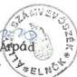

Állami Számverőszék

# JELENTÉS

egyes pártok állami
ingatlanjuttatásának törvényességi
ellenőrzéséről

9801

1998. szeptember

---

Az ellenőrzés végrehajtásáért felelős:

**Halász Gejza**
számvevő igazgató

Az ellenőrzést vezette:

**Dr. Szávai Tamás**
osztályvezető főtanácsos

Az összefoglaló jelentést készítette:

**Dr. Dotterweich Antal**
számvevő tanácsos

Az ellenőrzésben részt vettek:

**Berzétey Attiláné**
számvevő tanácsos

**Deák Lórántné**
számvevő

**Dr. Dotterweich Antal**
számvevő tanácsos

**Hoffmann István**
számvevő

**Pálfiné Mészáros Éva**
számvevő

**Tóth István**
számvevő tanácsos

---

V-1008-40/1998. TÉMASZÁM: 423.

# TARTALOMJEGYZÉK

|  **I. ÖSSZEGZŐ MEGÁLLAPÍTÁSOK, KÖVETKEZTETÉSEK, JAVASLATOK** | **5**  |
| --- | --- |
|  1.1. Ellenőrzés előkészítése | 5  |
|  1.2. Megállapítások | 5  |
|  **II. RÉSZLETES MEGÁLLAPÍTÁSOK** | **7**  |
|  1. A pártok működéséről és gazdálkodásáról szóló 1989. évi XXXIII. törvény módosításáról és az 1990. évi országgyűlési választásokon minősített pártok részére központi székház juttatásáról szóló 1991. évi XLIV. törvény létrejöttének előzményei, körülményei | 7  |
|  2. A Pvtm. 3. és 4. §-a alapján történt ingatlanjuttatás esetében a választási eredmények szerint azonos elbírálás követelményének érvényesülése | 8  |
|  2.1. A Pvtm. 3. §-a alapján történt ingatlanjuttatás | 9  |
|  2.2. A Pvtm. 4. §-a alapján történt ingatlanjuttatás és ennek arányossága a választási eredményekkel | 12  |
|  2.3. A Pvt. 4. §-ának (4) és (5) bekezdésében foglalt törvényi feltételek alkalmazhatósága | 14  |
|  3. Az eljárás törvényessége az 1991. évi XLIV. törvény 4. §-a alapján juttatott ingatlanok esetében | 15  |
|  3.1. A 3469/1991. Korm. határozat alapján történt ingatlanjuttatás | 15  |
|  3.2. A 3148/1992. (II.27.) Korm. határozat előkészítése és végrehajtása | 16  |

1

---

1. 2017年1月1日

。

•

。

。

[Non-Text]

[Non-Text]

[Non-Text]

[Non-Text]

[Non-Text]

[Non-Text]

[Non-Text]

---

# JELENTÉS

## egyes pártok állami ingatlanjuttatásának törvényességi ellenőrzéséről

Az Országgyűlés Alkotmány- és igazságügyi bizottsága 1996. október 30-i ülésén úgy döntött, hogy az egyes pártoknak az állami vagyonból juttatott ingatlanok felmérése céljából albizottságot alakít. Az Alkotmány- és igazságügyi bizottság az albizottságot megalakító határozatát az 1996. november 25-i ülésén pontosította. Ennek megfelelően az albizottság feladata annak megvizsgálása volt, hogy:

- az 1989. évtől kezdődően az egyes pártok mikor, milyen ingatlanok tulajdonát szerezték meg az állami vagyon terhére;
- a felmérés napján szerepel-e a tulajdonba adott ingatlan az adott párt gazdasági nyilvántartásában;
- a tulajdonba adott ingatlanok mértéke mennyiben felel meg a módosított, 1989. évi XXXIII. törvény hatályos rendelkezéseinek;
- amennyiben felmerül, hogy a tulajdonszerzés módja vagy mértéke nem volt törvényes, ott az elidegenítés körülményeit is vizsgálni kell.

Az albizottság a vizsgálat lezárásaként jelentést készített, amelyet az Alkotmányügyi bizottság 1997. szeptember 10-i ülésén elfogadott. A bizottság indokoltnak tartotta, hogy olyan határozati javaslatot terjesszen az Országgyűlés elé, amely felkéri az Állami Számvevőszéket célvizsgálat lefolytatására.

A bizottság javaslatát elfogadva az Országgyűlés 1997. december 9-i ülésnapján hozta meg „az egyes pártok állami ingatlanjuttatásának törvényességi ellenőrzéséről” szóló 116/1997. (XII. 17.) OGY határozatot, amelyben az Országgyűlés „felkéri az Állami Számvevőszéket, hogy ellenőrizze a Magyar Demokrata Fórumnak és a Fidesz-Magyar Polgári Pártnak (korábban Fiatal Demokraták Szövetsége) a pártok működéséről és gazdálkodásáról szóló módosított 1989. évi XXXIII. törvény alapján történt állami ingatlanjuttatásának törvényességét. Az ellenőrzés terjedjen ki annak vizsgálatára is, hogy fennállnak-e az 1989. évi XXXIII. törvény 4. §-ának (4)-(5) bekezdésében foglalt törvényi feltételek”.

3

---

Az MDF és a FIDESZ részére történt székházjuttatással más összefüggésben az Állami Számvevőszék korábbi jelentései már foglalkoztak. Az Állami Vagyonügynökség 1992. évi tevékenységének ellenőrzéséről szóló jelentés mint tényt rögzítette, hogy a székházak átadása kormányhatározaton alapul, az MDF és a FIDESZ gazdálkodása törvényességének ellenőrzéséről szóló jelentések pedig a juttatott ingatlanok értékesítését törvényesnek minősítették.

**Az ellenőrzés célja:** célvizsgálat keretében ellenőrizni az MDF-nek és a FIDESZ-nek a pártok működéséről és gazdálkodásáról szóló módosított 1989. évi XXXIII. törvény (a továbbiakban: Ptv.) alapján történt ingatlanjuttatás törvényességét. Az ellenőrzésnek azt is vizsgálnia kellett, hogy fennállnak-e a Ptv. 4. § (4)-(5) bekezdésében foglalt törvényi feltételek.

**Az ellenőrzés módszere:** az ingatlanjuttatásban közreműködött és egyéb szervezetektől bekért adatok, valamint a Budapesti Igazságügyi Műszaki Könyv- és Árszakértői Intézet szakvéleménye alapján végzett vizsgálat.

**A helyszíni ellenőrzés időszaka:** 1998. március 23. - április 30. között.

---4

---

I. ÖSSZEGZŐ MEGÁLLAPÍTÁSOK, KÖVETKEZTETÉSEK, JAVASLATOK

# I. ÖSSZEGZŐ MEGÁLLAPÍTÁSOK, KÖVETKEZTETÉSEK, JAVASLATOK

# 1.1. Ellenőrzés előkészítése

A Magyar Országgyűlésben képviselettel rendelkező hat politikai párt között a pártok országos központjai végleges elhelyezésének megoldásáról megállapodás jött létre 1991. május 21-én (1. sz. melléklet). Ezt követően a megállapodás elveit és a gyakorlati rendezés módját is elfogadó előterjesztést nyújtott be a Miniszterelnöki Hivatal közigazgatási államtitkára a Kormány részére a pártok végleges elhelyezéséről. A Kormány az előterjesztést elfogadva benyújtotta a pártok működéséről és gazdálkodásáról szóló 1989. évi XXXIII. törvény módosításáról és az 1990. évi országgyűlési választásokon minősített pártok részére központi székház juttatásáról szóló törvényjavaslatot, amelyet az Országgyűlés 1991. szeptember 17-i ülésnapján elfogadott.

Az Országgyűlés által elfogadott 1991. évi XLIV. törvény (a továbbiakban: Ptvm.) azonban nem határozta meg a juttatandó ingatlanok alapterületét. A Ptvm. 3. §-a, amely egy új 3. sz. melléklettel egészítette ki a Ptv.-t, csak a pártok tulajdonába kerülő ingatlanok megnevezését és a tulajdoni arány mértékét tartalmazza terület megjelölés nélkül, és a Ptvm. 4. §-a sem jelöl meg konkrét ingatlanokat. Így az ellenőrzés elvégzéséhez szükséges volt a pártok tulajdonába került ingatlanok juttatáskori alapterületének megállapítása céljából Igazságügyi Szakértői Intézet felkérése.

Értelmezést igényelt továbbá az ellenőrzéshez a Ptvm 4. §-ának első francia bekezdésében megfogalmazott „választási eredményeik szerint azonos elbírálás” követelménye. Álláspontunk szerint a Ptvm. az 1. sz. melléklet szerinti megállapodás végrehajtására jött létre, így irányadónak tekintettük az ott megfogalmazott, azonos elbírálást eredményező alapelveket és normatívákat.

# 1.2. Megállapítások

A Ptvm. 3. §-a alapján az MDF a Bp. II., Bem tér 3. sz. 1460 korrigált nettó m² alapterületű ingatlan, a FIDESZ a Bp. VI., Lendvay u. 28. sz. 977 korrigált nettó m² alapterületű ingatlan tulajdonát szerezte meg.

A Ptvm. 4. §-a alapján további ingatlanok kerültek a két párt tulajdonába. Összesen az MDF 5855, a FIDESZ 6126 korrigált nettó m² alapterülethez jutott a Ptvm. 3. és 4. §-a alapján.

A két párt részére történt ingatlanjuttatás mértéke meghaladja a hatpárti megállapodás szerinti jogosultság mértékét és a juttatás mértéke nincs összhangban a hivatkozott törvény 4. §-ában megfogalmazott azon követelménnyel sem, amely szerint olyan mértékben juttatható ingatlan, amely az e törvény 3. §-ában meghatározott ingatlanokat is figyelembe véve választási eredményeik szerint azonos elbírálást eredményez az ugyanezen paragrafus alapján juttatásban részesült többi párttal.

5

---

Az ellenőrzés megállapítása szerint az MDF 2237, a FIDESZ 2672 korrigált nettó m², választási eredményükkel arányban nem álló ingatlanjuttatásban részesült.

Az ingatlanjuttatási eljárás törvényességét illetően az állapítható meg, hogy a Pvtm. 4. §-a alapján juttatott három ingatlan közül a Bp. VI., Andrássy út 105. sz. ingatlan esetében az eljárás törvényes volt, míg a Bp. V., Váci u. 38. és a Bp. V., Széchenyi rkp. 3. sz. ingatlanok esetében az eljárásban a Jelentés II/3. pontjában részletezett törvénysértő mozzanatok voltak.

A két utóbbi ingatlan juttatása a 3148/1992. (II.27.) Korm. határozaton alapul. A döntés megalapozottsága nem volt megfelelő, mivel a kormányhatározat és a meghozatala érdekében készült előterjesztés nem tartalmazott adatot a két pártot törvényesen megillető ingatlan mértékre, a tulajdonba adni szándékozott ingatlanok méretére és a Pvtm. 3. §-a alapján már tulajdonba adott ingatlanok alapterületére sem. Ennek következtében a választási eredményekkel arányban nem álló méretű ingatlanok tulajdonba adása történt meg a határozat alapján.

A 116/1997. (XII.17.) OGY határozat szerint az ellenőrzésnek annak vizsgálatára is ki kellett terjednie, hogy fennállnak-e Pvt. 4. §-ának (4) és (5) bekezdéseiben foglalt törvényi feltételek.

A két párt részére történt ingatlanjuttatás nem minősíthető tiltott, nem pénzbeli vagyoni hozzájárulásnak, miután nem költségvetési szervtől származó, hanem a Pvt. 4. § (1) bekezdése alapján történt ingatlanjuttatás valósult meg. Ez pedig kizárja a Pvt. 4. §-ának (4) és (5) bekezdései alkalmazhatóságát.

### ***Határozati javaslat***

Az Országgyűlés elfogadja az Állami Számvevőszéknek az egyes pártok állami ingatlanjuttatásának törvényességi ellenőrzéséről szóló 116/1997. (XII.17.) OGY határozat végrehajtására készített jelentését.

---6

---

II. RÉSZLETES MEGÁLLAPÍTÁSOK

## II. RÉSZLETES MEGÁLLAPÍTÁSOK

### 1. A PÁRTOK MŰKÖDÉSÉRŐL ÉS GAZDÁLKODÁSÁRÓL SZÓLÓ 1989. ÉVI XXXIII. TÖRVÉNY MÓDOSÍTÁSÁRÓL ÉS AZ 1990. ÉVI ORSZÁGGYŰLÉSI VÁLASZTÁSOKON MINŐSÍTETT PÁRTOK RÉSZÉRE KÖZPONTI SZÉKHÁZ JUTTATÁSÁRÓL SZÓLÓ 1991. ÉVI XLIV. TÖRVÉNY LÉTREJÖTTÉNEK ELŐZMÉNYEI, KÖRÜLMÉNYEI

A magyar Országgyűlésben képviselettel rendelkező hat politikai párt között a pártok országos központjai végleges elhelyezésének megoldásáról 1991. május 21-én megállapodás jött létre (1. sz. melléklet). Ezt követően 1991. június 28-i keltezéssel a Miniszterelnöki Hivatal közigazgatási államtitkára előterjesztést nyújtott be a Kormány részre a pártok végleges elhelyezéséről. A Kormány 3280/1991. sz. a párttörvény módosításával összefüggő feladatokról szóló 1991. július 3-i keltű határozatának 1./ pontja döntött arról, hogy be kell nyújtani az Országgyűlésnek a pártok működéséről és gazdálkodásáról szóló törvény módosításáról szóló törvényjavaslatot. Az 5. pontja pedig rögzítette, hogy a törvényjavaslat benyújtásával párhuzamosan javaslatot kell tenni az MDF és a FIDESZ fennmaradó igényének kielégítésére.

A törvényjavaslatot a Kormány 1991. augusztus 28-án nyújtotta be az Országgyűlés elnöke részére. A törvényjavaslat általános indokolása szerint „A **Javaslat** a rendszerváltás követelményeinek megfelelően **egyenlő esélyeket kíván biztosítani a pártoknak** a működésükhöz elengedhetetlenül szükséges **központi épületek tulajdonba adásával**. A pártok működéséről és gazdálkodásáról szóló törvény alapelveivel összhangban az 1990. évi országgyűlési választási eredményekből kiindulva **hozzávetőlegesen a választási eredményekkel arányos alapterületű irodahelyiségek kerülnek a pártok tulajdonába**”.

Az elhelyezési jogosultságot illetően az 1. sz. melléklet szerinti megállapodás azt rögzíti, hogy „A hat parlamenti párt mindegyike jogosult 2000 m² hasznos nettó alapterületű épületre. Ezen túlmenően - az 1990-es országgyűlési választásokon elért szavazati arányok függvényében - jogosultak további, legfeljebb 1500 m² nettó alapterületre.

Ennek alapján az egyes pártok a következők szerint nyernek elhelyezési jogosultságot:

- MDF 3500 m²
- SZDSZ 3157 m²
- FKGP 2712 m²
- MSZP 2661 m²
- FIDESZ 2543 m²
- KDNP 2392 m² „

7

---

A hasznos korrigált nettó alapterület megállapításához a hat párt szempontrendszert dolgozott ki (2. sz. melléklet).

A 2000 m² -en felüli hasznos korrigált nettó alapterületeket összevetve a felsorolt pártok területi listáira az 1990. évi országgyűlési választásokon leadott szavazatokkal, az 1000 szavazatra jutó m² a következőképpen alakul:

|  P á r t | m² | Megoszlás % | Szavazat | Megoszlás % | 1000 szava- zatra jutó m²  |
| --- | --- | --- | --- | --- | --- |
|  MDF | 1500 | 30,21 | 1214359 | 29,3 | 1,2352  |
|  SZDSZ | 1157 | 23,30 | 1050799 | 25,4 | 1,1011  |
|  FKGP | 712 | 14,34 | 576315 | 14,0 | 1,2354  |
|  MSZP | 661 | 13,31 | 535064 | 13,0 | 1,2353  |
|  FIDESZ | 543 | 10,94 | 439649 | 10,6 | 1,2351  |
|  KDNP | 392 | 7,90 | 317278 | 7,7 | 1,2355  |
|  Összesen, ill. átlag | 4965 | 100,00 | 4133464 | 100,00 | 1,2012  |

Az 1000 szavazatra jutó m² alapján az állapítható meg, hogy az elhelyezési jogosultságot illetően az 1. sz. melléklet szerinti megállapodásban a „hozzávetőlegesen a választási eredményekkel arányos” juttatás követelménye érvényesült.

## 2. A PTVM. 3. ÉS 4. §-A ALAPJÁN TÖRTÉNT INGATLANJUTTATÁS ESETÉBEN A VÁLASZTÁSI EREDMÉNYEK SZERINT AZONOS ELBÍRÁLÁS KÖVETELMÉNYÉNEK ÉRVÉNYESÜLÉSE

A PtvM. 3. §-a új 3. sz. melléklettel egészítette ki a Ptv-t, amely konkrétan meghatározza, hogy mely ingatlanok kerülnek - részben osztottan - a pártok tulajdonába.

A melléklet csak az ingatlanok megnevezését és a tulajdoni arány mértékét tartalmazza, területüket nem, a 4. § pedig nem jelöl meg konkrét ingatlanokat sem. Az 1. sz. melléklet szerinti megállapodás a korrigált hasznos nettó alapterületeket a következők szerint rögzítette:

8

---

II. RÉSZLETES MEGÁLLAPÍTÁSOK

|  P á r t | Ingatlan megnevezése | Korrigált nettó alapterület m^{2}  |
| --- | --- | --- |
|  MDF | Bp. II., Bem tér 3. | 2012  |
|  SZDSZ | Bp. V., Mérleg u. 6. | 3053  |
|  FKGP | Bp. V., Belgrád rkp. 24. | 2379  |
|  MSZP | Bp. VIII., Köztársaság tér 26. | 2928  |
|  FIDESZ | Bp. VI., Lendvay u. 28. | 721  |
|  KDNP | Bp. XII., Nagy Jenő u. 5. | 3035  |

A pártok tulajdonába került ingatlanok juttatáskori bruttó és korrigált nettó négyzetméter területének megállapítására a Budapesti Igazságügyi Műszaki-, Könyv- és Árszakértői Intézetet kértük fel.

Az Igazságügyi Szakértői Vélemény szerint a pártoknak juttatott, az előzőekben felsorolt 6 és a Pvtm. 4. §-a alapján átadott további 3, összesen 9 ingatlan korrigált nettó területe a következő:

|  Sorsz. | Ingatlan megnevezése | Párt | Tulajdoni arány | Korrigált nettó m^{2}  |
| --- | --- | --- | --- | --- |
|  1. | Bp. II., Bem tér 3. | MDF | 1/1 | 1460  |
|  2. | Bp. V., Mérleg u. 6. | SZDSZ | 1/1 | 2773  |
|  3. | Bp. V., Belgrád rkp. 24. | FKGP | 1/1 | 2658  |
|  4. | Bp. VI., Lendvay u. 28. | FIDESZ | 1/1 | 977  |
|  5. | Bp. VIII., Köztársaság tér 26. | MSZP | 1/1 | 3279  |
|  6. | Bp. XII., Nagy Jenő u. 5. | KDNP | 86/100 | 2948  |
|   |  | FKGP | 14/100 | 480  |
|  7. | Bp. VI., Andrássy út 105. | FIDESZ | 1/1 | 1405  |
|  8. | Bp. V., Váci u. 38. | MDF | 54/100 | 2079  |
|   |  | FIDESZ | 46/100 | 1771  |
|  9. | Bp. V., Széchenyi rkp. 3. | MDF | 54/100 | 2316  |
|   |  | FIDESZ | 46/100 | 1973  |

A továbbiakban a juttatott ingatlanok korrigált nettó hasznos alapterületeként az Igazságügyi Szakértői Vélemény szerinti adatokat használjuk.

## 2.1. A Pvtm. 3. §-a alapján történt ingatlanjuttatás

A Pvtm. 3. §-a alapján juttatott ingatlanok esetében a hasznos korrigált nettó alapterületeket összevetve az érintett hat párt területi listáira az 1990. évi országgyűlési választásokon leadott szavazatokkal, az 1000 szavazatra jutó korrigált nettó négyzetméter a következőképpen alakul:

9

---

|  P á r t | Kapott korr. nettó m^{2} | Megosz- lás % | Szavazat | Megosz- lás % | 1000 szavazatra jutó korr. nettó m^{2}  |
| --- | --- | --- | --- | --- | --- |
|  MDF | 1460 | 10,01 | 1214359 | 29,38 | 1,20228  |
|  SZDSZ | 2773 | 19,03 | 1050799 | 25,42 | 2,63894  |
|  FKGP | 3138 | 21,53 | 576315 | 13,94 | 5,44494  |
|  MSZP | 3279 | 22,50 | 535064 | 12,94 | 6,12824  |
|  FIDESZ | 977 | 6,70 | 439649 | 10,64 | 2,22222  |
|  KDNP | 2948 | 20,23 | 317278 | 7,68 | 9,29154  |
|  Összesen, ill. ill. átlag | 14595 | 100,00 | 4133464 | 100,00 | 3,53093  |

A táblázat alapján az állapítható meg, hogy **a Ptvm. 3. §-a alapján történt ingatlanjuttatás nem elégti ki azt a követelményt, hogy hozzávetőlegesen a választási eredményekkel arányos alapterületű irodahelyiségek kerüljenek a pártok tulajdonába.**

A következő táblázat első oszlopában a ténylegesen kapott (Igazságügyi Szakértői Vélemény szerinti) korrigált nettó alapterületek szerepelnek, a második oszlopban pedig az előző táblázat 1000 szavazatra jutó korrigált átlagos nettó m$^{2}$ adata (3,53093) és az egyes pártokra adott listás szavazatok szorzataként megállapítható arányos alapterületek. A következő oszlop az eltéréseket mutatja a ténylegesen juttatott és az arányos alapterületek között m$^{2}$-ben és %-ban kifejezve:

|  P á r t | Kapott korrigált nettó m^{2} | Átlagos korrigált nettó m^{2} alapján arányos | E l t é r é s  |   |
| --- | --- | --- | --- | --- |
|   |   |   |  m^{2} | %  |
|  MDF | 1460 | 4288 | -2828 | -66,0  |
|  SZDSZ | 2773 | 3711 | -938 | -25,3  |
|  FKGP | 3138 | 2035 | 1103 | 54,2  |
|  MSZP | 3279 | 1889 | 1390 | 73,6  |
|  FIDESZ | 977 | 1552 | -575 | -37,0  |
|  KDNP | 2948 | 1120 | 1828 | 163,2  |

Az egyes pártok részére történt ingatlanjuttatás mértéke jelentősen eltér az 1990. évi országgyűlési választásokon kapott listás szavazatok alapján számított arányos mértéktől. Az arányos mértékhez képest többletjuttatásban részesült három párt: az FKGP 54,2 %-kal, az MSZP 73,6%-kal, a KDNP pedig 163,2%-kal kapott több korrigált hasznos nettó alapterületet, mint ami arányosan megillette volna. Három párt pedig kevesebb ingatlant kapott az ará-

10

---

II. RÉSZLETES MEGÁLLAPÍTÁSOK

nyosnál: az MDF 66%-kal, az SZDSZ 25,3 %-kal, a FIDESZ pedig 37%-kal kapott kisebb alapterületet a választási eredménnyel arányos területhez képest.

A hat politikai párt között létrejött 1. sz. melléklet szerint megállapodás elvi megoldásával sem arányos a kapott juttatás mértéke, az eltéréseket a következő táblázat mutatja be:

|  P á r t | Megállapodás szerinti jogosultság | Juttatott nettó m^{2} | Eltérés  |   |
| --- | --- | --- | --- | --- |
|   |   |   |  m^{2} | %  |
|  MDF | 3500 | 1460 | -2040 | -58,3  |
|  SZDSZ | 3157 | 2773 | -384 | -12,2  |
|  FKGP | 2712 | 3138 | 426 | 15,7  |
|  MSZP | 2661 | 3279 | 618 | 23,2  |
|  FIDESZ | 2543 | 977 | -1566 | -61,6  |
|  KDNP | 2392 | 2948 | 556 | 23,2  |
|  Összesen: | 16965 | 14595 | - | -  |

Az 1. sz. melléklet szerinti **megállapodásban rögzített 2000 m$^{2}$ alapjuttatáson felüli jogosultság és a juttatott alapterület összevetésével célszerű a 4. § szerint ingatlanjuttatás törvényességének megállapításánál kiindulni.** Ezt támasztja alá, hogy - mint már az 1. pontban említésre került - a 2000 m$^{2}$ feletti hasznos alapterületek esetében érvényesült a választási eredményekkel történő hozzávetőleg arányos juttatás követelménye.

Ezt indokolja továbbá a Pvtm. általános indoklásának első mondata is, amely szerint „A Javaslat a rendszerváltás követelményeinek megfelelően egyenlő esélyeket kíván biztosítani a **pártoknak a működésükhöz elengedhetetlenül szükséges központi székházak tulajdonba adásával.**” Amennyiben nem a 2000 m$^{2}$ feletti korrigált nettó hasznos alapterület a kiindulási alap, akkor az összes nettó alapterület alapján számított 3,53 m$^{2}$ 1000 szavazatra jutó átlagos korrigált nettó hasznos alapterületnél magasabb fajlagos alapterületet kapott három párt: FKGP, MSZP, KDNP juttatását sem lehet törvényesnek tekinteni.

A Pvtm. 3. §-a alapján történt ingatlanjuttatások korrigált nettó hasznos alapterületét összevetve a pártok területi listáira leadott szavazatokkal a 2000 m$^{2}$ alapjuttatáson felül, az 1000 szavazatra jutó korrigált nettó hasznos alapterület a következőképpen alakul:

11

---

|  P á r t | 2000 m^{2}-en felül |   | 1000 szavazatra jutó alapterület m^{2}  |
| --- | --- | --- | --- |
|   |  Juttatott alapterület | Szavazat  |   |
|  SZDSZ | 773 | 1050799 | 0,73563  |
|  FKGP | 1138 | 576315 | 1,97461  |
|  MSZP | 1279 | 535064 | 2,39036  |
|  KDNP | 948 | 317278 | 2,98792  |

Az MDF és a FIDESZ a Pvtm. 3. §-a alapján 1460, illetve 977 m$^{2}$ korrigált nettó hasznos alapterületet kapott, így az 1. sz. melléklet szerinti megállapodásban rögzített 2000 m$^{2}$ alapjuttatást sem kapták meg e paragrafus alapján.

Az 1. sz. melléklet szerinti megállapodásban az SZDSZ lemondott többletigénye érvényesítéséről, az MSZP többlet területét pedig tudomásul vették az aláíró pártok. A KDNP és az FKGP ingatlanjuttatásának mértéke nem felel meg teljesen az 1. sz. melléklet szerinti megállapodásnak, mivel az pontatlan adatokon alapult. Az Igazságügyi Szakértői Vélemény szerint a KDNP-nek juttatott Bp. XII., Nagy Jenő u. 5. sz. ingatlan korrigált nettó hasznos területe nem 3035 m$^{2}$, hanem 3428 m$^{2}$, a Bp. V., Belgrád rkp. 24. sz. ingatlan korrigált nettó alapterülete pedig nem 2379 m$^{2}$, hanem 2658 m$^{2}$.

Álláspontunk, hogy a törvény az 1. sz. melléklet szerinti megállapodás végrehajtására jött létre, így a 3. § alapján történt, arányostól eltérő juttatások az SZDSZ, FKGP, MSZP, KDNP esetében megítélésünk szerint nem álltak ellentétben a politikai akarattal. Ennek megfelelően a **4. § alapján történt ingatlanjuttatások esetében sem az abszolút arányosság, hanem a törvényjavaslat indokolásában szereplő „hozzávetőlegesen a választási eredményekkel arányos” juttatás követelményének érvényesülését kellett vizsgálni.**

## 2.2. A Pvtm. 4. §-a alapján történt ingatlanjuttatás és ennek arányossága a választási eredményekkel

A 4. § alapján az MDF és a FIDESZ részére történt ingatlanjuttatás - az Igazságügyi Szakértői Vélemény szerint - a következőképpen alakult:

| I n g a t l a n | Korrigált nettó terület m^{2} | MDF m^{2} | FIDESZ m^{2} |
| --- | --- | --- | --- |
| Bp. VI., Andrássy út 105. | 1405 | - | 1405 |
| Bp. V., Széchenyi rkp. 3. | 4289 | 2316 | 1973 |
| Bp. V., Váci u. 38. | 3850 | 2079 | 1771 |
| Összesen: | 9544 | 4395 | 5149 |

12

---

II. RÉSZLETES MEGÁLLAPÍTÁSOK

A 3. és a 4. §-ok szerinti juttatás révén összesen az MDF 5855, a FIDESZ pedig 6126 korrigált nettó m² alapterületet kapott.

A 2000 m²-en felüli korrigált nettó területeket összevetve a listás szavazatokkal, az 1000 szavazatra jutó m² a következőképpen alakul:

|   | Juttatott terület 2000 m²-en felül | Szavazat | 1000 szavazatra jutó m²  |
| --- | --- | --- | --- |
|  MDF | 3855 | 1214359 | 3,1745  |
|  FIDESZ | 4126 | 439649 | 9,3847  |

Az 1000 szavazatra jutó korrigált nettó alapterület alapján az állapítható meg, hogy a Pvtm 3. §-a alapján arányostól felfelé eltérő juttatásban részesült pártoknál az MDF részére történt juttatás kis mértékben, míg a FIDESZ-é jelentős mértékben magasabb.

A választási eredmények szerint hozzávetőleg azonos elbírálás követelményeinek az felel meg, ha az MDF és a FIDESZ esetében is a Pvtm. 3. §-a alapján juttatásban részesült KDNP 1000 szavazatra jutó - 2000 m²-en felüli - 2,98792 korrigált nettó m² adatát fogadjuk el irányadónak, mint még törvény által elismert szélső értéket.

Ennek alapján az MDF-nek választási eredményével hozzávetőleg arányosan a 2000 m² alapjuttatáson felül juttatható lett volna: 1214359 x 2,98792 = 3628 m², az alapjuttatással együtt 5628 m². Az 1. sz. melléklet szerinti megállapodás azonban kimondja, hogy az alapjuttatáson felül legfeljebb 1500 m² a további jogosultság mértéke. Erre figyelemmel, a felső abszolút korlát következtében a juttatható mérték 3500 m².

A FIDESZ részére választási eredményével hozzávetőleg arányosan ugyancsak a KDNP fajlagos nettó m² adatát alapul véve juttatható lett volna:

439649 x 2,98792 = 1313,6 m², az alapjuttatással együtt 3313,6 m².

Az előzőek alapján a többletjuttatás a két párt esetében:

|  P á r t | Juttatott alapterület m² | Hozzávetőleg arányos, ill. maximált alapterület m² | Többlet m²  |
| --- | --- | --- | --- |
|  MDF | 5855 | 3500 | 2355  |
|  FIDESZ | 6126 | 3313,6 | 2812,4  |

13

---

Az Igazságügyi Szakértői Vélemény azt rögzíti, hogy „A nettó alapterületi értékek +- 5%-os pontossági határon belüliek, tekintettel az adatszolgáltatásként kapott tervek pontosságára és a helyszíni felmérés gátoltságára.” Ennek alapján a többletjuttatás területe 5%-kal csökkentve: MDF: 2237 m², FIDESZ: 2672 m².

### 2.3. A Ptv. 4. §-ának (4) és (5) bekezdésében foglalt törvényi feltételek alkalmazhatósága

A Ptv. 4. §-ának (4) és (5) bekezdése a következőket mondja ki:

*(4) Az a párt, amely a (2)-(3) bekezdésben foglalt szabályt megsértve vagyoni hozzájárulást fogadott el, köteles annak értékét - az Állami Számvevőszék felhívására - tizenöt napon belül az állami költségvetésbe befizetni. Késedelem esetén a tartozást adók módjára kell behajtani. A párt költségvetési támogatását ezen kívül az elfogadott vagyoni hozzájárulás értékét kitevő összeggel csökkenteni kell.*

*(5) Ha a párt részére a vagyoni hozzájárulást nem pénzben nyújtották, köteles annak értékeléséről (értékének meghatározásáról) gondoskodni. Ha a párt a (2) és (3) bekezdésben foglalt szabályt megsértve tiltott, nem pénzbeli hozzájárulást fogadott el, annak értékét az Állami Számvevőszék állapítja meg.*

A Ptv. 4. § (2) és (3) bekezdésének rendelkezései:

*(2) A párt részére - a 4. § (1) bekezdésében foglalt kivételektől eltekintve - költségvetési szerv, továbbá állami vállalat, állami részvétellel működő gazdasági társaság, közvetlen költségvetési támogatásban vagy költségvetési szervi támogatásban részesülő alapítvány vagyoni hozzájárulást nem adhat, a párt költségvetési szervtől, továbbá állami vállalattól, állami részvétellel működő gazdasági társaságtól, közvetlen költségvetési támogatásban vagy költségvetési szervi támogatásban részesülő alapítványtól vagyoni hozzájárulást nem fogadhat el.*

*(3) A párt vagyoni hozzájárulást más államtól nem fogadhat el. A párt névtelen adományt nem fogadhat el; az ilyen adományt be kell fizetni a 8. § (1) bekezdésében említett alapítvány céljaira.*

Az előzőekben idézett törvényi rendelkezések alapján akkor lenne tiltott a kapott nem pénzbeli vagyoni hozzájárulás, ha

- nem tartozik a 4. § (1) bekezdésében foglalt kivételek közé.

Megítélésünk szerint az ingatlanjuttatás nem költségvetési szervtől kapott vagyoni hozzájárulás, miután azt nem költségvetési szerv, hanem a Pvtm. 4. §-ának felhatalmazása alapján eljáró kormány juttatta.

14

---

II. RÉSZLETES MEGÁLLAPÍTÁSOK

Álláspontunk szerint az ingatlanjuttatás a Ptv. 4. § (1) bekezdésében foglalt kivételek közé tartozik. A 4. § (1) bekezdése „az állam által e törvény 5. §-a alapján ingyenesen átadott ingatlanokról” rendelkezik többek között, mint a pártokat törvényesen megillető vagyonszerzésről. Az 5. § (1) bekezdése szerint „E törvény alapján az állam tulajdonából - a (2) bekezdésben foglaltak szerint - állami költségvetési támogatásra jogosult pártok tulajdonába kerülnek ingyenesen a 3. sz. mellékletben felsorolt ingatlanok az ott meghatározott tulajdoni hányadok szerint.” A Ptv. 3. sz. melléklete azonban csak a hat parlamenti párt központi pártszékházat sorolja fel. Véleményünk szerint az MDF-nek és a FIDESZ-nek, továbbá a Pvtm. 4. § második francia bekezdésében meghatározott pártoknak később juttatott ingatlanokat is ide kell érteni. Ilyen jogértelmezés van összhangban a Pvtm. 4. §-ának szövegéből megállapítható jogalkotói akarattal. Továbbá csak ilyen jogértelmezést esetén lehet az akkor költségvetési támogatásban részesülő nem parlamenti pártok részére a Pvtm. 4. §-ának második francia bekezdése alapján történt ingatlanjuttatásokat törvényesnek tekinteni. A Pvtm. 4. §-ának második francia bekezdése arra hatalmazza fel a Kormányt, hogy

„- a 3. számú mellékletben fel nem sorolt, de költségvetési támogatásban részesülő minden párt részére - választási eredményeiktől függően - legkevesebb 400, legfeljebb 800 négyzetméter bruttó alapterületű ingatlanrész tulajdonjogának megszerzését biztosítsa.”

E törvényi rendelkezés alapján a Munkáspárt és az MSZDP, az Agrárszövetség, a Vállalkozók Pártja és a Demokrata Koalíció szereztek tulajdont, mint a választásokon 1% feletti eredményt elért és így költségvetési támogatásban részesült pártok.

Álláspontunk szerint - az előzőekben kifejtettekre tekintettel - az MDF és a FIDESZ részére történt ingatlanjuttatás nem tartozik a Ptv. 4. § (2) bekezdésének rendelkezése alá, mert ez a Ptv. 4. § (1) bekezdése alapján történt, így nem állnak fenn a Ptv. 4. §-ának (4) és (5) bekezdésében foglalt törvényi feltételek.

### 3. AZ ELJÁRÁS TÖRVÉNYESSÉGE AZ 1991. ÉVI XLIV. TÖRVÉNY 4. §-A ALAPJÁN JUTTATOTT INGATLANOK ESETÉBEN

A hivatkozott törvényi rendelkezés végrehajtása érdekében két kormányhatározatot hoztak az 1991. és 1992. év során.

#### 3.1. A 3469/1991. Korm. határozat alapján történt ingatlanjuttatás

Az egyes kormányhatározatok módosításáról rendelkező 3469/1991. sz. 1991. november 7-i keltű kormányhatározat 2. pontja szerint „A pártok működéséről és gazdálkodásáról szóló 1989. évi XXXIII. törvény módosításáról és az 1990. évi országgyűlési választásokon minősített pártok részére központi székház juttatásáról szóló 1991. évi XLIV. törvény végrehajtása a pénzügyminiszter feladata.” A végrehajtás határidejeként a határozat 1991. december 31-ét jelölte meg.

15

---

A határozat végrehajtása céljából a Kincstári Vagyonkezelő Szervezet 1991. november hónapban az MDF és a FIDESZ részére a Pvtm. 4. §-a szerinti többlet ingatlanigényük kielégítését biztosítandó ajánló ingatlanjegyzéket adott át.

A pénzügyminiszter 1992. január 15-én „Tájékoztató”-t nyújtott be a Kormány részére „a Magyar Demokrata Fórum és a Fiatal Demokraták Szövetsége többlet ingatlan jogosultságának kielégítéséről”. A tájékoztatóból az állapítható meg, hogy az érintett két párt képviselői szerint „A KVSZ által adható ingatlan kínálat nem nyújt újabb kedvező lehetőséget a megfelelő ingatlanok kiválasztására. Ezzel a pártok a továbbiakban nem kívánnak kísérletezni. A fennálló probléma áthidaló megoldását abban látják, ha ingatlan többletigényük részleges kielégítését a természetbeni megoldás ellehetetlenülése miatt pénzbeni megváltással rendezik.”

A tájékoztató ezzel kapcsolatosan rögzíti „A pártok fentiek szerinti igényének kielégítését... nem javasoljuk. Újabb ingatlan juttatási lehetőségek feltárása folyamatban van, és szükségesnek tartjuk, hogy az Állami Vagyonügynökség is vizsgálja meg a tulajdonában lévő és értékesítésre szánt ingatlanok bevonhatóságát az igények kielégítésére”.

**Az ajánló jegyzék alapján** végül is csak **egy ingatlan**, az 1991. decemberében kiválasztott **Bp. VI., Andrássy út 105. sz.** épület **került** a Kincstári Vagyonkezelő Szervezet és a FIDESZ között 1992. május 12-én kelt megállapodás alapján **párttulajdonba**.

Az említett ingatlan és a Bp. VI., Lendvay u. 28. sz. alatti központi székház együttes hasznos korrigált nettó alapterülete az Igazságügyi Szakértői Vélemény szerint 2382 m², amely az 1. sz. mellékletként csatolt megállapodás szerinti 2543 m² jogosultságnál és a választási eredménnyel hozzávetőleg arányos 3314 m² alapterületnél is kisebb, így anyagi jogi jogsértés nem történt. Eljárás-jogilag is szabályos az ingatlanjuttatás, mivel a Magyar Állam tulajdonában, a Kincstári Vagyonkezelő Szervezet kezelésében lévő ingatlan átadása történt kormányhatározat alapján.

### 3.2. A 3148/1992. (II.27.) Korm. határozat előkészítése és végrehajtása

Az egyes belvárosi irodaházakról szóló 3148/1992. (II.27.) Korm. határozat alapján a Bp. V., Váci u. 38. sz. és a Bp. V., Széchenyi rkp. 3. sz. ingatlanok kerültek az MDF és a FIDESZ tulajdonába.

A kormányhatározathoz kapcsolódó előterjesztés nem tartalmazott adatot az ingatlanok méretére, a két pártot megillető jogos igény mértékére, sem a Pvtm. 3. §-a alapján már tulajdonba adott ingatlanok alapterületére. Csak azt rögzítette, hogy az ingatlanjuttatás „elfogadható megoldást jelente azon parlamenti pártok számára, melyek választási eredményeik alapján jelenleg kisebb területet használnak, mint azt számukra a törvények lehetővé tennék (MDF, FIDESZ)”.

16

---

II. RÉSZLETES MEGÁLLAPÍTÁSOK

Az előterjesztés nem tartalmazta és a kormányhatározat sem rendelkezett arról, hogy az ingatlanokat az érintett pártoknak milyen tulajdoni hányad szerint kell átadni.

A kormányhatározaton és a kapcsolódó előterjesztésen kívül más iratot a Miniszterelnöki Hivatal nem tudott ellenőrzésünk rendelkezésére bocsátani, így a határozat előkészítéséről nem volt lehetőségünk informálódni. Az Igazságügyi Szakértői Vélemény alapján a két ingatlan hasznos korrigált nettó alapterülete jelentősen meghaladja a választásokon elért eredmény alapján a többi párttal azonos elbírálást eredményező mértéket. Ennek következtében a határozat a Pvtm. 4. § első francia bekezdésének rendelkezésével ellentétes.

A határozat sérti az Állami Vagyonügynökségről és a hozzátartozó vagyon kezeléséről és hasznosításáról szóló 1990. évi VII. törvény 26. §-ának rendelkezését is, amely szerint „A Vagyonügynökség jogosult - a vagyonpolitikai irányelvek keretei között - állami vagyont ellenérték nélkül a Társadalombiztosítási Alap és más szervezetek tulajdonába adni”. A határozat meghozatalának időpontjában vagyonpolitikai irányelvek nem voltak hatályban, mivel az Országgyűlés a 20/1990. (III.12.) sz. alatt elfogadott, az 1990. évi ideiglenes vagyonpolitikai irányelvekről szóló határozatát csak 1991. szeptember 30-ig hosszabbította meg. Az 1990. évi VII. törvény hatálybalépését követően elfogadott 1991. évi XLIV. törvény (Pvtm.) a Legfőbb Ügyész álláspontja szerint „lex specialis rendelkezés, tehát kivételt tartalmazó rendelkezése alkotmányossági szempontból nem kifogásolható”. Tételes jogi rendelkezéssel azonban csak a pártok működéséről és gazdálkodásáról szóló 1989. évi XXXIII. törvény módosításáról szóló, az Országgyűlés 1992. december 21-i ülésnapján elfogadott 1992. évi LXXXI. törvény 10. §-a módosította a Pvtm. 4. §-ának felvezető rendelkezését a következőképpen: „4. § Az Országgyűlés felhatalmazza a Kormányt, hogy legkésőbb **1993. január 31-ig** az állami szerv - **elsősorban az Állami Vagyonügynökség** - kezelésében álló vagyon terhére ingyenesen...”. E módosítás rendezte továbbá az ingatlanjuttatásra vonatkozó felhatalmazás határidejének meghosszabbítását a Kormány részére. Az ingatlanok tényleges átadásának időpontjában ugyanis - a határidő lejárta miatt - a bonyolításra nem volt hatályos jogszabályi felhatalmazás.

A Miniszterelnöki Hivatal tájékoztatása szerint az 1992. február 27-i kormányülés a kormányhatározathoz kapcsolódó előterjesztés határozati javaslatára 2. pontjának csupán az Országos Kárrendezési és Kárpótlási Hivatal elhelyezését érintő részét fogadta el. A Kormány április 16-án tért vissza az ügyre, és az eredeti határozati javaslat szerint döntött. A 3148/1992. (II.27.) Korm. határozatot az április 16-i kormányülést követően foglalták írásba.

A Kormány április 16-i döntését megelőzően - március 10-én - kötött megállapodást az Állami Vagyonügynökség, a Belvárosi Irodaház Kft., a Kincstári Vagyonkezelő Szervezet, az MDF és a FIDESZ a **Bp. V., Váci u. 38. sz. ingatlan tulajdonjogi helyzetének rendezése tárgyában**. Kormánydöntés hiányában a Kincstári Vagyonkezelő Szervezet és az ÁVÜ felhatalmazás nélkül kötött megállapodást. Jelezni szükséges, hogy a megállapodás 3. pontja azt rögzíti, hogy „Az Állami Vagyonügynökség 1992. április 1-jei hatállyal az 1.

17

---

pont alatt megjelölt ingatlan kezelői jogát átadja a KVSZ-nek, amely az azt követő 15 napon belül az MDF és a FIDESZ tulajdonába adja az általuk megjelölt tulajdoni hányad szerint". Megállapítható tehát, hogy a tulajdoni hányadokat nem kormánydöntés rendezte, hanem a pártok határozták meg.

A megállapodás 4. pontja szerint „Az MDF és a FIDESZ mint az 1. pont alatti ingatlan közös tulajdonosai bizományosi szerződést kötnek a B.I. Kft.-vel, mint bizományossal az ingatlan értékesítésére az alábbi szempontok alapján:

- B.I. Kft.-nek a tulajdon jog átruházására vonatkozó szerződést 1992. június 30-ig kell megkötnie megbízó javára.
- Az ingatlan értékesítésénél a minimális eladási ár: 1300 M Ft., azaz egymilliárd-háromszázmillió forint (+ÁFA)."

A megállapodás 6. pontja szerint „Vevő fizetési feltételeitől függetlenül a Belvárosi Irodaház Kft.-n keresztül az Állami Vagyonügynökség kötelezettséget vállal arra, hogy az első részlet esedékességétől számított 8 napon belül a tényleges vételárat a két párt számára, a pártok által meghatározott részesedési arányok szerint a pártok képviselői által megjelölt bankszámlára átutalja". Ilyen kötelezettségvállalás az ÁVÜ részéről nem volt összhangban a megállapodás bevezető részében említett 1991. évi XLIV. törvény rendelkezésével. Nem volt az ÁVÜ jogosult, hogy kezességet vállaljon ingatlan későbbi értékesítése folytán esetleg be nem folyó vételár megfizetésére.

A kezelői jog átadásáról szóló megállapodás az ÁVÜ és a KVSZ között 1992. április 9-én jött létre, tehát kormány-felhatalmazás nélkül. Az ingatlan tulajdonba adása a kormánydöntést követően 1992. május 6-án történt meg az MDF és a FIDESZ részére.

**A Bp. V., Széchenyi rkp. 3. sz. ingatlan tulajdonjogi helyzetének rendezése tárgyában** 1992. május 20-án, tehát a kormányhatározat április 16-i meghozatala és írásbafoglalása után jött létre megállapodás. A kezelői jogot az ÁVÜ május 22-én ruházta át a KVSZ javára, az ingatlan tulajdonba adását rögzítő megállapodás a KVSZ és a két érintett párt között június 1-jén jött létre.

Budapest, 1998. szeptember 16

**Melléklet: 2 db**

Dr. Kovács Árpád  
elnök

18

---

1. sz. melléklet
a V-1008-40/1998. sz. jelentéshez

# Megállapodás

amely létrejött 1991. május 21-én
a Magyar Országgyűlésben képviselettel rendelkező hat politikai párt között
a pártok országos központjainak végleges elhelyezésének megoldásáról.

A hat parlamenti párt képviselői 1991. május 21-én egyeztető tárgyalást tartottak, melynek keretei megvitatták az 1991. május 14-i előkészítő tárgyalás Miniszterelnöki Hivatal által készített emlékeztető illetőleg az országos központok elhelyezésével kapcsolatban fennmaradt nyitott kérdéseket.

Az egyeztető tárgyalás célja az volt, hogy a fél éve tartó tárgyalássorozat lezárása érdekében megszüless az alapvető kérdésekben a pártok végleges álláspontját rögzítő konszenzusos megállapodás.

A megbeszélés eredményeképpen a résztvevő pártok a hat parlamenti párt vonatkozásában a következőben állapodtak meg:

1./ Az elhelyezési kérdések rendezési alapjaként egybehangzóan elfogadják a Miniszterelnöki Hivatal részére korábban beterjesztett és annak képviselői részéről is jóváhagyott, az egyes pártok elhelyezési jogosságát pontosan rögzítő konstrukciót

A pártok a rendezés alapelveiként a következőkben állapodnak meg:

a./ A kormány és az Országgyűlés elé kerülő elhelyezési javaslat csak azokra a pártokra vonatkozzék, amely az 1990-es Országgyűlési választásokon – a Párttorvény szerint értelmezett – legalább 1 %-os szavazás arányt értek el.

b./ A rendezés kiinduló pontjaként – a parlamenti pártok vonatkozásában – a jelenlegi elhelyezésre szolgáló ingatlanokhoz képest csak – a jelen megállapodás 1. pontjában rögzített konstrukció szerinti – tényleg többletjogosultság mértékében kerüljön sor további ingatlan(ok) bevonására.

c./ A pártok az országos központok elhelyezésére szolgáló épületekre vonatkozóan ingyenesen, korlátozás nélküli tulajdonjogot szereznek.

d./ A tulajdonba adott ingatlanokat terhelő bérleti szerződésekkel kapcsolatban az esetlegesen felhenti elhelyezési kötelezettség a tulajdon szerző pártokat nem terhelheti.

e./ A tulajdonba került ingatlanokkal kapcsolatban a pártok a kormány feladatának tekintik, hogy a szakértő egyeztetéseken kialakított és ennek alapján elfogadott – az épületek azonos használhatósági színvonalhozásához szükséges – felújítási összeg fedezetet biztosítsa.

f./ A pártok országos központjainak végleges elhelyezéséről szóló kérdéseket a törvény rendezze.

g./ A rendezés során nem lehet befolyásoló tényező a pártok jelenlegi elhelyezésének esetlegessége rendezés során az azonos elbírálás elvének maradéktalanul érvényesülnie kell, a rendezést követően érintett pártok egyike sem kerülhet a többihez képest előnyös vagy hátrányos helyzetbe.

h./ A fenti elvek maradéktalan érvényesítésével végrehajtott rendezést a pártok véglegesnek tekintik, reprivatizáció lehetőségét az országos központok elhelyezésénél nem tekintik befolyásoló szempontja.

1

---

.

.

.

.

.

---

A fenti elvekkel összhangban a parlamenti pártok a rendezésre vonatkozó konkrét elképzeléseiket következőkben rögzítik:

1. A hat parlamenti párt mindegyike jogosult 2000 m² hasznos nettó alapterületű épületre. Ezen túlmenően – az 1990-es országgyűlési választásokon elért szavazati arányok függvényében – jogosultak további legfeljebb 1500 m² nettó alapterületre

Ennek alapján az egyes pártok a következő szerint nyernek elhelyezési jogosultságot:

|  MDF | 3500 m²  |
| --- | --- |
|  SZDSZ | 3157 m²  |
|  FKgP | 2712 m²  |
|  MSZP | 2661 m²  |
|  FIDESZ | 2543 m²  |
|  KDNP | 2392 m²  |

2. A pártok a közösen kialakított szempontok (korrekciós tényezők) figyelembe vételével a jelenlegi székházaikról készült – a FIMUV szakértőivel egyeztetett – felmérés eredményeképpen a jelenleg használatukban lévő székházak hasznos, korrigált nettó alapterületét a következők szerint rögzítik:

|  MDF | II. ker. Bem tér 3. | 2012 m²  |
| --- | --- | --- |
|  SZDSZ | V. Mérleg u. 6. | 3053 m²  |
|  FKgP | V. Belgrád rkp. 24. | 2379 m²  |
|  MSZP | VIII. Köztársaság tér 26. | 2928 m²  |
|  FIDESZ | VI. Lendvay u. 28. | 721 m²  |
|  KDNP | XII. Nagy Jenő u. 5. | 3035 m²  |

* Az FKgP esetében nem a párt által jelenleg használt XII. kerület Szoboszlai út 4. szám alatti épület, hanem az V. kerület Belgrád rkp. 24. szám alatti ingatlan került figyelembe vételre.

3. Az 1. és 2. pontokban foglaltak alapján az egyes pártok jelenlegi elhelyezése és jogosultsága közös eltérések a következők:

|  MDF | 1488 m² többlet jogosultság  |
| --- | --- |
|  SZDSZ | 104 m² többlet jogosultság  |
|  FKgP | 333 m² többlet jogosultság  |
|  MSZP | 267 m² elhelyezési többlet  |
|  FIDESZ | 1822 m² többlet jogosultság  |
|  KDNP | 643 m² elhelyezési többlet  |

Megjegyzés: Az elhelyezési többlet azt jelenti, hogy az adott párt által jelenleg használt teljes ingatlan jelzett alapterülettel haladja meg az 1. pont szerinti elhelyezési jogosultságát.

4. A fentiek alapján a pártok a rendezés gyakorlataként a következőkben állapodnak meg:

- Az MDF, az SZDSZ és a FIDESZ 1/1 arányú tulajdonjogot szerez az országos központjaik által jelenlő használt ingatlanokra vonatkozóan.
- Az MSZP 1/1 arányban tulajdonjogot szerez az altala jelenleg is hasznalt VIII. Köztársasag ter 26. szam ingatlanra, annak ellene, hogy az épulez 1. pontban meghatározott jogosultsagát 267 netto m² meghaladja.

2

---

.

.

.

.

---

Az SZDSZ lemond arról, hogy 10+ nettó m² többlet elhelyezési jogosultságát érvényesítse.

Az FKgP végleges elhelyezése – az ehhez szükséges törvényi szabályozást követően – az V. Belgrád 24. szám alatti ingatlan 1/1 arányv tulajdonba adásával történik. A párt többlet elhelyezési jogosulttágának kielégítése a KDNP-vel kötendő megállapodás alapján a XII. Nagy Jenő u. 5. szám alatti ingatlanban résztulajdon szerzésével történik. E megállapodás alapján az FKgP a Nagy Jenő ugatlanban kb. 400 nettó m²-nek, a KDNP pedig kb. 2600 nettó m²-nek megfelelő arányban szólalt tulajdonjogot.

Az MDF és a FIDESZ együttesen a jelenlegi ingatlanaik alapterületéhez képest 3310 nettó m² többlet elhelyezésre jogosultak.
Ennek az igénynek a kielégítése – a pártok megállapodása szerint – a következő szempontok érvényesítésével történik:

a./ Mivel a rendezésbe bevont jelenleg rendelkezésre álló ingatlanok a fenti többletigény maradékok kielégítését nem teszik lehetővé, így e két párt számára a többlet nettó alapterületet képes ingatlannak a rendezésbe való bevonása szükséges.

b./ A két párt többlet elhelyezési jogosultságának részleges kielégítésére elvileg alkalmas jelenleg MSZP használatában lévő Köztársaság tér 27. szám alatti ingatlan felhasználására két alternatív rendelkezésre:

- Amennyiben a Köztársaság tér 27. szám alatti ingatlan a törvényi rendezést megelőzően biztosított garanciák melletti tehermentesítése 1991. augusztus 31-ig biztosítható, úgy az ingatlan rendezésre közvetlenül bevonható.
- Amennyiben a fenti ingatlan tehermentesítése a jelzett határidőig nem biztosítható, úgy rendezés érdekében az ingatlannak egy azonos nettó m² képviselő tehermentes ingatlannak kicserélése szükséges.

c./ A fentiek alapján megvalósított rendezés szerint az érintett két párt a bevont ingatlan jogosultságuk arányában szerez tulajdonjogot.

5./ Az országos központok elhelyezésére szolgáló ingatlanok felújítási keretére vonatkozóan a párt következőkben állapodnak meg:

- Felújítási keretnek ki kell terjednie a rendezésbe bevont összes ingatlanra.
- A pártok elfogadják, hogy a felújítási keret felhasználása 1991-1993 közötti időszakban elvesztett.
- A pártok szükségesnek tartják, hogy a felújítási keret pontos összegére vonatkozó szakértői egyeztek a keretösszeg megállapítása és a keret felhasználási módjának kialakítása 1991. május 31-ig történik meg.

2

---

•

•

•

•

---

6. A pártok szükségesnek tartják, hogy a végleges rendezési javaslat mielőbbi kialakítása érdekében következő kérdések tisztázása legkésőbb 1991. május 31-ig történjék meg

- A rendezésbe bevont ingatlanokat terhelo berlet szerzódések pontos felteteleinek és tartó megismerése.
A FIMUV kezelésében levó ingatlanokkal kapcsolatban a berlok esetleges elhelyezésenek ig vagy az elhelyezési kötelezettseg hiányara vonatkozo nyilatkozatot a FIMUV tegye meg.
A Koztarsasag ter 27. szam alatti ingatlan - a tobbi ingatlannal azonos metodikaju - pontos feltiortenjen meg.

A hat parlamenti párt képviselői a fenti megállapodásban foglaltakkal maradéktalanul egyetértését megfogalmazott elvek és gyakorlati módszerek együttes érvényessülését a megállapodás érvényes feltételének tekintik.

---

•
•
•

•
•

---

2. sz. melléklet
a V-1008-40/1998. sz. jelentéshez

# Szempontok

a pártok székházának értékeléséhez

I. Bruttó alapterület

- szintenkénti részletezéssel

II. Nettó alapterület

- külön irodák részletezésével

III. Korrekciók az alábbiak szerint.

III/1. Üres telekrész 0,5 szorzó

Határolt udvar 0,1 szorzó

III/2. Pince, padlás, műhely, garázs, kazán, tároló, belső étterem,
konyha, ha elkülöníthető akkor vizesblokk is.

0,25 szorzó

III/3. Folyósrészek 0,5 szorzó

III/4. Övezeti besorolás szerinti szorzó

KDF 1 szorzó

SZDSZ "

FKgP "

FIDESZ 0,9 szorzó

MSZP 0,8 szorzó

KDNP "

IV. Felújítási igény szövege indoklása maximum 10 sor építőipari
szakáganként.

Budapest, 1991. április 24.

3

---

LJ000288