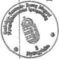
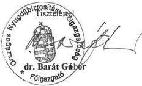

Állami Számvevőszék

V-1h-16/1998.

# JELENTÉS

a Szabolcs-Szatmár Bereg megyei
Nyugdíjbiztosítási Igazgatóság székház
beruházásának vizsgálatáról

9832

1998. szeptember hó

---

A vizsgálat végrehajtásáért felelős:

Az Állami Számvevőszék Vagyonellenőrzési Igazgatósága

Halász Gejza

igazgató

Az ellenőrzést vezette és az összefoglalót készítette:

Szendrődi Józsefné

számvevő tanácsos

Az ellenőrzésben részt vettek:

Hadházy Sándor

számvevő tanácsos

dr. Kurucz István

számvevő tanácsos

Szarka Péterné

számvevő

Szendrődi Józsefné

számvevő tanácsos

Tóth Pál

számvevő tanácsos

---

V-14-16/1998. TÉMASZÁM: 438.

# TARTALOMJEGYZÉK

|  **I. BEVEZETÉS** | **3**  |
| --- | --- |
|  **II. ÖSSZEGZŐ MEGÁLLAPÍTÁSOK, KÖVETKEZTETÉSEK, JAVASLATOK** | **6**  |
|  1. Összefoglaló megállapítások, következtetések | 6  |
|  2. Javaslatok | 8  |
|  **III. RÉSZLETES MEGÁLLAPÍTÁSOK** | **9**  |
|  1. A beruházás előzményei, indokoltsága, döntési pontok a megvalósításában | 9  |
|  1.1. A beruházás megindítása, a beruházó kiválasztásának folyamata, pályáztatás | 10  |
|  1.2. Döntési pontok a megvalósítás folyamatában, a közgyűlési döntések és a megvalósítás összhangja | 11  |
|  2. A beruházás során kötött szerződések | 13  |
|  3. A vállalkozási szerződés és annak módosítása | 15  |
|  3.1. Az eredeti vállalkozási szerződés műszaki tartalma | 15  |
|  3.2. A műszaki tartalom változásai | 17  |
|  3.3. Az építési napló | 18  |
|  4. A beruházás pénzügyi kihatásai | 19  |
|  4.1. A ráfordítások alakulása | 19  |
|  4.2. A pénzügyi kifizetések igazolása, dokumentáltsága | 20  |
|  4.3. A ráfordítások pénzügyi forrásai | 21  |
|  5. A beruházás átvétele, a jótállás érvényesülése | 22  |
|  6. A beruházás aktiválása | 23  |
|  7. A beruházási folyamat értékelése | 24  |
|  8. Az ingatlan tulajdonviszonyai | 25  |
|  Mellékletek |   |

1

---

2

---

BEVEZETÉS

# JELENTÉS
## A SZABOLCS-SZATMÁR-BEREG MEGYEI NYUGDÍJBIZTOSÍTÁSI IGAZGATÓSÁG SZÉKHÁZ BERUHÁZÁSÁNAK VIZSGÁLATÁRÓL

### I. BEVEZETÉS

A Nyugdíjbiztosítási Önkormányzat nyíregyházi székház beruházásának körülményeivel foglalkozó vizsgálata célja, annak megállapítása, hogy :

- a beruházásról hozott döntés mennyiben volt megalapozott;
- a megvalósítás során kellő körültekintéssel, az érvényes jogszabályok megtartásával, a gazdaságosság követelményeit szem előtt tartva jártak-e el;
- az időközben használatba vett épület aktiválása, tulajdonjogi rendezése megtörtént-e.

Az elmúlt években (1996-1998 között) számos vizsgálat foglalkozott a nyíregyházi beruházással.

**Az Állami Számvevőszék először a társadalombiztosítás 1995. évi pénzügyi alapjai végrehajtásának ellenőrzése során vizsgálta a beruházást.** A rendelkezésre álló dokumentumok alapján megállapítható volt, hogy a vonatkozó szerződést utólagosan hagyta jóvá a közgyűlés. A teljes beruházási költség - részben az alapterület növelése, részben a pótigények miatt - az eredeti vállalkozási szerződéshez képest több mint kétszeresére nőtt és az egy négyzetméterre jutó költség is jelentősen meghaladta a tervezettet.

A szerződésben foglalt 1995. szeptember 30-ai átadási időpontot egy hónappal meghosszabbították. További módosítás már nem történt annak ellenére, hogy - részben a pótlólagos igények miatt - várható volt a késedelmes teljesítés. A szerződésben a kifizetési ütemet úgy rögzítették, hogy az épület szerkezetkész állapota után (mely a beruházás 60 százalékos készültségét jelentette) a költségek 90 százalékát megkapja a vállalkozó.

**A beruházást több parlamenti képviselő, illetve képviselői kezdeményezés alapján parlamenti bizottság is ellenőrizte** (erre a célra külön albizottságot hoztak létre), mely alapvetően a vonatkozó dokumentumok vizsgálatát, értékelését jelentette.

Parlamenti képviselő 1996. februárjában, napirend előtti felszólalásában vetette fel a nyíregyházi székházépítés ügyét. A felszólalásra reagáló önkormányzati választ nem fogadta el, ezért májusban interpellációt nyújtott be a népjóléti miniszternek. Az interpellációban a nem megfelelő önkormányzati felügyeletre, az előírások be nem tartásából következő esetleges visszaélésekre hívta fel a figyelmet.

3

---

A képviselő a népjóléti miniszter válaszát sem fogadta el és kezdeményezte parlamenti bizottság (albizottság) felállítását az ügy kivizsgálására.

Az albizottság 1997. évi jelentése a képviselő konkrét észrevételeit, javaslatait vizsgálva megállapította, hogy a beruházás a Nyugdíjbiztosítási Önkormányzat közgyűlése döntése alapján valósult meg (jóllehet a döntési mechanizmus nem volt megfelelő). A közgyűlés jóváhagyta az eredeti, illetve a módosított költségelőirányzatot. A képviselő felvetése ellenére nem lehet számon kérni a közbeszerzési törvény betartását, mert az a beruházó kiválasztásakor nem volt hatályban. Kifogásolták a versenyeztetést, illetve az elbírálást. Megállapításuk szerint a jegyzőkönyv nem tartalmazta az ajánlat értékelésének szempontjait. A megkötött szerződés tartalma nem elég világos. A bizottság véleménye szerint a lebonyolítók komoly hibákat követtek el a beruházás során. A szakmai hibák megítéléséhez és a felelősség megállapításához további részletes vizsgálatot javasoltak, melyre az Állami Számvevőszéket kérték fel.

Az albizottság jelentését követően képviselői kifogás merült fel a nyíregyházi beruházással kapcsolatban. A képviselő véleménye szerint a beruházás során hibás döntéseket, törvénysértő intézkedéseket hoztak. Ez után 1997. novemberétől 1998. februárjáig többszöri levélváltásra került sor a képviselő és az ONYF főigazgatója között. Mind a két fél a korábbi vizsgálatok megállapításai és az időközben felkért szakértők véleménye alapján érvelt a saját álláspontja elfogadása mellett, eredmény nélkül. A képviselő szakértőjének észrevételeit a Népjóléti Minisztérium illetékes főosztálya is véleményezte 1997. júliusában. A szakértő véleményét több pontban nem tartották megalapozottnak, objektívnek és egyetértettek a parlamenti bizottság felkérésével, amely ÁSZ vizsgálatot javasolt.

### **A Nyugdíjbiztosítási Önkormányzat és igazgatási szervei a befejezett beruházások vizsgálata keretében foglalkoztak a nyíregyházi irodaház ügyével.**

**Az ONYF belső ellenőrzése** az 1996. októberi helyszíni vizsgálata során nem állapított meg hiányosságot.

**Az Önkormányzat felügyelő bizottsága** az 1997. áprilisában jóváhagyott jegyzőkönyve szerint a befejezett beruházásoknál nem tapasztalt törvénysértést, súlyos szabálytalanságot.

**Az ONYF illetékes főosztálya** 1997-ben a megyei igazgatóság előző három évi pénzügyi, számviteli, gazdálkodási tevékenységét, ezen belül az adott időszakban végrehajtott beruházásokat, felújításokat vizsgálta. Jelentésük szerint a beruházás pénzügyi vizsgálatát az ÁSZ elvégezte, így azt nem ellenőrizték. A jelentésben a beruházás számszaki összefoglalását és a vagyonmérleggel való kapcsolatát mutatták be, de nem minősítették.

**A megyei igazgatóság belső ellenőre** 1998. márciusában vizsgálta az 1997. évi épület-beruházásokat és felújításokat, ezen belül a mozgáskorlátozottakat szolgáló lépcsőnjáró építését, a garázs átalakítását irattári helyiséggé. Ellenőrizte a beruházások pénzügyi elszámolásának, analitikus nyilvántartásuknak a helyességét. A vizsgálat nem állapított meg hiányosságot.

4

---

BEVEZETÉS---

**Az első fokú építési hatóság** többször ellenőrizte a megvalósítás folyamatát. Ezt igazolják az építési engedélyezés és a használatbavételi eljárás folyamatában hozott határozatok, illetve annak dokumentumai. A felsorolt három ellenőrzési folyamatban sehol nem lehetett találkozni olyan megállapítással, hogy a megvalósítás során az engedélyezett tervektől eltértek volna és arról sem, hogy a benyújtott tervdokumentáció nem volt alkalmas a határozat hozatalra.

Az Állami Számvevőszék az 1998. évi vizsgálati programjába, mint célvizsgálatot építette be a nyíregyházi beruházás ellenőrzését.

---5

---

## II. ÖSSZEGZŐ MEGÁLLAPÍTÁSOK, KÖVETKEZTETÉSEK, JAVASLATOK

### 1. ÖSSZEFOGLALÓ MEGÁLLAPÍTÁSOK, KÖVETKEZTETÉSEK

A beruházásról hozott döntéseknél, a megvalósításnál nem jártak el kellő körültekintéssel. A Nyugdíjbiztosítási Önkormányzat és igazgatási szervei a beruházás nem megfelelő előkészítésével, a több szempontból kedvezőtlen vállalkozási szerződéssel, az építkezés nem kielégítő ellenőrzésével, a pontatlan hibajegyzékkel, illetve a hibák egy része kijavításának elmaradásával, a beruházáshoz kapcsolódó kifizetésekkel, pénzügyi elszámolásokkal összefüggésben több hibát követtek el.

A társadalombiztosítási önkormányzatok megalakulásával egyidejűleg formálisan létrejöttek az ágazatok igazgatási szervei és ezek megyei szervezetei. Az önkormányzatok arra törekedtek, hogy a megyei szervezeteket minél előbb külön épületekben helyezzék el.

Az ágazatok közötti megállapodás része volt, hogy a nyugdíjbiztosítási önkormányzat vállalta a nyíregyházi igazgatósága elhelyezésének költségeit, és végső soron az irodaház felépítése mellett döntöttek. Erre vonatkozó önálló és részletes közgyűlési határozat nem született, csak a beruházás keretszámait fogadták el.

A főigazgatóság és az önkormányzat a beruházás előkészítésénél, illetve a vállalkozási szerződés megkötésénél csak részben vette figyelembe az érvényes belső utasításokat. A főigazgatóság az előírás ellenére nem végezte el az igény meghatározásra, a gazdaságossági és szervezési célokra vonatkozó elemzéseket, számításokat.

Az önkormányzat nevében csak az elnök vagy az alelnök, illetve eseti megbízásként az elnökség tagja köthetett volna szerződést. Ennek ellenére a közgyűlés - utólagosan - mégis felhatalmazást adott a főigazgatónak a vállalkozási kiegészítő szerződések aláírására.

A vállalkozási szerződés kifogásolható, mert az önkormányzat szempontjából lényegesnek minősíthető tartalmi ügyekben - különösen a szolgáltatás tárgya, a mennyiség meghatározása tekintetében - hiányos volt. A kiegészítő szerződések megkötésére a nem megfelelő alapszerződés miatt volt szükség, de még ezekben sem határozták meg teljes körűen és pontosan a beruházás műszaki tartalmát.

Az építés előkészítetlensége a megrendelő-üzemeltető szakmai körültekintésének hiányából fakadt. A főigazgatóság nem biztosította a szakmai előkészítő, bíráló és ellenőrző tevékenység személyi és tárgyi feltételeit. A hiányzó feltételekből adódott, hogy az ONYF az ajánlattevők felé nem azonos információkat (alapadatokat, igényeket) fogalmazott meg és ezek is csak szóbeli közlések vol-

6

---

II. ÖSSZEGZŐ MEGÁLLAPÍTÁSOK, KÖVETKEZTETÉSEK, JAVASLATOK

tak. Az ajánlattevők közül csak egy igazolta vissza a kapott alapadatokat. Ez a - nem nyertes - ajánlattevő volt az, aki a tényleges alapterületi igényt vette alapul.

A nyertes ajánlattevő által megajánlott alapterület csak a tényleges igények 66 százalékát tette ki. Ezen kívül a megajánlott épület épületgépészeti felszereltsége alapvetően hiányos volt, mivel a nyertes pályázó az építési szakipari munkák mellett csak fűtésre és telefonközpontra szűkítette le ajánlatát. (Hiányzott belőle a víz-, csatornahálózat, szellőzés, elektromosság, tűzvédelem, stb.). A megrendelő igényei az építés folyamán változtak. A megvalósítás párhuzamos tervezéssel-kivitelezéssel történt. A munkák vállalt ütemezése felborult, a vállalt határidőt a felek egy hónappal meghosszabbították.

Az építkezés vállalkozási szerződése és annak mellékletében szereplő engedély, engedélyes tervdokumentáció ténylegesen nem volt alkalmas a megyei nyugdíjbiztosítási igazgatóság igényeit kielégítő irodaház megépítésére, mert az eredeti, nem tárgyi munkát lefedő építési határozat is csak később vált jogerőssé.

A kivitelezési munkákról nem lehetett teljes képet kapni a beruházásról vezetett építési napló nem adott kielégítő információt. A vállalkozási szerződés teljesítési határidejének lejárta után is folytatódtak a kivitelezési munkák, amelyek nem szerepeltek a naplóban. Sikerként könyvelhető el, hogy a közepes igényű üzlet-irodaház, ha több hónapos késedelemmel is, de felépült. A módosított vállalkozási szerződés határidejének lejárta után, és több mint három hónappal a sikertelen műszaki átadást követően történt meg a tényleges birtokbavétel. Az egyébként pontatlanul rögzített építési hibákat egy év elteltével is csak részlegesen szüntették meg.

A közel kétezer négyzetméter alapterületű irodaház felépítésére, berendezésére fordított összeg 211 millió forint, ami lényegesen meghaladta az eredetileg tervezett összeget, alapvetően a módosított igények illetve az elvégzett pótmunkák miatt. A pótlólagos munkák értéke, a vállalkozási szerződés kétharmadát, a teljes ráfordítás egyharmadát tette ki. A munkák egy részét kiegészítő szerződés megkötése nélkül végezték el.

A szerződésben vállalt fizetési feltételek és a hozzá rendelt - tervezett - műszaki teljesítés között is nagy volt a különbség, mely tovább nőtt a tényleges fizetéskor, hiszen az ötven százalékos műszaki készültségnél már kifizették a szerződés szerinti összeg kilencven százalékát. A számlaigazolásokat nem előzte meg körültekintő állapot rögzítés.

A felépített irodaház beruházási költségét a megyei igazgatóság aktiválta, de az érték - a főigazgatóság téves intézkedése miatt - mintegy 9 millió forinttal volt kevesebb az indokoltnál. A hiányosság megszüntetésére, illetve a pótlólagos aktiválás végrehajtására időközben utasítást adott a főigazgató.

A megépült üzletek és az irodaház tulajdonosai 1998. áprilisában társasházat alapítottak. Az okirat szerint a Nyugdíjbiztosítási Önkormányzat társasházi tulajdoni hányada 84 százalék. Az önkormányzatnak tulajdoni része van a szomszédos társasházzal közösen üzemeltetett kazánházi berendezésekben, de a saját alapító okiratában is említett tulajdoni hányad nincs egyértelműen alátámasztva, sem számszakilag, sem műszakilag.

7

---

II. ÖSSZEGZŐ MEGÁLLAPÍTÁSOK, KÖVETKEZTETÉSEK, JAVASLATOK

Az alapító okiratot a társasházi tulajdonosi kör 1997. évi változása illetve a tulajdoni hányad módosulása ellenére sem helyesbítették. A főigazgató ígéretet tett a soron kívüli intézkedésre.

## 2. JAVASLATOK

### A Földművelésügyi és Vidékfejlesztési Minisztérium

1. Vizsgálja felül a Nyíregyháza megyei jogú város polgármesteri hivatalának a beruházás engedélyezési és használatbavételi eljárásával kapcsolatos hatósági tevékenységét.

### Az Országos Nyugdíjbiztosítási Főigazgatóság

1. Állapítsa meg, hogy kit és milyen mértékben terhel a beruházás előkészítéséért személyi felelősség és tegye meg a szükséges intézkedéseket.
2. Vizsgálja meg, hogy a belső előírások be nem tartásának milyen következményei lettek és intézkedjen, hogy az eljárásbeli hiányosságok ne ismétlődhessenek meg.
3. Vizsgálja felül a pótmunkák műszaki tartalmának és költségeinek jogosságát. Tárja fel a hiányos és hibás teljesítések okait, a beruházás végrehajtásában közreműködők felelősségét.

8

---

III. RÉSZLETES MEGÁLLAPÍTÁSOK

### III. RÉSZLETES MEGÁLLAPÍTÁSOK

#### 1. A BERUHÁZÁS ELŐZMÉNYEI, INDOKOLTSÁGA, DÖNTÉSI PONTOK A MEGVALÓSÍTÁSÁBAN

Az Országgyűlés a társadalombiztosítási rendszer megújításának koncepciójáról és a rövidtávú feladatokról szóló 60/1991. (X. 29.) számú határozatában döntött arról, hogy 'ki kell alakítani az önálló biztosítási ágakat'. A Társadalombiztosítási Alap 1992. évi költségvetéséről szóló 1992. évi X. törvény, módosította a Társadalombiztosítási Alapról szóló 1988. évi XXI. törvényt és kimondta, hogy a Társadalombiztosítási Alap két különálló alapból; a Nyugdíjbiztosítási Alapból és az Egészségbiztosítási Alapból tevődik össze. A társadalombiztosítás önkormányzati igazgatásáról szóló 1991. évi LXXXIV. törvény (továbbiakban: Öit.) szerint, 1993. január 1–15. között kellett megalakulni az önkormányzatoknak.

A társadalombiztosítási önkormányzatok megalakulásával egyidejűleg a 91/1993. (V. 9.) Korm. rendelet alapján formálisan létrejöttek az ágazatok igazgatási szervei és azok megyei szervezetei. Mindkét önkormányzat - de különösen a nyugdíj ágazat - törekedett saját önálló apparátusának kialakítására, teljes szervezeti elkülönülésre.

Az egyes megyei igazgatóságok elhelyezési színvonala korántsem volt azonos. A nyugdíj ágazat az önálló elhelyezést igyekezett minél előbb megoldani saját beruházással, épületvásárlással vagy bérleménnyel. Erre vonatkozólag 1994. október-november hónapban - pontos dátum nem ismert - elkészítette az igazgatási apparátus 'A Nyugdíjbiztosítási Ágazat Szervezeteinek végleges elhelyezési koncepcióját.' A koncepció a nyíregyházi igazgatósággal kapcsolatban azt tartalmazta, hogy az igazgatóság elhelyezése nem megoldott az egészségbiztosítási ágazattal közös irodaházban és bérleményekben, ezért konkrét előterjesztés készült egy új irodaház építésére. A beruházás forrásaként a befektetések hozama tartalékát jelölték meg. Az új ingatlan tulajdonjogát a Nyugdíjbiztosítási Önkormányzat javára javasolták bejegyeztetni.

A nyíregyházi igazgatóság négy különböző helyen, igen nehéz körülmények között működött. Komoly gondot okozott a szükséges iratanyagok a telephelyek közötti mozgatása. Az egészségbiztosítási ágazattal történt többszöri folyamatos egyeztetés során az a megállapodás született, hogy a nyugdíjbiztosítási ágazat Nyíregyházán, az egészségbiztosítási ágazat Kecskeméten finanszírozza saját megyei szervezete elhelyezését.

Nem minden megyét érintően egyeztek meg ilyen gyorsan. A működési célú ingatlan megosztására vonatkozó döntését a Nyugdíjbiztosítási Önkormányzat Közgyűlése 1995. április 28-án a 24/1995 (IV. 28.) sz. határozatával hozta meg. A központi és területi igazgatási apparátus elhelyezését szolgáló beruházásokkal kapcsolatban - így a nyíregyházi igazgatóságot érintően is - már ezt megelőzően több döntés született.

9

---

III. RÉSZLETES MEGÁLLAPÍTÁSOK

## 1.1. A beruházás megindítása, a beruházó kiválasztásának folyamata, pályáztatás

Nyíregyházán kialakult nehéz munkakörülmények mielőbbi kultúrált elhelyezést biztosító irodavásárlásra vagy építésre ösztönözték az Országos Nyugdíjbiztosítási Főigazgatóságot (továbbiakban: ONYF).

A beruházás indításakor a finanszírozás forrása nem volt ismert. Ezzel kapcsolatos közgyűlési döntés ekkor még nem volt, így az sem volt eldöntött, hogy a beruházással kapcsolatos kötelezettségvállalásokat az ONYF vagy az önkormányzat teszi-e meg.

Az ONYF főigazgatója a beruházási, felújítási folyamat szabályozásáról szóló 8/1994. ( Tb. K 7-8. sz. ) ONYF Utasításnak megfelelően 1994. október 10-én 5 főből álló Bíráló Bizottságot hozott létre, melynek feladata a Szabolcs-Szatmár-Bereg megyei Nyugdíjbiztosítási Igazgatóság irodaépületének vásárlására érkezett ajánlatok érdemi bírálata és a döntés-előkészítő folyamat ellenőrzése volt.

Az ONYF ajánlatokat kért be telefonon történő megkeresés és egyéb információs csatornák útján. Az ajánlatok bekérését nem előzte meg a hivatkozott belső utasítás szerinti - a bírálatot elősegítő - előzetes elképzeléseket számításokat, adatokat, elemzéseket, véleményeket, a megvalósulás tervezett ütemezését és határidejét tartalmazó igény-meghatározás és az ajánlattevőkkel szembeni követelmények megadása sem.

Nincs dokumentáció arról, hogy mire is kértek valójában ajánlatot, milyen létszámot vettek figyelembe, milyen szintű felszereltséget ( számítógépes hálózat, nagy mennyiségű iratanyag elhelyezése, fokozott tűzvédelem, telefon és egyéb kommunikációs hálózattal szemben támasztott igény stb. ) kívántak biztosítani.

Az államháztartásról szóló 1992. évi LXXXVIII. tv. (Áht) ebben az időszakban hatályos 95. §. (1) bekezdése versenytárgyalási kötelezettséget írt elő, viszont a Magyar Köztársaság 1994. évi költségvetéséről szóló 1993. évi CXI. tv. 11. §. (1) bekezdése csak a kormányzati beruházások körében történő építéssel járó beruházások tervezésénél és kivitelezésénél írta elő a versenytárgyalási kötelezettséget.

Egyetlen - a döntési javaslatot tartalmazó - jegyzőkönyv utal a versenyeztetés lebonyolítására, amely nem tartalmazza a bírálatban részt vevők nevét csak feltételezhetően aláírásukat, ami nem beazonosítható. A jegyzőkönyv tanúskodik arról is hogy a bizottság a Pongó Export - Import Iroda ajánlatát javasolja elfogadni. (1. sz. melléklet)

A dokumentumokból nem állapítható meg, hogy a Bíráló Bizottság mely pályázók ajánlatait 'vizsgálta meg részletesen'. A bemutatott három ajánlat közül az egyik beérkezési dátuma a bírálatot követő időpontú.

**Összességében megállapítható, hogy a beruházási, felújítási folyamat szabályozásáról szóló 8/1994. ( Tb. K 7-8. sz. ) ONYF Utasítás beruházás előkészítésével kapcsolatos előírásait megszegték azzal,**

10

---

III. RÉSZLETES MEGÁLLAPÍTÁSOK

**hogy a beruházás indításakor - a versenyeztetést megelőzően - az igény-meghatározásra, a gazdaságossági és szervezési célkitűzésekre vonatkozó elemzéseket és számításokat nem végezték el. Az utasítás a versenyeztetés részletes szabályait nem tartalmazza, 10 millió forintot meghaladó beruházás esetén annak kötelezettségét írja csak elő.**

## **1.2. Döntési pontok a megvalósítás folyamatában, a közgyűlési döntések és a megvalósítás összhangja**

A nyíregyházi irodaépület vásárlási-beruházási kérdésével a Közgyűlés 1994. november 15-én találkozott először, amikor az 1995. évi költségvetés tárgyalása során a költségvetési előirányzatok számok alátámasztásával az 1994-95. évekre vonatkozó beruházási és felújítási tervjavaslatot becsatolták. Az előterjesztésből kitűnik, hogy a befektetések hozama tartaléka terhére történő beruházásról van szó, ami 1994-ben 40 millió, 1995-ben 85 millió forint - mint keretszám - felhasználását jelenti. Hivatkozás történik egy, a témában készített előterjesztésre is, amelyet azonban mellékletként nem csatoltak. A közgyűlés a 48/1994.(XI. 15.) számú határozatával elfogadta a benyújtott javaslatot és rögzítette a költségvetéssel kapcsolatos alapelveket. Felhatalmazta az elnökséget egyeztetések és kompromisszumos javaslatok elfogadására, azzal a kötelezettséggel, hogy utólag a Közgyűlés elé terjesztik.

A közgyűlési előterjesztésben hivatkozott, a nyíregyházi beruházással kapcsolatos konkrét előterjesztést az igazgatási apparátus a versenyeztetési eljárás kiértékelését követően 1994. október 27-én elkészítette és benyújtotta az elnökség részére. Az elnökség első alkalommal 1994. november 22-én hozott a témában határozatot, mely szerint az Önkormányzat Vagyonkezelő és Befektetési Bizottsága véleményének ismeretében visszatér az előterjesztésre. Az elnökségi ülések jegyzőkönyveiből kiderül, hogy a Bizottság szóban egyeztetett az igazgatási apparátus illetékes főosztályvezető-helyettesével és javasolta a megvalósítást. Ennek eredményeként az elnökség 1994. november 29-én elfogadta az előterjesztést, de rendkívül nehezen értelmezhető döntést hozott (120/1994 (XI. 29.) sz. határozat). A határozat első mondatában az irodaház megvételéhez járul hozzá, a másodikban viszont két év alatt - 1994-95. években - megvalósuló beruházást fogad el, 89,5 millió forint összeggel és 35 millió forint mobiliákkal. A döntésből nem tűnik ki, hogy a jóváhagyott összeg bruttó - ÁFA-t is tartalmazó - vagy nettó, és azt sem határozták meg, hogy pontosan mi értendő mobiliák alatt. Az elnökségi döntés a beruházás forrásával a befektetések hozama tartalékát jelölte meg.

Ezt követően kötötte meg az Önkormányzat a telekvásárlásra vonatkozó adásvételi és a telekingatlanra épülő üzletház, irodaház építési szerelési munkáinak beruházására, kivitelezésére vonatkozó vállalkozási szerződést a Pongó Irodával.

A központi és területi igazgatási apparátus elhelyezését szolgáló beruházásokról és felújításokról szóló beszámoló 1995. január 9-én került a közgyűlés elé, melynek részét képezték az elnökségnek a nyíregyházi beruházással kapcsolatos intézkedései. A közgyűlés 7/1995.(I. 9.) sz. határozatával jóváhagyólag el-

11

---

III. RÉSZLETES MEGÁLLAPÍTÁSOK---

fogadta a beszámolóban foglaltakat és egyetértett az elnökség beruházásokra és felújításokra vonatkozóan megtett és tervezett intézkedéseivel.

Az 1994. decemberében megkötött vállalkozási szerződést 1995. február 20-án módosították. Erről a közgyűlés 1995. április 11.-én értesült az 1995. évi költségvetés újratárgyalása során. Az előterjesztés bemutatta az 1994-ben már megkezdett és 1995. évben folyamatban lévő azon beruházások és felújítások helyzetét, melyek forrása a befektetések hozama tartaléka. Az előterjesztés ismertette azt, hogy a beruházás első részletének kifizetése megtörtént. Az ÁFA összegét itt már külön tüntetik fel. Az igazgatóság végleges elhelyezését a részletes kiviteli tervek alapján újragondolták, ami indokolttá tette a növelt alapterület-megvásárlását. A beruházás összege 1995-ben 80,6 millió forint + indulási 20,1 millió forint, összesen 100,7 millió forint volt. A közgyűlés ezt a 18/1995(IV. 11.) számú határozatával elfogadta. Felhatalmazta a főigazgatót - a közgyűlés utólagos tájékoztatása mellett - a működési költségvetés keretein belüli elnökségi jóváhagyással történő takarékos gazdálkodásra és költségcsökkentésre.

Időrendben ezután határozott a közgyűlés a korábban már említett működési célú ingatlanvagyon két ágazat közötti megosztásáról. (24/1995. (IV. 28.) sz. határozat).

Az Országgyűlés 1995. június 30-án fogadta el a társadalombiztosítási alapok 1995. évi költségvetését, amely bevonta a Nyugdíjbiztosítási Alap befektetések hozama tartalékát a folyó finanszírozásba és a beruházásokra vonatkozólag olyan kitételt tett, hogy a költségvetési törvényben tervezett beruházások költsége túlléphető, ha a törvényben megjelölt kötelezettség teljesítése után, a befektetett eszközök értékesítési többlete erre fedezetet nyújt. Tehát megszűnt a közgyűlés által elfogadott forrás. Forrás már csak a működési költségvetésből volt biztosítható. Ez a helyzet kötelezettségvállalási illetve jogkör-átruházási problémákat vetett fel.

Az Ölt. a közgyűlés át nem ruházható hatáskörébe utalja az önkormányzat tulajdonába tartozó vagyon felett a tulajdonosi jog gyakorlását. Ezzel szemben a működési költségvetéssel történő gazdálkodási jogosítványokkal kapcsolatban a jogszabály átruházhatóságot rögzít, amit a törvény összeghatárhoz vagy egyéb feltételhez köthet. (Ilyen megkötés a vizsgált időszakban nem volt.) Azért tartottuk fontosnak kiemelni a 18/1995 (IV. 11.) számú közgyűlési határozatnak a működési költségvetéssel való gazdálkodás főigazgatóra történő átruházását, mert ezáltal a főigazgatónak lehetősége nyílt a beruházással kapcsolatos szerződések ONYF nevében történő megkötésére.

A közgyűlés a kiegészítő szerződések aláírását követően utólag a 60/1995.(XII. 14.) sz. határozatával felhatalmazta a főigazgatót a 22,6 millió forint + 5,6 millió forint ÁFA további pótigényekből adódó beruházási többletköltséget tartalmazó szerződések aláírására. Forrásszükséglet fedezeteként a működési költségvetés különféle előirányzatait jelölte meg. Az előterjesztés azt is tartalmazta, hogy 1996. évre még 20 millió forintos pótigény várható, melyet a közgyűlés szintén elfogadott.

---12

---

III. RÉSZLETES MEGÁLLAPÍTÁSOK

A dokumentumok szerint a főigazgatónak utólagos felhatalmazása volt a közgyűléstől az önkormányzat nevében történő szerződés-aláírásra. Fontos azonban kiemelni hogy a szerződés aláírásának pillanatában már a beruházási forrást részben a működési költségvetés biztosította. Ezzel való gazdálkodásra - utólagos beszámolási kötelezettség mellett - a főigazgatónak felhatalmazása volt a közgyűléstől, így - mint azt korábban már kifejtettük - a főigazgatónak lehetősége nyílt a beruházással kapcsolatos szerződések ONYF nevében történő megkötésére. Ugyanakkor a Nyugdíjbiztosítási Önkormányzat Elnöksége 9/1994.(III. 21.) sz. határozata 2. pontja szerint "Önkormányzat nevében szerződést csak az elnök (alelnök) illetőleg az elnök eseti felhatalmazása alapján az Elnökség tagja köthet". A főigazgatónak adott felhatalmazás ellentétes a hivatkozott határozattal.

A beruházás szerződéskötései és a döntési folyamatok összevetése alapján megállapítható, hogy a beruházás indításakor egyedi, önálló közgyűlési határozat az érintett beruházással kapcsolatban nem született. A közgyűlési döntés csak a beruházás keretszámainak megadására irányult. A területnövekedésből adódó többlet forrásigényt a költségvetési törvényhez kapcsolódóan utólag fogadták el. A kiegészítő szerződésekből adódó kötelezettségvállalásokra is utólag adott felhatalmazást a főigazgatónak a közgyűlés.

# 2. A BERUHÁZÁS SORÁN KÖTÖTT SZERZŐDÉSEK

A beruházás folyamatában alapvető elem a szerződéskötés, így külön ki kell térni a szerződések előkészítésének, megkötésének és nyilvántartásának folyamatára, szabályozottságára.

A szerződések előkészítésének, megkötésének és nyilvántartásának rendjét az időközben kétszer módosított 2/1994. (Tb. K. 1.) sz. főigazgatói utasítás és az önkormányzat elnöksége 9/1994. (III. 21.) sz. határozata szabályozta. A nyíregyházi beruházást a befektetések hozama tartalékából kívánta az önkormányzat megvalósítani, így erre - mint önkormányzati vagyonra - az Ölt., az Alapszabály illetve az ezek alapján kidolgozott Vagyonkezelési és Befektetési Szabályzat előírásai érvényesek.

A szerződésekkel kapcsolatban kialakult anomáliák azonban szükségessé teszik az összes előzőekben felsorolt szabályozás szem előtt tartását, ugyanis a szerződések jelentős részét az Önkormányzat elnöke kötötte, így

- a telekre vonatkozó adás-vételi szerződést, amit 1994. december 12-én írták alá;
- a Szabadság tér 4. telekingatlanra épülő üzletház, irodaház, építési-, szerelési munkáinak beruházására kivitelezésére vonatkozó vállalkozási szerződést (1994. december), és annak módosítását (1995. február 20.);

A kiegészítő szerződéseknek is tekinthető vállalkozási szerződéseket a közgyűléstől kapott utólagos meghatalmazás alapján az ONYF főigazgatója írta alá a nyertes vállalkozóval. Ezek:

13

---

III. RÉSZLETES MEGÁLLAPÍTÁSOK

- a tűz és vagyonvédelmi rendszerek tervezésére, csatornázása és kivitelezése, valamint beüzemelése és hatósági engedélyeztetése tárgyában 1995. november 27-én;
- az irattári berendezések gyártása, helyszínre szállítása és helyszíni beépítése tárgyában 1995. november 27-én;f
- árnyékolt, strukturált kábelezés tervezése, csatornázása és kivitelezése tárgyában 1995. november 27-én kötött szerződések.

A Szabolcs-Szatmár-Bereg megyei Nyugdíjbiztosítási Igazgatóság is kötött szerződéseket:

- a Schindler Hungária Lift és Mozgólépcső Kft-vel, a lépcsőnjáró berendezés tervezésére, gyártására műszaki specifikáció szerinti kivitelben, helyszínre szállítással és felszereléssel (1996. július 1-én);
- a műszaki ellenőri feladatok ellátására megbízott építőipari technikussal az ONYF nevében 1995. február 28-án, amit 1995. november 28-án módosítottak;
- 1995. december -1996 február között 5 céggel, bútorbeszerzésre közbeszerzési eljárással lefolytatásával.

A Ptk. 205. § (2) bekezdése szerint valamely szerződés - így az adás-vételi ill. a vállalkozási szerződés - akkor jön létre, ha a felek a lényeges, valamint a bármelyikük által lényegesnek ítélt kérdésekben megállapodnak. Az adás-vételi a szerződést is ennek figyelembevételével kötötték, függetlenül attól, hogy az abban megjelölt "beépítetlen terület"-en a későbbi kivitelezés első munkálatai már folyamatban voltak.

**A vállalkozási szerződésben az önkormányzat és az ONYF által lényegesnek minősíthető kérdésekben történő megállapodásaik tartalmi elemei nem fedezhetők fel.** Ezek közül a legjelentősebbek a szolgáltatás tárgya és a mennyiség meghatározása.

A beruházás indításakor a szerződések előkészítése, megkötése vonatkozásában az elnökség 9/1994.(III. 21.) sz. határozata rendelkezései az irányadók. Ennek 2. pontja értelmében a szerződéskötésre irányuló javaslat megtétele előtt az ONYF főigazgatójának előzetes szakmai véleményét kell kérni. A megkötött szerződésekkel kapcsolatban **nem áll rendelkezésünkre az ONYF főigazgatójának előzetes, írásos szakmai véleménye.**

A megismert adatok alapján a Pongó Iroda által ajánlott és előre megtervezett üzletház-irodaház építési-szerelési munkáinak beruházását és kivitelezését vállalta a vállalkozó. A szerződés komplett, teljes kivitelezést ígért, amelyben tehát a Nyugdíjbiztosítási Önkormányzat és az ONYF a Ptk. 205.§ (2) bekezdésben meghatározott igénye nem jelent meg. Nem véletlen tehát, hogy két hónapon belül a szerződés módosítására volt szükség, a módosított szerződés már valójában csak egy építési szerződés. Ezt a minősítést az 1995. február 17-én kelt, aláíratlan melléklet is alátámasztja.

14

---

III. RÉSZLETES MEGÁLLAPÍTÁSOK

Nem állapítható meg, hogy a megrendelő önkormányzat annak döntésre jogosult képviselői ill. a döntést előkészítők valójában ismerték-e a az alaptervdokumentációt és annak módosításait. A vállalkozási szerződés lényeges kelléke a szolgáltatás meghatározása, ami mind mennyiségi, mind minőségi megállapodást jelent. Esetünkben a műszaki terv nem a megrendelő szolgáltatása. Annak lényegi megismerése és elemzése feladatát kellett volna, hogy képezze a megrendelőnek. A témával részletesen foglalkozunk a 3. pontban. A konkrét igények és a műszaki terv ismerete és azok összevetése után köthették volna csak meg a szerződést.

A rendelkezésünkre bocsátott műszaki dokumentáció alapján a kiegészítő szerződéseket csak részben minősíthetjük újabb igények felmerülése miatti pótszerződéskötésnek, mivel az ott megjelölt szerelési munkálatok egy része az alapvállalkozási szerződés részét is képezte. Egyértelmű azonban az is, hogy újabb igények is felmerültek. Az viszont vitatható, hogy miért csak az alapszerződés ill. a módosított szerződés 1995. szeptember 30-i teljesítési határidejét - sőt az önkormányzattól kért és kapott 1995. október 31-i határidő módosítást - követően került sor a kiegészítő szerződések megkötésére. Megállapítható, hogy a kiegészítő szerződések adott formában és tartalommal történő megkötésére az alapszerződés hiányosságai miatt volt szükség.

A lépcsőnjáró berendezés tervezésére, gyártására és a műszaki ellenőr megbízására vonatkozó szerződések megkötésére az ONYF főigazgatója felhatalmazta a Szabolcs-Szatmár-Bereg megyei Nyugdíjbiztosítási Igazgatóság vezetőjét. A kötelezettségvállalási, ellenjegyzési és utalványozási jogkör szabályozásáról szóló 10/1994.(Tb. K. 8.), majd a 4/1995.(Tb. K. 2.) főigazgatói utasítások szabályozzák a főigazgató jogkörátruházás eseteit. A lépcsőnjáró berendezés szerződésének forrása a működési költségvetés volt, a műszaki ellenőri szerződésé az alap vagyongazdálkodással kapcsolatos kiadásai. A főigazgatói utasítás kötelezettségvállalási jogkörök átruházására vonatkozó előírásai nem zárják ki az átruházás lehetőségét, mivel a hivatkozott utasítások szerint az ONYF ügyviteli éves költségvetési előirányzatait illetően a főigazgató kötelezettségvállalási jogköre korlátlan és a magának fenntartott kötelezettségvállalási jogkörök között sem szerepel erre vonatkozó kizáró megkötés.

# 3. A VÁLLALKOZÁSI SZERZŐDÉS ÉS ANNAK MÓDOSÍTÁSA

# 3.1. Az eredeti vállalkozási szerződés műszaki tartalma

Az irodaház megvalósításhoz szükséges, egységesen meghatározott, kiinduló műszaki tartalom megfogalmazására nem került sor. Tenderkiírás nem történt. A bíráló bizottsághoz beérkezett ajánlatok - ilyen irányultságú - összehasonlítása során az írásban is megfogalmazott összes területigény 2000 m² volt. Az összehasonlítást az 2. sz. melléklet tartalmazza.

Összehasonlító műszaki alapadatok (azonos program) hiánya mellett meghozott bíráló bizottsági döntés - az alapterületi adatokat tekintve - végül is 1457 m² területű irodaépületre született. Az alapterület csökkentésének okát a bíráló bizottság nem indokolta.

15

---

III. RÉSZLETES MEGÁLLAPÍTÁSOK

A nyertesnek kihirdetett Pongó Iroda a vállalkozási szerződését Nyíregyházán és feltételezhetően 1994. december 12-én (napi dátum nincs a szerződésben) kötötte meg a Nyugdíjbiztosítási Önkormányzattal. **A vállalkozási szerződés az üzletház-irodaház építési-szerelési munkáinak beruházására és kivitelezésére vonatkozott, tehát a szerződés 1. pontja szerint az építési munkák teljes vertikumát felölelte a vállalt ár és határidő mellett.** A vállalkozási szerződés nem tartalmazta a mobiliák (pl. a bútorok, a függönyök) beszerzését és elhelyezését.

A vállalkozási szerződés vizsgált dokumentuma hiányosan tartalmazta a felsorolt mellékleteket (tulajdoni lap másolatok, Nyíregyháza Megyei Jogú Város Polgármesteri Hivatalának engedélye, tervdokumentáció, költségvetés, műszaki adatok, műszaki leírás, vállalkozói ajánlat, telek adás-vételi szerződés). A szerződés vélhető melléklete az azonosító adatokat nem tartalmazta (szerződés tárgya, aláírás), de alapterületi összegzése azonos az új területigénnyel, mely így pontosan 1456,67 m² lett. Itt kell megjegyezni, hogy a szerződésben még mindig nem volt szó földszinti helyiségekről (mintha nem is lenne rá szükség!).

A módosított szerződés mellékletében meghatározott műszaki tartalom, az építési-szerelési munkanemek sorából alapvetően már csak az u. n. építőmesteri munkákról szól. Más munkanemek közül csak a fűtési rendszer és a liftépítés szerepel. **A műszaki tartalom alapvetően hiányos, megfogalmazását tekintve a megajánlott területű irodaépület bekerülési költségének csak 50-60 %-ára utal**, mivel sem alapterületi adataiban, sem felszereltségében (alapvető épületgépészeti hálózatok hiánya) nem teljes. A 71848-3/1994. IV. sz. 1994. október 31-i dátumú **építési határozatot** egy általános rendeltetésű üzlet, iroda és szolgáltatóház létesítményhez készített dokumentáció alapján hozta az első fokú építési hatóság. A szintterületek száma, funkciója **alapvetően eltért a tárgyi irodaház építési vállalkozói ajánlatának műszaki tartalmától.** Az engedélyezett tervdokumentáció egy pince nélküli, 3-6 szintes épület-együttest nevesített, ahol csak a 2. és 5. emeleten létesítettek volna irodákat. A többi emeleten üzletek, fodrászat, squash terem, tetőterasz stb. funkciójú helyiségeket terveztek.

A beruházás idején hatályos, többször módosított 12/1986. (XII. 30.) ÉVM rendelet egyértelműen rögzítette az építési és használatbavételi engedélyezési eljárás folyamatát, az engedélyhez kötött építési munkák körét, mely szerint a megyei igazgatóság elhelyezését is biztosító üzlet-irodaház építésének engedélyezése valójában nem történt meg.

Az említett építési határozatnak és mellékleteinek az elbírálás idején a vállalkozó még nem volt birtokában. **Az építkezés vállalkozási szerződése, és annak mellékletében szereplő engedély és engedélyes tervdokumentáció ténylegesen nem volt alkalmas a megrendelő igényeinek kielégítésére, az építmény megépítésére. Az eredeti, nem tárgyi munkát lefedő építési határozat is csak 1994. december 16-án vált jogerőssé.**

A munka a vállalkozói szerződés alapján 1994. december 15-én kezdődött volna el. Az építési napló alapján a területen u.n. első ütemű munkák folytak, amikről dokumentum nem áll rendelkezésre. Csak következtetni lehet, hogy a területen építmények álltak, melyek bontása jelentette az első ütemű munká-

16

---

III. RÉSZLETES MEGÁLLAPÍTÁSOK

kat. E munkák miatt a vállalkozó a munkaterületet ténylegesen egy hónap késéssel vette birtokba.

Az építési naplót a felek 1994. december 16-án nyitották meg. Az építési napló megnyitásánál a bejegyzett képviselők között már szerepelt a megbízó műszaki ellenőre is - építőipari technikus, vállalkozó -, akinek erre a munkára szóló megbízási szerződését 1995. február 28-án kötötték, tehát **két hónapig a műszaki ellenőr jogosulatlanul képviselte megbízóját**. A vállalkozó képviselője munkavégzésének jogosultságáról nem találtunk adatot. Az építőipari kivitelezési tevékenység gyakorlásáról szóló 84/1990. (IV. 27.) MT rendelet nevesíti az építőipari kivitelezési tevékenység irányítása ellátásának szakképesítési feltételeit, mely feltételek fennállását, mint fő adatot, rögzíteni kell az alapdokumentumokban.

### 3.2. A műszaki tartalom változásai

Az az üzlet-irodaház megvalósításával kapcsolatos és rendelkezésre álló dokumentumok - Bíráló Bizottság felállítása, az ajánlatok és azok értékelése, a vállalkozói és megbízási szerződések, az építési határozatok és az azokat alátámasztó műszaki dokumentáció, a szakhatósági és hatósági szakértői vélemények, az építési napló, a fellelhető kiviteli és átadási terv-dokumentáció, a műszaki átadás-átvételi jegyzőkönyv - alapján a megvalósításnak számos műszaki rendezetlensége és akadálya volt. Ezeket a teljesség igénye nélkül a 2. sz. mellékletben soroljuk fel.

Az építési-vállalkozási szerződést 1994. december 12-én kötötték meg. A helyszíni munkálatok ténylegesen 1995. január 10-én kezdődtek meg.

Az elkezdett építési munkák során az építési naplóban először 1995. január 18-án történt a műszaki tartalom változásra utaló megrendelői bejegyzés. A vállalkozási szerződés módosítására 1995. február 10-én került sor. Ebben a dokumentumban a műszaki tartalom további módosításával találkozhatunk. Most már a pince-szint mellett megnövelt, összesen 1949,04 m² alapterületű irodaházat nevesít, a feltételezett eddigi - a vállalkozói tulajdonban építendő - üzletek mellett. **A műszaki tartalomban az alapterületi növekedést a megrendelő és a beruházó közös, 1995. február 15-i jegyzőkönyve rögzíti azzal, hogy „az Igazgatóság konkrét elhelyezési igénye az előzetesen kalkulált igényekhez képest nagyobb.”** Sem a jegyzőkönyv, sem a módosított vállalkozási szerződés nem tette teljessé a jövőben működő irodaház szükséges épületgépészeti felszereltségét. **Az alapterület növekedés 34 %-os volt.** Ehhez az alapterület - növekedéshez készült, készülhetett a módosított építési engedélyezési dokumentáció, amely viszont csak pince-szint növekedést rögzített. A műszaki tartalom tovább változott, hiányait az építési engedélyezési dokumentációban sem pontosították, tehát még ebben az időszakban sem volt teljes.

A dokumentációt az első fokú építési hatóság 6270/1995. IV. számmal, 1995. január 17-i határozatával hagyta jóvá, mely 1995. február 28-án vált jogerősé. **A vállalkozási szerződés módosítása tehát a jogerős és módosított építési határozat kézhezvétele előtt megtörtént. Az eredeti alapvető**

17

---

III. RÉSZLETES MEGÁLLAPÍTÁSOK---

**funkciókat és méreteket akkor sem módosították. További szerződés módosításra csak egy esetben, a határidő egy hónapos meghosszabbítása miatt került sor a Nyugdíjbiztosítási Önkormányzat elnökének 1995. augusztus 16-án kelt levele, tehát nem szerződésmódosítás során.**

**A műszaki ellenőr megbízási szerződésének 3.8. pontja alapján a műszaki ellenőr „pót - és többletmunkát építési naplóban nem rendelhet el, azok esetleges tényéről azonnal tájékoztatja a Megbízót.” Ennek ellenére az építési naplóban elrendelt és el nem rendelt pótmunkák végzésével műszaki tartalom változás történt, így például számítógépes hálózat kiépítésével, szellőzés, klíma-, vagyon és tűzvédelmi beruházással (részletezés a 2. sz. mellékletben).**

A pót- és többletmunkák engedélyezésére vonatkozó megrendelések egyrészt az építési naplók alapján, másrészt a vizsgálathoz megkapott szerződés másolatokról azonosíthatók. Az üzlet-irodaház megvalósításával kapcsolatos vállalkozási szerződések megkötésére csak a megrendelő volt jogosult. Amennyiben ezt a jogot át akarta volna ruházni, akkor szerződés módosításokkal ezt megtehetette volna. **A dokumentumok alapján nem állapítható meg a szerződéskötéssel és a pót-, illetve többletmunkák elrendelésével kapcsolatos jogok átruházására vonatkozó megrendelői intézkedés.**

### 3.3. Az építési napló

Az építési és felmérési napló vezetésének szabályairól a hatályban lévő 14/1970. (VI. 6.) ÉVM rendelet szólt.

Tárgyi létesítmény megvalósítása során a megrendelő és a beruházó-kivitelező vállalkozási szerződésben rögzítette az ellenőrzési kötelezettséget, és annak gyakoriságát 8 napra szűkítette. Az építési naplót a szerződő felek 1994. december 16-án megnyitották.

A hatkötetes építési napló tanulmányozása során a megvalósítás folyamatának és ellenőrzésének számos hibájára fény derült. Ezek többsége a napló vezetésének szabályait sértette. (A fontosabb észrevételeket a 2. sz. melléklet sorolja fel.)

**Az építési napló vezetésének ellenőrzése során annak minden hiányát meg lehet találni, melyet a 14/1970. (VI. 6.) ÉVM rendelet alapvető követelményként rögzített. A műszaki ellenőr az ellenőrzés gyakorisági követelményeit teljesítette, munkájának hatékonysága - a gyenge színvonalú előkészítettség mellett - közepes volt.**

**Az építési napló alapján a kivitelezési munkákról nem lehetett teljes képet kapni. A hiányos naplóvezetés mellett sikerként könyvelhető el, hogy a közepes igényű üzlet-irodaház felépült.**

---18

---

III. RÉSZLETES MEGÁLLAPÍTÁSOK

## 4. A BERUHÁZÁS PÉNZÜGYI KIHATÁSAI

### 4.1. A ráfordítások alakulása

**A nyíregyházi beruházás összes ráfordítása 211 millió forint, az egy négyzetméterre jutó átlagos összeg 108 ezer forint volt** (3. sz. melléklet).

**A beruházás 1994. decemberében kezdődött és 1997. évben a kiegészítő irattár létesítésével fejeződött be.** Ha az évenkénti költség megoszlását tekintjük, akkor a ráfordítások 56,2 százalékát 1995. évben, 28,6 százalékát 1996. évben, míg a kezdő és befejező években a teljes összeg 12,2, illetve 3 százalékát fizették ki.

Az 1994. évben az első megkötött vállalkozói szerződés a 10 millió forintos telekár felett 78,1 millió forintos ÁFÁ-s árat tartalmazott, 1456,67 m² összterület megvétele mellett. Ez a változat nem biztosította az ügyfelek kultúrált kiszolgálását, a mozgássérültek közlekedését, valamint az apparátus megfelelő szintű elhelyezését.

**A módosított vállalkozói szerződésben** a megvételre előirányzott alapterületet 33,8 %-kal magasabban, azaz 1949 m²-ben rögzítették. Ehhez a négyzetméterhez már 126,3 millió forintos vételár tartozik, amely 43,3 %-os költségnövekedést jelentett. Ez a vállalási ár szerkezetéből adódik. Szintenként eltérő egységárat ad meg, amely a telek árát is magában foglalja. A telek árat külön adás-vételi szerződésben rögzítették, 73 százalékos tulajdoni hányaddal. A felépült ingatlanban az önkormányzat tulajdoni része 84 százalékra növekedett. A Pongó Iroda a területnagyság növekményéből eredő követelési igényéről nyilatkozatban lemondott.

A pótlólagos munkák költsége elérte a vállalkozási szerződés kétharmadát. Ha a bútorozás kiadásait (beleértve a trezor fémszekrény árát is) levonjuk, a növekmény 51,7 millió forint + ÁFÁ. Ezeknek a munkáknak egy részére szerződést kötöttek, de közel **23 millió** forintos pótlólagos munkára még szerződés sem volt (3. sz. melléklet).

Az irattár bővítésére 1997. évben került sor. A társadalombiztosításról szóló, többször módosított 1975. évi II. törvény 120/A §-a 1995-ben úgy rendelkezett, hogy a munkáltatók és egyéb szervek a nyugellátás, baleseti nyugellátás megállapítása érdekében kötelesek a biztosítottak 1988. január 1-je és 1992. február 29-e közötti kereseti adatait tartalmazó munkabér-jövedelem igazolását a székhelyük szerinti illetékes Nyugdíjbiztosítási Igazgatóságoknak megküldeni. A megnövekedett iratanyag már nem fért el a rendelkezésre álló területen. **Az Igazgatóság megrendelte a pince garázs részének irattárrá történő átalakítását, amely 5 millió forintba került.**

A beruházáshoz kapcsolódóan egyéb ráfordításként soroltuk fel a társasház alapító okirat elkészítésének költségét és a megbízott szakértő díját, mely összesen 549 ezer forint volt. Időközben a ügyfélszolgálatnál műanyag lambéria burkolatot csináltattak 138 ezer forint értékben.

19

---

III. RÉSZLETES MEGÁLLAPÍTÁSOK

## 4.2. A pénzügyi kifizetések igazolása, dokumentáltsága

A fizetési kötelezettségek feltételeit a szerződések, illetve azok változtatásai rögzítik azoknál a munkáknál, ahol volt szerződés. Ha a megrendelés az építési naplóban történt, vagy a számla kifizetése ismeretlen előzményt követően jött létre (ajánlat, szerződés, építési napló bejegyzés nincs), a fizetési kikötések sem ismertek. (Ilyen pótmunkák pl. a telefonközpont, klímaberendezés.)

Az ingatlanra vonatkozó módosított vállalkozási szerződés fizetési feltételei és azok teljesítése a következők szerint alakult:

|  Szerződés szerinti kötelezettség | Előírt teljesítés | Tényleges teljesítés  |
| --- | --- | --- |
|  1995. április 15-ig | Fsz.-i födém elkészülte (25 %) | pince feletti födém betonozás elkészült (20 %)  |
|  1995. június 30-ig (számla szerinti telj. időpont 1995. augusztus 21.) | tetőszerkezet és az aljzatbeton elkészült (60 %) | a IV. emeleti födém még nem készült el. (50 %)  |

**A tényleges teljesítés megállapítása az építési napló bejegyzése alapján történt, mert állapot-rögzítő jegyzőkönyvet a számlák igazolása előtt nem vettek fel.** Ha a műszaki teljesítést és a fizetési kötelezettséget vetjük össze és ezt a szerződés teljes vállalási %-ában határozzuk meg, akkor a szerződés szerint

**25 %-os műszaki teljesítéshez 60 %-os fizetés, a**

**60 %-os műszaki teljesítéshez 90 %-os fizetési kötelezettség előírást találunk.**

**A tényleges fizetéskor**, azaz a számlákon rögzített teljesítési dátum és az építési napló bejegyzései alapján az előzőeknél még nagyobb az eltérés. **A teljes összeg 60 %-át kb. 20 %-os műszaki készültségnél fizették ki, 90 %-ot pedig kb. 50 %-os műszaki készültségnél.** Az eredeti vállalási ár 20 %-ának átutalása előleg címén még 1994. december 16-án megtörtént (a szerződés hivatkozása szerint a megkezdett munkák fedezeteként.

A kiegészítő szerződések esetében sem jobb a helyzet. A komplett irattári berendezések beszerzése, telepítése számla szerinti teljesítési határideje 1995. december 1., ugyanakkor az építési napló december 8-i bejegyzése szerint az irattári polcok szerelését elkezdtek, de nincs rögzítve, hogy befejezték volna a munkát 1995. év folyamán. Az informatikai hálózat kiépítésénél, ahol a teljesítés időpontja 1995. december 1. és az építési napló 1996. január 9-i bejegyzése szerint a munkák még folytak, a beüzemelés nem történt meg.

**Az előzőek alapján megállapítható volt, hogy nem a teljesítésnek megfelelő szintű összegek kerültek kifizetésre. A számla igazolásokat nem előzte meg körültekintő állapotrögzítés.** A rendelkezésünkre bocsátott számla másolatokat a minőségi átvevő nem írta alá, csak a fedezetet igazoló személy. Szóbeli tájékoztatás alapján a számlák igazolása úgy történt,

20

---

III. RÉSZLETES MEGÁLLAPÍTÁSOK

hogy bekérték a kapcsolódó jegyzőkönyveket, illetve építési naplórészlet másolatokat. Ezt a gyakorlat nem igazolta.

A megrendeléssel nem rendelkező munkáknál nem állapítható meg, hogy a számlák kiállításának mi volt az alapja.

A vállalkozási és a kiegészítő szerződések nagy része szerinti, valamint a pótlólagos munkákat egyaránt a Pongó Iroda számlázta. Néhány kisebb volumenű munkát, így a lépcsőjáró berendezés tervezését és kivitelezését, az irattár bővítését, illetve a bútorok beszerzését végeztették más cégek bevonásával.

### 4.3. A ráfordítások pénzügyi forrásai

A nyíregyházi beruházás 1994. évben indult, amit a közgyűlés határozata alapján befektetések hozama tartalékának (BHT) terhére tervezték megvalósítani. Ebben a szellemben kezdték meg a számlákon a fedezet igazolásokat. A 4. sz. melléklet a számlákon található források alapján csoportosítja - a megyei Igazgatóság saját működési költségvetéséből történő ráfordítások kivételével - a kiadásokat, amelyből a Nyugdíjbiztosítási Alapot terhelte a 101,3 millió forintos BHT terhére megvalósított beruházás, az 1 millió forintos „vagyongazdálkodás kiadásai”-ból fedezett műszaki ellenőri díj. A többi kiadást a működési költségvetés központosított keretéből finanszírozták.

**A közgyűlés határozat időpontjában még nem volt elfogadott költségvetési törvény.** A Nyugdíjbiztosítási Alap 1995. évi költségvetését csak 1995. július 30-án fogadta el az Országgyűlés. Az első félévben elszámolt kifizetéseket a közgyűlés határozatának megfelelően - a költségvetési törvény **lehetőségeitől függetlenül** - terhelték.

A társadalombiztosítás pénzügyi alapjai 1995. évi költségvetésének végrehajtásáról szóló 1996. évi CX. törvény a nyíregyházi beruházás fedezetét már a működési költségvetés központosított keretéből biztosította.

**Az 1997. évre jóváhagyott megyei felújítási előirányzat 8750 ezer forint volt**, amit a főigazgatóság - az igazgatóság kezdeményezésére - átcsoportosított a felhalmozási előirányzathoz.

Az előirányzatból 5028,3 ezer forintot az irattár kialakítására, 138 ezer forintot az ügyfélfogadó műanyag lambériás burkolására fordítottak, mely együttesen 5166,3 ezer forint.

A megyei igazgatóság 1997. novemberében 2400 ezer forint zárolását kezdeményezte, tekintettel arra, hogy az engedélyezett felhalmozási keretet nem használta fel.

Az évközi átcsoportosítás következtében 1184 ezer forint felhalmozási célú pénzmaradvány keletkezett a megyei igazgatóságnál.

21

---

III. RÉSZLETES MEGÁLLAPÍTÁSOK

## 5. A BERUHÁZÁS ÁTVÉTELE, A JÓTÁLLÁS ÉRVÉNYESÜLÉSE

A módosított vállalkozási szerződés teljesítési határideje 1995. szeptember 30. volt. A beruházó-vállalkozó kérésére a megrendelő hozzájárult - nem szerződés, hanem levél formájában - 1995. október 30-ára történő kötbérmentes módosításhoz.

A módosított vállalkozási szerződés teljesítési határidejének lejárta után is még folytak a kivitelezési munkák (lásd építési napló). A határidő lejártának tényére az építési naplóban egyik fél részéről sem történt bejegyzés.

Tárgyi beruházás megvalósításával kapcsolatos más vállalkozási szerződéseket is kötött a megrendelő a beruházóval és külső céggel, ezek teljesítési határideje nagyrészt 1995. december 15. volt.

Műszaki átadás-átvételhez szükséges hiányosságok pótlására először a műszaki ellenőr 1996. január 12-i bejegyzése utalt. A bejegyzésből a műszaki átadás kitűzött időpontja még nem volt meghatározva.

Az építési naplóban tett közös (beruházó-vállalkozói és műszaki ellenőri) záróbejegyzés 1996. február 12-én készült. E bejegyzés arra engedett következtetni, hogy 1996. január 16-án kezdődött meg a műszaki átadás-átvétel folyamata. Az ezt megelőző másfél hónapban kivitelezői bejegyzés nem volt.

A műszaki átadás-átvétel, a vizsgált jegyzőkönyvek (1996. január 30-i 1 db, 1996. február 12-i 2 db) szerint a **műszaki átadás-átvétel 1996. február 12-ig nem volt sikeres, ennek ellenére a megrendelő a jelzett napon birtokba vette az épületet (a kulcsokat átvette)**, mivel a jegyzőkönyv szerint „a beköltözés az igazgatóság részéről nem tűr halasztást az előzetesen megtett intézkedések miatt.” Megrendelő, a 15 pontban felsorolt hiány pótlásának igényétől nem állt el, például a korlát felszerelésétől, a vakolatjavítástól, a szellőzőkémény befejezésétől, a tetőszigetelés tömítésétől, a mosogatók felszerelésétől, az engedélyes tervek pótlásától. **A vállalkozó szavatossági és jótállási kötelezettsége 1996. február 13-tól kezdődött** az u. n. kulcsátadási jegyzőkönyv alapján, bár a külső munkák még tovább folytak. Ugyanezen a napon egy másik, „belső használatra” érvényes jegyzőkönyv is készült, mely további, addig nem említett hiányokról is szólt (14 pontban), így például az épületgépészeti szerelvényeknek-, a felvonó üzemeltetésének-, a burkolatoknak a hibáiról.

**A módosított vállalkozói szerződés szerinti teljesítési határidő után és több mint három hónappal a sikertelen műszaki átadást követően történt meg a birtokbavétel. A teljesítés így nem fedte a vállalkozási szerződésben rögzített, a 10. pontban vállalt kötelezettséget**, mely szerint „a megrendelő csak hibátlan és hiánytalan szolgáltatás átvételére köteles, a vállalkozó I. osztályú minőségű munka végzésére kötelezett, ...”

**A használatba vételről** szóló határozat 3073-6/96. IV. számmal 1996. április 30-án készült. Ebben a **hatóság nyilatkozik, hogy a munka az engedélynek megfelelt. Ez ellentmond a módosított építési határozathoz tartozó műszaki terveknek, mert nem annak megfelelő épület, illetve**

22

---

III. RÉSZLETES MEGÁLLAPÍTÁSOK

**funkció valósult meg.** A használatbavételi határozat csak a tábla feliratokat, a tűzoltó készülékek felszerelését, valamint a külső munkák elvégzését hiányolta. A használatbavétel feltételeinél az elsőfokú építési hatóság nem adott határidőt az általa elrendelt hiánypótlásokra, ugyanakkor hivatkozott az előírt munkák nem, vagy nem megfelelő módon történő elvégzése miatti bírság kiszabásának lehetőségére. Erre vonatkozó adat nem állt rendelkezésre.

Az első utó-felülvizsgálati eljárást az átadás-átvételt követő 12. hónapban, 1997. február 17-én megtartották. **Az átadást-átvételt követő egy éven belül a beruházó-vállalkozó csak részben pótolta a hiányokat.** Nem készült el a homlokzat-burkolat-, a tetőszigetelés-, a lábazatok javítása. A garanciális javítás igénye nagy számú volt. Utólag rögzítették azt is, hogy az irodaépület szünetmentes áramforrás biztosítása nélkül üzemelt az első évben. A jegyzőkönyv szerint az eljárásban felsorolt garanciális hibák okainak vizsgálata csak részben történt meg. Az utó-felülvizsgálaton résztvevők ennek okát, a hibák azonosítását nem nevesítették.

A második utó-felülvizsgálati eljárás 1998. február 19-én volt, melyen a műszaki képviseletet nem szakember látta el. A bejáráson a jegyzőkönyvben rögzített hibák részben már ismertek voltak, részben újak. A korábbi hibáknak csak egy részét javították ki. A hibák okainak feltárása egy év alatt sem történt meg pedig már az iroda épület falai repedezettek voltak, a csapadék illetve a talajvíz beázásokat okozott, a lift működésével továbbra is gondok voltak.

A helyszíni vizsgálatunk során a jegyzőkönyvekben nem szereplő hibákat is megállapítottunk:

- A lépcsőfokok egy lépcsőkaron belül változnak. Konkrétan egy lépcsőkart mérve, az I. emeletről felfelé induló lépcsőkar 16,2 és 20,8 cm között mozog, mely megsérti az OÉSZ 104. §. (1), valamint a 106. §. (2) bekezdését. Beruházó-kivitelezői hiba.
- A járdától a földszinti szélfogóig nincs rámpa. Az OÉSZ 77. §. (2) B. szakasza szerint „Kerekes székkel is használható módon kell megvalósítani az igazgatási, ...intézmények közhasználatú bejáratait, közlekedőit.” Tervezői hiba.
- Az irodaház előtt nincs biztosítva saját parkoló. Megrendelő hibája.
- Vakolatok (külső- és belső) repedezettek. Beruházó-kivitelezői (tervezői) hiba.
- A pinceszinti anyagszállítás, a padlószintek váltakozása miatt rámpával nem megoldott. Közös hiba.
- Pinceszinti, hátsó ajtók nem a menekülés irányába nyílnak. Tervezői hiba.

## 6. A BERUHÁZÁS AKTIVÁLÁSA

A felépített irodaházat a Szabolcs-Szatmár-Bereg megyei Nyugdíjbiztosítási Igazgatóság aktiválta. **Az igazgatóság által aktivált érték 157,4 millió forint (5. melléklet), mely 9,3 millió forinttal kevesebb az indokoltnál.** A számvitelről szóló 1991. évi XVIII. törvény, az 54/1996. (IV. 12.) Korm. rendelet, a Nyugdíjbiztosítási Alap szolgáltatási számlarendjének előírásai, a kifiz-

23

---

III. RÉSZLETES MEGÁLLAPÍTÁSOK

tett számlák alapján összesen 166,7 millió forintot kellett volna aktiválni a megyei igazgatóságon. (Ebből az összegből 22,5 millió forintot az Alap vagyonából konvertáltak az igazgatóság működési vagyonába.)

A 9,3 millió forintos különbözet összetevői a következők:

Az 1996. március 14-i fizetési határidejű 54.358 számú számlán szereplő 17.035.448 forintos értékből - a számviteli törvénnyel ellentétes főigazgatósági döntés következtében - a megyei Igazgatóság nem aktiválta a szellőzésre kifizetett 3.250.000, a beépítés előtt kicserélt ajtókra fordított 3.035.000, és az árnyékolás technikára jutó 1.976.992, összesen 8.261.992 forint beruházási értéket.

Az 1995. márciusa és 1996. februárja közötti műszaki ellenőrzés díjaként kifizetett 1 millió forint sem szerepel az aktivált értéknél.

A felsorolt tételek együttes összege 9.261.992 forint.

Az 5. sz. mellékletben bemutatott összegből az ingatlanoknál 138,6 millió forint, a gépek-berendezések, felszerelések csoportnál 18,9 millió forint volt az aktivált érték. Az egyes éveket tekintve 1995-ben 10 millió, 1996-ban 138,9 millió, 1997-ben 8,6 millió forintos értéket aktiváltak. A felsorolt adatokat természetesen módosítják a feltárt, nem aktivált tételek. Megemlíthető, hogy az irattár átalakítására felhasznált 5 millió forintos összeg helyesen ÁFÁ-t is tartalmaz, mely összhangban van az 54/1996. (IV. 12.) Korm. rendelet előírásaival.

Az ONYF főigazgatója időközben jelezte, hogy a vizsgálat során feltárt összegeket pótlólagosan aktiválják a megyei igazgatóságon.

## 7. A BERUHÁZÁSI FOLYAMAT ÉRTÉKELÉSE

A nyíregyházi beruházás előkészítésével kapcsolatban részletesen kitértünk az előkészítés és a kivitelezési folyamat során tapasztalható hiányosságokra, valamint a műszaki átadás-átvétellel kapcsolatos problémákra. Elemeztük a beruházás pénzügyi kihatásait és az aktiválás problémáit. Egy beruházási folyamat azonban az értékeléssel ér véget.

A beruházási, felújítási folyamat szabályozásáról szóló 8/1994. (Tb. K. 7-8. sz.) ONYF Utasítás szabályozza a beruházás értékelését is.

Az utasítás szerinti - az éves működési költségvetés teljesítéséhez kapcsolódóan a beruházási keretfelhasználásokat tartalmazó - összegző anyagok elkészültek. A számviteli adatokkal történő egyeztetés is megtörtént. A főigazgató beszámolt az önkormányzatnak az éves működési költségvetés teljesítéséről, de a nyíregyházi **beruházás egészét átfogó összefoglaló értékelő elemzés, költségszámítás nem készült**. Az értékelés alapján megállapítható lett volna, többek között, hogy rendben van-e minden számviteli és zárszámadási elszámolás, voltak-e hibák a kiviteleztetés során.

24

---

III. RÉSZLETES MEGÁLLAPÍTÁSOK

**Összességében megállapítható, hogy a beruházás, a felújítás folyamata szabályozott, de a belső utasítás előírásainak betartása és betartatása nem minden esetben történt meg.**

## 8. AZ INGATLAN TULAJDONVISZONYAI

A vállalkozási szerződésben foglaltak szerint a közös tulajdonná vált telekingatlan 73 százaléka került önkormányzati tulajdonba. A szerződés módosításakor azt is rögzítették, hogy a tulajdoni hányad a beépített területnagyság növekedése szerint módosul, de a végleges arányt a tényleges beépítés után állapítják meg.

A tulajdonosok (az 1977. évi 11. sz. törvényerejű rendelet alapján) 1996. áprilisában társasházat alapítottak. Az alapító okirat 1996. októberében érkezett meg a Nyíregyházi Körzeti Földhivatalba.

Az okirat szerint a közös tulajdonból 1976/2347 hányad (84,2 százalék) a Nyugdíjbiztosítási Önkormányzat, 371/2347 hányad (15,8 százalék) a Pongó Iroda tulajdona. Az önkormányzat tulajdonlapjain szereplő területi értékek együttes összege megegyezik az alapító okiratban feltüntetett tulajdoni hányaddal.

Az alapító okiratban hivatkozásként szerepel, hogy az önkormányzatnak tulajdoni hányada van a szomszédos (125/A 1-26 hrsz-u) társasházzal közösen használt gázvezetékekben, kazánházi berendezésekben, de ez nincs egyértelműen alátámasztva számszakilag és műszakilag.

A tulajdonostársak száma 1997-ben jelentősen bővült, tekintettel arra, hogy a Pongó Iroda az 1998. augusztusában kiadott tulajdoni lapmásolatok szerint az említett év során értékesítette a saját tulajdoni hányadként nyilvántartott üzleteket. A tulajdonosi kör változása ellenére nem módosították az alapító okiratot.

A főigazgató ígéretet tett a soron kívüli intézkedésre.

Az okirat rögzíti, hogy a közös tulajdonban maradó részek fenntartási költségeit, közterheit, közüzemi díjait, valamint a karbantartásukhoz, helyreállításukhoz szükséges költségeket a tulajdonostársak a tulajdoni hányadok arányában viselik. Az elmúlt időszakban a jóváhagyott, a szokásos közös költséget meghaladó kiadás nem volt.

Budapest, 1998. szeptember 28.

dr. Kovács Árpád{
  "label": "",
  "top_left": [
    0.7195196039215196,
    0.7746969696969696
  ],
  "bottom_right": [
    0.8695234567839,
    0.8997509997509059
  ]
}

25

---

1.sz. melléklet

Ikt.sz. 334/9/94.

# JEGYZŐKÖNYV

Mely készült Budapesten, az Országos Nyugdíjbiztosítási Önkormányzat
XIII. Váci út 73. sz. alatti székháza I.e.121.sz. helyiségében, 1994. október
24.-én.

Az ONYF főigazgatója által -a Szabolcs-Szatmár-Bereg megyei
Nyugdíjbiztosítási Igazgatóság irodaépületének vásárlására- felállított
Bizottság a mai napon részletesen megvizsgálta a bekért ajánlatokat.
Az anyagok alapos átvizsgálása alapján a PONGÓ EXPORT-IMPORT
IRODA ajánlatát javasolja elfogadni. Az ajánlaton keresztülvezetett javítások
figyelembevételével készítendő szerződést aláírásra benyújtja az Elnökségi
határozatot követően.

# Indoklás:

1. Az ajánlott épúlet a varos kozpontjában fekszik, jo kozlekedési megközelithetoséggel.
2. Az épûlet elkésztésének határideje elonyös.
3. Arajanlata kedvezó: telekarral együtt 49.123,-Ft/m2+ÁFA.

Egyetértés esetén Kóczi József úr intézkedik a szerződéstervezet
előkészítéséről, s aláírás céljából az Önkormányzat részére történő
felterjesztéséről.

Budapest, 1994. október 26.

---

2. sz. melléklet

# Kiinduló műszaki adatok összehasonlítása:

A beruházási ajánlattevők (a felkért ajánlattevők) felé küldött konkrét, műszaki alapadatokról csak egy dokumentum állt rendelkezésre, ez a Kelet-Metropol Beruházási és Vállalkozási Rt. (Nyíregyháza) 1994. október 24-i ajánlata. Az ajánlattevő, az általa jelzett ingatlanon, a megrendelőtől származott alapadatra hivatkozva adta be ajánlatát. Az alaprajzi alapadatok nevesítve:

iroda alapterületi adatokat 1250 m²

ügyféltér alapterületi adatokat 350 m²

raktár alapterületi adatokat 600 m²

összesen : 2200 m²

A másik két ajánlattevő közül a nyertes Pongó Export-import Iroda (Nyíregyháza) ajánlatából arra lehet következtetni, hogy az ajánlatához mellékelt tervdokumentációhoz képest eltérő alapterületi adatokat ajánlott meg a vállalkozó-ajánlattevő. Ezen alapterületek összege az üzlet-irodaházból 1456,67 m² területet ajánl meg.

A harmadik ajánlattevő, az Art-meander Építésztervező és Vállalkozó Bt. (Nyíregyháza) 1994. augusztus hóban készített beépítési vázlatát-ajánlatát, annak alapterületi adatait csak az igazgatóság által 1994. november 24-én kelt levele alapján lehetett utólag beazonosítani, mely szerint az általa jelzett ingatlanon:

"A" épületben 327 m²

"B" épületben 232 m²

összesen : 559 m² iroda és 7 állásos garázs építésére vállalkozott.

# Az építési naplóban elrendelt és el nem rendelt pótmunkák felsorolása:

1995. február 21. villanyoszlop áthelyezése

1995. március 3 számítógépes hálózat kialakításra utalás

1995. július 3. funkcióváltozások

---

|   | épületgépészeti nyomvonalváltozás  |
| --- | --- |
|   | betörésvédelem részmunka  |
|  1995. augusztus 4. | vagyon és tűzvédelem  |
|   | szellőzés  |
|   | informatika  |
|   | tetőfedés anyagmódosítás  |
|  1995. augusztus 18. | informatikai hálózat további bővítése  |
|  1995. szeptember 8. | üvegfal  |
|  1995. szeptember 28. | épületgépészeti vezeték módosítása  |
|  1995. november 3. | nyílászárók változtatása  |
|  1995. november 17. | tűzvédelmi hálózat bővítése. Erre azért volt szükség, mert megrendelő-üzemeltető a portaszolgálat szakaszos üzemeltetésénél döntött.  |

kisebb gépészeti átalakítások

Nem találni utalást a naplóban a következő, elvégzett munkák megrendelésére sem:

klimaberendezés

telefonközpont

irattári berendezések

lépcsőnjáró berendezés

### **A megvalósítás műszaki rendezetlenségei és akadályai:**

Ajánlathoz szükséges, bár nem elégséges, de alapvető és előzetesen megfogalmazott megrendelői alapadatokról csak az egyik - nem nyertes ajánlattevő - ajánlatából értesülhetünk. Így az ajánlati elbírálás során nem szerepelhetett egyenlő eséllyel a három ajánlattevő.

A nyertes beruházó-kivitelező vállalkozási szerződésének alapja nem a tárgyi munkát fedő üzlet-irodaházhoz készült és jogerős építési határozat volt. Az építési tevékenységet csak a határozatalához benyújtott + építési engedélyezési dokumentáció megvalósítása érdekében lehetett volna elkezdeni, mely alapvetően különbözött az építési (kiviteli) tervektől.

---2

---

A nyertes ajánlattevővel kötött szerződés műszaki tartalma mennyiségi és felszereltségi szempontból nem lehetett alkalmas a megrendelő igénye szerinti irodaház működésének biztosítására.

A műszaki előkészítő munkák során a megrendelőnek kellett volna biztosítani a megfelelő létszámú, végzettségű és gyakorlattal rendelkező szakértői csoportot. E szakértői csoport munkájának eredményeképp biztosította volna a megrendelő azt, amit megvalósításul kitűzött.

A tevékenység elkezdésekor kiviteli tervek nem álltak rendelkezésre. A naplóból lehetett arra következtetni, hogy a kivitelezés és tervezés párhuzamosan folyt. A tervek hiányát az aktuális kivitelező többször hiányolta, még tervezői művezetés mellett is.

Építési napló. 1995. január 12. A telek nem volt kitűzve

A szomszéd épületek felé állagmegóvási terv nem készült

Szomszédos épületek alapozásának feltárására nem készült, erre csak a kivitelezés során került sor.

Nem készült közműfeltárás, ezért nem volt ismeretes a mögöttes telekről átvezetett közművezeték.

Nem készült a területre talajmechanikai szakvélemény, ezt még akkor sem készített a beruházó, amikor módosította építési engedélyét. Fenti négy megjegyzés beruházói és tervezői hibára utal.

Az építési engedélyezési terv módosításának alapjául szolgáló tervdokumentáció csak egyszer került módosításra, és alapvetően továbbra sem fedte a tervezett és sokszor módosított megrendelői igényeket. További módosítások hiányának tudomásulvétele megrendelői, beruházó-vállalkozói és tervezői hiba.

Nem készült organizációs terv. Ennek elkészítése a beruházó kockázatvállalási körébe tartozik, de annak része a sokáig el nem készült ütemterv, melyet később a megrendelő pótolatott.

A pincészint csapadékvízzel, illetve talajvízzel történő megtelése többször előfordult, erről az előkészítés és megvalósítás során körültekintően nem gondoskodtak. Ez beruházói hiba.

Megrendelő részéről 1995. februárjától kezdődően folyamatosan történt a műszaki tartalom változtatásával kapcsolatos tevékenység.

A beruházóval szerződött kivitelező 1995. június 22-i bejegyzése alapján nem volt hajlandó a mögöttes telek közműveinek saját telken történő átvezetésére, mert ez nem vonatkozott az üzlet-irodaházra. Beruházó és kivitelezője között is volt vita a műszaki tartalom értelmezésében.

---3

---

A mögöttes telekkel közösen üzemeltetett kazánház megoldása nem szerepelt az építési engedélyezési tervben, ennek a megvalósításnak a későbbi tulajdoni és üzemeltetési vonzatait nem elemezték. Közös hiba.

Építési napló 1995. október 18. A tervező elnagyolt megoldást adott. tervezői hiba.

### **Az építési napló bejegyzéseinek elemzése:**

A naplónyitással kapcsolatos azonosító adatok hiányoztak a nyilvántartási részben, csak a képviselők neve, a megnyitás ideje, helye és a létesítés környezete azonosítható. A hiányzó adatokat az érintettek a naplók lezárásáig nem pótolták. Ez megrendelői, beruházó-kivitelezői (továbbiakban 'közös') hiba.

Nem volt azonosítható, hogy melyik szerződés (eredeti, módosított, vagy újabb) szerinti munkák folytak. Közös hiba.

A naplóbejegyzések többször nem naprakészek, a napi adatok hiányosak, illetve hiányoznak.

A naplóbejegyzéseket aláírók nem minden esetben azonosíthatók.

A legnagyobb födém betonozása a zsaluzási és vasszerelési munkák átvétele nélkül történt.

A kivitelező időközbeni levonulása utáni újabb kivitelezők kiléte nem azonosítható.

A napló nem volt mindig megtalálható.

A naplóban utólagos bejegyzések történtek. Fenti hét tétel beruházó-kivitelezői hiba.

A napló mellékletei nem fellelhetők. Beruházó-kivitelezői és megrendelői hiba.

A műszaki ellenőr nem vette át folyamatosan az odalakat, csak a problémák sűrűsödése során, a megvalósítás végéhez közeledve tette azt. Megrendelői hiba.

A műszaki ellenőr a hőmérsékletre vonatkozó adatok vezetésére több hónapon át nem figyelt, azt nem kifogásolta. Közös hiba.

A műszaki ellenőr többször felhívta beruházó-kivitelező figyelmét a pincészinti beázások megszüntetésére és a fagyveszélyre. Ezek kiküszöbölését az érintettek csak részben végezték el. Beruházó-kivitelezői hiba.

A vállalkozás módosított határidejének - 1994. október 30. - lejárását a naplóban nem rögzítették. A munkálatok a kivitelezői naplóbejegyzések szerint 1995. november 30-ig, a megrendelő és beruházó-kivitelező szerint 1996. január 5-ig, a megrendelő szerint 1996. február 12-ig tartottak. Közös hiba.

---4

---

A vállalkozó üres naplósorokat hagyott ki utólagos bejegyzéseihez. Beruházó-kivitelezői hiba.

A felmérésre, állapotrögzítésre, vagy teljesítésre utaló bejegyzés 1995. július 18-án, 1995. augusztus 18-án, és 1995. november 10-én volt a megrendelő műszaki ellenőre részéről. Az első fokú építési hatóság Hatósági Ügyosztályának Műszaki Irodája 1995. augusztus 25-i 6270-1/1995. IV. sz. igazolása a megvalósítás 50-60 %-os készültségét rögzíti. A készültség rögzítése a hatóság helyszíni szemléje után készült, az elidegenítés feloldása végett. A készültségi fok alacsonyabb volt a megrendelő által igazolt készültségi foknál. Közös hiba.

---5

---

3. sz. melléklet

# Nyíregyházi beruházás ráfordításai

forint

|  Megnevezés | nettó ért, | ÁFA | Összesen | száml. kiegy. kelte  |
| --- | --- | --- | --- | --- |
|  1. Telek ár | 10 000 000 |  | 10 000 000 | 94.12.16.  |
|  2. Irodaház (szerződés al.) |  |  |  |   |
|  20% előleg | 12 494 380 | 3 123 595 | 15 617 975 | 94.12.16.  |
|  40 % részszámla | 43 337 504 | 10 834 376 | 54 171 880 | 95.04.14.  |
|  30 %-os részszámla | 27 915 942 | 6 978 985 | 34 894 927 | 95.09.18.  |
|  10 %-os végszámla | 9 305 314 | 2 326 329 | 11 631 643 | 96.03.12.  |
|  Szerződ, szerint összesen | 103 053 140 | 23 263 285 | 126 316 425 |   |
|  Kieg. szerződések: |  |  |  |   |
|  3. Irattári berendezés | 7 549 000 | 1 887 250 | 9 436 250 | 95.12.27.  |
|  4. Informatikai hálózat | 10 126 422 | 2 531 606 | 12 658 028 | 95.12.27.  |
|  5. Tűzjelző hál. biztonság | 4 927 000 | 1 231 750 | 6 158 750 | 95.12.20.  |
|  6. Közműfejlesztés | 2 041 500 |  | 2 041 500 | 96.03.12.  |
|  Gáz közműhozzáj. | 650 000 |  | 650 000 | 97.12.17.  |
|  7. Mozgólépcső | 2 897 000 | 724 250 | 3 621 250 | 96.07.30-97.05.26  |
|  8. Műszaki ellen. díj | 1 000 000 |  | 1 000 000 | 9503-96.02  |
|  9. Pótlólagos igények* |  |  |  |   |
|  "funkció átalakítás" | 1 359 125 | 339 781 | 1 698 906 | 96.03.12.  |
|  Klíma, szellőzés, telefon közp.,ajtó, árnyék. techn. | 17 035 488 | 4 258 872 | 21 294 360 | 96.03.12.  |
|  11. Trezor, fémszekrény | 99 300 | 24 825 | 124 125 | 96.12 06  |
|  12. KTV hálózat kiépítése | 48 000 |  | 48 000 | 1996.12.21  |
|  13. Pincében irattár levál. |  |  |  |   |
|  építőipari munkák | 411 006 | 102 751 | 513 757 | 97.06.  |
|  irattári berend. gyárt. | 3 395 784 | 839 846 | 4 235 630 | 1997.06.01  |
|  füstérzékelő | 97 000 | 24 250 | 121 250 | 97.06.  |
|  világítás | 36 000 | 9 000 | 45 000 | 97.06.  |
|  tervezés, ellenőr. festés | 97 308 | 15 327 | 112 635 | 1997  |
|  14. Irodabútor | 16 156 000 | 4 040 000 | 20 196 000 | 1996.  |
|  Összesen | 170 979 073 | 39 292 793 | 210 271 866 |   |
|  Ebből: 1994 évi | 22 494 380 | 3 123 595 | 25 617 975 |   |
|  1995. évi | 94 655 868 | 23 463 967 | 118 119 835 |   |
|  1996. évi | 48 562 327 | 11 569 207 | 60 131 534 |   |
|  1997. évi | 5 266 498 | 1 136 024 | 6 402 522 |   |
|  Egyéb kiadás |  |  |  |   |
|  15. Alapító okirat elkészít. | 138 913 | 34 728 | 173 641 | 96.10.28.  |
|  16. Szakértői díj | 300 000 | 75 000 | 375 000 | 1997.12.16  |

*szerződés nélküli munkák számlái

---

Nyíregyházi beruházás fedezeti forrás szerinti megoszlása*

4. sz. melléklet

forint

|  Megnevezés | Befektetések hozama | Vagyon gazd. kiadásai | OEP-től befolyt összeg | Tűz és vagyon- védelmi keret | Beruházási keret | Összesen | Áfa  |
| --- | --- | --- | --- | --- | --- | --- | --- |
|  1994 Telek ár | 10 000 000 |  |  |  |  |  |   |
|  Irodaház (szerződés al.) 20% előleg | 12 494 380 |  |  |  |  |  | 3 123 595  |
|  1994. év összesen: | 22 494 380 |  |  |  |  | 22 494 380 |   |
|  1995 40 % részszámla | 43 337 504 |  |  |  |  |  |   |
|  30 %-os részszámla | 27 915 942 |  |  |  |  |  |   |
|  Irattári berendezés | 7 549 000 |  |  |  |  |  |   |
|  Informatikai hálózat |  |  | 10 126 422 |  |  |  |   |
|  Tűzjelző hál. biztonság |  |  |  | 4 927 000 |  |  |   |
|  Műszaki ellenőrz. díj |  | 800 000 |  |  |  |  |   |
|  1995. év összesen: | 78 802 446 | 800 000 | 10 126 422 | 4 927 000 |  | 94 655 868 | 23 463 967  |
|  1996. 10 %-os végszámla "funkció átalakítás" Klíma, szellőzés, telefon |  |  |  |  | 9 305 314 1 359 125 17 035 488 2 041 500 2 317 600 |  |   |
|  Közműfejlesztés |  |  |  |  |  |  |   |
|  Rokkantlépcső |  |  |  |  |  |  |   |
|  Műszaki ellenőrz. díj |  | 200 000 |  |  |  |  |   |
|  Alapító okirat elkészít. |  |  |  |  |  |  |   |
|  Trezor, fémszekrény |  |  |  | 99 300 | 138 913 |  |   |
|  1996. év összesen: |  | 200 000 |  | 99 300 | 32 197 940 | 32 297 240 | 7 563 935  |
|  1997 Gáz közműhozzáj. |  |  |  |  | 650 000 |  |   |
|  Rokkantlépcső |  |  |  |  | 579 400 |  |   |
|  1997. év összesen |  |  |  |  | 1 229 400 | 1 229 400 | 144 850  |
|  Mindösszesen: | 101 296 826 | 1 000 000 | 10 126 422 | 5 026 300 | 33 427 340 | 150 676 888 | 34 296 347  |

*a megyei működési költségből történő ráfordítás nélkül

---

SZABOLCS-SZATMÁR-BEREG
MEGYEI
NYUGDÍJBIZTOSÍTÁSI IGAZGATÓSÁG
4401 Nyíregyháza, Szabadság tér 4.

# Nyíregyháza, Szabadság tér 4. sz. alatti irodaház
beruházáshoz kapcsolódó aktivált összegekről kimutatás

5. sz. melléklet

|  Sorszám | Szerz. jogcíme | Aktivált összeg | Aktiválás időpontja | Megjegyzés | Pénzügyi teljesítés  |
| --- | --- | --- | --- | --- | --- |
|  **Ingatlan**  |   |   |   |   |   |
|  1. | Telek | 10.000.000 | 1995.12.31. |  | ONYF  |
|  **1995-ben aktivált összeg**  |   |   |   |   |   |
|   |  | 10.000.000 |  |  |   |
|  1. | Irodaház 20 % résszámla | 12.494.380 | 1996.12.31. |  |   |
|  2. | Irodaház 40 % résszámla | 43.337.504 | 1996.12.31. |  |   |
|  3. | Irodaház 30 % résszámla | 27.915.942 | 1996.12.31. |  |   |
|  4. | Irattári berendezés | 7.549.000 | 1996.12.31. |  |   |
|  5. | Strukturált hálózat | 10.126.422 | 1996.12.31. |  |   |
|  6. | Irodaház végszámla | 9.305.314 | 1996.12.31. |  |   |
|  7. | Klima, szellőzés, telefon főv. vállalkozói díj | 8.773.496 | 1996.12.31. |  |   |
|  8. | Irodaház építési szerelési m. | 1.359.125 | 1996.12.31. |  |   |
|  9. | Irodaház közműfejlesztés | 2.041.500 | 1996.12.31. |  |   |
|  **1996-ban aktivált összesen:**  |   |   |   |   |   |
|   |  | 122.902.683 |  | ÁFÁ-t nem tartalmaz | ONYF  |
|  1. | Irattár kialakítás (garázs helyén) | 5.028.272 | 1997.05.31. | ÁFÁ-t tartalmaz | ONYF  |
|  2. | Irodaház közműfejlesztés | 650.000 | 1997.12.31. | ÁFÁ-t nem tartalmaz | ONYF  |
|  **1997-ben aktivált összesen:**  |   |   |   |   |   |
|   |  | 5.678.272 |  |  |   |
|  **Ingatlanok aktivált állománya:**  |   |   |   |   |   |
|   |  | 138.580.955 |  |  |   |

---

SZABOLCS-SZATMÁR-BEREG
MEGYEI
NYUGDÍJBIZTOSÍTÁSI IGAZGATÓSÁG
4401 Nyíregyháza, Szabadság tér 4.

- 2 -

|  Sorszám | Szerz. jogcíme | Aktivált összeg | Aktiválás időpontja | Megjegyzés | Pénzügyi teljesítés  |
| --- | --- | --- | --- | --- | --- |
|  **Gép, berendezés, felszerelés**  |   |   |   |   |   |
|  1. | Tűz- és vagyonvédelmi rendszer | 4.927.000 | 1996.12.31. |  | ONYF  |
|  2. | Intézményi műk. szolg. bútorok | 10.938.425 | 1996. évben folyamatosan |  | MNYI  |
|  3. | Trezor | 33.600 | 1996.12.31 |  | ONYF  |
|  4. | Fémszekrény | 65.700 | 1996.12.31 |  | ONYF  |
|  1996-ban aktivált összesen |   | 15.964.725 |  | ÁFÁ-t nem tartalmaz |   |
|  1. | Mozgáskorlátozott felvonó előleg | 1.158.800 | 1997.06.30 |  |   |
|  2. | Mozgáskorl. felvonó résszámla | 1.158.800 | 1997.06.30 |  |   |
|  3. | Mozgáskorl. felvonó végszámla | 579.400 | 1997.06.30 |  |   |
|  1997-ben aktivált összese: |   | 2.897.000 |  | ÁFÁ-t nem tartalmaz | ONYF  |
|  *Gépek, berendezések, felsz. aktivált állománya:* |   | *18.861.725* |  |  |   |
|  **MINDÖSSZESEN:** |   | **157.442.680** |  |  |   |

Nyíregyháza, 1998. augusztus 13.

Takács

Takács Gizella

Pénzügyi oszt.vez.

---

# Állami Számverőszék

Elnök

V-14-19 /1998.

BARÁT GÁBOR úr

főigazgató

Országos Nyugdíjbiztosítási Főigazgatóság

BUDAPEST

Tisztelt Főigazgató Úr!

Köszönöm, hogy észrevételeivel kiegészítette, illetve pontosította a Nyíregyházi Irodaház beruházásának vizsgálatáról szóló jelentést.

A jelentés mondanivalóját alapvetően nem módosító javaslatait, valamint az önkormányzati meghitelezésre vonatkozó javaslatait elfogadom.

Továbbra is fenntartom főigazgatói meghatalmazással, a beruházás előkészítésével, a végrehajtással, a garanciális ügyekkel és a pénzügyi kérdésekkel kapcsolatos megállapításokat.

Budapest, 1998. október "5".

Tisztelettel

Dr. Kovács Árpád

---

ORSZÁGOS NYUGDÍJBIZTOSÍTÁSI

FŐIGAZGATÓSÁG

FŐIGAZGATÓ

1-60-25/1998

Állami Számvevőszék
dr. Kovács Árpád úr
elnök

Tisztelt Elnök Úr!

A Szabolcs-Szatmár Bereg Megyei Nyugdíjbiztosítási Igazgatóság székház beruházásának vizsgálatáról szóló jelentéssel kapcsolatban a következő észrevételeket teszem. Általánosságban megjegyzem, hogy a jelentés nagyon alapos, a legapróbb részletekre is kiterjedő, közel féléves tételes vizsgálat alapján készült és az eljárási hibák, hiányosságok feltárásán kívül bemutatja azokat a nehézségeket is (szakmai felkészületlenség, évközbeni költségvetés, objektíve új igények stb.), amelyekkel maga az egész beruházás előkészítése, bonyolítása küzdött.

A jelentés bemutatja azt az ellentmondásos helyzetet, ahogy egy szükséges beruházás szakmailag kifogásolható előkészítés és végrehajtás után megvalósult és működik egy olyan irodaház, amely mind funkcionálisan, mind a kivitelezés költségeit illetően az elvárható követelményeknek megfelel. A jelentés rendkívül részletes, ugyanakkor átfogó értékelést ad az egész beruházási folyamatról. Egyes megállapításoknál korrektül bemutatja az adott pénzügyi, jogi és egyéb kényszerítő körülményeket is, továbbá érzékelteti a testületi (elnökség, közgyűlés) mechanizmus nehézségeit, gyakorlati problémáit.

Mindezek figyelembevételével - az önkormányzat időközbeni megszűnésére tekintettel az igazgatási szervekre koncentrálva - a jelentésnek csak azon részeire, megállapításaira teszek észrevételt, amelyek a rendelkezésre álló dokumentumokból, tényekből más következtetésre vezetnek.

# II/1. Összefoglaló megállapítások, következtetések

ad. 6. oldal ötödik bekezdés: a közgyűlés nem utólagosan adott felhatalmazást a főigazgatónak a kiegészítő szerződések aláírására, hanem erre előzetesen elnökségi előterjesztés és a 120/1994.(XI.29.) számú elnökségi határozat jogosította fel. Ezt alátámasztja a jelentés 12. oldalának utolsó előtti bekezdése is, amely szerint a 18/1995.(IV.11.) számú közgyűlési határozat a működési költségvetéssel való gazdálkodást a főigazgatóra ruházta át, ezáltal a főigazgatónak lehetősége nyílt a beruházással kapcsolatos szerződések ONYF nevében történő megkötésére. Ezeket a kiegészítő szerződéseket egyébként a jelentés 14. oldala tartalmazza, illetőleg sorolja fel.

ad. 6. oldal utolsó előtti bekezdés: a megrendelő szempontjából lényeges tartalmi elem, mint a szolgáltatás tárgya, továbbá a mennyiség meghatározása a szerződésben megtalálható. A kiegészítő szerződések megkötésére - előzetes előterjesztés és testületi döntés után - pótigények miatt került sor.

---

2

ad 7. oldal második bekezdés: szükséges megjegyezni, hogy a nyertes ajánlattevő csak a megajánlott alapterületre tehetett ajánlatot, amely a végleges igények 66 százalékát tette ki. Miután a megrendelő igénye komplett építési-szerelési munkára vonatkozott, ebbe értelemszerűen beletartozik a víz- csatornahálózat stb. is, hiszen ezek nélkül egy irodaépület nem üzemeltethető. Mindezeket alátámasztják a 16. oldal első bekezdésében foglaltak is.

ad 7. oldal harmadik-negyedik bekezdés: Az irodaház a vállalkozási szerződés, hatósági engedélyek alapján, a késedelem ellenére 14 hónap alatt felépült a város központjában, a polgárok számára jól megközelíthető helyen (az ügyfélforgalom követelményeinek megfelelően) és biztosítja az igazgatóság optimális működését. A beruházás egy négyzetméterre jutó átlagos ráfordítása 108 ezer forint volt, amely tartalmazta a mobiliákat (így a bútorzatot) is. (Vidéken a hasonló felszereltségű épületeknél ismeretek szerint az 1995. évi árszint 130-140 ezer Ft/m2 körül mozgott.)

ad 7. oldal ötödik bekezdés: a megállapítást a jelentés 3. sz. mellékletének adatai nem támasztják alá, hiszen a bruttó 211 millió forintból a telek ára és az épület kivitelezési költsége több mint 126 millió forintot tesz ki, míg a pótlólagos munkák értéke - az irodabútor árának leszámításával - 64 millió forint. (Helyesen a pótlólagos munkák értéke a teljes ráfordítás egyharmadát teszi ki.) Az itt leírtak vonatkoznak a 19. oldal ötödik bekezdésére is.

Az összefoglaló megállapítások, következtetések utáni javaslatok:

A jelentésben megfogalmazott javaslatokkal messzemenően egyetértek, a megfelelő intézkedéseket soron kívül megteszem.

# A III. Részletes megállapításokkal kapcsolatos észrevételek:

ad. 10. oldal hetedik bekezdés: A hivatkozott jegyzőkönyv a Bíráló Bizottság javaslatát és nem a döntést tartalmazta. A nyertes ajánlattevőre vonatkozó döntést - a konkrét helyre és beruházásra vonatkozóan - külön előterjesztés alapján, az Önkormányzat testülete hozta meg. Tehát nem a jelentés mellékletében szereplő jegyzőkönyv a "döntést tartalmazó dokumentum".

ad. 13. oldal első bekezdés: a főigazgatónak nem utólagos felhatalmazása volt a közgyűléstől, hanem a szerződések aláírására külön előterjesztés - amely bemutatta a megváltozott pénzügyi-jogi helyzetet is - után, testületi döntés alapján kapott előzetes felhatalmazást. Helyesen állapítja meg a jelentés, hogy időközben a beruházás már a működési költségvetést terhelte. Nem vitás formai hiba volt, hogy a szerződések fejrészén az Önkormányzat szerepelt. (Az észrevételem vonatkozik a 13. oldal második és utolsó bekezdésére is.) Itt még megjegyzem, hogy az Önkormányzat Elnökségének határozata a Közgyűlés határozatával nem volt és nem is lehet ellentétes.)

ad 14. oldal: a Ptk. 205. §-ának (2) bekezdésére történő hivatkozás, illetőleg az ezzel kapcsolatos okfejtés jogilag vitatható. A felek a vállalkozási szerződésben a lényeges kérdéseket rendezték, a szerződés módosítását alapvetően a pótigények tették szükségessé.

A 15. oldalon a 3.1. pont első bekezdésében elírás történt. Az összehasonlítást a 2. sz. melléklet tartalmazza. Nem egészen helytálló a 15. oldal második bekezdésében az a megállapítás, hogy a kiegészítő szerződések megkötésére az alapszerződés hiányosságai miatt volt szükség, ennek részletes szakmai és egyéb indokaira korábban már utaltunk. Az tény, hogy a megrendelőnek kész kiviteli terv nem állt rendelkezésére, ezért azt a gyakorlatot követték, hogy - kiviteli terv hiányában - átalánydíjas vállalkozási szerződést kötöttek, amely lehetővé tette, hogy folyamatában az igazgatóság működését biztosító irodaépület kerüljön "megállapításra" a megfogalmazott minőségi

---

3

követelményeknek megfelelően. Ennek a beruházási gyakorlatnak a velejárója, hogy a kiviteli terv végleges elkészítéséig annak tartalma az igazgatóság konkrét működési, feladatellátási igényeinek megfelelően változott, amely végülis okszerűen szerződés módosításhoz vezetett. Az ilyen szerződés előnye, hogy a m2-enkénti ár nem változik. Ebből következően a jelentés nem vette figyelembe a vázolt módszert.

ad. 16. oldal utolsó előtti bekezdés: e megállapítást az 1. Összefoglaló megállapítások, következtetések c. rész (6. oldal harmadik bekezdés) észrevételezése során már érintettük, de jelezzük, hogy az eredeti építési határozat szerinti tervtől, műszaki tartalomtól lényeges eltérés nem volt, csupán a belső irodahelyiségek kialakítása módosult. A módosulás a városrendezési terveket nem érintette és nyilvánvalóan a vállalkozó és tervező előzetesen szóbeli egyeztetést folytatott a hatósággal. Ezt támasztja alá az a tény is, hogy az új terveket a hatóság jóváhagyta. Kétségtelen, hogy az építkezés kezdeti időszakában a műszaki ellenőr szóbeli megbízás alapján folytatta tevékenységét, amely - figyelemmel arra is, hogy két hónapról volt szó - jogilag nem kifogásolható. Ennek alapján jogosulatlan képviseletről nem lehet beszélni. (17. oldal második bekezdés). A műszaki ellenőr szakképesítése (építőipari technikus) a vele kötött megbízási szerződésben rögzítésre került. Tekintettel arra, hogy az igazgatóság a műszaki ellenőr korábbi tevékenységét ismerte, a kiválasztása ez alapján történt. A műszaki ellenőr pót- és többletmunkát az építési naplóban valóban nem rendelhet el (18. oldal második bekezdés). Az építési naplónak a hivatkozott bejegyzése: "elrendelt és el nem rendelt pótmunkák" csak ténykérdést rögzít. Pótmunkákat természetszerűen csak a megrendelő rendelhet el, amely az építési naplóban megjelenik. A megrendelő és a műszaki ellenőr egyeztetéseiről (a pótmunkák elrendelésével kapcsolatban) hivatalos emlékeztetők készültek. A pót-, illetve többletmunkák elrendelésével kapcsolatos jogok átruházásáról nem beszélhetünk.

ad 19. oldal ötödik bekezdés: nem vitatható, hogy egyes pótmunkák elvégzésére valóban nem kötöttek szerződést a felek (megrendelő, vállalkozó). Az ilyen munkák elvégeztetésére az igazgatási szerv ellenőrzött igényeinek figyelembevételével, szakmai egyeztetés után került sor, amelynek ellenértéke a teljesítést követően, számla ellenében került kifizetésre. Ezeknek a munkáknak a megrendelése egyébként kitűnik a vállalkozó által adott árajánlatok elbírálásából is. (A 19. oldal utolsó bekezdésében a "vevőszolgálat" helyesen ügyfélszolgálat.)

ad. 20. oldal (4.2. pont): a pénzügyi kifizetésekkel kapcsolatos megállapításokat a 3-4. sz. melléklet adatai nem támasztják alá. Az a megállapítás, hogy az építkezést folyamatosan meghitelezték, erős túlzás. Ennek az állításnak mindössze a vállalkozási szerződés szerint kifizetett 20 %-os előleg felel meg, a többi kifizetés a tényleges teljesítéshez, illetőleg a szerződéshez igazodott. (Természetesen itt a lényeg a viszonyítás alapja.) A számlák igazolása - amelyet a műszaki ellenőr az igazgatási szerv képviselőjével közösen végzett - valóban a kapcsolódó jegyzőkönyvek, illetve építési naplórészlet adatai alapján történt. Az ezzel kapcsolatos dokumentumok, levelezések az igazgatási szervnél találhatók. Megrendelés nélkül semmilyen pótlólagos munkára nem került sor, így számla kiállítására sem.

ad. 21. oldal ötödik bekezdés: az itt említettekhez tartozik, hogy a Nyugdíjbiztosítási Alap költségvetésének hiánya - és a beruházás forrásának tartalmi megváltoztatása - mellett évközben egy beruházási korlát is belépett, amelynek betartása szintén újraértékelést, illetve intézkedést igényelt, amely érintette a szóban levő beruházást is.

5. A beruházás átvétele, a jótállás érvényesülése: a megrendelő valóban már a használatbavételi határozat előtt beköltözött az épületbe, mivel a működés alapvető feltételei nem voltak biztosítottak, a munkát lehetetlen körülmények között négy bérleményben végezték az igazgatóság dolgozói. (Erre maga a jelentés is utal.) A "sikertelen" műszaki átadást követő birtokbavételnek ez

---

4

volt az oka, valamint az, hogy a bérleményekben ne kelljen tovább bérleti díjat fizetni. Forráshiány miatt is elhúzódott az építkezés (az Önkormányzat 1995. évi költségvetését csak július 14-én fogadta el az Országgyűlés), így a hiánypótlási munkákra is később került sor. A hibák kijavítása folyamatosan történik, 1999. februárjában lesz a három éves utófelülvizsgálat. A hibák egyébként az épület rendeltetésszerű használatát nem akadályozták, illetőleg akadályozzák. (Az egyéves utófelülvizsgálatról készült jegyzőkönyvben az okfeltárást az igazgatóság a hibák jellege miatt nem tartotta szükségesnek. A megjelent kivitelezők indokát adták pl. a falak repedésének (dilatáció) és praktikusabbnak tűnt, hogy újabb kijavítás helyett, egy későbbi határidőben történő kijavításban egyezzenek meg, de ezt majd külön is műszakilag kivizsgáltatom. A kétéves utófelülvizsgálaton a műszaki ellenőr részt vett, ő állította össze a hibákat az igazgatóság számára és az épületet az igazgatóság képviselőivel és a vállalkozó műszaki vezetőjével együtt végigvizsgálta. Szóbeli felkérésre, díjazás nélkül járt el, a jegyzőkönyvben az aláírását nem kérték, mivel a szerződése szerint ez nem képezte feladatát. A hibák felsorolásánál megjegyezzük, hogy van mobil rámpa a járdától a földszinti szélfogóig, amelyet az ÁSZ képviselőjének a helyszíni vizsgálat során az igazgatóság bemutatott.)

A beruházási folyamat értékelése c. részben foglaltakkal egyetértek. A beruházás egészét átfogó, összefoglaló értékelő elemzés nem készült. Ennek pótlásáról gondoskodom, egyébként ez a feladat szorosan összefügg a javaslatban foglaltakkal.

A társasház alapító okiratában rögzített tulajdonviszonyok megváltoztak. A Nyugdíjbiztosítási Önkormányzat 84,2 százalékos tulajdoni hányada nem változott, a fennmaradó 15,8 százalékos, eredetileg a Pongó Iroda tulajdonát képező hányad azonban az üzletek értékesítésével több tulajdonos között oszlik meg. Az alapító okirat módosítása érdekében - az Alap megváltozott felügyeleti rendjére tekintettel - a szükséges intézkedést soron kívül megteszem.

(A Bevezetés c. részben a jelentés bemutatja azt is, hogy a beruházással foglalkozó "legelső jelzésre" az ONYF részéről azonnali intézkedésekre, ellenőrzésekre került sor. Számos belső intézkedés is történt, amelyek lényegében megfelelnek az ÁSZ javaslatában foglaltaknak is. Így módosításra kerültek az ún. keretgazdai előkészítés folyamatát szabályozó belső utasítások, döntés született a decentralizált eljárásra, amelynek következtében a területi igazgatóságok felelőssége megnőtt (ezzel együtt az ONYF felügyeleti ellenőrzési felelőssége is). Sűrítettem és kötelezővé tettem az igazgatási szerveknél a beruházások (felújítások) belső ellenőrzését. Az ONYF-nél főosztályi keretbe került a működési vagyon kezelése, ezzel a folyamatba épített ellenőrzés is tovább erősödött. Ezen intézkedések - amelyek természetesen egy folyamatot visszamenőleg már nem tudnak teljesen új pályára állítani -, továbbá a gazdasági- jogi környezet és irányítási rendszer módosulása kizárja azon alapvető hibák jövőbeli ismételt előfordulását, amelyre a jelentés is utal.)

T. Elnök Úr!

Köszönöm a lehetőséget, hogy az ÁSZ közel fél éve folyó vizsgálatáról készült részletes jelentéshez véleményt, észrevételt fűzhettem, egyúttal megismétlem, hogy a javasolt vizsgálatokat lefolytatom és a szükséges intézkedéseket megteszem.

Budapest, 1998. október 1.

