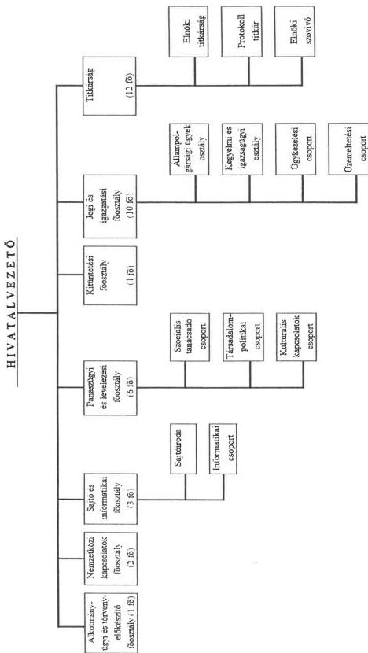
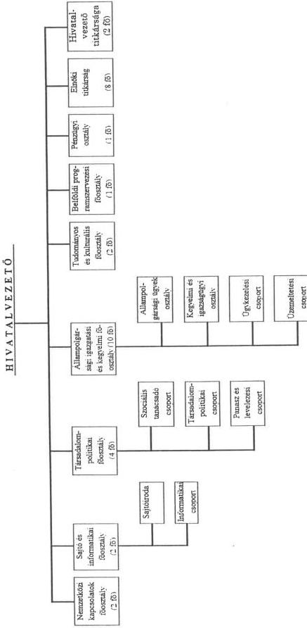
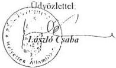
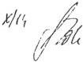
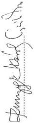
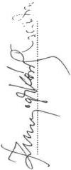
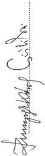
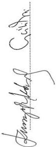
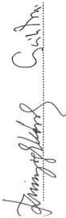

Állami Számverőszék

# JELENTÉS

a Köztársasági Elnökség fejezet
működésének
pénzügyi-gazdasági ellenőrzéséről

9833

1998. SZEPTEMBER

00:439

---

Az ellenőrzés végrehajtásáért felelős:
az ÁSZ III. Költségvetési Ellenőrzési Igazgatósága:

Bihary Zsigmond

számvevő igazgató

Az ellenőrzést vezette:

Balázs Andrásné

számvevő főtanácsos

Az ellenőrzést végezte és a jelentést készítette:

Karsai Lászlóné

számvevő

---

V-7-14/1998.

# TARTALOMJEGYZÉK

I. ÖSSZEGZŐ MEGÁLLAPÍTÁSOK, KÖVETKEZTETÉSEK, JAVASLATOK...5
II. RÉSZLETES MEGÁLLAPÍTÁSOK...7
1. A FELADATOK ÉS A SZERVEZETI RENDSZER ÖSSZHANGJA ÉS SZABÁLYOZOTTSÁGA...7
1.1. A FELADATOK, A SZERVEZETI FELÉPÍTÉS ÉS A SZEMÉLYI FELTÉTELEK ÖSSZHANGJA ...7
1.2. A SZERVEZETI, MŰKÖDÉSI ÉS GAZDÁLKODÁSI REND SZABÁLYOZOTTSÁGA...10
1.3. AZ INFORMÁCIÓS RENDSZER MŰKÖDÉSE ...11
2. A KÖLTSÉGVETÉSI TERVEZÉSI ÉS FINANSZÍROZÁSI RENDSZER...11
2.1. A BEVÉTELI ÉS KIADÁSI ELŐIRÁNYZATOK MEGALAPOZOTTSÁGA ...11
2.2. AZ ÉVKÖZI ELŐIRÁNYZAT MÓDOSÍTÁSOK FORRÁSAI, INDOKOLTSÁGA, SZABÁLYSZERÜSÉGE...13
2.3. A PÉNZELLÁTÁSI ÉS FINANSZÍROZÁSI TEVÉKENYSÉG...14
2.4. A PÉNZMARADVÁNYOK ALAKULÁSA, KELETKEZÉSÜK OKAI, FELHASZNÁLÁSUK SZABÁLYSZERÜSÉGE ...14
3. A KÖLTSÉGVETÉS VÉGREHAJTÁSA ...16
3.1. A BEVÉTELI ÉS KIADÁSI ELŐIRÁNYZATOK TELJESÜLÉSE...16
3.2. A LÉTSZÁM ALAKULÁSA ...17
3.3. A RENDSZERES SZEMÉLYI JUTTATÁSOKKAL VALÓ GAZDÁLKODÁS...17
3.4. A NEM RENDSZERES SZEMÉLYI JUTTATÁSOK ALAKULÁSA...18
3.5. ESZKÖZ ÉS KÉSZLETGAZDÁLKODÁS ...18
3.6. EGYÉB DOLOGI KIADÁSOK ALAKULÁSA...19
3.7. A FEJEZETI KEZELÉSŰ CÉLELŐIRÁNYZATOK FELHASZNÁLÁSA...20
4. A SZÁMVITELI ÉS BIZONYLATI REND...20
4.1. A SZÁMVITELI REND ÉS BIZONYLATI FEGYELEM ...20
4.2. AZ ÉVES KÖLTSÉGVETÉSI BESZÁMOLÓK, MÉRLEGEK VALÓDISÁGA...21
5. A BELSŐ ELLENŐRZÉSI RENDSZER...22
6. A FEJEZETNÉL VÉGZETT KORÁBBI ELLENŐRZÉSEK MEGÁLLAPÍTÁSAIHOZ,
JAVASLATAIHOZ KAPCSOLÓDÓ INTÉZKEDÉSEK UTÓELLENŐRZÉSE...22

1

---

1

1

1

---

Állami Számvevőszék

V-7-14/1998.

Témaszám: 429.

# JELENTÉS

## a Köztársasági Elnökség fejezet működésének pénzügyi-gazdasági ellenőrzéséről

A Köztársasági Elnökség 1991-től jelenik meg, mint fejezet a költségvetés szerkezeti rendjében. Ezt megelőzően az Országgyűlés fejezethez tartozott, és az Országgyűlési Hivatal részben önálló költségvetési szerveként funkcionált. A fejezeti besorolás 1991-ben még formális volt, mivel nem rendelkezett a kapcsolatos jogosítványok gyakorlásához szükséges személyi, tárgyi és finanszírozási feltételekkel. Az önálló fejezeti szintű gazdálkodás feltételei ténylegesen csak 1993-ra teremtődtek meg.

Az Állami Számvevőszék először 1993-ban végzett átfogó pénzügyi-gazdasági ellenőrzést a fejezetnél, amely az 1990-1993. I. féléves időszakra terjedt ki. Az ellenőrzés megállapította, hogy az ellenőrzött időszakban a fejezet még nem felelt meg a besorolással járó követelményeknek: a feladatok, a szervezet és a gazdálkodás feltételeinek összhangja az ellenőrzés befejezéséig (1994. február) sem vált teljessé. A megállapítások alapján az ellenőrzés ajánlásokat fogalmazott meg a szervezet korszerűsítése és racionalizálása, a működés rendje és szabályozottsága érdekében. Javaslatot tett az intézményi belső ellenőrzés rendszerének kiépítésére, az Országgyűlési Hivatallal feladatmegosztásra kötött megállapodás célszerűbbé tételére, a fejezeti kezelésű előirányzatok felhasználásának nyilvántartási rendszerét érintően.

Az 1993. évi átfogó pénzügyi-gazdasági ellenőrzést követően az ÁSZ ellenőrzések az éves költségvetések tervezésére és a zárszámadásokra irányultak.

---3

---

Az ellenőrzött időszakban a Köztársasági Elnöki Hivatal szervezete látta el a kinevezésekkel, az egyéni kegyelem gyakorlásával, az állampolgársággal, a kitüntetésekkel, a helyi önkormányzatokkal kapcsolatban hozott elnöki határozatok előkészítését, gondoskodott a döntések, intézkedések végrehajtásáról. El-látta a jogszabályok kihirdetésével kapcsolatos feladatokat, szervezte és végezte a köztársasági elnök nemzetközi tevékenységével, a nyilvánosság tájékoztatásával, a panaszügyek intézésével összefüggő feladatokat.

A Köztársasági Elnök Katonai Irodájának feladatkörébe tartozott a köztársasági elnök fegyveres erőket érintő döntéseinek kiszolgálása: a minősített időszak esetén a rendkívüli állapotot, illetve szükségállapotot elrendelő rendeletek előkészítése, a Honvédelmi Minisztérium (HM) szabályzatterveinek, fontosabb előterjesztéseinek véleményezése, a tábornoki kinevezésekhez, vezérkari programokhoz, jubileumi rendezvényekhez kapcsolódó feladatok megszervezése és előkészítése, más fegyveres erőkkel való kapcsolattartás, az 1956-osok ügyeinek gondozása.

**A fejezet eredeti költségvetési előirányzatai 1993-1997 között** összesen mintegy **60 %-kal nőttek** (1993-ban 185,8 millió Ft, 1997-ben 292 millió Ft). Az előirányzatok nagysága alapján a Köztársasági Elnökség a fejezetek sorrendjében a legkisebbek közé tartozik.

**A jelenlegi ellenőrzés** - az államháztartásról szóló 1992. évi XXXVIII. törvény 121. § (1) bekezdése, illetve az Állami Számvevőszékről szóló, többször módosított 1989. évi XXXVIII. törvény 2. § (3) bekezdése alapján - **az előző számvevőszéki ellenőrzés óta eltelt időszak (1993-97 évek) gazdálkodására, valamint a korábbi ellenőrzések megállapításaihoz kapcsolódó intézkedések végrehajtásának utóellenőrzésére irányult.**

**Ennek során arra kerestünk választ, hogy**

- a fejezetnél a szervezet, a működés szabályozottsága, a költségvetési előirányzatok összhangba kerültek-e a szakmai feladatokkal, mennyire segítették azok hatékony és eredményes ellátását;
- a költségvetési gazdálkodásban hogyan érvényesültek a törvényesség, a célszerűség és az eredményesség szempontjai;
- a fejezet milyen eredménnyel hasznosította az Állami Számvevőszék korábbi ellenőrzéseinek megállapításait, javaslatait.

4

---

I. ÖSSZEGZŐ MEGÁLLAPÍTÁSOK, KÖVETKEZTETÉSEK, JAVASLATOK

# I. ÖSSZEGZŐ MEGÁLLAPÍTÁSOK, KÖVETKEZTETÉSEK, JAVASLATOK

1993-1997 között a köztársasági elnöknek az Alkotmányban és más törvényekben megfogalmazott feladatai nem változtak, de a fejezet által ellátandó feladatok mennyiségileg megnövekedtek. Ennek ellenére az ellenőrzött időszakban mind a költségvetésekben engedélyezett létszám (62-ről 46 főre), mind a ténylegesen betöltött létszám (38 főről 34 főre) csökkent. Az üres állásokból származó jelentős összegű bérmegtakarítást a fejezet jutalmazásra, a többletmunkák anyagi elismerésére használta fel. Az ellátandó feladatokhoz képest mindössze egy fő látta el a Köztársasági Elnöki Hivatal pénzügyi-számviteli feladatait, miután azok egy részét - célszerűen - az Országgyűlés Hivatala végzi.

**A fejezetnél a szervezeti, működési és gazdálkodási rend szabályozottsága folyamatosan javult.** A szabályzatok - néhány kivétellel - az intézményi gazdálkodási tevékenység egészét átfogják.

A fejezeti és intézményi éves költségvetések elkészítése, **a kiadások és bevételek tervezése** (a személyi juttatások és járulékai kivételével) **megfelelt** a PM irányelveiben és tervezési útmutatóiban megfogalmazott **előírásoknak**. A kiadások eredeti előirányzatán belül 1993-1997 között a személyi juttatások és járulékai 30-38 %-ot, a fejezeti kezelésű előirányzatok 29-33 %-ot, a pénzeszköz átadás 21-31 %-ot, a dologi kiadások 5-15 %-ot képviseltek.

**A személyi juttatások és járulékai előirányzatait minden évben 100 %-os létszám-feltöltöttségi szintre tervezték**, bár ismert volt, hogy az elhelyezési körülmények nem teszik lehetővé a teljes feltöltést. **Az 1997. évi tervezésnél - helytelenül - 120 %-os beállási szinten vették figyelembe az előirányzatot.**

**A fejezet az elmúlt öt évben rendelkezett a feladatellátáshoz szükséges nagyságú pénzügyi fedezettel, gazdálkodása kiegyensúlyozott volt.** A módosított előirányzatok összességükben 94-98 % között teljesültek. A működéshez szükséges tárgyi eszközöket az Országgyűlési Hivatal szerezte be az évente rendelkezésére bocsátott, fejlesztési célú pénzeszközök terhére. Készletgazdálkodás csak a kitüntetésekkel kapcsolatban történt, a fejezetnek egyéb készletei nem voltak. Mintegy 2,5 millió Ft értékű **a már nem használható régi kitüntetési érmeállomány, melynek archiválására még nem intézkedtek.**

A fejezetnek az ellenőrzött időszakban 3-13 millió Ft közötti nagyságú pénzmaradványa keletkezett, részben a személyi juttatások és járulékainak, valamint a fejezeti kezelésű előirányzatoknak a kiadási megtakarításaiból. A fejezet az egyes években a kimutatott pénzmaradványon belül kötelezettségvállalással

5

---

I. ÖSSZEGZŐ MEGÁLLAPÍTÁSOK, KÖVETKEZTETÉSEK, JAVASLATOK

terhelt maradványként jelentette a PM felé a szerződéssel, bizonylattal le nem fedett előirányzat-maradványokat is, így az ellenőrzött időszakban nem ajánlott fel elvonásra a pénzmaradványból. A fejezeti kezelésű előirányzatok jóváhagyott maradványából egyes években - szabálytalanul - egyéb célú felhasználás is történt.

Az intézményi gazdálkodáshoz kapcsolódó független belső ellenőrzési szervezetet - az intézmények méretére, átláthatóságára tekintettel - nem alakították ki. Kifogásoljuk azonban, hogy az ellenőrzött években senki sem végzett a fejezet intézményeinél független belső ellenőrzést.

A Köztársasági Elnök Katonai Irodája különálló költségvetési gazdálkodását célszerűségi szempontból kifogásoljuk, ugyanis előirányzatainak nagysága, gazdálkodási feladatainak sajátossága a különálló gazdálkodást nem indokolja.

Az Állami Számvevőszék 1990-1992 közötti időszakra vonatkozóan 1994. évben befejezett pénzügyi-gazdasági ellenőrzése során feltárt hiányosságok megszüntetésére a fejezetnél nem készült intézkedési terv, azok egy részét (a szervezet korszerűsítése és racionalizálása, gazdasági apparátus megszervezése, a hiányzó belső ellenőrzés) nem számolták fel.

Az ellenőrzés megállapításainak hasznosítása mellett javasoljuk

a Köztársasági Elnöki Hivatal vezetőjének:

- kezdeményezze a Köztársasági Elnök Katonai Irodája gazdálkodási feladatainak ellátását a Köztársasági Elnöki Hivatal keretében;
- vizsgálja felül az intézményi költségvetésekben engedélyezett létszámot, és az elvégzendő feladatokhoz igazodóan tervezzék meg a fejezet létszámát, illetve mérsékeljék az üres álláshelyek számát;
- intézkedjen a fejezeti kezelésű előirányzatok felhasználására, valamint a magánszemélyeknek nyújtott segélyezésre vonatkozó szabályzatok kiadásáról, illetve a kötelezettségvállalás rendjének kiegészítéséről;
- biztosítsa, hogy a fejezeti kezelésű előirányzatok maradványainak felhasználása során a vonatkozó jogszabályi előírások szerint járjanak el;
- gondoskodjon a már nem használható kitüntetési készletek archiválásáról.

6

---

II. RÉSZLETES MEGÁLLAPÍTÁSOK

## II. RÉSZLETES MEGÁLLAPÍTÁSOK

### 1. A FELADATOK ÉS A SZERVEZETI RENDSZER ÖSSZHANGJA ÉS SZABÁLYOZOTTSÁGA

#### 1.1. A feladatok, a szervezeti felépítés és a személyi feltételek összhangja

A köztársasági elnök feladat- és hatáskörét az 1989. évi XXXI. törvénnyel módosított 1949. évi XX. törvény (a továbbiakban: Alkotmány) 30/A. §-a rögzíti.

A Köztársasági Elnökség a költségvetés fejezetrendjében 1993-1996 között az I., 1997-től a II. fejezetként került besorolásra.

A fejezethez az 1. cím alatt két önálló költségvetési gazdálkodási jogkörrel rendelkező intézmény tartozik: a Köztársasági Elnöki Hivatal (KEH), valamint a Köztársasági Elnök Katonai Irodája (KIR).

A 158/1995. (XII. 26.) Korm. rendelet 2. § 13. pontja értelmében **a fejezet felügyeletét ellátó szerv vezetője a KEH vezetője**. A kormányrendelet megjelenése előtt sem az alapításról rendelkező, sem más okirat nem jelölte ki a fejezet felügyeletéért felelős vezető személyét.

A fejezet 2. címe a fejezeti kezelésű célelőirányzatot tartalmazza. A célelőirányzathoz tartozó feladatokat a Kossuth és Széchenyi díjakról rendelkező 1990. évi XII. törvény, valamint a Magyar Köztársaság kitüntetéseiről szóló 1991. évi XXXI. törvény fogalmazza meg.

Az intézmények szakmai és gazdálkodási tevékenységét az Áht. 88. § (3) bekezdésének megfelelően az 1993. január 1-től hatályos Alapító Határozatok rögzítik, melyeket a köztársasági elnök adott ki.

A KEH Alapító Határozata szerint a Köztársasági Elnöki Hivatalt a köztársasági elnöknek az Alkotmányban és más törvényekben meghatározott feladatai (döntései) előkészítésére és hatásköre gyakorlásának elősegítésére, az ezekkel összefüggő ügyviteli, ügyintézői, nyilvántartási és egyéb feladatok ellátására hozták létre.

A KIR Alapító Határozata értelmében a köztársasági elnöknek, mint a fegyveres erők főparancsnokának a fegyveres erőkkel kapcsolatos ügyeinek intézésére alakították ki a Köztársasági Elnök Katonai Irodáját.

**Mindkét intézmény** a köztársasági elnök felügyelete alatt működik, **szervezeti és működési rendjét a köztársasági elnök állapítja meg**.

7

---

## II. RÉSZLETES MEGÁLLAPÍTÁSOK

Az ellenőrzött időszakban a KEH szervezete látta el a kinevezésekkel, az egyéni kegyelem gyakorlásával, az állampolgársággal, a kitüntetésekkel, a helyi önkormányzatokkal kapcsolatban hozott elnöki határozatok előkészítését, gondoskodott a döntések, intézkedések végrehajtásáról. E mellett ellátta a jogszabályok kihirdetésével kapcsolatos feladatokat, szervezte és végezte a köztársasági elnök nemzetközi tevékenységével, a nyilvánosság tájékoztatásával, a panaszügyek intézésével összefüggő feladatokat.

1993. január 1-én a KEH szervezete a jóváhagyott SZMSZ szerint hat szakmai főosztályból, a Titkárságból és a Számviteli Osztályból épült fel (1/A sz. melléklet).

1993-1997 között a köztársasági elnöknek az Alkotmányban és más törvényekben megfogalmazott feladatai nem változtak, de a Hivatal által ellátandó feladatok mennyiségileg megnövekedtek.

A kegyelmi ügyekben hozott döntések 1993-hoz képest 5 év alatt átlag 25 %-kal, a bírák felmentésével és kinevezésével összefüggő feladatok 21 %-kal, a hivatalos vendéglátás 36 %-kal, a kitüntetésekkel kapcsolatos feladatok 44 %-kal nőttek.

A szakmai feladatok növekedésével összefüggésben a szervezet az 1993. január 1-i állapothoz képest tovább tagozódott. 1997. szeptember 1-től egy főosztály átszervezésére és két új főosztály létesítésére került sor (1/B sz. melléklet).

1993-ban a feladatokhoz rendelt - az intézményi költségvetésben jóváhagyott - létszám 62 fő volt (de az üres álláshelyek miatt ténylegesen csak 38 fős létszámmal látták el a feladatokat).

1995-től a jóváhagyott intézményi költségvetési létszámot (26 %-kal) 46 főre csökkentették. A feladatok folyamatos növekedése ellenére a tartósan üres álláshelyek száma továbbra is magasan alakult (a tényleges létszám 1997. december 31-én csak 34 fő volt).

Az ellenőrzés véleménye szerint a szervezet horizontális tagozódása az állományi létszámhoz képest túl széles (a vezetői állomány aránya az össz állományon belül 40-45 % között mozgott).

A hivatalvezető tájékoztatása szerint: „a Hivatal egyedülállóan speciális jellegéből következik a tagolt, horizontális szervezet, mert csak így biztosítható az Alkotmányban és a külön törvényekben előírt feladatok hatékony, gyors elvégzése és az egyes területeken önállóan dolgozó személyek közvetlen felelőssége. A szervezet ezzel a felépítéssel tudja biztosítani az önálló munkaterületeken a magas színvonalú, szakértői munkavégzést.”

Az Alapító Határozat a gazdálkodási feladatokkal kapcsolatban rögzítette, hogy a **KEH önálló gazdálkodási jogkörrel rendelkező intézmény**, előirányzataival a hivatalvezető gazdálkodik.

Az Alapító Határozat azt is előírta, hogy „a beszerzési, postai, hivatalfenntartási, műszaki-karbantartási, felújítási, gondnoksági, gazdasági-adminisztratív feladatokat a közös parlamenti elhelyezés miatt az Országgyűlés Hivatala (OGYH) látja el”.

8

---

II. RÉSZLETES MEGÁLLAPÍTÁSOK

A gazdasági feladatmegosztást célszerűségi szempontok indokolták, mivel a KEH, a KIR és az OGYH egy épületen belül helyezkednek el, így a fejezetnek nem kellett kiépítenie a teljes körű gazdasági szervezetet.

A feladatmegosztást az 1993. január 14-én aláírt Emlékeztető tartalmazza (2. sz. melléklet), amelyet 1994. november 18-án - a pénzügyi forrásokról és az egymás közötti elszámolásról szóló - Megállapodással egészítettek ki (3. sz. melléklet).

**A KEH-nél maradt pénzügyi számviteli feladatokat 1993 óta egyetlen pénzügyi-számviteli főelőadó látja el**, aki a hivatalvezető közvetlen beosztottja.

A főelőadó feladatkörébe tartozik: a fejezet és az intézmény éves költségvetésének összeállítása, a PM-el történő egyeztetés és a szöveges indoklás elkészítése; a fejezeti és intézményi beszámoló összeállítása, szöveges beszámoló készítése; pénzügyi és számviteli operatív feladatok ellátása; a KIR számviteli főelőadója munkájának ellenőrzése... stb.

Az ellenőrzött időszakban a KIR szervezetének feladatkörébe tartozott a köztársasági elnök fegyveres erőket érintő döntéseinek kiszolgálása: a minősített időszak esetén a rendkívüli állapotot, illetve szükségállapotot elrendelő rendeletek előkészítése; a HM szabályzatterveinek, fontosabb előterjesztéseinek véleményezése, a tábornoki kinevezésekhez, vezérkari programokhoz, jubileumi rendezvényekhez kapcsolódó feladatok megszervezése és előkészítése; más fegyveres erőkkel való kapcsolattartás; az úgynevezett 1956-osok ügyeinek gondozása stb.

1993. január 1-én a KIR szervezete a jóváhagyott SZMSZ szerint egy főhadsegédből (irodavezető), egy elnöki tanácsadóból, három szárnysegédből, egy titkárságvezetőből, kettő titkárnőből, kettő gépkocsivezetőből és egy számviteli főelőadóból állt.

A feladatokhoz a HM költségvetésében 8 főt, a KIR költségvetésében 3 főt hagytak jóvá.

1993-1997 között a feladatok nem változtak, de a szervezet kis mértékben módosult.

1994. végéig a hivatásos állomány és egy titkárnő a Honvédelmi Minisztérium épületében kapott elhelyezést, személyi juttatási előirányzatukat is a HM költségvetésében biztosították.

1995-től a HM nem biztosította tovább a KIR állományának elhelyezését. A hivatásos állomány egy része nyugdíjba vonult, ezzel egyidejűleg új szárnysegédet bíztak meg a feladatokkal. A megmaradt állomány a parlament épületében került elhelyezésre. Ellenőrzésünk idején 5 fő (4 hivatásos katona és 1 köztisztviselő) látta el az Alapító Határozatban előírt feladatokat.

A KIR-nél az SZMSZ nem került módosításra a változásoknak megfelelően.

A hivatalvezető 1998. július 9-i tájékoztatása szerint az SZMSZ módosítása folyamatban van.

9

---

II. RÉSZLETES MEGÁLLAPÍTÁSOK

Az Alapító Határozat alapján a KIR önálló gazdálkodási jogkörrel rendelkezik, előirányzataival az irodavezető gazdálkodik.

Az ellenőrzés véleménye szerint a KIR gazdálkodásával összefüggő feladatokat - figyelemmel a minimális létszámra és az évi 4-6 millió Ft közötti költségvetési előirányzatra - indokolt lenne a KEH keretében ellátni. Ez által növelni lehetne a költségvetési források felhasználásának hatékonyságát. (Mindez természetesen nem érintené az irodavezető gazdálkodási jogkörét.)

## 1.2. A szervezeti, működési és gazdálkodási rend szabályozottsága

A fejezetnél a szervezeti, működési és gazdálkodási rend folyamatosan szabályozottabbá vált.

A két intézmény SZMSZ-e 1993-tól, számlarendjei 1995-től, a KEH reprezentációs szabályzata 1994-től, a szociális szabályzata 1996-tól, az értékelési, leltározási, selejtezési, pénzkezelési, bizonylatolási, belső ellenőrzési szabályzata 1997-től, a közszolgálati, az illetmény- és létszám-gazdálkodási szabályzata, iratkezelési szabályzata 1998-tól hatályos.

A szervezeti és működési szabályzatot mindkét intézménynél a köztársasági elnök hagyta jóvá. A gazdálkodási, működési szabályzatokat a hivatalvezetők adták ki.

A szabályzatok - az alábbiak kivételével - az intézményi gazdálkodási tevékenység egészét átfogják.

### - A fejezeti kezelésű előirányzatokkal való gazdálkodásra nem készült szabályzat.

A 139/1993. (X. 12.) Korm. rendelet 19. § (7) bekezdése alapján „a fejezeti kezelésű előirányzatok felhasználásának rendjét írásban kell szabályozni”. 1997-től az 1996. évi CXXI. törvény 11. § (2) bekezdése értelmében „a fejezeti kezelésű előirányzatok felhasználását... - ha a költségvetési törvény eltérően nem rendelkezik - a fejezet felügyeletét ellátó szerv vezetője a pénzügyminiszterrel egyetértésben szabályozza”.

A PM helyettes államtitkára 1996. december 9-i levelében felhívta a KEH vezetőjének figyelmét a szabályzatkészítési kötelezettségre. A hivatalvezető válaszában döntési jog, illetve feladat hiányára való hivatkozással nem készített szabályzatot (4. sz. melléklet).

Álláspontunk szerint az a körülmény, hogy az állami kitüntetésben részesülők személyéről nem a KEH vezetője dönt, nem befolyásolja azt, hogy a kitüntetések adományozásához szükséges előirányzat nagyságának és jogcím szerinti felhasználásának megtervezése, a felhasználás ellenőrzése, az előirányzat maradvány megállapítása, a maradvány cél szerinti felhasználásának biztosítása stb. - mint szabályozandó terület - a fejezet felügyeletéért felelős vezető feladatkörébe tartozik.

10

---

II. RÉSZLETES MEGÁLLAPÍTÁSOK

A 158/1995. (XII. 26.) Korm. rendelet 2. § 13. pontja szerint a fejezet felügyeletét ellátó szerv vezetője a Köztársasági Elnökség fejezetnél a KEH vezetője, akinek jogszabályban előírt feladata a fejezeti kezelésű előirányzat felhasználási rendjének szabályozása.

- A koztarsasagi elnok 1997 ota a dologi kiadasok eloranyzatan belul elkulonitett tetelekent meghatarozott koltsegvetesi eloranyzattal rendelkezik a maganszemelyeknek nyujtott segelyezesre. A segelyezes eljarasi rendjere a fejezetnel belso szabalyzat nem keszult.
- A szamviteli törvény 1997. évi módosításanak megfeleloen készült el az intézmények szamviteli politíkája, ertékelési és penzkezelési, valamint leltározásizabályzata.
- Nem megfelelo a kotelezettségvallalas rendjének szabályozása. Az 1993. januar 1-tól hatályos szabályzatban hiányzik a teljesítésigazolás szabályozása, nincs nevesítve az érvényesítésre és utalványozásra jogosultak köre.

### 1.3. Az információs rendszer működése

A fejezeti és intézményi információs rendszer az ellenőrzött időszakban folyamatosan épült ki. A szakmai információs rendszer működését a heti vezetői értekezletek mellett heti koordináló értekezletek (a programszervezéssel összefüggésben) segítették.

A 2000. év dátumváltozása következtében egyes informatikai rendszerekben és eszközökben fellépő működési zavarok csökkentésére, az információs rendszerek működőképességének fenntartására a Kormány az 1059/1998. (V. 8.) sz. határozatában feladatokat fogalmazott meg az érintett szervek számára. A határozat 2. pontja értelmében 1998. május 31-ig ki kellett nevezni a feladatokért felelős vezetőt és létre kellett hozni egy szakértői csoportot. A Köztársasági Elnökségnél a helyszíni vizsgálat idején tervezet szinten készült el a megbízás.

A tervezet szerint a KEH vezetője felel a feladatok végrehajtásáért, koordinálásáért, a projektek indításáért és irányításáért. Az operatív feladatok ellátásával egy számítástechnikai Bt-t, valamint a KEH pénzügyi-számviteli főelőadóját tervezi megbízni a köztársasági elnök.

## 2. A KÖLTSÉGVETÉSI TERVEZÉSI ÉS FINANSZÍROZÁSI RENDSZER

### 2.1. A bevételi és kiadási előirányzatok megalapozottsága

A fejezet eredeti költségvetési előirányzatai 1993-1997 között összesen mintegy 60 %-kal nőttek (1993-ban 185,8 millió Ft, 1997-ben 292 millió Ft).

Az előirányzatok nagysága alapján a Köztársasági Elnökség a fejezetek sorrendjében a legkisebbek közé tartozik.

11

---

## II. RÉSZLETES MEGÁLLAPÍTÁSOK

Az ellenőrzött időszakban a fejezeti és intézményi éves költségvetések elkészítése, **a kiadások és bevételek tervezése** (kivéve a személyi juttatások és járulékai előirányzatát) **megfelelt a PM irányelveiben és tervezési útmutatóiban megfogalmazott előírásoknak.**

A bevételek eredeti előirányzatainak megállapítása során a fejezet egyetlen évben sem tervezett intézményi működési bevételt, mivel az többnyire eseti jelleggel és kis összegben realizálódott. Az eredeti bevételi előirányzat 100 %-ban felügyeleti szervtől kapott támogatás (intézményfinanszírozás, illetve címzett támogatás) jogcímen került tervezésre (1. sz. tanúsítvány).

A kiadások eredeti előirányzatán belül a személyi juttatások és járulékai 30-38 %-ot, a fejezeti kezelésű előirányzatok 29-33 %-ot, a pénzeszköz átadás 21-31 %-ot, a dologi kiadások 5-15 %-ot képviseltek 1993-1997 között (2. sz. tanúsítvány).

Az eredeti előirányzatok levezetését bemutató 4. sz. tanúsítvány adatai szerint a tárgyévi kiadási előirányzatok a bázis-előirányzatokhoz képest főként a fejlesztések és az automatizmusok révén nőttek. A fejlesztési többleteket alapvetően a feladatok mennyiségi növekedése, illetve az árnövekedés, az automatizmusokat az illetményalap emelése, valamint a Kossuth és Széchényi díjakkal járó jutalomnövekedés indokolta.

1993-ban a fejezet egyszeri rendkívüli kiadásként 25 millió Ft ágazati célkeretet tervezhetett. Az előirányzatot az Országgyűlés Alkotmányügyi Bizottsága javasolta a fejezet működésétől függetlenül növekvő állami rendezvények, kitüntetések átadása... stb. finanszírozására.

A kiadások tervezését a bázisszemlélet és a biztonságra való törekvés jellemezte.

A fejezeti kezelésű előirányzatok pontos nagyságát a feladatok időbeni ismeretének hiánya miatt nem lehetett meghatározni, így az előző évi tényadatokat vették figyelembe a tervezésnél.

A kitüntetettek számának tervezése a Magyar Köztársaság kitüntetéseiről szóló 1991. évi XXXI. törvény figyelembevételével történt. A Kossuth és Széchényi díjak előirányzatának meghatározásánál a Kossuth és Széchényi díjakról rendelkező 1990. évi XII. törvény előírásai szerint jártak el.

Az 1991. évi XXXI. törvény 7. § (1)-(4) bekezdései rögzítik, hogy hány magyar, illetve külföldi állampolgár részesülhet évente az adományozható állami kitüntetésekből.

Az 1990. évi XII. törvény 3. § (3) bekezdése szerint a Kossuth és Széchényi díjjal járó jutalom összege a bérből és fizetésből élők előző évi - a KSH által számított - országos szintű nettó nominál átlagkeresetének ötszöröse 50.000, illetve 100.000 forintra való felkerekítéssel. A (6) bekezdés értelmében a díj adományozásával járó költségeket a Köztársasági Elnökség költségvetésében kell biztosítani.

Az OGYH-nak a működésre átadásra kerülő pénzeszközt szintén bázisalapon tervezték meg.

12

---

II. RÉSZLETES MEGÁLLAPÍTÁSOK

**A személyi juttatások és járulékai előirányzatait** minden évben **100 %-os létszám-feltöltöttségi szintre tervezték**, bár ismert volt, hogy az elhelyezési körülmények nem teszik lehetővé a teljes feltöltést. A személyi állomány illetményének **1997. évi tervezésénél - helytelenül - 120 %-os beállási szinten vették figyelembe az előirányzatot**, miután 1996. júliusában egységesen felemelték a teljes állomány illetményét az üres álláshelyek bérmegtakarítása terhére.

## 2.2. Az évközi előirányzat módosítások forrásai, indokoltsága, szabályszerűsége

A költségvetési előirányzatok évközi módosítása az ellenőrzött években mértékében és gyakoriságában sem volt jelentős.

A módosítások éves átlagban mindössze 4-11 % közötti változást eredményeztek az össz-előirányzatokban.

A bevételi előirányzatok módosítására a jóváhagyott előző évi pénzmaradvány igénybevétele, a kitüntetésekre más fejezetektől átvett pótlólagos pénzeszközök, valamint az intézményi terven felüli működési bevételek realizálódása miatt került sor.

Bevételi előirányzat-átcsoportosítás a kitüntetésekhez kapcsolódó fejezeti kezelésű előirányzatok intézményi felhasználása miatt történt. A fejezeti kezelésű előirányzatok KEH-hez történő átcsoportosítása a személyi jellegű és a dologi kiadási előirányzatokat növelte jelentősen.

A kiadási előirányzatokon belül a pénzmaradvány felhasználás szintén a személyi jellegű kiadásoknál és a dologi kiadásoknál igényelt elsősorban előirányzat-változtatást.

Kisebb átcsoportosításra a kiemelt előirányzatok tételei között minden évben sor került a változó szükségleteknek megfelelően.

Az előirányzat-módosítások hatásköri megoszlását bemutató 3. sz. tanúsítvány adatai szerint 1994-ben, 1995-ben és 1997-ben nagyobb mértékű kormányszintű módosításra került sor.

A kormányszintű módosításokra a kitüntetési többletkiadások, különböző bérpolitikai intézkedések miatti többletkiadások, egyes években dologi kiadási előirányzat-megvonások miatt került sor.

**A kormányszintű, a felügyeleti és intézményi hatáskörű módosítások szabályosak és indokoltak voltak.** Az előirányzat-változások **dokumentáltsága** az ellenőrzött időszakban **megfelelő volt**.

Az előirányzatokról és azok módosításáról a jogszabályokban előírt módon vezették a nyilvántartásokat és adtak adatszolgáltatást.

1993-1995 között az előirányzatok nyilvántartása a 179/1991. (XII. 30.) Korm. rendeletnek megfelelően a nullás számlaosztályban történt.

13

---

## II. RÉSZLETES MEGÁLLAPÍTÁSOK---

1996-tól az előirányzatok nyilvántartására és az adatszolgáltatásra a 158/1995. (XII. 26.) Korm. rendelet előírásait alkalmazták.

### 2.3. A pénzellátási és finanszírozási tevékenység

A fejezetnél az ellenőrzött időszakban a **pénzellátási és finanszírozási tevékenység megfelelt a jogszabályi előírásoknak.**

1993. december 31-éig a pénzforgalomról és a bankhitelről szóló 39/1984. (XI. 5.) MT rendelet 2. § (3) bekezdésének megfelelően a pénzforgalmat egyetlen pénzforgalmi jellegű bankszámlán bonyolították a fejezet intézményei.

A 140/1993. (X. 12.) Korm. rendelet hatályba lépését követően a 8. § (1) bekezdése alapján a költségvetési gazdálkodáshoz kapcsolódó pénzforgalom a Magyar Nemzeti Banknál vezetett költségvetési elszámolási számlán bonyolódott. A fejezetnél letéti jellegű pénzkezelés nem volt, így letéti számlát nem nyitottak. A dolgozók lakásépítésének munkáltatói támogatásával kapcsolatos pénzforgalom lebonyolítására az OTP Rt.-nél nyitott számlát a KEH.

1996. január 1-től a 159/1995. (XII. 26.) Korm. rendelet 8. §-ának megfelelően a Kincstárnál nyitották meg a gazdálkodáshoz szükséges fejezeti és intézményi számlákat.

A **pénzellátás** az ellenőrzött időszakban **kiegyensúlyozott volt.**

A pénzellátás 1995 év végéig a jogszabályi előírásoknak megfelelően negyedéves pénzellátási terv alapján történt.

Az intézményi működéshez szükséges pénzeszközöket, valamint az OGYH-nak átadásra kerülő pénzeszközöket havi egyenlő arányban, a kitüntetésekkel kapcsolatos kiadások fedezetét a feladatokhoz igazodóan kapták meg az intézmények.

1996-tól kezdődően a fejezet a költségvetési törvényben megállapított, illetve év közben módosított, aktuális jóváhagyott kiadási és bevételi előirányzatának különbözeteként havi időarányos költségvetési előirányzat-felhasználási keretet kapott.

A fejezeti kezelésű előirányzatok címen tervezett feladatok előirányzatait a 159/1995. (XII. 26.) Korm. rendelet 19. § (5) bekezdése értelmében teljesítésarányosan, előirányzat módosítás útján vették igénybe.

### 2.4. A pénzmaradványok alakulása, keletkezésük okai, felhasználásuk szabályszerűsége

A pénzmaradványok (1996-tól előirányzat-maradványok) alakulását és felhasználását bemutató 5. sz. tanúsítvány adatai szerint a fejezetnek az ellenőrzött időszakban 3-13 millió Ft közötti nagyságú pénzmaradványa keletkezett (ez a módosított előirányzatnak 1,5-4,5 %-át tette ki).

Jelentősebb összegű maradvány a személyi juttatások és járulékai, valamint a fejezeti kezelésű előirányzatok kiadási megtakarításaiból keletkezett. A dologi ki-

---14

---

II. RÉSZLETES MEGÁLLAPÍTÁSOK

adások előirányzatából, valamint bevételi többletből eredően a maradvány jelentéktelen volt.

**A fejezet** egyes években a kimutatott pénzmaradványon belül - **a valóságtól eltérően** - kötelezettségvállalással terhelt maradványként **jelentette** a PM felé a **szerződéssel, bizonylattal le nem fedett előirányzat-maradványokat**.

1996-ban 9.690 ezer Ft-ot (melyből 6.458 ezer Ft rendszeres személyi juttatás, 2.519 ezer Ft Tb-járulék, 713 ezer Ft dologi kiadás), 1997-ben 19.823 ezer Ft-ot (melyből 11.204 ezer Ft rendszeres személyi juttatás, 4.370 ezer Ft Tb-járulék, 688 ezer Ft dologi kiadás) kötelezettséggel terhelt előirányzat-maradványként jelentett a beszámolóban.

A fejezet az ellenőrzött időszakban nem ajánlott fel elvonásra a pénzmaradványból. A PM minden évben a kimutatott teljes összeget jóváhagyta felhasználásra.

**A pénzmaradvány igénybevétele** (kivéve a fejezeti kezelésű előirányzatok maradványát) **a jóváhagyásnak megfelelő jogcímeken történt**.

A KEH dologi kiadásokra jóváhagyott maradványából egyes években egyéb célú felhasználás is történt. 1993-ban 5,1 millió Ft értékben a KIR előző évi működési kiadásait térítették meg; 1996-ban 2,9 millió Ft-ot adtak pótlólag az OGYH-nak gépkocsi vásárlás céljára; 1997-ben a pénzmaradványból fedezték a köztársasági elnök által adott segélyeket 2,5 millió Ft összegben.

A dologi kiadások előirányzat-maradványának más jogcímeken történő felhasználása a 137/1993. (X. 12.) Korm. rendelet 36. §-a, illetve a 156/1995. (XII. 26.) Korm. rendelet 43. §-a előírásai értelmében szabályos volt.

Az ellenőrzött években **a fejezeti kezelésű előirányzat-maradványok igénybevétele szabálytalanul történt**.

Mivel a fejezeti kezelésű előirányzatokat a KEH használta fel, év közben a jóváhagyott keret módosított előirányzatként az intézmény személyi juttatási és dologi kiadási tételeire került átcsoportosításra. A KEH főkönyvi könyvelésében alszámla bontással biztosították ugyan a kitüntetésekkel kapcsolatos kiadások elkülönített kezelését, de az 1993-1996 közötti beszámolókban a pénzmaradvány intézményi személyi juttatási, illetve dologi kiadási maradványként, és nem fejezeti kezelésű pénzmaradványként került kimutatásra.

1997-től az előirányzat-maradvány elszámoláskor - helyesen - megkülönböztették a fejezeti kezelésű előirányzat összesített maradványát a többi maradványtól, de a jóváhagyott maradvány igénybevétele már az intézményi személyi juttatások illetve dologi kiadások jogcímeken történik. Így a fejezeti kezelésű előirányzat-maradványok évről-évre „beleolvadnak” a működésbe.

**A kialakult gyakorlat ellentétes az Áht. előírásaival, mivel a 23. § (4) bekezdése szerint a fejezeti kezelésű előirányzatok kizárólag a költségvetési törvényben meghatározott célra használhatók fel.** A 93. § (7) bekezdése értelmében a fejezeti kezelésű előirányzatok maradványa a következő évben változatlan rendeltetéssel elsősorban az előző évben keletkezett, de

15

---

II. RÉSZLETES MEGÁLLAPÍTÁSOK

pénzforgalmilag csak a következő évben teljesülő követelések kiegyenlítésére használható fel a PM által jóváhagyott összeg erejéig. Az előirányzat-maradvány felhasználására ugyanazok az eljárási szabályok vonatkoznak, mint az eredetileg megállapított előirányzatra.

# 3. A KÖLTSÉGVETÉS VÉGREHAJTÁSA

# 3.1. A bevételi és kiadási előirányzatok teljesülése

A fejezet az elmúlt öt évben rendelkezett a feladatellátáshoz szükséges nagyságú pénzügyi fedezettel, gazdálkodása kiegyensúlyozott volt.

A teljesített bevételek az ellenőrzött időszakban 201,6 millió Ft-ról 323,7 millió Ft-ra, 61 %-kal nőttek (1. sz. tanúsítvány).

A bevételek forrása 92-98 %-ban központi költségvetési támogatás volt, mivel a feladatok jellege miatt a fejezet és intézményei alaptevékenységéhez nem kapcsolódik rendszeres saját bevétel, vállalkozási tevékenységet sem folytattak.

A támogatást az évente képződött - nem számottevő - pénzmaradvány, valamint a más fejezetektől kitüntetésekre, állami rendezvények többlet kiadásainak fedezetére átvett pénzeszköz egészítette ki.

Az intézményi működési bevételeket (többnyire gépjármű-biztosítási kártérítéseket) költségvetési befizetési kötelezettség nem terhelte.

Kivéve 1997-ben 200 ezer Ft - folyóirat előző évi megrendelésének visszavonása miatt visszautalt - bevételt; ezt 5 %-os befizetési kötelezettség terhelte, melyet időben teljesítettek.

A kiadások az 1993-as évi 198,2 millió Ft-ról 1997-re 302,3 millió Ft-ra teljesültek, ami 53 %-os növekedésnek felel meg (2. sz. tanúsítvány).

A kiadási főösszegen belül a személyi juttatások és járulékai voltak meghatározóak 50-61 % közötti aránnyal.

A dologi kiadás 10-18 % között, a pénzeszköz átadás 21-39 % között alakult.

A felhalmozási kiadások éves beszámolókban kimutatott értéke 0,1-1,0 millió Ft volt. A fejlesztési célra átadott pénzeszközből beszerzett tárgyi eszközöket az OGYH vette állományba.

Az 1993. évi költségvetésről szóló 1992. évi LXXX. törvény értelmében a fejezet 1993-ban ágazati célkeretként 25 millió Ft-ot használhatott fel. A törvény az előirányzathoz nem rendelt konkrét feladatot.

Az előirányzatból 6 millió Ft értékben gépjárműveket vásároltak, 2 millió Ft összegben lakásalapot képeztek a dolgozók támogatására, a fennmaradó összegből pedig az állami rendezvényekkel, kitüntetésekkel kapcsolatos tárgyévi többletfeladathoz járultak hozzá.

16

---

II. RÉSZLETES MEGÁLLAPÍTÁSOK

A módosított előirányzatok összességükben 94-98 % között teljesültek. **A fejezet nem törekedett az előirányzatok teljes mértékű felhasználására** (a takarékosság elsősorban a kitüntetésekkel kapcsolatos reprezentációs kiadások tekintetében érvényesült).

### 3.2. A létszám alakulása

Az intézményi költségvetésekben jóváhagyott létszám- és személyi juttatási előirányzatokkal az intézmények az ellenőrzött időszakban önálló gazdálkodási jogkörükből eredően szabadon rendelkeztek.

A ténylegesen betöltött átlaglétszám 1993-ban 42 fő volt, folyamatos csökkenés eredményeként 1997-ben már csak 34 fő (6. sz. tanúsítvány).

A munkaerőmozgás 1995-ben és 1996-ban volt jelentősebb (7. sz. tanúsítvány).

1995-ben a II. besorolási osztály (középiskolai végzettségű érdemi ügyintézők) álláshelyei kerültek feltöltésre, míg a fizikai munkakörökben létszámcsökkentésre került sor.

1996-ban a főosztályvezetők állománycsoportjában volt nagyobb fluktuáció, valamint a II. besorolási osztályból távoztak hárman.

A nyugdíjba vonulók, illetve a közös megegyezéssel, lemondással távozók felmentései a jogszabályi előírásoknak megfeleltek.

### 3.3. A rendszeres személyi juttatásokkal való gazdálkodás

A módosított előirányzatok minden évben elegendő fedezetet nyújtottak a rendszeres személyi juttatásokra. **1996. júliusában az üres álláshelyek bérmegtakarításainak terhére az illetményeket egységesen 20 %-kal emelték. Az eljárás a 156/1995. (XII. 26.) Korm. rendelet 29. § (6) bekezdésével ellentétes volt**, mivel a személyi juttatások előirányzatának átmeneti megtakarítása terhére tartós kötelezettség nem vállalható.

A KEH vezetőjének írásos tájékoztatása szerint a béremelés indoka a feladatokhoz és a tervezetthez mért, részben az elhelyezési gondokból folyóan kényszerűen kisebb mértékű létszámemelkedéssel végzendő többletmunka volt, amely a dolgozókra évek óta hárul.

A köztársasági elnök tiszteletdíja az 1992. évi XXXVI. törvény előírásainak megfelelően a miniszterelnök részére megállapított havi illetmény összegével azonosan alakult.

Az egy főre jutó éves átlagilletmények alakulását bemutató 8. sz. tanúsítvány adatai szerint az illetmények 1993-1997 között több, mint háromszorosára nőttek. A növekedés a köztisztviselői illetményalap folyamatos emelkedése ellenére hullámzó volt. (1994-ben 33 %-os növekedés, 1995-ben 19 %-os csökkenés, 1996-ban 43 %-os növekedés, 1997-ben 102 %-os növekedés történt az előző évhez viszonyítva).

17

---

## II. RÉSZLETES MEGÁLLAPÍTÁSOK---

Az 1995. évi csökkenés oka, hogy a tárgy évre vonatkozó 13. havi illetményt csak 1996. januárban fizették ki.

Az 1997. évi kiemelkedő növekedés oka főként az, hogy a költségvetési törvény értelmében (az illetményalap emelésén felül) változott a felsőfokú végzettségűek illetménykiegészítésének mértéke, és jelentősen emelkedett a vezetői, valamint a nyelvpótlék.

A fejezetnél a legnagyobb arányú növekedés a II. besorolási osztályba tartozóknál következett be, ahol öt év alatt meghétszereződött az egy főre jutó átlagilletmény.

Az államtitkár és a főosztályvezetők illetménye háromszorosára, a főosztályvezető-helyettesek, osztályvezetők, ügykezelők és fizikai alkalmazottak illetménye kétszeresére emelkedett.

A többiektől elmaradva, mintegy 1,3-szoros volt a növekedés mértéke az I. besorolási osztályba tartozóknál (főiskolai végzettségű érdemi ügyintézők).

### 3.4. A nem rendszeres személyi juttatások alakulása

A tartósan üres álláshelyek személyi juttatási előirányzatainak megtakarításai a (személyi juttatásokra) jóváhagyott előző évi pénzmaradványokkal együtt lehetővé tették az állomány nagyfokú anyagi ösztönzését.

A jutalmak 1993-1995 között éves átlagban 10-13 %-kal nőttek, 1996-ban 36 %-kal, 1997-ben pedig 130 %-kal voltak magasabbak az előző évinél (8. sz. tanúsítvány).

A nem rendszeres személyi juttatások az ellenőrzött időszak alatt (54,8 millió Ft-ról 93,3 millió Ft-ra) 70 %-kal nőttek (9. sz. tanúsítvány).

Fejezeti sajátosság, hogy a Kossuth és Széchenyi díjakkal járó kitüntetések összege az állományba nem tartozók juttatásai jogcímen kerül felhasználásra. Ez okozza, hogy az összes személyi juttatáson belül igen magas a nem rendszeres személyi juttatások aránya (62-69 % közötti).

A fejezetnél Szociális Szabályzat rendelkezik a köztisztviselőknek adható juttatásokról. **A nem rendszeres juttatások** jogcímei és mértékei összhangban álltak a köztisztviselők munkavégzéséről, munka és pihenőidejéről, jutalmazásáról, valamint juttatásairól szóló 170/1992. (XII. 22.) Korm. rendelet, valamint a Kossuth és Széchenyi díjról szóló 1990. évi XII. törvény előírásaival. A kifizetések **jogszerűek és szabályszerűek voltak**.

### 3.5. Eszköz és készletgazdálkodás

A fejezet felhalmozási jogcímen elszámolt kiadásai az ellenőrzött években 0,1-1,0 millió Ft között alakultak.

A működéshez szükséges tárgyi eszköz igényeket - a megállapodás szerint - az OGYH elégítette ki az évente rendelkezésére bocsátott fejlesztési célú pénzeszközök terhére.

---18

---

II. RÉSZLETES MEGÁLLAPÍTÁSOK

1993-1997 között mintegy 22 millió Ft összegben szerzett be a KEH és a KIR részére épület-berendezéseket, irodabútorokat és felszereléseket, számítástechnikai eszközöket, valamint gépjárműveket.

A megállapodás értelmében azonban „a tárgyi eszközök az Országgyűlési Hivatal tulajdonát képezik, annak mérlegében szerepelnek, de rendelkezésre tartja a KEH részére, és azok selejtezéséről, értékesítéséről a KEH vezetése rendelkezhet. A KEH esetleges kiköltözésekor ezen eszközök megosztásáról külön rendelkeznek”.

Az ellenőrzés véleménye szerint az 1993. óta alkalmazott eljárás és a két szervezet megállapodásának (3. sz. melléklet) elvi alapja között ellentmondás van. A megállapodás első bekezdése ugyanis az alábbiakat rögzíti: „Abból az elvből kiindulva, hogy az intézményi költségvetésekben a felmerülés helyén a valóságos összegű kiadások és bevételek jelenjenek meg...”.

A megállapodás azon szövege pedig, hogy a tárgyi eszközök az OGYH tulajdonát képezik, de rendelkezésre tartja a KEH részére és a KEH esetleges kiköltözésekor ezen eszközök megosztásáról külön rendelkeznek, felhívja a figyelmet a KEH vagyoni helyzetének rendezetlenségére.

A fejezet készletgazdálkodást csak a kitüntetésekkel kapcsolatban folytatott az ellenőrzött években, egyéb készletei nem voltak.

A készlet érmékből, mappákból, oklevelekből és dobozokból tevődött össze, tárolása zárható raktárban történt.

A nyitókészlet 1993. januárjában 2,7 millió Ft volt, mely az ellenőrzött időszakban folyamatosan nőtt, így 1997 év végén a zárókészlet értéke elérte a 14,7 millió Ft-ot.

A jelenlegi készletből mintegy **2,5 millió Ft értékű a már nem használható régi érmeállomány** (melynek **archiválására még nem történt intézkedés**).

Az elfekvő készlet a raktári kapacitásnak több, mint 50 %-át leköti, évenkénti újbóli leltározása felesleges többletmunkát okoz.

A készletellátottsági szint évek óta magas, de a tervezés bizonytalanságai miatt (a feladatok előre nem pontosan felmérhetők) az optimális nagyságú készlet meghatározása nehézségekbe ütközik.

### 3.6. Egyéb dologi kiadások alakulása

Az ellenőrzött időszakban a belföldi kiküldetés kiadásai jelentéktelenek voltak (éves szinten 11-52 ezer Ft-ot tettek ki.) A külföldi kiküldetési kiadások jelentősebb mértékben nem a fejezet, hanem a Külügyminisztérium költségvetését terhelték, ezért nem volt számottevő a felhasználás fejezetszinten (109-1.727 ezer Ft közötti).

A reprezentációs kiadások - fejezeti sajátosságból eredően - a kitüntetésekkel, állami rendezvényekkel kapcsolatos fogadások kiadásait is magukban foglalták, ezzel együtt a felhasználás alacsonynak tekinthető. (1993-ban 5 millió Ft, 1994-ben 8,5 millió Ft, 1995-ben 10,7 millió Ft, 1996-ban 8,5 millió Ft, 1997-ben 9,3 millió Ft.)

19

---

## II. RÉSZLETES MEGÁLLAPÍTÁSOK---

A dolgozóknak nyújtható lakásépítési-vásárlási támogatás rendjét a Szociális Szabályzat tartalmazza.

A hivatalvezető 1993-ban 2 millió Ft összegben képzett lakástámogatási alapot, melyet 1995-től kezdődően minden évben további 1 millió Ft-tal növelt. A támogatásból eddig 10 fő részesült 140-400 ezer Ft közötti összegben.

A támogatások odaítélése és elszámolása az ellenőrzött időszakban szabályosan történt.

### 3.7. A fejezeti kezelésű célelőirányzatok felhasználása

Az Alkotmány előírásai értelmében a köztársasági elnök feladatkörébe tartozik a törvényben meghatározott címek, érdemrendek, kitüntetések adományozása, viselésük engedélyezése.

A fejezet a köztársasági elnök kitüntetéshez kapcsolódó feladatainak ellátásához az ellenőrzött időszakban fejezeti kezelésű célelőirányzatként évenként meghatározott összegű költségvetési támogatásban részesült (2. sz. tanúsítvány).

A költségvetési támogatást a kitüntetésekkel együtt járó jutalmakra, az állami rendezvényekkel kapcsolatos reprezentációs kiadásokra, készletbeszerzésekre, és ezekhez tartozó szolgáltatásokra lehetett felhasználni.

1993-1997 között 62-86 millió Ft között volt az éves költségvetési támogatás összege.

A céltámogatásból évente 36-43 fő részesült Kossuth, illetve Széchenyi díjban.

Egyéb állami kitüntetésben (a Magyar Köztársaság kitüntetéseiről szóló 1991. évi XXXI. törvény értelmében) 1994-ben 854 fő, 1995-ben 1193 fő, 1996-ban 1218 fő, 1997-ben 1286 fő részesült.

Évközben a terven felüli Kossuth, illetve Széchenyi díjak adományozásához a Miniszterelnöki Hivatal biztosította a pénzügyi fedezetet átadott pénzeszköz formájában.

Évente általában 3-5 millió Ft pénzmaradvány keletkezett (főként a reprezentációs keret takarékos felhasználása következtében).

1993-1997 között a teljesítésarányos finanszírozási gyakorlat biztosította a célelőirányzattal való zökkenőmentes gazdálkodást.

## 4. A SZÁMVITELI ÉS BIZONYLATI REND

### 4.1. A számviteli rend és bizonylati fegyelem

A fejezetnél a **számviteli rend és a bizonylati fegyelem folyamatosan javult, de a jogszabályi igényeket még ma sem teljes körűen elégíti ki.**

---20

---

II. RÉSZLETES MEGÁLLAPÍTÁSOK

- A KEH-nél a kötelezettségvállalás gyakorlata nem a kormányrendeletek, illetve a szabályzat előírásainak megfelelően alakult.

A 137/1993. (X. 12.) Korm. rendelet és a 156/1995. (XII. 26.) Korm. rendelet előírásai szerint a kötelezettségvállaló és az ellenjegyző, illetőleg az utalványozó és az érvényesítő azonos személy nem lehet. A szűrőpróbaszerűen kiválasztott pénztár- és bankbizonylatok ellenőrzése során több bizonylatnál is előfordult, hogy az utalványozó és ellenjegyző, illetve az utalványozó és érvényesítő azonos személy (a számviteli főelőadó) volt.

Az ellenőrzés alkalmával azt is tapasztaltuk, hogy olyanok is vállaltak kötelezettséget, vagy tettek ellenjegyzést, akik a szabályzat szerint nem rendelkeztek ilyen irányú hatáskörrel. Pl.: a megbízási szerződéseket a munkaügyi főelőadó ellenjegyezte, pedig a szabályzat ellenjegyzési jogkörrel csak a számviteli főelőadót hatalmazta fel. A készletekkel kapcsolatos beszerzések kötelezettségvállalása a kitüntetési főosztályvezető részéről történt, aki kötelezettségvállalási jogkörrel a szabályzat értelmében nem rendelkezik.

A hivatalvezető tájékoztatása szerint a kötelezettségvállalás gyakorlatában tapasztalt hiányosságok fő oka az egyszemélyes pénzügyi szervezet. A problémát a jövőben „külső szakértő” bevonásával kívánják feloldani.

- Az ellenőrzött időszakban az OGYH által végzett szolgáltatások - megállapodás szerint a Köztársasági Elnökség fejezetet terhelő részének - elszámolása nem volt pontos és nem állt összhangban az ÁFA törvény 43. § (1) bekezdésének rendelkezéseivel.

Az OGYH saját szolgáltatásának elszámolása (bérszámfejtés, gondnoksági feladatok, karbantartás, beszerzés... stb.) viszonyítási alap meghatározása nélkül megegyezés alapján történt. A pénzügyi kiegyenlítés működési célú pénzeszközátadással valósult meg. 1997-ben az átadott pénzeszköz ÁFA vonzatával kapcsolatban a MEH helyettes államtitkára állásfoglalást kért a PM helyettes államtitkárától (5. sz. melléklet). A válasznak megfelelően 1998-tól a saját és közművek által végzett szolgáltatásokról az OGYH ÁFA-s számlát állít ki. Az összeg kiegyenlítése a megfelelő dologi előirányzat terhére történik, ezáltal biztosított a ráfordítások megfelelő jogcímen való megjelenítése mind a KEH-nél, mind az OGYH-nál.

## 4.2. Az éves költségvetési beszámolók, mérlegek valódisága

1993-1997 között a fejezeti és intézményi költségvetési beszámolókat, mérlegeket főkönyvi kivonattal megfelelően alátámasztották. A főkönyvanalitika egyeztetése a KEH-nél a kitüntetési készletek tekintetében nem volt folyamatosan biztosított.

A készletek analitikus nyilvántartásának év végi zárása egy évben sem történt meg, ami a főkönyvvel történő egyeztetést akadályozta.

Leltározási szabályzat csak 1997 óta van hatályban. A leltározási gyakorlat a jogszabályi előírásoknak megfelelt.

Az 1997. évi leltározás során a szabályzat előírásait nem mindenben érvényesítették.

21

---

II. RÉSZLETES MEGÁLLAPÍTÁSOK

A készleteket ugyanazok a személyek leltározták, akik a készletezésért és nyilvántartásért felelősek. Ez az ellenőrzés véleménye szerint összeférhetetlenségi okból kifogásolható.

Az éves leltározások során hiány-többlet nem merült fel.

Selejtezési eljárásra az ellenőrzött időszakban nem került sor.

Egyes években a mérlegtételeknél a következő kisebb hiányosságok merültek fel:

1993-ban a KIR által beszerzett gépek bruttó módon kerültek a mérlegben kimutatásra, mivel abban az évben nem számoltak el értékcsökkenést.

A KEH mérlegében nem érvényesítették az 54/1996. (IV. 12.) Korm. rendelet 13. § (3) bekezdésének azon előírásait, miszerint: „a befektetett pénzügyi eszközök közül a mérleg fordulónapját követő egy éven belül visszafizetendő kölcsönök összegét az egyéb követelések között kell kimutatni” (lakásvásárlási támogatások).

## 5. A BELSŐ ELLENŐRZÉSI RENDSZER

Az Áht. 97. §-a előírásai szerint a belső ellenőrzés megszervezéséért és működtetéséért a költségvetési szerv vezetője felelős.

A fejezetnél a belső ellenőrzésre vonatkozóan 1997-ben elkészült és kiadmányozott Belső Ellenőrzési Szabályzat főleg a szakmai jellegű ellenőrzési feladatokkal kapcsolatban tartalmaz előírásokat. Bár megkülönbözteti a vezetői, a folyamatba épített és a független belső ellenőrzési formákat, de a szabályozás szerint az intézményeknél bárki végezhet független belső ellenőrzést a KEH vezetőjének megbízásából.

Az ellenőrzés tapasztalata szerint a vezetői és a folyamatba épített ellenőrzés működése megfelelő. A szervezet nagysága és átláthatósága nem indokolja ugyan főállású független belső ellenőr foglalkoztatását, de **kifogásoljuk, hogy 1993-1997 között a hivatalvezető egy alkalommal sem kért fel független belső ellenőrzési feladatra senkit az állományból, és külső szakember megbízására sem került sor.**

## 6. A FEJEZETNÉL VÉGZETT KORÁBBI ELLENŐRZÉSEK MEGÁLLAPÍTÁSAIHOZ, JAVASLATAIHOZ KAPCSOLÓDÓ INTÉZKEDÉSEK UTÓELLENŐRZÉSE

A Köztársasági Elnökség fejezetnél az 1994-ben lezárult átfogó pénzügyi-gazdasági ellenőrzésen kívül négy alkalommal ellenőrizte az ÁSZ 1993-1997 között az éves költségvetési tervezést, illetve a zárszámadást.

**Az Állami Számvevőszék 1990-1992 közötti időszakra vonatkozóan 1994. évben befejezett pénzügyi-gazdasági ellenőrzése során feltárt hiányosságok megszüntetésére a fejezetnél nem készült intézkedési terv annak ellenére, hogy az ÁSZ elnökhelyettese a V-25-12/1993-94. számú (1994. március 2-i) levelében felkérte a KEH vezetőjét, hogy az Állami Számvevőszék-**

22

---

II. RÉSZLETES MEGÁLLAPÍTÁSOK

ről szóló 1989. évi XXXVIII. törvény rendelkezési értelmében az ellenőrzés alapján elrendelt intézkedéseiről 30 napon belül küldjön tájékoztatást.

Az ellenőrzés tapasztalatai alapján megfogalmazott ÁSZ javaslatok többek között a szervezet korszerűsítésére és racionalizálására, egyes gazdálkodási területek szabályozására, valamint az OGYH-val kapcsolatos feladatmegosztás pontosítására irányultak.

- A működés rendje és szabályozottsága érdekében javasolt intézkedések (alapító okirat készítése, SZMSZ kiegészítése, főosztályi ügyrendek, munkaköri leírások rögzítése) megtörténtek;
- a pénzügyi-gazdasági folyamatok szabályozása a fejezeti kezelésű előirányzatokra, valamint a köztársasági elnök segélyezési eljárására vonatkozó rendelkezéseken kívül az ellenőrzés idejére teljes körűnek tekinthető (bár a kötelezettségvállalási szabályzat tartalmilag jelenleg is hiányos);
- előrelépés történt az OGYH-val a feladatmegosztásra kötött megállapodás pontosításában, az elszámolások szabályosságában, a működés mérhető költségeinek saját gazdálkodási körbe vonásában;
- a szervezet korszerűsítése és racionalizálása érdekében az ÁSZ javaslatot tett a főosztályi struktúra tagoltságának csökkentésére, a kapcsolódó feladatok célszerű összerendezésére, a feladatvégzéshez szükséges létszám meghatározására, az üres álláshelyek betöltésére, valamint a gazdasági apparátus megszervezésére. A jelenlegi ellenőrzési tapasztalatok bizonyítják, hogy e téren a feltárt hiányosságok nagy része ma is tapasztalható;
- az állami kitüntetésekre biztosított pénzeszközök tekintetében jelenleg sem biztosított az előirányzat-maradvány cél szerinti felhasználása.

**A költségvetési tervezésről, zárszámadásról szóló jelentésekben** az ellenőrzés a gazdálkodási szabályzatok teljes körűségének hiányát; a jogszabály és a kötelezettségvállalási gyakorlat közötti összhang hiányát; valamint (az ellenőrzött évre vonatkozó) számviteli, könyvviteli és nyilvántartási hiányosságokat vetette fel.

Mint már említettük, a gazdálkodási szabályzatok teljes körűsége érdekében jelentős előrelépés történt. A könyvviteli és nyilvántartási hiányosságok egy részét az ellenőrzést követően pótolták, de csak 1998-ra sikerült megszüntetni az OGYH-KEH közötti megállapodással kapcsolatban feltárt problémákat.

Budapest, 1998. szeptember 28.

Melléklet: 26 lap

dr. Kovács Árpád  
elnök{
  "label": "",
  "top_left": [
    0.7195196, 0.7846969
  ],
  "bottom_right": [
    0.8695254
  ]
}

23

---

1

---

1/A sz. melléklet
a V-7-14/1998. sz.
jelentéshez

A Köztársasági Elnöki Hivatal szervezete
1993. január 1.

---

(1) 2017年1月1日，公司与关联方发生的交易金额为人民币4,000万元。

[Non-Text]

•

[Non-Text]

[Non-Text]

1. 2017年1月1日至2018年1月1日（含）的公司股票交易均价为4.56元/股，与前一交易日收盘价相比，涨幅为-0.97%。

[Non-Text]

1. 2017年1月1日至2018年1月1日（含）的公司股票交易均价为4.56元/股，与前一交易日收盘价相比，涨幅为-0.97%。

[Non-Text]

[Non-Text]

[Non-Text]

[Non-Text]

[Non-Text]

[Non-Text]

[Non-Text]

[Non-Text]

[Non-Text]

[Non-Text]

[Non-Text]

[Non-Text]

[Non-Text]

[Non-Text]

[Non-Text]

[Non-Text]

[Non-Text]

[Non-Text]

[Non-Text]

[Non-Text]

[Non-Text]

[Non-Text]

1. 2017年1月1日至2018年1月1日（含）的公司股票交易均价为4.56元/股，与前一交易日收盘价相比，涨幅为-0.97%。

1. 2017年1月1日至2018年1月1日（含）的公司股票交易均价为4.56元/股，与前一交易日收盘价相比，涨幅为-0.97%。

[Non-Text]

[Non-Text]

[Non-Text]

[Non-Text]

[Non-Text]

[Non-Text]

[Non-Text]

1. 2017年1月1日至2018年1月1日（含）的公司股票交易均价为4.56元/股，与前一交易日收盘价相比，涨幅为-0.97%。

[Non-Text]

[Non-Text]

[Non-Text]

[Non-Text]

[Non-Text]

[Non-Text]

[Non-Text]

[Non-Text]

[Non-Text]

[Non-Text]

---

A Köztársasági Elnöki Hivatal szervezete
1997. szeptember 1.

1/B sz. melléklet
a V-7-14/1998. sz.
jelentéshez

---

，

---

2. sz. melléklet
a V-7-14/1998. sz.
jelentéshez

# EMLÉKEZTETŐ

az Országgyűlés Hivatala és a Köztársasági Elnök Hivatala közötti
feladatmegosztásról

Készült 1993. január 14-én és 20-án az Országgyűlés hivatali helyiségében.

Jelen vannak:

- Köztársasági Elnök Hivatala részéről

Gálikné Hermann Veronika

főelőadó /gazdasági referens/

- az Országgyűlés Hivatala részéről

Horváth Tibor főkönyvelő

Papp Julianna számviteli osztályvezető

Gaylhoffer Károly eszközgazdálkodási osztályvezető

Bordács Csaba pénzügyi osztályvezető

Birtók Mária költségvetési osztályvezető

1./ Megállapodás született, hogy a két hivatal viszonyát részletes megállapodásban
rögzítik, mely 1993. január 1-i hatályu lesz.

2./ Szétválasztásra került műszaki-gazdasági feladatok közül az Országgyűlés
Hivatala által - utólagos térítés mellett - ellátandó és a Köztársasági Elnök Hivatala
által közvetlenül ellátandó terület.

Országgyűlés Hivatala feladatai és azok elszámolása:

- a Parlament épületének működtetése

= energia, közmű, takarítás, őrzés, stb. szolgáltatás
/alapterület alapján/,

= épületkarbantartás /átterhelése átalányösszeggel/,

= épületfelújítás /külön megrendelés alapján, tételes
elszámolással/

- a tárgyi eszközök beszerzése, üzemeltetése, stb.

A tárgyieszközök az Országgyűlés tulajdonát

képezik, az Országgyűlés mérlegében szerepelnek, de
rendelkezésre tartja a KEH részére.

A tárgyieszköz állomány kezelése a Köztársasági

Elnök Hivatala részére azzal, hogy az eszközök

selejtezésére, értékesítésére utasíthatja.

---

1

---

2. sz. melléklet
2. lap

/a KEH esetleges kiköltözésekor könyvjóváírással
átadandó/

= irodagép és eszköz beszerzése, állománybevétele,
nyilvántartása, leltározása, üzemeltetése,
karbantartása, stb. /tételes elszámolással/,
= butorbeszerzés, pótlás, állománybavétel, leltározás,
stb. /az ugynevezett "parlamenti butorokat" az épület
tartozékának minősítettük, kiköltözés esetén nem
adandó át/ /tételes elszámolással/,
= gépjármű beszerzése, állománybavétele, nyilvántartása
/tételes elszámolással/,
- anyagbeszerzés, irodaszerellátás beszerzéssel, raktári
kivéttel; /tételes elszámolás alapján/
- munkaruhaellátás, nyilvántartás /tételes elszámolással/
- egyéb anyagjellegű szolgáltatások
= telefonszolgáltatás biztosítása /házivonalhasználat
átalányjelleggel, városi vonal használat tényleges
költség átterhelés mellett/,
= szállítás /beszerzéshez kapcsolódó szállítás; tételes
elszámolás alapján/
- bérjellegű szolgáltatás
= külföldi kiküldetések devizában felmerülő pénzellátá-
sa, elszámolása Ft térítéssel
- műszaki, kisegítői és ügyviteli szolgáltatás /átalány-
összeggel/,
= hivatalsegédi feladatok ellátása a pénzügyi szolgál-
tatásokhoz,
= segédmunka,
= bér-TB-adó ügyintézés,
= pénztári szolgálat,
= számviteli nyilvántartás, adatszolgáltatás a fenti
pontokban felsorolt feladatokról az elszámolás érde-
kében.

A Köztársasági Elnök Hivatala részére átadandó feladatok:

- a költségvetés /fejezeti, intézményi/ tervezése, finan-
szírozása és a beszámolás
- bérgazdálkodás
- bérjellegű kifizetések lebonyolítása, nyilvántartása
= reprezentáció elszámolása, keretfigyelése,
= étkezési hozzájárulás,
= belföldi kiküldetés,
= külföldi kiküldetés /Ft költségek erejéig/,
= személyi költségtérítés, /pl. formaruha, utiköltség
térítés, stb./.

---

“

---

2. sz. melléklet
3. lap

= kitüntetések pénzügyi lebonyolítása
- anyagjellegű szolgáltatások
= gépjárműüzemeltetés, gépjármű bérlet,
= postai szolgáltatás,
= könyv-, hírlap-, folyóiratrendelés és pénzügyi rendezése,
= szállítás /személy és egyéb/,
= kitüntetések technikai lebonyolítása /beszerzés, raktározás, rendezvényszolgálat, stb./
- ügyvitel, számvitel
= a fent felsorolt feladatok szervezése, pénzügyi lebonyolítása, számviteli elszámolása,
= pénztárellenőrzés, stb.

A résztvevők az állami költségvetés által biztosított költségvetési támogatás Országgyűlésnek térítendő összegét (58,4 millió Ft) a feladatelosztás alapján felülvizsgálták. 1993. január 20-án megállapodtak, hogy az Országgyűlés kezelésében 54 millió Ft marad, míg a Köztársasági Elnök Hivatalához 4,4millió Ft-nyi feladat és támogatás kerül át.

Az 1993. évi finanszírozás a KEH részére átadott feladatok esetében közvetlenül a KEH költségvetéséből, az OGY által ellátott feladatok esetében az 54 millió Ft havi egyenlő részletekben 4,5millió Ft átutalásával történik.

Az 1993. év első félévi tényleges könyvelési adatok alapján a támogatás összegének megosztását az 1994. évi költségvetés tervezésekor véglegesítjük.

K. m. f.

Egyetértek:

---

1

---

3. sz. melléklet
a V-7-14/1998. sz.
jelentéshez

# MEGÁLLAPODÁS

Az Országgyűlés Hivatala által a Köztársaság Elnöke Hivatalának
nyújtott szolgáltatásokról

Abból az elvből kiindulva, hogy az intézményi költségvetésekben a fel-
merülés helyén a valóságos összegű kiadások és bevételek jelenjenek meg
az Országgyűlés Hivatala és a Köztársaság Elnökének Hivatala az 1993.évi
költségvetésben szétválasztotta a két Hivatal: gazdasági és műszaki fel-
adatalt.

A Parlament épületében a közös elhelyezésből adódóan, valamint figyelembe
véve, hogy a Köztársaság Elnökének Hivatala még nem rendelkezik olyan
gazdasági-műszaki szervezettel amely a Hivatal működéséhez elengedhetet-
len, az Országgyűlés Hivatala jelen megállapodásban vállalja fenti feltételek
biztosítását.

A Köztársaság Elnökének Hivatala költségvetésében megtervezett működési
célú meghatározott pénzeszköz átadással biztosítja a működési feltételek
pénzügyi fedezetét. Az Országgyűlés Hivatala pedig költségvetésében ezen
összeget működési célú pénzeszközként tervezi meg.

A felek megállapodnak abban, hogy a működési feltételek fedezetére szol-
gáló összeget minden évben a költségvetés tervezésekor közösen állapítják
meg és e megállapodás tárgyévi mellékleteként annak részletes tartalmát
is - szabad rendelkezésű keretek és átalányjellegű keretek bontásában -
rögzítik. A szabad rendelkezésű keretek felhasználásáról évenként a költ-
ségvetési beszámolóval egyidőben tételes és egyeztetett elszámolást készí-
tenek.

A szabad rendelkezésű keretek felhasználása az Elnöki Hivatal döntésének
megfelelően a megállapodott főösszegen belül a következő jogcímeken törté-
nik:

- helyiség felújítás (külön megrendelés alapján tételes elszámolással)
- tárgyi eszközök beszerzése,
- gépjárműbeszerzés
- szakmai anyagbeszerzés, irodaszerellátás
- munkaruhaellátás,
- városi telefonvonal használat, a tényleges költség átterhelése mellett
- szállítás (beszerzéshez kapcsolódó szállítás, tételes elszámolás alapján)
- külföldi kiküldetés - devizában felmerülő kifizetés forintja a tételes.

---

“

---

3. sz. melléklet
2. lap

- 2 -

A szabad rendelkezésű keretek terhére beszerzett tárgyi eszközök az Országgyűlés tulajdonát képezik, az Országgyűlés mérlegében szerepelnek, de rendelkezésre tartja az Elnöki Hivatal részére és annak selejtezéséről, értékesítéséről rendelkezhet, a befolyt bevételt egyezteti a Hivatallal. Az Elnöki Hivatal esetleges kiköltözésekor ezen eszközök megosztásáról külön rendelkeznek.

Az átalány jellegű keret az Elnöki Hivatal elhelyezése, a működés gazdasági-műszaki feltételeinek fedezete céljából részarányosan a következőkre terjed ki:

- a Parlament épületének működtetése
- energia, közmű, takarítás, őrzés, stb. szolgáltatás
- épületkarbantartás
- eszköz beszerzések lebonyolítása, állománybavétele, nyilvántartása, leltározása, üzemeltetése, karbantartása
- anyagok raktározása, kivételezések nyilvántartása, elszámolása
- telefonszolgáltatás biztosítása (házivonalak átalány jelleggel)
- külföldi kiküldetések devizában felmerülő pénzellátása, elszámolása
- műszaki, kisegítői ügyviteli szolgáltatás
- hivatalsegédi feladatok ellátása a pénzügyi szolgáltatásokhoz
- segédmunka
- bér-TB-adó ügyintézés
- pénztári szolgálat
- számviteli nyilvántartás, adatszolgáltatás a fenti pontokban felsorolt feladatokról az elszámolás érdekében.

Budapest, 1994. november 18.

Az Országgyűlés  
gazdasági főigazgatója

A Köztársasági Elnöki Hivatal  
vezetője

---

1

1

---

3. sz. melléklet
3. lap

# M e l l é k l e t

az 1994. november 18.-án kelt megállapodás pénzügyi
kereteiről.

A megállapodásban szereplő átalányjellegű keret 1995. évi igénye:

44,000.000 Ft,

a szabadrendelkezésű keret 1995. évi igénye:

10,000.000 Ft,

összesen: 54,000.000 Ft.

Az 54 m Ft havi egyenlő részletekben, 4,5 m Ft átutalásával kerül
az Országgyűlés Hivatalához.

A szabad rendelkezésű keretet az alábbiak szerint kívánjuk felhasználni:

1. Helyiség felújítás 1,000.000 Ft

(Alagsorban lévő helyiségben válaszfal,
tisztaságfestés, valamint 3 dolgozó szobában
tisztaságfestés)

2. Tárgyi eszközök beszerzése 2,500.000 Ft

|  6 db számítógép | 2,000.000  |
| --- | --- |
|  1 db másológép | 150.000  |
|  1 db Westel telefon | 100.000  |
|  1 db TV | 50.000  |
|  2 db IBM írógép | 200.000  |
|   | 2,500.000  |

3. Szakmai anyagbeszerzés, irodaszerellátás 2,500.000 Ft

|  Irodaszer, nyomtatvány | 2,000.000  |
| --- | --- |
|  Fenntartási anyag | 500.000  |
|   | 2,500.000  |

4. Városi telefonvonal használat 500.000 Ft

5. Külföldi kiküldetés 1,500.000 Ft

|  ÖSSZESEN: | 8,000.000 Ft  |
| --- | --- |
|  ÁFA 25 %: | 2,000.000 Ft  |

Szabad rendelkezésű keret összesen: 10,000.000 Ft

---

1

---

4. sz. melléklet  
a V-7-14/1998. sz.  
jelentéshez

**László Csaba úrnak** h. államtitkár

5151-6/2/1997.

**Pénzügyminisztérium**

Ikt.sz. 25/SZK/97.

**Tisztelt Államtitkár úr!**

Hivatkozva a 34.535/96. sz. levelére, melyben a fejezeti kezelésű előirányzatokkal kapcsolatos feladatok rendjét kéri szabályozni, az alábbiakról tájékoztatom.

Hivatalunknál a fejezeti kezelésű előirányzatok az állami kitüntetéseket, legnagyobb részt a különböző díjakat az azokhoz kapcsolódó dologi kidásokat foglalják magukba. A díjak, továbbá a kitüntetések jelentős részének átadása március 15-én történik. Ilyenkor kerül sor a Kossuth- és Széchényi díjak átadására, a velük járó pénzjutalommal együtt. Ezek nagyságrendjét a Kormány döntése alapján a Miniszterelnök a Köztársasági Elnökhöz intézett előterjesztésben állapítja meg. Hivatalunknak erre nincs befolyása. Feladata a szükséges pénzjutalomról és a dologi költségek fedezetéről gondoskodni és az átadást megszervezni.

A díj összege a bérből és fizetésből élők Központi Statisztikai Hivatal által megállapított előző évi éves átlagjövedelmének ötszöröse.

A fejezeti kezelésű előirányzatok körében a díjak pénzjutalmán kívül itt kerül megtervezésre a kitüntetési érmék, mappák, oklevelek stb. elkészítettejtése, valamint az átadási ünnepségek megszervezésének és lebonyolításának költsége.

---

1. 2017年，公司与上海浦东发展银行股份有限公司签订了《关于使用部分闲置募集资金进行现金管理的协议》。

，

，

[Non-Text]

[Non-Text]

[Non-Text]

1

[Non-Text]

[Non-Text]

[Non-Text]

[Non-Text]

[Non-Text]

[Non-Text]

[Non-Text]

[Non-Text]

[Non-Text]

[Non-Text]

[Non-Text]

[Non-Text]

[Non-Text]

[Non-Text]

[Non-Text]

[Non-Text]

[Non-Text]

[Non-Text]

[Non-Text]

[Non-Text]

[Non-Text]

[Non-Text]

[Non-Text]

[Non-Text]

[Non-Text]

[Non-Text]

[Non-Text]

[Non-Text]

[Non-Text]

[Non-Text]

[Non-Text]

[Non-Text]

[Non-Text]

[Non-Text]

[Non-Text]

[Non-Text]

[Non-Text]

[Non-Text]

[Non-Text]

[Non-Text]

[Non-Text]

[Non-Text]

[Non-Text]

---

4. sz. melléklet
2. lap

2

A fejezeti kezelésű előirányzatok csak az állami kitüntetések és az azokhoz kapcsolódó feladatokra használhatóak fel. Sajnos a tervezés időpontjában a szükséges adatok nem állnak rendelkezésre, azokat mindig csak a március 15-e, a kitüntetés előtti napokban kapjuk meg. Így a tervezéskor csak tapasztalati alapon, az előző évek adataira támaszkodva, becsléssel számolhatunk.

Tekintve tehát, hogy Hivatalunknak az előirányzat felhasználását illetően semmiféle önálló döntési joga vagy feladata nincs, értelemszerűen erre vonatkozó szabályzatot kiadni nincs lehetőségünk.

Budapest, 1997. január 7.

Üdvözlettel:

Szunyogh Károly

---

，

，

[Non-Text]

[Non-Text]

[Non-Text]

[Non-Text]

[Non-Text]

[Non-Text]

[Non-Text]

[Non-Text]

[Non-Text]

[Non-Text]

[Non-Text]

[Non-Text]

[Non-Text]

[Non-Text]

[Non-Text]

[Non-Text]

[Non-Text]

[Non-Text]

[Non-Text]

[Non-Text]

[Non-Text]

[Non-Text]

[Non-Text]

[Non-Text]

[Non-Text]

[Non-Text]

[Non-Text]

[Non-Text]

[Non-Text]

[Non-Text]

[Non-Text]

[Non-Text]

[Non-Text]

[Non-Text]

[Non-Text]

[Non-Text]

[Non-Text]

[Non-Text]

[Non-Text]

[Non-Text]

[Non-Text]

[Non-Text]

[Non-Text]

[Non-Text]

[Non-Text]

[Non-Text]

[Non-Text]

[Non-Text]

[Non-Text]

[Non-Text]

[Non-Text]

[Non-Text]

[Non-Text]

[Non-Text]

[Non-Text]

[Non-Text]

[Non-Text]

[Non-Text]

[Non-Text]

[Non-Text]

[Non-Text]

[Non-Text]

[Non-Text]

[Non-Text]

[Non-Text]

[Non-Text]

[Non-Text]

[Non-Text]

[Non-Text]

[Non-Text]

[Non-Text]

[Non-Text]

[Non-Text]

[Non-Text]

[Non-Text]

[Non-Text]

[Non-Text]

[Non-Text]

[Non-Text]

[Non-Text]

[Non-Text]

[Non-Text]

[Non-Text]

[Non-Text]

[Non-Text]

[Non-Text]

[Non-Text]

[Non-Text]

[Non-Text]

[Non-Text]

[Non-Text]

[Non-Text]

[Non-Text]

[Non-Text]

[Non-Text]

[Non-Text]

[Non-Text]

---

4. sz. melléklet

3. lap

# Pénzügyminisztérium

# Helyettes Államtitkár

34.535/96.

Szunyogh Károly úrnak,

hivatalvezető

Köztársasági Elnökség

Budapest

Tisztelt Hivatalvezető Úr!

Az Államháztartásról szóló törvény 49. § o) pontja - a fejezet felügyeletét ellátó szerv vezetőjének feladatai között - előírja, hogy évente a magyar jogszabályozza a fejezeti kezelésű előirányzatokkal kapcsolatos feladatok rendjét. Ez 1996. évben, a törvény előírása szerint a pénzügyminiszterrel egyetértésben határidőre nem történt meg.

Kérem szíves intézkedését, hogy a Magyar Államháztartásfejezet 1997. június 16. - 17. évben a Magyar Államháztartásfejezet 1997. évben a Magyar Államháztartásfejezet 1997. évben a Magyar Államháztartásfejezet 1997. évben a Magyar Államháztartásfejezet 1997. évben a Magyar Államháztartásfejezet 1997. évben a Magyar Államháztartásfejlesztés 1997. évben a Magyar Államháztartásfejlesztés 1997. évben a Magyar Államháztartásfejlesztés 1997. évben a Magyar Államháztartásfejlesztés 1997. évben a Magyar Államháztartásfejlesztés 1997. évben a Magyar Államháztartásfejlesztés

Budapest, 1996. december 9.

---

[Non-Text]

，

，

[Non-Text]

[Non-Text]

[Non-Text]

[Non-Text]

[Non-Text]

[Non-Text]

[Non-Text]

[Non-Text]

[Non-Text]

[Non-Text]

[Non-Text]

[Non-Text]

[Non-Text]

[Non-Text]

[Non-Text]

[Non-Text]

[Non-Text]

[Non-Text]

[Non-Text]

[Non-Text]

[Non-Text]

[Non-Text]

[Non-Text]

[Non-Text]

[Non-Text]

[Non-Text]

[Non-Text]

[Non-Text]

[Non-Text]

[Non-Text]

[Non-Text]

[Non-Text]

[Non-Text]

[Non-Text]

[Non-Text]

[Non-Text]

[Non-Text]

[Non-Text]

[Non-Text]

[Non-Text]

[Non-Text]

[Non-Text]

[Non-Text]

[Non-Text]

[Non-Text]

[Non-Text]

1

---

MINISZTERELNÖKI HIVATAL
HELYETTES ÁLLAMTITKÁR

5. sz. melléklet
a V-7-14/1998. sz.
jelentéshez

Lásza 06/1997.

Bordás Coba

Vegyük fel a
kapcsolatot az
elindulásról!

BHH

Bakos Emil úr
főigazgató

L2-554/2/07

Gazdasági Főigazgatóság

Budapest

Tisztelt Főigazgató Úr

A pénzeszközátadás áfa-tizetési kötelezettsége tárgyában kapott - PM
álláspontot tartalmazó - levelet szíves tájékoztatóul másolatban átadom.

Javasolom, hogy érintett munkatársainak bevonásával egy együttes
konzultációval alakítsuk ki álláspontunkat.

Budapest, 1997. október 15.

Üdvözlettel

---

，

---

L2 1994/9

5. sz. melléklet

2. lap

# PÉNZÜGYMINISZTÉRIUM

BUDAPEST, JÓZSEF NÁDOR TÉR 2-4.

Postacím: 1369 Budapest, Postafiók 481

Telefon: 118-2066 Telefax: 118-2570

8276/97.

Dr.Lóránt Zoltán úr

helyettes államtitkár

Miniszterelnöki Hivatal

# BUDAPEST

Tisztelt Lóránt Úr!

Hivatkozva Csobánczy Péter helyettes államtitkár úrnak írt 377-X/Pü/1997. számú levelére, az alábbiakról tájékoztatom.

Önmagában egy pénzeszközátadás áfa-fizetési kötelezettséggel nem jár, de az adóügyi megítélés szempontjából mindig vizsgálandó, hogy az átadott pénzeszköz nem szolgáltatásnyújtás ellenértéke-e.

A szóban forgó esetben más épületben elhelyezett szervezeti egységek fenntartási költségeit (fűtés, világítás, takarítás, telefon stb.) fedezi az átadott pénzeszköz, így az kétségtelenül szolgáltatásnyújtás ellenértékeként, "költségtérítésként" funkcionál. Az 1992. évi LXXIV. törvény (a továbbiakban áfa-törvény) 43. § (1) bekezdése értelmében a szolgáltatásnyújtásról számlát kell kibocsátani, melyben tételesen fel kell tüntetni a nyújtott szolgáltatásokat és a hozzájuk tartozó statisztikai azonosító számot.

A szolgáltatásfajtánkénti továbbszámlázás már csak azért is célszerű, mert a nyújtott szolgáltatások eltérő adómérték alá tartozhatnak. (Átalányösszeg továbbszámlázása esetén különböző adómértékek érvényesítésére nincs mód.)

Amennyiben az előbbiek szerinti elkülönítés nem oldható meg, úgy bérleti szolgáltatásként - 25 %-os egységes adóteher mellett - számlázandó szolgáltatás.

Tekintve, hogy a számla kibocsátója (az Országgyűlés Hivatala) így már nem kizárólag tárgyi adómentes tevékenységet folytat, ez adószámában is változást

---

“

---

2

5. sz. melléklet
3. lap

jelent, melyet az adóhatósággal kell módosíttatnia. A szolgáltatásnyújtásról kibocsátott számlában feltüntetett adóösszegre nézve az Országgyűlés Hivatalának befizetési kötelezettsége származik, ez azonban megtérülhet a beszerzéseket, igénybevett szolgáltatásokat terhelő adó arányos részének levonhatósága révén (áfa-törvény 38. § (2) bekezdése, illetve a 3. sz. melléklet I. része).

A Miniszterelnöki Hivatal és az Igazságügyi Minisztérium viszonylatában jelentkező problémára ugyanez a megoldás kínálkozik.

Budapest, 1997. október "10".

Tisztelettel

Dr. Lázár Erzsébet  
 főosztályvezető

2011. 2. 26. f.

Tisztelettel

---

1

---

FROM : MEH PENZÜGYI FOGSZTAFLY

PHONE NO. : 36 1 268 3402

Oct. 17 1997 12: 5. sz. melléklet^{}[] 4. lap

377-X/PÜ/1997.

**Csobánczy Péter úr helyettes államtitkár**

**Pénzügyminisztérium**

József nádor tér 2-4.

**Tisztelt Államtitkár Úr**

Előzetes személyes megbeszélésünk alapján kérem szíves állásfoglalását a központi költségvetési szervek közötti pénzeszközátadás ÁFA kötelezettségét illetően. Az állásfoglalás három költségvetési fejezetet érint (MeH, OGY, IM), ezért is kérem szíves segítőkész és rövid időn belüli visszajelzését.

A problémakör röviden a következő. Az Állami Számvevőszék 1992. évi ellenőrzésekor megállapította, hogy a Miniszterelnöki Hivatal költségvetése, illetve beszámolója nem tartalmazza a cím működésével kapcsolatos valamennyi kiadást, miután a Parlament épületében elhelyezett szervezeti egységek kiadásai között nem jelennek meg az épület-üzemeltetés (fűtés, világítás, takarítás, telefon stb.) általános költségei.

Az 1993. évi költségvetés elkészítésekor - ezen felvetés kiszűrésére - a Pénzügyminisztérium 64.000 eFt támogatást (a szolgáltatások számított értékét) elvont az Országgyűlés Hivatalától és a Miniszterelnöki Hivatal részére átcsoportosítva biztosította. Az összeget - írásos megállapodás alapján - a Miniszterelnöki Hivatal minden évben átadja az Országgyűlés Hivatalának.

Az Országgyűlés fejezetnél 1997-ben végzett Állami Számvevőszék ellenőrzés ezt a gyakorlatot az ÁFA elszámolása szempontjából problematikusnak minősítette.

Véleményünk szerint miután a pénzeszközátadás nem egy konkrét (feladatra és időpontra elkülöníthető) szolgáltatásra vonatkozik, hanem átalány összeg, így ÁFA törvény megkövetelte számladási kötelezettség még utólag is teljesíthetetlen. Megjegyzem, hogy az Országgyűlés Hivatala (és a MeH is) mint költségvetési intézmény végső fogyasztó, így kizárólag tárgyi adómentes tevékenységet folytat ezért nem jelentkezett be ÁFA alanyának sem. Amennyiben az Országgyűlés Hivatalának számladási kötelezettsége

---

，

---

MEH PENZÜGYI FOGSZTAI

PHONE NO. : 36 1 268 3402

Oct. 17 1997 12:26PM F 5. sz. melléklet^{}[] 5. lap

lenne, úgy a 64.000 eFt-os átalány összeget meg kell növelnie 16.000 eFt ÁFA összeggel. Ugyanakkor a Miniszterelnöki Hivatalnak 80.000 eFt-ot kell fizetnie, melynek ÁFA-ja a tárgyi adómentes tevékenységre tekintettel nem levonható, így ez többletkiadás, mely az 1993. évi pénzügyi keretek rendezésénél természetesen nem lett elismerve. Tehát a PM-nek kell ezen többletet az éves költségvetési számainkban biztosítani.

Ismeretes, hogy az igazságügyi Minisztérium - a racionálisabb és takarékosabb költségvetési 'intézményi' gazdálkodás mellett - a közeljövőben a Miniszterelnöki Hivatala Irodaházába költözik át. Az előzetes egyeztetés alapján (az OOV-vel kialakított megállapodásának giójával) az épület üzemeltetési kiadásait pénzeszköz-átadással térítik meg részünkre.

Kérem szíves segítőkész állásfoglalását, hogy a jelzett pénzeszköz-átadások a vonatkozó törvényi előírásokon belül megnyugtató módon kezelhetők legyenek és főleg többletköltséget (államháztartásban ez ügyis 1,- tétel) ne indukáljanak.

Segítő közreműködését előre is köszönöm.

Budapest, 1997. szeptember 5.

Üdvözlettel

[BBOX]0.4745,0.4848,0.5945,0.5848[/BBOX]Dr. Lóránt Zoltán

---

1

---

Köztársasági Elnökség fejezet

# TANÚSÍTVÁNY

a bevételek alakulásáról

1. sz. tanúsítvány

a V-7-14/1998. sz.

jelentéshez

Adatok M Ft-ban

|  Megnevezés | 1993. év |   |   | 1994. év |   |   | 1995. év  |   |   |
| --- | --- | --- | --- | --- | --- | --- | --- | --- | --- |
|   |  Eredeti | Módosított | Teljesítés | Eredeti | Módosított | Teljesítés | Eredeti | Módosított | Teljesítés  |
|   |  előirányzat |   |   | előirányzat |   |   | előirányzat  |   |   |
|  Intézményi működési bevételek |  | 5,6 | 0,3 |  |  | 0,3 |  |  | 0,1  |
|  Felhalmozási és tőke jellegű bevételek |  |  |  |  |  |  |  |  |   |
|  Felügyeleti szervtől kapott támogatás | 185,8 | 186,1 | 186,1 | 195,0 | 210,1 | 210,1 | 210,1 | 217,9 | 217,9  |
|  Átvett pénzeszközök |  | 0,8 | 6,1 |  | 1,4 | 1,4 |  |  |   |
|  Pénzforgalom nélküli bevételek (pm. igénybevétele) |  | 9,1 | 9,1 |  | 3,4 | 3,4 |  | 7,3 | 7,3  |
|  Kvi. bevételek összesen | 185,8 | 201,6 | 201,6 | 195,0 | 214,9 | 215,2 | 210,1 | 225,2 | 225,3  |
|  Függő, átfutó, kiegyenlítő bevételek |  |  |  |  |  |  |  |  |   |

Adatok M Ft-ban

|  Megnevezés | 1996. év |   |   | 1997. év  |   |   |
| --- | --- | --- | --- | --- | --- | --- |
|   |  Eredeti | Módosított | Teljesítés | Eredeti | Módosított | Teljesítés  |
|   |  előirányzat |   |   | előirányzat  |   |   |
|  Intézményi működési bevételek |  | 0,1 | 0,1 |  | 1,3 | 1,3  |
|  Felhalmozási és tőke jellegű bevételek |  | 0,1 | 0,1 |  |  |   |
|  Felügyeleti szervtől kapott támogatás | 244,1 | 242,3 | 242,3 | 292,0 | 304,4 | 304,4  |
|  Átvett pénzeszközök |  | 4,8 | 4,8 |  | 4,5 | 5,2  |
|  Pénzforgalom nélküli bevételek (pm. igénybevétele) |  | 3,7 | 3,7 |  | 12,8 | 12,8  |
|  Kvi. bevételek összesen | 244,1 | 251,0 | 251,0 | 292,0 | 323,0 | 323,7  |
|  Függő, átfutó, kiegyenlítő bevételek |  |  |  |  |  |   |

Alulírott az 1989. évi XXXVIII. tv. 24. § c. pontja alapján aláírásommal kijelentem, hogy a feltüntetett

adatok teljesek, és az intézmény nyilvántartásaival, okmányaival mindenben egyeznek.

Budapest, 1998. május 20.

---

1

---

Köztársasági Elnökség fejezet

# TANÚSÍTVÁNY

a kiadások alakulásáról kiemelt előirányzatonként

2. sz. tanúsítvány

a V-7-14/1998. sz.

jelentéshez

Adatok M Ft-ban

|  Megnevezés | 1993. év |   |   | 1994. év |   |   | 1995. év  |   |   |   |
| --- | --- | --- | --- | --- | --- | --- | --- | --- | --- | --- |
|   |   |  Eredeti előirányzat | Módosított előirányzat | Teljesítés | Eredeti előirányzat | Módosított előirányzat | Teljesítés | Eredeti előirányzat | Módosított előirányzat | Teljesítés  |
|  Személyi juttatások | rendszeres | 33,6 | 33,2 | 24,6 | 32,8 | 33,2 | 29,3 | 39,6 | 31,8 | 31,6  |
|   | nem rendszeres | 5,8 | 53,3 | 54,8 | 21,9 | 65,8 | 61,1 | 11,4 | 71,3 | 71,0  |
|  Munkaadót terhelő járulékok |  | 16,0 | 19,9 | 19,9 | 19,6 | 19,8 | 21,2 | 21,2 | 22,9 | 21,1  |
|  Dologi kiadások |  | 9,9 | 17,3 | 20,9 | 29,4 | 41,5 | 35,4 | 20,1 | 40,0 | 39,3  |
|  Pénzeszköz átadás |  | 58,4 | 76,9 | 77,0 | 54,0 | 54,3 | 60,6 | 55,0 | 58,4 | 58,4  |
|  Felhalmozási kiadások |  |  | 1,0 | 1,0 | 0,2 | 0,3 | 0,4 | 0,8 | 0,8 | 0,2  |
|  Fejezeti kezelésű előirányzatok |  | 62,1 |  |  | 37,1 |  |  | 62,0 |  |   |
|  Pénzforgalom nélküli kiadások |  |  |  |  |  |  |  |  |  |   |
|  Kvi. kiadások összesen |  | 185,8 | 201,6 | 198,2 | 195,0 | 214,9 | 208,0 | 210,1 | 225,2 | 221,6  |
|  Függő, átfutó, kiegyenlítő kiadás |  |  |  | 1,7 |  |  | 0,3 |  |  | 0,2  |

|  Megnevezés | 1996. év |   |   | 1997. év  |   |   |   |
| --- | --- | --- | --- | --- | --- | --- | --- |
|   |   |  Eredeti előirányzat | Módosított előirányzat | Teljesítés | Eredeti előirányzat | Módosított előirányzat | Teljesítés  |
|  Személyi juttatások | rendszeres | 48,7 | 44,4 | 37,9 | 62,2 | 67,2 | 56,0  |
|   | nem rendszeres | 11,4 | 70,3 | 68,7 | 12,5 | 94,7 | 93,3  |
|  Munkaadót terhelő járulékok |  | 26,1 | 25,2 | 23,2 | 31,7 | 37,7 | 35,6  |
|  Dologi kiadások |  | 26,9 | 47,1 | 44,4 | 38,6 | 59,9 | 53,2  |
|  Pénzeszköz átadás |  | 61,0 | 63,9 | 63,9 | 61,0 | 63,5 | 64,2  |
|  Felhalmozási kiadások |  |  | 0,1 | 0,1 |  |  |   |
|  Fejezeti kezelésű előirányzatok |  | 70,0 |  |  | 86,0 |  |   |
|  Pénzforgalom nélküli kiadások |  |  |  |  |  |  |   |
|  Kvi. kiadások összesen |  | 244,1 | 251,0 | 238,2 | 292,0 | 323,0 | 302,3  |
|  Függő, átfutó, kiegyenlítő kiadás |  |  |  | 0,1 |  |  | 0,2  |

Alulírott az 1989. évi XXXVIII. tv. 24. § c. pontja alapján aláírásommal kijelentem, hogy a feltüntetett adatok teljesek, és az intézmény nyilvántartásaival, okmányaival mindenben egyeznek.

Budapest, 1998. május 20.

---

1

[Non-Text]

[Non-Text]

[Non-Text]

[Non-Text]

[Non-Text]

[Non-Text]

[Non-Text]

[Non-Text]

[Non-Text]

[Non-Text]

[Non-Text]

1

[Non-Text]

[Non-Text]

[Non-Text]

[Non-Text]

[Non-Text]

[Non-Text]

[Non-Text]

[Non-Text]

[Non-Text]

[Non-Text]

[Non-Text]

[Non-Text]

[Non-Text]

[Non-Text]

[Non-Text]

[Non-Text]

[Non-Text]

[Non-Text]

[Non-Text]

[Non-Text]

[Non-Text]

[Non-Text]

[Non-Text]

[Non-Text]

[Non-Text]

[Non-Text]

[Non-Text]

[Non-Text]

[Non-Text]

[Non-Text]

[Non-Text]

[Non-Text]

[Non-Text]

[Non-Text]

[Non-Text]

[Non-Text]

[Non-Text]

[Non-Text]

[Non-Text]

[Non-Text]

[Non-Text]

[Non-Text]

[Non-Text]

[Non-Text]

[Non-Text]

[Non-Text]

[Non-Text]

[Non-Text]

[Non-Text]

[Non-Text]

[Non-Text]

[Non-Text]

---

Köztársasági Elnökség fejezet

3. sz. tanúsítvány
a V-7-14/1998. sz.
jelentéshez

# TANÚSÍTVÁNY

a kiadási és bevételi előirányzatok módosításáról hatásköri bontásban

Adatok M Ft-ban

|  Megnevezés | 1993. év | 1994. év | 1995. év | 1996. év | 1997.év  |
| --- | --- | --- | --- | --- | --- |
|  Eredeti kiadási előirányzat | 185,8 | 195,0 | 210,1 | 244,1 | 292,0  |
|  OGY szintű módosítás | 0,2 |  |  |  |   |
|  Kormány szintű módosítás |  | 15,1 | 7,8 | -1,8 | 12,4  |
|  Felügyeleti szervi módosítás | 0,8 | 0,3 |  | 5,1 | 4,5  |
|  Intézményi hatáskörű módosítás | 14,8 | 4,5 | 7,3 | 3,6 | 14,1  |
|  Módosítás összesen | 15,8 | 19,9 | 15,1 | 6,9 | 31,0  |
|  Módosított kiadási előirányzat | 201,6 | 214,9 | 225,2 | 251,0 | 323,0  |
|  Eredeti bevételi előirányzat | 185,8 | 195,0 | 210,1 | 244,1 | 292,0  |
|  Saját bevétel | 5,6 |  |  | 0,2 | 1,3  |
|  Átvett pénzeszköz | 0,8 | 1,4 |  | 4,8 | 4,5  |
|  Költségvetési támogatás | 0,3 | 15,1 | 7,8 | -1,8 | 12,4  |
|  Pénzforgalom nélküli bevételek | 9,1 | 3,4 | 7,3 | 3,7 | 12,8  |
|  Módosítás összesen | 15,8 | 19,9 | 15,1 | 6,9 | 31,0  |
|   | 201,6 | 214,9 | 225,2 | 251,0 | 323,0  |

Alulírott az 1989. évi XXXVIII. tv. 24. § c. pontja alapján aláírásommal kijelentem, hogy a feltüntetett adatok teljesek, és az intézmény nyilvántartásaival, okmányaival mindenben egyeznek.

Budapest, 1998. május 20.

---

，

，

1. 2017年1月1日，公司与上海浦东发展银行股份有限公司签订了《最高额保证合同》，约定为

1. 2017年1月1日

1. 2017年1月1日，公司与上海浦东发展银行股份有限公司签订了《最高额保证合同》，约定为

，

[Non-Text]

[Non-Text]

[Non-Text]

[Non-Text]

[Non-Text]

[Non-Text]

[Non-Text]

[Non-Text]

[Non-Text]

[Non-Text]

[Non-Text]

[Non-Text]

[Non-Text]

[Non-Text]

[Non-Text]

[Non-Text]

[Non-Text]

[Non-Text]

[Non-Text]

[Non-Text]

[Non-Text]

[Non-Text]

[Non-Text]

[Non-Text]

[Non-Text]

[Non-Text]

[Non-Text]

[Non-Text]

[Non-Text]

[Non-Text]

[Non-Text]

[Non-Text]

[Non-Text]

[Non-Text]

[Non-Text]

[Non-Text]

[Non-Text]

[Non-Text]

[Non-Text]

[Non-Text]

[Non-Text]

[Non-Text]

[Non-Text]

[Non-Text]

[Non-Text]

[Non-Text]

[Non-Text]

[Non-Text]

[Non-Text]

[Non-Text]

[Non-Text]

[Non-Text]

[Non-Text]

[Non-Text]

[Non-Text]

[Non-Text]

[Non-Text]

[Non-Text]

[Non-Text]

[Non-Text]

[Non-Text]

[Non-Text]

[Non-Text]

[Non-Text]

[Non-Text]

[Non-Text]

[Non-Text]

[Non-Text]

[Non-Text]

[Non-Text]

[Non-Text]

[Non-Text]

[Non-Text]

[Non-Text]

[Non-Text]

[Non-Text]

[Non-Text]

[Non-Text]

[Non-Text]

[Non-Text]

[Non-Text]

[Non-Text]

[Non-Text]

[Non-Text]

[Non-Text]

[Non-Text]

[Non-Text]

[Non-Text]

[Non-Text]

[Non-Text]

[Non-Text]

[Non-Text]

[Non-Text]

[Non-Text]

[Non-Text]

[Non-Text]

[Non-Text]

[Non-Text]

[Non-Text]

[Non-Text]

[Non-Text]

[Non-Text]

[Non-Text]

[Non-Text]

[Non-Text]

[Non-Text]

[Non-Text]

[Non-Text]

[Non-Text]

[Non-Text]

[Non-Text]

[Non-Text]

[Non-Text]

[Non-Text]

[Non-Text]

[Non-Text]

[Non-Text]

[Non-Text]

[Non-Text]

[Non-Text]

[Non-Text]

[Non-Text]

[Non-Text]

[Non-Text]

[Non-Text]

[Non-Text]

[Non-Text]

[Non-Text]

[Non-Text]

[Non-Text]

[Non-Text]

[Non-Text]

[Non-Text]

[Non-Text]

[Non-Text]

[Non-Text]

[Non-Text]

[Non-Text]

[Non-Text]

[Non-Text]

[Non-Text]

[Non-Text]

[Non-Text]

[Non-Text]

[Non-Text]

[Non-Text]

[Non-Text]

[Non-Text]

[Non-Text]

[Non-Text]

[Non-Text]

[Non-Text]

[Non-Text]

[Non-Text]

[Non-Text]

[Non-Text]

[Non-Text]

[Non-Text]

[Non-Text]

[Non-Text]

[Non-Text]

[Non-Text]

[Non-Text]

[Non-Text]

[Non-Text]

[Non-Text]

[Non-Text]

[Non-Text]

[Non-Text]

[Non-Text]

[Non-Text]

[Non-Text]

[Non-Text]

[Non-Text]

[Non-Text]

[Non-Text]

[Non-Text]

[Non-Text]

[Non-Text]

[Non-Text]

[Non-Text]

[Non-Text]

[Non-Text]

[Non-Text]

[Non-Text]

[Non-Text]

[Non-Text]

[Non-Text]

[Non-Text]

[Non-Text]

[Non-Text]

[Non-Text]

---

Köztársasági Elnökség fejezet

4. sz. tanúsítvány
a V-7-14/1998. sz.
jelentéshez

# TANÚSÍTVÁNY

a működési költségvetés eredeti előirányzatainak levezetéséről

Adatok M Ft-ban

|  Megnevezés | 1993. év |   |   | 1994. év |   |   | 1995. év |   |   | 1996. év |   |   | 1997. év  |   |   |
| --- | --- | --- | --- | --- | --- | --- | --- | --- | --- | --- | --- | --- | --- | --- | --- |
|   |  Kiadás | Bevétel | Támo-gatás | Kiadás | Bevétel | Támo-gatás | Kiadás | Bevétel | Támo-gatás | Kiadás | Bevétel | Támo-gatás | Kiadás | Bevétel | Támo-gatás  |
|  Előző évi eredeti előirányzat | 164,8 |  | 164,8 | 185,8 |  | 185,8 | 195,0 |  | 195,0 | 210,1 |  | 210,1 | 244,1 |  | 244,1  |
|  Évközi és egyszeri jellegű módosítások |  |  |  |  |  |  |  |  |  |  |  |  |  |  |   |
|  Szerkezeti változás (+) |  |  |  |  |  |  |  |  |  | 1,8 |  | 1,8 |  |  |   |
|  (-) | 4,0 |  | 4,0 |  |  |  |  |  |  |  |  |  | 1,3 |  | 1,3  |
|  Szintrehozás (+) |  |  |  |  |  |  | 0,4 |  | 0,4 |  |  |  |  |  |   |
|  (-) |  |  |  |  |  |  |  |  |  |  |  |  |  |  |   |
|  Alapelőirányzat | 160,8 |  | 160,8 | 185,8 |  | 185,8 | 195,4 |  | 195,4 | 211,9 |  | 211,9 | 242,8 |  | 242,8  |
|  Fejlesztések |  |  |  | 15,7 |  | 15,7 | 16,0 |  | 16,0 | 12,9 |  | 12,9 | 20,6 |  | 20,6  |
|  Automatizmusok |  |  |  | 18,5 |  | 18,5 | 0,2 |  | 0,2 | 19,3 |  | 19,3 | 28,6 |  | 28,6  |
|  Egyszeri rendkívüli | 25,0 |  | 25,0 | -25,0 |  | -25,0 | -1,5 |  | -1,5 |  |  |  |  |  |   |
|  Eredeti előirányzat | 185,8 |  | 185,8 | 195,0 |  | 195,0 | 210,1 |  | 210,1 | 244,1 |  | 244,1 | 292,0 |  | 292,0  |

Alulírott az 1989. évi XXXVIII. tv. 24. § c. pontja alapján aláírásommal kijelentem, hogy a feltüntetett adatok teljesek, és az intézmény nyilvántartásaival, okmányaival mindenben egyeznek.

Budapest, 1998. év jutott

---

1

---

Köztársasági Elnökség fejezet

# TANÚSÍTVÁNY

a pénzmaradvány alakulásáról és felhasználásáról

5. sz. tanúsítvány

a V-7-14/1998. sz.

jelentéshez

Adatok M Ft-ban

|  Megnevezés | 1993. év | 1994. év | 1995. év | 1996. év | 1997. év  |
| --- | --- | --- | --- | --- | --- |
|  Előző évi halmozott pénzmaradvány | 0,2 | 0,1 | 0,1 |  |   |
|  Tárgyévben képződött pénzmaradvány | 10,6 | 3,4 | 7,2 | 3,7 | 12,8  |
|  Elvonásra felajánlott | -1,4 |  |  |  |   |
|  Tárgyévben jóváhagyott | 9,2 | 3,5 | 7,3 | 3,7 | 12,8  |
|  Beszámolási időszakban felhasznált | 9,1 | 3,4 | 7,3 | 3,7 | 12,8  |
|  ebből: - jutalmazásra | 0,6 | 3,2 | 1,4 | 0,1 | 8,1  |
|  - egyéb személyi juttatásra |  |  |  |  |   |
|  - TB járulékra | 0,8 | 0,1 | 0,6 |  | 1,5  |
|  - dologi kiadásra |  | 0,1 | 5,3 | 0,7 | 0,7  |
|  - beruházásra |  |  |  |  |   |
|  - felújításra |  |  |  |  |   |
|  - egyévre | 7,7 |  |  | 2,9 | 2,5  |
|  Költségvetési tartalék év végén | 3,5 | 7,2 | 3,7 | 12,8 | 21,4  |
|  ebből: - bevételi többlet |  | 0,3 | 0,1 |  | 0,7  |
|  - kiadási megtakarítás | 3,4 | 6,9 | 3,6 | 12,8 | 20,7  |
|  - korábbi évek pénzmaradványa | 0,1 | 0,1 |  |  |   |

Alulírott az 1989. évi XXXVIII. tv. 24. § c. pontja alapján aláírásommal kijelentem, hogy a feltüntetett adatok teljesek, és az intézmény nyilvántartásaival, okmányaival mindenben egyeznek.

Budapest, 1998. május 2. sz.

---

1

---

6. sz. tanúsítvány

a V-7-14/1998. sz.

jelentéshez

# TANÚSÍTVÁNY

a költségvetési és tényleges létszám alakulásáról

Adatok főben

|  Állománycsoport megnevezése | 1993. év |   | 1994. év |   | 1995. év |   | 1996. év |   | 1997. év  |   |
| --- | --- | --- | --- | --- | --- | --- | --- | --- | --- | --- |
|   |  költségvetési létszám | tényleges átlaglétszám | költségvetési létszám | tényleges átlaglétszám | költségvetési létszám | tényleges átlaglétszám | költségvetési létszám | tényleges átlaglétszám | költségvetési létszám | tényleges átlaglétszám  |
|  elnök | 1,0 | 1,0 | 1,0 | 1,0 | 1,0 | 1,0 | 1,0 | 1,0 | 1,0 | 1,0  |
|  államtitkár | 1,0 | 1,0 | 1,0 | 1,0 | 1,0 | 1,0 | 1,0 | 1,0 | 1,0 | 1,0  |
|  főosztályvezető | 9,0 | 7,0 | 9,0 | 6,0 | 10,0 | 5,0 | 9,0 | 6,0 | 8,0 | 6,0  |
|  főosztályvezető helyettes | 6,0 | 4,0 | 6,0 | 4,0 | 2,0 | 4,0 | 2,0 | 4,0 | 6,0 | 3,0  |
|  osztályvezető | 4,0 | 4,0 | 4,0 | 4,0 | 5,0 | 3,0 | 5,0 | 3,0 | 4,0 | 2,0  |
|  ügykezelő osztályvezető |  |  |  |  |  |  |  |  | 1,0 | 1,0  |
|  fizikai csoportvezető | 1,0 |  | 1,0 |  | 1,0 |  | 1,0 |  | 1,0 | 1,0  |
|  I. besorolási osztály összesen | 1,0 | 2,0 | 2,0 | 2,0 | 3,0 | 2,0 | 4,0 | 4,0 | 3,0 | 2,0  |
|  II. besorolási osztály összesen | 28,0 | 12,0 | 25,0 | 13,0 | 16,0 | 16,0 | 15,0 | 12,0 | 13,0 | 11,0  |
|  III. besorolási osztály összesen | 2,0 | 2,0 | 2,0 | 2,0 | 2,0 | 2,0 | 2,0 | 2,0 | 2,0 | 2,0  |
|  IV. besorolási osztály összesen | 9,0 | 7,0 | 9,0 | 6,0 | 6,0 | 3,0 | 7,0 | 4,0 | 6,0 | 4,0  |
|  Teljes munkaidőben foglalkoztatott köztisztviselők összesen | 62,0 | 40,0 | 60,0 | 39,0 | 47,0 | 37,0 | 47,0 | 37,0 | 46,0 | 34,0  |
|  részmunkaidőben foglalkoztatottak | 2,0 | 2,0 | 1,0 | 2,0 |  |  |  |  |  |   |
|  állományba nem tartozók |  |  |  |  |  |  |  |  | 1,0 |   |
|  Mindösszesen | 64,0 | 42,0 | 61,0 | 41,0 | 47,0 | 37,0 | 47,0 | 37,0 | 47,0 | 34,0  |

Alulírott az 1989. évi XXXVIII. tv. 24. § c. pontja alapján aláírásommal kijelentem, hogy a feltüntetett adatok teljesek, és az intézmény nyilvántartásaival, okmányaival mindenben egyeznek.

Budapest, 1998. május 20.

---

1

---

Köztársasági Elnökség fejezet

# TANÚSÍTVÁNY

a munkaerő mozgás alakulásáról

Adatok főben

|  Állománycsoport megnevezése | 1993. év |   |   |   | 1994. év |   |   |   | 1995. év |   |   |   | 1996. év |   |   |   | 1997. év  |   |   |   |
| --- | --- | --- | --- | --- | --- | --- | --- | --- | --- | --- | --- | --- | --- | --- | --- | --- | --- | --- | --- | --- |
|   |  Nyitó létszám | Belé- pés | Kilé- pés | Záró létszám | Nyitó létszám | Belé- pés | Kilé- pés | Záró létszám | Nyitó létszám | Belé- pés | Kilé- pés | Záró létszám | Nyitó létszám | Belé- pés | Kilé- pés | Záró létszám | Nyitó létszám | Belé- pés | Kilé- pés | Záró létszám  |
|  elnök | 1.0 |  |  | 1.0 | 1.0 |  |  | 1.0 | 1.0 |  |  | 1.0 | 1.0 |  |  | 1.0 | 1.0 |  |  | 1.0  |
|  államtitkár | 1.0 |  |  | 1.0 | 1.0 |  |  | 1.0 | 1.0 |  |  | 1.0 | 1.0 |  |  | 1.0 | 1.0 |  |  | 1.0  |
|  főosztályvezető | 7.0 |  |  | 7.0 | 7.0 | 1.0 | 2.0 | 6.0 | 6.0 |  | 1.0 | 5.0 | 5.0 | 1.0 | 3.0 | 3.0 | 3.0 |  |  | 3.0  |
|  főosztályvezető helyettes | 4.0 |  |  | 4.0 | 4.0 |  |  | 4.0 | 4.0 |  |  | 4.0 | 4.0 |  |  | 4.0 | 4.0 |  |  | 4.0  |
|  osztályvezető | 4.0 |  |  | 4.0 | 4.0 |  |  | 4.0 | 4.0 |  | 1.0 | 3.0 | 3.0 |  |  | 3.0 | 3.0 |  |  | 3.0  |
|  ügykezelő osztályvezető |  |  |  |  |  |  |  |  |  |  |  |  |  |  |  |  |  |  |  |   |
|  fizikai csoportvezető |  |  |  |  |  |  |  |  |  |  |  |  |  |  |  |  |  |  |  |   |
|  I. besorolási osztály összesen | 2.0 |  |  | 2.0 | 2.0 |  |  | 2.0 | 2.0 |  | 1.0 | 1.0 | 1.0 | 1.0 | 1.0 | 1.0 | 1.0 |  |  | 1.0  |
|  II. besorolási osztály összesen | 11.0 | 1.0 |  | 12.0 | 12.0 |  |  | 12.0 | 12.0 | 6.0 | 2.0 | 16.0 | 16.0 |  | 3.0 | 13.0 | 13.0 | 3.0 |  | 16.0  |
|  III. besorolási osztály összesen | 2.0 |  |  | 2.0 | 2.0 |  |  | 2.0 | 2.0 |  |  | 2.0 | 2.0 |  |  | 2.0 | 2.0 |  |  | 2.0  |
|  IV. besorolási osztály összesen | 7.0 |  |  | 7.0 | 7.0 | 1.0 | 2.0 | 6.0 | 6.0 | 2.0 | 5.0 | 3.0 | 3.0 |  |  | 3.0 | 3.0 | 1.0 |  | 4.0  |
|  Teljes munkaidőben fog- lalkoztatott köztisztvi- selők összesen | 39.0 | 1.0 |  | 40.0 | 40.0 | 2.0 | 4.0 | 38.0 | 38.0 | 8.0 | 10.0 | 36.0 | 36.0 | 2.0 | 7.0 | 31.0 | 31.0 | 4.0 |  | 35.0  |
|  részmunkaidőben foglal- koztatottak | 1.0 |  |  | 1.0 | 1.0 |  | 1.0 |  |  |  |  |  |  |  |  |  |  |  |  |   |
|  állományba nem tartozók |  |  |  |  |  |  |  |  |  |  |  |  |  |  |  |  |  |  |  |   |
|  Mindösszesen | 40.0 | 1.0 | 0.0 | 41.0 | 41.0 | 2.0 | 4.0 | 38.0 | 38.0 | 8.0 | 10.0 | 36.0 | 36.0 | 2.0 | 7.0 | 31.0 | 31.0 | 4.0 | 0.0 | 35.0  |

Alulírott az 1989. évi XXXVIII. tv. 24. § c. pontja alapján aláírásommal kijelentem, hogy a feltüntetett adatok teljesek, és az intézmény nyilvántartásaival, okmányaival mindenben egyeznek.

Budapest, 1998. május 20.

---

1

---

Köztársasági Elnökség fejezet

# TANÚSÍTVÁNY

az egy főre jutó besorolás szerinti átlagilletményről és jutalomról

8. sz. tanúsítvány
a V-7-14/1998. sz.
jelentéshez

Adatok E Ft/év/fő

|  Állománycsoport megnevezése | 1993. év |   |   | 1994. év |   |   | 1995. év |   |   | 1996. év |   |   | 1997. év  |   |   |
| --- | --- | --- | --- | --- | --- | --- | --- | --- | --- | --- | --- | --- | --- | --- | --- |
|   |  Átlagill. | Jutalom | Összesen | Átlagill. | Jutalom | Összesen | Átlagill. | Jutalom | Összesen | Átlagill. | Jutalom | Összesen | Átlagill. | Jutalom | Összesen  |
|  elnök | 3 213,0 |  | 3 213,0 | 3 515,0 |  | 3 515,0 | 3 257,0 |  | 3 257,0 | 4 196,0 |  | 4 196,0 | 5 180,0 | 1 062,0 | 6 242,0  |
|  államtitkár | 1 403,0 |  | 1 403,0 | 2 012,0 | 256,0 | 2 268,0 | 1 885,0 | 426,0 | 2 311,0 | 2 386,0 | 491,0 | 2 877,0 | 4 337,0 | 1 455,0 | 5 792,0  |
|  főosztályvezető | 1 126,0 | 130,0 | 1 256,0 | 1 670,0 | 289,0 | 1 959,0 | 1 272,0 | 277,0 | 1 549,0 | 1 729,0 | 381,0 | 2 110,0 | 3 268,0 | 894,0 | 4 162,0  |
|  főosztályvezető helyettes | 943,0 | 227,0 | 1 170,0 | 1 138,0 | 110,0 | 1 248,0 | 843,0 | 230,0 | 1 073,0 | 1 368,0 | 289,0 | 1 657,0 | 2 163,0 | 581,0 | 2 744,0  |
|  osztályvezető | 819,0 | 192,0 | 1 011,0 | 1 011,0 | 147,0 | 1 158,0 | 829,0 | 173,0 | 1 002,0 | 1 216,0 | 248,0 | 1 464,0 | 1 750,0 | 511,0 | 2 261,0  |
|  ügykezelő osztályvezető |  |  | 0,0 |  |  | 0,0 |  |  | 0,0 |  |  | 0,0 | 1 026,0 | 413,0 | 1 439,0  |
|  fizikai csoportvezető |  |  | 0,0 |  |  | 0,0 |  |  | 0,0 |  |  | 0,0 | 820,0 | 325,0 | 1 145,0  |
|  I. besorolási osztály összesen | 1 057,0 | 176,0 | 1 233,0 | 1 325,0 | 144,0 | 1 469,0 | 1 464,0 | 259,0 | 1 723,0 | 1 900,0 | 226,0 | 2 126,0 | 1 369,0 | 416,0 | 1 785,0  |
|  II. besorolási osztály összesen | 433,0 | 104,0 | 537,0 | 642,0 | 94,0 | 736,0 | 725,0 | 130,0 | 855,0 | 651,0 | 180,0 | 831,0 | 2 949,0 | 387,0 | 3 336,0  |
|  III. besorolási osztály összesen | 468,0 | 103,0 | 571,0 | 529,0 | 81,0 | 610,0 | 528,0 | 114,0 | 642,0 | 644,0 | 160,0 | 804,0 | 841,0 | 254,0 | 1 095,0  |
|  IV. besorolási osztály összesen | 294,0 | 90,0 | 384,0 | 538,0 | 131,0 | 669,0 | 447,0 | 85,0 | 532,0 | 512,0 | 115,0 | 627,0 | 635,0 | 310,0 | 945,0  |
|  Teljes munkaidőben foglalkoztatott köztisztviselők összesen | 798,0 | 137,0 | 935,0 | 1 061,0 | 152,0 | 1 213,0 | 857,0 | 173,0 | 1 030,0 | 1 224,0 | 235,0 | 1 459,0 | 2 478,0 | 544,0 | 3 022,0  |
|  részmunkaidőben foglalkoztatottak | 225,0 |  | 225,0 | 283,0 |  | 283,0 |  |  | 0,0 |  |  | 0,0 |  |  | 0,0  |
|  állományba nem tartozók |  |  | 0,0 |  |  | 0,0 |  |  | 0,0 |  |  | 0,0 | 180,0 |  | 180,0  |

Alulírott az 1989. évi XXXVIII. tv. 24. § c. pontja alapján aláírásommal kijelentem, hogy a feltüntetett adatok teljesek, és az intézmény nyilvántartásaival, okmányaival mindenben egyeznek.

Budapest, 1998. május 20.

---

1

---

9. sz. tanúsítvány
a V-7-14/1998. sz.
jelentéshez

Köztársasági Elnökség fejezet

# TANÚSÍTVÁNY

a személyi juttatások alakulásáról

Adatok M Ft-ban

|  Megnevezés | 1993. év | 1994. év | 1995. év | 1996. év | 1997. év  |
| --- | --- | --- | --- | --- | --- |
|  1. Rendszeres személyi juttatás összesen | 31,7 | 37,1 | 31,6 | 37,9 | 56,0  |
|  ebből: - alapilletmény | 24,1 | 26,5 | 25,3 | 26,9 | 34,5  |
|  - illetmény kiegészítés | 2,8 | 3,1 | 3,2 | 5,8 | 10,3  |
|  - pótlékok | 2,7 | 3,8 | 2,4 | 2,9 | 8,2  |
|  - 13. havi illetmény | 2,1 | 3,7 | 0,7 | 2,3 | 3,0  |
|  2. Nem rendszeres személyi juttatás összesen | 54,8 | 61,1 | 71,0 | 68,7 | 93,3  |
|  ebből: - jutalom | 6,1 | 6,6 | 5,7 | 7,1 | 17,4  |
|  - helyettesítés |  |  |  |  |   |
|  - végkielégítés |  |  | 2,7 |  |   |
|  - jubileumi jutalom |  |  | 0,8 | 0,1 | 1,5  |
|  - ruházati ktg. térítés | * 2,6 | * 2,5 | 1,1 | 1,0 | 1,2  |
|  - étkezési hozzájárulás | 0,6 | 0,5 | 0,6 | 0,5 | 0,7  |
|  - megbízási díj | 2,4 | 2,3 | 2,3 | 2,1 | 2,0  |
|  - nyugdíjas foglalkozt. juttatásai |  |  |  |  |   |
|  - állományba nem tartozók juttatásai | 34,6 | 39,3 | 51,0 | 55,1 | 67,6  |
|  - egyéb | 1,4 | 2,1 | 6,8 | 2,8 | 2,9  |
|  3. Személyi juttatások összesen (1+2) | 79,4 | 90,4 | 102,6 | 106,6 | 149,3  |

Alulírott az 1989. évi XXXVIII.tv. 24. § c. pontja alapján aláírásommal kijelentem, hogy a feltüntetett adatok teljesek, és az intézmény nyilvántartásaival, okmányaival mindenben egyeznek.

Budapest, 1998. május 20.

* Megjegyzés: a ruházati költségtérítésen kívül
a közlekedési költségtérítés összegét is tartalmazza

---

(1) 2017年，公司与上海浦东发展银行股份有限公司签订了《关于使用部分闲置募集资金进行现金管理的协议》。

•

，[{"box_2d": [31, 59, 998, 79], "":": "header_footer", "caption": "[Non-Text]"}]

[Non-Text]

[Non-Text]

[Non-Text]

[Non-Text]

[Non-Text]

[Non-Text]

[Non-Text]

[Non-Text]

[Non-Text]

[Non-Text]

[Non-Text]

[Non-Text]

[Non-Text]

1. 2017年1月1日至2018年1月1日（含）的公司股票交易均价为4.56元/股，与前一交易日收盘价相比，涨幅为-0.97%。

[Non-Text]

[Non-Text]

[Non-Text]

[Non-Text]

[Non-Text]

[Non-Text]

[Non-Text]

[Non-Text]

[Non-Text]

[Non-Text]

[Non-Text]

[Non-Text]

[Non-Text]

[Non-Text]

[Non-Text]

[Non-Text]

[Non-Text]

[Non-Text]

[Non-Text]

[Non-Text]

[Non-Text]

[Non-Text]

[Non-Text]

1. 2017年1月1日至2018年1月1日（含）的公司股票交易均价为4.56元/股，与前一交易日收盘价相比，涨幅为-0.97%。

[Non-Text]

[Non-Text]

[Non-Text]

[Non-Text]

[Non-Text]

[Non-Text]

[Non-Text]

[Non-Text]

---

10. sz. tanúsítvány
a V-7-14/1998. sz.
jelentéshez

# TANÚSÍTVÁNY

a tárgyi eszközökre és immateriális javakra vonatkozó adatokról

Köztársasági Elnökség fejezet

Adatok M Ft-ban

|  Megnevezés | Bruttó érték nyitó | Összes növekedés | Összes csökkenés | Bruttó érték záró | Értékcsökk. záró | Nettó érték | Nettó érték záró bruttó ért. %-ában | Teljesen (0-ra) leírt állóeszk.  |
| --- | --- | --- | --- | --- | --- | --- | --- | --- |
|  1993. év |  |  |  |  |  |  |  |   |
|  Immaterialis javak |  |  |  |  |  |  |  |   |
|  Ingatlan |  |  |  |  |  |  |  |   |
|  Gépek, berendezések |  | 1,0 |  | 1,0 |  | 1,0 |  |   |
|  Jármű |  |  |  |  |  |  |  |   |
|  Összesen: | 0,0 | 1,0 | 0,0 | 1,0 | 0,0 | 1,0 | 0,0 | 0,0  |
|  1994. év |  |  |  |  |  |  |  |   |
|  Immaterialis javak |  |  |  |  |  |  |  |   |
|  Ingatlan |  |  |  |  |  |  |  |   |
|  Gépek, berendezések | 1,0 | 0,4 |  | 1,4 | 0,3 | 1,1 | 78,6 |   |
|  Jármű |  |  |  |  |  |  |  |   |
|  Összesen: | 1,0 | 0,4 | 0,0 | 1,4 | 0,3 | 1,1 | 78,6 | 0,0  |
|  1995. év |  |  |  |  |  |  |  |   |
|  Immaterialis javak |  |  |  |  |  |  |  |   |
|  Ingatlan |  |  |  |  |  |  |  |   |
|  Gépek, berendezések | 1,4 | 0,2 |  | 1,6 | 0,7 | 0,9 | 58,4 |   |
|  Jármű |  |  |  |  |  |  |  |   |
|  Összesen: | 1,4 | 0,2 | 0,0 | 1,6 | 0,7 | 0,9 | 58,4 | 0,0  |
|  1996. év |  |  |  |  |  |  |  |   |
|  Immaterialis javak |  |  |  |  |  |  |  |   |
|  Ingatlan |  |  |  |  |  |  |  |   |
|  Gépek, berendezések | 1,6 |  |  | 1,6 | 1,0 | 0,6 | 37,5 |   |
|  Jármű |  |  |  |  |  |  |  |   |
|  Összesen: | 1,6 | 0,0 | 0,0 | 1,6 | 1,0 | 0,6 | 37,5 | 0,0  |
|  1997. év |  |  |  |  |  |  |  |   |
|  Immaterialis javak |  |  |  |  |  |  |  |   |
|  Ingatlan |  |  |  |  |  |  |  |   |
|  Gépek, berendezések | 1,6 |  |  | 1,6 | 1,2 | 0,4 | 25,0 | 0,7  |
|  Jármű |  |  |  |  |  |  |  |   |
|  Összesen: | 1,6 | 0,0 | 0,0 | 1,6 | 1,2 | 0,4 | 25,0 | 0,7  |

Alulírott az 1989. évi XXXVIII. tv. 24. § c. pontja alapján aláírásommal kijelentem, hogy a feltüntetett adatok teljesek, és az intézmény nyilvántartásaival, okmányaival mindenben egyeznek.

Budapest, 1998. május 20.

Budapest, 1998. szeptember

Budapest