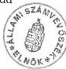

Állami Számvevőszék

# JELENTÉS

a Központi Statisztikai Hivatal fejezet működésének pénzügyi-gazdasági ellenőrzéséről

1998. szeptember

---

V.

# TARTALOMJEGYZÉK

I. ÖSSZEGZŐ MEGÁLLAPÍTÁSOK, KÖVETKEZTETÉSEK, JAVASLATOK...4

II. RÉSZLETES MEGÁLLAPÍTÁSOK...8

1. A FELADATOK ÉS A SZERVEZETI RENDSZER ÖSSZHANGJA, A MŰKÖDÉS SZABÁLYOZOTTSÁGA ...8

1.1.A szakmai feladatok es a szervezeti felepites 8
1.2.A mukodes es gazdalkodas szabalyozottsaga, az iranyitas rendszere 11

2. A KÖLTSÉGVETÉS TERVEZÉSE ÉS A FINANSZÍROZÁS RENDJE ...15

2.1.A koltsegvetes tervezese 15
2.2.Az eloiranyzatok modositasa 17
2.3.A finanszirozasi rendszer mukodese 20
2.4. Penzmaradvanyok, illetve eloiranyzat-maradvanyok alakulasa 21

3. A KÖLTSÉGVETÉS VÉGREHAJTÁSA...22

3.1.A beveteli es kiadasi eloiranyzatok teljesitese, a fejezet koltsegvetesi egyensulya 22
3.2.A letszammal es a szemelyi juttatasokkal valo gazdalkodas 24

4. ESZKÖZ- ES VAGYONGAZDÁLKODÁS 27
5.A SZAMVITELI ES BIZONYLATI REND. 31
6.AZ ELLENORZES RENDSZERE 33

1

---

.

.

.

.

---

ÁLLAMI SZÁMVEVŐSZÉK

V-42-24/1997-98.

Témaszám: 411

# J E L E N T É S

# a Központi Statisztikai Hivatal fejezet működésének
pénzügyi-gazdasági ellenőrzéséről

A Központi Statisztikai Hivatal fejezet a statisztikáról szóló 1993. évi XLVI. törvényben meghatározott feladatokat ellátó, a statisztikai tevékenység szakmai irányítását, koordinálását végző Központi Statisztikai Hivatal (KSH) és intézményei működésével, valamint a statisztikai rendszer fejlesztésére irányuló programok, célfeladatok végrehajtásával összefüggő költségvetési előirányzatokat, s azok teljesítését tartalmazza.

A KSH 1991-ben fejezeti jogosítvánnyal rendelkező címe volt a Miniszterelnökség fejezetnek, 1992-től a központi költségvetés önálló fejezete, címrendje 1997-ig többször módosult. 1997-ben 5 cím (Központi Igazgatás, Megyei Igazgatóságok, Könyvtár és Dokumentációs Szolgálat, Kutatóintézetek, Fejezeti kezelésű előirányzatok) alkotta a fejezetet, amelyhez 23 költségvetési intézmény tartozott.

Az 1991. évi feladatok ellátásához a fejezet kiadásai összesen 1,6 Mrd Ft-ot tettek ki, az átlaglétszám 1.847 fő volt. Az 1997. évi kiadások összege 5,0 Mrd Ft, a támogatás összege 4,6 Mrd Ft, az átlaglétszám 1.743 fő volt.

Az Állami Számvevőszék (ÁSZ) 1991-ben végzett átfogó pénzügyi-gazdasági ellenőrzést a fejezetnél. Ezt követően a helyszíni ellenőrzések jellemzően az éves költségvetési tervezés megalapozottságára, illetve a zárszámadásra irányultak, továbbá témaellenőrzések is érintették a fejezet tevékenységét. (1. sz. melléklet)

Az 1989. évi XXXVIII. törvény 2. §. (5) bekezdés alapján végzett ellenőrzés célja volt annak megállapítása, hogy a fejezetnél

- a szervezeti rendszer, az irányítási és működési rend, a költségvetési előirányzatok biztosították-e a szakmai feladatok hatékony és eredményes ellátását;
- a rendelkezésre álló közpénzek felhasználásával a törvényes keretek között, a célszerűségi és eredményességi követelményeket figyelembe véve

3

---

I. ÖSSZEGZŐ MEGÁLLAPÍTÁSOK, KÖVETKEZTETÉSEK, JAVASLATOK

látták-e el a fejezeti irányítói, valamint az intézményi költségvetési gazdálkodási feladatokat;

- a szakmai fejlesztési célkitűzések megvalósítását a fejezeti kezelésű előirányzatok felhasználása eredményesen segítette-e elő;
- az irányító tevékenység keretében megoldották-e a korábbi számvevőszéki ellenőrzésekben jelzett problémákat.

A pénzügyi-gazdasági ellenőrzés az 1991-1997. évek, kiemelten az utolsó 4 év költségvetési gazdálkodására, valamint a korábbi ÁSZ ellenőrzések megállapításaihoz kapcsolódó intézkedések végrehajtásának utóellenőrzésére irányult. A helyszíni ellenőrzés a Központi Igazgatásra, a Borsod-Abaúj-Zemplén (B.A.Z.) megyei Igazgatóságra és a Népességtudományi Kutató Intézetre terjedt ki. A fejezet költségvetésében a három intézmény összesen 37-47%-os arányt képviselt 1992-től. Megállapításainkat a dokumentumok próbaszerű ellenőrzésére, a beszámolók, tanúsítványok adatainak értékelésére alapoztuk.

## I. ÖSSZEGZŐ MEGÁLLAPÍTÁSOK, KÖVETKEZTETÉSEK, JAVASLATOK

Az ellenőrzött években a megváltozott társadalmi-gazdasági viszonyokhoz, a nemzetközi normákhoz, ajánlásokhoz, a fejlett országok statisztikai rendszeréhez illeszkedő, 1993-ban hatályba lépett statisztikai törvény, továbbá 1996-tól az Európai Unióhoz (EU) való csatlakozás harmonizációs követelményei a KSH tevékenységi körének szélesedését, tartalmi változását eredményezték. Mindezek új követelményeket, s többletfeladatot jelentettek a fejezeti irányítás és gazdálkodás terén is.

**A fejezeten belüli szervezeti** változásokat döntően 1992-1995. között, az új körülményekhez, feladatmódosulásokhoz igazodva - önállóan gazdálkodó intézmények megszüntetésével - hajtották végre. Előfordult azonban, hogy az átszervezést nem készítették elő megfelelően.

A fejezet intézményeinél a költségvetési gazdálkodás megszervezési módja is változott, a gazdálkodás önállóságát - az intézmények részben önállóan gazdálkodó költségvetési szervé minősítésével - 1997-től a megyei igazgatóságoknál célszerűtlenül korlátozták.

**A szervezeti, működési és gazdálkodási rend szabályozottsága** - annak ellenére, hogy ezt az ÁSZ korábbi ellenőrzései is kifogásolták - nem felelt meg a jogszabályi követelményeknek az ellenőrzött időszakban. Az intézmények egy részének nem volt alapító okirata, más részénél nem felelt meg az előírásoknak. A Szervezeti Működési Szabályzatot (SzMSz) a szervezeti változásokat követően nem minden esetben módosították, ügyrendet nem készítettek.

4

---

I. ÖSSZEGZŐ MEGÁLLAPÍTÁSOK, KÖVETKEZTETÉSEK, JAVASLATOK

A szabályozás pontatlansága miatt nem volt egyértelmű, hogy a Központi Igazgatásnál az elnök a gazdálkodási jogosítványokból melyeket adott át az illetékes elnökhelyettesnek, illetve melyeket tartott fenn magának. A gazdálkodással kapcsolatos szabályzatokat késedelmesen aktualizálták, csak 1996. második felétől fektettek hangsúlyt azok korszerűsítésére és törekedtek a teljes körű szabályozottságra.

Az **irányítás rendszere** központosított volt, döntés előkészítő és tanácsadó testületek működésére épült. Ugyanakkor - bár a feladatellátásban ennek hátrányos következményei nem jelentkeztek - a megyei igazgatóságok általános elvi, funkcionális, igazgatási, pénzügyi, irányítási rendszerének többszöri változtatásakor nem jártak el következetesen.

**A fejezet éves költségvetéseit** többnyire az előírásoknak megfelelően dolgozták ki. Az új feladatok ellátásának költségigényét minden évben felmérték - elsősorban fejezeti kezelésű előirányzatként tervezték -, de a tervtárgyalások során a fejlesztési többleteket általában a fejezeti igények alatt hagyták jóvá. Az éves költségvetési tervezéseknél prioritást kaptak a Kormány bázis alapú, ugyanakkor kiadást csökkentő irányelvei. **Az intézmények tervezési gyakorlatában** általános volt, hogy a rendszeres személyi juttatások eredeti előirányzatát számításokkal alátámasztottan, a többi előirányzatot a fejezet által engedélyezett keretszámok felosztásával alakították ki, így az intézményi eredeti kiadási előirányzatok nem a reális szükségletekre épültek, jelentősen alul-tervezettek voltak.

A különböző hatáskörben végrehajtott **előirányzat-módosítások** következtében a fejezet éves költségvetése az eredeti előirányzathoz képest 7-38 %-kal emelkedett az ellenőrzött időszakban. Az előirányzat-módosítások nyilvántartása nem minden esetben felelt meg az államháztartásról szóló, többször módosított 1992. évi XXXVIII. tv. (Áht.) és a kapcsolódó jogszabályok előírásainak. A fejezet és az intézmények az előirányzat-módosításokat több esetben - szabálytalanul - a teljesítést követően hajtották végre. Jellemző volt 1996-ig, hogy évközben új, vagy többlet feladatokat határoztak meg a fejezet részére, de végrehajtásukra a többlet forrásokat nem minden esetben biztosították teljes mértékben. Előfordult, hogy a célfeladatok finanszírozása késedelmesen történt.

**A fejezet rendelkezésére álló források** összességükben - takarékos gazdálkodás mellett - biztosították a szakmai feladatok ellátásának és az intézmények működésének feltételeit. A havi időarányos, majd 1996-tól a kincstári finanszírozási rendszer bevezetése nem okozott pénzellátási feszültségeket. A fejezet rendelkezett letéti számlával, de azon forgalom nem volt az ellenőrzött időszakban. Az intézményeknél egyik évben sem keletkezett jelentős összegű pénzmaradvány, illetve előirányzat-maradvány, ugyanakkor az ellenőrzött intézmények több évben szabálytalanul mutatták ki a pénzmaradvány, illetve előirányzat-maradvány összetételét.

A fejezet összes **bevételéből** meghatározó (68-95 %) volt a költségvetési támogatás, a saját bevételek szerepe az intézmények finanszírozásában nem volt számottevő. A saját bevételek növelése érdekében az alaptévékenységen belüli, térítéssel járó tevékenységek elveit és módszereit KSH elnöki utasításban szabályozták, valamint 1996-tól személyi ösztönzési rendszert dolgoztak ki. A Népes-

5

---

I. ÖSSZEGZŐ MEGÁLLAPÍTÁSOK, KÖVETKEZTETÉSEK, JAVASLATOK---

ségtudományi Kutató Intézetnél a gazdálkodás nagymértékben az intézmény által elnyert pályázatok függvényében alakult, az összes kiadás megközelítőleg egyharmad részét átvett pénzeszközökből finanszírozták.

A fejezet összes **kiadása** az ellenőrzött időszakban háromszorosára (1,6 Mrd Ft-ról 5,0 Mrd Ft-ra) emelkedett, amelyet a feladatok bővüléséhez kapcsolódó személyi, tárgyi feltételek megteremtésének többletkiadásai indokoltak.

Az összes kiadásból a **fejezeti kezelésű előirányzatok** teljesítése 3-33 % közötti arányt képviselt. A célfeladatokra rendelkezésre álló kiadási előirányzatokat többségükben rendeltetésszerűen használták fel, de előfordult, hogy azok egy részét intézményfinanszírozásra fordították.

**A létszámmal és a személyi juttatásokkal való gazdálkodás** központosított volt. A fejezet költségvetési létszáma az ellenőrzött időszakban 4,6 %-kal csökkent (1991-1993. között 13 %-kal emelkedett, 1993-1997. között 16 %-kal csökkent, 1997-ben 1.988 fő volt), ugyanakkor a feladatokat tartósan a tervezettnél alacsonyabb létszámmal látták el, az átlaglétszám költségvetési létszámhoz viszonyított aránya 85-94 % volt. A takarékosági intézkedésekkel összefüggő 1994. évi létszámleépítést - célszerű módon - az összeíró hálózat átszervezésével valósították meg, az addig köztisztviselői jogviszony keretében alkalmazott lakossági összeírókat a továbbiakban megbízásos jogviszony keretében foglalkoztatták.

A személyi juttatások kiadásainak az ellenőrzött időszakban több mint háromszorosára való (714 M Ft-ról 2.389 M Ft-ra) növekedése az éves bérfejlesztések és a bérpolitikai intézkedések végrehajtásának következménye volt. A fejezetnél foglalkoztatottak 93-94 %-a volt köztisztviselői besorolású, az alapilletmények köztisztviselői törvény szerinti 100 %-os beállási szintre való emelését az 1995-re engedélyezett személyi juttatások előirányzata tette lehetővé.

Az **eszközgazdálkodás** a fejezetnél központosított volt, a beszerzések döntő többségét a Központi Igazgatás végezte és az eszközöket használatra átadta az intézményeknek. A számítástechnikai eszközök fejlesztése elsősorban PHARE forrásból valósult meg, a fejlesztések eredményeként a fejezet új információ technológiára állt át. A Központi Igazgatás ingatlanállománya - a megtett intézkedések, kezdeményezések ellenére - széttagolt volt. Ez a hatékony és gazdaságos üzemeltetés feltételeit nem elégítette ki, több helyen kihasználatlan kapacitással rendelkeztek.

A fejezethez tartozó intézményeknél a **számviteli és bizonylati rend** nem volt teljes körűen szabályozott az ellenőrzött időszak egészében. Az intézmények 1996-ig nem rendelkeztek számlarenddel, csak számlatükörrel. A részben önállóan gazdálkodó költségvetési szervek könyvvezetési kötelezettségét - az előírásoktól eltérően - nem szabályozta az önállóan gazdálkodó költségvetési szerv. A fejezeti kezelésű előirányzatok esetében az előírt pénzforgalmi kettős könyvelést nem alkalmazták, csak analitikus nyilvántartást vezettek. A Központi Igazgatásnál a tárgyi eszközök analitikus nyilvántartása nem volt megfelelő, valamint az intézmény nem a befektetett eszközök között mutatta ki mérlegében a gazdasági társaságban való részvétel összegét.

---6

---

I. ÖSSZEGZŐ MEGÁLLAPÍTÁSOK, KÖVETKEZTETÉSEK, JAVASLATOK

A fejezetnél a felügyeleti jellegű költségvetési, valamint a belső ellenőrzési tevékenységet nem szabályozták az ellenőrzött időszakban. Az ellenőrzés függetlenségét csak 1996. végétől biztosították. A felügyeleti jellegű költségvetési ellenőrzések nem a gazdálkodás lényegi és aktuális kérdéseit helyezték előtérbe, javaslataik nem segítették az elvárható mértékben az intézmények tevékenységét és a fejezeti irányító munkát. A vezetői ellenőrzés formáját testületi és személyi rendszerre tagolva megfelelően alakították ki. Az ellenőrzés részeként a munkafolyamatba épített ellenőrzés az aláírási-, utalványozási-, ellenjegyzési jog gyakorlásával működött, azonban nem érvényesült minden területen maradéktalanul.

A fejezetnél korábban végzett ÁSZ ellenőrzések megállapításai és javaslatait csak részben hasznosították, több ÁSZ ellenőrzés is megállapította ugyanazt a hiányosságot. Az ellenőrzésekhez kapcsolódóan többnyire készítettek - a feladatokat, a felelősöket és a határidőket tartalmazó - intézkedési tervet, azonban annak végrehajtását nem minden esetben, s nem teljes körűen ellenőrizték.

Az ellenőrzés részletes megállapításainak hasznosítása mellett a következőket javasoljuk a KSH elnökének:

1. Tegye teljes körüve a szervezeti, muködési és gazdalkodási rend szabályozottságát, ezen belül fordítson különös figyelmet a költségvetési szervek alapíto okiratának elkésztésére, az SzMSz aktualizálására, az ügyrend elkésztésére. Egyertelmüen határozza meg a gazdalkodási jogkörök megosztását. Szabályozza a fejezeti kezelésü elöirányatzok - penzügyminiszterrel egyeztetét - felhasználasi rendjét.
2. Vizsgaltassa felul a megyei igazgatosagok reszben onalloan gazdalkodok koltsegvetesi szervkent torten mukodesenek celszeruseget.
3. Forditson fokozott figyelmet az éves költségvetési tervek összeallitásakor a bevételi és a kiadási elöirányatzok szamításokkal történő megalapozottságára.
4. Szabályozza a fejezet felügyeleti jellegü költségvetési, valamint a belso ellenörzési rendjét. Gondoskodjon a felügyeleti jellegü költségvetési ellenörzesek hatékonyságanak noveléséról, fordítson nagyobb figyelmet a tema- és celvizsgálatok folytatására.
5. Sztintesse meg az indokolatlan leteti szamla hasznalatat.

7

---

II. RÉSZLETES MEGÁLLAPÍTÁSOK---

# II. RÉSZLETES MEGÁLLAPÍTÁSOK

## 1. A FELADATOK ÉS A SZERVEZETI RENDSZER ÖSSZHANGJA, A MŰKÖDÉS SZABÁLYOZOTTSÁGA

### 1.1. A szakmai feladatok és a szervezeti felépítés

Az ellenőrzött időszak első éveiben felgyorsult társadalmi-gazdasági változások szükségessé tették a statisztikai információs rendszer átalakítását, a statisztika tartalmával, a statisztikai szolgálat működésével és jogi szabályozásával kapcsolatban új követelményeket támasztottak. A megváltozott politikai - társadalmi - gazdasági viszonyokhoz, a nemzetközi normákhoz, ajánlásokhoz, a fejlett országok statisztikai rendszeréhez illeszkedő szabályozást az 1993-ban elfogadott statisztikai törvény biztosította.

**Az új törvényi szabályozás lényeges változást jelentett a fejezet feladataiban**, megszüntette az állami és az igazgatási statisztika elkülönülését, a KSH elnökének, a minisztereknek, más szervezeteknek az adatgyűjtés elrendelésére vonatkozó jogát.

A törvény hatályba lépéséig közel 30 szervezetnek volt adatgyűjtést elrendelő joga, ennek következtében elkerülhetetlen volt a párhuzamosság.

A törvényi szabályozás értelmében 1993-tól a hivatalos statisztikai szolgálat centrumában a KSH áll, amely a kötelező statisztikai adatgyűjtések elrendelésének rendszere szerint - a statisztikai szolgálat tagjaival együttműködve - évente Országos Statisztikai Adatgyűjtési Programot (OSAP-ot) dolgoz ki, amit az Országos Statisztikai Tanács (OST) véleményez és a Kormány hagy jóvá.

A hivatalos statisztikai szolgálat tagjai a KSH-n kívül a minisztériumok, a Legfőbb Ügyészség, a Magyar Nemzeti Bank, a Gazdasági Versenyhivatal, az Országos Műszaki Fejlesztési Bizottság, az Országos Testnevelési és Sporthivatal, az Állami Pénz- és Tőkepiaci Felügyelet.

A statisztikai szolgálat feladata, hogy a társadalmi és gazdasági jelenségekről hivatalos adatokat tegyen közzé, amelyeket az irányító szervek, a jogi fórumok, a nemzetközi szervezetek egyaránt hitelesnek tekintenek és egyedül mérvadónak fogadnak el. A törvény megerősítette a KSH szerepét a statisztikai módszerek, fogalmak, osztályozások, számjelek kidolgozásában és használatuk kötelezővé tételében.

Az OST a hivatalos statisztikai szolgálat működését, munkájának összehangolását elősegítő, a KSH elnökének szakmai tanácsadó, véleményező szerve.

Az EU-hoz való csatlakozás szükségessé tette a teljes jogú taggá válás mérhető feltételeinek előzetes vizsgálatát, konform információs rendszer kialakítását. A KSH fokozatosan átveszi a nemzetközi szabványokat, ajánlásokat, az EU ország-kérdőív kitöltése szerint 1997-re mintegy 70 %-ban volt harmonizált a magyar statisztikai rendszer.

---8

---

II. RÉSZLETES MEGÁLLAPÍTÁSOK

A különböző ágazati statisztikák átalakítása, a népszámlálás előkészítése az EU követelményeinek figyelembe vételével történik, a statisztikai munkát módszertani oldalról megalapozó osztályozások, nőmenklatúrák többségénél megtörtént az átállás. Megoldandó feladat - többek között - a konjunktúra mutatók területén az adatbázisok kiépítése, a népességi vándorlások megfigyelésénél az adatszolgáltatás technikai bázisának megteremtése, az agrárstatisztika területén az értékadatokra való átállás.

A Kormány a KSH átfogó feladat-meghatározását három időszavra bontva (1994-1995-ben, 1996-1997-ben, 1998-2000-ben elvégzendő feladatok), a prioritásokat megjelölve 1994-ben alkotta meg. Az EU-hoz való csatlakozás feltételei 1996-tól a hazai statisztikai fontossági sorrend változtatását igényelték. Az 1996-ban elfogadott OSAP már tartalmazta az EU-s prioritásokat is.

**A fejezet szervezete a feladatok módosulásával összefüggésben többször** - elsősorban 1992-ben és 1995-ben - **változott**.

**A fejezeten belül meghatározó a Központi Igazgatás szerepe**, amely ellátja a fejezeti irányító szervi teendőket is a többi ide tartozó cím/intézmény felett. A Központi Igazgatás szervezete - a feladatváltozásokkal kapcsolatosan - folyamatosan módosult az ellenőrzött időszakban.

A statisztikai szakmai főosztályokat érintően alapvető változás volt, hogy a sokszereplős piac miatti feladatnövekedés következtében a Gazdasági Ágazatok Főosztálya két ágazati - ipari és szolgáltatási - főosztályra vált szét 1995-ben.

A Költségvetési és Gazdálkodási Főosztály 1995. évi megszüntetésével a fejezeti feladatokat és a Központi Igazgatás intézményének gazdálkodási feladatait ellátó szervezetet célszerűen szétválasztották. A fejezeti gazdálkodási feladatokat a Költségvetési Osztály, az intézményi gazdálkodási feladatokat a Pénzügyi Főosztály látja el.

A Központi Igazgatás szervezetén belül 1997. április hóban KATOR Irodát hoztak létre. (részletesebben a függelékben)

A Kormány 2084/1997. (IV. 3.) számú határozatában a társadalombiztosítási jogosultság ellenőrzésére alkalmas nyilvántartási rendszer kialakításáról és az országos nyilvántartási rendszerek összehangolásáról döntött. A határozat szerint meg kell oldani a központi adategyeztető és továbbító rendszer (KATOR) kialakítása mellett a Nyugdíjigazgatási- és Egészségbiztosítási Világbanki Projektnek, valamint a TB nyilvántartási rendszernek az összehangolását. A feladat végrehajtására a Kormány a KSH-t jelölte meg, irányítására - kormánybiztosként - a KSH elnökét nevezte ki.

A fejezeten belül célszerűen - ugyanakkor egy esetben előfordult, hogy nem megfelelően előkészítetten -, önálló intézmények megszüntetésével, a Központi Igazgatáshoz rendelésével központosítottak feladatokat.

A KSH Gazdasági-Műszaki Ellátó Szolgálatot (GMESz) és a KSH Számítóközpontot, mint önálló intézményeket 1992. január 1-től megszüntették, a feladatokat három újonnan alakult főosztály vette át a Központi Igazgatáson belül. Az átszervezés megfelelt az ÁSZ 1991. évi, a KSH pénzügyi-gazdasági ellenőrzéséről

9

---

II. RÉSZLETES MEGÁLLAPÍTÁSOK

szóló jelentés javaslatának, miszerint indokolt megszüntetni a GMESz és a Számítóközpont önálló intézményi státuszát, ugyanakkor előkészítetlen volt. A GMESz feladatait átvevő Költségvetési és Gazdálkodási, valamint Szolgáltatási főosztályt fél év múlva újra átszervezték, a két főosztályt összevonták.

A Gazdaságkutató Intézet a 2005/1992. (VI. 30.) Kormány határozattal megszűnt és gazdasági társasággá alakult át. Az intézet feladatai közül a rövidtávú konjunktúra előrejelzések készítését, a középtávú prognózisok modellezését a Központi Igazgatás szervezetében oldották meg.

A KSH Népszámlálás intézményét a Központi Igazgatás szervezetébe integrálták 1995. január 1-től. Ez három évvel később valósult meg, mint azt a már hivatkozott 1991. évi ÁSZ jelentés javaslata tartalmazta, mivel az 1990. évi népszámlálási feladatok utómunkálatai indokolták az intézmény önálló működését.

A Gazdaságelemzési és Informatikai Intézetet a Kormány - 2201/1996. (VII. 24.) határozatával - 1996. augusztus 1-vel a PM fejezettől a KSH fejezethez rendelte. Az intézet feladata - „különféle államigazgatási célú gazdaságstatisztikai és döntés előkészítési szolgáltatások nyújtása” - alapvetően nem változott, ugyanakkor célszerű intézkedés volt ezt a tevékenységet a KSH informatikai bázisára és infrastruktúrális hátterére építeni.

A Fővárosi és a Pest megyei Igazgatóságokat az erőforrásokkal való ésszerűbb gazdálkodás érdekében 1992-ben összevonták. A megyei igazgatóságok régiókba szervezése a Köztársasági Megbízotti szervezet kialakításának megfelelően 1993-ra megtörtént. A kijelölt régióközpontok feladata bővült a régióhoz tartozó igazgatóságok munkájának koordinálásával, ennek megfelelően osztályszervezete is bővebb lett. A Köztársasági Megbízotti funkció megszűnésével 1995-ben a megyei szervezetet visszaállították, s az igazgatóságok szervezetét egységesítették, három osztályt és két csoportot hoztak létre.

**A fejezethez tartozó intézmények** az 1991-1996. közötti időszakban az irányító szerv besorolása szerint önállóan gazdálkodó költségvetési szervek voltak, ugyanakkor **a kutatóintézetek és a Könyvtár és Dokumentációs Szolgálat gazdálkodás szerinti besorolása nem felelt meg a jogszabályi előírásoknak.**

A kutatóintézetek és a Könyvtár és Dokumentációs Szolgálat nem rendelkezett önálló gazdasági szervezettel, a gazdálkodási feladatok egy részét 1992-től - megállapodás alapján - a KSH Központi Igazgatás látta el. Ez a szabályozás és gyakorlat nem felelt meg a 137/1993. (X. 12.) Korm. rendelet 6. §-ában, valamint a 156/1995. (XII. 26.) Korm. rendelet 8. §-ában foglaltaknak, ezt az ÁSZ korábbi zárszámadási ellenőrzései is kifogásolták, és javasolták a gazdálkodási jogkör felülvizsgálatát. Az ellentmondást a 7/1997. (SK. 11.) KSH elnöki utasítás szüntette meg, amely ezeket az intézményeket 1997. november 1-től részben önállóan gazdálkodó költségvetési szervé minősítette.

Az 1997. január 1-től hatályos SzMSz a megyei igazgatóságokat részben önállóan gazdálkodó költségvetési szervekké minősítette, azonban a munkamegosztás és felelősségvállalás rendjéről csak az 1997. november 1-től hatályos 7/1997. (SK. 11.) KSH elnöki utasításban intézkedtek. A jog- és felelősségi kör év közbeni változtatása célszerűtlen intézkedés volt, ugyanakkor a késedelmes

10

---

II. RÉSZLETES MEGÁLLAPÍTÁSOK

szabályozás miatt az intézmények 1997-ben önállóan gazdálkodó szervekként működtek.

A megyei igazgatóságok részben önállóan gazdálkodó költségvetési szervekké minősítése indokolatlan volt. Szakmai feladataikat önállóan végezték és rendelkeztek az önálló gazdálkodás viteléhez szükséges elkülönített pénzügyi-gazdálkodási tevékenységet ellátó szervezettel. A munkamegosztást meghatározó KSH elnöki utasítás az igazgatóságok gazdálkodási feladatai közül a költségvetési előirányzatok évközi módosítását, valamint a közbeszerzések engedélyezését a Központi Igazgatás hatáskörébe utalta, a többi pénzügyi-gazdasági feladatot továbbra is az igazgatóságok látják el.

# 1.2. A működés és gazdálkodás szabályozottsága, az irányítás rendszere

A KSH fejezet feladatait az ellenőrzött időszakban, a statisztikáról szóló 1973. évi V. törvény, a végrehajtásáról intézkedő 78/1990. (IV.25.) MT rendelet, valamint a statisztikáról szóló 1993. évi XLVI. törvény (Stt.) és a végrehajtásáról intézkedő 170/1993. (XII. 3.) Korm. rendelet, továbbá az ezt módosító 173/1996. (XI. 29.) Korm. rendelet (vhr.) előírásai határozták meg.

A jogszabályi követelményeknek nem felelt meg a szervezeti, működési és gazdálkodási rend szabályozottsága (bár ez utóbbi fokozatosan javult).

Az ellenőrzött időszakban a fejezethez tartozó intézmények egy részének nem volt alapító okiratta, más részük nem rendelkezett az Áht. 88. §. (3.) bekezdésében foglaltaknak megfelelő alapító okirattal. Ezt az ÁSZ korábbi ellenőrzései is kifogásolták. Az 1996. évi költségvetés végrehajtása ellenőrzésének megállapítása alapján készült intézkedési terv az alapító okiratok felülvizsgálatára 1997. szeptember 30-i határidőt írt elő.

A KSH Levéltár és a Könyvtár és Dokumentációs Szolgálat alapításáról intézkedő 7/1986. és 8/1986. KSH határozatok felülvizsgálatát elmulasztották.

A Központi Igazgatás és a megyei igazgatóságok nem rendelkeznek alapító okirattal, ezért a felügyeleti szerv nem tett eleget a 156/1995. (XII. 26.) Korm. rendelet 5. § (1) bekezdésében foglaltaknak.

A Központi Igazgatás SzMSz-át a szervezeti változásoknak megfelelően nem minden esetben módosították.

Az 1991-1994. közötti időszakban az 1/1987. (SK. 3.) KSH elnöki utasítással kiadott SzMSz volt érvényben, a szervezeti változásokról szóló utasítások (pl. 1/1991. (SK.10.), 2/1992. (SK. 4.), 1/1993. (SK. 3.)) nem intézkedtek az SzMSz egyidejű módosításáról.

A 2/1994. (SK. 6.) KSH elnöki utasítással kiadott SzMSz nem kellő részletezettséggel - csak főosztály mélységig - szabályozta a Központi Igazgatás és a területi szervek feladatait, az osztályok tevékenységi körét csak az 1/1997. (SK. 1.) KSH elnöki utasítással kiadott SzMSz-ben határozták meg.

11

---

II. RÉSZLETES MEGÁLLAPÍTÁSOK

**Az SzMSz nem fogalmazta meg egyértelműen, hogy a Központi Igazgatásnál az elnök a gazdálkodási jogosítványokból melyeket adott át az illetékes elnökhelyettesnek, illetve melyeket tartott fenn magának, ezért nem volt meghatározott, hogy kivel szemben érvényesíthetők az Áht. 97. §-ában - a költségvetési szerv vezetőjének felelősségével kapcsolatban - megfogalmazott előírások.**

A 2/1994. (SK. 6.) KSH elnöki utasítással kiadott SzMSz szerint „A pénzügyi gazdálkodást felügyelő elnökhelyettes - ezen túlmenően - felelős a KSH zavartalan működéséhez szükséges létszám-, dologi-, pénzügyi feltételek biztosításáért és a gazdálkodás rendjének betartásáért”. Az SzMSz nem fogalmaz egyértelműen, amikor a „KSH...gazdálkodási rendjének betartásáért” való felelősséget rögzíti, mivel nem nevesíti, hogy a KSH Központi Igazgatás intézménye-, illetve a KSH fejezet gazdálkodásáért való felelősségről van-e szó.

Az 1997-ben kiadott SzMSz sem változtatott a gazdálkodásért való felelősség megállapításán.

**A Központi Igazgatásnál** figyelmen kívül hagyták a költségvetési szervek tervezésének, gazdálkodásának, beszámolásának rendszeréről szóló 156/1995. (XII. 26.) Korm. rendelet 10. §. (6.) bekezdésében foglaltakat, ugyanis **nem készítettek** az SzMSz-hez kapcsolódó - a gazdasági szervezet feladatait, a vezetők és más dolgozók feladat-, hatás- és jogkörét tartalmazó - **ügyrendet**.

A fejezet ellenőrzött intézményei az 1991-1997. közötti időszak utolsó évéig **a gazdálkodással kapcsolatos feladatokat nem szabályozták teljes körűen**, ezt az ÁSZ korábbi ellenőrzései is kifogásolták. Az intézmények nem szabályozták a kötelezettségvállalás rendjét, a hatályos leltározási és selejtezési, valamint a házipénztár és pénzkezelési szabályzatok elavultak voltak. Az ÁSZ megállapítására tett intézkedés eredményeként 1996. végén kiadtak egy, a megyei igazgatóságok részére ajánlott mintaszabályzat garnitúrát, amelynek figyelembevételével az ellenőrzött intézmények elkészítették a gazdálkodás teljes körét átfogó, aktualizált intézményi szabályzatokat.

A fejezeti kezelésű előirányzatok felhasználását, a rendelkezési jogosultságokat a KSH elnöke írásban szabályozta, de az nem felelt meg az Áht. 24. §. (3.) bekezdésében, valamint 49. §. o./ pontjában és a vonatkozó Korm. rendeletben foglaltaknak, ugyanis azt a pénzügyminiszter nem ellenjegyezte.

A szabályzat tervezetet ellenjegyzés céljából megküldték a Pénzügyminisztériumnak (PM), de az egyeztetés visszaigazolása 1996. évre nem történt meg. Az 1997. évi szabályzathoz írásban megküldött pénzügyminisztériumi véleményt csak részben vették figyelembe, nem készítették el a statisztikai regiszter célelőirányzattal kapcsolatos eljárási rendet.

Hiányosság volt, hogy a fejezeti kezelésű előirányzatok felhasználásáról szóló szabályzatot nem juttatták el az érintett szervezeti egységekhez, annak tartalmáról értekezleteken adtak szóbeli tájékoztatást.

**A számvitellel kapcsolatos szabályozás nem elégítette ki a jogszabályi követelményeket**, a számviteli és bizonylati rend nem volt teljes körűen szabályozott az ellenőrzött időszakban.

12

---

II. RÉSZLETES MEGÁLLAPÍTÁSOK

A fejezet ellenőrzött intézményei nem teljeskörűen tettek eleget a számviteli politika és számlarend készítési kötelezettségüknek, ezzel a számvitelről szóló többször módosított 1991. évi XVIII. törvény (Szt.) 79. §-ában, továbbá a végrehajtására kiadott 179/1991. (XII. 30.) Korm. rendelet 36. §-ában, valamint a 209/1996. (XII. 23.) Korm. rendelet 4. §-ában foglalt előírásoktól eltérően jártak el.

**Az ellenőrzött intézmények nem rendelkeztek számlarenddel, csak számlatükörrel.** Ezt a korábbi (az 1996. évi zárszámadás ellenőrzéséről készült) ÁSZ ellenőrzés is kifogásolta.

Készítettek számlarend tervezetet, azonban az nem tartalmazta a gépi adatfeldolgozási rendre és a fejezetek sajátos könyvviteli és főkönyvi elszámolásaira, továbbá az előirányzati és a pénzforgalmi főkönyvi számlák tartalmának, vezetésének módjára vonatkozó előírást.

A B.A.Z. megyei igazgatóság aktualizálta gazdálkodási szabályzatait és számviteli politikát is készített.

**A részben önállóan gazdálkodó költségvetési szervek könyvvezetési kötelezettségét** - az előírásoktól eltérően - **nem szabályozta az önállóan gazdálkodó költségvetési szerv.** A 7/1997. (SK. 11.) KSH elnöki utasítás - amely a részben önállóan gazdálkodóvá minősített intézmények hatásköréről intézkedett - a megyei igazgatóságok jog- és felelősségi körébe tartozónak sorolta az intézményi belső szabályzatok kidolgozását és jóváhagyását. Ez a szabályozás ellentétes a Szt. végrehajtására kiadott 54/1996. (IV. 12.) Korm. rendelet 4. § (2.) bekezdésében, illetve 1997. jan. 1-től az azt módosító 209/1996. (XII. 23.) Korm. rendelet 3. §-a útján a 4. § (7.) bekezdésében foglaltakkal.

1997. január 1-től a Központi Igazgatásnak, mint önállóan gazdálkodó költségvetési szervnek kellett volna elkészíteni a részben önállóan gazdálkodóvá minősített intézmények könyvvezetésre vonatkozó szabályzatait, és kötelező jelleggel megküldeni azt az intézmények részére.

**A Központi Igazgatás** 1997-ben **rendelkezett** jóváhagyott, az 54/1996. (IV. 12.) Korm. rendelet előírásai alapján elkészített **számlarenddel**, ugyanakkor - a jogszabályi változásokhoz illeszkedően - **nem aktualizálták a számlatükröt**, 1997-ben is az 1996-ra érvényes és alkalmazott főkönyvi számlákat használták.

Az 1996. évi számlatükör a 4, a 7, és a 9 számlaosztályban tartalmazott vállalkozási tevékenységgel kapcsolatos főkönyvi számlákat annak ellenére, hogy a számlarend - az SzMSz-nek megfelelően - rögzítette, hogy a szabályzat készítésének időszakában nem végeztek vállalkozási tevékenységet.

A számlarend megfelelően tartalmazta az adatszolgáltatás és beszámolás rendjét, a főkönyvi számlákhoz kapcsolódó analitikus nyilvántartások részletezését, vezetését és egyeztetésének módját.

A Pénzügyi Főosztály Számviteli Osztályán egy számítógépes feldolgozási rendszerben könyvelték a Könyvtár és Dokumentációs Szolgálat és a Népességtudományi Kutató Intézet számviteli elszámolásait is, ezért a számlatükör a két in-

13

---

II. RÉSZLETES MEGÁLLAPÍTÁSOK---

tézményre vonatkozó főkönyvi számlákat is tartalmazta. Az alkalmazott kódrendszer biztosította az elkülönített elszámolásokat.

**A fejezet intézményei éves munkaterv alapján végzik feladataikat.** A munkatervnek része az adatgyűjtési- és tájékoztatási terv, a nemzetközi kapcsolatok, a vezetői kollégium, a szakértői értekezletek munkaterve.

**A KSH elnöke szakmai döntéseit** az előkészítő és tanácsadó testületek javaslatai alapján hozta, amelyekhez a testületek előterjesztései rendszeres információkat szolgáltattak.

Az Elnöki Értekezlet a KSH legfelsőbb szintű, stratégiai jellegű döntéseket megalapozó testülete. Tagjai az elnök és az elnökhelyettesek, titkára az Elnöki Főosztály vezetője, feladata az elnök és az elnökhelyettesek által megjelölt kérdések megvitatása. Az értekezletről - az elnöki döntést, a feladat végrehajtásért felelős vezetőt és a határidőket tartalmazó - emlékeztető készül, amelyet az érintettek megkapnak.

A Vezetői Kollégium általános szakmai tanácsadó testület. Résztvevői az elnökhelyettesek, a főosztályvezetők és az intézmények vezetői, feladata a döntések vezetői szintű szakmai megalapozása. Az üléseket munkaterv alapján tartják, a kijelölt témakörökhöz előterjesztés készül, az ülésekről készült jegyzőkönyv megjelenik a KSH tájékoztatóban.

Az Igazgatói Értekezlet a területi egységek vezetőinek konzultatív döntés előkészítő testülete. Feladata az igazgatóságokat érintő statisztikai, informatikai, gazdálkodási kérdések megvitatása.

A Szakértői Értekezlet nem állandó összetételű szervezet, feladata az alaptevékenységgel összefüggő szakmai, módszertani és egyéb kérdések megvitatása.

**A gazdálkodási döntések** megalapozásához nem minden esetben készítettek írásos előterjesztéseket. Jellemző volt a személyes kapcsolattartásra és szóbeli információcserére épülő döntéshozatal.

A megyei igazgatóságok általános elvi, funkcionális, igazgatási, pénzügyi irányítási rendszerének az ellenőrzött időszakban történt többszöri változtatásakor nem jártak el következetesen.

Az igazgatóságok felügyeletét 1992. márciusig a Területi Statisztikai és Önkormányzati Főosztály, márciustól elnökhelyettes látta el. Az 1994. májustól hatályos SzMSz a szakmai koordináló feladatot az Adatgyűjtési és Módszertani Koordinációs Főosztályhoz, a pénzügyi-gazdasági felügyeletet elnökhelyetteshez rendelte. 1997-től az igazgatóságok úgy tartoztak elnöki felügyelet alá, hogy szakmai munkájukat az illetékes főosztályok irányították, pénzügyi-gazdasági felügyeletük elnökhelyettesi feladat maradt.

Az igazgatóságok feladatellátásában azonban mindezek hátrányos következményei nem jelentkeztek.

---14

---

II. RÉSZLETES MEGÁLLAPÍTÁSOK

## 2. A KÖLTSÉGVETÉS TERVEZÉSE ÉS A FINANSZÍROZÁS RENDJE

A fejezet költségvetésének főösszege az 1991-1997. évek között 257%-kal, 1.288,0 M Ft-ról 4.194,5 M Ft-ra, a költségvetési támogatás 234%-kal, 1.194,5 M Ft-ról 3.985,9 M Ft-ra emelkedett. (2-3. sz. melléklet)

A növekedésben egyrészt a statisztikai rendszer átalakítása, másrészt a köztisztviselői és közalkalmazotti törvény előírásainak megfelelő illetmények többletkiadásai játszottak meghatározó szerepet.

### 2.1. A költségvetés tervezése

A fejezet az éves költségvetési javaslatait a PM tervezési szempontjainak érvényesítésével, a szakmai szervezeti egységek, intézmények együttműködésével készítette. Az előirányzatokat bázis alapon tervezték, ez a tervezési módszer nem a feladatok ellátásához szükséges kiadások összegéből, hanem a PM-mel egyeztetett sarokszámokból indult ki. A költségvetés tervezése során nem tudtak érdekérvényesítést gyakorolni, ez esetenként az előirányzatok megalapozatlanságához vezetett.

**A bevételek tervezésénél** a költségvetési támogatás volt a meghatározó. Annak nagyságrendjét a PM-mel folytatott tervtárgyalások során, jellemzően a fejezeti igények alatt hagyták jóvá.

**A fejezet saját bevételének** eredeti előirányzata hat és félszeresére (94 M Ft-ról 613 M Ft-ra) emelkedett az ellenőrzött időszakban. A támogatás értékű bevételek előirányzata növekedésének mértékét a fejezet a PM egyetértésével határozta meg. Számottevő (300 M Ft-os) saját bevételt terveztek 1996-ban és 1997-ben a statisztikai regiszter értékesítésével összefüggésben.

A működési, valamint a felhalmozási és tőkejellegű bevételek eredeti előirányzatának kialakítása a Központi Igazgatásnál nem volt számításokkal alátámasztott.

A fejezet szakmai célkitűzéseit évente meghatározták a Kormány által elfogadott OSAP, 1996-tól az EU-hoz való csatlakozás harmonizációs követelményei. **Az új feladatok ellátásának pénzügyi forrásigényét** - a prioritásokat is figyelembe véve - a fejezet minden évben felmérte, s **elsősorban fejezeti kezelésű előirányzatként tervezte**. A PM-mel folytatott tervtárgyalások során **a fejlesztési többleteket** általában a fejezet által számításokkal alátámasztott **igények alatt hagyták jóvá**.

1992-ben a fejezet „az aktuális kormányhatározatokra alapozva” felmérte az új feladatok költségigényét, s azt 487 M Ft-tal terjesztette be a PM-nek. A költségvetés helyzetére tekintettel a PM az előirányzatot 301 M Ft-ra mérsékelte.

Az EU csatlakozással és a Kormány információs igényeinek kielégítésével összefüggő feladatok kiadási többlettámogatását 1996-ban a PM 300 M Ft fejezeti kezelésű címzett bevétel teljesítéséhez kötötte.

15

---

II. RÉSZLETES MEGÁLLAPÍTÁSOK

**A kiadások tervezésében** a személyi juttatások eredeti előirányzata 247%-kal (1991-ben 585 M Ft, 1997-ben 2.029 M Ft volt) emelkedett az ellenőrzött időszakban, a növekedést a feladatbővülések és a jogszabályok alapján tervezett bérfejlesztések indokolták. A rendszeres személyi juttatások eredeti előirányzatát - az intézmények számításait alapul véve - a jogszabályi előírásoknak és a PM által kiadott tervezési köriratnak megfelelően tervezték. A nem rendszeres személyi juttatások eredeti előirányzatát az előző évi felhasználás figyelembevételével alakították ki.

A TB járulék eredeti előirányzata 304%-kal (209 M Ft-ról 844 M Ft-ra) növekedett 1991. és 1997. között, ugyanakkor rendszeresen alultervezett volt.

1995-ben a Központi Igazgatásnál a járulékalap helytelen számítása miatt a TB járulék eredeti előirányzatának 31,8 M Ft-os emelésére volt szükség év közben.

A B.A.Z. megyei Igazgatóságnál a TB járulék eredeti előirányzata több évben nem fedezte a tervezett személyi juttatások alapján fizetendő járulék összegét. A számszerűsített hiány 1994-ben 1.016 E Ft, 1996-ban 145 E Ft volt.

A dologi kiadások 1997. évi eredeti előirányzata (470 M Ft) 116%-kal haladta meg az 1991. évi (218 M Ft) értékét, de a növekedés hullámzó volt. A fejezet eredeti dologi kiadási előirányzata 1991-től 1993-ig mintegy felére csökkent, 1994-1996. között nőtt, majd 1997-ben ismételten csökkent. Mivel az előirányzat kialakításánál elsődlegesen a költségvetési támogatás mérséklésének szempontjai érvényesültek, az 1994-1996. közötti előirányzat növekedés az előző évi céltámogatás működési előirányzatba történő beépítésének a következménye volt.

Az 1994. évi központilag kezelt célelőirányzatokból 1995-ben 183,8 M Ft-ot építettek be a címek előirányzataiba. (Pl. a Központi Igazgatás címnél 71 M Ft-ot, a Megyei Igazgatóságok címnél 93 M Ft-ot, a Könyvtár és Dokumentációs Szolgálat címnél 12 M Ft-ot.)

Az 1995. évi fejezeti kezelésű előirányzatokból 1996-ban 86 M Ft-ot terveztek a címeknél. (Pl. a Központi Igazgatás címnél 65,4 M Ft volt a növekedés.)

**Az eredeti kiadási előirányzatok megalapozottsága eltérő színvonalú volt az ellenőrzött intézményeknél.** Általános gyakorlat volt, hogy a rendszeres személyi juttatások eredeti előirányzatát számításokkal alátámasztottan, többnyire az előírásoknak megfelelően, a többi előirányzatot a fejezet által engedélyezett keretszámok felosztásával alakították ki, amelyek nem a reális igényekre épültek. Ez a tervezési módszer az intézményi költségvetések jelentős alultervezettségét eredményezte.

A Központi Igazgatásnál és a Népességtudományi Kutató Intézetnél a kiadási előirányzatok - a rendszeres személyi juttatásokat kivéve - nem voltak számításokkal megalapozottak. A nem rendszeres személyi juttatások eredeti előirányzata, valamint a dologi kiadások eredeti előirányzata minden évben jelentősen alultervezett volt, a fejezet által közölt keretszámokat (kiemelt előirányzatokat) bontották fel a bázis év eredeti előirányzatait, illetve a teljesítéseket figyelembevéve. Az intézmények működési kiadásainak forrásait az évközi előirányzat-módosításokkal biztosították.

16

---

II. RÉSZLETES MEGÁLLAPÍTÁSOK

A B.A.Z. megyei Igazgatóságnál a rendszeres személyi juttatások évenkénti előirányzatát számításokkal megalapozottan, a jogszabályi, valamint a tervezési előírások figyelembevételével alakították ki. A többi előirányzat tervezése is többnyire számításokkal alátámasztott volt, ugyanakkor a fejezet által jóváhagyott előirányzatok több esetben nem fedezték a szükségleteket. (Pl. A munkaadói járulék eredeti előirányzata 1996-ban 1.089 E Ft-tal maradt el a tervezett kifizetéstől.) A dologi kiadások eredeti előirányzata minden évben irreálisan alul-tervezett volt, pl. 1993-ban egyáltalán nem terveztek dologi kiadásokat.

**A fejezeti kezelésű eredeti előirányzatok** összege 276 M Ft-ról 1.350 M Ft-ra emelkedett az ellenőrzött időszakban (1991-ben 276 M Ft, 1992-ben 312 M Ft, 1993-ban 328 M Ft, 1994-ben 238 M Ft, 1995-ben 148 M Ft, 1996-ban 792 M Ft, 1997-ben 1.350 M Ft volt), amelyeket alapvetően a költségvetési irányelvekben, a PM tervezési körirataiban, a vonatkozó törvényekben és a Kormány által meghatározott célfeladatok függvényében - a szakmai főosztályok közreműködésével - dolgoztak ki. A fejezeti kezelésű előirányzatokon belül a célfeladatok eredeti előirányzatának aránya több mint 80%-ot tett ki az ellenőrzött időszakban. A célelőirányzatok tervezése megalapozott volt, a programfinanszírozás körébe vont előirányzatoknál valamennyi programra kidolgozták a szakmai tartalmat. Az 1997. évi célfeladatok számításokkal alátámasztott támogatási igénye 83 M Ft-tal volt magasabb, mint a költségvetési törvényben jóváhagyott összeg. A takarékosságot, a legkisebb kiadással járó módszereket kellett alkalmazni ahhoz, hogy a követelményeknek a feladat végrehajtásával eleget tudjanak tenni annak ellenére, hogy az igényelt támogatás csökkentett mértékben került jóváhagyásra.

## 2.2. Az előirányzatok módosítása

Az ellenőrzött időszakban a fejezetnél végrehajtott előirányzat módosítások összege évente 151-795 M Ft között alakult, az előirányzat módosítások következtében a fejezet éves költségvetése az eredeti előirányzathoz képest 7-38 %-kal emelkedett. Az előirányzat módosítások többségét 1991-1992-ben intézményi hatáskörben, 1993-1997-ben OGY, Kormány, illetve felügyeleti szervi hatáskörben hajtották végre.

Az előirányzat-módosítások a fejezet költségvetési támogatási előirányzatát 1991-ben 1 %-kal, 1992-ben 5 %-kal, 1995-ben 2 %-kal csökkentették, 1993-ban 15 %-kal, 1994-ben 24 %-kal, 1996-ban 2 %-kal, 1997-ben 14 %-kal növelték.

Az 1994. évi 399 M Ft összegű előirányzat-módosítást Kormány hatáskörben hajtották végre, ebből 173,3 M Ft volt a létszámleépítéssel kapcsolatos (73,9 M Ft végkielégítés, 69,0 M Ft felmondási bér, 30,4 M Ft TB járulék) pótelőirányzat.

A fejezet 458 fő munkaviszonyának megszűnésével számolt, azonban a tervezett létszámleépítés támogatás-igényét a személyenkénti részletezés ismerete nélkül, közelítő számítással dolgozták ki. A végkielégítés kiadásait a törvény szerint maximálisan adható, 20 évet meghaladó közszolgálati jogviszonyban töltött időt alapul véve határozták meg.

A többlettámogatásokat elsősorban kormányhatározatokkal elrendelt póttámogatások, céltámogatások jelentették. Rendszeres volt, hogy évközben új,

17

---

II. RÉSZLETES MEGÁLLAPÍTÁSOK

vagy többletfeladatokat határoztak meg a fejezet részére, azonban a Kormány határozatok alapján kért többlet támogatást nem minden célfeladatnál biztosították.

A működő statisztikai információs rendszer továbbfejlesztéséről, illetve ennek költségvetési többletigényéről rendelkező kormányhatározat a gazdaságstatisztikai fejlesztésekre összesen 90 M Ft-ot hagyott jóvá, az előirányzat alig fele volt a fejezet által igényeltnek annak ellenére, hogy az adatszolgáltatási kör bővült és robbanásszerűen növekedett a gazdasági egységek száma is.

A PHARE segélyprogram keretében megvalósítandó statisztikai információs rendszerfejlesztés végrehajtásához 1993-ban kormányhatározat először 69 M Ft-ot biztosított a fejezet részére, majd a célelőirányzatot 30 M Ft-tal csökkentették.

**Az intézmények finanszírozásában** jelentős szerepük volt az irányító szerv által biztosított pótelőirányzatoknak, a célelőirányzatoknak (amelyeknek egy részét intézményfinanszírozásra használták fel) és az átvett pénzeszközöknek.

A Központi Igazgatás részére évente jelentős összegű pótelőirányzatot biztosítottak. A fejezet 1993-ban 79,0 M Ft, 1994-ben 81,7 M Ft, 1995-ben 96,9 M Ft, 1996-ban 59,9 M Ft és 1997-ben 263,4 M Ft pótelőirányzatot nyújtott intézményfinanszírozásra.

A B.A.Z. megyei Igazgatóságnál az intézményfinanszírozásra adott fejezeti pótelőirányzatok összege nem volt jelentős, ugyanakkor a céltámogatás egy - nem számszerűsített - részét intézményfinanszírozásra használták fel.

A Népességtudományi Kutató Intézetnél - az eredeti költségvetési előirányzatok jelentős alultervezettsége miatt - a gazdálkodás nagymértékben az intézmény által elnyert pályázatok függvényében alakult. Az összes kiadás megközelítőleg egyharmad részét (1995-ben 35 %-át, 1996-ban 38 %-át, 1997-ben 29 %-át) az elnyert pályázatok révén átvett pénzeszközökből finanszírozták.

A rendszeres személyi kiadásokat 1995-ben és 1997-ben fedezte az intézeti költségvetési támogatás, a többi évben 1-31 %-ban átvett pénzeszközök is finanszírozták. A nem rendszeres személyi juttatások finanszírozásában jelentős (29-74 %) szerepük volt az átvett pénzeszközöknek. A dologi kiadásokat egyre növekvő arányban (1995-ben 69 %, 1996-ban 76 %, 1997-ben 91 %) fedezték az átvett pénzeszközök.

Célszerű lenne felülvizsgálni a kutató intézet gazdálkodási formáját, költségvetési szervként, vagy vállalkozásként történő működtetésének indokoltságát.

**A fejezeti kezelésű előirányzatok** között intézményi működési kiadásokra az ellenőrzött időszakban összesen 390,6 M Ft eredeti előirányzatot terveztek, amelyet 1.121,6 M Ft-tal módosítottak. A Kormány által biztosított pótelőirányzatok a köztisztviselők és közalkalmazottak bérpolitikai intézkedéseinek végrehajtására, valamint az elrendelt létszámcsökkentésekkel kapcsolatos kiadásokra (végkielégítés, felmentés) nyújtottak fedezetet.

A fejezet a rendelkezésre álló intézményi működési előirányzatból elsősorban a Központi Igazgatás részére, valamint az előirányzat 30-40 %-ának mértékéig a megyei igazgatóságok részére biztosított pótelőirányzatot. Személyi juttatásokra az 1996. évi módosított előirányzat 40 %-át a megyei igazgatóságok, az 1997. évi

18

---

II. RÉSZLETES MEGÁLLAPÍTÁSOK

módosított előirányzat 87 %-át a Központi Igazgatás és az intézmények részére biztosították.

A fejezeti kezelésű előirányzatok módosításának nyilvántartása nem minden esetben felelt meg a Szt. és a 179/1991. (XII. 30.) Korm. rendelet előírásainak.

A Költségvetési Osztály előirányzat módosításokról vezetett analitikája nem minden esetben tartalmazta az összes módosítást. (Pl. 1993-ban Kormány határozattal a PHARE programra 69 M Ft pótelőirányzatot kapott a fejezet, amelyet később szintén Kormány határozattal 30 M Ft-tal csökkentettek, ugyanakkor a fejezetnél továbbra is 69 M Ft előirányzatot tartottak nyilván.)

Az előirányzat-módosítások a hatásköri előírásoknak megfelelően történtek, ugyanakkor **a fejezet is és az ellenőrzött intézmények is több esetben eltértek az Áht. 98. §. (3.) bekezdésében foglaltaktól, amikor az előirányzat-módosítást a kötelezettségvállalást és teljesítést követően hajtották végre.**

A Központi Igazgatás 1994. december 28-án saját hatáskörben módosította bevételi és kiadási előirányzatait (a saját bevételnek megfelelően -32.900 E Ft, átvett pénzeszközök terhére +35.660 E Ft, pénzmaradvány igénybevétele miatt +1.754 E Ft), pedig a teljesítés év közben megtörtént.

A felügyeleti szervi hatáskörben 1994. december 30-án intézkedtek a Központi Igazgatás 254.280 E Ft összegű előirányzat-módosításról, holott a finanszírozás év közben megtörtént.

Felügyeleti szervi hatáskörben 1997. január 6-án intézkedtek a Központi Igazgatás 1996. évi kiemelt előirányzatok közötti átcsoportosításról (személyi juttatások -24.753 E Ft, TB -8.000 E Ft, dologi kiadások +29.600 E Ft, átvett pénzeszközök +3.153 E Ft), valamint az átvett pénzeszközök miatti (38.628 E Ft összegű) előirányzat módosításokról.

A B.A.Z. megyei Igazgatóságnál 1995-ben a közúti szállítás statisztikai rendszerének korszerűsítésére kapott célelőirányzat finanszírozása több részletben történt, ugyanakkor a fejezet az előirányzatot - a tényleges teljesítéshez igazítva (195,6 E Ft összegben) - utólag, 1995. november 1-jén módosította.

A létszámcsökkentés 1995-re áthúzódó kötelezettségeinek fedezetét (2.212 E Ft-ot) a fejezet 1995. januárjában átutalta a B.A.Z. megyei Igazgatóság részére, ugyanakkor az előirányzat-módosításról csak novemberben intézkedett.

A B.A.Z. megyei Igazgatóság részére az 1996. évi átvett pénzeszközök és többletbevétel miatti (1.419 E Ft összegű) előirányzat-módosítást, valamint a kiemelt előirányzatok közötti átcsoportosítást 1997. január 6-án engedélyezte a fejezet.

A Népességtudományi Kutató Intézet a realizált átvett pénzeszközök (pályázatokon elnyert, különböző kutatási feladatokat szolgáló pénzeszközök) és a saját bevételek miatt (7.587 E Ft összegben) 1994. december 30-án módosította előirányzatait saját hatáskörben.

A fejezet 1995. január 24-én a realizált többletbevétel miatt (44 E Ft) módosította az 1994. évi, valamint 1997. január 6-án átvett pénzeszközök miatt (6.438 E Ft) módosította az 1996. évi intézeti előirányzatokat.

19

---

II. RÉSZLETES MEGÁLLAPÍTÁSOK

### 2.3. A finanszírozási rendszer működése

Az intézmények finanszírozása 1991-1995-ben pénzellátási terv alapján, időarányosan történt. Ugyanakkor a fejezet az intézmények pénzügyi helyzetéről - a rendszeres igazgatói értekezletek és a havi gyorsjelentések révén - megfelelő információval rendelkezett, és indokolt esetben - az intézmények működési hiányának megszüntetésére - fejezeti kezelésű intézményi működési előirányzata terhére többlettámogatást nyújtott.

A kincstári finanszírozási rendszer bevezetése nem okozott pénzellátási nehézségeket, 1996. január 1-jétől a fejezethez tartozó intézmények számára előirányzat-felhasználási keret számlát nyitottak a Kincstárnál, a havi keretnyitásokat időben elvégezték. Szükség esetén a fejezet a havi ütemezéshez képest előrehozott keretnyitást is engedélyezett.

A Kincstár az intézmények részére a költségvetési törvényekben megállapított, illetve az év közben módosított kiadási és bevételi előirányzatok különbözteként havi időarányos költségvetési előirányzat-felhasználási keretet biztosított. Az előirányzat-felhasználási terv készítésekor figyelembevették a saját bevételek alakulását is. Az előirányzat-felhasználási tervben foglalt igénytől eltérő keret megnyitásának kérésére pl. a Központi Igazgatásnál 1996-ban 2, 1997-ben 5 esetben került sor.

**A fejezeti kezelésű előirányzatokhoz** kapcsolódó forrásokat többnyire a kiadásokhoz igazodóan vették igénybe, de előfordult a céltámogatásoknál nem teljesítményarányos, késedelmes finanszírozás is. Ezekben az esetekben a célfeladatok ellátása érdekében felmerült kiadásokat a működési kiadásokra biztosított előirányzatokból előlegezték meg.

Az 1996. évi költségvetésről intézkedő 1995. évi CXXI. törvény módosításáról szóló 1996. évi LXXVIII. törvény az új azonosító kódok bevezetése célfeladat kiadásaira 85 M Ft rendkívüli célelőirányzatot állapított meg. A szakmai munkát folyamatosan végezték. Megtörtént az új azonosítók tartalmi módszertani kidolgozása, elkészítették a személyi számot tartalmazó statisztikai adatgyűjtések archív adatainak átdolgozására szolgáló programokat. A célelőirányzatot viszont csak 1996. november 18-án - a pótköltségvetési törvény hatályba lépése után - kapta meg a fejezet, holott a kiadások évközben folyamatosan felmerültek.

Az intézmények működését, az éves munkatervekben meghatározott feladatok ellátását az éves költségvetési eredeti előirányzatok nem biztosították, ennek ellenére - 1997-ben a Központi Igazgatás intézményét kivéve - egyik intézménynél sem keletkeztek likviditási nehézségek az ellenőrzött időszakban.

A Kormány a „Társadalombiztosítási jogosultság ellenőrzésére alkalmas nyilvántartási rendszer kialakításáról és az országos nyilvántartási rendszer összehangolásáról” szóló 2084/1997. (IV.3.) Korm. határozatban a KSH részére 1997. szeptember 30-ig végrehajtandó feladatként írta elő a gazdálkodó szervek teljes körű összeírását, valamint 1997. dec. 31-ig a nyilvántartási rendszerek informatikai összehangolását.

A gazdasági szervezetek teljeskörű összeírása várható költségeinek felmérése 1997. március 26-án elkészült. A fejezet által igényelt 615 M Ft helyett 415 M Ft előirányzatot hagyott jóvá a Kormány a 2246/1997. (VII.29.) sz. határozatával. Ugyanakkor a feladatok ellátásával kapcsolatosan 1997. évben felmerült további

20

---

II. RÉSZLETES MEGÁLLAPÍTÁSOK

200 M Ft-ot késedelmesen, 1998. januárjában biztosították a fejezet részére. A finanszírozást a Központi Igazgatás az intézményi működési kiadási előirányzatai terhére oldotta meg, ezért a TB felé esedékes fizetési kötelezettségének nem tudott időben eleget tenni, év végére 161 M Ft tartozása keletkezett.

A fejezet rendelkezett letéti számlával, de azon forgalom nem volt az ellenőrzött időszakban, ezért - mint azt már a korábbi ÁSZ ellenőrzés is javasolta - célszerű a számla megszüntetése.

## 2.4. Pénzmaradványok, illetve előirányzat-maradványok alakulása

**A fejezetnél keletkezett pénzmaradvány, illetve előirányzat-maradvány összege nem volt jelentős** az ellenőrzött időszakban (1991-ben 61 M Ft, 1992-ben 8 M Ft, 1993-ban 4 M Ft, 1994-ben 16 M Ft, 1995-ben 20 M Ft, 1996-ban 17 M Ft, 1997-ben 19 M Ft volt), döntően kiadás megtakarításból származott. Önrevízió útján nem ajánlottak fel elvonásra pénzmaradványt, az áthúzódó feladatok miatti kötelezettségvállalással terhelt, illetve 1995-ben a létszámleépítéssel összefüggő maradványt visszaigényelték.

A fejezeti irányítás az ellenőrzött időszakban nem tett eleget - a 137/1993. (X. 12.) Korm. rendelet 34. §. (2.) bekezdésében, valamint a 156/1995. (XII. 26.) Korm. rendelet 42. §. (2.) bekezdésében meghatározott - az intézmények pénzmaradványának felülvizsgálatára vonatkozó kötelezettségének. Erre utal az, hogy **az ellenőrzött intézmények több évben helytelenül mutatták ki a pénzmaradvány, illetve az előirányzat-maradvány összetételét**, mert nem vették figyelembe a pénzmaradványt terhelő elvonásokat, a központi költségvetés bevételét illető összegeket.

A Központi Igazgatásnál az 1993-1994-1995. évi pénzmaradvány levezetésekor figyelmen kívül hagyták a 137/1993. (X. 12.) Korm. rendelet 35. § (1) bekezdésében foglaltakat és az ingatlanok bérbeadásából származó bevétel 5 %-át nem mutatták ki, mint pénzmaradványt terhelő elvonást. Az 1994. évi pénzmaradvány levezetésekor helytelenül mutatták ki a passzív átfutó elszámolások záróegyenlegét, mert - az átvett pénzeszközök szabálytalan könyvelése miatt - itt számolták el az átvett pénzeszközök még fel nem használt részét. Az 1995. évi pénzmaradvány és az 1996-1997. évi előirányzat-maradvány elszámolásakor nem vették figyelembe pénzmaradványt, illetve előirányzat-maradványt terhelő elvonásként a saját bevételt terhelő befizetési kötelezettség december 31-ig meg nem fizetett összegét. A helyszíni vizsgálat befejezését követően az 1997. évi előirányzat-maradvány elszámolást a befizetési kötelezettség kimutatásával módosították.

A B.A.Z. megyei Igazgatóság nem mutatott ki 1995-ben pénzmaradványt, 1996-ban és 1997-ben előirányzat-maradványt. Mindhárom évben szabálytalanul jártak el, mert nem vették figyelembe a saját bevétel utáni befizetési kötelezettséget, mint pénzmaradványt, illetve előirányzat-maradványt terhelő elvonást.

A Népességtudományi Kutató Intézet az 1994. évi pénzmaradvány levezetésekor helytelenül mutatta ki a passzív átfutó elszámolások záróegyenlegét, mert itt számolták el az átvett pénzeszközök még fel nem használt részét. Az Intézet az 1995. évi pénzmaradvány és az 1996. évi előirányzat-maradvány kimutatásánál a saját bevételek utáni befizetési kötelezettséget nem vette figyelembe.

21

---

II. RÉSZLETES MEGÁLLAPÍTÁSOK

Az intézmények a jóváhagyott pénzmaradványt minden évben - a maradvány keletkezésének forrása figyelembevételével - felhasználták.

### 3. A KÖLTSÉGVETÉS VÉGREHAJTÁSA

#### 3.1. A bevételi és kiadási előirányzatok teljesítése, a fejezet költségvetési egyensúlya

**A fejezet összes bevétele** 1,7 Mrd Ft-ról 5,0 Mrd Ft-ra növekedett 1991. és 1997. között, ezen belül **meghatározó volt a költségvetési támogatás**, amelynek aránya az összes bevételből 1992-1997-ben 82-92% volt. (2. sz. melléklet)

A saját bevételek szerepe az intézmények finanszírozásában nem volt számottevő, bár növelésük érdekében az alaptevékenységen belüli, térítéssel járó tevékenységek elveit és módszereit KSH elnöki utasításban szabályozták, valamint 1996-tól személyi ösztönzési rendszert dolgoztak ki. Ennek ellenére a saját bevételek teljesítési adatai kedvezőtlenül alakultak.

Az intézmények saját bevételének növelési lehetősége 1995-től lényegében az alaptevékenységgel összefüggő termékek és szolgáltatások értékesítésére szorítkozott, az egyéb bevételeknél (pl. helyiségbérleti díjbevétel) - az 1992-1994. évi bevételnövelő intézkedésekkel - már kimerítették a lehetőségeket.

**A saját bevételt terhelő befizetési kötelezettséget a Központi Igazgatás 1995-ben, 1996-ban és 1997-ben késedelmesen teljesítette**, ezzel az éves költségvetési törvények előírásaitól eltérően járt el.

Az 1995. évi költségvetésről szóló 1994. évi CIV. törvény 16. § (3) bekezdése értelmében a befizetési kötelezettséget a tárgynegyedévet követő hó 20. napjáig kellett teljesíteni. A Központi Igazgatás a II.-III.-IV. negyedévi befizetési kötelezettséget 1995. október 27-én és 1996. február 11-én teljesítette.

Az 1996. évi költségvetésről szóló 1995. évi CXXI. törvény 16. § (3) bekezdése, valamint az 1997. évi költségvetésről szóló 1996. évi CXXIV. törvény 15. § (1) bekezdése értelmében a befizetési kötelezettséget havonta, a tárgyhónapot követő hó 20. napjáig kellett teljesíteni. A Központi Igazgatás az 1996. évi befizetési kötelezettséget 1996. december 27-én és 1997. március 3-án, az 1997. évi befizetési kötelezettséget 1998. január 19-én teljesítette.

A fejezet finanszírozásában nem jelentős, változó mértékű (az összes bevétel 13-5-5-11-6-3-3%-a) volt az átvett pénzeszközök szerepe.

**A fejezet összes kiadása** az ellenőrzött időszakban háromszorosára emelkedett. (3. sz. melléklet)

A kiadások növekedését indokolták a fejezet feladatainak bővüléséhez kapcsolódó személyi, tárgyi feltételek megteremtésének többletkiadásai. Az összes kiadáshoz viszonyítva a kiemelt kiadási előirányzatok részaránya lényegesen nem változott, a személyi juttatásoké 43 %-ról 48 %-ra, a TB járuléké 14 %-ról 18 %-ra nőtt, a dologi kiadások részesedése 28 %-ról 24 %-ra csökkent.

22

---

II. RÉSZLETES MEGÁLLAPÍTÁSOK

A személyi juttatások kiadásainak több mint háromszorosára (714 M Ft-ról 2.389 M Ft-ra) való növekedését indokolták az éves bérfejlesztések és a bérpolitikai intézkedések végrehajtása. A fejezetnél a személyi juttatásokra fordított kiadások nem lépték túl a módosított előirányzatot. A Központi Igazgatás azonban 1996-ban az Áht. 93. §. (1) bekezdésében foglaltakkal ellentétesen járt el, amikor kismértékben - 1.308 E Ft-tal - túllépte a személyi juttatások módosított előirányzatát. A TB járulék növekedése döntően az illetmények növekedésének, másrészt a járulék alapját képező kifizetési jogcímek kiszélesítésének volt a következménye.

A dologi kiadások 463 M Ft-ról 1.178 M Ft-ra emelkedtek az ellenőrzött időszakban. A dologi kiadások összege 1992-ben, 1993-ban és 1994-ben nem érte el az 1991. évi összegét, 1995-ben és 1996-ban mérsékelt, 1997-ben jelentős volt az emelkedés. A növekedést az áremelkedések és részben a korszerűsödő infrastruktúra működtetésének többletigénye indokolta.

A takarékos gazdálkodás érdekében 1994-ben költség-megtakarítási intézkedési tervet dolgoztak ki, amelynek betartását felügyeleti ellenőrzés keretében vizsgálták.

A felújítási és felhalmozási kiadások összege 1991. és 1995. között 13 M Ft-ról 43 M Ft-ra emelkedett, ezt követően 1996-ban 170 M Ft-ot, 1997-ben 480 M Ft-ot tett ki. Az utolsó két év kivételével a költségvetési támogatás nem biztosította megfelelően a feladatellátás tárgyi feltételeinek fejlesztését, s a meglévő tárgyi eszközök karbantartását, üzembehelyezését, felújítását sem fedezte. (A számítógéppark cseréje is a PHARE program keretében valósult meg.)

A feladatváltozásokkal összefüggésben a **fejezeti kezelésű előirányzatok teljesítése** 272 M Ft-ról 1.624 M Ft-ra növekedett az 1991-1997-es időszakban, részesedése a fejezet összes kiadásából 3-33 % között alakult. **A célfeladatokra rendelkezésre álló kiadási előirányzatokat** az intézmények között a szakmai főosztályokkal együttműködve, normatív módon osztották fel. Az előirányzatokat **általában a rendeltetésnek megfelelően**, a szakmai feladatok megvalósítására **használták fel, ugyanakkor előfordult ettől eltérő eljárás is.**

1996-ban a Kiskereskedelmi cenzus és kiskereskedelmi regiszter fejlesztésére 60 M Ft volt az előirányzat, amely nem fedezte az elvégzendő feladatokkal kapcsolatos kiadásokat, ezért 50 M Ft-ot más célfeladat előirányzatából (az EU tevékenységi osztályozásának bevezetéséhez szükséges fejlesztések célelőirányzatból 32 M Ft-ot, a Mikrocenzus és jövedelemfelvételre biztosított célelőirányzatból 18 M Ft-ot) használtak fel. Mivel a célelőirányzatot nem a költségvetési törvényben jóváhagyott feladat végrehajtására fordították, eltértek az Áht. 24. § (5) és (6) bekezdésének előírásaitól.

1997. január 1-től a 208/1996. (XII. 23.) Korm. rendelet 1. § (4) bekezdése alapján a rendelet 1. sz. melléklete tételesen meghatározta a célelőirányzatokból **a programfinanszírozás körébe tartozó fejezeti kezelésű előirányzatokat**, amelyek összege 1997-ben 600 M Ft volt. Az előirányzatok összege 11 célfeladat végrehajtására biztosított fedezetet, 530 M Ft-ot a Központi Igazgatásnál használtak fel. A programfinanszírozás előirányzatainak fel-

23

---

II. RÉSZLETES MEGÁLLAPÍTÁSOK

használása és a célfeladatok teljesítésének elszámolása szabályszerűen - a Korm. rendelet előírásainak és a belső szabályzatnak - megfelelően történt.

Az 1996. évben megkezdett kiskereskedelmi összeírást 1997. évben befejezték, az e célra rendelkezésre álló 21,5 M Ft-ot személyi juttatásokra és TB járulékra felhasználták.

Az 1996. áprilisig végrehajtott Mikrocenzus munkálatai befejeződtek, a feldolgozás és publikálás kiadásaira 20 M Ft-ot használtak fel.

Az EU adatigényeinek megfelelő teljes körű adatgyűjtési módszerek kidolgozását, adatbázisok kiépítését, valamint a speciális feldolgozási feladatokat megvalósították. A konjunktúra mutatók kialakításával megoldották az EU, az OECD és az IMF rendszeres havi adatigényének kielégítését. A rendelkezésre álló 65 M Ft-ot teljes egészében dologi kiadásokra fordították.

Az EU igényeknek megfelelő adatszolgáltatási kötelezettséghez teljes körűen kidolgozták a szükséges mutatókat és módszereket. A feladatra 85 M Ft-ot fordítottak. A determinációs szoftver háttér megteremtésére, az ehhez szükséges szoftverek kialakítására, a UNIX környezetben hálózati integráció biztosítására, üzemeltetésére 140 M Ft-ot használták fel.

Az EU tevékenységi osztályozás (NACE) bevezetéséhez szükséges fejlesztések 1997. évi ütemét végrehajtották, a szükséges hátteret biztosították. Az 1997. évi ütemre biztosított 70 M Ft-ot felhasználták, melyből felhalmozásra 36,7 M Ft-ot fordítottak (ebből: adathálózati rendszer korszerűsítésére 26 M Ft-ot).

A KSH levéltár, irattár és archívum fejlesztését a tervek szerint végrehajtották. Az értékes statisztikai iratanyag archiválásának évtizedes gondjait oldották meg ezzel. A tárolás, raktározás, archiválás feltételeit javították, korszerűsítették.

Az állatfajok biológiai sajátosságaihoz igazodó EU megfigyelési rendszerre történő átállás keretében a rendszer kialakítását és az eredmények feldolgozását elvégezték. E feladatra 14 M Ft-ot fordítottak.

### 3.2. A létszámmal és a személyi juttatásokkal való gazdálkodás

**A fejezet átlagos állományi létszáma** 1.847 főről 1.743 főre (6 %-kal) csökkent, ugyanakkor a teljes munkaidőben foglalkoztatottak átlagos állományi létszáma 1.465 főről 1.692 főre (15 %-kal), a foglalkoztatottak átlagos állományi létszámához viszonyított aránya 79 %-ról 97 %-ra emelkedett 1991. és 1997. között. (4-5. sz. melléklet) A teljes munkaidőben foglalkoztatottak kimutatott létszámának és arányának növekedésében szerepet játszott a statisztikai számbavétel 1995. évi módosítása is. (1995-től a teljes munkaidős nyugdíjasok létszámát a teljes munkaidőben foglalkoztatottak átlagos állományi létszámában kellett szerepeltetni.) A részmunkaidőben foglalkoztatottak száma az ellenőrzött időszak alatt 246 főről 31 főre csökkent.

A feladatok bővülése és központosítása következtében a fejezeten belül a Központi Igazgatás létszámaránya az ellenőrzött időszakban 27 %-ról 42 %-ra emelkedett, a megyei igazgatóságoké 67 %-ról 50 %-ra csökkent. A kutatóintézeteknél és a Könyvtár és Dokumentációs Szolgálatnál foglalkoztatottak lét-

24

---

II. RÉSZLETES MEGÁLLAPÍTÁSOK

száma 1996-ig fokozatosan csökkent, az 1997. évi 72 fős növekedést a Gazdaságelemzési Informatikai Intézetnek a fejezethez történő besorolása okozta.

**A fejezetnél a feladatokat tartósan a tervezettnél alacsonyabb létszámmal látták el**, a tényleges átlaglétszám a költségvetési létszámnak 85-94 %-a között alakult. Az álláshelyek tartós betöltetlensége ellenére sem merült fel a létszámfelülvizsgálat igénye. Nőtt a megbízásos foglalkoztatás, ami egyrészt rugalmasabb létszámgazdálkodási formát jelent, másrészt a létszámleépítések látszólagosságára utal.

A takarékossági intézkedésekkel összefüggő 1994. évi létszámleépítést az összeíró hálózat átszervezésével valósították meg. Az addig köztisztviselői jogviszony keretében alkalmazott lakossági összeírókat az átszervezés után megbízásos jogviszony keretében foglalkoztatták.

1994. december 31-ig 384 fő alkalmazásban álló összeíró munkaviszonyát szüntették meg felmentéssel, 110 fő határozott időre alkalmazott részfoglalkozású szerződését nem hosszabbították meg, 46 fő felmondása áthúzódott 1995-re.

**Az összeíró hálózat átszervezése, megbízásos jogviszony keretében történő rendszeres foglalkoztatása célszerű intézkedés volt.** Az összeírók feladatra szervezett alkalmazása valósult meg, összességében kiadási megtakarítást eredményezett.

**Az intézmények többségénél**, így a Központi Igazgatásnál és a megyei igazgatóságoknál az ellenőrzött időszakban **számottevően nőttek a megbízásra, tiszteletdíjra fordított kiadások**, ugyanakkor a Népességtudományi Kutató Intézetnél csökkentek.

A megbízási- és tiszteletdíjak összege 1991. és 1997. között a Központi Igazgatásnál 11,4 M Ft-ról 114,6 M Ft-ra, a B.A.Z. megyei Igazgatóságnál 6,5 M Ft-ról 21,6 M Ft-ra emelkedett. Az állományba nem tartozók részére fizetett megbízási- és tiszteletdíj összege 1995-től emelkedett jelentősen az összeíró hálózat átszervezésével összefüggésben (a Központi Igazgatásnál 1995-ben 48,4 M Ft, 1996-ban 56,0 M Ft, 1997-ben 79,3 M Ft, a B.A.Z. megyei Igazgatóságnál 1995-ben 8,4 M Ft, 1996-ban 15,2 M Ft, 1997-ben 15,0 M Ft volt).

A Népességtudományi Kutató Intézetnél a kifizetett megbízási- és tiszteletdíjak összege az ellenőrzött időszakban 4,5 M Ft-ról 3,1 M Ft-ra csökkent.

**A Központi Igazgatásnál** a költségvetési létszám, 1991. és 1995. között - elsősorban a feladatok központosítása miatt - 557 főről 833 főre (49%-kal) emelkedett, majd 1997-ig lényegében nem változott. Ugyanakkor **az átlagos állományi létszám** az ellenőrzött időszak egészében **kedvezőtlenül alacsony, a költségvetési létszám 76-89%-a között volt.** Az 1994. évi létszámleépítéskor sem került szinkronba a tervezett és a tényleges átlaglétszám, az intézményi feladatokat az 1995-1997. évek között is a költségvetési létszám 79-89%-ának megfelelő átlaglétszámmal, illetve megbízásos jogviszony keretében rendszeresen foglalkoztatottakkal látták el.

25

---

II. RÉSZLETES MEGÁLLAPÍTÁSOK

A rendszeresen - többnyire havonta - ismétlődő megbízással foglalkoztatottak létszáma 1995-1997-ben növekvő tendenciájú (1995-ben 111 fő, 1996-ban 123 fő, 1997-ben 132 fő) volt.

**A megyei igazgatóságok** költségvetési létszáma összesen 28%-kal csökkent úgy, hogy 1991. és 1993. között 10%-kal (1.390 főről 1.523 főre) nőtt, majd 1993. és 1997. között 35%-kal (1.523 főről 996 főre) csökkent. Az átlagos állományi létszám költségvetési létszámhoz viszonyított aránya 1995-1997-ben 91-92%-ot tett ki. Ugyanakkor előfordult, hogy az átlaglétszám meghaladta az engedélyezett létszámot.

A B.A.Z. megyei Igazgatóságnál az átlaglétszám a költségvetési létszámnak 94-113 %-a között alakult, az átlaglétszám 1992-ben és 1995-ben meghaladta az engedélyezett létszámot. Ennek oka az volt, hogy a sajátoszentpéteri irattárban úgy alkalmazták közszolgálati jogviszony keretében az őrszemélyzetet, hogy a 4 fő nyugdíjas státusza az engedélyezett létszámban nem szerepelt, a bérköltség, illetve a személyi juttatás fedezetét a fejezet pótelőirányzatként biztosította, de az engedélyezett létszámkeretet nem emelték fel.

A fejezetnél a **fluktuáció** elsősorban a **részmunkaidős** és a **nyugdíjas foglalkoztatottaknál volt számottevő**, ahol az 1991. és 1997. évek között a kilépések aránya átlagban meghaladta az 50%-ot, a belépések aránya pedig a 30%-ot. A fluktuáció magas értékét indokolta, hogy a részmunkaidősök és nyugdíjasok létszámát a feladatok felmerüléséhez igazították. Nagyobb munkaerőmozgás a teljes munkaidőben foglalkoztatott köztisztviselőknél a magasabb képzettségűek és a vezető beosztásúak körében volt jellemző, bár aránya (12-20%) nem volt olyan mértékű, hogy a feladatellátást akadályozta volna.

**Az ellenőrzött intézményeknél a köztisztviselők és a közalkalmazottak besorolása, az alapilletmény, az illetménykiegészítés és a pótlékok megállapítása a törvényi előírások betartásával történt.** Az alapilletmények köztisztviselői törvény szerinti 100 %-os beállási szintre való emelését a Központi Igazgatásnál és a megyei igazgatóságoknál az 1995-re engedélyezett személyi juttatások előirányzata tette lehetővé. A Népességtudományi Kutató Intézetnél a közalkalmazotti törvény szerinti minimumot 1994-ben érték el.

**Az átlagilletmények intézményenként differenciáltan emelkedtek**, az átlagmutatókat befolyásolta a besorolási illetményektől való 20 %-os eltérés lehetősége is.

A Központi Igazgatásnál és a B.A.Z. megyei Igazgatóságnál 1995. II. félévétől úgy éltek a differenciálás lehetőségével, hogy a besorolásban előrelépő dolgozók nem kaptak minden esetben automatikusan illetményemelést, ugyanakkor pozitív megkülönböztetést is alkalmaztak. A bérbeállási mutatók 80-120 % között alakultak.

A teljes munkaidőben foglalkoztatottak egy főre jutó **rendszeres személyi juttatása** (átlagbére) 1991. és 1997. között a Központi Igazgatásnál 232 %-kal (327 e Ft/fő/év-ről 1.085 e Ft/fő/év-re), a B.A.Z. megyei Igazgatóságnál 296 %-kal (200 e Ft/fő/év-ről 791 e Ft/fő/év-re), a Népességtudományi Kutató Intézetnél 169 %-kal (351 e Ft/fő/év-ről 943 e Ft/fő/év-re) emelkedett.

26

---

II. RÉSZLETES MEGÁLLAPÍTÁSOK

A Központi Igazgatásnál 1995-ben 1 fő, 1996-ban 4 fő és 1997-ben 12 fő részesült személyi illetményben. A személyi illetmények 14-66 %-kal haladták meg a besorolás szerinti illetményt. 1997. január 1-től - élve az 1992. évi XXIII. törvény 43. § (5) bekezdésében biztosított lehetőséggel - 3 fő elnökhelyettes és 8 fő főosztályvezető alapilletményét emelték meg 40 %-kal.

A B.A.Z. megyei Igazgatóságnál 1995-ben 1 fő, 1996-ban és 1997-ben 2 fő részesült személyi illetményben. A személyi illetmény a besorolás szerinti illetmény 131-150 %-a volt.

A Népességtudományi Kutató Intézetnél az igazgató és az igazgatóhelyettes illetményét a Központi Igazgatásnál alkalmazott főosztályvezetői, illetve főosztályvezető helyettesi illetményhez igazították. A közalkalmazotti törvény szerinti besorolási osztályok garantált illetményének mértéke lényegesen elmarad a köztisztviselői törvény szerinti hasonló besorolási kategória illetményétől. Az intézet évenkénti személyi juttatás előirányzata nem teszi lehetővé a garantáltnál magasabb illetmény biztosítását. Az intézetnél foglalkoztatott közalkalmazottak illetménye ezért lényegesen elmarad pl. a Központi Igazgatásnál foglalkoztatott azonos végzettségű és szakmai gyakorlattal rendelkező köztisztviselőktől.

A foglalkoztatottak jövedelmi helyzetét javította, hogy - bár az intézmények egyik évben sem terveztek jutalmat - az üres álláshelyek bérmaradványa, a pótelőirányzatok, a saját bevételek, illetve a Népességtudományi Kutató Intézetnél az átvett pénzeszközök lehetőséget biztosítottak jutalom fizetésére. **Átlagosan 1-2 havi illetménynek megfelelő összegű, differenciált mértékű jutalmat fizettek.**

Ennek következtében a teljes munkaidőben foglalkoztatottak átlagkeresete 1991. és 1997. között a Központi Igazgatásnál 384 e Ft/év-ről 1.251 e Ft/év-re, a B.A.Z. megyei Igazgatóságnál 252 e Ft/év-ről 831 e Ft/év-re, a Népességtudományi Kutató Intézetnél 426 e Ft/év-ről 1.031 e Ft/év-re emelkedett.

**A nem rendszeres személyi juttatások** - pl. étkezési hozzájárulás, ruházati, közlekedési-, oktatási költségtérítés - teljesítését a jogszabályi előírások és az ezekhez igazodó belső szabályzatok alapján végezték.

A ruházati költségtérítésről szóló 4/1995. (SK. 6.) KSH elnöki utasítás azonban sajátos módon különböző mértékű költségtérítést tett lehetővé 1995-1996-ban a felsőfokú végzettséggel rendelkező és nem rendelkező dolgozók részére.

#### 4. ESZKÖZ- ÉS VAGYONGAZDÁLKODÁS

Az immateriális javak és a tárgyi eszközök állománya 1991. január 1. és 1997. december 31. között - a bruttó érték figyelembevételével - 223 %-kal, 803 M Ft-ról 2.594 M Ft-ra emelkedett. Az állománynövekedés valamennyi eszközcsoportra jellemző volt, döntő mértékben (61 %-ban) azonban a gépek, berendezések értéknövekedéséből adódott. 1997. december 31-én a gépek, berendezések állományának bruttó értéke 1.472 M Ft volt. Az immateriális javak és a tárgyi eszközök nettó értéke hullámzóan alakult, az 1995-1997-es években 30-33 %-os nettó/bruttó arány volt jellemző.

27

---

II. RÉSZLETES MEGÁLLAPÍTÁSOK

Az ingatlanok bruttó értéke 421 M Ft-ról 838 M Ft-ra emelkedett az ellenőrzött időszakban. Az 1997. évi záró állomány 61 %-át a Központi Igazgatás ingatlanai jelentették.

A feladatok ellátásához saját és idegen kezelésű (tulajdonú) ingatlanokat egyaránt igénybe vettek. **A Központi Igazgatásnál** jellemző volt **a széttagolt ingatlanállomány**. Ez **a hatékony és gazdaságos üzemeltetés feltételeit nem elégítette ki**, a kedvezőtlen helyzet megváltoztatására - bérlemények felmondásával, ingatlanok vásárlásával, csere lehetőségek felajánlásával - tettek intézkedéseket.

A Központi Igazgatás intézménye 1995. január 1. és 1997. december 31. között hosszabb-rövidebb ideig 36 épületet vett igénybe iroda, raktár, garázs, jóléti célokra. Ebből a saját kezelésű ingatlanok száma 1997. december 31-én 21 volt.

A fejezet ingatlanállományának kihasználtsága változatos volt. A szabad területeket esetenként bérbeadással hasznosították, de **több helyen jelentős mértékű kihasználatlan kapacitással rendelkeztek**.

A legnagyobb kihasználatlan terület a helyszíni ellenőrzés időszakában a Központi Igazgatás kezelésében lévő Bp. XI. Budafoki út 59. sz. alatti é: a Gazdaságelemzési és Informatikai Intézet kezelésében lévő Bp. XIV. Angol u. 77. sz. alatti épületben volt. A Budafoki úton lévő épület teljes egészében, a másik épület 71 %-ában volt üres. Az ingatlanok értékesítése, vagy más irányú hasznosítása előkészítés alatt állt az ellenőrzés lezárásakor.

A Bp. Angol u. 77. sz. alatti épületet már 1996. novemberében felajánlották a Kormánynak a Budapesti-Pest megyei Igazgatóságnak az IKIM Bp. II. Margit körúti épületében történő elhelyezése fejében, de a cserére - kormányzati koncepcióváltás miatt - nem került sor.

A fejezet intézményei és a Kincstári Vagyonkezelő Igazgatóság (KVI) a kincstári vagyont képező ingatlanokra vonatkozó - jogszabályban előírt - vagyonkezelői szerződéseket megkötötték, azonban a Központi Igazgatás által kezelt ingatlanokra vonatkozó szerződés megkötése késedelmes volt.

Az 1997. december 4-én kötött vagyonkezelői szerződés szerint a vagyonkezelői jog közel két évre visszamenőleg, 1996. január 1-jével keletkezett.

A fejezet intézményeinek kezelésében lévő ingatlanokról a KVI felé a 2185/1997. (VII.3.) Kormány határozatban előírt kimutatást elkészítették. Az ellenőrzés során egy esetben tapasztaltunk adatpontatlanságot, amelynek oka a nem megfelelő műszaki dokumentáció volt.

A Bp. II. Petrezselyem u. 7-9. sz. alatti ingatlan területének kimutatása hibás volt, az eltérések többszáz m²-t tettek ki (pl. az iroda terület a KVI-nek küldött 1997. szeptember 3-i kimutatásban 1300 m², ténylegesen 722 m²).

Az ingatlanok fenntartására évente nagyjavítási tervet készítettek. Ezek épületenként tartalmazták a fontosabb feladatokat, ugyanakkor - ahogyan azt a korábbi ÁSZ ellenőrzések is kifogásolták - keveredtek a tervben a felújítási, illetve a karbantartási feladatok. A fejezeti felújítási kiadások összege 1991. és 1996. között alacsony (2,1 M Ft és 14,7 M Ft között) volt, így nem, vagy alig

28

---

II. RÉSZLETES MEGÁLLAPÍTÁSOK

tudták megállítani az állagromlásokat. 1997-ben a korábbi évek többszörösét, 48 M Ft-ot fordítottak felújításra.

**A fejezetnél az eszközgazdálkodás központosított volt, a beszerzések döntő többségét** (pl. a számítástechnikai eszközök beszerzésének 99 %-át) **a Központi Igazgatás végezte** az ellenőrzött időszakban.

A központosított beszerzés fejezeti szintű irányítója a Központi Igazgatás Pénzügyi Főosztálya, a beszerzések lebonyolítója, valamint a beruházási és nagyjavítási feladatok előkészítője a Műszaki és Ellátási Főosztály volt. A számítástechnikai beruházások szakmai előkészítése, az üzembeállítás és a működés szabályozása, az adatvédelem biztosítása az Informatikai Főosztály feladata volt.

A közbeszerzéssel kapcsolatos feladatok koordinálására az 1997-től hatályos SzMSz a Központi Igazgatás Pénzügyi Főosztályának Közbeszerzési Irodáját jelölte meg, ugyanakkor az Irodát 1998. áprilisig nem hozták létre.

Az eszköz beszerzések során a Központi Igazgatás már a közbeszerzési törvény hatályba lépése előtt is élt a versenyeztetés lehetőségével, majd a közbeszerzési törvényhez igazodóan némileg késedelmesen, 1997. október 1-től elnökhelyettesi utasításban szabályozta a beszerzések rendjét. Az 1996-1997. évi közbeszerzések során elsősorban tárgyalásos, ezen belül gyorsított eljárást alkalmaztak.

1996-ban 9 közbeszerzési eljárást folytattak le, ebből 3 nyílt, 5 meghívásos és 1 tárgyalásos eljárás volt. 1997-ben a közbeszerzési eljárások száma 13 volt, ebből 5 nyílt, 8 tárgyalásos.

A tárgyalásos és a gyorsított eljárást jellemzően az ajánlatkérő által előre nem látható okból előállt rendkívüli sürgősségre hivatkozással választották, amely indok nem minden esetben volt elfogadható.

1997-ben egy esetben a Közbeszerzések Tanácsának Döntőbizottsága elmarasztalta a KATOR Irodát és 5 M Ft bírságot szabott ki.

A KATOR Iroda által elvégzendő fejlesztési feladatok előkészítésére, lebonyolítására nem történt pályáztatás, az Iroda az 1995. évi XL. törvény (Kbt.) 70. § b pontjára hivatkozva - miszerint a feladat elvégzésére kizárólag a meghatározott személy képes - hirdetmény közzététele nélküli tárgyalásos eljárást folytatott, és az Elektronic Data Systems Elektronikus Adatrendszer Hungary Kft-t kérte fel ajánlattételre. Az Andersen Consulting Kft az ajánlatkérő elmarasztalását kérve jogorvoslati kérelemmel fordult a Közbeszerzések Tanácsának Döntőbizottságához, amely a kérelemnek helyt adott. A KSH a döntés miatt a bírósághoz fordult, de keresetét első fokon elutasították. Az ellenőrzés lezárásakor az ügy a Legfelsőbb Bíróság döntésére várt.

Az 1991-1997. közötti időszakban - a próbaszerűen ellenőrzött szerződések alapján - több esetben vállalt és teljesített előleg fizetést a Központi Igazgatás, az Áht. 102. § (1) bekezdésében foglalt előírásoktól eltérően.

Az AT és T systimax telefonhálózat fejlesztésekor (szerződés szerinti érték 4.160 E Ft), valamint a Bp. Keleti K. u. 5-7. sz. alatti előcsarnok, recepció kialakításakor (szerződés szerinti érték 4.995 E Ft) 40% előleg fizetést teljesítettek.

29

---

II. RÉSZLETES MEGÁLLAPÍTÁSOK

Az Áht. 102. § (1) bekezdése értelmében előleget csak jogszabályban meghatározott esetekben lehetett folyósítani, ugyanakkor az intézmény nem tudott bemutatni az előleg fizetésére vonatkozó jogszabályi felhatalmazást. A helytelen gyakorlatot 1998-tól megszüntették.

**A számítástechnikai eszközök fejlesztése elsősorban PHARE forrásból valósult meg.** A fejezet költségvetési forrásból fedezett számítástechnikai eszközbeszerzéssel kapcsolatos kiadása 1991-1995-ben 7-22 M Ft között alakult, 1996-ban 80 M Ft, 1997-ben 291 M Ft volt. A számítástechnikai eszközök bruttó értéke 1997. december 31-én 1.225 M Ft, nettó értéke 207 M Ft volt.

A PHARE projekt a statisztikai információs rendszer fejlesztésére az 1992-1997. közötti időszakban 9,5 M ECU forrást biztosított a fejezet részére. Az ÁSZ a PHARE forrásból juttatott pénzügyi támogatás felhasználását 1994-ben ellenőrizte. A fejezet az ÁSZ megállapításait és javaslatait nem teljes körűen vette figyelembe. Nem készítettek a feladatokat, a felelősöket és a határidőket tartalmazó intézkedési tervet, ezt - részben - egyes érintett vezetőknek címzett elnöki feljegyzés helyettesítette. Részletes adatvédelmi feladattervet nem dolgoztak ki, a helyszíni ellenőrzés lezárásakor az adatvédelmi szabályzat KSH elnöki utasítása csak tervezet szintű volt, a „központi számítógéprendszer üzemeltetésének szabályai” kézikönyv kidolgozás alatt állt. Nem szabályozták - a Központi Igazgatás számvitelével összhangban - a PHARE Iroda pénzügyi-bizonylati és számviteli rendjét. Nem terjesztették a Kormány elé az új számítástechnikai rendszerre való áttérés (migráció) gyorsításához szükséges többletforrás igényt. Csak 1994-ben alakult meg az a migrációs munkabizottság, amely az átállás elveit és ütemezését kidolgozta.

Az elavult számítógépes eszközöket felváltó Hewlet Packart géprendszer beszerzését 1992-től bonyolították le. Az üzembe helyezésig (1994-ig) nem döntöttek az adatállomány és a feldolgozások új géprendszerre való áttelepítésének módjáról és ütemezéséről, nem mérték fel, hogy az új rendszer milyen minőségi változásokat eredményezhet a statisztikai munkában. A migráció elveit és lefolytatásának ütemezését tartalmazó koncepciót 1994. szeptember 3-án fogadta el a Vezetői Kollégium.

**A fejlesztések eredményeként a fejezet az ellenőrzött időszakban új információ technológiára állt át.** Az új (HP) géprendszer működtetése nem volt problémamentes, amiben a központi szerver, diszk kapacitás alultervezettsége és az üzemeltetés hiányosságai, a hibakezelés-javítás váltakozó színvonala is közrejátszott. Mindezek 1996. őszén már a rendszer működőképességét veszélyeztették.

Az üzemeltetés problémái közé tartozott a szerverek, továbbá a munkatársak közötti funkcionális feladat szétosztás szervezési hiányossága, a „job” ütemezést irányító és vezérlő programcsomag használatba vételének elmaradása, a 3 műszakos üzemrend kialakításának hiánya, a hálózatot igénybevevők számának és aktivitásának növekedésével nehezen lépést tartó sw-hw kezelés, az új feladatok ellátásához lassan alkalmazkodó üzemeltetés-irányítás.

A problémákat - gépbővítésekkel és részben szervezési intézkedésekkel - megoldották, de az 1996. X. hóban tervezett 3 műszakos üzemrendet nem alakították ki sem a központi-, sem a megyei igazgatóságoknál.

30

---

II. RÉSZLETES MEGÁLLAPÍTÁSOK

Minőségileg új informatikai rendszer valósult meg, amelyben a központi és területi alrendszerek egységes hw/sw eszközökre épülnek, a tervezés, fejlesztés, adatbázis lekérdezés és táblázás élen járó eszközök segítségével történik, a termelési folyamat a legfontosabb statisztikai témákban adatbázisra épül, a statisztikusok és egyre inkább egyéb területek is a saját munkaállomásukról érik el az adatbázisokat, illetve az egyéb hálózati szolgáltatásokat.

Az eszköz továbbfejlesztés, a bővülő munkaállomási igénybevétel várható terhelését is figyelembevéve, biztosíthatja a központi egységek megfelelő kapacitását.

A megyei igazgatóságok informatikai helyzetét - külső szakértő bevonásával - 1997. végén értékelték. A felmérés szerint „az egységes HP UNIX hálózat mögött az elvi lehetőségeket egyáltalán ki nem használó, 10 %-nál alig nagyobb hatékonysággal dolgozó adatfeldolgozó rendszerek állnak”. A továbbfejlesztés módjára több változatot dolgoztak ki, amelyek közül a legcélszerűbb megoldás regionális alközpontok kialakításával számolt.

A **gépjármű állomány** kismértékben csökkent (1991. jan. 1-én 43 db, 1997. dec. 31-én 39 db volt) az ellenőrzött időszakban. A gépjárművek cseréjét a Miniszterelnöki Hivatalon (MEH) keresztül végezték. A járművek használatának rendjét a 3/1997. (SK. 2.) KSH elnöki utasítás szabályozta.

A szabályozás az üzemanyagnorma meghatározásánál a több tekintetben elavult 60/1992. (IV. 1.) Korm. rendeletre hivatkozik, a gyakorlatban viszont - helyesen - a MEH által ajánlott norma szerinti szorzókat vették figyelembe.

A járművek kihasználtsága 20-40 e km/év között alakult, az arányos terhelést az egységek közötti átcsoportosításokkal oldották meg.

## 5. A SZÁMVITELI ÉS BIZONYLATI REND

A Központi Igazgatás számviteli politikája az előírásoknak megfelelően kiterjedt a könyvvezetési kötelezettség szabályozására, a számviteli alapelvek meghatározására, a számviteli nyilvántartások vezetésére.

A számviteli politika keretében azonban nem szabályozták, hogy a számviteli elszámolás során mit tekintenek lényegesnek a megbízható és valós összkép kialakítását befolyásoló információk közül, valamint az általános kiadások megosztási módszerénél.

A számviteli alapelvek közül a világosság elvének érvényesülését az elszámolások és nyilvántartások számítógépen történő feldolgozása biztosította.

**A fejezeti kezelésű előirányzatokra vonatkozóan az előírt pénzforgalmi kettős könyvelést nem alkalmazták**, csak analitikus nyilvántartást vezettek, ezzel eltértek az 54/1996. (IV. 12.) Korm. rendelet 34. § (2.) bekezdésében foglaltaktól. A mérleget nem támasztották alá főkönyvi kivonattal, ezzel nem tettek eleget a hivatkozott Korm. rendelet 38. § és 39. § előírásainak.

A hiányosságokat a helyszíni ellenőrzést követően - 1997. évre vonatkozóan - pótolták.

31

---

II. RÉSZLETES MEGÁLLAPÍTÁSOK

Az ellenőrzött intézményeknél a mérlegtételeket alátámasztó főkönyvi és analitikus nyilvántartások közötti egyezőség fennállt, a leltározási kötelezettségnek eleget tettek.

Az intézmények évközben a 2. számlaosztályon belül a Követelések számlacsoport főkönyvi számláihoz analitikus nyilvántartást vezettek, évvégén a követeléseket leltározták és értékelték.

A Központi Igazgatásnál 1997. december 31-ével teljes körű leltározást hajtottak végre, amely kiterjedt az immateriális javak és tárgyi eszközök, befejezetlen beruházás, idegen tulajdont képező tárgyi eszközök, raktári készleten lévő anyagok, raktári készleten lévő kis értékű tárgyi eszközök, és egyéb eszközök körére. A leltározást mennyiségi felvétellel, a nyilvántartásokkal való utólagos egyeztetéssel végezték. A leltár kiértékelés az anyagkészleteknél 2.874 Ft többletet mutatott.

A saját tulajdonú áruk leltáregyeztetése a számítógép adatvesztéssel járó meghibásodása, valamint programhiba miatt csak az 1997. évi készletmozgások feldolgozása után történt meg. A feldolgozás 493.653 Ft többletet mutatott, ez a mérleg szerinti készletérték 0,83 %-a volt. A leltáreltérés miatt személyi felelősségre vonást nem érvényesítettek.

A készletnyilvántartás megbízható vezetése érdekében a szükséges intézkedést megtették, új számítógépeket szereztek be, a bizományos értékesítést különválasztották.

**A Központi Igazgatás** az ellenőrzött időszakban **nem a befektetett eszközök között mutatta ki Mérlegében a gazdasági társaságban való részvétel összegét.** Ezzel eltért a költségvetés alapján gazdálkodó szervek beszámolási és könyvvezetési kötelezettségéről szóló 209/1996. (XII. 23.) Korm. rendelet 9. sz. mellékletében foglalt, a számlaosztályok tartalmára vonatkozó előírásoktól.

A Rózsadomb Vendéglő Kft-t a KSH, a Pest-Budai Vendéglátó-Ipari Vállalat és két magánszemély alapította 1989-ben. A KSH befektetése 560 E Ft apport (éttermi berendezések), részesedése a társaság törzstőkéjéből 24 % volt az alapításkor.

1993-ban a KSH társaságbeli részesedését 4 %-ra csökkentették, ugyanakkor az 1993. március 29-én kelt szerződés értelmében a KSH biztosítja - az általa is bérelt - helyiségeket a Kft. részére, valamint megelőlegezi a helyiségek használatával kapcsolatos valamennyi közüzemi költséget. 1997-ben a Központi Igazgatás 7.138 E Ft közüzemi díjat fizetett ki a Kft. helyett, ugyanakkor a Kft. rendszeresen késedelmesen egyenlítette ki a felé továbbszámlázott összegeket. Ez a gyakorlat nem felelt meg az Áht. 97-98. §-aiban foglalt követelményeknek, továbbá ellentétes volt a hitelintézetekről és pénzügyi vállalkozásokról szóló 1996. évi CXII. tv. 1997. évben hatályos előírásaival. A helyszíni ellenőrzést követően a helytelen kiadás megelőlegezést megszüntették, a mérőórákat a Kft. nevére átírták.

Figyelmen kívül hagyták az 1991. évi számvevőszéki ellenőrzés alapján készített intézkedési tervvel kapcsolatos ÁSZ véleményt, amely szerint „indokolt lenne felülvizsgálni a KSH gazdasági társaságokban való részvételét, a bevitt állami vagyonrész hasznosulását, a KSH vagyonnyilvántartásában ugyanakkor rendezni kell a kihelyezett vagyoni értékek kimutatását”.

32

---

II. RÉSZLETES MEGÁLLAPÍTÁSOK

# **A Központi Igazgatásnál - a próbaszerű ellenőrzés alapján - a tárgyi eszközök analitikus nyilvántartása nem volt minden tekintetben megfelelő az ellenőrzött időszakban.**

Az ingatlanok egyedi nyilvántartása csak címmel jelölte az objektumot, a tulajdoni lap száma, a helyrajzi szám és a méret is hiányzott.

A számítógépek egyedi nyilvántartó kartonjai nem tartalmazták a típust, a gyártási számot, az azonosítás egyedül a leltári számon alapult, holott a leltári számok alkalmazásának rendje is felemás volt, mert egyes esetekben azonos, más esetekben külön számon került felvételre az egy rendszert alkotó alapgép, monitor és klaviatúra. A helyszíni ellenőrzést követően intézkedtek a hiányosságok megszüntetése érdekében.

A Központi Igazgatásnál a számviteli nyilvántartások nem tartalmazták 1997-ben azt az ingatlant, amelyet az intézmény a KVI-vel 1997. III. 28-án kötött vagyonkezelői szerződés szerint kapott.

Az ingatlan térítésmentesen, szolgálati lakás céljára került az intézmény kezelésébe, forgalmi értékét nem állapították meg.

Az ellenőrzött időszakban a beszerzések döntő többségét a Központi Igazgatás végezte, majd az eszközök egy részét üzemeltetésre átadta a megyei igazgatóságok részére. Az eszközök átadását - használatba átadott eszközként - a számviteli nyilvántartásokban nem mutatták ki.

Az intézmények éves gazdálkodásáról szóló beszámolók felülvizsgálatának rendszere 1996-ig nem felelt meg a 137/1993. (X. 12.) Korm. rendelet 32. § (3) bekezdésében, valamint a 156/1995. (XII. 26.) Korm. rendelet 40. § (3) bekezdésében előírtaknak, ezt az ÁSZ korábbi zárszámadási ellenőrzései is kifogásolták.

A felügyeleti szerv a beszámolók felülvizsgálata során nem értékelte a feladatok szakmai teljesítését, a feladatellátás és a pénzügyi teljesítés összhangját.

Az 1997. évi intézményi beszámolók felülvizsgálata már kiterjedt a feladatok szakmai teljesítésének, a pénzügyi teljesítés és a feladatmegvalósítás összhangjának értékelésére, különös tekintettel a költségvetési törvényben meghatározott célfeladatokra.

## 6. AZ ELLENŐRZÉS RENDSZERE

**A fejezet pénzügyi-gazdasági, valamint belső ellenőrzési rendszerét nem szabályozták** az ellenőrzött időszakban, holott célszerű lett volna belső ellenőrzési szabályzatot készíteni.

Az SzMSz-ben nem szabályozták a felügyeleti és a belső ellenőrzés rendszerét. Nem rögzítették részletes szabályzatban a költségvetési felügyeleti-, a vezetői- és a munkafolyamatba épített ellenőrzés rendjét.

Nem rendelkeztek olyan szabályzattal, amely az ellenőrök és ellenőrzöttek jogait és kötelezettségeit, az ellenőrzések realizálásának rendjét, valamint a terven kívüli feladatok elrendelésének módját rögzíti.

33

---

II. RÉSZLETES MEGÁLLAPÍTÁSOK

A Központi Igazgatás Ellenőrzési Osztálya **1996. december 1-ig** az elnökhelyettes közvetlen felügyelete alatt működött, **a szervezeti besorolás nem biztosította az ellenőrzés függetlenségét.**

A Kormányzati Ellenőrzési Iroda 1996-ban vizsgálatot végzett a fejezet belső- és fejezeti ellenőrző szervezeteinek működéséről, a javaslatoknak megfelelően 1996. december 1-től az Ellenőrzési Osztályt - az SzMSz módosításával - az elnök közvetlen irányítása alá tartozó Elnöki Főosztályhoz szervezték át. Az ellenőrzés ezzel az intézkedéssel megfelelő helyre került a szervezeti struktúrában.

Az Ellenőrzési Osztály látja el a fejezeti és a belső ellenőrzési teendőket is, bár ez utóbbi feladatot az SzMSz-ben nem rögzítették.

Az ellenőrzött időszak első felében megbízásos jogviszonnyal foglalkoztattak belső ellenőrt, aki az elnök közvetlen irányítása alá tartozott, tevékenységét éves program alapján végezte. Később függetlenített belső ellenőrt nem jelöltek ki, belső ellenőrzéssel az Ellenőrzési Osztály dolgozóit, elsősorban az osztályvezetőt bízták meg.

A Pénzügyi Főosztályon is foglalkoztattak 1995-1996-ban megbízási szerződéssel „belső ellenőrt”, akinek feladatai között szerepelt az adózással kapcsolatos problémák elemzése, értékelése. Az ellenőri megállapítások és javaslatok alapján könyv értékesítéssel összefüggésben 8,9 M Ft, továbbszámlázások kapcsán 5 M Ft ÁFA visszaigénylésre, szerződések módosítására került sor.

**A felügyeleti jellegű költségvetések** során a jogszabályban előírt gyakoriságnak eleget tettek, ugyanakkor nem a gazdálkodás lényegi és aktuális kérdéseit helyezték előtérbe. Egyáltalán nem tértek ki az intézmények szakmai feladatellátásának, az előirányzatok teljesítésének értékelésére. Az ellenőri megállapítások nem minden vizsgálatnál adtak érdemi segítséget a vizsgált szerv részére, valamint a fejezeti irányító munkához. Javaslataik nem az elvárható mértékben segítették az intézmények tevékenységét.

**A munkafolyamatba épített ellenőrzés** a Pénzügyi Főosztályon a kötelezettségvállalás, az ellenjegyzés, az érvényesítés, a pénztárellenőrzés, a bérszámfejtés területén érvényesült. A társfőosztályokkal, szervezeti egységekkel a szükséges egyeztetések, munka elvégzések igazolása belső szabályzatok alapján történt. A munkafolyamatba épített ellenőrzés azonban nem minden területen működött maradéktalanul.

A Rózsadomb Vendéglő Kft-vel kapcsolatos jogi és pénzügyi elszámolások témakörében nem volt megfelelő a munkafolyamatba épített ellenőrzés, célszerű lett volna a szerződés egyes pontjainak - elsősorban azoknak, amelyek a Központi Igazgatás számára előnytelennek bizonyultak - felülvizsgálata.

A fejezetnél megfelelően alakították ki **a vezetői ellenőrzés formáit**, amely testületi és személyi rendszerre tagozódik.

A döntéshozatali és ellenőrzési feladatokat is ellátó vezetői testületi formák az elnöki értekezlet, a vezetői kollégium, az igazgatói értekezlet, a szakértői értekezlet, a vezetői értekezlet.

A testületi formák mellett a vezetők számára munkaköri feladat az irányításuk alá tartozó területeken a közvetlen, személyes közreműködéssel, vagy közvetett,

34

---

II. RÉSZLETES MEGÁLLAPÍTÁSOK

beszámoltatással megvalósított vezetői ellenőrzés. A felső vezetés ellenőrzési munkájának részét képezi a havi gyorsjelentések bekérése, a gazdálkodás, az előirányzatok alakulásának rendszeres áttekintése.

Budapest, 1998. szeptember 22

Melléklet: 11 lap

dr. Kovács Árpád  
elnök

35

---

-

-

-

-

---

**1. sz. melléklet**
a V-42-24/1997-98. sz. jelentés-tervezethez

# **Utóellenőrzés keretében ellenőrzött témakörök**

1. Jelentés a Központi Statisztikai Hivatal fejezet pénzügyi-gazdasági ellenőrzéséről (1991.)
2. Jelentés a minisztériumok, országos hatáskörű szervek költségvetési és vállalati felügyeleti ellenőrzési tevékenységének, valamint a belső ellenőrzési rendszere működésének vizsgálatáról (1992.)
3. Jelentés a költségvetési fejezetek jóléti célú kiadásainak és jóléti intézményei működésének pénzügyi-gazdasági ellenőrzéséről (1994.)
4. Jelentés a központi államigazgatási szervek létszám- és bérgazdálkodásának ellenőrzéséről (1992.)
5. Az 1991-97. évi központi költségvetés előirányzatai megalapozottságáról szóló jelentések (Központi Statisztikai Hivatal fejezetre vonatkozó megállapítások tekintetében)
6. Az 1991-96. évi központi költségvetés zárszámadásainak ellenőrzéséről szóló jelentések (Központi Statisztikai Hivatal fejezetre vonatkozó megállapítások tekintetében)
7. Jelentés a Központi Statisztikai Hivatal részére a PHARE forrásból juttatott pénzügyi támogatás felhasználásának vizsgálatáról (1994.)

---

•

•

•

•

---

Központi Statisztikai Hivatal
fejezet

2. sz. melléklet

# BEVÉTELEK ALAKULÁSA

Adatok E Ft-ban

|  Megnevezés | 1991. év |   |   | 1992. év |   |   | 1993. év |   |   | 1994. év  |   |   |
| --- | --- | --- | --- | --- | --- | --- | --- | --- | --- | --- | --- | --- |
|   |  Eredeti | Mód. | Teljes. | Eredeti | Mód. | Teljes. | Eredeti | Mód. | Teljes. | Eredeti | Mód. | Teljes.  |
|  e l ő i r á n y z a t  |   |   |   |   |   |   |   |   |   |   |   |   |
|  1. Intézményi működési bevételek | 93500 | 220911 | 231081 | 50000 | 138143 | 138288 | 128600 | 149829 | 120043 | 131400 | 138302 | 130825  |
|  2. Felhalmozási és tőke jellegű bevételek |  |  |  |  | 12440 | 12627 | 5800 | 7305 | 3127 | 3000 | 1770 | 1782  |
|  3. Felügyeleti szervtől kapott támogatások | 1194500 | 1186844 | 1151574 | 1328800 | 1260910 | 1260910 | 1406800 | 1617862 | 1617862 | 1634200 | 2032837 | 2026437  |
|  4. Átvett pénzeszközök |  | 175108 | 226080 |  | 75505 | 75505 |  | 61598 | 88174 |  | 261057 | 259816  |
|  5. Pénzforgalom nélküli bevételek (pénzmaradványok igénybevétele) |  | 84873 | 79800 |  | 42742 | 42742 |  | 6672 | 11493 |  | 3851 | 4237  |
|  Bevételek összesen: | 1288000 | 1667736 | 1688535 | 1378800 | 1529740 | 1530072 | 1541200 | 1843266 | 1840699 | 1768600 | 2437817 | 2423097  |
|  Függő, átfutó, kiegyenlítő bevételek: |  |  | 301849 |  |  | 24691 |  |  | 6878 |  |  | -4386  |

Budapest, 1998.

---

.

.

.

.

.

.

---

Központi Statisztikai Hivatal
fejezet

2/a. sz. melléklet

# BEVÉTELEK ALAKULÁSA

Adatok E Ft-ban

|   | 1995. év |   |   | 1996. év |   |   | 1997. év  |   |   |   |
| --- | --- | --- | --- | --- | --- | --- | --- | --- | --- | --- |
|  Megnevezés | Eredeti | Mód. | Teljes. | Eredeti | Mód. | Teljes. | Eredeti | Mód. | Várh. | Telj.  |
|   | e l ő i r á n y z a t  |   |   |   |   |   |   |   |   |   |
|  1. Intézményi működési bevételek | 1324000 | 201657 | 201698 | 482400 | 555522 | 287717 | 610600 | 650545 |  | 237063  |
|  2. Felhalmozási és tőke jellegű bevételek | 2000 | 4100 | 4100 | 2000 | 2201 | 1867 | 2000 | 2177 |  | 17960  |
|  3. Felügyeleti szervtől kapott támogatások | 2395800 | 2338383 | 2335383 | 3035000 | 3110646 | 3110646 | 3985900 | 4559714 |  | 4559714  |
|  4. Átvett pénzeszközök |  | 152263 | 152263 |  | 99119 | 110606 |  | 163934 |  | 143606  |
|  5. Pénzforgalom nélküli bevételek (pénzmaradványok igénybevétele) |  | - 244 | - 244 |  | 17182 | 16600 |  | 16659 |  | 16639  |
|  Bevételek összesen: | 2530200 | 2696159 | 2693200 | 3519400 | 3784670 | 3527436 | 4598500 | 5393029 |  | 4974982  |
|  Függő, átfutó, kiegyenlítő bevételek: |  |  | 21161 |  |  | -10300 |  |  |  | - 744  |

Budapest, 1998.

---

.

.

.

.

---

Központi Statisztikai Hivatal
fejezet

3. sz. melléklet

KIADÁSOK ALAKULÁSA KIEMELT ELŐIRÁNYZATONKÉNT

Adatok E Ft-ban

|  Megnevezés | 1991. év |   |   | 1992. év |   |   | 1993. év |   |   | 1994. év  |   |   |   |
| --- | --- | --- | --- | --- | --- | --- | --- | --- | --- | --- | --- | --- | --- |
|   |   |  Eredeti | Mód. | Teljes. | Eredeti | Mód. | Teljes. | Eredeti | Mód. | Teljes. | Eredeti | Mód. | Teljes.  |
|  1. Személyi juttatások | rendszeres | 571500 | 708421 | 652720 | 631520 | 763461 | 709944 | 781700 | 901638 | 863576 | 858900 | 1161198 | 1131069  |
|   |  nem rendsz. | 13859 | 54707 | 61074 | 24586 | 66052 | 83708 | 24646 | 133245 | 151416 | 79543 | 201637 | 207342  |
|  2. TB-járulék |   | 208800 | 237273 | 235813 | 238070 | 295946 | 300607 | 304400 | 378120 | 380914 | 346500 | 444091 | 444476  |
|  3. Dologi kiadások |   | 217501 | 439518 | 463370 | 144845 | 347215 | 369605 | 101872 | 375117 | 387427 | 244107 | 431728 | 440739  |
|  4. Pénzeszköz átadás |   | 183 | 107792 | 154692 | 4467 | 23980 | 30287 | 2 | 4551 | 8109 | - | 35698 | 35800  |
|  5. Felújítás |   | - | 16431 | 14733 | 15000 | 2431 | 2124 | - | 6457 | 3129 | - | 13142 | 13142  |
|  6. Egyéb felhalmozás |   | 107 | 36442 | 28192 | 8112 | 10585 | 10806 | 280 | 44138 | 39451 | 1500 | 22312 | 28776  |
|  7. Fejezeti kezelésű előir. |   | 276050 | 67152 | 39082 | 312200 | 20070 | 20070 | 328300 | - | - | 238050 | 128011 | 105552  |
|  8. Pénzforg. nélk. kiadás |   |  |  |  |  |  |  |  |  | 2826 |  |  | 396  |
|  9. Összes kiadás: |   | 1288000 | 1667736 | 1649676 | 1378800 | 1529740 | 1527151 | 1541200 | 1843266 | 1836848 | 1768600 | 2437817 | 2407262  |
|  Függő, átfutó kiegyenlítő kiadások: |   |  |  | 324243 |  |  | 21074 |  |  | 4957 |  |  | - 11396  |

Budapest, 1998.

---

.

.

.

.

---

Központi Statisztikai Hivatal
fejezet

3/a. sz. melléklet

# KIADÁSOK ALAKULÁSA KIEMELT ELŐIRÁNYZATONKÉNT

Adatok E Ft-ban

|  Megnevezés | 1995. év |   |   | 1996. év |   |   | 1997. év  |   |   |   |
| --- | --- | --- | --- | --- | --- | --- | --- | --- | --- | --- |
|   |  Eredeti | Mód. | Teljes. | Eredeti | Mód. | Teljes. | Eredeti | Mód. | Várh. | Telj.  |
|  e l ő i r á n y z a t  |   |   |   |   |   |   |   |   |   |   |
|  1. Személyi rendszeres juttatások nem rendszeres | 1062558 | 967790 | 926949 | 1272435 | 1322200 | 1170809 | 1618894 | 1624028 |  | 1485381  |
|   | 331642 | 487004 | 514996 | 266565 | 546806 | 690448 | 339006 | 783167 |  | 903360  |
|  2. TB-járulék | 523400 | 547460 | 542236 | 640900 | 689652 | 686945 | 819000 | 946538 |  | 864974  |
|  3. Dologi kiadások | 433400 | 589363 | 591370 | 519300 | 794373 | 767084 | 440900 | 1213099 |  | 1177870  |
|  4. Pénzeszköz átadás | - | 28635 | 28659 | - | 11548 | 25614 | - | 42674 |  | 45410  |
|  5. Felújítás | - | 8891 | 9142 | - | 12783 | 12963 | - | 48439 |  | 48439  |
|  6. Egyéb felhalmozás | 31300 | 31330 | 30562 | 28300 | 157308 | 156934 | 30500 | 435084 |  | 431061  |
|  7. Fejezeti kezelésű előir. | 147900 | 35686 | 32686 | 791900 | 250000 | - | 1350200 | 300000 |  | -  |
|  8. Pénzforg. nélk. kiadás |  |  |  |  |  |  |  |  |  |   |
|  9. Összes kiadás: | 2530200 | 2696159 | 2676600 | 3519400 | 3784670 | 3510797 | 4598500 | 5393029 |  | 4956495  |
|  Függő, átfutó kiegyenlítő kiadások: |  |  | 25686 |  |  | 2751 | - |  |  | 4430  |

Budapest, 1998.

---

:

.

.

.

.

---

Központi Statisztikai Hivatal
fejezet

4. sz. melléklet

KÖZTISZTVISELŐK LÉTSZÁMÁNAK ALAKULÁSA

Adatok főben

|  Állományi csoportok megnevezése | 1991. év |   | 1992. év |   | 1993. év |   | 1994. év  |   |
| --- | --- | --- | --- | --- | --- | --- | --- | --- |
|   |  költségvetési létszám | tényleges átlaglétszám | költségvetési létszám | tényleges átlaglétszám | költségvetési létszám | tényleges átlaglétszám | költségvetési létszám | tényleges átlaglétszám  |
|  államtitkár |  |  |  |  |  | 1 |  | 1  |
|  helyettes államtitkár |  |  |  |  |  | 3 |  | 3  |
|  főosztályvezető |  |  |  |  |  | 37 |  | 37  |
|  főosztályvezető-helyettes |  |  |  |  |  | 27 |  | 29  |
|  osztályvezető |  |  |  |  |  | 99 |  | 100  |
|  ügykezelő osztályvezető |  |  |  |  |  | 22 |  | 21  |
|  fizikai csoportvezető |  |  |  |  |  | 4 |  | 5  |
|  I. Besorolási osztály összesen: |  |  |  |  |  | 319 |  | 336  |
|  II. Besorolási osztály összesen: |  |  |  |  |  | 781 |  | 972  |
|  III. Besorolási osztály összesen: |  |  |  |  |  | 277 |  | 80  |
|  IV. Besorolási osztály összesen: |  |  |  |  |  | 146 |  | 133  |
|  teljes munkaidőben foglalkoztatott köztisztviselők összesen: | 1676 | 1371 | 1879 | 1705 | 1928 | 1716 | 1899 | 1717  |
|  részmunkaidőben foglalkoztatottak | 238 | 241 | 261 | 235 | 185 | 202 | 159 | 166  |
|  nyugdíjas foglalkoztatottak | 33 | 125 | 47 | 179 | 151 | 154 | 161 | 145  |
|  MINDÖSSZESEN: | 1947 | 1737 | 2187 | 2119 | 2264 | 2072 | 2219 | 2028  |

Budapest, 1998.

---

.

.

.

.

---

Központi Statisztikai Hivatal
fejezet

4/a. sz. melléklet

# KÖZTISZTVISELŐK LÉTSZÁMÁNAK ALAKULÁSA

Adatok főben

|  Állományi csoportok megnevezése | 1995. év |   | 1996. év |   | 1997. év  |   |
| --- | --- | --- | --- | --- | --- | --- |
|   |  költségvetési létszám | tényleges átlaglétszám | költségvetési létszám | tényleges átlaglétszám | költségvetési létszám | tényleges átlaglétszám  |
|  államtitkár | 1 | 1 | 1 | 1 | 1 | 1  |
|  helyettes államtitkár | 3 | 4 | 3 | 3 | 3 | 3  |
|  főosztályvezető | 36 | 36 | 42 | 42 | 41 | 42  |
|  főosztályvezető-helyettes | 34 | 45 | 46 | 42 | 45 | 43  |
|  osztályvezető | 103 | 93 | 94 | 86 | 90 | 81  |
|  ügykezelő osztályvezető | 19 | 15 | 3 | 2 | 1 | 1  |
|  fizikai csoportvezető | 5 | 6 | 5 | 5 | 5 | 5  |
|  I. Besorolási osztály összesen: | 409 | 348 | 468 | 420 | 567 | 472  |
|  II. Besorolási osztály összesen: | 900 | 828 | 886 | 811 | 852 | 790  |
|  III. Besorolási osztály összesen: | 73 | 56 | 68 | 55 | 60 | 47  |
|  IV. Besorolási osztály összesen: | 137 | 106 | 119 | 100 | 120 | 101  |
|  teljes munkaidőben foglalkoztatott köztisztviselők összesen: | 1720 | 1538 | 1735 | 1567 | 1785 | 1586  |
|  részmunkaidőben foglalkoztatottak | 22 | 31 | 17 | 25 | 4 | 25  |
|  nyugdíjas foglalkoztatottak | 83 | 10 | 73 | 5 | 39 | 16  |
|  **MINDÖSSZESEN:** | **1825** | **1579** | **1825** | **1597** | **1828** | **1627**  |

Budapest, 1998.

---

.

.

.

.

---

Központi Statisztikai Hivatal
fejezet

5. sz. melléklet

KÖZALKALMAZOTTAK LÉTSZÁMÁNAK ALAKULÁSA

|  Állományi csoportok megnevezése | 1991. év |   | 1992. év |   | 1993. év |   | 1994. év  |   |
| --- | --- | --- | --- | --- | --- | --- | --- | --- |
|   |  költségvetési létszám | tényleges átlaglétszám | költségvetési létszám | tényleges átlaglétszám | költségvetési létszám | tényleges átlaglétszám | költségvetési létszám | tényleges átlaglétszám  |
|  igazgató (főigazgató) | 5 | 5 | 6 | 5 | 3 | 3 | 3 | 3  |
|  osztályvezető | 11 | 9 | 10 | 9 | 5 | 6 | 5 | 5  |
|  "A" fizetési osztály összesen: | 75 | 54 | 72 | 46 | 15 | 7 | 6 | 7  |
|  "B1" fizetési osztály összesen: | 13 | 7 | 17 | 7 | 4 |  | 10 | 9  |
|  "B2" fizetési osztály összesen: | 17 | 18 | 16 | 11 | 19 | 23 | 11 | 12  |
|  "C" fizetési osztály összesen: | 1 | 1 | 1 | 1 | 4 | 2 | 5 | 4  |
|  "D" fizetési osztály összesen: |  |  |  |  | 12 | 6 | 20 | 8  |
|  "E" fizetési osztály összesen: |  |  |  |  | 16 | 14 | 9 | 4  |
|  "F" fizetési osztály összesen: |  |  |  |  | 6 | 5 | 25 | 14  |
|  "F" fizetési osztály összesen: (kötelező) |  |  |  |  |  |  |  |   |
|  "F" fizetési osztály összesen: (lehetséges) |  |  |  |  |  |  |  |   |
|  "G" fizetési osztály összesen: |  |  |  |  |  |  |  |   |
|  teljes munkaidőben foglalkoztatott közalkalmazottak összesen: | 122 | 94 | 122 | 79 | 84 | 66 | 94 | 66  |
|  részmunkaidőben foglalkoztatottak | 6 | 5 | 6 | 2 | 4 | 6 | 1 | 6  |
|  nyugdíjas foglalkoztatottak | 8 | 11 | 8 | 9 | 8 | 8 | 7 | 6  |
|  MINDÖSSZESEN: | 136 | 110 | 136 | 90 | 96 | 80 | 102 | 78  |

Budapest, 1998.

---

.

.

.

.

---

Központi Statisztikai Hivatal
fejezet

5/a. sz. melléklet

KÖZALKALMAZOTTAK LÉTSZÁMÁNAK ALAKULÁSA

|  Állományi csoportok megnevezése | 1995. év |   | 1996. év |   | 1997. év  |   |
| --- | --- | --- | --- | --- | --- | --- |
|   |  költségvetési létszám | tényleges átlaglétszám | költségvetési létszám | tényleges átlaglétszám | költségvetési létszám | tényleges átlaglétszám  |
|  igazgató (főigazgató) | 3 | 3 | 3 | 5 | 5 | 5  |
|  osztályvezető | 6 | 6 | 6 | 16 | 13 | 12  |
|  "A" fizetési osztály összesen: | 6 | 5 | 4 | 6 | 4 | 4  |
|  "B1" fizetési osztály összesen: | 12 | 11 | 11 | 15 | 3 | 3  |
|  "B2" fizetési osztály összesen: | 14 | 13 | 12 | 25 | 10 | 7  |
|  "C" fizetési osztály összesen: | 13 | 6 | 5 | 11 | 9 | 9  |
|  "D" fizetési osztály összesen: | 9 | 12 | 13 | 11 | 28 | 28  |
|  "E" fizetési osztály összesen: | 7 | 4 | 8 | 9 | 11 | 1  |
|  "F" fizetési osztály összesen: | 12 | 13 | 1 | 3 | 5 |   |
|  "F" fizetési osztály összesen: (kötelező) |  |  | 9 | 3 | 26 | 22  |
|  "F" fizetési osztály összesen: (lehetséges) |  |  | 4 | 2 | 6 | 3  |
|  "G" fizetési osztály összesen: |  |  | 6 | 10 | 12 | 12  |
|  teljes munkaidőben foglalkoztatott közalkalmazottak összesen: | 82 | 73 | 82 | 116 | 132 | 106  |
|  részmunkaidőben foglalkoztatottak | 4 | 6 | 1 | 7 | 7 | 6  |
|  nyugdíjas foglalkoztatottak | 6 | 5 | 5 | 17 | 21 | 4  |
|  MINDÖSSZESEN: | 92 | 84 | 88 | 140 | 160 | 116  |

Budapest, 1998.

---

The Ground Truth image displays a single, solid horizontal line. According to Rule 2 (UNDERSCORE & LINE RULES), this is a stylistic or background line, not a placeholder underscore. Therefore, the OCR result must ignore it and output nothing or only meaningful text. The provided OCR content is "____", which consists of four underscores. This is an incorrect interpretation of the line as a placeholder, violating the rule that stylistic lines must be ignored. The OCR has hallucinated underscores where none should exist based on the GT's visual context. Hence, the OCR result is inconsistent with the Ground Truth.

---

---**függelék**

## Központi Adategyeztető és Továbbító rendszer (KATOR)

E projekt jelenti a KSH-nál folyó - ugyanakkor a hivatal alaptevékenységétől, kormány-felhatalmazás alapján elkülönülő - legjelentősebb informatikai fejlesztést, melynek összes bekerülését a még el nem fogadott (1997. VII. 14. keltű) ütemterv 32,4 M USD nagyságrendűnek becsüli. Az összeg tételes felülvizsgálata szükséges. /Az 1999. végére határidőzött programban az ellenőrzés lezárásáig még csak részeredmények születtek./

A 2084/1997. (IV.3.) Korm. határozat a társadalombiztosítási jogosultság ellenőrzésére alkalmas nyilvántartási rendszer kialakításáról és az országos nyilvántartási rendszerek összehangolásáról döntött. Ebben egyebek mellett a TB jogosultság, a járulékbevallás/befizetés „ütköztetését”, a nyugdíj megállapítását, a statisztikai adatszolgáltatás, a munkaügyi ellenőrzés megalapozottságát biztonságos módon segítő információs rendszer kialakítását határozta el. Az adategyeztető és továbbító rendszer mellett a Nyugdíjigazgatási- és Egészségbiztosítási Világbanki Projektnek (PAHIP), valamint a TB nyilvántartási rendszernek (TIR) az összehangolását is meg kellene oldani.

A nyilvántartási rendszerek informatikai összehangolását a Kormány a KSH feladatául jelölte, s irányítására - kormánybiztosként - a KSH elnökét nevezte ki, akit az érintett minisztériumok képviselőiből álló Tárcaközi Bizottságnak kell segítenie az OEP ill. ONyF közreműködése mellett. A Bizottság 1997. V. 13. és X. 3. között - összesen 4 alkalommal - ülésezett. Az ülésekről viszont - a KATOR Iroda tájékoztatása szerint - jegyzőkönyvek nem készültek.

A feladatok ellátására a kormánybiztos - a KSH szervezetén belül, közvetlen alárendeltségében - **KATOR Irodát** hozott létre, de az eljárási rend, a feladat, hatáskör és felelősségi kör tételes részletezése elmaradt.

**A KATOR fejlesztési feladatai előkészítésére, lebonyolítására szélesebb körű pályáztatás nem történt.** A KSH elnöke nevében - egyetlen szervezetet - az Elektronic Data Systems Elektronikus Adatrendszer Hungary Kft-t (továbbiakban EDS) - kértek fel a 2084/1997. (IV.3.) Korm. határozatban megjelölt KATOR rendszer létrehozásához kapcsolódó szolgáltatások elvégzésére szóló ajánlattételre, a brit TB-nél működő információs rendszer főbb elemei adaptációs lehetőségeinek figyelembevételével.

A szolgáltatásként a projekt menedzselés, az adatbázistervezés, a rendszerintegráció, a tendereztetés lebonyolítás, a minőségbiztosítás és adatvédelem feladatát jelölték meg. A beérkezett „Ajánlat” az ellenszolgáltatás összegét 491,2 M Ft + ÁFA értékben határozta meg, amit a KSH alku nélkül elfogadott.

A Közbeszerzési Értesítő 1997. évi 22. számában (VI. 11.) megjelentették a - hirdetmény közzététele nélküli - tárgyalási eljárás eredményét. **A**

---

„Tájékoztató” nem ad információt a beszerzés, szolgáltatás tárgyának azon részére és értékére, amire nézve az ajánlatévő harmadik személlyel kíván szerződést kötni. Ez a szerződésnek sem része.

Az eljárás ellen az Andersen Consulting Kft. jogorvoslati kérelemmel élt. A Közbeszerzések Tanácsának Döntőbizottsága a kérelemnek helyt adva elmarasztalta a KSH KATOR Irodát, mivel az megsértette a Kbt. 70. § b. pontját, s vele szemben 5 M Ft bírságot szabott ki. A döntés szerint a KSH-EDS szerződésben rögzített feladatok nem hordoznak olyan műszaki-technikai sajátosságokat, amelyek alapján csak egy személy lenne képes azok teljesítésére. A KSH a döntés miatt a bírósághoz fordult, de keresetét 1. fokon elutasították. Az ellenőrzés lezárásakor az ügy a Legfelsőbb Bíróság döntésére várt.

Az EDS-sel kötött 1997. V. 9-i „Szerződés” kapcsán a következő hiányosságokat tártuk fel:

- Az EDS esetleges teljesítési késedelmét nem szankcionálják, a KSH viszont a díjfizetés késése esetén (a jegybanki alapkamat+10%/év) kamatot köteles fizetni.
- Az EDS a KSH-nak okozott kárért kizárólag súlyos gondatlansága, valamint szándékossága esetén felel. Hibás teljesítés esetén sem tartozik minőségi kötbért fizetni, a KSH csak a hibásan teljesített szolgáltatás kijavítását igényelheti.
- Az EDS havi jelentésekről egy-két esetben kértek írásos szakértői véleményt, a teljesítések értékelésének jegyzőkönyvi rögzítése sem vált gyakorlattá. A számlákra vezetett teljesítés igazolás nem utal a vállalkozó konkrét havi teljesítményére.

Az EDS eredetileg, a kormányhatározatban megjelölt (1997. XII. 20-i) időpontra már működőképes KATOR-t ígért az adatvédelmi tv., s általában a személyes és bizalmas adatok nyilvántartására vonatkozó előírások figyelembevételével. A jogi keretfeltételek és az érintett felek közötti megállapodások hiánya, a források bizonytalansága miatti részbeni elcsúszásokat (pl. a részletes rendszerterv tekintetében) a 4 eddigi szerződésmódosítás tükrözi. A program és az egyeztetések számára kedvezőtlen volt, hogy a témát megalapozó jogszabályalkotás elhúzódott. Az 1997. évi LXXX. tv. (Tbj.) a társadalombiztosítás ellátásaira és a magánnyugdíjra jogosultakról, valamint e szolgáltatások fedezetéről szóló törvény 1997. júliusában jelent meg, 1998. jan. 1-én lépett hatályba, végrehajtásáról a 195/1997. (XI.5.) Korm. rendelet rendelkezik. Az 1997. évi LXXXI. tv. (Tny.) a társadalombiztosítási nyugellátásról 1997. júliusban jelent meg, 1998. jan. 1-én lépett hatályba, végrehajtásáról a 168/1997. (X.6.) Korm. rendelet rendelkezik. Az 1997. évi LXXXII. tv. a magánnyugdíjról és a magánnyugdíjpénztárakról 1997. júliusban jelent meg, 1997. szept. 1-én lépett hatályba. Az 1997. évi LXXXIII. tv. (Ebtv.) a kötelező egészségbiztosítás ellátásairól 1997. júliusában jelent meg, 1998. jan. 1-én lépett hatályba, végrehajtásáról a 217/1997. (XII.1.) Korm. rendelet rendelkezik.

2

---

A program végrehajtását hátráltatta, hogy az EDS-sel kötött szerződés időpontjában - sőt 1998. III. hó végén is - több kérdés rendezetlen volt:

- A Kormány előírása szerint - a kormánybiztos felelőssége mellett - 1997. IX. 30-ig külön vizsgálatokat kellett végezni az alkotmányossági szempontok betartása érdekében. (2246/1997. (VII.29.) Korm. határozat 1. pont) Erre 1997. decemberéig történtek koncepcionális lépések, de lényegében az érintettek között a jelen ellenőrzés lezárásáig sem rendeződtek megnyugtatóan pl. az adatvédelmi koncepció körüli viták. Az adatvédelmi és biztonsági követelmények konkretizálása ugyancsak hátralévő feladat.

- A Kormány a TB ellátásaira és a magán nyugdíjra jogosultakról, valamint a szolgáltatások fedezetéről szóló 1997. évi LXXX. tv. 58. § (2) bek. alapján felhatalmazást kapott arra, hogy „rendeletben határozza meg az e törvényben előírt feladatokat ellátó igazgatási szerveket”, melynek csak részben tett eleget. A 2084/1997. (IV.3.) Korm. határozat 13. pontja ugyan a KSH-t teszi felelőssé a TB „nyilvántartási rendszerek informatikai összehangolásáért”, de a 195/1997. (IX.5.) rendeletben ugyanezt nem konkretizálta, s több a végrehajtást segítő kérdést sem tisztázott. (Pl. KSH-nak nincs felhatalmazása a TAJ szám kezelésére.)

- A kötelező TB körére a központi egyéni járuléknyilvántartás nem történt meg, sőt (ezzel kapcsolatban) az 1997. évi LXXX. tv. 50. § (3) bek. a) pontjának végrehajtását az OGY egy évvel elhalasztotta, a társadalombiztosítás pénzügyi alapjai 1998. évi költségvetésről szóló 1997. évi CLIII. tv. 60. § (2) bek. alapján az összesítő bevallás mellékleteként benyújtandó bejelentési kötelezettséget teljesíteni első ízben az 1999. jan. hónapra vonatkozó összesítő bevallás benyújtásakor kell. A gazdálkodó szervezetek teljeskörű összeírása és a munkáltatói regiszter lezajlott és megkezdődött a magánnyugdíj pénztári tagok egyéni tagdíj-befizetésének nyilvántartása (még) a KSH meglévő eszközbázisán.

- A KATOR létrehozásáról szóló 2084/1997. (IV.3.) Korm. határozat nem rendelkezett a fedezet biztosításáról. Erre 1/4 évvel később a 2246/1997. (VII.29.) Korm. határozat 2. pontja - tér ki, pontos elkülönítés nélkül (a Nyugdíjigazgatási és Egészségbiztosítási Világbanki Program - NYEP - terhére a KATOR és az Önkéntes Kölcsönös Biztosító Pénztárak Felügyelete céljaira együtt 10 M USD összeget biztosít, a NYEP átstrukturálása kapcsán).

A Világbankkal (VB) 1993-ban, eredetileg az OEP és ONYF javára kötött és 132 M USD-ról szóló keretmegállapodáshoz képest 45 M USD-al csökkentett VB kölcsön összegszerű „átstrukturálásának” kérdése még a jelen ellenőrzés időpontjában sem volt rendezett, a 2246/1997. Korm. határozat 3. és 4. pontja - az érdekeltek (OEP, ONYF, egyes tárcák) közötti pl. feladat, felelősségi körök megosztására, a projekt koordinációjára, a VB kölcsön átstrukturálására kiterjedő megállapodások megkötését 1997. IX. 30-ára határidőzte. Bár az 1998. évi költségvetésről szóló 1997. évi CXLVI. tv. a világbanki hitelkeret címén több mint 2 Mrd Ft-ot

3

---

irányzott elő a KSH-KATOR ezévi költségeire, de a keret belső tartalma pl. az eszközbeszerzés terén még nem tisztázott, így tendereztetésre még nem került sor.

Budapest, 1998. szeptember

4

---

1. 2017年1月1日，公司与上海浦东发展银行股份有限公司签订了《关于使用部分闲置募集资金进行现金管理的协议》。

---

1

1