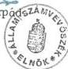

Állami Számvevőszék

# JELENTÉS

a Földművelésügyi Minisztérium
fejezet működésének
pénzügyi-gazdasági ellenőrzéséről

9835.

1998. október

---

Az ellenőrzés végrehajtásáért felelős:

III. Költségvetési Ellenőrzési Igazgatóság

Bihary Zsigmond

számvevő igazgató

Az ellenőrzést vezette:

Bodonyi Miklós (1998. III. 31-ig)

számvevő főtanácsos

Az összefoglaló jelentést készítette:

Simon Ákosné

számvevő tanácsos

Az összefoglaló jelentés készítésében közreműködött:

Csóry Györgyné

számvevő tanácsos

Nagyné Lunger Éva

számvevő

Az ellenőrzésben részt vettek:

Bakonyvári Róbertné

külső munkatárs

dr. Boda Sándor

számvevő tanácsos

Csóry Györgyné

számvevő tanácsos

Csuti Lajos

számvevő tanácsos

---

Deák Tamásné

számvevő tanácsos

dr. Erős Aladár

külső munkatárs

György Árpád

számvevő

Kalmár Ferencné

számvevő tanácsos

Kerezsi Pál

számvevő

Kopaczné Horváth Zsuzsanna

számvevő

Koronczai Sándorné

számvevő

Majer Lajosné

számvevő

Nagy János

számvevő tanácsos

Nagyné Lunger Éva

számvevő

Papp Sándor

számvevő tanácsos

Simon Ákosné

számvevő tanácsos

dr. Szeli Tibor

számvevő tanácsos

---

Szélpál Ferenc

számvevő

Szíjártó Károly

számvevő tanácsos

Szűcs Zoltán

számvevő tanácsos

Tormáné Ivánfi Irén

számvevő

dr. Tóth András

számvevő tanácsos

Trenovszki István

számvevő

Uram Ferenc

számvevő

Varga Balázs

külső munkatárs

---

# TARTALOMJEGYZÉK

TARTALOMJEGYZÉK ... 1

RÖVIDÍTÉSEK JEGYZÉKE ... 2

I. ÖSSZEFOGLALÓ MEGÁLLAPÍTÁSOK, KÖVETKEZTETÉSEK, JAVASLATOK ... 4

II. RÉSZLETES MEGÁLLAPÍTÁSOK ... 8

1. A MINISZTÉRIUM FEJEZET-IRÁNYÍTÓ TEVÉKENYSÉGE ... 8

1.1.A szervezet es a feladat-rendszer osszhangja 8
1.2.A koltsegvetesi tervezes, gazdalkodas es beszamolas iranyitasa 11

1.2.1.Az eloiranyzatok megalapozottsaga 11
1.2.2.Az eloiranyzat-modositasok szuksegessege es indokoltsaga 13
1.2.3.A koltsegvetes vegrehajtsa 15

1.3. Eszköz- és vagyongazdálkodás ... 17

1.3.1. Ingatlanok ertekesitesenek szabalszerusege, a befizetesi kotelezettsegek teljesitese 18
1.3.2. Az intezmenyi befektetesek szabalszerusege, celszerusege, eredmenyessege 20

1.4.Az intezmenyi mukodes belso szabalyozottsaga 20
1.5.Az ellenorzs rendszere 22

1.5.1.A felugyeleti jellegu koltsegvetesi ellenorzs 22
1.5.2.Az eves beszamoló jelentesek felulvizsgalata 23
1.5.3.A belso ellenorzs 23

2. AZ AGRÁRTÁMOGATÁSOK RENDSZERSZINTŰ ÉRTÉKELÉSE ... 24

2.1. Az egyes támogatási formák működési mechanizmusának értékelése ... 32

2.1.1. Reorganizaciós támogatas 32
2.1.2.Az agrarfinanszirozas tamogatasi rendszere 37
2.1.3.Az allattenyésztési támogatasi rendszer 40
2.1.4.Beruhazasoktamogatasi rendszere 46
2.1.5.A foldvédelmi támogatasi rendszer 53
2.1.6.A foldhasznositasi tamogatas 59
2.1.7.Erdogazdalkodás es erdövelem támogatási rendszere 60

3. INFORMATIKA ... 64

---

# Rövidítések jegyzéke

AKI - Agrárgazdasági Kutató Intézet

AKII - Agrárgazdasági Kutató és Informatikai Intézet

APEH - Adó- és Pénzügyi Ellenőrzési Hivatal

ARH - Agrárrendtartási Hivatal

ÁSZ - Állami Számvevőszék

FM - Földművelésügyi Minisztérium

KEI - Kormányzati Ellenőrzési Iroda

KTM - Környezetvédelmi és Területfejlesztési Minisztérium

NTÁ - Növényegészségügyi és Talajvédelmi Állomás

OKKH - Országos Kárrendezési és Kárpótlási Hivatal

OMMI - Országos Mezőgazdasági Minősítő Intézet

PM - Pénzügyminisztérium

RTB - Reorganizációs Tárcaközi Bizottság

VPOP - Vám- és Pénzügyőrség Országos Parancsnokság

Áht. - Az államháztartásról szóló 1992. évi XXXVIII. törvény (többször módosított)

ÁFA - Általános forgalmi adóról szóló 1992. évi LXXIV. törvény (többször módosított)

Ak - Aranykorona

SZMSZ - Szervezeti Működési Szabályzat

---

**Állami Számvevőszék**

V-37-70/1997-98.

Témaszám: 405.

# J e l e n t é s

## a Földművelésügyi Minisztérium fejezet működésének pénzügyi-gazdasági ellenőrzéséről

A Földművelésügyi Minisztérium (1998. júliustól Földművelésügyi és Vidékfejlesztési Minisztérium) fejezet a minisztérium és a felügyelete alá tartozó országos intézményhálózat által a mezőgazdaság, vadgazdálkodás és halászat, erdőgazdálkodás és erdővédelem, a növény- és állategészségügy, talajvédelem, élelmiszerellenőrzés, földügy és térképészet, valamint a mezőgazdasági minősítés hatósági és szakigazgatási feladatainak, az ágazathoz kapcsolódó kutatási és fejlesztési, továbbá a szakirány szerinti középfokú képzési tevékenységek ellátásával összefüggő költségvetési előirányzatokat, azok teljesítését foglalja magában. A fejezetbe tartoztak 1994-ig (a Művelődési és Közoktatási Minisztérium fejezethez történt átszervezésükig) az agrár-felsőoktatás intézményei is. A felügyeleti rendszer átalakítása következtében 1995-től az agrártárcához kerültek a kárpótlási hivatalok, amelyek közül a megyei hálózat 1996 végéig működött.

Az ágazati célok teljesítésének és egyes ágazati feladatok ellátásának előmozdítására a minisztérium - az elkülönített állami pénzalapok fejezeti kezelésű előirányzatokká történt 1996. évi átalakításáig - öt (egyes években ennél több), nagyobb részt önfinanszírozó alapot működtetett. A központi költségvetés szerkezeti rendjének módosítását követően, 1996. évtől a fejezet költségvetésében jelennek meg az agrártámogatási rendszer keretében a vállalkozásoknak nyújtott folyó költségvetési támogatások is.

A Földművelésügyi Minisztérium fejezet 1997-ben 11 címmel rendelkezett. Ebből 9 címhez tartozóan jelenik meg az összesen 55 önálló és 105 részben önálló gazdálkodási jogosítvánnyal rendelkező költségvetési szerv, együttesen évi 31,4 Mrd Ft kiadási és 17,8 Mrd Ft támogatási előirányzattal. Az intézmények közel 16 ezer fős létszám alkalmazásával mintegy 27,8 Mrd Ft értékű kincstári vagyont működtettek. A helyszíni ellenőrzés 24 intézményre terjedt ki (3. sz. melléklet).

A korábbi években 1,5-2 Mrd Ft-os nagyságrendet képviselő fejezeti kezelésű előirányzatok 1997-re - döntően az elkülönített állami pénzalapok fejezetbe integrálása és feladataik átvétele következtében - több, mint húszszoros növekedéssel 40 Mrd Ft-ra nőttek. A költségvetési törvény a vállalkozások folyó támo-

1

---

I. ÖSSZEFOGLALÓ MEGÁLLAPÍTÁSOK, KÖVETKEZTETÉSEK, JAVASLATOK

gatására biztosított 63,5 Mrd Ft eredeti előirányzattal együtt a fejezet 1997. évi költségvetését 134,8 Mrd Ft kiadási főösszeggel hagyta jóvá.

Az Állami Számvevőszék 1990-1991-ben végzett átfogó pénzügyi-gazdasági ellenőrzést a fejezetnél. Ezt követően a helyszíni ellenőrzések jellemzően a költségvetési tervezésre és zárszámadásra irányultak, de egyes témavizsgálatok (alapítványok támogatása, PHARE segélyek felhasználása stb.) és célellenőrzések (az 1995. évi búzatermés felvásárlása és exportja) is érintették a fejezet tevékenységét.

Az 1989. évi XXXVIII. törvény 2. § (5) bekezdés alapján végzett ellenőrzés célja annak megállapítása volt, hogy

- a Földművelésügyi Miniszterium a fejezet rendelkezésere alló közpénzek felhasznalásával a törvenyes keretek között, a celszerüsegi és eredményességi követelmények szem elott tartásával latta-e el fejezeti és ágazati irányító, továbbá intézményi és a kincstári vagyonnal való gazdákodási feladatait;
- a fejezet szervezeti rendszere, irányítás és működési rendje, költségvetési előirányzata kello összhangban volt-e a szakmai feladatokkal, biztosította-e azok hatékony és eredményes ellatását;
- az ágazatpolitikai célok érvényesülését a különboző forrásokból származó pénzeszközök (agrartamogatasi rendszer, elkülönítatt allami pénzalapok, fejezeti kezelésü elöirányzatok) celszerő felhasználásával eredményesen segítette-e elő;
- fejezeti és ágazati irányító tevekenysége keretében mennyiben hasznosította a korábbi számvevószéki Ellenőrzesek megállapításait, ajánlasait.

A helyszíni ellenőrzés a korábbi átfogó pénzügyi-gazdasági ellenőrzés lezárását követő időszakra, az 1991-1997. évekre, a fejezet (al)címet alkotó költségvetési szervei közül elsősorban a minisztérium (mint intézmény), a kijelölt földhivatalok és egyes, az agrártámogatási rendszer működtetésében közreműködő területi (szakigazgatási, hatósági) szervek gazdálkodási és feladat-ellátási tevékenységére terjedt ki. Ugyanakkor nem terjedt ki az ellenőrzés - tekintettel a Kormányzati Ellenőrzési Iroda 1997. évben e témakörben lefolytatott ellenőrzésére - a vállalkozások folyó támogatási előirányzatai terhére folyósított mezőgazdasági és élelmiszeripari exporttámogatások (piacra jutási támogatások), valamint agrárpiaci támogatások felhasználására, azokkal mindössze a rendszerszintű értékelés keretében foglalkozik. Az erdő- és vadgazdálkodás költségvetési kapcsolatait, illetve az erdőgazdaságok gazdálkodásának hatékonyságát pedig külön vizsgálat keretében értékeljük.

2

---

I. ÖSSZEFOGLALÓ MEGÁLLAPÍTÁSOK, KÖVETKEZTETÉSEK, JAVASLATOK

# I. ÖSSZEFOGLALÓ MEGÁLLAPÍTÁSOK, KÖVETKEZTETÉSEK, JAVASLATOK

A Földművelésügyi Minisztérium (FM, minisztérium) feladatát érintő folyamatos változásokhoz kapcsolódóan 1991. évtől kedvező irányba módosult a fejezet költségvetési szerkezete. Az állami feladat- és intézmény-felülvizsgálathoz kapcsolódó intézményi összevonások, a feladatok fejezetek közötti átrendezésének eredményeként a fejezet költségvetési szerkezete ésszerűbb és átláthatóbb lett. A célszerű és költségtakarékos szervezeti módosítások, feladatátrendezések mellett tapasztalható volt a feladatok és a szervezet személyi, tárgyi feltételei között az összhang hiánya, különösen a kárrendezési és kárpótlási hivataloknál, a földhivataloknál és a földművelésügyi hivataloknál, ahol a többletfeladatok ellátásához szükséges pénzeszközök csak részben álltak a fejezet rendelkezésére.

A minisztérium és intézményei rendelkeztek a működés és a gazdálkodás belső szabályzataival, ezek azonban nem mindig voltak teljes körűek, illetve a meglévők egy része aktualizálásra szorul. Kifogásoltuk, hogy a gazdálkodás belső rendjének szabályozása, különösen a számviteli politika és a számlarend az intézmények többségénél hiányos volt, így nem kellően biztosította a szabályos intézményi gazdálkodást.

A fejezet költségvetési előirányzatai az ellenőrzött hét év viszonylatában mintegy négyszeresére növekedtek, emelkedő összegű költségvetési támogatás és bevétel mellett. A fejezet intézményeinek költségvetési előirányzatai közel kétszeresére nőttek ugyanolyan arányú saját bevétel növekedés és kismértékű támogatás csökkenés mellett. A jelenlegi költségvetés tervezési metodika mellett a fejezet tervezést irányító, összehangoló tevékenységének hiányosságára is visszavezethető, hogy a feladatok és a költségvetési előirányzatok összhangja intézményi szinten nem valósult meg.

Az ellenőrzött időszakban fejezeti szinten a szakmai feladatok és a pénzügyi lehetőségek éves viszonylatban csak a módosított előirányzatok szintjén kerültek összhangba. Az intézmények költségvetési gazdálkodása többségében szabályszerű volt, de előfordult egy-egy intézménynél átmeneti finanszírozási nehézség, előirányzat túllépés és az FM Gazdasági Hivatalnál többször megsértették a gazdálkodásra vonatkozó jogszabályokat (Áht., ÁFA).

A vagyon- és eszközgazdálkodás területén, az ingatlan-értékesítések többségében a jogszabályi előírásoknak megfeleltek, de a központi költségvetést megillető befizetéseket esetenként késedelmesen teljesítették, illetve nyilvántartás hiányában nem volt ellenőrizhető a befizetés jogcíme.

A fejezet a 96/1987. (XII. 30.) PM rendelet 11. § (1) bekezdésben előírt költségvetési ellenőrzési kötelezettségének eleget tett. Kifogásoltuk, hogy a Revizori Osztály a közvetlen közigazgatási államtitkári alárendeltségből al-

3

---

I. ÖSSZEFOGLALÓ MEGÁLLAPÍTÁSOK, KÖVETKEZTETÉSEK, JAVASLATOK

sóbb irányítási szintre került, a Költségvetési Főosztály keretein belül osztályszervezettel működött. Az **ellenőrzési programok** tartalma rendszerint **átfogta a gazdálkodás egészét. Az ellenőrzés hatékonysága még javításra szorul**, a szabályozottság és az intézményi beszámolók felülvizsgálata területén. **Az intézményhálózat nem teljes körűen rendelkezett függetlenített belső ellenőrrel.** A belső ellenőrzések során **feltárt hiányosságokat az intézményvezetők nem minden esetben hasznosították.**

**Az agrárágazat finanszírozását, fejlesztését, a termékek piacra jutását elősegítő állami szerepvállalás az agrártámogatási rendszeren keresztül jut kifejezésre.**

Az agrártámogatások szabályozórendszerének kialakításában, a támogatások odaítélésében és ellenőrzésében a minisztériumnak és intézményhálózatának kiemelt szerepe van.

Az egész agrárgazdaságot érintő **átalakulási folyamatra kedvezőtlen hatást gyakorolt, hogy nem, illetve késve készültek el a piacgazdaság kereteit átfogóan szabályozó törvények, rendeletek, az ágazati szintre lebontott, hosszabb távra is kiszámítható szabályozórendszer.**

Az ellenőrzött időszakban kialakított támogatási rendszernek sokféle termelő szervezet igényeit kellett kezelnie, az üzemi struktúra átalakulása nem zárult le, a termelői regiszter még nem készült el, ezért **a rendszer igen szerteágazó, bonyolult, nehezen áttekinthető. Az állandó változások miatt a termelőknek a folyamatos gazdálkodáshoz nem biztosította a stabilitást, a hosszabb távú tervezési lehetőséget.**

A **támogatási célokat** még nem egyértelműen a verseny és piacképesség kívánalmai szerint alakították ki, a szociális szempontok is érvényesültek. A **célok meghatározásánál hiányzott a prioritások kijelölése, a minőségi termelés és a struktúra átalakítása. A támogatási jogcímek sokasága a támogatási pénzeszközök elaprózódásával járt**, a volumenek növelésére irányuló ösztönzés esetenként a problémák megoldása helyett azok számát is szaporította.

**Az agrártámogatásokat szabályozó kormányrendeletek és az eljárási szabályokat tartalmazó minisztériumi tájékoztatók** - a költségvetés naptári éves szemlélete és a központi költségvetésről szóló törvények év végi elfogadása miatt - **minden évben későn, illetve nem a támogatni kívánt célok objektív feltételrendszeréhez igazodva** (pl. állatok generációs intervalluma) **jelentek meg.** A rövid felkészülési idő kedvezőtlen hatással volt a megalapozott támogatási igények összeállítására, a támogatások odaítélésének összehangolt lebonyolítására. Mindez a pénzeszközök felhasználásában esetenként egyensúlytalansághoz vezetett.

**A támogatások igénybevételének feltételrendszere az 1996. évtől kezdődően folyamatosan korszerűsödött, szigorúbbá vált**, a támogatási mértékek jobban igazodtak a gazdaságban végbement folyamatokhoz.

4

---

I. ÖSSZEFOGLALÓ MEGÁLLAPÍTÁSOK, KÖVETKEZTETÉSEK, JAVASLATOK

Ugyanakkor **az eljárási rend még mindig túlszabályozott, a formai elemekben sem érvényesült az állandóság.**

Az agrártámogatások **finanszírozása** az 1992-1995. évek közötti időszakban **több csatornán keresztül, döntően az FM és a PM között megosztva történt.** Előfordult, hogy más tárca is (KTM) - jellemzően a területfejlesztési pénzeszközök terhére - finanszírozott agrárpolitikai célokat. Hiányolható, hogy a vidékfejlesztési célok megvalósításához és ezek finanszírozásához nem készültek átfogó koncepciók, a feladatellátás és finanszírozás koordinálatlan volt.

**Az agrártámogatásra fordított - az ellenőrzött években összesen - 453,1 Mrd Ft felhasználásakor a megfogalmazott célok és források összhangját nem sikerült megteremteni.** Ebben szerepe volt az előre pontosan nem prognosztizálható piaci zavarok elhárításának és néhány esetben a nem kellően átgondolt - hatásvizsgálat nélkül bevezetett - támogatási formáknak.

**A támogatási rendszer pénzeszközeinek költségvetési és zárszámadási prezentációban való bemutatása - az ellenőrzött időszakban - nem volt teljes körű, hiányzott az agrárszektor támogatási pénzeszközeinek összerendezett kimutatása.**

**A támogatási pénzeszközök felhasználásának ellenőrzése nem volt folyamatos és teljes körű, a közpénzek rendeltetésszerű felhasználásának védelmét nem kellően biztosította.** Az ellenőrzés hatékonyságát gátolta az ellenőrzés szervezeti széttagoltsága. Az agrártámogatások ellenőrzésében az adóhivataloktól az agrárkamaráig számos szervezet vesz részt, a koordináció és a komplexitás jelenleg nem megoldott.

Az ágazat jelenlegi **informatikai rendszere** folyamatosan fejlődött, azonban korszerű adatbázisok és képzett informatikai szakemberek, valamint szervezet hiányában még nem alkalmas a vezetői döntések alátámasztására. A minisztérium egyenlőre nem rendelkezik az EU csatlakozáshoz elengedhetetlen sokrétű, naprakész információval.

A támogatási rendszer minden eleme - bár eltérő eredményességgel - hozzájárult az agrárgazdaság kedvezőtlen folyamatainak mérsékléséhez.

A legeredményesebben a **beruházási támogatási rendszer** működött. Hozzájárult az elavult géppállomány cseréjéhez, az ültetvénytelepítéseknél a gyümölcsösök területeinek növekedéséhez. Hibája a rendszernek, hogy a beruházási célokat még nem egyértelműen a verseny és a piacképesség kívánalmai szerint alakították ki, a szociálpolitikai elveknek való megfelelést is megcélozták, a komplex fejlesztésekre még nem ösztönöz.

**A reorganizációs program** hiányosságai - előkészítetlenség, a szabályozórendszer többszöri módosulása, a jogi szabályozás átgondolatlansága - ellenére jól szolgálta a korábbi nagyüzemi vagyontárgyak tulajdonváltását.

**Az agrárfinanszírozási támogatás** az alacsony jövedelmezőség és a tőkehiány miatt a negatív reálgazdasági folyamatokat nem volt képes megállítani,

5

---

I. ÖSSZEFOGLALÓ MEGÁLLAPÍTÁSOK, KÖVETKEZTETÉSEK, JAVASLATOK

legfeljebb késleltetni. A támogatási rendszer egyes elemeinek késedelmes bevezetése (pl. állattenyésztés), a mértékek indokolatlan hullámzása, a kiszámíthatóság hiánya gátolták a támogatási rendszer eredményes működését. Az 1997. évben bevezetett tőkepótló hitel kedvező hatása már lemérhető.

Az **állattenyésztési támogatások** ugyan nem eredményezték a gazdasági haszonállat-létszám növekedését, de hozzájárultak az állatállomány csökkenésének mérsékléséhez, a kihasználatlan állat-férőhelyek feltöltéséhez. A célok között a projekt jellegű, településekhez vagy régiókhoz kapcsolt támogatások még nem szerepeltek.

A **földvédelmi és földhasznosítási** támogatások hatékonysága a korlátozó intézkedések - pl. a támogatások pénzügyi lehetőségeinek szűkítése - következtében **igen alacsony szintű volt**.

Az **erdőgazdálkodás és erdővédelem** támogatására fordított források a hosszú távú erdőtelepítési program időarányos teljesítéséhez nem voltak elegendőek, a lemaradás jelentős. A támogatások jelenlegi mértékével az éves tervezett programok a jövőben sem teljesíthetők.

**Az alkalmazott támogatási formák a megcélzott támogatási területeket illetően a reálgazdaságban elért részeredmények ellenére még nem hoztak áttörést a jövedelmezőség, a hatékonyság és a versenyképesség fokozásában.**

**Az ellenőrzés részletes megállapításainak realizálása mellett javasoljuk:**

#### **a Kormánynak**

1. Hasznosítsa az agrárgazdaság fejlesztéséről szóló 1997. évi CXIV. törvényben a Kormány részére előírt feladatok végrehajtása során a jelentésben - kiemelten a szabályozás kiszámíthatóságára, a szociálpolitikai elemek versenyszférától eltérő szabályozására - tett megállapításokat.
2. Kapjon nagyobb hangsúlyt a támogatások szabályozásánál a minőségi termelésre, a struktúra átalakítására, valamint a komplex fejlesztésekre való ösztönzés.

#### **a földművelésügyi és vidékfejlesztési miniszternek**

1. Tegyen intézkedéseket a feladatok és a költségvetési előirányzatok összhangjának intézményi szintű megteremtésére, különös tekintettel a földművelésügyi hivataloknál a fejlesztésekkel kapcsolatos teendőkre.
2. Biztosítsa, hogy a felügyeleti jellegű költségvetési ellenőrzés irányítása a megfelelő szintre kerüljön. Fordítson figyelmet a fejezethez tartozó intézmények belső ellenőrzésének megerősítésére, hatékonyságának növelésére, az intézményi el-

6

---

lenőrzéseket követően - a feltárt hiányosságok, szabálytalanságok kijavítására irányuló - intézkedések végrehajtására.

3. Segitse elo az agrartamogatasok eljarasi rendjenek egyszerusodeset, garantalja azok kiszamithatosagat.
4. Alakitsa at a beruhazasi támogatások kovetelmenyrendszerét oyan modon, hogy azBiztositsa a versenyképpesseg fokozásat.
5. Segitse elo a kistermelok koreben a telepulesekhez vagy regiokhoz kapcsolt Projekt jellegu tamogatasok ervenyesulését.
6. Biztositsa, hogy az agrartamogatasokra forditthato (forditott) penzeszkozk teljes koruen es jogcimenkent kulon mellekletben a koltsegvetesi es zarszamadasi prezentacioban megjelenjenek.
7. Tegye hatékonyabbá a támogatási rendszer muködésének folyamatos és utolagos Ellenőrzését, ennek érdekében alakítson ki egy komplex informatikai rendszert.
8. Hozzon létre olyan informatikai szervezet, amely képes a teljes ágazati és a miniszteriumi informatikai fejlesztések össehangolására.

## II. RÉSZLETES MEGÁLLAPÍTÁSOK

### 1. A MINISZTÉRIUM FEJEZET-IRÁNYÍTÓ TEVÉKENYSÉGE

#### 1.1. A szervezet és a feladat-rendszer összhangja

A vizsgált időszakban a költségvetési irányelvekben és kormányhatározatokban igényként megfogalmazott állami feladat- és intézményfelülvizsgálathoz kapcsolódó integrációknak, valamint a feladatok fejezetek közötti átrendezésének eredményeként a fejezet költségvetési szerkezete ésszerűbb és átláthatóbb lett. Ezt a fejezet címstruktúrája is tükrözi, az intézkedések következtében a címek száma 15-ről 11-re csökkent. Kedvezően értékelhető, hogy az átszervezéseket megelőzte az intézmények átvilágítása, ezzel a döntéshozatal megalapozottabb volt. A szervezet-korszerűsítés a helyszíni ellenőrzéskor is folyamatban volt a területi államigazgatási hálózattal működő szervezeteknél és az Országos Mezőgazdasági Minősítő Intézetnél.

Az 1994. évi CIV. törvény alapján a Miniszterelnökség fejezettől 1995. január 1-jével a tárcához került az Országos Kárrendezési és Kárpótlási Hivatal és megyei szervezetei. Emiatt a fejezet költségvetési előirányzata 2,2 Mrd Ft-tal, a létszáma 1300 fővel nőtt. Az átadás-átvétel pénzügyi elszámolása rendben megtörtént. Az agrárfelsőoktatási intézményeket a Művelődési és Közoktatási Minisztérium fejezethez sorolták át, így a tárca költségvetési támogatása 6,4 Mrd Ft-tal, a saját bevétele 3,3 Mrd Ft-tal és a létszáma 8200 fővel csökkent.

7

---

II. RÉSZLETES MEGÁLLAPÍTÁSOK

Az 1991-es évben összevonták az Agrárgazdasági Kutató Intézetet és az FM Statisztikai és Gazdaságelemző Központot, az FM Gazdasági Hivatalnál az óvodát és a bölcsődét, az utóbbit 1995. szeptember 1-jével megszüntették.

A költségvetésük 96%-ában saját forrásból finanszírozott intézményeket, nevezetesen a Pilisi Állami Parkerdőgazdaságot és a Soproni Tanulmányi Állami Erdőgazdaságot az FM 1992. január 1-től állami irányítású vállalatokká alakította át. Ennek eredményeként mintegy 3 ezer fővel csökkent a fejezetnél a foglalkoztatottak száma és 2 Mrd Ft-tal mérséklődött a kiadások és a bevételek főösszege.

A feladatok célszerűbb és hatékonyabb ellátása érdekében összevonták, illetve bővítették a területi szakigazgatási szerveket. Ezek gazdálkodási tevékenységét koordináló, ellenőrző FM Költségvetési Iroda szervezetét és feladatát korszerűsítették. Ez utóbbi intézkedés eredményeként 40 fős létszám-megtakarítást értek el a hozzárendelhető kiadásokkal együtt.

Az 1991. évi VII. törvény alapján megyei (fővárosi) földművelésügyi hivatalokat hoztak létre, melynek eredményeként a fejezet létszáma 203 fővel, a támogatási és kiadási előirányzata pedig 250 M Ft-tal növekedett.

Az Állategészségügyi Szolgálat 1991. július 1-jével, a Növényegészségügyi Szolgálat 1992. január 1-jétől beolvadt a területi állategészségügyi és élelmiszerellenőrzési, illetve a megyei növényegészségügyi hálózatba. A szervezeti átalakítással 320 fős létszámot takarítottak meg.

Az FM Költségvetési Iroda 1996 január 1-jétől 20 megyei osztállyal bővült, melynek kapcsán 67 részben önállóan gazdálkodó állategészségügyi, élelmiszerellenőrzési, növényegészségügyi és földművelésügyi költségvetési intézmény teljes pénzügyi-gazdasági tevékenységét ellátja.

Az FM 37/1996. (XII. 29.) rendelete alapján 1997. január 1-jétől létrehozták az Állami Erdészeti Szolgálatot a korábban önállóan működő Erdőfelügyelőségek és Erdőtervezési Irodák összevonásával, s egyben újra rendezték az illetékességi területeket és körzeteket.

A kutatóintézetek körében a feladat ellátás gazdálkodási formájának megváltoztatására - költségvetési intézmények közhasznú társasággá alakítására - hozott intézkedés a profiltisztítás oldaláról pozitívnak minősíthető, azonban tényleges megtakarítást (támogatás csökkenést) várhatóan nem eredményez, mivel a társaságok végzik továbbra is térítés ellenében a fejezet részére az állami feladathoz kapcsolódó kutatási tevékenységet. Három kutatóintézet - Gabonatermesztési Kutatóintézet, Öntözési Kutatóintézet (Szarvas), FM Műszaki Intézet - 1996 évre tervezett közhasznú társasággá alakítása csak 1997-ben realizálódott. A korábbi 110 M Ft-os intézményi támogatásból szolgáltatási ráfordítás lett.

Az ésszerű szervezeti módosítások, feladat átrendezések mellett a kárrendezési és kárpótlási hivataloknál, a földhivataloknál és a földművelésügyi hivataloknál tapasztalható volt a feladatok és a szervezet személyi és tárgyi feltételei között az összhang hiánya. Ezt a kárrendezési és kárpótlási hivataloknál az 1992. évi XXXII. törvény módosításaival, a földhivataloknál a tulajdonváltással összefüggő ingatlannyilvántartás rendezésével, a földművelésügyi hivataloknál pedig döntően az agrártámogatások kezelésével, illetve az utóbbi két hivatal esetében a rész-

8

---

II. RÉSZLETES MEGÁLLAPÍTÁSOK

arány tulajdon kiadásával összefüggő többletfeladatok okozták. A vonatkozó 2077/1995. (III. 24.) Korm. határozat végrehajtásának üteme az előírt határidőhöz képest eltolódott.

A földhivatali szervezetek megerősítésére, a kárrendezési és kárpótlási hivatalok feladatainak csökkenésével egyidejűleg felszabaduló létszámból, 1996. évben 120 főt, 1997. évben mintegy 200 főt a földhivatalok állományába kellett volna áthelyezni. Ezzel szemben 1996-ban csak 50 fős létszám és előirányzat átcsoportosítása történt meg. A fennmaradó létszámot és előirányzatokat az 1998. évi költségvetési törvénnyel rendezték.

A földhivatalok szervezet-megerősítésére és infrastruktúrájának fejlesztésére a tárca nem készített feladatra koncentrált, több évre szóló programot, nem mérte fel a szükségletnek megfelelő forrás nagyságát és ütemezését, ennek igénye a kormányzati döntés megalapozásához fel sem merült. A feltételek javításához nyújtott többletforrások felhasználása a fővárosi és pest megyei földhivataloknál - különösen az ügyirat hátralékok felszámolásában - nem hozta meg a kívánt eredményt. A kormányhatározatban előírt cél - miszerint a földhivatali munka hatósági színvonalát jelentős mértékben kell javítani, különös tekintettel a felhalmozódott ügyirat hátralékok felszámolására - nem teljesült.

Az 1995-1997. évek között a földhivatalok a Földvédelmi Alapból, illetve fejezeti kezelésű előirányzat terhére 2,2 Mrd Ft többlet támogatást kaptak.

Az országosan közel azonos nagyságrendű, kb. évi 2 millió db ügyirat beérkezése mellett a határidőn túli elintézetlen ügyirat hátralék 1996. évtől fokozatosan emelkedett (1995-ben 584 ezer, 1996-ban 778 ezer, 1997-ben 881 ezer db volt), melynek többsége a fővárosi régióban keletkezett.

Az elmaradás pl. Fejér, Hajdú, Tolna megyék esetében az elintézendő ügyiratok töredékét tette ki, a legtöbb ügyirat hátralék 1997. december 31-én a fővárosi (598.778 db) és a pest megyei hivatalnál (87.449 db) volt. Ezeknél a hivataloknál sajátos ellentmondás is mutatkozott, az engedélyezett létszámot elhelyezési gondokra hivatkozva a Fővárosi hivatal nem töltötte be, a Pest megyei hivatalnál pedig az alacsony bérszínvonal (25 E Ft/hó/fő) volt a gátja az állások betöltésének. A növekvő feladatokat döntően túlmunkában, illetve vállalkozói szerződések alapján végeztették.

A támogatási rendszer 1994-től kezdődő bővülésével a földművelésügyi hivatalok feladatai folyamatosan nőttek. Emelkedett az igazolások kiadásának száma, gyarapodtak a pályázatos támogatások döntéselőkészítési és ellenőrzési tennivalói. A hivatalokhoz került a vadászati, a halászati hatósági jogkör és a részaránytulajdon kiadása. Ugyanakkor a 2077/1995. (III. 24.) Korm. határozat előírta a fejezetnek, hogy vizsgálja meg a feladatok szűkítésének lehetőségét, pl. a földművelésügyi hivataloknál, a felszabadítható létszámot a földhivatali szervezetekhez csoportosítsa át. E kormánydöntés előkészítetlenségére utal az is, hogy az FM hivatalok 1996. és 1997. évi tervezett létszáma 245 fő volt, míg a tényleges létszám 330 és 622 főre emelkedett.

A cím és alcím struktúrában 1993-1997. között célszerűtlen megoldás jelent meg az igazgatás címnél, mely két önálló gazdálkodó intézményből áll (Gazdálkodó Szervezet és Gazdasági Hivatal). Az 1993-as évre vo-

9

---

II. RÉSZLETES MEGÁLLAPÍTÁSOK---

natkozó PM tervezési útmutatóban foglaltak téves értelmezéséből adódóan a **Gazdasági Hivatal tevékenységi körébe tartozó jóléti szakfeladatokat külön „Jóléti Intézmények”** alcímként jelenítették meg a költségvetési és a zárszámadási prezentációban, önálló szervezet és gazdálkodási jogkör nélkül.

## 1.2. A költségvetési tervezés, gazdálkodás és beszámolás irányítása

### 1.2.1. Az előirányzatok megalapozottsága

A fejezet 1991-1995. évek között folyamatosan emelkedő költségvetése 1996. évben ugrásszerűen növekedett, a költségvetés tervezési rend változása (egyes elkülönített állami pénzalapok megszüntetése) és a fejezetek közötti feladatok átrendeződése miatt.

A fejezet éves költségvetési előirányzata az 1991. évi 17,3 Mrd Ft-ról fokozatosan, 1995. évre 38,3 Mrd Ft-ra emelkedett. Az 1996. évi kiadási előirányzat főösszege a szerkezetváltozás miatt 126,4 Mrd Ft-ra, az 1997. évi 134,8 Mrd Ft-ra növekedett (1. sz. melléklet).

Az 1996. évi költségvetésről szóló 1995. évi CXXI. törvény értelmében az elkülönített állami pénzalapok feladatai beépültek a fejezet éves költségvetésébe fejezeti kezelésű előirányzatként. A „Vállalkozások folyó támogatásának” előirányzatai a Pénzügyminisztérium fejezettől az FM fejezethez kerültek.

A vállalkozások folyó támogatásának előirányzatai 1996. évben 60,8 Mrd Ft-tal, 1997. évben 63,5 Mrd Ft-tal növelték a fejezet kiadási előirányzatait. Ebből 1996. évben a reorganizációs programok támogatása 7 Mrd Ft volt. A költségvetési törvény e feladathoz 1997. évben forrásul az ÁPV Rt. privatizációs bevételét jelölte meg.

A fejezeti kezelésű előirányzat 1996. évben 27,4 Mrd Ft, 1997. évben 39,9 Mrd Ft volt, a korábbi évek 1-2,3 Mrd Ft nagyságrendű kiadásait jelentősen meghaladva.

A fejezet és intézményei a kiadási és bevételi előirányzatok meghatározásánál az évenként kiadott, tervezési irányelvekben rögzített előírásokat többségében betartották. **Jellemzően a keretek szűkítése miatt erősen centralizált volt az előirányzatok tervezése - felújítás, felhalmozás -, s ez nem segítette az intézményeknél az előrelátó, átgondolt gazdálkodást.**

**A tervezés** bázis szemléleten alapult, **nem a feladatokhoz szükséges előirányzatok (kiadás-bevétel) összegéből indult ki**, hanem a fejezet és a Pénzügyminisztérium közötti megállapodás szerint kialakult fejezeti sarokszámokból visszafelé történt, **s ez a feladat-felülvizsgálat hiányában az előirányzatok megalapozatlanságát idézte elő.**

A fejezet az intézmények részére évente kiadta a tervezési útmutatót, összhangban a központi irányelvekkel, és meghatározta az intézmények kiadási és bevételi főösszegét kiemelt előirányzatonként. Az intézmények ennek alapján készítették el az éves elemi költségvetésüket.

---10

---

II. RÉSZLETES MEGÁLLAPÍTÁSOK

A fejezet intézményi költségvetési előirányzatai (fejezeti kezelésű előirányzatok és a vállalkozások folyó támogatása nélkül) az ellenőrzött időszakban 16.509,6 M Ft-ról 31.3654,8 M Ft-ra, közel kétszeresére emelkedtek, ami hasonló ütemű saját bevétel növekedés mellett ment végbe. Az intézményi bevételek (támogatás nélkül) 6.660,2 M Ft-ról 13.585,6 M Ft-ra változtak, összefüggésben a hatósági díjtételek emelésével, elsősorban az állategészségügy, az élelmezés ellenőrzéseknél, a növényegészségügyi és talajvédelmi hivataloknál. A támogatás aránya 1991-ben 59,7%-os volt, ami 1997-re 56,7%-ra csökkent. A fejezeti kezelésű előirányzatok figyelembevételével - melyek az ágazati és célfeladatok előirányzatait is magukba foglalják - a támogatási arány lényegesen nagyobb, hisz a feladatok többségét csak állami támogatás igénybevétele mellett lehetett megvalósítani.

A fejezet előirányzata, 1997-ben (71334,7 M Ft) mintegy négyszerese volt az 1991. évinek (17284,1 M Ft), a támogatási arány 60,8%-ról (10.505,4 M Ft) 70,2%-ra (50,111,1 M Ft) növekedett.

Az eredeti előirányzatok, jellemzően a dologi, felújítási és felhalmozási kiadások alultervezettek voltak. A fejezet az intézmények részére minden évben részletesen kidolgozott, feladatorientált tervek készítését írta elő, de a pénzügyi forrásai ezek maradéktalan kielégítésére nem adtak lehetőséget. Ezért a feladatok és a költségvetések összhangja intézményi szinten nem valósult meg.

Az FM Gazdasági Hivatal (GH) nem tervezte meg 1995-ben a beszerzések és igénybevett szolgáltatások általános forgalmi adó fizetési kötelezettséget (53 M Ft). Alultervezték az irodaszer, nyomtatvány, sokszorosító anyagok kiadásait. Nem vették figyelembe - a 137/1993. (X. 12.) Korm. rendelet 11. § a) pontjában foglaltakat - a tervezéskor ismert 1994. évi szállítói kötelezettséget 20,2 M Ft összegben, melyet az 1995. évi költségvetés terhére kellett kiegyenlíteni. Az alultervezés következtében a tényleges kiadások (363,6 M Ft) több mint kétszeresen meghaladták a tervezettet. Az 1996. évi költségvetés indoklásából érzékelhető volt az elemi költségvetés 118,5 M Ft-os alultervezése, és ez az összeg még nem tartalmazta az 1995. évről áthúzódó szállítói állományt, ami további 45,4 M Ft-ot jelentett. A felhalmozási és felújítási kiadásoknál is ez a tendencia érvényesült. (Az 1996. és 1997. években 146 és 220 M Ft-os tervszámmal szemben 346,4 és 297,2 M Ft-os kiadás realizálódott).

A Fővárosi Földhivatalnál az eredeti előirányzatok megalapozatlanságát 1995. évben a hivatalvezető által készített költségvetési indoklások is alátámasztották. A jóváhagyott költségvetés a felújítási és felhalmozási kiadási igény töredékét tartalmazta. Az 1996. évre tervezett előirányzatok a személyi juttatások 1/3-ára és a működési kiadások 1-2 havi teljesítésére nem nyújtottak fedezetet.

Az Országos Kárrendezési és Kárpótlási Hivatalnál a ráfordítások reális számbavétele megtörtént, de ez nem tükröződött a jóváhagyott tervszámokban. Ezt igazolja a kárpótlási hivatalok cím eredeti és módosított költségvetési előirányzatának eltérése. (Az 1995-1997. években az eredeti előirányzat 2.216,3 M Ft, 1.788,2 M Ft, 1.759,3 M Ft, a módosított 2.503,3 M Ft, 1.837,6 M Ft és 2.672,2 M Ft volt.)

A Földművelésügyi Hivatalok közül a Somogy megyei Hivatalnál az alultervezés a szakmai feladatok megfelelő szintű ellátásában és a gazdálkodás vitelében bizonytalanságot okozott. Az eredeti előirányzatok a főfoglalkozású dolgozók

11

---

II. RÉSZLETES MEGÁLLAPÍTÁSOK

személyi juttatásának mindössze 2/3-át, a dologi előirányzatok a szükségletek felét (1997. évben), illetve 1/3-át (1996. évben) tartalmazták.

**A Komárom megyei Növényegészségügyi és Talajvédelmi Állomásnál** a dologi kiadásoknál az alátervezés 1994-1997. évek között általánossá vált (218,9%, 157,5%, 168,6%, 139,9%). A felújítási-felhalmozási előirányzatok rendszerint csak módosított előirányzatként jelentek meg.

**Az intézményi működési bevételi előirányzatok kisebb arányban voltak alultervezve, mint a kiadási előirányzatok**, ezt a központi megszorító intézkedések, a támogatás elvonások és a bevételek tervezésénél előírt %-os növekedések is kikényszerítették.

**A fejezet intézményeinek** működési bevétele 1997. évben 14,5 Mrd Ft, az eredeti éves előirányzat 13,6 Mrd Ft volt, az 1995. évi tényszámot 4,3 Mrd Ft-tal haladta meg. A két év alatt elért 4,3 Mrd Ft-os bevétel növekedés 72%-át a 2. címhez tartozó állategészségügyi, illetve növényegészségügyi szakigazgatási intézmények bevételeinek növekedése eredményezte. Ezt egyrészt a szolgáltatások díjkötelessé tételével, másrészt a díjtételek folyamatos emelésével érték el.

**A GH** bevételi előirányzatainak tervezése a két alcím egészét tekintve megalapozottabb volt, de az alcímenkénti előirányzatok jelentős alá-, illetve fölétervezést mutattak az egyes években. (Pl. az eredeti előirányzat 1993-ban és 1994-ben összesen 96 M Ft, illetve 137,3 M Ft volt, melyből a 01. alcím 53,9 M Ft és 90,8 M Ft, a 02. alcím 42,1 M Ft és 46,5 M Ft, a teljesítés 100,7 M Ft és 122,1 M Ft volt, ebből a 01. alcím 31,9 M Ft és 39,8 M Ft, a 02. alcím 68,8 M Ft és 82,3 M Ft.)

### 1.2.2. Az előirányzat-módosítások szükségessége és indokoltsága

Az ellenőrzött időszakban fejezeti szinten 51.823 M Ft előirányzat növelésre került sor. Ebből Országgyűlési hatáskörben 3.067,8 M Ft, Kormány szinten 5.614,9 M Ft, felügyeleti hatáskörben 14.017,5 M Ft, saját hatáskörben pedig 29.122,8 M Ft módosításról döntöttek.

**A minisztériumban és a fejezethez tartozó intézményeknél az előirányzat-módosításokat a hatásköri előírásoknak megfelelően hajtották végre**, azokról a fejezet részletes, költségvetési címekre, alcímekre kiterjedő nyilvántartást vezetett.

**A fejezet** az 1994. évtől a növekvő összegű **évközi támogatási előirányzat elvonásokat** (az évenkénti költségvetéshez, pótköltségvetéshez kapcsolódóan) **a kormányhatározatok előírásai alapján végrehajtotta**. Az elvonásokat 1994. évben az intézmények támogatásának csökkentésével, 1995-től növekvő (1997-ben már teljes) mértékben a fejezeti kezelésű előirányzatokból teljesítette.

Az 1994. évi pótköltségvetésnél előírt 230,1 M Ft zárolást (dologi 159,9 M Ft és felújítási 70,2 M Ft) az intézményi kiadások és támogatások csökkentésével biztosították. A dologi előirányzatokat egységesen vonták el, míg a felújításnál csak azon intézményektől, ahol az előirányzat terhére kötelezettségvállalás nem volt.

Az 1995. évi elvonás összesen 372,9 M Ft volt. A 3% személyi és TB járulék előirányzat csökkentést (291,5 M Ft) az intézményektől és a felhalmozási előirány-

12

---

II. RÉSZLETES MEGÁLLAPÍTÁSOK

zatok le nem kötött részéből (12,8 M Ft) teljesítették. A fejezeti kezelésű előirányzatokat 68,6 M Ft-tal csökkentették.

A létszámcsökkentések fedezetére előírt tartalék képzéshez 1996. évben a 199,0 M Ft-ot az intézmények előirányzatainak (dologi, TB járulék) elvonásával biztosították. A költségvetési egyensúly javítását célzó 619,5 M Ft módosítást pedig a feladatok felülvizsgálata után, vezetői döntés alapján differenciáltan hajtották végre. A felét az intézményektől (szakigazgatási intézmények, földhivatalok, kárpótlási hivatalok stb.), a másik felét a Vállalkozások folyó támogatása cím agrártermelési támogatás kiemelt előirányzatából (300 M Ft) és 18 M Ft-ot az ágazati célelőirányzatból vonták el.

Az 1997. évi központi intézkedések következtében 1.081,3 M Ft-tal csökkent a fejezet előirányzata és támogatása. Ezt teljes körűen a fejezeti kezelésű előirányzatok csökkenésével realizálták. A bérpolitikai központi keretet és a Borsod-Abaúj-Zemplén megye integrált szerkezet átalakítás forrását döntően a mezőgazdasági alaptevékenység beruházási támogatás előirányzat csökkentése 740,0 M Ft biztosította.

Az intézményeknél a feladatok folyamatos bővülése és az alultervezettség következtében jelentős évenkénti előirányzat-módosítási igény jelentkezett. A fejezet az általa indokoltnak ítélt mértékig jellemzően év közben növelte az intézmények pénzügyi lehetőségeit, ennek forrását a fejezeti kezelésű előirányzatok és az intézményi többlet bevételek biztosították.

Az előirányzat-módosítások mértéke több intézménynél az eredeti előirányzatok 30-170%-át is meghaladta, ez csak részben kapcsolódott az új, illetve az ágazati célelőirányzatokból megvalósítandó feladatokhoz. Ez a gyakorlat tervszerűtlenné, átláthatatlanná és bizonytalanná tette a gazdálkodást, esetenként a kötelezettségek késői teljesítését vonta maga után. A célra, feladatra adott intézményi pótelőirányzatok elszámolása jellemzően pénzügyi szemléletű volt, ezért nem mindig követhető, hogy a többletforrást az előírt feladatra használták-e fel. Az intézmények a saját hatáskörben végzett előirányzat-módosításokat (hiányos dokumentáltság és előirányzat nélküli felhasználás) esetenként nem az Áht. 93 §-ban előírtak alapján hajtották végre.

A GH-nál a saját hatáskörben végzett módosítások nem voltak dokumentálva, ezeket nem az intézmény igazgatója rendelte el 1995-ig. A kiemelt előirányzatokat 1995. évben saját hatáskörben megemelték - a személyi juttatásokat 2,8 M Ft-tal és a felhalmozási kiadásokat 9,2 M Ft-tal -, melyeknek forrásai (pénzmaradvány, többlet bevétel stb.) dokumentáció hiányában nem voltak ismertek, így nem ítélhető meg a szabályos és a szabálytalan módosítás mértéke.

A Fővárosi Földhivatalnál az előirányzat-módosítások jelentős része felügyeleti hatáskörben történt. Ezek szükségességét és indokoltságát a felügyeleti szerv határozta meg. A módosításokat a megfelelő nyilvántartásokon átvezették. Az eredeti előirányzathoz képest a változás 1991. és 1997. között 8,9% és 117,4% volt. A pótelőirányzatokról az elszámolások döntően pénzügyi jellegűek voltak, amelyek a pénz elköltését igazolták, de a beszerzések és a személyi jellegű kifizetések többletfeladathoz kapcsolódását már nem.

A Pest megyei Földhivatalnál 1996. évig az előirányzatokat a felügyeleti szerv elrendelése szerint végezték. A módosított költségvetési előirányzatok az

13

---

II. RÉSZLETES MEGÁLLAPÍTÁSOK

eredetihez képest 1991. és 1997. évek között 40% - 79%-kal emelkedtek. Az előirányzat-módosításokat jellemzően november, december hónapban hajtották végre, így azokkal a tárgyévben gazdálkodni már nem lehetett. Az FM az intézményi felhalmozási és felújítási igényekhez (25-90 M Ft) képest annak csak töredékére (3-6 M Ft) biztosított a költségvetésben előirányzatot feladat megjelölés nélkül. Év közben konkrét feladathoz 56-68 M Ft nagyságrendű pótlólagos forrást rendelt.

A Tolna megyei FM Hivatalnál a pótelőirányzatok nagy része új feladatokhoz, a falugazdász-hálózat kialakításához és a részarány földtulajdon kiadásához kapcsolódott. A módosítás az eredeti előirányzatok %-ában az 1994-1997. évek között 395,13, 147,89 és 160,17% volt. Az új feladatok elvégzéséhez a pótelőirányzatok mértékét általában a minisztérium állapította meg, időnként tájékozódási jelleggel költségkalkulációt kért a hivataltól.

A Borsod-Abaúj-Zemplén megyei NTÁ-nál is magas volt a módosított előirányzatok eredeti előirányzatokhoz viszonyított aránya, melyek a dologi előirányzatok megalapozatlan tervezéséből következtek (1995-1997. évek között 182,3%, 171,6% és 145,5%).

A Heves megyei NTÁ-nál a vizsgált időszakban minden évben több esetben sor került előirányzat-módosításra - egy kivételtől eltekintve - központi intézkedések alapján, amelyek részben a szinten tartást, részben a többletfeladatok fedezetét biztosították. Az 1994. és 1997. évek között irányítószervi hatáskörben 12.946 E Ft, 35.999 E Ft, 34.131 E Ft, és 28.197 E Ft-os előirányzat növelés történt.

A Tolna megyei NTÁ-nál a jóváhagyott pótelőirányzatok nem kapcsolódtak többletfeladatokhoz, a működés éves szintű finanszírozását szolgálták (személyi juttatások, karbantartás stb.). A növekedés 1996. évben 47.799 E Ft, 1997. évben 53.667 E Ft volt.

Az Országos Kárrendezési és Kárpótlási Hivatal előirányzatai a módosítások kapcsán 1995-ben 12,9%-kal, 1996-ban 2,8%-kal, 1997-ben 51,9%-kal nőttek. A módosítások felügyeleti hatáskörben, illetve 1995. és 1997. évben saját hatáskörben is történtek. A saját hatáskörű módosításoknál előfordult, hogy azt nem az intézmény vezetője rendelte el, és dokumentumokkal nem volt alátámasztott. Saját hatáskörű módosításként összesen 107,8 M Ft felhalmozási előirányzatot képeztek a személyi és dologi kiadások terhére. A célra kapott előirányzatot nem a rendeltetésének megfelelően használták fel. A hivatal a 389/1/1996. sz. FM leiratban szereplő 80 M Ft-ot - amely személyi juttatás, TB járulék és dologi kiadásokra volt felosztva - négy részletben a K&H Brókerház részére, a kárpótlási jegyek forgalmazásának költségeire utalta át.

Az Állami Erdészeti Szolgálat Veszprém megyei Igazgatóságánál a vizsgált időszak első három évében a módosított előirányzat nem tartalmazta a saját bevételek és a pénzmaradvány igénybevételének előirányzatát, így előirányzat nélküli felhasználás történt, pl. 1992. és 1993. évben a beruházási kiadásoknál.

# 1.2.3. A költségvetés végrehajtása

A fejezet tényleges kiadásai a feladatok és a költségvetés - korábban már részletezett - szerkezeti változásai következtében 1996-1997. évekre az 1991-1995. évhez képest 6,4-szeresére, illetve 3,8-szorosára nőttek.

Az intézmények tényleges kiadásai ettől jóval szerényebb mértékben - 1991. évhez képest 2,4-szeresére, 1995. évhez pedig 30,5%-kal - növekedtek. Az in-

14

---

II. RÉSZLETES MEGÁLLAPÍTÁSOK

tézmények összkiadásán belül a személyi juttatások aránya 1995-1997. évek között alig változott (36,8%, 36,8% és 38,5%). A személyi juttatások összege az 1995. évet bázisnak tekintve 1996-ban 11,6%-kal, 1997-ben az előző évhez képest 22,5%-kal emelkedett. Az 1996., 1997. évi növekedések a tervezettnél magasabb létszám foglalkoztatással, illetve az alapilletmények és a pótlékok növekedésével voltak összefüggésben.

Az 1995. évi létszámcsökkentés (1400 fő) hatása 1996. és 1997. években jelentkezett, elsősorban a költségvetési tervezési átlaglétszámban, míg a foglalkoztatottak átlagos állományi létszáma 1997-ben a leépítéseket közelítő nagyságrendben (1,1 ezer fő) haladta meg a tervezési létszámot. Ebben szerepet játszott, hogy 1995-1997. között szinte **folyamatosan bővültek a feladatok** (a földhivataloknál és a szakigazgatási intézményeknél). **A feladat-létszám összhangja terv szinten nem teljesült.**

A tervezési létszám az 1995-1997. években időrendben 16.519, 15.514 és 14.838 fő, a foglalkoztatottak átlagos állományi létszáma ugyanezen időszakra 16.343, 15.161 és 15.926 fő volt.

A feladat-létszám jellemző feszültség pontjai az 1997. évi terv és a tényleges létszám tükrében: a földművelésügyi szakigazgatási intézményeknél a terv 245 fő a tény 622 fő (1998. évre 285 fő a tervezési létszám); az erdészeti szakigazgatási intézményeknél a terv 507 fő, a tény 765 fő (1998. évre a terv 507 fő); az állategészségügyi és élelmiszer-ellenőrzési szakigazgatási intézményeknél a terv 2783 fő, a tény 2826 fő (1998 évre 2999 fő a jóváhagyott tervezési létszám).

**Az intézményi feladatellátás költségvetési fedezete a módosított előirányzatok szintjén** - a gazdálkodásra vonatkozó törvények és rendeletek betartásával - jellemzően **biztosított volt, de előfordult átmeneti finanszírozási probléma, előirányzat túllépés.**

A **Komárom megyei Földhivatalnál** a többletfeladatok finanszírozásához kapcsolódó pótelőirányzatokat nem a megfelelő időpontban és nem az igényekhez igazodó nagyságrendben hagyták jóvá. Az FM a részarány-földkiadáshoz kapcsolódó költségigényeket 1997. március 11-ig kérte felmérni, ugyanis ezen kiadásokat a költségvetési (eredeti) előirányzatok nem tartalmazták. A hivatal 27.417 E Ft többletköltség-igénnyel szemben 1997. november 28-án csak 2.995 E Ft pótelőirányzatot kapott.

A **Somogy és Zala megyei Földhivatalok** 1995. és 1997-ben a módosított előirányzatokat túllépték. A finanszírozáshoz fedezettel rendelkeztek, de az előirányzat módosításokat elmulasztották. (Somogy megyében a személyi juttatásokat 2.017 E Ft-tal és a munkaadókat terhelő járulékot 5.901 E Ft-tal. Zala megyében a dologi kiadásokat 7.062 E Ft-tal, a TB járulékot 838 E Ft-tal.)

A **Tolna megyei FM Hivatalnál** átmeneti finanszírozási gondot jelentett, hogy a többletfeladatok végrehajtása időben megelőzte a pótelőirányzatok jóváhagyását, rendelkezésre bocsátását. A részarány földtulajdon kiadása 1997. január hónapban kezdődött, az első előirányzat módosítás és a forrás rendelkezésre bocsátása március közepén, a trófea-bírálatra a pótelőirányzat jóváhagyása csak 1997. május 30-án történt meg.

**Az ellenőrzés a GH gazdálkodásában több szabálytalanságot állapított meg. A kötelezettségvállalásaikat nem az Áht. 98 §-ban előírtak**

15

---

II. RÉSZLETES MEGÁLLAPÍTÁSOK

szerint hajtották végre, az Áht. 13 §-ban foglaltakkal ellentétben nem teljes körűen jelenítették meg a kiadásaikat és bevételeiket.

Megsértették az általános forgalmi adóról szóló többször módosított 1992. évi LXXIV. törvény 16. §- át és a 33. § (1) bek. b) pontját, mivel korlátozottan tettek eleget a befizetési kötelezettségüknek, illetve tárgyi adómentes tevékenységhez kapcsolódóan jogtalanul igényelték vissza az ÁFÁ-t.

A Gazdasági Hivatalnál a beérkezett számlákat érvényesítették, utalványozták és kiegyenlítették anélkül, hogy meggyőződtek volna a kötelezettségvállalás meglétéről, és az érvényesített díjtételek helyességéről.

Nem volt, és a helyszíni ellenőrzés időszakában sem rendelkeztek érvényes szerződéssel a Közterületfenntartó Rt-vel. A Fővárosi Víz és Csatornaművekkel 1991. december 16-án kötöttek szerződést, melyet 1997-ig nem aktualizáltak. A Fővárosi Gázművekkel csak 1995-ben kötöttek először szolgáltatási szerződést.

Az étterem árubeszerzéseinél rendre mellőzték a szerződéskötést, 1997-ben is csak három szállítóval volt írásos megállapodásuk (Kékkúti Ásványvíz Rt. 1995. 02. 25-től, Kurucz Kft hússzállításra 1997. 02. 26-tól és a Ceglédi Tejipari Rt 1997. 04. 22-től). Az üdülők működéséhez kapcsolódó szolgáltatási és árubeszerzési szerződések nagy részét csak 1996. és 1997. években kötötték meg.

Az óvodai, bölcsődei élelmezést 1994. szeptember 1-től a Junior Rt. végezte, szerződés alapján. A szülők által fizetett élelmezés térítési díjakat a szerződés 7. pontja alapján az óvoda vezetője közvetlenül postai csekken a Junior Rt. részére adta fel, azt nem fizették be a GH bankszámlájára, így nem képezte a pénzforgalmi bevétel és kiadás részét. Ennek összege 1994. szeptember 24-től 1998. február 6-ig 5,6 M Ft volt.

A GH a Költségvetési Irodával és az Agrárgazdasági Kutató és Informatikai Intézettel szerződést kötött 1994-ben helyiség bérletre. A megállapodások 2. pontja alapján a bérleti díjról a GH lemondott, de működési pénzeszköz átvételként igényt tartott ugyanazon összegre. Ezáltal nem szolgáltatási árbevételként jelent meg a térítési díj, s így ÁFÁ-t sem fizetett a két intézmény. Ennek összege 1994-1997. között 16,2 M Ft volt.

A munkahelyi étkeztetés keretében értékesített élelmezésről kiállított számlák a GSZ felé 1997-ben nem tartalmazták a 12%-os ÁFÁ-t, s így be sem fizettek 1,2 M Ft összeget.

Az óvodai, bölcsődei gondozás tárgyi adómentes tevékenység. A saját előállítású élelmezés szolgáltatását megszűntették, így az intézménynek ezen tevékenységhez kapcsolódóan megszűnt az adó levonási joga is. Ezzel szemben 1994., 1995. és 1997-ben érvényesítették az adó levonást, melynek összege összesen 0,6 M Ft volt.

# 1.3. Eszköz- és vagyongazdálkodás

A tárca és intézményei az ellenőrzött időszakban minden évben rendelkeztek fejlesztési forrással, melyek eredeti előirányzata az 1995-1997. évek között 539,2 M Ft-ról 3.159 M Ft-ra növekedett. Évközben jelentős nagyságrendű módosításokra került sor, melyeket a növekvő saját források és az átvett pénzeszközök is lehetővé tettek. A módosított előirányzatok az 1995. és 1997. évek között 1.569,4 M Ft-ról 4.711,3 M Ft-ra változott, ezen belül a saját

16

---

II. RÉSZLETES MEGÁLLAPÍTÁSOK

forrás 59,9 M Ft-ról 524,6 M Ft-ra, az átvett pénzeszköz 202,4 M Ft-ról 2.205 M Ft-ra nőtt.

A beruházási előirányzatok **felhasználása az intézmények által kialakított fontossági sorrendnek megfelelően**, az engedélyezett összeghatár figyelembevételével **történt. A felügyeleti szerv szigorú irányítása az előirányzatok odaítéléséig terjedt.** A rendelkezésre álló beruházási célt szolgáló költségvetési támogatás intézmények közötti felosztását helyettes államtitkár határozta meg.

**A beruházások lebonyolításának folyamatáról** (eredeti előirányzat, módosítások, befejeződött beruházások, stb.) **összesítő nyilvántartást nem vezettek, így azokról fejezeti szintű áttekinthető**, a vezetői döntéseket segítő **dokumentáció nem állt rendelkezésre.**

A fejezet beruházásai az ellenőrzött időszakban az intézmények feladatellátásának szintentartása mellett azok fejlesztését, színvonalának javítását is szolgálták. **A fejlesztések indokoltságát a felügyeleti ellenőrzések tapasztalatai alátámasztják.**

Az intézmények többségénél a beruházások, felújítások lebonyolítása szabályszerű volt. Egy esetben előfordult, hogy az intézmény fejlesztési tevékenysége nem felelt meg az elvárható követelményeknek, a 25 M Ft bruttó értékű létesítményben az oktatás nem indult meg (Vépi Szakközépiskola).

### 1.3.1. Ingatlanok értékesítésének szabályszerűsége, a befizetési kötelezettségek teljesítése

Az ellenőrzött időszakban ingatlan értékesítés jogcímen a fejezetnél összesen 258,8 M Ft-tal csökkent a vagyonérték, legnagyobb mértékben 1991. és 1994. években (84,6, ill. 78,2 M Ft). A további években az ingatlanérték csökkenése - értékesítés jogcímen - 9,9 M Ft, 24,9 M Ft között mozgott. Az ingatlanértékesítésből befolyt bevétel 1993-1997. között összesen 234,3 M Ft volt. Ennek legnagyobb hányada (46,7%-a, 109,3 M Ft) 1994. évben realizálódott. **Kifogásolható, hogy a fejezet az 1991-1995. évek között az intézményi ingatlanértékesítésekről nyilvántartást nem vezetett. Ebből következően nem volt információja a központi költségvetést megillető befizetési kötelezettségekről és azok teljesítéséről.**

Az ellenőrzés mintavétele az 1996. évben végrehajtott ingatlanértékesítésekre terjedt ki, melyekről megállapítható volt, hogy szabályszerűen az 1994. évi CIV. törvény 12. § (1) a. pontjában foglaltak alapján a fejezetért felelős szerv vezetőjének engedélyével, és a pénzügyminiszter hozzájárulásával történtek. A kapcsolódó befizetési kötelezettség teljesítése azonban esetenként késedelmes volt, illetve nem volt ellenőrizhető.

Az értékesítésre vonatkozó engedélykérelmek túlnyomó része szolgálati lakás elidegenítésére irányult. Ezen túl laboratórium, raktár, üdülő rendeltetésű ingatlanok értékesítésére is sor került. A lakások nagyobb részének műszaki állapota a fejezet álláspontja szerint nem megfelelő, felújításukra anyagi forrásokkal az intézmények nem rendelkeztek.

17

---

II. RÉSZLETES MEGÁLLAPÍTÁSOK

Az FM Szőlészeti és Borászati Kutató Intézet az ingatlanértékesítésből származó bevételét terhelő befizetési kötelezettségének teljesítése 1996. évben, a jogcímek felsorolásának hiányában nem volt ellenőrizhető.

A Gabonatermesztési Kutatóintézet 1996. év során összesen 29 M Ft befizetési kötelezettséget teljesített a felügyeleti szerv felé. Ennek tételei - felsorolás hiányában - nem ismertek. Az ingatlanértékesítésből származó bevétel összesen 1,9 M Ft volt.

A Pest megyei és a Somogy megyei NTÁ az ingatlanértékesítésből befolyt teljes bevétel összegét (7,2 M Ft, ill. 1,2 M Ft) 1996. február, illetve július hónapban befizette a Fővárosi NTÁ Kincstárnál vezetett számlájára. Az állammal szembeni 50%-os befizetési kötelezettséget az intézmény csak 1998. 03. 31-én teljesítette.

A vizsgált esetek közül csak az Agrárgazdasági Kutató és Informatikai Intézet tett eleget határidőben és ellenőrizhető módon a befizetési kötelezettségének (1996. decemberében 6,4 M Ft összegű befizetés az FM bevételi számlájára).

A létesítmények kihasználtságáról fejezeti szinten - az ellenőrzött időszakban - valamennyi intézményre kiterjedő, átfogó információval nem rendelkeztek. Az 1996. évben megkezdett ingatlan-nyilvántartási rendszer részét képezte a kihasználtság felmérése is. Az ellenőrzés időpontjában azonban ilyen jellegű információ még nem állt rendelkezésre. A tárgyi eszközök kihasználtságát a költségvetési ellenőrzések során, az eszközgazdálkodás szempontjai között vizsgálták.

Az intézmények ingatlanainak bérbeadása a megkötött szerződések szerint nagyrészt az alapellátással függtek össze, ami a kihasználtságot segítette. Jellemzően irodákat, raktárakat, szolgálati lakásokat adtak bérbe, s a befolyt díjbevételekkel növelték az intézményi bevételeket.

A felügyeleti ellenőrzés folyamatosan figyelemmel kísérte az ingatlan hasznosítás szabályszerűségét. Megállapításaik szerint előfordult engedély nélküli bérbeadás, az infláció mértékét nem követő bérleti díj megállapítás. A nem fizető bérlők ellen jellemzően késedelmesen intézkedtek, így növekedtek a behajthatatlan követelések.

# Az FM Székház irodáinak bérbeadásakor is előfordultak szabálytalanságok.

A Magyar Paraszt Szövetség 1991-től 1997. december 31-ig érvényes szerződés nélkül használt helyiségeket. Nem írta alá a bérleti szerződést, arra hivatkozva, hogy államtitkári ígéret alapján díjmentességet kapott. Tartozása 10,9 M Ft, melyből 6,0 M Ft-ot 1997. március 27-én peresítettek. Ezzel egyidőben hasonlóan jártak el a Magyarországi Gazdakörök Országos Szövetsége 4,6 M Ft és a Magyar Piac Szövetség 1,2 M Ft tartozásával szemben is.

Az Agrárgazdasági Kutató és Informatikai Intézettel és az FM Költségvetési Irodával 1994. óta helységbérleti megállapodást kötött a GH, de nem bérleti díjbevételt számolt el, hanem működési pénzeszköz-átadást.

Előfordult olyan eset is, hogy a GH jogerős bírósági határozattal megnyerte a követelését, de a minisztérium lemondott a bevételről, ezzel megsértették az Áht 108. § (2) bekezdésében foglaltakat. A GH 1994-ben az AGRICOLA Kft-vel szemben indított perében 14,0 M Ft-ot megnyert, de a bevételhez nem jutott hozzá, mivel az FM 1994. október 10-én egyezséget kötött a Kft-vel, miszerint elengedi a

18

---

II. RÉSZLETES MEGÁLLAPÍTÁSOK

14,0 M Ft pénzkövetelést, ha a Kft megszünteti a más ügyből indított peres eljárást az FM ellen, melyben 36 M Ft-ot követeltek. Minderről a 60386/11/94. számú levélben értesítették a GH Igazgatóját, aki ezek alapján leírta a 14,0 M Ft követelés állományt.

A Tolna megyei NTÁ-nál ellentmondásos helyzet alakult ki, egyrészről hasznosítható irodákkal rendelkeztek, másrészről egyes településeken nem volt biztosított a dolgozók elhelyezése, csak a saját lakásukon. Nem megoldott a Dombóvár, Dunaföldvár, Iregszemcse területén dolgozó növényvédelmi felügyelők elhelyezése, ők a lakásukon alakították ki az „irodájukat”. A felügyelőkkel az intézmény bérleti szerződést kötött, 1997. évben a havi bérleti díj 6.500 Ft volt, mely tartalmazta a garázs használatát és a munkavégzés közben felmerült költségeket is (áram, fűtés, telefon).

# 1.3.2. Az intézményi befektetések szabályszerűsége, célszerűsége, eredményessége

Az FM fejezet intézményeinek pénzügyi befektetései a vizsgált időszakban rapszódikus volt. A mérlegadatok szerint 1991. év végén összesen 118,4 M Ft volt a pénzkihelyezés. Az 1992. évi állományérték (értékpapír, kötvény, kincstárjegy) 22,3 M, az 1993. évi 42,9 M, 1994. évi 82 M Ft volt. Az 1996-1997. évben a korábbi pénzügyi befektetések állomány értéke 2,3 ill. 2,0 M Ft-ra csökkent.

A pénzügyi befektetések hozama az ellenőrzött időszakban 0,5 M Ft és 94,6 M Ft között szóródott. Az alacsony értékek az utóbbi két évre jellemzőek.

A gazdasági társaságokban való részesedés mértéke az ellenőrzött időszakban jelentősen nőtt: a mérlegadatok alapján a fejezetnél 1991. évben összesen 413,5 M Ft, az 1996-ban 4.470 M Ft, 1997-ben 5.050 M Ft volt a részesedés összege.

A részesedések volumenét 1995. évtől kezdődően jelentősen befolyásolta (megemelte) az 1995. évi XXXIX. törvénynek megfelelő eljárás, mely szerint az FM miniszter 16 gazdálkodó szervezet tulajdonosi felügyeletét gyakorolta. Az állami tulajdon értéke összesen 3.988,2 M Ft-ot képviselt. Az FM miniszter tulajdonosi felügyelete alatt gazdálkodó szervezetek száma 1998. évben 21 volt.

Az FM a felügyeleti ellenőrzései feltárták a befektetésekkel kapcsolatos hiányosságokat, szabálytalanságokat. Ilyenek voltak az engedély nélküli üzletrész szerzés (Mester-ízek Kft-ben), az előnytelen szerződéskötések (Szarvasi Haltenyésztés Kutató Intézet), szabálytalan pénzlekötések (nem az MNB bankfióknál történtek) és előfordult jelentős értékvesztés is az Agrobank Rt. részvény értékcsökkenése miatt. A gazdaságtalan, előnytelen befektetéseket az intézmények a fejezet kezdeményezésére többségében megszüntetették.

# 1.4. Az intézményi működés belső szabályozottsága

A fejezet irányító tevékenysége az intézményi működés belső szabályozottságának nyomonkövetése elsősorban a felügyeleti ellenőrzések keretében érvé-

19

---

II. RÉSZLETES MEGÁLLAPÍTÁSOK---

nyesült. Az ellenőrzések megállapításainak hasznosítása nem volt kellően hatékony, különösen a számviteli politika és -rend tekintetében.

Az intézmények az ellenőrzött időszakban belső szabályzatokkal (SZMSZ, Ügyrend, gazdálkodási) rendelkeztek. Ezek **összhangja az érvényes jogszabályokkal nem mindig érvényesült, ezen kívül belső tartalmi hiányosságok is előfordultak, így nem teljes körűen biztosították a szabályos intézményi működést és gazdálkodást.** Jelentős javulás volt tapasztalható 1997-1998-as évekre, mivel sok helyen újra szabályozták a működés és a gazdálkodás rendjét (pl. Heves megyei NTÁ, Veszprém megyei Állami Erdészeti Szolgálat, FM Gazdasági Hivatal).

Az ellenőrzött körben gyakori hiányosság volt, hogy a számlarendekben nem fogalmazták meg a gazdasági eseményekhez kapcsolódó teljes körű nyilvántartási kötelezettségeket, egyeztetéseket, az intézmények 1996-ban nem készítették el a számviteli politikát. Előfordult, hogy a kötelezettségvállalást, utalványozást tévesen a banki aláírásra jogosultak felsorolásával „szabályozták” az SZMSZ-ben.

Az **FM Gazdálkodó Szervezet** nem rendelkezett számviteli politikával (a helyszíni ellenőrzés időszakában készült el tervezet szinten), a számlarendet 1993. óta nem aktualizálták. A pénzkezelési szabályzatot csak 1997-ben adták ki, azt megelőzően 1983. aug. 19-én kelt utasítás alapján végezték a feladataikat. Az ideiglenes külföldi kiküldetést az 1/B/1991. máj. 31-ei, a reprezentációs kiadásokat az 1/B/1988. jan. 29-ei miniszteri utasítások szabályozták, ezek átdolgozása 1998 tavaszán folyamatban volt.

Az **FM Gazdasági Hivatalnál** sem készült el a számviteli politika. Számlarendet 1991-ben és 1995-ben készítettek, melyek az akkor érvényes jogszabályoknak megfeleltek, de aktualizálásukra nem került sor. Ezek a helyszíni ellenőrzés időszakában tervezet szinten elkészültek. A kötelezettségvállalás, ellenjegyzés és utalványozás rendjét az Áht 98. §-ában előírt tartalommal csak az 1997. májusában kiadott utasítás tartalmazta. Leltár-, selejtezési és belső ellenőrzési szabályzatokkal 1994 óta rendelkeztek, ezeket is átdolgozták 1996. és 1997. évben. A bizonylati rend csak 1997-től szabályozott. A jóléti intézmények szolgáltatásaihoz kapcsolódóan (üdültetés, étkeztetés, óvodai gondozás, stb.) nem rendelkeztek önköltségszámítási szabályzattal, holott 1997. január 1-jétől az 54/1996. (IV. 12.) Korm. rendelet 4. §-át módosító 209/1996. (XII.23.) Korm. rend. 3. §-a ezt kötelezően előírta, korábban pedig a számviteli törvény alapján célszerű lett volna elkészíteni.

A **Fővárosi Földhivatalnál** a számlarendben nem határozták meg az alaptevékenység bevételeit, ezen kívül az ÁFA köteles és mentes tevékenységek elszámolását és nyilvántartását. Hiányzott az egyeztetési kötelezettségek, az analitikus nyilvántartások rendszerének pontos meghatározása.

A **Pest megyei Földhivatalnál** a számviteli politikában csak az érvényes jogszabályokat sorolták fel, nem szabályozták az év közben kizárólag analitikában vezetett gazdasági műveleteket és azok egyeztetésének módját a főkönyvi nyilvántartással. Nem határozták meg a bevételek tartalmát, a zárlati és az egyeztetési feladatokat sem.

---20

---

II. RÉSZLETES MEGÁLLAPÍTÁSOK

## 1.5. Az ellenőrzés rendszere

### 1.5.1. A felügyeleti jellegű költségvetési ellenőrzés

A Földművelésügyi Minisztérium ellenőrzési szervezetének irányítása az ellenőrzött időszakban az ellenőrzés függetlenségét, az irányítás szintjét tekintve kedvezőtlenül változott. A jogszabályi rendelkezések szerint, **a függetlenség megfelelő érvényesítésével 1992-1993. években közvetlen közigazgatási államtitkári alárendeltségben**, önálló szervezetben, főosztályvezetői irányítással **Revizori Osztály működött. Ezt követően (1994. évtől) alsóbb irányítási szintre került**, a Költségvetési főosztály keretén belüli osztályszervezettel funkcionál. A minisztérium felső vezetése a felügyeleti ellenőrzési tevékenység éves tervét jóváhagyta, azonban **a miniszteri értekezletek napirendjén az Ellenőrzési Osztály beszámolója nem szerepelt az elmúlt években**.

A 96/1987. (XII. 30.) PM rendelet 11. §. (1) bekezdésében előírt felügyeleti jellegű költségvetési ellenőrzési kötelezettségének a Revizori Osztály eleget tett.

Az ellenőrzési feladatokat az elmúlt éveket tekintve rendszerint ténylegesen 2 fő állományi, 1 fő részfoglalkozású nyugdíjas, ill. az alacsony létszám miatt 7 fő külső nyugdíjas szakértő részvételével látták el. A főrevizorok szakmai és iskolai végzettsége a jogszabályi előírásoknak megfelelő. Szakmai, gyakorlati tapasztalatuk meghatározó része az FM területéhez kapcsolódik. Az ellenőrzéseket évente készített munkaterv és ellenőrzési program alapján szervezték.

Az ellenőrzési programok tartalma rendszerint átfogta a gazdálkodás egész területét, alkalmazkodva az intézmények sajátosságaihoz is.

A kiválasztott ellenőrzési jegyzőkönyvek a gazdálkodás megítéléséhez szükséges témaköröket magukban foglalták. A gazdálkodás egyes területeinek értékelése, a tapasztalatok kifejtése változó, előfordult, hogy az ellenőrzés az előirányzatok, illetve a teljesítések alakulásának vizsgálatára szorítkozott. Mélyrehatóbb, illetve kiterjedtebb értékelés hiánya többnyire a létszám-, bér- és az eszközgazdálkodás (beruházás, felújítás) területét érintette. A megállapítások rögzítése jól meghatározott, megalapozott, jogszabályi hivatkozással alátámasztott formában történt.

A fejezet kétévenkénti, felügyeleti ellenőrzési tevékenységéről - két év kivételével (1991; 1993.) - összefoglaló jelentést készített. **A beszámolók tanúsága szerint az intézmények költségvetési gazdálkodása általában a jóváhagyott előirányzatok kereteihez igazodott. Kirívó szabálytalanságot az ellenőrzés egyik évben sem tapasztalt.** Felelősségre vonásra két alkalommal (1994; 1996.) tettek javaslatot. A jegyzőkönyvekben rögzített megállapítások súlya a felelősség felvetését többször megalapozta, azonban ez kimerült az intézmény vezetőjének megjelölésében.

Meghatározó és mérhető hatást gyakorolt a fejezet intézményeire az a gyakorlat, mely szerint a megállapításoktól függően az intézményeket A-D kategóriákba sorolták. Ez a sajátos értékelési mód a 40.247/1986. sz. MÉM leirat tartalma alapján folyamatosan megjelent az ellenőrzési jegyzőkönyvekben. A szabályozás szerint a vezetők részére éves szinten kifizethető jutalom összegét az „A” kategória esetén 10%-kal növelhetik, míg a „D” besorolásnál 20-40%-

21

---

II. RÉSZLETES MEGÁLLAPÍTÁSOK

kal csökkenthetik. Ez a rendszer - a fejezet megítélése szerint - kedvező hatással volt az intézmények gazdálkodással kapcsolatos tevékenységére.

A besorolási kategóriák évek közötti alakulása ezt nem igazolta egyértelműen. A korábbi éveket tekintve 1996. évre érzékelhető javulás következett be, míg az 1997. évi költségvetési ellenőrzési tapasztalatok alapján történt besorolások visszaesést tükröztek.

**Kedvezőnek minősíthető, hogy az intézmények szakmai feladatellátásának megítélése, a felügyeleti ellenőrzésben minden esetben részt vevő illetékes szakmai főosztály feladatát képezte.** Az általuk szükségesnek tartott, kiemelt feladatok ellenőrzését az ellenőrzési programokba beépítették. Ilyen típusú igény azonban ritkán fordult elő.

### 1.5.2. Az éves beszámoló jelentések felülvizsgálata

**A fejezet az intézmények éves beszámoló jelentéseinek érdemi felülvizsgálatát a zárszámadáshoz kapcsolódóan nem végezte el.** Az Állami Számvevőszék zárszámadási vizsgálatai évről-évre ismétlődő hiányosságokat állapítottak meg:

- az intézményi beszámolókat a főkönyvi kivonattal nem egyeztették (1994-1995-1996. években), ami a Számviteli törvény 79. §-ában foglalt kötelezettség elmulasztását jelentette;
- az intézményi beszámolók szakmai felülvizsgálata a pénzügyi teljesítés és a feladatmegvalósítás vonatkozásában nem történt meg, s ezzel megsértették a 137/1993. (X. 12.) Korm. rendelet 32. § (3) és a 156/1995. (XII. 26.) Korm. rendelet 40. § (3) bekezdését.

Az ellenőrzési tevékenységben 1997. évben némi előrelépést jelentett, hogy az intézményi beszámolókat alátámasztó főkönyvi kivonatokat bekérték és szúrópróbaszerűen egyeztették is.

### 1.5.3. A belső ellenőrzés

**A fejezet intézményeinél a belső ellenőrzési rendszer nem kellő eredményességgel működött,** mivel az intézmények a tevékenység végrehajtására a legkülönfélébb szervezeti megoldásokat alkalmaztak. (Önálló függetlenített belső ellenőr alkalmazása fő- és részfoglalkozásban, vállalkozó igénybevétele, eseti jelleggel a saját munkatársakból és egy esetben szabálytalanul (összeférhetetlen) a gazdasági vezető egyben a belső ellenőr is.) A belső ellenőrzés által feltárt hiányosságokat nem minden esetben szüntették meg.

Az **FM Gazdasági Hivatal** önálló belső ellenőrrel rendelkezett, munkáját a belső ellenőrzési szabályzat, valamint az évenként készített ellenőrzési munkatervek alapján végezte. A jelentéseiben feltárt hiányosságokra 1996. évig az intézet vezetője nem tette meg a szükséges intézkedéseket, így az ellenőrzés nem érte el a kívánt hatást.

A **Fővárosi Földhivatal** függetlenített belső ellenőrt nem alkalmazott, az elmúlt években szerződés szerint végeztette az ellenőrzést a Mr. Fodor Bt-vel. A bel-

22

---

II. RÉSZLETES MEGÁLLAPÍTÁSOK

ső ellenőrzés területén a vezetői szintű ellenőrzés a beszámoltatásokon keresztül érvényesült. A folyamatba épített ellenőrzést az elmúlt évek felügyeleti ellenőrzései több esetben kifogásolták. A Fővárosi Földhivatal felügyeleti jellegű ellenőrzéseket végzett több ízben a Fővárosi Kerületek Földhivatalánál. Az elmarasztaló jelentésre (1994. évben) a hivatalvezető felszólítására sem érkezett elfogadható válasz, intézkedési terv, ami a realizálás, a problémák megoldásának elmaradását eredményezte.

A Pest megyei Földhivatalnál a vezetői ellenőrzés a beszámoltatásokon keresztül érvényesült. Belső ellenőrként részmunkaidőst foglalkoztattak. Feladatai közül a körzeti hivatalok komplex ellenőrzése megvalósíthatatlan.

A Bács-Kiskun megyei Földhivatalnál 1995. év óta függetlenített belső ellenőr nem működött. Az ellenőrzést az intézmény dolgozói közül, a hivatalvezető által megbízott személyek végezték.

A Zala megyei Földhivatal a belső ellenőrzéssel kapcsolatos feladatot a pénzügyi-gazdasági osztály vezetőjére ruházta. A hivatal nagyságrendje, a körzeti hivatalok száma független belső ellenőr alkalmazását is indokolná. A belső ellenőrzés döntően a vezetői- és a munkafolyamatba épített ellenőrzésben követhető nyomon, de ütemezett belső ellenőrzés végrehajtásáról a vizsgálat nem győződhetett meg.

# 2. AZ AGRÁRTÁMOGATÁSOK RENDSZERSZINTŰ ÉRTÉKELÉSE

A magyar mezőgazdaságban az 1980-as évek végéig az állami, illetve a szövetkezeti tulajdon volt a meghatározó, amelyhez kapcsolódott a kistermelő és a háztáji gazdaságok nagy csoportja. Az élelmiszeripar termelési szerkezete, kapcsolatrendszere a KGST integrációs elvei alapján fejlődött. E szerkezet kialakulására jelentősen hatott a konvertibilis exportkényszer is, az ország konvertibilis árbevételének 26%-át az agrártermékek kiviteléből realizálta.

A magyar mezőgazdaság termelésének volumene 1988-ban volt a csúcson. Ezt követően a keleti és a belföldi élelmiszerpiaci kereslet jelentősen csökkent, megkezdődött a szerkezetátalakulás, és a külpiacon is elindult az átrendeződési folyamat.

A mezőgazdasági termelés - korábban is alacsony - jövedelmezősége nagymértékben tovább csökkent. A termelőszövetkezetekben pl. a vagyonarányos nyereség 1990-ben 50%-kal volt alacsonyabb az 1985. évinél, és a szövetkezetek felében a 2%-ot sem érte el. Hasonló volt a helyzet az állami mezőgazdaság üzemeiben is, ahol az összes nyereség 93%-a az állami gazdaságok 42%-ában koncentrálódott.

Az alacsony jövedelemtermelő képességet jól mutatja még a gazdálkodók által elért árbevétel-arányos nyereség is, ami 1990. évben a mezőgazdaságban 2,4%-os, az élelmiszeriparban 3%-os volt. A nyereség „támogatás tartalma” a mezőgazdaságban 133,7% (13 Mrd Ft nyereség, 17,6 Mrd Ft támogatás), az élelmiszeriparban pedig 297,2% (14 Mrd Ft nyereség, 42 Mrd Ft támogatás) volt. Az elvonások és a támogatások magas aránya szinte értékelhetetlenné tette az eredményt, és annak forrásait.

23

---

II. RÉSZLETES MEGÁLLAPÍTÁSOK---

**Az egész nemzetgazdaságot érintő gazdasági átalakulás, a piacgazdaság kiépítésének kezdete, a széleskörű privatizáció a mezőgazdaságban is az 1990-es évek elején kezdődött. Az agrárpolitika szándéka a magántulajdon dominanciáján alapuló hatékonyan működő piacorientált agrárgazdaság megteremtése volt.**

**Az agrárgazdaság főbb folyamataiban, így a tulajdonviszonyokban, a termelési és értékesítési szerkezetben, a költségvetési és ezen belül az agráriumot érintő támogatáspolitikában 1990. és 1993. évek között végbemenő változások kedvezőtlen közgazdasági környezetben, (költségvetési és monetáris viszonyok, 1988-tól a támogatások kényszerű leépítése stb.) szűk mozgástér mellett zajlottak.**

Míg a **tulajdonviszonyok** átalakulása az állami gazdaságokban és az élelmiszeriparban privatizáció útján, addig a termőföld és a szövetkezeti vagyon esetében a tulajdonváltás nem kizárólag közgazdasági megfontolásokkal motivált célok érvényesülése mentén valósult meg.

A földtulajdonviszonyok átalakítása a kárpótlási folyamatba illesztve négy törvény (1992. évi XXIV. tv., 1992. évi XXXI. tv., 1992. évi II. tv. és az 1992. évi XXXII. tv.), az osztatlan szövetkezeti tulajdon magántulajdonba adása pedig az 1992. évi I. és II. szövetkezeti törvény alapján ment végbe.

Az állami gazdaságok és az élelmiszeripar privatizációja 1992. évben, az erdőgazdaságok átalakítása pedig 1993. évben indult.

A stratégiai fontosságú feladatokat ellátó szervezetek, így pl. a vetőmag, a szaporítóanyag termeltetés, a tenyészállat előállítás, a génbank törzsállományok fenntartása átmenetileg állami tulajdonban maradtak.

A tulajdonviszonyok átalakítása viszonylag zökkenőmentesen, jó ütemben haladt az állami gazdaságok és az élelmiszeripar területén, ugyanakkor a **földtulajdon viszonyok változása az eredeti céloktól eltérően** - miszerint az átalakulás 1993. év végére befejeződik - **időben elhúzódott**, még 1997-ben sem fejeződött be. Jelentős elmaradás volt tapasztalható a **földtulajdon viszonyok ingatlan-nyilvántartási rendezésében, annak ellenére**, hogy a földhivataloknak erre a célra rendkívüli 2,2 Mrd Ft-os támogatást nyújtottak.

A kárpótlás keretében az 1996. évben elkelt földterületek 94, 1997-ben 97,7%-ának a birtokbaadása megtörtént, azonban a földhivatalok az ingatlan-nyilvántartáson 1996. évre ennek csak az 54%-át, míg 1997-re 83%-át vezették át.

Ennél sokkal rendezetlenebb a részarány-tulajdonú földek nyilvántartása, ahol 1996. évben az érintetteknek mintegy 32%-ánál, 1997. évre csak 58,7%-ánál történt meg a tulajdonjog bejegyzése.

**A kárpótlás következtében elaprózott birtokok jöttek létre**, az egy földtulajdonosra jutó terület az OKKH 1997. évi adatai szerint mintegy 3 ha, emellett **jellemzően elvált a földtulajdonlás és a földhasználat.**

---24

---

II. RÉSZLETES MEGÁLLAPÍTÁSOK

A KSH-FM 1995. januárjában közzétett „Mezőgazdasági Gazdaságszerkezet Összeírás” adataira épített MTA-AKI elemzés szerint 1994-ben az egyéni gazdálkodók a tulajdonukban lévő földnek saját maguk csak 59%-át művelték, míg 41%-át tszek és Kft-k részére bérbe adták. Ezek az arányok lényegesen nem változtak 1997-ben sem.

A földtulajdon és a földhasználat közeledését - a bérlő és bérbeadó oldaláról egyaránt - ösztönözni hivatott szabályozás nem készült, ezért a természetes koncentrációs folyamat lassan megy végbe. Gátolja az ésszerű időtávra való tartós földhasználat kialakulásának biztonságát, a jelzálog intézmény működését, a hosszú távú hitelezés beindulását, a tőkehiány mérséklését. A földhasználat bizonytalansága nem kedvez a talajerő visszapótlásának, bizonytalanná teszi a beruházásokat, nem szolgálja a minőségi termelés, az életképes üzemi méretek kialakulását és a piaci versenyképesség növelését.

A birtokviszonyok rendezetlensége az állattartókat is kedvezőtlenül érinti. A legelőket bérlő állattenyésztők részére nincs garancia arra, hogy tartósan használhatják a legelőket.

**Az egész agrárgazdaságot érintő átalakulási folyamatra kedvezőtlen hatást gyakorolt, hogy a tulajdonváltást rendező törvényekkel párhuzamosan nem készültek el a piacgazdaság kereteit átfogóan szabályozó törvények, rendeletek.**

Az agrárrendtartási törvényt csak 1993. évben fogadták el. Ez a törvény szabályozta a terméktanácsok szervezetét és működési rendjét is. A törvény életbelépéséig tárcaközi, Agrárpiaci Rendtartást Koordináló Bizottság irányította az intervenciós és export ösztönzési tevékenységet. Az Agrárrendtartási Hivatalt a rendtartási törvény elfogadását követően 1993. IV. 1-től hozták létre, mint a piaci szabályozás adminisztratív központját.

A termőföldről az 1994. évi LV. tv., a közraktározásról az 1996. évi XLVIII. tv., a jelzálog-hitelintézetről és a jelzálog levélről pedig csak az 1997. évi XXX. tv. rendelkezett.

**Késve készült el az ágazati szintre lebontott átlátható, és hosszabb távra is kiszámítható szabályozórendszer. Az agrárgazdaság fejlesztéséről szóló 1997. évi CXIV. törvényt csak 1997. novemberében fogadta el az Országgyűlés, 1998. január 1-jén lépett hatályba, a törvény által biztosított pénzügyi garanciák kedvező hatása így csak 1999. évtől érvényesülhet.**

Az agrárgazdaságban 1988-1993 közötti időszakban a piacgazdaság irányába tett lépések az adminisztratív és árrendszeri kötöttségek oldásával kezdődtek, ennek hatására szerkezetében jelentősen csökkentek, illetve módosultak az agrártámogatások. Ezzel egyidőben a bel- és külgazdasági kapcsolatrendszerek is átrendeződtek.

**Megszűntek** a közvetlen mezőgazdasági alaptevékenységhez kapcsolódó támogatások, a kamattámogatások, csökkent az export átlagos támogatottsága is. (1988. évi 31%-ról 1990-re 14%-ra.)

**Az 1990-1993. évek között jellemzően csak agrárpiaci- (export, intervenció), meliorációs- és öntözésfejlesztési támogatás volt. A reorganizációs**

25

---

II. RÉSZLETES MEGÁLLAPÍTÁSOK---

**támogatás 1992. évben indult**, amely az agrárágazat szervezeti-szerkezeti átalakulását jól szolgálta, azonban a támogatási rendszer csak a kevésbé korszerű eszközök tulajdonosok közötti átcsoportosítását preferálta, nemzetgazdasági szinten többletet nem eredményezett.

**A privatizáció következtében a belpiacon korábban kiépült termelésfeldolgozás-kereskedelem kapcsolatrendszere „szétesett”, az új piaci típusú pedig még nem épült ki.**

**A külpiacon jelentős kelet-európai piacvesztés következett be**, melyet a fejlett európai országokkal való kapcsolatfelvétel nem tudott ellensúlyozni. A legfontosabb külpiacokon dekonjunktúra volt jellemző, az export nagyságrendje az 1991. évi 2,7 Mrd $-ról 1993. évre 1,97 Mrd $-ra esett vissza.

**A jelentős piacvesztések, a pénzügyi és finanszírozási nehézségek, az agrárolló nyílása, a támogatások leépülése, a beruházások visszaesésének hatására az agrárgazdaság 1993. évre elérte a mélypontot. A mezőgazdaság produktuma az 1989. évi szintről 1993. évre - összehasonlító árakon számolva - 37%-kal esett vissza, romlott a jövedelmezőség és általánossá vált a tőkehiány.**

Az ipari termelői árak 1990-1992. között 145,5-139,9-115%-ra, míg a mezőgazdasági felvásárlási árak csak 128,5-99-109,7%-ra növekedtek. Az agrárolló nyílása 1993-1994. évben már kismértékű, de csökkenő tendenciájú volt.

Az agrárágazat beruházásai az 1991. évhez mérten 1992. évben 60%-kal estek vissza. Ez az élelmiszeriparban 30-35%-os volt, míg a mezőgazdaságban megközelítette a 80%-ot.

Az agrárágazaton belül 1993. évben a mezőgazdaság eredményének egyenlege mintegy 23 Mrd Ft veszteséget mutatott, az élelmiszeriparban ez 11 Mrd Ft volt. Az eredmény alakulását csak a társasági adót fizetők körében tudták kimutatni. A többszázezer kis magánvállalkozó jövedelmi helyzetéről nem volt információ.

**Az agrárgazdaságban az 1993. évi mélypont után 1994. évtől kedvezőbb folyamatok indultak el a mezőgazdasági termelés területén.** A mezőgazdasági termékek termelése - a nagymértékű csökkenés után - 1994. és 1995-ben szerény mértékben, 2-3%-kal növekedett.

**A makrogazdaságban 1995. évben elindult stabilizációs folyamat következtében az agrárgazdaság fejlődése - a gazdasági kényszerintézkedések hatására - 1996. évben megtorpant.**

A restriktív költségvetési politika, a reálbércsökkenés, a termeléshez (1996-ban) felhasznált ipari eredetű anyagok, a termékek árnövekedése (40,7%) és a felvásárlási árak ettől lényegesen elmaradó (28,4%) emelkedése következtében nyílt az agrárolló. Ezzel összefüggésben a jövedelmezőség és a hitelhez jutási esélyek nagymértékben csökkentek, általánossá vált a tőkehiány. A vállalkozások között erős differenciálódás ment végbe. Az agrárolló 1997. évi kismértékű zárulása kedvező változást még nem gyakorolhatott a gazdálkodók jövedelempozíciójára.

---26

---

II. RÉSZLETES MEGÁLLAPÍTÁSOK

Az APEH 1996. évi adatai szerint az agrárágazatok fajlagos jövedelme - árbevétel-arányos adózás előtti eredmény - 1994-1996 között kismértékben emelkedett, azonban így is rendkívül alacsony (1,0-1,9-2,3%).

A jövedelmi differenciáltságot jól mutatja, hogy az adózás előtti eredmény 1996-ban közel 91 Mrd Ft-os nyereség és 49 Mrd Ft-os veszteség eredőjeként alakult ki, azaz jellemző, hogy a szervezetek jelentős hányada nem folytatott eredményes tevékenységet.

**Az agrárgazdaságban lezajló kedvezőtlen reálfolyamatok megállítása, illetve az ágazat fejlődési pályára állítása érdekében a Kormány 1994. évtől kezdődően növelte és kiszélesítette a támogatási rendszert.** Az agrárpiaci- és a reorganizációt elősegítő támogatásokon kívül **1994. évtől kezdődően ismét beépültek a rendszerbe a termelési** (a termelés anyagi ráfordításait finanszírozó hitelek kamattámogatása, vetési támogatás, gázolaj fogyasztási adó visszatérítés) **és a fejlesztési támogatások** (új gép, épület beruházások stb.). Ezek a változások igazodtak a tulajdonviszonyok átalakulásához, az agrárpiaci szabályozás újszerű követelményeihez, folyamatosan és fokozatosan segítve elő az EU-hoz való csatlakozást is.

A támogatási rendszer elsősorban nem tulajdonosi csoportokhoz, hanem tevékenységi körökhöz kötött, s elvileg valamennyi tulajdonosi körnek a támogatások nagyobb hányada tekintetében esélyegyenlőséget jelent. Új elem 1998. évtől a fiatal gazdák támogatása, illetve a földvásárlás állami preferálása.

A **minisztérium** olyan **szabályozórendszer** kiépítésére törekedett, amely egyfelől a hazai mezőgazdaság sajátosságára alapozott, másfelől a GATT Egyezménynek megfelelően élni kíván a komparatív előnyök kihasználásával, a versenyképesség növelésével.

Az **exporttámogatási rendszer** módosításával - a GATT Egyezmény által megengedett jogcímeken - az alacsony jövedelemszintű tevékenységek és agrárfejlesztési célok támogatása.

Az **importvédelemnél** a vámszabályozás eszközével a hazai termelés preferálása.

A **belső támogatásoknál** - az EU csatlakozásig - a hazai sajátosságok érvényesítése, figyelemmel arra, hogy a termelői árak nem nyújtanak elég jövedelmet. Ezért a **támogatási rendszer egyik lényeges funkciója a jövedelempótlás, legalább az egyszerű újratermeléshez szükséges jövedelmezőség szavatolása.** A magyar mezőgazdaság versenyképességének alapja a műszaki-technikai színvonal általános emelése. Ezért már az 1994. évtől markánsan megjelentek a szabályozó-rendszerben olyan elemek, **amelyek a műszaki-technikai megújulást, a biológiai alapok szinten tartását és javítását, illetve a magángazdaságok tőkeerejének megerősítését szolgálták.** E fő célkitűzéseken kívül a támogatási rendszerből az 1990-es évek elején leépített szociális elemek - mint pl. a foglalkoztatás, a kedvezőtlen termőhelyi adottságú gazdálkodók felzárkóztatása, a piacra nem termelő réteg támogatása - fokozatosan visszaépültek a támogatási rendszerbe, holott ezeket a feladatokat elsődlegesen más tárca által kezelt - pl. a munkaerőpiaci-, környezetvédelmi-, területfejlesztési-, - pénzeszközök terhére lenne indokolt finanszírozni.

27

---

II. RÉSZLETES MEGÁLLAPÍTÁSOK

**Hiányolható, hogy a vidékfejlesztési célok megvalósításához és ezek finanszírozásához nem készültek átfogó koncepciók, a kormányzati munkamegosztás miatt a több tárcához, pl. KTM-hez (területfejlesztés, környezetvédelem), KHVM-hez (vízügy) rendelt részfeladatok és pénzügyi lehetőségek koordinálatlanul valósulnak meg, a többcsatornás finanszírozás rontja az átláthatóságot, hatékonyságot és eredményességet.**

**A támogatási rendszer a vizsgált időszakban minden évben, sőt rendszeresen év közben is változott, jelentősen bővült.**

Az 1997. évben kb. 70 (1998-ban ennél is több) jogcímen lehetett támogatáshoz jutni, rendszerint mennyiséghez kötött követelmények (terület, férőhely db-ban, m²-ben stb.) vállalása mellett.

A módosításokat az előző évi szabályozás kedvezőtlen tapasztalatainak korrigálása, pontosítása, és a gazdasági környezet változása indokolta. A többszöri korrekcióhoz hozzájárult azonban az is, hogy az Agrárkutató Intézet által készített elemző tanulmányokból leszűrhető tapasztalatok a szabályozórendszerben nem kellően hasznosultak. Az intézet tudományos munkája az FM tevékenységében 1992-1995. évek között csak korlátozottan érvényesült. A tárca és az AKI együttműködése csak 1996. évtől vált intenzívebbé. A tudományos munkákra való támaszkodás több fontos kormányzati döntés és az Agrártörvény megszületésében már érvényesült.

Az ellenőrzés időszakában működő **támogatási rendszer igen szerteágazó, bonyolult, áttekintése nehézkes. A mezőgazdasági vállalkozók részére az állandó változások megnehezítik az egyes támogatási formák igénybevételét, a rendszer kiszámíthatatlansága gátolja a vállalkozások folyamatosságát, biztonságát.**

**Az agrártámogatásokat szabályozó kormányrendeletek minden évben** - a költségvetés naptári éves szemlélete és a központi költségvetésről szóló törvények év végi elfogadása miatt - **az év utolsó napjaiban, az eljárási szabályokat tartalmazó FM tájékoztatók pedig csak több hónapos késéssel** (pl. az 1998. évre vonatkozó szabályozás is csak 1998. április 10-én) **jelentek meg. Ennek következtében - különösen a szezonalitáshoz kötött pályázatos támogatásoknál - a közzététel rossz időzítése késleltette a felkészülés és a támogatás összehangolt lebonyolítását.** A gyakorlatban a pályázati kiírás és a beadási határidő között kevés idő állt rendelkezésre (1 hónap), ugyanez vonatkozik a hivatalok döntéselőkészítő munkájára is, így a teljes körű elemző, értékelő munka nem tudott érvényesülni.

**Az egyes agrárgazdasági célok megvalósításához kapcsolódó támogatások igénylési rendszere** - a normatív és a pályázatos támogatásoknál egyaránt - **folyamatosan korszerűsödött, szigorúbbá vált, és egyes pályázatos támogatásoknál nagyobb hangsúlyt kapott a megyei decentralizált döntés.**

Az ÁSZ és a Kormányzati Ellenőrzési Iroda által az **exporttámogatási rendszer** (normatív) témájában végzett ellenőrzések javaslatait a tárca folyamatosan hasznosította. Az 1995. évtől megszüntette a felülszámlázás lehetőségét, 1996-tól

28

---

II. RÉSZLETES MEGÁLLAPÍTÁSOK

a teljes támogatott körre a vámáru-nyilatkozat alapbizonylattá vált, és csak a banki átutalással történő vételár kiegyenlítés teremtett igényjogosultságot a támogatás lehívásához. Az 1997. évtől csak az juthat támogatáshoz, akinek nincs lejárt adó-, vám- stb. tartozása. A vételár kiegyenlítésnek egy éven belül meg kell történnie.

Az agrárfinanszírozási támogatásnál (normatív) az éven túli lejáratú forgóeszközhitel kamattámogatás igénybevételénél 1997. évig nem volt szabályozott a mezőgazdasági tevékenység aránya. Az 1998. évtől - helyesen - korlátként került a rendeletbe, hogy az árbevétel 60%-ának mezőgazdasági alaptevékenységből, szolgáltatásból, elsődleges feldolgozásból kell származnia.

A regisztráció és az információgyűjtés érdekében - nem vállalkozó magánszemélyek esetén - a támogatás igénylésének feltétele az ún. őstermelői igazolvány kiváltása lett.

Az agrárberuházási pályázatok elbírálása 1994-1996. évek között értékhatártól függően megosztott a Minisztérium és az FM hivatalok között. A korábbi évekhez képest 1997. évtől erőteljes területi és feladatkörű decentralizáció történt. Pozitívuma a rendszernek, hogy a döntést hozó közelebb került a tevékenységhez, jobb hely- és helyzetismeret mellett megalapozottabbá válhat a döntéshozatal is.

**A szabályozórendszer kialakítása során figyelmet fordítottak a támogatási rendszeren belül a párhuzamosságok elkerülésére, mindezek ellenére esetenként előfordultak ilyen jelenségek.** A melioráció munkanemeinek támogatása között pl. szerepeltek a földvédelem műveletei is, ugyanakkor az utóbbiak benne vannak a Földvédelmi Alap, és a fejezeti kezelésű előirányzat támogatási rendszerében is.

A támogatási rendszer minisztériumon belüli koordinátora a Közgazdasági Főosztály, ahol az egyes támogatási célokkal összefüggő feladatok megjelennek. A támogatások szempontjából autonóm területnek számít az Agrárrendtartási- és az Erdészeti Hivatal, de az ott megfogalmazott támogatási célokat is a Közgazdasági Főosztály összegzi.

**Az alkalmazott támogatási formák a megcélzott támogatási területeket illetően néhány szempont kivételével általában megfelelőnek bizonyultak.** A jelenleg működtetett támogatási rendszer - megítélésünk szerint - hozzájárult ugyan az átalakulással megjelenő gondok mérsékléséhez, de eddig még nem hozott áttörést a hatékonyság fokozásában.

Az exporttámogatásokat illetően továbbra sem megoldott, hogy a termelők nagyobb mértékben részesüljenek e támogatásokból.

A támogatások jelentős köréhez - tőkefedezet hiányában - a családi gazdaságok nem tudnak hozzájutni. Ilyen formában csak névlegesen nevezhető üzemi típusoktól függetlennek (semlegesnek) a jelenlegi támogatási rendszer.

**Az agrártámogatási rendszer finanszírozása az 1992-1995. évek közötti időszakban több csatornán keresztül, az FM és a PM tárcák között megosztva, a költségvetésből és öt elkülönített állami pénzalapból történt. Előfordult azonban, hogy agrártámogatási célt finanszírozott a KTM által kezelt Területfejlesztési Alap (1,5 Mrd Ft) is.**

29

---

II. RÉSZLETES MEGÁLLAPÍTÁSOK---

A PM fejezetnél szerepelt a vállalkozások folyó támogatása előirányzat, míg az elkülönített pénzalapokat az FM kezelte.

Az 1996. évtől kezdődően az agrártámogatási pénzeszközök az FM fejezethez kerültek.

**Az 1992-1997. közötti időszakban agrártámogatásra összesen 453,1 Mrd Ft-ot fordítottak (2. sz. melléklet).** Ebből a „vállalkozások folyó támogatása” (export, intervenció, reorganizáció, termelés finanszírozás) címen 306,2 Mrd Ft-ot (2/a. - 2/b. mellékletek), míg az öt (Állattenyésztési, Termőföld védelmi, Halgazdálkodási, Mezőgazdasági és Erdészeti, Vadgazdálkodási) elkülönített alapból, később fejezeti kezelésű előirányzatból 142,7 Mrd Ft-ot, garanciabeváltás címen 4,2 Mrd Ft-ot használtak fel.

**A megfogalmazott támogatási célok és az ezekhez rendelt pénzügyi források összhangját a vizsgált időszakban nem sikerült megteremteni.** Az 1992-1996-os évek között minden évben (5,9 - 16,1 - 9,4 - 11,6 Mrd Ft) jelentős pótelőirányzat (összesen 43 Mrd Ft) mellett volt csak fenntartható a szabályozórendszer által évenként kitűzött - esetenként időközben is korrigált - támogatási célok realizálása. **Ez az egyensúlytalanság az agrárgazdaságban előre pontosan nem prognosztizálható piaci zavarok bekövetkezésére, az exporttámogatás adójogszabályok szerinti öt éven belüli igénybevételének álláspontunk szerinti helytelen szabályozására, nem kellően átgondolt - hatásvizsgálat nélkül is bevezetett - támogatási formákra vezethető vissza.**

Az exporttámogatás lehívásainak 5 éves időintervalluma a szabályozórendszer igen gyenge pontja, kiszámíthatatlanná tette a pénzügyi tervezést és a rendszer átláthatóságát. Pl. 1997. évben 1993-1994-1995. évi rendeletek alapján 0,1-1,1-6,8 Mrd Ft exporttámogatást igényeltek vissza.

A Mezőgazdasági Fejlesztési Alapból 1994. évben olyan „forráskiegészítő” támogatási konstrukciót vezettek be, aminek pénzügyi kihatását előzetesen nem mérték fel. A korlátozottan befogadott pályázatok finanszírozása is csak az alap hitelfelvételével volt biztosítható.

Az 1995. évben a 187/1994. (XII. 30.) Korm. rendelet módosításával pénzügyi fedezet nélkül vezették be az export árualapot növelő támogatási konstrukciót, melynek pénzügyi kihatása 5,5 Mrd Ft volt. A pénzügyi fedezetet utólag, 1996. évben is csak a pótköltségvetés biztosította.

**A támogatási rendszer költségvetési és a zárszámadási prezentációban történő bemutatása - a vizsgált időszakban - nem nyújt kielégítő tájékoztatást az Országgyűlés részére, hiányzik az agrárszektor támogatására fordított pénzeszközök teljes körű, összerendezett kimutatása.**

---30

---

II. RÉSZLETES MEGÁLLAPÍTÁSOK

# 2.1. Az egyes támogatási formák működési mechanizmusának értékelése

# 2.1.1. Reorganizációs támogatás

A 173/1991. (XII. 27.) Korm. rendelet 6. §-ában meghirdetett agrárreorganizációs program célja az volt, hogy a szövetkezetek átalakulása kapcsán a kihasználatlan vagyontárgyak újrahasznosítását elősegítse, összekapcsolva a tulajdonosi struktúra változásával. Az ágazat forrásgondjaira tekintettel és a jövedelmezőséghez mérten irreálisan magas kamatszint miatt, a kamatköltségek nagyobb hányadát támogatás útján a központi költségvetés átvállalta.

A program alanyai magánszemélyek, szövetkezetek és társas vállalkozások lehettek, akik vállalták, hogy a csődbe jutott szövetkezetek erőforrásait piaci viszonyok között hatékonyan működtetik és mezőgazdasági alaptevékenységet, illetve ehhez kapcsolódó feldolgozó és szolgáltató tevékenységet folytatnak.

A reorganizációs program nem volt minden tekintetben kellően előkészített. A program elindítását megelőzően nem készült helyzetértékelés, amiből kiindulva meghatározhatták volna az elérni kívánt célt és azokat az intézkedéseket, melyek a megvalósítást szabályozási és pénzügyi oldalról egyaránt biztosították volna.

A program előkészítetlenségére, a privatizációs folyamatok és az ezekhez rendelt támogatási konstrukciók összehangolatlanságára vezethető vissza, hogy a reorganizációs program szabályozórendszere 1992-1995. évek között négy alkalommal változott, eközben az eredeti célkitűzések is módosultak. A reorganizációs program az agrárágazat egyik legnagyobb fejlesztési programjává fejlődött. Az 1992-1994. évek közötti időszakra a támogatások bővítése, míg 1995. évben ezek drasztikus szűkítése volt jellemző. A program jogi szabályozása sem volt kellően átgondolt.

A program beindítását követően a 155/1992. (XI.25.) Korm. rendelet pontosította a pályázók alanyi körét, kiterjesztette a reorganizációba vonható vagyontárgyakat a mező- és erdőgazdasági ágazatba sorolt állami gazdaságoktól és jogutód szervezeteitől vásárolt vagyontárgyakra is. Lehetővé vált a külön jogszabály szerint elmaradottnak minősülő településeken az új fejlesztésekhez nyújtott hitelek összegének 10%-áig vissza nem térítendő támogatás nyújtása is.

A 187/1994. (XII.30.) Korm. rendelet 1995. évben mindössze két hónapig volt érvényben, máris módosították a 14/1995. (II.10.) Korm. rendelettel. Ezt három hónap múlva újabb módosítás követte és az 57/1995. (V.17.) Korm. rendelet ami lényegesen szűkítette a támogatásban részesülők körét:

- kivonta a támogatási körból az élelmiszer-ipari decentralizált privatizácio kerétében értékesitet vagyontárgyakat;
- megszüntette a kezdó vallalkozók részére korábban rendelkezésre alló, vissza nem teritendó támogatást;
- megszüntette az un. onreorganizacióhoz felvett hitelek kamat-tamogatasat.

31

---

II. RÉSZLETES MEGÁLLAPÍTÁSOK

Az intézkedés szükségességét azzal indokolták, hogy a „felhasználható költségvetési forrás ne kerüljön túlköltésre”, ennek ellenére 1995-ben az eredeti előirányzathoz képest 953 M Ft-tal többet használtak fel.

A reorganizációs támogatási rendszerben az 1995. évet követő módosítások a támogatásban részesülők kötöttségeit próbálták enyhíteni. A támogatási okiratban foglalt öt, illetve hét évi elidegenítési korlátozások a változó gazdasági feltételek mellett már nem voltak életszerűek.

A reorganizációs támogatás futamideje alatt is lehetővé tették a vagyontárgy elidegenítését, amennyiben az értékesítésből származó bevételt a reorganizációs céloknál meghatározott tevékenységekre használták fel.

Az új tulajdonost jogutódnak tekintették, amennyiben vállalta, hogy a pályázati feltételeknek megfelelően hasznosítja a megvásárolt vagyontárgyakat.

A rendelet-módosításokat nem előzték meg célszerűségi és eredményességi vizsgálatok. A támogatási rendszer igénybevételének feltételeit szabályozó kormányrendeletben olyan elemek is bekerültek, amelyek szubjektív megítélésre is lehetőséget adtak.

A támogatás elnyerésének feltétele volt, hogy a reorganizált szövetkezeti vagyontárgyakat hasznosító vállalkozások „életképes vállalkozási méretek között működjenek”. Ebbe a kritériumrendszerbe illeszthetőnek ítélte a bizottság pl. olyan kft. támogatását is, amely a pályázat benyújtásának hónapjában alakult minimális törzstőkével, majd néhány nap múlva a törzstőkét megemelte. A cégbíróságon még be nem jegyzett kft. a törzstőkéjét többszörösen meghaladó kamat és vissza nem térítendő támogatásba részesült.

A támogatási rendszer pályázatos formában működött. A reorganizációs pályázatok elbírálását az FM, PM, KTM, MÜM képviselőiből alakult Reorganizációs Tárcaközi Bizottság (RTB) végezte. A támogatás odaítélésének alapja a pályázó üzleti terve volt, amit a bankok bíráltak el és tettek hitelezői javaslatot az RTB-nek.

A tárcaközi bizottság - az AKII adatai szerint - 1992-1995. évek között összesen 2668 db pályázatot fogadott el. E pályázatok közül 1998. április végén 2069 db volt érvényben. Ezideig mintegy 35,7 Mrd Ft, 5-7 éves futamidejű fejlesztési forrás kihelyezése történt meg. A pályázók saját forrásaival együtt mintegy 89 Mrd Ft értékű vagyont mobilizáltak. Ebből 59 Mrd Ft a korábbi nagyüzemi vagyontárgyak tulajdonváltását, újrahasznosítását, illetve reorganizálását szolgálta.

A Kormány 1995. tavaszán áttekintette az agrárgazdaság exporthelyzetét és a 2141/1995. (V. 17.) sz. határozatában megjelölte az export növeléséhez szükséges intézkedéseket. Ennek keretében döntött az üres, illetve a rosszul kihasznált állatférőhelyek kiemelt reorganizációjáról, azok minőségi árualapot termelő állatokkal történő feltöltésének támogatásáról. Ennek a támogatási formának az állattenyésztési támogatási rendszerből való kiemelése indokolatlan és célszerűtlen intézkedés volt. Ez is hozzájárult ahhoz, hogy a különböző támogatási formák rendszerének egysége megbomlott, az egyes jogcímeken felhasznált pénzeszközök kimutatása sem az eredeti célokhoz rendelten jelent

32

---

II. RÉSZLETES MEGÁLLAPÍTÁSOK

meg. Az ún. export-árualap növelő reorganizációs támogatásra kiírt pályázatot 1995. augusztus 22-én hirdették meg.

A 86/1995. (VII. 14.) Korm. rendelet lehetővé tette a tenyészállat beállítási támogatást, a forgóeszköz támogatást, a férőhely vásárláshoz, a felújításhoz és a korszerűsítéshez nyújtott hitel után a kamattámogatás igénybevételét.

Az export-árualapot növelő reorganizációs támogatásra benyújtott pályázatokat az RTB mellett működő Szakmai Bizottság bírálta el. A döntést hozó testület munkáját segítette a pályázatok széleskörű szakmai és hatósági véleményezésének előírása.

A Szakmai Bizottság a pályázatot csak helyszíni szemlén alapuló földművelésügyi hivatali igazolással, az illetékes tenyésztő szervezetnek a tenyésztésbe állítandó állatra kiállított igazolásával, továbbá a pályázati kiírásban felsorolt, egyéb feltételek megléte esetén fogadta be.

Alapvető pályázati feltétel volt az állatférőhely tulajdonjogának vagy tulajdonba kerülésének igazolása, valamint az értéknövelő korszerűsítés, felújítás 6 hónapon belüli elvégzése, és a tényleges anyaállat állomány-növelés, valamint az öt éves tartási kötelezettség vállalása.

A pályázatok beadásának végső határidejét a kormányrendelet 1995. december 15-ében határozta meg. A bizottsághoz 2246 db pályázat érkezett, 6,9 Mrd Ft támogatási igénnyel. A pályázatok elbírálása során 1858 pályázatot fogadtak el, 234 pályázatot utasítottak el és 154 pályázatot a pályázók visszavontak.

A pályázatok elbírálásánál nem tartották be az államigazgatási eljárás általános szabályairól szóló, többször módosított 1957. évi IV. törvény 15. § (1) bekezdésében foglaltakat.

Az államigazgatási eljárásról szóló törvényben előírt határidőt úgy kerülték meg, hogy a támogatás összegét a tárca korábbi gyakorlatától eltérően nem határozat formájában, hanem támogatási okiratba foglalta. Ez utóbbi nem tartalmazott indoklást, módosítása határozattal történt.

A pályázat kiírása és beadásának végső határideje között alig több mint 3 hónap állt rendelkezésre, de így is 2246 db pályázatot nyújtottak be, amelynek 76%-át a Szakmai Bizottság el is fogadta. A pályázat beadása és elbírálása között eltelt idő elég hosszú volt ahhoz, hogy egyes pályázatok körülményeiben lényeges változás történjen. Az FM felszámolás alatt levő társaságnak is megítélt pl. 2,4 M Ft támogatást. Később a támogatási okiratot visszavonta és kötelezte a társaságot a kiutalt összeg visszafizetésére, amely azonban kötelezettségének nem tett eleget. A visszafizetés kikényszerítése polgári peres eljárást igényelt.

A kormányrendelet a pályázóknak a kamattámogatás mértékét és ütemezését illetően három alternatíva között biztosított választási lehetőséget. Az alternatívák a kamattámogatás ütemében különböztek egymástól, de mértékük átlagosan 70%-nál nem lehetett magasabb. A kormányrendelet előírásai maradéktalanul nem érvényesültek. Az FM a támogatási okiratban foglalt feltételeket, nevezetesen a hitelek visszafizetésének ütemezését és az ehhez kapcsolódó kamattámogatás igénybevételének mértékét folyamatosan nem kísérte figyelemmel. A pályázók közül, akik rövidebb futamidő alatt törlesz-

33

---

II. RÉSZLETES MEGÁLLAPÍTÁSOK---

tették kötelezettségeiket, a jogszabály szerinti mértéknél magasabb kamattámogatáshoz jutottak. A finanszírozó bankok által **1997. márciusban** összeállított adatszolgáltatás alapján **feltárt, jogtalanul igénybe vett támogatás visszakövetelésére a minisztérium a szükséges intézkedéseket a helyszíni ellenőrzés befejezéséig nem tette meg.**

**Kifogásolható, hogy az új támogatási formát pénzügyi fedezet nélkül vezették be. Az elfogadott pályázatok támogatási igénye 5,5 Mrd Ft volt.** Forrás hiányában a támogatási határozatok kiadását az 1995. évben le kellett állítani. Az újonnan meghirdetett programra csak 154 M Ft-ot fizettek ki.

**Az 1996. évi költségvetés tervezésénél sem vették figyelembe e támogatási rendszer bevezetésének várható pénzügyi kihatását, ami jelentős zavart okozott a pályázatokkal kapcsolatos döntések meghozatalában.** A támogatási határozatok kiadásához a pénzügyi feltételrendszert átmenetileg, belső átcsoportosítással 1996. április végére sikerült megteremteni. Ezt követően került sor 1571 pályázat újbóli helyszíni ellenőrzésére és a pályázatok fenntartását megerősítő nyilatkozatok beszerzésére, és ezek figyelembevételével a döntések meghozatalára.

Az export ösztönző támogatások 1996. évi determinációjáról és a többlet forrás igényről szóló FM előterjesztést a Kormány 1996. április 3-i ülésén tárgyalta. A Kormány 2082/1996. (IV. 3.) határozatában felhatalmazta a földművelésügyi minisztert, hogy az állattenyésztési pályázatok támogatási igényét belső átcsoportosítás révén biztosítsa.

A pénzügyi fedezet végleges rendezését az 1995. évi CXXI. törvény módosításával 3 Mrd Ft pótelőirányzat juttatása jelentette.

**A program a kitűzött cél eléréséhez, nevezetesen az export-árualap növeléséhez, ha szerény mértékben is, de hozzájárult, hatását véglegesen lemérni csak 1998. évtől kezdődően lehet.** A támogatás az FM kimutatása szerint 20408 db tehén, 42022 db anyakoca, 91836 db anyajuh létszámnövekedést eredményezett. A pályázók által vállalt felújítási, korszerűsítési beruházások összege 6,3 Mrd Ft, ehhez felvett reorganizációs célú hitel 1,15 Mrd Ft volt. **A támogatások hasznosulását néhány konkrét példa illusztrálja.**

Egy kft. (Jászkisér) 1995-ben 4.375 E Ft-os támogatással 125 db üszőt állított tenyésztésbe, amihez 1250 E Ft-os - ugyancsak állami támogatásból finanszírozott - forgóeszköz növekedés társult. Az export árualap növelő támogatáson felül 1997-ben 109 db tenyészűső beállítására kapott a kft. 3.270 E Ft-os állami támogatást, amelynek alapján 1999. december 31-ig 399 db állat tenyésztésben tartására van kötelezettsége. A kft. tulajdonába 1995-ben került szarvasmarha telep állatlétszáma az 1996. január 1-i 272 db-bal szemben 1997. január 1-re 323 db-ra fejlődött. A kft. a helyi adottságokat figyelembe véve kialakította az öntözéses takarmánytermő területet, a telepet korszerű fejő technológiával látta el. Mindezek következtében a 400 férőhelyes tehenészeti telepen jövedelmezően gazdálkodik.

Egy kft. (Kunszentmárton) az export árualap növelő reorganizációs támogatás keretében 1995-ben 60 db üsző beállítására 2.100 E Ft-os, valamint ehhez kapcsolódóan 600 E Ft-os forgóeszköz növelő állami támogatást kapott. Ezen felül 1997-

---34

---

II. RÉSZLETES MEGÁLLAPÍTÁSOK

ben létszámfejlesztésre további 3.390 E Ft-os támogatáshoz jutottak, 113 db tenyészűsző beállítása céljából. A kft. tulajdonában 1996. január 1-jén 206 db, 1997. január 1-jén 240 db tehén volt. Az 1997. évi támogatás igénybevételével 319 db-os tartási kötelezettséget vállaltak 1999-ig. A szövetkezettől kivásárolt kihasználatlan szarvasmarha telep, a rendelkezésre álló takarmánytermő terület, a munkaerő, a fejőház és a férőhely maximális kihasználásával gazdaságos fejlesztést valósítottak meg.

Egy szövetkezet (Gelej) - mely több lábon álló gazdálkodást folytat - a reorganizációs támogatásból 1995. évben jerke beállításra (1016 db) 3556 E Ft-ot, ehhez kapcsolódó forgóeszköz növelésre 3048 E Ft-ot, üsző beállításra (258 db) 9030 E Ft-ot, a hozzá kapcsolódó forgóeszköz növelésre 2580 E Ft-ot kapott.

A szarvasmarha tartás (384 férőhelyes tehenészeti telep) technológiája és a kiszolgáló létesítmények színvonala a ma ismert legkorszerűbb. A napi 25 E liter tej feldolgozására alkalmas sajtüzem termékei keresettek az USA-ban, Ausztráliában, Szaud-Arábiában, Libanonban is.

A juhászat és annak jövedelmezősége meghatározója volt a szövetkezet dinamikus fejlődésének. Tudatos tenyésztői munka eredménye a 3600 anyajuhból álló intenzív tejtermelő juhállomány. A termelt tejet és a gyapjút a szövetkezet saját üzemeiben dolgozzák fel.

Az FM-nek az alap- és export-árualap növelő reorganizációs program keretében odaítélt több mint négy és félezer pályázat nyilvántartását kellett biztosítani. A reorganizációs program nyilvántartási rendszerének kialakítása 1993. évtől kezdődően szerződés szerint az AKII feladata volt. Feladatait csak részben teljesítette, annak ellenére, hogy a tárca 41,5 M Ft támogatást adott. A nyilvántartás nem nyújt teljes körű információt a támogatási rendszer folyamatos figyelemmel kíséréséhez. Az ún. export-árualap növelő reorganizációs támogatást elkülönítetten kezelték, függetlenül attól, hogy a költségvetésben, a zárszámadásban és az APEH által vezetett számlán a reorganizációs támogatás összevont formában jelent meg. Az APEH-hez benyújtott adóbevallásban is ugyanazon a soron kellett, illetve kell bevallani mindkét jogcímen megítélt támogatást. Indokolatlan volt külön nyilvántartási rendszert kialakítani és külön kezelni az export-árualap növelő reorganizációs támogatást. Az egységes nyilvántartás ugyanis áttekinthetőbbé tette volna a rendszert, segítette volna az ellenőrzést és a bizottságok munkáját, mivel nem ugyanaz a bizottság döntött a pályázatok elbírálásáról.

Az AKII a benyújtott pályázatok mellékletei alapján készítette el az adatbázisát. Ennek aktualizálását csak a pályázat elfogadása, illetve elutasítása, valamint megszűnésének felvezetése jelentette.

A pályázat megszűnésének jogcímeit a rendszer nem regisztrálta, így a nyilvántartásból nem volt követhető, pl. a hitel visszafizetése, a felszámolás, a végelszámolás, az átalakulás, a jogutódnak átadás, stb. Ez a rendszerbeli hiányosság a támogatások átfogó elemzésének is gátjává vált.

Az APEH által havonta szolgáltatott adatokat a nyilvántartási rendszeren nem lehetett feldolgozni, mivel a két rendszer nem volt kompatibilis.

35

---

II. RÉSZLETES MEGÁLLAPÍTÁSOK

A reorganizációs támogatás hatásának évenkénti vizsgálatát nem végezték el. Egyetlen átfogó tanulmány készült 1996. évben.

Az APEH nyilvántartása szerint a visszavont ún. alapreorganizációs pályázatok támogatás összege mintegy 2 Mrd Ft, az export-árualap növelő reorganizációs támogatásé pedig 242 M Ft volt. A jogosulatlanul igénybe vett támogatás összegének 9,3, illetve 15,7%-át sikerült visszakövetelni. A fennmaradó kintlevőség nagy része felszámolási eljárás alatt álló társaságoknál jelentkezik. Az APEH az állami pénzeszköz tekintetében élt az igényérvényesítés bejelentésével.

A reorganizációs támogatásra az 1992-1997. évek között mintegy 30 Mrd Ft-ot fordítottak. A sikertelen pályázatok aránya ennek 6,7%-a. A jelenlegi ismereteink birtokában megerősíthető az AKII, valamint az FM és a PM tárcák egybehangzó véleménye, miszerint a program szükséges volt, a nagyüzemi vagyontárgyak újrahasznosítását, a tulajdonváltást, a piaci igényekhez igazodó szerkezetváltást és a foglalkoztatási gondok enyhítését szolgálta.

A támogatási rendszer pénzügyi tervezése és a tulajdonváltással összefüggő jogszabályok megjelenésének ütemezése nem volt kellően összehangolva, így az eredeti előirányzat az 1992-1996. évek között 17,6 - 30,6 - 99,6 - 114,7 - 108,9%-ban teljesült. A tervezés megalapozatlanságát idézte még elő a nyilvántartási rendszer információ hiánya is.

Nem kísérték figyelemmel a hitelkamatok alakulását, a pályázati ütemtervtől eltérő teljesítést.

A pályázati kiírások minden évben későn jelentek meg, a pályázatok benyújtására csak a tárgyév utolsó negyedében került sor.

A reorganizációs támogatásra fel nem használt tárgyévi előirányzatot jellemzően más támogatási formák finanszírozására fordították, azonban ettől eltérő célú felhasználás is történt.

A Kormány 1993. december 17-én titkos határozatban rendelkezett a tárgyévi előirányzat-megtakarítás terhére 1.800 M Ft átcsoportosítására, amelyből 500 M Ft az Agrárvállalkozás Hitelgarancia Alapítvány alaptőkéjének növelésére irányult.

Az 1994. évben a falugazdász hálózat költségeire 500 M Ft-ot csoportosítottak át.

A támogatási rendszer ellenőrzésének gyakorisága - különös tekintettel a hosszú futamidőre és a pénzkihelyezés kockázatára - nem kellően biztosítja a közpénzek célirányos felhasználásának védelmét.

Az APEH az adóellenőrzések keretében, a tárca pedig a támogatások módosítási kérelem elbírálásakor végez csak törvényességi felülvizsgálatot.

# 2.1.2. Az agrárfinanszírozás támogatási rendszere

Az agrárfinanszírozási támogatási rendszer, a termeléshez szükséges forgóeszközök hitelből történő finanszírozásához nyújtott kamattámogatást, és egyes tevékenységekhez felvett hitelekhez állami kezességvállalást is. Ez a támogatási

36

---

II. RÉSZLETES MEGÁLLAPÍTÁSOK

forma a tőke- és jövedelemhiányos agrárgazdaság fejlődésének nélkülözhetetlen eszköze volt.

**Az agrárfinanszírozás állami támogatására az 1991-1993. közötti időszakban az agrárgazdaság válságának késedelmes felismerése és a kezdeti tétova lépések voltak a jellemzőek.**

**Az agrárgazdaság finanszírozási gondjait esetenkénti beavatkozásokkal kezelték, a szabályzórendszert az állandó változás és a túlszabályozottság jellemezte. Ezekben az években még nyoma sem volt a termelők magatartását megfelelő irányba terelő, a későbbiekben már előírt követelményeknek.**

**Az egyes növénytermesztési hitelekhez nyújtott kedvezményes támogatási formákat a Kormány a 40/1992. (III. 4.) sz. rendeletével vezette be, amit 20 hónap alatt 13-szor módosított. A rendelet összességében áttekinthetetlenné vált, a meghirdetett kedvezmények év közben folyamatosan változtak és bővültek.**

A 71/1990. (X. 17.) Korm. rendelet lehetővé tette az **aszálykáros** üzemek részére kedvezményes kamatozású forgóeszköz hitel igénybevételét. (A kamattérítés 10%-os volt.)

**A kedvezmények év közben is folyamatosan változtak**, pl. 1992. augusztus 26-án a talaj-előkészítésére 4000, az őszi vetéshez 6.500 Ft hektáronkénti hitel után volt igényelhető kamattámogatás, 1 hónappal később a Kormány 50%-kal (6.000, illetve 10.000 Ft-ra) megemelte ezeket az értékhatárokat.

Az 1992. év márciusától szeptember 19-ig az állami garanciavállalás mellett felvett hitelhez nem járt kamattámogatás. Szeptember 19-e után ezt a korlátozást a Kormány eltörölte.

A támogatást már 1992. április 15-től kiterjesztették az integrátorokra is (termeltetői szerződés).

Kamattámogatást, illetve állami garanciát 1992. augusztus 26-tól a felvásárló is kaphatott. Az aszálykáros gazdálkodók 10% helyett 20% kamattámogatást kaptak, és nem vonatkozott rájuk az eladósodottsági kizáró ok alkalmazása. (Ezt a korlátozást 1993. február 12-től törölte a 23/1993. (II. 4.) Korm. rendelet.)

Az 1992. október 1-jétől új támogatást vezettek be (max. 1.500 Ft/ha vetőmag, műtrágya, gázolaj beszerzésére).

A kukorica helyett 1993. év őszén az árpa vetését támogatták hitellel, először 10.000 Ft/ha, 1993. október 7-e után 14.000 Ft/ha-ban határozták meg a hitel felső határát.

Az 1993-as évben a vetőmag, műtrágya, gázolaj támogatást aszálykár esetén 1.500, illetve 2.500 Ft-tal növelt összegben fizették ki, az 1993. december 8-a után az 50%-nál nagyobb hozamkiesés esetén további 3.500 Ft-tal nőtt a támogatás.

**Az agrárfinanszírozás 1990-1993. évek között működtetett rendszere az agráriumban végbemenő negatív reálgazdasági folyamatokat nem volt képes megállítani, legfeljebb késleltetni. A jelzett években a**

37

---

II. RÉSZLETES MEGÁLLAPÍTÁSOK---

mezőgazdaság mélyreható strukturális változásokon ment keresztül, a termelési és piaci feltételek alapvetően megváltoztak, illetve kialakulatlanok voltak.

A termelőágazatokon belül a mezőgazdaság hitelállományának részaránya az 1990. és 1993. évek közötti időszak évvégi állományi adatai szerint igen kedvezőtlen, (14-13-12-9%) folyamatosan csökkenő tendenciát mutat.

A mezőgazdaság beruházási hitelállománya az 1990. december 31-i 21.495 M Ft-ról folyamatos csökkenés mellett 1992. december 31-re 10.995 M Ft-ra esett vissza, és még 1993. december 31-én is csak 15.164 M Ft volt. Ezen hitelek aránya a termelőágazatokon belül 15%-ról 7%-ra zuhant. A mezőgazdasági szervezetek betétállománya a vizsgált időszakban 16,5 Mrd Ft-ról 21,6 Mrd Ft-ra növekedett, ami az inflációt is figyelembe véve reálértékben csökkenést jelentett. A termelőágazatok betétállományához képest az arány 7%-ról 5%-ra csökkent.

A mezőgazdaság forgóeszköz hitelállománya a kamattámogatás bevezetés ellenére érdemben nem változott. (1991. és 1993. XII. 31-e között 37.768 - 41.219 - 38.318 M Ft).

**A finanszírozási támogatás 1994-1996. közötti időszakban többnyire, 1997-től teljes mértékben a termelés forgóeszköz szükségletét finanszírozó hitelekhez nyújtott kamattámogatás volt.**

A szabályozórendszer ezidőben is többször változott, és közben **folyamatosan kifinomultak a támogatás igénybevételének feltételei.** A támogatási mértékek alakulása a gazdaságban végbement fejlődés jobb ismeretét és figyelembevételét mutatja.

A kamattámogatást kiterjesztették 1994. évtől az állattenyésztésre is. Ilyen célra 1994. évben a kereskedelmi bankok 3,9 Mrd Ft hitelt engedélyeztek, viszont a növénytermesztési hitelek összege az előző évi 45,9 Mrd Ft-ról 42,9 Mrd Ft-ra esett vissza.

Az 1995. évi szabályozóváltozás **pozitívuma**, hogy az évközi rendelet-módosítás bevezette a közraktárban elhelyezett gabona fedezete mellett felvett hitel kamattámogatását. Az elemi csapással sújtott termelők részére a támogatást már az év elején meghirdették.

A mezőgazdasági szövetkezeteket érintő kedvező változás a tagok által a szövetkezetnek nyújtott egy évnél rövidebb lejáratú kölcsön kamatához a 10% pont mértékű támogatás.

Az éven belüli lejáratú hitelek kamattámogatásának jelenleg is érvényes kereteit az 1997. évi szabályozó módosítás során alakították ki.

**Jelentős előrelépést jelentett** a felső kamatpont korlátozása, új elem az integrátorok termelők érdekében végzett szolgáltatásainak támogatása.

Az 1997. év őszétől bevezették a tartós forgóeszköz növekedést szolgáló 4-6 éves tőkepótló hitel kamattámogatását garanciavállalás mellett.

**A szabályozórendszerben azonban végig megmaradtak olyan kedvezőtlen elemek is, mint a kiszámíthatóság hiánya, az egyes támogatási formák késői bevezetése és a támogatási mértékek indokolatlan**

---38

---

II. RÉSZLETES MEGÁLLAPÍTÁSOK

## **hullámzása, melyek lassították az ágazat fejlődési pályára állítását és a támogatási rendszer működésének eredményességét.**

Az 1980-as évek végén bevezetett 3%-os kamattámogatás még akkor is létezett, amikor a pénzpiaci hitelkamatok már 30-40% körül mozogtak.

Az 1992. évben a növénytermesztési hitelek támogatása akkor került bevezetésre, amikor a szántóföldi gabonatermesztés aggasztóan alacsony szintet ért el, de még fél évig az állami kezességvállalással érintett hitelek után sem járt kamattámogatás.

A támogatás állattenyésztésre való késedelmes kiterjesztése máig is érezteti kedvezőtlen hatását.

Az 1997. őszén bevezetett **éven túli tőkepótló hitel** kamattámogatásának eredményességét mutatja, hogy 1997. december 31-ig - néhány hét alatt - 44,8 Mrd Ft középlejáratú hitelre kötött szerződést 2200 agrárvállalkozás 20 kereskedelmi bankkal és takarékszövetkezettel.

**A kereskedelmi bankok által nyújtott agrárhitelek figyelése és az információk feldolgozása a vizsgált időszakban folyamatosan bővült, ami egyre jobb elemzések készítését tette lehetővé.**

**Az információgyűjtés és feldolgozás színvonalának javulásával a vezetői döntéshozatal megalapozottabbá vált.**

### **2.1.3. Az állattenyésztési támogatási rendszer**

A magyar állattenyésztés az utóbbi 8-10 évben jelentős változásokon ment keresztül. **A kedvezőtlen gazdasági, piaci és kereskedelmi hatások következtében a meghatározó gazdasági állatfajok** (szarvasmarha, sertés, juh és baromfi) **létszáma mintegy 45%-kal, a tejtermelés 33%-kal, a vágóállat termelés 32%-kal, az export az egyes meghatározó állati termékek és élőállatok vonatkozásában 30-40%-kal csökkent.**

Az állattenyésztés a mezőgazdaság bruttó termelési értékének a korábbi 50%-ot meghaladó arányával szemben napjainkban csak 41,6%.

A végbement gazdasági változások a fizetőképes kereslet és a fogyasztás visszaesését, a tartástechnológiai és a takarmányozási feltételek romlását, valamint korábbi piacszabályozási és integrációs kapcsolatok fellazulását eredményezték.

Ezzel párhuzamosan pozitív irányú változások is bekövetkeztek. Megindult és folyamatban van az állattenyésztés jogi-, intézményi-, informatikai- és támogatási rendszerének fejlesztése, összhangban az európai uniós csatlakozási törekvésekkel. Mindez szükségessé tette a mezőgazdasági és az állattenyésztési politika felülvizsgálatát, illetve a fejlesztési irányok és feladatok meghatározását, amely a Nemzeti Agrárprogramban fogalmazódott meg. Az Agrárprogram a mezőgazdaság szerkezetében mutatkozó aránytalanságból kiindulva célul tűzte ki az állattenyésztés fejlesztését.

39

---

II. RÉSZLETES MEGÁLLAPÍTÁSOK

Az **állattenyésztés jogi szabályozása** három lépcsős, magában foglalja az Agrárprogram részét képező állattenyésztési törvényt, a hozzá kapcsolódó végrehajtási rendeleteket és a teljesítményvizsgálatok végzését szabályozó kódexet. Ezek a jogszabályok az EU előírásain alapulnak, figyelembe veszik a magyar sajátosságok mellett a fejlett nyugat-európai országok ezirányú jogi szabályozását is. **Az állattenyésztés jogi szabályozása még nem teljes körű, nincs meg valamennyi végrehajtási rendelet.**

Az átalakított **állattenyésztési struktúra** három lépcsős. A struktúra alapját a tenyésztők non-profit társadalmi alapon szerveződő szakmai szervezetei, illetve a hibridtenyésztési programot végrehajtó vállalkozások (elismert tenyésztő szervezetek) alkotják. Ezek a szervezetek hajtják végre a minisztérium által elfogadott tenyésztési programokat. Az állattenyésztés hatósági- és ellenőrzési feladatait az Országos Mezőgazdasági Minősítő Intézet (OMMI) látja el, egyben működteti az állattenyésztés központi adatbankját.

Az állattenyésztés, tenyésztésszervezés alapját jelentő **információs** - az állatfajonként egységes állat-számozási, -azonosítási, -nyilvántartási és -igazolási - **rendszer** kialakulóban van. A szarvasmarha ágazatban a legelőrehaladottabb a fejlesztés egy magyar-holland project keretében (ENAR program). A többi állatfaj(tá)nál ugyancsak megindult az információs rendszer fejlesztése.

Az állattenyésztés **támogatási rendszerének bevezetése 1992-ben a magyarországi sajátosságokat figyelembe véve indokolt döntés volt.** Kialakításának **folyamata azonban nem volt töretlen, kitérőmentes, több esetben hiányzott az előretekintő tudatosság, következetesség.**

Az állatlétszám csökkenés az **1992-ben** jelentkező tejtúltermelési feszültség levezetésére hivatott **kivágási támogatással** indult el (10 E Ft tehenenként).

A mélyponton lévő állattenyésztés támogatására **1993.** decemberében elkülönített állami pénzalapként létrejött az **Állattenyésztési Alap**, amely 1996-tól a fejezeti költségvetésbe integrálódott állattenyésztési és tenyésztésszervezési előirányzatként. Ennek a támogatási formának a **célja** alapvetően **a tenyésztésszervezés és a genetikai fejlesztés elősegítése.**

Az évi 500-700 M Ft-os Alap, illetve célelőirányzat forrása az állattenyésztők által fizetett tenyésztési hozzájárulás. Felhasználása normatív és pályázatos úton történik. A támogatások 70-80%-át jelentő normatív kifizetések a törzskönyvezési, teljesítményvizsgálati és tenyészérték-becslési tevékenységhez kapcsolódnak. A kisebb hányadot képviselő pályázatos rendszer céljai közül első helyen az információs rendszer fejlesztésével, az apaállat és szaporítóanyag beszerzésével kapcsolatos tevékenységek állnak. Ezen kívül támogatást kapnak az elismert tenyésztő szervezetek a különböző nemzetközi szervezetekben való részvételhez, kiállítások szervezéséhez, tenyésztésvezető díjazásához, stb.

A célul kitűzött feladat az Alap pénzügyi forrásait meghaladta, ezért a támogatásoknál **első lépcsőben** a fő hangsúlyt **az új szervezeti struktúra megerősítésére** (technikai feltételek javítására) **és a minőségi fejlesztésre fektették.**

A **mennyiségi fejlesztés** - a nőivarú állatok tenyésztésének támogatása - **1994-ben** indult meg és **1995-ben folytatódott.**

40

---

II. RÉSZLETES MEGÁLLAPÍTÁSOK

Az anyaállat létszám növelését - sajátos módon - leghatékonyabban az export árualap növelő reorganizációs program keretében felhasznált 4,3 Mrd Ft-os központi támogatás szolgálta 1995-ben és 1996-ban.

Az állománynövelésre irányuló koncepció nem volt folyamatos, melyet jelez az ilyen címen igényelhető támogatások 1996. évi szüneteltetése.

Mennyiségi fejlesztés keretében 0,2 Mrd Ft-os összeggel 1996-ban az apaállatok tartását támogatták.

A nőivarú állatok tartásának támogatását 1997-től hirdették meg újra. A forrásokat (1 Mrd Ft) jóval meghaladó igények miatt év közben a támogatásokat fel kellett függeszteni, majd átcsoportosítással közel 2 Mrd Ft-ot fizettek ki.

Az 1998. évi 2 Mrd Ft-os előirányzaton belül továbbra is támogatják a nőivarú tenyészállat beállítását, az apaállat és szaporítóanyag beszerzését, az ENAR jelölési rendszer fejlesztését, a tenyészmén beszerzést, a kancák mesterséges termékenyítését, a haltenyészanyag telepítést.

Az állattenyésztési támogatások sokrétűségét példázza a biológiai alapok (védett és őshonos állatfajták megőrzése, magas genetikai értéket képező állományok fejlesztése) támogatásának évről évre növekvő összege. Az 1995. évi 60 M Ft háromszorosát fordítják 1998-ban erre a célra.

A tartási és takarmányozási feltételek javítása - a beruházási támogatásokon keresztül - kiemelt területét képezik az állattenyésztési támogatásoknak. Tendenciájuk növekvő, 1998-ban eléri a 6-7 Mrd Ft-ot.

A piac szabályozását szolgáló támogatási célok között szerepel a minőség javításának ösztönzése, a tehéntej, a vágósertés, a vágómarha és a vágóbaromfi esetében, az állategészségügyi támogatások. Ezen a címen 1997-ben 9,5 Mrd Ft-ot használtak fel, az 1998. évi is várhatóan azonos szinten lesz.

A támogatási rendszer szabályozása - hiányosságai ellenére - összességében megfelelő, előremutató. Az a követelmény, hogy a támogatások a versenyképes állattenyésztés megvalósításának eszközrendszerévé váljanak, megkívánja a szabályozók - EU előírásoknak is megfelelő - fejlesztését, egyszerűsítését.

Az egyszerűsítés szükségességét a minisztérium vezetése is felismerte, ezt az 1997. okt. 27-i vezetői értekezlet által megtárgyalt - a nőivarú tenyészállatok támogatásával kapcsolatos - tájékoztató jelentés is megfogalmazta.

A szabályozás ugyanis még bonyolult, összetett, nehezen áttekinthető. Ezt jól példázzák a támogatások 1997. évi rendjére vonatkozó előírások.

Az általános szabályokat kormányrendelet, a részletes jogcímeket és a hozzájuk tartozó feltételeket - 11 fejezetben összefoglalva - miniszteri rendelet tartalmazta. A rendeletekben foglaltakat több mint 20 jogszabály esetében a pályázati kiírást pontosította.

41

---

II. RÉSZLETES MEGÁLLAPÍTÁSOK

A támogatást igénybevenni szándékozóknak a fenti szabályozások mindegyikét figyelembe kellett vennie.

A támogatási rendszer szerteágazó, a párhuzamos támogatások lehetőségét is magában hordja. A különböző jogcímeken rendelkezésre álló támogatásokat a minisztérium más-más szakapparátusa kezeli, s alakítja ki a jogcímenként eltérő igénylési, eljárási és ellenőrzési szabályokat.

Az évenként meghirdetett, esetenként eltérő jogcímek, a támogatásra vonatkozó előírások gyakori változása következtében a támogatási rendszer nem biztosít stabilitást, kiszámíthatóságot, hosszú távú tervezési lehetőséget a termelőknek a folyamatos gazdálkodáshoz.

A jogcímek és a kondíciók évenkénti módosulása, az egyes támogatási formák folyamatosságának hiánya (nőivarú) nem biztosítja a „beletanulás” lehetőségét, nem veszi figyelembe az alsóbb szinteken elhelyezkedő szereplők felkészültségét, a nem létező szakértelmet, hozzáértést feltételezi.

Az igénylési és az eljárási rend bizonyos támogatási formáknál túlszabályozott, bürokratikus, az igényelt támogatás összegétől független.

A korábbi években 1-2 db állat után is igényelhettek néhány ezer Ft-os nagyságrendben támogatást, amelyhez ugyanazt az eljárást kellett lefolytatni, mint több száz db állat esetében.

A gazdaságos üzemméret támogatási feltételként csak 1997-től jelent meg, a minimum állomány számát teheneknél 5, kocánál és anyakecskénél 10, juhoknál 100 db-ban határozták meg.

A tartalmi változások mellett az igénylés formai elemeiben sem volt állandóság. A feltételeket szigorítás jellemezte, ami a támogatások hozzáférhetőségének adminisztrációs igényét és ezzel együtt az „átfutási idejét” is megnövelte.

A nőivarú tenyészállat tartásához igénybe vett támogatás 1995-ben az igénylő lap mellett 2 db mellékletet kellett benyújtani az igazolásokon túl, 1998-ban ugyanehhez már 12 db melléklet és még további igazolások (hatósági igazolások, tulajdoni lap, őstermelői igazolvány stb.) váltak szükségessé.

A jelenlegi támogatási rendszerben sokféle célt preferálnak, sokféle igénynek eleget téve. Mindez a támogatási pénzeszközök elaprózását, szétforgácsolását eredményezi, amely magában hordja az alacsony hatékonyság lehetőségét. Hiányzik a támogatási célok rangsorolása, prioritások kijelölése. A támogatási célokat még nem egyértelműen a verseny- és piacképesség kívánalmai szerint alakítják ki, a szociális szempontok is motiválnak.

Az állattenyésztés támogatása évfüggő, minden év januárjában teszik közzé az igénylési feltételeket. Ezért a támogatások rendje nem alkalmazkodik kellőképpen az állatok biológiai ciklusához, a generációs intervallumokhoz, nem biztosít „beleszólást” a következő generáció létrejöttébe.

Állatfajtánként differenciáltan, min. 3 évre előre meghirdetett támogatások szolgálhatnák csak a generáció intervallumokhoz való igazodást.

42

---

II. RÉSZLETES MEGÁLLAPÍTÁSOK

A szabályozásban megcélzott szektorsemlegesség csak látszólagos, a gyakorlatban nem érvényesült maradéktalanul.

A kisüzemi gazdaságok (pl.: 1-2 tehenes gazdák) - ahol egyébként a foglalkoztatási kényszernek köszönhetően az állománycsökkenési tendencia megfordult - a támogatásokat csak kis mértékben tudják igénybe venni. Számukra a project jellegű támogatások jelentenék a fejlődést.

A normatív és pályázatos formában működtetett támogatások mértéke alacsony, az állattenyésztési és tenyésztésszervezési tevékenységnél nem elég ösztönző. A normatívák korszerűsítése - a kis mértékű kiegészítéseken és esetenkénti inflációkövetésen túl is - időszerű és indokolt.

Az eljárási rendben az objektív elbírálás feltételei adottak. Az igények megalapozását, az elbírálást, a helyszínelést, az ellenőrzést az „átfutási idő” rövidsége kedvezőtlenül befolyásolja.

A pályázatos támogatások elbírálása során a szabályszerűséget ellenőrzik. Hatékonysági, célszerűségi vizsgálatot nem végeznek, ezt a jogszabályok sem írják elő. A jelenlegi feltételrendszer ezt nem is teszi lehetővé.

A kialakított eljárási rendben teljes körű ellenőrzés a jelenlegi feltételek között nem valósítható meg. A támogatás-felhasználás ellenőrzöttsége nem megnyugtató, rendszerében, gyakoriságában változtatásra szorul.

Az ellenőrzés a különféle támogatási formáknál eltérő módon történik. Az állatállomány növelését elősegítő támogatásoknál például a tenyésztő szervezetek, az OMMI közreműködésével tartott előzetes helyszíni szemle alapján hoznak döntést, illetve a folyamatos nyilvántartások alapján végeznek utóellenőrzést szúrópróbaszerűen.

A tenyésztő szervezetek, az OMMI, az FM hivatalok és a minisztérium által végzett ellenőrzések nincsenek kellően összehangolva. Ugyanis az ellenőrzési tevékenység egyik hatékonyságjavító tényezője lehetne a nagyobb fokú koordináció, az erőforrások ésszerű koncentrálása.

A megyei hivatalok egységes működésének biztosítása érdekében szükség van a minisztérium és a hivatalok közötti szorosabb, folyamatosabb kapcsolattartásra.

A hivatalok a megvalósítás folyamatában történő ellenőrzésekre, a célok teljesülésének eredményességi vizsgálatára nincsenek felkészülve. Jelenleg hiányoznak a technikai és a személyi feltételek.

Észrevételezhető azonban az is, hogy az APEH ellenőrző szerepe nem érvényesül, sem a támogatások jogosságánál, sem a tenyésztési hozzájárulás befizetésénél. Az FM és az APEH között, az 1/1993. (I.30.) FM rendelet 8. § (1), (2) bekezdés szerinti megállapodás hiányában nem érvényesíthető az adózás rendjéről szóló többször módosított 1990. évi XCI. törvény azokra, akik nem fizetnek. Nem szabható ki késedelmi pótlék, mulasztási bírság. Mindezt már az Állattenyésztési Alap 1994-95. évi könyvvizsgálói jelentése is felvetette. Azóta lényegi változás nem történt.

43

---

II. RÉSZLETES MEGÁLLAPÍTÁSOK

Az APEH-kal folytatott szóbeli tárgyalások a magas megbízási díj (kb. 100 M Ft) miatt akadtak el.

Az állattenyésztési és tenyésztésszervezési előirányzat bevételeinek ellenőrzése nem megoldott. A nagyobb termelő szervezeteket még szúrópróbaszerűen sem ellenőrzik. Becslések szerint a bevételek nagyságrendje 20-30%-kal elmarad a lehetségestől.

A jelenlegi gyakorlat alapján az FM hivatalok saját hatáskörben intézkednek a jogtalan igénybevétel visszafizettetéséről, a feltárt szabálytalanságok szankcionálásáról.

A rendszerből adódóan sem az FM hivataloknak, sem a minisztériumnak nincs információja a jogtalanul igénybevett és visszafizetett összegekről. (A Kincstár, valamint az APEH rendelkezik ezekről információval.)

A támogatási rendszerben közreműködő intézmények közötti kapcsolatrendszer, együttműködés nem kiegyensúlyozott, nem kellően szabályozott.

A tenyésztő szervezetekkel, az OMMI-val a személyes ismeretek és a szakmai megbízhatóság alapján kölcsönösen jó a kapcsolata mind a hivataloknak, mind a minisztériumnak.

A területfejlesztési tanácsokkal az együttműködés viszonyossági alapon javításra szorul.

Az állattenyésztési támogatások hatása abban mérhető elsősorban, hogy ugyan nem eredményezték a gazdasági haszonállat-létszám növekedését, de hozzájárultak az állatállomány csökkenésének a mérsékléséhez, illetve a kihasználatlan állat-férőhelyek feltöltéséhez az adott állattartó gazdaságokban.

A nőivarú állatok vásárlásához nyújtott támogatás „jótékony” hatása a juhtenyésztésben mutatkozott meg elsődlegesen, ahol kedvező tendencia figyelhető meg az anyajuh létszám csökkenésének megállításában és a kismértékű létszámnövekedésben. Ez azért is lényeges, mivel az ország 1,4 millió hektár gyepterületének nagy része csak juhval hasznosítható, ami az EU csatlakozás után várhatóan tovább növekszik.

Néhány konkrét példa is bizonyítja a támogatások hasznosulását az egyes ágazatokban.

Egy Tolna megyei juhászati gazdaság 1995. évtől saját erővel juhászati telep- és fürdető rekonstrukcióját valósította meg. Induláskor 800 db anyajuh állománnyal rendelkezett. Ehhez 1995. és 1997. években igénybevette a nőiravú tenyészállatok beállításához meghirdetett állattenyésztési támogatást, 1420 db-hoz 8.330 E Ft-ot, továbbá 1.471 E Ft vissza nem térítendő támogatással 4.870 E Ft infrastrukturális fejlesztést (terménytároló, üzemi út) valósított meg. Az 1997. évben igénybevett 2.387 E Ft vissza nem térítendő támogatással 6.820 E Ft értékű új juhtelepet vásárolt. Jelenleg mintegy 2000 db anyajuhval és szaporulatával prosperáló gazdaságként működik. További fejlesztést 1998-ban is tervez.

Egy Bács-Kiskun megyei kft. 1997-ben a helyi MgTSZ által felszámolt (üresen álló) 500 férőhelyes tehenészeti telepének részbeni újrahasznosítására 355 üszőt vásá-

44

---

II. RÉSZLETES MEGÁLLAPÍTÁSOK

rolt meg és állított tenyésztésbe, 10.500 E Ft támogatás igénybevétele mellett. A tenyészet istálló átlag szerinti rangsorában 1998-ban országosan a második helyet szerezte meg.

Egy városföldi vállalkozó a tehenészetet céltudatos fejlesztő munkával alakította ki. Eredményei megyei és országos szinten is kiemelkedőek. A 42 db-os induló létszámot 60 db saját tenyésztésű vemhesüsző beállításával növelte. A minőségi tejtermelés érdekében korszerű fejlőházat is létesített. Az igénybevett támogatás 1.800 ezer Ft volt.

A támogatások eredményeként könyvelhető el a genetikai (minőségi) fejlesztések megindulása és folyamatossága.

# 2.1.4. Beruházások támogatási rendszere

A mezőgazdaság és a ráépülő élelmiszeripari tevékenység eredményes működésének feltétele a szükséges erőforrások - termőföld, munkaerő, tőke - megléte és ezek felhasználásának optimális kombinációja a termelés és az értékesítés folyamatában.

A termelés hatékonyságát, eredményességét nagy mértékben a beruházások révén megteremtődő korszerűbb műszaki, technikai színvonal határozza meg, amely a versenyképesség fenntartása érdekében folyamatos megújulást, fejlesztést igényel. Ez utóbbinak viszont feltétele, hogy a termelők a tevékenységük eredményeként a megújításhoz szükséges forrásokhoz hozzájussanak.

A hazai mezőgazdaság évtizedek óta küzd a beruházási források hiányával, amelynek okai igen sokrétűek: alacsony szintű jövedelmezőség, illetve annak hiánya (agrárpolitika, ezen belül az alkalmazott ár és szabályozórendszer, szemléletbeli hibák, piaci alkalmazkodó képesség hiánya, termelésszabályozás hibái stb.). Az okok között meg kell említeni a gazdálkodó szervezetek nyereségforrásai tekintetében a tisztánlátás hiányát a termelőknél és a gazdaságirányításban egyaránt.

A rendszerváltás évében, 1990-ben a mezőgazdaság 2,4%-os, az élelmiszeripar 3%-os árbevételarányos adózatlan eredményt realizált (PSZTI kiadvány), melyből fejlesztési forrás alig képződhetett. A jövedelmezőségnek erről az igen törékeny bázisáról indult el a mezőgazdaság mélyreható átalakulási folyamata, amely a nagyarányú piacvesztéssel (keleti piacok beszűkülése, a hazai fogyasztás csökkenése stb.) kísérve rövid és középtávon sikereket és ebből adódóan saját fejlesztési forrásokat nem ígért és nem is adott. A termelők nagy része vagyonának felélésére kényszerült. A folyamat még napjainkban is tart.

A tendencia folytatódását látszanak alátámasztani 1993-1996. között a kettős könyvvitelt vezető, mező- és vadgazdálkodást folytató szervezetek 100 Ft árbevételre jutó nyereség % adatai (-0,51; 1,48; 4,37; 3,78;) is.

A kisebb szervezeteknél még ennél is kedvezőtlenebbek a jövedelmezőségi viszonyok, így az ágazat versenyképessé tétele támogatások nélkül nem valósítható meg.

45

---

II. RÉSZLETES MEGÁLLAPÍTÁSOK---

# **A mezőgazdasági (erdő-, vad- és halgazdálkodás nélkül) beruházásokra folyósított támogatás az 1993. és 1997. közötti időszakban összesen 47.826,8 M Ft volt.**

A 39/1987. (X.12.) MT rendelet alapján igénybevett beruházási támogatások áthúzódó hatása 1992-1994. közötti időszakban 3,6 M Ft volt.

# **A beruházásokra fordított támogatás összege követte a szabályozórendszer változását. A beruházási investíció az AKII adatai szerint folyóárakon mérve igen dinamikus volt, amely az áremelkedések következtében a beruházások tényleges volumenében nem jelentkezett, reálértéken növekedés nem mutatható ki.**

A beruházási támogatás 1993. évben 374,8 M Ft-ról indult, 1994-ben 9.638,8 M Ft-ra emelkedett. A támogatás ezidőben zömmel az új gépvásárlást preferálta, az 1994. évi felhasználás tartalmazta még 2.630,8 M Ft erejéig az egyszeri „forrás kiegészítő” támogatást is.

A dinamikus emelkedés után 1995. évre a támogatás az előző évinek mintegy harmadára (3.452,5 M Ft) esett vissza, a gépvásárlás támogatása ebben az évben szünetelt.

Az 1996. és 1997. évben már kedvezőbb tendenciák érvényesültek, a gépvásárlások támogatása újból visszaépült a rendszerbe és a támogatásra fordított pénzeszközök 1996-ban 15.491,7 M Ft-ra és 1997-ben 18.669 M Ft-ra bővültek.

# **A beruházási támogatási célok, a hozzájutás feltételeit rögzítő jogszabályok és a technikai lebonyolítás rendszere az 1993-1997. évek között folyamatosan, az igénylők által gyakran követhetetlen gyakorisággal változtak.**

Az alapvető cél 1993-94. évben a kis- és középvállalkozások indulása és továbbfejlődésük elősegítése volt. Ehhez kapcsolódóan a gépberuházások támogatása került előtérbe és a 0,5 - 60 M Ft értékű beruházások voltak támogathatók.

Az 1995. évben a támogatások jelentősen szűkültek, megszűnt az egyszeri forráskiegészítő támogatás, az alapberuházásokhoz 40%-os visszatérítendő támogatásra lehetett pályázni. Az ültetvények telepítésének támogatása elérhette a beruházási költségek 50%-át, az infrastrukturális beruházásokhoz pedig 30%-os támogatást lehetett igényelni. A támogatások (visszterhes és vissza nem térítendő) mértékét a korábbi évek 30 M Ft-os lehetőségéről 20-20 M Ft-ban határozták meg.

Az 1996-97. évi szabályozó **változásokban** részben a korábbi évek szabályozórendszerének **pontosítására irányuló törekvés volt fellelhető**, részben pedig az FM a pályázati felhívásban támogatási célok szerint differenciált támogatási rendszert dolgozott ki, amely a beruházás bekerülési költségének százalékában kifejezett mértékű alaptámogatás, kiegészítő támogatás, valamint kamattámogatás igénybevételét tette lehetővé. A kiegészítő támogatás a prioritásoknak megfelelően az értéknövelő felújításokat, illetve átalakításokat, valamint a termeltetési (integrációs) tevékenység folytatását és a kedvezőtlen adottságú térségekben megvalósuló beruházási célokat preferálta.

---46

---

II. RÉSZLETES MEGÁLLAPÍTÁSOK

Az építési és ültetvénytelepítési pályázati feltételeket 1996-ban ugyan országos fajlagos mutatókhoz kötötten hirdették meg, ugyanakkor a támogatási arányokban a céloktól eltérően jelentős (40-80%) és indokolatlan szóródás következett be.

Bács-Kiskun megyében pl. 1996. évben egy 1.601,6 m² területű növényház építésére jóváhagyott támogatás (6.000 Ft/m² fajlagos költséget figyelembe véve) 9.610 E Ft, ehhez még 1.922 E Ft térségfejlesztési támogatás járult, ez összesen 11.532 E Ft. A beruházás bekerülési értéke 14.693 E Ft, ez arányaiban közel 80%-os támogatásnak felel meg.

Veszprém megyében pl. volt olyan terménytároló építésére benyújtott pályázat, ahol a m² alapján a támogatási arány 35%-os volt, ugyanakkor olyan is, ahol 65%-os.

A jogi bizonytalanságot jellemezte az is, hogy 1996. március végétől május 31-ig bezárólag a tárca mintegy 10 körlevélben intézkedett a megyei FM hivatalok felé a kialakult helyzet rendezésére.

A rendkívül kedvező feltételek olyan érdeklődést váltottak ki, hogy az április elejéig benyújtott pályázatok nagyságrendje már a rendelkezésre álló éves pénzügyi keret jelentős hányadát lekötötte.

A minisztérium 1996. április 6-tól a pályázatok befogadását leállította, és a benyújtott pályázatokat a bekerülési értékhez viszonyított új támogatási arányokkal hagyta jóvá. Pl. ültetvénytelepítéseknél 36-42%-os mértékig, építési beruházásoknál pedig 18-22%-ig.

A beruházási támogatások döntéselőkészítési feladatai 1996. évig megoszlottak a minisztérium és a megyei hivatalok között. Az 1991-1993. években az FM Hivatalok mérsékelt szerepet töltöttek be a pályázatok, támogatásokkal kapcsolatos ügyek intézésében, feladatuk elsősorban igazolások kiadására korlátozódott. Az 1994. évtől az FM hivatalok feladatai folyamatosan bővültek és szinte minden támogatási forma előkészítésében és ellenőrzésében súlyuk meghatározó lett.

A feladatnövekedést 1997. évtől nem követte a hivatalok létszámának emelése. Ennek következtében megbomlott az összhang a hivatalok feladatai és a rendelkezésre álló személyi feltételek és a költségvetési előirányzatok között.

Az agrárfejlesztésnek, a beruházási támogatási rendszernek sajátos jellemzője, hogy célrendszerében a kemény piaci feltételek megfelelésére való törekvés mellett, szociálpolitikai elvek érvényesülését is elvárják tőle. E két cél egy rendszeren belüli kezelése csak egyik, vagy másik sérelmére valósulhat meg, ezért meg kell vizsgálni a szétválasztás lehetőségeit.

**Hibája a rendszernek az is, hogy komplex fejlesztések (pl. farmergazdaságok kialakítása) megvalósítására nem ösztönöz, a követelményrendszerben nem tükröződnek a termékstruktúra átalakítására vonatkozó elképzelések.** Megjegyezzük, hogy ezek a nemzeti agrárprogramban is alig fedezhetők fel.

47

---

II. RÉSZLETES MEGÁLLAPÍTÁSOK---

**A beruházási támogatások tekintélyes része a gépbeszerzések ösztönzésére irányult.** A géppállomány elavult - szakértők véleménye szerint - a traktorok és kombájnok lecserélése az eddigi ütemet figyelembevéve évtizedekig tarthat. Az elavult gépeknek is szerepe van abban, hogy az aktuális mezőgazdasági munkákat nem mindig sikerül időben elvégezni.

**A meghirdetett célok teljesülése szempontjából kedvező az ültetvények telepítésének élénkülése, ami a gyümölcsösök területeinek növekedésében is megmutatkozik. A szőlőtelepítések a művelési ág összterületét nem növelték, lényegében a szintentartást biztosították.**

A pályázatos rendszerű beruházások finanszírozása 1992-1995-ig a Mezőgazdasági és Erdészeti Alapból, később pedig fejezeti kezelési előirányzatból történt. A támogatási rendszer működését a forrásproblémák is nehezítették.

**A Mezőgazdasági Fejlesztési Alap forrásait - költségvetési támogatás, privatizációs bevétel, visszatérített támogatás - és kiadásait 1993. és 1995. közötti időszakban az egyensúlytalanság, likviditási zavar kísérte végig. A pályázatok elbírálását fel kellett függeszteni, hitelt kellett felvenni, az állami forgóalapból előleget kellett folyósítani, a támogatások kifizetését át kellett ütemezni.**

A Földművelési Alapokról szóló 1992. évi LXXXVIII. törvényt módosító 1993. évi CVI. törvény lehetővé tette, hogy 1994. évben a pályázók meghatározott beruházásokhoz a költségek 30%-áig, de legfeljebb 500 E Ft-ig vissza nem térítendő úgynevezett forráskiegészítő támogatást igényelhessenek. Az 1994. évben a megyei földművelésügyi hivatalokhoz és az FM Agrárfejlesztési Bizottságához beérkezett pályázatok száma 14386 db, a támogatási igény 18.636 M Ft volt. Ez a források összegét meghaladta, ezért az 1994. évi beruházások támogatását, a beérkezett pályázatok elbírálását július végével le kellett zárni. Az elbírált és a kiírási feltételeknek megfelelő pályázatok közül 5583 esetben, 7.867 M Ft összegben a pályázók csupán „szándéklevelet” kaptak, ami nem támogatási engedély volt. Az FM a Mezőgazdasági Fejlesztési Alap beruházási pályázati rendszerének feltételeit időközben korszerűsítette, emiatt 1995-ben új pályázatok benyújtása vált szükségessé.

Az 1994. évben a földművelésügyi hivatalok által kiadott kifizetést engedélyező okiratok alapján, az ÁFI által megkötött szerződések száma 8.803 db volt, amelynek a támogatási igénye 12.972,5 M Ft, az 1993. évről áthúzódó kötelezettség 1129 db szerződés, 2.204,2 M Ft volt. Forráskiegészítésként a Távközlési Alapból 3.900 M Ft hitelt vettek fel.

A Mezőgazdasági Fejlesztési Alap **1994. július végén a fizetésképtelenség határán állt**, mert az ÁPV Rt a privatizációs bevételekből a költségvetési törvényben előírt 4.000 M Ft átutalási kötelezettségének nem tett eleget. A privatizációs bevételek elmaradása miatt a PM az állami forgóalap terhére megelőlegezte az időarányos első félévi elmaradt privatizációs bevételi forrást. A pátköltségvetési törvény ugyanakkor előírta az előleg visszafizetését. Az ÁPV Rt. a PM által előírt fizetési kötelezettségének határidőn túl tett eleget, az utolsó 1.000 M Ft-ot csak december végén utalta át. 1995-ben a Mezőgazdasági Fejlesztési Alapot és az Országos Erdészeti Alapot Mezőgazdasági és Erdészeti Alap néven összevonták. A mezőgazdasági nagyüzemek szakemberellátásának támogatásáról szóló külön

---48

---

II. RÉSZLETES MEGÁLLAPÍTÁSOK

jogszabály alapján az FM a letéti számláján elkülönítetten kezelt pénzösszeggel a forrásait növelték.

A Mezőgazdasági és Erdészeti Alap felhasználásának részletes szabályairól a 9/1995. (IV. 28.) FM rendelet későn jelent meg, ezért a támogatások kifizetése gyakorlatilag csak a második félévben kezdődhetett meg, az igénybevétel az év végén tetőzött. A beruházások tárgyévi kivitelezése nagyobb részt elmaradt, 1996-ra tolódott át.

Az Alap 1995. évi 9.000 M Ft költségvetési támogatásából csak 3.500 M Ft finanszírozására került sor, mivel a felhasználására az előzőekben említett okok miatt nem kerülhetett sor. Az Alap év végi likviditási gondjai ellenére - december hónapban az ÁFI 195,6 M Ft-ot volt kénytelen hitelezni a támogatások kifizetéséhez - a 3.500 M Ft támogatásból 500 M Ft-ot csak december 27-én hagytak jóvá, mely összeg felhasználása a tárgyévben már lehetetlen volt.

A PM javaslata és engedélye alapján az 1995. évi tervezésnél a Távközlési Alaptól felvett 3.900 M Ft kölcsön törlesztő részét és kamatait nem kellett tervezni, ezért a KHVM kezdeményezte a kamatok tőkésítését és az alapszerződés módosítását. Végül a felvett hitel visszafizetési kötelezettsége alól az 1996. évi költségvetési törvény az alapot mentesítette.

Az 1996. évtől kezdődően az Alap megszűnt és a fejezet költségvetésében a fejezeti kezelésű előirányzatok címbe épült be. A támogatások kiemelt előirányzatai lényegében megőrizték az alapok struktúráját, így a támogatási jogcímek kiemelt előirányzatonként jól elkülönültek. Az 1996. évi pénzmaradvány az 1997. évre áthúzódó fizetési kötelezettségeknek csak 54%-át fedezte.

**A beruházások megvalósítását az FM, a megyei hivatalok, a Kincstár és az APEH ellenőrzi. Az ellenőrzés a beruházások nagy száma miatt nem volt folyamatos és teljes körű.** Ezért - a lemaradásokat figyelembevéve - az FM 1997-ben elrendelte az 1993-1996. években megvalósult valamennyi agrárgazdasági beruházás ellenőrzését.

A vizsgálat kb. 10.000 beruházásra terjedt ki. Emellett az 1997-ben induló beruházások közül további 1000 ellenőrzést a Magyar Államkincstárral közösen végeztek el.

Az ellenőrzési program - tekintettel a nagyszámú beruházásra - nem terjedt ki a vizsgált beruházások minden részletére. Elsősorban a helyszíni tapasztalatokat rögzítették, így azt, hogy a beruházás megvalósult-e, a beszerzett eszközök megvannak-e, a szerződésben rögzített munkákat elvégezték-e stb.

A feltételektől való eltérés esetén javaslatok, illetve intézkedések születtek a támogatás visszavonására, mérséklésére, a befejezési határidő módosítására stb.

Az ellenőrzések során szerzett legfőbb, kedvezőnek is minősíthető tapasztalat, hogy **jelentősebb hiányosságot mindössze (105 esetben) a pályázatok 1%-ánál állapítottak meg és ezek nyomán 75 esetben, összesen 134 M Ft támogatás teljes és 32 esetben részleges visszavonására (15,3 M Ft) tettek javaslatot az ellenőrzést végzők.**

**Az ellenőrzési jegyzőkönyvek alapján általánosítható tapasztalatok:**

49

---

II. RÉSZLETES MEGÁLLAPÍTÁSOK

Számos nyertes pályázó a megítélt támogatást nem vette igénybe, a beruházást nem valósította meg. Közülük többen a szerződést sem kötötték meg, mások a megkötött szerződést követően álltak el szándékuktól. (Hajdú-Biharban 65, Szolnok megyében 32, Veszprémben 37, Zalában 65 beruházás hiúsult meg emiatt, Hajdú-Bihar megyében csak 1995-ben 28 beruházástól álltak el, melyeknek tervezett beruházási költsége 545 M Ft, a megítélt támogatás 76 M Ft volt.) A meghiúsulásról az FM hivataloknak több esetben nem volt előzetesen információja.

Az építés jellegű beruházások műszaki színvonala nem mindig éri el az elvárhatót. Ezek mögött általában kivitelezési hibák húzódnak meg.

Gyakori a befejezési határidők módosítása.

A folyó beruházásoknál több esetben előfordult, hogy a beruházó a gépet eladta, vagy másikra cserélte. A szabályozórendszer által előírt 5 évre szóló eladási tilalom fenntartása nem mindig volt indokolt (pl. korszerűbbre történő csere esetén).

Az ígéretesnek tűnő ültetvénytelepítéseknél előfordult, hogy a 62,5 M Ft beruházási költséggel és 22,5 M Ft támogatással megvalósult beruházáshoz a pályázati kiírás nem írt elő kerítésépítést, s ez nem is valósult meg. A kerítés hiánya miatt az egyébként jó színvonalú ültetvényben jelentős vadkárok keletkeztek (Szabolcs-Szatmár-Bereg Megye). Vadkárok egyébként más megyékben is érték az ültetvényeket (pl. Bács-Kiskun Megye).

A beruházók többsége építési naplót nem vezetett, műszaki ellenőrt nem alkalmazott.

A pályázati rendszerben rögzített határidők nem mindig alkalmazkodnak a biológia által behatárolt lehetőségekhez (pl. ültetvénytelepítés).

# Az ellenőrzések sajátos, tanulságok levonására alkalmas és a helyszíni ellenőrzések szükségességét erősítő megállapításai:

Baranya megyében egy magánvállalkozó baromfitartó épület, takarmány tároló és keverő létesítésére, illetve felújítására nyújtott be pályázatot (beruházási költség 8.237 E Ft, támogatás 1.728 E Ft). Az ellenőrzéskor, a befejezési határidő lejárta után a létesítmények készültségi foka 30%-os volt. A pályázó a támogatás teljes összegét felvette

Bács-Kiskun Megyében az egyik pályázó a tervezett terménytárolót nem építette fel, helyette egy régi lóistállót mutatott meg az ellenőröknek a telephelyen. A beruházást készre jelentette. Az 1.708 E Ft támogatás visszavonása folyamatban van.

Egy másik tárolónak csak az alapjai készültek el 1995-ben. A 623 E Ft támogatás visszavonására intézkedések történtek.

Az egyik Rt. az engedélyezett beruházást nem kezdte meg, a kiértesítés ellenére az ellenőrzéshez szükséges dokumentumokat nem tudta bemutatni. A 6.360 E Ft és a 3.635 E Ft támogatást igénybe vette. A visszavonási eljárás folyamatban van.

Békés megyében egy vállalkozó 1994-ben, 1995-ben és 1996-ban is pályázatot nyert, terménytároló, szarvasmarha istálló, majd baromfiól építésének támogatására. A támogatást mindhárom beruházáshoz felvette, de a beruházások 5.407 E Ft-os költségét számlákkal igazolni nem tudta.

50

---

II. RÉSZLETES MEGÁLLAPÍTÁSOK

Nem épült fel az a hűtött tároló, amelyet a vállalkozó 14.892 E Ft költségelői-rányzattal és 2.681 E Ft támogatással szándékozott megvalósítani. A támogatást felvette, amelynek büntető kamatokkal együtt történő visszafizetését kezdemé-nyezte a megyei hivatal.

Az egyik Bt. hűtött tároló építését, zöldségtároló felújítását és zöldségszárító építé-sét tervezte 14436 E Ft költséggel és ehhez 2581 E Ft támogatást kapott. A létesít-mények készültségi foka az ellenőrzéskor alacsony volt. A beruházás befejezése nem látszott reálisnak, ezért a támogatás visszavonását kezdeményezték.

Egy pályázó gépvásárlásra kapott 1.376 E Ft támogatást. A gépeket megvásárol-ta, majd eladta és ismeretlen helyre távozott.

Hajdú-Bihar megyében meg sem kezdett, vagy alig megkezdett építkezésekhez vettek fel kisebb nagyobb összegű támogatásokat, egy vállalkozó a megvásárolt gépet nem tudta bemutatni, egy másik pedig a támogatással megvásárolt nád-aratógép meglétének ellenőrzését meghiúsította. A támogatások visszavonását itt is folyamatba tették.

Jász-Kiskun-Szolnok megyében a támogatással megvalósult sertéstelep nem működik az áringadozások miatt.

Egy vállalkozó terménytárolóját készre jelentette, de az ellenőrzéskor kiderült, hogy műszakilag csak félkész állapotban van;

Egy állattartó telep beruházásánál a helyszínen sem a leszámlázott építmények, sem az anyagok nem voltak megtalálhatók. A 2.114 E Ft visszavonása ügyében intézkedések vannak folyamatban;

Egy kft. állattartó telep felújításához 12.595 E Ft támogatást kapott. A beruházó a főépületek felújítását meg sem kezdte, a támogatás visszavonása indokolt.

Pest megyében egy Kft. 2 db magtár építéséhez 2.400 E Ft támogatást kapott. Az építkezést nem kezdte meg, a visszavonás indokolt.

Egy budapesti székhelyű Kft. tervezett beruházásához 9.251 E Ft támogatást vett fel. Időközben a Kft. megszűnt, a beruházás nem valósult meg.

Az egyik vállalkozó az ellenőrzéstől elzárkózott. A támogatást (400 E Ft) számlá-jára átutalták, amelyet a számlavezető bank, tartozásai fejében, számlájáról le-emelt.

Egy másik vállalkozó nem tudta megmutatni, hogy a 4.507 E Ft támogatást mire használta fel

Tolna megyében egy vállalkozó gépvásárláshoz azonos sorszámú, azonos szál-lító által kiállított, de más-más tartalmú számlát használt fel a támogatás (1.861 E Ft) lehívásához és a könyveléshez a beruházás bizonyítékául.

Veszprém megyében az ellenőrzés alá vont beruházások közül 15 esetben kel-lett - általában az előzőekben jelzett hibák miatt - szankció jellegű - visszavonást elrendelő - határozattal élni.

Vas Megyében egy pályázó spárga telepítéséhez és gépek beszerzéséhez 3.923 E Ft támogatást vett fel, de az ellenőrzést két alkalommal is meghiúsította.

51

---

II. RÉSZLETES MEGÁLLAPÍTÁSOK

A mezőgazdasági beruházásoknál a folyamatosan elvégzett, illetve az 1997. évben elrendelt, egyszerűsített program alapján végrehajtott kampányszerű ellenőrzések nyomán az e célra fordított költségvetési források felhasználásának szinte teljes körű kontrollja megtörtént. Egyes megyékben az előírt határidőn (1997. X. 15.) túl, 1998. márciusáig sem tudták a nagy volumenű munkát elvégezni.

### **Hiányzik az ellenőrzés szabályozása, tisztázatlan a feladat- és hatáskör.**

A támogatások egy tekintélyes részéhez automatikusan juthatnak hozzá az igénylők (pl. gépbeszerzés). Ez a forma gyors lebonyolítást tesz lehetővé, hátránya viszont, hogy nem biztosít kellő kontrollt és az utólagos ellenőrzés nem biztosított teljes körűen (az APEH ellenőrzi). A pályázati rendszer működtetésével (befogadás, nyilvántartás, feldolgozás, véleményezés, elbírálás stb.) kapcsolatos tevékenységet illetően a minisztériumban és a megyei hivataloknál is felelősségteljes ügyintézést tapasztalunk, jóllehet a szerteágazó, sokoldalú felkészültséget igénylő munka feltételei nem a legkedvezőbbek.

#### **2.1.5. A földvédelmi támogatási rendszer**

A termőföld védelmét 1993-ig alapvetően a földről szóló 1987. évi I. törvény, illetve annak végrehajtására kiadott 26/1987. (VII. 30.) MT rendeletben foglaltak szabályozták. Alapvető rendelkezéseik a szocialista típusú gazdálkodást biztosították, **támogatást az állami tulajdonú földterületek használói és a mezőgazdasági szövetkezetek kaphattak, kizárólag szántó művelési ágú újrahasznosításához.**

**A támogatási célok az 1992. évet követően igen gyakran módosultak, igazodva a megváltozott tulajdonviszonyokhoz, a mezőgazdaság szerkezeti átalakulásához, továbbá ezzel összefüggésben bővültek is. Hiányolható, hogy a földvédelem támogatásához hosszú távú koncepció nem készült, a támogatható tevékenységek között fontossági sorrendet sem állítottak fel.**

A szabályozásban gyökeres változást a 2/1993 (I. 30.) FM rendelet jelentett, amely **a szántócentrikus szemléletet feloldotta, a pályázók esetében a szektorsemlegességet juttatta érvényre.**

A rendelet a gyepterületek hasznosításra alkalmassá tételét, területek szőlőtelepítés céljára történő kialakítását, területrendezési és talajvédelmi munkák elvégzését ítélte elsősorban támogathatónak.

**Előrelépést jelentett 1996. évtől az újrahasznosítás meglevő céljain túl a föld minőségi védelmének előtérbe kerülése, új elemként jelentkezett a kutatási, fejlesztési, valamint a piaci tevékenység támogatási célként való megjelölése.**

A támogatott jogcímek közül a környezetvédelmi és területfejlesztési miniszter (KTM) kezdeményezésére 1996-ban **a gyepterületek más művelési ágban való hasznosítását a támogatható tevékenységek köréből törölték,**

52

---

II. RÉSZLETES MEGÁLLAPÍTÁSOK

ugyanakkor a parlagterületek újrahasznosítását a támogatható célok közé sorolták.

A rendeletek változásai a célok érvényesítését, a támogatások forrásául szolgáló Földvédelmi Alap pénzeszközeinek hatékony felhasználását, a támogatások pénzügyi lehetőségeinek fokozatos szűkítésével gátolták. A támogatási lehetőségek csökkentése, mely az alapban rendelkezésre álló pénzeszközök nagysága miatt nem volt indokolt, főleg a kisebb földterületekkel rendelkező, így az alacsonyabb támogatási összeget igénylő pályázókat érintette hátrányosan. A folyamat különösen 1995-től, a költségvetési szervek támogatását preferáló rendelkezés megjelenését követően erősödött fel. A bekerülési költségek eleinte eltérő mértékű támogatásában mutatkozó különbséget fokozatosan megszüntették. A támogatások mértéke 1997-től egységesen 40% lett, és a korábban biztosított finanszírozási előleg igénybevételét 1997-től megszüntették.

A földvédelmi támogatás igénylési és eljárási rendjét a 2/1993. (I. 30.) FM rendelet módosította, a megyei földhivatalok elbírálási jogosítványát a minisztérium által létrehozott bíráló bizottság hatáskörébe adta. A döntési jogkör centralizálásának előnye azonban nem érvényesült, az egyes régiókra, művelési ágakra távlati fejlesztési koncepciót a tárca nem alakított ki.

1993. előtt a Minisztérium a felhasználható keretet az igények és a gazdaságosság figyelembe vétele mellett megyénként állapította meg. A helyi viszonyokat jobban ismerő földhivatalok döntési lehetőségei ezt követően megszűntek, a támogatások szétosztásánál nem játszottak szerepet.

A bíráló bizottság tevékenysége nem volt megfelelően szabályozott. A működését szabályozó ügyrendet a 2/1993. (I. 30.) FM rendelet előírása ellenére sem készítette el. Ennek hiánya az eljárás rendjének hatékonyságát hátráltatta. Szabályozatlan maradt az ügykezelés, az elbírálás szempontrendszere, rendje is.

A bizottság a pályázati feltételeket a jogszabályoktól eltérően bővítette, felállított egy támogatási kört szűkítő szempontrendszert. A korlátozó feltételek alkalmazása a rendelkezésre álló pénzügyi tartalék ismeretében indokolatlan volt.

A döntés alapjául szolgáló szempontokat többek között gazdaságossági követelmények, a tevékenységekre meghatározott fajlagos költséglimit, és egyéb feltételek alapján állították össze.

Magas költségigény esetében a pályázótól az alacsony támogatás elfogadását célzó utólagos nyilatkozat bekérésére volt szükség, ami a pályázatok elbírálásának idejét jelentősen meghosszabbította.

Észrevételezhető az is, hogy az elbírálás kritériumrendszerét a bizottság gazdasági számításokkal nem támasztotta alá, ezeket nem is indokolta, a felállított feltételrendszert pedig évente változtatta.

Az egy hektárra vetített támogatható költség felső határának megállapításához kalkuláció nem készült. A felső határt gyep felújítás esetén 60 E Ft/ha, illetve más művelési ágú hasznosításkor 80 E Ft/ha költségszintnél húzták meg.

53

---

II. RÉSZLETES MEGÁLLAPÍTÁSOK

A pályázatok közül a 4 AK termőképességű területek pályázóit nem támogatták és ezt nem is indokolták.

A tárca a támogatásban részesülők kötelezettségeit 1997-től szerződésben rögzítette. A szerződések a teljesítéshez igazodó felhasználás és folyósítás szabályait tartalmazták, ugyanakkor az építési napló vezetésében és a műszaki szakértő alkalmazásának megkövetelésében indokolatlan eltérések mutatkoztak.

A pályázatok kezelése - szakmai okokból indokoltan - 1996-tól ketté vált, az újrahasznosítás és a föld minőségi védelmének ágazati irányítását ekkortól két főosztály látta el.

A minőségvédelem keretében kötött szerződésekben műszaki szakértő tevékenységét és az általa ellenőrzött építési napló vezetését követelték meg. Az újrahasznosítás keretében kötött szerződések ilyen kikötést nem tartalmaztak.

A támogatások finanszírozását szolgáló Földvédelmi Alap költségvetési támogatásban nem részesült, bevételi forrásai - a termelésből kivont termőföld után fizetett földvédelmi járulék, a föld- és talajvédelmi bírságok - révén önfenntartó volt.

Az Alap bevételeinek tervezését és tényleges alakulását több tényező befolyásolta. Kedvezőtlenül hatott, hogy a földvédelmi járulék és bírság alaptételei nem növekedtek, ugyanakkor kedvező változást jelentett, hogy a termőföldről szóló 1994. évi LV. törvény a föld csere rekultivációs lehetőséget megszüntette.

A bevételek tervezésének megalapozottságát kedvezőtlenül befolyásolta, hogy a tervezés időszakában a tervezett beruházások, és a járulékkivetés alapját képező terület nagyság és minőség adatai jellemzően nem voltak ismertek, valamint az Alap követelés állományáról 1995-ig nyilvántartás és összegzés nem készült. A nyilvántartás vezetését 1995-től az Alap könyvvizsgálója is előírta, azonban az csak 1997-től vált teljes körűvé.

Az 1995. december 31-én fennálló határidőn túli követelés állomány 174,3 M Ft volt, ez az éves bevétel 30%-át tette ki. A felszámolás, illetve bírósági eljárás miatti kétes követelésállomány 21 M Ft volt. Az 1997. év végére a kintlevőség jelentősen 174,3 M Ft-ról 19 M Ft-ra lecsökkent.

A bizonytalan tervezés eredményeként a bevételi terv- és tényszámok között jelentős eltérés (elmaradás, illetve túlteljesítés) volt.

A bevételek alakulását szélsőségek jellemezték, így a tervezettet többszörösen meghaladó teljesítés volt 1993-ban (150 M Ft terv mellett a teljesítés 326 M Ft, illetve 1181 M Ft) és 1996. évben (370 M Ft). Ugyanakkor 1994-1995. évben 440 M Ft, illetve 1320 M Ft tervezett bevétellel szemben 309,2 M Ft, és 796,2 M Ft volt a teljesítés.

Az Alap bevételei a kiadásokat évről évre rendszeresen és jelentősen meghaladták, s így a szabad pénzeszközök 1995. végén már 846,3 M Ft-ra emelkedtek.

A kamatbevétel 1993-ban 32 M Ft, 1994-ben 49,7 M Ft, 1995-ben 113,8 M Ft volt.

54

---

II. RÉSZLETES MEGÁLLAPÍTÁSOK

Az Alapból történő kifizetések után a még fennálló kötelezettségek éves ill. göngyölített állományáról kimutatás nem készült, így a támogatások odaítélése, a valós pénzügyi háttér ismerete nélkül történt.

A támogatási kiadások messze elmaradtak a pénzügyi lehetőségektől, annak töredékét tették ki. A pályázatok száma - a vizsgált időszakban - az 1995-től bekövetkezett növekedés ellenére is igen alacsony volt. Ennek oka a nem megfelelő informáltságban és a támogatási mérték csökkentésében keresendő. A pályázók számában 1995-től bekövetkezett növekedés hátterében a támogatási célok bővítésén kívül, a kárpótlás, az állami és szövetkezeti földek tulajdonosváltási folyamatának előrehaladása állt. Erre a jogcímre fordított támogatás gyakorlatilag a támogatottak számával arányosan növekedett.

A pályázók száma először 1995-ben emelkedett száz fölé, ekkor 140 pályázatot támogattak. A támogatások összege 1991-95-ig rendre 71,8 M Ft, 22,2 M Ft, 8,9 M Ft, 40,4 M Ft és 88 M Ft volt.

A támogatottak száma 1996-ban elérte kb. a 160 főt és ezen a szinten is maradt. Az odaítélt támogatások összege 1996-ban 124 M Ft, 1997-ben 133 M Ft volt.

A földvédelmi támogatásokra fordított összeg 1996-tól a támogatható jogcímek jelentős bővítésének köszönhetően emelkedett, különösen a termőföld minőségi védelemre fordított támogatások nőttek, ezek összegszerűen is meghaladták a föld újrahasznosítására fordított támogatásokat.

A pályázók száma 1996-ban 83, 1997-ben 84 fő volt, ezen a jogcímen kiutalt összeg 133,7 M Ft, illetve 316,2 M Ft volt.

A kutatások támogatását célzó 1996-tól bevezetett pályázatokra jelentős összegű (1996-ban 65,9 M Ft, 1997-ben már 188,7 M Ft) támogatást fordítottak. A támogatás döntő többségében költségvetési támogatásból (is) működő oktatási intézmények kutatórészlegei, illetve önálló kutatóintézetek számára jelentős összegű pótlólagos forrást jelentett. A pályázatok elsősorban a föld minőségi védelmével kapcsolatos kutatási feladatok végzését célozták. Kifogásolható, hogy a kutatások eredményeiről elemzés nem készült.

A kutatási támogatás jogcímen az elmúlt két évben összesen 25 pályázót támogattak, ebből mindössze 5 pályázat kapcsolódott a föld hasznosítási célú témakörhöz, 3 termelési célú, a fennmaradó 17 pályázat a minőség - illetve talajvédelemmel kapcsolatos kutatási célt nevezett meg.

A mezőgazdasági termelésbe visszaforgatott földterületek nagysága 1995-től a gazdálkodásból kivont területek közel kétszeresét tette ki. A cél megvalósulásának elemzését nehezíti, hogy sem a kivont, sem a visszaforgatott területek Ak-ban való kimutatása nem készült el.

A kivonásra engedélyezett földterületek nagysága 1995-ben 2933 ha, 1996-ban 2966 ha volt, ezzel szemben a termelésbe állítás 4224 ha, illetve 6321 ha-t tett ki. A kivont területeken belül legnagyobb arányt a szántó (kb. 2000 ha), illetve gyepterület (kb. 700 ha) tette ki. Az újrahasznosítás esetében a szántóvá alakítás 1600-2000 ha-t, a gyep újrahasznosítása 1996-ban meghaladta a 4000 ha-t.

55

---

II. RÉSZLETES MEGÁLLAPÍTÁSOK

A gyepterületek más művelési ágban történő hasznosítását a Környezetvédelmi és Területfejlesztési Minisztérium (KTM) a természeti környezetre **károsnak minősítette**, az ilyen célú támogatás **eredményességét megkérdőjelezte**. Az FM az álláspontot **vitatta**, ennek ellenére a pályázati cél 1997-től **megszűnt**, a helyette bevezetett parlagterületek művelésbe vonása közel azonos nagyságú föld termelésbe vonását eredményezte.

A parlag területek újrahasznosítását célzó támogatás 1997. évi bevezetésekor 1697 ha termelésbe vonása történt meg, ez általában szántó művelésbe állítását jelentette.

**Az újrahasznosítás keretében igen alacsony Ak értékű területek művelésbe vonását is támogatták.** A föld hasznosítását célzó keretből a 17 Ak alatti területeken gazdálkodók kaphattak támogatást. Az alacsony termőképességű területekre adott támogatás így **elsősorban nem** a mezőgazdaság fejlesztését ill. az **újrahasznosítást**, hanem az elmaradott agrár területeken gazdálkodók **megélhetési támogatását** célozta. A támogatások döntő része a pályázók által kitűzött cél elérésének csak egyes részmunkálatait finanszírozta.

A földvédelmi célokat szolgáló pénzeszközökből a **földügyi tevékenységet végző intézmények** részére 1995-től **folyamatos** pénzátadásra a **földhivatali szervek megerősítése** címén került sor. Ennek során az utóbbi három év alatt a **rendelkezésre álló pénzeszközök közel háromnegyedét intézmények kapták.**

A támogatási célokra rendelkezésre álló pénzeszköz 1995-1997. között 3.149,9 M Ft volt. Az intézményeknek összesen 2.144,5 M Ft-ot juttattak, ez 1995.-ben 1030 M Ft, 1996-ban 531,5 M Ft, 1997-ben 583 M Ft átadást jelentett. A FÖMI ezen belül 382 M Ft-ot kapott.

**Az Alap eredeti tervezett kiadásai között nem szerepelt a kárpótlási és földkiadási munkákat biztosító, földmérési nyilvántartási feladatok pénzügyi fedezetére 1995-ben átcsoportosított 1.030 M Ft keret.** A pénzeszköz átadása két ütemben történt. A keretből 300,5 M Ft főként személyi jellegű kiadásokat, a döntő hányadot kitevő 730 M Ft pedig beruházás jellegű kiadásokat fedezett.

Személyi jellegű kiadások fedezetére, tulajdoni bejegyzések gyorsítására 196 M Ft-ot, ingatlan nyilvántartási adatok feldolgozásának gyorsítására 80 M Ft-ot, dologi kiadásként továbbképzésre 23,5 M Ft-ot biztosítottak

**A beruházásokra** 1995-ben fordított 729,5 M Ft keret ingatlanvásárlást, gépkocsik beszerzését és a számítógépes hálózat, illetve rendszer bővítését szolgálta. **A beruházásokra a 729,5 M Ft átadása az 1995. évi XXI. törvénnyel módosított 1992. évi LXXXIII. tv. rendelkezéseivel, illetve a 2077/1995. (III. 24.) Korm. határozat kijelölt koncepciójával ellentétes volt.** A vonatkozó rendelkezések az Alap céljainak megfelelő további célú, illetve földügyi szolgáltatás céljaira engedték az átcsoportosítást, beruházás támogatásáról ugyanakkor nem rendelkeztek.

56

---

II. RÉSZLETES MEGÁLLAPÍTÁSOK

Ingatlanvásárlásra 189 M Ft-ot, gépkocsik beszerzésére 120 M Ft-ot, a fennmaradó 421 M Ft-ot számítógéppark fejlesztésére fordították.

A földhivatalok nagymértékben elhasználódott gépjárműparkjának selejtezésére és cseréjére szánt keret előzetes felmérés alapján történt. A minisztérium a beszerzések indokoltságát nem megfelelően felügyelte. A felhasználás során több esetben célszerűtlen, pazarló, ill. keret túllépést eredményező beszerzésre is sor került.

A megyei földhivatalok terepjáró gépkocsiként 18 db Lada Nivát szereztek be 1.160 és 1.300 E Ft-os áron.

Heves megye a beszerzés során 1,6 M Ft-tal túllépte az engedélyezett keretet.

A földhivatalok jellemzően 3,5 M Ft-os beszerzési áron vásároltak kisbuszt. A Csongrád Megyei Földhivatal ugyanakkor 5,5 M Ft-ért vásárolt, a beszerzést az FM szakfőosztálya engedélyezte.

A földvédelmi célokra elkülönített pénzeszközök szélesebb körben a költségvetés hiányának finanszírozását is szolgálták. A földhivataloknak a 2283/1996 (X. 25.) Korm. határozat végrehajtásának következtében 1996-ban adott juttatás közvetve a Tb alapok hiányát finanszírozta. Az elvonás a földhivatalokat is érintette, visszapótlása nem az elvonás arányában történt.

A Tb alapok hiányának csökkentése érdekében a kormányhatározat a központi költségvetési fejezetek előirányzatát csökkentette. E rendelkezés következtében az FM fejezetnél a földhivatalok előirányzatát jelentősen csökkentették (145 M Ft), majd a földvédelmi előirányzat terhére ezt (224 M Ft) visszapótolták.

A támogatások és a hivataloknak szánt kifizetések között sorrendet nem állítottak fel. A pénzátadásokról történő döntések egy része a támogatások odaítélését megelőzően született.

A földhivataloknak 1995-ben adott támogatás I. ütemében biztosított 541 M Ft odaítélését illetően döntés július 10-én született, a pályázatokról augusztus 16-án hoztak döntést.

Az 1997. évben az FM hivataloknak már január végén 300 M Ft-ot kiutaltak.

A támogatások rendeltetésszerű felhasználását a helyszíni ellenőrzés gyakorlata megfelelően biztosította. Az előlegek ill. a támogatások folyósítására a földhivatalok által végzett helyszíni ellenőrzést követően került sor.

A szabályozórendszer a teljesítésigazolás módját és az elszámolható költségek körét nem határozta meg. Az elszámolás rendjét a bizottság, illetve az érintett szakfőosztály sem alakította ki. A saját erőből végzett munkák elszámolásának módja a költségek megalapozott igazolására nem volt alkalmas.

Az építési naplók - amelyek a felmerült költségek igazolását hivatottak szolgálni - vezetése hiányos volt. Jelenlegi rendszere nem megfelelő. A próbaszerűen kiválasztott pályázatok elszámolásában a benyújtott építési naplók a megalapozott költségek igazolását nem biztosították.

57

---

II. RÉSZLETES MEGÁLLAPÍTÁSOK

A hivatkozott építési naplók kizárólag a naponta végzett munkák megszervezését és elvégzését igazolták, azok időtartamát, mennyiségét, a dolgozók létszámát, vagyis az elszámolás alapját képező adatokat nem tartalmazták.

A támogatás alapjának meghatározásánál, a hatályos rendelkezések előírásai szerint az általános forgalmi adót (ÁFA) nem lehetett figyelembe venni. Az előírásokat nem minden esetben tartották be. Az ÁFA alkalmazásának szabályát a bizottság tévesen értelmezte. Az ellenőrzés több pályázónál bruttó módon elszámolt költségeket tárt fel.

# 2.1.6. A földhasznosítási támogatás

A támogatás célja a mezőgazdasági termelők között - a termőföld minőségi különbsége miatt - kialakult jövedelemszerzési esélyegyenlőtlenségek mérséklése. Ennek érdekében rendeletben meghatározott AK érték alatti területek művelői 1992. évtől pályázat alapján támogatásban részesültek.

Az átlagos kataszteri érték felső határát 1995-ig 17 AK-ban állapították meg, szántó és ültetvény esetén 1900 Ft/ha támogatást folyósítottak, a támogatás alsó határául feltételt nem szabtak.

A támogatás az egyes agrárgazdasági célok 1996. évi költségvetési támogatásáról szóló 177/1995. (XII. 29.) Korm. rendelet alapján került az FM kezelésébe. Előtte a támogatás pénzeszközeit a 97/1992 (VI. 16) Korm rend. alapján a KTM kezelte.

A szabályozás változása a támogatás alapjául szolgáló jogosultság feltételeit teljes körűen érintette. A támogatási normatíva alapját a körzetre jellemző AK érték és a művelési ágak szerint határozták meg.

A kataszteri érték felső határát 19 AK-ra megemelték, ugyanakkor a támogatott terület alsó határát egy hektárban húzták meg. A támogatás mértéke emelkedett, összegét művelési áganként négy kataszteri értékre bontva a magasabb osztályok felé csökkenő mértékben határozták meg.

A támogatásról rendelkező jogszabályok a pénzügyi lehetőségek függvényében változtak, a költségvetés kímélése érdekében a támogatás mértékének csökkenő tendenciája volt a jellemző. A támogatás feltételeit folyamatosan szigorították. Az 1997. évi agrárgazdasági célok költségvetési támogatását meghatározó 3/1997. (I.18.) FM. rendeletben foglalt támogatások csökkentése a költségvetés kiadásainak mérséklése érdekében történt.

Az 1997. évben radikálisan csökkent az elnyerhető támogatás mértéke. A támogatható átlagos kataszteri érték felső határát 17 AK-ra módosították. A támogatási norma átlagosan 40%-ot csökkent és elsősorban az alacsonyabb kategóriákat érintette. Példaként: 5 AK értékű szántó esetében korábban a támogatás 5000 Ft/ha volt, ez 3000 Ft/ha támogatásra csökkent. Ugyanez a 14 AK esetében 3000 Ft/ha-ról 2000 Ft/ha támogatásra változott.

Ezeket a hatásokat némileg ellensúlyozta a 3/1997. (I.18.) FM rendeletet módosító 80/1997. (XI. 19.) FM rendelet, amely arra az évre már támogatást igényelt földhasználók pótlólagos támogatását tette lehetővé.

58

---

II. RÉSZLETES MEGÁLLAPÍTÁSOK

A rendelet 17 AK érték alatti szántó esetében 50%-os rendkívüli támogatást biztosított.

A támogatás pénzügyi fedezetét az éves költségvetési törvényben meghatározott (1996-1997. években 6,4 Mrd Ft) előirányzat biztosította, melynek tervezése a településenként meghatározott, adott körzetre jellemző átlagos kataszteri érték és a rendeletekben meghatározott támogatási norma alapján történt. A felhasználás jellemzően kb. 80 %-os (5,1 Mrd Ft, illetve 4,3 Mrd Ft) volt.

A feltételek szigorítása a támogatás alapját képező földterületek esetében 1997-re 17%-os, a támogatás összegét tekintve 16%-os csökkenést eredményezett.

A változás következtében a korábbi 2,9 millió ha-ral szemben 1997-ben 2,4 millió ha földterületre lehetett támogatást igényelni, ezen belül a szántó terület támogathatósága mintegy 400 ezer hektárral kevesebb. A támogatás csökkenése összegében 800 M Ft-ot tett ki.

A támogatások jogosultságának ellenőrzését a megyei FM hivatalok a településenként meghatározott átlagos AK érték alapján végezték. Az ellenőrzés jelenlegi rendszere a közpénzek védelmét nem biztosítja, mivel a tulajdonjog, illetve a föld bérlésének ellenőrzését a számítógépes adatbázis nem teszi lehetővé. A helyszíni ellenőrzések és az APEH által végzett ellenőrzések tapasztalatai is ezt támasztották alá.

A véletlenszerűen kiválasztott igénylők közül egynél előfordult, hogy olyan területre kapott hasznosítási juttatást, amelyre abban az évben a földvédelmi előirányzatból ültetvény selejtezés címén vett fel támogatást.

A Békés Megyei FM hivatal 1997-ben lefolytatott vizsgálata során 100 ellenőrzött igénylésből mindössze 37 igénylés adatai egyeztek meg teljes körűen a nyilvántartások adataival, 30 esetben hiánypótlást kellett elrendelni. A fennmaradó esetekben más művelési ágra, 17 Ak feletti területre, illetve nagyobb területre nyújtottak be igénylést. A feltételrendszertől eltérő igénybevétel 841 e Ft volt.

Az APEH Pest Megyei Igazgatósága által végzett utóellenőrzés során 76 vizsgálatot végeztek, ez az igénylők 13 %-át jelentette. A jogosulatlanul igényelt támogatás 532 e Ft volt.

A teljes körű ellenőrzést az illetékes hivatalok személyi és tárgyi feltételei nem biztosítják. A támogatás végrehajtását 1998-tól szabályozó 109/1997. (XII. 30.) FM rendelet már korlátozott ellenőrzési kötelezettséget írt elő.

A rendelet az adatok helyszíni ellenőrzésének alsó határát az igénylők min. 25 %-ban határozta meg.

# 2.1.7. Erdőgazdálkodás és erdővédelem támogatási rendszere

Az 1996. évi felmérés szerint az ország erdőterülete 1.712.000 ha, amelyben 303 millió köbméter élő fakészlet található. Megóvása gazdasági és környezetvédelmi érdek.

59

---

II. RÉSZLETES MEGÁLLAPÍTÁSOK---

Az erdőgazdálkodást alapvető változások érték, amelyek a **tulajdonviszonyok átalakulásával, nevezetesen a szövetekezeti és állami erdőgazdaságok felaprózódásával és a környezet pusztulásával voltak összefüggésben.**

Az erdőgazdálkodás elősegítésére irányuló állami támogatások, igazodva az erdészeti politikához, az erdőtelepítést, az erdőfelújítást és az erdővédelmet célozták. Emellett, lényegesen alacsonyabb összegben, támogatásban részesült néhány erdővel kapcsolatos járulékos beruházás (pl. erdei vasút, parkerdő) is. A támogatások célját és rendjét törvényben, illetve rendeletekben szabályozták.

**A sokféle támogatási forma, jogcím és gazdálkodási feltétel változása a célkitűzéseket alapvetően nem érintette, de a feltételrendszert és a működtetést igen.** A támogatások elnyerésének 1991. évtől kezdődően **kétféle módja létezett: az automatikusan járó és a pályázatos.**

**Az automatikusan járó támogatás szektorsemleges, normatív, mértékét a földrajzi helytől, az elvégzendő munkától, a fafajtól függően az erdőszerkezet-átalakítás és a fásítás támogatásának feltételeiről szóló 12/1994. (III. 31.), valamint a 13/1995. (V.10.) FM rendeletekben szabályozta.** Ez a támogatási forma az erdőgazdálkodás és erdővédelem összes támogatásának közel **80%-át teszi ki. Az eljárási rend jól szabályozott, működtetésében - az elbírálástól az ellenőrzésig - a rendszer zártsága biztosított.**

**A pályázat útján (vagy megállapodással) elnyerhető támogatások a beruházásokat vagy valamilyen rendkívüli erdőkár miatti csökkenés visszapótlását finanszírozták.** Az eljárási rend zártsága itt is biztosított.

**Mind az automatikusan járó-, mind a pályázat útján elnyert támogatások felhasználása során előfordult a gazdálkodók részéről szerződés szegés, ami a nem megfelelő minőségű, vagy nem kellő eredményességű kivitelezéssel volt összefüggésben.** Ilyen esetekben az erdőfelügyelőség, mint I. fokú hatóság határozatban kötelezte az erdőgazdálkodót a támogatás visszafizetésére. Az eljárás sok esetben eredménytelen volt, mert a **gyakori tulajdonosváltást csak sokára követte a földnyilvántartáson való átvezetés.**

**Az erdőgazdálkodás támogatásának finanszírozási és elszámolási rendszere gyakran változott.** A kitűzött célok finanszírozása pályázatos formában 1992. évig az Erdőfenntartási Alapból, 1995. évben a Mezőgazdasági és Erdészeti Alapból, 1996. évtől fejezeti kezelésű előirányzatból, normatív módon pedig a központi költségvetés különböző jogcímeiről történt.

Az 1992. évi LXXXVIII. tv. megszüntette az Erdőfenntartási Alapot és törvényi szabályozással létrehozta az Országos Erdészeti Alapot. **A törvény szűkítette a támogatások körét, csökkentette a mértékét és lehetővé tette a költségvetési támogatást.** Az Alap döntően így is önfinanszírozó volt, a költségvetési támogatás mértéke az összes bevétel 10-12%-a.

---60

---

II. RÉSZLETES MEGÁLLAPÍTÁSOK

Az 1995. évi XXI. tv. módosította az 1992. évi LXXXVIII. tv-t, és összevonta az Országos Erdészeti Alapot a Mezőgazdasági Fejlesztési Alappal, létrehozta a Mezőgazdasági és Erdészeti Alapot. Ez az Alap mindössze az év végéig működött. Az 1996-os évtől az erdőgazdálkodás és erdővédelem elkülönített állami pénzalapból történő támogatása megszűnt.

Az 1995. év végéig a pénzügyi elszámolások, a befizetések (erdőfenntartási járulék, bírság) és a kifizetések (támogatások) az erdőfelügyelőségeken keresztül történtek, nettó módon. Ennek ellenére az Alap éves elszámolásaiban bruttó módon jelenítették meg a bevételeket és a kiadásokat jelentő támogatásokat. Kivétel ez alól az 1993. év, amikor az alkalmazott (nettó) elszámolás nem felelt meg a számvitelről szóló többször módosított 1991. évi XVIII. törvény 15. § (10) bekezdése szerinti bruttó elszámolás elvének, és az államháztartásról szóló többször módosított 1992. évi XXXVIII. törvény 13. § (1) bekezdésében foglaltaknak. Az 1996. évtől kezdődően az elszámolás a Kincstár közbeiktatásával valósul meg, ami az információáramlás átfutási idejét növeli.

A támogatásra fordított pénzeszközök az 1991. évi 701,2 M Ft-ról, 1993. évre 466,4 M Ft-ra csökkentek, majd 1994. évtől 577,2 M Ft-ról 1995. évre (1.008,4 M Ft) majdnem megkétszereződtek. Az 1996-os évtől mérsékelt emelkedés volt jellemző, a támogatás 1998-ra elérte az 1.400 M Ft-ot.

Az Országos Erdészeti Alap működésének első évében (1993.) a pénzügyi egyensúlyt úgy sikerült megőrizni, hogy a bevételkieséssel arányban az új erdőtulajdonosok erdőfelújítási és ápolási kedve is elmaradt a tervezett mértéktől, a folyósított támogatások összege sem érte el a tervezettet.

Az Erdészeti Alap 1993. évi tervezett 2.659,6 M Ft bevételi előirányzata nem teljesült. A terv szerinti 8,2 M bruttó köbméter fakitermelésből csak 5,7 M köbméter valósult meg, és ez 850 M Ft bevételkiesést eredményezett.

Az 1994-es gazdasági év 50 millió forintos előirányzat növeléssel, összesen 2.600 millió forintos eredeti előirányzattal indult. Ebből az összegből 300 millió forint volt a költségvetési támogatás. Év közben 70 millió forintos kamatmentes kölcsönt vettek fel a Mezőgazdasági Fejlesztési Alapból az "erdő tulajdonosi váltása szakigazgatási költségeinek" fedezetére. Ezek a feladatok nem illeszkedtek az Alap finanszírozási jogcímeihez.

A felvett kölcsönből finanszírozták az erdőfelügyelőségek és az FM Erdőrendezési Szolgálat kárpótlással és privatizációval kapcsolatos többlet feladatának bér és TB költségeit, felújításokat, gépkocsi és számítógép beszerzéseket és egyéb dologi kiadásokat.

A felvett kölcsön visszafizetésére nem került sor, mert 1995-ben a két - a Mezőgazdasági és az Erdészeti - Alapot összevonták.

A Mezőgazdasági és Erdészeti Alap feladatainak már csak egy része volt az erdőgazdálkodás és erdővédelem támogatása. Az 1995. évi 9.678,2 millió forintnyi, teljesített kiadásnak közel 30%-a szolgált nevesítve erre a célra. Az 1995. évi támogatási pénzeszközök terhére - hasonlóan az 1994. évi gyakorlathoz - a költségvetés helyett ismételten az Alap finanszírozott állami feladatokat.

61

---

II. RÉSZLETES MEGÁLLAPÍTÁSOK

Az "Erdei természeti rendszerek megőrzése és a tulajdoni változásokkal kapcsolatos feladatok" finanszírozására 1995-ben összesen 188,5 millió forintot fordítottak, mely összegből 93 millió forint jutott az erdei természeti rendszerek védelmére. A többi 95,5 millió forint a tulajdoni változásokkal kapcsolatos feladatok finanszírozását szolgálta.

Az Alapokkal párhuzamosan 1996. évtől fejezeti kezelésű előirányzatként a központi költségvetés évi 700-1.300 M Ft támogatást nyújtott "erdőtelepítés, erdőszerkezet átalakítás, fásítás" jogcímen, melynek célját a Kormány 1987-ben az erdőtelepítések felgyorsítására tett intézkedésével tűzte ki. A megfogalmazott célok és az ezekhez rendelt pénzügyi források összhangja nem teremtődött meg, a 2000-ig tervezett program megvalósításában jelenleg jelentős a lemaradás. Az 1991-től 1996-ig terjedő időszakban állami támogatással mintegy 31.000 ha erdő létesült, az időarányos 90.000 ha-nyi tervezettel szemben. Az erdőtelepítés, fásítás támogatásának jelenlegi mértékével nem csak a lemaradás nem dolgozható le 2000. év végéig, de még az éves tervezett program sem teljesíthető. Az új erdők telepítése vonatkozásában a hatékonyság nem felel meg a várakozásoknak, mert az erre a célra fordítható forrásból - 12/1994. (III. 31.) és 13/1995. (V. 10.) FM rendeletek 3. §-a szerint - még az erdősávok és fásítások létesítésére, erdőállományok szerkezet-átalakítására, törzsültetvények és csemetekertek kialakítására is kell támogatást biztosítani.

A hosszú távú erdőtelepítés programja szerint a telepítések üteme 1991. évi 9.000 ha/évről évente azonos ütemű 2.000 ha/év emelkedő mennyiséggel, majd a 17.000 ha/év szintet tartva érte volna el a 150.000 ha erdősítési célt, a 2000. év végére. A megvalósítás folyamata elmaradt a tervezett mértéktől, a lemaradás nagysága mára elérte a 60.104 ha-t. Ebben szerepe volt a tulajdonváltás bizonytalanságainak, az elmúlt évek tartósan aszályos időjárási viszonyainak.

Az erdei vasutak fenntartása elsősorban turisztikai és idegenforgalmi okok miatt szükséges. Menetrendszerinti üzemeltetésük gazdaságtalan, de fennmaradásuk érdekében a Földművelésügyi Minisztérium hozzájárul mind a beruházási, mind az üzemeltetési költségekhez. Az 1995. év óta az üzemeltetési költségek támogatása fejezeti kezelésű előirányzatból történik. A támogatást évenként, pályázati úton lehet elnyerni, részletes előkalkulációval alátámasztott dokumentációval. Az 1991-1997. évek közötti időszakban beruházási támogatásra összesen 162 M Ft-ot, üzemeltetési hozzájárulás címen 297 M Ft-ot használtak fel.

A pihenő-, séta- és kiránduló erdők összes területe jelenleg mintegy 57 ezer hektár. Ezekben az erdőkben elsődleges a közjóléti cél. Mivel a gazdálkodói érdek ezeken a helyeken háttérbe szorul, az átlagosnál magasabb fenntartási költségek egy részének átvállalása - támogatás formájában - indokolt.

Az erdővédelem támogatása hatékonyan működött. A kötelezően végrehajtandó erdővédelmi munkákat a hatóság nem csak megkövetelte, hanem a költségek egy jelentős hányadát támogatás formájában biztosította is. Az egyes évek eredményei igen eltérően alakultak. Az 1991. és 1992-es években az erdőgazdálkodásban kialakult kedvezőtlen gazdasági

62

---

II. RÉSZLETES MEGÁLLAPÍTÁSOK

helyzet - a fapiacon kialakult mélypont, a tulajdonosváltások, a területi felaprózódások, növekvő erdőkárok stb. - után 1993. évtől a **szabályozás már kiszámíthatóbb helyzetet teremtett** mind a célok kitűzése, mind a források biztosítása vonatkozásában. Ennek hatása 1994-ben már megmutatkozott. Megnövekedett a felújítási-, ápolási kedv és a gazdálkodók egyre több erdővédelmi munkát végeztek el.

Az erdővédelmet szolgáló erdei mérő- és megfigyelő rendszer kiépítése és működtetése - a támogatás hatékonysága szempontjából - a vizsgált időszak legsikeresebb területe volt. **Magyarországon az EU normáknak megfelelő megfigyelőrendszer és adatbank működik.**

**A támogatások felhasználására irányuló külső, belső és folyamatba épített ellenőrzési rendszer - kiegészülve a vezetői ellenőrzéssel - a jogszabályi előírásoknak megfelelően kellő rendszerességgel és hatékonyan működött.**

### 3. INFORMATIKA

Az 1990-es évek elején a nagygépes környezetek megszűntek, és ezzel egyidőben a szoftverrendszerek is létjogosultságukat vesztették. Az így kialakult helyzet egy teljesen új informatikai stratégia kialakítását tette szükségessé.

**Elkészült 1992. évben a minisztérium informatikai stratégiája, amit minden évben aktualizáltak. Ezek csak a minisztériumon belüli feladatokra korlátozódtak. A kitűzött célok megvalósítását nem ütemezték, nem határozták meg a költség- és munkaerőigényt.**

A minisztériumon belül nem alakult ki olyan informatikai bázis, amely a szakterületet a sajátosságainak megfelelően az ágazat szintjén és a minisztériumban koordinálni képes lett volna.

Az informatikával kapcsolatos tevékenységet több szervezeti egység végzi. Az 1996. évig feladatként sem fogalmazódott meg az ágazati informatikai rendszer koordinációja, és a mai napig sincs rá szervezeti egység.

Az FM szervezeti és működési szabályzata szerint a Közgazdasági és Informatikai Főosztály feladatkörébe tartozik a tárca statisztikai, információszervezési, informatikai irányítása és a szakmai felügyelet. **Ez a szervezeti kialakítás eltér a Miniszterelnöki Hivatal Informatikai Tárcaközi Bizottság ajánlásától.** Az informatika stratégiai fontossága miatt önálló szervezeti egység keretében indokolt működtetni, és közigazgatási államtitkár felügyelete alá rendezni.

**A Közgazdasági és Informatikai Főosztály az ellátandó feladathoz nem rendelkezik a megfelelő személyi és hatásköri feltételekkel, ennek hiányában még minisztériumon belül sem lehet az egyes területek informatikai fejlesztését kézben tartani.** Tisztázatlan mely területeken milyen információra van szükség és ezek milyen úton jutnak el a megfelelő döntéshozói szintre.

63

---

II. RÉSZLETES MEGÁLLAPÍTÁSOK---

A Főosztály irányításával készült egy átfogó felmérés az információigényekre és a szolgáltatásokra, ezek elemzése és hasznosulása azonban elmaradt.

**Felsővezetői szinten nem, vagy csak késéssel születtek meg az informatika használatát elősegítő döntések.** Az elvi állásfoglalásokkal szemben az intézkedésekben nem látható annak felismerése, hogy az EU csatlakozás feltételei korszerű informatika használata nélkül nem teljesíthetők.

A korszerű informatika jellemzően mint fizikai eszköz (hardver) áll rendelkezésre, a napi munkát kommersz irodai szoftverek, egyszerű, egymástól független nyilvántartó és statisztikai rendszerek segítik.

**Az informatikai rendszerek fejlesztése rendszerint nem indult el a hardver háttér kiépítésével párhuzamosan, így az eszközök a megfelelő kapacitás kihasználás előtt elavultak.**

Az FM eszközparkján - az irodai szoftvereken, a jogtáron és az X-400-as levelezőrendszeren kívül - a megvásárolt korszerű adatbázis szoftverek nem működnek. A 450 db számítógépből álló eszközpark fele műszakilag elavult.

Az FM háttérintézményeként működő AKII feladata és finanszírozása nincs összhangban, az alapfeladat ellátása költségvetési támogatásból nem biztosított. Az AKII infrastruktúrája nem elégti ki egy korszerű közigazgatást támogató informatikai szervezettel szemben támasztott követelményeket.

Az infrastruktúra jellemzően csak autonóm üzemre alkalmas számítástechnikai eszközpark, a számítógépek lokálisan üzemelnek.

Az adatbiztonság és adatarchiválás nem megoldott.

Az agrártámogatási rendszerhez kapcsolódó döntések papíralapú, illetve egyszerű számítógépes nyilvántartó rendszerek adatain alapulnak.

**Az informatikai rendszerekből nyert információk sem naprakészségükben, sem tartalomban nem felelnek meg a kívánalmaknak, a döntéselőkészítés, az ellenőrzés megalapozását sem biztosítják.**

Rendezetlenek a támogatási rendszer információ áramlásának jogi feltételei, nincs kijelölt szervezet a komplex informatikai rendszer koncepciójának kifejlesztésére (FM, APEH, VPOP, bankok, stb).

**Az agrárszervezetekkel nem alakult ki megfelelő kapcsolat, nem történt meg az agrárinformatikával kapcsolatos egyértelmű feladatmegosztás.**

Az ingatlan-nyilvántartás rendszerének informatikai támogatását koncepcionálisan megfogalmazták, annak megvalósítása a kialakított stratégia szerint történik, a szervezési és jogszabályi feltételei hiányosak.

---64

---

II. RÉSZLETES MEGÁLLAPÍTÁSOK

**A kárpótlási hivatalok és a földhivatalok informatikai fejlesztései nem kellően összehangoltak.**

Az informatikára vonatkozó részletes megállapításaink az 1. sz. függelékben találhatók.

Budapest, 1998. október 1.

Melléklet: 10 lap

Dr. Kovács Árpád  
elnök

65

---

1. sz. függelék

# A Földművelésügyi Minisztérium fejezet működését támogató ágazati információs rendszer

Az információs rendszert abból a szempontból vizsgáltuk, hogy a rendszer által szolgáltatott információk mennyiben támogatják a fejezetnél a döntéshozatalt. A megvalósítási környezetre, mint a kialakított informatikai rendszerek meghatározó tényezőjére külön figyelmet fordítottunk.

# 1. MŰKÖDÉSI KÖRNYEZET

A nagyüzemekre épülő mezőgazdaságot modellező szoftverrendszerek az 1990-es évek elején létjogosultságukat vesztették. Ezzel egyidejűleg egy teljesen új informatikai stratégia kialakítása vált szükségessé.

A Minisztérium elkészítette az informatikai stratégiát. A Minisztériumon belüli feladatok megvalósításának ütemezése, a költség, illetve a munkaerőigény meghatározása hiányzik.

# 2. SZERVEZET

Az ágazat EU csatlakozás szempontjából kulcsfontosságú informatikai tevékenysége széttagolt, a feladatellátás dekoncentrált. Az informatikával kapcsolatos tevékenységeket különböző részlegek végzik.

Az SZMSZ szerint a tárca informatikai irányítása és szakmai felügyelete a Közgazdasági Főosztály feladatkörét képezi.

Az FM informatikai stratégiájának kialakításáért a javaslattevő funkcióval rendelkező - 1992. óta változatlan formában, 6 állandó taggal működő - FM Informatikai Bizottság (IB) a felelős.

A Minisztérium általános informatikai üzemeltetési, karbantartási, leltározási feladatait a Gazdasági Hivatal (GH) látja el.

Az informatikai munkában - a Minisztériumtól kapott megbízás alapján - háttérintézményként közreműködik az Agrárgazdasági Kutató és Informatikai Intézet (AKII) Informatikai Igazgatósága.

Az informatikai szervezet kialakítása magán viseli a vezetői döntések esetenkénti hiányát, illetve késedelmességét.

---

Az informatikai szervezet nem konform az MEH Informatikai Tárcaközi Bizottságának ajánlásával, miszerint indokolt önálló informatikai szervezeti egység létrehozása, közvetlenül a közigazgatási államtitkár felügyelete alatt.

Az 1998. április 22-i vezetői értekezlet döntött a Közgazdasági Főosztályon belüli számítástechnikai apparátus létrehozásáról. A meglévő létszám átcsoportosításával kialakított 5 fős osztály csak az üzemeltetési feladatok végzésére képes, rendszerszervezési feladatok ellátására jelenlegi formájában nem alkalmas.

A Minisztériumon belül egyetlen apparátus (Közgazdasági Főosztály, IB, GH) sem rendelkezik a feladatok ellátásához szükséges személyi, hatásköri feltételekkel, nem képes az ágazat informatikai fejlesztéseinek kézbentartására. Nem mérték fel teljeskörűen, hogy hol, milyen információkra van szükség, ezek milyen úton juthatnak el a megfelelő döntéshozó szintre. A különböző ágazati információk gyűjtését, rendeltetését, a feldolgozás és a kezelés kérdését számos szakmai törvény szabályozza. Ezen rendszerek közötti kommunikáció informatikai feltételei nincsenek kialakítva.

Az ágazat szereplőinek nincs megfelelő információja a megvalósult, illetve a fejlesztés alatt álló informatikai rendszerekről. Ez párhuzamosságokat eredményezhet.

Az alapvető információkra irányuló 1996. évben készült átfogó felmérés nem hasznosult. A Minisztériumon belül a különböző szakterületek saját hatáskörükön belül próbálják megvalósítani a napi munkájukat kiszolgáló információs rendszereket. Tényleges rendszer szervezés kapacitás hiány miatt nem valósult meg.

A vizsgált időszak első éveiben az ágazati rendszerek a minisztériumtól függetlenül, támogatás és koordinálás nélkül jöttek létre. Később a helyzet folyamatosan javult, 1994-95-től az egyes informatikai fejlesztések között elkezdődött a szakmai koordináció.

Az EU csatlakozáshoz elengedhetetlen az ágazat egészére vonatkozó, sokrétű, naprakész információval az FM egyenlőre nem rendelkezik. Ez csak a jelenleg még hiányzó korszerű, rendszeresen karbantartott adatbázisok használatával és képzett informatikai szakember háttérrel képzelhető el. Mindezideig csak részfeladatok készültek el. Példa erre az agrártámogatási monitoring rendszer, amely jelenleg nem képes átfogó képet adni pl. a kifizetett agrártámogatásokról.

# 3. PÉNZÜGYI FELTÉTELEK

Az informatikai fejlesztések előirányzatait a minisztériumon belül 1993-tól elkülönítették. Az informatikai keretösszeg az ellátandó feladatokhoz mérten alacsony.

A vizsgált időszak éveiben, 1993-ban 27 M Ft + 10 M Ft, az 1994-ben 44 M Ft + 20 M Ft, az 1995-ben 30 M Ft + 40 M Ft kormányzati keretet, 1996-97-ben 30 M Ft + 30 M Ft szaktanácsadói keretet, 1998-ban 34 M Ft + 15 M Ft üzemeltetési költséget irányoztak elő.

2

---

A minisztériumban a rendelkezésre álló kereten belül magas színvonalú informatikai infrastruktúra jött létre. Tényleges alkalmazás fejlesztéseket ebből a keretből nem finanszíroztak.

Az FM mintegy 450 gépből álló eszközparkján, az irodai szoftvereken és a jogtáron kívül, tényleges alkalmazások mind a mai napig nem működnek.

Az ágazatban az informatikai fejlesztések nagy része különböző segélyekből (PHARE projektek) realizálódott.

A segélyek, valamint az ezekből megvalósuló fejlesztések koordinálatlansága következtében az egyes szakterületek inhomogén módon fejlődtek. A minisztériumi informatika a költségvetési források szűkössége miatt lépéshátrányban van az ágazat egyéb területeihez viszonyítva.

Az FM-en belül létrejött hálózat csatlakozása a kormányzati hálózathoz magas szintű biztonsági előírások betartását kívánja meg. Megoldásra váró feladat az átfogó adatvédelmi és adatbiztonsági szabályozás kialakítása, valamint a biztonságtechnikai szakember-háttér megteremtése.

# 4. MEZŐGAZDASÁGI STATISZTIKA

Az agrárstatisztikai információs rendszer működtetése és fejlesztése a KSH és az FM közös feladata.

A statisztikáról szóló 1993. évi XLVI. tv. szerint a KSH felelős minden statisztikai adatgyűjtésért. A KSH rendszerei viszont - mint általában a statisztikai rendszerek - nem tudják a gyors változásokat követni.

A mezőgazdasággal kapcsolatos statisztikai és gazdasági elemző munkákat az AKII végzi (45-50 adatgyűjtést végez). Az AKII infrastruktúrája elavult, nem biztosítja a korszerű közigazgatási feladatokat támogató informatikai szervezettel szembeni igényeket.

Az elmúlt évek egyik alapvető problémája, hogy a feladatok és a felelősségi körök világos, stabil elhatárolásának hiányában az információ hálózat nem működik megfelelően. További problémát jelentett az adatgyűjtések eredményeinek közlésével, illetve az adatok továbbításával kapcsolatos hiányos jogszabályi környezet.

Az EU mezőgazdasági adatokkal szembeni elvárásainak a meglevő információs rendszerek nem képesek megfelelni (széleskörű, nagymértékben reprezentatív, megbízható adatmennyiség, sokrétű szempontrendszer alapján történő leválogathatóság). Megoldásra váró probléma az agrárregisztrációs rendszer megvalósítása.

Az utolsó teljeskörű összeírás 1994-ben volt, így a jelenlegi állapotokról nincs reális kép. Az 1999-re tervezett összeírásról a KSH és az FM megállapodást írtak alá.

A mezőgazdasági számlák rendszere szorosan kapcsolódik a mezőgazdasági statisztikához. A rendszer kialakításának első lépése a hagyományos statiszti-

3

---

kai megfigyelési rendszer átalakítása. Az agrárstatisztika fogalmi kereteinek EU elvárások szerinti meghatározása és a módszertani kérdések rendezése 1995-ben kezdődött meg. Szakértői vélemények szerint napjainkra ez már nagyrészt EU konform.

## 5. A PIACI RENDSZEREK

A piaci informatikai projektben az adatgyűjtések megbízhatóságát garantáló központi és független AKII-n kívül részt vesznek az Agrárrendtartási Hivatal (ARH) és az Agrárkamara képviselői.

Az 1992. óta működő zöldség-gyümölcs piaci információs rendszer továbbfejlesztésre szorul, 1998-ban a mintavételi kör bővítését tervezik. A szorosan szabályozott termékek (gabona, hús, tej) piaci információs rendszerének kialakítása 1997-ben kezdődött el. A rendszer az operativitás feltételeit teljesíti, de reprezentativitását tekintve még nem megfelelő.

A rendszer kifejlesztésénél az EU követelményeket is figyelembe vették.

Mindkét rendszernél megteremtették a külföldi piacok figyelésének a lehetőségét is.

**A piaci információs rendszerek meghatározott stratégia alapján rendszeresen, széles körben tájékoztatják az érintetteket.**

Problémát okoz, hogy nem tisztázott a rendszer továbbfejlesztésének, bővítésének, jövőbeni működésének anyagi forrása.

## 6. KÖLTSÉG-JÖVEDELEM ELEMZŐ RENDSZER

**A rendszer kifejlesztése az 1991. évi PHARE segélykeret terhére történt.** Négy alrendszerből tevődik össze, ezek a mezőgazdasági társas vállalkozások, integrált kisvállalkozások, főmunkaidős családi vállalkozások valamint élelmiszeripari vállalkozások alrendszere. Az élelmiszeripari alrendszer hazai sajátosság, ez a terület az EU-ban nem része ennek a körnek.

A teljes rendszerhez egy megfelelően kiválasztott minta biztosítja az adatgyűjtést, jó működése feltételezi az alapsokaság nagyságának és összetételének ismeretét.

Az újonnan alakult családi vállalkozásoknak a megfelelő összeírása nem valósult meg, így ez az alrendszer gyakorlatilag nem funkcionál.

A rendszer működése a termelési illetve pénzügyi év végéhez igazodó évi egyszeri adatgyűjtésen alapszik. Felmerült egy olyan rendszer kialakításának az igénye, amelyik képes a különböző folyamatok gyors követésére, és a költségjövedelem helyzet által meghatározott érdekeltségi viszonyok naprakész bemutatására. **A rendszer továbbfejlesztése, bizonyos kapcsolódó pontokra való tekintettel a tesztüzemi rendszer fejlesztésének függvénye.**

4

---

## 7. TESZTÜZEMI RENDSZER

Feladata egy **reprezentatív üzemgazdasági adatgyűjtésre épülő információs rendszer**, amely a hazai felhasználók igényét is kielégíti, és az EU követelményeknek is megfelel.

A rendszer kialakítása 1996-ban kezdődött, 1997-ben hat megyében összesen 500 gazdaság szerepelt adatszolgáltatóként. Az adatszolgáltatás könyvelőirodákon keresztül történik, az adatok biztosítása érdekében ezeknek a könyvelőirodáknak a működtetését központi forrásokból fedezik. Ez biztosítja azt is, hogy a teljes adatszolgáltatói körben a kettős könyvvitel megvalósuljon. **A rendszer teljes kialakítását 2000-re tervezik**, ekkor várhatók az első teljes körű eredményadatok. Megoldandó probléma, hogy az adatszolgáltatást nyújtó könyvelőirodák lehetőleg olyan szoftverrel rendelkezzenek, amelyek kompatibilisak egymással. A reprezentatív üzemkiválasztást jelenleg szinte lehetetlenné teszi a teljes körű gazdaságregiszter hiánya.

**A projekt az EU követelményekkel egyeztetett módon a kiadott stratégia szerint halad.** Nem tisztázott még, hogy a költség-jövedelem elemző rendszerrel hogyan valósul meg a kapcsolata. Az 1997. évi feldolgozások eredménye még nem állt rendelkezésre, így a rendszer által szolgáltatott információk hasznosulása, illetve hasznosítása nem ítélhető meg.

## 8. TÁMOGATÁSI MONITORING RENDSZER

A pályázatok nyilvántartása számítógéppel történik. A különálló számítógépes programok a pályázati űrlapon szereplő adatok regisztrálását teszik lehetővé. A pályázatok időbeli változásait a rendszer nem biztosítja.

A rendszerek külső kapcsolatok (APEH, bankok) hiányában nem nyújtanak információt az igénybevett támogatási összegekről. Nem kísérik figyelemmel a támogatás véglegesítéséhez szükséges követelmények teljesülését.

**Az egyes támogatásokat egymástól független programok kezelik, így nem mutatható ki az azonos alanyhoz tartozó több támogatás igénybevétele.**

**Ezek a programok nem alkalmasak a támogatások követésére, a támogatások összességének monitorozására.**

A minisztérium a feladatot támogatással együtt (1997-ben 85 M Ft; 1998-ban 100 M Ft) átadta az AKII-nek. Az AKII az integrált számítógépes monitoring rendszer kialakításához nem rendelkezik megfelelő kapacitással.

## 9. AZ AGRÁRRENDTARTÁSI HIVATAL (ARH) INFORMATIKAI RENDSZERE

Az ARH piacszabályozási szerepének betöltéséhez nem nélkülözheti az informatikai hátteret. **Informatikai rendszer** a Hivatal működési területén egyrészt a **külkereskedelmi tevékenységhez kapcsolódóan**, másrészt a **ter-**

5

---

méktanácsok által szolgáltatott adatok feldolgozása vonatkozásában található.

Az Agrárrendtartásról szóló 1993 évi VI. tv. előírásai szerint a terméktanácsok informatikai rendszereinek kialakításához támogatás nyújtható, a rendszerek működtetéséhez pedig támogatást kell nyújtani. A működtetési támogatásokat 1995-től folyósították (1995-ben 200 M Ft, 1996-ban 150 M Ft, 1997-ben 100 M Ft, 1998-ban 100 M Ft). A terméktanácsi informatikai rendszerek 1998-ra kialakultak A Rendtartási Hivatal a terméktanácsokkal minden évben szerződést köt az adatszolgáltatás tartalmára, formájára és gyakoriságára vonatkozóan. A szerződések betartását a helyszínen rendszeresen ellenőrizték, a felmerült problémákat korrigálták.

A terméktanácsoknál megvalósult informatikai rendszerek nem egységesek. Hiányzik a terméktanácsok információ szolgáltatásainak összefoglalása, egy egységes piacszabályozási rendszerkoncepció kidolgozása.

A külkereskedelmi statisztikai adatokat a Kopint Datorg-tól az AKII-n keresztül havonta átveszik. Ezeket az adatokat a Hivatal úgynevezett FOOD rendszere dolgozza fel, az így feldolgozott állományt az AKII is használja. A rendszer évek óta stabil táblázatokat szolgáltat, idősorosan kezeli az adatokat. A táblázatokat rendszeresen megküldik a minisztérium vezetői számára, ez az információigénynek kb. 60-70 %-át fedi le.

A rendszer 1993 óta folyamatosan követi a külkereskedelmi statisztika adattartalmának változásait, de lényegét tekintve változatlan módon és formában működik. A megnövekedett információs igények és a technikai haladás szükségessé tette a rendszer továbbfejlesztését. Kifogásolható, hogy koordinációs problémákra visszavezethetően 1997-ben a rendszernek két külön továbbfejlesztése valósult meg. Az egyiket az AKII megrendelésére külső szervezet készítette, a másik fejlesztés az ARH kérésére indult el az FM-en belül. Mindkét fejlesztés lezárult, azonban az FM-en belül jelenleg egyik sem hasznosul.

Az eddigiek alapján műszaki tartalmát és további felhasználását tekintve az FM fejlesztésében kialakított rendszer tekinthető előremutatónak.

A minisztérium 1997. június 5-i dátummal átvette a rendszert. Az üzembeállítás belső szervezési okból nem történt meg (nincs rendszergazda rendelve a rendszer mellé). Emiatt a rendszer esetleges hibáit sem tárták fel az egyéves garanciális idő alatt. Mivel a fejlesztés az ARH jelenleg is működő FOOD rendszerének kiváltására készült (és nem utolsósorban a hivatal kérésére) így a rendszergazda személyét az ARH-nak kellene biztosítania. A hivatal részvétele a fejlesztési időszak alatt ugyan biztosítva volt, de ezzel együtt kifogásolható, hogy a feladatot írásban nem specifikálták a vállalkozó számára.

Az Agrárrendtartási Hivatal 1997. elején megszüntette az önálló Informatikai Osztályát, és helyette összevontan Szervezés, Marketing és Információs Osztály néven hozott létre szervezeti egységet. A megnövekedett információ feldolgozása, elemzése, továbbhasznosítása, valamint az AIK létrehozásával járó új fel-

6

---

adatkör a korábbiaknál komolyabb informatikai szervezést illetve koordinációt igényel. Így az osztály megszüntetése nem volt indokolt.

## 10. AZ INTÉZMÉNYI RENDSZEREK

**Az intézményi rendszerek** - az állategészségügyi, a növényegészségügyi szervezetek, a földművelésügyi hivatalok - **informatikai fejlesztései során az erőforrások közös hasznosítása elmaradt**, ennek eredményeként **három különálló országos hálózatot hoztak létre.**

Az **állategészségügyi rendszer** kialakítása PHARE szaktanácsadók segítségével 1993 óta jól kidolgozott stratégia alapján folyamatosan fejlődik az EU ajánlások figyelembevételével. (Az EU harmonizációval kapcsolatban az ágazatot érintő jogszabályok megközelítőleg harmada az állategészségügygel függ össze).

A rendszer működtetése egy országos hálózat kialakítását igényli, a határállomások optimalizálásával.

A **növényegészségügyi országos hálózat** kialakítása - az FM Költségvetési Iroda közreműködése mellett - az 1996. januári határidőhöz képest még nem valósult meg teljeskörűen és működtetési problémáktól sem mentes. A fejlesztés hátránya, hogy a növényegészségügy terén egy teljesen zárt struktúrát alakítottak ki, ami nem biztosítja a külföldi partnerekkel a kapcsolattartást. A növényegészségügynek jelentős adatszolgáltatási kötelezettségei vannak külföld felé. A hálózat zártságánál fogva a növényegészségügyi szervezeteknek nincs rálátása az államigazgatási határozatokra.

A növényvédelmi szervezetek hálózatának korszerűsítése, bővítése 1997 végén kezdődött meg az FM Közgazdasági Főosztály szakmai irányítása mellett. A teljes kiépítésre a pénzügyi fedezet hiányzik, a beruházás kihasználatlan. (Az FM közigazgatási államtitkárának tájékoztatása szerint a helyszíni ellenőrzés befejezését követően a hálózat kiépült, működtetése ma sem zökkenőmentes. Szükségesnek tartaná a teljes műszaki megvalósulás feltételeinek a megteremtését.)

Az **FM hivatalok** feladatkörét képező pályázatos támogatások kezeléséhez, ellenőrzéséhez nem áll rendelkezésre komplex adatbázis.

A támogatások ellenőrzése nem megoldható a tényleges kifizetések visszacsatolása nélkül, ezek az információk jelenleg nem biztosítottak a hivatalok számára.

További probléma a cégnyilvántartások, valamint a földhivattal való kapcsolat hiánya.

Az FM hivatalok sem technikai, sem humán oldalról nem tudják ellátni a támogatásokkal kapcsolatos feladataikat, ezért felkészültségüket az egységes központi és területi informatikai rendszer kialakításának érdekében jelentősen fejleszteni kell. Az FM hivatalok informatikai rendszere megtervezésének jelenleg nincs gazdája.

A három szakterület rendszereinek nincs fizikai kapcsolata az FM számítógép-hálózatával. Hiányzik az informatikai koordináció, nem tisztázottak az erre vonatkozó szerepkörök. A 191/1996. (XII. 17.) Korm. rendelet a területi állam-

7

---

igazgatási szervek informatikai fejlesztésének összehangolását részlegesen a közigazgatási hivatalok hatáskörébe utalja.

Az FM közigazgatási államtitkárának tájékoztatása szerint a kapcsolat kiépítésére azért nem került sor, mert a Miniszterelnöki Hivatal szerint sértené a zártláncú kormányzati levelezőrendszer (X.400) integritását.

## 11. AGRÁRSZERVEZETEK

Az Agrárkamara és az FM között adatszolgáltatás nem alakult ki. A gazdasági kamarákról szóló többször módosított 1994. évi XVI. törvény IV. fejezete nem rendelkezik az agrárkamara által kialakított információs rendszerből nyert adatoknak a közigazgatásban történő további felhasználásáról.

Az Agrárkamara informatikai rendszerének egy részterületére 1996-ban konkrét megállapodás született az Agrárkamara és az FM között, melynek keretében 80 M Ft-ot utaltak át a szaktanácsadói keretből két részletben, teljesítés igazolás nélkül.

A támogatási pénzeszköz felhasználásakor nem tartották be a megállapodásban foglaltakat, és az előírt adatszolgáltatási kötelezettségnek sem tettek eleget.

A Magyar Agrárkamarától kapott tájékoztatás szerint a vállalt két rendszer fejlesztése időközben jelentősen előrelépett. A rendszerek dokumentációja csak hiányosan állt rendelkezésünkre. A támogatások kamarai informatikai területen hasznosultak, kifogásolható azonban, hogy ezt az FM-mel nem egyeztették.

A terméktanácsok és az FM közötti információszolgáltatás kellő szabályozottság mellett megoldott. A terméktanácsi információk szélesebb körű hasznosítása lenne kívánatos.

Az Agrárrendtartási Hivatal a rendtartási törvény alapján a terméktanácsokkal 1995 óta az adatszolgáltatásokról az informatikai támogatások keretében éves szerződést köt. Az információ csoportokat elszigetelten dolgozzák fel az ARH-n belül.

## 12. SZAKTANÁCSADÁS

Az FM (azon belül is a Műszaki Fejlesztési Kutatási és Oktatási Főosztály) által pályázatos úton támogatott szaktanácsadói rendszerek célja a megfelelően tájékozott és az ágazatnak lehetőleg a teljes szakterületét lefedő szaktanácsadói kör kialakítása. **A támogatással létrejött információs rendszerek kihasználtsága nem éri el a kívánt mértéket. Egyfelől nem megoldott, hogy az így kialakított adatbázisok az FM területén elérhetők legyenek, másrészt ezeknek a fejlesztéseknek az eredményei nem integrálódnak az ágazat azonos célú rendszereibe.**

A szaktanácsadással kapcsolatos információk és a fejlesztések eredménye széles körben megjelenik az írott és az elektronikus sajtóban.

---8

---

### 13. FÖLDHIVATALOK

**A földhivatali informatikai rendszerek alapvetően tagolódnak a vidéki körzeti földhivatalok, valamint a Fővárosi Kerületek Földhivatalának (FKFH) rendszereire.** Ezek a rendszerek mind kialakításukat (formájukat), mind pedig megvalósításukat tekintve lényegileg különböznek.

**A földhivatali rendszerek jellemző feladatai az ország ingatlanainak térképi, illetve tulajdoni adatainak naprakész, közhiteles nyilvántartása.** A földhivatalok informatikai rendszerei **részben még a kialakítás, részben pedig az adatokkal való feltöltés fázisában vannak**, így az adott feladatnak értelemszerűen nem tudnak teljeskörűen megfelelni.

A FKFH esetében részben a főváros ingatlanviszonyai, részben pedig a finanszírozás korlátozott lehetőségei miatt önálló rendszer kezeli a térképeszeti, illetőleg a tulajdoni adatokat. A tulajdoni adatokat kezelő rendszert jelentős részben PHARE segélyekből valósították meg. A ráfordítás 680 eECU (116 M Ft) volt, amelyet költségvetési keretből 200 M Ft-tal egészítettek ki. A térképi rendszert svájci segélyprogram keretében alakították ki, a ráfordítás 1,2 millió SFR volt, a két rendszer harmonizációja ugyancsak PHARE támogatásból (80 eECU), illetve svájci segélyprogram keretéből (130.000 SFR) jelenleg folyamatban van.

**A fejlesztés eredményeképpen kialakult a Fővárosi Kerületek Földhivatalánál egy korszerű számítógépes hálózat és egy számítógépes rendszer, amely alkalmas a fővárosi ingatlanok adatainak naprakész és megfelelő biztonságú nyilvántartására.** A rendszer **nem éri el a kívánt hatékonyságot**, mivel az adatokkal való feltöltöttség még nem teljes körű.

A rendszer adatokkal való feltöltése volumenét tekintve olyan nagyságrendű feladat, amely rövid időn belül nem valósítható meg a FKFH saját humán erőforrásaival.

Az adatokkal való teljes körű feltöltöttséget lehetetlenné teszi a nagytömegű, a tulajdonviszonyok rendezetlenségére visszavezethető ügyirathátralék. Ennek megszüntetéséig a rendszer teljes hatékonysággal nem lesz képes üzemelni.

A kialakított rendszer jelen formájában is segíti az itt tárolt adatok, és az adatfeldolgozás biztonságát, de ahhoz, hogy a rendszerre fordított pénzeszközök ténylegesen hasznosulni tudjanak, **el kell érni az adatbázisok teljes körű feltöltöttségét és az államigazgatás egyéb** (például a cégnyilvántartás, illetve a népességnyilvántartás) **adataival való kapcsolódását.**

**A körzeti földhivatalok fejlesztése meghatározott stratégia szerint valósul meg, a megvalósítás üteme lassúbb, mint az abban leírtak. Koordinációs problémaként jelentkezik, hogy a földhivatali adatok államigazgatáson belüli elérését (pl. FM Hivatalok által) nem tervezték meg.**

A földhivatalok rendszereinek országos hálózata kiépült. Ehhez a projekthez a PHARE 800 ezer ECU-t biztosított. Az erre épülő országos hálózati alkalmazásokat jelenleg fejlesztik, így várható, hogy az adatkapcsolatok rövid időn belül

9

---

kiépülhetnek. Ez feltételezi az államigazgatáson belüli jogi, szervezeti, finanszírozási környezet kidolgozását.

#### **14. ORSZÁGOS KÁRRENDEZÉSI ÉS KÁRPÓTLÁSI HIVATAL (OKKH)**

Az 1995-től a tárca felügyelete alá tartozó OKKH feladatköre alapján szorosan kapcsolódott a földhivatalokhoz. **Az OKKH és a földhivatalok informatikai fejlesztése nem volt kellően összehangolt.**

A fejlesztések egyeztetése elmaradt, ennek következtében az OKKH által 1995-ben megrendelt és 1996. májusában átvett Integrált Földigazgatási Rendszer nem hasznosult.

Budapest, 1998. október

---10

---

1. sz. melléklet

# **A Földművelésügyi Minisztérium fejezet költségvetési előirányzatai és teljesítésük  
1991-1997.**

M Ft-ban

|  Év | Kiadások |   |   | Saját bevételek + pénzmar. |   |   | Támogatás  |   |   |
| --- | --- | --- | --- | --- | --- | --- | --- | --- | --- |
|   |  Előirányzat |   | Teljesítés | Előirányzat |   | Teljesítés | Előirányzat |   | Teljesítés  |
|   |  Eredeti | Mód. |   | Eredeti | Mód. |   | Eredeti | Mód.  |   |
|  1991. | 17.284,1 | 21.560,9 | 21.249,5 | 6.778,7 | 10.360,8 | 10.955,9 | 10.505,4 | 11.200,1 | 10.224,4  |
|  1992. | 18.268,3 | 22.624,1 | 22.233,2 | 5.719,9 | 9.291,8 | 9.447,1 | 12.548,4 | 13.332,4 | 13.335,4  |
|  1993. | 20.040,5 | 27.077,4 | 28.869,5 | 6.662,6 | 10.317,0 | 10.019,6 | 13.377,9 | 16.740,3 | 19.440,0  |
|  1994. | 28.019,4 | 40.467,3 | 38.982,5 | 7.650,8 | 14.208,5 | 14.156,3 | 20.368,6 | 26.291,1 | 26.235,7  |
|  1995. | 38.265,8 | 44.149,7 | 35.339,5 | 9.457,8 | 14.557,2 | 14.205,2 | 28.808,0 | 29.647,5 | 24.100,5  |
|  1996. | 126.400 | 140.762,2 | 134.024,4 | 17.659,6 | 26.751,4 | 25.593,2 | 108.740,4 | 114.010,8 | 108.431,2  |
|  1997. | 134.814,7 | 144.235,8 | 131.364,2 | 21.223,6 | 30.429,6 | 30.008,8 | 113.591,1 | 113.806,2 | 101.355,4  |

---

2. sz. melléklet

# Az agrárgazdaság támogatásai főbb jogcímek szerint
az 1992-1997. években

Mrd Ft-ban

|  Jogcím | 1992. év | 1993. év | 1994. év | 1995. év | 1996. év | 1997. év  |
| --- | --- | --- | --- | --- | --- | --- |
|  1. Piacrajutás támogatása ebből: export agrárpiac | 30,2 22,9 7,3 | 42,7 25,5 17,2 | 46,7 40,0 6,7 | 47,6 45,1 2,5 | 45,1 43,0 2,1 | 38,6 - -  |
|  2. Agrártermelés támogatása ebből: finanszírozási támogatás | - - | - - | 9,9 2,6 | 11,6 5,3 | 16,4 9,5 | 18,6 -  |
|  3. Reorganizációs program | 0,4 | 1,2 | 5,0 | 7,5 | 10,9 | 4,3  |
|  4. Beruházási és térségi támogatás | 1,4 | 0,6 | 9,3 | 3,5 | 16,8 | 18,6  |
|  5. Meliorizációs, öntözésfejlesztés támogatása | 1,4 | 1,0 | 1,2 | 1,4 | 1,3 | 1,8  |
|  6. Erdészet | 2,9 | 2,2 | 2,9 | 3,8 | 3,9 | 4,9  |
|  7. Kapcsolódó egyéb támogatás | 1,3 | 4,2 | 3,2 | 5,2 | 4,2 | 6,5  |
|  8. Garancia beváltás | 0,1 | 0,5 | 2,2 | 1,1 | 0,2 | 0,07  |
|  ÖSSZESEN | 43,6 | 55,3 | 80,4 | 81,7 | 98,8 | 93,3  |

---

2/a. melléklet

# A kiemelt agrárgazdasági támogatások felhasználásának alakulása
(1992-1995)

|  Jogcím | 1992 |   |   | 1993 |   |   | 1994 |   |   | 1995  |   |   |
| --- | --- | --- | --- | --- | --- | --- | --- | --- | --- | --- | --- | --- |
|   |  Eredeti elő- irányzat | Évközi módosí- tások | Teljesí- tés | Eredeti elő- irányzat | Évközi módosí- tások | Teljesí- tés | Eredeti elő- irányzat | Évközi módosí- tások | Teljesí- tés | Eredeti elő- irányzat | Évközi módosí- tások | Teljesí- tés  |
|  Mező- gazdasági és élelmiszer- ipari export- támogatás | 26.000 | 23.520 | 22.891 | 26.000 | 25.000 | 25.531 | 23.000 | 34.600 | 40.000 | 35.000 | 45.100 | 45.055  |
|  Reorgani- zációs program | 2.000 | 400 | 352 | 3.000 | 4.000 | 1.225 | 7.500 | 5.500 | 4.979 | 6.500 | 7.450 | 7.457  |
|  Agrárpiaci támogatás | 4.000 | 7.380 | 7.301 | 9.000 | 15.700 | 17.176 | 5.000 | 7.000 | 6.692 | 7.500 | 2.500 | 2.745  |
|  Agrárter- melési támogatás | - | - | - | - | - | - | 10.000 | 10.000 | 9.909 | 8.500 | 11.975 | 11.620  |
|  Összesen | 32.000 | 31.300 | 30.544 | 38.000 | 44.700 | 43.932 | 45.500 | 57.100 | 61.620 | 57.500 | 67.025 | 66.877  |

---

2/b. melléklet

# A kiemelt agrárgazdasági támogatások felhasználásának alakulása
(1996-1998)

|  Jogcím | 1996 |   |   | 1997 |   |   | 1998  |
| --- | --- | --- | --- | --- | --- | --- | --- |
|   |  Eredeti elő- irányzat | Évközi módosítások- kal változ- tatott keret | Teljesítés | Eredeti elő- irányzat | Évközi módosítások | Teljesítés | Eredeti elő- irányzat  |
|  Mezőgazdasági és élelmiszeripari export- támogatás 1997-től piacrajutási támogatás | 32.300 | 43.000 | 42.981 | 42.300 | 42.300 | 38.565 | 41.000  |
|  Reorgani- zációs program | 7.000 | 12.000 | 10.878 | 5.300 | 5.300 | 4.372 | 3.000  |
|  Agrárpiaci támogatás 1997-től piacrajutási támogatás | 5.000 | 2.100 | 2.097 | * | * | * | *  |
|  Agrárter- melési támogatás | 16.500 | 16.646 | 16.388 | 21.180 | 21.180 | 18.550 | 31.480  |
|  Összesen | 60.800 | 73.746 | 72.345 | 68.780 | 68.780 | 61.487 | 75.480  |

* 1997. I. 1-től piacrajutási támogatási előirányzat része.

---

3. sz. melléklet

# Helyszíni ellenőrzések

1. Fejezet
2. Gazdálkodó szervezet
3. Gazdasági Hivatal
4. Országos Kárrendezési és Kárpótlási Hivatal
5. Országos Mezőgazdasági Minősítő Intézet

Földhivatalok

6. Fővárosi
7. Pest megyei
8. Bács-Kiskun megyei
9. Borsod-Abaúj-Zemplén megyei
10. Komárom megyei
11. Somogy megyei
12. Zala megyei

Földművelésügyi Hivatalok

13. Győr-Moson-Sopron megyei
14. Somogy megyei
15. Tolna megyei
16. Veszprém megyei

Erdészeti Szolgálat

17. Heves megyei
18. Veszprém megyei
19. Zala megyei

---

## **Növényegészségügyi és Talajvédelmi Állomások**

20. Borsod-Abaúj-Zemplén megyei
21. Heves megyei
22. Komárom megyei
23. Szabolcs-Szatmár-Bereg megyei
24. Tolna megyei

Budapest, 1998. október

2