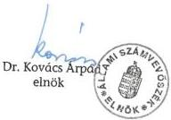
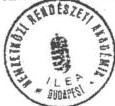
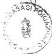
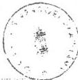

*Állami Számverőssék*---

# JELENTÉS

**a magyar rendőrségnél a Nemzetközi  
Rendészeti Akadémia (ILEA)  
finanszírozásával kapcsolatos  
pénzügyi-gazdasági ellenőrzésről**

---9836

**1998. SZEPTEMBER**

---

1. 2017年1月1日

[Non-Text]

[Non-Text]

[Non-Text]

[Non-Text]

[Non-Text]

[Non-Text]

[Non-Text]

[Non-Text]

[Non-Text]

[Non-Text]

[Non-Text]

[Non-Text]

[Non-Text]

[Non-Text]

[Non-Text]

[Non-Text]

[Non-Text]

[Non-Text]

[Non-Text]

[Non-Text]

[Non-Text]

[Non-Text]

[Non-Text]

[Non-Text]

[Non-Text]

[Non-Text]

[Non-Text]

[Non-Text]

[Non-Text]

[Non-Text]

[Non-Text]

[Non-Text]

[Non-Text]

[Non-Text]

[Non-Text]

[Non-Text]

[Non-Text]

[Non-Text]

[Non-Text]

[Non-Text]

[Non-Text]

[Non-Text]

[Non-Text]

[Non-Text]

[Non-Text]

[Non-Text]

[Non-Text]

[Non-Text]

[Non-Text]

[Non-Text]

[Non-Text]

[Non-Text]

[Non-Text]

[Non-Text]

[Non-Text]

[Non-Text]

[Non-Text]

[Non-Text]

[Non-Text]

[Non-Text]

[Non-Text]

[Non-Text]

[Non-Text]

[Non-Text]

[Non-Text]

[Non-Text]

[Non-Text]

[Non-Text]

[Non-Text]

[Non-Text]

[Non-Text]

[Non-Text]

[Non-Text]

[Non-Text]

[Non-Text]

[Non-Text]

[Non-Text]

[Non-Text]

[Non-Text]

[Non-Text]

[Non-Text]

[Non-Text]

[Non-Text]

[Non-Text]

[Non-Text]

[Non-Text]

[Non-Text]

[Non-Text]

[Non-Text]

[Non-Text]

[Non-Text]

[Non-Text]

[Non-Text]

[Non-Text]

[Non-Text]

[Non-Text]

[Non-Text]

[Non-Text]

[Non-Text]

---

Az ellenőrzés végrehajtásáért felelős:
az ÁSZ III. Költségvetési Ellenőrzési Igazgatósága

Bihary Zsigmond
számvevő igazgató

Az ellenőrzést vezette:

Hudik Zoltán
számvevő főtanácsos

Az ellenőrzést végezték:

Hámoriné Maróti Györgyi
számvevő

Számely Kornél
számvevő tanácsos

---

__________

---

Állami Számvevőszék

V-6-18/1998.

Témaszám: 428

# JELENTÉS

## a magyar rendőrségnél a Nemzetközi Rendészeti Akadémia (ILEA) finanszírozásával kapcsolatos pénzügyi-gazdasági ellenőrzésről

Az Amerikai Egyesült Államok Kormánya és a Magyar Köztársaság Kormánya 1995. áprilisában megállapodást kötött a Nemzetközi Rendészeti Akadémia (International Law Enforcement Academy, a továbbiakban: ILEA) budapesti székhellyel történő létesítéséről. A Magyar Kormány 2270/1995. (IX. 8.) Korm. határozatával jóváhagyta a megállapodást és intézkedett, hogy erről diplomáciai úton értesítsék az Amerikai Egyesült Államok Kormányát. A jóváhagyásról szóló jegyzékváltást (1995. november 3.) követően a megállapodást a 165/1996. (XI. 20.) Korm. rendelet kihirdette (továbbiakban: Megállapodás), ami ezzel magyar jogszabályi szintre emelkedett. Az ILEA-t létesítő kormányközi Megállapodás végrehajtására az Amerikai Egyesült Államok budapesti nagykövete és a Magyar Köztársaság belügyminisztere kötött megállapodást (továbbiakban: Vh. megállapodás).

Az ILEA-nál 1995. áprilisától 1998. májusáig összesen 15 alapkurzust és 52 un. kiskurzust szerveztek, összesen 636, illetve 1775 fő hallgatói létszámmal. Közöttük a magyar hallgatók száma 92, illetve 349 fő volt. (Az egy alapkurzus átlagos hallgatói létszáma 43 fő és az egy kiskurzusra jutó hallgatói létszám 34 fő volt.)

Az ILEA működését a felek pénzbeli hozzájárulással, természetbeni juttatással, szolgáltatásokkal és személyzet formájában támogatják a megállapodásokban rögzítettek alapján. Az amerikai fél viseli a működési költségek jelentős részét (oktatás és igazgatás teljes költségét, szállítási költségeket, stb.) A magyar fél - azon túl, hogy a rendőrség objektumában biztosít elhelyezést - elsősorban szolgáltatásokat végez (szállást, étkezést biztosít, beszerzéseket bonyolít le stb.), ezideig az amerikai fél utólagos térítésével. Mindkét fél egyetértésével találkozik az amerikai fél előlegezésén alapuló finanszírozási rendre történő áttérés, az ennek feltételeként támasztott követelmények teljesülése esetén.

---

1. 2017年，公司与上海浦东发展银行股份有限公司签订了《关于使用部分闲置募集资金进行现金管理的协议》。

[Non-Text]

[Non-Text]

[Non-Text]

[Non-Text]

[Non-Text]

[Non-Text]

[Non-Text]

[Non-Text]

[Non-Text]

[Non-Text]

[Non-Text]

[Non-Text]

[Non-Text]

[Non-Text]

[Non-Text]

[Non-Text]

[Non-Text]

[Non-Text]

[Non-Text]

[Non-Text]

[Non-Text]

[Non-Text]

[Non-Text]

[Non-Text]

[Non-Text]

[Non-Text]

[Non-Text]

[Non-Text]

[Non-Text]

[Non-Text]

[Non-Text]

[Non-Text]

[Non-Text]

[Non-Text]

[Non-Text]

[Non-Text]

[Non-Text]

[Non-Text]

[Non-Text]

[Non-Text]

[Non-Text]

[Non-Text]

[Non-Text]

[Non-Text]

[Non-Text]

[Non-Text]

[Non-Text]

[Non-Text]

[Non-Text]

---

Az ellenőrzés célja - az Amerikai Egyesült Államok budapesti nagykövetének kérésére figyelemmel - annak megállapítása volt, hogy a tervezett előlegezett finanszírozási rendszer bevezetéséhez a magyar rendőrség számviteli, nyilvántartási és ellenőrzési rendszere mennyiben felel meg.

Az ellenőrzés előkészítése azonban felszínre hozta, hogy a kormányközi megállapodásban előírt részletes szabályozások részben - elsősorban a gazdálkodást érintően - elmaradtak. A helyszíni ellenőrzés végrehajtása során egyértelművé vált, hogy az ILEA finanszírozásával összefüggésben feltárt problémák rendezése túlmutat a magyar rendőrségi szervek számviteli-pénzügyi rendszere szabályszerűségének vizsgálatán. Ezért ellenőrzésünkkel arra is választ kívántunk adni, hogy az ILEA működését finanszírozó pénzeszközök ellenőrizhetőségének érdekében milyen irányú - a hatályos magyar jogi szabályozással összhangban álló - intézkedésekre van szükség. Megállapításaink és javaslataink az érintettek álláspontjának közelítését kívánják elősegíteni.

Az ellenőrzés jogalapja az Állami Számvevőszékről szóló többször módosított 1989. évi XXXVIII. törvény 2. § (5) bekezdése.

A helyszíni ellenőrzés a Belügyminisztérium (BM) és az Országos Rendőrfőkapitányság (ORFK) ILEA finanszírozásában, illetve annak ellenőrzésében érintett szervezeteire terjedt ki. (A jelentésben hivatkozott szervezetek rövidített elnevezésének értelmezését a csatolt rövidítés jegyzék segíti.) Konzultációs megbeszélés történt adó-visszatérítési kérdésben az APEH illetékeseivel. Az ILEA vezetése konstruktív együttműködésével támogatta az ellenőrzés végrehajtását.

2

---

1

1

---

# MEGÁLLAPÍTÁSOK, KÖVETKEZTETÉSEK, JAVASLATOK

Az **ILEA** létesítéséről, feladatairól szóló Megállapodást kihirdető kormányrendelet megteremtette az intézmény működésének magyar jogszabályi alapját, ami a Polgári Törvénykönyvről szóló többször módosított 1959. évi IV. törvény (továbbiakban: Ptk.) megfogalmazásában **jogi személy jogszabályi létesítésének** tekinthető (29. § 1. bek.). A Megállapodás rögzítette, hogy az ILEA a tevékenységét az abban meghatározott feltételek szerint és a „Magyar Köztársaság törvényeivel és törvényes előírásaival összhangban végzi.”

A Vh. megállapodásban azonban a **gazdálkodás általános feltételeinek kialakításánál** nem kezelték kellő súllyal, hogy az intézmény önálló jogi személy illetve, hogy a tevékenységében közreműködő (a Megállapodás alapján szolgáltatást nyújtó, számlatulajdonos stb.) magyar szervek, szervezetek (BM, ORFK, RSZKK) a költségvetési szervekre vonatkozó gazdálkodási szabályok szerint kötelesek eljárni. Ezek **következményeként** alakultak ki az **elszámolások**, a **számlakezelés** és nem utolsó sorban az **ÁFA visszatérítés anomáliái**.

A **gazdálkodás szempontjából lényeges kérdések** az ILEA több éves működése alatt **szabályozatlanul maradtak** annak ellenére, hogy az alapdokumentumokban rendezésükre voltak utalások. Nem készült el az ILEA szervezeti és működési szabályzata, közösen nem készítettek éves költségvetést, nem működött a közös ellenőrzés és leltározás rendszere, nem teljesült az ÁFA visszatérítés, nem valósult meg minden ILEA célra beszerzett eszköz magyar tulajdonba kerülése stb.

Az ILEA, mint önálló jogi személy **gazdasági tevékenysége nem különült el** megfelelően a magyar rendőrség **költségvetési gazdálkodásától**. Nem volt önálló gazdálkodó szervezete, a pénzügyi folyamatok elemeit (elszámolás, utalványozás, könyvelés, számlavezetés) a BM és az ORFK különböző szervezeti egységei végezték. A kapcsolattartás lényegében a gazdálkodási hierarchia alacsonyabb szintjén funkcionáló rendőri szervezetekre (OKK illetve RSZKK) hárult. Mindezek az ILEA gazdálkodásának áttekinthetőségét és ellenőrizhetőségét nehezítették. További problémát jelentett, hogy a magyar fél előlegezésén alapuló finanszírozás nem illeszkedik a költségvetési szervek gazdálkodásánál 1996. évtől bevezetett (és azóta folyamatosan korszerűsített) kincstári rendszerhez.

---3

---

$$\therefore m = \frac{3}{11}$$

---

Alapvető problémaforrásnak tekinthető, hogy - egyértelmű szabályozás hiányában - az amerikai és magyar oldalról **eltérően értelmezték a gazdálkodási kérdésekben a felek részvételét**, kapcsolódó **feladataikat**, a közös költségvetést, a működéshez való hozzájárulást, valamint a normatív támogatásba tartozó tételeket. Hiányzott a működésben résztvevő szervek, intézmények jogainak, kötelezettségeinek (feladat és hatáskörének) pontos meghatározása és a megállapodásokban foglaltak teljesítésének következetes számonkérése. (Megállapodás 10. cikk 1. bekezdés és 2. bekezdés g, pont, 11-12. cikk, 17. cikk c-d, pont; Vh. megállapodás III. fejezet 2-3. pont.)

A felmerült hiányosságok a magyar fél részéről elsősorban a közreműködő **rendőri, belügyi szervek feladatainak koordinálatlanságára**, egyértelmű **definálatlanságára** vezethetők vissza. A gazdálkodással összefüggő tevékenységeket az amerikai és a magyar fél a megfelelő szabályozás hiányában számos nézeteltéréssel terhelve bonyolította le.

Ilyen körülmények között az amerikai fél előlegezésén alapuló finanszírozás bevezetésének elsődleges feltételét **az ILEA gazdálkodási rendjének közös kialakítása**, annak **érvényesítése** és nem kizárólag a magyar rendőrség pénzügyi számviteli rendje, elszámolási gyakorlatának szabályszerűsége **jelenti** (a magyar rendőri szervek előírásszerű gazdálkodása mellett sem teljesülhetnek automatikusan az ILEA gazdálkodásának áttekinthetőségét biztosító nyilvántartási követelmények).

Előrelépést jelentett, hogy ezév májusában - belügyminiszteri felhatalmazás alapján, a **közgazdasági helyettes államtitkár koordinálásával** és az **érintett belügyi és rendőri szervezetek közreműködésével - megkezdődött** a hiányosságok felszámolása, egy **működőképes rendszer kialakítása**. Ennek első eredményeként értékelhető az ILEA igazgatója és az ORFK gazdasági főigazgatója között létrejött „megbízási szerződés” (3. sz. melléklet). E szerződés alapján nyitott bankszámla lehetőséget ad az ILEA - amerikai támogatásból eredő - pénzforgalmának elkülönített kezelésére, az ÁFA visszaigénylések realizálására.

A gazdálkodással összefüggésben **további rendezést igényel**, hogy a **magyar fél** a normatív támogatás köréhez tartozó szolgáltatásokon túlmenően **milyen feladatokat lát el** (illetve megbízást kap), azokat **milyen szervezeti háttérrel valósítja meg**. (Az ILEA-ORFK szerződéssel a bankszámla rendelkezési jogának gyakorlásáról állapodtak meg, nem egyértelműek a megbízások teljesítésére kijelölt rendőri szervek közötti feladatmegosztások, de nem tisztázták a gazdálkodás kapcsán felmerülő egyéb feladatokat sem.) A magyar fél vállalásait, közreműködését az **ILEA működésének teljes keresztmetszetében szükséges tisztázni**, ennek alapján határozhatók meg és kérhetők számon a magyar fél hozzájárulásai.

Az önálló bankszámla nyitásával megvalósítható az ILEA gazdálkodásának leválasztása a rendőri szervek költségvetési gazdálkodásától. Ez egyben azt is igényli, hogy **meg kell határozni a Számvitelről szóló 1991. évi XVIII.**

4

---

1

1

---

törvény előírásaihoz igazodóan az ILEA-ra, mint önálló jogi személyre, a külön jogszabályban meghatározott egyéb szervezetre (2. § 3. bek. h, pont) vonatkozó beszámolási és könyvvezetési kötelezettségeket (11. § 2. bek., 12. § 6. bek.). Az ILEA a számviteli törvény alkalmazása szempontjából atipikus egyéb szervezetnek tekinthető, a beszámolási és könyvvezetési sajátosságairól ezideig jogszabály (mint pl. társadalmi szervezetekről, alapítványokról stb. esetében a 8/1996. (I. 24.) Korm. rendelet) nem rendelkezett (beleértve az ILEA létesítéséről szóló 165/1996. (XI. 20.) Korm. rendeletet is). Ugyanakkor e kötelezettségek meghatározásánál figyelembe vételre ajánlhatók a vállalkozási tevékenységet nem folytató társadalmi szervezetekre vonatkozó rendelkezések (8/1996. (I. 24.) Korm. rendelet II. fejezete).

Az ILEA gazdálkodási rendjében továbbra is a költségvetési gazdálkodás keretei között marad a magyar fél - végrehajtási megállapodás alapján nyújtandó - szolgáltatása, amit az amerikai fél a normatív támogatások figyelembe vételével számolhat el. Mind a normatív támogatás összegének meghatározása (évente esedékes korrekciója), mind a költségvetési gazdálkodás előírásai megkövetelik az elszámolások megalapozottságát, a ráfordítások egyértelmű kimutatását. Ez a szolgáltatást végző és annak gazdálkodását felügyelő költségvetési szervek (RSZKK, ORFK GEI) részére jelent feladatot.

Az ILEA-ORFK megbízási szerződéssel azért sem tekinthető befejezettnek a közös szabályozások folyamata, mert csak egyetértéssel határozható meg az amerikai fél ILEA célú pénzforgalmának és a magyar fél szolgáltatásainak, a költségvetési szerv (RSZKK) elszámolásának kapcsolódása, ennek ellenőrzési módja. A pénzügyi folyamatok tervezett elkülönítése az un. közös költségvetés újragondolását is igényli, mivel az ILEA bankszámla forgalma az amerikai fél költségvetésében tervezett kiadások teljesítését tükrözi, a magyar fél hozzájárulásaival és szolgáltatásaival összefüggő kiadásokat, illetve bevételeket a költségvetési gazdálkodás előírásainak megfelelően kell tervezni. Nem hagyható figyelmen kívül az új rendszer indításának azon feltétele sem, hogy az ILEA bankszámláján megfelelő összegű előleg álljon rendelkezésre a folyamatos működés céljaira.

Az ellenőrizhetőség alapvető feltétele, hogy egyértelműen meghatározott gazdálkodási tevékenységről szóljon a felek együttműködési megállapodása. Ez kérhető számon a - megfelelően dokumentált feltételek szerint - végrehajtandó közös ellenőrzésekkel, valamint a költségvetési körön belül előírt ellenőrzések útján. Már a gazdálkodási folyamat kialakításánál gondoskodni kell a munkafolyamatba épített ellenőrzés érvényesítéséről. A felügyeleti ellenőrzést - a költségvetési körön belüli kötelezettségei mellett - közös megegyezéssel elláthatja az ORFK felső vezetésének közvetlen alárendeltségébe tartozó szervezet (ORFK Felügyeleti Főosztály). Esetenként szükséges lehet, hogy a gazdálkodást a BM Ellenőrzési Főosztálya célellenőrzés keretében is áttekintse. (Meg kell jegyezni, hogy a gazdálkodás hiányosságai eddig sem az ellenőrzés hibájából alakultak ki.)

5

---

(1) 2017年，公司与上海浦东发展银行股份有限公司签订了《关于使用部分闲置募集资金进行现金管理的协议》。

1

1

[Non-Text]

[Non-Text]

[Non-Text]

[Non-Text]

[Non-Text]

[Non-Text]

[Non-Text]

[Non-Text]

[Non-Text]

[Non-Text]

[Non-Text]

[Non-Text]

[Non-Text]

The Ground Truth image displays a single, solid horizontal line. According to Rule 2 (UNDERSCORE & LINE RULES), this is a stylistic or background line, not a placeholder underscore. Therefore, the OCR result must ignore it and output nothing or only meaningful text. The provided OCR content is "____", which consists of four underscores. This is an incorrect interpretation of the line as a placeholder, violating the rule that stylistic lines must be ignored. The OCR has hallucinated underscores where none should exist based on the GT's visual context. Hence, the OCR result is inconsistent with the Ground Truth.

[Non-Text]

[Non-Text]

[Non-Text]

The Ground Truth image displays a single, solid horizontal line. According to Rule 2 (UNDERSCORE & LINE RULES), this is a stylistic or background line, not a placeholder underscore. Therefore, the OCR result must ignore it and output nothing or only meaningful text. The provided OCR content is "____", which consists of four underscores. This is an incorrect interpretation of the line as a placeholder, violating the rule that stylistic lines must be ignored. The OCR has hallucinated underscores where none should exist based on the GT's visual context. Hence, the OCR result is inconsistent with the Ground Truth.

[Non-Text]

[Non-Text]

[Non-Text]

[Non-Text]

[Non-Text]

[Non-Text]

[Non-Text]

[Non-Text]

[Non-Text]

[Non-Text]

[Non-Text]

1

[Non-Text]

[Non-Text]

[Non-Text]

[Non-Text]

[Non-Text]

[Non-Text]

[Non-Text]

1

[Non-Text]

[Non-Text]

[Non-Text]

[Non-Text]

[Non-Text]

[Non-Text]

[Non-Text]

[Non-Text]

[Non-Text]

---

Mindezek alapján, hogy bevezethető legyen az előlegezésen alapuló finanszírozás - a jelentésben részletezett megállapítások hasznosításra ajánlása mellett - javasoljuk:

Az amerikai és magyar fél közös szabályozás keretében - indokolt esetben a Vh. megállapodás módosításával - tegye egyértelművé:

a Megallapodás 10. cikk 1. bekezdésének konkret tartalmát és az ezzel jaró kõtelezettsegeket (közösenBiztositott penzbeni hozzájárulás, természetbeni juttatas, szolgaltatások, szemelyzet formajában megjelenő tamogatások);
a magyar fél - amerikai fél által igényelt - szolgáltatasait (Vh. megállapodás III. fejezet 2. pont), ezek kozott a normativa szerint elszámolhato teteleket, egyeb megrendelt és külön terített szolgáltatasokat, a magyar fél kozremúkódésevel lebonyolitando beszerzeseket, valamint ezek teritési felteteleit (Megállapodás 10. cikk 2. bek. g) pont, Vh. megállapodás III. fejezet 3. pont);
- az ILEA költségvetés fogalmi és tartalmi meghatározását (Megállapodás 17. cikk d, pont), ennek összefüggeseit az amerikai fél költségvetésével, illetve a magyar fél költségvetési gazdalkodását erintő igényeket;
- az amerikai fél elkūlönītett - ILEA celú - penzforgalmának, valamint a magyar fél által nyújtott szolgáltatasok elszámolásanak kapcsolódásat (Megállapodás 17. cikk c, pont);
a mindenkori gazdalkodasi rend keretei kozott kialakitando szamviteli nyilvantartasi rendszerrel szemben tamasztott kovetelmenyeket (Megallapodas 17. cikk c. pont), az ILEA szamara beszerzett eszkozok tulajdonba kerulésenek modjat (Megallapodas 11. cikk), a leltarozassal kapcsolatos feladatokat (Vh. megallapodas III. fejezet 3.4. pont);
- az ILEA szamára beszerzett vagy természetben juttatott vagyontárgyak hasznalatát, ezek kozott a Megallapodásban megengedett kivetelek felteteleit (Megallapodás 11. cikk 3. bek);
- az ILEA muködésével kapcsolatos Ellenörzesek vegrehajtásával szemben támasztott kovetelmenyeket, a kozös és az amerikai, illetve magyar fébre haruló feladatokat (Megallapodás 12. cikk).

# Az amerikai fél:

- az ILEA mindenkori jogi státuszához igazodó gazdálkodási rend figyelembe vételével alakítsa ki belső szervezetét és határozza meg a Szervezeti és Működési Szabályzatát;

6

---

The Ground Truth image displays a single, solid horizontal line. According to Rule 2 (UNDERSCORE & LINE RULES), this is a stylistic or background line, not a placeholder underscore. Therefore, the OCR result must ignore it and output nothing or only meaningful text. The provided OCR content is "____", which consists of four underscores. This is an incorrect interpretation of the line as a placeholder, violating the rule that stylistic lines must be ignored. The OCR has hallucinated underscores where none should exist based on the GT's visual context. Hence, the OCR result is inconsistent with the Ground Truth.

[Non-Text]

•

[Non-Text]

[Non-Text]

[Non-Text]

[Non-Text]

[Non-Text]

[Non-Text]

[Non-Text]

[Non-Text]

[Non-Text]

[Non-Text]

[Non-Text]

[Non-Text]

[Non-Text]

[Non-Text]

[Non-Text]

[Non-Text]

[Non-Text]

[Non-Text]

[Non-Text]

[Non-Text]

[Non-Text]

[Non-Text]

[Non-Text]

[Non-Text]

[Non-Text]

[Non-Text]

[Non-Text]

[Non-Text]

[Non-Text]

[Non-Text]

[Non-Text]

[Non-Text]

[Non-Text]

[Non-Text]

[Non-Text]

[Non-Text]

•

[Non-Text]

[Non-Text]

[Non-Text]

[Non-Text]

[Non-Text]

[Non-Text]

[Non-Text]

[Non-Text]

[Non-Text]

[Non-Text]

---

• gondoskodjon - a magyar fél közreműködésével - a számviteli előírásoknak megfelelően a beszámolási, könyvvezetési kötelezettségek meghatározásáról, a belső ellenőrzés feltételeinek kialakításáról és ezek érvényesüléséről.

# A magyar fél:

- tárcaşintenBiztositsa az ILEA mukodésével kapcsolatban a rea haruló feladatok koordinálásat, felügyeletét, a megallapodások esetenként szükséges módosításanak kezdéményezését az amerikai fél felé;
- az amerikai fellel kozosen kialakitott alapelvekhez igazodoan pontositsa vallalasait, kotelezettsegeit, amelyeket az erintett szervezetekre vonatkozo belso szabalyozasokban (SZMSZ, szamviteli politika, stb) is meg kell jeleniteni;
- az ILEA gazdalkodási rendjéhez igazóan alakítsa ki a költségvetési gazdalkodás kapcsolódo element (költségvetés tervezese, magyar hozzájárulások finanszírozása, nyilvántási és beszámolási kõtelezettsegek teljesítese, költségvetési és belso Ellenőrzések érvényesítese) és gondoskodjon az ügyviteli folyamatok szabályszerú kialakításáról, vegrehajtásáról;
- a normativa alapján terített magyar szolgáltatasokat megalapozott költségszámítással tamassza alá.

Budapest, 1998. szeptember 15

Melléklet: 15 lap

7

---

\[ \left\{ \begin{array}{l} \left\{ \begin{array}{l} \left\{ \begin{array}{l} \left\{ \begin{array}{l} \left\{ \begin{array}{l} \left\{ \begin{array}{l} \left\{ \begin{array}{l} \left\{ \begin{array}{l} \left\{ \begin{array}{l} \left\{ \begin{array}{l} \left\{ \begin{array}{l} \left\{ \begin{array}{l} \left\{ \begin{array}{l} \left\{ \begin{array}{l} \left\{ \begin{array}{l} \left\{ \begin{array}{l} \left\{ \begin{array}{l} \left\{ \begin{array}{l} \left\{ \begin{array}{l} \left\{ \end{array} \right. \end{array} \right. \end{array} \right. \end{array} \right. \end{array} \right. \end{array} \right. \end{array} \right. \end{array} \right. \end{array} \right. \end{array} \right. \end{array} \right. \end{array} \right. \end{array} \right. \end{array} \right. \]

---

# Rövidítések jegyzéke

ILEA

International Law Enforcement Academy,
magyar elnevezése Nemzetközi rendészeti
Akadémia (NRA)

BM

Belügyminisztérium

ORFK

Országos Rendőrfőkapitányság

ORFK FF

Országos Rendőrfőkapitányság Felügyeleti
Főosztály

ORFK GEI

Országos Rendőrfőkapitányság Gazdasági
Ellátó Igazgatóság

ORFK OKK

Országos Rendőrfőkapitányság Oktatási
Kiképző Központ

ORFK RSZKK

Országos Rendőrfőkapitányság Rendészeti
Szervek Kiképző Központ

---

(1) 2017年，公司与上海浦东发展银行股份有限公司签订了《关于使用部分闲置募集资金进行现金管理的协议》。

[Non-Text]

，

[Non-Text]

[Non-Text]

[Non-Text]

[Non-Text]

1. 2017年1月1日至2018年1月1日（含）的公司股票交易均价为4.56元/股，与前一交易日收盘价相比，涨幅为-0.97%。

[Non-Text]

[Non-Text]

[Non-Text]

[Non-Text]

[Non-Text]

[Non-Text]

[Non-Text]

[Non-Text]

[Non-Text]

[Non-Text]

[Non-Text]

[Non-Text]

[Non-Text]

[Non-Text]

[Non-Text]

[Non-Text]

[Non-Text]

[Non-Text]

[Non-Text]

[Non-Text]

1. 2017年1月1日至2018年1月1日（含）的公司股票交易均价为4.56元/股，与前一交易日收盘价相比，涨幅为-0.97%。

[Non-Text]

[Non-Text]

[Non-Text]

[Non-Text]

[Non-Text]

[Non-Text]

[Non-Text]

1

[Non-Text]

[Non-Text]

[Non-Text]

[Non-Text]

[Non-Text]

[Non-Text]

[Non-Text]

[Non-Text]

[Non-Text]

[Non-Text]

[Non-Text]

[Non-Text]

1

---

1. sz. melléklet

a V-6-18/1998. sz. jelentéshez

# a Nemzetközi Rendészeti Akadémia létesítéséről szóló kormányközi megállapodás

---

---

4

4

3

---

4

---

# Megállapodás

a Magyar Köztársaság Kormánya és az Amerikai Egyesült Államok Kormánya között Nemzetközi Rendészeti Akadémia létesítéséről

A Magyar Köztársaság Kormánya és az Amerikai Egyesült Államok Kormánya (a továbbiakban: Felek) attól az óhajtól vezetve, hogy

- a szervezett bűnözés elleni harcban a nemzetközi együttműködést elmélyítsék,

- a közép-kelet-európai országok rendőrségei és az amerikai rendőrségek közötti tevékenységet összehangolják,

- a szervezett bűnözés elleni harcban a résztvevők szakmai képzettségét fejlesszék,

az alábbiakban állapodtak meg:

# Meghatározások

# 1. Cikk

A jelen Megállapodás szerint:

a) a "Magyar Fél" a Magyar Köztársaság Kormányát jelenti,
b) az "Amerikai Fél" az Amerikai Egyesült Államok Kormányát jelenti.

# Az Akadémia létesítése, feladatai

# 2. Cikk

(1) A Felek a Magyar Köztársaságban Nemzetközi Rendészeti Akadémiát (a továbbiakban: Akadémia) hoznak létre.

(2) Az Akadémia a Nemzetközi Rendészeti Akadémia, Budapest, Magyarország - International Law Enforcement Academy, Budapest, Hungary nevet viseli. E megnevezést azonos módon használják táblákon, levelezésben, pecsétéken, programokon.

(3) Az Akadémia székhelye Budapesten van, az Országos Rendőrfőkapitányság Oktatási és Kiképző Központjában (a továbbiakban: Központ) (Budapest, XII. kerület Böszörményi u.21.)

(4) Az Akadémia a tevékenységét az e Megállapodásban rögzített feltételek szerint és a Magyar Köztársaság törvényeivel és törvényes előírásaival összhangban végzi.

---

- 2 -

# 3. Cikk

(1) Az Akadémia feladata:

gyakorlattal rendelkező rendészeti szakemberek, középszintű vezetők:

- szakmai továbbképzése,
- vezetőképzése,
- speciális elméleti és gyakorlati felkészítése a bűnügyi tudományok legújabb eredményei alapján, a bűnügyi technika legfejlettebb módszereinek és eszközeinek bemutatása révén,
- szakmai és tudományos tanácskozások rendezése.

(2) A két ország illetékes intézményei - az érvényes jogszabályokkal összhangban - segítik és támogatják az Akadémia munkáját feladatai ellátása érdekében.

# Az Akadémia szervezete

# 4. Cikk

(1) Az Akadémiát, az Amerikai Fél által kiküldött igazgató vezeti.

(2) Az igazgatón kívül az Amerikai Fél más munkatársakat is küldhet oktatói, oktatásszervezési, illetve igazgatási feladatokra.

(3) Az Akadémia jogi személy.

(4) Az Akadémiát az igazgató képviseli.

# 5. Cikk

(1) Az Akadémia maga határozza meg

a) belső szervezetét és működési szabályzatát,
b) rendtartását - az Akadémiának helyet adó Központ vezetőjével egyetértésben,
c) a felvételi követelményeket,
d) az oktatandó tárgyakat és
e) az oktatás módszereit.

(2) A továbbképzésre az Akadémia által kiadott pályázati felhívásban foglaltak szerint lehet jelentkezni.

(3) A pályázati felhívásban tájékoztatni kell a jelentkezőt, hogy felvétele esetén - magyarországi egészségügyi ellátása érdekében - biztosítás kell kötnie. E körülményt az Akadémia a felvétel után ellenőrzi.

(4) Az Akadémia feladata az egyes országok által benyújtott jelentkezési lista alapján a hallgatók kiválasztása.

---

- 3 -

(5) A továbbképzést sikeresen befejező hallgatók számára az Akadémia oklevelet állít ki. Az oklevél iskolai végzettséget vagy szakképzettséget nem igazol.

# 6. Cikk

Az Akadémia személyi állományát

a) az igazgató,
b) az oktatás szervezését, az igazgatási tevékenységet végző személyzet,
c) az oktatási tevékenységet ellátó (állandó és szerződéses) oktató, és
d) a hallgatók alkotják.

# Az Akadémia működéséhez szükséges tárgyi feltételek

# 7. Cikk

(1) A Magyar Fél biztosítja a Magyar Állam tulajdonát képező ingatlanon, a 2. Cikk (3) bekezdésében megnevezett Központ területén és kijelölt épületeiben az Akadémia működéséhez szükséges feltételeket; hozzájárul annak a jelen Megállapodásban meghatározott célokra való átalakításához és felújításához.

(2) A megfelelő létesítmények kialakításához a szükséges költségeket a Felek legfeljebb három millió (3.000.000) USD-ra becsülik. Ez magában foglalja az előkészítési és megvalósítási költségeket, valamint az Akadémia által használt épületek és épületrészek első berendezének költségeit is.

(3) A Felek vállalják, hogy a (2) bekezdésben megjelölt átalakítási, felújítási költséget, az alább megjelölt arányban, közösen viselik.

(4) Abban az esetben, ha a felújítás tényleges költsége kevesebb lesz, mint három millió USD, a Felek hozzájárulása ugyanolyan arányban csökken, mint amilyen arányban a felújításhoz a jelen Megállapodásban foglaltak szerint hozzájárultak.

(5) A Felek vállalják, hogy támogatják a jelen Megállapodás valamennyi rendelkezésének végrehajtását a hatálybalépés időpontjától a 18. cikk (1) bekezdésére tekintettel.

---

- 4 -

# A támogatás összege és felhasználása

# 8. Cikk

(1) a) Az Amerikai Fél kötelezettséget vállal arra, hogy kétmillió-ötszázezer (2.500.000) USD-ral járul hozzá az Akadémia működéséhez szükséges létesítmények költségeihez, mely magában foglalja az épületek felújításának teljes költségét, beleértve az előkészítési, a kivitelezési és a berendezéssel kapcsolatos kiadásokat.

b) A Felek között egyetértés van abban, hogy az (1) bekezdés a) pontjában megfogalmazott, és az Amerikai Fél hozzájárulását jelentő összeg magában foglalja azt a százhuszezer (120.000) USD összegű előzetes hozzájárulást, melyről a Felek 1995. április 7-én Megállapodást kötöttek, s amelyet a jelen Megállapodás szerves részének tekintenek.

(2) Az Amerikai Fél az (1) bekezdésben vállalt hozzájárulását - a Magyar Féllel közösen megállapított ütemezés szerint - a Belügyminisztérium Magyar Nemzeti Banknál vezetett, nem kamatozó 'Nemzetközi Rendészeti Akadémia, felújítási célú' számlájára utalja át. A Magyar Fél időszakos elszámolását, s a számlamásolatokat az Amerikai Félnek megküldi.

# 9. Cikk

(1) A Magyar Fél kötelezettséget vállal arra, hogy az épületek teljes felújítási költségeihez legfeljebb ötszázezer (500.000) USD-nak megfelelő forinttal járul hozzá - a jelen Megállapodás aláírásának napján érvényes árfolyamon számítva, mely magában foglalja az előkészítési, a kivitelezési és a berendezési költségekkel kapcsolatos kiadásokat.

(2) A Magyar Fél felelős minden tervezési, előkészítési, kivitelezési szolgáltatásért, amely a teljes átalakítási munkálatok megvalósításához szükségesek, továbbá biztosítja a kivitelezés teljes felügyeletét. Ezen munkálatok megvalósításához a Magyar Fél szerződést köt megfelelő tervezőkkel és kivitelezőkkel.

(3) A Magyar Fél a tervező, majd a kivitelező szervezet meghívásos pályázat keretében történő kiválasztásába, valamint a kivitelezés ellenőrzésébe bevonja az Amerikai Fél megbízottját.

---

- 5 -

# - Az Akadémia működése

# 10. Cikk

(1) A Felek megállapodnak abban, hogy az Akadémia működését közösen biztosítják:

- pénzbeni hozzájárulással,
- természetbeni juttatással,
- szolgáltatásokkal vagy
- személyzet formájában támogatják a jelen Megállapodásban, továbbá a végrehajtási megállapodásban meghatározottak szerint.

(2) Az Amerikai Fél biztosítja

a) az Akadémia működéséhez szükséges oktatási, igazgatási személyzetet és viseli annak teljes költségét;

b) viseli a képzési program során igénybe vett tolmácsok költségeit;

c) hallgatók formaruhával való ellátásának költségeit, a végrehajtási megállapodásban foglaltak szerint;

d) az igazgatási és oktató személyzet elhelyezését szolgáló irodák berendezésének, továbbá

e) a hallgatók és a személyzet szállításával összefüggő költségeket;

f) az oktatáshoz szükséges segédanyagokat és szemléltető eszközöket;

g) megtéríti a Magyar Fél által nyújtott működési szolgáltatások ellenértékeként - hallgatónként és naponta megállapított normatíva szerint. A magyar hallgatók költségeit a Magyar Fél fedezi. A normatív támogatás mértékét a Felek felhatalmazott képviselői naptári évenként felülvizsgálják és szükség szerint módosítják.

(3) A Magyar Fél szolgáltatásokat nyújt az Akadémia működéséhez az Amerikai Fél térítése ellenében. E szolgáltatások felsorolását a végrehajtási megállapodás tartalmazza.

---

- 6 -

(4) Az Amerikai Fél a (2) és a (3) bekezdésben vállalt pénzügyi hozzájárulását - a Magyar Féllel közösen megállapított ütemezés szerint - a Belügyminisztérium Magyar Nemzeti Banknál vezetett, nem kamatozó 'Nemzetközi Rendészet: Akadémia-működési célú' - számlájára utalja át. A Magyar Fél a működési kiadásokról és egyéb kiadásokról szóló időszakos elszámolását, illetőleg a keletkezett számlák másolatait az Amerikai Félnek megküldi.

# Tulajdonjog, a támogatás célhozkötöttsége

# 11. Cikk

(1) Valamennyi vagyontárgyon, amelyet az Amerikai Fél által nyújtott pénzügyi támogatásból vásároltak, illetve annak eredményeként jött létre, továbbá amelyet természetben juttattak, a Magyar Fél szerez tulajdonjogot a vásárlás időpontjában, illetőleg annak a Magyarországra érkezése időpontjában.

(2) Az (1) bekezdésben megjelölt valamennyi vagyontárgyat a jelen Megállapodás céljaira kell felhasználni.

(3) Mindazokat az (1) bekezdésben megjelölt vagyontárgyakat, illetve azok értékét, amelyeket a jelen Megállapodás céljaitól eltérő célra használtak - kivéve, ha a Felek ettől eltérően állapodtak meg - a Magyar Fél köteles az Amerikai Félnek felajánlani, illetve visszafizetni.

# Az együttműködés módszerei, ellenőrzés

# 12. Cikk

(1) Mindkét Fél jogosult arra, hogy

a) ellenőrizze mindazt a vagyontárgyat, amelyet az illető Fél hozott létre vagy támogatott a jelen Megállapodás keretein belül, annak érdekében, hogy eldöntse, azt a jelen Megállapodásban foglaltak szerint használták fel, illetve, hogy

b) felülvizsgáljon vagy ellenőrizzen minden olyan okmányt vagy számlát, amelyet a jelen Megállapodás alapján állítottak ki pénzösszegekről, ingóságokról vagy szolgáltatásokról, azért, hogy megállapítsa, azok megfelelnek a jelen Megállapodás feltételeinek.

---

- 7 -

(2) A Felek megegyeznek abban, hogy évente együtt ellenőrzik a Megállapodás végrehajtását, valamint, hogy rendszeres idő-közönként ellenőrzéseket végeznek a jelen Megállapodás fennállásának teljes időtartama alatt. Mindkét Fél megfelelően képzett szakembereket biztosít a folyamat ellenőrzésére és értékelésére.

(3) A Felek átadják egymásnak mindazokat a fontos, rendelkezésükre álló információkat, amelyek a jelen Megállapodásban foglaltak megvalósulásának értékeléséhez szükségesek.

(4) A jelen Megállapodásban rögzített támogatás felhasználásaként meghatározott idő lejártakor a Felek átfogó jelentést készítenek. Az átfogó jelentés tartalmazza az Amerikai Fél, illetve a Magyar Fél által rendelkezésre bocsátott eszközök listáját, a végrehajtott tevékenységek ügyiratait, valamint az elért célokat és az azokkal kapcsolatos alapvető adatokat.

### 13. Cikk

Mindkét Fél a saját belső jogi előírásainak megfelelően bocsátja rendelkezésre a jelen Megállapodáshoz szükséges anyagi és egyéb támogatásokat:

#### Kiváltságok, mentességek, kedvezmények

### 14. Cikk

(1) A Magyar Fél kötelezettséget vállal arra, hogy biztosítja az Akadémia céljaként szolgáló épületek átalakításához, felújításához és az intézmény folyamatos működtetéséhez felhasználásra kerülő szolgáltatások, áruk, ellátmányok, berendezések, vagy egyéb vagyon vámoktól, importadóktól, forgalmi adótól és bármi egyéb hasonló adóktól és terhektől mentesen importálhatók, vásárolhatók, használhatók és kivihetők.

(2) Az Akadémia jelen Megállapodásban foglalt feladatainak és működtetésének megvalósításáért felelős bármely magyar költségvetési szerv mentes mindazon adótól, illetve befizetési kötelezettségektől, amellyel Magyarország vagy bármely szervezeti egysége vet ki a jelen Megállapodás rendelkezéseiben foglaltak megvalósításából eredő bevétel, illetve jövedelem tekintetében. Az egyéb magyarországi tevékenységekből származó bevétel, illetve jövedelem nem mentes a magyarországi jogszabályok szerinti adózás, illetve befizetési kötelezettség alól.

---

- 8 -

(3) Az Akadémia átalakítási és kivitelezési munkálatainak kiadásait terhelő, valamint a működtetéshez szükséges belföldi beszerzések forgalmi adója (ÁFA) nem mentes a fizetési kötelezettség alól, azonban a Magyar Fél ezt az adót (ÁFA-t) ésszerű visszafizetési rendben megtéríti.

(4) A jelen Megállapodás ÁFA-ra, illetve az ÁFA visszatérítésre vonatkozó rendelkezéseit az 1995. január 1-jét követő beszerzésekre lehet alkalmazni.

#### 15. Cikk

A Magyar Fél megadja a legkedvezőbb hivatalos átváltási értéket ezen Megállapodás végrehajtásához az Amerikai Fél részéről nyújtott pénzügyi alapoknak helyi pénznemre történő összes átváltása esetén.

#### 16. Cikk

(1) A 6.cikk a) pontjában említett igazgató az Amerikai Fél budapesti Nagykövetségének diplomáciai tagja.

(2) A 6.cikk b) pontja szerinti állandó személyzet az Amerikai Fél budapesti Nagykövetségének igazgatási és műszaki személyzete tagjai közé tartoznak.

(3) A 6.cikk c) pontja szerinti oktatók – amennyiben nem magyar állampolgárok, illetőleg akik nem magyarországi állandó lakosok – az alábbi mentességekben és kedvezményekben részesülnek:

a) az Akadémiától származó jövedelem tekintetében mentesek a magyar törvények szerint kivetett bármely adók alól;

b) minden illeték, vámkezelési díj, vám jellegű fizetési kötelezettség, importadó, ÁFA és egyéb hasonló adók és terhek alól, amelyeket a Magyarországra érkezésük napjától számított hat hónapos időszakon belül az ilyen személyek személyes használata céljából importált személyi tárgyakra vagy háztartási cikkekre állapítanak meg, beleértve családonként egy személygépkocsit, és az ilyen személyes tárgyakat vagy háztartási cikkeket Magyarországon adómentesen lehet használni és az országból kivinni;

c) a lakása után fizetendő bérlet vagy egyéb, a bérlettel összefüggő adók alól;

---

- 9 -

d) mentesek a társadalombiztosítási díj fizetésének, - és a munkavállalási engedély megszerzésének kötelezettsége alól;

e) díjmentes vízumra - mellőzve a személyes benyújtás kötelezettségét - és a szolgálattétel időtartamára érvényes - egyszerűsített eljárásban, díjmentesen kiadott - tartózkodási engedélyre jogosultak.

(4) A 6.cikk d) pontjában említett hallgatók - amennyiben nem magyar állampolgárok, illetőleg nem magyarországi állandó lakosok - az alábbi mentességekben és kedvezményekben részesülnek:

a) mentesül minden illeték, vámkezelési díj, vám jellegű fizetési kötelezettség alól, a tanulmányok idejére magukkal hozott személyi tárgyak tekintetében, beleértve személyenként egy darab személygépkocsit is és az ilyen személyes tárgyakat Magyarországon adómentesen lehet használni és az országból kivinni;

b) díjmentes, többszöri beutazásra, 90 napos tartózkodásra jogosító hivatalos célú - tanulmányok folytatására szóló - vízumra, mentesítve a személyes benyújtás kötelezettsége alól.

(5) A (1), (2), (3) bekezdésben említett személyek családtagjait - amennyiben nem magyar állampolgárok vagy magyarországi állandó lakosok - velük azonos jogosultságokat élveznek.

(6) Az (4) és a (5) bekezdésben említett személyek adatait az Amerikai Fél - budapesti diplomáciai testülete útján - Magyarországra történő érkezésük előtt, kellő időben közli a Magyar Fél képviselőjével.

# A végrehajtás szabályai

# 17.Cikk

A Felek erre felhatalmazott képviselői a jelen Megállapodás végrehajtását külön megállapodásban szabályozzák, amelyben többek között meghatározzák:

- a) az illetékes szerveket, valamint a tájékoztatás és az eljárás módját,
- b) az Akadémia épületének kialakításához, továbbá annak folyamatos működéséhez szükséges további részletes szabályokat, illetőleg szolgáltatásokat,
- c) a szükséges nyilvántartásokat, az elszámolás szabályait,
- d) az Akadémia éves költségvetését.

---

- 10 -

# A Megállapodás módosítása, hatálybalépés

# 18. Cikk

(1) Ez a Megállapodás azon a napon lép hatályba, amikor a Felek diplomáciai úton, írásban tájékoztatják egymást arról, hogy eleget tettek a hatálybalépéshez szükséges belső jogi előírásoknak.

(2) Ezt a Megállapodást határozatlan időre kötik. A jelen Megállapodást bármelyik Fél diplomáciai úton, írásban felmondhatja, amely esetben a Megállapodás a felmondás kézhezvételét követő kilencvenedik napon hatályát veszti.

(3) A jelen Megállapodás módosítását bármelyik Fél diplomáciai úton kezdeményezheti.

# Vegyes rendelkezések

# 19. Cikk

(1) A jelen Megállapodás 8. és 9. cikkében a Felek által vállalt pénzügyi hozzájárulás 2000. szeptember 30-áig használható fel.

(2) Ha a Megállapodás megszüntetésére 2000. szeptember 30-a előtt, a Magyar Fél súlyosan szerződésszegő magatartása miatt kerül sor, a tulajdonába került javaknak az időközi értékcsökkenéssel korrigált ellenértékét köteles a Magyar Fél az Amerikai Félnek megtéríteni.

(3) A jelen Megállapodás megszűnése esetén a Felek elszámolnak egymással. A szerződés megszűnése a szerződés fennállása alatt érvényesen vállalt kötelezettségekért való helytállást nem érinti.

Készült Budapesten, 1995. ... -napján, két eredeti példányban, magyar és angol nyelven, mindkét nyelvű szöveg egyaránt hiteles.

A Magyar Köztársaság
Kormánya nevében

Az Amerikai Egyesült Államok
Kormánya nevében

---

01/07/11:55 1 118 9719

Min. of Interior

002

# Memorandum of Understanding

between the Government of the Republic of Hungary
and the Government of the United States of America
on some aspects of contribution to the foundation
of the International Law Enforcement Academy, Budapest

1. The Government of the United States of America (American Party) hereby agrees to provide to the Government of the Republic of Hungary (Hungarian Party) dollars 120,000 for partial funding of the renovation of the building of the International Law Enforcement Academy in Budapest, Hungary.

2. The Hungarian Party agrees to acquire services necessary for starting the renovation of the building of the International Law Enforcement Academy in Budapest, Hungary. The Hungarian Party also agrees to provide a report to the Embassy of the United States of America in Budapest accounting for expenditures of the fund provided.

The signatory Parties hereby agree on behalf of their respective governments to carry out the provisions of this Agreement.

Done at Budapest on the 7th day of April 1995, in duplicate, in the Hungarian and English languages, both texts being equally authentic.

For the Government of the
Republic of Hungary

For the Government of the
United States of America

---

1

4

---

2. sz. melléklet

a V-6-18/1998. sz. jelentéshez

# Megállapodás
a Nemzetközi Rendészeti Akadémia létesítéséről szóló
kormányközi megállapodás végrehajtásáról

---

1. 2017年，公司与上海浦东发展银行股份有限公司签订了《关于使用部分闲置募集资金进行现金管理的协议》。

[Non-Text]

•

[Non-Text]

[Non-Text]

[Non-Text]

[Non-Text]

[Non-Text]

[Non-Text]

[Non-Text]

[Non-Text]

[Non-Text]

[Non-Text]

[Non-Text]

[Non-Text]

[Non-Text]

[Non-Text]

[Non-Text]

[Non-Text]

[Non-Text]

[Non-Text]

[Non-Text]

[Non-Text]

1

[Non-Text]

[Non-Text]

[Non-Text]

[Non-Text]

[Non-Text]

[Non-Text]

[Non-Text]

[Non-Text]

[Non-Text]

[Non-Text]

[Non-Text]

[Non-Text]

[Non-Text]

[Non-Text]

[Non-Text]

[Non-Text]

[Non-Text]

[Non-Text]

[Non-Text]

[Non-Text]

[Non-Text]

[Non-Text]

[Non-Text]

[Non-Text]

[Non-Text]

[Non-Text]

---

# Megállapodás

a Magyar Köztársaság Kormánya, valamint az Amerikai Egyesült Államok Kormánya között létrejött, a Nemzetközi Rendészeti Akadémia létesítéséről szóló Megállapodás végrehajtására

A Magyar Köztársaság belügyminisztere, valamint az Amerikai Egyesült Államok budapesti nagykövete (a továbbiakban: Felek) a Magyar Köztársaság Kormánya és az Amerikai Egyesült Államok Kormánya között létrejött, a Nemzetközi Rendészeti Akadémia létesítéséről szóló Megállapodás (a továbbiakban: az Akadémia létesítéséről szóló Megállapodás) 17. cikkében foglaltak alapján az alábbiak szerint állapodtak meg:

# I. Tájékoztatási kötelezettség

1. A Nemzetkozi Rendészeti Akadémia (a továbbiakban: Akadémia) igazgatója
1.1 évente tajékoztatja a Magyar Köztársaság belügyminiszterét (a továbbiakban: Magyar Fél) a továbbék Pészési formákrol, azok programjáról (Megállapodás 5. cikk);
1.2 az Akadémia szabályzataról és rendtartásáról, a felvételi követelényekröl és a pályázati felhivásröl (Megállapodás 5. cikk);
1.3 kurzusonkent es orszagonkent a felvett hallgatokrol (Megallapodas 5. es 16. cikk);
1.4 a felvett hallgatok egészsegügyi ellatasát szolgáloBiztositásaról (Megallapodás 5. cikk);
1.5 az Akademia szemelyzeterol (6. cikk c-d/ pont, 16. cikk /6/ bekezdés).

---

- 2 -

2. Az Amerikai Egyesült Államok budapesti nagykövete (a továbbiakban: az Amerikai Fél) kijelöli az Akadémia célját szolgáló épületek átalakításával, felújításával, felszerelésével összefüggő kérdésekben a kapcsolatot tartó, felelős szervezeteket és személyeket.

3: A Felek a jelen Megállapodás hatályba lépését követő legrövidebb idő alatt, írásban közlik egymással az Akadémia létesítéséről szóló Megállapodás és a jelen Megállapodásban foglaltak teljesítése érdekében aláírásra, utalványozásra, ellenjegyzésre jogosultak nevét, beosztását.

## II. Az Akadémia épületének kialakításával összefüggő feladatok

1.1 Az Akadémi működéséhez szükséges szakmai-oktatási, műszaki, technikai feltételeket, beleértve az épületek átalakításának igényét, a Felek közösen állapítják meg. Ez a közösen kidolgozott dokumentum a tervezés alapja;

1.2 a Magyar Fél részéről az Akadémia létesítéséről szóló Megállapodás 9. cikk (2) bekezdésében vállalt kötelezettségeket a Belügyminisztérium Építési és Beruházási Osztálya irányításával a BM Beruházási Iroda (a továbbiakban: a Beruházó) teljesíti.

2. Az átalakítás, felújítás terveit készítő szervezet kiválasztása a pályázatok elbírálásakor történik, ennek pontos időpontjáról és helyéről a Beruházó kellő időben értesíti az Amerikai Fél kijelölt képviselőjét.

3. A tervezési munka az alábbiakat foglalja magába:

- - a meglévő épületek állapotfelmérése,
- - beruházási programjavaslat,
- - engedélyezési tervdokumentációk elkészítése, az engedélyek iránti kérelem benyújtása,
- - a kivitelezési zártkörű pályázathoz szükséges tenderdokumentáció összeállítása, megfelelő példányszámban történő átadása,
- - a tenderdokumentációt véglegesítés előtt tervzsűrin kell elfogadtatni a megrendelővel,
- - a kivitelezési tervdokumentáció,
- - a tervezői művezetés a kivitelezés során.

---

95 04/25 15:05 1384725

BM Jogi Osztály +++ ORFK KKO

013

- 3 -

4. Az elokeszto tevekenyseg soran a Felek a tudomasukra jutott informaciokat bizalmasan kezelik, azokat harmadik szemely reszereCsak a szukseges es elengedhetlen mertekig, a megbizo hozzajarulasaval adhatjak at (epitesi engedely, kozmvek stb.).
5. Különleges kikötesek:
5.1 a tervezés során tartott egyeztetešekrol emlékeztető keszül magyar és angol nyelven;
5.2 a szolgaltatott munkakozi és egyeb tervdokumentaciokat magyar és angol feliratozással késztík, a szöveges részek pedig mindkét nyelven, amelyet a Feleknek át kell adni.
6. A tervezési tevekenység idöbeli utemezese: a tervezöi ajánlat keszítese, a tervezö kivalasztása, az allapotfelmerés, a programterv, a jováhagyás és a veglegesités, a tenderterv, valamint az észrevételezés és a veglegesités, továbbá a generalkivitelezöi tender mintegy 15 hetet igényel.
7. A kivitelező szervezet kivalasztása a 2. pontban megfogalmazott modon, a tervező szervezethez hasonloan történik.
8. A kivitelezés varhato idöartama 4 hönap, melyet az ajánlatok teljeskörü ismeretében a Felek erre feljogositott megbizottai pontositanak.
9. A felujitás teljeskörú megvalósítása (beleérte a tervezést is) varhatoan 8 hónap.
10. A Beruházó az Akadémia létesitéséról szólo Megállapodás 8. cikk (2) bekezdésében megjelölt idószakos elszámolását a kozösen meghatározott utemezes szerint, magyar nyelven késziti el és ezeket, valamint a számlák masolatait megküldi az Amerikai Félnek. A záró, ertékelő jalentés magyar és angol nyelven készül.
11. A Magyar Fél részeröl, az Akadémia létesitéséról szólo Megállapodás 9. cikk (1) bekezdésében vallalt kõtelezettseget az Országos Rendörfokapitányság (a továbbiakban: ORFK) teljesiti a

---

- 4 -

Magyar Fél hozzájárulása arányában és a felújítás megvalósításának üteme szerint.

12. E hozzájárulást az ORFK úgy teljesíti, hogy a Beruházó által benyújtott számlákat 5 munkanapon belül kiégyenlíti és gondoskodik azok elkülönített nyilvántartásáról.

13.1 Az Amerikai Fél az Akadémia létesítéséről szóló Megállapodás 8. cikk (1) bekezdésében vállalt kötelezettségét hozzájárulása arányában teljesíti.

13.2 Az Amerikai Fél az előre tervezhető kiadások fedezetét az Akadémia létesítéséről szóló Megállapodás 8. cikk (2) bekezdésében foglaltak szerint utalja át a Belügyminisztérium Magyar Nemzeti Banknál vezetett "Nemzetközi Rendészeti Akadémia, felújítási célú" számlájára.

# III. Az Akadémia működésével összefüggő feladatok

1. A Magyar Fél részéről az Akadémia létesítéséről szóló Megállapodás 10. cikkében vállalt kötelezettségeket az ORFK teljesíti.

2. A Magyar Fél által nyújtott szolgáltatások az alábbiak:

2.1 Szállás, illetve az azokkal kapcsolatos szolgáltatások

a) kollegium elhelyezes az Akademia hallgatoi szamara - egyidejuleg legfeljebb 100 f; a szukseges vilagitas, futes, hideg-melegviz szolgaltatas;
b) a hallgatók ellatása tisztkodási felszerelésekkel, agynemüvel, törulközövel, ezek mosása és cseréje;
c) a halótermek takarítása, szemétszállítás, teritésmentes mosási-szárítási és vasalási lehetőseg a hallgatók szárára;

---

- 5 -

d) az épületek karbantartása, a tantermek légkondicionálása, kisebb bútor, illetve irodaberendezési tárgyak javítása, vízvezetékszerelési, villamossági, fűtési, telefonrendszerbeli, kulcs, illetve zárral kapcsolatos javítások és installációi, épületeken kívüli karbantartás, beleértve a hóeltakarítást, illetve a fűnyírást;

e) 24 órás őrzési szolgálat a épületkomplexumban;

f) a hallgatók számára televíziónézési lehetőség a közösségi helyiségekben;

g) fizető telefonok felállítása a hallgatók saját költségen történő használatára. (Az Amerikai Fél által kiküldött személyzet megtéríti az általa felmerülő helyi és távolsági telefonhasználati és telefax költségeket.);

h) elsősegély munkanapokon, napi 8 órában.

# 2.2 Étkezés

a) napi étkezés az összes tanfolyamon résztvevő hallgató, személyzet, tanácsadó és előadó számára;

b) az étkezés tartalmazza a reggelit, az ebédet, illetve a vacsorát. Az étkezési lehetőségeket hétvégeken, illetve ünnepnapokon is biztosítja. Az épületkomplexumon belül automatákat helyez el.

# 2.3 Szállítás

a) koordinálja, illetve lehetővé teszi az érkező, illetve távozó hallgatók és a személyzet repülőtérre, vasútállomásra, illetve buszmegállóhoz történő szállítását;

b) koordinálja, illetve lehetővé teszi 3 hétvégi programmal kapcsolatos szállítást a 8 hetes képzési program folyamán;

---

- 6 -

c) szükség esetén - megállapított tarifák alapján, külön térítés ellenében - gépkocsikat és mikrobuszokat biztosít a program céljaira. Napi térítés ellenében parkolási lehetőséget biztosít a hallgatóknak az épületkomplexumon belül.

## 2.4 Oktatási anyagok és felszerelések

a) biztosítja a hallgatók számára szükséges oktatási anyagokat, füzetet, papírt, írószert, amelyek megfelelnek az üzleti életben, illetve az oktatásban Magyarországon használt általános minőségnek;

b) azonosító kitűzővel látja el a diákokat, illetve a személyzetet, akik azt állandóan kötelesek viselni, amikor az épületkomplexumban tartózkodnak. Az azonosító kitűző tartalmaz egy fényképet, a hallgató nevét, az adott kurzust, az Akadémián való részvétellel kapcsolatos információt, valamint az érvényesség dátumát;

c) a hallgatók számára biztosítja az Amerikai Fél által finanszírozott formaruhákat. Ezek a következők: hallgatónként 1 sapka, 2 rövidújú ing, 1 pulóver, 1 derékszíj, 1 pár cipő, 2 nadrág, 1 sporttrikó és nadrág, 1 melegítő alsó-felső, 6 pár zokni. (A továbbképzés befejezése után a hallgatók a formaruhát megtarthatják.)

## 2.5 Tolmácsolás

Amennyiben az Amerikai Fél ezt igényli, koordinálja, illetve szolgáltatja a tolmácsokat a képzési programhoz, melynek költségeit az Amerikai Fél viseli.

## 2.6 Egyéb szolgáltatások

a) irodáhelyiség a képzésben résztvevő igazgatási személyzet számára (legfeljebb: 4 személy), továbbá az oktatók számára (egyidejűleg legfeljebb: 9 fő);

b) helyet és szolgáltatást a könyvtárban a programmal kapcsolatos oktatási, képzési könyvek és anyagok számára;

---

05 04/25 15:08 1384725

BM Jogi Osztály +++ ORFK KKO

017

- 7 -

c) az ORFK Oktatasi es Kikepz Kozpont szamitogepes oktatasi lehetosegeinek igenybevelet et az Akademia tanterve szerint;
d) masológep hasznalatá a diakok szamára oktatási igényeik szerint;
e) tárolási területet az Akadémia személyzete számára iroda, osztálytermi berendezésk, illetve egyeb oktatási anyagok tárolása celjából;
f) audiovizuális technikust osztálytermi, illetve auditoriumi szolgáltatasok vegzéséhez.

# 3. Pénzügyi kérdések:

3.1 A Magyar Fél az. altala teljesitett szolgaltatasok és egyeb kiadások költségeiról az Akademia letesitéséról szólo Megallapodás 10. cikk (4) bekezdésben foglaltak szerint, havonta számol el az Amerikai Félnek. Az időszakos elszamolást és a szamlákat magyar nyelven készít i el.
3.2 A Magyar Fél által nyújtott szolgáltatasok Ellenértekeként megallapitott normativ támogatas összege 1995-ben hallgatónként és naponta 50 (ötven) USD. (Megallapodás 10. cikk (2) bek. g) pontja). A Felek a normativ támogatas összegét minded évben a naptári év befejezese elott 1 hónappal megvizsgálják és dontenek annak szükség szerinti modositásáról.
3.3 Az Akademia éves költségvetését (mely tartalmazza a folyamatos muködtétés normativ költségeit, egy-egy kurzus költségét, az allando és egyszeri költségeket) a Felek a naptári év indulása elott legalább 1 hónappal korabban egyeztetik. A költségvetés a jelen Megallapodás melleklete, s az évente jováhagyott költségvetest a Megallapodáshoz kell csatolni. Az 1995. naptári évre vonatkozo költségvetest a jelen Megallapodás hatályba lépésétól számított két héten belül el kell készǐteni.
3.4 Az Akademia letesitéserol szoló Megallapodás 12. cikk (2) bekezdésben foglalt éves ellenörzs magaban foglalja az Akademia muködéshez szükséges eszközok leltározását is.

3.5.

---

'95 04/25 15:09

1384725

BM Jogi Osztály +++ ORFK KKO

016

- 8 -

4. Az Akadémián használt eszközök, berendezések későbbiekben esetleg szükségessé váló pótlásáról a Felek az éves költségvetés kidolgozása során állapodnak meg.

5. Az Amerikai Fél elfogadja a Magyar Fél belső jogszabályaiban meghatározott nyilvántartási, elszámolási rendet.

6. Az ORFK vállalja, hogy az Akadémia létesítéséről szóló Megállapodás 6. cikk a-c) pontjában megjelölt személyek részére, magyarországi tartózkodásuk idejére - az amerikai és a nemzetközi gépjárművezetői engedély alapján - kiadja a szükséges gépjárművezetői engedélyt.

# IV. Vegyes rendelkezések

1. A Felek a jelen Megállapodás végrehajtásának tapasztalatait - kijelölt szakértőik útján - ellenőrzik és évente értékelik. Szükség esetén rendkívüli megbeszélést is tarthatnak.

2. A jelen Megállapodást a Felek közös megegyezéssel kiegészíthetik és módosíthatják.

# V. Hatályba lépés

Ez a Megállapodás a Felek Kormányai által, a Nemzetközi Rendészeti Akadémia létesítéséről szóló Megállapodással egyidejűleg lép hatályba; határozatlan időre szól, illetőleg azzal együtt hatályát veszti.

Készült Budapesten, 1995. április hó ... napján, két eredeti példányban, magyar és angol nyelven, mindkét nyelvű szöveg egyaránt hiteles.

A Magyar Köztársaság
belügyminisztere

Az Amerikai Egyesült Államok
budapesti nagykövete

---

**3. sz. melléklet**

a V-6-18/1998. sz. jelentéshez

# **Megbízási szerződés a Nemzetközi Rendészeti Akadémia  
bankszámlájának kezeléséről**

---

3

---

98 06/11 15:05

3843368 16302

ORFK GEI.

001

# MEGBÍZÁSI SZERZŐDÉS

amely létrejött

egyrészről a

Nemzetközi Rendészeti Akadémia

(1126 Budapest, Böszörményi út 21., képviselő: Leslie Kaciban Jr. igazgató,

a továbbiakban: Akadémia),

másrészről az

Országos Rendőr-főkapitányság

(1139 Budapest, Teve utca 4-6., képviselő: Jenei Zoltán r.ezredes, gazdasági főigazgató,

főkapitány-helyettes, a továbbiakban ORFK, együtt: Felek)

között, a következők szerint.

1. Az Akadémia a Magyar Koztársasag Kormánya, valamint az Amerikai Egyesult Allamok Kormánya kozott letrejott es a 165/1996 (XI 20) Korm rendelettel kihirdetett, a Nemzetkozi Rendészeti Akadémia letesitéserol szólo Megallapodás vegrehajtsára megkötott Megallapodás III. fejezet I. pontja alapjan megbizza a ORFK-t azzal, hogy részère a Magyar Külkereskedelmi Bank Rt-nel bankszámlat (kamatozo forintszámla) nyisson.
2. Megbizza tovabbá az Akadémia az ORFK-t azzal, hogy a megnyitott bankszámláról valo rendelkezes jogat gyakorolja.
3. Megbizza ezen kivul az Akadémia az ORFK-1 azzal, hogy az altalanos forgalmi ado reszere tortenovisszateritese erdekében az Ado- es Penzügyi Ellenörzesi Hivatalnal eljapon
4. Az ORFK a fenti megbizásokat elfogadja, és a Nemzetközi Rendészeti Akadémia Magyar Titkársága, illetve ORFK Gazdasági Föigazgatóság Gazdasági Ellato Igazgatóság utján teljesiti.
5. A Felek rogztik, hogy az 1. pont szerinti bankszamla megnyitasara dr. Boda Jozsef r.ezredes (igazgato, Nemzetkozi Rendeszeti Akademia Magyar Titkarsaga) kulon meghatalmazas alapjan jogosult.

Rögzítik továbbá, hogy a megnyitott bankszámláról való rendelkezés jogának a gyakorlására - külön meghatalmazások alapján - a következő személyek közül kettő együttesen jogosult:

---

3

---

- dr. Boda József részletes,

- Gősi Tiborné r.százados (Nemzetközi Rendszczy Akadémia Magyar Titkársága),
- Nettoliczky Gabriella r.zászlós (Nemzetközi Rendszczy Akadémia Magyar Titkársága),
- Bozsik Karolina közalkalmazott (Nemzetközi Rendszczy Akadémia Magyar Titkársága).

6. Az Akadémia köteles a megbízás teljesítése érdekében az ORFK részéről eljáró személyeknek meghatalmazást adni, továbbá rendelkezésre bocsátani a megbízás teljesítéséhez szükséges egyéb okiratokat.
7. Az ORFK a megbízás teljesítését haladéktalanul megkezdi. Az Akadémia tudomásul veszi, hogy a megbízás teljesítésének határidejét a magyar jogszabályi előírások befolyásolják.
8. A jelen szerződésben nem szabályozott kérdésekben a Ptk. vonatkozó rendelkezései az irányadók.
9. Jelen szerződést a Felek képviselői előírás és értelmezés után, mint akaratukkal mindenben megegyezőt, helybenhagyólag írták alá.

Budapest, 1998. június 14-n

Budapest, 1998. június 08-n

Leslie Kaciban Jr.
Akadémia részéről

Jónel Zoltán r.cz.édes
ORFK részéről

Jóváhagyom:

Forgács László r.vezérőrnagy
országos rendőrköltőpályán

---

LJ000250