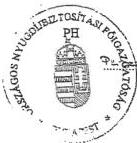
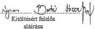
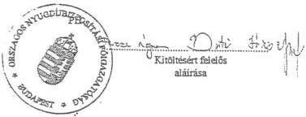

Állami Számvevőszék

T/251/1

# JELENTÉS

a társadalombiztosítás pénzügyi alapjai 1997. évi zárszámadásának ellenőrzéséről

9837.

1998. OKTÓBER

---

**A vizsgálat végrehajtásáért felelős:**

az ÁSZ IV. Vagyonellenőrzési Igazgatósága:
Kemény Emil
számvevő igazgató

**A vizsgálatot vezette:**

dr. Csépán Magdolna
osztályvezető főtanácsos

**A vizsgálatot végezték:**

Balla Józsefné

számvevő tanácsos

dr. Fónyad Erzsébet
számvevő tanácsos

Hajagos Józsefné,
számvevő tanácsos

Hegyesné dr. Solymosi Mária
számvevő

Horváth Erika
számvevő

dr. Kurucz István
számvevő tanácsos

Molnár Istvánné
számvevő tanácsos

Simonné dr. Csepregi Zsuzsanna
számvevő

Szarka Péterné
számvevő

Szendrődi Józsefné
számvevő tanácsos

Boldóczky Jánosné dr.
mb. szakértő

A megyei egészségbiztosítási pénztá-
raknál:

dr. Koronics Károlyné
számvevő tanácsos

Domján Jenő
számvevő tanácsos

Kerezsi Pál
számvevő

Csiszárné dr. Kosik Mária
számvevő tanácsos

dr. Laczó Bálintné
számvevő tanácsos

Pálfi András
számvevő

Nagy Sándorné
számvevő tanácsos

Hadházy Sándor
számvevő tanácsos

dr. Gyuk József
számvevő tanácsos

---

V--11-46/1998. TÉMASZÁM: 435

# TARTALOMJEGYZÉK

I. BEVEZETÉS, A JELENTÉS KÉSZÍTÉSÉNEK KÖRÜLMÉNYEI

II. ÖSSZEGZŐ MEGÁLLAPÍTÁSOK, KÖVETKEZTETÉSEK, JAVASLATOK

1. Összegzés 5
2. Javaslatok 8

III. RÉSZLETES MEGÁLLAPÍTÁSOK

1. A társadalombiztosítás pénzügyi alapjai 1997. évi költségvetésének végrehajtásáról szóló T/251. számú törvényjavaslat normaszövege 10
1.1. A működési költségvetés 1997. évi pénzmaradványa 10
1.2. A biztosítási alapok vagyonára vonatkozó szabályok 10
1.3. A kintlévőségek behajtása és a behajtási tevékenység ösztönzése 11
1.4. A T/251. számú törvényjavaslat zárórendelkezései 11
2. Az alapok beszámolási és könyvvezetési kötelezettségének teljesítése 13
2.1. Szabályozottság, szabályszerűség megítélése 13
2.2. A mérlegtételek tartalma, valódisága, leltárral való alátámasztottsága 14
2.3. A befizetések elszámolása a két ágazat között 14
2.4. A konszolidált beszámoló elkészítése, a zárszámadás és a beszámoló adattartalmának összefüggései. 15
3. A társadalombiztosítási alapok 1997. évi bevételi előirányzatainak teljesülése 15
3.1. A bevételek tervezése 15
3.2. Az Egészségbiztosítási Alap 1997. évi pótköltségvetése 16
3.3. Az alapok bevételeinek alakulása 1997-ben 17
3.4. Az alapok likviditási helyzete év közben és az év végén 19
4. A Nyugdíjbiztosítási Alap kiadási előirányzatainak teljesülése 1997. évben 19
5. A Nyugdíjbiztosítási Alap 1997. évi működési költségvetésének teljesülése 21
5.1. A működési költségvetés bevételei 21
5.2. A működési költségvetés kiadásai 21
5.2.1. Személyi juttatások 21
5.2.2. Dologi kiadások 22
5.2.3. Felhalmozási kiadások 22
5.2.4. Felújítási kiadások 23
5.2.5. Informatikai kiadások 23
5.2.6. Világbanki kölcsönnel kapcsolatos kiadások 24
5.2.7. Az adatszolgáltatási és nyilvántartási feladatok megvalósítására fordított kiadások 24
5.2.8. Az 1997. évi pénzmaradvány 25
6. A Nyugdíjbiztosítási Alap vagyonának alakulása 1997-ben 25
6.1. Tartósan befektetett eszközök 25
6.2. Ingyenesen juttatott vagyon 26
6.3. Egyes vagyonelemek helyzetének bemutatása 26
7. Az Egészségbiztosítási alap kiadási előirányzatainak teljesülése 28
7.1. Az Egészségbiztosítási Alap eredeti és módosított kiadási előirányzata és annak teljesülése 1997-ben 28

1

---

7.2. A gyógyító-megelőző egészségügyi ellátás kiadásainak alakulása 29
7.2.1. A gyógyító-megelőző ellátás egyes formáinak kiadásai 1997-ben 29
7.2.2. Az 1998-tól központi költségvetésből finanszírozott feladatok átadásához kapcsolódó pénzügyi elszámolások 31
7.2.3. A gyógyító-megelőző ellátások finanszírozásának szabályai 1997-ben 32
7.2.4. A kórházak pénzügyi helyzetének alakulása 33
7.2.5. Az ügyeleti díjak rendezése és a végkielégítésre felhasználható összeg 33
7.3. A gyógyszerek társadalombiztosítási támogatásának alakulása 1997-ben 34
7.4. A gyógyászati segédeszközökhöz nyújtott támogatás 35
7.5. Egyéb természetbeni ellátások 35
7.6. Pénzbeli ellátások 35
7.7. Az Egészségbiztosítási Alap egyéb kiadásai 37
8. Az Egészségbiztosítási Alap működési költségvetésének teljesülése 38
8.1. A működési költségvetés bevételei 38
8.2. A működési költségvetés kiadásai 38
8.2.1. Személyi juttatások 38
8.2.2. Dologi kiadások 39
8.2.3. Felhalmozási kiadások 39
8.2.4. Felújítások 40
8.2.5. Informatikai fejlesztések 40
8.2.6. Világbanki kölcsön felhasználása 41
9. Az Egészségbiztosítási Alap vagyonának alakulása 1997-ben 41
10. A társadalombiztosítási tartozások alakulása, a behajtás érdekében tett intézkedések 42
10.1. A tartozások főbb adatai 42
10.2. A behajtási tevékenység szabályozottsága 43
10.3. Tartozásátvállalások, kezességvállalások 44
10.4. Az APEH és az OEP együttműködése a behajtás területén 44
11. A társadalombiztosítás igazgatási szervei által folyósított ellátások alakulása 45
11.1. A nyugdíjbiztosítási ág által folyósított ellátások 45
11.2. Az egészségbiztosítás által folyósított ellátások 46
11.3. A folyósított ellátások működési költségeinek megtérítése 48

2

---

# JELENTÉS

## A TÁRSADALOMBIZTOSÍTÁS PÉNZÜGYI ALAPJAI 1997. ÉVI ZÁRSZÁMADÁSÁNAK ELLENŐRZÉSÉRŐL

### I. BEVEZETÉS, A JELENTÉS KÉSZÍTÉSÉNEK KÖRÜLMÉNYEI

Az államháztartásról szóló 1992. évi XXXVIII. törvény 86. §. (1) bekezdése értelmében az Országgyűlés (OGY) a társadalombiztosítás pénzügyi alapjainak költségvetéséről és annak végrehajtásáról törvényt alkot. A zárszámadási törvényjavaslatot az OGY az Állami Számvevőszék (ÁSZ) jelentésével együtt tárgyalja meg.

A társadalombiztosítás pénzügyi alapjainak és a társadalombiztosítás szerveinek állami felügyeletéről szóló 1998. évi XXXIX. törvény megszüntette az Egészségbiztosítási és a Nyugdíjbiztosítási Önkormányzatot, az alapokat és az igazgatási szervezeteket állami (kormány) felügyelet alá vonta.

Ez a körülmény az ellenőrzéstől az eddigieknél is feszítettebb munkatempót igényelt, mivel a jelentés elkészítéséhez a törvényjavaslat országgyűlési beterjesztését megelőző - törvényben biztosított - hatvan nap nem állt rendelkezésre.

A benyújtandó zárszámadási törvénytervezet kidolgozásának segítése céljából az ÁSZ jelentés első változatát szeptember elején megküldtük a Pénzügyminisztériumnak (PM). A vizsgálat alapját az alapok auditált költségvetési beszámolói és az ezekből összeállított, még a hivatalban lévő biztosítási önkormányzatok által júniusban elfogadott zárszámadási dokumentumok képezték.

A Kormány által október 1-jén benyújtott T/251. számú törvény-tervezet ismeretében lehetett csak az ÁSZ zárszámadást értékelő jelentésének végleges változatát elkészíteni. A megállapítások kiegészültek a normaszövegre és a mellékletekre vonatkozó észrevételekkel. Az ÁSZ jelentésének megállapításai alapvetően a benyújtott tervezethez kapcsolódnak, de esetenként elkerülhetetlen, hogy a zárszámadás helyszíni ellenőrzése folyamán szerzett tapasztalatoknál a korábbi dokumentumokra is visszautaljunk.

Az ÁSZ az ellenőrzés során a súlypontokat (a szabályszerűségi, törvényességi szempontok érvényesítése mellett) a társadalombiztosítás pénzügyi alapjai egyes költségvetési előirányzatainak teljesülésére, az eltérések okainak feltárá-

---3

---

I. BEVEZETÉS, A JELENTÉS KÉSZÍTÉSÉNEK KÖRÜLMÉNYEI---

sára, elemzésére helyezte, figyelemmel a makrogazdasági és a társadalombiztosítási folyamatok évközi alakulására, valamint arra a tényre, hogy az Egészségbiztosítási Alap esetében - az év végén - pótköltségvetés elfogadására került sor.

Az ÁSZ az egészségbiztosítás területét érintően 1998. első felében két olyan témavizsgálatot végzett, melyeknek megállapításai adott pontokon a zárszámadáshoz is kapcsolódnak. **Az Egészségbiztosítási Önkormányzat 1997-ben hozott vagyongazdálkodási döntéseinek vizsgálatáról és a külön keretes gyógyszerek támogatási rendszerének áttekintéséről elkészült és nyilvánosságra hozott jelentések** megállapításait részleteiben nem ismételjük meg, azokra a zárszámadási jelentés szükség szerint utal (a 7.3. és a 9. pontoknál).

A zárszámadási ellenőrzés megalapozása céljából - azt megelőzően - immár hagyományosak **a megyei szintű ellenőrzések** is. 1998. első félévében tíz megyei egészségbiztosítási pénztárnál (MEP) került sor a gyermekneveléssel összefüggő családi támogatások megállapításával és folyósításával kapcsolatos feladatok ellátásának, a tartozásállomány alakulásának és a behajtási tevékenység, valamint a MEP-ek működési költségvetései teljesülésének áttekintésére. **A vizsgálati tapasztalatokat a zárszámadási jelentés** a megfelelő témakörök ismertetésénél (a 11. pontban) **tartalmazza**.

---4

---

## II. ÖSSZEGZŐ MEGÁLLAPÍTÁSOK, KÖVETKEZTETÉSEK, JAVASLATOK

### 1. ÖSSZEGZÉS

A társadalombiztosítás pénzügyi alapjainak 1997. évi költségvetéséről szóló **1996. évi CXXV. törvény elfogadását hosszú (féléves) egyeztetési folyamat előzte meg.** A biztosítási önkormányzatok által elkészített költségvetési javaslat - elsődlegesen az egészségbiztosítást érintően - jelentősen eltért a Kormány által előterjesztett, illetőleg az Országgyűlés által végül elfogadott költségvetéstől, a bevételeket alacsonyabb, a kiadásokat magasabb összegben határozta meg.

A költségvetési előirányzatok megalapozottságának vizsgálata során az eredetileg „null”-szaldósra tervezett költségvetésről jeleztük, hogy a pénzügyi egyensúly deklarálásának „erőltetése” elszakad a realitásoktól és az Egészségbiztosítási Alapnál jelentős mértékű hiány bekövetkezése valószínűsíthető. Főleg az egészségügyi hozzájárulásból származó bevételt tartottuk túlzottnak, kiadási oldalon pedig a gyógyszerek és a gyógyászati segédeszközök támogatási előirányzatát keveselltük. Jelzéseink utólag igazolódtak.

**Az 1997. év folyamán a két biztosítási ág (a két pénzügyi alap) egyensúlyi helyzete teljesen eltérően alakult, mint ahogyan azt tervezték.**

Bevételi és kiadási oldalon egyaránt **az Egészségbiztosítási Alap helyzete rendült meg és itt merült fel a pótköltségvetés készítésének igénye.**

**A Nyugdíjbiztosítási Alap 1997. évi költségvetése** 628,6 milliárd forint bevétellel, 623,4 milliárd forint kiadás mellett, enyhe **többlettel teljesült.** A kedvező összkép kialakulását a bevételi oldal stabilitása tette lehetővé. Az Alapot megillető munkavállalói és egyéni járulékbevételek összege, a bruttó keresetnövekedés és az egyéni járulékfizetés felső határának emelése következtében, több mint 100 milliárd forinttal meghaladta az előző évit.

**Az Egészségbiztosítási Alap** az elmúlt évet 498,2 milliárd forintos bevétellel és 554,0 milliárd forintos kiadási főösszeggel zárta, a pótköltségvetésben prognosztizáltnál is jelentősebb, **55,8 milliárd forintos hiánnyal.** A hiány kialakulásában döntő szerepet játszott az, hogy bevételi oldalon az egészségügyi hozzájárulás **27 milliárd Ft-tal elmaradt a tervezettől**, az ezzel kapcsolatos előzetes várakozások ugyanis eltúlzottak voltak. A kiadási oldalon pedig túlteljesültek egyes természetbeni és pénzbeli juttatásokra fordított kiadások.

---5

---

II. ÖSSZEGZŐ MEGÁLLAPÍTÁSOK, KÖVETKEZTETÉSEK, JAVASLATOK

Általános érvényű megállapításként adódik, hogy évek óta **nem történt meg az alapok konszolidálása**, noha ezt az alapok eredetileg 300 milliárd forintos vagyonjuttatását 55-65 milliárd forintra csökkentő 2126/1995. (V. 3.) Kormányhatározat is rögzítette. **A bevételek és kiadások egyensúlya - főleg az egészségbiztosítást érintően - „esetleges”. Ezt az 1997. év tényadatai és eseményei jól igazolták.**

**Az alapok vagyonhoz juttatása** önmagában nem töltötte be (méreteinél és lehetséges hozadékánál fogva nem is tölthette be) az eredetileg neki szánt szerepet. **Nem járult hozzá a biztonságos gazdálkodás feltételeinek megteremtéséhez**, inkább - mint azt a korábbi jelentésünkben bemutattuk - „zavart” okozott.

**Az ÁSZ** eddigi zárszámadási jelentéseiben és más ellenőrzési dokumentumaiban (így például az Egészségbiztosítási Önkormányzat 1997. évi vagyongazdálkodásáról szóló jelentésében is) **rendszeresen kifogásolta** - az előírt, de eddig meg nem alkotott - **vagyongazdálkodási törvény hiányát**, továbbá azt, hogy a **vagyonjuttatás célját nem határozták meg.**

1997. év során **az ellátó rendszereket illetően sem a nyugdíjbiztosítás, sem az egészségbiztosítás területén nem került sor „reformértékű” lépésekre.** Kisebb léptékű változtatások az egészségbiztosítás területén voltak, az egészségügy finanszírozásának, a gyógyszerrendelés szabályait illetően.

**A nyugdíjak** 1997 év elején **19,5 %-kal emelkedtek**, ennek kihatása 96,6 milliárd forint. Az összességében 608,5 milliárd forintot kitevő nyugdíjkiadások alakulását ezen túlmenően a létszám- és összetétel változás hatásai, illetőleg a kiegészítő ellátások növekedése befolyásolta.

**A gyógyító-megelőző egészségügyi ellátás** finanszírozására 265,8 milliárd forintot fordítottak, az eredetileg előirányzottnál 5,2 milliárd forinttal többet. Az egészségbiztosítás **egyéb természetbeni ellátásainak** kiadásai összesen **124,2 milliárd forintot** tettek ki (ebből a gyógyszertámogatás összege 100,9 milliárd forint volt) ez a tervezetthez viszonyítva 19,4 milliárd forintos túllépést jelentett. Az Egészségbiztosítási Alapból fedezett **pénzbeli ellátásokra 141,8 milliárd forintot** (ezen belül a rokkantsági ellátásokra 98 milliárd forintot) használtak fel, ami összességében azonos a tervezett kiadások nagyságával.

**A társadalombiztosítás igazgatási szerveinek működési kiadásaira** összesen **29,8 milliárd forintot fordítottak**, amiből a nyugdíjbiztosítás 12,4 milliárd forintot, az egészségbiztosítás 17,4 milliárd forintot használt fel. A működési kiadások a társadalombiztosítás járulék bevételeinek átlagosan 2,6 %-át teszik ki ami lényegesen kevesebb, mint pl. a magánnyugdíj pénztárak működési költséghányada.

A társadalombiztosítás igazgatási szerveire jelentős többlet feladatot ró azon ellátások folyósítása, amelyeket más, zömmel költségvetési forrásból finanszíroznak. Ezek ellátása 1997 -ben mintegy 20 %-kal növelte meg az ügyviteli feladatokat.

6

---

II. ÖSSZEGZŐ MEGÁLLAPÍTÁSOK, KÖVETKEZTETÉSEK, JAVASLATOK

1997-ben születtek meg, a társadalombiztosításról szóló 1975. évi II. törvény helyébe lépő - reformokat is megalapozó - új törvények, amelyeknek a költségvetésre gyakorolt hatása csak 1998-tól jelentkezik.

Új megoldás az, hogy a zárszámadási törvényben kívánják módosítani a társadalombiztosítás pénzügyi alapjai 1998. évi költségvetéséről szóló 1997. évi CLIII. törvényt és hatálytalanítani az 1992. évi LXXXIV. törvénynek (AT) a pótköltségvetési törvény készítésének kötelezettségét előíró 11. §. (8) bekezdését.

A társadalombiztosítási alapok és igazgatási szerveik a költségvetési szervekre érvényes gazdálkodási, pénzügyi, elszámolási rendet alkalmazzák, az alapok gazdálkodását jellemző sajátosságok mellett. Az ÁSZ eddigi vizsgálatai során többször javasolta, hogy a könyvvezetés és beszámolás szabályozásában ezen sajátosságok jussanak kifejezésre. Mint ezt a részletes megállapításokban bemutatjuk 1997-től történt ilyen változás.

A PM a központi költségvetéshez hasonlóan az 1997. évi zárszámadásban a társadalombiztosítási alapoknál is érvényesítette az ú. n. GFS rendszer szerinti számviteli elvet, aminek következtében abban csak az 1997-ben pénzforgalmilag ténylegesen jelentkező bevételek és kiadások jelennek meg. A bevételekben így - a korábbiaktól eltérően - nincs benne az alapok 1996. évi pénzmaradványa, ennek felhasználása az 1997. év tényleges kiadásai között szerepel. A kiadások pedig nem tartalmazzák az alapok tárgy évben képződött pénzmaradványának összegét. A módosítás miatt a zárszámadás adatai eltérnek a auditált beszámolóban szereplő összegtől.

A változtatások az alapok fő összegein és költségvetési egyenlegein kívül belső szerkezetében, soronként érintették az Egészségbiztosítási Alap működési kiadásainak összegeit is. Ezek teljes körű ellenőrzését idő hiányában már nem lehetett elvégezni. Néhány tétel vizsgálata azonban az adatok valódiságát igazolta, amit a jelentés mellékletei között szereplő tanúsítványok adattartalma is alátámaszt.

A GSF rendszer bevezetése a tapasztalat átmeneti ellentmondások ellenére pozitív változás, mert megteremti az egységes elszámolási szemléletet az államháztartás két nagy alrendszerében.

A T/251. számú törvény-tervezethez tett konkrét javaslatokon túl a jelentéshez kapcsolódóan nem volt szükség számszaki észrevételek tételére, mert ezeket a PM az együttműködés során elfogadta és érvényesítette.

7

---

II. ÖSSZEGZŐ MEGÁLLAPÍTÁSOK, KÖVETKEZTETÉSEK, JAVASLATOK

## 2. JAVASLATOK

Az Állami Számvevőszék a benyújtott törvény-tervezetet az alábbi javaslatok figyelembevételével ajánlja elfogadásra.

# Az Országgyűlés :

1. **Módosíttassa** a T/251. számú törvényjavaslat 6. §. (4) és 12. §. (3) bekezdéseit, illetve a 8. §. (1) és a 16. §. (1) bekezdéseit (a jelentés 1.1. és 1.2. pontjában foglaltak alapján), úgy, hogy az a két biztosítási alapra nézve összhangban legyen, az alapok maradványainak egységes felhasználása, megnevezése és az ingyenes vagyonjuttatás adatainak megjelenítése kérdéseiben.
2. **Fontolja meg** a törvény a 18. §. zárórendelkezései közül a (2) és (3) bekezdésekben az 1998. évi költségvetést érintő intézkedések elhagyását, a jelentés 1.5. pontja szerint.
3. **Módosíttassa** a nyugdíjbiztosítás által folyósított ellátásokat ismertető 2. és 5. sz. törvényi melléklet adatait, az ÁSZ jelentés 11.1. pontja alapján.
4. **Dolgoztassa át** a Nyugdíjbiztosítási Alap működési költségvetéséről szóló 8. sz. törvényi mellékletet úgy, hogy az az államháztartási törvény 115. §. szerint tartalmazza az 1996. évi tényadatokat, az 1997. évi költségvetési előirányzatokat és az 1997. évi tényadatokat.
5. **Módosíttassa** a Nyugdíjbiztosítási Alap tartalékairól szóló 10. sz. mellékletet a jelentés 6. pontja szerint, úgy, hogy az a valós vagyoni helyzetet mutassa.

# A Kormány:

6. **Készítse** elő az államháztartási törvény társadalombiztosításra vonatkozó előírásainak módosítását, pontosítását, kiegészítését. Ennek keretében helyezzen különös figyelmet a társadalombiztosítás irányítási rendszerében bekövetkezett változásokra, az alapok költségvetése, pótköltségvetése, illetőleg zárszámadása készítésének eljárási szabályaira, az ÁSZ ellenőrzési feladataihoz kapcsolódó feltételek megteremtésére. Ehhez csatlakozva **tegyen javaslatot** a társadalombiztosítás pénzügyi alapjairól szóló 1992. évi LXXXIV. törvény módosítására, esetleg új törvény megalkotására.
7. **Kezdeményezzen** törvényi szintű döntést a társadalombiztosítás vagyonának jövőbeni sorsát illetően. (Lehetséges döntési változat: a szolgáltatási vagyon ellenértékét vonják be az alapok 1999. évi hiányának finanszírozásába és a továbbiakban az ellátórendszerek működési feltételeit csak az alapok működési vagyona biztosítsa. Mindezek természetesen nem érvényesek a járuléktartozás fejében átvett vagyonelemekre.)

8

---

II. ÖSSZEGZŐ MEGÁLLAPÍTÁSOK, KÖVETKEZTETÉSEK, JAVASLATOK

8. Hozzon tulajdonosi dontest a Nyugdijbiztositasi Alapnal a celszerutlen tevekenyseget folytato VIR es a NYUGBER-CENTER KFT-k megszuntetesere (atalakitasara), a jalentés 6.3. pontja szerint.
9. Alakitsa ki a tarsadalombitzositassal szembeni tartozasok atvallalasnak, kezessegvallalasnak elveit az 1998. evi XXXIX. törveny 16. §-aban foglaltaknak megfeleloen.
10. A behajtasi tevekenyseg osztonzési rendszerét ugy szabályozza, hogy az elsdlegesen a felszámolás alatt nem allo adósok felhalmozott tartozásanak merséklését eredményezze és a valós teljesitményeket ismerje el.
11. Vizsgalja felul a tarsadalombitzositas altal folyositott ellatasok koret, kulonos tekintettel a regen megallapitott, kis osszegu ellatasokra, a megszuntetes lehtosegere (a jalentes 11.1. pontjaban foglaltakra figyelemmel).

# A Pénzügyminisztérium:

12. Készítsen kitöltési útmutatót a „D” és „G” jelű költségvetési beszámolókhoz és mindkét ágra azonos elvek alapján, összehasonlítható módon határozza meg a költségvetés - zárszámadás adattartalmát, az összefüggéseket a beszámolóval (a jelentés 2. pontjában felvetett gondok miatt).

# Az Egészségügyi Minisztérium és az Országos Egészségbiztosítási Pénztár:

13. Végezzék el az 1998-tól a központi költségvetésből finanszírozott egészségügyi feladatok 1997. év végére vonatkozó pénzügyi elszámolásait. Az érintett intézmények kapják meg elmaradt bevételeiket (a jelentés 7.2.2. pontjában foglaltaknak megfelelően).

9

---

III. RÉSZLETES MEGÁLLAPÍTÁSOK---

# III. RÉSZLETES MEGÁLLAPÍTÁSOK

## 1. A TÁRSADALOMBIZTOSÍTÁS PÉNZÜGYI ALAPJAI 1997. ÉVI KÖLTSÉGVETÉSÉNEK VÉGREHAJTÁSÁRÓL SZÓLÓ T/251. SZÁMÚ TÖRVÉNYJAVASLAT NORMASZÖVEGE

### 1.1. A működési költségvetés 1997. évi maradványa

(6. §. (4) bekezdés és a 12. §. (3) bekezdése)

A törvénytervezet a Nyugdíjbiztosítási Alap működési költségvetésének 1997. évi maradványaként 421 millió forintot jelöl meg. Ebből 323 millió forint a működési költségvetés 1997. évi pénzmaradványa és 98 millió forint a már említett finanszírozási különbözetek elismert része.

Az Egészségbiztosítási Alap működési költségvetésének 1997. évi pénzmaradványának összege 1612 millió forint. A törvénytervezet 12. §. (3) bekezdésében az szerepel, hogy az APEH által a családi pótlékkal összefüggő ellenőrzési tevékenység ösztönzésére átutalandó 15 millió forinton felüli összeg a Kormány döntése alapján használható fel. Ez a megkötés (a pénzmaradványt gyakorlatilag már elköltötték) felesleges és indokolatlan, annál is inkább, mert ilyen feltételt a Nyugdíjbiztosítási Alap esetében nem szabnak.

A törvényjavaslat a pénzmaradvány szóhasználatot alkalmazza. Ettől a 6. §. (4) bekezdésében tér el ahol, előirányzat felhasználás keret maradványáról szól. Az államháztartási törvényben az „előirányzat-maradvány” kifejezés a használatos.

### 1.2. A biztosítási alapok vagyonára vonatkozó szabályok

(8. §. (1) bekezdése és a 16. §. (1) bekezdése)

Az alapok részére történt visszteher mentes vagyonátadásról szóló két szakasz egymástól eltérően fogalmaz. A Nyugdíjbiztosítási Alap vagyona esetében csak az 1997-ben történt vagyonátadást számszerűsítik 7634 millió forintban, de ez sem egyezik meg a 10. számú törvényi mellékletben szereplő 7406 millió forinttal.

Az Alap tartalékait bemutató 10. számú melléklet változatlanul korrekcióra szorul, mert a tartósan befektetett eszközök 1996. év végi záróállományának adata nem azonos az 1996. évi zárszámadásról szóló 1996. évi CLII. törvényben foglaltakkal (amelyben 14692 millió forint az induló adat, szemben a T/251. számú törvénytervezet 10. számú mellékletében szereplő 15098 millió forinttal). Emellett az 1997. év végi vagyoncsökkenés elszámolásának adata sem pontos, mert az ingyenes vagyonjuttatás összegében nem szerepel a Pannon váltó 132 millió forintos értékcsökkenése.

---10

---

III. RÉSZLETES MEGÁLLAPÍTÁSOK

Az Egészségbiztosítási Alapnál a teljes vagyonátadás összegét is szerepeltetik és azon belül külön az 1997-ben történt átadási értéket, ami a normaszövegben 18972 millió forint, az Alap tartalékait bemutató 11. számú törvényi mellékletben viszont 18901 millió forint (mivel az Express Rt. részvényeit névértéken és nem átadási értéken tüntetik fel).

A törvénytervezet úgy fogalmaz, hogy a **vissztehermentesen juttatott vagyon az alapok „birtokába” került**, a korábbi „tulajdonába” szóhasználat helyett. Fel kell vetni, hogy a **birtoklás és a tulajdonlás jogának gyakorlása megfelelően nem szabályozott**, figyelemmel az alapok különféle vagyonelemeire (tartós befektetések, ingyenesen juttatott vagyon, tartozás fejében átvett vagyon, illetve a működési célokat szolgáló vagyon).

### 1.3. A kintlévőségek behajtása és a behajtási tevékenység ösztönzése

(3. §. (2) bekezdés, 10. §. (2) bekezdés)

A zárszámadás helyszíni vizsgálata során az **ÁSZ a kintlévőségek behajtásából származó** - eredetileg - 36.414 millió forintos összeget (a jelentés 10.2 pontjában foglaltakkal összefüggésben) **752 millió forinttal javasolta csökkenteni, 15 millió forinttal mérsékelve a behajtás ösztönzési alapjának összegét is.**

A benyújtott törvényjavaslaton ezeket a **változtatásokat a PM átvezette**. A behajtási bevétel nagysága mindezek következtében 35.662 millió forint. Az ösztönzés alapjának csökkentése abban jut kifejezésre, hogy az egészségbiztosítás működési pénzmaradványának felhasználható összege 1627 millió forint helyett csak 1612 millió forint.

### 1.4. A T/251. számú törvényjavaslat zárórendelkezései

(18. §.)

A 18. §. (2) bekezdése szerint a **gyógyító-megelőző egészségügyi ellátások „zárt” előirányzata** a tényleges kiadások mértékével, de legfeljebb **1600 millió forinttal léphető túl**, a finanszírozás évközi változásai miatt.

Az OEP-nél folytatott vizsgálat és a kapott dokumentumok alapján az **említett kiadási tétel** (6. sz. melléklet 1. cím., 1. alcím, 1 előirányzat-csoport szám) **1998. évi előirányzatának megemelése nem tekinthető alátámasztottnak**. A költségvetési törvény ilyen módosítása megteremti az **1998. évre járó 13. havi bér még ez évi** (és nem a jövő év elejére áthúzódó) **kifizetéséhez** szükséges források teljes fedezetét.

A **társadalombiztosítás 1998. évi költségvetési törvényében a 13. havi bér kifizetésére szánt 2,3 milliárd forintot az intézmények megkapták** - igaz, nem bérarányosan, hanem teljesítményarányosan. Ezért emelték meg az eredetileg 296 milliárd forintos előirányzatot 298,3 milliárd forintra. A kifizetéshez - a fekvőbetegellátás területén - esetleg még hiányzó fedezet a kasz-

11

---

III. RÉSZLETES MEGÁLLAPÍTÁSOK

szák közötti átcsoportosítással megteremthető (ehhez az OEP már javaslatot készített és kérték az egészségügyi miniszter egyetértését is).

**A 18. §. (3) bekezdésének elfogadása esetén az Országgyűlés „tudomásul veszi”, hogy a társadalombiztosítási alrendszer 1998. évi együttes hiánya 54.953 millió forinttal több.** Ez azt jelenti, hogy a Nyugdíjbiztosítási Alap eredetileg null-szaldósra tervezett költségvetésével és az Egészségbiztosítási Alap 22090 millió forintos tervezett hiányával szemben az alapok együttes hiánya nem lesz több 77.043 millió forintnál.

Mindez nem tekinthető egyenértékű intézkedésnek az elmaradt pótköltségvetéshez mérten, azt nem pótolja. A Nyugdíjbiztosítási Alap illetve az Egészségbiztosítási Alap kezelőjének akkor kell pótköltségvetési javaslatot készíteni, ha az Alap várható éves egyenlege legalább az előirányzott kiadási főösszeg 1 százalékával kedvezőtlenebb az előirányzott egyenlegnél és ez a tárgy év szeptember 30-áig megállapítható (A.T. 11. §. (8) bek.).

Az 1998. év költségvetési folyamatai már az év közepén azt jelezték, hogy a Nyugdíjbiztosítási Alap egyensúlya nem jön létre. A költségvetés nem tartalmazott fedezetet a második (augusztusi) nyugdíjemelésre és a nyugdíjreform tőkefedezeti elemének kezdeti hatása is erőteljesebb volt a vártnál. Az Alapban az év első nyolc hónapjában összesen 35,8 milliárd forint hiány halmazódott fel.

**Az Egészségbiztosítási Alap hiánya ugyanez idő alatt 37,7 milliárd forintra nőtt,** ellentétben az egész évre tervezett összesen 22,1 milliárd forinttal. A hiány alapvetően az egyes ellátások (gyógyszer, gyógyászati segédeszköz, III. a fokozatú rokkantsági nyugdíjak) és a működési költségvetés kiadásainak a tervezettet meghaladó növekedése miatt alakult ki. Ennek bekövetkeztét az ÁSZ a költségvetés megalapozottságáról szóló véleményében valószínűsítette.

Az államháztartási törvény 41. §-a, illetve a társadalombiztosítás pénzügyi alapjairól szóló 1992. évi LXXXIV. törvény (A.T.) 11. §-ának (8) bekezdésének előírásai alapján tehát **a pótköltségvetés készítésének kötelezettsége mindkét alapnál fennállott.** Ez utóbbi szabály hatálytalanítása visszamenőleg nem értelmezhető.

Az alapokat kezelő ONYF és OEP egyaránt elkészítették a pótköltségvetésre vonatkozó javaslatokat. Ilyen törvényjavaslat beterjesztésére azonban végül is nem került sor. Mint azt a T/251. számú törvénytervezet indoklása tartalmazza - az eddigi évek pótköltségvetéseinek kedvezőtlen tapasztalatai miatt - a Kormány ehhez nem fűzött reményeket.

Az alapok 1998-ban jelentkező tényleges hiánya jelenleg pontosan nem határozható meg. Az ÁSZ-nak nem tudtak bemutatni háttér számításokat arra vonatkozóan, hogy a javaslatban szereplő összeget mi alapozza meg. Becslésen alapuló számításaink alapján a hiány elérheti a 80 milliárd forintot.

12

---

III. RÉSZLETES MEGÁLLAPÍTÁSOK

## 2. AZ ALAPOK BESZÁMOLÁSI ÉS KÖNYVVEZETÉSI KÖTELEZETTSÉGÉNEK TELJESÍTÉSE

### 2.1. Szabályozottság, szabályszerűség megítélése

A társadalombiztosítási alapok és igazgatási szerveik a költségvetési szervekre érvényes gazdálkodási, pénzügyi, elszámolási rendet alkalmazzák, az alapok gazdálkodását jellemző sajátosságok mellett. Az ÁSZ eddigi vizsgálatai során többször javasolta, hogy a könyvvezetés és beszámolás szabályozásában ezen sajátosságok jussanak kifejezésre. 1997-től történt ilyen változás, bár ez a kívánalmakat még teljesen nem elégíti ki.

A költségvetési szervek beszámolási és könyvvezetési kötelezettségéről szóló **54/1996. (IV. 12.) Korm. rendelet nem ismeri el azt a jelenlegi gyakorlatot, hogy a pénzforgalmi szemléletű beszámoló készítésénél mindkét ág figyelembe veszi az alrendszer teljes pénzforgalmát, függetlenül attól, hogy az éves bevételi és kiadási különbözetek** - az egymás helyett végzett tevékenységekkel kapcsolatos - **rendezése csak a naptári évet követően történik meg.**

Az 1997. év folyamán az egészségbiztosítás a nyugdíjágazatnak 3,3 milliárd forinttal több bevételt utalt át, mint ami megillette, a többletet a nyugdíjág csak 1998-ban utalta vissza. Így tehát a pénzforgalmi szemlélet nem érvényesült.

A társadalombiztosítási igazgatási szervek az „A” jelű intézményi beszámoló garnitúrát, az alapokra vonatkozóan a „D” jelű nyomtatványt töltik ki. A **PM 1997-től a „G” jelű „konszolidált” beszámoló garnitúra kitöltését is előírta.** Gondot okoz, hogy sem a „D”, sem a „G” jelű nyomtatványhoz **nem készítettek részletes kitöltési útmutatót.** Ebből fakadóan a két ág eltérően értelmezi és alkalmazza a beszámolásnál a folyamatos kiadások tartalmát (51. űrlap 70. sora).

A Nyugdíjbiztosítási Alap a folyamatos működési kiadások között szerepelteti a beruházási és az adatfeldolgozással kapcsolatos kiadásokat is. Az eltérő prezentáció oka arra is visszavezethető, hogy a két Alap Országgyűlés által jóváhagyott költségvetése is eltérő szerkezetű volt.

Mindkét ágnál a **számlarendben** rögzítették a könyvvezetésre, a beszámoló elkészítésére vonatkozó szabályokat. Meghatározták a (szakmai feladatok és sajátosságok figyelembevételével) a **számviteli politikát**, elkészítették az eszközök és a források leltározási, leltárkészítési és értékelési, valamint a pénzkezelési szabályzatait. Rögzítették a **számviteli alapelvek** érvényesítésének követelményét is.

A **kiegészítő mellékletek** részletesen ismertetik a biztosítási ágak szolgáltatási és működési szektorának, gazdálkodási, egyensúlyi és vagyoni helyzetét, a bevételek és kiadások alakulását. A hazai kiadásokkal együtt bemutatják a világbanki programok keretében beérkezett pénz- és egyéb eszközöket.

13

---

III. RÉSZLETES MEGÁLLAPÍTÁSOK---

Az Egészségbiztosítási Alap kiegészítő melléklete azonban nem tükrözi a valós helyzetnek megfelelően a folyószámla nyilvántartás súlyos, rendszerbeli problémáit.

## 2.2. A mérlegtételek tartalma, valódisága, leltárral való alátámasztottsága

**Az alapok költségvetési beszámolói a folyószámla könyvelés súlyos helyzete miatt nem elégítik ki a mérlegvalódiság elvét.** Ezt az ÁSZ évek óta megállapítja.

A járulék és folyószámla nyilvántartás szakfeladatát az OEP szervei végzik, de az ott jelentkező gondok mindkét alap beszámolójának hitelességét kérdésessé teszik, **a mérlegben kimutatott adósállományra vonatkozóan. Az 1997. évi költségvetési beszámolót a könyvvizsgáló ezzel összefüggésben „korlátozó” záradékkal látta el (1. sz. melléklet).**

**A jelenlegi** központilag működtetett **folyószámla rendszer** egyre kevésbé képes megfelelni a járulékfizetési kötelezettség bonyolult, éven belül is többször változó jogszabályi környezetből adódó követelményeknek, nem tudja kezelni a folyamatosan növekvő adatállományt. Csak 1997-ben hét alkalommal volt jogszabályváltozás, ami még egy jól működő nyilvántartási rendszer mellett is gondot okozna.

**A folyószámlák programmal számított egyenlegei az esetek jelentős részében nem a valós helyzetet tükrözik.** Folyamatosak **a manuális beavatkozások** az adatállományba, ez óriási többletmunkával is jár. A rendszerbeli korlátok miatt azonban az adott időpontban fennálló egyezőség állandóan felbomlik, az eltérések újratermelődnek.

A helyzetet súlyosbítja a **feldolgozatlan ügyiratok** nagy száma is (csak Budapesten 75 ezer ilyen ügyirat volt a mérlegkészítés időszakában).

A társadalombiztosításról szóló **1975. évi II. törvény 105/C. §. (3) bekezdését** úgy módosították, hogy **a járulékfizetőket a folyószámlák 1997. november 30.-i egyenlegéről 1998. január 31.-éig kellett értesíteni** (a „rendes” szabály szerint az augusztus 31.-i egyenlegről október 31.-ig kell értesítést küldeni). A két alap auditálás előtti mérlegadatából **az 1997. december 31.-i adósállományból 3 milliárd forintot, a „túlfizetésekből” pedig 1,5 milliárd forintot töröltek** az egyeztetések során.

## 2.3. A befizetések elszámolása a két ágazat között

Mindkét ág pénzügyi pozícióját érinti a befizetések két ág közötti megosztásának jelenlegi (egy bevallás, egy folyószámla, egy befizetés) rendszere is.

---14

---

III. RÉSZLETES MEGÁLLAPÍTÁSOK

Ez a rendszer mára egyértelműen túlhaladottá vált, egyre kevésbé alkalmas az ágakat megillető bevételek egzakt kimutatására.

A kiegyenlítési sorrendben az egészségügyi hozzájárulás megelőzi a munkáltatókat terhelő társadalombiztosítási járulékot, ami a nyugdíjágat hátrányosan érinti. Az egészségügyi hozzájárulás „idegen” elem a hagyományos járulékrendszerben, az bárhová is kerülne a sorrendben, mindenképpen megsértené az ágak között eddig érvényesített arányossági elvet.

# 2.4. A konszolidált beszámoló elkészítése, a zárszámadás és a beszámoló adattartalmának összefüggései.

Mint arról a 2.1. pont is szól, az alapok és az igazgatási szervek 1997-től háromféle beszámolót készítenek, az „A” és „D” jelű mellett áganként, és az alrendszer szintjén a „G” jelű konszolidált (összevont) beszámolót. Beszámolási kötelezettségének mindkét ág határidőre eleget tett.

A konszolidáció elveit a két ág önállóan határozta meg, egyes tételeknél eltérő tartalommal. A beszámolás e formájának bizonyos összefüggésben az államháztartási mérleg elkészítése szempontjából van (lehet) jelentősége, célja azonban nem tisztázott. Az kétségtelen, hogy a zárszámadás adattartalmát e beszámolókból közvetlenül nem lehet levezetni. Különösen igaz ez a működési kiadások körére, ahol a zárszámadás adattartalma több tételnél csak a főkönyvi könyvelés, illetve az analitikus nyilvántartások elemi adataiból „állítható elő”(erre a jelentés 5. és 8. pontjaiban történik utalás).

Maga a zárszámadás összeállítása sincs egységesen szabályozva és ebből adódóan az ágak között formai és tartalmi eltérések is vannak. Ez is a működési költségvetéseknél jelentkezik elsődlegesen. Az Alap beszámolóját a nyugdíjbiztosítás finanszírozási, az egészségbiztosítás pedig költségvetési szemléletben készítette el, ami miatt az Alapból a működési költségvetésbe átadott pénzeszközök eltérően jelennek meg.

A konszolidált beszámolóban a kintlévőség behajtásából származó bevétel összege 36414 millió forint, amit összesen 752 millió forinttal csökkenteni kellett. Ez a behajtás ösztönzési alapját is csökkentette, 15 millió forinttal.

# 3. A TÁRSADALOMBIZTOSÍTÁSI ALAPOK 1997. ÉVI BEVÉTELI ELŐIRÁNYZATAINAK TELJESÜLÉSE

# 3.1. A bevételek tervezése

Az 1997. évi költségvetés összeállításának idején - hasonlóan az előző évek gyakorlatához - a bevételek és a kiadások viszonylagos egyensúlyát kívánták megteremteni. Ennek - az adott költségvetési paraméterek mellett - nem volt realitása és erre az ÁSZ véleménye is felhívta a figyelmet.

15

---

III. RÉSZLETES MEGÁLLAPÍTÁSOK

A társadalombiztosítás pénzügyi alapjainak 1997. évi költségvetéséről szóló **1996. évi CXXV. törvény a bevételeket az alrendszer szintjén 1136,6 milliárd forintban**, a kiadásokat 1150,1 milliárd forintban, 13,5 milliárd forint hiánnyal **állapította meg. A Nyugdíjbiztosítási Alap bevételét 615,5 milliárd forint képezte**, tervezett hiánya 9,7 milliárd forint volt. **Az Egészségbiztosítási Alap bevételeinek előirányzata 521,1 milliárd forint**, a tervezett hiánya pedig 3,8 milliárd forint volt.

Az év folyamán azonban a két biztosítási alap pénzügyi helyzete eltérően alakult, amiben közrejátszottak a bevételi oldal tervezésének időszakában elkövetett hibák, téves feltételezések. Ezekre is visszavezethető, hogy **év közben az Egészségbiztosítási Alap bevételi - kiadási egyensúlya felbomlott.**

A költségvetési előirányzatokat jelentősen befolyásolta, hogy **1997. január 1-jétől a járulékrendszerben is komoly változások következtek be:**

- **a munkáltatókat terhelő társadalombiztosítási járulék mértéke összességében 42,5 %-ról 39 %-ra csökkent.** (Az egyéni járulékok 10 %-os mértéke nem változott.) Ezen belül a nyugdíjbiztosítási járulék 24,5 %-ról 24 %-ra, az egészségbiztosítási járulék ennél sokkal jelentősebben, 18 %-ról 15 %-ra mérséklődött,

- **az egyéni biztosítási jövedelemhatár**, napi 2500 forintról 3300 forintra emelkedett,

- **megszűnt az alapok közötti keresztfinanszírozás és a központi költségvetés általi „járulékfizetés”** a „nem biztosítottaknak” nyújtott egészségügyi szolgáltatások fedezete. Ezek az intézkedések forráskivonást jelentettek az Egészségbiztosítási Alapból,

- **bevezették az egészségügyi hozzájárulást**, mint az Egészségbiztosítási Alap kizárólagos bevételét, amely a 3 százalékpontos járulékmérték csökkenés és az előzőekben jelzett intézkedéseket (melyeknek együttes hatását szakértők több mint 100 milliárd forintra becsülték) lett volna hivatott ellentételezni. Ez a bevételi elem azonban a költségvetési törvénybe irreálisan magas, 97,9 milliárd forint összegű előirányzattal került be. Ez az előirányzat a fizetésre kötelezettek számát illetően a valóságosnál több mint 1 millió fővel nagyobb létszámot feltételezett. **Ezért az egészségügyi hozzájárulás az Alap bevételi oldalának kritikus pontját jelentette.**

### 3.2. Az Egészségbiztosítási Alap 1997. évi pótköltségvetése

**Már az év első felében látható volt**, hogy a kiadások tervezettet meghaladó mértékű növekedését a képződő bevételek nem képesek ellentételezni, az Egészségbiztosítási Alap eredeti költségvetésének elfogadásakor is meglévő **„rejtett hiány” fokozatosan felszínre került.**

Az Egészségbiztosítási Alap pótköltségvetéséről szóló **1997. évi CXII. törvényt** novemberben fogadta el az Országgyűlés, **505,8 milliárd forintos bevételi főösszeggel** és 40,7 milliárd forintos hiánnyal. Ez elmozdulást jelentett a rea-

16

---

III. RÉSZLETES MEGÁLLAPÍTÁSOK

litások irányába, de továbbra is voltak bizonytalansági elemei, bár azok már zömmel a kiadási oldal egyes tételeit érintették.

A pótköltségvetéssel egyidejűleg nem módosult a Nyugdíjbiztosítási Alap bevételi oldala, holott erre az alapok között arányosan megoszló bevételi tételek (munkáltatói és egyéni járulékok stb.) miatt feltétlenül szükség lett volna. Ezek esetében a teljesítés adata csak az eredeti előirányzathoz viszonyítható, értékelhető. Nem módosultak a társadalombiztosítási alrendszer bevételi és kiadási adatai sem.

### 3.3. Az alapok bevételeinek alakulása 1997-ben

A társadalombiztosítás összes bevétele 1126,8 milliárd forint volt 9,8 milliárd forinttal kevesebb a tervezettnél.

A Nyugdíjbiztosítási Alap bevétele ebből 628,6 milliárd forint, ami 13,1 milliárd forinttal volt több, mint az eredeti előirányzat, tehát itt a bevételek alakulása összességében kedvező volt.

Az Egészségbiztosítási Alap bevételeinek összege 498,2 milliárd forintban teljesült, ami a pótköltségvetésben szereplő bevételeknél 7,6 milliárd forinttal, az eredetileg tervezettnél pedig 22,9 milliárd forinttal volt kevesebb.

A társadalombiztosítás bevételei között a járulék- és járulékjellegű bevételek a meghatározóak. Ezek együttes összege 1080,1 milliárd forint, ami több mint 95 %-os részarányt jelent. Ezen belül is meghatározó a munkáltatói járulék 822,9 milliárd forintos, az egyéni járulékok 158,1 milliárd forintos összege és az egészségügyi hozzájárulás mintegy 72 milliárd forintos tétele.

Az egyes bevételi kategóriákat több tényező befolyásolja, jellemzi:

- A munkáltatói járulék 14,3 %-kal (102,8 milliárd forinttal) több az előző évinél és 8,2 %-kal magasabb a tervezettnél is. Az előző évhez viszonyított növekedés mértékét természetesen nagymértékben befolyásolja a 3,5 százalékpontos járulékmérték - csökkenés. A nemzetgazdaság egészében az előző évhez képest 22,3 %-os bruttó átlag keresetnövekedés valósult meg (szemben a tervezés időszakában számított 17 %-kal). A járulékbevételek alakulását a keresetnövekedés és a járulékmérték csökkenés hatásán kívül jelentősen befolyásolja, hogy 1997-ben a járulékalap egésze is nőtt, annak szélesítése következtében.

- Az egyéni járulékok esetében az előző évhez viszonyítva 25 %-os bevétel-növekedés következett be, de a teljesítés alatta maradt - a tervezéskor erősen felülbecsült - eredeti előirányzatnak, annál 15 milliárd forinttal, 8,7 %-kal kevesebb. Az egyéni járulékbevételek alakulását főleg a keresetnövekedés és az egyéni járulékfizetés felső határának megemelése befolyásolta.

- Az egészségügyi hozzájárulás pótköltségvetési előirányzata 71 milliárd forint volt, a teljesítés ennél 1 milliárd forinttal lett több. A hozzájárulás év-

17

---

III. RÉSZLETES MEGÁLLAPÍTÁSOK

közi adatai nem adtak valós képet a bevételekről. Az 1997. évi többszöri, visszamenőleges hatályú törvénymódosítások miatt vállalkozói körben hosszú időn keresztül nem voltak terhelhetők a folyószámlák. Terhelés hiányában a beérkező bevételek a munkáltatói és az egyéni járulékok között jelentek meg. A helyzet csak az év végén - záráskor - lebonyolított újra könyvelések után vált átláthatóvá. A korrekció nagysága 4,9 milliárd forint volt. A kiegyenlítési sorrend miatt mindez kihatott a bevételek két ág közötti megosztására is (ezért az év során a Nyugdíjbiztosítási Alap bevételi pozíciója sem volt egyértelműen meghatározható).

- Munkáltatói táppénz-hozzájárulásból az Egészségbiztosítási Alap 7,7 milliárd forint bevételhez jutott. A teljesítés éppen az eredeti és a módosított előirányzat közé esik (8 és 7 milliárd forint), és reálisnak mondható.
- Nagyságrendje és az alapok vagyonával való szoros összefüggése miatt bír jelentőséggel a hiány mérséklése céljából előírt vagyonból keletkező bevételi tétel.

A költségvetési törvény a Nyugdíjbiztosítási Alapnál 3,6, az Egészségbiztosítási Alapnál 6,3 milliárd forintos bevétel elérését írta elő. Utóbbit a pótköltségvetésben 8,2 milliárd forintra emelték fel.

A Nyugdíjbiztosítási Alap esetében bevételi többlet mellett került sor vagyoneladásra 1,2 milliárd forint értékben. Az Egészségbiztosítási Alapnál a nagyság hiány miatt a teljes kötelezettséget érvényesíteni kellett. Ezt az év során végrehajtott vagyonértékesítésekből tudták fedezni (erről a 8. pontban történik említés).

A zárszámadástól és az ÁSZ álláspontjától eltérően, az Alap könyvvizsgálói jelentése azt tartalmazza, hogy e tétel (a 8,2 milliárd forint) összetevői között szerepel az OTP részvények „árkülönbözete” 1154 millió forint, - ami értelemszerűen csak árfolyamnyereséget jelenthetne - valamint 264 millió forint összegben tartozás fejében átvett vagyonelemek értékesítési bevétele is.

Az OTP részvények semmiképpen sem hozhatók összefüggésbe a vagyonértékesítési kötelezettség teljesítésével, hiszen azokat ingatlan megszerzésére fordították. A számvitelben az OEP a Wesselényi utcai ügyletet beszerzési áron 1,8 milliárd forintban - árfolyamnyereség elszámolása nélkül, ami szintén „meglepő” - könyvelte le. Így tehát a főkönyvi könyvelés és a beszámoló adatainak magyarázata egymásnak is ellentmond, amit az ellenőrzés során nem volt mód tisztázni. A tényre az auditor is felhívta a figyelmet, de azt nem minősítette.

Vitatható a vagyonhasznosítás bevételei között az ú. n. „tartozásos” vagyon értékesítéséből elért bevétel figyelembevétele, hiszen az nem más, mint járulékbevétel (ellenében járuléktartozást törölnek az adós folyószámláján), így helyesen a bevételt is ott kellene számba venni. Ilyen bevétel a

18

---

III. RÉSZLETES MEGÁLLAPÍTÁSOK

Nyugdíjbiztosítási Alapnál említett 1,2 milliárd forintban is van (533 millió forint).

A tartozás fejében átvett vagyon értékesítési bevételét az alapok a **PM (vitatható) korábbi állásfoglalása** alapján tették a vagyonhasznosítás bevételei közé. Ez eldöntendő elvi kérdés.

### 3.4. Az alapok likviditási helyzete év közben és az év végén

A Magyar Köztársaság 1997. évi költségvetéséről szóló **1996. évi CXXIV. törvény** szerint **az Egészségbiztosítási Alap kamatmentesen 58,3, a Nyugdíjbiztosítási Alap 54,1 milliárd forint erejéig vehet igénybe hitelt a Kincstári Egységes Számlához (KESZ) kapcsolódó megelőlegezési számláról.**

**Az Egészségbiztosítási Alap** az év minden napján jelentős (18 és 112 milliárd forint közötti összegben) kényszerült hitelfelvételre, amiért 3,3 milliárd forint kamatot kellett fizetni. Év végén a hitel állománya 76 milliárd forintra mérséklődött, az előző évi hiány rendezésével és a központi költségvetés egyéb megtérítéseivel összefüggésben.

**A nyugdíjágazat** jobb likviditási helyzetét tükrözi az is, hogy minden hónapban voltak napok, amikor nem kellett hitelt igénybevenni (a hitelért fizetett kamat összesen 61 millió forint volt).

**A bevételi oldalra ható tényezők** (tervezési hibák, keresetalakulás, jogszabályváltozások stb.) **eltérően alakították a biztosítási alapok pénzügyi pozícióját.**

**A Nyugdíjbiztosítási Alap az 1997. évet** a tervezett 9,7 milliárd forint hiánnyal szemben **5,2 milliárd forint többlettel zárta.** A szufficit magában foglalja azt az **1,2 milliárd forintot is, amit a vagyonértékesítés eredményezett.** Mivel az Alap többlete csak az év végén vált egyértelművé és az eredeti költségvetés „a hiány mérséklése céljából” vagyonhasznosításból is tartalmazott bevételt 3,6 milliárd forint értékben. Az önkormányzat „óvatosságból” határozott a vagyonértékesítésről. A bevételi többlet „két eleme” a későbbiek során eltérő megítélést kíván.

**Az Egészségbiztosítási Alap hiánya** a módosított előirányzat szerinti 40,7 milliárdnál is több, **55,8 milliárd forint lett.** Ehhez a bevételek elmaradása 6,4 milliárd forinttal járult hozzá, a hiány nagyobb részét az egyes kiadási tételek túllépése idézte elő.

## 4. A NYUGDÍJBIZTOSÍTÁSI ALAP KIADÁSI ELŐIRÁNYZATAINAK TELJESÜLÉSE 1997. ÉVBEN

A költségvetési törvény 625,2 milliárd forintban fogadta el az Alap 1997. évi kiadási előirányzatát.

19

---

III. RÉSZLETES MEGÁLLAPÍTÁSOK

A T/251. számú törvényjavaslatban a Nyugdíjbiztosítási Alap kiadási főösszege 623,4 milliárd forint.

**Az Alap kiadásainak döntő részét (97,5 százalékát) a nyugellátásokra fordították.** A 608,5 milliárd forintból 527,3 milliárd forint volt a korhatár feletti saját jogú nyugdíjak összege, és 81,2 milliárd forintot fizettek ki a hozzátartozói ellátásokra. Az előbbi 21,2 százalékkal, az utóbbi 16,6 százalékkal haladta meg az 1996. évi kiadást. A hozzátartozói ellátások, ezen belül a kiegészítő ellátások számának, összegének változására hatással volt, hogy nőtt az időskorúak, az özvegyen maradtak száma, de csökkent a saját nyugdíjjogosultságot nem szerzettek köre. Az egészségbiztosítás által kifizetett rokkantsági, illetve a kapcsolódó nyugdíjak összege 98 milliárd forint. A növekedésben meghatározó az 1997. januári 19,5 százalékos nyugdíjemelés, amelynek éves kihatása 96,6 milliárd forint volt.

A nyugdíjak méltányosságból történő emelésére 500, az egyszeri szociális segélyezésre 200 millió forintot engedélyezett a költségvetési törvény, melyből mintegy 600 millió forintot a Nyugdíjbiztosítási, 100 millió forintot a Egészségbiztosítási Alap fizetett ki.

A 170 ezer nyugdíjemelési kérelem felénél történt kedvező intézkedés. Az elutasítások alapvető oka az volt, hogy a kérelmet a nyugdíjazást-, vagy a korábbi emelést követő 3 éven belül nyújtották be. A méltányossági nyugdíjemelésben részesülők több mint kétharmada öregségi, illetve rokkantsági nyugdíjas. Az egy nyugdíjasra jutó emelés átlagos összege 992 forint volt, mely az előző évhez képest kismértékben csökkent.

A szociális segélyt kérők hatvan százaléka, 37,4 ezer fő kapott átlagosan ötezer forint támogatást.

A nyugdíjkiadások alakulását befolyásolta a létszámnövekedés, a kiegészítő ellátások számának növekedése, az összetétel változás, cserélődés, melyek együttes kihatása 6,5 milliárd forint.

A nyugdíjkiadás változásainak összetevőit a 2. melléklet táblázata szemlélteti.

- **A postaköltség** 24 millió forinttal 1,1 százalékkal volt több, mint 1996-ban és 522 millió forinttal, 18,6 százalékkal maradt el az előirányzattól.

Az előző évinél több mint 24 százalékkal nagyobb kiadási előirányzat nem volt megalapozott. Az egy főre jutó átlagos postaköltség csak fél százalékkal nőtt 1997-ben.

- **A működésre fordított kiadás** 2,9 milliárd forinttal, több mint 30 százalékkal nőtt az előző évhez képest (a működési költségvetéssel az 5. pont részletesen foglalkozik).

- **A kamat- és hozambevételekkel, vagyongazdálkodással kapcsolatos kiadás** 35 millió forinttal, 59 százalékkal több volt mint 1996-ban, de 30 millió forinttal kevesebb az 1997. évi előirányzatnál.

20

---

III. RÉSZLETES MEGÁLLAPÍTÁSOK

A 94 millió forint kiadási összeg közel hetven százaléka, (65 millió forint) a postabanki viszontgarancia harmadik negyedévre jutó kamatköltsége. Az értékpapírok őrzésének díja 9 millió forint, a vagyonkezeléssel kapcsolatos egyéb szolgáltatások (bizományosi, szakértői, ügyvédi) költség több mint 2 millió forint, a szolgáltatási vagyonhoz tartozó ingatlanok kezelésével összefüggő kiadás 11 millió forint, a járuléktartozás fejében átvett vagyon ágazatra jutó összege 900 ezer forint, az ÁFA kötelezettség mintegy 5 millió forint volt.

♦ **A Kincstári Egységes Számla igénybevétele miatti kamatkiadás** 61 millió forint volt, mely háromszorosa az előirányzatnak, de csak öt százaléka az előző évi teljesítésnek. A kamatkötelezettség a decemberi magas hiteligénybevétel következménye, amire az ellátások előrehozott kézbesítése miatt volt szükség. A mindenkori hiteligény nem gazdálkodási kérdés, az jelentős mértékben külső körülményektől függ, a kamat összegére az alapkezelőnek nincs (nem lehet) igazi hatása.

## 5. A NYUGDÍJBIZTOSÍTÁSI ALAP 1997. ÉVI MŰKÖDÉSI KÖLTSÉGVETÉSÉNEK TELJESÜLÉSE

### 5.1. A működési költségvetés bevételei

Az Alap működési költségvetésének **1997. évi eredeti előirányzata 12,4 milliárd forint volt, ami 12,6 milliárd forintra teljesült.** A zárszámadási melléklet értelmezhetetlenül tartalmaz 1997. évi módosított előirányzatot, (a Nyugdíjbiztosítási Alap költségvetését ugyanis törvény nem módosította), de nem mutatja be a viszonyítási alapot jelentő 1996. évi tényadatokat. Az 1996. évi teljesítéshez mérten a működési költségvetés bevételei csaknem 30 %-kal emelkedtek.

Az Alaptól folyamatos működésre és célfeladatok teljesítésére átvett összeg 11,7 milliárd forint, a költségvetés saját bevételeinek összege 273 millió forint, a folyósított ellátások utáni megtérítés 606 millió forint és az 1996. évi pénzmaradvány 169 millió forint volt.

### 5.2. A működési költségvetés kiadásai

A működési kiadások teljes összege (12,4 milliárd forint) megegyezik az eredeti előirányzattal. A teljes munkaidőben foglalkoztatottak létszámára vetítve az egy főre jutó működési kiadás 2,8 millió forint, az előző év hasonló adatánál 600 ezer forinttal több. A kiadások alakulásáról a jelentés 3. mellékletében szereplő két tanúsítvány nyújt átfogó képet.

#### 5.2.1. Személyi juttatások

Személyi juttatásokra 1997-ben **4,8 milliárd forintot** fordítottak, 31 %-kal többet az előző évinél (az illetményváltozás, illetőleg a jutalom összegének növekedése következtében).

21

---

III. RÉSZLETES MEGÁLLAPÍTÁSOK---

A teljes munkaidőben foglalkoztatottak átlagos **létszáma egy év alatt 4221-ről 4377 főre nőtt.**

**A rendszeres személyi juttatások** havi átlaga 45 ezer forintról 54 ezer forintra nőtt, ezen belül a főigazgatóságon 60 ezerről 93 ezerre, a megyékben 47 ezerről 55 ezerre, a NYUFIG-nál 37 ezerről 46 ezerre.

**A nem rendszeres személyi juttatások** nagysága 40 %-kal haladta meg az 1996. évit. Az éves jutalom egy főre jutó összege 182 ezer forint volt, ami három és fél havi átlagbérnek felel meg. Ezt szűkebb körben növelte az ellenőri jutalom összege.

**Megbízási díj** címén 96 millió forintot fizettek ki, aminek túlnyomó része az igazgatóságokon merült fel, a nyilvántartási feladatokat ellátó személyek foglalkoztatása kapcsán. Az ONYF által megkötött szerződésekre ebből 7 millió forintot fordítottak.

### 5.2.2. Dologi kiadások

**A 3,2 milliárd forintos teljesítés** 16,5 %-kal több az előző évinél. A pénzforgalmi beszámoló eredeti előirányzata és a teljesítés között jelentős, számos tételem két-háromszoros eltérés mutatkozik, amit főleg az ágazati tervezési gyakorlat, valamint a központosított előirányzatok nagy aránya magyaráz.

A dologi kiadások 60 %-át az üzemeltetési, fenntartási kiadások alkotják, jelentős összeget fordítottak irodaszerekre, nyomtatványokra, különféle szolgáltatásokra.

A külföldi kiküldetések, valamint a reprezentáció ellenőrzött tételeinél megfelelő volt az elszámolás.

### 5.2.3. Felhalmozási kiadások

Az 1997. évi lehetőségeket a költségvetési törvény 487 millió forintban határozta meg. A zárszámadásban **735 millió forintos teljesítésről adnak számot.**

Az elszámolási gyakorlat a korábbi évekhez képest jelentősen javult, a főkönyvi könyvelés adataiból a zárszámadás szerinti teljesítés címenként levezethető.

**A működési célú ingatlanok vásárlását, létesítését, a gépkocsik beszerzését** a központosított előirányzatból finanszírozták, címenként ezért a teljesítés-előirányzat adatok összevetésének nincs értelme.

Ingatlanok létesítésére 444 millió forintot fordítottak. Befejeződött a szombathelyi székházépítés, az egri épület bővítése és épületet vásároltak Esztergomban, valamint Salgótarjánban. Az ingatlanok vásárlásakor **a közbeszerzésről szóló 1995. évi XL. törvénynek** a tárgyalásos eljárásra vonatkozó **előírásait nem tartották be maradéktalanul**, mert az eredményt hirdetményben nem tették közzé.

---22

---

III. RÉSZLETES MEGÁLLAPÍTÁSOK

# 5.2.4. Felújítási kiadások

A költségvetési törvény felújítási célra a területi igazgatóságoknál, a NYUFIG-nál és a központosított előirányzatok között 1182 millió forintot irányozott elő. A zárszámadás szerinti teljesítés ezzel szemben 691 millió forint. Az "alulteljesítés" lényegében a Fővárosi Igazgatóság Fiúmei úti épületének elmaradt felújításával magyarázható. Az Igazgatóság elhelyezésével kapcsolatban eddig már több, mint 80 millió forint költség merült fel (tervezés, tanulmánykészítés stb. címén) de az elhelyezés mindeddig megoldatlan maradt.

Az ózdi épület felújítására a tervezettnek több mint kétszeresét költötték. A közbeszerzési eljárás ügyében az NM is folytatott törvényességi vizsgálatot. A Közbeszerzési Döntő Bizottság az ONYF-nél formai hibát, és 30 ezer forint bírságot állapított meg. A debreceni ingatlan felújítása 30 %-kal került többe a tervezettnél, míg a balassagyarmati felújítás 90%-ra teljesült.

A NYUFIG húsz emeletes toronyházának felújítása 219 millió forintba került, ami szintén alacsonyabb összeg a tervezettnél. A munkákra nyílt közbeszerzési eljárás alapján kötötték meg a szerződéseket és azok - a biztonsági rendszer kivételével - 1997-ben el is készültek.

# 5.2.5. Informatikai kiadások

A költségvetési törvény 1997-re is a központosított előirányzatok között tartalmazta

- az informatikai fejlesztések 940 millio forintos és
- a folyamatos informatikai kiadások 150 millio forintos előirányzatát.

Az informatikai fejlesztések keretösszegét növelte az e címen képződött, másra nem használható 1996. évi pénzmaradvány 29 millió forintos összege. A teljesítés adata 945 millió forint.

A folyamatos informatikai kiadások keretösszege (előirányzat átcsoportosítás következtében) 229 millió forintra nőtt, és a zárszámadás szerint 234 millió forintra teljesült. Az ellenőrzés a nyilvántartások átvizsgálása után 322 millió forintos tényleges felhasználást talált, mert a dologi kiadások között is elszámoltak ilyen tételeket.

A nyugdíjág zárszámadásában feltüntetett informatikai kiadások és a világbanki kölcsön hazai kiadásainak adatai fenntartással kezelendőek, mert a valós kiadások adataival nem egyeznek meg. Ezeket csak az analitikus nyilvántartásokból lehet megállapítani.

23

---

III. RÉSZLETES MEGÁLLAPÍTÁSOK---

### 5.2.6. Világbanki kölcsönnel kapcsolatos kiadások

A társadalombiztosítás pénzügyi alapjainak 1997. évi költségvetéséről szóló **1996. évi CXXV. törvény szerint:**

„a működésre fordított kiadások előirányzata a világbanki kiadások ténylegesen felmerülő költségeinek mértékéig kormányegyeztetéssel túlléphetők.”

Ezt az egyetértést tartalmazza a **2001/1998. (I. 12.) Korm. határozat**, amely a nyugdíjág esetében idetartozó kiadásként **112 millió forintot ismer el**. A nyugdíjbiztosítás 1997. folyamán három alkalommal kérte a Kormány intézkedését, de arra csak utólag került sor, az említett kormányhatározat keretei között.

Az analitikus nyilvántartások szerint a **tényleges felhasználás 104 millió forint volt**, amit a Nyugdíjbiztosítási Alap 1997-ben a működési költségvetésből „megelőlegezett”.

A világbanki kölcsönfelhasználás több, mint 980 ezer USD (180 millió forint), melynek többségét a menedzsment konzultáns cég finanszírozására fordították. A felhasználási területek egyike sem szolgálja közvetlenül a hitelnyújtás eredeti célját, csupán annak egyik feltételét képezi.

A 104 millió forintból 34 milliót kamatként, 25 milliót rendelkezésre tartási jutalékként fizették ki, a többit ÁFA-befizetésre fordították.

**Az ÁSZ** az 1997. évi tb. zárszámadás vizsgálatával egyidőben **kezdte meg a TB. alapok informatikai rendszereinek** - a pénzügyi felhasználásokra is kiterjedő - **átfogó vizsgálatát**, ami az informatikai fejlesztések és a kölcsönfelhasználás kiadási tételeinek vizsgálatát is maga után vonja.

### 5.2.7. Az adatszolgáltatási és nyilvántartási feladatok megvalósítására fordított kiadások

A címben jelzett feladatok végrehajtására a költségvetési törvény 400 millió forintot fogadott el, amihez képest a **teljesítés 421 millió forint** lett (ezzel szemben a zárszámadás csak 229 millió forintot mutat be, mert a többit az igazgatási szervek dologi kiadásai tartalmazzák).

Az 1975. évi **II. törvény 120/A. §-ában** foglaltak szerint 1997-ben is folytatták az 1988-92. évek hiányzó kereseti adatainak gyűjtését (továbbá megkezdték az egyéni nyilvántartó lapok begyűjtését is).

Továbbra is gond, hogy az adatszolgáltatásra kötelezett munkáltatók regisztrálása még nem történt meg teljes körűen, a nyilvántartások pontosítása folyamatos feladat.

---24

---

III. RÉSZLETES MEGÁLLAPÍTÁSOK

### 5.2.8. Az 1997. évi pénzmaradvány

A működési költségvetés tárgyévi **pénzmaradványa 323 millió forint.**

„Finanszírozási különbözetként” szerepelt a Nyugdíjbiztosítási Alap korábbi zárszámadási javaslatában további **144 millió forint**, ami nem az 1997. évi gazdasági események elszámolásával függ össze és a költségvetési beszámoló nem is tartalmazta. Ebből a zárszámadás 98 millió forintos keret felhasználását teszi lehetővé, a Világbanki kiadásokkal kapcsolatosan.

Az 1997. évet megillető pénzmaradvány teljes összege így emelkedett 421 millió forintra.

## 6. A NYUGDÍJBIZTOSÍTÁSI ALAP VAGYONÁNAK ALAKULÁSA 1997-BEN

**Az Alap befektetett eszközeinek záróállománya 23,9 milliárd forint** volt, az előző évinél 1,2 milliárd forinttal több. A befektetett eszközök túlnyomó része - 23,2 milliárd forint - **részesedésekben és értékpapírokban** testesül meg, a többi üzemeltetésre átadott eszköz.

A tartósan befektetett eszközök értéke 9,2 milliárd forint, az ingyenesen átvett vagyon állományi értéke 14,0 milliárd forint volt.

**Az Alap működési vagyona 5,5 milliárd forint.**

A Nyugdíjbiztosítási Alap **10. számú zárszámadási melléklete** az előbbi adatokkal szemben 12,1 milliárd forint értékű tartósan befektetett eszközről és 12,2 milliárd forint értékű ingyenes vagyonról ad számot. **A melléklet adattartam a tényleges helyzettől való eltérések miatt átdolgozásra szorul.**

### 6.1. Tartósan befektetett eszközök

**A tartósan befektetett eszközök állománya** mintegy 20 %-kal csökkent az előző évhez képest.

- A lakásfedezeti államkötvény állománya a tőketörlesztés és értékesítés miatt csökkent, 3,7 milliárd forinttal.
- Beváltották a 23 millió forinton nyilvántartott 1997/V államkötvényt.
- A VIR és a NYUGBER CENTER KFT együttes értékvesztése 1997-ben 391 millió forint volt.
- Új befektetést hajtottak végre 1783 millió (a könyvelés szerint 1768 millió) forint értékben.

25

---

III. RÉSZLETES MEGÁLLAPÍTÁSOK

- A hiány mérséklése érdekében a költségvetés bevételeként 669 millió forintot használtak fel, mint arról a jelentés 3.4. pontja szól. Az 1,2 milliárd forintos vagyonhasznosítási bevétel többi részét tartozás fejében átvett vagyon értékesítéséből fedezték.

## 6.2. Ingyenesen juttatott vagyon

A Nyugdíjbiztosítási Alapot megillető törvény szerinti vagyon teljes átadására nem került sor 1997-ben sem.

A rendelkezésre álló adatokból annyi állapítható meg, hogy összességében 31,6 milliárd forint értékű vagyon került át, ami ugyan meghaladta a törvényi minimumot (30,6 milliárd forint), de nem érte el a maximumot, (36,2 milliárd forint) mint ahogyan az az egészségbiztosítás esetében történt. A két ágazat tehát nem azonos mértékű juttatásban részesült és nem vették figyelembe a munkáltatói járulékbevétel arányváltozását sem.

Az ingyenesen juttatott vagyon **könyv szerinti értéke** (14,1 milliárd forint) **jelentősen eltér az átadási értéktől, mert az Alap az átvett részesedéseket névértéken szerepelteti és értékvesztéseket is el kellett számolni.**

**Vagyonértékesítésre összesen 3,9 milliárd forint értékben került sor** (4. melléklet). A végrehajtott értékesítéseket részben a piaci ár alatt bonyolították, mert az OTC piacon forgalmazott részesedések mennyisége többszörösen meghaladta a keresletet, de a gyors döntéshozatalt gyakran akadályozta a döntési mechanizmus is (mivel tulajdonosi döntést kizárólag a közgyűlés hozhatott).

A zárszámadás **12. számú mellékletében a tartozások vagyonátadással történő rendezése keretében átvett vagyon értéke 787 millió forint**, ami a számvitelből levezethető adat. Az év során egyébként ezen vagyonelemekből 533 millió forint bevételt értek el, amit betudtak a hiány mérséklése érdekében történt vagyonértékesítési bevételbe.

## 6.3. Egyes vagyonelemek helyzetének bemutatása

=A **Citadella Befektetési Alapkezelő Kft-t** 1997-ben vásárolták meg 4,8 millió forintért. A Kft pénzügyi helyzetének rendezéséhez azonnal 15 millió forintos tőkeemelést hajtottak végre, ami után - annak hatására - az év végi mérleg szerinti eredmény 3,4 millió forint lett (az előző évet a cég veszteséggel zárta).

=A Kft kibocsátotta és kezeli a 3 milliárd forint névértékű **Nyugdíj I. Befektetési jegyet**, amit kizárólag maga a Nyugdíjbiztosítási Alap jegyzett le. A fedezetet ingyenes vagyon eladásából és a lakásfedezeti kötvény tőketörlesztésének egy részéből, továbbá a kötvény eladásából teremtették meg.

**Az Alap létrehozásának célja** a tényleges piaci viszonyok közötti vagyon-gazdálkodás, az értékvesztések és a vagyon felélésének elkerülése. Vagyongaz-

26

---

III. RÉSZLETES MEGÁLLAPÍTÁSOK

dálkodási törvény hiányában, a törvény által szabályozott befektetési alap eredményes vagyongazdálkodást tehet lehetővé. Mód nyílik a kamatok és hozamok visszaforgatására, növelhető a vagyon nagysága, amit a társadalombiztosítás költségvetési törvényei évek óta bevonnak (csökkentenek) a folyó kiadások finanszírozásába.

**A Nyugdíj I. Befektetési Alap az 1997. évet 756 millió forint mérleg szerinti nyereséggel zárta**, amit annak függvényében kell minősíteni, hogy az Alap létrehozása érdekében eladott vagyonelemeknél (Humán Rt., Pillér II. Befektetési jegy, Lakásfedezeti államkötvény) 466 millió forint értékesítési veszteség keletkezett. Ily módon a valóságos eredmény csak 290 millió forint. A vagyon tőzsdei részvényekben, tőzsdén kívüli részvényekben, államkötvényekben, diszkont kincstárjegyben, befektetési jegyben és pénzeszközben testesül meg, a befektetési alapokról szóló 1991. évi LXIII. törvény előírásainak megfelelően.

**=A VIR Kft** 1994. július 1-jétől működik. A Kft-t a Nyugdíjbiztosítási Önkormányzat még ez évben vette meg a Postabanktól 1,7 milliárd forintért, 1997-ig történő részletfizetéssel. Az Önkormányzat kifizette az utolsó részletet is, ám ezzel sem vált 100 %-os tulajdonossá, csupán arról határozott, hogy a bank tulajdoni hányadára vonatkozó opciós vételi joggal a kft éljen. **A Kft** (amelynek 1997-ben már három tulajdonosa volt) **gazdálkodása veszteséges volt**, elsősorban az ONYF által használt irodaépület értékcsökkenése miatt, ami a Kft tulajdona (!) és amiért a nyugdíjbiztosítás bérleti díjat fizet.

A tulajdonos Nyugdíjbiztosítási Önkormányzat egyszer megvette az ingatlant (kft formájában), évente fizeti az ÁFÁ-val növelt bérleti díjat. A Kft az üzemeltetést alvállalkozókkal végezteti, érdemi tevékenységet valójában nem folytat.

A Kft-t bízták meg a tartozás fejében átvett Kresz Géza utcai ingatlan üzemeltetésével, amiért havonta összesen 550 ezer forintot fizet a két ág.

A Kft. tevékenységét az ÁSZ 1995. és 1996. évi zárszámadási jelentései is kifogásolták, vitatva annak létét is.

**=A NYUGBER-CENTER KFT-t** 1995-ben alapították 600 millió forintos alaptőkével, a Nyugdíjfolyósító Igazgatóság épület-beruházásának megvalósítására. Az ÁSZ korábban is megállapította, hogy a társaság feladatai, működésének célja tisztázatlan.

**A Kft az 1997. évet 10 millió forint veszteséggel zárta**, egyetlen bevételi forrása a NYUFIG által fizetett bérleti díj volt, tevékenysége az üzemeltetési számlák érkeztetésében, kiegyenlítésében és a bérlő felé történő elszámolásban „merült ki”.

27

---

III. RÉSZLETES MEGÁLLAPÍTÁSOK

## 7. AZ EGÉSZSÉGBIZTOSÍTÁSI ALAP KIADÁSI ELŐIRÁNYZATAINAK TELJESÜLÉSE

### 7.1. Az Egészségbiztosítási Alap eredeti és módosított kiadási előirányzata és annak teljesülése 1997-ben

A társadalombiztosítás pénzügyi alapjainak 1997. évi költségvetéséről szóló **1996. évi CXXV. törvény az Alap kiadási főösszegét 524,9 milliárd forintban határozta meg, ami sok tekintetben megalapozatlan volt**, mert több tételnél a reálisnál alacsonyabb összegekkel számolt. Ez különösen a természetbeni ellátásokat jellemezte, amire a költségvetésről alkotott véleményében az ÁSZ is rámutatott.

**A tervezés során nem vették figyelembe** a tényadatokból és a szabályokból következő **adottságokat**, olyan intézkedésekkel számoltak és azokból „megtakarításokkal”, amelyek csak feltételezéseken (nem számításokon, hatáselemzésen) alapultak. Ez a tervezési gyakorlat évek óta él, a tények mindig igazolják, hogy nem alkalmas a valóság megközelítésére.

**A Kormány 3051/1997. számú határozatában a kiadások csökkentéséről állást foglalt** ugyan, de az OEP-től várta a szükséges intézkedések megtételét, amelyekre a rendelkezésre álló rövid idő alatt nem került (nem kerülhetett) sor. **A lakosság életminősége szempontjából meghatározó kérdésekben** (gyógyszertámogatás, gyógyászati segédeszköz-támogatás, közgyógyellátás, korhatár alatti rokkantsági nyugellátások) a folyamatok néhány hónap alatti megváltoztatását írták elő, amelyekben **évek óta nem sikerült megoldást találni**. A fokozottabb biztosítói ellenőrzés terén nem sikerült jelentős lépéseket tenni.

**Az Egészségbiztosítási Alap nem ellátási jellegű kiadásai** között is voltak olyan tételek (KESZ kamatkiadás, világbanki hitel hazai kiadásai), amelyeknek alacsony, illetve hiányzó összege növelte az Alap bújtatott hiányát.

Az is nyilvánvalóvá vált, hogy **a gyógyító-megelőző ellátások „zárt” előirányzata nem biztosítja a teljes fedezetét az egészségügyi dolgozók béremelésének**. A hiányzó 6,3 milliárd forintot tovább növelte az egyszeri 10 ezer forintos jövedelem kiegészítés 2,3 milliárd forintot kitevő összege.

**Az Egészségbiztosítási Alap 1997. évi pótköltségvetésének** elkészítését tehát az Alap kiadási oldalának anomáliái is indokolttá tették. **Az 1997. évi CXII. törvény a kiadási főösszeget 546,5 milliárd forintra emelte**, ami a „kritikus” tételek mindegyikét érintette, több-kevesebb realitás mellett.

**A kiadások teljesítési adata** összességében **554,0 milliárd forint**, a pótköltségvetésben elfogadottnál 7,5 milliárd forinttal több.

28

---

III. RÉSZLETES MEGÁLLAPÍTÁSOK

## 7.2. A gyógyító-megelőző egészségügyi ellátás kiadásainak alakulása

A költségvetési törvény eredetileg 260,6 milliárd forintot szánt az **egészségügyi kiadásokra**, amelyet a pótköltségvetésben 265,9 milliárd forintra emeltek. **A teljesítés adata** ezzel csaknem azonos, **265,8 milliárd forint**.

A zárszámadási adatok számviteli nyilvántartásokkal történő egyeztetése során derült ki, hogy **a költségvetési beszámoló 1997-ben először alkalmazott 61. űrlapjának** (ami az ellátási kiadásokat „kassza”- szerinti bontásban tartalmazza) adatait a számvitel nem is gyűjti, azt a szakfőosztály adatai alapján állítják össze. Így, noha a költségvetés kiadásait tartalmazó 51. és 61. űrlap adatai megegyeznek, ez a tábla inkább **tájékoztató jellegűnek tekinthető**.

Az **analitikus nyilvántartásokkal történő tételes egyeztetés** azonban a kasszák szerinti kiadási tételeket bemutató **7. számú zárszámadási melléklet adattartalmát alátámasztotta**, ez mindenképpen pozitívum.

A gyógyító-megelőző ellátások előirányzatán belül **1997-ben három alkalommal került sor átcsoportosításra**, a pótköltségvetés keretében, illetve belső átcsoportosítás formájában, a bérintézkedések és - előirányzat hiányában - fejlesztési jogcímen.

A pótköltségvetésben **az egészségügyi dolgozók egyszeri jövedelemkiegészítésére 2,3 milliárd forintos** előirányzat szerepel. Forrásátadásra a központi költségvetésből azonban nem került sor, így az intézkedés **az Egészségbiztosítási Alap hiányát tovább növelte**.

### 7.2.1. A gyógyító-megelőző ellátás egyes formáinak kiadásai 1997-ben

♦ **A háziorvosi ellátásra fordított összeg 25,8 milliárd forint** volt. Ezen összegből a hajléktalanok ellátását végző budapesti és megyeszékhelyi szolgálatok finanszírozására 55 millió forintot fordítottak.

**A finanszírozás szabályainak változtatására 1997-ben nem került sor.** A költségvetési törvényben a finanszírozást meghatározó új elemként megjelent ugyan a **gondozás**, de a tevékenység anyagi elismerésére a gyakorlatban nem került sor.

Új elem a **csoportpraxisok** létrehozásának lehetősége, amivel csak viszonylag szűk körben éltek.

Az 1997. végén finanszírozott 6843 szolgálatból 6333 területi ellátási kötelezettséggel működött. A szolgálatok 78 %-a vállalkozásban látja el feladatát.

♦ **Az egyéb alapellátás körébe tartozó feladatokra 1997-ben 8,8 milliárd forintot fordítottak** (iskola-egészségügy, védőnői ellátás, ügyeleti szolgálatok, anya- és csecsemővédelem).

29

---

III. RÉSZLETES MEGÁLLAPÍTÁSOK

Az alapellátás részét képező **fogászati ellátásra** felhasznált összeg **7,3 milliárd forint volt**. Ez az a szakterület, ahol az elmúlt években gyakori és jelentős változások voltak a szolgáltatások körét és finanszírozását illetően egyaránt.

Az 1995-ös stabilizációs intézkedések miatt szűkült a **térítésmentesen igénybevehető szolgáltatások köre**, majd a következő években újra változott, ezekre „tucatnyi” intézkedés (törvények, kormány- és NM rendeletek) született.

Hasonlóan gyakran változtak a **finanszírozás szabályai** is, a „teljesítményarányos” díjazás elveinek érvényesítése érdekében. Az **egyes fogorvosi szolgáltatások szakmai tartalmának** pontos meghatározására azonban nem került sor.

**A finanszírozási rendszer változásai** a biztosítottak ellátásában sajnálatosan nem eredményeztek javulást, **nem szolgálják a** Nemzeti Egészségvédelmi Programban, valamint az 1107/1994. (XI. 23.) Korm. határozatban megfogalmazott elveket a megelőzés fontosságáról. Nem preferálja az iskolai fogászati ellátást, és a fogmegtartó tevékenységet. A legnagyobb létszámú korosztály (a 18 és 60 év közöttiek) csak a sürgősségi ellátást, fogkő eltávolítást, ínykezeléseket, sebészeti beavatkozásokat kapja térítésmentesen, a fogmegtartó kezelések. **A finanszírozási és támogatási rendszer alapvető módosítása nélkül e területen előrelépés aligha képzelhető el.**

♦ **A házi szakápolás** - elkülönítetten - 1996. óta került az egészségügyi ellátórendszerbe, meglehetősen előkészítetlenül. A betegek mellett a szakápolást elrendelők és végzők sem voltak megfelelően tájékozottak (szakmai és jogi értelemben egyaránt). A fekvőbeteg ellátás finanszírozásának mai rendszere nem ösztönzi igazán - az olcsóbbnak tűnő - otthoni szakápolás megerősödését.

Az alapellátásban „szokásos” háziápolás és a szakápolás a gyakorlatban átfedi egymást, egzakt mutatók (szakmai protokollok) nincsenek. Ezeket a **rendszerbeli ellentmondásokat** a MEP-ek ellenőrzései gyakran felvetik, beleértve a kettős finanszírozás lehetőségét is. Az ellentmondásokat támasztja alá az is, hogy az **1997-re** eredetileg előirányzott 1250 millió forintot a pótköltségvetés 1000 millió forintra módosította, miközben **a teljesítés adata 490 millió forint lett**. Az itt elért „megtakarítás” szolgáltatott részben fedezetet az egészségügyi ellátás más előirányzataira történő átcsoportosításra.

A házi szakápolás kétségtelenül szükséges és a lakosság által igényelt ellátási forma, ami ugyanakkor a jelzett problémák, jogszabályi, szakmai, szakma-politikai változtatását, rendezését indokolná.

♦ **A járóbeteg szakellátás** körébe tartoznak a feladatfinanszírozás szerint működő gondozók, továbbá a teljesítmény szerint finanszírozott szakrendelések és a szakambulanciák. Előbbiekre 5,3, utóbbiakra 36,5 milliárd forintot fordítottak. A teljesítményfinanszírozás szabályai év közben többször változtak.

♦ **Művese kezelésekre** összesen **6,8 milliárd forintot** használtak fel, ami csaknem fél milliárd forinttal több a pótköltségvetésben lecsökkentett összegnél. Az egyes kezelések díjtételei 1997-ben nem emelkedtek, az előirányzat túl-

30

---

III. RÉSZLETES MEGÁLLAPÍTÁSOK

lépését a kezelések számának növelése okozta. Az elmúlt években a művese kezelésekre kifizetett összegek jelentősen emelkedtek, az 1994. évi 2,6 milliárd forintos felhasználáshoz képest az 1997. évi összeg 234 %-os növekedést jelent. A költségemelkedéseket vizsgáló országos céllenőrzés csak az esetek elenyésző részében állapított meg indokolatlan támogatást.

♦A speciális finanszírozású feladatok keretösszegeit a járó- és az aktív fekvőbeteg kassza tartalmazza (ide tartozik a CT, MRI, egyéb diagnosztikai vizsgálatok, tételes elszámolású egyszer használatos eszközök és nagy értékű műtéti eljárások). Ezekre együttesen 11,1 milliárd forintot fordítottak. Ebben a finanszírozási körben évek óta gond, hogy a költségvetési keretek szűkösnek bizonyulnak. Az OEP 1997-ben megkezdte a szívsebészeti eszközök központosított közbeszerzési eljárás keretében történő beszerzését.

♦A nagy értékű műtéti eljárások körébe tartoznak a transzplantációs műtétek. Ezekből a szív-, a máj- és a tüdőtranszplantáció 1998-tól a népjóléti (egészségügyi) tárcához (7.2.2. pont) került, miközben a sokkal nagyobb esetszámot jelentő vese- és csontvelő átültetések a biztosítónál maradtak és az előbbiekhez kapcsolódó vizsgálatokat is finanszíroznia kell. A változtatásra az ellenőrzés logikus magyarázatot nem talált.

♦A fekvőbeteg szakellátás finanszírozására 1997-ben 148,4 milliárd forintot fordítottak, 132,5 milliárdot az aktív és 15,9 milliárdot a krónikus ellátás területén.

Az 1996. évi CXXV. törvény 7. számú melléklete az előirányzat meghatározásánál csaknem 9 milliárd forintos megtakarítással számolt, bízva az egészségügyi ellátórendszer átalakítását célzó 1996. évi LXIII. (kapacitás) törvény hatásában. Ez azonban nem következett be. A közismert nevén „kórházi ágyszámcsökkentés” érzékelhető megtakarítást és struktúra átalakítást nem eredményezett. Az ágyszámcsökkenés teljesítménycsökkenéssel nem járt, így kiadáscsökkenéssel sem. Tévesnek bizonyult az az elképzelés, hogy a kórházak a bérnövekményt ebből a forrásból tudják fedezni.

# 7.2.2. Az 1998-tól központi költségvetésből finanszírozott feladatok átadásához kapcsolódó pénzügyi elszámolások

Az Egészségügyről szóló 1997. évi CLIV. törvény a vér- és vérkészítmények ellátásának biztosítását 1998-tól állami feladatként határozza meg, amelyeket a központi költségvetésből kell fedezni. A feladat 1992-ben került az NM költségvetéséből az OEP-hez. Az ÁSZ ezen feladatokhoz kapcsolódó elszámolások vizsgálata során a vérzsákok és a HCV-HIV tesztek elszámolásainál rendezetlenséget tapasztalt az OEP és az Országos Vérellátó Központ (OVK) között, amit a feladatátadás előtt tisztázni kellett volna. Így az OEP-nél kimutatott zárókészlet nagysága és összege sem fogadható el. A zárókészlet értékét az egészségügyi tárca forrásaiból kellene megtéríteni.

31

---

III. RÉSZLETES MEGÁLLAPÍTÁSOK

**A kötelező egészségbiztosításról szóló 1997. évi LXXXIII. törvény a gyógyító ellátások közül kiemelte a mentést és a ritka, kiemelkedő költségigényű transzplantációs eljárásokat.** Azokat 1998-tól a központi költségvetés finanszírozza, a fedezet az egészségügyi tárca fejezeti költségvetésében rendelkezésre áll. A zárszámadási ellenőrzés keretében **az ÁSZ a Semmelweis Orvostudományi Egyetem (SOTE) és az OEP közötti elszámolásokat vizsgálta meg.** Megállapítást nyert, hogy az OEP-nak két hónapos elmaradása van a SOTE-val szemben, mivel a finanszírozási szabályok miatt a teljesítmények kifizetése csúszik. **Az 1997. november és december hónapokban elvégzett műtétek kifizetetlenek maradtak.** Ezzel egyidejűleg elkészült a SOTE transzplantációs elszámolása 1995-től, ami további követeléseket tartalmaz az OEP felé. **A műtétet elvégző intézmény a helyszíni ellenőrzés lezárásáig (1998. július végéig) nem kapta meg az ellenértéket.**

### 7.2.3. A gyógyító-megelőző ellátások finanszírozásának szabályai 1997-ben

**Az aktív fekvőbetegellátás országosan egységes díjazásának eltérését célzó finanszírozási** változtatások következtében jelentősen átrendeződtek a kórházak alapdíjai. Az 1997. márciusi átlagos 37,7 ezer forintos alapdíj decemberre 53,6 ezer forintra nőtt. Ugyanezen időszak alatt viszont csökkent az országos intézetek, a gyermekkórházak, a szakkórházak alapdíja és az átlagnál kisebb mértékben nőtt az egyetemi klinikák, a megyei kórházak és a nagy fővárosi kórházak alapdíja.

A jelenlegi rendszer sem kezeli kellően a magasabb színvonalú, személyi és tárgyi feltételek szempontjából igényesebb ellátások finanszírozását. Az alapdíj nivellálásával egyidejűleg a HBCS-rendszerben nem határozták meg a progresszív ellátás - kiemelt súlyszámmal elismert - betegségcsoportjait.

**A kiegyenlítő finanszírozás hosszabb távú hatása** az ellátórendszer szempontjából ma még **nem látható tisztán.** A bevételi pozíciók ilyen jelentős átrendeződése szakmai szempontból nem kívánatos változtatásokat is elindíthat.

Hangsúlyosan vetődik fel az **amortizáció rendezetlenségének kérdése** is, miután az alapdíj csökkenés a magasabb technikai felszereltségű intézetekre jellemző (ahol a pótlás költségvonzata is sokkal nagyobb).

**A finanszírozás másik új eleme** az ágazati bérmegállapodás növekményének fedezetére szolgáló **fix díj** (amelynek összege az intézmény 1996. II. félévi 1 havi bevétele 60 %-ának 17 %-os növekménye, csökkentve az ügyeletre megállapított bérnövekménnyel). Ennek bevezetése a járóbeteg ellátásban mérsékelte a fix díj csökkenését (az eredeti finanszírozási jogszabály szerint 1997-re a járóbetegellátásban is kizárólagos teljesítményfinanszírozást kellett volna bevezetni), a fekvőbeteg ellátásban a korábbi teljesítménydíjas rendszert váltotta fel a „vegyes” konstrukció.

32

---

III. RÉSZLETES MEGÁLLAPÍTÁSOK

A fix díj, feleslegesen bonyolítja a finanszírozást, többletforrást nem jelent az intézmények számára. A finanszírozás technikai lebonyolítása az év folyamán háromszor változott, ami az OEP számára is többletfeladatot jelentett.

# 7.2.4. A kórházak pénzügyi helyzetének alakulása

A társadalombiztosítás pénzügyi alapjainak 1996. évi pótköltségvetéséről szóló 1996. évi CXX. törvény alapján 1996. végén mintegy 4 milliárd forint összegben konszolidációs hitelben részesítettek 38 intézményt. A kórházaknak az előleget 2000. végéig kell visszatéríteni az OEP-nek. 1997-ben ebből 1,5 milliárd forint volt esedékes, ami rendben teljesült. A konszolidációban részesült intézmények intézkedéseit és likviditási helyzetét negyedévenként vizsgálják. Megállapították, hogy 32 intézménynél az adósságállomány 1997-ben újratermelődött, az év végi összeg 4,6 milliárd forint.

Az NM is végzett felmérést a kórházak tartozásairól, 153 intézménynek küldött ki kérdőívet, amiből 135 jelzett vissza. E szerint közel 10 milliárd forint szállítói tartozás állt fenn az év végén, amiből 30 napon túli 3 milliárd forint.

# 7.2.5. Az ügyeleti díjak rendezése és a végkielégítésre felhasználható összeg

Az Egészségbiztosítási Alap 1997. évi költségvetése „kórházi ügyeleti díj” jogcímen 3 milliárd forintot tartalmazott. A zárszámadásban ennek teljes felhasználásáról számoltak be, ami azonban nem oldotta fel a téma körüli évek óta tartó feszültséget.

A közalkalmazotti törvény lehetővé tette, hogy az ügyeletet túlórának minősítsék (amivel a Magyar Orvosi Kamara is egyetértett). Ez jelentősen eltérő díjazást jelent a kórházakban - kollektív szerződés szerint - fizetett ügyeleti díjaktól. Az országos helyzetről, a globális rendezéshez szükséges többletforrás nagyságáról megbízható adat nem állt rendelkezésre, így az 1997-ben kifizetett összeg hatását sem lehet minősíteni, azt a kórházak a teljesítmény-finanszírozás szabályai keretében kapják meg és a bér részeként fizetik ki.

Az elmaradt ügyeleti díjak követelésével egyidejűleg erősödtek fel a fekvőbeteg ügyeleti ellátás privatizációs törekvései.

Jogilag ma sincs szabályozva a fekvőbeteg ellátó osztályokon vállalkozási formában működtetett ügyeleti rendszer, tisztázatlan az orvosi felelősség kérdése. Az ÁNTSZ-ek vizsgálatai orvos-szakmai gondokat is jeleznek.

33

---

III. RÉSZLETES MEGÁLLAPÍTÁSOK

Az Egészségbiztosítási Alap eredeti költségvetésében **2 milliárd forintot irányoztak elő az egészségügyi struktúra átalakítás következtében a kórházakban várható létszámcsökkenéssel kapcsolatos kiadások fedezetére.** A pótköltségvetés ezt 1 milliárd forintra mérsékelte, a ténylegesen **kifizetett összeg 912 millió forint volt**, úgy, hogy a keret a járóbeteg szakellátás intézményeinek létszámcsökkenése esetén is igénybevehető volt. Az érintett létszám 1799 fő volt, ebből 133 fő orvos.

### 7.3. A gyógyszerek társadalombiztosítási támogatásának alakulása 1997-ben

A gyógyszertámogatás 1997. évi eredeti előirányzata 85,4 millió forint, amit a pótköltségvetés 94,3 milliárd forintra módosított. **A tényleges kifizetés a 100 milliárd forintot is meghaladta.** Ez a kiadási tétel az Egészségbiztosítási Alap költségvetésének évek óta az egyik neuralgikus pontja, a tervezett adat meg sem közelíti a reálisan várható összeget.

A 7.1. pontban említett 3051/1997. sz. Korm. határozat egy „kísérlet” volt a kerettúllépés mérséklésére, de az év közepén már nem volt realitása, hogy hatásos intézkedések születhessenek (noha 1997. május 1-jétől szigorodtak a lakossági gyógyszerrendelés szabályai).

**Az alultervezés mellett a kiadások növekedésében szerepet játszottak** a termelői és import árváltozások, a terápiás struktúra változásai, a választék bővülése, a szokásosnál is erőteljesebb év végi „felvásárlási láz”.

A lakossági térítési díj mértéke átlagosan 28,4 %, ami az előző évhez hasonló mértéket jelent.

Az Egészségbiztosítási Alap 1997. évi pótköltségvetéséről szóló **1997. évi CXII. törvény a gyógyszertámogatás** előirányzatán belül **elkülönítette** - korábban külön keretesnek nevezett - az u. n. **speciális szerződés szerint támogatott, magas árú gyógyszerek kiadási előirányzatát, 6,7 milliárd forint összegben.** A zárszámadás 6,4 milliárd forintos teljesítésről számol be.

A téma vizsgálatáról szóló **ÁSZ jelentés** 1998. május végén készült el. Az ÁSZ nem kívánt állást foglalni a több év alatt, spontán módon kialakult külön keret létjogosultságáról, de **rámutatott a rendszer szabályozásbeli hiányosságaira és a gyakorlati működés ellentmondásaira.** Az előirányzat törvényben történő megjelenítését az ÁSZ azon az alapon minősítette értelmetlennek, hogy az egyébként „nyitott” (túlléphető) előirányzaton belül nem lehet a súlyos betegségek kezelésére szolgáló rész előirányzatot „zártnak” tekinteni. Erre az OEP főigazgatójának állásfoglalás-kérő levelére adott válaszban (5. melléklet) is kitértünk.

34

---

III. RÉSZLETES MEGÁLLAPÍTÁSOK

## 7.4. A gyógyászati segédeszközökhöz nyújtott támogatás

Az Egészségbiztosítási Alap e költségvetési tétele is rendszeresen alultervezett. A pótköltségvetésben 15,7 milliárd forintra emelt 14,3 milliárd forintos előirányzat végül 16,8 milliárd forintra teljesült.

Az OEP nyilvántartásai, illetve elemzései szerint a növekedés okai összetettek:

- közgyógyellátásra veszik igénybe a támogatások csaknem 1/3-át,
- a párhuzamos felírás lehetősége nincs kizárva, nem is ellenőrizhető (nincs vényszintű ellenőrzés),
- a kihordási idő gyakorlatilag követhetetlen,
- a rendelési indikációkat sokszor nem tartják be,
- nincs kapacitási határa a gyártók és forgalmazó befogadásnak stb.

A problémák nagy része már évek óta ismert, a megoldásban 1998-ban várható előrelépés (pl. számítógépes nyilvántartási rendszer beindítása). A jogi szabályozás, a segédeszköz fogalmának egyértelmű meghatározása, a rendelhetőség szabályainak szigorítása és az ellenőrzés erősítése azonban még várat magára.

## 7.5. Egyéb természetbeni ellátások

- A gyógyfürdői szolgáltatásokra 1997-ben 1,6 milliárd forintot fordítottak. A biztosító 1997-ben az 1996. évi árszinten támogatta a kezeléseket.

Módosult a jogi és a szakmai szabályozás. A biztosító jelenleg tíz féle szolgáltatást támogat. Az egyes kezeléstípusokért fizetendő térítési díjak országosan nem egységesek, de a támogatás (amit az OEP fizet) az igénybevételhez 100 %-os. A csökkentésre többféle javaslat készült, de a differenciált támogatás bevezetésére nem került sor, részben szociális okból.

- Az anyatejellátás 1997. évi eredeti előirányzata 200 millió forint volt, a teljesítés 133,8 millió forint. Az összeg kizárólag a járóbeteg ellátás keretében rendelt anyatej ellátást szolgálja. A kórházak közvetlenül az anyatejgyűjtő állomásoktól rendelik a szükséges mennyiséget és azt az OEP teljesítménydíjban finanszírozza.

## 7.6. Pénzbeli ellátások

Az egészségbiztosítás pénzbeli ellátásaira felhasznált összeg 1997-ben 141,8 milliárd forint volt, ami 16,3 %-kal több az előző évinél.

A táppénzkiadásokra 36,1 milliárd forintot fordítottak, ami kevesebb, mint az eredetileg tervezett összeg.

35

---

III. RÉSZLETES MEGÁLLAPÍTÁSOK

A kiadások 1995-től csökkenő tendenciát mutatnak. Ebben társadalmi-gazdasági tényezők hatása is érvényesül, de szerepet játszik az is, hogy:

- a betegszabadság időtartalmát 15 napra emelték,
- bevezették a munkáltatói táppénz-hozzájárulást,
- megszűnt a nyugdíjas foglalkoztatottak jogosultsága, és
- a táppénz időtartamának két évre való meghosszabbítása.

Ezek az intézkedések tartósan éreztetik hatásukat, ellensúlyozva a bruttó keresetek emelkedésének kiadás-növelő hatását is.

A MEP-eknél jelenleg 267 ellenőrző főorvos működik, átlagosan 20 -30 elbírálási helyet ellenőriznek havi egy-két alkalommal. Különös figyelmet fordítanak a 30 napon túli időtartamú esetekre. Az ellenőrzések hatása ugyan nem számszerűsíthető, de mindenképpen van visszatartó ereje.

♦ A korhatár alatti rokkantsági és baleseti nyugellátásokra 98 milliárd forintot fizettek ki, az eredeti 92 milliárd forinttal szemben. Ezt a kiadási tételt is az „alultervezettség” jellemzi évek óta. A tervezés idején azzal számoltak, hogy a megváltozott munkaképességű személyek ellátórendszerének megkezdett átalakítása már 1997-ben érezteti hatását. A megteendő intézkedéseknek azonban csak az elvi alapjai körvonalazódtak, érdemi változás a gyakorlatban még 1998-ban sem történt.

A 2381/1996. (XII. 20.) Korm. határozat miatt 1997. februárjától egy évnél hosszabb időre nem lehetett rokkantosítani. Ez a rendelkezés négy hónapig volt érvényben, ami a mai napig fel nem számolt torlódást okozott. Az évente 60-65 ezer soros felülvizsgálati szám 130 ezerre emelkedett. A „várakozók” 2-3 hónapig tovább kapják a nyugdíjat.

Folyamatban van az elbírálás közel 10 éve kialakított orvosszakmai irányelveinek korszerűsítésére.

A rokkantosítás problémaköre szoros összefüggésben van az orvosi és foglalkozási rehabilitáció helyzetével, amiből különösen az utóbbi megoldatlan. Eredményt csak ezen rendszerek komplex fejlesztésétől lehet reálisan várni, önmagában a rokkantosítás nem kezelhető.

♦ Terhességi-gyermekágyi segélyre 1997-ben 6 milliárd forintot fordítottak. A kiadások 1995-től folyamatosan csökkennek, az akkori kifizetés összege még 8,9 milliárd forint volt. Ebben az ellátás feltételrendszerének szigorítása, emellett - sajnálatosan - a születésszám csökkenése játszott közre.

♦ Betegségekkel kapcsolatos segélyekre 865 millió forintot fizettek ki. Ezek között legnagyobb tétel - 496 millió forint - a javasolt (engedélyezett) külföldi gyógykezelések megtérítése szerepel. Emiatt emelkedett lényegében az eredeti 800 millió forintos előirányzat. Itt az esetszám és a külföldi kezelések ára is nőtt. Emellett külföldi sürgősségi gyógykezelésre 119 millió forintot,

36

---

III. RÉSZLETES MEGÁLLAPÍTÁSOK

rendkívüli szociális támogatásra 249 millió forintot használtak fel. A kérelmek indoka leggyakrabban a rossz szociális helyzet és a magas gyógyszer (gyógyászati segédeszköz) költség.

♦ **Kártérítési járadékokra 810 millió forintot** költöttek el, ami a tervezettnél 90 millió forinttal kevesebb. A bíróság által megítélt, a munkáltatóktól beszedett járadékjellegű havi rendszeres ellátást a Nyugdíjfolyósító Igazgatóság fizeti ki, de a kiadások az Egészségbiztosítási Alap költségvetésében szerepelnek.

## 7.7. Az Egészségbiztosítási Alap egyéb kiadásai

Az Alapból teljesített egyéb kiadások **összesített adata 22,2 milliárd forint**, aminek **nagyobbik hányadát** (a 8. pontban részletesen ismertetett) **működési kiadások képviselik**.

♦ **A postaköltségek tényadata 1065 millió forint**, 441 millió forinttal kevesebb az előirányzottnál. E tétel döntően a járulékfizetőkkel fenntartott kapcsolatok postai díjait, a járulékbevételek elérése érdekében felmerült banki és egyéb jellegű (pl. behajtás) kiadásából áll.

♦ **A kifizetőhelyeket megillető költségtérítés összege 348 millió forint** volt, szemben az eredetileg tervezett 500 millió forinttal, amit a pótköltségvetésben 400 millió forintra mérsékeltek. A legalább 100 főt foglalkoztató munkáltatóknál kifizetőhely működik, ahol az egyes pénzbeli egészségbiztosítási és a „folyósított” ellátásokat fizetik ki. A feladat ellátásáért a kifizetőhelyeket egy százalékos térítés illeti meg. Az országban 1997. végén 9794 kifizetőhely működött.

♦ **A Kincstári Egységes Számlához** kapcsolt megelőlegezési számláról felvett - az előírt összeghatárt meghaladó - **hitel kamatának összege 3,3 milliárd forint volt**. Eredetileg erre a célra mindössze 20 millió forintot terveztek, ami irreális volt. Ezt a pótköltségvetés 2,5 milliárd forintra emelte meg.

A KESZ igénybevétele kapcsán jelentkező, előre tudott (rejtett) hiány is hozzájárult az Egészségbiztosítási Alap nagymértékű deficitjének kialakulásához.

♦ A pótköltségvetési törvényben **az APEH-OEP együttműködés** keretében a **behajtási tevékenység ösztönzése** céljából 150 millió forintot terveztek, ennek fele illette volna az adóhivatalt. A sikertelen együttműködés azonban csak **18 millió forint** kifizetését „alapozta” meg.(10.4. pont)

♦ **A kamat- és hozambevételek elérése érdekében teljesített, illetve a vagyongazdálkodással kapcsolatos kiadások összege** a tervezett 6 millió forinttal szemben **75 millió forintra** nőtt. A jelentős többlet az 1997-ben lebonyolított ingyenes vagyonátadással hozható összefüggésbe.

37

---

III. RÉSZLETES MEGÁLLAPÍTÁSOK---

## 8. AZ EGÉSZSÉGBIZTOSÍTÁSI ALAP MŰKÖDÉSI KÖLTSÉGVETÉSÉNEK TELJESÜLÉSE

### 8.1. A működési költségvetés bevételei

A társadalombiztosítás pénzügyi alapjainak 1997. évi költségvetéséről szóló 1996. évi CXXV. törvény 16 455 millió forintos bevételi előirányzatot hagyott jóvá, amelyet a pótköltségvetésben 18 157 millió forintra emeltek fel (az 1996. évi pénzmaradvány, a behajtás ösztönzési alapjának forrásnövelése és a családi pótlék ellenőrzését szolgáló többlet miatt).

A bevételek tényleges összege 17.717 millió forint volt (az igénybevett 1996. évi pénzmaradvány nélkül). A világbanki kölcsönnel kapcsolatos kiadásokra az Alaptól 657 millió forint forrást vontak be és a tervezettnél jobban emelkedett a működési költségvetés saját bevételeinek összege. Ez utóbbi tétel minden évben jelentősen túlteljesül (ami csak részben magyarázható a tervezés biztonságára való intézményi törekvésekkel).

**Az 1997. évi működési bevételek összességében 2212 millió forinttal, haladták meg az előző év bevételeinek nagyságát.**

A költségvetés bevételeinek zöme az Alaptól átvett pénzeszköz, összege 16 169 millió forint.

### 8.2. A működési költségvetés kiadásai

**Az 1997. évi működési kiadások tényleges összege 17 382 millió forint volt, ami 3154 millió forinttal, 22,2%-kal több az 1996. évi kiadásoknál. A kiadások költségvetési szerkezet szerinti főbb tételeit a 6. mellékletben szereplő két tanúsítvány adatai szemléltetik.**

A költségvetésen belül **gyakoriak és jelentősek voltak az évközi módosítások, átcsoportosítások**, főleg a központosított előirányzatok és az ösztönzésre fordítható források felhasználásával összefüggésben.

**A felhasználható pénzmaradvány 1612 millió forint, amiből 1064 millió forintot már kötelezettségvállalás terhel.**

A teljes munkaidőben foglalkoztatottakra vetítve az egy főre jutó kiadás 2,5 millió forint volt.

#### 8.2.1. Személyi juttatások

**Személyi juttatásokra 7754 millió forintot fordítottak, 20 %-kal többet az előző évinél.**

A teljes munkaidőben foglalkoztatottak **rendszeres személyi juttatása havonta átlagosan 54 ezer forint volt.** A központi apparátusnál az átlag 63 ezerről 91 ezerre, a MEP-eknél 43 ezerről 51 ezerre nőtt a havi juttatás.

---38

---

III. RÉSZLETES MEGÁLLAPÍTÁSOK

Az említett foglalkoztatotti körben a **létszám 6470-ről 6844 főre emelkedett**, ez a juttatások emelkedésében csak kis szerepet játszott.

**A nem rendszeres juttatásokon** belül a behajtási ösztönzés nélkül számított **jutalom átlaga 223 ezer forint volt**, az OEP központi apparátusában 553 ezer forint, az igazgatóságokon 195 ezer forint, az orvos szakértői intézetben pedig 263 ezer forint. Mindez átlagosan négy, a főigazgatóságon hat havi összegnek felelt meg. A főigazgató és helyettesei, továbbá a főosztályvezetői kör éves alapilletménye 100 %-ának megfelelő jutalomban (12 havi) részesült, ami a költségvetési szerveknél „szokásos” javadalmazásnál lényegesen kedvezőbb anyagi feltételeket jelent.

**A behajtás ösztönzésére szolgáló keretből 399 millió forintot fordítottak személyi juttatásra**, ami az érintettek körében két havi jutalom kifizetését tette lehetővé.

A személyi juttatásokon belül kifizetett **megbízási díj 155 millió forint volt**. Megbízási szerződéseket szinte minden szakterületen nagy számban kötöttek, azok jelentős részében olyan költségeket is elszámoltak, ami egyébként kifejezetten alapfeladat lenne. Így például az informatikához kapcsolódóan több tíz millió forint volt a megbízási díj. Az ellenőrzött szerződéseket az előírás szerint kötötték meg, a pénzügyi elszámolás megfelelő volt. **A teljesítésekről** azonban nem készült értékelés, **a vezetői igazolások lényegében csak a kifizetésre adnak felhatalmazást**.

### 8.2.2. Dologi kiadások

A dologi kiadások teljes összege **4627 millió forint volt**. Ennek **kétharmadát az üzemeltetési és fenntartási kiadások** teszik ki.

Az **egyéb kiadások** között szerepelnek a **jogi szolgáltatásokhoz kapcsolódó megbízási szerződések díjai**. Az ügyvédi irodákkal, illetve ügyvédekkel jogi tanácsadásra, képviseletre, megállapodások előkészítésére, ellenjegyzésre számos vállalkozási szerződést kötöttek.

**Az Önkormányzat titkársága 2 millió, az OEP főigazgatója, illetve titkársága által kötött szerződésekre 23 millió forintot fizettek ki.** Ennek szükségességét az ÁSZ nem minden (például: speciális jogi szakismeretet nem igénylő) esetben tudja elfogadni, hiszen egy országos szervezetnek magasan kvalifikált, jogi végzettségű munkatársakkal is kell rendelkeznie.

### 8.2.3. Felhalmozási kiadások

A költségvetési törvény a felhalmozási lehetőségeket 516 millió forintban határozta meg, ami **840 millió forintra teljesült**.

E kiadások értékelésénél figyelemmel kell lenni arra a tényre, hogy **a beszámolás szabályai és szerkezete jelentősen eltér a költségvetés-zárszámadás szerkezetétől, a felhalmozási kiadások nyomon követése igen nehéz**.

39

---

III. RÉSZLETES MEGÁLLAPÍTÁSOK---

A számviteli adatok szerint **ingatlanok létesítésére** (ÁFA nélkül) **328 millió forintot fordítottak**.

Az **OEP** jelentősebb beruházásai: Esztergomban és Miskolcon működési célú ingatlanok vásárlása (utóbbinál nem tartották be a közbeszerzési törvény előírásait), járuléktartozás fejében átvett ingatlan kivásárlása Kiskunhalason és az OEP székház közlekedőinek beépítése, biztonsági rendszer kiépítése.

A **MEP-ek** Miskolcon, Salgótarjánban, Veszprémben és Szombathelyen végeztek nagy értékű rekonstrukciós munkát.

**Járművek vásárlására** (ÁFA nélkül) 44 millió forintot fordítottak. Az OEP négy, az Országos Orvosszakértői Intézet két személygépkocsit vett. A beszerzéseknél a **közbeszerzési eljárást nem alkalmazták**, holott az összeghatár meghaladta a törvényi előírást. Ugyanez vonatkozik a megyék által beszerzett gépkocsikra is.

### 8.2.4. Felújítások

Törvény szerint felújításokra 301 millió forintos keretösszeg állt rendelkezésre. A **zárszámadás teljesítési adata 245 millió forint**, a költségvetési beszámolóban foglaltakkal megegyezően.

Jelentősebb épület-felújítási munkálatokat végeztek Budapesten, Nyíregyházán, Pécsett és Szekszárdon.

### 8.2.5. Informatikai fejlesztések

Az informatikai fejlesztések költségvetési előirányzata 500 millió forint volt, amit az 1996. évi - másra nem használható - informatikai pénzmaradvány további 455 millió forinttal növelt. Az analitikus nyilvántartásokból megállapítható **tényleges informatikai célú kiadási összeg 743 millió forint**.

A zárszámadás ezen a jogcímen csak 507 millió forintos kiadási összeget jelenít meg. A kiadások többi része más sorokon, de nevesítés nélkül szerepel. Így a **zárszámadási dokumentum alapján a valós kiadások nem összesíthetők**.

Az informatikai kiadások zömét **beruházási jellegű kiadások** alkotják. Legjelentősebb ezen belül is a személyazonosító jel helyébe lépő azonosítási módokról és az azonosítási kódokról szóló 1996. évi XX. törvény végrehajtásához kapcsolódó feladatok (TAJ informatikai rendszer) végrehajtása.

A **Decentralizált Járulék és Folyószámla (DEJÁK) projekt** - amihez mindenki nagy várakozásokat fűzött - **fejlesztése 1997-ben leállt**. A megtorpanás a gyakori jogszabályi változásokkal csak részben magyarázható.

Az ÁSZ folyamatban lévő informatikai vizsgálata a DEJÁK rendszerre kiemelt figyelmet fordít.

---40

---

III. RÉSZLETES MEGÁLLAPÍTÁSOK

# 8.2.6. Világbanki kölcsön felhasználása

A költségvetési törvény a világbanki kölcsönnel kapcsolatos belföldi kiadásaira eredetileg nem tartalmazott számszerű előirányzatot. A szabályok szerint a felmerülő tényleges kiadások kormányegyetértéssel számolhatók el. A 2001/1998. (I. 12.) Korm. határozat az egészségbiztosítási ágra 767 millió forint értékhatárt szabott meg. Az OEP-nél a PM által elvégzett vizsgálat a 657 millió forintos tényleges kiadást elismerte. Ez az összeg szerepel a zárszámadásban is teljesítési adatként.

A világbanki kölcsönfelhasználás 1997-ben valamivel meghaladta a 8,5 millió USD-t.

A két biztosítási önkormányzat és a Kormány 1997. közepén közös levélben fordultak a Világbankhoz, melyben a projekt szerkezeti átalakítását kérték, annak érdekében, hogy támogassa a hazai államháztartási reform-célkitűzéseket. A Világbank egyetértésével az eredeti kölcsön összegéből 45 millió USD-t töröltek, a kölcsönfelvétel végső dátuma 1999. december 31-re módosult és a 87 millió USD-os keretösszeg felhasználásának szerkezete is változott:

48 millio USD-t az OEP,
21 millio USD-t az ONYF,
8 millio USD-t a két szervezet kozosen,
10 millio USD-t a KATOR (8) es az Onkéntes Pénztárak Felügyelete (2) hasznalhat fel.

# 9. AZ EGÉSZSÉGBIZTOSÍTÁSI ALAP VAGYONÁNAK ALAKULÁSA 1997-BEN

Az ÁSZ 1998. első felében - a miniszterelnök felkérésére - részletesen vizsgálta az Egészségbiztosítási Önkormányzat vagyongazdálkodási tevékenységét. Az erről készült V-40-46/1997-98. számú jelentést az ÁSZ június hónapban hozta nyilvánosságra. A vizsgálat idején az auditált mérlegadatok még nem álltak rendelkezésre, ami miatt az 1997. év végi vagyonállomány adatai pontosan nem voltak meghatározhatóak. A költségvetési beszámoló és a könyvvizsgálói jelentés tartalmának ismeretében főleg ezekre indokolt visszatérni.

Az Alap befektetett eszközeinek 1997. évi záróállománya 16,9 milliárd forint volt. Ezen kívül a pénzeszközben megtestesülő vagyon meghaladta a 3,7 milliárd forintot. A vagyon összértéke tehát 20,6 milliárd forint. A zárszámadás 11. számú mellékletében bemutatott vagyon nagysága 20,4 milliárd forint. Az eltérést a tartós befektetések eltérő számbavétele magyarázza.

41

---

III. RÉSZLETES MEGÁLLAPÍTÁSOK

**A befektetett eszközökön belül:**

- • **a tárgyi eszközök** záróállománya 4,3 milliárd forint (itt szerepel a megvásárolt Wesselényi utcai ingatlan és több, az ingyenes vagyonjuttatás fejében kapott ingatlan is),
- • **a befektetett pénzügyi eszközök** záróállománya 10,5 milliárd forint, ami az Alap által vásárolt, ingyenesen kapott, és az u. n. származtatott vagyont képező részesedésekből tevődik össze,
- • **az üzemeltetésre átadott eszközök** záróállománya 2,1 milliárd forint (bérházak, üdülők, működési ingatlanok).

Az egészségbiztosítás **működési szektorában megjelenő vagyon értéke 8,8 milliárd forint**, ami az igazgatási szervek működési feltételeit (ingatlanok, járművek, gépek, berendezések stb.) képezi.

Az Alap vagyonában **1997-ben rendkívül erőteljes mozgás** volt érzékelhető, alapvetően **az ingyenes vagyonjuttatás keretében** odakerült, majd értékesített vagyoni körben.

E vagyonelemek 1996. december 31-i állománya 7,9 milliárd forint volt, 1997. végén pedig (mint a zárszámadási tábla mutatja) 19,5 milliárd forint. Az Alaphoz összességében 28,8 milliárd forint értékű vagyon került, túlnyomó része 1997-ben. Az év végi állomány tehát növekedések és csökkenések eredménye.

A 11,6 milliárd forintos állománynövekedés (19,5 - 7,9) úgy jött létre, hogy **17,1 milliárd forint értékű vagyont** ( 7. melléklet) **értékesítettek és 5,4 milliárd forintot újra befektettek** (egyebek mellett a Postabank tőkeemelésére és a Wesselényi utcai ingatlan OTP részvények ellenében történt megszerzésére használtak fel). A végrehajtott **vagyonértékesítés biztosított fedezetet a pótköltségvetési törvényben a „hiány mérséklése céljából” előírt vagyonhasznosítási bevételre is**. Erről a jelentés 3.3 pontja szól részletesebben.

A zárszámadás 12. számú melléklete szerint a társadalombiztosítás pénzügyi alapjaival **szemben fennálló tartozások fejében átvett és az Egészségbiztosítási Alapot megillető vagyonhányad értéke 1,3 milliárd forint**, ami a számviteli nyilvántartásokból levezethető.

**10. A TÁRSADALOMBIZTOSÍTÁSI TARTOZÁSOK ALAKULÁSA, A BEHAJTÁS ÉRDEKÉBEN TETT INTÉZKEDÉSEK**

**10.1. A tartozások főbb adatai**

A **folyószámlákon nyilvántartott adósság 1997. év végi** adata az auditálás után **226,9 milliárd forint** volt (a korengedményes nyugdíjakkal összefüggő tartozások nélkül). Az előző év azonos adata 221,4 milliárd forint volt.

42

---

III. RÉSZLETES MEGÁLLAPÍTÁSOK

A tartozások „kis mértékű” növekedésének oka, hogy a folyószámlákról 30,4 milliárd forintot töröltek.

Ebből:

- 18,8 milliárd forintot a felszámolás alatt álló szervezetek meg nem térülő tartozása,
- 8,5 milliárd forintot (a társadalombiztosítás pénzügyi alapjai 1996. évi költségvetésének végrehajtásáról szóló 1997. évi CXI. törvény 20. §. (2) bekezdése alapján) a MÁV Rt., a Mecsekurán Kft. és a Rendőrség tartozása,
- 3,1 milliárd forintot az auditálás során, a folyószámla egyenlegek rendezése miatt töröltek.

A felszámolás alatt nem álló cégek tartozását mutató, ú.n. „aktív” folyószámlákon 1997. végén 133 milliárd forint adósságot tartottak nyilván (ami egy évvel korábban 131,4 milliárd forint volt).

## 10.2. A behajtási tevékenység szabályozottsága

Az ÁSZ az 1996. évi zárszámadás ellenőrzése során a behajtási tevékenység vizsgálatakor számos ellentmondást talált, melyeknek nagy része a nem megfelelő szabályozottsággal függött össze.

Az OEP átdolgozta az erre vonatkozó belső utasítást (10/1997. számú OEP utasítás), ami a szabályozottság terén jelentős előrelépésnek tekinthető. Ennek ellenére megyei vizsgálatok során az ellenőrzés több hibát talált, amikor is a behajtási cselekménnyel össze nem függő befizetéseket is a behajtási bevétel részeként és az ösztönzés alapjaként vettek figyelembe.

Az ellenőrzés összesen 752 millió forint behajtási bevétel jogalapját vitatja, amivel az e címen a zárszámadásban kimutatott összeget csökkenteni kell. Ennek 2 %-os „ösztönzési” vonzata 15 millió forint, amit ugyancsak érvényesíteni kell.

A behajtásból származó járulékbevételek elkülönített kimutatása a MEP-eknél aránytalanul nagy munkaráfordítással történik. A célszámolási számlára és a rendszeres járulék - bevételi számlára történt befizetéseket év közben folyamatosan felülvizsgálják, a két számla között állandóak az átkönyvelések. A felülvizsgálat azonban az erőfeszítések ellenére sem teljes körű, nem is lenne megoldható a jelenlegi nyilvántartási rendszer mellett. Olyan analitikus nyilvántartás, amellyel a behajtásra vonatkozó főkönyvi adatok egyezősége alátámasztható, még ma sem létezik.

A behajtási cselekmények és a méltányossági jogkör gyakorlása átfedik egymást, részét képezik a behajtási folyamatnak. Más esetekben pedig attól független eljárásról van szó.

43

---

III. RÉSZLETES MEGÁLLAPÍTÁSOK

Ma is érvényes az a korábbi megállapítás, hogy az adós számára előnyösebb, ha megállapodik a pénztárral a tőketartozás - részben vagy egészben pótlékmentes - halasztott megfizetésére, mintha azt a szabályok szerint „normál úton” rendezné. Ez az érvényben lévő ösztönzési szabályok miatt a biztosítónak is érdekében áll (amin csak egy másfajta érdekeltségi rendszer változtathatna), és az indokolatlan kezdeményezéseket szakmailag sem tudják „kiszűrni”.

### 10.3. Tartozásátvállalások, kezességvállalások

Az egyes köztartozásokkal összefüggő törvénymódosításokról szóló 1996. évi LX. törvény az adósságállomány hatékonyabb kezelésének eszköztárát kívánta bővíteni azzal, hogy az „aktív” járulékfizetői körben megengedte a tartozások átvállalását, illetőleg a kezességvállalást.

Az adósság átvállalásának eljárási rendjét, a döntésre jogosultak körét az Egészségbiztosítási Önkormányzat 1996. évi 41. számú határozata alapján az OEP 2/1997. (Tb. K. 1.) számú utasítása tartalmazza. Az utasítás túlzottan „szükszavú”, lényegében csak azt szabályozza, hogy a követeléseket legalább a tőketartozás 100 %-át elérő értéken lehet átvállalni. Nem írja elő például, hogy az átvállalt összeget milyen fizetési feltételek mellett kell megtéríteni (így maga a szabályozás nem zárja ki a visszaélés lehetőségét).

Végső soron a mai napig hiányoznak a tartozásátvállalás, kezességvállalás elvi alapjai, melyeket az önkormányzatok már nem alkottak meg, így az a társadalombiztosítás irányításában bekövetkezett 1998. évi változások következtében (az 1998. évi XXXIX. törvény 16. §. (5) bekezdéséből adódóan) már a Kormány feladatát képezi.

A gyakorlatban a tartozásátvállalási esetek nem gyakoriak, de itt is az jellemző, hogy az átvállaló pótlékmentes részletfizetésre kap lehetőséget (hasonlóan az adósokkal kötött megállapodásokhoz) és biztosítékul általában bankgaranciát kötnek ki. Az ellenőrzés során az 1996. évi visszásságokhoz hasonló jelenségeket azonban az ÁSZ nem tapasztalt.

### 10.4. Az APEH és az OEP együttműködése a behajtás területén

A két szervezet 1997. júniusában megállapodást kötött az adózás rendjéről szóló 1990. évi XCI törvény 32. §. (3) - (4) bekezdésében foglaltak végrehajtására, az adó-visszaigénylésből, adó-visszatérítésből a társadalombiztosítási tartozások visszatartására.

Az Egészségbiztosítási Alap 1997. évi pótköltségvetésében 3 milliárd forintos bevételi tétel szerepelt ezen a címen, ami a két alapnál együttesen 7 milliárd forintot jelentett volna. Ebből azonban a zárszámadás szerint mindössze 904 millió forint realizálódott.

Az eredményesebb tevékenység fő akadálya, hogy jelenleg kizárólag az ügyfél nyilatkozata alapján kerülhet sor az adó-visszaigénylésből a járuléktartozás levonására, a rendszer tehát nem terjed ki valamennyi adózóra.

44

---

III. RÉSZLETES MEGÁLLAPÍTÁSOK

# 11. A TÁRSADALOMBIZTOSÍTÁS IGAZGATÁSI SZERVEI ÁLTAL FOLYÓSÍTOTT ELLÁTÁSOK ALAKULÁSA

A társadalombiztosítási alapok forrásait nem terhelő ellátások nagyságrendje, az ellátások köre évről - évre növekszik. Az 1997. évi kiadások teljes összege 257,1 milliárd forint, az előző évhez viszonyítva az 12,7 %-os emelkedést jelent, ami természetesen az igazgatási szervek (OEP és ONYF) feladatait is állandóan növeli.

# 11.1. A nyugdíjbiztosítási ág által folyósított ellátások

Ezen ellátások bevételeit és kiadásait a zárszámadás 5. számú melléklete tartalmazza. E szerint 1997-ben az ellátásokra 99,5 milliárd forintot használtak fel. A zárszámadás adattartalma a költségvetési beszámoló 59. és 60. űrlapjának adataiból csak eltérésekkel vezethető le.

A kiadásoknál a beszámoló 2 millió forinttal kevesebbet tartalmaz, mert:

- a törvénytervezetból kimaradt a mecseki szénbányaszok kereset-kiegésztése (1454 ezer forint), valamint
- a vagyoni életjáradékoknál a megyei igazgatoságok postaköltsége (879 ezer forint).

A bevételeket részletező űrlap adatainak nagy része „képzett” szám, s nem a finanszírozó által ténylegesen átutalt összegeket mutatja, a zárszámadás adatait nem is ennek alapján állították össze. Az ellenőrzés szerint a zárszámadás egyes tételeinek helyes adatai:

|   | zárszámadási adat | helyes adat (ÁSZ)  |
| --- | --- | --- |
|   | millió forintban  |   |
|  • személyi kárpótlás szer. életjáradék | 5065 | 5150  |
|  • előnyugdíj (OMK) | 14077 | 13985  |
|  • korengedményes nyugdíj |  |   |
|  régi | 4009 | 3644  |
|  új | 10407 | 7263  |

Az ONYF minden finanszírozónak megküldte az elszámolását, beleértve az 1996-ról elszámolatlanul maradt tételeket is. Ezek a korengedményes nyugdíjak kivételével megtérültek. Az 1997. évi ellátások finanszírozásának év végi egyenlege -2596 millió forint (amihez hozzáadva a régi korengedményes nyugdíjakkal kapcsolatos tartozásokat, a folyósított ellátások 1997. végéig meg nem térült összege eléri a 10 milliárd forintot).

45

---

III. RÉSZLETES MEGÁLLAPÍTÁSOK

A zárszámadás ezzel szemben - helyesen - 924 millió forintos többletet mutat, mivel az ONYF a korengedményes nyugdíj bevételek között minden megtérítést figyelembe vett, nem csak a tárgyévet illetőt (hátralékok törlesztését, a következő évekre átutalt összegeket).

**Az előnyugdíj elszámolása nem áttekinthető**, a problémák évek óta fennállnak. Az 1996. évi zárszámadási ellenőrzés alkalmával az ÁSZ megállapította a postaköltségek dupla számlázását, a korrekciót a mai napig sem hajtották végre.

Az elszámolásokban gyakran keverednek az ellátási kiadások, a postaköltségek és a működési költségtérítések elszámolása.

Minden egyes ellátás részletes vizsgálatára a zárszámadási ellenőrzés alkalmával sincs mód. Ezúttal **néhány kisebb volumenű ellátás felülvizsgálata történt meg**.

- **A cukorbetegek anyagi támogatását** - amire 40 millió forintot fizettek ki - a 18/1987. (XII. 24.) EÜM rendelet szabályozza, a támogatás mértékét fix összegben, 100 forintban határozták meg. Az összeg a mai napig nem emelkedett, beláthatóan az érintetteknek sem jelent érdemi segítséget. Az ellátottak száma állandóan csökken, az igénybejelentések zöme 1992 előtti.

- **A lakbér-hozzájárulás** –összege 271 millió forint - folyósítása is igen régi (1971. és 1982. évi rendelkezéseken alapul) és az érintettek körére kiterjedően 20-300 forint közötti kifizetést jelent, átlaga 130 forint. Új támogatást már nem állapítanak meg, de változatlan szabályok mellett még egy-két évtized kell ezen ellátási elem megszűnéséhez.

Különböző jogcímeken járó kárpótlás alapján megállapított életjáradékok együttes összege 7,1 milliárd forint, csaknem 30 %-kal több az előző évinél. Ennek köre 1997-ben is jelentősen kibővült. Életbe lépett a Párizsi Békeszerződésről szóló 1947. évi XVIII. törvényben foglaltak végrehajtásáról szóló 1997. évi X. törvény, módosultak a személyi kárpótlás szabályai. Az életjáradékokat is megemelték 19 %-kal.

## 11.2. Az egészségbiztosítás által folyósított ellátások

Az OEP hivatali szervei által 1997-ben teljesített kiadások összege 159 milliárd forint volt, amit a zárszámadás 9. számú melléklete mutat be, ezen belül legnagyobb a családi támogatások összege (**147,3 milliárd** forint). Az adatok a költségvetési beszámoló adataiból levezethetőek.

Az OEP elszámolt a költségvetéssel, az év végén fennmaradt 573 millió forint többletet - megállapodás szerint - zárszámadáskor tervezik rendezni.

**Az NM - PM közös levélben kérte fel az ÁSZ-t a gyermekneveléssel összefüggő családi támogatások megállapításának és folyósításának ellenőrzésére. Hat megyében történt célvizsgálat** az igényelbírálás, a megállapítás, folyósítás és az ellenőrzés kérdéseit tekintette át, alapvetően tör-

46

---

III. RÉSZLETES MEGÁLLAPÍTÁSOK

vényességi szempontok szerint. Az OEP is végzett a családi pótlékokra vonatkozó ellenőrzést.

- **A családi pótlékokra 1997-ben kifizetett összeg 105,9 milliárd forint volt.** A juttatást jellemzi, hogy a családok 18,5 %-ánál nem szükséges jövedelem igazolás, a gyermekek 30 %-a után jövedelemtől függetlenül állapítják meg a pótlékot. Nagyobb részét a munkahelyi kifizetőhelyek és a MEP-ek fizetik ki, kisebb hányadát a NYUFIG és a MÁV, valamint a fegyveres testületek.

A megállapítást segítő ügyviteli utasítás (9/1990. sz.) elavult, amin az időközbeni jogszabályi változások (nem elhanyagolható) hatását nem vezették át.

A szűrőpróbaszerű ellenőrzések azonban azt mutatták, hogy a **MEP-eknél az igényelbírálást gondosan végzik**, a jogszabályok előírásait betartva. A kifizetőhelyek tevékenységét (ezt az ÁSZ nem vizsgálta) a MEP-ek rendszeresen vizsgálják, melynek keretében fizetési meghagyás kibocsátására és ellátás kiutalására egyaránt sor került.

A családi támogatások rendszerében **1996. április 1-től következtek be a jelentősebb jogszabályi változások**, aminek leglényegesebb eleme a **jogosultság jövedelemhatárhoz történő kapcsolása** volt. Az 1996. évi „megtorpanást” követően 1997-ben a kifizetések ismét növekedtek, a jogosult gyermekszám csökkenése mellett, főleg az egy főre jutó ellátás összegének megemelése következtében.

**1997-ben az igényjogosultak 3 %-ára kiterjedő ellenőrzést** kellett végezni, az adóhatósággal együttműködve, ami a kiválasztott minta jövedelemadatainak összehasonlítását jelentette az adóbevallásban szereplő adatokkal.

Az ellenőrzés mintegy 96 ezer fő jövedelem-adatának megfelelését vizsgálta és 10 ezer főnél talált eltérést, melynek felülvizsgálata után 24,9 millió forintos visszafizetési kötelezettséget írtak elő.

**A családi pótlék jövedelemfüggő rendszerének bevezetésétől remélt „megtakarítás” nem mutatható ki, hiszen viszonyítási alap nincs. Ezzel szemben a folyósítás rendszere túl bonyolított, ráfordítás igényes.** Közismert, hogy - főleg vállalkozói körben - a bevallott jövedelmek nem a valós helyzetet tükrözik. A formális adategyeztetés ezekre az ellentmondásokra nem mutathatott rá, a tényleges jövedelmi helyzet ellenőrzését még más összefüggésben is igen nehéz elvégezni.

**1996-tól megszűnt a gyermekgondozási díj (GYED), helyébe lépett az új gyermekgondozási segély (GYES). Megszűnt a várandósági pótlék és bevezették az anyasági támogatást.** Ezen ellátások megállapítása, folyósítása és ellenőrzése hasonlóan történik a családi pótlékhoz. Az ÁSZ a MEP-eknél történő kifizetések ellenőrzése során nem talált szabálytalanságot. Az ellenőrzés tapasztalata alapján megállapítható, hogy az anyasági támogatás iránti igény benyújtására rendelkezésre álló 30 nap rövid, előfordult, hogy jogos igényt emiatt kellett elutasítani.

47

---

III. RÉSZLETES MEGÁLLAPÍTÁSOK

### 11.3. A folyósított ellátások működési költségeinek megtérítése

A két ág által folyósított ellátások működési bevételeinek többségét - 1997-ben 1786 millió forintot - a központi költségvetés adta át, amiből az egészségbiztosító működési költségvetésébe 1180, a nyugdíjbiztosító költségvetésébe 606 millió forint került. Ezen felül az Egészségbiztosítási Alap 1997. évi pótköltségvetésében 100 millió forintot irányoztak elő a családi pótlék ellenőrzésének többletfeladatára, amiből 15 millió forint az adóhivatalt illette meg.

A nyugdíjbiztosítás a költségvetési hozzájáruláson felül még három ellátás után kap költségtérítést, ami 1997-ben 197 millió forint volt. Nincs térítés az előnyugdíj és a korengedményes nyugdíj után.

Budapest, 1998. október 20.

48

---

1. sz. melléklet

00.00.00 00:00 DE dokumentum2

---

.

.

.

.

---

KPMG Hungária

Könyvvizsgáló, Adó- és Közgazdasági Tanácsadó Kft.

H-1139 Budapest

Váci út 99.

Hungary

Telefon: (36-1) 270-7100

Fax: (36-1) 270-7101

# Független Könyvvizsgálói Jelentés

Készült a következő megbízóink részére:

Nyugdíjbiztosítási Önkormányzat

Országos Nyugdíjbiztosítási Főigazgatóság

Elvégeztük a Nyugdíjbiztosítási Alap Ellátási szektora mellékelt 1997. december 31-i mérlegének - melyben az eszközök és források egyező végösszege 170.669.073 eFt, a tartalék 1.670.435 eFt többlet -, az 1997. évre vonatkozó pénzforgalmi kimutatásának és pénzmaradvány kimutatásának, valamint az ezeket kiegészítő mellékletnek (együttesen: Költségvetési beszámoló) vizsgálatát. Az éves Költségvetési beszámoló elkészítése az Országos Nyugdíjbiztosítási Főigazgatóság vezetésének feladata. A mi feladatunk a Költségvetési beszámoló hitelesítése könyvvizsgálatunk alapján.

A könyvvizsgálatot a Nemzetközi Könyvvizsgálati Szabványok és a Magyarországon érvényben lévő, a könyvvizsgálatra vonatkozó törvények és egyéb jogszabályok alapján hajtottuk végre. A fenti szabványok értelmében a könyvvizsgálat tervezése és elvégzése révén kellő bizonyosságot kell szereznünk arról, hogy az éves Költségvetési beszámoló nem tartalmaz jelentős mértékű tévedéseket. A könyvvizsgálat magában foglalja a Költségvetési beszámoló tényszámait alátámasztó bizonylatok szűrőpróbaszerű vizsgálatát. Emellett tartalmazza az alkalmazott számviteli alapelvek és az Alap vezetése által tett lényegesebb becsléseinek, valamint az éves Költségvetési beszámoló összeállításának értékelését. Az auditálási munkánk a fent említett területre korlátozódott és nem tartalmazza egyéb, nem az Alap auditált számviteli nyilvántartásaiból levezetett információk áttekintését. Meggyőződésünk, hogy munkánk megfelelő alapot nyújt a független könyvvizsgálói jelentés megadásához.

Véleményünk szerint:

Az éves Költségvetési beszámolót az alábbi bekezdésekben foglaltaknak a beszámolóra gyakorolt hatása kivételével a számvitelről szóló 1991. évi XVIII. törvény és a költségvetés alapján gazdálkodó szervek beszámolási és könyvvezetési kötelezettségére vonatkozó módosított 54/1996. (IV. 12.) számú Korm. rendelet, a társadalombiztosítás pénzügyi alapjairól és azok 1993. évi költségvetéséről szóló 1992. évi LXXXIV. törvény, valamint a társadalombiztosítás pénzügyi alapjainak 1997. évi költségvetéséről szóló 1996. évi CXXV. törvény és az 1997. évi pótköltségvetésről szóló 1997. évi CXII. törvény és a társadalombiztosítás pénzügyi alapjai 1996. évi költségvetésének végrehajtásáról szóló 1997. évi CLII. törvény előírásainak megfelelően állították össze.

A jelenlegi központilag működtetett járulék folyószámla rendszer – a rendszerbeli korlátai miatt - egyre kevésbé képes megfelelni a járulékfizetési kötelezettség bonyolult, éven belül is többször változó jogi szabályozásából adódó követelményeknek, kezelni a folyamatosan növekvő adatállományt. 1997. év során négyszer változott, többségében visszamenőleges hatállyal a járulékfizetési kötelezettségre vonatkozó jogszabály, valamint módosult az eljárási rend. A folyamatos és gyakori jogszabályváltozás akadályozza a jelenlegi rendszer kiváltását, szükségessé teszi a fejlesztés alatt álló új folyószámlarendszer újabb és újabb módosítását.

Member Firm of KPMG International

---

.

.

.

.

.

---

KPMG Hungária Kft.

A társadalombiztosítási kiadások fedezetét képező befizetési kötelezettségek bevallásának és pénzügyi teljesítésének nyilvántartására és a főkönyvi könyvelés alapjául szolgáló folyószámla rendszer nem képes az adatok valóságnak megfelelő, megbízható eredményt biztosító feldolgozására és könyvelésére.

Meghatározott esetekben a folyószámlákon tévesen kerül a késedelmi pótlék megállapításra, valamint a tartozás rendezésére befizetett összeg hibásan kerül megbontásra az egyes bevételi jogcímek, és így az Egészségbiztosítási és Nyugdíjbiztosítási Alap között. A folyószámla egyenlegek összegében és összetételében mutatkozó eltérés, valamint annak bevételre gyakorolt hatása sem az adott feldolgozási rendszerben, sem manuálisan nem számszerűsíthető.

Az éves Költségvetési beszámoló a Nyugdíjbiztosítási Alap Ellátási szektorának 1997. december 31-i vagyoni és pénzügyi helyzetéről, valamint az éves pénzforgalom alakulásáról, a fentiek figyelembe vételével ad megbízható és valós képet.

Budapest, 1998. május 28.

KPMG Hungária Kft.
Kamarai bejegyzés: 000202

dr. Cselőtei Istvánné
Partner

Kőszegi Lászlóné
Bejegyzett könyvvizsgáló
Igazolvány szám: 003946

2

---

，

，

。

1

，

---

KPMG Hungária

Könyvvizsgáló, Adó- és Közgazdasági Tanácsadó Kft.

H-1139 Budapest

Váci út 99.

Hungary

Telefon: (36-1) 270-7100

Fax: (36-1) 270-7101

# I.1 Független Könyvvizsgálói Jelentés

Készült a következő megbízóink részére:

Egészségbiztosítási Önkormányzat
Országos Egészségbiztosítási Pénztár

Egészségbiztosítási Alap Ellátási szektor

Elvégeztük az Egészségbiztosítási Alap Ellátási szektora mellékelt 1997. december 31-i
mérlegének – melyben az eszközök és források egyező végösszege 151.586.963 eFt, a
tárgyévi költségvetési tartalék 23.661.601 eFt - az 1997. évre vonatkozó pénzforgalmi
jelentésének és pénzmaradvány kimutatásának, valamint a kiegészítő mellékletének
(együtt: költségvetési beszámoló) vizsgálatát, melyeket az Alap 1997. évi éves
költségvetési beszámolója tartalmaz. Az éves költségvetési beszámoló elkészítése az
Országos Egészségbiztosítási Pénztár vezetésének a feladata. A mi feladatunk a
költségvetési beszámoló hitelesítése könyvvizsgálatunk alapján.

A könyvvizsgálatot a Nemzetközi Könyvvizsgálati Szabványok és a Magyarországon
érvényben lévő, a könyvvizsgálatra vonatkozó törvények és egyéb jogszabályok alapján
hajtottuk végre. A fenti szabványok értelmében a könyvvizsgálat tervezése és elvégzése
révén kellő bizonyosságot kell szereznünk arról, hogy az éves költségvetési beszámoló
nem tartalmaz jelentős mértékű tévedéseket. A könyvvizsgálat magában foglalja a
költségvetési beszámoló tényszámait alátámasztó bizonylatok szúrópróbaszerű vizsgálatát.
Emellett tartalmazza az alkalmazott számviteli alapelvek és az Alap vezetése által tett
lényegesebb becsléseinek, valamint az éves költségvetési beszámoló összeállításának
értékelését. Az auditálási munkánk a fent említett területre korlátozódott és nem
tartalmazza egyéb, nem az Alap auditált számviteli nyilvántartásaiból levezetett
információk áttekintését. Meggyőződésünk, hogy munkánk megfelelő alapot nyújt a
független könyvvizsgálói jelentés megadásához.

Véleményünk szerint:

Az éves költségvetési beszámolót az alábbi bekezdésekben foglaltaknak a beszámolóra
gyakorolt hatása kivételével a számvitelről szóló 1991. évi XVIII. törvény és a
költségvetés alapján gazdálkodó szervek beszámolási és könyvvezetési kötelezettségére
vonatkozó módosított 54/1996. (IV. 12.) számú Korm. rendelet, a társadalombiztosítás
pénzügyi alapjairól és azok 1993. évi költségvetéséről szóló 1992. évi LXXXIV. törvény,
valamint a társadalombiztosítás pénzügyi alapjainak 1997. évi költségvetéséről szóló
1996. évi CXXV. törvény és az 1997. évi pótköltségvetésről szóló 1997. évi CXII. törvény
és a társadalombiztosítás pénzügyi alapjai 1996. évi költségvetésének végrehajtásáról
szóló 1997. évi CLII. törvény előírásainak megfelelően állították össze.

Mennyi Fennel

---

[Non-Text]

[Non-Text]

1

[Non-Text]

[Non-Text]

[Non-Text]

[Non-Text]

[Non-Text]

[Non-Text]

[Non-Text]

[Non-Text]

[Non-Text]

1. 2017年1月1日至2018年1月1日（含）的公司股票交易均价为4.56元/股，与前一交易日收盘价相比，涨幅为-0.97%。

[Non-Text]

1. 2017年1月1日至2018年1月1日（含）的公司股票交易均价为4.56元/股，与前一交易日收盘价相比，涨幅为-0.97%。

1. 2017年1月1日至2018年1月1日（含）的公司股票交易均价为4.56元/股，与前一交易日收盘价相比，涨幅为-0.97%。

[Non-Text]

[Non-Text]

[Non-Text]

[Non-Text]

[Non-Text]

[Non-Text]

[Non-Text]

[Non-Text]

[Non-Text]

[Non-Text]

1. 2017年1月1日至2018年1月1日（含）的公司股票交易均价为4.56元/股，与前一交易日收盘价相比，涨幅为-0.97%。

[Non-Text]

[Non-Text]

[Non-Text]

[Non-Text]

[Non-Text]

[Non-Text]

1. 2017年1月1日至2018年1月1日（含）的公司股票交易均价为4.56元/股，与前一交易日收盘价相比，涨幅为-0.97%。

[Non-Text]

1. 2017年1月1日至2018年1月1日（含）的公司股票交易均价为4.56元/股，与前一交易日收盘价相比，涨幅为-0.97%。

[Non-Text]

[Non-Text]

[Non-Text]

[Non-Text]

1. 2017年1月1日至2018年1月1日（含）的公司股票交易均价为4.56元/股，与前一交易日收盘价相比，涨幅为-0.97%。

[Non-Text]

[Non-Text]

[Non-Text]

[Non-Text]

[Non-Text]

[Non-Text]

[Non-Text]

1. 2017年1月1日至2018年1月1日（含）的公司股票交易均价为4.56元/股，与前一交易日收盘价相比，涨幅为-0.97%。

The Ground Truth image displays a single, solid horizontal line. According to Rule 2 (UNDERSCORE & LINE RULES), this is a stylistic or background line, not a placeholder underscore. Therefore, the OCR result must ignore it and output nothing or only meaningful text. The provided OCR content is "____", which consists of four underscores. This is an incorrect interpretation of the line as a placeholder, violating the rule that stylistic lines must be ignored. The OCR has hallucinated underscores where none should exist based on the GT's visual context. Hence, the OCR result is inconsistent with the Ground Truth.

---

KPMG Hungária Kft.

A jelenlegi központilag működtetett járulék folyószámla rendszer – a rendszerbeli korlátai miatt – egyre kevésbé képes megfelelni a járulékfizetési kötelezettség bonyolult, éven belül is többször változó jogi szabályozásából adódó követelményeknek, kezelni a folyamatosan növekvő adatállományt. 1997. év során négyszer változott, többségében visszamenőleges hatállyal a járulékfizetési kötelezettségre vonatkozó jogszabály, valamint módosult az eljárási rend. A folyamatos és gyakori jogszabályváltozás akadályozza a jelenlegi rendszer kiváltását, szükségessé teszi a fejlesztés alatt álló új folyószámlarendszer újabb és újabb módosítását.

A társadalombiztosítási kiadások fedezetét képező befizetési kötelezettségek bevallásának és pénzügyi teljesítésének nyilvántartására és a főkönyvi könyvelés alapjául szolgáló folyószámla rendszer nem képes teljeskörűen az adatok valóságnak megfelelő, megbízható eredményt biztosító feldolgozására és könyvelésére.

Meghatározott esetekben a folyószámlákon tévesen kerül a késedelmi pótlék megállapításra, valamint a tartozás rendezésére befizetett összeg hibásan kerül megbontásra az egyes bevételi jogcímek, és így az Egészségbiztosítási és Nyugdíjbiztosítási Alap között. A folyószámla egyenlegek összegében és összetételében mutatkozó eltérés, valamint annak bevételre gyakorolt hatása sem az adott feldolgozási rendszerben, sem manuálisan nem számszerűsíthető.

Az éves költségvetési beszámoló az Egészségbiztosítási Alap Ellátási szektorának 1997. december 31-i vagyoni és pénzügyi helyzetéről, valamint az éves pénzforgalom alakulásáról, a fentiek figyelembe vételével ad megbízható és valós képet.

Véleményünk korlátozása nélkül, felhívjuk a figyelmet a Kiegészítő Melléklet 52. oldalában foglaltakra, amely szerint az Egészségbiztosítási Alap 1997. évi költségvetése 8.200 millió Ft értékben hiány mérséklése céljából vagyonhasznosítási bevételt irányzott elő. Ezen tétel teljesítéseként számolt el az Alap járuléktartozás fejében átvett vagyon értékesítéséből befolyt 264 millió Ft értékben bevételt, valamint ezen soron mutatott ki 1.254 millió Ft értékben értékesített vagyonelemek árfolyamnyereségét is.

Budapest, 1998. május 29.

KPMG Hungária Kft.

Kamarai nyilvántartásba vétel száma: 000202

dr. Cselőtei Istvánné

Partner

Bejegyzett könyvvizsgáló

Könyvvizsgálói igazolvány száma: 001136

---

•

•

•

•

---

## 2. sz. melléklet

00.00.00 00:00 DE dokumentum2

---

，

，

，

，

---

# A nyugdíjkiadás növekedésének fő összetevői 1996-ban és 1997-ben

(md forint, %)

|   | 1996. év |   | 1997. év  |   |
| --- | --- | --- | --- | --- |
|   |  kiadás | növeke-dés | kiadás | növeke-dés  |
|  Báziskiadás | 443.2 | 100.0 | 504.9 | 100.0  |
|  1. Nyugdíjemelkedés | 55.5 | 12.5 | 97.2 | 19.3  |
|  - éves nyugdíjemelés* | 55.0 | 12.4 | 96.6 | 19.1  |
|  - méltányossági emelések** | 0.5 |  | 0.6 |   |
|  2. Automatizmusok | 6.2 | 1.4 | 6.5 | 1.3  |
|  - létszámnövekedés | 4.2 | 0.9 | 2.4 | 0.5  |
|  - kiegészítő ell. számának növ. | 0.6 | 0.1 | 0.6 | 0.1  |
|  - összetétel-változás, cserélődés | 1.4 | 0.3 | 3.5 | 0.7  |
|  Tárgyévi kiadás összesen | 504.9 | 13.9 | 608.5 | 20.5  |

(*)A nyugdíjemelkedés százalékban kimutatott kiadásnövelő hatása 1996-ban 0.2 % ponttal, 1997-ben 0.4 % ponttal alacsonyabb az egyénileg számított 1996. évi 12.6 %-os, valamint az 1997. évi 19.5 %-os nyugdíjemelkedésnél. A becsült "megtakarítás" részben az emelésben részesültek évközi halandóságából adódik. További vizsgálat szükséges azonban ahhoz, hogy mivel magyarázható az eltérés 1997. évi növekedése az előző évek hasonló adataihoz képest.

(**)Az itt közölt adatok nem tartalmazzák a korhatár alatti rokkant, illetve baleseti rokkant nyugdíjasok méltányossági emelését, ezek automatikusan az Egészségbiztosítási Alap kiadásaihoz sorolódnak. Becsült kiadásuk 1996. évben és 1997. évben egyaránt 0.1 milliárd forint.

---

.

.

.

.

---

### 3. sz. melléklet

00.00.00 00.00 DE dokumentum2

---

•

•

•

•

---

Országos Nyugdíjbiztosítási Főigazgatóság Fejezet összesen

Intézmény megnevezése

1. sz. tanúsítvány

# TANÚSÍTVÁNY

a személyi juttatások alakulásáról

(ezer Ft-ban)

|  Megnevezés | 1996. évi tényleges | 1997. évi eredeti előirányzat | 1997. évi teljesítés  |
| --- | --- | --- | --- |
|  1. Rendszeres személyi juttatás összege | 2 286 409 | 3 189 114 | 2 863 776  |
|  ebből: |  |  |   |
|  alapilletmény | 1 875 882 | 2 547 556 | 2 277 108  |
|  kiegészítés, | 225 678 | 366 499 | 327 852  |
|  pótlékok | 3 047 | 31 390 | 26 373  |
|  egyéb juttatás | 18 |  |   |
|  13. havi illetmény | 181 784 | 243 669 | 232 443  |
|  2. Nem rendszeres személyi juttatások összege | 1 304 348 | 1 241 535 | 1 826 038  |
|  ebből: jutalom | 553 610 | 422 020 | 831 087  |
|  ebből: |  |  |   |
|  ellenőri tevékenység ösztönzésre | 15 961 | 35 000 | 35 000  |
|  helyettesítés | 32 231 | 1 430 | 97 614  |
|  végkielégítés | 75 | 960 | 278  |
|  költségtérítések, | 439 484 | 484 481 | 482 719  |
|  szociális juttatások | 2 644 | 8 710 | 2 032  |
|  megbízási díj | 7 072 | 4 050 | 13 225  |
|  egyéb | 269 232 | 319 884 | 399 083  |
|  3. Külső személyi juttatások összege | 98 161 | 76 351 | 134 898  |
|  ebből: megbízási díj | 43 078 | 41 562 | 83 039  |
|  Személyi juttatások összesen | 3 688 918 | 4 507 000 | 4 824 712  |
|  Teljes munkaidős létszám | 4221 | 4425 | 4377  |
|  ebből: ellenőri tevékenység ösztönzésben részesültek létszám* | 837 | 750 | 762  |

Kelt: Budapest, 1998. év június hó 16. nap

* Az 1997. évi teljesítési adat nem pontos.

---

.

.

.

.

---

2. sz. tanúsítvány

Országos Nyugdíjbiztosítási Főigazgatóság Fejezet összesen
Intézmény megnevezése

# TANÚSÍTVÁNY

a működési kiadások alakulásáról

|  Megnevezés | 1996. évi tényleges | 1997. évi eredeti előirányzat | 1997. évi teljesítés  |
| --- | --- | --- | --- |
|  Személyi juttatások | 3 688 918 | 4 507 000 | 4 824 712  |
|  Munkaadókat terhelő járulék | 1 468 541 | 1 926 823 | 2 061 288  |
|  Dologi kiadás | 2 729 704 | 2 450 177 | 3 180 620  |
|  Pénzeszközátadás | 68 760 | 1 872 000 | 62 094  |
|  Ellátottak pénzbeli juttatásai |  | 3 000 |   |
|  Felújítás | 269 988 | 1 182 000 | 706 092  |
|  Felhalmozás | 1 010 009 | 487 000 | 1 263 992  |
|  Egyéb kiadás: hitelek, értékpapírok kiadásai | 302 799 |  | 321 440  |
|  Kiadás összesen: | 9 538 719 | 12 428 000 | 12 420 238  |

Kelt: Budapest, 1998. év június hó 16. nap

---

1. 2017年1月1日，公司与上海浦东发展银行股份有限公司签订了《关于使用部分闲置募集资金进行现金管理的协议》。

---

#### 4. sz. melléklet

00.00.00 00:00 DE dokumentum2

---

.

.

.

.

.

---

---

nyavagy

|   |  |  | ingyenes vagyon |   |   |   |   |   |   | tartós befektetés  |   |   |   |   |   |
| --- | --- | --- | --- | --- | --- | --- | --- | --- | --- | --- | --- | --- | --- | --- | --- |
|  megnevezés | átadási ért | átadási árt | nyitó | növekmény | értékesít | árbevét. | érték.veszt | érték.veszt | záró | nyitó | növekmény | értékesít | árbevét. | értékes.veszt | záró  |
|  OTP | 3 222 800 | 115,20% | 2 800 000 |  |  |  |  |  | 2 800 000 |  |  |  |  |  |   |
|  Postabank | 659 000 | 100,00% | 659 000 |  |  |  |  | 258 913 | 400 067 |  |  |  |  |  |   |
|  Postabank | 65 900 | 100,00% | 65 900 |  |  |  |  | 25 857 | 40 043 |  |  |  |  |  |   |
|  VIR kft |  |  |  |  |  |  |  |  |  | 1385001 |  | 1 |  |  | 381064  |
|  HYUGB.C.kft |  |  |  |  |  |  |  |  |  | 793750 |  |  |  |  | 9975  |
|  Borsodchem | 1 171 980 | 180,00% |  |  |  |  |  |  |  |  |  |  |  |  | 783775  |
|  TVK | 2 916 600 | 123,30% |  |  |  |  |  |  |  |  |  |  |  |  |   |
|  Autoker | 4 099 000 | 126,53% | 3 163 736 | 500 |  |  |  |  | 3 164 234 |  |  |  |  |  |   |
|  Szegéd ruh | 56 959 | 57,20% | 56 959 |  |  |  |  |  | 56 959 |  |  |  |  |  |   |
|  Eravis | 487 900 | 85,00% | 287 000 |  | 287 000 | 287 000 |  |  |  |  |  |  |  |  |   |
|  Cerbona | 81 676 | 57,20% | 81 676 |  | 81 676 | 85 674 |  |  |  |  |  |  |  |  |   |
|  Centrum | 326 680 | 65,34% | 326 680 |  |  |  |  |  |  |  |  |  |  |  |   |
|  Humán | 1 270 000 | 165,65% |  | 766 669 | 80 000 | 132 520 |  |  | 326 680 |  |  |  |  |  |   |
|  Pannon V. | 171 007 | 60,00% |  | 285 012 | 5 000 | 3 000 | 2 000 | 131 606 | 686 669 |  |  |  |  |  |   |
|  Richter | 13 051 740 | 740,00% |  | 1 763 748 |  |  |  |  | 148 406 |  |  |  |  |  |   |
|  Vértes E. | 1 441 230 | 100,00% |  | 441 230 | 420 230 | 21 011 | 399 219 | 4 795 | 1 763 748 |  |  |  |  |  |   |
|  TIGÁZ |  |  |  | 1 000 000 | 1 000 000 | 1 200 000 |  |  | 16 205 |  |  |  |  |  |   |
|  Pécsi E. | 1 223 210 | 100,00% |  | 1 223 210 | 1 223 210 | 122 321 | 1 100 889 |  |  |  |  |  |  |  |   |
|  Ergonet | 6 728 | 1,00% |  | 672 770 |  |  |  | 672 770 |  |  |  |  |  |  |   |
|  Bakonyi R. | 596 360 | 100,00% |  | 596 360 | 596 360 | 77 527 | 518 833 |  |  |  |  |  |  |  |   |
|  Pillér II | 103 437 | 50,00% |  | 206 873 | 206 873 | 103 437 | 103 436 |  |  |  |  |  |  |  |   |
|  Viziterv s | 200 000 |  |  | 200 000 |  |  |  | 2 360 | 197 640 |  |  |  |  |  |   |
|  Vác | 42 085 |  | 40 402 |  |  |  |  | 842 | 39 560 |  |  |  |  |  |   |
|  Kecskemét | 185 840 |  | 181 706 |  |  |  |  | 3 631 | 178 075 |  |  |  |  |  |   |
|  Alba Régia | 250 000 |  |  | 250 000 |  |  |  | 8 667 | 241 333 |  |  |  |  |  |   |
|  Összesen: | 31 630 132 |  | 7 663 059 | 7 406 372 | 3 900 347 | 2 032 490 | 2 124 377 | 1 109 461 | 10 059 621 |  |  |  |  |  |   |
|  EBDDI 1997 | 18 313 712 |  |  |  |  |  |  |  |  |  |  |  |  |  |   |
|  Lakásf.ák. |  |  |  |  |  |  |  |  |  | 9195000 | -1149375 | 1547000 | 1547000 |  | 5672625  |
|  Lak.ák.ért. |  |  |  |  |  |  |  |  |  |  |  | 826000 |  |  |   |
|  1997/V ák. |  |  |  |  |  |  |  |  |  | 22500 |  | 22500 | 18830 | 3670 |   |
|  új befektetés |  |  |  |  |  |  |  |  |  |  |  |  |  |  |   |
|  Postabank |  |  | 2 351 051 |  |  |  |  | 923 485 | 1 427 566 |  |  |  |  |  |   |
|  Postabank |  |  | 879 000 |  |  |  |  |  | 879 000 |  |  |  |  |  |   |
|  Humán* |  |  |  | 407 155 |  |  |  |  |  |  |  |  |  |  |   |
|  Citadella |  |  |  | 19 750 |  |  |  |  | 19 750 |  |  |  |  |  |   |
|  VIR kft |  |  |  | 477 575 |  |  |  | 131 390 | 346 185 |  |  |  |  |  |   |
|  Nyug.bef.j. |  |  |  | 1 231 625 |  |  |  |  | 1 231 625 |  | 1768375 |  |  |  | 1768375  |
|  ebből: |  |  |  | 1 231 625 |  |  |  |  |  |  |  |  |  |  |   |
|  (Vértes, Pécsi, Bakony R. ért.) |  |  |  | 220 859 |  |  |  |  |  |  |  |  |  |  |   |
|  (Eravis ért.) |  |  |  | 287 000 |  |  |  |  |  |  |  |  |  |  |   |
|  (Borsodchem maradv) |  |  |  | 169 781 |  |  |  |  |  |  |  |  |  |  |   |
|  (Cerbona) |  |  |  | 81 675 |  |  |  |  |  |  |  |  |  |  |   |
|  (Humán) |  |  |  | 132 520 |  |  |  |  |  |  |  |  |  |  |   |
|  (TIGÁZ) |  |  |  | 234 309 |  |  |  |  |  |  |  |  |  |  |   |
|  (Pillér II) |  |  |  | 103 436 |  |  |  |  |  |  |  |  |  |  |   |
|   |  |  |  | 1 229 580 |  |  |  |  |  |  |  |  |  |  |   |
|  Mindösszes: |  |  | 10 893 110 | 9 542 477 |  |  |  | 2 164 336 | 13 963 747 | 11396251 | 619000 | 2395500 | 1565830 | 3670 | 391039  |
|  *A Humán portfólió követeléként van nyilvántartva.  |   |   |   |   |   |   |   |   |   |   |   |   |   |   |   |
|  Viziterv székház: telek 82 MPt, épület 118 MPt  |   |   |   |   |   |   |   |   |   |   |   |   |   |   |   |
|  Kecskeméti székház: telek 11,08 MPt, épület  |   |   |   |   |   |   |   |   |   |   |   |   |   |   |   |
|  Alba Régia szálloda: telek 20,5 MPt, épület 217,095 MPt, építmény 217 eFt, számít.techn. gépek 3324 eFt,  |   |   |   |   |   |   |   |   |   |   |   |   |   |   |   |
|  berendezések 6382 eFt, jármű 232 eFt,  |   |   |   |   |   |   |   |   |   |   |   |   |   |   |   |

1. oldal

---

•

•

•

•

---

5. sz. melléklet

00.00.00 00:00 DE dokumentum2

---

---

---

# ORSZÁGOS  
EGÉSZSÉGBIZTOSÍTÁSI PÉNZTÁR  
FŐIGAZGATÓ

Dr. Kovács Árpád úr elnök

Állami Számvevőszék

# **B u d a p e s t**

Tisztelt Elnök Úr

Az Egészségbiztosítási Alap 1998. évi költségvetésének kiadásai között szereplő, speciális szerződés szerint támogatott magas árú gyógyszerkiadási előirányzat túlléphetőségével kapcsolatban a következő kéréssel fordulok t. Elnök Úrhoz.

A társadalombiztosítás pénzügyi alapjai 1998. évi költségvetéséről szóló 1997. évi CLIII. törvény úgy rendelkezik, hogy az Egészségbiztosítási Alap 1998. évi költségvetésének kiadásai között szereplő gyógyszertámogatási előirányzat (102.580 millió forint) túlléphető előirányzat. A törvény ezen az előirányzaton belül meghatározza a speciális szerződés szerint támogatott magas árú gyógyszerkiadási előirányzatot is, 6.295 millió forintban. A törvény 11. § (2) bekezdése pedig kimondja, hogy ez utóbbi előirányzatból 1.172 millió forint összegű keret a fekvőbeteg-ellátásban, 5.123 millió forint összegű keret pedig a járóbeteg-szakellátásban használható fel.

Az Állami Számvevőszék a közelmúltban fejezte be a „külön keretes gyógyszer-támogatási rendszer működésének vizsgálatáról” szóló vizsgálatát és ezzel a címmel elkészítette Jelentését. Ebben részletesen bemutatásra és elemzésre kerül e gyógyszertámogatási rendszer teljes témaköre.

---

•
•
•
•
•
•
•
•
•
•
•
•
•
•
•
•
•
•
•
•
•
•
•
•
•
•
•
•
•
•
•
•
•
•
•
•
•
•
•
•
•
•
•
•
•
•
•
•
•
•
•
•
•
•
•
•
•
•

---

2

Mint ismeretes, a költségvetési törvényben 1998-ra meghatározott speciális szerződés szerint támogatott magas árú gyógyszerkiadási előirányzat összege nem elégséges az egész évben felmerülő ilyen célú felhasználás fedezetére.

A törvényességnek való megfelelés érdekében kérem t. Elnök Úr szíves állásfoglalását, hogy a jogalkalmazás során túlléphető, vagy zárt előirányzatként kezelendő-e a speciális szerződés szerint támogatott magas árú gyógyszerkiadási előirányzat. Levelemhez csatoltan megküldöm a kérdéskör rövid áttekintését tartalmazó összeállításunkat.

Szíves állásfoglalását előre is köszönöm.

Budapest, 1998. június „4.”

Tisztelettel:

---

.

.

.

.

.

---

ORSZÁGOS EGÉSZSÉGBIZTOSÍTÁSI PÉNZTÁR

Tervezési és Költségvetési Főosztály

Budapest XIII., Váci út 73/a. - ✉ Bp., Pf. 18. 1565

☎ 269-8658; Fax: 270-1616

9-489/1998.

# Feljegyzés

# Cser Ágnes főigazgató asszony részére

1. A speciális szerződés szerint támogatott magas árú gyógyszerkiadással kapcsolatban a társadalombiztosítás pénzügyi alapjai 1998. évi költségvetéséről szóló 1997. évi CLIII. törvény a következőképpen rendelkezik:

Az Egészségbiztosítási Alap 1998. évi költségvetési mérlegében a kiadások között az 1. cím 1. alcím 4. előirányzat-csoportszám a gyógyszertámogatás, amely a törvény 18. § (1) bekezdése szerint túlléphető előirányzat. Ugyanezen 4. előirányzat-csoportszám 1. kiemelt előirányzatszámon található a speciális szerződés szerint támogatott magas árú gyógyszerkiadási előirányzat ( 6.295 millió forint).

A törvény 11. § (2) bekezdése pedig részletezi ezen előirányzatot:
„A 6. számú melléklet 1. cím, 1. alcím, 4. előirányzat-csoportszám, 1. kiemelt előirányzatszám speciális szerződés szerint támogatott magas árú gyógyszerkiadási előirányzatból 1172 millió forint összegű keret a fekvőbeteg-ellátásban, 5123 millió forint összegű keret pedig a járóbeteg-szakellátásban használható fel.”

A törvényi szabályozás nem rendelkezik egyértelműen arról, hogy a speciális szerződés szerint támogatott magas árú gyógyszerkiadás előirányzata túlléphető-e, vagy sem. A túlléphetőség mellett szól, hogy ez az előirányzat egy túlléphető előirányzat része, mégpedig oly módon, hogy ezen rész-előirányzatra külön túlléphetőségi szabály nincs megfogalmazva. Ezért vélelmezhető, hogy a teljes gyógyszertámogatási előirányzatra vonatkozó túlléphetőség „átöröklődik” a rész-előirányzatra is.

---

.

.

.

.

.

---

2

Ugyanakkor a túlléphetőség direkt kimondásának hiánya bizonytalanná teszi a jogértelmezést. Ezt a bizonytalanságot fokozza a már idézett 11. § (2) bekezdés. Ez ugyanis a „használható fel” kifejezést alkalmazza, amely az összeg korlátos voltára is utalhat. Felfogható azonban úgy is, hogy e rendelkezés funkciója pusztán az, hogy egy - egyébként túlléphetőnek vélelmezett - előirányzatot kétfelé bont (járóbetegszakellátás, fekvőbeteg-ellátás), s az így keletkezett mindkét előirányzat maga is túlléphető.

**A vonatkozó törvényhelyek alapján a jogalkalmazó - véleményem szerint - teljes bizonyossággal nem állíthatja sem a túlléphetőséget, sem annak az ellenkezőjét.**

2. Az **Állami Számvevőszéknek** „a külön keretes gyógyszer-támogatási rendszer működésének vizsgálatáról” szóló **Jelentése** a következő megállapításokat teszi ezen előirányzattal összefüggésben:

- „Összegző megállapítások, következtetések, javaslatok” fejezetben (5. oldal):

„A pénzügyi keretek meghatározására való jogosultság, a keretek fix vagy rugalmas kezelési lehetőségének kérdése ma is vitatott, a jogértelmezések eltérőek. A bizonytalanságot növelte a külön keret addigi törvényi szinten meghatározatlan összegének előirányzatként való megjelentetése a társadalombiztosítás 1997. évi pótköltségvetésében, tekintettel arra, hogy a gyógyszertámogatás a törvény szerint nyílt végű előirányzat. Az esélyegyenlőség súlyos sérelme nélkül az előirányzaton belül elkülönített külön keretre sem vonatkoztatható más előírás.”

- „A külön keretes gyógyszer-finanszírozási rendszer létrehozásának és működtetésének törvényi, szabályozási háttere” fejezetben (16. oldalon):

„...helytelen, illetve felesleges volt a társadalombiztosítás 1997. évi pótköltségvetéséről szóló 1997. évi CXII., és az 1998. évi költségvetését tartalmazó 1997. évi CLIII. törvényben számszerűsíteni a külön keretes gyógyszerek támogatási összegét.

A gyógyszer támogatási előirányzat részeként meghatározott „speciális szerződéssel finanszírozott” gyógyszerek keretére nem vonatkozhat más előírás, mint magára a gyógyszer előirányzatra.”

---

____
____
____
____
____
____
____
____
____
____
____
____
____
____
____
____
____
____
____
____
____
____
____
____
____
____
____
____
____
____
____
____
____
____
____

---

4

Vagyis e levél alapján az NM egyértelműen zárt előirányzatként kezeli a speciális szerződés szerint támogatott magas árú gyógyszerkiadás előirányzatát. Véleményünk szerint azonban az ennek alátámasztására megfogalmazott érv nem releváns: az, hogy itt nincs térítési díj fizetési kötelezettség, még nem teszi indokolttá a zárt kasszaként történő kezelést.

4. Szakmai véleményünkben osztjuk az Állami Számvevőszék álláspontját. Az esélyegyenlőség biztosítása érdekében mi is indokoltnak tartjuk a szóban forgó előirányzat túlléphetőségének biztosítását. A jelenlegi törvényszöveget erre azért nem tartjuk alkalmasnak, mert a túlléphetőség kérdését nyitva hagyja: mindkét lehetséges értelmezésnek teret enged.

Budapest, 1998. június 17.

**Borisza Gyula**  
főosztályvezető

---

.

.

.

.

---

---

V-1-46/1998.

V-1-46/1998.

**DR. C S E R ÁGNES úrnő**

főigazgató

Országos Egészségbiztosítási Pénztár

# **B U D A P E S T**

*Tisztelt Főigazgató Úrnő!*

Levelében foglaltakra válaszolva, melyben az 1997. évi CLIII. törvény 11. §. (2) bekezdését érintően kéri az Állami Számvevőszék állásfoglalását, a következőkről tájékoztatom.

Az ÁSZ a külön keretes gyógyszer-támogatási rendszer működéséről készített vizsgálati jelentésében egyértelműen rögzítette azt a véleményét, hogy mivel a gyógyszertámogatás törvényi előirányzata nem zárt (vagyis túlléphető, mint ahogyan ez évről - évre be is következik), ezért az ebből elkülönített külön keretet sem lehet másként értelmezni. Ellenkező esetben - amennyiben a keret kimerül - az esélyegyenlőség elve súlyosan megsérül. Ezért is írtuk le, hogy „helytelen, illetve felesleges volt” a törvényben számszerűsíteni az előirányzatot.

Ettől eltérő jogértelmezést az ÁSZ nem tud megfogalmazni, de elfogadni sem. Azt azonban hangsúlyozni kell, hogy jogalkalmazás szempontjából az ÁSZ nem jogosult állásfoglalás kiadására. E tekintetben Főigazgató Úrnőnek az illetékes szaktárcákkal konzultálva, saját hatáskörében kell eljárnia.

Ami a törvényben szereplő 6295 millió forintos összeg elégséges vagy elégtelen voltát illeti, az ÁSZ jelentése tartalmazza, hogy az nem tekinthető megalapozott számnak. Egyrészt kevesebb, mint az 1997. évi előirányzat, másrészt az eredeti igények 7,9 milliárd forintos összege miatt. Ráadásul az utóbbi sem nyújtott volna fedezetet a

---

.

.

.

.

---

„várólistán” lévő sclerosis multiplexes betegek kezelésére. A külön keret törvényi megjelenítése így végső soron „csapda helyzetet” eredményezett, újabb feszültségek forrásává vált. Az ÁSZ az ellentmondást feloldani nem tudja, de a probléma jelzésével elősegítheti azt.

Budapest, 1998. július „6”

Tisztelettel

dr. Kovács Árpád

2

---

?

•

?

?

---

6. sz. melléklet

00.00.00 00:00 DE dokumentum2

---

:

.

.

.

.

.

---

Összesen

1.sz.tanúsítvány

# TANÚSÍTVÁNY

a személyi juttatások alakulásáról

(ezer forintban)

|  Megnevezés | 1996.évi | 1997.évi  |   |   |
| --- | --- | --- | --- | --- |
|   |  tényleges | er.előirányzat | módosított ei. | teljesítés  |
|  1 | 2 | 3 | 4 | 5  |
|  1 Rendszeres személyi juttatás összege | 3 487 787 | 5 318 107 | 4 689 785 | 4 456 708  |
|  ebből - alapilletmény | 2 884 815 | 4 381 746 | 3 763 408 | 3 578 221  |
|  - kiegészítés | 315 971 | 545 188 | 527 659 | 482 244  |
|  - pótlékok | 3 453 | 28 401 | 32 078 | 31 727  |
|  - egyéb juttatás | 0 | 0 | 0 | 0  |
|  - 13. havi illetmény | 283 548 | 362 772 | 366 640 | 364 516  |
|  2 Nem rendszeres és külső személyi juttatások összege | 2 978 493 | 2 169 893 | 3 348 845 | 3 297 620  |
|  ebből - jutalom | 1 760 431 | 1 014 364 | 1 931 179 | 1 925 139  |
|  ebből: behajtás ösztönzés | 420 595 | 0 | 442 480 | 399 411  |
|  - helyettesítés | 2 683 | 1 982 | 3 682 | 3 678  |
|  - végkielégítés | 8 657 | 4 434 | 9 241 | 7 100  |
|  - költségtérítések | 484 358 | 505 965 | 546 682 | 520 769  |
|  - szociális juttatások | 1 805 | 1 000 | 1 855 | 1 775  |
|  - megbízási díj | 156 715 | 189 660 | 177 623 | 154 513  |
|  ebből: belső | 20 888 | 65 136 | 16 109 | 8 071  |
|  külső | 135 827 | 124 524 | 161 514 | 146 442  |
|  - egyéb | 563 844 | 452 488 | 678 583 | 684 646  |
|  Személyi juttatások összesen | 6 466 280 | 7 488 000 | 8 038 630 | 7 754 328  |
|  Teljes munkaidős létszám | 6 470 | 0 | 0 | 6 844  |
|  ebből: behajtási ösztönzésben részesültek létszáma | 3 506 | 0 | 0 | 3 619  |

Budapest, 1998. június " "

Szabó Károlyné
ügyintéző

PH.

Somos Károlyné
osztályvezető

---

•
•
•
•

---

Összesen

2.sz.tanúsítvány

# **TANÚSÍTVÁNY**  
az 1997. évi működési kiadások alakulásáról

e Ft-ban

|  Megnevezés | 1996.évi tényleges | 1997.évi  |   |   |   |
| --- | --- | --- | --- | --- | --- |
|   |   |  er.előirányzat | módosított el. | teljesítés | % tel./mód  |
|  1 | 2 | 3 | 4 | 5 | 6  |
|  Személyi juttatások | 6 466 282 | 7 488 000 | 8 038 630 | 7 754 328 | 96,46  |
|  Tb járulék | 2 617 564 | 3 111 972 | 3 247 697 | 3 095 852 | 95,32  |
|  Dologi kiadások | 3 870 962 | 4 512 000 | 4 951 999 | 4 627 428 | 93,45  |
|  Pénzeszköz átadás | 97 824 | 26 028 | 113 343 | 93 481 | 82,48  |
|  Felújítás | 170 524 | 301 000 | 387 699 | 245 120 | 63,22  |
|  Felhalmozás | 1 005 194 | 1 016 000 | 1 619 088 | 1 565 948 | 96,72  |
|  Egyéb kiadás | 0 | 0 | 4 967 | 0 | 0,00  |
|  Kiadások összesen: | 14 228 350 | 16 455 000 | 18 363 423 | 17 382 157 | 94,66  |

Budapest, 1998. június ' '

PH.

Szabó Károlyné  
ügyintéző

Somos Károlyné  
osztályvezető

---

?

.

?

.

.

---

---

## 7. sz. melléklet

00.00.00 00:00 DE dokumentum2

---

0

1

1

1

1

---

# Az Egészségbiztosítási Alap ingyenesen juttatott vagyonában 1997. évben történt vagyonmozgások

# Bevétel

áramszolgáltató értékesítés 10.196.963

4.058.026

CA befektetési jegy megtérülés 200.000

Bánk bán u. értékesítés 808.817

OTP részvény értékesítés 1.805.032

Összesen: 17.068.838

# Kiadások

Hotel Carbona 524.991

Gyógyszerkutató 20.856

Postabank 2.500.000

CA Rt. tőkeemelés 100.000

Wesselényi u. 1.805.032

Wesselényi u. ÁFA 429.008

Összesen: 5.379.887

17.068.838

-5.379.887

11.688.951

Vagyonhaszn. hiányra - 2.305.009

Vagyonhaszn. hiányra -5.630.583

Készpénz: 3.753.359

- Vagyongazd. kiadás (ÁPV Rt. elszámolás) 9.469

3.743.890

98.08.26 11:14 DE o:\users\sziszi\wmunka\97zszm.doc

---

1

2

---

# Kiadások

100. sor Vagyongazd. kapcsolatos kiadások 1.805.032
101. sor Vagyongazd.kapcs. AFA kiadások 429.008
102. sor Részények, részesedések vásárlása 3.954.664

Összesen: 6.188.704

# Bevételek

65 sor Jar. tart. atvett vagyon ertekesités 264.408
66. sor Vissztehermentes 7.935.592
92. sor Vagyongazd. bevetele 650.000
93. sor Vagyongazd. AFA bevetele 158.817
95. sor Részények értékesitése 2.613.849
97. sor Egyeb ertekpapir ertekesitese 6.509.928

18.132.594

- 6.188.704

11.943.890

-8.200.000

Készpénz 3.743.890

2

---

LJ000291