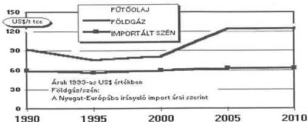
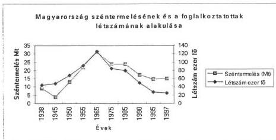
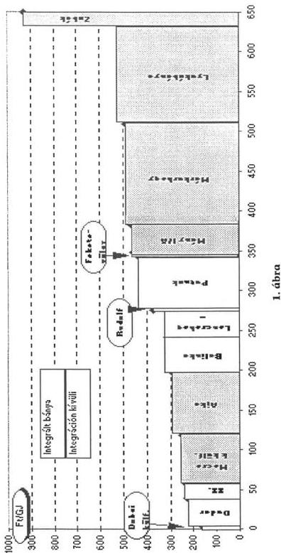
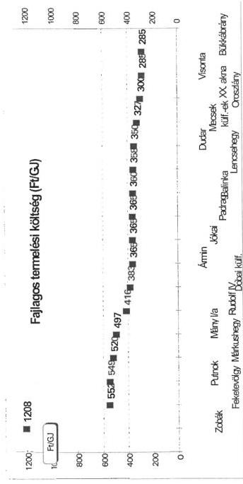
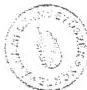
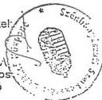

Állami Számvevőszék

# JELENTÉS

a szénbányászat szerkezetátalakítására
hozott kormányprogram végrehajtásának
ellenőrzéséről

9840

1998. november

---

Az ellenőrzés végrehajtásáért felelős:

Halász Gejza

számvevő igazgató

Kemény Emil

mb. igazgató

Az ellenőrzést vezette:

dr. Márkus Gábor

osztályvezető főtanácsos

A jelentést készítette:

dr. Gálik Jenő

számvevő tanácsos

Az ellenőrzésben részt vettek:

Bátory Béláné

számvevő

dr. Gálik Jenő

számvevő tanácsos

Istvánffy Lóránt

szakértő

Kiss Istvánné

számvevő tanácsos

---

V-2-41/1998.TÉMASZÁM:420

# TARTALOMJEGYZÉK

|  **BEVEZETÉS** | **3**  |
| --- | --- |
|  1. A vizsgálatszervezés főbb elemei | 3  |
|  2. A szerkezetátalakítás gazdaságtörténeti háttere | 4  |
|  **I. ÖSSZEGZŐ MEGÁLLAPÍTÁSOK, KÖVETKEZTETÉSEK, JAVASLATOK** | **10**  |
|  **II. RÉSZLETES MEGÁLLAPÍTÁSOK** | **14**  |
|  1. A Bányavagyon Hasznosító Rt.-k alapítási körülményei, a kötelezettségek teljesítése | 14  |
|  2. A BVH Rt.-k vagyongazdálkodása | 17  |
|  3. A szerkezetátalakítással kapcsolatos humánpolitikai intézkedések | 20  |
|  3.1. Humánpolitikai kötelezettségek és kiadások | 20  |
|  3.2. A szervezet-átalakításhoz kapcsolódó létszámmozgások | 21  |
|  3.2.1. Az átalakuló szervezeti rendszer és külső környezete közötti létszámmozgások | 22  |
|  3.2.2. Az átalakuló szervezeti rendszeren belüli létszámmozgások | 23  |
|  3.2.3. Az átalakuló szervezeti rendszer külső környezetében megvalósuló létszámmozgások. | 23  |
|  3.3. A járadékfolyósítás új alapokra helyezése. | 24  |
|  4. A bányabezárási és tájrendezési tevékenységre fordított pénzeszközök felhasználása | 26  |
|  4.1. A SZÉSZEK ellenőrző tevékenysége | 26  |
|  4.2. A bányabezárás, tájrendezés | 27  |
|  4.3. A kiviteli pályázatok és szerződések | 28  |
|  5. A SZÉSZEK felügyelet alatt működő, integráción kívüli bányák | 30  |

1

---

Mellékletek:

1. A hazai szénvagyon alakulása
2. A SZÉSZEK-NYUFIG szerződés
3. A kötelezettségek és a velük szemben átadott vagyon mértéke és összetétele, 1996. január 1-én
4. Putnok bánya kft. közbefizetései és állami támogatása
5. Pozitív példák a BVH Rt.-k társaságalapításaira
6. Negatív példák a BVH Rt.-k társaságalapításaira

Függelék

A BVH Rt.-k humánpolitikai kötelezettségei

2

---

# JELENTÉS

## A SZÉNBÁNYÁSZAT SZERKEZETÁTALAKÍTÁSÁRA HOZOTT KORMÁNYPROGRAM VÉGREHAJTÁSÁNAK ELLENŐRZÉSÉRŐL

### BEVEZETÉS

#### 1. A VIZSGÁLATSZERVEZÉS FŐBB ELEMEI

Az ellenőrzött szervezet megnevezése és címe:

Szénbányászati Szerkezetátalakítási Központ, (továbbiakban: SZÉSZEK) 1024. Budapest, Margit krt. 85.

A vizsgált időszak: Az 1991-től 1997. végéig, figyelembe véve az 1994. évi ÁSZ jelentés adatait.

Az ellenőrzés indoka:

A Kormány a 3329/1990. sz. határozatával döntött a szénbányászat szervezeti és szerkezeti átalakításáról és a pénzeszközöket központi költségvetési forrásból biztosította.

Az átalakításban érintett volt az ipari, a környezetvédelmi és a munkaügyi tárca is, aminek megfelelően több forráson keresztül jutott állami pénzeszköz a szerkezetátalakítás végrehajtására. Az ÁSZ jelentése a SZÉSZEK-en keresztül folyósított támogatásokkal foglalkozik, amely az összes támogatás kb. 70 %-át teszi ki.

Az vizsgálat célja:

Annak megállapítása volt, hogy a szénbányászat szerkezetátalakítása a kormányprogram előírásaival és követelményeivel összhangban történik-e. A bányabezárásokkal kapcsolatban tett humánpolitikai intézkedések megnyugtatóan rendezték-e az érintettek szociális gondjait, hozzájárultak-e az adott térség gazdasági-társadalmi stabilitásához, továbbá, hogy az ÁSZ 1994. évi vizsgálatával feltárt hiányosságokat orvosolták-e.

---3

---

# Az ellenőrzés módszere:

Dokumentumok áttekintése, helyszíni feldolgozása, interjúk készítése, standard ellenőrzési módszerek alkalmazása. Helyszíni ellenőrzést a SZÉSZEK-ben és a Bányavagyon-hasznosító Részvénytársaságokban (továbbiakban: BVH Rt.-k) tartottunk. Tájékozódtunk a Bányászati Dolgozók Szakszervezeténél, az Ipari,-Kereskedelmi- és Idegenforgalmi Minisztériumnál, a Magyar Energia Hivatalnál és a Bányászati Hivatalnál.

# Vizsgálati helyszínek kiválasztása:

A vizsgálat a három BVH Rt. bányabezárási és tájrendezési tevékenységéből véletlenszerűen kiválasztott 8 projektre terjedt ki. A projektek a bányabezárás, tájrendezés valamennyi főbb fázisát képviselik, így többek között a bányafelhagyás, aknatömedékelés, épületbontás, meddőhányó rendezés tevékenységét. A BVH Rt.-k 1994-97. években összesen 4.065 M Ft-ot fordítottak ezekre a célokra, ebből az ellenőrzött projektek 1.411 M Ft-ot képviselnek, ami közel 35 %-os reprezentációt jelent.

# Az ÁSZ vizsgálatok hatásai:

- Az ÁSZ 1994. évi jelentésében javasolta a baleseti és egészsegkárosodási járadékok átváltásat életjáradékká. Az 1989. december 31-e után járadékossá (baleseti, egészsegkárosodási) valt munkavállalok járadékanak átváltásat életjáradékká a SZÉSZEK az AB AEGONBiztosító társasággal megnyugtató modon rendezte. Az 1989. december 31-ig megállapított járadékokat az Országos Nyugdijbiztosítási Föigazgatóság (továbbiakban: NYUFIG) folyósítja a jogosultak részére.
- A SZESZEK nem adott ki a vagyon tarsasagba vitelere vonatkozo szabalyzatot a BVH Rt.-k reszere. Bar a hianyt a vizsgalat ideje alatt potoltak, a Szabalyzat tartalmaval már nem foglalkoztunk.

# 2. A SZERKEZETÁTALAKÍTÁS GAZDASÁGTÖRTÉNETI HÁTTERE

# Külgazdasági körülmények

A mélyművelésű szénbányászat Európa, sőt világszerte visszafejlesztés alatt áll. Ennek alapvető oka az, hogy a szén használata számos ökológiai és műszaki hátránnyal jár a szénhidrogénekhez képest és a használati érték különbség az alkalmazás gazdaságosságában is megmutatkozik. A szénalkalmazás súlya alapvetően csak akkor és ott tud növekedni a szénhidrogénekkel szemben, amikor és ahol az árkülönbség egyértelműen kompenzálni tudja a használati-érték különbséget, sőt a szénalkalmazás gazdasági előnyt biztosít. Ez a Nemzetközi Energia Ügynökség hosszú távú energiahordozó ár prognózisa¹ szerint európai viszonylatban 2000 és 2005 között következik be, amikorra egy újabb szénhidrogén árrobbanás várható, a következő diagram adatainak megfelelően.

¹Dr. Matyi-Szabó Ferenc: Az erőműi szénhasznosítás nemzetközi kilátásai, MVM Rt., 1997. május

4

---

A szénimport lehetőségek vizsgálata az mutatja, hogy ma Magyarországon a legkedvezőbb eredményt költségek tekintetében a lengyel szén nyújtja. (Bekerülési ktg. az erőművek kapujában kb. 460 Ft/GJ. Ugyanez délafrikai szénre az útvonaltól függően kb. 670-700 Ft/GJ. A Ft/GJ=Ft/Gigajoule a szén egységnyi hőtartalmára vetített kitermelési költség.)$^{2}$

A lengyel szén importja korlátozott. Lengyelország most indítja szénbányászati szerkezetátalakítási programját, mely szerint a bányászati ágazatban dolgozók létszámát 2000-ig 237000 főről 170000-re, a kitermelt fekete kőszén mennyiségét 137 millió tonnáról 2000-ig 114, 2005.-ig 101 millió tonnára csökkentik. Ez a körülmény még kérdésesebbé teszi, hogy milyen mértékben és milyen áron lehetséges a lengyel szén importjával számolni.

A tengerentúli szenek bőségesen rendelkezésre állnak, de - főként a tetemes szállítási költségek miatt - beszerzésük nem gazdaságos.

### Nemzetgazdasági környezet

Az előzőekben részletezett külgazdasági körülmények miatt a hazai, mélyművelésű bányászatból származó szenek számottevő részének versenyképessége prognosztizálható az import szenekkel szemben.$^{3}$ 'A gazdaságosság határköltsége az import szénnek az erőművek kapujánál mért bekerülési költsége.'$^{4}$

A magyar energetikai (barna)szenek hőtartalma viszonylag alacsony (kb. 10000-11000 kJ/kg). Az átlagos kitermelési költség a Magyar Geológia Szolgálat adatai szerint cca. 400 Ft/GJ.

$^{2}$ Az 1997. évi beszerzési árak és egyéb költségek (Dr. Matyi-Szabó Ferenc: Az erőműi szénhasznosítás nemzetközi kilátásai, MVM Rt., 1997. május) aktuális, USD és ECU 1998. májusi árfolyamra történő átszámításával.

$^{3}$ A külszíni fejtések ma is gazdaságosabbak, mint bármilyen import.

$^{4}$ Idézet Holló Vilmos a Bányászat című lap 128. évf. 2. számában közzétett cikkéből.

5

---

A jobb minőségű, import (fekete) szenek (20-25000 kJ/kg) a jelenleg üzemelő szenes erőművekben technikai okokból nem égethetők el.

Az 1997. augusztusában kiírt, 1998. februárban módosított erőmű építési tenderek csak a földgáz felhasználást korlátozzák, egyébként nem kötik meg az energiahordozót.

Az új erőműi kapacitások létesítésére vonatkozó hatályos IKIM-MEH irányelvek preferenciát fogalmaznak meg a hazai energiaforrások, kapacitások felhasználására azonos költségfeltételek esetén.

Hazai szénbányászatunk jelenlegi helyzetének tárgyalásához elengedhetetlen a nemzetgazdasági ággal kapcsolatos néhány történeti adat.

A háború után a szénbányászatban erőltetett ütemű extenzív fejlődés indult, az akkori gazdaságpolitika követelményeinek megfelelően. A cél az autark gazdaság energiaigényének kielégítése volt, amiben nem játszottak szerepet gazdaságossági megfontolások. A szénre támaszkodó energiatermeléssel szemben a 60-as években megindult szovjet olajbehozatal és a hazai szénhidrogén feltárások jelentettek változást. 1968-1972 között az új gazdasági mechanizmus alatt kezdték meg a leginkább gazdaságtalan szénbányák termelésének korlátozását, az energia szerkezet a szénhidrogén alapú energiatermelés javára tolódott el. Az 1973-ban bekövetkezett olaj árrobbanás ellensúlyozására azonban ismét előtérbe került a széntermelés. A meghirdetett programok (eocén, liász) beruházásai nem bizonyultak rentábilisnak, előkészítésük hibás gazdaságpolitikai elképzelésekre alapult. Az elhibázott fejlesztések nemcsak a költségvetésben okoztak feszültséget, de megrendítették az egyébként még gazdaságosan működő szénbánya vállalatokat is.

A mélyművelésű szénbányászat visszafejlesztésére az 1990-es években döntés született, megszüntették a széntermelés dotációját, a fogyasztói ártámogatást, a hatósági árszabályozást. A szénbányászat elkerülhetetlen visszafejlesztését a termelés magas költségei mellett a szénfelhasználó erőművek rossz hatásfoka okozta.

6

---

A szénbányászat jelenlegi helyzetét alapvetően meghatározza a szénbányászat szervezeti, irányítási és tulajdonosi rendszerének átalakítására vonatkozó 3530/1992. Kormány határozat, amely a bányaüzemek és a felhasználó szénerőművek szervezeti integrációját írta elő.

A szerkezetátalakítási intézkedések során (több lépcsőben) az alábbi integrációk jöttek létre:

Pécsi Erőmű Rt. - Komlói Bányaüzem (Zobák akna), pécsi külfejtés

Mátrai Erőmű Rt. - visontai és bükkábrányi külfejtések

Bakonyi Erőmű Rt. -ajkai és balinkai bányaüzemek

Borsodi Hőerőmű - Lyukóbánya

Vértesi Erőmű Rt. - Oroszlányi Széntermelő Kft.

- Tatabányai Szénbányák

A SZÉSZEK felszámolói körbe tartozó szénbánya vállalatoktól az integrációk (erőmű-bánya közös gazdasági társaságok) által átvett vagyon és a kötelezettségek:

1. táblázat (MFt)

|  átadó Szén-bánya FA | átvevő Erőmű Rt. | átvett vagyon | átvett kötelezettség  |
| --- | --- | --- | --- |
|  Mecseki | Pécsi Erőmű Rt. | 1 831 | 1 200  |
|  Veszprémi | Bakonyi Erőmű Rt. | 4 968 | 794  |
|  Tatabányai | Vértesi Erőmű Rt. | 2 390 | 226  |
|  Oroszlányi |  | 4 784 | 1 776  |
|  Borsodi | Borsodi Energetikai Kft. | 3 748 | 1 141  |
|  Mátraaljai | Mátrai Erőmű Rt. | 8 054 | 2 649  |
|  Összesen |   | 25 775 | 7 786  |

Az integrációba bekerülő vagyon értékelését a bányák és az erőművek szakemberei külön-külön, az újra előállítási költség figyelembe vételével végezték el, az értékelések közötti eltérés - több egyeztetést követően - jelentéktelen volt.

A múltbéli bányászatból adódó, az integrációk által át nem vett kötelezettségeket az 1994.-ben az integrációk által nem igényelt vagyonelemek fejében a felszámolás alatti szénbánya vállalatoktól a SZÉSZEK által újonnan megalapított Bányavagyon Hasznosító Rt.-k vették át, szerződéses jogviszony alapján.

7

---

Az integráción kívül maradt vagyon értékelését a - SZÉSZEK megbízása alapján - a FŐBER Kft Nemzetközi Ingatlanfejlesztő és Mérnöki Társaság megfelelő színvonalon végezte el.

A szénbányászati szerkezetátalakítás irányítása, szervezése érdekében alapították meg az Ipari, Kereskedelmi és Idegenforgalmi Minisztérium (továbbiakban: IKIM) felügyelete alatt álló SZÉSZEK-et, központi költségvetési szervként.⁵

A SZÉSZEK jogszabályban meghatározott feladatai:

- a szénbánya vállalatok felszámolói tevékenységének ellátása és a felszámolás keretében a szerkezetátalakítás
- a bányavagyon hasznosító részvénytársaságok működtetése, irányítása, ellenőrzése,
- közreműködés a szénbánya-erőmű integrációk megszervezésében,
- az integráción kívüli szénbánya társaságok támogatásának finanszírozására megállapított éves költségvetési keret folyósításának engedélyezése, gazdálkodásának ellenőrzése,
- a bányabezárások, rekultivációk és tájrendezések irányítása, ellenőrzése és finanszírozása,
- a bányakárok felülvizsgálata és finanszírozása,
- az illetékes államtitkár megbízásából eseti feladatok teljesítése,
- saját működési költségvetésének végrehajtása.

A BVH Rt.-k feletti tulajdonosi jogok gyakorlója a Magyar Állam képviseletében a SZÉSZEK, az irányító testületekben (igazgatótanács, felügyelő-bizottság) az érintett államigazgatási szervek képviselői vesznek részt.

A volt szénbánya vállalatok székhelyeihez igazodóan megalakult BVH Rt.-k az alábbiak:

- Mecseki BVH Rt. (Pécs, Dobó István u. 89.)
- Borsodi BVH Rt. (Miskolc, Kazinczy F. u. 28.)
- Észak-Dunántúli BVH Rt. (Veszprém, Budapest u. 2.)

A BVH Rt.-k alaptevékenységei:

⁵ A Dorogi és a Nógrádi Szénbányák felszámolása korábban kezdődött, ezeknél még nem a SZÉSZEK volt a felszámoló.

8

---

- szervezik és végzik a bánya bezárási és tájrehabilitációs munkákat,
- hasznosítják (értékesítik) a volt bányászvagyont,
- ügyintézik a volt bányászlétszámmal kapcsolatos humánpolitikai kötelezettségeket.

9

---

# I. ÖSSZEGZŐ MEGÁLLAPÍTÁSOK, KÖVETKEZTETÉSEK, JAVASLATOK

A Magyar Szénbányászat szerkezetátalakítását hivatalosan a Kormány 3329/1990. sz. határozata rendelte el és a végrehajtáshoz szükséges forrásokat - a volt szénbánya vállalatok vagyonának értékesítéséből nem fedezhető rész fölött - központi költségvetésből biztosította. **A program átfutási időt nem határozott meg, végrehajtása a költségvetés mindenkori teherbíróképességének függvénye.**

A szerkezetátalakítás során döntő szempont volt, hogy a hazai szénvagyon igénybevétele csak a gazdaságos kitermelés mértékéig indokolt. A szénbányászat visszafejlesztésének csak részben oka a szénenergia fajlagosan magas ára, a nem kellő versenyképességéhez legalább olyan mértékben hozzájárul a szénfelhasználó erőművek rossz hatásfoka.

**A szénbányászat szerkezetátalakítása a kormányzati elképzelésekkel összhangban folyik, a költségvetési juttatások felhasználása törvényes, szabályos és gazdaságos volt.**

**A SZÉSZEK-en keresztül kifizetett összeg az 1991-es alapítástól 1997. végéig 18,2 Mrd forint volt.** Ez az összeg magába foglalja a szerkezetátalakításon túl a korábbi bányászati tevékenység eredményeképpen megmaradt bányák bezárási, tájrendezési, létszám leépítési költségeit is. Ebből az összegből 1991-93. között - az előző ÁSZ vizsgálat lezárásáig - 7,1 Mrd Ft, 1994-97. között 11,2 Mrd Ft került felhasználásra. **A ma látható még hátralévő feladatok végrehajtásához 1998. évi árakon további 9,3 Mrd Ft szükséges. A források rendelkezésre állása esetén a szerkezetátalakítási program műszaki szempontból 2002-re befejezhető.**

A SZÉSZEK a BVH Rt.-k irányításával, a társaságok tevékenységén keresztül végzi az állami kötelezettséget jelentő humánpolitikai, bányabezárási, tájrehabilitációs feladatokat és értékesíti, vagy egyéb módon hasznosítja a volt szénbánya vállalatoknak a szénbánya-erőmű integrációk által nem igényelt vagyonát.

Ez a vagyon nem fedezte a BVH Rt.-k által átvállalt kötelezettségeket, ezért a 3439/1993. Korm. határozat rögzítette, hogy a SZÉSZEK 'a mindenkori éves költségvetési törvényben jóváhagyott bányabezárási keret mértékéig ... a bányavagyon hasznosító részvénytársaságok kötelezettségeinek vagyonértékesítésből nem fedezhető hányadát finanszírozza.' Így a Korm. határozat adta felhatalmazás alapján a volt állami szénbánya vállalatok kötelezettségeiért állt helyt a költségvetésből a BVH Rt.-ken keresztül a SZÉSZEK. Az Állam a kötelezettségek fedezetül évente megítélt összeget a költségvetésből a Pénzügyminisztérium fejezet alatt - a gazdálkodó szervezetek egyedi támogatása előirányzaton belül - a keret felhasználását elrendelő kormányrendeletekkel biz-

10

---

I. ÖSSZEGZŐ MEGÁLLAPÍTÁSOK, KÖVETKEZTETÉSEK, JAVASLATOK

tosította. A társaságokat azért alapították, hogy az Állam a felszámolást papírforma szerint lezárhassa, ugyanakkor a törvényszabta két éven belül be nem fejezhető tevékenységeket a társaságokon keresztül folytathassa.

A BVH Rt.-k mérlegében az eszközök között szereplő volt bányász vagyon ellentételezésére a forrás oldalon annak megfelelő mértékű (állami) kötelezettség jelenik meg. A társaságok saját tőkéje az évek során nem változott. **Tulajdonosi szemléletük, vagyongazdálkodásuk javuló tendenciát mutat.**

A vagyon leginkább forgalomképes részeit, 1997. év végéig 2.772 MF-tért értékesítették. A bevételt a költségvetésből folyósított 11.199,5 MF-tal együtt az államot terhelő bányabezárási, bányakár és rekultivációs feladatcsoport megoldására fordították. A társaságalapítás a vagyonhasznosítás új szakaszát jelenti.

A már bezárt bányák felszíni létesítményei között találhatók nem védett, de színvonalas, ipari műemlék jellegű épületek, építmények. E vagyonrészeket - a SZÉSZEK véleménye szerint - az a veszély fenyegeti, hogy eladásuk esetén - új funkciójuknak megfelelően - elveszítik műemlék jellegüket.

A BVH Rt.-k működési költsége 1994. és 1997. között összesen 1.825,3 MF-t volt.

A volt állami szénbánya vállalatok működése alatt keletkezett, az államot mint jogutódot terhelő és a BVH Rt.-k által teljesítendő műszaki és humán kötelezettségek 1997. december 31.-i állománya 9 266 MF-t volt, míg a vagyon állománya 4 043 MF-tot tett ki.

A Gazdasági Minisztérium Energetikai Főosztálya szerint „Az integráción kívüli bányák fenntartása eddig is kizárólag foglalkoztatási szempontból volt indokolt...”, „Az integrációs bányatársaságok bányáinak költségét az átmenet idején el kell ismerni, és ennek módszerén sem érdemes két évre változtatni...”

E véleménynek némileg ellentmondanak a működő, integráción belüli és kívüli szénbányáktól származó összevethető termelési költségadatok, amelyek szerint az integráción kívüli bányák **fajlagos költségeiket tekintve a középmezőnyben foglalnak helyet**, megelőzve több integrációba vitt bányát.

Az egyes bányák gazdaságosságában meghatározó szerepe van az energia átvételi ár mechanizmusnak. A szenes erőművek által előállított energia átvételi árát az ipari miniszter állapította meg a Magyar Energia Hivatal közreműködésével. **Az árban külön térítik az integrációkhoz tartozó bányák - termeléstől független - költségeit, bányakapacitás-lekötési díj címen.** Az ár konstrukciója eredményezi, hogy az integrációk a kívül maradt bányák szenét csak saját fajlagos változó költségeik alatti áron veszik át, ami a kívül maradt bányák részére veszteséget jelent, mivel nem részesülnek a kapacitás lekötési díjból.

A magyar szénbányászat szervezeti - tulajdonosi szerkezetének átalakítása jelentős létszámmozgással és ezen belül nagy létszámcsökkenéssel járt, **több tízezer munkahely szűnt meg.** A SZÉSZEK megalapítása óta több mint 6 MRD Ft-ot költött humánpolitikai kiadásokra, és az elkövetkezendő években

11

---

I. ÖSSZEGZŐ MEGÁLLAPÍTÁSOK, KÖVETKEZTETÉSEK, JAVASLATOK

még körülbelül 2 Mrd Ft költség várható. A SZÉSZEK a szerkezetátalakítás humánpolitikai oldalát körültekintéssel oldotta meg.

A BVH Rt.-k a SZÉSZEK operatív irányítása mellett a bányabezárást, tájrendezést a vonatkozó jogszabályoknak megfelelően végzik. Az ellenőrzött pályázatok szabályosak voltak, a munkával a legkedvezőbb ajánlatot adót bízták meg. A SZÉSZEK az elvégzett munkákat, mind műszaki, mind pénzügyi szempontból ellenőrizte. A szerződések csak a jóváhagyó záradékolásával léptek életbe. A túlzottnak tartott vállalkozói díj esetében a benyújtott számlákat felülvizsgálta és az indokolatlannak tartott kifizetéseket megtagadta (mintegy 80 MFt értékben). Ugyanakkor egy-két esetben engedélyezett megalapozott, terven felüli kifizetéseket, a terület és eszköz értéknövelése, a jobb eladhatóság céljából (kb. 90 MFt).

A bányabezárások, tájrendezések munkálatai rendelkeznek a jogszabályokban előírt hatósági engedélyekkel. Az előírásokat betartották, a műszaki átadást követő hatósági bejáráskor az elvégzett munkálatokat a hatóság tudomásul vette.

A helyreállított táj környezetvédelmi szempontból megfelelő. Egy-két esetben a helyreállítás az eredeti állapothoz képest értékesebb tájegység kialakításának a lehetőségét is megteremtette pl.: kerékpárút, tavas üdülőkörzet. A SZÉSZEK véleménye alapján néhány helyen várható a rekultivált táj talajának megsüllyedése, ami - ha az lakott területet érint - kártérítési kötelezettséggel jár.

A SZÉSZEK 1996-97-ben országos katasztert készíttetett valamennyi bányahely állapotának a feltárására. Ennek alapján megállapítható, hogy nem csak a közelmúltban bezárt bányák tájrendezését kell elvégezni, hanem több évtizede felhagyott bányaterület rekultivációja is szükséges. Ezek közül számos területen életveszélyes állapot van, amelynek felszámolása sürgős intézkedést igényel. Néhány halaszthatatlan esetben a SZÉSZEK intézkedett a veszély elhárítására, a teljes rehabilitációra azonban a rendelkezésre álló költségvetési forrás nem elegendő. Mivel a veszélyelhárítás és a bányaaknak felszámolása elsőbbséget élvez, a korlátozott költségkeret következményeként a táj - környezetvédelmi szempontoknak megfelelő - helyreállítása késedelmet szenvedhet.

A SZÉSZEK alapvetően gondos tevékenysége mellett az ellenőrzés feltárt néhány hiányosságot.

- A kivitelezéshez kiírt pályázatok néhány esetben elnagyoltak, pontatlanok.
- A SZÉSZEK irattára nem volt teljes körű, nem található meg benne minden projekt végelszámolása, ami a tisztánlátást nehezíti.
- Az üzletrészekben lévő vagyon nyilvántartása nem naprakész.

A SZÉSZEK-ben a vizsgált időszakban szervezeti változás nem történt. Központi költségvetési szerv, működési költségei minden évben az előirányzaton belül maradtak. Éves költségvetési beszámolási kötelezettségének eleget tett.

12

---

I. ÖSSZEGZŐ MEGÁLLAPÍTÁSOK, KÖVETKEZTETÉSEK, JAVASLATOK

# Javaslatok

## A gazdasági miniszter

Vizsgáltassa felül az integrációkban termelt szénbázisú energia átvételi árának szerkezetét, az energia átvételi árában megjelenő bányakapacitás-lekötési díj elkülönítésének hatását és szükségességét.

## A nemzeti kulturális örökség minisztere

Vizsgáltassa meg, hogy a magyar mélyművelésű szénbányászat még meglévő emlékei közül van-e megőrzésre, esetleg műemlékké nyilvánításra méltó.

## A SZÉSZEK

- • Különítse el pénzügyi és műszaki nyilvántartásaiban a BVH Rt.-k által a felszámolás alatti szénbánya vállalatoktól átvett és a múltbeli bányászkodás állami kötelezettséget jelentő - a későbbiek során folyamatosan jelentkezett és jelentkező - következményeit;
- • Dolgozzon ki erőteljesebb, hatékony érdekeltségi rendszert a BVH Rt.-k részére;
- • Vizsgálja felül eddigi szabályzatait és teremtse meg a szabályzatok és az alapító okiratok összhangját;
- • A saját (alapítói) hatáskörben tartott döntési körben a vagyonértékesítési vagy társaságba vitelre vonatkozó szerződéskötéseknél is éljen záradékolási jogával;
- • A BVH Rt.-k saját kivitelezésében végzett bányabezárási munkáinál teljes körűen követelje meg a bezárás költségeinek megtervezését és csak a műszakilag indokolt, előre nem látható körülmények bekövetkeztekor engedélyezzen többletkifizetést;
- • Következetes, átgondoltabb pályázati kiírások megkövetelésével igyekezzen meggátolni az utólagos, árnővelő kivitelezői igényeket. Ehhez adjon ki megfelelő szabályzatot (irányelveket) a BVH Rt.-k számára;
- • Egészítse ki saját irattárát az egyes projektek meghatározó irataival és végelszámolással zárja le az adott projekt iratanyagát. Projektenként valamennyi ráfordítást napra készen tartsa nyilván.
- • Követelje meg az üzletrészekben meglévő vagyon naprakész nyilvántartását.

13

---

II. RÉSZLETES MEGÁLLAPÍTÁSOK

## II. RÉSZLETES MEGÁLLAPÍTÁSOK

### 1. A BÁNYAVAGYON HASZNOSÍTÓ RT.-K ALAPÍTÁSI KÖRÜLMÉNYEI, A KÖTELEZETTSÉGEK TELJESÍTÉSE

A BVH Rt.-ket azért alapították, mert a szénbánya vállalatok felszámolási eljárásait a törvényben előírt két év alatt nem lehetett lezárni az alábbi okok miatt:

- hiába veszteséges egy tevékenység, azt sem foglalkozáspolitikai, sem műszaki szempontok miatt nem lehet azonnal leállítani;
- a bányabezárási, tájrendezési munkákat megelőző tervezési, engedélyezési és pályáztatási feladatok elvégzése időt vesz igénybe;
- vagyonértékesítésre a legtöbb esetben csak a bányászati tevékenység teljes befejezése, a bányabezárás, a bontás, és a rekultiváció után kerülhet sor;
- a felszámolás alatti vállalatok peres ügyeinek lezárása éveket vesz igénybe.

A BVH Rt.-k megalapítására vonatkozó 3439/1993. Korm. határozat indirekt módon a felszámolás alatti szénbánya vállalatok vagyonának társaságba vitelére (és onnan folyamatos értékesítésére) utal. Konkrétan az írta elő, hogy a vagyonnak melyek azok a (az állam kizárólagos tulajdonát képező) részei, amelyek nem vihetők a társaságba. A BVH Rt.-ket 10 M Ft-os saját tőkével alapították, amelyek a mai napig összes saját vagyonukat jelenti.

**SZÉSZEK előírásra a BVH Rt.-k „adás-vétellel vegyes kötelezettség átvállalási” szerződést kötöttek a felszámolás alatti szénbánya vállalatokkal** (továbbiakban: FA-kkal), amelyben a vagyon fejében - annak értékénél lényegesen magasabb összegű - kötelezettségeket vállaltak át. A 3439/1993. Korm. határozat erre tekintettel rögzítette, hogy a SZÉSZEK "a mindenkori éves költségvetési törvényben jóváhagyott bányabezárási keret mértékéig ... a bányavagyon hasznosító részvénytársaságok kötelezettségeinek vagyonértékesítésből nem fedezhető hányadát finanszírozza."

Ezt követően a kötelezettségek az államról névleg a BVH Rt.-kre szálltak át. Az állam a kötelezettségek fedezetéül évente megítélt összeget a költségvetésből a Pénzügyminisztérium fejezet alatt - a gazdálkodó szervezetek egyedi támogatása előirányzaton belül - a keret felhasználását elrendelő kormányrendeletekkel biztosította. A társaságokat azért alapították, hogy az Állam a felszámolást papírforma szerint lezárhassa, ugyanakkor a törvényszabta két éven belül be nem fejezhető tevékenységeket a társaságokon keresztül folytathassa.

Az „adás-vétellel vegyes kötelezettség átvállalási” szerződésekben került rögzítésre a BVH Rt.-k által átvett (az integrációk által nem igényelt) vagyon mérté-

14

---

II. RÉSZLETES MEGÁLLAPÍTÁSOK

ke, összetétele és az akkor látható, a korábbi évtizedek bányaműveléséből származó kötelezettségek$^{6}$ felsorolása (környezeti kárelhárítások, rekultivációk, bányakárok, az FA-kból elbocsátott volt bányászlétszám humánpolitikai vonatkozású költségei). Az alapítás és az „adás-vétellel vegyes kötelezettség átvállalási” jogügylet formailag szabályos. A kötelezettségek vagyon feletti hányadáért az állam felel.

**A BVH Rt.-k** felelősségérzete, tulajdonosi szemléletük a vagyongazdálkodással kapcsolatban nehezen alakult ki. Saját tőkéjük, egyéni jövedelmeik mértéke független az általuk végzett munka eredményétől.

A vagyonértékesítés bevétele és a működési költségek alakulása

2. táblázat (MFt)

|  év | Mecseki BVH Rt. |   | Borsodi BVH Rt. |   | É-D.túli BVH Rt. |   | Összesen  |   |
| --- | --- | --- | --- | --- | --- | --- | --- | --- |
|   |  értékesítés bevétele | működési ktg.* | értékesítés bevétele | működési ktg.* | értékesítés bevétele | működési ktg.* | értékesítés bevétele | működési ktg.*  |
|  **1994.** | 303 | 74 | 90 | 203 | 202 | 49 | 595 | 326  |
|  **1995.** | 269 | 116 | 81 | 218 | 320 | 80 | 670 | 414  |
|  **1996.** | 420 | 140 | 214 | 236 | 241 | 144 | 875 | 520  |
|  **1997.** | 304 | 158 | 59 | 227 | 269 | 181 | 632 | 566  |
|  bevétel összesen | **1 296** |  | **444** |  | **1 032** |  | **2772** |   |
|  működési ktg. össz. |  | **488** |  | **884** |  | **454** |  | **1826**  |

\* A működési költség megnevezés ebben a táblázatban kizárólag a szervezetek saját működésére vonatkozik és nem tartalmazza a SZÉSZEK nyilvántartásokban ugyanez alatt a név alatt nyilvántartott, a vagyon fenntartásához, értékesítéséhez és a humánpolitikai kötelezettségek ellátásához szükséges költségeket.

A vagyonértékesítés és vagyonhasznosítás együttes hozama a Borsodi BVH Rt.-nél a szervezet saját működésére sem nyújtott fedezetet. A három BVH Rt. összesítve négy év alatt 946 MFt eredményt ért el, közel 2,8 Mrd Ft értékesítési árbevétel mellett.

$^{6}$ Ahol az állam a jogutód, mára az összes, bányaművelésből származó rekultivációs és bányakárok intézése a SZÉSZEK és a BVH Rt.-k feladata, nemcsak azoké, amelyek a SZÉSZEK felszámolói köréhez tartoztak. Ha a jogutód személye nem kideríthető, a rekultiváció és a környezeti kárhelyreállítás az 1992. évi LXXXIII. törvény szerint a Központi Környezetvédelmi Alap feladata.

15

---

II. RÉSZLETES MEGÁLLAPÍTÁSOK

A BVH Rt.-k bevételei és kiadásai az alábbiak:

|  Bevételek | Kiadások  |
| --- | --- |
|  - Az átvett vagyon értékesítése (ingatlan, ingó készletek, tartozások) | - Műszaki kötelezettségek (bányabezárás, bányakár, rekultiváció, egyéb)  |
|  - Az átvett vagyon hasznosítása | - Humán célú kötelezettségek (felmondás, végkielégítés, kedvezményes nyugdíj, járadék stb.)  |
|  - Állami helytállás (költségvetés) | - Egyéb kötelezettségek (felszámolási ktg.-k, perek stb.)  |
|  - Egyéb bevételek | - Működési költségek  |

Az 1991-1997 években a kötelezettségek teljesítésére költségvetési forrásból fordított pénzeszközök:

3. táblázat (MFt)

|  év | bánya-bezárás | bánya-kár | tájren-dezés | vagyon-hoz kötött | műszaki összesen | humán | működő bányák | egyéb kötelezetts. | mind-összesen  |
| --- | --- | --- | --- | --- | --- | --- | --- | --- | --- |
|  **megelőző ÁSZ vizsgálat időszaka**  |   |   |   |   |   |   |   |   |   |
|  91-93 | 1 116 | 114 | 499 | - | 1 729 | 2 219 | 1 140 | 1 962 | 7 050  |
|  **követő évek adatai**  |   |   |   |   |   |   |   |   |   |
|  94 | 650 | 134 | 280 | - | 1 064 | 903 | 300 | 601 | 2 868  |
|  95 | 750 | 83 | 272 | - | 1 105 | 906 | 300 | 444 | 2 755  |
|  96 | 684 | 67 | 313 | - | 1 064 | 898 | - | 514 | 2 476  |
|  97 | 775 | 79 | 342 | 472 | 1 668 | 765 | - | 667 | 3 100  |
|  94-97 | 2859 | 363 | 1207 | 472 | 4901 | 3472 | 600 | 2226 | 11199  |
|  **mindösszesen**  |   |   |   |   |   |   |   |   |   |
|  91-97 | 3 975 | 477 | 1706 | 472 | 6 630 | 5691 | 1 740 | 4148 | 18 249  |

A kötelezettségek és a velük szemben átadott vagyon mértékét és összetételét 1996-os nyitó állapot szerint aktuális árszinten a 3. melléklet tartalmazza.

A BVH Rt.-ket érintő kötelezettségek köre az eredeti szerződésben rögzített összetételt követően többször is változott. Ennek oka részben az, hogy a későbbiek során átvették a mátrai, a tatabányai, a nógrádi és a dorogi szénbányák fennmaradt kötelezettségeit is. Ezek teljesítése is SZÉSZEK felügyelet alatt, ugyanabból a költségvetési forrásból folyik. Mára tehát minden bányabezárás jellegű állami feladat a SZÉSZEK-nél koncentrálódik, azok is, ahol nem a SZÉSZEK volt a felszámoló. A kötelezettségek körét bővítették a szerződések megkötése után napvilágra került környezeti károk is, amelyeket sok esetben életvédelmi okokból soron kívül kellett elhárítani.

16

---

II. RÉSZLETES MEGÁLLAPÍTÁSOK

**A kötelezettségeket a SZÉSZEK két évenként értékelteti.** A még fennálló állomány 1997. december 31-én a FŐBER Kft Nemzetközi Ingatlanfejlesztő és Mérnöki Társaság **1998. évi értékelése szerint 9.266 M Ft. A ma látható feladatok végrehajtásához 1998. évi árakon még 9,3 Mrd Ft költségvetési forrás szükséges.**

A források ütemes rendelkezésre állását feltételezve a szerkezetátalakítási program műszaki szempontból 2002-re befejezhető. A lezárás időpontját eddig számításba nem vett új feladatok módosíthatják.

A BVH Rt.-knél érzékelhető a törekvés az alapítói célokon időben és tevékenységben túlmutató tevékenységre. Az Rt.-k túlélésére vonatkozó elemzést és döntést az alapítónak időben mérlegelnie kell.

A maradék vagyon hasznosítása mellett a társaságok továbbélésének lehetőségét jelentheti a társaságok számára a közreműködés privatizált bányák bezárásában és a most induló lengyel és román szénbányászati szerkezetátalakításban, magas színvonalú, speciális és sokrétű szaktudást igénylő elvégzett munkájuk alapján. Továbbélést jelenthet a jelenlegi, integráció kívüli bányaművelés irányításán kívül a BVH Rt.-k kezében lévő bányatelkek (bányászathoz való jog) hasznosítása (nyomott árú eladásuk helyett), a bezárandó mélyművelés helyett jó gazdasági és műszaki feltételeket ígérő külszíni fejtés megindítása saját társaságban, vagy a bányászati joggal társaságba lépés. (A várható nyereség mellett a megoldás csökkentené a bezárások humánpolitikai költségeit is.) Némi bizonytalanság uralkodik ezzel kapcsolatban, annak ellenére, hogy például Feketevölgy esetében konkrét lehetőség látszik. Az iparágban többen úgy értelmezik a szerkezetátalakítást, hogy Magyarországon ezután állami tulajdonú társaság még jó nyereséget ígérő külszíni fejtés kapcsán sem foglalkozhat szénbányászattal.

## 2. A BVH Rt.-k VAGYONGAZDÁLKODÁSA

A BVH Rt.-k vagyongazdálkodással kapcsolatos tevékenységének irányítására a SZÉSZEK szabályzatokat adott ki, a vagyon társaságba vitelét vizsgálatunk ideje alatt szabályozta. (A szabályzat tartalmi ellenőrzésére már nem volt lehetőség.)

A vagyongazdálkodással a szokásos mértékig a BVH Rt.-k Alapító Okirata is foglalkozik. A kiadott szabályzatok az Alapító Okiratban foglaltakkal nincsenek összhangban.

Az Alapító Okirat 100 MFt értékű vagyonértékesítést utal az ügyvezető jogkörébe, míg a szabályzatok erre vonatkozóan limitet nem határoznak meg. Valójában minden értékesítési ügy a SZÉSZEK elé kerül, de amíg a bányabezárásra és rekultivációra vonatkozó szerződéseket a SZÉSZEK mindig ellenjegyzi és a számlákat felülvizsgálja, a vagyon értékesítésére vonatkozó szerződéseken nem szerepel SZÉSZEK aláírás.

17

---

II. RÉSZLETES MEGÁLLAPÍTÁSOK

A három BVH Rt. vagyongazdálkodása 1996-ig szinte kizárólag vagyonértékesítést jelentett.$^{7}$ A vagyonból az elmúlt években a forgalomképes ingatlanok, gépek, berendezések keltek el. A megmaradt vagyon nagy részét a volt, szénbányászati kiegészítő tevékenységeket folytató, még a szénbányák által alapított társasági részesedések, esetenként az erőművekből kapott részvények tették ki. A régi társasági részesedések üzleti értéke alacsony, tekintettel arra, hogy a társaságok fejlesztése tőkeigényes, általában elavult gépparkkal dolgoznak.

A BVH Rt.-k nagy számban selejteztek és bontottak le építészetileg értéktelen és speciálisan csak bányászatra hasznosítható építményeket. A bontandó, vagy felújítandó építmények kiválasztása nagy szakmai, gazdasági hozzáértést igényelt, hogy a bontás ne érintsen műemlék jellegű értékeket.

Különösen jó példák láthatók a válogatásra a Mecseki BVH Rt.-nél, amelynek kezelésében századfordulás és 20. század eleji jó állapotú, kiváló építészeti megoldású, ipari műemlék jellegű építmények vannak.

Az értékesítéseknél a SZÉSZEK mérlegeli, hogy a vagyont a kínált árért a BVH Rt. eladhatja-e. A mérlegelésnél alapvető szempont, hogy a vagyon állaga az elkerülhetetlen fenntartások mellett is romlik-e és őrzése mennyibe kerül. Csak olyan ingatlanok megtartásához, felújításához járulnak hozzá, amelyek önmagukban komoly értéket képviselnek és hasznosításukra jók az esélyek.

A BVH Rt.-k 1996. évi ingatlan értékesítési tevékenységét szűrőpróba szerű mintavétellel vizsgáltuk. E téren legnagyobb nehézségekkel a Borsodi BVH Rt. küzd, a fizetőképes kereslet hiánya miatt. Amíg a másik két BVH Rt. jóval a nyilvántartási érték fölött értékesített, addig Borsodban csak a könyv szerinti érték alatt lehetett eladni a javakat.

Az 1996. évi ingatlanértékesítések eredménye: 4. táblázat (Mft)

|  BVH Rt. megnevezés | értékesített ingatlanok száma | Ingatlanok nettó értéke | eladási ár ÁFA nélkül  |
| --- | --- | --- | --- |
|  Észak-Dunántúli | 22 | 97, 7 | 148, 0  |
|  Mecseki | 9 | 81, 5 | 204, 7  |
|  Borsodi | 10 | 23, 4 | 9, 9  |

1996.-ban mutatkoztak első jelei annak, hogy az Rt.-k a nehezen értékesíthető kategóriába tartozó vagyonnal megkíséreltek gazdálkodni és az **értékesítések helyett - hosszabb távon - nagyobb bevételt eredményező vagyonhasznosításra tettek kísérleteket.**

A stratégiaváltás elsősorban azt jelenti, hogy a telkeket, irodaépületeket, műhelyeket hasznosító különféle vállalkozásokban társakká váltak. Az ingatlanokat

$^{7}$ A szöveges mérlegbeszámolók adatai alapján

18

---

II. RÉSZLETES MEGÁLLAPÍTÁSOK

szükség szerint felújították, átalakították, esetleg közművesítették annak érdekében, hogy apportként értékelhetők legyenek, hogy a konkrét vállalkozások céljainak megfeleljenek.

A BVH Rt.-k ingatlanvagyona általában művelésből kivett, ipari minősítésű terület. Így az itt létesülő, "barna mezős" beruházások több oldalú előnyt jelentenek azzal, hogy új cégek már korábban is ipari célokra igénybe vett, általában közművesített, ipari területekre telepíthetők, további "zöld mező" igénybevétel nélkül.

A megfelelő piackutatást követően az ilyen befektetésekkel az eredeti vagyonérték többszörösére növelhető.

A Pécsi Ipari Park újhegyi területén például a Mecseki BVH Rt. az eredetileg (vagyonértékelés szerint) 30,7 MFt értékű területen 172 MFt közművesítést és tereprendezést végzett. Ennek eredményeképpen eddig a terület 19,3 ha részének értékesítéséből 287,3 MFt bevétel keletkezett, 7,2 ha mértékű részének apportként történt hasznosítása pedig 128,8 MFt értékű üzletrész tulajdonjogát eredményezte. Az üzlettárs vállalta, hogy a BVH Rt. ilyen irányú kezdeményezése esetén az üzletrészt inflációval növelt áron kivásárolja. Az ingatlan négyzetméter ára az eredeti 150 Ft/m²-ről így 2800 Ft/m²-re emelkedett. Az Ipari Park további 18 ha méretű területén is - a további befektetéseket követően - hasonló megtérülések várhatók.

Az Rt.-k tulajdoni hányadát az apportként társaságba vitt volt bányaüzemi területek, telephelyek adják. A kezelt vagyonból a BVH Rt.-k által alapított társaságok esetében a bejegyzett, az okiratokban szereplő tulajdonosok a BVH Rt.-k, de ennek ellenére ezek az üzletrészek sem szerepelnek a saját tőkéjükben, a forrás változatlanul a (rövidlejáratú) kötelezettségek.

A BVH Rt.-k néhány jobb vagyonhasznosítására a 4. mellékletben mutatunk be példákat, amelyek a vagyonhasznosítás 1996-ot követő szakaszára jellemzőek. Az üzletrészekkel kapcsolatban a korábbiakban nem volt határozott üzletpolitika. A vagyon társaságba viteléről csak 1998-ban készített a SZÉSZEK szabályzatot.

A társasági ügyek áttekintése az alábbi, többször is előforduló hibákat tárta fel:

- A portfólió jelentékeny részét nagyon kis üzletrészek teszik ki, amelyekkel a társaságok üzletpolitikája, osztalékpolitikája nem befolyásolható. A kis üzletrészek megszerzése és megtartása nem megalapozott.
- Az alapított társaságok szereznek üzletileg nehezen indokolható, apró részesedéseket.
- Az üzletrész mértékének nem megfelelő arányúak a managment jogok.
- Gyakran feleslegesen bonyolult tulajdonosi összetételt tartanak fenn. (A BVH Rt.-nek és esetleg több társaságának is van kisebbségi üzletrésze ugyanabban a társaságban).

19

---

II. RÉSZLETES MEGÁLLAPÍTÁSOK

• A társasági részesedésekben meglévő vagyon nyilvántartása a Mecseki BVH Rt.-nél nem volt napra kész, a kért adatokat több hetes késedelemmel tudták rendelkezésre bocsátani.

A kifogásolt üzletpolitikára néhány példát mutatunk be az 5. mellékletben.

A vagyongazdálkodás folyamatában pozitív tendencia érvényesül, de a társaságalapítási és irányítási a tevékenységen valamint ezek dokumentálásán a jövőben javítani lehet.

# 3. A SZERKEZETÁTALAKÍTÁSSAL KAPCSOLATOS HUMÁNPOLITIKAI INTÉZKEDÉSEK

# 3.1 Humánpolitikai kötelezettségek és kiadások

A szerkezetátalakítással összefüggő humánpolitikai kötelezettségek két csoportra oszthatók:

• egyik részük a munkavállalók korábbi tevékenységével kapcsolatban keletkezett (baleseti, egészségkárosodási kártérítések stb.),
• másik részük a munkaviszony megszüntetése miatt merült fel (felmondási időre jutó munkabér, végkielégítés, nyugdíj stb.).

Az egyes kötelezettségek a mindenkori hatályos jogszabályok szerint vagy a munkáltatót, ill. jogutódját, vagy a központi költségvetést, vagy a társadalombiztosítást terhelik.

A SZÉSZEK hatáskörébe tartozó szervezetek humánpolitikai kiadásai 1991-97. között 5. táblázat

|  Megnevezés | Állami vállalatok | MFt  |   |
| --- | --- | --- | --- |
|   |   |  BVH Rt.-k | Együtt  |
|  Felmondás, végkielégítés | 1.551 | 385 | 1.936  |
|  Korengedményes nyugdíj | 243 | 522 | 765  |
|  Baleset, eü. kár. járadék | 671 | 1.716 | 2.387  |
|  Nyugdíjas szénjárandóság | 698 | - | 698  |
|  Egyéb | 205 | 222 | 427  |
|  Összesen: | 3.368 | 2.845 | 6.213  |

A 6.213 M Ft-ból 1991-93. között 3.368 M Ft, azaz 54,2 % került kifizetésre. A felmondások végkielégítések több mint másfél Mrd Ft-ot kitevő összege a szénbányavállalatok megszűnésekor (1991-93.) merült fel. A baleseti és egészségügyi kiadások összege 1994 után azért emelkedett, mert ezeket a kötelezettségeket a megszűnt szénbánya vállalatoktól a BVH Rt.-k teljes egészében átvették. A humánpolitikai kiadások 1998-ra lényegesen mérséklődtek.

20

---

II. RÉSZLETES MEGÁLLAPÍTÁSOK

Az 5. táblázatban feltüntetett humánpolitikai kiadás 522 M Ft-tal magasabb a 3. táblázat hasonló értékénél, mivel itt a központi költségvetés kiadásain túl a BVH Rt.-k saját forrásai is szerepelnek.

Az integrációba került munkavállalók részére nem kellett felmondási bért, végkielégítést fizetni, mivel a dolgozók munkajogi jogutódlással kerültek az erőműi társaságokhoz.

Becslések szerint a költségvetés és a társadalombiztosítás - szerkezetátalakításból fakadó - humánpolitikai többletkiadása mintegy 20 Mrd Ft (nyugdíjak, munkanélküli és egyéb segélyek többlete).

### 3.2. A szervezet-átalakításhoz kapcsolódó létszámmozgások

Az 1980-as évek végére a bányászat válságágazattá vált, több milliárd forintot kitevő adósság, értékesítési és likviditási nehézségek következtében olyan nagyságrendű létszám vált feleslegessé amelynek elbocsátása már különböző problémákat vetett fel, mind az elbocsátó szervezet, mind az érintett régió szempontjából.

A bányák 1994. év végéig (egy kivételével) kikerültek a szénbánya vállalatok üzemeltetői köréből, a perspektivikusnak ítélt bányákat az erőmű rt.-khez apportálták. 1988. és 1994. között a mélyművelésű szénbányák közel fele befejezte működését.

Az integrációból kimaradt bányákra bezárás várt, de ennek gyors végrehajtása - a SZÉSZEK véleménye szerint - kezelhetetlen munkanélküliség növekedést vont volna maga után az amúgy is munkanélküliséggel sújtott régiókban. A munkaerő-piaci helyzetet illetve a munkanélküliség megyénkénti helyzetét mutatja az alábbi táblázat:

A KSH 1996. évi adatai alapján:

|  Közigazgatási terület | Munkanélküliségi ráta  |
| --- | --- |
|  Magyarország | 10,8 %  |
|  Budapest | 5,6 %  |
|  Magyarország 19 megyéje | 7,5-18,9 %  |
|  Szénbányászattal érintett megyék | 9,4-17,8 %  |

A bányák a közepes és rossz foglalkoztatási helyzetben lévő megyékben helyezkednek el. Településenként vizsgálva a szénbányászati munkavállalók aránya eltérő.

Foglalkoztatási szempontból a szerkezetátalakítást egy rendszerként kezelve a létszámmozgások három fő csoportra oszthatók:

21

---

II. RÉSZLETES MEGÁLLAPÍTÁSOK

- az átalakuló szerkezeti rendszer és külső környezete közötti létszámmozgások,
- az átalakuló szervezeti rendszeren belüli létszámmozgások, és
- a külső környezetben megvalósuló létszámmozgások.

### 3.2.1. Az átalakuló szervezeti rendszer és külső környezete közötti létszámmozgások

Az érintett időszakban (1991-97.) a rendszerben foglalkoztattak száma 51 ezerről 25 ezerre csökkent, a csökkenés a belépések (10 ezer) és az eltávozások (36 ezer) eredője.

1994-től a létszámmozgás erőteljes csökkenése figyelhető meg. Ez elsősorban azzal magyarázható, hogy az integráció létrejöttével a szénbányák szerkezet-átalakítása - létszám oldalról - zömében 1991-93. között befejeződött.

A viszonylag nagy számú belépés két okkal magyarázható. Egyfelől a szénbányászat létszám fluktuációja mindig is nagy volt és ez az átalakulás kezdeti időszakában is érvényesült. Másfelől a rendszer keretében maradt üzemek működéséhez szükséges szakember ellátottságot biztosítani kellett, miközben a rendszeren belüli mozgás meglehetősen korlátozott volt.

A rendszerből kilépők közül 14 ezren kerültek közvetlenül nyugdíjba, (és nyugdíjszerű ellátásba) míg 22 ezren a külső munkaerőpiacon jelentek meg.

A nyugdíjazás ebben az időszakban a szokásosnál nagyobb arányú volt, ezt a folyamatot az állam a jogszabályok módosításával segítette.

A SZÉSZEK támogatta és ösztönözte a lehetőségek kihasználását. Az időszak során igénybevett nyugdíjazási formák és alkalmazásuk aránya:

|  • öregségi nyugdíj | 14,9 %  |
| --- | --- |
|  • korkedvezményes nyugdíj | 2,5  |
|  • bányász nyugdíj | 26,0  |
|  • rokkantsági nyugdíj | 39,4  |
|  • korengedményes nyugdíj | 16,7  |
|  • előnyugdíj | 0,5  |

Az 1991-ben bevezetett (a bányákban teljesített műszakszámhoz kötött) bányásznyugdíj ugrásszerűen kibővítette a lehetőségeket. A rokkantsági nyugdíjazásra - a kritériumok rugalmasabb kezelésével - a korábbinál ugyancsak nagyobb arányban kerülhetett sor. A korengedményes nyugdíjazás alkalmazása finanszírozási kérdés is, a munkaügyi szervek és a SZÉSZEK pénzügyi támogatásával ez a lehetőség is bővült.

22

---

II. RÉSZLETES MEGÁLLAPÍTÁSOK

### 3.2.2. Az átalakuló szervezeti rendszeren belüli létszámmozgások

A rendszer elemei a következők:

- állami szénbányászati vállalatok,
- bánya-erőmű integrációk,
- szénbányászati vállalkozások és
- egyéb kivált szervezetek.

A rendszeren belüli létszámmozgások többsége az állami vállalatokból a többi szervezeti forma felé irányult. A BVH Rt.-k és a Szénbányászati Vállalatok között mindkét irányú mozgás előfordult. Az egyik szénbányászati vállalkozás létszámával együtt került erőműi integrációba.

Az 1000 főt meghaladó létszámmozgások számszerű alakulása:

- az állami vállalatoktól
  = erőműi integrációhoz 14.800 fő
  = BVH Rt.-be 1.900 fő
  = szénbányászati vállalkozásba 8.600 fő
- szénbányászati vállalkozásból
  = erőműi integrációba 3.800 fő

Külföldi munkaerőt csak a Mecseki Szénbányáknál (majd az integrációnál), Lencsehegyen és Márkushegyen alkalmaztak (az 1997. december 31-i adatok alapján összesen 900 fő). Alkalmazásukra azért került sor, mert nem volt a munkaerőpiacon elegendő szakképzett magyar vájár. Beállásukkal munkalkalom teremtődött a szakképesítéssel nem rendelkező magyar munkavállalóknak is (például: csillés).

### 3.2.3. Az átalakuló szervezeti rendszer külső környezetében megvalósuló létszámmozgások.

A külső környezet két fő területe: a nyugellátás és a külső munkaerőpiac.

Az állam és képviseletében a SZÉSZEK - arra törekedett, hogy a létszám minél nagyobb része maradjon a továbbfoglalkoztatást biztosító átalakuló szerkezetek rendszerén belül, ill. a kilépéskor részesüljön nyugellátásban. Ez a kategória sem teljesen zárt, mert a nyugdíjasok - különösen a fiatalok - részéről ugyancsak van kereslet munka iránt. Ilyen értelemben a külső munkaerőpiacon a nyugdíjasok egy része is megjelenik, ugyanakkor a vizsgált időszakban a külső munkaerőpiacra került személyek egy részét szintén nyugdíjazták.

23

---

II. RÉSZLETES MEGÁLLAPÍTÁSOK---

# **Valamennyi mozgás közös jellemzője az, hogy megtörténte után a rendszeren belüli továbbfoglalkoztatás megvalósult.**

A BVH Rt.-k humánpolitikai kötelezettségeit az 1. függelék mutatja be.

### 3.3. A járadékfolyósítás új alapokra helyezése.

Az Állami Számvevőszék a SZÉSZEK-nél 1994-ben lefolytatott vizsgálata alapján javasolta a Kormánynak, hogy fordítson kiemelt figyelmet a baleseti és egészségkárosodási járadékok finanszírozásának és folyósításának hosszú távra szóló intézményes megoldására. A jelentés nyomán megtett intézkedések keretében a SZÉSZEK kidolgozott egy új eljárást, amelynek lényege a következő:

A Munka Törvénykönyve 174. §-a kimondja, hogy „a munkáltató a munkavállalónak munkaviszonyával összefüggésben okozott kárért vétkességére tekintet nélkül, teljes mértékben felel”.

Ennek értelmében a munkáltató a teljes kártérítési kötelességének megfelelően a munkavállaló vagyoni és nem vagyoni kárát köteles megtéríteni, ideértve a károsult vétkes közrehatása miatt ráeső kárrészt is, ha a felelősség alól nem sikerült magát kimentenie.

A felszámolt (felszámolás alatt álló) szénbányák munkáltatói kártérítési kötelezettségeiről a csődeljárásról szóló 1991. évi IL. tv. rendelkezik. Két lehetőség közül választhat a munkáltató: egy összegben történő egyedi megállapodás, vagy egyszeri díjú járadékbiztosítási szerződés.

A Kormány a 3439/1993. sz. határozatában lehetővé tette, hogy a SZÉSZEK - a mindenkori éves költségvetési törvényben jóváhagyott bányabezárási keret mértékéig - a BVH Rt.-k kötelezettségeinek vagyonértékesítéséből nem fedezhető részét finanszírozza. A vállalati járadékok - e formában történt - finanszírozása 1994-ben 110 millió Ft terhet jelentett a SZÉSZEK, ezen keresztül a központi költségvetés számára.

A járadékok többségére az a jellemző, hogy a járadék (a járadékos számára) jövedelmeinek 50-90%-át jelenti, ezért is fontos felajánlani a biztosítási szerződést, a rendszeres jövedelem biztonságát jelentő járadék továbbfolyósítását.

A SZÉSZEK-nél felmérték azt, hogy a különböző jogszabályokban előírtak végrehajtása - a baleseti járadékok esetében - milyen terheket ró a központi költségvetésre, mivel az összes kötelezettség 23,9 %-át a baleseti járadékok folyósítása teszi ki.

A járadékos választhatott:

- az egyösszegű megváltás, és

---24

---

II. RÉSZLETES MEGÁLLAPÍTÁSOK

A végrehajtáshoz biztosítótársaságot vontak be, amelyre azért volt szükség, mert a baleseti járadékok folyósítását a BVH Rt.-k illetve a SZÉSZEK megszűnését követően is intézni kell. A biztosító a díjakat a járadékosok élete végig folyósítja. A biztosító a járadékszolgáltatás összege értékállóságának érdekében a járadék kifizetésének alapjául szolgáló díjtartalékot befekteti és a befektetések hozamának 90 %-át - a megválasztott technikai kamat figyelembe vételével - jóváírja a biztosítottak részére. A járadékbiztosítás 5,5 %-os kamattal kalkulált.

Azokban az esetekben, ahol a jogosult az egyösszegű megváltás mellett döntött, a biztosító a megváltás összegének 2 %-áért bonyolította le az ügyletet.

A kétfordulós pályázatot az ÁB AEGON nyerte. A baleseti járadékok életbiztosítássá alakítása, ill. egyösszegű megváltása 1995-ben kezdődött, ezen a címen 1995. és 1997. között 1118 MFt-ot fizettek ki a jogosultaknak a biztosítón keresztül. Ezzel a **700 érintett személy 75 %-ának ügye véglegesen rendeződött**, a többieké a SZÉSZEK anyagi lehetőségeinek (az egyösszegű megváltásokra rendelkezésre álló összeg) figyelembe vételével a következő években rendeződik.

A Borsodi BVH Rt.-nél pl.: 64 járadékossal kötöttek megállapodást, a járadék életbiztosításra történő átváltását 11 fő választotta, míg egy egyösszegű, egyszeri megváltásra 53 fő tartott igényt.

A jogosultak részére az Országos Nyugdíjbiztosítási Főigazgatóság (továbbiakban: NYUFIG) folyósítja az 1989. december 31-ig megállapított járadékokat.

A munkáltató (Bányavállalat) a keresetpótló járadékok megállapításakor a folyósító szervnek (NYUFIG) átadott 120 havi járadéknak megfelelő összeget, ettől kezdve a NYUFIG folyósította a járadékokat. Ezt követően a munkáltató (ill. jogutódja) kötelezettsége a járadékok évenkénti felülvizsgálata, a jogos járadék új összegének megállapítása. Pénzügyi kötelezettsége az, hogy ha az első járadék-megállapítás óta még nem telt el 10 év (120 hónap), akkor az új összeg folyósításának kezdetéig eltelt időt le kell vonni a 120 hónapból és a maradék hónapokra a régi és az új összeg pozitív különbözetét pótlólagosan át kell utalni a folyósító szerv részére (az 5/1990. (XII. 27.) MÜM sz. rendeletnek megfelelően).

Az 1989. december 31-ig megállapított járadékok esetében a munkáltató jogutódja eleget tett járadék-felülvizsgálati kötelezettségének, évente megállapítja az új járadékot.

**A felszámolások megindulása után a régi és az új járadék közötti különbözetet** - amelyet a KSH által hivatalosan közzétett bányászkeresetek emelkedése alapján számítottak ki - **a SZÉSZEK nem utalta át a NYUFIG-nak. A SZÉSZEK álláspontja az, hogy a járadékos kötelezettség - mivel nem magánszemélynek, hanem a NYUFIG-nak utalandó át - nem felszámolási - azaz nem a felmerüléskor azonnal rendezendő - költség.**

A társadalombiztosítási szervek éveken keresztül folyósították a megemelt járadékot a jogosultak részére, **annak ellenére, hogy a SZÉSZEK-től az ellenértéket nem kapták meg.** A társadalombiztosítási alapoknál, mintegy

25

---

II. RÉSZLETES MEGÁLLAPÍTÁSOK

373 MFt kintlévőség keletkezett és 1996-tól a NYUFIG leállította az emelt összeg folyósítását.

**Az a helyzet állt elő, hogy a járadékos bányász határozatot kap járadéka megemeléséről, de nem kapja meg a határozattal megemelt összeget, annak ellenére, hogy az 5/1990. (XII. 27.) MÜM rendelet 4.§ (1) előírja, hogy a NYUFIG az emelt összegű járadék fizetését az okiratok megküldését követően a második hónap első napjától kezdődően folyósítja.**

A SZÉSZEK igazgatója a megoldás érdekében 1998. március 12-én levélben fordult a Pénzügyminisztérium államtitkárához, aki válaszában engedélyezte a társadalombiztosítási alapok felé fennálló tartozás kiegyenlítését a költségvetésből. A SZÉSZEK és a NYUFIG közötti szerződés aláírása esetén e 300-400 embert érintő probléma megnyugtatóan rendeződni fog. (2. melléklet)

(A jelentéstervezet egyeztetésének időpontjában (1998. október) az aláírás megtörtént, a SZÉSZEK az elmaradt járadékkülönbözetet átutalta a NYUFIG részére.)

## 4. A BÁNYABEZÁRÁSI ÉS TÁJRENDEZÉSI TEVÉKENYSÉGRE FORDÍTOTT PÉNZESZKÖZÖK FELHASZNÁLÁSA

### 4.1. A SZÉSZEK ellenőrző tevékenysége

A bányabezárás és tájrendezés munkáit a BVH Rt.-k végeztették teljes önállósággal. A feladatuk közé tartozott a pályázatás, szerződéskötés, szakmai ellenőrzés, számlakifizetés. A kifizetett számlák alapján a SZÉSZEK-hez havi rendszerességgel nyújtottak be finanszírozási igényt.

A SZÉSZEK a vizsgált körben kivétel nélkül minden igényt érdemben ellenőrzött. Az ellenőrzés kiterjedt az elvégzett munkák szakmai értékelésére és a benyújtott számlák helytállóságára.

A SZÉSZEK egyetlen esetben sem folyósított a munkatársai jóváhagyó, a kért összeget elfogadó, vagy csökkentést javasló nyilatkozata nélkül. A folyósítás indokolt esetben utólagos elszámolási kötelezettség mellett előleg volt. Egy-egy projektre teljesített kifizetések megegyeztek a szerződés és módosításaiban foglaltakkal.

A SZÉSZEK azokban az esetekben, amikor a BVH Rt. tulajdonában lévő bányák saját kezelésben végezték a bányabezárást, a költségeket kevésbé tartotta kézben. A pályázatás nélkül, saját szervezettel végzett bányabezárást indokolta részben az aknák és egyéb földalatti létesítmények felszámolásának speciális szakmai igénye, másrészt a bányabezárással egy időben folyó széntermelés egyeztetési, munkavédelmi követelménye. Ez a gyakorlat az indokok alapján elfogadható.

26

---

II. RÉSZLETES MEGÁLLAPÍTÁSOK

Gondot jelentett, hogy ezeknél a munkáknál műszaki okok miatt nehezen készíthető előzetes költségvetés, és a BVH Rt.-k utókalkuláció alapján nyújtották be havonta a SZÉSZEK-nek finanszírozási igényeiket.

A vizsgálat két projektnél tapasztalta, hogy a SZÉSZEK megfelelő indokok alapján hozzájárult a rekultivációhoz kapcsolódó többletfeladat elvégzéséhez és finanszírozta ezek költségvonzatát. A Pécsi Meddőhányó tájrendezése kapcsán 1996-97-ben 62 MFt-tal hozzájárult a terület közművesítésének költségeihez azzal, hogy a terület értékesítése után a BVH Rt visszatéríti a kapott összeget. A közművesítés célja volt, hogy ezáltal a terület értéke növekedjen.

Szeles-Edelény bánya felszámolásánál 26,9 MFt többletköltséget engedélyeztek abból a célból, hogy a bányákból máshol hasznosítható értékes anyagokat (pl.: vasúti sín, bányatám stb.) kinyerjenek. Mindkét többletráfordítás elfogadható.

## 4.2. A bányabezárás, tájrendezés

A megszűnt bányák területének rekultivációs feladataira a SZÉSZEK fontos, mindenkor felhasználható sorrendet állapít meg s a munkák indítását az éves költségvetési keretek függvényében engedélyezi. A tájrendezés előrehaladása a mindenkor felhasználható keretektől függ. A tájrendezésre fordított összeg jóval alatta marad a bányabezárásra felhasználtnak.

1994-97. években felhasznált költségvetési pénzeszköz:

|  bányabezárásra: | 2 859 MFt  |
| --- | --- |
|  tájrendezésre | 1 206 MFt  |
|  összesen: | 4 065 MFt  |

A vizsgált körben a bányabezárás és tájrendezés valamennyi mozzanata rendelkezett kiviteli tervdokumentációval, amelyet pályázat, vagy árajánlat alapján szakcég készített. A dokumentációk az engedélyező szakhatóságok előírásait figyelembe vették. A hatósági előírások, különösen az illetékes Környezetvédelmi Felügyelőség szigorúan megszabta a bányák környezetvédelmi mentesítését. Ennek mértékében a bányák vezetése és a hatóság között néhol vita volt, azonban végül a hatóság előírásainak az áttekintett dokumentumok szerint eleget tettek. A felhagyott bányákból a veszélyes hulladéknak minősülő anyagokat, mint akkumulátor, olajos anyagok, kábelek, gumi stb. eltávolították, az olajszennyezett talajt felszedték, ill. kicserélték. A tömedékelt, lezárt aknák víz és talajfigyelő-rendszerét az előírtaknak megfelelően kiépítették.

Külön figyelmet érdemelt a Nagyegyházi F2-es akna tömedékelése, amely akna a karsztvízzel összeköttetésben volt. A vízkiemelést hatóság által megszabott víztisztaság eléréséig folytatták, majd a kivitelező az akna tömedékelését a várható legmagasabb vízszintig mészkővel végezte, s e fölött a meddőhányó anyagával. A szakhatóság az átadási dokumentáció szerint nem emelt kifogást az elvégzett munkával kapcsolatban.

A rekultivációt végző kivitelezők az elvégzett munkáról záródokumentumként részletes beszámolót készítettek, fényképekkel illusztrálva a kiinduló állapotot és a rekultiváció eredményét (un. megvalósulási dokumentáció). Ennek alap-

27

---

II. RÉSZLETES MEGÁLLAPÍTÁSOK

ján, továbbá néhány helyszín bejárásán tapasztaltakat figyelembe véve a befejezett rekultiváció elérte célját, a rendezett táj lényegében környezetbe illő.

A rendezett meddőhányók a környező táj részeivé váltak, néhány év alatt nem lehetett attól megkülönböztetni. Az elvégzett humuszterítés (pl.: Várpalota) ill. füvesítés (pl.: Pécsújhegyi) az állagromlást megakadályozza és dús vegetációt teremt.

Környezetvédelmi szempontból két áttekintett rekultiváció érdemel még említést. A dorogi homokbányavasút nyomvonalának a rekultivációja során az önkormányzat a vasúti töltésen kerékpárutat kíván kiépíteni. A BVH Rt. a műtárgyak felszámolását erre figyelemmel végezte el. A táj értéke növekszik, de egyelőre nincs nyoma az önkormányzati törekvés megvalósításának.

A vadnai külfejtés bányagödrének rendezése során az eredeti mezőgazdasági célú rekultiváció helyett bányatavat hoztak létre. A kialakított környezet értékesebb és a folyó évi befejezés után horgásztavas üdülőtelep létrehozására alkalmas, de a megoldást tulajdoni tisztázatlanság akadályozza. A tervmódosítás és néhány kiviteli változtatás a tervezett 332 MFt-tal szemben várhatóan 280 MFt-ban realizálja a teljes tájrendezési költséget.

### 4.3. A kiviteli pályázatok és szerződések

A BVH Rt.-k a külső tervezőkkel és kivitelezőkkel pályázat, ill. kisebb összegek esetén árajánlatok alapján szerződtek; egy kivétel volt, a vadnai külfejtés 1995. évi tájrendezésénél, ahol a szénfejtést folytató Kft. kapott megbízást párhuzamosan a rekultiváció megkezdésére. A párhuzamos munkavégzést a költségek csökkentésével indokolták (pl.: víztelenítésben). A kivitelező a rekultivációért szerződésben rögzítve 78 MFt-ot kapott. Ennek több, mint 50 %-a a SZÉSZEKnek megtérült a széntermelésből keletkezett rekultivációs alapból.

A pályáztatások menete, így a felhívás, kiírás feltételei, a bontás körülményei, zsűrizés, eredményhirdetés és szerződéskötés általában megfeleltek az 1987. évi 19 sz. tvr. (a versenytárgyalásokról), majd az 1995. évi XL. tv. (a közbeszerzésekről) előírásainak.

A pályázatokat zsűri értékelte, rangsorolta és a pályázók anyagaiból megítélhetően a legkedvezőbbet fogadta el. Valamennyi pályáztatási fázison a SZÉSZEK képviseltette magát és a végső döntés jogát fenntartotta magának.

A Dorog-sátorközi homokvasút 8 műtárgyának a bontására kiírt pályázat eredményét megvétózta az irreálisan magas vállalási ár miatt (21,5-24 MFt). A megismételt pályázaton a legkedvezőbb ajánlatokat elfogadva a végösszeg 15,8 MFt lett, így mintegy 6 MFt-ot takarítottak meg.

**A pályázati kiírás dokumentációja, a követelmények meghatározása esetenként hagy kívánnivalót maga után. A kiírások nem minden esetben alaposak, előkészítésük esetenként nem elég gondos.**

28

---

II. RÉSZLETES MEGÁLLAPÍTÁSOK

- A pályázati kiírás többször a kiviteli terv műszaki leírását és a költségvetési kiírást másolja le és nem foglalja egyértelműen pontokba az elvégzendő feladatokat. Emiatt utólag pótmunka igénnyel léphet fel a vállalkozó, amelynek jogosságát dokumentum hiányában nem lehet vitatni.

Ilyen volt a Pécsújhegyi Meddőhányó területén lévő 2 db Dorr medence és iszaptér bontása, amely a kiírásból kimaradt. Néhány pályázó utólag nyilatkozott, hogy a bontás benne van az ajánlatában, a győztes pályázó azonban csak 4,6 MFt többletárért végezte el a munkát.

A Nagyegyháza F1 akna rendezésénél utólag rendelték meg az üzemudvar rendbetételét, amelyért a kivitelezőnek 6,4 MFt-ot fizettek. A SZÉSZEK egyik szakembere elismeri feljegyzésében a Nagyegyháza F1 rendezés kapcsán, hogy "a komplexnek indult felhagyási, rendezési munkák közül ez a feladat a nem kellő előkészítettség miatt maradt ki" az ajánlati kiírásból.

Az utólag már nem állapítható meg, hogy gondosabb, jobban előkészített pályázati kiírás mellett a felsorolt és egyéb területen is előfordult pótmunkák előzetes ismeretében az ajánlattevők mennyiben emelték volna meg ajánlott áraikat. A pályáztatási rendszer általános gyakorlatának ismeretében valószínű, hogy az kevesebb lett volna, mint az utólag megrendelt pótmunkákért kifizetett összeg.

- A pályázati kiírások sok esetben nem tisztázták az árak fix, vagy átalányár jellegét és nem írták elő, hogy a pályázónak szerződéstervezetet kell mellékelni. Ez azért lényeges, mert a győztes pályázat kihirdetésének időpontjában a szerződést a tervezet szerint életbe lehet léptetni. Ezzel minden utólagos árvita elkerülhető.

A felsorolt hiányosságok ellenére a BVH Rt.-k pályáztatási rendszere nem ütközik a jogszabályok tételes előírásaiba. A hangsúly a körültekintőbb előkészítésen és pontosabb megfogalmazáson van, amely költségcsökkentést eredményez.

A SZÉSZEK a bányabezárás és tájrendezés projektjeit bányánként, ill. létesítményenként tartja nyilván. Az iratok időrendi sorrendben vannak lerakva, az események jól követhetőek. A számlák és kifizetésük havi rendszerességgel megtalálhatók. Előfordul, hogy a projektek néhány meghatározó dokumentuma a vonatkozó dossziékban nincs meg, vagy azért, mert valamelyik munkatárshoz került, vagy a BVH Rt. nem is küldte meg.

Ilyenek pl.: a szerződések, vagy menet közbeni módosításaik, a lényeges hatósági előírások és a műszaki átadás-átvétel dokumentumai, a SZÉSZEK záradékát tartalmazó okiratok.

Igen fontos, hogy a projekt dossziéjába bekerüljön a rekultiváció sikerességét (vagy annak hiányát) igazoló záró dokumentum, mert ez igazolja, hogy a téma lezárult.

Igen hézagos a SZÉSZEK nyilvántartásaiban a befejezett bányabezárás, tájrendezés teljes költségösszesítése, ami az elszámolás, ellenőrzés szempontjából fontos dokumentum. Nehézkes az eddigi ráfordítások, a folyósított előlegek összesí-

29

---

II. RÉSZLETES MEGÁLLAPÍTÁSOK

tése. Szükséges lenne - nem csak ellenőrzési szempontokat tekintve - korszerű (számítógépes) nyilvántartás létrehozása.

## 5. A SZÉSZEK FELÜGYELET ALATT MŰKÖDŐ, INTEGRÁCIÓN KÍVÜLI BÁNYÁK

Az integrációkon kívüli szénbánya társaságok SZÉSZEK-en keresztül folyósított költségvetési támogatása:

6. táblázat (MFt)

|   | 1995 | 1996 | 1997 | 1998  |
| --- | --- | --- | --- | --- |
|  Feketevölgy | 73 | 89 | 208 | 218  |
|  Lencsehegy | 200 | 221 | 255 | 274  |
|  Putnok | 349 | 383 | 437 | 528  |
|  **Összesen** | **622** | **693** | **900** | **1020**  |

Az integrációból kimaradt bányákra bezárás várt. Az ágazat szakszervezete fellépett a bányabezárások lassítása érdekében. A Bányászati Dolgozók Szakszervezete (továbbiakban: BDSZ) és a Kormány 1994. december 9.-én 'Megállapodás'-t kötött a kérdés rendezése érdekében. A Megállapodás 1998. év végéig biztosította - bányánként változó mértékben és ideig - az integrációkból kimaradt bányák működését azzal, hogy az erőműveket a kívül maradt bányákból energetikai célú szén átvételére kötelezte. (A „Megállapodás” szerinti mennyiségek átvétele meg is történt.) A Megállapodás bányánként rögzítette az induló szénárakat, azzal, hogy az árak követik a KSH szerinti termelői inflációt.

A szénbányászat szerkezetátalakítására irányuló kormányprogramok nem vették számba, hogy mennyibe került volna a korábbi, már az FA-k tényleges működése alatt is dotációs-szubvenciós módszerekkel fenntartott rendszer továbbélése, továbbá mennyi és milyen távon jelentkező megtakarítás volt várható a szénbányászat visszafejlesztését jelentő szerkezetátalakítás végrehajtásával. A probléma kezelése, a legmegfelelőbb megoldások megtalálása több tárca együttes, összehangolt munkáját igényelte és igényli ma is, ahol a legjobb megoldás érdekében elkülönült szakmai és tárca érdekeken kell felülemelkedni.

A Kormány-BDSZ Megállapodás betartásához szükséges feltételek biztosítására és a szénbányászattal érintett térségek fejlesztésére kormányhatározatok születtek. **A Megállapodás 1998. december 31.-én lejár. Az ezt követően előálló helyzet kezelésére a közigazgatás még nincs felkészülve, az integrációkon kívül maradt bányák sorsával kapcsolatban ma még nincsenek**

30

---

II. RÉSZLETES MEGÁLLAPÍTÁSOK

kialakult elképzelések. Az 1127/1997.(XII.18.) Korm. határozat 2. pontja kötelezte 1998. június 30-i határidővel az ipari minisztert a magyar szénbányászat középtávú stratégiájának kidolgozására, a 2005.-ig meghirdetett energia (erőmű) program figyelembe vételével.

A hazai szénkészletek alakulását a 1. melléklet mutatja be.

A SZÉSZEK az integráción kívül maradt bányák költségvetési támogatásának felhasználása, ill. kötelezettségeinek teljesítése körében felügyeletet gyakorol. E felügyeleti (állami támogatások folyósítása) tevékenységet vizsgálva állapítottuk meg, hogy a szénbányászat mai helyzetét a belső gazdasági környezet szempontjából meghatározza a szenes erőművek (integrációs rt.-k) energia átvételi árának szerkezete.

A szénbázisú áramtermelő integrációk energia átvételi árait az ipari miniszter állapította meg. Az indokolt költség ellenőrzése és az árelmélet gondozása az IKIM nyilatkozata szerint a Magyar Energia Hivatal (továbbiakban: MEH) hatáskörébe tartozik. A kialakított átvételi árak, a számítási módok - a fentiek szerint MEH gondozású - IKIM rendeletekben láttak napvilágot.

Az áramtermelők, - vizsgálatunkban az erőmű-bánya integrációk - amennyiben indokoltnak látják, ár-felülvizsgálati kérelmet nyújtanak be a MEH által szabályozott formában.

1997.-ben például a Bakony Erőmű Rt. ár-felülvizsgálati kérelmet nyújtott be a MEH-hez, mert az induló 1996.-os állapothoz képest bevételkiesése keletkezett abból, hogy a hozzá tartozó balinkai bányából kevesebb szenet szállíthatott a Tiszai Hőerőműbe. Érthető módon 1998-ban nem jelentkezett korrekcióért, amikor árszerkezete visszaállt az újbóli szállítás következtében. A MEH ezt a körülményt ismerve sem módosította az árat.

A szenes erőművekből származó energia vételi árait rögzítő IKIM rendeletek az árak szerkezetét is bemutatják. Az átvételi árakat nem egy összegben határozzák meg, hanem két részben, állandó és változó költségként. Állandó költségként ismerik el „kapacitás-lekötési díj” címén az erőművekhez integrált bányák termeléstől független költségeit, míg „energiadíj” címén érvényesíthetők a tényleges szénkitermelés - állandó költségek fölötti - ráfordításai. A kizárólag az integrációk részére (tehát a kívül maradt bányáknak nem) fizetett kapacitás lekötési díjat - a mindenkori IKIM árrendeletben foglalt mértéknek megfelelően - az erőmű-bánya integrációk az MVM Rt.-től megkapták.

Ez azt eredményezte, hogy az integrációk a még be nem zárt, de már nem termelő (hivatalosan szünetelő) bányák után is megkapják az integrációk a kapacitás lekötési díjat. **Nem termelő bányák kapacitását lekötni, illetve kapacitás-lekötési díját téríteni nem indokolt.**

Például a Bakony Erőmű Rt. szünetelteti a hozzá tartozó padragi bányában a termelést$^{8}$ de a kapacitás-lekötési díjat megkapja. Az Rt. a karsztvíz nyugalmi

$^{8}$ A Magyar Bányászati Hivataltól erre 2000. év végéig engedéllyel rendelkezik.

31

---

II. RÉSZLETES MEGÁLLAPÍTÁSOK

szintje alatti bányában a vizet a -100 m szintről a + 20 m-es szintre felengedte.$^{9}$ Ez a lépés - a működési költségek elmaradása mellett - további belső megtakarítással jár (víztelenítés emelőmagasságának és valószínűleg mennyiségének csökkenése, a szellőztetendő vágathossz csökkenése), amely az energiaárban ma nem jelenik meg.

Az integrációk az árkonstrukció következtében csak abban az esetben érdekeltek szenet vásárolni a kívül maradt bányákból, ha annak ára nem éri el a fajlagos változó költségeik szintjét. (Tekintettel arra, hogy a kapacitás lekötési díjat így is, úgy is megkapják, a ténylegesen kitermelt szenet már csak a változó költség terheli.)

A jelenlegi feltételekkel a kívül maradt bányák nem tudnak versenyezni, mert nekik áraikban az állandó költségeikhez is hozzá kell jutni. A kapacitáslekötési díj energiaáron belüli elkülönítése megszünteti az integrációkon belüli és a kívüli bányák esélyegyenlőségét. Ugyanakkor a nemzetgazdasági köztelherviselésben még az integráción kívüli támogatott bányák is pozitívan szerepelnek, az általuk és foglalkoztatottjaik által befizetett adók és járulékok összege magasabb a kapott támogatásoknál.

Az ebbe a körbe tartozó Putnok Bánya Kft. költségvetési befizetései (SZJA, ÁFA) és a kiutalt állami támogatás egyenlege pozitív, de az állami támogatás nélkül a társaság csődbe jut. (4. melléklet: Putnok Bánya Kft. közbefizetései és 'állami támogatása')

Az integráción kívüli és belüli szénbányák összevont (állandó + változó) termelési költségeit mutatja be az 1.és 2. ábra. Az adatokat részben a SZÉSZEK biztosította az integráción belüli és kívüli bányák adatszolgáltatásai alapján, másrészt az MVM Rt. adatai alapján a Magyar Geológiai Szolgálat állította össze.

$^{9}$ Közép-dunántúli Vízügyi Igazgatóság 21.377-2/1998. határozatában foglaltak szerint.

32

---

II. RÉSZLETES MEGÁLLAPÍTÁSOK

1. ábra
hasznosítható szévagyon (PJ)

A működő bányák fajlagos termelési költsége (1996. évi tény)

33

---

II. RÉSZLETES MEGÁLLAPÍTÁSOK

# 2. ábra

# A működő bányák fajlagos termelési költsége (1997. évi árszinten)

(szaggatottan a lehetséges import 1997.-es árainak sávja.) Ft/GJ

**

34

---

II. RÉSZLETES MEGÁLLAPÍTÁSOK

Az adatok a szénbányákban értendők, az erőművek kapujában az eltérő távolságok miatt a szállítási költségek némileg módosított sorrendet eredményezhetnek.

A szállítási költségek okozta módosulások mértékére példa: a Bokodi Erőműbe a márkushegyi bánya szállítószalagon szállít. Ennek költségét elhanyagolva és vele szemben a dudari bánya 50 Ft/GJ szállítási költségét figyelembe véve a költségekben a dudari bánya javára megjelenő 191 Ft/GJ előnyt a szállítás 141 Ft/GJ-ra mérsékli. A Borsodi Hőerőműbe az integráción belüli Lyukóbánya csillében szállít. Ezt a szállítási költséget elhanyagolva az integráción kívüli Feketevölgy 50 Ft/GJ szállítási költsége a meglévő 70 Ft/GJ előnyt 20 Ft/GJ-ra mérsékli.

A ma még működő bányák (Lencsehegy, Dudar, Rudolf, Putnok és Feketevölgy) fajlagos kitermelési költségei általában a középmezőnyben foglalnak helyet, jobb költségfeltételeket nyújtva, mint több integráción belüli bánya, tehát az integrációk létrehozása időpontjában végzett költségelemzések alapján kialakított gazdaságossági sorrend mára megváltozott, amit az ágazat közép és hosszú távú tervezésénél célszerű figyelembe venni.

Budapest, 1998. november „/”

Dr. Kovács Árpád  
elnök

35

---

.

.

.

.

---

# 1. melléklet

# A hazai szénvagyon alakulása

1. A Magyar Geológiai Szolgálat 1997. január 1.-i állapotot tükröző, k.tonná-ban készített kimutatása szerint.

|  Épülő-működő bányák | Ipari vagyon | Hasznosítható vagyon  |
| --- | --- | --- |
|  Zobák | 27264 | 1000  |
|  Külfejtés I. Vasas | 1801 | 3200  |
|  Külfejtés II. Pécsbánya | 6546 | 1829  |
|  Ármin | 3620 | 5560  |
|  Jókai | 3072 | 3510  |
|  Padrag | 755 | 160  |
|  Balinka | 12168 | 17702  |
|  Márkushegy | 39572 | 23750  |
|  XX. akna | 376 | 1510  |
|  Dobai külfejtés | 185 | 330  |
|  Mány I/a | 3267 | 4176  |
|  Lyukóbánya | 26608 | 15400  |
|  Dubicsány épülő | 39625 | 18660  |
|  Visonta | 76024 | 158101  |
|  Bükkábrány | 77058 | 77058  |
|  Lencschegy | 13232 | 2400  |
|  Dudar | 1960 | 3200  |
|  Tárna bánya | 165 | -  |
|  Feketevölgy | 3692 | 565  |
|  Putnok | 3582 | 5528  |
|  Összesen | 340.572 | 343.639  |

---

•

•

•

•

---

2. A rendelkezésre álló hasznosítható szénvagyon és az energetikai szénhőigények összehasonlítható adatai Petajoule-ban (PJ) (MVM Rt. és ETE-OMBKE összefoglaló értékelések alapján)

2/1. A működő bányák csak a feltárt mezők vagyonát fejtik le

|  Erőmű | Bánya | Hasznosítható szén-vagyon mezőcsatolás nélkül | Erőműi szénhőigény  |   |
| --- | --- | --- | --- | --- |
|   |   |   |  1998-2000 | 1998-2003+  |
|  Pécsi | Zobák | 14,0 |  |   |
|   |  Külfejtés | 61,0 |  |   |
|   |  összesen | 75,0 | 33,9 | 67,8  |
|  Ajkai | Ármin | 43,5 |  |   |
|   |  Jókai | 34,0 |  |   |
|   |  összesen | 77,5 | 27,9 | 55,8  |
|  Inotai | Balinka | 46,2 |  |   |
|   |  Dudar | 33,5 |  |   |
|   |  összesen | 79,7 | 7,3 | 14,6  |
|  Oroszlányi | XX. | 19,9 |  |   |
|   |  Márkushegy | 125,0 |  |   |
|   |  Külfejtés | 3,0 |  |   |
|   |  összesen | 147,9 | 51,6 | 103,2  |
|  Bánhidai Tatabányai Dorogi | Mány I/A | 37,5 |  |   |
|   |  Lencsehegy | 33,6 |  |   |
|   |  összesen | 71,1 | 25,8 | 51,6  |
|  Borsodi Tiszai | Lyukóbánya | 129,0 |  |   |
|   |  Putnok | 66,1 |  |   |
|   |  Feketevölgy | 5,5 |  |   |
|   |  Rudolf IV. | 1,8 |  |   |
|   |  összesen | 202,4 | 47,0 | 94,0  |
|  Mindösszesen |   | 653,6 | 193,5 | 387,0  |

+Extrapoláció: 2001-2003 között az előző három évivel megegyező szénhőigény

---

.

.

.

.

---

# 2/2. Mezőcsatolással művelésbe vonható vagyont is lefejtenek

PJ

|  Erőmű | Bánya | Hasznosítható szén-vagyon mezőcsatolással | Erőműi szénhőigény  |   |
| --- | --- | --- | --- | --- |
|   |   |   |  1998-2000 | 1998-2003+  |
|  Pécsi | Zobák | 14,0 |  |   |
|   |  Külfejtés | 88,7 |  |   |
|   | összesen | 102,7 | 33,9 | 67,8  |
|  Ajkai | Ármin | 74,4 |  |   |
|   |  Jókai | 42,1 |  |   |
|   | összesen | 116,5 | 27,9 | 55,8  |
|  Inotai | Balinka | 197,0 |  |   |
|   |  Dudar | 33,5 |  |   |
|   | összesen | 230,5 | 7,3 | 14,6  |
|  Oroszlányi | XX. | 19,9 |  |   |
|   |  Márkushegy | 286,0 |  |   |
|   |  Külfejtés | 3,0 |  |   |
|   | összesen | 308,9 | 51,6 | 103,2  |
|  Bánhidai | Mány I/A | 85,0 |  |   |
|  Tatabányai | Lencsehegy | 33,6 |  |   |
|  Dorogi |  |  |  |   |
|   | összesen | 118,6 | 25,8 | 51,6  |
|  Borsodi | Lyukóbánya | 129,0 |  |   |
|  Tiszai | Putnok | 66,1 |  |   |
|   |  Feketevölgy | 5,5 |  |   |
|   |  Rudolf IV. | 1,8 |  |   |
|   | összesen | 202,4 | 47,0 | 94,0  |
|  Mindösszesen |   | 1079,6 | 193,5 | 387,0  |

+Extrapoláció: 2001-2003 között az előző három évivel megegyező szénhőigény

---

.

.

.

.

---

2. melléklet

# SZÉNBÁNYÁSZATI
SZERKEZETÁTALAKÍTÁSI
KÖZPONT
IGAZGATÓ

Ikt.szám: 102/48.

Dr. Bartucz Sándor
főosztályvezető úr részére
Országos Nyugdíjbiztosítási Főigazgatóság

Budapest,
Pf.: 70.
1554

Tisztelt Főosztályvezető úrl

A pénzügyminisztériumi állásfoglalásnak megfelelően a Szénbányászati Szerkezetátalakítási Központ felszámolása alá tartozó bányákkal kapcsolatban szeretnénk Önökkel megállapodást kötni a jogszabály által kötelezően fizetendő összegekről.

Csatoltan megküldjük a megállapodás-tervezetet, amelyet kérünk melléklettel ellátni az egyes szénbányák "f.a" tartozásait rögzítve, majd ez alapján az összeget összesítve a szerződésbe beírni szíveskedjék.

A kész szerződést a lehető legrövidebb időn belül szeretnénk aláírni és az összegeket kifizetni.

Budapest, 1998. június 11.

Tisztelettel:

Tóth Ákos  
igazgató

nyugig.doc

---

•

•

•

•

---

# MEGÁLLAPODÁS TERVEZET

amely létrejött egyrészről az Országos Nyugdíjbiztosítási Főigazgatóság (Budapest, XIII. kerület, Visegrádi u. 49.), továbbiakban: NYUFIG,

másrészről a Szénbányászati Szerkezetátalakítási Központ (1024 Budapest, II. kerület, Margit körút 85.), továbbiakban: SZÉSZEK között.

1./ A SZESZEK a jelen megallapodast mint a Matraaljai Szenbanyak "f.a.", a Borsodi Szenbanyak "f.a.", a Banyaszati Aknamelyito Vallalat "f.a.", a Mecseki Szenbanyak "f.a.", az Oroszlanyi Szenbanyak "f.a.", a Veszprémi Szenbanyak "f.a." es a Tatabanyai Szenbanyak "f.a." (tovabbiakban egyutt: "f.a."-k) felszamolója koti. A SZESZEK egyszemelyes alapitoja es szaz szazalekos tulajdonosa a Mecseki Banyavagyon-hasznosito Rt-nek, az Eszak-dunantuli Banyavagyon-hasznosito Rt-nek es a Borsodi Banyavagyon-hasznosito Rt-nek (tovabbiakban egyutt: BVH Rt-k).
2./ Az 1./ pontban megjelölt "f.a."-k az 5/1990/XII.27./MUM szamú rendelet, "az allami szerveket kárterités cimen terhelo, Nyugdijfolyositasi igazgatosag részère atadott jaradékok folyositásarol" szólo jogszabály alapján kötelezettek a NYUFIG-gal szemben. Kötelesek az atadott emelések a 120 hönapból meg hátralevo idore jaró összegét a NYUFIG részère megfizetni.
3./ Elozmenyek:

A Szénbányák "f.a."-k úgynevezett kötelezettség-átvállalással vegyes adásvételi szerződés keretében megbízták a BVH Rt-ket, hogy a NYUFIG-nak átadott járadékosok esetében, minden évben a járadékemelést számítsák ki. A Szénbányák "f.a."-knak vagyon nem állt rendelkezésére, így kötelezettségüket nem tudták teljesíteni. A Pénzügyminisztérium állásfoglalása szerint ezen kötelezettségeket állami felelősségvállalás keretében a SZÉSZEK-nek biztosított keretből kell megfizetni.

4./ A SZESZEK vallalja, hogy az 1./ pontban megjelölt "f.a."-k NYUFIG-gal szembeni, 1998. évre vonatkozó kõtelezettsegeit a jelen szerzödés alairásatol szamitott napon belül NYUFIG részère a következő pontban rögzített modon megfizetteti.
5./ Amennyiben az "f.a."-kban meg felhasznalhato penzeszkoz van, ugy az "f.a."-k keretból, amennyiben ilyen már nincs, ugy a 3. pontban rögzítétten penzügyminisztériumi allasfoglalásnak megfeleloen a SZESZEK-keretból történik a kiegyenlítés.

Az "f.a."-k megbízásából a BVH Rt-k közvetlenül a NYUFIG ... számú számlájára utalják át a NYUFIG által kiadott értesítésekben meghatározottak szerint (1. számú melléklet) ... Ft-ot, azaz ... forintot.

megáll. doc

---

.

.

.

.

---

# MEGÁLLAPODÁS TERVEZET

amely létrejött egyrészről az Országos Nyugdíjbiztosítási Főigazgatóság (Budapest, XIII. kerület, Visegrádi u. 49.), továbbiakban: NYUFIG,

másrészről a Szénbányászati Szerkezetátalakítási Központ (1024 Budapest, II. kerület, Margit körút 85.), továbbiakban: SZÉSZEK között.

1./ A SZÉSZEK a jelen megállapodást mint a Mátraaljai Szénbányák 'f.a.', a Borsodi Szénbányák 'f.a.', a Bányászati Aknamélyítő Vállalat 'f.a.', a Mecseki Szénbányák 'f.a.', az Oroszlányi Szénbányák 'f.a.', a Veszprémi Szénbányák 'f.a.' és a Tatabányai Szénbányák 'f.a.' (továbbiakban együtt: 'f.a.'-k) felszámolója köti. A SZÉSZEK egyszemélyes alapítója és száz százalékos tulajdonosa a Mecseki Bányavagyon-hasznosító Rt-nek, az Észak-dunántúli Bányavagyon-hasznosító Rt-nek és a Borsodi Bányavagyon-hasznosító Rt-nek (továbbiakban együtt: BVH Rt-k).

2./ Az 1./ pontban megjelölt 'f.a.'-k az 5/1990/XII.27./MÜM számú rendelet, 'az állami szerveket kártérítés címen terhelő, Nyugdíjfolyósítási Igazgatóság részére átadott járadékok folyósításáról' szóló jogszabály alapján kötelezettek a NYUFIG-gal szemben. Kötelesek az átadott emelések a 120 hónapból még hátralévő időre járó összegét a NYUFIG részére megfizetni.

### 3./ Előzmények:

A Szénbányák 'f.a.'-k úgynevezett kötelezettség-átvállalással vegyes adásvételi szerződés keretében megbízták a BVH Rt-ket, hogy a NYUFIG-nak átadott járadékosok esetében, minden évben a járadékemelést számítsák ki. A Szénbányák 'f.a.'-knak vagyon nem állt rendelkezésére, így kötelezettségüket nem tudták teljesíteni. A Pénzügyminisztérium állásfoglalása szerint ezen kötelezettségeket állami felelősségvállalás keretében a SZÉSZEK-nek biztosított keretből kell megfizetni.

4./ A SZÉSZEK vállalja, hogy az 1./ pontban megjelölt 'f.a.'-k NYUFIG-gal szembeni, 1998. évre vonatkozó kötelezettségeit a jelen szerződés aláírásától számított ... napon belül NYUFIG részére a következő pontban rögzített módon megfizetni.

5./ Amennyiben az 'f.a.'-kban még felhasználható pénzeszköz van, úgy az 'f.a.'-k keretéből, amennyiben ilyen már nincs, úgy a 3. pontban rögzített pénzügyminisztériumi állásfoglalásnak megfelelően a SZÉSZEK-keretből történik a kiegyenlítés.

Az 'f.a.'-k megbízásából a BVH Rt-k közvetlenül a NYUFIG ... számú számlájára utalják át a NYUFIG által kiadott értesítésekben meghatározottak szerint (1. számú melléklet) ... Ft-ot, azaz ... forintot.

megal.doc

---

1. 2017年1月1日，公司与上海浦东发展银行股份有限公司签订了《最高额保证合同》，约定为

[Non-Text]

[Non-Text]

[Non-Text]

[Non-Text]

[Non-Text]

[Non-Text]

[Non-Text]

[Non-Text]

[Non-Text]

[Non-Text]

[Non-Text]

[Non-Text]

[Non-Text]

[Non-Text]

[Non-Text]

[Non-Text]

[Non-Text]

[Non-Text]

[Non-Text]

1. 2017年1月1日

1. 2017年1月1日

1. 2017年1月1日

1. 2017年1月1日

1. 2017年1月1日

1. 2017年1月1日

1. 2017年1月1日

1. 2017年1月1日

1. 2017年1月1日

1. 2017年1月1日

1. 2017年1月1日

1. 2017年1月1日

1. 2017年1月1日

1. 2017年1月1日

1. 2017年1月1日

1. 2017年1月1日

1. 2017年1月1日

1. 2017年1月1日

1. 2017年1月1日

1. 2017年1月1日

1. 2017年1月1日

1. 2017年1月1日

1. 2017年1月1日

1. 2017年1月1日

1. 2017年1月1日

1. 2017年1月1日

1. 2017年1月1日

1. 2017年1月1日

1. 2017年1月1日

1. 2017年1月1日

1. 2017年1月1日

1. 2017年1月1日

1. 2017年1月1日

1. 2017年1月1日

1. 2017年1月1日

1. 2017年1月1日

1. 2017年1月1日

1. 2017年1月1日

1. 2017年1月1日

1. 2017年1月1日

1. 2017年1月1日

1. 2017年1月1日

1. 2017年1月1日

1. 2017年1月1日

1. 2017年1月1日

1. 2017年1月1日

1. 2017年1月1日

1. 2017年1月1日

1. 2017年1月1日

1. 2017年1月1日

1. 2017年1月1日

1. 2017年1月1日

1. 2017年1月1日

1. 2017年1月1日

1. 2017年1月1日

1. 2017年1月1日

1. 2017年1月1日

1. 2017年1月1日

1. 2017年1月1日

1. 2017年1月1日

1. 2017年1月1日

1. 2017年1月1日

1. 2017年1月1日

1. 2017年1月1日

1. 2017年1月1日

1. 2017年1月1日

1. 2017年1月1日

1. 2017年1月1日

1. 2017年1月1日

1. 2017年1月1日

1. 2017年1月1日

1. 2017年1月1日

1. 2017年1月1日

1. 2017年1月1日

1. 2017年1月1日

1. 2017年1月1日

1. 2017年1月1日

1. 2017年1月1日

1. 2017年1月1日

1. 2017年1月1日

1. 2017年1月1日

---

6./ A NYUFIG vállalja, hogy az átutalás megtörténtét követően az 1998. évi felterjesztéseknek megfelelő járadékok havi folyósítását haladéktalanul megkezdi, és a felterjesztés időpontjától keletkezett hátralékos összeget egyszeri kifizetésként teljesíti a járadékosok részére.

A jelen szerződésben nem szabályozott kérdésekben az 5/1990/XII.27./MÜM számú rendelet az irányadó.

Budapest, 1998. június

NYUFIG

SZÉSZEK

meglátás

---

1

1

1

1

1

1

---

# 3. melléklet

A felszámolás alatti szénbánya vállalatoktól átvett kötelezettségek és az átadott (maradék) vagyon összetétele, mértéke 1996.-os árszinten ( MFt)

|   | Mecseki BVH Rt. | É-D. BVH Rt. | Borsodi BVH Rt. | Összesen  |
| --- | --- | --- | --- | --- |
|  **ÁTVETT VAGYON**  |   |   |   |   |
|  ingatlan | 1 230,1 | 391,0 | 300,6 | 1 921,7  |
|  ingóságok | 51,0 | 0 | 87,9 | 139,0  |
|  befektetések | 280,7 | 331,8 | 241,6 | 854,0  |
|  dolg. tartozások | 0 | 50,4 | 56,9 | 107,3  |
|  egyéb | 122,2 | 45,2 | 6,5 | 173,9  |
|  *összesen* | *1 684,0* | *818,4* | *693,5* | *3 195,9*  |
|  **ÁTVETT KÖTELEZETTSÉG**  |   |   |   |   |
|  **Műszaki**  |   |   |   |   |
|  Bányabezárás | 59,9 | 411,5 | 1 821,2 | 2 292,6  |
|  Tájrendezés | 1 100,0 | 392,5 | 1 904,5 | 3 396,9  |
|  Bányakár | 69,1 | 98,4 | 341,5 | 508,9  |
|  Vagyonhoz kötött | 1 452,6 | 334,9 | 431,8 | 2 219,4  |
|  **összesen** | **2 681,6** | **1 237,3** | **4 499,0** | **8 417,8**  |
|  **Humán**  |   |   |   |   |
|  Koreng. ny.díj | 129,0 | 60,2 | 67,5 | 256,7  |
|  Bal. járadék | 533,5 | 1 022,1 | 58,9 | 1 614,5  |
|  Felm., végkiel. | 276,9 | 0 | 175,2 | 452,1  |
|  4000 műszak | 122,2 | 0 | 0 | 122,2  |
|  Mjogi. jogutódl. | 55,0 | 76,5 | 0 | 131,5  |
|  Egyéb | 108,0 | 102,0 | 291,4 | 501,4  |
|  **Összesen** | **1 224,6** | **1 260,8** | **593,0** | **3 078,4**  |
|  Működési ktg. | 801,5 | 1 010,1 | 1 078,0 | 2 889,6  |
|  Egyéb |  |  |  | 1 438,6  |
|  *Kötelezettségek mindösszesen* | *4 707,7* | *3 508,2* | *6 170,0* | *15 824,5*  |

---

•

•

•

•

---

4. melléklet

Putnok bánya közbefizetései és „állami támogatása”

|   | Megnevezés | 1993* | 1994* | 1995* | 1996* | 1997* | 1998 | 1999 | 2000 | 2001  |
| --- | --- | --- | --- | --- | --- | --- | --- | --- | --- | --- |
|  I. | Társadalombiztosítási járulék | 253,50 | 345,30 | 419,80 | 527,40 | 575,80 | 630,30 | 663,10 | 572,50 | 477,10  |
|  I.1. | Munkáltatót terhelő | 211,60 | 287,20 | 353,40 | 453,80 | 488,80 | 524,90 | 552,20 | 476,70 | 397,30  |
|  I.2. | Munkavállalót terhelő | 41,90 | 58,10 | 66,40 | 73,60 | 87,00 | 105,40 | 110,90 | 95,80 | 79,80  |
|  II. | Adófizetési kötelezettség | -55,70 | 224,40 | 321,60 | 420,50 | 440,90 | 476,00 | 444,00 | 427,90 | 453,00  |
|  II.1. | SzJA | 102,60 | 162,50 | 226,40 | 298,40 | 302,20 | 349,80 | 367,50 | 316,60 | 264,90  |
|  II.1.1. | Munkáltatót terhelő | 0,00 | 4,80 | 7,70 | 11,20 | 11,00 | 10,00 | 10,00 | 7,90 | 7,70  |
|  II.1.2. | Munkavállalót terhelő | 102,60 | 157,70 | 218,70 | 287,20 | 291,20 | 339,80 | 357,40 | 308,60 | 257,10  |
|  II.2. | Munkavállalói járulék | 8,20 | 9,00 | 10,70 | 13,50 | 16,10 | 17,60 | 18,50 | 15,90 | 13,30  |
|  II.3. | Munkaadói járulék | 28,80 | 34,30 | 32,80 | 41,80 | 47,50 | 49,20 | 49,30 | 42,60 | 36,50  |
|  II.4. | ÁFA | -195,30 | 18,60 | 51,70 | 66,70 | 76,10 | 59,40 | 8,80 | 52,80 | 139,30  |
|  III. | Közbefizetések összesen II+III | 197,80 | 569,70 | 741,40 | 947,90 | 1016,70 | 1106,40 | 1107,20 | 1000,40 | 930,10  |
|  IV. | Támogatások | 115,00 | 0,00 | 349,00 | 383,00 | 437,40 | 818,00 | 844,00 | 776,00 | 0,00  |
|  IV.1. | Központi kts.vet. támogatás |  |  | 349,00 | 383,00 | 437,40 | 368,00 | 368,00 | 300,00 |   |
|  IV.2. | ÁPV Rt. hőárkieg. támogatás |  |  |  |  |  | 450,00 | 476,00 | 476,00 |   |
|  IV.3. | MÜM intervenciós alap | 115,00 |  |  |  |  |  |  |  |   |
|  V. | Egyenleg (III.- IV) | 82,80 | 569,70 | 392,40 | 564,90 | 579,30 | 288,30 | 263,20 | 224,40 | 930,00  |

* tényadatok

---

•

•

•

•

---

# 5. melléklet

# Pozitív példák a BVH Rt.-k társaságalapításaira

# Mecseki BVH Rt.

- Terület (Pécs, hrsz. 01588, volt meddöhányó))Biztositásával szereztek 25 %-os részesedest a Pécsi Ipari Parkban Rt.-ben, amely a pécsi önkormányzattal kozos kezdeményezésben valósult mcg 1997.-ben. A jelenlegi adatok szerint 1998.-ban megépul a terülen a NOKIA két beszállitó cégének telephelye, egy MOL benzinkút, a regionális vámközpont, valamint a POLUS Rt. bevasárloközpontja.
- az eložoekhez tervezik kapcsolni a jelenleg bontás alatt állo területet logisztkai kozpont celjára.
- A Del-dunantuli Fejlesztési Rt.-vel kozosen alapitották meg a Gumill Rt.-t, amely az egykori István aknán gumihulladékot dolgoz fel. Az üzem varhatoan juliusban indul.
- A Vasasi összeszerelő üzemben. banyaterületet az UNO Kft.-vel közösen hasznositották egy kerékpar összeszerelő üzem részére. Az ingatlant, az infrastruktúrát a BVH Rt. adta, a szakmai projet az UNO Kft. részeről került a társaságba.

# Borsodi BVH Rt.

- Szuhakálló II. akna és Alberttelep TMK Recycling Centrum létrehozása. (Hulladéktároló, szelektáló és aprítási központ). A projekt az előkészítés fázisában van.

# Észak-Dunántúli BVH Rt.

- Várpalota Ipari Park. Területét a volt bányához tartozó iparterületek adják. Az Ipari Park címet a BVH Rt. folyó évben pályázta meg és nyerte el. Az Új-Ferenc telephelyen (a Várpalota hrsz. 0277/1 hrsz. ingatlanon) körvonalazódik a MONTÁN-COOP Kft.-vel közösen a Várpalota város és környezete jelentős szénhidrogén szennyezettségű talajainak mikrobiológiai eljárással történő tisztítására társaságalapítás lehetősége. Ugyanezen a telephelyen most van alakulóban a MILL-TECH Kft.-vel közös társaságalapítás hulladék gumiabroncsok környezetkímélő hasznosítására. Alapanyagként, további feldolgozásra a Mecseki BVH Rt. vállalkozása által előállított gumiőrleményt használja majd. A tevékenység várhatóan aktív szén szűrőbetétek gyártásával is bővülni fog. A vállalkozás jó példa a BVH Rt.-k egymás közötti együttműködésére és a volt bányaterületek környezetvédelmi szempontból is jó hasznosítására.

---

•

•

•

•

---

# 6. melléklet

# Néhány példa a BVH Rt.-k kifogásolható társaságalapítási tevékenységére

- MBVH Rt. 1998. januar 1.-en elo uzletresz' tulajdona 22 db. Ebbol a minositett \(25\% +1\) alatti részesedesu 12 db. (A befektetett toke nem egész 10 %-a)
- PIP minósegbiztosítási Kht. A BVH Rt. a tulajdonos 12,5 %-ban. Társtulajdonos az EXELÁN Kft. 8,33 %-ban, amely önmaga a BVH Rt. 100 %-os tulajdonában áll. (Tulajdonos meg a Pécsi Ipari Park Rt. is, amelyben a BVH Rt.-nek kisebbségi tulajdonrészesedése van.)
- TUCSON HUNGARY Kft. Tulajdonos 95,5 %-ban az MBVH Rt., 4,5 %-ban a 100%-os tulajdonában áló EXELÁN Kft.
- HABITAT HUNGÁRIA Rt. Az MBVH Rt. tulajdona 9,8 %-ban. 1 %-os részesedésel tulajdonostárs a SZAKITEX Kft, amely a BVH Rt. 98,3 %-os tulajdonában áll.
- Az É-D BVH Rt. PADEX Kft.-jében a társtulajdonosok szavazati aranya és a számukra jró osztalek mertéke nem a tenyleges tulajdoni arányokat tukrozi.

¹ A tulajdonjog a jelentésben részletezett körülmények között értelmezhető.

---

1

2

3

4

5

6

7

8

9

10

11

12

13

14

15

16

17

18

19

20

21

22

23

24

---

## 1. függelék

# A BVH Rt.-k humánpolitikai kötelezettségei

A Borsodi BVH Rt szervezetének és létszámának alakulása, a humánpolitikai kötelezettségek teljesítése.

A Borsodi BVH Rt elődjétől a Borsodi Szénbányák FA-tól több mint 4 Mrd Ft kötelezettséget vett át; az átkerült vagyon viszont alig haladta meg az 1 Mrd Ft-ot.

A humánpolitikai szakterület vonatkozásait illetően az Rt. a megalakuláskor két telephellyel rendelkezett (Igazgatóság-Miskolc és Edelény-bánya) mely 1995-ben kibővült a Mátrai irodával (Gyöngyös).

Az Rt. 1039 fős nyitó munkajogi - állományi létszáma 1997. december 31-re 46 főre csökkent, a 993 fős csökkenést Edelény Bánya fokozatos bezárása eredményezte.

Az edelényi létszámleépítést körültekintően hajtották végre és arra törekedtek, hogy minél több munkavállalónak keressenek új munkahelyet a régióban működő bányatársaságoknál; ez a törekvés 473 dolgozó esetében sikerrel is járt.

Az ellátásban (munkahellyel nem rendelkező) volt munkavállalóikról naprakész nyilvántartást vezetnek és a megyei munkaügyi központtal való jó kapcsolatuk segítségével megpróbálnak új munkalehetőséget keresni és ajánlani számukra.

Humánpolitikai kiadásokra 1994 és 1997. között 612,3 MFt-ot fordítottak, legtöbbet 1995-ben és 1996-ban.

A szervezet és a létszám alakulása, humánpolitikai kötelezettségek teljesítése az Észak Dunántúli BVH Rt.-nél.

Az Észak-Dunántúli BVH Rt. 1993. dec. 6-án kelt alapító okiratát 1994. febr. 15-én módosították és az kiegészült az Oroszlányi és a Tatabányai Fióktelep megalapításával.

A veszprémi igazgatóságon 30 fő, Oroszlányban 16 fő, Tatabányán pedig 30 fő látja el az Rt szerteágazó - közöttük a humánpolitikai - feladatait. Az 1998. évi létszám 72 fő + 12 fő nyugdíjas, ez a létszám - összetételét és felkészültségét figyelembe véve - alkalmasnak látszik a még hátralévő és megoldatlan feladatok maradéktalan elvégzésére.

---

1

•

•

•

•

•

•

•

•

•

•

•

•

•

•

•

•

•

•

•

•

•

•

•

•

---

A humánpolitikai kiadások a következők:

(MFt)

|  Megnevezés: | 1994. | 1995. | 1996. | 1997. | Összesen  |
| --- | --- | --- | --- | --- | --- |
|  Észak-Dunántúli BVH Rt. | 68,8 | 210,9 | 290,8 | 415,6 | 1 046,1  |

A humánpolitikai kiadások emelkedése 1997. végéig tartott, 1998-ban jelentős csökkenés várható elsősorban a járadékosok után fizetendő összeg megváltása miatt.

A szervezet és a létszám alakulása, humánpolitikai kötelezettségek teljesítése a Mecseki BVH Rt.-nél.

A Mecseki BVH Rt. 1994. január 1-vel kezdte meg működését, munkajogi létszáma 671 fő volt. A létszám alakulását 1994-ben nagy mozgások jellemezték, pl.: Vasas bánya bezárásakor állományba vettek 184 főt majd az év végén munkaviszonyukat megszüntették, a záró létszám 467 fő volt.

1995-ben 224 főnek szűnt meg a munkaviszonya, de év közben 96 főt vettek fel meghatározott feladatok elvégzésére, meghatározott időre.

A záró létszám 353 fő volt.

1996-ban 172 munkavállalónak szűnt meg a munkaviszonya, a záró létszám: 199 fő 1997. október 31-én 164 fő dolgozott a BVH Rt.-nél, 36 munkavállaló egyetemi, főiskolai végzettséggel, 12 fő pedig több diplomával rendelkezett.

A létszám radikális leépítésének fő oka az volt, hogy a BVH Rt. profiltisztítást hajtott végre és különböző részlegek (pl.: elektromos, energetikai üzem) kikerültek a szervezetből. A jelenlegi létszám (bár a másik két BVH Rt.-hez viszonyítva soknak látszik) szakmai összetétel alkalmasnak tűnik a feladatok komplex megoldására. (Pl.: az átvett vagyon hasznosítása nem önálló feladat hanem együtt jár a térségen végzett komplex szervezet átalakítással és ezen belül tetszőleges részvételt kíván az üzleti szféra élénkítésében).

A BVH Rt. a Mecseki Szénbányák FA-tól a nyugdíjasokat is figyelembe véve 18 ezer emberrel kapcsolatos kötelezettséget vállalt át, és 1997. december 31-ig 1 232,7 MFt-ot fordított humánpolitikai kötelezettségek teljesítésére.

A BVH Rt. megalakulása óta mintegy 1000 nem vagyoni jellegű kártérítési pernek volt résztvevője. Az ügyek jelentős része az indokolatlanul magas igények miatt került peresítésre. A perek száma nagyságrenddel meghaladja a másik két BVH Rt.-nél keletkezett ügyek számát. Ennek objektív oka az, hogy a Mecseki Szénbányáknál volt (az adottságokból kifolyólag) a legnagyobb a szilikózisveszély, a kényszertesthelyzetben (pl.: térdelve) végzett munkavégzés. Jelenleg kb. 100 per van folyamatban.

---

|  序号 | 名称 | 数量  |
| --- | --- | --- |
|  1 | 2017年1月1日 | 150  |
|  2 | 2017年1月2日 | 150  |
|  3 | 2017年1月3日 | 150  |
|  4 | 2017年1月4日 | 150  |
|  5 | 2017年1月5日 | 150  |
|  6 | 2017年1月6日 | 150  |
|  7 | 2017年1月7日 | 150  |
|  8 | 2017年1月8日 | 150  |
|  9 | 2017年1月9日 | 150  |
|  10 | 2017年1月10日 | 150  |
|  11 | 2017年1月11日 | 150  |
|  12 | 2017年1月12日 | 150  |
|  13 | 2017年1月13日 | 150  |
|  14 | 2017年1月14日 | 150  |
|  15 | 2017年1月15日 | 150  |
|  16 | 2017年1月16日 | 150  |
|  17 | 2017年1月17日 | 150  |
|  18 | 2017年1月18日 | 150  |
|  19 | 2017年1月19日 | 150  |
|  20 | 2017年1月20日 | 150  |
|  21 | 2017年1月21日 | 150  |
|  22 | 2017年1月22日 | 150  |
|  23 | 2017年1月23日 | 150  |
|  24 | 2017年1月24日 | 150  |
|  25 | 2017年1月25日 | 150  |
|  26 | 2017年1月26日 | 150  |
|  27 | 2017年1月27日 | 150  |
|  28 | 2017年1月28日 | 150  |
|  29 | 2017年1月29日 | 150  |
|  30 | 2017年1月30日 | 150  |
|  31 | 2017年1月31日 | 150  |
|  32 | 2017年1月32日 | 150  |
|  33 | 2017年1月33日 | 150  |
|  34 | 2017年1月34日 | 150  |
|  35 | 2017年1月35日 | 150  |
|  36 | 2017年1月36日 | 150  |
|  37 | 2017年1月37日 | 150  |
|  38 | 2017年1月38日 | 150  |
|  39 | 2017年1月39日 | 150  |
|  40 | 2017年1月40日 | 150  |
|  41 | 2017年1月41日 | 150  |
|  42 | 2017年1月42日 | 150  |
|  43 | 2017年1月43日 | 150  |
|  44 | 2017年1月44日 | 150  |
|  45 | 2017年1月45日 | 150  |
|  46 | 2017年1月46日 | 150  |
|  47 | 2017年1月47日 | 150  |
|  48 | 2017年1月48日 | 150  |
|  49 | 2017年1月49日 | 150  |
|  50 | 2017年1月50日 | 150  |
|  51 | 2017年1月51日 | 150  |
|  52 | 2017年1月52日 | 150  |
|  53 | 2017年1月53日 | 150  |
|  54 | 2017年1月54日 | 150  |
|  55 | 2017年1月55日 | 150  |
|  56 | 2017年1月56日 | 150  |
|  57 | 2017年1月57日 | 150  |
|  58 | 2017年1月58日 | 150  |
|  59 | 2017年1月59日 | 150  |
|  60 | 2017年1月60日 | 150  |
|  61 | 2017年1月61日 | 150  |
|  62 | 2017年1月62日 | 150  |
|  63 | 2017年1月63日 | 150  |
|  64 | 2017年1月64日 | 150  |
|  65 | 2017年1月65日 | 150  |
|  66 | 2017年1月66日 | 150  |
|  67 | 2017年1月67日 | 150  |
|  68 | 2017年1月68日 | 150  |
|  69 | 2017年1月69日 | 150  |
|  70 | 2017年1月70日 | 150  |
|  71 | 2017年1月71日 | 150  |
|  72 | 2017年1月72日 | 150  |
|  73 | 2017年1月73日 | 150  |
|  74 | 2017年1月74日 | 150  |
|  75 | 2017年1月75日 | 150  |
|  76 | 2017年1月76日 | 150  |
|  77 | 2017年1月77日 | 150  |
|  78 | 2017年1月78日 | 150  |
|  79 | 2017年1月79日 | 150  |
|  80 | 2017年1月80日 | 150  |
|  81 | 2017年1月81日 | 150  |
|  82 | 2017年1月82日 | 150  |
|  83 | 2017年1月83日 | 150  |
|  84 | 2017年1月84日 | 150  |
|  85 | 2017年1月85日 | 150  |
|  86 | 2017年1月86日 | 150  |
|  87 | 2017年1月87日 | 150  |
|  88 | 2017年1月88日 | 150  |
|  89 | 2017年1月89日 | 150  |
|  90 | 2017年1月90日 | 150  |
|  91 | 2017年1月91日 | 150  |
|  92 | 2017年1月92日 | 150  |
|  93 | 2017年1月93日 | 150  |
|  94 | 2017年1月94日 | 150  |
|  95 | 2017年1月95日 | 150  |
|  96 | 2017年1月96日 | 150  |
|  97 | 2017年1月97日 | 150  |
|  98 | 2017年1月98日 | 150  |
|  99 | 2017年1月99日 | 150  |
|  100 | 2017年1月100日 | 150  |