# JELENTÉS

az esztergomi Vitéz János Római
Katolikus Tanítóképző Főiskola, a
Zsámbéki Katolikus Tanítóképző
Főiskola, valamint a debreceni Kölcsey
Ferenc Református Tanítóképző
Főiskola költségvetési támogatásának,
illetve ezen főiskolák
gazdálkodásának ellenőrzéséről

9841.

1998. október

---

Az ellenőrzés végrehajtásáért felelős:

az ÁSZ III. Költségvetési Ellenőrzési Igazgatósága

**Bihary Zsigmond**

számvevő igazgató

Az ellenőrzést vezette:

**Matusek István**

számvevő főtanácsos

Az ellenőrzést végezték:

**Bittó Zoltán**

számvevő tanácsos

**György Árpád**

számvevő tanácsos

**Koltayné Szepesi Zsuzsa**

számvevő tanácsos

**Kozák György**

számvevő tanácsos

**Nagy Józsefné**

számvevő tanácsos

**Szabó Tamás**

számvevő

**Szilágyi Sándor**

számvevő tanácsos

**Vitányiné dr. Ádám Katalin**

számvevő

---

V-15-41/1998.

# TARTALOMJEGYZÉK

|  **I. ÖSSZEGZŐ MEGÁLLAPÍTÁSOK, KÖVETKEZTETÉSEK, JAVASLATOK** | **6**  |
| --- | --- |
|  **II. RÉSZLETES MEGÁLLAPÍTÁSOK** | **12**  |
|  **1. AZ EGYHÁZI FŐISKOLÁK FINANSZÍROZÁSA** | **13**  |
|  **1.1 A jogi szabályozás** | **13**  |
|  **1.2 Támogatási előirányzatok a Magyar Köztársaság éves költségvetéseiben** | **16**  |
|  **1.3 A három főiskola finanszírozása 1997-ben** | **17**  |
|  1.3.1 Az előirányzatok kimunkálása | 18  |
|  1.3.2 A ténylegesen folyósított támogatások és azok ütemezése | 19  |
|  **1.4 A három főiskola finanszírozása 1998-ban** | **22**  |
|  **2. AZ EGYHÁZI TANÍTÓKÉPZŐ FŐISKOLÁK GAZDÁLKODÁSÁNAK ÉRTÉKELÉSE** | **24**  |

1

---

Állami Számvevőszék

V-15-41/1998.

Témaszám: 439

# J E L E N T É S

### **az esztergomi Vitéz János Római Katolikus Tanítóképző Főiskola, a Zsámbéki Katolikus Tanítóképző Főiskola, valamint a debreceni Kölcsey Ferenc Református Tanítóképző Főiskola költségvetési támogatásának, illetve ezen főiskolák gazdálkodásának ellenőrzéséről**

A Magyar Köztársaság Kormánya képviseletében eljáró Művelődési és Közoktatási Minisztérium (MKM) az 1991. évi XXXII. törvény alapján 1993-ban megállapodást kötött a Római Katolikus Egyház képviseletében az Esztergomi Főegyházmegyével az **esztergomi Vitéz János Tanítóképző Főiskola**, a Székesfehérvári Egyházmegyei Hatósággal a **Zsámbéki Tanítóképző Főiskola** egyházi tulajdonba adásáról.

Ugyanilyen megállapodás jött létre az MKM és a Magyar Református Egyház képviseletében eljárt Tiszántúli Református Egyházkerület között a **debreceni Kölcsey Ferenc Tanítóképző Főiskola**, valamint az **1. sz. Gyakorló Iskola, a Maróthy György Kollégium és Könyvtár** egyházi tulajdonba adásáról.

Az állam és a katolikus, valamint a református egyházi felsőoktatási intézmények együttműködését, kapcsolatát alapvetően a felsőoktatásról szóló többször módosított 1993. évi LXXX. törvény, (a továbbiakban: Ftv.) az intézmények egyházi tulajdonba kerülésekor megkötött megállapodások (polgári jogi szerződések), az ezeket jogerőre emelő, egyes egyházi főiskolákkal kapcsolatos megállapodások jóváhagyásáról szóló 3341/1993. (IX.24.) Korm. határozat, az éves költségvetési és zárszámadási törvények, valamint a felsőoktatásban bevezetett képzési normatívákról szóló 154/1996. (X.16.) Korm. rendelet, ill. a helyébe lépett 72/1998. (IV.10.) Korm. rendelet szabályozzák.

---3

---

Az eltérő időpontokban kötött megállapodások (szerződések) főbb kikötései szerint a főiskolákon továbbra is tanítóképzés folyik, az alapképzés kötelező tantárgyainak oktatása változatlan tanterv szerint kerül előadásra. A már beiskolázott hallgatók részére az átvevő a megkezdett tanulmányok befejezését változatlan tanterv szerint biztosítja. A főiskolák nyitottak maradnak minden jelentkező számára, aki a főiskolák valamelyikén kívánja folytatni tanulmányait.

A megállapodás szerint a főiskolák az érvényben lévő jogszabályoknak megfelelően, a képzési követelmények teljesítésével az állam által is elismert diplomát adnak ki.

**Az átadó (MKM) a jogutód főiskola tevékenységét állami feladat ellátásnak ismeri el** és vállalja a jogutód **finanszírozását**, működési-fenntartási kiadásait (beleértve a hallgatók pénzbeni juttatásainak fedezetét is) **az állami fenntartású tanítóképző főiskolákkal azonos szinten biztosítja mindaddig, amíg a nevezett intézmény a szerződésben vállalt állami feladatot ellátja.**

A felsőoktatásban a bázisfinanszírozásról az úgynevezett normatív finanszírozásra való átállás - az egyházi főiskolák jelzése szerint - 1997. évben feszültséget okozott a gazdálkodásukban. A helyzet tisztázására a Kormány elnöke az Állami Számvevőszéket kérte fel. Ennek megfelelően az érintett három egyházi főiskola ellenőrzését - a főiskolákat működtető egyházak illetékes vezetőinek egyetértésével - az 1998. évi ellenőrzési terven felül (a feladatok átcsoportosításával) végeztük el.

Az ellenőrzés jogalapját képezi az Állami Számvevőszékről szóló 1989. évi XXXVIII. - tv. 2. §. (1) és (5) bekezdése, - mely szerint az ÁSZ ellenőrzi az állami költségvetésből juttatott támogatás felhasználását a társadalmi és egyéb szervezeteknél, így az egyházaknál is -, valamint a felsőoktatásról szóló 1993. évi LXXX. tv. 9/H. §. (7) bekezdése - mely szerint a nem állami létesítésű felsőoktatási intézményeknek juttatott állami támogatás felhasználásának ellenőrzésére az államháztartásról szóló 1992. évi XXXIII. tv. 121. §-ában foglaltak szerint az ÁSZ jogosult.

**Az ellenőrzés célja** annak megállapítása volt, hogy a három főiskola

- a kapott támogatást törvényesen, célszerűen és eredményesen használta-e fel;
- pénzfelhasználásának a nyilvántartása és elszámolása megfelelt-e a számvitelről szóló 1991. évi XVIII. törvényben foglaltaknak;
- finanszírozottsága lehetővé tette-e a zavartalan feladatellátást.

Az ellenőrzés alapvetően az 1997. évi költségvetési évre irányult, de - a jogi szabályozás változására is figyelemmel - a főiskoláktól tanúsítványok formájában bekért 1993-97. évi finanszírozási és gazdálkodási adatok értékelésére is kiterjedt. A tanúsítványok tartalma nagymértékben azonos a korábban az ál-

4

---

lami főiskolák ellenőrzése során készült tanúsítványokkal. Az így nyert adatok további (döntési, kutatási, elemzési stb.) célokra is felhasználhatók.

Helyszíni ellenőrzést folytattunk a főiskolákat megillető központi költségvetési juttatásokat kezelő Művelődési és Közoktatási Minisztériumnál, valamint az egyházak tulajdonában lévő esztergomi, zsámbéki és debreceni tanítóképző főiskoláknál.

---5

---

I. ÖSSZEGZŐ MEGÁLLAPÍTÁSOK, KÖVETKEZTETÉSEK, JAVASLATOK---

# I. ÖSSZEGZŐ MEGÁLLAPÍTÁSOK, KÖVETKEZTETÉSEK, JAVASLATOK

A főiskolák finanszírozása az 1993-1996 közötti években az MKM és az egyházak között létrejött megállapodásokon alapult.

A finanszírozás törvényes alapját a felsőoktatásról szóló - többször módosított - 1993. évi LXXX. törvény és az egyes években hatályos költségvetési törvények képezték.

**A finanszírozási rendszerben alapvető változást hozott a képzési normatívákról szóló 154/1996. (X.16.) Korm. rendelet**, amely 1997. szeptember 1-től a bázisalapú finanszírozási rendszerről normatív alapokra helyezett finanszírozásra való áttérést rendelte el, ami pályázati úton megszerezhető, feladathoz kötött egyszeri támogatásokkal egészíthető ki.

**A finanszírozási szabályok változása** objektívebb, mérhető **teljesítményhez köti a költségvetési támogatás mértékét**, de az a korábbiakhoz képest csökkentett összeget eredményezett a vizsgálatban érintett főiskolák számára. Ezért az MKM más fejezeti előirányzatból és egyéb forrásból a költségvetési támogatást kiegészítette.

A képzési normatívák bevezetése - átmenetileg - bonyolultabbá tette az 1997. évi finanszírozási rendszert, mivel egyidejűleg élt a képzési normák szerinti és a bázis alapelvű finanszírozás. (A tanév szeptemberi megkezdéséig a finanszírozás bázis alapelvű volt, és az érvényben maradt azokra a hallgatókra nézve, akik a főiskolán már tanulmányokat folytattak. A normatív követelményeket az új (1997/1998.) tanévre és az újonnan felvett hallgatókra érvényesítette a 154/1996. (X.16.) Korm. rendelet.) Tovább bonyolította a helyzetet, hogy módosultak a felsőoktatási törvény egyházi felsőoktatási intézmények finanszírozását szabályozó előírásai.

A két katolikus főiskola gazdálkodásában a képzési normatívák alkalmazása feszültségeket okozott, mivel azok nem veszik (nem vehetik) figyelembe az érintett főiskolák nagy költségigényű, de a normatív finanszírozás alá nem tartozó feladatait (az esztergomi Vitéz János Római Katolikus Tanítóképző Főiskolánál a kommunikációs, a

---6

---

I. ÖSSZEGZŐ MEGÁLLAPÍTÁSOK, KÖVETKEZTETÉSEK, JAVASLATOK

szociálpedagógiai, valamint a szlovák és német nemzetiségi képzést, a Zsámbéki Katolikus Tanítóképző Főiskolánál a romológiai tanszék és ehhez szorosan kapcsolódó drámapedagógiai képzést). A zsámbéki főiskola költségeit tovább növeli, hogy külön használati díjat kell fizetnie a gyakorló iskola után.

Feszültséget okoz a katolikus főiskolák finanszírozásában a közalkalmazotti bérfejlesztéssel azonos kötelezettség pénzügyi fedezetének megteremtése is, jóllehet a főiskolák oktatói és egyéb alkalmazottai nem közalkalmazotti jogállásúak, de az 1993-ban kötött megállapodásban a főiskolákat átvevők vállalták, hogy a velük munkaviszonyba kerülő dolgozók számára mindazokat a feltételeket biztosítják, amelyek a közalkalmazottakat megilletik, illetve amelyeknek biztosítását jogszabály nem tiltja. A keresetnövelés forrásait az intézmények csak részben tudták saját maguk előteremteni.

A normatív költségvetési támogatás mellett a másik fontos finanszírozási forrás a pályázati úton elnyerhető támogatás. A pályázatok elfogadásáról ugyan szakmai mutatók alapján döntenek, de tekintettel arra, hogy az igények egy részének kielégítését a rendelkezésre álló források nem teszik lehetővé, az egyházi főiskolák esetenként hátrányosnak minősítik saját helyzetüket - az állami főiskolákéhoz képest - a pályázati pénzek elnyerésénél. A források elégtelensége miatt ki nem egyenlített kötelezettségek esetenként köztartozásokban is jelentkeztek. Ez évtől a pályázó intézménynek nyilatkoznia kell köztartozásáról. A pályázat pénzügyi fedezetét a Kincstár közvetlenül átutalja a köztartozás kiegyenlítésére, és a célfeladatot az intézménynek saját költségvetése terhére kell megoldania.

Az egyházi (különösen a katolikus) főiskolák gazdasági helyzete körüli viták 1997-ben éleződtek ki, aminek - megítélésünk szerint - csak részbeni oka volt a finanszírozási rendszer megváltozása. Tapasztalataink szerint a feszültségek kialakulásához hozzájárult az is, hogy a finanszírozó MKM és az egyházak képviselői, illetve a főiskolák vezetői között megszaporodott levélváltások ellenére a kommunikációs zavarok növekedtek, a félreértések felhalmozódtak.

A véleménykülönbségek tárgyi alapja részben abban a körülményben található meg, hogy a főiskolák átadásakor kötött megállapodások sincsenek teljesen egymással összhangban. Tükröződik bennük az az időbeni különbözőség, amelyben azok létrejöttek és az akkor még előkészületben lévő felsőoktatási törvényhez tartalmilag kapcsolódtak. A megállapodások hatálybalépése után megjelent bonyolult és többször módosított szabályozások is eltérő értelmezéseket tettek lehetővé.

A minisztérium nem mérte fel kellő időben a finanszírozási rendszer megváltozásának várható következményeit, nem mérlegelte súlyának megfelelően a valós gondokat. Az 1997. évi állami támogatás hivata-

7

---

I. ÖSSZEGZŐ MEGÁLLAPÍTÁSOK, KÖVETKEZTETÉSEK, JAVASLATOK---

los írásbeli közlésére és a finanszírozás-változás megállapodásba foglalására az Áht. 52. §-án alapuló fejezeti gazdálkodási szabályzat szerint már év elején szükség lett volna. Ez csak október végén történt meg, a felsőoktatási törvény életbe lépett rendelkezéseinek megfelelően.

Fokozta a félreértéseket, hogy az éves támogatási összegeket a minisztérium egyenletes ütemben utalta ugyan át, de az első félévben folyósította - nem dokumentálhatóan a főiskolák kérésére - a nagyobb összegeket, a második félévben pedig arányosan az előirányzat fennmaradó részét. Mindez elsősorban az esztergomi főiskolánál okozott problémát. A főiskola az 1997. évi költségvetési tervében 248 M Ft támogatás-előirányzattal számolt, ezzel szemben 1997. október végén az MKM az általa megküldött megállapodás tervezetében - a hatályos szabályozásokkal összhangban -, 225,4 M Ft-ot közölt. A második félévben szeptember-december folyamán folyósított pénzellátmány ennek megfelelően csökkent havi 20-22 M Ft-ról 8-9 M Ft-ra. Év végéig mintegy 30 M Ft-os hiány alakult ki. (A főiskola ugyan pályázati úton elnyert 23,8 M Ft összegű támogatást, annak azonban csak a pályázati kiírás szerinti hányadát fordíthatta működési kiadásokra.)

Ugyanakkor a debreceni Kölcsey Ferenc Református Tanítóképző Főiskola 1996-1997. években tett intézkedései megkönnyítették a finanszírozási változásokhoz való alkalmazkodását.

A konfliktusos helyzet kialakulásában szerepe volt annak is, hogy az MKM a három egyházi főiskola 1997. évi finanszírozását intézményenként nem munkálta ki, amint azt a finanszírozási rendszer megváltozása indokolta volna. A minisztérium nem nyilatkozott az előző évi mérlegbeszámolók elfogadásáról sem (ezen dokumentumokból következtethetett volna az egyes egyházi tanítóképző főiskolák konkrét gazdasági helyzetére), pedig erre a minisztérium kötelezettséget vállalt a három főiskolával kötött 1993. évi polgárjogi szerződésben.

A három egyházi főiskola gazdálkodási mutatói - oktatási profiljuk és finanszírozási szabályaik azonossága ellenére - eltérőek. A főiskolák által közölt adatokból (6.1-; 6.2-; 6.3-10. sz. melléklet) megállapítható, hogy a vizsgált időszakban a költségvetési támogatás aránya mindenkor a VJTF-nél volt a legmagasabb, és a ZSKTF-nél a legalacsonyabb, tehát ez utóbbinál az egyéb, saját bevételek voltak a legnagyobb arányúak. Az összes létszámból arányában Zsámbék foglalkoztatta a legtöbb oktatót, ugyancsak a ZSKTF-nél a legmagasabb az egy oktatóra jutó hallgatók létszáma (19 fő). Az egy hallgatóra jutó kiadás (551 E Ft 1997-ben), valamint az egy redukált hallgatóra jutó kiadás (583 E Ft 1997-ben) egyaránt a VJTF-nél a legnagyobb. Az óraterhelések adatai szerint (6.1-; 6.2-; 6.3-8/a. és b. mellékletek) a KFRTF oktatói nyújtják a legmagasabb teljesítményt (átlagosan 336,3 óra/fő), amelytől a ZSKTF alig marad el (335 óra/fő).

---8

---

I. ÖSSZEGZŐ MEGÁLLAPÍTÁSOK, KÖVETKEZTETÉSEK, JAVASLATOK

**Az esztergomi Vitéz János Római Katolikus Tanítóképző Főiskola gazdálkodása az 1993-1996. közötti években alapvetően kiegyensúlyozott volt, bár a főiskola számára folyamatos problémát jelentett az állami támogatással le nem fedett feladatok finanszírozása.** A hatályos szabályozások szerint a fejlesztések finanszírozása a fenntartó feladata volt, de **a főiskola egyházi támogatásban nem részesült.** Saját bevételeik a vizsgált időszakban folyamatosan növekedtek.

**A főiskola pénzügyi egyensúlya 1997. évvel** kezdődően (kiemelten az időszak végére) **jelentősen megromlott.** Az 1,7 M Ft-os pénzkészlettel szemben 24,3 M Ft társadalombiztosítási és adótartozás, valamint 5,9 M Ft szállítói tartozás állt év végén. A kialakult helyzetben - a finanszírozási rendszer megváltozása mellett - annak is szerepe volt, hogy pénzügyi fedezet nélkül hajtottak végre (16 M Ft-ot meghaladó kihatással) közalkalmazotti bérfejlesztést. A főiskola költségvetési támogatással számolt, miközben az 1993-ban megkötött átadásátvételi megállapodás 7. pontja szerint a fenntartó Esztergom-Budapesti Főegyházmegye kötelezettséget vállalt a bérfejlesztés finanszírozására. A bérnövekmény fedezetéről tehát a fenntartónak kellett volna gondoskodnia. (Megjegyezzük, hogy erre a célra az állami főiskolák sem kaptak külön költségvetési támogatást, annak forrását mind az állami, mind a nem állami intézmények esetében a normatívák, valamint más pályázati úton elnyerhető költségvetési támogatások és az intézmények saját bevételei képezték.)

**A Zsámbéki Katolikus Tanítóképző Főiskola tényleges kiadásait mindenkor tényleges bevételeihez igazította.** Az intézmény a központi költségvetésből kapott pénzeszközök arányának csökkenését saját bevételekkel (működési bevételei a vizsgált időszakban több, mint ötszörösére növekedtek) és az államháztartáson kívülről átvett pénzeszközökkel kompenzálta. Egyidejűleg 1997-ben erőteljesen **viszszafogta kiadásait és azokat részben az egyéb célra átvett pénzeszközök maradványából finanszírozta.** A gazdálkodás hatékonyságának növelése érdekében 1997. évig a létszámát 39 fővel csökkentette. Mindennek köszönhetően **a főiskolának 1997. évben nem voltak likviditási gondjai** annak ellenére sem, hogy - a többi főiskolához hasonlóan - nem kapta meg a Kjt. módosítása miatti plusz bér és Tb-járulék összegét (**19,9 M Ft-ot**, amelyből 16,6 M Ft-ot ki is fizetett), továbbá, hogy 1997. szeptemberétől 'a drámapedagógiai és romológiai' kiadások mintegy 13 M Ft-os összegét a költségvetési támogatás külön már nem tartalmazta, mivel a drámapedagógia és a romológia 1997-ben nem volt önálló szak (mind az állami, mind a nem állami intézményekben csak az engedélyezett szakok után biztosítható a normatív támogatás).

9

---

I. ÖSSZEGZŐ MEGÁLLAPÍTÁSOK, KÖVETKEZTETÉSEK, JAVASLATOK---

**A debreceni Kölcsey Ferenc Református Tanítóképző Főiskola vezetése a vizsgált időszakban kellő gondot fordított a feladatok és az ezek végrehajtásához rendelkezésre álló források összhangjára.** Ennek érdekében eredményes intézkedéseket tettek bevételeik növelésére, kiadásaik visszafogására. Az 1993-1997. évek között az oktatói létszám 101 főről 78 főre csökkent, a hallgatói létszám 831 főről 1 112 főre növekedett, ebből 202 fő az időközben indított esti és levelező tagozatos hallgatók száma. A költségvetési támogatásokat alapvetően a jogszabályokban előírt, illetve megengedett célokra használták fel. Jogcímtől eltérő felhasználást is megállapított azonban az ellenőrzés: az 1996. évben megvalósult létszámcsökkentésre kapott pótelőirányzatból 5 M Ft nagyságrendben, 1997. évben pedig a tankönyv- és jegyzettámogatás címén kapott összegből megtakarított 800 E Ft-ot a korábbi években vállalt kötelezettségek teljesítésére fordítottak. Megállapítottuk továbbá, hogy a 154/1996. (X.16.) Korm. rendelet 7. §-tól eltérően a hallgatók számára alanyi jogon adtak tankönyv- és jegyzettámogatást (1 800 Ft/év) és rendszeres ösztöndíjat (3 500 Ft/fő/hó).

Az ellenőrzés tapasztalatai szerint **az MKM fejezet 1993-1996. évek között eleget tett az egyházakkal - 1993-ban a főiskolák átadásakor - megkötött megállapodásokban foglaltaknak.** Ebben az időszakban a három főiskola az egyházak fenntartásában működő más felsőoktatási intézményeknél kedvezőbb feltételekkel részesült a központi költségvetéstől támogatásban. (A három tanítóképző főiskola az ellenőrzött időszakban egy hallgatóra vetítve 191-463 E Ft állami támogatásban részesült (6.1-; 6.2-; 6.3-6. sz. mellékletek). A többi egyházi felsőoktatási intézmény viszont - 1997. I. 1-ig - csak évente 80 000 Ft/fő összegű oktatási és 66 000 Ft/fő összegű kollégiumi támogatást kapott a hallgatói létszám után.)

Az MKM fejezet a három egyházi tanítóképző főiskolát 1997-ben a felsőoktatási törvény és az 1997. évi költségvetési törvény előírásai szerint, szabályszerűen finanszírozta, azaz **a főiskolák megkapták az e törvények szerinti járandóságaikat.** Az év során tapasztalt finanszírozási problémák - amint az az előzőekben leírtakból megállapítható - más okokra vezethetők vissza. Ugyanakkor az 1997. évben keletkezett feszültségek a fejezet részéről enyhíthetők lettek volna, ha az intézmények időben, írásos formában kapnak hivatalos tájékoztatást 1997. évi költségvetési előirányzataikról. A finanszírozási változásokkal összefüggésben indokolt lett volna az 1993. évi megállapodások finanszírozásra vonatkozó részeinek módosítása és külön megállapodásban rögzítése.

**A három egyházi tanítóképző főiskola 1998. évi finanszírozásában az MKM érvényesítette mindazokat a változásokat, amelyek a felsőoktatási törvény módosításából következtek.**

---10

---

I. ÖSSZEGZŐ MEGÁLLAPÍTÁSOK, KÖVETKEZTETÉSEK, JAVASLATOK

Az 1998. évi előirányzatok kialakítása összességében és jogcímek szerint megfelelt a törvényi előírásoknak. Ugyanakkor a támogatások továbbra sem tartalmaztak fejlesztési forrásokat, mivel azokról a fenntartók gondoskodnak, miközben azokhoz az állam hozzájárulhat (Ftv. 9/H. §. (1) bekezdés).

A hallgatói létszámon alapuló **normatív finanszírozás** az átállás szerkezeti átrendeződése következtében **1998-ban összegszerűségében kedvezőtlen a három egyházi főiskola számára**. A probléma megoldására az MKM további 114,6 M Ft-os előirányzatot biztosít a három főiskola normatív támogatásának átmeneti kiegészítésére. Államtitkári döntés szerint az összeg felosztása során az átállás miatt leginkább hátrányos helyzetű (az átállásra kevésbé felkészült) két főiskola részesült nagyobb arányban. A döntés diszpreferálta a hatékonyabb gazdálkodást folytató intézményt és elveiben sem felelt meg a normativitás követelményének.

**A Vitéz János Római Katolikus Tanítóképző Főiskola a kiegészített normatív támogatással** - figyelembe véve a várható saját bevételeit is - **ki tudja egyenlíteni felhalmozódott kötelezettségeit**, azonban **nem nyújt** teljes mértékben **fedezetet az 1998. évben esedékes bérfejlesztésre**. Az ellenőrzés időpontjában a főiskola pénzügyi helyzete némileg stabilizálódott, az adótartozást kiegyenlítették, a TB járulék befizetésére a főiskola részletfizetési kedvezményt kapott.

**A zsámbéki főiskola számára az 1998. év pénzügyileg azért jelent az 1997. évinél nagyobb gondot, mert visszapótlási kötelezettsége áll fenn a pályázati alapokból igénybe vett összegek miatt**, ezért vagy a pályázati összegekkel nem tud elszámolni, vagy működési kiadásainak nem tud teljes mértékben eleget tenni.

**A debreceni főiskola óvatos gazdálkodással 1998-ban is fenn tudja tartani pénzügyi egyensúlyát.**

Az egyes főiskoláknál végzett helyszíni ellenőrzés megállapításait a függelékben foglaljuk össze.

Az ellenőrzés megállapításainak hasznosítása mellett javasoljuk, hogy

### a Kormány

1. Gondoskodjon az egyházakkal 1993-ban - a tanítóképző főiskolák átadásakor - kötött megállapodások és a főiskolák finanszírozását szabályozó törvények és más jogszabályok összhangjának megteremtéséről. Ennek kereté-

11

---

I. ÖSSZEGZŐ MEGÁLLAPÍTÁSOK, KÖVETKEZTETÉSEK, JAVASLATOK

ben az érintett főiskolák képzési és az állam támogatási kötelezettségét indokolt újragondolni.

**az oktatási miniszter**

1. Kezdeményezze a főiskolai normatívák továbbfejlesztését annak érdekében, hogy azok az indokolt mértékig figyelembe vegyék és megfinanszírozzák a nagy költségigényű speciális szakok, illetve tantárgyak többletköltségeit.
2. Döntsön arról, hogy a Kölcsey Ferenc Református Tanítóképző Főiskola részére az 1996. évi létszámcsökkentés többletköltségeinek fedezetére biztosított célelőirányzatoknak eltérő időszakbeli, valamint a hallgatói előirányzatoknak az állami szabályozástól részben eltérő felhasználását - figyelemmel a Főiskola indokaira - tudomásul veszi, vagy az így felhasznált összegek elvonását rendeli el.

**a főiskolák**

1. Alakítsák ki a megváltozott körülményekhez igazodó stratégiájukat.
2. Vegyék figyelembe minden esetben szakmai döntéseiknél a pénzügyi-gazdasági szempontokat.

12

---

II. RÉSZLETES MEGÁLLAPÍTÁSOK

## II. RÉSZLETES MEGÁLLAPÍTÁSOK

### 1. AZ EGYHÁZI FŐISKOLÁK FINANSZÍROZÁSA

#### 1.1. A jogi szabályozás

A Magyar Köztársaság demokratikus átalakulása keretében jelentős fejlődésen ment keresztül jogrendszerünk, és többek között megteremtette az egyházak tevékeny közreműködésének lehetőségét a felsőoktatásban.

Az egyházi főiskolák újra indulásának jogi alapját az Alkotmány 1989. október 23-ától hatályos módosítása képezi (60 §. (1)-(3) bekezdés). E szerint „A Magyar Köztársaságban mindenkinek joga van a gondolat, a lelkiismeret és a vallás szabadságára. Ez a jog magában foglalja ... hogy vallását ... gyakorolhassa vagy taníthassa. A Magyar Köztársaságban az egyház az államtól elválasztva működik.”

Az Alkotmányban deklarált lelkiismereti és vallásszabadsággal kapcsolatos részletes szabályokat az 1990. évi IV. törvény (Lvt.) fogalmazza meg. Eszerint **az egyházi jogi személy minden olyan nevelési-oktatási tevékenységet elláthat, amelyet törvény nem tart fenn kizárólagosan az állam** vagy állami szerv (intézmény) **számára**. Ennek érdekében az egyházi jogi személy intézményt létesíthet és tarthat fenn (Lvt. 17. §. (1) bekezdés). **„Az egyházakat azonos jogok illetik és azonos kötelezettségek terhelik” (15. §. (3) bekezdés)**. Az állam az egyházi jogi személy **nevelési - oktatási intézményei működéséhez - külön törvény rendelkezései szerint** (pl. a felsőoktatásról szóló többször módosított 1993. évi LXXX. tv., az éves költségvetési tv.-ek) - **„normatív módon meghatározott, a hasonló állami intézményekkel azonos mértékű költségvetési támogatást nyújt, illetőleg a támogatás az ilyen ellátásokra elkülönített pénzeszközökből történik.”** (Lvt. 19. § (1) bekezdés).

Ezen jogszabályi változásokkal azonban nem tartott lépést a (felső)oktatás jogi szabályozásának korszerűsítése. Az 1990-1993 közötti időszakban még az oktatásról szóló 1985. évi I. törvény volt hatályban, amely nem rendelkezett az egyházi felsőoktatási intézmények létesítéséről, működtetéséről, ezért ezeket a kérdéseket az ingatlanviszonyok rendezésével egyidejűleg megkötött „főiskola átadási” szerződésekben (a református egyházzal 1993. január 5-én, a katolikus egyházzal 1993. június 28-án kötötte meg a polgári jogi szerződést az MKM) szabályozták. A megkötött szerződések érvényességének feltétele volt a Kormány jóváhagyása. A két katolikus főiskola esetében ez a 3341/1993. (IX.4.) sz. Korm. határozattal megtörtént. A református főiskolával megkötött szerződés jóváhagyását bizonyító dokumentumot azonban az MKM nem tudta bemutatni. Tájékoztatásuk szerint a feladatok fejezetek közötti átcsoportosításakor a Miniszterelnöki Hivatal Egyházi Kapcsolatok Államtitkárságára került. A szerződések megkötésének időpontjában az Országgyűlés előtt volt a felsőoktatásról szóló törvény-tervezet, amely azonban csak 1993. szeptember 1-jén lépett hatályba (1993. évi LXXX. törvény, továbbiakban: Ftv.).

13

---

II. RÉSZLETES MEGÁLLAPÍTÁSOK

A szerződésekben az MKM vállalta, hogy az állami fenntartású tanítóképző főiskolákkal azonos szinten biztosítja az intézmények költségvetési támogatását és azonos módon kezeli (bírálja el) felújítási és beruházási igényeiket. Továbbá kikötötte, hogy az intézményeknek költségvetésüket féléves- és éves beszámolójukat el kell fogadtatniuk az MKM-mel. Ugyanakkor kötelezettséget vállalt arra, hogy az adott intézmény költségvetési támogatásának összegét - béralap, tb-járulék, dologi kiadás, felújítás, beruházás bontásban - az MKM fejezet költségvetésében külön soron szerepelteti.

A megállapodások kedvezőbb helyzetbe hozták a három főiskolát más egyházi intézményekhez képest. Ugyanis minden más esetben az **állami támogatást 1997. december 31-ig egyházanként és konkrét célonként állapította meg az Országgyűlés** és a támogatásra vonatkozó **igényt az egyház** magyarországi legfelsőbb szerve a művelődési **miniszterhez** nyújthatta be.

A szerződésekben rögzített azon lényeges elvet, hogy - az MKM (a Kormány) által vállalt kötelezettség szerint - az állami és egyházi főiskolák azonos pénzügyi feltételek között működhetnek, az 1993. szeptember 1-én hatályba lépő Ftv. nem tartalmazta. Ugyanakkor nem is zárta ki az elv érvényesítésének lehetőségét, miután mindössze annyit mondott ki, hogy a nem állami felsőoktatási intézményekben folyó képzés működési költségeihez az állami hozzájárulás módját és mértékét az Országgyűlés határozza meg az éves központi költségvetés jóváhagyásakor.

Az éves költségvetési törvényekben - az 1994-96. években - előirányzott költségvetési támogatások, illetve az MKM 1993-96 közötti finanszírozási gyakorlata lényegében azonos helyzetet teremtettek az állami főiskolák és a három egyházi főiskola támogatásában.

A felsőoktatási intézmények hallgatóinak juttatásainál nem érvényesült az azonos elbírálás elve. Az állami felsőoktatási intézmények nappali tagozatos hallgatóit megillető juttatásokról és kedvezményes szolgáltatásokról szóló 7/1990. (VIII.28.) MKM rendelet hatálya csak az állami főiskolákra terjedt ki. Ezért rögzítették a megállapodásokban, hogy a folyósított támogatásból az intézményeknek kell gondoskodniuk a hallgatókat megillető juttatásokról. 1995. szeptember 1-től azonban a 83/1995. (VII.6.) Korm. rendelet előírásait egyaránt alkalmazni kellett az állami és nem állami intézmények hallgatóira. Eszerint az intézmények által nyújtható állami és intézményi támogatások és juttatások fajtáit, feltételeit és mértékét egy tanévre, míg a tanulmányi ösztöndíjat és az egyéb ösztöndíjakat, a rendszeres szociális támogatást egy tanulmányi **félévre** kellett megállapítani. A hallgatói normatívából és a doktori képzésben résztvevők támogatási normatívájából (tanulmányi ösztöndíj, pénzbeli szociális támogatás, jutalom, szakmai gyakorlat idejére adott költségtérítés, valamint kiemelkedő tudományos, sport, kulturális és művészeti tevékenységért adományozott ösztöndíj támogatásában) csak azok a hallgatók részesülhettek, akik főiskolai alapképzésben, szakirányú továbbképzésben, vagy doktori képzésben vettek részt.

**A rendszeres hallgatói juttatásokat havonta kellett folyósítani.** A hallgatói juttatások közé tartozott még a köztársasági ösztöndíj, tankönyv- és jegyzetellátás, diákotthoni (kollégiumi) elhelyezés. A juttatásokat pályázati úton egyéni elbírálás alapján ítélte oda - a pénzbeli szociális támogatás, a jutalom és a diákotthoni elhelyezés esetén - az intézmény, a köztársasági ösztöndíjat pedig a miniszter. Szabályzatkészítési kötelezettsége csak az állami felsőoktatási intézmé-

14

---

II. RÉSZLETES MEGÁLLAPÍTÁSOK

nyeknek volt. **1997. január 1-től a nem állami felsőoktatási intézményeknek is szabályzatot kell készíteniük a hallgatói támogatásokról, de ez csak a megbízás alapján folytatott, államilag finanszírozott képzésben résztvevő hallgatókra kötelező.** A szabályzatban rendelkezni kellett a hallgatói támogatások megállapításának elveiről, az odaítélés módjáról és eljárási szabályairól, valamint a támogatások időtartamáról, jogcíméről, a pénzügyi források és más támogatások felhasználásának ellenőrzéséről.

Változott a helyzet az Ftv. 1997. január 1-től hatályos módosításával, amely szerint az új iskolaévtől (1997. szeptember 1-től) a nem állami felsőoktatási intézmények alapfeladatai ellátásának és fejlesztésének a feltételeiről való gondoskodás a fenntartó feladata, de továbbra is hozzájárulhat ahhoz az állam (9/H. §. (1) bekezdés). Külön megbízás alapján államilag finanszírozott felsőfokú szakemberképzési feladatot is elláthat nem állami felsőoktatási intézmény. (Megbízás nélkül költségtérítéses szolgáltatásként vagy vállalkozási tevékenységként végezhetik a szakemberképzést.) Mindez azt eredményezte, hogy 1997-ben ún. vegyes finanszírozás valósult meg: a működési támogatást az **1997. szeptember 1. előtt felvett hallgatók után bázis alapon, az 1997. szeptemberétől felvett új hallgatók után 4 havi támogatást pedig a képzési normatívák alapján** kapták meg az intézmények. Ezen megoldás azonos volt az állami főiskolák esetében követett gyakorlattal.

A nem állami felsőoktatási intézmény **külön megbízás** alapján végzett **államilag finanszírozott** felsőfokú szakemberképzése esetén a hallgatók számára biztosítani kell a **hallgatói előirányzatot** (9/A. §.); az intézmény jogosult a szakterületre megállapított **képzési normatívára a megbízásban meghatározott hallgatói létszám** alapján (9/B. §. (2) bekezdés), továbbá **létesítmény-fenntartási előirányzatban** részesülhet (amely megegyezik a képzési előirányzat 50%-ával) és **pályázat** alapján támogatásban részesíthető a **programfinanszírozási és kutatási előirányzatból**.

Az 1997-ben bevezetett finanszírozási megoldás egyértelművé tette, hogy az egyházi főiskolák keretei között végzett hitéleti és közcélú tevékenységet a felsőoktatás támogatási rendszere nem preferálja. 1998. január 1-től viszont az Ftv-t módosító törvény szerint a hittudományi és hitélettel összefüggő képzésben résztvevők után az állami tanárképző főiskolák bölcsész-tanár szakjaira megállapított normatív támogatás illeti meg az egyházi intézményt. (Ftv. 9/H. §. (4) bekezdés.)

Az Ftv. 1998. január 1-től hatályos előírásai újabb lényegi változást jelentettek az egyházi felsőoktatás finanszírozásában. Egyrészt az Ftv. is rögzíti, hogy az egyházi felsőoktatási intézmény az állami intézményekkel azonos mértékű támogatásban részesül, másrészt az állami támogatás normatív módon, valamint feladat-finanszírozással valósul meg **1998-tól, azaz megszűnik a báziselvű finanszírozás**.

A három egyházi tanítóképző főiskola 1998. évi állami támogatása is **normatív finanszírozási rendszerben** (nevesített normatív költségvetési előirányzatok: hallgatók pénzbeli juttatásai, kollégiumi támogatás, gyakorló iskolák támogatása, képzési és fenntartási támogatás-egyházi hitéleti képzésre, képzési és fenntartási támogatás - egyházi világi képzésre), valamint az ezt kiegészítő feladat (program) finanszírozás útján történik. A törvény azt is egyértelműen

15

---

II. RÉSZLETES MEGÁLLAPÍTÁSOK

kimondja, hogy az állami intézményekkel azonos mértékű támogatás az állami intézményekkel azonos rend szerint felvett hallgatók után jár és a Kormány által meghatározott évente felvehető államilag finanszírozott hallgatói összlétszám az egyházi felsőoktatási intézmények államilag finanszírozott hallgatói létszámát is tartalmazza.

## 1.2. Támogatási előirányzatok a Magyar Köztársaság éves költségvetéseiben

A 6.1-3, 6.2-3 és a 6.3-3 sz. mellékletek részletezik a három intézmény költségvetésből kapott támogatásait jogcímenként. Az ellenőrzés megállapította, hogy a támogatási előirányzatok kimunkálása, a támogatások folyósítása megfelelt a mindenkori hatályos szabályozásnak.

A vizsgált időszakban - 1993-1996. években - **az állami és az egyházi felsőoktatás állami támogatási rendszere** a törvényi szabályozás keretei között lényeges eltérést tartalmazott. Az állami szektorban a képzés- és fenntartás terén **bázis elven működő intézményfinanszírozás** volt, az egyházi felsőoktatás támogatása **normatív állami hozzájárulás** formájában valósult meg (1995. I. 1 és 1997. I. 1 között 80 000 Ft/fő/év oktatási támogatás és 66 000 Ft/fő/év/férőhely kollégiumi támogatás illette meg az egyházi felsőoktatási intézményeket). 1997. január 1-től az állami felsőoktatási intézmények a képzés jellegének megfelelő összegű normatív képzési támogatásban részesültek. Az egyházi intézmények mind a világi, mind a hitéleti képzésre egységesen 80 000 Ft/fő/év támogatásban részesültek. 1997. szeptember 1-től - a felsőoktatási törvény rendelkezéseinek megfelelően - az egyházi felsőoktatási intézmények az állami megrendelésre, világi képzésre felvett hallgatók után az állami intézményekkel azonos normatív támogatást, míg a hitéleti képzések hallgatói után továbbra is csak 80 000 Ft/fő/év támogatást kaptak.

A **hallgatói pénzbeli juttatás normatívája** az állami és az egyházi felsőoktatási intézményekben 1995. szeptember 1-től volt azonos összegű (65 000 Ft/év/fő).

A **vizsgált három egyházi főiskola állami támogatása** nem az egyházi szektor támogatási rendszerének szabályain, hanem az egyházak és az MKM között 1993-ban létrejött megállapodáson alapult. A megállapodás előírásai szerint ezeket az intézményeket az állami felsőoktatási intézményekkel azonos módon, azaz a többi egyházi felsőoktatási intézménnyel szemben **preferált kezeléssel** kellett finanszírozni. Ez a gyakorlatban azt jelentette, hogy a három egyházi főiskola működésének finanszírozása az állami intézményekéhez hasonlóan történt az éves központi költségvetésekben:

- 1993-1996 között **bázis elvű finanszírozással**. Az előző év adataira épülő, egyösszegű költségvetési előirányzatok tartalmazták a képzési és fenntartási célokat szolgáló személyi juttatásokat, Tb-járulékokat és dologi kiadásokat, valamint a hallgatói előirányzatot, gyakorló iskolai és diákotthoni támogatást;

16

---

II. RÉSZLETES MEGÁLLAPÍTÁSOK

- az 1997. évi működési támogatás mind az állami felsőoktatásban, mind a három egyházi főiskolánál lényegében bázis elven történt, de a felsőoktatási törvény 9/H. §-a és a 154/1996. (X.16.) Korm. rendelet alapján az 1997. szeptemberétől felvett új hallgatók miatti 4 havi többlettámogatást a képzési normatívák szerint kapták meg mind az állami intézmények, mind a három egyházi főiskola (a világi képzésre felvett hallgatók után);
- az 1998. évi állami támogatás normatív finanszírozási rendszerként és az ezt kiegészítő feladat (program) finanszírozásként működik a három egyházi főiskolánál, az állami felsőoktatási intézményekhez hasonlóan.

A hallgatói juttatási rendszer szintén azonosan működött a vizsgált időszakban mind az állami felsőoktatásban, mind a három egyházi főiskolánál. Az MKM 1993-1997 között a bázis alapú intézményfinanszírozás keretében biztosította a három főiskola számára a hallgatói juttatásokat.

Jelen vizsgálatunk keretében nem volt mód az állami főiskolák támogatási adatainak összegszerű vizsgálatára és a három egyházi főiskola adataival való összehasonlításra, mivel ellenőrzésünk az állami főiskolák finanszírozására nem terjedt ki.

Ugyanakkor a három érintett főiskola - az állami főiskolákkal azonosan - alulfinanszírozottnak minősítette saját intézményét. Ezzel együtt 1993-96-ban pénzügyileg kiegyensúlyozott körülmények között gazdálkodtak. Igaz ebben annak is része volt, hogy folyamatosan kiadásaik csökkentésére, bevételeik növelésére törekedtek az intézmények.

A hallgatói létszám alakulását nézve (6.1-6, 6.2-6 és 6.3-6. sz. mellékletek) megállapítható, hogy - bár némileg követte a támogatás változása a létszámot - a bázis alapú finanszírozásnak köszönhetően a támogatás elszakadt a hallgatói létszám változásától. (A támogatás 97/93-as indexe 133,6-144,0% között, míg a hallgatói létszám változása 108,9-277,0% között alakult.)

### 1.3. A három főiskola finanszírozása 1997-ben

Az Ftv. 1996. évi módosítása változást eredményezett mind az állami, mind az egyházi felsőoktatási intézmények költségvetési támogatási gyakorlatában. Mindkét területen hatályba lépett a képzés normatív módon történő finanszírozása (154/1996. (XI.6.) Korm. rendelet), az egyházi intézményeknél ugyanakkor kiteljesedtek és az állami intézményekhez hasonlóvá váltak a hallgatói juttatás elemei (pl. hallgatói tankönyv - jegyzettámogatás, doktorandusz normatíva, köztársasági ösztöndíj, diákotthoni támogatás), valamint különvált a hitéleti és világi szakok képzésének támogatása, továbbá programfinanszírozási és kutatási előirányzatokból pályázat alapján részesülhettek.

A három főiskola 1997. évi állami támogatása továbbra is alapvetően az állami felsőoktatási intézményekhez hasonló rendszerű volt, s ebből következően eltért a többi egyházi intézményre vonatkozó - egyébként a különbségek megszüntetésének irányába mutató - szabályozás-

17

---

II. RÉSZLETES MEGÁLLAPÍTÁSOK

**tól.** A szerződések ugyanis **kedvezőbb támogatásra** adtak lehetőséget a három egyházi főiskolának.

Az állami felsőoktatási intézmények és a három egyházi főiskola 1997. évi működést célzó támogatása egyaránt (képzés és létesítmény-fenntartás) lényegében báziselven történt, de az 1997. szeptemberében belépő hallgatólétszám növekedés miatti többlettámogatást már képzési normatívák alapján kapták meg az intézmények (154/1996. (X.16.) Korm. rendelet).

### 1.3.1. Az előirányzatok kimunkálása

A három intézmény finanszírozását biztosító 10/5/8 fejezeti kezelésű előirányzatot - összegszerűségét tekintve - szabályosan munkálta ki az MKM. (Az előirányzat- bázisfinanszírozás alapján – **az 1996. szeptember 1-je előtt felvett hallgatók után járó képzési és létesítmény-fenntartási összegekre, a hallgatók pénzbeli juttatásaira, valamint a kollégiumi támogatásra** nyújtott fedezetet.) Intézményenkénti megbontásban azonban nem tudta az ellenőrzés rendelkezésére bocsátani az előirányzatokat. Az összevont előirányzat az egyes főiskolák támogatásának összegét az 1996. évivel azonos főiskolánkénti arányok szerinti megosztással határozta meg, és az csak az 1996. szeptember 1-je előtt felvett hallgatók létszáma szerinti támogatást tartalmazta. Az 1996. szeptember 1-je után felvett, tanulmányaikat az 1997/98. tanévben megkezdő hallgatók létszáma alapján számított, normatív képzési támogatást **a 10/2/6 fejezeti kezelésű előirányzatból** bocsátotta az MKM az intézmények rendelkezésére.

A 10/5/8 fejezeti kezelésű előirányzat kialakítása az 1996. évi báziselőirányzatból kiindulva, az 1997. évi központi költségvetési tervezőmunkához készített PM-tájékoztató részleges alapulvételével történt. Az 1997. évi előirányzat kialakításakor **a három egyházi főiskola számára pozitív irányú eltérést biztosított a fejezet** az által, hogy a központi költségvetési szerveknél alkalmazott 20%-os dologi kiadás csökkenéssel és a saját bevételek növekményének támogatás-elvonás értékű figyelembe vételével nem számolt. **Ugyanakkor negatív előjelű eltérésnek minősíthető, hogy** a fejezet az előirányzat 1997. évi szintre hozásaként **az 1996. február 1-i közalkalmazotti illetménymódosítás 9,8 MFt-os együttes hatását** (KFRTF: 5,1 M Ft, ZSKTF: 1,6 M Ft, VJTF: 3,1 M Ft) **nem vette figyelembe**, további bérpolitikai összegek egyidejű beszámítása mellett.

A hallgatói pénzbeli juttatások 1997. évi várható létszám-növekmény fedezetére a fejezet 1997. márciusában 12,0 M Ft-os előirányzat növelést hajtott végre és 1997. áprilisától havi bontásban folyósította a támogatási többletet a főiskolák részére. Az előirányzat-növelés indokát a főiskolák által jelzett 1997. évi várható hallgatói létszámnövekedés adta, amely a tervezésnél figyelembe vett 1996. októberi létszámhoz képest a tárgyév során bekövetkezik. A főiskolák 1997. márciusi és októberi hallgatói létszámjelentései alapján megállapítható, hogy ez a tervezett hallgatói létszámnövekedés nem következett be. A 10/5/8 fejezeti kezelésű előirányzat évközi módosítását hatásköri bontásban a 1. sz. melléklet tartalmazza.

18

---

II. RÉSZLETES MEGÁLLAPÍTÁSOK

A 46,1 M Ft-ot kitevő előirányzat-módosítás 60%-át két főiskola (KFRTF, ZSKTF) 1997. évi létszámcsökkentési pályázatának kormányhatáskörben történt állami támogatása, 27%-át pedig a hallgatói juttatások várható növekményét finanszírozó előirányzat-átcsoportosítás tette ki. Az évközi előirányzat-módosítások feladatváltozással nem függtek össze, alapvetően létszámváltozások – alkalmazotti létszámcsökkentés, hallgatói létszámnövekedés – húzódtak meg mögöttük.

Az ellenőrzés lezárásakor még folyamatban volt a költségvetési év tényleges átlaglétszáma alapján a felsőoktatási hallgatói kör normatív támogatásának elszámoltatása. A zárszámadás keretében történő elszámoltatás még nem történt meg. A pénzügyi rendezésre az elszámolás megtörténte után kerül sor.

A **10/2/6 fejezeti kezelésű előirányzaton** belül a tanulmányaikat az 1997/98. tanévben megkezdő hallgatók után számított **normatív képzési és létesítmény-fenntartási támogatást szabályosan** – az Ftv és az annak végrehajtását szabályozó 154/1996. (X.16.) Korm. rendelet előírásai szerint – tervezte meg a fejezet.

### 1.3.2. A ténylegesen folyósított támogatások és azok ütemezése

A főbb finanszírozási jogcímek 1997. évi alakulását és összegszerű biztosítását a 3. sz. melléklet tartalmazza. A 10/5/8 és 10/2/6 fejezeti előirányzatokon kívüli, egyéb működési célú támogatások MKM fejezeti előirányzatcsoportonkénti, tételes jogcímek szerinti alakulását a 4. sz. melléklet részletezi főiskolánként. A finanszírozás jellemzője, hogy eltérést mutat az 1996. szeptember 1 előtt és után felvett hallgatók képzési és létesítmény-fenntartási támogatásában.

A 10/2/6 fejezeti kezelésű előirányzatból a tényleges folyósítás az állami főiskolákkal azonos mértékű, 88,5%-os mértékben valósult meg, az 1997. évi költségvetési törvény biztosította lehetőségek között.

A 88,5%-os képzési normatív támogatás kialakítása és az Ftv. szerinti **külön megállapodásba** foglalása azonban a fejezet részéről túlzottan elhúzódott. Mindezek következtében a tényleges folyósítás is késedelmes volt az 1997. szeptember-októberi finanszírozás-átállási időszakban.

A KFRTF-el és ZSKTF-el a képzési normatív finanszírozás bevezetéséről szóló külön megállapodásokat 1997. október 28-án írták alá. E megállapodások alapvető hiányossága, hogy nem rögzíti a felsőoktatási törvényben előírt, államilag finanszírozott, intézményenkénti egyenértékű hallgatói létszámot. A VJTF vezetése – az 1997. évi állami finanszírozás általános elveit és gyakorlatát vitató álláspontja nyomán – nem írta alá az intézménnyel kötendő külön megállapodást. A VJTF részére megállapodás hiányában javadalomelőlegként folyósította a fejezet az 1997. IX-XII. havi normatív képzési támogatást.

A fejezet 1997. évben feladat- és programfinanszírozási előirányzataiból, **egyéb működési támogatás jogcímeken** – az intézmények költségvetésében előre nem tervezetten – a fejezeti támogatás 8%-át biztosította a főiskoláknak.

E támogatások részben az egyházi főiskolák pályázatainak állami főiskolákéval azonos módon való elbírálásából (pl. létszámcsökkentési-, kutatási-, szakmai

19

---

II. RÉSZLETES MEGÁLLAPÍTÁSOK

fejlesztési-, informatikai fejlesztési pályázatok), részben jogszabályokon alapuló, állami főiskolákéval azonos elosztásban részesülő forrásokból (pl. szakmai könyvek beszerzését biztosító könyvtári támogatás, hallgatói tankönyv- és jegyzettámogatás) származtak.

E pótlólagos támogatások előző félévihez képest nagyobb összege az 1997. II. félév során hozzájárult a normatív képzési finanszírozásra történt átállás okozta finanszírozási gondok enyhítéséhez. A feladat- és programfinanszírozás keretében biztosított állami támogatásokról, a fejezet - a fejezeti kezelésű előirányzatokról szóló 1997. évi szabályzatában foglaltaknak megfelelően - megállapodást kötött a támogatásban részesült főiskolával.

Az 1997. évi egyéb működési célú támogatások dokumentumaiból és a pályázati úton elnyert összegekből megállapítható, hogy az egyházi főiskolák is megfelelő módon éltek a fejezet által biztosított pályázati lehetőségekkel, igaz adottságaik alapján eltérő módon és mértékben. Az MKM adataira épülő 4. sz. melléklet tanúsága szerint visszafogott volt a VJTF pályázati aktivitása a felsőoktatási programfinanszírozási pályázatokban, illetve a másik két főiskolával ellentétben nem vett részt az 1997. évi létszámcsökkentési pályázaton és ennek nyomán nem részesülhetett állami támogatásban.

Megállapítható, hogy a fejezet 1997. évben **azonos elvi kezelésben részesítette a három speciálisan finanszírozott egyházi főiskolát az állami főiskolákkal**. Két esetben nem tudott a fejezet – a vonatkozó rendelkezések hiányában – állami támogatást biztosítani a három főiskola számára: a társadalombiztosítási munkaadói járulékok növekményének és az 1997. évi közalkalmazotti keresetkiegészítések részbeni finanszírozására.

A társadalombiztosítási járulék alapjának szélesítésével és az egészségügyi hozzájárulás bevezetésével összefüggő többletkiadások részbeni fedezetére biztosított 1997. decemberi költségvetési támogatásból – a 2409/1997. (XII.17.) Korm. határozat alapján – csak a költségvetési szervek részesülhettek.

A közalkalmazotti törvény 1997. évi módosítása miatti többlet bér fedezetére a korábbi évektől eltérően a központi költségvetés külön támogatási forrást a felsőoktatási intézmények részére nem biztosított.

A három egyházi főiskola 1997. évi állami támogatásának egyik vita-témáját az 1997. évi közalkalmazotti bérfejlesztés finanszírozása képezte. Az egyházi főiskolák alkalmazottai nem tartoznak a közalkalmazotti törvény hatálya alá. Az egyházak az 1993. évi megállapodásokban ugyanakkor vállalták, hogy az átvett intézmények oktatóinak, dolgozóinak a közalkalmazottakhoz hasonló bérezést biztosítanak. Ennek érdekében igényelték volna az előző évekhez hasonló ilyen célú állami támogatást.

A fejezet álláspontja szerint az 1997. évi közalkalmazotti bérfejlesztés végrehajtása az állami felsőoktatási intézményekben is – a korábbi évek gyakorlatától eltérően – nem elkülönített központi forrásból, hanem részben a normatív finanszírozásból, részben a pályázati úton elnyert összegekből, valamint az intézmények dologi előirányzatának 20%-os átcsoportosításából és a saját bevételek növekményéből valósult meg.

20

---

II. RÉSZLETES MEGÁLLAPÍTÁSOK

A három egyházi főiskola részére biztosított egyéb működési célú támogatások teljes körű áttekintése során az ellenőrzés megállapította, hogy a 10/1/2 „Fejezeti kezelésű intézményi előirányzatok” keretében meghirdetett **energiaracionalizálási pályázaton** – a pályázatok nagy száma miatt – **a három főiskola 1997. első félévében nem részesült támogatásban.**

Az 1997. szeptember 29-i minisztériumi egyeztetésen a főiskolák jelezték, hogy megkezdték saját erőből a gáztüzelésre való áttállást. A működésükben emiatt jelentkező hiány pótlására, illetve az energiaracionalizálás fedezetére az MKM szakmai helyettes államtitkára a KFRTF-nek 8 MFt-os, a ZSKTF-nek 5 M Ft-os, a VJTF-nek 7 M Ft-os egyszeri támogatást biztosított a fejezeti gazdálkodási szabályzat előírásai alapján a 10/5/2 „Felsőoktatási fejlesztési alapprogram” egyedi célfeladatok támogatási keretéből. E támogatás egyúttal hozzájárult a főiskolák év végi finanszírozási gondjainak enyhítéséhez.

A három - kincstári körön kívüli - egyházi főiskola finanszírozásának adatait a 2. sz. melléklet mutatja be előirányzatonkénti, főiskolánkénti és havonkénti időponti teljesítésű részletezésben. A 10/5/8 és a 10/2/6 fejezeti kezelésű előirányzatokon rendelkezésre álló támogatási összegeket a tárca **havi ütemezésben**, a hó első napjaiban vagy a megelőző hónap utolsó napjaiban adott banki átutalási megbízásokkal folyósította.

Egyedüli kivételt képez ez alól az 1997. szeptemberétől felvett, államilag elismert hallgatók után folyósított képzési és létesítmény-fenntartási támogatás szeptember-október havi együttes összegének október 21-i átutalása javadalomelőlegként. Ennek oka a főiskolai külön megállapodások előkészítésének és megkötésének elhúzódása volt.

A fejezet által alkalmazott **havi folyósítás összhangban volt az 1997. évi költségvetési törvény**, (1996. évi CXXIV. tv. 35. §. (4) bekezdése), illetve a tárca 1997. évi fejezeti kezelésű előirányzatai gazdálkodási szabályzatának előírásaival. A havi folyósítási rend ugyanakkor összegszerűségében nem mutat egyenletes elosztást.

A 10/5/8 fejezeti kezelésű előirányzatról folyósított intézménytámogatás 78%-a az év első nyolc hónapjában átutalásra került. Az év utolsó négy hónapjában folyósított havi intézményfinanszírozási és képzési támogatási összegek főiskolánként a korábbi, havonkénti folyósított összeg 50%-át tették ki.

Az 1997. I-VIII. hóban biztosított **magasabb összegű fejezeti finanszírozás a főiskolák szóbeli kérésén**, feladatellátásukhoz igazodó finanszírozási igényükön **alapult**. A fentiek szerint alakult támogatás-folyósítás és a képzési-, létesítmény-fenntartási támogatás normatívvá tétele 1997. szeptemberére a fejezet és a főiskolák között konfliktus-helyzetet eredményezett. Ennek kialakulásában az is közrejátszott, hogy a főiskolák 1997. évi állami támogatási előirányzatainak hivatalos írásbeli közlése és a finanszírozás-változás megállapodásba való foglalása – mely az állami támogatás fejezeti kezelésű előirányzatként való kezelése következtében az államháztartási törvény 49. § o.) pontja alapján hatályba léptetett 1997. évi fejezeti gazdálkodási szabályzat 1. pontja szerint már év elején szükséges lett volna - csak 1997. október végén történt meg az Ftv. módosítás hatályba lépett rendelkezéseinek megfelelően.

21

---

II. RÉSZLETES MEGÁLLAPÍTÁSOK

A főiskolák az 1996. decemberében tartott gazdasági igazgatói értekezleten, majd 1997. I. félévében is csak szóbeli tájékoztatást kaptak a fejezettől az 1997. évi állami támogatás alakulásáról.

A három egyházi főiskola 1997. évi pénzellátási gyakorlatát – az államháztartásról szóló törvény pénzellátásra vonatkozó előírásai alapján – összehasonlítva az állami főiskolákéval, megállapítható, hogy az a folyósító szervezet és a tényleges havi folyósítás időarányossága tekintetében mutat eltérést.

Az állami főiskolák, mint központi költségvetési szervek 1997. évi finanszírozása a Magyar Államkincstáron keresztül bonyolódott le. Az állami főiskoláknál 1997. I. 1-től bevezetett teljes körű normatív finanszírozás az érvényes fejezeti gazdálkodási szabályzatnak megfelelően havi pénzügyi ütemterv szerint, a feladatokhoz igazodó, havi időarányos kincstári pénzellátással történt. A programfinanszírozási körbe vont előirányzatok pénzügyi folyósítása teljesítményarányosan valósult meg.

## 1.4. A három főiskola finanszírozása 1998-ban

### A három egyházi főiskola 1998. évi finanszírozásában az MKM érvényesítette az Ftv. 1998. I. 1-től hatályos rendelkezéseit (9/H.§.).

Az 1998. évi központi költségvetésről szóló 1997. évi CXLVI. tv. a XX. MKM fejezet 10/2 Normatív finanszírozás alcímen tartalmazza mindazokat az előirányzati összegeket, melyek megilletik az egyházi főiskolákat, illetve a 10/4 és 10/5 feladat-finanszírozási alcímeken támogatási lehetőségként rendelkezésükre állnak. (Az 1998. évi állami támogatást - finanszírozási elemenként - az 5 sz. melléklet mutatja be.)

Az MKM szabályszerűen - a felsőoktatási törvény vonatkozó előírásai és az 1998. évre hatályos kormányrendeletek (az egyetemi és főiskolai hallgatók részére nyújtható támogatásokról szóló 144/1996. (IV.10.) Korm. rendelet; a felsőoktatás képzési és fenntartási normatívák alapján történő finanszírozásáról szóló 72/1998. (IV.10.) Korm. rendelet) alapján - alakította ki a normatív finanszírozási jogcímek szerinti előirányzatokat. Az államilag finanszírozott hallgatói létszám meghatározása az egyházi főiskolák bevonásával történt.

**A hallgatói létszámon alapuló normatív finanszírozásra történő 1998. évi átállás** az állami támogatás szerkezeti átrendeződése következtében **összességében és összegszerűségében a három egyházi főiskolát hátrányosan érintette.** 1998. évben normatív finanszírozási előirányzatként 696,7 M Ft áll a főiskolák rendelkezésére, szemben az 1997. évi azonos finanszírozási tartalmat képező 10/5/8 és 10/2/6 előirányzat-csoportok 717,2 M Ft-os eredeti előirányzatával, illetve 763,3 M Ft-os tényleges, - de a fejezet részéről a helyszíni ellenőrzés befejezésekor még nem ellenőrzött – teljesítéssel. A fejezet a probléma kezelésére az 1998. évi költségvetési törvényben a 10/5/8 fejezeti kezelésű előirányzatként „Egyes egyházi felsőoktatási intézmények működéséhez történő hozzájárulás” jogcímen 114,6 M Ft-os előirányzatot tervezett és biztosít az év folyamán a három egyházi főiskola normatív támogatásának átmeneti kiegészítésére.

22

---

II. RÉSZLETES MEGÁLLAPÍTÁSOK

E feladat-finanszírozási összeg három főiskola közötti megosztásával összefüggésben az állapítható meg, hogy a kiegészítő finanszírozás biztosítása nem feladatarányosan történt, hanem a szakmai helyettes államtitkár döntése nyomán az átállással leginkább hátrányos helyzetbe került ZSKTF és VJTF preferált, átmeneti támogatását célozza.

A fejezet az **1998. évi finanszírozásról** a három főiskolával **kötendő külön megállapodást** kellő részletezettséggel kimunkálta. A megállapodástervezeteket a helyszíni vizsgálat ideje alatt kapták meg az egyházi központok és főiskolák egyeztetés és aláírás céljából. A szerződések aláírására a helyszíni vizsgálat lezárásnak időpontjáig nem került sor. A finanszírozási szerződések elhúzódó előkészítése alapvetően a képzési és fenntartási normatívák meghatározásáról szóló 72/1998. (IV.10.) Korm.rend. késedelmes, 1998. IV. 10-i megjelenésével magyarázható.

## 2. AZ EGYHÁZI TANÍTÓKÉPZŐ FŐISKOLÁK GAZDÁLKODÁSÁNAK ÉRTÉKELÉSE

Az ellenőrzésben érintett egyházi tulajdonú tanítóképző főiskolák gazdálkodását a tőlük bekért tanúsítványok (6.1-1/a-6.1-14; 6.2-1/a-6.2-14; 6.3-1/a-6.3-14) és helyszíni ellenőrzés tapasztalatai alapján értékeltük. (A főiskolák gazdálkodásának ellenőrzésével kapcsolatos megállapításokat a Függelékben részletezzük.) A helyszíni ellenőrzés tapasztalatai a következőkben foglalhatók össze:

A főiskolák átadása során az egyes főiskolák helyzete különböző volt az addigi ellátottság, felszereltség, személyi feltételek tekintetében. Ilyen vonatkozásban a Zsámbéki Katolikus Tanítóképző Főiskola indult a leghátrányosabban a három főiskola közül: kollégium, gyakorló iskola és gyakorló óvoda nélkül.

Az azonos elvi alapokon nyugvó állami szabályozás, az ún. bázis alapú finanszírozás lényegében fenntartotta az induló állapotbeli különbségeket.

Az Ftv. megjelenése és módosulása, valamint más törvények, valamint a külső gazdasági feltételek változásainak hatására a főiskolák belső szerkezete, oktatási struktúrája, létszámösszetétele, bevételei és kiadásai egymástól eltérő mértékben módosultak és ezek eredőjeként gazdasági helyzetük is részben eltérő módon alakult.

A főiskolák távlatosabb szakmai céljait hivatottak meghatározni a stratégiai tervek. A két római katolikus tanítóképző főiskola rendelkezik jóváhagyott szakmai stratégiai tervvel.

A VJTF stratégiai terve 1997-2000. időszak stratégiáját a tanítóképzés színvonalának fejlesztésében, a szakirányú képzések (informatika, kántorképzés, környezetvédelem) és a tanítók továbbképzésének koordinálásában határozta meg.

A ZSKTF célkövetéses stratégiát dolgozott ki, amelyhez cselekvési programokat kell illeszteni. Ehhez kapcsolódóan dolgozták ki a kutatási stratégiát is. A terv lényeges eleme - az oktatási elképzelések mellett - a növekvő hallgatói létszám kollégiumi elhelyezése.

23

---

II. RÉSZLETES MEGÁLLAPÍTÁSOK

A KFRTF jelenleg nem rendelkezik a Főiskolai Tanács által jóváhagyott stratégiai tervvel. A terv jóváhagyását 1998. szeptemberére irányozták elő.

A szakmai célkitűzések megvalósíthatósága a mindenkori gazdasági-pénzügyi feltételek függvénye. Pénzügyi szempontból egyik stratégiai terv sem minősíthető kellően kidolgozottnak, megalapozottnak. Célszerű lenne a szakmai, stratégiai célkitűzéseket - a reális pénzügyi lehetőségek figyelembevételével - évente megállapított ütemtervek alapján megvalósítani. Az 1995. évi stabilizációs intézkedések központilag előírt kötelezettségek végrehajtását rendelték el, ezért azok nem tekinthetők teljes mértékben az intézményi gazdálkodás érdemi eredményének.

A három főiskola pénzügyi-gazdasági helyzete 1993-1996. években - az 1995-ben elrendelt szigorító intézkedéseket is figyelembe véve - kiegyensúlyozott volt, a központi költségvetéstől kapott támogatások az intézményi működés során elért bevételekkel és más forrásokkal együtt fedezték a kiadásokat.

A bevételekben a költségvetési támogatás arányát tekintve minden évben a VJTF volt a legkedvezőbb helyzetben, arányát tekintve a ZSKTF-nél volt a legalacsonyabb a költségvetés részesedése.

A VJTF-nél 1997. év kivételével mindenkor 80% feletti volt a bevételekből a költségvetésből kapott támogatás aránya 1994-ben a 90%-ot is meghaladta. 1994-től kezdődően a támogatás aránya fokozatosan csökkent, 1997-ben már csak 72,3%.

A ZSKTF-nél az 1993. évi 87%-os arányról már 1996-ban 56%-ra mérséklődött a költségvetési forrás aránya.

A főiskolák, élve a Ftv. adta lehetőségekkel, a gazdasági feltételek nehezedése miatti szükségszerűség is igényelte, hogy működési bevételeik növelésére törekedjenek. Költségtérítéses képzési formákat vezettek be, szabad kapacitásaikat értékesítették, térítési díjakat szedtek be, pályázatokon vettek részt.

Az intézmény működési bevételeit a legnagyobb mértékben a ZSKTF növelte. A vizsgált időszak kezdetén (1993-ban) a saját bevételek aránya 7,6% volt, 1997-ben közel 20%-ot tett ki.

A KFRTF-nél 1997-ben az intézmény működési bevétele az összes bevétel 13,4%-át tette ki, a VJTF-nél 11,7%-ot.

A folyamatos pénzügyi egyensúly kizárólag a bevételek növelésére irányuló erőfeszítéssel nem lett volna egyik főiskolán sem fenntartható, szükség volt a kiadások csökkentését célzó intézkedésekre is. Meg kell jegyeznünk, hogy a kiadásokat befolyásoló inflációs tényezők hatására a kiadások nominál értékben nem csökkentek, hanem növekedtek, az intézményi ráhatások eredményeként a kiadások növekedési üteme volt csak mérsékelhető.

A gazdálkodási egyensúly fenntartása érdekében tett intézkedések eredményeként 1993-96. években az intézmények pénzügyi egyensúlyát sikerült fenntartani, a kiadások nem haladták meg a bevételeket és lényegében likviditásukat fenntartották.

24

---

II. RÉSZLETES MEGÁLLAPÍTÁSOK

Az intézkedések közös jellemzője volt a létszámcsökkentés, amelyet részben központi előírások szerint kötelező volt végrehajtani, részben önálló elhatározások eredményeként valósult meg. A létszámcsökkentéssel járó többletkiadásokat 1996. évben is még finanszírozta a központi költségvetés.

A VJTF az 1993. évi 213 főről 1997. évben 181 főre csökkentette létszámát (39 fővel). A ZSKTF 202 főről 123 főre csökkentette a létszámot (79 fővel). A KFRTF a 345 fős létszámot 1997-re 247 főre csökkentette (98 fővel). Arányát tekintve a legnagyobb mértékű a létszám leépítése a ZSKTF-nél, ahol az 1997. évi létszám mintegy 60%-a az 1993. évinek.

A létszámcsökkentő intézkedések hatására a ZSKTF-n az összlétszámon belül az oktatók aránya 48%-ra növekedett. A másik két főiskolán az arányok megközelítően azonosak egymással (VJTF-n 32,6%; KFRTF-n 31,6%).

A KFRTF az 1996. évre tervezett létszámcsökkentésnél kevesebbet hajtott végre. A létszámcsökkentés többletkiadásaira kapott pótelőirányzatot ezért csak részben használta fel eredeti célja szerint, a keletkező maradványt, 5 017 458 Ft-ot az 1995. évi létszámcsökkentés miatt esedékessé vált kifizetésekre használta fel.

A hallgatói létszám a VJTF-n a vizsgált időszakban 9%-kal, a ZSKTF-n 277%-kal, a KFRTF-n 134%-kal növekedett.

Az egy oktatóra jutó hallgatói létszám a ZSKTF-n mintegy kétszerese (19 fő) a VJTF hasonló mutatójának (9,4 fő). A KFRTF-n egy oktatóra 14,3 hallgató jutott átlagosan 1997-ben.

Az egy hallgatóra jutó kiadás a VJTF-n a legnagyobb: 551 E Ft; a ZSKTF-n 342 E Ft; a KFRTF-n 474 E Ft.

Az óraterhelési mutatók átlaga a KFRTF-nél a legmagasabb: 336,3 óra/fő; a ZSKTF-nél 335 óra/fő; a KJTF-nél 284 óra/fő. Az átlagmutatón belül az egyes oktatói kategóriáknál (tanár, docens, adjunktus, tanársegéd) a terhelési pozíciók főiskolánként már jobban szóródnak.

Az 1997. évi finanszírozási rendszerre való évközi áttérés valamennyi érintett főiskolát gazdálkodásában megzavarta, mert hátrányosan érintette, de a VJTF kivételével pénzügyi egyensúlyukat megőrizték. A normatív finanszírozási rendszer következményeként az 1997-ben csökkentett központi költségvetési juttatást az MKM más forrásokból törekedett pótolni.

A közalkalmazotti bérfejlesztések fedezetét 1997-ben a központi költségvetés nem biztosította, ezért a VJTF-nek fokozott pénzügyi nehézségei támadtak, a ZSKTF pedig egyéb célokra szolgáló forrásai terhére oldotta meg a problémát, melyet 1998-ban vissza kell pótolnia.

A hallgatói előirányzatok felhasználása szabályozott. A KFRTF belső szabályozása és ebből eredő gyakorlata több ponton eltért a hatályos kormányrendeletekben foglaltaktól.

A Függelék 3.12 fejezetében részletesen bemutatjuk a helyszíni ellenőrzés megállapításai alapján, hogy a hallgatói előirányzatok felhasználását - a hatályos állami szabályozástól eltérően - hogyan szabályozta a KFRTF.

25

---

II. RÉSZLETES MEGÁLLAPÍTÁSOK

A főiskolák számviteli rendje általában megfelelő. Kisebb hiányosságokat a helyszíni ellenőrzés a VJTF-nél állapított meg.

A rendelkezésre álló adatokból megállapítható, hogy a vizsgálatban érintett három főiskola a rendelkezésére bocsátott költségvetési támogatásokat jellemzően szabályszerűen és célszerűen használta fel, de gazdálkodásuk hatékonysága, eredményessége eltér egymástól.

Budapest, 1998. október

Melléklet: 75 lap
21 lap Függelék

d. elnök{
  "label": "",
  "top_left": [
    0.7299,
    0.7845176758176758
  ],
  "bottom_right": [
    0.8695,
    0.8945454454454454
  ]
}

26

---

# **FÜGGELÉK**  
**a V-15-41/1998. számhoz**

# A FŐISKOLÁK HELYSZÍNI ELLENŐRZÉSÉNEK TAPASZ-TALATAI

## 1. AZ ESZTERGOMI VITÉZ JÁNOS RÓMAI KATOLIKUS TANÍTÓKÉPZŐ FŐISKOLA

### 1.1. Az éves jóváhagyott költségvetési előirányzatok és azok módosulásai

Az 1993-97. időszakban a főiskola költségvetését és beszámolóját az MKM által megküldött ún. „tématabló” alapján készítette el. A tématablók tartalmazták a tárgyévi eredeti és módosított előirányzatokat, a (várható) teljesítést és a következő évi előirányzatot.

A tématablókon túl - amit formálisan sem lehet hivatalos okmánynak tekinteni - az MKM nem adott tájékoztatást az éves költségvetési (állami) támogatás összegéről. A főiskola által készített költségvetést és beszámolót átvette, azonban egy alkalommal sem nyilatkozott azok elfogadásáról.

Az éves költségvetési előirányzatok az 1993-97. időszakban folyamatosan növekvő tendenciát mutatnak.

Az éves módosítások konkrét feladatokhoz, illetmény-finanszírozáshoz kapcsolódtak.

**Az 1993-96. időszakban a főiskola költségvetési egyensúlya** - szigorú takarékossági intézkedések foganatosítása mellett (létszámcsökkentés, tanszék összevonás, energiafogyasztás racionalizálása) - folyamatosan **biztosított volt**.

Az 1996. évi beszámoló és az 1997. évi költségvetés elkészítéséhez szükséges, az MKM által készített és a főiskolához továbbított tématablóban az 1997. évi előirányzat soron 247 819 E Ft került kimutatásra, így a főiskola ezen összeget vette figyelembe az 1997. évi költségvetés elkészítése alkalmával. Az 1997. évi állami támogatás - havi ellátmány - összegét többé-kevésbé az eredeti előirányzat időarányos részének megfelelően utalták (átlagosan havonta 23.195,4 E Ft/hó).

Az MKM 1997. október 28-i időponttal megállapodás tervezetet terjesztett a főiskola főigazgatója elé, amely - hivatkozva az 1997. évi költségvetésről szóló

---

CXXIV. törvény és a módosított felsőoktatási törvény előírásaira - tartalmazta az 1997. évi költségvetési támogatás pontos összegét. A megállapodásban foglaltak szerint a Főiskola 1997. évre az 1997. szeptember 1. előtt felvett hallgatói létszám alapján 217 512 E Ft támogatásra, az 1997. szeptember 1-től felvett hallgatók után négy hónapra további 7 855 E Ft támogatásra jogosult. Az együttes összeg (225.367 E Ft) 22.452 E Ft-tal volt kevesebb, mint amennyivel a főiskola év eleje óta terveiben számolt.

**A hivatkozott megállapodást a főiskola főigazgatója** nem fogadta el, illetve **nem írta alá arra hivatkozva**, hogy a 22 452 E Ft összegű **támogatás-csökkenés az intézmény ellehetetlenüléséhez vezet**. Ettől függetlenül az MKM a finanszírozást a főigazgató által alá nem írt megállapodás alapján hajtotta végre.

Ennek megfelelően az 1997. szeptember - december havi ellátmányok havi átlaga 8.742,2 E Ft volt. Az 1997. év során átutalt összeg összesen 220,5 M Ft-ot tett ki.

Az MKM a támogatás összegét a hónap első és nyolcadik napja közötti időszakban folyósította. A különböző napi utalások különösen az illetmények kifizetésében okoztak időszakos zavarokat.

**Az MKM a főiskolának 1997. évben** - az 1997. október 28-i megállapodás alapján - **az energiaellátó rendszer korszerűsítéséhez 7 000 E Ft egyszeri támogatást nyújtott**. A megállapodás szerint a támogatás elszámolás-köteles, és csak a megjelölt célra használható fel. A főiskola a támogatást a célnak megfelelően használta fel.

**A költségvetési támogatás az év során további** - konkrét célok megvalósítására nyújtott - **támogatásokkal egészült ki** (gyakorló iskola támogatása, köztársasági ösztöndíj, határon túli és részképzős hallgatók ösztöndíja, díszdiplomák, programfinanszírozási és egyéb pályázatok, lektorok lakbértámogatása), **ezek összege 16 875 E Ft**. Ezen támogatások működési kiadásokra nem, csak a megjelölt célokra voltak felhasználhatók.

**Összegezve tehát a főiskola 1997. év során különböző címeken összesen 249.242 E Ft költségvetési támogatásban részesült, amely 1.423 E Ft-tal meghaladta a költségvetési tervben figyelembe vett összeget.** A felhasználás korlátját az jelentette, hogy a támogatások egy része működési kiadásokat nem fedezhetett.

A főiskola az 1997. évi beszámolóban - az MKM által megadott tématabló adataihoz igazodóan - 220 532 E Ft központi költségvetési támogatást mutatott ki. A különbözőt a működésre kapott egyéb államháztartási pénzeszközök között került kimutatásra.

Az 1997. február 1-i béremelés végrehajtását megelőzően a főiskola 1997. február 26-án írásban fordult az MKM helyettes államtitkáraihoz, március 24-én közvetlenül a művelődési és közoktatási miniszterhez, jelezve, hogy az előmeneteli és illetményrendszer módosításához szükséges fedezet - 16 134 E Ft - nem áll rendelkezésre. Levelére válasz nem érkezett, **ennek ellenére** a főiskola vezetése úgy döntött, hogy a Megállapodás 7. pontjában foglaltak kötelezik

2

---

a főiskolát a béremelés végrehajtására, így a béremelést 1997. áprilisában - február 1-i hatállyal - mégis végrehajtotta.

A Megállapodás hivatkozott része kimondja, hogy az átvevő vállalja, hogy a főiskola foglalkoztatottjai számára biztosítja mindazon feltételeket, amelyek - a hatályos jogszabályi előírások szerint - a közalkalmazottakat megilletik.

Döntésében a főiskola vezetését megerősítette az a művelődési és közoktatási miniszter által jegyzett körlevél, amelyben a miniszter felszólítja valamennyi felsőoktatási intézmény vezetőjét a béremelés végrehajtására és ígéretet tesz az ennek következtében kialakuló hiányok felülvizsgálatára és rendezésére.

A főiskola a hivatkozott körlevelet - a többször hangoztatott, jogszabályba is foglalt egyenlő elbírálás elvéből következően - önmagára nézve természetes módon kötelező érvényűnek tekintette.

Az MKM a főiskolánál felülvizsgálatot nem végzett, a fedezetet a továbbiakban sem biztosította.

Az 1997. év végére a főiskola gazdálkodásában - részben az MKM-nek az év során folytatott, a főiskola által nem követhető finanszírozási gyakorlata, részben a béremelés fedezete biztosításának elmaradása következményeként - likviditási zavarok alakultak ki. (16,2 M Ft társadalombiztosítási, 8,1 M Ft adóhatósági és 5,9 M Ft szállítói kötelezettség halmozódott fel - ezzel szemben a pénzkészlet 1,7 M Ft volt és egyéb mobil illetve mobilizálható eszközök nem álltak rendelkezésre.)

Megvizsgálva az előző évek költségvetési támogatását megállapítható, hogy a főiskola 1997. évi állami támogatása szinte azonos összegű az 1996. évi támogatással (1996. év: 249 491 E Ft; 1997. év: 249 242 E Ft). Figyelembe véve a 7 M Ft támogatás konkrét célhoz való kötöttségét, valamint hogy a támogatás összegében nem érvényesült az infláció kompenzálása, az 1997. évi támogatás reálértéken számítva erőteljes csökkenést mutat.

Az 1998. évre a helyszíni ellenőrzés befejezéséig a főiskola nem rendelkezik jóváhagyott költségvetéssel. Az 1998. évi költségvetés tervezetét a Főiskolai Tanács első fordulóban 1998. március 24-én tárgyalta. Abban az időpontban azonban nem volt ismert az állami támogatás összege, ezért a Tanács nem döntött a főiskola költségvetéséről.

Az 1998. évi költségvetési támogatásról az MKM 1998. április 21-i levelében adott tájékoztatást. Az állami támogatás összegét 252 135 E Ft-ban határozta meg jelezve, hogy az összeg tartalmaz 202 135 E Ft normatív-, és 50 000 E Ft kiegészítő támogatást, de nem foglalja magában a

- tankönyv-jegyzet támogatás,
- köztársasági ösztöndíj támogatás,
- normatív kutatás támogatás,
- normatív szakkönyv-beszerzési támogatás összegét, valamint a szeptembertől esedékes

3

---

- hallgatói létszámnövekedéshez kapcsolódó támogatást,
- a lakhatási támogatást,
- a vezető oktatók központi bérpótlékát,
- valamint a pályázatokra elszámolható összegeket.

A művelődési és közoktatási miniszter a főiskola 1998. évi finanszírozása tárgyában dr. Paskai László Esztergom-Budapesti érseknek (a főiskola fenntartója képviselőjének) írt levelében a főiskola részére biztosítandó „egyéb támogatások” összegét 75 M Ft-ban jelölte meg. Ez az összeg tartalmazza az 50 M Ft összegű kiegészítő támogatást, valamint mindazon támogatások összegét, amelyeket az MKM április 21-i leirata még nem foglalt magában.

**A főiskola** úgy értékeli, hogy - figyelembe véve a saját bevételek maximális lehetőségeit, valamint az MKM által 1997. évben ígért, de 1998. február 23-án biztosított 5 M Ft összegű támogatást - a költségvetés az 1998. évi béremelés fedezetére nem nyújt fedezetet, így választania kell az adósságok felszámolása (és a pénzügyi helyzet stabilizálása), illetve a bérfejlesztés végrehajtása között. Következésképpen **az 1998. évi állami támogatás mértékét nem tartja elfogadhatónak.**

**A vizsgálat a főiskola értékelését csak részben tartja helytállónak.** Figyelembe véve az 1998. év során várható kiadásokat, valamint a rendelkezésre álló források teljes körét **úgy értékeli, hogy racionális, költségtakarékos gazdálkodási feltételek mellett**, kihasználva a pályázati lehetőségek teljes körét, a saját bevételek maximalizálását, a társadalombiztosítás által nyújtott fizetési kedvezményt (adósság átütemezést) **a felhalmozott adósság rendezhető** és a béremeléshez szükséges források, ha teljes egészében nem is, de részben kigazdálkodhatók.

A főiskola kérelmezte az MKM-nél a 1998. évi béremelés fedezetének biztosítását (16 M Ft). Ezt az MKM azzal utasította el, hogy a bérfejlesztéshez az állami felsőoktatási intézményeknél sem áll rendelkezésre elkülönített központi forrás. A művelődési és közoktatási miniszter által 1998. III. 27-i keltezéssel aláírt levél utolsó bekezdése figyelmeztet arra, hogy a főiskola alkalmazottai „nincsenek közalkalmazotti jogviszonyban”.

Ez az állítás egyébként megfelel a valóságnak. A 3341/1993.(IX. 24.) sz. Kormányhatározattal jóváhagyott „Megállapodás” 7. pontjában foglaltak alapján „az átvevő köteles szerződésben vállalni, hogy a vele munkaviszonyba kerülő dolgozók számára mindazon feltételeket biztosítja, amelyek ... a közalkalmazottakat megilletik”.

Mindezekkel együtt tényként állapítható meg, hogy **az ellenőrzés időpontjában a főiskola nem rendelkezik a Főiskolai Tanács által jóváhagyott, illetve az MKM által elfogadott költségvetéssel.** A gazdálkodás a gazdasági igazgató által készített költségvetési tervezet alapján folyik. Az állami támogatás utalása a már említett MKM közlés adatai alapján történik.

4

---

## 1.2. A főbb bevételi és kiadási jogcímek

### A főiskola bevételeinek döntő hányadát (80-90 %) az állami támogatások képezték.

Az időszak végén, különösen 1997. évben az állami támogatás mind összegében, mind részarányában csökkent (77%-os arányra).

Az 1997. évi állami támogatás csak az eredeti előirányzatként tervezett 217 512 E Ft támogatást, a hallgatói kiegészítés 1 000 E Ft-os, a köztársasági ösztöndíj 220 E Ft-os és a díszdiplomákra juttatott 1 800 E Ft-os támogatást tartalmazza.

További - 26 408 E Ft összegű támogatást kapott a főiskola konkrétan megnevezett feladatokra - ezen összegek a működésre kapott egyéb államháztartási pénzeszközök között kerültek kimutatásra. Ugyanítt mutatták ki a pályázatokon elnyert támogatás 2 302 E Ft összegét is.

A főiskola kiadásainak 56-57 %-át a személyi jellegű kifizetések és járulékaik, 27-28 %-át a dologi kiadások, 3-5 %-át a felújítási és felhalmozási kiadások, 11-12 %-át az ellátottak juttatásai képezik (1996-97. évi adatok).

A kiadások szakfeladatokkénti csoportosítása szerint 73-74 %-át főiskolai képzésre, illetve kollégiumi ellátásra, 26-27 %-át a gyakorló iskola működtetésére fordították. A támogatások és átvett pénzeszközök a gyakorló iskola esetében a kiadásokra gyakorlatilag biztosították a fedezetet, a főiskolai oktatás esetében a központi támogatás a kiadások 76-79 %-át fedezték.

A kollégiumi ellátások kiadásainak 1997. évi növekedése a fűtéskorszerűsítés kiadásaival magyarázható.

Az egy főiskolai hallgatóra jutó kiadások - ezen belül a költségvetési támogatások - 1997. évig folyamatosan növekedtek. 1997. évben az egy hallgatóra jutó költségvetési támogatás 6,7 %-kal csökkent.

**Az MKM számításai szerint a főiskolán regisztrált fajlagos kiadások meghaladják nemcsak a - hasonló profilú - egyházi tanítóképző főiskolák, hanem az állami főiskolák fajlagos mutatóit is.** Amennyiben a fajlagos kiadásokat a gyakorló iskola kiadásai nélkül számítjuk, a mutatók lényegesen eltérőek, azonban így is meghaladják a hasonló profilú főiskolák MKM által számított mutatóit.

## 1.3. A főiskola saját bevételei

**A főiskola vállalkozási tevékenységet nem folytat. Saját bevételeket 1995. évig intézményi ellátási díjakból (étkezési térítési díj) tankönyv és jegyzetek értékesítéséből, valamint a kollégium szabad kapacitásának - különösen nyári időszakban történő - hasznosításából ért el.** 1995. évvel kezdődően jelentős bevételeket realizáltak az **alaptandíjból, a kollégiumi térítési díjakból**, 1997. évvel kezdődően pedig a **költségtérítéses képzés díjaiból**.

5

---

A saját bevételek részaránya az összes bevételeken belül az 1993. évi 7,5 %-ról 1997. évre 11,8 %-ra emelkedett.

**A főiskola úgy értékeli, hogy a saját bevételek a továbbiakban csak a költségtérítéses képzés bővítésével növelhetők** (az egyéb bevételek növelésének határt szabnak a műszaki feltételek, illetve a konkrét adottságok).

**A főiskola a bevételek növelése** - és ezáltal a képzési, kutatás-fejlesztési feladatok magasabb szintű ellátásának biztosítása - érdekében **folyamatosan élt a pályázati lehetőségekkel**.

A főiskola 1995. január 1. és 1998. június 25. közötti időszakban 97 pályázatot nyújtott be, ebből 42 nyert elfogadást 20,6 M Ft értékben. A benyújtott pályázatok mintegy 50 %-a volt sikeres, a pályázott összegek 23 %-át nyerte el a főiskola az 1995 -1997. években.

### 1.4. A számviteli nyilvántartási rendszer

A főiskola a számvitelről szóló törvény és az 54/1996.(IV. 12.) számú Korm. rendelet által kötelezően előírt számviteli politikát elkészítette. A leltározási és leltárkészítési, az értékelési, és a pénzkezelési szabályzatok nem a számviteli politika részeként, hanem önálló szabályzatként készültek el.

A mérlegtételek megfelelő analitikus nyilvántartással való alátámasztása megoldott, azonban a leltárral való alátámasztás - a leltározási szabályzat hiányosságaiból is következően - nem teljes körűen valósult meg. A leltározási szabályzat nem deklarálja, hogy a leltározás elvégzését igazoló leltárt a részletező nyilvántartás helyettesíti, nem szabályozták a leltározás elvégzésének gyakoriságát. Teljes körű - a tárgyi eszközökre is részletesen kiterjedő - leltározásra 1995. december 31-i fordulónappal került sor.

A számviteli politika keretein belül került sor a főkönyvi számlák tartalmi leírására. Ezen belül a rövid lejáratú kötelezettségek tartalmát nem az 54/1996.(IV. 12.) számú Korm. rendelet 17. §-(4) bekezdésében foglaltak szerint határozták meg. Ebből is következően a társadalombiztosítási és adójogszabályokban meghatározott, a mérleg fordulónapján esedékes, de nem teljesített kötelezettségeket nem itt, hanem a költségvetési aktív átfutó elszámolások között mutatták ki.

Az 1997. december 31-i beszámoló mérlegében rövid lejáratú kötelezettségként 0,2 M Ft került kimutatásra. Az analitikus nyilvántartás adatai szerint a Főiskolának 16,2 M Ft társadalombiztosítási, 8,1 M Ft adó és 5,9 M Ft szállítói tartozása állt fenn.

Az előzőekkel összefüggésben **a pénzmaradvány, illetve a költségvetési tartalék elszámolása sem az előírások szerint készült el**.

### 1.5. Az ellenőrzés rendje

A főiskola belső ellenőrzésének szervezetét, rendszerét, az ellenőrzés formáit, eljárási rendjét a Belső Ellenőrzési Szabályzat tartalmazza. A szabályzatban

6

---

valamennyi vezető beosztású dolgozó ellenőrzési feladatát részletesen taglalják.

A munkafolyamatba épített ellenőrzési feladatokat a Belső Ellenőrzési Szabályzatot kiegészítő, a Gazdasági Hivatal belső ellenőrzési munkaterve tartalmazza. Ebben rögzítették a Gazdasági Hivatal valamennyi dolgozójának belső ellenőrzéssel összefüggő feladatait.

A főiskola részfoglalkozású függetlenített belső ellenőrt foglalkoztat (nyugdíjas dolgozó, a főiskola volt gazdasági igazgatója, heti 20 - havi 80 órában). **A Belső Ellenőrzési Szabályzat a függetlenített belső ellenőrzéssel kapcsolatos szervezési, eljárási szabályokat nem részletezi.**

**A függetlenített belső ellenőr** közvetlenül a főigazgató alárendeltségében, éves munkaterv alapján dolgozik. Munkatervét a Főiskolai Tanács hagyja jóvá. Éves munkatervében jellemzően a pénzügyi-gazdasági tevékenység részterületeinek ellenőrzése került megjelölésre. **A főiskola költségvetését (annak megalapozottságát) vagy beszámolóját egy alkalommal sem ellenőrizte.**

Az elkészült részjelentéseket az ellenőrzött terület vezetői nem írták alá. A megállapítások hasznosulása kétséges, a belső ellenőr nem számol be tevékenységéről a Főiskolai Tanácsnak.

**A főiskola pénzügyi-gazdasági tevékenységét az 1993-98. időszakban a fenntartó (Esztergom-Budapesti Főegyházmegye) nem ellenőrizte.**

## 1.6. A főiskola szervezeti és működési rendje

A főiskola - a Megállapodás 15. pontjában foglaltaknak megfelelően - gazdálkodását a költségvetési szervekre vonatkozó jogszabályok alapján köteles folytatni és költségvetését, féléves és éves beszámolóját az MKM-mel is el kell fogadtatnia. Ugyanakkor a fenntartó által jóváhagyott Szervezeti és Működési Szabályzatban foglaltaknak megfelelően a költségvetés jóváhagyásáról és a beszámoló elfogadásáról a Főiskolai Tanács dönt.

A főiskola szervezete és működési-oktatási rendje az egyházi irányítású működés alatt érdemben nem változott. Az időszakban bekövetkezett változások - új szakok indítása (szociálpedagógus, kommunikáció), gazdasági megfontolásból hozott racionalizálási intézkedések (tanszék-összevonások, létszámcsökkentés) nincsenek összefüggésben a fenntartó szervezetben bekövetkezett változással.

A folyamatosan feszített gazdálkodási körülmények takarékossági intézkedéseket tettek szükségessé. Így, 1995. évben létszámleépítésre, tanszékösszevonásokra került sor. Ezen túl a főigazgató saját hatáskörébe vonta a kötelezettségvállalás és utalványozás teljes jogkörét, személyesen engedélyez és felügyel valamennyi kiadási tételt.

7

---

## 1.7. A főiskola stratégiai terve

A főiskola elkészítette az 1997 - 2000. időszak fejlesztési stratégiáját, amit a Főiskolai Tanács 1997. január 25-i ülésén megtárgyalt és elfogadott.

A stratégia a tudományos fejlesztés helyzetének részletes elemzését követően (tárgyi-személyi adottságok, eddig elért eredmények, hallgatók bekapcsolódása

a tudományos kutatásba, nemzetközi kutatás-fejlesztési kapcsolatok) az 1997 - 2000 időszak prioritásait a következők szerint határozta meg:

- a tanítóképzés elismert színvonalának megőrzése, fejlesztése;
- a tanítói szak mellett további szakirányú képzések beindítása (informatika, kántorképzés, környezetvédelem);
- a tanítók továbbképzésének koordinálása.

A stratégia a továbbiakban részletesen bemutatja a prioritásokból következő feladatokat, az informatikai infrastruktúra-fejlesztési elképzeléseket. A kutatás-fejlesztés finanszírozására a stratégiai terv 82,7 M Ft ráfordítást tart szükségesnek.

A stratégiában megfogalmazott, a megjelölt prioritásokhoz igazodó konkrét feladatok, illetve kiemelt témák szakmai és tartalmi szempontból megalapozottak, de részletes és elemző finanszírozási tervet a főiskola nem készített. A stratégia költségvonzata nem került kidolgozásra. Nincsenek megjelölve a finanszírozási források (intézményi költségvetés, elkülönített alapok, pályázatok, saját bevételek) sem.

A főiskola elkészítette a stratégiában foglalt, az 1997-98. időszakban megvalósított feladatokról szóló beszámolót. A beszámoló részletesen bemutatja az elért eredményeket, ezek azonban nem kapcsolódnak közvetlenül a stratégiában meghatározott prioritásokhoz, illetve az ebből következő feladatokhoz. A kutatás-fejlesztés finanszírozása vonatkozásában bemutatásra kerültek a különböző pályázatokon elnyert támogatások, ezek hasznosításának, illetve a stratégiában megfogalmazottak szerinti felhasználásának bemutatására nem került sor.

## 1.8. A létszám- és az illetmények alakulása

Az intézménynél a teljes munkaidőben foglalkoztatottak létszáma 1997-ben 181 fő volt. Az 1993. évi tényadatokhoz viszonyítva az alkalmazottak létszáma 14,2 %-os (32 fő) csökkenést mutat.

A feladatellátás személyi feltételeiben bekövetkezett változások döntően az 1995. évi stabilizációs intézkedésekhez kapcsolódnak, amely az intézmény állami támogatásának 7,3 %-os elvonását jelentette. A létszámcsökkentés nagyrészt 1995. szeptember 1-gyel megvalósult.

8

---

A létszámleépítés pénzügyi fedezetét 1995-1996-ban (8 200 E Ft-ot) az MKM teljes egészében biztosította, amelyből az intézményi felhasználás 1995. évben 7 194 E Ft, 1996. évben 1 006 E Ft volt.

Megszüntették a nyugdíjasok foglalkozását is, amely 1994-ben 33 fő volt.

Az 1995. évi költségvetésben a személyi juttatások és járulékai aránya a kiadásokon belül 63,3 % volt. Ez az arány 1997. évre 57,9 %-ra csökkent.

A foglalkoztatottak alapbére és pótléka 1996. évben 12,4 %-kal növekedett, a közalkalmazotti törvény módosításai szerint végrehajtott illetményemelések miatt. Az 1996. évi bérfejlesztések fedezetére az MKM 13 905 E Ft-ot biztosított.

Az 1997. II. 1-jével végrehajtott közalkalmazotti bérelemelés (+ járulékai) az évi kihatása 17 045 E Ft volt, amelyhez a központi költségvetés nem biztosított fedezetet.

Az 1997. évi adatok szerint az intézménynél foglalkoztatottak (178 fő) egy főre eső illetménye 598 E Ft volt, amely az előző évi kereseteket 13 %-kal haladja meg. Az oktatók illetményének éves átlaga 879 E Ft.

A főiskola oktatói létszáma az 1993. évi 79 főről 1997. évben 59 főre - 25,3 %-kal - csökkent, ezen belül a főfoglalkozású oktatók száma 50 fő.

Az 1997. X. 15-i állapot szerint főfoglalkozású oktatók 20 %-a főiskolai tanár; 42 %-a docens; 26 %-a adjunktus; és 12 %-a tanársegéd. Az 1997-es létszám 26 %-a (13 fő) rendelkezik tudományos fokozattal. A főiskola oktatói létszámából a 30 éven aluliak aránya 6,8 %; a 31-50 éves korosztály aránya 45,8 %; az 55 éven felüliek aránya 23,7 %.

A minőségi teljesítmény ösztönzésére, illetve elismerésére 1998. IX. 1-től bevezetendő vezető oktatói központi pótlék rendszer (a főiskolai tanárok és docensek részére) intézményi igényeinek felmérése során megállapításra került, hogy a 20 pontos követelményt a 11 főiskolai tanár közül 3 fő; a 23 főiskolai docens közül 16 fő érte el.

**A főfoglalkozású oktatók tantervi óraterhelése az 1996/97-es tanévben 284 volt, amely az előző tanévhez viszonyítva 16,5 %-os növekedést jelent.**

Az óraterhelés emelkedését egyrészt az oktatói létszám 18 %-os; másrészt a tantervi órák számának (gyakorló órák) 4,3 %-os csökkenése idézte elő. A főiskolai adjunktusok óraterhelése átlag feletti csupán az 1996/97-es tanévben.

**A főiskolán az országos átlagnál magasabb az egy oktatóra jutó hallgatók száma, amely 1997. évben 9,4 fő volt, ebből az egy oktatóra jutó nappali hallgatók száma 8,6 fő.**

A főiskolán 1998-ban további létszámcsökkentésre kerül sor.

**Az 1998. évi közalkalmazotti béremelést a főiskola még - elfogadott költségvetés, illetve fedezet hiánya miatt - nem hajtotta végre.**

9

---

## 1.9. A képzés műszaki és tárgyi feltételei

**A főiskolán a képzés műszaki-technikai feltételei biztosítottak**, az épület-, helyiség- és eszközállomány alapvetően kielégítő.

A képzés az úgynevezett „A” épületben folyik. Az 1939. évben épült ingatlan állaga jó (a nyílászárók 1/4-e igényel felújítást). Az épület rendelkezik a képzéshez és a járulékos tevékenységek ellátáshoz szükséges, megfelelően felszerelt helyiségekkel.

**A főiskola informatikai-számítástechnikai ellátottsága megfelelő**, az Internet kapcsolat kiépített. A számítógéppark bővítéséhez jelentős mértékben hozzájárultak a különböző pályázati források (1993. évben FEFA pályázat: 12,5 M Ft; 1997. évben FEFA pályázat: 7,3 M Ft).

A főiskola 77 db számítógéppel rendelkezik (2 db Pentium, 25 db 486-os, 40 db 386-os, 10 db 286-os kapacitású). A számítógépek elhasználtsági foka magas - 94,4 %.

**A főiskola könyvtári ellátottsága megfelelő.** A központi könyvtár 85 670 kötettel rendelkezik, 3 710 időszaki kiadvány áll a hallgatók rendelkezésére. A gyakorló általános iskola könyvtára 24 400, a kollégiumok könyvtárai 663 kötettel rendelkeznek.

**A főiskolán a szabadidős-sporttevékenység feltételei biztosítottak.** A főiskola 475 m² felületű, teljesen felszerelt tornateremmel, a gyakorló általános iskola 600 m² felületű sportcsarnokkal rendelkezik. Ezen túlmenően rendelkezésre áll kondicionáló terem, labdarúgó-, kézilabda- és röplabdapálya, és evezős telep.

**A hallgatók kulturális-szórakozási igényeit** a valamennyi épületben rendelkezésre álló **klubhelyiségek elégítik ki.**

**A fenntartási kiadások 1997. évig különleges problémát nem okoztak**, a főiskola költségvetésében rendelkezésre álltak a szükséges források. A pénzügyi egyensúly **1997. évi** megromlásával egyidőben fenntartásra **csak a legszükségesebb kiadásokat eszközölték.**

## 1.10. A hallgatói előirányzatok

**Az MKM** a magyar állampolgárságú nappali tagozatos hallgatók számára az éves átlaglétszámoknak megfelelően **biztosította a - törvényben meghatározott - hallgatói előirányzatokat.** A határon túli magyar hallgatók, valamint a részképzésben résztvevő nyitrai főiskolai hallgatók számára is biztosított volt az ösztöndíj és a kollégiumi térítési díj. **A főiskola hallgatói részére nyújtható támogatásokról és az általuk fizetendő díjakról, térítésekről** külön szabályzat készült, amelyet a Főiskolai Tanács fogadott el, a Diákjóléti Bizottság javaslata alapján.

10

---

A támogatások odaítélésének eljárása során a juttatásokat pályázati úton, egyéni elbírálás alapján ítéli oda - a köztársasági ösztöndíj kivételével - a főiskola (Diákjóléti Bizottság, Hallgatói Önkormányzatok, Kollégiumi Tanács, Főiskolai Tanács).

Külön finanszírozza az MKM az intézménynek a köztársasági ösztöndíjat.

Így a hallgatói önkormányzatok és érdekképviseleti szervek részvétele a döntés meghozatalakor, a támogatások elosztásában teljes körűen biztosított. A hallgatói normatíva felosztásánál a tanulmányi ösztöndíj súlya meghaladja a nem tanulmányi munka szempontjait figyelembe vevő támogatási rész arányát (51 % : 49 %).

A nem tanulmányi ösztöndíjak szociális támogatásra (rendszeres 40 %; rendkívüli 5 %) és nem szociális támogatási részre (4 %) különülnek el. Ez utóbbi támogatás a tudományos, kulturális, szakmai gyakorlat idejére biztosított költségtérítésre, a végzős hallgatók jutalmazására kerül kifizetésre.

A hallgatói előirányzat normatíván felül, magában foglalja a tankönyv- és jegyzettámogatás is, amiből a főiskola jegyzetellátójában mágneskártya segítségével, tankönyvet, jegyzetet fél áron vásárolhatnak a hallgatók.

**A főiskola a hallgatói előirányzatokat a biztosított jogcímeknek megfelelően használta fel**, ennek követhetőségét a belső számvitelnyilvántartási rendszer biztosítja.

Maradvány elsősorban a tényleges hallgatói létszám és az éves átlaglétszám közötti különbségből képződött.

Az intézmény a céljellegű pénzbeli juttatások, normatív támogatási keretek felhasználásáról az éves költségvetési beszámolóhoz kapcsolódóan külön elszámol.

A pénzügyi források felhasználásáról, a természetbeni juttatásokról a Gazdasági Hivatal, valamint a Hallgatói Önkormányzat évente beszámol a Főiskolai Tanácsnak, ezzel is biztosítva a hallgatói előirányzatok felhasználásának törvényességét.

## 1.11. A kollégiumok működtetése

### A főiskola 2 kollégiummal rendelkezik, a férőhelyek száma 285.

A főiskolával egybeépített - 1990. évben üzembe helyezett - kollégium állaga jó, felújításra nem, csak folyamatos karbantartásra szorul. A lakószobák száma 96, a férőhelyek száma 244.

A 96 lakószobán túlmenően ( 2 db egyágyas, 38 db kétágyas, 56 db háromágyas, 1 db négyágyas szoba) a kollégium rendelkezik tanulószobával, társalgókkal,

11

---

klubteremmel, vendégszobával, melegítő konyhákkal (2 db), egészségügyi blokkal (8 zuhanyozó, WC).

A főiskolától elkülönült épületben (Kossuth L. utca) elhelyezett másik kollégium 16 lakószobával és 41 férőhellyel rendelkezik. Az ingatlan oktatási funkciót is betölt (kommunikáció és vizuális nevelési tanszék). Ennek megfelelően rendelkezésre állnak az oktatást szolgáló helyiségek is. A kollégium rendelkezik társalgóval, klubteremmel, melegítő konyhával, egészségügyi blokkal. Az ingatlan állaga közepesnek minősíthető (1997. évben került felújításra, illetve modernizálásra az energiaellátási rendszer az MKM egyszeri, 7 M Ft-os támogatásával).

A kollégiumok kihasználtsága 94-95 %.

A kollégiumba való felvétel a tanulmányi eredmények, valamint a felvételt kérő szociális helyzetének alapos mérlegelése alapján (kidolgozott szempontrendszer szerint) történik.

A kollégiumi ellátás kiadásait a főiskola számviteli rendszerében külön szakfeladaton számolja el. A kollégium működési, fenntartási és beruházási kiadásai 1996-ban 32,9 M Ft-ot, 1997-ben 42,4 M Ft-ot tettek ki. A kollégium kiadásainak finanszírozását a kollégiumi díjak és a főiskola költségvetésében rendelkezésre álló egyéb források biztosítják.

A kollégiumi térítési díjak - a 144/1996.(IX. 17.) Kormányrendelet 16. § (3) bekezdése előírásait figyelembe véve az 1996/97-es tanévben havi 2.000 Ft/fő, 1997/98-as tanévben 3.250 Ft/fő összegűek voltak.

Elkülönített normatív állami támogatás 1998. évtől áll rendelkezésre, (összege 3 000 Ft/fő/hó). **Az állami támogatás a tényleges (szükséges) költségek mintegy 30 %-át fedezi.** A további kiadások fedezetét a kollégiumi térítési díjak, illetve a főiskola költségvetésében rendelkezésre álló források biztosítják.

## 2. A ZSÁMBÉKI KATOLIKUS TANÍTÓKÉPZŐ FŐISKOLA

### 2.1. Az éves jóváhagyott költségvetési előirányzatok és azok módosulásai

A főiskola éves eredeti költségvetési bevételi előirányzatai az 1993-tól 1997-ig terjedő időszakban évközben jelentős összegekkel módosultak.

A módosítás 1993-tól 1996-ig az eredeti előirányzat 27,8%-ától 76,3%-áig terjedt, 1997-ben 50%-os volt.

12

---

## Az előirányzat módosítások összetevői:

A saját folyó bevételek, ezen belül az intézményi működési bevételek 1993–1995. között rendre 60–70%-kal meghaladták az eredeti előirányzatot. 1997-ben az előirányzat további növekedése 20%-ot tett ki. A saját bevételek növekedése a hallgatók létszámának dinamikus növekedésével részben indokolható, azonban az évközi módosításában a bevételek alátervezése is szerepet játszott.

- A saját bevételek növekedésénél alacsonyabb ütemben, de hasonlóan dinamikusan növekedtek a támogatások és átvett pénzeszközök előirányzatai. 1993-tól 1996-ig a növekedés egyenletes (29–40 M Ft évente, 20–24%-os). 1996-tól a növekedés már meghaladta a 85 M Ft-ot és a 44%-ot.

Az államháztartáson kívülről évközben átvett pénzeszközök forrást bővítő szerepe abszolút értékben és arányaiban is erőteljesen növekedett.

### A bevételi előirányzatok növelését kiadási oldalon 1993–96. között

- a béralap és TB
- a készletbeszerzés
- a külső személyi juttatás (a levelező évfolyam felfutása miatt)
- a dologi kiadások (energiaköltségek emelkedése, infláció)
- a pénzeszköz átadás (a zsámbéki általános iskola részére a gyakorlati képzés, szakvezetők díja, bérleti díj költségeinek átadása megállapodás alapján.)
- a felhalmozási kiadás (a Josephinum épületének vásárlása rész-számla)
- az értékpapír vásárlás feladataira (levelező oktatás)
- biztosított előirányzatok növekedése kísérte.

A központi költségvetéstől kapott pénzeszközök aránya 1997-re 95,6%-ról 78%-ra csökkent, míg a költségvetésen kívüli pénzeszközök aránya 0,5%-ról 22%-ra nőtt.

### 1997-ben a bevételi előirányzatok növelése

- a külső személyi juttatások (a megbízással foglalkoztatott nyelvtanárok és egyéb oktatók)
- a dologi kiadások (energiaköltségek, infláció miatt)
- a felhalmozási kiadások (pályázati összegek terhére) és
- az értékpapír vásárlás esetében tett lehetővé feladatbővülést.

A módosított bevételi előirányzatokat a főiskola az 1993–96-os években 99–101%-ra teljesítette. A módosított kiadási előirányzatok teljesítése ezen időszakban 94–105% közötti.

**A főiskola tényleges kiadásait mindig a ténylegesen elért bevétellel összhangban teljesítette.** Kivétel az 1995-ös év volt, amikor a kiadások 9,7 M Ft-tal lépték túl a bevételeket (módosított kiadási előirányzatot 11,1 M Ft-tal), amelyre az előirányzat nélküli értékpapír értékesítés nyújtott fedezetet.

13

---

**1997-ben a módosított bevételi és kiadási előirányzat teljesítése már csak 82 illetve 85%-os.** A főiskola 1997-ben az eredeti előirányzatai között tervezte a Kjt. módosítás alapján a közalkalmazottak újbóli besorolása miatti többletkiadást 19.960 E Ft összegben, amelynek fedezetét nem kapta meg.

A kiadások között szerepelnek a Kjt. módosítás szerinti kifizetések, és miután a fedezete nem érkezett meg, a kiadások teljesítését elsősorban a külső személyi juttatásoknál, a felújításoknál és a felhalmozási kiadásoknál fogták vissza. **A főiskola a fizetőképességet 1997-ben részben ezért tudta megőrizni.**

## 2.2. A főbb bevételi és kiadási jogcímek

**1993-ról 1997-re a bevételek belső összetétele változott.** Nagyobb súlyt kaptak az intézményi működési vagy folyó bevételek, melyek részaránya az 1993. évi 7,6 %-ról 1997-re 19,8%-ra, összegük pedig 14,7 M Ft-ról 80,9 M Ft-ra – több mint ötszörösére – nőtt.

A növekedés oka a levelezői oktatás beindulása, a hallgatók tandíjbefizetése és a kollégiumi díjak emelése.

**A központi költségvetéstől átvett pénzeszközök** több, mint 30%-os részarány csökkenését a főiskola a saját bevételekkel és az államháztartáson kívülről átvett pénzeszközökkel kompenzálta.

A tényleges bevételek növekedése - abszolút összegben - évente rendre meghaladták a kiadásokat. Ezért **a kiadásokat a bevételek a vizsgált időszakban folyamatosan finanszírozni tudták.**

## 2.3. A főiskola saját bevételei

A saját bevételek 1993-ról 1997-re az ötszörösére emelkedtek. A költségvetési bevételeken belüli aránya 1997-ben megközelíti a 20%-ot.

A főiskola vállalkozása 1996-ban 49 E Ft-os, 1997-ben 354 E Ft-os hiánnyal zárult. (A főiskola e tevékenység keretén belül idegen étkeztetést, nyomdaipari termékgyártást, szálláshely értékesítést, helyiség bérbeadást végzett.)

**A főiskola** működési és fejlesztési forrásai bővítése érdekében a saját bevételek növelésén túl **pályázatokból, támogatásokból** származó pénzeszközök átvételére is törekedett. Ezen pénzbevételek a főiskola szakmai feladatellátásában lényeges szerepet töltöttek és töltenek be. Nagyságrendje és aránya megközelíti a saját bevételekét.

## 2.4. Az állami támogatások alakulása

A főiskola átvételéről szóló megállapodás aláírásának időpontjától 1993-tól 1996-ig a költségvetési támogatás finanszírozása ún. bázis jellegű volt.

14

---

A költségvetési támogatás gyakorlatában 1997-től következett be változás a támogatás 1997. szeptember 1-től részlegesen normatív alapra épült.

A főiskolának gondot jelentettek az új finanszírozási rendszer bevezetésével kapcsolatos átmeneti intézkedések illetve annak hiánya. Különösen hátrányosan hatott a főiskola gazdálkodására az MKM késői (1997. szeptember 29-i) információi az 1997. évi pénzügyi helyzetről, költségvetési támogatásról. A főiskola már 1996. november 7-én jelezte problémáit az MKM Költségvetési Főosztályának.

Az 1997. évi költségvetés készítési munkálatait a főiskola az intézményfinanszírozási előirányzat ismerete hiányában az 1996. évi tématabló alapján késedelmesen tudta elkészíteni. Az MKM által készített 1996. évi tématabló 196.983 E Ft támogatást tartalmazott. A főiskola az eredeti előirányzata kialakulásakor a fenti bázis összeget megnövelte 19.960 E Ft-tal – a Kjt. módosítás miatti bér és TB előirányzatokkal.

1997. október 28-án létrejött egy megállapodás az MKM és a főiskola között. A megállapodásban az MKM a 10/5/8 fejezeti kezelésű „az egyházi felsőoktatási intézmények működéséhez történő hozzájárulás” előirányzatából – az 1993. évben létrejött Megállapodásra hivatkozva 175.788 E Ft hozzájárulás biztosít az 1997. szeptember 1. előtt felvett hallgatók után az 1997-es költségvetési évben.

Ehhez az MKM a 10/2/6 fejezeti kezelésű „a hallgatói létszám képzési többlete előirányzatból” az 1997. szeptember 1-től felvettek 4 havi támogatására 11.220 E Ft-ot biztosít havi bontásban. Ez az összeg a képzési és létesítményi támogatást is tartalmazza. A megállapodás alapján a két támogatás együttesen 187.008 E Ft.

A főiskola évközben az MKM átutalásainak szövegrészéből értesült csak arról, hogy milyen címen kapta a bevétel összegét. Az ütemezés indokai a főiskola előtt nem voltak ismeretesek. (Az 1997. október 28-i megállapodás utal csak az ütemezésre)

A főiskola saját maga által tervezett 1997. évi 225.815 E Ft-os támogatási tervével szemben – a 3. sz. melléklet adatai szerint – 1997. évben a fejezettől átvett működési pénzeszközök 213.705 E Ft-ot, a teljes körű támogatás és átvett pénzeszközök együttesen 280.763 E Ft-ot tettek ki.

Az egy hallgatóra jutó költségvetési támogatás 1997-ben az 1996. évihez viszonyítva 15%-kal csökkent.

A főiskola 1993-ban Drámapedagógiai tanszéket létesített, amely finanszírozása beépült az MKM állami támogatás finanszírozási rendszerébe. 1994-ben romológiai tanszéket is létesített a főiskola. A képzés finanszírozására az MKM Kisebbségi Főosztálya a költségvetéstől elkülönített ún. „nem szerkezeti” támogatást biztosított. 1996-ban a romológiai képzéshez nyújtott összeg szerkezeti támogatássá alakult át és beépült az állami támogatás összegébe.

15

---

1997. szeptemberétől a normatív finanszírozásra való áttérés elindítása után ezen feladatok fedezetét a költségvetési támogatás külön már nem tartalmazta.

A főiskola az Állampolgári Jogok Biztosa Hivatalához írt 1998. június 18-i levelében a két tanszék éves szintű támogatási igényét (kb. 2 x 6,5 M Ft) összesen kb. 13 M Ft-ban rögzítette, az 1997. évi CXXVI. törvény 3. §. 3. bekezdésre hivatkozva.

## 2.5. A számviteli nyilvántartási rendszer

A főiskola átadás–átvételéről 1993. június 28-án készült Megállapodás 20. pontja azt rögzíti, hogy a főiskola gazdálkodását (könyvelés, költségvetés és mérlegbeszámoló) a költségvetési szervekre vonatkozó jogszabályok alapján köteles folytatni. A főiskola beszámolási és könyvvezetési rendje, belső számviteli nyilvántartási rendszere szabályozott.

A számlarend 1997. január 2-vel került átdolgozásra. Kellő részletességgel tartalmazza az egyes számlaosztályok tartalmát, a számlákat és alszámlákat a főiskola sajátosságainak megfelelően. A számlakeret azonban a főkönyvi számlákhoz kapcsolódó analitikus nyilvántartások körét nem részletezi teljes körűen. A számlakeretet a főiskola folyamatosan karbantartja.

A főkönyvi számlák analitikus nyilvántartással alátámasztottak. A főkönyvi számlákhoz (alszámlákhoz) kapcsolódóan az analitikus nyilvántartások pontosabb megfeleltetése szükséges, mert az egyeztetés esetenként pl. egyes pályázatoknál csak kigyűjtésekkel lehetséges.

A főiskola leltározási, selejtezési, pénzkezelési, vállalkozási szabályzattal is rendelkezik.

A főiskola **számviteli politikáját** a módosított számviteli törvény alapján fogalmazta meg. Rögzítette – többek között – a költségek felosztásának módját, a pályázati pénzek elkülönített kezelését.

Az egyház a számviteli nyilvántartás rendjét a Zsámbéki Katolikus Tanítóképző Főiskola vonatkozásában külön nem szabályozta.

A Teológiai Tanszék oktatói és a kollégiumi igazgató részére kifizetett munkabért és az azt terhelő járulékokat a főiskola megállapodás alapján negyedévenként átterheli az Egyházmegyei Hatóságra.

A mérlegsorok eszköz és forrás oldalai leltárokkal megfelelően dokumentáltak. Költségvetési beszámolójának adattartalmával a főiskola a mérlegvalódiság és teljesség számviteli alapelvek kielégítésére törekedett.

## 2.6. A gazdálkodási jogkörök gyakorlása. A likviditási helyzet alakulása

A főiskola szabályozta a kötelezettségvállalás és a bankszámla feletti rendelkezési, aláírási jogot.

16

---

Az „Utalványrendelet” (utalványozás, érvényesítés) aláírási rendjének szabályozását a főiskola a vizsgálat időpontjában nem tudta az ellenőrzés rendelkezésére bocsátani. 1998. július 1-jétől – a gazdasági igazgató személyének változása miatt – az új szabályozást a főiskola a vizsgálat ideje alatt elkészítette.

A dokumentális vizsgálat megállapította, hogy a főiskola által a kiadások teljesítésének és a bevételek beszedésének vagy elszámolásának elrendelésére használt utalvány (utalványrendelet) csak részben felel meg a költségvetési szervek tervezésének, gazdálkodásának, beszámolásának rendszeréről kiadott 156/1995. (XII. 26.) Korm. rend. 37. §-ában foglaltaknak. (A szűrőpróbaszerűen kiválasztott dokumentumok közül néhány esetben hiányzott az utalványozó aláírása.)

A pénzforgalmi jelentések alapján megállapítható, hogy a főiskolának likviditási problémái nem voltak. 1997. évben a negyedév végi pénzkészletek 11 és 31 M Ft között ingadoztak. **A pénzügyi helyzetet jelentősebb követelések és kötelezettségek nem terhelték.**

Az állami támogatás ütemezésére vonatkozó tájékoztatót a főiskola nem kapott. Az év első felében nagyobb összegű (18 M Ft) állami támogatások érkeztek, amelyek 1997-es III. negyedévétől erősen lecsökkentek.

A gazdálkodás során 1997-ben a bevételek és kiadások összhangját a főiskola biztosította.

A költségvetés eredeti előirányzatában tervezett Kjt. szerinti 19,9 M Ft-os előirányzat, amelyből a kifizetés 16,6 M Ft volt és ennek bevételi kiesése, valamint a két eredeti bevételi előirányzat együttes jelenléte (1997. október 28-tól) a gazdálkodásban bizonytalanságot okozott.

A főiskola a kiadások fokozott visszafogásával (felújítás, karbantartás) a saját bevételek (levelező oktatás) és az átvett pénzeszközök körének bővítésével igyekezett a pénzügyi egyensúlyt fenntartani.

A főiskola 1997. XII. 31-ét 35.102 E Ft költségvetési pénzmaradvánnyal és 22.006 E Ft értékpapír állománnyal zárta.

Az ellenőrzés kitért a pénzmaradvány és értékpapír állomány forrásainak vizsgálatára. Az adatokat szintetikus és analitikus nyilvántartások és a vizsgálat ideje alatt készített összesítő kimutatások biztosították. A dokumentáltságot az ellenőrzés a bizonylatok szűrőpróbaszerű vizsgálatával végezte.

Az átvett pénzeszközökből az 1997. XII. 31-i kimutatás szerint a főiskolának 55 esetben volt bevétele 72 M Ft értékben, ebből 38.343 E Ft pénzmaradványa volt.

A főiskola levelező tagozatos alapképzést indított be az 1994/95-ös tanévtől. Az MKM a képzés beindítását tudomásul vette, de a költségvetési támogatásra nem tudott kötelezettséget vállalni. Ezért a főiskola a levelező képzést költségtérítés formában szervezte. Bevételeit és kiadásait a számviteli politika és a számlarendben rögzítettek alapján elkülönítetten kezeli. A levelező tagozatos képzés pénzmaradványa 32.982 E Ft volt. Így az 1997. év végi pénzmaradvány

17

---

együttes összege 71.325 E Ft. Ebből visszapótolandó 14.217 E Ft, amely nem áll a főiskola rendelkezésére.

A főiskola likviditásának megőrzését 1997-ben az átvett pénzeszközökből származó – fentiekben részletezett – bevételek segítették, melyből visszapótlási kötelezettsége is keletkezett.

## 2.7. Az ellenőrzés rendje

Az ellenőrzés rendszerét a belső ellenőrzési szabályzatban alakították ki 1989-ben. A szabályozás kitér a vezetői, a munkafolyamatokba épített és az operatív munkától függetlenített belső ellenőrzési feladatokra. A főiskola belső ellenőrzése a vezetői és a munkafolyamatokba épített ellenőrzés keretein belül érvényesül.

A főiskola függetlenített belső ellenőrt nem foglalkoztat. Eseti megbízás alapján végeztetett belső ellenőrzéseket, pl. a PANNONTRAIDEBER Kft-vel 1997-ben a főiskola gazdálkodási feltételeinek fejlesztésére.

A Magyar Katolikus Püspöki Konferencia Püspökkari Titkársága útján a Székesfehérvári Egyházmegye gazdasági hivatala ellenőrzi a főiskolát.

## 2.8. A főiskola szervezeti és működési rendje

A főiskola szervezeti felépítését és működési rendjét a Szervezeti és Működési Szabályzatban rögzítették.

Az 1993. évben továbbra is a **Főiskolai Tanács** maradt a főiskola vezető testülete.

Új irányítási szervezeti egységként jelent meg a **Tanszékvezetők Tanácsa**, amely a tanszékek vezetőiből állt és fő feladatát a főigazgató munkáját segítő döntés-előkészítés képezte. Elnöke a főigazgató. Elsősorban tanulmányi és tudományos munkát, illetve a tanszékek közös érdekeit érintő kérdésekkel foglalkozott.

Az intézmény **új szervezeti eleme az Igazgatói Tanács**, amely döntés-előkészítő és tanácsadó munkájával járult hozzá a főigazgató döntéselhez.

A hallgatók érdekeit képviselő tanács helyett megalakult a **hallgatói önkormányzat** (HÖK), amely működtetéséhez a főiskola biztosította az infrastruktúrát A HÖK saját SZMSZ-szel rendelkezett.

Fő feladata képviselők delegálása az intézmény bizottságaiba, részvétel a felvételik lebonyolításában, a TDK megszervezése. Javaslatot tehet többek között a szabadon választható tantárgyakra, szemináriumok bevezetésére, külső oktatók megbízására, a tandíj mértékére. Véleményezheti az oktatói munkát, a sportlétesítmények hasznosítását, köztársasági ösztöndíj-pályázatokat stb.

18

---

Az 1993. évi egyházi irányítás óta az oktatás sokoldalúsága és a katolikus szellemiség érdekében a főiskola új tanszékeket hozott létre. A tanszékek száma így hatról tizenkettőre emelkedett, amelyből a romológiai és drámapedagógiai képzés többletköltséget jelentett. Ez a tény, illetve az az igény, hogy a tanszékek önálló elszámoló egységként is működtethetők legyenek, magával hozta, hogy a **tanszékeket négy intézetbe** csoportosították. A szervezeti sémában azok az intézetek szerepeltek, amelyeket kinevezett vezetők irányítottak, azonban **egyenlőre önálló elszámoló egységként még nem funkcionáltak**. Ennek előkészítése folyamatban van.

A nappali oktatás mellett 1994-től a levelező oktatás tovább folytatódott az intézményben oly módon, hogy emelt szintű levelező oktatás keretében a hallgatók a nappali tagozatos óraszámok mintegy egynegyedét kapták meg e képzés keretében.

A levelező óvó és tanító, illetve a falusi turizmus képzés, a drámapedagógia levelező képzés költségtérítéses volt a hallgatók részéről. A pénzügyi tanácsadó közhasznú szociális és társadalombiztosítási szak finanszírozása részben pályázati pénzeszközökből és alapítványi támogatásból valósult meg.

Az 1993. június 28-án megkötött többoldalú megállapodás után a Zsámbéki főiskola nem kapott kollégiumot, gyakorló iskolát és gyakorló óvodát, helyzete ennyiben hátrányos a másik két főiskolával szemben. Említett szerződés záradékában a főigazgató már jelezte, hogy 'a főiskola működésképtelenné válik a kollégium, a gyakorló iskola és a gyakorló óvoda nélkül, ezért ezen intézményeket és a fenntartásukhoz szükséges költségvetési fedezet biztosítását átmenetileg sem tudja a főiskola nélkülözni'.

A főiskola vezetése ezt a problémát úgy oldotta meg, hogy helyben és a környező településeken (Érd, Biatorbágy, Budapest) szerződést kötött a helyi önkormányzatokkal, hogy az adott általános iskolában a gyakorlati képzési feladatokat ellássák. Időközben a főiskola épületében is kialakítottak egy jelenleg három osztályos gyakorló iskolát, így próbálva megoldani a hallgatók helybeni gyakorlati képzését.

Az 1997. évtől a gyakorló iskoláknak bázis alapon biztosították a pénzeszközöket, ám a főiskola **a saját gyakorló iskoláján felüli finanszírozástól elesett**, amely a gazdasági osztály kimutatása alapján 8.157 E Ft költséget rótt az intézményre.

## 2.9. A főiskola stratégiai terve

A főigazgató irányításával és részvételével 1992-ben egy team kidolgozta a '**Zsámbéki Modell**'-t, amely egy informatikai alapú, kétfokozatú tanítóképzés bevezetésére irányult.

A tanulmány a történeti áttekintés után részletesen taglalta a kétlépcsős tanítóképzés kialakításához szükséges döntéseket, szervezeti felépítését, a belső óraszám arányok kialakítását. A főiskola jövőképét hosszú távon itt vázolták először fel.

19

---

**A főiskola** 1996. évi **akkreditációjában** nem csak az intézmény egészére vonatkozó **célt** határozták meg, hanem az eredmények eléréséhez szükséges **módszert** és az oktatási légkört betöltő **szellemiséget is újra megfogalmazták**. A koncepcióban szakonként hozták meg az általános és konkrét célkitűzéseket.

A következő évben lefektették a Zsámbéki Katolikus Tanítóképző Főiskola stratégiájának alapelveit. Ennek lényeges elemeként jelölték meg a célkövetéses stratégiát, amelynek lényege 'a cél pontos meghatározása, amelyhez aktuális cselekvési programokat kell illeszteni. A programokhoz funkciókat kell rendelni, majd meg kell teremteni a megvalósításhoz szükséges forrásokat'.

1997. januárjában kidolgozták a főiskola 1997-2000. időszakra szóló kutatási fejlesztési stratégiáját is.

**A stratégiai terv** egyik legfontosabb részét képezte – az oktatási elképzelések mellett – az évről évre növekvő hallgatói állomány kollégiumi elhelyezése.

A főiskolának egyik fő célja egy európai igényű és megfelelő férőhelyet biztosító kollégium megteremtése, amely az ország egész területéről jelentkező hallgatói igényeket elégit ki. Ennek érdekében 1995 januárjában többoldalú megállapodás keretében rögzítették, hogy a Szent Keresztről Nevezett Irgalmas Nővérek rendje a katolikus főiskolának adja a Josephinum ingatlanok használati jogát.

A főiskola időközben szóbeli megállapodást kötött az Irgalmas Nővérek rendjével, hogy az ingatlanokat kollégiumként használják. Az épület átalakítására elkészült a kivitelezési és engedélyezési terv is. A beruházás jelenlegi forrását a német RENOVABIS Alapítvány támogatja, azonban az általuk három ütemben biztosított támogatás nem fedezi teljesen a beruházási költségeket.

A főiskola saját tankönyvsorozatot indított 'Hét szabadművészet könyvtára' címmel, amely az oktatók kutató munkájának eredményeként született. A tankönyvsorozat megjelenését alapítványi és a térítésköteles szakok bevételeiből finanszírozták. Az eddig megjelent sikeres 17 kötetet várhatóan további 12 követ.

## 2.10. A létszám- és illetményhelyzet alakulása

Az oktatói kart 1992 és 1994 között 10 %-os mobilitás jellemezte. Míg 1992 augusztusában csak egy fő teljes munkaidőben foglalkoztatott tudományos fokozattal rendelkező oktató volt a főiskolán, úgy 1994-re a tudományos fokozattal bíró teljes munkaidőben foglalkoztatott oktatók száma 7 főre növekedett.

A statisztikai jelentés – október 15-i állapot – szerint a teljes időben foglalkoztatott oktatói létszám 1997-ben 56 fő, részmunkaidőben 3 fő, míg megbízással 24 fő került alkalmazásra. Legszembetűnőbb változás 1996. évhez képest a megbízással foglalkoztatott nyelvtanárok (+ 8 fő) és az egyéb oktatók (+ 16 fő) létszámában volt. A létszámnövekedés a tanszékek megnövekedett feladataiból, egyenetlen óraelosztásból, illetve az olcsóbb megbízásos jogviszonyból származó bérmegtakarításból adódtak.

20

---

Az oktatók átlagos statisztikai létszáma a vizsgált időszakban (59 fő volt), amely az 1993 évhez (52 fő) 13 % növekedést mutatott.

Az önálló gazdálkodási és műszaki alkalmazottak esetében a létszám nem változott, míg az egyéb besorolású közalkalmazottak létszáma 41 %-kal csökkent.

A felsőoktatás egyik általánosan elfogadottnak tekintett teljesítmény mutatója **az egy oktatóra jutó hallgatói létszám** az 1993. évi 7 főről **19-re növekedett** (271 %).

Az egy főfoglalkozású oktatóra jutó nappali hallgatók aránya 1993-ban szintén 7 fő volt, míg 1997-re 9 főre (129 %). növekedett. A mutatókban bekövetkezett javulást a hallgatói létszámnövekedés eredményezte.

Az 1996/97. évben a tanórák feldolgozásából látható, hogy az egy oktatóra jutó óraterhelés a főiskolai tanárok esetében volt a legalacsonyabb, 173 óra/fő. Az oktatásban legjobban igénybe vett oktatói csoport a **tanársegédek**, akik **444 óra/fő teljesítettek**.

Az intézmény 1997. március 18-án az MKM minisztertől felszólítást kapott arra, hogy 'az 1997 április bérfizetés során visszamenőlegesen a hatályos Kjt-nek megfelelő bérkifizetést hajtsa végre, ezzel a jogszabálysértő állapotot szüntesse meg'. A főiskolára a levél faxon érkezett, a miniszter aláírása nélkül. A főigazgató tájékoztatása szerint a kifizetés indokoltságát alátámasztotta a Megállapodás 11. pontja is.

A főiskola gazdasági vezetése erre vonatkozólag 19 960 E Ft-ot mutatott ki, amelyből dolgozóinak 16 666 E Ft-ot fizetett ki. Ennek finanszírozása az MKM részéről az ellenőrzés időpontjáig elmaradt.

Az adatszolgáltatás alapján az összes megbízási díjaknál az 1993. és 1997. évek viszonylatában a létszámadatok csupán 2 fő növekedést mutattak, míg a kifizetett összeg (25 478 Ft) 475 %-kal nőtt.

A belső megbízások tekintetében - amely a levelezői, a közhasznú tevékenységek és PHARE megbízások miatt - az egy oktatóra jutó megbízási díjak 723 %-kal, addig az önálló gazdálkodási és műszaki alkalmazottak esetében 611 %-kal nőttek. A külső megbízásoknál ez az arány 380 %-os növekedést mutatott.

A főiskola a költségértéses levelező oktatások és a tanfolyamok esetében belső megbízásokat alkalmazott, jövedelem-kiegészítéshez juttatva ezáltal a résztvevőket és az ehhez kapcsolódó adminisztratív alkalmazottakat. Külső megbízási díjakat szerződés alapján vizsga, óradíjakra és nyelvi képzésre fizettek ki. A szerződéseket tanszékek szerinti bontásban tartották nyilván a kifizetésekkel együtt.

A létszám- és illetményadatok elemzésénél szembetűnő, hogy az oktatói éves átlaglétszám az 1993. évi 61 főről, a létszámleépítések és a gyakorló iskola önkormányzati hatáskörbe kerülése miatt, 1997-re 42 főre csökkent (31 %), addig az összlétszám 172 főről 98 főre (43 %) csökkent.

21

---

Az illetmények éves átlagos összege az 1993. évi 53 280 E Ft, 1997-ben 68.027 E Ft-ra nőtt. Az oktatói illetmények az átlagosnál nagyobb mértékben emelkedtek, a Kjt. hatása következtében.

A főiskola a vizsgált időszakban nagy figyelmet fordított arra, hogy a rendelkezésre álló költségvetési fedezetből elsősorban az oktatáshoz, neveléshez szükséges erőforrásokat biztosítsa, míg az egyéb alkalmazottak tekintetében a lehetőségekhez mérten optimalizálja a létszámot.

## 2.11. A képzés műszaki és tárgyi feltételei

A főiskola műszaki és tárgyi feltételeinek javításában nagy szerepe van a pályázatoknak.

Jelenleg a pályázatok elkészítését a tanszékek végzik, amelyeket a főtitkár hangol össze.

Az intézmény élt a pályázatok adta lehetőségekkel, ami abban is megnyilvánult, hogy 1994 és 1997 között évente 18-21 pályázaton nyertek különböző pénzeszközöket. Ez alól csak 1995 volt kivétel, amikor az intézmény csak 9 sikeres pályázatot könyvelhetett el. A vizsgált időszakban valamivel több, mint 60 M Ft-ot nyert el az intézmény.

A vizsgált időszakot megelőzően építették ki a szakképzést támogató infrastruktúrát, melynek szerves részét képezte a speciális tantárgyakat oktató szaktantermek kialakítása, a számítástechnikai központ, videostúdió és vezérlő központ.

Pályázat által elnyert pénzeszközökből került megvalósításra az integrált könyvtári számítógépes rendszer kiépítése, videokamera és fénymásoló vásárlása, a könyvtári lopásgátló berendezés beszerzése és az ALEPH kiegészítő szoftver felújítása, valamint egy 12 munkahely számítógépes szaktanterem kialakítása, amelyek a technikai feltételeket ugyan javították, ám nagyságrendjüknél fogva nem oldották meg a folyamatos fejlesztést.

Az MKM felkérésére 1996-ban a főiskola elvégezte az épületek műszaki állapotának minősítését. Ennek alapján az épületeket műszakilag a megfelelő és tűrhető kategóriába sorolták.

Felmérés alapján a műszaki és gazdasági osztály az ésszerű igények és a pénzügyi lehetőségek figyelembevételével koordinálta a főigazgató által jóváhagyott felújításokat, átalakításokat. A többszázéves műemlék és műemlék jellegű épületek fenntartását nehezíti a karbantartásra, felújításra fordítható összegek szerény volta.

A főiskolán az előadótermek és a tantermek helyiség területe 1375 m², míg a más oktatási helyiségek 648 m²-t foglalnak el. Figyelembe véve a nappali hallgatói létszámot, egy hallgatóra 2,65 m² jutott, míg az egy redukált hallgatóra jutó terület nagyság 1,98 m².

22

---

## 2.12. A hallgatói előirányzatok

Az MKM 1997. évben a főiskola rendelkezése 35 200 E Ft hallgatói előirányzatot bocsátott, amelyből hallgatói normatíva 32.110 E Ft volt. Az összeg megállapításánál figyelembe vették a hallgatói létszámot és a fejkvóta szerint járó összeget.

A hallgatói normatívából a diákok, a hallgatói juttatásokról és térítésekről szóló főiskolai szabályzat alapján részesülhettek. Az alaptámogatást a hivatkozott kormányrendelettel azonos módon szabályozták.

Az oktatási intézményben működtek a diákok érdekeit képviselő szervezetek, mint a Hallgatói Önkormányzat (HÖK), Kollégiumi Önkormányzat (KÖK), Diákszociális és Ösztöndíj Bizottság (DJB), Hallgatói Önkormányzat Ellenőrzőbizottság (HÖKEB).

Az egy főre eső normatívának 43%-át fordították alaptámogatásra, 50%-át tanulmányi ösztöndíjra, 1-1%-át segélyre és a HÖK működésére, 5%-át egyéb támogatásra.

A **tanulmányi ösztöndíjak** mértékére a tanulmányi eredménytől függően a DJB tett javaslatot a főigazgatónak.

**Az egyéb rendszeres, illetve eseti pénzbeli juttatások** részét képezte a rendkívüli segély, amelynek igénylése a DJB által előírt módon történt és a DJB határozta meg az összeget, amely a hallgatói normatíva 1 %-a. Az **egyéb támogatásként** felhasznált összegből kulturális és sporttevékenységet, tanulmányi kirándulásokat, jutalmazásokat finanszíroztak.

A normatíva esetleges maradványának felhasználásáról a DJB döntött.

Köztársasági ösztöndíjra az intézmény 1997. évben 600 E Ft-ot kapott, amelyet pályázat útján 4 fő nyert el.

**Tankönyv- és jegyzettámogatás** címén 2.490 E Ft-hoz jutott az intézmény, amelynek szabályozása megegyezett a hatályos jogszabályokkal. A keret 30 %-át a jegyzet- és tankönyvellátási költségekre fordították.

A diákok jegyzetvásárlását saját raktárból oldják meg, ahol személyre szóló nyilvántartást vezetnek a vásárolt könyvekről. A vásárlási lista alapján a tanulmányi osztály számfejti a jegyzet-visszatérítéseket, amelynek mértékét a tankönyv- és jegyzettámogatási kerettől függően, félévenként, a HÖK egyetértésével, a főigazgató állapítja meg.

A hallgatói előirányzat felhasználásokat a gazdasági osztály vezeti és analitikusan tartja nyilván.

A rendelkezésre bocsátott adatokból megállapítható, hogy a diákok érdekeit képviselő szervezetek (HÖK, KÖK, DJB, HÖKEB) nagy önállósággal rendelkeznek a diákokat érintő témákban. A rájuk szabott feladatot felelősséggel, az intézmény vezetésével összhangban, önállóan végezték.

23

---

## 2.13. A kollégium működtetése

**A kollégium működését** a kollégiumi SZMSZ szabályozta, amelyben meghatározták a térítési díj összegét. A KÖK hatáskörébe tartozik, hogy első fokon dönt a kollégiumi férőhelyek sorsáról. Kollégiumi elhelyezésre a nappali tagozatos hallgatók pályázhatnak. A felvételnél fő szempontok a lakóhely távolsága a főiskolától, a tanulmányi eredmény, a kollégiumban vagy főiskolán végzett közösségi munka, szociális helyzet.

Az 1993. június 28-án megkötött többoldalú megállapodás alapján a Zsámbéki Római Katolikus Egyházközség a zsámbéki 408/2. hrsz. ingatlant a katolikus főiskola rendelkezésére bocsátotta 1996. július 31-ig, hogy az 80 férőhelyes kollégiumként működjön.

Az évek során a képzés létszámának növekedéséből és az átadott kollégium megszűnéséből adódóan egyre fontosabbá vált a kollégiumi elhelyezés biztosítása. Így a főiskola főépületében 37 kollégiumi lakószobában 188 fő helyeztek el, míg a községben az úgynevezett körházban további 18 fő elhelyezését oldották meg. Emiatt a kollégium igénybevételére jelentkezettek és a ténylegesen felvettek létszámaránya folyamatosan romlott.

A férőhelyek kihasználtsága 1997. évben 100 % volt, amely abból fakadt, hogy a rendelkezésre álló szobákban több ágy került elhelyezésre, mint amennyire az alkalmas lenne.

A kollégium kiadásai 1997. évben (19 360 E Ft) 37 %-kal alatta maradtak az 1996. évinek (31 155 E Ft.) A kollégium finanszírozása a főiskola részére rendelkezésre bocsátott költségvetési pénzeszközökből történt meg.

A kiadások belső tartalmát tekintve a személyi juttatások 16 %-kal, míg a dologi kiadások 15 %-kal növekedtek, addig a tárgyi eszközök beszerzése – az 1996. évi magas költséghez képest – 95 %-kal csökkent.

A hallgatóknak a kollégiumi elhelyezésért '96 szeptemberétől havonta 1500 Ft-ot, míg 1997 szeptemberétől 2500 Ft-ot kellett fizetni, amely természetesen csak kismértékben fedezte a költségeket. A levelező, illetve tanfolyamokon résztvevő hallgatók vendég éjszakáiból származó bevétel 1997-ben 1 043 E Ft volt.

## 3. A DEBRECENI KÖLCSEY FERENC REFORMÁTUS TANÍTÓKÉPZŐ FŐISKOLA

### 3.1. Költségvetési előirányzatok és azok módosulásai

Az éves költségvetési előirányzatokat a főiskolai tanács egyetértését követően a főigazgató hagyja jóvá és felülvizsgálat céljából megküldik a fenntartó, továbbá a Művelődési és Közoktatási Minisztérium részére.

Az egyház csak az 1994. évi költségvetés tervezéséhez küldött ki kötelezően betartandó irányelveket, a következő évekre nem. A tervező munkát nehezítette az is, hogy a Művelődési és Közoktatási Minisztériumtól csak késve, külön kérésre,

24

---

gyakran az intézményi költségvetés elfogadását követően kaptak információt a tervezhető állami hozzájárulás összegéről.

A főiskola az 1997. évi költségvetésben intézményfinanszírozási bevételként 307.752 E Ft-ot tervezett. A gazdasági igazgató 1997. március 19-én írásban kérte a Művelődési és Közoktatási Minisztériumtól a tervezhető állami támogatás összegének rögzítését, ennek ellenére a pontos összegről csak az 1997. október 28-án kötött megállapodásból értesültek. Ekkor vált ismertté, hogy a működéshez történő hozzájárulás címen a központi költségvetésben az intézmény számára tervezett eredeti előirányzat 290.700 E Ft volt.

Az intézmény emiatt az éves költségvetésében a támogatások előirányzatait az általa, a tématablók alapján, számított összegben tervezte meg, s a tervezett, illetve jóváhagyott összeg különbözetét év közben előirányzat-módosítással korrigálta.

**A vizsgált időszakban** - az 1994. évet kivéve - **a ténylegesen befolyt bevételek a felmerült kiadásokra fedezetet nyújtottak. Az intézmény javuló pozícióját jelzi, hogy** - az átmenetileg szabad pénzeszközök lekötésének figyelmen kívül hagyásával - **a bevételek növekedési üteme mintegy 10%-ponttal meghaladta a kiadásokét.** (Az 1993. évet bázisnak véve, 1997. évre a bevételek 66,3%-kal, míg a kiadások 56,4%-kal emelkedtek.)

A kivételként említett 1994. évben a kiadások téves könyvelés eredményeként haladták meg a folyó bevételeket.

Az intézmény 1994. december hónapban kifizette a dolgozók 13. havi illetményét. Ennek kapcsán tényleges kiadásként számolták el a 7.619 E Ft-os bruttó bért és 3.328 E Ft-os társadalombiztosítási járulékot is. Ténylegesen viszont csak a dolgozóknak járó nettó összeg (4.154 E Ft)kifizetése történt meg.

Szabályos könyvelés esetén a bruttó bérrel és járulékaival csak az 1995. évi kiadásokat lehetett volna megnövelni, így az 1994. évi költségvetés egyensúlyban maradt volna. (Az 1994. évi folyó bevétel 323.183 E Ft, a vizsgálat által korrigált folyó kiadás 318.035 E Ft.)

**Az intézmény különösen az utóbbi két évben** (1996., 1997.) **jelentős nagyságrendű többletforrásokat kapott év közben** a központi költségvetésből, az államháztartás más alrendszereitől, alapítványoktól és az egyháztól is. **Ezekkel az összegekkel többnyire utólag, a felhasználást követően módosították a költségvetési előirányzatokat.** A gazdálkodás tervszerűségét, az egyszemélyi felelős vezető meghatározó szerepe érvényesítését, továbbá a költségvetési gazdálkodás szabályai szerinti kötelezettségvállalások rendjét nagymértékben elősegítette volna, ha a többletforrások, illetve az azokból teljesíthető kiadási előirányzatok esetében, már a pénzek megérkezésekor elvégezték volna a szükséges módosításokat.

### 3.2. A főbb bevételi és kiadási jogcímek

**A főiskola vezetése a vizsgált időszakban kellő gondot fordított a feladatok és a rendelkezésre álló források közötti összhang megte-**

25

---

**remtésére. Folyamatosan vizsgálták a bevételek növelésének és a kiadások csökkentésének lehetőségeit, s ezekre eredményes intézkedéseket tettek.**

**A bevételek közül főként a működési-, a kamatbevételek és az átvett pénzeszközök emelkedtek számottevő mértékben.**

A főiskola 1995. évtől kezdődően különböző költségtérítéses oktatási formákat vezetett be (0. évfolyam, felvételi előkészítő, levelező lelkész, óvodapedagógus, angol-német nyelvoktatás stb.). Ezek együttesen az 1997. évben 21 M Ft-os bevételt eredményeztek.

Az átmenetileg szabad pénzeszközök nagyságrendje főként 1996. és 1997. évben tette lehetővé azok kamatoztatását. E forrásból a költségvetési előirányzat 1%-át kitevő többletbevételt realizáltak.

Kiemelt figyelmet fordítottak a bevételeknek a különböző pályázatok útján történő növelésére. Az 1996. évben 22 pályázattal 6.653 E Ft-, 1997. évben 25 pályázattal 22.274 E Ft bevételre tettek szert.

Az 1995. évtől kezdődően, különböző jogcímen, az egyház is támogatásban részesítette a főiskolát. Az 1995. évben felújításra, továbbá a dolgozók segélyezésére 6.160 Ft-ot, 1996. évben a gyakorló iskolai feladatokra, továbbá a közalkalmazotti bérek fedezetére 12.906 E Ft-ot, 1997. évben közalkalmazotti bérekre, hitoktatásra, a gyakorló iskolára, illetve a dolgozók segélyére 12.134 E Ft-ot utalt át az iskola részére.

**A kiadások csökkentése terén kiemelkedő eredményeket az alapfeladatokat kiszolgáló kiegészítő tevékenységek leépítésével, illetve az alkalmazotti létszám jelentős csökkentésével értek el.**

Négy év alatt közel 30%-kal, összesen 98 fővel csökkentették a dolgozói létszámot. A létszámleépítések a gazdasági és a kiegészítő tevékenységet ellátókon túl kiterjedtek az alaptevékenységet ellátókra és az azt közvetlenül kiszolgáló tanszéki adminisztrációra is, javítva ezzel az oktatók és hallgatók arányát.

Az 1994. évben a gazdaságtalan üzemeltetésre tekintettel a kollégiumi konyhát a főiskolai és gyakorlóiskolai büfét, jegyzetboltot bérleti üzemeltetésre adták át, jelentősen csökkentették a karbantartói létszámot, továbbá értékesítették az alacsony kihasználtságú, s így fajlagosan jelentős többletköltséggel üzemeltetett autóbuszt is.

A főiskola a költségekkel való takarékosság ösztönzése céljából 1996. évben az előirányzatok egy részére (anyag-, eszközbeszerzés, külső szolgáltatás, telefon, kiküldetés) osztott keretgazdálkodást vezetett be.

A keretek feladatarányos meghatározása céljából különböző mutatókat képeztek (dolgozói létszám, hallgatói forgalom), s ezek alapján munkálták ki az egyes tanszékek és egyéb egységek által felhasználható előirányzatokat. A kezdeti tapasztalatok alapján a rendszer hatékonysága a keretek betartásának számonkérésével növelhető.

A létszámleépítések közvetlen kiadási megtakarításokat nem eredményeztek, de az így felszabaduló források tették lehetővé a dolgozói jövedelmek számot-

26

---

tevő növelését. Az 1 főre jutó személyi juttatások összege négy év alatt (1993. és 1997. évek között) 132%-kal, éves átlagban több mint 23%-kal emelkedett.

A bevételek és a kiadások közötti összhang megteremtése érdekében az intézmény vezetése, a kollektív szerződés módosításával, több alkalommal is megváltoztatta a dolgozók részére adható különböző pótlékok körét és mértékét.

A pótlékok növelésére 1994. és 1996. évben nyílt mód, ezek éves szintű kihatása 2.774 E, illetve 3.193 E Ft volt.

A kollektív szerződés módosításával 1995. május 1-től megszüntetett nyelvtudási, docensi és munkaköri pótlékok éves szinten 4.681 E Ft-, míg az 1997. február 1-gyel a nyelvtudási, docensi és doktori pótlékok folyósításának megszüntetése 1.134 E Ft megtakarítást eredményezett.

### 3.3. A főiskola saját bevételei

Az intézmény vállalkozási tevékenységet nem végez, az **alaptevékenységből származó bevételei** viszont a **vizsgált időszakban dinamikusan növekedtek**. Ehhez a térítés oktatási formák bevezetésén túl, az alaptandíjak kivetése, továbbá a térítési díjak inflációt követő emelése járult hozzá.

Az 1994. évi 28.714 E Ft intézményi saját bevétel 1997. évben 78.416 E Ft-ra emelkedett (173,1%-os növekedés). A főiskolai hallgatók jogszabályban meghatározott alaptandíjból 1997. évben közel 16 M Ft bevétel származott.

A saját bevételek a továbbiakban számottevően csak a térítés oktatási formák növelése révén emelhetők.

### 3.4. Az állami támogatások alakulása

Az intézményhez a vizsgált időszakban bázisfinanszírozás révén jutott el az állami támogatás. A támogatások évenkénti összegének kialakítására vonatkozó számítások az intézménynél nem találhatók, ezért azoknak a feladatváltozásokkal való összhangja nem minősíthető. A normatív alapú finanszírozás első lépéseként 1997. évben a szeptember 1-jével felvett hallgatók után pótelőirányzatként kapták meg a képzési előirányzatot.

**A vizsgált időszakban 16,2% ponttal csökkent a központi költségvetésből juttatott forrásoknak az összbevételen belüli aránya. Emellett a központi források között is számottevő átrendeződés történt az átadott pénzként folyósított összegek javára.**

Az intézményfinanszírozásként folyósított támogatások összege az 1993. évi 259 M Ft-ról, 1997. évben 324 M Ft-ra emelkedett, miközben az Arany János Általános Iskola KLTE-hez történő átadása miatt az 1994. évi támogatás összege 39.146 E Ft-tal csökkent. E korrekciót is figyelembe véve az intézményfinanszírozás összege 47,2%-kal emelkedett 4 év alatt.

A főiskola összes bevételének 1993. évben 84,4%-a, míg 1997. évben 68,2%-a származott a központi költségvetésből. A folyósítás formájának változását jelzi

27

---

ugyanakkor, hogy az 1993. évi 2%-ról, 1997. évben 13%-ra nőtt a központi forrásokon belül az átadott pénzek aránya.

Az 1997. évben átadott pénzként kapták meg évközben a normatív alapon juttatott 14.117 E Ft képzési pótelőirányzatot, ugyanakkor a létszámcsökkentés többletkiadásaira biztosított 22.826 E Ft többletforrás beépült az intézményfinanszírozás összegébe.

Az állami támogatások közül kiemelten a létszámcsökkentés többletkiadásaira kapott pótelőirányzatok felhasználását ellenőriztük. Az intézmény ilyen címen 1995. évben 9,6 M Ft-ot, 1996. évben 15.020 E Ft-ot, 1997. évben 22.826 E Ft pótelőirányzatot kapott. A központilag meghatározott céltól eltérő felhasználást az 1996. évi keret elköltése kapcsán tapasztalt a vizsgálat.

Az Országgyűlés az 1996. évi költségvetésről szóló 1995. évi CXXI. törvény 6.§. (1) bekezdésében céltartalékot képzett. Az 1996. évben megvalósuló létszámcsökkentések többletköltségeinek részbeni fedezetére az intézmény a pótelőirányzatra vonatkozó igényét 1996. június 24-én küldte meg a Művelődési és Közoktatási Minisztérium részére. Az igényléskor bejelentett 21 fős létszámcsökkentéssel szemben ténylegesen 13 fővel csökkent a létszám. **Az 1996. évben meg nem valósult létszámcsökkentés következtében keletkező maradványt az 1995. évi létszámleépítések miatt esedékessé vált kifizetésekre használták fel.** Ennek összege 5 017 458 Ft volt.

Tekintve, hogy **a pótelőirányzatot az intézmény az 1996. évben megvalósuló létszámcsökkentések többletköltségeire kapta, annak terhére a korábbi években vállalt kötelezettségekre teljesített kifizetéseket jogszerűen nem számolhatta volna el.**

Az állami támogatás felhasználásával összefüggésben megállapítható, hogy a Kölcsey Ferenc Református Tanítóképző Főiskola racionálisan, hatékonyan igyekezett gazdálkodni. Ennek alátámasztására néhány fontosabb összehasonlítható mutató a mellékelt táblázatokból:

|   | KFRTF | ZSKTF | VJTF  |
| --- | --- | --- | --- |
|  oktató/nappali hallgató arány | 12,4 | 9 | 8,6  |
|  átlagos óraterhelés | 336 | 335 | 284  |
|  1 nappali hallgatóra jutó támogatás | 356 | 402 | 432  |
|  átlaglétszám | 247 | 123 | 181  |
|  nappali hallgató létszám | 910 | 519 | 526  |

### 3.5. A számviteli nyilvántartási rendszer

A főiskola az intézményfenntartó megváltozását követően is a költségvetési szerveknél kötelező pénzforgalmi kettős könyvvitelt vezet. **A kialakított számviteli rend** - e jelentésben szereplő hiányosságoktól eltekintve - **megfelelő információkat szolgáltat a gazdálkodás viteléhez**, a beszámoláshoz, illetve az elszámolási kötelezettséggel kapott források felhasználásának fi-

28

---

gyelemmel kíséréséhez. A befizetések, illetve a teljesített kiadások kellően bizonylatoltak.

A Művelődési és Közoktatási Minisztérium, továbbá a fenntartó felé a beszámolási kötelezettségüknek eleget tettek. A költségvetési beszámoló 1 példányát a minisztérium részére minden évben megküldték. Az egyház a gazdálkodásról szóló beszámoláshoz nyomtatványgarnitúrát rendszeresített az iskola részére. Tartalmában az a központi költségvetési szervek beszámolójával megegyező volt, ezért 1997. évtől kezdődően abban állapodtak meg, hogy a garnitúra űrlapjait nem kell kitölteni, elegendő a költségvetési beszámoló beküldése is.

### 3.6. A gazdálkodási jogkörök gyakorlása. A likviditási helyzet alakulása

**A költségvetési előirányzatok feletti rendelkezési jog kellően szabályozott.** A megvizsgált bizonylatok esetében a kötelezettségvállalások, utalványozások, ellenjegyzések a szabályzatban meghatározottak szerint történtek.

**Az intézmény a központi költségvetésből a támogatásokat időben megkapta.** A minisztérium által 1997. évben követett gyakorlat szerint az év első részében havonta emelt szintű támogatást utaltak át, így az eredeti előirányzat nagy része már az első 8 hónapban az intézményhez került.

A minisztérium az 1997. évi 290 M Ft-os eredeti támogatási előirányzat 61,7%-át az első félévben, 83,5%-át augusztus 5-ig az intézmény részére átutalta.

**Az főiskolánál a vizsgált időszakban likviditási gondok nem jelentkeztek,** ellenkezőleg, az 1996. és 1997. évben kedvező pénzügyi feltételeket teremtettek a gazdálkodáshoz. **A rendelkezésre álló források mindkét évben jelentős nagyságrendű szabad pénzeszközök kamatoztatását tették lehetővé.**

Az átmenetileg szabad pénzeszközök hasznosításából 1996. évben 3.177 E Ft, 1997. évben 4.924 E Ft bevétele származott az intézménynek. A forgatási céllal beszerzett értékpapírok állománya 1996. december 31-én 15 M Ft, 1997. december 31-én 25 M Ft volt.

### 3.7. Az ellenőrzés rendje

A főiskolán nincs függetlenített belső ellenőri munkakör kialakítva.

A főiskola főigazgatója által 1996. január 1-től hatályba léptetett Belső Ellenőrzési Szabályzat csak a vezetői szintű és a munkafolyamatokba épített belső ellenőrzési formákat írja elő.

A vezetői ellenőrzések körében meghatározta a szabályzat a magasabb vezetőállásúak (főigazgató és helyettesei, gazdasági igazgató, gyakorlóiskola igazgatója) ellenőrzési feladatait, de nem jelölte meg azok végrehajtási módzatait, vagyis azt, hogy az előírt feladatokat adatértékelések, aláírási-utalványozási-ellenjegyzési jogok gyakorlása, beosztott dolgozók szóbeli-írásbeli beszámoltatása vagy az érintett munkahelyek helyszíni ellenőrzése útján kell-e elvégezni.

29

---

A munkafolyamatokba épített ellenőrzések körében tételesen meghatározták a közép- és alsóbb szintű vezetők, valamint az önálló szakelőadók ellenőrzési feladatait, de ezeknél sem jelölték meg azok végrehajtási módozatait és az elvégzendő ellenőrzések gyakoriságát.

**A vezetői és a munkafolyamatokba épített ellenőrzések tényleges végrehajtásáról** néhány szúrópróbaszerűen kiválasztott (aláírással, illetve szignóval ellátott) dokumentum alapján **meggyőződtünk**.

A pénzfelhasználás ellenőrzését a készpénzforgalom vonatkozásában a pénztárellenőri feladatokkal is megbízott könyvelő látja el, akinek ez a tevékenység a munkaköri leírásában is szerepel. Ennek esetenkénti felülvizsgálatát, valamint a bankforgalomban történő pénzfelhasználás ellenőrzését a számvitelipénzügyi csoportvezető végzi el.

**A felügyeleti ellenőrzések körében csak egyetlen dokumentált vizsgálat történt:** a Tiszántúli Református Egyházkerület Püspöki Hivatala 1994. évben adott megbízást a hajdúböszörményi Minőség és Bizalom Kft. részére a főiskola gazdálkodásának ellenőrzésére előzetesen elkészített vizsgálati program alapján.

Az 1994. október 26 - december 29 között 3 fő által végzett vizsgálat megállapításai szerint

- a főiskola belső szabályzatai elavultak voltak, a munkaköri leírások nem határozták meg egyértelműen az elvégzendő feladatokat, így azok végrehajtása miatti személyi felelősség sem volt egyértelműen megállapítható;
- a vizsgálatot végzők vitatták a főiskola ingatlanvagyona református egyház részére történt átadása lebonyolításának módját, amihez a főiskola által utólag megkért pénzügyminisztériumi állásfoglalás az eljárással egyetértő volt;
- a könyvvezetés és beszámoló-készítés vonatkozásában nem történt meg az egyházi jogi személyekre és az általuk alapított intézményekre vonatkozó 50/1992. (III. 13.) Korm. rendelet szerinti átállás, amit a főiskola a működéséhez szükséges költségvetési támogatások kiutalásának folyamatos biztosíttatásával indokolt (megjegyezzük, hogy a három főiskola számviteli rendje - az átadáskor kötött megállapodás szerint - a költségvetési szervekével azonos, s rájuk nem az 50/1992. (III.13.) Korm. rendelet az irányadó);
- az operatív gazdálkodás területén több kisebb jelentőségű hiányosságot állapítottak meg az ellenőrök.

A felügyeleti ellenőrzés által feltárt szabályozási és operatív gazdálkodási hiányosságok megszüntetésére a főiskola főigazgatója Intézkedési Tervet adott ki határidők és végrehajtási felelősök megjelölésével. Az érintettek ezirányú feladataikat végrehajtották.

A felügyeleti ellenőrzések körében még egy intézkedés történt: a Tiszántúli Református Egyházkerület főszámvevője 1995. május 9-én szabályrendeletet adott ki az egyházkerület oktatási intézményeinek átfogó komplex ellenőrzése tárgykörében. Ennek azonban az eltelt 3 év alatt a főiskolára kihatása nem volt.

30

---

### 3.8. A főiskola szervezeti és működési rendje

A főiskola szervezeti egységei körében csak az egyházi irányítás alá kerülés időpontjában (1993. július 1-jével) volt jelentősebb változás; akkor az egyik gyakorlóiskola (az Arany János Gyakorló Általános Iskola) és a Szarvasi Vízitelep átkerült a Kossuth Lajos Tudományegyetemhez a vonatkozó költségvetési előirányzatok (együttesen 20.046 E Ft) és létszám (89 fő) átcsoportosításával együtt.

Ez a gyakorlóiskola az átadás után is ellátja a főiskolai hallgatók gyakorlati képzési funkcióját, a Szarvas város területén működő vízitelepre pedig megosztott használati jogot kapott a főiskola. Ugyancsak 1993. évtől 192 főiskolai hallgató részére férőhelyet biztosított a KLTE az újonnan átadott nagyerdei kollégiumában.

Kisebb jelentőségű változások történtek továbbá a tanszékek és szakcsoportok vonatkozásában.

A szervezeti kapcsolatokat érintő változást jelentett még az is, hogy a főiskola az elmúlt évben tagja lett a város egyetemeit és főiskoláit tömörítő Debreceni Universitas Egyesülésnek és ez évtől tagja az egységes integrált felsőoktatási intézménnyé történő átalakulást előkészítő Debreceni Egyetemi Szövetségnek, mint átmeneti formációnak.

**A működési rendet érintő változást jelent**, hogy egyes ellátó tevékenységek a korábbi saját üzemeltetési formából szerződéses viszonyban működő vállalkozásokhoz kerültek át.

Így a főiskola és az I. számú Gyakorló Általános Iskola büféi 3 fővel, a kollégiumban üzemelő konyha 10 fővel, a jegyzetbolt 2 fővel és megszűnt az 1 fő buszvezetői munkakör is, az autóbuszt pedig eladták. Ezeken túlmenően fokozatosan csökkentették a karbantartói létszámot 8 fővel és a Gazdasági Hivatal létszámát is ugyancsak 8 fővel. Ezek az intézkedések elsősorban annak voltak a következményei, hogy 1994. évtől kezdődően a főiskola rákényszerült belső tartalékainak feltárására és a hatékonyabb működtetési lehetőségek érvényesítésére. Ennek keretében költség/funkció elemzéseket végeztek és a költségtakarékosság érdekében intézkedéseket tettek.

**Az oktatási rendben változást jelentett** az 1995. év őszétől indított esti tagozatos oktatás, valamint az 1996. év őszétől bevezetett „0 évfolyam”, továbbá az 1997. év őszétől indított levelező oktatás. Az utóbbiak közül 1997. évben a költségtérítéses „0 évfolyam” 1.862 E Ft, a levelező-lelkész 3.025 E Ft, a levelező-óvodapedagógus 6.734 E Ft, a levelező-angol-német nyelvoktató képzés pedig 7.706 E Ft saját bevételt eredményezett a főiskolának.

**A felsorolt változások összhangba hozhatók a feladatok és a finanszírozási rend változásaival.** Az új alaptevékenységek, új szakok beindítására 1993. évig állami támogatást kaptak (így 1993. évben a kommunikátor és a könyvtáros szakokra), amely beépült a főiskolai költségvetés bázis összegébe. Az 1995. évben indított esti és a későbbi levelező oktatáshoz az állam már nem biztosított központi forrásokat.

31

---

### 3.9. A főiskola stratégiai terve

**A főiskola jelenleg nem rendelkezik a Főiskolai Tanács által jóváhagyott stratégiai tervvel.** Van ugyan egy, a főiskola főigazgatója által tervezeti formában összeállított Stratégiai Terv, ezt azonban csak a szeptemberi vezetői értekezlet fogja megtárgyalni és ezt követően a tanácsülés. A dokumentum a szükséges pénzügyi feltételekről nem tesz említést.

**A korábbi évekből rendelkezésre áll egy Fejlesztési Program**, melyet a főiskola korábbi főigazgatója állított össze és 1994. június 17-én továbbított a Művelődési és Közoktatási Minisztérium helyettes államtitkárához az MKM 90.362/XVII/94. számú levelére való hivatkozással. Ebben az alábbi elgondolások szerepelnek:

- a 4 éves tanítóképzés gyakorlati oktatóiként 10 fő szakvezető utáni előirányzat 2 M Ft/év.
- Hallgatói férőhelyek biztosítására a debreceni Universitas számára átadásra kerülő épületekből való részesedés esetén 20 M Ft felújítási költségkeret, illetve, ha erre nem lesz lehetőség, úgy a főiskola jelenlegi épületén hasonló összeg szükséges emeletráépítéshez.
- Könyvtári információs rendszer fejlesztéséhez 7,5 M Ft szükséges, ezen kívül a főiskola és a tőle kb. 400 méter távolságra fekvő könyvtár közötti optikai kábel kiépítéséhez 2 M Ft fedezete.
- A beindításra tervezett Teológiai Tanszék miatti profilbővítés évenkénti költségvonzata 3,5 M Ft/év.

Az eddigiekben a 4 éves tanítóképzés gyakorlati oktatói szükséglete kisebb létszámmal és ráfordítással valósult meg, megtörtént a könyvtári információs rendszer fejlesztése során az optikai kábelhálózat kiépítése.

Gondot okoz a főiskolának, hogy az állam 1994. évtől nem fedezi a szükségessé váló beruházásokat, rekonstrukciókat és nagyjavításokat. Tény viszont, hogy az elmúlt évben is biztosított céljellegű támogatást pl. energiaracionalizáció jogcímén 8 M Ft-ot.

### 3.10. A létszám- és illetményhelyzet alakulása

**A főiskolán dolgozók összlétszáma az 1993. évi 345 főről 1997. évben 247 főre, azaz 28,5%-kal csökkent.** A létszámcsökkenés évről-évre folyamatos volt.

Állománycsoportonként vizsgálva valamennyinél jelentős arányú csökkenés következett be: viszonylag a legkisebb (25%-os) az oktatóknál, ennél nagyobb (30%-os) az önálló gazdasági-műszaki alkalmazottaknál és az egyéb besorolású közalkalmazottaknál. (Adatok részletesen az 5. sz. mellékleten.)

32

---

# Az oktatói állomány mennyiségi összetételének jellemzői:

- teljes egészében főfoglalkozású és teljes munkaidőben foglalkoztatottakból áll;
- az 1997. évben állományban lévők csaknem fele-fele arányban férfi-női munkavállalók;
- viszonylag kevés (2,5%) a 31 éven aluli és túlnyomó (65,4%) az 51 éven aluli oktatók aránya.

Növekedett (3,6%-kal) a magasabb képzettségűek (főiskolai tanárok és docensek) aránya, csökkent az adjunktusoké és változatlan maradt a tanársegédeké.

Az intézmény jellegéből adódóan nem áll rendelkezésére olyan lehetőség, hogy tehetséges tanítványait oktatóként bent tartsa a főiskolán, ezért a tanársegédeket szakirányú egyetemi végzettséggel vették és veszik fel jelenleg is. Pályázati úton történik a kiválasztásuk. Művészeti tárgyak oktatására- kivételes esetekben - főiskolai végzettségű fiatalokat is alkalmaztak. Ezeknél is előfeltétel azonban a szakirányú egyetemi végzettség megszerzése az előrelépéshez, mivel egyetemi diploma nélkül tanársegédből nem lehetnek adjunktusok. Az adjunktusok, docensek és főiskolai tanárok előrelépését az oktatói követelményrendszeren alapuló belső pályázati eljárás biztosítja.

Az oktatók éves szintű átlagos óraterhelése az 1994-95. tanév 315 óra/fő mutatóról 1996-97. tanévére 336 óra/fő mutatóra növekedett. Ezen belül csak a főiskolai tanároké maradt változatlan, a docenseké, adjunktusoké és tanársegédeké egyaránt növekedett.

A főiskolai hallgatók/oktatók aránya másfélszeresére növekedett (az 1993. évi 8,2 főről 1997. évben 12,4 főre) a hallgatói létszám jelentős emelkedése és az oktatói létszám jelentős csökkenése miatt.

A főiskola alkalmazottainak illetménye egy főre vetítve átlagosan 263 E Ft/főről 660 E Ft/főre, azaz két és félszeresére növekedett 4 év alatt.

Az illetmények emelkedése évről-évre folyamatos volt az 1995. év kivételével. Ez utóbbi oka alapvetően az volt, hogy 1994. évben kétszer fizettek 13. havi illetményt; az előző évit januárban, az aktuális évit pedig decemberben. Ezen túlmenően az is hozzájárult, hogy akkoriban több magas fizetésű munkavállaló nyugdíjba ment.

A közalkalmazotti bérezési rendszerhez biztosított a pénzügyi fedezet a főiskolán.

# 3.11. A képzés műszaki, tárgyi feltételei

A főiskola és a hozzá tartozó intézmények Debrecen város centrumában, két telephelyen vannak. A főiskola épülete műemlék jellegű, a város egyik legszebb építménye. Ezzel közös telken van a gyakorló iskola, így a gyakorlati foglalkozásokra járó hallgatóknak nem kell nagy távolságot megtenniük.

33

---

Ugyanilyen előnye van a főiskolától kb. 400 méter távolságra fekvő, közös épületben található kollégiumnak és könyvtárnak is.

**A főiskolai épületek és építmények állapota jónak minősíthető.** Ebben jelentős szerepe van az elmúlt években végeztetett felújítási és karbantartási munkálatoknak is.

Az elmúlt két évben pl. felújították a főiskola és a gyakorlóiskola fűtési rendszerét, átépítették és új berendezésekkel látták el a gyakorlóiskola tankonyháját. Újrafestették a főépület lépcsőházait, folyosóit és több helyiségét, udvarát újraaszfaltozták. E pozitív irányú változásokhoz számottevő módon járult hozzá az a körülmény, hogy az elmúlt évben Debrecenben került megrendezésre a Református Világszövetség 23. Nagygyűlése és az egyház 4,4 M Ft-tal járult hozzá az épületek és helyiségek állagának feljavításához, konferenciákra alkalmassá tételéhez és a Magyar Református Egyház Tiszántúli Egyházkerülete fedezte az udvar újraaszfaltozásának 3,1 M Ft-os költségét.

A főiskola épületének helyiségellátottsága alapvetően jónak minősíthető. Az oktatási célú tantermek és előadótermek száma 27, ezek összterülete 1.704 m², a hallgatói férőhelyek száma 1.293, így egy nappali tagozatos hallgatóra 1,42 m² jut. Ezen kívül van 5 speciális felszereltségű gyakorlóterem 314 m² területtel és 230 hallgatói férőhellyel.

**Nem kielégítő a főiskola és a gyakorlóiskola sportlétesítményekkel való ellátottsága.** A 2 tornatermen kívül 1 labdarúgó-kézilabdapálya, 1 kosárlabdapálya és 1 atlétikai pálya van csak a csaknem kétezer hallgató és tanuló részére.

**Nagy értékű gépek és egyéb berendezések** vonatkozásában a főiskola 4 db nagy értékű eszközzel rendelkezik. Ezek közül 2 db oktatási célú (elektromos hangversenyorgona 2.298 E Ft és számítógépes hálózat 2.126 E Ft) és 2 db üzemeltetési célú (digitális telefonközpont 4.551 E Ft és fénymásoló gép 1.244 E Ft).

A számítógépes informatikai hálózat kiépítettsége megfelelőnek minősíthető úgy az oktatás, mint az ügyvitel területén, de a rendelkezésre álló technikai eszközök gyors avulása miatt egy részük kicserélése indokolt lenne.

### 3.12. A hallgatói előirányzatok

**A főiskola által rendelkezésre bocsátott dokumentumokból nem lehetett teljes körűen megállapítani a hallgatói előirányzatok körébe tartozó állami támogatások összegeit.**

Az intézmény által adott tanúsítvány adatai szerint csak a hallgatói normatíva, valamint a tankönyv- és jegyzettámogatás és a köztársasági ösztöndíj jogcímeken kapott költségvetési juttatások voltak 1993-97. évek viszonylatában kigyűjthetők, nem volt viszont megállapítható a hallgatók diákotthoni (kollégiumi) elhelyezésére kapott támogatás.

A hallgatói normatíva 58 M Ft-os túllépését a tankönyv- és jegyzettámogatásoknál kimutatott 6,2 M Ft megtakarítás fedezte. A köztársasági ösztöndíjnál

34

---

mutatkozó túllépés az e jogcímen tévesen elszámolt „Esély a Tanulásra Közalapítvány” javára átutalt 489 E Ft miatt következett be.

A tankönyv- és jegyzettámogatás jogcímen kapott, illetőleg felhasznált összegeknél a megtakarítások az utóbbi három évben képződtek. Az elszámolások jogszerűsége 1995-96. évek vonatkozásában az akkor hatályos, a felsőoktatási intézmények hallgatói részére nyújtható támogatásokról és az általuk fizetendő díjakról kiadott 83/1995. (VII. 6.) Korm. rendelet alapján, 1997. évben pedig az előbbi rendelkezést hatályon kívül helyező 144/1996. (IX. 17.) Korm. rendelet figyelembevételével ítélhető meg.

A 83/1995. (VII. 6.) Korm. rendelet 10.§.(1) bekezdése előírja ugyan, hogy: „Tankönyv- és jegyzettámogatásra szolgáló költségvetési előirányzat kizárólag tankönyv- és jegyzetvásárlásra, illetőleg tankönyv- és jegyzetkiadásra használható fel”, de e rendelet 1.§.(2) bekezdése a nem állami felsőoktatási intézmé-

nyek hallgatóira nem terjeszti ki a 10.§. hatályát. Így az 1995-96. évi megtakarítások az egyházi főiskolákon más célokra is felhasználhatók voltak.

Az 1997. január 1-től hatályba lépett 144/1996. (IX. 17.) Korm. rendelet 1.§.(1) bekezdése viszont már kiterjeszti hatályát a nem állami felsőoktatási intézmények rendeletben meghatározott hallgatóira is a 2.§.(1) bekezdés figyelembevételével.

A 144/1996. (IX. 17.) Korm. rendelet 7.§.(2) bekezdése szerint: „A felsőoktatási intézményi szabályozásnak kell biztosítani, hogy a közvetlen vásárlási támogatás csak hallgatói tankönyv- és jegyzetvásárlásra legyen felhasználható.” Ennek az előírásnak azonban a Főiskolai Tanács által kiadott 1997. évi szabályozás nem tett eleget.

A főiskolai Szabályzatot nem aktualizálták a kormányrendeletnek megfelelően. Nincs tehát előírva a belső szabályozásban a megtakarítások más célú felhasználásának tiltása, így a belső szabályozás ellentétes a magasabb szintű szabályozással.

Az 1997. évben kimutatott 2.173 E Ft megtakarítás ellentételezéseként bemutattak egy, a főiskola nyomdájában 1997. évben készített tankönyv- és jegyzetkiadványokra fordított 2.118 E Ft önköltségről szóló kimutatást, amit nem számoltak el 1997. évben, bár arra az irányadó 144/1996. (IX. 17.) Korm. rendelt 7.§.(2) bekezdése szerint a kapott 4.563 E Ft támogatás maximum 30%-áig, azaz 1.369 E Ft-ig terjedően lehetőségük lett volna. Ennek beszámításával a jegyzettámogatásnál mutatkozó jogcímtől eltérő felhasználás 804 E Ft.

Hibája az is a főiskolai szabályozásnak, hogy a pénzbeli támogatást (1.800 Ft/fő/tanév) alanyi jogon biztosítja a hallgatóknak, ami ellentétes a 144/1996. (IX. 17.) Korm. rendelet 5.§. (1) bekezdésében előírtakkal: „Pénzbeli szociális támogatás a hallgató szociális helyzete alapján, a hallgató által beadott pályázat útján igényelhető, és egy tanév (tíz hónapos oktatási időszak) időtartamára is adható. A pénzbeli szociális támogatás odaítélésének részletes szabályait, a pályázat beadásának feltételeit az Intéz-

35

---

ményi Szabályzatban kell meghatározni.” A főiskola szabályzata ennek sem tett eleget.

**Ellentétes az előbbi Korm. rendelettel a főiskolai szabályozás alábbi előírása is:**

„A főiskolán a szociális támogatás formái

1. rendszeres pénzbeli szociális támogatás, mely a hallgatóknak alanyi jogon jár tanévenként állandó összeggel, amelyet a HÖK hagy jóvá (ennek összege 3.500 Ft/fő/hó),
2. nem alanyi jogon járó, de havonta azonos összegben teljesített szociális támogatás és eseti, határozat alapján nyújtott szociális támogatás (ennek összege 1.500 Ft/fő/hó).

A 2.) pont odaítéléséről a DJB saját szabályzata alapján dönt.”

**1997. évben alanyi jogon 34.295 E Ft-ot fizettek ki és „rendszeres ösztöndíj” címén számolták el.**

Végezetül az is **hibája a főiskolai belső szabályozásnak, hogy elmaradt belőle** a 144/1996. (IX. 17.) Korm. rendelet 2.§.(2) bekezdésének a) pontjában **előírt rendelkezés a pénzügyi források és más támogatások felhasználásának ellenőrzési rendszeréről.**

**A hallgatói önkormányzatok és érdekképviseleti szervezetek részt vesznek a döntésekben, a támogatások elosztásában.**

A főiskolán **a hallgatói önkormányzat** (HÖK) tagja a főiskola valamennyi hallgatója függetlenül attól, hogy tanulmányait milyen oktatási formában végzi.

A HÖK működését a felsőoktatásról szóló 1993. évi LXXX. törvény 66-67.§-aival összhangban összeállított Szervezeti és Működési Szabályzata alapján végzi. Szervezeti felépítése szerint közgyűlése, vezetőségi testülete és elnöksége van. A vezetőségi testület tagjai tisztségük alapján az elnökség tagjai és a Diákjóléti Bizottság elnöke és elnökhelyettese, választás alapján pedig az információs és külügyi, a gazdasági, a tanulmányi és tanszéki, valamint a kulturális-, sport- és szabadidős ügyvivők. Az ügyvivők felelősek szakági területeiken a HÖK konkrét feladatainak ellátásáért, tevékenységükről beszámolnak a közgyűlés és az elnökség részére.

A főiskola hallgatóinak érdekképviseleti szerveként működik a Diákjóléti Bizottság saját Szervezeti és Működési Szabályzata szerint. A hallgatói támogatások egy részét a DJB-hoz beadott kérelmek alapján bírálják el. Több hallgatóval történt elbeszélgetés alapján megállapítható, hogy a HÖK és a DJB is eredményesen működik a főiskolán.

36

---

### 3.13. A kollégiumok működtetése

A főiskola egy 228 férőhelyes saját kollégiummal rendelkezik, ezen kívül 192 férőhelyes használati joga van a Kossuth Lajos Tudományegyetem kollégiumában. A saját kollégium összesen 10 férőhelyes vendégszobáit leszámítva a két helyen együttesen rendelkezésre álló 410 férőhely a teljes főiskolai hallgatói létszám 40%-ának biztosít megfelelő elhelyezést, ami csaknem összhangban van a jelentkező igényekkel. Így számottevő hallgatói létszámot eddig nem kellett elutasítani; kb. 8-10%-ot nem tudtak csak kielégíteni.

A saját (Maróthy György nevét viselő) kollégium Debrecen belvárosában van, így a hallgatóknak nem kell jelentős távolságot megtenniük. A saját kollégium összes területe 1.027 m², így egy hallgatóra 4,5 m² terület jut.

A saját kollégium negyven éve épült, így jelentős mértékben amortizálódott és viszonylag korszerűtlen. Előnye viszont a főiskola közelségén kívül az, hogy épületében van elhelyezve a főiskola könyvtára és a hallgatók étkeztetésére szolgáló konyha is.

A KLTE kollégiuma az egyetem épülete mellett a Nagyerdőn van. Ennek a főiskolai hallgatók által használt összes területe 1.650 m², így egy hallgatóra 8,6 m² terület jut.

A KLTE 1993. évben üzembe helyezett kollégiumában az 1993. január 5-i szerződés alapján korszerű körülmények között vannak elhelyezve a hallgatók.

A kollégium fenntartásához az elmúlt évben 5,5 M Ft hozzájárulást igényelt az egyetem a főiskolától a hallgatók által fizetett díjak és a férőhelyek fenntartási költségeinek különbözeteként. Ezzel a főiskola nem értett egyet tekintve, hogy az állami költségvetésből az egyetem kapta meg a férőhelyek fenntartásának fedezetét és a főiskolának nincs fedezete a kérelmet teljesíteni. Az egyetem ez évben megismételte 6,5 M Ft-os nagyságrendűséggel hozzájárulás kérését. Ez ügyben a főiskola az MKM helyettes államtitkárához fordult állásfoglalás kérésével. Az MKM helyettes államtitkára jogilag megalapozatlannak tartotta az egyetem igényét és annak végleges rendezését a kollégiumi támogatások egységes szabályozása révén tartotta majd elérhetőnek.

A rendelkezésre álló kollégiumi férőhelyek kihasználtsága teljes körű az oktatási és vizsgaidőszakban. A nyári szünidős hónapokban a saját kollégium esetében kb. 50%-os hasznosítást tud elérni a főiskola.

Tekintettel arra, hogy a kollégium működéséhez biztosított állami támogatás adathiány miatt nem volt megállapítható a főiskolán, így a vizsgálat nem tudta minősíteni, hogy az milyen mértékben fedezi a ténylegesen elszámolt kiadásokat.

A saját kollégium kiadásai 1996. évben 16,7 M Ft-ot, 1997. évben 19,6 M Ft-ot tettek ki.

Budapest, 1998. október

37

---

# JELENTÉS

az esztergomi Vitéz János Római
Katolikus Tanítóképző Főiskola, a
Zsámbéki Katolikus Tanítóképző
Főiskola, valamint a debreceni Kölcsey
Ferenc Református Tanítóképző
Főiskola költségvetési támogatásának,
illetve ezen főiskolák
gazdálkodásának ellenőrzéséről

9841.

1998. október

---

Az ellenőrzés végrehajtásáért felelős:

az ÁSZ III. Költségvetési Ellenőrzési Igazgatósága

**Bihary Zsigmond**

számvevő igazgató

Az ellenőrzést vezette:

**Matusek István**

számvevő főtanácsos

Az ellenőrzést végezték:

**Bittó Zoltán**

számvevő tanácsos

**György Árpád**

számvevő tanácsos

**Koltayné Szepesi Zsuzsa**

számvevő tanácsos

**Kozák György**

számvevő tanácsos

**Nagy Józsefné**

számvevő tanácsos

**Szabó Tamás**

számvevő

**Szilágyi Sándor**

számvevő tanácsos

**Vitányiné dr. Ádám Katalin**

számvevő

---

V-15-41/1998.

# TARTALOMJEGYZÉK

|  **I. ÖSSZEGZŐ MEGÁLLAPÍTÁSOK, KÖVETKEZTETÉSEK, JAVASLATOK** | **6**  |
| --- | --- |
|  **II. RÉSZLETES MEGÁLLAPÍTÁSOK** | **12**  |
|  **1. AZ EGYHÁZI FŐISKOLÁK FINANSZÍROZÁSA** | **13**  |
|  **1.1 A jogi szabályozás** | **13**  |
|  **1.2 Támogatási előirányzatok a Magyar Köztársaság éves költségvetéseiben** | **16**  |
|  **1.3 A három főiskola finanszírozása 1997-ben** | **17**  |
|  1.3.1 Az előirányzatok kimunkálása | 18  |
|  1.3.2 A ténylegesen folyósított támogatások és azok ütemezése | 19  |
|  **1.4 A három főiskola finanszírozása 1998-ban** | **22**  |
|  **2. AZ EGYHÁZI TANÍTÓKÉPZŐ FŐISKOLÁK GAZDÁLKODÁSÁNAK ÉRTÉKELÉSE** | **24**  |

1

---

Állami Számvevőszék

V-15-41/1998.

Témaszám: 439

# J E L E N T É S

### **az esztergomi Vitéz János Római Katolikus Tanítóképző Főiskola, a Zsámbéki Katolikus Tanítóképző Főiskola, valamint a debreceni Kölcsey Ferenc Református Tanítóképző Főiskola költségvetési támogatásának, illetve ezen főiskolák gazdálkodásának ellenőrzéséről**

A Magyar Köztársaság Kormánya képviseletében eljáró Művelődési és Közoktatási Minisztérium (MKM) az 1991. évi XXXII. törvény alapján 1993-ban megállapodást kötött a Római Katolikus Egyház képviseletében az Esztergomi Főegyházmegyével az **esztergomi Vitéz János Tanítóképző Főiskola**, a Székesfehérvári Egyházmegyei Hatósággal a **Zsámbéki Tanítóképző Főiskola** egyházi tulajdonba adásáról.

Ugyanilyen megállapodás jött létre az MKM és a Magyar Református Egyház képviseletében eljárt Tiszántúli Református Egyházkerület között a **debreceni Kölcsey Ferenc Tanítóképző Főiskola**, valamint az **1. sz. Gyakorló Iskola, a Maróthy György Kollégium és Könyvtár** egyházi tulajdonba adásáról.

Az állam és a katolikus, valamint a református egyházi felsőoktatási intézmények együttműködését, kapcsolatát alapvetően a felsőoktatásról szóló többször módosított 1993. évi LXXX. törvény, (a továbbiakban: Ftv.) az intézmények egyházi tulajdonba kerülésekor megkötött megállapodások (polgári jogi szerződések), az ezeket jogerőre emelő, egyes egyházi főiskolákkal kapcsolatos megállapodások jóváhagyásáról szóló 3341/1993. (IX.24.) Korm. határozat, az éves költségvetési és zárszámadási törvények, valamint a felsőoktatásban bevezetett képzési normatívákról szóló 154/1996. (X.16.) Korm. rendelet, ill. a helyébe lépett 72/1998. (IV.10.) Korm. rendelet szabályozzák.

---3

---

Az eltérő időpontokban kötött megállapodások (szerződések) főbb kikötései szerint a főiskolákon továbbra is tanítóképzés folyik, az alapképzés kötelező tantárgyainak oktatása változatlan tanterv szerint kerül előadásra. A már beiskolázott hallgatók részére az átvevő a megkezdett tanulmányok befejezését változatlan tanterv szerint biztosítja. A főiskolák nyitottak maradnak minden jelentkező számára, aki a főiskolák valamelyikén kívánja folytatni tanulmányait.

A megállapodás szerint a főiskolák az érvényben lévő jogszabályoknak megfelelően, a képzési követelmények teljesítésével az állam által is elismert diplomát adnak ki.

**Az átadó (MKM) a jogutód főiskola tevékenységét állami feladat ellátásnak ismeri el** és vállalja a jogutód **finanszírozását**, működési-fenntartási kiadásait (beleértve a hallgatók pénzbeni juttatásainak fedezetét is) **az állami fenntartású tanítóképző főiskolákkal azonos szinten biztosítja mindaddig, amíg a nevezett intézmény a szerződésben vállalt állami feladatot ellátja.**

A felsőoktatásban a bázisfinanszírozásról az úgynevezett normatív finanszírozásra való átállás - az egyházi főiskolák jelzése szerint - 1997. évben feszültséget okozott a gazdálkodásukban. A helyzet tisztázására a Kormány elnöke az Állami Számvevőszéket kérte fel. Ennek megfelelően az érintett három egyházi főiskola ellenőrzését - a főiskolákat működtető egyházak illetékes vezetőinek egyetértésével - az 1998. évi ellenőrzési terven felül (a feladatok átcsoportosításával) végeztük el.

Az ellenőrzés jogalapját képezi az Állami Számvevőszékről szóló 1989. évi XXXVIII. - tv. 2. §. (1) és (5) bekezdése, - mely szerint az ÁSZ ellenőrzi az állami költségvetésből juttatott támogatás felhasználását a társadalmi és egyéb szervezeteknél, így az egyházaknál is -, valamint a felsőoktatásról szóló 1993. évi LXXX. tv. 9/H. §. (7) bekezdése - mely szerint a nem állami létesítésű felsőoktatási intézményeknek juttatott állami támogatás felhasználásának ellenőrzésére az államháztartásról szóló 1992. évi XXXIII. tv. 121. §-ában foglaltak szerint az ÁSZ jogosult.

**Az ellenőrzés célja** annak megállapítása volt, hogy a három főiskola

- a kapott támogatást törvényesen, célszerűen és eredményesen használta-e fel;
- pénzfelhasználásának a nyilvántartása és elszámolása megfelelt-e a számvitelről szóló 1991. évi XVIII. törvényben foglaltaknak;
- finanszírozottsága lehetővé tette-e a zavartalan feladatellátást.

Az ellenőrzés alapvetően az 1997. évi költségvetési évre irányult, de - a jogi szabályozás változására is figyelemmel - a főiskoláktól tanúsítványok formájában bekért 1993-97. évi finanszírozási és gazdálkodási adatok értékelésére is kiterjedt. A tanúsítványok tartalma nagymértékben azonos a korábban az ál-

4

---

lami főiskolák ellenőrzése során készült tanúsítványokkal. Az így nyert adatok további (döntési, kutatási, elemzési stb.) célokra is felhasználhatók.

Helyszíni ellenőrzést folytattunk a főiskolákat megillető központi költségvetési juttatásokat kezelő Művelődési és Közoktatási Minisztériumnál, valamint az egyházak tulajdonában lévő esztergomi, zsámbéki és debreceni tanítóképző főiskoláknál.

---5

---

I. ÖSSZEGZŐ MEGÁLLAPÍTÁSOK, KÖVETKEZTETÉSEK, JAVASLATOK---

# I. ÖSSZEGZŐ MEGÁLLAPÍTÁSOK, KÖVETKEZTETÉSEK, JAVASLATOK

A főiskolák finanszírozása az 1993-1996 közötti években az MKM és az egyházak között létrejött megállapodásokon alapult.

A finanszírozás törvényes alapját a felsőoktatásról szóló - többször módosított - 1993. évi LXXX. törvény és az egyes években hatályos költségvetési törvények képezték.

**A finanszírozási rendszerben alapvető változást hozott a képzési normatívákról szóló 154/1996. (X.16.) Korm. rendelet**, amely 1997. szeptember 1-től a bázisalapú finanszírozási rendszerről normatív alapokra helyezett finanszírozásra való áttérést rendelte el, ami pályázati úton megszerezhető, feladathoz kötött egyszeri támogatásokkal egészíthető ki.

**A finanszírozási szabályok változása** objektívebb, mérhető **teljesítményhez köti a költségvetési támogatás mértékét**, de az a korábbiakhoz képest csökkentett összeget eredményezett a vizsgálatban érintett főiskolák számára. Ezért az MKM más fejezeti előirányzatból és egyéb forrásból a költségvetési támogatást kiegészítette.

A képzési normatívák bevezetése - átmenetileg - bonyolultabbá tette az 1997. évi finanszírozási rendszert, mivel egyidejűleg élt a képzési normák szerinti és a bázis alapelvű finanszírozás. (A tanév szeptemberi megkezdéséig a finanszírozás bázis alapelvű volt, és az érvényben maradt azokra a hallgatókra nézve, akik a főiskolán már tanulmányokat folytattak. A normatív követelményeket az új (1997/1998.) tanévre és az újonnan felvett hallgatókra érvényesítette a 154/1996. (X.16.) Korm. rendelet.) Tovább bonyolította a helyzetet, hogy módosultak a felsőoktatási törvény egyházi felsőoktatási intézmények finanszírozását szabályozó előírásai.

A két katolikus főiskola gazdálkodásában a képzési normatívák alkalmazása feszültségeket okozott, mivel azok nem veszik (nem vehetik) figyelembe az érintett főiskolák nagy költségigényű, de a normatív finanszírozás alá nem tartozó feladatait (az esztergomi Vitéz János Római Katolikus Tanítóképző Főiskolánál a kommunikációs, a

---6

---

I. ÖSSZEGZŐ MEGÁLLAPÍTÁSOK, KÖVETKEZTETÉSEK, JAVASLATOK

szociálpedagógiai, valamint a szlovák és német nemzetiségi képzést, a Zsámbéki Katolikus Tanítóképző Főiskolánál a romológiai tanszék és ehhez szorosan kapcsolódó drámapedagógiai képzést). A zsámbéki főiskola költségeit tovább növeli, hogy külön használati díjat kell fizetnie a gyakorló iskola után.

Feszültséget okoz a katolikus főiskolák finanszírozásában a közalkalmazotti bérfejlesztéssel azonos kötelezettség pénzügyi fedezetének megteremtése is, jóllehet a főiskolák oktatói és egyéb alkalmazottai nem közalkalmazotti jogállásúak, de az 1993-ban kötött megállapodásban a főiskolákat átvevők vállalták, hogy a velük munkaviszonyba kerülő dolgozók számára mindazokat a feltételeket biztosítják, amelyek a közalkalmazottakat megilletik, illetve amelyeknek biztosítását jogszabály nem tiltja. A keresetnövelés forrásait az intézmények csak részben tudták saját maguk előteremteni.

A normatív költségvetési támogatás mellett a másik fontos finanszírozási forrás a pályázati úton elnyerhető támogatás. A pályázatok elfogadásáról ugyan szakmai mutatók alapján döntenek, de tekintettel arra, hogy az igények egy részének kielégítését a rendelkezésre álló források nem teszik lehetővé, az egyházi főiskolák esetenként hátrányosnak minősítik saját helyzetüket - az állami főiskolákéhoz képest - a pályázati pénzek elnyerésénél. A források elégtelensége miatt ki nem egyenlített kötelezettségek esetenként köztartozásokban is jelentkeztek. Ez évtől a pályázó intézménynek nyilatkoznia kell köztartozásáról. A pályázat pénzügyi fedezetét a Kincstár közvetlenül átutalja a köztartozás kiegyenlítésére, és a célfeladatot az intézménynek saját költségvetése terhére kell megoldania.

Az egyházi (különösen a katolikus) főiskolák gazdasági helyzete körüli viták 1997-ben éleződtek ki, aminek - megítélésünk szerint - csak részbeni oka volt a finanszírozási rendszer megváltozása. Tapasztalataink szerint a feszültségek kialakulásához hozzájárult az is, hogy a finanszírozó MKM és az egyházak képviselői, illetve a főiskolák vezetői között megszaporodott levélváltások ellenére a kommunikációs zavarok növekedtek, a félreértések felhalmozódtak.

A véleménykülönbségek tárgyi alapja részben abban a körülményben található meg, hogy a főiskolák átadásakor kötött megállapodások sincsenek teljesen egymással összhangban. Tükröződik bennük az az időbeni különbözőség, amelyben azok létrejöttek és az akkor még előkészületben lévő felsőoktatási törvényhez tartalmilag kapcsolódtak. A megállapodások hatálybalépése után megjelent bonyolult és többször módosított szabályozások is eltérő értelmezéseket tettek lehetővé.

A minisztérium nem mérte fel kellő időben a finanszírozási rendszer megváltozásának várható következményeit, nem mérlegelte súlyának megfelelően a valós gondokat. Az 1997. évi állami támogatás hivata-

7

---

I. ÖSSZEGZŐ MEGÁLLAPÍTÁSOK, KÖVETKEZTETÉSEK, JAVASLATOK---

los írásbeli közlésére és a finanszírozás-változás megállapodásba foglalására az Áht. 52. §-án alapuló fejezeti gazdálkodási szabályzat szerint már év elején szükség lett volna. Ez csak október végén történt meg, a felsőoktatási törvény életbe lépett rendelkezéseinek megfelelően.

Fokozta a félreértéseket, hogy az éves támogatási összegeket a minisztérium egyenletes ütemben utalta ugyan át, de az első félévben folyósította - nem dokumentálhatóan a főiskolák kérésére - a nagyobb összegeket, a második félévben pedig arányosan az előirányzat fennmaradó részét. Mindez elsősorban az esztergomi főiskolánál okozott problémát. A főiskola az 1997. évi költségvetési tervében 248 M Ft támogatás-előirányzattal számolt, ezzel szemben 1997. október végén az MKM az általa megküldött megállapodás tervezetében - a hatályos szabályozásokkal összhangban -, 225,4 M Ft-ot közölt. A második félévben szeptember-december folyamán folyósított pénzellátmány ennek megfelelően csökkent havi 20-22 M Ft-ról 8-9 M Ft-ra. Év végéig mintegy 30 M Ft-os hiány alakult ki. (A főiskola ugyan pályázati úton elnyert 23,8 M Ft összegű támogatást, annak azonban csak a pályázati kiírás szerinti hányadát fordíthatta működési kiadásokra.)

Ugyanakkor a debreceni Kölcsey Ferenc Református Tanítóképző Főiskola 1996-1997. években tett intézkedései megkönnyítették a finanszírozási változásokhoz való alkalmazkodását.

A konfliktusos helyzet kialakulásában szerepe volt annak is, hogy az MKM a három egyházi főiskola 1997. évi finanszírozását intézményenként nem munkálta ki, amint azt a finanszírozási rendszer megváltozása indokolta volna. A minisztérium nem nyilatkozott az előző évi mérlegbeszámolók elfogadásáról sem (ezen dokumentumokból következtethetett volna az egyes egyházi tanítóképző főiskolák konkrét gazdasági helyzetére), pedig erre a minisztérium kötelezettséget vállalt a három főiskolával kötött 1993. évi polgárjogi szerződésben.

A három egyházi főiskola gazdálkodási mutatói - oktatási profiljuk és finanszírozási szabályaik azonossága ellenére - eltérőek. A főiskolák által közölt adatokból (6.1-; 6.2-; 6.3-10. sz. melléklet) megállapítható, hogy a vizsgált időszakban a költségvetési támogatás aránya mindenkor a VJTF-nél volt a legmagasabb, és a ZSKTF-nél a legalacsonyabb, tehát ez utóbbinál az egyéb, saját bevételek voltak a legnagyobb arányúak. Az összes létszámból arányában Zsámbék foglalkoztatta a legtöbb oktatót, ugyancsak a ZSKTF-nél a legmagasabb az egy oktatóra jutó hallgatók létszáma (19 fő). Az egy hallgatóra jutó kiadás (551 E Ft 1997-ben), valamint az egy redukált hallgatóra jutó kiadás (583 E Ft 1997-ben) egyaránt a VJTF-nél a legnagyobb. Az óraterhelések adatai szerint (6.1-; 6.2-; 6.3-8/a. és b. mellékletek) a KFRTF oktatói nyújtják a legmagasabb teljesítményt (átlagosan 336,3 óra/fő), amelytől a ZSKTF alig marad el (335 óra/fő).

---8

---

I. ÖSSZEGZŐ MEGÁLLAPÍTÁSOK, KÖVETKEZTETÉSEK, JAVASLATOK

**Az esztergomi Vitéz János Római Katolikus Tanítóképző Főiskola gazdálkodása az 1993-1996. közötti években alapvetően kiegyensúlyozott volt, bár a főiskola számára folyamatos problémát jelentett az állami támogatással le nem fedett feladatok finanszírozása.** A hatályos szabályozások szerint a fejlesztések finanszírozása a fenntartó feladata volt, de **a főiskola egyházi támogatásban nem részesült.** Saját bevételeik a vizsgált időszakban folyamatosan növekedtek.

**A főiskola pénzügyi egyensúlya 1997. évvel** kezdődően (kiemelten az időszak végére) **jelentősen megromlott.** Az 1,7 M Ft-os pénzkészlettel szemben 24,3 M Ft társadalombiztosítási és adótartozás, valamint 5,9 M Ft szállítói tartozás állt év végén. A kialakult helyzetben - a finanszírozási rendszer megváltozása mellett - annak is szerepe volt, hogy pénzügyi fedezet nélkül hajtottak végre (16 M Ft-ot meghaladó kihatással) közalkalmazotti bérfejlesztést. A főiskola költségvetési támogatással számolt, miközben az 1993-ban megkötött átadásátvételi megállapodás 7. pontja szerint a fenntartó Esztergom-Budapesti Főegyházmegye kötelezettséget vállalt a bérfejlesztés finanszírozására. A bérnövekmény fedezetéről tehát a fenntartónak kellett volna gondoskodnia. (Megjegyezzük, hogy erre a célra az állami főiskolák sem kaptak külön költségvetési támogatást, annak forrását mind az állami, mind a nem állami intézmények esetében a normatívák, valamint más pályázati úton elnyerhető költségvetési támogatások és az intézmények saját bevételei képezték.)

**A Zsámbéki Katolikus Tanítóképző Főiskola tényleges kiadásait mindenkor tényleges bevételeihez igazította.** Az intézmény a központi költségvetésből kapott pénzeszközök arányának csökkenését saját bevételekkel (működési bevételei a vizsgált időszakban több, mint ötszörösére növekedtek) és az államháztartáson kívülről átvett pénzeszközökkel kompenzálta. Egyidejűleg 1997-ben erőteljesen **viszszafogta kiadásait és azokat részben az egyéb célra átvett pénzeszközök maradványából finanszírozta.** A gazdálkodás hatékonyságának növelése érdekében 1997. évig a létszámát 39 fővel csökkentette. Mindennek köszönhetően **a főiskolának 1997. évben nem voltak likviditási gondjai** annak ellenére sem, hogy - a többi főiskolához hasonlóan - nem kapta meg a Kjt. módosítása miatti plusz bér és Tb-járulék összegét (**19,9 M Ft-ot**, amelyből 16,6 M Ft-ot ki is fizetett), továbbá, hogy 1997. szeptemberétől 'a drámapedagógiai és romológiai' kiadások mintegy 13 M Ft-os összegét a költségvetési támogatás külön már nem tartalmazta, mivel a drámapedagógia és a romológia 1997-ben nem volt önálló szak (mind az állami, mind a nem állami intézményekben csak az engedélyezett szakok után biztosítható a normatív támogatás).

9

---

I. ÖSSZEGZŐ MEGÁLLAPÍTÁSOK, KÖVETKEZTETÉSEK, JAVASLATOK---

**A debreceni Kölcsey Ferenc Református Tanítóképző Főiskola vezetése a vizsgált időszakban kellő gondot fordított a feladatok és az ezek végrehajtásához rendelkezésre álló források összhangjára.** Ennek érdekében eredményes intézkedéseket tettek bevételeik növelésére, kiadásaik visszafogására. Az 1993-1997. évek között az oktatói létszám 101 főről 78 főre csökkent, a hallgatói létszám 831 főről 1 112 főre növekedett, ebből 202 fő az időközben indított esti és levelező tagozatos hallgatók száma. A költségvetési támogatásokat alapvetően a jogszabályokban előírt, illetve megengedett célokra használták fel. Jogcímtől eltérő felhasználást is megállapított azonban az ellenőrzés: az 1996. évben megvalósult létszámcsökkentésre kapott pótelőirányzatból 5 M Ft nagyságrendben, 1997. évben pedig a tankönyv- és jegyzettámogatás címén kapott összegből megtakarított 800 E Ft-ot a korábbi években vállalt kötelezettségek teljesítésére fordítottak. Megállapítottuk továbbá, hogy a 154/1996. (X.16.) Korm. rendelet 7. §-tól eltérően a hallgatók számára alanyi jogon adtak tankönyv- és jegyzettámogatást (1 800 Ft/év) és rendszeres ösztöndíjat (3 500 Ft/fő/hó).

Az ellenőrzés tapasztalatai szerint **az MKM fejezet 1993-1996. évek között eleget tett az egyházakkal - 1993-ban a főiskolák átadásakor - megkötött megállapodásokban foglaltaknak.** Ebben az időszakban a három főiskola az egyházak fenntartásában működő más felsőoktatási intézményeknél kedvezőbb feltételekkel részesült a központi költségvetéstől támogatásban. (A három tanítóképző főiskola az ellenőrzött időszakban egy hallgatóra vetítve 191-463 E Ft állami támogatásban részesült (6.1-; 6.2-; 6.3-6. sz. mellékletek). A többi egyházi felsőoktatási intézmény viszont - 1997. I. 1-ig - csak évente 80 000 Ft/fő összegű oktatási és 66 000 Ft/fő összegű kollégiumi támogatást kapott a hallgatói létszám után.)

Az MKM fejezet a három egyházi tanítóképző főiskolát 1997-ben a felsőoktatási törvény és az 1997. évi költségvetési törvény előírásai szerint, szabályszerűen finanszírozta, azaz **a főiskolák megkapták az e törvények szerinti járandóságaikat.** Az év során tapasztalt finanszírozási problémák - amint az az előzőekben leírtakból megállapítható - más okokra vezethetők vissza. Ugyanakkor az 1997. évben keletkezett feszültségek a fejezet részéről enyhíthetők lettek volna, ha az intézmények időben, írásos formában kapnak hivatalos tájékoztatást 1997. évi költségvetési előirányzataikról. A finanszírozási változásokkal összefüggésben indokolt lett volna az 1993. évi megállapodások finanszírozásra vonatkozó részeinek módosítása és külön megállapodásban rögzítése.

**A három egyházi tanítóképző főiskola 1998. évi finanszírozásában az MKM érvényesítette mindazokat a változásokat, amelyek a felsőoktatási törvény módosításából következtek.**

---10

---

I. ÖSSZEGZŐ MEGÁLLAPÍTÁSOK, KÖVETKEZTETÉSEK, JAVASLATOK

Az 1998. évi előirányzatok kialakítása összességében és jogcímek szerint megfelelt a törvényi előírásoknak. Ugyanakkor a támogatások továbbra sem tartalmaztak fejlesztési forrásokat, mivel azokról a fenntartók gondoskodnak, miközben azokhoz az állam hozzájárulhat (Ftv. 9/H. §. (1) bekezdés).

A hallgatói létszámon alapuló **normatív finanszírozás** az átállás szerkezeti átrendeződése következtében **1998-ban összegszerűségében kedvezőtlen a három egyházi főiskola számára**. A probléma megoldására az MKM további 114,6 M Ft-os előirányzatot biztosít a három főiskola normatív támogatásának átmeneti kiegészítésére. Államtitkári döntés szerint az összeg felosztása során az átállás miatt leginkább hátrányos helyzetű (az átállásra kevésbé felkészült) két főiskola részesült nagyobb arányban. A döntés diszpreferálta a hatékonyabb gazdálkodást folytató intézményt és elveiben sem felelt meg a normativitás követelményének.

**A Vitéz János Római Katolikus Tanítóképző Főiskola a kiegészített normatív támogatással** - figyelembe véve a várható saját bevételeit is - **ki tudja egyenlíteni felhalmozódott kötelezettségeit**, azonban **nem nyújt** teljes mértékben **fedezetet az 1998. évben esedékes bérfejlesztésre**. Az ellenőrzés időpontjában a főiskola pénzügyi helyzete némileg stabilizálódott, az adótartozást kiegyenlítették, a TB járulék befizetésére a főiskola részletfizetési kedvezményt kapott.

**A zsámbéki főiskola számára az 1998. év pénzügyileg azért jelent az 1997. évinél nagyobb gondot, mert visszapótlási kötelezettsége áll fenn a pályázati alapokból igénybe vett összegek miatt**, ezért vagy a pályázati összegekkel nem tud elszámolni, vagy működési kiadásainak nem tud teljes mértékben eleget tenni.

**A debreceni főiskola óvatos gazdálkodással 1998-ban is fenn tudja tartani pénzügyi egyensúlyát.**

Az egyes főiskoláknál végzett helyszíni ellenőrzés megállapításait a függelékben foglaljuk össze.

Az ellenőrzés megállapításainak hasznosítása mellett javasoljuk, hogy

### a Kormány

1. Gondoskodjon az egyházakkal 1993-ban - a tanítóképző főiskolák átadásakor - kötött megállapodások és a főiskolák finanszírozását szabályozó törvények és más jogszabályok összhangjának megteremtéséről. Ennek kereté-

11

---

I. ÖSSZEGZŐ MEGÁLLAPÍTÁSOK, KÖVETKEZTETÉSEK, JAVASLATOK

ben az érintett főiskolák képzési és az állam támogatási kötelezettségét indokolt újragondolni.

**az oktatási miniszter**

1. Kezdeményezze a főiskolai normatívák továbbfejlesztését annak érdekében, hogy azok az indokolt mértékig figyelembe vegyék és megfinanszírozzák a nagy költségigényű speciális szakok, illetve tantárgyak többletköltségeit.
2. Döntsön arról, hogy a Kölcsey Ferenc Református Tanítóképző Főiskola részére az 1996. évi létszámcsökkentés többletköltségeinek fedezetére biztosított célelőirányzatoknak eltérő időszakbeli, valamint a hallgatói előirányzatoknak az állami szabályozástól részben eltérő felhasználását - figyelemmel a Főiskola indokaira - tudomásul veszi, vagy az így felhasznált összegek elvonását rendeli el.

**a főiskolák**

1. Alakítsák ki a megváltozott körülményekhez igazodó stratégiájukat.
2. Vegyék figyelembe minden esetben szakmai döntéseiknél a pénzügyi-gazdasági szempontokat.

12

---

II. RÉSZLETES MEGÁLLAPÍTÁSOK

## II. RÉSZLETES MEGÁLLAPÍTÁSOK

### 1. AZ EGYHÁZI FŐISKOLÁK FINANSZÍROZÁSA

#### 1.1. A jogi szabályozás

A Magyar Köztársaság demokratikus átalakulása keretében jelentős fejlődésen ment keresztül jogrendszerünk, és többek között megteremtette az egyházak tevékeny közreműködésének lehetőségét a felsőoktatásban.

Az egyházi főiskolák újra indulásának jogi alapját az Alkotmány 1989. október 23-ától hatályos módosítása képezi (60 §. (1)-(3) bekezdés). E szerint „A Magyar Köztársaságban mindenkinek joga van a gondolat, a lelkiismeret és a vallás szabadságára. Ez a jog magában foglalja ... hogy vallását ... gyakorolhassa vagy taníthassa. A Magyar Köztársaságban az egyház az államtól elválasztva működik.”

Az Alkotmányban deklarált lelkiismereti és vallásszabadsággal kapcsolatos részletes szabályokat az 1990. évi IV. törvény (Lvt.) fogalmazza meg. Eszerint **az egyházi jogi személy minden olyan nevelési-oktatási tevékenységet elláthat, amelyet törvény nem tart fenn kizárólagosan az állam** vagy állami szerv (intézmény) **számára**. Ennek érdekében az egyházi jogi személy intézményt létesíthet és tarthat fenn (Lvt. 17. §. (1) bekezdés). **„Az egyházakat azonos jogok illetik és azonos kötelezettségek terhelik” (15. §. (3) bekezdés)**. Az állam az egyházi jogi személy **nevelési - oktatási intézményei működéséhez - külön törvény rendelkezései szerint** (pl. a felsőoktatásról szóló többször módosított 1993. évi LXXX. tv., az éves költségvetési tv.-ek) - **„normatív módon meghatározott, a hasonló állami intézményekkel azonos mértékű költségvetési támogatást nyújt, illetőleg a támogatás az ilyen ellátásokra elkülönített pénzeszközökből történik.”** (Lvt. 19. § (1) bekezdés).

Ezen jogszabályi változásokkal azonban nem tartott lépést a (felső)oktatás jogi szabályozásának korszerűsítése. Az 1990-1993 közötti időszakban még az oktatásról szóló 1985. évi I. törvény volt hatályban, amely nem rendelkezett az egyházi felsőoktatási intézmények létesítéséről, működtetéséről, ezért ezeket a kérdéseket az ingatlanviszonyok rendezésével egyidejűleg megkötött „főiskola átadási” szerződésekben (a református egyházzal 1993. január 5-én, a katolikus egyházzal 1993. június 28-án kötötte meg a polgári jogi szerződést az MKM) szabályozták. A megkötött szerződések érvényességének feltétele volt a Kormány jóváhagyása. A két katolikus főiskola esetében ez a 3341/1993. (IX.4.) sz. Korm. határozattal megtörtént. A református főiskolával megkötött szerződés jóváhagyását bizonyító dokumentumot azonban az MKM nem tudta bemutatni. Tájékoztatásuk szerint a feladatok fejezetek közötti átcsoportosításakor a Miniszterelnöki Hivatal Egyházi Kapcsolatok Államtitkárságára került. A szerződések megkötésének időpontjában az Országgyűlés előtt volt a felsőoktatásról szóló törvény-tervezet, amely azonban csak 1993. szeptember 1-jén lépett hatályba (1993. évi LXXX. törvény, továbbiakban: Ftv.).

13

---

II. RÉSZLETES MEGÁLLAPÍTÁSOK

A szerződésekben az MKM vállalta, hogy az állami fenntartású tanítóképző főiskolákkal azonos szinten biztosítja az intézmények költségvetési támogatását és azonos módon kezeli (bírálja el) felújítási és beruházási igényeiket. Továbbá kikötötte, hogy az intézményeknek költségvetésüket féléves- és éves beszámolójukat el kell fogadtatniuk az MKM-mel. Ugyanakkor kötelezettséget vállalt arra, hogy az adott intézmény költségvetési támogatásának összegét - béralap, tb-járulék, dologi kiadás, felújítás, beruházás bontásban - az MKM fejezet költségvetésében külön soron szerepelteti.

A megállapodások kedvezőbb helyzetbe hozták a három főiskolát más egyházi intézményekhez képest. Ugyanis minden más esetben az **állami támogatást 1997. december 31-ig egyházanként és konkrét célonként állapította meg az Országgyűlés** és a támogatásra vonatkozó **igényt az egyház** magyarországi legfelsőbb szerve a művelődési **miniszterhez** nyújthatta be.

A szerződésekben rögzített azon lényeges elvet, hogy - az MKM (a Kormány) által vállalt kötelezettség szerint - az állami és egyházi főiskolák azonos pénzügyi feltételek között működhetnek, az 1993. szeptember 1-én hatályba lépő Ftv. nem tartalmazta. Ugyanakkor nem is zárta ki az elv érvényesítésének lehetőségét, miután mindössze annyit mondott ki, hogy a nem állami felsőoktatási intézményekben folyó képzés működési költségeihez az állami hozzájárulás módját és mértékét az Országgyűlés határozza meg az éves központi költségvetés jóváhagyásakor.

Az éves költségvetési törvényekben - az 1994-96. években - előirányzott költségvetési támogatások, illetve az MKM 1993-96 közötti finanszírozási gyakorlata lényegében azonos helyzetet teremtettek az állami főiskolák és a három egyházi főiskola támogatásában.

A felsőoktatási intézmények hallgatóinak juttatásainál nem érvényesült az azonos elbírálás elve. Az állami felsőoktatási intézmények nappali tagozatos hallgatóit megillető juttatásokról és kedvezményes szolgáltatásokról szóló 7/1990. (VIII.28.) MKM rendelet hatálya csak az állami főiskolákra terjedt ki. Ezért rögzítették a megállapodásokban, hogy a folyósított támogatásból az intézményeknek kell gondoskodniuk a hallgatókat megillető juttatásokról. 1995. szeptember 1-től azonban a 83/1995. (VII.6.) Korm. rendelet előírásait egyaránt alkalmazni kellett az állami és nem állami intézmények hallgatóira. Eszerint az intézmények által nyújtható állami és intézményi támogatások és juttatások fajtáit, feltételeit és mértékét egy tanévre, míg a tanulmányi ösztöndíjat és az egyéb ösztöndíjakat, a rendszeres szociális támogatást egy tanulmányi **félévre** kellett megállapítani. A hallgatói normatívából és a doktori képzésben résztvevők támogatási normatívájából (tanulmányi ösztöndíj, pénzbeli szociális támogatás, jutalom, szakmai gyakorlat idejére adott költségtérítés, valamint kiemelkedő tudományos, sport, kulturális és művészeti tevékenységért adományozott ösztöndíj támogatásában) csak azok a hallgatók részesülhettek, akik főiskolai alapképzésben, szakirányú továbbképzésben, vagy doktori képzésben vettek részt.

**A rendszeres hallgatói juttatásokat havonta kellett folyósítani.** A hallgatói juttatások közé tartozott még a köztársasági ösztöndíj, tankönyv- és jegyzetellátás, diákotthoni (kollégiumi) elhelyezés. A juttatásokat pályázati úton egyéni elbírálás alapján ítélte oda - a pénzbeli szociális támogatás, a jutalom és a diákotthoni elhelyezés esetén - az intézmény, a köztársasági ösztöndíjat pedig a miniszter. Szabályzatkészítési kötelezettsége csak az állami felsőoktatási intézmé-

14

---

II. RÉSZLETES MEGÁLLAPÍTÁSOK

nyeknek volt. **1997. január 1-től a nem állami felsőoktatási intézményeknek is szabályzatot kell készíteniük a hallgatói támogatásokról, de ez csak a megbízás alapján folytatott, államilag finanszírozott képzésben résztvevő hallgatókra kötelező.** A szabályzatban rendelkezni kellett a hallgatói támogatások megállapításának elveiről, az odaítélés módjáról és eljárási szabályairól, valamint a támogatások időtartamáról, jogcíméről, a pénzügyi források és más támogatások felhasználásának ellenőrzéséről.

Változott a helyzet az Ftv. 1997. január 1-től hatályos módosításával, amely szerint az új iskolaévtől (1997. szeptember 1-től) a nem állami felsőoktatási intézmények alapfeladatai ellátásának és fejlesztésének a feltételeiről való gondoskodás a fenntartó feladata, de továbbra is hozzájárulhat ahhoz az állam (9/H. §. (1) bekezdés). Külön megbízás alapján államilag finanszírozott felsőfokú szakemberképzési feladatot is elláthat nem állami felsőoktatási intézmény. (Megbízás nélkül költségtérítéses szolgáltatásként vagy vállalkozási tevékenységként végezhetik a szakemberképzést.) Mindez azt eredményezte, hogy 1997-ben ún. vegyes finanszírozás valósult meg: a működési támogatást az **1997. szeptember 1. előtt felvett hallgatók után bázis alapon, az 1997. szeptemberétől felvett új hallgatók után 4 havi támogatást pedig a képzési normatívák alapján** kapták meg az intézmények. Ezen megoldás azonos volt az állami főiskolák esetében követett gyakorlattal.

A nem állami felsőoktatási intézmény **külön megbízás** alapján végzett **államilag finanszírozott** felsőfokú szakemberképzése esetén a hallgatók számára biztosítani kell a **hallgatói előirányzatot** (9/A. §.); az intézmény jogosult a szakterületre megállapított **képzési normatívára a megbízásban meghatározott hallgatói létszám** alapján (9/B. §. (2) bekezdés), továbbá **létesítmény-fenntartási előirányzatban** részesülhet (amely megegyezik a képzési előirányzat 50%-ával) és **pályázat** alapján támogatásban részesíthető a **programfinanszírozási és kutatási előirányzatból**.

Az 1997-ben bevezetett finanszírozási megoldás egyértelművé tette, hogy az egyházi főiskolák keretei között végzett hitéleti és közcélú tevékenységet a felsőoktatás támogatási rendszere nem preferálja. 1998. január 1-től viszont az Ftv-t módosító törvény szerint a hittudományi és hitélettel összefüggő képzésben résztvevők után az állami tanárképző főiskolák bölcsész-tanár szakjaira megállapított normatív támogatás illeti meg az egyházi intézményt. (Ftv. 9/H. §. (4) bekezdés.)

Az Ftv. 1998. január 1-től hatályos előírásai újabb lényegi változást jelentettek az egyházi felsőoktatás finanszírozásában. Egyrészt az Ftv. is rögzíti, hogy az egyházi felsőoktatási intézmény az állami intézményekkel azonos mértékű támogatásban részesül, másrészt az állami támogatás normatív módon, valamint feladat-finanszírozással valósul meg **1998-tól, azaz megszűnik a báziselvű finanszírozás**.

A három egyházi tanítóképző főiskola 1998. évi állami támogatása is **normatív finanszírozási rendszerben** (nevesített normatív költségvetési előirányzatok: hallgatók pénzbeli juttatásai, kollégiumi támogatás, gyakorló iskolák támogatása, képzési és fenntartási támogatás-egyházi hitéleti képzésre, képzési és fenntartási támogatás - egyházi világi képzésre), valamint az ezt kiegészítő feladat (program) finanszírozás útján történik. A törvény azt is egyértelműen

15

---

II. RÉSZLETES MEGÁLLAPÍTÁSOK

kimondja, hogy az állami intézményekkel azonos mértékű támogatás az állami intézményekkel azonos rend szerint felvett hallgatók után jár és a Kormány által meghatározott évente felvehető államilag finanszírozott hallgatói összlétszám az egyházi felsőoktatási intézmények államilag finanszírozott hallgatói létszámát is tartalmazza.

## 1.2. Támogatási előirányzatok a Magyar Köztársaság éves költségvetéseiben

A 6.1-3, 6.2-3 és a 6.3-3 sz. mellékletek részletezik a három intézmény költségvetésből kapott támogatásait jogcímenként. Az ellenőrzés megállapította, hogy a támogatási előirányzatok kimunkálása, a támogatások folyósítása megfelelt a mindenkori hatályos szabályozásnak.

A vizsgált időszakban - 1993-1996. években - **az állami és az egyházi felsőoktatás állami támogatási rendszere** a törvényi szabályozás keretei között lényeges eltérést tartalmazott. Az állami szektorban a képzés- és fenntartás terén **bázis elven működő intézményfinanszírozás** volt, az egyházi felsőoktatás támogatása **normatív állami hozzájárulás** formájában valósult meg (1995. I. 1 és 1997. I. 1 között 80 000 Ft/fő/év oktatási támogatás és 66 000 Ft/fő/év/férőhely kollégiumi támogatás illette meg az egyházi felsőoktatási intézményeket). 1997. január 1-től az állami felsőoktatási intézmények a képzés jellegének megfelelő összegű normatív képzési támogatásban részesültek. Az egyházi intézmények mind a világi, mind a hitéleti képzésre egységesen 80 000 Ft/fő/év támogatásban részesültek. 1997. szeptember 1-től - a felsőoktatási törvény rendelkezéseinek megfelelően - az egyházi felsőoktatási intézmények az állami megrendelésre, világi képzésre felvett hallgatók után az állami intézményekkel azonos normatív támogatást, míg a hitéleti képzések hallgatói után továbbra is csak 80 000 Ft/fő/év támogatást kaptak.

A **hallgatói pénzbeli juttatás normatívája** az állami és az egyházi felsőoktatási intézményekben 1995. szeptember 1-től volt azonos összegű (65 000 Ft/év/fő).

A **vizsgált három egyházi főiskola állami támogatása** nem az egyházi szektor támogatási rendszerének szabályain, hanem az egyházak és az MKM között 1993-ban létrejött megállapodáson alapult. A megállapodás előírásai szerint ezeket az intézményeket az állami felsőoktatási intézményekkel azonos módon, azaz a többi egyházi felsőoktatási intézménnyel szemben **preferált kezeléssel** kellett finanszírozni. Ez a gyakorlatban azt jelentette, hogy a három egyházi főiskola működésének finanszírozása az állami intézményekéhez hasonlóan történt az éves központi költségvetésekben:

- 1993-1996 között **bázis elvű finanszírozással**. Az előző év adataira épülő, egyösszegű költségvetési előirányzatok tartalmazták a képzési és fenntartási célokat szolgáló személyi juttatásokat, Tb-járulékokat és dologi kiadásokat, valamint a hallgatói előirányzatot, gyakorló iskolai és diákotthoni támogatást;

16

---

II. RÉSZLETES MEGÁLLAPÍTÁSOK

- az 1997. évi működési támogatás mind az állami felsőoktatásban, mind a három egyházi főiskolánál lényegében bázis elven történt, de a felsőoktatási törvény 9/H. §-a és a 154/1996. (X.16.) Korm. rendelet alapján az 1997. szeptemberétől felvett új hallgatók miatti 4 havi többlettámogatást a képzési normatívák szerint kapták meg mind az állami intézmények, mind a három egyházi főiskola (a világi képzésre felvett hallgatók után);
- az 1998. évi állami támogatás normatív finanszírozási rendszerként és az ezt kiegészítő feladat (program) finanszírozásként működik a három egyházi főiskolánál, az állami felsőoktatási intézményekhez hasonlóan.

A hallgatói juttatási rendszer szintén azonosan működött a vizsgált időszakban mind az állami felsőoktatásban, mind a három egyházi főiskolánál. Az MKM 1993-1997 között a bázis alapú intézményfinanszírozás keretében biztosította a három főiskola számára a hallgatói juttatásokat.

Jelen vizsgálatunk keretében nem volt mód az állami főiskolák támogatási adatainak összegszerű vizsgálatára és a három egyházi főiskola adataival való összehasonlításra, mivel ellenőrzésünk az állami főiskolák finanszírozására nem terjedt ki.

Ugyanakkor a három érintett főiskola - az állami főiskolákkal azonosan - alulfinanszírozottnak minősítette saját intézményét. Ezzel együtt 1993-96-ban pénzügyileg kiegyensúlyozott körülmények között gazdálkodtak. Igaz ebben annak is része volt, hogy folyamatosan kiadásaik csökkentésére, bevételeik növelésére törekedtek az intézmények.

A hallgatói létszám alakulását nézve (6.1-6, 6.2-6 és 6.3-6. sz. mellékletek) megállapítható, hogy - bár némileg követte a támogatás változása a létszámot - a bázis alapú finanszírozásnak köszönhetően a támogatás elszakadt a hallgatói létszám változásától. (A támogatás 97/93-as indexe 133,6-144,0% között, míg a hallgatói létszám változása 108,9-277,0% között alakult.)

### 1.3. A három főiskola finanszírozása 1997-ben

Az Ftv. 1996. évi módosítása változást eredményezett mind az állami, mind az egyházi felsőoktatási intézmények költségvetési támogatási gyakorlatában. Mindkét területen hatályba lépett a képzés normatív módon történő finanszírozása (154/1996. (XI.6.) Korm. rendelet), az egyházi intézményeknél ugyanakkor kiteljesedtek és az állami intézményekhez hasonlóvá váltak a hallgatói juttatás elemei (pl. hallgatói tankönyv - jegyzettámogatás, doktorandusz normatíva, köztársasági ösztöndíj, diákotthoni támogatás), valamint különvált a hitéleti és világi szakok képzésének támogatása, továbbá programfinanszírozási és kutatási előirányzatokból pályázat alapján részesülhettek.

A három főiskola 1997. évi állami támogatása továbbra is alapvetően az állami felsőoktatási intézményekhez hasonló rendszerű volt, s ebből következően eltért a többi egyházi intézményre vonatkozó - egyébként a különbségek megszüntetésének irányába mutató - szabályozás-

17

---

II. RÉSZLETES MEGÁLLAPÍTÁSOK

**tól.** A szerződések ugyanis **kedvezőbb támogatásra** adtak lehetőséget a három egyházi főiskolának.

Az állami felsőoktatási intézmények és a három egyházi főiskola 1997. évi működést célzó támogatása egyaránt (képzés és létesítmény-fenntartás) lényegében báziselven történt, de az 1997. szeptemberében belépő hallgatólétszám növekedés miatti többlettámogatást már képzési normatívák alapján kapták meg az intézmények (154/1996. (X.16.) Korm. rendelet).

### 1.3.1. Az előirányzatok kimunkálása

A három intézmény finanszírozását biztosító 10/5/8 fejezeti kezelésű előirányzatot - összegszerűségét tekintve - szabályosan munkálta ki az MKM. (Az előirányzat- bázisfinanszírozás alapján – **az 1996. szeptember 1-je előtt felvett hallgatók után járó képzési és létesítmény-fenntartási összegekre, a hallgatók pénzbeli juttatásaira, valamint a kollégiumi támogatásra** nyújtott fedezetet.) Intézményenkénti megbontásban azonban nem tudta az ellenőrzés rendelkezésére bocsátani az előirányzatokat. Az összevont előirányzat az egyes főiskolák támogatásának összegét az 1996. évivel azonos főiskolánkénti arányok szerinti megosztással határozta meg, és az csak az 1996. szeptember 1-je előtt felvett hallgatók létszáma szerinti támogatást tartalmazta. Az 1996. szeptember 1-je után felvett, tanulmányaikat az 1997/98. tanévben megkezdő hallgatók létszáma alapján számított, normatív képzési támogatást **a 10/2/6 fejezeti kezelésű előirányzatból** bocsátotta az MKM az intézmények rendelkezésére.

A 10/5/8 fejezeti kezelésű előirányzat kialakítása az 1996. évi báziselőirányzatból kiindulva, az 1997. évi központi költségvetési tervezőmunkához készített PM-tájékoztató részleges alapulvételével történt. Az 1997. évi előirányzat kialakításakor **a három egyházi főiskola számára pozitív irányú eltérést biztosított a fejezet** az által, hogy a központi költségvetési szerveknél alkalmazott 20%-os dologi kiadás csökkenéssel és a saját bevételek növekményének támogatás-elvonás értékű figyelembe vételével nem számolt. **Ugyanakkor negatív előjelű eltérésnek minősíthető, hogy** a fejezet az előirányzat 1997. évi szintre hozásaként **az 1996. február 1-i közalkalmazotti illetménymódosítás 9,8 MFt-os együttes hatását** (KFRTF: 5,1 M Ft, ZSKTF: 1,6 M Ft, VJTF: 3,1 M Ft) **nem vette figyelembe**, további bérpolitikai összegek egyidejű beszámítása mellett.

A hallgatói pénzbeli juttatások 1997. évi várható létszám-növekmény fedezetére a fejezet 1997. márciusában 12,0 M Ft-os előirányzat növelést hajtott végre és 1997. áprilisától havi bontásban folyósította a támogatási többletet a főiskolák részére. Az előirányzat-növelés indokát a főiskolák által jelzett 1997. évi várható hallgatói létszámnövekedés adta, amely a tervezésnél figyelembe vett 1996. októberi létszámhoz képest a tárgyév során bekövetkezik. A főiskolák 1997. márciusi és októberi hallgatói létszámjelentései alapján megállapítható, hogy ez a tervezett hallgatói létszámnövekedés nem következett be. A 10/5/8 fejezeti kezelésű előirányzat évközi módosítását hatásköri bontásban a 1. sz. melléklet tartalmazza.

18

---

II. RÉSZLETES MEGÁLLAPÍTÁSOK

A 46,1 M Ft-ot kitevő előirányzat-módosítás 60%-át két főiskola (KFRTF, ZSKTF) 1997. évi létszámcsökkentési pályázatának kormányhatáskörben történt állami támogatása, 27%-át pedig a hallgatói juttatások várható növekményét finanszírozó előirányzat-átcsoportosítás tette ki. Az évközi előirányzat-módosítások feladatváltozással nem függtek össze, alapvetően létszámváltozások – alkalmazotti létszámcsökkentés, hallgatói létszámnövekedés – húzódtak meg mögöttük.

Az ellenőrzés lezárásakor még folyamatban volt a költségvetési év tényleges átlaglétszáma alapján a felsőoktatási hallgatói kör normatív támogatásának elszámoltatása. A zárszámadás keretében történő elszámoltatás még nem történt meg. A pénzügyi rendezésre az elszámolás megtörténte után kerül sor.

A **10/2/6 fejezeti kezelésű előirányzaton** belül a tanulmányaikat az 1997/98. tanévben megkezdő hallgatók után számított **normatív képzési és létesítmény-fenntartási támogatást szabályosan** – az Ftv és az annak végrehajtását szabályozó 154/1996. (X.16.) Korm. rendelet előírásai szerint – tervezte meg a fejezet.

### 1.3.2. A ténylegesen folyósított támogatások és azok ütemezése

A főbb finanszírozási jogcímek 1997. évi alakulását és összegszerű biztosítását a 3. sz. melléklet tartalmazza. A 10/5/8 és 10/2/6 fejezeti előirányzatokon kívüli, egyéb működési célú támogatások MKM fejezeti előirányzatcsoportonkénti, tételes jogcímek szerinti alakulását a 4. sz. melléklet részletezi főiskolánként. A finanszírozás jellemzője, hogy eltérést mutat az 1996. szeptember 1 előtt és után felvett hallgatók képzési és létesítmény-fenntartási támogatásában.

A 10/2/6 fejezeti kezelésű előirányzatból a tényleges folyósítás az állami főiskolákkal azonos mértékű, 88,5%-os mértékben valósult meg, az 1997. évi költségvetési törvény biztosította lehetőségek között.

A 88,5%-os képzési normatív támogatás kialakítása és az Ftv. szerinti **külön megállapodásba** foglalása azonban a fejezet részéről túlzottan elhúzódott. Mindezek következtében a tényleges folyósítás is késedelmes volt az 1997. szeptember-októberi finanszírozás-átállási időszakban.

A KFRTF-el és ZSKTF-el a képzési normatív finanszírozás bevezetéséről szóló külön megállapodásokat 1997. október 28-án írták alá. E megállapodások alapvető hiányossága, hogy nem rögzíti a felsőoktatási törvényben előírt, államilag finanszírozott, intézményenkénti egyenértékű hallgatói létszámot. A VJTF vezetése – az 1997. évi állami finanszírozás általános elveit és gyakorlatát vitató álláspontja nyomán – nem írta alá az intézménnyel kötendő külön megállapodást. A VJTF részére megállapodás hiányában javadalomelőlegként folyósította a fejezet az 1997. IX-XII. havi normatív képzési támogatást.

A fejezet 1997. évben feladat- és programfinanszírozási előirányzataiból, **egyéb működési támogatás jogcímeken** – az intézmények költségvetésében előre nem tervezetten – a fejezeti támogatás 8%-át biztosította a főiskoláknak.

E támogatások részben az egyházi főiskolák pályázatainak állami főiskolákéval azonos módon való elbírálásából (pl. létszámcsökkentési-, kutatási-, szakmai

19

---

II. RÉSZLETES MEGÁLLAPÍTÁSOK

fejlesztési-, informatikai fejlesztési pályázatok), részben jogszabályokon alapuló, állami főiskolákéval azonos elosztásban részesülő forrásokból (pl. szakmai könyvek beszerzését biztosító könyvtári támogatás, hallgatói tankönyv- és jegyzettámogatás) származtak.

E pótlólagos támogatások előző félévihez képest nagyobb összege az 1997. II. félév során hozzájárult a normatív képzési finanszírozásra történt átállás okozta finanszírozási gondok enyhítéséhez. A feladat- és programfinanszírozás keretében biztosított állami támogatásokról, a fejezet - a fejezeti kezelésű előirányzatokról szóló 1997. évi szabályzatában foglaltaknak megfelelően - megállapodást kötött a támogatásban részesült főiskolával.

Az 1997. évi egyéb működési célú támogatások dokumentumaiból és a pályázati úton elnyert összegekből megállapítható, hogy az egyházi főiskolák is megfelelő módon éltek a fejezet által biztosított pályázati lehetőségekkel, igaz adottságaik alapján eltérő módon és mértékben. Az MKM adataira épülő 4. sz. melléklet tanúsága szerint visszafogott volt a VJTF pályázati aktivitása a felsőoktatási programfinanszírozási pályázatokban, illetve a másik két főiskolával ellentétben nem vett részt az 1997. évi létszámcsökkentési pályázaton és ennek nyomán nem részesülhetett állami támogatásban.

Megállapítható, hogy a fejezet 1997. évben **azonos elvi kezelésben részesítette a három speciálisan finanszírozott egyházi főiskolát az állami főiskolákkal**. Két esetben nem tudott a fejezet – a vonatkozó rendelkezések hiányában – állami támogatást biztosítani a három főiskola számára: a társadalombiztosítási munkaadói járulékok növekményének és az 1997. évi közalkalmazotti keresetkiegészítések részbeni finanszírozására.

A társadalombiztosítási járulék alapjának szélesítésével és az egészségügyi hozzájárulás bevezetésével összefüggő többletkiadások részbeni fedezetére biztosított 1997. decemberi költségvetési támogatásból – a 2409/1997. (XII.17.) Korm. határozat alapján – csak a költségvetési szervek részesülhettek.

A közalkalmazotti törvény 1997. évi módosítása miatti többlet bér fedezetére a korábbi évektől eltérően a központi költségvetés külön támogatási forrást a felsőoktatási intézmények részére nem biztosított.

A három egyházi főiskola 1997. évi állami támogatásának egyik vita-témáját az 1997. évi közalkalmazotti bérfejlesztés finanszírozása képezte. Az egyházi főiskolák alkalmazottai nem tartoznak a közalkalmazotti törvény hatálya alá. Az egyházak az 1993. évi megállapodásokban ugyanakkor vállalták, hogy az átvett intézmények oktatóinak, dolgozóinak a közalkalmazottakhoz hasonló bérezést biztosítanak. Ennek érdekében igényelték volna az előző évekhez hasonló ilyen célú állami támogatást.

A fejezet álláspontja szerint az 1997. évi közalkalmazotti bérfejlesztés végrehajtása az állami felsőoktatási intézményekben is – a korábbi évek gyakorlatától eltérően – nem elkülönített központi forrásból, hanem részben a normatív finanszírozásból, részben a pályázati úton elnyert összegekből, valamint az intézmények dologi előirányzatának 20%-os átcsoportosításából és a saját bevételek növekményéből valósult meg.

20

---

II. RÉSZLETES MEGÁLLAPÍTÁSOK

A három egyházi főiskola részére biztosított egyéb működési célú támogatások teljes körű áttekintése során az ellenőrzés megállapította, hogy a 10/1/2 „Fejezeti kezelésű intézményi előirányzatok” keretében meghirdetett **energiaracionalizálási pályázaton** – a pályázatok nagy száma miatt – **a három főiskola 1997. első félévében nem részesült támogatásban**.

Az 1997. szeptember 29-i minisztériumi egyeztetésen a főiskolák jelezték, hogy megkezdték saját erőből a gáztüzelésre való átállást. A működésükben emiatt jelentkező hiány pótlására, illetve az energiaracionalizálás fedezetére az MKM szakmai helyettes államtitkára a KFRTF-nek 8 MFt-os, a ZSKTF-nek 5 M Ft-os, a VJTF-nek 7 M Ft-os egyszeri támogatást biztosított a fejezeti gazdálkodási szabályzat előírásai alapján a 10/5/2 „Felsőoktatási fejlesztési alapprogram” egyedi célfeladatok támogatási keretéből. E támogatás egyúttal hozzájárult a főiskolák év végi finanszírozási gondjainak enyhítéséhez.

A három - kincstári körön kívüli - egyházi főiskola finanszírozásának adatait a 2. sz. melléklet mutatja be előirányzatonkénti, főiskolánkénti és havonkénti időponti teljesítésű részletezésben. A 10/5/8 és a 10/2/6 fejezeti kezelésű előirányzatokon rendelkezésre álló támogatási összegeket a tárca **havi ütemezésben**, a hó első napjaiban vagy a megelőző hónap utolsó napjaiban adott banki átutalási megbízásokkal folyósította.

Egyedüli kivételt képez ez alól az 1997. szeptemberétől felvett, államilag elismert hallgatók után folyósított képzési és létesítmény-fenntartási támogatás szeptember-október havi együttes összegének október 21-i átutalása javadalomelőlegként. Ennek oka a főiskolai külön megállapodások előkészítésének és megkötésének elhúzódása volt.

A fejezet által alkalmazott **havi folyósítás összhangban volt az 1997. évi költségvetési törvény**, (1996. évi CXXIV. tv. 35. §. (4) bekezdése), illetve a tárca 1997. évi fejezeti kezelésű előirányzatai gazdálkodási szabályzatának előírásaival. A havi folyósítási rend ugyanakkor összegszerűségében nem mutat egyenletes elosztást.

A 10/5/8 fejezeti kezelésű előirányzatról folyósított intézménytámogatás 78%-a az év első nyolc hónapjában átutalásra került. Az év utolsó négy hónapjában folyósított havi intézményfinanszírozási és képzési támogatási összegek főiskolánként a korábbi, havonkénti folyósított összeg 50%-át tették ki.

Az 1997. I-VIII. hóban biztosított **magasabb összegű fejezeti finanszírozás a főiskolák szóbeli kérésén**, feladatellátásukhoz igazodó finanszírozási igényükön **alapult**. A fentiek szerint alakult támogatás-folyósítás és a képzési-, létesítmény-fenntartási támogatás normatívvá tétele 1997. szeptemberére a fejezet és a főiskolák között konfliktus-helyzetet eredményezett. Ennek kialakulásában az is közrejátszott, hogy a főiskolák 1997. évi állami támogatási előirányzatainak hivatalos írásbeli közlése és a finanszírozás-változás megállapodásba való foglalása – mely az állami támogatás fejezeti kezelésű előirányzatként való kezelése következtében az államháztartási törvény 49. § o.) pontja alapján hatályba léptetett 1997. évi fejezeti gazdálkodási szabályzat 1. pontja szerint már év elején szükséges lett volna - csak 1997. október végén történt meg az Ftv. módosítás hatályba lépett rendelkezéseinek megfelelően.

21

---

II. RÉSZLETES MEGÁLLAPÍTÁSOK

A főiskolák az 1996. decemberében tartott gazdasági igazgatói értekezleten, majd 1997. I. félévében is csak szóbeli tájékoztatást kaptak a fejezettől az 1997. évi állami támogatás alakulásáról.

A három egyházi főiskola 1997. évi pénzellátási gyakorlatát – az államháztartásról szóló törvény pénzellátásra vonatkozó előírásai alapján – összehasonlítva az állami főiskolákéval, megállapítható, hogy az a folyósító szervezet és a tényleges havi folyósítás időarányossága tekintetében mutat eltérést.

Az állami főiskolák, mint központi költségvetési szervek 1997. évi finanszírozása a Magyar Államkincstáron keresztül bonyolódott le. Az állami főiskoláknál 1997. I. 1-től bevezetett teljes körű normatív finanszírozás az érvényes fejezeti gazdálkodási szabályzatnak megfelelően havi pénzügyi ütemterv szerint, a feladatokhoz igazodó, havi időarányos kincstári pénzellátással történt. A programfinanszírozási körbe vont előirányzatok pénzügyi folyósítása teljesítményarányosan valósult meg.

## 1.4. A három főiskola finanszírozása 1998-ban

### A három egyházi főiskola 1998. évi finanszírozásában az MKM érvényesítette az Ftv. 1998. I. 1-től hatályos rendelkezéseit (9/H.§.).

Az 1998. évi központi költségvetésről szóló 1997. évi CXLVI. tv. a XX. MKM fejezet 10/2 Normatív finanszírozás alcímen tartalmazza mindazokat az előirányzati összegeket, melyek megilletik az egyházi főiskolákat, illetve a 10/4 és 10/5 feladat-finanszírozási alcímeken támogatási lehetőségként rendelkezésükre állnak. (Az 1998. évi állami támogatást - finanszírozási elemenként - az 5 sz. melléklet mutatja be.)

Az MKM szabályszerűen - a felsőoktatási törvény vonatkozó előírásai és az 1998. évre hatályos kormányrendeletek (az egyetemi és főiskolai hallgatók részére nyújtható támogatásokról szóló 144/1996. (IV.10.) Korm. rendelet; a felsőoktatás képzési és fenntartási normatívák alapján történő finanszírozásáról szóló 72/1998. (IV.10.) Korm. rendelet) alapján - alakította ki a normatív finanszírozási jogcímek szerinti előirányzatokat. Az államilag finanszírozott hallgatói létszám meghatározása az egyházi főiskolák bevonásával történt.

**A hallgatói létszámon alapuló normatív finanszírozásra történő 1998. évi átállás** az állami támogatás szerkezeti átrendeződése következtében **összességében és összegszerűségében a három egyházi főiskolát hátrányosan érintette.** 1998. évben normatív finanszírozási előirányzatként 696,7 M Ft áll a főiskolák rendelkezésére, szemben az 1997. évi azonos finanszírozási tartalmat képező 10/5/8 és 10/2/6 előirányzat-csoportok 717,2 M Ft-os eredeti előirányzatával, illetve 763,3 M Ft-os tényleges, - de a fejezet részéről a helyszíni ellenőrzés befejezésekor még nem ellenőrzött – teljesítéssel. A fejezet a probléma kezelésére az 1998. évi költségvetési törvényben a 10/5/8 fejezeti kezelésű előirányzatként „Egyes egyházi felsőoktatási intézmények működéséhez történő hozzájárulás” jogcímen 114,6 M Ft-os előirányzatot tervezett és biztosít az év folyamán a három egyházi főiskola normatív támogatásának átmeneti kiegészítésére.

22

---

II. RÉSZLETES MEGÁLLAPÍTÁSOK

E feladat-finanszírozási összeg három főiskola közötti megosztásával összefüggésben az állapítható meg, hogy a kiegészítő finanszírozás biztosítása nem feladatarányosan történt, hanem a szakmai helyettes államtitkár döntése nyomán az átállással leginkább hátrányos helyzetbe került ZSKTF és VJTF preferált, átmeneti támogatását célozza.

A fejezet az **1998. évi finanszírozásról** a három főiskolával **kötendő külön megállapodást** kellő részletezettséggel kimunkálta. A megállapodástervezeteket a helyszíni vizsgálat ideje alatt kapták meg az egyházi központok és főiskolák egyeztetés és aláírás céljából. A szerződések aláírására a helyszíni vizsgálat lezárásnak időpontjáig nem került sor. A finanszírozási szerződések elhúzódó előkészítése alapvetően a képzési és fenntartási normatívák meghatározásáról szóló 72/1998. (IV.10.) Korm.rend. késedelmes, 1998. IV. 10-i megjelenésével magyarázható.

## 2. AZ EGYHÁZI TANÍTÓKÉPZŐ FŐISKOLÁK GAZDÁLKODÁSÁNAK ÉRTÉKELÉSE

Az ellenőrzésben érintett egyházi tulajdonú tanítóképző főiskolák gazdálkodását a tőlük bekért tanúsítványok (6.1-1/a-6.1-14; 6.2-1/a-6.2-14; 6.3-1/a-6.3-14) és helyszíni ellenőrzés tapasztalatai alapján értékeltük. (A főiskolák gazdálkodásának ellenőrzésével kapcsolatos megállapításokat a Függelékben részletezzük.) A helyszíni ellenőrzés tapasztalatai a következőkben foglalhatók össze:

A főiskolák átadása során az egyes főiskolák helyzete különböző volt az addigi ellátottság, felszereltség, személyi feltételek tekintetében. Ilyen vonatkozásban a Zsámbéki Katolikus Tanítóképző Főiskola indult a leghátrányosabban a három főiskola közül: kollégium, gyakorló iskola és gyakorló óvoda nélkül.

Az azonos elvi alapokon nyugvó állami szabályozás, az ún. bázis alapú finanszírozás lényegében fenntartotta az induló állapotbeli különbségeket.

Az Ftv. megjelenése és módosulása, valamint más törvények, valamint a külső gazdasági feltételek változásainak hatására a főiskolák belső szerkezete, oktatási struktúrája, létszámösszetétele, bevételei és kiadásai egymástól eltérő mértékben módosultak és ezek eredőjeként gazdasági helyzetük is részben eltérő módon alakult.

A főiskolák távlatosabb szakmai céljait hivatottak meghatározni a stratégiai tervek. A két római katolikus tanítóképző főiskola rendelkezik jóváhagyott szakmai stratégiai tervvel.

A VJTF stratégiai terve 1997-2000. időszak stratégiáját a tanítóképzés színvonalának fejlesztésében, a szakirányú képzések (informatika, kántorképzés, környezetvédelem) és a tanítók továbbképzésének koordinálásában határozta meg.

A ZSKTF célkövetéses stratégiát dolgozott ki, amelyhez cselekvési programokat kell illeszteni. Ehhez kapcsolódóan dolgozták ki a kutatási stratégiát is. A terv lényeges eleme - az oktatási elképzelések mellett - a növekvő hallgatói létszám kollégiumi elhelyezése.

23

---

II. RÉSZLETES MEGÁLLAPÍTÁSOK

A KFRTF jelenleg nem rendelkezik a Főiskolai Tanács által jóváhagyott stratégiai tervvel. A terv jóváhagyását 1998. szeptemberére irányozták elő.

A szakmai célkitűzések megvalósíthatósága a mindenkori gazdasági-pénzügyi feltételek függvénye. Pénzügyi szempontból egyik stratégiai terv sem minősíthető kellően kidolgozottnak, megalapozottnak. Célszerű lenne a szakmai, stratégiai célkitűzéseket - a reális pénzügyi lehetőségek figyelembevételével - évente megállapított ütemtervek alapján megvalósítani. Az 1995. évi stabilizációs intézkedések központilag előírt kötelezettségek végrehajtását rendelték el, ezért azok nem tekinthetők teljes mértékben az intézményi gazdálkodás érdemi eredményének.

A három főiskola pénzügyi-gazdasági helyzete 1993-1996. években - az 1995-ben elrendelt szigorító intézkedéseket is figyelembe véve - kiegyensúlyozott volt, a központi költségvetéstől kapott támogatások az intézményi működés során elért bevételekkel és más forrásokkal együtt fedezték a kiadásokat.

A bevételekben a költségvetési támogatás arányát tekintve minden évben a VJTF volt a legkedvezőbb helyzetben, arányát tekintve a ZSKTF-nél volt a legalacsonyabb a költségvetés részesedése.

A VJTF-nél 1997. év kivételével mindenkor 80% feletti volt a bevételekből a költségvetésből kapott támogatás aránya 1994-ben a 90%-ot is meghaladta. 1994-től kezdődően a támogatás aránya fokozatosan csökkent, 1997-ben már csak 72,3%.

A ZSKTF-nél az 1993. évi 87%-os arányról már 1996-ban 56%-ra mérséklődött a költségvetési forrás aránya.

A főiskolák, élve a Ftv. adta lehetőségekkel, a gazdasági feltételek nehezedése miatti szükségszerűség is igényelte, hogy működési bevételeik növelésére törekedjenek. Költségtérítéses képzési formákat vezettek be, szabad kapacitásaikat értékesítették, térítési díjakat szedtek be, pályázatokon vettek részt.

Az intézmény működési bevételeit a legnagyobb mértékben a ZSKTF növelte. A vizsgált időszak kezdetén (1993-ban) a saját bevételek aránya 7,6% volt, 1997-ben közel 20%-ot tett ki.

A KFRTF-nél 1997-ben az intézmény működési bevétele az összes bevétel 13,4%-át tette ki, a VJTF-nél 11,7%-ot.

A folyamatos pénzügyi egyensúly kizárólag a bevételek növelésére irányuló erőfeszítéssel nem lett volna egyik főiskolán sem fenntartható, szükség volt a kiadások csökkentését célzó intézkedésekre is. Meg kell jegyeznünk, hogy a kiadásokat befolyásoló inflációs tényezők hatására a kiadások nominál értékben nem csökkentek, hanem növekedtek, az intézményi ráhatások eredményeként a kiadások növekedési üteme volt csak mérsékelhető.

A gazdálkodási egyensúly fenntartása érdekében tett intézkedések eredményeként 1993-96. években az intézmények pénzügyi egyensúlyát sikerült fenntartani, a kiadások nem haladták meg a bevételeket és lényegében likviditásukat fenntartották.

24

---

II. RÉSZLETES MEGÁLLAPÍTÁSOK

Az intézkedések közös jellemzője volt a létszámcsökkentés, amelyet részben központi előírások szerint kötelező volt végrehajtani, részben önálló elhatározások eredményeként valósult meg. A létszámcsökkentéssel járó többletkiadásokat 1996. évben is még finanszírozta a központi költségvetés.

A VJTF az 1993. évi 213 főről 1997. évben 181 főre csökkentette létszámát (39 fővel). A ZSKTF 202 főről 123 főre csökkentette a létszámot (79 fővel). A KFRTF a 345 fős létszámot 1997-re 247 főre csökkentette (98 fővel). Arányát tekintve a legnagyobb mértékű a létszám leépítése a ZSKTF-nél, ahol az 1997. évi létszám mintegy 60%-a az 1993. évinek.

A létszámcsökkentő intézkedések hatására a ZSKTF-n az összlétszámon belül az oktatók aránya 48%-ra növekedett. A másik két főiskolán az arányok megközelítően azonosak egymással (VJTF-n 32,6%; KFRTF-n 31,6%).

A KFRTF az 1996. évre tervezett létszámcsökkentésnél kevesebbet hajtott végre. A létszámcsökkentés többletkiadásaira kapott pótelőirányzatot ezért csak részben használta fel eredeti célja szerint, a keletkező maradványt, 5 017 458 Ft-ot az 1995. évi létszámcsökkentés miatt esedékessé vált kifizetésekre használta fel.

A hallgatói létszám a VJTF-n a vizsgált időszakban 9%-kal, a ZSKTF-n 277%-kal, a KFRTF-n 134%-kal növekedett.

Az egy oktatóra jutó hallgatói létszám a ZSKTF-n mintegy kétszerese (19 fő) a VJTF hasonló mutatójának (9,4 fő). A KFRTF-n egy oktatóra 14,3 hallgató jutott átlagosan 1997-ben.

Az egy hallgatóra jutó kiadás a VJTF-n a legnagyobb: 551 E Ft; a ZSKTF-n 342 E Ft; a KFRTF-n 474 E Ft.

Az óraterhelési mutatók átlaga a KFRTF-nél a legmagasabb: 336,3 óra/fő; a ZSKTF-nél 335 óra/fő; a KJTF-nél 284 óra/fő. Az átlagmutatón belül az egyes oktatói kategóriáknál (tanár, docens, adjunktus, tanársegéd) a terhelési pozíciók főiskolánként már jobban szóródnak.

Az 1997. évi finanszírozási rendszerre való évközi áttérés valamennyi érintett főiskolát gazdálkodásában megzavarta, mert hátrányosan érintette, de a VJTF kivételével pénzügyi egyensúlyukat megőrizték. A normatív finanszírozási rendszer következményeként az 1997-ben csökkentett központi költségvetési juttatást az MKM más forrásokból törekedett pótolni.

A közalkalmazotti bérfejlesztések fedezetét 1997-ben a központi költségvetés nem biztosította, ezért a VJTF-nek fokozott pénzügyi nehézségei támadtak, a ZSKTF pedig egyéb célokra szolgáló forrásai terhére oldotta meg a problémát, melyet 1998-ban vissza kell pótolnia.

A hallgatói előirányzatok felhasználása szabályozott. A KFRTF belső szabályozása és ebből eredő gyakorlata több ponton eltért a hatályos kormányrendeletekben foglaltaktól.

A Függelék 3.12 fejezetében részletesen bemutatjuk a helyszíni ellenőrzés megállapításai alapján, hogy a hallgatói előirányzatok felhasználását - a hatályos állami szabályozástól eltérően - hogyan szabályozta a KFRTF.

25

---

II. RÉSZLETES MEGÁLLAPÍTÁSOK

A főiskolák számviteli rendje általában megfelelő. Kisebb hiányosságokat a helyszíni ellenőrzés a VJTF-nél állapított meg.

A rendelkezésre álló adatokból megállapítható, hogy a vizsgálatban érintett három főiskola a rendelkezésére bocsátott költségvetési támogatásokat jellemzően szabályszerűen és célszerűen használta fel, de gazdálkodásuk hatékonysága, eredményessége eltér egymástól.

Budapest, 1998. október

Melléklet: 75 lap
21 lap Függelék

d. elnök{
  "label": "",
  "top_left": [
    0.7299,
    0.7845176758179758
  ],
  "bottom_right": [
    0.8695,
    0.8997451473451475
  ]
}

26

---

# **FÜGGELÉK**  
**a V-15-41/1998. számhoz**

# A FŐISKOLÁK HELYSZÍNI ELLENŐRZÉSÉNEK TAPASZ-TALATAI

## 1. AZ ESZTERGOMI VITÉZ JÁNOS RÓMAI KATOLIKUS TANÍTÓKÉPZŐ FŐISKOLA

### 1.1. Az éves jóváhagyott költségvetési előirányzatok és azok módosulásai

Az 1993-97. időszakban a főiskola költségvetését és beszámolóját az MKM által megküldött ún. „tématabló” alapján készítette el. A tématablók tartalmazták a tárgyévi eredeti és módosított előirányzatokat, a (várható) teljesítést és a következő évi előirányzatot.

A tématablókon túl - amit formálisan sem lehet hivatalos okmánynak tekinteni - az MKM nem adott tájékoztatást az éves költségvetési (állami) támogatás összegéről. A főiskola által készített költségvetést és beszámolót átvette, azonban egy alkalommal sem nyilatkozott azok elfogadásáról.

Az éves költségvetési előirányzatok az 1993-97. időszakban folyamatosan növekvő tendenciát mutatnak.

Az éves módosítások konkrét feladatokhoz, illetmény-finanszírozáshoz kapcsolódtak.

**Az 1993-96. időszakban a főiskola költségvetési egyensúlya** - szigorú takarékossági intézkedések foganatosítása mellett (létszámcsökkentés, tanszék összevonás, energiafogyasztás racionalizálása) - folyamatosan **biztosított volt**.

Az 1996. évi beszámoló és az 1997. évi költségvetés elkészítéséhez szükséges, az MKM által készített és a főiskolához továbbított tématablóban az 1997. évi előirányzat soron 247 819 E Ft került kimutatásra, így a főiskola ezen összeget vette figyelembe az 1997. évi költségvetés elkészítése alkalmával. Az 1997. évi állami támogatás - havi ellátmány - összegét többé-kevésbé az eredeti előirányzat időarányos részének megfelelően utalták (átlagosan havonta 23.195,4 E Ft/hó).

Az MKM 1997. október 28-i időponttal megállapodás tervezetet terjesztett a főiskola főigazgatója elé, amely - hivatkozva az 1997. évi költségvetésről szóló

---

CXXIV. törvény és a módosított felsőoktatási törvény előírásaira - tartalmazta az 1997. évi költségvetési támogatás pontos összegét. A megállapodásban foglaltak szerint a Főiskola 1997. évre az 1997. szeptember 1. előtt felvett hallgatói létszám alapján 217 512 E Ft támogatásra, az 1997. szeptember 1-től felvett hallgatók után négy hónapra további 7 855 E Ft támogatásra jogosult. Az együttes összeg (225.367 E Ft) 22.452 E Ft-tal volt kevesebb, mint amennyivel a főiskola év eleje óta terveiben számolt.

**A hivatkozott megállapodást a főiskola főigazgatója** nem fogadta el, illetve **nem írta alá arra hivatkozva**, hogy a 22 452 E Ft összegű **támogatás-csökkenés az intézmény ellehetetlenüléséhez vezet**. Ettől függetlenül az MKM a finanszírozást a főigazgató által alá nem írt megállapodás alapján hajtotta végre.

Ennek megfelelően az 1997. szeptember - december havi ellátmányok havi átlaga 8.742,2 E Ft volt. Az 1997. év során átutalt összeg összesen 220,5 M Ft-ot tett ki.

Az MKM a támogatás összegét a hónap első és nyolcadik napja közötti időszakban folyósította. A különböző napi utalások különösen az illetmények kifizetésében okoztak időszakos zavarokat.

**Az MKM a főiskolának 1997. évben** - az 1997. október 28-i megállapodás alapján - **az energiaellátó rendszer korszerűsítéséhez 7 000 E Ft egyszeri támogatást nyújtott**. A megállapodás szerint a támogatás elszámolás-köteles, és csak a megjelölt célra használható fel. A főiskola a támogatást a célnak megfelelően használta fel.

**A költségvetési támogatás az év során további** - konkrét célok megvalósítására nyújtott - **támogatásokkal egészült ki** (gyakorló iskola támogatása, köztársasági ösztöndíj, határon túli és részképzős hallgatók ösztöndíja, díszdiplomák, programfinanszírozási és egyéb pályázatok, lektorok lakbértámogatása), **ezek összege 16 875 E Ft**. Ezen támogatások működési kiadásokra nem, csak a megjelölt célokra voltak felhasználhatók.

**Összegezve tehát a főiskola 1997. év során különböző címeken összesen 249.242 E Ft költségvetési támogatásban részesült, amely 1.423 E Ft-tal meghaladta a költségvetési tervben figyelembe vett összeget.** A felhasználás korlátját az jelentette, hogy a támogatások egy része működési kiadásokat nem fedezhetett.

A főiskola az 1997. évi beszámolóban - az MKM által megadott tématabló adataihoz igazodóan - 220 532 E Ft központi költségvetési támogatást mutatott ki. A különbözet a működésre kapott egyéb államháztartási pénzeszközök között került kimutatásra.

Az 1997. február 1-i béremelés végrehajtását megelőzően a főiskola 1997. február 26-án írásban fordult az MKM helyettes államtitkáraihoz, március 24-én közvetlenül a művelődési és közoktatási miniszterhez, jelezve, hogy az előmeneteli és illetményrendszer módosításához szükséges fedezet - 16 134 E Ft - nem áll rendelkezésre. Levelére válasz nem érkezett, **ennek ellenére** a főiskola vezetése úgy döntött, hogy a Megállapodás 7. pontjában foglaltak kötelezik

2

---

a főiskolát a béremelés végrehajtására, így a béremelést 1997. áprilisában - február 1-i hatállyal - mégis végrehajtotta.

A Megállapodás hivatkozott része kimondja, hogy az átvevő vállalja, hogy a főiskola foglalkoztatottjai számára biztosítja mindazon feltételeket, amelyek - a hatályos jogszabályi előírások szerint - a közalkalmazottakat megilletik.

Döntésében a főiskola vezetését megerősítette az a művelődési és közoktatási miniszter által jegyzett körlevél, amelyben a miniszter felszólítja valamennyi felsőoktatási intézmény vezetőjét a béremelés végrehajtására és ígéretet tesz az ennek következtében kialakuló hiányok felülvizsgálatára és rendezésére.

A főiskola a hivatkozott körlevelet - a többször hangoztatott, jogszabályba is foglalt egyenlő elbírálás elvéből következően - önmagára nézve természetes módon kötelező érvényűnek tekintette.

Az MKM a főiskolánál felülvizsgálatot nem végzett, a fedezetet a továbbiakban sem biztosította.

Az 1997. év végére a főiskola gazdálkodásában - részben az MKM-nek az év során folytatott, a főiskola által nem követhető finanszírozási gyakorlata, részben a béremelés fedezete biztosításának elmaradása következményeként - likviditási zavarok alakultak ki. (16,2 M Ft társadalombiztosítási, 8,1 M Ft adóhatósági és 5,9 M Ft szállítói kötelezettség halmozódott fel - ezzel szemben a pénzkészlet 1,7 M Ft volt és egyéb mobil illetve mobilizálható eszközök nem álltak rendelkezésre.)

Megvizsgálva az előző évek költségvetési támogatását megállapítható, hogy a főiskola 1997. évi állami támogatása szinte azonos összegű az 1996. évi támogatással (1996. év: 249 491 E Ft; 1997. év: 249 242 E Ft). Figyelembe véve a 7 M Ft támogatás konkrét célhoz való kötöttségét, valamint hogy a támogatás összegében nem érvényesült az infláció kompenzálása, az 1997. évi támogatás reálértéken számítva erőteljes csökkenést mutat.

Az 1998. évre a helyszíni ellenőrzés befejezéséig a főiskola nem rendelkezik jóváhagyott költségvetéssel. Az 1998. évi költségvetés tervezetét a Főiskolai Tanács első fordulóban 1998. március 24-én tárgyalta. Abban az időpontban azonban nem volt ismert az állami támogatás összege, ezért a Tanács nem döntött a főiskola költségvetéséről.

Az 1998. évi költségvetési támogatásról az MKM 1998. április 21-i levelében adott tájékoztatást. Az állami támogatás összegét 252 135 E Ft-ban határozta meg jelezve, hogy az összeg tartalmaz 202 135 E Ft normatív-, és 50 000 E Ft kiegészítő támogatást, de nem foglalja magában a

- tankönyv-jegyzet támogatás,
- köztársasági ösztöndíj támogatás,
- normatív kutatás támogatás,
- normatív szakkönyv-beszerzési támogatás összegét, valamint a szeptembertől esedékes

3

---

- hallgatói létszámnövekedéshez kapcsolódó támogatást,
- a lakhatási támogatást,
- a vezető oktatók központi bérpótlékát,
- valamint a pályázatokra elszámolható összegeket.

A művelődési és közoktatási miniszter a főiskola 1998. évi finanszírozása tárgyában dr. Paskai László Esztergom-Budapesti érseknek (a főiskola fenntartója képviselőjének) írt levelében a főiskola részére biztosítandó „egyéb támogatások” összegét 75 M Ft-ban jelölte meg. Ez az összeg tartalmazza az 50 M Ft összegű kiegészítő támogatást, valamint mindazon támogatások összegét, amelyeket az MKM április 21-i leirata még nem foglalt magában.

**A főiskola** úgy értékeli, hogy - figyelembe véve a saját bevételek maximális lehetőségeit, valamint az MKM által 1997. évben ígért, de 1998. február 23-án biztosított 5 M Ft összegű támogatást - a költségvetés az 1998. évi béremelés fedezetére nem nyújt fedezetet, így választania kell az adósságok felszámolása (és a pénzügyi helyzet stabilizálása), illetve a bérfejlesztés végrehajtása között. Következésképpen **az 1998. évi állami támogatás mértékét nem tartja elfogadhatónak.**

**A vizsgálat a főiskola értékelését csak részben tartja helytállónak.** Figyelembe véve az 1998. év során várható kiadásokat, valamint a rendelkezésre álló források teljes körét **úgy értékeli, hogy racionális, költségtakarékos gazdálkodási feltételek mellett**, kihasználva a pályázati lehetőségek teljes körét, a saját bevételek maximalizálását, a társadalombiztosítás által nyújtott fizetési kedvezményt (adósság átütemezést) **a felhalmozott adósság rendezhető** és a béremeléshez szükséges források, ha teljes egészében nem is, de részben kigazdálkodhatók.

A főiskola kérelmezte az MKM-nél a 1998. évi béremelés fedezetének biztosítását (16 M Ft). Ezt az MKM azzal utasította el, hogy a bérfejlesztéshez az állami felsőoktatási intézményeknél sem áll rendelkezésre elkülönített központi forrás. A művelődési és közoktatási miniszter által 1998. III. 27-i keltezéssel aláírt levél utolsó bekezdése figyelmeztet arra, hogy a főiskola alkalmazottai „nincsenek közalkalmazotti jogviszonyban”.

Ez az állítás egyébként megfelel a valóságnak. A 3341/1993.(IX. 24.) sz. Kormányhatározattal jóváhagyott „Megállapodás” 7. pontjában foglaltak alapján „az átvevő köteles szerződésben vállalni, hogy a vele munkaviszonyba kerülő dolgozók számára mindazon feltételeket biztosítja, amelyek ... a közalkalmazottakat megilletik”.

Mindezekkel együtt tényként állapítható meg, hogy **az ellenőrzés időpontjában a főiskola nem rendelkezik a Főiskolai Tanács által jóváhagyott, illetve az MKM által elfogadott költségvetéssel.** A gazdálkodás a gazdasági igazgató által készített költségvetési tervezet alapján folyik. Az állami támogatás utalása a már említett MKM közlés adatai alapján történik.

4

---

## 1.2. A főbb bevételi és kiadási jogcímek

### A főiskola bevételeinek döntő hányadát (80-90 %) az állami támogatások képezték.

Az időszak végén, különösen 1997. évben az állami támogatás mind összegében, mind részarányában csökkent (77%-os arányra).

Az 1997. évi állami támogatás csak az eredeti előirányzatként tervezett 217 512 E Ft támogatást, a hallgatói kiegészítés 1 000 E Ft-os, a köztársasági ösztöndíj 220 E Ft-os és a díszdiplomákra juttatott 1 800 E Ft-os támogatást tartalmazza.

További - 26 408 E Ft összegű támogatást kapott a főiskola konkrétan megnevezett feladatokra - ezen összegek a működésre kapott egyéb államháztartási pénzeszközök között kerültek kimutatásra. Ugyanitt mutatták ki a pályázatokon elnyert támogatás 2 302 E Ft összegét is.

A főiskola kiadásainak 56-57 %-át a személyi jellegű kifizetések és járulékaik, 27-28 %-át a dologi kiadások, 3-5 %-át a felújítási és felhalmozási kiadások, 11-12 %-át az ellátottak juttatásai képezik (1996-97. évi adatok).

A kiadások szakfeladatokkénti csoportosítása szerint 73-74 %-át főiskolai képzésre, illetve kollégiumi ellátásra, 26-27 %-át a gyakorló iskola működtetésére fordították. A támogatások és átvett pénzeszközök a gyakorló iskola esetében a kiadásokra gyakorlatilag biztosították a fedezetet, a főiskolai oktatás esetében a központi támogatás a kiadások 76-79 %-át fedezték.

A kollégiumi ellátások kiadásainak 1997. évi növekedése a fűtéskorszerűsítés kiadásaival magyarázható.

Az egy főiskolai hallgatóra jutó kiadások - ezen belül a költségvetési támogatások - 1997. évig folyamatosan növekedtek. 1997. évben az egy hallgatóra jutó költségvetési támogatás 6,7 %-kal csökkent.

**Az MKM számításai szerint a főiskolán regisztrált fajlagos kiadások meghaladják nemcsak a - hasonló profilú - egyházi tanítóképző főiskolák, hanem az állami főiskolák fajlagos mutatóit is.** Amennyiben a fajlagos kiadásokat a gyakorló iskola kiadásai nélkül számítjuk, a mutatók lényegesen eltérőek, azonban így is meghaladják a hasonló profilú főiskolák MKM által számított mutatóit.

## 1.3. A főiskola saját bevételei

**A főiskola vállalkozási tevékenységet nem folytat. Saját bevételeket 1995. évig intézményi ellátási díjakból (étkezési térítési díj) tankönyv és jegyzetek értékesítéséből, valamint a kollégium szabad kapacitásának - különösen nyári időszakban történő - hasznosításából ért el.** 1995. évvel kezdődően jelentős bevételeket realizáltak az **alaptandíjból, a kollégiumi térítési díjakból**, 1997. évvel kezdődően pedig a **költségtérítéses képzés díjaiból**.

5

---

A saját bevételek részaránya az összes bevételeken belül az 1993. évi 7,5 %-ról 1997. évre 11,8 %-ra emelkedett.

**A főiskola úgy értékeli, hogy a saját bevételek a továbbiakban csak a költségtérítéses képzés bővítésével növelhetők** (az egyéb bevételek növelésének határt szabnak a műszaki feltételek, illetve a konkrét adottságok).

**A főiskola a bevételek növelése** - és ezáltal a képzési, kutatás-fejlesztési feladatok magasabb szintű ellátásának biztosítása - érdekében **folyamatosan élt a pályázati lehetőségekkel**.

A főiskola 1995. január 1. és 1998. június 25. közötti időszakban 97 pályázatot nyújtott be, ebből 42 nyert elfogadást 20,6 M Ft értékben. A benyújtott pályázatok mintegy 50 %-a volt sikeres, a pályázott összegek 23 %-át nyerte el a főiskola az 1995 -1997. években.

### 1.4. A számviteli nyilvántartási rendszer

A főiskola a számvitelről szóló törvény és az 54/1996.(IV. 12.) számú Korm. rendelet által kötelezően előírt számviteli politikát elkészítette. A leltározási és leltárkészítési, az értékelési, és a pénzkezelési szabályzatok nem a számviteli politika részeként, hanem önálló szabályzatként készültek el.

A mérlegtételek megfelelő analitikus nyilvántartással való alátámasztása megoldott, azonban a leltárral való alátámasztás - a leltározási szabályzat hiányosságaiból is következően - nem teljes körűen valósult meg. A leltározási szabályzat nem deklarálja, hogy a leltározás elvégzését igazoló leltárt a részletező nyilvántartás helyettesíti, nem szabályozták a leltározás elvégzésének gyakoriságát. Teljes körű - a tárgyi eszközökre is részletesen kiterjedő - leltározásra 1995. december 31-i fordulónappal került sor.

A számviteli politika keretein belül került sor a főkönyvi számlák tartalmi leírására. Ezen belül a rövid lejáratú kötelezettségek tartalmát nem az 54/1996.(IV. 12.) számú Korm. rendelet 17. §-(4) bekezdésében foglaltak szerint határozták meg. Ebből is következően a társadalombiztosítási és adójogszabályokban meghatározott, a mérleg fordulónapján esedékes, de nem teljesített kötelezettségeket nem itt, hanem a költségvetési aktív átfutó elszámolások között mutatták ki.

Az 1997. december 31-i beszámoló mérlegében rövid lejáratú kötelezettségként 0,2 M Ft került kimutatásra. Az analitikus nyilvántartás adatai szerint a Főiskolának 16,2 M Ft társadalombiztosítási, 8,1 M Ft adó és 5,9 M Ft szállítói tartozása állt fenn.

Az előzőekkel összefüggésben **a pénzmaradvány, illetve a költségvetési tartalék elszámolása sem az előírások szerint készült el**.

### 1.5. Az ellenőrzés rendje

A főiskola belső ellenőrzésének szervezetét, rendszerét, az ellenőrzés formáit, eljárási rendjét a Belső Ellenőrzési Szabályzat tartalmazza. A szabályzatban

6

---

valamennyi vezető beosztású dolgozó ellenőrzési feladatát részletesen taglalják.

A munkafolyamatba épített ellenőrzési feladatokat a Belső Ellenőrzési Szabályzatot kiegészítő, a Gazdasági Hivatal belső ellenőrzési munkaterve tartalmazza. Ebben rögzítették a Gazdasági Hivatal valamennyi dolgozójának belső ellenőrzéssel összefüggő feladatait.

A főiskola részfoglalkozású függetlenített belső ellenőrt foglalkoztat (nyugdíjas dolgozó, a főiskola volt gazdasági igazgatója, heti 20 - havi 80 órában). **A Belső Ellenőrzési Szabályzat a függetlenített belső ellenőrzéssel kapcsolatos szervezési, eljárási szabályokat nem részletezi.**

**A függetlenített belső ellenőr** közvetlenül a főigazgató alárendeltségében, éves munkaterv alapján dolgozik. Munkatervét a Főiskolai Tanács hagyja jóvá. Éves munkatervében jellemzően a pénzügyi-gazdasági tevékenység részterületeinek ellenőrzése került megjelölésre. **A főiskola költségvetését (annak megalapozottságát) vagy beszámolóját egy alkalommal sem ellenőrizte.**

Az elkészült részjelentéseket az ellenőrzött terület vezetői nem írták alá. A megállapítások hasznosulása kétséges, a belső ellenőr nem számol be tevékenységéről a Főiskolai Tanácsnak.

**A főiskola pénzügyi-gazdasági tevékenységét az 1993-98. időszakban a fenntartó (Esztergom-Budapesti Főegyházmegye) nem ellenőrizte.**

## 1.6. A főiskola szervezeti és működési rendje

A főiskola - a Megállapodás 15. pontjában foglaltaknak megfelelően - gazdálkodását a költségvetési szervekre vonatkozó jogszabályok alapján köteles folytatni és költségvetését, féléves és éves beszámolóját az MKM-mel is el kell fogadtatnia. Ugyanakkor a fenntartó által jóváhagyott Szervezeti és Működési Szabályzatban foglaltaknak megfelelően a költségvetés jóváhagyásáról és a beszámoló elfogadásáról a Főiskolai Tanács dönt.

A főiskola szervezete és működési-oktatási rendje az egyházi irányítású működés alatt érdemben nem változott. Az időszakban bekövetkezett változások - új szakok indítása (szociálpedagógus, kommunikáció), gazdasági megfontolásból hozott racionalizálási intézkedések (tanszék-összevonások, létszámcsökkentés) nincsenek összefüggésben a fenntartó szervezetben bekövetkezett változással.

A folyamatosan feszített gazdálkodási körülmények takarékossági intézkedéseket tettek szükségessé. Így, 1995. évben létszámleépítésre, tanszékösszevonásokra került sor. Ezen túl a főigazgató saját hatáskörébe vonta a kötelezettségvállalás és utalványozás teljes jogkörét, személyesen engedélyez és felügyel valamennyi kiadási tételt.

7

---

## 1.7. A főiskola stratégiai terve

A főiskola elkészítette az 1997 - 2000. időszak fejlesztési stratégiáját, amit a Főiskolai Tanács 1997. január 25-i ülésén megtárgyalt és elfogadott.

A stratégia a tudományos fejlesztés helyzetének részletes elemzését követően (tárgyi-személyi adottságok, eddig elért eredmények, hallgatók bekapcsolódása

a tudományos kutatásba, nemzetközi kutatás-fejlesztési kapcsolatok) az 1997 - 2000 időszak prioritásait a következők szerint határozta meg:

- a tanítóképzés elismert színvonalának megőrzése, fejlesztése;
- a tanítói szak mellett további szakirányú képzések beindítása (informatika, kántorképzés, környezetvédelem);
- a tanítók továbbképzésének koordinálása.

A stratégia a továbbiakban részletesen bemutatja a prioritásokból következő feladatokat, az informatikai infrastruktúra-fejlesztési elképzeléseket. A kutatás-fejlesztés finanszírozására a stratégiai terv 82,7 M Ft ráfordítást tart szükségesnek.

A stratégiában megfogalmazott, a megjelölt prioritásokhoz igazodó konkrét feladatok, illetve kiemelt témák szakmai és tartalmi szempontból megalapozottak, de részletes és elemző finanszírozási tervet a főiskola nem készített. A stratégia költségvonzata nem került kidolgozásra. Nincsenek megjelölve a finanszírozási források (intézményi költségvetés, elkülönített alapok, pályázatok, saját bevételek) sem.

A főiskola elkészítette a stratégiában foglalt, az 1997-98. időszakban megvalósított feladatokról szóló beszámolót. A beszámoló részletesen bemutatja az elért eredményeket, ezek azonban nem kapcsolódnak közvetlenül a stratégiában meghatározott prioritásokhoz, illetve az ebből következő feladatokhoz. A kutatás-fejlesztés finanszírozása vonatkozásában bemutatásra kerültek a különböző pályázatokon elnyert támogatások, ezek hasznosításának, illetve a stratégiában megfogalmazottak szerinti felhasználásának bemutatására nem került sor.

## 1.8. A létszám- és az illetmények alakulása

Az intézménynél a teljes munkaidőben foglalkoztatottak létszáma 1997-ben 181 fő volt. Az 1993. évi tényadatokhoz viszonyítva az alkalmazottak létszáma 14,2 %-os (32 fő) csökkenést mutat.

A feladatellátás személyi feltételeiben bekövetkezett változások döntően az 1995. évi stabilizációs intézkedésekhez kapcsolódnak, amely az intézmény állami támogatásának 7,3 %-os elvonását jelentette. A létszámcsökkentés nagyrészt 1995. szeptember 1-gyel megvalósult.

8

---

A létszámleépítés pénzügyi fedezetét 1995-1996-ban (8 200 E Ft-ot) az MKM teljes egészében biztosította, amelyből az intézményi felhasználás 1995. évben 7 194 E Ft, 1996. évben 1 006 E Ft volt.

Megszüntették a nyugdíjasok foglalkozását is, amely 1994-ben 33 fő volt.

Az 1995. évi költségvetésben a személyi juttatások és járulékai aránya a kiadásokon belül 63,3 % volt. Ez az arány 1997. évre 57,9 %-ra csökkent.

A foglalkoztatottak alapbére és pótléka 1996. évben 12,4 %-kal növekedett, a közalkalmazotti törvény módosításai szerint végrehajtott illetményemelések miatt. Az 1996. évi bérfejlesztések fedezetére az MKM 13 905 E Ft-ot biztosított.

Az 1997. II. 1-jével végrehajtott közalkalmazotti bérelemelés (+ járulékai) az évi kihatása 17 045 E Ft volt, amelyhez a központi költségvetés nem biztosított fedezetet.

Az 1997. évi adatok szerint az intézménynél foglalkoztatottak (178 fő) egy főre eső illetménye 598 E Ft volt, amely az előző évi kereseteket 13 %-kal haladja meg. Az oktatók illetményének éves átlaga 879 E Ft.

A főiskola oktatói létszáma az 1993. évi 79 főről 1997. évben 59 főre - 25,3 %-kal - csökkent, ezen belül a főfoglalkozású oktatók száma 50 fő.

Az 1997. X. 15-i állapot szerint főfoglalkozású oktatók 20 %-a főiskolai tanár; 42 %-a docens; 26 %-a adjunktus; és 12 %-a tanársegéd. Az 1997-es létszám 26 %-a (13 fő) rendelkezik tudományos fokozattal. A főiskola oktatói létszámából a 30 éven aluliak aránya 6,8 %; a 31-50 éves korosztály aránya 45,8 %; az 55 éven felüliek aránya 23,7 %.

A minőségi teljesítmény ösztönzésére, illetve elismerésére 1998. IX. 1-től bevezetendő vezető oktatói központi pótlék rendszer (a főiskolai tanárok és docensek részére) intézményi igényeinek felmérése során megállapításra került, hogy a 20 pontos követelményt a 11 főiskolai tanár közül 3 fő; a 23 főiskolai docens közül 16 fő érte el.

**A főfoglalkozású oktatók tantervi óraterhelése az 1996/97-es tanévben 284 volt, amely az előző tanévhez viszonyítva 16,5 %-os növekedést jelent.**

Az óraterhelés emelkedését egyrészt az oktatói létszám 18 %-os; másrészt a tantervi órák számának (gyakorló órák) 4,3 %-os csökkenése idézte elő. A főiskolai adjunktusok óraterhelése átlag feletti csupán az 1996/97-es tanévben.

**A főiskolán az országos átlagnál magasabb az egy oktatóra jutó hallgatók száma, amely 1997. évben 9,4 fő volt, ebből az egy oktatóra jutó nappali hallgatók száma 8,6 fő.**

A főiskolán 1998-ban további létszámcsökkentésre kerül sor.

**Az 1998. évi közalkalmazotti béremelést a főiskola még - elfogadott költségvetés, illetve fedezet hiánya miatt - nem hajtotta végre.**

9

---

## 1.9. A képzés műszaki és tárgyi feltételei

**A főiskolán a képzés műszaki-technikai feltételei biztosítottak**, az épület-, helyiség- és eszközállomány alapvetően kielégítő.

A képzés az úgynevezett „A” épületben folyik. Az 1939. évben épült ingatlan állaga jó (a nyílászárók 1/4-e igényel felújítást). Az épület rendelkezik a képzéshez és a járulékos tevékenységek ellátáshoz szükséges, megfelelően felszerelt helyiségekkel.

**A főiskola informatikai-számítástechnikai ellátottsága megfelelő**, az Internet kapcsolat kiépített. A számítógéppark bővítéséhez jelentős mértékben hozzájárultak a különböző pályázati források (1993. évben FEFA pályázat: 12,5 M Ft; 1997. évben FEFA pályázat: 7,3 M Ft).

A főiskola 77 db számítógéppel rendelkezik (2 db Pentium, 25 db 486-os, 40 db 386-os, 10 db 286-os kapacitású). A számítógépek elhasználtsági foka magas - 94,4 %.

**A főiskola könyvtári ellátottsága megfelelő.** A központi könyvtár 85 670 kötettel rendelkezik, 3 710 időszaki kiadvány áll a hallgatók rendelkezésére. A gyakorló általános iskola könyvtára 24 400, a kollégiumok könyvtárai 663 kötettel rendelkeznek.

**A főiskolán a szabadidős-sporttevékenység feltételei biztosítottak.** A főiskola 475 m² felületű, teljesen felszerelt tornateremmel, a gyakorló általános iskola 600 m² felületű sportcsarnokkal rendelkezik. Ezen túlmenően rendelkezésre áll kondicionáló terem, labdarúgó-, kézilabda- és röplabdapálya, és evezős telep.

**A hallgatók kulturális-szórakozási igényeit** a valamennyi épületben rendelkezésre álló **klubhelyiségek elégítik ki.**

**A fenntartási kiadások 1997. évig különleges problémát nem okoztak**, a főiskola költségvetésében rendelkezésre álltak a szükséges források. A pénzügyi egyensúly **1997.** évi megromlásával egyidőben fenntartásra **csak a legszükségesebb kiadásokat eszközölték.**

## 1.10. A hallgatói előirányzatok

**Az MKM** a magyar állampolgárságú nappali tagozatos hallgatók számára az éves átlaglétszámoknak megfelelően **biztosította a - törvényben meghatározott - hallgatói előirányzatokat.** A határon túli magyar hallgatók, valamint a részképzésben résztvevő nyitrai főiskolai hallgatók számára is biztosított volt az ösztöndíj és a kollégiumi térítési díj. **A főiskola hallgatói részére nyújtható támogatásokról és az általuk fizetendő díjakról, térítésekről** külön szabályzat készült, amelyet a Főiskolai Tanács fogadott el, a Diákjóléti Bizottság javaslata alapján.

10

---

A támogatások odaítélésének eljárása során a juttatásokat pályázati úton, egyéni elbírálás alapján ítéli oda - a köztársasági ösztöndíj kivételével - a főiskola (Diákjóléti Bizottság, Hallgatói Önkormányzatok, Kollégiumi Tanács, Főiskolai Tanács).

Külön finanszírozza az MKM az intézménynek a köztársasági ösztöndíjat.

Így a hallgatói önkormányzatok és érdekképviseleti szervek részvétele a döntés meghozatalakor, a támogatások elosztásában teljes körűen biztosított. A hallgatói normatíva felosztásánál a tanulmányi ösztöndíj súlya meghaladja a nem tanulmányi munka szempontjait figyelembe vevő támogatási rész arányát (51 % : 49 %).

A nem tanulmányi ösztöndíjak szociális támogatásra (rendszeres 40 %; rendkívüli 5 %) és nem szociális támogatási részre (4 %) különülnek el. Ez utóbbi támogatás a tudományos, kulturális, szakmai gyakorlat idejére biztosított költségtérítésre, a végzős hallgatók jutalmazására kerül kifizetésre.

A hallgatói előirányzat normatíván felül, magában foglalja a tankönyv- és jegyzettámogatás is, amiből a főiskola jegyzetellátójában mágneskártya segítségével, tankönyvet, jegyzetet fél áron vásárolhatnak a hallgatók.

**A főiskola a hallgatói előirányzatokat a biztosított jogcímeknek megfelelően használta fel**, ennek követhetőségét a belső számvitelnyilvántartási rendszer biztosítja.

Maradvány elsősorban a tényleges hallgatói létszám és az éves átlaglétszám közötti különbségből képződött.

Az intézmény a céljellegű pénzbeli juttatások, normatív támogatási keretek felhasználásáról az éves költségvetési beszámolóhoz kapcsolódóan külön elszámol.

A pénzügyi források felhasználásáról, a természetbeni juttatásokról a Gazdasági Hivatal, valamint a Hallgatói Önkormányzat évente beszámol a Főiskolai Tanácsnak, ezzel is biztosítva a hallgatói előirányzatok felhasználásának törvényességét.

## 1.11. A kollégiumok működtetése

### A főiskola 2 kollégiummal rendelkezik, a férőhelyek száma 285.

A főiskolával egybeépített - 1990. évben üzembe helyezett - kollégium állaga jó, felújításra nem, csak folyamatos karbantartásra szorul. A lakószobák száma 96, a férőhelyek száma 244.

A 96 lakószobán túlmenően ( 2 db egyágyas, 38 db kétágyas, 56 db háromágyas, 1 db négyágyas szoba) a kollégium rendelkezik tanulószobával, társalgókkal,

11

---

klubteremmel, vendégszobával, melegítő konyhákkal (2 db), egészségügyi blokkal (8 zuhanyozó, WC).

A főiskolától elkülönült épületben (Kossuth L. utca) elhelyezett másik kollégium 16 lakószobával és 41 férőhellyel rendelkezik. Az ingatlan oktatási funkciót is betölt (kommunikáció és vizuális nevelési tanszék). Ennek megfelelően rendelkezésre állnak az oktatást szolgáló helyiségek is. A kollégium rendelkezik társalgóval, klubteremmel, melegítő konyhával, egészségügyi blokkal. Az ingatlan állaga közepesnek minősíthető (1997. évben került felújításra, illetve modernizálásra az energiaellátási rendszer az MKM egyszeri, 7 M Ft-os támogatásával).

A kollégiumok kihasználtsága 94-95 %.

A kollégiumba való felvétel a tanulmányi eredmények, valamint a felvételt kérő szociális helyzetének alapos mérlegelése alapján (kidolgozott szempontrendszer szerint) történik.

A kollégiumi ellátás kiadásait a főiskola számviteli rendszerében külön szakfeladaton számolja el. A kollégium működési, fenntartási és beruházási kiadásai 1996-ban 32,9 M Ft-ot, 1997-ben 42,4 M Ft-ot tettek ki. A kollégium kiadásainak finanszírozását a kollégiumi díjak és a főiskola költségvetésében rendelkezésre álló egyéb források biztosítják.

A kollégiumi térítési díjak - a 144/1996.(IX. 17.) Kormányrendelet 16. § (3) bekezdése előírásait figyelembe véve az 1996/97-es tanévben havi 2.000 Ft/fő, 1997/98-as tanévben 3.250 Ft/fő összegűek voltak.

Elkülönített normatív állami támogatás 1998. évtől áll rendelkezésre, (összege 3 000 Ft/fő/hó). **Az állami támogatás a tényleges (szükséges) költségek mintegy 30 %-át fedezi.** A további kiadások fedezetét a kollégiumi térítési díjak, illetve a főiskola költségvetésében rendelkezésre álló források biztosítják.

## 2. A ZSÁMBÉKI KATOLIKUS TANÍTÓKÉPZŐ FŐISKOLA

### 2.1. Az éves jóváhagyott költségvetési előirányzatok és azok módosulásai

A főiskola éves eredeti költségvetési bevételi előirányzatai az 1993-tól 1997-ig terjedő időszakban évközben jelentős összegekkel módosultak.

A módosítás 1993-tól 1996-ig az eredeti előirányzat 27,8%-ától 76,3%-áig terjedt, 1997-ben 50%-os volt.

12

---

## Az előirányzat módosítások összetevői:

A saját folyó bevételek, ezen belül az intézményi működési bevételek 1993–1995. között rendre 60–70%-kal meghaladták az eredeti előirányzatot. 1997-ben az előirányzat további növekedése 20%-ot tett ki. A saját bevételek növekedése a hallgatók létszámának dinamikus növekedésével részben indokolható, azonban az évközi módosításában a bevételek alátervezése is szerepet játszott.

- A saját bevételek növekedésénél alacsonyabb ütemben, de hasonlóan dinamikusan növekedtek a támogatások és átvett pénzeszközök előirányzatai. 1993-tól 1996-ig a növekedés egyenletes (29–40 M Ft évente, 20–24%-os). 1996-tól a növekedés már meghaladta a 85 M Ft-ot és a 44%-ot.

Az államháztartáson kívülről évközben átvett pénzeszközök forrást bővítő szerepe abszolút értékben és arányaiban is erőteljesen növekedett.

### A bevételi előirányzatok növelését kiadási oldalon 1993–96. között

- a béralap és TB
- a készletbeszerzés
- a külső személyi juttatás (a levelező évfolyam felfutása miatt)
- a dologi kiadások (energiaköltségek emelkedése, infláció)
- a pénzeszköz átadás (a zsámbéki általános iskola részére a gyakorlati képzés, szakvezetők díja, bérleti díj költségeinek átadása megállapodás alapján.)
- a felhalmozási kiadás (a Josephinum épületének vásárlása rész-számla)
- az értékpapír vásárlás feladataira (levelező oktatás)
- biztosított előirányzatok növekedése kísérte.

A központi költségvetéstől kapott pénzeszközök aránya 1997-re 95,6%-ról 78%-ra csökkent, míg a költségvetésen kívüli pénzeszközök aránya 0,5%-ról 22%-ra nőtt.

### 1997-ben a bevételi előirányzatok növelése

- a külső személyi juttatások (a megbízással foglalkoztatott nyelvtanárok és egyéb oktatók)
- a dologi kiadások (energiaköltségek, infláció miatt)
- a felhalmozási kiadások (pályázati összegek terhére) és
- az értékpapír vásárlás esetében tett lehetővé feladatbővülést.

A módosított bevételi előirányzatokat a főiskola az 1993–96-os években 99–101%-ra teljesítette. A módosított kiadási előirányzatok teljesítése ezen időszakban 94–105% közötti.

**A főiskola tényleges kiadásait mindig a ténylegesen elért bevétellel összhangban teljesítette.** Kivétel az 1995-ös év volt, amikor a kiadások 9,7 M Ft-tal lépték túl a bevételeket (módosított kiadási előirányzatot 11,1 M Ft-tal), amelyre az előirányzat nélküli értékpapír értékesítés nyújtott fedezetet.

13

---

**1997-ben a módosított bevételi és kiadási előirányzat teljesítése már csak 82 illetve 85%-os.** A főiskola 1997-ben az eredeti előirányzatai között tervezte a Kjt. módosítás alapján a közalkalmazottak újbóli besorolása miatti többletkiadást 19.960 E Ft összegben, amelynek fedezetét nem kapta meg.

A kiadások között szerepelnek a Kjt. módosítás szerinti kifizetések, és miután a fedezete nem érkezett meg, a kiadások teljesítését elsősorban a külső személyi juttatásoknál, a felújításoknál és a felhalmozási kiadásoknál fogták vissza. **A főiskola a fizetőképességet 1997-ben részben ezért tudta megőrizni.**

## 2.2. A főbb bevételi és kiadási jogcímek

**1993-ról 1997-re a bevételek belső összetétele változott.** Nagyobb súlyt kaptak az intézményi működési vagy folyó bevételek, melyek részaránya az 1993. évi 7,6 %-ról 1997-re 19,8%-ra, összegük pedig 14,7 M Ft-ról 80,9 M Ft-ra – több mint ötszörösére – nőtt.

A növekedés oka a levelezői oktatás beindulása, a hallgatók tandíjbefizetése és a kollégiumi díjak emelése.

**A központi költségvetéstől átvett pénzeszközök** több, mint 30%-os részarány csökkenését a főiskola a saját bevételekkel és az államháztartáson kívülről átvett pénzeszközökkel kompenzálta.

A tényleges bevételek növekedése - abszolút összegben - évente rendre meghaladták a kiadásokat. Ezért **a kiadásokat a bevételek a vizsgált időszakban folyamatosan finanszírozni tudták.**

## 2.3. A főiskola saját bevételei

A saját bevételek 1993-ról 1997-re az ötszörösére emelkedtek. A költségvetési bevételeken belüli aránya 1997-ben megközelíti a 20%-ot.

A főiskola vállalkozása 1996-ban 49 E Ft-os, 1997-ben 354 E Ft-os hiánnyal zárult. (A főiskola e tevékenység keretén belül idegen étkeztetést, nyomdaipari termékgyártást, szálláshely értékesítést, helyiség bérbeadást végzett.)

**A főiskola** működési és fejlesztési forrásai bővítése érdekében a saját bevételek növelésén túl **pályázatokból, támogatásokból** származó pénzeszközök átvételére is törekedett. Ezen pénzbevételek a főiskola szakmai feladatellátásában lényeges szerepet töltöttek és töltenek be. Nagyságrendje és aránya megközelíti a saját bevételekét.

## 2.4. Az állami támogatások alakulása

A főiskola átvételéről szóló megállapodás aláírásának időpontjától 1993-tól 1996-ig a költségvetési támogatás finanszírozása ún. bázis jellegű volt.

14

---

A költségvetési támogatás gyakorlatában 1997-től következett be változás a támogatás 1997. szeptember 1-től részlegesen normatív alapra épült.

A főiskolának gondot jelentettek az új finanszírozási rendszer bevezetésével kapcsolatos átmeneti intézkedések illetve annak hiánya. Különösen hátrányosan hatott a főiskola gazdálkodására az MKM késői (1997. szeptember 29-i) információi az 1997. évi pénzügyi helyzetről, költségvetési támogatásról. A főiskola már 1996. november 7-én jelezte problémáit az MKM Költségvetési Főosztályának.

Az 1997. évi költségvetés készítési munkálatait a főiskola az intézményfinanszírozási előirányzat ismerete hiányában az 1996. évi tématabló alapján késedelmesen tudta elkészíteni. Az MKM által készített 1996. évi tématabló 196.983 E Ft támogatást tartalmazott. A főiskola az eredeti előirányzata kialakulásakor a fenti bázis összeget megnövelte 19.960 E Ft-tal – a Kjt. módosítás miatti bér és TB előirányzatokkal.

1997. október 28-án létrejött egy megállapodás az MKM és a főiskola között. A megállapodásban az MKM a 10/5/8 fejezeti kezelésű „az egyházi felsőoktatási intézmények működéséhez történő hozzájárulás” előirányzatából – az 1993. évben létrejött Megállapodásra hivatkozva 175.788 E Ft hozzájárulás biztosít az 1997. szeptember 1. előtt felvett hallgatók után az 1997-es költségvetési évben.

Ehhez az MKM a 10/2/6 fejezeti kezelésű „a hallgatói létszám képzési többlete előirányzatból” az 1997. szeptember 1-től felvettek 4 havi támogatására 11.220 E Ft-ot biztosít havi bontásban. Ez az összeg a képzési és létesítményi támogatást is tartalmazza. A megállapodás alapján a két támogatás együttesen 187.008 E Ft.

A főiskola évközben az MKM átutalásainak szövegrészéből értesült csak arról, hogy milyen címen kapta a bevétel összegét. Az ütemezés indokai a főiskola előtt nem voltak ismeretesek. (Az 1997. október 28-i megállapodás utal csak az ütemezésre)

A főiskola saját maga által tervezett 1997. évi 225.815 E Ft-os támogatási tervével szemben – a 3. sz. melléklet adatai szerint – 1997. évben a fejezettől átvett működési pénzeszközök 213.705 E Ft-ot, a teljes körű támogatás és átvett pénzeszközök együttesen 280.763 E Ft-ot tettek ki.

Az egy hallgatóra jutó költségvetési támogatás 1997-ben az 1996. évihez viszonyítva 15%-kal csökkent.

A főiskola 1993-ban Drámapedagógiai tanszéket létesített, amely finanszírozása beépült az MKM állami támogatás finanszírozási rendszerébe. 1994-ben romológiai tanszéket is létesített a főiskola. A képzés finanszírozására az MKM Kisebbségi Főosztálya a költségvetéstől elkülönített ún. „nem szerkezeti” támogatást biztosított. 1996-ban a romológiai képzéshez nyújtott összeg szerkezeti támogatássá alakult át és beépült az állami támogatás összegébe.

15

---

1997. szeptemberétől a normatív finanszírozásra való áttérés elindítása után ezen feladatok fedezetét a költségvetési támogatás külön már nem tartalmazta.

A főiskola az Állampolgári Jogok Biztosa Hivatalához írt 1998. június 18-i levelében a két tanszék éves szintű támogatási igényét (kb. 2 x 6,5 M Ft) összesen kb. 13 M Ft-ban rögzítette, az 1997. évi CXXVI. törvény 3. §. 3. bekezdésre hivatkozva.

## 2.5. A számviteli nyilvántartási rendszer

A főiskola átadás–átvételéről 1993. június 28-án készült Megállapodás 20. pontja azt rögzíti, hogy a főiskola gazdálkodását (könyvelés, költségvetés és mérlegbeszámoló) a költségvetési szervekre vonatkozó jogszabályok alapján köteles folytatni. A főiskola beszámolási és könyvvezetési rendje, belső számviteli nyilvántartási rendszere szabályozott.

A számlarend 1997. január 2-vel került átdolgozásra. Kellő részletességgel tartalmazza az egyes számlaosztályok tartalmát, a számlákat és alszámlákat a főiskola sajátosságainak megfelelően. A számlakeret azonban a főkönyvi számlákhoz kapcsolódó analitikus nyilvántartások körét nem részletezi teljes körűen. A számlakeretet a főiskola folyamatosan karbantartja.

A főkönyvi számlák analitikus nyilvántartással alátámasztottak. A főkönyvi számlákhoz (alszámlákhoz) kapcsolódóan az analitikus nyilvántartások pontosabb megfeleltetése szükséges, mert az egyeztetés esetenként pl. egyes pályázatoknál csak kigyűjtésekkel lehetséges.

A főiskola leltározási, selejtezési, pénzkezelési, vállalkozási szabályzattal is rendelkezik.

A főiskola **számviteli politikáját** a módosított számviteli törvény alapján fogalmazta meg. Rögzítette – többek között – a költségek felosztásának módját, a pályázati pénzek elkülönített kezelését.

Az egyház a számviteli nyilvántartás rendjét a Zsámbéki Katolikus Tanítóképző Főiskola vonatkozásában külön nem szabályozta.

A Teológiai Tanszék oktatói és a kollégiumi igazgató részére kifizetett munkabért és az azt terhelő járulékokat a főiskola megállapodás alapján negyedévenként átterheli az Egyházmegyei Hatóságra.

A mérlegsorok eszköz és forrás oldalai leltárokkal megfelelően dokumentáltak. Költségvetési beszámolójának adattartalmával a főiskola a mérlegvalódiság és teljesség számviteli alapelvek kielégítésére törekedett.

## 2.6. A gazdálkodási jogkörök gyakorlása. A likviditási helyzet alakulása

A főiskola szabályozta a kötelezettségvállalás és a bankszámla feletti rendelkezési, aláírási jogot.

16

---

Az „Utalványrendelet” (utalványozás, érvényesítés) aláírási rendjének szabályozását a főiskola a vizsgálat időpontjában nem tudta az ellenőrzés rendelkezésére bocsátani. 1998. július 1-jétől – a gazdasági igazgató személyének változása miatt – az új szabályozást a főiskola a vizsgálat ideje alatt elkészítette.

A dokumentális vizsgálat megállapította, hogy a főiskola által a kiadások teljesítésének és a bevételek beszedésének vagy elszámolásának elrendelésére használt utalvány (utalványrendelet) csak részben felel meg a költségvetési szervek tervezésének, gazdálkodásának, beszámolásának rendszeréről kiadott 156/1995. (XII. 26.) Korm. rend. 37. §-ában foglaltaknak. (A szűrőpróbaszerűen kiválasztott dokumentumok közül néhány esetben hiányzott az utalványozó aláírása.)

A pénzforgalmi jelentések alapján megállapítható, hogy a főiskolának likviditási problémái nem voltak. 1997. évben a negyedév végi pénzkészletek 11 és 31 M Ft között ingadoztak. **A pénzügyi helyzetet jelentősebb követelések és kötelezettségek nem terhelték.**

Az állami támogatás ütemezésére vonatkozó tájékoztatót a főiskola nem kapott. Az év első felében nagyobb összegű (18 M Ft) állami támogatások érkeztek, amelyek 1997-es III. negyedévétől erősen lecsökkentek.

A gazdálkodás során 1997-ben a bevételek és kiadások összhangját a főiskola biztosította.

A költségvetés eredeti előirányzatában tervezett Kjt. szerinti 19,9 M Ft-os előirányzat, amelyből a kifizetés 16,6 M Ft volt és ennek bevételi kiesése, valamint a két eredeti bevételi előirányzat együttes jelenléte (1997. október 28-tól) a gazdálkodásban bizonytalanságot okozott.

A főiskola a kiadások fokozott visszafogásával (felújítás, karbantartás) a saját bevételek (levelező oktatás) és az átvett pénzeszközök körének bővítésével igyekezett a pénzügyi egyensúlyt fenntartani.

A főiskola 1997. XII. 31-ét 35.102 E Ft költségvetési pénzmaradvánnyal és 22.006 E Ft értékpapír állománnyal zárta.

Az ellenőrzés kitért a pénzmaradvány és értékpapír állomány forrásainak vizsgálatára. Az adatokat szintetikus és analitikus nyilvántartások és a vizsgálat ideje alatt készített összesítő kimutatások biztosították. A dokumentáltságot az ellenőrzés a bizonylatok szűrőpróbaszerű vizsgálatával végezte.

Az átvett pénzeszközökből az 1997. XII. 31-i kimutatás szerint a főiskolának 55 esetben volt bevétele 72 M Ft értékben, ebből 38.343 E Ft pénzmaradványa volt.

A főiskola levelező tagozatos alapképzést indított be az 1994/95-ös tanévtől. Az MKM a képzés beindítását tudomásul vette, de a költségvetési támogatásra nem tudott kötelezettséget vállalni. Ezért a főiskola a levelező képzést költségtérítés formában szervezte. Bevételeit és kiadásait a számviteli politika és a számlarendben rögzítettek alapján elkülönítetten kezeli. A levelező tagozatos képzés pénzmaradványa 32.982 E Ft volt. Így az 1997. év végi pénzmaradvány

17

---

együttes összege 71.325 E Ft. Ebből visszapótolandó 14.217 E Ft, amely nem áll a főiskola rendelkezésére.

A főiskola likviditásának megőrzését 1997-ben az átvett pénzeszközökből származó – fentiekben részletezett – bevételek segítették, melyből visszapótlási kötelezettsége is keletkezett.

## 2.7. Az ellenőrzés rendje

Az ellenőrzés rendszerét a belső ellenőrzési szabályzatban alakították ki 1989-ben. A szabályozás kitér a vezetői, a munkafolyamatokba épített és az operatív munkától függetlenített belső ellenőrzési feladatokra. A főiskola belső ellenőrzése a vezetői és a munkafolyamatokba épített ellenőrzés keretein belül érvényesül.

A főiskola függetlenített belső ellenőrt nem foglalkoztat. Eseti megbízás alapján végeztetett belső ellenőrzéseket, pl. a PANNONTRAIDEBER Kft-vel 1997-ben a főiskola gazdálkodási feltételeinek fejlesztésére.

A Magyar Katolikus Püspöki Konferencia Püspökkari Titkársága útján a Székesfehérvári Egyházmegye gazdasági hivatala ellenőrzi a főiskolát.

## 2.8. A főiskola szervezeti és működési rendje

A főiskola szervezeti felépítését és működési rendjét a Szervezeti és Működési Szabályzatban rögzítették.

Az 1993. évben továbbra is a **Főiskolai Tanács** maradt a főiskola vezető testülete.

Új irányítási szervezeti egységként jelent meg a **Tanszékvezetők Tanácsa**, amely a tanszékek vezetőiből állt és fő feladatát a főigazgató munkáját segítő döntés-előkészítés képezte. Elnöke a főigazgató. Elsősorban tanulmányi és tudományos munkát, illetve a tanszékek közös érdekeit érintő kérdésekkel foglalkozott.

Az intézmény **új szervezeti eleme az Igazgatói Tanács**, amely döntés-előkészítő és tanácsadó munkájával járult hozzá a főigazgató döntéselhez.

A hallgatók érdekeit képviselő tanács helyett megalakult a **hallgatói önkormányzat** (HÖK), amely működtetéséhez a főiskola biztosította az infrastruktúrát A HÖK saját SZMSZ-szel rendelkezett.

Fő feladata képviselők delegálása az intézmény bizottságaiba, részvétel a felvételik lebonyolításában, a TDK megszervezése. Javaslatot tehet többek között a szabadon választható tantárgyakra, szemináriumok bevezetésére, külső oktatók megbízására, a tandíj mértékére. Véleményezheti az oktatói munkát, a sportlétesítmények hasznosítását, köztársasági ösztöndíj-pályázatokat stb.

18

---

Az 1993. évi egyházi irányítás óta az oktatás sokoldalúsága és a katolikus szellemiség érdekében a főiskola új tanszékeket hozott létre. A tanszékek száma így hatról tizenkettőre emelkedett, amelyből a romológiai és drámapedagógiai képzés többletköltséget jelentett. Ez a tény, illetve az az igény, hogy a tanszékek önálló elszámoló egységként is működtethetők legyenek, magával hozta, hogy a **tanszékeket négy intézetbe** csoportosították. A szervezeti sémában azok az intézetek szerepeltek, amelyeket kinevezett vezetők irányítottak, azonban **egyenlőre önálló elszámoló egységként még nem funkcionáltak**. Ennek előkészítése folyamatban van.

A nappali oktatás mellett 1994-től a levelező oktatás tovább folytatódott az intézményben oly módon, hogy emelt szintű levelező oktatás keretében a hallgatók a nappali tagozatos óraszámok mintegy egynegyedét kapták meg e képzés keretében.

A levelező óvó és tanító, illetve a falusi turizmus képzés, a drámapedagógia levelező képzés költségtérítéses volt a hallgatók részéről. A pénzügyi tanácsadó közhasznú szociális és társadalombiztosítási szak finanszírozása részben pályázati pénzeszközökből és alapítványi támogatásból valósult meg.

Az 1993. június 28-án megkötött többoldalú megállapodás után a Zsámbéki főiskola nem kapott kollégiumot, gyakorló iskolát és gyakorló óvodát, helyzete ennyiben hátrányos a másik két főiskolával szemben. Említett szerződés záradékában a főigazgató már jelezte, hogy 'a főiskola működésképtelenné válik a kollégium, a gyakorló iskola és a gyakorló óvoda nélkül, ezért ezen intézményeket és a fenntartásukhoz szükséges költségvetési fedezet biztosítását átmenetileg sem tudja a főiskola nélkülözni'.

A főiskola vezetése ezt a problémát úgy oldotta meg, hogy helyben és a környező településeken (Érd, Biatorbágy, Budapest) szerződést kötött a helyi önkormányzatokkal, hogy az adott általános iskolában a gyakorlati képzési feladatokat ellássák. Időközben a főiskola épületében is kialakítottak egy jelenleg három osztályos gyakorló iskolát, így próbálva megoldani a hallgatók helybeni gyakorlati képzését.

Az 1997. évtől a gyakorló iskoláknak bázis alapon biztosították a pénzeszközöket, ám a főiskola **a saját gyakorló iskoláján felüli finanszírozástól elesett**, amely a gazdasági osztály kimutatása alapján 8.157 E Ft költséget rótt az intézményre.

## 2.9. A főiskola stratégiai terve

A főigazgató irányításával és részvételével 1992-ben egy team kidolgozta a '**Zsámbéki Modell**'-t, amely egy informatikai alapú, kétfokozatú tanítóképzés bevezetésére irányult.

A tanulmány a történeti áttekintés után részletesen taglalta a kétlépcsős tanítóképzés kialakításához szükséges döntéseket, szervezeti felépítését, a belső óraszám arányok kialakítását. A főiskola jövőképét hosszú távon itt vázolták először fel.

19

---

**A főiskola** 1996. évi **akkreditációjában** nem csak az intézmény egészére vonatkozó **célt** határozták meg, hanem az eredmények eléréséhez szükséges **módszert** és az oktatási légkört betöltő **szellemiséget is újra megfogalmazták**. A koncepcióban szakonként hozták meg az általános és konkrét célkitűzéseket.

A következő évben lefektették a Zsámbéki Katolikus Tanítóképző Főiskola stratégiájának alapelveit. Ennek lényeges elemeként jelölték meg a célkövetéses stratégiát, amelynek lényege 'a cél pontos meghatározása, amelyhez aktuális cselekvési programokat kell illeszteni. A programokhoz funkciókat kell rendelni, majd meg kell teremteni a megvalósításhoz szükséges forrásokat'.

1997. januárjában kidolgozták a főiskola 1997-2000. időszakra szóló kutatási fejlesztési stratégiáját is.

**A stratégiai terv** egyik legfontosabb részét képezte – az oktatási elképzelések mellett – az évről évre növekvő hallgatói állomány kollégiumi elhelyezése.

A főiskolának egyik fő célja egy európai igényű és megfelelő férőhelyet biztosító kollégium megteremtése, amely az ország egész területéről jelentkező hallgatói igényeket elégit ki. Ennek érdekében 1995 januárjában többoldalú megállapodás keretében rögzítették, hogy a Szent Keresztről Nevezett Irgalmas Nővérek rendje a katolikus főiskolának adja a Josephinum ingatlanok használati jogát.

A főiskola időközben szóbeli megállapodást kötött az Irgalmas Nővérek rendjével, hogy az ingatlanokat kollégiumként használják. Az épület átalakítására elkészült a kivitelezési és engedélyezési terv is. A beruházás jelenlegi forrását a német RENOVABIS Alapítvány támogatja, azonban az általuk három ütemben biztosított támogatás nem fedezi teljesen a beruházási költségeket.

A főiskola saját tankönyvsorozatot indított 'Hét szabadművészet könyvtára' címmel, amely az oktatók kutató munkájának eredményeként született. A tankönyvsorozat megjelenését alapítványi és a térítésköteles szakok bevételeiből finanszírozták. Az eddig megjelent sikeres 17 kötetet várhatóan további 12 követ.

## 2.10. A létszám- és illetményhelyzet alakulása

Az oktatói kart 1992 és 1994 között 10 %-os mobilitás jellemezte. Míg 1992 augusztusában csak egy fő teljes munkaidőben foglalkoztatott tudományos fokozattal rendelkező oktató volt a főiskolán, úgy 1994-re a tudományos fokozattal bíró teljes munkaidőben foglalkoztatott oktatók száma 7 főre növekedett.

A statisztikai jelentés – október 15-i állapot – szerint a teljes időben foglalkoztatott oktatói létszám 1997-ben 56 fő, részmunkaidőben 3 fő, míg megbízással 24 fő került alkalmazásra. Legszembetűnőbb változás 1996. évhez képest a megbízással foglalkoztatott nyelvtanárok (+ 8 fő) és az egyéb oktatók (+ 16 fő) létszámában volt. A létszámnövekedés a tanszékek megnövekedett feladataiból, egyenetlen óraelosztásból, illetve az olcsóbb megbízásos jogviszonyból származó bérmegtakarításból adódtak.

20

---

Az oktatók átlagos statisztikai létszáma a vizsgált időszakban (59 fő volt), amely az 1993 évhez (52 fő) 13 % növekedést mutatott.

Az önálló gazdálkodási és műszaki alkalmazottak esetében a létszám nem változott, míg az egyéb besorolású közalkalmazottak létszáma 41 %-kal csökkent.

A felsőoktatás egyik általánosan elfogadottnak tekintett teljesítmény mutatója **az egy oktatóra jutó hallgatói létszám** az 1993. évi 7 főről **19-re növekedett** (271 %).

Az egy főfoglalkozású oktatóra jutó nappali hallgatók aránya 1993-ban szintén 7 fő volt, míg 1997-re 9 főre (129 %). növekedett. A mutatókban bekövetkezett javulást a hallgatói létszámnövekedés eredményezte.

Az 1996/97. évben a tanórák feldolgozásából látható, hogy az egy oktatóra jutó óraterhelés a főiskolai tanárok esetében volt a legalacsonyabb, 173 óra/fő. Az oktatásban legjobban igénybe vett oktatói csoport a **tanársegédek**, akik **444 óra/fő teljesítettek**.

Az intézmény 1997. március 18-án az MKM minisztertől felszólítást kapott arra, hogy 'az 1997 április bérfizetés során visszamenőlegesen a hatályos Kjt-nek megfelelő bérkifizetést hajtsa végre, ezzel a jogszabálysértő állapotot szüntesse meg'. A főiskolára a levél faxon érkezett, a miniszter aláírása nélkül. A főigazgató tájékoztatása szerint a kifizetés indokoltságát alátámasztotta a Megállapodás 11. pontja is.

A főiskola gazdasági vezetése erre vonatkozólag 19 960 E Ft-ot mutatott ki, amelyből dolgozóinak 16 666 E Ft-ot fizetett ki. Ennek finanszírozása az MKM részéről az ellenőrzés időpontjáig elmaradt.

Az adatszolgáltatás alapján az összes megbízási díjaknál az 1993. és 1997. évek viszonylatában a létszámadatok csupán 2 fő növekedést mutattak, míg a kifizetett összeg (25 478 Ft) 475 %-kal nőtt.

A belső megbízások tekintetében - amely a levelezői, a közhasznú tevékenységek és PHARE megbízások miatt - az egy oktatóra jutó megbízási díjak 723 %-kal, addig az önálló gazdálkodási és műszaki alkalmazottak esetében 611 %-kal nőttek. A külső megbízásoknál ez az arány 380 %-os növekedést mutatott.

A főiskola a költségértéses levelező oktatások és a tanfolyamok esetében belső megbízásokat alkalmazott, jövedelem-kiegészítéshez juttatva ezáltal a résztvevőket és az ehhez kapcsolódó adminisztratív alkalmazottakat. Külső megbízási díjakat szerződés alapján vizsga, óradíjakra és nyelvi képzésre fizettek ki. A szerződéseket tanszékek szerinti bontásban tartották nyilván a kifizetésekkel együtt.

A létszám- és illetményadatok elemzésénél szembetűnő, hogy az oktatói éves átlaglétszám az 1993. évi 61 főről, a létszámleépítések és a gyakorló iskola önkormányzati hatáskörbe kerülése miatt, 1997-re 42 főre csökkent (31 %), addig az összlétszám 172 főről 98 főre (43 %) csökkent.

21

---

Az illetmények éves átlagos összege az 1993. évi 53 280 E Ft, 1997-ben 68.027 E Ft-ra nőtt. Az oktatói illetmények az átlagosnál nagyobb mértékben emelkedtek, a Kjt. hatása következtében.

A főiskola a vizsgált időszakban nagy figyelmet fordított arra, hogy a rendelkezésre álló költségvetési fedezetből elsősorban az oktatáshoz, neveléshez szükséges erőforrásokat biztosítsa, míg az egyéb alkalmazottak tekintetében a lehetőségekhez mérten optimalizálja a létszámot.

## 2.11. A képzés műszaki és tárgyi feltételei

A főiskola műszaki és tárgyi feltételeinek javításában nagy szerepe van a pályázatoknak.

Jelenleg a pályázatok elkészítését a tanszékek végzik, amelyeket a főtitkár hangol össze.

Az intézmény élt a pályázatok adta lehetőségekkel, ami abban is megnyilvánult, hogy 1994 és 1997 között évente 18-21 pályázaton nyertek különböző pénzeszközöket. Ez alól csak 1995 volt kivétel, amikor az intézmény csak 9 sikeres pályázatot könyvelhetett el. A vizsgált időszakban valamivel több, mint 60 M Ft-ot nyert el az intézmény.

A vizsgált időszakot megelőzően építették ki a szakképzést támogató infrastruktúrát, melynek szerves részét képezte a speciális tantárgyakat oktató szaktantermek kialakítása, a számítástechnikai központ, videostúdió és vezérlő központ.

Pályázat által elnyert pénzeszközökből került megvalósításra az integrált könyvtári számítógépes rendszer kiépítése, videokamera és fénymásoló vásárlása, a könyvtári lopásgátló berendezés beszerzése és az ALEPH kiegészítő szoftver felújítása, valamint egy 12 munkahely számítógépes szaktanterem kialakítása, amelyek a technikai feltételeket ugyan javították, ám nagyságrendjüknél fogva nem oldották meg a folyamatos fejlesztést.

Az MKM felkérésére 1996-ban a főiskola elvégezte az épületek műszaki állapotának minősítését. Ennek alapján az épületeket műszakilag a megfelelő és tűrhető kategóriába sorolták.

Felmérés alapján a műszaki és gazdasági osztály az ésszerű igények és a pénzügyi lehetőségek figyelembevételével koordinálta a főigazgató által jóváhagyott felújításokat, átalakításokat. A többszázéves műemlék és műemlék jellegű épületek fenntartását nehezíti a karbantartásra, felújításra fordítható összegek szerény volta.

A főiskolán az előadótermek és a tantermek helyiség területe 1375 m², míg a más oktatási helyiségek 648 m²-t foglalnak el. Figyelembe véve a nappali hallgatói létszámot, egy hallgatóra 2,65 m² jutott, míg az egy redukált hallgatóra jutó terület nagyság 1,98 m².

22

---

## 2.12. A hallgatói előirányzatok

Az MKM 1997. évben a főiskola rendelkezése 35 200 E Ft hallgatói előirányzatot bocsátott, amelyből hallgatói normatíva 32.110 E Ft volt. Az összeg megállapításánál figyelembe vették a hallgatói létszámot és a fejkvóta szerint járó összeget.

A hallgatói normatívából a diákok, a hallgatói juttatásokról és térítésekről szóló főiskolai szabályzat alapján részesülhettek. Az alaptámogatást a hivatkozott kormányrendelettel azonos módon szabályozták.

Az oktatási intézményben működtek a diákok érdekeit képviselő szervezetek, mint a Hallgatói Önkormányzat (HÖK), Kollégiumi Önkormányzat (KÖK), Diákszociális és Ösztöndíj Bizottság (DJB), Hallgatói Önkormányzat Ellenőrzőbizottság (HÖKEB).

Az egy főre eső normatívának 43%-át fordították alaptámogatásra, 50%-át tanulmányi ösztöndíjra, 1-1%-át segélyre és a HÖK működésére, 5%-át egyéb támogatásra.

A **tanulmányi ösztöndíjak** mértékére a tanulmányi eredménytől függően a DJB tett javaslatot a főigazgatónak.

**Az egyéb rendszeres, illetve eseti pénzbeli juttatások** részét képezte a rendkívüli segély, amelynek igénylése a DJB által előírt módon történt és a DJB határozta meg az összeget, amely a hallgatói normatíva 1 %-a. Az **egyéb támogatásként** felhasznált összegből kulturális és sporttevékenységet, tanulmányi kirándulásokat, jutalmazásokat finanszíroztak.

A normatíva esetleges maradványának felhasználásáról a DJB döntött.

Köztársasági ösztöndíjra az intézmény 1997. évben 600 E Ft-ot kapott, amelyet pályázat útján 4 fő nyert el.

**Tankönyv- és jegyzettámogatás** címén 2.490 E Ft-hoz jutott az intézmény, amelynek szabályozása megegyezett a hatályos jogszabályokkal. A keret 30 %-át a jegyzet- és tankönyvellátási költségekre fordították.

A diákok jegyzetvásárlását saját raktárból oldják meg, ahol személyre szóló nyilvántartást vezetnek a vásárolt könyvekről. A vásárlási lista alapján a tanulmányi osztály számfejti a jegyzet-visszatérítéseket, amelynek mértékét a tankönyv- és jegyzettámogatási kerettől függően, félévenként, a HÖK egyetértésével, a főigazgató állapítja meg.

A hallgatói előirányzat felhasználásokat a gazdasági osztály vezeti és analitikusan tartja nyilván.

A rendelkezésre bocsátott adatokból megállapítható, hogy a diákok érdekeit képviselő szervezetek (HÖK, KÖK, DJB, HÖKEB) nagy önállósággal rendelkeznek a diákokat érintő témákban. A rájuk szabott feladatot felelősséggel, az intézmény vezetésével összhangban, önállóan végezték.

23

---

## 2.13. A kollégium működtetése

**A kollégium működését** a kollégiumi SZMSZ szabályozta, amelyben meghatározták a térítési díj összegét. A KÖK hatáskörébe tartozik, hogy első fokon dönt a kollégiumi férőhelyek sorsáról. Kollégiumi elhelyezésre a nappali tagozatos hallgatók pályázhatnak. A felvételnél fő szempontok a lakóhely távolsága a főiskolától, a tanulmányi eredmény, a kollégiumban vagy főiskolán végzett közösségi munka, szociális helyzet.

Az 1993. június 28-án megkötött többoldalú megállapodás alapján a Zsámbéki Római Katolikus Egyházközség a zsámbéki 408/2. hrsz. ingatlant a katolikus főiskola rendelkezésére bocsátotta 1996. július 31-ig, hogy az 80 férőhelyes kollégiumként működjön.

Az évek során a képzés létszámának növekedéséből és az átadott kollégium megszűnéséből adódóan egyre fontosabbá vált a kollégiumi elhelyezés biztosítása. Így a főiskola főépületében 37 kollégiumi lakószobában 188 fő helyeztek el, míg a községben az úgynevezett körházban további 18 fő elhelyezését oldották meg. Emiatt a kollégium igénybevételére jelentkezettek és a ténylegesen felvettek létszámaránya folyamatosan romlott.

A férőhelyek kihasználtsága 1997. évben 100 % volt, amely abból fakadt, hogy a rendelkezésre álló szobákban több ágy került elhelyezésre, mint amennyire az alkalmas lenne.

A kollégium kiadásai 1997. évben (19 360 E Ft) 37 %-kal alatta maradtak az 1996. évinek (31 155 E Ft.) A kollégium finanszírozása a főiskola részére rendelkezésre bocsátott költségvetési pénzeszközökből történt meg.

A kiadások belső tartalmát tekintve a személyi juttatások 16 %-kal, míg a dologi kiadások 15 %-kal növekedtek, addig a tárgyi eszközök beszerzése – az 1996. évi magas költséghez képest – 95 %-kal csökkent.

A hallgatóknak a kollégiumi elhelyezésért '96 szeptemberétől havonta 1500 Ft-ot, míg 1997 szeptemberétől 2500 Ft-ot kellett fizetni, amely természetesen csak kismértékben fedezte a költségeket. A levelező, illetve tanfolyamokon résztvevő hallgatók vendég éjszakáiból származó bevétel 1997-ben 1 043 E Ft volt.

## 3. A DEBRECENI KÖLCSEY FERENC REFORMÁTUS TANÍTÓKÉPZŐ FŐISKOLA

### 3.1. Költségvetési előirányzatok és azok módosulásai

Az éves költségvetési előirányzatokat a főiskolai tanács egyetértését követően a főigazgató hagyja jóvá és felülvizsgálat céljából megküldik a fenntartó, továbbá a Művelődési és Közoktatási Minisztérium részére.

Az egyház csak az 1994. évi költségvetés tervezéséhez küldött ki kötelezően betartandó irányelveket, a következő évekre nem. A tervező munkát nehezítette az is, hogy a Művelődési és Közoktatási Minisztériumtól csak késve, külön kérésre,

24

---

gyakran az intézményi költségvetés elfogadását követően kaptak információt a tervezhető állami hozzájárulás összegéről.

A főiskola az 1997. évi költségvetésben intézményfinanszírozási bevételként 307.752 E Ft-ot tervezett. A gazdasági igazgató 1997. március 19-én írásban kérte a Művelődési és Közoktatási Minisztériumtól a tervezhető állami támogatás összegének rögzítését, ennek ellenére a pontos összegről csak az 1997. október 28-án kötött megállapodásból értesültek. Ekkor vált ismertté, hogy a működéshez történő hozzájárulás címen a központi költségvetésben az intézmény számára tervezett eredeti előirányzat 290.700 E Ft volt.

Az intézmény emiatt az éves költségvetésében a támogatások előirányzatait az általa, a tématablók alapján, számított összegben tervezte meg, s a tervezett, illetve jóváhagyott összeg különbözetét év közben előirányzat-módosítással korrigálta.

**A vizsgált időszakban** - az 1994. évet kivéve - **a ténylegesen befolyt bevételek a felmerült kiadásokra fedezetet nyújtottak. Az intézmény javuló pozícióját jelzi, hogy** - az átmenetileg szabad pénzeszközök lekötésének figyelmen kívül hagyásával - **a bevételek növekedési üteme mintegy 10%-ponttal meghaladta a kiadásokét.** (Az 1993. évet bázisnak véve, 1997. évre a bevételek 66,3%-kal, míg a kiadások 56,4%-kal emelkedtek.)

A kivételként említett 1994. évben a kiadások téves könyvelés eredményeként haladták meg a folyó bevételeket.

Az intézmény 1994. december hónapban kifizette a dolgozók 13. havi illetményét. Ennek kapcsán tényleges kiadásként számolták el a 7.619 E Ft-os bruttó bért és 3.328 E Ft-os társadalombiztosítási járulékot is. Ténylegesen viszont csak a dolgozóknak járó nettó összeg (4.154 E Ft)kifizetése történt meg.

Szabályos könyvelés esetén a bruttó bérrel és járulékaival csak az 1995. évi kiadásokat lehetett volna megnövelni, így az 1994. évi költségvetés egyensúlyban maradt volna. (Az 1994. évi folyó bevétel 323.183 E Ft, a vizsgálat által korrigált folyó kiadás 318.035 E Ft.)

**Az intézmény különösen az utóbbi két évben (1996., 1997.) jelentős nagyságrendű többletforrásokat kapott év közben** a központi költségvetésből, az államháztartás más alrendszereitől, alapítványoktól és az egyháztól is. **Ezekkel az összegekkel többnyire utólag, a felhasználást követően módosították a költségvetési előirányzatokat.** A gazdálkodás tervszerűségét, az egyszemélyi felelős vezető meghatározó szerepe érvényesítését, továbbá a költségvetési gazdálkodás szabályai szerinti kötelezettségvállalások rendjét nagymértékben elősegítette volna, ha a többletforrások, illetve az azokból teljesíthető kiadási előirányzatok esetében, már a pénzek megérkezésekor elvégezték volna a szükséges módosításokat.

### 3.2. A főbb bevételi és kiadási jogcímek

**A főiskola vezetése a vizsgált időszakban kellő gondot fordított a feladatok és a rendelkezésre álló források közötti összhang megte-**

25

---

**remtésére. Folyamatosan vizsgálták a bevételek növelésének és a kiadások csökkentésének lehetőségeit, s ezekre eredményes intézkedéseket tettek.**

**A bevételek közül főként a működési-, a kamatbevételek és az átvett pénzeszközök emelkedtek számottevő mértékben.**

A főiskola 1995. évtől kezdődően különböző költségtérítéses oktatási formákat vezetett be (0. évfolyam, felvételi előkészítő, levelező lelkész, óvodapedagógus, angol-német nyelvoktatás stb.). Ezek együttesen az 1997. évben 21 M Ft-os bevételt eredményeztek.

Az átmenetileg szabad pénzeszközök nagyságrendje főként 1996. és 1997. évben tette lehetővé azok kamatoztatását. E forrásból a költségvetési előirányzat 1%-át kitevő többletbevételt realizáltak.

Kiemelt figyelmet fordítottak a bevételeknek a különböző pályázatok útján történő növelésére. Az 1996. évben 22 pályázattal 6.653 E Ft-, 1997. évben 25 pályázattal 22.274 E Ft bevételre tettek szert.

Az 1995. évtől kezdődően, különböző jogcímen, az egyház is támogatásban részesítette a főiskolát. Az 1995. évben felújításra, továbbá a dolgozók segélyezésére 6.160 Ft-ot, 1996. évben a gyakorló iskolai feladatokra, továbbá a közalkalmazotti bérek fedezetére 12.906 E Ft-ot, 1997. évben közalkalmazotti bérekre, hitoktatásra, a gyakorló iskolára, illetve a dolgozók segélyére 12.134 E Ft-ot utalt át az iskola részére.

**A kiadások csökkentése terén kiemelkedő eredményeket az alapfeladatokat kiszolgáló kiegészítő tevékenységek leépítésével, illetve az alkalmazotti létszám jelentős csökkentésével értek el.**

Négy év alatt közel 30%-kal, összesen 98 fővel csökkentették a dolgozói létszámot. A létszámleépítések a gazdasági és a kiegészítő tevékenységet ellátókon túl kiterjedtek az alaptevékenységet ellátókra és az azt közvetlenül kiszolgáló tanszéki adminisztrációra is, javítva ezzel az oktatók és hallgatók arányát.

Az 1994. évben a gazdaságtalan üzemeltetésre tekintettel a kollégiumi konyhát a főiskolai és gyakorlóiskolai büfét, jegyzetboltot bérleti üzemeltetésre adták át, jelentősen csökkentették a karbantartói létszámot, továbbá értékesítették az alacsony kihasználtságú, s így fajlagosan jelentős többletköltséggel üzemeltetett autóbuszt is.

A főiskola a költségekkel való takarékosság ösztönzése céljából 1996. évben az előirányzatok egy részére (anyag-, eszközbeszerzés, külső szolgáltatás, telefon, kiküldetés) osztott keretgazdálkodást vezetett be.

A keretek feladatarányos meghatározása céljából különböző mutatókat képeztek (dolgozói létszám, hallgatói forgalom), s ezek alapján munkálták ki az egyes tanszékek és egyéb egységek által felhasználható előirányzatokat. A kezdeti tapasztalatok alapján a rendszer hatékonysága a keretek betartásának számonkérésével növelhető.

A létszámleépítések közvetlen kiadási megtakarításokat nem eredményeztek, de az így felszabaduló források tették lehetővé a dolgozói jövedelmek számot-

26

---

tevő növelését. Az 1 főre jutó személyi juttatások összege négy év alatt (1993. és 1997. évek között) 132%-kal, éves átlagban több mint 23%-kal emelkedett.

A bevételek és a kiadások közötti összhang megteremtése érdekében az intézmény vezetése, a kollektív szerződés módosításával, több alkalommal is megváltoztatta a dolgozók részére adható különböző pótlékok körét és mértékét.

A pótlékok növelésére 1994. és 1996. évben nyílt mód, ezek éves szintű kihatása 2.774 E, illetve 3.193 E Ft volt.

A kollektív szerződés módosításával 1995. május 1-től megszüntetett nyelvtudási, docensi és munkaköri pótlékok éves szinten 4.681 E Ft-, míg az 1997. február 1-gyel a nyelvtudási, docensi és doktori pótlékok folyósításának megszüntetése 1.134 E Ft megtakarítást eredményezett.

### 3.3. A főiskola saját bevételei

Az intézmény vállalkozási tevékenységet nem végez, az **alaptevékenységből származó bevételei** viszont a **vizsgált időszakban dinamikusan növekedtek**. Ehhez a térítés oktatási formák bevezetésén túl, az alaptandíjak kivetése, továbbá a térítési díjak inflációt követő emelése járult hozzá.

Az 1994. évi 28.714 E Ft intézményi saját bevétel 1997. évben 78.416 E Ft-ra emelkedett (173,1%-os növekedés). A főiskolai hallgatók jogszabályban meghatározott alaptandíjból 1997. évben közel 16 M Ft bevétel származott.

A saját bevételek a továbbiakban számottevően csak a térítés oktatási formák növelése révén emelhetők.

### 3.4. Az állami támogatások alakulása

Az intézményhez a vizsgált időszakban bázisfinanszírozás révén jutott el az állami támogatás. A támogatások évenkénti összegének kialakítására vonatkozó számítások az intézménynél nem találhatók, ezért azoknak a feladatváltozásokkal való összhangja nem minősíthető. A normatív alapú finanszírozás első lépéseként 1997. évben a szeptember 1-jével felvett hallgatók után pótelőirányzatként kapták meg a képzési előirányzatot.

**A vizsgált időszakban 16,2% ponttal csökkent a központi költségvetésből juttatott forrásoknak az összbevételen belüli aránya. Emellett a központi források között is számottevő átrendeződés történt az átadott pénzként folyósított összegek javára.**

Az intézményfinanszírozásként folyósított támogatások összege az 1993. évi 259 M Ft-ról, 1997. évben 324 M Ft-ra emelkedett, miközben az Arany János Általános Iskola KLTE-hez történő átadása miatt az 1994. évi támogatás összege 39.146 E Ft-tal csökkent. E korrekciót is figyelembe véve az intézményfinanszírozás összege 47,2%-kal emelkedett 4 év alatt.

A főiskola összes bevételének 1993. évben 84,4%-a, míg 1997. évben 68,2%-a származott a központi költségvetésből. A folyósítás formájának változását jelzi

27

---

ugyanakkor, hogy az 1993. évi 2%-ról, 1997. évben 13%-ra nőtt a központi forrásokon belül az átadott pénzek aránya.

Az 1997. évben átadott pénzként kapták meg évközben a normatív alapon juttatott 14.117 E Ft képzési pótelőirányzatot, ugyanakkor a létszámcsökkentés többletkiadásaira biztosított 22.826 E Ft többletforrás beépült az intézményfinanszírozás összegébe.

Az állami támogatások közül kiemelten a létszámcsökkentés többletkiadásaira kapott pótelőirányzatok felhasználását ellenőriztük. Az intézmény ilyen címen 1995. évben 9,6 M Ft-ot, 1996. évben 15.020 E Ft-ot, 1997. évben 22.826 E Ft pótelőirányzatot kapott. A központilag meghatározott céltól eltérő felhasználást az 1996. évi keret elköltése kapcsán tapasztalt a vizsgálat.

Az Országgyűlés az 1996. évi költségvetésről szóló 1995. évi CXXI. törvény 6.§. (1) bekezdésében céltartalékot képzett. Az 1996. évben megvalósuló létszámcsökkentések többletköltségeinek részbeni fedezetére az intézmény a pótelőirányzatra vonatkozó igényét 1996. június 24-én küldte meg a Művelődési és Közoktatási Minisztérium részére. Az igényléskor bejelentett 21 fős létszámcsökkentéssel szemben ténylegesen 13 fővel csökkent a létszám. **Az 1996. évben meg nem valósult létszámcsökkentés következtében keletkező maradványt az 1995. évi létszámleépítések miatt esedékessé vált kifizetésekre használták fel.** Ennek összege 5 017 458 Ft volt.

Tekintve, hogy **a pótelőirányzatot az intézmény az 1996. évben megvalósuló létszámcsökkentések többletköltségeire kapta, annak terhére a korábbi években vállalt kötelezettségekre teljesített kifizetéseket jogszerűen nem számolhatta volna el.**

Az állami támogatás felhasználásával összefüggésben megállapítható, hogy a Kölcsey Ferenc Református Tanítóképző Főiskola racionálisan, hatékonyan igyekezett gazdálkodni. Ennek alátámasztására néhány fontosabb összehasonlítható mutató a mellékelt táblázatokból:

|   | KFRTF | ZSKTF | VJTF  |
| --- | --- | --- | --- |
|  oktató/nappali hallgató arány | 12,4 | 9 | 8,6  |
|  átlagos óraterhelés | 336 | 335 | 284  |
|  1 nappali hallgatóra jutó támogatás | 356 | 402 | 432  |
|  átlaglétszám | 247 | 123 | 181  |
|  nappali hallgató létszám | 910 | 519 | 526  |

### 3.5. A számviteli nyilvántartási rendszer

A főiskola az intézményfenntartó megváltozását követően is a költségvetési szerveknél kötelező pénzforgalmi kettős könyvvitelt vezet. **A kialakított számviteli rend** - e jelentésben szereplő hiányosságoktól eltekintve - **megfelelő információkat szolgáltat a gazdálkodás viteléhez**, a beszámoláshoz, illetve az elszámolási kötelezettséggel kapott források felhasználásának fi-

28

---

gyelemmel kíséréséhez. A befizetések, illetve a teljesített kiadások kellően bizonylatoltak.

A Művelődési és Közoktatási Minisztérium, továbbá a fenntartó felé a beszámolási kötelezettségüknek eleget tettek. A költségvetési beszámoló 1 példányát a minisztérium részére minden évben megküldték. Az egyház a gazdálkodásról szóló beszámoláshoz nyomtatványgarnitúrát rendszeresített az iskola részére. Tartalmában az a központi költségvetési szervek beszámolójával megegyező volt, ezért 1997. évtől kezdődően abban állapodtak meg, hogy a garnitúra űrlapjait nem kell kitölteni, elegendő a költségvetési beszámoló beküldése is.

### 3.6. A gazdálkodási jogkörök gyakorlása. A likviditási helyzet alakulása

**A költségvetési előirányzatok feletti rendelkezési jog kellően szabályozott.** A megvizsgált bizonylatok esetében a kötelezettségvállalások, utalványozások, ellenjegyzések a szabályzatban meghatározottak szerint történtek.

**Az intézmény a központi költségvetésből a támogatásokat időben megkapta.** A minisztérium által 1997. évben követett gyakorlat szerint az év első részében havonta emelt szintű támogatást utaltak át, így az eredeti előirányzat nagy része már az első 8 hónapban az intézményhez került.

A minisztérium az 1997. évi 290 M Ft-os eredeti támogatási előirányzat 61,7%-át az első félévben, 83,5%-át augusztus 5-ig az intézmény részére átutalta.

**Az főiskolánál a vizsgált időszakban likviditási gondok nem jelentkeztek,** ellenkezőleg, az 1996. és 1997. évben kedvező pénzügyi feltételeket teremtettek a gazdálkodáshoz. **A rendelkezésre álló források mindkét évben jelentős nagyságrendű szabad pénzeszközök kamatoztatását tették lehetővé.**

Az átmenetileg szabad pénzeszközök hasznosításából 1996. évben 3.177 E Ft, 1997. évben 4.924 E Ft bevétele származott az intézménynek. A forgatási céllal beszerzett értékpapírok állománya 1996. december 31-én 15 M Ft, 1997. december 31-én 25 M Ft volt.

### 3.7. Az ellenőrzés rendje

A főiskolán nincs függetlenített belső ellenőri munkakör kialakítva.

A főiskola főigazgatója által 1996. január 1-től hatályba léptetett Belső Ellenőrzési Szabályzat csak a vezetői szintű és a munkafolyamatokba épített belső ellenőrzési formákat írja elő.

A vezetői ellenőrzések körében meghatározta a szabályzat a magasabb vezetőállásúak (főigazgató és helyettesei, gazdasági igazgató, gyakorlóiskola igazgatója) ellenőrzési feladatait, de nem jelölte meg azok végrehajtási módzatait, vagyis azt, hogy az előírt feladatokat adatértékelések, aláírási-utalványozási-ellenjegyzési jogok gyakorlása, beosztott dolgozók szóbeli-írásbeli beszámoltatása vagy az érintett munkahelyek helyszíni ellenőrzése útján kell-e elvégezni.

29

---

A munkafolyamatokba épített ellenőrzések körében tételesen meghatározták a közép- és alsóbb szintű vezetők, valamint az önálló szakelőadók ellenőrzési feladatait, de ezeknél sem jelölték meg azok végrehajtási módozatait és az elvégzendő ellenőrzések gyakoriságát.

**A vezetői és a munkafolyamatokba épített ellenőrzések tényleges végrehajtásáról** néhány szúrópróbaszerűen kiválasztott (aláírással, illetve szignóval ellátott) dokumentum alapján **meggyőződtünk**.

A pénzfelhasználás ellenőrzését a készpénzforgalom vonatkozásában a pénztárellenőri feladatokkal is megbízott könyvelő látja el, akinek ez a tevékenység a munkaköri leírásában is szerepel. Ennek esetenkénti felülvizsgálatát, valamint a bankforgalomban történő pénzfelhasználás ellenőrzését a számvitelipénzügyi csoportvezető végzi el.

**A felügyeleti ellenőrzések körében csak egyetlen dokumentált vizsgálat történt:** a Tiszántúli Református Egyházkerület Püspöki Hivatala 1994. évben adott megbízást a hajdúböszörményi Minőség és Bizalom Kft. részére a főiskola gazdálkodásának ellenőrzésére előzetesen elkészített vizsgálati program alapján.

Az 1994. október 26 - december 29 között 3 fő által végzett vizsgálat megállapításai szerint

- a főiskola belső szabályzatai elavultak voltak, a munkaköri leírások nem határozták meg egyértelműen az elvégzendő feladatokat, így azok végrehajtása miatti személyi felelősség sem volt egyértelműen megállapítható;
- a vizsgálatot végzők vitatták a főiskola ingatlanvagyona református egyház részére történt átadása lebonyolításának módját, amihez a főiskola által utólag megkért pénzügyminisztériumi állásfoglalás az eljárással egyetértő volt;
- a könyvvezetés és beszámoló-készítés vonatkozásában nem történt meg az egyházi jogi személyekre és az általuk alapított intézményekre vonatkozó 50/1992. (III. 13.) Korm. rendelet szerinti átállás, amit a főiskola a működéséhez szükséges költségvetési támogatások kiutalásának folyamatos biztosíttatásával indokolt (megjegyezzük, hogy a három főiskola számviteli rendje - az átadáskor kötött megállapodás szerint - a költségvetési szervekével azonos, s rájuk nem az 50/1992. (III.13.) Korm. rendelet az irányadó);
- az operatív gazdálkodás területén több kisebb jelentőségű hiányosságot állapítottak meg az ellenőrök.

A felügyeleti ellenőrzés által feltárt szabályozási és operatív gazdálkodási hiányosságok megszüntetésére a főiskola főigazgatója Intézkedési Tervet adott ki határidők és végrehajtási felelősök megjelölésével. Az érintettek ezirányú feladataikat végrehajtották.

A felügyeleti ellenőrzések körében még egy intézkedés történt: a Tiszántúli Református Egyházkerület főszámvevője 1995. május 9-én szabályrendeletet adott ki az egyházkerület oktatási intézményeinek átfogó komplex ellenőrzése tárgykörében. Ennek azonban az eltelt 3 év alatt a főiskolára kihatása nem volt.

30

---

### 3.8. A főiskola szervezeti és működési rendje

A főiskola szervezeti egységei körében csak az egyházi irányítás alá kerülés időpontjában (1993. július 1-jével) volt jelentősebb változás; akkor az egyik gyakorlóiskola (az Arany János Gyakorló Általános Iskola) és a Szarvasi Vízitelep átkerült a Kossuth Lajos Tudományegyetemhez a vonatkozó költségvetési előirányzatok (együttesen 20.046 E Ft) és létszám (89 fő) átcsoportosításával együtt.

Ez a gyakorlóiskola az átadás után is ellátja a főiskolai hallgatók gyakorlati képzési funkcióját, a Szarvas város területén működő vízitelepre pedig megosztott használati jogot kapott a főiskola. Ugyancsak 1993. évtől 192 főiskolai hallgató részére férőhelyet biztosított a KLTE az újonnan átadott nagyerdei kollégiumában.

Kisebb jelentőségű változások történtek továbbá a tanszékek és szakcsoportok vonatkozásában.

A szervezeti kapcsolatokat érintő változást jelentett még az is, hogy a főiskola az elmúlt évben tagja lett a város egyetemeit és főiskoláit tömörítő Debreceni Universitas Egyesülésnek és ez évtől tagja az egységes integrált felsőoktatási intézménnyé történő átalakulást előkészítő Debreceni Egyetemi Szövetségnek, mint átmeneti formációnak.

**A működési rendet érintő változást jelent**, hogy egyes ellátó tevékenységek a korábbi saját üzemeltetési formából szerződéses viszonyban működő vállalkozásokhoz kerültek át.

Így a főiskola és az I. számú Gyakorló Általános Iskola büféi 3 fővel, a kollégiumban üzemelő konyha 10 fővel, a jegyzetbolt 2 fővel és megszűnt az 1 fő buszvezetői munkakör is, az autóbuszt pedig eladták. Ezeken túlmenően fokozatosan csökkentették a karbantartói létszámot 8 fővel és a Gazdasági Hivatal létszámát is ugyancsak 8 fővel. Ezek az intézkedések elsősorban annak voltak a következményei, hogy 1994. évtől kezdődően a főiskola rákényszerült belső tartalékainak feltárására és a hatékonyabb működtetési lehetőségek érvényesítésére. Ennek keretében költség/funkció elemzéseket végeztek és a költségtakarékosság érdekében intézkedéseket tettek.

**Az oktatási rendben változást jelentett** az 1995. év őszétől indított esti tagozatos oktatás, valamint az 1996. év őszétől bevezetett „0 évfolyam”, továbbá az 1997. év őszétől indított levelező oktatás. Az utóbbiak közül 1997. évben a költségtérítéses „0 évfolyam” 1.862 E Ft, a levelező-lelkész 3.025 E Ft, a levelező-óvodapedagógus 6.734 E Ft, a levelező-angol-német nyelvoktató képzés pedig 7.706 E Ft saját bevételt eredményezett a főiskolának.

**A felsorolt változások összhangba hozhatók a feladatok és a finanszírozási rend változásaival.** Az új alaptevékenységek, új szakok beindítására 1993. évig állami támogatást kaptak (így 1993. évben a kommunikátor és a könyvtáros szakokra), amely beépült a főiskolai költségvetés bázis összegébe. Az 1995. évben indított esti és a későbbi levelező oktatáshoz az állam már nem biztosított központi forrásokat.

31

---

### 3.9. A főiskola stratégiai terve

**A főiskola jelenleg nem rendelkezik a Főiskolai Tanács által jóváhagyott stratégiai tervvel.** Van ugyan egy, a főiskola főigazgatója által tervezeti formában összeállított Stratégiai Terv, ezt azonban csak a szeptemberi vezetői értekezlet fogja megtárgyalni és ezt követően a tanácsülés. A dokumentum a szükséges pénzügyi feltételekről nem tesz említést.

**A korábbi évekből rendelkezésre áll egy Fejlesztési Program**, melyet a főiskola korábbi főigazgatója állított össze és 1994. június 17-én továbbított a Művelődési és Közoktatási Minisztérium helyettes államtitkárához az MKM 90.362/XVII/94. számú levelére való hivatkozással. Ebben az alábbi elgondolások szerepelnek:

- a 4 éves tanítóképzés gyakorlati oktatóiként 10 fő szakvezető utáni előirányzat 2 M Ft/év.
- Hallgatói férőhelyek biztosítására a debreceni Universitas számára átadásra kerülő épületekből való részesedés esetén 20 M Ft felújítási költségkeret, illetve, ha erre nem lesz lehetőség, úgy a főiskola jelenlegi épületén hasonló összeg szükséges emeletráépítéshez.
- Könyvtári információs rendszer fejlesztéséhez 7,5 M Ft szükséges, ezen kívül a főiskola és a tőle kb. 400 méter távolságra fekvő könyvtár közötti optikai kábel kiépítéséhez 2 M Ft fedezete.
- A beindításra tervezett Teológiai Tanszék miatti profilbővítés évenkénti költségvonzata 3,5 M Ft/év.

Az eddigiekben a 4 éves tanítóképzés gyakorlati oktatói szükséglete kisebb létszámmal és ráfordítással valósult meg, megtörtént a könyvtári információs rendszer fejlesztése során az optikai kábelhálózat kiépítése.

Gondot okoz a főiskolának, hogy az állam 1994. évtől nem fedezi a szükségessé váló beruházásokat, rekonstrukciókat és nagyjavításokat. Tény viszont, hogy az elmúlt évben is biztosított céljellegű támogatást pl. energiaracionalizáció jogcímén 8 M Ft-ot.

### 3.10. A létszám- és illetményhelyzet alakulása

**A főiskolán dolgozók összlétszáma az 1993. évi 345 főről 1997. évben 247 főre, azaz 28,5%-kal csökkent.** A létszámcsökkenés évről-évre folyamatos volt.

Állománycsoportonként vizsgálva valamennyinél jelentős arányú csökkenés következett be: viszonylag a legkisebb (25%-os) az oktatóknál, ennél nagyobb (30%-os) az önálló gazdasági-műszaki alkalmazottaknál és az egyéb besorolású közalkalmazottaknál. (Adatok részletesen az 5. sz. mellékleten.)

32

---

# Az oktatói állomány mennyiségi összetételének jellemzői:

- teljes egészében főfoglalkozású és teljes munkaidőben foglalkoztatottakból áll;
- az 1997. évben állományban lévők csaknem fele-fele arányban férfi-női munkavállalók;
- viszonylag kevés (2,5%) a 31 éven aluli és túlnyomó (65,4%) az 51 éven aluli oktatók aránya.

Növekedett (3,6%-kal) a magasabb képzettségűek (főiskolai tanárok és docensek) aránya, csökkent az adjunktusoké és változatlan maradt a tanársegédeké.

Az intézmény jellegéből adódóan nem áll rendelkezésére olyan lehetőség, hogy tehetséges tanítványait oktatóként bent tartsa a főiskolán, ezért a tanársegédeket szakirányú egyetemi végzettséggel vették és veszik fel jelenleg is. Pályázati úton történik a kiválasztásuk. Művészeti tárgyak oktatására- kivételes esetekben - főiskolai végzettségű fiatalokat is alkalmaztak. Ezeknél is előfeltétel azonban a szakirányú egyetemi végzettség megszerzése az előrelépéshez, mivel egyetemi diploma nélkül tanársegédből nem lehetnek adjunktusok. Az adjunktusok, docensek és főiskolai tanárok előrelépését az oktatói követelményrendszeren alapuló belső pályázati eljárás biztosítja.

Az oktatók éves szintű átlagos óraterhelése az 1994-95. tanév 315 óra/fő mutatóról 1996-97. tanévére 336 óra/fő mutatóra növekedett. Ezen belül csak a főiskolai tanároké maradt változatlan, a docenseké, adjunktusoké és tanársegédeké egyaránt növekedett.

A főiskolai hallgatók/oktatók aránya másfélszeresére növekedett (az 1993. évi 8,2 főről 1997. évben 12,4 főre) a hallgatói létszám jelentős emelkedése és az oktatói létszám jelentős csökkenése miatt.

A főiskola alkalmazottainak illetménye egy főre vetítve átlagosan 263 E Ft/főről 660 E Ft/főre, azaz két és félszeresére növekedett 4 év alatt.

Az illetmények emelkedése évről-évre folyamatos volt az 1995. év kivételével. Ez utóbbi oka alapvetően az volt, hogy 1994. évben kétszer fizettek 13. havi illetményt; az előző évit januárban, az aktuális évit pedig decemberben. Ezen túlmenően az is hozzájárult, hogy akkoriban több magas fizetésű munkavállaló nyugdíjba ment.

A közalkalmazotti bérezési rendszerhez biztosított a pénzügyi fedezet a főiskolán.

# 3.11. A képzés műszaki, tárgyi feltételei

A főiskola és a hozzá tartozó intézmények Debrecen város centrumában, két telephelyen vannak. A főiskola épülete műemlék jellegű, a város egyik legszebb építménye. Ezzel közös telken van a gyakorló iskola, így a gyakorlati foglalkozásokra járó hallgatóknak nem kell nagy távolságot megtenniük.

33

---

Ugyanilyen előnye van a főiskolától kb. 400 méter távolságra fekvő, közös épületben található kollégiumnak és könyvtárnak is.

**A főiskolai épületek és építmények állapota jónak minősíthető.** Ebben jelentős szerepe van az elmúlt években végeztetett felújítási és karbantartási munkálatoknak is.

Az elmúlt két évben pl. felújították a főiskola és a gyakorlóiskola fűtési rendszerét, átépítették és új berendezésekkel látták el a gyakorlóiskola tankonyháját. Újrafestették a főépület lépcsőházait, folyosóit és több helyiségét, udvarát újraaszfaltozták. E pozitív irányú változásokhoz számottevő módon járult hozzá az a körülmény, hogy az elmúlt évben Debrecenben került megrendezésre a Református Világszövetség 23. Nagygyűlése és az egyház 4,4 M Ft-tal járult hozzá az épületek és helyiségek állagának feljavításához, konferenciákra alkalmassá tételéhez és a Magyar Református Egyház Tiszántúli Egyházkerülete fedezte az udvar újraaszfaltozásának 3,1 M Ft-os költségét.

A főiskola épületének helyiségellátottsága alapvetően jónak minősíthető. Az oktatási célú tantermek és előadótermek száma 27, ezek összterülete 1.704 m², a hallgatói férőhelyek száma 1.293, így egy nappali tagozatos hallgatóra 1,42 m² jut. Ezen kívül van 5 speciális felszereltségű gyakorlóterem 314 m² területtel és 230 hallgatói férőhellyel.

**Nem kielégítő a főiskola és a gyakorlóiskola sportlétesítményekkel való ellátottsága.** A 2 tornatermen kívül 1 labdarúgó-kézilabdapálya, 1 kosárlabdapálya és 1 atlétikai pálya van csak a csaknem kétezer hallgató és tanuló részére.

**Nagy értékű gépek és egyéb berendezések** vonatkozásában a főiskola 4 db nagy értékű eszközzel rendelkezik. Ezek közül 2 db oktatási célú (elektromos hangversenyorgona 2.298 E Ft és számítógépes hálózat 2.126 E Ft) és 2 db üzemeltetési célú (digitális telefonközpont 4.551 E Ft és fénymásoló gép 1.244 E Ft).

A számítógépes informatikai hálózat kiépítettsége megfelelőnek minősíthető úgy az oktatás, mint az ügyvitel területén, de a rendelkezésre álló technikai eszközök gyors avulása miatt egy részük kicserélése indokolt lenne.

### 3.12. A hallgatói előirányzatok

**A főiskola által rendelkezésre bocsátott dokumentumokból nem lehetett teljes körűen megállapítani a hallgatói előirányzatok körébe tartozó állami támogatások összegeit.**

Az intézmény által adott tanúsítvány adatai szerint csak a hallgatói normatíva, valamint a tankönyv- és jegyzettámogatás és a köztársasági ösztöndíj jogcímeken kapott költségvetési juttatások voltak 1993-97. évek viszonylatában kigyűjthetők, nem volt viszont megállapítható a hallgatók diákotthoni (kollégiumi) elhelyezésére kapott támogatás.

A hallgatói normatíva 58 M Ft-os túllépését a tankönyv- és jegyzettámogatásoknál kimutatott 6,2 M Ft megtakarítás fedezte. A köztársasági ösztöndíjnál

34

---

mutatkozó túllépés az e jogcímen tévesen elszámolt „Esély a Tanulásra Közalapítvány” javára átutalt 489 E Ft miatt következett be.

A tankönyv- és jegyzettámogatás jogcímen kapott, illetőleg felhasznált összegeknél a megtakarítások az utóbbi három évben képződtek. Az elszámolások jogszerűsége 1995-96. évek vonatkozásában az akkor hatályos, a felsőoktatási intézmények hallgatói részére nyújtható támogatásokról és az általuk fizetendő díjakról kiadott 83/1995. (VII. 6.) Korm. rendelet alapján, 1997. évben pedig az előbbi rendelkezést hatályon kívül helyező 144/1996. (IX. 17.) Korm. rendelet figyelembevételével ítélhető meg.

A 83/1995. (VII. 6.) Korm. rendelet 10.§.(1) bekezdése előírja ugyan, hogy: „Tankönyv- és jegyzettámogatásra szolgáló költségvetési előirányzat kizárólag tankönyv- és jegyzetvásárlásra, illetőleg tankönyv- és jegyzetkiadásra használható fel”, de e rendelet 1.§.(2) bekezdése a nem állami felsőoktatási intézmé-

nyek hallgatóira nem terjeszti ki a 10.§. hatályát. Így az 1995-96. évi megtakarítások az egyházi főiskolákon más célokra is felhasználhatók voltak.

Az 1997. január 1-től hatályba lépett 144/1996. (IX. 17.) Korm. rendelet 1.§.(1) bekezdése viszont már kiterjeszti hatályát a nem állami felsőoktatási intézmények rendeletben meghatározott hallgatóira is a 2.§.(1) bekezdés figyelembevételével.

A 144/1996. (IX. 17.) Korm. rendelet 7.§.(2) bekezdése szerint: „A felsőoktatási intézményi szabályozásnak kell biztosítani, hogy a közvetlen vásárlási támogatás csak hallgatói tankönyv- és jegyzetvásárlásra legyen felhasználható.” Ennek az előírásnak azonban a Főiskolai Tanács által kiadott 1997. évi szabályozás nem tett eleget.

A főiskolai Szabályzatot nem aktualizálták a kormányrendeletnek megfelelően. **Nincs tehát előírva a belső szabályozásban a megtakarítások más célú felhasználásának tiltása, így a belső szabályozás ellentétes a magasabb szintű szabályozással.**

Az 1997. évben kimutatott 2.173 E Ft megtakarítás ellentételezéseként bemutattak egy, a főiskola nyomdájában 1997. évben készített tankönyv- és jegyzetkiadványokra fordított 2.118 E Ft önköltségéről szóló kimutatást, amit nem számoltak el 1997. évben, bár arra az irányadó 144/1996. (IX. 17.) Korm. rendelt 7.§.(2) bekezdése szerint a kapott 4.563 E Ft támogatás maximum 30%-áig, azaz 1.369 E Ft-ig terjedően lehetőségük lett volna. Ennek beszámításával a jegyzettámogatásnál mutatkozó jogcímtől eltérő felhasználás 804 E Ft.

**Hibája az is a főiskolai szabályozásnak, hogy a pénzbeli támogatást (1.800 Ft/fő/tanév) alanyi jogon biztosítja a hallgatóknak, ami ellentétes a 144/1996. (IX. 17.) Korm. rendelet 5.§. (1) bekezdésében előírtakkal:** „Pénzbeli szociális támogatás a hallgató szociális helyzete alapján, a hallgató által beadott pályázat útján igényelhető, és egy tanév (tíz hónapos oktatási időszak) időtartamára is adható. A pénzbeli szociális támogatás odaítélésének részletes szabályait, a pályázat beadásának feltételeit az Intéz-

35

---

ményi Szabályzatban kell meghatározni.” A főiskola szabályzata ennek sem tett eleget.

**Ellentétes az előbbi Korm. rendelettel a főiskolai szabályozás alábbi előírása is:**

„A főiskolán a szociális támogatás formái

1. rendszeres pénzbeli szociális támogatás, mely a hallgatóknak alanyi jogon jár tanévenként állandó összeggel, amelyet a HÖK hagy jóvá (ennek összege 3.500 Ft/fő/hó),
2. nem alanyi jogon járó, de havonta azonos összegben teljesített szociális támogatás és eseti, határozat alapján nyújtott szociális támogatás (ennek összege 1.500 Ft/fő/hó).

A 2.) pont odaítéléséről a DJB saját szabályzata alapján dönt.”

**1997. évben alanyi jogon 34.295 E Ft-ot fizettek ki és „rendszeres ösztöndíj” címén számolták el.**

Végezetül az is **hibája a főiskolai belső szabályozásnak, hogy elmaradt belőle** a 144/1996. (IX. 17.) Korm. rendelet 2.§.(2) bekezdésének a) pontjában **előírt rendelkezés a pénzügyi források és más támogatások felhasználásának ellenőrzési rendszeréről.**

**A hallgatói önkormányzatok és érdekképviseleti szervezetek részt vesznek a döntésekben, a támogatások elosztásában.**

A főiskolán **a hallgatói önkormányzat** (HÖK) tagja a főiskola valamennyi hallgatója függetlenül attól, hogy tanulmányait milyen oktatási formában végzi.

A HÖK működését a felsőoktatásról szóló 1993. évi LXXX. törvény 66-67.§-aival összhangban összeállított Szervezeti és Működési Szabályzata alapján végzi. Szervezeti felépítése szerint közgyűlése, vezetőségi testülete és elnöksége van. A vezetőségi testület tagjai tisztségük alapján az elnökség tagjai és a Diákjóléti Bizottság elnöke és elnökhelyettese, választás alapján pedig az információs és külügyi, a gazdasági, a tanulmányi és tanszéki, valamint a kulturális-, sport- és szabadidős ügyvivők. Az ügyvivők felelősek szakági területeiken a HÖK konkrét feladatainak ellátásáért, tevékenységükről beszámolnak a közgyűlés és az elnökség részére.

A főiskola hallgatóinak érdekképviseleti szerveként működik a Diákjóléti Bizottság saját Szervezeti és Működési Szabályzata szerint. A hallgatói támogatások egy részét a DJB-hoz beadott kérelmek alapján bírálják el. Több hallgatóval történt elbeszélgetés alapján megállapítható, hogy a HÖK és a DJB is eredményesen működik a főiskolán.

36

---

### 3.13. A kollégiumok működtetése

A főiskola egy 228 férőhelyes saját kollégiummal rendelkezik, ezen kívül 192 férőhelyes használati joga van a Kossuth Lajos Tudományegyetem kollégiumában. A saját kollégium összesen 10 férőhelyes vendégszobáit leszámítva a két helyen együttesen rendelkezésre álló 410 férőhely a teljes főiskolai hallgatói létszám 40%-ának biztosít megfelelő elhelyezést, ami csaknem összhangban van a jelentkező igényekkel. Így számottevő hallgatói létszámot eddig nem kellett elutasítani; kb. 8-10%-ot nem tudtak csak kielégíteni.

A saját (Maróthy György nevét viselő) kollégium Debrecen belvárosában van, így a hallgatóknak nem kell jelentős távolságot megtenniük. A saját kollégium összes területe 1.027 m², így egy hallgatóra 4,5 m² terület jut.

A saját kollégium negyven éve épült, így jelentős mértékben amortizálódott és viszonylag korszerűtlen. Előnye viszont a főiskola közelségén kívül az, hogy épületében van elhelyezve a főiskola könyvtára és a hallgatók étkeztetésére szolgáló konyha is.

A KLTE kollégiuma az egyetem épülete mellett a Nagyerdőn van. Ennek a főiskolai hallgatók által használt összes területe 1.650 m², így egy hallgatóra 8,6 m² terület jut.

A KLTE 1993. évben üzembe helyezett kollégiumában az 1993. január 5-i szerződés alapján korszerű körülmények között vannak elhelyezve a hallgatók.

A kollégium fenntartásához az elmúlt évben 5,5 M Ft hozzájárulást igényelt az egyetem a főiskolától a hallgatók által fizetett díjak és a férőhelyek fenntartási költségeinek különbözeteként. Ezzel a főiskola nem értett egyet tekintve, hogy az állami költségvetésből az egyetem kapta meg a férőhelyek fenntartásának fedezetét és a főiskolának nincs fedezete a kérelmet teljesíteni. Az egyetem ez évben megismételte 6,5 M Ft-os nagyságrendűséggel hozzájárulás kérését. Ez ügyben a főiskola az MKM helyettes államtitkárához fordult állásfoglalás kérésével. Az MKM helyettes államtitkára jogilag megalapozatlannak tartotta az egyetem igényét és annak végleges rendezését a kollégiumi támogatások egységes szabályozása révén tartotta majd elérhetőnek.

A rendelkezésre álló kollégiumi férőhelyek kihasználtsága teljes körű az oktatási és vizsgaidőszakban. A nyári szünidős hónapokban a saját kollégium esetében kb. 50%-os hasznosítást tud elérni a főiskola.

Tekintettel arra, hogy a kollégium működéséhez biztosított állami támogatás adathiány miatt nem volt megállapítható a főiskolán, így a vizsgálat nem tudta minősíteni, hogy az milyen mértékben fedezi a ténylegesen elszámolt kiadásokat.

A saját kollégium kiadásai 1996. évben 16,7 M Ft-ot, 1997. évben 19,6 M Ft-ot tettek ki.

Budapest, 1998. október

37

---

1. sz. melléklet
V-15-44/1998.

# Az MKM fejezet 1997. évi költségvetési beszámolójából
a 10/5/8 fejezeti kezelésű előirányzat és teljesítésének alakulása

41. old./59

|  XX. fejezet *Cím, alcím, előir. csoport /kiemelt előirányzat (1)* | 1996. évi teljesítés '97. szerint (2) | 1997. évi rendes el. '96. visszaterv. (3) | 1997. évi rék. el. '96. visszaterv. (4) | ELŐIRÁNYZAT-MÓDOSÍTÁSOK |   |   |   |   | 1997 évi módosított előirányzat (10) | 1997 évi teljesítés 2-10. ürl. (11) | 1997 évi teljesítés rendes (12) | 1997 évi teljesítés rendkívüli (13) | Mód. Telj. eltér. eltér. (14) (15)  |
| --- | --- | --- | --- | --- | --- | --- | --- | --- | --- | --- | --- | --- | --- |
|   |   |   |   |  Ország- gyűlés (5) | Kormány (6) | Felügyelett szerv (7) | Intézményi (8) | Összesen (9)  |   |   |   |   |   |
|  **10 5 8 Egyes egyházi felsőoktatási intézmények működéséhez történő hozzájárulás ( 04503 Felsőoktatásban tanulók kollégiumi ellátása )**  |   |   |   |   |   |   |   |   |   |   |   |   |   |
|  KIADÁSOK | - | 684,0 | - | - | 27,6 | - | 18,5 | 46,1 | 730,1 | 730,1 | 730,1 | - | -  |
|  Folyó kiadások és folyó támogatások | - | 684,0 | - | - | - | - | - | - | 730,1 | 730,1 | 730,1 | - | -  |
|  Egyéb működési célú támogatások, kiadások | - | 684,0 | - | - | - | - | - | - | - | - | - | - | -  |
|  Működési költségvetés (nem bontott) | - | - | - | - | - | - | - | - | 730,1 | 730,1 | 730,1 | - | -  |
|  TÁMOGATÁSOK | - | 684,0 | - | - | 27,6 | - | 18,5 | 46,1 | 730,1 | 730,1 | 730,1 | - | -  |
|  KELETK. MARADVÁNY: | - | - | - | - | - | - | - | - | - | - | - | - | -  |
|  **10 5 9 Köztársasági ösztöndíj ( 04339 Egyéb felsőfokú oktatási tevékenységek és szolgáltatások (nem bontott) )**  |   |   |   |   |   |   |   |   |   |   |   |   |   |
|  KIADÁSOK | - | 111,0 | - | - | - | - | -105,7 | -105,7 | 5,3 | 4,5 | 4,5 | - | -  |
|  Folyó kiadások és folyó támogatások | - | 111,0 | - | - | - | - | - | - | 5,3 | 4,5 | 4,5 | - | -  |
|  Eltámolók pénzbeli juttatásai | - | 102,0 | - | - | - | - | - | - | - | - | - | - | -  |
|  Egyéb működési célú támogatások, kiadások | - | 9,0 | - | - | - | - | - | - | - | - | - | - | -  |
|  Működési költségvetés (nem bontott) | - | - | - | - | - | - | - | - | 5,3 | 4,5 | 4,5 | - | -  |
|  BEVÉTELEK | - | - | - | - | - | - | 0,8 | 0,8 | 0,8 | 0,8 | 0,8 | - | -  |
|  Bevételek (nem bontott) | - | - | - | - | - | - | - | - | 0,8 | 0,8 | 0,8 | - | -  |
|  TÁMOGATÁSOK | - | 111,0 | - | - | - | - | -106,5 | -106,5 | 4,5 | 3,7 | 3,7 | - | -  |
|  KELETK. MARADVÁNY: | - | - | - | - | - | - | - | - | - | - | - | - | -  |
|  **10 5 10 Felsőoktatási Tudományos Tanács ( 04708 Oktatás szakigazgatása )**  |   |   |   |   |   |   |   |   |   |   |   |   |   |
|  KIADÁSOK | - | 33,2 | - | - | - | - | -33,2 | -33,2 | - | - | - | - | -  |
|  TÁMOGATÁSOK | - | 33,2 | - | - | - | - | -33,2 | -33,2 | - | - | - | - | -  |
|  KELETK. MARADVÁNY: | - | - | - | - | - | - | - | - | - | - | - | - | -  |
|  **10 5 11 Magyar Akkreditációs Bizottság ( 04708 Oktatás szakigazgatása )**  |   |   |   |   |   |   |   |   |   |   |   |   |   |
|  KIADÁSOK | - | 71,8 | 8,2 | - | - | - | -80,0 | -80,0 | - | - | - | - | -  |
|  Folyó kiadások és folyó támogatások | - | 71,8 | 8,2 | - | - | - | - | - | - | - | - | - | -  |
|  Működési költségvetés (nem bontott) | - | 71,8 | 8,2 | - | - | - | - | - | - | - | - | - | -  |
|  TÁMOGATÁSOK | - | 71,8 | 8,2 | - | - | - | -80,0 | -80,0 | - | - | - | - | -  |
|  KELETK. MARADVÁNY: | - | - | - | - | - | - | - | - | - | - | - | - | -  |
|  **10 5 12 Országos Tudományos Diákköri Tanács támogatása ( 04339 Egyéb felsőfokú oktatási tevékenységek és szolgáltatások (nem bontott) )**  |   |   |   |   |   |   |   |   |   |   |   |   |   |
|  KIADÁSOK | - | 11,1 | - | - | - | - | -11,1 | -11,1 | - | - | - | - | -  |
|  Folyó kiadások és folyó támogatások | - | 11,1 | - | - | - | - | - | - | - | - | - | - | -  |
|  Egyéb működési célú támogatások, kiadások | - | 11,1 | - | - | - | - | - | - | - | - | - | - | -  |
|  TÁMOGATÁSOK | - | 11,1 | - | - | - | - | -11,1 | -11,1 | - | - | - | - | -  |
|  KELETK. MARADVÁNY: | - | - | - | - | - | - | - | - | - | - | - | - | -  |
|  **10 5 13 Hallgatói Önkormányzatok Országos Konferenciájának támogatása ( 04339 Egyéb felsőfokú oktatási tevékenységek és szolgáltatások (nem bontott) )**  |   |   |   |   |   |   |   |   |   |   |   |   |   |
|  KIADÁSOK | - | 11,1 | - | - | - | - | - | - | 11,1 | - | - | - | -  |

---

2. sz. melléklet

a V-15-44/1998. sz-hoz

# A vizsgált 3 egyházi főiskola

# 1997. évi intézményfinanszírozása havi bontásban

|  A 10/5/8 fejezeti kezelésű előirányzat folyósítása |   |   |   | A 10/2/6 fejezeti kezelésű előirányzat terhére történt folyósítás  |   |   |   |
| --- | --- | --- | --- | --- | --- | --- | --- |
|  MKM átutalási megbízás kelte | Átutalt összegek (EFt) |   |   | MKM átutalási megbízás kelte | Átutalt összegek (EFt)  |   |   |
|   |  KFRTKF | ZSKTKF | VJTF |   | KFRTKF | ZSKTKF | VJTF  |
|  1997.01.06 | 24 225 | 14 649 | 18 126 |  |  |  |   |
|  + 13 havi | 0 | 5 633 | 9 702 |  |  |  |   |
|  1997.02.03. | 31 147 | 18 323 | 22 423 |  |  |  |   |
|  1997.03.04. | 31 147 | 18 323 | 22 423 |  |  |  |   |
|  1997.04.01. | 31 147 | 18 323 | 22 423 |  |  |  |   |
|  1997.04.01. | 777 | 444 | 111 |  |  |  |   |
|  1997.04.28. | 31 147 | 18 323 | 22 423 |  |  |  |   |
|  1997.04.28. | 777 | 444 | 111 |  |  |  |   |
|  1997.06.02. | 31 924 | 19 278 | 23 415 |  |  |  |   |
|  1997.06.30. | 31 924 | 18 254 | 21 653 |  |  |  |   |
|  1997.07.31. | 31 924 | 18 766 | 22 533 |  |  |  |   |
|  1997.09.01. | 12 113 | 7 324 | 9 063 |  |  |  |   |
|  1997.09.01. | 778 | 445 | 111 |  |  |  |   |
|  1997.10.03. | 12 112 | 6 642 | 7 887 | 1997.10.21 (IX-X.havi együtt) | 7 058,5 | 5 610,0 | 3 927,5  |
|  1997.10.03. | 778 | 445 | 111 |  |  |  |   |
|  1997.10.31. | 12 112 | 6 641 | 7 887 | 1997.11.07 | 3 529,5 | 2 805,0 | 1 964,0  |
|  1997.10.31. | 778 | 445 | 111 |  |  |  |   |
|  1997.12.01. | *12 112 | 6 641 | 7 887 | 1997.12.04 | 3 529,0 | 2 805,0 | 1 963,5  |
|  1997.12.01. | 778 | 445 | 112 |  |  |  |   |
|  Összesen: 696 000 | 297 700 | 179 788 | 218 512 | Összesen: 33 192 | 14 117,0 | 11 220,0 | 7 855,0  |
|  Ebből: |   |   |   | Megjegyzés: a *-gal jelzett összeget fedezethiány miatt 1997. 12. 17-én utalták véglegesen  |   |   |   |
|  eredeti előirányzat: 684 000 | 290 700 | 175 788 | 217 512  |   |   |   |   |
|  átcsop.10/2/1-ről (hallg.jutt.növekm.): 12 000 | 7 000 | 4 000 | 1 000  |   |   |   |   |

Budapest, 1998. június 22.

---

3. sz. melléklet

a V-15-41/1998. sz-hoz

# A vizsgált 3 egyházi főiskola

# 1998. évi központi költségvetési előirányzatának alakulása

adatok eFt-ban

|  Jogcím megnevezése | KFRTKF | ZSKTKF | VJTKF | Tényleges teljesítés összesen  |
| --- | --- | --- | --- | --- |
|  1.) 10/5/8 fejezeti kezelésű előirányzatról |   |   |   |   |
|  a) 1997. évi rendes eredeti előirányzat szerint | 290 700 | 175 788 | 217 512 | 684 000  |
|  b) Hallgatói pénzbeli juttatási növekmény-átcsoportosítás a 10/2/1 előirányzatról | 7 000 | 4 000 | 1 000 | 12 000  |
|  c) Kormány hatáskörben létszámcsökkentési pályázat támogatása | 22 826 | 4 818 | 0 | 27 644  |
|  d) Egyéb saját fejezeti hatáskörű támogatás-átcsoportosítás |   |   |   |   |
|  - díszdiplomára | 3 000 | 1 250 | 1 800 | 6 050  |
|  - köztársasági ösztöndíjra | 200 | 0 | 220 | 420  |
|  e) 1997. évi módosított előirányzat szerint (1/a+b+c+d) | 323 726 | 185 856 | 220 532 | 730 114  |
|  2.) 10/2/6 fejezeti kezelésű előirányzatról |   |   |   |   |
|  Hallgatói létszám képzési többlete (nem állami felsőoktatás - mód. felsőoktatási tv. szerinti létszámra - képzési és létesítményi támogatás együtt) 1997. szeptember 1-től | 14 117 | 11 220 | 7 855 | 33 192  |
|  3.) 10/5/8 és 10/2/6 előirányzat-csoportokról biztosított támogatás együttesen | 337 843 | 197 076 | 228 387 | 763 306  |
|  4.) Az MKM részéről 1997. évben biztosított további egyéb működési célú támogatás (4. számú melléklet szerint) | 30 132 | 17 018 | 16 364 | 63 514  |
|  5.) MKM által biztosított 1997. évi állami támogatás összesen | 367 975 | 214 094 | 244 751 | 826 820  |
|  Az 1997. évi főiskolai beszámoló adataiból: |   |   |   |   |
|  - intézményfinanszírozás és fejezettől, központi költségvetési szervtől átvett műk. pénzeszközök | 369 772 | 213 765 | 244 669 | 828 206  |
|  - támogatások és átvett pénzeszközök összesen | 422 626 | 280 763 | 252 338 | 955 727  |

Budapest, 1998. június 22.

---

4. sz. melléklet

a V-15-4/98. sz-hoz

# A vizsgált 3 egyházi főiskola 10/5/8 és 10/2/6 fejezeti előirányzatokon kívüli 1997 évi MKM-finanszírozású állami támogatása

|  Fejezeti kezelésű előirányzat /alcím és előirányzatcsoport/ | Támogatási jogcím | MKM 1997 évi ügyiratszám | Megállapodás kelte | Támogatási összegek (E Ft)  |   |   |
| --- | --- | --- | --- | --- | --- | --- |
|   |   |   |   |  KFRTKF | ZSKTKF | VJTF  |
|  10/4/1 Közoktatási feladatok és szakmai programok (programfinanszírozás) | Közoktatási intézmények pedagógusai számára nyújtandó egyszeri 10.000 Ft-os keresetkiegészítés támogatása (2157/1997.XI.18.Korm.hat.alapj.) | 95.481 | 1997.XI.27-i levélértesítés | 1 015 | 77 | 557  |
|   |  PHARE-program szerződései után fizetendő TB-járulékok igénylése központi költségvetési keretből | 95.336 | külön értesítés szerint | 0 | 262 | 0  |
|  10/5/1 Felsőoktatási program-finanszírozások | Anyanyelvi vendégtanárok fogadása | 94.663 | 1997.III.14. | 720 | 360 | 720  |
|   |  Gyakorló iskolák támogatása | 94.664 | 1997.V.7. | 3 000 | 300 | 2 000  |
|   |  Informatika fejlesztése | 58.330 | 1997.VII. | 1 963 | 1 220 | 200  |
|   |   |  58.331 58.332  |   |   |   |   |
|   |  Szakmai fejlesztési programok | 58.403 58.411 | 1997.VII.24. | 6 575 | 3 685 | 350  |
|  10/5/2 Felsőoktatási fejlesztési alapprogram | Energiaracionalizálási program támogatása | 95.496 | 1997.X.28. | 8 000 | 5 000 | 7 000  |
|  10/5/3 Felsőoktatási kutatási előirányzat | Kutatási pályázati feladatok támogatása (5/1 terhére) 6/1997.II.12. MKM rendelet alapján | 94.676 | 1997.III. | 500 | 1 700 | 400  |
|   |  Tudomány napja támogatása |  |  | 0 | 0 | 150  |
|  10/5/5 Szakmai könyvek és folyóiratok beszerzése a felsőoktatásban | 1997.I.30-i pályázati kiírás, 1997.V. 14-i kuratóriumi döntés | 94.834 | 1997.VII. | 300 | 350 | 200  |
|   |  1997. évi könyvtári támogatás (7/1997.II.13. MKM rendelet alapján) | 94.717 | 1997.IV. | 2 316 | 1 489 | 1 305  |

3. oldal

---

|  Fejezeti kezelésű előirányzat /alcím és előirányzatcsoport/ | Támogatási jogcím | MKM 1997 évi ügyiratszám | Megállapodás kelte | Támogatási összegek (E Ft)  |   |   |
| --- | --- | --- | --- | --- | --- | --- |
|   |   |   |   |  KFRTKF | ZSKTKF | VJTF  |
|  10/5/6 Hallgatók tankönyv- és jegyzettámogatása | Létszámtöbblettel összefüggő hallgatói tankönyv- év jegyzettámogatás (144/1996.IX.17. Korm.rend.alapján) | 94.970 | Elosztási lista alapján | 4 563 | 2 490 | 2 555  |
|  10/5/9 Köztársasági ösztöndíj | 1997/98. I. félévi korrekció | 94.700 |  | 0 | 85 | 107  |
|  10/7/4 Magyarországi nemzetiségi, etnikai kisebbségi feladatok támogatása | Szlovák nyelvi előkészítő tábor tám. | 94.778 | 1997.X.13. | 0 | 0 | 100  |
|  10/7/5 Határontúli magyarok oktatása és kulturális támogatása | Középiskolások ösztöndíja | 95.581 | 1997.XI.10. | 55 | 0 | 0  |
|   |  Nyitrai diákok részképzése | 94.337 |  | 0 | 0 | 1 120  |
|   |  Pedagógusok intenzív nyári továbbképzése | 94.468 | 1997.IV. | 1 125 | 0 | 0  |
|  **Összesen:** |   |   |   | **30 132** | **17 018** | **16 764**  |
|  *Ebből: nem teljesített és fel nem használt kutatási támogatás* |   |   |   |  |  | -400  |
|  **Az MKM által 1997.évben biztosított egyéb működési célú állami támogatás** |   |   |   | **30 132** | **17 018** | **16 364**  |

Budapest, 1998. június 22.

4. oldal

---

5. sz. melléklet

a V-15-44/1998. sz-hoz

# A vizsgált 3 egyházi főiskola

# 1998. évi központi költségvetési előirányzatának alakulása

adatok MFt-ban

|  Központi költségvetési előirányzatcsoportok száma, megnevezése | Előirányzati összegek  |   |   |
| --- | --- | --- | --- |
|   |  KFRTKF | ZSKTKF | VJTF  |
|  10/2/1 Hallgatók pénzbeli juttatásai | 63,4 | 35,6 | 34,9  |
|  10/2/2 Kollégiumi támogatás | 11,9 | 6,2 | 8,0  |
|  10/2/3 Humán szolgáltatás - gyakorlóiskolák támogatása | 149,9 | 14,2 | 70,5  |
|  10/2/8 Képzési és fenntartási támogatás - egyházi hitéleti képzésre | 3,2 | 12,6 | 1,9  |
|  10/2/10 Képzési és fenntartási támogatás - egyházi világi képzésre | 126,2 | 71,4 | 86,8  |
|  **Normatív finanszírozás** | **354,6** | **140,0** | **202,1**  |
|  10/5/8 Egyes egyházi felsőoktatási intézmények működéséhez történő hozzájárulás | 34,6 | 30,0 | 50,0  |
|  10/5/9 Köztársasági ösztöndíj (1998. június 30-ig) | 0,8 | 0,4 | 0,5  |
|  **Feladatfinanszírozás** | **35,4** | **30,4** | **50,5**  |
|  **1998. évi előirányzatok összesen** | **390,0** | **170,4** | **252,6**  |

Megjegyzés: A fenti előirányzatok nem tartalmazzák a külön intézkedés alapján biztosítandó tankönyv és jegyezettámogatásra, szakkönyvekre és normatív kutatásra vonatkozó összegeket.

---

VITÉZ JÁNOS RÓMAI KATOLIKUS

TANÍTÓKÉPZŐ FŐISKOLA

2301 Esztergom, Háziorl. u. 1-3. Pf. 03

Tel.: 32/413-699 Fax: 32/413-695

6.1-1/a. sz. melléklet

V-15- 41/1998.

# Bevételek alakulása
1993.

|  Sor-szám | Megnevezés | Mérleg űrlap/sor | Eredeti előirányzat (E Ft) | Módosított előirányzat (E Ft) | Teljesítés (E Ft) | Tényl. teljesítés  |   |
| --- | --- | --- | --- | --- | --- | --- | --- |
|   |   |   |   |   |   |  eredeti előir. %-ában | módos. előir. %-ában  |
|  a | b | c | d | e | f | g | h  |
|  1. | Intézmény alaptevékenységének bevételei | 06/07 | 4.780 | 5.813 | 5.834 | 122,1 | 100,4  |
|  2. | Intézmény egyéb bevételei | 06/13 | 2.050 | 9.058 | 9.058 | 441,9 | 100,0  |
|  3. | 2. sorból: ÁFA | 06/11 | 200 | 777 | 777 | 388,5 | 100,0  |
|  4. | Vállalkozási tevékenység bevételei | 06/16 | - | - | - | - | -  |
|  5. | Intézményi tevékenységek bevételei | 06/17 | 6.830 | 14.871 | 14.892 | 218,0 | 100,1  |
|  6. | Kamatbevételek | 06/18 | - | 15 | 15 | - | 100,0  |
|  7. | Intézmények saját folyó bevételei (5+6) | 06/19 | 6.830 | 14.886 | 14.907 | 218,3 | 100,1  |
|  8. | Felhalmozási és tőke jellegű bevételek | 07/14 | - | 840 | 840 | - | 100,0  |
|  9. | Támogatások, kiegészítések és átvett pénzeszközök | 08/48 | 163.276 | 188.360 | 188.361 | 115,4 | 100,0  |
|  10. | 9. sorból: Központi költségvetésből kapott költségvetési támogatás | 08/11 | 163.276 | 183.886 | 183.886 | 112.6 | 100,0  |
|  11. | Hitelek, rövid lejáratú értékpapírok bevételei | 09/04 | - | - | - | - | -  |
|  12. | Pénzforgalom nélküli bevételek | 09/08 | - | 5.784 | 5.784 | - | 100,0  |
|  13. | 12. sorból: Előző évi pénzmaradvány igénybevétele | 09/05 | - | 5.784 | 5.784 | - | 100,0  |
|  14. | Költségvetési bevételek összesen: (7+8+9+11+12) | 10/28 | 170.106 | 209.870 | 209.892 | 123,4 | 100,0  |

Kelt Esztergom, 1998. május 29.

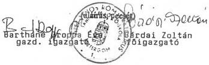

---

VITEZ JÁNOS TÁMOLIKUS
TANÍTÓKÉP-ESKOLA
2511 Esztergó, Pf. 22
Tel.: 32/413-492

6.1-1/b. sz. melléklet
V-15-.../1998.

Bevételek alakulása
1994.

|  Sor-szám | Megnevezés | Mérleg űrlap/sor | Eredeti előirányzat (E Ft) | Módosított előirányzat (E Ft) | Teljesítés (E Ft) | Tényl. teljesítés  |   |
| --- | --- | --- | --- | --- | --- | --- | --- |
|   |   |   |   |   |   |  eredeti előir. %-ában | módos. előir. %-ában  |
|  a | b | c | d | e | f | g | h  |
|  1. | Intézmény alaptevékenységének bevételei | 06/07 | 7.437 | 6.748 | 6.748 | 90,7 | 100,0  |
|  2. | Intézmény egyéb bevételei | 06/14 | 6.550 | 7.311 | 7.311 | 111,6 | 100,0  |
|  3. | 2. sorból: ÁFA | 06/11 | 600 | 850 | 850 | 141,7 | 100,0  |
|  4. | Vállalkozási tevékenység bevételei | 06/17 | - | - | - | - | -  |
|  5. | Intézményi tevékenységek bevételei | 06/18 | 13.987 | 14.059 | 14.059 | 100,5 | 100,0  |
|  6. | Kamatbevételek | 06/19 | - | 1.190 | 1.190 | - | 100,0  |
|  7. | Intézmények saját folyó bevételei (5+6) | 06/20 | 13.987 | 15.249 | 15.249 | 109,0 | 100,0  |
|  8. | Felhalmozási és tőke jellegű bevételek | 07/14 | - | - | - | - | -  |
|  9. | Támogatások, kiegészítések és átvett pénzeszközök | 08/50 | 171.112 | 224.164 | 224.266 | 131,1 | 100,0  |
|  10. | 9. sorból: Központi költségvetésből kapott költségvetési támogatás | 08/11 | 171.112 | 216.454 | 216.454 | 126,5 | 100,0  |
|  11. | Hitelek, rövid lejáratú értékpapírok bevételei | 09/07 | - | - | - | - | -  |
|  12. | Pénzforgalom nélküli bevételek | 09/11 | - | 1.664 | 1.557 | - | 93,6  |
|  13. | 12. sorból: Előző évi pénzmaradvány igénybevétele | 09/08 | - | 1.664 | 1.557 | - | 93,6  |
|  14. | Költségvetési bevételek összesen: (7+8+9+11+12) | 10/28 | 185.099 | 241.077 | 241.072 | 130,2 | 100,0  |

Kelt Esztergom, 1998. május 29.

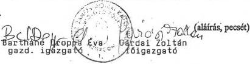

---

VITEZ JÁNOS KÖMÁI KÁTOUKUS

TANÍTÓKEFOGLÓS KÖMÁ

Tel.: 32.413-601 Fax: 32.413-693

6.1-1/c. sz. melléklet

V-15- Ád./1998.

# Bevételek alakulása

1995.

|  Sor-szám | Megnevezés | Mérleg űrlap/sor | Eredeti előirányzat (E Ft) | Módosított előirányzat (E Ft) | Teljesítés (E Ft) | Tényl. teljesítés  |   |
| --- | --- | --- | --- | --- | --- | --- | --- |
|   |   |   |   |   |   |  eredeti előir. %-ában | módos. előir. %-ában  |
|  a | b | c | d | e | f | g | h  |
|  1. | Intézmény alaptevékenységének bevételei | 07/05+09 | 8.311 | 12.326 | 12.368 | 148,8 | 100,3  |
|  2. | Intézmény egyéb bevételei | 07/19+23 | 7.830 | 9.151 | 9.108 | 116,3 | 99,5  |
|  3. | 2. sorból: ÁFA | 07/21 | 850 | 1.416 | 1.416 | 166,6 | 100,0  |
|  4. | Vállalkozási tevékenység bevételei | 07/26 | - | - | - | - | -  |
|  5. | Kamatbevételek | 07/27 | 148 | 558 | 558 | 377,0 | 100,0  |
|  6. | Intézményi működési bevételek (1+2+4+5) | 07/28 | 16.289 | 22.035 | 22.034 | 135,3 | 100,0  |
|  7. | Felhalmozási és tőke jellegű bevételek | 08/14 | - | - | - | - | -  |
|  8. | Támogatások, kiegészítések és átvett pénzeszközök | 09/42 | 214.100 | 233.631 | 233.632 | 109,1 | 100,0  |
|  9. | 8. sorból: Központi költségvetésből kapott támogatás | 09/11+09/07 | 214.100 | 227.981 | 227.981 | 106,5 | 100,0  |
|  10. | Hitelek, rövid lejáratú értékpapírok bevételei | 10/05 | - | - | - | - | -  |
|  11. | Pénzforgalom nélküli bevételek | 10/09 | - | 1.346 | 1.346 | - | 100,0  |
|  12. | 11. sorból: Előző évi pénzmaradvány igénybevétele | 10/06 | - | 1.346 | 1.346 | - | 100,0  |
|  13. | Költségvetési bevételek összesen: (6+7+8+10+11) | 11/29 | 230.389 | 257.012 | 257.012 | 111,6 | 100,0  |

Kelt Esztergom, 1998. május 29.

Gárdai Zoltán
főigazgató

(Aláírás, pecsét)

Barthane Drozpa Éva
gazdasági igazgató

---

VÍTEZ JÁNOS KÖMAL KATOLIKUS
TANÍTÓKÉPZŐ FŐISKOLA
2000 Esztergó, 1. sz. 1-2. Pf. 65
Tel.: 02/ 4-2-453

6.1-1/d. sz. melléklet
V-15-.../1998.

# Bevételek alakulása
1996.

|  Sor-szám | Megnevezés | Mérleg űrlap/sor | Eredeti előirányzat (E Ft) | Módosított előirányzat (E Ft) | Teljesítés (E Ft) | Tényl. teljesítés  |   |
| --- | --- | --- | --- | --- | --- | --- | --- |
|   |   |   |   |   |   |  eredeti előir. %-ában | módos. előir. %-ában  |
|  a | b | c | d | e | f | g | h  |
|  1. | Intézmény alaptevékenységének bevételei | 07/05+09 | 19.146 | 20.338 | 20.143 | 105,2 | 99,0  |
|  2. | Intézmény egyéb bevételei | 07/19+23 | 6.312 | 9.304 | 9.499 | 150,5 | 102,1  |
|  3. | 2. sorból: ÁFA | 07/21 | 850 | 1.612 | 1.612 | 189,6 | 100,0  |
|  4. | Vállalkozási tevékenység bevételei | 07/26 | - | - | - | - | -  |
|  5. | Kamatbevételek | 07/27 | - | 530 | 614 | - | 115,8  |
|  6. | Intézményi működési bevételek (1+2+4+5) | 07/28 | 25.458 | 30.172 | 30.256 | 118,8 | 100,3  |
|  7. | Felhalmozási és tőke jellegű bevételek | 08/14 | - | 3.696 | 3.696 | - | 100,0  |
|  8. | Támogatások, kiegészítések és átvett pénzeszközök | 09/42 | 222.867 | 251.579 | 251.579 | 112,9 | 100,0  |
|  9. | 8. sorból: Központi költségvetésből kapott támogatás | 09/11+09/07 | 222.867 | 240.232 | 240.241 | 107,8 | 100,0  |
|  10. | Hitelek, rövid lejáratú értékpapírok bevételei | 10/05 | - | - | - | - | -  |
|  11. | Pénzforgalom nélküli bevételek | 10/09 | - | 1.431 | 1.431 | - | 100,0  |
|  12. | 11. sorból: Előző évi pénzmaradvány igénybevétele | 10/06 | - | 1.431 | 1.431 | - | 100,0  |
|  13. | Költségvetési bevételek összesen: (6+7+8+10+11) | 11/29 | 248.325 | 286.878 | 286.962 | 115,6 | 100,0  |

Kelt Esztergom, 1998. május 29.

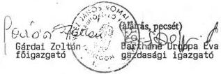

---

VITEZ JÁNOS KÖZLEK TÖLKÜLÜ
TANÍTÓKÖZ ÉS KISKOLA
2201 Cseréz, Pf. 86
Tel.: 02-2-493

6.1-1/e. sz. melléklet
V-15- 41/1998.

Bevételek alakulása
1997.

|  Sor-szám | Megnevezés | Mérleg űrlap/sor | Eredeti előirányzat (E Ft) | Módosított előirányzat (E Ft) | Teljesítés (E Ft) | Tényl. teljesítés  |   |
| --- | --- | --- | --- | --- | --- | --- | --- |
|   |   |   |   |   |   |  eredeti előir. %-ában | módos. előir. %-ában  |
|  a | b | c | d | e | f | g | h  |
|  1. | Intézmény alaptevékenységének bevételei | 07/05+09 | 22.483 | 24.124 | 24.124 | 107,3 | 100,0  |
|  2. | Intézmény egyéb bevételei | 07/19+23 | 7.557 | 8.991 | 8.991 | 119,0 | 100,0  |
|  3. | 2. sorból: ÁFA | 07/21 | 1.000 | 1.834 | 1.834 | 183,4 | 100,0  |
|  4. | Vállalkozási tevékenység bevételei | 07/26 | - | - | - | - | -  |
|  5. | Kamatbevételek | 07/27 | - | 488 | 488 | - | 100,0  |
|  6. | Intézményi működési bevételek (1+2+4+5) | 07/28 | 30.040 | 33.603 | 33.603 | 111,9 | 100,0  |
|  7. | Felhalmozási és tőke jellegű bevételek | 08/14 | - | - | - | - | -  |
|  8. | Támogatások, kiegészítések és átvett pénzeszközök | 09/42 | 247.819 | 252.338 | 252.338 | 101,8 | 100,0  |
|  9. | 8. sorból: Központi költségvetésből kapott támogatás | 09/11+09/07 | 247.819 | 220.532 | 220.532 | 89,0 | 100,0  |
|  10. | Hitelek, rövid lejáratú értékpapírok bevételei | 10/05 | - | - | - | - | -  |
|  11. | Pénzforgalom nélküli bevételek | 10/09 | - | - | - | - | -  |
|  12. | 11. sorból: Előző évi előir. maradvány igénybevétele | 10/06 | - | - | - | - | -  |
|  13. | Költségvetési bevételek összesen: (6+7+8+10+11) | 11/29 | 277.859 | 285.941 | 285.941 | 102,9 | 100,0  |

Kelt Esztergom, 1998. május 29.

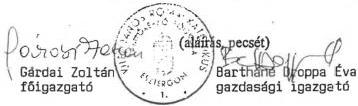

---

VITEZ JÁNOS ROKKAI KAPOLIS
TANÍTÓ KÖZPONTI GÁLTALÁ
2307. Tsz. 11.06
Tel.: 32-2-2-2

6.1-2/a. sz. melléklet
V-15- 41/1998.

Kiadások alakulása
1993.

|  Sor-szám | Megnevezés | Mérleg űrlap/sor | Eredeti előirányzat (E Ft) | Módosított előirányzat (E Ft) | Teljesítés (E Ft) | Tényl. teljesítés  |   |
| --- | --- | --- | --- | --- | --- | --- | --- |
|   |   |   |   |   |   |  eredeti előir. %-ában | módos. előir. %-ában  |
|  a | b | c | d | e | f | g | h  |
|  1. | Béralap | 02/10 | 68.893 | 79.254 | 78.191 | 113,4 | 98,5  |
|  2. | Bérjellegű kiadás | 02/20 | 1.731 | 4.300 | 4.119 | 238,0 | 95,8  |
|  3. | Készletbeszerzés | 02/30 | 17.630 | 21.072 | 21.072 | 119,5 | 100,0  |
|  4. | Szolgáltatás | 02/39 | 17.342 | 25.898 | 25.898 | 149,3 | 100,0  |
|  5. | Különféle kiadás és befizetés | 02/48 | 36.088 | 42.499 | 42.401 | 117,5 | 99,8  |
|  6. | 17. sorból: TB járulék | 02/40 | 30.226 | 33.643 | 33.643 | 111,3 | 100,0  |
|  7. | Kamatfizetések | 02/50 | - | - | - | - | -  |
|  8. | Folyó kiadások (1+2+3+4+5+7) | 02/51 | 141.684 | 173.023 | 171.581 | 121,1 | 99,2  |
|  9. | Felhalmozási és tőke jellegű kiadás | 03/17 | 1.500 | 4.841 | 4.841 | 322,7 | 100,0  |
|  10. | 9. sorból: Tárgyi eszköz felújítás | 03/10 | 1.500 | 1.406 | 1.406 | 93,7 | 100,0  |
|  11. | Támogatások, elvonások, pénzeszköz átadás | 04/64 | 26.922 | 32.006 | 31.913 | 118,5 | 99,7  |
|  12. | Hitelek, rövid lejáratú értékpapírok kiadásai | 05/04 | - | - | - | - | -  |
|  13. | Pénzforgalom nélküli kiadások | 05/08 | - | - | - | - | -  |
|  14. | Költségvetési kiadások összesen: (8+9+11+12+13) | 10/09 | 170.106 | 209.870 | 208.335 | 122,5 | 99,3  |

Kelt Esztergom, 1998. május 29.

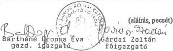

---

VITÉZ JÁNOS ROKÁLYNÜGYÜLE
TANÍTÓSTÁT KÖZLEK

6.1-2/b. sz. melléklet
V-15- 11/1998.

Kiadások alakulása
1994.

|  Sor-szám | Megnevezés | Mérleg űrlap/sor | Eredeti előirányzat (E Ft) | Módosított előirányzat (E Ft) | Teljesítés (E Ft) | Tényl. teljesítés  |   |
| --- | --- | --- | --- | --- | --- | --- | --- |
|   |   |   |   |   |   |  eredeti előir. %-ában | módos. előir. %-ában  |
|  a | b | c | d | e | f | g | h  |
|  1. | Béralap | 02/10 | 70.409 | 102.377 | 100.211 | 142,3 | 97,9  |
|  2. | Bérjellegű kiadás | 02/20 | 4.254 | 3.971 | 3.971 | 93,3 | 100,0  |
|  3. | Készletbeszerzés | 02/30 | 17.561 | 15.289 | 15.832 | 90,2 | 103,6  |
|  4. | Szolgáltatás | 02/39 | 22.705 | 28.090 | 30.972 | 136,4 | 110,3  |
|  5. | Különféle kiadás és befizetés | 02/49 | 39.005 | 53.526 | 51.133 | 131,1 | 95,5  |
|  6. | 17. sorból: TB járulék | 02/40 | 30.921 | 44.356 | 41.877 | 135,4 | 94,4  |
|  7. | Kamatfizetések | 02/51 | - | - | - | - | -  |
|  8. | Folyó kiadások (1+2+3+4+5+7) | 02/52 | 153.934 | 203.253 | 202.119 | 131,3 | 99,4  |
|  9. | Felhalmozási és tőke jellegű kiadás | 03/17 | 1.400 | 2.595 | 2.654 | 189,6 | 102,3  |
|  10. | 9. sorból: Tárgyi eszköz felújítás | 03/10 | 1.000 | 845 | 845 | 84,5 | 100,0  |
|  11. | Támogatások, elvonások, pénzeszköz átadás | 04/64 | 29.765 | 35.229 | 34.952 | 117,4 | 99,2  |
|  12. | Hitelek, rövid lejáratú értékpapírok kiadásai | 05/04 | - | - | - | - | -  |
|  13. | Pénzforgalom nélküli kiadások | 05/08 | - | - | - | - | -  |
|  14. | Költségvetési kiadások összesen: (8+9+11+12+13) | 10/09 | 185.099 | 241.077 | 239.725 | 129,5 | 99,4  |

Kelt Esztergom, 1998. május 29.

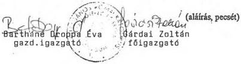

---

VITEZ JÁNOS RÓMAI KATOLIKUS

TANÍTÓKEPZŐ FŐISKOLA

250. Esztergom, 1-3. Pf. 65

Tel.: 33/413-699 Fax: 33/413-493

6.1-2/c. sz. melléklet

V-15- 41/1998.

# Kiadások alakulása

1995.

|  Sor-szám | Megnevezés | Mérleg űrlap/sor | Eredeti előirányzat (E Ft) | Módosított előirányzat (E Ft) | Teljesítés (E Ft) | Tényl. teljesítés  |   |
| --- | --- | --- | --- | --- | --- | --- | --- |
|   |   |   |   |   |   |  eredeti előir. %-ában | módos. előir. %-ában  |
|  a | b | c | d | e | f | g | h  |
|  1. | Rendszeres személyi juttatások | 02/08 | 92.239 | 86.900 | 87.647 | 95,0 | 100,9  |
|  2. | Nem rendszeres személyi juttatások | 02/42 | 12.160 | 19.672 | 16.831 | 138,4 | 85,6  |
|  3. | Külső személyi juttatások | 02/57 | 4.699 | 5.872 | 6.588 | 140,2 | 112,2  |
|  4. | Társadalombiztosítási járulék | 02/62 | 46.798 | 51.277 | 50.766 | 108,5 | 99,0  |
|  5. | Dologi kiadások | 03/110 | 41.708 | 55.728 | 57.805 | 138,6 | 103,7  |
|  6. | Pénzeszköz átadás, egyéb támogatás | 04/46 | - | 61 | 82 | - | 134,4  |
|  7. | Ellátottak juttatásai | 04/52 | 29.785 | 35.199 | 32.807 | 110,1 | 93,2  |
|  8. | Felújítás | 05/26 | 3.000 | 2.293 | 2.275 | 75,8 | 99,2  |
|  9. | Felhalmozási kiadások | 05/61 | - | 10 | 780 | - | -  |
|  10. | Fejezeti kezelésű speciális támogatások | 05/62 | - | - | - | - | -  |
|  11. | Hitelek, rövid lejáratú értékpapírok kiadásai | 06/04 | - | - | - | - | -  |
|  12. | Pénzforgalom nélküli kiadások | 06/08 | - | - | - | - | -  |
|  13. | Költségvetési kiadások összesen: (1+2+3+4+5+6+7+8+9+10+11+12) | 11/12 | 230.389 | 257.012 | 255.581 | 110,9 | 99,4  |

Kelt Esztergom, 1998. május 29.

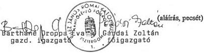

---

VITÁZ JÁNOS RÓMAI KATOLIKUS
TANÍTÓKEPZŐ FŐISKOLA
2501 Esztergom, Mária, u. 1-3. Pf. 86
Tel.: 32/413-699 Fax: 32/413-493

6.1-2/d. sz. melléklet

V-15-4.1/1998.

# **Kiadások alakulása**
**1996.**

|  Sor- szám | Megnevezés | Mérleg űrlap/sor | Eredeti előirányzat (E Ft) | Módosított előirányzat (E Ft) | Teljesítés (E Ft) | Tényl. teljesítés  |   |
| --- | --- | --- | --- | --- | --- | --- | --- |
|   |   |   |   |   |   |  eredeti előir. %-ában | módos előir. %-ában  |
|  a | b | c | d | e | f | g | h  |
|  1. | Rendszeres személyi juttatások | 02/08 | 84.615 | 94.950 | 90.935 | 107,5 | 96,3  |
|  2. | Nem rendszeres személyi juttatások | 02/42 | 13.161 | 18.051 | 21.648 | 164,5 | 119,9  |
|  3. | Külső személyi juttatások | 02/57 | 6.790 | 6.724 | 6.525 | 96,1 | 97,0  |
|  4. | Társadalombiztosítási járulék | 02/62 | 43.613 | 48.822 | 45.904 | 105,3 | 94,0  |
|  5. | Dologi kiadások | 03/111 | 64.561 | 75.226 | 81.550 | 126,3 | 108,4  |
|  6. | Pénzeszköz átadás, egyéb támogatás | 04/46 | - | - | 29 | - | -  |
|  7. | Ellátottak juttatásai | 04/52 | 32.185 | 35.763 | 34.521 | 107,3 | 96,5  |
|  8. | Felújítás | 05/27 | 3.000 | 4.737 | 6.578 | 219,3 | 138,9  |
|  9. | Felhalmozási kiadások | 05/93 | 400 | 3.105 | 3.104 | 776,0 | 100,0  |
|  10. | Fejezeti kezelésű speciális támogatások | 05/94 | - | - | - | - | -  |
|  11. | Hitelek, rövid lejáratú értékpapírok kiadásai | 06/04 | - | - | - | - | -  |
|  12. | Pénzforgalom nélküli kiadások | 06/08 | - | - | - | - | -  |
|  13. | Költségvetési kiadások összesen: (1+2+3+4+5+6+7+8+9+10+11+12) | 11/12 | 248.325 | 286.878 | 290.794 | 117,1 | 101,4  |

Kelt Esztergom, 1998. május 29.

Barthane Uropa Éva  
gazd. igazgató

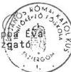

Gárdai Zoltán  
 főigazgató

(aláírás, pecsét)

---

VITÁSI GÖNÖS KÖZLEKEDÉSI KATOLIKUS
TÁMEGYÖRGŐZŐ FŐISKOLA
Földrajzi Kft. 1-3. Pf. 86
Tel: 53/413-899 Fax: 53/413-493

6.1-2/e. sz. melléklet
V-15-41/1998.

Kiadások alakulása
1997.

|  Sor-szám | Megnevezés | Mérleg űrlap/sor | Eredeti előirányzat (E Ft) | Módosított előirányzat (E Ft) | Teljesítés (E Ft) | Tényl. teljesítés  |   |
| --- | --- | --- | --- | --- | --- | --- | --- |
|   |   |   |   |   |   |  eredeti előir. %-ában | módos. előir. %-ában  |
|  a | b | c | d | e | f | g | h  |
|  1. | Rendszeres személyi juttatások | 02/08 | 97.890 | 91.226 | 101.611 | 103,8 | 111,4  |
|  2. | Nem rendszeres személyi juttatások | 02/42 | 13.899 | 14.224 | 16.605 | 119,5 | 116,7  |
|  3. | Külső személyi juttatások | 02/57 | 6.729 | 7.956 | 7.923 | 117,7 | 99,6  |
|  4. | Társadalombiztosítási járulék | 02/62 | 45.656 | 43.108 | 50.434 | 110,5 | 117,0  |
|  5. | További, munkaadókat terhelő járulékok | 02/63+64 | 9.129 | 9.418 | 6.324 | 69,3 | 67,1  |
|  6. | Dologi kiadások | 03/111 | 70.756 | 78.945 | 78.945 | 111,6 | 100,0  |
|  7. | Pénzeszköz átadás, egyéb támogatás | 04/50 | - | - | - | - | -  |
|  8. | Ellátottak juttatásai | 04/56 | 33.800 | 33.889 | 33.852 | 100,2 | 99,9  |
|  9. | Felújítás | 05/27 | - | - | 949 | - | -  |
|  10. | Felhalmozási kiadások | 05/93 | - | 7.175 | 8.521 | - | 118,8  |
|  11. | Hitelek, rövid lejáratú értékpapírok kiadásai | 06/04 | - | - | - | - | -  |
|  12. | Pénzforgalom nélküli kiadások | 06/08 | - | - | - | - | -  |
|  13. | Költségvetési kiadások összesen: (1+2+3+4+5+6+7+8+9+10+11+12) | 11/12 | 277.859 | 285.941 | 305.164 | 109,8 | 106,7  |

Kelt Esztergom, 1998. május 29.

Barthane Droppa Éva, Gárdai Zoltán
gazd. igazgató főigazgató

---

TANTOKOSI GYÖRGYOK  
2201 Farkasvár 1-3. Pl. 86  
Tel: 33/413-493

0.1-3. sz. melléklet

V-15- 4.1/1998.

# Működési és felhalmozási célra felhasznált állami pénzeszközök

adatok: E Ft-ban

|  Sor-szám | Megnevezés | 1993. év | 1994. év | 1995. év | 1996. év | 1997. év | Index 97/93 %  |
| --- | --- | --- | --- | --- | --- | --- | --- |
|  1. | Személyi juttatások (Béralap 1993-94.) | 73.814 | 99.892 | 109.728 | 115.443 | 102.455 | 138,8  |
|  2. | Munkaadókat terhelő járulékok (TB jár.) | 32.374 | 43.927 | 51.081 | 48.134 | 47.846 | 147,8  |
|  3. | Dologi kiadások | 42.985 | 36.283 | 30.972 | 37.492 | 38.431 | 89,4  |
|  4. | Egyéb működési célú, központi költségvetésből származó támogatás | 31.913 | 34.952 | 33.200 | 35.763 | 31.800 | 99,6  |
|  5. | Központi költségvetésből kapott költségvetési támogatás (1+2+3+4) | 181.086 | 215.054 | 224.981 | 236.832 | 220.532 | 121,8  |
|  5/a | 5-ből: – Képzési előirányzat | – | – | – | – | – | –  |
|  5/b | – Létesítményfenntartási előirányzat | – | – | – | – | – | –  |
|  5/c | – Programfinanszírozási előirányzat | – | – | – | – | – | –  |
|  5/d | – Hallgatói előirányzat | 30.676 | 31.380 | 36.244 | 37.596 | 32.400 | 105,6  |
|  5d-ből: | 5d-ből: – Hallgatói normatíva | 29.390 | 31.180 | 32.880 | 33.480 | 31.980 | 108,8  |
|   | – Doktoranduszi normatíva | – | – | – | – | – | –  |
|   | – Diákotthoni támogatás | – | – | – | – | – | –  |
|   | – Tankönyvtámogatás | 1.086 | – | 3.164 | 3.616 | – | –  |
|   | – Köztársasági ösztöndíj | 200 | 200 | 200 | 500 | 420 | 210,0  |
|  5/e | – Egyéb támogatás | 150.410 | 183.674 | 188.737 | 199.236 | 188.132 | 125,1  |
|  6. | Működési célra kapott egyéb államháztartási pénzeszközök (pl. állami pénzalap) | 2.644 | 6.116 | 4.356 | 9.259 | 28.710 | 1.085,9  |
|  7. | Felhalmozási célú állami pénzeszközök összesen | 2.800 | 1.400 | 3.000 | 3.400 | – | –  |
|  7/a | 7-ből: – Központi és önkorm. költségvetési szervektől | 2.800 | 1.400 | 3.000 | 3.400 | – | –  |
|  7/b | – Elkülönített állami pénzalapoktól | – | – | – | – | – | –  |
|  8. | Működési és felhalmozási célra felhasznált állami pénzeszközök összesen (5+6+7) | 186.530 | 222.570 | 232.337 | 249.491 | 249.242 | 133,6  |

Kelt Esztergom, 1998. május 29.

Gárdai Zoltán  
 főigazgató

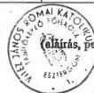

(eláírás, perces)

Bartháni Dóppa Éva  
 gazdasági igazgató

---

VITEZ JÁNOS RÓMAI KATOLIKUS

TANÍTÓKÉPZŐ FŐISKOLA

2001 Esztergom, Majori u. 1-3. Pf. 06

Tel.: 33/413-699 Fax: 33/413-493

6.1- 4. sz. melléklet

a V-15- 4/1998. sz-hoz

# Az 1997. évi pénzügyi likviditási helyzet alakulása

adatok: E Ft-ban

|  Sorszám: | Megnevezés | Időpont  |   |   |   |   |
| --- | --- | --- | --- | --- | --- | --- |
|   |   |  1997. I. 1. | 1997. IV. 1. | 1997. VII. 1. | 1997. X. 1. | 1997. XII. 31.  |
|  1. | Bankszámla egyenleg | 886 | 1.305 | 3.629 | 12.542 | 1.721  |
|  2. | Pénztár és betétkönyv összege | - | 93 | 86 | 145 | -  |
|  3. | Pénzkészlet összesen (1+2) | 886 | 1.498 | 3.715 | 12.687 | 1.721  |
|  4. | Követelések összesen (Mérleg 29. sor) | - | - | - | - | -  |
|  5. | Kötelezettségek össz. (Mérleg 90. sor) | -356 | -590 | -585 | 215 | 696  |
|  5/a | 5. sorból: Adó- és TB tartozás | - | - | - | - | -  |

Kelt Esztergom, 1998. május 29.

Tb. kötelezettség 16.195 E Ft
Adótartozás 8.059 E Ft
Összesen 24.254 E Ft

A főiskola a Tb. és adótartozását nem a kötelezettségek (passzívák) mérlegsoron, hanem a költségvetési aktív átfutó elszámolások soron (negatív előjellel) mutatta ki.

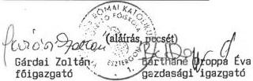

---

VITEZ JÁNOS ROMÁN GYÖRGYEGY
TANTOK PZIG
2301 Esztergom, Pf. 4
Tel.: 32 413-622 Fax: 32 413-623

6.1-5. sz. melléklet

a V-15-4/1998. sz-hoz

# Általános statisztikai állományi létszámadatok

adatok: főben

|  Sorszám: | Megnevezés | Időszak  |   |   |   |   |   |
| --- | --- | --- | --- | --- | --- | --- | --- |
|   |   |  1993. | 1994. | 1995. | 1996. | 1997. | 1997/93. %  |
|  a | b | c | d | e | f | g | h  |
|  1. | Oktatók | 68 | 67 | 54 | 55 | 50 | 73,5  |
|  2. | Önálló gazdasági és műszaki alkalm. | 28 | 30 | 29 | 23 | 23 | 82,1  |
|  3. | Egyéb besorolású közalkalmazottak | 117 | 127 | 129 | 106 | 108 | 92,3  |
|  4. | Összesen: (1+2+3) | 213 | 224 | 212 | 184 | 181 | 85,0  |

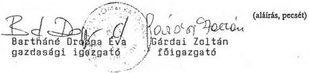

Kelt Esztergom, 1998. június 8.

---

VITEZ JÁNOS RÓMAI KATOLIKUS
TANÍTÓKEPZŐ FŰISKOLA
2501 Esztergom, Mária, 1-3. Pf. 86
Tel.: 33/413-679 Fax: 33/413-493

6.1-6. sz. melléklet
a V-15-4/998. sz-hoz

# Oktatói és hallgatói létszám alakulása

adatok: főben

|  Sorszám: | Megnevezés | 1993. | 1994. | 1995. | 1996. | 1997. | Index 1997/93.  |
| --- | --- | --- | --- | --- | --- | --- | --- |
|   |   |  X. 15. | X. 15. | X. 15. | X. 15. | X. 15. | %  |
|  a | b | c | d | e | f | g | h  |
|  Oktatók létszámadatal  |   |   |   |   |   |   |   |
|  1. | összes oktató létszáma | 79 | 85 | 65 | 61 | 59 | 74,7  |
|  2. | főfoglalkozású oktatók létszáma | 68 | 67 | 54 | 52 | 50 | 73,5  |
|  3. | teljes munkaidőben foglalk. oktatók létszáma | 68 | 67 | 54 | 52 | 50 | 70,6  |
|  4. | redukált oktatói létszám | 76 | 76,8 | 59 | 59,5 | 54,9 | 72,2  |
|  Hallgatók létszámadatal  |   |   |   |   |   |   |   |
|  5. | összes hallgató létszáma | 508 | 510 | 530 | 519 | 553 | 108,9  |
|  6. | nappali hallgatók létszáma | 503 | 510 | 530 | 519 | 510 | 101,4  |
|  7. | redukált hallgatói létszám | 505 | 510 | 530 | 519 | 523 | 103,6  |
|  8. | sikeresen államvizsgát tett hallgatók létszáma | 133 | 95 | 105 | 139 | 117 | 87,97  |

Kelt Esztergom, 1998. június 8.

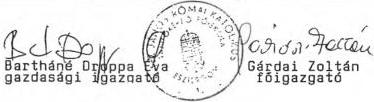

(aláírás, pecsét)

---

VITEZ JÁNOS ROKÁCIÓ I. KÖZ
TANÍTÓ: 1. Z. 2. 3. 4. 5. 6. 7. 8. 9. 10. 11. 12. 13. 14. 15. 16. 17. 18. 19. 20. 21. 22. 23. 24. 25. 26. 27. 28. 29. 30. 31. 32. 33. 34. 35. 36. 37. 38. 39. 40. 41. 42. 43. 44. 45. 46. 47. 48. 49. 50. 51. 52. 53. 54. 55. 56. 57. 58. 59. 60. 61. 62. 63. 64. 65. 66. 67. 68. 69. 70. 71. 72. 73. 74. 75. 76. 77. 78. 79. 80. 81. 82. 83. 84. 85. 86. 87. 88. 89. 90. 91. 92. 93. 94. 95. 96. 97. 98. 99. 100.

6.1-7. sz. melléklet

a V-15-41/1998. sz-hoz

# Oktatói-hallgatói létszámarány alakulása

adatok: főben

|  Megnevezés | 1993. X. 15. | 1994. X. 15. | 1995. X. 15. | 1996. X. 15. | 1997. X. 15. | Index 1997/93. %  |
| --- | --- | --- | --- | --- | --- | --- |
|   |  a | b | c | d | e | f  |
|  1 oktatóra jutó összes hallgató száma | 6,4 | 6,0 | 8,2 | 8,5 | 9,4 | 146,9  |
|  1 oktatóra jutó redukált hallgatói létsz. | 6,4 | 6,0 | 8,2 | 8,5 | 8,9 | 139,1  |
|  1 főfoglalkozású oktatóra jutó nappali hallgatók száma | 7,4 | 7,6 | 9,8 | 10,0 | 10,2 | 137,8  |

Esztergom, 1998. június 8.

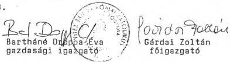

(aláírás, pecsét)

---

VITEZ JÁNOS RÓMAKATOLIKUS
TANÍTÓKEPŐRŐI IJSKOLA
2501 Esztergom, 1. s. 1-3. Pf. 86
Tel.: 33/413 599 Fax: 33/413-493

6.1-8/a.sz. melléklet
a V-15-4/1998. sz-hoz

# Főfoglalkozású oktatók tantervi óraterhelése
1994-95. tanévben

|  Sor- szám | Megnevezés | 1994/95. tanév |   |   | Oktatói létszám 1994. X. 15. | Óraterhelés /e:f/  |   |
| --- | --- | --- | --- | --- | --- | --- | --- |
|   |   |   |  előadás /óra/ | gyakorlat /óra/ |   |   | összesen /óra/  |
|  a | b |   | c | d | e | f | g  |
|  01 | egyetemi | tanár | - | - | - | - | -  |
|  02 | főiskolai |  | 435 | 2.085 | 2.520 | 13 | 193,84  |
|  03 | egyetemi | doc. | - | - | - | - | -  |
|  04 | főiskolai | doc. | 750 | 4.530 | 5.280 | 20 | 264,0  |
|  05 | egyetemi | adj. | - | - | - | - | -  |
|  06 | főiskolai | adj. | 675 | 5.280 | 5.955 | 22 | 270,7  |
|  07 | tanársegéd |   | 90 | 2.130 | 2.220 | 9 | 246,6  |
|  08 | nyelv- és testnevelő tanár |   | - | 210 | 210 | 1 | 210,0  |
|  09 | egyéb főfoglalkozá- sú oktató |   | 15 | 135 | 150 | 2 | 75,0  |
|  10 | Összesen: |   | 1.965 | 14.370 | 16.335 | 67 | 243,8  |

Esztergom, 1998. június 8.
Kelt.

(aláírás, pecsét)

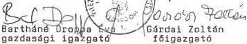

---

VITEZ JÁNOS ROMÁKI TÖLKÖDIKUS
TANITOKREZO FŐISKOLA
2501 Szentpétervár, 3. Pf. 86
Tel.: 02/413-699 Fax: 02/413-493

6.1-8/b. melléklet
a V-15-41/1998. sz-hoz

# Főfoglalkozású oktatók tantervi óraterhelése
1996-97. tanévben

| Sor- szám | Megnevezés | 1996/97. tanév | Oktatói létszám 1996. X. 15. | Óraterhelés /e:f/ |
| --- | --- | --- | --- | --- |
| előadás /óra/ | gyakorlat /óra/ | összesen /óra/ | /fő/ | /óra/fő/ |
| a | b | c | d | e | f | g |
| 01 | egyetemi | tanár | - | - | - | - | - |
| 02 | főiskolai |  | 465 | 2.475 | 2.940 | 11 | 267,0 |
| 03 | egyetemi | doc. | - | - | - | - | - |
| 04 | főiskolai | doc. | 795 | 5.040 | 5.835 | 23 | 253,7 |
| 05 | egyetemi | adj. | - | - | - | - | - |
| 06 | főiskolai | adj. | 585 | 4.185 | 4.770 | 13 | 366,9 |
| 07 | tanársegéd | 120 | 1.665 | 1.785 | 7 | 255,0 |
| 08 | nyelv- és testnevelő tanár | - | - | - | - | - |
| 09 | egyéb főfoglalkozá- sú oktató | 30 | 270 | 300 | 1 | 300,0 |
| 10 | Összesen: | 1.995 | 13.635 | 15.630 | 55 | 284,0 |

Kelt Esztergom, 1998. június 8.

(aláírás, pecsét)

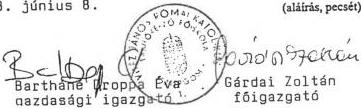

---

VITÉZ DÍJOS ROMÁNKAI ÉS
TANÍTÓKERŐI SZÜZÖSÖK
Tel.: 32 415 000 Fax: 32 415 000

6.1-9. sz. melléklet
V-15-.../98.

# Főbb létszám- és illetményadatok

|  Időszak | Oktatók |   |   | Önálló gazd. és műszaki alk. |   |   | Egyéb besorolású közalkalm. |   |   | Összesen  |   |   |
| --- | --- | --- | --- | --- | --- | --- | --- | --- | --- | --- | --- | --- |
|   |  létszám (fő) | illetmény (E Ft) | 1 főre j. illetmény (E Ft) | létszám (fő) | illetmény (E Ft) | 1 főre j. illetmény (E Ft) | létszám (fő) | illetmény (E Ft) | 1 főre j. illetmény (E Ft) | létszám (fő) | illetmény (E Ft) | 1 főre j. illetmény (E Ft)  |
|   |  1 | 2 | 3 (2:1) | 4 | 5 | 6 (5:4) | 7 | 8 | 9 (8:7) | 10 | 11 | 12 (11:10)  |
|  1993. év | 66 | 26.286 | 398 | 27 | 8.021 | 297 | 117 | 22.465 | 192 | 210 | 56.772 | 270  |
|  1994. év | 67 | 34.873 | 520 | 26 | 9.666 | 372 | 127 | 33.845 | 266 | 220 | 78.384 | 356  |
|  1995. év | 54 | 34.662 | 642 | 26 | 11.733 | 451 | 129 | 44.685 | 346 | 209 | 91.080 | 436  |
|  1996. év | 52 | 37.905 | 729 | 22 | 12.942 | 588 | 106 | 44.488 | 420 | 180 | 95.335 | 529  |
|  1997. év | 48 | 42.205 | 879 | 22 | 14.281 | 649 | 108 | 50.005 | 463 | 178 | 106.491 | 598  |

Kelt...Esztergom...1998...június 8.

Bártháné Doppá Éva  
gazdasági igazgatóGárdai Zoltán  
főigazgató

(aláírás, pecsét)

---

VÉTEZ SÁGSZÁLYOS TUDOMÁNY
YANITOKÉPZŐ FOGLALÓ
2501 Esztergom, 1998. június 8.

6.1-10. sz. melléklet
a V-15-44/1998. sz-hoz

# Összefoglaló adatok 1993-1997. évekre

|  Sor-szám | Megnevezés | Mérték-egység | 1993. év | 1994. év | 1995. év | 1996. év | 1997. év  |
| --- | --- | --- | --- | --- | --- | --- | --- |
|  1. | Költségvetési kiadások össz. | E Ft | 208.335 | 239.725 | 255.581 | 290.794 | 305.164  |
|  2. | Bevételből: központi költségvetési támogatás | E Ft | 183.886 | 216.454 | 227.981 | 240.241 | 220.532  |
|  3. | Költségvetési támogatás a kiadások %-ában | % 3=2:1 | 88,3 | 90,3 | 89,2 | 82,6 | 72,3  |
|   | Átlagos stat. állományból: |  |  |  |  |  |   |
|  4. | – Összes foglalkoztatott | fő | 213 | 224 | 212 | 184 | 181  |
|  5. | – Összes oktató | fő | 79 | 85 | 65 | 61 | 59  |
|  6. | – Összes oktató az össz. fogl. %-ában | % 6=5:4 | 37,1 | 37,9 | 30,7 | 33,2 | 32,6  |
|   | X. 15-i átlagos szerint: |  |  |  |  |  |   |
|  7. | – Összes hallgató | fő | 508 | 510 | 530 | 519 | 553  |
|  8. | – Nappali hallgatók | fő | 503 | 510 | 530 | 519 | 510  |
|  9. | – Redukált hallgatók | fő | 505 | 510 | 530 | 519 | 523  |
|  10. | – Összes oktató | fő | 79 | 85 | 65 | 61 | 59  |
|  11. | – 1 oktatóra jutó hallgató | fő 11=7:10 | 6,4 | 6 | 8,2 | 8,5 | 9,4  |
|  12. | – 1 oktatóra jutó nappali hallgató | fő 12=8:10 | 6,4 | 6 | 8,2 | 8,5 | 8,6  |
|  13. | 1 hallgatóra jutó kiadás | E Ft 13=1:7 | 410,1 | 470 | 482 | 560 | 551  |
|  14. | 1 hallgatóra jutó költségvetési támogatás | E Ft 14=2:7 | 361,9 | 424 | 430 | 463 | 432  |
|  15. | 1 nappali hallgatóra jutó költségvetési támogatás | E Ft 15=2:8 | 365,6 | 424 | 430 | 463 | 432  |
|  16. | 1 redukált hallgatóra jutó költségvetési támogatás | E Ft 16=2:9 | 364,1 | 424 | 430 | 463 | 432  |

Kelt Esztergom, 1998. június 8.

Bartháné Droppa Éva, Gárdai Zoltán
gazdasági igazgató főigazgató

---

VITÉZ JÁNOS RÓMAI KATOLIKUS

TANÍTÓKÉPZŐ FŐISKOLA

2501 Esztergom, Mojer L u. 1-3. Pf. 86

Tel.: 33/413-699 Fax: 33/413-495

6.1-11. sz. melléklet

a V-15-4/1998. sz-hez

Megbízási díjak alakulása 1993. és 1997. évben

|  Sorszám: | Megnevezés | 1993. |   |   | 1997.  |   |   |
| --- | --- | --- | --- | --- | --- | --- | --- |
|   |   |  létszám /fő/ | összeg /EFt/ | 1 főre jutó összeg /EFt/ | létszám /fő/ | összeg /EFt/ | 1 főre jutó összeg /EFt/  |
|  Belső megbízások  |   |   |   |   |   |   |   |
|  1. | oktatók | 274 | 2.156 | 7,8 | 86 | 1.771 | 20,6  |
|  2. | önálló gazdasági és műszaki alk. | 132 | 1.006 | 7,6 | 55 | 836 | 15,2  |
|  3. | egyéb besorolású közalkalmazott | 71 | 432 | 6,0 | 34 | 806 | 23,7  |
|  4. | Belső megbízások összesen: (1+2+3) | 477 | 3.594 | 7,5 | 175 | 3.413 | 19,5  |
|  5. | Külső megbízások | 902 | 6.812 | 7,5 | 557 | 6.747 | 12,1  |
|  6. | Összes megbízás: (4+5) | 1.379 | 10.407 | 7,5 | 732 | 10.160 | 13,9  |

Esztergom, 1998. június 8.

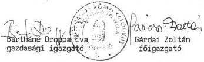

(aláírás, pecsét)

---

VITÉS TÖRTÉK TÖRTÉK TÁRSALÁJUS
TANÍTÓKAP O FŐISKOLA

6.1-12. sz. melléklet

V-15-44.../1998.

# Tárgyi eszközök állománya 1997. január 1-jén
(mérleg alapján)

|  Sor- szám | Megnevezés | Bruttó érték | Értékcsökkenés | Nettó érték | Nettó érték részaránya | Nettó/bruttó aránya (e:c) | Teljesen (0-ra) leírt tárgyi eszk. | Egy redukált hallgatóra jutó tárgyi eszköz  |   |
| --- | --- | --- | --- | --- | --- | --- | --- | --- | --- |
|   |   |   |   |   |   |   |   |  bruttó értéke | nettó értéke  |
|  a | b | E Ft c | E Ft d | E Ft e | % f | % g | E Ft h | E Ft i | E Ft j  |
|  1. | Ingatlanok | 295.948 | 76.654 | 219.294 | 97,0 | 72 | - | 570 | 422  |
|  2. | 1. sorból: földterület (telek) | - | - | - | - | - | - | - | -  |
|  3. | 1. sorból: építmények (épület) | 295.948 | 76.654 | 219.294 | - | 72 | - | 570 | 422  |
|  4. | 3. sorból: oktatási célú | 154.172 | 48.079 | 106.093 | - | 68 | - | 297 | 204  |
|  5. | 3. sorból: kiszolgáló jell. | - | - | - | - | - | - | - | -  |
|  6. | 3. sorból: kollégium | 140.068 | 27.841 | 112.227 | - | 80 | - | 270 | 216  |
|  7. | 3. sorból: egyéb építmény | 1.708 | 734 | 974 | - | 57 | - | 3 | 2  |
|  8. | Gépek, berendezések, felszerelések | 47.620 | 40.013 | 7.607 | 3,0 | 15 | 25.962 | 92 | 14  |
|  9. | 8. sorból: számítógép | 23.202 | 21.869 | 1.333 | - | 6 | - | 45 | 2  |
|  10. | 8. sorból: irodatechnikai gépek | 4.783 | 4.402 | 381 | - | 8 | - | 9 | 1  |
|  11. | 8. sorból: szakmai gép, műszer | 10.836 | 7.910 | 2.926 | - | 27 | - | 21 | 6  |
|  12. | 8. sorból: egyéb | 8.799 | 5.832 | 2.967 | - | 34 | - | 17 | 6  |
|  13. | Járművek | 8.515 | 7.372 | 1.143 | 0 | 13 | - | 16 | 2  |
|  14. | Beruházások | - | - | - | - | - | - | - | -  |
|  15. | Beruh. előlegek | - | - | - | - | - | - | - | -  |
|  16. | Tárgyi eszközök összesen: (1+8+13+14+15) | 352.083 | 124.039 | 228.044 | 100,0 | 64 | 25.962 | 678 | 439  |

Kelt Esztergom, 1998. május 29.

Bartháné Droppa Éva
gazdasági igazgató

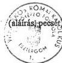

Gárdai Zoltán
főigazgató

---

VITEZ JENŐS KÖMPEI KATOLIKUS
TANÍTÓPARKÓI FŐISKOLA

6.1-12. sz. melléklet

V-15-54.../1998.

Tárgyi eszközök állománya 1997. január 1-jén
(mérleg alapján)

|  Sor-szám | Megnevezés | Bruttó érték | Értékcsökkenés | Nettó érték | Nettó érték részaránya | Nettó/bruttó aránya (e:c) | Teljesen (0-ra) leírt tárgyi eszk. | Egy redukált hallgatóra jutó tárgyi eszköz  |   |
| --- | --- | --- | --- | --- | --- | --- | --- | --- | --- |
|   |   |  E Ft | E Ft | E Ft | % | % | E Ft | bruttó értéke | nettó értéke  |
|  a | b | c | d | e | f | g | h | i | j  |
|  1. | Ingatlanok | 295.948 | 76.654 | 219.294 | 97,0 | 72 | - | 570 | 422  |
|  2. | 1. sorból: földterület (telek) | - | - | - | - | - | - | - | -  |
|  3. | 1. sorból: építmények (épület) | 295.948 | 76.654 | 219.294 | - | 72 | - | 570 | 422  |
|  4. | 3. sorból: oktatási célú | 154.172 | 48.079 | 106.093 | - | 68 | - | 297 | 204  |
|  5. | 3. sorból: kiszolgáló jell. | - | - | - | - | - | - | - | -  |
|  6. | 3. sorból: kollégium | 140.068 | 27.841 | 112.227 | - | 80 | - | 270 | 216  |
|  7. | 3. sorból: egyéb építmény | 1.708 | 734 | 974 | - | 57 | - | 3 | 2  |
|  8. | Gépek, berendezések, felszerelések | 47.620 | 40.013 | 7.607 | 3,0 | 15 | 25.962 | 92 | 14  |
|  9. | 8. sorból: számítógép | 23.202 | 21.869 | 1.333 | - | 6 | - | 45 | 2  |
|  10. | 8. sorból: irodatechnikai gépek | 4.783 | 4.402 | 381 | - | 8 | - | 9 | 1  |
|  11. | 8. sorból: szakmai gép, műszer | 10.836 | 7.910 | 2.926 | - | 27 | - | 21 | 6  |
|  12. | 8. sorból: egyéb | 8.799 | 5.832 | 2.967 | - | 34 | - | 17 | 6  |
|  13. | Járművek | 8.515 | 7.372 | 1.143 | 0 | 13 | - | 16 | 2  |
|  14. | Beruházások | - | - | - | - | - | - | - | -  |
|  15. | Beruh. előlegek | - | - | - | - | - | - | - | -  |
|  16. | Tárgyi eszközök összesen: (1+8+13+14+15) | 352.083 | 124.039 | 228.044 | 100,0 | 64 | 25.962 | 678 | 439  |

Kelt Esztergom, 1998. május 29.

Bartháné Droppa Éva
gazdasági igazgató

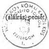

Gárdai Zoltán
főigazgató

---

VITEZ JÁNOS KÓMAI KATOLIKUS

TANÍTÓKÉPZŐ FŐISKOLÁ

2501 Esztergom, Majori u. 1. S. Pf. 36

Tel.: 33/413-699 Fax: 33/413-493

6.1-13. sz. melléklet

V-15-44.../1998.

A kollégiumban, illetve a diákotthonban lévő férőhelyek és alapterületük

(1997. október 15-i állapot szerint)

|  Sor-szám | Megnevezés | Lakószobák |   |   |   | Összes férőhely (fő) | Ténylegesen elszállá-solt hallgatók (fő) | Férőhely kihasználtság (%)  |   |   |   |
| --- | --- | --- | --- | --- | --- | --- | --- | --- | --- | --- | --- |
|   |   |  száma (db) |   | összes területe (m²)  |   |   |   |   |   |   |   |
|   |   |  saját | bérelt | saját | bérelt | saját | bérelt | saját | bérelt | saját | bérelt  |
|  a | b | c | d | e | f | g | h | i | j | k | l  |

Kollégiumok

(i:g) (j:h)

|  01 | Batthyány Lajos Utcai Kollégium | 96 | - | 1.646 | - | 244 | - | 229 | - | 94 | -  |
| --- | --- | --- | --- | --- | --- | --- | --- | --- | --- | --- | --- |
|  02 | Kossuth Lajos Utcai Kollégium | 16 | - | 247 | - | 41 | - | 39 | - | 95 |   |
|  03 |  |  |  |  |  |  |  |  |  |  |   |
|  04 |  |  |  |  |  |  |  |  |  |  |   |
|  05 |  |  |  |  |  |  |  |  |  |  |   |
|  06 |  |  |  |  |  |  |  |  |  |  |   |
|  07 |  |  |  |  |  |  |  |  |  |  |   |
|  08 |  |  |  |  |  |  |  |  |  |  |   |
|  09 |  |  |  |  |  |  |  |  |  |  |   |
|  10 | Összesen: (01-09) | 112 | - | 1.893 | - | 285 | - | 268 | - | 94 | -  |

Kelt Esztergom, 1998. május 29.

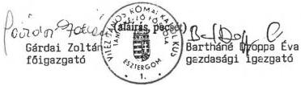

---

VITEZ JÁNOS RÓMAI KATOLIKUS
TANÍTÓKÉPZŐ FŐISKOLA
2501 Esztergom, Mejer u. 1-3. 11. 86
Tel.: 33/413-699 Fax: 33/413-493

6.1-14. sz. melléklet
a V-15-44 1998. sz-hoz

# A saját kollégiumok kiadásai
(1996-1997. évek)

|  Kiadások | 1996. | 1997. | Index 1997/96.  |
| --- | --- | --- | --- |
|   |  E Ft | E Ft | %  |
|  Összes kiadás | 32.859 | 42.449 | 129,2  |
|  Összes kiadásból: |  |  |   |
|  Személyi juttatások | 9.785 | 9.963 | 101,8  |
|  Társadalombizt. járulék | 3.944 | 4.535 | 115,0  |
|  Dologi kiadások | 18.561 | 19.717 | 106,2  |
|  Tárgyi eszköz beszerz. | 141 | - | -  |
|  Felújítás | 428 | 346 | 80,8  |

Beruházás

7.888

Kelt: Esztergom, 1998. május 29.

Bartháné Droppa Éva
gazd. Igazgató
Gárdai Zoltán
főigazgató

---

6.2-1/a. sz. melléklet

a V-15-4.4./1998. sz.-hoz

Bevételek alakulása
1993.

|  Sor-szám | Megnevezés | Mérleg űrlap/sor | Eredeti előirányzat (E Ft) | Módosított előirányzat (E Ft) | Teljesítés (E Ft) | Tényl. teljesítés  |   |
| --- | --- | --- | --- | --- | --- | --- | --- |
|   |   |   |   |   |   |  eredeti előir. %-ában | módos. előir. %-ában  |
|  a | b | c | d | e | f | g | h  |
|  1. | Intézmény alaptevékenységének bevételei | 06/07 | 5.111 | 5.663 | 5.532 | 109 | 98  |
|  2. | Intézmény egyéb bevételei | 06/13 | 3.335 | 8.996 | 8.890 | 267 | 99  |
|  3. | 2. sorból: ÁFA | 06/11 | 310 | 1.061 | 962 | 311 | 91  |
|  4. | Vállalkozási tevékenység bevételei | 06/16 |  |  |  |  |   |
|  5. | Intézményi tevékenységek bevételei | 06/17 | 8.446 | 14.659 | 14.422 | 171 | 99  |
|  6. | Kamatbevételek | 06/18 |  | 239 | 239 | - | 100  |
|  7. | Intézmények saját folyó bevételei (5+6) | 06/19 | 8.446 | 14.898 | 14.661 | 174 | 99  |
|  8. | Felhalmozási és tőke jellegű bevételek | 07/14 |  | 6 | 7 | - | 117  |
|  9. | Támogatások, kiegészítések és átvett pénzeszközök | 08/48 | 140.991 | 169.961 | 171.689 | 122 | 101  |
|  10. | 9. sorból: Központi költségvetésből kapott költségvetési támogatás | 08/11 | 140.991 | 162.540 | 162.540 | 116 | 100  |
|  11. | Hitelek, rövid lejáratú értékpapírok bevételei | 09/04 |  | 5.000 | 5.000 | - | 100  |
|  12. | Pénzforgalom nélküli bevételek | 09/08 |  | 1.074 | 1.074 | - | 100  |
|  13. | 12. sorból: Előző évi pénzmaradvány igénybevétele | 09/05 |  | 1.074 | 1.074 | - | 100  |
|  14. | Költségvetési bevételek összesen: (7+8+9+11+12) | 10/28 | 149.437 | 190.939 | 192.431 | 129 | 101  |

Kelt Zsámbék, 1998. június 12.

(aláírás, pecsét)

---

6.2-1/b. sz. melléklet

a V-15- A.A /1998. sz.-hoz

# Bevételek alakulása

1994.

|  Sor-szám | Megnevezés | Mérleg űrlap/sor | Eredeti előirányzat (E Ft) | Módosított előirányzat (E Ft) | Teljesítés (E Ft) | Tényl. teljesítés  |   |
| --- | --- | --- | --- | --- | --- | --- | --- |
|   |   |   |   |   |   |  eredeti előir. %-ában | módos. előir. %-ában  |
|  a | b | c | d | e | f | g | h  |
|  1. | Intézmény alaptevékenységének bevételei | 06/07 | 6.812 | 12.296 | 9.199 | 135 | 75  |
|  2. | Intézmény egyéb bevételei | 06/14 | 2.164 | 5.439 | 4.775 | 221 | 88  |
|  3. | 2. sorból: ÁFA | 06/11 | 1.468 | 1.588 | 1.354 | 93 | 86  |
|  4. | Vállalkozási tevékenység bevételei | 06/17 | 7.171 | 7.171 | 5.856 | 82 | 82  |
|  5. | Intézményi tevékenységek bevételei | 06/18 | 16.147 | 24.906 | 19.830 | 123 | 80  |
|  6. | Kamatbevételek | 06/19 |  | 2.034 | 2.034 | - | 100  |
|  7. | Intézmények saját folyó bevételei (5+6) | 06/20 | 16.147 | 26.940 | 21.864 | 136 | 82  |
|  8. | Felhalmozási és tőke jellegű bevételek | 07/14 |  |  |  |  |   |
|  9. | Támogatások, kiegészítések és átvett pénzeszközök | 08/50 | 145.863 | 182.424 | 182.458 | 125 | 100  |
|  10. | 9. sorból: Központi költségvetésből kapott költségvetési támogatás | 08/11 | 145.863 | 175.051 | 175.051 | 120 | 100  |
|  11. | Hitelek, rövid lejáratú értékpapírok bevételei | 09/07 |  | 10.774 | 10.774 | - | 100  |
|  12. | Pénzforgalom nélküli bevételek | 09/11 |  | 6.462 | 7.312 | - | 114  |
|  13. | 12. sorból: Előző évi pénzmaradvány igénybevétele | 09/08 |  | 6.462 | 6.462 | - | 100  |
|  14. | Költségvetési bevételek összesen: (7+8+9+11+12) | 10/28 | 162.010 | 226.600 | 222.408 | 138 | 99  |

Kelt ...Zsámbék, 1998. június 12...

(aláírás, pecsét)

---

6.2-1/c. sz. melléklet

a V-15-41./1998. sz.-hoz

# Bevételek alakulása

1995.

|  Sor-szám | Megnevezés | Mérleg űrlap/sor | Eredeti előirányzat (E Ft) | Módosított előirányzat (E Ft) | Teljesítés (E Ft) | Tényl. teljesítés  |   |
| --- | --- | --- | --- | --- | --- | --- | --- |
|   |   |   |   |   |   |  eredeti előir. %-ában | módos. előir. %-ában  |
|  a | b | c | d | e | f | g | h  |
|  1. | Intézmény alaptevékenységének bevételei | 07/05+09 | 12.635 | 23.987 | 24.119 | 191 | 101  |
|  2. | Intézmény egyéb bevételei | 07/19+23 | 1.860 | 2.693 | 2.722 | 147 | 101  |
|  3. | 2. sorból: ÁFA | 07/21 | 1.615 | 1.615 | 1.482 | 92 | 92  |
|  4. | Vállalkozási tevékenység bevételei | 07/26 | 6.736 | 6.743 | 5.708 | 85 | 85  |
|  5. | Kamatbevételek | 07/27 |  | 4.397 | 4.398 | - | 100  |
|  6. | Intézményi működési bevételek (1+2+4+5) | 07/28 | 21.231 | 37.820 | 36.947 | 174 | 98  |
|  7. | Felhalmozási és tőke jellegű bevételek | 08/14 |  | 15.000 |  |  |   |
|  8. | Támogatások, kiegészítések és átvett pénzeszközök | 09/42 | 167.800 | 207.942 | 208.124 | 124 | 100  |
|  9. | 8. sorból: Központi költségvetésből kapott támogatás | 09/11+09/07 | 167.800 | 182.704 | 182.704 | 109 | 100  |
|  10. | Hitelek, rövid lejáratú értékpapírok bevételei | 10/05 |  |  | 15.000 | - | -  |
|  11. | Pénzforgalom nélküli bevételek | 10/09 |  | 3.234 | 5.354 | - | 166  |
|  12. | 11. sorból: Előző évi pénzmaradvány igénybevétele | 10/06 |  | 2.025 | 3.485 | - | 172  |
|  13. | Költségvetési bevételek összesen: (6+7+8+10+11) | 11/29 | 189.031 | 263.996 | 265.425 | 141 | 101  |

Kelt ..Zsámbék, 1998. június 12...

(aláírás, pecsét)

---

6.2-1/d. sz. melléklet

a V-15-4/1998. sz.-hoz

# Bevételek alakulása

1996.

|  Sor-szám | Megnevezés | Mérleg űrlap/sor | Eredeti előirányzat (E Ft) | Módosított előirányzat (E Ft) | Teljesítés (E Ft) | Tényl. teljesítés  |   |
| --- | --- | --- | --- | --- | --- | --- | --- |
|   |   |   |   |   |   |  eredeti előir. %-ában | módos. előir. %-ában  |
|  a | b | c | d | e | f | g | h  |
|  1. | Intézmény alaptevékenységének bevételei | 07/05+09 | 23.984 | 54.964 | 54.964 | 230 | 100  |
|  2. | Intézmény egyéb bevételei | 07/19+23 | 1.843 | 3.731 | 3.731 | 203 | 100  |
|  3. | 2. sorból: ÁFA | 07/21 | 1.314 | 1.615 | 1.615 | 123 | 100  |
|  4. | Vállalkozási tevékenység bevételei | 07/26 | 5.080 | 5.915 | 5.915 | 117 | 100  |
|  5. | Kamatbevételek | 07/27 |  | 7.918 | 7.918 | - | 100  |
|  6. | Intézményi működési bevételek (1+2+4+5) | 07/28 | 30.907 | 72.528 | 72.528 | 235 | 100  |
|  7. | Felhalmozási és tőke jellegű bevételek | 08/14 |  |  |  |  |   |
|  8. | Támogatások, kiegészítések és átvett pénzeszközök | 09/42 | 180.454 | 265.949 | 265.993 | 148 | 100  |
|  9. | 8. sorból: Központi költségvetésből kapott támogatás | 09/11+09/07 | 180.454 | 197.322 | 197.366 | 110 | 100  |
|  10. | Hitelek, rövid lejáratú értékpapírok bevételei | 10/05 |  | 34.137 | 34.137 | - | 100  |
|  11. | Pénzforgalom nélküli bevételek | 10/09 |  | 339 | - | - | -  |
|  12. | 11. sorból: Előző évi pénzmaradvány igénybevétele | 10/06 |  | 339 | - | - | -  |
|  13. | Költségvetési bevételek összesen: (6+7+8+10+11) | 11/29 | 211.361 | 372.614 | 372.997 | 177 | 101  |

Kelt ...Zsámbék, 1998. június 12...

(aláírás, pecsét)

---

6.2-1/e. sz. melléklet

a V-15-4.1./1998. sz.-hoz

Bevételek alakulása
1997.

|  Sor-szám | Megnevezés | Mérleg űrlap/sor | Eredeti előirányzat (E Ft) | Módosított előirányzat (E Ft) | Teljesítés (E Ft) | Tényl. teljesítés  |   |
| --- | --- | --- | --- | --- | --- | --- | --- |
|   |   |   |   |   |   |  eredeti előir. %-ában | módos. előir. %-ában  |
|  a | b | c | d | e | f | g | h  |
|  1. | Intézmény alaptevékenységének bevételei | 07/05+09 | 55.246 | 63.415 | 63.473 | 115 | 100  |
|  2. | Intézmény egyéb bevételei | 07/19+23 | 2.564 | 3.805 | 3.820 | 149 | 101  |
|  3. | 2. sorból: ÁFA | 07/21 | 1.290 | 1.978 | 1.993 | 155 | 101  |
|  4. | Vállalkozási tevékenység bevételei | 07/26 | 2.398 | 3.925 | 3.925 | 164 | 100  |
|  5. | Kamatbevételek | 07/27 | 7.636 | 9.706 | 9.706 | 128 | 100  |
|  6. | Intézményi működési bevételek (1+2+4+5) | 07/28 | 67.844 | 80.851 | 80.924 | 120 | 100  |
|  7. | Felhalmozási és tőke jellegű bevételek | 08/14 |  | 3.032 | 3.032 |  | 100  |
|  8. | Támogatások, kiegészítések és átvett pénzeszközök | 09/42 | 227.606 | 328.529 | 280.763 | 124 | 86  |
|  9. | 8. sorból: Központi költségvetésből kapott támogatás | 09/11+09/07 | 216.943 | 256.432 | 208.665 | 97 | 82  |
|  10. | Hitelek, rövid lejáratú értékpapírok bevételei | 10/05 |  | 30.693 | 30.692 |  | 100  |
|  11. | Pénzforgalom nélküli bevételek | 10/09 |  |  | 13.176 |  |   |
|  12. | 11. sorból: Előző évi előir. maradvány igénybevétele | 10/06 |  |  | 13.176 |  |   |
|  13. | Költségvetési bevételek összesen: (6+7+8+10+11) | 11/29 | 295.450 | 443.105 | 408.587 | 139 | 93  |

Kelt .Zsámbék, 1998. június 12..

(aláírás, pecsét)

---

6.2-2/a. sz. melléklet

a V-15- A4./1998. sz.-hoz

# Kiadások alakulása

1993.

|  Sor-szám | Megnevezés | Mérleg űrlap/sor | Eredeti előirányzat (E Ft) | Módosított előirányzat (E Ft) | Teljesítés (E Ft) | Tényl. teljesítés  |   |
| --- | --- | --- | --- | --- | --- | --- | --- |
|   |   |   |   |   |   |  eredeti előir. %-ában | módos. előir. %-ában  |
|  a | b | c | d | e | f | g | h  |
|  1. | Béralap | 02/10 | 62.846 | 71.114 | 67.587 | 108 | 95  |
|  2. | Bérjellegű kiadás | 02/20 | 2.368 | 3.211 | 3.378 | 143 | 106  |
|  3. | Készletbeszerzés | 02/30 | 17.433 | 30.889 | 30.636 | 176 | 100  |
|  4. | Szolgáltatás | 02/39 | 7.257 | 11.725 | 12.076 | 167 | 103  |
|  5. | Különféle kiadás és befizetés | 02/48 | 31.096 | 37.051 | 38.632 | 125 | 105  |
|  6. | 17. sorból: TB járulék | 02/40 | 27.175 | 30.307 | 28.969 | 107 | 96  |
|  7. | Kamatfizetések | 02/50 |  |  | 1 |  |   |
|  8. | Folyó kiadások (1+2+3+4+5+7) | 02/51 | 121.000 | 153.990 | 152.310 | 126 | 99  |
|  9. | Felhalmozási és tőke jellegű kiadás | 03/17 | 7.054 | 12.368 | 12.555 | 178 | 102  |
|  10. | 9. sorból: Tárgyi eszköz felújítás | 03/10 | 5.500 | 4.398 | 4.398 | 80 | 100  |
|  11. | Támogatások, elvonások, pénzeszköz átadás | 04/64 | 21.383 | 24.581 | 22.862 | 107 | 93  |
|  12. | Hitelek, rövid lejáratú értékpapírok kiadásai | 05/04 |  |  |  |  |   |
|  13. | Pénzforgalom nélküli kiadások | 05/08 |  |  |  |  |   |
|  14. | Költségvetési kiadások összesen: (8+9+11+12+13) | 10/09 | 149.437 | 190.939 | 187.727 | 126 | 99  |

Kelt ..Zsámbék, 1998. június 12...

(aláírás, pecsét)

---

6.2-2/b. sz. melléklet

a V-15-4/1998. sz.-hoz

# Kiadások alakulása

1994.

|  Sor-szám | Megnevezés | Mérleg űrlap/sor | Eredeti előirányzat (E Ft) | Módosított előirányzat (E Ft) | Teljesítés (E Ft) | Tényl. teljesítés  |   |
| --- | --- | --- | --- | --- | --- | --- | --- |
|   |   |   |   |   |   |  eredeti előir. %-ában | módos. előir. %-ában  |
|  a | b | c | d | e | f | g | h  |
|  1. | Béralap | 02/10 | 63.506 | 79.055 | 66.914 | 106 | 85  |
|  2. | Bérjellegű kiadás | 02/20 | 2.568 | 3.720 | 5.956 | 232 | 161  |
|  3. | Készletbeszerzés | 02/30 | 22.947 | 19.233 | 19.605 | 86 | 102  |
|  4. | Szolgáltatás | 02/39 | 11.105 | 12.711 | 15.115 | 137 | 119  |
|  5. | Különféle kiadás és befizetés | 02/49 | 34.435 | 42.700 | 38.595 | 112 | 91  |
|  6. | 17. sorból: TB járulék | 02/40 | 27.464 | 34.124 | 29.619 | 108 | 87  |
|  7. | Kamatfizetések | 02/51 |  |  | 3 |  |   |
|  8. | Folyó kiadások (1+2+3+4+5+7) | 02/52 | 134.561 | 157.419 | 146.188 | 109 | 93  |
|  9. | Felhalmozási és tőke jellegű kiadás | 03/17 | 6.000 | 11.577 | 10.767 | 180 | 93  |
|  10. | 9. sorból: Tárgyi eszköz felújítás | 03/10 | 5.000 | 4.000 | 3.199 | 64 | 80  |
|  11. | Támogatások, elvonások, pénzeszköz átadás | 04/64 | 21.449 | 31.830 | 36.327 | 170 | 115  |
|  12. | Hitelek, rövid lejáratú értékpapírok kiadásai | 05/04 |  | 25.774 | 25.774 | - | 100  |
|  13. | Pénzforgalom nélküli kiadások | 05/08 |  |  | 850 |  |   |
|  14. | Költségvetési kiadások összesen: (8+9+11+12+13) | 10/09 | 162.010 | 226.600 | 219.906 | 136 | 97  |

Kelt .Zsámbék, 1998. június 12...

(aláírás, pecsét)

---

6.2-2/c. sz. melléklet

a V-15-4A/1998. sz.-hoz

Kiadások alakulása

1995.

|  Sor-szám | Megnevezés | Mérleg űrlap/sor | Eredeti előirányzat (E Ft) | Módosított előirányzat (E Ft) | Teljesítés (E Ft) | Tényl. teljesítés  |   |
| --- | --- | --- | --- | --- | --- | --- | --- |
|   |   |   |   |   |   |  eredeti előir. %-ában | módos. előir. %-ában  |
|  a | b | c | d | e | f | g | h  |
|  1. | Rendszeres személyi juttatások | 02/08 | 52.462 | 52.723 | 52.111 | 100 | 99  |
|  2. | Nem rendszeres személyi juttatások | 02/42 | 9.712 | 16.973 | 15.920 | 164 | 94  |
|  3. | Külső személyi juttatások | 02/57 | 10.880 | 29.839 | 30.022 | 276 | 101  |
|  4. | Társadalombiztosítási járulék | 02/62 | 29.963 | 33.724 | 33.724 | 113 | 100  |
|  5. | Dologi kiadások | 03/110 | 58.741 | 54.304 | 61.786 | 106 | 114  |
|  6. | Pénzeszköz átadás, egyéb támogatás | 04/46 | 2.473 | 2.578 | 3.109 | 126 | 121  |
|  7. | Ellátottak juttatásai | 04/52 | 21.800 | 32.863 | 31.638 | 146 | 97  |
|  8. | Felújítás | 05/26 | 3.000 | 2.400 | 2.400 | 80 | 100  |
|  9. | Felhalmozási kiadások | 05/61 |  | 38.592 | 27.489 | - | 72  |
|  10. | Fejezeti kezelésű speciális támogatások | 05/62 |  |  |  |  |   |
|  11. | Hitelek, rövid lejáratú értékpapírok kiadásai | 06/04 |  |  | 15.008 |  |   |
|  12. | Pénzforgalom nélküli kiadások | 06/08 |  |  | 1.869 |  |   |
|  13. | Költségvetési kiadások összesen: (1+2+3+4+5+6+7+8+9+10+11+12) | 11/12 | 189.031 | 263.996 | 275.076 | 146 | 105  |

Kelt Zsámbék, 1998. június 12..

(aláírás, pecsét)

---

6.2-2/d. sz. melléklet

a V-15-41../1998. sz.-hoz

Kiadások alakulása

1996.

|  Sor-szám | Megnevezés | Mérleg űrlap/sor | Eredeti előirányzat (E Ft) | Módosított előirányzat (E Ft) | Teljesítés (E Ft) | Tényl. teljesítés  |   |
| --- | --- | --- | --- | --- | --- | --- | --- |
|   |   |   |   |   |   |  eredeti előir. %-ában | módos. előir. %-ában  |
|  a | b | c | d | e | f | g | h  |
|  1. | Rendszeres személyi juttatások | 02/08 | 56.025 | 60.693 | 57.199 | 102 | 95  |
|  2. | Nem rendszeres személyi juttatások | 02/42 | 12.212 | 12.226 | 12.225 | 101 | 100  |
|  3. | Külső személyi juttatások | 02/57 | 10.880 | 38.262 | 34.154 | 314 | 90  |
|  4. | Társadalombiztosítási járulék | 02/62 | 30.489 | 44.524 | 41.770 | 137 | 94  |
|  5. | Dologi kiadások | 03/111 | 56.492 | 84.763 | 77.092 | 137 | 91  |
|  6. | Pénzeszköz átadás, egyéb támogatás | 04/46 | 10.793 | 5.086 | 5.086 | 48 | 100  |
|  7. | Ellátottak juttatásai | 04/52 | 28.167 | 32.762 | 32.650 | 116 | 100  |
|  8. | Felújítás | 05/27 | 3.000 | 6.685 | 6.685 | 223 | 100  |
|  9. | Felhalmozási kiadások | 05/93 | 3.303 | 38.792 | 34.450 | 1043 | 89  |
|  10. | Fejezeti kezelésű speciális támogatások | 05/94 |  |  |  |  |   |
|  11. | Hitelek, rövid lejáratú értékpapírok kiadásai | 06/04 |  | 48.821 | 48.821 | - | 100  |
|  12. | Pénzforgalom nélküli kiadások | 06/08 |  |  |  |  |   |
|  13. | Költségvetési kiadások összesen: (1+2+3+4+5+6+7+8+9+10+11+12) | 11/12 | 211.361 | 372.614 | 350.132 | 166 | 94  |

Kelt ..Zsámbék, 1998. június 12...

(aláírás, pecsét)

---

6.2-2/s. sz. melléklet
a v-15-41/1998. sz.-hoz

# Kiadások alakulása

1997.

|  Sor-szám | Megnevezés | Mérleg űrlap/sor | Eredeti előirányzat (E Ft) | Módosított előirányzat (E Ft) | Teljesítés (E Ft) | Tényl. teljesítés  |   |
| --- | --- | --- | --- | --- | --- | --- | --- |
|   |   |   |   |   |   |  eredeti előir. %-ában | módos. előir. %-ában  |
|  a | b | c | d | e | f | g | h  |
|  1. | Rendszeres személyi juttatások | 02/08 | 69.754 | 67.959 | 66.290 | 95 | 98  |
|  2. | Nem rendszeres személyi juttatások | 02/42 | 8.458 | 11.937 | 9.647 | 114 | 81  |
|  3. | Külső személyi juttatások | 02/57 | 27.988 | 70.401 | 42.562 | 152 | 61  |
|  4. | Társadalombiztosítási járulék | 02/62 | 41.479 | 50.315 | 43.406 | 105 | 87  |
|  5. | További, munkaadókat terhelő járulékok | 02/63+64 | 6.724 | 6.674 | 6.675 | 100 | 100  |
|  6. | Dologi kiadások | 03/111 | 84.328 | 106.631 | 94.342 | 112 | 89  |
|  7. | Pénzeszköz átadás, egyéb támogatás | 04/50 | 2.563 | 18.089 | 18.088 | 706 | 100  |
|  8. | Ellátottak juttatásai | 04/56 | 25.302 | 32.264 | 33.948 | 135 | 106  |
|  9. | Felújítás | 05/27 | 100 | 22.829 | 13.837 | 13.837 | 61  |
|  10. | Felhalmozási kiadások | 05/93 | 13.754 | 32.494 | 21.721 | 158 | 67  |
|  11. | Hitelek, rövid lejáratú értékpapírok kiadásai | 06/04 | 15.000 | 23.512 | 23.511 | 157 | 100  |
|  12. | Pénzforgalom nélküli kiadások | 06/08 |  |  |  |  |   |
|  13. | Költségvetési kiadások összesen: (1+2+3+4+5+6+7+8+9+10+11+12) | 11/12 | 295.450 | 443.105 | 374.027 | 127 | 85  |

Kelt .Zsámbék, 1998. június ..

(aláírás, pecsét)

---

6.2.-3. sz. melléklet

a V-15-4.1/1998. sz.-hoz

Működési és felhalmozási célra kapott állami pénzeszközök

adatok: E Ft-ban

|  Sor-szám | Megnevezés | 1993. év | 1994. év | 1995. év | 1996. év | 1997. év | Index 97/93 %  |
| --- | --- | --- | --- | --- | --- | --- | --- |
|  1. | Személyi juttatások (Béralap 1993-94.) | 86.600 | 63.215 | 85.019 | 59.537 | 94.881 | 143  |
|  2. | Munkaadókat terhelő járulékok (TB jár.) | 28.554 | 27.991 | 28.798 | 36.391 | 41.000 | 144  |
|  3. | Dologi kiadások | 37.471 | 48.347 | 36.903 | 32.119 | 36.661 | 98  |
|  4. | Egyéb működési célú, központi költségvetésből származó támogatás | 29.915 | 35.498 | 31.984 | 39.319 | 36.123 | 121  |
|  5. | Központi költségvetésből kapott költségvetési támogatás (1+2+3+4) | 162.540 | 175.051 | 182.704 | 197.366 | 208.665 | 129  |
|   | 5-ből: |  |  |  |  |  |   |
|  5/a | – Képzési előirányzat |  |  |  |  |  |   |
|  5/b | – Létesítményfenntartási előirányzat |  |  |  |  |  |   |
|  5/c | – Programfinanszírozási előirányzat |  |  |  |  | 2.200 |   |
|  5/d | – Hallgatói előirányzat | 22.676 | 25.256 | 31.984 | 37.358 | 35.200 | 156  |
|   | 5d-ből: | 21.970 | 25.025 | 28.535 | 31.005 | 32.110 | 147  |
|   | – Hallgatói normatíva |  |  |  |  |  |   |
|   | – Doktoranduszi normatíva |  |  |  |  |  |   |
|   | – Diákotthoni támogatás |  |  |  |  |  |   |
|   | – Tankönyvtámogatás | 536 |  | 2.987 | 5.737 | 2.490 | 465  |
|   | – Köztársasági ösztöndíj | 170 | 231 | 432 | 616 | 600 | 353  |
|  5/e | – Egyéb támogatás |  |  |  |  |  |   |
|  6. | Működési célra kapott egyéb államháztartási pénzeszközök (pl. állami pénzalap) | 6.452 | 6.822 | 13.803 | 47.589 | 17.282 | 268  |
|  7. | Felhalmozási célú állami pénzeszközök összesen | 2.500 | 585 | 127 | 15.440 | 20.000 | 800  |
|   | 7-ből: |  |  |  |  |  |   |
|  7/a | – Központi és önkorm. költségvetési szervektől |  |  |  | 14.700 | 20.000 |   |
|  7/b | – Elkülönített állami pénzalapoktól | 50 |  |  |  |  |   |
|  8. | Működési és felhalmozási célra felhasznált állami pénzeszközök összesen (5+6+7) | 171.492 | 182.458 | 196.634 | 260.395 | 245.947 | 144  |

Kelt ...Zsámbék, 1998. június 12...

(aláírás, pecsét)

---

6.2-4. sz. melléklet

a V-15-4.1/1998. számhoz

# Az 1997. évi pénzügyi likviditási helyzet alakulása

adatok: E Ft-ban

|  Sorszám: | Megnevezés | I d ő p o n t  |   |   |   |   |
| --- | --- | --- | --- | --- | --- | --- |
|   |   |  1997. I. 1. | 1997. IV. 1. | 1997. VII. 1. | 1997. X. 1. | 1997. XII. 31.  |
|  1. | Bankszámla egyenleg | 11.495 | 21.068 | 23.114 | 30.871 | 21.457  |
|  2. | Pénztár és betétkönyv összege | 173 | 655 | 681 | 810 | 1.280  |
|  3. | Pénzkészlet összesen (1+2) | 11.668 | 21.090 | 23.825 | 31.681 | 22.737  |
|  4. | Követelések összesen (Mérleg 29. sor) | 355 | 1.597 | 769 | 4.094 |   |
|  5. | Kötelezettségek össz. (Mérleg 90. sor) | 3.527 | 235 | 1.272 | 684 | 905  |
|  5/a | 5. sorból: Adó- és TB tartozás |  |  |  |  |   |

Kelt .Zsámbék, 1998. június

(aláírás, pecsét)

---

6.2-5. sz. melléklet

a V-15-44/1998. számhoz

# Átlagos statisztikai állományi létszámadatok

adatok: főben

|  Sorszám: | Megnevezés | I d ő s z a k  |   |   |   |   |   |
| --- | --- | --- | --- | --- | --- | --- | --- |
|   |   |  1993. | 1994. | 1995. | 1996. | 1997. | 1997/93. %  |
|  a | b | c | d | e | f | g | h  |
|  1. | Oktatók | 52 | 53 | 60 | 58 | 59 | 113  |
|  2. | Önálló gazdasági és műszaki alkalm. | 3 | 3 | 3 | 2 | 3 | 100  |
|  3. | Egyéb besorolású közalkalmazottak | 147 | 54 | 86 | 69 | 61 | 41  |
|  4. | Összesen: (1+2+3) | 202 | 120 | 149 | 129 | 123 | 61  |

Kelt Zsámbék, 1998. június 12.

(aláírás, pecsét)

---

6.2-6.sz. melléklet

a V-15-4 //1998. számhoz

# Oktatói és hallgatói létszám alakulása

adatok: főben

|  Sorszám: | Megnevezés | 1993. | 1994. | 1995. | 1996. | 1997. | Index 1997/93.  |
| --- | --- | --- | --- | --- | --- | --- | --- |
|   |   |  X. 15. | X. 15. | X. 15. | X. 15. | X. 15. | %  |
|  a | b | c | d | e | f | g | h  |
|  Oktatók létszámadatai  |   |   |   |   |   |   |   |
|  1. | összes oktató létszáma | 52 ^{+14} | 63 ^{+21} | 60 ^{+10} | 58 ^{+19} | 59 ^{+24} | 113  |
|  2. | főfoglalkozású oktatók létszáma | 52 | 61 | 57 | 54 | 59 | 113  |
|  3. | teljes munkaidőben foglalk. oktatók létszáma | 52 | 63 | 60 | 56 | 56 | 107  |
|  4. | redukált oktatói létszám | 59 | 68 | 65 | 69 | 67 | 114  |
|  Hallgatók létszámadatai  |   |   |   |   |   |   |   |
|  5. | összes hallgató létszáma | 370 | 584 | 826 | 872 | 1.093 | 277  |
|  6. | nappali hallgatók létszáma | 370 | 419 | 468 | 503 | 519 | 140  |
|  7. | redukált hallgatói létszám | 370 | 469 | 575 | 614 | 691 | 181  |
|  8. | sikeresen államvizsgát tett hallgatók létszáma | 214 | 86 | 106 | 110 | 213 | 100  |

Kelt..Zsámbék, 98. június 12.

(aláírás, pecsét)

---

6.2-7. sz. melléklet

a V-15-41/1998. számhoz

# Oktatói-hallgatói létszámarány alakulása

adatok : főben

|  Megnevezés | 1993. X. 15. | 1994. X. 15. | 1995. X. 15. | 1996. X. 15. | 1997. X. 15. | Index 1997/93. %  |
| --- | --- | --- | --- | --- | --- | --- |
|   |  a | b | c | d | e | f  |
|  1 oktatóra jutó összes hallgató száma | 7 | 9 | 14 | 15 | 19 | 271  |
|  1 oktatóra jutó redukált hallgatói létsz. | 7 | 7 | 10 | 11 | 12 | 171  |
|  1 főfoglalkozású oktatóra jutó nappali hallgatók száma | 7 | 7 | 8 | 9 | 9 | 129  |

Kelt.. Zsámbék, 1998. június 11.

(aláírás, pecsét)

---

6.2-8/a. sz. melléklet a V-15-41/1998. sz-hoz

# Főfoglalkozású oktatók tantervi óraterhelése  
1994-95. tanévben

| Sor- szám | Megnevezés | 1994/95. tanév | Oktatói lét- szám 1994. X. 15. | Óraterhelés /e:f/ |
| --- | --- | --- | --- | --- |
| előadás /óra/ | gyakorlat /óra/ | összesen /óra/ | /fő/ | /óra/fő/ |
| a | b | c | d | e | f | g |
| 01 | egyetemi | tanár |  |  |  |  |  |
| 02 | főiskolai |  | 100 | 676 | 776 | 5 | 155 |
| 03 | egyetemi | docens |  |  |  |  |  |
| 04 | főiskolai |  | 609 | 3.599 | 4.208 | 19 | 221 |
| 05 | egyetemi |  |  |  |  |  |  |
| 06 | főiskolai | adjunktus | 102 | 4.926 | 5.028 | 20 | 251 |
| 07 | tanársegéd | 87 | 2.139 | 2226 | 12 | 186 |
| 08 | nyelv- és testnevelő tanár |  |  |  |  |  |
| 09 | egyéb főfoglalkozá- sú oktató |  |  |  |  |  |
| 10 | Összesen: | 898 | 12.712 | 13.610 | 61 | 223 |

Kelt.. Zsámbék, 1998. június 12.

(aláírás, pecsét)

---

6.2-8/b. sz. melléklet
a V-15-41/1998. sz-hoz

Főfoglalkozású oktatók tantervi óraterhelése
1996-97. tanévben

|  Sor- szám | Megnevezés | 1996/97. tanév |   |   | Oktatói lét- szám 1996. X. 15. | Óraterhelés /e:f/  |   |
| --- | --- | --- | --- | --- | --- | --- | --- |
|   |   |   |  előadás /óra/ | gyakorlat /óra/ |   |   | összesen /óra/  |
|  a | b |   | c | d | e | f | g  |
|  01 | egyetemi | tanár |  |  |  |  |   |
|  02 | főiskolai |  | 95 | 425 | 520 | 3 | 173  |
|  03 | egyetemi | docens |  |  |  |  |   |
|  04 | főiskolai |  | 601 | 5.607 | 6.208 | 18 | 345  |
|  05 | egyetemi |  |  |  |  |  |   |
|  06 | főiskolai | adjunktus | 946 | 5.932 | 6.878 | 22 | 313  |
|  07 | tanársegéd |   | 196 | 2.909 | 3.105 | 7 | 444  |
|  08 | nyelv- és testnevelő tanár |   |  | 1.372 | 1.372 | 4 | 343  |
|  09 | egyéb főfoglalkozá-sú oktató |   |  |  |  |  |   |
|  10 | Összesen: |   | 1.838 | 16.245 | 18.083 | 54 | 335  |

Kelt. Zsámbék 1998. június 11.

(aláírás, pecsét)

---

6.2-9. sz. melléklet

a V-15-41/1998. sz-hoz

Főbb létszám- és illetményadatok

|  Időszak | Oktatók |   |   | Önálló gazd. és műszaki alk. |   |   | Egyéb besorolású közalkalm. |   |   | Összesen  |   |   |
| --- | --- | --- | --- | --- | --- | --- | --- | --- | --- | --- | --- | --- |
|   |  létszám (fő) 1 | illetmény (E Ft) 2 | 1 főre j. illetmény (E Ft) 3 (2:1) | létszám (fő) 4 | illetmény (E Ft) 5 | 1 főre j. illetmény (E Ft) 6 (5:4) | létszám (fő) 7 | illetmény (E Ft) 8 | 1 főre j. illetmény (E Ft) 9 (8:7) | létszám (fő) 10 | illetmény (E Ft) 11 | 1 főre j. illetmény (E Ft) 12 (11:10)  |
|  1993. év | 61 | 23.461 | 385 | 4 | 1.947 | 486 | 107 | 22.890 | 214 | 172 | 53.820 | 313  |
|  1994. év | 43 | 29.986 | 697 | 5 | 2.957 | 591 | 39 | 13.739 | 352 | 87 | 46.682 | 534  |
|  1995. év | 52 | 31.993 | 615 | 7 | 5.064 | 723 | 62 | 15.881 | 256 | 121 | 52.938 | 438  |
|  1996. év | 49 | 36.072 | 736 | 5 | 4.220 | 844 | 49 | 17.839 | 364 | 103 | 58.130 | 564  |
|  1997. év. | 42 | 41.590 | 990 | 3 | 3.170 | 1.057 | 53 | 23.267 | 439 | 98 | 68.027 | 694  |

Kelt Zsámbék, 1998. június 11...

(aláírás, pecsét)

---

6.2-10. sz. melléklet

V-15-41/1998. sz-hoz

Összefoglaló adatok 1993-1997. évekre

|  Sor-szám | Megnevezés | Mérték-egység | 1993. év | 1994. év | 1995. év | 1996. év | 1997. év  |
| --- | --- | --- | --- | --- | --- | --- | --- |
|  1. | Költségvetési kiadások össz. | E Ft | 187.727 | 219.906 | 275.076 | 350.132 | 374.027  |
|  2. | Bevételből: központi költségvetési támogatás | E Ft | 162.540 | 175.051 | 182.704 | 197.366 | 208.665  |
|  3. | Költségvetési támogatás a kiadások %-ában | % 3=2:1 | 87 | 80 | 67 | 57 | 56  |
|   | Átlagos stat. állományból: |  |  |  |  |  |   |
|  4. | - Összes foglalkoztatott | fő | 202 | 120 | 149 | 129 | 123  |
|  5. | - Összes oktató | fő | 52 | 63 | 60 | 58 | 59  |
|  6. | - Összes oktató az össz. fogl. %-ában | % 6=5:4 | 26 | 53 | 41 | 45 | 48  |
|   | X. 15-i állapot szerint: |  |  |  |  |  |   |
|  7. | - Összes hallgató | fő | 370 | 584 | 826 | 872 | 1.093  |
|  8. | - Nappali hallgatók | fő | 370 | 419 | 468 | 503 | 519  |
|  9. | - Redukált hallgatók | fő | 370 | 469 | 575 | 614 | 691  |
|  10. | - Összes oktató | fő | 52 | 63 | 60 | 58 | 59  |
|  11. | - 1 oktatóra jutó hallgató | fő 11=7:10 | 7 | 9 | 14 | 15 | 19  |
|  12. | - 1 oktatóra jutó nappali hallgató | fő 12=8:10 | 7 | 8 | 8 | 9 | 9  |
|  13. | 1 hallgatóra jutó kiadás | E Ft 13=1:7 | 507 | 377 | 333 | 402 | 342  |
|  14. | 1 hallgatóra jutó költségvetési támogatás | E Ft 14=2:7 | 439 | 300 | 221 | 226 | 191  |
|  15. | 1 nappali hallgatóra jutó költségvetési támogatás | E Ft 15=2:8 | 439 | 418 | 390 | 392 | 402  |
|  16. | 1 redukált hallgatóra jutó költségvetési támogatás | E Ft 16=2:9 | 439 | 373 | 318 | 321 | 302  |

Kelt ..Zsámbék, 1998. június 12...

(aláírás, pecsét)

---

6.2-11. sz. melléklet
a V-15-41/1998. sz-hoz

Megbízási díjak alakulása 1993. és 1997. évben

|  Sorszám: | Megnevezés | 1993. |   |   | 1997.  |   |   |
| --- | --- | --- | --- | --- | --- | --- | --- |
|   |   |  létszám /fő/ | összeg /EFt/ | 1 főre jutó összeg /EFt/ | létszám /fő/ | összeg /EFt/ | 1 főre jutó összeg /EFt/  |
|  Belső megbízások  |   |   |   |   |   |   |   |
|  1. | oktatók | 33 | 857 | 26 | 44 | 8.294 | 188  |
|  2. | önálló gazdasági és műszaki alk. | 3 | 82 | 27 | 3 | 495 | 165  |
|  3. | egyéb besorolású közalkalmazott | 29 | 421 | 14 | 21 | 1.722 | 82  |
|  4. | Belső megbízások összesen: (1+2+3) | 65 | 1.360 | 21 | 68 | 10.511 | 155  |
|  5. | Külső megbízások | 357 | 3.999 | 11 | 356 | 14.967 | 42  |
|  6. | Összes megbízás: (4+5) | 422 | 5.359 | 13 | 424 | 25.478 | 60  |

Kelt.. Zsámbék, 1998. június 12.

(aláírás, pecsét)

---

6.2-12. sz. melléklet
a V-15-41/1998. sz-hoz

Tárgyi eszközök állománya 1997. január 1-jén
(mérleg alapján)

|  Sor-szám | Megnevezés | Bruttó érték | Értékcsökkenés | Nettó érték | Nettó érték részaránya | Nettó/bruttó aránya (e:c) | Teljesen (0-ra) leírt tárgyi eszk. | Egy redukált hallgatóra jutó tárgyi eszköz  |   |
| --- | --- | --- | --- | --- | --- | --- | --- | --- | --- |
|   |   |  E Ft | E Ft | E Ft | % | % | E Ft | bruttó értéke | nettó értéke  |
|  a | b | c | d | e | f | g | h | E Ft | E Ft  |
|   |  |  |  |  |  |  |  | i | j  |
|  1. | Ingatlanok | 76.516 | 46.731 | 29.785 | 39 | 39 |  | 114 | 44  |
|  2. | 1. sorból: földterület (telek) |  |  |  | - |  |  |  |   |
|  3. | 1. sorból: építmények (épület) | 76.516 | 46.731 | 29.785 | - | 39 |  | 114 | 44  |
|  4. | 3. sorból: oktatási célú | 62.802 | 43.999 | 18.803 | - | 30 |  | 94 | 28  |
|  5. | 3. sorból: kiszolgáló jell. | 8.257 | 868 | 7.839 | - | 90 |  | 12 | 11  |
|  6. | 3. sorból: kollégium | 2.417 | 492 | 1.925 | - | 80 |  | 4 | 3  |
|  7. | 3. sorból: egyéb építmény | 3.040 | 1.372 | 1.668 | - | 55 |  | 4 | 2  |
|  8. | Gépek, berendezések, felszerelések | 77.968 | 48.167 | 29.801 | 39 | 39 | 16.766 | 116 | 44  |
|  9. | 8. sorból: számítógép | 30.073 | 29.073 | 1.000 | - | 4 | 11.378 | 45 | 2  |
|  10. | 8. sorból: irodatechnikai gépek | 233 | 233 |  | - |  | 233 |  |   |
|  11. | 8. sorból: szakmai gép, műszer | 11.254 | 8.234 | 3.020 | - | 27 | 3.493 | 17 | 4  |
|  12. | 8. sorból: egyéb | 36.408 | 10.627 | 25.781 | - | 71 | 1.662 | 54 | 38  |
|  13. | Járművek | 2.995 | 2.915 | 80 |  | 3 | 348 | 5 |   |
|  14. | Beruházások | 17.568 |  | 17.568 | 22 | 100 |  | 26 | 26  |
|  15. | Beruh. előlegek |  |  |  |  |  |  |  |   |
|  16. | Tárgyi eszközök összesen: (1+8+13+14+15) | 175.047 | 97.813 | 77.234 | 100,0 |  | 17.114 | 261 | 114  |

Kelt Zsámbék, 1998. június.

(aláírás, pecsét)

---

6.2-13. sz. melléklet

a V-15-41/1998. sz-hoz

A kollégiumban, illetve a diákotthonban lévő férőhelyek és alapterületük
(1997. október 15-i állapot szerint)

|  Sor-szám | Megnevezés | Lakószobák |   |   |   | Összes férőhely (fő) | Ténylegesen elszállá-solt hallgatók (fő) | Férőhely kihasználtság (%)  |   |   |   |
| --- | --- | --- | --- | --- | --- | --- | --- | --- | --- | --- | --- |
|   |   |  száma (db) |   | összes területe (m²)  |   |   |   |   |   |   |   |
|   |   |  saját | bérelt | saját | bérelt | saját | bérelt | saját | bérelt | saját | bérelt  |
|  a | b | c | d | e | f | g | h | i | j | k | l  |
|  Kollégiumok |   |  |  |  |  |  |  |  |  | (i:g) | (j:h)  |
|  01 | Zichy tér (főépület) | 37 | - | 944,7 | - | 188 | - | 188 | - | 100% | -  |
|  02 | Körház | 7 | - | 117,0 | - | 18 | - | 18 | - | 100% | -  |
|  03 |  |  |  |  |  |  |  |  |  |  |   |
|  04 |  |  |  |  |  |  |  |  |  |  |   |
|  05 |  |  |  |  |  |  |  |  |  |  |   |
|  06 |  |  |  |  |  |  |  |  |  |  |   |
|  07 |  |  |  |  |  |  |  |  |  |  |   |
|  08 |  |  |  |  |  |  |  |  |  |  |   |
|  09 |  |  |  |  |  |  |  |  |  |  |   |
|  10 | Összesen: (01-09) | 44 | - | 1.061,7 | - | 206 | - | 206 | - | 100% | -  |

Kelt ...

(aláírás, pecsét)

* Egy-egy szobában több ágyat helyeztünk el, mint amennyire a szoba alkalmas lenne! Így kb. 15-20 fő részére tudtunk helyet biztosítani, viszont romlottak a körülmények. A férőhely kihasználtság így több mint 100%-os!

---

6.2-14. sz. melléklet
a V-15-41/1998. sz-hoz

# A saját kollégiumok kiadásai

# (1996-1997. évek)

|  Kiadások | 1996. | 1997. | Index 1997/96.  |
| --- | --- | --- | --- |
|   |  E Ft | E Ft | %  |
|  Összes kiadás | 31.155 | 19.360 | 63  |
|  Összes kiadásból: |  |  |   |
|  Személyi juttatások | 1.553 | 1.797 | 116  |
|  Társadalombizt. járulék | 621 | 725 | 117  |
|  Dologi kiadások | 14.087 | 16.156 | 115  |
|  Tárgyi eszköz beszerz. | 14.894 | 682 | 50  |
|  Felújítás |  |  |   |

Kelt. Zsámbék, 1998. június

(aláírás, pecsét)

---

6.3-1/a. sz. melléklet

a V-15-4/1998. sz-hoz

# Bevételek alakulása

1993. I. félév

|  Sor-szám | Megnevezés | Mérleg űrlap/sor | Eredeti előirányzat (E Ft) | Módosított előirányzat (E Ft) | Teljesítés (E Ft) | Tényl. teljesítés  |   |
| --- | --- | --- | --- | --- | --- | --- | --- |
|   |   |   |   |   |   |  eredeti előir. %-ában | módos. előir. %-ában  |
|  a | b | c | d | e | f | g | h  |
|  1. | Intézmény alaptevékenységének bevételei | 06/07 | 18.521 | 9.261 | 13.413 | 72,42 | 144,83  |
|  2. | Intézmény egyéb bevételei | 06/13 | 2.182 | 5.886 | 5.630 | 258,02 | 95,65  |
|  3. | 2. sorból: ÁFA | 06/11 | 844 | 837 | 828 | 98,10 | 98,92  |
|  4. | Vállalkozási tevékenység bevételei | 06/16 | - | - | - | - | -  |
|  5. | Intézményi tevékenységek bevételei | 06/17 | 20.703 | 15.147 | 19.043 | 91,98 | 125,72  |
|  6. | Kamatbevételek | 06/18 | - | - | - | - | -  |
|  7. | Intézmények saját folyó bevételei (5+6) | 06/19 | 20.703 | 15.147 | 19.043 | 91,98 | 125,72  |
|  8. | Felhalmozási és tőke jellegű bevételek | 07/14 | - | - | 24 | - | -  |
|  9. | Támogatások, kiegészítések és átvett pénzeszközök | 08/48 | 244.627 | 133.823 | 144.641 | 59,13 | 108,8  |
|  10. | 9. sorból: Központi költségvetésből kapott költségvetési támogatás | 08/11 | 244.627 | 131.692 | 142.360 | 58,19 | 108,1  |
|  11. | Hitelek, rövid lejáratú értékpapírok bevételei | 09/04 | - | - | 6.000 | - | -  |
|  12. | Pénzforgalom nélküli bevételek | 09/08 | 1.363 | 5.927 | 6.210 | 455,61 | 104,77  |
|  13. | 12. sorból: Előző évi pénzmaradvány igénybevétele | 09/05 | 1.363 | 5.927 | 6.210 | 455,61 | 104,77  |
|  14. | Költségvetési bevételek összesen: (7+8+9+11+12) | 10/28 | 266.693 | 154.897 | 175.918 | 65,96 | 113,57  |

Kelt Debrecen, 1998. május 26.

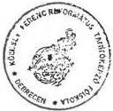

(aláírás, pecsét)

---

6.3-1/b. melléklet

a V-15-41/1998. sz-hoz

# Bevételek alakulása

1994.

|  Sor-szám | Megnevezés | Mérleg űrlap/sor | Eredeti előirányzat (E Ft) | Módosított előirányzat (E Ft) | Teljesítés (E Ft) | Tényl. teljesítés  |   |
| --- | --- | --- | --- | --- | --- | --- | --- |
|   |   |   |   |   |   |  eredeti előir. %-ában | módos. előir. %-ában  |
|  a | b | c | d | e | f | g | h  |
|  1. | Intézmény alaptevékenységének bevételei | 06/07 | 15.831 | 15.831 | 17.535 | 110,8 | 110,8  |
|  2. | Intézmény egyéb bevételei | 06/14 | 6.235 | 6.235 | 9.725 | 156,0 | 156,0  |
|  3. | 2. sorból: ÁFA | 06/11 | 1.200 | 1.200 | 1.830 | 152,5 | 152,5  |
|  4. | Vállalkozási tevékenység bevételei | 06/17 | - | - | - | - | -  |
|  5. | Intézményi tevékenységek bevételei | 06/18 | 22.066 | 22.066 | 27.260 | 123,5 | 123,5  |
|  6. | Kamatbevételek | 06/19 | - | - | 1.454 | - | -  |
|  7. | Intézmények saját folyó bevételei (5+6) | 06/20 | 22.066 | 22.066 | 28.714 | 130,1 | 130,1  |
|  8. | Felhalmozási és tőke jellegű bevételek | 07/14 | - | - | 285 | - | -  |
|  9. | Támogatások, kiegészítések és átvett pénzeszközök | 08/50 | 260.900 | 288.950 | 294.184 | 112,8 | 101,8  |
|  10. | 9. sorból: Központi költségvetésből kapott költségvetési támogatás | 08/11 | 260.900 | 288.950 | 288.562 | 110,6 | 99,9  |
|  11. | Hitelek, rövid lejáratú értékpapírok bevételei | 09/07 | - | - | - | - | -  |
|  12. | Pénzforgalom nélküli bevételek | 09/11 | - | - | - | - | -  |
|  13. | 12. sorból: Előző évi pénzmaradvány igénybevétele | 09/08 | - | - | - | - | -  |
|  14. | Költségvetési bevételek összesen: (7+8+9+11+12) | 10/28 | 282.966 | 311.016 | 323.183 | 114,2 | 103,9  |

Kelt Debrecen, 1998. május 25.

(aláírás, pecsét)

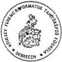

---

# Bevételek alakulása
1995.

6.3-1/c. sz. melléklet
a V-15-41/1998. sz-hoz

|  Sor-szám | Megnevezés | Mérleg űrlap/sor | Eredeti előirányzat (E Ft) | Módosított előirányzat (E Ft) | Teljesítés (E Ft) | Tényl. teljesítés  |   |
| --- | --- | --- | --- | --- | --- | --- | --- |
|   |   |   |   |   |   |  eredeti előir. %-ában | módos. előir. %-ában  |
|  a | b | c | d | e | f | g | h  |
|  1. | Intézmény alaptevékenységének bevételei | 07/05+09 | 14.471 | 26.200 | 26.297 | 181,7 | 100,4  |
|  2. | Intézmény egyéb bevételei | 07/19+23 | 12.430 | 9.801 | 9.766 | 78,6 | 99,6  |
|  3. | 2. sorból: ÁFA | 07/21 | 2.833 | 2.600 | 2.569 | 90,7 | 98,8  |
|  4. | Vállalkozási tevékenység bevételei | 07/26 | - | - | - | - | -  |
|  5. | Kamatbevételek | 07/27 | 2.113 | 2.589 | 2.547 | 120,5 | 98,4  |
|  6. | Intézményi működési bevételek (1+2+4+5) | 07/28 | 29.014 | 38.590 | 38.610 | 133,1 | 100,1  |
|  7. | Felhalmozási és tőke jellegű bevételek | 08/14 | - | 200 | 208 | - | 104,0  |
|  8. | Támogatások, kiegészítések és átvett pénzeszközök | 09/42 | 287.500 | 304.854 | 312.217 | 108,6 | 102,4  |
|  9. | 8. sorból: Központi költségvetésből kapott támogatás | 09/11+09/07 | 287,500 | 303.577 | 301.039 | 104,7 | 99,2  |
|  10. | Hitelek, rövid lejáratú értékpapírok bevételei | 10/05 |  |  |  |  |   |
|  11. | Pénzforgalom nélküli bevételek | 10/09 | 1.255 | 1.229 | 1.229 | 97,9 | 100,0  |
|  12. | 11. sorból: Előző évi pénzmaradvány igénybevétele | 10/06 | 1.255 | 1.229 | 1.229 | 97,9 | 100,0  |
|  13. | Költségvetési bevételek összesen: (6+7+8+10+11) | 11/29 | 317.769 | 344.873 | 352.264 | 110,8 | 102,1  |

Kelt Debrecen, 1998. május 25.

(aláírás, pecsét)

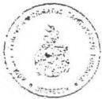

---

# Bevételek alakulása

1996.

6.3-1/d. sz. melléklet

a V-15-41/1998. sz-hoz

|  Sor-szám | Megnevezés | Mérleg űrlap/sor | Eredeti előirányzat (E Ft) | Módosított előirányzat (E Ft) | Teljesítés (E Ft) | Tényl. teljesítés  |   |
| --- | --- | --- | --- | --- | --- | --- | --- |
|   |   |   |   |   |   |  eredeti előir. %-ában | módos. előir. %-ában  |
|  a | b | c | d | e | f | g | h  |
|  1. | Intézmény alaptevékenységének bevételei | 07/05+09 | 33.206 | 47.961 | 47.961 | 144,4 | 100,0  |
|  2. | Intézmény egyéb bevételei | 07/19+23 | 8.487 | 13.058 | 13.058 | 153,9 | 100,0  |
|  3. | 2. sorból: ÁFA | 07/21 | 2.500 | 2.800 | 2.800 | 112,0 | 100,0  |
|  4. | Vállalkozási tevékenység bevételei | 07/26 | - | - | - | - | -  |
|  5. | Kamatbevételek | 07/27 | - | 4.843 | 4.843 | - | 100,0  |
|  6. | Intézményi működési bevételek (1+2+4+5) | 07/28 | 41.693 | 65.862 | 65.862 | 158,0 | 100,0  |
|  7. | Felhalmozási és tőke jellegű bevételek | 08/14 | 2.150 | 2.150 | 2.150 | 100,0 | 100,0  |
|  8. | Támogatások, kiegészítések és átvett pénzeszközök | 09/42 | 297.979 | 354.520 | 354.411 | 118,9 | 100,0  |
|  9. | 8. sorból: Központi költségvetésből kapott támogatás | 09/11+09/07 | 297.979 | 337.502 | 337.495 | 113,3 | 100,0  |
|  10. | Hitelek, rövid lejáratú értékpapírok bevételei | 10/05 | - | - | 20.019 | - | -  |
|  11. | Pénzforgalom nélküli bevételek | 10/09 | 1.623 | 1.623 | 1.523 | 93,0 | 93,8  |
|  12. | 11. sorból: Előző évi pénzmaradvány igénybevétele | 10/06 | 1.623 | 1.623 | 1.523 | 93,8 | 93,8  |
|  13. | Költségvetési bevételek összesen: (6+7+8+10+11) | 11/29 | 343.445 | 424.155 | 443.965 | 129,3 | 104,7  |

Kelt Debrecen, 1998. május 25.

(aláírás, pecsét)

---

# Bevételek alakulása

1997.

6.3-1/e. sz. melléklet

a V-15-41/19-98. sz-hoz

|  Sor-szám | Megnevezés | Mérleg űrlap/sor | Eredeti előirányzat (E Ft) | Módosított előirányzat (E Ft) | Teljesítés (E Ft) | Tényl. teljesítés  |   |
| --- | --- | --- | --- | --- | --- | --- | --- |
|   |   |   |   |   |   |  eredeti előir. %-ában | módos. előir. %-ában  |
|  a | b | c | d | e | f | g | h  |
|  1. | Intézmény alaptevékenységének bevételei | 07/05+09 | 54.265 | 59.556 | 59.556 | 109,8 | 100,0  |
|  2. | Intézmény egyéb bevételei | 07/19+23 | 10.970 | 13.577 | 13.577 | 123,8 | 100,0  |
|  3. | 2. sorból: ÁFA | 07/21 | 3.300 | 3.300 | 3.104 | 94,0 | 94,0  |
|  4. | Vállalkozási tevékenység bevételei | 07/26 |  |  |  |  |   |
|  5. | Kamatbevételek | 07/27 | - | 5.283 | 5.283 | - | 100,0  |
|  6. | Intézményi működési bevételek (1+2+4+5) | 07/28 | 65.235 | 78.416 | 78.416 | 120,2 | 100,0  |
|  7. | Felhalmozási és tőke jellegű bevételek | 08/14 | - | 9 | 9 | - | 100,0  |
|  8. | Támogatások, kiegészítések és átvett pénzeszközök | 09/42 | 307.752 | 422.626 | 422.626 | 137,3 | 100,0  |
|  9. | 8. sorból: Központi költségvetésből kapott támogatás | 09/11+09/07 | 307.752 | 323.726 | 323.726 | 105,2 | 100,0  |
|  10. | Hitelek, rövid lejáratú értékpapírok bevételei | 10/05 | 15.000 | 15.000 | 39.941 | 266,3 | 266,3  |
|  11. | Pénzforgalom nélküli bevételek | 10/09 | - | 4.552 | 4.552 | - | 100,0  |
|  12. | 11. sorból: Előző évi előir. maradvány igénybevétele | 10/06 | - | 4.552 | 4.552 | - | 100,0  |
|  13. | Költségvetési bevételek összesen: (6+7+8+10+11) | 11/29 | 387.987 | 520.603 | 545.544 | 140,6 | 104,8  |

Kelt Debrecen, 1998. május 25.

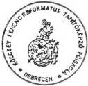

(aláírás, pecsét)

---

6.3-2/a. sz. melléklet
a V-15-41/1998. sz-hoz

# Kiadások alakulása

1993. I. félév

|  Sor-szám | Megnevezés | Mérleg űrlap/sor | Eredeti előirányzat (E Ft) | Módosított előirányzat (E Ft) | Teljesítés (E Ft) | Tényl. teljesítés  |   |
| --- | --- | --- | --- | --- | --- | --- | --- |
|   |   |   |   |   |   |  eredeti előir. %-ában | módos. előir. %-ában  |
|  a | b | c | d | e | f | g | h  |
|  1. | Béralap | 02/10 | 118.421 | 63.335 | 64.792 | 54,71 | 102,3  |
|  2. | Bérjellegű kiadás | 02/20 | 5.301 | 4.020 | 4.906 | 92,55 | 122,04  |
|  3. | Készletbeszerzés | 02/30 | 17.228 | 12.907 | 15.251 | 88,52 | 118,16  |
|  4. | Szolgáltatás | 02/39 | 18.181 | 14.232 | 15.420 | 84,81 | 108,35  |
|  5. | Különféle kiadás és befizetés | 02/48 | 53.533 | 29.651 | 31.009 | 57,93 | 104,58  |
|  6. | 17. sorból: TB járulék | 02/40 | 50.288 | 26.391 | 27.225 | 54,14 | 103,16  |
|  7. | Kamatfizetések | 02/50 | - | - | - | - | -  |
|  8. | Folyó kiadások (1+2+3+4+5+7) | 02/51 | 212.664 | 124.145 | 131.378 | 61,78 | 105,83  |
|  9. | Felhalmozási és tőke jellegű kiadás | 03/17 | 1.759 | 905 | 1.148 | 65,26 | 126,85  |
|  10. | 9. sorból: Tárgyi eszköz felújítás | 03/10 | 1.100 | 575 | - | - | -  |
|  11. | Támogatások, elvonások, pénzeszköz átadás | 04/64 | 52.270 | 29.847 | 35.392 | 67,71 | 118,58  |
|  12. | Hitelek, rövid lejáratú értékpapírok kiadásai | 05/04 | - | - | 8.000 | - | -  |
|  13. | Pénzforgalom nélküli kiadások | 05/08 | - | - | - | - | -  |
|  14. | Költségvetési kiadások összesen: (8+9+11+12+13) | 10/09 | 266.693 | 154.897 | 175.918 | 65,96 | 113,57  |

Kelt Debrecen, 1998. május 26.

(aláírás, pecsét)

---

# Kiadások alakulása

1994.

6.3-2/b. sz. melléklet

a V-15-41/1998. sz-hoz

|  Sor-szám | Megnevezés | Mérleg űrlap/sor | Eredeti előirányzat (E Ft) | Módosított előirányzat (E Ft) | Teljesítés (E Ft) | Tényl. teljesítés  |   |
| --- | --- | --- | --- | --- | --- | --- | --- |
|   |   |   |   |   |   |  eredeti előir. %-ában | módos. előir. %-ában  |
|  a | b | c | d | e | f | g | h  |
|  1. | Béralap | 02/10 | 119.000 | 141.172 | 139.091 | 116,9 | 98,5  |
|  2. | Bérjellegű kiadás | 02/20 | 9.290 | 8.890 | 9.930 | 106,9 | 111,7  |
|  3. | Készletbeszerzés | 02/30 | 20.542 | 18.805 | 23.028 | 112,1 | 122,5  |
|  4. | Szolgáltatás | 02/39 | 20.110 | 18.434 | 23.795 | 118,3 | 129,1  |
|  5. | Különféle kiadás és befizetés | 02/49 | 54.700 | 64.391 | 67.410 | 123,2 | 104,7  |
|  6. | 17. sorból: TB járulék | 02/40 | 50.500 | 60.191 | 58.559 | 116,0 | 97,3  |
|  7. | Kamatfizetések | 02/51 | - | - | - | - | -  |
|  8. | Folyó kiadások (1+2+3+4+5+7) | 02/52 | 223.642 | 251.692 | 263.254 | 117,7 | 104,6  |
|  9. | Felhalmozási és tőke jellegű kiadás | 03/17 | - | - | 7.405 | - | -  |
|  10. | 9. sorból: Tárgyi eszköz felújítás | 03/10 | - | - | 144 | - | -  |
|  11. | Támogatások, elvonások, pénzeszköz átadás | 04/64 | 59.324 | 59.324 | 58.323 | 98,3 | 98,3  |
|  12. | Hitelek, rövid lejáratú értékpapírok kiadásai | 05/04 | - | - | - | - | -  |
|  13. | Pénzforgalom nélküli kiadások | 05/08 | - | - | - | - | -  |
|  14. | Költségvetési kiadások összesen: (8+9+11+12+13) | 10/09 | 282.966 | 311.016 | 328.982 | 116,3 | 105,8  |

Kelt Debrecen, 1998. május 25.

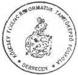

(aláírás, pecsét)

---

63-2.c. sz. melléklet

V-15- 44.../1998.

# Kiadások alakulása

1995.

|  Sor-szám | Megnevezés | Mérleg űrlap/sor | Eredeti előirányzat (E Ft) | Módosított előirányzat (E Ft) | Teljesítés (E Ft) | Tényl. teljesítés  |   |
| --- | --- | --- | --- | --- | --- | --- | --- |
|   |   |   |   |   |   |  eredeti előir. %-ában | módos. előir. %-ában  |
|  a | b | c | d | e | f | g | h  |
|  1. | Rendszeres személyi juttatások | 02/08 | 122.983 | 119.150 | 119.146 | 96,9 | 100,0  |
|  2. | Nem rendszeres személyi juttatások | 02/42 | 22.137 | 28.200 | 28.228 | 127,5 | 100,1  |
|  3. | Külső személyi juttatások | 02/57 | 5.280 | 8.884 | 8.913 | 168,8 | 100,3  |
|  4. | Társadalombiztosítási járulék | 02/62 | 60.000 | 61.459 | 61.509 | 102,5 | 100,1  |
|  5. | Dologi kiadások | 03/110 | 44.389 | 60.300 | 62.527 | 141,0 | 103,7  |
|  6. | Pénzeszköz átadás, egyéb támogatás | 04/46 | - | 900 | 973 | - | 108,1  |
|  7. | Ellátottak juttatásai | 04/52 | 58.750 | 57.750 | 58.026 | 98,8 | 100,5  |
|  8. | Felújítás | 05/26 | 3.000 | 3.000 | 241 | 8,0 | 8,0  |
|  9. | Felhalmozási kiadások | 05/61 | 1.230 | 5.230 | 5.378 | 437,2 | 102,8  |
|  10. | Fejezeti kezelésű speciális támogatások | 05/62 | - | - | - | - | -  |
|  11. | Hitelek, rövid lejáratú értékpapírok kiadásai | 06/04 | - | - | - | - | -  |
|  12. | Pénzforgalom nélküli kiadások | 06/08 | - | - | - | - | -  |
|  13. | Költségvetési kiadások összesen: (1+2+3+4+5+6+7+8+9+10+11+12) | 11/12 | 317.769 | 344.873 | 344.941 | 108,6 | 100,0  |

Kelt Debrecen, 1998. május 25.

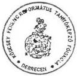

(aláírás, pecsét)

---

# Kiadások alakulása

1996.

6.3-2/d. sz. melléklet

a V-15-41/1998. sz-hoz

|  Sor-szám | Megnevezés | Mérleg űrlap/sor | Eredeti előirányzat (E Ft) | Módosított előirányzat (E Ft) | Teljesítés (E Ft) | Tényl. teljesítés  |   |
| --- | --- | --- | --- | --- | --- | --- | --- |
|   |   |   |   |   |   |  eredeti előir. %-ában | módos. előir. %-ában  |
|  a | b | c | d | e | f | g | h  |
|  1. | Rendszeres személyi juttatások | 02/08 | 123.524 | 136.598 | 124.090 | 100,5 | 90,8  |
|  2. | Nem rendszeres személyi juttatások | 02/42 | 21.170 | 32.241 | 40.980 | 193,6 | 127,1  |
|  3. | Külső személyi juttatások | 02/57 | 8.050 | 8.900 | 11.191 | 139,0 | 125,7  |
|  4. | Társadalombiztosítási járulék | 02/62 | 60.000 | 71.425 | 71.003 | 118,3 | 99,4  |
|  5. | Dologi kiadások | 03/111 | 68.876 | 85.480 | 89.301 | 129,6 | 104,5  |
|  6. | Pénzeszköz átadás, egyéb támogatás | 04/46 | - | 18.551 | 3.638 | - | 19,6  |
|  7. | Ellátottak juttatásai | 04/52 | 56.825 | 65.960 | 59.557 | 104,8 | 90,3  |
|  8. | Felújítás | 05/27 | 3.500 | 3.500 | 1.094 | 31,3 | 31,3  |
|  9. | Felhalmozási kiadások | 05/93 | 1.500 | 1.500 | 3.561 | 237,4 | 237,4  |
|  10. | Fejezeti kezelésű speciális támogatások | 05/94 | - | - | - | - | -  |
|  11. | Hitelek, rövid lejáratú értékpapírok kiadásai | 06/04 | - | - | 34.998 | - | -  |
|  12. | Pénzforgalom nélküli kiadások | 06/08 | - | - | - | - | -  |
|  13. | Költségvetési kiadások összesen: (1+2+3+4+5+6+7+8+9+10+11+12) | 11/12 | 343.445 | 424.155 | 439.413 | 127,9 | 103,6  |

Kelt Debrecen, 1998. május 25.

(aláírás, pecsét)

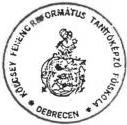

---

# Kiadások alakulása
1997.

6.3-2/e. sz. melléklet
a V-15-41/1998. sz-hoz

|  Sor-szám | Megnevezés | Mérleg űrlap/sor | Eredeti előirányzat (E Ft) | Módosított előirányzat (E Ft) | Teljesítés (E Ft) | Tényl. teljesítés  |   |
| --- | --- | --- | --- | --- | --- | --- | --- |
|   |   |   |   |   |   |  eredeti előir. %-ában | módos. előir. %-ában  |
|  a | b | c | d | e | f | g | h  |
|  1. | Rendszeres személyi juttatások | 02/08 | 130.441 | 156.595 | 156.463 | 119,9 | 99,9  |
|  2. | Nem rendszeres személyi juttatások | 02/42 | 25.700 | 38.473 | 38.436 | 149,6 | 99,9  |
|  3. | Külső személyi juttatások | 02/57 | 9.900 | 14.450 | 14.463 | 146,1 | 100,0  |
|  4. | Társadalombiztosítási járulék | 02/62 | 62.669 | 70.604 | 70.602 | 112,7 | 100,0  |
|  5. | További, munkaadókat terhelő járulékok | 02/63+64 | 11.918 | 12.061 | 11.758 | 98,7 | 97,5  |
|  6. | Dologi kiadások | 03/111 | 71.989 | 106.797 | 96.517 | 134,1 | 90,4  |
|  7. | Pénzeszköz átadás, egyéb támogatás | 04/50 | 15.000 | 15.920 | 8.357 | 55,7 | 52,5  |
|  8. | Ellátottak juttatásai | 04/56 | 60.370 | 69.289 | 69.267 | 114,7 | 100,0  |
|  9. | Felújítás | 05/27 | - | 1.830 | 1.324 | - | 72,3  |
|  10. | Felhalmozási kiadások | 05/93 | - | 9.581 | 9.565 | - | 99,8  |
|  11. | Hitelek, rövid lejáratú értékpapírok kiadásai | 06/04 | - | 25.004 | 49.944 | - | 199,7  |
|  12. | Pénzforgalom nélküli kiadások | 06/08 |  |  |  |  |   |
|  13. | Költségvetési kiadások összesen: (1+2+3+4+5+6+7+8+9+10+11+12) | 11/12 | 387.987 | 520.604 | 526.696 | 135,8 | 101,2  |

Kelt Debrecen, 1998. május 26.

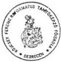

(aláírás, pecsét)

---

6.3-3. sz. melléklet

a V-15-41/1998. sz-hoz

Működési és felhalmozási célra kapott állami pénzeszközök

adatok: E Ft-ban

|  Sor-szám | Megnevezés | 1993. év | 1994. év | 1995. év | 1996. év | 1997. év | Index 97/93 %  |
| --- | --- | --- | --- | --- | --- | --- | --- |
|  1. | Személyi juttatások (Béralap 1993-94.) |  |  |  |  |  |   |
|  2. | Munkaadókat terhelő járulékok (TB jár.) |  |  |  |  |  |   |
|  3. | Dologi kiadások |  |  |  |  |  |   |
|  4. | Egyéb működési célú, központi költségvetésből származó támogatás |  |  |  |  |  |   |
|  5. | Központi költségvetésből kapott költségvetési támogatás (1+2+3+4) | 257.234 | 288.562 | 301.039 | 337.495 | 323.726 | 125,8  |
|   | 5-ből: |  |  |  |  |  |   |
|  5/a | - Képzési előirányzat |  |  |  |  |  |   |
|  5/b | - Létesítményfenntartási előirányzat |  |  |  |  |  |   |
|  5/c | - Programfinanszírozási előirányzat |  |  |  |  |  |   |
|  5/d | - Hallgatói előirányzat | 57.263 | 58.636 | 60.424 | 61.502 | 67.818 | 118,4  |
|   | 5d-ből: |  |  |  |  |  |   |
|   | - Hallgatói normatíva | 54.925 | 54.795 | 54.250 | 55.055 | 62.055 | 113,0  |
|   | - Doktoranduszi normatíva | - | - | - | - | - |   |
|   | - Diákotthoni támogatás | - | - | - | - | - |   |
|   | - Tankönyvtámogatás | 1.876 | 3.115 | 5.674 | 5.967 | 4.563 | 243,2  |
|   | - Köztársasági ösztöndíj | 462 | 726 | 500 | 480 | 1.200 | 259,7  |
|  5/e | - Egyéb támogatás |  |  |  |  |  |   |
|  6. | Működési célra kapott egyéb államháztartási pénzeszközök (pl. állami pénzalap) | 4.887 | 846 | 4.645 | 11.671 | **50.879 | 1.041,1  |
|  7. | Felhalmozási célú állami pénzeszközök összesen |  |  |  |  |  |   |
|   | 7-ből: |  |  |  |  |  |   |
|  7/a | - Központi és önkorm. költségvetési szervektől |  |  |  |  |  |   |
|  7/b | - Elkülönített állami pénzalapoktól |  |  |  |  |  |   |
|  8. | Működési és felhalmozási célra felhasznált állami pénzeszközök összesen (5+6+7) | 262.121 | 289.408 | 305.684 | 349.166 | 374.605 | 142,9  |

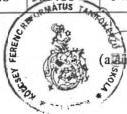

Kelt Debrecen, 1998. június 4.

** Az 1997. év 6. sorában 50.879 eFt-ból

-14.117 eft képzési elöirányzat
- 9.758 eft programfinanszirozasi eloiranyzat

(aláírás, pecsét)

---

6.3-4. sz. melléklet

a V-15-4//1998. sz-hoz

# Az 1997. évi pénzügyi likviditási helyzet alakulása

adatok: E Ft-ban

|  Sorszám: | Megnevezés | Időpont  |   |   |   |   |
| --- | --- | --- | --- | --- | --- | --- |
|   |   |  1997. I. 1. | 1997. IV. 1. | 1997. VII. 1. | 1997. X. 1. | 1997. XII. 31.  |
|  1. | Bankszámla egyenleg | 10.497 | 10.175 | 18.074 | 30.657 | 10.197  |
|  2. | Pénztár és betétkönyv összege | 227 | 301 | 361 | 278 | 264  |
|  3. | Pénzkészlet összesen (1+2) | 10.724 | 10.476 | 18.435 | 30.935 | 10.461  |
|  4. | Követelések összesen (Mérleg 29. sor) | 965 | 501 | 421 | 519 | 552  |
|  5. | Kötelezettségek össz. (Mérleg 90. sor) | 15.069 | 22.478 | 24.232 | 22.339 | 241  |
|  5/a | 5. sorból: Adó- és TB tartozás | - | - | - | - | -  |

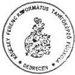

Kelt Debrecen, 1998. május 25.

(aláírás, pecsét)

---

63-5. sz. melléklet

a V-15-4/1998. sz-hoz

# Általános statisztikai állományi létszámadatok

adatok: főben

|  Sorszám: | Megnevezés | I d ő s z a k  |   |   |   |   |   |
| --- | --- | --- | --- | --- | --- | --- | --- |
|   |   |  1993. | 1994. | 1995. | 1996. | 1997. | 1997/93. %  |
|  a | b | c | d | e | f | g | h  |
|  1. | Oktatók | 104 | 95 | 93 | 84 | 78 | 75  |
|  2. | Önálló gazdasági és műszaki alkalm. | 71 | 67 | 60 | 51 | 50 | 70,4  |
|  3. | Egyéb besorolású közalkalmazottak | 170 | 171 | 147 | 132 | 119 | 70  |
|  4. | Összesen: (1+2+3) | 345 | 333 | 300 | 267 | 247 | 71,5  |

Kelt Debrecen, 1998. június 2.

(aláírás, pecsét)

---

63-6. sz. melléklet
2 V-15-4/1998. sz-hoz

# Oktatói és hallgatói létszám alakulása

adatok: főben

|  Sorszám: | Megnevezés | 1993. | 1994. | 1995. | 1996. | 1997. | Index 1997/93.  |
| --- | --- | --- | --- | --- | --- | --- | --- |
|   |   |  X. 15. | X. 15. | X. 15. | X. 15. | X. 15. | %  |
|  a | b | c | d | e | f | g | h  |
|  **Oktatók létszámadatai**  |   |   |   |   |   |   |   |
|  1. | összes oktató létszáma | 101 | 94 | 93 | 86 | 78 | 77,2  |
|  2. | főfoglalkozású oktatók létszáma | 101 | 94 | 93 | 86 | 78 | 77,2  |
|  3. | teljes munkaidőben foglalk. oktatók létszáma | 101 | 94 | 93 | 86 | 78 | 77,2  |
|  4. | redukált oktatói létszám | 101 | 94 | 93 | 86 | 78 | 77,2  |
|  **Hallgatók létszámadatai**  |   |   |   |   |   |   |   |
|  5. | összes hallgató létszáma | 831 | 858 | 902 | 1.060 | 1.112 | 133,8  |
|  6. | nappali hallgatók létszáma | 831 | 858 | 825 | 915 | 910 | 109,5  |
|  7. | redukált hallgatói létszám | 831 | 858 | 847 | 951 | 967 | 116,4  |
|  8. | sikeresen államvizsgát tett hallgatók létszáma | 254 | 251 | 288 | 212 | 288 | 113,4  |

Kelt Debrecen, 1998. május 26.

(aláírás, pecsét)

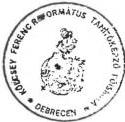

---

63-7. sz. melléklet

a V-15-41/1998. sz-hoz

# Oktatói-hallgatói létszámarány alakulása

adatok : főben

|  Megnevezés | 1993. X. 15. | 1994. X. 15. | 1995. X. 15. | 1996. X. 15. | 1997. X. 15. | Index 1997/93. %  |
| --- | --- | --- | --- | --- | --- | --- |
|   |  a | b | c | d | e | f  |
|  1 oktatóra jutó összes hallgató száma | 8,2 | 9,1 | 9,7 | 12,6 | 14,3 | 174  |
|  1 oktatóra jutó redukált hallgatói létsz. | 8,2 | 9,1 | 9,1 | 11,3 | 12,4 | 151  |
|  1 főfoglalkozású oktatóra jutó nappali hallgatók száma | 8,2 | 9,1 | 9,1 | 11,3 | 12,4 | 151  |

Sol

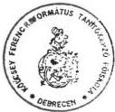

Kelt Debrecen, 1998. május 26.

(aláírás, pecsét)

---

63-8/a. sz. melléklet
a V-15-4/1998. sz-hoz

# Főfoglalkozású oktatók tantervi óraterhelése
1994-95. tanévben

| Sor- szám | Megnevezés | 1994/95. tanév | Oktatói létszám 1994. X. 15. | Óraterhelés /e:f/ |
| --- | --- | --- | --- | --- |
| előadás /óra/ | gyakorlat /óra/ | összesen /óra/ | /fő/ | /óra/fő/ |
| a | b | c | d | e | f | g |
| 01 | egyetemi | tanár |  |  |  |  |  |
| 02 | főiskolai |  | 920 | 200 | 1.120 | 5 | 224 |
| 03 | egyetemi |  |  |  |  |  |  |
| 04 | főiskolai | doc. | 720 | 8.240 | 8.960 | 32 | 280 |
| 05 | egyetemi |  |  |  |  |  |  |
| 06 | főiskolai | adj. | 104 | 12.328 | 12.432 | 37 | 336 |
| 07 | tanársegéd |  | 7.056 | 7.056 | 18 | 392 |
| 08 | nyeiv- és testnevelő tanár |  |  |  |  |  |
| 09 | egyéb főfoglalkozá- sú oktató |  |  |  | 2 |  |
| 10 | Összesen: | 1.744 | 27.824 | 29.568 | 94 | 314,6 |

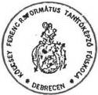

Kelt. Debrecen, 1998. május 26.

(aláírás, pecsét)

---

6.3-8/b. sz. melléklet
a V-15-44/1998. sz-hoz

# Főfoglalkozású oktatók tantervi óraterhelése
1996-97. tanévben

|  Sor- szám | Megnevezés | 1996/97. tanév |   |   | Oktatói létszám 1996. X. 15. | Óraterhelés /e:f/  |
| --- | --- | --- | --- | --- | --- | --- |
|   |   |  előadás /óra/ | gyakorlat /óra/ | összesen /óra/  |   |   |
|  a | b | c | d | e | f | g  |
|  01 | egyetemi tanár |  |  |  |  |   |
|  02 | főiskolai | 940 | 180 | 1.120 | 5 | 224  |
|  03 | egyetemi |  |  |  |  |   |
|  04 | főiskolai doc. | 2.532 | 5.532 | 8.064 | 24 | 336  |
|  05 | egyetemi |  |  |  |  |   |
|  06 | főiskolai adj. | 702 | 12.766 | 13.468 | 37 | 364  |
|  07 | tanársegéd | 10 | 6.262 | 6.272 | 14 | 448  |
|  08 | nyelv- és testnevelő tanár |  |  |  |  |   |
|  09 | egyéb főfoglalkozá- sú oktató |  |  |  | 6 |   |
|  10 | Összesen: | 4.184 | 24.740 | 28.924 | 86 | 336,3  |

Kelt Debrecen 1998. május 26.

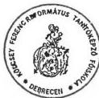

(aláírás, pecsét)

---

63-9 sz. melléklet
V-15-4.1/1998.

# Főbb létszám- és illetményadatok

|  Időszak | Oktatók |   |   | Önálló gazd. és műszaki alk. |   |   | Egyéb besorolású közalkalm. |   |   | Összesen  |   |   |
| --- | --- | --- | --- | --- | --- | --- | --- | --- | --- | --- | --- | --- |
|   |  létszám (fő) | illetmény (E Ft) | 1 főre j. illetmény (E Ft) | létszám (fő) | illetmény (E Ft) | 1 főre j. illetmény (E Ft) | létszám (fő) | illetmény (E Ft) | 1 főre j. illetmény (E Ft) | létszám (fő) | illetmény (E Ft) | 1 főre j. illetmény (E Ft)  |
|   |  1 | 2 | 3 | 4 | 5 | 6 | 7 | 8 | 9 | 10 | 11 | 12  |
|   |  |  | (2:1) |  |  | (5:4) |  |  | (8:7) |  |  | (11:10)  |
|  1993. év | 104 | 38.565 | 370 | 71 | 16.812 | 236 | 170 | 35.570 | 209 | 345 | 90.947 | 263  |
|  1994. év | 95 | 56.460 | 594 | 67 | 23.511 | 350 | 171 | 59.120 | 345 | 333 | 139.091 | 417  |
|  1995. év | 93 | 52.928 | 569 | 60 | 20.678 | 344 | 147 | 49.021 | 333 | 300 | 122.627 | 408  |
|  1996. év | 84 | 54.362 | 647 | 51 | 21.101 | 413 | 132 | 53.656 | 406 | 267 | 129.119 | 483  |
|  1997. év | 78 | 70.009 | 897 | 50 | 28.334 | 566 | 119 | 64.846 | 544 | 247 | 163.189 | 660  |

Kelt Debrecen, 1998. június 2.

(aláírás, pecsét)

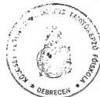

---

# Összefoglaló adatok 1993-1997. évekre

6.3-10. sz. melléklet

a V-15-41/1998. sz-hoz

|  Sor-szám | Megnevezés | Mérték-egység | 1993. év | 1994. év | 1995. év | 1996. év | 1997. év  |
| --- | --- | --- | --- | --- | --- | --- | --- |
|  1. | Költségvetési kiadások össz. | E Ft | 312.743 | 328.982 | 344.941 | 439.413 | 526.696  |
|  2. | Bevételből: központi költségvetési támogatás | E Ft | 257.234 | 288.562 | 301.039 | 337.495 | 323.726  |
|  3. | Költségvetési támogatás a kiadások %-ában | % 3=2:1 | 82,25 | 87,71 | 87,27 | 76,81 | 61,46  |
|   | Átlagos stat. állományból: |  |  |  |  |  |   |
|  4. | - Összes foglalkoztatott | fő | 345 | 333 | 300 | 267 | 247  |
|  5. | - Összes oktató | fő | 104 | 95 | 93 | 84 | 78  |
|  6. | - Összes oktató az össz. fogl. %-ában | % 6=5:4 | 30,14 | 28,52 | 31 | 31,46 | 31,57  |
|   | X. 15-i állapot szerint: |  |  |  |  |  |   |
|  7. | - Összes hallgató | fő | 831 | 858 | 902 | 1.060 | 1.112  |
|  8. | - Nappali hallgatók | fő | 831 | 858 | 825 | 915 | 910  |
|  9. | - Redukált hallgatók | fő | 831 | 858 | 847 | 951 | 967  |
|  10. | - Összes oktató | fő | 101 | 94 | 93 | 86 | 78  |
|  11. | - 1 oktatóra jutó hallgató | fő 11=7:10 | 8,2 | 9,1 | 9,7 | 12,3 | 14,3  |
|  12. | - 1 oktatóra jutó nappali hallgató | fő 12=8:10 | 8,2 | 9,1 | 8,9 | 10,6 | 11,7  |
|  13. | 1 hallgatóra jutó kiadás | E Ft 13=1:7 | 376 | 383 | 382 | 415 | 474  |
|  14. | 1 hallgatóra jutó költségvetési támogatás | E Ft 14=2:7 | 310 | 336 | 334 | 318 | 291  |
|  15. | 1 nappali hallgatóra jutó költségvetési támogatás | E Ft 15=2:8 | 310 | 336 | 365 | 369 | 356  |
|  16. | 1 redukált hallgatóra jutó költségvetési támogatás | E Ft 16=2:9 | 310 | 336 | 355 | 355 | 335  |

Szi

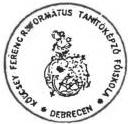

Kelt ...Debrecen,...1998...május..26...

(aláírás, pecsét)

---

6.3-11. sz. melléklet
a V- 15-41/1998. sz-hoz

Megbízási díjak alakulása 1993. és 1997. évben

|  Sorszám: | Megnevezés | 1993. 1994. |   |   | 1997.  |   |   |
| --- | --- | --- | --- | --- | --- | --- | --- |
|   |   |  létszám /fő/ | összeg /EFt/ | 1 főre jutó összeg /EFt/ | létszám /fő/ | összeg /EFt/ | 1 főre jutó összeg /EFt/  |
|  Belső megbízások  |   |   |   |   |   |   |   |
|  1. | oktatók | 82 | 3.002 | 36 | 72 | 9.381 | 130  |
|  2. | önálló gazdasági és műszaki alk. | 36 | 612 | 17 | 44 | 2.749 | 62  |
|  3. | egyéb besorolású közalkalmazott | 75 | 855 | 11 | 103 | 2.036 | 19  |
|  4. | Belső megbízások összesen: (1+2+3) | 193 | 4.469 | 23 | 219 | 14.166 | 64  |
|  5. | Külső megbízások | 489 | 6.210 | 12 | 631 | 9.585 | 15  |
|  6. | Összes megbízás: (4+5) | 6.821 | 10.679 | 15 | 850 | 23.751 | 28  |

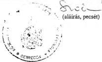

Kelt: Debrecen, 1998. június 2.

---

# Tárgyi eszközök állománya 1997. január 1-jén
(mérleg alapján)

6.3-12. sz. melléklet
a V-15-41/1998. sz-hoz

|  Sor-szám | Megnevezés | Bruttó érték | Értékcsökkenés | Nettó érték | Nettó érték részaránya | Nettó/bruttó aránya (e:c) | Teljesen (0-ra) leírt tárgyi eszk. | Egy redukált hallgatóra jutó tárgyi eszköz  |   |
| --- | --- | --- | --- | --- | --- | --- | --- | --- | --- |
|   |   |  E Ft | E Ft | E Ft | % | % | E Ft | bruttó értéke | nettó értéke  |
|  a | b | c | d | e | f | g | h | i | j  |
|  1. | Ingatlanok | - | - | - | - | - | - | - | -  |
|  2. | 1. sorból: földterület (telek) | - | - | - | - | - | - | - | -  |
|  3. | 1. sorból: építmények (épület) | - | - | - | - | - | - | - | -  |
|  4. | 3. sorból: oktatási célú | - | - | - | - | - | - | - | -  |
|  5. | 3. sorból: kiszolgáló jell. | - | - | - | - | - | - | - | -  |
|  6. | 3. sorból: kollégium | - | - | - | - | - | - | - | -  |
|  7. | 3. sorból: egyéb építmény | - | - | - | - | - | - | - | -  |
|  8. | Gépek, berendezések, felszerelések | 62.582 | 44.180 | 18.402 | 97,8 | 29,4 | 14.054 | 65,8 | 19,4  |
|  9. | 8. sorból: számítógép | 28.027 | 22.151 | 5.876 | - | 21,0 | 5.882 | 29,5 | 6,2  |
|  10. | 8. sorból: irodatechnikai gépek | 6.776 | 6.323 | 453 | - | 6,7 | 4.926 | 7,1 | 0,5  |
|  11. | 8. sorból: szakmai gép, műszer | 11.596 | 7.489 | 4.107 | - | 35,4 | 945 | 12,2 | 4,3  |
|  12. | 8. sorból: egyéb | 16.183 | 8.217 | 7.966 | - | 49,2 | 2.301 | 17,0 | 8,4  |
|  13. | Járművek | 1.030 | 620 | 411 | 2,2 | 39,9 | - | 1,1 | 0,4  |
|  14. | Beruházások | - | - | - | - | - | - | - | -  |
|  15. | Beruh. előlegek | - | - | - | - | - | - | - | -  |
|  16. | Tárgyi eszközök összesen: (1+8+13+14+15) | 63.612 | 44.800 | 18.813 | 100,0 | 29,6 | 14.054 | 66,9 | 19,8  |

Kelt Debrecen, 1998. május 25.

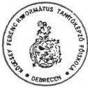

(aláírás, pecsét)

---

# A kollégiumban, illetve a diákotthonban lévő férőhelyek és alapterületük
(1997. október 15-i állapot szerint)

6.3-13. sz. melléklet
a V-15-41/1998. sz-hoz

|  Sor-szám | Megnevezés | Lakószobák |   |   |   | Összes férőhely (fő) | Ténylegesen elszállá-solt hallgatók (fő) | Férőhely kihasználtság (%)  |   |   |   |
| --- | --- | --- | --- | --- | --- | --- | --- | --- | --- | --- | --- |
|   |   |  száma (db) |   | összes területe (m²)  |   |   |   |   |   |   |   |
|   |   |  saját | béreit * | saját | béreit * | saját | béreit * | saját | béreit * | saját | béreit *  |
|  a | b | c | d | e | f | g | h | i | j | k | l  |
|  **Kollégiumok** |   | (i:g) (j:h)  |   |   |   |   |   |   |   |   |   |
|  01 | Maróthi György Kollégium | 86 |  | 1.027 |  | 218 |  | 218 |  | 100 |   |
|  02 | Nagyerdei Kollégium |  | 66 |  | 1.650 |  | 192 |  | 192 |  | 100  |
|  03 |  |  |  |  |  |  |  |  |  |  |   |
|  04 |  |  |  |  |  |  |  |  |  |  |   |
|  05 |  |  |  |  |  |  |  |  |  |  |   |
|  06 |  |  |  |  |  |  |  |  |  |  |   |
|  07 |  |  |  |  |  |  |  |  |  |  |   |
|  08 |  |  |  |  |  |  |  |  |  |  |   |
|  09 |  |  |  |  |  |  |  |  |  |  |   |
|  10 | Összesen: (01-09) | 86 | 66 | 1.027 | 1.650 | 228 | 192 | 218 | 192 | 100 | 100  |

Kelt Debrecen, 1998. május 26.

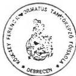

(aláírás, pecsét)

* használati jog

---

6.3.14. sz. melléklet
a V-15-41/1998. sz-hoz

# A saját kollégiumok kiadásai
(1996-1997. évek)

|  Kiadások | 1996. | 1997. | Index 1997/96.  |
| --- | --- | --- | --- |
|   |  E Ft | E Ft | %  |
|  Összes kiadás | 16.736 | 19.634 | 117,3  |
|  Összes kiadásból: |  |  |   |
|  Személyi juttatások | 6.134 | 7.927 | 129,2  |
|  Társadalombizt. járulék | 2.506 | 3.014 | 120,3  |
|  Dologi kiadások | 7.835 | 7.743 | 98,8  |
|  Tárgyi eszköz beszerz. | 261 | 950 | 364,0  |
|  Felújítás | - | - | -  |

Debrecen, 1998. május 25.
Kelt...

(aláírás, pecsét)

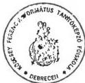