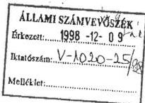
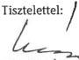
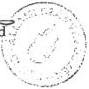

Allami Számverőszék

# JELENTÉS

a Kereszténydemokrata Néppárt 1996-
1997. évi gazdálkodása
törvényességének ellenőrzéséről

9844.

1998. december

---

Az ellenőrzés végrehajtásáért felelős:

Kemény Emil

mb. számvevő igazgató

Az ellenőrzést vezette:

Dr. Szávai Tamás

számvevő főtanácsos

Az összefoglaló jelentést készítette:

Tóth István

számvevő tanácsos

Az ellenőrzésben részt vettek:

Deák Lóránt Antalné

számvevő

Tóth István

számvevő tanácsos

---

V-1020-23/1998. TÉMASZÁM:447

# TARTALOMJEGYZÉK

|  **I. RÉSZLETES MEGÁLLAPÍTÁSOK** | **4**  |
| --- | --- |
|  1. A Párt gazdálkodásáról szóló 1996-1997. évi beszámolók szabályszerűsége | 4  |
|  1.1. A teljes vizsgálati időszakra érvényes megállapítások | 4  |
|  1.2. Részletes megállapítások | 5  |
|  1.2.1. Bevételek | 5  |
|  1.2.2. Kiadások | 6  |
|  2. Az 1996-1997. évi beszámolók megalapozottságát alátámasztó könyvvitel | 6  |
|  2.1. A könyvvezetés szabályozottsága, gyakorlata | 6  |
|  2.1.1. A könyvvezetés szabályozottsága | 6  |
|  2.1.2. A könyvvezetés gyakorlata | 6  |
|  2.2. Analitikus nyilvántartások és a bizonylati elv érvényesülése | 7  |
|  2.2.1. Analitikus nyilvántartások | 7  |
|  2.2.1.1. Eszköznyilvántartás | 8  |
|  2.2.1.2. A készpénzforgalom nyilvántartása | 8  |
|  2.2.1.3. Elszámolásra kiadott előlegek | 8  |
|  2.2.1.4. Szigorú számadású bizonylatok nyilvántartása | 8  |
|  2.2.1.5. Szállítók és vevők | 9  |
|  2.2.2. A bizonylati elv és a bizonylati fegyelem érvényesülése | 9  |
|  2.2.2.1. Kötelezettségvállalás, utalványozás | 9  |
|  2.2.2.2. Bizonylatolás | 11  |
|  2.3. Személyi jellegű kifizetések | 13  |
|  2.3.1. Külföldi kiküldetések | 13  |
|  2.3.2. Gépjármű üzemeltetés | 13  |
|  2.4. Az adózásra, illetőleg a járulék fizetésre vonatkozó jogszabályok betartása | 15  |
|  3. A Párt bevételszerző, gazdálkodó tevékenysége | 15  |
|  3.1. A Párt bevételszerző tevékenysége | 15  |
|  3.2. A Párt alaptevékenységével összefüggő bevételek | 15  |
|  4. A Párt gazdálkodásának belső ellenőrzése | 17  |
|  5. Az előző ellenőrzés megállapításaira tett intézkedések | 17  |
|  **II. ÖSSZEFOGLALÓ MEGÁLLAPÍTÁSOK, FELHÍVÁS A TÖRVÉNYES ÁLLAPOT HELYREÁLLÍTÁSÁRA** | **18**  |
|  1. Összefoglaló megállapítások | 18  |
|  2. Felhívás a törvényes állapot helyreállítására | 20  |

1

---

C

C

---

# JELENTÉS

## A Kereszténydemokrata Néppárt 1996-1997. évi gazdálkodása törvényességének ellenőrzéséről

A pártok működéséről és gazdálkodásáról szóló - többször módosított - 1989. évi XXXIII. tv. (továbbiakban: párttörvény) 10. § (1) bekezdése, valamint az Állami Számvevőszékről szóló 1989. évi XXXVIII. törvény 5. §-a alapján a pártok gazdálkodása törvényességének ellenőrzésére az Állami Számvevőszék (továbbiakban: ÁSZ) jogosult. A törvényi felhatalmazás alapján az ÁSZ 1998. évi ellenőrzési tervének megfelelően vizsgálta a Kereszténydemokrata Néppárt (továbbiakban: Párt) 1996-1997. évi gazdálkodása törvényességét.

**Az ellenőrzött szervezet:** Kereszténydemokrata Néppárt

**Címe:** 1126 Budapest, Nagy Jenő u. 5.

**Jogállása:** önálló jogi személy (6 Pk. 60648/1989/1.)

**Az ellenőrzött időszak:** 1996. január 1. - 1997. december 31-ig terjedő beszámolóval lezárt gazdasági évek

A bejelentésekkel érintett egyes területeken (könyvvezetés, analitikus nyilvántartások és a bizonylati fegyelem) 1998. augusztus 31-ig.

**Az ellenőrzés célja:** annak megállapítása volt, hogy:

- a Párt által készített és a Magyar Közlönyben közzétett éves beszámolók a törvényi előírásoknak megfelelnek-e, a könyvvezetéssel és a valósággal megegyező adatokat tartalmaznak-e;
- a könyvvezetés és a gazdálkodás során betartották-e a vonatkozó jogszabályi és belső előírásokat;
- a Párt a működéséhez szabályszerűen igénybevehető forrásokat használt-e fel, nem folytatott-e a párttörvény által tiltott gazdálkodó tevékenységet, illetve nem fogadott-e el tiltott adományt.

**Az ellenőrzés módszere:** törvényességi ellenőrzés véletlenszerű kiválasztás alapján

**A helyszíni ellenőrzés időpontja:** 1998. augusztus 24. - szeptember 25.

3

---

I. RÉSZLETES MEGÁLLAPÍTÁSOK---

Az ellenőrzést megelőző időszakban a Párt 1998. évi gazdálkodásával kapcsolatban az ÁSZ-hoz több bejelentés érkezett különböző személyektől, illetve állami szervektől. Ezért az általános gyakorlattól eltérően az ellenőrzés részletesebben foglalkozott a Párt 1998. évi - megjelölt időszak és terület - gazdálkodásának törvényességével is.

A vizsgálati jelentés megállapításai a Párt Országos Központjában rendelkezésre bocsátott iratok, dokumentumok tanulmányozásával megvalósított ellenőrzés tapasztalatain alapulnak.

**A Párt gazdálkodása törvényességének ellenőrzését az ÁSZ a Magyar Közlöny 1997. évi 42. számában közzétett ÁSZ általános ellenőrzési program alapján végezte.**

# I. RÉSZLETES MEGÁLLAPÍTÁSOK

## 1. A PÁRT GAZDÁLKODÁSÁRÓL SZÓLÓ 1996-1997. ÉVI BESZÁMOLÓK SZABÁLYSZERŰSÉGE

### 1.1. A teljes vizsgálati időszakra érvényes megállapítások

A Párt az 1996. és 1997. évi beszámolókat (1. és 2. sz. melléklet) a párttörvény 9. § (1) bekezdésében előírt határidőben és a törvény 1. sz. mellékletében előírt formában 1997. április 29-én a Magyar Közlöny 34., illetve 1998. április 24-én a Magyar Közlöny 34. számában hozta nyilvánosságra. A közzétett beszámolók az Országos Központ, továbbá az önálló jogi személyiséggel nem rendelkező megyei koordinációs irodák, valamint a helyi szervezetek gazdálkodásának - beküldött - összesített adatai alapján készültek.

A számvitelről szóló, többször módosított 1991. évi XVIII. törvényben (továbbiakban: Szt.) rögzített alapelvek, értékelési előírások alapján a Leltározási és Pénzkezelési Szabályzat elkészítését kivéve nem alakították ki és nem foglalták írásba a Párt számviteli politikáját. Így a Párt adottságainak és körülményeinek megfelelő elszámolási módszerek, szabályok csak részben kerültek rögzítésre.

A könyvelési adatok alapján összeállított - a Párt bevételeit és költségeit tartalmazó - **beszámolók tartalmilag nem mindenben felelnek meg az Szt. előírásainak.**

A beszámolók elkészítésekor és a könyvvezetés során **nem érvényesítették teljes körűen az Szt.-ben előírt alapelveket.** A számviteli alapelvek közül **megsértették a teljesség és a valódiság elvét.**

- A **teljesség elvét**, mivel a megyei szervezetek valamennyi bevételeit és kiadásait nem mutatták ki a könyvelésben és a beszámolókban, valamint vál-

---4

---

V-1020- 1998. TÉMASZÁM: 447

tótartozásból eredő, jelentős összegű 1997. évi kiadást a beszámolóban nem szerepeltettek.

- A **valódiság elvét**, mivel a könyvelésben és a beszámolókban rögzített - 1997. évi jótékonysági bálból származó - bevétel, kellő bizonyítás hiányában nem állapítható meg.

## 1.2. Részletes megállapítások

Az 1996. és 1997. évi pénzügyi zárómérlegek ellenőrzésének tapasztalatai.

### 1.2.1. Bevételek

A **beszámolók megfelelő soraiban** a könyveléssel egyezően **kimutatták a Párthoz ténylegesen beérkezett, valamint kiszámlázott, de még kiegyenlítetlen bevételeket**, és ezáltal a beszámolók nem a tényleges bevételeket tartalmazzák

A beszámolóban szereplő adatok a rendelkezésre álló számítási anyagból egyértelműen levezethetők voltak.

A beszámolókban névtelen adományt vagy tiltott vagyoni hozzájárulást nem mutattak ki.

A Párt által alapított Kft-k adózott eredményeiből a Pártnak nem származott bevétele.

A vizsgált két évben nem érvényesültek teljes körűen a számviteli alapelvek az alábbiak miatt:

A) **Az 1996. évi beszámoló** bevételei a Jelentés 2.1.1. pontjában részletezett hiányosságok miatt nem tartalmazzák a megyei szervezetek valamennyi bevételét.

B) **Az 1997. évi beszámolóban** sem mutatták ki teljes körűen és a valóságnak megfelelően a bevételeket:

- Az 1997. évi beszámolóban kimutatott bevételekről sem állapítható meg, hogy azok valamennyi szervezet összes bevételét tartalmazták-e.

- A jelentés 3.2. sz. pontjában részletezettek szerinti **447.500 Ft összegű** - jótékonysági rendezvényből származó - könyvvitelben rögzített és a beszámolóban kimutatott **bevételt szabályos bizonylatokkal nem támasztották alá**, így annak valódisága nem állapítható meg.

- A könyvelésben és beszámolóban kimutatott **200.000 Ft összegű, magánszemélytől származó adomány** és a támogatásként bevételezett 11.150 Ft összegű kamatbevétel (a jelentés 3.2. sz. pontjaiban foglaltak szerint) **tényleges gazdasági tartalma nem állapítható meg**.

5

---

I. RÉSZLETES MEGÁLLAPÍTÁSOK---

### 1.2.2. Kiadások

Az 1996. és 1997. évi pénzügyi zárómérlegben a **kiadások a könyvelés költségadataiból** Szabályzatban nem rögzített, évenként azonos módszerrel - a költségekből a ki nem egyenlített kötelezettségek levonásával - készített számítási anyag alapján a tényleges kiadások kerültek kimutatásra. Ezáltal a kiadások és a bevételek számítási módja eltér egymástól.

**Az éves beszámolók** kiadási adatai **nem teljes körűek** a megyei szervezetek 2.1.1. pontban részletezett elszámolási hiányosságai miatt.

Az éves beszámolókban szereplő adatok egy kivételével megegyeznek a könyvelésben kimutatott költségekkel. Az **1997. évi beszámolóban nem tüntették fel** a Párt Hunnia Pack elnevezésű Kft-je váltó-tartozásának átvállalt törlesztésére a banknak kifizetett **18.000 E Ft-ot**.

## 2. Az 1996-1997. ÉVI BESZÁMOLÓK MEGALAPOZOTTSÁGÁT ALÁTÁMASZTÓ KÖNYVVITEL

### 2.1. A könyvvezetés szabályozottsága, gyakorlata

#### 2.1.1. A könyvvezetés szabályozottsága

A Párt könyvvezetési kötelezettségének kettős könyvvitel vezetésével tesz eleget. Az 1994-ben elkészített Számlarend tartalmilag nem felelt meg a Szt. 79. §-ban előírt követelményeknek, mivel nem tartalmazza a szükséges esetekben a főkönyvi számlák tartalmát, a főkönyvi és az analitikus nyilvántartások kapcsolatát.

A Párt területi szervezetei önálló jogi személyiséggel nem rendelkeznek, gazdálkodási adataik az Országos Központ könyvelésében kerülnek rögzítésre. A megyei és helyi szervezetek pénzmozgásáról időszaki pénztárjelentést és banknaplót vezetnek.

#### 2.1.2. A könyvvezetés gyakorlata

A) A Párt gazdálkodási rendje szerint a megyei szervezetek a saját és a területükhöz tartozó helyi szervezetek gazdasági-pénzügyi elszámolásait átadják az Országos Központnak.

A megyei szervezetek részére az Országos Központ által nyújtott ellátmányok könyvelésével és elszámoltatásával kapcsolatban számos esetben megsértették az Szt. előírásait.

A területi szervezetek **jelentős összegű elszámolatlan ellátmányát** - amelyet 1996. év végén **24.427.091 Ft** és 1997. év végén **26.900.988 Ft**-ban mutattak ki, - **egyik évben sem ellenőrizték**. Így nem állapítható meg, hogy a területi szervezeteknek átadott pénzeszközök milyen mértékben kerültek felhasználásra és mennyi volt az év végi pénzállományuk, il-

---6

---

V-1020- /1998. TÉMASZÁM: 447

letve a könyvelésben és a beszámolókban kimutatott bevételek és kiadások a tényleges adatokat tartalmazzák-e.

A megyei szervezetek többségénél az adott év utolsó hónapjaiban felmerült költségeket és bevételeket a következő év elején - annak gazdasági adatai között - számolták el és könyvelték el.

B) Előfordult, hogy az 1997. évi költségek között a következő évet terhelő kiadást könyveltek el.

A Párt és egy bank között 1997. március 19-én létrejött kölcsönszerződés szerint a Párt a Hunnia-Pack Kft váltótartozásának törlesztésére - 1997. március 21-én - 94.830 E Ft összegű kölcsönt vett igénybe, melynek lejárata 1999. március 31-e. Ezt a kölcsön összeget 1997-ben hosszú lejáratú hitelként tartották nyilván a források között a 434 Hosszú lejáratú hitelszámlán. 1997-ben azonban a tényleges kiegyenlítés megtörténte nélkül „veszteségként” elkönyvelték a rendkívüli kiadások között a 891 Hunnia-Pack Kft-vel kapcsolatos veszteség elnevezésű főkönyvi számlára, pedig a kölcsön visszafizetése csak 1998-ban történt meg.

## 2.2. Analitikus nyilvántartások és a bizonylati elv érvényesülése

### 2.2.1. Analitikus nyilvántartások

A Párt Országos Központjában a vizsgált időszakban a Párt egészére vonatkozóan az alábbi, a főkönyvi számlákhoz kapcsolódó analitikus nyilvántartásokat vezették:

- eszköznyilvántartás;
- kimenő számlák nyilvántartása;
- beérkezett számlák nyilvántartása;
- elszámolásra kiadott előlegek nyilvántartása;
- megyei szervezeteknek adott ellátmány elszámolási nyilvántartása;
- külföldi kiküldetések nyilvántartása;
- szigorú számadású bizonylatok nyilvántartása;
- Szja köteles kifizetések egyedi nyilvántartása;
- nyugdíj és egészségbiztosítási járulék-köteles kifizetések egyedi nyilvántartása;
- időszaki pénztárjelentés;
- banknapló.

Bár a Párt Számlarendje előírja, az ellenőrzésnek nem tudták bemutatni „készlet”, valamint „függő”, átfutó rendezetlen tételek nyilvántartását.

7

---

I. RÉSZLETES MEGÁLLAPÍTÁSOK

### 2.2.1.1. Eszköznyilvántartás

A Pártnál az eszköznyilvántartáson belül **ingatlan, tárgyi eszközök és immateriális javak nyilvántartását vezetik**. A tárgyi eszközökről 30.000 Ft egyedi beszerzési érték felett egyedi, az alatt összevont mennyiségi nyilvántartást vezetnek. A **nyilvántartott eszközöket** a Leltározási Szabályzatban **meghatározott gyakorisággal leltározták, a szükséges egyeztetéseket elvégezték**.

### 2.2.1.2. A készpénzforgalom nyilvántartása

A készpénzforgalom nyilvántartására a Pártnál „**Időszaki pénztárjelentés**” című formanyomtatványt rendszeresítettek.

A Párt házipénztárának működésére vonatkozó szabályokat a „Házipénztári Pénzkezelési Szabályzat” tartalmazza. A pénztári pénzforgalom nyilvántartása alapvetően megfelel a jogszabályoknak és a Párt belső előírásainak. Hiányosság azonban, hogy a **rendszeres pénztárellenőrzés a vizsgált időszakban nem valósult meg**. A vizsgált időszakban a pénztárjelentéseken található bejegyzés szerint mindössze egy esetben került sor pénztárellenőrzésre (1996. október 31-én).

### 2.2.1.3. Elszámolásra kiadott előlegek

Az elszámolásra kiadott pénzeszközök **kifizetésére, nyilvántartására és elszámolására vonatkozó rendelkezéseket a Párt „Pénzkezelési Szabályzat”-a tartalmazza**. A szabályzat meghatározza a nyilvántartás adattartalmát. Kimondja a szabályzat azt is, hogy **ha valaki elszámolásra pénzt vett fel, újabb összeget csak akkor vehet fel, ha a korábban felvett összeggel elszámolt**. Ezt a szabályt azonban a **vizsgált időszakban nem tartották be**.

**Nem tartották be** a Pártnál a **határidőre való elszámolási kötelezettséget** sem. Az ellenőrzés megkezdésének időpontjában 2.632.350 Ft lejárt elszámolási határidejű elszámolatlan előleget tartottak nyilván. Ebből az összegből 1.290.000 Ft a választási kampány céljára került kiadásra. A kampánypénzek felhasználásának - törvényben előírt - elszámolási határideje pedig 1998. július 22-én lejárt.

Az ellenőrzés nem találkozott olyan dokumentummal, amely az elszámolás elmulasztása miatti intézkedéseket tartalmazott volna.

### 2.2.1.4. Szigorú számadású bizonylatok nyilvántartása

A Párt „**Pénzkezelési Szabályzat**”-ában meghatározták a **szigorú számadású bizonylatok körét és a nyilvántartási kötelezettség tartalmát**. Szigorú számadású bizonylatként kell kezelni a szabályzat értelmében a Pártnál a

- az elszámolási utalványt,

8

---

V-1020- /1998. TÉMASZÁM: 447

- a bevételi és kiadási pénztárbizonylatokat.

Hiányossága a szabályozásnak, hogy az Szt. 86. §-ában foglaltaktól eltérően nem mondja ki, hogy minden olyan nyomtatványt, amelyért a nyomtatvány értékét meghaladó, vagy a nyomtatványon szereplő névértéknek megfelelő ellenértéket kell fizetni, vagy amelynek illetéktelen felhasználása visszaélésre adhat alkalmat, szigorú számadási kötelezettség alá kell vonni.

A szigorú számadású bizonylatok nyilvántartásának vezetéséről a Párt „Szervezeti- és Működési Szabályzat”-a és a „Pénzkezelési Szabályzat” eltérően rendelkezik. Az SZMSZ III. fejezet 2.4 pontja a **főkönyvelő titkárnője feladatává teszi a nyilvántartás vezetését**, szemben a „Pénzkezelési Szabályzat”-tal, amely a **nyilvántartás vezetését a pénztáros feladatai közé sorolja**.

A gyakorlatban 1996. január 1-je után negatív változás állt be. A **korábban megfelelő tartalommal vezetett nyilvántartást az ellenőrzésnek bemutatni nem tudták, és helyette új nyilvántartás vezetését kezdték el. Ennek tartalma azonban nem felelt meg a szigorú számadás követelményeinek.** Hiányossága a nyilvántartásnak, hogy az **csak a bevételi és kiadási pénztárbizonylatokra terjed ki.** Egyáltalán nem vezettek nyilvántartást a felhasznált készpénz felvételi csekkekről és időszaki pénztárjelentésekről. **Elmaradt továbbá a használatba vett bizonylattömbök és pénztárjelentések érvényesítése is.**

Az említett szabályozási és nyilvántartási hiányosságokra vezethető vissza az is, hogy a **Párt által 1997. május 16-án jótékonysági gálaest céljára beszerzett ismeretlen számú különböző címletértékű (1.000 Ft; 1.500 Ft; 2.000 Ft) belépőjegyet nem vették szigorú számadású nyilvántartásba.** A **rendezvény után** pedig a felhasznált belépőjegyekkel **megfelelő módon nem számoltak el.** Ez a mulasztás a jelentés 3.2. sz. pontjában részletezett hiányosságokhoz vezetett.

### 2.2.1.5. Szállítók és vevők

A Párt szállítóiról és vevőiről egymástól elkülönített nyilvántartást fektetett fel, amelynek tartalma minden információigényt kielégít. A **nyilvántartások vezetése a követelményeknek megfelel.** Azok évente újrakezdődő sorszámozással valamennyi beérkező, illetve kimenő számlát tartalmazzák.

### 2.2.2. A bizonylati elv és a bizonylati fegyelem érvényesülése

#### 2.2.2.1. Kötelezettségvállalás, utalványozás

A Pártnál a **kötelezettségvállalás, érvényesítés és utalványozás rendjét az Alapszabály, a Szervezeti és Működési, Szerződésaláírási Jog Kötelezettségvállalási Szabályzat, valamint a Pénzkezelési Szabályzat gyakran egymásnak is ellentmondó módon szabályozza.**

9

---

I. RÉSZLETES MEGÁLLAPÍTÁSOK

A szabályzatok többségét 1996. előtt fogadták el, - és mivel azok elfogadása óta a Párt alapszabályát többször módosították - azok nem létező párt-tisztségekre vonatkozó rendelkezéseket tartalmaznak. Ugyanakkor pedig a meglévő tisztségek feladatait nem szabályozták.

Így a vizsgált időszakra vonatkozóan az egyes jogkörök jogosultjai nem minden esetben állapíthatók meg.

A kötelezettségvállalással összefüggésben a Párt Alapszabályának 59. § (1) bekezdése kimondja, hogy az Országos Választmány kizárólagos hatáskörébe tartozik:

- a Párt éves költségvetésének és a központi szervezet évi költségvetésének megvitatása, elfogadása és ellenőrzése;
- döntés 10 M Ft értékhatáron felüli jogügyletekről, többek között pl. a Párt hitelfelvételéről, ingatlan adásvételéről és vagyonának megterheléséről.

Az Alapszabály 62. §-a értelmében az Országos Elnökség hatáskörébe tartozik a jogügyletek kötése mindazon esetekben, melyek nem tartoznak az Országos Választmány hatáskörébe.

Az Alapszabály 66. §-a értelmében az Elnök politikailag és jogilag képviseli a Pártot és a Párt központi szervezetét, a Párt Országos Elnöksége nevében aláírási jogot gyakorol.

Az Alapszabállyal ellentétes az Országos Elnökség által elfogadott „Szerződés-aláírási jog, Kötelezettségvállalási Szabályzat”. A szabályzat ugyanis a szerződés-aláírási jogot úgy telepíti a Párt elnökénél alacsonyabb szintre, hogy ezt az Alapszabály nem engedi meg.

A vizsgált időszakban a kötelezettségvállalás gyakorlata teljes mértékben eltért az Alapszabályban foglaltaktól.

Az Országos Választmány kizárólag a költségvetés elfogadásának jogát gyakorolta. A 10 M Ft értékhatár feletti jogügyletekről nem a Választmány döntött. Ezt a kizárólagos hatáskörébe tartozó döntést még a hitelfelvétel és a székház eladás vonatkozásában is - Alapszabály ellenesen - átadta az Országos Elnökségnek, amely továbbadta az ügyvezető elnökségnek. Tette ezt annak ellenére, hogy 1998. első félévében - a választási kampány időszakában - a Pártnak elfogadott költségvetése nem is volt, míg több 10 M Ft értékhatár feletti egyedi kötelezettségvállalás történt. Az Országos Választmány 1998. szeptember 26-i ülése az 1998. évi 10 M Ft értékhatár feletti jogügyletek utólag tudomásul vette.

Tekintettel arra, hogy a kötelezettségvállalási kérdésekben az ügyvezető elnökség hozta meg a döntéseket, így a gyakorlat az Országos Elnökség hatáskörét is sértette.

Az 1998-ban alkalmazott szerződéskötési gyakorlat a Párt elnökének Alapszabályban megfogalmazott képviseleti jogát is sértette, mivel

10

---

V-1020- /1998. TÉMASZÁM: 447

az esetenként 10 M Ft-ot meghaladó megbízási szerződéseket és megrendeléseket is - jogkörét túllépve - az ügyvezető titkár írta alá.

Az utalványozási joggal kapcsolatban a kötelezettségvállaláshoz hasonlóan több belső szabályzat tartalmaz rendelkezéseket:

- Az Alapszabály 66. §-a kimondja, hogy az Elnök az Országos Választmány által meghatározott összeghatárig utalványozási joggal bír, az összeghatár felett az Országos Elnökség jóváhagyásával utalványoz. Más tisztségre vonatkozóan az Alapszabály utalványozási jogot nem adott, illetve testületet utalványozási jog adásával nem ruházott fel.
- Az Országos Elnökség által elfogadott Szervezeti és Működési Szabályzat - választmányi felhatalmazás nélkül - úgy rendelkezik, hogy az Elnököt korlátozás nélkül megilleti az utalványozási jog. A Párt más vezetőit, illetve alkalmazottait az Elnökség ruházza fel utalványozási joggal. Az utalványozási jog tartalmát, esetleges korlátait írásban kell közölni a jogosultsággal felruházott dolgozóval.

Az Országos Elnökség által elfogadott Szerződésaláírási Jog Kötelezettségvállalási Szabályzat meghatározza azokat a tisztségeket, illetve munkaköröket, amelyeket betöltő személyek utalványozási joggal bírnak. A Szabályzat egyúttal meghatározza az utalványozási jog tartalmát és korlátait is. A Szabályzat meghatározza azokat a munkaköröket is, amelyet betöltő személynek utalványozás előtt a felmerülő költségeket igazolni kell. A szabályozás 1995-ben született. A központban a vizsgált időszakban a Szabályzat betartásának ellenőrzését nehezíti, hogy az abban meghatározott munkakörök és tisztségek többsége folyamatosan megszűnt.

Általánosan megállapítható, hogy 1997-től a felmerülő költségek utalványozás előtti igazolásának gyakorlata megszűnt. Teljesítés igazolással a még nagy értékű szerződések, megrendelések, beszerzések esetében sem találkozni.

A „Szerződésaláírási jog és kötelezettségvállalási Szabályzat”-ban foglaltak szerint a szerződések aláírására és 100 E Ft értékhatár feletti utalványozásra a gazdasági vezető az ügyvezető elnökkel együttesen jogosult. A gazdasági vezető utalványozási jogköre csak 100 E Ft értékhatárig terjed. A szabályozás ellenére a vizsgált időszakban a Párt korábbi gazdasági vezetője korlátlanul utalványozta a sok esetben szabálytalanul kiállított bizonylatokat.

Előfordult, hogy az utalványozási joggal rendelkező ügyvezető titkár saját részére rendelte el 100.000 Ft összegű elszámolási előleg kifizetését az 1998. VI. 16-i 999. sz. pénztárbizonylaton.

### 2.2.2.2. Bizonylatolás

A könyvelésben rögzített gazdasági események bizonylati alátámasztottsága a vizsgált időszakban romlott a korábbi ellenőrzés során tapasztaltakhoz képest. A gépjármű üzemeltetéssel összefüggésben a 2.3.2.

11

---

I. RÉSZLETES MEGÁLLAPÍTÁSOK

pontban említett bizonylati hiányosságon túlmenően számos egyéb hiányosság is tapasztalható. Főbb hiányosságok a következők:

- 1998-ban több esetben olyan számla alapján teljesítettek kifizetést, amely nem felel meg az Szt. 85. §-ában előírt - bizonylatokkal szemben támasztott - alaki és tartalmi követelményeknek. Nem állapítható meg a szolgáltatás tényleges tartalma, a bizonylatokhoz a szolgáltatást meghatározó megrendelést, vagy megbízást nem csatolták, sőt még a rájuk való pontos hivatkozás is hiányzik.
- 1998-ban esetenként előfordult, hogy előlegként kifizetett és költségként elkönyvelt részösszegekről nem állapítható meg, hogy melyik végszámlához, illetve megrendeléshez kapcsolódnak. Emellett a szolgáltatást igénybevevők, felhasználók részéről a teljesítés igazolása is hiányzik a bizonylatokról.
- A jelentés 3.1. pontjában részletezettek szerinti „jótékonysági bál” bevételeiről kiállított bizonylat nem felel meg a Párt Pénzkezelési Szabályzatában, a kiadások utalványozása pedig a Kötelezettségvállalási Szabályzatában foglalt előírásoknak.

A rendezvény bevételeként az 1997. 06. 04-i 967. sz. bevételi pénztárbizonylaton 333 db belépőjegy eladásából 447.500 Ft-ot vételeztek be és könyveltek el a „965 Gálaesti jegyárbevétel” főkönyvi számlára. A fenti bevételezést a gazdasági igazgató rendelte el. Az 1.000 Ft, 1.500 Ft és 2.000 Ft névértékű belépőjegyeket azonban - az Szt. 86. §-tól eltérően - nem kezelték szigorú számadású nyomtatványként. Az Szt. által előírt nyilvántartás hiányában nem biztosították a belépőjegyek elszámolását és így nem állapítható meg, hogy hány darab belépőjegyet szereztek be és ebből hány darabot értékesítettek, illetve mennyi volt a tényleges bevétel összege. Ezáltal a befizetésnek alapbizonylata nincs. Ennek hiányában a Pénzkezelési Szabályzat előírásai szerint a bevételezés nem is történhetett volna meg.

A Párt által 1997. V. 23-án rendezett jótékonysági bál összes kiadása 822.000 Ft volt, melynek kiegyenlítéséről a Párt akkori gazdasági igazgatója egyszemélyben rendelkezett annak ellenére, hogy a Párt fent hivatkozott szabályzata szerint erre nem volt felhatalmazása.

- A Párt pénztárába 1998. II. 11. és IX. 8-a között 5 fő magánszemély és két társaság összesen 35.165.350 Ft-ot fizetett be. A pénztári bevételi bizonylatokból nem állapítható meg a bevételek jogcíme, és azokhoz a bevétel jogcímét igazoló alapbizonylatot sem csatoltak. A könyvelésben azonban ezeket a befizetéseket a 452 Rövidlejáratú kölcsönök főkönyvi számlán tartották nyilván. A kölcsönök igénybevételének és visszafizetésének feltételeit - két kivétellel - kölcsönszerződésben nem rögzítették. A magánszemélyektől igénybevett kölcsönöket azonban befizetési igazolásokkal nyugtázták.
- 1996. október 1-jén a Párt akkori igazgatója megbízási szerződést kötött a Párt későbbi gazdasági igazgatójával, melyben megbízást adott 1996. október 1-jétől 1997. január 31-ig a KDNP Gazdasági Osztályának vezeté-

12

---

V-1020- /1998. TÉMASZÁM: 447

sére, heti 2 napos elfoglaltság mellett. A felek fenti feladat ellátásáért **havi bruttó 100.000 Ft díjazásban, valamint költségtérítésben állapodtak meg.** A szerződésben azonban nincs meghatározva, hogy **milyen jogcímen és milyen összegben téríti a Párt a megbízott költségeit.** A vállalkozó a benyújtott és a Párt által kifizetett számlákon sem tüntette fel jogcím szerint a költségeket és bizonylatokat sem csatolt azokhoz. Ezen számlák alapján került kifizetésre 1996. november 12-én **83.638 Ft**, 1996. december 5-én **84.079 Ft** és 1997. január 6-án **22.543 Ft, összesen 190.260 Ft.**

Fentieken kívül 1997. január 6-án a 22. sz. pénztári bizonylat melléklete szerinti vállalkozási számla alapján **kifizettek 50.000 Ft-ot „külön megbízás”** címén. A **megbízást és a teljesítés igazolását bemutatni nem tudták.**

- A Párt egy esetben **olyan gazdasági társaság által kibocsátott készpénzfizetési számlák alapján eszközölt kifizetést, amellyel nem állt megbízási viszonyban**, miközben egy magánszeméllyel megbízási szerződése volt a számlákon szereplő szolgáltatásokra.

A Párt 1998. január 14-én megbízási szerződést kötött egy magánszeméllyel a Párt 1998. évi országgyűlési választásokon folytatott reklám tevékenységeinek megszervezésére, új arculatának kialakítására, a sugárzandó reklámfilmek, illetve rádióspotok elkészítésére, a kampány során felhasználható reklámanyagok tervezésére, a megyei szervezetek kampánytevékenységének helyszíni ellenőrzésére 3.000.000 Ft összegért.

A megbízott a szolgáltatás teljesítésére számlát nem bocsátott ki. Benyújtott viszont a Pártnak egy Kft által - melynek ő a többségi tulajdonosa - kibocsátott 2 db számlát közel 2.000.000 Ft értékben, melyeket a Párt kifizetett annak ellenére, hogy a Kft-től szolgáltatást nem rendelt. A számlák egyébként az Szt. 85. §-ában foglaltaknak nem felelnek meg, mivel a megtörtént gazdasági művelet tartalma, mennyisége nem állapítható meg.

## 2.3. Személyi jellegű kifizetések

### 2.3.1. Külföldi kiküldetések

A hivatalos külföldi kiküldetések teljesítésével kapcsolatos költségek elszámolását a Párt megfelelően szabályozta. A **vizsgált időszakban a külföldi kiküldetések elrendelése és elszámolása megfelel a jogszabályi előírásoknak.**

### 2.3.2. Gépjármű üzemeltetés

A vizsgált időszakban a Pártnál saját, illetve bérelt, valamint magántulajdonú gépjármű hivatali célú használata egyaránt előfordult. A Párt a gépjárműhasználat és az elszámolás módját „Személyszállító gépjárművek üzemeltetésének és igénybevételének szabályzatá”-ban szabályozta.

- A **Párt saját tulajdonú gépjárművel 1998. február 27. óta rendelkezik.** Ezen időpont óta rendszeresen vásároltak üzemanyagot. **Az üzem-**

13

---

I. RÉSZLETES MEGÁLLAPÍTÁSOK

**anyag felhasználás elszámolása során azonban nem tartották be a Párt „Személyszállító gépjárművek üzemeltetésének és igénybevételének Szabályzat”-ában foglaltakat.** Az üzemanyag költség elszámolása során a Szabályzatban előírtaktól eltérően, **a menetlevelek csatolása nélkül a gépkocsivezető által benyújtott üzemanyagszámlákat kifizették.** A futásteljesítmény ellenőrizhetőségének hiányában nem állapítható meg, hogy csak az elszámolható mértékű kifizetésre került-e sor.

- A Párt gazdasági igazgatója 1997. január 13-án 3 db **személygépkocsi üzemeltetésére kötött szerződést** a Barankovics István Alapítvánnyal. A szerződés értelmében az Alapítvány egyenként havi 100.000 Ft + ÁFÁ-ért 3 db üzemképes személygépkocsit bocsát a Párt rendelkezésére. A bérleti díj a fenntartás és üzemeltetés költségeit egyaránt tartalmazza. A szerződés tartalmazza, hogy a bérlő a gépkocsik útjáról útnyilvántartást, menetlevelet köteles vezetni, amelyet a tárgyhót követő 5. munkanapon ad át a bérbeadónak. Az Alapítvány 1997-re vonatkozóan a megállapodás alapján negyedéves számlázással 4 db összesen 4.375 E Ft értékű számlát bocsátott ki.

1998-ban a Párt a szerződéstől eltérő gyakorlatot vezetett be. Ennek alapján átvállalta az Alapítvány tulajdonában lévő gépkocsik fenntartási és üzemeltetési költségeit. Az üzemeltetés során azonban a saját tulajdonú gépkocsi üzemanyag elszámolásánál már említett szabálytalanságokat követték el. **A gépkocsik közlekedéséről a Párt fent hivatkozott szabályzatában előírt menetlevelet nem vezettek.**

**A gépkocsivezetők által benyújtott benzinszámlákat a tényleges teljesítéstől függetlenül kifizették.**

- A Pártnál a leggyakrabban alkalmazott megoldás a **magántulajdonú gépjármű hivatali célú használata** volt. Ennek gyakorlatával kapcsolatban az ÁSZ-hoz 1998. évet érintően több bejelentés is érkezett. A bejelentők többnyire az elszámolásra használt belföldi kiküldetési rendelvények nem megfelelő kitöltését és az általuk vélt fiktív elszámolást kifogásolták.

A Párt a magántulajdonú gépkocsik hivatali célú használatánál az elszámolható költség megállapítására a saját „Személyszállító gépjárművek üzemeltetésének és igénybevételének Szabályzat”-a előírásainak megfelelően a 60/1992. (IV.1.) Korm. rendeletben előírt számítási módszert alkalmaztak. A költségelszámolás alapjául szolgáló belföldi kiküldetési rendelvény kiállításánál 1997. II. félévétől általánossá vált, hogy a kiküldetés helyét, időpontját, a meglátogatandó személyét és a kiküldetés célját nem, vagy nem megfelelően határozták meg. További hiányosság, hogy a kiküldetést előre nem rendelték el. A kiküldetés elrendelése gyakran hónapokkal a rendelvényen elszámolt utazás után történt meg.

További hiányossága az elszámolási gyakorlatnak, hogy a rendelvény költségelszámolás oldalán indulás és érkezés oszlopban csak helységnév szerepel, az érkezés - indulási időpont óra/perc megjelölése is hiányzik. Emiatt a kiküldetésben eltöltött idő, valamint az utazás hivatalos célja nem állapítható meg. Mindezek alapján a kiküldetési rendelvényen elszámolt utazások

14

---

V-1020- /1998. TÉMASZÁM: 447

esetében az utazás valósága, annak hivatalos jellege nem igazolt. Nem állapítható meg az sem, hogy történt-e fiktív útiköltség elszámolás, vagy sem. A rendelvény tartalma nem felel meg a személyi jövedelemadóról szóló törvény 9. § (4) bekezdésében meghatározott követelményeknek.

## 2.4. Az adózásra, illetőleg a járulék fizetésre vonatkozó jogszabályok betartása

A) A Párt a személyi jövedelemadóról szóló törvény, illetve az adózás rendjéről szóló törvényben foglaltaknak az 1996. és 1997. évben eleget tett.

Mindkét évben a kötelező nyilvántartások felfektetése és az előírt adatszolgáltatás mellett a kifizetett munkabérekből és bérjellegű jövedelmekből az adóelőlegeket és a járulékokat levonták, valamint teljesítették az adóbevallási és befizetési kötelezettségüket.

B) A Párt - mint munkáltató - 1996. és 1997. években eleget tett társadalombiztosítási feladatainak, így:

- a nyilvántartásokban kimutatott, a tb alapokat megillető befizetéseket,
- nyilvántartási és adatszolgáltatási kötelezettségeket;
- a tb ellátások kifizetését

teljesítette.

## 3. A PÁRT BEVÉTELSZERZŐ, GAZDÁLKODÓ TEVÉKENYSÉGE

### 3.1. A Párt bevételszerző tevékenysége

A Párt a vizsgált időszakban a párttörvény 6. § (1) bekezdésében engedélyezett bevételszerző tevékenységet folytatott, így:

- a Párt tulajdonában álló ingó- és ingatlanokat hasznosított,
- a Pártot szimbolizáló jelvényeket és egyéb tárgyakat értékesített;
- a Pártot ismertető kiadványokat árusított.

E tevékenységekkel kapcsolatban az ellenőrzés nem állapított meg hiányosságot.

### 3.2. A Párt alaptevékenységével összefüggő bevételek

A Pártnak a vizsgált időszakban az előbb felsoroltakon kívül egyéb bevételei is voltak, így:

- állami támogatásból;
- tagdíjakból;
- adományokból;
- káresemények miatti bevételből;
- valuta árfolyam nyereségből;
- folyószámla kamatokból.

15

---

I. RÉSZLETES MEGÁLLAPÍTÁSOK---

A Párt adománybevételeivel kapcsolatban a vizsgált időszakban az alábbi hiányosságok tapasztalhatók:

- A Párt 1997. 05. 23-án „Jótékonysági bált” rendezett. A rendezvénynek helyt adó gazdasági szervezet által kiállított számla és részvételi jegyek tanúsága szerint a „jótékonysági gálaest” bevételeit a **nagycsaládosok javára kívánta** fordítani a Párt.

**A rendezvény bevételeiről elszámolást nem készítettek.** A 2.2.2.2 pontban részletezett - szabálytalanul kiállított - 677 sz. bevételi bizonylat szerint jegyeladás címén **447.500 Ft pénztári bevételezésre** és a 9665 Egyéb bevételek főkönyvi **számlán könyvelésre** került.

- Az 1997. évi beszámolóban és **könyvelésben kimutatott 200.000 Ft összegű magánszemélytől származó adomány és támogatásként bevételezett 11.150 Ft összegű kamatbevétel tényleges gazdasági tartalma nem állapítható meg.**

Az 1997. X. 14-i 1669 sz. bevételi pénztárbizonylaton „megállapodás alapján” jogcímen 200.000 Ft-ot bevételeztek és a Párt volt pártigazgatójától származó adományként elkönyveltek a 9644 sz. bevételi főkönyvi számlára, és az 1997. évi beszámolóban is kimutatták a fenti összeget. Emellett 1997. XI. 14-én az 1839 sz. bevételi pénztárbizonylaton „kamatbefizetés” (támogatás) címén 11.150 Ft-ot bevételeztek és elkönyveltek a 971 Kamatbevételek főkönyvi számlára, és a fenti jogcímen kimutatták az 1997. évi beszámoló bevételei között.

A fenti összegeket mind a két esetben a volt pártigazgató fizette be, a KDNP és fent nevezett között létrejött megállapodás alapján. A megállapodást a volt pártigazgató végelszámolási illetményének kifizetését igazoló kiadási pénztárbizonylathoz csatolták. A megállapodásból megállapítható, hogy létezett egy, a volt pártigazgató nevére az OTP Banknál kiállított fenntartásos takarékbetétkönyv. Az abban szereplő 200.000 Ft azonban a Pártot illető ismeretlen eredetű bevétel. Ezért ezzel az összeggel és kamataival a volt pártigazgató köteles volt a Párt felé elszámolni.

A könyvelés alapjául szolgáló bizonylatokból nem állapítható meg, hogy a 200.000 Ft miért a pártigazgató nevére kiállított takarékbetétkönyvbe került elhelyezésre, a fenti összeg milyen forrásból származott, és miért a pártigazgató adományaként, illetve ennek kamatai miért kamatbevételként kerültek elszámolásra.

A fentiekkel kapcsolatos **nyilatkozatkérésre** a Párt elnöke **által adott magyarázat után sem tisztázott a 200.000 Ft és annak 11.150 Ft összegű kamatának eredete.**

A Párt által adott Nyilatkozat szerint a Párt a vizsgált időszakban tiltott adományokat nem fogadott el, tiltott értékpapírt nem vásárolt, tiltott társaságban részesedést nem szerzett. Egy még tisztázatlan esetet kivéve a könyvelési adatok alapján ettől eltérő megállapítást az ellenőrzés sem tett. A Pártnak 2 db egyszemélyes Kft-je van, azokból a vizsgálati időszakban bevételre nem származott.

---16

---

V-1020- /1998. TÉMASZÁM: 447

#### 4. A PÁRT GAZDÁLKODÁSÁNAK BELSŐ ELLENŐRZÉSE

A Párt Alapszabálya szerint a Párt gazdálkodásának szabályszerűségére, a költségvetés megtartására Megyei, Fővárosi és Országos Pénzügyi Ellenőrző Bizottságok ügyelnek.

A vizsgált időszakban végzett ellenőrzésekről az Országos Pénzügyi Ellenőrző Bizottság (OPEB) két vizsgálati jelentése állt rendelkezésre.

Az 1997. áprilisban és 1997. szeptemberben végzett ellenőrzések az 1996. évi beszámoló és költségvetés terv- és tény adatainak ellenőrzésére, a Párt pénzügyi helyzetének, likviditási gondjainak elemzésére, valamint a megyei szervezetek elszámolásának hiányosságaira terjedtek ki.

Az OPEB megállapította, hogy a megyei szervezetek általában csak 50%-ban számoltak el a náluk lévő pénzeszközökről.

Fentieken kívül 1997. szeptember hónapban megbíztak egy könyvvizsgálót is a Párt gazdálkodásának átvizsgálására. A könyvvizsgálók többek között szükségesnek tartotta a számviteli és egyéb gazdálkodási szabályok korszerűsítését, amit a helyszíni ellenőrzés befejezéséig nem végeztek el.

Független belső ellenőrt nem alkalmaztak és a folyamatba épített belső ellenőrzési tevékenységet sem szervezték meg.

#### 5. AZ ELŐZŐ ELLENŐRZÉS MEGÁLLAPÍTÁSAIRA TETT INTÉZKEDÉSEK

Az előző ellenőrzés megállapításai alapján az ÁSZ elnöke felhívta a Pártot, hogy:

- a megállapított hiányosságokra való tekintettel újra készíttesse el és tegye közzé - a párttörvény 1. sz. mellékletében meghatározott formában és tartalommal - a Párt 1994. és 1995. évi beszámolóját;
- A Jelentés I. fejezet 2.1.1. pontjában megfogalmazott könyvvezetési hiányosságokra való tekintettel tegyen intézkedést a könyvvezetés pontosítására;
- a Jelentés I. fejezet 3.1. pontjában megállapított 1.745,331 Ft tiltott gazdálkodásból származó bevételt a párttörvény 6. § (5) bekezdésében előírtaknak megfelelően a Jelentés kézhezvételétől számított 15 napon belül az állami költségvetésbe fizesse be.

A Párt elnöke a felhívásra a szükséges intézkedéseket megtette. Ennek eredményeként a Párt 1994. és 1995. évi módosított beszámolói a Magyar Közlöny 1997. évi 34. számában megjelentek, a könyvvezetési hiányosságok kiküszöbölése érdekében a 9-es számlaosztály tartalmát módosították, a tiltott gazdálkodásból származó bevételt 1997. 05. 09-én a központi költségvetésbe befizették.

Ezzel párhuzamosan a pénzügyminiszter intézkedése alapján a tiltott gazdálkodásból származó bevételnek megfelelő összeggel a Párt 1997. évi III. és IV. negyedévi központi költségvetési támogatás csökkentése megtörtént.

17

---

II. ÖSSZEFOGLALÓ MEGÁLLAPÍTÁSOK, FELHÍVÁS A TÖRVÉNYES ÁLLAPOT HELYREÁLLÍTÁSÁRA---

# II. ÖSSZEFOGLALÓ MEGÁLLAPÍTÁSOK, FELHÍVÁS A TÖRVÉNYES ÁLLAPOT HELYREÁLLÍTÁSÁRA

## 1. ÖSSZEFOGLALÓ MEGÁLLAPÍTÁSOK

A Párt az 1996. és 1997. évi gazdálkodásáról készült beszámolókat a párttörvény 9. § (1) bekezdésében előírt határidőre és a törvény 1. sz. mellékletében meghatározott formában a Magyar Közlöny 1997. és 1998. évi 34. számában hozta nyilvánosságra.

**Nem teljes körűen alakították ki a Párt számviteli politikáját.** Ezért a beszámolók elkészítésekor és az azt alátámasztó könyvvezetés során **nem érvényesítették maradéktalanul** a számvitelről szóló - többször módosított - **1991. évi XVIII. tv-ben előírt alapelveket.**

Az éves beszámolók **tartalmi helyessége nem állapítható meg**, a Párt ugyanis nem tudta dokumentálni, hogy a beszámolókészítés előtt **valamennyi szervezeti egysége maradéktalanul elszámolt-e az egyes évek gazdálkodásáról.**

A beszámolókészítés és a könyvvezetés során **megsértették a teljesség és a valódiság számviteli alapelvet.**

A párt 1997. évi beszámolójában szerepel 211.150 Ft összegben olyan bevétel, melynek tényleges jogcíme bizonylatok hiányában nem állapítható meg. Ezek jogcíme a Párt részéről tisztázásra szorul. Ennek hiányában ugyanis ez a bevétel a párttörvény 4. §-ába ütköző - névtelen adomány - tiltott bevételnek minősül.

A Párt 1997. évi beszámolójának kiadás oldalán nem szerepel 18.000.000 Ft kiadás, mely a Párt tulajdonát képező - Hunnia Pack - Kft váltótartozásának átvállalt és kifizetett kamatterhe.

A Párt könyvvezetési kötelezettségének a kettős könyvvitel vezetésével tesz eleget. A Párt megyei és helyi szervezetei nem jogi személyek, azok gazdálkodásának adatai is az Országos Központ könyvelésében kerültek rögzítésre. Az 1994-ben készült Számlarend nem felel meg az Szt. 79. §-ában előírt tartalmi követelményeknek.

A könyvvezetés során több esetben megsértették az Szt. előírásait.

- A megyei és helyi szervezeteknél lévő jelentős pénzkészleteket a főkönyvi zárást megelőzően évek óta nem leltározták, így a nyilvántartásokban szereplő adatok helyessége nem bizonyítható;

---18

---

V-1020- /1998. TÉMASZÁM: 447

- Nagy összegű kölcsönt 1997-ben kiadásként könyveltek el annak ellenére, hogy a kölcsön visszafizetése csak 1998-ban történt meg;
- Több esetben előfordult területi szervezetek elszámolása alapján 1997. évet terhelő kiadást 1998. évi kiadásként könyveltek el.

A főkönyvi könyvelés kiegészítéseként a gazdasági események rögzítésére a Párt Országos Központjában 11 féle analitikus nyilvántartást vezettek. Készlet, valamint függő átfutó tételek nyilvántartását azonban annak ellenére sem vezetnek, hogy azt a Számlarend előírja.

Az analitikus nyilvántartások vezetése nagyobb részt megfelel a követelményeknek. Néhány nyilvántartás vezetése során azonban nem tartják be maradéktalanul a jogszabályi, illetve a belső szabályzatok előírásait.

Alapvető hiányosságok tapasztalhatók az elszámolásra kiadott előlegek, a szigorú számadású bizonylatok nyilvántartása, valamint a gépjármű üzemeltetéssel kapcsolatos útnyilvántartások vezetése területén.

A kötelezettségvállalás és utalványozás rendjét a Párt Alapszabálya és több belső szabályzata szabályozza. A belső szabályzatok több esetben eltérnek az Alapszabály előírásaitól. Részben pedig olyan időpontban készültek, hogy a bekövetkezett belső szervezeti változások miatt elavultak.

A gyakorlatban az Alapszabály és a belső szabályzatok előírásait nem mindig tartják be. Ennek következtében arra nem jogosult testületek, illetve személyek hoznak gazdasági kötelezettségvállalással kapcsolatos döntést, illetve kötnek szerződéseket.

A könyvelésben rögzített gazdasági események bizonylati alátámasztottsága a vizsgált időszakban romlott a korábban tapasztaltakhoz képest. A kifizetés alapjául szolgáló bizonylatok általában nem felelnek meg a számviteli törvény bizonylatokkal szemben támasztott alaki és tartalmi követelményeinek.

A kifizetési bizonylatokról, illetve az azokat alátámasztó alapbizonylatokról esetenként nem állapítható meg, hogy milyen tényleges szolgáltatás történt, illetve hogy a szolgáltatás milyen megbízáson, vagy megrendelésen alapul. Közel 36 M Ft bevétel hiteles bizonylatok nélkül került elszámolásra. Közel 2 M Ft értékű szolgáltatást fizettek ki olyan gazdasági szervezetnek, amellyel a Párt nem is állt gazdasági kapcsolatban.

A Párt a személyi jövedelemadó köteles kifizetés, valamint a társadalombiztosítási járulékkal kapcsolatos nyilvántartási, adatszolgáltatási, levonási és befizetési kötelezettségének a vizsgált időszakban eleget tett.

A Pártnak gazdálkodó tevékenységen kívül különböző adományokból is származott bevétele a vizsgált időszakban.

19

---

**A bevételek tényleges jogcíme és nagysága két esetben bizonylati alátámasztás hiányában nem állapítható meg.** Amennyiben ezeket a Párt nem rendezi, azok tiltott adománynak minősülnek.

## **2. FELHÍVÁS A TÖRVÉNYES ÁLLAPOT HELYREÁLLÍTÁSÁRA**

A jelentésben foglalt megállapítások figyelembe vételével a párttörvény 10. § (4) bekezdésében kapott felhatalmazás alapján az Állami Számvevőszék felhívja a Párt elnökét az alábbi intézkedések megtételére:

- A Jelentés I. fejezet 1. pontjában megállapított hiányosságokra való tekintettel újra készíttesse el és tegye közzé a Párt 1997. évi gazdálkodásáról szóló beszámolót.
- A Jelentés I. fejezet 2.1. és 2.2. pontjaiban megállapított hiányosságokra való tekintettel készíttesse el a Párt számviteli politikáját és a hozzá kapcsolódó egyéb szabályzatokat. A gazdálkodással kapcsolatos egyéb belső szabályzatokat hozza összhangba a Párt Alapszabályával és a jogszabályi előírásokkal.
- A Jelentés I. fejezet 2.2.1.4. pontjaiban megállapított hiányosságokra való tekintettel intézkedjen a szigorú számadású nyomtatványok kezelésének az Szt. előírásaival összhangban lévő szabályozására és a nyilvántartások előírásszerű, teljes körű vezetésére.
- A Jelentés I. fejezet 2.3.2. pontjában leírt hiányosságokra való tekintettel intézkedjen a személyi jövedelemadó törvény, valamint a Párt belső szabályzata alapján történő üzemanyag költség elszámolásra, valamint a kiküldetési rendelvények szabályszerű vezetésére.
- A Jelentés I. fejezet 2.2.2.2. pontjában megállapított hiányosságokra való tekintettel tegyen intézkedést a bizonylati fegyelem javítására, hogy csak az Szt. előírásainak megfelelő bizonylatok alapján kerüljön sor kifizetésre és bevételezésre.
- A Jelentés I. fejezet 3.2. pontjában megállapított hiányosságokra való tekintettel tegyen intézkedést a bevételek tényleges jogcímének és tényleges nagyságának megállapítására, a minősítéstől függően a pénzügyi rendezés kezdeményezésére, valamint ha szükséges, a hiányosságokért felelős személy felelősségének megállapítására.

Budapest, 1998. december 15.

**Melléklet:** 4 db

Dr. Kovács Árpád

elnök

20

---

1. sz. melléklet
V-1020-23/1998. sz. jelentéshez

2320

MAGYAR KÖZLÖNY

1997/34. szán

# A Kereszténydemokrata Néppárt
1996. évi pénzügyi zárómérlege

E Ft-ban

Bevételek

|  1. Tagdíjak | 6 409  |
| --- | --- |
|  2. Állami költségvetésből származó támogatás | 129 500  |
|  3. Képviselőcsoportnak nyújtott állami támogatás | —  |
|  4. Egyéb hozzájárulások, adományok | 1 785  |
|  4.1. Jogi személyektől | 359  |
|  4.1.1. Belföldiektől (az 500 000 Ft feletti hozzájárulás nevesítve) | 359  |
|  4.1.2. Külföldiektől (a 100 000 Ft feletti hozzájárulás nevesítve) | —  |
|  4.2. Jogi személynek nem minősülő gazdasági társaságtól | 337  |
|  4.2.1. Belföldiektől (az 500 000 Ft feletti hozzájárulás nevesítve) | 337  |
|  4.2.2. Külföldiektől (a 100 000 Ft feletti hozzájárulás nevesítve) | —  |
|  4.3. Magánszemélyektől | 1 089  |
|  4.3.1. Belföldiektől (az 500 000 Ft feletti hozzájárulás nevesítve) | 1 033  |
|  4.3.2. Külföldiektől (a 100 000 Ft feletti összeg nevesítve) | 56  |

5. A párt által alapított vállalat és korlátolt felelősségű társaság nyereségéből származó bevétel

6. Egyéb bevétel

12 940

Összes bevétel a gazdasági évben

150 634

Kiadások

1. Támogatás a párt országgyűlési csoportja számára

2. Támogatás egyéb szervezeteknek

3. Vállalkozások alapítására fordított összegek

4. Működési kiadások

5. Eszközbeszerzés

6. Politikai tevékenység kiadása

7. Egyéb kiadások

Összes kiadás a gazdasági évben

135 898

Dr. Giczy György s. k.,
elnök

Szallerbeck, Kornél s. k.,
gazdasági igazgató

---

C

C

---

2. sz. melléklet
V-1020-23/1998. sz. jelentéshez

# KÖZLÖNY

1998/34. szám

|  4. Egyéb hozzájárulások, adományok | 3 249  |
| --- | --- |
|  4.1. Jogi személyektől |   |
|  4.1.1. Belföldiektől (az 500 000 forint feletti hozzájárulás nevesítve) | 592  |
|  4.1.2. Külföldiektől (a 100 000 forint feletti hozzájárulás nevesítve) | —  |
|  4.2. Jogi személynek nem minősülő gazdasági társaságtól |   |
|  4.2.1. Belföldiektől (az 500 000 forint feletti hozzájárulás nevesítve) | 339  |
|  4.2.2. Külföldiektől (a 100 000 forint feletti hozzájárulás nevesítve) | —  |
|  4.3. Magánszemélyektől |   |
|  4.3.1. Belföldiektől (az 500 000 forint feletti hozzájárulás nevesítve) | 2 318  |
|  4.3.2. Külföldiektől (a 100 000 forint feletti hozzájárulás nevesítve) | —  |
|  5. A párt által alapított vállalat és korlátolt felelősségű társaság nyereségéből származó bevétel | —  |
|  6. Egyéb bevételek | 8 653  |
|  Összes bevétel a gazdasági évben | 176 106  |

# Kiadások

A Kereszténydemokrata Néppárt
1997. évi pénzügyi zárómérlege

Ezer forintban

# Bevételek

|  1. Tagdíjak | 6 470  |
| --- | --- |
|  2. Állami költségvetésből származó támogatás | 157 734  |
|  3. Képviselőcsoportnak nyújtott állami támogatás |   |

|  1. Támogatás a párt országgyűlési csoportja számára | —  |
| --- | --- |
|  2. Támogatás egyéb szervezeteknek | 1 084  |
|  3. Vállalkozások alapítására fordított összegek | —  |
|  4. Működési kiadások | 101 110  |
|  5. Észközbeszerzések | —  |
|  6. Politikai tevékenység kiadásai | 67 905  |
|  7. Egyéb kiadások | 20 678  |
|  Összes kiadás a gazdasági évben | 190 777  |

Dr. Giczy György s. k.,
elnök

Mizsei Zsuzsanna s. k.,
gazdasági vezető

---

C

---

3. sz. melléklet a
V-1020-23/1998. sz. jelentéshez

# Kereszténydemokrata Néppárt
Elnök

H-1126 BUDAPEST, Nagy Jenő u. 5.

Telefon: (36-1) 156-0898, 155-3658 · Fax: (36-1) 155-5772, 201-6455

Budapest, 1998. december 8.

Dr. Kovács Árpád úr
az Állami Számvevőszék
elnöke

Budapest

Tisztelt Elnök Úr!

Köszönettel vettük az Állami Számvevőszék jelentését, amely a
Kereszténydemokrata Néppárt gazdálkodásának törvényességéről készült.
Egyúttal örömmel nyugtáztuk, hogy észrevételeinket a jelentéstervezet néhány
ponton figyelembe vette.

Az új jelentéstervezettel kapcsolatban élni kívánunk az Állami
Számvevőszékről szóló törvény azon paragrafusával, amely lehetővé teszi, hogy
az átvételtől számított 8 naptári napon belül újabb észrevételeket tehessünk,
valamint az Állami Számvevőszék fölszólítása alapján a szükséges
intézkedéseket meghozzuk. Ez utóbbival kezdenénk reflexiónkat, amely az ÁSZ-
dokumentum II/2., "Felhívás a törvényes állapot helyreállítására" című részére
vonatkozik. E szerint:

1./ Haladéktalanul intézkedtünk, hogy a Jelentés 1.fejezet 1. pontjában
megállapított hiányosságra való tekintettel készüljön el a Kereszténydemokrata
Néppárt 1997. évi gazdálkodásáról szóló beszámoló.

2./Haladéktalanul intézkedtünk, hogy a Kereszténydemokrata Néppárt
számviteli politikája és a gazdálkodással kapcsolatos egyéb szabályzatok az
Alapszabályunkkal és a jogszabályi előírásoknak megfelelően készüljenek el.

3./Haladéktalanul intézkedtünk, hogy a szigorú számadású
nyomtatványok kezelése az Szt. előírásaival összhangban kerüljenek
szabályozásra.

4./ Haladéktalanul intézkedtünk, hogy az üzemanyag költség elszámolása
és a kiküldetési rendelővények szabályszerű vezetése történjen meg.

5./ Haladéktalanul intézkedtünk, hogy csak az Szt. előírásainak megfelelő
bizonylatok alapján kerüljön sor kifizetésre és bevételezésre.

---

•

C

---

2

6./Haladéktalanul intézkedtünk, a bevételek tényleges jogcímének és tényleges nagyságának megállapítása és a minősítéstől függően a pénzügyi rendezés történjen meg.

Ugyanakkor a Jelentéssel kapcsolatban a következő észrevételeket kívánjuk megtenni:

A Jelentés 13. oldalán a 2.3.2. 'Gépjármű üzemeltetés'-sel kapcsolatban. Az itt említett szerződésről a pártnak nincs tudomása, a párt nyilvántartásában nem szerepel, tartalmát nem ismerjük. Pontosan a szerződés hiányára hivatkozva nem volt hajlandó a párt kifizetni a BIA által leszámított összeget. A gyakorlat az volt, hogy a BIA vezette a menetleveleket és számoltatta el a gépkocsivezetőket. A vizsgált időszakban gépkocsi használatra vonatkozó szerződése - ismereteink szerint - az alapítványnak a Kereszténydemokrata Néppárt országgyűlési képviselőcsoportjával volt.

A 10. oldal 2.2.2.1. 'Kötelezettségvállalás, utalványozás' című fejezetben észrevételezzük azt a megállapítást, hogy 'az Országos Választmány kizárólag a költségvetés elfogadásának jogát gyakorolja.. A 10 millió forint feletti értékhatárú jogügyletekről nem a Választmány döntött.' - Azt a döntést például, hogy a székházat el kell adni, az Országos Választmány 1997. februári és az 1997. júniusi választmányi ülésen is határozatban megerősítette. Az Országos Elnökséget a jogi ügylet rendezésével bízta meg. Könnyen belátható, hogy egy 250 fős testület, ami általában évente kétszer ülésezik, a székház értékesítést nem tudja lebonyolítani. A határozatok szövegezését jogász professzorokból és volt ügyészekből álló szakértői bizottság terjesztette a Választmány elé. Álláspontunk szerint a Választmány kizárólagos jogkörében döntött a székház eladás szükségességéről, amennyiben hitel felvétellel, vagy egyéb módon megoldást nem tudunk találni. Megjegyezni kívánjuk továbbá, hogy az Országos Elnökség ill. az Ügyvezető Elnökség az Országos Választmány határozatait nem vitathatja, azt köteles végrehajtani mindaddig, amíg azt egy jogerős bírói ítélet hatályon kívül nem helyezi ill. megsemmisíti. A szerződéskötési gyakorlattal kapcsolatban 'a párt elnökének alapszabályban megfogalmazott képviseleti jogát is sértette' -kijelentéssel kapcsolatban hangsúlyozni kívánjuk, hogy az 1998. májusi országgyűlési választások kampányfeladatainak ellátására az Országos Elnökség 4 tagú kampánystábot hozott létre és az a választásokra fordítható összegek ésszerű felhasználásáról döntött, az előre meghatározott kereten belül, mivel ebben az időben a párt ügyvezető titkára volt a párt országos kampányfőnöke, az Országos Elnökség felhatalmazásából értelem szerűen más nem is írhatta volna alá ezeket a szerződéseket.

A székházat még jelenleg sem adtuk el. 1998. szeptember 26-án az Országos Választmány határozatképes ülése új, egységes szerkezetű alapszabályt fogadott el, mely alapszabály elkészítésénél az ÁSZ munkatársainak észrevételeit messzemenően figyelembe véve jártunk el. Ez az új

---

(1) 2017年，公司与上海浦东发展银行股份有限公司签订了《关于使用部分闲置募集资金进行现金管理的协议》。

[Non-Text]

[Non-Text]

•

[Non-Text]

[Non-Text]

[Non-Text]

[Non-Text]

[Non-Text]

[Non-Text]

[Non-Text]

[Non-Text]

[Non-Text]

[Non-Text]

[Non-Text]

•

[Non-Text]

•

[Non-Text]

[Non-Text]

C

[Non-Text]

[Non-Text]

[Non-Text]

1. 2017年1月1日至2018年1月1日（含）的公司股票交易均价为4.56元/股，与前一交易日收盘价相比，涨幅为-0.97%。

[Non-Text]

[Non-Text]

[Non-Text]

[Non-Text]

[Non-Text]

[Non-Text]

[Non-Text]

[Non-Text]

The Ground Truth image displays a single, solid horizontal line. According to Rule 2 (UNDERSCORE & LINE RULES), this is a stylistic or background line, not a placeholder underscore. Therefore, the OCR result must ignore it and output nothing or only meaningful text. The provided OCR content is "____", which consists of four underscores. This is an incorrect interpretation of the line as a placeholder, violating the rule that stylistic lines must be ignored. The OCR has hallucinated underscores where none should exist based on the GT's visual context. Hence, the OCR result is inconsistent with the Ground Truth.

C

[Non-Text]

The Ground Truth image displays a single, solid horizontal line. According to Rule 2 (UNDERSCORE & LINE RULES), this is a stylistic or background line, not a placeholder underscore. Therefore, the OCR result must ignore it and output nothing or only meaningful text. The provided OCR content is "____", which consists of four underscores. This is an incorrect interpretation of the line as a placeholder, violating the rule that stylistic lines must be ignored. The OCR has hallucinated underscores where none should exist based on the GT's visual context. Hence, the OCR result is inconsistent with the Ground Truth.

•

•

[Non-Text]

[Non-Text]

[Non-Text]

[Non-Text]

•

[Non-Text]

[Non-Text]

[Non-Text]

[Non-Text]

[Non-Text]

[Non-Text]

---

3

alapszabály csökkentette a párttestületek számát, megszüntette az Ügyvezető Elnökséget és a gazdasági kérdések teljes körű intézését az Országos Elnökség hatáskörébe utalta. Ezt az Alapszabályt a bíróság 1998. október 2-án nyilvántartásba vette. A párt jelenleg ennek az alapszabálynak a messzemenő betartásával működik.

Az előzőekben elmondottak alapján kérem Önt, hogy a 10. oldalon a megkifogásolt bekezdést kihagyni szíveskedjék. Hiszen ez a bekezdés - álláspontunk és jogi szakértőink szerint is - nem kellőképpen megalapozott, nyilvánosságra kerülése súlyos kárt okoz a párt megítélésében.

Mindezek alapján kérem, hogy a fenti általunk észrevételezett bekezdéseket a Jelentésből szíveskedjenek kihagyni.

Köszönöm előre is Elnök Úrnak és kedves munkatársainak fáradozását!

Tisztelettel:

Dr. Giczy György

---

，

•

•

•

•

•

•

•

---

4. sz. melléklet a  
V-1020-23/1998. sz. jelentéshez

Állami Számvevőszék

Elnök

V-1020-26/1998.

**Dr. G i c z y György úr** a Kereszténydemokrata Néppárt elnöke

# **B u d a p e s t**

Tisztelt Elnök Úr!

Köszönettel vettem a Kereszténydemokrata Néppárt 1996-1997. évi gazdálkodása törvényességének ellenőrzéséről szóló jelentésre adott észrevételét. Az észrevételben jelzett intézkedések megtételével egyetértünk.

A Jelentés 2.3.2. „Gépjármű üzemeltetés” c. pontjára adott észrevételével kapcsolatban meg kívánom jegyezni, hogy a Jelentés az Alapítványtól bérelt gépkocsik elszámolási gyakorlatát nem kifogásolta. Csupán azt jelezte, hogy abban az időszakban a Pártnak a gépkocsik üzemanyagának elszámolásával feladata nem volt. Nem ez az egyetlen olyan szerződés, illetve megbízás, amely a Pártnál nem állt rendelkezésére, illetve amelyet az ellenőrzésnek nem tudtak bemutatni, azt az ellenőrzés során a másik szerződő féltől kellett beszerezni.

A Jelentés 2.2.2.1. „Kötelezettségvállalás, utalványozás” című fejezetével kapcsolatos észrevételét nem áll módomban elfogadni. A Párt alapszabályának 59. § (1) bekezdése egyértelműen kimondja, hogy az Országos Választmány kizárólagos hatáskörébe tartozik a döntés a 10 M Ft értékhatáron felüli jogügyletekről. Ez pedig nem a jogügylet szükségességéről, hanem a konkrét jogügyletről való döntést jelenti.

Logikusnak tűnik, hogy konkrét jogügyletekről való döntést egy 250 fős testülettel – amely évente kétszer ülésezik – nem lehet rendszeresen meghozni. Ez azonban az alapszabály módosítására és nem előírásainak figyelmen kívül hagyására adhat indokot.

A szerződéskötési gyakorlattal kapcsolatban meg kívánom jegyezni, hogy az Országos Elnökség felhatalmazása sem adhat okot arra, hogy az alapszabály előírásait megsértsék. A szerződéseket a Párt elnökének kellett volna aláírni. Egyébként az a hivatkozás, hogy ebben az időben a Párt ügyvezető titkára volt a Párt országos kampányfőnöke, szintén alapszabályba ütközik. A Párt alapszabálya ugyanis

---

，

，

C

C

，

---

kimondja, hogy az ügyvezető titkár a Párt fizetett alkalmazottja, és más állami vagy párttisztséget nem tölthet be.

Örvendetes az a körülmény, hogy a Párt 1998. szeptember 26-i - vagyis a helyszíni vizsgálat lezárását követő - Országos Választmányi ülése a vizsgálat megállapításait messzemenően figyelembe vevő új alapszabályt fogadott el, és jelenleg az alapján működik. Ez azonban nem jelenti azt, hogy korábban is így működött volna. Ezért nem látom indokoltnak a kifogásolt bekezdést a jelentésből kihagyni.

Kérem válaszom szíves tudomásulvételét.

Budapest, 1998. december 14.

Dr. Kovács Árpád

2

---

2.3504256