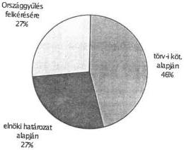
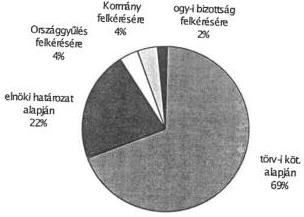
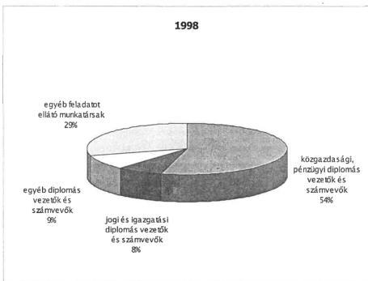

Állami Számvevőszék

# JELENTÉS

az Állami Számvevőszék 1998. évi
tevékenységéről

9903

J/951.

1999. március

9903.

---

Jelentéseink az Országgyűlés számítógépes hálózatán is olvashatók.

---

# TARTALOMJEGYZÉK

|  **I. AZ ÁSZ 1998. ÉVI ELLENŐRZÉSI TEVÉKENYSÉGE** | **3**  |
| --- | --- |
|  1. Az ellenőrzési munka súlypontjai | 3  |
|  2. Az elvégzett vizsgálatok általánosítható tapasztalatai | 4  |
|  **II. AZ ELLENŐRZÉSI MUNKA SZÍNVONALÁNAK JAVÍTÁSÁT, AZ ÚJ FELADATOK EREDMÉNYES MEGOLDÁSÁT SZOLGÁLÓ INTÉZKEDÉSEK ÉS KEZDEMÉNYEZÉSEK** | **14**  |
|  1. Az ÁSZ középtávra szóló ellenőrzési stratégiájának kidolgozása | 14  |
|  1.1. A belső minőségbiztosítási rendszer kidolgozása és bevezetése | 15  |
|  1.2. Az EU csatlakozás előkészítésével foglalkozó szervezeti egység létrehozása | 15  |
|  1.3. További szervezeti változások | 16  |
|  2. A stratégiához kapcsolódó középtávú oktatási terv kidolgozása, az ellenőrzés területén dolgozók szellemi bázisának kiszélesítése | 17  |
|  3. A magyar pénzügyi rendszer EU komformmá tétele érdekében végzett tevékenység | 18  |
|  4. Az önkormányzati ellenőrzés teljesebbé és összehangol-tabbá tétele érdekében tett kezdeményezések | 19  |
|  **III. AZ ELLENŐRZÉSI MUNKÁT SEGÍTŐ HAZAI ÉS NEMZETKÖZI KAPCSOLATOK FEJLESZTÉSE** | **21**  |
|  1. Az Országgyűlési kapcsolatok | 21  |
|  2. Egyéb szakmai kapcsolatok | 22  |
|  3. Nyilvánosság, sajtókapcsolatok | 22  |
|  4. Az ÁSZ nemzetközi tevékenysége és kapcsolatai | 23  |
|  **IV. A MŰKÖDÉS SZEMÉLYI ÉS TÁRGYI FELTÉTELEI** | **25**  |
|  1. Személyi feltételek | 25  |
|  2. Működési feltételek | 26  |
|  **MELLÉKLETEK** |   |
|  **FÜGGELÉK** |   |

---

•

•

•

•

---

A-190-4/1999.

# Jelentés
az Állami Számvevőszék
1998. évi tevékenységéről

Az Állami Számvevőszék 1998-ban működésének kilencedik évét zárta. Mint az Országgyűlés pénzügyi-gazdasági ellenőrző szerve elkészítette jelentését az Országgyűlésnek az elmúlt évi munkáról. Így adva számot a törvényes kötelezettségek teljesítéséről, a közpénzek hatékony felhasználását segítő ellenőrzési tevékenység fejlesztése érdekében tett kezdeményezésekről és intézkedésekről.

Az ÁSZ e beszámolót abban a reményben állította össze és teszi közzé, hogy az évben végzett munka összefoglaló áttekintésével az Országgyűlés teljesebb képet kap az ÁSZ egész tevékenységéről és a megújult vezetés által célul kitűzött – az európai integrálódás követelményeihez is igazodó – fejlesztés irányairól.

# I.
AZ ÁSZ 1998. ÉVI ELLENŐRZÉSI TEVÉKENYSÉGE

# 1. AZ ELLENŐRZÉSI MUNKA SÚLYPONTJAI

Az ÁSZ 1998-ban is alkotmányos és törvényi kötelezettségeinek megfelelően kidolgozott ellenőrzési tervében foglaltak szerint végezte munkáját. Összesen 51 befejezett ellenőrzésről készült jelentés. Ez megegyezik a tervezettel, az évközi változások okozta eltéréseket az 1. számú melléklet mutatja be.

Az ÁSZ meghatározott vizsgálati súlypontok érvényesítésével arra törekedett, hogy ellenőrzési kapacitását az államháztartás helyzetét érintő legfontosabb feladatokra fordítsa. Első helyre kerültek a törvényben foglalt évenkénti kötelezettséggel szereplő ellenőrzések (a központi költségvetés, az önkormányzatok, a társadalombiztosítási alapok zárszámadása és költségvetési terveik véleményezése, illetve az ÁPV Rt. ellenőrzése). A fennmaradó kapacitások – az egyéb rendszeres ellenőrzési feladatok mellett – olyan területek vizsgálatára irányultak, ahol a pénzfelhasználás nagyságrendje jelentős volt, illetve ahol az a társadalom széles körét érintő feladatokhoz kapcsolódott (pl. a főváros és a megyei jogú városok szennyvíztisztítási programjának megvalósítására, az alapfokú oktatásra, a járóbeteg-szakellátásra fordított pénzeszközök vizsgálatára, az Egészségbiztosítási Önkormányzat 1997. évi vagyongazdálkodásának ellenőrzésére stb.).

3

---

A vizsgálatok döntő hányadát (szám szerint 35-öt) tehát a törvényekben előírt rendszeres ellenőrzési kötelezettségek határozták meg. Az Országgyűlés és a Kormány felkérésére elvégzett 5 vizsgálatból (pl. az Egészségügyi Önkormányzat 1997. évi vagyongazdálkodása, a különkeretes gyógyszer-támogatási rendszer működése, egyes pártok állami ingatlanjuttatásának törvényességi ellenőrzése) kettő soron kívül (terven felül) teljesült.

A szervezet tevékenységével szemben megnyilvánuló és jól érzékelhető igényeknek és várakozásoknak megfelelni szándékozva, a kapacitások lehetőségeit mérlegelve elnöki döntés alapján további 11 vizsgálat valósult meg. Ezek közül külön is kiemelésre érdemes pl. a helyi önkormányzatok nem közszolgáltatási célú befektetésekkel történő gazdálkodásával, a Magyar Honvédségnél a repülőcsapatok működésének pénzügyi-gazdasági biztonságával, a szénbányászat szerkezet-átalakítására hozott kormányprogram végrehajtásával, a Nemzeti Színház építésének előkészítettségével, a Nemzetközi Rendészeti Akadémia finanszírozásával, gazdálkodásával kapcsolatos vizsgálatok. Az 1998-ban készült jelentések összefoglaló adatait az **2. számú melléklet** tartalmazza.

Az 1998. évi ellenőrzési tevékenység legfőbb jellemzője, hogy az előző évhez képest szám szerint és arányaiban is lényegesen megnövekedett a nagyobb feladatot jelentő – törvényi kötelezettség alapján végzett – ellenőrzések száma. (**3. számú melléklet**). Ennek megfelelően az elvégzett vizsgálatok az 1997. évit meghaladó arányban koncentráltak a központi költségvetésre, az állami vagyon hasznosítására, valamint a társadalombiztosítási alapokra.

**Az ÁSZ ellenőrzési kapacitásának mintegy 50%-át** 1998-ban is a helyi önkormányzatok ellenőrzésére fordította. A 811 önkormányzatnál és ehhez kapcsolódóan 1827 önkormányzati intézménynél végzett helyszíni ellenőrzés alapján az ÁSZ képes arra, hogy az önkormányzatok és a központi költségvetés kapcsolatát ellenőrizze, a problémákat feltárja és jelezze. Valamennyi önkormányzat gazdálkodásának teljeskörű ellenőrzése azonban meghaladja a számvevőszéki erőforrásokat.

## 2. AZ ELVÉGZETT VIZSGÁLATOK ÁLTALÁNOSÍTHATÓ TAPASZTALATAI

Az ellenőrzések során szerzett nagytömegű és sokszínű tapasztalatok rövid összefoglalása nem tartalmazza az ellenőrzési megállapítások, a vizsgált jelenségek teljességét, sokrétű összefüggéseit, ok- és okozati kapcsolatait, minősített következményeit és esetleges felelősségi vonzatait. Ezek megjelenítésére a terjedelmesebb egyedi jelentések és **e jelentés függelékében** található összefoglalók alkalmasak. **Ezek az összefoglalók az egyes vizsgálatok tapasztalatai alapján tett ajánlások és javaslatok hasznosításáról is tájékoztatást adnak.**

4

---

**Az ÁSZ** – a jelentősebb kedvező irányú változások jelzése mellett – mindenekelőtt **az alábbiakban vázolt tapasztalatokat ajánlja megfontolásra és hasznosításra** az Országgyűlésnek törvényalkotó és ellenőrzési munkájában.

Az elmúlt években több kedvező lépés történt a költségvetési gazdálkodásban és annak szabályozásában. Példaként említhető a Magyar Államkincstár létrehozása és ezáltal a finanszírozási rendszer átalakulása, a közbeszerzési törvény megalkotása, a programfinanszírozás bevezetése, valamint az elkülönített állami pénzalapok számának csökkentése, majd integrálása a központi költségvetésbe. A közpénzekkel való gazdálkodás javítására irányuló törekvések és intézkedések kedvező hatásai mellett továbbra is széles körben és nagy számban fordulnak elő a gazdálkodási fegyelem lazaságaival összefüggő, évek óta visszatérő hibák, hiányosságok, illetve törvény- és szabálysértések. **Több évre visszatekintve azonban javuló tendencia körvonalazható, s ebben a tekintetben 1998-ban sem volt tapasztalható visszaesés.**

Az **államháztartás** különböző területein végzett ellenőrzések visszatérően jelzik a rendszer további korszerűsítésének szükségességét. A tapasztalatok azt mutatják, hogy több éves előkészítő munka ellenére sem sikerült még elérni, hogy az államháztartás alrendszereiben kellő súlyt kapjanak a központi költségvetésből nyújtott támogatásokhoz és egyéb bevételekhez kapcsolt teljesítmény-követelmények. Ezek hiánya megnehezíti a számonkérést, lényegesen mérsékli az ellenőrzés, így a számvevőszéki ellenőrzés hatékonyságát is. A teljesítmény-előírások határozottabb megfogalmazását és ellenőrzését szorgalmazzák az EU-hoz történő csatlakozást előkészítő munkálatok is.

**Az 1999. évi központi költségvetésben** – részben az államháztartási reform folyamatához kapcsolódóan, részben az államigazgatási struktúra módosulása következtében – a költségvetési fejezetek feladataiban, címrendjében, az előirányzatok tartalmában kedvező irányú változás következett be. Ugyanakkor a központi költségvetés előirányzatainak minden szempontból megalapozott kimunkálását a jelenlegi tervezési rendszer nem teszi lehetővé, ezért sürgető feladat annak új alapokra helyezése.

A kincstári rendszer bevezetése jelentősen hozzájárult a fejezetek pénzügyi egyensúlyának fenntartásához, illetve helyreállításához. Közrejátszott abban, hogy a fejezeti források összességükben általában biztosították a szakmai feladatok ellátásának és az intézmények működésének feltételeit. Ugyanakkor a központi költségvetés **1997. évi zárszámadásának** összeállításában nem volt tapasztalható lényeges előrelépés. A Magyar Államkincstár működésében – a kiemelt előirányzatok kettős fedezetvizsgálata évközi bevezetésén túlmenően – jelentős átalakulás nem történt, így a zárszámadás munkálatait megalapozó, előkészítő szerepe még mindig nem érvényesült.

5

---

Továbbra is éreztették kedvezőtlen hatásukat a Kincstár működésének rendszerbeli hibái (előirányzatok, teljesítések nyilvántartása, kezelése, egyeztetése, a programfinanszírozás befogadása terén), a kincstári alanyok adatszolgáltatásának és a kincstári rendszer 1997-ben is meglévő gyengeségei.

A költségvetési gazdálkodásban feltárt szabálytalanságok köre nem, de az előfordulások gyakorisága – főleg az előirányzat-módosításokat érintően – csökkent. Az előirányzat-gazdálkodásban a fejezetek az előirányzat-maradványok és a fejezeti kezelésű előirányzatok céltól eltérő felhasználása, a bruttó elszámolási elv megsértése, a kötelezettségvállalások gyakorlatának lazaságai, a mérlegadatok bizonylatokkal (elsősorban leltárral) való alátámasztottságának hiányosságai (leltározás részleges hiánya, szabálytalan végzése) révén szegték meg az előírásokat, illetve mulasztották el azok betartását.

Az elkülönített állami pénzalapok pénzügyi forrásainak költségvetési támogatása fokozatosan visszaszorult, s 1998-ban már nem számoltak a központi költségvetésből származó támogatással, a likviditás általában folyamatosan biztosított volt. Az alapok, illetve az alapkezelők működésének belső szabályozottsága javult, a szabályzatok teljes körűsége, naprakészsége azonban – elsősorban a számvitel területén – még nem kielégítő. A korábbi tapasztalatokhoz képest a Nemzeti Kulturális Alap ellenőrzése tükrében kedvezőnek értékelhető, hogy a pénzeszközök felhasználásának szervezeti keretei, a kialakított döntési mechanizmus összességében eredményesen segítette az alapot létrehozó törvényben megfogalmazott célok megvalósulását.

A társadalombiztosítási alapok gazdálkodásában az előző években folyamatosan jelentkező problémák arra utaltak, hogy már korábban szükség lett volna az önkormányzati típusú irányítás, működés és gazdálkodás kérdéseinek ismételt áttekintésére, az alapvető szabályozások korszerűsítésére és az ehhez igazodó végrehajtási intézkedések megtételére. Ez azonban az 1997. évi költségvetés jóváhagyása és végrehajtása során nem történt meg. Az ÁSZ által az 1997. évi költségvetési tervjavaslat véleményezése során – elsődlegesen az Egészségbiztosítási Alap esetében – jelzett jelentős költségvetési hiány tényleges bekövetkezésében az irányítási, gazdálkodási hiányosságok és szabályozatlanságok mellett alapvető szerepet a tervezés évek óta fennálló gondjai játszottak (ami a bevételek felül- és a kiadások alultervezésében jutott kifejezésre).

Az elmúlt évekre jellemző irányítási és gazdálkodási problémák megoldását segítheti az 1998-as év nyarán megerősített felügyeleti és ellenőrzési apparátus munkája, a nyugdíj- és egészségbiztosítási rendszer finanszírozásának további korszerűsítése.

6

---

Kedvező irányú változás, hogy a Kormány a társadalombiztosítási alapok 1999. évi törvényjavaslatát a központi költségvetésre vonatkozó törvényjavaslattal egyidejűleg nyújtotta be az Országgyűlésnek. Ennek köszönhetően mindkét alap az Országgyűlés által elfogadott költségvetéssel kezdhette 1999. évi tevékenységét.

**Az társadalombiztosítási alapok 1999. évi költségvetési törvényjavaslatáról** készített ÁSZ vélemény kiemelte, hogy a Kormány igen feszes költségvetési javaslatot terjesztett elő, amelynek erényei mellett figyelmet érdemlő kockázati elemei is vannak. Felhívta a figyelmet arra, hogy mind a bevételek, mind a kiadások területén jelentkeznek bizonytalansági tényezők. A bevételek közül a munkáltatói járulék bevételek és a vagyonértékesítésből származó bevételek teljesíthetősége, a kiadási oldalon pedig – ismételten az Egészségbiztosítási Alapnál – a gyógyszer- és gyógyászati segédeszköz támogatás előirányzatának betarthatósága kérdéses.

A folyamatokból jól látható, hogy a társadalombiztosítás működőképességének megőrzésében 1999-ben erősödik az állami részvétel. A lakosság természetbeni egészségügyi juttatásokkal való ellátását és a nyugdíjkiadásokat a társadalombiztosítás saját bevételei nem képesek fedezni. Ez a tény különösen az egészségügyi-egészségbiztosítási szolgáltatások rendszerének átalakításában jelenthet új kihívásokat.

**A társadalombiztosítási alapok vagyongazdálkodásának** ellentmondásait az 1998 évben befejezett számvevőszéki vizsgálatok jól érzékeltették. Különösen az egészségbiztosítás terén jelentkező problémák (Club Aliga üdülőegyüttes ügye, a Wesselényi utcai ingatlan vásárlása) jelezték a rendezés halaszthatatlanságát. Az előírt vagyongazdálkodási törvény megalkotására nem került sor, nem volt szabályozott a döntéshozók és döntés-előkészítők felelőssége, a gazdálkodás főbb követelményei. Annak ellenére, hogy az alapok rendelkezésére álló vagyon nagyságrendje és összetétele az ellátások finanszírozása szempontjából nem jelentős, a velük való felelős gazdálkodás követelményei alól nem mentesíthetők. Az Országgyűlés által 1998 évben hozott törvény az alapok vagyonát állami tulajdonként határozta meg, amely felett a tulajdonosi jogokat a Kormány gyakorolja.

Az alapok 1999. évi költségvetéséről szóló törvény pedig azzal, hogy a vagyongazdálkodás bevételi összegét, több mint 50 milliárd forintban írta elő, s mint a társadalombiztosítás költségvetésével kapcsolatos ÁSZ vélemény jelezte, ezzel gyakorlatilag arról határozott, hogy a társadalombiztosításhoz rendelt vagyont értékesíteni kell és a bevételeket be kell vonni az ellátások folyó finanszírozásába. A döntés a vagyongazdálkodással kapcsolatos eddigi ellentmondások megszűnését is jelentheti.

---7

---

A **helyi önkormányzatok** az utóbbi években csökkenő reálértékű bevételekkel voltak kénytelenek gazdálkodni. Ennek ellenére többségük alapvető feladatait ellátta, pénzügyi egyensúlyi helyzetét megőrizte. A saját lehetőségeiket rosszul megítélő önkormányzatok azonban eladósodtak. Az eladósodás okai összetettek: gerjeszti a társadalmi-gazdasági környezet is, alapvetően azonban az elszenvedők saját hibájára, jó szándékú, de nem kellően átgondolt kötelezettségvállalásaira vezethető vissza. A saját erő pótlására hosszú futamidejű hiteleket, kölcsönöket vettek fel. A kölcsönvett források és az állami hozzájárulások igénybevételével több helyen évtizedes elmaradást sikerült felszámolni. Különösen szembetűnő a fejlődés az ivóvíz, a csatornázás, a gázellátás, a telefonhálózatok kiépítése területén. A hitelek szerződés szerinti visszafizetésére azonban számos önkormányzat képtelen. Az adósságszolgálati terhek az érintett önkormányzatok többségében az éves költségvetés 10%-a alatt vannak. A vizsgált önkormányzatok egy szűkebb körénél azonban az 1997. évi eredeti költségvetési előirányzatuk 10-30%-át is eléri. Az 1995-ben hozott kormányzati intézkedések a tömeges eladósodás folytatódásának gátat vetettek, majd megkezdődött az adósságok rendezése.

Külön kiemelendő, hogy számos önkormányzati kórház nem tudta fizetőképességét megőrizni, az elmúlt években az adósságállományuk megnövekedett. Ennek felszámolása igen nagy erőfeszítést igényel, mind az Országos Egészségbiztosítási Pénztártól, mint finanszírozótól, mind pedig a fenntartó önkormányzatoktól. 1997-ben a kórházakba kinevezték a pénzügyi egyensúly megőrzésére ügyelő önkormányzati biztosokat. Az adósság menedzselésének azonban sem jogi szabályai, sem finanszírozása nem alakult még ki.

Az önkormányzati tulajdon kiteljesedésével, az őket érintő privatizációval és a helyi adók kivetési lehetőségeivel az önkormányzatok anyagi helyzete erősen differenciálódott. A hátrányos gazdasági térségben működő önkormányzatok 'még szegényebbek lettek', a fejlett iparral rendelkező városokban, térségekben működők viszont pótlólagos forrásokat tudtak realizálni. Ez utóbbi körben lévők az átmenetileg felszabadítható forrásaik vállalkozásba fektetésével további anyagi eszközöket tudtak, tudnak realizálni.

A normatív alapon működő forrásszabályozás önmagában nem képes az ellátottságbeli differenciákat mérsékelni, kiegyenlíteni. Ezért van szükség azokra a pótlólagos, kiegyenlítő pénzügyi mechanizmusokra, amelyek 1999-től az elmaradott térségekben lévő önkormányzatoknak többlet forrásokat juttatnak mind a működéshez, mind a fejlesztéshez.

Az önkormányzati gazdálkodás ellenőrzési rendszerének hiányos kiépítettségével is összefüggésbe hozható az a tapasztalat, amely szerint az önkormányzatoknak különféle címen nyújtott központi költségvetési támogatások – normatív állami hozzájárulás, cél- és címzett támogatás stb. – igénybevételének és felhasználásának törvényessége évek óta romló tendenciát mutat. Az előírásokba ütköző felhasználás miatt az ÁSZ évente növekvő számban kényszerül

8

---

javaslatot tenni a támogatások visszavonására. Mint jogalkalmazónak ez elemi kötelessége, a törvénysértés szankcionálásának módját és következményeit nem mérlegelheti. Az 1998. évi ellenőrzések a normatív állami hozzájárulások esetében 123 helyi önkormányzatnál 267,2 millió forint jogtalan igénybevételt, 75 önkormányzatnál 37,8 millió forint még kiutalandó támogatást állapítottak meg. A vizsgált önkormányzatoknál a cél- és címzett támogatásokból 337,3 millió forint, a céltámogatási kiegészítő keretből 55,6 millió forint, a központosított előirányzatokból 59,4 millió forint volt a jogosulatlan felhasználás, amelyek elvonását az ÁSZ javasolta.

A címzett- és céltámogatások felhasználásának ellenőrzése során évek óta visszatérő problémaként jelentkezett – a jogszabályi hiányosságokból adódóan – az ÁSZ vizsgálatai alapján jogtalannak minősített, az ivóvíz és szennyvíz csatorna bekötő vezeték létesítésére felhasznált állami támogatások visszafizettetésének realizálása. A vizsgálatok során több alkalommal kezdeményezte az ÁSZ a jogszabályi anomália feloldását, így 1997 évben törvényi szintű megoldást javasolt az illetékes minisztériumoknak. A jogszabályi ellentmondást 1999 februárjában közzétett kormány rendelet oldotta fel.

A helyi önkormányzatok mintegy **1.800 milliárd forintot kitevő saját vagyonnal** gazdálkodnak. Ennek több mint kétharmada elsődlegesen alapfeladataik ellátását szolgálja. E vagyoni kör – a fenntartási, működési zavarokat is figyelembe véve – alapvetően megfelelően funkcionál. A helyi önkormányzatok tulajdonában – az ÁSZ nyilvántartása szerint 1995-ben összesen 373, 1996-ban 496, 1997-ben 463 milliárd Ft nyilvántartási értékű tartós befektetést jelentő társasági részesedés volt. A vizsgálat szerint ezek az adatok azonban nem megbízhatóak, mivel az önkormányzatok a tulajdonukban lévő társasági érdekeltségeket nem teljes körűen vették nyilvántartásba és a mérlegkészítést megelőzően a társasági érdekeltségek értékét gyakran a jogszabályi előírásoktól eltérően állapították meg.

Az önkormányzatok befektetett pénzügyi eszközeinek mintegy 80%-a a volt tanácsi közüzemi vállalatokból átalakulással létrejött gazdasági társaságokban jelentenek tulajdonjogot. Ezek általában az önkormányzatok többségi tulajdonában vannak és a feladatuk elsősorban a közszolgáltatások (ivóvízellátás, csatornaszolgáltatás, közlekedés és más városgazdálkodási feladatok) biztosítása, osztalékot csak kivételesen fizettek. A tulajdonos önkormányzatok a társaságok irányító és ellenőrző testületébe megválasztottak részére konkrét feladatokat, elvárásokat nem határoztak meg, és azok munkájáról rendszeres tájékoztatást nem kértek.

A privatizációhoz kapcsolódóan, a belterületi földérték alapján az önkormányzatok a gazdasági társasági érdekeltségeik közel 20%-át térítésmentesen kapták. Ezzel a részesedéssel csak kisebbségi tulajdoni hányadhoz jutottak, így a társaságok tevékenységét nem tudták befolyásolni. A részesedések utáni osztalékbevétel évente a tulajdoni hányad nyilvántartási értékének csak 0,5%-át ér-

9

---

te el. Ez az érték a pénzügyi befektetéseknél reálisan elérhető hozamok töredéke. Az önkormányzatok 1995-96. évben a belterületi föld után járó részesedések megváltásaként az ÁPV Rt-től jelentős pénzösszeget kaptak. Az így keletkezett, átmenetileg szabad pénzeszközeiket – az infrastruktúra fejlesztésére történő felhasználásig – hitelviszonyt megtestesítő értékpapírok vásárlására fordították.

Az önkormányzatok erre a feladatra nem rendelkeztek megfelelő szakmai felkészültségű munkatársakkal, nem ismerték eléggé az erre vonatkozó törvényi előírásokat. A kellő gondosság és felkészültség hiányában – a szükségesnél nagyobb üzleti kockázatot vállalva – az értékpapír piacon reálisan elérhető hozamnál néhány esetben lényegesen alacsonyabb hozamot realizáltak, esetenként veszteséges befektetésekre is sor került.

Az Állami Számvevőszék 1998. év végéig **20 közalapítványra**, illetve jogelődjére és **2 alapítványra** vonatkozó helyszíni pénzügyi-gazdasági ellenőrzést fejezett be. Működésük fő jellemzője továbbra is, hogy általában csak a kapott központi költségvetési támogatásból élnek, ezen kívül forrásokat csak elenyésző mértékben tudnak begyűjteni (egyedi kivétel a Nemzetközi Pető András Közalapítvány). Elsősorban tehát a pénzelosztó funkciót vették át az államigazgatástól.

Belső szabályzataik többségükben hiányoznak, a meglévők pontatlanok. Gazdálkodásukban néhány esetben célszerűtlen és pazarló gazdasági döntések is megjelentek, de az ellenőrzések a pénzügyi-gazdasági jogszabályok durva megsértését, illetve Btk-ba ütköző cselekményeket nem tártak fel. A szabálytalanságokat főleg a jogszabályok téves értelmezése, az alapító okiratok hiányosságai, a belső szabályozatlanság, a nem megfelelő szakmai hozzáértés okozza.

A felügyelő bizottságok általában kevés érdemi ellenőrzést végeznek. A kuratórium és a felügyelő bizottság kötelezettségei elmulasztása esetén (pl. beszámoló) az alapítói jogokat képviselő részéről gyakran elmarad a számonkérés, a Kormány késve érzékeli a komoly gazdálkodási hiányosságokat.

A közpénzek felhasználásának ellenőrzése szempontjából hiányolható, hogy az éves költségvetésről szóló törvények nem jelölnek meg konkrét felhasználási célt a közalapítványok támogatásánál. Ezt gyakran a fejezetek sem teszik meg. Így nincs az elszámoltatásnak alapja, nincs mit számon kérni.

**A költségvetési támogatásban részesülő pártok gazdálkodásának** törvényességi ellenőrzése arra utal, hogy a pártok fokozatosan alkalmazzák a gazdálkodás szakmai előírásait, elsajátították annak gyakorlatát, fegyelmét. Az ÁSZ ellenőrzési megállapításait elfogadják, a javasolt intézkedéseket – még ha azok anyagi konzekvenciákkal járnak is – megteszik.

10

---

A számviteli törvény 1992. évi hatálybalépése óta gondot okoz, hogy a párttörvény 1992. évi módosítása során az éves párt-beszámoló tartalmának meghatározásakor nem vették figyelembe a számviteli törvény által megszabott alapvető követelményeket. A párttörvényben előírt beszámoló se nem mérleg, se nem eredmény-kimutatás. 'Eszközbeszerzés' sorának nincs számviteli értelmezése. A számviteli törvény szerint a könyvvezetést a beszámolóhoz kell igazítani, de a pártok beszámolója - annak nem megfelelő tartalma miatt - nem minősül számviteli beszámolónak, az csak a közvélemény tájékoztatását szolgálja.

A párttörvény módosítását az ÁSZ 1995-ben kezdeményezte. Akkor elkészült a tárcákkal és az ÁSZ-szal egyeztetett tervezet, de parlamenti beterjesztésre nem került sor. A javaslat időszerűségén az eltelt idő sem változtatott.

Az **állami vagyongazdálkodás** területén néhány kérdésben előrelépés tapasztalható. Ennek elismerése mellett is azt kell megállapítani, hogy a vagyon megőrzése, hasznosítása terén még sok a tennivaló.

A **kincstári vagyon kezelésének és hasznosításának** ellenőrzése feltárta a tartós állami tulajdonú vagyonelemek működtetésének szervezeti és szabályozási zavarait. A megállapítások hasznosítása már érzékelhető. Ezt jelzik azok a kormányzati intézkedések, amelyek az állam vagyonkezelési koncepciójának kialakítására és megvalósítására irányulnak. A tartós állami tulajdonú vagyon és a magánosítási célú állami vagyon kezelése szervezetileg is centralizált irányítás alá került. Figyelembe véve a különféle vagyonelemek sajátosságaiból fakadó vagyonmegőrzési szempontokat megtörtént a tartós állami vagyont kezelők hatáskörének, jogosítványainak szabályozása és a vagyonkezelő szervezetekkel egyedi szerződések kötése. A vagyonnyilvántartás követelményét kormányrendelet írja elő, amelynek alapján 1998 folyamán a kincstári vagyonnyilvántartó rendszer kifejlesztése, az adatbázis feltöltése megkezdődött.

A **privatizációt és vagyonkezelést** vezénylő szervezetnél kiépült a vagyonváltozást regisztráló információs rendszer. A szervezettebbé vált munka mellett is többször tapasztalható volt a saját belső szabályozás be nem tartása, amely egyrészt zavarokat okozott az egyes tranzakcióknál, másrészt rontotta a szervezet hatékonyságát.

Az ÁPV Rt. 1997-ben élt a törvény módosítás nyújtotta lehetőséggel. A privatizáció sajátossága volt, hogy az összes készpénzbevétel 80%-a a tőzsdei értékesítésből adódott. Az értékesítés átlagos árfolyama a jegyzett tőkéhez viszonyítva közel háromszoros, a saját tőkéhez viszonyítva pedig csaknem kétszeres volt. A tervezettnél magasabb közvetlen költségvetési befizetés ellenére az ÁPV Rt. 1997. év végi privatizációs bevételi számláján 20,3 milliárd forint többlet pénzkészlet volt, amelyet a költségvetési törvény szerint még 1997-ben át kellett volna utalnia a költségvetés részére. Ennek rendezése 1998-ban történt meg.

11

---

1997-ben a tömeges privatizáció lényegében befejeződött. Az ÁPV Rt-hez tartozó és még privatizálható érték 1997. év végén meghaladta a 350 milliárd forintot, amelyből 164 milliárd forint öt társaságra koncentrálódik.

Az 1997. évi számvevőszéki vizsgálat alapján tett javaslatokat – a korábbi évektől eltérően – a Kormány, illetve az illetékes miniszterek elfogadták, meghozták a szükséges intézkedéseket és azokat az 1999. évi költségvetési törvény tartalmazza. Az ÁSZ eleget tett törvényi kötelezettségének, amikor az ÁPV Rt. felügyelőbizottsága elnökére és könyvvizsgálójára megtette javaslatát.

Az elmúlt két évben az ÁSZ átfogó helyzetképet feltáró ellenőrzéseket végzett a **vízgazdálkodás** területén. (Vízügyi alap gazdálkodása, önkormányzati ivóvíz ellátás és a szennyvízhálózat fejlesztése, Regionális Vízművek gazdálkodása). Világossá vált, hogy a közműves ivóvízellátásban és csatornaszolgáltatásban működő állami vagyon lebontásának részbeni következménye a ivóvíz szolgáltató közművek kapacitásának növekvő kihasználatlansága.

A korábban egységes tulajdon egy részének átadása az önkormányzatoknak megbontotta az egységes szolgáltatási láncot. Az önkormányzatoknál többlet kapacitások is létesültek, egy részük állami támogatás igénybevételével. A vízellátás feladat, felelősség és vagyon megosztása az önkormányzatokkal térségi koordináció nélkül ment végbe. A vízművek jogi helyzetét nem rendezték egyértelműen a jogszabályok, hiányzott a vagyon világos elhatárolása. Az 1998-ban megkötött vagyonkezelési szerződések ugyan feloldották a jogi ellentmondásokat, ez azonban nem jelent végleges rendezést. A vízellátás és csatornaszolgáltatás között a közműolló növekedett, ezáltal a szennyvizek általi környezetszennyezés és a vízbázisok veszélyeztetettsége nőtt.

Fontos lenne, hogy a vagyonmegosztásnál a több érdeket átfogó gondolkodás érvényesüljön, figyelembe véve a regionális érdekeket. A vízberuházások döntően már befejeződtek, de a szennyvízelvezetés kiépítése még folyamatban van. Ügyelni kellene arra, hogy e téren párhuzamos rendszerek ne alakuljanak ki. Szükséges lenne a regionális rendszerek állapotának felmérése és ennek alapján a kétféle tulajdonos érdekeinek és törekvéseinek összehangolása.

A vizsgálat alapján az ÁSZ ajánlásokat tett az országos vízgazdálkodási koncepció megfogalmazására, a kiemelt természetvédelmi területeknél a vízkitermelés okozta káros hatások ellensúlyozására, a közművagyon fenntartására és állagmegóvására, a szabványok módosítására, a vagyon felmérésére, folyamatos és költségkímélő karbantartására. Az egyeztetésbe bevont szervek elfogadták, megerősítették az ellenőrzés által feltárt megállapításokat, javaslatokat.

12

---

Az **ellenőrzések figyelembevételével, hasznosításával kapcsolatos tapasztalatok** fokozatosan javuló tendenciát jeleznek. Az ellenőrzések alapján készült jelentések az Országgyűlésnek és a Kormánynak általában a jogi szabályozásra, míg a vizsgált szervezeteknek a tapasztalt hiányosságok megszüntetésére irányuló javaslatokat tartalmaztak. A központi költségvetés és a társadalombiztosítás zárszámadásához, a költségvetés tervezéséhez kapcsolódó ellenőrzések megállapításai és javaslatai a törvényalkotás folyamatában hasznosultak.

Más ellenőrzésekhez kapcsolódóan az ellenőrzöttek többnyire részletes, az egyes feladatok végrehajtását határidőhöz rendelő intézkedési terveket készítettek. Ezek többsége – végrehajtásuk esetén – alkalmas az ellenőrzés által feltárt hibák és hiányosságok megszüntetésére. Ebben annak is szerepe van, hogy az ÁSZ célirányosabb, a megvalósítás szempontjából gyakorlatiasabb javaslatok megtételére törekedett.

Az ÁSZ ellenőrzései során – ha indokolt – vizsgálja a büntetőjogi felelősség kérdését is, és törvényi kötelezettségének eleget téve értesíti a nyomozóhatóságot. Működése során eddig 24 esetben tett különféle, elsősorban gazdasági bűncselekmény alapos gyanúja miatt feljelentést (1998-ban 4 esetben). A feljelentések alapján 20 esetben indult nyomozás, 4 esetben a nyomozást megtagadó határozat született (1998-ban 3 nyomozás indult, 1 megtagadás történt). Az ügyek egy része még most is folyamatban van, tekintve, hogy ezek bonyolult gazdasági-pénzügyi jellegű szabálytalanságokon alapuló esetek. Az ÁSZ dolgát nehezíti ebben a tekintetben, hogy a bűncselekményi tényálláshoz szükséges szubjektív elemek (szándékosság, gondatlanság, célzat) feltárása részéről nem lehetséges, kizárólag az okirati tényállásra hagyatkozhat.

Az ÁSZ emellett kihasználta a tapasztalatok hasznosításának közvetettebb formáit is. Szakmai és egyéb rendezvényeken tartott előadásokkal, szakfolyóiratokban megjelentetett cikkekkel teszi széles körben hozzáférhetővé ellenőrzési tapasztalatait. A jelentések összefoglalói a Hivatalos Értesítőben jelennek meg. A szükséges intézkedések ösztönzésében továbbra is segít a közvélemény támogató figyelme.

---13

---

## II. AZ ELLENŐRZÉSI MUNKA SZÍNVONALÁNAK JAVÍTÁSÁT, AZ ÚJ FELADATOK EREDMÉNYES MEGOLDÁSÁT SZOLGÁLÓ INTÉZKEDÉSEK ÉS KEZDEMÉNYEZÉSEK

### 1. AZ ÁSZ KÖZÉPTÁVRA SZÓLÓ ELLENŐRZÉSI STRATÉGIÁJÁNAK KIDOLGOZÁSA

Az Állami Számvevőszék vezetése 1998. év közepére kidolgozta és közzétette középtávú ellenőrzési stratégiáját. A stratégia újragondolását több tényező is indokolta. Mindenekelőtt az intézmény 1989. évi megalakulása óta bekövetkezett társadalmi és gazdasági változások nyomán kibontakozó új követelményekhez való alkalmazkodás szükségessége, hazánk euroatlanti csatlakozásából fakadó feladatok eredményes megoldása, fokozottabb igazodás az uniós tagországok számvevőszékeinek gyakorlatához. Ennek jegyében fogalmazta meg az ÁSZ középtávú ellenőrzési stratégiájában a következő 3-4 évre legfontosabb céljait, követendő magatartását, ellenőrzési kulcsterületeit és munkamódszereit. A stratégiához kapcsolódóan kidolgozta a középtávú ellenőrzési irányelveket is.

Az ÁSZ tevékenységének stratégiában rögzített alapelve, hogy a közpénzek felhasználása, a közvagyon hasznosítása nem nélkülözheti a független (külső) ellenőrzést. Célja, hogy a rendelkezésre álló pénzügyi és vagyoni eszközök használata a lehető legnagyobb mértékben szolgálja az ország, a köz érdekeit. Észrevételeivel, javaslataival, ajánlásaival segítse az ellenőrzött szervezeteket a közpénzek, a közvagyon törvényes, eredményes, gazdaságos használatában, működtetésében és belső ellenőrzési tevékenységük hatékonyságának javításában.

Az EU pénzügyi ellenőrzésre vonatkozó joganyagának átvétele, illetve adaptálása változtatásokat igényel az eddigi számvevőszéki vizsgálati eljárásokon, módszereken is. Az ÁSZ számol azzal, hogy az államháztartásban és kiemelten az uniós pénzek felhasználási területén nélkülözhetetlen lesz a könyvvizsgálat, s az ellenőrzés csaknem minden területén nő a teljesítményvizsgálatok jelentősége és súlya. A jelenlegi pénzügyi-gazdasági ellenőrzés tehát átalakul, új ellenőrzési módszerek jelennek meg. Elkezdődik a költségvetési fejezetek és intézmények beszámolóinak hitelesítésére az INTOSAI - a parlamentekhez tartozó ellenőrző szervezeteknek az ENSZ égisze alatt működő szakmai világszervezete - normáihoz igazított rendszer kidolgozása.

A stratégiai célok megvalósítása szükségessé tett néhány szervezeti átalakítást is. E változások elindították és keretet adtak azon folyamatoknak, melyek elősegítik és támogatják a stratégia megvalósítását.

---14

---

## 1.1. A belső minőségbiztosítási rendszer kidolgozása és bevezetése

Az ellenőrzési megállapítások, javaslatok szakmai és jogi megalapozottsága, dokumentáltsága és a jelentések kiegyensúlyozott színvonalának elősegítése érdekében az ÁSZ 1998-ban új belső minőségbiztosítási eljárási rendet vezetett be. A jelentések véglegesítését és kibocsátását megelőzően – két fázisban – megtörténik a jelentés-tervezetek szakmai és jogi felülvizsgálata, egyben újabb belső „jogorvoslati” fórumot teremtve az ellenőrzöttek számára is. A megállapítások szakmai helytállóságát, dokumentális alátámasztottságát az április elején megalakított Minőségbiztosítási Osztály értékeli. A jogi vonatkozású felülvizsgálattal a Jogi Osztály feladatköre bővült. A jelentések elnöki aláírásának feltétele, hogy a két szervezeti egység az eredményes felülvizsgálatot tanúsítvánnyal igazolja.

A jelentés készítés és egyeztetés folyamatában korábban is működő belső kontroll-mechanizmusok kiegészítéseként bevezetett eljárási rend a két osztály számára – minőségbiztosítási feladatkörükben – függetlenséget biztosít. Ez a gyakorlatban is érvényesülő garanciális elem lehetővé teszi a tanúsítványok kiadásához kapcsolódó hatáskörök befolyástól mentes gyakorlását.

**A minőségbiztosítás új eljárási rendje – az első év tapasztalatai alapján – kedvező hatást gyakorolt a jelentések tartalmára, az ellenőrzési megállapítások megalapozottságára, az értékelések helytállóságára.** Az 1998-ban indult ellenőrzésekről készített – már szakmai és jogi felülvizsgálat alá vont – jelentések megállapításainak megalapozottságát az ellenőrzött szervek nem vitatták, s a parlamenti viták során sem kérdőjelezték meg azokat. Ez – a megelőző évek néhány számunkra kedvezőtlen esetére is gondolva – fontos változásnak, előrelépésnek tekinthető.

Az új eljárási rend felszínre hozott több, a belső szabályozást, az ellenőrzési munkát és a jelentések színvonalát érintő, egységes megoldásra váró kérdést is. A szükséges intézkedések előkészítésére 1998 decemberében döntés született és megvalósítása – az élenjáró nemzetközi szabályozásokra és gyakorlatra is figyelemmel – folyamatban van.

## 1.2. Az EU csatlakozás előkészítésével foglalkozó szervezeti egység létrehozása

Az euroatlanti csatlakozással kapcsolatos jelenlegi és jövőbeni teendőket áttekintve az ÁSZ elnöke – VII. Euroatlanti Integrációs Titkárság néven – új szervezeti egységet hozott létre és meghatározta az egyes osztályok főbb tevékenységi körét.

---15

---

Az új szervezeti egység feladata a számvevőszéki ellenőrzés EU-konformmá tételének elősegítése, hogy Magyarország tagfelvételét követően az ÁSZ az EU környezetéhez igazodóan, egyenrangú félként, együttműködve az Európai Számvevőszékkel és a tagországok legfőbb ellenőrzési intézményeivel, hatékonyan és eredményesen lássa el ellenőrzési feladatait.

Elvégzi a hazai és az EU pénzügyi ellenőrzési joganyagának összehasonlítását, kezdeményezi a szükséges jogszabály változtatásokat a számvevőszéki, az államháztartási, a számviteli törvényre, illetve a kapcsolódó kormány- és miniszteri rendeletekre vonatkozóan.

Adaptálja az Állami Számvevőszék pénzügyi vizsgálataihoz az EU és Számvevőszéke által alkalmazott számviteli elveket, vizsgálati eljárási rendet és módszereket. Az államháztartás gazdálkodó szervei közül elsőként a központi költségvetési szervekre vonatkozóan dolgozza ki a pénzügyi ellenőrzés és hitelesítés rendjét, normáit. Kialakítja a nemzetközi számviteli és könyvvizsgálati standardok, valamint az INTOSAI és az EU irányelvek alapján a magyar nemzeti standardokat, majd kidolgozza az alkalmazására vonatkozó javaslatokat.

### 1.3. További szervezeti változások

A formálódó kormányzati és társadalmi igényre figyelemmel az ÁSZ meglévő szervezeti struktúráján belül létrehozta a pénzintézeti ellenőrzéssel foglalkozó szervezeti egységét. Egyben elindította munkatársai ezirányú szakmai-módszertani továbbképzését.

A társadalombiztosítás irányítási rendjében bekövetkezett változásokhoz igazodva megtörtént e terület ellenőrzésével kapcsolatos feladatok felülvizsgálata és az ezzel összefüggő szervezeti és módszerbeli változások 1999. január 1-től történő végrehajtása.

Az Országgyűlés és az ÁSZ közti közvetlen kapcsolattartás megerősítését szolgálta a Parlamenti Kapcsolatok Osztályának 1998. január 1-jével történő létrehozása. Az osztály alapvető feladata a parlamenti anyagok igény szerinti feldolgozása az ÁSZ vezetői és munkatársai számára, illetve az ÁSZ-nál készült jelentések (vélemények) megfelelő előkészítése és eljuttatása az országgyűlési képviselők részére.

---16

---

## 2. A STRATÉGIÁHOZ KAPCSOLÓDÓ KÖZÉPTÁVÚ OKTATÁSI TERV KIDOLGOZÁSA, AZ ELLENŐRZÉS TERÜLETÉN DOLGOZÓK SZELLEMI BÁZISÁNAK KISZÉLESÍTÉSE

Az Állami Számvevőszék stratégiájában megfogalmazott feladatok eredményes megvalósítása megköveteli az ÁSZ dolgozói képzésének és továbbképzésének korszerűsítését is. 1998-ban néhány évre előremutató, átfogó szemléletű és szerkezetű oktatási-képzési terv készült.

A terv teljeskörűen tartalmazza az ellenőrzési munkához szükséges valamennyi témakör oktatását, figyelembe véve a vizsgálatot végző számvevők és vezetők igényeit is. A vizsgálatokra felkészítő szakmai oktatás és a tudást szinten tartó oktatás mellett kiemelt jelentőséget kap a korszerű ellenőrzési módszerek és technikák alkalmazásának megismertetése, a készségfejlesztő tréningek szervezése. A szakmai továbbképzések sorában szerepelt például az angol számvevőszék munkatársai által a teljesítmény ellenőrzés módszerét, gyakorlatát megismertető előadás sorozat.

Az ÁSZ 1998-ban felvette a kapcsolatot a Nemzetközi Bankárképző Központtal. Szorgalmazta olyan oktatási modell kidolgozását, ami a költségvetési területen dolgozók számára korszerű banki, pénzügyi, és makrogazdasági ismereteket nyújt. Megtörtént a speciális oktatás előkészítése, melyre 1999 első hónapjaiban sor került. Az oktatási koncepció része – a pénzügyi ellenőrzés különböző területein dolgozó – külső szakemberek továbbképzése, részükre szakmai rendezvények szervezése. Ezek a tanfolyamok hosszabb távon rendszeressé válnak. A cél, hogy a belső és külső ellenőrzési szakemberek képzése egymás hatékonyságát erősítse.

A pénzügyi ellenőrzés új kihívásainak eredményesen megfelelni csak az ellenőrzés területén dolgozók szellemi bázisának kiszélesítése, fejlesztése útján lehet. Ebben az irányban tett lépés az ÁSZ Továbbképzési és Módszertani Intézetének (ÁSZTI) átszervezése szakmai-módszertani központtá. A szervezeti keretek átszervezése, az alapító okirat, szervezeti működési szabályzat átalakítása megtörtént. Az ÁSZTI tevékenységében – a korábban végzett oktatási és üdülési szolgáltatási funkciók mellett – új feladatkört jelent az állami ellenőrzéshez kapcsolódó módszertani, kutatási, kiadvány szerkesztési, továbbképzési teendők ellátása, hazai és nemzetközi konferenciák és egyéb szakmai rendezvények szervezése.

Az intézet feladata, hogy aktívan támogassa az ÁSZ-nak a hazai pénzügyi ellenőrzési rendszer fejlesztésében, működésének koordinálásában és a szakmai közéletben vállalt feladatainak megoldását. Ez az ellenőrzési módszerek – euroatlanti csatlakozásból és harmonizációból adódó – fejlesztését és alkalmazásuk oktatását is jelenti. Mindez összhangban van azzal a kormányhatározattal, amely felkérte az Állami Számvevőszéket a hazai pénzügyi ellenőrzés korszerűsítési teendőinek koordinálására.

17

---

Az intézet részt vesz – az ÁSZ igazgatóságaival együttműködve – a hazai ellenőrzési standardok kialakításában, az ellenőrzési irányelvek kimunkálásában, kezdeményezi a különböző ellenőrzési témák metodikáját bemutató módszertani füzetek kidolgozását és közreadását.

Az ÁSZ szakmai-szellemi bázisának erősítését szolgálja az 1998 őszén körvonalazott és ezév januárjában aláírt együttműködési megállapodás a Budapesti Közgazdaságtudományi Egyetem, az Államigazgatási Főiskola, a Pénzügyi és Számviteli Főiskola és az ÁSZ között. Ezek az intézmények együttműködnek az ellenőrök képzésében, a módszertani és kutatási tevékenységben. Az együttműködés célja, az ellenőrzési és oktatási munka színvonalának emelésén túl, a hazai ellenőrzési rendszer megfeleltetése az EU integrációs követelményeknek.

A szakmapolitikai célok megvalósítását segíti az ellenőrzésben dolgozók társadalmi önszerveződésével létrejött fórumban, a Magyar Pénzügyi Gazdasági Ellenőrök Egyesületében folyó szakmai munka is. Az Egyesület kezdeményezésében és szervezésében 1998 novemberében Győrött háromnapos szakmai konferenciára került sor 'Az ellenőrzés jelene és jövője' címmel. Az érdeklődés túlmutatott az ellenőrző-vizsgálati munkát hivatásszerűen ellátó szakemberek körén, ami arra utal, hogy az ellenőrzés ügyét fokozódó társadalmi figyelem kíséri.

### 3. A MAGYAR PÉNZÜGYI RENDSZER EU KOMFORMMÁ TÉTELE ÉRDEKÉBEN VÉGZETT TEVÉKENYSÉG

A 2084/1998. (IV. 8.) Korm. határozat 10. pontjában a Kormány felkérte az ÁSZ elnökét a közösségi vívmányok átvételéről szóló Nemzeti Program 10. Pénzügyi ellenőrzés fejezetében foglaltak továbbfejlesztésére. Az ÁSZ vállalta a koordinációs szerepet.

Az ÁSZ által irányított EITB 18. „Pénzügyi ellenőrzés munkacsoport” 1998. januárjában elkészítette a munkacsoportoktól megkívánt összefoglaló beszámolót, ami ezen a szakterületen alapját képezte a „Csatlakozási partnerség” című Európa Tanács dokumentumának, illetve 'A közösségi vívmányok átvételéről szóló Nemzeti Program' (ANP) magyar kormánydokumentum elkészítésének. Az összefoglaló beszámoló minden lényeges szempontra kiterjedő EU és magyar helyzetértékelést, az ezekből levonható következtetéseket, valamint javaslatokat tartalmaz a tárgyalási irányelvekre.

Az érdekelt tárcák és országos hatáskörű szervek képviselőiből álló munkacsoportot az év második negyedében újjászervezték EITB 28. Pénzügyi ellenőrzés szakértői csoport néven. A csatlakozásra történő felkészülés jelenlegi fázisában a szakértői csoport legfontosabb feladata az 1999. májusában sorra kerülő „acquis screening”, átvilágítási fordulóra való felkészülés, ami megfelelően halad.

18

---

A szakértői csoport tevékenységének koordinálása mellett az ÁSZ néhány kapcsolódó részfeladat megoldásán is dolgozott. A pénzügyi ellenőrzéssel összefüggő angol nyelvű szakkifejezések fordításához glosszáriumot – fogalom gyűjteményt – készített. Kidolgozta az EU pénzügyi ellenőrzéssel kapcsolatos jogszabályok feldolgozásának szempontrendszerét. Rendszerezte a magyar joganyagból a pénzügyi ellenőrzésre vonatkozó hatályos jogszabályokat, továbbá az elsődleges és másodlagos uniós jogszabályokat. Ezek fordítása, szakmai értékelése és harmonizációs feldolgozása folyamatban van. Elkészült a pénzügyi ellenőrzésre vonatkozó elő-jogharmonizációs program, amely – többek között – az ÁSZ törvény módosítására is kiterjed.

Az ellenőrzési rendszer továbbfejlesztési igénye – figyelemmel az Európai Unió ellenőrzési gyakorlatához való igazodás követelményeire – felveti az ÁSZ törvény módosításának szükségességét is. A tagsággal járó egyik alapvető kötelezettség az Európai Unió pénzügyi ellenőrzési követelményeinek való megfelelés. Ez indokolja, hogy az EU-ban érvényesülő gyakorlatnak megfelelve a jövőben az ÁSZ hatásköre hitelesítési jogosítvánnyal bővüljön. Az ÁSZ megtette erre vonatkozó konkrét javaslatát a Számvevőszéki Bizottságnak

Megkezdődött a pénzügyi ellenőrzés témakörét érintő közösségi és hazai joganyag összevetése, továbbá a Közös Kül- és Biztonságpolitika, valamint az EU harmadik pillérének tekintett Belügyi és Igazságügyi Együttműködés finanszírozási és ellenőrzési rendjének feldolgozása. Az EU tagországaiból delegált csatlakozás-előkészítő tanácsadókkal megkezdődött az együttműködés előkészítése az intézményfejlesztési program végrehajtására. Folyamatban van a NATO – titokvédelmi szempontból minősített – dokumentumainak fogadására alkalmas ÁSZ alirattár működési feltételeinek megteremtése.

#### **4. AZ ÖNKORMÁNYZATI ELLENŐRZÉS TELJESEBBÉ ÉS ÖSSZEHANGOLTABBÁ TÉTELE ÉRDEKÉBEN TETT KEZDEMÉNYEZÉSEK**

Az Állami Számvevőszék az éves kapacitásának mintegy felét az önkormányzatok vizsgálatára fordítja, ennek ellenére az évi 20 ezer ellenőrzési nap a feladatok ellátására nem elegendő. Az önkormányzati egységek sokasága miatt a minden egységre kiterjedő ellenőrzésre az ÁSZ önmagában nem lehet hivatott. A nemzetközi gyakorlat szerint nem is lehet kizárólagos feladata. Az önkormányzati ellenőrzési rendszer alapvető hiányossága abban összegezhető, hogy nem működik a rendszeresen visszatérő pénzügyi-gazdasági ellenőrzés, nem épült ki a költségvetési hozzájárulások, támogatások kormányzati ellenőrzése.

Ez utóbbiak következtében – a jelenlegi szabályok alapján – az ÁSZ végzi azokat az ellenőrzéseket is, amelyek a Kormány feladatkörébe tartoznának, ez az önkormányzatok gazdálkodásának átfogó ellenőrzésére fordítható kapacitást csökkenti. A helyi önkormányzatok ellenőrzésének továbbfejlesztéshez erőfeszítéseket tett az ÁSZ. Támogatja azt a kormányzati törekvést, hogy az állami

19

---

támogatások elszámoltatásának ellenőrzését a TÁKISZ-ok (Területi Államháztartási Közigazgatási Információs Szolgálatok) végezzék. Ennek elvi alapját az adja, hogy a TÁKISZ-ok napi kapcsolatban vannak az önkormányzatokkal, részükre pénzügyi, igazgatási szolgáltatást nyújtanak. A támogatásokra irányuló adatokkal, információval rendelkeznek, és jelenleg is szakmailag véleményezik az önkormányzatok állami hozzájárulási és támogatási igényeit, a címzett- és a céltámogatások keretében elemzik a vállalt saját forrás felhasználását, stb.

A vizsgálatszervezési tapasztalatok ismeretében lehetőség van a jelenlegi jogi környezetben is a feladatmegosztásra. A központi költségvetésből származó különféle címen kapott támogatások jogszerű igénybevételét és szabályszerű felhasználását célzó ellenőrzések nem azonosak az önkormányzatok gazdálkodásának ellenőrzésével. Célszerű és az ellenőrzés erősítése érdekében elmozdulást jelentene, ha a meglévő törvényi keretek között a közigazgatási hivataloknak – a TÁKISZ-ok bevonásával – lehetőségük lenne arra, hogy törvényességi, szabályossági szempontból hatáskörük az összes önkormányzati döntésre – így a cél- címzett és normatív támogatások igénylésére, elszámolására is kiterjedjen.

Amennyiben feladatmegosztásra sor kerül, akkor megteremtődnek annak a feltételei, hogy az ÁSZ azon kapacitásait, amelyek ma a központi költségvetésből nyújtott támogatások igénybevétele és felhasználása szabályossága ellenőrzésére lekötöttek, átcsoportosítsa a jelentős vagyonnal rendelkező, több milliárdos költségvetési főösszegű önkormányzatok gazdálkodása átfogó ellenőrzésére és a közszolgáltatások ellátása témavizsgálataira.

A Belügyminisztérium – az ÁSZ kezdeményezésére is – lépéseket tett a helyi önkormányzatok költségvetési kapcsolatainak a TÁKISZ-ok bevonásával történő ellenőrzésére. A jogi, szervezeti feltételek kidolgozása jelenleg folyamatban van.

---20

---

### III. AZ ELLENŐRZÉSI MUNKÁT SEGÍTŐ HAZAI ÉS NEMZETKÖZI KAPCSOLATOK FEJLESZTÉSE

#### 1. AZ ORSZÁGGYŰLÉSI KAPCSOLATOK

Az ÁSZ kapcsolata az Országgyűlés tisztségviselőivel és állandó bizottságaival mára már kialakult és zavartalanul működik. Létrejött és folyamatosan fejlődik az Országgyűlés számítástechnikai hálózatával való összeköttetés, az ÁSZ jelentések megtalálhatók a parlamenti hálózaton is.

Az ÁSZ vezetése 1998 kezdetén valamennyi parlamenti párttal – frakcióvezetőik révén – kapcsolatfelvételt kezdeményezett és tájékoztatta őket az ÁSZ munkájával kapcsolatos elgondolásairól. A választások után valamennyi képviselő részére írásos dokumentumokat juttatott el az ÁSZ munkájáról, időszerű feladatairól és a jövőre vonatkozó elgondolásokról. Az újraválasztott, de különösen az új képviselők ezúton is megfelelő információhoz jutottak az ÁSZ tevékenységéről.

A Számvevőszéki bizottság 1998-ban 8 témát tárgyalt meg (a költségvetési véleményen és zárszámadási jelentésen kívül például az ÁSZ stratégiai elképzeléseit, az 1998. évi ellenőrzési tervet, a helyi önkormányzatok pénzügyi-gazdasági ellenőrzésére vonatkozó elképzeléseket). Valamennyi bizottság tárgyalta az 1997. évi költségvetési törvény végrehajtásáról készült törvényjavaslathoz kapcsolódó ÁSZ jelentést, illetve az 1999. évi költségvetési törvényjavaslathoz kapcsolódó ÁSZ véleményt. Ezeken a bizottsági üléseken az ÁSZ tisztségviselői, vezetői, illetve munkatársai képviselték az intézményt. Az egyes szakterületen végzett vizsgálatokról készített jelentéseket (a TB alapok zárszámadása és költségvetési tervjavaslata, szénbányászat szerkezet-átalakítás, MTI Rt. tevékenysége, Magyar Rádió Közalapítvány és a Magyar Rádió Rt. gazdálkodása) a kijelölt bizottságok tűzték napirendjükre, míg más jelentések most vannak napirenden például a Külügyminisztérium fejezet ellenőrzése.

A plenáris üléseken az ÁSZ választott tisztségviselői rendszeresen részt vettek, a napirendre tűzött jelentésekhez, véleményekhez kapcsolódó expozéval, felszólalással segítették az Országgyűlés munkáját.

---21

---

## 2. EGYÉB SZAKMAI KAPCSOLATOK

A Pénzügyminisztériummal és a Kormányzati Ellenőrzési Irodával kialakult munkakapcsolatokat a tárgyszerűség és az együttműködésre törekvés jellemzi. Az ÁSZ észrevételeket és javaslatokat tett több olyan – 1998. év végén formát öltött – kormányrendelet-tervezet elkészítéséhez is, amelyek a kormányzati ellenőrzési rendszer továbbfejlesztését célozták. Az egyeztetések alkalmával egyetértését hangsúlyozta a teljesebb, összehangoltabb és zártabb kormányzati ellenőrzés kialakításával kapcsolatban. Ugyanakkor jelezte, hogy ez nem választható el az államháztartási reform továbbfejlesztésétől, a finanszírozás korszerűsítésétől, az állami vagyongazdálkodás koncepciójától.

A Kormány felkérte az ÁSZ-t, hogy működjék közre az ellenőrzési rendszer továbbfejlesztésében. E munka keretében kell majd meghatározni az egyes ellenőrző szervek szerepét, helyét az állami ellenőrzés rendszerében, szabályozni a feladatmegosztás, együttműködés rendjét, erősíteni az ellenőrző szervek szervezeti kereteit az EU elvárásokra tekintettel is. A munka előrehaladt, megkezdődött a pénzügyi és gazdasági ellenőrzési rendszerrel, valamint a számvevőszéki ellenőrzéssel és az arra vonatkozó jogi szabályozással kapcsolatos teendők tartalmi és munkaszervezési kérdései áttekintése.

## 3. NYILVÁNOSSÁG, SAJTÓKAPCSOLATOK

Az ellenőrzések tapasztalatairól készített jelentések nyilvánossá tétele törvény szabta kötelesség. Ezért az ÁSZ minden jelentése (az állam-, vagy üzleti titkot tartalmazó néhány kivételtől eltekintve, ami 1998-ban a MH repülőcsapatok működésének pénzügyi-gazdasági ellenőrzéséről szóló jelentés volt, de erről is készült nyilvános rövid összefoglaló) nyilvános. A jelentéseket nemcsak az Országgyűlés és az ellenőrzésben érintett intézmények kapják meg, hanem könyvtárak, kutatóintézetek, egyetemek, főiskolák, valamint az írott és elektronikus sajtó szerkesztőségei. A jelentések összefoglalói megjelennek a Hivatalos Értesítőben és negyedévente sajtótájékoztató foglalja össze az újságírók számára az általánosítható tapasztalatokat. Itt nemcsak a vizsgálatokról, hanem a nemzetközi kapcsolatokról, a működésről, gazdálkodásról és minden fontosabb eseményről tájékoztatást adnak az ÁSZ vezetői.

Az ellenőrzési megállapítások hasznosításában is fontos szerepet tölt be a nyilvánosság. A sajtókapcsolatok sokszínűségét jelzi, hogy évek óta közel négyezer publikáció születik a számvevőszéki tevékenységgel kapcsolatosan. Az általános tájékoztatás mellett arra is törekszik az ÁSZ, hogy jól érzékelhetővé váljék ellenőrzési munkájának objektivitása, politikamentessége, s a közvélemény megismerje az ellenőrzések legfontosabb tanulságait és késztesse cselekvésre a problémák felszámolásában illetékeseket.

22

---

#### 4. AZ ÁSZ NEMZETKÖZI TEVÉKENYSÉGE ÉS KAPCSOLATAI

Az ÁSZ megalakulása óta aktívan vesz részt számvevőszékek nemzetközi szervezetének (INTOSAI) munkájában. Elnöke az INTOSAI Belső Ellenőrzési Szabvány Bizottság vezetői tisztét tölti be. Az egyes országok központi ellenőrző szervezeteivel kiépített kapcsolatai is széles körűek. E tevékenység a tapasztalatszerzés, az ellenőrzési rendszerek harmonizációja mellett azt a célt is szolgálja, hogy tovább erősítse az ország ellenőrzési rendszeréről, a gazdasági folyamatok átláthatóságáról külföldön kialakuló kedvező képet, az ország iránt megnyilvánuló nemzetközi bizalmat.

A Belső Ellenőrzési Szabvány Bizottság szakértői csoportja – az elmúlt év szeptember végén – megvitatta azokat a feladatokat, elkészítette és jóváhagyta azokat az anyagokat és jelentéseket, amelyek az INTOSAI XVI. kongresszusát megelőző kormányzó tanácsi ülésen, illetőleg a Kongresszus plenáris ülésén kerültek előterjesztésre.

A Kongresszus a jelentéseket elfogadta, és megbízta a Bizottságot 2000-ben egy újabb nemzetközi belső ellenőrzési konferencia megrendezésével, amely a menedzserek belső ellenőrzéssel kapcsolatos felelőssége mellett felülvizsgálja a belső ellenőrzési szabványok korszerűsítésének követelményeit is. Az ÁSZ bejelentette Magyarország készségét arra, hogy megrendezze az INTOSAI 2004-ben sorra kerülő XVIII. kongresszusát, amelyet a szervezet belső kormányzó szervei előzetesen támogatólag tudomásul vettek.

Az ÁSZ elnöke részt vett az EU-hoz csatlakozni kívánó közép- és kelet-európai országok, illetve az EU Számvevőszéke elnökeinek elmúlt évben megrendezett találkozóján. A konzultáció lehetőséget adott az érintett számvevőszéki vezetők közötti kapcsolatok további elmélyítésére, valamint a magyar pozíciók és álláspont megismertetésére.

Az integrációs folyamat részeként az ÁSZ rendezte meg Velencén az EU ellenőrzési irányelvek és vizsgálati módszerek harmonizációjával kapcsolatos szemináriumot az érintett országok számvevőszéki vezetőinek részvételével. E rendezvénnyel párhuzamosan ülésezett a liaison officerek (kapcsolattartó hivatalnok) értekezlete is.

Az EU-hoz első körben csatlakozó közép- és kelet-európai országok számvevőszéki elnökeinek első ilyen jellegű velencei találkozója főként újszerűségével hívta fel a partnerek figyelmét, s nyerte meg tetszésüket. A találkozón főként az EU csatlakozással kapcsolatos technikai kérdések voltak napirenden.

---23

---

Ugyancsak Velencén került megrendezésre – az UNDP képviselőinek kérésére – az a szeminárium, amelyen a FÁK országok és több délkelet-európai ország számvevőszékének képviselője vett részt. A rendezvény témája az ellenőrzéssel kapcsolatos különböző aktuális kérdések ismertetése volt. Főként magyar szakértők tartottak előadásokat.

Az OECD SIGMA programmal 1998. évben folytatódott a korábbi években kialakult együttműködés. A SIGMA részéről kilátásba helyezték, hogy az ÁSZ szakértőit fokozottan bevonják az általuk rendezett szemináriumok, workshopok előadói közé.

Jelentős együttműködés alakult ki az ÁSZ és a brit KNOW-HOW- FUND között. Több, Magyarországon megtartott brit szeminárium költségét vállalták, továbbá biztosították több esetben is az ÁSZ munkatársainak az Egyesült Királyságban tett tanulmányútjának költségeit is, mint ahogy folytatódik az USA Számvevőszékével a GAO-val kialakított szakmai kapcsolat is, amelynek keretében magyar gyakornokok továbbképzésére kerül sor.

Az ÁSZ kétoldalú kapcsolatai az elmúlt években kiépültek. Ezek a kapcsolatok vezetői és szakértői szinten egyaránt eredményesek. 1998-ban több olyan eseményre került sor, amelyek nemzetközi pozíciónk megerősítése szempontjából különösen fontosak. Ezek közül kiemeljük az ÁSZ és az Osztrák Számvevőszék elnökének határmenti találkozóját, amely további együttműködést és konzultációkat alapozott meg.

Ugyancsak jelentős esemény a Svájci Szövetségi Pénzügyi Ellenőrzéssel a kapcsolatok felvétele, amely kölcsönös tapasztalatcsere látogatások és az együttműködés egyéb formái kiépítésének lehetőségét teremtheti meg.

Az ÁSZ elnökének – az INTOSAI XVI. montevideói kongresszushoz kapcsolódó – brazíliai látogatása tovább erősítette az ÁSZ és Latin-Amerika vezető hatalmának legfőbb ellenőrző szerve közötti kapcsolatokat.

Megújultak a partnerkapcsolatok a környező országokkal (Horvátország, Szlovákia). A szlovák fél kezdeményezésére oktatási, módszerbeli-harmonizációs kapcsolatokat erősítő együttműködési megállapodás előkészítése történt meg, melyet 1999-ben Pozsonyban írnak alá a társszervezetek képviselői.

---24

---

## A MŰKÖDÉS SZEMÉLYI ÉS TÁRGYI FELTÉTELEI

### 1. SZEMÉLYI FELTÉTELEK

Az Állami Számvevőszék személyi állománya stabil, alkalmas az ellenőrzési és egyéb kapcsolódó feladatok megfelelő szakmai színvonalú ellátására (**4. számú melléklet**).

A szervezet tervezett létszáma 1998-ban **392 fő** volt, amit az év végére gyakorlatilag teljesen kitöltött, az egyes igazgatóságok feladataik ellátásához további mérsékelt létszámigényt jeleztek. Ennek fő oka az Euroatlanti Integrációs Titkárság önálló szervezeti egységként való létrehozása következtében kialakult belső szakember átcsoportosítás volt.

A feladatok elvégzéséhez szükséges ellenőrzési kapacitás csak szerény mértékben növekedett. Az ellenőrzés tartalmi és módszertani megoldásai, a begyakorlatosság folyamatos fejlődése jelentette a feladatkör mind teljesebb betöltésének útját.

A szakember-fluktuáció – az elmúlt kilenc év alaptendenciájának megfelelően – nem jelentős. 1998-ban mindössze 16 munkatársnak szűnt meg a foglalkoztatása, többségüknél egyéni elhatározásból (más, általában magasabb beosztásba kerülés, nyugdíjazás).

A számvevők és számvevő vezetők szakmai felkészültségét jelzi, hogy a munkatársak kétharmada rendelkezik két- vagy több diplomával, vagy felsőfokú szakképesítéssel. A szervezetnél 70 okleveles könyvvizsgálói képesítéssel rendelkező munkatárs dolgozik. Javuló a helyzet az idegen-nyelv ismeret terén (az euroatlanti integráció folytán elsősorban angol, ill. francia nyelvtudás erősítésére lenne szükség). Az új dolgozók felvételénél a nyelvismeret fontos szempont, számos munkakörben a tárgyalási szintű nyelvtudást alapfeltétel. Jelenleg nyelvvizsgával 67 munkatárs rendelkezik.

A számvevői létszám negyedének nyugdíjazása néhány éven belül esedékes lesz. 1998-ban a felvételeknél elsősorban a kellő ellenőrzési tapasztalattal rendelkezők kerültek előnybe, de emellett a fiatalítási követelmény is megjelent.

---25

---

Az ÁSZ vezetése 1998-ban napirendre tűzte a szakmai teljesítményekkel arányosabb belső illetményrendszer kialakításának kérdését. A kiemelkedő teljesítményt nyújtók körében az ÁSZ elnöke élt az alapilletmények mérsékelt (10-20 %-os) emelésének törvény szerinti lehetőségével, továbbá azzal a jogával is, hogy erkölcsi elismerésként újszerű címek (tanácsadó, főtanácsadó, irodavezető) használatát engedélyezze.

## 2. MŰKÖDÉSI FELTÉTELEK

1998-ban az ÁSZ és továbbképző intézete összesen 1994,7 millió forintot használt fel feladatai ellátásához. A kiadások teljesítésére 1.896,8 millió Ft költségvetési támogatás, 58,5 millió Ft saját bevétel, 39,4 millió Ft előző évi pénzmaradvány nyújtott fedezetet.

A munkavégzéshez szükséges alapvető feltételek biztosítottak. 1998 végére a Kormány határozatot hozott az ÁSZ elhelyezéséről, a Lónyay utca 44. szám alatti ingatlant teljes egészében rendelkezésre áll. Bár a munkatársak egy székházban történő elhelyezése nem volt megoldható, a kulturáltabb munkavégzés feltételei megteremthetők. A szükséges felújítási munkák folyamatban vannak, az új épület használatba vétele az év második felében megtörténik. Az ÁSZ 1999. évi költségvetése a munkák egy részére a fedezetet biztosítja, de a befejezéshez további forrásokra lesz szükség. A központi székház irodáinak felújítása is folyamatban van.

Az ÁSZ szakmai és intézményi tevékenységét az informatika részéről 1998-ban már mintegy 300 db asztali és hordozható számítógépből álló eszközbázis támogatja, a szükséges kiegészítő berendezésekkel és programokkal együtt. A számítógépek a központi épületben egy célszerűen kialakított informatikai hálózatba kapcsolódnak, míg a fővárosi két telephelyen és a vidéki kirendeltségeken hálózatos összekapcsolás nélkül, önmagukban működnek. Adott esetben telefonvonalon keresztül modemes kapcsolatban állnak a központi hálózattal.

Minden évben komoly megfontolást jelent a műszaki szempontból a selejtezések és az új beszerzések egyensúlyának megtartása. Az elmúlt évben közel 25 db számítógép cseréjére került sor, és mintegy 50 olyan munkatárs kapott új számítógépet, akik azzal korábban nem rendelkeztek.

---26

---

Sikeresen befejeződött a saját fejlesztésű vizsgálati adatnyilvántartó rendszer (SZEKRETER) kidolgozása, amely 1999-től az ÁSZ éves ellenőrzési tervező munkáját, illetve az ellenőrzési igazgatóságok operatív tervezési és nyomon követési tevékenységének támogatását szolgálja. Létrejött az ÁSZ és az Államkincstár, valamint az ÁSZ és a Parlament informatikai rendszereinek fizikai „on-line” összeköttetése.

Az ÁSZTI oktatási funkcióinak megfelelő szintű ellátása érdekében az oktatóterem informatikai felszerelése – amely hálózatos üzemmódra is alkalmas – teljes mértékben megújult.

Az informatikai fejlesztésekhez a 2 évet átfogó, évente aktualizált és az ÁSZ teljes tevékenységét felölelő IT-stratégia szolgáltatás megfelelő kereteket.

Budapest, 1999. március " 17 "

Sándor István
alelnök

dr. Nyikos László
alelnök

27

---

.

.

.

.

---

# Mellékletek

---

.

.

.

.

---

1. sz. melléklet

# 1998. évben befejezett ellenőrzések

az Állami Számvevőszék 1998. évi ellenőrzési tervéhez viszonyítva

|   | Megnevezés | terv | tény | eltérés  |
| --- | --- | --- | --- | --- |
|  1. | I. 1997-ben megkezdett, 1998-ra áthúzódó ellenőrzések | 19 | 20 | 1  |
|  2. | II. 1998-ban induló, 1998-ban befejezni tervezett ellenőrzések | 32 | 29 | -3  |
|  3. | III. Külön felkérés alapján végzett ellenőrzések | - | 2 | 2  |
|   | Összesen: | 51 | 51 | -  |

Az 1998-ra tervezett és teljesített ellenőrzések közötti eltérés indokolása:

1. 1999-re tervezett, de 1998-ban is készült jelentés:

A Nemzeti Színház beruházásának vizsgálata

2. 1999-re húzódik át: A társadalombiztosítás informatikai rendszerei ellenőrzése

A Borsod-Abaúj-Zemplén megyei területfejlesztés 1994-97. évi alakulása

1998-ban nem készült el: A kis- és középvállalkozások támogatása és helyzete

3. 1998-ban további két ellenőrzés készült "felkérés alapján"

---

.

.

.

.

---

# 1998. évi ellenőrzési jelentések főbb ismérvei

2. sz. melléklet

|  Sor-szám | A jelentés tárgya, száma | Jelentést készítő igazgatóság | Az ellenőrzések jogszabályi alapja és indoka | Az ellenőrzés célja, jelentősége | Az ellenőrzött költségvetési nagyságrend  |
| --- | --- | --- | --- | --- | --- |
|  **I. 1997-ben megkezdett, 1998-ra áthúzódó ellenőrzések**  |   |   |   |   |   |
|  01 | Jelentés a Magyar Köztársaság Ügyészsége fejezet pénzügyi-gazdasági ellenőrzéséről *(Átfogó ellenőrzés)* 9802 | III. Költségvetési Ellenőrzési Ig. | törvényekben előírt egyéb rendszeres ellenőrzési kötelezettség, ÁSZ ellenőrzési terve szerint | a fejezet gazdálkodásának törvényessége, szabályszerűsége, a feladatok ellátásának célszerűsége; az ÁSZ törvény előírása szerint rendszeresen ellenőrizni kell a fejezetek gazdálkodását | a fejezet költségvetési kiadási előirányzata: 1992. évi 2,4 Mrd Ft-ról 1997. évre 7,3 Mrd Ft-ra nőtt  |
|  02 | Jelentés a Miniszterelnökség fejezet működésének pénzügyi-gazdasági ellenőrzéséről *(Átfogó ellenőrzés)* 9820 | III. Költségvetési Ellenőrzési Ig. | törvényekben előírt egyéb rendszeres ellenőrzési kötelezettség, ÁSZ ellenőrzési terve szerint | a fejezet feladatai, szervezetei, valamint a meglévő források összhangjának, az irányítás színvonalának megítélése; a fejezet cím- és feladatrendszere évről-évre módosult | a fejezet költségvetési kiadási előirányzata: 1992. évi 4 Mrd Ft-ról 1997. évre 10,2 Mrd Ft-ra nőtt  |
|  03 | Jelentés 29 települési és 18 helyi kisebbségi önkormányzat pénzügyi-gazdasági tevékenységének 1997. évi ellenőrzési tapasztalatairól *(Témaellenőrzés)* 9812 | V. Önkormányzati és Területi Ellenőrzési Ig. | törvényekben előírt egyéb rendszeres ellenőrzési kötelezettség ÁSZ ellenőrzési terve szerint | az önkormányzatok gazdálkodásának törvényességi, szabályszerűségi és célszerűségi ellenőrzése; a helyi önkormányzatok több évre kiterjedő átfogó ellenőrzésével lehet teljeskörű képet kapni az önkormányzati gazdálkodás színvonaláról | ellenőrzött önkormányzatok költségvetésének fő összege: 1995-ben 7,3 Mrd Ft, 1996-ban 6,5 Mrd Ft  |
|  04 | Jelentés a helyi önkormányzatok nem közszolgáltatási célú társasági befektetésekkel, valamint értékpapírokkal történő gazdálkodásának ellenőrzéséről *(Témaellenőrzés)* 9814 | V. Önkormányzati és Területi Ellenőrzési Ig. | ÁSZ elnökének döntése alapján végzett egyéb ellenőrzés, ÁSZ ellenőrzési terve szerint | a gazdasági társasági érdekeltségekkel és egyéb pénzügyi befektetésekkel történő gazdálkodás hatása az önkormányzati vagyon alakulására | 1997-ben a vizsgált önkormányzatok tulajdonában lévő: • társasági érdekeltség nagyságrendje 322 Mrd Ft, • értékpapírok összege 69 Mrd Ft  |

---

|  Sor-szám | A jelentés tárgya, száma | Jelentést készítő igazgatóság | Az ellenőrzések jogszabályi alapja és indoka | Az ellenőrzés célja, jelentősége | Az ellenőrzött költségvetési nagyságrend  |
| --- | --- | --- | --- | --- | --- |
|  05 | Jelentés a közbeszerzésről szóló 1995. évi XL. atv. végrehajtásának ellenőrzéséről a helyi önkormányzatoknál (Témaellenőrzés) 9816 | V. Önkormányzati és Területi Ellenőrzési Ig. | ÁSZ elnökének döntése alapján végzett egyéb ellenőrzés, ÁSZ ellenőrzési terve szerint | a közbeszerzési törvény és a kapcsolódó jogszabályok előírásai hogyan érvényesültek az önkormányzatoknál: 1996. végéig a lefolytatott közbeszerzési eljárások száma meghaladta a 3200-at | közbeszerzési eljárások összesített értéke: 1996-ban 55,1 Mrd Ft, 1997-ben 135,2 Mrd Ft  |
|  06 | Jelentés az jelentős hitelállománnyal, vagy forráshiánnyal rendelkező egyes helyi önkormányzatok gazdálkodásának ellenőrzéséről (Átfogó ellenőrzés) 9819 | V. Önkormányzati és Területi Ellenőrzési Ig. | törvényekben előírt egyéb rendszeres ellenőrzési kötelezettség, ÁSZ ellenőrzési terve szerint | az eladósodott, illetve jelentős adósság-szolgálati teherrel küzdő önkormányzatok gazdálkodásában feltárható kibontakozási lehetőségek vizsgálata; évente mintegy 5-10 önkormányzati település kerül csőd, illetve csődközeli helyzetbe, az eladósodott önkormányzatok száma az előbbieknél jóval nagyobb | a vizsgált önkormányzatok adósságának alakulása: 1995-ben 2,4 Mrd Ft, 1996-ban 4,0 Mrd Ft, 1997. I. f.évben 2,2 Mrd Ft  |
|  07 | Jelentés az alapfokú oktatásra fordított pénzeszközök felhasználásának vizsgálatáról (Témaellenőrzés) 9818 | V. Önkormányzati és Területi Ellenőrzési Ig. | törvényekben előírt egyéb rendszeres ellenőrzési kötelezettség, ÁSZ ellenőrzési terve szerint | a demográfia, az oktatás változásai, a gazdasági lehetőségek miként hatottak az iskolahálózat működtetési feltételeire és az oktatás színvonalára; az önkormányzatok költségvetésén belül a közoktatási ráfordítások mintegy 30%-os részarányt képviselnek | alapfokú oktatásra az önkormányzatok országos szinten: 1994-ben 83,4 Mrd Ft-ot, 1995-ben 89,9 Mrd Ft-ot, 1996-ban 98,2 Mrd Ft-ot fordítottak  |
|  08 | Jelentés a főváros és a megyei jogú városok szennyvíztisztítási programjára rendelkezésre álló források felhasználásának vizsgálatáról (Témaellenőrzés) 9805 | V. Önkormányzati és Területi Ellenőrzési Ig. | törvényekben előírt egyéb rendszeres ellenőrzési kötelezettség, ÁSZ ellenőrzési terve szerint | a támogatás mechanizmusa és a rendelkezésre álló források hogyan segítik elő a szennyvíztisztítási program végrehajtását, a beruházásoknál érvényesült-e a pénzeszközök hatékony felhasználása; Budapest, és a megyei jogú városok lakosságának 80%-a részesül közműves csatorna ellátásban | 1995-ben 336 M Ft, 1996-ban 776 M Ft, 1997-ben 1.349 M Ft, összesen: 2.461 M Ft költségvetési támogatást biztosítottak erre a célra  |
|  09 | Jelentés a helyi önkormányzatok által fenntartott járóbeteg szakellátás helyzetének és a ráfordított pénzeszközök felhasználásának vizsgálatáról (Témaellenőrzés) 9817 | V. Önkormányzati és Területi Ellenőrzési Ig. | törvényekben előírt egyéb rendszeres ellenőrzési kötelezettség, ÁSZ ellenőrzési terve szerint | a finanszírozás rendszere; a teljesítmények mérése és díjazása biztosítja-e a járóbeteg szakellátás megfelelő színvonalát és hatékonyságát; felmerült a jelenlegi kórházközpontú gyógyítás fenntartásának indokoltsága a jövőbeni járóbeteg szakellátás szélesebb körű igénybevétele érdekében | 1993-ban 17,8 Mrd Ft, 1994-ben 25,5 Mrd Ft, 1995-ben 29,3 Mrd Ft, 1996-ban 34,9 Mrd Ft, 1997-ben 41,8 Mrd Ft-ot fordított az Egészségbiztosítási Alap járóbeteg ellátásra országosan  |

2

---

|  Sor-szám | A jelentés tárgya, száma | Jelentést készítő igazgatóság | Az ellenőrzések jogszabályi alapja és indoka | Az ellenőrzés célja, jelentősége | Az ellenőrzött költségvetési nagyságrend  |
| --- | --- | --- | --- | --- | --- |
|  10 | Jelentés az Egészségbiztosítási Önkormányzat 1997. évi vagyongazdálkodásának ellenőrzéséről (Átfogó ellenőrzés) | IV. Vagyonellenőrzési Ig. | Kormány felkérése alapján végzett ellenőrzés, ÁSZ ellenőrzési terve szerint | az Egészségbiztosítási Önkormányzat vagyongazdálkodást érintő döntései előkészítésének, végrehajtásának ellenőrzése különös tekintettel a Wesselényi utcai ingatlan vásárlására, valamint a Club Aliga Rt működésére; a felerült kritikák miatt kormányzati szintű igény fogalmazódott meg az Önkormányzat döntéseinek felülvizsgálatára |   |
|  11 | Jelentés a különkeretes gyógyszer-támogatási rendszer működésének vizsgálatáról (Témaellenőrzés) | IV. Vagyonellenőrzési Ig. | Országgyűlés felkérése alapján végzett ellenőrzés, ÁSZ ellenőrzési terve szerint | 1996. évi zárszámadás keretében feltárt szabályozási hiányosságok nyomán szükségessé vált annak vizsgálata, hogy hogyan és miért alakult ki az egyes gyógyszerek támogatásának külön kerete, az mennyiben szolgálja a betegellátás érdekeit, indokolt-e a jövőbeni fenntartása; az elmúlt évek során a "külön keret" sokszorosára emelkedett | 1993-ban 0,7 Mrd Ft, 1994-ben 1,7 Mrd Ft, 1995-ben 2,9 Mrd Ft, 1996-ban 4,9 Mrd Ft, 1997-ben 6,4 Mrd Ft gyógyszertámogatás kiadásai  |
|  12 | Jelentés a Nemzeti Kulturális Alap pénzügyi-gazdasági ellenőrzéséről (Átfogó ellenőrzés) | III. Költségvetési Ellenőrzési Ig. | törvényekben előírt egyéb rendszeres ellenőrzési kötelezettség, ÁSZ ellenőrzési terve szerint | az Alap pénzeszközeivel való gazdálkodásnak, a felügyelet gyakorlásának, működésének ellenőrzése törvényességi, célszerűségi és eredményességi szempontok szerint; az Alap bevételei részben kötelező befizetésekből, részben állami támogatásból tevődnek össze | költségvetési támogatás: 1994-ben 66 M Ft, 1995-ben 133 M Ft, 1996-ban 315 M Ft, 1997-ben 110 M Ft  |
|  13 | Jelentés a Magyar Rádió Közalapítvány és - kapcsolódó ellenőrzésként - a Magyar Rádió Rt. gazdálkodásának ellenőrzéséről (Átfogó ellenőrzés) | III. Költségvetési Ellenőrzési Ig. | törvényekben előírt egyéb rendszeres ellenőrzési kötelezettség, ÁSZ ellenőrzési terve szerint | az új Média Törvény alapján az MR Rt. gazdálkodásának, az állami vagyon megőrzésének törvényességi, célszerűségi és eredményességi szempontok szerinti ellenőrzése | MR Közalapítványnak 15 M Ft, MR Rt-nek 4,5 M Ft az induló vagyona; 1996-ban 10 M Ft, 1997-ben 51 M Ft költségvetési támogatást biztosítottak erre a célra  |

3

---

|  Sor-szám | A jelentés tárgya, száma | Jelentést készítő igazgatóság | Az ellenőrzések jogszabályi alapja és indoka | Az ellenőrzés célja, jelentősége | Az ellenőrzött költségvetési nagyságrend  |
| --- | --- | --- | --- | --- | --- |
|  14 | Jelentés a Magyar Televízió Közalapítvány és - kapcsolódó ellenőrzés keretében - a Magyar Televízió Rt működésének és gazdálkodásának ellenőrzéséről (Átfogó ellenőrzés) 9812 | III. Költségvetési Ellenőrzési Ig. | törvényekben előírt egyéb rendszeres ellenőrzési kötelezettség, ÁSZ ellenőrzési terve szerint | a Média Törvény alapján az MTV Rt. gazdálkodásának, az állami vagyon megőrzésének és hasznosulásának törvényeségi, célszerűségi és eredményességi szempontok szerinti ellenőrzése | MTV Közalapítvány induló vagyona: 15 M Ft, MTV Rt. alaptőkéje: 19 Mrd Ft,  |
|  15 | Jelentés a Szabad Demokraták Szövetsége 1995-96. évi gazdálkodása törvényességének ellenőrzéséről (Témaellenőrzés) 9801 | IV. Vagyonellenőrzési Ig. | törvényekben előírt két-évenkénti ellenőrzési kötelezettség, Párt-törvény, ÁSZ ellenőrzési terve szerint | a működéshez igénybevehető költségvetési források felhasználásának szabályszerűsége, és a pénzügyi-számviteli szabályok betartása; a párt tv. kétévenkénti ellenőrzési kötelezettséget ír elő | 1995-ben 198 M Ft, 1996-ban 262 M Ft, összesen: 460 M Ft  |
|  16 | Jelentés a pártok beszámolási és beszámoló közzétételi kötelezettsége teljesítésének általános gyakorlatáról (Témaellenőrzés) 9807 | IV. Vagyonellenőrzési Ig. | törvényekben előírt egyéb rendszeres ellenőrzési kötelezettség, Párt-törvény, ÁSZ ellenőrzési terve szerint | annak vizsgálata, hogy a pártok eleget tesznek-e a beszámolási kötelezettségüknek; a bejegyzett pártok törvényességi ellenőrzése, így a közzétételi kötelezettség figyelemmel kísérése is az ÁSZ feladata | az ellenőrzés 202 bejegyzett pártra terjedt ki  |
|  17 | Jelentés a Siketek és Nagyothallók Országos Szövetsége gazdálkodásának, az 1995-97. évben juttatott állami költségvetési támogatás felhasználásának ellenőrzéséről (Témaellenőrzés) 9809 | IV. Vagyonellenőrzési Ig. | törvényekben előírt egyéb rendszeres ellenőrzési kötelezettség, ÁSZ ellenőrzési terve szerint | ellátott feladat és az ehhez juttatott állami támogatás felhasználásának törvényességi, célszerűségi vizsgálata | az állami költségvetésből kiemelt, nevesített támogatás 1995-ben 68 M Ft, 1996-ban 82 M Ft, 1997-ben 88 M Ft, összesen: 238 M Ft költségvetési támogatást biztosítottak erre a célra  |
|  18 | Jelentés a Magyar Vakok és Gyengénlátók Országos Szövetségének 1995-97. években juttatott állami költségvetési támogatás felhasználásának ellenőrzéséről (Témaellenőrzés) 9808 | IV. Vagyonellenőrzési Ig. | törvényekben előírt egyéb rendszeres ellenőrzési kötelezettség, ÁSZ ellenőrzési terve szerint | ellátott feladat és az ehhez juttatott állami támogatás felhasználásának törvényességi, célszerűségi vizsgálata | az állami kötgv-ből kiemelt, nevesített támogatás 1995-ben 82 M Ft, 1996-ban 98 M Ft, 1997-ben 104 M Ft, összesen: 284 M Ft költségvetési támogatást biztosítottak erre a célra  |

4

---

|  Sor-szám | A jelentés tárgya, száma | Jelentést készítő igazgatóság | Az ellenőrzések jogszabályi alapja és indoka | Az ellenőrzés célja, jelentősége | Az ellenőrzött költségvetési nagyságrend  |
| --- | --- | --- | --- | --- | --- |
|  19 | Jelentés a belső ellenőrzés működéséről 1996-97. években kilenc állami tulajdonban lévő részvénytársaságnál (Összefoglaló a Magyar Államvasutak, Magyar Posta, Magyar Távközlési, Antenna Hungária, Szerencsejáték, Volánbusz, Alba Volán, Dél-Pest Megyei Mezőgazdasági, Komáromi Mezőgazdasági rt-ok ellenőrzése során tett megállapításokról) (Témaellenőrzés) 9803 | IV. Vagyonellenőrzési Ig. | ÁSZ elnökének döntése alapján végzett egyéb ellenőrzés, ÁSZ ellenőrzési terve szerint | annak feltárása, hogy az állami tulajdonú társaságoknál a belső ellenőrzés milyen jogi szabályozási környezetben, szervezeti rendszerben és hatékonysággal működik; |   |
|  **II. 1998-ban induló, 1998-ban befejezett ellenőrzések**  |   |   |   |   |   |
|  20 | Jelentés a Magyar Köztársaság 1997. évi költségvetése végrehajtásának ellenőrzéséről 1.sz.f. - Összefoglaló és javaslatok (Átfogó ellenőrzés) 2.sz.f. - A zárszámadási dokumentumtörvényességi és számszaki ellenőrzése | VI. Elemző, Módszertani és Informatikai Ig. III. Költségvetési Ellenőrzési Ig. V. Önkormányzati és Területi Ellenőrzési Ig. | törvényekben előírt évenkénti ellenőrzési kötelezettség, ÁSZ ellenőrzési terve szerint | dokumentumok törvényességi, számszaki eltérésének feltárása, fejezeteknél a jóváhagyott előirányzatok felhasználása, az önkormányzatok figyelembe vették-e a törvényi előírásokat a beszámoló készítésénél; a törvényalkotás képet kap a benyújtott zárszámadási dokumentumról, amely az érdemi döntés meghozását elősegíti | költségvetés kiadási főösszege: 2.703 Mrd Ft  |
|  21 | 3.sz.f. - A központi költségvetés helyszíni ellenőrzése (Témaellenőrzés) Függelék: A helyszíni ellenőrzés tapasztalatai költségvetési fejezetenként |  |  |  |   |
|  22 | 4.sz.f. - A helyi önkormányzatok ellenőrzése (Témaellenőrzés) 9826 |  |  |  |   |
|  23 | Vélemény a Magyar Köztársaság 1999. évi költségvetéséről 1.sz.f. - A költségvetési törvényjavaslat és dokumentumainak törvényességi és számszaki ellenőrzése, javaslatok (Átfogó ellenőrzés) 2.sz.f. - A költségvetési előirányzatok tervezésének, megalapozottságának helyszíni ellenőrzése (Témaellenőrzés, célellenőrzés) | VI. Elemző, Módszertani és Informatikai Ig. III. Költségvetési Ellenőrzési Ig. V. Önkormányzati és Területi Ellenőrzési Ig. | törvényekben előírt évenkénti ellenőrzési kötelezettség, ÁSZ ellenőrzési terve szerint | a költségvetési dokumentumokat ellenőrzése a hatályos törvények alapján, esetleges számszaki eltérések feltárása; az előirányzatok megalapozottságának vizsgálata, továbbá a 2000-2001. évekre kimunkált számszerűsített elképzelések teljesíthetősége, számszerű alátámasztása | az éves költségvetés kiadási főösszege: 3.495 Mrd Ft  |

5

---

|  Sor-szám | A jelentés tárgya, száma | Jelentést készítő igazgatóság | Az ellenőrzések jogszabályi alapja és indoka | Az ellenőrzés célja, jelentősége | Az ellenőrzött költségvetési nagyságrend  |
| --- | --- | --- | --- | --- | --- |
|  25 | Függelék a 2.sz. füzethez - A helyszíni ellenőrzés tapasztalatai költségvetési fejezeteként 3.sz.f. - A helyi önkormányzati alrendszert 1999. évben megillető állami támogatások és átengedett bevételek tervezésének megalapozottsága (Céllellenőrzés) 9839 |  |  |  |   |
|  26 | Jelentés a Külföldi minisztérium fejezet működésének pénzügyi-gazdasági ellenőrzéséről (Átfogó ellenőrzés) 9827 | III. Költségvetési Ellenőrzési Ig. | törvényekben előírt egyéb rendszeres ellenőrzési kötelezettség, ÁSZ ellenőrzési terve szerint | a fejezet feladatai, szervezetei, valamint a meglévő források összhangjának, az irányítás színvonalának megítélése, pénzeszközök felhasználása törvényes, szabályszerű volt-e, hogyan szolgálta a feladatok célszerű, eredményes ellátását; | felügyeleti szervtől kapott támogatás: 1995-ben 6,9 Mrd Ft, 1996-ban 8,7 Mrd Ft, 1997-ben 12,7 Mrd Ft  |
|  27 | Jelentés a Földművelésügyi Minisztérium fejezet működésének pénzügyi-gazdasági ellenőrzéséről (Átfogó ellenőrzés) 9835 | III. Költségvetési Ellenőrzési Ig. | törvényekben előírt egyéb rendszeres ellenőrzési kötelezettség, ÁSZ ellenőrzési terve szerint | a fejezet feladatai, szervezetei, valamint a meglévő források összhangjának, az irányítás színvonalának értékelése, a fejezet gazdálkodása hogyan szolgálta a feladatok célszerű és eredményes ellátását; a fejezet kiadásából kb. 30%-ot a fejezeti kezelésű előirányzatok tesznek ki | kiadási előirányzatok: 1991-ben 17,3 Mrd Ft, 1992-ben 18,3 Mrd Ft, 1993-ban 20,0 Mrd Ft, 1994-ben 18,0 Mrd Ft, 1995-ben 38,3 Mrd Ft, 1996-ban 126,4 Mrd Ft, 1997-ben 134,8 Mrd Ft  |
|  28 | Jelentés a Magyar Honvédségnél a repülőcsapatok működésének pénzügyi-gazdasági ellenőrzéséről (Céllellenőrzés) 9821 | III. Költségvetési Ellenőrzési Ig. | ÁSZ elnökének döntése alapján végzett egyéb ellenőrzés ÁSZ ellenőrzési terve szerint | a honvédség hosszú- és középtávú átalakításának következtében a repülőcsapatok helyzete többlettámogatást igényelt, az ellenőrzés az ehhez kapcsolódó költségvetési összefüggések áttekintésére irányul | a repülő és légvédelmi csapatok költségvetési előirányzatai: 1995-ben 91, Mrd Ft, 1998-ban 16,3 Mrd Ft  |
|  29 | Jelentés a Központi Statisztikai Hivatal fejezet működésének pénzügyi-gazdasági ellenőrzéséről (Átfogó ellenőrzés) 9834 | III. Költségvetési Ellenőrzési Ig. | törvényekben előírt egyéb rendszeres ellenőrzési kötelezettség, ÁSZ ellenőrzési terve szerint | a fejezet feladatai, szervezetei, valamint a meglévő források összhangjának, az irányítás színvonalának értékelése, a fejezet gazdálkodása hogyan szolgálta a feladatok célszerű és eredményes ellátását; a fejezet kiadásainak többségét költségvetési támogatásból fedezik | kiadási előirányzatok: 1995-ben 2,5 Mrd Ft, 1996-ban 3,5 Mrd Ft, 1997-ben 4,6 Mrd Ft  |

6

---

|  Sor-szám | A jelentés tárgya, száma | Jelentést készítő igazgatóság | Az ellenőrzések jogszabályi alapja és indoka | Az ellenőrzés célja, jelentősége | Az ellenőrzött költségvetési nagyságrend  |
| --- | --- | --- | --- | --- | --- |
|  30 | Jelentés a Köztársaság Elnökség fejezet működésének pénzügyi-gazdasági ellenőrzéséről (Átfogó ellenőrzés) | III. Költségvetési Ellenőrzési Ig. | törvényekben előírt egyéb rendszeres ellenőrzési kötelezettség, ÁSZ ellenőrzési terve szerint | a fejezet feladatai, szervezetei, valamint a meglévő források összhangjának, az irányítás színvonalának értékelése, a fejezet gazdálkodása hogyan szolgálta a feladatok célszerű és eredményes ellátását; a fejezet kiadásait teljes egészében költségvetési támogatásból fedezik | kiadási előirányzatok: 1993-ban 1,8 Mrd Ft, 1994-ben 1,9 Mrd Ft, 1995-ben 2,1 Mrd Ft, 1996-ban 2,4 Mrd Ft, 1997-ben 2,9 Mrd Ft  |
|  31 | 9833 Jelentés a helyi önkormányzatok által igényelhető 1997. évi központosított előirányzatok felhasználásának vizsgálatáról (Témaellenőrzés) | V. Önkormányzati és Területi Ellenőrzési Ig. | törvényekben előírt egyéb rendszeres ellenőrzési kötelezettség, ÁSZ ellenőrzési terve szerint | a központi költségvetésből különböző feladatokra elkülönített előirányzatok felhasználása hogyan alakult, mennyiben elégtette ki a jelentkező igényeket; a költségvetési támogatást az önkormányzatok felhasználási kötöttséggel vehették igénybe a törvény által meghatározott feltételek mellett | 1997-ben 20 jogcímre, 36,6 Mrd Ft központosított előirányzat  |
|  32 | 9824 Jelentés a helyi önkormányzatok beruházásaihoz és rekonstrukcióihoz nyújtott 1997. évi címzett- és céltámogatások vizsgálatáról (Témaellenőrzés) | V. Önkormányzati és Területi Ellenőrzési Ig. | törvényekben előírt évenkénti ellenőrzési kötelezettség, ÁSZ ellenőrzési terve szerint | a támogatás mechanizmusa miként segíti elő a helyi önkormányzatok fejlesztéseinek megvalósítását, ezen beruházásoknál hogyan érvényesül a pénzeszközök takarékos és hasznos felhasználása; a támogatás felhasználása a törvényben meghatározott célra történt | címét és céltámogatások: 1992-ben 26,2 Mrd Ft, 1993-ban 32,4 Mrd Ft, 1994-ben 43,4 Mrd Ft, 1995-ben 40,6 Mrd Ft, 1996-ban 43,6 Mrd Ft, 1997-ben 58,7 Mrd Ft  |
|  33 | 9823 Jelentés a helyi önkormányzatok 1997. évi normatív állami hozzájárulás igénybevételének és elszámolásának ellenőrzési tapasztalatairól (Témaellenőrzés) | V. Önkormányzati és Területi Ellenőrzési Ig. | törvényekben előírt évenkénti ellenőrzési kötelezettség, ÁSZ ellenőrzési terve szerint | az 1997. évi költségvetési törvényben előírtaknak megfelelően tervezték és vezették-e az önkormányzatok az őket megillető állami normatív hozzájárulásokat; az önkormányzatok központi költségvetésből való finanszírozásának döntő részét normatív állami hozzájárulások képezik | költségvetési előirányzat: 1992-ben 1,7 Mrd Ft, 1993-ban 2,1 Mrd Ft, 1994-ben 2,2 Mrd Ft, 1995-ben 2,0 Mrd Ft, 1996-ban 2,3 Mrd Ft, 1997-ben 2,6 Mrd Ft  |

7

---

|  Sor-szám | A jelentés tárgya, száma | Jelentést készítő igazgatóság | Az ellenőrzések jogszabályi alapja és indoka | Az ellenőrzés célja, jelentősége | Az ellenőrzött költségvetési nagyságrend  |
| --- | --- | --- | --- | --- | --- |
|  34 | Jelentés a társadalombiztosítás pénzügyi alapjai 1997. évi zárszámadásának ellenőrzéséről (Átfogó ellenőrzés) 9837 | IV. Vagyonellenőrzési Ig. | törvényekben előírt évenkénti ellenőrzési kötelezettség, ÁSZ ellenőrzési terve szerint | az 1997. évi költségvetésben előírtak teljesítésének ellenőrzése | 1997-ben 1.150 Mrd Ft a nyugdíjbiztosítási és egészségbiztosítási alap tervezett kiadása  |
|  35 | Vélemény a társadalombiztosítás pénzügyi alapjainak 1999. évi költségvetési törvényjavaslatáról (Átfogó ellenőrzés) 9838 | IV. Vagyonellenőrzési Ig. | törvényekben előírt évenkénti ellenőrzési kötelezettség, ÁSZ ellenőrzési terve szerint | a társadalombiztosítás pénzügyi alapjai költségvetési törvényjavaslatának vizsgálata a megalapozottság szempontjából | 1999. évi kiadási főösszeg: 1.611,1 Mrd Ft,  |
|  36 | Jelentés a szénbányászat szerkezetátalakítására hozott kormányprogram végrehajtásának ellenőrzéséről (Átfogó ellenőrzés) 9840 | IV. Vagyonellenőrzési Ig. | ÁSZ elnökének döntése alapján végzett egyéb ellenőrzés, ÁSZ ellenőrzési terve szerint | a szénbányászat szerkezet-átalakítására fordított költségvetési pénzeszközök megalapozott, szabályos és eredményes felhasználásának vizsgálata; jelentős létszámleépítésre került sor, amely a társadalom figyelmét ráirányította a szerkezet-átalakításra | költségvetési támogatás: 1991-93. között 7,0 Mrd Ft, 1994-ben 2,9 Mrd Ft, 1995-ben 2,8 Mrd Ft, 1996-ban 2,5 Mrd Ft, 1997-ben 3,1 Mrd Ft  |
|  37 | A Tiszamenti Regionális Vízmű Rt. 1996-97. évi gazdálkodásának ellenőrzése (Átfogó ellenőrzés) | IV. Vagyonellenőrzési Ig. | ÁSZ elnökének döntése alapján végzett egyéb ellenőrzés, ÁSZ ellenőrzési terve szerint | a 100%-ban állami tulajdonú társaság hogyan gazdálkodik az állami vagyonnal, a támogatásoknak és a felmerült költségeknek milyen hatása van a vízdíjakra, megfelelő-e a vízlelőhelyek védelme és az arra vonatkozó törvények betartása: a víz az egyetlen közszolgáltatás, a melyet a magyar törvények értelmében nem lehet a fogyasztóktól megtagadni |   |
|  38 | Az Észak-Magyarországi Regionális Vízmű Rt. 1996-97. évi gazdálkodásának ellenőrzése (Átfogó ellenőrzés) | IV. Vagyonellenőrzési Ig. | ÁSZ elnökének döntése alapján végzett egyéb ellenőrzés, ÁSZ ellenőrzési terve szerint | a 100%-ban állami tulajdonú társaság hogyan gazdálkodik az állami vagyonnal, a támogatásoknak és a felmerült költségeknek milyen hatása van a vízdíjakra, megfelelő-e a vízlelőhelyek védelme és az arra vonatkozó törvények betartása: a víz az egyetlen közszolgáltatás, a melyet a magyar törvények értelmében nem lehet a fogyasztóktól megtagadni |   |

8

---

|  Sor-szám | A jelentés tárgya, száma | Jelentést készítő igazgatóság | Az ellenőrzések jogszabályi alapja és indoka | Az ellenőrzés célja, jelentősége | Az ellenőrzött költségvetési nagyságrend  |
| --- | --- | --- | --- | --- | --- |
|  39 | A Dunántúli Regionális Vízmű Rt. 1996-97. évi gazdálkodásának ellenőrzése (Átfogó ellenőrzés) | IV. Vagyonellenőrzési Ig. | ÁSZ elnökének döntése alapján végzett egyéb ellenőrzés, ÁSZ ellenőrzési terve szerint | a 100%-ban állami tulajdonú társaság hogyan gazdálkodik az állami vagyonnal, a támogatásoknak és a felmerült költségeknek milyen hatása van a vízdíjakra, megfelelő-e a vízlelőhelyek védelme és az arra vonatkozó törvények betartása: a víz az egyetlen közszolgáltatás, a melyet a magyar törvények értelmében nem lehet a fogyasztóktól megtagadni |   |
|  40 | Összefoglaló a Tiszamenti, az Észak-Magyarországi és a Dunántúli regionális vízművek 1996-97. évi gazdálkodásának ellenőrzéséről (Átfogó ellenőrzés) | IV. Vagyonellenőrzési Ig. | ÁSZ elnökének döntése alapján végzett egyéb ellenőrzés, ÁSZ ellenőrzési terve szerint | a 100%-ban állami tulajdonú társaság hogyan gazdálkodik az állami vagyonnal, a támogatásoknak és a felmerült költségeknek milyen hatása van a vízdíjakra, megfelelő-e a vízlelőhelyek védelme és az arra vonatkozó törvények betartása: a víz az egyetlen közszolgáltatás, a melyet a magyar törvények értelmében nem lehet a fogyasztóktól megtagadni |   |
|  41 | Jelentés az Állami Privatizációs és Vagyonkezelő Rt. hozzárendelt vagyonnal kapcsolatos 1997. évi tevékenységének ellenőrzéséről (Átfogó ellenőrzés) 9830 | IV. Vagyonellenőrzési Ig. | törvényekben előírt évenkénti ellenőrzési kötelezettség, ÁSZ ellenőrzési terve szerint | az ÁPV Rt. tevékenysége megfelel-e a jogszabályokban és a belső szabályzatokban előírtaknak; az ÁPV Rt. az állam tulajdonosi jogait gyakorolja az állam gazdálkodói vagyona felett | 1997-ben 350 Mrd Ft privatizációs bevétel; 1998. elején kb. 800 Mrd Ft a hozzárendelt vagyon értéke  |
|  42 | Jelentés a Nemzetközi Pető András Közalapítvány és - kapcsolódó ellenőrzésként - a Mozgássérültek Pető András Nevelőképző és Nevelőintézet pénzügyi-gazdasági ellenőrzéséről (Átfogó ellenőrzés) 9822 | III. Költségvetési Ellenőrzési Ig. | törvényekben előírt egyéb ellenőrzési kötelezettség, ÁSZ ellenőrzési terve szerint | a közalapítvány által ellátott állami közfeladat és az ehhez adott állami támogatás felhasználásának törvényességi és célszerűségi ellenőrzése; a közalapítvány a központi költségvetésből rendszeres támogatásban részesül | költségvetési támogatás: 1995-ben 377 M Ft, 1996-ban 436 M Ft, 1997-ben 455 M Ft  |
|  43 | Jelentés az egyes pártok állami ingatlanjuttatásának törvényességi ellenőrzéséről (Célellenőrzés) | IV. Vagyonellenőrzési Ig. | Országgyűlési határozat alapján végzett ellenőrzés, ÁSZ ellenőrzési terve szerint | A MDF és a FIDESZ az 1989. évi XXXIII. tv. alapján történt állami intaglanjuttatás törvényességének vizsgálata; a két párt részére történt ingatlanjuttatás mértéke meghaladja a hatpárti megállá- |   |

9

---

|  Sor-szám | A jelentés tárgya, száma | Jelentést készítő igazgatóság | Az ellenőrzések jogszabályi alapja és indoka | Az ellenőrzés célja, jelentősége | Az ellenőrzött költségvetési nagyságrend  |
| --- | --- | --- | --- | --- | --- |
|   | 9831 |  |  | podás szerinti jogosultság mértékét |   |
|  44 | Jelentés a Munkáspárt 1996-1997. évi gazdálkodása törvényességének ellenőrzéséről (Témaellenőrzés) | IV. Vagyonellenőrzési Ig. | törvényekben előírt két-évenkénti ellenőrzési kötelezettség, Párt-törvény, ÁSZ ellenőrzési terve szerint | a párt működéséhez szabályszerűen igénybevehető forrásokat használtak-e fel, a párttörvény engedélyezett gazdálkodó tevékenységet folytattak-e, valamint betartották-e a pénzügyi-számviteli szabályokat | költségvetési támogatás: 1996-ban 32,8 M Ft, 1997-ben 41,1 M Ft,  |
|   | 9842 |  |  |  |   |
|  45 | Jelentés az Agrárszövetség-Nemzeti Agrárpárt 1996-1997. évi gazdálkodása törvényességének ellenőrzéséről (Témaellenőrzés) | IV. Vagyonellenőrzési Ig. | törvényekben előírt két-évenkénti ellenőrzési kötelezettség, Párt-törvény, ÁSZ ellenőrzési terve szerint | a párt működéséhez szabályszerűen igénybevehető forrásokat használtak-e fel, a párttörvény engedélyezett gazdálkodó tevékenységet folytattak-e, valamint betartották-e a pénzügyi-számviteli szabályokat | költségvetési támogatás: 1996-ban 22 M Ft, 1997-ben 27M Ft,  |
|   | 9843 |  |  |  |   |
|  46 | Jelentés a Kereszténydemokrata Néppárt 1996-1997. évi gazdálkodása törvényességének ellenőrzéséről (Témaellenőrzés) | IV. Vagyonellenőrzési Ig. | törvényekben előírt két-évenkénti ellenőrzési kötelezettség, Párt-törvény, ÁSZ ellenőrzési terve szerint | a párt működéséhez szabályszerűen igénybevehető forrásokat használtak-e fel, a párttörvény engedélyezett gazdálkodó tevékenységet folytattak-e, valamint betartották-e a pénzügyi-számviteli szabályokat | költségvetési támogatás: 1996-ban 129,5 M Ft, 1997-ben 157,7 M Ft,  |
|   | 9844 |  |  |  |   |
|  47 | Jelentés a Magyar Távirati Iroda költségvetési fejezet és a Magyar Távirati iroda Részvénytársaság pénzügyi-gazdasági ellenőrzéséről (Átfogó ellenőrzés) | III. Költségvetési Ellenőrzési Ig. | törvényekben előírt évenkénti ellenőrzési kötelezettség, ÁSZ ellenőrzési terve szerint | MTI költségvetési szerv megszűnése, Rtvé történő átalakulásának szabályszerűségi vizsgálata, továbbá gazdálkodásának törvényességi, célszerűségi, eredményességi szempontok szerinti ellenőrzése | induló vagyon: 3,2 Mrd Ft, saját tőke: 2,3 Mrd Ft  |
|   | 9829 |  |  |  |   |
|  48 | Jelentés a magyar rendőrségnél a Nemzetközi Rendészeti Akadémia (ILEA) finanszírozásával kapcsolatos pénzügyi-gazdasági ellenőrzésről (Célellenőrzés) | III. Költségvetési Ellenőrzési Ig. | ÁSZ elnökének döntése alapján végzett egyéb ellenőrzés, ÁSZ ellenőrzési terve szerint | a Nemzetközi Rendészeti Akadémia működéséhez, a multinacionális bűnügyi igazságszolgáltatási program végrehajtásához juttatott pénzeszközök elszámoltatására, a vagyon védelem biztosítására mennyiben alkalmas a Magyar Rendőrség számviteli nyilvántartási rendje, ellenőrzési rendszere; az USA Nagykövetsége megtéríti a HNP kiadásait a benyújtott számláknak megfelelően | összes költségvetési keret: 3 millió USD  |
|   | 9836 |  |  |  |   |

10

---

|  Sor-szám | A jelentés tárgya, száma | Jelentést készítő igazgatóság | Az ellenőrzések jogszabályi alapja és indoka | Az ellenőrzés célja, jelentősége | Az ellenőrzött költségvetési nagyságrend  |
| --- | --- | --- | --- | --- | --- |
|  49 | Jelentés a Nemzeti Színház beruházás vizsgálatáról (*Célellenőrzés*) 9804 | IV. Vagyonellenőrzési Ig. | ÁSZ elnökének döntése alapján végzett egyéb ellenőrzés. ÁSZ ellenőrzési terve szerint | döntések és ráfordítások szabályszerűsége, végrehajtása, Kormánybiztosi Iroda tevékenységének figyelemmel kísérése | 1997-re 7,7 Mrd Ft költségvetési támogatás, közadakozásból 1,8 Mrd Ft  |
|  **IV. Külön felkérés alapján**  |   |   |   |   |   |
|  50 | Jelentés a Szabolcs-Szatmár-Bereg megyei Nyugdíjbiztosítási Igazgatóság székház beruházásának vizsgálatáról (*Célellenőrzés*) 9832 | IV. Vagyonellenőrzési Ig. | parlamenti albizottság felkérése alapján, ÁSZ ellenőrzési tervében nem szerepel | a beruházásról hozott döntés mennyiben volt megalapozott; a megvalósítás során kellő körültekintéssel, az érvényes jobszabályok megtartásával, a gazdaságosság követelményeit szem előtt tartva jártak-e el; az időközben használatba vett épület aktiválása, tulajdonjogi rendezése megtörtént-e | az irodaház felépítésére és berendezésére fordított összeg: 211 M Ft  |
|  51 | Jelentés az esztergomi Vitéz János Római Katolikus Tanítóképző Főiskola, a Zsámbéki Katolikus Tanítóképző Főiskola, valamint a debreceni Kölcsey Ferenc Református Tanítóképző Főiskola költségvetési támogatásának, illetve ezen főiskolák gazdálkodásának ellenőrzéséről (*Témaellenőrzés*) 9841 | III. Költségvetési Ellenőrzési Ig. | Kormány felkérése alapján végzett ellenőrzés. ÁSZ ellenőrzési tervében nem szerepel | a három főiskola a kapott támogatást törvényesen, célszerűen és eredményesen használta-e fel, a pénzfelhasználás nyilvántartása és elszámolása megfelelő-e a számviteli törvényben foglaltaknak, finanszírozottsága lehetővé tette-e zavartalan feladatellátását | összes költségvetési kiadás: 1993-ban 312,7 Mrd Ft, 1994-ben 328,9 Mrd Ft, 1995-ben 344,9 Mrd Ft, 1996-ban 439,4 Mrd Ft, 1997-ben 526,7 Mrd Ft  |

11

---

.

.

.

.

---

3. számú melléklet

# A számvevőszéki ellenőrzések megoszlása az ellenőrzés jogcíme alapján

1997

1998

---

.

.

.

.

---

## 4. számú melléklet

### Az ÁSZ munkatársainak megoszlása végzettség szerint

Megjegyzés: az 1997. évi állapothoz képest változás nem történt

---

.

.

.

.

---

# Függelék

---

.

.

.

.

---

# TARTALOMJEGYZÉK

## Összefoglaló

a Magyar Köztársaság Ügyészsége fejezet pénzügyi-gazdasági ellenőrzéséről ... 5
a Miniszterelnökség fejezet működésének pénzügyi-gazdasági ellenőrzéséről ... 7
29 települési és 18 helyi kisebbségi önkormányzat pénzügyi-gazdasági tevékenységének 1997. évi általánosítható ellenőrzési tapasztalatairól ... 9
a helyi önkormányzatok nem közszolgáltatási célú társasági befektetésekkel, valamint értékpapírokkal történő gazdálkodásának ellenőrzéséről ... 11
a közbeszerzésekről szóló 1995. évi XL. törvény önkormányzati területen történő végrehajtásának ellenőrzési tapasztalatairól ... 12
a jelentős hitelállománnyal, vagy forráshiánnyal rendelkező egyes helyi önkormányzatok gazdálkodásának ellenőrzéséről ... 15
az alapfokú oktatásra fordított pénzeszközök felhasználásának ellenőrzéséről ... 17
a főváros és a megyei jogú városok szennyvíztisztítási programjára rendelkezésre álló források felhasználásának vizsgálatáról ... 19
a helyi önkormányzatok által fenntartott járóbeteg- szakellátás helyzetéről és a ráfordított pénzeszközök felhasználásának vizsgálatáról ... 21
az Egészségbiztosítási Önkormányzat 1997. évi vagyongazdálkodásának ellenőrzéséről ... 23
a "külön keretes" gyógyszer-támogatási rendszer működésének vizsgálatáról ... 26
a Nemzeti Kulturális Alap pénzügyi-gazdasági ellenőrzéséről ... 28
a Magyar Rádió Közalapítvány és – kapcsolódó ellenőrzésként – a Magyar Rádió Részvénytársaság ellenőrzéséről ... 29
a Magyar Televízió Közalapítvány és – kapcsolódó ellenőrzésként – a Magyar Televízió Részvénytársaság ellenőrzéséről ... 31
a Szabad Demokraták Szövetsége 1995-1996. évi gazdálkodása törvényességének ellenőrzéséről ... 34
a pártok beszámolási és beszámoló közzételi kötelezettsége teljesítésének általános gyakorlatáról ... 35
a Siketek és Nagyothallók Országos Szövetsége gazdálkodásának, az 1995-1997. években juttatott költségvetési támogatás felhasználásának ellenőrzéséről ... 37

1

---

a Magyar Vakok és Gyengénlátók Országos Szövetségének 1995-1997. években juttatott állami költségvetési támogatás felhasználásának ellenőrzéséről ...38
a belső ellenőrzés működéséről 1996-1997. években kilenc állami tulajdonban lévő részvénytársaságnál ...39
a Magyar Köztársaság 1997. évi költségvetése végrehajtásának ellenőrzéséről ...41
a Magyar Köztársaság 1999. évi költségvetéséről készült ÁSZ véleményről ...44
a Külügyminisztérium fejezet működésének pénzügyi-gazdasági ellenőrzéséről ...46
a Földművelésügyi Minisztérium fejezet működésének pénzügyi-gazdasági ellenőrzéséről ...48
a Magyar Honvédségnél a repülőcsapatok működésének pénzügyi-gazdasági ellenőrzéséről ...49
a Központi Statisztikai Hivatal fejezet működésének pénzügyi-gazdasági ellenőrzéséről ...51
a Köztársasági Elnökség fejezet működésének pénzügyi-gazdasági ellenőrzéséről ...53
a helyi önkormányzatok által igényelhető 1997. évi központosított előirányzatok felhasználásának ellenőrzési tapasztalatairól ...54
a helyi önkormányzatok beruházásaihoz és rekonstrukcióihoz nyújtott 1997. évi címzett- és céltámogatások vizsgálatáról ...57
a helyi önkormányzatok 1997. évi normatív állami hozzájárulás igénybevételének és elszámolásának ellenőrzési tapasztalatairól ...59
a társadalombiztosítás pénzügyi alapjai 1997. évi zárszámadásának ellenőrzéséről ...61
a társadalombiztosítás pénzügyi alapjai 1999. évi költségvetéséről készült véleményről ...62
a szénbányászat szerkezetátalakítására hozott kormányprogram végrehajtásának ellenőrzéséről ...63
három regionális vízmű részvénytársaság 1996-1997. évi gazdálkodásáról ...65
az Állami Privatizációs és Vagyonkezelő Rt. hozzárendelt vagyonnal kapcsolatos 1997. évi tevékenységének ellenőrzéséről ...67
a Nemzetközi Pető András Közalapítvány és - kapcsolódó ellenőrzésként - a Mozgássérültek Pető András Nevelőképző és Nevelőintézet pénzügyi-gazdasági ellenőrzéséről ...69
egyes pártok állami ingatlanjuttatásának törvényességi ellenőrzéséről ...71
a Munkáspárt 1996-1997. évi gazdálkodása törvényességi ellenőrzéséről ...72

2

---

az Agrárszövetség-Nemzeti Agrárpárt 1996-1997. évi gazdálkodása törvényességi ellenőrzéséről ... 73
a Kereszténydemokrata Néppárt 1996-1997. évi gazdálkodása törvényességi ellenőrzéséről ... 74
a Magyar Távirati Iroda költségvetési fejezet és a Magyar Távirati Iroda Részvénytársaság pénzügyi-gazdasági ellenőrzéséről ... 76
a magyar rendőrségnél a Nemzetközi Rendészeti Akadémia (ILEA) finanszírozásával kapcsolatos pénzügyi-gazdasági ellenőrzésről ... 77
az új Nemzeti Színház beruházás vizsgálatáról (1. szakasz 1997. december 31-ig) ... 79
a Szabolcs-Szatmár-Bereg megyei Nyugdíjbiztosítási Igazgatóság székház beruházásának vizsgálatáról ... 80
az esztergomi Vitéz János Római Katolikus Tanítóképző Főiskola, a Zsámbéki Katolikus Tanítóképző Főiskola, valamint a debreceni Kölcsey Ferenc Református Tanítóképző Főiskola költségvetési támogatásának, illetve ezen főiskolák gazdálkodásának ellenőrzéséről ... 81

3

---

1

1

1

1

---

# Összefoglaló

## a Magyar Köztársaság Ügyészsége fejezet pénzügyi-gazdasági ellenőrzéséről

A Magyar Köztársaság Ügyészsége fejezet – 1997-ben lefolytatott – pénzügyi-gazdasági ellenőrzése az ÁSZ 1992. évi átfogó jellegű ellenőrzése óta eltelt időszak gazdálkodását tekintette át. Az ellenőrzés a működést meghatározó feltételek (feladat, szervezet és létszám) összhangjára és a költségvetési gazdálkodásban a törvényességi, célszerűségi és eredményességi szempontok érvényesülésére terjedt ki, továbbá figyelemmel kísérte a korábbi vizsgálatok (közöttük az éves költségvetések tervezése, illetve zárszámadása ellenőrzések) hasznosulását.

Általánosságban megállapítható volt, hogy az ügyészi szervezetek – alapfeladatait, struktúráját és gazdálkodási feltételeit is érintő – átalakítási folyamata 1992-97. években az igazságszolgáltatás rendjének korszerűsítése keretében mérsékelt ütemű volt. Az átalakítás felgyorsulását jelezte 1997. évben a bírósági rendszerrel összhangban a négyfokozatú ügyészség kiépítésére, valamint a javadalmazási rend módosítására vonatkozó törvények megalkotása.

Az ellenőrzött időszakban a gazdálkodást meghatározó hatályos jogszabályok nem vették figyelembe a Legfőbb Ügyészség – valamint a hasonló besorolású egyéb szervek – sajátos helyzetét. Az összhang kialakításának igénye elsősorban a fejezet felügyeleti jogkörének gyakorlásával, valamint a működés, gazdálkodás intézményi alapdokumentumaival (alapító okirat, SZMSZ) kapcsolatban merült fel. A szakmai és gazdálkodási szabályok összhangjának megteremtése ezért további feladatokat jelent, aminek aktualitást ad az igazságszolgáltatás reformja. Az ezzel kapcsolódó jogszabály kodifikáció jelentőségére felhívtuk a Kormány figyelmét.

Az ügyészség a költségvetési gazdálkodásban általánosságban szabályszerűen járt el. Néhány kérdésben viszont – a belső szabályozások pontosításával, a számviteli rend és bizonylati fegyelem betartásával, a felügyeleti ellenőrzési hiányosságok felszámolásával összefüggésben – a fejezeti hatáskörbe tartozó feladatok végrehajtására tettünk javaslatot.

Az ellenőrzés részletes megállapításaira alapozva látható volt, hogy az ügyészi szakterületek munkaterhelésének markáns (mintegy 50%-os) növekedése ellenére az ügyészi szervezetek feladataikat megoldották. A bíróságok tevékenységére is számottevően ható, vádemelési javaslattal érkező nyomozati anyagok (évente közel 100 ezer ügy) esetében ez azt jelentette, hogy a tárgyévben a beérkezett ügyek 97%-át feldolgozták. Az egy éven túl húzódó ügyek száma elhanyagolható volt.

Az ügyészi szervezetet a jogszabályok hierarchikusan felépített, egységesen irányított struktúráként definiálták, ami az alaptevékenységet illetően a gyakorlatban is érvényesül. Ugyanakkor a költségvetési gazdálkodásban a Katonai Főügyészség tekintetében ez az elv nem teljesül, mivel annak költségvetési előirányzatai a HM fejezet címrendjében jelennek meg. (Emellett néhány kisebb volumenű kiadás az ügyészség költségvetését terheli.) Ezért hangsúlyoztuk e téren is az egységesség konzekvens érvényesítését.

---5

---

Az ügyészség rendelkezésére álló költségvetési előirányzatok a folyamatos működést alapvetően biztosították, de – elsősorban a dologi kiadások terén – feszültségek is jelentkeztek. Ezeket egyes esetekben szabályos, de célszerűségi szempontból vitatható átcsoportosításokkal igyekeztek feloldani. A költségvetés belső szerkezetében a személyi juttatás és járulékainak nyomasztó, az évek során növekvő mértékű túlsúlya érzékelhető (a dologi kiadásokra fordítható összegek aránya, reálértéke csökkent). A beruházások, felújítások fedezetét képező előirányzatok nem voltak értékelhető kapcsolatban az intézmények előtt álló feladatokkal, a mindenkori költségvetési helyzet függvényében alakultak. A tendencia folytatódása helyenként az ingatlan és eszközállomány rendeltetésszerű használatát veszélyeztetheti.

Az ügyészségi szervezetek 15%-a saját kezelésű, 85% más szerv (többségében bíróságok) kezelésében lévő ingatlanban végzi munkáját. A bírói és az ügyészi szervek együttes elhelyezésének célszerűsége a kapcsolódó tevékenységek okán nem vitatható. Az ingatlanhasználat megosztásáról rendelkező szabályozás (az igazságügyminiszter és a legfőbb ügyész 1955. évi együttes utasításának) korszerűsítése, aktualizálása már elkerülhetetlen. (1994-ben történt erre kezdeményezés, de az újraszabályozás elmaradt.)

Az ügyészség gazdálkodására az erős központosítás volt jellemző, amely elsősorban a dologi kiadások terén jelzett feszültségek kezelése okán bizonyult védhető irányzatnak. A centralizált pénzügyi döntések eredményeként a fejezetnél likviditási probléma nem merült fel, a megoldás alkalmas a központosított, illetve a fejezeti szinten végrehajtott közbeszerzések előnyeinek kihasználására is, ugyanakkor az intézményi önállóság bizonyos fokú korlátozásával járt.

Az Országos Kriminológiai és Kriminalisztikai Intézet külföldön is elismert kutató bázissá vált. Kutatási témái a bűnüldözésben, bűnmegelőzésben érintett más szervek (BM, IM) feladataihoz is kapcsolják az intézményt. A kutatások hasznosítása azonban továbbra is felveti az intézet (vagy annak egyes elemei), valamint az ügyészi szervezetek közötti kapcsolat előbbé formálásának igényét. Gazdálkodási szempontból indokolt ismételten áttekinteni a külső szervek részére végzett kutatások, vizsgálatok szabályozását, a bevételek elszámolásának rendjét.

A korábbi (1992. évi) átfogó számvevőszéki ellenőrzést követően, a javaslatok megvalósítása érdekében a legfőbb ügyész részletes, ellenőrizhető, az egyes feladatok végrehajtását határidőhöz rendelő intézkedési tervet hagyott jóvá. Az ebben foglaltak döntő többségét az ügyészi szervezetek teljesítették. A feladatok megoldását nehezítette, továbbá a működési rend folyamatos karbantartását igényelte, hogy időközben új jogszabályok léptek hatályba (Áht, Korm. rendeletek), melyek gyakorlatilag évenként módosultak. A naprakész szabályozás követelményének a szervezet nem minden területen tudott megfelelni (pl. leltározási, ellenőrzési szabályzat).

A Magyar Köztársaság Ügyészsége fejezet 1997. évi ellenőrzésének megállapításaival a legfőbb ügyész egyetértett, majd a javaslatainkkal összhangban levő intézkedési tervet adott ki a jogalkotási, belső szervezési, gazdálkodási, informatikai és ellenőrzési feladatokra.

---6

---

# Összefoglaló

## a Miniszterelnökség fejezet működésének pénzügyi-gazdasági ellenőrzéséről

Az Állami Számvevőszék stratégiájának egyik eleme, hogy parlamenti választási időszakonként ellenőrzi azoknak a költségvetési fejezeteknek a működését, gazdálkodását, melyek tevékenysége szorosabban kötődik a törvényalkotói, kormányzati munkához. Így ennek megfelelően másodszor ellenőriztük átfogóan a Miniszterelnökség fejezet működésének, gazdálkodásának törvényességét, célszerűségét és eredményességét, hogy ezáltal is segítsük a kormányzati ciklusváltás munkáját. Ellenőrzésünk az előző vizsgálat óta eltelt 1992–1997. első félév közötti időszakot fogta át és az 1997-ben a fejezethez tartozó 13 költségvetési címből tíz cím előirányzatát érintette. Ezek közül a Kormányzati Ellenőrzési Iroda fejezeti jogosítvánnyal rendelkezik, így nem tartozik a Miniszterelnökség fejezet vezetőjének költségvetési felügyelete alá. Nem terjedt ki az ellenőrzés a Polgári Nemzetbiztonsági Szolgálatokra (ellenőrzésük szerepel az ez évi ellenőrzési tervünkben), valamint a költségvetés általános tartalékára és a céltartalékokra, mivel azokat a zárszámadás keretében ellenőrizzük.

A Miniszterelnökség fejezet feladatai, szervezetrendszere és költségvetési forrásai közötti összhang javult. A fejezet és intézményei gazdálkodása kiegyensúlyozott volt. Az intézmények gazdasági és pénzügyi tevékenységében voltak kisebb szabálytalanságok, a gazdálkodásban esetenként célszerűtlen intézkedések is előfordultak. A fejezet a korábbi ellenőrzésünk megállapításaira, javaslataira intézkedéseket hozott, melyek eredményei tükröződnek a gazdálkodásban, a tevékenység vitelében elért fejlődésben.

A Miniszterelnökség fejezet feladatait egyrészt a kormányzati munkamegosztás rendszere, a prioritások változása határozza meg, másrészt a Kormány működését segítő, ahhoz szorosan kapcsolódó szellemi-technikai háttér megteremtése, irányítása képezi. A feladat- és hatáskört érintő folyamatos változásokhoz kapcsolódóan évről-évre – az állami feladat felülvizsgálat, a profiltisztítás hatására tendenciájában kedvező irányban – módosult a fejezet költségvetési szerkezete. A feladat leépítési folyamat azonban 1995-ben megállt. A Miniszterelnöki Hivatal összetett feladat rendszere esetenként a szervezet, az irányítás túlzott tagoltságát, a feladatok nem kellő elhatárolását eredményezte.

Az önálló költségvetési szervek részben önálló jogkörűvé minősítésére, a feladatellátás költségvetésen kívüli szervezetbe integrálására hozott intézkedések célszerűek voltak. Ugyanakkor az intézményi szerkezet, nagyságrendi szempontból – figyelemmel az irányító apparátusra is – nem optimális, aránytalanul elaprózódott (pl. vannak hat fős intézmények is).

A fejezeti szinten rendelkezésre álló források biztosították a szakmai feladatok ellátásához szükséges pénzügyi feltételeket. A forrás-ellátottságot jellemezte, hogy a fejezeti tartalék előirányzatokat – melyek lehetőséget adtak a támogatással nem fedezett intézményi feladatokhoz a fedezetek kiegészítésére, pótlására – nem használták fel teljes mértékben. A Miniszterelnöki Hivatal az eredményesen működő gazdasági társaságaiból – amelyek felett a tulajdonosi jogokat a társasági törvényben előírtak szerint gyakorolta – osztalékot egy évben sem vett ki, erre költségvetési pozíciója nem késztette. A fejezet és intézményei a kincstári rendszer bevezetéséhez jól alkalmazkodtak, gazdálkodásuk kiegyensúlyozott volt, likviditási (fedezeti) problémák csak kivételesen merültek fel.

---7

---

A fejezethez tartozó intézmények jogszabályi háttere rendezett, szervezetük, működésük belső szabályozottsága javult, többségük működési rendje az ellenőrzésünk idején már jól szabályozott volt. A gazdálkodás, különösen a számvitel szabályozottsága azonban – a fokozatos és szerény mértékű előrelépés ellenére – nem volt megfelelőnek tekinthető.

Az intézmények költségvetési gazdálkodása nagyobb részt szabályszerű volt. Hiányosságot e téren a megbízási szerződéseknél, belföldi kiküldetések napidíj továbbá, a külföldi kiküldetések költségelszámolásánál, illetve a 36/1988. (VIII.16.) PM rendelet versenytárgyalásokra vonatkozó előírásainak be nem tartása miatt tapasztaltunk. Az intézmények költségvetési gazdálkodása ugyanakkor nem volt mindig célszerű, hatékony. A gépkocsi javító műhely kapacitásának egy része tartósan kihasználatlan. A költségvetési források kímélése többször nem kapott prioritást, így a Miniszterelnöki Hivatal gazdasági társaságaival kialakított – egyébként jogszerű – ügyleteivel összefüggésben sem.

Az intézmények eszközgazdálkodása lényegében megfelelt a követelményeknek. Az eszközellátottság jó színvonalú. A Miniszterelnöki Hivatal irodaházának felújítása indokolt és az elvégzett munkák szükségesek voltak, melyeket a rendelkezésre álló előirányzatok jelentősebb módosítása nélkül hajtották végre. A Miniszterelnöki Hivatal lakásgazdálkodása összességében jogszerű volt, előfordultak azonban célszerűtlen, az állami vagyonnal való takarékos és ésszerű gazdálkodás követelményét ki nem elégítő lakásértékesítési, felújítási ügyletek is. Hiányosság volt, hogy a Miniszterelnöki Hivatal rendelkezésére álló lakások tekintetében nem tettek eleget a lakások és helyiségek bérletére, valamint elidegenítésére vonatkozó 1993. évi LXXVIII. tv. 87. §-ában előírt rendelet alkotási kötelezettségének.

A balatoni kutatások támogatását, a kormányzati informatikai és távközlési rendszer létrehozását, fejlesztését, továbbá az egyházak támogatását szolgáló előirányzatok esetében a támogatások utalása megfelelt a költségvetési, számviteli előírásoknak. A kormányzati informatikai stratégia hatására a közigazgatási szerveknél előrelépés tapasztalható, az informatika fokozatosan beépült a munkavégzési folyamatokba, a megvalósítás azonban a kitűzött céloktól részben elmaradt, a szükséges és az elvárt ütemnél lassúbb. A pénzeszközök felhasználásának célszerűségét, eredményességét esetenként kedvezőtlenül befolyásolták a koordinációs feltételekben, a szabályozásban, pályázatási rendszer működésében tapasztalt hiányosságok.

Az intézmények többségénél a számviteli tevékenység gyenge pont volt. A mérlegek és a pénzforgalmi jelentések között az összhang nem minden esetben volt biztosított, a mérlegvalódiság elve egyes években és intézményeknél csak korlátozottan érvényesült.

A költségvetési és a belső ellenőrzés funkcionálásában szerény mértékű volt az előrelépés. A fejezet a jogszabályban előírt két évenkénti felügyeleti jellegű költségvetési ellenőrzési kötelezettségének nem tett maradéktalanul eleget.

Az ellenőrzésünk megállapításai alapján különböző javaslatokat fogalmaztunk meg. A Kormánynak tett javaslataink között szerepelt, hogy tekintse át a Miniszterelnöki Hivatal feladat és szervezet rendszerét az optimális intézményi szerkezet kialakítása szempontjából, a kormányzati informatikai fejlesztések feltételrendszerét a pénzeszközök hatékonyabb elosztása, felhasználása és ellenőrzése szempontjából, fordítson különös figyelmet az ellenőrzési tevékenység hatékonyságának növelésére, beleértve a Kormányzati Ellenőrzési Iroda és Miniszterelnöki Hivatal ilyen irányú tevékenységének kapcsolódási pontjait. A Miniszterelnökség fejezet vezetőjének javasoltuk a különböző területeken feltárt hiányosságok (szabályozás, gazdálkodás célszerűsége, a költségvetési források kímélése, a felügyeleti jellegű költségvetési ellenőrzés, egyes területeken a gazdálkodás hatékonysá-

8

---

gának növelése) megszüntetésére a szükséges intézkedések megtételét és az intézményeket érintően azok figyelemmel kísérését.

A Kormányzati Ellenőrzési Iroda feladatköre, feladatainak tartalma, a felügyelete és státusza a jogelődjéhez képest jelentősen és több ponton változott, a feladatkörére vonatkozó jogszabályok és így a belső szabályzata között vannak eltérések. Szervezete célszerűen kiépített, a feladatmegosztással a hatásköri és irányítási viszonyok is összhangban vannak. A gyarapodó számban végzett ellenőrzéseken belül jellemzővé vált a munkaterven felüli vizsgálat. Az intézmény a Kormány vezetői irányításának részeként működött, a rendeleti szabályozástól nem kis mértékben eltérően. A Kormányzati Ellenőrzési Irodánál a szakmai feladatok és a pénzügyi lehetőségek összhangban voltak. A gazdasági, számviteli feladat-ellátásban csak kisebb hiányosságokat tapasztaltunk, amelyeket – tájékoztatásuk szerint – időközben felszámolták. A Kormányzati Ellenőrzési Iroda elnökének javasoltuk, hogy a rendelkezésükre álló kapacitás jobb kihasználása érdekében intézkedjen, valamint kezdeményezze a saját feladatkörét érintően az Áht. és a vonatkozó kormányrendelet közötti ellentmondás szüntetését.

A Miniszterelnökség fejezet vezetője megállapításainkat elfogadta, javaslatainkat intézkedési tervvel visszaigazolta.

## Összefoglaló

### **29 települési és 18 helyi kisebbségi önkormányzat pénzügyi-gazdasági tevékenységének 1997. évi általánosítható ellenőrzési tapasztalatairól**

Az Állami Számvevőszék jelenlegi létszámellátottsága alapvetően arra elegendő, hogy évi rendszerességgel megvizsgáljuk az önkormányzatoknál a központi költségvetésből általuk igénybe vett támogatások, hozzájárulások jogszerűségét, továbbá, hogy esetenként egy-egy témavizsgálat keretében – a központi források felhasználásával összefüggésben – ellenőrizzük az önkormányzati kötelező feladatok ellátásának hatékonyságát. Az ÁSz vezetése is azonosul azokkal a véleményekkel, amelyek az önkormányzatoknál a gazdasági tevékenység egészére kiterjedő átfogó jellegű vizsgálatok szükségességét hangsúlyozzák. A kapacitás egy részét ezért – évente – a leginkább szorgalmazott ilyen vizsgálatokra fordítjuk. A közigazgatási hivatalok, önkormányzati képviselőtestületek, esetenként a közügyek iránt érdeklődő lakosság részéről számos vizsgálatot kezdeményező megkeresés érkezik hozzánk, melyek alapját képezik az ellenőrzendő önkormányzatok kiválasztásának. A jövőben reprezentatív mintavételi eljárással választjuk ki azokat az önkormányzatokat, ahol átfogó pénzügyi-gazdasági ellenőrzést végzünk, így az azokból nyert tapasztalatok általánosítható képet nyújtanak majd az önkormányzatok gazdálkodásáról.

Az 1997. évben 29 települési- és 18 helyi kisebbségi önkormányzat gazdálkodásának átfogó jellegű ellenőrzését végeztük el, melyek zömében kistelepüléseket érintettek. Tapasztalataink szerint még mindig nem elég hatékonyak azok az ösztönző elemek, amelyek elősegíthetnék az igazgatási és gazdasági feladatok szakszerűbb, hatékonyabb, s egyben költségkímélőbb megoldását eredményező társulási formák elterjedését. A kistelepülések ugyanis a vélt érdekük túlhangsúlyozásával változatlanul ragaszkodnak önállóságukhoz,

9

---

s ennek zálogát az önálló polgármesteri hivatal fenntartásában látják. A szakértelem hiányából fakadó törvénysértések zöme pedig éppen ezeknél a hivataloknál fordul elő.

A vizsgált önkormányzatok nem ismerték fel, hogy a különböző törvények csak keretet adnak a gazdálkodáshoz, a részletek kidolgozása, a feladatok és felelősségek elhatárolása a helyi szervek feladata lenne. Kiemelt szerepük van ezért a gazdálkodáshoz kapcsolódó különböző belső szabályzatoknak, munkaköri leírásoknak. Kellő szakértelem hiányában azonban a helyi szabályozás rendre elmaradt, vagy formális. Az ellenőrzött önkormányzatok mintegy 80%-ánál voltak ilyen jellegűek a tapasztalatok.

A gazdálkodással kapcsolatos alapvető jogköröket a törvények a képviselőtestület hatáskörébe utalják. A testületek határozhatják meg többek között, hogy egy-egy önkormányzati feladatra a rendelkezésre álló forrásokból mennyi fordítható. A polgármester és az intézményvezetők felhatalmazása tehát csak az ily módon megállapított előirányzatok erejéig történő kötelezettségvállalásra vonatkoznak. A pénzgazdálkodásban így meghatározó szerepe van a helyi rendelettel elfogadott éves költségvetésnek. Ebből ismerhetik meg a gazdálkodás végrehajtói, hogy egy-egy feladatra milyen összeget és milyen feltételekkel használhatnak fel. A költségvetés tartalmi és formai kellékeit ezért törvényi előírások rögzítik. E szabályoknak a vizsgált költségvetéseknek csak mintegy 20%-a felelt meg maradéktalanul. Legjellemzőbb hiányosság a költségvetés szerkezetére, tartalmára, részletezettségére vonatkozó előírások figyelmen kívül hagyása volt.

A testületek dönthetnek az évközben keletkezett többletforrások felhasználásáról is. Ezt figyelmen kívül hagyva az évközi előirányzat-módosítások rendre elmaradtak és gyakori volt a testület által megállapított keretek túllépése is. Az ellenőrzött települések mintegy 70%-ánál nem, vagy csak részben gondoskodtak az előirányzatok módosításáról és azok betartásáról.

A költségvetés végrehajtóinak a testület felé elszámolási kötelezettségük van, melynek a gazdálkodásról szóló beszámoló (zárszámadás) keretében tesznek eleget. Ahhoz, hogy a testület számonkérhesse a helyi költségvetési rendelete mikénti végrehajtását a zárszámadásnak azzal azonos szerkezetben kell készülnie. Az önkormányzatok egyharmada egyáltalán nem-, vagy pedig jelentős késéssel, illetve tartalmilag hiányosan terjesztette a beszámolóját a testület elé.

Az önkormányzatnál kialakult számviteli rend legfőbb hiányossága, hogy nem segíti kellően a vagyon teljes körű számbavételét. A különböző részletező nyilvántartások hiánya, vagy pontatlansága következtében a mérlegadatok nem megbízhatóak, s ez esetenként a vagyonvédelmet is veszélyezteti.

Az önkormányzatok elemi érdeke lenne, de szigorú törvényi előírások is kötelezővé teszik, hogy gondoskodjanak a gazdálkodásuk folyamatos ellenőrzéséről. E kötelezettség az általuk alapított költségvetési szervek felügyeleti jellegű vizsgálatára és a polgármesteri hivatal belső ellenőrzésére egyaránt vonatkozik. A számvevőszéki vizsgálat tapasztalatai szerint az ellenőrzések szervezeti, személyi feltételeit nem teremtették meg. A folyamatos és teljes körű belső ellenőrzés sehol nem valósult meg, az intézmények vizsgálata is sok helyen elmaradt, vagy azok folyamatosságát nem biztosították.

A kistelepülési önkormányzatokétól is jelentősen elmarad a helyi kisebbségi önkormányzatok gazdálkodásának kulturáltsága, törvényessége. A személyi feltételek hiányában az államháztartásról szóló törvény lehetővé teszi, hogy együttműködési megállapodás alapján ezek operatív gazdálkodási feladatait a polgármesteri hivatalok lássák el. A megállapodás megkötésére általában nem került sor. Megítélésünk szerint éppen ez az egyik fő

10

---

oka annak, hogy a vizsgált kisebbségi önkormányzatok gazdálkodásában több hiányosságot, szabálytalanságot, esetenként súlyos törvénysértést tárt fel az ellenőrzés.

Az összefoglaló jelentést megküldtük az Országgyűlés Önkormányzati bizottságának, az érdekképviseleti szerveknek, Belügyminisztériumnak és Pénzügyminisztériumnak. A realizálás a helyi önkormányzatok szintjén történt.

## Összefoglaló

### **a helyi önkormányzatok nem közszolgáltatási célú társasági befektetésekkel, valamint értékpapírokkal történő gazdálkodásának ellenőrzéséről**

A vizsgálat a helyi önkormányzatok társasági részesedésekkel, hitelviszonyt megtestesítő értékpapírokkal történő gazdálkodásra, valamint az államháztartáson kívülre átadott pénzeszközeire terjedt ki. A vizsgálat célja annak megállapítása volt, hogy a társasági (gazdasági és közhasznú) érdekeltségekkel, pénzügyi befektetésekkel folytatott gazdálkodás, hogyan hatott az önkormányzati vagyon alakulására 1995. január 1. és 1997. június 30. közötti időszakban.

A helyi önkormányzatok tulajdonában – a saját nyilvántartásuk szerint – 1995. évben összesen 373 milliárd Ft, 1996. évben 496 milliárd Ft, 1997. évben 463 milliárd Ft, nyilvántartási értékű tartós befektetést jelentő társasági részesedés volt. A vizsgálat szerint ezek az adatok azonban nem megbízhatóak, mivel az önkormányzatok a tulajdonukban lévő társasági érdekeltségeket nem teljes körűen vették nyilvántartásba és a mérlegkészítést megelőzően a társasági érdekeltségek értékét gyakran a jogszabályi előírásoktól eltérően állapították meg.

Az önkormányzatok tulajdonában lévő gazdasági érdekeltségek mintegy 80%-a a volt tanácsi közüzemi vállalatokból átalakulással létrejött gazdasági társaságban jelentenek tulajdonjogot. Ezek általában az önkormányzatok többségi tulajdonában vannak és a feladatuk elsősorban a közszolgáltatások (ivóvízellátás, csatornaszolgáltatás, közlekedés, és más városgazdálkodási feladatok) biztosítása, osztalékot csak kivételesen fizettek. A tulajdonos önkormányzatok a társaságok irányító és ellenőrző testületébe megválasztottak részére konkrét feladatokat, elvárásokat nem határoztak meg, és azok munkájáról rendszeres tájékoztatást nem kértek.

A privatizációhoz kapcsolódóan, a belterületi földérték alapján térítésmentesen kapták az önkormányzatok a gazdasági társasági érdekeltségeik közel 20%-át. Ezzel a térítésmentesen kapott részesedéssel csak kisebbségi tulajdoni hányadhoz jutottak, így a társaságok tevékenységét nem tudták befolyásolni. A részesedések utáni osztalékbevétel évente a tulajdoni hányad nyilvántartási értékének csak 0,5%-át érte el. Ez az érték a pénzügyi befektetéseknél reálisan elérhető hozamok töredéke. Ezért az önkormányzatok ezen részesedések értékesítésére törekedtek. 1995. évben átlagosan a névérték 99%-án, 1996. évben pedig 106%-án értékesítették a kapott részesedések közel 1,5%-át évente. Az önkormányzatok tulajdonában még meglévő részesedések iránt piaci kereslet mérsékelt volt. Ezek értékesítésére a névértéket megközelítő árfolyamon általában nincs lehetőség.

---11

---

A vizsgált körbe tartozó önkormányzatok közül 4 értékesített kedvező osztalékbevételt biztosító jelentős értékű részesedést. Ebből egy az előző napi tőzsdei átlag-árfolyam 76%-án értékesített 121 millió Ft névértékű Richter részvényt, ezzel közel 300 millió Ft reálisan elvárható bevételtől esett el.

Az önkormányzatok 1995-96. évben a belterületi föld után járó részesedések megváltásaként az ÁPV Rt-től jelentős pénzösszeget kaptak. Az így keletkezett, átmenetileg szabad pénzeszközeiket – az infrastruktúra fejlesztésére történő felhasználásig – hitelviszonyt megtestesítő értékpapírok vásárlására fordították. Az önkormányzatok nem ismerték elég alaposan az ilyen értékpapírokra vonatkozó törvényi előírásokat, az értékpapír piac működését és nem rendelkeztek megfelelő szakmai felkészültségű munkatárral. Csupán néhány tájékozódott széles körű pályázatás útján a reális hozamlehetőségekről és azt el is tudta érni. Az önkormányzatok többsége azonban nem pályázatás alapján döntött valamelyik befektetési szolgáltató igénybevételéről. Az értékpapírok vételéről-eladásáról a szolgáltató tanácsadása alapján döntöttek. A tanácsadás megbízhatóságát nem ellenőrizték, az elért hozamot utólag sem értékelték. Így az értékpapír piacon reálisan elérhető hozamnál néhány esetben lényegesen alacsonyabbat realizáltak, esetenként veszteséges befektetésekre is sor került. A legjellemzőbb tevékenység az értékpapírok lejárat előtti értékesítése és a bevétel más értékpapírba való befektetése volt. A gyakori értékpapír váltás a befektetési szolgáltató részére előnyös volt, az önkormányzatnak pedig hátrányokat okozott. A vizsgált önkormányzatok egyike az ellenőrzött időszakban a reálisan elérhetőnél mintegy 77,5 millió Ft-tal kevesebb hozamot ért el.

Az önkormányzatok túlnyomórészt közmű és úthálózati beruházások megvalósítására adtak át államháztartáson kívülre pénzeszközt támogatásként elsősorban a kivitelezést megvalósító szervezetek részére. Az elkészült beruházásokat az önkormányzatok azonban nem aktiválták, így az a támogatás az önkormányzatok számára vagyonvesztést jelentett.

A saját gazdasági társaságaik működéséhez adott támogatás a közüzemi szolgáltatások szintjének fenntartását biztosította, a közüzemi díjfizetési hátralékok miatti likviditási problémákat mérsékelte, így az ilyen átadott pénzeszköz is az önkormányzati vagyon csökkenését eredményezte. Ezek az intézkedések azonban a közüzemi szolgáltatás fenntartása érdekében indokoltak voltak.

A jelentést az érintett Pénzügyminisztériumnak, Belügyminisztériumnak, Miniszterelnöki Hivatalnak és az Országgyűlés Számvevőszéki bizottságának, Költségvetési és pénzügyi bizottságának megküldtük. Realizálása a helyi önkormányzat szintjén megtörtént.

## Összefoglaló

### **a közbeszerzésekről szóló 1995. évi XL. törvény önkormányzati területen történő végrehajtásának ellenőrzési tapasztalatairól**

A parlament által 1995. májusában elfogadott közbeszerzési törvényt a közpénzek felhasználásának átláthatóságára, a beszerzések tisztaságának, a versenyeztetés eredményességének igényére figyelemmel mind a mai napig széleskörű társadalmi érdeklődés kíséri.

12

---

Mindez elsősorban azzal függ össze, hogy a törvény az európai normákhoz igazodóan nyíltan felvállalta a korrupció látványos visszaszorításának szándékát, a piac szereplőit körülvevő, gazdasági fejlettségünk szintjéhez igazodó érdek-összefüggések szabályozott keretek között tartását.

Az Állami Számvevőszék törvényi felhatalmazásával élve 1997-ben megkezdte az államháztartás közbeszerzési folyamatainak áttekintését. Ennek keretében az év első felében sor került a központi költségvetés és az elkülönített állami pénzalapok ez irányú gazdálkodási tapasztalatainak, valamint a közbeszerzés intézményesített szervezeteit érintő működési jellemzők összegzésére, míg a törvény önkormányzati területen történő végrehajtásának áttekintését az év második felében 13 megyében és a főváros egyes kerületeiben lezajlott helyszíni ellenőrzések alapozták meg.

A helyi önkormányzatokról szóló törvény a széleskörű alapjogok garantálása érdekében a helyi közfeladatok ellátásához biztosítja az önkormányzatok anyagi, szervezeti, jogi önállóságát. A törvényben biztosított önállóság mellett azonban a közpénzek felhasználásában, annak védelmében e területen is szigorú felhasználási szabályokra, garanciákra van szükség.

A közbeszerzési törvény hatékony alkalmazásának alapvető feltétele, hogy a hatálya alá tartozó szervezetek elfogadják és megismerjék az eljárás szabályait, újrafogalmazzák beszerzési stratégiájukat, nagyobb gondot fordítsanak a közbeszerzések előkészítésére, tervezésére és a személyi, szervezeti feltételek biztosítására. A törvény hatálybalépését követő két esztendő a feladat újszerűsége miatt is kevésnek bizonyult ahhoz, hogy e feltételek teljes körűen kialakuljanak.

Bár az önkormányzatok – miként az ez irányú összegzések igazolják – egyre nagyobb számban és szélesedő körben vállalkoztak a közbeszerzések gyakorlati lebonyolítására, a folyamatokban való részvételük még mindig jelentősen elmarad az itt realizálódó közpénzek nagyságrendje által elvárható mértéktől. Az 1996-97-ben országosan lefolytatott közbeszerzési eljárások közel felét az önkormányzatok bonyolították le, ez azonban a vizsgált körben a dologi és felhalmozási kiadásaiknak mindössze csak 5,1, illetve 15,3%-ára korlátozódott.

Az önkormányzatok többsége ugyanis a közbeszerzést még mindig indokolatlan gazdasági kötöttséget okozó, kellő gazdasági eredményt nem hozó, bürokratikus elemekkel tűzdelt kötelező eljárási rendnek tekinti, így az ésszerű jogkövető magatartás választása helyett a keret jellegű, helyenként hézagoktól sem mentes szabályozás megkerülésére, a közbeszerzési eljárások mellőzésének igazolására törekszik.

Az önkormányzatok körében a törvény előírásainak teljes körű és szabályszerű alkalmazása csak néhány önkormányzatnál volt tapasztalható, a lefolytatott eljárások kapcsán számtalan esetben sérültek a közbeszerzési eljárások alapelvei, az esélyegyenlőség, a verseny tisztasága, a folyamatok átláthatósága.

Nem vált a gazdálkodás szerves részévé a beszerzési tervek és programok készítése és az ajánlattevőket költségvetési eredményesség szempontjából versenyeztető felelős közbeszerzési szemlélet. Nem kellő alaposságú, illetve hiányos a közbeszerzési tevékenység helyi szabályozása. Az eljárások megválasztásánál magas a korlátozott nyilvánosságot biztosító tárgyalásos eljárások aránya, melynek törvényi feltételei nem minden esetben álltak fenn. A közbeszerzések műszaki előkészítésének, pénzügyi megalapozottságának hiánya a konkrét törvénysértésen túl sok esetben eredménytelen eljáráshoz vezetett.

---13

---

Az ajánlatok összehasonlítását célszerűség, hasznosság szempontjából közös nevezőre hozó értékelemzési módszert az önkormányzati közbeszerzésekben nem alkalmazták. Az érvényességi feltételek, kizárási körülmények vizsgálata, ezek dokumentálása az eljárások jelentős hányadában nem volt megfelelő.

A bírálat szempontrendszere gyakran nem elég konkrét, a következetes alkalmazása nehezen nyomon követhető, az összeférhetetlenségi követelmények érvényesítése nem kellően dokumentált, a szakértői bírálat nem elég széles körben érvényesül. A döntés-előkészítést és a döntést sok esetben ugyanazon szervezetek, személyek hatáskörébe utalták.

A törvény alkalmazásának személyi és szervezeti feltételei hiányosak, nem irányult kellő figyelem a továbbképzésekre. Az önkormányzatok nem éltek a beszerzések közös, társult formában való lebonyolításának lehetőségével, szűk körben csatlakoztak a központosított közbeszerző szervezetek eljárásaihoz.

A közbeszerzési folyamatok ellenőrzése sem önkormányzati szinten, sem egészében véve nem megoldott. E kedvezőtlen kép kialakulása azonban nem kizárólag az önkormányzatok hozzáállására, szemléletére, gazdálkodási hiányosságaira vezethető vissza. Az alkalmazandó törvény előírásai ugyanis nem minden esetben közvetítik egyértelműen az önkormányzatok felé a kívánt magatartást és eljárási rendet. Ma sem tisztázott egyértelműen – többek között – a helyi szabályozás szükségessége, a beszerzések tárgyi azonosságának, összetartozásának fogalmi köre és értelmezhetősége, a közpénz felhasználásának fogalomköréből levezethető alkalmazás kötelezettsége, a nyilvánosságot csak korlátozottan biztosító – ezáltal a valós versenyt szűkítő – tárgyalásos eljárások lefolytathatóságának lehetősége.

A pályázat érvényességi kellékeként szereplő dokumentumok, ajánlattevői nyilatkozatok, hatósági igazolások tartalmi és formai egységesítése nem megoldott, a szerződéskötés körülményei liberálisak.

Az elkövetett jogsértésnek – akár a törvény előírásainak teljes mellőzésében, akár az eljárási szabályok megsértésében nyilvánul meg – nincsenek megfelelő súlyú, jogkövetést kikényszerítő szankciói. A jogorvoslatra nyitva álló időtartam indokolatlanul rövid. A Közbeszerzések Tanácsa feladatának ellátása során érzékelte a törvény hiányosságait, ezért törvénymódosító javaslatokat fogalmazott meg, a törvénymódosításra azonban ez ideig nem került sor.

Ellenőrzési tapasztalataink alapján megfogalmazott javaslatok egyrészt a közbeszerzési törvény gördülékenyebb alkalmazhatóságát szolgáló törvénymódosításokra, a jelenleg is érvényben lévő előírások egyértelműsítésére, másrészt a törvénysértő magatartás eddigieknél erőteljesebb szankcionálására irányulnak.

A vizsgálati jelentést megküldtük az Országgyűlés érdekelt bizottságainak és a Belügyminisztériumnak. A vizsgálat tapasztalatait a közbeszerzési törvény módosításának előkészítésében és a Közbeszerzési Tanács szakmai munkájában hasznosították. A helyszíni vizsgálati jelentések alapján az önkormányzatok intézkedéseket tettek a helyi szabályozások megalkotására, a meglévő kiegészítésére, pontosítására.

---14

---

Összefoglaló

# a jelentős hitelállománnyal, vagy forráshiánnyal rendelkező egyes helyi önkormányzatok gazdálkodásának ellenőrzéséről

A helyi önkormányzatok bevételeinek csökkenő reálértéke mellett voltak kénytelenek gazdálkodni. Ennek ellenére többségük a pénzügyi egyensúlyi helyzetét meg tudta tartani, a saját lehetőségeiket rosszul megítélő önkormányzatok azonban eladósodtak. Az eladósodás okai összetettek: generálja a társadalmi-gazdasági környezet is, de mégis alapvetően a saját hibájukra vezethető vissza. A sajáterő pótlására hosszú futamidejű hiteleket, kölcsönöket vettek fel. A kölcsönvett források igénybe vételével évtizedes elmaradást sikerült felszámolni, különösen szembetűnő a fejlődés az ivóvíz, a csatornázás, a gázellátás, a telefonhálózatok kiépítése területén.

Az eladósodott körbe tartozó önkormányzatoknál a hiteltörlesztések kamathányada azonban nem ritkán a tőketartozás mértékét is meghaladta. Az adósságszolgálati terhek többségében az éves költségvetésük 10% alatti összegű, de a vizsgált önkormányzatok egy szűkebb körénél az 1997. évi eredeti költségvetési előirányzatuknak a 10,5–28,7% közötti arányú.

Az önkormányzatok tömeges eladósodásának megakadályozása érdekében 1995-ben kormányzati intézkedés vált szükségessé, amikor is a hitel felvételét korlátozó intézkedést vezettek be. A hosszú lejáratú hitelfelvételt maximalizálták, az önkormányzatok saját korrigált bevételéhez kötötték. Ezek az intézkedések elérték céljukat, az önkormányzatok adósságállománya megállt, majd enyhén mérséklődött. Ez természetesen nem azt jelentette, hogy valamennyi önkormányzat pénzügyi egyensúlyi helyzete helyreállt, ezek a központi intézkedések csupán a tömeges eladósodás elé gördítettek akadályt. Csődközeli helyzetbe került önkormányzatok a vizsgált időszak alatt is voltak és ezt a jövőben sem lehet kizárni.

A csődtörvény az önkormányzatokra nem terjedt ki, ezért az 1995-ben csődbe jutott négy önkormányzat adósságát egyedileg, kormánydöntéssel kellett rendezni.

Az adósságrendezési eljárásról szóló törvényt az Országgyűlés 1996. I. negyedévében elfogadott. E törvénynek az volt a célja, hogy jogi keretet biztosítson:

- az önkormányzatok fizetőképességének a helyreállításához,
- a kötelező feladatellátás finanszírozásához,
- biztosítsa a hitelező követeléseinek a vagyonarányos kielégítését.

Az adósságrendezési eljárás alapján még 1996-ban megkezdődött a hét csődbe jutott önkormányzat adósságrendezésének a kezelése.

Az önkormányzatok pénzügyi egyensúlyának megőrzése érdekében 1997. január 1-jétől bevezették az önkormányzati biztos jogintézményét. A vizsgált körben önkormányzati biztos kijelölése – a kórházak kivételével – egyetlen költségvetési szervnél sem történt meg.

A vizsgálati tapasztalataink azt mutatták, hogy számos önkormányzati kórház már nem tudta fizetőképességét megőrizni, az elmúlt években az adósságállományuk felszaporodott. A kórházak adósságállományának a lefaragása igen nagy erőfeszítést igényel, mind

15

---

az Országos Egészségbiztosítási Pénztártól, mint finanszírozótól, mind pedig a fenntartó önkormányzatoktól. Ugyanakkor gondot jelent, hogy a kórházi adósság-menedzselésének sem jogi szabályai, sem pedig finanszírozása nem kialakult. Az önkormányzati kórházak adósságállományának felhalmozódását külső tényezők mellett belső okok előidézték:

- kedvezőtlen működési feltételek,
- kihasználatlan kapacitások, és ezzel összefüggő strukturális problémák,
- igen gyakran a fejlesztéseket a működéshez biztosított forrásokból finanszírozták.

Összegezésként megállapítható, hogy a tömeges eladósodási folyamat megállítása érdekében az elmúlt években bevezetett központi intézkedések elérték céljukat. További hitelfelvételi korlátozó, megszorító intézkedésekre nincs szükség. Ez nem azt jelenti, hogy ma nincsenek nehéz pénzügyi helyzetben lévő, eladósodott önkormányzatok. Ezt kizárni a jövőben sem lehet. Az önkormányzatok eladósodását – a saját hibájukon kívül – generálja a társadalmi, gazdasági környezet is. Az önkormányzati tulajdon kiteljesedésével, az őket érintő privatizációval az önkormányzatok – anyagi helyzet szempontjából – differenciálódtak. A hátrányos gazdasági térségben működő önkormányzatok „még szegényebbek lettek”, a fejlett iparral rendelkező városban, térségében működők viszont pótlólagos forrásokat tudtak realizálni. Ez utóbbi körben lévők az átmenetileg felszabadítható forrásaik vállalkozásba fektetésével további anyagi eszközöket tudtak, tudnak realizálni. A normatív alapon működő forrásszabályozás azonban nem képes az ellátottságbéli differenciákat mérsékelni, kiegyenlíteni. Szükség lenne pótlólagos, kiegyenlítő pénzügyi mechanizmusra, amely az elmaradott térségben lévő önkormányzatoknak normatív alapon forrásokat juttatna mind a működéshez, mind pedig a fejlesztésekhez.

Az adósságszolgálat kezelése, a pénzügyi egyensúly javításának az igénye intézkedésekre késztette az önkormányzatok döntő többségét. A gazdasági környezet követelményeihez igazodva általában az önkormányzatok igyekeztek a költségeiket csökkenteni. Ennek érdekében a feladataikat felülvizsgálták és szűkítésére tettek intézkedést, bár ez utóbbi a lakossági érdekekkel ütközött. Az intézkedések sorozata a létszámgazdálkodás racionalizálásától a dologi kiadások lehetséges mértékű csökkentésén keresztül egészen az intézmények megszüntetéséig terjedt. Az eddigi intézkedések számottevő eredményt elsősorban az összetettebb feladatokat ellátó városi önkormányzatoknál hoztak. A helyi önkormányzatoknál alkalmazott nettó finanszírozás kedvező tapasztalata alapján egyes önkormányzatok bevezették az un. "kiskincstári" rendszerű intézmény finanszírozást. E finanszírozási rendszer kedvező hatását elsősorban az által fejtette ki, hogy mobilizálta az intézményi számlákon elfekvő pénzeket és mozgósításukkal csökkenteni lehetett az intézmények működésének a pénzszükségletét.

A vizsgálati jelentést megküldtük az érdekelt parlamenti bizottságnak (Önkormányzati és rendészeti), a vizsgálat javaslata alapján törvény módosításra sor került, mely szerint a kórházak eladósodásának kezelése is önkormányzati szinten történik. A vizsgálat realizálása alapvetően a helyi önkormányzatok szintjén megtörtént.

16

---

# Összefoglaló

## az alapfokú oktatásra fordított pénzeszközök felhasználásának ellenőrzéséről

A nyolcvanas évek vége óta az általános iskolák száma folyamatosan nő. Országos adatok szerint az iskolák száma az 1986/87. tanévhez mérten az 1994/95. tanévre 274-el 7,7%-kal nőtt (3814 iskola). Iskolák bezárására, oktatási intézmények összevonására csak az 1995/96. tanévtől kezdődően került sor, amit a gyermeklétszám évek óta tartó folyamatos visszaesése mellett az önkormányzatok egyre nehezedő pénzügyi helyzete is indokol. A helyszíni vizsgálati tapasztalatai azt mutatják, hogy az önkormányzatok a kötelező általános iskolai oktatási feladataikat meghatározó részben saját intézmény fenntartásával kívánják biztosítani. Az intézményhálózat fenntartásához forrásaik szűkössége esetén is ragaszkodnak. A vizsgált önkormányzatok közös intézményfenntartásra vagy a feladatok intézményirányító társulás keretében történő ellátására kevésbé vállalkoztak. A vizsgált 75 önkormányzat közül mindössze 10 önkormányzat látja el e feladatot társulás keretében.

Az iskolák számának növekedésével ellentétben az általános iskolákba beírt tanulók létszámában az 1986/87-es tanévtől kezdődően erőteljes csökkenés következett be. Az elmúlt években az általános iskolákban, két év óta pedig már a középiskolákban is egyre kisebb létszámú korosztályok vesznek részt az oktatásban. Míg 1986/87-es tanévben 1,3 millió gyerek tanult az általános iskolákban, azok létszáma az 1996/97. tanévben már csak 966 ezer főt tett ki (a csökkenés 26%-os).

A demográfiai folyamatok eredményeként az intézmények tanulólétszám szerinti összetétele megváltozott, az 500 főnél magasabb tanulólétszámmal rendelkező általános iskolák részaránya csökkent. A vizsgálattal érintett önkormányzati általános iskolák 53,5%-a 100–500 fő közötti tanulólétszámmal működik. Mindezek mellett a 200–500 fő lakónépességgel rendelkező községekben működő általános iskolák mintegy 67%-ában – rendkívül magas fajlagos kiadások mellett – 20 főnél kevesebb gyermeket oktatnak.

A tanulólétszám évek óta tartó fokozatos csökkenése ellenére az önkormányzatok a tanulócsoportok számának csökkentésére a vizsgált időszak első felében alig vállalkoztak. Így a tanulócsoportok számához szorosan kapcsolódó pedagógus létszám-igény sem csökkent. Az 1994/95-ös tanévben tovább növekedett a pedagógusok száma, holott a tanulólétszám fogyása mellett ebben az oktatási évben már a tanulócsoportok számában is némi csökkenés következett be. A közoktatás intézményhálózatát érintő gazdasági, költségtakarékossági indíttatású elképzelések megvalósítására az önkormányzatok csak 1995. évtől vállalkoztak. Az intézkedések megtételét az önkormányzatok pénzügyi helyzetének romlása, forrásaik erőteljes beszűkülése kényszerítette ki.

Az oktatók számának csökkentésére hozott önkormányzati döntésekben jelentős szerepe volt a létszámleépítésekhez igénybevehető központi támogatásnak. Az ellenőrzött önkormányzatok többsége az ahhoz biztosított anyagi lehetőségeket igénybe vette. A központi támogatással megvalósuló létszámleépítést követően jelent meg az oktatási törvény azon módosítása, amely szabályozta az ellátandó órák számát. A kötelező órák számának emelése kevés helyen okozott létszámleépítést. Többségében a meglévő túlórák számát csökkentették, esetleg üres státuszokat szüntettek meg. A nagyobb városi intézményekben

---17

---

előforduló létszámleépítések többnyire az idősebb korosztályt érintették, amit öregségi nyugdíjazással vagy korengedményes nyugdíjazással oldottak meg.

Az oktatás személyi feltételei a minőségi mutatók tekintetében összességében megfelelőek. A tanulólétszám csökkenésével összefüggő létszámleépítés elsősorban a képesítéssel nem rendelkező pedagógusokat, illetve az alacsony iskolai végzettségű dolgozókat érintette. Ez önmagában is javította az ellátás minőségi mutatóit. A nagyvárosokban az átlagosnál is kedvezőbbek a személyi feltételek. Szinte teljes körű a szakos ellátottság, nagyon ritka, és csak átmeneti jellegű a képesítés nélküliek alkalmazása, jellemző a többszakos, többdiplomás munkaerő. A tantestület stabil, a korösszetétel kedvező, a szakmai felkészültség az ellátandó feladatokkal szinkronban van.

A községek többségében a személyi feltételek kedvezőtlenek. A megfelelő szakmai összetétel a kis intézményi méretek és alacsony nevelőtestületi létszám miatt nem biztosítható. Az 5–8. osztályban a szakosan leadott órák aránya a vizsgált időszakban nem érte el a 80%-ot sem. Nagyon gyakori, hogy idegen nyelvi, természettudományi és a készségtárgyak szakszerű oktatására nincs megfelelő szakember. Egyes térségekben még a külső óraadó is szakképzetlen, de előfordult, hogy egyáltalán nem tudták az oktatás tantervi kötelezettségét teljesíteni. Néhány községben a törvényi előírások ellenére sem volt idegen nyelv oktatás. A községekben a képesítés nélküli alkalmazottak aránya 5%-os, és az leggyakrabban a napközis ellátás területét érinti. Foglalkoztatásuknak munkaerő-piaci és gazdasági okai egyaránt vannak.

Kisebb településeken az önkormányzatok lehetőségei az intézményi tartalékok feltárásában korlátozottak. Tanulócsoportok összevonására, pedagógus létszám leépítésére alig van mód. Bár a kis létszámú, alacsony kihasználtsággal működő intézmények gazdaságosan nem üzemeltethetők és a pénzügyi elvárásokon túl a szakmai követelmények sem érvényesíthetők (az osztott tanulócsoportok működtetése, a teljes körű szakos ellátottság, a csoportbontás lehetőségei mind olyan tényezők, amelyek csak megfelelő intézményi méretek esetén használhatók ki), azok megszüntetésére kevés képviselő-testület hozott döntést. Ehelyett inkább finanszírozták a többletköltségeket, illetve megnyírbálták a hatékony feladatellátáshoz nélkülözhetetlenek előirányzatokat is (pl: szakmai eszközbeszerzés, szakkörök csökkentése, napközis ellátás visszaesése).

Az 1994–1996. közötti időszakban az alapfokú oktatás jellemző szakfeladati kiadásai (általános iskolai oktatás, napközi otthoni ellátás, diákotthoni ellátás, étkeztetés) mindössze 18,7%-kal növekedtek. A szerény mértékű emelkedés a tanulólétszám 2%-os csökkenése és az infláció közel 60%-os növekedése mellett következett be. Mindezek együttes hatását figyelembe véve egyértelmű, hogy az alapfokú oktatás kiadásainak reálértéke csökkent. Az alapfokú oktatás kiadásainak növekedése az önkormányzati összes kiadás növekedési üteme alatt maradt, ennek következtében annak részesedése az önkormányzati kiadásokon belül csökkent (1994 év: 13,9%, 1996 év: 13,4%). Az alapfokú oktatás kiadásai közül kizárólag az étkeztetési kiadások követték az inflációt. (1994–1996 között e kiadások 49,4%-kal növekedtek).

A közoktatási törvény előírásai szerint a fenntartó önkormányzatok feladata az iskola nevelési, oktatási programjában meghatározott feladatok végrehajtásának, a pedagógiai szakmai munka eredményességének értékelése. Szakmai ellenőrzés végzésére az országos szakértői névjegyzékben szereplő szakemberek jogosultak. A helyszíni vizsgálat tapasztalatai szerint az oktatási intézményekben felkért szakértő által végzett szakmai ellenőrzésre alig került sor, a közoktatás évek óta rendszeres külső szakmai kontroll nélkül működik. Ennek következtében nincs kellő információ arra vonatkozóan, hogy a közoktatásra fordí-

18

---

tott erőforrások hogyan hasznosulnak, az iskolaszerkezet változása, az alkalmazott pedagógiai módszerek milyen hatást gyakorolnak a tanulók teljesítményére.

A vizsgálati jelentést megküldtük az érintett parlamenti bizottságoknak és az oktatási tárcának. A minisztérium a tanulócsoport minimum létszámának meghatározására tett ÁSZ javaslatot fenntartással fogadta. A helyszíni vizsgálatok realizálása az önkormányzatok szintjén megtörtént.

## Összefoglaló

### **a főváros és a megyei jogú városok szennyvíztisztítási programjára rendelkezésre álló források felhasználásának vizsgálatáról**

Közismert tény, hogy Magyarország víziközmű ellátásának – az elmúlt harminc-negyven évi – fejlesztését aránytalanságok jellemezték. Az ivóvízellátás 1995. év végéig igen dinamikusan fejlődött. A települések 97%-ban van közműves ivóvíz-szolgáltatás, s az ország lakásállományának 90%-a van az ivóvízhálózatba bekapcsolva, elérve az Európai Unió ivóvízellátottsági színvonalát.

Ezzel szemben azonban a szennyvízelvezetés, de különösen a szennyvíztisztítás lényegesen elmaradt a hazai és az Európai Unió környezetvédelmi követelményeitől. A közcsatorna hálózatba bekapcsolt lakások aránya 44%, s a közcsatornán elvezetett szennyvíznek csupán 46%-át tisztítják. Így az ország felszíni és felszín alatti ivóvízkészletei, az ivóvízbázisok ki vannak téve az el nem vezetett, vagy elvezetett, de kellően nem tisztított szennyvizek kártételeinek.

Az Állami Számvevőszék 1990-1995. évek között négy alkalommal vizsgálta Magyarország víziközmű ellátásának helyzetét és feltárva az aránytalanságokat, javasolta az érintett minisztériumoknak a szükséges koncepció kidolgozását, a feladatok rangsorolását és a szükséges pénzügyi források – koordinációval történő – biztosítását.

Az 1990-es évek elejére már – a szakminisztériumok: Közlekedési, Hírközlési és Vízügyi Minisztérium (KHVM), valamint a Környezetvédelmi és Területfejlesztési Minisztérium (KTM) számára is – egyre világosabbá vált, hogy az ország víziközmű fejlesztése tekintetében lényeges irányváltásra van szükség. A szakminisztérium 1993. évi felmérései és vizsgálatai szerint az ország közcsatornán elvezetett szennyvizeinek 80%-a a fővárosban és a 22 megyei jogú városban keletkezik. Így a koncentráltan jelentkező, nagy szennyező források felszámolásához elengedhetetlen, ezen települések szennyvíztisztítási és szennyvíziszap kezelési létesítményeinek mielőbbi megvalósítása. Az Európai Unió Országjelentése (Agenda 2000) a környezetvédelem, s ezen belül a szennyvíztisztítás terén lényeges elmaradást állapított meg.

A szakminisztérium (KHVM) előterjesztésére a Kormány 1995. évben elfogadta a főváros és a megyei jogú városok szennyvíztisztításának fejlesztési programját (Program), a központi támogatás mértékét (25-35%) és 1995-2004. évek közötti megvalósítását. A Program összhangban van az Európai Unió azon direktíváival, amelyek szerint 2000. év végéig a

19

---

15 000 lakosegyenértéknél nagyobb kibocsátású településeken az elvezetett szennyvíz befogadóba való bebocsátás előtt másodfokú (biológiai) tisztításon essék keresztül.

A Program 80 milliárd forint nagyságrendű beruházás megvalósításával számolt, amelynek negyede, 20 milliárd forint a központi költségvetési támogatás, míg 60 milliárd forint az érintett önkormányzatok saját forrása, beleértve az általuk koordinációval megszerezhető hazai és esetleg külföldi forrásokat is. A fejlesztési feladatok rangsorolásánál prioritásként kezelték a szennyvíztisztítóval nem rendelkező településeket, vagy azokat az önkormányzatokat, ahol a kiépített szennyvíztisztító kapacitás nagyságrendileg nem elegendő a szennyvizek tisztítására. A központi támogatásokat pályázati úton lehet elnyerni.

Az Állami Számvevőszék helyszíni vizsgálata a Programban szereplő valamennyi településre és az 1995-1997. évekre terjedt ki. Az ellenőrzés megállapításai szerint a vizsgálat időpontjáig, illetve 1997. év végéig hét önkormányzatnál már – más pénzügyi forrásokból – egészben, vagy részben megvalósították fejlesztési feladataikat. Öt város és Budapest (két szennyvíztisztító telep) nem nyújtott be pályázatot.

Tizenegy település, tizenkét szennyvíztisztító telepre kötött 1997. év végéig Támogatási és Finanszírozási Szerződést. Az önkormányzatok a KHVM-mel megkötött támogatási szerződésekhez képviselő-testületi határozatban nyilatkoztak, hogy a saját forrást a költségvetési rendeletben biztosították. A saját forrásaiknál számoltak az elkülönített állami pénzalapok támogatásával, a szennyvízelvezetési- és kezelési díjba beépített fejlesztési hányaddal és külföldi pénzforrásokkal is (PHARE, Világbank). Ezen fejlesztési célú pénzeszközöket nem a KHVM, hanem az önkormányzatok tervezték.

A szükséges fejlesztési források 65-75%-át az önkormányzatoknak kell biztosítani. Így az önkormányzatok mindenkori pénzügyi lehetőségei határozzák meg az egyes szennyvíztisztítási létesítmények megvalósításának lehetőségét és ütemét. A KHVM által kidolgozott szakmai prioritások ezért nem tudják befolyásolni a megvalósítás sorrendjét.

A különböző minisztériumoknál rendelkezésre álló központi költségvetési források elkülönített állami pénzalapok, címzett- és céltámogatások, Megyei Területfejlesztési Tanácsok támogatásai közötti koordináció nem alakult ki. A PHARE támogatás és a világbanki kölcsön tényleges biztosítása három éves döntési csúszásban van. A Program pénzügyi megalapozottsága nem tekinthető megfelelőnek.

A tizenegy önkormányzat – amelyeknél a szennyvíztisztítási feladat megvalósítása folyamatban volt a vizsgálat időpontjában – több éves lemaradásban van nemcsak a Program eredeti ütemével, hanem a saját, már többször módosított beruházási előirányzataival szemben is. Ezek közül csak Szolnok és Debrecen kivételével, ahol a fejlesztések ütemszerűen valósulnak meg.

Az 1995-1996-1997. évi központi költségvetési támogatásának mindössze 33%-át tudták felhasználni az önkormányzatok, alapvetően saját forrásaik hiánya miatt. Ugyanis az általuk átvételre tervezett pénzeszközök (VA, KKA, illetve PHARE támogatás és a világbanki kölcsön) vagy csak részben, vagy egyáltalában nem álltak rendelkezésükre. Ezen önkormányzatok finanszírozási szerződéssel lekötött 22,7 milliárd forint beruházási összelőirányzata teljesítésének készültségi foka igen alacsony, 12,1% volt 1997. év végén.

A Program 80 milliárd forint nagyságrendű teljes előirányzatának 72%-a, azaz 58 milliárd forint nagyságrendű feladat megvalósítása 1997. év végéig még el sem kezdődött. Figyelembe véve a fejlesztési célok tervezettől eltérő megvalósítási helyzetét és a jelenlegi alacsony arányú (25-35%) önkormányzatoknak nyújtott központi támogatással a szennyvíztisztítási feladatok 2004-ig történő megoldása nem látszik biztosítottnak. Így az

20

---

ország a várható EU csatlakozásáig a fejlesztések jelenlegi ütemét tekintve nem lehet lényeges előrelépésre számítani a szennyvíztisztítás fejlődésében.

Az érintett minisztériumoknak az önkormányzatok bevonásával a Program három évi teljesítését szakmai – műszaki és pénzügyi megalapozottság szempontjából indokolt áttekinteni. A felülvizsgálat alapján – az esetlegesen szükséges feladat módosításra a Kormány részére javaslatot kell készíteni. Ennek keretében szükséges dönteni a támogatási arányok lehetséges megváltoztatásáról, a különböző hazai és nemzetközi pénzügyi források megfelelő koordinálásáról és az önkormányzatok saját forrásairól. A feladatnak indokolt a fejlesztési pénzeszközökön belül prioritást biztosítani.

A vizsgálati jelentést megküldtük az érintett parlamenti bizottságoknak és a Közlekedési-Hírközlési és Vízügyi Minisztériumnak. Az ÁSZ jelentésben foglaltak alapján a vízügyi tárca programot dolgozott ki a beruházások gyorsítására. Az erre vonatkozó Kormány előterjesztés tárca egyeztetés alatt áll.

Az Országgyűlés Környezetvédelmi Bizottsága elnöke (dr. Illés Zoltán) 1998. október 6-án tájékoztatta az ÁSZ-t, hogy a Bizottság őszi munkaterve keretében az általuk tárgyalandó szennyvízelvezetés és tisztítás átfogó vizsgálatához az ÁSZ összefoglaló jelentését felhasználja.

## Összefoglaló

### **a helyi önkormányzatok által fenntartott járóbeteg- szakellátás helyzetéről és a ráfordított pénzeszközök felhasználásának vizsgálatáról**

Az ÁSZ az egészségügyi alap- és szakellátásból az előző években az alapellátásba tartozó háziorvosi és fogorvosi ellátást ellenőrizte. 1997. évben a járóbeteg- szakellátás 39 intézményének vizsgálata alapján kívántuk megítélni az ellátás helyzetét és finanszírozását.

A járóbeteg- szakellátás a megelőző, a gyógyító, gondozó tevékenység keretében jelentős betegforgalmat lebonyolító része az egészségügyi ellátásnak. Az orvos- beteg találkozások közel kétharmadára, több mint évi százmillió esetben a járóbeteg- szakellátás keretében kerül sor. Az ellátás a fekvőbeteg intézményhez integrált rendelőintézetekben, ambulanciákon és az önállósult kórházi háttérrel, vagy anélkül működő szakorvosi rendelőintézetekben történik. A járóbeteg- szakellátás rendelési órában kifejezett teljes kapacitásának mintegy 80%-a a helyi önkormányzatok tulajdonában működik.

Az önkormányzati törvény az egészségügyi ellátásról történő gondoskodás kötelező feladata körében az önkormányzatok széles körű ellátási felelősségét fogalmazza meg. Az egészségügyi alapellátás a települési önkormányzatok kötelező feladata, az ezt meghaladó szintű járó- és fekvőbeteg ellátásról viszont amennyiben ezt a települési önkormányzat nem vállalja a megyei, fővárosi önkormányzat köteles gondoskodni.

Az egészségügyi intézményeket fenntartó önkormányzatok az egészségügy társadalombiztosítási alapú finanszírozása mellett kevésbé érzik felelősségüket az intézmény fenntartás, irányítás területén. A kórházak, rendelőintézetek a finanszírozóval közvetlenül kötnek

21

---

szerződést és teljesítményeiket feléjük számolják el. A szakmai ellenőrzés a finanszírozó egészségbiztosítási pénztárak, a szakmai felügyelet pedig az önkormányzatoktól függetlenül Állami Népegészségügyi és Tisztiorvosi Szolgálat feladata.

Az egészségügyi ellátó rendszer legjelentősebb intézményei az integrált kórház- rendelőintézetek számottevő része a települési önkormányzatok tulajdonába került, így sok esetben kis- és középnagyságú városoknál jelentkeznek az adott település igényeit és az önkormányzat teljesítőképességét meghaladó közszolgáltatások, intézményeik irányításának, fenntartásának és fejlesztésének feladatai. Érdekkonfliktusokkal jár, hogy a települési önkormányzatoknak saját bevételeikből kell szakellátást biztosító intézményeik működési forrásait kiegészíteni és fejlesztésükről gondoskodni. Az ellátást igénybe vevők jelentős részénél a lakóhely szerinti önkormányzatokat semmi sem kötelezi anyagi hozzájárulásra.

Az önkormányzatokra az intézmények eltérő állagából, felszereltségéből és az elmúlt években döntően állami támogatásból megvalósított rekonstrukciók eredményeként igen különböző terhek hárulnak, miközben az intézmények fenntartásához, a szolgáltatások fejlesztéséhez szükséges szakértelem feltételei sincsenek biztosítva. A szakrendelések jelentős hányada a minimumfeltételek teljesítésének részleges hiánya miatt csak ideiglenes működési engedéllyel működik.

Az egészségügy korszerűsítésének szükségessége már a 90-es évek előtt megfogalmazódott. Az intézkedések az alapellátás korszerűsítésével kezdődtek, majd a finanszírozási rendszer módosításától remélték a kívánt strukturális változások megindulását.

1993. július 1-től alapvetően megváltozott a szakellátás finanszírozása. A romló gazdasági- pénzügyi feltételek felszínre hozták az egészségügyi ellátó rendszer belső feszültségeit és a teljesítményelvű finanszírozás bevezetése, megfelelően kiépített szakmai ellenőrzés, minőségbiztosítás nélkül újabb feszültségeket hozott létre. Nem eredményezte a kisebb, de területileg arányosabb és hatékonyabb fekvőbeteg ellátás, szakmailag és felszereltségében megerősített járóbeteg- és alapellátás kialakulását.

A teljesítményelvű finanszírozás bevezetését nem követte a szakellátást végző egészségügyi intézmények gazdálkodásának, belső érdekeltségi rendszerének megváltozott pénzügyi helyzethez történő igazítása. A járóbeteg szakrendelő minél több szolgáltatás nyújtásában érdekelt. Ezt nemcsak a betegek jobb ellátásával, hanem szakmailag indokolatlan vizsgálatokkal is elérheti. A teljesítmények adminisztratív növelése mellett az intézmények, a kasszarendszer, a lebegő pontrendszer következtében nemcsak saját, de az összes többi intézmény azonos időszaki teljesítményétől függően részesülnek a társadalombiztosítási támogatásból.

A kórházak szaporodó működési zavarai, az egészségügyre fordítható kiadások reálértékének csökkenése szükségessé tette a kórházi kapacitások szűkítését. Az egészségügyi ellátási kötelezettségről és a területi finanszírozási normatívákról kialakított ún. kapacitástörvény a szükségletekhez jobban igazodó ellátó rendszert kívánt kialakítani. Szándékolt hatásaként ágycsökkentést kívántak elérni a fekvőbeteg ellátásban, ugyanakkor a járóbetegszakellátás ezzel egyidejű megerősítése közvetlen célként a törvényben nem jelent meg. A jelentős területi aránytalanságok (az 1995. évi szerződéskötések adatai szerint az összes szakorvosi óraszám 10 000 lakosra vetítve a legtöbb Budapesten 395 óra, a legkevesebb Nógrád megyében 90 óra) mérséklését szolgálta a heti rendelési óraszám felső határértékének megállapítása.

22

---

A kapacitás lekötési megállapodások alapján a járóbeteg- szakellátás területi egyenetlenségeinek szélső értékei csökkentek, viszont a törvényben biztosított lehetőséggel szemben a heti óraszámok nem növekedtek.

A járóbeteg- szakellátás privatizációjára csak néhány kisebb intézményben került sor. A hatékonyabb működést célzó privatizáció megerősödésének akadálya az önkormányzati felelősség és önkormányzati tulajdon átalakításának kialakulatlan gyakorlata, az amortizáció kérdésének megoldatlansága.

A jelentést az érintett parlamenti bizottságok és minisztérium, Egészségbiztosítási Pénztár megkapta. Az Egészségbiztosítási Pénztár a szakmai finanszírozási rendszer megújításához az ÁSZ jelentésében foglaltakat folyamatosan hasznosítja. A helyszíni jelentések realizálása az önkormányzatok szintjén megtörtént.

# Összefoglaló

## az Egészségbiztosítási Önkormányzat 1997. évi vagyongazdálkodásának ellenőrzéséről

Az Állami Számvevőszék a Magyar Köztársaság Miniszterelnökének felkérése alapján ellenőrizte az Egészségbiztosítási Önkormányzat vagyongazdálkodását és a végrehajtásban közreműködő Országos Egészségbiztosítási Pénztár működését.

A vizsgált időszakban az első önkormányzat mandátuma 1997 júniusában lejárt, a jelenlegi augusztus hóban kezdte meg működését. A feltárt hiányosságok többségében a korábbi Egészségbiztosítási Önkormányzat működéséhez kapcsolódnak. Az újonnan alakult önkormányzat vagyongazdálkodási tevékenysége a hibás döntések és intézkedések korrigálására, a szabályzatok megalkotására és betartására korlátozódott. Saját vagyongazdálkodási koncepciójukat és stratégiájukat még nem határozták meg. A közgyűlés 1997. márciusában fogadta el a vagyongazdálkodási koncepciót, amivel több éves hiányt pótolt, de csak formailag. Hiányzott belőle a hosszú távú elképzelés, alapvető célkitűzései nem valósultak meg, a gazdálkodás feltételrendszerének változását sem követte. Ugyanakkor nem hanyagolható el az a körülmény, hogy a törvényhozás sem határozta meg a vagyon célját, szerepét a társadalombiztosítási alapok költségvetésében.

Az Egészségbiztosítási Alap vagyona megoszlik a tartósan (ingyenesen juttatott és saját tartós befektetés) és átmenetileg (követelés fejében átvett) tulajdonában lévő vagyonra. A három vagyon fajta együttes értéke egyik költségvetési évben (1992-1997) sem érte el a bevétel 5%-át. A vagyon kamat- és hozambevétele – tekintettel a rossz portfólióra – az alap bevételének 1%-a körül alakult. Az éves költségvetés minden évben hiánnyal teljesült, nagysága többszöröse mint az összes vagyon értéke. A vagyon a gazdálkodás szempontjából nem meghatározó, a költségvetés alakulását nem befolyásolja. Jelentősége a hiány mérséklésében is csekély.

A vagyongazdálkodást külön törvény nem szabályozza, a követendő szabályokat számos törvény együttesen határozza meg. A társadalombiztosítási önkormányzati igazgatásról szóló 1991. évi LXXXIV. törvény rögzíti, hogy az Egészségbiztosítási Önkormányzat feladat és hatásköre a közgyűlést illeti meg, továbbá önállóan gazdálkodik az Egészségbiztosítási

23

---

Alaphoz tartozó vagyonnal és rendelkezik a biztosítási önkormányzati tulajdonnal. A törvény értelmében a közgyűlés a vagyongazdálkodási hatáskörét nem ruházhatja át, azaz nemcsak a vagyongazdálkodási koncepció elfogadása és a stratégia kialakítása a feladata, hanem az operatív döntések meghozatala is. A törvényi szabályozás következtében – minden intézkedéshez egy időszakosan ülésező testület döntése szükséges – a vagyongazdálkodás nehézkes és eseti, továbbá a döntések késedelmesen – többször utólag – születtek meg. Ugyanakkor az aktuális vagyonügyek a közgyűlés időtartamát 40–50%-ban lekötötték. A vagyon hasznosítására az éves költségvetési törvények tartalmaznak előírásokat. 1996-tól a kamat- és hozambevételeken felül vagyonhasznosításból származó bevétellel is számoltak e törvények. Ezért a vagyongazdálkodást a bevételek teljesítésének kellett alárendelni. Az értékesítésnél a forgalomképes vagyonelemeket vették számításba, aminek következtében nemcsak vagyonfeléléssel, hanem portfólió romlással is járt a törvényi előírások teljesítése.

A korábbi Egészségbiztosítási Önkormányzat működése részben alapult jóváhagyott szabályzatokon, amelyeket a törvényi változások miatt az újonnan alakultnál teljes egészében nem lehetett alkalmazni. A jelenlegi önkormányzat alapszabályát 1997-ben megalkotta, amit az Országgyűlés csak 1998-ban fogadott el. A Felügyelő Bizottság jogállása és összetétele alapjaiban megváltozott, így a korábbi ügyrendje még részlegesen sem volt alkalmazható. A Felügyelő Bizottság az 1997-ben kidolgozott és 1998-ban jóváhagyott ügyrendje alapján kezdte meg működését. Hiányoznak a vagyongazdálkodás olyan alapvető szabályzatai, mint a gazdálkodási-, a tulajdonosi képviselet ellátásának valamint a járuléktartozás fejében az adós által felajánlott vagyon elfogadásának elvei.

A megalkotott szabályzatokat sem az Egészségbiztosítási Önkormányzat, sem az Országos Egészségbiztosítási Pénztár nem tartotta be maradéktalanul. A Befektetési és Vagyonkezelési Szabályzat előírásaitól eltérően készítették elő a testületi döntéseket, nem hozták létre az abban meghatározott vagyonkezelési szervezeti egységet. Nem vittek közgyűlés elé vagyonügyeket, nem valós adatokra épülő előterjesztés miatt téves döntés is született. Az Országos Egészségbiztosítási Pénztár nem hajtott végre a Szervezeti és Működési Szabályzatának egyes előírásait, nevezetesen nem készítették el a szervezeti egységek ügyrendjét, nem vezet vagyonregisztert. Nincs megfelelő analitikus nyilvántartás a vagyonról. Rendezetlen a tulajdon regisztrálása a földhivataloknál és a cégbíróságokon, a házipénztárban őrzött értékpapírokról, részvényekről naprakész nyilvántartást nem vezetnek. Az Országos Egészségbiztosítási Pénztár Vagyongazdálkodási Főosztály évek óta működési (kettős – önkormányzati és főigazgatói – irányítás) és humánpolitikai gondokkal küzdött.

A helyszíni vizsgálat 1998. február 15-én fejeződött be. A vagyon alakulásáról, az 1997. december 31-i záróállományról addig nem volt adat, a követelés fejében átvett vagyont az év során nem is könyvelték. A leltározást is akkor végezték.

Az ingyenesen juttatott vagyonátadás 1997-ben 28,8 milliárd forint maximális értéken befejeződött. Az átvételt követően az áramszolgáltatói részvényeket értékesítették mintegy 14 milliárd forintért. A bevételből teljesítették az 1997. évi költségvetés vagyonból származó bevételét mintegy 8 milliárd forint értékben. Végrehajtottak több mint 3 milliárd forint értékben vagyonkonverziót, melyből 2,5 milliárd forint volt a Postabank tőkeemelése és 525 millió forint a Hotel Carbona kivásárlása a követelés fejében átvett vagyonalapból. A tőkeemeléssel az Egészségbiztosítási Önkormányzat tulajdoni hányada 15% fölé emelkedett, és ezzel megsértették az 1996. évi CXII. törvény előírásait. A tőkeemelésről akkor döntött a közgyűlés, mikor felvállalták a Postabanknak adott 12 milliárd forint állami garancia viszontgaranciáját 2,4 milliárd forint értékben. A kötelezettség megközelítőleg az akkori tulajdoni hányaduk kétszerese volt.

24

---

A Postabank lehívott 5,6 milliárd forintot, melyből az Egészségbiztosítási Önkormányzat kötelezettsége 1,1. Az összeget 1998 és 2003 között kamattal együtt kell meg-fizetniük. Az áramszolgáltatói részvények eladásából származó bevételből finanszírozták a Wesselényi utcai székház vásárlása utáni 429 millió forintos ÁFA-t. Az Egészségbiztosítási Alap vagyonértékesítésből 3,3 milliárd forint készpénzzel rendelkezik.

Az alap saját tartós befektetése 200 millió forinttal csökkent egy korábban vásárolt befektetési jegy megtérülése miatt.

A követelés fejében átvett vagyon értékesítéséből 256 millió forint bevétel származott. Ebből 155 millió forint volt a saját kivásárlás és csupán 1 millió forint a tényleges értékesítés. A Hotel Carbona kivásárlásáról 1996-ban döntött az Egészségbiztosítási Önkormányzat. Döntést megalapozó előterjesztést nem készítettek. A befektetés indítékáról és céljáról, a várható hozam nagyságáról, a hitel igénybevételével tervezett rekonstrukcióról a közgyűlést nem tájékoztatták. A vagyon nyilvántartási értéken vásárolták ki, és ezzel az átvételi árhoz viszonyított értékesítési veszteség 36% (79 millió forint) volt.

Az Egészségbiztosítási Önkormányzat 1997-ben csak bírói végzéssel jutott követelés fejében vagyonhoz. A megítélt vagyon többségében forgalomképtelen, értéke nem fedi le a tartozás összegét. Az értékesítéskor realizálható bevétel mélyen alatta van az átadási értéknek. Az átvett vagyonból csak a kötvények, a kárpótlási jegyek és a különféle banki részvények jelentenek bizonyos megtérülést. A felszámolás alatt lévő gazdasági társaságok részvényeiről, üzletrészeiről, a különféle ingatlanokról (leromlott állapotú családi ház jóhiszemű jogcím nélküli lakóval, használaton kívüli iparvágány, művelődési kötelezettséggel terhelt rekultivált hulladék lerakó), az Ózdi Kohászati Üzem Fa vagyonáról (használaton kívüli, életveszélyes ipari létesítmények, különféle termelési eszközök és felszerelések) vagy a közkincsé vált szabadalomról az előbbi nem mondható el, de az átvételi és őrzési kiadások fokozottabban jelentkeztek illetve jelentkeznek.

Az Alaphoz tartozó vagyonnal való gazdálkodás nem türközi az értékállóság biztosítását. A közgyűlés a befektetésekre vonatkozó határozatait gazdaságosság és célszerűség vizsgálata nélkül hozta meg. A tartósan tulajdonukban lévő ingatlanok kihasználtsága alacsony, egy részük üresen áll, miközben a Fővárosi és Pest megyei Egészségbiztosítási Pénztár elhelyezése megoldatlan, működéséhez bérleményeket vesznek igénybe, bérleti díjat fizetnek. A bérházak kihasználtsága jó, de a bevétel csekély, ennek egyik oka az, hogy a bérleti díjak és lakbérek évek óta változatlanok, a közüzemi díjak emelkedését több éve nem hárítják tovább a bérlőkre.

Az ÁPV Rt. nem teljesítette maradéktalanul kötelezettségeit az ingyenes vagyonátadás során, a vagyonátadás több évvel elhúzódott, a KHB Rt részvényeit nem adták át, bár kormányhatározat is volt erről. Az IDEX székházat a szerződésben rögzítettek szerint nem ürítette ki, bár az átadási értéket a kiürítés vállalásáért 60 millió forinttal megemelte.

Az Egészségbiztosítási Önkormányzat tulajdoni hányada a legtöbb gazdasági társaságban csökkent, mivel a tőkeemelésben nem vettek részt, bár a vagyongazdálkodási koncepció több esetben célként a minősített kisebbségi hányadot jelölte meg.

A tulajdonosi képviselet rendszer működése szinte teljes egészében szabályozatlan volt. Nem volt előírva a képviselet tartalma és jellege, a képviselő képviseleti joga, a visszacsatolás és beszámolás módja. Nem szabályozott a felkészítés módja, a napi kapcsolattartás és a Vagyongazdálkodási Bizottság szerepe.

A Club Aliga üdülőegyüttes működtetésére, rekonstrukciójára hozott testületi döntések kifogásolhatók. A döntésekben hiányzott a felelős tulajdonosi magatartás. Az ingatlanok

25

---

apportálásáról az üzemeltetésre létrehozott Rt-be és annak 1,1 milliárd forintos alaptőke emeléséről üzleti terv, a felújítás műszaki tartalmát rögzítő beruházási program és gazdaságossági számítás nélkül döntöttek. Az Egészségbiztosítási Önkormányzat nem tartotta be vagyonjuttatási megállapodásban rögzített tulajdonlási előírásokat, amikor az apportállásról döntött. A döntés eredményeként az ingatlanok helyett a 100 százalékosan tulajdonában lévő Rt. részvényeit birtokolná és nem rendelkezne az ingatlanok felett. Az apportálást az év folyamán nem tudták végrehajtani, mivel a tulajdonjogot csak az év végén jegyezték be az önkormányzat javára. A jelenlegi önkormányzat az apportálás felfüggesztéséről és az alaptőke felemelésének visszavonásáról döntött. Halaszthatatlan állagmegóvásra 100 millió forintot alaptőke emelésként utaltak át 1997-ben, de csak 1998-ban rendezték státuszát. Az összeget csak részben használták állagmegóvásra, mintegy 70 százalékát rövid lejáratú hiteltörlesztésre, üzemeltetésre és eszközbeszerzésre fordították. Az üdülőegyüttes üzemeltetését végző Rt-vel csak 1998-ban kötötték meg a vagyonkezelési szerződést 1996-ra visszamenő hatállyal. Az Rt. 1996-ban és 1997-ben is veszteségesen működött. A tőke ellátottság egyik évben sem volt megfelelő.

A társadalombiztosítási pénzügyi alapjai 1998. évi költségvetéséről szóló 1997. évi CLIII. törvény rendelkezett a vagyon kötelező értékesítéséről, melyet a Kincstári Vagyonkezelési Igazgatóságnak kell végrehajtania. A normaszöveg nem rendelkezett az értékesítési folyamat alatti üzemeltetésről, továbbá nem értelmezhető, hogy mekkora az ellenérték, és melyik költségvetési év bevételének fogja részét képezni.

A Fővárosi és Pest megyei Egészségbiztosítási Pénztár elhelyezéséről úgy döntöttek, hogy a szervezet átvilágítását nem végezték el, a korszerűsítésre nem volt számításokkal igazolt koncepció. A döntés következtében ma két olyan üresen álló épülettel – IDEX és a Wesselényi utcai székház – rendelkeznek, melyek nem elegendőek a szervezet elhelyezésére. A Wesselényi utcai épületet 1997-ben több mint 2 milliárd forintért vásárolták az OTP Ingatlan Rt-től, OTP részvények ellenében. Az épület használatbavételéhez még több száz millió forintot kell felhasználni, hogy az informatikai hálózatokat kiépítsék. A közgyűlés az épület megvásárlását szóbeli előterjesztés alapján, első ízben forrás megjelölése nélkül hagyta jóvá. Ismételt előterjesztéskor a már megkötött jelentős vagyonvesztést eredményező szerződést fogadta el, azaz az alelnök intézkedéseit utólag, részleges információk alapján legalizálta.

Ajánlásaink intézkedési tervben nem kaptak visszaigazolást, ugyanakkor véleményünk részbeni realizálásaként értékeljük, hogy a kormány javaslata szerint a társadalombiztosítás pénzügyi alapjai 1999. évi költségvetéséről szóló törvény gyakorlatilag határozott az alapok vagyonának értékesítéséről több, mint 50 Mrd Ft nagyságrendben.

## Összefoglaló

### a 'külön keretes' gyógyszer-támogatási rendszer működésének vizsgálatáról

Az Állami Számvevőszék a társadalombiztosítás pénzügyi alapjainak 1996. évi zárszámadási ellenőrzése, majd az Egészségbiztosítási Alap 1997. évi pótköltségvetésének véleményezése alkalmával foglalkozott a gyógyszertámogatások általánostól eltérő, úgyneve-

26

---

zett külön keretes (újabb megfogalmazással: speciális szerződés szerint támogatott) gyógyszerek kérdéskörével.

A megkülönböztetett figyelmet a külön keret kialakításának, működtetésének körülményei, az e célra fordított kiadások növekedésének gyors üteme egyaránt indokolta. Az ÁSZ által javasolt átfogó vizsgálatot az Országgyűlés Szociális és Egészségügyi Bizottsága is szorgalmazta.

A témát a vizsgálat elsődlegesen a betegellátás oldaláról közelítette meg. E tekintetben az ÁSZ 'szokásos' pénzügyi-gazdasági ellenőrzési munkamódszereihez képest 'újszerű' vizsgálati szempontokat kellett érvényesíteni, ami természetesen tükröződik az ellenőrzési tapasztalatokat összegző jelentés tartalmában is. Ilyennek tekinthető egyebek mellett a kialakult rendszer orvos-szakmai alapelveit hiányoló, a gyógyszerekhez való hozzáférés és esélyegyenlőség kérdéseit érintő számvevőszéki megállapítások, ami az ÁSZ és a vizsgált szervek közötti véleményeltérésekben is kifejeződik. Ezeket a vitákat azonban – a nyilvánosság előtt is – vállalni kell, a betegellátás, a biztosító és a szakmai érdekek miatt egyaránt.

Az egészségbiztosítás gyógyszerkiadásainak közel 7%-át teszik ki a külön keretből támogatott gyógyszerekre fordított kiadások. Igen drága, az esetek többségében súlyos betegségek kezelésére, a betegek életminőségének megfelelő szinten tartására, javítására szolgáló készítményekről van szó, amelyek néhány éve jelentek meg a hazai gyógyszerválasztékban. Ezen készítményeknek a támogatás normál rendszerébe történő befogadására a biztosító érvelése szerint azzal a veszéllyel járt volna, hogy a többletkiadások finanszírozása 'vállalhatatlan' többletterheket eredményez, ami helyett a külön keretes finanszírozás kompromisszumát választották.

Az egészségbiztosító a külön keretbe tartozó gyógyszereknél a 100%-os támogatást nem a szokásos (szabályos) módon, a fogyasztói árhoz nyújtotta, hanem nagykereskedelmi áron fizette meg a forgalmazó cégeknek. A külön keretes támogatási rendszer szabályozási háttere e ténytől elvonatkoztatva – a kétségtelen törekvések ellenére – sem volt soha teljes, mentes az ellentmondásoktól és az Állami Számvevőszék megítélése szerint ma sem az. Ezen az sem változtat, hogy az Egészségbiztosítási Alap 1997. évi pótköltségvetésében és az 1998. évi költségvetésben törvényi szinten jelenik meg a külön keret éves összege.

Vitathatatlanul mulasztás, hogy az ide tartozó gyógyszerek összességét rendszerként soha nem alkották meg, a szakmai alapelveket nem tisztázták, magát a rendszert spontán folyamatok alakították ki, ahelyett, hogy az egészségpolitikai célokat tudatosan meghatározták volna (aminél természetesen figyelembe kellene venni a biztosító pénzügyi lehetőségei által szabott korlátokat is).

A külön keretes támogatási rendszer működtetésére az Országos Egészségbiztosítási Pénztár nem alakított ki megfelelő eljárási és nyilvántartási rendet, aminek következtében az nem áttekinthető és nem is ellenőrizhető. A feltárt hiányosságok rendezésére azonban az ÁSZ ígéretet kapott.

Az OEP 1997-től – mint a gyógyszerek vásárlója – köt szerződést a nagykereskedelmi cégekkel. Az itt lefolytatott közbeszerzési eljárásokat áttekintve nyilvánvalóvá vált, hogy a közbeszerzés szabályai igen nehezen illeszthetők a speciális gyógyszerkészítmények forgalmazási sajátosságaihoz, abban inkább a formális elemek dominálnak.

Az ÁSZ a felhasználó intézményekben is végzett ellenőrzéseket és a betegnyilvántartások, a betegkövetés tekintetében rendezett helyzetet talált. Az intézményekben fellelhető do-

27

---

kumentáció lehetőséget biztosít mind a szakmai, mind pedig a pénzügyi ellenőrzésekre, ilyenekre azonban mindeddig csak szűk körben került sor.

A vizsgálat tapasztalatai szerint a speciális támogatási rendszer érdemben nem változtatta meg a gyógyszerekhez való hozzáférés lehetőségeit. Az esélyegyenlőség megvalósulásának követelményrendszere (a kiválasztás megalapozottsága és átláthatósága, a pénzügyi keretek nyitottsága, az ellenőrzés és nem utolsó sorban a nyilvánosság vonatkozásában) a gyakorlati működés során nem érvényesül minden esetben. A rendszerbe már befogadott gyógyszerek esetében elfogadhatatlan az, hogy pénzügyi (vagy bármely egyéb) okból az azonos betegségben szenvedő embereket hátrányosan különböztessék meg. Kétségtelen ugyanakkor, hogy a kiemelkedően magas terápiás költségű gyógyszerek támogatása esetében a biztosító mozgástere, ráhatási lehetőségei igen korlátozottak.

Összességében arra a következtetésre lehetett jutni, hogy tovább nem halasztható feladat a rendszer alapelveinek és céljainak végiggondolása, a működtetésétől várható előnyök és hátrányok tárgyilagos, elsősorban a betegellátás érdekeit szem előtt tartó mérlegelése. A jelenlegi rendszer ellentmondásainak feltárásával az ÁSZ ehhez kívánt segítséget nyújtani és a döntéshozók, valamint a döntés-előkészítők részére megfogalmazott javaslatai is erre irányultak.

## Összefoglaló

### **a Nemzeti Kulturális Alap pénzügyi-gazdasági ellenőrzéséről**

A Nemzeti Kulturális Alapot 1993-ban törvény hívta életre. Az Alap célja a nemzeti és egyetemes értékek létrehozásának, megőrzésének, valamint a hazai és határon túli terjesztésének támogatása.

Az Alap forrása - a törvény szerint - a kulturális járulék, az állami költségvetés hozzájárulása, szerzői jogi bírság befizetések, önkéntes adományok, kulturális vállalatok privatizációjából eredő bevételek és külföldi hozzájárulások.

A Nemzeti Kulturális Alap működése, döntési mechanizmusa sajátos, mivel a pályázatok elbírálását nem az alap felett rendelkező Művelődési és Közoktatási Minisztérium, hanem a miniszter és a kulturális testületek, szervezetek által delegált tagjaiból álló szakmai kollégiumok végezték. A szakmai kollégiumok felett, az Alappal kapcsolatos elvi irányítást és koordinálást a miniszter által létrehozott Bizottság gyakorolta.

Az ellenőrzés tapasztalatai szerint az Alap pénzeszközei felhasználásának szervezeti keretei, a kialakított döntési mechanizmus jól segíti az Alap törvényben megfogalmazott céljainak megvalósulását.

Az Alaphoz 1994. év és 1997. év között összesen 34.985 db pályázatot nyújtottak be, ebből 19.379 db (55,4%) részesült pályázati támogatásban, összesen 5.668 millió forint összegben.

---28

---

A támogatások többségét vissza nem térítendő formában elszámolási kötelezettséggel kapták meg a pályázók. Az elfogadott pályázatokat az Alapot kezelő Igazgatóság egyre javuló színvonalú rendszer szerint tartja nyilván, végzi a támogatások folyósítását, ellenőrzi a benyújtott elszámolásokat. A nagyobb értékű pályázatokat a szakmai kollégiumok és az Igazgatóság a helyszínen is ellenőrzi, ezen a téren azonban számottevő lemaradás van, kapacitáshiány miatt.

Az Állami Számvevőszék számvevői Budapesten és az ország különböző területein (10 megyében) összesen 340 db pályázat megvalósulását és elszámolásának szabályszerűségét vizsgálták meg. A helyszíni tapasztalatok szerint az ellenőrzött nyertes pályázatok a pályázati feltételeknek megfeleltek, a rendelkezésre bocsátott összegek 95,3%-át a pályázati célokra fordították. A vizsgált esetek mintegy ötödénél állapított meg az ellenőrzés könyvvezetési, bizonylati rend és fegyelem témakörébe sorolható szabálytalanságot. Súlyosabb kifogás alá eső szabálytalanság, vagy bűncselekmény gyanúja nem merült fel.

Az ellenőrzés tapasztalatai alapján javasoltuk a Kormánynak a kulturális célú sokszatornás finanszírozás átláthatóbbá tételét, valamint az Alapról szóló törvény kisebb korrekcióját.

Megállapításainkat a kultuszminiszter észrevételezés nélkül elfogadta és a megtett, illetve a tervezett intézkedéséről részletes tájékoztatást küldött. Intézkedéseinek egy része azonnali volt (szerződések tartalmi bővítése, beszámoló a miniszteri keret felhasználásáról, mérlegbeszámoló valódiságának biztosítása), s kilátásba helyezte az alap működésének, szervezetének továbbfejlesztését.

## Összefoglaló

### **a Magyar Rádió Közalapítvány és – kapcsolódó ellenőrzésként – a Magyar Rádió Részvénytársaság ellenőrzéséről**

Az Állami Számvevőszék 1997. és 1998. évi ellenőrzési terveiben célul tűzte, hogy a médiatörvény hatálybalépését követően ellenőrizze a megalakult új közszolgálati médiumok pénzügyi-gazdasági tevékenységét, lehetőleg már megalakulásuk, tevékenységük megkezdésének kezdeti szakaszában. E cél teljesítése 1997. évben, a médiatörvény végrehajtásának pénzügyi-gazdasági ellenőrzésével kezdődött, az erről szóló jelentés 1997. szeptemberében készült el. 1997. II. felében megkezdődött a Magyar Rádió Közalapítvány és a Magyar Televízió Közalapítvány és – kapcsolódó ellenőrzésként – a közalapítványok tulajdonában lévő részvénytársaságok, a Magyar Rádió Rt. és a Magyar Televízió Rt, 1998. januárban pedig a Magyar Távirati Iroda Rt. gazdálkodásának ellenőrzése.

Fent vázolt ellenőrzési folyamatba illeszkedően elkészült a Magyar Rádió Közalapítvány és a Magyar Rádió Rt. ellenőrzéséről szóló jelentés, mely törvényességi és célszerűségi szempontok szerint értékeli a közalapítványnak, illetve a részvénytársaságnak átadott állami vagyon működtetését és a központi költségvetésből származó támogatások felhasználását.

29

---

A közalapítvány kuratóriuma és elnöksége az 1996. március 8-i megalakulása óta összességében a médiatörvényben és az alapító okiratban meghatározott követelményeknek megfelelően látta el pénzügyi-gazdasági feladatait. Újonnan alakult szervezetről lévén szó, a megalapozott gazdálkodási tervek elkészítéséhez még nem rendelkezett tapasztalati adatokkal, ezért a működéshez szükséges források és kiadások számításba vétele gondot okozott. A közalapítvány az alapító által biztosított 15 millió Ft induló vagyont is felhasználhatta a működéshez, ezért 1997. év végére annak értéke minimálisra csökkent.

A közalapítvány mintegy 75 millió Ft összegű működési költségein belül a személyi jellegű kifizetések és annak közterhei 4/5 részt képviselnek. A Kuratórium Elnöksége és az Ellenőrző Testület számára a tiszteletdíjakat törvényesen állapították meg. A költségtérítéseket illetően az alapítói szándék a médiatörvényből és az alapító okiratból nem derül ki egyértelműen, ezért indokoltnak tartjuk annak tisztázását, hogy az érintettek csak az igazolt költségeik megtérítését igényelhetik-e, vagy a költségek igazolása nélkül, meghatározott összegű adóköteles költségtérítésben részesíthetők. A költségtérítéseknél célszerűségi kifogás is felmerült, mivel egy részük indokoltsága nem volt bizonyított. Az Rt.-vel a közalapítvány elhelyezésére kötött bérleti szerződés díjai 1997. évben jelentősen csökkentek, melyeket számítások nem támasztottak alá.

A Magyar Rádió Rt. felett a tulajdonosi jogokat a kuratórium és az elnökség az előírt módon, összességében törvényesen és célszerűen látta el. A Magyar Rádió Rt.-nek az 1996. augusztus 1-i megalakuláskor 5,1 milliárd Ft saját tőkéje volt, az átadott vagyont 1,7 milliárd Ft-os kötelezettség terhelte. Az átadott épületek egy része gazdaságosan nem üzemeltethető, a szakmai berendezések nagyobb hányada korszerűtlen, a forgóeszközök aránya mindössze 12% volt. Az Rt. működésének mindkét évében veszteségesen gazdálkodott, 1996. évben a mérleg szerinti veszteség 757 millió Ft volt, 1997. évben pedig a helyszíni ellenőrzés befejezésekor 130 millió Ft veszteséget prognosztizáltak. A likviditás a bevételnövelő és kiadáscsökkentő intézkedések hatására 1997 közepére érzékelhetően javult, a gazdálkodás év végére egyensúlyba került.

Rendkívüli módon – 1998. január végéig – elhúzódott a Közszolgálati Műsorszolgáltatási Szabályzat hatálybaléptetése, ez az Rt. jogszerű működését akadályozta. A rádiós szakmai területek szervezeti átalakítása megtörtént, kialakultak az önálló adóprofilok. A műszaki és gazdasági belső szervezeti egységek átszervezésére az ellenőrzés befejezéséig nem került sor. Rádiótörténeti előrelépésnek minősül, hogy a Petőfi és a Bartók adók átálltak az európai szabványnak minősülő CCIR sávon történő sugárzásra.

A Magyar Rádió költségvetési intézménytől örökölt bérezési és ösztönzési rendszer nehezen áttekinthető, bonyolult, jelentős kereseti aránytalanságok tapasztalhatók. A stratégiai terv szerint az Rt. 1998-tól megkezdi a kereseti viszonyok átfogó elemzését, az aránytalanságok felszámolását. Az általánosan jó számviteli renden belül kifogásoltuk, hogy a nagy nemzeti értéket képviselő hangarchívum számviteli nyilvántartása nem megfelelő, az archívum anyagainak leltározására 14 éve nem került sor.

A kuratórium jóváhagyta az Rt. középtávú stratégiai tervét, mely várhatóan hozzájárul ahhoz, hogy az Rt. hosszú távon gazdaságosan tudja hasznosítani infrastruktúráját, fenntartsa működőképességét, megfelelően a független közszolgálati rádió követelményének. A stratégiai terv pénzügyi megalapozását a Danubius Rádió műsorszolgáltatási jogosultságáért járó műsorszolgáltatási díj bevétel lehetővé teszi.

Az ellenőrzés megállapításai alapján – figyelemmel arra is, hogy a korábbi ellenőrzéseink megállapításaira előírt feladatok egy része az Rt. működési kerete között is időszerű és

30

---

szükséges – javaslatokat fogalmaztunk meg az Országgyűlésnek – mint alapítónak –, a kuratóriumnak és az Rt. elnökének a legfontosabb tennivalókról.

Szükségesnek tartjuk, hogy az Országgyűlés az alapító okirat módosításával tegye egyértelművé a kurátorok költségtérítésére vonatkozó szabályokat. A kuratórium, illetve az elnökség számára többek között javasoltuk, hogy a Danubius Rádió műsorszolgáltatási díjából származó bevételt az Rt. stratégiai tervében megfogalmazott műszaki korszerűsítési feladatokra fordítsák, számolják fel a közalapítvány szabályzataiban és gazdálkodásában feltárt hiányosságokat. Indokoltnak tartottuk továbbá, hogy az MR Rt. elnöke konkrét intézkedéseket hozzon a jelentésben részletezett feladatok, különösen a hangarchívum számviteli nyilvántartásának és leltározásának rendezésére, olyan elszámolási rendszer kialakítására, amely lehetővé teszi az egyes műsorok önköltségének megállapítását, folytassa az MR Rt. szervezetének további korszerűsítését, dolgozzon ki szigorúbb teljesítménykövetelményeket, áttekinthetőbb bérezési és ösztönzési rendszert.

A javaslatainkra tett, illetve teendő intézkedésekről a Magyar Rádió Közalapítvány kuratóriumának – kérésünkre kiegészített –, továbbá a Magyar Rádió Rt. elnökének tájékoztatásait az ÁSZ elnöke elfogadta, illetve alkalmasnak ítélte a feladatok megoldására. Jelentésünket megtárgyalta az Országgyűlés Kulturális Bizottsága.

## Összefoglaló

### **a Magyar Televízió Közalapítvány és – kapcsolódó ellenőrzésként – a Magyar Televízió Részvénytársaság ellenőrzéséről**

Az Állami Számvevőszék 1997. és 1998. évi ellenőrzési terveiben célul tűzte ki, hogy a médiatörvény hatálybalépését követően ellenőrizni kívánja az új közszolgálati médiák pénzügyi-gazdasági tevékenységét, megalakulásuk kezdetétől. E vizsgálatok sorában került sor a médiatörvény végrehajtásának pénzügyi-gazdasági ellenőrzésére, a Magyar Rádió Közalapítvány, a Hungária Televízió Közalapítvány, a Magyar Televízió Közalapítvány és – kapcsolódó ellenőrzésként – a közalapítványok tulajdonában lévő részvénytársaságok ellenőrzésére. Folyamatban van még a Magyar Távirati Iroda Rt. gazdálkodásának ellenőrzése.

A Magyar Televízió Közalapítvány és a Magyar Televízió Rt. ellenőrzése a törvényességi, célszerűségi és eredményességi szempontok szerint értékelte a közalapítványnak, illetve a részvénytársaságnak átadott állami vagyon működését és a központi költségvetésből származó támogatások felhasználását.

A közalapítvány kuratóriuma és elnöksége 1996. június 14-i megalakulása óta összességében a médiatörvényben és az alapító okiratában meghatározott követelményeknek megfelelően látta el pénzügyi-gazdasági feladatait. Mint újonnan alakult szervezetek még nem rendelkeztek sem kellő tapasztalatokkal, sem megfelelő adatokkal a gazdálkodási tervek elkészítéséhez, ezért a működéshez szükséges források és kiadások megtervezése gondot okozott. A közalapítvány az alapító által biztosított 15 millió Ft – működésre is fordítható – induló vagyont 1997. év végére felhasználta.

31

---

Az induló vagyonnal összefüggő bizonytalanság is hozzájárult ahhoz, hogy a közalapítvány különféle térítésmentes szolgáltatásokat – elhelyezés, fűtés, világítás, különféle tárgyi eszközök, bútorok használata – vett igénybe évi 47–50 millió Ft közötti összegben az MTV Rt-től, írásbeli megállapodás nélkül. Ez ellentétes a médiatörvény rendelkezéseivel. A Kuratórium Elnöksége és az Ellenőrző Testület tagjai számára törvényesen állapítottak meg tiszteletdíjat.

A kuratórium tagjainak költségtérítését illetően nem állapítható meg egyértelműen az alapítói szándék, ezért indokoltnak tartjuk annak tisztázását, hogy az érintettek csak az igazolt költségeik megtérítését igényelhetik-e, és/vagy a költségek igazolása nélkül, meghatározott összegű adóköteles költségtérítésben részesíthetők.

A közalapítvány kuratóriuma és elnöksége tulajdonosi jogait az MTV Rt gazdálkodása felett törvényesen látta el. A felügyeleti jogkör gyakorlásának célszerűségét és eredményességét nagymértékben gátolta az, hogy a testületek 1997. év végéig sem tudták létrehozni a kölcsönös bizalom és együttműködés légkörét az Rt. általuk megválasztott elnökével. Elégséges információk hiányában nem volt kellő áttekintésük az Rt. működéséről és a gazdálkodás egészéről. Ezért nem tudtak tulajdonosi elhatározásaiknak eredményesen érvényt szerezni, sem a médiatörvényben előírt törvényességi kellékeket biztosító szabályozásokat (közszolgálati műsorszolgáltatási szabályzat, archiválás rendjéről szóló szabályzat) elkészíteni és hatályba léptetni. A testületi döntések elhúzódtak, nem kellő határozottsággal születtek. Az MTV Rt. 1997. évi üzleti tervének tárgyalási folyamata 1997. év elejétől október végéig tartott és azzal zárult, hogy a kuratórium csak három fő tervszámot fogadott el, az üzleti terv elveit és egészét nem.

Az elnökség körültekintő tevékenysége ellenére előfordultak nem kellően megalapozott, kifogásolható döntések, mint pl. az MTV Rt. 1997. évi létszámleépítéséhez kapcsolódó költségvetési igény támogatása, a Felesport Kft. megalapításához való hozzájárulás, egyes 300 millió Ft feletti műsorszolgáltatási szerződések utólagos jóváhagyása, vagy az Rt. elnöke részére az 1997. I. 21-i elnökségi ülésen elfogadott fizetésemelés.

A kuratóriumi és elnökségi feladatok végrehajtása komoly gazdasági-, jogi- és média szakismereteket igényel. A 10 fős elnökség többsége a média világának neves személyisége, de közgazdasági és jogi szakképzettséggel egyikőjük sem rendelkezik. A döntésekhez szükséges szakértői háttér biztosítása további intézkedéseket igényel.

A Magyar Televízió Részvénytársaság 1996. október 1-i megalakulása szervezeti, működési és gazdálkodási formaváltást igényelt az Rt. vezetésétől. Az Rt. megválasztott elnöke pályázatában egy teljesen új koncepciójú és működési filozófiájú szervezet gyorsütemű létrehozását vázolta fel. A szervezet azonban az elmúlt másfél év alatt működési - és szabályozási rendszerében – az Rt. elnöke célkitűzései ellenére – nem újult meg. Az Rt. 1997. december 31-ig nem rendelkezett jóváhagyott szervezeti és működési szabályzattal. Tervezet szintjén megállt a közszolgálati műsorszolgáltatási szabályzat és az archiválási szabályzat elkészítése. Mindezek következtében az MTV Rt. részben a mulasztásos törvénysértés állapotában van.

Az Rt. szervezetének átalakításában kisebb változások bekövetkeztek, kimutatható a létszámcsökkentésre irányuló törekvés is, de világos szervezeti stratégia hiányában azok nem értékelhetőek. Ellenőrzésünk befejezéséig nem állapítottak meg teljesítménykövetelményeket a munkatársak számára. Az Rt. összesen 7.000 főt foglalkoztatott belsősként, külsősként és számlás vállalkozóként. (Az 1997. november 30-i állományi létszám 3.075 fő volt.)

---32

---

Az 1997. évi bevételek és kiadások tervezése a korábbi éveknél alacsonyabb szinten, a realitásokhoz igazodóan történt. Viszont egységes norma- és önköltségszámítás hiányában a költségtervezés nem minősíthető megalapozottnak. A bevételek teljesítésében meghatározó szerepet játszottak az 50%-os bevételi hányadot meghaladó reklámbevételek. Ezek egy részét törvénysértő módon érték el, mivel 1997. szeptember 1-től nem tartották be a médiatörvény reklámkorlátozó előírásait.

A pénzügyi helyzet igen labilis képet mutatott 1997. év során. E miatt az Antenna Hungária Rt. számára a sugárzási díjat 1997. I-III. negyedévben csak részlegesen fizette az MTV Rt. A közel 2 milliárd Ft-os sugárzási díj adósság átütemezéséről külön szerződésben állapodtak meg a felek. A szerződéses kötelezettségvállalások terén a rendszerszemléletű megújulás elmaradt. A rendellenességek felszámolására az Rt. elnöke tett intézkedéseket, így pl. minden kötelezettségvállalást elnöki hatáskörbe vont, de ez még nagyobb zavart okozott a működésben. A műsorgyártás területén megállapíthatatlan, hogy egy produkció valójában mennyibe kerül és a ráfordítások indokolt mértékűek-e. A közös- és külső gyártású produkcióknál eddig nem éltek a versenyeztetés lehetőségével, igaz ezt jogszabály sem írta elő.

Az Rt. jelentős értékű vagyonán belül rendkívül kedvezőtlen az ingatlanállomány összetétele, amely nem igazodik a korszerű televíziós feladatokhoz és technikai követelményekhez. Jelenleg nincsen döntés a központi gyártóbázis szerepét betöltő Bp., III. Bojtár utcai központ sorsáról sem. Új, korszerű televíziós központ létesítésére sem műszaki, sem gazdaságossági tervek, felmérések nem készültek, egy ilyen nagy beruházásnak a megvalósításához szükséges pénzügyi források sem állnak rendelkezésre.

Az Rt. Felügyelő Bizottsága vizsgálati megállapításai általában a kuratóriumi és elnökségi határozatokban realizálódtak. Az FB véleménye szerint az Rt. elnöke gyakran hátráltatta munkájukat, az intézkedési felkérésekre nem reagált. A belső ellenőrzési szervezet megállapításai alig hasznosultak.

Vizsgálatunk az Rt. könyvvizsgálatát végző Kft-nél könyvvizsgálói összeférhetetlenséget állapított meg. A kuratórium a könyvvizsgáló cég megbízását időközben visszavonta, így az összeférhetetlenség megszűnt.

Az MTV Rt. 1996. október 1. – 1997. december 31. közötti időszakban tapasztalt működési zavaraiért, gazdálkodásának nem kielégítő eredményességéért az Rt. időközben leváltott elnökét és az általa választott menedzsmentet terheli elsődlegesen a felelősség, de osztoznia kell a felelősségben a tulajdonosi jogokat gyakorló közalapítvány kuratóriumának és elnökségének.

Az ellenőrzés megállapításai alapján javaslatokat fogalmaztunk meg az Országgyűlésnek; mint alapítónak, valamint a kuratóriumnak és az Rt. elnökének.

Szükségesnek tartjuk, hogy az Országgyűlés az alapító okirat módosításával tegye egyértelművé a kurátorok költségtérítésére vonatkozó szabályokat.

A kuratórium számára javasoltuk többek között a tulajdonosi stratégia kialakítását, az Rt. törvényes működése érdekében teendő intézkedéseket, a médiatörvény módosítására irányuló javaslatok kidolgozását és a közbeszerzési törvény megváltoztatására vonatkozó kezdeményezésüket a közös- és külső gyártású műsorok versenyeztetésére. Az Rt. elnökének javasoljuk a törvényes együttműködés helyreállítását a kuratóriummal, az Rt. pénzügyi-gazdasági folyamatainak átláthatóvá tételét, egységes, integrált számítógépes információs rendszer kialakítását, valamint a Bojtár utcai műsorgyártási központ 100%-os Rt. tulajdonban maradásának biztosítását.

33

---

A kialakult helyzetért felelősség terhelte az Rt. elnökét, az MTV KA kuratóriumát és elnökségét. A kuratórium elnöksége az ellenőrzés befejezése után lemondott tisztségéről. Az elnökség lemondása előtt a kuratóriumot illető intézkedésekről az MTV KA elnöke az ÁSZ elnökét tájékoztatta, aki a megkésett tájékoztatást elfogadta.

A Részvénytársaság elnökének jogkörét - korlátozott hatáskörben - alelnök látja el, aki intézkedéseket tervezett a helyzet megváltoztatására, de éppen az alapvető döntéseket igénylő ügykörökben intézkedési jogosultsága nincs. Az ÁSZ elnöke az alelnök tervezett intézkedéseit azzal fogadta el, hogy az MTV Rt. elnökének megválasztása után további intézkedéseket tart szükségesnek.

## Összefoglaló

### **a Szabad Demokraták Szövetsége 1995-1996. évi gazdálkodása törvényességének ellenőrzéséről**

A Párt éves pénzügyi beszámolóit a számviteli rendjében szabályozott módon készült számítási anyag alapján állította össze. A beszámolókban szereplő adatok a rendelkezésre álló számviteli bizonylatokból és számítási anyagokból egyértelműen levezethetők.

A Párt a számvitelről szóló, többször módosított 1991. évi XVIII. sz. törvényben (a továbbiakban: számviteli törvény) megfogalmazott alapelvek többségét alapvetően betartotta. A könyvvezetés során és a beszámoló készítésénél azonban néhány esetben nem jártak el a szabályzatokban meghatározott következetességgel, így azok összeállításánál megsértették a valódiság, a teljesség és a következetesség alapelvét.

Az éves beszámolók tartalmát illetően felvetett észrevételeink alapvető oka - mint a megelőző vizsgálatoknál általában - az éves beszámolóra vonatkozó nem egyértelmű, és szakmailag is vitatható párttörvényi szabályozás. A párttörvény 1. sz. melléklete szerinti beszámolási forma kialakításánál ugyanis elsődlegesen nem a szakmai szempontok, hanem a nyilvánosság tájékoztatása volt a meghatározó. A beszámoló nem illeszkedik a számviteli törvényben meghatározott tételes szabályokhoz. A két törvény olyan ellentmondást indukált, amely a gyakorlatban szakmailag nem oldható fel. Az egyértelmű szabályozás azt kívánná, hogy a pártokra nézve is érvényesüljenek a társadalmi szervezetek éves beszámoló készítésével kapcsolatos számviteli szabályok. Az erre vonatkozó első konkrét lépéseket az ÁSZ - a Pénzügyminisztériummal együtt - már évekkel ezelőtt megtette.

A Párt számviteli rendjét megfelelően szabályozták, számviteli politikájukat kialakították. A Párt könyvvezetési rendszerének megfelelő színvonalú kialakítása, a könyvviteli feladatok végrehajtása a vizsgált időszakban megbízható és áttekinthető tájékoztatást nyújtott a Párt egészének gazdálkodásáról, vagyonának alakulásáról, pénzügyi helyzetéről.

A Párt bevételei a vizsgált években - az állami költségvetési támogatáson kívül - tagdíjakból, bel- és külföldi jogi személyek és magánszemélyek hozzájárulásából, adományaiból és egyéb bevételekből származtak. Az egyéb bevételek között elszámolt, gazdálkodó tevékenységből származó összeg forrása a Párt tulajdonában álló ingatlan hasznosításából származó bérleti díj bevétel, propaganda tevékenység bevétele, pártrendezvények bevétele,

34

---

bérlőkkel közösen használt helyiségek közüzemi díjainak megosztásából származó költségtérítések, eszközértékesítések bevétele, bankkamat jóváírás, deviza és valutakészletek árfolyam nyeresége és egyéb, illetőleg rendkívüli bevételek.

A Párt által adott nyilatkozat, valamint az ellenőrzési tapasztalatok szerint a Párt a párttörvény 6. §-ában tételesen felsorolt tevékenységeiken kívüli, meg nem engedett gazdálkodó tevékenységet nem folytatott, tiltott bevétele nem volt, részvényt nem vásárolt, gazdasági társaságban tiltott részesedésre nem tett szert, szabad pénzeszközeit tiltott módon nem hasznosította. A Párt gazdálkodásának szervezettsége és a pénzügyi fegyelem az előző ellenőrzés óta megerősödött.

Az év végi beszámolók elkészítése, a könyvvezetés rendje, valamint a könyvelés bizonylati alátámasztása néhány könyveléstechnika és formai hibától eltekintve megfelel a követelményeknek. A beszámolók tükrözik a Párt tényleges vagyoni helyzetét és valós képet adnak a Párt gazdálkodásáról.

## Összefoglaló

### a pártok beszámolási és beszámoló közzételi kötelezettsége teljesítésének általános gyakorlatáról

A párttörvény 10. § (1) bekezdése értelmében pártok gazdálkodása törvényességének ellenőrzésére az Állami Számvevőszék jogosult. Az ellenőrzés gyakoriságára vonatkozó rendelkezést a törvény azonban csak a rendszeres állami költségvetési támogatásban részesülő pártok tekintetében tartalmaz. Ennek figyelembe vételével az ÁSZ 1991. óta csak a rendszeres állami költségvetési támogatásban részesülő pártok gazdálkodásának törvényességét vizsgálta. E hiányosság megszüntetését is szolgálta ez az átfogó, elemző jellegű vizsgálat a pártok beszámoló-készítési és közzétételi kötelezettségének áttekintésével.

Az egyesülési jogról szóló törvény kimondja, hogy a társadalmi szervezetnek megalakulását követően kérni kell nyilvántartásba vételét. A társadalmi szervezet a bírósági nyilvántartásba vétellel válik jogi személyé. Kimondja a törvény azt is, hogy ha a társadalmi szervezet neve, székhelye megváltozik, illetve a szervezet képviseletére új személy lesz jogosult, azt a bíróságnak be kell jelenteni. A társadalmi szervezetek nyilvántartásának ügyviteli szabályait és a nyilvántartás tartalmát a 6/1989. (VI.8.) IM rendelet határozza meg. Kimondja a rendelet azt is, hogy a Legfelsőbb Bíróság a társadalmi szervezetek nevéről országos névjegyzéket vezet.

A jogszabályi előírások ellenére jelenleg nincs Magyarországon olyan országos, vagy megyénkénti közhitelesnek tekinthető nyilvántartás, amelyből teljes körűen megállapítható lenne az adott pillanatban jogszerűen bejegyzett, működő társadalmi szervezetek neve, székhelye, képviselőjének neve, címe. Ennek oka, hogy a törvény és a miniszteri rendelet a bejelentési kötelezettséget ugyan előírja, de határidőt nem szab meg. Így előfordulhat, hogy a változásokat akár évekig sem jelentik a kötelezettek. A mulasztásnak pedig nincs szankciója. Ugyanez a helyzet a megyei bíróságoknak a Legfelsőbb Bíróság részére előírt jelentési kötelezettségével. Így az Állami Számvevőszéknek, hogy a pártokkal kapcsolatos ellenőrzési kötelezettségét teljesíteni tudja, előzetes kutató munkát kellett végeznie az ellenőrzendők körének meghatározására és azok megkeresése érdekében. A Legfelsőbb Bíró-

35

---

ságon vezetett névjegyzékben 1997. február 1-jén ugyanis 26 olyan párt szerepelt működő pártként, amelyet korábban a megyei bíróságok már töröltek a névjegyzékből. A megyei bíróságokon nyilvántartott adatok alapján sem tudott az ÁSZ 20 pártot sem annak székhelyén, sem nyilvántartott képviselőjének címén megtalálni.

Megállapítottuk, hogy 1997. február 1-jén 144 nyilvántartott működőnek tekintett párt volt Magyarországon. Ezek közül 136 pártot 1996. január 1-je előtt vettek nyilvántartásba. Így a beszámoló-készítési és közzétételi kötelezettség teljesítését rajtuk lehetett számon kérni. Közülük 20 db teljesítette maradéktalanul beszámolási kötelezettségét. További 12 párt csak részben teljesítette, ugyanis nem minden évről tett közzé beszámolót, 104 párt egyáltalán nem tett közzé beszámolót.

A beszámolót közzé nem tett pártokat az ÁSZ a Magyar Közlönyben megjelentetett általános formában, majd ezt követően két ízben levélben is felkérte törvényi kötelezettségük teljesítésére. A beszámolási kötelezettségüket részben teljesítő pártokat külön levélben szólítottuk fel. A felhívások hatására 1998. február 28-ig 40 párt maradéktalanul, 23 párt pedig részben teljesítette beszámolási kötelezettségét. További 20 párt beszámoló közzététel helyett olyan tartalmú levelet írt az ÁSZ-nak, melyből az valószínűsíthető, hogy az elmúlt években valójában nem működött. Ezeket a leveleket az ÁSZ megküldte a Legfőbb Ügyésznek és javasolta, hogy kezdeményezze a bíróságoknál a pártok megszűnésének megállapítását. További 33 párt a felhívás ellenére sem tett közzé beszámolót. Ezek ellen bírósági kereset megindítását kezdeményeztük. A fennmaradó 20 pártot pedig nem tudtuk a bírósági nyilvántartásban szereplő címeken elérni, a nekik küldött levelek visszajöttek.

A beszámolók alapján az elmúlt években 35 párt ért el 100 E Ft-ot meghaladó bevételt, közülük azonban az ÁSZ csak 10-11 párt gazdálkodását ellenőrizte rendszeresen. Esetenként több millió Ft összegű bevételek jogszerűségének ellenőrzése nem történt meg. A beszámolók alapján a bevételek és kiadások eltitkolása sem zárható ki. Az 1994. év országgyűlési választásokon történt jelöltállításért kapott 2.142 E Ft állami támogatást 25 párt nem tüntette fel beszámolójában.

A gyenge beszámolási hajlandóságnak két oka valószínűsíthető. Egyrészt a pártok nem ismerik megfelelően az azzal kapcsolatos kötelezettségüket. Másrészt a párttörvény a kötelezettségeket ugyan előírja, de elmulasztása esetére szankciót nem tartalmaz, így hiányzik a jogérvényesítéséhez az állami kényszer.

Az ellenőrzés tapasztalatai alapján az ÁSZ javasolta az igazságügy miniszternek az egyesülési jogról szóló 1989. évi II. törvény, valamint a pártok működéséről és gazdálkodásáról szóló 1989. évi XXXIII. törvény módosítását a bejelentési kötelezettség határidőhöz kötése, valamint a mulasztások állami szankcionálásának megoldása érdekében. Javasolta továbbá a társadalmi szervezetek nyilvántartásának ügyviteli szabályairól szóló 6/1989. (VI.8.) IM rendeletet módosítását a közhiteles nyilvántartás kialakítása érdekében.

A Legfőbb Ügyésznek pedig javasolta a ÁSZ, hogy az egyesülési jogról szóló 1989. évi II. törvény 14. § (2) bekezdése alapján, a gazdálkodásukról szóló éves beszámoló közzétételére irányuló kötelezettségük nem teljesítésével törvénysértő pártok ellen indítson keresetet az illetékes bíróságokon.

A jelentésre adott észrevételében az Igazságügyi Minisztérium a vizsgálat megállapításait és javaslatainkat elfogadta. Egyúttal jelezte, hogy az egyesülési törvény módosításával a társadalmi szervezetek nevében, címében, vagy a képviseletre jogosult személyben bekövetkező változás bejelentésének kötelezettségét 30 napos határidőhöz javasolja kötni. A beszámolási kötelezettség elmulasztását pedig olyan módon kívánja a minisztérium a párttörvény módosításának kezdeményezésével megoldani, hogy a törvény 3. § (3) bekezdésében foglalt eljárást javasolja alkalmazni azon párttal szemben, amely az ÁSZ felhívá-

36

---

sa ellenére sem teljesíti kötelezettségét. A társadalmi szervezetek közhiteles nyilvántartási rendszerének kialakítása érdekében pedig 1998. II. félévében külön törvény kidolgozását kezdeményezi a minisztérium.

A Legfőbb Ügyészség válaszában jelezte, hogy a javasolt intézkedések több párt ellen már folyamatban vannak, a többi esetben pedig az ÁSZ-tól beérkező adatok alapján intézkednek.

## Összefoglaló

### **a Siketek és Nagyothallók Országos Szövessége gazdálkodásának, az 1995-1997. években juttatott költségvetési támogatás felhasználásának ellenőrzéséről**

A Szövetség jelenlegi tevékenysége az egykor kijelölt célokkal megegyezik: a hallássérültek szakmai-érdekvédelmi szervezetként segíti, támogatja a hallássérült embereket a társadalmi beilleszkedésben, az egyéni érvényesülésben. Feladatait 1989-től az egyesülési jogról szóló 1989. évi II. törvény alapján, a Szövetség Alapszabályában foglaltak szerint látja el. Kiadásait elsősorban állami támogatásból, továbbá adományokból és kis részben gazdálkodó tevékenységből fedezi.

A Szövetség 1995-1997. között évente valamivel több mint 100 M Ft-tal gazdálkodott. Ezen belül az állami támogatás 1995-ben 68 M Ft, 1996-ban 82 M Ft, 1997-ben pedig 88 M Ft volt, amelyet az éves költségvetési törvényekben az Országgyűlés fejezetben hagyott jóvá az Országgyűlés.

A Szövetség Alapszabályában megfogalmazott célkitűzésének megvalósítása érdekében az állandó bizottságok és a szakirányú osztályok működtetésével a következő szakmai feladatcsoportokat látja el: szociálpolitika; szervezés; oktatás; lapszerkesztés; kultúra; ifjúság; sport; kommunikáció; videostúdió.

A Szövetség szabályozottsága megfelelő, összhangban van a jogszabályok előírásaival, lefedi az ellátott feladatokat. Bevételeinek döntő részét az Alapszabály szerinti működési költségek fedezetére jóváhagyott központi költségvetési támogatás tette ki.

A költségvetési támogatás túlnyomó részét a központ működési költségeire, valamint a központilag kezelt feladatok (pl. Hallássérültek c. lap, kommunikáció, kultúra, sport) finanszírozására fordítják. Annak megállapítására, hogy közvetlenül ezekre a programokra a költségvetési támogatásból mennyit fordítanak, a jelenlegi számviteli nyilvántartási rendszer alapján nincs lehetőség. A kiadások szerkezetének alakulását csak költségnemenként lehet vizsgálni.

A gazdálkodás területén a célszerűség és a takarékosság érvényesült. A számvitel rendje az 1995. évitől eltekintve a vizsgált időszakban megfelelő volt, a beszámolási és a könyvvezetési kötelezettség teljesítése megfelel a jogszabályi előírásoknak. Az analitikus nyilvántartások vezetése, a bizonylati rend és a bizonylati fegyelem az előírt követelményeket kielégíti.

---37

---

A Szövetség a személyi jövedelemadóról szóló, módosított 1991. évi XC. törvény és az adózás rendjéről szóló 1990. évi XCI. törvényben foglaltaknak eleget tett, teljesítették a társadalombiztosítással kapcsolatos kötelezettségeket is.

A belső ellenőrzés az Ellenőrző Bizottság, a vezetői és a munkafolyamatba épített ellenőrzés révén valósul meg, amelynek színvonala megfelelő.

Javasoltuk a Szövetségnek, módosítsa belső információs rendszerét annak érdekében, hogy a nagyobb jelentőségű tevékenységei, programjai költségalakulása, valamint a felmerült költségek területi szervezetenkénti alakulása megállapítható legyen.

## Összefoglaló

### **a Magyar Vakok és Gyengénlátók Országos Szövetségének 1995-1997. években juttatott állami költségvetési támogatás felhasználásának ellenőrzéséről**

A Szövetség tevékenysége az alapszabályban megfogalmazott célokkal és feladatokkal összhangban van, működése és gazdálkodása a jogszabályozási előírások figyelembe vételével jól szabályozott. Az érdekvédelmi és érdekképviseleti tevékenység mellett a Szövetség jelentős mértékben végez a tagjai tevékenységét és társadalmi beilleszkedését elősegítő kereskedelmi és szolgáltató tevékenységet.

A Szövetség 1995-1997. között évente 105-130 M Ft-tal gazdálkodott. Ezen belül az állami támogatás 1995-ben 82 M Ft, 1996-ban 98 M Ft, 1997-ben 104 M Ft volt, amelyet az éves költségvetési törvényben az Országgyűlés fejezetben hagyott jóvá az Ország-gyűlés.

Az állami költségvetési támogatás mellett törekszik a Szövetség arra, hogy egyre nagyobb mértékben vonjon be egyéb forrásokat gazdálkodásába. Ennek eredményességét mutatja a növekvő gazdálkodási bevétel és a különböző pályázatokon elnyert összegek. Forrásait a saját működésének finanszírozásán kívül egyre nagyobb összegben a céljai megvalósítása érdekében használja fel. A gazdálkodás területén a célszerűség és a takarékosság érvényesült.

A Szövetség a gazdálkodás rendjét teljes körűen szabályozta, számviteli politikáját kialakította. A számviteli rendben foglalt előírások egy része azonban nem felel meg a beszámoló-készítési és könyvvezetési előírásokat tartalmazó rendelkezéseknek. Emiatt és helytelen könyvelési gyakorlat miatt a beszámolók egyes sorai hibás adatokat tartalmaznak.

A fenti hibák megszüntetéséről, illetve a helytelen könyvelések helyesbítéséről a helyszíni vizsgálat idején „Intézkedési terv”-et készítettek, és az 1997. évi beszámolót az előírások szerint készítik el.

A Szövetség meglévő vagyontárgyainak megőrzésére gondot fordít, azokat teljes körűen nyilvántartja és rendszeresen leltározza. Egyedül hagyatéként a Szövetség tulajdonába került ingatlanok esetében tapasztaltuk, hogy azokról egyedi nyilvántartást nem készítettek. További nyilvántartásbeli hiányosság, hogy az egyedileg nyilvántartott gépek és gépi berendezések nyilvántartásának adattartalma nem elégséges az eszközök egyedi azonosításához. Ugyancsak nyilvántartásbeli hiányosság, hogy a Szövetség közérdekű kötelezett-

38

---

ségvállalás számlájáról finanszírozott eszközbeszerzés esetén az eszközértékesítésből befolyt bevételt adomány címén fizetik vissza a számlára. Ez az összeg pedig – mivel szolgáltatás ellenértéke – nem tekinthető adománynak.

A külföldi kiküldetések teljesítése és elszámolása során nem tartották be a 30/1992. (II.13.) Korm. rendelet előírásait. Nem az előírt nyomtatványokon számolták el a kiküldetési költségeket és nem szabályozták az elszámolható napidíjak mértékét és feltételeit.

A Szövetségnél a bizonylati fegyelmet betartották. A Szövetség az adó- és társadalombiztosítási járulék bevallásával és befizetésével kapcsolatos kötelezettségeinek a vizsgált időszakban eleget tett.

A számviteli nyilvántartások területén tapasztalt hiányosságok kiküszöbölésére a Szövetség a helyszíni vizsgálat időtartama alatt megfelelő intézkedéseket tett.

Javasoltuk a Szövetségnek, hogy az ingatlan nyilvántartás teljessé tétele érdekében minden, a tulajdonába vagy használatába került ingatlanról készítsen egyedi nyilvántartást. Az egyedileg nyilvántartott tárgyi eszközök beazonosítása érdekében az eszközöket egyedi azonosító számmal megjelölve vegye nyilvántartásba. A külföldi ideiglenes kiküldetések elszámolása során a 30/1992. (II.13.) Korm rendelet előírásainak megfelelően használják az előírt nyomtatványokat és szabályozzák az igénybevehető napidíj mértékét és feltételeit.

## Összefoglaló

### **a belső ellenőrzés működéséről 1996-1997. években kilenc állami tulajdonban lévő részvénytársaságnál**

(ÖSSZEFOGLALÓ A MÁV, POSTA, MATÁV, ANTENNA HUNGÁRIA, SZERENCSEJÁTÉK, VOLÁNBUSZ, ALBA VOLÁN, DÉL-PEST MEGYEI MEZŐGAZDASÁGI ÉS A KOMÁROMI MEZŐGAZDASÁGI RT BELSŐ ELLENŐRZÉSE MŰKÖDÉSÉRŐL)

Az Állami Számvevőszék a kilenc állami tulajdonú részvénytársaság belső ellenőrzési rendszerének működési feltételeit - az 1996-1997. évekre szólóan - megvizsgálta. Az ellenőrzés az Állami Számvevőszéknek az INTOSAI Belső Ellenőrzési Szabvány Bizottságában végzett koordinátori tevékenységéhez is kapcsolódik. Munkájához felhasználta a Legfőbb Ellenőrző Szervezetek Nemzetközi Szervezete, az INTOSAI Belső Ellenőrzési Szabvány Bizottsága -1991. évben közzétett - ajánlásait, illetve összevetette azokkal a magyar belső ellenőrzési rendszer gyakorlatát.

A tartósan állami tulajdonban maradó részvénytársaságok hazánkban még jelentős - mintegy 400 milliárd Ft értékű - állami vagyont működtetnek. Az állam joga és kötelezettsége, hogy ezeket a gazdasági társaságokat és az állami szektor részét képező más szervezeteket - az állami vagyon megőrzése és gyarapítása, a károk megelőzése, illetve időbeni feltárása érdekében - működtetési rendszerükbe épített folyamatos és hatékony pénzügyi és gazdasági ellenőrzésnek vesse alá. A belső ellenőrzési rendszer működésének minősége alapvető kockázati tényező a részvénytársaság megítélhetőségében.

39

---

Az ÁSZ által vizsgált kilenc cég 100 %-ban állami tulajdonban van, a külföldi majoritású MATÁV Rt.-t kivéve. Összesen 238 milliárd Ft értékű állami vagyont működtetnek, ami több mint a fele az állam vállalkozásokban lévő vagyonának. Többségük közszolgáltató tevékenységet végez és/vagy stratégiai jelentősége van, illetve a nemzetgazdaság működőképessége szempontjából fontos.

A 'Jelentés' összegző, helyzetképet nyújt e részvénytársaságok belső ellenőrzési rendszeréről az általánosítható és az egyedi megállapítások alapján.

A legfontosabb megállapítás az, hogy törvényi és más központi szabályozás hiányában is létezik e cégeknél a belső ellenőrzés rendszere. Annak ellenére, hogy a gazdasági társaságokról szóló törvény nem kötelezi az Rt.-ket belső ellenőrzési rendszer, vagy ezen belül függetlenített belső ellenőri szervezet működtetésére, a vizsgált Rt.-knél mindenütt működött a vezetői, a munkafolyamatba épített ellenőrzés, valamint elkülönült 'független' belső ellenőr vagy ellenőrző szervezet. Korszerű törvényi keretek híján a húsz évvel ezelőtti minisztertanácsi rendelet elvei alapján folyik a belső ellenőrzés.

Szerencsés véletlen, vagy inkább szakmai felismerés, hogy az állami vállalatok ellenőrzéséről szóló többször módosított 39/1978. (VII. 18.) MT rendelet elvei és főbb rendelkezései összhangban vannak az INTOSAI belső ellenőrzési ajánlásaival. A belső ellenőrzési rendszer szabályozott működtetése az állami vállalatokból átalakult Rt.-kben a Szervezeti és Működési Szabályzat, a Belső Ellenőrzési Szabályzat, valamint a munkaköri leírások aktualizálásával, a technológiai és gazdasági folyamatok szabályozásával a gyakorlatban tovább élt. Helyenként és estenként azonban elmaradt a belső szabályozás korszerűsítése, más esetben azt nem alapozta meg az átalakult cég rendszerének előzetes átvizsgálása, vagy a szabályozás most van folyamatban. Emiatt előfordulhatott, hogy az ellenőrzés nem fedett le minden területet.

A belső ellenőrök többségének felső fokú végzettsége és hosszú szakmai gyakorlata van. Az RT.-k vezetői és belső ellenőrei nem ismerték az INTOSAI belső ellenőrzési irányelveit, de a megismertetett normákkal, kritériumokkal egyetértettek. Munkájukban alkalmazták azokat anélkül, hogy kritériumként megfogalmazták volna.

Az állam - mint tulajdonos - ellenőrző funkciójának érvényesülése, az állami tulajdon hatékonyabb és átláthatóbb működtetése szempontjából kedvezőtlen helyzetet teremt és a belső ellenőröknek is gondot okoz, hogy a hatályos magyar társasági jog a gazdasági társaságok belső ellenőrzési rendszerére nem tartalmaz címzett rendelkezéseket. A gazdasági társaságokról szóló 1988. évi VI. törvény 295. §-ának (2) bekezdése mindössze azt írta elő, hogy ha a gazdasági társaságnál volt függetlenített belső ellenőrzés, azt a Felügyelő Bizottságnak kellett irányítania.

A belső ellenőrzési rendszerre vonatkozóan egyéb rendszerszemléletű jogi szabályozás sem létezik. Mindemellett az országos hálózatot működtető nagy cégeknél (pl. MÁV, Posta, MATÁV, Antenna Hungária, Szerencsejáték Rt.) fejlesztették a függetlenített belső ellenőrzést. A vezetők támogató hozzáállást tanúsítottak. Az Állami Számvevőszék vizsgálata idején feltárt hiányosságok felszámolására, a függetlenített belső ellenőrzés megerősítésére 1997. év folyamán intézkedéseket hoztak.

A függetlenített belső ellenőrzést az FB elnöke irányította. A belső ellenőrök munkajogilag a vezérigazgató alá tartoztak. A munkatervet az FB elnöke hagyta jóvá a vezérigazgató egyetértésével. Az ad hoc feladatok esetén váltakozott, melyikük adta ki a megbízást. A külföldiek többségi tulajdonába került MATÁV-nál pedig ágazati szintre emelték a belső ellenőrzést. A vezetői, a munkafolyamatba épített és a független belső ellenőrző szerveze-

40

---

tek kisebb egyenetlenséggel, de működtek az 1996-1997. évek folyamán. A belső ellenőrök helyzete a nagy cégeknél általában kedvezőbb volt mint a kis cégeknél. Közös gondjuk volt a bizonytalanság amiatt, hogy tevékenységüket törvény nem támasztja alá.

A belső ellenőrök és a belső ellenőrző szervezetek vezetői egyaránt szükségesnek tartották a belső ellenőrzési rendszerre vonatkozó törvény megalkotását.

Az Állami Számvevőszék szükségesnek tartja, hogy az állam tulajdonában, résztulajdonában álló gazdasági társaságok belső ellenőrzési rendszerére átfogó ellenőrzési standardokat és kritériumokat alkalmazzanak. Átfogó és egységes ellenőrzési követelményeket az állam, mint tulajdonos is meghatározhat. Fontos az is, hogy az FB-ket a tulajdonosi jogok gyakorlói nagyobb hatékonysággal működtessék, következetesen kérjék számon a tulajdonosi akarat érvényesülését. Mindez azonban feltételezi a tulajdonosi akarat előzetes és egyértelmű megfogalmazását.

Az Állami Számvevőszék a téma feldolgozását ezzel a vizsgálattal nem tekinti befejezettnek. Kezdeményező lépéseket tesz annak érdekében, hogy a gazdasági társaságokban és más állami szervekben szükséges belső ellenőrzési tevékenységhez a korszerű törvényi, illetve jogi, szabályozási környezet mielőbb létrejöjjön.

## Összefoglaló

### **a Magyar Köztársaság 1997. évi költségvetése végrehajtásának ellenőrzéséről**

Az ÁSZ megalakulása óta folyamatosan jelzi a finanszírozási, a szabályozási és gazdálkodási rendszer működésében tapasztalt hiányosságokat. Szükségesnek tartja az államháztartás pénzügyi reformjának folytatását, a költségvetési szervek tervezési, gazdálkodási, s különösen az információs rendszerének felülvizsgálatát, korszerűsítését. Fontosnak tartja olyan új költségvetési gazdálkodási szabályok kidolgozását, melyek megvalósíthatóak, végrehajthatóak, nem növelik az adminisztrációs terheket, és az irányítás minden szintjén csak a szükséges, a döntéseket megalapozó, értelmezhető, áttekinthető és világos információkat biztosítanak.

Az utóbbi 2-3 évben a költségvetési és a zárszámadási törvényjavaslatok évről-évre több adatot, elszámolást tartalmaznak. A megnövekedett adathalmaz hasznosíthatósága azonban nem egyértelmű, némely esetben az átláthatóságot nehézkessé teszi. A jelenlegi nyilvántartási és információs rend az előrelépések ellenére sem biztosít teljes körű (és valós helyzetet tükröző) elszámolást. Az alábbi területeken az 1997-es évet érintően sem tapasztaltunk változást.

Az államháztartási törvény felsorolja azokat a mérlegeket, amelyeket a zárszámadáskor az Országgyűlés részére be kell mutatni. Az Áht. arra is kötelezte a Kormányt, hogy rendeletben állapítsa meg a 116. §-ban említett mérlegek tartalmának részletes szabályait. Ezeket azonban a Kormány nem dolgozta ki.

---41

---

Alrendszerekre bontva nem mutatta be a Kormány az Országgyűlésnek az Áht. 112. § (1) bekezdésében foglaltak szerint az államadósságot. Nem kapott az Országgyűlés tájékoztatást a helyi önkormányzatok, a társadalombiztosítási és az elkülönített állami pénzalapok adósságáról.

Nem tett eleget a Kormány az Áht. 124. § (2) bek. j) pontjának, amely az államháztartás alrendszereire vonatkozóan a vagyonnyilvántartás részletes szabályainak kidolgozását írta elő. Egységes szemléletű vagyonnyilvántartás az államháztartás alrendszereiben ezért nem is jelenhetett meg.

A költségvetés végrehajtásának szabályozása laza. Indokolatlanul nagy mozgásteret ad a végrehajtóknak. Lehetővé teszi, hogy az Országgyűlés döntéseit gyakorlatilag elszámolási kötelezettség nélkül módosítsák. 1997-ben az intézményi hatáskörben született előirányzat-módosítások 100 milliárd forintot tettek ki, ami a korrekciók 48 %-át jelentette. Ily módon azok felét kivonták az Országgyűlés döntési hatásköréből. A módosításra elsősorban a saját bevételek alultervezése miatti többletbevétel realizálása adott lehetőséget.

Az Országgyűlés részére benyújtott zárszámadási dokumentumokból szinte lehetetlen megállapítani, hogy mely állami feladatok elvégzésére kötelezettek a költségvetési szervek, és melyek azok a feladatok, amelyeket önként vállaltak. A teljesítésről a zárszámadás nagyon kevés információt tartalmaz. Még várat magára az államháztartási reform azon ígéretének teljesítése, amely az állam által vállalt feladatok meghatározását tűzte ki célul. Helyszíni vizsgálataink megállapításai szerint a feladatokat még mennyiségi kritériumok alapján sem határozták meg, teljesítésük igazolása pedig az intézmények önbevallása alapján történik. A feladatellátás és a pénzügyi források közötti összhang ellenőrzése hiányos. Ennek következtében a fejezeteket felügyelő szervek többsége számára nem ismert a különböző forrásokból finanszírozott feladatok megvalósulása, és az sem, hogy a forrásokat az indokolt, jóváhagyott feladatokra fordították-e.

A kincstári rendszer 1997-ben tovább fejlődött, de még nem minősíthető hibamentesnek. Eltérések voltak a kincstári beszámoló és a költségvetési beszámoló módosított előirányzatai, a teljesítési adatok, valamint a költségvetési támogatások összegénél, az önkormányzati normatív támogatások visszafizetései nem voltak nyomonkövethetőek a kincstári számlán stb.

A fejezetek többsége elvégezte a költségvetési szervek beszámolóinak felülvizsgálatát. Ez azonban nem jelentette egyben a kiadások és a bevételek teljesítési adatainak a valódiságát. A fejezetek egy részénél a zárszámadás egyes adatai nem valósak.

A mintavételes eljárás alapján kiválasztott helyi önkormányzatok zárszámadási beszámolóinak ellenőrzése szerint az önkormányzatok egyharmadának mérlegadatai nem voltak teljes körűek, hitelt érdemlően – leltárral és analitikus nyilvántartással – alátámasztottak. A mérlegek 40 %-a nem ad valós képet a vagyoni helyzetről.

Helyszíni vizsgálataink során megállapítottuk, hogy a helyi önkormányzatokat megillető támogatások, hozzájárulások előirányzatairól és azok teljesítéséről vezetett nyilvántartások áttekinthetőek. Az előirányzatok módosítása szabályszerűen történt, a nyilvántartása során tapasztalt számszaki eltérések folyamatos adategyeztetésekkel, a rendszer tökéletesítésével megszüntethetőek.

A helyi önkormányzatok gazdálkodási kultúrájában – az előző évek tapasztalataihoz viszonyítva – érdemi előrelépés nem történt, ami több okra vezethető vissza. Az önkormányzatok költségvetési számviteli rendszere bonyolult, a nyilvántartások vezetése túlzottan

42

---

munkaigényes és a pénzügyi-számviteli dolgozók szakmai felkészültsége többségében igen alacsony színvonalú.

Az önkormányzati költségvetés végrehajtása során számos jogszabálysértés fordult elő. Több helyen elmaradt az előirányzat-módosítások rendjének szabályozása, nyilvántartása. Sok esetben elmulasztották a kötelezettség-vállalás, ellenjegyzés, érvényesítés, utalványozás jogszabályban előírt betartását, vagy a költségvetési gazdálkodás formai követelményének tekintették azt.

Az Áht. 53. §-a szerint „A Kormány a zárszámadásról szóló törvényjavaslatot a költségvetési évet követően nyolc hónapon belül terjeszti az Országgyűlés elé. A zárszámadásról szóló törvényjavaslatot az Országgyűlés elé történő terjesztést megelőzően két hónappal benyújtja az Állami Számvevőszéknek.” A Pénzügyminisztérium 1998. június 30-ig csak a zárszámadási törvényjavaslat tervezetét adta át az ÁSZ számára. A törvényjavaslat parlamenti beterjesztéséig szakértői egyeztetések, konzultációk folytak annak érdekében, hogy a parlamenti bizottságok előtt szakértői, szakmai jellegű viták, nézeteltérések az ellenőrzés kapcsán felmerült kérdésekben lehetőség szerint már ne legyenek a két szervezet között. A rendelkezésére álló rövid idő alatt az ÁSZ-nak több alkalommal is át kellett tekintenie a dokumentum tervezeteket, hogy Kormány által végrehajtott változtatásokat megállapíthassa.

A zárszámadás a számszaki eltérések és a hatályos jogszabályokkal ellentétes elszámolási megoldások következtében – a korábbi évekhez hasonlóan – nem tekinthető teljes körű, a valóságos helyzetet tükröző elszámolásnak. Ez a minősítés is indokolja annak megfontolását, hogy a központi költségvetési szerveknél is külső ellenőrzés hitelesítse a gazdálkodás jogszerűségét, az intézményi beszámolók adatainak valódiságát. Ez biztosíthatná, hogy az intézményi beszámolókra épülő, az éves gazdálkodásról szóló zárszámadási törvény, a csatlakozó dokumentumok tartalmilag, formailag és az összegszerűséget tekintve is a valós helyzetet tükrözzék.

A feltárt hiányosságok és a gazdálkodást jövőben segítő megoldások érdekében a Kormánynak, Pénzügyminiszternek, Belügyminiszternek, felügyeleti szerv vezetőjének közel ötven javaslatot fogalmaztunk meg.

---43

---

# Összefoglaló

## a Magyar Köztársaság 1999. évi költségvetéséről készült ÁSZ véleményről

Az Állami Számvevőszék (ÁSZ) Alkotmányban foglalt kötelezettsége és a számvevőszéki törvény alapján elkészítette véleményét az 1999. évi költségvetési törvényjavaslat megalapozottságáról, a bevételi előirányzatok teljesíthetőségéről.

Az ÁSZ véleménye három részből áll. Az 1. sz. füzet a törvényességi és számszaki ellenőrzés megállapításait és a javaslatokat tartalmazza, a 2. füzet a bevételi előirányzatok megalapozottságának értékelését és a költségvetési tervezés vizsgálata során szerzett helyszíni ellenőrzés a tapasztalatait foglalja össze. Annak érdekében, hogy az ÁSZ ne késleltesse a törvényalkotás folyamatát az 1. és 2. számú füzetet november 9-én az Országgyűlés törvényalkotási menetrendjéhez igazodva nyújtottuk be. A helyi önkormányzatok támogatásai tervezésének tapasztalatairól szóló 3. sz. füzetet a törvényjavaslat részletes vitájának megkezdése előtt adtuk át az Országgyűlésnek.

A társadalombiztosítási alapok 1999. évi költségvetési törvényjavaslatáról - melyet a Kormány első ízben nyújtott be a központi költségvetésre vonatkozó törvényjavaslattal együtt - az ÁSZ önálló véleményt készített.

A költségvetési törvényjavaslat előterjesztésére vonatkozó törvényi előírások érvényesülésében az előző évekhez hasonló hiányosságokat tapasztaltunk. Nem történt meg az államháztartás rendes és rendkívüli bevételeinek különválasztása, nem tartalmazza a törvényjavaslat normaszövege a tervezett hiány finanszírozási módját sem.

A törvényjavaslatban a Kormány összesen 39 törvény módosítását kezdeményezi. Ez a törvények tekintélyének megőrzése, a jogbiztonság szempontjából aggályos és megterheli a költségvetési törvény parlamenti megtárgyalására rendelkezésre álló időkeretet.

A költségvetési tervező munkában a korábbiaknál nagyobb mértéktartás, óvatosság és feszültséget hordozó szigor egyaránt tapasztalható volt.

A bevételek számszerűsített adatait általában az óvatos tervezés jellemezte, így teljesítésük, illetve túlteljesítésük – a költségvetés fő bevételeit szabályozó adótörvények kihatásaitól függően is – nem zárható ki. Az 1999. évi költségvetés bevételi oldalának részbeni megalapozását szolgáló adótörvények elfogadása ugyanis már csak a költségvetési törvényjavaslat benyújtása után történik meg. Mindezek kiegészülve a tárcáknál tapasztalt feszültségekkel igen megnehezítik a költségvetési bevételek és a kiadások kellő pontosságú megítélését, növelik a tervezés menetében a kockázati tényezőket

Az ÁPV Rt. pénzügyi terveit alátámasztó dokumentumok, számítások alapján az előírt sarokszámok teljesíthetőnek tűnnek. A tervezett bevétel alakulását azonban számos tényező befolyásolhatja hátrányosan, elsősorban az, hogy a privatizálható vagyon nagysága leszűkült, a piaci környezet a korábbiaknál bizonytalanabb.

A Kormány a kockázati tényezők mérséklése, az államháztartás működtetésének biztonsága érdekében az általános tartalék növelésére tett javaslatot az Országgyűlés részére.

44

---

Ezzel a törekvést indokoltnak tartjuk de véleményünk szerint célszerűbb lenne, ha ezen tartalék felszabadítása és felhasználásának engedélyezése is – keletkezéséhez hasonlóan – országgyűlési hatáskörben történne meg.

A központi költségvetés 1999. évi előirányzatait és a 2000-2001. évek irányszámait megalapozó makroszintű számítások, elemzések körülményeiben a korábbi években tapasztalt problémákat tártunk fel, ami a tervező munka alapjául szolgáló adatállományok feldolgozására, illetve tartalmára vezethető vissza. Ezen a területen érdemi előrelépés – kisebb pozitív elmozdulás ellenére – nem történt, mivel a statisztikai adatszolgáltatás és feldolgozás nem igazodott a költségvetés elkészítésének üteméhez. A tervező munkához a kincstári adatállomány a metodikai kidolgozatlanság következtében nem hasznosult

Az évek óta kiemelt szempontként kezelt intézmény- és feladat-felülvizsgálat az 1999. évi előirányzatok kialakítása során sem valósult meg a kívánt mértékben. A fejezetek – az előző években tapasztaltakhoz hasonlóan – nem vállaltak kezdeményező szerepet ennek megvalósításában. Az egyes fejezetek szakmai feladatait meghatározó jogszabályokban és az állami szabályozás egyéb eszközeiben rögzített előírások a tervező munka során ugyan felmérésre kerültek, az előirányzatok kialakításakor, illetve az állami feladatok felülvizsgálatában azonban érdemben nem hasznosultak.

A gördülő tervezésre vonatkozó törvényi kötelezettségnek formálisan eleget tesz a költségvetési törvényjavaslat, azonban a következő két év előirányzatainak számszerűsítése a korábbi évekhez hasonlóan mechanikusan, érdemi számítások nélkül történt.

A költségvetési szervek előirányzatai, a feladatok ellátásához kötődő normatívák meghatározásának hiányára is visszavezethetően, minden elemükben feszültségeket hordoznak. Az előirányzatok megalapozottabb kidolgozását hátrányosan befolyásolta az is, hogy a tervezési munkával egyidejűleg valósult meg az államigazgatás új struktúrájának kialakítása. A szervezeti módosulások megvalósítása, a feladatok és a pénzügyi források megosztása hosszú egyeztetési folyamatot igényelt és nem mindig járt a kívánt eredménnyel.

A 2000. év dátumváltásával összefüggő informatikai feladatok megvalósításában a vonatkozó kormányhatározathoz képest lemaradást tapasztaltunk. A kormányhatározat, illetve az 1999. évi tervezési szempontok hiányosságaiból következően a teljesítéshez szükséges előirányzatok 1999-ben sem állnak maradéktalanul rendelkezésre.

Az állami kezességvállalás és érvényesítés előirányzatainak meghatározásánál az előirányzatok nem voltak minden részletükben számításokkal alátámasztottak. Megalapozottságukat hátrányosan befolyásolhatják az azóta bekövetkezett nemzetközi hatások, állami kezességvállalási döntések.

A törvényjavaslatban nem szerepel néhány olyan kiemelt beruházás, amelyekről az 1997. évi zárszámadás beszámolt, és amely az eredeti tervek szerint legalább 2000-ig folytatódik. Az általános és a fejezeti indokolás sem tér ki a beruházások befejeződésének, vagy elmaradásának okaira.

Az 1999. évi költségvetési törvényjavaslat szerint a jelenleg hat elkülönített állami pénzalapból négy integrálódik a központi költségvetésbe. Ez az intézkedés remélhetőleg előrelépést hoz a támogatási rendszer áttekinthetősége terén. Eddig azonban még nem történt meg az ágazati feladatok komplex felülvizsgálata, csupán „beemelték” az egyes alapok előirányzatait a címrendbe. A pénzalapok központi költségvetésbe szervezésével a könyvvizsgálati kötelezettségük is megszűnik.

---45

---

Az önkormányzati szabályozórendszer alapelemei lényegesen nem változnak, a központi források az eddigi csatornákon keresztül jutnak el a helyi önkormányzatokhoz. A törvényjavaslat az önkormányzatok esetében a prognosztizált inflációtól elmaradó forrásbővüléssel számol. A korábbi évek ütemétől elmaradó mértékben, de tovább folytatódik az önkormányzati gazdaság részére a központi költségvetésből juttatott források reálértékének a csökkenése. A Kormány a legkedvezőtlenebb pénzügyi helyzetben lévő települések gondjain az önkormányzatok közötti jövedelem átcsoportosítással igyekszik segíteni. A pénzügyi szabályozórendszer kisebb korrekciói éppen a területi kiegyenlítést, illetve az önkormányzatok közötti esélyegyenlőséget erősítik, továbbá a költségtakarékos társulásos feladatmegoldások ösztönzését, az önkormányzati beruházások növelését célozzák. A törvényelőkészítő munkában a Számvevőszék tárgyévi és az azt megelőző évi vizsgálati tapasztalatai többségükben hasznosultak.

## Összefoglaló

### **a Külügyminisztérium fejezet működésének pénzügyi-gazdasági ellenőrzéséről**

Az Állami Számvevőszék másodszor ellenőrizte átfogóan a Külügyminisztérium fejezet működésének és gazdálkodásának törvényességét, célszerűségét és eredményességét. Az ellenőrzés a fejezet és címei 1991-1997. évek közötti költségvetési gazdálkodására, valamint az Ausztriában, Németországban, Belgiumban és Franciaországban működő külképviseletekre terjedt ki.

A Külügyminisztérium fejezet a Kormány külpolitikájának megvalósítására irányuló feladatok és azok végrehajtásában résztvevő szervezetek költségvetési előirányzatait tartalmazza.

A Külügyminisztérium szakmai feladatait részben az igazgatási szervezet apparátusával, részben a külképviseleteken keresztül látja el. Az ellenőrzött időszakban a nemzetközi kapcsolatok folyamatos szélesedése, az Európai Unióhoz és a NATO-hoz való csatlakozás előkészítése, a külképviseleti hálózat racionalizálása a tevékenységi kör bővülését, tartalmi változását eredményezte.

A feladatrendszer változásaihoz igazodóan végrehajtott átszervezések következtében a minisztérium szervezeti felépítése tagoltabbá vált, a külképviseletek száma 87-ről 99-re gyarapodott az ellenőrzött években. A külképviseleti hálózat racionalizálásában előrelépést jelentett 1997. II. félévében a külföldön működő kereskedelmi képviseleteknek a külképviseleti rendszerbe integrálása. A döntés végrehajtásakor meghatározták az érintett szervezetek közötti feladatmegosztást, módosították az 1997. évi költségvetési előirányzatokat, s áthelyezéssel gondoskodtak a külképviseleteken ellátandó feladatok személyi feltételeiről, a tárgyi eszközök átvételének rendezése azonban a helyszíni ellenőrzés lezárásáig nem történt meg. Mindezek mellett az integráció a külgazdasági feladatok ellátásában nem okozott fennakadást az ellenőrzött külképviseleteken.

A gazdálkodási tevékenység szabályozása terén több hiányosságot tárt fel az ellenőrzés. Nem alkották meg az államháztartásról szóló, többször módosított 1992. évi XXXVIII. tv.

46

---

(Áht.) 124. § (2) bekezdés d) pontja szerint a külképviseletek - költségvetésének tervezése, pénzellátása, előirányzat-felhasználása, kincstári gazdálkodása és nyilvántartása - sajátosságainak megfelelő szervezeti és eljárási rendjére vonatkozó kormányrendeletet. Az intézmények az Áht., valamint a végrehajtására kiadott kormányrendeleteknek megfelelő alapító okirattal nem rendelkeztek. A gazdálkodás rendjének belső szabályozása is hiányos volt, nem biztosította a hatályos jogi szabályozással való összhangot.

A költségvetés tervezési és finanszírozási rendje - az utóbbi két év kivételével - nem teremtette meg a feladatok és a rendelkezésre álló források összhangját. A finanszírozási források 1991-1993. között, a bevételek alátervezése miatt, az igényeket meghaladták. 1994-1995. években pénzügyi egyensúlyi zavarokat idéztek elő a forint leértékelésekkel összefüggő kompenzálatlan veszteségek, esetenként a helytelen gazdasági döntések. A kincstári rendszer bevezetésével is összefüggően 1996-tól a fejezet pénzügyi egyensúlya helyreállt.

A fejezetnél az ingatlangazdálkodás hatékonyságát gátolta, hogy ezideig nem valósult meg a külképviseletek és a külföldön állami feladatokat ellátó szervezetek ingatlanállományának, elhelyezéseinek egységes kezelése. A rendelkezésre álló tárgyi feltételek biztosították a feladatellátást, bár az ellenőrzött időszak második felében - főként a külképviseleteknél - az eszközök elhasználó-dottsága nagymértékű.

A számviteli tevékenység nem felelt meg minden tekintetben a jogszabályi előírásoknak. Nem érvényesült maradéktalanul a mérlegvalódiság elve, a vagyonvédelem nem volt kifogástalan. A pénzügyi, bizonylati fegyelem terén szabálytalanságok merültek fel.

Az ellenőrzési tevékenység feltételeiben a belső ellenőrzés szervezeti kereteinek, függetlenségének, szabályozottságának megteremtésével előrelépés történt. A fejezet azonban a jogszabályban előírt kétévenkénti ellenőrzési kötelezettségének nem tett eleget. A vezetői és a munkafolyamatba épített ellenőrzést nem érvényesítették minden területen maradéktalanul.

Az ellenőrzés megállapításai alapján javasoltuk a Kormánynak, hogy rendeletben határozza meg a külképviseletek költségvetési tervezésének, pénzellátásának, előirányzat-felhasználásának, kincstári gazdálkodásának és nyilvántartásának - a terület sajátosságainak megfelelő - szabályait. Továbbá, hogy a Magyar Állam tulajdonában lévő külföldi ingatlanok célirányos hasznosítása érdekében gondoskodjon azok egységes kezeléséről és a célszerűség, hatékonyság mérlegelésével döntsön a külföldön állami feladatokat ellátó szervezetek elhelyezéséről. A külügyminiszternek javasoltuk a különböző területeken (szabályozás, a gazdálkodás célszerűsége és hatékonysága, a felügyeleti jellegű költségvetési ellenőrzés) feltárt hiányosságok megszüntetésére a szükséges intézkedések megtételét és azok végrehajtásának figyelemmel kísérését.

Az ÁSZ elnöke a fejezet intézkedési tervét - alkalmasnak tartva az ellenőrzések során feltárt szabálytalanságok, hiányosságok, célszerűtlen megoldások rövid időn belüli megszüntetésére, a költségvetési gazdálkodás színvonalának további javítására - elfogadta. A jelentést az OGY Külügyi Bizottsága megtárgyalta.

47

---

# Összefoglaló

## a Földművelésügyi Minisztérium fejezet működésének pénzügyi-gazdasági ellenőrzéséről

Az Állami Számvevőszék másodszor ellenőrizte átfogóan a Földművelésügyi Minisztérium fejezet működésének és gazdálkodásának törvényességét, célszerűségét és eredményességét. Az ellenőrzés a fejezet és intézményei (23), valamint az agrártámogatási rendszer működésének 1991-1997. évek közötti költségvetési gazdálkodására terjedt ki.

A Földművelésügyi Minisztérium fejezet az agrárgazdaság szakigazgatási feladatainak és az ágazati célok teljesítésének költségvetési előirányzatait tartalmazza. A fejezet költségvetési szerkezete az állami feladat és intézmény felülvizsgálat eredményeképp ésszerűbb és átláthatóbb lett. A célszerű szervezeti módosítások és feladatátrendezések mellett tapasztalható volt a feladatok és a szervezet személyi, tárgyi feltételei között az összhang hiánya különösen a kárrendezési és kárpótlási hivataloknál, a földhivataloknál és a földművelésügyi hivataloknál.

A gazdálkodási tevékenység belső szabályzataival a minisztérium és intézményei rendelkeztek. Hiányosságként állapítottuk meg, hogy ezen szabályzatok nem mindig voltak teljes körűek, illetve a hatályos jogszabályokkal esetenként nem voltak összhangban.

A költségvetés tervezési és finanszírozási rendje nem teremtette meg a szakmai feladatok és a pénzügyi lehetőségek összhangját, jellemzően a dologi és a felhalmozási kiadások voltak alultervezettek. Ebből következően előfordult átmeneti finanszírozási nehézség, előirányzat-túllépés és az FM Gazdasági Hivatalnál többször megsértették a gazdálkodásra vonatkozó jogszabályokat (Áht., ÁFA).

A vagyon és eszközgazdálkodás területén az ingatlanértékesítések többségében szabályszerűek voltak, de a központi költségvetést megillető befizetési kötelezettséget esetenként késedelmesen teljesítették.

A fejezet a jogszabályban előírt kétévenkénti ellenőrzési kötelezettségének eleget tett. Kifogásoltuk, hogy a revizori osztály irányítási szintje nem megfelelő (Költségvetési főosztályon belül működik). Az ellenőrzés hatékonysága még javításra szorul, különösen a szabályozottság és az intézményi beszámolók felülvizsgálata területén.

Az agrárgazat finanszírozását, fejlesztését, a termékek piacrajutását elősegítő állami szerepvállalás az agrártámogatási rendszeren keresztül jut kifejezésre. Az agrárgazdaságot érintő átalakulási folyamatra kedvezőtlenül hatott, hogy nem illetve késve készültek el a piacgazdaság kereteit átfogóan szabályozó törvények, rendeletek, a hosszabb távra is kiszámítható szabályozórendszer. A támogatási rendszer még igen szerteágazó, bonyolult, nehezen áttekinthető. Az állandó változások miatt a termelőknek a folyamatos gazdálkodáshoz nem biztosította a stabilitást, a hosszabb távú tervezési lehetőséget. A támogatási célok meghatározásánál hiányzott a prioritások kijelölése. A támogatási jogcímek sokasága a támogatási pénzeszközök elaprózódásával járt.

48

---

A támogatások igénybevételének feltételrendszere az 1996. évtől kezdődően folyamatosan korszerűsödött, szigorúbbá vált, a támogatási mértékek jobban igazodtak a gazdaságban végbement folyamatokhoz.

Kifogásoltuk, hogy a vidékfejlesztési célok megvalósításához és ezek finanszírozásához nem készültek átfogó koncepciók, a feladatellátás és finanszírozás koordinálatlan volt. A támogatási pénzeszközök felhasználásának ellenőrzése nem volt folyamatos és teljeskörű, a közpénzek rendeltetésszerű felhasználásának védelmet nem kellően biztosította.

A támogatási rendszer minden eleme - bár eltérő eredményességgel - hozzájárult az agrárgazdaság kedvezőtlen folyamatainak mérsékléséhez. Az alkalmazott támogatási formák a megcélzott támogatási területeket illetően a reálgazdaságban elért részeredmények ellenére még nem hoztak áttörést a jövedelmezőség, a hatékonyság és a versenyképesség fokozásában.

Az ellenőrzés megállapításai alapján javasoltuk a Kormánynak, hogy hasznosítsa az agrárgazdaság fejlesztéséről szóló törvényben a Kormány részére előírt feladatok végrehajtása során a jelentésben tett megállapításokat. Kapjon nagyobb hangsúlyt a támogatások szabályozásánál a minőségi termelésre és a komplex fejlesztésekre való ösztönzés. A földművelésügyi és vidékfejlesztési miniszternek javasoltuk, hogy tegyen intézkedéseket a feladatok és a költségvetési előirányzatok összhangjának megteremtésére, fordítson figyelmet a fejezethez tartozó intézmények belső ellenőrzésének megerősítésére, hatékonyságának növelésére. Segítse elő az agrártámogatások eljárási rendjének egyszerűsödését, garantálja azok kiszámíthatóságát és a településekhez vagy régiókhoz kapcsolt projekt jellegű támogatások érvényesülését.

Az FM fejezet részletes intézkedési tervet készített, mely alkalmas az ellenőrzések során feltárt szabálytalanságok, hiányosságok, célszerűtlen megoldások megszüntetésére, a költségvetési gazdálkodás színvonalának további javítására.

## Összefoglaló

### **a Magyar Honvédségnél a repülőcsapatok működésének pénzügyi-gazdasági ellenőrzéséről**

A törvényhozás és a végrehajtó hatalom számára már 1995-ben nyilvánvaló lett, hogy a Magyar Honvédség létszáma, technikai felszereltsége, valamint a működtetés és fejlesztés költségvetési lehetőségei nincsenek összhangban, a szervezet a korábbi rendben nem finanszírozható tovább. A PfP, ennek részeként a PARP (tervezési és értékelési) folyamatban erősödő NATO kapcsolat, a deklarált csatlakozási szándék ugyanakkor a korszerűsítés szükségességét vetette fel. Ezek a körülmények tették indokolttá az MH közép-, valamint hosszú távú átalakításáról szóló 88/1995. (VII. 6.) OGY határozat megalkotását.

A honvédség középtávú átalakítása költségvetési oldalról megalapozatlan volt, mivel a tárca a létszám-, valamint a szervezeti elemek csökkentésével, a korszerűsítéssel összefüggő kiadási igényeit - a „tervalku” folyamatában - nem tudta érvényesíteni. Belső megtakarításokból az alapvető finanszírozási problémákat - ahogy arra az ÁSZ 1996. évi, a haderő-fejlesztési célok érvényesüléséről készített jelentése már utalt - nem tudták megol-

49

---

dani. Az átalakítás tervének többszöri módosítása szükségszerű volt, de végleges megoldást nem jelentett.

A Honvédelmi Minisztérium, a Magyar Honvédség szervezeti korszerűsítése megváltoztatta a fejezet, az MH költségvetési gazdálkodási gyakorlatát, a szervezetek feladatait. A módosítás legfőbb vonásaként a katonai szervezetek pénzügyi és számviteli szerveit kivették a hadrendből. Minisztériumi szerveként létrehozták a HM Pénzügyi és Számviteli Szolgálatot, amely a hozzátartozó igazgatóságok (központi-, területi-, pénzügyi, számító és nyugdíj-megállapító-) feladat és hatáskörének megosztásával végzi a katonai - költségvetési - szervezetek pénzügyi és számviteli, nyilvántartási feladatait, a költségvetési gazdálkodás koordinálásával és a kincstárral kapcsolatos tevékenységeket. Ezzel a gazdálkodás koordinálásában a HM és az MH közötti párhuzamos munkavégzést kiiktatták.

A fejezetre jellemző központosított gazdálkodási rendből adódóan, a működési kiadások döntő többségét a HM-ben tervezték meg. A repülőcsapatok éves költségvetési előirányzatait a koordináló pénzügyi szervezet, a tárcaszintű döntéseket követően, az Áht. előírásaiban szereplő határidőt túllépve igazolta vissza. Ez visszavezethető az MH hierarchikus felépítésére, a többszintű eljárási rendre. A késedelmes visszaigazolás mellett további feszültségek forrása lett a katonai szervezeteknél, hogy a visszaigazolt költségvetési előirányzat mértéke alatta maradt az általuk - kiképzési feladatok - alapján meghatározott tervezetnek. Ezért a végrehajtás során - a működőképesség fenntartása érdekében - pótlólagos forrásokat vontak be, illetve előirányzatokat csoportosítottak át.

A katonai-szakmai, kiképzési feladatok végrehajtására nominálisan növekvő, de reálértékében csökkenő költségvetési előirányzatot hagytak jóvá a légierő, a repülőcsapatok számára. Kedvezőtlen hatása több területen jelentkezett. Kiemelhető a nagy anyagi értéket képviselő technikai eszközök rendszeres és időszaki karbantartásának, javításának elmaradása, amely a műszaki állapot romlását eredményezte.

A hadrendben tartott repülőeszközök hadrafoghatósági szintje 60 % körül alakult, mintegy 20 %-kal elmaradt az előírt (80 %) követelménytől. Alkatrész utánpótlási problémák, illetve a ciklusidőhöz kötött javításra fordítható pénzeszközök elégtelensége miatt a legkorszerűbb, MIG-29 típusú repülőgéppel rendelkező alakulatnál is csak 55 %-os hadrafoghatósági szintet értek el a helyszíni ellenőrzés időszakában. Ennek kialakulásában szerepe volt annak is, hogy a 88/1995. (VII.6.) OGY határozat előírásaival szemben, 1995-98. között a haderőfejlesztés terén a légierő prioritása nem érvényesült, még az orosz államadósság törlesztése kapcsán sem.

Az átalakítás folyamatában feleslegesnek minősített technikai eszközök és ingatlanok őrzésvédelmével, állagmegóvásával összefüggő kiadások, az átmeneti időszakban növelték a repülőcsapatok működésének finanszírozási gondját. A jelzett probléma megoldásának törvényi keretei már adottak. Az 1998. évi költségvetésről szóló 1997. évi CXLVI. törvény 8. §. (2) és (9) bekezdései egyrészt megkönnyítették a hadrendben már nem szereplő technikai eszközök, anyagok értékesítésének lehetőségeit. Másfelől a versenytárgyalás útján nem értékesíthető, adott gazdálkodási körben (önkormányzatok) nem hasznosítható ingatlanokat 1999. december 1-ig a Kincstári Vagyoni Igazgatóság (KVI) részére kell átadni. E téren a folyamat költségvetési feltételeinek megteremtése (versenytárgyalások lebonyolítása), felgyorsítása képezi a következő évek feladatát.

Magyarország teljes jogú NATO tagsága - az 1997. évi madridi döntés értelmében - 1999. áprilisában várható. Az ezzel összefüggő haderő-fejlesztési célok meghatározott mennyiségű, a szabványokban rögzített hadrafoghatósági színvonalú repülőeszközzel számolnak. Ennek teljesítése túlmutat a honvédelmi tárca feladatain, ezért megkülönböztetett

50

---

kormányzati figyelmet igényel a különböző típusú repülőeszközök mennyiségének meghatározása, valamint ezek működőképességének, javítási feltételeinek biztosítása. A vázolt cél eléréséhez indokolt a szóban forgó haditechnikai eszközök műszaki állapotának részletes bemutatása a Kormány számára, továbbá a döntéshez szükséges alternatívák kidolgozása.

A tervezett nagyjelentőségű haditechnikai fejlesztésekkel összefüggésben - a nemzeti katonai stratégia kialakításához hasonlóan - több tárca összehangolt együttműködése szükséges. A békeidőszaki feladatok jelentősége, valamint az érintett tárcák hatékonyabb együttműködése, a megfelelő koordináció biztosítása érdekében ismételten megfontolásra javasolta az ÁSZ a feladatok kormánykabinet hatáskörébe utalását, amely azóta realizálódott.

A honvédelmi miniszter arról tájékoztatott, hogy az Állami Számvevőszék által készített jelentés alapján a Kormány intézkedési terv és kormány-előterjesztés kidolgozására kérte fel. Információink szerint a repülőcsapatok helyzetéről szóló jelentést a tárca összeállította, amelynek részét képezte a részletes intézkedési terv. A végrehajtás tapasztalatairól a Kormány részére 1999. májusára készítenek előterjesztést.

## Összefoglaló

### a Központi Statisztikai Hivatal fejezet működésének pénzügyi-gazdasági ellenőrzéséről

Az Állami Számvevőszék másodszor ellenőrizte átfogóan a Központi Statisztikai Hivatal fejezet (KSH) működésének, gazdálkodásának törvényességét, célszerűségét és eredményességét. Az ellenőrzés a fejezet és címei 1991-1997. évek közötti költségvetési gazdálkodására irányult. A helyszíni ellenőrzés a Központi Igazgatásra, a Borsod-Abaúj-Zemplén megyei Igazgatóságra és a Népességtudományi Kutató Intézetre terjedt ki.

A KSH 1991-ben fejezeti jogosítvánnyal rendelkező címe volt a Miniszterelnökség fejezetnek, 1992-től önálló fejezete a központi költségvetésnek. A fejezet a KSH és intézményei működésével, valamint a statisztikai rendszer fejlesztésére irányuló programok, célfeladatok végrehajtásával összefüggő költségvetési előirányzatokat, s azok teljesítését tartalmazza.

Az ellenőrzött időszakban az 1993-ban hatályba lépett statisztikai törvény, továbbá 1996-tól az Európai Unióhoz való csatlakozás harmonizációs követelményei a KSH feladatainak bővülését, tartalmi változását eredményezték.

A feladatrendszer módosulásaihoz igazodva - döntően 1992-1995. között - önállóan gazdálkodó intézmények megszüntetésével hajtották végre a fejezeten belüli szervezeti változtatásokat. A gazdálkodás önállóságát - az intézmények részben önállóan gazdálkodó költségvetési szervé minősítésével - 1997-től a megyei igazgatóságoknál célszerűtlenül korlátozták.

---51

---

A szervezeti, működési és gazdálkodási rend szabályozottsága nem felelt meg minden tekintetben a jogszabályi követelményeknek. Az intézményi kör egy része nem rendelkezett alapító okirattal, más részénél az nem felelt meg az államháztartásról szóló törvény és a végrehajtásra kiadott kormányrendeletek előírásainak. A Szervezeti és Működési Szabályzatot nem módosították minden esetben a szervezeti változásokat követően, ügyrendet nem készítettek. A gazdálkodási jogkörök megosztását nem határozták meg egyértelműen. A gazdálkodással kapcsolatos szabályzatok korszerűsítésére, a teljes körű szabályozottságra csak 1996. második felétől fordítottak kellő figyelmet.

Az irányítás rendszere központosított volt. A megyei igazgatóságok irányításának többszöri változtatásakor nem jártak el következetesen, ez azonban a feladatellátást nem hátráltatta.

A fejezet éves költségvetéseit általában az előírásoknak megfelelően dolgozták ki. A fejlesztési többleteket a tervtárgyalások során többnyire a fejezeti igények alatt hagyták jóvá. Az intézmények eredeti kiadási előirányzatai jelentősen alultervezettek voltak. Az előirányzat-módosítások következtében a fejezet éves költségvetése 7-38%-kal emelkedett az ellenőrzött időszakban.

A fejezeti szinten rendelkezésre álló források - takarékos gazdálkodás mellett - biztosították a szakmai feladatok ellátásának és az intézmények működésének pénzügyi feltételeit. A havi időarányos, majd 1996-tól a kincstári finanszírozási rendszer bevezetése nem okozott pénzellátási feszültségeket.

A fejezet költségvetési létszáma az ellenőrzött években 4,6%-kal csökkent, ugyanakkor a feladatokat tartósan a tervezettnél kevesebb létszámmal látták el. Az 1994. évi létszám leépítést az összeíró hálózat célszerű átszervezésével oldották meg.

Az eszközgazdálkodás központosított volt. A számítástechnikai eszközfejlesztés elsősorban PHARE forrásból történt, melynek eredményeként a KSH új információ technológiára állt át. A Központi Igazgatás ingatlanállománya - a megtett intézkedések ellenére - széttagolt volt, amely nem felelt meg a hatékony üzemeltetés követelményeinek.

Az intézmények számviteli és bizonylati rendje nem volt teljes körűen szabályozott az ellenőrzött időszak egészében. A számviteli tevékenység nem felelt meg minden tekintetben a jogszabályi előírásoknak.

A felügyeleti jellegű költségvetési -, valamint a belső ellenőrzési tevékenységet nem szabályozták. Az ellenőrzés függetlenségét csak 1996. végétől teremtették meg. A felügyeleti jellegű költségvetési ellenőrzések nem segítették kellően az intézmények tevékenységét és a fejezeti irányítást. A vezetői ellenőrzést megfelelően alakították ki, a munkafolyamatokba épített ellenőrzés azonban nem érvényesült maradéktalanul.

Az ellenőrzés megállapításai alapján javasoltuk a KSH elnökének a különböző területeken (szabályozás, a költségvetési tervezés megalapozottsága, a felügyeleti jellegű költségvetési ellenőrzés hatékonysága) feltárt hiányosságok megszüntetésére a szükséges intézkedések megtételét, a részben önálló költségvetési gazdálkodás célszerűségének felülvizsgálatát, s ezek végrehajtásának figyelemmel kísérését.

Az ÁSZ elnöke mind a fejezet intézkedési tervét - alkalmasnak tartva az ellenőrzések során feltárt szabálytalanságok, hiányosságok, célszerűtlen megoldások megszüntetésére, a költségvetési gazdálkodás színvonalának további javítására - elfogadta.

52

---

# Összefoglaló

## a Köztársasági Elnökség fejezet működésének pénzügyi-gazdasági ellenőrzéséről

A Köztársasági Elnökség fejezet a köztársasági elnök Alkotmányban és más törvényekben előírt feladatai ellátásának költségvetési kereteit biztosítja a Köztársasági Elnöki Hivatalon és a Köztársasági Elnök Katonai Irodáján keresztül.

A köztársasági elnök hatáskörébe tartozik többek között az állami vezetők kinevezése, az egyéni kegyelem gyakorlása, az állampolgársággal, a kitüntetésekkel, a helyi önkormányzatokkal, a fegyveres erőkkel, a jogszabályok kihirdetésével kapcsolatos alkotmányos feladatok ellátása.

A fejezet 1991. óta szerepel a központi költségvetésben, de a fejezeti jogosítványok gyakorlásához szükséges személyi, tárgyi és finanszírozási feltételek csak 1993-ra teremtődtek meg.

A fejezet létszámát és költségvetését tekintve a legkisebbek közé tartozik, létszáma 1997-ben 34 fő, költségvetési kiadási előirányzata 292 millió Ft volt.

Az Állami Számvevőszék először 1993-ban végzett átfogó pénzügyi-gazdasági ellenőrzést a fejezetnél az 1990-1992 évekre vonatkozóan. Ezt az időszakot még a fejezetté válás kezdeti feladatai - a szakmai szervezet kialakítása, a gazdálkodás feltételrendszerének létrehozása, a belső szabályozás megkezdése stb. - jellemezték. 1993-1997 között a feladatok folyamatosan konkretizálódtak, mennyiségileg is megnövekedtek.

Jelenlegi ellenőrzésünk során a fejezet működését, költségvetési gazdálkodását alapvetően kiegyensúlyozottnak találtuk. Tapasztalataink szerint a szabályozottság folyamatosan javult, bár néhány - gazdálkodással összefüggő - terület jelenleg is szabályozatlan. A bevételek és kiadások tervezése megfelelt az előírásoknak. A módosított előirányzatok 94-98 % között teljesültek, a fejezet nem törekedett az előirányzatok teljes mértékű felhasználására. Kifogásoltuk azt a gyakorlatot, hogy a kitüntetésekkel kapcsolatos előirányzatok maradványát nem a célnak megfelelően használták fel.

Célszerűségi szempontból nem indokolt a Köztársasági Elnök Katonai Irodájának önálló költségvetési gazdálkodása. Véleményünk szerint a gazdálkodási feladatoknak a Köztársasági Elnöki Hivatal keretében történő ellátása esetén növelhető lenne a költségvetési források felhasználásának hatékonysága.

Az intézményeknél évek óta tartósan magas az üres álláshelyek száma, amely arra hívja fel a figyelmet, hogy az intézményi költségvetésben engedélyezett létszám a feladatokhoz képest túlzott mértékű.

Független belső ellenőrzési szervezet kialakítására nem került sor, ezt az intézmények mérete, átláthatósága nem is indokolta, de a független belső ellenőrzés teljes hiánya - a feltárt problémákra tekintettel - kifogásolható.

A helyszíni ellenőrzés során feltárt hiányosságok felszámolása érdekében javaslatokat fogalmaztunk meg a fejezet felügyeletéért felelős vezetőnek.

53

---

Kezdeményeztük a Köztársasági Elnök Katonai Irodája gazdálkodási feladatainak ellátását a Köztársasági Elnöki Hivatal keretében. Javasoltuk az intézményi költségvetésekben engedélyezett létszám felülvizsgálatát, betöltését, az üres álláshelyek felszámolását. Szükségesnek tartjuk a fejezeti kezelésű előirányzatok felhasználására és a magánszemélyeknek nyújtott segélyezésre vonatkozó szabályzat kiadását, a kötelezettségvállalás rendjének kiegészítését. A jövőben biztosítani kell, hogy a fejezeti kezelésű előirányzatok maradványainak felhasználása során a vonatkozó jogszabályi előírások szerint járjanak el. Célszerűnek tartjuk és kezdeményezzük a már nem használható kitüntetési készletek archiválását.

Az intézkedési tervben foglaltakat összességében alkalmasnak tartottuk a feltárt hiányosságok megszüntetésére, két feladattal kapcsolatban észrevételt tettünk, melyek figyelembevételével a feladatok módosításáról további információt még nem kaptunk.

## Összefoglaló

### **a helyi önkormányzatok által igényelhető 1997. évi központosított előirányzatok felhasználásának ellenőrzési tapasztalatairól**

Az Állami Számvevőszék 1994-től évenként vizsgálta az önkormányzatok forrásorientált normatív szabályozásának kiegészítő elemét képező központosított előirányzatok igénybevételének, felhasználásának a szabályszerűségét és célszerűségét. Évről-évre megállapítottuk, hogy a feladatonként meghatározott külön feltételrendszer szerint igényelhető központosított előirányzatok köre az elmúlt években túlburjánzott, nincs összhangban a forrásszabályozás általános elveivel.

A szabályozás bevezetésekor elsősorban az önkormányzatiság kialakulásából, a szabályozórendszer változásából adódó problémák, a normatívák által nem kezelt egyedi helyzetekből, helyi sajátosságokból fakadó eltérő feladatok megoldásának segítését szolgálták. A szabályozás bevezetésétől eltelt időszakban - a pénzügyi szabályozás feltételeinek változása következtében - szerepük lényegesen módosult, felértékelődött és egyre inkább az aktuális társadalompolitikai feladatok megvalósításának az előkészítését szolgálják. Az igénybevételi jogcímek száma és a támogatás összege többszörösére emelkedett.

A központosított előirányzatok jogcímének és mértékének jelentős növekedése jól tükrözi az elmúlt években végbement társadalmi, gazdasági változások és a csaknem minden területre kiterjedő intenzív jogi szabályozás hatását az önkormányzatok feladatellátásának bővülésére. Évenkénti szerkezeti módosulásai pedig időszakról-időszakra jól mutatják a támogatandó célok súlyának, fontosságának a változását, de egyben a szabályozórendszer kiforratlanságát, az igények és lehetőségek összhangjának megteremtésére irányuló törekvést is tükrözik.

Míg 1991-ben 8 jogcímen mindössze 948 millió Ft központosított előirányzatot biztosított az éves költségvetési törvény, addig 1997-ben már 20 jogcímen 36.565 millió Ft támogatást vehettek igénybe az önkormányzatok felhasználási kötöttséggel, a törvény által meghatározott feltételek mellett.

54

---

Az 1997. évi költségvetés az előző évihez képest már nem tartalmaz a nevelési segély kiegészítésére szolgáló központosított előirányzatot, mivel az országgyűlés elfogadta a gyermekvédelmi törvényt, amely normatív alapon szabályozza a kiskorúak szociális ellátását. A központosított előirányzatok köréből a normatív állami hozzájárulások körébe került a tüzelőolaj felhasználáshoz kapcsolódó hozzájárulás, valamint az illetményemelésekhez kapcsolódó bérpolitikai előirányzat is, ami az önkormányzatok számára szabadabb felhasználási lehetőséget, egyben nagyobb döntési felelősséget is jelent. A bekövetkezett jelentős szerkezeti módosulás lehetőséget biztosított olyan kiemelt feladatok ellátására mint a racionálisabb létszámgazdálkodás, illetve az egyes közoktatási feladatok magasabb színvonalú ellátása. 1997-ben a közoktatási törvény módosításának következtében az 1996-ban e célra felhasznált összeg közel háromszorosát - 11,5 milliárd Ft-ot, a központosított előirányzatok 31,4%-át - biztosította a költségvetés 6 jogcímen oktatási feladatokra.

A helyi önkormányzatok által felhasználható központi előirányzatok terhére történő finanszírozás a lényegét, alapjait tekintve feladatfinanszírozásnak minősíthető. A költségvetési források szűkössége, valamint az elosztási mechanizmus jelenlegi gyakorlata következtében azonban a központosított előirányzatok mint kiegészítő források nem képesek maradéktalanul betölteni eredeti funkciójukat, amit az önkormányzati törvény tulajdonít e forrásoknak.

1997-ben az előirányzatok önkormányzatok közötti elosztásának normatívítása erősödött, ugyanakkor a felhasználás célszerűségét, hatékonyságát számos tényező mérsékelte. A központosított előirányzatok többsége pontosan nem tervezhető, mivel egyrészt a várható igények többnyire számos előre nem kiszámítható körülménytől függnek és a finanszírozás szakmai követelményei többnyire csak a költségvetési törvény elfogadását követően konkretizálódnak. Sok esetben a pályáztatás, a pályázók nagy száma és a célra rendelkezésre álló források behatároltsága miatt a támogatási elvek és mértékek menetközbeni alakultak ki. A döntési mechanizmus elhúzódása következtében az önkormányzatok több esetben késő jutottak a támogatáshoz, ami a tárgyévi felhasználását nehezítette.

A támogatási rendszer túlzottan szétaprózott, sokféle jogcímen, bonyolult rendszerként működik.

A támogatási formák sokfélesége a kapcsolódó jogszabályok egész sorának alkalmazási szintű ismeretét igényelte, amely feladatnak az önkormányzatok többsége nem tudott eleget tenni. A központosított támogatások olyan feladatok finanszírozásához járultak hozzá, melyekhez az önkormányzatok egyéb pénzügyi forrásaira, a polgármesteri hivatalok többletadminisztrációjára, szervező tevékenységére, helyi ismereteire van szükség. A változó jogszabályi háttér nyomon követésére, az egyes támogatási formák igénylésével, felhasználásával összefüggő szerteágazó adatszolgáltatási, nyilvántartási, ellenőrzési és elszámolási feladatok előírásszerű megoldására főleg a kisebb önkormányzatok szakmailag nincsenek felkészülve. Részben ennek tudható be, hogy a támogatások igénylésénél és felhasználásánál az önkormányzatok nem mindig tartották be a jogszabályi előírásokat. Az is igaz viszont, hogy a költségvetési törvényben biztosított támogatások feltételrendszerét a kormány és a miniszteri rendeletek, tájékoztatók, közlemények nem minden esetben szabályozták egyértelműen (pl. létszámcsökkentés, pedagógus szakvizsga és továbbképzés, pedagógus szakkönyvvásárlás, tanulói tankönyvvásárlás támogatása stb.), a törvény előírásaival összhangban (pl. körzeti, térségi feladatok támogatása).

A központosított előirányzatok egy része az önkormányzatok által, a központilag meghatározott feladatokra teljesített kiadások finanszírozására szolgál előre meghatározott módon és mértékben. Az önkormányzatok ebben az esetben ismerték a támogatás feltételeit,

55

---

amelynek alapján számszakilag kimutatták az igénylés összegét. Az így igényelt támogatást minden esetben folyósították érdemi felülvizsgálat nélkül. A támogatási igények megfelelő, valós adattartalmú dokumentáltságára többnyire megfelelő hangsúlyt helyeztek az önkormányzatok. Problémát elsősorban a nem egyértelmű előírásokból fakadó eltérő értelmezések (pl. a közműfejlesztések támogatásánál a kapacitásbővítés és a kapacitás kihasználás fogalmának a keverése), a jogosultság időnkénti felülvizsgálatának elmaradása (pl. gyermeknevelési támogatás) jelentettek.

A központosított előirányzatok másik részére az önkormányzatok intézményeik mutatószámai alapján pályáztak úgy, hogy a támogatás tényleges összegét előre nem ismerték. Vizsgálatunk tapasztalata szerint az önkormányzatok ebben az esetben közvetítő szerepnek tekintették tevékenységüket. A tőlük független, forintosított számítási anyagot nem igénylő pályázatokra kapott támogatásokkal kapcsolatban nem érezték felelősségüket a felhasználás figyelemmel kísérésében. Az év végi beszámolók összeállításához ellenőrzés nélkül fogadták el az intézményi adatszolgáltatást (pl. víz és csatornaszolgáltatás támogatása, közoktatási feladatok).

A támogatások igénylésénél és felhasználásánál elsősorban a folyamatosan változó jogcímek és támogatási feltételek következtében a törvényességben és a szabályszerűségben lényeges előrelépést vizsgálatunk során nem tapasztaltunk és 59.427 eFt jogtalan igénybevételt állapítottunk meg, ami részben az igénylés pontatlanságaiból, másrészt a nem megfelelő felhasználásból adódott.

Előző vizsgáklataink során évről-évre felvetettük, javasoltuk a pénzügyminisztériumnak, hogy a pénzügyi szabályzórendszer keretében mérsékelje az önkormányzatok támogatási rendszerének az elaprózottságát, csökkentse a központi előirányzatok számát és erősítse a források elosztásának a normativitását.

A költségvetési törvényben a támogatások elosztásáért felelős minisztériumok számára előírt kötelezettségekkel biztosítsák, hogy a támogatásokat az önkormányzatok időben megkapják és azt az adott évben felhasználhassák.

A szabályozási pontatlanságok megszüntetésével tegyék egyértelművé az előirányzatok igénybevételének valamennyi szabályát, feltételeit. Egyértelműen határozzák meg az önkormányzatok által helyileg szabályozandó kérdéseket, valamint a nyilvántartással, elszámolással kapcsolatos kötelező teendőket.

Biztosítsák, hogy az igénylés vagy pályázatok útján juttatott támogatások megfelelően nyomonkövethetőek legyenek az önkormányzatok költségvetési beszámolóiban és a pályázati úton juttatott támogatások pénzügyi lebonyolítását hozza összhangba az államháztartás információs rendszerével. A jogtalan igénybevétel napját a normatív állami hozzájáruláshoz hasonlóan célszerű megjelölni.

A központosított előirányzatok számának csökkentésére és a szabályozás pontosítására, egyértelművé tételére irányuló javaslatainkkal a pénzügyminisztérium is egyetértett, és valamennyi javaslatunkat érintően intézkedések történtek. A pénzügyminisztérium szakmailag indokolt törekvése, hogy a meghatározott célra juttatott központosított előirányzatok köre és szerepe szűküljön, és csak azokat hagyja központi elosztásban, amely feladatok a normatív forrásszabályozással nem finanszírozhatók és megyei (régió) elosztásba se vonhatók. Ugyanakkor tapasztaltuk, hogy ezt nem mindig sikerült érvényesíteni.

Összességében a szétaprózottság és a többlet adminisztráció ellenére a központosított támogatások kialakított rendszerében az adott feladatokra juttatott kiegészítő források az önkormányzatok működéséhez szükségesek voltak és erősödött az ösztönző szerepük az

56

---

alapfeladatok megoldásának a racionalizálásában. Ugyanakkor enyhítették az önkormányzatoknál felhalmozódott szociális feszültségeket és ezáltal lakossági közérzet javító szerepük vitathatatlan. Az elosztás, a felhasználás és az elszámolás hiányosságai azonban egyértelműen bizonyítják, hogy az elaprózott támogatás rendszerbe juttatott állami források felhasználásának hatékonysága, célszerűsége nem kellően biztosítható.

A vizsgálati jelentést az Országgyűlés Számvevőszéki bizottsága megismerte, a jogtalanul igénybe vett ( 59,4 M Ft) támogatása visszavonása az ÁSZ zárszámadási jelentésének keretében megtörtént.

## Összefoglaló

### **a helyi önkormányzatok beruházásaihoz és rekonstrukcióihoz nyújtott 1997. évi címzett- és céltámogatások vizsgálatáról**

Az önkormányzatok fejlesztési elképzelései megvalósításának alapvető forrása a címzett- és céltámogatások rendszerében nyújtott állami támogatás. A címzett- és céltámogatásoknak az önkormányzati forrásokon belüli részesedésüknél jóval nagyobb a jelentősége, mert ezekhez a támogatásokhoz főleg a céltámogatott fejlesztésekhez nagymértékű saját erőt mozgósítanak. A vizsgálat általános tapasztalata az, hogy az önkormányzatoknak egyre nagyobb gondot okozott az elnyert támogatásokhoz a saját források biztosítása. Egyrészt a saját forrást nem teljeskörűen, vagy egyáltalán nem tudta biztosítani. Gyakran a céltámogatott fejlesztések erőltetett befogadtatása következtében a saját pénzügyi forrásaikat rosszul mérték fel.

Az Országgyűlés az Önkormányzatok beruházási feladataihoz nyújtandó címzett- és céltámogatásokról, a központi pénzeszközök hatékony és ellenőrizhető felhasználásának igényével, az önkormányzatok fejlesztési tevékenysége stabilitásának megteremtése érdekében 1992. év decemberében alkotta meg a helyi önkormányzatok címzett- és céltámogatási rendszerét szabályozó törvényt: Cct. E törvényhez kapcsolódóan a címzett és céltámogatások döntéselőkészítését szabályozó Kormányrendelet (46/1993.) 1993. márciusban jelent meg.

Az Állami Számvevőszék az állami támogatások felhasználását 1991. évtől kezdődően - a zárszámadáshoz kapcsolódóan - vizsgálta. A Cct. 1993. évi hatálybalépése után a vizsgálatok célja e törvény betartásának ellenőrzése volt.

Az 1993-tól eltelt 5 éves időszak alatt a települési önkormányzatok egyharmadánál 1 570 feladat ellenőrzését végeztük el. A címzett támogatások évenkénti vizsgálata, illetve az adott önkormányzatnál megvalósítandó több céltámogatásos beruházás miatt egyes önkormányzatok ellenőrzése ismétlődött.

Az előirányzatok felhasználása tekintetében az Állami Számvevőszék vizsgálatai kedvezőtlen jelenségre hívták fel a figyelmet. A Cct. bevezetésének második évétől kezdődően az éves maradványok jelentős emelkedést mutatnak: a címzett- és céltámogatásoknál együttesen az 1994-95-ben az év végi kimutatott, fel nem használt pénzeszközök aránya 21-24%-ot tett ki, 1996-97. évben ez az arány már 47%-ra növekedett.

57

---

A vizsgált évek alatt a törvényesség romló tendenciát mutatott. Évente 16, 43, 22, illetve 88 esetben tettünk a támogatások visszavonására javaslatot valamilyen jogszerűtlen felhasználás miatt. Öt év alatt összesen 1074,8 millió forint visszafizettetését kezdeményeztük, amelyeknek nagyságát évenként a következő számok mutatják: 1993. évben 101,6 millió forint, 1994. évben 44,4 millió forint, 1995. évben 178,7 millió forint, 1996. évben 256,9 millió forint, 1997-ben 493,2 millió forint.

A visszafizettetésre javasolt összegek egyharmada az ivóvíz- és a szennyvízhálózat bekötővezetéke miatt, mint nem támogatott műszaki tartalomra történő felhasználásból származott. (A jogtalan igénybevétel keletkezésének oka az önkormányzatok által kitöltött Beruházási Adatlap pontatlansága). Az Állami Számvevőszék az érvényben lévő, a költségviselést szabályozó Kormányrendelet alapján évente kezdeményezte a visszafizettetéseket, illetőleg az egyértelmű törvényi szabályozást. Ennek hiányában a zárszámadáshoz kapcsolódóan, a Számvevőszéki Bizottság ad hoc bizottsága évente döntött a támogatások visszafizettetéséről. A döntés során minden esetben elfogadta, támogatta az ÁSZ megállapításait. A Bizottság 1996. évben is hasonlóan elismerte a jogtalan felhasználást és döntött a felhasznált tőke visszafizettetéséről, azonban méltányosságot gyakorolva a büntető kamat megfizetésétől több esetben eltekintett, vagy a megfizetést átütemezte. Összességében 1997. év végéig a bekötővezetékek létesítésére jogtalanul felhasznált 255 millió forint visszafizettetéséről kellett döntést hozni.

Az igények benyújtásakor a saját forrás biztosítására vonatkozó képviselő-testületi kötelezettségvállalás sokszor csak formális, kellő hosszú távú megalapozottsága nem volt biztosítva. A saját források mentesítésére rendelkezésre álló egyéb pénzeszközökből, az elkülönített állami pénzalapokból igényelhető támogatásokra is számítottak, ugyanakkor ezek elbírálása a céltámogatástól időben és rendszerében is eltérően történt. Gyakori, hogy csak a pályázatok kedvező elbírálása után igyekeztek a szükséges saját forrást biztosítani. Kedvezőtlen elbírálású pályázat esetén veszélybe került a beruházás megindítása.

A vizsgálat megállapítása szerint a fejlesztések mintegy felének megvalósítása nem ítélhető tervszerűnek. Ezt a támogatás előirányzatok maradványának számottevő összege, aránya is jelzi. Az önkormányzatok a vállalkozási szerződésekben általában olyan ütemben határozták meg a kivitelezői feladatokat, ahogyan a saját forrásuk rendelkezésre áll. A saját forrásuk hiánya és ütemtelensége, a műszaki változtatások, a nem kellő előkészítés és a közbeszerzési eljárás időigénye miatt a kivitelezések késve indultak.

Az ellenőrzött címzett támogatásos beruházások 1997. év végi maradványa 4 884,2 millió forint volt, amely az 1997. évben rendelkezésre álló összes előirányzat 27,1%-ának felelt meg. Az összes maradvány döntő többsége 4 398,0 millió forint (90,1%) az egészségügyi ágazatban képződött. A vízgazdálkodási, valamint az oktatási és kulturális ágazatban a címzett támogatással megvalósuló 1997. évi új induló beruházások 1997. év végi előirányzat maradványa az éves előirányzatnak 40%-a. Ennek oka részben a beruházások késői jóváhagyása, részben a közbeszerzési eljárás időszükséglete volt.

Az ellenőrzött céltámogatások esetében az év végi maradvány 2 839,1 millió forint, az éves előirányzat 55,2%-a. A maradvány 90%-a a szennyvízelvezetési- és tisztítási feladatoknál jelentkezett. A céltámogatásos beruházásoknál a maradványok keletkezésében döntő a vissza nem igényelhető ÁFÁ-ra jóváhagyott támogatás. Ez akkor keletkezik, ha az önkormányzat ezt az ÁFÁ-t időközben visszaigényelheti és az ÁFÁ-ra jutó arányos támogatásról nem mond le. Az önkormányzatok egy része a fel nem használt támogatási keretmaradványokról, illetve a saját források hiánya és egyéb okok miatt indokolatlanul lekötött állami támogatásokról történő - törvényben előírt - lemondási kötelezettségük elmulasztásával feleslegesen kötött le nagy összegeket az állami támogatásokból. A támo-

58

---

gatási keretek indokolatlan lekötése a szükséges saját forrással rendelkező helyi önkormányzatok támogatási lehetőségeit csökkentette, nemzetgazdasági szinten veszteséget okozott és ezen keresztül hátrányosan érintette a céltámogatási rendszer működésének hatékonyságát is.

A jóváhagyott céltól eltérő felhasználás, nem támogatott műszaki tartalom megvalósítása miatt, továbbá egyéb jogszabályba ütköző esetekben lehívott támogatásokat az önkormányzatoknak vissza kell fizetniük a központi költségvetésbe.

A vizsgált körben nyolc önkormányzat vett igénybe jogtalanul címzett támogatást, összesen 59 073 ezer forint értékben.

Az ellenőrzés során 434 127 ezer forint a jogtalan céltámogatást tártunk fel, továbbá 55.597 ezer forint Céltámogatási Kiegészítő Keret jogosulatlan felhasználást állapítottunk meg.

A befejezett beruházások tekintetében megállapítható, hogy az önkormányzatok - kevés kivételtől eltekintve - a támogatások segítségével a pályázatban megjelölt célokat valósították meg, ezeket a támogatott célnak megfelelően használják, amely az érintett körben érzékelhető javulást eredményezett a települések, térségek lakossági ellátási színvonalában.

Néhány beruházásnál - alapvetően az időbeli csúszásokból következő költségnövekedések miatt - az eredeti műszaki tartalmat csökkenteni kellett.

A vizsgálati jelentést a parlament Számvevőszéki bizottsága megismerte, a jogtalanul igénybe vett támogatás összegéből 337,3 M Ft címzett- és céltámogatást, valamint 55,6 M Ft céltámogatási kiegészítő keretösszeg visszavonása a zárszámadási törvény keretében megtörtént.

## Összefoglaló

### **a helyi önkormányzatok 1997. évi normatív állami hozzájárulás igénybevételének és elszámolásának ellenőrzési tapasztalatairól**

Az önkormányzatoknak adott költségvetési támogatások, hozzájárulások 1997. évi összegének 71,6%-át képviselték a normatív állami hozzájárulások. Ez 259,1 milliárd Ft-nak felelt meg és 12,6%-kal volt magasabb az előző évinél. Figyelembe véve az ezt meghaladó mértékű inflációt, a hozzájárulások reálértéke összességében csökkent, az egyes ágazatokat tekintve pedig viszonylag differenciáltan alakult. Prioritást kaptak az intézmények által teljesített feladatok mutatószámaihoz kötött normatív állami hozzájárulási jogcímek.

A szociális intézmények működéséhez kapcsolódó hozzájárulások abszolút összege 24%-kal, a fajlagos értéke pedig átlagosan 20%-kal emelkedett az előző évihez képest. A közoktatási hozzájárulások összege a közoktatási törvényben vállalt garanciális mértéket több mint 5%-kal meghaladva, 24%-kal volt magasabb mint az 1996. évi.

59

---

A hozzájárulások jogcímeinél az előző évhez viszonyítva bekövetkezett jelentősebb változásokat a szociális ágazatban a bölcsődei ellátással kapcsolatos hozzájárulás bevezetése, a közoktatásban pedig a nemzeti-etnikai kisebbséghez tartozók nevelésével és oktatásával kapcsolatban már korábban bevezetett hozzájárulások más célra fel nem használható hozzájárulásként történt minősítése jelzi.

A tételes helyszíni ellenőrzés 213 önkormányzatra (az összes önkormányzat 6,6%-ára) ezen belül 3 megyei, 3 megyei jogú városi, 3 fővárosi kerületi, 48 városi, 53 nagyközségi, 103 községi önkormányzatra és az önkormányzatok irányítása alá tartozó, különböző jogcímeken mutatókkal érintett 1372 intézményre terjedt ki. Az ezen intézmények által ellátott szociális és közoktatási feladatokhoz igényelt önkormányzati hozzájárulás az országos szintű összeg 14,5%-át reprezentálja.

A vizsgálat a 213 ellenőrzött önkormányzat közül 198-nál állapított meg kisebb-nagyobb eltéréseket az általuk elszámolt hozzájárulásokhoz képest. Mindezek eredményeként az önkormányzatok önelszámolását –755,3 illetve +524,3 millió Ft-tal javasoljuk módosítani. A pénzügyileg is rendezendő kötelezettségeket a következők szerint javasoljuk teljesíteni:

- 123 önkormányzat által a központi költségvetés részére visszafizetendő 267.191.382 Ft,
- 75 önkormányzat részére a központi költségvetés által még kiutalandó 37.779.128 Ft.

Ennek egyenlegeként a központi költségvetést javító nettó bevétel összege 229.412.254 Ft. Ezen összeg a vizsgált önkormányzatok részére a költségvetési törvényben megállapított eredeti előirányzat 0,63%-a, szemben az előző évi 0,22%-os, illetve a korábbi évek 0,08-0,3%-os részarányával, ami kedvezőtlen változást jelez.

A kedvezőtlen változások legfőbb oka, hogy a közoktatási hozzájárulások összegének tervezése és elszámolása 1996-ban és 1997-ben oly mértékben módosult, hogy azzal sem az MKM, sem az önkormányzatok nem tudtak megfelelően lépést tartani. Az MKM részére különösen az ágazati rendelkezések, a tanügy-igazgatási nyilvántartások és a statisztikai jelentések tartalmát illetően, illetve a túlrészletezett csoportosításban kért elszámolásnál javasolunk a megállapítások alapján változtatásokat.

Az önkormányzatoknál az intézmények által szolgáltatott adatok ellenőrzésénél a közoktatási törvényben leírtak alkalmazásánál, a szociális intézményekben ellátottak szakmai minősítésénél és az intézmények működését meghatározó alapító okiratok, működési engedélyek megléténél állapítottunk meg hiányosságokat.

Az ellenőrzési tapasztalatok alapján a Kormány és az illetékes miniszterek (BM, PM, OM, SZÉCSM), valamint az önkormányzatok részére javasoltunk intézkedéseket. Utóbbiaknál összesen 25 esetben vetettük fel a jegyző felelősségét ellenőrzési vezetői kötelezettség elmulasztása, valamint a jogosulatlan állami hozzájárulás igénylése és elszámolása miatt.

A helyszíni vizsgálat 213 helyi önkormányzatnál volt és ebből 198 önkormányzatnál állapított meg az ÁSZ elszámolási különbözetet. A jogtalanul igénybe vett 267,2 M Ft és a még pótlólagosan kiutalandó 37,7 M Ft realizálása a zárszámadási törvény keretében megtörtént.

60

---

# Összefoglaló

## a társadalombiztosítás pénzügyi alapjai 1997. évi zárszámadásának ellenőrzéséről

Az Állami Számvevőszék a társadalombiztosítás 1997. évi zárszámadásának ellenőrzését két szakaszban végezte el. A vizsgálat első szakaszában (az év közepén) a munka alapján a Nyugdíjbiztosítási és az Egészségbiztosítási Alap auditált költségvetési beszámolói és az ezekből összeállított zárszámadási dokumentumok képezték.

A Kormány által benyújtott zárszámadási törvényjavaslat ismeretében - ami a korábbiakhoz viszonyítva több ponton hozott módosulást - az ÁSZ jelentés véglegesítésére október hónapban került sor.

Az ellenőrzés a súlypontokat - a szabályszerűségi, törvényességi szempontok érvényesítése mellett - a társadalombiztosítás pénzügyi alapjai egyes költségvetési előirányzatainak teljesülésére, az eltérések okainak feltárására, elemzésére helyezte.

Az 1997. évi költségvetés véleményezésekor az ÁSZ jár jelezte, hogy az eredetileg nullszaldósra tervezett költségvetés az Egészségbiztosítási Alap esetében nem reális és jelentős mértékű hiány bekövetkezett valószínűsítette. Ez utólag igazolódott. Az 1997. év folyamán a két biztosítási alap pénzügyi kondíciói eltérően alakultak.

Az Egészségbiztosítási Alap helyzete bevételi és kiadási oldalon egyaránt megrendült és pótköltségvetés készítésére is sor került az év végén, ami már nem tette lehetővé a kedvezőtlen tendenciák befolyásolására. Az Alap végül is az évet 55,7 milliárd forint hiánnyal zárta.

Az egészségbiztosítás bevételei közül elsődlegesen az egészségügyi hozzájárulás bizonytalansága okozott gondot. Kiadási oldalon - immár hagyományosan - a gyógyszerek és a gyógyászati segédeszközök támogatására, illetőleg a rokkantsági nyugellátásokra szánt előirányzatokat lépték túl.

A Nyugdíjbiztosítási Alap pénzügyi helyzete ezúttal kiegyensúlyozottabban alakult, a bevételek 5,2 milliárd forinttal meghaladták a kiadásokat.

Általános érvényű megállapításként fogalmazható meg, hogy az alapok bevételeinek és kiadásainak összhangja évek óta meglehetősen bizonytalan. Az ellátási kiadásokat alapvetően meghatározó követelményeknek (amelyek alapvetően az ellátórendszerek belső determinációjából adódnak) a képződő bevételek nem felelnek meg, nem elégségesek. Ez eddig főleg az Egészségbiztosítási Alap súlyos működési zavaraiban jutott kifejezésre.

Bebizonyosodott az is, hogy a társadalombiztosítási alapok vagyonhoz juttatása önmagában nem töltötte be (méreteinél és lehetséges hozadékánál fogva nem is tölthette be) az eredetileg neki szánt szerepet. Nem járult hozzá a biztonságosabb gazdálkodás feltételeinek megteremtéséhez, inkább zavarokat okozott. Nem történt meg a vagyongazdálkodás szabályozása, a vagyonjuttatás céljának meghatározása.

A társadalombiztosítás zárszámadási törvényei prezentációs szempontból az elmúlt évek során sokat változtak. Ezek egy részét az ÁSZ nem tartja kedvezően megítélni.

---61

---

A jövőt illetően igen fontos lenne egy minden szempontból megbízható, áttekinthető és stabil beszámolási rendszert kialakítani, megfelelően hozzáillesztve az államháztartás könyvvezetési, beszámolási és információs rendszeréhez. Ehhez a szükséges feltételek részben adottak, illetve megteremthetőek. Mindezzel a zárszámadás hitelessége is jobban alátámasztott lehetne.

A hitelesség követelményét a társadalombiztosítás zárszámadási ellenőrzésében is fokozottabban kell érvényesíteni. Ezt szem előtt tartva az ÁSZ a társadalombiztosítás területén felhasznált pénzeszközök elköltésének mennyiségi és minőségi szempontok alapján történő minősítéséről sem kíván lemondani.

## Összefoglaló

### **a társadalombiztosítás pénzügyi alapjai 1999. évi költségvetéséről készült véleményről**

Az Állami Számvevőszék törvényi kötelezettségének megfelelően elkészítette véleményét a társadalombiztosítás 1999. évi költségvetési javaslatáról és azt a központi költségvetésről alkotott véleményével egyszerre terjesztette az Országgyűlés elé. A vélemény elkészítéséhez a 'megszokottnál' is kevesebb idő állt rendelkezésre (mindössze két hét).

A társadalombiztosítás pénzügyi alapjainak tervezését a Pénzügyminisztérium által közreadott körirat alapozta meg, meghatározva a főbb követelményeket és paramétereket. Jelentősen változik az a jogszabályi háttér is, ami a társadalombiztosítás bevételi és kiadási oldalát alakítja.

Az ÁSZ megítélése szerint a Kormány egy meglehetősen feszes költségvetés megvalósítására tesz javaslatot. Sok év után komoly előrelépés, hogy az elképzeléseket az eddigieknél reálisabb alapokon fogalmazták meg, 1999-ben már nem jelenik meg a null-szaldós költségvetés illúziója, mint azt az ÁSZ a korábbi években rendre kénytelen volt kifogásolni.

A törvényjavaslat 1999-re formailag csak az Egészségbiztosítási Alap esetében számol hiánnyal, de valójában - tartalmi értelemben - mindkét alapnál ez a helyzet áll fenn. Az ellátások finanszírozásához ugyanis egyik alapban sem képződik elégséges saját (főként járulékokból eredő) bevétel.

A hiányzó forrásokat pótolni kell, a költségvetés különböző címeken nyújtott hozzájárulásaiból, az átalakított egészségügyi hozzájárulás adóbevételeiből, a vagyonértékesítés bevételeiből. Ezek a források 1999-ben mintegy 20 %-os részarányt képviselnek. Az állam részvétele a társadalombiztosítási ellátások finanszírozásában tehát erősödik.

Ez alapvetően a társadalombiztosítási alapok gazdálkodási hiányosságai miatt következett be, sokkal inkább külső okokkal magyarázható. Egyértelmű, hogy az ország lakosságának természetbeni egészségügyi juttatásokkal való ellátását a lakosság 35-40 %-ához kapcsolódó járulékfizetéssel - arányosan, igazságosan és a biztosítási elveket is érvényesítve - nem lehet tartósan finanszírozni.

62

---

A magánpénztárakba átlépők miatt a kötelező nyugdíjbiztosítási rendszerből kieső járulékok összegét pedig a korántsem csökkenő nyugdíjkiadások miatt mind jelentősebb mértékben pótolni kell. Nem halasztható a mindebből levonható szakmai következtetések összegzése és a szükséges intézkedések megtétele.

A feszes költségvetési javaslatnak erényei mellett azonban bizonytalansági elemei is vannak, amelyeket az ÁSZ véleménye megfogalmaz.

A társadalombiztosítás 1998. évi várható bevételeinek alakulását az ellenőrzés kedvezőtlenebbül ítélte meg, mint a tervezést végző Pénzügyminisztérium, aminek 'bázisán' az 1999. évi költségvetés egyes előirányzatait is bizonytalannak tartja. Ez főleg a munkáltatói járulékok, azon belül is a behajtási bevételek esetében okozhat gondot.

Ugyancsak fenntartásokkal kezelhető a társadalombiztosításhoz tartozó vagyon értékesítéséből remélt, összességében 53,7 milliárd forintos bevételi tétel is.

Kiadási oldalon igazán 'markáns' észrevételeket az ÁSZ az Egészségbiztosítási Alap gyógyszer- és gyógyászati segédeszköz támogatási előirányzataihoz fűzött. Ellenőrzési tapasztalatai alapján egyaránt aggályosnak látszik az előirányzatok nagysága és azok 1999-től történő lezárásának szándéka is. A tervezettnél magasabb összegű hiány kialakulását ezért az ÁSZ ismét az Egészségbiztosítási Alap esetében valószínűsíti.

Az államháztartási törvény módosított szabályozásával az alapok is bekerülnek a kincstári finanszírozási körbe, amit az ÁSZ egységessége, a gazdálkodás szigorítása, az átláthatóság fokozása irányába tett lépésként értékel, ugyanakkor felhívja a figyelmet az átállás lehetséges kockázataira, a felkészülési idő rövidségéből adódó esetleges működési zavarokra.

## Összefoglaló

### **a szénbányászat szerkezetátalakítására hozott kormányprogram végrehajtásának ellenőrzéséről**

Szénbányászatunk jelenlegi helyzetének tárgyalásához elengedhetetlen a nemzetgazdasági ággal kapcsolatos néhány történelmi adat. A II. világháború után a szénbányászatban erőltetett ütemű extenzív fejlődés indult meg, az akkori gazdaságpolitika követelményeinek megfelelően. A cél az autark gazdaság energiaigényének kielégítése volt, amiben nem játszhattak szerepet gazdaságossági megfontolások.

1968-1972. között az új gazdasági mechanizmus alatt kezdték meg a leginkább a gazdaságtalan szénbányák termelésének korlátozását, az energiaszerkezet a szénhidrogén alapú energiatermelés javára tolódott el. Az 1973-ban bekövetkezett olaj árrobbanás ellensúlyozására azonban ismét előtérbe került a széntermelés. A meghirdetett programok (eocén, liász) beruházásai nem bizonyultak rentábilisnak, előkészítésük hibás gazdaságpolitikai elképzelésekre alapult. Az elhibázott fejlesztések nem csak a költségvetésben okoztak feszültséget, de megrendítették az egyébként még gazdaságosan működő szénbánya vállalatokat is.

63

---

A mélyművelésű szénbányának visszafejlesztésére, szerkezetének átalakítására a Kormány a 3329/1990. sz. határozatában rendelkezett, létrehozta a Szénbányászati Szerkezetátalakítási Központot (továbbiakban SZÉSZEK) azzal a céllal, hogy irányítsa, szervezze a szerkezetátalakítást. A végrehajtáshoz szükséges forrásokat - a volt szénbánya vállalatok vagyonának értékesítéséből nem fedezhető rész fölött - központi költségvetésből biztosította. A szerkezetátalakítás során döntő szempont volt, hogy a hazai szénvagyon igénybevétele csak a gazdaságos kitermelés mértékéig indokolt. A szénbányászat visszafejlesztésének csak részben oka a szénenergia fajlagosan magas ára, a versenyképtelenséghez legalább olyan mértékben hozzájárul a szénfelhasználó erőművek rossz hatásfoka. A szerkezetátalakításra 1997. év végéig a központi költségvetés hozzávetőlegesen 26 Mrd Ft-ot fordított. A SZÉSZEK-en keresztül 18,2 Mrd Ft került kifizetésre, a vizsgálat ezen összeg felhasználására irányult. A Népjóléti Minisztérium finanszírozta ezen felül a nyugdíjas bányászok szénjárandóságát a volt Mecseki Szénbányáknál 3-4 ezer műszakot teljesített bányászok kereset-kiegészítését (kb. 8 Mrd Ft.)

A SZÉSZEK a Bányavagyon Hasznosító Rt.-k (továbbiakban: BVH Rt.-k) irányításával, a társaságok tevékenységén keresztül végzi az állami kötelezettséget jelentő humánpolitikai, bányabezárási, tájrehabilitációs feladatokat és értékesíti, vagy egyéb módon hasznosítja a volt szénbányavállalatoknak a szénbányaerőműnél integrációk által nem igényelt vagyonát.

A BVH Rt.-k saját szervezeti, működési költsége összesen 1.825,3 M Ft. A volt állami szénbánya vállalatok működése alatt keletkezett, az államot mint jogutódot terhelő és a BVH Rt.-k által teljesítendő műszaki és humán kötelezettségek 1997. december 31-i állománya 9.266 M Ft, a vagyon állománya 4.043 M Ft.

A SZÉSZEK irányítása alatt működő, integráció kívül maradt bányák állami támogatásban részesülnek. A szenes erőművek által előállított energia átvételi árat az ipari miniszter állapította meg a Magyar Energia Hivatal közreműködésével. Az árban külön térítik az integrációhoz tartozó bányák - termeléstől független - költségeit, bányakapacitás lekötési díj címen. Az árnak ez a konstrukciója azt eredményezi, hogy az integráció kívül maradt bányák szenét az integrációk csak a saját fajlagos változó költségeik alatti áron veszik át. Ez a gyakorlat a kívül maradt bányák részére veszteséget jelent, bár fajlagos költségeiket tekintve a jó középmezőnyben foglalnak helyet.

A magyar szénbányászat szervezeti-, tulajdonosi szerkezetének átalakítása jelentős létszámmozgással és ezen belül nagy létszámcsökkenéssel járt, több tízezer munkahely szűnt meg. A SZÉSZEK a humánpolitikai kiadásokra több mint 6 Mrd Ft-ot költött. A SZÉSZEK a szerkezetátalakítás humánpolitikai oldalát körültekintéssel oldotta meg.

A SZÉSZEK operatív irányítása mellett a BVH Rt.-k a bányabezárást, tájrendezést a vonatkozó jogszabályoknak megfelelően végzik. A feladatok nagyobb részét pályázatás útján, külső kivitelezők végezték el.

A pályázatok szabályosak voltak, a munkával a legkedvezőbb ajánlatot adót bízták meg. A helyreállított táj környezetvédelmi szempontból megfelelőnek minősült, egy-két esetben a helyreállítás az eredeti állásponthoz képest értékesebb tájegység kialakításának lehetőségét is megteremtette: pl. kerékpárút, tavas üdülőkörzet.

A szénbányászat szerkezetátalakítása a korábbi kormányzati elképzelésekkel összhangban folyik, a költségvetési juttatások felhasználása törvényes, szabályos és gazdaságos volt.

64

---

A SZÉSZEK-en keresztül kifizetett összeg az 1991-es alapítástól 1997. végéig 18,2 Mrd forint volt. Ez az összeg magába foglalja a szerkezetátalításon túl a korábbi bányászati tevékenység eredményeképpen megmaradt bányák bezárási, tájrendezési, létszám leépítési költségeit is. Ebből az összegből 1991-93. között - az előző ÁSZ vizsgálat lezárásáig - 7,1 Mrd Ft, 1994-97. között 11,2 Mrd Ft került felhasználásra. A ma látható még hátralévő feladatok végrehajtásához 1998. évi árakon további 9,3 Mrd Ft szükséges. A források rendelkezésre állása esetén, a szerkezetátalakítási program műszaki szempontból 2002-re befejezhető.

Vizsgálatunk alapján a gazdasági miniszternek és a kultuszminiszterének, a SZÉSZEK igazgatójának tettünk javaslatot az ismertté vált hiányosságok rendezésére.

## Összefoglaló

### **három regionális vízmű részvénytársaság 1996-1997. évi gazdálkodásáról**

Az Állami Számvevőszék megvizsgálta az ország 5 regionális vízmű társaságából a Dunántúli Regionális Vízmű, az Északmagyarországi Regionális Vízművek és a Tiszamenti Vízművek részvénytársaságok 1996-1997. évi gazdálkodását. A három társaság 2/3-os reprezentációt jelent. Az ország 11 megyéjének területén szolgáltatnak ivóvizet, üzemeltetnek csatorna és szennyvíztisztító műveket.

A kiválasztás szempontja az volt, hogy Magyarországon a rendelkezésre álló vízkészletek és a jelentkező vízigények térbeli eloszlásának eltérései miatt a települések ellátásában az egyedi és kistérségi vízművek mellett jelentős a szerepe a regionális (nagytérségi) rendszereknek. Jelenleg az öt állami tulajdonú regionális vízmű a szolgáltatások 20 %-át biztosítja.

Az édesvízkészlet folyamatosan szennyeződik, a felszíni vizek felhasználásáról a felszín alatti vizek felé halad a kitermelés. A meglévő 3.200 vízbázisból 467 már veszélyeztetett. A csatornázás fejlesztése az EU csatlakozás igényein túl a vízkészlet hosszú távú megőrzését szolgálja. A települések egészséges ivóvízzel való ellátása a helyi önkormányzatok törvény által előírt feladata. A regionális vízművek szolgáltatásai biztosítják a nagy- és kistérségek biztonságos vízellátását. A regionális vízművektől veszi át a tisztított, jó minőségű ivóvizet az önkormányzatok jelentős része is.

A vizsgálat kiterjedt a részvénytársaságok tevékenységére, gazdálkodásuk törvényességére, eredményességére és célszerűségére. Az ellenőrzés feltárta a vonatkozó jogszabályok betartását, a jogi környezetet, az eszközök hatékony felhasználását, megőrzését és gyarapítását. A vizsgálat kiterjedt arra is, hogy az Rt.-k hogyan szolgálták és milyen színvonalon az állami közszolgáltatási feladatok teljesítését, szolgáltatásának javítását, biztosítottak-e a részvénytársaságok törvényes és hosszú távú működésének feltételei.

A vizsgálat legfontosabb megállapításai, tapasztalatai alapján a közműves ivóvízellátás és csatornaszolgáltatás állami vagyona lebontásának részbeni következménye, hogy növekszik az ivóvíz-szolgáltató közművek kapacitásának kihasználatlansága. A korábban egységes állami tulajdon egy részének átadása az önkormányzatokhoz feldarabolta és

65

---

széttördelte a szolgáltatási láncot. Súlyosbította a gondokat, hogy az önkormányzatoknál többlet kapacitások is létesültek, egy részük állami támogatás igénybevételével. A vízellátás és csatornaszolgáltatás között meglévő közműolló növekedett az elmúlt években. A szennyvizek általi környezetszennyezés és a vízbázisok veszélyeztetettsége fokozódott.

A regionális vízművek jogi sorsát nem rendezték a különböző jogszabályokban. Hiányzott a konkrét, műszaki és kézzelfogható elhatárolás, amely választ adott volna arra a kérdésre, melyek a kizárólagos állami tulajdon elengedhetetlen tartozékai, melyek a működtetői vagyon részei. Így ebbe a vagyoni körbe önkormányzati tulajdonú közművek is kerültek. A vagyoni elemek elhatárolását a társaságok saját belátásuk szerint végezték el. Négy évig a kizárólagos vagyoni kört nem tisztázta sem a jogalkotás sem az államigazgatás. A bizonytalanság kedvezőtlenül hatott a társaságok teljesítményeire is. A megkötött vagyonkezelési szerződések feloldották a jogi anomáliákat, azonban ez még nem jelent végleges rendezést, hiszen a ingatlan-nyilvántartási bejegyzések még hosszabb időt vesznek igénybe.

A vízellátási feladat és felelősség, a vagyon megosztása az önkormányzatokkal térségi koordináció nélkül ment végbe. Ennek következtében párhuzamos rendszerek épültek ki állami pénzekből, miközben a regionális rendszerek kihasználatlansága tovább növekedett. Mindez növelte a fajlagos költségeket, ezáltal a díjakat.

A fogyasztókat a kialakult helyzet hátrányosan érintette, mivel a fogyasztó fizetett meg mindent vagy közvetlenül, vagy közvetve az állami költségvetésből.

A vagyonmegosztásnál több érdeket átfogó gondolkodásra van szükség, figyelembe véve a regionális érdekeket. Erre csak az állam képes. A vízberuházások döntően már befejeződtek, de a szennyvíz elvezetés kiépítése még nem fejeződött be, ezért fontos, hogy itt a párhuzamos rendszerek ne alakuljanak ki. A regionális rendszerek állapotának áttekintése, felmérése szükséges, amely után a kétféle (részvénytulajdonos és regionális rendszerek tulajdonosa) tulajdonosoknak együtt harmonizációban kell gondolkodni.

A helyszíni vizsgálat lezárása után a társaságok menedzsmentjei részletes ajánlásokat kaptak, amelyeket elfogadtak, erről intézkedési tervben reagáltak.

A vizsgálat alapján a Kormány és az egyeztetésbe bevont felügyeleti szervek részére az ÁSZ a következő főbb javaslatokat, ajánlásokat fogalmazta meg:

- alakítsák ki az országos vízgazdálkodási koncepciót,
- vizsgálják felül a kiemelt természetvédelmi területeknél a vízkitermelés okozta hatásokat,
- intézkedjenek a közművagyon fenntartására és állagmegóvására,
- módosítsák az ingatlan-nyilvántartásról szóló törvényt,
- kezdeményezzék az EU-val összhangban az ivóvízminőséget és szennyvízminőséget meghatározó szabványok módosítását,
- dolgozzanak ki belső eljárási rendet a kincstári tulajdon vagyoni kataszterére és az ingatlan-nyilvántartás egységes, folyamatos és költségkímélő karbantartására.

66

---

# Összefoglaló

## **az Állami Privatizációs és Vagyonkezelő Rt. hozzárendelt vagyonnal kapcsolatos 1997. évi tevékenységének ellenőrzéséről**

A hozzárendelt vagyon az állam vállalkozói vagyonának döntő részét testesíti meg, amelyet mielőbb - a tartós állami tulajdonba tartozó vagyont kivéve - értékesíteni kell. A privatizáció megtörténtéig az ÁPV Rt. gondoskodik a vagyon rendeltetésszerű működéséről, gyakorolja az állam tulajdonosi jogait.

Mindezt sajátos törvényi és belső szabályozási keretek között végzi. 1995. évtől 'Az állam tulajdonában levő vállalkozói vagyon értékesítéséről' szóló ún. privatizációs törvény határozza meg az ÁPV Rt. tevékenysége kereteit.

Az ÁPV Rt. működését számos más törvényi előírás (költségvetési, átalakulási, gazdasági társaságokról szóló stb.) belső szabályzat és utasítás is befolyásolja. Az ÁSZ 1992. óta évente ellenőrizte a társaság tevékenységét. Az elmúlt évek negatív tapasztalataihoz képest 1997. évben a szabályozottság javult és összehangoltabb lett.

Az ÁPV Rt. 1997. év-ben folyamatosan felülvizsgálta várható bevételeit és kiadási előirányzatát. Év végén teljesítései megközelítették a tervezettet. A költségvetés bevétele a privatizációból 173 milliárd Ft volt, az önkormányzatok 26 milliárd Ft készpénzben részesültek. Az elkülönített állami alapokra 8 milliárd Ft, az egyéb törvényi kötelezettségek teljesítésére 19 milliárd Ft szolgált. A társadalombiztosítási önkormányzatok 24 milliárd Ft értékű vagyonban részesültek.

Az ÁPV Rt. 1997. évi 350 milliárd Ft-os bevételével a hazai privatizáció történetében a második legeredményesebb évet zárta. A készpénzbevétel magas arányú (91 %) és a devizabevétel is jelentős, 209 milliárd Ft értékű volt. Ez utóbbi többsége (85 %) nemzetközi tőkepiaci forgalmazásból adódott. A külön jogszabályokban előírt kötelezettségek közül a privatizációs többletbevétel mintegy 20 milliárd Ft-os összegét 1997. évben nem fizették be a központi költségvetésbe, ezt csak 1998. év elején 11,8 milliárd Ft-ban teljesítették. Az áthúzódó kifizetésre az ÁPV Rt. törvényi felhatalmazással nem rendelkezett. A különbözetet az önkormányzatokat a belterületi föld után megillető járandóságok és a társaságoknak járó privatizációs ellenértékhányad kifizetésére tartalékolták. A többi törvényi kötelezettséget az ÁPV Rt. teljesítette.

A 222 értékesítési tranzakció során 158 társaságnál 387 milliárd Ft-ért privatizáltak részvényt, üzletrészt, amelyek átlagos árfolyama a saját tőke értékének 170 %-a, a jegyzett tőke értékének pedig 287 %-a volt. A kiválasztott tranzakciók ellenőrzése alapján visszatérő jelenség volt, hogy egy nagy cég privatizációját az ÁPV Rt. úgy hajtotta végre, hogy azt érvénytelen pályázatot benyújtó ajánlattevőnek adta el. Egy részvénycsere során a csere egyenértékűségét biztosító vagyon értékelése nem történt meg, így a csere nem volt értékarányos.

Az ÁPV Rt.-nél az előző évekhez viszonyítva a vagyonkezelési tevékenység szervezettsége nem javult, ami az átfogó vagyonkezelési koncepció hiányára vezethető vissza.

---67

---

A CO-NEXUS Rt. vagyonkezelési tevékenységével kapcsolatban bűncselekmény alapos gyanúja miatt az ÁPV Rt. feljelentést tett, az ügy nyomozati szakaszban van. A Dunaferr Rt. vagyonkezelési szerződése kisebb korrekció után megfelelőnek minősíthető.

Az ÁPV Rt. a reorganizációs keret betartása és célszerűbb felhasználása érdekében jelentős szervezési és szabályozási lépéseket tett. A DAM Rt.-nek juttatott 3 milliárd Ft-os támogatás nem segítette elő a társaság gazdálkodása egyensúlyának javítását, így a váratlan csődmenedzselés további 3,6 milliárd Ft-ot igényelt.

A privatizációhoz és vagyonkezeléshez kapcsolódó kötelezettségekre az ÁPV Rt. tartalékot képez. 1997. évben 16,7 milliárd Ft-ot különített el erre a célra, így év végén a korábbi kerettel együtt közel 39 milliárd Ft állt rendelkezésére. Az ÁPV Rt. a kötelezettségbeváltás várható értékének számítási metodikájánál és a valószínűségi előrejelzéseknél évek óta változatlan módszert alkalmaz, ami az évek során túltervezéshez vezetett. Ennek következtében a felhalmozott tartalék jelentősen meghaladta a felmerülő igényeket. 1997. évben például 29 milliárd Ft-os kötelezettség helyett a kifizetés 8,5 milliárd Ft volt.

Jelentős tőketöbblethez jutottak az 1989. évi XIII. tv. szerint átalakult társaságok - korábbi vállalati tanács által vezetett, illetve öngazgató állami vállalatok - mivel ezek privatizációjakor a vételár 20 %-a a társaságot illeti meg (PEH). E kifizetés 1997-ben 15 milliárd Ft volt és közel hasonló összeg várható 1998. évben is. A juttatott ellenérték hányad - a törvényi előírások értelmében - a dolgozói részvénykibocsátás fedezetéül szolgál.

A hozzárendelt vagyon záróértéke 1997. év végén 793 milliárd Ft lett, amelyből a jelenlegi törvény alapján a még privatizálható vagyon értéke 353 milliárd Ft. Ebből 164 milliárd Ft öt társaságra koncentrálódik (MAHART Rt., MALÉV Rt., MVM Rt., MOL Rt., és Antenna Hungária).

A gazdálkodó szervezetek 63 %-a (490 szervezet) 1997. év végén végelszámolás és felszámolás alatt volt. A tartós állami tulajdonban maradó társaságok, valamint a különböző okok miatt privatizációra nem kerülő állami vagyon kezelése hosszú távú feladatot jelent a társaságnak.

Az Állami Számvevőszék 1996. évben készített jelentésében ajánlásokat fogalmazott meg a tárca nélküli miniszternek, az ÁPV Rt. igazgatóságának és ügyvezetésének, amelyre az ÁPV Rt. intézkedési tervet dolgozott ki, A feladatokhoz rendelt határidők nem voltak kellően átgondoltak, aminek következtében a végrehajtás részben nem teljesült, részben nem zárult megfelelő eredménnyel.

Az 1997. évi jelentésünk ajánlásainak, címzettjei a Kormány, a pénzügyminiszter, az ÁPV Rt. igazgatósága és ügyvezetése.

---68

---

# Összefoglaló

## a Nemzetközi Pető András Közalapítvány és - kapcsolódó ellenőrzésként - a Mozgássérültek Pető András Nevelőképző és Nevelőintézet pénzügyi-gazdasági ellenőrzéséről

A Nemzetközi Pető András Közalapítványt a Kormány alapította, a dr. Pető András orvospedagógus által kidolgozott, világszerte elismerést kiváltó ún. konduktív nevelési módszer gyakorlati alkalmazása, tudományos továbbfejlesztése, illetve felsőfokú oktatása érdekében. A közalapítvány az alapító okiratban meghatározott célokat elsősorban a tulajdonában lévő Mozgássérültek Pető András Nevelőképző és Nevelőintézetén keresztül látja el.

A konduktív nevelést, illetve felsőfokú oktatást igénylő magyar és külföldi állampolgárok száma már a 80-as végére sokszorosan meghaladta az intézet lehetőségeit. Az új, nemzetközi feladatokat is ellátó Pető Intézet felépítéséhez szükséges pénzügyi feltételek megteremtésére, koordinálására, főleg a külföldi támogatások fogadására az alapítványi forma adta a legkedvezőbb szervezeti formát, ennek felismerésével alapította meg a Kormány 1988-ban a Nemzetközi Pető Alapítványt, amelynek jogutódja lett 1995-ben a Nemzetközi Pető András Közalapítvány. A kuratóriumban egy fővel a jelentős pénzügyi támogatást nyújtó brit kormány is képviselteti magát.

A Pető Intézet bővítése a magyar és a brit kormány megállapodása alapján folyik. Az építkezést a brit kormány által adományozott 1,75 millió GBP és ennek kamatai, valamint a magyar kormány 60 millió Ft összegű támogatása finanszírozza. A beruházási költségeket csökkenti a külföldi adományok után járó mintegy 150-160 millió Ft ÁFA visszaigénylési lehetőség. Az 1997. áprilisában indult beruházás tervezett befejezési határideje 1998. július, a konduktív neveléssel kapcsolatos szolgáltatásokat 1998. szeptember 14-én kezdik. A beruházás eredményeként az intézet Villányi úti épülete mintegy 6000 m² alapterületű, három szintes épület lesz. A bentlakó ápoltak elhelyezési lehetőségei 50 férőhellyel növekednek, 20-22 apartmant alakítanak ki az ápoltak szüleinek elszállásolására. Bővülnek a főiskolai képzés oktatói helyiségei (szemináriumi termek, nagy előadóterem). A beruházás műszaki megoldásai és paraméterei meghatározásában a brit egészségügyi szolgálat felügyelői is közreműködtek. A beruházás lebonyolítása, pénzügyi elszámolása példamutató.

Az intézetben 1997-ben 167 magyar főiskolai hallgatót oktattak, 156 magyar konduktor vett részt a továbbképzésben, nevelőotthoni és nevelőintézeti ellátásban 136 óvodás és 121 általános iskolás, ambuláns ellátásban 65 gyermek részesült. Évente átlag 4200 tanácsadási, utógondozási esetszámot teljesítettek.

Kiterjedtek és egyre bővülnek az intézet külföldi kapcsolatai is. A budapesti ellátáson és képzésen túl konduktív nevelés és/vagy képzés folyik Angliában, Németországban, az USA-ban, Norvégiában, Spanyolországban, Izraelben és Oroszországban. Magyarországon a külföldi hallgatók tandíjat, az ellátottak ellátási díjat fizetnek, a külföldi szolgáltatásokat az intézet szerződések és számlák alapján végzi.

A magyar gyermekek konduktív nevelése, illetve a magyar hallgatók felsőfokú képzése állami közfeladat, melyet a központi költségvetés finanszíroz. A támogatás összegének meghatározásához - a többi nem állami intézménytől eltérően - a Művelődési és Közokta-

69

---

tási Minisztérium nem dolgozott ki normatívákat, így nem derült ki, hogy a központi költségvetési támogatás milyen mértékben fedezte az állami közfeladatok ellátásával kapcsolatos indokolt költségeket. Az ellenőrzés tapasztalatai azt mutatják, hogy jelenleg az állami közfeladatok finanszírozását, a magyar gyermekek ellátását, illetve a főiskolai oktatást az intézet csak a külföldi bevételek segítségével tudja maradéktalanul biztosítani.

Az ellenőrzés feltárta, hogy a közalapítvány vagyona nem a valós vagyoni helyzetet tükrözi, az értékcsökkenés elszámolásával kapcsolatos finanszírozási gondok áthidalására a Kormány - a Ptk.-val és a számviteli törvénnyel ellentétesen - kihagyta a közalapítvány vagyonából a 120,5 millió USD-ra értékelt Pető módszert.

A kuratórium eredményesen tett eleget a Pető Intézet beruházásával kapcsolatos feladatainak, ugyanakkor saját munkájára vonatkozó pénzügyi, szabályozási és adminisztrációs kötelezettségeit nem teljesítette teljes körűen. A Felügyelő Bizottság nem látta el testületi feladatait, nem ellenőrizte a kuratóriumot. Az intézet - külső szakértők által készített - stratégia terve megfelelő keretet adott a szervezeti és működési rend, illetve a rentábilis gazdálkodás kialakítására.

Az Állami Számvevőszék a helyszíni ellenőrzés során feltárt hiányosságok felszámolása érdekében javasolta a Kormánynak, hogy az alapító okiratban a közalapítvány vagyonát módosítsa a Pető módszer, mint szellemi termék értékével. Indokoltnak tartjuk, hogy az MKM a Pető Intézet sajátosságait figyelembevevő normatívákat dolgozzon ki, és az adott központi költségvetési támogatás felhasználásáról teljes körű elszámolást igényeljen, illetve, hogy a PM kezdeményezze a számviteli törvény módosítását annak érdekében, hogy az olyan különleges eszközök, mint pl. a Pető módszer, vagy a Magyar Rádió Rt. és az MTI Rt. által kezelt hang- és sajtó archívumok után az érintettek mentesüljenek az értékcsökkenés elszámolása alól. Kezdeményeztük továbbá, hogy a közalapítvány kuratóriuma intézkedjék testületi hatás- és feladatkörének maradéktalan ellátása érdekében, az intézet főigazgatója pedig számolja fel a gazdálkodásban tapasztalt - kisebb súlyú - mulasztásokat.

Ismételt sürgetésünk, illetve a tervezett intézkedések kiegészítésére irányuló kérésünk nyomán is csak a feladatok egy részének teljesítéséről (a kuratórium számára javasolt hét feladatból kettőre) kaptunk tájékoztatása a kuratórium elnökétől, melyet elfogadtunk. A további feladatok megoldásáról igényelt tájékoztatásra a Nemzetközi Pető Intézet főigazgatója arról informált, hogy 1998. szeptember 19. óta a közalapítványnak nincs kuratóriuma. Az új kuratórium a megbízása után 30 nappal összeül és a szükséges intézkedéseket megteszi, s erről majd tájékoztatást küldenek. (Nincs információnk arról, hogy a Fővárosi Bíróság a közalapítvány módosított alapító okiratát tudomásul vette-e, a hivatalos közlönyben az alapító okirat még nem jelent meg.)

Az oktatási miniszter 1998. októberében arról tájékoztatott, hogy lejárt a közalapítvány kuratóriumának és felügyelő bizottságának a megbízatása és az alapító nevében az Oktatási Minisztérium készíti elő az új megbízásokat. A részére javasolt feladat megoldásának lehetőségét az álláspontunk alapján tovább vizsgálják.

---70

---

# Összefoglaló

## egyes pártok állami ingatlanjuttatásának törvényességi ellenőrzéséről

A Magyar Országgyűlésben képviselettel rendelkező hat politikai párt között a pártok országos központjai végleges elhelyezésének megoldásáról megállapodás jött létre 1991. május 21-én. Ezt követően a megállapodás elveit és a gyakorlati rendezés módját is elfogadó előterjesztést nyújtott be a Miniszterelnöki Hivatal közigazgatási államtitkára a Kormány részére a pártok végleges elhelyezéséről. A Kormány az előterjesztést elfogadva benyújtotta a pártok működéséről és gazdálkodásáról szóló 1989. évi XXXIII. törvény módosításáról és az 1990. évi országgyűlési választásokon minősített pártok részére központi székház juttatásáról szóló törvényjavaslatot, amelyet az Országgyűlés 1991. szeptember 17-i ülésnapján elfogadott.

Az Országgyűlés által elfogadott 1991. évi párttörvény módosítás azonban nem határozta meg a juttatandó ingatlanok alapterületét. Az csak a pártok tulajdonába kerülő ingatlanok megnevezését és a tulajdoni arány mértékét tartalmazza terület megjelölés nélkül. Így az ellenőrzés elvégzéséhez szükséges volt a pártok tulajdonába került ingatlanok juttatáskori alapterületének megállapítása céljából Igazságügyi Szakértői Intézet felkérése.

Értelmezést igényelt továbbá az ellenőrzéshez a párttörvény módosításban megfogalmazott „választási eredményeik szerint azonos elbírálás” követelménye. Álláspontunk szerint a párttörvény módosítás a hatpárti megállapodás végrehajtására jött létre, így irányadónak tekintettük az ott megfogalmazott, azonos elbírálást eredményező alapelveket és normatívákat.

A párttörvény módosítás alapján az MDF a Bp. II., Bem tér 3. sz. 1460 korrigált nettó m² alapterületű ingatlan, a FIDESZ a Bp. VI., Lendvay u. 28. sz. 977 korrigált nettó m² alapterületű ingatlan tulajdonát szerezte meg. Mivel ez az arányos mérték alatt volt, a törvény felhatalmazta a Kormányt további ingatlanok juttatására. Végezetül az MDF 5855, a FIDESZ 6126 korrigált nettó m² alapterülethez jutott.

Megállapítottuk, hogy a két párt részére történt ingatlanjuttatás mértéke meghaladja a hatpárti megállapodás szerinti jogosultság mértékét. A juttatás mértéke nincs összhangban a törvénymódosítás azon követelményével sem, amely szerint olyan mértékben juttatható ingatlan, amely a választási eredményeik szerint azonos elbírálást eredményez a többi párttal.

Az ellenőrzés megállapítása szerint az MDF 2237, a FIDESZ 2672 korrigált nettó m², választási eredményükkel arányban nem álló többlet ingatlanjuttatásban részesült.

Az ingatlanjuttatási eljárás törvényességét is meg kellett vizsgálnunk. Itt az állapítható meg, hogy a párttörvény módosítás alapján juttatott három ingatlan közül a Bp. VI., Andrássy út 105. sz. ingatlan esetében az eljárás törvényes volt, míg a Bp. V., Váci u. 38. és a Bp. V., Széchenyi rkp. 3. sz. ingatlanok esetében az eljárásban törvénysértő mozzanatok voltak.

A két utóbbi ingatlan juttatása Kormányhatározaton alapul. A döntés megalapozottsága azonban nem volt megfelelő, mivel a kormányhatározat és a meghozatala érdekében készült előterjesztés nem tartalmazott adatot a két pártot törvényesen megillető ingatlan

71

---

mértékre, a tulajdonba adni szándékozott ingatlanok méretére és a párttörvény módosítás alapján már tulajdonba adott ingatlanok alapterületére sem. Ennek következtében a választási eredményekkel arányban nem álló méretű ingatlanok tulajdonba adása történt meg a Kormányhatározat alapján.

A számvevőszéki vizsgálatot elrendelő OGY határozat szerint az ellenőrzésnek annak vizsgálatára is ki kellett terjednie, hogy fennáll-e a párttörvényben tiltott vagyoni hozzájárulás elfogadásának esete, és alkalmazhatóak-e az ott felsorolt szankciók.

Megállapítható, hogy a két párt részére történt ingatlanjuttatás nem minősíthető tiltott, nem pénzbeli vagyoni hozzájárulásnak, miután a párttörvény rendelkezéseivel összhangban lévő, törvényi felhatalmazáson alapuló, lehetségesnek tartott ingatlanjuttatás valósult meg. Ez pedig kizárja bármilyen szankció alkalmazhatóságát.

## Összefoglaló

### **a Munkáspárt 1996-1997. évi gazdálkodása törvényességi ellenőrzéséről**

Az Állami Számvevőszék - ellenőrzési tervében foglaltaknak megfelelően - 1998. évben a Munkáspárt gazdálkodása tevékenységének felülvizsgálatát elvégezte. A vizsgálat a Párt 1996-1997. évi gazdálkodására terjedt ki.

Az ellenőrzés megállapította, hogy a Párt kötelezettségének eleget tett, éves pénzügyi beszámolóit a Magyar Közlönyben közzétette. A megjelentetett beszámolók - amelyek az 1996. és 1997. évi gazdálkodásáról adnak számot - mind részleteiben, mind főösszegükben pontatlanok és nem teljes körűek.

A beszámolók nem tartalmazzák teljes körűen a Párt szervezeti egységeinek gazdálkodási adatait, több megyei koordinációs bizottság esetében az általuk készített adatszolgáltatásból kimaradt néhány alapszervezet gazdálkodásának adata. Több beszámolóban - a halmazódások nem teljes körű kiszűrése következtében - a könyvelt adatok pontatlanok. A megyei koordinációs bizottságok alá tartozó alapszervezetek egymás közötti pénzmozgásait ugyanis több esetben semmilyen szinten sem szűrték ki.

Pontatlanságot eredményezett a Párt központja által a szervezeti egységeknek kiküldött kitöltési útmutató nem kellően részletezett eligazítása is, mivel egyes fogalmak értelmezéséhez nem adott egyöntetű magyarázatot.

A Párt nem korszerűsítette meglévő, elavult belső szabályzatait és nem dolgozta ki számviteli politikáját, amelyet a Számviteli törvény 1997. január 1-jei hatállyal minden gazdálkodó szervezetre kötelezően előírt. A Párt - állapította meg a lefolyt ellenőrzés - működéséhez szabályszerűen igénybevehető forrásokat használt fel, és mindössze egy szervezete folytatott a párttörvény által nem engedélyezett gazdálkodó tevékenységet. Tiltott adományt a Párt nem fogadott el.

A tiltott gazdálkodási tevékenység közösen használt irodahelyiségek, közüzemi díjainak megosztásából származó költségtérítési többlet volt. Ez olyan bevétel, amely ellentétes a

72

---

pártok működéséről és gazdálkodásáról szóló párttörvény 6. § (1) bekezdésében engedélyezett gazdálkodó tevékenységgel. Következésképpen mindkét évben összesen 130.000 Ft összegű tiltott gazdálkodási bevételre tett szert.

A vizsgálat megállapította, hogy a felmerült hiányosságok és hibák belső feltárása a Párt belső ellenőrzési rendszerének gyenge működése következtében nem valósult meg.

Az Állami Számvevőszék - párttörvényben kapott felhatalmazás alapján - felhívta a Párt elnökét a szükséges intézkedések megtételére.

# Összefoglaló

# az Agrárszövetség-Nemzeti Agrárpárt 1996-1997. évi gazdálkodása törvényességi ellenőrzéséről

Az Állami Számvevőszék 1998. szeptemberében vizsgálta az Agrárszövetség-Nemzeti Agrárpárt 1996-1997. évi gazdálkodását. A vizsgálat a következőket állapította meg.

A Párt által készített és a Magyar Közlönyben közzétett beszámolók részben pontatlan adatokat tartalmaznak. A beszámolók készítése során nem érvényesült megfelelően a teljesség, valódiság és a következetesség számviteli alapelve.

A könyvvezetés és a gazdálkodás területén - néhány hiányosságtól eltekintve - betartották a vonatkozó jogszabályi előírásokat. A számviteli rendet illetően előfordult szabályozási hiányosság, néhány esetben a könyvvezetés gyakorlata nem volt megfelelő. A megyei irodák megszűnése következtében a teljesség elvének érvényesülésével kapcsolatos problémák 1997. év végére megszűntek. A bizonylati rend és fegyelem érvényesülése általában megfelelő volt mindkét évben. Az alapbizonylatok kezelése - két megye kivételével - megfelelő volt. A Párt nem folytatott a párttörvény által tiltott gazdálkodó tevékenységet, nem fogadott el tiltott adományt, működéséhez szabályszerűen igénybevehető forrásokat használt fel.

A korábbi ÁSZ ellenőrzés által feltárt hibákat a Párt megszűntette. A megállapított hiányosságokra tekintettel Az ÁSZ törvény által felhatalmazott jogánál fogva felhívta a Párt elnökének figyelmét, hogy:

- biztosítsák a számviteli alapelvek érvényesülését mind a könyvvezetés, mind a beszámoló-készítés során;
- tegyék meg a szükséges intézkedéseket annak érdekében, hogy a beszámolóhoz megfelelő dokumentáció nélkül adatot szolgáltatott megyék bizonylatai teljes körűen rendelkezésre álljanak. Amennyiben biztosítható az adatok teljes körűsége, tegyék közzé az 1996. és 1997. évi módosított beszámolókat.

73

---

# Összefoglaló

# a Kereszténydemokrata Néppárt 1996-1997. évi gazdálkodása törvényességi ellenőrzéséről

A Párt az 1996. és 1997. évi gazdálkodásáról készült beszámolókat a párttörvény 9. § (1) bekezdésében előírt határidőre és a törvény 1. sz. mellékletében meghatározott formában a Magyar Közlöny 1997. és 1998. évi 34. számában hozta nyilvánosságra.

Nem teljes körűen alakították ki a Párt számviteli politikáját. Ezért a beszámolók elkészítésekor és az azt alátámasztó könyvvezetés során nem érvényesítették maradéktalanul a számvitelről szóló - többször módosított - 1991. évi XVIII. tv-ben előírt alapelveket.

Az éves beszámolók tartalmi helyessége nem állapítható meg, a Párt ugyanis nem tudta dokumentálni, hogy a beszámoló-készítés előtt valamennyi szervezeti egysége maradéktalanul elszámolt-e az egyes évek gazdálkodásáról.

A beszámoló-készítés és a könyvvezetés során megsértették a teljesség és a valódiság számviteli alapelvet.

A párt 1997. évi beszámolójában szerepel 211.150 Ft összegben olyan bevétel, melynek tényleges jogcíme bizonylatok hiányában nem állapítható meg. Ezek jogcíme a Párt részéről tisztázásra szorul. Ennek hiányában ugyanis ez a bevétel a párttörvény 4. §-ába ütköző - névtelen adomány - tiltott bevételnek minősül.

A Párt 1997. évi beszámolójának kiadás oldalán nem szerepel 18.000.000 Ft kiadás, mely a Párt tulajdonát képező - Hunnia Pack - Kft váltótartozásának átvállalt és kifizetett kamatterhe.

A Párt könyvvezetési kötelezettségének a kettős könyvvitel vezetésével tesz eleget. A Párt megyei és helyi szervezetei nem jogi személyek, azok gazdálkodásának adatai is az Országos Központ könyvelésében kerültek rögzítésre. Az 1994-ben készült Számlarend nem felel meg a Számviteli törvény 79. §-ában előírt tartalmi követelményeknek.

A könyvvezetés során több esetben megsértették az Számviteli törvény előírásait.

- A megyei és helyi szervezeteknél lévő jelentős pénzkészleteket a főkönyvi zárást megelőzően évek óta nem leltározták, így a nyilvántartásokban szereplő adatok helyessége nem bizonyítható;
- Nagy összegű kölcsönt 1997-ben kiadásként könyveltek el annak ellenére, hogy a kölcsön visszafizetése csak 1998-ban történt meg;
- Több esetben előfordult területi szervezetek elszámolása alapján 1997. évet terhelő kiadást 1998. évi kiadásként könyveltek el.

A főkönyvi könyvelés kiegészítéseként a gazdasági események rögzítésére a Párt Országos Központjában 11 féle analitikus nyilvántartást vezettek. Készlet, valamint függő átfutó tételek nyilvántartását azonban annak ellenére sem vezettek, hogy azt a Számlarend előírja.

74

---

Az analitikus nyilvántartások vezetése nagyobb részt megfelel a követelményeknek. Néhány nyilvántartás vezetése során azonban nem tartják be maradéktalanul a jogszabályi, illetve a belső szabályzatok előírásait.

Alapvető hiányosságok tapasztalhatók az elszámolásra kiadott előlegek, a szigorú számadású bizonylatok nyilvántartása, valamint a gépjármű üzemeltetéssel kapcsolatos útnyilvántartások vezetése területén.

A kötelezettségvállalás és utalványozás rendjét a Párt Alapszabálya és több belső szabályzata szabályozza. A belső szabályzatok több esetben eltérnek az Alapszabály előírásaitól. Részben pedig olyan időpontban készültek, hogy a bekövetkezett belső szervezeti változások miatt elavultak.

A gyakorlatban az Alapszabály és a belső szabályzatok előírásait nem mindig tartják be. Ennek következtében arra nem jogosult testületek, illetve személyek hoznak gazdasági kötelezettségvállalással kapcsolatos döntést, illetve kötnek szerződéseket.

A könyvelésben rögzített gazdasági események bizonylati alátámasztottsága a vizsgált időszakban romlott a korábban tapasztaltakhoz képest. A kifizetés alapjául szolgáló bizonylatok általában nem felelnek meg a számviteli törvény bizonylatokkal szemben támasztott alaki és tartalmi követelményeinek.

A kifizetési bizonylatokról, illetve az azokat alátámasztó alapbizonylatokról esetenként nem állapítható meg, hogy milyen tényleges szolgáltatás történt, illetve hogy a szolgáltatás milyen megbízáson, vagy megrendelésen alapul. Közel 36 M Ft bevétel hiteles bizonylatok nélkül került elszámolásra. Közel 2 M Ft értékű szolgáltatást fizettek ki olyan gazdasági szervezetnek, amellyel a Párt nem is állt gazdasági kapcsolatban.

A Párt a személyi jövedelemadó köteles kifizetés, valamint a társadalombiztosítási járulékkal kapcsolatos nyilvántartási, adatszolgáltatási, levonási és befizetési kötelezettségének a vizsgált időszakban eleget tett.

A Pártnak gazdálkodó tevékenységen kívül különböző adományokból is származott bevétele a vizsgált időszakban.

A bevételek tényleges jogcíme és nagysága két esetben bizonylati alátámasztás hiányában nem állapítható meg. Amennyiben ezeket a Párt nem rendezi, azok tiltott adománynak minősülnek.

A megállapított hiányosságok figyelembe vételével a párttörvény 10. § (4) bekezdésében kapott felhatalmazás alapján az Állami Számvevőszék az alábbi intézkedések megtételére hívta fel a Párt elnökét:

- újra készíttesse el és tegye közzé a Párt 1997. évi gazdálkodásáról szóló beszámolót;
- készíttesse el a Párt számviteli politikáját és a hozzá kapcsolódó egyéb szabályzatokat. A gazdálkodással kapcsolatos egyéb belső szabályzatokat hozza összhangba a Párt Alapszabályának és a jogszabályi előírásokkal;
- intézkedjen a szigorú számadású bizonylatok kezelésének a számviteli törvény előírásaival összhangban lévő szabályozására és a nyilvántartások előírásszerű vezetésére;
- intézkedjen az üzemanyag költségeknek a személyi jövedelemadó törvény, valamint a Párt belsőszabályzata előírásainak megfelelő elszámolására és a kiküldetési rendelvények szabályszerű vezetésére;

75

---

• tegyen intézkedést a bizonylati fegyelem javítására, hogy csak a számviteli törvény előírásainak megfelelő bizonylatok alapján kerüljön sor kifizetésre és bevételezésre;
• tegyen intézkedést a kétes bevételek tényleges jogcímének és nagyságának megállapítására, a minősítéstől függően a pénzügyi rendezés kezdeményezésére, valamint ha szüksége a hiányosságokért felelős személy felelősségének megállapítására.

# Összefoglaló

# a Magyar Távirati Iroda költségvetési fejezet és a Magyar Távirati Iroda Részvénytársaság pénzügyi-gazdasági ellenőrzéséről

Az Állami Számvevőszék 1997. és 1998. évi ellenőrzési terveiben célul tűzte ki, hogy a médiatörvény hatálybalépését követően ellenőrizni kívánja az új közszolgálati médiák pénzügyi-gazdasági tevékenységét, megalakulásuk kezdetétől. E vizsgálatok sorában került sor a médiatörvény végrehajtásának pénzügyi-gazdasági ellenőrzésére, a Magyar Rádió Közalapítvány, a Duna Televízió Közalapítvány, a Magyar Televízió Közalapítvány és - kapcsolódó ellenőrzésként - a közalapítványok tulajdonában lévő részvénytársaságok, valamint a Magyar Távirati Iroda költségvetési fejezet és - átalakulása után - a Magyar Távirati Iroda Részvénytársaság pénzügyi-gazdasági ellenőrzésére.

Az MTI, mint költségvetési szerv átalakulása 1993-tól napirenden volt, ténylegesen a Nemzeti hírügynökségről szóló 1996. évi CXXVI. törvény hatálybalépését követően 1997. július 15-én az Országgyűlés által elfogadott Alapító Okirattal jött létre a Magyar Távirati iroda Részvénytársaság.

A Részvénytársaság megalakításával járó kötelezettségek teljesítése 1997. év végéig elhúzódott. A Részvénytársaság elnökét a köztársasági elnök 1997. december 1-jével nevezte ki, a Felügyelő Bizottság 1997. december 23-án vált teljessé.

Nehézségekkel járt a valós vagyoni állapot felmérése is, amely ugyancsak elhúzódott 1997. év végéig. A cégbejegyzésre már csak 1998-ban került sor.

A részvénytársaság elnöke gyors és határozott intézkedései következtében jó irányban halad az alapvető döntési hatáskörök, az ezekhez kapcsolódó fokozott felelősség, az aláírási és képviseleti jogosultság szabályozása.

Viszonylag nehéz gazdasági feltételeket örökölt a részvénytársaság a költségvetési szervezettől, a szervezeten kívüli okokból felhalmozódott jelentős mértékű kinnlevőség, a magas költséghányadok és a szükséges mértéknél kisebb bevételek miatt a likviditási képesség javítása elsőrendű feladat.

A részvénytársaság helyzetét tovább nehezíti a korábban alapított gazdasági társaságok (Kft-k) rossz hatékonysága, többnyire vesztesége.

76

---

Az MTI különösen 1994-95. években jelentős létszámcsökkentést és átszervezéseket hajtott végre, létszáma több, mint felével csökkent. Az így elért megtakarítások sem voltak elégségesek ahhoz, hogy kiadásaik, illetve költségeik növekedését ellensúlyozzák. Felülvizsgálták és csökkentették a külföldi tudósítói hálózatot (24-ről, 13-ra) és még további lehetőségeket mérlegelnek.

Az ellenőrzés a gazdálkodásban nagyobb súlyú hiányosságokat nem állapított meg, de a belső szabályozás és a folyamatok ellenőrzése terén még a részvénytársaság vezetésének intézkedéseket kell tennie.

A részvénytársaság problémáinak megoldásához a Tulajdonosi Tanácsadó Testület, a Felügyelő Bizottság és a könyvvizsgáló cég benyújthat hathatós segítséget. E szervek túljutottak megalakulásuk kezdeti nehézségein és általuk összeállított tervek megvalósításával kívánják feladataikat ellátni. Működésük hatásairól és eredményeiről a rövid időtáv miatt mértékadó megállapításokat még nem lehet tenni.

Az MTV Rt. elnökének jelentését, az ÁSZ ellenőrzéséről készült jelentéssel együtt az Országgyűlés Kulturális és sajtó bizottsága kihelyezett ülésen tárgyalta meg és fogadta el.

Az MTI Rt. vezetése a feltárt problémák megoldására alkalmas intézkedési tervet dolgozott ki és küldött meg részünkre, s amelyet a TTT 1998. decemberi ülésén fogadott el.

## Összefoglaló

### **a magyar rendőrségnél a Nemzetközi Rendészeti Akadémia (ILEA) finanszírozásával kapcsolatos pénzügyi-gazdasági ellenőrzésről**

Az Amerikai Egyesült Államok Kormánya és a Magyar Kormány 1995. áprilisában kötött megállapodást a Nemzetközi Rendészeti Akadémia (International Law Enforcement Academy - ILEA) budapesti székhellyel történő létesítéséről. A megállapodás - 165/1996. (XI. 20.) Korm. rendelettel történt – kihirdetésével magyar jogszabályi szintre is emelkedett. A kormányközi megállapodás teljesítése érdekében szükséges feladatokat, kötelezettségeket - az Amerikai Egyesült Államok budapesti nagykövete és a Magyar Köztársaság belügyminisztere aláírásával - végrehajtási megállapodásban rögzítették.

Az ILEA működését a felek pénzbeli hozzájárulással, természetbeni juttatással, szolgáltatásokkal és személyzet formájában támogatják a megállapodásokban rögzítettek alapján. Az amerikai fél viseli a működési költségek jelentős részét (oktatás és igazgatás teljes költségét, szállítási költségeket, stb.) A magyar fél - azon túl, hogy a rendőrség objektumában biztosít elhelyezést - elsősorban szolgáltatásokat végez (szállást, étkezést biztosít, beszerzéseket bonyolít le stb.), ezideig az amerikai fél utólagos térítésével. Mindkét fél egyetértésével találkozott az amerikai fél előlegezésén alapuló finanszírozási rendre történő áttérés, az ennek feltételeként támasztott követelmények teljesülése esetén.

Az ellenőrzés célja alapvetően annak megállapítása volt, hogy a tervezett előlegfinanszírozási rend bevezetéséhez a magyar rendőrség számviteli, nyilvántartási és ellenőrzési rendszere mennyiben felel meg.

77

---

A megállapodások sokoldalúan írták elő az ILEA kialakításának és működésének feltételeit, mégis maradtak szabályozatlan kérdések. Elsősorban a gazdálkodási kérdések igényeltek további részletes szabályozást. Nem kezelték kellő súllyal, hogy az ILEA önálló jogi személy, illetve, hogy a tevékenységben közreműködő (szolgáltatást nyújtó, számlatulajdonos stb.) magyar belügyi, rendőri szervezetek a költségvetési szervekre vonatkozó gazdálkodási szabályok szerint kötelesek eljárni. Ezek következményeként alakultak ki az elszámolások, a számlakezelés és nem utolsó sorban az ÁFA visszatérítés anomáliái. Ennek hiánya kihatott a működésre is, problémát jelentett az intézmény mindennapos gazdálkodási gyakorlatában.

Az egyértelmű szabályozás hiányában - az amerikai és magyar oldalról - eltérően értelmezték a gazdálkodási kérdésekben a felek részvételét, kapcsolódó feladataikat, a közös költségvetést, a működéshez való hozzájárulást, valamint a normatív támogatásba tartozó tételeket. Hiányzott a működésben résztvevő szervek, intézmények jogainak, kötelezettségeinek (feladat és hatáskörének) pontos meghatározása és a megállapodásokban foglaltak teljesítésének következetes számonkérése. A felmerült hiányosságok a magyar fél részéről elsősorban a közreműködő rendőri, belügyi szervek feladatainak koordinálatlanságára, egyértelmű definiálatlanságára vezethetők vissza.

Ilyen körülmények között az amerikai fél előlegezésén alapuló finanszírozás bevezetésének elsődleges feltételét az ILEA gazdálkodási rendjének közös kialakítása, annak érvényesítése és nem kizárólag a magyar rendőrség pénzügyi számviteli rendje, elszámolási gyakorlatának szabályszerűsége jelenti (a magyar rendőri szervek előírásszerű gazdálkodása mellett sem teljesülhetnek automatikusan az ILEA gazdálkodásának áttekinthetőségét biztosító nyilvántartási követelmények).

Az ellenőrzés megállapításai, javaslatai mind az amerikai, mind a magyar félhez szóltak, tekintettel arra, hogy csak egyetértéssel határozható meg az amerikai fél ILEA célú pénzforgalmának és a magyar fél szolgáltatásainak (a költségvetési szerv elszámolásának) szabályszerű kapcsolódása. Javaslataink részletes útmutatást adtak a megállapodásokban közösen szabályozandó kérdésekre, valamint a felekre külön-külön háruló feladatokra.

Figyelemre méltó, hogy már a helyszíni ellenőrzés időszakában megkezdődött a hiányosságok felszámolása (pl. az ILEA amerikai támogatásból eredő pénzforgalmának elkülönített kezelésére bankszámla nyitása). A belügyi tárca intézkedési tervének kiadására csak ez év októberében került sor, az érdemi intézkedések a közelmúltban gyorsultak fel.

---78

---

# Összefoglaló

## az új Nemzeti Színház beruházás vizsgálatáról

A Művelődési és Közoktatási Minisztérium 1995-96. évben a színházi szakma és az ország közvéleményében kialakult várakozás hatására újból megvizsgálta az 1990-ben – kormányzati döntés alapján – leállított új Nemzeti Színház felépítésének, illetve az államiság 1000 éves évfordulójára történő befejezésének lehetőségét. A Kormány 2152/1996. (VI.19.) határozatában megfogalmazott beruházással megnyugtatóan rendezhetővé válik a közadakozásból befolyt mintegy 230 M Ft (amely a kamatokkal ma már több mint 2 milliárd Ft) felhasználása.

Az ÁSZ ellenőrzése a kormányhatározat meghozatalától kezdődően végigkíséri a beruházás egészét. Minden év I. negyedévében jelentést készítünk az építés újabb szakaszáról. A színház átadását és a beruházás pénzügyi lezárását követően összefoglaló jelentésben értékeljük a teljes beruházási folyamatot.

A több évre szóló vizsgálati program első szakasza a kormányhatározatban foglaltak időarányos teljesítésének értékelésére, az állami kötelezettség-vállalások pénzügyi megalapozottságának ellenőrzésére irányult. A kialakított szervezeti keretek megfelelően szolgálják az új színházépület megvalósításának céljait. A Nemzeti Színház Kormánybiztosi Iroda, amelyet a Művelődési és Közoktatási Minisztérium szervezeti rendjébe illesztetten alakítottak meg, szakszerűen koordinálja a beruházási folyamatot.

Az építészeti és a beruházás lebonyolítási pályázatások szabályszerűek voltak. A tervezési szakhatósági engedélyezési és terület-előkészítési feladatokat 2000. október 23-ára tervezett átadásnak megfelelően ütemezték, a határidőcélt veszélyeztető csúszások nem voltak. A közbeszerzési eljárások alkalmazása területén jogszabályellenes tevékenység nem történt. Kialakították a kivitelezési munkák versenyeztetésének stratégiáját. A gondos előkészítettség megalapozza a szabályszerű végrehajtást. A tervezetést és a tenderezetést szakaszolták a költség és idő megtakarítás érdekében. A szakaszolás előnyei mellett aggályos, hogy késlelteti az építési -szerelési munkák költségeinek pontos ismeretét.

A megvalósítás költség adatai a tervezési folyamat előrehaladásától függően változtak. Az új Nemzeti Színház beruházásának pénzügyi megalapozottsága még nyitott. Az elkészült költségbecslések nagyfokú kockázatot tartalmaznak és jelentős pontosításra szorulnak. Az Országgyűlés a Magyar Köztársaság 1998. évi költségvetésében az új Nemzeti Színház beruházásának 1998. évi előirányzatát és 2000-ig az irányszámokat – a Művelődési és Közoktatási Minisztérium fejezetén belül – elfogadta. A beruházás programját külön nem tárgyalta. Az Állami Számvevőszék javasolja, hogy az Országgyűlés rendkívüli sürgősséggel tárgyalja meg az új Nemzeti Színház megvalósításának programját.

Költségvetési forrásból 1997. év végéig 315,87 M Ft volt a felhasznált összeg, a szerződésekkel lekötött összeg 889,8 M Ft. A közadakozásból összegyűlt pénz még teljes egészében rendelkezésre áll. A beruházásra 1997. március 11-én megnyitott előirányzat, amely a Magyar Államkincstárnál rendelkezésre áll 9.580 M Ft.

---79

---

A széleskörű társadalmi támogatást jelzi, hogy a Fővárosi Polgármesteri Hivatal az építési telket térítésmentesen adta állami tulajdonba, a közművállalatok a szükséges (víz-, csatorna, gáz-, elektromos hálózat és közlekedési jelzőrendszer) közműkiváltások jelentős részét térítésmentesen végzik. Ezek együttesen több száz millió forinttal csökkentik a beruházás költségeit.

## Összefoglaló

### **a Szabolcs-Szatmár-Bereg megyei Nyugdíjbiztosítási Igazgatóság székház beruházásának vizsgálatáról**

Az ellenőrzés megállapította, hogy a beruházásról hozott döntéseknél, a megvalósításnál nem jártak el kellő körültekintéssel. A Nyugdíjbiztosítási Önkormányzat és igazgatási szervei a beruházás nem megfelelő előkészítésével, a több szempontból kedvezőtlen vállalkozási szerződéssel, az építkezés nem kielégítő ellenőrzésével, a pontatlan hibajegyzékkel, illetve a hibák egy része kijavításának elmaradásával, a beruházáshoz kapcsolódó kifizetésekkel, pénzügyi elszámolásokkal összefüggésben több hibát követtek el.

A főigazgatóság és az önkormányzat a beruházás előkészítésénél, illetve a vállalkozási szerződés megkötésénél csak részben vette figyelembe az érvényes belső utasításokat. A főigazgatóság az előírás ellenére nem végezte el az igény meghatározásra, a gazdaságossági és szervezési célokra vonatkozó elemzéseket, számításokat.

A vállalkozási szerződés kifogásolható, mert az önkormányzat szempontjából lényegesnek minősíthető tartalmi ügyekben - különösen a szolgáltatás tárgya, a mennyiség meghatározása tekintetében - hiányos volt. A kiegészítő szerződések megkötésére a nem megfelelő alapszerződés miatt volt szükség, de még ezekben sem határozták meg teljes körűen és pontosan a beruházás műszaki tartalmát.

Az építés előkészítetlensége a megrendelő-üzemeltető szakmai körültekintésének hiányából fakadt. A főigazgatóság nem biztosította a szakmai előkészítő, bíráló és ellenőrző tevékenység személyi és tárgyi feltételeit. A hiányzó feltételekből adódott, hogy az ONYF az ajánlattevők felé nem azonos információkat (alapadatokat, igényeket) fogalmazott meg és ezek is csak szóbeli közlések voltak.

A nyertes ajánlattevő által megajánlott alapterület csak a tényleges igények 66 százalékát tette ki. Ezen kívül a megajánlott épület épületgépészeti felszereltsége alapvetően hiányos volt, mivel a nyertes pályázó az építési szakipari munkák mellett csak fűtésre és telefonközpontra szűkítette le ajánlatát. (Hiányzott belőle a víz-, csatornahálózat, szellőzés, elektromosság, tűzvédelem, stb.). A megrendelő igényei az építés folyamán változtak. A megvalósítás párhuzamos tervezéssel-kivitelezéssel történt. A munkák vállalt ütemezése felborult, a vállalt határidőt a felek egy hónappal meghosszabbították.

A kivitelezési munkákról nem lehetett teljes képet kapni a beruházásról vezetett építési napló nem adott kielégítő információt. A vállalkozási szerződés teljesítési határidejének lejárta után is folytatódtak a kivitelezési munkák, amelyek nem szerepeltek a naplóban. Sikerként könyvelhető el, hogy a közepes igényű üzlet-irodaház, ha több hónapos késedelemmel is, de felépült. A módosított vállalkozási szerződés határidejének lejárta után, és több mint három hónappal a sikertelen műszaki átadást követően történt meg a tényleges

80

---

birtokbavétel. Az egyébként pontatlanul rögzített építési hibákat egy év elteltével is csak részlegesen szüntették meg.

A közel kétezer négyzetméter alapterületű irodaház felépítésére, berendezésére fordított összeg 211 millió forint, ami lényegesen meghaladta az eredetileg tervezett összeget, alapvetően a módosított igények illetve az elvégzett pótmunkák miatt. A pótlólagos munkák értéke, a vállalkozási szerződés kétharmadát, a teljes ráfordítás egyharmadát tette ki. A munkák egy részét kiegészítő szerződés megkötése nélkül végezték el.

A szerződésben vállalt fizetési feltételek és a hozzá rendelt - tervezett - műszaki teljesítés között is nagy volt a különbség, mely tovább nőtt a tényleges fizetéskor, hiszen az ötven százalékos műszaki készültségnél már kifizették a szerződés szerinti összeg kilencven százalékát. A számlaigazolásokat nem előzte meg körültekintő állapot rögzítés.

A felépített irodaház beruházási költségét a megyei igazgatóság aktiválta, de az érték - a főigazgatóság téves intézkedése miatt - mintegy 9 millió forinttal volt kevesebb az indokoltnál. A hiányosság megszüntetésére, illetve a pótlólagos aktiválás végrehajtására időközben utasítást adott a főigazgató.

Az ÁSZ felkérte az Országos Nyugdíjbiztosítási Főigazgatóságot a felelősségi kérdések tisztázására és a szükséges intézkedések megtételére. Az ONYF főigazgatója újabb belső vizsgálatot rendelt el és a beruházási folyamatban közreműködő személyekkel szemben munkajogi felelősségrevonás eszközét alkalmazta, amiről az ÁSZ-t írásban értesítette.

## Összefoglaló

### **az esztergomi Vitéz János Római Katolikus Tanítóképző Főiskola, a Zsámbéki Katolikus Tanítóképző Főiskola, valamint a debreceni Kölcsey Ferenc Református Tanítóképző Főiskola költségvetési támogatásának, illetve ezen főiskolák gazdálkodásának ellenőrzéséről**

A Magyar Köztársaság Kormánya képviseletében eljáró Művelődési és Közoktatási Minisztérium az 1991. évi XXXII. törvény alapján 1993-ban megállapodást kötött a Római Katolikus Egyház képviseletében az Esztergomi Főegyházmegyével az esztergomi Vitéz János Tanítóképző Főiskola, a Székesfehérvári Egyházmegyei Hatósággal a Zsámbéki Tanítóképző Főiskola egyházi tulajdonba adásáról.

Ugyanilyen megállapodás jött létre az MKM és a Magyar Református Egyház képviseletében eljárt Tiszántúli Református Egyházkerület között a debreceni Kölcsey Ferenc Tanítóképző Főiskola, valamint az 1. sz. Gyakorló iskola, a Maróthy György Kollégium és Könyvtár egyházi tulajdonba adásáról.

Az eltérő időpontokban kötött megállapodások hasonló feltételekkel jöttek létre, amelyek főbb kikötései szerint a főiskolákon továbbra is tanítóképzés folyik, az alapképzés kötelező tantárgyainak oktatása változatlan tanterv szerint történik. A már beiskolázott hallgatók részére az átvevő a megkezdett tanulmányok befejezését változatlan tanterv szerint bizto-

81

---

sítja. A főiskolák nyitottak maradnak minden jelentkező számára, aki a főiskolák valamelyikén kívánja folytatni tanulmányait.

A megállapodás szerint a főiskolák az érvényben lévő jogszabályoknak megfelelően, a képzési követelmények teljesítésével az állam által is elismert diplomát adnak ki.

Az állam a jogutód főiskola tevékenységét állami feladatellátásnak ismeri el és vállalja a jogutód finanszírozását, működési-fenntartási kiadásait (bele értve a hallgatók pénzbeni juttatásainak fedezetét is) az állami fenntartású tanítóképző főiskolákkal azonos szinten biztosítja mindaddig, amíg a főiskolák a szerződésben vállalt feladataikat ellátják.

A finanszírozási rendszer 1997-ben megváltozott, amelynek következtében a főiskolák gazdálkodásában feszültségek keletkeztek. A helyzet tisztázására a Kormány elnöke az Állami Számvevőszéket kérte fel. Ennek megfelelően az érintett három egyházi főiskola ellenőrzését - a főiskolákat működtető egyházak illetékes vezetőinek egyetértésével - végeztük el.

A Művelődési és Közoktatási Minisztériumra és az érintett főiskolákra kiterjedő helyszíni ellenőrzés során megállapítottuk, hogy 1993-1996. években a központi költségvetésből a három főiskola az állami tanítóképző főiskolákkal és az átadáskor megkötött megállapodásban foglaltakkal lényegében megegyező módon részesült. A megállapodások szerinti finanszírozás kedvezőbb helyzetbe hozta a vizsgálatban érintett három főiskolát más egyházi intézményekkel szemben, amelyek állami támogatásban az egyházak magyarországi felső szervei által a művelődési miniszterhez benyújtott és az Országgyűlés által egyházanként és konkrét célonként jóváhagyott támogatásban részesülhettek.

A főiskolák támogatási rendszere 1997. szeptember 1-jétől változott meg. A korábban felvett hallgatók figyelembevételével megállapított támogatás a korábbi, ún. bázis alapon történt, az új tanévre felvett hallgatók után képzési normatíva került megállapításra. Ez a megoldás azonos az állami főiskolák esetében követett gyakorlattal. A képzési normatíva meghatározott hallgatói létszám alapján jár, a főiskola továbbá létesítmény-fenntartási előirányzatban részesülhet (amely megegyezik a képzési előirányzat 50%-ával) és pályázat alapján részesíthető a programfinanszírozási és kutatási előirányzatból.

A finanszírozás 1997. évi rendszere a hitéleti és közcélú tevékenységet nem preferálta.

Az 1997. év szeptemberében megváltozott támogatási rendszer - a norma alapján juttatott támogatás - a bázis alapon folyósított összegeknél kevesebb volt. A változások gazdasági kihatása az érintett főiskolák számára csak szeptemberben vált ismertté, a megállapodások megkötésére október végén került sor. Az esztergomi főiskola főigazgatója a megállapodást nem írta alá.

Nehezítette a főiskolák helyzetét az a körülmény is, hogy kérésükre az évközi támogatást augusztusig, az időarányos mértéket meghaladóan folyósította a Művelődési és Közoktatási Minisztérium, szeptembertől kezdődően - a változások miatt - a támogatási összegek erősen lecsökkentek.

A korábbi években a főiskolák részére a költségvetés megtérítette a közalkalmazottak bérfejlesztésével azonos mértékű fejlesztés kiadásait, 1997-ben a főiskolák, bele értve az állami főiskolákat is, ilyen támogatásban nem részesültek. Tovább növelte a terheket, hogy a beruházási-felújítási előirányzatok pénzügyi fedezetéről a fenntartóknak kellett gondoskodniuk.

82

---

A főiskoláknál végzett helyszíni ellenőrzés alapján az volt megállapítható, hogy 1997-ig a főiskolák megőrizték pénzügyi egyensúlyukat, bevételeik meghaladták a kiadásokat, amelyet a bevételek növelésére és a kiadásaik csökkentésére tett intézkedéseikkel értek el.

Az 1997. évi finanszírozási változások az esztergomi főiskolát érintették a legkedvezőtlenebbül, a főiskola pénzügyi egyensúlya megbomlott és fizetési kötelezettségeinek csak részben tudott eleget tenni.

A zsámbéki és a debreceni főiskolák hatékonyabb intézkedésekkel megőrizték a mindenkori fizetési kötelezettségeiket, igaz, ezek a főiskolák a más célokra kapott pénzeszközeik egy részét használták fel kiadásaik fedezésére. Néhány mutató elemzése alapján az volt megállapítható, hogy hatékonyság tekintetében a legnagyobb kihasználatlan tartalékai az esztergomi főiskolának vannak, a zsámbéki és debreceni főiskolák az előző években számottevő eredményeket értek el a létszámarányok javításában, bevételeik növelésében.

Vizsgálatunk alapján a Kormánynak, az oktatási miniszternek és a főiskolák vezetésének több javaslatot tettünk az ismertté vált problémák rendezésére.

Az ellenőrzés megállapításait az oktatási miniszter, az érintett egyházak és a főiskolák vezetői elfogadták.

A miniszter úr arról tájékoztatta az ÁSZ elnökét, hogy a vizsgálatban feltártak figyelembevételével a három főiskola összesen 50 M Ft egyszeri kiegészítő támogatásban részesült és további intézkedéseket helyezett kilátásba. A miniszter úr gyors válaszát és intézkedését az ÁSZ elnöke elfogadta.

---83

---

1

1

1

1