Állami Számvevőszék

# JELENTÉS

Az önkormányzati egészségügyi
intézmények gép-műszer ellátottságának,
valamint egyes diagnosztikai részlegek
teljesítményének vizsgálatáról

1999. május

9905.

---

Az ellenőrzés végrehajtásáért felelős:

V. Önkormányzati és Területi Ellenőrzési Igazgatóság

Dömötör Gyula

számvevő igazgató

Az ellenőrzést vezette és a jelentést összeállította:

Dr. Sallai Antal

vizsgálatvezető főtanácsos

Dankó Géza

számvevő tanácsos

Böröcz Imre

számvevő tanácsos

Laki Dóra

számvevő közreműködésével.

Szakértőként közreműködött:

Dr. Endrőczi Elemér egyetemi tanár

Országos Laboratóriumi Intézet igazgatója

Dr. Vittay Pál egyetemi tanár

Országos Röntgen és Sugárterápiás Intézet igazgatója

Az ellenőrzésben részt vettek:

Dr. Ernst László számvevő tanácsos

Dr. Koronics Károlyné számvevő tanácsos

Laki Dóra számvevő

Dankó Géza számvevő tanácsos

Fátrayné Zsebedics Katalin számvevő tanácsos

Pálfi András számvevő

Nagy Sándorné számvevő tanácsos

Dr. Tóth András számvevő tanácsos

Böröcz Imre számvevő tanácsos

Hadházy Sándor számvevő tanácsos

Horváth János számvevő tanácsos

Dr. Gyuk József számvevő tanácsos

Gerencsér Ferenc számvevő tanácsos

Benczik Lászlóné számvevő tanácsos

Dr. Kőrös István számvevő

Somogyiné dr. Legény Mária számvevő

Szabó Tamás számvevő

Jelentéseink az Országgyűlés számítógépes hálózatán is olvashatók.

---

V-1016-78/1998-99. TÉMASZÁM: 443

# TARTALOMJEGYZÉK

I. ÖSSZEGZŐ MEGÁLLAPÍTÁSOK, KÖVETKEZTETÉSEK, JAVASLATOK 5

II. RÉSZLETES MEGÁLLAPÍTÁSOK 11

1. A GÉP-MŰSZER ELLÁTOTTSÁG, A FEJLESZTÉSEK FORRÁSAI 11

1.1.A gep-muszer ellatottsagot jellemz'mutatok 11
1.2.A kórházi gépek, muszerek korszerüsege 13
1.3. Minimumfeltetelekben eloirt kovetelmenyekhez viszonyitott elteresek 15
1.4.Az elhasznalodott, hianyzmuszerek hatasa 18
1.5.A muszerbeszerzesek finanszirozasa es ennek hatasa a muszerezettsgre 21

2. A BESZERZÉSEK ELŐKÉSZÍTÉSE, LEBONYOLÍTÁSA 24

2.1.A fejlesztések, gep-muszer beszerzesek tervezese 24
2.2.A beszerzesek lebonyolitasanak tapasztalatai 26

3. A GÉP-MŰSZER ÜZEMELTETÉS ÉS KARBANTARTÁS 28

3.1.A muszergazdalkodassal kapcsolatos nyilvantartasok 28
3.2.A gepek, muszerek üzembe helyezese, muködtetésuk felelosségi rendszere 29
3.3.A gepek, muszerek karbantartasa, javitasa 30

4. EGYES DIAGNOSZTIKAI RÉSZLEGEK TELJESÍTMÉNYVIZSGÁLATA 32

4.1. A klinikai laboratóriumok (automaták) teljesítményvizsgálata 33

4.1.1.Avizsgaltlaboratoriumok szervezettsoge 33
4.1.2.Az automatizaltsag es a letszamhelyzet osszefuggesel 36
4.1.3.Alaboratoriumvizsgalatokkoltseghatekonysaga 38

4.2. A képalkotó eljárások nagy értékű berendezéseinek (CT, MRI) teljesítményvizsgálata 41

4.2.1. Nagy erteku képi diagnosztikai berendezesekkel valo ellatottsag 41
4.2.2.Az MRI es CT mukodtetésenek koltseghatekonysaga 45

1

---

2

---

BEVEZETÉS

# Jelentés

# az önkormányzati egészségügyi intézmények gép-műszer ellátottságának valamint egyes diagnosztikai részlegek teljesítményének vizsgálatáról

# BEVEZETÉS

Az egészségügyről szóló 1997. évi CLIV törvény előírja, hogy az ellátások rendszerében a lakosság egészségi állapotának javítását a rendelkezésre álló erőforrások hatékony felhasználásával kell biztosítani. A kiadások növekedésével az adatokon, bizonyítékokon alapuló orvoslás és döntéshozatal, az egészségügyi eljárások értékelésének, az eljárások költséghatékonyság szempontjából történő vizsgálatának igénye egyre erőteljesebben fogalmazódik meg.

Az egészségügyi ellátórendszer hatékonyságának, eredményességének egy vagy néhány mutató segítségével történő mérésére még nem született megoldás. Azonos tevékenységek (pl. egyes laborautomatákon végzett analízisek, CT, MRI vizsgálatok) összehasonlításával vizsgálhatóak a hatékonyság javításának, az erőforrások jobb hasznosításának lehetőségei. Ez azonban a kapacitást és a betegforgalmat leíró hagyományos statisztikákon túl a szakmai és gazdasági teljesítményekre vonatkozó megbízható adatok célzott gyűjtését, megfigyelését és értékelését igényli.

A nemzetközi gyakorlatban széles körben alkalmazzák az eljárás értékelést egy módszer befogadása előtt, valamint a bizonyítottan hatásos és költséghatékony diagnosztikus és terápiás eljárásokon alapuló szakmai irányelveket. Magyarországon csak a kezdetén tartanak a költséghatékonysági vizsgálatok, amelyek alapján meg lehet határozni, hogy milyen gyógyító eljárásokat, vizsgálatokat célszerű finanszírozni és milyeneket nem.

Az Állami Számvevőszék az 1989. évi XXXVIII. törvény alapján az önkormányzati tulajdonban levő kórház-rendelőintézetek orvosi gép-műszer ellátottságát, finanszírozását valamint a klinikai laboratóriumok (automaták), Computer Tomográf (CT), Mágneses Magspinrezonanciás képalkotó berendezés (MRI) beszerzését, teljesítményét, üzemeltetését ellenőrizte.

Az ellenőrzés célja annak megállapítása volt, hogy

- az önkormányzati tulajdonban levő kórházak gép-műszer ellátottságában a betegforgalom által meghatározott szükségletekhez, a minimumkövetelményekhez viszonyítva létrejött különbségek milyen okokra vezethetők vissza,

3

---

BEVEZETÉS

- a fejlesztési igények és a finanszírozási források között milyen az összhang, a különböző források megszerzésének lehetősége hogyan befolyásolta a fejlesztéseket, beszerzéseket,
- a beszerzések előkészítése, tervezési, döntési rendszere és lebonyolítása mennyiben szolgálta az igényekhez igazodó, gazdaságilag hatékonyabb eszközellátottságot,
- a gépek, berendezések teljesítményében, üzemeltetésében milyen eltérések tapasztalhatóak, milyen intézkedéseket tettek a hasznosításra,
- a kiválasztott nagy értékű orvosi berendezésekkel (CT, MRI) és klinikai laborautomatákkal való ellátottság helyzete hogyan alakult, a létrejött kapacitások hasznosítása, a beszerzés, üzemeltetés területén a hatékonyság javításának lehetőségeivel hogyan éltek a kórházak.

**Helyszíni vizsgálatra 11 megyében és a fővárosban 11 megyei, 3 fővárosi és 12 városi kórház-rendelőintézetben (kórházban) került sor,** amelyek a gyógyító-megelőző ellátáson belül a járó- és fekvőbeteg-szakellátás TB finanszírozását szolgáló előirányzatokból 1994. évben 27,3%-kal részesedtek, **az engedélyezett kórházi ágyak 26,9%-át működtették, így az adott reprezentáció alapján a megállapítások az önkormányzati kórházaknál jellemzőek.** A vizsgált kórházak ágyszáma az ellenőrzött időszakban - 1994 és 1998. június 30 között - 10,7%-kal, TB finanszírozásból való részesedésük csupán 0,8%-ponttal csökkent. Ugyanakkor a beteglétszám növekedett; 1994. évben 679 ezer, 1997. évben 751 ezer beteget (110,6%) bocsátottak el, és a járóbeteg-szakellátásban a vizsgálati esetszám 15,1 millióról 18,1 millióra nőtt (119,1%).

(A vizsgált kórházak megnevezését és a jelentésben használt megjelölését az 1. sz., a fogalmak magyarázatát a 2. sz. melléklet tartalmazza.)

Az egészségügyi intézmények által használt több ezer féle orvostechnikai eszközt könyvviteli mérlegükben a gépek, berendezések, felszerelések mérlegcsoportban tartják nyilván, amelyek eredeti beszerzési értéke (bruttó érték) 1997. év végén 85 milliárd Ft, értékcsökkenési leírással csökkentett nettó értéke 40 milliárd Ft volt. Az eszközök összetételére, mennyiségére, minőségére, intézményen belüli hasznosítására, a teljesítményekre vonatkozóan az intézményi beszámolókból kevés információ nyerhető.

Az egyes diagnosztikai részlegek teljesítményének vizsgálatánál a nemzetközi (angol) gyakorlatból megismert és átvett Value For Money (VFM) módszert kísérleti jelleggel alkalmaztuk. Az elemzésnél az Országos Kórház- és Orvostechnikai Intézetnél (ORKI) meglévő statisztikai adatokat is felhasználtuk, az Országos Laborintézettel (OLI) és az Országos Röntgen és Sugárterápiás Intézettel (ORSI) közösen kidolgozott adatlapok segítségével teljesítmény és költségfelmérést végeztünk.

4

---

I. ÖSSZEGZŐ MEGÁLLAPÍTÁSOK, KÖVETKEZTETÉSEK

# I. ÖSSZEGZŐ MEGÁLLAPÍTÁSOK, KÖVETKEZTETÉSEK

Az orvosi műszerek gyorsütemű fejlődése megnövelte az egészségügyi intézmények gépek, műszerek iránti igényét. Az új műszerek megjelenésével, a technikai fejlődés miatt felgyorsult erkölcsi avulással (3 – 5 évenként új generáció jelenik meg a nagy értékű orvosi eszközök piacán) nem tartott lépést az egészségügy finanszírozását szolgáló pénzügyi források növekedése.

A vizsgált kórházakban a beszerzések és az ágyszám csökkenés együttes hatására az egy aktív ágyra jutó orvosi gépek, műszerek értéke 1994 – 1997. között megduplázódott, azonban a kórházak között jelentős a szóródás. A műszerezettségben mutatkozó növekvő eltérések okai között kiemelést érdemel:

- Az ellátórendszer fejlesztési céljainak meghatározásában nem érvényesülhetett egységes szakmai irányítás. A progresszív ellátás egyes szintjein elvégezhető beavatkozások, vizsgálatok körét az ágazati miniszter nem határozta meg, ezért mindenütt a legfejlettebb technika, nagykapacitású műszerek beszerzésére, alkalmazására törekedtek, miközben a tulajdonos (fenntartó) önkormányzatok és az intézmények pénzügyi lehetőségei az így támasztott igényektől messze alacsonyabbak voltak.
- Az amortizáció fedezetének hiányában a gépek, műszerek pótlásának reális szükségletei nem jelentek meg a fejlesztési források képzésében. A beszerzésekben mutatkozó különbségek a fenntartó önkormányzatok eltérő pénzügyi lehetőségeivel, a fejlesztések helyi prioritási sorrendjével, a kórházi gazdálkodás körülményeivel, a központi támogatások és pályázati lehetőségek eltérő igénybevételével függtek össze.

A vizsgált időszak 16,5 milliárd Ft értékű beszerzései eredményeként az ellenőrzött intézményekben nőtt a korszerű eszközök mennyisége. Ugyanakkor a betegellátás több területén a korszerűtlenné vált eszközök cseréje, pótlása, illetve a minimumfeltételekben előírt műszerek beszerzése – fedezet hiányában – nem valósulhatott meg. Erre utal a nullára leírt eszközök arányának 1994. évi 8,1%-ról 1997. évben 17,4%-ra történő növekedése, valamint az eszközök használhatósági fokát jelző nettó, bruttó érték hányadosnak ugyanezen időszakban 47,6%-ról 40,1%-ra történő csökkenése.

A korszerű diagnosztikai és terápiás eszközök megjelenése mellett néhány területen a használatban levő eszközök átlagéletkora meghaladja a fizikai és erkölcsi avulás időtartamát. Bár az 50 E Ft fölötti bruttó értékű gépek, műszerek 48,2%-a 5 év alatti, de 25,5 %-a 10 évnél régebbi beszerzésű. Ez utóbbi, nullára leírt eszközöknek az eredeti beszerzési ára 4 milliárd Ft, amelyek pótlásához új áron 16 – 18 milliárd Ft-ra lenne szükség.

A műszaki színvonalban kórházak között és intézményen belül is tapasztalható különbség. Az elkülönülten hozott fejlesztési és működtetési döntések között nincs mindig kellő összhang. Néhány esetben forráshiány gátolja

5

---

I. ÖSSZEGZŐ MEGÁLLAPÍTÁSOK, KÖVETKEZTETÉSEK---

a hiányzó vagy elavult eszközök pótlását, cseréjét, ugyanakkor nagy értékű eszközök kihasználtsága esetenként alacsony.

A vizsgált intézmények által évente használatba vett új eszközök beszerzésére 1994. évben még 50%-ban a tulajdonos (fenntartó) önkormányzatok és az intézmények pénzeszközeinek terhére került sor, amely arány 1998. évben 20,3%-ra csökkent. Az 5 év során beszerzett eszközök 35%-át fedezte önkormányzati és intézményi forrás, a nagyobb hányadot cél-címzett, központi pályázati támogatás biztosította.

**Az intézmények a teljesítmények növelése, a műszaki fejlesztés érdekében – a tulajdonos fejlesztési és pótlási forrása hiányában – erőn felül saját bevételeikből, egy részük a működtetést szolgáló TB támogatásból is kénytelen beruházni.** A vizsgált kórházak 4 év alatt mintegy 4,8 milliárd Ft-ot fordítottak saját bevételeikből beszerzésre, amelyből 0,5 milliárd Ft-nál a TB finanszírozást jelölték meg forrásként. A működési költségvetést terhelő beruházások hatására néhány kórház pénzügyi egyensúlya megbomlott, **és ez is hozzájárult a kórházi adósságállomány kialakulásához, növekedéséhez.** (A vizsgált kórházak kötelezettségállománya 1996. december 31-én 3,6 milliárd Ft, 1997. XII. 31-én 4,6 milliárd Ft volt, és 36%-át érintette az adósságkonszolidációs eljárás).

**Az elmaradt felújítások, beszerzések pótlásában növekedett a központi források szerepe, amely hozzájárult a kórházak és az egyes kórházi részlegek közötti színvonal különbségek növekedéséhez.** A különböző támogatások között a kötelező önrész vállalása tekintetében még azonos cél esetén is lényeges eltérés volt. A központi (fejezeti kezelésű) előirányzatokból és a céltámogatásból beszerezhető eszközök között gyakori volt a párhuzamosság, miközben a támogatás mértékében jelentős különbségek voltak.

**A beszerzések, pótlások fedezetének tervezhetetlensége és képződésének hiánya miatt a rövid távú szempontok érvényesültek.** Az egészségügyi intézmények a fejlesztési, beszerzési döntések meghozatalakor elsősorban nem az ellátandó feladatból és az ehhez szükséges gép-műszer igényből, hanem az éppen adódó, főként pályázati úton elérhető pénzügyi lehetőségekből indultak ki. A döntések meghozatalakor hiányzott a költségszemlélet, nem mérlegelték az üzemeltetési szempontokat kellő súllyal. Fejlesztési források hiányában a kórházak drága, gazdaságtalan megoldásokra kényszerültek, amikor a működési költségek terhére finanszírozták műszerbeszerzésüket, vagy előnytelen bérleti szerződést kötöttek eszközök használatára.

Az egészségügyben használt gépekkel, berendezésekkel kapcsolatos kiadások az egészségügyi kiadások növekvő hányadát képviselik, ezek egy része az eszköz beszerzésekor merül fel, más része az üzemeltetés során. **A kórházak a nagy értékű eszközökre sem alakították ki a működés költségeit követő nyilvántartási, információs rendszert,** amelyből figyelemmel kísérhették volna a javítási és egyéb költségeket, valamint az eszköz cseréjével, illetve javításával kapcsolatos döntésekhez szükséges adatokat.

A beruházások, közbeszerzések lebonyolításával kapcsolatos eljárás rendjét a fenntartó önkormányzatok a kórházi gazdálkodás sajátosságait figyelmen ki-

---6

---

I. ÖSSZEGZŐ MEGÁLLAPÍTÁSOK, KÖVETKEZTETÉSEK

vül hagyva eltérő módon, vagy egyáltalán nem szabályozták. A közbeszerzési eljárásban az ajánlatok elbírálásának szempontjait nem mindig dolgozták ki, vagy nem dokumentálták megfelelően.

A kórházi ellátás szervezésében az érintett önkormányzatok közötti együttműködés formái nem alakultak ki, nincs törekvés közös létesítésre és üzemeltetésre. A beszerzések lebonyolításában, a működtetésben, a műszaki ellátás (karbantartás) területén kórházak sem használták ki az ebben rejlő előnyöket. A műszerek karbantartásában a közös műszerpark és szakember állomány a gyorsabb, költségtakarékosabb megoldást biztosítaná.

A kórházi, rendelőintézeti laboratóriumok (automaták) és nagy értékű diagnosztikai berendezések (CT, MRI) üzemeltetése évente 14-15 milliárd Ft-tal terhelte a gyógyító-megelőző ellátások költségvetését, amely mintegy 7%-a a járó- és fekvőbeteg-szakellátás működési költségeinek.

A technikai fejlődés (a laborautomaták, a modern képalkotó berendezések használata következtében) a diagnosztika szerepét és a vizsgálati igényeket megnövelte. A vizsgálatot kérő (beutaló) orvost, kórházi osztályt nem terheli sem anyagi, sem szakmai felelőség az indokolatlan, vagy ismételt vizsgálatokért. Ennek hatása közvetlenül a többletköltségekben, közvetetten indokolt vizsgálatok elmaradásában, a várakozási idő növekedésében jelentkezik.

Az egyes laboratóriumok által elvégezhető vizsgálatok szabályozásának hiányában a kórházak nem használják ki az ésszerű munkamegosztásból származó előnyöket, minden intézmény szélesíteni igyekszik vizsgálatainak körét. Ez a drága és viszonylag kevés számú vizsgálatok esetében az eszközök, az élőmunka alacsony kihasználtsága, a magas költségek és a minőségbiztosítás megoldatlansága miatt is káros.

A differenciálatlan feladatellátás, autark fejlesztés eredményeként felesleges kapacitások jöttek létre (pl. a városi kórházak jelentős részében a kevés számú, de költséges immunológiai vizsgálatok elvégzésére alkalmas automatákat telepítettek, holott az ilyen vizsgálatok mintaszállítással központosítottan a megyei kórházakban is elvégezhetők lennének).

A laborautomaták üzemeltetéséhez szükséges reagens és fogyóanyag felhasználás jelentősen megdrágult, a költségek növekedése mögött sok esetben a célszerűtlenül megválasztott berendezés vagy a beszerzési forrás hiányában alkalmazott megoldás húzódik meg (az automata beszerzési árát a működési költségek terhére a vállalt reagens beszerzési árában fedezik a kórházak).

A nagy értékű képi diagnosztikai eszközök (CT, MRI) működtetésének finanszírozásba történő befogadásának rendje kellően nem szabályozott, a nem ellátási térképen alapuló telepítésük következtében az országon belül jelentős ellátottságbeli különbségek alakultak ki.

A képi diagnosztikai vizsgálatok szakmai indokoltságának ellenőrzését szolgáló szakmai protokoll tervezete elkészült, de szakmaközi egyeztetése,

7

---

JAVASLATOK

**elfogadása nem történt meg**, az indokolatlan, felesleges vizsgálatok kiszűrésének nincsenek meg a feltételei. Egyes térségekben jelentős a várakozási idő, amelyet az ellátottság hazai fejlettsége mellett elsősorban a felesleges, indokolatlan vizsgálatok kiszűrésével lehet csökkenteni.

**A vizsgálatba bevont CT-k egyharmada technikailag, erkölcsileg elavult, nem azonos a velük készített vizsgálatok minősége, de a finanszírozásban ez nem tükröződik.** A különkeretes finanszírozás a vizsgálati keretszámok teljesítésére és nem a minőségi követelmények érvényesítésére ösztönöz.

A CT, MRI vizsgálatok kerete növekvő (1999. évben már 7,3 milliárd Ft), de a tényleges működési költségekről nincsenek megbízható adatok, a költségfigyelést korábban nem alakították ki. **A vizsgált berendezések film, kontrasztanyag felhasználásában, beszerzési árában jelentős indokolatlan eltérések tapasztalhatók.**

A CT csövek gyártók által garantált szeletszámot többszörösen meghaladó használata képminőség romlással társulhat, amely minőségbiztosítási szempontból sem kívánatos. A csőcsere finanszírozásba való beépítése ellentmondásos, a működtetőknél akkumulálódó ilyen bevétel a tevékenység jövedelmezőségeként jelenik meg a gazdasági kalkulációkban és nem pótlási alapba kerül.

## JAVASLATOK

A helyi önkormányzatok által fenntartott egészségügyi intézmények gépműszer ellátottságának, valamint egyes diagnosztikai részlegek teljesítményének helyszíni ellenőrzési tapasztalatai alapján javasoljuk:

### A) a Kormánynak

1. az elmaradt csere-pótlások miatti ciklikusság, a lökésszerűen jelentkező, kielégíthetetlen igények elkerülése, az intézményi beszerzések tervezhetősége érdekében a **pótlás fedezetének normatív alapokra helyezését**, valamint a címzett- és céltámogatások, központi szakmai programok, pályázati lehetőségek szakmapolitikai céloknak megfelelő összehangolását,
2. a központosított közbeszerzés körébe tartozó **országosan kiemelt termékek** körének felülvizsgálatát és a jobb költséggazdálkodás, a versenyből származó árelőny kihasználása érdekében ezen termékek **körének bővítését** az egyes laborautomatáknál használt reagensekre, a képi diagnosztikában felhasznált filmekre.

### B) az egészségügyi miniszternek

1. dolgozza ki a szakmapolitikai és az erre épülő fejlesztési koncepciót. Gyorsítsa fel a progresszív ellátás egyes szintjein végezhető vizsgálatok, terápiás és egyéb **eljárások szakmai szabályokba (protokollokba) történő foglalásával**, a diag-

8

---

JAVASLATOK

nosztikai vizsgálatok, gyógyító eljárások szakmai hatásosságával és költséghatékonyságának mérésével kapcsolatos szabályozást,

2. intézkedjen az orvosi gép-múszer allomány nyilvántási, adatszolgaltatási rendszereben tapasztalhato problemák megszüntetése, az ellatórendszer teljesitoképességét meghatározó múszer és eszköz allományról, a költségfelhasznalásrol megbizhato adatszolgaltatási rend kialakütasa erdekében,
3. tekintse at a minimum felteteleket es az abban foglalt kovetelmenyeket az egeszsegugyi szolgaltato ellatorendszeren belul elfoglalt helyét, szerepét figyelembe veve szabalyozza,
4. hatarozza meg a jobb munkamegosztáson alapuló, költséghatékonyabb laboratoriumi kapacitások kialakítása érdekében az egyes kórházi szinteken végezhető vizsgálatok korét,
5. vizsgalja felul a nagy erteku képi diagnosztikai vizsgalatoknál a finanszirozas szakmai tartalmat, és ennek keretében a CT csócsere finanszirozasaban jelenleg tapasztalhato ellentmondások feloldásanak, a minósegi kovetelmenyek finanszirozas dijteleibe történő beepitésenek lehetósegét,
6. vizsgalja felul CT, MRI mukodtetésenek befogadási rendjét, és a kiegyenlített lakossági ellatas érdekében a már telepitét berendezesek finanszirozás keretelnek ellatás térképen alapuló elosztását.

# C) a tulajdonos (fenntartó) önkormányzati testületeknek

1. Tekintsek at a tulajdonukban (fenntartasukban) levő kórházak gép-múszer ellatott-ságanak helyzetét, és határozzák meg a potlás és fejlesztés strategiai kerdeseit, a tulajdonosi kõtelezettsegek teljesítésenek penzügyi ütemét,
2. kezdemenyezzek az ellatasban erdekelt onkormanyzatokkal az egyuttmukodest a fejlesztesi, potlasi szuksegletek kielegiteseben, az ellato rendszer mukodesenek, fejleszteselek osszehangolasaban,
3. szabályozzák a kórházak múkódési sajátosságait is figyembe véve a beruházsok, beszerzesek lebonyolitásanak, a kozbeszerzesekkel kapcsolatos eljárás rendjét, dolgozzák ki a kozbeszerzési eljárásban az ajánlatok elbirálásanak dokumentálható szempontjai,
4. elemezzek a laboratoriumi ellatas helyzetét, amelynek soran a parhuzamos kapacitások összevonása lehetséges modszereinek kidolgozásakor vegyék figyelembe az országos laborintézet alábbi szakmai ajánlasait:

a surgosségi laboratoriumi ellatast minded fekvobeteg intezménybenBiztositani szukseges,
a rutin, nagytomegú, nem surgós klinikai laboratoriumi vizsgalatok kozpontositottan vegezhetők egy varos vagy a megye területén, a minta gyüjtese és szallitasa réven megfelelo költséghatékonyság és minósegi kovetelmenyek érvényesithetők,

9

---

JAVASLATOK

• a speciális, költséges, kevés számú vizsgálatokat célszerű megyei (régió) szinten összevontan végezni,
• a betegek felesleges utaztatásának elkerülése érdekében célszerű megszervezni a lakóhelyhez közel történő mintavételt.

# D) a kórház-rendelőintézetek (fő)igazgatóinak

1. készítsék el, és a tulajdonos (fenntartó) önkormányzatnak mutassák be a műszerezettség javítását, a minimumfeltételek teljesítését célszerű megvalósítási rangsor és ütemezés szerint tartalmazó orvosszakmai fejlesztési koncepciót,
2. határozzák meg két-három évre előre mutató műszerbeszerzési tervekben a legszükségesebb pótló illetve bővítő jellegű fejlesztéseket,
3. vizsgálják felül, hogy beszerzési forrás hiányában, az ellátás érdekében alkalmazott egyes megoldások (szolgáltatás vásárlása, bérlet, reagens lízing stb.) milyen gazdasági kihatással jártak, és ennek alapján a célszerű intézkedéseket tegyék meg,
4. tekintsek át a gép-műszer beszerzésekkel kapcsolatos feladatokat és hatásköröket, intézkedjenek a gép-műszer kataszter célszerű kialakítása, az idegen tulajdonban lévő eszközök üzemeltetésének, nyilvántartásának szabályozása, a műszerfelelősök kijelölése, a nagy értékű műszerek esetében egyedi költségfigyelés kialakítása érdekében,
5. dolgozzák ki a műszergazdálkodás, műszaki ellátás feltételeinek javításához, műszerbeszerzéseknek a lehetséges tipizálásban az alkatrészellátás, szervizelés, működtetés területén rejlő előnyök kihasználásához szükséges intézkedéseket,
6. kezdeményezzék a földrajzilag közeli kórházak a gazdálkodásban, a műszaki ellátásban az együttműködés, közös megvalósítás lehetőségeinek kihasználását (pl. közös beszerzések, karbantartáshoz szükséges műszerek közös használata),
7. tekintsek át a laboratóriumi ellátásban a szakmai hatékonyság növelése, az indokolatlanul szétaprózott, párhuzamos kapacitások összevonása érdekében teendő intézkedéseket, biztosítsák az automaták jobb kihasználtságát, a kihelyezett berendezések számának csökkentését, a szakképesítésnek megfelelő foglalkoztatást, a kórházak együttes beszerzésével elérhető reagens, fogyóanyag költség csökkentést,
8. teremtsék meg a nagy értékű képi diagnosztikai eszközök működtetésének szakmai hatékonyság és gazdasági szempontok szerinti értékeléséhez, a teljesítmények nyomon követéséhez szükséges feltételeket,
9. intézkedjenek a CT, MRI működtetésénél a film és kontrasztanyag felhasználás rendszeres megfigyelése, értékelése, a beszerzési árakban mutatkozó eltérések vizsgálata érdekében.

10

---

II. RÉSZLETES MEGÁLLAPÍTÁSOK

## II. RÉSZLETES MEGÁLLAPÍTÁSOK

### 1. A GÉP-MŰSZER ELLÁTOTTSÁG, A FEJLESZTÉSEK FORRÁSAI

#### 1.1. A gép-műszer ellátottságot jellemző mutatók

**A műszerezettség kihat az ellátás színvonalára, biztonságára, az új korszerű diagnosztikai és terápiás eljárások alkalmazására, az intézményi gazdálkodásra, így szerepe a kórházi működés erőforrásain belül felértékelődött.**

Az ellenőrzött kórházakban a helyszíni vizsgálatig mérleggel lezárt 1997. év végén nyilvántartott **gép-műszer állomány 54,7%-át 1994. január 1-ét követően helyezték üzembe, amelynek bruttó értéke** a beszámoló jelentések alapján **1994-97. között 13,4 milliárd Ft-tal nőtt** (1997. év végén 24,5 milliárd Ft volt, 1998. év végén várható értéke 29,5 milliárd Ft.).

**Az orvosi gépek, műszerek egy aktív kórházi ágyra vetített bruttó értéke összességében megduplázódott (105%-kal nőtt), azonban nőtt az átlagtól való eltérés mértéke és módosult a kórházak helyzete.**

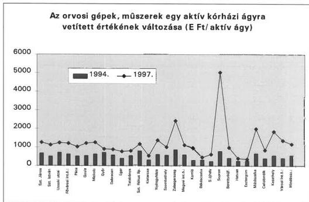

A győri, debreceni, egri, tatabányai megyei kórházban 1994. évben az egy aktív ágyra jutó orvosi gép-műszer értéke átlagos vagy attól jobb volt, 1997. végére 25-35%-kal elmaradtak az átlagos értéktől. Ezzel szemben - főként központi forrásokból megvalósuló rekonstrukciók eredményeként - az átlagosnál maga-

11

---

II. RÉSZLETES MEGÁLLAPÍTÁSOK---

sabb volt az eszközök értékének növekedése a soproni, a mátészalkai, a keszthelyi városi kórházakban.

Az elmúlt évek rekonstrukciói következtében a városi kórházak egy ágyra vetített eszközértéke 1994. évben 62%-a, 1997. évben 76%-a a megyei kórházak átlagának.

Az értéknövekedésben a felújítás részaránya nagyon alacsony, az erre költött összeg 1994. évben a bruttó érték 0,1%-a, 1997. évben 0,06%-a volt. Az eszközök mennyiségének növekedése mellett **az érték változásában szerepet játszott a műszerek beszerzési árának folyamatos emelkedése, valamint a gyógyító tevékenység technikai feltételeiben végbement robbanásszerű fejlődés, a modern diagnosztikai és terápiás eszközök és eljárások ezidőszakra jellemző elterjedése** (CT, MRI, DSA, ultrahang diagnosztika, endoszkópok, laporoszkópok stb.).

Az átlagostól eltérő helyzetű kórházak esetében az alábbi okokat is feltárták a helyszíni vizsgálatok:

- Nyilvántartási hiányosságok miatt **pontatlan a kórházak által kimutatott eszközérték**, amely torzítja a helyzetelemzést.

A békéscsabai kórházban a címzett támogatásból megvalósuló rekonstrukció II. ütemét nem a kórháztulajdonos városi, hanem a megyei önkormányzat bonyolította le, amely 1997. december 31-én ennek eredményeként létrejött 4,5 milliárd Ft értékű vagyont kivezette a nyilvántartásaiból, azonban megfelelő vagyonátadási-átvételi eljárás hiányában sem a tulajdonos városi önkormányzat, sem a működtető kórház nem vette nyilvántartásba. Így a kórház nyilvántartásaiban csupán 766 millió Ft bruttó értékű tárgyi eszköz szerepel. A hatvani önkormányzat által 1994. évben céltámogatásból beszerzett 62,8 millió Ft értékű gép-műszer nem szerepel a kórház nyilvántartásaiban, mert az önkormányzat nem adta át vagyonából a működtetőnek.

- A folyamatban levő rekonstrukciók keretében beszerzett műszerek értéke az 1997. év végi adatokban még nem szerepel.

Az esztergomi kórház orvosi gép-műszereinek kimutatott értéke 1994-97. között csak 22,7%-kal nőtt, de a központi épület jelenlegi rekonstrukciója keretében 300 millió Ft műszer beszerzés történt (műtőblokk, központi labor, sterilizáló, élelmezési üzem). A hatvani Albert Schweitzer kórházban a helyszíni vizsgálatot követően is folyó rekonstrukció eredményeként 309 millió Ft értékű gép-műszer használatba vételére került sor, amely az 1997. év végi adatokban még nem szerepel.

- A rekonstrukciót szolgáló címzett támogatás nem mindig biztosította a szükséges műszer beszerzést, a kivitelezés során jelentkező többletköltségeket, áremelkedéseket az orvostechnológia szűkítésével vezették le, így a felújított részlegekben a műszerek műszaki állapota nem javult számottevően.

A berettyóújfalui kórháznál a vizsgált időszakban 1,6 milliárd Ft összegű rekonstrukció 90%-át ingatlanra fordították, egyes műszerek műszaki állapotuk miatt eredeti funkciójukra már nem alkalmasak.

---12

---

II. RÉSZLETES MEGÁLLAPÍTÁSOK

- A soproni kórház kormányzati beruházásban megkezdett rekonstrukciója eredményeként a városi kórházak egy aktív ágyra jutó gép-műszer értéke nem tekinthető tipikusnak.

A soproni kórház rekonstrukciója 1992 szeptemberében osztrák fővállalkozásban, osztrák hitelből, kiemelt állami beruházásként kezdődött. A műtéti, diagnosztikai tömb átadása 1995. január 15-én történt, majd további ütemekben a belgyógyászati pavilon, egy új neuró-pszichiátriai pavilon került átadásra. A rekonstrukció eredményeként megvalósult orvostechnológia a legfejlettebb, nyugati csúcstechnológiát képviseli. A kórház gép-műszereinek értéke 1994-97. között közel 2 milliárd Ft-tal nőtt. Az egy aktív ágyra jutó eszközérték 5.035 E Ft, míg a vizsgált kórházak átlaga 1.179 E Ft volt (Sopron nélkül számítva 1.087 E Ft) 1997. év végén. A soproni kórház kiugró adata elsősorban a városi kórházak átlagát torzítja, így adatait célszerű az összehasonlításnál figyelmen kívül hagyni.

A költségvetési szervek - így a kórházak is - az eredeti beszerzési ár (bruttó érték) meghatározott %-ában (orvosi műszereknél 1992. évig 8%, 1992-96. között 12%, ezt követően 14,5% leírási kulccsal) értékcsökkenést számolnak az év végén nyilvántartott eszközök után, amelyet költségként nem számolnak el, az elhasználódott eszközök pótlásának fedezetét sem képezi. Az alkalmazott leírási mód problémái:

- Az év vegi eszközallomány utan kell elszámolni, függetlenül az üzembe helyezés idöpontjától. (Ugyanolyan hasznalhatósági fokot mutat az eszköz a következő évben függetlenül attól, hogy január 2-an vagy december 31-én helyeztek üzembe.)
- Az ertekcsokkenesi leirasi kulcs fuggetlen az eszkoz igenybeveletol (a folyamatos, tobb muszakos igenybevetelet eseten gyorsabb az elhasnalodas, mint az eletmento, keszlenleti jelleggel, ezert ritkan hasznalt eszkozknel).
- Nem azonos az ertekcsokkenes elszamolasanak gazdasagi tartalma a koltsegvetesi formaban mukdo egeszsegugyi intezmenyeknel es az egyre tobb teruleten jelenlevo egeszsegugyi vallalkozasoknal,Csak az utobbiak szamoljak el az ertekcsokkenest koltsegkent.
- Az amortizaciónnek megfelelo potlasi alap a finanszirozasban (a tulajdonosnal, a muködtetönel) nem képzödk, ennek hiányat részben potolja a centralizalt elosztasi rendszer (cel, cimzett, egyeb kozponti tamogatas). A visszapótlas egyenlótlen elosztásban történik, amely nem tukrozi az ellato rendszer realis szükségleteit (nehol tulzo kapacitások letrehozasát segiti, miközben az elmaradt cserepótlas miatt jalentós hiányok halmozódnak fel).

# 1.2. A kórházi gépek, műszerek korszerűsége

Az eszközök használhatósági fokát jelző nettó érték és bruttó érték hányados 7,5%-ponttal csökkent, melynek oka, hogy a cserepótlás a jelentős beszerzések ellenére sem érte el az amortizációs (értékcsökkenési) kulcsok alapján számított mértéket. Az értékcsökkenési kulcsok emelkedését nem követte az eszközök pótlását, cseréjét szolgáló pénzügyi források növekedése, valamint a beszerzések, beruházások elsősorban az eszközök

13

---

II. RÉSZLETES MEGÁLLAPÍTÁSOK

**bővítésére**, hiányzó eszközök beszerzésére **és nem az elavult gépek, műszerek cseréjére irányultak**.

**A nagy értékű, korszerű** diagnosztikai és terápiás **eszközök** megjelenése mellett néhány területen **a használatban levő eszközök átlagéletkora meghaladja a fizikai és erkölcsi avulás időtartamát**. A vizsgált kórházakban 1997. év végén az 50 E Ft feletti bruttó értékű eszközöknek 25,5%-a **10 évnél régebbi**, az átlagéletkora 6,7 év. (1-3. sz. diagramok)

Az **eszközök pótlási, felújítási igénye** a tervezhető, ütemes csere hiányában **lökésszerűen terheli a tulajdonos, illetve a kórház költségvetését**. A nullára leírt eszközök aránya 1994-97. között több mint kétszeresére nőtt (az eszközök bruttó értékének 1994. évben 8,1%-a, 1997. évben 17,4%-a volt). Az intézmények által még használt, **teljesen amortizálódott gépek-műszerek** eredeti beszerzési ára 4 milliárd Ft, amelynek **pótlásához** az egészségügyben érvényesülő inflációt figyelembe véve **új áron 16-18 milliárd Ft-ra lenne szükség** a vizsgált kórházakban (országos szinten ez nagyságrendileg 120-130 milliárd Ft-ot igényelne).

A 4. sz. diagram mutatja az egyes kórházi részlegek által használt eszközök bruttó és nettó értékének megoszlását 1997. december 31-én:

- Az eszközök nettó értékének 40,7%-a a fekvőbeteg-osztályokon szolgálja a gyógyítást.
- A labor és röntgendiagnosztika eszközei 26,1%-ot képviselnek.
- Eszközigényesek a központi műtők és a szakrendelők, egyenként 8,6-8,6%-os részesedéssel.
- Az egyéb szakmai és nem szakmai egységek az eszközök 16%-át kötik le.

Az eszközök használhatósági foka alapján az átlaghoz (40,0%) képest rosszabb helyzetben vannak a központi laborok (34,6%), a szakrendelők (35,5%), valamint az egyéb szakmai, kisegítő részlegek (31,6%).

A műszaki színvonalban mutatkozó különbség megállapításának nincsenek kialakult módszerei. A vizsgálat során a kórházak között és intézményen belül is tapasztalható eltéréseket elsősorban a használhatósági fok, átlagéletkor, a nullára leírt eszközök arányán keresztül mértük. Ez alapján:

- Az **intézmények között jelentős és növekvő az eltérés** a műszerezettséget, a műszerek korszerűségét, használhatósági fokát, átlagéletkorát illetően. (5. sz. diagram)

Az esztergomi kórház műszereinek értéke a vizsgált időszakban 22,7%-kal nőtt, átlagéletkora 1997. év végén 9,5 év volt. A mátészalkai kórház 96%-ban cél- és címzett támogatásból megvalósuló 2,3 milliárd Ft értékű rekonstrukciója eredményeként az eszközök átlagéletkora ezen időszakban 4,4 évre csökkent.

- Egy-egy **intézményen belül a különböző részlegek műszaki színvonalában is jelentős eltérések fordulnak elő** a felújításhoz szükséges források hiányában.

14

---

II. RÉSZLETES MEGÁLLAPÍTÁSOK

A miskolci megyei kórházban az eszközök átlagéletkora 7,3 év, de a 4 másik kórház textília mosását is végző textiltisztító üzem mosógépei, centrifugái és kikészítő berendezései 23-25 évesek, a berendezések 93,5%-a nullára leírt. Gyakori meghibásodásuk esetén a javítás csak egyedileg legyártott alkatrészekkel biztosítható. A mosoda rekonstrukciója 250 millió Ft-ot igényelne, amely meghaladja a kórház 1 évi teljes műszer beszerzéseinek értékét, az erre vonatkozó címzett támogatási igényt elutasították.

- **Azonos részlegen belül megtalálható a legfejlettebb technológia és elavult eszközök egyaránt.** Pl. a radiológiában megjelentek a modern képalkotó eljárások, ugyanakkor a hagyományos röntgen berendezések átlagéletkora nem ritkán 15-17 év. A hagyományos röntgen géppark rekonstrukciójának támogatására szolgáló központi program 1998. évi I. ütemében beszerzett 91 db kis és közepes teljesítményű átvilágító és felvételi szerkezet csökkentette a hiányt, de a minimumfeltételek 1998. évi változásakor bevezetett évkorlátozás miatt (a felmérés nem minden intézménynél fejeződött be a helyszíni vizsgálat időpontjáig) a radiológia - többnyire hagyományos röntgenberendezésekben fennálló - hiánya 2,2 milliárd Ft a vizsgált kórházakban.

A radiológia eszközértéke a nagy értékű eszközök megjelenésével számottevően nőtt (a vizsgált kórházakban ez a növekmény 2,6 milliárd Ft volt). Pl. Egerben 1994. évben 2 db röntgen munkahely és átvilágító berendezés 43,2 millió Ft, 1995. évben DSA berendezés 158 millió Ft, 1996. évben lézerkamera 6,9 millió Ft, 1997. évben távvezérelhető röntgenberendezés 34,7 millió Ft értékben növelte a radiológiai eszközöket, melynek részaránya 16%-ról 30%-ra nőtt, ami a vizsgált kórházak átlagát közel 10%-ponttal haladja meg. Ugyanakkor a mammográfiás röntgenberendezést a sorozatos meghibásodás miatt 1996 novemberében véglegesen leállították, új készüléket csak 1997 júniusában vettek használatba, közben a vizsgálatra jelentkezőket tovább küldték más, távolabbi kórházakba.

### 1.3. Minimumfeltételekben előírt követelményekhez viszonyított eltérések

A hazai egészségügyben az 1980-as években kialakított felszerelési jegyzék csupán ajánlás jellegű volt, nem tartalmazott kötelező felszereltségi minimumokat, és folyamatos aktualizálás hiányában az időszerűségét is elveszítette az 1990-es években. Az egészségügyi ellátási kötelezettségről és a területi finanszírozási normatívákról szóló 1996. évi LXIII. törvény szerint az egészségügyi szolgáltatások nyújtásához szükséges tárgyi és személyi feltételeket a fenntartó biztosítja. A törvény a szakmai normák alapján meghatározott egészségügyi szolgáltatás nyújtására jogosító működési engedélyezési eljárás szabályozására a Kormányt hatalmazta fel, amely a Népjóléti Miniszter által meghatározott szakmai minimumfeltételek vizsgálatát az Állami Népegészségügyi és Tisztiorvosi Szolgálat (ÁNTSZ) illetékes intézete feladatává tette.

**Az ÁNTSZ** első ízben 1996. évben ellenőrizte a 19/1996. (VII. 26.) NM rendelet alapján a minimumfeltételek meglétét és a felvett jegyzőkönyvek alapján **1997 áprilisában összegezte a hiányok becsült értékét**, amely szerint a gép-műszer hiány megyénként jelentős szóródást mutatva 32 milliárd Ft volt.

A minimumfeltételekkel kapcsolatban több jogalkalmazási (értelmezési) probléma és szakmai ellenérv került megfogalmazásra:

15

---

II. RÉSZLETES MEGÁLLAPÍTÁSOK

- Nem minden szakterületre készült minimumfeltétel, valamint aránytalanságok tapasztalhatók az egyes szakmák követelményrendszerében (egyes szakmák követelményeit túl részletesen, másokét pedig alig szabályozták).
- A műszerek mennyisége mellett a korszerűségre, használhatóságra vonatkozó előírások nem kerültek meghatározásra.
- A mennyiségi hiányok pótlására előírt határidő túl szoros, illetve a hiányzó eszközök pótlásának nincs fedezete.
- A minimum feltételek a sok ponton célszerűtlen struktúrára épültek (ennek rugalmas átalakítására nem ösztönöznek) és nem az egyes tevékenységekre.

A népjóléti miniszter a hiányzó műszerek pótlásának határidejét 1997. évben módosította, majd az újabb határidő közeledtével 1998. évben a 21/1998. (VI. 3.) NM rendeletben újra szabályozta a követelményeket.

Az új szabályozás legfontosabb jellemzője, hogy a nagy értékű életmentő, sterilitást biztosító és diagnosztikai eszközök használatánál évkorlátozást vezetett be. Az életmentő és diagnosztikai műszereknél 1998. december 31-ig, az egyéb gépműszereknél 2001. szeptember 30-ig kell megfelelni az előírt feltételeknek. A rendelet 8. számú melléklete hivatkozik a laboratóriumokban az egyes besorolási szinteken elvégezhető vizsgálatokat tartalmazó külön rendeletre, amely nem került kiadásra.

A vizsgált kórházakban 1 ágyra vetített és az összes hiány értékét a 6-8. sz. diagramok mutatják be. A minimumfeltételekhez képest felmért hiány 1998. évben 1,9 milliárd Ft-tal nőtt.

(Az 1998. évi felmérés a helyszíni vizsgálatok lezárásáig még nem fejeződött be, így a hiány becslése sem tekinthető véglegesnek.)

A nyíregyházi megyei kórház 1998 decemberéig a rendeletben meghatározott szakmai minimumfeltételekhez képest mutatkozó hiányokat nem mérte fel.

A hiányok növekedése jellemző az aktív fekvőbeteg ellátásban (elsősorban a belgyógyászati, sebészeti, intenzív osztályokon) és a központi műtőkben, mely összefügg az altató-lélegeztető gépeknél, defibrillátoroknál, műtőberendezéseknél bevezetett évkorlátozással.

A vizsgált kórházak az 1998. évi hiányból a 10 legdrágább eszköz becsült értékét 3,2 milliárd Ft-ban (az összes hiány 34%-a) jelölték meg, ezzel szemben fedezetet (a tulajdonos önkormányzat támogatása, saját bevétel) csupán 530 millió Ft összegben prognosztizáltak. A hiányzó nagyobb értékű eszközök között találhatóak a radiológia nagy értékű berendezései (CT, MRI, ultrahang készülékek és hagyományos röntgen berendezések), valamint a labordiagnosztika eszközei (elsősorban laborautomaták).

16

---

II. RÉSZLETES MEGÁLLAPÍTÁSOK

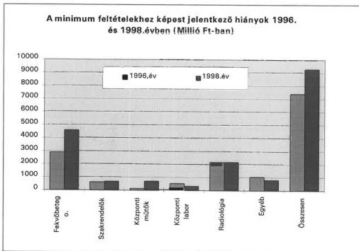

**Az 1996. évi hiányok pótlására az elmúlt két évben a vizsgált kórházak 770 millió Ft-ot fordítottak**, amely a gép-műszer állomány növekedésének csupán 9,3%-a. A kórházak többnyire a tulajdonos önkormányzatok felé jelezték a hiányosságokat, amelyek a céltámogatási igények között megjeleníthető műszerbeszerzések, illetve egyéb pályázatoknál előírt önrész vállalásával igyekeztek eleget tenni fenntartói kötelezettségüknek.

Az 1997. évi központi költségvetés fejezeti kezelésű előirányzatai között az NM költségvetésében a szakmai minimumfeltételekről szóló rendeletben előírt orvostechnikai feltételek támogatására jóváhagyott 1 milliárd Ft felhasználására pályázatot írtak ki. A pályázati felhívásban prioritásként határozták meg az aneszteziológiát és intenzív ellátást, a beszerezni kívánt orvostechnikai eszközök beszerzési árának 65%-os támogatásával. A pályázat keretében az önkormányzati intézmények köréből 9,8 milliárd Ft, az egyetemek, országos intézetek köréből 1,5 milliárd Ft igény érkezett be.

Az odaítélt közel 1 milliárd Ft támogatást a kórházak az önrésszel kiegészítve a meghatározott orvostechnikai és ápolástechnikai (betegemelő, mosdató, ágytálmosó stb.) eszközök beszerzésére fordították. A megítélt támogatás kórházanként 1-12 millió Ft nagyságrendű volt. A kórházak a beszerzéseknél jelentős korlátozásokra kényszerültek, szűkítették a műszerlistát (újraélesztési eszközöket csak kórházi tömbönként biztosítottak, ágytálmosó berendezésből az előírtnál kevesebbet szereztek be).

**Minimumfeltételekben előírt eszközök beszerzését az előírt számban nem mindig tartják indokoltnak** (pl. az előírt betegemelők beszerzése a jelenlegi kórtermi adottságok mellett felesleges, mert használatuk nem bizto-

17

---

II. RÉSZLETES MEGÁLLAPÍTÁSOK

sítható). Gazdaságossági, hatékonysági szempontok miatt sem kívánnak valamennyi előírásnak megfelelni a kórházak.

Az Uzsoki u. kórház az 1998. évi ÁNTSZ felmérés szerint 1 milliárd Ft értékű hiányából a CT, MRI becsült értéke 350 millió Ft. Azonban az MRI telepítésével a kórház nem számol, mivel a közelben az MRI vizsgálati igények kielégíthetőek. A CT telepítését a főprofilnak számító onkológia illetve a speciális vizsgálatokat és műtéteket végző ortopéd traumatológia jelenléte miatt tervezik, évente átlagosan 3 ezer beteget küldenek más kórházba CT vizsgálatra. (Ugyanakkor Budapest CT-vel az országos átlagot meghaladóan ellátott.)

### 1.4. Az elhasználódott, hiányzó műszerek hatása

Az egészségügyi szolgáltatások körét, mennyiségét ma már a hagyományos felkészültség, szakmai hozzáértés mellett befolyásolja a műszerezettség, a korszerű diagnosztikai és terápiás lehetőségek elérhetősége. Az elavult műszerek használatának következményei (a javítás, üzemeltetési költségek növekedése) mellett az esetek egy részében az ellátás minőségében, eredményességében is jelentkeznek. Ilyenek például:

- a betegek átirányítása más betegellátási helyre utazási költségtöbblettel, időveszteséggel jár,
- a betegeket érintő kényelmetlenségek, várakozási, ápolási idő megnövekedése

pl. a győri kórházban a kardiológiai helyiség, orvos és műszerezettség hiánya miatt több, mint 3 hónap a várakozási idő, napi 60-70 betegre 1 ultrahang berendezés jut, ami lassítja a vizsgálatokat, a szombathelyi kórházban endoszkópos műtéteknél a kevés eszköz miatt limitált a beavatkozások száma, emiatt sokszor nyitott műtéteket kellett alkalmazni, ami az ápolási időt növelte, két műszak szervezését az ápolási személyzet hiánya akadályozza,

- a célzott diagnosztikai irány más, vagy több eszközzel való megközelítése miatt indokolatlan többletköltség jelentkezik,
- a korszerűtlen eszközök használatának, a fokozottabb igénybevételnek nem számszerűsíthető hatásai (pl. ultrahang készülék hiányában hagyományos röntgen átvilágítással nagyobb sugárterhelés éri a kezelőket és a betegeket),
- a gyakori meghibásodások miatt megnőnek a javítási költségek, a cserepótlás pénzügyi fedezetének hiányában a működőképesség érdekében gazdaságtalan javításokat is kénytelenek elvégeztetni.

Az ellátás biztosítása, a hiányzó műszerek pótlása érdekében a kórházak különböző megoldásokat keresnek, amelyek egy része jellemzőnek tekinthető, más része helyi sajátosságokat tükröz:

- Azokat a vizsgálatokat, amelyekhez a szükséges műszer nem áll rendelkezésre más intézményektől rendelik meg. Ez különösen jellemző a nagy értékű CT, MRI vizsgálatoknál, amelyek finanszírozása külön kasszából történik, közvetlenül a szolgáltatást végzőnek.

18

---

II. RÉSZLETES MEGÁLLAPÍTÁSOK

A TB finanszírozás egyes kérdéseiről szóló 103/1995. (VII. 25.) Korm. rendelet 1998. januári módosítása szerint a fekvőbeteg-ellátó intézményben ellátott beteg részére amennyiben más intézmény járóbeteg-ellátást nyújt, ennek költségeit az intézmények - megállapodásban vagy szerződésben meghatározott módon - egymás között elszámolják, s ennek során az OEP által finanszírozott összeg az irányadó. A fekvőbeteg szakellátás HBCS szerinti finanszírozása magában foglalja az ellátás teljes összegét (a diagnosztikai vizsgálatok és beavatkozások díját is). A megyei kórházak a progresszív betegellátásból adódóan kötelesek a kért azon drágább vizsgálatokat is elvégezni, amelyek térítési díja az önköltséget sem fedezi.

- A hiányzó eszközök beszerzése és a műszaki fejlesztés érdekében a pályázati lehetőségekkel élnek a kórházak. Pl. az Uzsoki u. kórház 1997. évben NM pályázaton 130 millió Ft-ot nyert el nőgyógyászati endoszkópos eszközök, lineáris gyorsító és respirátor nélküli csecsemő újraélesztő asztal beszerzésre.
- A gyógyító munka alapítványokon keresztül történő támogatása érdekében többnyire magán alapítványt hoztak létre. Az alapítványi befizetések egy része közpénz (pl. a területi ellátásban érintett önkormányzatok hozzájárulása konkrét műszer beszerzéshez, vagy a kórház szállítói által tett „felajánlások” a sikeres pályázat érdekében), azonban az alapítvány eszközeinek államháztartás rendszerén kívüli kezelése miatt a folyamatos kontroll nem megoldott.
- A kihelyezési konstrukció keretében az üzemeltetéshez szükséges fogyóanyag (pl. reagens) szállítására irányuló szerződésben vállalt beszerzésért cserében a készüléket térítésmentesen bocsátják a kórház rendelkezésére (pl. a szombathelyi kórházban a laborautomaták kapacitásának 51%-át kihelyezett műszerek alkotják). Ez a megoldás a beszerzési költségeket a működési költségek között jeleníti meg, a kihelyező a gép árát a reagens árában realizálja. (Közkeletű elnevezése az un. „reagens lízing”).
- Adományokból, kipróbálásra adott műszerekből különböző (néhány helyen nyilván sem tartott) értékű és mennyiségű nem kórházi tulajdonban levő eszközt is használnak. (Nyíregyházán 1997. évig a kipróbálásra, alapítványoktól átvett eszközökről nyilvántartást nem vezettek).

A győri kórházban 124,7 millió Ft a térítésmentesen határozatlan időre kihelyezett orvosi műszerek értéke, az alapítványi, egyéb tulajdonban levő műszerek értéke 21,4 millió Ft, a pécsi kórházban a gépek- berendezések 17%-a, 110,7 millió Ft az idegen tulajdonban levő eszközök értéke.

A kihelyezett, kipróbálásra adott eszközök egy része új eljárás bevezetésének megismertetését szolgálta pl. Egerben csontsűrűség meghatározó készüléket helyeztek ki 1996. évben határozatlan időre, szervezett szűrővizsgálatok végzésére. Ugyanitt egy kihelyezett labor (immunológia) automatát a kórház nem használ a drága tesztek miatt.

- Hiányzó eszközök hagyományos haszonbérlet, pénzügyi lízing keretében történő biztosítását néhány esetben tapasztaltuk. Rövid távú érdekek (sürgős megoldás kényszere, pénzügyi fedezet hiánya) játszottak szerepet ezekben a döntésekben

19

---

II. RÉSZLETES MEGÁLLAPÍTÁSOK

A békéscsabai kórház formalin és gőz sterilizáló berendezést, konyhai eszközöket lízingelt, a döntést megelőzően gazdaságossági számítás nem készült, elsődleges az eszközök biztosítása volt.

A nyíregyházi kórház 1998 februárjában 4 év időtartamra 12 műszer bérletére kötött szerződést havi 480,6 E Ft összegért. Ezt megelőzően nem készítettek gazdaságossági számítást, így nem derült ki, hogy a bérleti díjban az eszközök beszerzési árához képest mennyit fizetnek. A tulajdonjog ebben a formában a 4 év után sem kerül a kórházhoz. Néhány eszköz 48 havi bérleti díját és jelenlegi beszerzési árát összehasonlítva a bérlet előnytelennek tekinthető pl. defibrillátor 67,5 E Ft/hó bérleti díja 48 hónapra 3.240 E Ft, ezen az áron jelenleg 2 db hasonló eszköz szerezhető be. A szerződés szerint a bérlő az eszközöket megtekintette, azok állagát ismeri, de azokat nem rögzítették, az üzemeltetés során jelentkező kárviselés, javítás szabályai sem tisztázottak.

- Jótékonysági szervezetek (szeretetszolgálatok, alapítványok) mellett ritkaságszámba menő, hogy az ellátásban érintett önkormányzatok műszerrel támogatták a kórházat (a Vas megyei kórházat Szombathely megyei jogú város közel 100 millió Ft műszer-adománnyal támogatta)
- A feladatok üzemeltetésre való átadásával mentesítik magukat a kórházak az elavult műszerek, berendezések cseréjével kapcsolatos gondoktól (felújítási kötelezettséggel kombinált bérleti-üzemeltetési szerződéssel). A funkcionális privatizáció kórházak számára előnyös megoldása főként a kisegítő tevékenységek - élelmezés, mosatás, takarítás stb. - területén jellemző, de egyes szakmai részlegeknél is növekvő a számuk.

A nyíregyházi kórházban a labor és a radiológia funkcionális privatizációjára került sor közbeszerzési eljárás keretében. A laborra vonatkozó szerződést 1997 júliusában 5 éves időtartamra kötötték, melyben szerepel, hogy a kórház a laborvizsgálatok térítését milyen díjtétellel végzi (ez magasabb mint a TB finanszírozás és a kórház tényleges önköltsége, ennek következtében a előzetes kalkuláció szerint a kórház 50 millió Ft költséget vállalt). Az üzemeltető kötelezettségei is rögzítésre kerültek, így többek között 5 év alatt 113 millió Ft értékű műszer beszerzést vállalt az elavult berendezések lecserélésére, amelyek a szerződés lejáratakor térítésmentesen a kórház tulajdonába kerülnek. A vizsgálatig 68 millió Ft értékű eszközt helyeztek üzembe. Az üzemeltető az épület használatáért évi 12,5 millió Ft bérleti díjat térít. A radiológia funkcionális privatizációja hasonló célból és módon történt, ahol az üzemeltető vállalta, hogy 5 év alatt 425 millió Ft műszerbeszerzést eszközöl. Ezen belül legjelentősebb a CT és MRI beruházás, amely a szerződéshez képest egy évet már csúszik. A vizsgálat időpontjáig a vállalkozó 70 millió Ft értékű fejlesztést valósított meg.

A győri kórházban 1994. évben a művese állomás, 1997. évben a radiológia funkcionális privatizációjára került sor. Ennek indokaként szerepelt, hogy az itt működtetett eszközök avultsága miatt szükséges fejlesztésekre nincs fedezet, az üzemeltető vállalta a szükséges korszerűsítést. Kórházi földterület bérbeadása fejében a művese állomást üzemeltető vállalkozás komplex nephrológiai centrumot épített, melyben fekvőbeteg-osztály, szakrendelés és művese állomás működik, és folyamatosan biztosítja a gépek cseréjét. A radiológián az üzemeltető telepített korábban hiányzó MRI-t, lecserélésre került a CT korszerűbb spirál CT-re. Az elmúlt időszakban a művese állomás és a radiológia területén a külső vállalkozások részéről 1,3 milliárd Ft tőkebefektetés történt.

A soproni laboratórium funkcionális privatizációjának okaként a labor 1996. évi 40 millió Ft-os veszteségének megszüntetését jelölték meg. A tulajdonos önkor-

20

---

II. RÉSZLETES MEGÁLLAPÍTÁSOK

mányzat a privatizációhoz olyan feltétellel járult hozzá, hogy az a kórház számára gazdasági előnnyel kell, hogy járjon. Ez a feltétel a rekonstrukció keretében kialakított korszerű radiológia funkcionális privatizációja során a helyszíni vizsgálat megállapítása szerint nem érvényesült maradéktalanul. A WHO pontok 1997. márciusi előnyös változásával a szerződéskötéskor nem számoltak az évi 48 millió Ft (ÁFÁ-val együtt) bérleti díj 1997 júniusi meghatározásakor. A kórház 1998 elején kezdeményezte a megváltozott finanszírozásra hivatkozással a szerződés módosítását. Ennek eredményeként 1998. január, február hóra az üzemeltető 4-4 millió Ft engedményt adott a kórháznak, 1998. március 1-től pedig megszüntették az éves fix bérleti díjat, és helyette a TB finanszírozás 85%-át kapja az üzemeltető vállalkozás és 15% a kórház bevétele. A kórház 1998 évre 72 millió Ft bevételt tervezett az üzemeltetővel kötött szerződés alapján, a radiológiai teljesítmények lemaradása miatt azonban csak 47,2 millió Ft bevétel realizálódott.

### 1.5. A műszerbeszerzések finanszírozása és ennek hatása a műszerezettségre

Az egészségügy finanszírozásában a működtetés és a fejlesztések (beszerzések) forrásainak elosztása különböző csatornákon keresztül történik. Míg a TB finanszírozás teljesítményalapú és a működtetésre használható fel, **a fejlesztés, pótlás elsősorban a tulajdonost terhelő kötelezettség**, a működtető egészségügyi intézményeknél nem képződik fedezet az elhasználódott eszközök pótlására sem.

Ennek ellenére a **beruházásokban** (gép-műszer beszerzésekben) évente változó, de összességében **növekvő a kórházak saját bevételekből** (szolgáltatások értékesítéséből, vállalkozás jellegű bevételekből) és a működési célú TB finanszírozásból ilyen célra **felhasznált összeg**. Az intézményi bevételek részaránya évente 20 -28% volt a beszerzéseknél (ez 1-88% közötti szóródást takar), a vizsgált kórházaknál összességében 4,5 milliárd Ft-ot tett ki. (9-11. sz. diagram)

A gyulai kórházban az aktivált beruházások 74%-a intézményi forrásból valósult meg, amely 1,1 milliárd Ft-ot jelentett. Ennek mintegy 1/5-ét a működési célt szolgáló TB finanszírozás terhére biztosították. A beruházások jelentős része közvetlenül teljesítmény növelő volt, így a kórház finanszírozására kedvezően hatott (pl. az 1996. évben telepített MRI működtetése az ellátás javítása mellett nagyon rövid megtérülést mutat) más része a betegek megelégedettségét, a kórházi ápolási, elhelyezési körülményeket javította.

A zalaegerszegi kórházban az 1 ágyra jutó gép-műszer érték növekedése az átlagost meghaladó mértékű volt (276%), amelynek 47%-át a kórház bevételeiből fedezte. A céltámogatási igények esetén a tulajdonos megyei közgyűlés feltételül szabta, hogy a saját erőt a kórháznak kell biztosítania. A címzett támogatás igénybevételével folyó rekonstrukcióhoz a megyei közgyűlés hitelt vett fel, de ennek törlesztése is a kórházra hárult. A kórház ilyen közvetett hitel törlesztése 1997. év végéig 240 millió Ft volt. Ezek összességében hozzájárultak ahhoz, hogy a kórházat a felhalmozott adósságai miatt adósságkonszolidációba kellett bevonni.

A vizsgált kórházak – 4 év alatti – **saját forrású gép-műszer állomány növekedése egy aktív ágyra vetítve 23 E Ft (Komló) és 776 E Ft (Zalaegerszeg) között szóródott**, ezen belül a megyei kórházak átlaga több

21

---

II. RÉSZLETES MEGÁLLAPÍTÁSOK

mint a kétszerese a városi kórházakénak. Ez jelzi a finanszírozásból eredő eltérő pénzügyi lehetőségeket is. (A progresszív ellátásban magasabb szinten álló megyei kórházak ellátási szint szorzó alkalmazásával magasabb összegű finanszírozásban részesültek, az 1998. évben bevezetett egységes díj azonban a kórházak korábbi finanszírozási helyzetét módosította).

A kórházak saját bevételeiből gép-műszer beszerzésre fordított összeg több tényező hatására évente is változott (1995. évben az előző évhez képest 238% a növekedés, 1996. évben 33%-os a csökkenés, majd ismét növekedés tapasztalható). **A műszerbeszerzések** tervezését a különböző külső források esetlegessége nehezítette, a saját bevételeket a pályázati önrészre tartalékolták az év közben felmerülő halaszthatatlan pótlási, beszerzési igények kielégítése mellett.

**Az önkormányzatok egészségügyi intézményekkel kapcsolatos kötelezettségeikre** (fejlesztés, felújítás) **külön forrással nem rendelkeznek**, pénzügyi lehetőségeik függvényében évente döntenek a kórház fejlesztések, felújítások támogatásáról, a cél-, címzett támogatási igények, pályázatok benyújtásáról. **A kórháztulajdonos önkormányzatok aránytalanul nagyobb terhet viselnek**, amelyet a megyei önkormányzatoknál fokoz a progresszivitás elvéből következő magasabb színvonalú ellátási felelősség. A kórházi ellátást igénybe vevő lakosság lakóhelye szerinti önkormányzatok a fejlesztések megvalósításához általában nem társulnak.

Egyedi megoldásként a Baranya Megyei Közgyűlés jogszabály megalkotását kezdeményezte arra hivatkozással, hogy 1993-96. között a kórház 237,6 millió Ft összegű értékcsökkenésnek megfelelő fejlesztés fedezete nem állt a közgyűlés rendelkezésére.

A vizsgált kórházakat **fenntartó 21 helyi önkormányzat** (fővárosi, 11 megyei, 9 városi) a vizsgált időszakban **2,5 milliárd Ft-tal támogatta a gép-műszer beszerzést, amely az összes forrás 14%-át jelentette**.

Előfordult, hogy az önkormányzat pénzügyi nehézségekre hivatkozással a központi pályázatoknál előírt, a céltámogatásnál kötelező **önkormányzati önrész megfizetését is a kórházra hárította**.

A debreceni Kenézy Gy. kórház 1998. évi alapradiológiai pályázatához előírt 30% önkormányzati és 5% intézményi önrészt teljes egészében a kórház fedezte.

A berettyóújfalui kórház műszer beszerzéseiben a városi önkormányzat csupán 3%-kal vett részt, a címzett támogatás 61%-os, a céltámogatás 7%-os, az intézményi bevétel 25%-os részaránya mellett.

A keszthelyi kórház céltámogatási igénybejelentésének tárgyalásakor az önkormányzat minden esetben feltételül szabta, hogy az önkormányzatot terhelő önrészt részben vagy egészben az intézménynek kell biztosítani.

A kórházi gép-műszer beszerzések **legnagyobb részét cél- és címzett támogatás és egyéb központi támogatás fedezte** (ezek összességében **48%-ban** részesedtek a forrásokból).

A céltámogatás működő egészségügyi intézmények gép-műszer beszerzésére igényelhető, a feltételeknek megfelelő önkormányzatot alanyi jogon illeti meg.

22

---

II. RÉSZLETES MEGÁLLAPÍTÁSOK

**A támogatott eszközök köre 1996. évtől szűkült, és a támogatás mértéke 40%-ról 30%-ra csökkent. Emiatt a források között a céltámogatás aránya az 1994. évi 18%-ról 6%-ra mérséklődött a vizsgált kórházakban.**

A támogatott eszközök körét 1996. évben szűkítették: az egyedileg 1 millió Ft beszerzési értéket meghaladó gépek, műszerek a hagyományos röntgendiagnosztika, központi laboratórium, anaszthesiológia és intenzív terápia, sterilizálás és a már többnyire privatizált fogászat területére. Ezek közül a röntgendiagnosztika, anaszthesiológiai és intenzív terápia eszközei, a labor-automaták a Népjóléti Minisztérium fejezeti előirányzatai között szereplő pénzeszközökből lényegesen kedvezőbb támogatási aránnyal szerezhetők be (pl. 1997. évben a minimumfeltételek teljesítésére kiírt pályázaton 65%-os, egyéb pályázatoknál 60%-os volt a támogatás aránya).

**Címzett támogatás a** kiemelt jelentőségű beruházásokra, rekonstrukcióhoz igényelhető, értékhatár és kötelező saját hányad nélkül, azonban az odaítélés egyedi mérlegelésen múlik. A központi beruházásban megvalósított soproni kórház-rekonstrukció mellett **a vizsgált intézmények 56%-ában összességében 5,8 milliárd Ft értékben címzett támogatásból nőtt, korszerűsödött az orvosi gép-műszer felszereltség.** Ez hozzájárult a kórházak közötti illetve a kórházak egyes részlegei közötti színvonalkülönbségek kialakulásához, az így létrejött kórházi részlegek, diagnosztikai tömbök kiemelkednek az általános színvonalból.

A fejlesztési források között **növekvő a központi támogatások nagyságrendje**, amelyek célhoz kötöttek és pályázati úton érhetők el (1995. évben 370 millió Ft, 1998. évben 1970 millió Ft). A program-finanszírozás körébe vont központi (fejezeti kezelésű) előirányzatokból és a céltámogatásból beszerezhető gép-műszerek között gyakori a párhuzamosság, miközben **a támogatás mértékében a már jelzett jelentős különbségek voltak.**

A program-finanszírozás keretében nyújtott támogatások felhasználását, a vállalt szakmai célok teljesítését a támogatást nyújtó a vizsgált években a helyszínen egyetlen esetben sem ellenőrizte.

Pályázati lehetőségek az éves költségvetési döntésektől függően, általában az első negyedévben váltak ismertté, ezek nem mindig estek egybe az intézmények szükségleti rangsorával, de a lehetőségeket általában igyekeznek kihasználni. Központi közbeszerzés keretében lebonyolított pályázatoknál a döntések elhúzódása miatt előfordult, hogy az igénylő intézmény közben más formában megoldotta a hiányzó műszerrel kapcsolatos gondját, így elállt az igényétől (a jellemző túljelentkezés miatt új jogosultat kijelölni nem jelentett problémát).

Az NM 1997. évi költségvetésében a labor diagnosztika technikai feltételeinek javítására szolgáló 70 millió Ft-ra 1997. február 28-án kiírt pályázat keretében a központilag beszerzett eszközöknél a közbeszerzési eljárás elhúzódása miatt 1997. november 25-én az egyik igénylő lemondott a berendezésről, mert az elhúzódó beszerzés miatt az igényt más módon elégítette ki.

23

---

II. RÉSZLETES MEGÁLLAPÍTÁSOK---

## 2. A BESZERZÉSEK ELŐKÉSZÍTÉSE, LEBONYOLÍTÁSA

### 2.1. A fejlesztések, gép-műszer beszerzések tervezése

A műszerbeszerzési igények kielégítésénél a **prioritásokat a pályázati lehetőségekhez való kapcsolódás és a működőképesség fenntartását szolgáló cserék határozták meg, a műszerbeszerzések a források bizonytalansága miatt nehezen tervezhetőek voltak.** Az éves költségvetésben a saját bevételt is mint fedezetet figyelembe vett felújítási, felhalmozási keretek az év közben felmerülő, azonnali beszerzést igénylő pótlásokat szolgálták a pályázatokhoz szükséges önrész mellett.

A fejlesztések döntően központilag támogatott rekonstrukciókhoz, néhány kiemelt programhoz (pl. onkológiai sugárterápiás centrumok, az egészségügyi intézményrendszer szerkezetének átalakítását szolgáló, az egészségügyi technológiafejlesztő programok) kapcsolódtak, illetve a kórházi osztályok, részlegek igényein alapultak.

A kórházak különböző mélységű és időtartamú stratégiai terveket készítettek, amelyeket a tulajdonos önkormányzatnak is megküldtek, de ezt a testületek csak elvétve tűzték napirendre.

A Pest megyei Flór F. Kórház 1994. évben, a békéscsabai városi kórház 1997. évben készített, a győri megyei kórház 1998-2000. közötti időszakra szóló orvosszakmai fejlesztési koncepcióját az önkormányzati testületek nem tárgyalták meg.

A fenntartó önkormányzat által is elfogadott orvosszakmai fejlesztési koncepciót azok a kórházak készítettek, ahol kórház-rekonstrukciós programok indultak, a tervek aktualizálása azonban elmaradt. A szakmai koncepciók részeként megvalósíthatósági tanulmány készítését az újabb (1999. évi) cél- és címzett támogatási igények bejelentésénél követelik meg.

Miközben a **fenntartók a fejlesztési igényeket többnyire támogatták, azok megvalósítási forrásai tisztázatlanok voltak, elsősorban központi támogatástól függtek**, önerőből kórházfejlesztési program megvalósítására egyetlen önkormányzat sem vállalkozott. A beruházások időbeli ütemét, anyagi, műszaki összetételét a támogatások időbeli üteme, összege határozta meg. A rekonstrukcióknál bekövetkezett költségnövekedést az orvos-technológián végrehajtott szűkítéssel vezették le.

Az esztergomi kórház rekonstrukciójának előkészítéseként összeállította hosszú távú struktúra átalakítási tervét, amely magában foglalja az orvosszakmai fejlesztési koncepciót, a műszer beszerzési tervet, s ez képezte a címzett támogatásból folyó fejlesztés alapját. Az áremelkedések jelentősen megnövelték az építészeti költségeket, amelyhez a forrást a műszerbeszerzési keretek szűkítésével biztosították a beruházás eleve forráshiánnyal kezdődött.

A fekvőbeteg-intézmények **fejlesztésének összehangolását a tulajdonosi szerkezet is gátolja.**

---24

---

II. RÉSZLETES MEGÁLLAPÍTÁSOK

Hajdú-Bihar megyében működő különböző fenntartókhoz tartozó - Orvostudományi Egyetem minisztériumi, Kenézy Kórház megyei önkormányzati, berettyóújfalui kórház városi önkormányzati intézmény - 3 fekvőbeteg szakellátást végző intézmény fejlesztésének összehangolása meghaladja az önkormányzatok kompetenciáját.

Operatív, éves műszerbeszerzési terveket a kórházak az osztályok, részlegek igényeit összegyűjtve állítottak össze. Ezek indokoltságának, működtetésre, teljesítményre gyakorolt hatásának dokumentáltsága is igen eltérő, általában hiányoztak a következő információk:

- az igényelt eszköz típusa, kiépítettsége (nem mindig tapasztalható tudatos törekvés a műszerek tipizálására, gyártmánycsaládok meghonosítására, s ennek következménye, hogy intézményen belül is heterogén a műszerpark, ami az üzemeltetési költségeket, tartalék alkatrész iránti igényeket növelte),
- nem állapítható meg az igény indoka pl. minimumfeltételekben előírt, cserepótlás, korszerűsítés, fejlesztés,
- selejtpótlás, műszercsere esetén a meglevő eszköz meghibásodásának gyakorisága, költségei,
- fejlesztés, korszerűsítés esetén az elvárt szakmai követelmény, a betegforgalomra, a finanszírozott teljesítményre gyakorolt hatások konkrét számadatai,
- a működtetéshez szükséges feltételek rendelkezésre állnak-e (személyi, képzési, műszaki, szerviz stb. igények)

A műszerbeszerzéseknél az előzetes gazdasági számítások, költség-haszonelemzések készítése nem jellemző, elsősorban a kórházi osztályok által összeállított szakmai igények kerültek megfogalmazásra. A pályázatokhoz, nagyobb értékű új eszközök beszerzéséhez néhány esetben készíttettek hatásvizsgálatot, költség-haszon elemzéseket, ezekkel a feladatokkal több helyen a létrejött kontrolling részlegeket bízták meg.

Az éves műszerlistákat a szervezeti és működési szabályzatban meghatározott, intézményenként különböző tanácsadó testület (pl. műszerügyi bizottság) megtárgyalta, de előfordult, hogy a sürgős pótlási igények meghatározó részaránya miatt annak tevékenységét szüneteltették. Az éves műszerbeszerzési listákhoz képest - a pályázati lehetőségektől függően - jelentős a nem tervezett, de megvalósult beszerzések nagyságrendje.

Az egri kórházban 1997. évben a műszer beszerzési tervhez képest elmaradt 225,8 millió Ft, 1998. évben 296,5 millió Ft értékű beszerzés, a tervtől eltérő beszerzés a két időszakban 38,3 ill. 27,6 millió Ft volt.

A miskolci megyei kórházban az 1997. évi 1 milliárd Ft műszerbeszerzési igényből fedezet hiányában 718,6 millió Ft nem teljesült, a különböző pályázati lehetőségekhez kapcsolódva viszont a tervtől eltérően beszerzett eszközök értéke 272 millió Ft-ot tett ki.

A műszerbeszerzési terv részévé váltak a kórházak által a minimumfeltételek kiadását követően összeállított hiánylisták, amelyet tájékoztatásul megküldtek

25

---

II. RÉSZLETES MEGÁLLAPÍTÁSOK

a tulajdonosnak, de a hiányok pótlásának fedezete általában tisztázatlan maradt.

Az önhibáján kívül hátrányos helyzetű önkormányzatok támogatásának kizáró feltétele a felhalmozási bevétellel nem fedezett felhalmozási kiadások tervezése, így az ilyen támogatást igényelni kívánó önkormányzatok nem engedték a műszerbeszerzések tervezését a kórházi költségvetésben a saját működési bevételek terhére sem (pl. Debrecen).

## 2.2. A beszerzések lebonyolításának tapasztalatai

A költségvetési szervek tervezésére, gazdálkodására vonatkozó szabályok szerint a tárgyi eszközök felújításával, létesítésével kapcsolatos jogosultsággal a fenntartó (tulajdonos) önkormányzatok döntésétől függően rendelkeztek az intézmények:

- Az önkormányzatok értékhatárhoz kötötték az intézmények tárgyi eszköz beszerzési jogosultságát (a vizsgált kórházaknál ennek mértéke 200 E Ft-tól 2 millió Ft-ig terjedt). E felett képviselő-testületi döntés volt szükséges a beszerzés engedélyezéséhez akkor is, ha azt a kórház saját bevételeiből fedezte.
- Tárgyi eszköz beszerzésére a költségvetésben jóváhagyott keret erejéig kapott felhatalmazást a kórház, vagy a pénzügyi lebonyolítást egyedi engedélyeztetéshez kötötték. Ez utóbbi sürgős fődarab-cseréknél (felújítás) szükségtelenül növelte az átfutási időt.
- A beruházásokat nem szabályozta az önkormányzat (központi szabályozás nincs), az engedélyezés, az üzembe helyezés, az aktiválás során a számviteli elszámolásoknál különböző problémák merültek fel.

Az önkormányzati beruházásként megvalósuló berettyóújfalui kórház rekonstrukció keretében megvalósult létesítményeket, beszerzett műszereket a kórház aktiválta 530 millió Ft értékben, ugyanakkor az önkormányzat 1997. évi beszámolójában is szerepel folyamatban levő beruházásként.

A közbeszerzési eljárásban értékhatár feletti gép-műszer beszerzéseknél az eljárást az ellenőrzött kórházakban 1996. évtől vagy saját maguk, vagy a fenntartó önkormányzat bonyolította le. Az önkormányzatok a törvény keretei között eltérő módon szabályozták a közbeszerzési eljárás indításával, az ajánlatok elbírálásával kapcsolatos tevékenységet, az abban eljáró személyekre vonatkozó rendelkezéseket, s ennek megfelelően a gyakorlat is különböző. A lebonyolítás két alaptípusa azonban megkülönböztethető:

- az értékhatárt meghaladó műszerbeszerzésekre irányuló közbeszerzési eljárás lebonyolításával külső szakvállalkozást bíztak meg, amelynek feladata: az ajánlati dokumentáció, ajánlati felhívás, az ajánlatok értékelési kritériumainak kidolgozása, az ajánlatok fogadása, tender-bontás, az ajánlatok értékelése, az eredményhirdetés megszervezése, a hirdetmény közzététele, a szerződéskötés előkészítése stb. (pl. Nyíregyháza, Békéscsaba, Pest megyei Szent Rókus Kórház, Fővárosi Szent István Kórház)

26

---

II. RÉSZLETES MEGÁLLAPÍTÁSOK

- a kórházak **saját szervezetükkel bonyolítják le az eljárást**, elvégzik mindazokat a feladatokat, amelyet a lebonyolító jutalék ellenében szolgáltat. (Pl. miskolci megyei, sátoraljaújhelyi városi kórház)

A közbeszerzéseknél - néhány kivételtől eltekintve - **nyílt eljárást alkalmaztak**, amelyeknél a felhívásban az ajánlatok elbírálásának szempontjai között szerepelt: összességében legkedvezőbb ajánlat, szakmai megfelelőség, az ajánlott ár, szállítási határidő, garanciális idő, szerviz-háttér, referencia, üzemeltetési költségek stb. Az értékelés kritériumrendszere azonban nem mindig került kialakításra, dokumentálásra, a döntések indokolásánál leggyakrabban a legalacsonyabb ár, de még elfogadható szakmai megfelelőség, vagy az összességében legelőnyösebb ajánlat szerepel. Ilyen esetekben az ár mellett a minőségi és egyéb tényezőket is figyelembe vették, pl. az adott típusú műszer már üzemel a kórházban, kedvezőbb garanciális idő, jobb szerviz-háttér biztosított stb.

A közbeszerzésekre vonatkozó előírások megsértését tapasztalta a helyszíni vizsgált a soproni kórházban.

A radiológia funkcionális privatizációjára kiírt közbeszerzési eljárás során a kórház az ajánlattevő által beadott pályázatban szereplő bérleti díjat nem fogadta el, és a nyílt eljárást szabálytalanul tárgyalásos eljárássá változtatta. A közbeszerzésről szóló 1995. évi XL.törvény 27. §-a szerint az eljárás során nem lehet áttérni az egyik eljárási fajtáról a másikra.

Ha a közbeszerzési eljárást az önkormányzat bonyolította le, előfordult, hogy a beszerzett gép a már használtaktól eltérő, üzemeltetési szempontból nem a legelőnyösebb, nem a működtető kórház által megjelölt paramétereknek felelt meg.

A fővárosi Szent István Kórházban használt altatógépektől eltérő berendezést szerzett be a főváros a kórház igényétől eltérően 1997. évben, amely más szerviz-háttér, ismételt betanítást igényelt.

A Pest megyei Flór F. kórház részére a tulajdonos önkormányzat 1 db. szárazkémiai automatát szerzett be a kórház laboratóriumába, amelynek reagens költsége többszöröse a használt automatáknak, ezért azt csak tartalék automataként üzemeltetik.

**A nyilvános ajánlatkérések**, a piaci információk jobb megismerése, versenyhelyzet teremtése révén tendenciájukban **ármérséklő hatásúak**, de ez nem mindig mutatható ki (az ajánlati árak különbözőségeiből az árelőny gyakran közvetlenül nem vezethető le, a különböző árajánlatok mögötti eltérő műszaki tartalom is nehezíti az összehasonlítást). **Konkrét árelőny** elsősorban az egészségügyi intézmények **közös, nagyobb tételben történő beszerzéseinél realizálható**.

Előfordult, hogy nyilvános eljárás mellőzésével került sor közbeszerzési eljárásra a betegellátás érdekeire, sürgősségre hivatkozással (pl. soproni kórház 1997. évben laborautomatát meghívásos, az egri kórház 1997. évben mammográfiás röntgenberendezést tárgyalásos eljárás keretében szerzett be).

27

---

II. RÉSZLETES MEGÁLLAPÍTÁSOK

### 3. A GÉP-MŰSZER ÜZEMELTETÉS ÉS KARBANTARTÁS

#### 3.1. A műszergazdálkodással kapcsolatos nyilvántartások

**Az egészségügyi intézményekben használt 50 E Ft egyedi érték feletti orvostechnikai termékek** száma eléri a 160 ezer db-ot. A több ezer féle műszer alkatrész ellátása, **javítása, szervizelése**, fogyóanyaggal való ellátása (reagens, kontraszt anyag, csövek stb.), **a készülékek szakszerű üzemeltetése**, biztonságos, megfelelő használata **egyre nagyobb jelentőséget kap a kórházi gazdálkodásban**.

Az egészségügyi intézményekben alkalmazott kórház- és orvostechnikai termékek alkalmassági igazolásával és minősítésével, nyilvántartásával, értékelésével, műszaki fejlesztésének összehangolásával kapcsolatos feladatokat a minisztérium felügyelete alatt működő Országos Kórház- és Orvostechnikai Intézet (ORKI) látja el.

Az ORKI az 1990-es évek elején elkezdte a műszergazdálkodáshoz szükséges információkat biztosító adatbázis létrehozását. A statisztikai adatgyűjtés keretében előírt adatszolgáltatás eredményeként létrejött országos gép-műszer kataszter célja az ellátottsággal kapcsolatos adatok szolgáltatása.

Az 50 E Ft egyedi beszerzési érték feletti (orvostechnikai) eszközökről az ORKI felé az egészségügyi intézményeknek jelentési kötelezettsége van, amelyet az Országos Statisztikai Adatgyűjtési program (OSAP) ír elő. Ez az adatbázis azonban - elsősorban adatszolgáltatási fegyelmezetlenségek miatt - nem ad pontos képet az egészségügyi intézmények gép-műszer állományáról, pontatlanok, a számviteli adatokkal nem egyezőek az értékadatok. (Pl. a soproni kórház a helyszíni vizsgálat időpontjáig 1994. évet követően nem adott jelentést az ORKI felé, holott a gépek, berendezések, felszerelések értéke ez idő alatt közel 2 milliárd Ft-tal nőtt.)

A vizsgált időszak kezdetén még egyaránt előforduló manuális, könyvelő-automatákon és személyi számítógépen vezetett nyilvántartások helyett napjainkban már – egy kórház kivételével – minden vizsgált intézmény erre a célra kifejlesztett feldolgozást, számítógépes tárgyi eszköz nyilvántartó programot működtetett. **A számítástechnika biztosította lehetőségeket a kórházak egy része nem használta ki**, ennek okai között személyi, technikai és feldolgozási rendszer problémák egyaránt kimutathatóak:

- a kórház nem rendelkezett a műszergazdálkodás területén a feldolgozási rendszer által kínált lehetőségeket teljes körűen kihasználni képes szakemberrel,
- megfelelő számítógépes hálózat hiányában nem biztosított a különböző felhasználó helyek adatigényének (pénzügy, számvitel, anyaggazdálkodás, műszercsoport) egy nyilvántartási rendszer keretében történő kielégítése, ezért különböző párhuzamos nyilvántartásokat vezetnek,
- a meghibásodásokkal, a javítások időigényével, költségével, a karbantartáshoz felhasznált anyagok, alkatrészek nyilvántartásával kapcsolatos információ igények meg sem fogalmazódtak, illetve az ezeket szolgáltató integrált kórházi informatikai rendszer nem épült ki.

28

---

II. RÉSZLETES MEGÁLLAPÍTÁSOK

A műszergazdálkodás területén több intézményben manuális kigyűjtéssel biztosították a gépek, műszerek állományi adataival, karbantartási költségeivel kapcsolatos fontosabb adatok nyomon követését.

A műszerkönyvek és a különböző leltári dokumentációk vezetése párhuzamos, nagy tömegű adat-feldolgozási igényt jelent, de teljes körű, egyeztetett nyilvántartási rendszerek nem jöttek létre. Pl. műszerkönyvben nem rögzítették az alkatrész cseréket, karbantartásokat és javításokat, a működési időt.

# 3.2. A gépek, műszerek üzembe helyezése, működtetésük felelősségi rendszere

A beszerzett gépek-műszerek üzembe helyezésére az adott eszközre jellemző előírások szerint a gyártó, a forgalmazó, a használó kórházi részleg és a kórházi műszergazdálkodásért felelős szervezeti egység (vagy személy) közreműködésével került sor.

Többnyire minősített eszközöket szereztek be, ennek hiányában az ORKI-tól egyedi engedélyt kértek. Néhány esetben előfordult az üzembe helyezésnél a szakszerű üzemeltetést akadályozó tényező is.

A tatabányai kórházban a címzett támogatásból beszerzett műszerek egy részénél a magyar nyelvű kezelési utasítás hiányzott, az üzembe helyezést követően több hónapos késedelemmel jutott hozzá a kórház.

Új eszköz, műszer használatba vételekor a forgalmazók a készülék használatáról tájékoztatást adtak. Ennek módszere az eszköz bonyolultságától függően különböző volt: pl. üzembe helyezéskor a használat bemutatása vagy a gyártó, forgalmazó által szervezett néhány napos oktatás. Ez azonban csak alapszintű képzést jelentett, amely nem zárta ki a használat során előforduló kezelési hiányosságokat.

A készülék üzemeltetésével kapcsolatos ismeretek megszerzése - különösen fluktuáció, típus változás miatt - esetleges, nem programozott oktatáson alapult. A kórházak megfelelő nyilvántartással sem rendelkeztek, amelyből az adott készülék használatával kapcsolatos ismereteket elsajátítók, illetve azok használatára jogosultak megállapíthatók lettek volna.

Eltérő volt a műszerfelelősök kijelölésének, feladataik, felelősségük meghatározásának gyakorlata. Néhány intézményben az osztályvezető főorvosokat jelölték ki műszerfelelősnek, munkaköri leírásuk szerint felelősségük az osztály működésével kapcsolatos általános szabályokból került levezetésre.

Több intézmény a gazdasági nővért bízta meg a műszerfelelősi teendőkkel, feladatuk elsősorban a vagyonvédelem, a leltár felelősség érvényesítése.

Legcélszerűbb megoldás az lenne, ha a kórházi részlegtől, a műszerek, berendezések jellegétől függően eszközre specializált, megfelelő szakismeretekkel bíró műszerfelelőst jelölnének ki, azonban nem minden kórház rendelkezik klinikai mérnökökkel, műszerészekkel a műszerfelelősi teendők ellátásához.

29

---

II. RÉSZLETES MEGÁLLAPÍTÁSOK

Az egri kórházban a gépek, műszerek biztonságos üzemeltetése érdekében a fekvőbeteg-osztályokon 12 orvost, a kórházi műtőben a fő-műtősnőt, a többi helyen az asszisztenst bízták meg a műszerfelelősi teendőkkel.

Az orvosi gépek, műszerek **meghibásodásának oka többnyire az elhasználódás, de előfordult az előírtnál intenzívebb műszerhasználat, szakszerűtlen, helytelen kezelésből származó meghibásodás is**, amelyeket a kórházak nagyobb részt nem tartották nyilván és a felelősség kivizsgálását sem dokumentálták.

Az esztergomi kórházban 4 esetben vezették vissza a meghibásodást szakszerűtlen használatra. Pl. laporoszkópnál az optika eltörése gondatlanságból, a kezelőfej tönkremenetele nem megfelelő fertőtlenítőszer alkalmazása miatt. A helytelen használatért felelős személyek figyelmeztetésben, az eszközök használatára vonatkozó ismételt oktatásban részesültek.

### 3.3. A gépek, műszerek karbantartása, javítása

**A gépek- műszerek folyamatos karbantartását és meghibásodás miatti javítását, szervizelését döntően külső szervizek végzik.** Az összes karbantartási kiadások 90%-a vásárolt karbantartás.

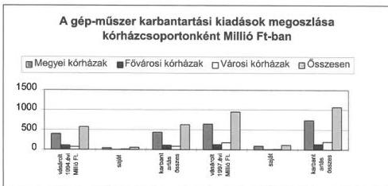

A kisebb javításokat és az üzemeltetéssel kapcsolatos folyamatos (elsősorban hiba megállapító, illetőleg hiba elhárító) feladatokra a vizsgált kórházak többsége műszaki karbantartó csoportot működtetett (a pécsi, nyíregyházi megyei, a komlói, celldömölki városi kórház kivételével, amelyek minden javítást külső vállalkozással végeztettek).

Saját műszerészek alkalmazásánál legfontosabb cél a váratlan meghibásodás esetén a hiba kivizsgálása, a javítás mielőbbi elvégzése vagy megrendelése volt. Ez kiegészült a folyamatos felülvizsgálattal, megelőző karbantartással kapcsolatos feladatokkal. Sem a saját, sem a vásárolt karbantartások esetében nem végeztek számításokat a kórházak az alkalmazott megoldás gazdaságosságára vonatkozóan.

**A saját karbantartó részleg személyi ellátottsága és műszerezettsége kórházanként igen eltérő.**

30

---

II. RÉSZLETES MEGÁLLAPÍTÁSOK

Esztergomban a 4 fős műszerész csoportból orvosi műszerész szakképesítéssel 1 fő, a Szent János Kórház 15 fős karbantartó részlegében felsőfokú végzettséggel 1 fő rendelkezik, Gyulán 4 klinikai mérnököt alkalmaz a kórház.

Szombathelyen a 9 fős műszertechnikai csoport feladata a váratlan meghibásodások azonnali elhárítása, a felügyeletük alá tartozó berendezések rendszeres megelőző karbantartása, de megfelelő műszerek hiányában az előírt biztonságtechnikai méréseket sem tudják elvégezni.

Az egri kórházban 2 fős műszerész csoport működik, a kórház vezetése szerint a sokféle gép-műszer típus, a gyakori típusváltás alkatrész igénye miatt sem gazdaságos saját javítórészleg kialakítása.

A saját karbantartók általában ad-hoc jelleggel végzik munkájukat, éves karbantartási feladattervvel, költségtervvel, valamint az elvégzett éves munkáról készített beszámolóval nem rendelkeznek.

A vizsgált években a kórházak a műszaki ellátás műszerezettségének javítására az összes beruházáshoz viszonyítva kevés pénzeszközt fordítottak és kivételes volt ezen a területen a kórházak közötti együttműködés is. A műszerjavítások területén célszerűbb megoldást eredményezett a földrajzilag egymáshoz közeli kórházak együttműködése, ez azonban csak kivételesen volt tapasztalható.

A debreceni megyei és a berettyóújfalui városi kórház közösen működtet különböző mérőműszereket és tesztelő berendezéseket, így az előírt biztonságtechnikai méréseket külső vállalkozások nélkül tudják elvégezni.

A kórházak egy része a saját karbantartó részleg fenntartását az azonnali beavatkozás, hibaelhárítás érdekében a műtéti, intenzív, diagnosztikai területen fontosnak tartotta, de szakszervizekkel való szerződéskötést egyetlen kórház sem nélkülözhette.

A speciális ismereteket és felszereltséget igénylő karbantartásokra **a kórházak általában 30-40 szakszervizzel állnak szerződéses kapcsolatban**. A szerződésben a munkadíj ellenében (külön felszámított anyagköltség és kiszállási díj mellett) meghatározott gyakoriságú felülvizsgálatok elvégzését vállalja a szerviz (eszköztől függően fél-, negyedévente vagy hetente) illetve meghibásodás esetén meghatározott időn belül (1-3 nap) kötelezettséget vállal az üzemzavar elhárításához szükséges szerelő és anyag biztosítására.

Az eszközök beszerzésekor a szervizelés, alkatrész ellátás folyamatos biztosítását a forgalmazó vállalja, de ennek minősége (gyakorisága) és ára a későbbi szerződés kötések során válik ismertté, és főként a vidéki kórházak számára választási lehetőség hiányában előnytelen.

A mátészalkai kórház műszereinek szervizelését végző budapesti székhelyű vállalkozások esetenként 35-40 E Ft kiszállási díjat, valamint 10-18 E Ft rezsi óradíjat számoltak fel, a vásárolt karbantartás költségei 1994-97. között 295%-ra nőttek.

**A kórházak többsége még a nagy értékű gépek, műszerek vonatkozásában sem alkalmazott egyedi költségfigyelést**, amely az elöregedett műszerpark cseréjével kapcsolatos döntések megalapozását segítené. Ennek hiányát a működőképesség mindenáron való biztosításának kényszerével és be-

31

---

II. RÉSZLETES MEGÁLLAPÍTÁSOK

szerzési források hiányával indokolták. Azonban egy-egy eszköz esetében a javítási költségek nagysága miatt mérlegelni érdemes a döntést.

Az egri kórházban egy 1989. évben beszerzett 648 E Ft értékű ion-meghatározó berendezés javítására 1995-97. évben 579 E Ft-ot fordítottak. A készülék 1998. évben újból meghibásodott, a javításra készült ajánlat 680 E Ft + ÁFA-t tartalmazott, a gazdaságtalan javítás miatt a kórház új beszerzés mellett döntött.

#### 4. EGYES DIAGNOSZTIKAI RÉSZLEGEK TELJESÍTMÉNYVIZSGÁLATA

A technikai fejlődés a diagnosztika szerepét jelentősen megnövelte. A laborautomatákkal, a modern képalkotó berendezésekkel korábban elképzelhetetlen számú vizsgálat elvégzése és a diagnózis felállításában, terápiában való felhasználása vált lehetővé.

A legfejlettebb orvostechnika széles körű igénybe vételének anyagi korlátai a specializált ellátás kialakítását feltételezik. A diagnosztikában használt drága eszközök csak megfelelő szervezettség mellett képesek hatékonyan működni, a koordinálatlan telepítés és a megfelelő kezelő személyzet hiánya miatt a kívánatos kihasználtság nem biztosított. A klinikai szakterület vizsgálat kérései kontrolljának hiányában, **a nem megfelelő javallat (indikáció) következtében nagy számú, felesleges vizsgálatra kerül sor**, miközben szükséges vizsgálatok elmaradnak, késedelmet szenvednek.

Szakmai megítélés szerint a nagy teljesítményű **labor automaták elterjedésével az indokolatlan vizsgálatok száma nőtt**, a rutinszerűen végzett vizsgálatok eredménye 70-80%-ban normális, a rutin vérkép vizsgálatok száma sokszorosa a reális szakmai igényeknek, és mértéktartó becslés szerint a feleslegesen végzett vizsgálatok pontértéke megközelíti az 1 milliárdot (10%).

A rendelőintézeti, kórházi orvosok **nem érdekeltek az indokolatlan CT, MRI vizsgálatok elkerülésében, mert sem őket, sem a kórházi osztályt nem terheli anyagi és szakmai felelősség**. A CT vizsgálatok 5-10%-át minősítette improduktívnak a vizsgált kórházak egy része, amelyeknél más diagnosztikai eszköz igénybevételével elérhető lett volna a vizsgálati cél. (Eközben a vizsgálatra várakozás időtartama 3-4, egyes esetekben 6 hétre nőtt).

Jelentősen több a vizsgálat ott, ahol CT készülék van (a vizsgálati lehetőségnek igényfelhajtó ereje van)

Győr-Moson-Sopron megyében 3 CT működik, a 100 lakosra vetített vizsgálatok aránya 4,7, ezzel szemben a CT-vel nem rendelkező hatvani kórház ellátási területén ennek csak 26%-a (elérhető CT készülék 80 km-re található). Az Uzsoki utcai kórházban a készülék közelsége miatt lakosság arányosan szinte ugyanolyan arányban veszik igénybe a CT vizsgálatokat, mintha saját készülékkel rendelkeznének.

A lakosság ellátásában mutatkozó egyenlőtlenség vélhetően kétirányú: készülékkel nem rendelkező kórházban indokolt esetben is maradt el vizsgálat, készülékkel rendelkezők lazább indikáció mellett is vizsgáltak. Ugyanakkor a működtetőknél rendszeresen előfordult kisebb-nagyobb finanszírozási kerettúllépés.

32

---

II. RÉSZLETES MEGÁLLAPÍTÁSOK

A laborautomaták, a képi diagnosztikát szolgáló nagy értékű műszerek összehangolatlan telepítése következtében gyakran indokolatlan párhuzamos kapacitások jöttek létre, működtetésükben mind szakmai, mind gazdasági szempontból sok a célszerűtlen elem, nem megfelelő a hatékonyság.

A szakellátásban teljesítményen alapuló finanszírozást vezettek be 1993. évben, amely a teljesítmények növelésére és nem a szakmai és gazdasági hatékonyság javítására ösztönzött. A teljesítmények növekedése az elmúlt években látványos volt, ugyanakkor a zárt rendszerű kasszák miatt a teljesítménydíjak devalválódtak, így a teljesítmények növelésében való érdekeltség csökkent. A jövőben elsősorban az indokolatlan költségek megszüntetésével, a hatékonyság javításával tudnak a kórházak a működtetésbe pótlólagos forrásokat bevonni.

Ez új tervezési és értékelési eljárások, módszerek kidolgozását is igényli, mert a kórházak hagyományos előirányzatokon alapuló költségvetési tervezési, elszámolási és információs rendszere nem alkalmas az erőforrások felhasználásának nyomon követésére, annak megítélésére, hogy az azokkal való gazdálkodás megfelel-e valamilyen hatékonysági kritériumnak. Ezért a kijelölt klinikai laboratóriumokra (automatákra), nagy értékű képi diagnosztikai eszközökre (CT, MRI) az országos intézetekkel közösen dolgoztunk ki az ellenőrzés keretében teljesítmény vizsgálati adatlapokat.

A vizsgálatba bevont kórházak egy része a működésre (teljesítményekre, költségekre) vonatkozó adatokat nem tudta szolgáltatni, mert azokat korábban nem rögzítette, nem gyűjtötte. (Az adathiányos, értékelhetetlen adatlapokat az elemzésnél figyelmen kívül hagytuk). További korlátozó tényező volt, hogy a vizsgálat csak az önkormányzati kórházakra terjedt ki a CT, MRI vonatkozásában is (a vizsgált 25 kórház közül 16-ban üzemel CT, 6-ban MRI), azonban az adott terület ellátásában jelentős a szerepe (néhol kizárólagosan vagy párhuzamosan) az egyetemi klinikák, országos intézetek által üzemeltetett eszközöknek.

## 4.1. A klinikai laboratóriumok (automaták) teljesítményvizsgálata

### 4.1.1. A vizsgált laboratóriumok szervezettsége

A vizsgált kórházak központi laboratóriumainak részesedése az ellátásban 1997-ben 24%-os, jellemzőik alapján 2 csoportra oszthatók:

- A 12 megyei kórház-rendelőintézeti központi laboratórium részt vesz a megyeszékhely, a megye egy részének háziorvosi körzetei, valamint a kórházi járó- és fekvőbeteg-részlegek laboratóriumi diagnosztikai ellátásában. De emellett a speciális technikai feltételeket igénylő központosított vizsgálatok egy részét is elvégzik. A legnagyobb, országosan is egyedülálló a megyei szintű központosítás Vas megyében, ahol a vizsgálatok 70%-át a megyei kórház laboratóriuma végzi. Ezzel szemben Pest megyében a két megyei kórház (Szent Rókus és Flór F. kórház) részesedése a 20%-ot sem éri el.
- A 14 városi kórház-rendelőintézeti laboratórium a területi ellátási kötelezettségébe tartozó alapellátás és saját kórházi részlegeik többnyire rutin vizsgá-

33

---

II. RÉSZLETES MEGÁLLAPÍTÁSOK

lati igényeit elégti ki, de jelentősen nőtt automatákkal való felszereltségük a megyei kórházak által elvégezhető immunológiai vizsgálatoknál.

A laboratóriumok működési feltételeit jellemző sajátosságok:

- **A megyei kórházakban a központi laboratórium mellett un. osztályos kislaboratóriumok, ill. más szervezeti egységhez tartozó laboratóriumok is végeztek vizsgálatokat.**

A zalaegerszegi kórházban egy tucat osztályos kislaboratórium mellett önálló izotóp-diagnosztikai részleg, a patológia és a vértranszfúziós osztály is végzett laborvizsgálatokat, amelyek a korábbi évek autark fejlesztésének következtében jöttek létre és fajlagosan drágábban voltak üzemeltethetők, költségeik a működtető részleget terhelték, minőségbiztosítás szempontjából sem voltak képesek a követelményeket kielégíteni.

Az elvileg azonos besorolású intézmények teljesítményének értékelését megnehezítő szervezeti és ellátás-szervezési különbségek egyben felhívják a figyelmet a gazdaságtalan, alacsony hatékonyságú működtetésre, így pl. immunkémiai vizsgálatokat a megfelelő műszerezettséggel rendelkező központi laborok mellett önálló izotópdiagnosztikai részlegekben - párhuzamosan kiépített műszerekkel - is végeznek a győri, a debreceni, az egri, a tatabányai, a zalaegerszegi megyei és a fővárosi Szent János kórházban.

- **A városi kórházak** laboratóriumainak vizsgálati palettája lényeges eltéréseket mutat, mivel egyes helyeken a rutin kémiai és hematológiai vizsgálatok mellett a **költséges és magas pontszámú hormon, gyógyszer és bizonyos mikrobiológiai vizsgálatokat is végeznek.**

A vizsgálatok átlag-pontértéke 25,1 (Celldömölk) és 87,1 pont (Gyöngyös) között szóródik. Míg Celldömölkön csak a rutin vizsgálatokat végzik, addig Gyöngyösön magas pontszámú, de költséges hormon, gyógyszer, tumormarker vizsgálatokat is.

- A laborvizsgálatok **finanszírozása attól függően eltérő, hogy azt a járó- vagy a fekvőbeteg-ellátás keretében végzik.** Az intézmények gazdasági érdeke a vizsgálatok járóbeteg-ellátásban történő elvégzése, elszámolása (a kórházi osztályra történő felvételt megelőzően elvégzett laborvizsgálatot külön térítik, a felvételt követően végzett vizsgálat csak a fekvőbeteg-ellátás homogén betegcsoportonkénti teljesítményei keretében térül meg.)

Az 1997. évi vizsgálatokból 47,5%-ot a járóbeteg-ellátásban számoltak el a vizsgált intézmények, ezen belül azonban jelentős a szóródás. Míg a városi kórházak a vizsgálatok 50%-át, a fővárosi intézmények - az önállósult kerületi rendelőintézetekben működő laboratóriumok hatásaként - csak 38%-át, a megyei kórházak 49%-át végezték a vizsgálatoknak a járóbeteg-ellátásban, az intézményenkénti szélső értékek viszont 16-64% között mozogtak. (Az országos átlag a kizárólag járóbeteg-ellátást végző önálló szakrendelők teljesítményei hatására 60%)

Egy vizsgálat átlagpontszáma 1997. évben az országos átlagnak megfelelő (75 pont/vizsgálat), de intézményenként az eltérő vizsgálati összetétel miatt válto-

34

---

II. RÉSZLETES MEGÁLLAPÍTÁSOK

zó. (A fővárosi intézményeknél 98,5, megyei kórházaknál 75,2, városi kórházaknál 65,1 pont/vizsgálat).

- A laborokat többnyire a kórházak üzemeltetik, azonban 2 (a nyíregyházi megyei és a soproni városi) kórházban a labor **funkcionális privatizációját** követően 5 éves időtartamra az üzemeltetést egy vállalkozás vette át. (Ez utóbbiak költségadatairól a vizsgálat megbízható információkat nem szerzett.)
- A bakteorológiai vizsgálatokat a megyék többségében az ÁNTSZ megyei intézeteinek laboratóriumai végzik, de néhány megyei és városi kórház párhuzamosan kifejlesztette az ehhez szükséges feltételeket.

A laborvizsgálatok a betegellátás, a sürgősség szempontjából 3 csoportba sorolhatók :

- sürgős vizsgálatok (akut esetben tájékoztatják az orvost a beteg állapotáról),
- rutin diagnosztikai vizsgálatok a folyamatos betegellátásban segítik az orvost a diagnózis felállításában, a terápia hatékonyságának megítélésében,
- speciális feltételeket igénylő vizsgálatok, amelyek nem tekinthetők sürgősnek, mintaszállítással a vizsgálatok központosíthatók, az eredmény egy-két napon belül továbbítható.

A laboratóriumi szolgáltatás, az évszázad második felében világviszonylatban kórház-centrikusan fejlődött. Hazai viszonylatban is ez volt jellemző a kórház-rendelőintézeti integráció keretében. A kórház központi laboratóriuma végezte az analitikai tevékenységet és a rendelőintézeti laboratóriumok döntő mértékben mintavevő-helynek rendezkedtek be, valamint műszerezettséget kevésbé igénylő vizsgálatokat végeztek.

Az 1990-es évek elején a spontán módon lezajló dezintegráció keretében önálló rendelőintézetek jöttek létre és önálló laboratórium kialakítására törekedtek. Ez műszerberuházással és létszámtöbblettel járt, felesleges párhuzamosságokhoz vezetett.

A laboratóriumi vizsgálatok döntő többsége nem tekinthető sürgősnek (sürgős esetben 30–60 percen belül kell eredményt biztosítani). A laboratóriumok többségében a mintavételtől számított 4–6 óra múlva továbbítják a leleteket. **A sokprofilú kórházi és önálló rendelőintézeti laboratóriumokban végzett vizsgálatok 70–80%-a jól központosítható.** A 10–12 km-es körzetben, az 1–2 órás időközönként összegyűjtött minták elemzése egy laboratóriumi központban elvégezhető és a leletkibocsátás 3–4 óra múlva biztosítható lenne. A kórház-rendelőintézeti laboratóriumban csak a „sürgős” vizsgálatok végzése lenne indokolt, amelyhez a személyi és technikai feltételek feladatárányosan pontosíthatók.

A főváros ellátásában 65 laboratórium vesz részt. Az országos intézet (OLI) szerint a 25–28 millió jól automatizálható és szállítható rutin klinikai kémiai, hematológiai és immunkémiai vizsgálat. 4–5 laboratóriumi központban, kevesebb létszámmal, nagyobb hatékonysággal és gazdaságosabban lenne teljesíthető. Ugyanakkor, a fekvőbeteg-intézményekben fenntartott „sürgősségi” laboratóriu-

35

---

II. RÉSZLETES MEGÁLLAPÍTÁSOK

mok a folyamatos betegellátással kapcsolatos vizsgálati igényeket teljesíteni tudnák.

A vizsgálati anyagok szállítási lehetősége nem korlátlan, ezért megfelelő munkamegosztással működtethetők a laboratóriumok. Azonban vitatható, hogy a megyei kórházakon kívül a városi kórházakban is indokolt lenne a költséges, nem sürgős, nem nagy tömegű, de speciális műszerezettséget igénylő hormon és hasonló immunkémiai vizsgálatokat végezni, mert a telepített műszerek kihasználtsága alacsony, a megbontott költséges reagens készletek egy része az alacsony vizsgálat szám miatt veszendőbe megy, az országos intézet értékelése szerint a vizsgálatok minőségbiztosítása sem megoldott.

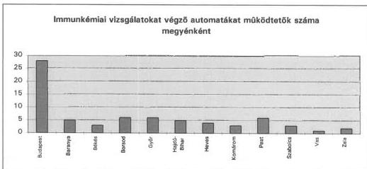

**Ésszerű központosítás esetén az előnyök a felszabaduló területből, a laborautomaták kapacitásának jobb kihasználásából, a háttér műszerek meglétéből, létszám-megtakarításból, az egységes informatikai rendszer telepítéséből és az analitikai tevékenység fokozott minőségbiztosításából származnak.**

#### 4.1.2. Az automatizáltság és a létszámhelyzet összefüggései

A vizsgált laboratóriumok feladatainak nagyságrendje eltérő, többségük jól automatizált. Az elvégzett vizsgálatok magukban foglalják a klinikai kémiai (50-55%), a hematológiai (18-22%) és az immunkémiai, valamint a mikrobiológiai vizsgálatokat. Ezek 70%-át különböző teljesítményű automatákkal végzik.

A nem automatizált (manuálisan), esetleg félautomatákkal végzett vizsgálatok aránya kb. 30%, ide tartoznak a vizeletminőségi, a vércsoport, véralvadási, szerológiai, bakterológiai vizsgálatok. A laborok által használt automatákon végezhető vizsgálatok főbb típusai:

- **A kémiai automaták** teljesítménye 100-800 vizsgálat/óra között változik, amely 4 órás vizsgálati időt figyelembe véve műszakonként 400-3.200 analízis elvégzését teszi lehetővé. A vizsgált intézményeknél **a fejlesztések hatására a kémiai automaták teljesítménye megkétszereződött (228%)**, az elvégzett vizsgálatok alapján **kihasználtságuk azonban 18,8 %-ponttal csökkent**, 1997. évben 43,9%-os volt. A nem jól megválasztott berendezés miatt azonban több helyen csak 1 nagy teljesítményű

36

---

II. RÉSZLETES MEGÁLLAPÍTÁSOK

automata áll rendelkezésre, így ennek meghibásodása esetén nincs tartalék berendezés.

- **A hematológiai automaták** teljesítménye 80-100 vizsgálat/óra, ezek **kapacitása 4 év alatt 77%-kal nőtt, miközben a kihasználtságuk csökkent (48,1%)**. A nagy teljesítményű, differenciált vérképet szolgáltató automaták telepítése az elmúlt 2 évben fokozódott, jóllehet ez a középnagyságú laboratóriumokban szakmailag nem indokolt (egyszerű mikroszkópos vizsgálattal elvégezhető), sőt sok helyen a nagy teljesítményű automatákon végzett elemzés mellett továbbra is igénylik a vérkenet vizsgálatokat.
- **Az immunkémiai automaták** száma növekvő, egyenkénti teljesítményük 40-80 vizsgálat/óra, azonban az elvégzett vizsgálatok száma alapján **kihasználtságuk csupán 20,7%-os**.

A vizsgált kórházakban az egyes automaták kapacitásváltozását és kihasználtságát az alábbi ábrák szemléltetik:

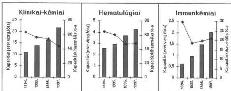

**Az automaták üzemeltetéséhez és a nem automatizálható feladatokhoz szükséges létszám** megítélésénél figyelembe kell venni a labor részvételét a mintavételben (ezek száma intézményenként igen különböző), továbbá az ügyelet, távollétek miatt helyettesítéshez szükséges létszámot.

Az automatizálás növeli a mérés pontosságát és az elvégzett vizsgálatok számát, a számítógéppel vezérelt automaták „on-line” kapcsolata az adatfeldolgozást végző számítógépekkel jelentősen csökkenti az adminisztráció élőmunka-igényét. A nagyobb munkahelyeken megkezdődött a bar-code alkalmazása, melynek révén az adminisztrációs munka csökkenthető. Az automatizáltság mértéke és az élőmunka igény között nincs egyenes arányosság, figyelembe kell venni a mintavétel, a minta-előkészítés, a mérőberendezések üzemeltetése és kiszolgálása munkaerő igényét is.

A minimumkövetelmények szerint szükséges asszisztens létszám meghatározásánál 30 ezer/év vizsgálatot kell figyelembe venni, ez azonban nem tesz különbséget a manuális és automatizált munkafolyamatok között. **Automatától függően az egy asszisztens által végzett vizsgálatok száma tág határok között** (96 ezer/évtől 672 ezer/év) **mozgott**. Mintaelőkészítést egy-

37

---

II. RÉSZLETES MEGÁLLAPÍTÁSOK

két asszisztens végez, azonban egyes automaták esetében erre nincs szükség (a szárazkémiai automaták közvetlenül a vércseppből végzik az elemzést).

A legtöbb vizsgált laboratóriumnál nincs arányban a meglevő asszisztensi létszám a minimumkövetelményekben meghatározott 30 ezer vizsgálat/év alapján számított létszámszükséglettel. A vizsgálat során szinte valamennyi labor asszisztensi létszámhiányt jelzett, amely a minimumkövetelményekben meghatározott alacsony értékkel, a vérvételi helyek számával, az adatbevitel, illetve az informatika helyzetével, az ügyelet miatti terheléssel függ össze.

A laboratóriumok működéséhez szükséges munkaerő igény meghatározását számos bizonytalansági tényező hátráltatja. A laboratóriumokban foglalkoztatott asszisztensek létszáma az elmúlt 15 évben az automatizálás ellenére sem csökkent, amelyben az alábbi okok is szerepet játszottak:

- a rendelkezésre álló létszám leépítésével kapcsolatos szociális indokok, a létszámcsökkentésben való érdekeltség hiánya,
- a technikai feltételek biztosításának bizonytalansága (tartalék automaták hiányában a vizsgálatokat manuálisan kell elvégezni meghibásodás esetén),
- szakképzett laborasszisztensek foglalkoztatása a betanított munkakörökben (pl. mintavétel, vagy adminisztrációs feladatokban).

Előbbi okok miatt azonos vizsgálat szám mellett az egyik munkahelyen 16, máshol 30-32 asszisztenst foglalkoztatnak.

A széles vizsgálati palettával rendelkező fővárosi Szent István kórházban 1 millió vizsgálatot 18-19 asszisztens végez, ugyanennyi vizsgálatra a debreceni Kenézy Gy. kórházban (mikrobiológiai vizsgálatokat nem végeznek, önálló izotóp labor működik) 30 asszisztens jut.

### 4.1.3. A laboratóriumi vizsgálatok költséghatékonysága

A vizsgált laboratóriumok költségei 1996-97. évben 2,2-2,4 Milliárd Ft-ot tettek ki, az 1 vizsgálatra jutó költség átlagosan 80-87 Ft volt. Ezen belül intézményenként a szervezeti megoldástól (pl. osztályos kislabor, illetve önálló izotóp diagnosztikai labor működik), a költségelszámolás módjától (pl. vérvételi eszközöket a labor vagy a kórházi osztályok költségei között számolják el) és az eltérő vizsgálati összetételtől függően, jelentős a szóródás.

A laboratóriumok teljesítményét kifejező WHO pontértékre számított költség (Ft/pont) alapján:

- az üzemeltetők 54%-ánál nem haladja meg az átlagos 1,2 Ft/pont értéket (1 fővárosi, 6 megyei, 7 városi kórház laboratóriuma adata),
- 6 üzemeltetőnél 1,2-1,5 Ft/pont,
- 1 fővárosi, 2 megyei, 3 városi kórháznál 1,7-2 Ft/pont a labor átlagköltsége,

38

---

II. RÉSZLETES MEGÁLLAPÍTÁSOK

A költségeken belül a reagens és fogyóanyag felhasználás 43%-ot képviselt, és az elmúlt 4 évben az áremelkedések és az új mérőberendezések telepítésének következtében dinamikusan növekedett.

A laboratóriumok 90-92%-a gyári reagensekkel dolgozik, saját készítésű reagensek használata az elmúlt évtizedben jelentősen csökkent. A reagens-készlet beszerzését meghatározza a rendelkezésre álló automata, mivel a „zártrendszerű” automatákhoz csak a gyártó által ajánlott és ennek megfelelően kiszerelt reagens-készletek használhatók. Eltérő az egyes automaták fogyóanyag-költsége is: például egyszer-használatos műanyagcsövek használata bizonyos készülékek esetében kötelező és ez jelentős költségnövekedést eredményez.

A reagens-költség függ a beszerzési ártól is. A kereskedelmi árak közötti eltérés 50 – 150%-os különbségeket mutat. A drágább reagensek hátterében gyakran a „mérőberendezés” függőség áll fenn és a felhasználó kénytelen egy meghatározott terméket vásárolni, mivel a szakszerviz másként nem vállalja a mérőberendezés szervizelését. Más esetekben a mérőrendszer számítógépes vezérlése és a vizsgálat kivitelezésének programozása csak a gyártó által kiszerelt reagens-készletekkel lehetséges.

Az automaták egy része „lízing” formájában üzemel a laboratóriumokban, amelyeknél a beszerzési ár a reagens-költségben jelenik meg. Más automaták „kihelyezésre” kerülnek, nem vásárolhatók meg, de a laboratóriumok a „zártrendszerű” mérőberendezéshez kénytelenek a gyártó által forgalmazott reagenseket vásárolni.

A reagens-költség alakulásában sok esetben meghatározó „lízing” kiváltó oka két jellemző csoportba sorolható:

- Az ABBOTT, AxSym, IMX, TDX immunkémiai automatákat a gyár kihelyezi, nem vásárolhatók meg, de a használatba adásukat meghatározott mennyiségű reagens-készlet több évre vállalt vásárlásával kapcsolják össze. A reagens-készlet mennyisége nincs mindig arányban a laboratórium feladataival (a felesleges készlet felesleges vizsgálatokhoz vezet).

A vizsgált megyei kórházak mindegyikénél, és a városi kórházak több, mint felénél jelentős számban volt kihelyezett készülék. Az immunkémiai automaták gépidő kapacitását szinte kizárólag a kihelyezett gépek biztosították. A drága üzemeltetés iránti viszonylagos költségérzéketlenséget mutatja, hogy ha nem merül fel beruházási forrásigény, akkor a drága működtetést már nem gondolják meg az intézmények.

- A lízing másik motívuma, hogy az intézmény (önkormányzat, tulajdonos) anyagi forrás hiányában, az amortizálódott műszerállomány pótlását nem tudja megoldani. Vállalja, hogy a gyártó, vagy kereskedelem által telepített mérőberendezéshez szállított reagens-készleteket magasabb áron vásárolja 3 – 5 éven keresztül, majd a megegyezés szerint a műszer a tulajdonába kerül.

Szinte csak térítésmentesen használatra adott zártrendszerű automatákkal (Kodak – Ektachem, Cell-DYN, ES-300 stb.) dolgozik a Komárom-Esztergom megyei kórház, így nem véletlen a kiugróan magas reagens költségszintje.

39

---

II. RÉSZLETES MEGÁLLAPÍTÁSOK---

A reagens költségek néhány vizsgálatra jellemző adatát a csatolt 12-14. sz. diagramok szemléltetik.

Jelenleg a megyei és a városi önkormányzati kórház-rendelőintézeti **laboratóriumok 70 – 75 százalékban**, továbbá az önálló rendelőintézeti laboratóriumok többségében **található egy, vagy több kihelyezett, vagy un. reagens lízingbe adott mérőeszköz, amely zárt rendszerű vagy drága üzemeltetésű**.

Az OLI szakmai megítélése szerint kémiai analizátoroknál előnyös a reagens szempontból nyitott rendszerek használata, ahol a metodikai adaptáció különböző cégek által gyártott, megfelelően jó minőségű reagensekkel keresztülvihető. Más a szempont a célkészülékek (immunkémiai, endokrinológia) használatakor. Itt kihelyezett készüléken történik a mérés, a készüléket biztosító cég saját reagenseivel.

A laborok **szervizelési, karbantartási költségeinek** összehasonlítása az eltérő tulajdoni szerkezettel együtt járó ingyenes szervizelés, az automaták számának és életkorának nagymértékű különbségei miatt nem mutat reális képet.

A kórházak szinte mindegyike valamelyik saját tulajdonú laborautomatára kötött szerviz szerződést. (A pécsi megyei kórház, a gyöngyösi és a berettyóújfalui városi kórház egy automatára sem kötött szerviz szerződést) Az esetek döntő többségében a gyártó cégeknek saját szervizcége van és csak saját szerviz esetén vállalnak felelősséget a berendezés működéséért, valamint az alkatrész-utánpótlásért.

Olyan eszközöket is használni kényszerülnek az intézmények, amelyeknek szervizelési költségei az új generációs berendezések előtérbe kerülése miatt magasak (a miskolci megyei kórházban a Monarch 2000 kémiai automata javítására a gép beszerzési árának 45%-át költötték 1994 – 1997. között).

Az **üzemzavarok** számának megfelelően a kieső időt dokumentáló kórházak közül 1997-ben a nyíregyházi megyei kórháznál 48 üzemzavar mellett 48 nap esett ki a működésből, a zalaegerszegi megyei kórháznál 45 üzemzavarra 87 nap kiesés jutott. Mind a két kórháznál rendkívül elöregedett a laborautomaták átlagéletkora. Ezen kórházaknál a szervizelést csak 3 napon belül biztosították az esetek 80, illetve 60%-ában.

A betegellátást a fenti kórházak is folyamatosan megoldották, elsősorban manuális módszerekkel túlmunkában. Egyetlen alkalommal fordult elő, hogy két napig csak sürgős vizsgálatokat végeztek a nyíregyházi megyei kórházban.

A vizsgált kórházak közül 4 megyei kórház nem vezette a laborautomatáinak műszerkönyvét, így a meghibásodásokból adódó kieső idők nem mindenhol állapíthatók meg, csak részben dokumentálták.

A szervizdíjak rendkívül szóródnak. Összehasonlítani csak azonos eszközöket lehetséges, így megkíséreltük a viszonylag gyakori **Hitachi 704-es** kémiai automata szervizdíjait elemezni. A 2–3-szoros különbség túlzott, különösen a vidéki kórházak kiszolgáltatottsága magas, mert a szakszervizek általában csak

---40

---

II. RÉSZLETES MEGÁLLAPÍTÁSOK

budapesti telephellyel működnek, s ez egyéb hátrányok mellett a kiszállási költség, valamint az úton töltött idő felszámítása miatt számottevő költségtöbblettel jár.

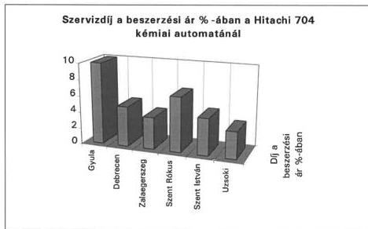

## 4.2. A képalkotó eljárások nagy értékű berendezéseinek (CT, MRI) teljesítményvizsgálata

### 4.2.1. Nagy értékű képi diagnosztikai berendezésekkel való ellátottság

A technikai fejlődés a hagyományos röntgen berendezések mellett új képi diagnosztikai eljárások bevezetését eredményezte az egészségügyi ellátásban. **A nagy értékű berendezések az elmúlt másfél évtizedben jelentek meg a hazai ellátó rendszerben, elterjedésük viszonylag gyors ütemű volt, 1998 évben 52 CT és 14 MRI üzemelt.** A vizsgálatban szerepelt 25 önkormányzati kórházban 16 CT (ebből 2 városi kórházban) és 6 MRI működött. Bár a vizsgált kórházak elhelyezkedése, nagysága jellemző a magyar kórházak átlagára, mégsem ítélhető meg csupán ezen intézmények adataiból egy-egy régió CT, MRI ellátottsága, miután a nem önkormányzati kórházakban (egyetemi klinikák) működő készülékek aránya magasabb (pl. a főváros MRI ellátásában önkormányzati intézmény nem vesz részt).

A statisztikák szerint a járóbeteg-ellátásban 100 lakosra 88 képi diagnosztikai vizsgálati eset jut (9 millió vizsgálat/év), amelynek többsége hagyományos röntgen és az egyre szélesebb körben terjedő ultrahangos vizsgálat.

A járóbetegeken végzett röntgen, ultrahang vizsgálatokat a WHO pontok keretében külön finanszírozzák, a fekvőbetegeken végzett ilyen jellegű vizsgálatokat a HBCS tartalmazza. A CT, MRI vizsgálatok száma évente 700-800 ezerre tehető, ezen eszközök beszerzési ára készüléktípustól függően 70-200 millió Ft között mozog, a finanszírozásukat szolgáló különkeretes kassza előirányzata 1998. évben 5,4 Milliárd Ft volt (az 1999. évi előirányzat már 7,3 Milliárd Ft).

41

---

II. RÉSZLETES MEGÁLLAPÍTÁSOK

Az MRI egyenlőtlen telepítése következtében a 15 készülék közül 4 Budapesten, 1 Pest megyében, 5 a Dunántúlon, 4 a Tiszántúlon és Észak-Magyarországon csak 1 készülék működik.

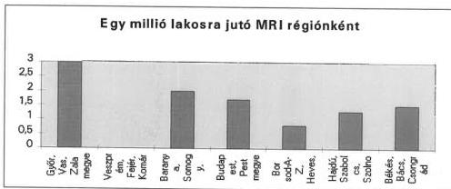

A nemzetközi gyakorlatban ismert CT, MRI ellátottságot jellemző mutatók alapján Magyarország előkelő helyezést ér el. (Pl. Angliában 500.000, Magyarországon 600.000 lakosra jut egy MRI.)

**A nagy értékű képi diagnosztikában nem alakult ki a mérések minőségbiztosítási követelményrendszere, a végzett vizsgálatok szakmai adat-feldolgozási rendje.** Az adatszolgáltatás az ellenőrzés során is nehézséget okozott:

- Bizonyos adatokat az intézmények nem tartanak nyilván (pl. a CT, MRI költségeit nem különítik el a radiológia költségeitől, a vizsgálat kéréseket fekvőbeteg osztályonként, a szövődményeket nem rögzítik) vagy eltérő módon regisztrálják az adatokat (pl. esetszám, a felhasznált kontrasztanyag).
- Különböző szempontok szerint tartják nyilván az ellátandó lakosság számát (az egyes intézmények ellátási területe között nagy átfedés mutatható ki).
- Nincs definiálva az improduktív vizsgálat fogalma, az adatokból nem állapítható meg, hogy az elvégzett vizsgálatok közül mennyi volt a szakmailag indokolatlan.

Az elvégzendő CT, MRI vizsgálatokat a klinikai szakterület orvosa kezdeményezi, a radiológusnak minimális a ráhatása az elvégzett vizsgálatok számára, milyenségére. Vizsgálatot csak akkor tagadhat meg, ha az megítélése és szakmai ismeretei szerint a beteget veszélyeztetné (kontrasztanyag érzékenység, klausztrofóbia stb.).

A radiológiai szakmai kollégium elkészítette a klinikai gyakorlat befolyásolásához, és az ellenőrzéshez szükséges **szakmai protokollt**, de a szakmaközi egyeztetésekre nem került sor, így az ellenőrzési gyakorlatba nem épülhetett be.

A klinikus közvetlenül nem érdekelt az indokolatlan, vagy várhatóan alacsony találati arányú vizsgálatok elkerülésében, mert sem őt, sem osztályát nem terheli anyagi és szakmai felelősség. A jelenlegi adatszolgáltatásból azt lehet

42

---

II. RÉSZLETES MEGÁLLAPÍTÁSOK

megállapítani, hogy mennyiben különbözött a beküldő és a végleges diagnózis kódja, ez alapján viszont lehetetlen kimutatni, hogy az elvégzett vizsgálat indokolt volt vagy indokolatlan. Az indokolatlan (improduktív) vizsgálatokat nem definiálták, az egyébként is korlátozott finanszírozási keret mellett az indokolatlan beutalások rontják a valóban rászorulók esélyeit.

A vizsgált kórházakban a nagy értékű **CT berendezések egyharmada már technikailag és erkölcsileg elavult**, két éven belül indokolttá válik a készülékek közel felének cseréje (a CT-k 69 %-a 1987-92. között, 12 %-a 1993. évben került beszerzésre, és csupán 3 CT-t szereztek be az elmúlt 3 évben). A különböző típusú és életkorú CT készülékekkel végezhető vizsgálatok minősége eltérő, azonban a finanszírozásban nincs különbség a díjtételekben.

A Szombathelyen üzemelő 10 éves CT elavult, lassú berendezés, nagy sugárterhelést jelent a betegre, de bizonyos esetekben a kezelő személyzetre is. (Pl. a jó minőségű felvétel érdekében a kontrasztanyagot folyamatosan szükséges adagolni, mert nem rendelkeznek adagoló injektorral)

Az 1987. és 1997. között üzembe helyezett 16 CT 6-féle gyártótól származó, eltérő korú és kiépítettségű berendezés. (Ezek közül 14 az önkormányzat, 2 az üzemeltető vállalkozás tulajdonában van.) Az egyes típusok képminőségben a specifikációjukban eltérőek. A 16 CT közül 4 képviseli a jelenlegi csúcstechnikát. **A kórház feladatától, betegforgalmától függ, hogy milyen típusú készülékekkel elégíthető ki a szükséglet. Jelenleg nincs még iránymutatás sem arra nézve, hogy milyen készülék kell egy rutinfeladatot ellátó városi kórházba, vagy a progresszív ellátást biztosító megyei kórházba.**

A vizsgált MRI készülékek 1994-97. közötti gyártásúak, amelyek néhány tekintetben eltérőek (pl. mágnes típusában, mágneses erőben, kapcsolt perifériákban és segédberendezésekben).

A szakmai kollégium 1992-ben tett javaslatot a CT és MRI berendezések telepítésére, ekkor azonban 23 CT telepítése már megtörtént. A tulajdonos önkormányzatok, illetve a kórházak döntései a felállított sorrendet felborították, ezek a készülékek utólag kerültek a finanszírozó által befogadásra, illetve jelenleg is több befogadásra váró kérelem kielégítetlen. **A befogadások rendje nem kellően szabályozott a CT és MRI esetében.** A CT és MRI telepítésénél az ellátási igényeket figyelmen kívül hagyó, koordinálatlan, lobby érdekek vezette döntések következménye, hogy jelenleg Budapesten 18 CT működik és továbbiak telepítését is tervezik.

A finanszírozó munkáját az 1996. évben létrehozott Diagnosztikai Szakértő Bizottság segíti, melynek feladata a vizsgálati keretek felosztásának, az OEP és az üzemeltetők közötti szerződések előkészítése.

A területi normatívához nem illeszthető ellátások engedélyezése a népjóléti miniszter hatásköre. A vizsgált időszakban a miniszter 1996 decemberében a kerepestarcsai CT és MRI, a gyulai kórház MRI finanszírozási szerződésének befogadásához járult hozzá.

43

---

II. RÉSZLETES MEGÁLLAPÍTÁSOK

A készülékek beszerzési árának összehasonlítását a széles típusvariáció, a beszerzési évek közötti infláció, illetve műszaki fejlődés miatti árnövekedés lehetetlenné teszi. Különböző a CT-k kiegészítő berendezésekkel való felszereltsége, de ezek tényleges hasznosításáról nincsenek adatok. (Pl. 3 működtető rendelkezik csontdenzitometriás fantommal, azonban egy általános célú CT ilyen használata rutinszerűen nem gazdaságos.)

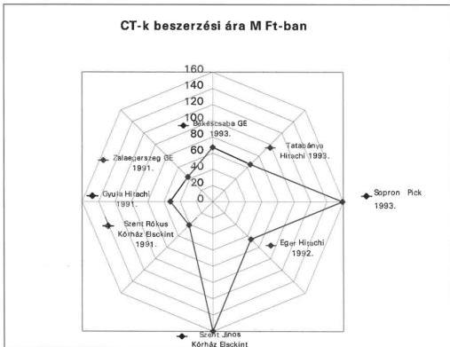

A CT berendezéseken 1994. évben 116.349, 1997. évben összesen 132.316 vizsgálatot végeztek, az egyes készülékeknél a szélső értékek tekintetében 3-szoros eltérés tapasztalható. (Békéscsaba városi kórházban 5.012, Nyíregyháza megyei kórházban 16.781 vizsgálat/év). Eltérő az egyes testtájékok vizsgálatának időigénye (pl. koponya kb. 10-25 perc, mellkas kb. 45-50 perc), az eltérő vizsgálati összetétel miatt különböző az egy órára jutó vizsgálatok száma is. Két műszakban (napi 12 órában) átlagosan 20-40 vizsgálatra kerülhet sor. Nyíregyházán 70, Miskolcon 60 vizsgálat/nap átlagot mutattak ki az ügyeleti időben végzett vizsgálatokkal együtt.

Az elvégezhető vizsgálatok száma a vizsgálat típusa mellett függ a berendezéstől, az üzemeltetési rendtől egyaránt. Ez utóbbi alapján:

- Vasárnap egyik üzemeltető sem, szombaton mindössze 6 működik, ezen túl készenléti ügyeletet látnak el.
- A napi műszakszám általában kettő (Békéscsabán a telepítést követően, illetve Tatabányán és a Szent János Kórházban csak egy).

44

---

II. RÉSZLETES MEGÁLLAPÍTÁSOK

- Az időalapot csökkenti az előre tervezett szerviz, valamint a meghibásodások miatt kiesett munkaidő (átlagosan közel 10%). A Szent Rókus Kórházban működő 1991. évi beszerzésű CT pl. 1996. évben 56 napot nem üzemelt meghibásodás miatt. Rossz üzemeltetési hatékonyságot jelez, hogy egyedül Zalaegerszegen végzik a szervizt szombat délután, illetve éjszaka, 5 helyen hétköznap délután, 9 helyen hétköznap délelőtt.
- A működési rendből a tényleges üzemidő nem számolható, mert több intézményben munkaidőn túl is végeznek vizsgálatokat (sürgős eseteken túl). Folyamatos működést főként vállalkozások által üzemeltetett CT-knél jeleztek, amelyek a vizsgálatszám növelésében a keret maximális kihasználásában érdekeltek.
- A működési órákat befolyásolja a berendezéshez szükséges munkaerő rendelkezésre állása. A radiológiai osztályokon belül általában un. forgórendszerben biztosítják a vizsgálatokhoz szükséges orvosokat, néhány helyen a második műszakot, illetve az ügyeletet vállalkozással kötött szerződés útján működtetik

**Az MRI vizsgálati igények az ellenőrzött időszak éveiben ugrásszerűen megnőttek** (pl. az egri kórházban 1994. évben 72, 1997. évben 577 vizsgálatot kértek az osztályok MRI hiányában más kórházaktól, a telepítést követően elsősorban a miskolci kórháztól).

A vizsgált MRI berendezéseken végzett vizsgálatok számában jelentős különbség tapasztalható, amely az ellátási terület vizsgálati igényeit és MRI -vel való ellátottságát is tükrözi, de átfedések is tapasztalhatók az ellátásban.

Gyulán 1997. évben 5443 vizsgálatot végeztek, de a megyéből a jól elérhető szegedi berendezésen is vizsgálnak beteget, ezzel szemben a több megyét is ellátó, az Észak- Magyarországi régióban egyedüli miskolci MRI-n végzett vizsgálatok száma 12234 volt.

A soproni városi kórházba MRI-vizsgálatra küldők közül a tatabányai kórház részesedése a legnagyobb, 1997. évben az általuk küldött betegek utáni teljesítmény az összes pontérték 23,2%-át tette ki. Tatabánya a 90 km-rel közelebbi Győri Nemzetközi Egészségügyi Központban lévő MRI ellátási területéhez tartozik.

A növekvő vizsgálati igények a berendezések több műszakos üzemeltetésére ösztönzik a működtetőket, amelyhez a szakképzett orvos, operátor nem mindenütt áll rendelkezésre. Ezért több kórház a 2. műszakot és az ügyeleti ellátást vállalkozási szerződés keretében üzemelteti. (A kórház néhány közalkalmazott radiológusa által létrejött vállalkozással kötöttek a 2. műszak és az ügyelet működtetésére szerződést pl. Miskolcon.)

#### 4.2.2. Az MRI és CT működtetésének költséghatékonysága

Az MRI-k működtetésével kapcsolatos költségadatok a 6 üzemeltető közül 3-nál álltak rendelkezésre, amely szerint 1 vizsgálat költsége között több mint kétszeres a különbség (1997. évben Gyulán 4.283 Ft, Zalaegerszegen 7.483 Ft, Sopronban 10.753 Ft/vizsgálat).

45

---

II. RÉSZLETES MEGÁLLAPÍTÁSOK

A vizsgálati költségek részben a felhasznált kontrasztanyag mennyiségétől és beszerzési árától függtek. A kontrasztanyagos vizsgálatok arányában több mint háromszoros eltérés figyelhető meg (1997. évben Gyulán a vizsgált betegek 3,8%-a, Miskolcon 11,1%-a kapott kontrasztanyagot, amelynek okai között az eltérő beteg összetétel és orvosszakmai okok állnak).

A CT vizsgálatok költségeit orvosszakmai oldalról alapvetően két tényező befolyásolja: egyrészt a vizsgálat kontrasztanyagos vagy sem, másrészt, hogy egy vizsgálat során hány szeletszámú felvétel készül. (Ez utóbbi és a CT típusa meghatározó a filmfelhasználás fajtájára, mennyiségére és árára.)

A 16 CT vizsgálati költségeiről sem rendelkeztek a vizsgált kórházak teljes körű, megbízható, pontos adatokkal.

|  Néhány jellemző költség a CT működtetésnél 1997. évben  |   |   |
| --- | --- | --- |
|  Megnevezés | átlag | szélső értékek  |
|  Film felhasználás egy vizsgálatra Ft/vizsgálat | 549 | 294-926  |
|  Film beszerzési ára Ft/m2 | 2507 | 1558-3400  |
|  Kontrasztanyag költség egy vizsgálatra Ft/vizsgálat | 1119 | 885-4159  |
|  Kontrasztanyag beszerzési ára Ft/ml | 54 | 44-110  |
|  Egy vizsgálatra jutó kontrasztanyag ml | 25 | 17-56  |
|  Kontrasztanyagos vizsgálatok aránya % | 36 | 23-74  |
|  CT cső ára millió Ft. | 6 | 3,7-9,7  |
|  Cső átlag életkor hónap | 10 | 4,8-17  |
|  Egy csőre jutó szeletszám | 134192 | 59561-428948  |
|  Szerviz díj millió Ft | 6 | 2-12,6  |

**Az összes filmköltség 1994-97 között duplájára emelkedett.** (Az 1997. évi CT film beszerzési árakat és egy vizsgálatra jutó film költséget a 15. sz. diagram szemlélteti.) **A költségnövekedés a felhasználás és a beszerzési ár emelkedés hatását is tartalmazza.** A beszerzési átlagár 1997. évben 151%-a volt az 1994. évinek és széles határok között (1558-3400 Ft/m2) szóródott, amely mögött a különböző szállítók eltérő ajánlatai húzódnak meg.

A röntgen kontrasztanyagot és néhány más egészségügyi terméket 1998. július 1-től a 33/1998. (II.25.) Korm. rendelet a központosított közbeszerzés körébe tartozó országosan kiemelt termékek közé sorolta, ezek között azonban a röntgenfilm nem szerepel.

Az adatok szerint a **kontrasztanyagos vizsgálatok** aránya intézményenként és évenként eltérő. A radiológiai szakmai kollégium meghatározta az egyes vizsgálatokhoz szükséges kontrasztanyag mennyiséget milliliterben, de a tól-ig mennyiségi határok szabad kezet adnak a felhasználónak, illetve a gyakorlat a helyi szokásoktól függően igen különböző. A szükségesnél kisebb

46

---

II. RÉSZLETES MEGÁLLAPÍTÁSOK

mennyiségű felhasználás következménye a vizsgálatok diagnosztikai értékének csökkenése. Jelentős költségkihatása van a kizárólag nem ionos kontrasztanyag használatának.

A vizsgált működtetők közül csupán 2 helyen használtak 1997. évben ionos kontrasztanyagot, a többiek nem ionost. A nem ionos kontrasztanyag felhasználás 1994-97. között 65 millió Ft-ról 145 millió Ft-ra emelkedett. A kétféle kontrasztanyag árában 3-szoros különbség van. A nem ionos kontrasztanyag használata szövődmény elkerülése érdekében javallott.

A kontrasztanyagos vizsgálatokhoz felhasznált anyag költségét a finanszírozásban testtájékonként normatív pontértékkel, 50-120 ml közötti felhasználással ismerik el. A vizsgált körben a tényleges felhasználás 1 betegre vetítve: ionos kontrasztanyagnál 70-90 ml, nem ionosnál 47-62 ml értéket mutatott, a 4 év alatt jelentősen nem változott. (Az 1997. évi kontrasztanyag felhasználást és költségeket a 16. sz. diagram szemlélteti.)

A **csőcsere** gyakorisága (költsége) típusfüggő, de a szakszerű használat, korrekt csőterhelés, egy vizsgálatnál végzett szeletszám is hatással van a cső élettartalmára. A vizsgált CT-k 4-féle különböző gyártmányú csővel működnek, melyeknek hőkapacitása, ennek megfelelően ára is széles határok között változik. Az átlagos 6 millió Ft cső ár mögött 3,7-9,7 millió Ft-os szélső érték volt megfigyelhető.

A nagy értékű képi diagnosztikai eszközöket gyártó cégek szakszervizeken keresztül a karbantartási szolgáltatási szerződésekben meghatározott rendszeres felülvizsgálattal biztosítják az előírt minőségi paramétereket. Azonban a **csővek gyártók által garantált szeletszámát többszörösen meghaladó használata** az országos intézet szakmai véleménye szerint **képminőség romlással társulhat**, amely minőségbiztosítási szempontból nem kívánatos. A csőcsere finanszírozási megoldása miatt a működtetőknél megjelenő megtérülést nem kell kötelezően pótlási alapba helyezni.

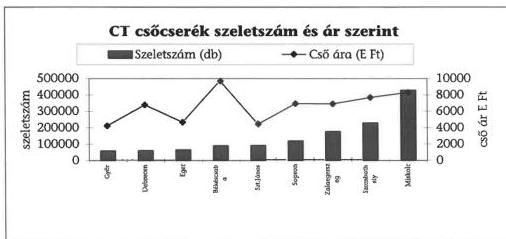

A csőcserék költsége a finanszírozásban az egyes vizsgálatok pontértékében az országos intézet szakmai véleménye szerint 1000-2000 pont/vizsgálat értékkel szerepel. Azonban a működési költségek terhére felújításnak minősülő fődarab

47

---

II. RÉSZLETES MEGÁLLAPÍTÁSOK

csere finanszírozása ellentétes azzal a főszabállyal, hogy az Egészségbiztosítási Alapból csak a működtetést finanszírozza az alap kezelője.

A működtetők által kimutatott szerviz és javítási költség (pl. Sopronban 1996. évben 25 millió Ft) egyrészt a szervizszerződés szerinti díjból, másrészt a csőcsere költségéből tevődik össze.

Budapest, 1999. május „10„.

dr. Kovács Árpád  
elnök

48

---

1. sz. melléklet

|  Kórházak megnevezése | Megnevezés rövidítése  |
| --- | --- |
|  **Baranya megye** |   |
|  Baranya Megyei Kórház – Rendelőintézet | Pécsi megyei kórház  |
|  Komló Városi Önkormányzat Kórház-Rendelőintézet egység | Komló városi kórház  |
|  **Békés megye** |   |
|  Békés Megyei Képviselőtestület Pándy Kálmán Kórháza | Gyulai megyei kórház  |
|  Réthy Pál Kórház- Rendelőintézet | Békéscsabai városi kórház  |
|  **Borsod-Abaúj-Zemplén megye** |   |
|  Borsod-Abaúj-Zemplén Megyei Önkormányzat Kórháza | Miskolci megyei kórház  |
|  Sátoraljaújhely Város Önkormányzat Erzsébet Kórháza | Sátoraljaújhelyi városi kórház  |
|  **Győr-Moson-Sopron megye** |   |
|  Petz Aladár Megyei Kórház Győr Orvos továbbképző Egyetem Oktató- Továbbképző Kórháza | Győri megyei kórház  |
|  Sopron megyei jogú város Kórház-Rendelőintézeti Egység | Soproni városi kórház  |
|  **Hajdú-Bihar megye** |   |
|  Hajdú-Bihar Megyei Önkormányzat Kenézy Gyula Kórház Rendelőintézet | Debreceni megyei kórház  |
|  Területi Kórház Berettyóújfalu | Berettyóújfalui városi kórház  |
|  **Heves megye** |   |
|  Heves megyei Önkormányzat Markhot Ferenc Kórház-Rendelőintézete | Egri megyei kórház  |
|  Városi Albert Schweitzer Kórház-Rendelőintézet | Hatvani városi kórház  |

---

|  **Komárom-Esztergom megye** |   |
| --- | --- |
|  Komárom-Esztergom Megyei Önkormányzat Szt. Borbála Kórháza | Tatabányai megyei kórház  |
|  Esztergom Városi Önkormányzat (majd Komárom-Esztergom Megyei Önkormányzat) Vaszary Kolos Kórház | Esztergomi városi kórház  |
|  **Szabolcs-Szatmár-Bereg megye** |   |
|  Szabolcs-Szatmár-Bereg Megyei Önkormányzat Jósa András Kórház-Rendelőintézet | Nyíregyházi megyei kórház  |
|  Mátészalka Város Területi Kórháza | Mátészalkai városi kórház  |
|  **Vas megye** |   |
|  Vas Megyei Markusovszky Kórház | Szombathelyi megyei kórház  |
|  Kemenesaljai Egyesített Kórház Celldömölk | Celldömölki városi kórház  |
|  **Zala megye** |   |
|  Zala Megyei Önkormányzat Közgyűlés Kórház- Rendelőintézet | Zalaegerszegi megyei kórház  |
|  Keszthelyi Városi Kórház | Keszthelyi városi kórház  |
|  **Főváros, Pest megye** |   |
|  Fővárosi Szt. János Kórház-Rendelőintézet | Szent János kórház  |
|  Fővárosi Szt. István Kórház- és Intézményei | Szent István kórház  |
|  Fővárosi Önkormányzat Uzsoki utcai kórház | Uzsoki utca kórház  |
|  Pest megyei Flór Ferenc Kórház | Kistarcsai megyei kórház  |
|  Szt. Rókus Kórház és intézményei | Szt. Rókus megyei kórház  |

2

---

2. sz. melléklet

## A jelentésben szereplő egyes fogalmak magyarázata

|  **aktív ellátás** | a finanszírozás módja szerint az aktív ellátás az egészségi állapot mielőbbi helyreállítása, aminek időtartama, ill. befejezése többnyire tervezhető és az esetek többségében rövid időtartamú  |
| --- | --- |
|  **aktív kórházi ágy** | az aktív minősítésű osztályon illetve osztályokon lévő ágy (ágyszám)  |
|  **akut** | heveny, gyors lefolyású folyamat  |
|  **alapszakmák** | a minimumfeltételekről szóló rendelet kórházi fogalom-meghatározásából kiindulva a belgyógyászat, sebészet valamint szülészet- nőgyógyászat, de ezekhez legalább egy további klinikai szakma (jellemzően gyermekgyógyászat) megléte is követelmény  |
|  **analízis** | elemzés, részekre, elemekre bontás  |
|  **aneszteziológia** | érzéstelenítéssel, érzéstelenítő szerekkel történő foglalkozás, azok alkalmazása  |
|  **autark fejlesztés** | önellátásra történő berendezkedés  |
|  **bakteorológiai vizsgálat** | egysejtű, klorofill nélküli élőlények okozta megbetegedés gyanúja esetén végzett vizsgálat  |
|  **beavatkozás** | azon megelőző, diagnosztikus, terápiás, rehabilitációs vagy más célú fizikai, kémiai, biológiai vagy pszichikai eljárás, amely a beteg szervezetében változást idéz vagy idézhet elő, továbbá a holttesten végzett vizsgálatokkal, valamint szövetek, szervek eltávolításával összefüggő eljárás, finanszírozási szempontból olyan elvégzett szolgáltatás, amely megfelelő kódok alapján elszámolási tétel a járóbeteg-szakellátásban  |

---

|  **bruttó érték** | az eszköz beszerzési, előállítási költsége a számviteli előírásokban részletezett valamennyi vonatkozó ráfordítást figyelembe véve  |
| --- | --- |
|  **CT** | Computer Tomograf, (kiválasztott szelet síkja mentén több irányból mért röntgensugár gyengítésével a jellemző értékekből számítógép segítségével nyert képalkotás)  |
|  **CT cső** | a CT működésének alapvető, teljesítménytől függő gyakoriságú cserére szoruló, drága alkatrésze  |
|  **CT szeletszám** | a vizsgált testtájékról (pl. koponya, ágyéki gerinc) egy vizsgálat alatt létrejövő képekben megjeleníthető harántmetszeti információk száma normál vagy kóros anatómiai struktúrákról, CT cső esetében a gyártó szeletszámban határozza meg a cső által garantáltan elérhető összteljesítményt  |
|  **csontdenzitometriás fantom** | kiegészítő egység (CT-hez) a csontsűrűség méréséhez  |
|  **defibrillátor** | a szívizom ritmus nélküli rángatózását elektromos áramütéssel megszüntető készülék  |
|  **diagnosztika (képi)** | a betegségek felismerése, megállapítása képi formátumot biztosító eszköz (röntgen, CT, MRI, ultrahang, nukleáris medicina) révén  |
|  **diagnosztikai vizsgálat** | a betegségek felismerését, megállapítását, az egészségi állapot helyzete megismerését célzó vizsgálat  |
|  **diagnózis** | kórmeghatározás  |
|  **differenciálatlan feladatellátás** | az ellátási szint figyelembevétele nélküli (a progresszív betegellátás elvével ellentétes) ellátás  |
|  **differenciált vérkép** | a vér alkotó részeinek mennyiségét és arányát a legapróbb mérhető részletekig feltüntető lelet  |
|  **DSA** | Digitális Subtractiós Angiograf (orvosi berendezés az érrendszer kontrasztanyagos vizsgálatára)  |
|  **endoszkóp** | belső üreges szervek vizsgálatára, az azokba történő bevezetésre alkalmas eszköz  |

2

---

|  **gép-műszer kataszter** | az egészségügyi intézmények kórház és orvostechnikai eszközeinek (gépek, műszerek, berendezések, segédeszközök) strukturált adatait tartalmazó nyilvántartás  |
| --- | --- |
|  **használhatósági fok** | eszközök nettó értékének és bruttó értékének aránya  |
|  **HBCS** | homogén betegségcsoport (az 1993-ban bevezetett teljesítmény alapú finanszírozás alapja az aktív fekvőbeteg-ellátásban, a kialakított kód- és pontszámrendszer alapján)  |
|  **hematológiai vizsgálat** | a vérrel kapcsolatos laboratóriumi vizsgálatok közül pl. a vér alakos elemeinek mennyiségi meghatározása minőségi jegyeiben bekövetkező változások elemzése  |
|  **hormonvizsgálat** | a belső elválasztású mirigyek által termelt és a testnedvek segítségével továbbított, az egyes szervek működését specifikusan szabályozó elemek vizsgálata  |
|  **immunkémiai vizsgálat** | magába foglalja mindazon immunreaktivitáson alapuló vizsgálatokat, amelyek egy meghatározott antigén, vagy ellenanyag mennyiségi, vagy minőségi elemzésére irányulnak.  |
|  **immunológiai vizsgálat** | az immunitással kapcsolatos, a veleszületett vagy szerzett védettség (fertőző betegségekkel szemben) szintjének meghatározására irányuló vizsgálat  |
|  **improduktív vizsgálat** | eredmény nélküli, vagy az elérni kívánt eredmény szempontjából nem érdemi, különböző – bár sok esetben vitatott – szempontok alapján felesleges vizsgálat  |
|  **izotóp diagnosztika** | radioaktív izotópok alkalmazásán alapuló betegség-felismerés, megállapítás  |
|  **kardiológia** | a szív működésével, betegségeivel foglalkozó tevékenység  |
|  **kassza** | az egészségbiztosítás költségvetésében a gyógyító-megelőző ellátási, finanszírozási formák szerint tagolt előirányzati keret  |

3

---

|  **képalkotó berendezés** | olyan diagnosztikai berendezés, amely valamilyen - alkalmazott - elvre épülő képi formátumban jeleníti meg a vizsgált testtáját, szervet, így a kép alapján az orvostudomány jelenlegi szintjén megfelelő diagnózis állítható fel, illetve más eljárások alapján feltételezett diagnózis helyessége alátámasztható vagy kizárható  |
| --- | --- |
|  **klausztrofóbia** | ideges félelem zárt helyen való tartózkodáskor  |
|  **klinikai-kémiai vizsgálat** | vérplazma, szérum és a testnedvek kémiai összevetőinek mennyiségi, aktivitásának kémiai összetevőinek minőségi jegyek alapján történő meghatározása  |
|  **kontrasztanyag** | képi diagnosztikában a látható, élesebb kép nyerésére a szervezetbe juttatott - a test sugárelnyelő képességétől eltérő - anyag, lehet ionos (elektromos töltésű) vagy nem ionos  |
|  **különkeretes finanszírozás** | egyes szűkebb körű ellátások (pl. CT és MRI) finanszírozása külön e célú kassza terhére  |
|  **laborautomata** | a diagnózis felállításához szükséges élettani, vegyi vizsgálatok végzésére alkalmas, a műveletsort önállóan (minimális manuális közreműködéssel) végző készülék  |
|  **laporoszkóp** | testbe vezethető optikával ellátott orvosi eszköz  |
|  **lézerkamera** | lézersugarat kibocsátó berendezés, amely a fénysugár nagy intenzitású energiájára és biológiai hatására építve a mikrosebészetben és a rosszindulatú daganatok kezelésében használatos  |
|  **mammográfiás berendezés** | az emlők (tejutak) kontrasztanyagos vizsgálatára alkalmas készülék  |
|  **mikrobiológia** | mikroorganizmusokkal foglalkozó tevékenység  |
|  **minimumfeltételek** | azon követelmények összessége, amelyek az egészségügyi szolgáltatás teljesítése során a betegek, az ellátást nyújtó személyzet és a környezet biztonsága szempontjából elengedhetetlenek (részletes követelményeket NM rendelet tartalmaz)  |

4

---

|  **minőségbiztosítás** | követelmények meghatározása, ezek teljesítésének (külső és belső) ellenőrzése, értékelése, szükség szerint tanúsítása és a folyamatos minőségfejlesztés  |
| --- | --- |
|  **mintaelőkészítés** | laborvizsgálat céljából levett vizsgálati minták előkészítése (szortírozás, preparálás, elegyítés, stb.) az elemzésre  |
|  **mintaszállítás** | testnedvek, sejtek, szövetek levétel utáni szállítása a laboratóriumi vizsgálat végzésének helyére  |
|  **MRI** | Mágneses Magspinrezonanciás képalkotó berendezés (mágneses tér által előidézett, együttmozgáson alapuló képalkotó eljárás)  |
|  **nedveskémiai automata** | olyan automata, amely a szükséges elemzést folyékony reagens(ek)nek a vizsgálati anyaghoz történő hozzáadása segítségével végzi  |
|  **nephrológia** | a vesével, annak megbetegedéseivel foglalkozó tevékenység  |
|  **nettó érték** | a bruttó érték (beszerzési, előállítási költség) és az értékcsökkenés különbözete  |
|  **neuropszichiátria** | ideg-, elmegyógyászat  |
|  **nyitott műtét** | viszonylag nagy metszési felületű, hagyományos sebészeti eljárással történő operáció megvalósítása  |
|  **onkológia** | daganatos megbetegedésekkel, azok kezelésével összefüggő tevékenység  |
|  **ortopédia** | mozgásszervek szabálytalanságaival, ezek gyógyításával, megelőzésével kapcsolatos tevékenység  |
|  **patológia** | betegségek okaival, a betegségek okozta testi jelenségekkel foglalkozó tevékenység  |
|  **progresszív betegellátás** | ellátási szintek szerint emelkedő, a szükséges és eredményes vizsgálatot és kezelést biztosító betegellátás  |
|  **radiológia** | a sugárzás gyógyítási és diagnosztikai célokra történő felhasználása  |

5

---

|  **reagens** | bizonyos (vegyi) anyagok jelenlétének és mennyiségének meghatározására szolgáló, más anyaggal keverve jellemző vegyi hatást mutató vegyszer  |
| --- | --- |
|  **reagenslízing** | olyan műszerhez jutási megoldás, amikor szerződésben kötött reagens szállítások költségében a kórház a műszer árát működési forrásból folyamatosan a reagens díjában fizeti meg  |
|  **respirátor** | lélegeztető készülék  |
|  **rutinvizsgálat** | jellemző, általános, alapinformációkat nyújtó vizsgálat, amely megelőzi a szükségessé váló speciális vizsgálatokat  |
|  **sugárterápia** | radioaktív besugárzás célzott alkalmazása a gyógyításban  |
|  **sugárterhelés** | radioaktív sugarak elvén működő berendezések alkalmazása során a beteg és környezete (kezelőszemélyzet) által kényszerűen elszenvedett sugárhatás  |
|  **szakmai protokoll** | egyes tevékenységekre vonatkozó elfogadott szakmai szabályok összessége  |
|  **szárazkémiai automata** | olyan laborautomata, amelyben folyékony reagens(ek) nélkül végezhető a kívánt vizsgálat, a reagens ez esetben szárított formában van jelen  |
|  **szerológiai vizsgálat** | a vérsavóban lévő ellenanyagokkal összefüggő vizsgálat  |
|  **teljesítménydíj** | a teljesítmény alapú finanszírozás HBCS ill. WHO pontrendszer alapján számított, az egészségbiztosító által fizetett térítése  |
|  **transzplantáció** | más helyről vagy donortól vett szövet, vagy komplett belső szerv ültetése a szervezetbe  |
|  **traumatológia** | a sebészet sérülésekkel foglalkozó ága  |
|  **tumormarker** | tumor(daganat)jelző endogén anyag, ill. az ennek felhasználásával történő vizsgálat  |
|  **UH** | ultrahang készülék (a hallható hangnál nagyobb frekvenciájú, mechanikus rezgéseket érzékelni képes és azt kiértékelhető képi jellé alakító diagnosztikus készülék)  |

6

---

# **vizsgálat**

az a tevékenység, amelynek célja a beteg egészségi állapotának felmérése, egészségének megőrzése, a betegek, illetve kockázatuk felderítése, a konkrét betegség(ek) meghatározása, prognózisuk, változásuk megállapítása, a gyógykezelés eredményességének, valamint a halál bekövetkeztének és a halál okának megállapítása

# **WHO pont**

az Egészségügyi Világszervezet irányelvei alapján kidolgozott beavatkozási kódok és a kapcsolódó pontrendszer alapján számított teljesítményérték

# **zártrendszerű  
automata**

olyan laborautomata, amely csak bizonyos zártan szállítandó és zárt edényzetben beadandó reagenssel dolgozik, ezáltal analitikai pontosságot garantál

7

---

.

,

,

---

1. sz. diagram

50 E Ft-nál magasabb bruttó értékű gépek-műszerek átlagéletkora

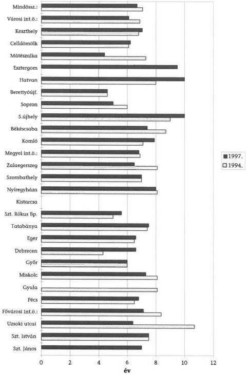

---

，

[Non-Text]

[Non-Text]

[Non-Text]

[Non-Text]

[Non-Text]

[Non-Text]

[Non-Text]

[Non-Text]

[Non-Text]

[Non-Text]

[Non-Text]

[Non-Text]

[Non-Text]

[Non-Text]

[Non-Text]

[Non-Text]

[Non-Text]

[Non-Text]

[Non-Text]

[Non-Text]

[Non-Text]

[Non-Text]

[Non-Text]

[Non-Text]

[Non-Text]

[Non-Text]

[Non-Text]

[Non-Text]

[Non-Text]

[Non-Text]

[Non-Text]

[Non-Text]

[Non-Text]

[Non-Text]

[Non-Text]

[Non-Text]

[Non-Text]

[Non-Text]

，

[Non-Text]

[Non-Text]

[Non-Text]

[Non-Text]

[Non-Text]

[Non-Text]

[Non-Text]

[Non-Text]

[Non-Text]

The Ground Truth image displays a single, solid horizontal line. According to Rule 2 (UNDERSCORE & LINE RULES), this is a stylistic or background line, not a placeholder underscore. Therefore, the OCR result must ignore it and output nothing or only meaningful text. The provided OCR content is "____", which consists of four underscores. This is an incorrect interpretation of the line as a placeholder, violating the rule that stylistic lines must be ignored. The OCR has hallucinated underscores where none should exist based on the GT's visual context. Hence, the OCR result is inconsistent with the Ground Truth.

---

2. sz. diagram

50 E Ft-nál magasabb bruttó értékű gépek-műszerek átlagéletkora 1994-ben szervezeti egység- és intézménycsoportonként

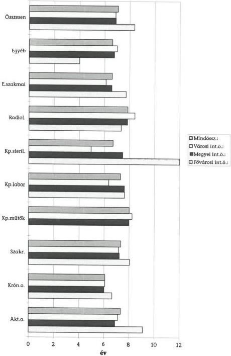

---

$$\therefore m = \frac{3}{11}$$

---

3. sz. diagram

50 E Ft-nál magasabb bruttó értékű gépek-műszerek átlagéletkora 1997-ben szervezeti egység- és intézménycsoportonként

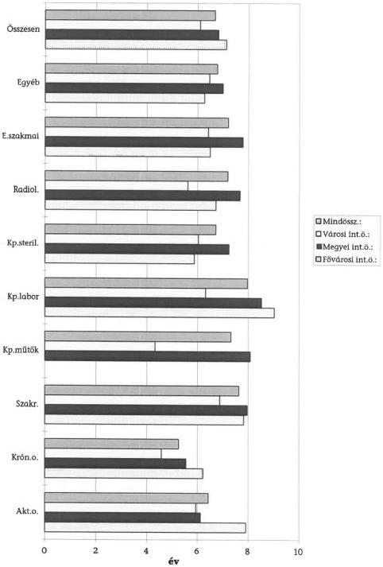

---

$$\therefore m = \frac{3}{11}$$

---

4. sz. diagram

A kórházi gép-műszer bruttó-nettó érték megoszlása részlegenként (%-os megoszlás)

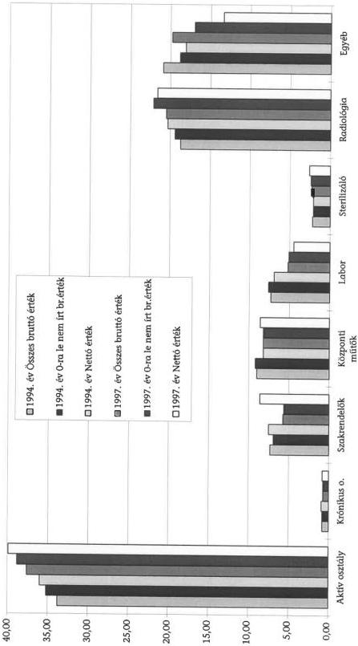

---

1

1

[Non-Text]

[Non-Text]

[Non-Text]

[Non-Text]

[Non-Text]

[Non-Text]

[Non-Text]

[Non-Text]

[Non-Text]

[Non-Text]

[Non-Text]

[Non-Text]

[Non-Text]

[Non-Text]

[Non-Text]

[Non-Text]

[Non-Text]

[Non-Text]

[Non-Text]

[Non-Text]

[Non-Text]

[Non-Text]

[Non-Text]

[Non-Text]

[Non-Text]

[Non-Text]

[Non-Text]

1

[Non-Text]

[Non-Text]

[Non-Text]

[Non-Text]

[Non-Text]

[Non-Text]

[Non-Text]

[Non-Text]

[Non-Text]

[Non-Text]

[Non-Text]

[Non-Text]

[Non-Text]

[Non-Text]

[Non-Text]

[Non-Text]

[Non-Text]

[Non-Text]

The Ground Truth image displays a single, solid horizontal line. According to Rule 2 (UNDERSCORE & LINE RULES), this is a stylistic or background line, not a placeholder underscore. Therefore, the OCR result must ignore it and output nothing or only meaningful text. The provided OCR content is "____", which consists of four underscores. This is an incorrect interpretation of the line as a placeholder, violating the rule that stylistic lines must be ignored. The OCR has hallucinated underscores where none should exist based on the GT's visual context. Hence, the OCR result is inconsistent with the Ground Truth.

The Ground Truth image displays a single, solid horizontal line. According to Rule 2 (UNDERSCORE & LINE RULES), this is a stylistic or background line, not a placeholder underscore. Therefore, the OCR result must ignore it and output nothing or only meaningful text. The provided OCR content is "____", which consists of four underscores. This is an incorrect interpretation of the line as a placeholder, violating the rule that stylistic lines must be ignored. The OCR has hallucinated underscores where none should exist based on the GT's visual context. Hence, the OCR result is inconsistent with the Ground Truth.

---

5. sz. diagram

Gépek, berendezések, felszerelések használhatósági foka

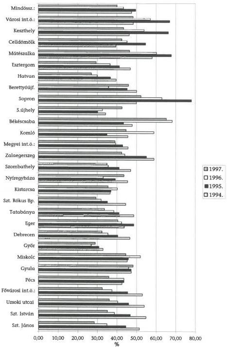

---

1

1

[Non-Text]

[Non-Text]

[Non-Text]

[Non-Text]

[Non-Text]

[Non-Text]

[Non-Text]

[Non-Text]

[Non-Text]

1

[Non-Text]

[Non-Text]

[Non-Text]

[Non-Text]

[Non-Text]

[Non-Text]

[Non-Text]

[Non-Text]

[Non-Text]

[Non-Text]

[Non-Text]

[Non-Text]

[Non-Text]

[Non-Text]

[Non-Text]

[Non-Text]

[Non-Text]

[Non-Text]

[Non-Text]

[Non-Text]

[Non-Text]

[Non-Text]

[Non-Text]

[Non-Text]

[Non-Text]

[Non-Text]

[Non-Text]

[Non-Text]

[Non-Text]

[Non-Text]

[Non-Text]

[Non-Text]

[Non-Text]

[Non-Text]

[Non-Text]

[Non-Text]

The Ground Truth image displays a single, solid horizontal line. According to Rule 2 (UNDERSCORE & LINE RULES), this is a stylistic or background line, not a placeholder underscore. Therefore, the OCR result must ignore it and output nothing or only meaningful text. The provided OCR content is "____", which consists of four underscores. This is an incorrect interpretation of the line as a placeholder, violating the rule that stylistic lines must be ignored. The OCR has hallucinated underscores where none should exist based on the GT's visual context. Hence, the OCR result is inconsistent with the Ground Truth.

The Ground Truth image displays a single, solid horizontal line. According to Rule 2 (UNDERSCORE & LINE RULES), this is a stylistic or background line, not a placeholder underscore. Therefore, the OCR result must ignore it and output nothing or only meaningful text. The provided OCR content is "____", which consists of four underscores. This is an incorrect interpretation of the line as a placeholder, violating the rule that stylistic lines must be ignored. The OCR has hallucinated underscores where none should exist based on the GT's visual context. Hence, the OCR result is inconsistent with the Ground Truth.

---

6. sz. diagram

A minimum feltételekhez képest felmért hiány kórházanként (E Ft)

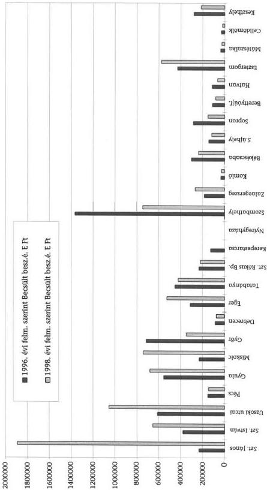

---

$$\therefore m = \frac{3}{11}$$

---

7. sz. diagram

A hiányok és a 0-ra leírt eszközök aránya

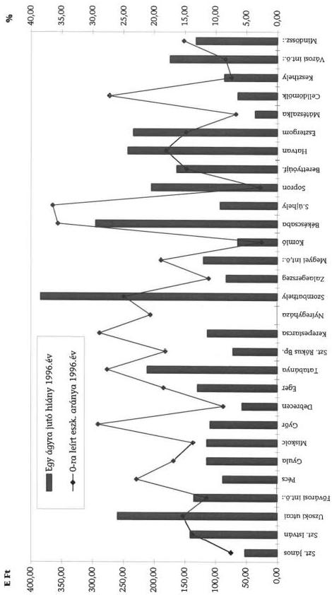

---

__________

---

8. sz. diagram

A hiányok és a 0-ra leírt eszközök aránya

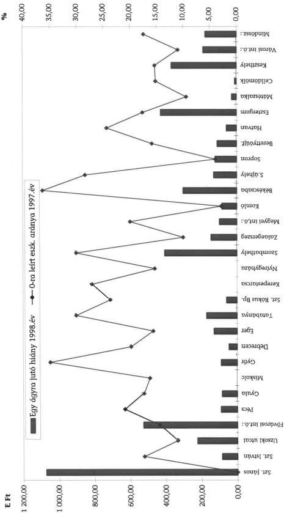

---

1. 2017年1月1日，公司与上海浦东发展银行股份有限公司签订了《关于使用部分闲置募集资金进行现金管理的协议》。

---

9. sz. diagram

A saját forrású gép-műszer állománynövekedés alakulása a vizsgált teljes években

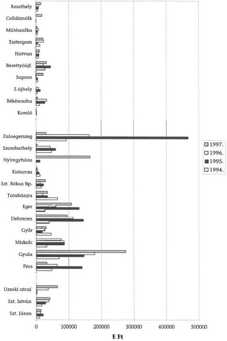

---

  +

---

10. sz. diagram

# **A saját forrású gép-műszer állománynövekedés alakulása a vizsgált teljes években, intézménycsoportonként**

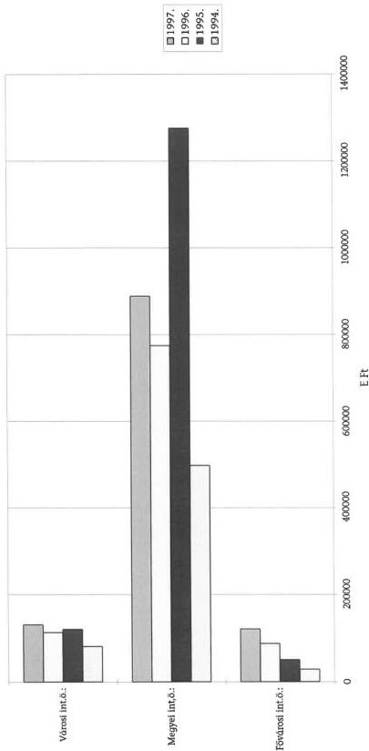

---

1

1

[Non-Text]

[Non-Text]

[Non-Text]

[Non-Text]

[Non-Text]

[Non-Text]

[Non-Text]

[Non-Text]

[Non-Text]

[Non-Text]

[Non-Text]

[Non-Text]

[Non-Text]

[Non-Text]

[Non-Text]

[Non-Text]

[Non-Text]

[Non-Text]

[Non-Text]

[Non-Text]

[Non-Text]

[Non-Text]

[Non-Text]

[Non-Text]

[Non-Text]

[Non-Text]

[Non-Text]

[Non-Text]

[Non-Text]

[Non-Text]

1

[Non-Text]

[Non-Text]

[Non-Text]

[Non-Text]

[Non-Text]

[Non-Text]

[Non-Text]

[Non-Text]

[Non-Text]

[Non-Text]

[Non-Text]

[Non-Text]

[Non-Text]

[Non-Text]

[Non-Text]

The Ground Truth image displays a single, solid horizontal line. According to Rule 2 (UNDERSCORE & LINE RULES), this is a stylistic or background line, not a placeholder underscore. Therefore, the OCR result must ignore it and output nothing or only meaningful text. The provided OCR content is "____", which consists of four underscores. This is an incorrect interpretation of the line as a placeholder, violating the rule that stylistic lines must be ignored. The OCR has hallucinated underscores where none should exist based on the GT's visual context. Hence, the OCR result is inconsistent with the Ground Truth.

The Ground Truth image displays a single, solid horizontal line. According to Rule 2 (UNDERSCORE & LINE RULES), this is a stylistic or background line, not a placeholder underscore. Therefore, the OCR result must ignore it and output nothing or only meaningful text. The provided OCR content is "____", which consists of four underscores. This is an incorrect interpretation of the line as a placeholder, violating the rule that stylistic lines must be ignored. The OCR has hallucinated underscores where none should exist based on the GT's visual context. Hence, the OCR result is inconsistent with the Ground Truth.

---

11. sz. diagram

Egy 1997. évi aktív ágyra vetített 1994-1997. közötti saját forrású gép-műszer állománynövekedés

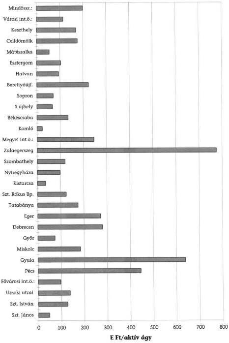

---

1. 2017年1月1日，公司与上海浦东发展银行股份有限公司签订了《关于使用部分闲置募集资金进行现金管理的协议》。

---

12. sz. diagram

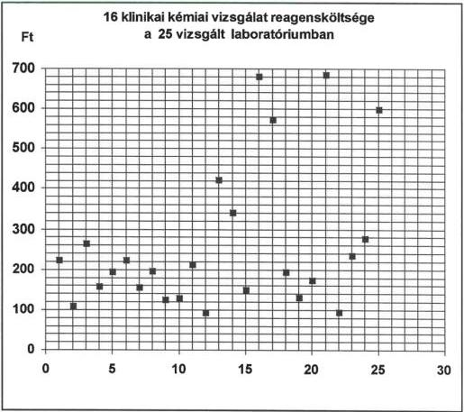

# Laboratóriumok sorszáma:

1. Satoraljaujhely Erzsébet KH-RI
2. Győr, Megyei KH-RI
3. Miskolc, Megyei KH-RI
4. Keszthely Varosi KH-RI
5. Hatvan Albert Schweitzer KH-RI
6. Gyöngyös Bugat Pál KH-RI
7. Berettyóúfalu Területi KH-RI
8. Eger Markhot Ferenc Megyei KH-RI
9. Debrecen, Kenézy Gy. Megyei KH-RI
10. Sopron KH-RI, Prodia Laboratorium
11. Mateszalka Teruleti KH-RI
12. Kistarcsa Pest Megyei KH-RI

13. Dorog Vaszary Kolos II. KH-RI
14. Esztergom Vaszary Kolos I. KH-RI
15. Zalaegerszeg Megyei KH-RI
16. Tatabanya Megyei KH-RI
17. Szent János KH-RI
18. Békéscsaba Városi KH-RI
19. Szent István KH-RI
20. Gyula Megyei KH-RI
21. Pecs Megyei KH-RI
22. Komlo Varosi KH-RI
23. Szent Rókus KH-RI
24. Pest Megyei KH, Tárogató ut
25. Uzsoki u. KH

A rutin klinikai kémiai vizsgálatok összesített költségét mutatja. A vizsgálatokat az összes laboratóriumban rutinszerűen tégzik:

- szérum fehérje, - szérum albumin, - kreatinin, - karbamid, - húgysav,
- bilirubin, - glukóz, - koleszterin, - triglicerid, - alk. foszfatáz,
- \(\alpha\)-amilaz, - gamma-GT, - GOT/ASAT, - GPT/ALAT, - LDH, - CK.

---

 .

---

13. sz. diagram

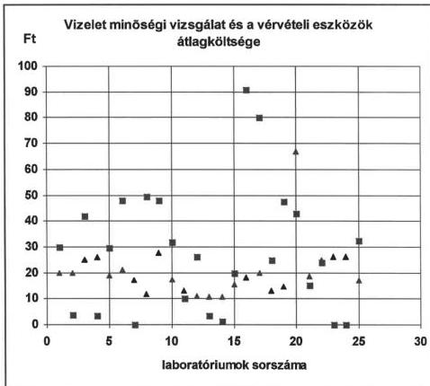

■ = vizelet minőségi vizsgálat (tesztcsík, saját reagens)
▲ = vérvételi eszköz, zártrendszer

Laboratóriumok sorszáma:

1. Sátoraljaújhely Erzsébet KH-RI
2. Győr, Megyei KH-RI
3. Miskolc, Megyei KH-RI
4. Keszthely Városi KH-RI
5. Hatvan Albert Schweitzer KH-RI
6. Gyöngyös Bugát Pál KH-RI
7. Berettyóújfalu Területi KH-RI
8. Eger Markhot Ferenc Megyei KH-RI
9. Debrecen, Kenézy Gy. Megyei KH-RI
10. Sopron KH-RI, Prodia Laboratórium
11. Mátészalka Területi KH-RI
12. Kistarcsa Pest Megyei KH-RI
13. Dorog Vaszary Kolos II. KH-RI
14. Esztergom Vaszary Kolos I. KH-RI
15. Zalaegerszeg Megyei KH-RI
16. Tatabánya Megyei KH-RI
17. Szent János KH-RI
18. Békéscsaba Városi KH-RI
19. Szent István KH-RI
20. Gyula Megyei KH-RI
21. Pécs Megyei KH-RI
22. Komló Városi KH-RI
23. Szent Rókus KH-RI
24. Pest Megyei KH, Tárogató út
25. Uzsoki u. KH

---

 .

---

14. sz. diagram

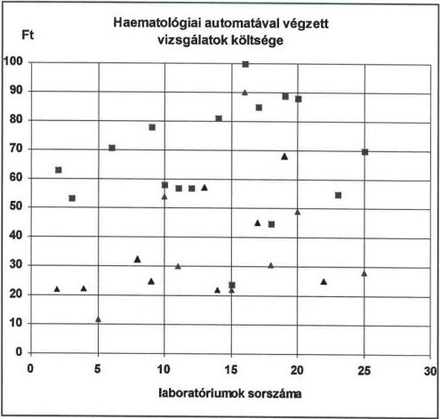

■ = IV. típusú automata (diff. vérkép)
\(\triangle =\) II-III. típusú automata

Laboratóriumok sorszáma:

1. Satoraljaújhely Erzsébet KH-RI
2. Győr, Megyei KH-RI
3. Miskolc, Megyei KH-RI
4. Keszthely Városi KH-RI
5. Hatvan Albert Schweitzer KH-RI
6. Gyöngyös Bugat Pál KH-RI
7. Berettyóúfalu Területi KH-RI
8. Eger Markhot Ferenc Megyei KH-RI
9. Debrecen, Kenézy Gy. Megyei KH-RI
10. Sopron KH-RI, Prodia Laboratorium
11. Mateszalka Teruleti KH-RI
12. Kistarcsa Pest Megyel KH-RI

13. Dorog Vaszary Kolos II. KH-RI
14. Esztergom Vaszary Kolos I. KH-RI
15. Zalaegerszeg Megyei KH-RI
16. Tatabanya Megyei KH-RI
17. Szent János KH-RI
18. Békéscsaba Városi KH-RI
19. Szent István KH-RI
20. Gyula Megyei KH-RI
21. Pecs Megyei KH-RI
22. Komlo Variosi KH-RI
23. Szent Rókus KH-RI
24. Pest Megyei KH, Tárogató ut
25. Uzsoki u. KH

---

1

[Non-Text]

[Non-Text]

[Non-Text]

[Non-Text]

[Non-Text]

[Non-Text]

[Non-Text]

[Non-Text]

[Non-Text]

[Non-Text]

[Non-Text]

[Non-Text]

[Non-Text]

[Non-Text]

[Non-Text]

[Non-Text]

[Non-Text]

[Non-Text]

[Non-Text]

[Non-Text]

[Non-Text]

[Non-Text]

[Non-Text]

[Non-Text]

[Non-Text]

[Non-Text]

[Non-Text]

[Non-Text]

[Non-Text]

[Non-Text]

[Non-Text]

[Non-Text]

[Non-Text]

[Non-Text]

[Non-Text]

[Non-Text]

[Non-Text]

[Non-Text]

[Non-Text]

[Non-Text]

[Non-Text]

[Non-Text]

[Non-Text]

[Non-Text]

[Non-Text]

[Non-Text]

[Non-Text]

[Non-Text]

[Non-Text]

[Non-Text]

[Non-Text]

[Non-Text]

[Non-Text]

[Non-Text]

[Non-Text]

[Non-Text]

[Non-Text]

[Non-Text]

[Non-Text]

[Non-Text]

[Non-Text]

[Non-Text]

[Non-Text]

[Non-Text]

[Non-Text]

[Non-Text]

[Non-Text]

[Non-Text]

[Non-Text]

[Non-Text]

[Non-Text]

[Non-Text]

[Non-Text]

The Ground Truth image displays a single, solid horizontal line. According to Rule 2 (UNDERSCORE & LINE RULES), this is a stylistic or background line, not a placeholder underscore. Therefore, the OCR result must ignore it and output nothing or only meaningful text. The provided OCR content is "____", which consists of four underscores. This is an incorrect interpretation of the line as a placeholder, violating the rule that stylistic lines must be ignored. The OCR has hallucinated underscores where none should exist based on the GT's visual context. Hence, the OCR result is inconsistent with the Ground Truth.

---

15. sz. diagram

CT film beszerzési ár és egy vizsgálat költsége

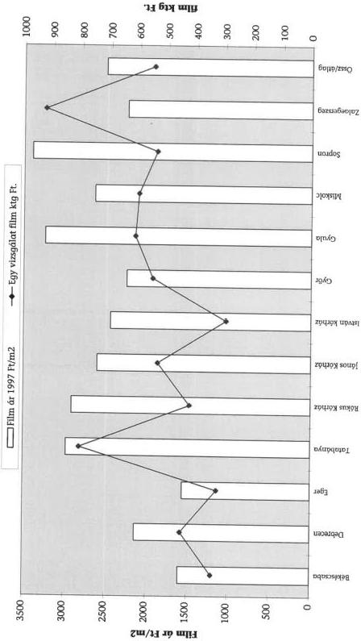

---

$$\therefore m = \frac{3}{11}$$

---

16. sz. diagram

Egy CT vizsgálat kontrasztanyag felhasználása (ml) és kontrasztanyag költsége (Ft)

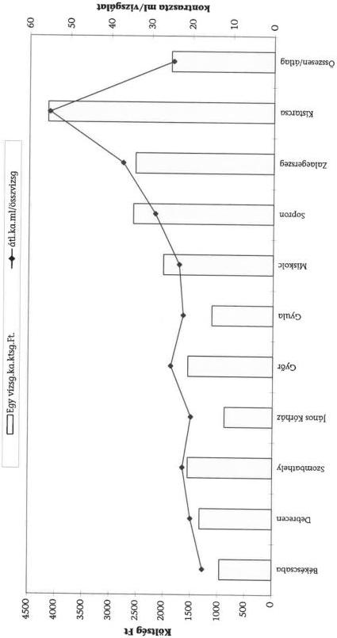

---

|   | 1 | 2 | 3 | 4 | 5 | 6 | 7 | 8 | 9 | 10  |
| --- | --- | --- | --- | --- | --- | --- | --- | --- | --- | --- |

---

EGÉSZSÉGÜGYI MINISZTÉRIUM
MINISZTER

Iktatószám: 55167/1999

Dr. Kovács Árpád úrnak,
az Állami Számvevőszék Elnöke

Budapest

Igen tisztelt Elnök Úr!

Hiv.sz.:V-1016-7524 998-99

|  **ÁLLAMI SZÁMVEVŐSZÉK**  |   |
| --- | --- |
|  Érkezett: | 1999 -05- 1 1  |
|  Iktatószám: | V-1016-80/98  |
|  Melléklet: |   |

Az önkormányzati egészségügyi intézmények gép-műszer ellátott-ságának, valamint egyes diagnosztikai részlegek teljesítményének ellenőrzési tapasztalatairól szóló jelentést nagy érdeklődéssel tanulmányoztam.

Munkatársaim egybehangzó véleménye alapján is a jelentést magas színvonalúnak, tényszerűnek és figyelemre méltónak tartom. A jelentésben szereplő megállapítások nagy része az egészségügyi ágazatot érinti, ugyanakkor vannak olyanok is melyek szélesebb körben való megfontolásra tartanak igényt, gondolok itt most elsősorban a finanszírozási problémákat illetően. Talán legfontosabb ezek közül az orvostechnikai eszközök amortizációjának kérdése, illetve az értékesökkenés elszámolhatóságának hiánya, ami számos, a jelentésben feltárt kedvezőtlen jelenség oka. Egyetértek azzal is, hogy a röntgen, CT és MRI vizsgálatok minőségét a finanszírozás jelenlegi rendszere nem tükrözi, ezen valamiképpen változtatni szükséges.

Köszönettel vettük és megfontolandónak tartjuk a minimum-követelményekkel kapcsolatban felvetett észrevételeket, a jogszabály módosításánál ezekre is tekintettel leszünk.

A részemre megfogalmazott javaslatokat köszönettel veszem, munkatársaimmal együtt megvizsgáljuk azokat és a lehetőségekhez mérten igyekszünk azoknak eleget tenni.

Végezetül, köszönetemet fejezem ki Önnek és munkatársainak a rendkívül színvonalas és hasznos munkájukért.

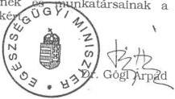

Budapest, 1999. május "5"