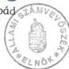
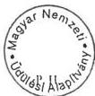
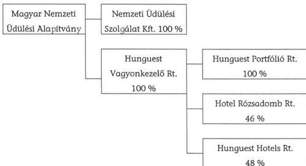
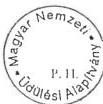
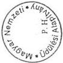
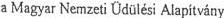
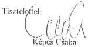
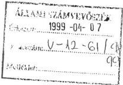
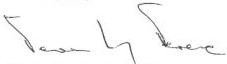

Állami Számvevőszék

# JELENTÉS

**A Magyar Nemzeti Üdülési Alapítványnak**
**juttatott állami eszközök felhasználásá-**
**nak és működtetésének**

pénzügyi-gazdasági ellenőrzéséről

1999. május

9906.

---

Az ellenőrzés végrehajtásáért felelős:

az ÁSZ III. Költségvetési Ellenőrzési Igazgatósága

Bihary Zsigmond

igazgató

Az ellenőrzést vezette:

Balázs Andrásné

számvevő főtanácsos

Az ellenőrzésben részt vettek:

Eötvös Magdolna számvevő tanácsos

Nagy Józsefné számvevő tanácsos

Majer Lajosné számvevő

Sas Imréné számvevő

dr. Solymár Károlyné számvevő tanácsos

Az ÁSZ által eddig ellenőrzött, illetve 1999-ben ellenőrzendő közalapítványok, alapítványok listája:

Nemzeti Gyermek- és Ifjúsági (Köz)alapítvány (1992, 1996, 1999)

Magyar Vállalkozásfejlesztési Alapítvány (1994,1996)

Az alapítványoknak juttatott állami pénzek témaellenőrzése 388 alapítványnál (1996)

Grassalkovich Kastély Közalapítvány (1996)

Magyarországi Nemzeti és Etnikai Kisebbségekért Közalapítvány (1996, 1997)

A Településekért, Régiókért Közalapítvány (1996)

1956-os Forradalom Történetének Dokumentációs és Kutatóintézete Közalapítvány (1996)

Hadigondozottak Közalapítvány (1996)

Hungária Televízió Közalapítvány (1996)

Borsod-Abaúj-Zemlén Megyei Fejlesztési Közalapítvány (1996)

Szabolcs-Szatmár-Bereg Megyei Fejlesztési Közalapítvány (1996)

Illyés Közalapítvány (1996)

Pro Professione Alapítvány (1996)

Magyar Alkotóművészeti Közalapítvány (1996)

Magyar Rádió Közalapítvány (1997, 1998)

Magyar Televízió Közalapítvány (1997, 1998)

Gandhi Közalapítvány (1997)

Magyarországi Cigányokért Közalapítvány(1997)

Nemzetközi Pető András Közalapítvány (1998)

Sportcélú közalapítványok, 4 közalapítvány (1999)

Fogyatékos Gyermekek, Tanulók Felzárkóztatásáért Országos Közalapítvány (1999)

Közoktatási Modernizációs Közalapítvány (1999)

Jelentéseink az Országgyűlés számítógépes hálózatán is olvashatók.

---

V-12-68/1998-99.

# TARTALOMJEGYZÉK

I. ÖSSZEGZŐ MEGÁLLAPÍTÁSOK, KÖVETKEZTETÉSEK, JAVASLATOK ...7

II. RÉSZLETES MEGÁLLAPÍTÁSOK ...19

1. AZ ELLENŐRZÉSI PROGRAM TELJES KÖRŰ TELJESÍTÉSE ELMARADÁSÁNAK KÖRŰLMÉNYEI...19

2. AZ ALAPÍTVÁNY SZERVEZETI, MŰKÖDÉSI RENDJE, GAZDÁLKODÁSA, AZ ÁTADOTT ÁLLAMI VAGYON ÉS KÖZPONTI KÖLTSÉGVETÉSI TÁMOGATÁS FELHASZNÁLÁSÁRA KIALAKÍTOTT ELJÁRÁSI REND TÖRVÉNYESSÉGE ÉS CÉLSZERŰSÉGE...21

2.1. AZ ALAPÍTVÁNY LÉTREHOZÁSÁNAK ELŐZMÉNYEI...21
2.2. A MŰKÖDÉS MEGKEZDÉSEHEZ SZÜKSÉGES ÉS MEGTETT INTÉZKEDÉSEK, AZ ALAPÍTÓ OKIRAT ÉS MÓDOSÍTÁSAI...22
2.3. A SZERVEZETI ÉS MŰKÖDÉSI REND, A BELSŐ SZABÁLYOZÁSI RENDSZER...23
2.4. AZ ALAPÍTVÁNY MŰKÖDÉSÉNEK SZEMÉLYI FELTÉTELEI...26
2.5. AZ ALAPÍTVÁNY GAZDÁLKODÁSÁNAK, KÖNYVVEZETÉSÉNEK SZABÁLYOSSÁGA...27
2.6. AZ ALAPÍTVÁNY KÖZHASZNÚSÁGI NYILVÁNTARTÁSBA VÉTELEVEL KAPCSOLATOS INTÉZKEDÉSEK...29
2.7. AZ ÖSSZEFÉRHETETLENSÉGRE VONATKOZÓ SZABÁLYOK BETARTÁSA...30
2.8. TÁJÉKOZTATÁSI KÖTELEZETTSÉG TELJESÍTÉSE...31

3. AZ ALAPÍTVÁNYI VAGYON ...32

3.1. AZ INDULÓ VAGYON ÁTADÁS-ÁTVÉTELE, AZ ALAPÍTVÁNY INGATLANVAGYONÁNAK ALAKULÁSA...32
3.2. A VAGYONT TERHELŐ KOOPERÁCIÓS KÖTELEZETTSÉGEK ALAKULÁSA...34

4. A KÖLTSÉGVETÉSI TÁMOGATÁS FOLYÓSÍTÁSA ÉS ELSZÁMOLÁSA, AZ ALAPÍTVÁNY BEVÉTELEI ÉS KIADÁSAI...41

4.1. A KÖZPONTI KÖLTSÉGVETÉSI TÁMOGATÁS FOLYÓSÍTÁSA ÉS ELSZÁMOLÁSA...41
4.2. A BEVÉTELEK ÉVENKÉNTI ALAKULÁSA, JOGCÍMEI...42

4.2.1. A KÖZPONTI KÖLTSÉGVETÉSI TÁMOGATÁS ALAKULÁSA...42
4.2.2. ALAPÍTVÁNYI, KÖZÉRDEKŰ TÁMOGATÁSOK...43
4.2.3. AZ SZJA 1 %-OS FELAJÁNLÁSÁBÓL SZÁRMAZÓ BEVÉTELEK...44
4.2.4. SZABAD PÉNZESZKÖZÖK KAMAT-BEVÉTELE...45

4.3. AZ ALAPÍTVÁNY KIADÁSAINAK ÉVENKÉNTI ALAKULÁSA, JOGCÍMEI...45

4.3.1. A MNŰA TITKÁRSÁGÁNAK MŰKÖDÉSI KÖLTSÉGEI...45
4.3.2. AZ ALAPÍTVÁNY ÜDÜLTETÉSRE FORDÍTOTT KIADÁSAI...46
4.3.3. GAZDASÁGI TÁRSASÁGOK ALAPÍTÁSI- ÉS MŰKÖDÉSI KÖLTSÉGEI...46

5. AZ 1993-97. ÉVEK KÖZÖTT AZ UTALVÁNYOS ÜDÜLTETÉSI RENDSZER KIALAKULÁSA, CÉLSZERŰSÉGE, MŰKÖDTETÉSÉNEK SZABÁLYOZOTTSÁGA...47

5.1. A RENDSZER KIALAKÍTÁSA, MŰKÖDTETÉSE ÉS VÁLTOZÁSAI...47
5.2. A RENDSZER FOLYAMATA, NYILVÁNTARTÁSI ÉS BIZONYLATOLÁSI RENDJE...49
5.3. A TÁMOGATOTT ÜDÜLTETÉS ALAKULÁSA ÉS ÖSSZETÉTELE...52

5.3.1. A TÁMOGATOTT FELNŐTT ÉS CSALÁDOS ÜDÜLÉSEK ALAKULÁSA...53
5.3.2. A CSOPORTOS GYERMEK-ÜDÜLÉS ALAKULÁSA...55

5.4. AZ ÁLLAMI TÁMOGATÁS FELHASZNÁLÁSA ÉS ELSZÁMOLÁSA...56

5.4.1. A FELHASZNÁLÁS ELSZÁMOLÁSA A HUNGUEST RT.-NÉL...57
5.4.2. A HUNGUEST TRAVEL KFT. KÖLTSÉGVETÉSI TÁMOGATÁSHOZ KAPCSOLÓDÓ SZÁMVITELI RENDJE...57

6. AZ ÚJ ÜDÜLÉSI CSEKKRENDSZER 1998. ÉVI BEVEZETÉSÉNEK KEZDETI TAPASZTALATAI...59

6.1. AZ ÚJ RENDSZER BEVEZETÉSÉT ELŐKÉSZÍTŐ MEGALAPOZÓ MUNKA...59
6.2. SZERVEZETI- SZEMÉLYI FELTÉTELEK KIALAKÍTÁSA, A BEVEZETÉS ÉS MŰKÖDÉS KÖLTSÉGEI...60
6.3. AZ ÜDÜLÉSI CSEKKRENDSZER SZABÁLYOZOTTSÁGA ÉS MŰKÖDÉSE...61
6.4. A CSEKKRENDSZERBEN TÖRTÉNŐ ÜDÜLTETÉS ALAKULÁSA...62
6.5. A NŰSZ KFT. SZÁMVITELI RENDJE...65
6.6. AZ ÜDÜLÉSI CSEKKRENDSZER HATÁSA A KÖZPONTI KÖLTSÉGVETÉSRE...65

1-30. SZ. MELLÉKLET, FÜGGELÉK

---

V-12-68/1998-99.

### Rövidítések jegyzéke

|  1993. évi költségvetési törvény | – a Magyar Köztársaság 1993. évi költségvetéséről szóló 1992. évi LXXX. törvény  |
| --- | --- |
|  1998. évi költségvetési törvény | – a Magyar Köztársaság 1998. évi költségvetéséről szóló 1997. évi CXLVI. törvény  |
|  1999. évi költségvetési törvény | – a Magyar Köztársaság 1999. évi költségvetéséről szóló 1998. évi XC. törvény  |
|  ÁFA tv. | – az általános forgalmi adóról szóló, többször módosított 1992. évi LXXIV. törvény  |
|  Áht. | – az államháztartásról szóló, többször módosított 1992. évi XXXVIII. törvény  |
|  ÁSZ | – Állami Számvevőszék  |
|  ÁSZ tv. | – Állami Számvevőszékről szóló 1989. évi XXXVIII. törvény  |
|  ÉT | – Érdekegyeztető Tanács  |
|  FB | – Felügyelő Bizottság  |
|  IKIM | – Ipari, Kereskedelmi és Idegenforgalmi Minisztérium  |
|  MNÜA | – Magyar Nemzeti Üdülési Alapítvány  |
|  MSZOSZ | – Magyar Szakszervezetek Országos Szövetsége  |
|  NM | – Népjóléti Minisztérium  |
|  NÜSZ Kft. | – Nemzeti Üdülési Szolgálat Kft.  |
|  NÜV | – Nemzeti Üdültetési és Vagyonkezelő Kft.  |
|  Ptk. | – a Polgári Törvénykönyvről szóló, többször módosított 1959. évi IV. törvény  |
|  SZJA tv. | – a személyi jövedelemadóról szóló, többször módosított 1995. évi CXVII. törvény  |
|  SZMSZ | – szervezeti és működési szabályzat  |
|  SZOT | – Szakszervezetek Országos Tanácsa  |
|  Szt. | – a számvitelről szóló, többször módosított 1991. évi XVIII. törvény  |
|  SZTADI | – Számítástechnikai és Adóelszámolási Intézet  |
|  rt. | – részvénytársaság  |
|  ÜSZF | – Üdülési és Szanatóriumi Főigazgatóság  |

---

# ---## Állami Számvevőszék

V-12-68/1998-99.

Témaszám: 436.

# JELENTÉS

## A MAGYAR NEMZETI ÜDÜLÉSI ALAPÍTVÁNYNAK JUTTATOTT ÁLLAMI ESZKÖZÖK FELHASZNÁLÁSÁNAK ÉS MŰKÖDTETÉSÉNEK PÉNZÜGYI-GAZDASÁGI ELLENŐRZÉSÉRŐL

Magyarországon a kedvezményes üdültetés szakszervezeti üdültetésként indult 1948-ban, amikor a Gazdasági Főtanács határozatot hozott a dolgozók kedvezményes üdültetésének megszervezéséről. A népjóléti miniszter felügyelete mellett a Szakszervezeti Tanács feladata lett mindazon dolgozók üdültetésének megszervezése, az üdültetés irányítása és ellenőrzése, akik után a munkáltató illetményadót fizetett. Az üdültetéshez az állam támogatást adott, a költségek ezt meghaladó részét részben a munkáltatók, részben az üdülést igénybe vevők fizették.

A SZOT Elnöksége 1954-ben hozta létre az ÜSZF-et. 1956-tól a szakszervezeti üdültetés bevételei és kiadásai az állami költségvetésben jelentek meg, az ÜSZF állami költségvetési szervnek minősült. Az ÜSZF-nek saját vagyona nem volt, azokat az ingatlanokat kezelte, amelyeknek tulajdonosaként az ingatlan-nyilvántartásban vagy a Magyar Állam, vagy a SZOT volt bejegyezve. 1961-ben a vállalati, hivatali kezelésben lévő, de a SZOT által szervezett üdültetésbe bekapcsolt üdülők kezelői joga is az ÜSZF-hez került.

1990-től az állami költségvetés teherbíró képességének következtében veszélybe került az állami támogatás biztosítása. **Az üdülő vagyon erősen leromlott állaga halaszthatatlanná tette a felújítások, állagmegóvások pénz-**

---3

---

ügyi alapjainak megteremtését, a szakszervezeti szövetségek és a szakszervezetek egy része viszont az üdülővagyon szétosztását igényelte. A munkavállalók és munkáltatók érdekképviseleti szervei, valamint a Kormány végül egyetértésre jutottak abban, hogy a magyar munkavállalók kedvezményes üdülését továbbra is fenn kell tartani, ezért az ÚSZF kezelésében lévő üdülők eredeti tulajdonosát nem kutatva, az egész ingatlanvagyont a MNÜA tulajdonába adták. A MNÜA általános jogutódja lett az ÚSZF-nek.

A MNÜA-t 1995. évben - a fejezetek és intézményeik által az alapítványoknak juttatott állami pénzek és vagyon felhasználásának, működtetésének ellenőrzése során - 1992-1994. évekre vonatkozóan adatlapok kitöltésével beszámoltattuk, helyszínen azonban nem ellenőriztük. Az adatlapok azt mutatták, hogy vagyonát tekintve a MNÜA volt a legnagyobb alapítvány. Szabályozottsága hiányos volt. 1992. és 1995. között eszközeit nem leltározta, jóllehet eszközei mind értékben, mind összetételben jelentősen változtak. Vagyonát az e célra létrehozott gazdasági társaság kezelte. Alapítványi célú kiadásai fedezetére ingatlanai egy részét értékesítette, illetve térítésmentesen átadta vagyonkezelő szervezete javára. A központi költségvetésből adott nagy összegű támogatás mellett e megállapítások is indokolttá tették, hogy az alapítványt a helyszínen ellenőrizzük (1. sz. melléklet).

Az ÁSZ-nak az alapítványokkal kapcsolatos ellenőrzési hatáskörét az Alkotmány 32/C. § (1), az ÁSZ tv. 2. §-ának (5) bekezdése, illetve a közhasznú szervezetekről szóló 1997. évi CLVI. törvény 21. §-a tartalmazza. A MNÜA-nak juttatott állami eszközök felhasználásának és működtetésének pénzügyi-gazdasági ellenőrzéséről készült ellenőrzési program e törvényekben biztosított hatáskörökre alapozva készült.

Az alapítvány vagyonát, illetve a központi költségvetésből kapott pénzügyi támogatást az alapítvány tulajdonában lévő egyszemélyes gazdasági társaságok kezelik, hasznosítják, illetve használják fel, így az alapítványnak juttatott állami eszközök felhasználásának és működtetésének pénzügyi-gazdasági ellenőrzéséhez ezen gazdasági társaságok kapcsolódó ellenőrzése is szükséges volt, az ÁSZ tv. 21. § (3) bekezdésének megfelelően.

A jelenlegi ellenőrzés célja az volt, hogy törvényességi, célszerűségi és eredményességi szempontokból értékelje az alapítványnak átadott állami vagyon működtetését, hasznosítását, a központi költségvetésből származó támogatások felhasználását.

Ennek keretében arra kerestünk választ, hogy

- az alapítvány szervezeti, működési rendje, gazdálkodása megteremtette-e az átadott állami vagyon és központi költségvetési támogatás törvényes és célszerű felhasználásának a kereteit;
- az alapítványi vagyon kezelésére tett tulajdonosi döntések - az alapítványi célok teljesítését és az átadott állami vagyon alapítványi céloknak megfelelő felhasználását tekintve - megalapozottak, célszerűek voltak-e;

4

---

- az alapítvány folyamatosan vizsgálta, értékelte-e, hogy a vagyonát kezelő gazdasági társaságok maradéktalanul érvényesítették-e a tulajdonosi döntéseket a kezelésükbe, tartós használatukba, illetve tulajdonukba adott vagyont illetően, e társaságok szervezeti, működési rendje, gazdálkodása, számvitele biztosította-e az alapítványi vagyon és a központi költségvetési támogatás törvényes, eredményes és célszerű kezelésének, illetve felhasználásának kereteit;
- az alapítványnak adott központi költségvetési támogatás felhasználása törvényes, célszerű és eredményes volt-e.

Értékelni kívántuk továbbá

- a kedvezményes árú üdülési utalványok rendszerének 1993-1997. évek közötti eredményeit;
- az üdülési csekkrendszer 1998. évi bevezetésének kezdeti tapasztalatait, figyelembe véve a központi költségvetési támogatás célzott felhasználását és az adókedvezmények igénybevételének várható nagyságát.

**Az ellenőrzés a MNÜA 1992. évi megalapításától kezdve 1998. június 30-ig terjedt, de a folyamatokat a helyszíni ellenőrzés befejezéséig, 1998. november 13-ig, illetve a közhasznú szervezetként történő bejegyzésig értékeltük.**

A helyszíni ellenőrzés 1998. július 27-i megkezdését követően, 1998. augusztus 3-án a Hunguest Rt. vezérigazgatója, majd 1998. augusztus 17-én a MNÜA titkára nem tette lehetővé az alapítványi vagyonnal összefüggő ellenőrzési feladatok megkezdését, a kapcsolódó dokumentumokba való betekintést. A kuratórium elnökhelyettese 1998. augusztus 5-én írásban közölte az ÁSZ elnökével **a kuratórium álláspontját**, ami szerint - az ÁSZ ellenőrzési jogosultságára vonatkozó jogszabályokat eltérően értelmezve - **kizárólag az évenkénti költségvetési juttatás felhasználására vonatkozó adatok képezhetik a vizsgálat tárgyát.**

Fentiek miatt a helyszíni ellenőrzés során **az ellenőrzést végző számvevők nem tudták maradéktalanul teljesíteni az ÁSZ tv. 19. § (2) bekezdésében meghatározott** azon **kötelezettségüket**, hogy ellenőrzési feladatukat az ellenőrzési programban foglaltak szerint végrehajtsák, illetve, hogy az ellenőrzési program által meghatározott körben minden lényeges tény megállapításra (feltárásra) és írásban rögzítésre kerüljön.

**Az ÁSZ nem tudta ellenőrizni** és minősíteni az alapítványnak **az alapításkor juttatott állami vagyonnal kapcsolatban** a következő tényeket, illetve tevékenységeket:

- a kuratórium vagyonkezelői, tulajdonosi feladatainak ellátását;
- a kuratórium vagyonkezelési stratégiájának és a vagyonkezelési szerződéseknek a megalapozottságát, eredményességét;

5

---

- az alapítványi vagyon feletti rendelkezési jog megosztását, hatását az alapítványi célok teljesítésére;
- az alapítvány vagyonával kapcsolatos intézkedések (ingatlan-értékesítés, szálloda- és irodaház beruházások, rekonstrukciók, gazdasági társaságok alapítása, külső tulajdonosok bevonása, a kisebbségi tulajdonrészek kialakítása stb.) hozzájárulását a kedvezményes üdültetés jobb tárgyi feltételei, illetve az alapítvány önfinanszírozó képessége megteremtéséhez.

**A MNÜA új kuratóriuma 1999. március 26-i alakuló ülésén egyhangúlag fontosnak tartotta, hogy az ÁSZ folytassa le az alapításkor juttatott állami vagyon és a vagyonkezeléssel kapcsolatos tevékenység ellenőrzését.**

A jelentéshez csatolt **Függelék** tartalmazza az ÁSZ és a MNÜA között az ellenőrzéssel kapcsolatban lefolytatott levelezést, azokat a részletes szempontokat, melyek ellenőrzését a kuratórium megakadályozta, továbbá az új kuratórium elnökének 1999. március 29-i keltezésű levelének másolatát.

6

---

I. ÖSSZEGZŐ MEGÁLLAPÍTÁSOK, KÖVETKEZTETÉSEK, JAVASLATOK

# I. ÖSSZEGZŐ MEGÁLLAPÍTÁSOK, KÖVETKEZTETÉSEK, JAVASLATOK

A MNÜA alapító okiratát az alapítók - a Magyar Köztársaság Kormánya, az Értelmiségi Szakszervezetek Tömörülése, a Munkástanácsok Országos Szövetsége, az Autonóm Szakszervezetek Országos Koordinációja, a Független Szakszervezetek Demokratikus Ligája, a Magyar Szakszervezetek Országos Szövetsége, a Szakszervezetek Együttműködési Fóruma és a Vagyont Ideiglenesen Kezelő Szervezet képviselői - 1992. január 28-án írták alá. **A MNÜA-t a Fővárosi Bíróság 1992. augusztus 6-án 3309. számon vette nyilvántartásba**, a Ptk. szerint ez időponttól jogi személy és kezdhette meg működését.

Az alapító okirat szerint **az alapítvány célja, hogy a tulajdonába került vagyonból a kedvezményezettek számára egészségük, munkaerejük megőrzése, rekreációjuk és gyógykezelésük érdekében az üdülési és gyógy-szanatóriumi ellátást kedvezményekkel elősegítse**. Működése során, céljai megvalósítása érdekében gazdálkodik vagyonával, szolgáltatásokat nyújt, létrehozza az üdülővagyonot kezelő szervezeteket. Az összes jövedelem csak az alapítvány céljai által meghatározott körben és módon használható fel. Az alapítók a kuratóriumot felhatalmazták, hogy az alapítvány vagyonával gazdálkodjon, vállalkozzon. A vállalkozási tevékenység eredményének felhasználásáról a kuratórium jogosult dönteni. Az alapítvány céljai elérése érdekében a kuratórium az alapítvány vagyonhozadékából hozzájárulhat a tulajdonában lévő üdülők és gyógy-szanatóriumok működtetéséhez és fenntartásának költségeihez. **Az alapítvány céljára rendelt vagyon az alapító okirat mellékletei érték megjelölése nélkül sorolták fel**. A Magyar Köztársaság Kormánya az alapítvány tulajdonába adott 324 db ingatlant, illetve 9 db olyan ingatlant, amelyek állami tulajdonban, de más szakszervezet használati joga alatt, az ÜSZF használatában voltak. A munkavállalói érdekképviseleti szervek 32 db ingatlant adtak az alapítvány tulajdonába, ezek a Szakszervezetek Országos Tanácsa, illetve a Magyar Szakszervezetek Országos Szövetsége nevén voltak az ingatlan-nyilvántartásba bejegyezve és az ÜSZF használatában voltak. Az alapító okirat melléklete felsorolta a korábban vállalt kooperációs kötelezettségek adatait is.

**1992-98. évek között a MNÜA számára az Országgyűlés az éves költségvetési törvényekben** - a Népjóléti Minisztérium fejezetben - **összesen 4,9 milliárd Ft központi költségvetési támogatást hagyott jóvá**.

**Az ellenőrzés tapasztalatai szerint a korábbi állami üdülővagyon alapítványi keretek közötti működtetése nem bizonyult célszerű döntésnek. Az üdülővagyon jelentős része - egyes üdülők eladása, illetve új, profitorientált tulajdonostársak bevonása miatt - kikerült az alapítvány kizárólagos tulajdonából. Az új tulajdonostársak tőkeemelés révén szereztek többségi tulajdonrészt az érintett gazdasági társaságokban, ingatlanapport, illetve készpénz révén.**

7

---

I. ÖSSZEGZŐ MEGÁLLAPÍTÁSOK, KÖVETKEZTETÉSEK, JAVASLATOK---

A MNÜA-nak átadott üdülővagyon az állami vagyon olyan sajátos privatizációját jelentette, amelyből a központi költségvetésnek nem származott bevétele, sőt a kuratórium a vagyon működtetése, tehermentesítése érdekében pótlólagos központi költségvetési támogatást használt fel. A MNÜA által ellátott szociális jellegű üdülési támogatási feladatokat jogszabályok nem minősítik állami közfeladatnak, tehát **1992-ben az Országgyűlés és a Kormány közérdekű, de nem állami közfeladat ellátásához adott át állami vagyont.** Az ellenőrzött időszakban az alapítványnak az üdülővagyonból osztalék-bevétele nem volt, tehát **az alapítványi vagyon vállalkozási jellegű működtetése nem járult hozzá az üdülés szociális célú támogatási lehetősége növeléséhez.** Az üdülési csekk-rendszer bevezetésével a MNÜA-nak - a Hunguest Rt.-n keresztül - tulajdonában lévő üdülők üdültetési monopóliuma megszűnt, így **megkérdőjelezhető a volt állami üdülővagyon alapítványi keretek közötti működtetésének indokoltsága.**

**A MNÜA-t** a Polgári Törvénykönyv egyes rendelkezéseinek módosításáról szóló 1993. évi XCII. törvény 40. § (6) szerint **nem kellett közalapítványnak minősíteni**, mivel nem állami közfeladatot látott el, **így nem érvényesülhettek a gazdálkodásában, a számvitelében, a kuratórium ellenőrzésében a közalapítványokra vonatkozó szigorúbb szabályok.**

A közalapítvánnyá történő átalakuláshoz - a MNÜA alapítványi céljának állami közfeladatként való jogszabályi rendezésén túl - valamennyi alapító hozzájárulása is szükséges lenne, ennek realitását azonban az eddigi tapasztalatok alapján kétségesnek tartjuk.

Az alapítványok, közalapítványok kuratóriumai - eddigi ellenőrzési tapasztalataink szerint - nem kezelik valódi tulajdonosként a vállalkozási célú vagyont, az általuk alapított gazdasági társaságokat, nem egyenrangú partnerei az üzleti élet profitorientált szereplőinek. A MNÜA-nál végzett ellenőrzés is megerősítette ezeket a tapasztalatokat. A MNÜA kuratóriumának a nagy értékű vállalkozási célú vagyon működtetésével összefüggő tevékenységét szakszerű külső ellenőrzés nem értékelte ez idáig.

Fenti megállapítások alátámasztják, hogy azoknál **az alapítványoknál**, illetve **az alapítványi vagyon kezelésére alapított egyszemélyes gazdasági társaságoknál**, amelyek nem állami közfeladatot látnak el, mind a tulajdonukba adott - **állami vagyonból származó - célvagyonnal összefüggő gazdálkodási tevékenységet, mind az éves központi költségvetési támogatás felhasználását egyaránt indokolt ellenőrizni.**

**A MNÜA alapítói** - a közhasznú szervezetekről szóló 1997. évi CLVI. törvény 27. § (3) előírását megszegve - **elmulasztották 1998. június 1. előtt benyújtani a Fővárosi Bírósághoz az alapítvány közhasznúsági nyilvántartásba vételére vonatkozó kérelmet, mivel két társalapító - a Munkástanácsok Országos Szövetsége és a Független Szakszervezetek Demokratikus Ligája - megtagadta az alapító okirat módosításának aláírását.**

Az alapító okirat módosítását, illetve a közhasznúsági nyilvántartásba való bejegyzési kérelmet az alapítók csak 1999. január 4-én juttatták el a Fővárosi

---8

---

I. ÖSSZEGZŐ MEGÁLLAPÍTÁSOK, KÖVETKEZTETÉSEK, JAVASLATOK

Bíróságra, a módosított alapító okiratot a Fővárosi Bíróság 14.Pk.69.316/26. számú, 1999. január 11-én kelt végzésével, 30 napos határidő megjelölésével, hiánypótlásra visszaadta.

**A Fővárosi Bíróság 14.Pk.69.316/27-I. sz. végzésével a MNÜA-t 1999. február 25. napjától közhasznú szervezetté átsorolta.**

Az **Országgyűlés** az 1999. évi költségvetési törvény 47. § (9) bekezdésében **szankcionálta a MNÜA közhasznúsági nyilvántartásba vételének elmulasztását**: felhatalmazta a szociális és családügyi minisztert, hogy ha a MNÜA közhasznú szervezetté nyilvánítása 1999. március 31-ig megtörténik, akkor az üdülés szociális célú támogatását teljes egészében az MNÜA rendelkezésére bocsássa, amennyiben azonban a MNÜA közhasznú szervezetté nyilvánítása eddig az időpontig nem történik meg, akkor az előirányzat célszerű felhasználásáról pályázat kiírásával gondoskodjon.

**A bejelentkezés elmulasztása miatt érvényesített országgyűlési szankció nem a mulasztást előidéző alapítókat, hanem az alapítvány kedvezményezettjeit sújtotta, mivel 1999. február 25-ig nem kaphattak a központi költségvetési forrásból származó üdülési kedvezményt.**

Álláspontunk szerint **e helyzet kialakulásáért a többi alapító és a kuratórium is felelős**, mivel nem kezdeményezték időben az alapítók összehívását az alapító okirat egyhangú módosításának megoldása, a kedvezményezetteket sújtó hátrányok elhárítása érdekében.

A MNÜA-nál, mint közhasznú szervezetnél kötelező az alapítvány működését és gazdálkodását ellenőrző (felügyelő) szerv létrehozása vagy kijelölése. A bejelentkezés elmulasztása miatt **elhúzódott a kuratórium tevékenysége ellenőrzésének megkezdése is.**

**A kuratórium működésében több hiányosságot, illetve szabálytalanságot tárt fel az ellenőrzés.**

A kuratórium jogszabálysértő gyakorlatot folytatott **a kurátorok helyettesítésével kapcsolatban**. Gyakorlattá vált, hogy egyes kuratóriumi tagok - akadályoztatásuk esetén - helyettessel képviseltették magukat a kuratóriumi üléseken, a helyettesítés feltételeit a kuratórium által jóváhagyott SZMSZ szabályozta. A Ptk. alapítványokra vonatkozó szakaszai, illetve a kapcsolódó bírósági gyakorlat iránymutatása szerint **a helyettesítést illetően mind az alapítvány SZMSZ-e, mind a kialakított gyakorlat jogsértő.**

Az alapító okirat **összeférhetetlenségi szabályként** rögzítette, hogy a kuratórium tagjai a vagyont kezelő szervezettel nem állhatnak munkaviszonyban és egyéb tartós jogviszonyban. E rendelkezés **ellenére** - a kuratórium jóváhagyásával - **több kuratóriumi tag díjazás ellenében ún. egyéb jogviszonyt létesített az alapítvánnyal, illetve az alapítvány által alapított gazdasági társaságokkal.**

9

---

I. ÖSSZEGZŐ MEGÁLLAPÍTÁSOK, KÖVETKEZTETÉSEK, JAVASLATOK

A kuratórium elnökének tisztségét az 1998. júliusi kormányváltásig a népjóléti miniszter töltötte be. A Kormány tagjai és az államtitkárok jogállásáról és felelősségéről szóló 1997. évi LXXIX. törvény 3. § (1) szerint az állami vezető az Alkotmány vagy törvény eltérő rendelkezése hiányában további munkavégzésre irányuló jogviszonyt, ideértve alapítvány kezelőszervezetének tagságát is, nem létesíthet. **A törvény 1997. július 24-i kihirdetését követően** - a helyszíni ellenőrzés befejezéséig - az alapítók az alapító okiratot e vonatkozásban nem módosították, így **az alapító okirat azon rendelkezése, hogy a kuratórium elnöke a mindenkori népjóléti miniszter, törvénysértővé vált. Az összeférhetetlenség az alapító okirat módosításával rendeződött**, melyet a Fővárosi Bíróság az 1999. február 25-én kelt végzésével vett nyilvántartásba.

**1998. júliustól 1999. február 25-ig a kuratóriumnak nem volt elnöke.** 1998. december 31-ig a kuratórium az elnökhelyettes irányításával, csökkent létszámmal működött. 1998. december 31-én lejárt a kuratóriumi tagok megbízása is, **az új kuratórium 1999. február 25-én kezdhette meg működését, ez időpontig a MNÜA működésképtelen volt.**

**A kuratórium, illetve a kuratórium elnöke** az alapítvány tevékenységéről szóló **tájékoztatási kötelezettségének nem az alapító okiratban, illetve az SZMSZ-ben előírt módon és gyakorisággal tett eleget.** 1993-1996. években sem az alapítók, sem a nyilvánosság nem kapott átfogó tájékoztatást az alapítvány tevékenységéről.

1992-1998. között az alapítók nem hoztak létre a kuratórium ellenőrzésére jogosult szervet, illetve nem rendelkeztek könyvvizsgálói auditálásról. Ezeket az intézkedéseket az akkor hatályos jogszabályok nem írták elő kötelezően, de az ellenőrzés álláspontja szerint az alapítványnak átadott nagy értékű vagyonra tekintettel célszerű lett volna.

Az alapítói okirat az alapítvány induló vagyonának (alapítói vagyon) értékét nem határozta meg. Az átadásra kerülő vagyon tényleges tulajdoni viszonyait nem tisztázták előzetesen. **1992. szeptember 30-án az alapítvány tulajdonában 365 db ingatlan volt, 5.573 M Ft bruttó, 4.019 M Ft nettó értékben.** Az ingatlan-értékesítések, illetve az ingatlanvagyon gazdasági társaságokba történő apportálása miatt **1997. december 31-én az alapítvány közvetlenül már csak 75 db ingatlan tulajdonjogával rendelkezett, melyeknek bruttó értéke 3.837 M Ft, nettó értéke 2.716 M Ft volt.** 1998. december 31-re - előzetes adatok szerint - az alapítvány ingatlanainak nettó értéke 43 M Ft-ra csökkent, csak 1 db tisztázatlan tulajdonviszonyú ingatlan maradt a nyilvántartásban. Az alapítványi vagyon belső szerkezete az ellenőrzött időszakban jelentősen megváltozott, az ingatlanvagyon csökkenése mellett a pénzügyi befektetések (részesedések) növekedtek, mivel a kuratórium az ingatlanok nagyobb részét az alapítvány által alapított gazdasági társaságba apportálta. **Az alapítványnak átadott ingatlanvagyon ma már gazdasági társaságok tulajdonában van, és e gazdasági társaságok egy részében az alapítvány** - a 100 %-os tulajdonában lévő Hunguest Rt.-n keresztül - **már csak kisebbségi tulajdonrészekkel rendelkezik** (Hotel Rózsadomb Rt.-ben 46 %, Hunguest Hotels Rt.-ben 48%). A szállodákat üzemeltető kft.-k mintegy fele a Hunguest Hotels Rt. 100 %-os, másik fele a Hunguest

10

---

I. ÖSSZEGZŐ MEGÁLLAPÍTÁSOK, KÖVETKEZTETÉSEK, JAVASLATOK

Rt. 100 %-os tulajdonában van, de a **Hunguest Hotels Rt. kezeli** - vagyonkezelési szerződés alapján - **valamennyi kft. üzletrészét**.

Az alapítványnak nincs számviteli politikája, pénzkezelési- és értékelési szabályzata és egyéb, a szabályszerű működéshez szükséges belső szabályzatai is hiányoznak.

Az alapító okirat és az SZMSZ külön nem rendelkezett az alapítvány egyszerűsített mérlegének kuratórium általi elfogadásáról, jóváhagyásáról. Az alapítvány vagyonának kezelője a kuratórium, a hatályos számviteli jogszabályok szerint készített egyszerűsített mérleg keretében számol el a reá bízott vagyonnal. **A kuratórium** azonban az ellenőrzött időszakban nem tekintette át és **nem hagyta jóvá az alapítvány éves egyszerűsített mérlegeit**.

Az egyszerűsített mérlegek **egyes vagyonelemekben nem feleltek meg az Szt. előírásainak**. A befektetett pénzügyi eszközök mérlegsornál megsértették a valódiság és teljesség elvét, a követelések mérlegsornál a teljesség és következetesség elvét, a rövid lejáratú kötelezettségeknél a teljesség elvét. **A feltárt hiányosságok elérték a mérleg-főösszeg 1 %-át, így az Szt. 18. § (4) szerint jelentősebb összegű hibának minősülnek**.

1992-98. évek között a MNÜA számára **az Országgyűlés** az éves költségvetési törvényekben felhasználási **cél megjelölése nélkül hagyta jóvá a központi költségvetési támogatást**. E támogatásból mintegy 4,2 milliárd Ft-tal a kuratórium az üdülési és gyógy-szanatóriumi ellátást igénybevevők kedvezményeit finanszírozta, 0,7 milliárd Ft-ot pedig az üdülővagyon terhelő kooperációs kötelezettségek megszüntetésére, az üdülési csekkrendszer bevezetésére, valamint a Hunguest Rt. tőketartalékának növelésére fordított.

**Az alapítvány létrejöttét megelőzően a Kormány úgy látta, hogy legalább három évig indokolt a költségvetési támogatás biztosítása. A népjóléti miniszter 1997. májusában - az alapítvány tevékenységéről készített tájékoztatóban - arról adott számot a Kormánynak, hogy az elmúlt négy év tapasztalata alapján túlságosan optimista volt az az alapításkori feltételezés, hogy az alapítványnak juttatott vagyon középtávon önfinanszírozóvá válik, s a tevékenység eredménye kiváltja a költségvetési hozzájárulást.** A beszámoló szerint az alapítók nem tudtak a vagyon működéséhez szükséges likvid eszközöket rendelkezésre bocsátani, az átadott ingatlanok és tárgyi eszközök leromlott műszaki állapota viszont jelentős beruházásokat igényelt.

Az ellenőrzött időszakban **az alapítvány bevételeinek túlnyomó többsége a központi költségvetésből származott, az államháztartás alrendszerein kívülről származó bevételt** - saját gazdasági társaságaitól származó befizetéseket, illetve az ingatlanértékesítéseket kivéve - **gyakorlatilag nem tudott integrálni**. Az SZJA 1 %-os felajánlásból 1997. évben 797 E Ft folyt be az alapítvány számlájára, az 1998. évi bevétele mindössze 235 E Ft volt.

Az alapítvány önfinanszírozási képességének jelenlegi helyzetéről, ennek függvényében **a központi költségvetési támogatás teljes vagy részleges ki-**

11

---

I. ÖSSZEGZŐ MEGÁLLAPÍTÁSOK, KÖVETKEZTETÉSEK, JAVASLATOK---

**váltásának realitásáról** a helyszíni ellenőrzés korlátozottsága miatt **nem tudtunk érdemi álláspontot kialakítani.**

A MNÜA csak **részlegesen különítette el a központi költségvetésből** évente folyamatosan **kapott támogatás felhasználását** a mindenkori vagyontól, a nem üdülési támogatásra fordított összegeket számviteli nyilvántartásában nem kezelte elkülönítetten.

Az Áht. 49. §-a szabályozza a fejezet felügyeletét ellátó szerv vezetőjének feladatait, aki - többek között - irányítja a felügyelete alá tartozó fejezet tervezését, zárszámadását. **Az ellenőrzött időszakban a Népjóléti Minisztérium fejezet felügyeletét ellátó szerv vezetője - a népjóléti miniszter - volt a MNÜA kuratóriumának elnöke.** E tény kedvezőtlenül hatott a Népjóléti Minisztériumnak a MNÜA-val kapcsolatos tervezési, finanszírozási, elszámoltatási és ellenőrzési tevékenységére.

A jelenleg is hatályos Áht. 13/A. § (2) bekezdése 1996. január 1-től lehetőséget adott - de nem tette kötelezővé - hogy a finanszírozó Népjóléti Minisztérium a MNÜA számára számadási kötelezettséget írjon elő a céljelleggel juttatott központi költségvetési támogatás rendeltetésszerű felhasználására. **A Népjóléti Minisztérium jogosult lett volna ellenőrizni a felhasználást és a számadást, de ezzel a lehetőséggel nem élt.**

Nem írt elő adatszolgáltatási kötelezettséget sem, hogy a fejezeti kezelésű előirányzatok között a MNÜA támogatását megalapozottan tervezhesse, továbbá nem elemezte, hogy az alapítványi célok teljesítése érdekében megalapozott és indokolt-e a kialakított finanszírozási gyakorlat. Az ellenőrzés álláspontja szerint **az év elejére koncentrált, két részletben történő finanszírozás csak a Hunguest Rt. gazdálkodási érdekeit szolgálta.**

1993-1994., valamint 1996-1997. években **a Népjóléti Minisztérium a központi költségvetési támogatást** - ellentétben az éves költségvetési törvényekben foglaltakkal - a kuratórium elnökének rendelkezésére nem az alapítvány, hanem **közvetlenül a Hunguest Rt. részére utalta. Ez az intézkedés két szempontból is kifogásolható:** egyrészt az üdülési célú pénzügyi teljesítésig az rt. szabadon, felhasználási kötöttség és beszámolási kötelezettség nélkül használta vállalkozási céljaira a központi költségvetési támogatást, másrészt a jelzett években a MNÜA nem a valóságos helyzetnek megfelelően mutatta ki a bevételeit és a kiadásait.

A központi költségvetési támogatás üdülési célú támogatásra fordított részét a szállodákat üzemeltető kft.-k a kedvezményes üdültetés igénybevételét követően utólag kapták meg. **Átmenetileg**, a pénzügyi teljesítés időpontjáig **a központi költségvetési támogatást** a Hunguest Rt., a NÜSZ Kft., illetve a MNÜA - évenként és összegenként differenciáltan - vagyonuk gyarapítására, vállalkozási tevékenységük folytatására és egyéb célokra **szabadon**, beszámolási kötelezettség nélkül, **kamatmentesen használták.** Ez az összeg évente átlag 3-400 M Ft kamatmentes hitelnek tekinthető.

**Az átadott üdülővagyont** a korábban vállalt ún. **kooperációs kötelezettségek teljesítése terhelte**, mely szerint az egyes üdülők beruházásához,

---12

---

I. ÖSSZEGZŐ MEGÁLLAPÍTÁSOK, KÖVETKEZTETÉSEK, JAVASLATOK

felújításához pénzügyi hozzájárulást biztosító szervezetek - nagyobb részben szakszervezetek - meghatározott időpontig és létszámban jogosultak voltak a kedvezményes üdültetés igénybevételére. 1993-1998. között a Hunguest Rt., illetve a kuratórium - készpénzzel, ingatlancserével stb. - csaknem minden kooperációs kötelezettséget végérvényesen rendezett, az erre fordított összesen 1.158,8 M Ft-ból 450 M Ft forrása az 1998. évi központi költségvetési támogatás volt. 708,8 M Ft-ot a MNÜA, illetve a Hunguest Rt. saját bevételéből használt fel e célra, melyet azonban nem ellenőrizhettünk.

Álláspontunk szerint az alapítványi célok teljesítése nem indokolta a kooperációs kötelezettségek megváltását.

A megszüntetésre kötelezettséget annak idején sem az ÜSZF, sem az alapítást megelőzően a Kormány - mint társalapító - nem vállalt. A megismert tények alapján a kooperációs kötelezettségek felszámolását nem indokolta a szociális üdültetés szállodai férőhelyeinek a nagy kereslet miatt szükséges bővítési kényszere sem. A Hunguest Rt. nem mutatta ki, hogy a kooperációs kötelezettségek teljesítése miatt a szállodáit veszteségek érték volna. A kooperációs kötelezettségek megszüntetésének gazdasági indokoltságát, a megváltás összegét megalapozó számítással nem támasztották alá. A kooperációs kötelezettségek megszüntetésére felhasznált központi költségvetési támogatás a MNÜA, illetve a Hunguest Rt. vagyonát gyarapította, továbbá a kooperációs partnerek érdekét szolgálta.

Az előzőek alapján az 1998. évi központi költségvetési támogatásból a kooperációs kötelezettségek megváltására fordított 450 M Ft összegű felhasználást az Állami Számvevőszék indokolatlannak tartja.

1993. évben a kuratórium a központi költségvetési támogatás terhére 164,1 M Ft-ot adott át tőketartalékként a Hunguest Rt. számára, de az átadott összeg konkrét felhasználási célját nem határozta meg. A Hunguest Rt. számvitele nem biztosította az átadott összeg felhasználásának elkülönített nyilvántartását. A támogatás tényleges felhasználását, annak eredményességét és célszerűségét a Hunguest Rt. teljes gazdálkodásába beillesztve lehetett volna minősíteni.

Az 1999. évi költségvetési törvény 1999. évre az üdülés szociális célú támogatása jogcímmel hagyott jóvá 834,0 M Ft előirányzatot, a felhasználás jogcímének meghatározásával elvileg megteremtette az elszámoltatás feltételét is.

1997. december 31-ig az üdültetésben résztvevők kétféle módon juthattak üdülési célú állami támogatáshoz, egyrészt a munkáltatójuktól - a munkáltató által megvásárolt - támogatást tartalmazó üdülési utalványt kaptak, másrészt saját maguk vásároltak kedvezményes árú üdülési utalványt. Utóbbi esetben a kedvezmény mértéke a MNÜA kuratóriuma által a nettó kereset sávjai szerint differenciáltan kialakított összeg volt.

A támogatási rendszer működését a kuratórium folyamatosan elemezte, a

13

---

I. ÖSSZEGZŐ MEGÁLLAPÍTÁSOK, KÖVETKEZTETÉSEK, JAVASLATOK---

tapasztalatok alapján szükség szerint korrigálta, a szociális szempontokat kiemelt figyelemmel kísérve, **időben és rugalmasan módosította a támogatás elveit** a rendszer igazságosabb működése, a hátrányos helyzetű kedvezményezettek üdülési feltételeinek megteremtése érdekében.

1993-1997. között mintegy 755 ezer fő, **évi átlagban 151 ezer fő üdült támogatással**. Az üdülésben résztvevők száma azonban **évről-évre** (pl. az 1993. évi 150.000 fős létszám 1997-ben 121.000 főre, 80 %-ra) **csökkent**. Még nagyobb mértékű a csökkenés az ÜSZF által szervezett, kedvezményes üdültetéssel eltöltött vendégéjszakákkal összehasonlítva, pld. az 1990. évi közel 3,7 millió vendégéjszaka 1997. évre 0,9 millióra, 24 %-ra csökkent.

Az utalványos üdültetés **döntő része felnőtt és családos üdültetés** formájában bonyolódott le, 5 %-ot tett ki a gyermekek csoportos önálló - főleg vakációs - üdültetése. Az állami támogatás 60 %-át a kedvezményezettek a kereset-sávos formában vették igénybe.

Az üdülési szolgáltatások **ára** részben az infláció hatására, részben a szállodák által nyújtott szolgáltatások bővülése miatt **fokozatosan emelkedett**, 1993-hoz képest 1997-re az 1 fő/hét-re eső részvételi díj két és félszeresére nőtt. **Ezzel is magyarázható a támogatott üdülésben résztvevők számának csökkenése.**

A szociálturizmus piaci alapon történő működtetése 1992. évben bevezetett első - utalványos üdültetés - szakaszának néhány éves tapasztalata azt jelezte, hogy **a pénzügyi korlátok miatt** (a költségvetési támogatás és a fizetőképes kereslet szűkössége, illetve az üdülővagyon alacsony jövedelemtermelő képessége) **a rendszer hosszú távon nem tudja kielégítően biztosítani az üdülési kedvezmények finanszírozását.**

**Az új, csekkes üdültetési rendszer koncepciója** az volt, hogy meghatározott jövedelmi szint alatt élők számára fennmaradjon a támogatási rendszer, de a közvetlen költségvetési céltámogatással szemben **az aktív dolgozók üdültetésében** adókedvezmények biztosításával teremtődjék meg **a munkaadók érdekeltsége, az inaktív rétegek támogatására szánt források biztosítása** pedig váljék fokozatosan **az alapítvány feladatává**. Az éves költségvetési törvény a MNÜA által **kibocsátható üdülési csekkek értékének felső határát 1998. évben 5 milliárd Ft-ban, 1999. évben 2,5 milliárd Ft-ban határozta meg.**

**Az új rendszer vontatottan indult, eddig elsősorban az inaktív kedvezményezettek körében váltotta be a hozzáfűzött reményeket.** A csekkforgalom 1998. év végéig kevesebb, mint **1,7 milliárd Ft lett**, miközben a kuratórium által a központi költségvetési támogatásból az inaktív rétegek számára elkülönített 320 M Ft keret augusztus végére teljes mértékben felhasználásra került.

A kuratórium saját bevételéből 200 M Ft támogatást kívánt pályázat útján szétosztani a hátrányos szociális helyzetű munkavállalók, illetve 100 M Ft támogatást az egészségügyi és szociális területen dolgozó közalkalmazottak üdülési támogatása céljából. A kuratórium az egészségügyi és szociális terület

---14

---

I. ÖSSZEGZŐ MEGÁLLAPÍTÁSOK, KÖVETKEZTETÉSEK, JAVASLATOK

munkavállalóinak kiemelésével a többi közalkalmazottat és a köztisztviselőket hátrányosan megkülönböztette. A pályázat szerény eredménnyel zárult, összesen csak 49,1 M Ft támogatásra érkezett pályázat. A fel nem használt kerettel az inaktív rétegek támogatási keretét növelte a kuratórium, de az aktív munkavállalók számára is lehetővé tette (az inaktívakkal azonos feltételű kereset-sávos rendszerben) az alapítványi támogatás terhére történő közvetlen csekkrendelést. Ez az intézkedés koncepcionálisan eltért a csekkes üdültetési rendszer lényegétől, amely az aktív dolgozók munkaadói támogatására épült.

**1998. évben az üdülési csekket a legnagyobb részarányban - 47 % - a nyugdíjasok vették igénybe, a munkavállalók aránya mindössze 30 % volt, ezen belül is szembetűnően alacsony (4-4 %) a közalkalmazottak és köztisztviselők részvételi aránya.** Az indulás évében - az utalványos üdültetési rendszerhez képest - alapvető szerkezeti változás még nem következett be a juttatásban részesülő munkavállalók tekintetében.

A csekket vásárló szervezetek száma közel kétezerre tehető. A gazdasági társaságok közül a kft.-k száma volt a legmagasabb, a csekkek 70 %-át azonban részvénytársaságok vásárolták meg.

Az üdültetési tevékenységek körének kibővítésével nyitottá vált rendszerben a Hunguest Rt. szállodaláncának monopolhelyzete megszűnt. A legnépszerűbb szállóhelyek a két és háromcsillagos szállodák voltak, itt váltották be a csekkek 43 %-át.

**Az üdülési csekkrendszer folyamatosan működik, de az elveket, az elfogadtatást és a működést illetően tapasztalhatók problémák: A megállapított kedvezmények a vállalkozói szféránál eddig nem bizonyultak elég ösztönzőnek, a költségvetési intézményeknél pedig - érdekeltség hiányában - nem hatnak.** A költségvetési intézmények nem alanyai a társasági adónak, így a társasági adó alapjának üdülési költségekkel való csökkentése nem ösztönző elem, az üdülési csekkek vásárlásának viszont kemény korlátot szab a rendelkezésre álló költségvetési előirányzat. A rendszer működését nehezíti, hogy a csekkek gyártása, kezelése, értékesítése, az adókedvezmények elszámolása nagy adminisztrációt igényel.

### **Az ellenőrzés megállapításai alapján javasoljuk**

#### **a Kormánynak:**

1. Vizsgálja meg a Magyar Köztársaság 1993. évi költségvetéséről szóló 1992. évi LXXX. törvény még jelenleg is hatályos 36. § (2) bekezdése alkalmazásának indokoltságát, mely szerint a Magyar Nemzeti Üdülési Alapítvány támogatása évente két alkalommal folyósítható. Indokolt a jelenleg szakaszolt és feltételekhez nem kötött szabályozás hatályon kívül helyezését kezdeményezni, tekintve, hogy a MNÚA finanszírozása a programfinanszírozás keretében célszerűbb.
2. Kezdeményezze az államháztartásról szóló 1992. évi XXXVIII. törvény 13/A. § (2) bekezdésének módosítását annak érdekében, hogy a finanszírozó fejezetnek ne csak joga, hanem kötelessége legyen számadási kötelezettséget előírni a központi költségvetésből finanszírozott vagy támogatott szervezetek

15

---

I. ÖSSZEGZŐ MEGÁLLAPÍTÁSOK, KÖVETKEZTETÉSEK, JAVASLATOK

számára, illetve ellenőrizni a számadást és a felhasználást, továbbá az előírt számadási kötelezettség elmulasztása, vagy az ellenőrzés megakadályozása esetén a további finanszírozást, támogatást felfüggeszteni, illetve a támogatást visszafizettetni.

3. Kezdeményezze - szükség esetén törvénymódosítás útján - hogy azoknál az alapítványoknál, illetve az alapítványi vagyon kezelésére alapított egyszemélyes gazdasági társaságoknál, amelyek nem állami közfeladatot látnak el, a tulajdonukba adott - állami vagyonból származó - célvagyonnal összefüggő gazdálkodási tevékenységük és az éves költségvetési támogatás felhasználása egyaránt ellenőrzésre kerüljön.

4. Intézkedjen annak érdekében, hogy az alapítványok, közalapítványok támogatása vagy programfinanszírozás keretében, szerződésben rögzített, számon kérhető célok meghatározásával, vagy normatív szabályozással valósuljon meg. A központi költségvetési támogatások felhasználási céljai között célszerű korlátozni a vagyont kezelő szervezetek működéséhez felhasználható összegeket, vagy - az alapítványok, közalapítványok egyéb bevételeire tekintettel - indokolt megtiltani a támogatás működési célú felhasználását.

5. Kezdeményezzen - úgy is, mint a MNÜA társalapítója - külső szakértők által végzendő ellenőrzést, átvilágítást annak megállapítására, hogy a MNÜA kuratóriuma az alapításkor átadott ingatlanvagyont az alapítási célnak megfelelően kezelte-e, indokolt volt-e az ingatlanvagyon egy részének értékesítése, a MNÜA által alapított gazdasági társaságokban a kisebbségi tulajdonrészek kialakítása, a vagyon feletti rendelkezési jog megosztása, hogyan értékelhető az alapítvány vállalkozási célú vagyonának jövedelemtermelő képessége, milyen ütemezéssel lehet az üdülés szociális célú költségvetési támogatását alapítványi saját forrásból kiváltani.

6. Készíttessen gazdaságilag megalapozott ütemtervet annak érdekében, hogy az üdülés szociális célú támogatására adandó központi költségvetési támogatást a kuratórium fokozatosan növekvő mértékben alapítványi saját forrásokból - az átadott üdülővagyon működtetéséből származó jövedelemből - egészítse, illetve váltsa ki.

7. Tekintse át - két-három év tapasztalata alapján - az üdülés támogatására kialakított üdülési csekk-rendszer működését, ezen belül értékelje, hogy az adótörvényekben biztosított adókedvezmény, költségelszámolás stb. kellő érdekeltséget teremt-e a munkáltatók, illetve esélyegyenlőséget biztosít-e valamennyi munkavállaló számára. Értékelje továbbá, hogy a MNÜA kuratóriumának az üdülés szociális célú támogatására kialakított elvei és módszerei esélyegyenlőséget teremtenek-e valamennyi érintett kedvezményezett számára.

**a szociális és családügyi miniszternek:**

Teremtse meg a fejezeti előirányzatai terhére, a programfinanszírozás keretében a MNÜA-nak adott központi költségvetési támogatás felhasználásának, elszámoltatásának és ellenőrzésének feltételeit, szervezeti kereteit, módszereit. A támogatás finanszírozásával és felhasználásával kapcsolatos szerződésekben

16

---

I. ÖSSZEGZŐ MEGÁLLAPÍTÁSOK, KÖVETKEZTETÉSEK, JAVASLATOK

részletesen rögzítsék az alapítvány által támogatott állampolgárok körét, a központi költségvetési támogatás felhasználása elszámolásának határidejét, a számadás tartalmát, a szerződésszegés szankcióit. Gondoskodjon arról, hogy a MNÜA a kapott támogatás felhasználásáról évente számot adjon, és ellenőriztesse az elszámolást.

**a Magyar Nemzeti Üdülési Alapítvány kuratóriumának:**

Az ellenőrzés részletes megállapításai alapján tekintse át a feltárt hiányosságokat, tegyen intézkedéseket ezek felszámolására, kiemelten a következőkre:

1. Módosítsa a szervezeti és működési szabályzatot az alapítvány egyszerűsített beszámolója kuratórium általi elfogadása, jóváhagyása rendjével.
2. Haladéktalanul intézkedjék, hogy a kuratórium tagjai az alapítványnál, illetve az alapítvány tulajdonában álló gazdasági társaságoknál ne töltsenek be kuratóriumi tagságukkal összeférhetetlen tisztségeket.
3. Készítse el az alapítvány számviteli politikáját, a pénzkezelési-, értékelési szabályzatot és egyéb - a szabályszerű működéshez szükséges - belső szabályzatokat, és gondoskodjon ezek maradéktalan betartásáról.
4. Mérlegelje annak szükségességét, hogy az éves beszámolók auditálását könyvvizsgáló végezze, a részletes megállapításokban rögzített és aktuális helyesbítések elvégzéséről intézkedjék.
5. Teljesítse az alapító okiratban - az alapítók és a közvélemény számára - előírt tájékoztatási kötelezettségét.

17

---

18

---

II. RÉSZLETES MEGÁLLAPÍTÁSOK

## II. RÉSZLETES MEGÁLLAPÍTÁSOK

### 1. AZ ELLENŐRZÉSI PROGRAM TELJES KÖRŰ TELJESÍTÉSE ELMARADÁSÁNAK KÖRÜLMÉNYEI

A MNÜA kuratóriuma - és a kuratórium határozata alapján - az alapítvány titkára, valamint az ellenőrzésbe bevont gazdasági társaságok vezetői az Állami Számvevőszék ellenőrzési jogosultságával kapcsolatos jogszabályok eltérő értelmezése miatt **nem tették lehetővé a vagyont és a gazdálkodást érintő program-pontokhoz tartozó tények feltárását.**

A kuratórium szerint a költségvetési támogatás felhasználásának ellenőrzésén kívül a konkrét gazdálkodás részletes vizsgálatára a jogszabály nem ad felhatalmazást.

A Magyar Nemzeti Üdülési Alapítványnak juttatott állami eszközök felhasználásának és működtetésének pénzügyi-gazdasági ellenőrzésére vonatkozó ellenőrzési program nem lépte túl az Állami Számvevőszéknek az Alkotmányban, illetve más törvényekben megállapított ellenőrzési hatáskörét.

Az alapítvány javára, célja megvalósításához szükséges vagyont kell rendelni (Ptk. 74/A. § (1) harmadik mondat). Az MNÜA esetében a magyar munkavállalók, szövetkezeti tagok, valamint a családtagjaik és a nyugdíjasok szociális célú kedvezményes üdültetésének elősegítése érdekében az Országgyűlés törvényt alkotott az alapítvány javára felajánlott vagyonról (1992. évi LI. tv.). Ez a vagyon - a törvény 1. § - 2. §-a alapján a Kormány, a Vagyont Ideiglenesen Kezelő Szervezet és az Érdekegyeztető Tanácsban képviselt hat érdekképviseleti szervezet által - az alapítvány javára felajánlott vagyon, valamint az a vagyon, amely a költségvetési szervként működött Üdülési és Szanatóriumi Főigazgatóságé volt. Az üdültetési és egyéb feladatai ellátásához szükséges vagyont, valamint az ezekkel kapcsolatos jogokat és kötelezettségeket az alapítvány vette át, mint az ÜSZF általános jogutódja.

A szakszervezeti vagyon védelméről, a munkavállalók szervezkedési és szervezeteik működésének esélyegyenlőségéről szóló 1991. évi XXVIII. tv. 7. §-a (2) bekezdése c.) pontjában megjelölt és az alapítvány javára felajánlott ingatlanoknak - alapítói vagyonrendelésként - az alapítvány tulajdonába adásáról a Kormány intézkedett, a Magyar Nemzeti Üdülési Alapítvány javára felajánlott vagyonról szóló 1992. évi LI. tv. 3. § (3) alapján.

Az Alkotmány 32/C. § (1) szerint az Állami Számvevőszék az Országgyűlés pénzügyi-gazdasági ellenőrző szerve, feladatkörében ellenőrzi az államháztartás gazdálkodását, ennek keretében a felhasználások szükségességét és célszerűségét.

Az ÁSZ tv. preambuluma szerint az Országgyűlés ezt a törvényt egyik fő célként az állami vagyon hasznosításának ellenőrzése érdekében alkotta.

Az államháztartási ellenőrzés célja többek között, hogy elősegítse a vagyonkezelés hatékonyságát és szabályszerűségét (Áht. 120. § (1)). A számvevőszéki ellenőrzés keretében az Állami Számvevőszék az államháztartás forrásainak, azok fel-

19

---

II. RÉSZLETES MEGÁLLAPÍTÁSOK---

használásának és a vagyonnal való gazdálkodásának ellenőrzését végzi (Áht. 121. § (1)). A Kormány az alapítványoknak a központi költségvetésből, alapokból juttatott pénzeszközök felhasználásának ellenőrzéséért felelős állami szervezetet jelöl ki (Áht. 121. § (5)).

Az alapítványokról rendelkező Ptk. és a bírói gyakorlat, az Áht. és az ÁSZ tv. rendelkezéseit összefoglalva megállapítható, hogy az alapítványoknak juttatott célvagyon - ingó és ingatlan - az állam tulajdonából és a társadalmi szervezetek kezeléséből került az MNÜA-hoz.

Az állam a célvagyon juttatásával és az éves költségvetésekben folyamatosan biztosított támogatásokból kívánta a kedvezményes üdültetést elősegíteni. Megalapításával, illetve nyilvántartásba vételével az alapítvány önálló jogi személlyé vált. A Kormány, mint társalapító célja a célra rendelt vagyon megóvása, gyarapítása, ennek érdekében az Országgyűlés évente központi költségvetési támogatást is juttatott az alapítványnak.

A Ptk. szerint az alapítók jogosultak figyelemmel kísérni a kezelő szerv tevékenységét, az alapítványi célok teljesítését.

A Ptk. 74/A. § szerint az alapító az alapítványt nem vonhatja vissza, de a kezelő szervezet kijelölését visszavonhatja, és kezelőként más szervet (szervezetet) jelölhet ki, ha annak tevékenysége az alapítványi célt veszélyezteti.

A MNÜA alapító okirata tartalmazza a kezelőszervezet (kuratórium) működésére és szervezetére vonatkozó rendelkezéseket is. Ezek betartásának ellenőrzése az alapítványi cél megvalósításának ellenőrzésével együtt történhet meg.

Az ÁSZ ellenőrzi az állami költségvetésből juttatott támogatás felhasználását az alapítványnál és egyéb szervezeteknél (ÁSZ tv. 2. § (5) bek.). Nem egységes annak értelmezése, hogy az alapítvány állami vagyonból származó célvagyonnal való létesítése mennyiben minősül költségvetési támogatásnak.

A jelenlegi jogi szabályozás azonban lehetőséget ad az ellenőrzött alapítvány gazdálkodásának ellenőrzésére, ha a támogatást felhasználási kötöttség nélkül kapta.

A MNÜA az ellenőrzött időszakban felhasználási kötöttség nélkül kapta a központi költségvetési támogatást, ennek egy részét közvetlenül, saját gazdálkodása keretében használta fel, más részét részben konkrét cél megjelölésével, részben anélkül továbbította az általa alapított gazdasági társaságoknak.

A központi költségvetési támogatást nemcsak az üdültetés szociális támogatására, hanem az alapítványi vagyont érintő célokra is felhasználták (beruházások, felújítások, kooperációs kötelezettségek megváltása).

A központi költségvetési támogatás üdülési támogatásra fordított részét annak pénzügyi teljesítéséig az alapítvány, illetve egyes gazdasági társaságai vagyonuk gyarapítása érdekében szabadon, számadási kötelezettség nélkül használhatták.

Az alapítvány gazdasági társaságainál kialakított számviteli rend az alapítványtól kapott, és nem a kedvezményes üdültetésre fordított központi költségvetési támogatás elkülönített felhasználását, így ennek ellenőrzési lehetőségét nem biztosította.

---20

---

II. RÉSZLETES MEGÁLLAPÍTÁSOK

A központi költségvetési támogatás felhasználásának célszerűségi, eredményességi és törvényességi szempontok szerinti értékeléséhez (Ász tv. 16. § (1)) - szükséges lett volna az alapítvány vagyonának, illetve az érintett gazdasági társaságok gazdálkodásának meghatározott szempontok szerinti ellenőrzése is.

Erre az Ász tv. 21. § (3) felhatalmazást ad: ha a felmutatott okmányok hitelességének vagy teljességének megállapítása, illetőleg egyes vizsgálati megállapítások kiegészítése válik szükségessé, és ehhez más szervnél is ellenőrzést kell végezni, az Állami Számvevőszék ellenőre jogosult az összefüggő tényeket ott vizsgálni.

## 2. AZ ALAPÍTVÁNY SZERVEZETI, MŰKÖDÉSI RENDJE, GAZDÁLKODÁSA, AZ ÁTADOTT ÁLLAMI VAGYON ÉS KÖZPONTI KÖLTSÉGVETÉSI TÁMOGATÁS FELHASZNÁLÁSÁRA KIALAKÍTOTT ELJÁRÁSI REND TÖRVÉNYESSÉGE ÉS CÉLSZERŰSÉGE

### 2.1. Az alapítvány létrehozásának előzményei

A kedvezményes üdültetés továbbfejlesztéséről szóló 1991. október 12-én megjelent 2008/1991. (H. T. 7.) Korm. határozat rendelkezett az alapítvány létrehozásáról, a kedvezményes üdültetés célját szolgáló vagyon további hasznosításának formájaként.

A kormányhatározat megfogalmazta az alapítvány létrejöttével kapcsolatos alapvető elveket és rendelkezéseket:

- az alapítványt tevőket (a Magyar Államot képviselő kormányzati oldalt és a hat szakszervezeti tömörülést) az üdülő-ingatlanok tekintetében, eredetkutatás nélkül tulajdonosokként ismerte el;
- a tulajdonosok közötti megállapodást (alapító okirat) az ÉT plenáris ülésének hatáskörébe utalta;
- szabad felhatalmazást adott az alapítványnak a vagyon hatékony működtetését biztosító gazdálkodó szervezet létrehozásában;
- rendelkezett arról, hogy az alapítvány köteles a vagyont terhelő kötelmeket jogutódként viselni;
- rendelkezett továbbá, hogy az alapítványt kuratórium vezeti és az önfinanszírozó működés megvalósulásáig (legalább 3 évig) költségvetési támogatásban részesül (természetesen ehhez az Országgyűlés döntése is szükséges).

Az ÉT 1991. október 25-i ülésén a MNÜA alapító okiratát elfogadta, amely a munkavállalói szervezetek közötti egyeztetések eredményeként 1992. január 28-án aláírásra került az ÉT-ben képviselt hat munkavállalói érdekképviseleti szervezet elnökei és a Vagyont Ideiglenesen Kezelő Szervezet soros elnöke által.

A Kormány a MNÜA létrehozásáról készített előterjesztést 1992. februárban megtárgyalta és a 3073/1992. sz határozatában elrendelte az alapítvány javára felajánlott vagyonról szóló törvénytervezetnek az Országgyűlés elé terjeszté-

21

---

II. RÉSZLETES MEGÁLLAPÍTÁSOK

sét, felhatalmazta továbbá a népjóléti minisztert az alapító okiratnak a Kormány nevében történő aláírására.

A MNÜA alapító okiratának aláírásával hosszú egyeztetési folyamat zárult le és konszenzus alakult ki abban, hogy

- a magyar munkavállalók kedvezményes üdültetését fenn kell tartani;
- az ÜSZF kezelésében lévő vagyont egyben kell tartani;
- a tulajdonjogot, eredetkutatás nélkül, az aktuális földhivatali nyilvántartásnak megfelelően kell elismerni.

A Magyar Nemzeti Üdülési Alapítvány javára felajánlott vagyonról szóló 1992. évi LI. törvény 3. § (3) bekezdése alapján az állami tulajdonban álló és a szakszervezetek ingyenes használatában lévő ingatlanok közül az alapítvány javára felajánlott ingatlanokat - alapítói vagyonrendelésként - a Kormány adta az alapítvány tulajdonába. E törvény szabályozta továbbá az ÜSZF megszűnését és a Magyar Nemzeti Üdülési Alapítvány általános jogutódi pozícióját, 1992. július 3-át követő 90. naptól.

A Fővárosi Bíróság 1992. augusztus 6-án kelt 6.Pk. 69316/1. sz. végzésével 3309. sorszám alatt nyilvántartásba vette az alapítványt.

## 2.2. A működés megkezdéséhez szükséges és megtett intézkedések, az alapító okirat és módosításai

Az alapítvány bírósági bejegyzését megelőző időszakban ún. előkuratórium működött. A MNÜA kuratóriuma első ülését 1992. szeptember 9-én tartotta, amelyen kuratóriumi biztost választott, akit megbízott az átalakulással kapcsolatos feladatok irányításával.

Ezek a következők voltak:

- az ÜSZF megszűnésével kapcsolatos feladatok ütemezése;
- a vagyon átadás-átvételének előkészítése;
- javaslat az ingatlanok hasznosítására;
- javaslat a szociális üdültetés rendszerére és lebonyolítására;
- javaslat vagyonkezelő szervezet létrehozására.

Az alapítvány tevékenysége megkezdéséhez szükséges adminisztrációs és operatív feladatokat - bankszámla nyitása, bejelentkezés adóhatósághoz stb. - a kuratórium titkára irányította.

Az alapító okiratot a helyszíni ellenőrzés befejezéséig egy alkalommal módosították (1997. szeptember), összefüggésben a személyi jövedelemadó meghatározott részének az adózó rendelkezése szerinti közcélú felhasználásról szóló 1996. évi CXXVI. törvény 4. § (2) bekezdésével.

22

---

II. RÉSZLETES MEGÁLLAPÍTÁSOK

Az alapító okiratban az alapítók nem rögzítették az alapítói vagyon induló értékét.

A felajánlott ingatlan-vagyon listáját az alapító okirat mellékletei tartalmazták:

- az 1. sz. melléklet tartalmazta a Magyar Köztársaság Kormánya által az alapítvány tulajdonába adott 324 db ingatlan adatait;
- az 1/b. sz. melléklet az állami tulajdonú, más szakszervezet használati joga alatt álló, ÜSZF használatában lévő 9 db ingatlan adatait;
- a 2. sz. melléklet a munkavállalói érdekképviseleti szervek által az alapítvány tulajdonába adott 32 db ingatlan adatait;

helyrajzi szám és tulajdoni lapszám feltüntetésével, de egyedi értékük megjelölése nélkül.

Az alapítók nem hoztak létre a kuratórium ellenőrzésére ellenőrző szervet, illetve nem rendelkeztek könyvvizsgálói auditálásról. Ezeket az intézkedéseket az akkor hatályos jogszabályok nem írták elő kötelezően, de az alapítványi vagyon nagysága miatt célszerű lett volna.

Az alapítvány székhelyének változása miatt az alapítók az alapító okiratot nem módosították, jóllehet a Ptk. 74/B. § (1) d. pontja szerint a székhely megjelölését az alapító okiratnak tartalmaznia kell.

### 2.3. A szervezeti és működési rend, a belső szabályozási rendszer

Az alapítvány kezelő-, legfőbb döntéshozó- és képviseleti szerve - összhangban a Ptk. 74/C. § (1) előírásaival - a kuratórium, amely az alapítvány vagyonának célszerinti működtetője. Tagjait az alapítók kérték fel és bízták meg három évre: 50 %-át a Magyar Köztársaság Kormánya, 50 %-át az alapítványt tevő munkavállalói érdekképviseletek. Az alapító okirat szerint a kuratórium elnöke a mindenkori népjóléti miniszter, elnökhelyettesét a munkavállalói érdekképviseleti szervek által delegált kuratóriumi tagok választják.

Az alapítvány működésének részletes szabályait meghatározó szervezeti és működési szabályzat (SZMSZ) megállapítását (szükség esetén annak megváltoztatását) az alapítók a kuratóriumra bízták azzal, hogy elfogadásáról szóló határozatát 2/3-os szótöbbséggel hozza.

A kuratórium 1992. szeptember 9-i ülésén véleményezte és a beterjesztett anyagon átvezetett módosításokkal egyhangúlag elfogadta az SZMSZ-t.

Az SZMSZ az alapító okirattal összhangban részletesen meghatározta az alapítvány szerveinek (kuratórium, titkárság) feladat- és hatásköreit, a kuratórium működési rendjét és döntési mechanizmusát, az alapítvány képviseletét és a bankszámla felett való rendelkezést.

Az SZMSZ kizárólag a kuratórium hatáskörébe utalta a döntést az alapítvány tulajdonában lévő ingatlanok elidegenítéséről (2/3-os szótöbbséggel), tulajdo-

23

---

II. RÉSZLETES MEGÁLLAPÍTÁSOK---

nosi és alapítói jogok gyakorlását az alapítvány gazdasági társaságainál (vezetők kinevezése, felmentése 2/3-os szótöbbséggel), a kedvezményes üdültetés rendszerének meghatározását és szükség szerinti módosítását (üdültetés támogatásának módja, mértéke, feltételei), döntést a központi költségvetési támogatás felhasználásáról, döntést az alapítványi felajánlások és egyéb jövedelmek felhasználásáról, a titkárság költségvetésének és beszámolójának jóváhagyását, döntést szakértői bizottságok felállításáról.

Az alapító okirat és az SZMSZ nem rendelkezett az alapítvány éves egyszerűsített mérlegének kuratórium általi elfogadásáról, jóváhagyásáról.

A kuratóriumi jegyzőkönyvek alapján megállapítható, hogy **az ellenőrzött időszakban a kuratórium nem hagyta jóvá az alapítvány egyszerűsített éves mérlegeit, holott a kuratórium a hatályos számviteli jogszabályok szerint összeállított mérlegben számol el a reá bízott vagyonnal.**

Az alapító okirat szerint a kuratórium az alapítvány működéséhez szükséges mértékű titkárságot tarthat fenn. Feladatát és hatáskörét az SZMSZ a következők szerint határozta meg: a kuratóriumi ülés napirendjén szereplő ügyekben döntés-előkészítés, az alapítvány adminisztrációs és ügyviteli tevékenységének ellátása, a kuratórium határozatainak koordinálása, végrehajtatása, a kuratórium működéséhez szükséges feltételek biztosítása.

Az alapító okirat szerint a kuratórium elnöke jogosult az alapítványt egy személyben képviselni. Az SZMSZ szerint a kuratórium elnökét általános képviseleti, aláírási és utalványozási jog illeti meg. Akadályoztatása esetén helyettesítési jogkörben az elnökhelyettes jár el. Az elnök írásbeli meghatalmazása alapján képviseleti és aláírási joga van a kuratórium titkárának az alapítvány gazdasági társaságai cégügyeivel kapcsolatos eljárás, illetve az alapítvány számviteli, pénzügyi, munkaügyi és adminisztratív feladatainak ellátása során. Képviseleti jog illeti meg - az ügyek meghatározott körében - a kuratórium meghatározott tagját. Képviseleti jog illeti meg az alapítvány megbízásából működő szakértői bizottságok elnökeit az ügyek meghatározott körében. A helyszíni ellenőrzés **a képviseleti jog hatásköri rendezettségét megfelelőnek minősítette.**

A bankszámla feletti rendelkezési jogot a kuratórium elnöke és titkára együttesen, vagy a kuratórium titkára és az elnök által felruházott személy gyakorolja. A banknál bejelentett aláírók a kuratórium elnöke, elnökhelyettese és titkára.

A kuratórium ülései zártak. Az alapító okiratnak megfelelően szükség szerint, de legalább évente két alkalommal kell összehívni.

1992-1994. években 4-4, 1995-ben 5, 1996-ban 3, 1997-ben 8 és 1998-ban 5 alkalommal, összesen 33 kuratóriumi ülést tartottak.

Az alapító okirat nem rendelkezett a kuratóriumi tagok helyettesítéséről, a kuratórium azonban helytelen gyakorlatot alakított ki a helyettesítéssel kapcsolatban.

---24

---

II. RÉSZLETES MEGÁLLAPÍTÁSOK

1997. év végéig a kuratóriumi ülésen a kuratóriumi tagot meghatalmazás alapján más személy is képviselhette (a kuratóriumi tag maga gondoskodott helyettesről). A helyettesítésről szóló írásbeli meghatalmazásokat minden esetben csatolták a kuratóriumi jegyzőkönyvekhez.

Az SZMSZ-t a 3/1998. számú kuratóriumi határozat módosította, a kialakult helyettesítési gyakorlatot szigorította. Ezt követően csak a delegáló szervezet által kijelölt meghatalmazott vehetett részt a kuratóriumi üléseken (magán - vagy közokiratba foglalt meghatalmazás alapján), aki köteles volt az SZMSZ mellékletét képező titoktartási nyilatkozatot aláírni. Az SZMSZ módosítását a kuratórium - az alapítvány és a kuratórium tevékenységéről - a nyilvánosság, a sajtó hiteles tájékoztatásának biztosításával indokolta.

# **A Ptk.-nak az alapítványokra vonatkozó rendelkezései, illetve az iránymutató bírósági gyakorlat szerint mind az alapítvány SZMSZ-e, mind a kialakított gyakorlat jogsértő volt.**

Az alapítvány kezelő szervezetének tagjait csak az alapító nevezheti ki, erre a kuratórium nem jogosult (BH 1993. 461.).

A kezelő szerv (kuratórium) tagjának kijelölését az alapító nem ruházhatja át a kuratóriumra (BH 1993. 577.).

A kuratórium és az alapítványi képviselő kijelölésének joga csak az alapítót illeti meg, ezt a jogát más nem gyakorolhatja és ez a jog nem ruházható át a kuratóriumra. Az alapítvány kurátora mást nem bízhat meg a helyettesítésével sem (BH 1997. 457.).

A fenti három bírósági határozat és a Ptk. 74/C. § (1), valamint az 1994. január 1-től hatályos (4) és (5) bekezdései szerint az alapító kijelölheti a kezelő szervezetet, amennyiben külön szervezetet hoz létre, akkor az alapító okiratban rendelkeznie kell annak összetételéről. A kezelő szervezet SZMSZ-e tehát nem az a dokumentum, amelyben erről rendelkezni lehetne. Nemcsak a kezelő szerv összetételéről, de az alapítványt képviselő személyről, személyekről és a képviseleti jog gyakorlásának módjáról is az alapító okiratban kell rendelkezni. Amennyiben nem így járnak el, harmadik személynek okozott kárért az alapítvány felelős, a tisztségviselő tag az általa e minőségben az alapítványnak okozott kárért a polgári jog általános szabályai szerint felel.

Az alapító joga a kezelő szerv tevékenységével kapcsolatban olyan erős, hogy a kezelő szerv kijelölését az alapítvány céljának veszélyeztetése esetén visszavonhatja.

A kuratóriumi tag tehát saját személyében jogosult és köteles eljárni. Amennyiben nem tud a kuratórium munkájában résztvenni, csak az alapító pótolhatja más személlyel, de csak az alapító okirat módosításával együtt. A kuratóriumi tagoknak 1994. január 1-től feladatvállaló nyilatkozatot kell adni, amiben egyrészt arra vonatkozóan kell nyilatkozniuk, hogy a tisztséget vállalják, másrészt pedig azt kell kijelenteniük, hogy a Ptk. 74/C. § (3) bekezdésében foglaltaknak megfelelnek, nem állnak közeli hozzátartozói viszonyban az alapítókkal, a kuratóriumi tagok egymással, és jogi személy alapító esetében nincsenek alkalmazotti és egyéb érdekeltségi viszonyban az alapítóval.

Bármilyen helyettesítési rend kidolgozása és működtetése, amely a Ptk. szabályaitól és a bírósági határozatok tartalmától eltérő, jogszabálysértő.

25

---

II. RÉSZLETES MEGÁLLAPÍTÁSOK

Az ellenőrzött időszakban a kuratóriumi ülések 1/3 részében a kuratóriumi tagokat részben helyettesek képviselték, akik szavazati joggal vettek részt a kuratórium döntéseinek meghozatalában, korlátozó feltételt a kuratórium csak a határozatképességet illetően hozott. Az alapító okirat a határozatképességhez a kuratóriumi tagok 50 % + 1 fő jelenlétét írta elő. Az SZMSZ a kuratórium teljes létszáma 2/3-ának jelenlétét szabta meg azzal a megkötéssel, hogy legalább 6 fő (50 %) kuratóriumi tagnak személyesen kell jelen lenni, ez 1 fővel kevesebb az alapító okiratnak a kuratóriumi tagok számára vonatkozó előírásánál.

A kuratórium határozatait az SZMSZ-ben előírtak szerint hozta, feltüntetve a szavazás eredményét, a nemmel szavazó személy(ek) nevét - külön kérés alapján - rögzítették.

A kuratóriumi ülések hangfelvételeiről jegyzőkönyv készült, amely tartalmazta a kuratóriumi határozatokat is (1994. évtől sorszámozottan). Külön nyilvántartás a kuratóriumi határozatokról nem készült. A jegyzőkönyvekhez csatolták az egyes napirendekhez készített írásos beszámolókat és előterjesztéseket. A jegyzőkönyvet az elnök (esetenként helyettese) és a jegyzőkönyvvezető (döntően a kuratórium titkára) együttesen írták alá.

## 2.4. Az alapítvány működésének személyi feltételei

Az alapítvány kezelő szerve a 12 tagból álló kuratórium (elnök, elnökhelyettes, kuratóriumi tagok), egyenlő arányban a Kormány és az alapítványt tevő munkavállalói érdekképviseleti szervek felkérésében. A 3073/1992. sz. Kormányhatározat az alábbiak szerint döntött a kormányzati képviseletről az alapítvány kuratóriumában:

- a kuratórium elnöke a mindenkori népjóléti miniszter;
- a kormányzati oldal képviseletében a Népjóléti Minisztérium, a Földművelésügyi Minisztérium, a Pénzügyminisztérium és a Miniszterelnöki Hivatal négy további kuratóriumi tagot delegál;
- egyetértett az ÉT munkaadói oldal egy fős részvételével.

A 2135/1997. (V. 28.) Korm. határozatban a Kormány egyetértett azzal, hogy az MNÜA kuratóriumába az IKIM egy főt delegáljon. Az IKIM által delegált kuratóriumi tag azonban mindaddig csak tanácskozási joggal vehet részt a kuratórium munkájában, amíg a munkavállalói érdekképviseleti oldal nem delegál egy főt, hogy a kuratórium összetétele megfeleljen az alapító okirat vonatkozó előírásának (a kormányzati- és munkavállalói érdekképviseleti oldal 50-50 %-os arányának).

A kuratórium - kuratóriumi üléseken, ÉT munkavállalói oldal titkárához intézett levélben - sürgette a kuratórium létszámának növelését, mindaddig eredmény nélkül.

A kuratórium jelenlegi személyi összetételét az 2. sz melléklet tartalmazza (az ellenőrzött időszakban bekövetkezett személyi változások levezetésével).

26

---

II. RÉSZLETES MEGÁLLAPÍTÁSOK

**A kuratóriumnak 1998. július és 1999. február 25. között nem volt elnöke.** A Kormány csak a helyszíni ellenőrzés befejezését követően döntött a kuratóriumi elnöki tisztség betöltéséről. A kuratóriumi elnök személyében történő változás az alapító okirat módosítását igényli, ennek tudomásulvételéről szóló bírósági végzés meghozataláig a kuratórium elnök nélkül, elnökhelyettes irányításával, **csökkent létszámmal volt kénytelen működni.**

Az alapító okirat rendelkezett arról, hogy a kuratórium tagjai feladatukat díjazás nélkül látják el, továbbá a kuratórium tagja az alapítvány üdülővagyonát kezelő szervezettel nem állhat munkaviszonyban és egyéb tartós jogviszonyban. A helyszíni ellenőrzés megállapította, hogy az alapító okirattal ellentétesen az alapítvány működése során **rendkívüli munkák végzéséért, kuratóriumi döntés alapján három esetben történt díjazás:**

- 1992. szeptemberben a kuratóriumi biztosi feladatokat ellátó kuratóriumi tag részére bruttó 140.000 Ft (az átalakulással kapcsolatos feladatokért);
- 1994-ben kuratóriumi határozat szerint a titkári feladatokat ellátó kuratóriumi tag részére bruttó 100.000 Ft (a MNÜA kézikönyv készítéséért);
- 1998-ban kuratóriumi határozat szerint 6 fő kuratóriumi tag részére bruttó 740.000 Ft (a hátrányos helyzetű munkavállalók üdültetésével kapcsolatos pályáztatási rendszer kidolgozásáért, a pályázatok elbírálásáért).

Az alapítvány operatív ügyintéző szerve a titkárság.

A kuratórium titkárát a kuratórium 2/3-os szótöbbséggel hozott határozata alapján az elnök bízta meg, aki az ügyek meghatározott csoportjában az elnök által átruházott jogkörben képviselte az alapítványt. Feladatai ellátásáért tiszteletdíjat kapott, a kuratórium által meghatározott mértékben. A titkárság alkalmazottai feletti munkáltatói jogkört a kuratórium titkára gyakorolta. A helyszíni ellenőrzés idején megbízási szerződés alapján 1 fő könyvelőpénzügyest foglalkoztattak, korábban 1 fő könyvelő és 2 fő adminisztrátor végezte e feladatokat. 1997. évtől az alapítvány jogi szakértőt is alkalmazott.

A megbízottakkal kötött megbízási szerződések összhangban álltak az SZMSZ-el, konkrétan, világosan meghatározták a titkárság alkalmazottainak feladat- és jogkörét.

A titkárság a kuratórium által meghatározott költségvetésből gazdálkodott, munkájáról beszámolt a kuratóriumnak.

## 2.5. Az alapítvány gazdálkodásának, könyvvezetésének szabályossága

Az Szt. 1997. évi módosítása előírta az alapítványok részére a számviteli politika (Szt. 14. § (3)-(6)), illetve ennek keretében egyes szabályzatok elkészítését, 1997. április 30-i határidővel.

Az alapítvány **nem készítette el számviteli politikáját, pénzkezelési-, és értékelési szabályzatát.**

27

---

II. RÉSZLETES MEGÁLLAPÍTÁSOK

Leltározási szabályzata 1996. évtől hatályos, a kuratórium jóváhagyta, a szabályozás teljes körű.

A leltározás hiányát a jelentés-tervezet bevezetőjében idézett ÁSZ beszámoltatás kifogásolta, a kuratórium a feltárt hiányosságot tehát rendezte.

Az ellenőrzött időszakban az alapítvány éves beszámolójának készítését és könyvvezetési kötelezettségét a 157/1992. (XII. 4.), illetve 8/1996. (I. 24.) Korm. rendelet, gazdálkodási rendjét a 115/1992. (VII. 23.) Korm. rendelet szabályozta. A vonatkozó jogszabályokkal összhangban az alapítvány egyszeres könyvvitelt vezetett és egyszerűsített mérleget készített. Tekintettel arra, hogy az alapítvány vállalkozási tevékenységet nem folytatott, eredmény-levezetést nem kellett készítenie.

Az egyszerűsített mérleg elkészítéséhez szükséges, a mérlegtételek valódiságát és helyességét alátámasztó analitikus (kiegészítő) nyilvántartásokat az alapítvány sajátosságainak megfelelően vezették:

- Ingatlanok: az alapítvány tulajdonában lévő ingatlanokat üzemeltető kft.-k voltak kötelesek az ingatlanok analitikus nyilvántartását vezetni és a Leltározási Szabályzat előírása szerint leltározni. Az ingatlanleltárt az illetékes Földhivatal eredeti tulajdoni lapjával igazolni kellett. Az üzemeltető kft. az alapítványi iroda részére (következő év február 15-ig) az ingatlanok állományáról és jogcím szerinti állományváltozásáról összesítő kimutatást készített.
- Befektetett pénzügyi eszközök: az ÜSZF-től átvett részesedést az alapítványi iroda tartotta nyilván, a vagyonkezelő szervezet részvényeinek nyilvántartását és őrzését a Hunguest Rt. biztosította.
- Egyéb követelések és kötelezettségek: az ÜSZF idejéből származó követelések, kötelezettségek analitikus nyilvántartásait az alapítványi iroda vezette az éves beszámoló elkészítéséhez szükséges módon és formában.

A Hunguest Rt. által működtetett alapítványi iroda (2 fő volt ÜSZF alkalmazott) tételes nyilvántartást vezetett a követelésekről (döntő részük a régi beutaló-jegyes tartozásokból és az ÜSZF gazdálkodó szerveinél szolgáltatásokból keletkezett), szorgalmazta a követelések behajtását, szükség esetén indítványozta a leírását (felszámolás, végelszámolás, elévült követelés), és összeállította az egyéb követelések-kötelezettségek év végi leltárát.

A naplófőkönyv és az azt kiegészítő analitikus nyilvántartások (leltárral alátámasztott) adataiból készítették az éves egyszerűsített mérlegeket.

Az egyszerűsített mérlegek egyes vagyonelemekben nem feleltek meg a számviteli törvényben előírt számviteli elveknek:

- A befektetett pénzügyi eszközöknél nem érvényesítették a valódiság és teljesség elvét.

Az egyszerűsített mérlegekben a részesedések összegét 1992-ben 5 M Ft-tal, 1993-1995. években 50 M Ft-tal, 1997-ben 60 M Ft-tal kevesebb összegekben mutatták ki.

28

---

II. RÉSZLETES MEGÁLLAPÍTÁSOK

- **A követelések kimutatott összege ellentétes volt a teljesség és következetesség elvével**, nem biztosította a tartalmi állandóságot és összehasonlíthatóságot.

1992. évben - helyesen - tartalmazta a költségvetési támogatás Hunguest Rt.-nél lévő év végi maradványösszegét, ugyanakkor 1994-ben 76 M Ft, 1995-ben 122 M Ft, 1997-ben 5 M Ft maradványösszeget nem tartalmazott.

- **A rövid lejáratú kötelezettségeknél a teljesség elve nem érvényesült**, mivel 1996. évben a költségvetési támogatás többletfelhasználása miatt a Hunguest Rt.-vel szemben fennálló 68 M Ft kötelezettséget nem tartalmazta.

**A feltárt hiányosságok a mérleg-főösszeg mintegy 1 %-ára terjedtek ki.**

Az alapítvány egyszerűsített mérlegeit a 3. sz. melléklet tartalmazza.

## 2.6. Az alapítvány közhasznúsági nyilvántartásba vételével kapcsolatos intézkedések

**Az alapítvány alapítói a közhasznú szervezetekről szóló 1997. évi CLVI. törvény 27. § (3) előírását megszegve elmulasztották 1998. június 1-ig kérni a közhasznúsági nyilvántartásba vételt.**

A törvény e rendelkezése - többek között - azokra az alapítványokra vonatkozott, amelyeket az államháztartás alrendszereiből származó vagyon felhasználásával alapítottak, vagy alapító okiratuk szerint rendszeres költségvetési támogatásban részesülnek. E feltételek a MNÜA-nál fennálltak, tehát az alapítók kötelesek lettek volna az alapító okiratot a törvény előírásainak megfelelően módosítani, illetve a közhasznúsági nyilvántartásba vételt kezdeményezni.

A kuratórium elnökhelyettesének tájékoztatása alapján az alapító okirat módosítás tervezete 1998. május hónapban elkészült, és az alapítók részére átadták.

A Kormány, mint társalapító 1083/1998. (VI. 3.) Korm. határozatával elfogadta a közhasznúsági nyilvántartásba vétel érdekében az alapító okirat módosításának tervezetét, felhatalmazta a népjóléti minisztert, hogy a MNÜA módosításokkal egységes szerkezetbe foglalt és valamennyi alapító által aláírt alapító okiratát a Kormány képviseletében aláírja, és kezdeményezze a bírósági nyilvántartásban a módosítások átvezetését.

A kuratórium elnökhelyettese 1998. október 26-án kelt levele szerint **a Munkástanácsok Országos Szövetsége és a Független Szakszervezetek Demokratikus Ligája bárminemű indok, vagy ok nélkül megtagadta az alapító okirat módosításának aláírását** (4. sz. melléklet), így a helyszíni ellenőrzés befejezéséig az alapító okirat módosítása, illetve a közhasznúsági nyilvántartásba való bejegyzési kérelem nem jutott el a Fővárosi Bíróságra.

29

---

II. RÉSZLETES MEGÁLLAPÍTÁSOK---

**Sem az alapítók, sem a kuratórium nem kezdeményezte időben az alapítók összehívását az alapító okirat egyhangú módosításának megoldása, a kedvezményezetteket sújtó hátrányok elhárítása érdekében.**

Az alapító okirat módosítását, illetve a közhasznúsági nyilvántartásba való bejegyzési kérelmet az alapítók csak 1999. január 4-én juttatták el a Fővárosi Bíróságra, a módosított alapító okiratot a Fővárosi Bíróság 14.Pk.69.316/26. számú, 1999. január 11-én kelt végzésével, 30 napos határidő megjelölésével, hiánypótlásra visszaadta.

A hiánypótlást követően a **Fővárosi Bíróság** a 14.Pk.69.316/27-I. sz. végzésével a **MNÜA-t 1999. február 25. napjától közhasznú szervezetté átsorolta.**

A bejelentkezési kötelezettség elmulasztása esetére a közhasznú szervezetekről szóló 1997. évi CLVI. törvény 27. § (3) szankciókat is megjelölt, eszerint a központi költségvetési támogatás folyósítását fel kell függeszteni, és a szervezet megszüntetése is kérhető.

**Az Országgyűlés** az 1999. évi költségvetési törvényben e szankciókat részben érvényesítette, a **közhasznúsági nyilvántartásba vételig felfüggesztette a központi költségvetési támogatás folyósítását.** A bejelentkezés elmulasztása azonban az alapítvány kedvezményezettjeit sújtotta, mivel 1999. február 25-ig nem kaphattak a központi költségvetési forrásból származó üdülési támogatást.

A mulasztás további következménye, hogy nem alakulhatott meg időben és nem kezdhette meg tevékenységét a kuratórium ellenőrzésére hivatott ellenőrző szerv.

## 2.7. Az összeférhetetlenségre vonatkozó szabályok betartása

A kuratórium elnökének tisztségét az 1998. júliusi kormányváltásig a népjóléti miniszter töltötte be.

A kormány tagjai és az államtitkárok jogállásáról és felelősségéről szóló 1997. évi LXXIX. törvény 3. § (1) szerint az állami vezető az Alkotmány vagy törvény eltérő rendelkezése hiányában további munkavégzésre irányuló jogviszonyt, ideértve alapítvány kezelőszervezetének tagságát is, nem létesíthet. A törvény hatályba lépését követően - a helyszíni ellenőrzés befejezéséig - az alapítók az alapító okiratot e vonatkozásban nem módosították, így **az alapító okirat azon rendelkezése, hogy a kuratórium elnöke a mindenkori népjóléti miniszter, törvénysértővé vált.**

**Az összeférhetetlenség az alapító okirat módosításával rendeződött.**

A Fővárosi Bírósághoz benyújtott alapító-okirat módosítás már nem tartalmazza, hogy a kuratórium elnöke a mindenkori népjóléti miniszter.

---30

---

II. RÉSZLETES MEGÁLLAPÍTÁSOK

A kuratórium tagjaival kapcsolatban **az alapító okirat mint összeférhetetlenségi szabályt rögzítette, hogy a kuratórium tagjai a vagyont kezelő szervezettel nem állhatnak munkaviszonyban és egyéb tartós jogviszonyban.**

Az ellenőrzés megállapította, hogy több kuratóriumi tag és maga a kuratórium is megszegte az alapító okirat ezen előírását, mivel **a kurátorok egy része kuratóriumi határozat alapján a vagyonkezelő szervezeteknél rendszeres díjazás mellett egyéb jogviszonyt létesített.**

Az ellenőrzött időszakban hét kurátor volt igazgatósági, vagy felügyelő bizottsági tag az alapítvány gazdasági társaságainál, (kettő - az MSZOSZ és az NM delegáltja - két tisztséget is betöltött). A tiszteletdíj mértéke a Hunguest Rt. igazgatósági tagságáért 70.000 Ft/hó, FB tagságáért 60.000 Ft/hó, a Nemzeti Üdülési Szolgálat Kft. FB tagságáért 60.000 Ft/hó volt. (2. sz. melléklet)

Az igazgatósági, illetve felügyelő bizottsági tagsági (elnöki) beosztás egyéb tartós jogviszonynak minősül.

A Szakszervezetek Együttműködési Fóruma által delegált kurátor volt 1992. október 1. és 1993. június 13. között a Hunguest Rt. vezérigazgatója.

Kurátor látta el díjazás ellenében a kuratóriumi titkári teendőket, ez ugyancsak ellentétes az alapító okirat fent megjelölt rendelkezésével.

## 2.8. Tájékoztatási kötelezettség teljesítése

Az alapító okirat szerint a kuratórium a tevékenységéről szükség szerint, de évente legalább egy alkalommal köteles tájékoztatni az alapítókat, és a kuratórium elnökének évente legalább egyszer tájékoztatnia kell a közvéleményt a sajtó útján a MNÜA tevékenységéről.

A kuratórium, illetve a kuratórium elnöke az alapítvány tevékenységéről szóló tájékoztatási kötelezettségének nem az alapító okiratban, illetve az SZMSZ-ben előírt módon és gyakorisággal tett eleget. **1993-1996. években sem az alapítók, sem a nyilvánosság nem kapott átfogó tájékoztatást az alapítvány tevékenységéről.**

A kuratóriumi jegyzőkönyvek szerint 1994-96. között a kuratórium tagjai több kuratóriumi ülésen sürgették az alapító okiratban előírt tájékoztatási kötelezettség teljesítésének szükségességét.

A kuratórium 1996. szeptember 25-i ülésén megtárgyalta a Kormány részére készített előterjesztés-tervezetet a MNÜA tevékenységéről. Az előterjesztést a kuratórium elnöke 1997. április 25-én az alapítók másik csoportjával, a munkavállalói érdekképviseleti szervezetekkel is megvitatta.

**Az alapítvány tevékenységéről készített tájékoztató - a népjóléti miniszter előterjesztésében - 1997. májusban került a Kormány elé.**

A tájékoztató - többek között - tartalmazta, hogy az elmúlt négy év tapasztalata alapján túlságosan optimista volt az az alapításkori feltételezés, hogy az alapít-

31

---

II. RÉSZLETES MEGÁLLAPÍTÁSOK

ványnak juttatott vagyon középtávon önfinanszírozóvá válik, s hozama kiváltja a költségvetési hozzájárulást.

A tájékoztató összegezésként azt állapította meg, hogy „a MNÜA a megalakulás óta eltelt időszakban teljesítette létrehozásának alapvető célkitűzését, azaz az állampolgárok szociális célú kedvezményes üdültetésének, szanatóriumi ellátásának feltételeit kialakította, a rendszert folyamatosan működtette, az üdüléseket lebonyolította. Az állami támogatás felhasználása célirányosan, szabályosan, ellenőrzött körülmények között történt. A nyújtott üdülési szolgáltatások köre bővült, a szolgáltatási színvonal jelentősen emelkedett. Az üdülési célokat szolgáló vagyon egybemaradt. Mind a MNÜA, mind a vagyonkezelő rt. vagyona nőtt. A vagyonkezelő rt. a szállodaipari piac jelentős és elismert szereplőjévé vált, gazdálkodása eredményes és javuló tendenciájú. Megkezdődött a felújításokhoz, beruházásokhoz nélkülözhetetlen külső tőkebevonás is, mely a cégcsoport értékének további növelését eredményezi. A MNÜA kuratóriuma rendszeres ülésein, szociális bizottságának működtetésével, a kuratórium tagjainak a vagyonkezelő szervezet irányító és ellenőrző testületeiben való személyes részvételével hatékonyan, folyamatosan látta el tevékenységét. A vagyonkezelő társaság tevékenységét a kuratórium a könyvvizsgáló, a felügyelő bizottság, illetve külső szakértők útján rendszeresen ellenőrzi.”

### 3. AZ ALAPÍTVÁNYI VAGYON

#### 3.1. Az induló vagyon átadás-átvétele, az alapítvány ingatlanvagyonának alakulása

Az alapítvány nem készített nyitómérleget (erre vonatkozóan tételes jogszabályi előírás nincs). Az alapítvány eszközeinek és forrásainak értékét, összetételét első alkalommal az 1992. december 31-i mérleg tartalmazta.

Az alapító okirat az alapítvány induló vagyonának (alapítói vagyon) értékét nem határozta meg. Induláskor az alapítvány nem végzett vagyonértékelést, az eszközök az ÜSZF zárómérlege szerinti nyilvántartási értéken kerültek be a MNÜA könyveibe. Az induló tőke összege a mérlegben nem az alapítói vagyon értékét mutatta. Az átadásra kerülő vagyon tényleges tulajdoni viszonyait nem tisztázták előzetesen, így fordulhatott elő, hogy az eredetileg átvételre kijelölt ingatlanok közül 7 db ingatlan tulajdonba vételére nem kerülhetett sor (más volt a tényleges tulajdonos).

Az alapítványok gazdálkodási rendjéről szóló 115/1992. (VII. 23.) Korm. rendelet 8. § (1) szerint az alapítvány az alapító által az alapítvány céljára rendelt eszközöket a közösen elfogadott értéken induló tőkeként köteles kimutatni. A közösen elfogadott érték összegéről az alapítók és a kuratórium nem állapodott meg, illetve sem az alapítók, sem az alapítvány nem végeztette el az induló vagyon értékelését.

A MNÜA és az ÜSZF között a **vagyonátadás-átvétel 1992. szeptember 30-i fordulónappal történt meg.**

A Hunguest Rt. vezérigazgatójának 1998. október 26-án kelt levele szerint az ÜSZF valamennyi önállóan gazdálkodó költségvetési intézménye 1992. szeptember 30-i fordulónappal teljes körű, általános vagyonmegállapító leltárt tartott és a 179/1991. (XII. 30.) Korm. rendelet előírásai szerint, de az éves beszámolónak

32

---

II. RÉSZLETES MEGÁLLAPÍTÁSOK

megfelelő adattartalommal - a részben önálló költségvetési szervek adatait is összesítve - költségvetési beszámolót készített. A megszűnésre tekintettel az ÜSZF a főkönyvi kivonatokat is megkérte az intézményektől, továbbá az intézmények vezetői nyilatkozatban adtak igazolást arról, hogy a főkönyvi kivonat az előírt analitikákkal és a záró leltárakkal egyező és alátámasztott. Az ÜSZF 1992. szeptember 30-i összesített beszámolója 5.135 M Ft mérleg-főösszeget tartalmazott, ebből az ingatlanok értéke 4.019 M Ft volt.

1992. október 1-jével a MNÜA létrehozta vagyonkezelőjét, a NÜV Kft.-t. A kuratórium elnökének, illetve a NÜV Kft. ügyvezetőjének aláírásával a NÜV Kft átvette az ingatlanvagyonon, a szállító és vevőállományon kívül az ÜSZF 1992. szeptember 30-án meglévő eszközeit, az üdülési feladatok teljesítése érdekében, törzstőkén felüli tőketartalékként 530 M Ft értékben.

1992. szeptember 30-án az alapítvány tulajdonában 365 db ingatlan volt, 5.573 M Ft bruttó, 4.019 M Ft nettó értékben.

1997. december 31-én az alapítvány közvetlenül már csak 75 db ingatlan tulajdonjogával rendelkezett, melyeknek bruttó értéke 3.837 M Ft, nettó értéke 2.716 M Ft volt.

A Hunguest Rt.-nek tőketartalékként került átadásra 104 db ingatlan (101 M Ft nettó értékben), apportként 171 ingatlan (645 M Ft nettó értékben, apport érték 3.000 M Ft), a Hotel Rózsadomb Rt.-nek apportként 1 db ingatlan (nettó érték 57 M Ft, apport érték 800 M Ft), értékesítettek 13 db ingatlant (nettó érték 113 M Ft), az egyéb változás az ingatlan állományt 1 db-bal csökkentette (nettó érték 56 M Ft), az 1992-1997. évi értékcsökkenés összege 331 M Ft volt.

Az ellenőrzés összehasonlította az ÜSZF 1992. szeptember 30-i és a MNÜA 1997. december 31-i mérlegét és megállapította, hogy az alapítványi vagyon belső szerkezete jelentősen megváltozott.

|  Megnevezés | ÜSZF mérleg (1992.09.30.) |   | MNÜA mérleg (1997.12.31.)  |   |
| --- | --- | --- | --- | --- |
|   |  M Ft | % | M Ft | %  |
|  Ingatlanok | 4.019 | 78,3 | 2.716 | 40,8  |
|  Egyéb tárgyi eszközök | 177 | 3,4 | - | -  |
|  Befektetett pénzügyi eszközök | 24 | 0,5 | 3.850 | 57,9  |
|  Egyéb eszközök | 915 | 17,8 | 83 | 1,3  |
|  **Eszközök összesen** | **5.135** | **100,0** | **6.649** | **100,0**  |

Az ingatlanok részaránya csökkent, a befektetett pénzügyi eszközöké pedig az összes eszközökön belül közel 58 %-ra emelkedett. A vagyon összetételének változását a Hunguest Rt.-nél ingatlan apportálás során végrehajtott alaptőke-emelés eredményezte azáltal, hogy az apportált ingatlanok felértékelésével az apport-érték jelentősen meghaladta a nyilvántartási értéket. Az alapítványi vagyonváltozás részletes okainak feltárását az Állami Számvevőszék ellenőrzését korlátozó kuratóriumi döntés nem tette lehetővé.

1998. december 31-re - előzetes adatok szerint - az alapítvány ingatlanainak nettó értéke 43 M Ft-ra csökkent, 1 db tisztázatlan tulajdonviszonyú ingatlan maradt csak a nyilvántartásban.

33

---

II. RÉSZLETES MEGÁLLAPÍTÁSOK

17 M Ft nettó értékben adtak át ingatlant a Nemzeti Gyermek és Ifjúsági Közalapítványnak, 137 M Ft nettó értékű ingatlant értékesítettek, 2.494 M Ft nettó értékű ingatlant apportáltak a Hunguest Hotels Rt.-be, az értékcsökkenés összeg 25 M Ft volt.

A MNÜA gazdasági társaságainak tulajdonosi struktúráját és összetételét a 5. sz. melléklet, a Hunguest Rt. éves-, illetve konszolidált beszámolóinak adatait a 6-7-8-9. sz. mellékletek tartalmazzák. A kedvezményes üdültetést végző szállodaipari kft.-k kiemelt eszköz- és eredmény adatait a 10. sz. melléklet tartalmazza.

### 3.2. A vagyont terhelő kooperációs kötelezettségek alakulása

**Az ÜSZF által kezelt ingatlanok egy része kooperációs beruházás keretében létesült, illetve néhány ingatlan felújítására kooperációs szerződés megkötésével került sor.**

Az ÜSZF és a beruházást/felújítást biztosító szervezetek a kooperációs szerződésekben megállapodtak arról, hogy a pénzeszközt átadó szervezet fedezetet nyújt a beruházás/felújítás megvalósítására, ennek fejében az általa finanszírozott beruházással létrejött, illetve felújított üdülőben – természetbeni szolgáltatásként – férőhely-töltési jogot szerezve, meghatározott számú férőhelyet a mindenkori kedvezménnyel csökkentett térítési díj befizetésével tölthet be.

Az ÜSZF és a pénzeszközt átadó szervezetek közötti megállapodások egy-egy konkrét üdülő létesítésére vonatkoztak, tartalmazták egy alapférőhely létesítési költségét és a vállalt (megvásárolt) férőhelyek összköltségét.

Az ÜSZF a megállapodások szerint a szerződésben szereplő férőhelyek 50 %-ára biztosította a kooperációs jogot az üzembe helyezéstől számított meghatározott időtartamban (pl. 15–20 éven át, illetve lejárat nélkül).

A szűrőpróbaszerűen megvizsgált **szerződések nem tartalmaztak az ÜSZF terhére vonatkozó visszafizetési kötelezettséget.**

A kooperációs szerződések alapján az ÜSZF a férőhely-kontingenst rendelkezésre tartotta.

A mindenkori férőhely kötelezettséget évente csökkentette:

- a kooperációs szerződések (megállapodások) alapján az egyes üdülőkben nyújtott kedvezményes üdültetési szolgáltatás (leüdült férőhelyek),
- a kooperációs jogok évenkénti megváltásával kieső férőhely (a megváltás pénzkifizetésen kívül beutaló jegy tartozás, illetve ingatlan beszámításával történt),
- a határozott idejű szerződések lejártával kiesett férőhelyek.

**A szerződésekből fakadó jogok és kötelezettségek** az ÜSZF általános jogutódjára, **a MNÜA-ra szálltak**, az 1992. évi I.I. törvény 2. §-a értelmében.

34

---

II. RÉSZLETES MEGÁLLAPÍTÁSOK

# **Az alapítók az alapító okiratban nem vállaltak kötelezettséget a kooperációs terhek megváltására, és erre a kuratóriumot sem kötelezték.**

A MNÜA alapító okiratának 7. pontja rögzítette, hogy „az üdülővagyonba – korábban – kooperációs szerződések alapján történt beruházásokkal megteremtett üdülési férőhelyek feletti rendelkezési jogok érvényesülését a jogosultak részére a kuratórium garantálja”.

Az alapító okirat 3. sz. melléklete a MNÜA tulajdonába került kooperációs kötelezettségek között 40 jogosult szervezetet nevesít. Az őket megillető férőhelyek száma (férőhely kötelezettség) 3.454,5. A férőhely kötelezettség kimutatott Ft értéke 1746,5 M Ft volt (11. sz. melléklet).

A kooperációs kötelezettségek összegét az alapítvány mérlegei nem tartalmazták.

A kuratórium, illetve a Hunguest Rt. gyakorlatilag megalapításától kezdve szorgalmazta a kooperációs kötelezettség megváltását.

A népjóléti miniszter 1997. májusában arról tájékoztatta a Kormányt, hogy a „férőhelytöltési jog gyakorlása az új támogatási rendszerben igen nehézkesen történt, és az esetleg kieső vendégek pótlását a kooperátorok nem vállalták, ugyanakkor az esetleges késedelmes lemondások miatt, a rendelkezésre álló rövid időn belül ténylegesen nem lehetett kereskedelmi vendégekkel pótolni. Emellett a kooperátorok érdekeltsége jelentősen csökkent e sajátosságos joguk gyakorlásában, mivel a támogatás aránya folyamatosan csökkent, s előtérbe helyezték annak pénzbeli megváltását. Az alapítvány a vagyonkezelőn keresztül folyamatosan gondoskodott a kooperátorok töltési jogainak érvényesítéséről. Ugyanakkor a gazdasági ésszerűség érdekében hosszútávon megfelelőbbnek tartotta a töltési jogok kiváltását (megváltását).”

1997. december 31-ig a kooperációs terhek egyösszegű, pénzbeli megváltására központi költségvetési támogatást nem használtak fel, így az ez időpontig történt lebonyolítást helyszíni ellenőrzés keretében a számvevők nem tekinthették át.

A megváltási tevékenység adatait a Hunguest Rt. vezérigazgatójának nyilatkozata (12. sz. melléklet) tartalmazza. A 12. sz. melléklet 3. pontjában szereplő 422.493 E Ft megváltott férőhely nettó összege a könyvelést végző Hunguest INFO-TECH. Kft. szerint 418.548 E Ft.

A megváltás e szakaszáról a népjóléti miniszter 1997. májusában a következők szerint tájékoztatta a Kormányt: „A kuratórium döntése alapján a Hunguest Rt. felmérte és pontosította a kooperátorokkal szembeni kötelezettségeket. A munkát igen hátráltatta, hogy a kooperációs partnerek száma a százat meghaladta, sok esetben pontatlan, 15-20 évvel ezelőtt más gazdasági és politikai viszonyok között íródott szerződések képezték a tárgyalások alapját és természetesen a töltési jog értékének meghatározása az érdekkellentétek következtében sok esetben igen eltérő volt. A felmérésekkel egyidejűleg a Hunguest Rt. - részben a tulajdonába került ingatlanok eladásából, részben külső forrásból - önerőből hozzákezdett a töltési jogok megvásárlásához, ezen belül előtérbe helyezve a kisebb követelések kielégítését. A kooperátorok egy részénél 1995. évben sikerült elérni, hogy a megváltás ne pénzben történjen, hanem az rt. tulajdonában álló ingatlan(ok) átadásával, értékének beszámításával, és az esetleges különbözet pénzügyi rendezésével. A megváltás üteme 1996. évben felgyorsult, ...részben a szakszervezetek erő-

35

---

II. RÉSZLETES MEGÁLLAPÍTÁSOK---

teljesebb követelésére, részben a csereingatlanok beszámítási lehetőségére tekintettel.”

A kooperációban érintett szervezetek és a Hunguest Rt. - a már nyújtott üdülési szolgáltatás betudása után - újabb megállapodásban aktualizálták a kooperációs kötelezettség megváltási összegét (ezekben az időközben megemelkedett építési költségeket is figyelembe vették).

A szerződések alapján a kooperációs partnerek ÁFA-t is tartalmazó számlát bocsátottak ki, a megváltás pénzügyi rendezése ez alapján történt.

A férőhelyek megváltását hátráltatta és nehezítette, hogy a szakszervezetek egy része tag-szakszervezetté alakult át és a megállapodást a jogutód tagszakszervezetekkel kötötték meg (pl. a HVDSZ 26 tagszakszervezetté alakult át).

A Hunguest Rt. a kooperációs jogok megváltására 1993–97. között nettó 418,5 M Ft-ot fordított. A megváltások összege alku tárgyát képezte. A kooperációs férőhely-kötelezettség alakulását a 12. sz. melléklet 5. pontja tartalmazza.

1998. január 1-től a kooperációs terhek megváltását a MNÜA - a Hunguest Rt. által előkészített, letárgyalt (kooperációs partnerekkel egyeztetett) megállapodásokat elfogadva - végezte.

1998. január 15-én a Hunguest Rt. listája 449,4 M Ft fennálló kötelezettséget mutatott ki, 1995. évi árszinten számolva. A megállapodások főösszesítőjében már 755,6 M Ft - azaz 326,2 M Ft-tal, 68,1 %-kal nagyobb - kötelezettséggel számoltak.

Az eltérésre a Hunguest Rt. vezérigazgatója 1998. október 12-én kelt nyilatkozatában (12. sz. melléklet 6. pont) a következő magyarázatot adta:

„Az ez évben megkötött szerződéseknél a kooperációs partnerek a 4. pont szerint számított összeg alapulvételével folytattak tárgyalásokat. Mivel **álláspontjuk szerint az alapítvány már 1995. elején kötelezettséget vállalt a kooperációs jogok megváltására, de forrás hiányában erre nem került sor, ezért az 1995. január 1-jén számított összegből kiindulva, évi átlag 20 %-os kamattal számítva tartották méltányosnak az általunk számított összeget**, ami így mintegy 60 %-kal nagyobb az általunk számítottnál.”

Az ellenőrzést végző számvevők felkérték az rt. vezérigazgatóját, hogy mutassa be azt a dokumentumot, amely szerint az alapítvány 1995. évben kötelezettséget vállalt a kooperációs férőhelyek megváltására. **Az rt. vezérigazgatója e kötelezettségvállalást nem tudta dokumentálni.**

Kötelezettségvállalásként a kuratórium 1994. november 10-én született 33/1994. sz. határozatára hivatkozott: A határozat a kooperációra vonatkozóan tartalmazta, hogy „...a kuratórium tudomásul veszi, hogy a Hunguest Rt. 1,5 milliárd Ft hitelt vesz fel, ... a kuratórium kötelezi a Hunguest Rt.-t, hogy a pénzösszeg egy részéből kezdje meg a kooperációs kötelezettségek megváltását, továbbá a kooperációs kötelezettségek megváltása érdekében folytassa a tárgyalásokat, illetve azon kooperációs partnerek tekintetében, ahol a tárgyalások nem indultak meg, azokat kezdje meg.”

---36

---

II. RÉSZLETES MEGÁLLAPÍTÁSOK

Álláspontunk szerint ez a határozat az rt. számára jelölt meg feladatot, és nem tekinthető a kooperációs partnerek számára a megváltásra vonatkozó kötelező jognyilatkozatnak.

E szövegrészből - értelmezésünk szerint - az sem következik, hogy az 1995. január 1-jén számított összegből kiindulva, évi átlag 20 %-os kamattal megnövelten kellett a kötelezettségeket megváltani.

**Az ellenőrzés nem tartja megalapozottnak, hogy 1998-ban a kooperációs férőhelyek megváltásakor az 1995. elején számított összeg évi átlag 20 % kamattal megnövelten került megállapításra,** a következők szerint: A kooperációs kötelezettségek természetbeni szolgáltatást jelentettek, amelyekért a jogosultak kedvezményes árat fizettek. Nem tekinthetők tehát hitelnek, melyeket a hitelező kamatokkal növelten kap vissza. A kooperációs partnerekkel szemben fennálló kötelezettség számított értékét az üdülőhelyek 1995. évi újraelőállítási költsége figyelembevételével dolgozták ki, részletes adattartalmát a helyszíni ellenőrzés nem elemezhette. Az 1995. évi árakon számított kooperációs kötelezettség sem volt azonban hitel, különösen nem olyan hitel, amelynek 1995. év lett volna a lejárata.

A kötelezettségek 1995. évi árakon, 1995. évben történő rendezésére a kuratórium nem is vállalt kötelezettséget. Indokolatlan volt tehát 1995-től a tényleges pénzügyi teljesítésig évi 20 % kamattal növelni a kötelezettség összegét.

Indokolatlan továbbá az inflációs hatással magyarázni a kötelezettségek növelését. Az ingatlanpiacon az ellenőrzött időszakban szélsőségesen ingadozó ingatlan árak alakultak ki, egyes ingatlanok ára a korábbi forgalmi érték többszörösére növekedett, más ingatlanok ára pedig töredékére esett vissza, az árak általában nem az inflációval mozogtak együtt. Az üdülési szolgáltatások támogatottságának mértéke sem követte az infláció alakulását. A kooperációs kontingensek igénybevétele - az ellenőrzött szervezetek nyilvántartásai szerint - alacsony volt, így a készpénzben történő megváltás elsősorban a kooperációs partnerek érdekét szolgálta.

A Hunguest Rt. vezérigazgatójának 1998. november 18-i levele szerint „a megváltás összege nem csak 1997-ig, hanem 1998-ban is alku tárgya volt. A különbség csak annyi, hogy 1992-1997. között egyedi alkudozások folytak, míg az 1998. évi megváltás előkészítő tárgyalásain a nagy kontingenssel rendelkező partnerek egységesen léptek fel az alku során.”

A Hunguest Rt. által - az 1998. évre fennmaradó kooperációs kötelezettségekről - készített kimutatást a kuratórium megtárgyalta és határozatban rögzítette az érvényesítendő követelményeket.

A kuratórium a kooperációs kötelezettségek megváltására 5 fős bizottságot hozott létre, ebből 2 fő kuratóriumi tag volt, 2 fő a Hunguest Rt.-t képviselte és részt vett benne az alapítvány jogtanácsosa is. A bizottságnak – meghatározott korlátokon belül – az MNÜA kuratóriuma felhatalmazást adott a kooperációs megváltások rendezésére.

A kooperációs partnerekkel való érdemi tárgyalások lefolytatására - a kuratóriumi határozat keretein belül - a bizottság a Hunguest Rt. két vezetőjét (mint bizottsági tagokat) hatalmazta fel. A megállapodások aláírására a bizottság elnöke kapott felhatalmazást, a Hunguest Rt. és az alapítványi iroda szignója ellenében.

37

---

II. RÉSZLETES MEGÁLLAPÍTÁSOK

A bizottság által elfogadott megállapodás-minta alapján a Hunguest Rt. elkészítette kooperációs partnerenként a megállapodásokat. A kooperációs szervezetek összehívása után (1998. február 18-án) megtörtént 33 megállapodás aláírása, a fennmaradó 38 megállapodást postai úton továbbították (február 27-én), melyek közül a helyszíni ellenőrzés befejezéséig 9 megállapodás nem érkezett vissza.

A megváltás forrásaként a kuratórium 450 M Ft készpénzt és 320 M Ft névértékű Hunguest részvényt jelölt meg, a megállapodások megkötésére 1998. február 28-i határidőt állapított meg, az összeg kifizetését legkésőbb március 31-ig tervezte. A határozat azt is rögzítette, hogy amennyiben nem sikerül február 28-ig valamennyi partnerrel megállapodást kötni, úgy a fenti keretek csak arányosan meríthetők ki.

Ennek megállapításához az rt. által a kooperációs kötelezettségekről készített kimutatást kellett felhasználni.

A határozat nem rögzítette, hogy a megjelölt 450 M Ft pénzeszköz forrása központi költségvetési támogatás.

1998. február 9-én a kuratórium úgy döntött, hogy minden kötelezettséget készpénzzel váltanak meg, ezért a megváltás fedezetéül számításba vett részvénycsomagot (visszavásárlási jog kikötése mellett) készpénzért eladják.

A ténylegesen fennálló férőhely kötelezettség - a Hunguest Rt. 1998. január 15-i kimutatása alapján - 1385 db volt, ehhez 71 kooperátor részére 449,4 M Ft összegű kötelezettség tartozott az 1995. január 1-én számított értéken. A tényleges megváltás 1998. október 20-ig 1.322 férőhelyre 740,3 M Ft összegben történt (13. sz. melléklet), az 1995. január 1-én számított értéket csaknem 65 %-kal meghaladva.

A megállapodások megfeleltek a bizottság által előírt formai követelményeknek. A kötelezettségek teljesítése (átutalása) határidőben megtörtént.

A megállapodások tételes ellenőrzése után megállapítást nyert, hogy a szerződést aláírók jogutódlását igazoló dokumentumok nem lettek csatolva.

A jogosultság igazolására az alábbi gyakorlatot folytatták:

- a megállapodások egy részében azt rögzítették, hogy a kooperátor kijelenti, hogy ő a kooperációs szerződések jogosultja,
- a megállapodások másik típusában a kooperátor kijelentette, hogy a jogutódlás tényét hivatalosan és kétséget kizáróan igazolni tudja.

A jogosultságok igazolását az ellenőrzés nem tartja megnyugtatónak, nem zárható ki későbbi jogvita, ha a kooperációs kötelezettség pénzügyi rendezéséből nem részesült valamennyi jogutód szervezet.

A Hunguest Rt. vezérigazgatója a jogutódlások igazolásával kapcsolatban a következő írásos tájékoztatást adta: „ Az alapítvány alapító okiratának mellékletében szereplő kooperátorok listája az eredeti szerződő fél nevét tartalmazza. A kooperációs partnerek szétválása, átalakulása már a nyolcvanas évek végén megkezdődött, az egyes jogutód szervezetekkel való kapcsolatfelvétel, illetve a jogutódlás tényének igazolása azóta folyamatosan történt. Ezek az iratok az eredeti

38

---

II. RÉSZLETES MEGÁLLAPÍTÁSOK

szerződések mellett fellelhetők. 1997 decemberére - egy-két szervezet kivételével - a jogutód szervezetek ismertek voltak, hiszen az azt megelőző években is már jogutódok vettek át a kooperációs szerződések szerinti kontingenseket. mindezek ellenére, bármennyire is igyekeztek az ügyben eljáró személyek körültekintőek lenni, természetesen nem zárható ki későbbi esetleges jogvita.”

Az ellenőrzött időszakban 1.158,8 M Ft-ot fordítottak készpénzben a kooperációs kötelezettségek megváltására. 1992-1997. években 418,5 M Ft-ot, 1998. évben 740,3 M Ft-ot. Az alapítvány naplófőkönyvében 1998. évben a kooperációs kifizetéseket „kártalanítás” címen rögzítették, de nem jelölték meg, hogy a kifizetések milyen forrásból történtek (költségvetési támogatásból, vagy alapítványi saját forrásból).

1998. szeptember 30-án 9 kooperációs partnerrel szemben, összesen 73 férőhely megváltása maradt függőben 15,3 M Ft értékben, ennek rendezésével az alapítvány kooperációs terhe megszűnik.

**1998. évben a központi költségvetési támogatás terhére váltottak meg 450 M Ft összegű kooperációs kötelezettséget, ez a tárgyévi támogatás 48 %-át tette ki.**

A központi költségvetési támogatás kooperációs kötelezettség megváltására való felhasználási szándékában a kuratóriumot megerősítette a támogatott üdültetési rendszer átalakításával kapcsolatos egyes feladatokról hozott 2135/1997. (V. 28.) Korm. határozat, melynek 5. a) pontjában a Kormány egyetértett többek között azzal, hogy az MNÜA részére nyújtott céltámogatásból biztosítani kell az MNÜA még fennálló kooperációs terheinek megváltását. **E döntés megalapozását szolgáló dokumentumot, illetve számítási anyagot a helyszíni ellenőrzés során a számvevők nem találtak.**

A népjóléti miniszter a Kormány számára 1997. májusában készített „Tájékoztató”-jában nem szerepelt, hogy a már megszüntetett kooperációs kötelezettségek az alapítvány számára milyen mérhető gazdasági eredménnyel jártak, bővítették-e az üdültetés szociális jellegű támogatásához felhasznált alapítványi forrásokat. A tájékoztatóban a miniszter nem vetette fel azt az igényt sem, hogy az 1998. évi központi költségvetési támogatásból kellene rendezni a még fennálló kooperációs terhek megváltását.

Az ellenőrzés során **az Állami Számvevőszék az ellenőrzött szervezetektől nem jutott hozzá olyan megalapozó számítási anyagokhoz, melyek bizonyították volna, hogy a kooperációs kötelezettség megváltása az alapítványi célokra, különösen a szociális célú kedvezmények anyagi forrásainak bővítésére mérhető gazdasági előnyökkel jár, illetve 1998-tól a megváltozott üdültetési támogatási rendszerbe miért nem illeszthető be a kooperációs partnerek feltöltési joga.**

Nem történt elemzés arra vonatkozóan sem, melyik megoldás racionálisabb a központi költségvetés, illetve a szociális üdültetés szempontjából: a kooperációs terhek egyösszegű megváltása, vagy a kooperációs szerződések lejártáig egyedi támogatási kedvezmény kialakítása.

39

---

II. RÉSZLETES MEGÁLLAPÍTÁSOK

1992-1997. évek között a kooperációs kontingensek igénybevétele alacsony volt, a kooperációs partnerek többsége nem élt a férőhely feltöltési lehetőséggel. (14. sz. melléklet)

Az ÜSZF idején az üdülők beruházásához, illetve felújításához való anyagi hozzájárulás azért volt előnyös a kooperációs partnereknek, mert dolgozók részére ezáltal a kedvezményes üdülések számát növelni tudták.

A kooperációs támogatási keret felhasználását a főkönyvi könyvelésben elkülönítetten nem követték, az egyéb nyilvántartásokból szolgáltatott adatok hiányosak. **A Hunguest Rt. a kuratórium részére készített beszámolókban a kooperációs keretek felhasználására mindössze 1994-ben tért ki, tájékoztatásuk szerint nem volt ilyen igény az alapítvány részéről.** Mindez alátámasztja, hogy érdemi elemzés nem előzte meg, és nem támasztotta alá a kooperációs kötelezettségek megváltását.

A Hunguest Rt. vezérigazgatójának nyilatkozata szerint (12. sz. melléklet 7. pontja) „a kooperációs kötelezettségek megléte miatt a szállodákat ért veszteség egzakt módon, a könyvelésben szereplő adatokból nem mutatható ki közvetlenül. Ennek becslésére társaságunk végzett ugyan számításokat, de ennek kimutatásához - ha szükség van rá - független, a hazai szállodaiparban jártas szakértői véleményt kellene beszerezni. Ugyanezen okokból a kooperációs terhek megszűnésének hatása 1998-ra szintén nem mutatható ki közvetlenül.”

**Megfelelően részletezett főkönyvi, illetve analitikus nyilvántartás esetében az esetleges veszteség megállapítható. Elfogadhatatlan, hogy a kooperációs kötelezettségek megváltására 1998. október 20-ig kifizetett, összesen 1.158,8 M Ft gazdasági indokoltságát megalapozó számítással nem támasztották alá.**

A szállodák férőhely-, és szobakapacitását, illetve azok kihasználását a Hunguest Rt. tanúsítványokban mutatta be. Megállapítható, hogy a kapacitásmutatók abszolút értéke évről-évre kisebb, öt év alatt a férőhely-kapacitás 4.243 ezerről 2.898 ezerre, a szobakapacitás 2.005 ezerről 1.461 ezerre csökkent (15. sz. melléklet). 1993 -1997. évek között a férőhely kihasználtság átlagosan 52-61,6 %-os, a szobakihasználtság 52-62,7 %-os volt. (16. sz. melléklet)

Ez azt jelenti, hogy még a 100 %-os kooperációs férőhely kihasználtság mellett is lett volna lehetőség fizetővendégek fogadására.

A Hunguest Rt. vezérigazgatója észrevétele szerint „az éves átlagos férőhely kihasználtságot nem lehet összekeverni a kurrens időszakban rendelkezésre álló kapacitás kihasználtságával, mivel a szállodák igénybevétele köztudottan szezonálisan eltérő. Másrészt a veszteség éppen abból adódik, hogy ha a kooperációs partner részére lekötött, más számára nem értékesíthető férőhelyről későn derül ki, hogy nem kívánják igénybe venni, akkor már csak nagyon nehezen, vagy egyáltalán nem értékesíthető. Szakmai körökben közismert, hogy a szálláshelyek kereskedelmi értékesítését közel egy évvel hamarabb meg kell kezdeni annak érdekében, hogy reális esély legyen az eladásra.”

Álláspontunk szerint az 50-60 % körüli éves kapacitásmutatók kétségessé teszik, hogy számottevő mértékben kellett volna kapacitás hiányában fizető vendégeket visszautasítani. Erre vonatkozóan a Hunguest Rt. nem szolgált adatokkal, az el-

40

---

II. RÉSZLETES MEGÁLLAPÍTÁSOK

lenőrzést végző számvevőknek pedig a kapcsolódó tények feltárását nem tették lehetővé.

A központi költségvetési támogatással az alapítvány az 1998-ban megváltott 1322 férőhelyből 286 olyan férőhelyet is megváltott (9 üdülőben), amelynek tulajdonjoga már a Hunguest Rt.-é volt. Ez a megváltott férőhelyek 21,6%-a, az e célra kifizetett 89,7 M Ft pedig a 450 M Ft központi költségvetési támogatás 12,1%-a. A kuratórium intézkedése tehát a Hunguest Rt. ingatlanait is tehermentesítette a kooperációs kötelezettség alól.

## 4. A KÖLTSÉGVETÉSI TÁMOGATÁS FOLYÓSÍTÁSA ÉS ELSZÁMOLÁSA, AZ ALAPÍTVÁNY BEVÉTELEI ÉS KIADÁSAI

### 4.1. A központi költségvetési támogatás folyósítása és elszámolása

A támogatás folyósítására vonatkozóan az 1993. évi költségvetési törvény 36. § (2) bekezdése rendelkezett, mely szerint **a Magyar Nemzeti Üdülési Alapítvány támogatása évente két alkalommal folyósítható.**

A folyósító szerv és az alapítvány levelezéséből megállapítható, hogy a támogatás folyósítása évente két részletben, de **már az év első harmadában megtörtént**, ezt az üdülés szezonális jellegével, likviditási problémákkal indokolták. Ezen érvek jogosságát nem tudtuk ellenőrizni.

A finanszírozás ütemezését álláspontunk szerint az üdülési támogatások tényleges igénybevételéhez kellett volna kötni, vagy pedig indokolni kellett volna, miért szükséges minden évben átmeneti központi költségvetési támogatást biztosítani a Hunguest Rt. gazdálkodási céljaira.

1993-1994., valamint 1996-1997. években **a Népjóléti Minisztérium** - ellentétben a költségvetési törvényben foglaltakkal - **a támogatást** a kuratórium elnökének (a népjóléti miniszternek) a rendelkezésére nem az alapítvány, hanem **közvetlenül a Hunguest Rt. részére utalta, ezáltal az alapítvány nem a valóságos helyzetnek megfelelően mutatta ki a bevételeit és a kiadásait.**

Az Egészségügyi Minisztérium főosztályvezetőjének 1998. november 20-i levele szerint a kialakult gyakorlat jogszerű volt: „A kuratórium elnökének azon írásban tett rendelkezését, hogy az állami támogatást az általa megjelölt szervezet számára utaljuk át, nem volt jogunk megtagadni. A kuratórium döntésének esetleges jogkövetkezményeiért természetesen maga felel”.

A központi költségvetési támogatás felhasználásának ellenőrzése - az elszámoltatással együtt - a finanszírozó minisztérium feladata. A Népjóléti Minisztérium azonban a MNÜA számára adott támogatás felhasználását 1992-1998. évek között nem ellenőrizte.

Az Áht. a közpénzekkel való hatékony és ellenőrizhető gazdálkodás garanciáinak megteremtése érdekében tartalmazza a fejezet felügyeletét ellátó szerv vezetőjé-

41

---

II. RÉSZLETES MEGÁLLAPÍTÁSOK

nek feladatát az államháztartás alrendszereiből nyújtott támogatásokkal összefüggő szabályozásra, elszámoltatásra vonatkozóan.

A Népjóléti Minisztérium az éves költségvetés tervezéséhez a támogatás mértékének megalapozottságát biztosító **adatszolgáltatást nem írt elő** az alapítvány részére.

Az Egészségügyi Minisztérium főosztályvezetőjének 1998. november 20-i levele szerint az éves költségvetés tervezéséhez a támogatás mértékének megalapozottságát biztosító adatszolgáltatást azért nem írtak elő az alapítvány részére, mivel a támogatás éves összegének meghatározása a Kormány döntésén alapult.

## 4.2. A bevételek évenkénti alakulása, jogcímei

1992-1997. években az alapítvány összes bevétele 4,5 milliárd Ft volt, ebből 3,9 milliárd Ft (87 %) központi költségvetési támogatás volt. A további 0,6 milliárd Ft alapítványi támogatások, személyi jövedelemadó 1 %-os felajánlása, kamatbevétel és ingatlanok eladásából keletkezett. (17. sz. melléklet)

Az alapítvány ingatlan-értékesítésből származó bevételeit a 18. sz. melléklet részletezi.

### 4.2.1. A KÖZPONTI KÖLTSÉGVETÉSI TÁMOGATÁS ALAKULÁSA

Az ÜSZF a Népjóléti Minisztériumon belül önálló költségvetési fejezeti jogkörrel rendelkezett. 1992. évben a MNÜA - mint általános jogutód - 53,7 M Ft költségvetési támogatást kapott az év utolsó két hónapjában.

A támogatás 1993. évtől a Népjóléti Minisztérium fejezeten belül, Fejezeti kezelésű előirányzatok címen, a következő alcím és előirányzat csoporton jelent meg:

|  1993. | Központi szociális programok | MNÜA |  | 760,6 M Ft  |
| --- | --- | --- | --- | --- |
|  1994. | Ágazati szakmai célkeretek | MNÜA | dologi kiadások | 760,6 M Ft  |
|  1995. | Ágazati szakmai célkeretek | MNÜA | dologi kiadások | 800,0 M Ft  |
|  1996. | Alapítványok támogatása | MNÜA | dologi kiadások | 800,0 M Ft  |
|  1997. | Alapítványok támogatása | MNÜA | dologi kiadások | 800,0 M Ft  |
|  1998. | Alapítványok támogatása | MNÜA |  | 940,0 M Ft  |

1992. szeptember 30. és 1998. évek között az alapítvány összesen 4.914,9 M Ft költségvetési támogatást kapott.

Az 1994-1997. években az éves költségvetési törvények a dologi kiadásokra korlátozták a központi költségvetési támogatás felhasználását, az 1998. évi költségvetési törvény már ezt a megkötést sem tartalmazta.

Az 1998. évre vonatkozó költségvetési törvénynek az alapítványra vonatkozó rendelkezései - az ellenőrzés álláspontja szerint - nem voltak egyértelműek.

42

---

II. RÉSZLETES MEGÁLLAPÍTÁSOK

Az Országgyűlés az 1998. évi költségvetési törvényben az 1. sz. melléklet, XXI. Népjóléti Minisztérium fejezet, 9. Fejezeti kezelésű előirányzatok cím, 8. alapítványok támogatása alcím, 11. előirányzat csoportszám alatt a MNÜA részére 940 M Ft rendkívüli előirányzatot biztosított, külön cél meghatározása nélkül. A törvény 48. §-a azt rögzítette, hogy a MNÜA által kibocsátható üdülési csekkek értékének felső határa 1998-ban 5.000 M Ft, amely az alapítvány részére az inaktív rétegek üdülési támogatására biztosított céltámogatás résszel túlléphető.

A 2135/1998. (V. 28.) Korm. határozat 5. a. pontja összeg nélkül jelölt meg felhasználási célokat a MNÜA részére: így a nyújtott céltámogatásból biztosítani kell az inaktív rétegek üdülési támogatásán túl az átmenet finanszírozását, továbbá a MNÜA még fennálló kooperációs terhének megváltását is. A kormányhatározat azonban nem jogszabály, a MNÜA 1998. évi központi költségvetési támogatására vonatkozóan a költségvetési törvény előírásait kellett alkalmazni.

Az 1998. évi költségvetési törvény fejezeti indoklása sem adott egyértelmű eligazítást arra, hogy milyen felhasználási célt szándékoztak az előterjesztők előírni, illetve, hogy volt-e ilyen szándék: „Az alapítvány feladata a magyar állampolgárok támogatott üdültetésének lebonyolítása. A Kormány döntése értelmében az állami támogatás mértékét reálértéken szükséges tartani.”

A MNÜA számára javasolt költségvetési támogatási összegek fejezeti indoklása minden évben hiányos volt, mivel nem tartalmazott megalapozott elemzést a támogatás összegének indokoltságára, nem adott választ pl. arra, hogy a 2008/1991. (H. T. 7.) Korm. határozatban vázolt önfinanszírozó működés megvalósulása hol tart, milyen határidőre kell számolni a költségvetési támogatással.

A helyszíni ellenőrzés befejezését követően hagyta jóvá az Országgyűlés az 1999. évi költségvetési törvényt, melyben a XIX. Szociális és Családügyi Minisztérium fejezet, 15. cím, 10. alcím, 27. előirányzat-csoportban „Üdülés szociális célú támogatása” jogcímmel hagyott jóvá 834,0 M Ft előirányzatot. **Azáltal, hogy a törvény a felhasználás célját konkrétabban meghatározta, megteremtette az elszámoltatás elvi feltételét is.**

**Az ellenőrzés nem tartja megfelelőnek, hogy a költségvetési törvények nem tartalmaztak konkrét és számonkérhető előírásokat a központi költségvetési támogatás felhasználására vonatkozóan, így a kuratórium önállóan - az alapító okirat keretei között - döntött a központi költségvetési támogatás konkrét felhasználásáról.**

Az 1993-1997. években az alapítvány kuratóriuma a kapott támogatást az alapító okirat szerinti célra rendelte, a szociális célú üdültetés és szanatóriumi ellátás kedvezményekkel történő biztosítására.

1998. évre vonatkozóan a kuratórium 1 Mrd Ft költségvetési támogatást feltételezve döntött a felosztásról, amit később nem módosított.

#### 4.2.2. ALAPÍTVÁNYI, KÖZÉRDEKŰ TÁMOGATÁSOK

Az Adó- és Pénzügyi Ellenőrzési Hivatal 1992. október 5-én kelt 7121495966 sz. határozata, valamint e határozatot megerősítő 1994. január 5-én kelt levele szerint az alapítvány jogosult volt - a társasági adóról szóló LXXXVI. tv., va-

43

---

II. RÉSZLETES MEGÁLLAPÍTÁSOK

lamint a magánszemélyek jövedelemadójáról szóló 1991. évi XC. tv. idevonatkozó rendelkezései alapján meghatározott - adóalap csökkentő kedvezmény igénybevételéhez a levonásra jogosító igazolás kiadására.

1993. december hónap folyamán a Hunguest Rt. és az általa alapított üdültetési kft.-k „gyógyítás-betegség megelőzés” céljára 174 M Ft összeget utaltak át az alapítvány számlájára.

1996. évben a Hunguest Rt. az állampolgároknak nyújtandó alapítványi támogatásra 100 M Ft átutalást teljesített.

Az alapítvány az átutalásokról igazolásokat állított ki adókedvezmény igénybevételéhez.

Az APEH Észak-budapesti Igazgatósága 1998. januárban az alapítványnál végzett célvizsgálata során szabálytalanságot nem állapított meg.

A Mezőgazdasági Szövetkezők és Termelők Országos Szövetsége részéről - üdülési támogatás - közlemény feltüntetésével 5.973 E Ft támogatás érkezett az alapítvány számlájára (1995. január 4-én), az összegre vonatkozóan igazolást adókedvezmény igénybevételéhez nem adtak ki.

1998. év folyamán a Hunguest Rt. 100 %-os tulajdonában lévő négy szállodaipari kft. együttesen 50 M Ft-os támogatást utalt át alapítványi célra.

Az alapítványi felajánlások felhasználására vonatkozóan a kuratórium a következő döntéseket hozta:

- a Hunguest Rt. és kft.-i részéről az alapítványnak 1993. évben nyújtott alapítványi támogatást az alapítvány végleges pénzátadás formájában tőketartalék javára átadta a Hunguest Rt. részére, az APEH által meghatározott közérdekű célra, célzott támogatásként.
- a Hunguest Rt. által 1996. december 30-án átutalt 100 M Ft-ot a kedvezményes üdültetésre fordítható állami támogatás kiegészítésére kellett felhasználni.

### 4.2.3. AZ SZJA 1 %-OS FELAJÁNLÁSÁBÓL SZÁRMAZÓ BEVÉTELEK

A személyi jövedelemadó meghatározott részének az adózó rendelkezése szerinti felhasználásáról szóló 1996. évi CXXVI. tv. 4. § (1) bek. alapján az alapítvány igényt tarthatott az állampolgárok befizetett személyi jövedelemadójának 1 %-ára.

A 3/1997. sz. kuratóriumi határozat alapján az alapítvány kedvezményezettként kampányt indított a felajánlható 1 % SZJA megnyeréséért. A kampány - szórólapok, újsághirdetések, televíziós hirdetés - költsége jelentősen meghaladta az alapítvány javára felajánlott összeget, ezért a költség-haszon összevetésének elve alapján 1998. évben az alapítvány már nem indított kampányt.

**1 %-os felajánlásból 1997. évben 797 E Ft folyt be az alapítvány számlájára, az 1998. évi bevétel 235 E Ft volt.**

44

---

II. RÉSZLETES MEGÁLLAPÍTÁSOK

Az 1996. évi CXXVI. tv. 6. § (3) bek. előírásának (célszerinti felhasználás közzététele), 1998. március 9-én a Magyar Nemzetben közzétett közleményével az alapítvány eleget tett (a felajánlást a kedvezményes üdültetés kiegészítésére fordította).

#### 4.2.4. SZABAD PÉNZESZKÖZÖK KAMAT-BEVÉTELE

Tekintettel arra, hogy az alapítvány bevételének döntő része (87 %-a) központi költségvetési támogatás, és a támogatás összege az 1992-1997. években közvetlenül a Hunguest Rt.-hez került, így ezen időszak alatt az alapítványnak szabad pénzeszköze nem volt.

A kedvezményes üdültetést végző Hunguest Rt. a kapott központi költségvetési támogatást a cél szerinti felhasználásig gazdálkodási céljaira használta.

1998. február 19-én 500 M Ft, március 13-án 440 M Ft költségvetési támogatási összeg került jóváírásra az alapítvány számláján.

A költségvetési támogatás felhasználása a kuratórium rendelkezéseinek megfelelően történt és az átmenetileg szabad pénzeszközök után - lekötés nélkül - 1998. első félévében 10 M Ft bankkamat-bevétel keletkezett az alapítványnál.

### 4.3. Az alapítvány kiadásainak évenkénti alakulása, jogcímei

Az 1992-1997. években az alapítvány összes kiadása 4,4 milliárd Ft volt, ebből 4,1 milliárd Ft-ot (92 %-ot) kedvezményes üdültetésre fordítottak, működési költségekre 15 M Ft-ot (0,3 %-ot), gazdasági társaságok alapítási és működési költségeire 348 M Ft-ot használtak fel. (17. sz. melléklet)

#### 4.3.1. A MNÜA TITKÁRSÁGÁNAK MŰKÖDÉSI KÖLTSÉGEI

A MNÜA titkárságának jogcímek szerinti működési költségeit a 19. sz. melléklet tartalmazza. A titkárság a kuratórium által jóváhagyott költségvetésből gazdálkodott, éves pénzügyi beszámolóit a kuratórium elfogadta. A működési költségek döntő részét a bérjellegű kifizetések és azok járulékai képezték.

A bérjellegű kifizetések a kuratóriumi titkár és titkárság megbízott alkalmazottainak tiszteletdíját, valamint egyszeri (alkalmi jellegű) kifizetéseket tartalmaztak.

A tiszteletdíjak mértéke: Ft/hó/fő

|   | 1992. | 1993-94. | 1995-96. | 1997. | 1998.  |
| --- | --- | --- | --- | --- | --- |
|  Kuratórium titkára | 30.000 | 30.000 | 50.000 | 70.000 | 70.000  |
|  Könyvelő-pénzügyes | 20.000 | 30.000 | 35.000 | 42.000 | 45.000  |
|  Adminisztrátor | 10.000 | 15.000 | 15.000 | 35.000 | 37.000  |

1997. évtől jogi tanácsadót alkalmaz az alapítvány 60.000 Ft/hó költséggel.

45

---

II. RÉSZLETES MEGÁLLAPÍTÁSOK

Kuratóriumi határozatok alapján került kifizetésre 1994. évben 5 fő részére bruttó 370 E Ft a MNÜA kézikönyvének elkészítéséért (ebből kuratóriumi tag részére 100 E Ft) és 1998. évben 7 fő részére bruttó 800 E Ft a hátrányos helyzetű munkavállalók pályáztatásának elbírálásáért (ebből kuratóriumi tagok részére 740 E Ft).

A titkárság (kuratórium) működési költségeinek összege a közalapítvány összes kiadásához viszonyítva 0,3 %-ot tesz ki.

### 4.3.2. AZ ALAPÍTVÁNY ÜDÜLTETÉSRE FORDÍTOTT KIADÁSAI

A kedvezményes üdültetés alakulása 1993-1997. évek között:

Adatok: M Ft-ban

|  Évek | Költségvetési támogatás összege | Előző évi maradványból üdültetésre | Kiegészítés (saját forrásból) | Felhasználható keret | Üdültetés összege | Év végén maradvány  |
| --- | --- | --- | --- | --- | --- | --- |
|  1993. | 760,6 | - | - | 760,6 | 596,5 | 164,1  |
|  1994. | 760,6 | - | - | 760,6 | 684,7 | 75,9  |
|  1995. | 800,0 | 75,9 | - | 875,9 | 753,9 | 122,0  |
|  1996. | 800,0 | 122,0 | - | 922,0 | 989,7 | -67,7  |
|  1997. | 800,0 | -67,7 | 127,0 | 859,3 | 854,4 | 4,9  |
|  **összesen** | **3921,2** | **130,2** | **127,0** | **4.178,4** | **3879,2** | **-**  |

A táblázat alapján megállapítható, hogy öt év alatt a MNÜA 3.879,2 M Ft-ot használt fel kedvezményes üdültetésre, ebből 3.752,2 M Ft-ot központi költségvetési támogatásból, 127 M Ft-ot saját forrásból.

1998. évre a központi költségvetési juttatásból a kuratórium 320 M Ft felhasználását irányozta elő az inaktív rétegek üdültetési támogatására, ez a keret 1998. augusztus hónap folyamán már felhasználásra került.

### 4.3.3. GAZDASÁGI TÁRSASÁGOK ALAPÍTÁSI- ÉS MŰKÖDÉSI KÖLTSÉGEI

Az ellenőrzött időszakban az alapítvány a kapott központi költségvetési támogatásból gazdasági társaságai részére 174,1 M Ft-ot adott át.

Gazdasági társaság alapításához az alapítvány - a 19/1998. sz. kuratóriumi határozat alapján - 1998. évben 10 M Ft központi költségvetési támogatást használt fel, a Nemzeti Üdülési Szolgálat Kft. részére törzstőke emelése céljából.

Az 1993. évi 164,1 M Ft költségvetési maradványt a kuratórium tőketartalékként a Hunguest Rt.-nek átadta, az átadott összeg felhasználási célját azonban nem határozta meg.

A tőketartalékot a Hunguest Rt. vezérigazgatójának nyilatkozata alapján a Hunguest-csoport gyógyüdülők és szanatóriumok beruházásaihoz, karbantartásaihoz használta fel (20. sz. melléklet).

46

---

II. RÉSZLETES MEGÁLLAPÍTÁSOK

A nyilatkozat nem kielégítő, mivel a Hunguest Rt. számvitele nem biztosította az átadott összeg felhasználásának elkülönített nyilvántartását. A támogatás tényleges felhasználását, annak eredményességét és célszerűségét a Hunguest Rt. teljes gazdálkodásába beillesztve lehetett volna minősíteni.

A Hunguest Rt. vezérigazgatójának 1999. február 25-én kelt észrevétele szerint - tekintve, hogy az rt. egy gazdasági társaság, nem pedig költségvetési szerv - számviteli rendjét a gazdasági társaságokra vonatkozó szabályok szerint alakította ki. E szabályok szerint az Állami Számvevőszék által elvárt elkülönített nyilvántartás nem lehetséges.

Álláspontunk szerint a Hunguest Rt. számviteli rendjében is lett volna arra lehetőség, hogy a tőketartalékként átadott költségvetési támogatás maradványösszegének felhasználása külön főkönyvi számla, vagy alszámla megnyitásával, illetve analitikus nyilvántartás keretében elkülönítésre kerüljön. A számvitelről szóló 1991. évi XVIII. tv. 78. §-a meghatározza az egyes számlaosztályok tartalmát, de azon belül a számlarendet, illetve annak módosítását a gazdálkodó saját maga készíti el. A főkönyvi számlák, alszámlák, analitikus nyilvántartások kialakítására kötelező előírás nincs.

Az 1997. évi 4,9 M Ft költségvetési maradvány felhasználására vonatkozóan a helyszíni ellenőrzés befejezéséig a kuratórium nem döntött.

# 5. AZ 1993-97. ÉVEK KÖZÖTT AZ UTALVÁNYOS ÜDÜLTETÉSI RENDSZER KIALAKULÁSA, CÉLSZERŰSÉGE, MŰKÖDTETÉSÉNEK SZABÁLYOZOTTSÁGA

# 5.1. A rendszer kialakítása, működtetése és változásai

Az alapítvány létrehozását követően a kedvezményes üdültetés működtetője, szervezője a Hunguest Rt. lett, majd az üdültetés szervezői tevékenységét az 1993. március 1-jével alapított Hunguest Travel Kft. vette át.

A Hunguest Rt. kidolgozta a kedvezményes üdültetés indulása elvi szempontjait, amelyet a MNÜA kuratóriuma 1992. szeptember 9-i ülésén fogadott el.

Ennek lényegesebb elemei a következők voltak:

- az új üdültetési támogatás bevezetésével az intézményi támogatás helyett differenciált mértékű alanyi jogú, indokoltság alapján járó támogatási rendszer lépett életbe;
- az előző üdültetési rendszertől eltérően a férőhelyeknek piaci értéke lett, a működtető szervezet piaci alapon működött;
- az alapítvány üdülési utalványokat bocsátott ki - 2.000 Ft névértékben -, amelyet a munkaadók, nyugdíjasok a névérték 50 %-áért megvásárolhattak, és azt a beváltó irodák készpénzzel egyenértékű fizető eszközként fogadták el;

47

---

II. RÉSZLETES MEGÁLLAPÍTÁSOK

- a támogatás forrása a mindenkori éves költségvetésben a MNÜA részére jóváhagyott költségvetési támogatás volt;
- az üdülési utalványokat csak az alapítványhoz tartozó intézményrendszerben - Hunguest Rt. szállodái - használhatták fel;
- az üdülési utalványokat negyedéves elosztásban bocsátották ki és felhasználásuk is az adott negyedévben volt érvényes;
- az alapítvány által adott támogatás személyi jövedelemadó-, TB járulék- és társasági adó fizetési kötelezettség mentes volt;
- a kedvezmények elszámolásának elveiről, az egyes területekre eső támogatásról, annak mértékéről, a központi költségvetési támogatás felhasználásáról a kuratórium döntött.

Az állampolgárok e rendszerben kétféle módon juthattak támogatáshoz:

- a munkáltató támogatást hordozó üdülési utalványt vásárolt és a munkahelyi érdekképviselet differenciált és döntött az utalvány odaítéléséről (1993-ban, az induló évben a költségvetési támogatás ismeretének birtokában az átlagos támogatás mértéke 3.000 Ft/fő/hét volt);
- nyugdíjas, munkanélküli egyéni jogosultság alapján közvetlenül az utazási irodában jutott a támogatáshoz, oly módon, hogy a jogosult jövedelme szerint meghatározásra került a maximálisan vásárolható utalvány értéke és annak támogatás mértéke. (A nyugdíjasok és munkanélküliek a sávosrendszerben a jövedelem függvényében 1.000 - 4.000 Ft-ig terjedő támogatásban részesülhettek (21. sz. melléklet).

A tapasztalatok alapján a kialakított támogatási elveken már 1993. évben módosításokat hajtott végre a kuratórium. A munkáltatók döntő része ugyanis nem élt az utalványvásárlás lehetőségével, így az aktív dolgozók számottevő része - holott az alapítvány e réteget célozta elsősorban - hiába igényelt volna támogatást, nem tudott hozzájutni. A nyugdíjasok, a nyugdíj alapján járó sáv szerinti támogatás mértékét elfogadva folyamatosan többször is igénybe vették az üdülési lehetőséget, növekedett a visszatérő vendégek száma.

Fentiek feloldására - a rendszeren alapvetően nem változtatva - az értékesítő szervezet elfogadta a munkáltató utalvány vásárlására szóló meghatalmazását, közvetlenül az üdülést igénybe vevő kedvezményezettől.

A támogatási rendszer finomításának, korrigálásának szükségessége már 1993. év végén felvetődött:

- gondot jelentett, hogy a rendszer kidolgozásánál nem számoltak a szociális támogatásra rászoruló - GYED, GYES, egyedülálló szülő és gyermek, felnőtt korú tanuló - rétegekkel;
- a munkáltató által vásárolt utalványok esetén nem érvényesült - az alapítvány ajánlásai ellenére sem - a szociális szempontok szerinti differenciálás.

48

---

II. RÉSZLETES MEGÁLLAPÍTÁSOK

Az üdülési rendszert - a kuratórium szociális bizottságának javaslatára építve - az 1994. április 15-i 1/1994. sz. kuratóriumi határozat módosította, amely az 1994. III. negyedévi üdülések értékesítésének megkezdésekor, 1994. május 16-tól lépett érvénybe.

A változtatás lényege, hogy az addig csak nyugdíjasok és munkanélküliek támogatására szolgáló sávos-rendszert valamennyi magyar munkavállalóra - akinek munkáltatója nem vásárolt üdülési utalványt -, a GYED-en, GYES-en lévő járadékos állampolgárokra, az eltartott gyermekre, az iskolai látogatási bizonyítvánnyal rendelkező diákokra kiterjesztették, jövedelemfüggő módon.

Ezzel egyidejűleg megszűnt a munkáltató szerepét helyettesítő, meghatalmazásos rendszer és helyébe a munkáltató által kiadott kereseti igazolás lépett.

A sávos rendszer tételei is megváltoztak mind a nettó kereset, mind a hozzá kapcsolódó támogatás nagyságát illetően (22. sz. melléklet).

Negyedéves bontásban határozták meg a munkáltatók által vásárolható utalványok alsó és felső darabszámát, valamint rögzítették, hogy az adható támogatás a megvásárolt üdülés vételárának 50 %-át nem haladhatja meg.

Az 1996. április 1-jétől bevezetett módosítás a kereseti sávokban és az adható támogatás mértékében a reálszférához történő igazodást (szobaár-emelkedés, infláció) követte, valamint kiterjesztette a támogatottak körét az állandó letelepedési engedéllyel rendelkező külföldi munkavállalókra (23. sz. melléklet).

Annak érdekében, hogy - forráshiány miatt - a támogatottak száma jelentősen ne csökkenjen, az 1997. II. negyedévről lefoglalt, illetve megvásárolt utalványok esetében a támogatás mértékét a szolgáltatások árának maximum 40 %-ában korlátozták, a nyugdíjasok és a csoportos gyermek-üdültetésben résztvevők azonban továbbra is 50 %-os támogatást kaptak.

## 5.2. A rendszer folyamata, nyilvántartási és bizonylatolási rendje

1993-1997. évek között a Hunguest Travel Kft. feladata volt - többek között - a támogatott üdültség értékesítési rendszerének, mechanizmusának működtetése, feltételrendszerének biztosítása. A kft. egyéb idegenforgalmi tevékenységet is folytatott, mellyel elsősorban az rt. kezelésében lévő szállodák, panziók, üdülők kihasználtságának növelését célozták meg, kereskedelmi (nem támogatott) férőhely-kontingens értékesítésével.

A támogatott üdültség értékesítési rendszerét úgy alakították ki, hogy az utazási irodák a MNÜA által kibocsátott kedvezményre jogosító üdülési utalványokat forgalmaztak, ugyanakkor azokat fizetőeszközként elfogadták az üdülési részvételi jegyek vásárlásánál a névérték 100 %-áért.

A rendszer indításakor belső utasításokban rendelkeztek a negyedévenkénti férőhelykontingens és utalványkészlet értékesítésének szabályairól, az értékesítő irodák bizonylati eljárásairól. A belső szabályozás azonban nem volt megfelelő, mert nem biztosította az utalványok egységes, zárt rendszerű kezelését. Az-

49

---

II. RÉSZLETES MEGÁLLAPÍTÁSOK---

által, hogy az utalványok forgalmazásánál nem írták elő azok szigorú számadási kötelezettségnek megfelelő elszámolását, megsértették az Szt. 86. §-ban foglaltakat, mely szerint „minden olyan nyomtatványt, amelyért a nyomtatvány értékét meghaladó vagy a nyomtatványon szereplő névértéknek megfelelő ellenértéket kell fizetni, vagy amelynek az illetéktelen felhasználása visszaélésre adhat alkalmat, szigorú számadási kötelezettség alá kell vonni”.

Az utalványokat egyedi sorszámokkal ellátták ugyan, de olyan nyilvántartás vezetéséről, mely az elszámoltatást, az utalványok tételes azonosítását biztosította volna, nem rendelkeztek.

Az 1993-1997. közötti támogatási rendszerhez szükséges utalvány mennyiséget (785.000 darabot) - a rendszer indításakor - 1993-ban gyártották le. A nyomtatvány tartalmazta az utalvány névértékét, sorszámát, az érvényességre vonatkozó negyedév megjelölését évszám nélkül.

**A szabályozás hiányában a kft.-nél nem volt egységes nyilvántartás, mely lehetővé tette volna az utalványok nyomon követését a gyártástól, azok forgalomból történő kivonásáig.**

Az évenként juttatott költségvetési támogatást negyedévenkénti keretbontásban használták fel. A mindenkori keretnek megfelelő utalvány készletet osztottak le az utazási irodákhoz. Ennek megfelelően az utalványok érvényességét negyedévre korlátozták. Az irodai nyilvántartásokban a kerethez kapcsolódó utalvány mennyiséget és azok darabszámának változását követték. A belső szabályozás értelmében a negyedévet követően, a lejárt (beváltott vagy nem értékesített) utalványokat az irodák a központba küldték vissza, azonban azok további sorsáról a kft. írásban nem rendelkezett. A kialakult gyakorlat szerint a beváltott utalványokat - mivel ezeket a beváltást követően nem érvénytelenítették - a következő években újra forgalomba hozták.

Az utalványok ismételt forgalomba helyezése azzal a következménnyel járt, hogy a lejárt, és megvásárolt ám be nem váltott utalványokat - az évek közötti megkülönböztetés hiányában - a következő évben is fel lehetett használni.

Az üdülési utalványok megvásárlása támogatási igényként jelentkezett a kft.-nél, így azzal csökkentették a leosztott keretet. A támogatási igényt az utalványok részvételi jegyekre történő beváltásánál érvényesítették. Ugyanakkor az utalványértékesítés nem mindig járt tárgyidőszakban történő felhasználással, így a támogatás várható felhasználása nem volt 100%-ban követhető az értékesített utalványok volumenéből.

Az sem volt kizárható, hogy egy korábban vásárolt támogatási igényt akkor kellett teljesíteni, amikor már kimerült annak támogatási forrása.

A vizsgált időszak utolsó két évében intézkedéseket hoztak az utalványok nyomon követésére, ám az eredmények ismeretében, azok hatékonysága megkérdőjelezhető.

Az 1993. évi szabályzatban úgy rendelkeztek, hogy a beváltott utalványok hátoldalát dátumbélyegzővel kell ellátni, s rá kell írni a részvételi jegy sorszámát, azonban 1994. május 16-tól az utasítást visszavonták.

---50

---

II. RÉSZLETES MEGÁLLAPÍTÁSOK

1996. IV. negyedévtől kezdve a könyvvizsgáló javaslatára, az értékesítés időpontját és helyét megjelölték a nyomtatvány hátoldalán, hogy be- vagy visszaváltáskor követhető legyen.

Az ellenőrzött időszakban a kft. 18-24 fiókirodát működtetett. Az egyes irodáknál az értékesített és beváltott utalványok száma eltérhetett, mivel nem volt olyan előírás, mely szerint kötelezően az értékesítő irodánál kellett volna beváltani az ott vásárolt utalványokat.

A rendszer hibája, hogy nem biztosította az utalvány-forgalom zártságát, ellenőrizhetőségét, az évenkénti értékesítés és beváltás közötti egyezőséget. Nem tette lehetővé az úgymond „kintlévő” - értékesített, de be nem váltott - utalványok követését, nem akadályozta meg az utalványok vásárlása és beváltása közötti, több éves időbeli eltérést.

A gyakorlatban előfordulhatott, hogy az irodánál jogi személyek (munkáltatók vagy érdekvédelmi szervezetek) által megvásárolt utalványokat nem váltották be, emiatt a kft.-nél nyereség jelentkezett.

Az éves elszámolások alapján 1993-ban 2267 E Ft, 1994-ben 2605 E Ft nyereséggel járt az utalványok forgalmazása. A két év nyereségét 1994-ben könyvelték el.

1995-ben 5486 E Ft, 1996-ban 803 E Ft, 1997-ben 845 E Ft veszteséget számoltak el.

**Összességében 1993-1997. években az utalványok forgalmazása 2,2 M Ft veszteséggel járt a kft.-nél (2262 db utalvánnyal többet váltottak be, mint amennyit eladtak). A veszteség okait nem tárták fel, így azok nem ismertek.**

A kft. könyvvizsgálója több esetben felhívta az ügyvezetés figyelmét az utalványok ismételt forgalomba helyezésének nem biztonságos gyakorlatára. Felmerült az utalványok érvénytelenítésének szükségessége, de az újragyártás költségeinél „takarékosabb” megoldásnak tartották a veszteség elszámolását.

A négy év alatt az utalványok központi tárolását nem oldották meg. A belső szabályzatokban a negyedévre érvényes leosztott utalvány készletek biztonságos - páncélszekrényben történő, nyilvántartással egyeztetett - tárolásáról rendelkeztek. Az adott negyedévben lejárt utalványok kezelésére azonban nem fordítottak kellő figyelmet.

Az 1993. évi szabályzatban előírták, hogy a negyedévi leltározást követően az utalványokat a központba kellett visszaszállítani, azonban a későbbiekben ezt nem követelték meg. 1995-től teljesen elmaradt az utalványok mozgatása, a lejárt utalványokat az irodák páncélszekrényeiben tárolták. Ezáltal az utazási irodáknál egyidőben fellelhető volt egy aktív, adott negyedévre érvényes, a támogatási kerethez kapcsolódó gépi készlet, és egy passzív, előző időszakról maradt készlet is.

A fel nem használt utalványok visszavásárlását, az ezzel összefüggő pénzkezelést a belső utasításokban szabályozták, azonban az utalványrendszer előzőekben részletezett hiányossága miatt, a külső szervezetekkel szemben nem tudták érvényesíteni az előírt feltételeket.

51

---

II. RÉSZLETES MEGÁLLAPÍTÁSOK---

A munkáltatókkal és érdekvédelmi szervezetekkel megállapodásokat kötöttek az üdülési utalványok vásárlásáról. A megállapodásokban rögzítették, hogy „az esetlegesen fel nem használt utalványokat a vásárlás helyén a tárgyidőszakban, de legkésőbb az azt követő hó 15-ig visszaválthatja, az eredeti befizetésről szóló bizonylat egyidejű bemutatásával”. A vásárlásról szóló bizonylaton az utalványok mennyisége volt feltüntetve. Mivel az utalványokon a kiadás időpontja nem szerepelt, gyakorlatilag nem volt akadálya annak, hogy előző évben kiadott utalványokat váltsanak vissza.

A visszaváltással összefüggő pénzkezelésnél, az utazási irodákban az eljárási szabályok szerint jártak el.

1995-től az utalványok visszaváltását 10.000 Ft összeghatárig az iroda készpénzben, az ezt meghaladó nagyobb tételnél a központ banki átutalással teljesítette.

Az ellenőrzött időszakban a részvételi jegyek kezelése és nyilvántartása megfelelt a szigorú számadási kötelezettség alá vont bizonylatok kezelésének.

1993. I. negyedévében az előre nyomtatott részvételi jegyekről, azok sorrendjében tételes listát vezettek. 1993. II. negyedévtől a részvételi jegyeket nyomdai úton nem gyártották, azokat az irodákban az igényelt szolgáltatás figyelembevételével nyomtatták ki. Mivel az Szt. értelmében a részvételi jegyek értéke az idegenforgalmi bevételek előlegét képezi, ezért a részvételi jegy tartalmát és formáját a számla előleg (nyugta) követelményeinek megfelelően alakították ki.

A gépi bizonylat a program függvényében többször változott, de alapjában véve 1994-től a részvételi jegyek tartalma és formája megfelelt a gépi készpénzes - Szt. és ÁFA tv. által meghatározott - számla követelményeinek.

Az üdülést szolgáltató kft.-kel történő elszámolás folyamata alapvetően ellenőrizhető, zárt rendszerben működött.

A szolgáltató kft.-kel kötött évenkénti megállapodások alapján a Hunguest Travel értékesítette a szállodák üdülési szolgáltatásait, ezen belül az alapítványi üdültetést. Az értékesítésekről az utazási iroda folyamatosan tájékoztatta a szállodát. Az alapítványi elszámolás megkönnyítése érdekében a Hunguest Travel kéthetente elkészítette és egyeztetés céljából a szállodáknak megküldte az időpont szerint „teljesített” üdülések listáját.

Az üdülés igénybevételét követően, a tárgyidőszaki befejezett utakról a szolgáltató gyűjtőszámlát állított ki, amelyhez mellékelte a szálloda részvételi jegy elszámolásának egy példányát.

Az alapítványi üdültetés értékesítése után a Hunguest Travelt jutalék illette meg, amit a szolgáltató kft. felé visszaszámlázott. A számlák pénzügyi teljesítését a kompenzálást követően végezték el.

### 5.3. A támogatott üdültetés alakulása és összetétele

Az alapítvány és az üdültetéssel foglalkozó szervezetek tapasztalatai alapján a támogatott üdülés iránt megnyilvánuló keresletet elsősorban a támogatás (kedvezmény) mértékének nagysága határozza meg, a szolgáltatás színvonala másodlagos.

---52

---

II. RÉSZLETES MEGÁLLAPÍTÁSOK

A rendszer indulásánál a vásárlások döntő többsége a maximálisan adható 50 %-os támogatással valósult meg, amely az igénybevevők számát eleve behatárolta.

A támogatási keret optimálisabb felhasználását célozta a kuratórium 1996. évi döntése, amely a részvételi díj maximum 40 %-át határozta meg támogatásként adható összegként, ezzel is törekedve arra, hogy potenciálisan nagyobb réteg kapcsolódhassék be az üdülésbe.

Ezen túlmenően az anyagi lehetőségek és az üdülési szokások is hatottak a kereslet alakulására.

- Anyagi oldalról meghatározó szempont a támogatás és a szolgáltatás ára közötti különbség, az üdültetést igénybevevő által fizetett összeg.
- A támogatással igényelt üdülések döntő része a főszezonra irányult, ezt az igényt a támogatások és a szállodai kontingensek negyedéves lebontása is követte, mindezek ellenére - a kezdeti időszakban még az irodák közötti számítógépes nyilvántartás és kapcsolatrendszer problémáiból odaadóan is - egyes értékesítő helyeken eladatlan férőhelyek, más helyen kielégítetlen igények keletkeztek. A földényi keresletet szinte egyik évben sem sikerült maradéktalanul kielégíteni. Így a kereslethez igazodóan több alkalommal történt támogatás átcsoportosítás a főszezoni időszakban.

1997. évben a nagymértékű utalványos támogatás kibocsátása miatt időszakosan - III. negyedév - szünetelt a sávosan támogatott üdültetési utalványok értékesítése, újra indítása csak az rt. pótlólagos támogatás kiegészítésével vált lehetővé.

Az utalványos üdültetés döntő része felnőtt és családos üdültetés formájában bonyolódott, 5 %-ot tett ki a gyermekek csoportos önálló - főleg vakációs - üdültetése. Az állami támogatás 60 %-át a kereset-sávos formában vették igénybe.

### 5.3.1. A TÁMOGATOTT FELNŐTT ÉS CSALÁDOS ÜDÜLÉSEK ALAKULÁSA

**1993-1997. között mintegy 755 ezer fő, évi átlagban 151 ezer fő üdült támogatással, az üdülésben résztvevők száma azonban csökkenő tendenciát mutatott**, míg 1993-ban 150 ezer fő üdült, addig 1997. évben ez a létszám a 121 ezer főt sem érte el (24. sz. melléklet).

Az 1993. évi - „induló” - üdülő létszám kialakulásában szerepet játszott a munkáltatók elzárkózása (nem ismerték, nem értették a rendszer lényegét), munkáltatói támogatás hiányában pl. jelentős számú közalkalmazott és köztisztviselő maradt ki az üdülési lehetőségből.

Az ellenőrzött időszakon belül az üdülést kiemelkedő számban vették igénybe 1994-ben. Ebben szerepet játszott az a propaganda munka is, amely a rendszert ismertebbé tette, valamint a támogatási rendszer korrekciójára, ösztönzésére tett kuratóriumi intézkedések.

53

---

II. RÉSZLETES MEGÁLLAPÍTÁSOK---

A kedvezmények alkalmazottakra történő kiterjesztése, a felnőttel együtt üdülő gyermek részére adott támogatás, a rövidebb időtartamú üdülések lehetőségének megteremtése, a földényben igénybe nem vett és lejárt kooperációs férőhelyek felhasználása.

A támogatott üdülést igénybevevők közel 50 %-a 1996-ig a gyógy- és szanatóriumi szolgáltatást biztosító szállodákban váltotta be a kedvezményes utalványt.

1996-tól a gyógyüdülés aránya - elsősorban a szanatóriumi ellátás csökkenése következtében - a szállodák egy részének profilváltoztatása miatt visszaesett.

A hajdúszoboszlói Barátság szállodában megszűnt a támogatott üdültetés, a siófoki Móló panzió, a balatonlelei Hotel Giuseppe megszűnt szanatóriumként üzemelni, a parádi szanatórium üzemelését a Parádfürdői Állami Kórház vette át.

1993-1997. között a szállodákat üzemeltető kft.-k vendégeinek mintegy egyharmada támogatással üdülő vendég volt, a támogatással üdülő vendégek által eltöltött vendégéjszakák aránya (ez a mutató jobban tükrözi a szállodában töltött időt) ennél magasabb volt, 50 % körül alakult (25-26. sz. melléklet).

A férőhely és szobakihasználtság az egyes években 60 % körüli volt (16. sz. melléklet).

Az üdülési szolgáltatások ára részben az infláció hatására, részben a szállodák által nyújtott szolgáltatások minőségjavító (és a ráfordítások összegét növelő) bővülése miatt az évek során fokozatosan emelkedett, 1993-hoz képest 1997-re az 1 fő/hét-re eső részvételi díj két és félszeresére nőtt. Az egy főre eső támogatás nem emelkedett ezzel arányos mértékben, így az üdülést igénybe vevők készpénzfizetési kötelezettsége öt év alatt háromszorosára nőtt. (1993-ban egy hetes üdülés átlag-ára 8.000 Ft, 1997-ben 20.000 Ft volt, a készpénzben fizetendő összeg pedig 4.000 Ft-ról 13.000 Ft-ra emelkedett.)

Elsősorban ezzel magyarázható a támogatott üdülésben résztvevők számának csökkenése: **1990-1991. között az ÜSZF keretében szervezett üdüléseknél az üdülések támogatottsági mértéke 63-63 %-os volt, az 1997. évi 40 %-kal szemben.** A támogatott vendégek által eltöltött vendégéjszakák száma különösen nagymértékben csökkent, 1990-ben csaknem 3,7 millió, míg 1997. évben már csak 880 ezer volt (27. sz. melléklet).

Az üdülés újjászervezett formájának egyik lényeges vonása, hogy a támogatott üdülést a belföldi turizmus rendszerébe integrálta, amelyből következik, hogy a kínálatnak kereslethez való alkalmazkodása egyre nagyobb szerepet kapott és a szállodákká alakított üdülőkben piaci hatások érvényesültek.

Ezek a szempontok meghatározóak lettek a szállodák árképzési elveiben.

Az alkalmazott árképzés egyik fő rendező elve, hogy a támogatott ár a belföldi kereskedelmi ártól nem különül el, azt a belföldi árból kiindulva kell képezni kedvezmények adásával úgy, hogy az alapítványi ár fajlagosan a legalacsonyabb ár legyen. Az árstruktúra külföldi-belföldi árakra, illetve az utóbbiak kedvezményes áraira tagolódik.

---54

---

II. RÉSZLETES MEGÁLLAPÍTÁSOK

A konkrét árakat a szállodák alakították ki, amelyeket szezonra, létszámra, tartózkodási időre vonatkozóan kedvezményekkel differenciálhattak.

Az egyes szállodák árai erőteljesen szóródnak, de azt az elvet, hogy a szállodán belül alkalmazott árak közül az alapítványi támogatott ár legyen a legalacsonyabb, az üzemeltetők betartották.

### 5.3.2. A CSOPORTOS GYERMEK-ÜDÜLÉS ALAKULÁSA

Az ellenőrzött időszakban, 1993-1997. között **a gyermeküdültetésre adott támogatás abszolút értékben is csökkent** (55,3 M Ft-ról 54,7 M Ft-ra), **ezt lényegesen meghaladóan csökkent** azonban **a csoportos üdülésben résztvett gyermekek száma**, az 1993. évi 12.335 főről 1997-re 8.972 főre. A csoportos gyermeküdültetés összefoglaló adatait a 28. sz. melléklet mutatja be.

A csoportos gyermek-üdültetés szervezését és értékesítését 1994. februárjában vette át a Hunguest Travel Kft. az rt.-től, ettől kezdődően került a tevékenység végzése utazási irodai keretek közé. Ezt megelőzően a támogatott gyermek-üdülési lehetőségeket az önkormányzatokon keresztül osztották le az iskoláknak, igen szűk kínálati struktúrában, alacsony árakkal, 50-60 %-ot is meghaladó támogatással.

A piaci rendszerben történő értékesítés a gyermek-üdültetésben is szerkezetbeli és minőségbeli változtatásokat igényelt.

A kuratórium döntésének megfelelően kidolgozták a gyermek-üdülők üzemeltetésének hosszabb távú koncepcióját, szervezeti keretként létrehozták a Hunguest Gyermek-üdültetési Kft.-t, amelyhez országosan kilenc gyermek-üdülőt soroltak.

1995. év nyarára már tartalmas, színes programot ajánló kínálat állt rendelkezésre.

Az iskolai csoportos táborokon túlmenően a jelentkező igények alapján egyéni jelentkezők részére is különböző érdeklődési körök kielégítésére szolgáló programok kerültek kidolgozásra és megajánlásra, (pl. indián tábor, ismerkedés a természettel, környezetvédelemmel, nyelvi táborok, vízi sport táborok stb.) valamint speciális táborok egészségügyileg fogyatékos gyermekek részére.

A programok téma tartalmát professzionális szervezetek állították össze, az iroda és az üdültetési kft. a szállás, étkeztetés feltételeit szervezte és teremtette meg.

A gyermek-üdültetés támogatását az üdülési formától függetlenül időtartamra és gyermekenként azonos mértékben határozta meg a kuratórium.

1995. évben elő- és utószezoni táborok 5.000 Ft/fő/7 nap, főszezoni táborok 6.000 Ft/fő/10 nap

1996. évben elő- és utószezoni táborok 5.000 Ft/fő/7 nap, főszezoni táborok 6.000 Ft/fő/10 nap

55

---

II. RÉSZLETES MEGÁLLAPÍTÁSOK

A programos táborok a bevezetés évében kedvező visszhangot váltottak ki, az 1995. évi forgalom 31 %-kal nőtt az előző évhez képest.

1996. januártól a kuratórium a gyermek-üdültetés céljára évi 60 M Ft-ot különített el az állami támogatástól, amely megközelítőleg 10.000 gyermek üdültetési támogatását tette lehetővé.

Mindezek ellenére sem létszámban, sem a rendelkezésre álló támogatásban a kereteket nem használták ki, 1996-ban 55 %-os, 1997-ben 64 % volt a töltési arány.

A két év tapasztalatai arra utaltak, hogy az üdültetésben a várt eredményt változatlanul a visszatérő iskolák és munkáltatói szervezésű csoportok hozták, az eszközigényes, drágább sport-, nyelvi- és számítógépes táborokat viszonylag szűk réteg tudta csak megfizetni.

## 5.4. Az állami támogatás felhasználása és elszámolása

A támogatás tényleges felhasználása a Hunguest Rt. nyilvántartásában az eladott részvételi jegyek alapján történt, amelyet az üdültetést szervező Hunguest Travel Kft. a vásárlásokat követően az rt.-től igényelt. A szolgáltatások tényleges igénybevétele és a támogatás felhasználása között az egyes években áthúzódások, átfedések voltak. (Az adott évben vásárolt részvételi jegyek egy részét az üdülést igénybe vevők a következő évben használtak fel.)

A támogatás alakulása az ellenőrzött időszakban:

Adatok: M Ft-ban

|  Évek | * rt. által nyilvántartott felhasználás | ** Travel Kft. által igényelt támogatás | ** Ténylegesen szolgáltatás támogatása | ** Következő évre áthúzódó támogatás  |
| --- | --- | --- | --- | --- |
|  1993. | 596,5 | 596,5 | 568,6 | 27,9  |
|  1994. | 684,7 | 678,8 | 680,8 | 25,9  |
|  1995. | 753,9 | 753,9 | 723,4 | 51,5  |
|  1996. | 989,7 | 989,2 | 961,3 | 79,3  |
|  1997. | 854,4 | 853,0 | 866,2 | 65,4  |
|  Összesen | 3.879,2 | 3.870,9 | 3.800,4 |   |

* Hunguest Rt. adatai

** Travel Kft. által szolgáltatott adatok

A Hunguest Rt. és a Hunguest Travel Kft. által nyilvántartott támogatási igény közötti különbség abból ered, hogy 1994. évben a csoportos gyermeküdültetés csak az év februárjától került át az rt.-től a Travel Kft. szervezői és értékesítési kompetenciájába, így a januári gyermeküdültetést még az rt. bonyolította le. (Ez 6,7 M Ft-ot tett ki.) Az egyéb, nem nagyságrendet kitevő eltérés pedig a néhány ágazati szakszervezettel az rt. által kötött támogatási szerződések teljesítéséből adódik (pl. a Ruházati Dolgozók Szakszervezete részére a nagycsaládosok támogatására évenként 500 E Ft-ot biztosítottak).

56

---

II. RÉSZLETES MEGÁLLAPÍTÁSOK

Az ellenőrzés megállapította, hogy az rt. által - a támogatás felhasználásáról - a kuratóriumnak készített éves beszámoló jelentések a ténylegesen leüdült szolgáltatásokat illetően esetenként téves adatokat tartalmaztak.

1995. évben a beszámoló a leüdült szolgáltatásokat illetően 699,6 M Ft felhasználásról adott tájékoztatót és részletezést, amely ténylegesen 723,4 M Ft volt.

A tévedés a késedelmes gépi adatfeldolgozásból, valamint abból eredt, hogy a beszámoló 1996. májusában készült, míg a végleges pénzügyi feldolgozás (mérleg és üzleti jelentés könyvvizsgáló által is elfogadott jelentése) későbbi időpontban, 1996. júliusában történt. A korrekciót ezt követően végrehajtották.

#### 5.4.1. A FELHASZNÁLÁS ELSZÁMOLÁSA A HUNGUEST RT.-NÉL

Az rt. szerepe a költségvetési támogatás továbbítására irányult, a kedvezményes üdültetést forgalmazó Hunguest Travel Kft. felé. A kft. az értékesítések alapján havonta, 1996-1997-ben dekádonként nyújtotta be támogatási igényéből származó követelését az rt.-hez. A követelés pénzügyi teljesítése nem az igényléseknek megfelelően történt, a Hunguest csoporton belüli hármas (az rt. - utazási iroda - szolgáltató kft.-k közötti) elszámolások következtében. Az rt. jellemzően a támogatás folyósítását a szolgáltatások (üdülések) teljesítését követően végezte el. Az elszámolást év végén egyeztették.

A Hunguest Rt. főkönyvi könyvelésében az állami támogatás továbbítását - célszerűen és szabályosan - az egyéb követelések és kötelezettségek között mutatták ki.

#### 5.4.2. A HUNGUEST TRAVEL KFT. KÖLTSÉGVETÉSI TÁMOGATÁSHOZ KAPCSOLÓDÓ SZÁMVITELI RENDJE

A Hunguest Travel Kft. számviteli rendje csak 1997-ben vált alkalmassá az állami támogatás felhasználásának áttekinthető, egyértelmű, naprakész nyomon követésére.

1993-1996. évek között a kft. számviteli és nyilvántartási rendje nem biztosította zárt rendszerben a költségvetési támogatás felhasználásának kimutatását, mert **a főkönyvi könyvelésben a támogatás felhasználását folyamatosan egyeztetett, számszakilag egyező analitikus nyilvántartással nem támasztották alá.** Ebben az időszakban a kft. számviteli rendjét úgy alakították ki, hogy a főkönyvi számlákból nem volt követhető a támogatás felhasználása, az analitikát helyettesítő gépi nyilvántartás nem volt mindig megbízható. Ennek okai fellelhetőek a számviteli terület szervezettségének, szabályozottságának hiányában, a korábbi évekre jellemzően, a számítógépes rendszer nem megfelelő működésében. Közrejátszott továbbá az utalványrendszer zártságának hiánya is.

A társaság megalakulását követően elkészítették a kft. számviteli politikáját. A Hunguest Rt. által a csoporthoz tartozó kft.-k részére egységes elvek alapján elkészített számlatükröt és számlarendet alkalmazták, azonban abban nem tértek ki a kft. sajátos tevékenységével összefüggő számlák (utalvány-, részvételi jegy elszámolási számla) tartalmának ismertetésére. Nem rögzítették a fontosabb számla-összefüggéseket, nem szabályozták a főkönyvi és az analitikus

57

---

II. RÉSZLETES MEGÁLLAPÍTÁSOK---

nyilvántartások kapcsolatát, az év végi zárlathoz tartozó feladatokat. A hiányosságot 1997-ben pótolták, ekkor készítették el a kft. leltározási-, eszközforrás értékelési- és a pénzkezelési szabályzatait is.

Az állami támogatás számviteli elszámolását az Egyéb követelések és Egyéb kötelezettségek számlacsoporton belül, elszámolási számlákon vezették.

1993-1995. években a Támogatás elszámolási számla forgalma, valamint egyenlege nem adott valós képet az állami támogatás felhasználásáról, mert a számlára könyveltek költségvetési támogatással nem összefüggő tételeket is.

A Hunguest csoporton belüli hármas elszámoláshoz kapcsolódó egyéb rt. vevőszámlákból származó követeléseket és annak pénzügyi teljesítését is itt könyvelték el. Az rt. felé az állami támogatás havonkénti felhasználását az összesítő gépi nyilvántartás alapján jelentették, ami nem fogadható el számviteli nyilvántartásként, mert nem felel meg a kettős könyvvezetés követelményeinek.

A főkönyvi könyvelést folyamatosan nem, mindössze év végén egyeztették a számítógépes nyilvántartással, ekkor végezték el a könyvelés szükséges korrekcióját. Előfordult azonban az is, hogy a manuális feldolgozást követően a gépi nyilvántartás adatszolgáltatása nem bizonyult megbízhatónak, az rt. felé benyújtott 1995. évi költségvetési támogatási igényt pl. 1996. júniusában korrigálták.

Az rt. felé tárgyévben jelentett támogatási felhasználás tartalmazott olyan támogatási igényt, mellyel kapcsolatos üdülés igénybevételére csak a következő évben került sor. Az átmenő, tárgyévben le nem üdült részvételi jegyek elszámolt díjtételeiből az állami támogatás összege a főkönyvi könyvelésből nem volt követhető. A kft. számítógépes nyilvántartásából sem volt mindig egyértelműen követhető a tárgyévben ténylegesen igénybevett üdülések, valamint az átmenő, következő évben teljesítendő üdülések támogatás-tartalma.

A Hunguest Travel országos számítógépes rendszerének kialakítását 1993-ban kezdték meg. Az 1994. májusától próbaüzemeltetett rendszer működési hibáit (adatátviteli, feldolgozási problémák) 1995-ben sem tudta megszüntetni a fővállalkozó, ezért kötbér és kártérítés érvényesítése mellett, szerződést bontottak. Az új fővállalkozó által kidolgozott rendszerre 1996. júniusától tértek át. A próbaüzemelést követően az 1993-ban megkezdett fejlesztést, 1997. áprilisában vették át. Ekkor jött létre az egységes utazási irodai rendszer, ami a támogatott és kereskedelmi üzletágakat egyaránt kiszolgálta, egységes rendszerbe fogta a szállodai kontingenseket.

Az irodai szoftver alkalmazásának elhúzódása munkatöbbletet igényelt, a főkönyvi könyvelésben az irodai bevételek elszámolását 1997. kivételével, manuálisan végezték, ami időbeli csúszást, késedelmes feldolgozást okozott. 1993-1997. évek között a főkönyvi könyvelési szoftvert is kétszer cserélték le. A működési zavarok - különösen 1995-ben, amikor a könyvelt tételek duplázódásai, a főkönyvi kartonok kiírásánál egyenlegezési problémák, nem megfelelő ellenszámla hivatkozás stb. fordultak elő - állandó kézi vezérlést tettek szükségessé.

1997-ben a könyvelési szoftver a főkönyvi modul mellett a pénzügyi modult is tartalmazta, viszont nem alkotott integrált rendszert az utazási iroda tevékenységét kiszolgáló szoftverrel.

---58

---

II. RÉSZLETES MEGÁLLAPÍTÁSOK

Az utalványrendszer zártságának hiánya miatt az utalvány elszámolási számla zárás előtti egyenlegét analitikus nyilvántartással nem támasztották alá, vagyis a kintlévő, fel nem használt utalványok értéke - a következő év január 15-ig visszaváltott és I. negyedévre beváltott utalványok függvényében - csak számított adat lehetett.

## 6. AZ ÚJ ÜDÜLÉSI CSEKKRENDSZER 1998. ÉVI BEVEZETÉSÉNEK KEZDETI TAPASZTALATAI

### 6.1. Az új rendszer bevezetését előkészítő megalapozó munka

A szociálturizmus piaci alapon történő működtetésének 1992. évben bevezetett első - utalványos üdültetés - szakaszának már **néhány éves tapasztalatai jelezték, hogy a pénzügyi korlátok miatt a rendszer hosszú távon nem tudja megvalósítani az alapítvány alapító okiratában meghatározott célkitűzéseket.**

A kuratórium először 1995. év elején foglalkozott a rendszer továbbfejlesztésének kérdésével, és az rt. feladatává tette a külföldi szociális üdültetési rendszerek áttekintését és ezek tapasztalatainak felhasználásával a támogatási rendszer hazai modelljének kidolgozását.

Az elkészített javaslattervezet a Franciaországban alkalmazott és bevált - az rt. munkatársai által helyszínen is tanulmányozott - úgynevezett csekkes, közvetett támogatással működő rendszert ítélte a magyarországi körülményekre leginkább adaptálhatónak. A kuratórium a javaslat lényegét megismerve 1995. évi májusi döntésével megerősítést adott az előkészítő munkák ez irányba történő további folytatására, és kidolgozására.

Az elkészítő munkába bekapcsolódtak a Népjóléti Minisztérium, a Munkaügyi Minisztérium és a Pénzügyminisztérium, valamint az Ipari és Kereskedelmi Minisztérium idegenforgalmi szakterületének munkatársai, 1995. szeptemberében az ÉT munkavállalói oldalának támogató állásfoglalása is megerősítette a koncepciót. A Parlament Idegenforgalmi Albizottsága és a különböző szakmai fórumok részéről is szakmai támogatást élvezett a javaslat.

Mindezeket követően a kuratórium kötelezettséget vállalt a kormány-előterjesztés tervezet elkészítésére.

Az új rendszer koncepciója az volt, hogy a meghatározott jövedelmi szint alatt élők számára fennmaradjon a támogatási rendszer, de a közvetlen költségvetési céltámogatással szemben az aktív dolgozók üdültetésében a munkaadók érdekeltsége adókedvezmények biztosításával teremtődjék meg, az inaktív rétegek támogatásra szánt források megteremtése váljék fokozatosan az alapítvány feladatává. Az üdültetést biztosító szolgáltatók körének kibővítésével nyitottá váló rendszerben a Hunguest Rt. szállodaláncának monopolhelyzete megszűnik.

Alkalmazottak esetén a munkáltatók a csekkvásárlásra fordított összeget költségeik között számolják el, amely az adózás előtti eredményt csökkenti, járulék-, és

59

---

II. RÉSZLETES MEGÁLLAPÍTÁSOK---

adómentes juttatás. Az inaktív rétegek közvetlenül az alapítvány közreműködésével juthatnak támogatáshoz.

A tárca-egyeztetéseket követően alakult ki az a végleges forma, amelyet a 2135/1997. (V. 28.) Korm. határozat fogadott el és meghatározta az ezzel kapcsolatos feladatokat.

A kormányhatározat rögzítette, hogy indulásnál az alapítványnak juttatott céltámogatás az inaktív rétegek üdülési támogatását, az átmenet finanszírozását és az alapítvány még fennálló kooperációs terheinek megváltását szolgálja, de ezek összegét, arányát nem határozta meg.

Az 1998. évi költségvetési törvény 1998. évre az alapítvány által **kibocsátható csekkek értékének felső határát 5.000 M Ft-ban határozta meg.**

## 6.2. Szervezeti- személyi feltételek kialakítása, a bevezetés és működés költségei

A kuratórium 1997. július 15-i hatállyal létrehozta az alapítvány 100 %-os tulajdonában lévő Nemzeti Üdülési Szolgálat Kft.-t az új üdültetési rendszer kialakítására és működtetésére (a cégbírósági bejegyzés 1997. július 30-án történt meg). A NÜSZ Kft.-t a MNÜA 125 M Ft tőkével - 60 M Ft jegyzett tőke, 65 M Ft tőketartalék - hozta létre, megválasztotta ügyvezető igazgatóját, könyvvizsgálóját és a felügyelő bizottság tagjait.

Ezzel az alapítvány vagyonkezelési és szociális üdültetési feladatai szervezetileg is különváltak (Hunguest Rt., NÜSZ Kft.).

A NÜSZ Kft. megalakulásához, szervezetének kialakításához központi költségvetési támogatást a MNÜA 1997. évben nem használt fel.

Az 1998. évi bevezetés előkészítő munkái 1997. évben megkezdődtek, részben a technikai feltételek kialakításával - számítógéppark, irodabérlés stb. - részben a személyi feltételek megteremtésével - indulásnál 3 fő, év végére 12 fő, jelenleg 15 fő létszámmal - valamint a bevezetés marketing és reklám kampányának beindításával.

A NÜSZ Kft.-nek 1997. évben saját bevétele még csak a pénzügyi tevékenység hozamából származott, így a feltételek biztosítására a készpénzben lévő alaptőke és tőketartalék állt rendelkezésre. 1997. évben bérre és járulékaira 14,8 M Ft-ot, üzemeltetés költségeire 8 M Ft-ot fordítottak.

Az üdülési csekk bevezetését elősegítő reklámtevékenységet a Magyar Turizmus Rt. a belföldi turizmus élénkítése érdekében 50 M Ft-tal támogatta. Ennek eredményeként a tervezett 30 M Ft-tal szemben 46,8 M Ft tényleges felhasználás történt, amelyből 43,7 M Ft-ot a Turizmus Rt. finanszírozott. Így az 1997. évre tervezett 67,3 M Ft veszteség 36,1 M Ft-ban realizálódott, és az év végi saját tőke 88,9 M Ft volt.

Az 1998. évi központi költségvetési támogatásból a kuratórium az inaktív rétegek üdültetésének támogatására 320 M Ft-ot, a csoportos gyermek- és ifjúsági

---60

---

II. RÉSZLETES MEGÁLLAPÍTÁSOK

üdültetés támogatására 80 M Ft-ot különített el, a rendszer bevezetésének költségeire 150 M Ft-ot biztosított.

Ezen túlmenően az alapítvány bevételéből a hátrányos szociális helyzetű munkavállalók részére 300 M Ft-os támogatást (200 M Ft-ot a versenyszférában dolgozó hátrányos helyzetűek, 100 M Ft-ot az egészségügyi és szociális területen dolgozók részére oly módon, hogy a 100 M Ft-os összeghatár rugalmasan alkalmazandó).

Megítélésünk szerint ez a **kuratóriumi döntés a nem egészségügyben dolgozó közalkalmazottakkal és köztisztviselőkkel szemben hátrányos megkülönböztetést alkalmazott.**

A csoportos gyermeküdültetésre biztosított 80 M Ft-ot a gyermeküdültetést országos méretekben végző Gyermek- és Ifjúsági Alapprogram részére adta át a kuratórium.

A NÜSZ Kft. elszámolási kötelezettséggel kapott 150 M Ft támogatást, a kuratórium a támogatás folyósításának és felhasználásának feltételeit szerződésben kívánta rögzíteni.

Ez a szerződés a két szervezet között nem jött létre. A NÜSZ Kft. az 1998. évi üzleti tervében a 150 M Ft-ból reklám és marketing célok felhasználására 136,9 M Ft-ot tervezett, amelyet a kuratórium 1998. májusi ülésén tárgyalt és fogadott el. A különbözet felhasználását az üzleti terv nem tartalmazta.

1998. szeptember hónappal bezárólag a főkönyvi részletezés szerint 115,3 M Ft-ot használtak fel hirdetésekre, tájékoztatásokra, az üdülési szolgáltatás típusokat, azok feltételeit tartalmazó Üdülés Csekk Évkönyv megjelentetésére, konferenciákra, kiadványokra stb.

A teljes összeg felhasználásról év végén ad számot a NÜSZ Kft. az alapítványnak.

### 6.3. Az üdülési csekkrendszer szabályozottsága és működése

**Az üdülési csekk a MNÜA által kibocsátott, a NÜSZ Kft. által forgalmazott, készpénzt kímélő fizetési eszköz, melyet belföldi üdülési szolgáltatások ellenértékének kiegyenlítésére lehet felhasználni.**

A csekkeket a NÜSZ Kft. forgalmazza, értékesíti a támogató szervezetek részére, szerződéses jogviszonyban áll a turisztikai szolgáltatókkal, utazási irodákkal, ellátja a rendszer irányítását és pénzügyi elszámolását.

**A csekkrendszer működési folyamatát** a NÜSZ Kft. által kiadott szabályzatokban (SZMSZ, általános üzletszabályzat, számviteli politika, pénzkezelési szabályzat), valamint a működtetésben résztvevő szervezetekkel kötött megállapodásokban **megfelelően szabályozták.**

Az üdülési csekkeket munkáltatók, érdekvédelmi szervezetek, egyéb jogi személyek, illetve az SZJA tv. által meghatározott egyéni vállalkozók vásárolhatják

61

---

II. RÉSZLETES MEGÁLLAPÍTÁSOK---

meg alkalmazottaik, illetve igényjogosult kedvezményezetteik részére. Az SZJA tv. értelmében az MNÜA által kibocsátott névre szóló üdülési csekk természetbeni juttatásnak minősül, melyet „kifizetőhely magánszemély részére” adhat, a csekk névértékének 50%-áig, személyenként és évente maximum 10.000 Ft értékig adómentesen.

A kedvezményezettek a csekkeket névre szólóan és támogatással csökkentett áron kapják meg a közreműködő támogató szervezetektől. A támogató szervezetek a normatív kereteken belül, saját hatáskörben önálló elosztási szabályokat alkalmazhatnak, szociális szempontok figyelembevételével differenciálhatnak.

A csekkeket a kedvezményezettek a rendszergazdával (NÜSZ Kft.) szerződött szolgáltatóknál (szállodák, üdülők, panziók, motelek, kempingek, utazási irodák stb.) fizetési eszközként - névértéken - használhatják a szolgáltatások igénybevételére. A csekkek ellenértékét a szolgáltatók a rendszergazdától kapják meg a szolgáltatás teljesítése után.

A felhasználó a nevére szóló üdülési csekkeket a NÜSZ Kft.-vel jogviszonyban álló elfogadóhelyeken használhatja fel fizetési eszközként, kizárólag belföldi szállásszolgáltatás és ahhoz kapcsolódó egyéb szolgáltatások ellenértékének kiegyenlítésére.

A MNÜA rendelkezése értelmében 1998-ban a felhasználónak minimum négy éjszakát (csoportos ifjúsági vagy gyermeküdülési szolgáltatás - legalább 10 fő, 6-26 éves korúak együttes üdülése - esetében kettő éjszakát) kellett eltöltenie ahhoz, hogy a szolgáltatás ellenértékét üdülési csekkben egyenlítse ki, azonban ennek gyakorlati ellenőrzésére nem mindig volt lehetőség.

Az üdülési csekk a kibocsátás időpontjától számított egy évig használható fel.

1998-ban a MNÜA kuratóriumának határozata alapján az inaktív rétegek támogatására, - központi költségvetési támogatásából - 320 M Ft-ot biztosítottak. Az elfogadott csekkek névértékének megfelelően a NÜSZ Kft. 10 naponként lekéri az alapítványi támogatást a MNÜA-tól.

Az 1998-ban bevezetett csekkrendszer működési folyamata szabályozott, zárt, az informatikai nyilvántartásban tételesen nyomon követhető a fizetőeszköz útja a megrendeléstől az archiválásig. Az ellenőrzési pontokat megfelelően alakították ki. A csekk forgalmazása biztonságos a csekk tulajdonos számára, a csekk valódiságát garantáló védelmi kellékei megfelelnek a jelenleg alkalmazásban lévő egyéb fizetőeszközök (pl. bankkártya) védelmi követelményeinek.

### 6.4. A csekkrendszerben történő üdültetés alakulása

Az üdülési csekk értékesítés 1998. január 5-én kezdődött meg.

Az első hónap tapasztalatai alapján az értékesítési csatornák és az alkalmazott módszerek tekintetében a NÜSZ Kft. több, forgalmazást elősegítő intézkedést tett (nagyobb partnerek részére személyre szóló levelek küldése, ingyenesen hívható

---62

---

II. RÉSZLETES MEGÁLLAPÍTÁSOK

Az első negyedévben a megrendelések közel 90 %-a az inaktív - főleg nyugdíjas rétegből származott, a támogató szervek részéről ekkor még inkább érdeklődés, mint vásárlás nyilvánult meg.

Az értékesítés dinamikusan június hónapban indult meg és ebben az időszakban a támogató szervek és inaktív megrendelések aránya 60-40 %-ra alakult.

A csekkforgalom az első félévben meghaladta az 1 milliárd Ft értéket, **év végére mintegy 1,7 milliárd Ft-ot ért el az értékesítés.** Az eddigi tapasztalatok alapján **a csekkrendszer megközelítőleg sem érte el azt az eredményt, amelyet a törvény lehetőségként biztosított, az 5000 M Ft csekkérték meghatározás túlméretezettnek bizonyult.** Az 1999. évi költségvetési törvény 52. §-a az üdülési csekkek értékének felső határát **1999-ben 2.500 M Ft-ban jelölte meg**, amely az inaktív rétegek üdülési támogatására biztosított céltámogatás-résszel túlléphető.

A központi költségvetésből az inaktív rétegek számára biztosított 320 M Ft céltámogatási keret augusztus végére teljes mértékben felhasználásra került, ezt követően az alapítvány saját forrásból csoportosított át keretet (29. sz. melléklet).

A kuratórium saját bevételéből 300 M Ft-ot különített el üdülési támogatásra.

1998. januárjában 200 M Ft-ot határozott meg a kuratórium a versenyszférában dolgozó, hátrányos szociális helyzetű munkavállalók, 100 M Ft-ot pedig az egészségügyi és szociális területen dolgozó közalkalmazottak üdülési támogatására. E döntést februárban úgy módosították, hogy a 200 M Ft-os keretből a nem versenyszférában dolgozó hátrányos helyzetű munkavállalók is támogathatók. A keret felhasználására egységes pályázatot írtak ki, de a kuratórium döntése szerint az elbírálás során az egészségügyi és szociális terület közalkalmazottainak minimum 100 M Ft támogatást kívántak odaítélni.

Az alapítványi bevételből elkülönített 300 M Ft-ra 1998. március 31-i határidővel kiírt pályázat a várt eredményt nem hozta meg. A pályázatok alapján jelentkező üdülési igény csak 49,1 M Ft támogatás felhasználást igényelt.

Ezért a kuratórium 1998. július 9-i 41/1998. határozatában egyhangúlag elfogadta a fennmaradó összeg inaktív rétegek támogatási keretéhez történő csatolását, azzal a kiegészítéssel, hogy lehetővé tette az aktív munkavállalói rétegek számára is az inaktívakkal azonos feltételű kereset sávos rendszerben az alapítványi támogatás terhére történő közvetlen csekkrendelést.

Az intézkedés kétségtelenül a csekkrendszer népszerűsítését eredményezte, ugyanakkor a céges megrendelések volumenének tendenciájában csökkenést eredményezett, **néhány „nagy megrendelő” társaság etikátlan üzleti magatartásnak minősítette az alapítvány döntését.**

A kritizált kuratóriumi határozat koncepcionálisan valóban eltér a csekkes üdültetési rendszer lényegétől, amely a dolgozók munkaadói támogatására épül.

63

---

II. RÉSZLETES MEGÁLLAPÍTÁSOK

Az átcsoportosított keret összege 240,4 M Ft volt, amelyből augusztus 31-én még 160 M Ft volt a fel nem használt pénzeszköz.

1998. szeptember végére a csekkértékesítés a következőképpen alakult:

|  Megnevezés | Kedvezményezett létszám fő | Csekkért M Ft | % | 1 főre eső átlagos csekkért. Ft  |
| --- | --- | --- | --- | --- |
|  Alkalmazott | 22.658 | 406,4 | 30,0 | 17.937  |
|  Ebből: köztisztviselő | 1.314 | 18,0 |  | 13.730  |
|  közalkalmazott | 919 | 15,6 |  | 17.021  |
|  Magánvállalkozó | 180 | 3,4 | 0,7 | 19.133  |
|  Nyugdíjas | 39.056 | 632,1 | 47,0 | 16.185  |
|  Munkanélküli | 1.337 | 25,5 | 1,9 | 19.068  |
|  Egyetemista, főiskolás | 1.132 | 21,6 | 1,6 | 19.117  |
|  Eltartott gyermek | 9.379 | 166,9 | 12,0 | 17.799  |
|  Egyéb | 4.983 | 92,4 | 6,8 | 18.547  |
|  Összesen | 78.725 | 1.348,3 | 100,0 | 17.129  |

**A felhasználásban a legnagyobb részarányt - 47 % - a nyugdíjasok képviselték. A munkavállalók részére biztosított csekkérték 30 %-ot képviselt úgy, hogy ezen belül csak 4-4 %-ot tett ki a közalkalmazottak és köztisztviselők részére biztosított kedvezményezett üdültetés.** Az indulás évében alapvető szerkezeti változás még nem következett be a juttatásban részesülő munkavállalók tekintetében az utalványos üdültetési rendszerhez képest.

Az üdülési csekkforgalom főbb adatait a 30. sz. melléklet mutatja. A csekket vásárló szervezetek száma közel kétezer volt. A gazdasági társaságok között a kft.-k száma volt a legmagasabb, a vásárolt csekkérték 70 %-a azonban a részvénytársaságoknál realizálódott.

A NÜSZ Kft. 730 belföldi csekkelfogadó hellyel állt kapcsolatban, amelyből 200-at meghaladó az utazási irodák száma. A legnépszerűbb szállóhelyek a két és háromcsillagos szállodák voltak, itt váltották be a csekkek 43 %-át.

**Az üdülési csekkrendszer a bevezetés óta folyamatosan működik, de mind az elfogadtatást, mind a működést illetően problémák is jelentkeztek.** A csekkrendszer sem oldotta meg a költségvetésből gazdálkodó intézmények **esélyegyenlőségét** a vállalkozói- és versenyszférában dolgozókkal szemben a támogatott üdültetésben. Az üdülési támogatás költségként történő elszámolásának lehetősége ugyanis azon szervezetek számára, melyek nem alanyai a társasági adónak, nem jelent ösztönzést. A költségvetési intézményeknél az üdülési csekkek vásárlására a költségvetési előirányzatok általában nem nyújtottak fedezetet.

A vállalkozói szféránál sem bizonyultak elég ösztönzőnek a kedvezmények.

Feltehetően visszatartó erőként hat a rendszer nagy adminisztrációs igénye is (csekkmegrendelés, annak adatigényessége, nyilvántartása, névre szóló csekk stb.).

64

---

II. RÉSZLETES MEGÁLLAPÍTÁSOK

## 6.5. A NÜSZ Kft. számviteli rendje

A NÜSZ Kft. megalakulását követően elkészítette számviteli politikáját, melyben rögzítette a gazdálkodásra vonatkozó jellemző szabályokat, módszereket, a számviteli elszámolás lényeges szempontjait. Ugyanakkor a számlarendben a számlaosztályok tartalmát nem ismertették, a tevékenységhez kapcsolódó speciális számlák tartalmára nem tértek ki, a fontosabb számlaösszefüggéseket nem határozták meg.

Az alkalmazott számlatükör megfelel a jogszabályi előírásoknak. Az üdülési csekk értékesítésének nyilvántartási és elszámolási rendszere megfelelő. A főkönyvi számlák egyenlegei analitikus nyilvántartással alátámasztottak. A nyilvántartások egyeztetését folyamatosan végzik.

## 6.6. Az üdülési csekkrendszer hatása a központi költségvetésre

Az 1998. évtől bevezetett új üdülési csekkrendszer célja - többek között -, hogy a támogatás forrásai folyamatosan növekedjenek anélkül, hogy a központi költségvetés közvetlen kiadásait növelnék.

Az új rendszer mind a csekkforgalmat, mind az egy személy által érvényesíthető személyi jövedelemadó kedvezményt korlátok között tartja. A személyi jövedelemadó bevétel csökkenését más adónemek (ÁFA, társasági adó) kompenzálják.

Az 1998. I-III. negyedéves csekkforgalmazás - NÜSZ Kft. által szolgáltatott - tényleges adatainak felhasználásával végzett számítás az új üdülési rendszernek a költségvetésre gyakorolt hatására a következőket mutatja:

|  **Összes csekkvásárlás** | 1.348 M Ft  |
| --- | --- |
|  ebből: MNÜA | 862 M Ft  |
|  gazdasági társaságok (rt., kft.,) és magánvállalkozók | 333 M Ft  |
|  nem társasági adóalanyok (közintézmények, hivatalok, érdekvédelmi-, civil szervezetek, egyéb) | 154 M Ft  |
|  **Beváltott csekkek értéke** | 1.030 M Ft  |
|  **Csekkel fizetett szolgáltatások értéke** | 1.531 M Ft  |
|  **Forgalomtöbblet a hazai turizmusban (1.531-1.030)** | 501 M Ft  |

A számítás feltételezte, hogy az üdülési csekk névértékének 50 %-át a felhasználó megtérítette a munkáltató részére (ez az általánosabb gyakorlat), továbbá a támogatás átlagos mértéke 10 E Ft/fő volt.

65

---

II. RÉSZLETES MEGÁLLAPÍTÁSOK

# **Az 1998. évi költségvetésre gyakorolt hatás:**

|  – a gazdasági társaságok által vásárolt csekkek összértéke | 333 M Ft  |
| --- | --- |
|  – a munkáltató által adott támogatás, a névérték 50 %-a (társasági adóalapot csökkentő tétel) | 166 M Ft  |
|  – **a költségvetés társasági adóbevétel kiesése** (18 %) | 30 M Ft  |
|  – az üdülési csekkel fizetett (szállás+étkezés) ÁFA köteles bevétele | 1.531 M Ft  |
|  – **a költségvetés ÁFA bevétele** (12 %-os ÁFA) | 164 M Ft  |
|  – **a költségvetés egyenlege** (9 hónap alatt) (164-30) | 134 M Ft  |

A számítás azt mutatja, hogy az üdülési csekkrendszer kedvezően hat a központi költségvetés bevételeire.

Amennyiben azonban a csekket vásárló szervezetek belső összetétele változik, ez a számított eredményt is megváltoztatja. Abban az esetben, ha a gazdasági társaságok által vásárolt csekkek értéke az összértéken belül emelkedik, a számított pozitív eredmény mértéke csökken (a társasági adóbevétel kiesés összege nő).

A számszerűsíthető pozitív hatásokon túlmenően a rendszer keretében folytatott üdülések elterjedése, felfutása esetén egyéb - a gazdálkodást és a költségvetést érintő - pozitív hatások is jelentkeznek, pl. a hazai turizmus forgalomtöbblete következtében növekednek a helyi adóbevételek, továbbá a társasági adóbevétel kiesés a tárgyévet követően, az ÁFA-bevétel pedig folyamatosan, a tárgyévben jelentkezik.

Budapest, 1999. május 11

Melléklet: 43 lap

Függelék: 33 lap

dr. Kovács Árpád  
elnök

66

---

1. sz. melléklet  
a V-12-68/1998-99. sz.  
jelentéshez

## Kivonat

### a fejezetek és intézményeik által az alapítványoknak juttatott állami pénzek és vagyon felhasználásának, működtetésének ellenőrzéséről

#### 1996. április hónapban készült jelentésből

Az általunk vizsgált alapítványok az összes alapítványt tekintve nem tipikusak, vagyonuk túlnyomó többsége nem a civil szféra, hanem az állam kincstári, illetve vállalkozási vagyonából származik. Ez a vagyontömeg - mintegy 35,8 Mrd Ft - az alapítványok szűk körére koncentrálódik. A **vagyonkoncentrációra** jellemző, hogy az alapítványok saját tőkéjének 1/3-ával (11,7 Mrd Ft) két alapítvány rendelkezik.

(Ezek egyike a **Magyar Nemzeti Üdülési Alapítvány** volt.)

...

A vagyonvédelem többnyire a számbavétel eszközével sem biztosított. Sok alapítvány a számviteli törvény ellenére **nem leltároz** (leltározási szabályzattal alig egyötödük rendelkezik). A tanúsítványok szerint 1989-1995 között összesen 185 alapítvány leltározott, legtöbben 1994-ben (48 %), 1989-1993 között mindössze 6 %-uk. Az alapítványok 39 %-ánál fennállásuk óta nem volt leltározás, miközben az 1994. évi összesített eszközértékük csaknem 7 Mrd Ft volt. (Ebből egyedül a **Magyar Nemzeti Üdülési Alapítvány** eszközértéke 6,2 Mrd Ft). A leltározást nem végző 123 alapítványból 109 alapítvány 1994 évben, illetve ezt megelőzően alakult.

A **Magyar Nemzeti Üdülési Alapítvány** 1992 óta működik, tanúsítványa szerint még soha nem leltározott. Leltározási és egyéb szabályzata nincs, csak SZMSZ-szel rendelkezik. Eszközeiben 1992 óta nagymértékű növekedés és belső szerkezetváltozás következett be, saját tőkéje 4,1 Mrd Ft-ról 6,1 Mrd Ft-ra nőtt, ezen belül tárgyi eszközeinek értéke 4 Mrd Ft-ról 3 Mrd Ft-ra csökkent. Vagyonát az általa e célra alapított kft., majd rt. kezeli.

...

1994. évben az alapítványok 35,8 Mrd Ft értékű saját tőkéjéből 5,8 Mrd Ft-ot tett ki **részesedéseik** értéke. Az alapítványok egy része alapítványi feladataik ellátása érdekében jogilag és gazdaságilag elkülönült gazdasági társaságokat hozott létre, s az így átadott alapítványi vagyont mérlegében - helyesen - a befektetett pénzügyi eszközök között részesedésként (részvény, törzsbetét, üzletrész, vagyoni betét) mutatja ki. E befektetéseknél nem az osztalék az elsődleges

1

---

2. sz. melléklet  
a V-12-68/1998-99. sz.  
jelentéshez

# **Magyar Nemzeti Üdülési Alapítvány kuratóriumának  
személyi összetétele és változásai**

|  Delegáló szervezet | Delegált neve | Kuratóriumi tagság |   | Alapítványnál és az alapítvány gazdasági társaságai-nál betöltött tisztség  |
| --- | --- | --- | --- | --- |
|   |   |  kezdete | megszűnése  |   |
|  **Kormány részéről**  |   |   |   |   |
|  Kuratórium elnöke: a mindenkori népjóléti miniszter | dr. Surján László dr. Kovács Pál Szabó György dr. Kőkeny Mihály | alapítástól 1994. 07. 15. 1995. 04. 03. 1996. 12. 16. | 1994. 07. 14. 1995. 04. 02. 1996. 12. 15. 1998. 07. 08. |   |
|  Népjóléti Minisztérium | Jákíné dr. Dudás Márta Bányai Judit | alapítástól 1996. 01. 01. | 1995. 12. 31. jelenleg is | kuratórium titkára Hunguest Rt. FB elnöke kuratórium titkára Hunguest Rt. FB tag; NÜSZ FB elnök  |
|  Miniszterelnöki Hivatal | Etey Ferenc dr. Rákosi Ferenc Etey Ferenc | alapítástól 1994. 04. 01. 1994. 10. 01. | 1994. 03. 31. 1994. 09. 30. jelenleg is | Hunguest Rt. Ig. tanács tag Hunguest Rt. Ig. tanács tag  |
|  Pénzügyminisztérium | Szikszainé dr. Bérces Anna dr. Sík László | alapítástól 1998. 01. 01. | 1997. 12. 31. 1998. 06. 05. | Hunguest Rt. FB elnök  |

---

2. sz. melléklet
2. lap

|  Földművelésügyi Minisztérium | dr. Szőke Károly Garamvári Pálné dr. | alapítástól 1994. 10. 25. | 1994. 10. 24. jelenleg is |   |
| --- | --- | --- | --- | --- |
|  * Ipari, Kereskedelmi és Idegenforgalmi Minisztérium | Székely György dr. Somogyi Zoltán | 1997. 06. 10. 1997. 10. 16. | 1997. 10. 15. jelenleg is | NÜSZ FB elnök NÜSZ FB tag  |
|  Munkaadói Érdekképviselet | Varga Ernő | alapítástól | jelenleg is | Hunguest Rt. FB tag Alapítvány Szociális Biz. tag  |
|  Munkavállalói Érdekképviselet részéről Autonóm Szakszervezetek Demokratikus Ligája | Raub János dr. Busa Klára | alapítástól 1994. 04. 01. | 1994. 03. 31. jelenleg is | kuratórium elnökhelyettese kuratórium elnökhelyettese Hunguest Rt. Ig. tanács tag  |
|  Független Szakszervezetek Demokratikus Ligája | Őry Csaba Kátai György | alapítástól 1993. 03. 24. | 1993. 03. 23. jelenleg is | Hunguest Rt. FB tag Hunguest Rt. FB tag Alapítvány Szoc. Biz. elnöke  |
|  Értelmiségi Szakszervezetek Tömörülése | Szénássy Sándorné | alapítástól | jelenleg is | Hunguest Rt. FB tag Alapítvány Szoc. Biz. tag  |
|  Szakszervezetek Együttműködési Fóruma | dr. Kovács Imre Smrcz Ervin | alapítástól 1993. 06. 14. | 1993. 06. 13. jelenleg is | Hunguest Rt. Ig. tanács elnöke  |

2

---

2. sz. melléklet  
3. lap

|  Munkástanácsok Országos Szövetsége | Czöndör Gyula Juhász Vilmos Ladán Éva Edelényiné Priszinger Annamária | alapítástól 1993. 10. 01. 1997. 11. 17. 1998. 02. 01. | 1993. 09. 30. 1997. 11. 16. 1998. 01. 31. jelenleg is | Hunguest Rt. FB tag  |
| --- | --- | --- | --- | --- |
|  Magyar Szakszervezetek Országos Szövetsége | Veres Gábor Wittich Tamás | alapítástól 1996. 01. 01. | 1995. 12. 31. jelenleg is | Hunguest Rt. FB tag Hunguest Rt. FB elnök NÜSZ FB tag  |

\* A 2135/1997. (V. 28.) Korm. határozat 2. pont szerint az Ipari Kereskedelmi és Idegenforgalmi Minisztérium által delegált kuratóriumi tag mindaddig tanácskozási joggal vesz részt a kuratórium munkájában, amíg a szakszervezeti oldal plusz egy főt nem delegál, hogy a kuratórium létszáma az alapító okiratban előírt 50-50 %-os aránynak megfelelően.

3

---

Magyar Nemzeti Üdülési Alapítvány  
mérlege

3. sz. melléklet  
a V-12-68/1998-99. sz.  
jelentéshez

Adatok: millió Ft-ban

|  Sor-szám | Megnevezés | Induló mérleg | Évek  |   |   |   |   |   |
| --- | --- | --- | --- | --- | --- | --- | --- | --- |
|   |   |   |  1992. | 1993. | 1994. | 1995. | 1996. | 1997.  |
|  1. | A. Befektetett eszközök (2-4) | 4227 | 4014 | 3840 | 6039 | 5992 | 6003 | 6566  |
|  2. | Immateriális javak | 7 | - | - | - | - | - | -  |
|  3. | Tárgyi eszközök | *4196 | 4003 | 3829 | 3029 | 2982 | 2943 | 2716  |
|  4. | Befektetett pénzügyi eszközök | 24 | 11 | 11 | 3010 | 3010 | 3060 | 3850  |
|  5. | B. Forgó eszközök (6-9) | 908 | 203 | 481 | 145 | 127 | 74 | 83  |
|  6. | Készletek | 154 | - | - | - | - | - | -  |
|  7. | Követelések | 575 | 203 | 318 | 143 | 122 | 70 | 11  |
|  8. | Értékpapírok | 8 | - | - | - | - | - | -  |
|  9. | Pénzeszközök | 171 | - | 163 | 2 | 5 | 4 | 72  |
|  10. | Eszközök összesen (1+5) | 5135 | 4217 | 4321 | 6184 | 6119 | 6077 | 6649  |
|  11. | C. Saját tőke (12-14) | 4924 | 4139 | 4282 | 6147 | 6083 | 6069 | 6612  |
|  12. | Jegyzett tőke | 4811 | 4833 | 4833 | 4833 | 4833 | 4833 | 4833  |
|  13. | Tőketartalék | 113 | - 807 | - 664 | 1201 | 1137 | 1236 | 1779  |
|  14. | Tartalék | - | 113 | 113 | 113 | 113 | - | -  |
|  15. | D. Céltartalékok | - | - | - | - | - | - | -  |
|  16. | E. Kötelezettségek (17+18) | 211 | 78 | 39 | 37 | 36 | 8 | 37  |
|  17. | Hosszú lejáratú kötelezettségek | 13 | 13 | 12 | 10 | 9 | 8 | 6  |
|  18. | Rövid lejáratú kötelezettségek | 198 | 65 | 27 | 27 | 27 | - | 31  |
|  19. | Források összesen (11+15+16) | 5135 | 4217 | 4321 | 6184 | 6119 | 6077 | 6649  |

\* ezen belül az ingatlanok értéke 4.019 M Ft

Alulírott az 1989. évi XXXVIII. törvény 24. § c. pontja alapján aláírásommal kijelentem, hogy a feltüntetett adatok teljesek és az alapítvány/gazdasági társaságok nyilvántartásaival, okmányaival mindenben egyeznek.

2. Szabó

Képviselőre jogosult

Budapest, 1998. szeptember 22.

Valócső

---

4. sz. melléklet
a V-12- 68/1998-99. sz.
jelentéshez

# Magyar Nemzeti Üdülési Alapítvány
1084 Budapest, Dózsa György út 84/b

Sas Imréné Asszonynak,
Számvevő

Állam Számvevőszék

Budapest

Tisztelt Számvevő Asszonyl

Hivatkozással, a V-12-11/1998. sz. alatti megkeresésére, válaszaimat -igazodva a
levelének számozásához- az alábbiak szerint adom meg:

1.

A Magyar Nemzeti Üdülési Alapítvány ( a továbbiakban: MNÜA) alapítóit, a
közhasznú szervezetekről szóló 1997. évi CL.VI. törvény ( a továbbiakban: Kszt.) 27.
§. (3) bekezdése alapján terhelte és sajnálatos módon jelenleg is terheli az a
törvényben előírt azon kötelezettség, hogy az alapítvány alapító okiratát a Kszt-ben
előírtak szerint módosítsák.

Az alapítvány munkaszervezete a módosítás tervezetét kellő határidőben és
összhangban az idevonatkozó kormány határozat előírásaival 1998. május hónapban
elkészítette és az alapítók részére átadta.

A Kormány, mint társalapító 1083/1998. (VI. 3.) Korm. határozatával elfogadta az
alapító okirat módosításának tervezetét.
Az alapítvány további alapítói közül négy szakszervezeti szövetség ugyancsak aláírta a
tervezetet.

A Munkástanácsok Országos Szövetsége és a Független Szakszervezetek
Demokratikus Ligája jelen levelem keltéig bármilyen indok, vagy ok nélkül
megtagadta az alapító okirat módosítás aláírását.

A Kuratórium Alelnökeként több alkalommal kíséreltem meg a két szakszervezet
vezetőivel az egyeztetéseket, eredménytelenül.
Jelen levelemhez mellékelten csatolom a legutóbbi írásos megkeresésemet, amely
válasz nélkül maradt.

A fentiek alapján kérdésére a választ megadni nem tudom, illetve a felelős személy(ek)
kilétének megállapítása meghaladja kompetenciámat.

2.

Kérdésére válaszom igenlő, továbbá kérném, hogy vegye figyelembe azt a tényt, hogy
Kuratórium Elnöke és a Népjóléti Miniszter személyében a kérdéses időszakban
egybeesett, ennek megfelelően kettős minőségében tevékeny részese és elsőhelyi
felelőse volt az állami támogatás felhasználásának.

---

5. sz. melléklet
2. lap

**a Hunguest Travel Kft. eladása Hunguest Hotels Rt.-nek;**

1997. május a Hunguest Nemzeti Üdültetési és Vagyonkezelő Rt. cégneve **Hunguest Vagyonkezelő Rt.-vé** változott;
1997. július a Hotel Rózsadomb Kft. átalakult Rt.-vé, melyben a MNÜA ingatlanapportálással, a Globex Holding AG pedig készpénzzel tőkét emelt. A **MNÜA e részesedést** - 800 M Ft-ot - **apportálta a Hunguest Rt.-be**, tőkeemeléssel;
a MNÜA megalapította a **Nemzeti Üdülési Szolgálat Kft.-t** 60 M Ft alaptőkével, melyet 1998. februárban 70 M Ft-ra emelt
1998. március a Hunguest Gyermeküdültetési Kft.-t a Nemzeti Gyermek és Ifjúsági Közalapítvány megvette.

**A MNÜA szervezeti struktúrája 1998. március 31-én**

1998. január-február a MNÜA kuratóriumának határozata alapján: **A MNÜA a Hunguest Rt. használatában lévő ingatlanokat a Hunguest Hotels Rt. tulajdonában lévő üzemeltető kft.-kbe apportálta (törzstőke emeléssel), így többségi tulajdont megtestesítő üzletrészt szerzett, ezen üzletrészeket pedig a Hunguest Rt.-be apportálta alaptőke-emeléssel (Hunguest Rt. alaptőkéje 10.444 M Ft-ra nőtt), így a Hunguest Rt. az üzemeltető kft.-k többségi tulajdonosává vált. Az üzemeltető kft.-k - a közös tulajdon megszüntetése érdekében - 50-50 % arányban felosztásra kerültek a Hunguest Rt. és Hunguest Hotels Rt. között, az értékkülönbözetet a Hunguest Hotels Rt. beruházásokkal köteles megfizetni.**

2

---

6. sz. melléklet

a V-12-68/1998-99. sz.

jelentéshez

# Eszközök és források

# HUNGUEST Nemzeti Üdültetési és Vagyonkezelő Rt.

Adatok eFt-ban

|  Sor-szám | Megnevezés | Induló mérleg | Évek  |   |   |   |   |   |
| --- | --- | --- | --- | --- | --- | --- | --- | --- |
|   |   |   |  1992. | 1993. | 1994. | 1995. | 1996. | 1997.  |
|  1. | A. Befektetett eszközök (2+3+5) | 238 443 |  | 374 583 | 3 846 260 | 3 896 806 | 4 151 659 | 4 332 112  |
|  2. | Immateriális javak | 8 695 |  | 45 832 | 94 762 | 186 805 | 71 258 | 42 276  |
|  3. | Tárgyi eszközök | 216 253 |  | 305 653 | 3 715 246 | 3 475 700 | 2 630 695 | 1 612 723  |
|  4. | ebből: ingatlanok | 2 331 |  | 138 804 | 3 478 985 | 3 177 175 | 2 347 146 | 1 574 787  |
|  5. | Befektetett pénzügyi eszközök | 13 495 |  | 23 098 | 36 252 | 234 301 | 1 449 706 | 2 677 113  |
|  6. | ebből: részesedések |  |  | 21 900 | 35 000 | 233 313 | 1 449 044 | 2 676 697  |
|  7. | B. Forgóeszközök (8+9+10+11) | 470 405 |  | 621 911 | 661 141 | 1 934 284 | 1 121 815 | 766 616  |
|  8. | Készletek | 152 584 |  | 1 713 | 1 506 | 1 813 | 16 004 | 558  |
|  9. | Követelések | 163 189 |  | 416 748 | 583 308 | 1 882 008 | 1 005 316 | 736 914  |
|  10. | Értékpapírok |  |  |  |  | 5 759 | 5 843 | 5 432  |
|  11. | Pénzeszközök | 154 632 |  | 203 450 | 76 327 | 44 704 | 94 652 | 23 712  |
|  12. | C. Aktív időbeli elhatárolások | 10 439 |  | 36 287 | 54 088 | 73 625 | 126 870 | 57 024  |
|  13. | Eszközök (aktívák) összesen (1+7+12) | 719 287 |  | 1 032 781 | 4 561 489 | 5 904 715 | 5 400 344 | 5 155 752  |
|  14. | D. Saját tőke (15+16+17+18-19+20) | 389 811 |  | 37 768 | 3 453 326 | 3 592 877 | 3 574 908 | 3 960 285  |
|  15. | Jegyzett tőke | 50 000 |  | 50 000 | 3 050 000 | 3 050 000 | 3 050 000 | 3 850 000  |
|  16. | Tőketartalék | 339 811 |  | - 12 232 | 403 326 | 500 781 | 360 599 | 320 154  |
|  17. | Eredménytartalék |  |  |  |  |  | 42 096 | 164 309  |
|  18. | Értékelési tartalék |  |  |  |  |  |  |   |
|  19. | Előző évek áthozott vesztesége |  |  |  |  |  |  |   |
|  20. | Mérleg szerinti eredmény |  |  |  |  | 42 096 | 122 213 | - 374 178  |
|  21. | E. Céltartalékok |  |  |  |  | 4 791 | 8 688 | 17 375  |
|  22. | F. Kötelezettségek (23+24) | 311 746 |  | 979 196 | 1 066 817 | 2 238 817 | 1 715 228 | 1 167 871  |
|  23. | Hosszú lejáratú kötelezettségek |  |  |  |  |  |  |   |
|  24. | Rövid lejáratú kötelezettségek | 311 746 |  | 979 196 | 1 066 817 | 2 238 817 | 1 715 228 | 1 167 871  |
|  25. | G. Passzív időbeli elhatárolások | 17 730 |  | 15 817 | 41 346 | 68 230 | 101 520 | 10 221  |
|  26. | Források (passzívák) összesen (14+21+22+25) | 719 287 |  | 1 032 781 | 4 561 489 | 5 904 715 | 5 400 344 | 5 155 752  |

Alulírott az 1989. évi XXXVIII. törvény 24. § c. pontja alapján aláírásommal kijelentem, hogy a feltüntetett adatok teljesek és az alapítvány/gazdasági társaságok nyilvántartásaival, okmányaival mindenben egyeznek.

Budapest, 1998. 10-10

HUNGUEST
Vagyonkezelő Részvénytársaság

Képviseletre jogosult

---

# Bevételek, ráfordítások mérleg szerinti eredmény
HUNGUEST Nemzeti Üdültetési és Vagyonkezelő Rt.

7. sz. melléklet
a V-12-68/1998-99. sz.
jelentéshez

Adatok: eFt-ban

| Sor-szám | Megnevezés | 1993. | 1994. | 1995. | 1996. | 1997. |
| --- | --- | --- | --- | --- | --- | --- |
| 1. Belföldi értékesítés nettó árbevétele | 553 151 | 420 022 | 511 164 | 566 269 | 301 507 |
| 2. | Export értékesítés nettó árbevétele |  |  |  |  |  |
| 3. | Aktivált saját teljesítmények értéke |  |  |  |  |  |
| 4. | Egyéb bevételek | 322 259 | 249 136 | 860 307 | 1 737 964 | 1 115 512 |
| 5. | Ebből: immateriális javak, tárgyi eszközök értékesítésének bev. |  |  |  |  |  |
| 6. | Pénzügyi műveletek bevételei | 14 103 | 35 808 | 43 047 | 1 170 348 | 202 840 |
| 7. | Rendkívüli bevételek | 7 683 | 3 739 | 9 308 | 985 726 | 446 646 |
| 8. | Bevételek összesen (1+2+3+4+5+6+7) | 897 196 | 708 705 | 1 423 826 | 4 460 307 | 2 066 505 |
| 9. | Anyagjellegű ráfordítások | 365 032 | 113 743 | 172 774 | 229 974 | 197 460 |
| 10. | Személyi jellegű ráfordítások | 61 812 | 123 900 | 137 881 | 114 952 | 72 733 |
| 11. | Ebből: bérköltség | 37 247 | 62 483 | 75 414 | 59 596 | 30 317 |
| 12. | Értékcsökkenési leírás | 39 355 | 37 216 | 85 924 | 123 403 | 58 358 |
| 13. | Egyéb költségek | 109 612 | 224 383 | 327 029 | 416 726 | 179 609 |
| 14. | Egyéb ráfordítások | 210 596 | 72 679 | 462 624 | 1 342 302 | 992 431 |
| 15. | Ebből: értékesített immateriális javak, tárgyi eszk. nyilvántart. értéke |  |  |  |  |  |
| 16. | Pénzügyi műveletek ráfordításai | 6 994 | 115 766 | 158 714 | 1 111 694 | 363 765 |
| 17. | Rendkívüli ráfordítások | 7 144 | 10 620 | 23 174 | 970 509 | 576 327 |
| 18. | Ráfordítások összesen (9+10+12+13+14+16+17) | 800 545 | 698 307 | 1 368 120 | 4 309 560 | 2 440 683 |
| 19. | Adózás előtti eredmény (8 - 18) | 96 651 | 10 398 | 55 706 | 150 747 | - 374 178 |
| 20. | Adófizetési kötelezettség | 13 353 | 8 511 | 13 610 | 28 534 |  |
| 21. | Adózott eredmény (19 - 20) | 83 298 | 1 887 | 42 096 | 122 213 | - 374 178 |
| 22. | Eredménytartalék igénybevétele osztalékra, részesedésre |  |  |  |  |  |
| 23. | Fizetett (jóváhagyott) osztalék, részesedés | 83 298 | 1 887 |  |  |  |
| 24. | Mérleg szerinti eredmény (21+22-23) | 0 | 0 | 42 096 | 122 213 | - 374 178 |

Alulírott az 1989. évi XXXVIII. törvény 24. § c. pontja alapján aláírásommal kijelentem, hogy a feltüntetett adatok teljesek és az alapítvány/gazdasági társaságok nyilvántartásaival, okmányaival mindenben egyeznek.

Budapest, 1998. 10. 19

HUNGUEST
Vagyonkezelő Részvénytársaság

Képviseletre jogosult

---

# Eszközök és források
HUNGUEST Nemzeti Üdültetési és Vagyonkezelő Rt.
(konszolidált adatok)

8. sz. melléklet
a V-12-68/1998-99. sz.
jelentéshez

Adatok eFt-ban

|  Sor-szám | Megnevezés | Induló mérleg | Évek  |   |   |   |   |   |
| --- | --- | --- | --- | --- | --- | --- | --- | --- |
|   |   |   |  1992 | 1993. | 1994. | 1995. | 1996. | 1997.  |
|  1. | A. Befektetett eszközök (2+3+5) | 238 443 |  | 759 550 | 4 614 803 | 4 598 922 | 4 226 190 | 4 700 568  |
|  2. | Immateriális javak | 8 695 |  | 57 352 | 147 326 | 227 749 | 99 299 | 97 749  |
|  3. | Tárgyi eszközök | 216 253 |  | 681 511 | 4 433 963 | 4 240 971 | 2 898 430 | 1 909 335  |
|  4. | ebből: ingatlanok | 2 331 |  | 214 608 | 3 727 619 | 3 529 695 | 2 460 408 | 1 829 699  |
|  5. | Befektetett pénzügyi eszközök | 13 495 |  | 20 687 | 33 514 | 130 202 | 1 228 461 | 2 693 484  |
|  6. | ebből: részesedések |  |  | 7 400 | 21 000 | 46 590 | 1 225 478 | 2 692 064  |
|  7. | B. Forgóeszközök (8+9+10+11) | 470 405 |  | 793 342 | 739 811 | 935 438 | 1 212 862 | 781 774  |
|  8. | Készletek | 152 584 |  | 139 392 | 132 206 | 123 286 | 19 646 | 5 453  |
|  9. | Követelések | 163 189 |  | 300 902 | 425 452 | 540 103 | 1 037 211 | 617 991  |
|  10. | Értékpapírok |  |  | 761 |  | 5 943 | 22 843 | 37 432  |
|  11. | Pénzeszközök | 154 632 |  | 352 287 | 182 153 | 266 106 | 133 162 | 120 898  |
|  12. | C. Aktív időbeli elhatárolások | 10 439 |  | 53 396 | 100 904 | 164 257 | 133 310 | 63 047  |
|  13. | Eszközök (aktívák) összesen (1+7+12) | 719 287 |  | 1 606 288 | 5 455 518 | 5 698 617 | 5 572 362 | 5 545 389  |
|  14. | D. Saját tőke (15+16+17+18-19+20) | 389 811 |  | 454 842 | 3 462 722 | 3 749 592 | 3 747 638 | 4 215 350  |
|  15. | Jegyzett tőke | 50 000 |  | 50 000 | 3 050 000 | 3 050 000 | 3 050 000 | 3 850 000  |
|  16. | Tőketartalék | 339 811 |  | 267 223 | 405 850 | 723 962 | 360 599 | 320 154  |
|  17. | Eredménytartalék |  |  |  |  | - 2 425 | 78 704 | 365 050  |
|  18. | Értékelési tartalék |  |  |  |  |  |  |   |
|  19. | Előző évek áthozott vesztesége |  |  |  |  |  |  |   |
|  20. | Mérleg szerinti eredmény |  |  | 137 619 | 6 872 | 132 572 | 234 500 | - 352 739  |
|   | Leányvállalati saját tőke változása |  |  |  |  | - 154 517 | 23 835 | 32 885  |
|  21. | E. Céltartalékok |  |  | 1 508 | 7 685 | 15 599 | 10 550 | 20 509  |
|  22. | F. Kötelezettségek (23+24) | 311 746 |  | 1 081 552 | 1 897 554 | 1 767 668 | 1 697 409 | 1 278 132  |
|  23. | Hosszú lejáratú kötelezettségek |  |  |  | 449 498 | 269 378 | 8 868 | 8 652  |
|  24. | Rövid lejáratú kötelezettségek | 311 746 |  | 1 081 552 | 1 448 056 | 1 498 290 | 1 688 541 | 1 269 480  |
|  25. | G. Passzív időbeli elhatárolások | 17 730 |  | 68 386 | 87 557 | 165 758 | 116 765 | 31 398  |
|  26. | Források (passzívák) összesen (14+21+22+25) | 719 287 |  | 1 606 288 | 5 455 518 | 5 698 617 | 5 572 362 | 5 545 389  |

Alulírott az 1989. évi XXXVIII. törvény 24. § c. pontja alapján aláírásommal kijelentem, hogy a feltüntetett adatok teljesek és az alapítvány/gazdasági társaságok nyilvántartásaival, okmányaival mindenben egyeznek.

Budapest, 1998. 10. 19.

HUNGUEST
Vagyonkezelő Részvénytársaság

Képviselőre jogosult

---

9. sz. melléklet

a V-12-68/1998-99. sz.

jelentéshez

# Bevételek, ráfordítások mérleg szerinti eredmény
HUNGUEST Nemzeti Üdültetési és Vagyonkezelő Rt.
(konszolidált adatok)

Adatok:eFt-ban

| Sor-szám | Megnevezés | 1993. | 1994. | 1995. | 1996. | 1997. |
| --- | --- | --- | --- | --- | --- | --- |
| 1. | Belföldi értékesítés nettó árbevétele | 3 071 215 | 3 970 721 | 4 844 879 | 690 084 | 691 715 |
| 2. | Export értékesítés nettó árbevétele | 90 822 | 9 077 |  |  |  |
| 3. | Aktivált saját teljesítmények értéke | 42 655 | 46 140 | 3 163 |  |  |
| 4. | Egyéb bevételek | 339 370 | 282 748 | 1 088 255 | 1 611 662 | 1 194 704 |
| 5. | Ebből: immateriális javak, tárgyi eszközök értékesítésének bev. |  |  |  |  |  |
| 6. | Pénzügyi műveletek bevételei | 37 162 | 71 531 | 58 889 | 1 316 653 | 251 946 |
| 7. | Rendkívüli bevételek | 8 447 | 22 805 | 12 153 | 986 218 | 501 109 |
| 8. | Bevételek összesen (1+2+3+4+5+6+7) | 3 589 671 | 4 403 022 | 6 007 339 | 4 604 617 | 2 639 474 |
| 9. | Anyagjellegű ráfordítások | 1 460 564 | 1 893 272 | 2 188 117 | 312 458 | 326 443 |
| 10. | Személyi jellegű ráfordítások | 1 364 511 | 1 706 861 | 1 878 777 | 169 630 | 226 108 |
| 11. | Ebből: bérköltség | 893 818 | 1 107 303 | 1 217 325 | 93 117 | 103 504 |
| 12. | Értékcsökkenési leírás | 100 612 | 147 773 | 224 835 | 127 125 | 85 176 |
| 13. | Egyéb költségek | 165 475 | 262 479 | 660 539 | 439 469 | 262 801 |
| 14. | Egyéb ráfordítások | 322 242 | 222 663 | 688 524 | 1 218 292 | 1 094 507 |
| 15. | Ebből: értékesített immateriális javak, tárgyi eszk. nyilvántart. értéke |  |  |  |  |  |
| 16. | Pénzügyi műveletek ráfordításai | 4 998 | 115 984 | 158 638 | 1 109 226 | 361 418 |
| 17. | Rendkívüli ráfordítások | 12 814 | 40 304 | 42 678 | 974 748 | 635 760 |
| 18. | Ráfordítások összesen (9+10+12+13+14+16+17) | 3 431 216 | 4 389 336 | 5 842 108 | 4 350 948 | 2 992 213 |
| 19. | Adózás előtti eredmény (8 - 18) | 158 455 | 13 686 | 165 231 | 253 669 | - 352 739 |
| 20. | Adófizetési kötelezettség | 20 836 | 4 927 | 69 267 | 28 534 |  |
| 21. | Adózott eredmény (19 - 20) | 137 619 | 8 759 | 132 572 | 234 500 | - 352 739 |
| 22. | Eredménytartalék igénybevétele osztalékra, részesedésre |  |  |  |  |  |
| 23. | Fizetett (jóváhagyott) osztalék, részesedés |  | 1 887 |  |  |  |
| 24. | Mérleg szerinti eredmény (21+22-23) | 137 619 | 6 872 | 132 572 | 234 500 | - 352 739 |

Alulírott az 1989. évi XXXVIII. törvény 24. § c. pontja alapján aláírásommal kijelentem, hogy a feltüntetett adatok teljesek és az alapítvány/gazdasági társaságok nyilvántartásaival, okmányaival mindenben egyeznek.

Budapest, 1998. 10. 19

HUNGUEST

Vagyonkezelő Részvénytársaság

Képviseletre jogosult

---

Kiemelt eszköz-, és eredményadatok

a V-12-68/1998-99. sz.

jelentéshez

|  Ssz. | Szállodákat üzemeltető Kft. k megnevezése | Befektetett eszközök |   |   |   |   | Adózás előtti eredmény |   |   |   |   | Hunguest Rt. részére fizetett osztalék  |   |   |   |   |
| --- | --- | --- | --- | --- | --- | --- | --- | --- | --- | --- | --- | --- | --- | --- | --- | --- |
|   |   |  1993. | 1994. | 1995. | 1996. | 1997. | 1993. | 1994. | 1995. | 1996. | 1997. | 1993. | 1994. | 1995. | 1996. | 1997.*  |
|  1. | Balaton Kft. | 41.684 | 56.800 | 113.479 | 105.466 | 114.006 | 0.216 | -3.985 | -10.900 | -27.950 | 67.981 | 0.000 | 0.000 | 0.000 | 0.000 |   |
|  2. | Erdő-Term Kft. | 2.808 | 5.110 | 7.706 | 12.162 | 8.833 | -0.022 | -4.394 | -1.060 | 1.135 | 4.826 | 0.000 | 0.000 | 0.000 | 0.000 |   |
|  3. | Erkel Kft. | 23.952 | 31.817 | 35.657 | 72.180 | 74.223 | 3.844 | 10.054 | 34.866 | 44.336 | 45.877 | 0.000 | 2.524 | 0.000 | 0.000 | 35.000  |
|  4. | Hotel Ezüstpart Kft. | 14.113 | 44.529 | 45.937 | 95.620 | 100.832 | 16.425 | 7.813 | 19.797 | 42.063 | 12.083 | 0.000 | 0.000 | 0.000 | 0.000 |   |
|  5. | Hotel Flóra Kft. | 24.206 | 26.664 | 25.753 | 101.359 | 82.555 | 6.263 | 10.964 | 13.322 | 47.147 | 25.507 | 0.000 | 0.000 | 0.000 | 0.000 |   |
|  6. | Forrás Hotel Kft. | 22.041 | 22.352 | 18.956 | 134.570 | 140.073 | 19.730 | 0.507 | 6.610 | 32.150 | -29.452 | 0.000 | 0.000 | 0.000 | 0.000 |   |
|  7. | Földvár Kft. | 50.710 | 78.002 |  |  |  | -7.242 | -6.869 | 0.000 |  |  | 0.000 | 0.000 | 0.000 |  |   |
|  8. | H&B Kft. | 53.294 | 88.425 | 11.390 |  |  | 16.006 | 31.481 | -17.028 |  |  | 0.000 | 0.000 | 0.000 |  |   |
|  9. | Hotel Répce Kft. | 24.900 | 48.380 | 58.352 | 61.124 | 63.318 | 12.549 | 27.087 | 51.833 | 64.554 | 95.534 | 0.000 | 0.000 | 0.000 | 0.000 | 55.000  |
|  10. | Hotel Szilenclo Kft. | 35.542 | 48.951 | 22.381 | 27.841 | 26.854 | 11.949 | 17.726 | -29.937 | -0.222 | -13.437 | 0.000 | 0.000 | 0.000 | 0.000 |   |
|  11. | Thermál-Terápia Kft. | 23.940 | 76.043 | 64.514 |  |  | 7.393 | -3.199 | 8.659 |  |  | 0.000 | 0.000 | 0.000 |  |   |
|  12. | Toboz Kft. | 26.610 | 71.808 | 4.639 |  |  | -26.489 | -0.621 | -36.707 |  |  | 0.000 | 0.000 | 0.000 |  |   |
|  13. | Rózsadomb Kft. | 9.173 | 4.545 | 1.870 | 128.858 |  | 11.529 | -46.382 | -29.456 | -15.799 |  | 0.000 | 0.000 | 0.000 | 0.000 |   |
|  14. | Gyermeküdültetési Kft. |  |  | 27.422 | 34.101 |  |  |  | -7.622 | -34.872 |  |  | 0.000 | 0.000 | 0.000 |   |
|  15. | Hotel Béke Kft. |  |  | 3.829 | 89.252 | 94.755 |  |  | 29.701 | 51.018 | 49.505 |  | 0.000 | 0.000 | 0.000 | 35.000  |
|  16. | Hotel Giuseppe Kft. |  |  | 2.807 | 2.762 | 2.658 |  |  | 2.241 | 6.736 | 0.795 |  | 0.000 | 0.000 | 0.000 |   |
|  17. | Hotel Kikelet Kft. |  |  | 2.442 | 2.434 | 2.110 |  |  | 1.525 | -0.384 | -3.692 |  | 0.000 | 0.000 | 0.000 |   |
|  18. | Hotel Panoráma Kft. |  |  | 17.961 | 22.534 | 45.409 |  |  | 12.940 | 35.917 | 42.902 |  | 0.000 | 0.000 | 0.000 | 35.000  |
|  19. | Hotel Freya Kft. |  |  | 13.022 | 32.850 | 33.140 |  |  | 1.996 | 25.014 | 10.161 |  | 0.000 | 0.000 | 0.000 |   |
|  20. | Hotel Postás Kft. |  |  | 15.222 | 14.324 | 14.134 |  |  | -1.923 | -1.378 | 4.641 |  | 0.000 | 0.000 | 0.000 |   |
|  21. | Hotel Hélios Kft. |  |  | 20.049 | 54.132 | 84.451 |  |  | 46.152 | 98.102 | 127.054 |  | 0.000 | 0.000 | 0.000 | 100.000  |
|  22. | Hotel Maróni Kft. |  |  | 12.584 | 13.086 | 11.400 |  |  | 21.191 | -9.241 | -25.453 |  | 0.000 | 0.000 | 0.000 |   |
|  23. | Hotel Szieszta Kft. |  |  | 19.621 | 39.139 | 49.017 |  |  | 35.903 | 31.772 | 26.132 |  | 0.000 | 0.000 | 0.000 | 10.000  |
|  24. | Hotel Szilvás Kft. |  |  | 2.239 | 11.795 | 13.529 |  |  | 4.960 | -1.239 | -7.613 |  | 0.000 | 0.000 | 0.000 |   |
|  25. | Hotel Galyatető Kft. |  |  | 15.253 | 47.014 | 76.151 |  |  | 2.850 | -21.340 | -26.517 |  | 0.000 | 0.000 | 0.000 |   |
|  26. | Hotel Özon Kft. |  |  | 7.201 | 19.819 | 18.576 |  |  | 4.882 | 2.729 | -15.414 |  | 0.000 | 0.000 | 0.000 |   |
|  27. | Hotel Palota Kft. |  |  | 31.621 | 35.456 | 59.268 |  |  | 13.112 | 14.589 | -61.445 |  | 0.000 | 0.000 | 0.000 |   |
|  28. | Hotel Pagoda Kft. |  |  | 1.602 | 20.073 | 20.558 |  |  | -0.047 | -11.126 | -17.878 |  | 0.000 | 0.000 | 0.000 |   |
|  29. | Hotel Hegyalja Kft. |  |  | 0.846 | 8.049 | 8.805 |  |  | -1.857 | -2.937 | -1.552 |  | 0.000 | 0.000 | 0.000 |   |
|  30. | Hotel Parád Kft. |  |  | 14.817 | 14.698 | 11.572 |  |  | -5.664 | -16.466 | -7.416 |  | 0.000 | 0.000 | 0.000 |   |
|  31. | Hotel Hőforrás Kft. |  |  | 2.420 | 21.689 | 20.856 |  |  | -0.453 | 6.058 | 7.035 |  | 0.000 | 0.000 | 0.000 |   |
|   | Összesen | 352.973 | 603.426 | 621.592 | 1222.387 | 1177.083 | 72.151 | 40.182 | 169.886 | 360.366 | 309.964 | 0.000 | 2.524 | 0.000 | 0.000 | 270.000  |

Alulírott az 1989. évi XXXVIII. törvény 24. § c. pontja alapján aláírásommal kijelentem, hogy a feltüntetett adatok teljesek és az alapítvány/gazdasági társaságok nyilvántartásaival, okmányaival mindenben egyeznek.

1997* Osztalék a Hunguest Hotels Rt. részére fizetve

Budapest, 1998.10.19

HUNGUEST

Vagyonkörűő Részvénytársaság

Képviselőre jogosult

---

MINŰA Alapító Okiratának 3. számú melléklete a kooperációs
dezettségekről:

# Vállalt kötelezettségek
KOOPERÁCIÓ

11. sz. melléklet
a V-12-68/1998-99. sz.
jelentéshez

|  sz. sz. | Befizető | befizetett összeg eFt-ban | hátralévő befizetői igény eFt-ban | férőhely kötelezettség  |
| --- | --- | --- | --- | --- |
|  1. | Postás Szakszervezet | 435.880 | 307.758 | 378  |
|  2. | Vegyész Szakszervezet | 424.137 | 257.958 | 439  |
|  3. | EDOSZ | 276.120 | 177.265 | 407  |
|  4. | HVDSZ | 249.335 | 145.681 | 269  |
|  5. | KPVDSZ | 242.460 | 180.472 | 404  |
|  6. | MEDOSZ | 197.460 | 157.056 | 244  |
|  7. | Vasas Szakszervezet | 100.960 | 63.859 | 125  |
|  8. | Építők Szakszervezete | 80.717 | 59.029 | 103  |
|  9. | Csepel Művek | 70.000 | 38.500 | 75  |
|  10. | Budapesti Közlekedési Vállalat | 69.200 | 2.144 | 156  |
|  11. | KPVDSZ (Budapest Bank) | 67.200 | 53.200 | 96  |
|  12. | Magyar Villamos Művek Trószt | 61.300 | 52.530 | 50  |
|  13. | Pedagógusok Szakszervezete | 61.040 | 30.520 | 64  |
|  14. | Közlekedési Dolgozók Szakszervezet | 56.840 | 26.940 | 58  |
|  15. | DELEP | 22.000 | 16.133 | 26  |
|  16. | Nyomdász Szakszervezet | 19.520 | 12.192 | 16  |
|  17. | Bányaipari Dolgozók Szakszervezete | 17.340 | 15.413 | 58,5  |
|  18. | KÖZGAZ | 16.900 | 10.140 | 26  |
|  19. | Fogyasztók szövetségének Országos Tanácsa | 16.320 | 14.507 | 3  |
|  20. | Közalkalmazottak Szakszervezet | 14.740 | 3.889 | 12  |
|  21. | METESZ | 12.380 | 7.892 | 12  |
|  22. | Fővárosi Fávfűtő Művek | 12.400 | 6.613 | 20  |
|  23. | Művészeti Szakszervezetek Szövetsége | 10.200 | 8.568 | 12  |
|  24. | Textiles Szakszervezet | 9.600 | 6.240 | 8  |
|  25. | Országos Munkavédelmi Felügyelet | 8.755 | 6.143 | 32  |
|  26. | Chemolimpex | 8.160 | 7.253 | 4  |
|  27. | Ruhaipari Dolgozók szakszervezete | 7.380 | 6.193 | 3  |
|  28. | Vasutas Szakszervezet | 7.440 | 5.968 | 16  |
|  29. | Magyar Nemzeti Bank | 4.000 | 3.200 | 4  |
|  30. | Energiagazd. Intézet | 4.000 | 400 | 20  |
|  31. | E-Mo. Kőbánya Vállalat 2. | 2.560 | 2.043 | 4  |
|  32. | Békés megyei SzMT | 1.7200 | 1.032 | 2  |
|  33. | Tanimpex | 1.440 | 72 | 6  |
|  34. | Társadalombiztosítási Főig. | 1.240 | 744 | 1  |

Egyebek

|  35. | Fővárosi Ingatlankezelő Vállalat | üdülő átadásért |  | 24  |
| --- | --- | --- | --- | --- |
|  36. | FERRÓGLOBUS | üdülő átadásért |  | 47  |
|  37. | Vasutas Biztosító Egylet | üdülő átadásért |  | 52  |
|  38. | T.O.T | 53.200 | 53.200 | 132  |
|  39. | Fővárosi Tanács | üdülő átadásért |  | 10  |
|  40. | Állategészségügyi A.G. Kp. | 22.000 | 2.200 | 26  |

Összesen

2.667.344 1.746.547 3454.5

---

16

HUNGUEST

VAGYONKEZELŐ RÉSZVÉNYTÁRSASÁG

VEZÉRIGAZGATÓ

42 sz. melléklet
a V-12-68/1998/99. sz.
jelentéshez

# ÁLLAMI SZÁMVEVŐSZÉK

Majer Lajosné és Nagy Józsefné
részére

Hiv.sz.: 571/1998

Budapest

Tisztelt Hölgyeim!

Hivatkozva 1998. október 5-én folytatott személyes megbeszélésünkre, valamint október 7-én kelt faxukra az alábbiakról tájékoztatom Önöket:

1. 1997. december 31-ig sem az MNÚA, sem a HUNGUEST Rt nem használt fel kooperációs kötelezettség megváltására állami támogatást.

Fenti időpontig – tulajdonosi felhatalmazással – a HUNGUEST Rt. váltott meg kooperációs férőhelyeket döntően készpénzzel, néhány esetben a tulajdonában lévő ingatlan, illetve a kooperációs partnerrel szembeni egyéb követelés beszámításával.

Tekintettel arra, hogy e célra 1997. december 31-ig állami támogatás felhasználása nem történt, ezért ezen időszak tételes vizsgálata az ÁSZ részéről nem szükséges, ennek valódiságát jelen nyilatkozatom igazolja.

2. A 2135/1997 (V. 28.) Korm. határozathoz 1997 februárjában készítettünk háttéranyagot, ami a kooperációs szerződésállomány 1996. december 31-i állapotát tartalmazta.

Az akkori kimutatás szerint 71 kooperációs partner 1382,5 férőhellyel rendelkezett. A társaságunk által alkalmazott számítási módszer szerint 447.556 eFt értéken szerepeltettük ezeket a jogokat kimutatásunkban.

3. 1992-ben kooperációs jog megváltására nem került sor. 1993. január 1-e és 1997. december 31-e között összesen 1000,5 férőhely megváltása történt, összesen 422,493 eFt értékben. Ezen jogok megváltásához állami támogatás felhasználása nem történt.

4. 1997. december 31-én a nyilvántartásunkban 1385. kooperációs férőhely szerepelt, melyeknek értéke az általunk alkalmazott számítási mód szerint 449.435 eFt. Ezen összeg számítása az 1997. december 31-én még nyilvántartott férőhelyekre, de az 1995. január 1-én számított összegekkel történt az alábbi képlet szerint:

$$\text{Tartozás} = \frac{1 \text{ férőhely létesítési költsége}}{\text{szerződés futamideje}} \times \text{hátralévő idő} \times \text{férőhely száma}$$

1126 BUDAPEST, ORDÁNHEGYI DE 49

---

2

12. sz. melléklet
2. lap

5. Az 1997. december 31-i férőhely kötelezettség az alábbi módon alakult ki:

|  • MNÜA Alapító Okirat szerint | 3454,5 férőhely  |
| --- | --- |
|  • Alapítvány tulajdonába nem került ingatlanok miatt csökkenés | - 467,0 férőhely  |
|  • 1997. 12. 31-ig lejárt | - 415,0 férőhely  |
|  • Kooperátor lemondott jogáról | - 50,0 férőhely  |
|  • Kooperátor az ingatlant megvásárolta | - 122,0 férőhely  |
|  • Partnerekkel történt egyeztetés egyenlege | - 15,0 férőhely  |
|  • 1997. 12. 31-ig megváltva | - 1000,5 férőhely  |

1997. 12. 31-i kötelezettség

1385,0 férőhely

6. 1998. január 1-től a még fennálló kooperációs kötelezettségek megváltását az MNÜA végezte az általa megbízott bizottság útján, részben az 1998. évi költségvetési támogatás, részben saját egyéb forrásai terhére. Az ezekben megkötött szerződésekkel a kooperációs partnerek a 4. pont szerint számított összeg alapulvételével folytattak tárgyalásokat. Mivel álláspontjuk szerint az Alapítvány már 1995 elején kötelezettséget vállalt a kooperációs jogok megváltására, de forrás hiányában erre nem került sor, ezért az 1995. január 1-én számított összegből kiindulva, évi átlag 20%-os kamattal számítva tartották méltányosnak az általunk számított összeget, ami így mintegy 60%-kal nagyobb az általunk számítottnál.

7. A kooperációs kötelezettségek megléte miatt a szállodákat ért veszteség egzakt módon, a könyvelésben szereplő adatokból nem mutatható ki közvetlenül. Ennek becslésére társaságunk végzett ugyan számításokat, de ennek kimutatásához – ha szükség van rá – független, a hazai szállodaiparban jártas szakértői véleményt kellene beszerezni. Ugyanezen okokból a kooperációs terhek megszűnésének hatása 1998-ra szintén nem mutatható ki közvetlenül.

Kijelentem, hogy a jelen levelemben közöltek a valóságnak megfelelnek, az általam közölt adatok teljesek, társaságunk nyilvántartásaival megegyeznek.

Budapest, 1998. október 12.

Tisztelettel:

Képes Csaba

HUNGUEST

Vagyonkezelő B.C. vénytársaság

16

---

21/10 '98 14:19 FAX 36 1 484 1823

MOL. VEGY. SZAKSZ.

13. sz. melléklet
a V-12-68/1998-99. sz.
jelentéshez

Állami Számvevőszék
Majer Lajosné
Számvevő

B u d a p e s t. V.,
Bécsi u. 5. III.em.

Tisztelt Asszonyom!

Kérésének megfelelően tájékoztatom, hogy az Alapítvány 1998.
október 20-ig a kooperációs kötelezettségek megváltására 740,3
millió Ft-t fizetett ki a kormányhatározattal biztosított állami
támogatás és a részvények opciós eladásából származó alapítványi
forrás együttes terhére.

A kooperációs szerződésekkel biztosított 73 férőhely ezideig még
nem került megváltásra. Ennek fedezete teljes egészében
alapítványi forrásból biztosított, ennek megfelelően meg nem
váltás esetén a fennmaradó összeg az alapítványt illeti.

Budapest, 1998. október 28.

Üdvözlettel:

dr. Busa Klára
a kuratórium alelnöke

Budapest, 1998. november

---

14 sz. melléklet
a V-12-68/1998-99. sz.
jelentéshez

HUNGUEST TRAVEL
UTAZÁSI IRODA RT
H-1074 Budapest, Dohány u. 27

# 1993
Kooperációs támogatás

|  *I - III. negyedév* | - át nem vett: | 10.809  |
| --- | --- | --- |
|   | - visszaadott: | 14.812  |
|   | - fel nem használt: | 22.407  |
|   |  | 48.028  |
|  *IV. negyedév* | - át nem vett: | 19.089  |
|   | - fel nem használt: | 18.037  |
|   |  | 37.126  |
|  Mindösszesen: |  | 85.154  |

adatok e Ft-ban

# 1994
Kooperációs támogatás

|  *I. negyedév* | - át nem vett |  | adatok e Ft-ban  |
| --- | --- | --- | --- |
|   | - fel nem használt: | 18.216 | (volt előzetes lemondás)  |
|  *II. negyedév* | - át nem vett: | 15.410 |   |
|   | - fel nem használt: | 21.264 |   |
|   |  | 36.674 |   |
|  *III. negyedév* | - át nem vett: | 9.297 |   |
|   | - fel nem használt: | 13.614 |   |
|   |  | 22.911 |   |
|  *IV. negyedév* | - át nem vett: | 9.008 |   |
|   | - fel nem használt: | 9.246 |   |
|   |  | 18.254 |   |
|  Mindösszesen: |  | 77.839 |   |

---

HUNGUEST TRAVEL
UTAZÁSI IRODA RT
H-1074 Budapest, Dohány u. 27

14. sz. melléklet
2. lap

# 1995
Kooperációs támogatás

adatok e Ft-ban

|  *I. negyedév* | - át nem vett: | 13.721  |
| --- | --- | --- |
|  Tervezett: 55.650 | - fel nem használt: | 13.513  |
|   |  | 27.234  |
|  *II. negyedév* | - át nem vett: | 14.746  |
|  Tervezett: 82.020 | - fel nem használt: | 19.494  |
|   |  | 34.240  |
|  *III. negyedév* | - át nem vett: | 10.095  |
|  Tervezett: 123.924 | - fel nem használt: | 18.171  |
|   |  | 28.266  |
|  *IV. negyedév* | - át nem vett |   |
|  Tervezett: 49.146 | + fel nem használt: | 11.788  |
|  Mindösszesen:  |   |   |
|  Tervezett: 310.740 |  | 101.528  |

# 1996
Kooperációs támogatás

adatok e Ft-ban

|  *I. negyedév* | - át nem vett: | 23.626  |
| --- | --- | --- |
|  Tervezett: 38.491 |  |   |
|  *II. negyedév* | - át nem vett: | 16.084  |
|  Tervezett: 80.280 |  |   |
|  *III. negyedév* | - át nem vett: | 14.780  |
|  Tervezett: 101.060 |  |   |
|  Mindösszesen:  |   |   |
|  Tervezett: 219.831 |  | 54.490  |

---

Az eseményeket
sz. melléklet
3. lap

HUNGUEST TRAVEL
UTAZÁSI IRODA RT
H-1074 Budapest, Dohány u. 27

# 1997
Kooperációs támogatás

|  *I. negyedév* Tervezett: 49.116 | - át nem vett: | 9.792 | adatok e Ft-ban  |
| --- | --- | --- | --- |
|  *II. negyedév* Tervezett: 61.532 | - át nem vett: | 13.516 |   |
|  *III. negyedév* Tervezett: 87.594 | - át nem vett: | 20.372 |   |
|  *IV. negyedév* Tervezett: 44.572 | - át nem vett: | 7.240 |   |
|  **Mindösszesen:** Tervezett: 242.814 |  | 50.920 |   |

A kooperációs támogatások összege a szerződés alapján járó (földényen kívül) alapfőrehelyekre, valamint (földényben) pótágyakra is 1996-ig 3.000,-Ft/fő/turnus, 1997-ben már 4.000,-Ft/fő/turnus volt.
Főidény: 06.15-08.31-ig, valamint a húsvéti és a téli szünidő (2 turnus).

A szerződés alapján járó támogatást a partner akkor is megkapta, ha kontingensét csak részben vette át.

Tekintettel arra, hogy korábban nem volt igény ilyen kimutatásra, ezért ennél részletesebb adatokkal nem tudunk szolgálni.

Budapest, 1998. november 13.

HUNGUEST TRAVEL
UTAZÁSI IRODA RT
H-1074 Budapest, Dohány u. 27

Budapest, 1998. november

---

15. sz. melléklet
a V-12-68/1998-99. sz.
jelentéshez

# Férőhely-, és szobakapacitás alakulása

|  Ssz | Szállodákat üzemeltető Kft. k megnevezése | Férőhelykapacitás |   |   |   |   | Szobakapacitás  |   |   |   |   |
| --- | --- | --- | --- | --- | --- | --- | --- | --- | --- | --- | --- |
|   |   |  1993. | 1994. | 1995. | 1996. | 1997. | 1993. | 1994. | 1995. | 1996. | 1997.  |
|  1. | Balaton Kft. | 274269 | 258168 | 569580 | 324848 | 269054 | 118887 | 118506 | 182292 | 155048 | 120349  |
|  2. | Erdő-Term Kft. | 78110 | 78475 | 76650 | 74418 | 73096 | 39055 | 39420 | 38690 | 37624 | 36897  |
|  3. | Erkel Kft. | 283240 | 283240 | 278900 | 279624 | 278860 | 141620 | 141620 | 139450 | 139812 | 139130  |
|  4. | Hotel Ezüstpart Kft. | 380318 | 352878 | 376958 | 339900 | 339774 | 190159 | 176439 | 188479 | 169950 | 169887  |
|  5. | Hotel Flóra Kft. | 121185 | 121180 | 119720 | 118176 | 111889 | 71540 | 71540 | 70080 | 70302 | 64656  |
|  6. | Forrás Hotel Kft. | 130670 | 130670 | 128564 | 128646 | 130668 | 65335 | 65335 | 64282 | 64323 | 65334  |
|  7. | Földvár Kft. | 356424 | 324791 | 27990 |  |  | 154600 | 126224 | 13590 |  |   |
|  8. | H&B Kft. | 789200 | 693192 | 225374 | 65830 |  | 389381 | 353300 | 114225 | 37149 |   |
|  9. | Hotel Répce Kft. | 114052 | 109796 | 114610 | 111874 | 114613 | 57026 | 54898 | 57305 | 55937 | 57305  |
|  10. | Hotel Szilenció Kft. | 520090 | 520090 | 153270 | 55528 | 55716 | 210980 | 210980 | 73660 | 27763 | 27858  |
|  11. | Thermál-Terápia Kft. | 429605 | 371073 | 231436 |  |  | 222650 | 192334 | 117378 |  |   |
|  12. | Toboz Kft. | 602247 | 547892 | 301188 | 108 |  | 251941 | 246763 | 122199 | 59 |   |
|  13. | Rózsadomb Kft. | 163520 | 53760 | 0 | 0 |  | 81760 | 26880 | 0 | 0 |   |
|  14. | Gyermeküdültetési Kft. |  |  | 145813 | 136862 |  |  |  | 28611 | 23337 |   |
|  15. | Hotel Béke Kft. |  |  | 101816 | 135282 | 135657 |  |  | 56925 | 73177 | 73345  |
|  16. | Hotel Giuseppe Kft. |  |  | 51165 | 64679 | 69461 |  |  | 24250 | 32934 | 32898  |
|  17. | Hotel Kikelet Kft. |  |  | 30282 | 46482 | 35102 |  |  | 15586 | 24156 | 17559  |
|  18. | Hotel Panoráma Kft. |  |  | 153450 | 197640 | 193450 |  |  | 77000 | 102480 | 100375  |
|  19. | Hotel Freya Kft. |  |  | 85250 | 112488 | 110942 |  |  | 42624 | 56995 | 56853  |
|  20. | Hotel Postás Kft. |  |  | 55825 | 74868 | 73730 |  |  | 28325 | 37801 | 36865  |
|  21. | Hotel Hélios Kft. |  |  | 100100 | 160174 | 168630 |  |  | 50600 | 81094 | 85410  |
|  22. | Hotel Maróni Kft. |  |  | 96800 | 118070 | 129940 |  |  | 49225 | 63570 | 65700  |
|  23. | Hotel Szieszta Kft. |  |  | 156200 | 198454 | 204400 |  |  | 78100 | 99227 | 102200  |
|  24. | Hotel Szilvás Kft. |  |  | 45888 | 45816 | 43518 |  |  | 23873 | 24284 | 22311  |
|  25. | Hotel Galyatető Kft. |  |  | 60225 | 75741 | 65111 |  |  | 30525 | 35545 | 34043  |
|  26. | Hotel Özön Kft. |  |  | 32450 | 43188 | 41198 |  |  | 16225 | 20994 | 20606  |
|  27. | Hotel Palota Kft. |  |  | 75070 | 98754 | 77105 |  |  | 38720 | 48716 | 41283  |
|  28. | Hotel Pagoda Kft. |  |  | 5601 | 48545 | 54659 |  |  | 3107 | 25701 | 28606  |
|  29. | Hotel Hegyelja Kft. |  |  | 6179 | 57378 | 55814 |  |  | 3154 | 28686 | 28835  |
|  30. | Hotel Parád Kft. |  |  | 10126 | 41038 | 0 |  |  | 3965 | 16507 | 0  |
|  31. | Hotel Hőforrás Kft. |  |  | 9828 | 64312 | 65408 |  |  | 4914 | 32156 | 32664  |
|  **Összesen** |   | **4242930** | **3845205** | **3826308** | **3218723** | **2897795** | **2004934** | **1824239** | **1757359** | **1585327** | **1460969**  |

Alulírott az 1989. évi XXXVIII. törvény 24. § c. pontja alapján aláírásommal kijelentem, hogy a feltüntetett adatok teljesek és az alapítvány/gazdasági társaságok nyilvántartásaival, okmányaival mindenben egyeznek.

HUNGUEST
Vagyonkezelő Részvénytársaság

Képviselője jogosult

Budapest, 1998.10.19

---

16. sz. melléklet
a V-12-68/1998-99. sz.
jelentéshez

# Férőhely-, és szobakihasználtság alakulása

|  Ssz. | Szállodákat üzemeltető Kft.-k megnevezése | Férőhelykihasználtság |   |   |   |   | Szobakihasználtság  |   |   |   |   |
| --- | --- | --- | --- | --- | --- | --- | --- | --- | --- | --- | --- |
|   |   |  1993. | 1994. | 1995. | 1996. | 1997. | 1993. | 1994. | 1995. | 1996. | 1997.  |
|  1. | Balaton Kft. | 61,0% | 64,0% | 50,6% | 73,8% | 74,0% | 58,0% | 63,0% | 64,8% | 64,9% | 66,5%  |
|  2. | Erdő-Term Kft. | 46,0% | 55,0% | 51,4% | 63,9% | 64,0% | 51,0% | 61,0% | 58,8% | 69,6% | 71,1%  |
|  3. | Erkel Kft. | 51,0% | 55,0% | 50,1% | 62,8% | 67,5% | 52,0% | 57,0% | 53,2% | 65,4% | 71,0%  |
|  4. | Hotel Ezüstpart Kft. | 48,0% | 55,0% | 50,1% | 55,5% | 54,4% | 46,0% | 52,0% | 48,7% | 54,2% | 53,7%  |
|  5. | Hotel Flóra Kft. | 47,0% | 60,0% | 57,8% | 70,0% | 73,1% | 44,0% | 56,0% | 54,5% | 68,2% | 71,0%  |
|  6. | Forrás Hotel Kft. | 44,0% | 50,0% | 44,6% | 48,1% | 46,4% | 56,0% | 61,0% | 56,0% | 57,4% | 52,8%  |
|  7. | Földvár Kft. | 73,0% | 78,0% | 40,0% | 0,0% |  | 60,0% | 79,0% | 50,0% | 0,0% |   |
|  8. | H&B Kft. | 43,0% | 57,0% | 50,5% | 95,8% |  | 47,0% | 62,0% | 52,8% | 61,0% |   |
|  9. | Hotel Répce Kft. | 65,0% | 76,0% | 69,1% | 67,4% | 71,8% | 66,0% | 78,0% | 72,2% | 70,5% | 74,8%  |
|  10. | Hotel Szilenció Kft. | 62,0% | 61,0% | 49,2% | 67,9% | 67,5% | 63,0% | 62,0% | 42,7% | 58,2% | 61,8%  |
|  11. | Thermál-Terápia Kft. | 48,0% | 64,0% | 64,1% | 0,0% |  | 48,0% | 65,0% | 65,2% | 0,0% |   |
|  12. | Toboz Kft. | 49,0% | 51,0% | 41,7% | 95,4% |  | 48,0% | 52,0% | 49,1% | 100,0% |   |
|  13. | Rózsadomb Kft. | 34,0% | 32,0% |  |  |  | 50,0% | 49,0% |  |  |   |
|  14. | Gyermeküdültetési Kft. |  |  | 65,6% | 48,6% |  |  |  | 68,9% | 39,4% |   |
|  15. | Hotel Béke Kft. |  |  | 60,0% | 66,9% | 70,5% |  |  | 61,0% | 69,4% | 73,7%  |
|  16. | Hotel Giuseppe Kft. |  |  | 50,2% | 59,0% | 48,0% |  |  | 62,3% | 62,2% | 51,7%  |
|  17. | Hotel Kikelet Kft. |  |  | 56,6% | 51,4% | 53,7% |  |  | 57,1% | 49,6% | 52,5%  |
|  18. | Hotel Panoráma Kft. |  |  | 54,7% | 58,5% | 60,3% |  |  | 60,3% | 64,6% | 67,0%  |
|  19. | Hotel Freya Kft. |  |  | 46,8% | 54,5% | 57,6% |  |  | 48,0% | 55,2% | 59,0%  |
|  20. | Hotel Postás Kft. |  |  | 61,8% | 65,8% | 64,6% |  |  | 68,9% | 73,0% | 72,1%  |
|  21. | Hotel Héllós Kft. |  |  | 51,2% | 50,3% | 56,7% |  |  | 58,9% | 56,3% | 63,3%  |
|  22. | Hotel Maróni Kft. |  |  | 61,1% | 60,4% | 47,6% |  |  | 59,3% | 57,8% | 48,5%  |
|  23. | Hotel Szieszta Kft. |  |  | 73,8% | 64,8% | 56,1% |  |  | 72,9% | 64,9% | 57,1%  |
|  24. | Hotel Szilvás Kft. |  |  | 68,7% | 74,6% | 70,0% |  |  | 50,3% | 53,8% | 51,9%  |
|  25. | Hotel Galyatető Kft. |  |  | 66,4% | 64,3% | 68,2% |  |  | 59,7% | 63,3% | 63,0%  |
|  26. | Hotel Ozon Kft. |  |  | 56,1% | 46,7% | 43,2% |  |  | 58,8% | 49,7% | 45,0%  |
|  27. | Hotel Palota Kft. |  |  | 64,7% | 59,3% | 74,6% |  |  | 58,5% | 60,8% | 75,3%  |
|  28. | Hotel Pagoda Kft. |  |  | 66,7% | 56,6% | 47,5% |  |  | 66,7% | 47,3% | 43,0%  |
|  29. | Hotel Hegyalja Kft. |  |  | 41,2% | 44,9% | 58,7% |  |  | 32,8% | 44,1% | 58,7%  |
|  30. | Hotel Perad Kft. |  |  | 32,2% | 36,0% | 0,0% |  |  | 75,0% | 48,3% | 0,0%  |
|  31. | Hotel Hőforrás Kft. |  |  | 60,8% | 73,7% | 72,1% |  |  | 68,0% | 76,6% | 76,3%  |
|   | **Összesen** | **52,0%** | **60,0%** | **54,2%** | **61,4%** | **61,6%** | **52,0%** | **61,0%** | **57,5%** | **61,2%** | **62,7%**  |

Alulírott az 1989. évi XXXVIII. törvény 24. § c. pontja alapján aláírásommal kijelentem, hogy a feltüntetett adatok teljesek és az alapítvány/gazdasági társaságok nyilvántartásaival, okmányaival mindenben egyeznek.

HUNGUEST
Vagyonkezelő Részvénytársaság

Budapest, 1998.10.19

Képviselőre jogosult

---

Alapítvány bevételei és kiadásai

17 sz. melléklet
a V-12-68/1998-99. sz.
jelentéshez

Adatok: millió Ft-ban¹

|  Sor-szám | Megnevezés | Évek |   |   |   |   |   | Összesen  |
| --- | --- | --- | --- | --- | --- | --- | --- | --- |
|   |   |  1992. | 1993. | 1994. | 1995. | 1996. | 1997.  |   |
|  1. | Központi költségvetési támogatás | 25 | 761 | 761 | 800 | 800 | 800 | 3947  |
|  2. | Alapítványi támogatás, adomány | 5 | 163 | 11 | 6 | - | 100 | 285  |
|  3. | Ingatlanértékesítés bevétele | - | 6 | 85 | - | - | 67 | 158  |
|  4. | Ingatlanhasznosítás egyéb bevétele | - | - | - | - | - | - | -  |
|  5. | Kapott kamatbevétel | - | - | 1 | 1 | 1 | 3 | 6  |
|  6. | Kapott osztalék | - | - | - | - | - | - | -  |
|  7. | SzJA 1 %-os felajánlása | - | - | - | - | - | 1 | 1  |
|  8. | Belső elszámolások (vagyonkezelővel) | 1 | 1 | 28 | - | - | 92 | 122  |
|  9. | Egyéb bevételek | - | - | - | - | - | - | -  |
|  10. | Bevételek összesen | 31 | 931 | 386 | 807 | 801 | 1063 | 4519  |
|  11. | Kedvezményes üdülhetés alapítványi támogatása | 25 | 761 | 761 | 800 | 800 | 927 | 4074  |
|  12. | Ingatlanértékesítés költsége | - | - | - | - | - | - | -  |
|  13. | Ingatlanhasznosítás egyéb költsége | - | - | - | - | - | - | -  |
|  14. | Gazdasági társaságok alapítása, működési ktg-e | 5 | 6 | 272 | - | - | 65 | 348  |
|  15. | Kooperációs kötelezettségek megváltása | - | - | - | - | - | - | -  |
|  16. | Alapítvány kezelő szervének ktg-e | - | 2 | 3 | 4 | 2 | 4 | 15  |
|  17. | Más alapítványok támogatása | - | - | - | - | - | - | -  |
|  18. | Belső elszámolások (vagyonkezelővel) | - | - | 11 | - | - | - | 11  |
|  19. | Egyéb költségek | - | - | - | - | - | - | -  |
|  20. | Költségek összesen | 30 | 769 | 1047 | 804 | 802 | 996 | 4448  |

Alulírott az 1989. évi XXXVIII. törvény 24. § c. pontja alapján aláírásommal kijelentem, hogy a feltüntetett adatok teljesek és az alapítvány/gazdasági társaságok nyilvántartásaival, okmányaival mindenben egyeznek.

Budapest, 1998. szeptember 22.

Válaszín /

E. Kivalló

Képviseletre jogosult

---

14. sz. melléklet
a V-12-68/1998-99. sz.
jelentéshez

# Alapítvány tulajdonában lévő ingatlan-értékesítésből származó
bevételek felhasználása

Adatok millió Ft-ban

|  Sor-szám | Megnevezés | Évek |   |   |   |   | Összesen  |
| --- | --- | --- | --- | --- | --- | --- | --- |
|   |   |  1993. | 1994. | 1995. | 1996. | 1997.  |   |
|  1. | Bevétel ingatlan-eladásból összesen | 6 | 85 | - | - | 67 | 158  |
|  2. | Alapítványi célra felhasználás | 6 | 85 | - | - | - | 91  |
|  3. | Ebből: beruházások | - | 9 | - | - | - | 9  |
|  4. | karbantartások | - | - | - | - | - | -  |
|  5. | tárgyi eszközök beszerzése | - | - | - | - | - | -  |
|  6. | pénzügyi befektetések | - | - | - | - | - | -  |
|  7. | szervezet-fejlesztés | - | - | - | - | - | -  |
|  8. | hitelek törlesztése | - | 2 | - | - | - | 2  |
|  9. | kooperációs kötelezettségek megváltása | - | - | - | - | - | -  |
|  10. | ingatlan értékesítéssel kapcsolatos kiadások | - | - | - | - | - | -  |
|  11. | működési (folyó) kiadásokra | 6 | 74 | - | - | - | 80  |
|  12. | egyéb célra felhasználás | - | - | - | - | - | -  |
|  13. | Nem alapítványi célra felhasználás | - | - | - | - | - | -  |

Alulírott az 1989. évi XXXVIII. törvény 24. § c. pontja alapján aláírásommal kijelentem, hogy a feltüntetett adatok teljesek és az alapítvány/gazdasági társaságok nyilvántartásaival, okmányaival mindenben egyeznek.

Budapest, 1998. szeptember 22.
Márkóta, 481

Képviselőre jogosult

---

19 sz. melléklet  
a V-12-68/1998-99. sz.  
jelentéshez

# **A Magyar Nemzeti Üdülési Alapítvány  
titkárságának működési költségei**

Adatok E Ft-ban

|  Megnevezés | 1993. |   | 1994. |   | 1995. |   | 1996. |   | 1997. |   | 1998.  |
| --- | --- | --- | --- | --- | --- | --- | --- | --- | --- | --- | --- |
|   |  terv | tény | terv | tény | terv | tény | terv | tény | terv | tény | terv  |
|  Bérjellegű kiadás | 1200 | 1200 | 1300 | 1306 | 1800 | 1761 | 1800 | 1445 | 1800 | 1883 | 2134  |
|  Sztk járulék | 320 | 488 | 515 | 607 | 792 | 816 | 765 | 355 | 702 | 686 | 1031  |
|  Ügyvédi díj | - | 154 | - | - | - | 110 | - | - | 600 | 685 | 720  |
|  Kifizetés kuratóriumi hat. szerint | - | - | - | 370 | - | - | - | - | - | - | 800  |
|  Reprezentáció | 36 | 6 | 36 | 19 | 38 | 36 | 40 | 40 | 50 | 69 | 70  |
|  Bankköltség | - | 6 | - | 168 | - | 1226 | - | 8 | - | 392 | -  |
|  Egyéb kifizetések | 200 | 211 | 249 | 262 | 370 | 528 | 395 | 50 | 848 | 33 | 745  |
|  ebből: rádiótelefon | - | 108 | - | 262 | - | 269 | - | - | - | - | -  |
|  egyéb | - | 103 | - | - | - | 259 | - | 50 | - | 33 | -  |
|  **Összesen** | **1756** | **2065** | **2100** | **2732** | **3000** | **4477** | **3000** | **1898** | **4000** | **3748** | **5500**  |

---

16

20. sz. melléklet
a V-12-68/1998-99. sz.
jelentéshez

# HUNGUEST

VAGYONKEZELŐ RÉSZVÉNYTÁRSASÁG

VEZÉRIGAZGATÓ

TANÚSÍTVÁNY
az Állami Számvevőszék részére

1kt. 576/98.

Tárgy: Az MNÜA 1993. évi állami támogatás pénzmaradványának és az alapítványi közérdekű
felajánlások tőketartalékkénti átadása a HUNGUEST Rt. részére.

# 1.) Előzmények

A HUNGUEST Rt. az MNÜA-tól üzemeltetési szerződés keretében olyan műszaki
állapotban vette át az ingatlanokat, amelyek akkori folyó áron 10 milliárd Ft-ot meghaladó
felújítási elmaradásokat rejtettek magukban. A felújítások, beruházások rendkívüli igénnyel
jelentkeztek, amelyre saját forrással az alapításkor sem az MNÜA, sem pedig a
HUNGUEST Rt. nem rendelkezett. A felújítási elmaradások hibák, sok esetben
közvetlenül működést, üzemelést gátló tényezők voltak. Mind az MNÜA, mind a
HUNGUEST Rt. törekedett a felújítási elmaradások felszámolására.

2.) A tárggyal kapcsolatban az MNÜA Kuratóriuma 1994. május 11-én a következő három
döntést hozta:

„2.3./ A Kuratórium tagjai egyhangúlag megállapítják, hogy az Alapítvány tulajdonában
lévő ingatlanvagyon az Rt. lehetőségeihez képest megfelelően megóvásra került. Az
állagmegőrzés körültekintő és az elvártnak megfelelő. Az ingatlanvagyon fejlesztésére
előkészítő, felmérő intézkedések történtek, a tényleges döntések meghozatalát korlátozza a
szűkös saját forrás. Az Rt. a beruházások végrehajtásában az első évben óvatos
magatartást tanúsított, a jövőben tartós (hosszúlejáratú) külső források bevonása
elkerülhetetlen, melyet az Alapítvány megfelelő formában támogatni törekszik.”

„2.5./ A Kuratórium tagjai egyhangúlag úgy határoznak, hogy a költségvetési támogatásból
fel nem használt 164.132 eFt-ot az Rt. visszajuttatja az Alapítványhoz, és azt az Alapítvány
tőketartalékként átadja az Rt-nek.”

„2.9./ A Kuratórium tagjai egyhangúlag úgy határoznak, hogy az 1993-as évben az Rt. és a
Kft-i részéről az Alapítványnak nyújtott Alapítványi támogatást, melynek összege 175
millió Ft, az Alapítvány végleges pénzátadás formájában tőketartalék javára átadja az Rt.
részére, az APEH által meghatározott közérdekű célra, célzott támogatásként.”

1126 HUDAPEST, ORRÁHHEGYI 01 49.

---

20sz. melléklet
2. lap

3.) Az Alapítvány által közérdekű célra kapott és a HUNGUEST Rt-nek átadott 175 millió Ft tőketartalék saját forrásául szolgált a HUNGUEST Csoport gyógyüdülőiben és szanatóriumaiban 1994. évben végrehajtott beruházásokhoz. Az 1994. évben a gyógyüdülőkben és szanatóriumokban végrehajtott beruházások felsorolását az 1 sz. melléklet tartalmazza.

4.) Az Alapítvány által az 1993. évi állami támogatási maradványból juttatott tőketartalék saját forrását biztosította részben a HUNGUEST Csoportnak az alapítványi célú beruházásokhoz. Ezen beruházások egy része a HUNGUEST Travel hálózatának kialakítását segítette, amely által az utalványok forgalmazását és a részvételi jegyek értékesítését országos hálózatban végezhették. Más részük pedig a szállodák, üdülők működésének feltételét, szűk körben bővítését szolgálták. A HUNGUEST Csoport közvetlenül alapítványi cél érdekében végrehajtott beruházásait társaságonkénti bontásban 2. sz. melléklet tartalmazza. A 2. sz. mellékletben feltüntetett beruházási értékek természetesen tartalmazzák az 1. sz. mellékletben kiemelt, gyógyüdülőkben, szanatóriumokban végrehajtott beruházások értékeit is.

Budapest, 1998. október 14.

Képes Csaba

HUNGUEST
Vagyonkezelő Részvénytársaság

16

---

20. sz. melléklet
3. lap

A Hunguest Csoport 1994. évi gyógyüdülői és szanatóriumi beruházásai és karbantartásai

Adatok ezer Ft-ban

|  Sor-szám | Szállodákat üzemeltető társaságok megnevezése | Aktivált beruházások |   | Befejezetlen beruházások | Közmű-hozzájárulás | Karbantartások, állagmegyő javítások |   | Beruházások és karbantartások összesen  |
| --- | --- | --- | --- | --- | --- | --- | --- | --- |
|   |   |  Tárgyi eszközök összesen | ebből ingatlan |   |   | összesen | ebből ingatlan  |   |
|  1 | Forrás kft | 3612 | 2829 |  |  | 17765 |  | 21377  |
|  2 | FLORA kft | 6805 | 3969 |  | 36 | 8686 |  | 15527  |
|  3 | Thermál-terápia kft | 15339 | 5021 | 42185 | 90 | 34163 |  | 91777  |
|  4 | Ezüstpart kft | 32340 | 19093 |  |  | 23470 |  | 55810  |
|  5 | ERDŐ-TERM kft | 3542 | 1530 |  |  | 4008 |  | 7550  |
|  6 | Répce kft | 35296 | 25783 | 5494 | 90 | 9009 |  | 49889  |
|  7 | Erkel kft | 10529 | 2088 | 2397 |  | 11883 |  | 24809  |
|  8 | H and B kft | 42720 | 2474 | 21730 | 0 | 35140 |  | 99590  |
|  9 | Földvár Giuseppe kft | 1125 | 515 |  |  | 940 |  | 2065  |
|  10 | Toboz kft | 21401 | 20269 | 494 |  | 2359 |  | 24254  |
|  1.-10. | Összesen | 172709 | 83571 | 72300 | 216 | 147423 | 0 | 392648  |

Alulírott az 1989. évi XXXVIII. törvény 24. §. c. pontja alapján aláírásommal kijelentem, hogy a feltüntetett adatok teljesek és a gazdasági társaságok nyilvántartásaival, okmányaival mindenben egyeznek.

HUNGUEST

Vagyonkezelő Részvénytársaság

P. H.

Budapest, 1998. október 14.

Képviselőre jogosult

---

20. sz. melléklet
4. lap

A Hunguest Csoport közvetlenül alapítványi célú 1994. évi beruházásai és karbantartásai

Adatok ezer Ft-ban

|  Sor-szám | Szállodákat üzemeltető társaságok megnevezése | Aktivált beruházások |   | Befejezetlen beruházások | Közmű-hozzájárulás | Karbantartások, állagmegóvó javítások |   | Beruházások és karbantartások összesen  |
| --- | --- | --- | --- | --- | --- | --- | --- | --- |
|   |   |  Tárgyi eszközök összesen | ebből ingatlan |   |   | összesen | ebből ingatlan  |   |
|  1 | Hunguest Rt. /Travel/ 1994. évben | 88189 | 88189 |  |  |  |  | 88189  |
|  2 | Travel kft | 22262 | 21732 | 25665 |  |  |  | 47927  |
|  3 | Forrás kft | 25344 | 2829 |  |  | 17765 |  | 43109  |
|  4 | Flora kft | 6805 | 3969 |  | 36 | 8686 |  | 15527  |
|  5 | Thermál-terápia kft | 15339 | 5021 | 42185 | 90 | 34163 |  | 91777  |
|  6 | Ezüstpart kft | 32340 | 19093 |  |  | 23470 |  | 55810  |
|  7 | ERDŐ-TERM KFT | 3542 | 1530 |  |  | 4008 |  | 7550  |
|  8 | Balaton kft | 23128 | 13678 | 330 |  | 14598 |  | 38056  |
|  9 | Répce kft | 35296 | 25783 | 5494 | 90 | 9009 |  | 49889  |
|  10 | Erkel kft | 10529 | 2088 | 2397 |  | 11883 |  | 24809  |
|  11 | H and B kft | 44446 | 2474 | 22049 | 632 | 48395 |  | 115522  |
|  12 | Szilenció kft | 912 | 335 | 3738 | 1896 | 5362 |  | 11908  |
|  13 | Földvár kft | 35193 | 29894 |  |  | 7674 |  | 42867  |
|  14 | Toboz kft | 49923 | 38640 | 494 | 2205 | 13534 |  | 66156  |
|  1.-14. | Összesen | 393248 | 255255 | 102352 | 4949 | 198547 | 0 | 699096  |

Alulírott az 1989. évi XXXVIII. törvény 24. §. c. pontja alapján aláírásommal kijelentem, hogy a feltüntetett adatok teljesek és a gazdasági társaságok nyilvántartásaival, okmányaival mindenben egyeznek.

HUNGUEST
Vagyonkezelő Részvénytársaság
P. H.

Budapest, 1998. október 14.

Képviselőre jogosult

---

20 sz. melléklet
5. lap

# HUNGUEST

VAGYONKEZELŐ RÉSZVÉNYTÁRSASÁG

VEZÉRIGAZGATÓ

ÁLLAMI SZÁMVEVŐSZÉK

1998 -10- 22

Érkezett:

Iktatószám: V-42-121/18

Melléklet:

# ÁLLAMI SZÁMVEVŐSZÉK

Hiv.sz.: 597/1998.

Sas Imréné

részére

Budapest

Lónyai u. 44.

1093

# Tisztelt Asszonyom!

Hivatkozva 1998. október 20-án érkezett telefaxára, illetve telefonon feltett kérdésére az alábbi nyilatkozatot teszem:

1. 1998. oktober 19-én megkuldtem a vizsgalati program 8-17 sorszámú tanusitványait. Az 1; 5; 6; 7 sorszámú tanusitványokat azér nem kuldtem meg, mert az MNUA Kuratoriuma, valamint tarsasagunk allaspontja szerint ezen kerdesek vizsgalata nem tartozik az ASZ kompetenciájába.
2. Telefaxon erkezzett keresel kapcsolbatan sajalattal tajekoztatom, hogy gazdasagi tarsasag szamara a kerdes nem ertelmezheto, ezert az On altal kert modon szakszeru valasz nem adhato ra.

Amennyiben egy társaság pénzt kap tőketartaléka javára, úgy eszközoldalon a bankszámlán lévő pénzeszközök növekednek, forrásoldalon pedig ezzel egyezően növekszik a tőketartalék. Jelen esetben a HUNGUEST RL-nél a két jogcímen összesen 339 132 eFt növekményt jelentett 1994-ben.

Ugyanakkor a társaság folyó évi működése során a bankszámláján számos más jogcímen is megjelenik pénz, így a bankszámlán adott pillanatban lévő pénzállomány eredete jogcímenként nem állapítható meg. Ugyanez igaz akkor is, amikor a társaság a bankszámlájáról készpénz átutalást teljesít például beruházás, karbantartás címén beérkező számla kiegyenlítése céljából.

1126 BUDAPEST, ORRÁNHEGYI ÚJ 49

---

20. sz. melléklet
6. lap

2

Ha a társaság beruházási számlát egyenlít ki, úgy eszközoldalon a pénzeszközök csökkennek, a befejezetlen beruházás állománya növekszik, de forrásoldalon (tőketartalék) nem történik változás.

A fentiekre tekintettel a HUNGUÜEST Rt. képviseletében csak arról tudok felelősséggel nyilatkozni, hogy társaságunk az általunk alapított Kft.-ken keresztül 1994-ben összesen 699.096 eFt alapítványi célú beruházást és karbantartást finanszírozott, mely során az MNÜA-tól kapott 339.132 eFt-ot is erre a célra fordította. Ezen belül nem lehet kimutatni, hogy a mintegy 339 millió Ft az október 14-én kelt részletes tanúsítványon szereplő tételek közül mely tétel hány százalékára fordítódott.

Budapest, 1998. október 21.

Tisztelettel:

Képes Csaba

HUNGÜEST
Vagyonkezelési és nyilvántársaság

Budapest, 1998. november

16

---

21. sz. melléklet
a V-12-68/1998-99. sz.
jelentéshez

1993. évi üdülési utalványok nyugdíjasok és munkanélküliek
közötti odaítélésének sávos rendszere

|   | Nyugdíj, ill. munkanélküli segély összege | Maximálisan vásárolható utalványok értéke/fő/hét | Támogatás mértéke  |
| --- | --- | --- | --- |
|  I. | 10.000 Ft-ig | 6.000 Ft | 4.000 Ft  |
|  II. | 10.001 Ft - 15.000 Ft-ig | 6.000 Ft | 3.000 Ft  |
|  III. | 15.001 Ft - 20.000 Ft-ig | 4.000 Ft | 2.000 Ft  |
|  IV. | 20.001 Ft felett | 2.000 Ft | 1.000 Ft  |

---

22. sz. melléklet
a V-12-68/1998-99. sz.
jelentéshez

# A sávos rendszer tételei

|  Havi nettó kereset | Támogatás Ft/fő/hét  |
| --- | --- |
|  10.000 Ft alatt | 5.000 Ft  |
|  10.000 - 15.000 Ft közötti | 4.000 Ft  |
|  15.000 - 20.000 Ft közötti | 3.000 Ft  |
|  20.000 - 30.000 Ft közötti | 2.000 Ft  |
|  30.000 - 40.000 Ft közötti | 1.000 Ft  |
|  40.000 Ft felett | 0 Ft  |
|  Üdülésben résztvevő eltartott gyermek 18 éves, ill. iskolalátogatói bizonyítvány esetén 20 éves korig | 3.000 Ft  |

---

23. sz. melléklet  
a V-12-68/1998-99. sz.  
jelentéshez

# A sávos rendszer tételei

|  Havi nettó kereset | Támogatás Ft/fő/hét  |
| --- | --- |
|  15.000 Ft alatt | 7.000 Ft  |
|  15.001 - 20.000 Ft közötti | 6.000 Ft  |
|  20.001 - 30.000 Ft közötti | 5.000 Ft  |
|  30.001 - 40.000 Ft közötti | 4.000 Ft  |
|  40.001 - 45.000 Ft közötti | 3.000 Ft  |
|  45.000 Ft feletti | 0 Ft  |
|  Üdülésben résztvevő gyermek 18 éves korig, ill. középiskolát folytató esetén max. 20 éves korig | 6.000 Ft  |

---

24. sz. melléklet  
a V-12-68/1998-99. sz.  
jelentéshez

# Támogatással üdült felnőtt és családos üdülések  
alakulása

|  Megnevezés | 1993. | 1994. | 1995. | 1996. | 1997. | Összesen | Index 1993.=100  |
| --- | --- | --- | --- | --- | --- | --- | --- |
|  Támogatással üdült létszám/fő | 150.000 | 187.386 | 151.895 | 145.645 | 120.549 | 755.475 | 80  |
|  1 főre/1 hétre eső átlagos részvételi díj Ft | 7.962 | 9.217 | 12.600 | 15.236 | 20.124 |  | 252,7  |
|  1 főre/1 hétre eső átlagos tám. Ft | 3.421 | 3.427 | 4.318 | 6.339 | 6.731 |  | 196,0  |
|  1 főre/1 hétre eső készpénz bef. Ft | 4.541 | 5.790 | 8.232 | 8.897 | 13.398 |  | 295,0  |
|  Ténylegesen leüdült tám. M Ft | 513,3 | 642,1 | 679,6 | 923,2 | 811,6 | 3.569,8 |   |
|  Átlagos támogatottság mértéke % | 43,0 | 37,2 | 34,3 | 41,6 | 33,4 |  |   |
|  Támogatott üdültetés árbevétele M Ft | 1.097,0 | 1.631,0 | 1.897,0 | 2.214,0 | 2.418,0 | 9.257,0 |   |

---

a V-12-68/1998-99. sz.
jelentéshez

A vendégek számának alakulása

|  Ssz. | Szállodákat üzemeltető Kft. k megnevezése | Támogatott vendég |   |   |   |   | Nem támogatott (kereskedelmi) vendég |   |   |   |   | Összes vendég  |   |   |   |   |
| --- | --- | --- | --- | --- | --- | --- | --- | --- | --- | --- | --- | --- | --- | --- | --- | --- |
|   |   |  1993. | 1994. | 1995. | 1996. | 1997. | 1993. | 1994. | 1995. | 1996. | 1997. | 1993. | 1994. | 1995. | 1996. | 1997.  |
|  1. | adatok fő-ben | 7007 | 9465 | 17128 | 16580 | 11173 | 15189 | 20384 | 31042 | 25019 | 26595 | 22196 | 29849 | 48170 | 41599 | 37768  |
|  2. | Balaton Kft. | 2191 | 2805 | 2116 | 3158 | 3007 | 8224 | 7689 | 8672 | 6688 | 5879 | 10415 | 10294 | 10788 | 9846 | 8886  |
|  3. | Erdő-Term Kft. | 15393 | 17944 | 13002 | 14106 | 15971 | 10171 | 14024 | 13289 | 16035 | 14881 | 25564 | 31968 | 26291 | 30141 | 30852  |
|  4. | Erkel Kft. | 11068 | 12781 | 12873 | 14246 | 13370 | 26721 | 30049 | 29046 | 29534 | 30260 | 37789 | 42830 | 41919 | 43780 | 43630  |
|  5. | Hotel Ezüstpart Kft. | 3969 | 4395 | 4590 | 5026 | 5441 | 14213 | 15738 | 15978 | 16487 | 16966 | 18182 | 20133 | 20568 | 21513 | 22407  |
|  6. | Hotel Flóra Kft. | 4126 | 4472 | 3826 | 3875 | 4011 | 14847 | 16547 | 14450 | 17128 | 17821 | 18973 | 21019 | 18276 | 21003 | 21832  |
|  7. | Forrás Hotel Kft. | 21156 | 21287 | 1150 | 0 |  | 24256 | 14443 | 629 | 0 |  | 45412 | 35730 | 1779 |  |   |
|  8. | Földvár Kft. | 23378 | 26208 | 8422 | 3613 |  | 33125 | 37489 | 13753 | 8189 |  | 56503 | 63697 | 22175 | 11802 |   |
|  9. | H&B Kft. | 4922 | 5559 | 4743 | 3380 | 2384 | 6796 | 7676 | 7799 | 8384 | 10720 | 11718 | 13235 | 12542 | 11764 | 13104  |
|  10. | Hotel Répce Kft. | 22266 | 27057 | 6909 | 3128 | 3004 | 55076 | 47962 | 11839 | 5274 | 6943 | 77342 | 75019 | 18748 | 8402 | 9947  |
|  11. | Hotel Szilenclo Kft. | 12967 | 15567 | 12733 | 0 |  | 16128 | 16576 | 8612 | 0 |  | 29095 | 32143 | 21345 |  |   |
|  12. | Thermál-Terápia Kft. | 19806 | 17486 | 8819 | 57 |  | 58259 | 58078 | 25938 | 2 |  | 78065 | 75564 | 34757 | 59 |   |
|  13. | Toboz Kft. | 928 | 556 | 0 | 0 |  | 23878 | 7827 | 0 | 0 |  | 24806 | 8383 | 0 | 0 |   |
|  14. | Rózsadomb Kft. |  |  | 8916 | 6860 |  |  |  | 1515 | 6330 |  |  |  | 10431 | 13190 |   |
|  15. | Gyermeküdültetési Kft. |  |  | 682 | 2020 | 2196 |  |  | 7547 | 9316 | 9733 |  |  | 8229 | 11336 | 11929  |
|  16. | Hotel Béke Kft. |  |  | 2079 | 3575 | 3092 |  |  | 2138 | 3145 | 2883 |  |  | 4217 | 6720 | 5975  |
|  17. | Hotel Gluseppe Kft. |  |  | 1631 | 2710 | 2013 |  |  | 3600 | 3453 | 2999 |  |  | 5231 | 6163 | 5012  |
|  18. | Hotel Kikelet Kft. |  |  | 6768 | 11784 | 9534 |  |  | 6657 | 7569 | 9480 |  |  | 13425 | 19353 | 19014  |
|  19. | Hotel Panoráma Kft. |  |  | 2753 | 3751 | 4055 |  |  | 5112 | 7207 | 6411 |  |  | 7865 | 10958 | 10466  |
|  20. | Hotel Freva Kft. |  |  | 2745 | 3630 | 3712 |  |  | 1719 | 2509 | 2069 |  |  | 4464 | 6139 | 5781  |
|  21. | Hotel Postás Kft. |  |  | 42 | 0 | 0 |  |  | 6153 | 8942 | 8409 |  |  | 6195 | 8942 | 8409  |
|  22. | Hotel Hélio Kft. |  |  | 4713 | 6247 | 5491 |  |  | 10319 | 12226 | 11057 |  |  | 15032 | 18473 | 16548  |
|  23. | Hotel Maróni Kft. |  |  | 9411 | 10897 | 10329 |  |  | 13819 | 16257 | 15462 |  |  | 23230 | 27154 | 25791  |
|  24. | Hotel Szieszta Kft. |  |  | 2160 | 2510 | 1874 |  |  | 8127 | 8946 | 8932 |  |  | 10287 | 11456 | 10806  |
|  25. | Hotel Szilvás Kft. |  |  | 3431 | 3982 | 4596 |  |  | 5307 | 7993 | 6020 |  |  | 8738 | 11975 | 10616  |
|  26. | Hotel Galvátető Kft. |  |  | 0 | 0 | 0 |  |  | 7114 | 8736 | 7591 |  |  | 7114 | 8736 | 7591  |
|  27. | Hotel Ozon Kft. |  |  | 2534 | 3655 | 3398 |  |  | 12028 | 13707 | 14808 |  |  | 14562 | 17362 | 18206  |
|  28. | Hotel Palota Kft. |  |  | 228 | 2149 | 2688 |  |  | 753 | 6244 | 4898 |  |  | 981 | 8393 | 7586  |
|  29. | Hotel Pacoda Kft. |  |  | 210 | 3894 | 4382 |  |  | 483 | 2676 | 3548 |  |  | 693 | 6570 | 7930  |
|  30. | Hotel Hegyalja Kft. |  |  | 190 | 909 | 0 |  |  | 307 | 1552 | 0 |  |  | 497 | 2461 | 0  |
|  31. | Hotel Parád Kft. |  |  | 809 | 5388 | 4496 |  |  | 182 | 1623 | 2200 |  |  | 991 | 7011 | 6696  |
|   | Összesen | 149177 | 165382 | 145613 | 141130 | 120217 | 306883 | 294482 | 273927 | 261171 | 246565 | 456060 | 459864 | 419540 | 402301 | 366782  |

Alulírott az 1989. évi XXXVIII. törvény 24. § c. pontja alapján aláírásommal kijelentem, hogy a feltüntetett adatok teljesek és az alapítvány/gazdasági társaságok nyilvántartásaival, okmányaival mindenben egyeznek.

HUNGÜEST
Vagyonkezelő Részvénytársaság
P.H.

Budapest, 1998.10.19

---

26. sz. melléklet
a V-12-68/1998-99. sz.
jelentéshez

Vendégéjszakák számának alakulása

|  Ssz | Szállodakai üzemeltető Kft. 4. megnevezése | Támogatott vendégéjszaka |   |   |   |   | Nem támogatott (kereskedelmi) vendégéjszaka |   |   |   |   | Összes vendégéjszaka  |   |   |   |   |
| --- | --- | --- | --- | --- | --- | --- | --- | --- | --- | --- | --- | --- | --- | --- | --- | --- |
|   |   |  1993. | 1994. | 1995. | 1996. | 1997. | 1993. | 1994. | 1995. | 1996. | 1997. | 1993. | 1994. | 1995. | 1996. | 1997.  |
|  1. | Balaton Kft. | 73511 | 77597 | 151542 | 127409 | 75333 | 93780 | 86818 | 136562 | 112485 | 123703 | 167291 | 164415 | 288104 | 239894 | 199036  |
|  2. | Erdő-Term Kft. | 15199 | 19421 | 17033 | 24369 | 22694 | 20691 | 23376 | 22385 | 23161 | 24113 | 35890 | 42797 | 39418 | 47530 | 46807  |
|  3. | Erkel Kft. | 107047 | 112694 | 97986 | 110674 | 125606 | 36440 | 42017 | 41681 | 64803 | 62563 | 143487 | 154711 | 139667 | 175477 | 188169  |
|  4. | Hotel Ezuspart Kft. | 81806 | 93018 | 93574 | 104222 | 100115 | 98948 | 100314 | 95102 | 84536 | 84692 | 180754 | 193332 | 188676 | 188758 | 184807  |
|  5. | Hotel Fióra Kft. | 16656 | 33239 | 33784 | 39917 | 41700 | 40616 | 39717 | 35408 | 42760 | 40121 | 57272 | 72956 | 69192 | 82677 | 81821  |
|  6. | Forrás Hotel Kft. | 23325 | 26397 | 21847 | 27125 | 27807 | 34715 | 39303 | 35490 | 34756 | 32833 | 58040 | 65700 | 57337 | 61881 | 60640  |
|  7. | Földvár Kft. | 162903 | 171385 | 8049 | 0 | 0 | 97030 | 82829 | 3147 | 0 | 0 | 259933 | 254214 | 11196 | 0 | 0  |
|  8. | H&B Kft. | 209574 | 249024 | 74391 | 27488 | 0 | 127971 | 146936 | 39409 | 35545 | 0 | 337545 | 395960 | 113800 | 63033 | 0  |
|  9. | Hotel Répce Kft. | 35435 | 36938 | 30884 | 25372 | 17881 | 38250 | 46377 | 48324 | 50035 | 64457 | 73685 | 83315 | 79208 | 75407 | 82338  |
|  10. | Hotel Szilenció Kft. | 175232 | 204208 | 50448 | 23384 | 21280 | 145896 | 112911 | 24958 | 14294 | 16309 | 321128 | 317119 | 75406 | 37678 | 37589  |
|  11. | Thermál-Terápla Kft. | 106802 | 126227 | 103153 | 0 | 0 | 99813 | 110908 | 45297 | 0 | 0 | 206615 | 237135 | 148450 | 0 | 0  |
|  12. | Toboz Kft. | 155045 | 137273 | 67320 | 99 | 0 | 138219 | 140240 | 58377 | 4 | 0 | 293264 | 277513 | 125697 | 103 | 0  |
|  13. | Rózsadomb Kft. | 6909 | 3892 | 0 | 0 | 0 | 48213 | 13414 | 0 | 0 | 0 | 55122 | 17306 | 0 | 0 | 0  |
|  14. | Gyermeküdültetési Kft. | 0 | 0 | 81581 | 49839 | 0 | 0 | 0 | 14105 | 16721 | 0 | 0 | 0 | 95686 | 66560 | 0  |
|  15. | Hotel Béke Kft. | 0 | 0 | 6286 | 16436 | 18119 | 0 | 0 | 54842 | 74071 | 77571 | 0 | 0 | 61128 | 90507 | 95690  |
|  16. | Hotel Giuszaype Kft. | 0 | 0 | 18460 | 29923 | 21599 | 0 | 0 | 7249 | 8265 | 11760 | 0 | 0 | 25709 | 38188 | 33359  |
|  17. | Hotel Kikelet Kft. | 0 | 0 | 11022 | 18582 | 13997 | 0 | 0 | 6115 | 5303 | 4844 | 0 | 0 | 17137 | 23885 | 18841  |
|  18. | Hotel Panoráma Kft. | 0 | 0 | 59179 | 83534 | 81271 | 0 | 0 | 24793 | 32175 | 35404 | 0 | 0 | 83972 | 115709 | 116675  |
|  19. | Hotel Freya Kft. | 0 | 0 | 20829 | 25953 | 28480 | 0 | 0 | 19078 | 35316 | 35404 | 0 | 0 | 39907 | 61269 | 63884  |
|  20. | Hotel Postás Kft. | 0 | 0 | 25281 | 35143 | 35422 | 0 | 0 | 9205 | 14131 | 12180 | 0 | 0 | 34486 | 49274 | 47602  |
|  21. | Hotel Hálós Kft. | 0 | 0 | 350 | 0 | 0 | 0 | 0 | 50898 | 80622 | 95539 | 0 | 0 | 51248 | 80622 | 95539  |
|  22. | Hotel Maroni Kft. | 0 | 0 | 33224 | 44016 | 38960 | 0 | 0 | 25899 | 27337 | 22923 | 0 | 0 | 59123 | 71353 | 61883  |
|  23. | Hotel Szieszta Kft. | 0 | 0 | 77718 | 84328 | 75533 | 0 | 0 | 37631 | 44240 | 39102 | 0 | 0 | 115349 | 128568 | 114535  |
|  24. | Hotel Szilvás Kft. | 0 | 0 | 15428 | 17566 | 14098 | 0 | 0 | 16086 | 16614 | 16368 | 0 | 0 | 31514 | 34180 | 30466  |
|  25. | Hotel Galyatető Kft. | 0 | 0 | 24015 | 26447 | 28880 | 0 | 0 | 15993 | 22253 | 15733 | 0 | 0 | 40008 | 48700 | 44413  |
|  26. | Hotel Ózon Kft. | 0 | 0 | 0 | 0 | 0 | 0 | 0 | 18196 | 20163 | 17784 | 0 | 0 | 18196 | 20163 | 17784  |
|  27. | Hotel Palota Kft. | 0 | 0 | 19571 | 26360 | 24053 | 0 | 0 | 28973 | 32215 | 33496 | 0 | 0 | 48544 | 58575 | 57549  |
|  28. | Hotel Papoda Kft. | 0 | 0 | 1402 | 14616 | 15202 | 0 | 0 | 2335 | 12838 | 10784 | 0 | 0 | 3737 | 27454 | 25986  |
|  29. | Hotel Hegyűfa Kft. | 0 | 0 | 1470 | 18179 | 22743 | 0 | 0 | 1078 | 7603 | 10017 | 0 | 0 | 2548 | 25782 | 32760  |
|  30. | Hotel Parád Kft. | 0 | 0 | 890 | 10043 | 0 | 0 | 0 | 2368 | 4749 | 0 | 0 | 0 | 3258 | 14792 | 0  |
|  31. | Hotel Hőforrás Kft. | 0 | 0 | 5432 | 37341 | 29684 | 0 | 0 | 540 | 10045 | 17447 | 0 | 0 | 5972 | 47386 | 47131  |
|   | Összesen | 1169444 | 1291313 | 1152149 | 1048365 | 880257 | 1020582 | 985160 | 921524 | 927040 | 905147 | 2190026 | 2276473 | 2073673 | 1975405 | 1785404  |

Alulírott az 1989. évi XXXVIII. törvény 24. § c. pontja alapján aláírásommal kijelentem, hogy a feltüntetett adatok teljesek és az alapítvány/gazdasági társaságok nyilvántartásaival, okmányaival mindenben egyeznek.

HUNGUEST

Vagyonkezelő Részvénytársaság

Budapest, 1998.10.19

Képviselőre jogosult

---

27. sz. melléklet
a V-12-68/1998-99. sz.
jelentéshez

# Összehasonlító, tájékoztató adatok az ÜSZF 1990-1992. évi költségvetési és a
szállodákat üzemeltető Kft.-k 1993-1997. évi beszámolóiból

|  Ssz. | Megnevezés | 1990. | 1991. | 1992. | 1993. | 1994. | 1995. | 1996. | 1997.  |
| --- | --- | --- | --- | --- | --- | --- | --- | --- | --- |
|  1. | Bevételek (mFt) | 3374.01 | 3584.05 | 3399.95 | 3260.06 | 3995.66 | 5077.55 | 5540.28 | 6262.34  |
|  2. | ebből: állami támogatás* (mFt) | 967.24 | 1089.64 | 753.10 | 585.89 | 684.40 | 699.60 | 882.60 | 860.30  |
|   | egyéb alapítványi támogatás |  |  |  |  |  |  | 127.00 |   |
|  3. | Kiadások (mFt) | 3323.88 | 3513.40 | 3463.58 | 3187.98 | 3951.62 | 4945.17 | 5230.47 | 5952.37  |
|  4. | Eredmény (mFt) | 50.13 | 70.65 | -63.63 | 72.08 | 44.04 | 132.37 | 309.82 | 309.96  |
|  5. | Átlag létsz. (fő) | 5352 | 5115 | 4518 | 3354 | 3247 | 2848 | 2448 | 2143  |
|  6. | Támogatott vendégéjsz. | 3663486 | 3204523 | 2198767 | 1169444 | 1291313 | 1152149 | 1048365 | 880257  |
|  7. | Nem támogatott (kereskedelmi) vendégéjsz. | 771000 | 800000 | 984535 | 1020582 | 985160 | 921524 | 927040 | 905147  |
|  8. | Egy kedvezményes üdülési napra jutó tér díj (Ft/fő) | 155 | 202 | 363 | 678 | 683 | 935 | 956 | 1427  |
|  9. | Egy kedvezményes üdülési napra jutó állami támogatás (Ft/fő) | 267 | 340 | 345 | 501 | 530 | 607 | 963 | 950  |
|  10. | Egy kedvezményes üdülési napra jutó bevével (térítési díj+támogatás) (Ft/fő) | 419 | 543 | 707 | 1179 | 1213 | 1543 | 1919 | 2378  |
|  11. | Állami támogatottság %-a | 63.7% | 62.7% | 48.7% | 42.5% | 43.7% | 39.4% | 50.2% | 40.0%  |

* 1992. XII. 31-ig a támogatást a lebonyolító gazdálkodó szervezet kapta.
1993. I. 1-től a támogatást az üdülésben részt vevő állampolgár kapta.

Alulírott az 1989. évi XXXVIII. törvény 24. § c. pontja alapján aláírásommal kijelentem, hogy a feltüntetett adatok teljesek és az alapítvány/gazdasági társaságok nyilvántartásaival, okmányaival mindenben egyeznek.

Budapest, 1998.10.19

HUNGUEST
Vagyonkezelő Részvénytársaság

Képviseletre jogosult

---

28. sz. melléklet
a V-12-68/1998-99. sz.
jelentéshez

A csoportos gyermeküdültetés alakulása

|   | 1993. |   | 1994. |   | 1995. |   | 1996. |   | 1997. |   | Létszám össz/fő | Tám. össz. M Ft  |
| --- | --- | --- | --- | --- | --- | --- | --- | --- | --- | --- | --- | --- |
|   |  Létszám fő | Támog. M Ft | Létszám fő | Támog. M Ft | Létszám fő | Támog. M Ft | Létszám fő | Támog. M Ft | Létszám fő | Támog. M Ft  |   |   |
|  Erdei iskola |  |  | 2.748 | 10,4 | 1.440 | 7,2 | 2.213 | 13,3 | 3.283 | 19,7 |  | 50,6  |
|  Zárt csoportok v. vakációk |  |  | 5.621 | 28,3 | 4.142 | 24,9 | 2.643 | 15,1 | 4.665 | 28,4 |  | 96,7  |
|  Egyéni vakáció |  |  |  |  | 1.951 | 11,7 | 1.390 | 9,7 | 1.024 | 6,6 |  | 28,0  |
|  Összesen | 12.335 | 55,3 | 8.369 | 38,7 | 7.533 | 43,8 | 6.246 | 38,1 | 8.972 | 54,7 | 43.418 | 230,6  |
|  1 főre eső tám. Ft |  | 4.540 |  | 4.618 |  | 5.808 |  | 6.108 |  | 6.095 |  |   |
|  Átlag % |  | 63 |  | 54 |  | 47 |  | 39 |  | 42 |  |   |
|  Támogatott üdülés árbevét. M Ft |  | 88 |  | 71,7 |  | 93,6 |  | 98,3 |  | 131,2 |  | 482,8  |

---

29. sz. melléklet
a V-12-68/1998-99. sz.
jelentéshez

# A csekk értékesítés alakulása az 1998. évi
Központi Költségvetésből biztosított céltámogatás terhére
1998.01.01.-1998.09.30.-ig

|  Sor szám | Támogatottak | Üdülési csekk értéke (e.Ft) | Támogatásban részesülők (fő)  |
| --- | --- | --- | --- |
|  1. | Nyugdíjasok | 493.256,- | 30.476  |
|  2. | Munkanélküliek | 25.494,- | 1.337  |
|  3. | Felsőoktatásban tanulók | 21.641,- | 1.132  |
|  4. | Eltartott gyermekek | 37.938,- | 2.131  |
|  5. | Egyéb (járadékosok) | 61.671,- | 3.325  |
|  6. | **Összesen** | **640.000,-** | **38.401**  |

A Központi Költségvetésből biztosított céltámogatási keret augusztus 19.-én teljes mértékben felhasználásra került, ezt követően a Magyar Nemzeti Üdülési Alapítvány saját forrásból csoportosított át keretösszeget a rászorultak támogatására.

Alulírott az 1989. évi XXXVIII. törvény 24 § c. pontja alapján aláírásommal kijelentem, hogy a feltüntetett adatok teljesek és az alapítvány/gazdasági társaságok nyilvántartásaival, okmányaival mindenben egyeznek.

Budapest, 1998. október 29.

P.H.

Nemzeti Üdülési Szolgálat
Korlátolt Felelősségű Társaság
1110 Budapest, Dnyka G. u. 3.

Képvizeletre jogosult

---

# Tájékoztató adatok a csekkes
üdültetési rendszerről

30. sz. melléklet
a V-12-68/1998-99. sz.
jelentéshez

|  Sorszám | Vásárlók | Üdülési csekk értéke (e. Ft) | Üdülési csekk juttatásban részesültek (fő)  |
| --- | --- | --- | --- |
|  1. | MNÚA | 861.789 | 16.639  |
|  2. | Alapítványok | 17.530,- | 1.802  |
|  3. | Részvénytársaságok | 229.772,- | 11.806  |
|  4. | Korlátolt Felelősségű Társaság | 88.809,- | 4.938  |
|  5. | Betéti Társaságok | 9.934,- | 559  |
|  6. | Magánvállalkozók | 4.409,- | 235  |
|  7. | Költségvetési intézmények | 85.573,- | 4.636  |
|  8. | Önkormányzatok | 12.398,- | 671  |
|  9. | Érdekvédelmi szervezetek | 10.690,- | 590  |
|  10. | Civil szervezetek | 330,- | 19  |
|  11. | Egyéb | 27.221,- | 1587  |
|  12. | Összesen | 1.348.455,- | 78.725  |

Alulírott az 1989. évi XXXVIII. törvény 24 § c. pontja alapján aláírásommal kijelentem, hogy a feltüntetett adatok teljesek és az alapítvány/gazdasági társaságok nyilvántartásaival, okmányaival mindenben egyeznek.

Budapest, 1998. október 29.

P.H.

Nemzeti Üdülési Szolgálat
Korlátolt Felelősségű Társaság
1118 Budapest, Dávka G. u. 3.

Képviselőre jogosult

Budapest, 1999. május

---

V-12-68/1998-99. SZ.
JELENTÉSHEZ

# FÜGGELÉK

# AZ ÁLLAMI SZÁMVEVŐSZÉK V-12-4/1998. SZÁMÚ ELLENŐRZÉSI PROGRAMJA RÉSZLEGES TELJESÍTÉSÉVEL KAPCSOLATOS DOKUMENTUMOK TARTALOMJEGYZÉKE

1. Program-tervezet egyeztetése (V-12-3/1998)
2. Ellenőrzési program megküldése (V-12-4/1998)
3. Hunguest Rt.-nél készült jegyzőkönyv (V-12-5/1998)
4. A MNÜA kuratóriuma elnökhelyettesének levele a Hunguest Rt. vezérigazgatójának
5. A MNÜA kuratóriuma elnökhelyettesének levele az Állami Számvevőszék elnökének (V-12-6/1998)
6. MNÜA Titkárságánál készült emlékeztető
7. Az ÁSZ Költségvetési Ellenőrzési Igazgatóság (KEI) igazgatójának levele a MNÜA kuratóriuma elnökhelyettesének (V-12-8/1998)
8. A MNÜA kuratóriuma elnökhelyettesének levele az Állami Számvevőszék KEI igazgatójának (V-12-14/1998)
9. Tájékoztató a Magyar Nemzeti Üdülési Alapítványról
10. Az ÁSZ KEI igazgatójának levele a MNÜA kuratóriuma elnökhelyettesének (V-12-15/1998)
11. A V-12-4/1998. számú ellenőrzési program teljesítéséből kimaradt szempontok
12. A Hunguest Rt. vezérigazgatójának 597/1998. számú levele
13. A Hunguest Rt. vezérigazgatójának 616/1998. számú levele
14. A MNÜA kuratóriumi elnökének 29/1999. sz., 1999. március 29-én kelt levele

---

V-12-3/1998.

**Dr. Busa Klára asszony**
a kuratórium alelnöke

Magyar Nemzeti Üdülési Alapítvány

**Budapest**

Tisztelt Alelnök Asszony!

Megbeszélésünk szerint mellékelten megküldöm a Magyar Nemzeti Üdülési Alapítványnak juttatott állami eszközök felhasználásának és működtetésének pénzügyi-gazdasági ellenőrzéséhez készített, aláírás előtt álló programunkat.

Budapest, 1998. július 21.

Tisztelettel:

Bihary Zsigmond

---

V-12-4/1998.

**dr. Busa Klára asszony**

kuratóriumi alelnök

Magyar Nemzeti Üdülési Alapítvány

B u d a p e s t

*Tisztelt Alelnök Asszony!*

Szíves tájékoztatásul mellékelten megküldöm a Magyar Nemzeti Üdülési Alapítványnak juttatott állami eszközök felhasználásának és működtetésének pénzügyi-gazdasági ellenőrzéséhez készített programot.

Szóbeli megbeszélésünknek megfelelően kérem, hogy a program mellékletét képező tanúsítványok kitöltetéséről gondoskodni szíveskedjék, és azokat folyamatosan, de legkésőbb 1998. szeptember 1-ig az ellenőrzést vezető számvevő főtanácsosnak eljuttatni szíveskedjék.

Budapest, 1998. július 30.

Billiary Zsigmond

---

820/98

V-12-5/1998

# JEGYZŐKÖNYV

Készült 1998. 08. 04-én a HUNGUEST Vagyonkezelő Részvénytársaság székházában (1126 Budapest, Orbánhegyi út 49. sz.).

Jelen vannak: Dr. Oszer Sándor Lajos úr - számvevő, az ÁSZ részéről
Képes Csaba úr - vezérigazgató, a HUNGUEST Vagyonkezelő Rt. részéről

Tárgy: ÁSZ helyszíni vizsgálat megkezdése

Helyszíni ellenőrzés keretében a V-12-4/1998. számú ellenőrzési program 5. pontját kívánta ellenőrizni 1998. 08. 03-án Dr. Oszer Sándor Lajos számvevő a HUNGUEST Vagyonkezelő Rt-nél, 1126 Budapest, Orbánhegyi út 49. szám alatt, amelyet az Rt. vezérigazgatója a mellékelt két levélmásolatra hivatkozva nem tett lehetővé.

Kmf.

Dr. Oszer Sándor Lajos
számvevő

HUNGUEST
Vagyonkezelő Részvénytársaság

Képes Csaba
vezérigazgató

Mell. 2 db.

---

HUNGUEST Vagyonkezelő Rt.
Dr. Kovács Imre elnök-vezérigazgató Úr
részére

Budapest

Tisztelt Kovács Imre Úr!

A Magyar Nemzeti Üdülési Alapítvány Kuratóriuma - legutóbbi kuratóriumi döntésének értelmében - megvizsgálta az Állami Számvevőszék ellenőrzési programját és ezzel kapcsolatban arra az álláspontra helyezkedett, hogy az Alapítvány, illetve az Alapítvány tulajdonosi hatáskörébe tartozó gazdálkodó szervezetek kizárólag az állami költségvetésből kapott éves juttatások felhasználása tekintetében tartoznak az ÁSZ ellenőrzési kompetenciájába. Az Állami Számvevőszék ellenőrzési hatásköre ezen túl a gazdálkodás részletes vizsgálatára nem terjedhet ki.

Fentiek alapján csatoltan megküldjük Dr. Kovács Árpád, az Állami Számvevőszék elnökének írott levelünk másolatát, melyben tájékoztatjuk, hogy kizárólag az állami költségvetés felhasználását érintően végezhetnek ellenőrzést az MNÜA-nál és az érdekelt gazdálkodó szervezeteknél.

Kérjük Önöket, hogy a fenti tárgykörben az Állami Számvevőszék illetékes képviselőinek minden szükséges dokumentumot és információt rendelkezésre bocsátani és az ellenőrzést együttműködően támogatni szíveskedjenek.

Budapest, 1998. augusztus 4.

Tisztelettel:

Dr. Busa Klára

a Magyar Nemzeti Üdülési Alapítvány
Kuratóriumának alelnöke

 [622, [622, 787,, [622, [622,}]

---

546/81/98
829/98

L. B. K. 2-1
VII. 3.

1.2.0

1.2.0 815

Állami Számvevőszék
Dr. Kovács Árpád elnök Úr
részére

Budapest

|  **ÁLLAMI SZÁMVEVŐSZÉK**  |   |
| --- | --- |
|  Érkezett: | 1998 -08- 05  |
|  Iktatószám: | V-12-6/98  |
|  Melléklet: |   |

Tisztelt Elnök Úr!

A Magyar Nemzeti Üdülési Alapítvány Kuratóriuma - legutóbbi ülésén hozott határozata alapján - megvizsgálta az Állami Számvevőszék Magyar Nemzeti Üdülési Alapítványt ellenőrző munkaprogramját és ezzel kapcsolatban az alábbi álláspontot alakította ki.

Az MNÜA Kuratóriuma az Önök által készített vizsgálati programot úgy ítélte meg, hogy az ellenőrzési tevékenység során a hatályos magyar jogszabályok értelmében az Állami Számvevőszék kizárólag az állami költségvetésből juttatott támogatás felhasználását ellenőrizheti az 1989. évi XXXVIII. törvény 2. § (5) bekezdése alapján.

Az MNÜA Kuratóriuma több jogi és államigazgatási szakértő véleményét is kikérve fogalmazta meg álláspontját, mely szerint a költségvetési támogatás felhasználásának ellenőrzésén kívül a konkrét gazdálkodás részletes vizsgálatára a jogszabály nem ad felhatalmazást.

A Kuratórium, illetve az érdekelt gazdálkodó szervezetek az ellenőrzési program teljesítése érdekében minden szükséges felvilágosítást és iratot az Önök rendelkezésére bocsátanak az éves költségvetési támogatások felhasználásával kapcsolatban.

Kérjük Önöket, hogy az eddig átadott dokumentumokat és információkat a továbbiakban is bizalmasan és üzleti titokként kezelni szíveskedjenek.

A Kuratórium fenti döntéséről értesítjük az Alapítvány tulajdonosi hatáskörébe tartozó gazdálkodó szervezeteket, utasítva a fenti tárgykörben az információk kiadására az első számú vezetőket.

Budapest, 1998. augusztus 4.

Tisztelettel:

Dr. Busa Klára
a Magyar Nemzeti Üdülési Alapítvány
Kuratóriumának alelnöke

---

# EMLÉKEZTETŐ

Készült: 1998. augusztus 17-én a Magyar Nemzeti Üdülési Alapítvány Titkárságának hivatali helyiségében (Budapest XI. Bocskai út 77-79.)

Jelen vannak: Bányai Judit
Sas Imréné

az Alapítvány titkára
számvevő

A V-12-4/1998. sz. ellenőrzési programmal kapcsolatban az MNÜA és az ÁSZ képviselői 1998. augusztus 13-án megbeszélést tartottak.

Dr. Busa Klára elnökhelyettes tájékoztatása szerint a Kuratórium döntéséig kizárólag az évenkénti költségvetési juttatás felhasználására vonatkozó adatok képezhetik a vizsgálat tárgyát, az ezt tartalmazó dokumentumok adhatók át az ÁSZ munkatársai részére.

k.m.f.

---

8

V-12-12/1998.

# **dr. Busa Klára asszony**

kuratóriumi alelnök

Magyar Nemzeti Üdülési Alapítvány

Budapest

# *Tisztelt Alelnök Asszony!*

Az Állami Számvevőszék elnökének egyetértésével jóváhagyott ellenőrzési program alapján ez év július 27-én megkezdtük a Magyar Nemzeti Üdülési Alapítványnál az állam által juttatott eszközök felhasználásának és működtetésének pénzügyi-gazdasági ellenőrzését. A program tervezetét előzetesen egyeztettük az alapítvány és vagyonkezelője vezetőivel. Alelnök asszonnyal személyesen is konzultáltam. Ön ugyan jelezte, hogy a kuratórium tagjainak egy része vitatja az ÁSZ kompetenciáját az alapítvány vagyonának ellenőrzését illetően, de végül is egyetértett azzal, hogy változatlan program alapján folytatjuk le az ellenőrzést. A kuratórium ezzel ellentétes döntéséről az ÁSZ augusztus 5-ig nem kapott Öntől sem telefonon, sem írásban tájékoztatást.

A helyszíni ellenőrzést végző számvevők augusztus 4-én és augusztus 17-én kénytelenek voltak jegyzőkönyvben rögzíteni, hogy az alapítvány vagyonkezelőjének vezérigazgatója, illetve az alapítvány titkára - a kuratórium döntésére hivatkozva - nem tette lehetővé az alapítvány vagyonának ellenőrzését. Alelnök asszony a kuratórium döntéséről augusztus 4-én kelt levelében tájékoztatta az ÁSZ elnökét, ami augusztus 5-én érkezett meg.

Augusztus 13-án személyes megbeszélést folytattunk, melyen az alapítvány jogtanácsosa is részt vett. A megbeszélés eredményeként sikerült eloszlatnom a jogtanácsos aggályait, és jelezték, hogy soron kívül kezdeményezik a kuratórium összehívását és korábbi döntésének megváltoztatását. A kuratórium - ismeretem szerint - a mai napig nem ülésezett, Alelnök asszonytól augusztus 13-a óta semmilyen visszajelzést nem kaptam. Az ellenőrzést vezető főtanácsos által szeptember 8-án kezdeményezett telefonbeszélgetés során Ön úgy nyilatkozott, hogy a kuratórium várhatóan még szeptember 30-a előtt ülésezni fog.

---

Az ellenőrzési program szerint az egyeztetett számvevői jelentések leadásának határideje november 13-a. A kuratórium eredeti döntésének megváltoztatása esetén a szeptember 30-a után rendelkezésünkre álló idő nem teszi lehetővé az alapítvány vagyonát illető érdemi ellenőrzés lefolytatását, ezért az ellenőrzési program vagyonhoz kapcsolódó pontjainak helyszíni ellenőrzésére már nem kerülhet sor.

Az Állami Számvevőszék ellenőrzési kompetenciáját az ellenőrzési program tartalmazza, ezzel kapcsolatosan álláspontunk változatlan. Tájékoztatom Alelnök asszonyt, hogy az Állami Számvevőszék programja végrehajtásának megakadályozásával kapcsolatos megállapításokat az ellenőrzésről készítendő jelentésben bemutatjuk, és a jelentés egészével együtt nyilvánosságra hozzuk.

Budapest, 1998. szeptember 25.

Tisztelettel

Bihary Zsigmond

2

---

1123/98

# Magyar Nemzeti Üdülési Alapítvány
1084 Budapest, Dózsa György út 84/b

Bihary Zsigmond Úrnak,
Számvevő-Igazgató

Állami Számvevőszék

Budapest

Tisztelt Igazgató Úr!

Bihary Zsigmond
Úrnak
Számvevő-Igazgató
Állami Számvevőszék
Budapest
Tisztelt Igazgató Úr!

ÁLLAMI SZÁMVEVŐSZÉK
Érkezett: 1998 -10- 22
Iktatószám: 1-12-14/1998
Melléklet: 1.11.

A Magyar Nemzeti Üdülési Alapítványnál ( a továbbiakban: MNÜA) végzett ellenőrzéssel kapcsolatos 1998. szeptember 25-i keltezésű V-12(12)/1998. szám alatti levelében foglaltakra, az alábbiakat válaszolom:

Az MNÜA Kuratóriumának tagjai, -az alapítókkal való konzultációkat követően- hozták meg azon kuratóriumi döntést, amely szerint az ÁSZ kompetenciája az alapítvány vagyona ellenőrzése során korlátozott.

Az Önnél lefolytatott egyeztető tárgyalást követően, haladéktalanul írásban tájékoztattuk a Kuratórium tagjait a megbeszélésen elhangzottakról, ismertetve az ÁSZ eltérő álláspontját az ellenőrzési jogosítványok mélysége és iránya szempontjai szerint is.

A Kuratórium úgy ítélte meg a tájékoztató alapján, hogy nem lát indokot arra, hogy felülvizsgálja az e tárgykörben hozott határozatát.

Megjegyezni kívánom, hogy szerencsés lett volna számunkra a kuratórium ismételt döntésének meghozatalához az, ha megismerhettük volna az ÁSZ teljeskörű vizsgálati kompetenciáját alátámasztó -az Ön által szóban hivatkozott- az ÁSZ jogászai által készített szakvéleményt.

Szeretném leszögezni azt is, hogy a Kuratórium Titkársága munkatársainak az ÁSZ vizsgálat objektivitása és szakszerűsége vonatkozásában soha nem voltak kételyei és aggályai, így azok eloszlatására nem volt szükség.

Az alapítvány munkatársai feladatát képezi az, hogy a legjobb tudásuk szerint, valamennyi alapító érdekét képviselve lássák el, az alapítvány ügyeiben a szakértői feladatokat.

Rögzíteni kívánom azt is, hogy az alapítvány kuratóriumának, vagy a titkárságának az alapítvány működésével kapcsolatban rejtegetni, titkolni valója nem volt, tevékenységük kizárólag az alapítói felhatalmazások keretei és a mindenkor érvényes és hatályos jogszabályok keretei között zajlott.

---

-2-

Az ÁSZ vizsgálat idő kerete és a kormányzati struktúra változása az alapítvány szempontjából szerencsétlenül esett egybe, -a Kuratórium első számú vezető nélkül maradt,- amely helyzet feloldása érdekében az alapítvány alapítói tárgyalásokat folytattak a Szociális és Családügyi Minisztérium illetékeseivel.

Az alapítvány alelnökeként a magam részéről mindent megtettem annak érdekében, hogy a Kuratórium teljes létszámban újra felállhasson.

Tisztelt Igazgató Úr!

A levelében foglalt, az ÁSZ vizsgálatot akadályozó megállapításai árnyalása és reményeim szerint feloldása érdekében mellékelten megküldöm az MNÜA Titkársága által készített tájékoztatót amely az alapítvány alapító számára készült.

Kérem, hogy a tájékoztatóban foglaltakat -amely az ÁSZ vizsgálatra is kiterjed- figyelmesen tanulmányozzák át.

Jelezni kívánom egyben azt is, hogy amennyiben a tájékoztatóban foglaltak -tételes, jogszabályi alapokon nyugvó cáfolata ismertetésre kerül, úgy a Kuratórium felé, a magam részéről a leghatározottabban fogom kezdeményezni azt, hogy az ÁSZ a lehető legteljesebb körű vizsgálatot folytassa le az MNÜA-nál.

Budapest, 1998. október 14.

Tisztelettel:

Dr. Busa Klára  
Alelnök

---

# Tájékoztató

A Magyar Nemzeti Üdülési Alapítványról
készítette: a Kuratórium Titkársága
1998 október

---

I.

Az alapítvány működését meghatározó jogi feltételrendszer

II.

Az alapítványi vagyon és a vagyonkezelési tevékenység alakulása

III.

A támogatott üdültetési rendszer és változásainak bemutatása

IV.

Az alapítvány jövőbeni működésének lehetséges alternatívái és a sürgős intézkedést igénylő alapítói feladatok

# Előszó

A jelen tájékoztató azt a célt igyekszik szándékai szerint szolgálni, hogy az alapítvány alapítói rövid áttekintést kapjanak teljesség igénye nélkül az MNÜA elmúlt hatéves tevékenységéről, továbbá az alapítvány jövőbeni működtetésére vonatkozó tárgyalásokhoz, döntések meghozatalához valamelyest segítséget nyújtson.

A tájékoztató tárgya nem értékítélet alkotása az alapítvány tevékenysége felett, ez az alapítók számára fenntartott jogosítvány.

Az anyag elsősorban a tények és események történeti kronológiája, alakulása tükrében, formáljogi megközelítésben szándékozik a fenti célok elérését megvalósítani, az akut és aktuális problémák kihangsúlyozásával.

I.

Az alapítvány működését meghatározó jogi feltételrendszer

1.

A kedvezményes üdültetés továbbfejlesztéséről a Kormány a 2008/1991. száma alatti határozatával hozott döntést.

A Magyar Nemzeti Üdülési Alapítványt ( a továbbiakban: MNÜA) az MK Kormánya és további hét alapító szakszervezeti tömörülés hozta létre határozatlan időtartamra a szociális célú kedvezményes üdültetés anyagi és szervezeti kereteinek biztosítására, az 1992. január 28-i keltezésű alapító okirattal.

Az alapítványt, a Fővárosi Bíróság 6. Pk. 69.316/1. sorszám alatti -jogerős- 1992 augusztus 6-án kelt végzésével 3309. sorszám alatt

---

-3-

A fentiek jogszabályi háttérrel nem alátámaszthatók az alábbiak szerint:

A tv. átmeneti rendelkezései között, (40. §. 6 bekezdés) azokat az alapítványokat, amelyek a tv. hatályba lépése előtt létesültek és alapítói körük, valamint tevékenységi körük egybevágott a közalapítványra vonatkozó új szabályokkal, a tv. erejénél fogva közalapítvánnyá minősítette.

Az MNÜA nem tartozott és nem tartozik ezen alapítványok közé, figyelemmel arra, hogy a Kormányon kívül további alapítói is voltak.

Közalapítvány létrehozására a Ptk. szerint csak az alábbi szervezetek jogosultak:

Id:

Ptk.

"74/G. § (1) A közalapítvány olyan alapítvány, amelyet az Országgyűlés, a Kormány, valamint a helyi önkormányzat képviselő-testülete közfeladat ellátásának folyamatos biztosítása céljából hoz létre. Törvény közalapítvány létrehozását kötelezővé teheti."

Tv.

40.§.

(6) A törvény hatálybalépésekor működő alapítványok alapítói a Ptk. – e törvény 8. §-a alapján kiegészült – 74/G. §-ának (3) bekezdésében foglaltak szerint kérhetik a közalapítványként való nyilvántartásba vételüket. Az alapítvány – közalapítvány alapítására jogosult – alapítója az alapítványból az alapító okirat megfelelő módosításával létesíthet közalapítványt. A törvény hatálybalépésekor működő azok az alapítványok, amelyek megfelelnek a Ptk. 74/G. §-a (1)–(2) bekezdéseiben meghatározott rendelkezéseknek, a törvény hatálybalépését követően közalapítványnak minősülnek."

5.

A Ptk. az alapítók hatás és jogkörébe utalja azon alapítványok vonatkozásában amelyek nem a tv. erejénél fogva minősültek közalapítvánnyá a döntést, hogy kezdeményezik-e vagy sem a közalapítvány alapítására jogosult szervezet előtt -az MNÜA esetében a Kormány- az alapítvány teljes vagyonának felajánlása mellett.

A fentiekhez az MNÜA valamennyi alapítójának konszenzusával meghozott egyhangú döntés szükséges.

---

-5-

Az előterjesztés kiemelten hangsúlyozta és rögzítette azt, hogy a módosítás kizárólag a Kszt-ben foglaltakat építi be az alapító okiratba, egyebekben szöveg és tartalombűen megegyezik az eredeti alapító okirattal.

Az alapító okirat módosításának kényszere és indoka a Kszt. alapján jelenleg is fennáll az alábbiak szerint:

Id:

'27.§.

(3) Az a szervezet, amelyet az államháztartás alrendszereiből származó vagyon felhasználásával alapítottak vagy a létesítő okirata szerint rendszeres költségvetési támogatásban részesül, az (1) bekezdésben megjelölt időpontig köteles a közhasznúsági nyilvántartásba vételét kérni. Ennek elmulasztása esetén a támogatásának folyósítását fel kell függeszteni, és a szervezet – rá irányadó szabályok szerinti – megszüntetése is kérhető.'

Az MNÜA nem vitásan az államháztartás alrendszereiből származó vagyon felhasználásával került megalapításra.

A Kormány, mint társalapító 1083/1998. (VI. 3.) Korm. határozatával elfogadta az alapító okirat módosításának tervezetét.

Az alapítók közül, a Munkástanácsok és a Liga a módosított és egységes szerkezetű alapító okiratának aláírását a jelen tájékoztató keltének dátumáig, -érdemi észrevételek és kifogások nélkül - megtagadta.

A késedelemmel mulasztásos törvénysértés valósult és valósul meg, - amelyért a felelősség a késlekedő alapítókat terheli - amelynek mielőbbi megszüntetése érdekében az alapítók mielőbbi egységes és összehangolt fellépése szükséges és indokolt

II.

Az alapítványi vagyon és a vagyonkezelési tevékenység alakulása

1.

Az alapítvány létrehozatalát megelőzően, vagyonmérleg, forgalmi értékbecslés nem készült, az alapítvány tulajdonába adott ingó és ingatlan vagyonról.

E tényre és körülményre tekintettel, az alapítványi vagyon működtetésének eredményessége, hatékonysága a vagyontömeg bázisára vetítetten közigazgatási módszerekkel nem értékelhető.

2.

Az idézett kormányhatározat, valamint az alapító okirat az alapítványi vagyon kezelésének formájára, struktúrájára, korlátozások nélküli felhatalmazásokat adott az MNÜA számára.

---

-7-

# IV.

Az alapítvány jövőbeni működésének lehetséges alternatívái és a sürgős intézkedést igénylő alapítói feladatok

# 1.

A szakszervezeti tömörülések mint alapítók számára a döntések meghozatala előtt - álláspontunk szerint- megfontolást igényelnek az alábbiak:

- a mindenkori hatalomhoz való lojalitás annak fejében, hogy a költségvetési támogatások jövőbeni folyósítása, valamint az adókedvezmények törvényi biztosítása ne kerüljön veszélybe.

- a kormányzati kontroll és befolyás fokozottabb lehetőségének megteremtése az alapítvány működése során, amelyre a Kormány részéről az 1998 évi országgyűlési választásokat követően az igény megfogalmazódott

# 2.

Az MNÜA a jelenlegi alapítványi státuszát minden további nélkül megtarthatja, az alapító okirat módosítása azonban a közhasznú szervezetekről szóló tv. alapján elkerülhetetlen, mivel az MNÜA kizárja magát abból a lehetőségből, hogy a jövőben állami támogatást kaphasson.

( Információink szerint a Szociális és Családügyi Minisztérium 1999. évi fejezeti költségvetésének tervezetében az MNÜA támogatására 940. M. Ft. állítottak be.)

# 3.

Megfontolást érdemel az a lehetőség, hogy az MNÜA alapítói kezdeményezzék-e vagy sem a közalapítványvá alakulást.

E lépés előnyei lehetnek:

- A közalapítvány, deklaráltan tartós közfeladatot lát el részben, vagy egészben és az esetleges megszűnését követően sem hátrálhat ki az alapító a közalapítvány célja szerinti feladatok ellátása felől,

- a közalapítvány, kiemelt közhasznú szervezetként kerülhet minősítésre és nyilvántartásba vételre, amelynek a Kszt-ben nevesített előnyei vannak,

- a jövőbeni állami támogatás normatív és pénzbeli biztosításának esélye megnő

# 3.1.

Az alapítók így a szakszervezetek érdekeit és szerzett jogait is védi és elismeri a Ptk. alábbi rendelkezése, amennyiben a közalapítványi forma választása mellett születne döntés:

---

-9-

5.1.

Az ÁSZ, az Állami Számvevőszékről 1989. évi XXXVIII. törvény ( Ásztv.) alapján, az állami ellenőrzés legfőbb szerve, amely az Ásztv. -ben meghatározott feladatkörében általános hatáskörrel rendelkezik

Az ÁSZ teljeskörű és korlátok nélküli ellenőrzési jogosítványokkal bír, az államháztartás rendszerébe tartozó szervezetek, az állami költségvetés és az állami vagyonkör felett.

Az Ászt. az ÁSZ jogosítványait a társadalmi szervezetek - így az MNÜA felett , az alábbiak szerint határozza meg:
id:

"2.§.

(5) Az Állami Számvevőszék ellenőrzi az állami költségvetésből gazdálkodó intézményeket, valamint az állami költségvetésből juttatott támogatás felhasználását a helyi tanácsoknál, az alapítványoknál, a társadalmi és egyéb szervezeteknél."

Az Államháztartásról szóló 1992. évi XXXVIII. tv. az államháztartás definícióját az alábbiak szerint adja meg:

Id:

"1. § (1) Az államháztartás a központi kormányzat, az elkülönített állami pénzalapok, a helyi önkormányzatok és a társadalombiztosítás állami feladatot ellátó és finanszírozó gazdálkodásának rendszere."

A törvényi definíció alapján álláspontunk szerint kiterjesztő értelmezésre nincs törvényes lehetőség és felhatalmazás senki számára arra nézve, hogy az államháztartás körébe vonhasson bármely nem oda tartozó vagyont, vagy szervezetet.

5.2.

Az ÁSZ vizsgálati programja kiemelt hangsúlyt kíván fordítani az Ásztv-ben rögzítettekre:

Id:

"2.§.

(6) Az Állami Számvevőszék ellenőrzi az állami vagyon kezelését, az állami tulajdonban (résztulajdonban) lévő vállalatok, vállalkozások vagyonérték-megőrző és vagyongvarapító tevékenységét."

5.3.

Az ÁSZ teljeskörű vizsgálatával szembeni ellenállás szempontjai jogalapja::

---

-11-

6.
Az MNÜA Kuratóriumának első számú vezetőjéről, képviselőjéről

Az alapító okirat jelenlegi szabályozása szerint a Kuratórium mindenkori elnöke a népjóléti miniszter.

A Magyar Köztársaság minisztériumainak felsorolásáról szóló 1998. évi XXXVI. törvény hatályba lépésével a Népjóléti Minisztérium megszűnt, jogutódai a Szociális és Családügyi Minisztérium és az Egészségügyi Minisztérium.

A törvény a jogutódlás egyes kérdéseit a két új tárca vonatkozásában a következők szerint rendezte:

Id:

"2. § Ahol e törvény hatálybalépését megelőzően kiadott jogszabály

b) Népjóléti Minisztériumot, népjóléti minisztert említ, ott az egészségügyi ágazat irányításával kapcsolatosan Egészségügyi Minisztériumot, illetőleg egészségügyi minisztert, egyéb esetekben Szociális és Családügyi Minisztériumot, illetőleg szociális és családügyi minisztert; ... kell érteni"

A Kuratórium mindenkori elnöke személyének meghatározását csak és kizárólag az alapítvány alapító okirata tartalmazza, jogszabály pedig nem.

6.2.

A Polgári Törvénykönyv alapítványokra vonatkozó rendelkezései a kezelő szervezet (kuratórium) létrehozásáról és annak tisztségviselői személye kijelöléséről csak az alapítvány alapításakor írják elő azt, hogy az alapítóknak személy szerint kell megjelölni az alapítvány képviseletére jogosult személyt.(eket)

Id:

"74/C. § (1) Az alapító – az alapító okiratban – kijelölheti a kezelő szervet, illetőleg ilyen célra külön szervezetet is létrehozhat. A kezelő szerv (szervezet) az alapítvány képviselője.

(4) Ha az alapító az alapítvány kezelésére külön szervezetet hoz létre, az alapító okiratban rendelkeznie kell annak összetételéről és meg kell jelölnie az alapítvány képviseletére jogosult személyt, ha pedig a képviseletre többen jogosultak, úgy a képviseleti jog gyakorlásának módját, illetőleg terjedelmét is. A képviseleti jog korlátozása jóhiszemű harmadik személy irányában hatálytalan."

---

V-12-15/1998.

**Dr. Busa Klára asszony** a kuratórium alelnöke

Magyar Nemzeti Üdülési Alapítvány

**Budapest**

Tisztelt Alelnök Asszony!

Az október 14-én kelt (az Állami Számvevőszékhez október 22-én érkezett) levelét és a mellékelt Tájékoztatót köszönöm. Azokat figyelmesen áttanulmányozva is úgy ítélem meg, hogy nem tartalmaznak olyan új információkat, amelyek módosítanák szeptember 15-én kelt levelem tényszerű közléseit.

Sajnálattal állapítom meg, hogy továbbra is eltérően ítéljük meg az Állami Számvevőszék ellenőrzési jogosultságát. Ennek azonban ma már csak elvi jelentősége van, hiszen az alapítványi vagyon ellenőrzésére – amint azt korábbi levelemben jeleztem – már nem kerülhetne sor.

Az ellenőrzési program megjelöli ellenőrzésünk jogalapjait, ezért részünkről nincs szükség további indoklásra. Megjegyzem, hogy a Tájékoztató nem teljeskörűen veszi figyelembe az ellenőrzési program jogszabályi hivatkozásait, így – ebben a vonatkozásban – nem ad hiteles tájékoztatást a kuratórium tagjainak.

---

## A V-12-4/1998. sz. ellenőrzési programból
nem kerültek ellenőrzésre a következő szempontok

1. Az induló vagyon minősítése, az alapítványi célokhoz szükséges, illetve értékesíthető csoportra történt felosztása, az erre vonatkozó kuratóriumi határozat előkészítésének megalapozottsága
2. Az alapítványi vagyon feletti rendelkezési jog megosztása a kuratórium és a vagyont kezelő, illetve üzemeltető szervezetek között, ezen belül annak megállapítása, hogy
- a szabályozás nem csorbította-e a kuratórium felelősségét az alapítványi vagyon alapítványi céloknak megfelelő működtetésében;
- a Hunguest Rt.-vel kötött vagyonkezelési szerződés megalapozottsága, végrehajtásának eredményessége;
- a Hunguest Rt.-nek a Hunguest Hotels Rt.-vel kötött vagyonkezelési szerződés megalapozottsága, végrehajtásának eredményessége, illetve a teljesítés ellenőrzése
3. Az alapítvány eredeti induló vagyonában megjelölt ingatlanok értékesítése, az értékesítési folyamat szabályozottsága és szabályossága, a kuratóriumi határozatokkal való összhangja az alapítványnál, a Hunguest Rt.-nél, illetve a Hunguest Portfólió Kezelő és Hasznosító Rt.-nél
4. Az alapítványnál, illetve a gazdasági társaságoknál a kooperációs kötelezettségek megváltásának törvényessége és megalapozottsága, az e célra felhasznált immateriális javak, tárgyi eszközök és pénzeszközök összege, a kooperációs teherrel való arányossága 1997. december 31-ig
5. Az alapítvány és a Hunguest Rt. vagyonkezelési stratégiája megalapozottsága és eredményessége keretében
- az alapítvány és az rt. vagyonkezelési stratégiája előkészítése, elfogadásának folyamata, tartalmának realitása, illetve végrehajtása;
- A Hunguest csoport tőkeszerkezetének és tagjainak kialakulása, indokoltsága, ezen belül
- a döntésekhez a kuratórium, illetve az Rt. részéről igénybevett szakértők, szakvélemények (könyvvizsgálat, értékbecslés, jogi szakvélemény stb.) és ezek költségei;
- a Hunguest Hotels Rt.-ben a 100 %-os tulajdon kisebbségi résztulajdonná alakításának folyamata és indokoltsága;
- az üzemeltető kft.-k, illetve a Hunguest Rt. alapítványi vagyonból történő tőkeemelése, majd a Hunguest Hotels Rt.-vel adás-vétellel lebonyolított vagyoncsere és

1

---

- az aktivált és folyamatban lévő beruházások összegének alakulása
10. Az alapítvány tulajdonában lévő vagyontárgyak terhére zálogjoggal felvett hitelek, ezen belül
- a felvett hitelek összege, célja, a célok indokoltsága;
- a hitelből megvalósult beruházások előkészítése és lebonyolítása, a bekerülési költségek;
- a hitelek törlesztése, a zálogjogok megszüntetésének folyamata
11. Az alapítvány vagyonát kezelő, valamint a kedvezményes üdültetést szervező (értékesítő) gazdasági társaságok (Hunguest Rt., Hunguest Portfoliókezelő és Hasznosító Rt., Hunguest Travel Kft., Nemzeti Üdülési Szolgálat Kft.) kapcsolódó ellenőrzése a következő szempontok szerint
- árbevételük (menedzsment-díj, jutalék, bérleti díj stb.), illetve költségeik, valamint adózás előtti eredményük alakulása;
- az ingatlanértékesítéssel kapcsolatos költségeik alakulása;
- a Hunguest Rt. tulajdonában lévő gazdasági társaságok alapításának és működési feltételei megteremtésének költségei

# **II. A MNÜA kuratóriuma, illetve a Hunguest Rt. nem szolgáltatott tanúsítvány formájában hitelesített adatokat a következőkről:**

1. az alapító okirat (1. sz. és 3. sz. melléklete) szerint a MNÜA tulajdonába adott volt állami tulajdonú 333 db ingatlan és változásai;
2. az értékesített ingatlanok adatai;
3. a Hunguest Vagyonkezelő Rt. kiemelt adatai;
4. a Hunguest Csoport 1993-1994-1995-1996-1997. évi beruházásai és karbantartásai;
5. a támogatott üdültetés adatai (ezeket az adatokat a kért részletezésben csak az ellenőrzött időszak elején tartották nyilván).

Budapest, 1999. március

3

---

16

HUNGUEST

VAGYONKEZELŐ RÉSZVÉNYTÁRSASÁG

VEZÉRIGAZGATÓ

1122/98

ÁLLAMI SZÁMVEVŐSZÉK

Érkezett: 1998 -10- 2 2

Iktatószám: V- (2-12) / 38

Melléklet:

# ÁLLAMI SZÁMVEVŐSZÉK

Hiv.sz.: 597/1998

Sas Imréné
részére

Budapest
Lónyai u. 44.

1093

# Tisztelt Asszonyom!

Hivatkozva 1998. október 20-án érkezett telefaxára, illetve telefonon feltett kérdésére az alábbi nyilatkozatot teszem:

1. 1998. oktober 19-én megkuldtem a vizsgalati program 8-17 sorszámú tanusitványait. Az 1, 5; 6; 7 sorszámú tanusitványokat azér nem kuldtem meg, mert az MNUA Kuratoriuma, valamint tarsasagunk allaspontja szerint ezen kerdesek vizsgalata nem tartozik az ASZ kompetenciájába.
2. Telefaxon erkezzett keresel kapcsolatban sajnallatt tajekoztatom, hogy gazdasagi tarsasag szamara a kerdes nem ertelmezheto, ezert az On altal kert modon szakszeru valasz nem adhato ra.

Amennyiben egy társaság pénzt kap tőketartaléka javára, úgy eszközoldalon a bankszámlán lévő pénzeszközök növekednek, forrásoldalon pedig ezzel egyezően növekszik a tőketartalék. Jelen esetben a HUNGUEST Rt.-nél a két jogcímen összesen 339 132 eFt növekményt jelentett 1994-ben.

Ugyanakkor a társaság folyó évi működése során a bankszámláján számos más jogcímen is megjelenik pénz, így a bankszámlán adott pillanatban lévő pénzállomány eredete jogcímenként nem állapítható meg. Ugyanez igaz akkor is, amikor a társaság a bankszámlájáról készpénz átutalást teljesít például beruházás, karbantartás címén beérkező számla kiegyenlítése céljából.

1126 BUDAPEST, ORBÁNHEGYI DI 49.

---

2

Ha a társaság beruházási számlát egyenlít ki, úgy eszközoldalon a pénzeszközök csökkennek, a befejezetlen beruházás állománya növekszik, de forrásoldalon (tőketartalék) nem történik változás.

A fentiekre tekintettel a HUNGUUEST Rt. képviseletében csak arról tudok felelősséggel nyilatkozni, hogy társaságunk az általunk alapított Kft.-ken keresztül 1994-ben összesen 699.096 eFt alapítványi célú beruházást és karbantartást finanszírozott, mely során az MNÚA-tól kapott 339.132 eFt-ot is erre a célra fordította. Ezen belül nem lehet kimutatni, hogy a mintegy 339 millió Ft az október 14-én kelt részletes tanúsítványon szereplő tételek közül mely tétel hány százalékára fordítódott.

Budapest, 1998. október 21.

HUNGUEST
Vagyonkezelés és nyitársaság

16

---

616/98.

HUNGUEST

VAGYONKEZELŐ RÉSZVÉNYTÁRSASÁG

VEZÉRIGAZGATÓ

Istátum
V-12

ÁLLAMI SZÁMVEVŐSZÉK

Sas Imréné számvevő asszony
részére

Budapest
Lónyai u. 44.

1093

|  **ÁLLAMI SZÁMVEVŐSZÉK**  |   |
| --- | --- |
|  Érkezett: | 40-11-8661  |
|  Előfizetés: | V-12/20/98  |
|  Melléklet: |   |

Tisztelt Számvevő Asszony!

Ezúton értesítem, hogy a 18. sz. tanúsítványra vonatkozóan nem áll módomban az ott részletezettek szerinti adatokat közölni, mivel ilyen jellegű adatokat csak az első 1-2 évben tartottunk analitikusan nyilván.

Budapest, 1998. október 29.

Tisztelettel:

HUNGUEST

Vagyonkezelő Részvénytársaság

1126 BUDAPEST, ORRÁNHEGYI 01 49.

---

376/99/E61

# MAGYAR NEMZETI ÜDÜLÉSI ALAPÍTVÁNY
KURATÓRIUMÁNAK ELNÖKE

1054 Budapest, V., Akadémia u. 3.
fax: 302-11-00

Szám: 29/1999.

Bihary Zsigmond úrnak
számvevő-igazgató
Állami Számvevőszék

Balázs 4
IV. 8.

Budapest

Tisztelt Számvevő-igazgató Úr!

A Magyar Nemzeti Üdülési Alapítvány új Kuratóriuma március 26-án tartotta alakuló
ülését. Ezen az ülésen tárgyalta többek között az Állami Számvevőszék 436. számú
Jelentés-tervezetét (1999. március) és az alábbi határozatokat hozta:

1. A Kuratorium egyhangulag elfogadta az ASZ intezkedesi javaslatait a feltart hianyossagok megszuntetésere es a szükséges intezkedeseket az idei feladatai koze beillesztette.
2. A Kuratorium alapvetöen egyetert az ASZ megallapitasaival, a törvenyességi megallapitasokat magara nézve kõtelezonek elismeri. A szakmai kerdesekre adott ASZ velemények donto tobbségevel egyetert, egyes esetekben azonban szükségesnek tartjuk hangsúlyozni, hogy mas megközelités hasonloan törvenyes és szakszerü lehet, az alapítok nevēben eljárók és a megelőzö kuratoriumok dontesei ezert egyes esetekben elfogadhatók.
3. A Kuratorium egyhangulag fontosnak tartja es ezert felkeri az Allami Szamvevoszeket, hogy folytassa, illetve terjessze ki a vizsgalatat az alapitaskor juttatott allami vagyonra es a vagyonkezelessel kapcsolatos tevekenyssegre. Ezzel kapcsolatban keszsegesen allunk az ASZ munkatarsainak a rendelkezesere.

Kérem a fentiek szerinti szíves intézkedését.

Budapest, 1999. március 29.

Tisztelettel:

Dr. Ternovszky Ferenc

Budapest, 1999. május