Állami Számvevőszék

# JELENTÉS

# **a sportcélú közalapítványok**
**működésének pénzügyi-gazdasági**
**ellenőrzéséről**

1999. május

A kuratóriumok elnökeinek, valamint az ifjúsági és sportminiszternek észrevételezésre (az Állami Számvevőszékről szóló 1989. évi XXXVIII. tv. 25. § (1) bek. alapján).

9324

---

# Az ellenőrzés végrehajtásáért felelős:
az ÁSZ III. Költségvetési Ellenőrzési Igazgatósága

Bihary Zsigmond
igazgató

Az ellenőrzést vezette:

Balázs Andrásné
számvevő főtanácsos

Az ellenőrzésben részt vettek:

Belovai Sándorné számvevő tanácsos

dr. Oszer Sándor Lajos számvevő

Bittó Zoltán tanácsadó, számvevő tanácsos

Patai Tamás számvevő tanácsos

Az ÁSZ által eddig ellenőrzött, illetve 1999-ben ellenőrzendő
közalapítványok, alapítványok listája:

Nemzeti Gyermek- és Ifjúsági (Köz)alapítvány (1992, 1996, 1999)

Magyar Vállalkozásfejlesztési Alapítvány (1994,1996)

Az alapítványoknak juttatott állami pénzek témaellenőrzése 388 alapítványnál (1996)

Grassalkovich Kastély Közalapítvány (1996)

Magyarországi Nemzeti és Etnikai Kisebbségekért Közalapítvány (1996, 1997)

A Településekért, Régiókért Közalapítvány (1996)

Az 1956-os Forradalom Történetének Dokumentációs és Kutatóintézete Közalapítvány (1996)

Hadigondozottak Közalapítvány (1996)

Hungária Televízió Közalapítvány (1996)

Borsod-Abaúj-Zemlén Megyei Fejlesztési Közalapítvány (1996)

Szabolcs-Szatmár-Bereg Megyei Fejlesztési Közalapítvány (1996)

Illyés Közalapítvány (1996)

Pro Professione Alapítvány (1996)

Magyar Alkotóművészeti Közalapítvány (1996)

Magyar Rádió Közalapítvány (1997, 1998)

Magyar Televízió Közalapítvány (1997, 1998)

Gandhi Közalapítvány (1997)

Magyarországi Cigányokért Közalapítvány (1997)

Nemzetközi Pető András Közalapítvány (1998)

Magyar Nemzeti Üdülési Alapítvány (1999)

Fogyatékos Gyermekek, Tanulók Felzárkóztatásáért Országos Közalapítvány (1999)

Közoktatási Modernizációs Közalapítvány (1999)

Jelentéseink az Országgyűlés számítógépes hálózatán is olvashatók.

---

# TARTALOMJEGYZÉK

Összegző megállapítások, következtetések...7.

Javaslatok...12.

Mellékletek: 1-5.

## FÜGGELÉK

- A Gerevich Aladár Nemzeti Sport Közalapítvány
helyszíni ellenőrzésének megállapításai...3.
Mellékletek: 6-21.
- A Wesselényi Miklós Nemzeti Ifjúsági és Szabadidősport
az Egészséges Életmódert Közalapítvány
helyszíni ellenőrzésének megállapításai...45.
Mellékletek: 22-29.
- A Mező Ferenc Közalapítvány
helyszíni ellenőrzésének megállapításai...67.
Mellékletek: 30-34.
- Az Unió Labdarúgó Európa Bajnokság Közalapítvány
helyszíni ellenőrzésének megállapításai...77.
Mellékletek: 35-38.

1

---

2

---

## Rövidítések jegyzéke

|  1996. évi költségvetési törvény | A Magyar Köztársaság 1996. évi költségvetéséről szóló 1995. évi CXXI. törvény  |
| --- | --- |
|  1996. évi zárszámadási törvény | az 1996. évi költségvetés végrehajtásáról szóló 1997. évi CXI. törvény  |
|  1997. évi költségvetési törvény | a Magyar Köztársaság 1997. évi költségvetéséről szóló 1996. évi CXXIV. törvény  |
|  1998. évi költségvetési törvény | a Magyar Köztársaság 1998. évi költségvetéséről szóló 1997. évi CXLVI. törvény  |
|  1999. évi költségvetési törvény | A Magyar Köztársaság 1999. évi költségvetéséről szóló 1998. évi XC. törvény  |
|  Áht. | az államháztartásról szóló, többször módosított 1992. évi XXXVIII. törvény  |
|  Art. | az adózás rendjéről szóló, többször módosított 1990. évi XCI. törvény  |
|  ÁSZ | Állami Számvevőszék  |
|  ÁSZ tv. | az Állami Számvevőszékről szóló 1989. évi XXXVIII. törvény  |
|  bt. | betéti társaság  |
|  BM | Belügyminisztérium  |
|  FB | Felügyelő Bizottság  |
|  ISM | Ifjúsági és Sportminisztérium  |
|  Kbt. | a közbeszerzésekről szóló 1995. évi XL. törvény  |
|  Kincstár | Magyar Államkincstár  |
|  MFKA | Mező Ferenc Közalapítvány  |
|  MH | Miniszterelnöki Hivatal  |
|  MLSZ | Magyar Labdarúgó Szövetség  |
|  MOB | Magyar Olimpiai Bizottság  |
|  MSSZ | Magyar Sportszövetség  |
|  MÚSZ | Magyar Úszószövetség  |

3

---

|  NISZA | Nemzeti Ifjúsági és Szabadidősport az Egészséges Életmódért Alapítvány  |
| --- | --- |
|  NISZKA | Wesselényi Miklós Nemzeti Ifjúsági és Szabadidősport az Egészséges Életmódért Közalapítvány  |
|  NM | Népjóléti Minisztérium  |
|  NSKA | Gerevich Aladár Nemzeti Sport Közalapítvány  |
|  OTSH | Országos Testnevelési és Sporthivatal  |
|  ÖFB | Osztrák Labdarúgó Szövetség  |
|  PM | Pénzügyminisztérium  |
|  Priv. tv. | az állam tulajdonában lévő vállalkozói vagyon értékesítéséről szóló 1995. évi XXXIX. törvény  |
|  Ptk. | a Polgári Törvénykönyvről szóló, többször módosított 1959. évi IV. törvény  |
|  rt. | részvénytársaság  |
|  SKA | Wesselényi Miklós Sport Közalapítvány  |
|  SL Rt. | Sportlétesítmények Vállalat Rt.  |
|  SOSZ | Sportegyesületek Országos Szövetsége  |
|  Sport tv. | a sportról szóló 1996. évi LXIV. törvény  |
|  SZF | Szerencsejáték Felügyelet  |
|  SZMSZ | szervezeti és működési szabályzat  |
|  SZRt. | Szerencsejáték Rt.  |
|  Szt. | a számvitelről szóló, többször módosított 1991. évi XVIII. törvény  |
|  Unió EBKA | Unió Labdarúgó Európa Bajnokság Közalapítvány  |

4

---

Állami Számvevőszék

V-25-60/1998-99.

Témaszám: 457.

# JELENTÉS

# a sportcélú közalapítványok működésének
pénzügyi-gazdasági ellenőrzéséről

Az Országgyűlés a Nemzeti Sport Alapról szóló 1993. évi XXVII. törvénnyel - a sport társadalmi szerepét elismerve, finanszírozási rendszerének megújítása érdekében - a magyarországi diák-, szabadidő- és versenysport támogatására hozta létre a Nemzeti Sport Alapot, mint elkülönített állami pénzalapot, egyúttal lehetőséget teremtett arra, hogy a belföldi és a külföldi jogi személyek, a magánszemélyek önkéntes befizetései közvetlenül kerülhessenek felhasználásra a sport valamennyi területén. Az 1996. évi költségvetési törvény 109. § (1) bekezdés 2. pontja 1996. január 1-től hatályon kívül helyezte az 1993. évi XXVII. törvényt.

A sportról szóló 1996. évi LXIV. törvény - mely 1996. augusztus 2-től hatályos - meghatározta az állam sporttal kapcsolatos alapvető feladatait, a központi költségvetési támogatáson túl külön forrásokat biztosított a sport számára. Az elkülönített állami pénzalap helyett az Országgyűlés a sportcélok egy részének közalapítványokon keresztül történő támogatását látta célszerűbbnek, egyúttal olyan finanszírozási megoldásokat kívánt kialakítani, amelyek hosszú távon biztosítják a közalapítványok közcélú működését.

A gyermek-, az ifjúsági- és a szabadidősport, valamint a fogyatékosok sportjának támogatását - az 1992. évtől alapként indult, majd alapítványi formában tovább működő - Nemzeti Ifjúsági- és Szabadidősport az Egészséges Életmódért Alapítvány is ellátta. Ez az alapítvány mind a támogatottak, mind a támogatók szerint hatékonyan végezte munkáját, így az Országgyűlés alkalmasnak találta a közfeladatok további ellátására, közalapítvánnyá történő átalakítás révén. Az átalakítással létrejött új közalapítvány, a Wesselényi Miklós Nemzeti Ifjúsági és Szabadidősport az Egészséges Életmódért Közalapítvány a szabadidő- és a tömegsportok finanszírozását látja el. A versenysportok, az élsportolók és a sportszakemberek finanszírozására a Sport tv. a Gerevich Aladár Nemzeti Sport Közalapítvány, a nyugdíjas olimpiai

5

---

és világbajnoki érmes sportolók és sportszakemberek támogatására a Mező Ferenc Közalapítvány alapítását írta elő. A 2004. évi Labdarúgó EB pályázatának és megrendezésének előkészítésére a Kormány létrehozta az Unió Labdarúgó Európa Bajnokság Közalapítványt.

A sportcélú közalapítványok - központi költségvetésből juttatott - induló vagyona 268 M Ft volt. Az újonnan létesített sportcélú közalapítványok összesen 65 M Ft induló vagyont kaptak készpénzben, a közalapítvánnyá átalakult NISZKA 75 M Ft alapítói vagyont és a jogelőd alapítvány 128 M Ft összegű vagyonát kapta meg (1. sz. melléklet).

Az alapítástól 1998. december 31-ig terjedő időszakban a négy sportcélú közalapítvány összesen 2,7 Mrd Ft bevételt realizált, ebből kiemelve a központi költségvetési támogatás 0,8 Mrd Ft, a totó játékadójából származó bevétel 0,7 Mrd Ft, a sorsolásos szerencsejátékok játékadójából származó bevétel 1,0 Mrd Ft, az adományokból származó bevétel 0,02 Mrd Ft volt (2. sz. melléklet).

A sportcélú közalapítványok az alapítástól 1998. december 31-ig összesen 2,4 Mrd Ft kiadást teljesítettek (3. sz. melléklet), ebből közalapítványi célokat szolgált 2,2 Mrd Ft, a működési célú kiadás pedig 0,2 Mrd Ft volt.

A Nemzeti Ifjúsági és Szabadidősport az Egészséges Életmódért Alapítványt 1995. évben az Állami Számvevőszék - a fejezetek és intézményeik által az alapítványoknak juttatott állami pénzek és vagyon felhasználásának, működtetésének ellenőrzése során - 1992-1994. évekre vonatkozóan adatlapok kitöltésével beszámoltatta, az alapítvánnyal kapcsolatos megállapításokat az 5. sz. melléklet tartalmazza. Az alapítványt a helyszínen nem ellenőriztük.

Az ÁSZ a Ptk. 74/G. §-ának (8) bekezdése alapján a közalapítványok gazdálkodásának törvényességét és célszerűségét, az ÁSZ tv. 2. §-ának (5) bekezdése alapján a központi költségvetésből az alapítványoknak juttatott támogatás felhasználását jogosult ellenőrizni.

# Ennek keretében arra kerestünk választ, hogy

- a kozalapitvanyok mukodese mennyiben segitette elo a Sport tv.-ben allami feladatkent meghatarozott sportcelok es -feladatok megvalositasat;
- a kozalapitvanyok gazdalkodasa megfelelt-e az alapito okiratok szerinti celkituzeseknek es a jogszabalyok elirasainak;
- a kozalapitvanyoknak adott kozponti koltségvetési támogatast rendeltetesszerüen hasznalták-e fel;
- hogyan kezelték és hasznositották a kozalapitványoknak átadott vagyont.

Az ÁSZ tv. 21. § (3) bekezdése alapján - ha egyes vizsgálati megállapítások kiegészítése válik szükségessé, és ehhez más szervnél is ellenőrzést kell végezni - az ÁSZ ellenőre jogosult az összefüggő tényeket ott vizsgálni. Így kapcsolódó ellenőrzésre került sor a Sportlétesítmények Vállalat Rt.-nél, az APEH-nél, a

6

---

ÖSSZEGZŐ MEGÁLLAPÍTÁSOK, KÖVETKEZTETÉSEK, JAVASLATOK

Szerencsejáték Rt.-nél, a Szerencsejáték Felügyeletnél, és néhány - a közalapítványok által támogatásban részesített - szervezetnél.

Az ellenőrzés a közalapítványok megalakulásától az 1998. december 31-ig tartó időszakra terjedt ki, de egyes folyamatokat a helyszíni ellenőrzés befejezéséig (1999. január 22-ig), illetve az 1998. évi egyszerűsített éves beszámoló mérlegének elkészítéséig értékeltük.

**Összefoglaló megállapításainkat a jelentés és mellékletei, részletes megállapításainkat és a kapcsolódó adatokat pedig közalapítványonként a jelentés függeléke és mellékletei tartalmazzák.**

## ÖSSZEGZŐ MEGÁLLAPÍTÁSOK, KÖVETKEZTETÉSEK, JAVASLATOK

**A közalapítványok a Sport tv. által meghatározott feladatokat változó színvonalon, de összességében a törvényben meghatározott céloknak megfelelően látták el.**

A közalapítványok elsősorban **az elosztó funkciót vették át az államtól.** A tapasztalatok azt mutatták, hogy a kuratóriumok **a támogatások odaítélését széleskörű egyeztetéssel**, a sportszövetségek és egyesületek információira, javaslataira támaszkodva **végezték.**

A Kormány - mint alapító - a közalapítványok alapító okirataiban nem korlátozta a működési kiadások arányát. Az ellenőrzött időszakban a négy közalapítvány saját működésére - a tárgyi eszközök beszerzésén túl - együttesen 183,3 M Ft-ot, az összes kiadás 7,7 %-át fordította (3. sz. melléklet). Ezen belül az Unió EBKA-nál a 38,2 %-os arányt az alapítványi célú kiadások alacsony összege eredményezte, míg az MFKA-nál a 19-25 %-os arányt a magasan megállapított személyi juttatások és ezek köztehei okozták, hiszen az OTSH térítés nélkül biztosította számára a működés tárgyi feltételeit.

Az ellenőrzés tapasztalatai szerint **a támogatási rendszer kiforratlan, még nem dőlt el véglegesen, mely sportcélokat és hogyan kíván az Országgyűlés, illetve a Kormány az egyes közalapítványokon keresztül, és melyeket közvetlenül a központi költségvetésből finanszírozni.**

Az Országgyűlés 1998. decemberében a Sport tv. módosítása során felhatalmazta a Kormányt, hogy kezdeményezze a bíróságnál **az NSKA és a NISZKA egyesítését. Az új közalapítvány neve Wesselényi Miklós Sport Közalapítvány (SKA).**

**1999. január 1 óta - még április közepén is - az SKA működésének a jogi, az NSKA és a NISZKA működésének pedig a pénzügyi feltételei hiányoznak.** A Fővárosi Bíróságnak a két közalapítvány egyesítéséről, az új közalapítvány alapító okiratának nyilvántartásba vételéről hozott végzése ha-

7

---

ÖSSZEGZŐ MEGÁLLAPÍTÁSOK, KÖVETKEZTETÉSEK, JAVASLATOK

tálybalépéséig az SKA nem működhet, nem tekinthető jogi személynek, illetőleg az NSKA és a NISZKA ez időpontig jogosult működni. **Az 1999. évi költségvetési törvény** a központi költségvetési előirányzatokat ugyanakkor **már a leendő közalapítvány nevén tartalmazza.**

**Az átmeneti állapot zavarokat okoz** a törvény szerint járó bevételek rendelkezésre bocsátásában, az NSKA, illetve a NISZKA által ellátott feladatok finanszírozásában. A pénzügyi támogatás késedelmes átutalása **elsősorban a sportösztöndíjasokat érinti hátrányosan.** (A NISZKA kuratóriumának titkára 1999. február 11-én - a helyszíni ellenőrzés alapján már megtett intézkedésekről szóló tájékoztatás keretében - jelezte, hogy a sorsolásos játékok játékadója 12 %-os mértékének megfelelő összeg 1999. január-februárjában esedékes átutalása nem történt meg. Az átutalás elmaradásáról a közalapítvány nem kapott értesítést. Az alapítói jogokat gyakorló illetékes kormányzati felelőst a kuratórium írásban kérte az átutalások befagyasztásának indokolására.)

**Az 1996. októberében létrejött MFKA-nak** a Sport tv.-ben, illetve az alapító okiratban meghatározott **feladatai közül az olimpiai bajnokok és érmesek támogatását 1998-tól fokozatosan átvette a központi költségvetés.** (A járadékot az ISM - 1998. december 31-ig az OTSH - folyósítja.) Ezért **indokoltnak tartjuk áttekinteni az MFKA önálló működésének szükségességét és feladatainak más szervezeti keretekben történő ellátását.**

**Nem tisztázott az ISM, az MLSZ, illetve az Unió EBKA szerepe, feladata, kötelezettségei és jogai, anyagi érdekeltsége az EB megrendezésében, ami gátolhatja a további tervszerű munkát. Az 1999. évi költségvetési törvény előirányzatai elkülönítetten nem tartalmazzák a 2004. évi Labdarúgó Európa Bajnokság megrendezésével kapcsolatos céltámogatást. A közalapítvány kuratóriuma és alkalmazottai az előkészítő munkákat eddig sikeresen menedzselték, de ellenőrzési tapasztalatunk szerint a végleges beruházási pályázatok műszaki és pénzügyi koordinációja, a sportszakmai szervezési feladatok stb. messze meghaladják a közalapítvány jelenlegi szervezeti-személyi kereteit.**

Az ellenőrzött időszakban az NSKA és a NISZKA bevételi forrását képezte a Sport tv. alapján egyes szerencsejátékok után fizetett játékadó meghatározott mértéke: **az NSKA bevétele lett a totó játékadójának 100%-os összege, a NISZKA bevétele pedig a sorsolásos játékok után fizetett játékadó 12 %-a.** Az 1997. évi költségvetési törvény a megfelelő támogatást a közalapítványok részére jóváhagyta, de a Sport tv., az Art., valamint a szerencsejáték szervezéséről szóló 1991. évi XXXIV. törvény **nem volt összhangban.** Az NSKA és a NISZKA működését nehezítette a játékadókból származó bevételek értelmezése körüli vita, továbbá az a körülmény, hogy a játékadókat az APEH nem folyósíthatta közvetlenül a közalapítványoknak. Az ebből adódó finanszírozási problémákat úgy hidalta át a Kormány, hogy 1997. év II. félévében **a költségvetés általános tartaléka terhére megelőlegezte a közalapítványoknak a játékadó bevételeket.** A törvények ellentmondásai csaknem **másfél évvel később, 1997. decemberében rendeződtek.** A játékadók elszámolási és finanszírozási folyamata hosszadalmas.

8

---

ÖSSZEGZŐ MEGÁLLAPÍTÁSOK, KÖVETKEZTETÉSEK, JAVASLATOK

Ellenőrzési tapasztalataink szerint **nem egységes a közalapítványok kincstári számlavezetésének gyakorlata, ezzel összefüggésben az egyes befektetési módszerek alkalmazása.**

Az **NSKA** és a **NISZKA szabad pénzeszközeinek nagyobb részét** (mely a központi költségvetési támogatásból, illetve a játékadókból származott) **kereskedelmi banki folyószámlákon tartós lekötéssel kamatoztatta. Ez ellentétes volt mindkét közalapítvány alapító okiratával, melyek szerint szabad pénzeszközeiket csak az állam által garantált értékpapírokba fektethetik.**

A Kincstár az Áht. 18/C. § (6) bekezdése szerint a rendelkezési jog biztosítása mellett bankszámla-vezetési tevékenységet végez az Országgyűlés és a Kormány által alapított közalapítványok esetében, kötelező jelleggel. A Kincstár jogosult - törvényben meghatározott körben, mértékben és célra - pénzforgalmi szolgáltatások nyújtására, ideértve a bankszámla vezetését és a készpénz nélküli fizetési forgalom lebonyolítását is.

A kuratóriumok álláspontja szerint az Áht. 18/C. § (6) bekezdése csak a Kincstár számára jelent kötelezettséget, nem pedig a közalapítványok számára, ezért kereskedelmi bankoknál is nyitottak folyószámlát. A törvény szövegének értelmezésével a kuratóriumok álláspontja alátámasztható.

Az NSKA és a NISZKA a szabad pénzeszközeik tartós lekötése révén jelentős kamatot kapott a kereskedelmi bankoktól, ezért kedvezőbbnek ítélik meg, ha nem a kincstári folyószámlán tartják pénzeszközeiket. A Kincstár által nyújtott pénzkezelési szolgáltatások viszont - a kereskedelmi bankok szolgáltatásaitól eltérően - térítésmentesek, továbbá a közalapítványok a Kincstáron keresztül is vásárolhatnak államilag garantált értékpapírt, tetszőleges időtartamra. Az ellenőrzött időszakban a NISZKA élt is ezzel a lehetőséggel.

**Álláspontunk szerint a központi költségvetésnek az az érdeke, hogy a központi költségvetésből származó, átmenetileg szabad pénzeszközöket az államháztartás likviditása érdekében a Kincstár kezelje.** Indokoltnak tartjuk ezért annak áttekintését, hogy az Áht. 18/C. § (6) megfogalmazása, illetve a két közalapítvány gyakorlata megfelel-e a jogalkotóknak a Kincstár létrehozásával kapcsolatos céljával, szándékával.

**A törzsvagyonhoz és a vagyonhoz kapcsolódó jogokban több ellentmondást, illetve nem kellően körültekintő szabályozást tapasztaltunk az NSKA és a NISZKA alapító okirataiban.**

A Ptk. 74/B. § (1) bekezdés c) pontja szerint az alapító okiratban meg kell jelölni az alapítvány céljára rendelt vagyont és annak felhasználási módját. Az alapítványokkal összefüggő kormányzati feladatokról szóló 1052/1997. (V. 21.) Korm. határozat 5. pontja szerint a közalapítványok alapító okirataiban az alapítói vagyon dologi-eszköz elemeit törzsvagyonként indokolt elkülöníteni, ami elidegenítési és terhelési tilalmat jelent. A költségvetésből származó pénz egy részének törzsvagyonná nyilvánítása akkor lehet indokolt, ha az alapító nem tervezi az alapítvány további rendszeres pénzügyi támogatását.

9

---

ÖSSZEZGŐ MEGÁLLAPÍTÁSOK, KÖVETKEZTETÉSEK, JAVASLATOK

A **NISZKA** és az **NSKA alapító okiratai** fent megjelölt kormány-határozat kihirdetését megelőzően készültek, ennek is tulajdonítható, hogy **pontatlanul és félreértelmezhetően határozták meg a törzsvagyont és a szabad rendelkezésű vagyont. Nem egyértelműek az alapító okiratoknak a vállalkozási tevékenység engedélyezésével kapcsolatos előírásai sem.**

Az **NSKA** és **NISZKA alapító okirata** szerint „a **vagyonhoz kapcsolódik**” az **SL Rt. feletti tulajdonosi jogok gyakorlása, ami számos értelmezési és végrehajtási problémát vetett fel.** (Az értelmezési problémákat 1998. május 19-én a Miniszterelnöki Hivatal közigazgatási államtitkára levélben tisztázta.)

Az ellenőrzés tapasztalata szerint az alapító okiratban meghatározott „**vagyonhoz kapcsolódó jog**”-nak a **közalapítványi célok teljesítésére semmilyen befolyása nem volt, nem javított a közalapítványok vagyoni helyzetén, nem eredményezett pótlólagos bevételt, ellenkezőleg, a közalapítványok viselték az SL Rt. átvilágításával, a jogi szakértők alkalmazásával kapcsolatos költségeket.** A NISZKA kuratóriumi elnöke sportszakmai előnyként értékeli, hogy az SL Rt. értékesítésre került ingatlanai sportszervezetekhez, vagy önkormányzati kézbe, és nem profit-orientált cégekhez kerültek, illetve az ingatlanokat bérlő sportegyesületek bérleti szerződéseit az rt. nem bontotta fel. A működtetési és átvilágítási tapasztalatok szerint azonban az **rt. sportcéloknak megfelelő működése és profit-orientáltsága együtt nehezen biztosítható.** Mindez indokolttá teszi az **SL Rt.-vel kapcsolatos tulajdonosi jogok gyakorlásának áttekintését és a jelenleginél célszerűbb szervezeti keretek kialakítását.**

Az **NSKA** és a **NISZKA** az 1998. évi egyszerűsített éves beszámoló mérlegében - mely a helyszíni ellenőrzés befejezését követően készült el - eszközönövekményként szerepelteti az **SL Rt.-vel kapcsolatos tulajdonosi jogok gyakorlásának „értékét”, az SL Rt. saját tőkéje összegének 75-25 %-os megosztása alapján.** Ezt az eszközönövekményt az NSKA mérlege a befektetett pénzügyi eszközök mérlegsoron 1.309,6 M Ft összegben, a NISZKA az immateriális javak mérlegsoron 436,5 M Ft összegben tartalmazza. Az SL Rt. a Priv. tv. szerint állami tulajdonban - és nem a két közalapítvány tulajdonában - lévő gazdasági társaság. Az állami tulajdonban lévő társaságok tulajdonosi jogainak gyakorlása nem forgalomképes jog, a két közalapítvány ezt nem vásárolta, és nem jogosult értékesíteni sem. Nem jogosult értékesíteni az SL Rt. tartósan állami tulajdonban maradó tulajdonrésze feletti részesedést sem, ennek értékesítéséből származó bevétel, illetve az rt.-től származó osztalék-jellegű és egyéb bevételek a központi költségvetést illetik meg. A **Priv. tv. és az Szt. előírásaival ellentétes a két közalapítvány 1998. évi egyszerűsített éves beszámoló mérlegében az SL Rt.-vel kapcsolatban eszközönövekményként kimutatott összeg, mely együttesen több, mint 1,7 Mrd Ft megalapozatlan és valótlan vagyonnövekményt jelent.**

Az **NSKA** és a **NISZKA** alapító okirata vállalkozási tevékenységet csak az SL Rt. keretén belül engedélyezett, ami álláspontunk szerint **gyakorlatilag a jövedelemszerzési célú vállalkozási tevékenység tilalmát jelentette,**

10

---

ÖSSZEGZŐ MEGÁLLAPÍTÁSOK, KÖVETKEZTETÉSEK, JAVASLATOK

**tekintve, hogy az rt. osztalék-jellegű befizetései az ellenőrzött időszakban a központi költségvetést illették meg.**

A kuratóriumok működését az ellenőrzött időszakban **külső okokra is visszavezethető szervezeti, személyi, pénzügyi és szabályozottsági problémák** zavarták. Bizonytalanságot okozott a kuratóriumok munkájában egyes közalapítványok megszüntetésével kapcsolatban 1998. nyarától ismertté vált tervek (NSKA, NISZKA), a kuratóriumi elnök személyében várható változás (Unió EBKA), forráshiány, illetve a központi költségvetési támogatás összegének bizonytalansága (Unió EBKA).

**A közalapítványok szabályozottsága eltérő színvonalú volt.** Az elkészült belső szabályzatok általában biztosították a törvényes működés feltételeit, bár a szabályozottság csak az ellenőrzött időszak végére vált teljes körűvé az Unió EBKA-nál és a NISZKA-nál. Nem készítette el az MFKA kuratóriuma az SZMSZ-t, felügyelő bizottsága az ügyrendet, szabályozás hiányában egyes kuratóriumi tagoknál döntéshozatali összeférhetetlenség volt az NSKA-nál. A költségtérítési belső szabályzatok a pazarló mértékű költségtérítést is engedélyezték a NISZKA-nál (ezekkel a lehetőségekkel a kurátorok csak részben éltek, és a helyszíni ellenőrzést követően a szabályzatot módosították), az MFKA kuratóriuma a leterheltséghez képest (más közalapítvánnyal összehasonlítva) magas tiszteletdíjat hagyott jóvá saját maga számára, illetve az alapító okirat szabályozása ellenére is tiszteletdíjat állapított meg a kuratórium munkájának ellenőrzésére hivatott felügyelő bizottság elnökének és tagjainak.

**A működési költségek elkülönítését és elszámolását, egyes mérlegsorok valódiságát részben szabályozási, részben jogszabály értelmezési problémák miatt kifogásoltuk.** A NISZKA számviteli rendje alkalmas volt az alapító okiratban megjelölt célok számbavételére, kimutatására, az NSKA és az MFKA könyvvezetése és számviteli nyilvántartásai azonban az alapítványi célú bevételek és kiadások részletes kimutatását, a működési kiadások elkülönítését maradéktalanul nem tették lehetővé. Az NSKA 1997. évi mérlegbeszámolójában nem teljesült a számviteli törvényben meghatározott valódiság elve.

A kuratóriumok ellenőrzésére létrehozott **felügyelő bizottságok** - az Unió EBKA Felügyelő Bizottsága kivételével - **nem látták el megfelelően a feladataikat**, munkaterveik hiányosak voltak, az elvégzett ellenőrzésekről írásos anyagot nem készítettek.

**Az alapító okiratban meghatározott közalapítványi célok teljesítése érdekében kialakított támogatási rendszer jól funkcionált a NISZKA-nál és az MFKA-nál, több hiányossággal az NSKA-nál.** A közalapítványok által az ellenőrzött időszakban adott támogatásokat a 4. sz. mellékletben foglaltuk össze.

A **NISZKA** a normatív támogatásokon kívül csak pályázati úton fizetett támogatást, kialakították és működtették a támogatások felhasználásának elszámoltatási rendszerét. A támogatási szerződések szakmai, jogi, pénzügyi feltételeket, szankciókat és az elszámolásra vonatkozó kikötéseket tartalmaztak. Az **MFKA** a támogatás elveit körültekintően, a szociális szempontok figyelembe-

11

---

ÖSSZEGZŐ MEGÁLLAPÍTÁSOK, KÖVETKEZTETÉSEK, JAVASLATOK

vételével határozta meg, a támogatások összegét a beérkezett igényekhez és a rendelkezésre álló anyagi forrásokhoz igazították. Az ellenőrzés azonban kifogásolta, hogy a támogatható személyek körének bővítésénél a kuratórium nem tartotta be az alapítói előírásokat. Az NSKA kuratóriuma döntően az alapítói célok megvalósítása érdekében, széleskörű társadalmi kontroll és nyilvánosság mellett adta a támogatásokat, egyedi döntésekkel azonban pályázaton kívüli, eseti, illetve a Sport tv.-vel ellentétesen nem a versenysport konkrét támogatását szolgáló feladatokat is finanszírozott. A támogatások jelentős részét a kuratórium - az alapító okirat előírásaival szemben - szerződés nélkül, vagy tartalmilag hiányos szerződésekkel adta. A szerződéskötési és az elszámoltatási hiányosságokra, illetve az ellenőrzés elmulasztására is visszavezethető a szabálytalan felhasználás. A kuratórium elnökének nyilatkozata szerint „a támogatási szerződések hiányára, illetve tartalmilag hiányos voltára az ad magyarázatot, hogy a sportszervezetek katasztrófális pénzügyi helyzete miatt eleve irreális lett volna a támogatások ezen részét „megcímkézni”, hisz teljesen eltérőek voltak az aktuális - szakmailag mindenképpen indokoltan enyhítendő - gondok. A teljesíthetetlen elvárások leírásának elkerülése, a felhasználás gyakorlati ellenőrizhetetlensége miatt a célok, feladatok valóban nagyon általánosan, sokszor csak az igénylések benyújtásánál megkövetelt előzetes, írásos kötelezettségvállalással, mintegy közvetve voltak meghatározva.”

Az Unió EBKA az EB pályázat előkészítését eredményesen végezte, zökkenőmentes és szabályozott volt a szakmai és pénzügyi együttműködés az osztrák társszervekkel. Helytelenül - a közalapítvány terhére - számoltak el olyan költségeket is, melyek az EB rendezésében érintett más szervezetek közreműködése miatt merültek fel.

## AZ ELLENŐRZÉS MEGÁLLAPÍTÁSAI ALAPJÁN JAVASOLJUK

### a Kormánynak

1. Tekintse át, hogy a Mező Ferenc Közalapítvány által végzett tevékenység indokolttá teszi-e a további önálló működést, vagy feladatai elláthatók az új Wesselényi Sport Közalapítvány keretén belül. A két közalapítvány egyesítése esetén az új alapító okiratban megfelelő szabályozással biztosítsa, hogy a központi költségvetésből közvetlenül nem támogatott, nyugdíjas világbajnoki érmes sportolók és az őket felkészítő sportszakemberek rendszeres és eseti támogatása ne szenvedjen csorbát (pl. a megszűnő Mező Ferenc Közalapítvány vagyonát a kuratórium e célra elkülönített törzsvagyonként kezelje, hozamát és a központi költségvetési támogatás meghatározott részét csak e kedvezményezett kör számára lehessen felhasználni stb.).
2. Tekintse át a 2004. évi Labdarúgó Európa Bajnokság rendezési joga elnyerését követően elvégzendő feladatokat, a közreműködő állami és társadalmi szervezetek közötti munkamegosztást, ezzel összefüggésben az Unió Labdarúgó Európa Bajnokság Közalapítvány működésének szükségességét és indokoltságát.
3. Tekintse át, hogy a közalapítványoknak az a gyakorlata, hogy a központi költségvetésből származó pénzeszközeiket kereskedelmi bankoknál vezetett folyószámlán helyezik el, megfelel-e a jogalkotók céljának, szándékának. Szükség esetén kezdeményezze az Áht. 18/C. § (6) bekezdésének, vagy a Kormány által alapított

12

---

ÖSSZEGZŐ MEGÁLLAPÍTÁSOK, KÖVETKEZTETÉSEK, JAVASLATOK

közalapítványok alapító okirataiban a vagyon kezelésére vonatkozó előírásoknak a módosítását annak érdekében, hogy a központi költségvetésből származó pénzeszközöket a közalapítványok kizárólag a Kincstárnál vezetett bankszámlán tartsák és a cél szerinti kifizetéseket e számláról teljesítsék.

4. Vizsgalja felul a Kormany altal alapitott kozalapitvanyok alapito okirataiban az atadott vagyon kezelésere, felhasznalására, megörzsésere, hasznositára megszabott felteteleket, (pl. törzsvagyon, szabad rendelkezésu vagyon), szüntesse meg a szabályozások ellentmondásait, alakítson ki a vagyon kezelésere egységes gyakorlatot.
5. Vizsgalja meg a Sportlétésitmények Vállalat Rt. feletti tulajdonosi jogok kozalapitvány keretek kozott történ gyakorlásanak celszerüsegét, és amennyiben a jovöben kozalapitvány gyakorolja az rt.-vel kapcsolatos tulajdonosi jogokat, az alapíto okiratban egyertelmüen határozza meg a kuratorium és a kuratorium elnökének a tulajdonosi jogok gyakorlásával kapcsolatos feladatait, jogait és kõtelezettsegeit, a tulajdonosi jogok kozalapitványi vagyonnal valo kapcsolatat.

# a pénzügyminiszternek

Tekintse át a sportcélú közalapítványok játékadóból történő finanszírozásának rendszerét a kialakított bonyolult és hosszadalmas folyamat egyszerűsítése érdekében.

# az ifjúsági és sportminiszternek

1. Kiserje figyelemmel a Wesselenyi Miklos Sport Kozalapitvany birosagi nyilvantartasba veteleig a jogelod kozalapitvanyok likiditasi helyzet, szukseg eseten soron kivul intezkedjen, hogy vallalt kotelezetsgeik - elosorban a sportolok es sportszakemberek sportosztondijanak - kifizetese zavartalan legyen.
2. Kezdemenyezze az alapito nevēben, hogy a Mező Ferenc Közalapítvány Felügye-lő Bizottsága tegyen eleget az alapito okiratban megszabott feladatainak (az ügyrend elkésztése, az Ellenőrzési feladataik maradéktalan ellatása).

# a Mező Ferenc Közalapítvány kuratóriumának

1. Támogatósi gyakorlatat felülvizsgálva, kizárólag az alapíto okiratban meghatározott kozalapitványi célokat támogassa, szükség eseten kezdéményezze az alapíto okirat módosításat, ésCsak ezt kovetöen bovítse a támogatottak koret.
2. Haladéktalanul késztse el a kozalapitvany szervezeti és muködési szabályzata.
3. Tekintse at a kuratorok dijazásanak gyakorlatat. A tiszteletdijakat a vegzett munka minósegével és mennyiségével összhangban, diferenciálton celszerú megallapitani. A Felügyelő Bizottság elnokének és tagjainak alapíto okirattal ellentêtes dijazásat szüntesse meg.

13

---

ÖSSZEGZŐ MEGÁLLAPÍTÁSOK, KÖVETKEZTETÉSEK, JAVASLATOK

# **az Unió Labdarúgó Európa Bajnokság Közalapítvány kuratóriumának**

Teremtse meg annak szabályozási, gazdálkodási és ellenőrzési feltételeit, hogy a közalapítványnál a jövőben ne térítsenek meg olyan költségeket, amelyek az EB megrendezésében feladat- és hatáskörrel érintett költségvetési szerveket, társadalmi szervezeteket, vagy vállalkozási tevékenységük révén érintett gazdasági társaságokat terhelnek.

# **a Gerevich Aladár Nemzeti Sport Közalapítvány kuratóriumának**

Helyesbítse a számvitelről szóló 1991. évi XVIII. törvény 22. § (1) és (7) bekezdései, valamint 1. sz. melléklete 5. pontja előírásainak megfelelően a közalapítvány 1998. évi egyszerűsített éves beszámoló mérlegét, hogy az ne tartalmazza az SL Rt. tulajdonosi jogainak gyakorlását tévesen befektetett pénzügyi eszközként értékelt és eszközönövekményként beállított összeget.

# **a Wesselényi Miklós Nemzeti Ifjúsági és Szabadidősport az Egészséges Életmódért Közalapítvány kuratóriumának**

Helyesbítse a számvitelről szóló 1991. évi XVIII. törvény 22. § (3) bekezdése és 1. sz. melléklete 1. a) pontja előírásainak megfelelően a közalapítvány 1998. évi egyszerűsített éves beszámoló mérlegét, hogy az ne tartalmazza az SL Rt. tulajdonosi jogainak gyakorlását tévesen vagyoni értékű jogként értékelt és eszközönövekményként beállított összeget.

Budapest, 1999. május 11.

Melléklet: 7 lap

Függelék: 139 lap

dr. Kovács Árpád  
elnök

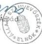

14

---

1. sz. melléklet
a V-25-60/1998-99. sz.
jelentéshez

# A sportcélú közalapítványok induló vagyona

# Új közalapítványok

Adatok: M Ft-ban

|  Közalapítványok megnevezése | Készpénz | Egyéb | Összesen  |
| --- | --- | --- | --- |
|  NSKA | 50 | - | 50  |
|  MFKA | 10 | - | 10  |
|  UNIÓ | 5 | - | 5  |

# Átalakult közalapítvány

Adatok: M Ft-ban

|  Közalapítvány megnevezése | Alapítói vagyon készpénz | Jogelőd alapít- ványtól átvett vagyon | Összesen  |
| --- | --- | --- | --- |
|  NISZKA | 75 | 128 | 203  |

Budapest, 1999. május

---

.

.

.

.

---

2. sz. melléklet
a V-25-60/1998-99. sz.
jelentéshez

A sportcélú közalapítványok bevételei

Adatok: M Ft-ban

|  Sor sz. | Jogcímek | NSKA |   | NISZKA |   | MFKA |   |   | UNIÓ | Összesen |   |   | Mindösz- szesen  |
| --- | --- | --- | --- | --- | --- | --- | --- | --- | --- | --- | --- | --- | --- |
|   |   |  1997. | 1998. | 1997. | 1998. | 1996. | 1997. | 1998. | 1998. | 1996. | 1997. | 1998.  |   |
|  1. | Költségvetési támogatás | 250,0* | 350,0 | 32,5 | 5,0 | 50,0 | 50,0 | 5,0 | 25,0 | 50,0 | 332,5* | 385,0 | 767,5  |
|  2. | Totó játékadó | 330,0* | 370,5 |  |  |  |  |  |  |  | 330,0* | 370,5 | 700,5  |
|  3. | Sorsolásos játékok adója |  |  | 538,2 | 456,2 |  |  |  |  |  | 538,2 | 456,2 | 994,4  |
|  4. | Támogatás, adomány |  |  |  | 11,2 |  | 2,5 |  | 8,0 |  | 2,5 | 19,2 | 21,7  |
|  5. | Szponzori bevételek |  |  |  |  |  |  |  | 19,0 |  |  | 19,0 | 19,0  |
|  6. | Egyéb bevételek | 3,0 | 34,9 | 38,3 | 93,3 |  | 15,7 | 23,7 | 2,3 |  | 57,0 | 154,2 | 211,2  |
|   | ebből pénzügyi bevételek (kamat, árfolyam) | 3,0 | 34,0 | 26,6 | 84,1 |  | 15,7 | 23,6 | 2,1 |  | 45,3 | 143,8 | 189,1  |
|  7. | Bevételek összesen | 583,0 | 755,4 | 609,0 | 565,7 | 50,0 | 68,2 | 28,7 | 54,3 | 50,0 | 1260,2 | 1404,1 | 2714,3  |

* a helyszíni ellenőrzés megállapításai alapján!

Budapest, 1999. május

---

.

.

.

.

---

3. sz. melléklet
a V-25-60/1998-99. sz.
jelentéshez

A sportcélú közalapítványok kiadásai (költségei)

|  Sor sz. | Jogcímek | NSKA |   | NISZKA |   | MFKA |   | UNIÓ | Összesen |   | Mindösz- szesen  |
| --- | --- | --- | --- | --- | --- | --- | --- | --- | --- | --- | --- |
|   |   |  1997. | 1998. | 1997. | 1998. | 1997. | 1998. | 1998. | 1997. | 1998.  |   |
|  1. | Alapítványi célú kiadások (költségek) M Ft | 207,8* | 812,5 | 341,4 | 751,8 | 21,1 | 20,7 | 23,5 | 570,3* | 1608,5 | 2178,8  |
|  2. | Működési kiadások (költségek) M Ft | 17,7* | 50,2 | 31,0 | 57,5 | 5,2 | 7,2 | 14,5 | 53,9* | 129,4 | 183,3  |
|  3. | Egyéb ráfordítások M Ft |  |  | 1,6 | 1,2 |  |  |  | 1,6 | 1,2 | 2,8  |
|  4. | Előző időszak ráfordításai M Ft |  |  | 0,9 | 0,2 |  |  |  | 0,9 | 0,2 | 1,1  |
|  5. | Kiadások (költségek) összesen M Ft | 225,5 | 862,7 | 374,9 | 810,7 | 26,3 | 27,9 | 38,0 | 626,7 | 1739,3 | 2366,0  |
|  6. | A működési kiadások (költségek) ará- nya az összes kiadás (költség) %-ában | 7,8 | 5,6 | 8,3 | 7,1 | 19,8 | 25,8 | 38,2 | 8,6 | 7,4 | 7,7  |

* a helyszíni ellenőrzés megállapításai alapján!

Budapest, 1999. május

---

.

.

.

.

---

4. sz. melléklet

a V-25-60/1998-99. sz.

jelentéshez

# A sportcélú közalapítványok támogatásának összefoglaló adatai

# GEREVICH ALADÁR NEMZETI SPORT KÖZALAPÍTVÁNY

1997. év

# 1. Normatív támogatás

# 1.1. Az atlantai olimpián pontot szerzett versenyzőket foglalkoztató sportegyesületek részére

14 sportegyesület 97,89 pontszám 69 M Ft

5 alapítvány 51,58 pontszám 36 M Ft

Összesen 149,47 pontszám 105 M Ft

# 2. Céltámogatás pályázat útján

# 2.1. Egyetemi és főiskolai sportegyesületek céltámogatása

25 sportegyesület, 44 benyújtott és elfogadott pályázat, odaítélt összeg 35 M Ft

# 3. Támogatás pályázati rendszeren kívül

# 3.1. Pályázati rendszeren kívül biztosított feladat-támogatás

5 sportszövetségnek 23 M Ft

# 4. Sportösztöndíjban részesített sportolók

24 olimpiai sportágban, 263 olimpiai versenyszámban, 272 fő nyári, 8 fő téli olimpiára készülő sportolónak összesen (1 főre jutó átlag 55000 Ft/hó) 50 M Ft

1998. év

# 1. Normatív támogatás

# 1.1. Sportegyesületek részére az atlantai olimpiai és az 1997. évi VB, EB szereplés alapján

47 sportegyesület 20641 pontszám 63 M Ft

# 1.2. Sportegyesületek részére az 1997. évi utánpótlás VB, EB szereplés alapján

55 sportegyesület 2015 pontszám 40 M Ft

1

---

4. sz. melléklet
2. lap

# 1.3. Normatív támogatás sportszövetségek részére az atlantai olimpiai szereplés alapján

13 sportszövetség

193 olimpiai pontszám

50 M Ft

# 2. Céltámogatás pályázat útján

# 2.1. Egyetemi és főiskolai sportegyesületek céltámogatása

29 sportegyesület, 48 benyújtott és elfogadott pályázat, odaítélt összeg

40 M Ft

# 2.2. Pályázati úton támogatott feladatfinanszírozás

Labdarúgó edzőpályák megvilágítása, 40 benyújtott és 36 elfogadott pályázat

98,6 M Ft

Utánpótlás műhely támogatás 9 sportág, 144 benyújtott, 152 elfogadott pályázat

39,7 M Ft

# 3. Támogatás pályázati rendszeren kívül

# 3.1. Pályázati rendszeren kívül biztosított feladat-támogatás

11 sportszövetségnek

44 M Ft

# 3.2. 1997-1998-ban a sportszövetségek és a MOB részére - az OTSH, MOB, NSKA megegyezése alapján - pályázati rendszeren kívül biztosított céltámogatás

Utánpótlás VB-EB részvételre 35 sportágnak

60 M Ft

Edzőtáborra, versenyek rendezésére 20 sportágnak 47 M Ft, MOB-nak 10 M Ft, együtt

57 M Ft

Sidney-i olimpiai felkészülésre 21 sportágnak 74,5 M Ft, MOB-nak 5 M Ft, együtt

79 M Ft

Támogatás összesen 36 sportágnak 181 M Ft, MOB-nak 15 M Ft

# 4. Sportösztöndíjban részesített sportolók

25 olimpiai, 6 nem olimpiai sportágban, 269 olimpiai versenyszámban, 541 fő nyári, 11 fő téli olimpiára készülő sportolónak összesen (1 főre jutó átlag 34300 Ft/hó)

278 M Ft

# 5. Sportszakemberek számára biztosított ösztöndíjak

1998. május 1. - december 31.

27 sportágban 323 főnek (1 főre jutó átlag 28300 Ft)

71 M Ft

2

---

4. sz. melléklet
3. lap

# WESSELÉNYI MIKLÓS NEMZETI IFJÚSÁGI ÉS SZABADIDŐSPORT AZ EGÉSZSÉGES ÉLETMÓDÉRT KÖZALAPÍTVÁNY

Az 1997-98. években adott támogatások összesített adatai:

# 1. Normatív támogatások 105 M Ft

Ebből: Magyar Természetbarát Szövetség 15 M Ft

Magyar Szabadidősport Szövetség 18 M Ft

Magyar Diáksport Szövetség 44 M Ft

Magyar Technikai és Tömegsportklubok Országos Szövetsége 8 M Ft

Fogyatékosok sport- és érdekvédelmi Szövetségei 20M Ft

# 2. Pályázati úton nyújtott támogatások 986,3 M Ft

|  Ebből: | nyertes pályázat, db |   |
| --- | --- | --- |
|  óvoda | 1540 | 95,7 M Ft  |
|  sportszervezet | 1594 | 249,7M Ft  |
|  oktatási intézmény | 1895 | 190,8M Ft  |
|  sporteszköz vásárlás | 2026 | 210,1M Ft  |
|  diáksportszervezetek | 233 | 38,8M Ft  |
|  helyi-, megyei bajnokság | 901 | 147,9M Ft  |
|  főiskola, egyetem | 155 | 25,6M Ft  |
|  kiadványok | 39 | 27,7M Ft  |
|  összesen: | 8383 | 986,3M FT  |

# MEZŐ FERENC KÖZALAPÍTVÁNY

Az 1997-98. években adott támogatások összesített adatai:

# 1. Rendszeres támogatás

Ebből: 61 fő nyugdíjas olimpiai bajnok 10,8 M Ft

23 fő nyugdíjas olimpiai ezüstérmes 4,9 M Ft

38 fő nyugdíjas olimpiai bronzérmes 7,7 M Ft

25 fő nyugdíjas világbajnok 4,0 M Ft

9 fő nyugdíjas sportszakember 2,6 M Ft

27 fő támogatott özvegy 3,6 M Ft

összesen 183 fő 33,6 M Ft

2. Eseti támogatás 14 fő részére 2,0 M Ft

Budapest, 1999. május

3

---

.

.

.

.

---

---

5. sz. melléklet  
a V-25-60/1998-99. sz.  
jelentéshez

# **Állami Számvevőszék**  
**III. Költségvetési Ellenőrzési Igazgatósága**

# **Kivonat**

**a fejezetek és intézményeik által az alapítványoknak juttatott állami pénzek és vagyon felhasználásának, működtetésének ellenőrzéséről**

**1996. április hónapban készült jelentésből**

**A Nemzeti Ifjúsági és Szabadidősport az Egészséges Életmódért Alapítvány** pályázati rendszerben adott támogatásokat. A pályázatok nagy száma miatt a kuratórium gyakran ülésezett. Az 1993/1994. tanévben a támogatottak 10 %-át kötelezték visszafizetésre, mert nem, vagy más célra használták a kapott támogatást. Ténylegesen a támogatottak 3,3 %-a fizette vissza részben vagy egészben a támogatását, vagy folyik vele szemben bírósági eljárás. Az alapítvány az első pályázati év tanulságai alapján a késedelmes elszámolókat - függetlenül attól, hogy pályázatuk elszámolása szabályos-e - kötbér fizetésére kötelezi.

Budapest, 1999. május

---

.

1

.

.

---

V-25-60/1998-99. sz.

jelentéshez

# FÜGGELÉK

# A SPORTCÉLÚ KÖZALAPÍTVÁNYOK
HELYSZÍNI ELLENŐRZÉSÉNEK MEGÁLLAPÍTÁSAI

A Gerevich Aladár Nemzeti Sport Közalapítvány
helyszíni ellenőrzésének megállapításai... 3.
Mellékletek: 6-21.

A Wesselényi Miklós Nemzeti Ifjúsági és Szabadidő-
sport az Egészséges Életmódért Közalapítvány
helyszíni ellenőrzésének megállapításai... 45.
Mellékletek: 22-29.

A Mező Ferenc Közalapítvány
helyszíni ellenőrzésének megállapításai... 67.
Mellékletek: 30-34.

Az Unió Labdarúgó Európa Bajnokság Közalapítvány
helyszíni ellenőrzésének megállapításai... 77.
Mellékletek: 35-38.

---

.

.

.

.

---

# A GEREVICH ALADÁR NEMZETI SPORT

# KÖZALAPÍTVÁNY

# HELYSZÍNI ELLENŐRZÉSÉNEK MEGÁLLAPÍTÁSAI

1. AZ NSKA MEGALAKULÁSÁNAK ÉS MÜKÖDÉSÉNEK JOGI, SZERVEZETI FELTÉTELEI
1.1. Bírósági nyilvántartásba vétel, alapító okirat módosítás

A Sport tv. az NSKA működésének kezdeti időpontjául 1997. január 1-ét határozta meg az alapító Kormány számára feladatként.

A közalapítványi működés megkezdésének közel féléves elhúzódása a kormányzati szervek késedelmére és a bírósági bejegyzés elhúzódására együttesen vezethető vissza.

Az NSKA-t létesítő 1997. februári, 1016/1997. (II. 13.) Korm. határozat már késedelmesen született. A BM által elindított bírósági bejegyzés iránti kérelmet követően a Fővárosi Bíróság 1997. május 22-én 11. Pk. 60.283/1997/4. sz. végzésével nyilvántartásba vette a NSKA-t. A végzés 1997. június 13-án emelkedett jogerőre.

A Kormány által elfogadott alapító okiratban rögzített célok és feladatok teljes körűen tartalmazzák a Sport tv.-ben előirányzott közalapítványi célokat, feladatokat. Sőt a törvényben megfogalmazottakon túl - az olimpiai mozgalom, a versenysport és az utánpótlás nevelés támogatása - az alapító okirat az alapítványi célok között tünteti fel a versenysport és az olimpiai mozgalom központi sportlétesítményei működtetésének támogatását is.

Az alapító okirat szabályozási hiányosságai közé sorolható, hogy a célokat és a feladatokat nagyvonalúan határozta meg, átfedésben az OTSH által finanszírozott (verseny- és élsport, utánpótlás nevelés, MOB támogatása) állami feladatokkal. A Sport tv. 29. § (1) bekezdésében meghatározott, állami feladat ellátására irányuló közalapítványi feladatellátással szemben a Sport tv. 34. §-a az állami támogatások kiegészítő forrásaként nevesíti az NSKA-t.

Az alapító okirat a cél- és címzett támogatások fogalmi körét nem részletezi, nem tér ki a felhalmozási és a működési támogatások odaítélésének jogcímeire, nem egyértelmű az SL Rt. feletti tulajdonosi joggyakorlás, mint vagyonhoz kapcsolódó joggyakorlás tartalma.

A közhasznú szervezetekről szóló 1997. évi CLVI. tv. megjelenését követően a kuratórium 1998. V. 26-i ülésén kidolgozta a közhasznú szervezetként történő működéshez szükséges alapító okirat módosítást. Ezt a Kormány, mint

3

---

alapító az 1075/1998. (VI. 3.) Korm. határozatával jóváhagyta. Egyidejűleg felhatalmazta a belügyminisztert, hogy az alapító nevében intézkedjen az NSKA közhasznú szervezetként történő nyilvántartásba vételéről. A Fővárosi Bíróság a helyszíni vizsgálat zárásáig még nem vette közhasznú szervezetként nyilvántartásba az NSKA-t, illetve nem vette tudomásul az alapító okirat módosítását.

## 1.2. A működés anyagi-pénzügyi feltételeinek megteremtése

A közalapítványi működés induló **pénzügyi-vagyoni** feltételeinek biztosítása 1997. július végén, a bírósági nyilvántartásba vételt követő hónapban történt meg.

Az alapító okiratban meghatározott 50 M Ft-os induló vagyont - az 1997. évi költségvetési törvényben foglalt állami támogatás részeként - a Kincstár programfinanszírozás keretében, a benyújtott és elfogadott program ismertető alapján (a 15 M Ft-os működési támogatással és a 25 M Ft sportegyesület-normatív támogatási összeggel együtt) 1997. július 21-én utalta át az NSKA kincstári folyószámlájára.

Az alapító okirat előírta, hogy az NSKA önálló tulajdona megszerzéséig a NISZKA biztosítja az NSKA **elhelyezési feltételeit**. Erről a két közalapítvány elnöke 1997. III. 16-án szerződést kötött. Ezt kiegészítette a közös működés finanszírozásáról szóló 1997. V. 27-i emlékeztetőben foglalt megállapodás. Az NSKA önálló vagyoni tulajdonjog szerzése 1998. januárjában realizálódott. Az ingatlan felújítása, átalakítása és berendezése után a tényleges használatbavétel 1998. június 21-én megtörtént.

A közalapítvány érdemi működésének megkezdését - az ismertetett féléves indulási késedelmet követően - tovább nehezítette az 1997. évi pénzügyi források értelmezése körül a kormányzati szervekkel kialakult vita.

Ez alapvetően a totó játékadójából származó bevételekkel volt kapcsolatos. Vita tárgyát képezte, hogy a játékadó a Sport tv. rendelkezéseinek megfelelően 1997. január 1-től, vagy a jogerős bírósági nyilvántartás időpontjától jár az NSKA-nak. Másik problémát az Art. szabályozása jelentette, amely nem tette lehetővé a totó játékadójának folyósítását a közalapítvány részére.

E problémák az 1997. évi költségvetési törvény módosításával, 1997. decemberében rendeződtek megnyugtató módon az NSKA számára.

## 1.3. A közalapítványi működéshez szükséges intézkedések végrehajtása, a működés személyi feltételeinek kialakítása

A közalapítvány megalapításához és működéséhez szükséges adó-, TB. igazgatási, eljárási intézkedések és kötelezettségek végrehajtása az NSKA részéről - az 1997. június 13-i bírósági bejegyzést követő egy hónapos időszakban - teljes körűen és szabályszerűen megtörtént.

4

---

Az alapító okirat benyújtása alapján a Fővárosi és Pest megyei Egészségbiztosítási Pénztár 1997. július 8-i levelében közölte az NSKA társadalombiztosítási törzsszámát. Az APEH 1997. június 11-én rendelkezett az NSKA adószámának megadásáról.

Az NSKA és a választott kereskedelmi bank közötti szerződés alapján 1997. június 27-én nyitott a bank folyószámlát az NSKA részére. A Kincstár és az NSKA között 1997. július 8-án jön létre a határozatlan idejű megállapodás az NSKA kincstári pénzforgalmi számlája megnyitásáról.

Az NSKA **tisztségviselői** - kuratórium, FB - személyi feltételeinek biztosítása az alapító Kormány hivatalos, személy szerinti felkérése, illetve delegálás útján az indulásig teljes körűen megtörtént. Az elfogadott alapító okiratban már név szerint szerepelnek a kuratórium és az FB tagjai.

A kuratórium 1997. június 24-én, míg az FB június 23-án tartotta első ülését.

A kuratórium leendő tagjai - elnöki felkérésre - már 1997. március 18-án előkészítő ülést, illetve konzultációt tartottak.

**A közalapítványi iroda személyi feltételeinek** kialakítása és biztosítása az NSKA működésének ideje alatt nem történt meg teljes körűen.

Az alapító okirat szerint az NISZKA titkárságának kellett volna ellátnia az NSKA önálló tulajdon szerzéséig az NSKA titkársági feladatait is. Az 1997. június 24-i kuratóriumi emlékeztető rögzítette a közös titkársági feladatvégzés megszakadását, illetve a közös elhelyezés további folytatását. Ezt követően az NSKA titkársági feladatainak végzésére 1997. július - augusztusban 3 munkatárs került felvételre elnöki asszisztens, pályázati koordinátor és sportösztöndíj-referens munkakörbe. 1998. februártól egy kisegítő munkatárs beállítása történt meg. Nem került betöltésre az alapító okiratban meghatározott titkárságvezetői (titkár) és az SZMSZ-ben előírt irodavezetői poszt.

Az önálló iroda ingatlan 1998. júniusi birtokbavételét követően az NSKA kuratóriuma - a közalapítvány megszüntetéséről megjelenő sajtóhírek nyomán - már nem töltötte fel, nem erősítette meg az ügyintéző szervezet személyi állományát.

### 1.4. A Kuratórium összetétele, az összeférhetetlenségi szabályok alkalmazása

A kuratórium **személyi összetétele és alkalmassága** megfelelt a Sport tv.-ben foglalt előírásoknak. A kuratóriumi tagok a sportélet kiemelkedő személyiségei, sportegyesületek, sportszövetségek vezetői. Sportszakmailag - a sportéletben való évtizedes részvételük, gyakorlatuk és szakképzettségük alapján - alkalmasak az NSKA vagyonával és bevételeivel való gazdálkodásra.

Az alapító okirat VI. A. 8/a-c. pontjában foglalt összeférhetetlenségi szabályokat minden kuratóriumi tag esetében betartották.

---5

---

A kuratóriumi tagok döntéshozatali összeférhetetlenségét viszont az NSKA SZMSZ-e nem tartalmazza. Így - a kuratóriumnak az alapító Kormány által kijelölt tagjai kivételével - szinte minden kuratóriumi tag részt vett - adott esetben - az ő szervezete számára megítélt támogatások odaítélésében (a Magyar Olimpiai Bizottság, a Magyar Sportszövetség, a Sportegyesületek Országos Szövetsége, a Bp. Spartacus, a Magyar Egyetemi és Főiskolai Sportszövetség, a Szombathelyi Főiskolai SC, a Magyar Diáksport-szövetség részére biztosított közalapítványi támogatások esetében).

A döntéshozatali összeférhetetlenséget a közhasznú szervezetekről szóló 1997. évi CLVI. tv. 8. § (1) bekezdés b. pontja kötelezően előírja, ezeket az előírásokat az NSKA-nak a Kormány által 1998. június 3-án jóváhagyott módosított alapító okirata is tartalmazza. A kuratórium az összeférhetetlenségi szabályokkal kapcsolatos eljárási rendet az SZMSZ-ben nem rögzítette, és az alapító okirat módosítását követően nem alkalmazta.

A közhasznú szervezetekre előírt követelmények betartásának kötelezettségét a kuratórium elnöke az 1999. március 11-én kelt levelében arra hivatkozással vitatta, hogy a közalapítvány nem tartozott a közhasznú szervezetekről szóló 1997. évi CLVI. törvény hatálya alá. A kérelem benyújtására megadott határidő elmulasztása azonban álláspontunk szerint nem azt jelenti, hogy a közalapítvány nem tartozott a fenti törvény hatálya alá, hiszen a 27. § (3) bekezdésben meghatározott valamennyi feltétel fennállt az NSKA esetében, mely alapján kötelező volt a közhasznúsági nyilvántartásba vételt kérni. Tény, hogy az alapító határidő mulasztása miatt - 1998. június 1. helyett csak 1998. június 3-án módosította az alapító okiratot és ezt követően nyújtotta be a Fővárosi Bíróságnak a kérelmet - szankciókat lehetett volna érvényesíteni a központi költségvetési támogatás folyósításánál, vagy kezdeményezni lehetett volna a közalapítvány megszüntetését. E szankciókat azonban egy szerv sem kezdeményezte, és nyilvánvalóan a néhány napos késés miatt fenti súlyos szankciók alkalmazása - főleg az NSKA kedvezményezettjei számára - rendkívül hátrányos és méltánytalan lett volna. Az alapító azonban az általa 1998. június 3-án jóváhagyott alapító okiratban meghatározta a kurátorok számára az összeférhetetlenségi szabályokat. Álláspontunk szerint az ezzel kapcsolatos eljárási szabályokkal a kuratóriumnak az SZMSZ-t ki kellett volna egészíteni, és célszerű lett volna alkalmazni.

Az FB tagjaira vonatkozó - az alapító okirat VI. C. 3. pontja szerinti - összeférhetetlenség egy bizottsági tag esetében áll fenn 1998. szeptemberétől, aki az alapító Kormánnyal áll alkalmazotti viszonyban.

# 1.5. A kuratóriumi ülések rendszeressége, jegyzőkönyvek, határozatok szabályossága

A kuratórium üléseit - az SZMSZ-ben rögzített legalább negyedévenkénti gyakoriságot meghaladóan - a feladatai ellátásához szükséges havonkénti ülésezéssel tartotta.

6

---

Az SZMSZ - az alapító okirat rendelkezését meghaladóan - emlékeztető helyett az ülésekről **jegyzőkönyvek készítését** határozta meg, a jelenlevők felszólalása lényegének közlésével és a határozatok pontos közreadásával.

Az NSKA-nál kialakított gyakorlat során a kuratóriumi ülésekről **csak emlékeztetők** készültek az egyes felszólalások tartalma nélkül, az ülés határozatainak közlésével. **A határozatokról a titkárság külön összesítőt nem vezetett. Az emlékeztetőkben a szavazati arányokat nem mindig rögzítették, egyes esetekben hiányoztak a hitelesítői aláírások.**

**A kuratóriumi ülések határozatainak végrehajtását az - erre jogosult - FB nem ellenőrizte, arról jelentést vagy jegyzőkönyvet nem tudtak a vizsgálat számára bemutatni.**

## 1.6. A közalapítvány működésének, a kuratórium döntéseinek törvényessége, megalapozottsága, célszerűsége

A kuratórium döntései meghozatala során törekedett a működésére vonatkozó törvények és jogszabályok betartására, - pl. költségvetési törvény, sporttörvény, közbeszerzési törvény stb. - de a későbbi pontokban részletezett témákban és esetekben nem mindig tartotta be a törvényi előírásokat, különösen a támogatások odaítélésekor.

A kuratórium működésének másfél éves időtartama alatt a **döntéseket** általában **körültekintően**, az álláspontok és vélemények széles körű kikérésével, kialakításával hozta meg. Mind az 1997. évi, mind az 1998. évi támogatási koncepciót hosszas, megalapozott egyeztetések után alakította ki. Érvényre juttatta benne - a közalapítványi céloknak megfelelően - az olimpiai versenyszámok és sportágak eredményességét és differenciált támogatását, az utánpótlás nevelést előtérbe helyezte, bevezette az élvonalbeli sportolás és tanulás egyidejű megvalósítását ösztönző és elismerő sportösztöndíjakat. A támogatási döntésekhez gyakran vette igénybe szakzsűrik és szakértők döntés-előkészítő munkáját (pl. sportösztöndíj pályázat kidolgozása, utánpótlás műhelyek pályázati támogatási rendszerének elbírálása stb.).

Ugyanakkor előfordultak nem körültekintő és újból napirendre tűzött, **megismételt döntések** is (pl. a sportegyesületeknek, majd alapítványoknak is nyújtott 1997. évi normatív támogatás) és 1998. év során sok egyedi, **eseti támogatási kérelmet** fogadtak el.

A kuratóriumi döntések alapvetően az alapítványi célok megvalósítására irányultak.

Az ellenőrzés egyes esetekben kifogásolta a kuratóriumi döntések, állásfoglalások célszerűségét, mint pl. a sportegyesületek és sportszövetségek érdekképviseleti szervei fenntartásához működési támogatás biztosítását vagy az árban megfelelő, de közalapítványi gyakorlattal nem rendelkező könyvelő cég és könyvvizsgáló választását, továbbá a titkárság célszerűségi, takarékossági okból történt nem megfelelő

7

---

felállítását, mely végső soron feladatvégzési gondokhoz, problémákhoz vezetett, a későbbiekben részletezettek szerint.

A kuratórium a közhasznú szervezetekről szóló 1997. évi CLVI. tv. előírásai szerint - az abban foglalt előírásokat figyelembe véve - nem teljes körűen munkálta ki alapító okirat-tervezetet 1998. júniusban, pl. külön befektetési szabályzat-tervezetet nem készített. A módosítások nagyobb részét a gyakorlatban is alkalmazták (pl. elszámolási- és ellenőrzési kötelezettség előírása a támogatási szerződésekben), a kuratóriumi döntésekről szóló határozatokat azonban továbbra sem tartották elkülönítetten nyilván és a kuratóriumi döntéshozatali összeférhetetlenségnek nem szereztek érvényt.

## 1.7. A közalapítványi iroda működése

**A közalapítványi iroda**, illetve titkárság feladatait az alapító okirat, szervezeti és működési szabályait a kuratórium által jóváhagyott SZMSZ határozza meg. A titkárság szakmai összetételét - az SZMSZ szerint - a kuratórium állapítja meg.

A helyszíni ellenőrzés megállapította, hogy a közalapítványi titkárság mind előírt feladatait, mind szervezetét illetően **nem működött teljes körűen**. Az alapító okiratban rögzített pénzügyi, gazdálkodási feladatok közül nem végezte a közalapítványi könyvek vezetését, a támogatási szerződések nyilvántartását és a támogatottaknak nyújtott támogatás felhasználásának ellenőrzését. A SZMSZ-ben meghatározott titkársági szervezetből a titkárságvezetői és irodavezetői funkciók nem kerültek betöltésre. A titkársági munkatársak fölött a munkáltatói jogokat és a közvetlen irányítást a kuratórium elnöke gyakorolta.

A könyvelési feladatokat megbízási szerződés alapján külső könyvelési cég végezte. A színvonalas könyvelés végrehajtását együttműködési hiányosságok és kölcsönösen fennálló szakmai-ismereti problémák nehezítették (pl. a közalapítványi speciális számviteli ismeretek hiánya).

Az NSKA eseti szakértőkön kívül rendszeres jogi szakértőket foglalkoztatott jogi feladatok végzésére, valamint az SL Rt.-vel összefüggő tulajdonosi joggyakorlás szakértői munkáira. A jogi szakértők foglalkoztatása - főállású jogi szakismerettel rendelkező munkatárs hiányában - teljes mértékben indokolt és célszerű volt az elvégzett feladatok alapján.

## 1.8. Az FB működése

A Felügyelő Bizottság tevékenysége csak **részlegesen felelt meg** a Ptk.-ban és az alapító okiratban előírt feladatok teljesítésének.

A kuratórium tevékenységének ellenőrzésére jogosult szervként - az 1997. október 28-i ülésükön kialakított bizottsági ügyrendnek megfelelően - a kuratóriumi üléseket követően a kuratóriumi előterjesztéseket és döntéseket áttekintették, véleményezték, s szükség esetén javaslatokat fogalmaztak meg azokkal összefüggésben. Ugyanakkor a kuratóriumi határozatok végrehajtásának ellenőrzését nem végezték el.

8

---

A kuratóriumi előterjesztésekkel, határozatokkal kapcsolatos javaslataik többsége észszerű és jogos volt - mint pl. az SZMSZ késedelmes elfogadása, a Sportegyesületek Országos Szövetsége részére megszavazott támogatás kifogásolása, az egyedi támogatási kérelmek helyett általános szabályozás jóváhagyása stb.

Javaslataik figyelembevétele, hasznosítása a kuratórium részéről kis mértékben valósult meg.

Az FB az alapító okiratban foglalt alapvető feladatát, a közalapítvány gazdálkodásának, számvitelének, ügyvitelének és kötelezettségvállalásainak ellenőrzését nem végezte. Nem rendelkezett az ellenőrzési munka alapját képző ellenőrzési munkatervvel sem.

Az FB az 1997. évi tevékenységéről szóló - az alapító okirat VI. C/11. pont szerinti - kötelező alapítói beszámoló elkészítését elmulasztotta.

# 1.9. A könyvvizsgáló megbízása, feladatai teljesítése

Az NSKA könyvvizsgálói feladatait az 1997. IX. 1-től 1998. XII. 31-ig terjedő időszakban a pályáztatás során kiválasztott könyvvizsgáló és adótanácsadó kft. végezte. A kuratórium részéről 1997. július 30-án meghozott döntés és az 1997. augusztus 22-én megkötött megbízási szerződés az 1997-es és az 1998-as év éves beszámolójának felülvizsgálatára és auditálására szólt.

A kuratórium napilapokban meghirdetett pályázata alapján 15 pályázó közül 3 tagú bizottság választotta ki a nyertes céget, amely pályázatában nem jelzett közalapítványi referenciát. A megbízási szerződés összege reális, nem magas összeg.

A megbízási szerződés alapvető hiányossága, hogy nem tartalmazta az SZMSZ-ben könyvvizsgálói feladatként előírt közalapítványi szerződések és az alapító okirat betartásának ellenőrzését.

A megbízott könyvvizsgáló az NSKA 1997. évi egyszerűsített éves beszámoló mérlegéről a könyvvizsgálói jelentését elkészítette és 1998. április 15-i kelettel a mérleget hitelesítő záradékkal látta el.

Jelen vizsgálat során - a későbbiek szerint részletezettek szerint - megállapítást nyert, hogy az 1997. évi mérleg kötelezettségek sora nem a valós helyzetet tükrözi. Továbbá a beszámoló - a számviteli törvény előírásaival szemben - nem volt alátámasztva szabályszerű, teljes körű leltározással, csak a befektetett eszközök értékelésével. A kötelezettségvállalások számbavételét sem az NSKA, sem a könyvelő cég, sem a könyvvizsgáló nem végezte el.

9

---

# 2. A KÖZALAPÍTVÁNY GAZDÁLKODÁSÁNAK, KÖNYVVEZETÉSÉNEK SZABÁLYOSSÁGA

# 2.1. A belső szabályzatok megléte, törvényessége, teljessége

Az NSKA szervezeti és működési szabályzatát több mint féléves működés után, 1997. december 11-én tárgyalta és hagyta jóvá a kuratórium (B/1997. 28. sz. határozat).

Az SZMSZ összhangban áll az alapító okirattal, de a szabályozása nem teljes körű. Fő hiányosságának az tekinthető, hogy az alapító okiratban meghatározott lényeges feladatok eljárás rendjét, részletes leírását nem tartalmazza.

Így pl. a közalapítványi támogatások rendszere és bevételi forrásai címszó alatt megismétli az alapító okiratban foglaltakat, a végrehajtás szabályozása nélkül.

A közalapítvány - sem önálló szabályzat formájában, sem az SZMSZ mellékleteként nem rendelkezik vagyonkezelői és befektetési szabályzattal, valamint pályáztatási és elszámolási szabályzattal.

A kuratórium nem általános szabályozással, hanem egyedi döntések formájában alakította ki - menetközben változtatta meg - a normatív-, a cél- és a feladat támogatási szabályait, feltételeit. A címzett támogatások rendszerének kimunkálásával és alkalmazásával - a Sport tv.-ben, az alapító okiratban és az SZMSZ-ben előírtak ellenére - nem foglalkozott.

A közalapítvány 1997. december 11-től - 3/1997/29. sz. kuratóriumi határozat - rendelkezik érvényes gazdálkodási szabályzattal, az 1998. január 8-i kuratóriumi elfogadását követően számviteli politikával, az eszközök és források leltárkészítési és leltározási szabályzatával, valamint pénzkezelési szabályzattal. A fenti szabályozások teljes körűek és kielégítik a törvényi, jogszabályi követelményeket. Ugyanakkor túlzó részletességűek, és nem tartalmazzák megfelelően a közalapítványi sajátosságokat. A szabályzatokban alapvetően a társasági szabályozások adaptációja és alkalmazásba vétele jelenik meg az NSKA könyvelését végző cég közreműködésével.

Az elfogadott számviteli politika pl. az NSKA-nál céltartalék képzésről tesz említést, valamint az egyszerűsített éves beszámolóhoz kiegészítő melléklet készítését írja elő. A számviteli törvény szerinti egyéb szervezetek éves beszámoló készítésének és könyvvezetési kötelezettségének sajátosságáról szóló 8/1996. (I. 24.) Korm. rendelet - mely az ellenőrzött időszakban hatályban volt - a közalapítványok számára nem írt elő kiegészítő melléklet készítést, továbbá a céltartalék-képzést csak a vállalkozási tevékenységet folytató közalapítványok részére tette lehetővé.

A közalapítvány az Szt. 79. § (1) bekezdésében előírt számlarenddel, - amely szerinti könyvvezetés maradéktalanul biztosítja az éves beszámoló készítését -

10

---

**nem rendelkezik.** Az alkalmazott számlatükör a számlarendet nem helyettesítheti.

## **2.2. A számviteli nyilvántartások alkalmassága az alapító okiratban megjelölt alapítványi célok teljesítésének számbavételére**

Számlarend hiányában az alkalmazott számlatükör, a főkönyvi kivonatok és a főkönyvi számlalapok vizsgálata biztosította az NSKA-nál kialakított számviteli rendszer alkalmasságának megítélését az alapítványi célok teljesítésének számbavételére.

A könyvvezetésben a 93. Alapítványi célú tevékenységek bevételei számlán, illetve ennek alszámláin mutatják ki az alapítványi célú bevételeket, míg az alapítványi célú költségek számbavétele nem a 8. számlaosztályban, hanem az Egyéb költségek között az 561. Alapítványi támogatások felhasználása, kiutalása számlán, illetve ennek alszámláin történik.

Különösen a 935. Egyéb állami forrásból kapott támogatások bevétele számla és az 561. Alapítványi támogatások felhasználási számla részletezése **nem az alapító okiratnak megfelelően bontja az állami támogatások és azok felhasználása jogcímeit. Így nem kellően alkalmas a könyvvezetés a megjelölt alapítványi célok és feladatok teljesítésének visszatükrözésére.**

A 935. számlán belül nem különül el a központi költségvetési támogatás és a totó játékadóból befolyt bevétel. Az alszámla bontások nem az alapító okirat szerinti bevételi jogcímeket rögzítik.

Az 561. felhasználási számla részletezése szintén nem az alapító okirat szerinti támogatási céloknak és feladatoknak felel meg. A fentiek mellett a sportösztöndíj támogatásokból a kapcsolódó TB járulék felhasználása nem az alapítványi célú költségek között, hanem a személyi jellegű ráfordítások között jelenik meg.

Fentiek miatt a közalapítvány által elkészített tanúsítványok (8. és 9. sz. mellékletek *-gal megjelölt adatai nem a tényleges adatokat tartalmazzák.

A könyvelési cég részéről alkalmazott **könyvelési módszer sem biztosította az alapítványi célú bevételek és ráfordítások egyértelmű, átlátható kimutatását, egyáltalán könyvelték az NSKA kuratóriumi döntéseiből és támogatási szerződéseiből eredő kötelezettségvállalásokat.**

A központi költségvetési támogatásból és a totó játékadóból befolyt összegek az egyéb rövid lejáratú kötelezettségek között kialakított 479. Egyéb passzív elszámolási számlára kerültek bevételként könyvelésre, majd innen átutalásra a támogatott szervezetek számára. E számláról külön gyűjtéssel és összesítéssel kerültek átvezetésre egyösszegben a bevételek a főkönyvi zárás előtt a 9. számlaosztályba, illetve a felhasználások az 5. számlaosztályba, mint technikai számlákra.

---11

---

A fenti módszerrel a tényleges - kuratóriumi döntés szerinti, szerződésekkel alátámasztott - kötelezettségvállalások nem kerültek főkönyvi könyvelésre, azokat hiteles analitika sem támasztotta alá. A 479. számla egyenlegét - a beérkező támogatások és kiutalások különbözetét - tekintették záráskor a fennálló közalapítványi támogatási kötelezettség összegének, helytelenül, és nem a valóságnak megfelelően.

## 2.3. Az éves működési költségvetések elkészítése, jóváhagyása és végrehajtása

A közalapítvány 1997. évi és 1998. évi működési költségvetései elkészítését széles körű megalapozó munka előzte meg. Az éves költségvetés bevételi forrásait - egyéb bevételi források hiányában - a költségvetési törvényben jóváhagyott állami támogatás és a totó játékadójának 100 %-os összege képezték, melyekre előzetesen biztonsággal lehetett építeni. A felhasználási oldal 85-90 %-át kitevő **támogatási célú felhasználások** kialakítása sokoldalú egyeztetésen és a sport-társadalom párbeszédén (sportfórumok, egyesületi-szövetségi vélemény nyilvánítások, OTSH-MOB-NSKA egyeztetés stb.) alapult.

A kuratórium az 1997. évi működési költségvetést 620 M Ft-os bevételi és kiadási főösszeggel (1997. június 24-i A/1/1997. sz. határozat), az 1998. évi költségvetést - az előző évi 359 M Ft-os forrás áthúzódás miatt - 1.038 M Ft-os bevételi és kiadási főösszeggel 1998. február 19-én fogadta el. (A/4/1998. sz. határozat)

**Az éves költségvetések** elfogadásuk időpontjában **reálisak és megalapozottak voltak. Lényeges hibájuk az volt, hogy a forrás felhasználás szerkezetét nem a Sport tv. 34. § (3) bekezdésében foglaltak szerint - normatív-, cél- és címzett támogatás, pályázati feladatfinanszírozás, sportösztöndíjak, közalapítványi működési kiadások - határozta meg a kuratórium, hanem sajátos, részletező elgondolás szerint.**

A költségvetések végrehajtása az elfogadott tervszerűséget tükrözi. Ez 1997. évben a totó játékadó elhúzódó folyósítása miatt a prioritási sorrend kialakítását - a sportegyesületek normatív támogatása, az egyetemi-főiskolai sportegyesületek céltámogatása, a sportösztöndíj rendszerének beindítása - és jelentős mértékű támogatási összegek következő évi elhalasztását jelentette. Az 1997. évi költségvetés 580 M Ft-os költségvetési bevétel és 208 M Ft-os támogatás-felhasználás realizálásával, valamint 359 M Ft összegű pénzeszköz következő évre áthúzódó felhasználásával zárult.

Az 1998. évi 1.038 M Ft-os költségvetés az elfogadott bevételi és felhasználási jogcímek mentén **kisebb változásokkal** valósult meg. A bevételi oldal jellemzője, hogy **továbbra sem sikerült az állam által rendelkezésre bocsátott bevételeken kívül más, külső forrást bevonni a közalapítvány finanszírozásába.** A lekötött pénzeszközökből származó bevétel (1998. IX. 30.: 30 M Ft) és az 1997. évi sportösztöndíjak utáni - azok törvényi adó - és járulékmentessé tételét

12

---

követően - TB-járulék visszatérítés (15,5 M Ft) gyakorlatilag szintén állami pénz-eszközökből származik.

Az 1998. évi költségvetés végrehajtása - az 1999. január elejei helyzet szerint - 912 M Ft-os kuratóriumi támogatási kötelezettségvállalást mutat, közel azonosan a tervezett összegekkel. A tényleges folyósítás várhatóan 110-120 M Ft közötti összeggel marad el a vállalt kötelezettségektől, főként az elhúzódó utánpótlás - műhely támogatási döntés, a sportösztöndíjasakkal kötendő szerződések késedelme, valamint a labdarúgó pályavilágítási program részleges teljesülése következtében.

A kötelezettségvállalások nem megfelelő analitikus nyilvántartása és főkönyvi könyvelés hiányában az 1998. évről áthúzódó - 1998. évi költségvetéssel fedezett - kötelezettségvállalás összege a vizsgálat lezárásakor pontosan nem volt megállapítható, arra az 1998. évi mérlegbeszámoló készítésekor kerülhet sor.

Az 1998. évi működési költségvetés bevételi oldala a tervezettel szemben 40 M Ft-os totó játékadó többlettel és 15 M Ft-os, 1997. évi sportösztöndíjak utáni TB-járulék visszatérítési növekménnyel zárul.

Az 1998. évi költségvetés végrehajtásának a tervtől legnagyobb mértékben eltérő felhasználási összege az irodaépület céljait szolgáló ingatlanvásárlási, átalakítási és berendezési beruházás végrehajtása. A tervezett 52 M Ft-tal szemben 78 M Ft-os végösszeget tesz ki (ingatlanvásárlás: 27 M Ft, felújítás: 25 M Ft és tárgyi eszközbeszerzés: 26 M Ft).

# 2.4. Az éves beszámolók szabályossága, az alapítónak történő beszámolási kötelezettség teljesítése

A közalapítvány az Szt. 11. § (5) bekezdése és a számviteli törvény szerinti egyéb szervezetek éves beszámoló készítésének és könyvvezetési kötelezettségének sajátosságáról szóló, - az ellenőrzött időszakban hatályban lévő - 8/1996. (I. 24.) Korm. rendelet alapján egyszerűsített éves beszámoló készítésére, ennek keretében egyszerűsített mérleg és eredmény-kimutatás készítésére volt kötelezett.

A helyszíni ellenőrzés befejezéséig az 1997. évről szóló közalapítványi beszámoló készült el. Az NSKA az előírt kötelezettségen túl, a beszámolóhoz kiegészítő mellékletet is készített a közalapítványi gazdálkodás részleteinek bemutatásával.

A vizsgálat megállapítása szerint a mérleg és eredmény-kimutatás szabályszerűen készült, de a rendelkezésre álló könyvvezetési dokumentumok és a korábban ismertetett könyvelési módszer alapján a mérleg rövid lejáratú kötelezettségek sora, valamint a kiegészítő melléklet több adata nem a valós helyzetet rögzítette.

Az 1997. évi állami finanszírozásból kapott támogatás bevétele (a totó játékadóval együtt) a kiegészítő mellékletben és a főkönyvi számlákon megjelentetett 237.840 E Ft-tal szemben, ténylegesen 579.887 E Ft-ot tett ki, az alapítói vagyon nélkül 529.887 E Ft-ot. A 479. passzív elszámolási számlán történt bevétel felhasználási könyvelés miatt az 1997. évben fel nem használt, azaz a bevételként elszámolt tá-

13

---

mogatás összegéből a tárgyévben költséggel, ráfordítással nem ellentételezett összeg a mérlegben rövid lejáratú kötelezettségként (292.047 E Ft) jelentkezett.

Az NSKA gazdálkodási szabályzatában definiált kötelezettségvállalás 1997. évtől 1998. évre áthúzódó összege - az 1998. évi működési költségvetésben feltüntetettek és a vizsgálat számára rendelkezésre bocsátott tanúsítványok szerint - csak 29.069 E Ft-ot tett ki. A beszámoló kiegészítő mellékletében az alapítványi célú támogatások kiadásaként - a sportösztöndíjak helytelen könyvelése miatt - mindössze 142.749 E Ft jelentkezik. A sportösztöndíj kifizetések az üzleti év után járó juttatások között, bértételként szerepelnek.

A fentiek szerint készített éves beszámolót a könyvvizsgáló hitelesítő záradékkal ellátta, majd a kuratórium 1998. május 26-i ülésén elfogadta (A/15/1998. sz. határozat).

A közalapítvány alapító okiratának VII/5. pontja előírja, hogy a kuratórium minden év március 31-ig köteles az előző évi működésről, gazdálkodásról, vagyoni helyzetről az alapító számára beszámolót készíteni.

Az 1997. évről szóló beszámolót a kuratórium 1998. március 26-i ülésén jóváhagyta és március 31-i aláírással a kuratórium elnöke benyújtotta a kormányhoz.

A beszámoló tömör, lényegre törő tényszerűséggel két és fél oldal terjedelemben számolt be a közalapítvány 1997. évi működéséről és gazdálkodásáról. Ennek során szólt az indulás nehézségeiről, a kialakított támogatás-elosztási elvekről, az 1997. évi működési költségvetés végrehajtásáról. A beszámoló nem részletezte - a Sport tv.-ben és az alapító okiratban előírt tevékenységek támogatását, így nem minősíthető teljes körű, alapítói célokat kielégítő beszámolónak. Egyetlen részletező, a sportösztöndíjak kifizetéséről szóló számszaki mellékletet tartalmazott csak.

A beszámoló szöveges részében foglalt számszerű adatok több pontatlanságot tartalmaztak az 1997. évi költségvetés végrehajtásával összefüggésben, illetve egyes esetekben keveredtek a kuratóriumi döntési (kötelezettségvállalási) összegek és az 1997. évben ténylegesen folyósított összegek.

Pl. a 105 M Ft-os normatív támogatási-döntési összegből 1997. évben nem a teljes összeg, hanem csak 95,3 M Ft került folyósításra (a mérlegbeszámoló kiegészítő melléklete szerint 64,6 M Ft). Az olimpiai labdarúgó válogatott spanyolországi edzőtáborozására megítélt 4 M Ft-ot és a 2004. évi labdarúgó EB szervező bizottsága számára biztosított 5 M Ft-ot csak 1998-ban folyósították.

A beszámoló a közalapítvány további feladataként jelezte, hogy nagyobb figyelmet kíván fordítani a juttatott pénzeszközök cél szerinti felhasználásának ellenőrzésére.

A közalapítvány a helyszíni ellenőrzést követően, 1998. március 31-én készítette el az 1998. évi egyszerűsített éves beszámoló mérlegét (6/A. sz. melléklet), így az abban feltüntetett adatok már nem kerülhettek ellenőrzésre. Az 1998. évi eszköz-növekmény még helyesbítésre szorul, részletesebben lásd a 4.4. pontban.

---14

---

# 2.5. A gazdálkodás, pénzkezelés szabályossága, a leltározási kötelezettség teljesítése

A közalapítvány gazdálkodása alapvetően az éves működési tervekben előirányzottaknak megfelelő tervszerűséggel, de nem minden tekintetben a gazdálkodási szabályzat előírása szerint zajlott.

A gazdálkodási feladatok ellátásában működött a kuratórium és az ügyintéző szervezet közötti előírt munkamegosztás, ugyanakkor a tiktársági szervezet hiányos létszámfeltöltése miatt a kuratórium elnöke napi operatív, adott esetben titkárságvezetői feladatok végrehajtására is kényszerült. Az ügyintéző szervezet első emberének számító elnöki asszisztens több munkakört, így irodavezetői feladatot is ellátott részlegesen.

Lényeges gazdálkodási hiányosság, hogy a gazdálkodási szabályzatban foglaltak ellenére az utalványozott bizonylatokról hiányzott a kuratórium alelnökének ellenjegyzése. A kötelezettségvállalásokról analitikus nyilvántartást nem vezettek.

A könyvelési céggel kialakított közalapítványi együttműködés nem operatív, hanem időszakos volt, így a számviteli bizonylatok könyvelése adott esetben egy-két hónapos késéssel történt. Számlarend nem volt, a gazdálkodási szabályzat sem rendelkezett a bizonylatok feldolgozási rendjéről.

Az 1998. decemberi helyszíni ellenőrzés időszakában a könyvelési cég utolsó havi főkönyvi kivonatként az 1998. szeptemberit tudta biztosítani, az október havi bizonylatok akkori könyvelésével egyidőben.

Az NSKA a pénzkezelés és a pénzügyi fegyelem alapvető szabályait betartotta. A pénztári utalványozást a kuratóriumi elnök, a pénztárosi feladatkört az elnöki asszisztens végezte. Pénztári ellenőrzést időszakosan a könyvvizsgáló végzett. A kellő ügyintézői létszám hiánya következtében alakult ki a fenti munkaellátás. A napi pénztári záróállományt 50 E Ft-ban határozta meg a pénzkezelési szabályzat, melyet kuratóriumi döntés 100 E Ft-ra emelt. Ezt a 200 E Ft-os készpénzfelvételek nyomán gyakran túllépték. A vagyon és a pénzeszközök védelmét korszerű vagyonvédelmi-riasztó berendezés üzembeállításával megfelelően biztosította. A vagyoni eszközök nyilvántartása a főkönyvi számlák alapján teljes mértékben áttekinthető volt.

A közalapítvány 1997. év végén az Szt.-ben és a saját leltározási szabályzatában előírt leltározási kötelezettségének nem tett eleget, erre vonatkozó dokumentumokat nem tudtak bemutatni.

A tárgyi eszközök mennyiségi leltározására, irodai szobaleltárak felvétele formájában - a helyszíni ellenőrzés előkészítése időszakában - 1998. XI. 9-én került sor, a leltározási szabályzatban foglalt előírások figyelembevétele nélkül. Nem történt meg a felvett leltári adatok kiértékelése, főkönyv anali-

15

---

tikával való egybevetése, azonosítása és az esetleg szükségessé váló intézkedések megtétele.

## 2.6. A közalapítványi iroda működési kiadásainak és tárgyi eszközbeszerzésének alakulása

Az 1997. évi - 6 és félhónapos működése során a **közalapítványi iroda** működési költségei 17,7 M Ft-ot, 7,7 %-os mértéket képviseltek a 226 M Ft-os összes költségen belül.

A közalapítvány tanúsítványa (9. sz. melléklet) a működési költségek összegét 33.092 E Ft-ban tartalmazza, mivel - tévesen - a személyi jellegű kifizetések között szerepelt az sportösztöndíjak után fizetett 15.391 E Ft TB járulék.

Az 1998. évi működési költségvetés 4,4 %-os mértékű, 45,9 M Ft összegű **működési kiadást** tartalmazott. Az 1998. I-III. negyedévi 32,6 M Ft-os tényszám 71 %-os időarányos működési költség alakulást tükröz a tervezetthez, és 5 %-os részarányt az I-III. negyedévi összes költséghez képest.

A **működési költségeket** az alapítványi célú sportösztöndíjak személyi jellegű ráfordításként történő számviteli megjelenítése miatt **nem az alapítványok gazdálkodási rendjéről szóló 115/1992. (VII. 23.) Korm. rendelet 3. § (2) bekezdés szerinti részletezésben különítette el a könyvvezetés.**

A működési költségeken belül a kuratóriumi és FB tagok részére kifizetett **tiszteletdíjak és költségtérítések együttes összege** 1997. évben 2,9 M Ft-ot, azaz 16,8 %-ot, 1998. I-III. negyedévben 6,3 M Ft-ot, azaz 19,5 %-ot képviselt (TB-járulék nélkül).

A működési kiadásokhoz kapcsolódóan 1997. évben 4 M Ft-os, 1998. évben 26 M Ft-os **tárgyi eszköz beszerzést** hajtott végre a közalapítvány, az 52 M Ft-os, költségvetésileg előirányzott irodavásárlási és felújítási beruházáson túl. A tárgyi eszköz beszerzések többsége valós szükségletet elégitett ki és színvonalas, korszerű iroda-berendezést, működési és elhelyezési feltételeket biztosított. Konkrét beszerzésük viszont nem volt a működési költségvetésben előirányozva és tételes felsorolású kuratóriumi döntés nem támasztotta alá 1998. évben a tárgyi eszköz beszerzéseket.

A fenti tárgyi eszközbeszerzések **nem minősíthetők célszerű, takarékos beruházásnak**, a beszerzett irodabútorok magas árát és a közalapítvány csekély létszámú személyi állományát tekintve.

A közalapítvány egy kft.-vel kötött 12,1 M Ft+ÁFA átalányáras vállalkozási szerződést az irodahelyiségei bútorozására. A kft. - a közalapítványt terhelő, a nettó vételár 5%-ában (575 ezer Ft) meghatározott közreműködési díjért - a bútorokat egy bt.-től szerezte be (21. sz. melléklet). A vállalkozási szerződés összegét figyelembevéve kilenc iroda és váró bebútorozása átlagosan 1,5 millió Ft-ba került, miközben az irodai foglalkoztatottak száma 1997-ben 3, 1998-ban 4 fő volt.

16

---

A bt. árajánlatában pl. a következő nettó árak szerepeltek: natúr nyír íróasztalok 110 -150 ezer Ft/db, görgős székek 75,5 ezer - 91,2 ezer Ft/db, vendégszékek 69 ezer Ft/db, ruhásszekrények 78,5 ezer Ft/db, fotelek 111,6 ezer Ft/db.

A kuratórium működése során három esetben bonyolított le **közbeszerzési eljárást**, a Kbt. előírásai alapján. Más beszerzések nem tartoztak a Kbt. hatálya alá, így a 30 M Ft-os összeg alatt lebonyolított 1998. évi iroda-felújítási, építési beruházás sem.

A kuratórium 1997. VIII. 29-i ülésén B/17/1997. sz. határozatával döntött az önálló titkárság felállításához szükséges saját tulajdonú ingatlan megvásárlásának közbeszerzési eljárásáról (gyorsított tárgyalásos eljárásról). 1998. június 29-i ülésén A/33/1998. sz. határozatával döntött a labdarúgó edzőpályák világításának tervezésére és kivitelezésére irányuló 95 M Ft-os értékű fővállalkozási szerződéséről, valamint az 5 x 2 m méretű, fémből készült mobil labdarúgó kapuk 15 M Ft összegű kivitelezéséről és helyszínre szállításáról szóló közbeszerzési eljárások nyílt eljárású meghirdetéséről (Közbeszerzési Értesítő 1998. VIII. 5. szám). Az első és második helyen nevesített eljárások szabályosan és megfelelő eredményességgel zárultak. A mobil labdarúgó kapuk tárgyában zajló közbeszerzési eljárás eredményhirdetését az egyik elutasított pályázó óvása nyomán a Közbeszerzési Döntőbizottság szabálytalannak minősítette, s a kihirdetett eredményt megsemmisítette 1998. október 12-i D/225/12/1998. sz. határozatával. A kuratórium 1998. december 3-i ülésén úgy döntött, hogy a mobilkapukra új eljárást nem kezdeményez.

Az önálló ingatlan vásárlására kiírt közbeszerzési eljárás során az NSKA a legjobb belvárosi ingatlan ajánlatot választotta; 26,9 M Ft értékben, összesen 292 m² alapterülettel, a Bp. VI. Paulay u. 45 sz. alatti II. emeleti társasházi irodaingatlant. A földhivatali tulajdonbejegyzésre irányuló kezdeményezést az NSKA - az eljárás lezárását követően - azonnal megtette.

A labdarúgó pályák megvilágítására kiírt fővállalkozói szerződést 9 ajánlattevő közül - a legalacsonyabb ár, illetve a legtöbb pálya megvilágításának vállalása alapján - egy kft. nyerte el. Az 1998. szeptember 25-i eredményhirdetés után az NSKA 1998. október 8-án kötötte meg a kft.-vel a 95 M Ft-os, 36 pálya megvilágítását 1998. IV. negyedévben teljesítő szerződést. Ezt megelőzően már a közalapítvány október 1-én megbízási szerződést kötött 3,6 M Ft-os értékben egy betéti társasággal a pályavilágítás műszaki szakértői, ellenőri tevékenységére. Így a labdarúgó pályák megvilágításának - pályázati úton kiírt és MLSZ közreműködéssel megvalósuló - feladatfinanszírozását a költségvetésben foglalt 95 M Ft-tal szemben, 98,6 M Ft-os támogatással hajtja végre az NSKA.

A helyszíni ellenőrzés időpontjában - 1998. XII. 9. - a kivitelező kft. 7 pálya világítását elkészítette, átadta. A szerződés szerinti számláját (12 M Ft + ÁFA, összesen 15 M Ft) a műszaki ellenőr javaslatára az NSKA kifizette. Az időközben benyújtott második számla ugyancsak 15 M Ft-ról szól, de a szerződéstől eltérően nem újabb 7 pálya világítás elkészültéről, hanem csak a földmunkák elvégzéséről. A kuratórium a szerződésbeli teljesítéstől eltérő kifizetéshez 1998. december 3-i ülésén hozzájárult. Ez utóbbi kifizetés szabályszerűtlennek és előleg kifizetésnek értékelhető.

17

---

A kuratórium elnökének 1999. március 11-én kelt levele szerint - a helyszíni ellenőrzést követően - a kivitelező cég teljesítette vállalását és a 36 labdarúgó edzőpálya-világítás végleges átadása a módosított szerződés szerinti, 1999. március 21-i határidőre történik meg.

## 2.7. A kuratóriumi- és FB tagok tiszteletdíja és költségtérítése

A közalapítvány alapító okirata biztosítja a kuratóriumi és FB tagok tiszteletdíjban részesítésének, valamint szükséges és indokolt költségeik megtérítésének lehetőségét.

A kuratórium az 1997. VII. 24-i alakuló ülésén jóváhagyott döntésével, valamint az 1997. december 11-én elfogadott gazdálkodási szabályzatában biztosította **tiszteletdíj kifizetését** a kuratóriumi és az FB tagok részére. A tiszteletdíjak az alapító okiratban előirányzott minimálbér összegek előírt mértékének felelnek meg (kuratóriumi- és FB tag a mindenkori minimálbér 100 %-os, kuratóriumi alelnök 150 %-os, kuratóriumi elnök és FB elnök 200 %-os mértékben részesül).

A kuratórium 1997. VI. 24. ülésén elfogadott határozata, valamint a gazdálkodási szabályzatban rögzítettek értelmében számlával igazolt költségelszámolás helyett **költségátalány** illeti meg a tisztségviselőket (kuratóriumi elnök, alelnök, FB elnök: 30.000 Ft/hó, kuratóriumi- és FB tag: 20.000 Ft/hó). A költségátalány elfogadását előkészítő kuratóriumi előterjesztés nem tartalmazza a szükséges és indokolt költségek kimunkálását. E döntésével egyidejűleg a kuratórium a közalapítvány működési költségei terhére vállalta a kifizetett költségtérítési átalány összege után fizetendő 39 %-os társadalombiztosítási hozzájárulást is.

**Álláspontunk szerint a költségtérítések költségátalányként történő kifizetését az alapító okirat nem tette lehetővé. E kifizetések az alapító okiratban foglalt szükséges és indokolt költségtérítési lehetőséggel szemben nem szabályszerűek és nem célszerűek.**

A gazdálkodási szabályzat a kuratóriumi elnök külön juttatásaként határozta meg a közalapítvány tulajdonában levő, 1997. június végén beszerzett személygépkocsi kizárólagos használatát 2000/km/hó, majd 1998. évben külön kuratóriumi döntéssel 3000 km/hó futásteljesítményig és a gépkocsival kapcsolatos összes üzemeltetési költség közalapítvány részéről történő térítését.

A tiszteletdíjakat és költségtérítéseket meghatározó kuratóriumi határozatok nem vették figyelembe az 1052/1997. (V. 21.) Korm. határozat idevonatkozó ajánlásait, miszerint „a kuratórium és az ellenőrző szerv civil tagjai részére sem feltétlenül indokolt tiszteletdíj megállapítása. Törekedni kell arra, hogy a civil szervezetek által delegált kurátorok költségtérítését a külső szervezetek viseljék.”

Az 1998. évi működési költségvetés a 3 fő vezető tisztségviselő részére együttesen **mobiltelefon-használati költségtérítést** irányzott elő havi 50 E Ft-os, évi 600 E Ft-os keretösszegig, melynek kifizetése számlák alapján havonta megtörtént. Erről a gazdálkodási szabályzat és külön kuratóriumi döntés nem rendelkezett. E

18

---

költségtérítés - a havi egy üléshez képest - takarékossági szempontokat nem figyelembevevő juttatásként értékelhető.

A kuratórium elnökének nyilatkozata szerint a mobiltelefon használat a minimális létszámú apparátus vezetői távirányítását és a külső kapcsolattartást szolgálta.

# 2.8. A közalapítvány likviditása

Az NSKA 1997-es indulási évében a központi költségvetési támogatás első 90 M Ft-os részletének átutalását követően vált működő- és fizetőképes szervezetté. 1997. decemberéig, - a totó játékadó 1997. évi teljes összegének kincstári folyósításáig, a kuratórium csak a folyamatosan rendelkezésre álló bevétel - s nem a jóváhagyott működési költségvetési jogcímek - függvényében vállalt kötelezettségeket, illetve teljesített kifizetéseket. Így 1997. év II. félév során is biztosította a likviditását az NSKA.

A közalapítvány 1997. decemberétől - döntései és kötelezettségvállalásaiból eredő kifizetései, valamint az 1998. évi működési költségvetése pénzforgalmi tervének alapulvételével - folyamatosan rendelkezett szabad pénzeszközökkel, melyek egy része tartós betéti elhelyezésben volt.

A pénzeszközök állománya 1997. XII. 30-án 358,9 M Ft-ot, 1998. IX. 30-án 234,8 M Ft-ot képviselt.

Az előbbiek alapján az NSKA pénzügyi helyzete és likviditása jónak minősíthető.

# 3. A KÖZALAPÍTVÁNY RENDELKEZÉSÉRE ÁLLÓ KÖZPONTI KÖLTSÉGVETÉSI TÁMOGATÁS, ILLETVE A KÖZPÉNZEK RENDELTETÉSSZERŰ, TÖRVÉNYES ÉS CÉLSZERŰ FELHASZNÁLÁSA

# 3.1. Az NSKA bevételeinek alapító okirat szerinti alakulása és a központi költségvetési támogatás alakulása

A közalapítvány bevételi forrásaként az alapító okirat - a Sport törvénnyel összhangban - hat jogcímet sorol fel. Ezek közül három jogcím - támogatói befizetések, adományok, csatlakozó külföldi vagy belföldi természetes és jogi személyek befizetései, illetőleg egyéb vagyoni hozzájárulásai - bevételi forrásként nem működött sem 1997-ben, sem 1998-ban.

Az 1997. évi 582,9 M Ft-os közalapítványi bevételből 579,9 M Ft-ot tett ki együttesen a központi költségvetési támogatás és az állam által átengedett totó játékadójának 100 %-a, 3,0 M Ft-ot a pénzintézeti kamat. Az 1998. I-III. negyedévi 566 M Ft-os bevételen belül 24,8 M Ft-os a pénzintézeti kamatbevétel, a további összeg az említett két jogcímen befolyt állami támogatási összeg. Tekintettel arra, hogy a közalapítvány pénzügyi gazdálkodásából eredő pénzintézeti kamat forrását a

19

---

központi költségvetési támogatás képezte, így gyakorlatilag az NSKA működésének bevételi forrásait teljes egészében az állam biztosította. A kuratóriumi határozatok egyike sem irányult további bevételi források feltárására, bevonására.

Az 1997. évi költségvetési törvény az NSKA támogatására 470 M Ft-ot irányzott elő a XI. BM fejezet 22. OTSH cím 6. Sporttámogatási célelőirányzatok alcímen. Ez az összeg a tényleges teljesülés mértékéig teljesülő kiadásként magában foglalta a totó játékadója 100 %-os összegét is, de ezt a célelőirányzatban nem nevesítették. Mivel a totó játékadójának NSKA részére történő átutalása a PM álláspontja szerint az akkor hatályos Art. előírásainak nem felelt meg, ezért a Kormány a 2239/1997. (VII. 29.) Korm. határozattal, 110 M Ft-os totó játékadó megelőlegezést biztosított a költségvetés általános tartaléka terhére 1997. II. félévében a közalapítvány számára.

Az Art. és az 1997. évi költségvetési törvény módosításával, majd az 1998. évi költségvetési törvény elfogadásával rendeződött a totó játékadó 100 %-os összegének - Sport tv.-vel összhangba hozott - biztosítása az NSKA számára. A fenti rendezés alapján 1997. évben a közalapítvány összesen 580 M Ft-os állami támogatásban részesült, melyből a központi költségvetési támogatás 250 M Ft-ot, a totó játékadó 330 M Ft-ot tett ki. A közalapítvány tanúsítványában (8. sz. melléklet) nem a tényleges állapotnak megfelelően tüntette fel fenti két forrásból származó bevételét.

Az 1998. évi költségvetési törvény központi költségvetési támogatásként 350 M Ft-ot, totó játékadó címen 330 M Ft-ot irányzott elő.

Az NSKA költségvetési támogatásának folyósítása - a program finanszírozásról szóló 208/1996. (XII. 23.) Korm. rendelet alapján - a Kincstárral kötött finanszírozási szerződésben meghatározott ütemezés szerint történik. A finanszírozási szerződés alapját a közalapítvány által készített és az OTSH részéről a Kincstárnak benyújtott programismertető képezi.

1998. első negyedévében az NSKA részére a 350 M Ft terhére nem történt folyósítás. (A közalapítvány 1997. XII. 31-i pénzeszközállománya 359 M Ft volt.) Az 1998. évi programismertető csak 1998. május 14-én készült el, az NSKA 1998. május 4-én kelt értesítése és ezt megelőzően véglegesített támogatási terve alapján. A Kincstár ezt követően májusban 109 M Ft-ot, júniusban 52 M Ft-ot, majd havonta időarányosan folyósította a központi költségvetési támogatást.

### 3.2. A totó játékadóból származó bevételek alakulása és folyósítása

A Szerencsejáték Rt.-nél és az NSKA-nál folytatott helyszíni vizsgálat, továbbá e szervezetektől, az APEH-től, az OTSH-tól rendelkezésre álló dokumentumok alapján, valamint az előző pontban ismertetett és vizsgált törvényi összefüggések alapján megállapítható, hogy az NSKA-t a költségvetési törvények szerint megillető totó játékadó 100 %-a mind 1997. évben, mind 1998. évben a tényleges teljesülés mértékéig realizálódott és az NSKA kincstári folyószámláján megjelent (1997. év: 330 M Ft; 1998. év: 370 M Ft).

20

---

A vizsgálat megállapította, hogy a Szerencsejáték Rt. részéről az adóbevallásban szereplő havi **totó játékadó összegek megegyeznek** az APEH részéről az OTSH-nak küldött értesítésen feltüntetett, valamint a Kincstár számára átutalt, majd a Kincstár által az NSKA részére folyósított totó játékadó összegekkel. A Szerencsejáték Rt. részéről kimutatott és az APEH-hez havonként átutalt totó játékadó 100 %-os összege megegyezik a szerencsejáték szervezéséről szóló 1991. évi XXXIV. tv. szerint kialakított nyereményalap törvény szerint előírt 16 %-os mértékével.

A totó játékadójának a tényleges játékadó összegek szerinti folyósítása a vonatkozó törvények összhangba hozásával a már korábban említettek szerint 1997. decemberétől folyik a fenti rendszerben. A törvényi rendezetlenség miatt az NSKA 1997. június-szeptember hónapokban nem kapott totó játékadó támogatást. Az előző pontban említett 110 M Ft-os költségvetési tartalék - mint totó játékadó előleg - Kincstáron keresztül folyósítása 1997. október 1. és december 1. között történt meg (okt. 1.: 60 M Ft, nov. 13.: 25 M Ft, dec. 1.: 25 M Ft). A törvényi rendezést követően előbb a totó játékadó 1997. I-IX. havi tényleges összegének hiányzó különbsége (dec. 9.; 101 M Ft), majd az októberi játékadó a november 20-i adóbevallás alapján érkezett meg az NSKA-hoz (dec. 23.: 29 M Ft).

Tehát a fenti - **Szerencsejáték Rt. - APEH - Kincstár - NSKA átutalási láncon keresztül bonyolódó - totó játékadó folyósítás két hónapos átfutási idővel működik.** Így az 1997. évi tényleges teljesülés az 1997. I.-X. havi totó játékadó, az 1998. évi tényleges teljesülés az 1997. XI. - 1998. X. hónapok totó játékadója biztosítását és folyósítását jelenti.

### 3.3. Sporttámogatási és finanszírozási koncepció kialakítása, alapító okirattal, és bevételi forrásokkal való összhangja

A kuratórium már a közalapítvány működésének megkezdése előtt részletes és megalapozott javaslatot alakított ki az NSKA pénzeszközeinek elosztási elveire és koncepciójára, valamint az 1997. évi konkrét összegekre.

A javaslatot a sporttársadalom szakmai fórumai, bizottságai 1997. április-június hónapban széles körben megvitatták és véleményezték. Az észrevételek döntő többsége támogatta a körvonalazott koncepciót, a megjelölt prioritásokat és a pályázati rendszer dominanciáját.

A kuratórium a viták tapasztalatainak figyelembevételével véglegesítette és 1997. június 24-i alakuló ülésén elfogadta az NSKA pénzeszközeinek elosztási elveit és koncepcióját.

Az **elosztási elvek** differenciált hangsúlyképzést és nem teljes körű sportfinanszírozást, valamint rendszerszerű támogatást rögzítettek, az egyedi ügyek minimálisra csökkentésével. Szükségesnek ítélték az OTSH-val, MOB-bal és a NISZKA-val való szoros együttműködést, mivel az érvényes Sport tv. nem tartalmazza a sporttámogatás finanszírozási rendszerét.

---21

---

A kialakított **támogatási koncepció** - az alapító okirat célkitűzéseivel összhangban - az olimpiai sportágakon nyugvó verseny-, valamint élsport támogatására és az utánpótlás nemzetközi színvonalú műhelymunkájának támogatására helyezte a hangsúlyt. Anyagi eszközök hiányában támogatási célként nem jelent meg az alapító okiratban előirányzott olimpiai felkészülést- és a versenysport céljait szolgáló központi sportlétesítmények támogatása.

Mind az 1997. évi, mind az 1998. évi működési költségvetésben konkretizált és feladatokként részletezett támogatási célok - az előbb említett kivétellel - **összhangban** voltak az **alapítási célokkal** és a törvényi garanciával alátámasztott várhatóan rendelkezésre álló **bevételi forrásokkal**.

Az 1998. évi működési költségvetésben foglalt támogatási célok és feladatok meghatározását az OTSH - MOB - NSKA közötti **sportfinanszírozási egyeztetés** előzte meg. E helyeselhető egyeztetés **gyakorlati megvalósítási formája viszont 190 M Ft-os „felső szintű döntésként” pályázati rendszeren kívüli szakszövetségi támogatásokat eredményezett**.

### 3.3.1. A sportszervezetek támogatási rendszerének kialakítása, működtetése

A Sport tv. 34. § 3. pontja és a közalapítványi alapító okirat IV. 2. pontja értelmében az alapítási célok érdekében teljesítendő közfeladatok, azaz közalapítványi támogatás nyújtása

- a Sport tv. 1. § 6. pontja szerinti **sportszervezetek** számára biztosított normatív-, cél-, címzett támogatással, és pályázati rendszeren alapuló feladatfinanszírozással, valamint
- a természetes személyek számára adott sportösztöndíjjal

hajtható végre.

**A kuratórium nem rögzítette** az SZMSZ-ben vagy a gazdálkodási szabályzatában - az alapító okirat VI. A/10. g. pontjában foglalt feladatai szerint - **a normatív támogatást megalapozó pontrendszer kialakítását**, a céltámogatás, a címzett támogatás, valamint a pályázati rendszeren alapuló **feladatfinanszírozás feltételeinek kidolgozását**, azaz a támogatások teljes körű rendszer szerinti működését - amint azt az elosztási elvek is meghatározták - **s annak működési feltételeit és részleteit**.

A kuratórium - az alapvető célokat rögzítő támogatási koncepciója elfogadását követően - az éves működési költségvetésekben és az abban foglaltak megvalósítását szolgáló támogatási döntéseiben biztosította előírt támogatási feladatai végrehajtását. Ebből viszont az állapítható meg, hogy a **sportszervezeteknek nyújtott közalapítványi támogatások normatív, pályázati cél-, pályá-**

22

---

zaton kívüli cél-, pályázati feladat- és pályázaton kívüli feladat támogatás formájában történtek.

Az így működtetett rendszer nem felel meg teljes mértékben a Sport tv. és az alapító okirat fentiek szerinti előírásainak. Ezen kívül nem alakították ki a címzett támogatások tartalmát, működési rendjét.

A normatív támogatás odaítélési feltételeinek kialakítása folyamatos viták és változó feltételek mellett zajlott mind 1997-ben, mind 1998-ban. A kuratórium semmilyen kikötést, korlátozást nem írt elő a sportszervezetek normatív támogatásának felhasználására. Kizárólag azt tartalmazta a döntés, hogy az NSKA-hoz beküldött igénybejelentéshez csatolt felhasználási tervből ki kell derülnie a tervezett támogatás felhasználási céljainak, ütemezésének.

1997-ben az atlantai olimpiai pontszerzés alapján (150 olimpiai pont) a pontszerző sportegyesületek részére biztosított a kuratórium 1997. XI. 24-i döntésével 105 M Ft-os normatív támogatást.

A döntést követően a sportegyesületek és sportszövetségek, valamint ezek érdekképviseleti szervezetei tiltakoztak, hogy csak az atlantai pontszerző egyesületek és azok közül is a köztartozással nem rendelkező egyesületek részesülnek normatív támogatásban.

A kuratórium 1997. VII. 29-i A/5/1997. sz. határozatával a Sportegyesületek Országos Szövetsége elnöke levele alapján úgy döntött - módosítva korábbi döntését - hogy normatív támogatásra igény-bejelentési lehetőséget biztosít az alapvetően sporttevékenység folytatására, támogatására alapított alapítvány számára is. (Igénybejelentés határideje: 1997. XI. 30.)

Ez utóbbi döntés eredményeként 16 sportegyesület és 4 alapítvány számára biztosítottak 1997. évben normatív támogatást. A folyósítás több egyesület részére, összesen 9,3 M Ft, áthúzódott 1998. évi teljesítésre.

A sporttámogatást végző alapítványok számára odaítélt közalapítványi támogatás egyrészt kielégíti a támogatható sportszervezetre vonatkozó Sport tv. 1. § (6) bekezdésében foglalt előírásokat, - ennek dokumentálását kérte az NSKA - másrészt viszont a Sport tv. 32. § (1) bekezdésében előírt köztartozási közokiratok benyújtásának kikerülését jelenti. Ez történt a 4 jogosult sportegyesület, illetve az őket támogató alapítványok esetében.

A Budapesti Spartacus Sportalapítványnál, 1998. dec. 15-én lefolytatott helyszíni vizsgálat megállapította, hogy az alapítvány által elnyert 16,3 M Ft-os normatív támogatást az alapítvány és a sportegyesület 1997. XII. 15.-i megállapodása alapján az alapítvány átadta a sportegyesület részére, amely azt az alapítvánnyal szemben fennálló kölcsön tartozása rendezésére fordította.

A sportegyesület elnöke és az alapítvány elnöke ugyanazon személy, egyben a Sportegyesületek Országos Szövetségének delegáltja az NSKA kuratóriumában.

23

---

1998-ban az 1997. évi tapasztalatok alapján a kuratórium változtatott normatív támogatási gyakorlatán. Egy széleskörűen megvitatott, majd összetett szempontok szerint kidolgozott pontrendszer alapján - de továbbra is felhasználási feltételekhez nem kötött igénybejelentéssel - a sportegyesületek számára 62,9 M Ft-os normatív támogatást biztosított az atlantai olimpiai és az 1997. évi VB, EB szereplés alapján, továbbá 40 M Ft-os támogatást biztosított az 1997. évi utánpótlás VB, EB szereplés alapján. A sportszövetségek számára 50,2 M Ft-os normatív támogatást biztosított az atlantai olimpiai szereplés alapul vételével (13 sportszövetség).

A céltámogatások odaítélése megalapozott kuratóriumi döntésekkel történt.

1997. évben szabályszerű pályáztatással döntött a kuratórium 35 M Ft-os céltámogatás odaítéléséről 25 egyetemi és főiskolai sportegyesület részére, három előirányozott cél támogatásával, (a felsőoktatás bázisán működő sportegyesületek versenysport szakosztályai, a felsőoktatási élsportszakosztályok és a testnevelő tanárképzést folytató felsőoktatási intézmények sportegyesületei pályázati úton történt támogatása).

1998. évben szintén az egyetemi és főiskolai sportegyesületek számára valósult meg pályázati céltámogatás 40 M Ft-os összegben, az előző évben már bevált kiírási renddel és hármas cél teljesítésével.

A kuratórium 1998-ban hajtott végre pályázati rendszeren kívüli - a már említett OTSH-MOB-NSKA megállapodáson alapuló 196,5 M Ft-os - céltámogatást a sportszövetségek részére, illetve a MOB részére.

Ebből az utánpótlás VB-EB részvételekre 60 M Ft-ot, edzőtáborozásra, versenyek rendezésére 57 M Ft-ot, és a Sidney-i olimpiai felkészülésre 70,5 M Ft-os összeget biztosítottak.

Ezen összegekből a MOB is részesült olimpiai programcélokra (1997. Sydney 2000. olimpiai program lezárása 5 M Ft, olimpiai labdarúgó válogatott felkészítése és spanyolországi edzőtáborozása 4 M Ft - 1998. évi átutalással -, 1998. Athén 2004. olimpiai programhoz 10 M Ft).

Feladatfinanszírozás pályázati rendszerben csak 1998-ban történt két témakörben és kellő megalapozottsággal. Mindkét esetben az utánpótlásnevelés céljait szolgálták a döntések.

A 36 labdarúgópálya megvilágítási programja során - az MLSZ-szel együttműködésben - 95 M Ft-os feladatfinanszírozásról döntöttek, mely végül a 3,6 M Ft-os ellenőrzési szerződéssel együtt 98,6 M Ft-os feladatfinanszírozást jelentett (a közbeszerzési eljárásokat ismertető 2.6. pontban részletezettek szerint).

Az 1998. december 3-i kuratóriumi ülés döntött 39,7 M Ft-os összegű utánpótlásműhely támogatásáról 9 sportági szakszövetség számára, a szabályszerűen

24

---

kiírt pályáztatás és lebonyolítás alapján. E program pénzügyi teljesítésének két-harmad része (30 M Ft) áthúzódott 1999. évre.

**Pályázati rendszeren kívüli feladatok támogatásáról is döntött a kuratórium a Sport tv. és az alapító okirat előírásaival, valamint az elfogadott elosztási elveivel ellentétben.**

**A kuratórium 1997-ben 23,3 M Ft-os, 1998-ban 43,6 M Ft-os pályázaton kívüli feladat támogatásról döntött.**

**Az ellenőrzés célszerűtlennek minősíti** - a Sport tv. 32. § (1) bekezdése és a Sport tv. 1. § (6) bekezdése alapján - **a Magyar Sportszövetségnek és a Sportegyesületek Országos Szövetségének megítélt és folyósított 10 M Ft-os, illetve 6 M Ft-os működési támogatást** (MSSZ: 1997.: 5 M Ft, 1998.: 5 M Ft; SOSZ: 1997.: 3 M Ft, 1998.: 3 M Ft). Írásos kérelmük működőképességük fenntartására, működési zavaraik elhárítására, tehát **nem sporttevékenységre irányult**. Benyújtott támogatási kérelmük mellékleteként nem csatolták - a Sport tv. 32. §-ában előírtak szerint - előző évi pénzügyi beszámolót és a saját forrásaikat is bemutató pénzügyi tervet (amely nem tartalmazhatott hiányt). **Nem minősíthető szabályszerűnek és célszerűnek a Magyar Kerékpáros Szövetség részére, tartozásai rendezésére odaítélt 1 M Ft-os összeg sem** (A/57/98. sz. kuratóriumi határozat).

### 3.3.2. A sportösztöndíj rendszerének kialakítása, működtetése

A közalapítvány 1997-ben sportolók részére, 1998-ban sportolók és sportszakemberek részére alakított ki és működtetett sportösztöndíjasi rendszert.

**A sportolók részére kialakított sportösztöndíj-rendszert alapos előkészítés** és szakszerű pályázati feltételi és szerződéskötési tevékenység jellemezte.

**1997. évben** sportegyesületi és szövetségi támogatás alapján a pályázati feltételeket teljesítő, megfelelő sportteljesítményt felmutató és a minimálbér kétszeresét nem meghaladó jövedelemmel rendelkező sportolók részesülhettek sportösztöndíj juttatásban, legfeljebb egy éves időtartamra szóló szerződéssel 1997. IX. 15-től kezdődően. **A sportösztöndíj összege 40 E Ft-tól 120 E Ft-ig terjedt.** 1997. évben - tört év lévén - 280 sportoló részesült összesen 49,6 M Ft-os sportösztöndíjban, 55 E Ft/fő havi átlagos összeggel.

**1998-ban** a kezdeti tapasztalatok alapján a kuratórium finomította a rendszer működését. Sportági szakszövetségi keretgazdálkodást és **az összeghatárok 20 és 200 E Ft közötti kiszélesítését vezették be.**

A szerződések időtartamát félévre csökkentették, melyet az előírt feltételek teljesítése esetén újabb félévre meghosszabbítottak. Az új szerződésekre a sportegyesületnek a szakszövetséggel együtt készfizető kezességet kellett vállalnia.

25

---

1998. évben 553 sportoló részesült 277,9 M Ft-os összegű sportösztöndíjban havi 34 E Ft-os átlaggal. A személyi jövedelemadóról szóló 1995. évi CXVII. törvény 3. és 34. §-a alapján a sportösztöndíj 1998. I. 1-től SZJA és TB-járulék mentessé vált így reálértéke megnőtt.

Az NSKA kuratóriuma 1997-98. évben összesen 146 sportoló ösztöndíj pályázatát nem fogadta el, a pályázati feltételek hiányában.

A **sportszakemberek** sportösztöndíj-rendszerének kialakítása és elfogadása az 1998. III. 11-i kuratóriumi ülésen történt. Bevezetésére 1998. V. 1-től került sor, az 1998. XII. 31-ig terjedő időszakra történő folyósítással. **Az ösztöndíj összege 20-120 E Ft közötti összeg.** Kizárólag Magyarországon dolgozó edzők, sportorvosok, gyúrók, pszichológusok részesülhetnek belőle, pályázati úton, de a sportági szakszövetség felterjesztése és a számára meghatározott keretösszeg terhére.

A kuratórium a sportszakemberek számára szintén előírta pályázati feltételek teljesítését szövetségi és egyesületi kezességvállalással, de **teljesítmény- és jövedelem feltételekhez nem kötötték a sportszakemberei ösztöndíj kifizetését.**

1998-ban 323 sportszakember pályázó részesült ösztöndíjban - 90 %-ban edzők - 71,5 M Ft-os összegben, havi 28 E Ft-os átlaggal. **A legmagasabb havi összegben a labdarúgásban és az úszásban tevékenykedők részesültek.** A kuratórium a sportszövetség által összegyűjtött és benyújtott pályázatokat változtatás nélkül fogadta el.

A sportszakemberek számára különösebb teljesítménykövetelmény és jövedelmi határ meghatározása nélkül biztosított ösztöndíjak **szúrópróbaszerű ellenőrzése több anomáliát felszínre hozott.**

A **labdarúgásban** az olimpiai válogatottat felkészítő 8 szakember 1998. VII. 1-től 6 hónapos időszakra részesült kuratóriumi döntéssel 1998. XII. 31-ig ösztöndíjban. 1998. októberétől nem ez a szakember gárda foglalkozik - az eredménytelen szereplést követően - a magyar olimpiai labdarúgó válogatottal. Kellő szerződési feltétel kikötése hiányában sem a sportösztöndíjban részesülők, sem az MLSZ ezt nem jelezte (2 fő ott még 1998. XII. 31-ig állományban van), így az NSKA a teljes szerződési időtartamra folyósította a sportösztöndíj összegét. Ezt az eljárást az ellenőrzés kifogásolja.

A kuratórium elnökének 1999. március 11-i nyilatkozata szerint „az NSKA az MLSZ kérésére, a MOB kezdeményezésére és azzal együttműködve, „tűzoltó jelleggel” nyújtott segítséget az anyagi tekintetben teljesen ellehetetlenült labdarúgó olimpiai válogatott felkészüléséhez és az őszi selejtezőkön való részvételéhez. E támogatási körbe tartozott, hogy a válogatott keretnél közreműködő szakemberek félévre ösztöndíjat kaptak. A közalapítvány semmiféle hivatalos értesítést, tájékoztatást nem kapott az érintettek foglalkoztatásában történt esetleges változtatásokról. A már említett, folyamatban lévő ellenőrzés erre is kiterjed.”

A **Magyar Úszószövetség** sportösztöndíj kerete terhére havi 100-120 E Ft-os sportösztöndíjban részesült 1998. V. 1- XII. 31. között a MÚSZ-nál alkalmazásban lévő két szövetségi kapitány. Ugyanekkor a MÚSZ számára megítélt 1998. évi köz-

26

---

alapítványi támogatások szűrőpróbaszerű ellenőrzése során megállapítást nyert, hogy az NSKA 1998. évi normatív támogatásának teljes - előírt feltétel hiányában - összege a MŰSZ-nál dolgozó úszószakemberek, köztük a két szövetségi kapitány havi 355-355 E Ft-os bérének, illetve munkavállalói díjának fedezetét szolgálja.

A Budapesti Spartacusnál lefolytatott helyszíni vizsgálat azt is megállapította, hogy az ott is alkalmazásban lévő egyik szövetségi kapitány, szövetségi edzőként 306 E Ft-os alapbérben és 50 E Ft-os költségtérítésben részesült 1998-ban, melynek forrása szintén az NSKA-tól származó közalapítványi normatív támogatás volt.

**A feltárt jelenségek belső közalapítványi szabályozási és szerződéskötési hiányosságot s egyben sportetikai problémát tükröznek.** A kuratórium elnökének nyilatkozata szerint a közalapítvány a rendkívül eltérő gyakorlat, az általa elvégezhetetlen ellenőrzés miatt a leginkább informált szakszövetségekre bízta saját szakembereik szakmai teljesítményének és jövedelmi viszonyainak mérlegelését, értékelését.

Az NSKA kuratóriuma 1998. október 28-i ülésén (A/52/1998. sz. határozat) döntött az 1999. I. félévi sportösztöndíjakról is. 1999. első hat hónapjára a sportolók részére 137,3 M Ft-os, a sportszakemberek részére 58,5 M Ft-os kifizetési kötelezettséget vállalt. E kötelezettségvállalás fedezetét az 1999. évi költségvetési törvény XXIV. ISM fejezet 5. címe tartalmazza.

### 3.4. A támogatások alapját képező, a sporttörvény rendelkezésein alapuló pályáztatás bonyolítása

**A Sport tv. rendelkezései szerint közalapítványi támogatás pályázattal, támogatási kérelemmel nyújtható. Az NSKA alapító okiratának VII. 6. pontja pályázathoz köti a támogatási igények bejelentését.**

Az 1997. évi 237 M Ft-os kuratóriumi döntés **86 %-a pályázati felhíváson** (sportolói sportösztöndíjak, egyetemi sportegyesületek céltámogatása, sportegyesületek normatív támogatása) **14 %-a pályázaton kívüli**, eseti támogatási kérelmen (levélbejelentés) alapult.

Az 1998. évi támogatások felhasználását célzó 912 M Ft-os kuratóriumi döntés **58 %-a pályázaton** (sportolói és sportszakemberei ösztöndíjak 38,5 %, egyetemi sportegyesületek céltámogatása 4,4 %, labdarúgó edzőpályák megvilágítása és utánpótlásműhelyek feladatfinanszírozása 15 %), **35 %-a igénybejelentésen** (normatív támogatás 17 %, szakszövetségek céltámogatása OTSH-MOB-NSKA megállapodással 18 %) és **7 %-a pályázaton kívüli**, eseti támogatási kérelmen alapult.

**A pályázati és az igény-bejelentési rendszeren alapuló támogatásnál az NSKA előírta a Sport tv. 32. § szerinti feltételek meglétét** (elszámolás az előző évben kapott támogatással, 60 napnál nem régebbi igazolások a köztartozási helyzetről, valamint a támogatás tárgyára vonatkozó pénzügyi terv a szervezet saját forrásának feltüntetésével). Kivételt ez alól csak a sportszervezet előző

27

---

évi beszámolójának bekérése jelentett. Ezt csak az 1997. évi normatív támogatás igénybevételére meghirdetett pályázatban kérték.

Az NSKA levél útján érkezett **egyedi támogatási kérelmek többsége nem tartalmazta az előírt pályázati feltételeket és az NSKA nem követelte meg azok meglétét** (pl. az 1997. évi MOB, MLSZ, SOSZ, MSSZ támogatási kérelmek elbírálásakor).

A pályázati- és igénybejelentésen alapuló támogatásoknál a **szúrópróbaszerű ellenőrzés a köztartozási okiratok meglétét állapította meg**. Továbbá azt, hogy az 1998. évi normatív- és egyetemi céltámogatások odaítélése előtt a közalapítvány rendelkezett az 1997. évi támogatásokról szóló elszámolással. A pályázati feltételek hiányossága a pénzügyi tervek esetében állott fenn, amikor a **pályázók gyakran nem tüntették fel saját pénzügyi forrásaikat**.

Pl. a Sport Plusz MAHART SE 3,7 M Ft-os 1998. évi normatív támogatási igénye bejelentése nem tartalmaz pénzügyi felhasználási tervet. A Juhász Gyula Tanárképző Főiskola DSE 1998. évi céltámogatás iránti pályázata nem tartalmazza bevételi forrásainak és pénzügyi felhasználási tervének részletezését.

Az NSKA részéről **indokolt és célszerű lett volna a támogatási rendszer teljes körű pályáztatási és elszámolási szabályzatának kidolgozása és alkalmazása**.

### 3.5. A közalapítványi támogatások megállapodásokba foglalása

A támogatások kedvezményezettjeivel, elsősorban **csak a pályázati úton odaítélt támogatásoknál** - kivéve az 1997. évi normatív támogatást - **történt az NSKA részéről szerződés kötése**. Így 1997. évben az elnyert támogatási összeg 42 %-ára, 1998. évben a támogatási összegek 58 %-ára kötöttek megállapodást. A megkötött szerződések - a szúrópróbaszerűen ellenőrzött sportösztöndíj-, egyetemi sportegyesületi céltámogatási, valamint a pályázati feladattámogatási szerződések alapján - a 3.2.2. pontban már bírált **sportszakemberi szerződések kivételével, jogi szakértők által megfelelően kimunkált és a törvényi előírásoknak eleget tevő szerződések**. A megállapodások megfelelően rögzítik a támogatás-felhasználási célokat, feladatokat, az ehhez kapcsolódó teljesítési és szankcionálási kikötéseket, a közhasznúsági törvény szerinti elszámolási, ellenőrzési kötelmeket.

Az **egyedi támogatásokat nem támasztották alá kétoldalú megállapodások, csak kuratóriumi döntések**. Az igénybejelentésen alapuló normatív támogatási igények és a szakszövetségi pályázaton kívüli céltámogatási kérelmek mögött az igénybejelentő sportszervezet előzetes egyoldalú kötelezettségvállalása állt. Ez magában foglalta előzetesen az igénybejelentő sportszervezetek részéről a közölt adatokért való felelősségvállalást.

28

---

A normatív támogatási döntéseket és az igénybejelentésen alapuló támogatási döntéseket nem követte szerződések kötése, mely mind az NSKA jogait (pl. szankcionálás) és kötelezettségét (pl. folyósítás) mind a támogatott sportszervezet jogait és vállalt kötelezettségeit tartalmazta volna.

A normatív támogatásokra vonatkozóan - már a pályáztatás, illetve igénybejelentés során - felhasználási kötöttséget nem írt elő a kuratórium. Kivétel az egyetemi és főiskolai céltámogatások odaítélése, amikor a beruházási, felújítási és tartós bér felhasználására vonatkozó kizáró feltétel kikötését előírták majd azt a szerződésben rögzítették.

# 3.6. A támogatás-felhasználás elszámoltatási rendszere, az elszámolási kötelezettségek teljesítése

Az NSKA által nyújtott támogatásokhoz a közalapítvány nem alakított ki egységes szabályozást és egységes elszámolási követelményeket. A több esetben alkalmazott következő év VI. 30-i elszámolási határidő nem vette figyelembe a pénzügyi év zárását.

A sportegyesületi normatív támogatásokkal a tárgyévet követő VI. 30-ig, az egyetemi- főiskolai céltámogatással a tárgyévet követő év VI. 30-ig, a tanév befejezéséig, az 1998. évi szakszövetségi normatív- és céltámogatásokkal a felhasználást követő 30 napon belül kellett elszámolni.

A kedvezményezettek elszámolási kötelezettség-teljesítése és szabályos dokumentumokkal való alátámasztása egyenetlen összképet mutat.

Az 1997. évi normatív támogatást nyert sportegyesületek, alapítványok mindegyike elszámolt - különböző színvonalon, az 1998. évi normatív igénybejelentésük előtt - a támogatás felhasználásával. 11 egyesület számlamásolatokkal, (pl. BHSE, MTK), 8 egyesület kizárólag összesítő kimutatással, felhasználási számlák nélkül, (pl. Bp. Spartacus Alapítvány, Sport Plusz SE).

Az 1997. évi egyetemi- főiskolai sportegyesületek céltámogatási felhasználásának elszámolását mind a 25 sportklub határidőre teljesítette. A szúrópróbaszerű ellenőrzés során megállapítást nyert, hogy 5 sportegyesület csak összesítő elszámolást nyújtott be számlamásolatok nélkül, (DEAC, DASE, Kandó, Jászberény, Tanítóképző és Zalaegerszegi PSZF DSE).

A szakszövetségek 1998. évi normatív- és céltámogatás felhasználásának eseményeket követő 30 napos elszámolása mutatja a legkritikusabb képet. 20 szakszövetség 1998. októberig átutalt 120 támogatási tételéből, az előírt 30 napon belül 44 elszámolása nem teljesült.

Az NSKA titkársága felszólítására a sportszövetségek csak 80 %-os arányban küldték meg elszámolásaikat 1998. év végéig.

Az 1998. évi szakszövetségi támogatások felhasználásának elszámolása körében szúrópróbaszerű ellenőrzés tárgyát képezték a Magyar Asztalitenisz Szövetség és a Magyar Úszószövetség NSKA-hoz megküldött elszámolá-

29

---

# **sai. Megállapítható, hogy az Asztalitenisz Szövetség elszámolásai előírás szerinti szabályszerűséget, a MÚSZ elszámolásai hiányosságokat tükröztek.**

A **MÚSZ** igény-bejelentési és elszámolási dokumentumaiból megállapította a vizsgálat, hogy az 1998. évi normatív támogatás teljes összegét (9.880 E Ft) a szövetség a szakmai vezetők - 2 szövetségi kapitány, 1 szakfelügyelő, 1 edző, 1 orvos, 2 gyúró vállalkozási, illetve munkaszerződése szerint - 1998. évi havi javadalmazására használta fel. A normatív keret kimerülését követően a szakszövetség 1998. évi Sydney olimpiai célkerete terhére történik a havi - kéthavi javadalmazás igénylése és kifizetése.

A MÚSZ nem küldte meg az NSKA-nak a bérkifizetések bizonylatait. A következő folyósítás mindig az előző „esemény” elszámolása nélkül történt. Az igénybejelentések mögött sem álltak benyújtott vállalkozási és munkaszerződések, kizárólag csak a havi javadalmazási név szerinti összesítő került benyújtásra.

A MÚSZ által aláírt előzetes kötelezettségvállalás tartalmazta azt az előírást, hogy a 30 napos határidő túllépése, vagy a hiányos elszámolás a teljes támogatás visszatérítését jelenti.

Az NSKA 1.875 E Ft-ot biztosított 1998. évi célkeretként az utánpótlás EB, VB részvételre a MÚSZ részére. A támogatásból a MÚSZ előlegként 760 E Ft-ot igényelt és kapott (1998. IV. 2-i igénybejelentés). A további 1.115 E Ft-os összeg folyósítása az 1998. augusztus 14-i elszámolás után történt meg.

A MÚSZ áprilisi igénybejelentése az 1998. július 30. - augusztus 2. között Antwerpenben megrendezendő úszó ifjúsági EB részvételről szól, melynek teljes összegeként 2.951 E Ft-ot tüntettek fel, (1.875 E Ft NSKA támogatás, 1.076 E Ft MÚSZ saját finanszírozás). Az NSKA támogatás igénybevétele az **utazási költség** (1.140 E Ft) és a **szállás-étkezés** (4 napi 1.512 E Ft) **teljes körű fedezetére** irányult a benyújtott pénzügyi terv szerint. Utazó csapatlétszámként 11 fő versenyző és 3 fő kísérő került feltüntetésre.

A benyújtott elszámolásból kiderül, hogy az igénybejelentéskor jelzettel szemben 12 fő versenyző és 11 fő csapatkísérő, közöttük 1 fő OTSH képviselő, összesen 23 fő kiutazását jelentették.

Az útielszámolásban a hivatalos utazási számla 25 fő - nem névszerinti - 1.256 E Ft-os repülőgép költségét rögzíti. Az antwerpeni 4 csillagos Sofitel szálloda 1998. július 27-i szállás- és étkezés számlája 6 éjszaka 13 db kétágyas szoba igénybevételéről szól összesen 468.000 belga frank (árfolyam: 5,884 HUF/BEF), azaz 2.750 E Ft összegről. A rendelkezésre álló antwerpeni szállásajánlati dokumentumok tanúsága szerint a Hotel Sofitelben 3.000 BEF/fő/éj (17.600 Ft) szálláslehetőség mellett olcsóbb ajánlatok is léteztek, mint pl. a napi 1.000 belga frankos ifjúsági szállodai elszállásolás.

A fenti példák alapján megállapítható, hogy az NSKA nem szerzett érvényt a kötelezettségvállalási előírásnak, továbbá a Sport tv. 34. § (4) bekezdésben foglaltaknak sem - ellenőrzés hiányában -, miszerint a folyósítás felfüggeszthető, ha igényléskor lényeges körülményről, tényről valótlan adatot szolgáltat a sportszervezet.

30

---

A MÚSZ elszámolásait az NSKA nem kifogásolta és nem térítette vissza a jogosulatlanul felvett összegeket.

### 3.7. A közalapítványi támogatások felhasználásának ellenőrzése

Az NSKA tevékenységének **legkritikusabb területe** a támogatások felhasználásának ellenőrzése. **Sem a kuratórium, sem az FB, sem a közalapítványi titkárság nem fektetett megfelelő súlyt az ellenőrzésre.**

A közalapítvány nem alakított ki ellenőrzési rendszert és ellenőrzési módszereket. **Az FB és a közalapítványi titkárság egyáltalán nem gyakorolta folyamatos ellenőrzési jogát és kötelezettségét.** Nem rendelkeztek a támogatások felhasználásának ellenőrzésére irányuló ellenőrzési tervvel sem az NSKA működésének másfél éves időtartama alatt. A közalapítványi titkárság a pályázati feladatok teljesítésének és elszámolásának figyelemmel kísérését végezte.

A kuratórium 1997. november 11-i ülésén foglalkozott először az ellenőrzés témakörével. A B/25/1997. sz. határozatában a kuratórium elfogadta, hogy szervezési, technikai és időbeni akadályok miatt az év végéig ne kerüljön sor a sportegyesületek tételes ellenőrzésére.

A Kormánynak 1998. március végén benyújtott beszámoló említést tett arról, hogy a következőkben megkülönböztetett figyelmet kívánnak fordítani a támogatások felhasználásának ellenőrzésére.

A kuratórium 1998. július 8-i, majd 1998. szeptember 29-i ülésén megbízott két kuratóriumi tagot a sportolói ösztöndíjak 40 főre kiterjedő szűrőpróbaszerű ellenőrzésével, szakértők bevonásával.

A kuratóriumi döntés nyomán 1998. november 25. és december 1. között történt 7 sportegyesületnél 8 sportág sportolóira kiterjedő sportösztöndíj szerződési ellenőrzés. A vizsgálat - 2 kuratóriumi tag részvételével és 2 külső szakértő bevonásával -, több kisebb szabálytalanságot állapított meg 6 sportoló esetében. A vizsgálatról készült jelentést a kuratórium 1998. december 3-i ülésén megtárgyalta és a szükséges intézkedések megtételét kezdeményezte (pl. sportolói státuszok rendezése, jogtalanul felvett összegek visszafizetése stb.).

A kuratórium elnökének 1999. március 11-i nyilatkozata szerint „az idő rövidsége és a kapacitások szűkössége miatt az indulási szakaszban - és esetünkben csak erről beszélhetünk - a kuratórium és a felügyelő bizottság nem tudott kellő figyelmet fordítani az ellenőrzésre. Az is tény, hogy az elvszerűséget és a szabálytiszteletet illetően korrektebb együttműködést feltételeztünk a támogatott sportszervezetek részéről. Az ellenőrzés rendszerének kiépítésére, folyamatos megvalósítására a működés későbbi szakaszában került volna sor.”

---31

---

### 3.8. A pályázati rendszeren kívül nyújtott támogatások indokoltsága, összegszerű alakulása és közalapítványi ellenőrzése

Az NSKA alapító okiratának VII. 6. pontja **minden támogatási igény pályázati formában való megjelenését írja elő.**

A pályázati rendszeren kívül nyújtott **céltámogatások** odaítélését az OTSH-MOB-NSKA sportfinanszírozási egyeztetés, valamint a szövetségek igénybejelentése előzte meg és támasztotta alá sportszakmai irányultságát, indokoltságát és megalapozottságát. **A sport-szakszövetségek részére nyújtott támogatások szerződéskötés nélküli, csak egyoldalú szakszövetségi kötelezettségvállalással történt lebonyolítását az ellenőrzés kifogásolja és szabályszerűtlennek minősíti.** Az alapító okirat VI. A/4. pontjában előirányzott támogatási szerződések megkötése nem történt meg.

A pályázati rendszeren kívüli **feladat-támogatások** odaítélése (1997. évi összeg 23,3 M Ft, 1998. évi összeg 43,6 M Ft) a kuratórium által kialakított elosztási elvekben teremtett sajátos, belső döntési lehetőség nyomán és egyedi kuratóriumi döntésekkel valósult meg.

A Sport tv. és az alapító okirat előírásai **csak pályázati feladatfinanszírozást tettek lehetővé. Így a pályázaton kívüli feladatok támogatása törvényellenesen történt. Az eseti feladatfinanszírozásokkal az FB nem értett egyet, annak visszaszorítását javasolta** (1998. II. 18-i ülés javaslata).

Az FB 1997. X. 28-i ülésen megkérdőjelezte a Sportegyesületek Országos Szövetségének megszavazott 3 M Ft-os támogatást. Kifogását a kuratórium nem vette figyelembe.

A pályázati rendszeren kívüli, eseti feladatfinanszírozás levél- és átirat kérelmek formájában jelentkezett, legtöbbször a támogatási kérelmekhez szükséges törvényi feltételek hiányával (pénzügyi beszámoló, felhasználási terv hiánya). E támogatásokról az NSKA részéről szerződéskötések nem történtek, hanem levélben értesítették a kedvezményezettet a támogatási összeg átutalásáról és a felhasználás utáni elszámolási kötelezettség teljesítéséről.

**A támogatás felhasználásával való elszámolás kevés esetben történt meg. A közalapítvány ezen elszámolásokat - dokumentált formában - nem kezdeményezte. A felhasználásokat a helyszínen nem ellenőrizte.**

A 2004. évi labdarúgó EB előkészítéséhez való támogatást az **Unió EBKA** részére az MLSZ képviselői kezdeményezték levélben, melyet BM és PM átiratok is támogatták. A B/21/97. sz. kuratóriumi döntéssel, 1998-ban átutalt összeg felhasználásának elszámolása, 1998. december 11-én megtörtént, ellenőrzésére nem került sor.

32

---

A **Magyar Sportszövetség** levélben kért 5-5 M Ft-os működési támogatást 1997. évben és 1998. évben. Az odaítélt támogatásokkal a helyszíni vizsgálat idejéig nem számolt el az NSKA felé számlákkal igazoltan.

A **Sportegyesületek Országos Szövetsége** működési zavarai elhárítása érdekében kért és kapott 1997. évben, majd 1998-ban is 3-3 M Ft támogatást. Az 1997. évi 3 M Ft-os támogatás felhasználásáról csak összetett költségelszámolást nyújtott be, nem mellékelte a felhasználási számlák másolatát.

Az olimpiai labdarúgó válogatott felkészítésére és spanyolországi edzőtáborozására megítélt 1997. évi 4 M Ft-os - a **MOB** részére 1998-ban átutalt - összeg felhasználásának feltétele volt a labdarúgók erőnléti felmérésének nyilvánosságra hozatala és az edzőtáborozási költségekkel való elszámolás. A költségekkel való elszámolás a helyszíni vizsgálat lezárásáig nem történt meg.

Az 1998. évben az **MLSZ** részére jóváhagyott 10 M Ft-os olimpiai labdarúgó válogatott felkészülését szolgáló támogatás biztosítása - a kuratórium 1998. XII. 8-i döntése szerint (A/36/1998. sz. határozat) - részletekben az egyes felkészülési események, mérkőzések lefolyását és az előző esemény tételes elszámolását követően történhetett volna. A kuratóriumi döntéssel szemben a 10 M Ft-os támogatás 1998. IX. 30-án egyösszegben került az MLSZ részére átutalásra. Az MLSZ-nél lefolytatott helyszíni vizsgálat szerint a támogatás felhasználása nem követhető nyomon, nem különíthető el az MLSZ más felhasználásaitól.

### 3.9. A támogatás-felhasználások kapcsolódó helyszíni ellenőrzése

Az NSKA által 1997-1998. években nyújtott támogatások nyilvántartása, elszámolása a **helyszínen került ellenőrzésre a Magyar Labdarúgó Szövetségnél, a Magyar Kajak-kenu Szövetségnél, a Magyar Sportszövetségnél és a Budapesti Spartacus Sport Clubnál, illetve a Spartacus Sportalapítványnál.**

E szervezetek vezetői közül a **Magyar Sportszövetség főtitkára és a Budapesti Spartacus Sportegyesület elnöke tagja az NSKA kuratóriumának.**

1997. évben a Spartacus Sportalapítvány (lényegében a sportegyesület) 16.275 E Ft, a Magyar Sportszövetség 5.000 E Ft támogatásban részesült az NSKA-tól. Az MLSZ és a Kajak-kenu Szövetség nem kapott támogatást. Az NSKA 1997. évi alapítását követően a kiosztott támogatások 1997. szeptember hóban érkeztek meg a támogatottak bankszámláira.

1998. évben az MLSZ 10.000 E Ft, a Magyar Sportszövetség 5.000 E Ft, a Magyar Kajak-kenu Szövetség 21.350 E Ft, a Budapesti Spartacus Sportegyesület 7.365 E Ft támogatást kapott az NSKA-tól.

A támogatások egy szervezet kivételével (Magyar Sportszövetség) pályázat alapján kerültek odaítélésre.

---33

---

Az ellenőrzött szervezetek az NSKA számára a támogatási kérelmükhöz a nemleges köztartozási igazolásaikat minden esetben bemutatták.

A helyszínen ellenőrzött sportszervezetek számviteli-könyvviteli tevékenységét vagy könyvelési vállalkozások végzik bér munkában, vagy saját szervezetet használnak e célra (Budapesti Spartacus Sport Club, 1998. márciusától az MLSZ). **Számlatükörrel**, az utalványozás írásos szabályozásával rendelkeznek. **Az NSKA-tól kapott támogatások és azok felhasználása elkülönített nyilvántartása az ellenőrzött sportszervezeteknél nem valósult meg** - kivétel a Magyar Kajak-kenu Szövetség írásban nem szabályozott „házi” nyilvántartása - **mivel az éves kiadásaik 5-15 %-át jelentő támogatási összegekre tekintettel a már meglévő könyvelési gyakorlatukat nem alakították át.** Ebből következően a támogatásokról történő elszámolásokhoz kézi kigyűjtéssel szedik össze a megfelelő tartalmú és időpontú számlákat, amelyeket, ha az NSKA kéri, másolatban bemutatják számára.

A sportszervezetek sem központi, sem saját normatívákkal nem rendelkeznek az egy főre fordítható szállás, étkezés kiadásaira, így a felhasználások sem szervezeten belül, sem szervezetek között nem összehasonlíthatók.

A támogatásokról történő elszámolást nehezíti, hogy a támogatási igények (előkalkulációk) eseményhez kötöttek, de a tényleges támogatás - mivel az események teljes költségét nem fedezi - többnyire általános célokra történt (pl. olimpiai labdarúgó válogatott felkészülési programjához, nem központi edzőtáborozásokhoz, működési kiadásokhoz, utánpótlás EB-VB-hez). Célszerűbb lett volna konkrét célhoz kötni a támogatásokat (pl. személyek repülőjegy költségei, konkrét eszközvásárlás stb.).

**Az 1998. évi támogatásokkal** a sportszövetségeknek a felhasználást követő 30 napon belül, a sportegyesületnek legkésőbb 1999. június 30-ig kell elszámolniuk (a **Magyar Kajak-kenu Szövetség** a helyszíni ellenőrzés időpontjáig három elszámolással, **a kapott támogatás 79 %-ával** - 16.850 E Ft-tal - **már elszámolt**).

**Az 1997. évi támogatásokkal elszámolt a Magyar Sportszövetség és a Spartacus Sportalapítvány is.**

**A Magyar Sportszövetség** pályázaton kívül - kuratóriumi döntéssel - kérésére, pénzügyi nehézségei miatt, működési költségeihez 1997. évben - majd 1998. évben is - 5.000 E Ft támogatást kapott.

A kapott **1997. évi támogatással** - bevételei és kiadásai főbb számai ismertetése mellett - **szabályszerűen nem számolt el.**

A Magyar Sportszövetség szolgáltatási feladatokat (pl. versenyek szervezése, sportdiplomácia, köztartozási igazolások beszerzése stb.) végez a sportági (szak)szövetségek számára a sporttevékenység folytatása érdekében.

---34

---

**A Spartacus Sportalapítvány** 1992. évben a Spartacus sportolói támogatására jött létre. Támogatási kérelme a sporttörvény alapján szabályos volt (a Spartacus Sport Club 1997. évben köztartozásai miatt nem kérhetett támogatást). A támogatás utalásakor a Sport Club a támogatásnál nagyobb összeggel tartozott az alapítványnak, így a támogatás valójában az adósság törlesztésére lett felhasználva (az alapítvány megelőlegezte az egyesületnek a támogatást).

A támogatásról történő elszámolás fontosságát és az NSKA ezzel kapcsolatos ellenőrzési munkáját minősíti, hogy **a Spartacus Sportalapítvány 16.275 E Ft helyett 16.250 E Ft-tal számolt el, amit az NSKA nem kifogásolt.** Az ÁSZ ellenőrzés számára **a hiányzó összegről az alapítvány el tudott számolni.**

A helyszínen ellenőrzött szervezetek vizsgálata alapján megállapítható, hogy

- a támogatások a kuratóriumi irányelveknek megfelelő kvázi pályázatok, illetve kérelmek alapján kerültek odaítélésre;
- a támogatások zömmel általános célokra, nem konkrét feladatra, eseményre lettek megítélve.

### **3.10. A támogatási igények és az alapítványi támogatási lehetőségek összhangja, a támogatási kiadások alakulása, a felhasználások szabályszerűsége, eredményessége**

**Az NSKA által kialakított támogatási rendszer** - támogatási koncepció, elosztási elvek, működési költségvetések, meghatározott szakszövetségi keretek, normatív támogatási összegek - **gyakorlatilag előre meghatározta és korlátozta a támogatási igényeket.** Az egyetemi és főiskolai sportegyesületek, valamint az utánpótlásműhelyek által benyújtott pályázatok többletigényei - finanszírozási szempontból - kezelhetőek voltak. A számos eseti jellegű igényt csak részben fogadták be.

A fentiek alapján **biztosította az NSKA a támogatási igények és a rendelkezésre álló források összhangját.**

Az 1997. évre jóváhagyott 237 M Ft-os támogatásból 1997. évben 208 M Ft került folyósításra, a többi 1998. évre áthúzódott. Az 1998. évi 912 M Ft-os támogatási döntésből - az áthúzódókkal együtt - 1998. szeptember 30-ig 607 M Ft került kiutalásra.

A támogatási döntések és folyósítások teljes egészében sportcélokat szolgáltak. A pályázaton kívüli feladatok finanszírozása **ellentétes volt** a Sport tv. és az alapító okirat előírásaival. Ezen belül különösen az MSSZ és a SOSZ részére biztosított, összesen 18 M Ft-os összeg átutalását kifogásolja az ellenőrzés.

**Az NSKA által végzett sportfinanszírozásból kiemelkedő eredményességű volt a sportösztöndíj rendszer, ezen belül is elsősorban a sportolói**

35

---

ösztöndíjak rendszerének bevezetése és működtetése, mely javította az élsportolók egzisztenciális-jövedelmi viszonyait, ugyanakkor csökkentette a sportegyesületek anyagi terheit. Egy 1998. évi felmérés szerint a 2000. évi Sidney-i olimpiára készülő 518 fős MOB-keretből 221 fő, a 2004. évi athéni olimpiai programra készülő 366 sportoló közül 212 fő a sportösztöndíjas.

A sportegyesületek és sportszövetségek finanszírozása valósan jelentkező igényeket elégitett ki. A párhuzamos támogatások miatt, az OTSH-MOB, valamint a szponzori finanszírozás miatt, illetve azoknak az NSKA támogatási igényeiben való nem megfelelő szerepeltetése, a támogatás-felhasználások nem teljes körű elszámoltatása és a felhasználás ellenőrzésének hiányában a finanszírozás eredményessége egyértelműen nehezen értékelhető.

A hivatalos sportszakmai értékelés szerint a magyar verseny- és élsport 1998-ban az olimpiai sportágakban rendezett versenyeken 143 olimpiai pontot ért el, ami közel azonos az atlantai olimpiai pontok számával.

# 4. A KÖZALAPÍTVÁNY VAGYONA ÉS HASZNOSÍTÁSA

# 4.1. Az alapítói közvagyon elkülönítése, hasznosítása

Az NSKA alapítói vagyonát az alapító által biztosított 50 M Ft-os elkülönített vagyon, törzsvagyonát a közalapítvány érdekeit szolgáló, szabad rendeltetésű alapítói vagyon nélkül számolt vagyon képezi.

Az alapítói vagyont és a törzsvagyont az alapító okirat előírásainak megfelelően 1997-ben elkülönítetten tartották nyilván.

Az alapító okirat nem tartalmazott korlátozást az alapítói vagyon felhasználására vonatkozóan. Így a közalapítvány az alapítói vagyont az alapító okiratban kötelezettségként előírt önálló székhely-ingatlan tulajdonszerzésébe fektette.

A kuratórium 1998. II. 19-i ülésén született A/4/1998. sz. határozata kimondja, hogy az alapító vagyonnak a megvásárolt és átalakított ingatlant tekinti (151. Ingatlanok: 26,9 M Ft; 1611. Épület felújítás: 25,8 M Ft; összesen: 52,7 M Ft értékben).

A törzsvagyon, mint szabad rendelkezésű vagyon felhasználásáról a kuratórium rendelkezett teljes körű döntési jogosultsággal. Ezt az éves költségvetések felhasználási oldala meghatározásakor, valamint a meghatározott költségvetési keretek között odaítélt normatív-, cél-, pályázati feladat támogatások sportösztöndíjak és működési kiadások esetében a Sport tv. és az alapítói okirat előírásai szerint megtette.

A szabad rendelkezésű törzsvagyon hasznosítása nem megfelelően történt a pályázaton kívüli feladatok támogatása során. Nem született kuratóriumi határozat - sem az éves költségvetésben, sem kuratóriumi ülésen - 1997-ben 3 M Ft-os gépkocsi beszerzésről.

36

---

## 4.2. Vagyonkezelői és befektetési előírások betartása

A közalapítvány vagyonkezelői és befektetési tevékenységére vonatkozó előírásokat illetően az SZMSZ megismétli az alapító okiratban foglaltakat. Részletesebb szabályozást és külön befektetési szabályzatot nem alakított ki az NSKA kuratóriuma.

A kuratórium, mint a közalapítvány vagyonkezelő szerve döntő mértékben ellátta az alapítói okiratban előirányzott **vagyonkezelői feladatait** (a befektetések összetételének meghatározása, a befektetési ügyletek bonyolítása a titkárság közreműködésével, a szakértők igénybevétele stb.), ugyanakkor a vagyonkezeléssel összefüggésben előírt, a titkárság által ellátandó, folyamatos ellenőrzési tevékenységet nem biztosította.

**Az alapító okirat befektetési szabályait csak részlegesen tartották be:**
A közalapítványi befektetések összhangban voltak az NSKA rövid és hosszú távú kötelezettségeivel és folyamatos fizetőképességével, a közalapítvány csak saját eszközeit fektette be. A közalapítvány rendelkezésére álló szabad pénzeszközöket azonban a folyószámlát vezető kereskedelmi bankoknál, több hónapos tartós lekötés formájában fektették be, így **megszegték az alapító okirat VII. 4. pontja előírását, mely szerint a közalapítvány a rendelkezésére álló szabad pénzeszközt csak az állam által garantált értékpapírban helyezheti el.**

Az ellenőrzött időszakban több alkalommal is előfordult, hogy több hónapos időtartamra kötötték le a kereskedelmi bankban átmenetileg szabad pénzeszközeit, így pl.

- 1997. augusztus 26-án lekötöttek 25 M Ft-ot 1997. december 31-ig, majd a lekötést meghosszabbítva 1998. január 31-ig;
- 1997. augusztus 26-án lekötöttek 30 M Ft-ot 1997. szeptember 30-ig, majd a lekötést meghosszabbították 1997. október 31-ig, később 1998. január 31-ig;
- 1998. július 5-én 150 M Ft-ot 1998. szeptember 30-ig, majd meghosszabbították 1998. december 31-ig.

Az 1997. XII. 31-i főkönyvi kivonat szerint a 3852. Kamatozó betétszámlák (egy éven belüli időtartamra lekötött pénzeszköz a folyószámla-vezető banknál vezetett 214-05-70 számla egyenlege: 30 M Ft; az 1998. IX. 30-i főkönyvi kivonat szerint a 3844. Elszámolási betétszámla - a folyószámla-vezető banknál vezetett 202237777-7007 számla - egyenlege: 150 M Ft, 1998. július 5-i betételhelyezéssel.

## 4.3. A vagyon alakulása, hitelfelvételi tilalom betartása

A vizsgált másfél éves időtartam alatt a **vagyon alakulását** és eszközeinek összetétel-változását alapvetően az állam által rendelkezésre bocsátott pénzeszközök nagysága és időbeni rendelkezésre állása határozta meg. Ez befolyásolta a kuratórium vagyongazdálkodási döntéseit.

37

---

A helyszíni ellenőrzés idején rendelkezésre álló 1997. XII. 31-i mérleg, illetve az 1998. IX. 30-i főkönyvi kivonat adatai szerint értékelhető az **eszközök összetétel-változása**.

A tárgyi eszközök értéke az 1997. év végi 4 M Ft-ról az ingatlan-beruházás, felújítás, irodai gépek, berendezések, valamint egy újabb gépkocsi - Toyota kisbusz - beszerzése következtében 82 M Ft-ra növekedett. A pénzeszközök állománya az 1997. XII. 31-i 359 M Ft-tal szemben - mely döntően az 50 M Ft-os alapítói vagyont és az 1997. decemberében átutalt 240 M Ft-os totó játékadó bevételt foglalta magában - 1998. IX. 30-án 221 M Ft-ot tett ki, a II. félévtől egyenletes ütemezéssel érkező központi költségvetési támogatás és totó játékadó bevételek folyamatos rendelkezésre állása és a kuratóriumi támogatási döntések pénzfolyósítása együttes hatásaként.

Az NSKA fizetési követelései - az előbb említettek szerint - 1998. évben folyamatosan, időben teljesültek. Az NSKA is folyamatosan teljesítette a kuratóriumi döntéseknek, illetve a megkötött támogatási szerződéseknek megfelelő kötelezettségeit mind 1997., mind 1998. években.

A számviteli törvény követelményeit egyáltalán nem elégítette ki - a 2.2. pontban leírtak szerint - a kötelezettségvállalások analitikus és főkönyvi vezetése.

Az NSKA **köztartozásait** a vizsgált időszakban rendre, időben teljesítette. Az alapító okirat VII. 5. pontbeli gazdálkodási előírásai között szereplő **hitelfelvételi tilalmat betartotta**. A közalapítvány sem külföldi, sem belföldi hitelezőtől nem vett fel hitelt.

### 4.4. A Sportlétesítmények Vállalat Rt. feletti tulajdonosi jogok gyakorlása

Az egyes sportcélú ingatlanok tulajdoni helyzetének rendezéséről szóló 1996. évi LXV. tv. 12. § (3) bekezdése szerint 1997. január 1-től a tartósan állami tulajdonban levő SL Rt. tulajdonosi jogait 75 %-ban az NSKA, 25 %-ban a NISZKA gyakorolja. (A Priv. tv. az SL Rt.-ben tartósan állami tulajdonban maradó hányadot 75 %-ban határozta meg, de az SL Rt. még 100 %-os mértékben állami tulajdonban van.)

Az SL Rt. 1995. V. 1. óta gazdasági társaság, a Sportlétesítmények Vállalat jogutódja. Az átalakítással létrehozott társaság alapításkori jegyzett tőkéje 87.030 E Ft. Az átalakulás jogkörnyezetét meghatározó, a tartósan állami tulajdonban maradó vállalkozói vagyon kezeléséről és hasznosításáról szóló 1992. évi LIII. törvény szerint az alapító ÁV Rt. további jelentős ingatlanvagyont az átalakulással érték nélkül bocsátott az SL Rt. tulajdonába. A tulajdonosi joggyakorlók által 1998. első félévében végeztetett társasági átvilágítás és vagyonértékelés 2.107.547 E Ft-os eszközértéket állapított meg.

Az SL Rt. alapszabály szerinti alaptevékenységi körét a sporttevékenység és az ahhoz kapcsolható sportolást segítő tevékenységek végzése képezi.

38

---

Az NSKA és NISZKA alapító okiratának a közalapítványi vagyonról szóló V. címe rendelkezik arról, hogy a „vagyonhoz kapcsolódik az SL Rt. feletti tulajdonosi jogok gyakorlása” és a közalapítványi gazdálkodásról szóló VII. cím tartalmazza azt az előírást, miszerint a közalapítvány vállalkozási tevékenységet kizárólag csak az SL Rt. feletti tulajdonosi jogainak gyakorlása keretében végezhet.

A hivatkozott törvényi rendelkezés, és az alapító okirat előírásai rendkívüli rövidséggel, nem egyértelműen és nem kellő részletezettséggel határozták meg a tulajdonosi jogok gyakorlásának tartalmát.

A fenti szabályozás a tulajdonosi joggyakorlás jogi értelmezésének és gyakorlati végrehajtásának számos problémáját vetette fel. E problémák már a törvényi rendelkezés megjelenésétől, de különösen a tulajdonosi jogok tényleges gyakorlásának kezdetétől - a rendelkezésre bocsátott dokumentumok, jogi szakvélemények, levelezések tanulsága szerint - a joggyakorlás teljes folyamán jelentkeztek. Így a tulajdonosi joggyakorlók és a menedzsment között folyamatos vita tárgyát képezte - többek között - a tulajdonosi jogok teljes körű biztosítása (birtoklási, használati és rendelkezési jog), a tulajdonosi joggyakorlás vagyoni értékű jogként történő kezelése, a speciális helyzetű társaság közgyűlés vagy tulajdonosi határozat útján történő irányítása, a részvényesi jogok biztosítása stb.

Az alapító Kormány nevében eljáró MH közigazgatási államtitkár 1998. V. 19-i levele tisztázta a helyzetet: „a közalapítványi tulajdonosi joggyakorlás nem tekinthető vagyoni értékű jognak, ilyenként a közalapítványok vagyona részének. A tulajdonosi jogok gyakorlása nem forgalomképes jogosítvány, másrészt az e jogcímen elért közalapítványi bevétellel (részvényekért kapott ellenérték, illetve osztalék) a közalapítványok - az éves költségvetési törvény előírásai szerint - a tulajdonos, az állam felé elszámolási kötelezettséggel tartoznak ugyanúgy, mint az ÁPV Rt. vagy a minisztériumok”.

A tulajdonosi használati jogot a vizsgált időszakban az 1997. évi költségvetési törvény 7. § (1) bekezdése, valamint az 1998. évi költségvetési törvény 6. § (1) bekezdése egyértelműen korlátozta azzal, hogy a nem ÁPV Rt.-hez tartozó gazdasági társaságokban az állami részesedés után 1997. évben, illetve 1998. évben kifizetésre kerülő osztalék és az állami vagyon más hozadéka a központi költségvetés bevételét képezi.

A közalapítványi alapító okiratok előírásai szerint a kuratóriumok elnökeire ruházott tulajdonosi jogok gyakorlását - a vázolt jogi problémákon túl - még a következő tényezők is nehezítették:

- a közalapítványok 1997. júniusig elhúzódó bírósági nyilvántartásba vétele;
- a BM-től, az előző tulajdonosi joggyakorlótól 1997. májusától kért tulajdonosi iratok elkésett, csak 1998. szeptemberében történt átadás-átvétele;
- az SL Rt. gazdasági helyzetének elhúzódó átvilágítása;
- az SL Rt. menedzsmentjének tulajdonosi joggyakorlókkal szemben kimutatható ellenállása, ellenérdekeltsége és halogató jellegű feladat-végrehajtási taktikája.

39

---

Az SL Rt. feletti tulajdonosi jogok gyakorlása - a joggyakorló kuratóriumi elnökök részéről - 1997. évben tulajdonosi joggyakorlói határozatokkal, 1998. évben közgyűlési határozatokkal valósult meg.

Az 1997. évi tulajdonosi határozatok alapvetően új szemléletű tulajdonosi irányítást tükröztek. Így az SL Rt. alapszabályának az észszerű társasági működést elősegítő módosítására, új igazgatósági tag és új könyvvizsgáló kinevezésére, az rt. gazdasági átvilágításának kezdeményezésére és a tulajdonosi döntést igénylő igazgatósági előterjesztések módjának, tartalmi, szakmai címeinek meghatározására irányultak.

Az 1998. évben tartott közgyűlések határozatai kiemelten az előző évi tulajdonosi határozatok megerősítését, az Igazgatóság jogkörének korlátozását, az rt. gazdasági átvilágítását és az éves likviditási terv elfogadását, az 1997. évi mérlegbeszámoló korlátozó záradékkal való jóváhagyását, valamint az rt. vagyontárgyai elidegenítési, illetve hasznosítási döntését foglalták magukban.

A tulajdonosi joggyakorlás leglényegesebb sarokpontjainak és egyben eredményeinek tekinthetők a következő tulajdonosi döntések, intézkedések:

- az Igazgatóság elnöki posztját nem töltheti be a társaság vezérigazgatója és a társasággal munkaviszonyban álló más személy;

Az rt. alapításától kezdve a BM tulajdonosi joggyakorlása alatt az Igazgatóság elnöke és az rt. vezérigazgatója egyazon személy volt. Mivel a BM gyakorlatilag a legtöbb esetben hozzájárulását adta az Igazgatóság által hozott határozatokhoz, így a vezérigazgatói döntés egybeesett a tulajdonosi határozattal. A közalapítványi tulajdonosi joggyakorlók nem kívánták ezt a lehetőséget a menedzsment részére biztosítani.

- a tulajdonosi joggyakorlók megkülönböztetett figyelmet fordítottak az rt. vagyona megőrzésére, az Igazgatóság által javasolt ingatlanértékesítések, - hasznosítások megalapozottságára. Ezekről csak kellő információk birtokában voltak hajlandók dönteni;
- a tulajdonosi joggyakorlók 1998. január-április között külső szakértő céggel elvégeztették az SL Rt. átvilágítását, mely az rt. vagyoni és gazdálkodási helyzetének reális értékeléséhez, jövőképének alakításához nélkülözhetetlen információkat biztosított - a menedzsment információk hiányában - és egyértelmű gazdálkodási helyzetet eredményezett.

Az átvilágítással megállapítást nyert, hogy az SL Rt.

- saját jegyzett tőkéjét jelentősen meghaladó vagyoni értékkel rendelkezik, azaz az rt. mérlege nem nyújtott valós képet a társaság vagyoni helyzetéről;
- számottevő nagyságrendű sporttevékenységet nem végez, illetve nem támogat;

40

---

- a társaságra bízott közszolgálati-szociálpolitikai funkció és az rt. formából adódó hozamelvű elvárás között jelentős ellentmondás feszül;
- a BM tulajdonosi joggyakorlási ideje alatti ingatlanértékesítéseket nem előzte meg vagyonértékelés;
- 1995-1997. között a bevételi volumenhez képest jelentős, 276,7 M Ft összegű beruházást hajtottak végre, részben bankhitelből, részben ingatlanértékesítésből származó árbevételből. Ez likviditási nehézségekhez vezetett;
- az összes beruházás 86 %-át az 1 M Ft-os törzstőkével, az rt. alapításában 1996. májusában létesített kft.-be fektették (bowling beruházás, squash-klub kialakítása stb.);

A kft. működéséről a tulajdonosi joggyakorlók csak az átvilágításból szereztek információkat, mert azt addig az rt. nem szolgáltatta részükre. Ennek valódi okára a BM által 1998. szeptember végén átadott tulajdonosi iratok adtak magyarázatot: A kft. első ügyvezetője 1996. VIII. 1-ig az rt. elnök-vezérigazgatója volt. Az rt. igazgatósága 1996. VI. 27-én 30 M Ft-os tagi kölcsönszerződést biztosított a kft. részére, majd 1996. IX. 30-án 50 évre szóló létesítményhasználati, hasznosítási és üzemeltetési szerződést kötött az rt. a kft.-vel. Az rt. menedzsmentje 1996. november-december hónapban a tulajdonosi joggyakorlói változás előtt - előbb 49 %-os, utóbb 25 %-os mértékben ki akarta vásárolni a kft. üzletrészét. A kft.-re vonatkozó feltételeket az alapító rt. nevében eljáró elnök vezérigazgató állapította meg. Az előkészített társasági szerződéstervezetet a BM nem hagyta jóvá, így az üzletrész vásárlás meghiúsult.

A tulajdonosi joggyakorlók az átvilágítás során jelentkező és az előzőekben leírt gazdálkodási problémák, visszásságok és a megrendült bizalom következtében az 1998. december 14-én adminisztratív okokból meghiúsult rendkívüli közgyűlésen kezdeményezték az rt. vezérigazgatójának leváltását, valamint az rt. valós vagyoni értékének mérlegbeli szerepeltetését. (Időközben az ellenőrzés ideje alatt a vezérigazgató munkaviszonya 1998. december 31-én közös megegyezéssel megszűnt.)

**Az SL Rt. feletti tulajdonosi joggyakorlás tehát ellentmondásokkal terhes volt.** A joggyakorlás nem biztosított tényleges vagyoni jogokat és közalapítványi bevételt, alapvetően társaságirányítási - működtetési feladatokat és kötelezettségeket jelentett.

A működtetési és átvilágítási tapasztalatok egyaránt azt mutatták, hogy az rt. **sportcéloknak megfelelő működése és profitorientáltsága** együtt **nehezen biztosítható**. A tulajdonosi joggyakorlók az átvilágítás révén racionális megoldási javaslatokat is feltártak (pl. a profittermelő és a sportcélú funkciók rt.-n belüli szervezeti elkülönítése).

A közös joggyakorlás a társasági ügyvezetés és a tulajdonosi joggyakorlók közötti másfél éves folyamatos küzdelmet is jelentett. A számos gátló körülmény ellenére a joggyakorlók tevékenysége **megfelelő eredményességűnek értékelhető** az

41

---

rt. vagyonmegőrzését biztosító, az átvilágítással, egyértelmű gazdálkodási helyzetet teremtő és működési alternatívát feltáró tevékenységük alapján.

A helyszíni ellenőrzést követően készült el (1999. március 31-én) az NSKA 1998. évi egyszerűsített éves beszámoló mérlege (6/A. sz. melléklet), amely szerint a közalapítvány befektetett eszközeinek összege 1.309.567 E Ft. Az 1997. évi mérleg szerint a közalapítványnak nem volt befektetett pénzügyi eszköze. A kuratórium elnöke a mérleget az 1999. április 9-én kelt levele mellékleteként küldte meg az Állami Számvevőszéknek, anélkül, hogy indokolta volna a korábbi - 1999. február 23-i keltezésű tanúsítványban (6. sz. melléklet) feltüntetett 1998. december 31.-re vonatkozó adatok változását.

A befektetett pénzügyi eszközök összege - összehasonlítva a NISZKA könyvvizsgálója feljegyzésében (29. sz. melléklet) közölt adattal - megfelel az SL Rt. 1.747.089 E Ft összegű saját tőkéje 75 %-ának, tehát az NSKA kuratóriumi elnöke által 75 %-ban gyakorolt tulajdonosi jogokat az 1998. évi mérlegben 1.309.567 E Ft összeggel szerepeltették.

**Álláspontunk szerint a jelenleg 100 %-ban állami tulajdonban lévő - és a Priv. tv. melléklete szerint 75 %-ban tartósan állami tulajdonban maradó - SL Rt. vagyonrésze nem szerepelhet az NSKA könyveiben és mérlegében.**

Az Szt. 22. § (1) bekezdése szerint befektetett eszközként olyan eszközt szabad kimutatni, amelynek az a rendeltetése, hogy **a vállalkozási tevékenységet tartósan legalább egy éven túl szolgálja**, a (7) bekezdés szerint pedig a befektetett pénzügyi eszközök között azokat az eszközöket (részesedés, értékpapír, adott kölcsön, hosszú lejáratú bankbetét) kell kimutatni, amelyeket **a vállalkozó azzal a céllal fektetett be** más vállalkozónál, adott át más vállalkozónak, hogy ott tartós jövedelemre (osztalékra, illetve kamatra) tegyen szert, vagy befolyásolási, irányítási, ellenőrzési lehetőséget érjen el.

Az 1. számú melléklet a mérleg egyes tételeire vonatkozó előírások fejezetben az 5. pontban (a befektetett pénzügyi eszközök mérlegben kimutatott értékének meghatározásakor) a következő szabályozást tartalmazza:

a) a részesedések értékénél **a vásárolt és jegyzett részvények**, üzletrészek, törzsbetétek, vagyoni betétek vételi értékét, **a gazdasági társaságban lévő befektetéseknél a társasági szerződésben meghatározott alapításkori értékét kell figyelembe venni.**

**Az állami tulajdonban lévő társaságok tulajdonosi jogainak gyakorlása nem forgalomképes jog, a közalapítvány ezt nem vásárolta, és nem jogosult értékesíteni sem.** A tulajdonosi jogok gyakorlásáról az Országgyűlés jogosult - törvényben - intézkedni. A közalapítvány nem jogosult értékesíteni az SL Rt. tartósan állami tulajdonban maradó tulajdonrésze feletti részesedést sem, továbbá az ebből származó bevétel sem illeti meg.

A Priv. tv. 8. § (1) bekezdése szerint az állami tulajdoni részesedéssel működő gazdasági társaságoknak a tartós állami tulajdon körébe való sorolásáról, a tulajdo-

42

---

nosi részesedés mértékéről, illetve a tartós állami tulajdon megszüntetéséről a Kormány előterjesztésére az Országgyűlés törvényben rendelkezik. A Kormány részére erre nézve az ÁPV Rt., valamint az adott társaság alapvető tevékenysége szerint érintett miniszter, illetve az érdekelt munkáltatói és munkavállalói érdekképviseleti szervek tehetnek javaslatot.

A Priv. tv. 7. § (4) bekezdése szerint az állami tulajdonrészen túlmenő állami részesedés privatizációja ütemének és mértékének meghatározása e törvény mellékletében megjelölt miniszter, a privatizáció végrehajtása pedig az ÁPV Rt. feladata, amelyet e miniszterrel egyetértésben lát el. (A miniszter helyett esetünkben a kuratórium elnöke értendő.)

Az 1997. évi költségvetési törvény 7. § (1) bekezdése, az 1998. évi költségvetési törvény 6. § (1) bekezdése szerint a nem az ÁPV Rt.-hez tartozó gazdasági társaságokban az állami részesedés után kifizetésre kerülő osztalék és az állami vagyon utáni más hozadék a központi költségvetés bevételét képezi, az 1999. évi költségvetési törvény 6. § (11) bekezdése szerint a Priv. tv. hatálya alá, de nem az ÁPV Rt. hozzárendelt vagyonába tartozó társaságokban az állami részesedés után 1999. évben kifizetésre kerülő osztalék és az állami vagyon más hozadéka, valamint az e társaságok értékesítéséből származó bevételnek a privatizáció költségeivel csökkentett része a központi költségvetést illeti meg.

Budapest, 1999. január

---43

---

44

---

6.sz. melléklet
a V-25-60/1998-99. sz.
jelentéshez

# Gerevich Aladár Közalapítvány (NSKA)
Eszközök és források

Adatok E Ft-ban

|  Sor-szám | Megnevezés | Nyitó adatok | 1997. XII. 31. | 1998. XII. 31.  |
| --- | --- | --- | --- | --- |
|  1. | A. Befektetett eszközök (2-5. sor) |  | 4053 | 79682*  |
|  2. | I. Immateriális javak |  | 32 | 513*  |
|  3. | II. Tárgyi eszközök |  | 4021 | 79169*  |
|  4. | III. Befektetett pénzügyi eszközök |  |  | *  |
|  5. | IV. Befektetett eszközök értékhelyesbítése |  |  | *  |
|  6. | B. Forgóeszközök (7-10. sorok) |  | 358880 | 138615*  |
|  7. | I. Készletek |  |  | *  |
|  8. | II. Követelések |  |  | 392*  |
|  9. | III. Értékpapírok |  |  | *  |
|  10. | IV. Pénzeszközök |  | 358880 | 138223*  |
|  11. | C. Aktív időbeli elhatárolások |  | 33 | 21*  |
|  12. | Eszközök (aktívák) összesen (1+6+11. sor) |  | 362966 | 218318*  |
|  13. | D. Saját tőke (14-16. sor) |  | 65095 | 48089*  |
|  14. | I. Induló tőke |  | 50000 | 50000*  |
|  15. | II. Tőkeváltozás |  | 15095 | 1911*  |
|  16. | III. Értékelési tartalék |  |  | *  |
|  17. | E. Céltartalék |  |  | *  |
|  18. | F. Kötelezettségek (19-20. sor) |  | 297871 | 170229*  |
|  19. | I. Hosszú lejáratú kötelezettségek |  |  | *  |
|  20. | II. Rövid lejáratú kötelezettségek |  | 297871 | 170229*  |
|  21. | G. Passzív időbeli elhatárolások |  |  | *  |
|  22. | Források (passzívák) összesen (13+17+18+21. sor) |  | 362966 | 218318*  |

* 1998. évi végleges adatokat a 6/a melléklet tartalmazza!

Alulírott az 1989. évi XXXVIII. tv. 24. § c. pontja alapján aláírásommal kijelentem, hogy a feltüntetett adatok teljesek, és a közalapítvány nyilvántartásaival, okmányaival mindenben egyeznek.

Budapest, 1999.02.23.

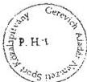

képviseletre jogosult aláírása

---

.

.

.

.

---

|  1 | 8 | 0 | 8 | 6 | 0 | 9 | 6 | 1 | - | 4 | 1 |  |  |  |   |
| --- | --- | --- | --- | --- | --- | --- | --- | --- | --- | --- | --- | --- | --- | --- | --- |

Statisztikai számjel vagy adószám

6/A. sz. melléklet
a V-25-60/1998-99. sz.
jelentéshez

(KÖZ)ALAPÍTVÁNY MEGNEVEZÉSE: Gerevich Aladár Nemzetközi Sport Közalapítvány

(KÖZ)ALAPÍTVÁNY CÍME: 1061 Budapest, Paulay Ede u. 45.

# EGYSZERŰSÍTETT ÉVES BESZÁMOLÓ MÉRLEGE

1 9 9 8 ÉV

adatok E FT-ban

|  Sor-szám | A tétel megnevezése | Előző év | Előző év(ek) helyesbítésel | Tárgyév  |
| --- | --- | --- | --- | --- |
|  a | b | c | d | e  |
|  1. | A. Befektetett eszközök (2.-5. sorok) | 4053 |  | 1388272  |
|  2. | I. IMMATERIÁLIS JAVAK | 32 |  | 478  |
|  3. | II. TÁRGYI ESZKÖZÖK | 4021 |  | 78227  |
|  4. | III. BEFEKTETETT PÉNZÜGYI ESZKÖZÖK |  |  | 1309567  |
|  5. | IV. BEFEKTETETT ESZKÖZÖK ÉRTÉKHELYESBÍTÉSE |  |  |   |
|  6. | B. Forgóeszközök (7.-10. sorok) | 358880 |  | 174118  |
|  7. | I. KÉSZLETEK |  |  |   |
|  8. | II. KÖVETELÉSEK |  |  | 19  |
|  9. | III. ÉRTÉKPAPÍROK |  |  |   |
|  10. | IV. PÉNZESZKÖZÖK | 358880 |  | 174099  |
|  11. | C. Aktív időbeli elhatárolások | 33 |  | 1398  |

|  12. | ESZKÖZÖK (AKTÍVÁK) ÖSSZESEN (1.+6.+11. sor) | 362966 |  | 1563788  |
| --- | --- | --- | --- | --- |

|  13. | D. Saját tőke (14.-16. sorok) | 65095 |  | 1408516  |
| --- | --- | --- | --- | --- |
|  14. | I. INDULÓ TŐKE | 50000 |  | 1359567  |
|  15. | II. TŐKEVÁLTOZÁS | 15095 |  | 48949  |
|  16. | III. ÉRTÉKELÉSI TARTALÉK |  |  |   |
|  17. | E. Céltartalék |  |  |   |
|  18. | F. Kötelezettségek (19.-20. sorok) | 297871 |  | 155150  |
|  19. | I. HOSSZÚ LEJÁRATÚ KÖTELEZETTSÉGEK |  |  |   |
|  20. | II. RÖVID LEJÁRATÚ KÖTELEZETTSÉGEK | 297871 |  | 155150  |
|  21. | G. Passzív időbeli elhatárolások |  |  | 122  |

|  22. | FORRÁSOK (PASSZÍVÁK) ÖSSZESEN (13.+17.+18.+21. sor) | 362966 |  | 1563788  |
| --- | --- | --- | --- | --- |

Keltezés: Budapest, 1999.03.31.

C. Terv. 1705/A r. sz.

az (köz)alapítvány vezetője

---

/

.

.

.

.

---

a V-25-60/1998-99. sz.
jelentéshez

# Gerevich Aladár Közalapítvány (NSKA)
Eredménykimutatás

Adatok E Ft-ban

|  Sor-szám | Megnevezés | Vállalkozási tevékenység |   | Alapítványi célú tevékenység  |   |
| --- | --- | --- | --- | --- | --- |
|   |   |  1997. | 1998. | 1997. | 1998.  |
|  1. | Összes (ár) bevétel |  |  | 240880 | 846031 *  |
|  2. | Összes költség (ráfordítás) |  |  | 225785 | 863037 *  |
|  3. | Adózás előtti eredmény |  |  | 15095 | -17006 *  |
|  4. | Adófizetési kötelezettség |  |  |  |   |
|  5. | Adózott eredmény |  |  | 15095 | -17006 *  |
|  6. | Átcsoportosítás |  |  |  |   |
|  7. | Tőkeváltozás |  |  | 15095 | -17006 *  |

* 1998. évi végleges adatokat a 7/a melléklet tartalmazza!

Alulírott az 1989. évi XXXVIII. tv. 24. § c. pontja alapján aláírásommal kijelentem, hogy a feltüntetett adatok teljesek, és a közalapítvány nyilvántartásaival, okmányaival mindenben egyeznek.

Budapest, 1999.02.23.

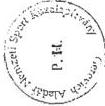

képviseletre jogosult aláírása

---

.

.

.

.

---

7/A. sz. melléklet
a V-25-60/1998-99. sz.
jelentéshez

# EGYSZERŰSÍTETT ÉVES BESZÁMOLÓ EREDMÉNYKIMUTATASA

1 9 9 8 ÉV

adatok E FT-ban

|  Sor-szám | A tétel megnevezése | Vállalkozási tevékenység |   |   | Alapítványi célú tevékenység  |   |   |
| --- | --- | --- | --- | --- | --- | --- | --- |
|   |   |  előző évi | előző év(ek) helyesbítései | tárgyév | előző évi | előző év(ek) helyesbítései | tárgyévi  |
|  a | b | c | d | e | f | g | h  |
|  1. | A. Összes (ár)bevétel |  |  |  | 240880 |  | 914731  |
|  2. | B. Összes költség (ráfordítás) |  |  |  | 225785 |  | 880877  |
|  3. | C. Adózás előtti eredmény |  |  |  | 15095 |  | 33854  |
|  4. | I. Adófizetési kötelezettség |  |  |  |  |  |   |
|  5. | D. Adózott eredmény |  |  |  | 15095 |  | 33854  |
|  6. | II. Átcsoportosítás |  |  |  |  |  |   |
|  7. | E. Tőkeváltozás |  |  |  | 15095 |  | 33854  |

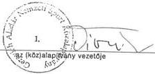

Keltezés: Budapest, 1999.03.31.

C. Terv. 1705/A r. sz

---

•

•

•

•

---

8. sz. melléklet
a V-25-60/1998-99. sz.
jelentéshez

A Gerevich Aladár Közalapítvány (NSKA)
bevételei

|  Sor-szám | Megnevezés | Adatok E Ft-ban  |   |
| --- | --- | --- | --- |
|   |   |  1997. év | 1998. év  |
|  1. | Központi költségvetésből, és egyéb állami vagy önkormányzati forrásból kapott összeg | 50000 * | 350000  |
|  2. | A totó játékadójának 100 %-a | 529887 * | 370451  |
|  3. | Támogatói befizetések |  |   |
|  4. | Adományok |  |   |
|  5. | A közalapítvány pénzügyi gazdálkodásából eredő, a pénzintézet által fizetett kamat | 2997 | 34033  |
|  6. | A csatlakozó külföldi vagy belföldi természetes és jogi személyek befizetései, illetőleg egyéb vagyoni hozzájárulásai |  |   |
|  7. | Egyéb bevételek | 42 | 908  |
|  8. | Összes bevétel: (1+2+3+4+5+6+7) | 582926 | 755392  |

Alulírott az 1989. évi XXXVIII. tv. 24. § c. pontja alapján aláírásommal kívánom, hogy a feltüntetett adatok teljesek, és a közalapítvány nyilvántartásaival, okmányaival mindenben egyeznek.

képviseletre jogosult aláírása

Budapest, 1999. 03. 31.

A *-gal megjelölt adatokat a helyszíni ellenőrzés megállapításai nem támasztják alá!

---

.

.

.

.

---

# Gerevich Aladár Közalapítvány (NSKA)
Kiadások (költségek)

9.sz. melléklet
a V-25-60/1998-99. sz.
jelentéshez

|  Sor-szám | Megnevezés | 1997. év | 1998. év  |
| --- | --- | --- | --- |
|  I. | Alapítványi célú támogatások kiadásai összesen (1+2+3+4+5+6) | 192419 | 827468  |
|  1. | Ebből: Sportegyesületek Normatív támogatás | 64617 * | 416873 *  |
|  2. | Céltámogatás Egyetemi tám. | 38945 * | 40413 *  |
|  3. | Címzett támogatás Olimpiai tám. | 39187 * | 33800 *  |
|  4. | Sportösztöndíj | 49670 | 336382 *  |
|  5. | Pályázati úton történő feladatfinanszírozás | * | *  |
|  6. | Pályázati rendszeren kívüli támogatás | * | *  |
|  II. | Működési költségek összesen | 33092 | 52323  |
|   | Ebből: | 685 | 1450  |
|  1. | Anyagköltség |  |   |
|  2. | Anyag jellegű szolgáltatás | 2023 | 5624  |
|   | Ebből: Nyomdai költség | 352 | 38  |
|   | Telefonköltség | 167 | 1162  |
|  3. | Bérköltség | 1460 | 3986  |
|  4. | Személyi jellegű kifizetések | 20453 * | 16419 *  |
|   | Ebből: Regisztráció | 320 | 952  |
|  5. | Értékcsökkenés | 855 | 2715  |
|  6. | Nem anyagjellegű szolgáltatás | 7252 | 20213  |
|   | Ebből: Bérleti, kölcsöncélú díjak | 3402 | 1761  |
|   | egyéb költségek | 407 | 2903  |
|   | Könyvvezetés, gazd.-i szolg. | 1356 | 15549  |
|  7. | Bankköltség | 59 | 1497  |
|  8. | Biztosítási díjak | 305 | 420  |
|  III. | Előző időszak ráfordításai |  |   |
|  IV. | Költségek összesen | 225511 | 879791  |

Alulírott az 1989. évi XXXVIII. tv. 24. § c. pontja alapján aláírásommal kijelentem, hogy a feltüntetett adatok teljesek, és a közalapítvány nyilvántartásaival, okmányaival mindenben egyeznek.

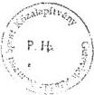

Budapest, 1999.03.31.

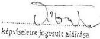

A *-gal megjelölt adatokat a helyszíni ellenőrzés megállapításai nem támasztják alá!

---

“

”

“

“

---

a V-25-60/1998-99. sz.
jelentéshez

Gerevich Aladár Közalapítvány (NSKA)

Bér és személyi jellegű kifizetések alakulása

|  Sor-szám | Megnevezés | Létszám (fő) |   | Bérköltség (E Ft) |   | Tiszteletdíj (E Ft) |   | Költségtérítés (E Ft)  |   |
| --- | --- | --- | --- | --- | --- | --- | --- | --- | --- |
|   |   |  1997. év | 1998. év | 1997. év | 1998. év | 1997. év | 1998. év | 1997. év | 1998. év  |
|  1. | Irodai foglalkoztatottak | 3 | 4 | 1460 | 3986 |  |  |  |   |
|  2. | Kuratórium | 9 | 9 |  |  | 773 | 1983 | 1300 | 4270  |
|  3. | Felügyelő Bizottság | 3 | 3 |  |  | 332 | 702 | 525 | 1599  |

Alulírott az 1989. évi XXXVIII. tv. 24. § c. pontja alapján aláírásommal kijelentem, hogy a feltüntetett adatok teljesek, és a közalapítvány nyilvántartásaival, okmányaival mindenben egyeznek.

Budapest, 1999.02.23.

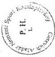

képviselőre jogosult aláírása

---

.

.

.

.

---

11. sz. melléklet
a V-25-60/1998-99. sz.
jelentéshez

# A GEREVICH ALADÁR NEMZETI SPORTKÖZALAPÍTVÁNY (NSKA)

által 1997-ben biztosított

normatív támogatás

– az atlantai olimpián pontot szerzett versenyzőket foglalkoztató – sportegyesületek részére

|  Sorszám | SPORTEGYESÜLET – ALAPÍTVÁNY MEGNEVEZÉSE | PONTSZÁM | NORMATÍV TÁMOGATÁS (x Ft)  |
| --- | --- | --- | --- |
|  1. | Spartacus Sport Alapítvány | 23.25 | 16.275  |
|  2. | Csepel SC Alapítvány | 20.50 | 14.350  |
|  3. | Budapesti Honvéd SE | 18.50 | 12.950  |
|  4. | Újpesti Torna Egylet | 17.15 | 12.005  |
|  5. | OTP Sport Plusz SE | 14.50 | 10.150  |
|  6. | MTK | 9.16 | 6.412  |
|  7. | Vasas SC | 8.62 | 6.034  |
|  8. | BSE | 8.25 | 5.775  |
|  9. | VEDAC | 7.00 | 4.900  |
|  10. | NYVSC | 6.00 | 4.200  |
|  11. | Arany Párbajtőr Alapítvány | 5.00 | 3.500  |
|  12. | Szegedi Városi Lövész E. | 3.23 | 2.261  |
|  13. | Paksi Atomerőmű SE | 2.00 | 1.400  |
|  14. | Úszó-Zugló Alapítvány | 1.60 | 1.120  |
|  15. | Dunaferr SE | 1.25 | 875  |
|  16. | Fradisták a Fradiért Alapítvány | 1.23 | 861  |
|  17. | Győri Keksz | 1.00 | 700  |
|  18. | Zalahús SE | 1.00 | 700  |
|  19. | Szentesi VSE | 0.23 | 161  |
|   | ÖSSZESEN | 149.47 | 104.629  |

MEGJEGYZÉS: az NSKA olimpiai pontonként 700 ezer forintos támogatást biztosított a pontot szerzett sportegyesületeknek, illetve az olimpiai felkészülést segítő alapítványoknak.

Alulírott az 1989. évi XXXVIII. tv. 24. §. c. pontja alapján aláírásommal kijelentem, hogy a feltüntetett adatok teljesek, és a közalapítvány nyilvántartásaival, okmányaival mindenben megegyeznek.

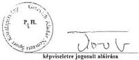

Budapest, 1998. december 18.

---

.

.

.

.

---

12. sz. melléklet
a V-25-60/1998-99. sz.
jelentéshez

# A GEREVICH ALADÁR NEMZETI SPORTKÖZALAPÍTVÁNY (NSKA)
által 1998-ban biztosított
normatív támogatás sportegyesületek részére

|  MEGNEVEZÉSE | A SPORTEGYESÜLET MEGNEVEZÉSE | Az atlantai olimpiai és az 1997. évi VB, EB szereplés alapján |   | Az 1997. évi utánpótlás VB, EB szereplés alapján  |   |
| --- | --- | --- | --- | --- | --- |
|   |   |  pontszám | támogatás (c Ft) | pontszám | támogatás (c Ft)  |
|  1. | Újpesti Torna Egylet | 2174.72 | 6.620 | 199.5 | 2.960  |
|  2. | MTK | 1333.90 | 4.060 | 48 | 960  |
|  3. | Csapd SC | 2009.37 | 6.120 | 51 | 1.010  |
|  4. | Vasas SC | 1553.08 | 4.730 | 34 | 670  |
|  5. | Bs. Spartacus SC | 2291.90 | 6.980 | 19.4 | 385  |
|  6. | Bs. Honvéd SE | 1630.55 | 4.970 | 232 | 4.800  |
|  7. | FTC | 721.76 | 2.200 | 87.1 | 1.730  |
|  8. | Veszprém FOTEX | 331.40 | 1.030 | 21 | 420  |
|  9. | BVSC | 814.06 | 2.480 | 81.4 | 1.610  |
|  10. | Tófüm Belen Team | 180.80 | 550 |  |   |
|  11. | Versenykhát SK | 135.00 | 410 |  |   |
|  12. | Tatabányai SC | 130.00 | 400 | 89 | 1.770  |
|  13. | Szentmi VK | 250.24 | 760 | 5.6 | 110  |
|  14. | Szegedi Birk. Egs. | 120.00 | 370 |  |   |
|  15. | Yarobai Vívó SE | 467.50 | 1.420 |  |   |
|  16. | Zalabás Birk. E. | 235.00 | 720 |  |   |
|  17. | Stbeltal Haladás | 80.00 | 240 | 36 | 710  |
|  18. | Byesti SE | 726.89 | 2.210 | 21 | 420  |
|  19. | Dunaforr SE | 906.44 | 2.760 | 36 | 710  |
|  20. | Veszprém EDAC | 615.00 | 1.870 | 4.5 | 90  |
|  21. | Beadra HTE | 75.00 | 230 |  |   |
|  22. | Szegedi PICK | 66.68 | 200 | 28 | 550  |
|  23. | Velinagykhát VSC | 560.00 | 1.710 | 53 | 1.050  |
|  24. | BEAC | 67.62 | 200 |  |   |
|  25. | Szegedi Tabak | 186.61 | 870 | 15.3 | 380  |
|  26. | Debreceni MTE | 45.00 | 140 |  |   |
|  27. | DESK Borod Chem | 41.66 | 130 |  |   |
|  28. | Elektromos SE | 33.44 | 100 | 14 | 280  |
|  29. | Szolnoki MOL | 33.44 | 100 |  |   |
|  30. | Győri Garádnia | 33.44 | 100 | 14 | 280  |
|  31. | PVSK | 30.83 | 90 |  |   |
|  32. | BKV Előre | 25.00 | 90 |  |   |
|  33. | Kerekesnői VE | 21.54 | 70 |  |   |
|  34. | Fan Buda Club | 20.00 | 60 |  |   |
|  35. | Laguna Diviny | 20.00 | 60 |  |   |
|  36. | OTP Sport Mahart | 1.213.80 | 3.700 |  |   |
|  37. | Győri VSE | 7.50 | 50 |  |   |
|  38. | Finn SE | 5.00 | 50 |  |   |
|  39. | Bőszfűi Lővész | 5.00 | 50 | 14 | 280  |
|  40. | Palot Aton SE | 180.00 | 550 | 12 | 240  |
|  41. | Szegedi Lővész SE | 225.00 | 690 |  |   |
|  42. | Győri Grahajász | 552.80 | 1.680 | 7 | 140  |
|  43. | Győri Ring Bales C | 135.00 | 410 |  |   |
|  44. | Kiállító Szabolcs | 100.00 | 300 |  |   |
|  45. | Kiállító női Ka | 41.66 | 130 |  |   |
|  46. | Kiállító női Vb | 21.54 | 80 |  |   |
|  47. | Kiállító női Kis | 138.60 | 420 |  |   |
|  48. | Alba Volán |  |  | 170 | 3.370  |
|  49. | Oroszányi VSE |  |  | 100 | 1.980  |
|  50. | Bs. FLE |  |  | 66 | 1.310  |
|  51. | MVSC |  |  | 60 | 1.190  |
|  52. | Cs. A. KSI |  |  | 46.1 | 915  |
|  53. | Dikayvári SC |  |  | 46 | 910  |
|  54. | ETE Szilvám |  |  | 36 | 710  |
|  55. | Zárósi DPSE |  |  | 33 | 650  |
|  56. | Csik DSE |  |  | 31 | 630  |
|  57. | Szolnoki VSE |  |  | 30.6 | 610  |
|  58. | Vállalkozók SE |  |  | 30 | 590  |
|  59. | Piliszabai SE |  |  | 28 | 550  |
|  60. | Győri Erdőes SE |  |  | 28 | 550  |
|  61. | Csapdi Pajár SC |  |  | 21 | 420  |
|  62. | Szabatta VSE |  |  | 18 | 360  |
|  63. | Győri VSE |  |  | 14 | 280  |
|  64. | Pényi Mesték KC |  |  | 14 | 280  |
|  65. | Szolnoki RPSE |  |  | 14 | 280  |
|  66. | Szegedi Kapak SE |  |  | 12 | 240  |
|  67. | SZVSE Triadón |  |  | 9 | 180  |
|  68. | Százhegyi FSC |  |  | 9 | 180  |
|  69. | Trilva TK |  |  | 9 | 180  |
|  70. | Makói SZVSE |  |  | 9 | 180  |
|  71. | TVK Mali |  |  | 7 | 140  |
|  72. | Szolnoki MTE |  |  | 7 | 140  |
|  73. | Szarvasi KC |  |  | 7 | 140  |
|  74. | Veszprém Lővész |  |  | 9 | 180  |
|  75. | Honvéd Kossuth |  |  | 7 | 140  |
|  76. | Stadtartha SC |  |  | 7 | 140  |
|  77. | Debreceni SI |  |  | 4.5 | 90  |
|  78. | Zegyeszpi AC |  |  | 4.5 | 90  |
|  79. | Győri Dózsa |  |  | 4.5 | 90  |
|   | **ÖSSZESEN** | **20.641** | **62.850** | **2.015** | **39.960**  |

A pontszámítás alapja: az „NSKA pontérték táblázat”.

Felvételével: az 1996-os utánpótlás, az 1997-os VB-EB-kon eléri 1-8. helyezés (1 pont= 3.045 forint), illetve az előfordításnál: az 1997-os utánpótlás VB-EB-kon eléri 1-3. helyezés (1 pont=19.850 forint) alapján.

Átdított az 1989. évi XXXVIII. tv. 24. §. c. pontja alapján eljárásommal kijelentem, hogy a feltüntetett adatok teljesek, és e közalapítvány nyilvántartásaival, élményaival mindenben megegyeznek.

Budapest, 1998. december 31.

P. H.

készítette jogszab. a. f. f.

---

.

.

.

.

---

43. sz. melléklet
a V-25-60/1998-99. sz.
jelentéshez

# A GEREVICH ALADÁR NEMZETI SPORTKÖZALAPÍTVÁNY (NSKA)

által biztosított

normatív támogatás sportszövetségek részére az atlantai olimpiai szereplés alapján

|  SORSZÁM | A SPORTSZÖVETSÉG MEGNEVEZÉSE | 1997 |   | 1998  |   |
| --- | --- | --- | --- | --- | --- |
|   |   |  pontszám | támogatás (e Ft) | olimpiai pontszám | támogatás (e Ft)  |
|  1. | ATLÉTIKA |  |  | 8 | 2.080  |
|  2. | BIRKÓZÁS |  |  | 1 | 260  |
|  3. | JUDÓ |  |  | 4 | 1.040  |
|  4. | KAJÁK-KENU |  |  | 35 | 9.100  |
|  5. | KEZILABDA |  |  | 28 | 7.280  |
|  6. | ÖKÖLVÍVÁS |  |  | 8 | 2.080  |
|  7. | ÖTTUSA |  |  | 5 | 1.300  |
|  8. | SPORTLÖVŐ |  |  | 3 | 780  |
|  9. | SÚLYEMELŐ |  |  | 6 | 1.560  |
|  10. | TORNA |  |  | 5 | 1.300  |
|  11. | ÚSZÁS |  |  | 38 | 9.880  |
|  12. | VÍVÁS |  |  | 31 | 8.060  |
|  13. | VÍZILABDA |  |  | 21 | 5.460  |
|   | ÖSSZESEN |  |  | 193 | 50.180  |

1997-ben a szövetségek nem részesültek normatív támogatásban.

Az 1998. évi pontszámítás alapja: az 1996. évi atlantai olimpián szerzett pontok száma (1 pont=260.000 forint, lásd „NSKA pontérték táblázat”).

Alulírott az 1989. évi XXXVIII. tv. 24. §. c. pontja alapján aláírásommal kijelentem, hogy a feltüntetett adatok teljesek, és a közalapítvány nyilvántartásaival, okmányaival mindenben megegyeznek.

Budapest, 1998. december 19.

képviseletre jogosult aláírása

---

.

.

.

.

---

---

a V-25-60/1998-99. sz.

jelentéshez

# A GEREVICH ALADÁR NEMZETI SPORTKÖZALAPÍTVÁNY (NSKA)

által az egyetemi és főiskolai sportegyesületeknek nyújtott céltámogatás

|  Sorszám | EGYETEMI-FŐISKOLAI SPORTEGYESÜLET NEVE | 1997 |   |   |   | 1998  |   |   |   |
| --- | --- | --- | --- | --- | --- | --- | --- | --- | --- |
|   |   |  Benyújtott pályázatok száma (db) | Megpályázott összeg (eFt) | Elfogadott pályázatok száma (db) | Odaítélt összeg (eFt) | Benyújtott pályázatok száma (db) | Megpályázott összeg (eFt) | Elfogadott pályázatok száma (db) | Odaítélt összeg (eFt)  |
|  1. | Testnevelési Főiskola SE | 3 |  | 3 | 4.720 | 3 |  | 3 | 4.833  |
|  2. | Orvonsgyetemi SC | 2 |  | 2 | 3.665 | 2 |  | 2 | 4.520  |
|  3. | BEAC | 3 |  | 3 | 3.795 | 3 |  | 3 | 4.453  |
|  4. | Műegyetem AFC | 2 |  | 2 | 3.675 | 2 |  | 2 | 4.138  |
|  5. | Szombathelyi Tanárképző FSC | 3 |  | 3 | 3.795 | 3 |  | 3 | 4.558  |
|  6. | Pécsi EAC | 3 |  | 3 | 2.390 | 3 |  | 3 | 2.588  |
|  7. | Miskolci EAFC | 2 |  | 2 | 1.280 | 2 |  | 2 | 1.297  |
|  8. | Veszprémi ESC | 2 |  | 2 | 1.235 | 2 |  | 2 | 1.819  |
|  9. | Nyíregyházi Tanárképző FSE | 3 |  | 3 | 1.665 | 2 |  | 2 | 1.065  |
|  10. | Szomói MAFC | 2 |  | 2 | 1.070 | - |  | - | -  |
|  11. | Juhász Gyula Tanárképző FDSE | 2 |  | 2 | 1.360 | 2 |  | 2 | 1.342  |
|  12. | Eszterházy Tanárképző FSC | 2 |  | 2 | 1.395 | 2 |  | 2 | 1.544  |
|  13. | Győri Széchenyi FSC | 1 |  | 1 | 970 | 2 |  | 2 | 1.103  |
|  14. | Közgazdasági ESC | 1 |  | 1 | 625 | 1 |  | 1 | 796  |
|  15. | Debreceni EAC | 1 |  | 1 | 490 | 1 |  | 1 | 584  |
|  16. | Nyíregyházi Mezőgazdasági FSC | 1 |  | 1 | 475 | 1 |  | 1 | 425  |
|  17. | Szolnoki Repülődötti FDSE | 2 |  | 2 | 635 | 2 |  | 2 | 369  |
|  18. | JATE SC DSE | 1 |  | 1 | 355 | 1 |  | 1 | 354  |
|  19. | Békéscsabai FDSE | 1 |  | 1 | 240 | 2 |  | 2 | 634  |
|  20. | Kondó MFSE | 1 |  | 1 | 240 | - |  | - | -  |
|  21. | Jászberényi TF DSE | 1 |  | 1 | 240 | 1 |  | 1 | 283  |
|  22. | Honvéd Zsinyi M. KASE | 2 |  | 2 | 325 | 2 |  | 2 | 448  |
|  23. | Pécsi Orvostudományi Egyetem SE | 1 |  | 1 | 120 | 1 |  | 1 | 142  |
|  24. | Debreceni ASE | 1 |  | 1 | 120 | - |  | - | -  |
|  25. | Zalaegerszegi PSZFSE | 1 |  | 1 | 120 | 1 |  | 1 | 142  |
|  26. | PATE Georgikon | - |  | - | - | 1 |  | 1 | 442  |
|  27. | Gödöllői EAC | - |  | - | - | 1 |  | 1 | 654  |
|  28. | Államgyaniszt FSE | - |  | - | - | 1 |  | 1 | 425  |
|  29. | Gyöngyösi FKC | - |  | - | - | 1 |  | 1 | 425  |
|  30. | Ybl FSE | - |  | - | - | 1 |  | 1 | 212  |
|  31. | Mezőtéri FDSE | - |  | - | - | 1 |  | 1 | 141  |
|  32. | Honvéd Bályai KMFSE | - |  | - | - | 2 |  | 2 | 263  |
|   | ÖSSZESEN | 44 |  | 44 | 35.000 | 48 |  | 48 | 39.999  |

Aholított az 1989. évi XXXVIII. tv. 24. §. c. pontja alapján aláírásommal kijelentem, hogy a feltüntetett adatok teljesek, és a közalapítvány nyilvántartásával, okmányaival mindenben megegyeznek.

Budapest, 1998. december 4.

képviseletre jogosult aláírása

---

.

.

.

.

---

15. sz. melléklet

a V-25-60/1998-99. sz.

jelentéshez

# A GEREVICH ALADÁR NEMZETI SPORTKÖZALAPÍTVÁNY (NSKA)

által 1997-1998-ban a sportszövetségek és a MOB részére – OTSH-MOB-NSKA megegyezés alapján – pályázati rendszeren kívül biztosított

céltámogatás

|  sorszám | A sportszövetség (sportág) megnevezése | Utánpótlás VB-EB részvételre (eFt) | Edzőtáborra, versenyek rendezésére (eFt) | Sydney-i olimpiai felkészülésre (eFt) | Támogatás összesen  |
| --- | --- | --- | --- | --- | --- |
|  1. | Asztalitenisz | 1.775 | 1.000 | 1.000 | 3.775  |
|  2. | Atlétika | 2.625 | 2.500 | 4.000 | 9.125  |
|  3. | Birkózás | 3.750 | 2.500 | 5.000 | 11.250  |
|  4. | Búvár | 700 | - | - | 700  |
|  5. | Evezés | 750 | 1.000 | 2.000 | 3.750  |
|  6. | Gyeplabda | 262,5 | - | - | 262,5  |
|  7. | Íjász | 600 | - | - | 600  |
|  8. | Jégkorong | 375 | - | - | 375  |
|  9. | Judo | 3.000 | 1.500 | 3.000 | 7.500  |
|  10. | Kajak-kenu | 3.750 | 4.000 | 4.500 | 12.250  |
|  11. | Kerékpár | 225 | - | - | 225  |
|  12. | Kézilabda | 3.600 | 3.000 | 3.500 | 10.100  |
|  13. | Korcsolya | 562,5 | - | - | 562,5  |
|  14. | Kosárlabda | 562,5 | 1.000 | 2.500 | 4.062,5  |
|  15. | Lovas | 1.125 | - | - | 1.125  |
|  16. | Műugró | 600 | 1.000 | 2.000 | 3.600  |
|  17. | Ökölvívó | 4.125 | 2.500 | 4.000 | 10.625  |
|  18. | Öttusa | 3.000 | 2.000 | 4.000 | 9.000  |
|  19. | Röplabda | 225 | - | - | 225  |
|  20. | Sí | 337,5 | - | - | 337,5  |
|  21. | Sportlövő | 5.625 | 2.000 | 3.000 | 10.625  |
|  22. | Súlyemelő | 3.000 | 3.000 | 6.000 | 12.000  |
|  23. | Szinkronúszás | 525 | - | - | 525  |
|  24. | Szörf | - | - | 1.000 | 1.000  |
|  25. | Taekwando | 375 | - | 1.000 | 1.375  |
|  26. | Tájfutó | 325 | - | - | 325  |
|  27. | Teke | 300 | - | - | 300  |
|  28. | Tenisz | 750 | - | - | 750  |
|  29. | Tollaslabda | 375 | - | - | 375  |
|  30. | Torna | 1.275 | 2.500 | 3.000 | 6.775  |
|  31. | Triatlon | 1.500 | 1.000 | 3.500 | 6.000  |
|  32. | Úszás | 1.825 | 4.000 | 3.500 | 9.325  |
|  33. | Vitorlázás | 1.125 | 1.000 | - | 2.125  |
|  34. | Vivás | 8.000 | 4.500 | 6.000 | 18.500  |
|  35. | Vízilabda | 3.000 | 3.000 | 2.000 | 8.000  |
|  36. | Labdarúgás |  | 1997. 4.000 | 1998. 10.000 | 14.000  |
|  37. | MOB (Sydney 2000, Athén 2004 programok) |  | 1998. 10.000 | 1997. 5.000 | 15.000  |
|   | ÖSSZESEN | 60.000 | 57.000 | 79.500 | 196.500  |

Alulírott az 1989. évi XXXVIII. tv. 24. §. c. pontja alapján aláírásommal kijelentem, hogy a feltüntetett adatok teljesek, és a közalapítvány nyilvántartásaival, okmányaival mindenben megegyeznek.

Budapest, 1998. december 18.

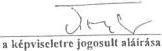

---

.

.

.

.

---

16. sz. melléklet
a V-25-60/1998-99. sz.
jelentéshez

# A GEREVICH ALADÁR NEMZETI SPORTKÖZALAPÍTVÁNY (NSKA)

által pályázati rendszeren kívül biztosított

cél- és tématámogatás

|  Sorszám | Év | CÉL- ÉS TÉMA MEGNEVEZÉSE | Támogatott sportszövetség, sportegyesület | Odaítélt összeg (eFt) | Előirányzott teljesítési határidő | Kuratóriumi határozat kelte, száma  |
| --- | --- | --- | --- | --- | --- | --- |
|  I. | 1997. | LABDARÚGÓ EB 2004 | Előkészítő Bizottság | 5.000 |  | B/21/97  |
|   |  | MŰKÖDÉSI TÁMOGATÁS | SOSZ | 3.000 |  | A/1/97  |
|   |  | MŰKÖDÉSI TÁMOGATÁS | Magyar Sportszövetség | 5.000 |  | B/21/97  |
|   |  | NEMZETKÖZI DIÁKVERSENYEK | MDSZ | 10.000 |  | A/15/97  |
|   |  | TÉLI OLIMPIAI BOBVERSENY | Magyar Bob Szövetség | 300 |  | A/12/97  |
|   |  | ÖSSZESEN |  | 23.300 |  |   |
|  II. | 1998. | EGYETEMI OB-K TÁMOGATÁSA | MEFS | 5.000 |  | A/5/98  |
|   |  | DIÁKOLIMPIA TÁMOGATÁSA | MDSZ | 16.000 |  |   |
|   |  | MŰKÖDÉSI TÁMOGATÁS | SOSZ | 3.000 |  |   |
|   |  | MŰKÖDÉSI TÁMOGATÁS | Magyar Sportszövetség | 5.000 |  |   |
|   |  | GEREVICII KARD VILÁG KUPA TÁMOGATÁSA | Magyar Vívószövetség | 1.700 |  | A/2/98  |
|   |  | LABDARÚGÓ SZAKKÖNYV (Bicskei) | MEFS-MDSZ | 1.000 |  | A/3/98  |
|   |  | SPORTÖSZTÖNDÍJAS SZAKEMBEREK TOVÁBBKÉPZÉSE | Sporttud. Társ. | 800 |  | B/17/98  |
|   |  | FOLYÓIRAT ELŐFIZETÉS SPORTÖSZTÖNDÍJAS SZAKEMBEREKNEK | Sporttud. Társ. | 419 |  |   |
|   |  | TARTOZÁSOK RENDEZÉSÉHEZ BOZZÁJÁRULÁS | Magyar Kerékpáros Szövetség | 1000 |  | A/57/98  |
|   |  | Edzőtábor az olimpia helyszínén (Sydney) | Magyar Úszó Szövetség | 7634 |  | B/25/98  |
|   |  | Olimpiai felkészülés segítése (strandröplabda) | Magyar Röplabda Szövetség | 2000 |  | A/59/98  |
|   |  | ÖSSZESEN |  | 43.553 |  |   |

Alulírott az 1989. évi XXXVIII. tv. 24. §. c. pontja alapján aláírásommal kijelentem, hogy a feltüntetett adatok teljesek, és a közalapítvány nyilvántartásaival, okmányaival mindenben megegyeznek.

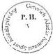

Budapest, 1998. december 18.

képviseletre jogosult aláírása

---

.

.

.

.

---

17. sz. melléklet
a V-25-60/1998-99. sz.
jelentéshez

## A Gerevich Aladár Nemzeti Sportközalapítvány (NSKA)

által pályázati úton támogatott feladat-finanszírozás

|  Sor-szám | Pályázati feladat megnevezése | Pályázó sportági szakszövetség | Pályázó sport-egyesület | 1997. év |   |   |   | 1998. év  |   |   |   |
| --- | --- | --- | --- | --- | --- | --- | --- | --- | --- | --- | --- |
|   |   |   |   |  Pályázatok száma (db) |   | megpályázott | odaitélt | Pályázatok száma (db) |   | megpályázott | odaitélt  |
|   |   |   |   |  Benyújtott | Elfogadott | összeg (c Ft) |   | Benyújtott | Elfogadott | összeg (c Ft)  |   |
|  1. | Labdarúgó edzőpályák megvilágítása | (MLSZ) |  |  |  |  |  | 40 | 36 | 95.000 | 95.000  |
|  2. | Utánpótlás műhelytámogatás |  |  |  |  |  |  |  |  |  |   |
|   |  | (birkózás) |  |  |  |  |  | 45 | 45 | 5.710 | 5.710  |
|   |  | (judo) |  |  |  |  |  | 13 | 13 | 4.500 | 4.500  |
|   |  | (turna) |  |  |  |  |  | 13 | 12 | 5.000 | 5.000  |
|   |  | (róplabda) |  |  |  |  |  | 14 | 14 | 6.700 | 6.700  |
|   |  | (kosárlabda) |  |  |  |  |  | 20 | 16 | 6.000 | 6.000  |
|   |  | (jégkorong) |  |  |  |  |  | 9 | 9 | 6.000 | 6.000  |
|   |  | (tájfutás) |  |  |  |  |  | 17 | 10 | 2.135 | 2.135  |
|   |  | (táncsport) |  |  |  |  |  | 7 | 7 | 1.700 | 1.700  |
|   |  | (görkorszóra) |  |  |  |  |  | 6 | 6 | 2.000 | 2.000  |
|  Mindösszesen |   | 9 |  |  |  |  |  | 138 | 130 | 134.745 | 134.745  |

Alulírott az 1989. évi XXXVIII. tv. 24. § c. pontja alapján aláírásommal kijelentem, hogy a feltüntetett adatok teljesek, és a közalapítvány nyilvántartásaival, okmányaival mindenben egyeznek.

Budapest, 1998. december 18.

képviseletre jogosult aláírása

---

.

.

.

.

---

48. sz. melléklet
a V-25-60/1998-99. sz.
jelentéshez

# **A Gerevich Aladár Nemzeti Sportközalapítvány (NSKA)**
által 1998-ban (május 1 - december 31.)
a sportszakemberek számára biztosított ösztöndíjak sportágak szerinti elosztása

| Sor-szám | Sportág megnevezése | A sportági szövetség által ösztöndíjra javasolt létszám (fő) | A kuratórium által ösztöndíjban részesített létszám (fő) | Sportösztöndíjas létszám feladatkör szerint (fő) | Sportösztöndíj |
| --- | --- | --- | --- | --- | --- |
| edző | orvos | gyúró | pszichológus | éves (8 havi) | havi | 1 főre jutó |
| szövetségi | egyesületi | vegyes munkakör | összege (E Ft) átlag |
| 1. | Asztalitenisz | 5 | 5 | 5 | - | - | - | - | - | 800 | 100 | 20 |
| 2. | Atlétika | 15 | 15 | - | 13 | - | 2 | - | - | 4.800 | 600 | 40 |
| 3. | Birkózás | 17 | 17 | 2 | 2 | 11 | 1 | 1 | - | 4.000 | 500 | 29,4 |
| 4. | Evezés | 4 | 4 | 1 | - | 3 | - | - | - | 800 | 100 | 25 |
| 5. | Íjászat | 4 | 4 | 2 | 1 | 1 | - | - | - | 800 | 100 | 25 |
| 6. | Judo | 8 | 8 | 1 | 4 | 2 | 1 | - | - | 2.160 | 270 | 33,7 |
| 7. | Kajak-kenu | 23 | 23 | 2 | 14 | 4 | - | 2 | 1 | 5.280 | 660 | 28,7 |
| 8. | Kerékpár | 4 | 4 | - | 3 | 1 | - | - | - | 800 | 100 | 25 |
| 9. | Kézilabda | 27 | 27 | 16 | 1 | 3 | 5 | 2 | - | 5.600 | 700 | 26 |
| 10. | Kosárlabda* | 20 | 20 | 6 | 14 | - | - | - | - | 2.400 | 400 | 20 |
| 11. | Labdarúgás* | 7 | 7 | 3 | - | - | 2 | 2 | - | 2.280 | 380 | 54,2 |
| 12. | Lovaglás | 4 | 4 | 1 | - | 3 | - | - | - | 800 | 100 | 25 |
| 13. | Műugrás | 3 | 3 | 3 | - | - | - | - | - | 800 | 100 | 33,3 |
| 14. | Ökölvívás | 13 | 13 | 2 | 8 | 2 | 1 | - | - | 3.200 | 400 | 30,7 |
| 15. | Öttusa | 12 | 12 | 3 | 3 | 6 | - | - | - | 3.200 | 400 | 33,3 |
| 16. | RSG | 4 | 4 | - | - | 4 | - | - | - | 800 | 100 | 25 |
| 17. | Röplabda | 14 | 14 | 2 | 11 | - | 1 | - | - | 2.400 | 300 | 21,4 |
| 18. | Sportlövészet | 17 | 17 | 8 | 1 | 6 | 1 | - | 1 | 3.200 | 400 | 23,5 |
| 19. | Súlyemelés | 16 | 16 | 2 | 5 | 6 | 3 | - | - | 3.840 | 480 | 30 |
| 20. | Tenisz | 5 | 5 | - | 4 | - | 1 | - | - | 800 | 100 | 20 |
| 21. | Tollaslabda | 4 | 4 | - | 3 | 1 | - | - | - | 800 | 100 | 25 |
| 22. | Torna | 17 | 17 | 2 | 14 | - | - | 1 | - | 3.840 | 480 | 30 |
| 23. | Triatlon | 9 | 9 | - | 9 | - | - | - | - | 1.600 | 200 | 22,2 |
| 24. | Úszás | 13 | 13 | 4 | 2 | 7 | - | - | - | 4.800 | 600 | 46,1 |
| 25. | Vitorlázás | 5 | 5 | 1 | - | 3 | - | - | 1 | 800 | 100 | 20 |
| 26. | Vívás | 28 | 28 | 2 | 17 | 6 | 1 | 1 | 1 | 5.280 | 660 | 23,6 |
| 27. | Vízilabda | 25 | 25 | 2 | 13 | 8 | 1 | - | 1 | 5.600 | 700 | 28 |
| **Összesen** | **323** | **323** | **70** | **142** | **77** | **20** | **9** | **5** | **71.480** | **338,1** | **28,3** |

Alulírott az 1989. évi XXXVIII. tv. 24. § c. pontja alapján aláírásommal kijelentem, hogy a feltüntetett adatok teljesek és a közalapítvány nyilvántartásaival, okmányaival mindenben egyeznek.

* Kosárlabdában és labdarúgásban 6 hónapra volt biztosítva az ösztöndíj.

Budapest, 1998. december 18.

---

.

.

.

.

---

a V-25-60/1998-99. sz.
jelentéshez

# A GEREVICH ALADÁR NEMZETI SPORTKÖZALAPÍTVÁNY
által 1997-ben sportösztöndíjban részesített sportolók

|  Sorszám | SPORTÁG | Olimpiai versenyszámok száma | A 2000. évi nyári olimpiai készülő sportösztöndíjasok száma | A 2002. évi téli olimpiai készülő sportösztöndíjasok száma | A SPORTÁGRA ESŐ ÖSZTÖNDÍJ  |   |   |   |   |
| --- | --- | --- | --- | --- | --- | --- | --- | --- | --- |
|   |   |   |   |   |  1997. évi összege (e Ft) | havi átlag összege (e Ft) | 1 főre jutó minimuma (e Ft) | 1 főre jutó maximuma (e Ft) | 1 főre jutó havi átlaga (e Ft)  |
|  1. | Asztalitenisz | 4 | 3 | - | 415 | 118,6 | 40 | 80 | 56,6  |
|  2. | Atlétika | 46 | 24 | - | 4030 | 1151 | 40 | 120 | 55,8  |
|  3. | Birkózás | 16 | 21 | - | 2655 | 758 | 40 | 60 | 42,3  |
|  4. | Evezés | 14 | 11 | - | 1385 | 395,7 | 40 | 50 | 42,7  |
|  5. | Íjászat | 4 | 1 | - | 140 | 40 | 40 | 40 | 40  |
|  6. | Judo | 14 | 7 | - | 1105 | 315,7 | 40 | 80 | 55,7  |
|  7. | Kajak-kenu | 16 | 41 | - | 9400 | 2685 | 40 | 110 | 71,2  |
|  8. | Kerékpár | 18 | 1 | - | 90 | 60 | 60 | 60 | 60  |
|  9. | Kézilabda | 2 | 19 | - | 3165 | 904,2 | 40 | 100 | 62,6  |
|  10. | Korcsolya | - | - | 8 | 1090 | 311,4 | 40 | 80 | 52,5  |
|  11. | Kosárlabda | 2 | 3 | - | 980 | 280 | 60 | 70 | 64  |
|  12. | Műugrás | 4 | 3 | - | 420 | 120 | 40 | 40 | 40  |
|  13. | Ökölvívás | 12 | 4 | - | 510 | 145 | 40 | 60 | 50  |
|  14. | Ottusa | 2 | 16 | - | 3500 | 1000 | 40 | 120 | 62,5  |
|  15. | Sportfővészet | 17 | 21 | - | 3580 | 1022 | 40 | 90 | 48,6  |
|  16. | Súlyemelés | 15 | 13 | - | 2185 | 624,2 | 40 | 100 | 59,2  |
|  17. | Szőrf | 2 | 1 | - | 210 | 60 | 60 | 60 | 60  |
|  18. | Tenisz | 4 | 2 | - | 150 | 100 | 50 | 50 | 50  |
|  19. | Torna | 16 | 4 | - | 615 | 175,7 | 40 | 70 | 52,5  |
|  20. | Triatlon | 2 | 7 | - | 1150 | 328,5 | 40 | 80 | 55,7  |
|  21. | Úszás | 32 | 12 | - | 3115 | 890 | 40 | 120 | 75,8  |
|  22. | Vitorlázás | 9 | 2 | - | 350 | 100 | 50 | 50 | 50  |
|  23. | Vivás | 10 | 33 | - | 6620 | 1891 | 40 | 100 | 64,8  |
|  24. | Vízilabda | 2 | 23 | - | 2710 | 774 | 40 | 70 | 47  |
|  **Olimpiai sportágak összesen:** |   | **263** | **272** | **8** | **49.570** | **593,7** | **43,3** | **77,5** | **55**  |

Alulírott az 1989. évi XXXVIII. tv. 24. §. c. pontja alapján aláírásommal kijelentem, hogy a feltüntetett adatok teljesek, és a közalapítvány nyilvántartásaival, okmányaival mindenben megegyeznek.

Budapest, 1998. december 18.

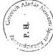

képviseletre jogosult aláírása

Budapest, 1998. december 18.

---

.

.

.

.

---

a V-25-60/1998-99. sz.
jelentéshez

# A GEREVICH ALADÁR NEMZETI SPORTKÖZALAPÍTVÁNY
által 1998-ban sportösztöndíjban részesített sportolók

|  Sorszám | SPORTÁG | Olimpiái versenyszámok száma | A 2000. évi nyári olimpiára készülő sportösztöndíjasok száma | A 2002. évi téli olimpiára készülő sportösztöndíjasok száma | A SPORTÁGRA ESŐ ÖSZTÖNDÍJ  |   |   |   |   |
| --- | --- | --- | --- | --- | --- | --- | --- | --- | --- |
|   |   |   |   |   |  1998. évi összege (e Ft) | havi átlag összege (e Ft) | I főre jutó minimuma (e Ft) | I főre jutó maximuma (e Ft) | I főre jutó havi átlaga (e Ft)  |
|  1. | Asztalitenisz | 4 | 10 | - | 3910 | 335 | 20 | 110 | 32,5  |
|  2. | Atétika | 46 | 39 | - | 18651,5 | 1554 | 20 | 200 | 39,8  |
|  3. | Birkózás | 16 | 37 | - | 15430 | 1285 | 20 | 132,5 | 34,7  |
|  4. | Evezés | 14 | 18 | - | 5835 | 486 | 20 | 60 | 27  |
|  5. | Épénz | 4 | 6 | - | 690 | 57 | 20 | 40 | 28  |
|  6. | Judo | 14 | 12 | - | 5690 | 474 | 20 | 100 | 39,5  |
|  7. | Kajak-keto | 16 | 69 | - | 42055 | 3504 | 20 | 200 | 50,8  |
|  8. | Kertészár | 18 | 2 | - | 1440 | 120 | 60 | 60 | 60  |
|  9. | Közilabda | 2 | 34 | - | 19388 | 1616 | 37,5 | 100 | 47,5  |
|  10. | Kocsolva | - | - | 11 | 6370 | 531 | 20 | 80 | 48,2  |
|  11. | Kosszabda | 2 | 6 | - | 3700 | 370 | 60 | 70 | 65  |
|  12. | Lovaglás | 6 | 1 | - | 720 | 60 | 60 | 60 | 60  |
|  13. | Műegrás | 4 | 4 | - | 1720 | 143 | 20 | 80 | 35,7  |
|  14. | Ökölvész | 12 | 7 | - | 4012,5 | 334 | 40 | 100 | 47,7  |
|  15. | Ottos | 2 | 30 | - | 14675 | 1223 | 20 | 120 | 40,7  |
|  16. | Sportővészet | 17 | 39 | - | 18990 | 1582 | 20 | 90 | 40,5  |
|  17. | Szívemelés | 15 | 26 | - | 15275 | 1273 | 20 | 100 | 49  |
|  18. | Szérf | 2 | 1 | - | 720 | 60 | 60 | 60 | 60  |
|  19. | Tenisz | 4 | 2 | - | 1185 | 99 | 50 | 90 | 59  |
|  20. | Torna | 16 | 7 | - | 3385 | 282 | 40 | 80 | 40  |
|  21. | Triatlon | 2 | 28 | - | 13705 | 1142 | 40 | 80 | 40,7  |
|  22. | Ustás | 32 | 19 | - | 13065 | 1088 | 20 | 200 | 57,1  |
|  23. | Vincészás | 9 | 6 | - | 2450 | 204 | 20 | 60 | 34  |
|  24. | Vívás | 10 | 46 | - | 29830 | 2486 | 20 | 120 | 54  |
|  25. | Vízilabda | 2 | 53 | - | 25847,5 | 2154 | 20 | 100 | 40,6  |
|   | Olimpiái sportágak összesen: | 269 | 502 | 11 | 268740,5 | 898 | 30,7 | 99,7 | 45,3  |
|  26. | Aerobik | - | 3 | - | 825 | 68,7 | 40 | 50 | 23  |
|  27. | Buvár | - | 11 | - | 2405 | 24 | 20 | 90 | 22  |
|  28. | Kick-box | - | 5 | - | 525 | 87,5 | 20 | 60 | 17,5  |
|  29. | Motorczónak | - | 10 | - | 3110 | 311 | 20 | 74 | 31,1  |
|  30. | Tájékozódási futás | - | 4 | - | 975 | 97,5 | 25 | 75 | 24,1  |
|  31. | Téte | - | 6 | - | 1325 | 132,5 | 25 | 62 | 23  |
|   | Nem olimpiai sportágak összesen: | - | 39 | - | 9165 | 120,2 | 25 | 69 | 23,3  |
|   | Mindösszesen: |  | 541 | 11 | 277905,5 | 509,1 | 27,85 | 84,35 | 34,3  |

Alulírott az 1989. évi XXXVIII. tv. 24. §. c. pontja alapján aláírásommal kijelentem, hogy a feltüntetett adatok teljesek, és a közalapítvány nyilvántartásaival, okmányaival mindenben megegyeznek.
Budapest, 1998. december 18.

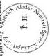

képviselőre jogosult aláírása

---

.

.

.

.

---

21.sz. melléklet
a V-25-60/1998-99. sz.
jelentéshez

BUDACALOR

Szervező és Szolgáltató Kft.
H-1119 Budapest, Hadak útja 33. Tel. és Fax: 206-2505

# VÁLLALKOZÁSI SZERZŐDÉS

VSZ -9 / 98.

mely létrejött egyrészről a Gerevich Aladár Nemzeti Sportközalapítvány ( 1061. Budapest,
Paulay Ede u 45. ) mint Megrendelő, másrészről a BUDACALOR Kft ( 1119. Budapest, Ha-
dak útja 33.) mint Vállalkozó között.

A szerződés tárgya: Gerevich Aladár NSKA irodahelyiségeinek bútorozási munkái.

1. Felek a targyi munkara részletes konszignacio alapjan, atalanyaras vallalkozasi szerzodest kotnek. A szerzodes osszege 12.080.000.-Ft azaz Tizenkettomillionyolvancvanezer forint mely osszegre \(25\%\) AFA kerul felszamolasra.
2. Megrendelo az elvégzett és atadás-átvételi jegyzökonyv formajában igazolt munka Ellenérétékét, a benyújtott vegszámla alapján 15 banki napon belül átulalja Vállalkozó CA 10900059-00000002-18090176 sz. bankszámlajára.
3. Vallalkozó a jelen szerzódes alairásat kovetöen jogosult a szerzódes 4. pontja szerinti részteljesités összegéról rész-számlat benyújtani, melyet Megrendelo 8 banki napon belül átul Vallalkozó 2. pontban megadott szamlajára.
4. Vallalkozó 1998. aprilis 29-ig történő szerzódéskötes eseten 3 napon belül a butorrendeléseket feladaj a butorszereléseket megrendeli és 1998. junius 30-ig eloteljesités fenntartásával befejezi.

Vállalkozó jogosult hiteltérdemlő igazolás alapján egy részszámla benyújtására. A részszám
la összege:

5.700.000.-Ft, azaz Ötmillióhétszázezer forint,
mely összegre 25 % ÁFA kerül felszámításra.

---

.

.

.

.

---

24.sz. melléklet

2. lap

5./ Szerződő felek rögzítik, hogy a 4. pontban meghatározott teljesítési határidő első 2 napja kötbérmentes, de utána Megrendelő jogosult késedelem minden napja után 60.000.-Ft-ot kötbér címen érvényesíteni.

6./A szerződéses munka átadás-átvétele akkor teljesül, ha a teljesítés megfelel a szerződés követelményeinek. Az átadás-átvételi jegyzőkönyvet mindkét félnek a jelen szerződés 14. pontjában megjelölt képviselői által cégszerűen alá kell írnia.

7./ Vállalkozó az általa szállított bútorokra az üzembehelyezés napjától számított 24 hónapig kötelező jótállást biztosít.

8./ Vállalkozó az épülettartozékokért, a beépített berendezési tárgyak állagáért a szerelések időtartama alatt felelősséggel tartozik. A Vállalkozó a kivitelezési munkák során alvállalkozók igénybevételére jogosult.

9./ Vállalkozó gondoskodik a keletkezett szállító és csomagoló anyagok elszállításáról.

10./ Vállalkozó tudomásul veszi, hogy a munkaidőben végzett fokozott zajjal járó tevékenység megkezdése előtt egyeztet Megrendelővel.

11./ Vállalkozó garantálja a szerződéses munka szakszerű, első osztályú kivitelezését. Kötelezettséget vállal arra, hogy a garanciális időszak alatt felmerülő hiányosságokat saját költségén kijavítja. Vállalkozó garanciális kötelezettsége nem terjed ki az általa végzett munkákra, ha azt nem rendeltetésszerűen használják, valamint a vis-major esetére. Amennyiben az írásban egyeztetett határidőn belül Vállalkozó a megállapított hibát nem hárítja el, úgy a Megrendelő jogosult a javítást más személlyel Vállalkozó terhére elvégeztetni

12./ Megrendelő a helyszínen térítésmentesen biztosít Vállalkozó részére:

- az épités teruletén vizvételi és Telefonálasi lehetőséget,
- a portaszolgálatnak leadott névsor alapján munkát vegzok bejutásat az épuletbe hétköznapokon és hétvegeken a munkavégzesre,
- a munkavégzés területén a MegrendelőBiztonságtechnikai elóirásainak megfelelo biztonsági felügyeletet.

---

.

.

.

.

---

21.sz. melléklet
3. lap

13./ Amennyiben Megrendelő eláll a szerződéstől, úgy Vállalkozó jogosult az elállás bejelentéséig a jelen szerződéssel közvetlen összefüggésben felmerült igazolt költségének leszámlázására.

14./ Megrendelő megbízottja:

Takácsné Teszenyi Katalin
Tel: 342-9886

Vállalkozó megbízottja:

Rubinszky József
Tel / fax: 206-2505
Mobil: 06-30-416- 081

15./ A szerzódsben nem szabályozott kerdések tekintetében a PTK. vonatkoź rendelkezései az irányadóak.
16./ Szerzódő Felek az együttmuködés során felmerülő vitas kerdeseket megkiserlik tárgyalással rendezni. Eredménytelen kiserlet esetére kikötk a Pesti Kerületi Bíroság kizárólagos iltekességét.
17./Jelen szerzódes mellekletét képezi a részletes konszignácio, valamint a dijszámítás.

Budapest, 1998.április 28.

BUDACALOR

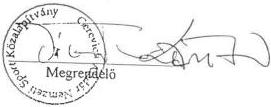

Szervező és Szolgáltató Kft.
H-1119 Budapest, Hadak útja 33.
Tel./Fax: 206-2505
Rádiótel.: 06-30-416-081

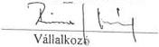

---

.

.

.

.

---

---

21. sz. melléklet

4. lap

# DÍJSZÁMÍTÁS

a Gerevich Aladár Nemzeti Sportközalapítvány

( Budapest, 1061. Paulay Ede u 45. )

irodák bútorozási munkáihoz

Irodabútorok részletezés szerint

Mennyiségi engedmény: 4 %

11.984.075.-

- 479.363.-

Részösszesen:

Vállalkozó közreműködési díja: 5 %

11.504.712.-

575.236.-

Összesen:

12.079.948.-

Kerekítve:

12.080.000.-Ft.

Budapest, 1998. április 28.

---

.

.

.

.

---

24.sz. melléklet
5. lap

# Kívül - Belül Bt.

BUDAPEST, 1998.04.23.

BUDACALOR KFT:
RUBINSZKY JÓZSEF
HADAK ÚTJA 33.
1119 BUDAPEST

TISZTELT RUBINSZKY ÚR,

AZ ALÁBBIAKBAN MEGADOM A GEREVICH ALAPÍTVÁNY MÓDOSÍTOTT
ÁRAJÁNLATÁT:

1.SZOBA

|  1 db. OFI016 íróasztal, natur nyír | 148.700,-  |
| --- | --- |
|  1 db. OFI013, oválasztal, nyír natur | 80.800,-  |
|  1 db. OFI/K Ø 100 cm. kerek tárgyaló, fekete fest. | 51.200,-  |
|  1 db. 18797 ovális iratpolc, fekete | 26.600,-  |
|  1 db. 18798 front panael, fekete festett | 16.500,-  |
|  1 db. 18796 klaviatúra tartó, fekete festett | 40.100,-  |
|  2 db. E19c66 redőnyös szekrény, 800X430X720 mm, nyír |   |
|   | eá. 66.750,- 133.500,-  |
|  2 db. E19d35 kétajtós szekrény, 800X430X1195 mm, nyír |   |
|   | eá. 99.250,- 198.500,-  |
|  1 db. E19a32 nyitott polcos szekr., 800X430X1195 mm, nyír |   |
|   | 62.400,-  |
|  1 db. K01A23 ALLEGRO 911 görgős szék | 91.200,-  |
|  3 db. J2008 JAN vendégszék, nyír natur/fekete lábak |   |
|   | eá. 69.000,- 207.000,-  |
|  2 db. J2052 JOC/CONSUL 2 üléses kanapé |   |
|   | eá. 186.750,- 373.500,-  |
|  2 db. F/6-2071 FACIO doh. asztal, natur nyír |   |
|   | eá. 43.800,- 87.600,-  |
|  1 db. F/8-2071 FACIO doh. asztal, natu nyír | 46.500,-  |

1138 Budapest, Esztergomi út 20.
Tel/Fax: 1-270-3734 Mobil: 06-30-406-400
MKB sz.szám:10300002-20512211-00003285

1.564.100,-

---

.

.

.

.

---

24. sz. melléklet
6. lap

# Kívül - Belül Bt.

BUDAPEST, 1998.04.23.

- 2 -

2.SZOBA

|  1 db. OFI019 | íróasztal, nyír natur | 148.700,-  |
| --- | --- | --- |
|  1 db. 18798 | front panel, fekete | 16.500,-  |
|  1 db. OF006 | íróasztal, 120X60 cm., nyír natur | 110.100,-  |
|  1 db. 18797 | ovális iratpolc, fekete | 26.600,-  |
|  1 db. 18796 | klaviatúra tartó, fekete | 40.100,-  |
|  1 db. E19R12 | görgős konténer, nyír natur | 88.500,-  |
|  4 db. E19c32 | rolós szekrény, 800X430X1195 mm., nyír |   |
|   | eá. 81.800,- | 327.200,-  |
|  2 db. E19d45 | ruhásszekrény, 600X430X1570 mm., nyír |   |
|   | eá. 78.500,- | 157.000,-  |
|  1 db. K01A23 | ALLEGRO 911 görgős szék | 91.200,-  |
|  1 db. J2008 | JAN vendégszék, nyír natur/fekete | 69.000,-  |
|  ==================================================  |   |   |
|   |  | 1.074.900,-  |

3.SZOBA

|  1 db. OFI014 | íróasztal, nyír natur | 129.200,-  |
| --- | --- | --- |
|  1 db. OFI006 | íróasztal, nyír natur | 110.900,-  |
|  1 db. OFI008 | íróasztal, nyír natur | 121.800,-  |
|  3 db. E19c32 | rolós szekrény, 800X430X1195 mm., nyír |   |
|   | eá. 81.800,- | 245.400,-  |
|  1 db. E19a32 | nyitott polcos szekrény, nyír | 62.400,-  |
|  2 db. E19d35 | kétajtós-polcos szekrény, nyír natur |   |
|   | eá. 99.250,- | 198.500,-  |
|  1 db. 313040 | TELLUS görgős karszék | 75.525,-  |
|  7 db. J2008 | JAN vendégszék, nyír/fekete |   |
|   | eá. 69.000,- | 483.000,-  |
|  ==================================================  |   |   |
|   |  | 1.426.725,-  |

1138 Budapest, Esztergomi út 20.
Tel/Fax: 1-270-3734 Mobil: 06-30-406-400
MKB sz.szám:10300002-20512211-00003285

---

.

.

.

.

---

---

24. sz. melléklet
7. lap

# Kívül - Belül Bt.

BUDAPEST, 1998.04.23.

- 3 -

4. SZOBA

|  1 db. | OFI021 | íróasztal, nyír natur | 122.100,-  |
| --- | --- | --- | --- |
|  1 db. | OFI022 | íróasztal, nyír natur | 122.100,-  |
|  2 db. | 18797 | ovális iratpolc, fekete |   |
|   |  | eá. 26.600,- | 53.200,-  |
|  2 db. | E19r12 | görgős konténer, nyír natur |   |
|   |  | eá. 88.500,- | 177.000,-  |
|  1 db. | E19d45 | ruhásszekrény, 600X430X1570 mm., nyír |   |
|   |  |  | 78.500,-  |
|  3 db. | E19c32 | rolós szekrény, nyír natur, 800X430X1195 |   |
|   |  | eá. 81.800,- | 245.400,-  |
|  1 db. | E19d33 | egyajtós szekrény, nyír natur | 77.700,-  |
|  2 db. | 313040 | TELLUS görgős karszék |   |
|   |  | eá. 75.525,- | 151.050,-  |

1.027.050,-

5. SZOBA

|  1 db. | OFI021 | íróasztal, nyír natur | 122.100,-  |
| --- | --- | --- | --- |
|  1 db. | OFI022 | íróasztal, nyír natur | 122.100,-  |
|  1 db. | OFI005 | íróasztal, nyír natur | 110.500,-  |
|  1 db. | E19r12 | görgős konténer, nyír natur | 88.500,-  |
|  1 db. | E19d45 | ruhásszekrény, nyír natur | 78.500,-  |
|  2 db. | E19c32 | rolós szekrény, nyír natur, 800X430X1195 |   |
|   |  | eá. 81.800,- | 163.600,-  |
|  2 db. | E19d33 | egyajtós szekrény, nyír natur |   |
|   |  | eá. 77.700,- | 155.400,-  |
|  2 db. | 313040 | TELLUS görgős karszék |   |
|   |  | eá. 75.525,- | 151.050,-  |

991.750,-

1138 Budapest, Esztergomi út 20.
Tel/Fax: 1-270-3734 Mobil: 06-30-406-400
MKB sz.szám:10300002-20512211-00003285

---

.

.

.

.

---

24. sz. melléklet

8. lap

# Kívül - Belül Bt.

BUDAPEST, 1998.04.23.

- 4 -

# 6. SZOBA

|  1 db. | OFI022 | íróasztal, nyír natur | 122.100,-  |
| --- | --- | --- | --- |
|  2 db. | OFI003 | kiegészítő asztal, nyír natur |   |
|   |  | eá. 116.950,- | 233.900,-  |
|  1 db. | OFI013 | oválasztal, 110x55 cm. | 80.800,-  |
|  1 db. | 18797 | ovális iratpolc, fekete | 26.600,-  |
|  1 db. | E19d33 | egyajtós szekrény, nyír natur | 77.700,-  |
|  4 db. | E19c32 | rolósszekrény, nyír natur |   |
|   |  | eá. 81.800,- | 327.200,-  |
|  1 db. | 313040 | TELLUS görgős krszék | 75.525,-  |
|  ========================================================  |   |   |   |
|   |  |  | 943.825,-  |

# 7. SZOBA

|  1 db. | OFI2o3 | OFI tárgyalóasztal 200X120/80 cm. nyír | 177.700,-  |
| --- | --- | --- | --- |
|  1 db. | E19d45 | ruhásszekrény, nyír natur | 78.500,-  |
|  1 db. | E19d41 | egyajtós/polcos szekrény, nyír | 78.200,-  |
|  4 db. | E19c22 | rolósszekrény, 800X430X820 mm., nyír |   |
|   |  | eá. 58.600,- | 234.400,-  |
|  6 db. | J2008 | JAN vendégszék, nyír/fekete |   |
|   |  | eá. 69.000,- | 414.000,-  |
|  ========================================================  |   |   |   |
|   |  |  | 982.800,-  |

1138 Budapest, Esztergomi út 20.

Tel/Fax: 1-270-3734 Mobil: 06-30-406-400

MKB sz.szám:10300002-20512211-00003285

---

.

.

.

.

---

21. sz. melléklet

9. lap

# Kívül - Belül Bt.

BUDAPEST, 1998.04.23.

- 5 -

# 8. SZOBA

1 db. OFI016 íróasztal, nyír natur 148.700,-

1 db. OFI001 tárgyalóasztal, 80X80 cm, nyír 104.800,-

1 db. E19d45 ruhásszekrény, nyír natur 78.500,-

3 db. E19c32 rolósszekrény, nyír natur, 800X430X1195 mm.

eá. 81.800,- 245.400,-

1db. 313040 TELLUS görgős karszék 75.525,-

3 db. J2008 JAN vendégszék, nyír natur/fekete

eá. 69.000,- 207.000,-

859.925,-

# 9. SZOBA

3 db. OFI202 tárgyalóasztal elem, 120X120 cm., nyír

eá. 109.500,- 328.500,-

2 db. OFI201 tárgyaló, végzáró elem, 120X120/80 cm., nyír

eá. 103.100,- 206.200,-

18 db. J2008 JAN vendégszék, nyír/fekete

eá. 69.000,- 1.242.000,-

12 db. E19c22 rolósszekrény, nyír natur, 800X430X820 mm.

eá. 58.600,- 703.200,-

1 db. 718020 AV szekrény, nyír natur 298.300,-

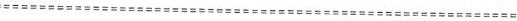

2.778.200,-

# VÁRÓ

3 db. J1642 AXET fotel eá. 111.600,- 334.800,-

1138 Budapest, Esztergomi út 20.

Tel/Fax: 1-270-3734 Mobil: 06-30-406-400

MKB sz.szám:10300002-20512211-00003285

---

.

.

.

.

---

24.sz. melléklet
10. lap

# Kívül - Belül Bt.

BUDAPEST, 1998.04.23.

- 6 -

AZ AJÁNLAT VÉGÖSSZEGE: 11.984.075 FT,-
MENNYISÉGI ENGEDMÉNY 4 %- 479.363 FT,-

========================================
11.504.712 FT,-
ÁFA 25 % 2.876.178 FT,-

========================================
14.380.890 FT,-

A HELYSZÍNRE SZÁLLÍTÁS, A SZERELÉS AZ ÁRAKBAN BENNEFOGLAL-
TATIK.

"B" VARIÁCIÓKÉNT EMLÍTETT TEAM PRO TÍPUSBÓL BEMUTATOTT
ASZTALOKBÓL, HA A 4,5,6,8-AS SZOBÁKBA CSERÉLNÉNK, ANYAGI
VONZATA: 466.800 FT,- MÍNUSZ.

VÁROM SZÍVES VISSZAJELZÉSÉT,

TISZTELETTEL

ÁCS TIBOR/EFG-ASKO KÉPVISELET

1138 Budapest, Esztergomi út 20.
Tel/Fax: 1-270-3734 Mobil: 06-30-406-400
MKB sz.szám:10300002-20512211-00003285

---

.

.

.

.

---

# **A WESSELÉNYI MIKLÓS NEMZETI IFJÚSÁGI ÉS  
SZABADIDŐSPORT AZ EGÉSZSÉGES  
ÉLETMÓDÉRT  
KÖZALAPÍTVÁNY  
HELYSZÍNI ELLENŐRZÉSÉNEK MEGÁLLAPÍTÁSAI**

# **1. A NISZKA MEGALAKULÁSÁNAK ÉS MŰKÖDÉSÉNEK JOGI,  
SZERVEZETI FELTÉTELEI**

# **1.1. A NISZKA megalakulása, alapító okirata, az induló vagyon rendelkezésre bocsátása**

A NISZKA-t a Kormány a Sport tv. 29. § felhatalmazása alapján, az 1993. évben alapított NISZA közalapítvánnyá átalakításával hozta létre. A közalapítvány létrehozásának célja az volt, hogy a Sport tv.-ben az állam számára meghatározott feladatok közül, mint közfeladatot lássa el a gyermek- és ifjúsági sport, valamint a fogyatékosok sportjának támogatását; segítse elő az egészséges életmód és a szabadidősport népszerűsítését, feltételeinek megteremtését.

Még a Sport tv. hatálybalépése előtt az előírásoknak megfelelően a jogelőd NISZA kuratóriuma - a népjóléti miniszternek, mint alapítónak a hozzájárulásával - felajánlotta az alapítvány vagyonát a Kormánynak a közalapítvány céljára. A Sport tv. értelmében az átalakítást 1997. január 1-jével kellett volna végrehajtani, amely késedelmet szenvedett. Az 1017/1997. (II. 13.) Korm. határozat döntött a közalapítvány létrehozásáról, de annak jogerős nyilvántartásba vétele a Fővárosi Bíróság 11. Pk. 60533/97/2. számú végzésével közel fél éves késéssel, csak 1997. május 27-én valósult meg.

A miniszterelnök által aláírt közalapítványi alapító okirat a Sport tv.-ben meghatározott feladatokkal összhangban áll, de a közalapítványi támogatások kedvezményezetteinek körét - elsősorban a szabadidősport tevékenységnél - **az alapító okirat szélesebb körben határozza meg. Ezzel azonban az alapítványi célok nem csorbulnak.**

**A Sport tv. 32. § (1) pontja szerint** központi költségvetési és **közalapítványi támogatásban** az a **sportszervezet** részesülhet, amely elszámolt az előző évben kapott támogatással és nincs lejárt köztartozása, illetve köztartozását folyamatosan az előre meghatározott törlesztő részlettel teljesíti és ezt a tényt az APEH, VPOP, valamint az OEP illetékes szervei által hatvan napnál nem régebben kiállított közokirattal igazolja.

---45

---

Az **alapító okirat IV. (2) bekezdése** - a NISZA alapítványi céljainak átvétele miatt - **szélesebb támogatotti kört állapított meg**, amely szerint normatív vagy pályázati úton történő támogatást nyújt **elsősorban** a szabadidősport tevékenységet végző **sportszervezetek** (Sport tv. 1. § 6. pont), **másodsorban** a szabadidősport tevékenységet kiegészítő tevékenységként szerveződő **társadalmi szervezetek és oktatási intézmények** számára. Az alapító okirat szerint a pályázati támogatást igénylő olyan szervezetektől, amelyek a Sport tv. 1. § 6. pontja szerint nem minősülnek sportszervezetnek, köztartozásokkal kapcsolatos igazolásokat csak különösen indokolt esetben kell támogatási feltételként előírni, önkormányzati oktatási intézmények pályázatai esetében pedig a sportszervezetekre meghatározott közokirati igazolásokat támogatási feltételként a kuratórium nem írhatja elő.

A közalapítvány **alapító okiratán belül tapasztalható ellentmondás**, illetve nem kellő pontossággal körülhatárolt feladat.

A közalapítvány vagyonát, anyagi forrásait az alapító okirat az V. 1. pontban határozta meg. Homályosan, mint 'a vagyonhoz kapcsolódik továbbá' tételt fogalmazták meg az SL Rt. 25 %-os üzletrésze feletti tulajdonosi jogok gyakorlását, amely számos ellentmondás forrásává vált mind az rt. vezetői, mind a joggyakorló kuratóriumi elnökök tekintetében. Az egyértelmű szabályozás és jogosítványok tisztázása esetén elkerülhető lett volna az a folyamatos küzdelem, amely a joggyakorlók és a társaság ügyvezetése között folyt.

Az alapító okirat a közalapítvány bevételi forrásai között sorolja fel a vállalkozási tevékenységből származó nyereség 50 %-át, amelynek nincs létjogosultsága a következők miatt:

A közalapítvány törzsvagyona gyarapítása érdekében - az alapító okirat VII. címben foglaltaknak megfelelően - csak másodlagosan végezhet vállalkozási tevékenységet, kizárólag az SL Rt. feletti tulajdonosi jogainak gyakorlása keretében. Az 1997. évi költségvetési törvény 7. § (1) bek. és az 1998. évi költségvetési törvény 6. § (1) bek. szerint a nem az ÁPV Rt.-hez tartozó gazdasági társaságokban az állami részesedés után kifizetésre kerülő osztalék és az állami vagyon más hozadéka mind 1997. évben, mind 1998. évben a központi költségvetés bevételét képezi. Ezek figyelembe vételével a közalapítvány bevételi forrásai között a vállalkozási tevékenységből származó nyereségnek az alapító okiratban történő megjelenése fölösleges és nem értelmezhető.

A hatályos jogszabályok nem definiálják az alapítványi törzsvagyon fogalmát. A kialakult gyakorlat szerint törzsvagyonnak az számít, amelyet a kuratórium a „rendelkezésre bocsátott vagyonból” nem használhat fel. Általában e vagyonrész hozama szolgál a közalapítványi célok megvalósítására, működési költségeinek stb. fedezetére.

Ennek a gyakorlatnak teljesen ellentmondanak a V/a. pont és a VII. pontban foglaltak. Az alapító okirat V/a. pontja a közalapítvány vagyona megjelölésénél 100 M Ft készpénzt minősít törzsvagyonnak. A VII. pontban foglaltak szerint viszont a „törzsvagyon: a közalapítvány érdekeit szolgáló **szabad rendelkezésű**, az alapítói vagyon nélkül számolt vagyona”.

46

---

Az ellenőrzés álláspontja szerint a törzsvagyon meghatározásának az alapító okirat VII/5. pontja felel meg, amely szerint a „közalapítvány céljainak elérésére tevékenysége gyakorlása során a közalapítvány vagyona és annak hozzáadékai használhatók fel, **az alapítói vagyon 50 %-ának sérelme nélkül.**”.

Az alapító okirat V. 2. pontja sorolja fel a közalapítványi bevételeket. Az a., és c., pont is tartalmazza az esetleges önkormányzati támogatásokat. Megjegyezzük, ilyen támogatás egyik évben sem fordult elő.

A közalapítvány kuratóriumának elnöke eleget tett a közhasznú szervezetekről szóló 1997. évi CLVI. törvény előírásainak és benyújtotta 1998. V. 7-én - az előírt határidőn belül - közhasznúsági átsorolási kérelmét a módosított alapító okirat-tervezettel együtt a BM-hez. Az 1079/1998. (VI. 3.) Korm. határozat jóváhagyta a közalapítvány alapító okiratának módosítását és felhatalmazta a belügyminisztert, hogy a közalapítvány közhasznú szervezetként történő bírósági nyilvántartásba vételéről gondoskodjék. A helyszíni ellenőrzés befejezéséig sem a nyilvántartásba vétel, sem az alapító okirat bírósági tudomásulvétele, illetve nyilvánosságra hozása nem történt meg.

A Fővárosi Bíróság 1999. január 18-án kelt II.Pk.60533/97/4 számú végzésével 30 napos határidő kitűzésével hiánypótlásra hívta fel az alapítót, többek között a kurátorok és FB. tagok ún. összeférhetetlenségi nyilatkozataival kapcsolatban.

A NISZA jogelőd alapítvány vagyonának átadás-átvétele szabályos, könyvvizsgáló által auditált - 1997. V. 26-i - zárómérleg alapján megtörtént.

Az alapításkori vagyont az alapító okirat 2 részre bontotta. A jogelőd vagyona 128,3 M Ft összegéből - eszköz oldalról - 100 M Ft készpénz a közalapítvány törzsvagyona; 3,9 M Ft a befektetett eszközök értéke, amelyről tételes átadó-átvevő leltár is készült. A vagyon részét képezte még 23 M Ft további készpénzállomány, 0,2 M Ft követelés és 1,2 M Ft aktív időbeli elhatárolás.

Az **alapítói vagyon 75 M Ft**, amelyet az 1997. évi költségvetési törvény határozott meg. Ennek **rendelkezésre bocsátása** a bírósági bejegyzést mintegy másfél hónappal követően, **1997. július 8-án történt meg.**

## 1.2. A kuratórium és az FB létrejötte és működése

A **közalapítvány legfőbb döntéshozó szerve**, vagyonának kezelője a Sport tv.-ben és az alapító okiratban foglaltaknak megfelelő **9 főből álló kuratórium**, amelynek létszáma 1998. utolsó negyedévére 8 főre csökkent.

A kuratórium tagjai közé az alapító népjóléti miniszter, a Nemzeti Egészségvédelmi Intézet, az Országos Egészségbiztosítási Önkormányzat, a Magyar Természetbarát Szövetség, a Magyar Szabadidősport Szövetség, a Magyar Diáksport Szövetség, az Önkormányzati Szövetségek Tanácsa és a fogyatékosok érdekvédelmi szervezeteinek javaslata alapján delegált 1-1 főt a miniszterelnök kérte fel és nevezte ki.

A kuratórium az első 1997. június 5-i ülésétől kezdve 1998. október 5-ig 9 fővel, az Országos Egészségbiztosítási Önkormányzat által javasolt és megválasztott kurató-

47

---

riumi tag lemondását követően 8 fővel működött. A létszámcsökkenésről értesítették a felügyeletet gyakorló MH-t, de új tag választására és kinevezésére a helyszíni ellenőrzés befejezéséig nem került sor.

A kuratóriumi tagoknál **összeférhetetlenségi okok nem merültek fel**, bár erről nyilatkozat nem állt a közalapítvány rendelkezésére. Azok példányai - a tájékoztatás szerint - a BM-be és a Fővárosi Bíróságra kerültek.

A NISZKA **kuratóriuma** rendszeresen ülésezett. **Döntéseit** és az ezekről készült határozatokat - a kuratóriumi ülésekről készült emlékeztetők és előterjesztések tanúsága szerint - **kellően alapos előkészítő munka alapján hozta**.

A vizsgált időszakban a kuratórium átlag havonta, a minimálisan előírt negyedéves átlagnál jóval gyakrabban ülésezett. 1997. évben 6 alkalommal összesen 26 határozatot - döntően a szabályzatok és módosításuk, pályáztatási és támogatási, személyi változások és a működési költségvetés, valamint az éves beszámoló jóváhagyása és módosítása témakörben - hozott.

Az 1998. évi 12 ülés alkalmával született határozatok száma 45 volt. A kuratóriumi ülések állandó résztvevője volt az FB elnöke (v. helyettese) és az iroda titkára, a támogatások keretszámainak és elosztási elveinek kialakításánál meghívott vendégként az OTSH munkatársa.

**Határozatairól nyilvántartást vezetett, ám néhány esetben előfordult, hogy a meghozott elutasító, vagy megerősítő döntést követően sorszámozott határozat nem született.**

Pl. Az 1997. augusztus 8-i kuratóriumi ülésen a külön elbírálási kérelem alapján előterjesztett, a Senior Világjátékok megrendezésére kért támogatást a kuratórium elutasította.

Az 1997. november 20-i ülésen egyhangú döntés született a normatív támogatás újraértékelésével kapcsolatos adatfelmérésről, modellszámítások elkészítéséről, valamint egy döntés-előkészítő program megrendeléséről.

Az 1997. december 11-i kuratóriumi ülés 4. napirendi pontja szerint egyhangúlag, titkos szavazással elfogadták a vezető testületi tagok költségtérítési szabályzatának módosítását.

Az 1998. március 27-i kuratóriumi ülésen konkrét döntés született a Természetbarát Túrakerékpárosok Egyesülete, valamint a KSI támogatására. Egyik döntésről sem született határozat.

**A NISZKA kuratóriumának tevékenysége** - az említett formai hiányosságok mellett is - **törvényesnek, döntései célszerűnek** - s a normatív támogatási elvek kialakításán kívül - **eredményesnek mondható**. Ehhez hozzájárult az FB-vel és a közalapítványi irodával kialakított konstruktív munkakapcsolat.

A kuratórium tevékenységének ellenőrzésére jogosult 3 fős **FB felállása és működése összhangban állt a Sport tv. és az alapító okirat előírásaival**. Ellenőrzési tevékenységét leginkább a folyamatos ellenőrzés és a beszámoltatás

48

---

módszerével végezte. Ellenőrzési munkatervet mindkét évre készítettek, de azok konkrét célellenőrzést nem tartalmaztak, az abban foglaltakról írásos anyag nem készült.

A közalapítvány jogerős nyilvántartásba vételét követően, az előírt határidőn belül választották meg az elnököt. Elkészítették ügyrendjüket, abban azonban - az SZMSZ előírásai szerinti - az alapítónak történő beszámolás határidejét nem szabályozták. Az alapító okirat szerinti, évenkénti beszámolási kötelezettség helyett 1998. XII. hóban számolt be tevékenységéről az alapítónak.

AZ FB a kuratóriumi ülésekhez igazodva ülésezett, melyekről emlékeztetők készültek döntéseikről határozatokat hoztak. A határozatok döntő többsége a kuratóriumi határozatok jóváhagyásáról rendelkezik. Az 1997. évben 8, az 1998. évben 17 db határozatot hoztak. Az FB 1999. január 7-i ülésén további 3, de még az 1998. évre vonatkozó kuratóriumi határozatokkal kapcsolatos döntést hozott.

### 1.3. A közalapítványi iroda működése

A közalapítványi iroda látta el a közalapítvány működéséhez szükséges, a kuratórium folyamatos munkáját segítő operatív, szervező, döntés-előkészítő és végrehajtó pénzügyi, gazdálkodási feladatokat. Az átalakulás időtartama alatt a jogelőd NISZA titkársága biztosította az operatív teendők ellátását, sőt 1997. március-szeptember hó között az NSKA működésének személyi, pénzügyi és elhelyezési feltételeit is.

Az iroda szervezetét és tevékenységét az alapító okirat B. pontjának megfelelően az SZMSZ-ben részben tovább szabályozták.

Az SZMSZ a kuratórium hatáskörébe utalta az iroda betölthető státuszhelyeinek számát. A testület a W/18/1997. évi határozattal 9 fő teljes, 2 fő részfoglalkozású, összesen 10 fő teljes munkaidős létszámot határozott meg. Az alapító okirat szerint az iroda feladatát képezi többek között a közalapítvány könyveinek vezetése, amelyet már alapítványi működése idején is külső vállalkozásban egy kft. végzett egyéb gazdasági és adminisztrációs, valamint szaktanácsadói tevékenységgel egyetemben.

A társaságnak fizetett díjazás - figyelembe véve a munkaviszonyban történő foglalkoztatás esetében felmerülő további költségeket pl. anyagköltség, bérköltség, közterhek, fűtés, világítás stb. - a végzett szolgáltatáshoz viszonyítva - az ellenőrzés megítélése szerint - nem túlzott mértékű. Feladatát jó színvonalon, szakszerűen látta el.

Az iroda dolgozói feletti munkáltatói jogok gyakorlását a kuratórium elnöke a titkárra átruházta, amelyet az alapító okirat lehetővé tesz.

Az alapító okirat az irodai foglalkoztatottak javadalmazási módját nem szabályozta, így a kuratórium az SZMSZ-ben a köztisztviselők jogállásáról szóló törvény alapján történő díjazás mellett döntött.

A NISZKA által foglalkoztatott dolgozók szabályos munkaszerződéssel és részletes munkaköri leírással rendelkeznek.

49

---

A vizsgált közalapítványi időszakban megkötött szakértői, megbízási szerződések száma és összege nem volt számottevő. A legfőbb alkalmazási területek: a Sportlétesítmények Rt. tulajdonosi jogainak gyakorlását segítő ügyvéd megbízása, számítástechnikai hardver és szoftver szolgáltatások, alkalmi adatrögzítések, a könyvvizsgáló megbízása, ellenőri megbízás, és néhány egyéb szakértés volt.

A közalapítvány alapító okirata nevesíti az alkalmazott okleveles könyvvizsgálót, akinek megbízását az SZMSZ - az alapító okirattal egyezően - a kuratórium hatáskörébe utalta. A közalapítvány 1997. VI. 5-én kötött megbízási szerződése szerint a könyvvizsgáló feladatát határozatlan időre látja el, s feladata a folyamatos könyvvizsgálat, valamint a kuratórium elé kerülő valamennyi gazdálkodási jelentés véleményezése.

## 2. A KÖZALAPÍTVÁNY GAZDÁLKODÁSÁNAK, KÖNYVVEZETÉSÉNEK SZABÁLYOSSÁGA

### 2.1. A NISZKA gazdálkodását meghatározó szabályzatok teljes körűsége, a kialakított számviteli rend és bizonylati fegyelem

A közalapítvány gazdálkodási kereteit meghatározó szabályzatait elkészítette, s - az 1998. november 27-i kuratóriumi ülésen elfogadott befektetési - és az ellenőrzési szabályzatokkal együtt - szabályozottsága a vizsgált időszak végére teljes körűnek minősül.

Az alapító okirattal összhangban, az abban foglaltakat kibővített formában fogadta el a kuratórium az első - 1997. VI. 05-i - ülésén a közalapítvány SZMSZ-ét. Az SZMSZ a Gazdasági Osztályról szóló fejezetében foglaltak azonban nincsenek teljesen összhangban a gazdasági feladatokat ellátó kft. vállalkozási szerződésében foglaltakkal. A szerződés F. pontja szól a pénzügyi-gazdasági tanácsadás végzéséről, amelyet az SZMSZ nem tartalmaz.

Ugyanezen a kuratóriumi ülésen elfogadásra került a Gazdálkodási Szabályzat, a kuratóriumi tagok és a Felügyelő Bizottság tagjainak Költségtérítési Szabályzata, a Selejtezési Szabályzat, a Házipénztár Kezelési Szabályzat. Ezt követően készült el a Számviteli politika és Számlarend (1997. VII. 4.), az Irat- és Pályázatkezelési Szabályzat (VII. 29.) és a közalapítványi iroda munkavállalói béren kívüli juttatási formáiról szóló szabályzat (VIII. 13.).

A NISZKA kialakított számviteli rendje megfelel az Szt.-nek, a számviteli törvény szerinti egyéb szervezetek éves beszámoló készítésének és könyvvezetési kötelezettségének sajátosságáról szóló 8/1996. (I. 24.) Korm. rendeletben foglaltaknak. (E jogszabály volt hatályban az ellenőrzött időszakban, hatálytalan 1999. január 1-től.)

A számviteli adatok részletezettsége, bontása alkalmas a közhasznú szervezetekről szóló 1997. évi CLVI. törvény, illetve az alapító okiratban megjelölt célok számbavételére, kimutatására.

50

---

## 2.2. Az éves költségvetések és beszámolók szabályszerűsége és megalapozottsága. A pénzügyi fegyelem és a vagyonvédelem érvényesülése

Mind az 1997. évre, mind az 1998. évre elkészült a közalapítvány költségvetése. A kuratórium által jóváhagyott költségvetés, és a számvitelben megjelenő, a közalapítványi költségeket kimutató költségszemlélet eltér egymástól. A költségvetés egyik szemléletben tartalmazza a működéshez szükséges tárgyi eszköz beszerzéseket, de nem tartalmazza az értékcsökkenési leírást, s 1997. évben a tényleges megalakulásáig és önálló működéséig az NSKA költségeit. Az 1997. évi közalapítványi költségvetést (NSKA költségeivel együtt) 41.774 E Ft-ban hagyta jóvá a kuratórium. A költségvetést azt követően 2 alkalommal módosították, ugyancsak a kuratórium jóváhagyásával. A módosított költségvetés 37,4 M Ft-os összege ténylegesen 35,1 M Ft-ra teljesült. (Az 5. számlaosztályban megjelenített költségszemlélet szerint korrigált 30,6 M Ft tervezettel szemben a működési költségek összege 29,9 M Ft-ban teljesült.)

Az 1998. évre készült közalapítványi költségvetés tervezett összege - melyet a február 6-i ülésen fogadott el a kuratórium - 59,9 M Ft. A költségvetési számok tervezett összege három fő csoportosításban készült: testületi költségek 8,0 M Ft (kuratórium, felügyelő bizottság tiszteletdíja, költségtérítése, telefon költsége és a kuratórium elnöke által használt szgk. üzembentartási költségei), irodai működési költségek 49,2 M Ft (ebből a bér és személyi jellegű kifizetések 32,8 M Ft-ot képviselnek) és a pályázati rendszer működésével kapcsolatos költségek 2,8 M Ft. A költségvetés összeállítása az 1997. évi tényleges költségek figyelembevételével, havi átlagos 5 M Ft figyelembevételével készült. Az 1998. december 11-i kuratóriumi üléssel bezárólag 4 alkalommal módosította a kuratórium a költségvetést, így annak összege 60,5 M Ft lett. A terv összeállítása az előző évi tényadatok alapján történt, a **költségvetési tételek között - a feladat ellátásához viszonyítva - túlzott mértékű költségek beállítása nem történt.**

**Az 1997. évi beszámoló előírásszerűen készült:** a számszaki beszámolóhoz mind szakmai, mind a mérleg- és eredmény-kimutatáshoz az egyes mérlegtételek részletezését kiegészítő szöveges beszámoló kapcsolódott. **A mérlegtételeket a komplett beszámoló részeként vagyonleltárral** (letéti igazolás, pénzkészlet és befektetési leltár, stb.) megfelelően **alátámasztották.**

Az egyszerűsített mérlegbeszámoló összeállítása a számviteli törvény előírásainak megfelelően történt. Az okleveles könyvvizsgáló a főkönyvi kivonatokat és nyilvántartásokat folyamatosan ellenőrizte, az esetleges korrekciókat folyamatosan elvégeztette. Jelentés készült az 1997. évi beszámoló kapcsán olyan - az auditálást tartalmilag nem érintő - kérdésekben, amelyek a számviteli nyilvántartások célszerűbb továbbfejlesztését és a számviteli politika kisebb mértékű módosítását célozták. **A beszámolót a könyvvizsgáló hitelesítő záradékával ellátta.**

**Az alapítónak történő beszámolási kötelezettségnek** - a komplett beszámoló kuratóriumi előterjesztését és elfogadtatását követően - **eleget tettek.**

51

---

A szabályozottság és a beszámolók, valamint a bizonylatolás, a házipénztári készpénzkezelés próbaszerű vizsgálata, az elszámolási és ellenőrzési rend (sportszer-utalványok beváltási rendszerének vizsgálata) alapján a gazdálkodás, a pénzkezelés, a vagyonvédelem szabályszerűen történt a közalapítványnál.

# 2.3. Az iroda működési kiadási arányainak alakulása, nyilvántartása, a tárgyi eszközök beszerzésének indokoltsága, a közbeszerzési törvény érvényesülése

A közalapítvány 31,0 M Ft-os működési költségei a kiadások 8,3 %-a volt.

A közalapítvány tárgyi eszközeinek - a jogelőd NISZA leltára alapján átvett - nettó értéken számított és könyveiben nyilvántartott állománya 3,7 M Ft-ról 1997. decemberig 6,1 M Ft-ra nőtt, s az 1998. évi tárgyi eszközök állománya 1998. december 31-én 32,2 M Ft volt. Az eszközök beszerzése a közalapítványi működést segítette.

Az 1997. évben vásárolt eszközök közül - bruttó értéken számítva - 1,8 M Ft-ot számítástechnikai berendezésekre (hálózat kiépítésre, 1 db Pentium számítógép, 3 db nyomtató és winchester), 2,5 M Ft-ot 1 db Daewoo szgk. vásárlásra, 0,1 M Ft-ot mobiltelefonok és kis értékű, közvetlenül költségként elszámolható tárgyi eszközök vételére - 30 E Ft egyedi értékhatár alatt - 0,7 M Ft-ot költöttek.

Az 1998. évi tárgyi eszköz beszerzések értéke bruttó értéken 30,5 M Ft-ot képviselt. Ebből a legnagyobb összeget a közalapítvány elhelyezésének megoldására szolgáló ingatlanvásárlására 25 M Ft-ot, 4,0 M Ft-ot számítástechnikai berendezésekre és kiegészítőkre, 0,6 M Ft-ot beléptető rendszer automatikájára, 0,4 M Ft-ot irodabútor és rádiótelefon tartozékokra, 0,5 M Ft-ot kis értékű tárgyi eszközök beszerzésére fordítottak.

A Kbt. hatálya alá tartozott a NISZKA - korábban egy rt.-től bérelt telephelyének - Bp. VI. Paulay E. u. 45. sz. alatti ingatlan I. emeleti szintjének megvásárlása. A NISZKA kezdeményezésére az rt. a tulajdonában álló ingatlan társasházi alapító-okiratát elkészítette és benyújtotta a földhivatalhoz. Ezt követően tárgyalásos közbeszerzési eljárást kezdeményezett a bérelt ingatlanrész tulajdonjogának megszerzésére. Az ajánlattételi 26,9 M Ft-os árhoz képest kedvező pozíciót sikerült a NISZKA-nak kialkudni. Az 1998. február 27-i kuratóriumi ülés felhatalmazása és a Közbeszerzési Bizottság javaslata alapján 25 M Ft-os vételár felajánlásával az rt.-vel 1998. március 31-én megkötötték az adás-vételi szerződést. A kuratóriumi döntés alapján a beszerzés az alapítói vagyon terhére, szabályosan történt.

Az 1997. évi pályázati kiírás D. pontja értelmében - többek között - sporteszközök vásárlására is lehetett pályázni. Ennek lebonyolítására sportszer-utalványok juttatásával a kuratórium 140 M Ft-os keretet általános-, és 40 M Ft-ot óvodai sporteszköz kategóriában hagyott jóvá. Az értékhatár közbeszerzési eljárást tett szükségessé. A közbeszerzési pályázatok közül 6 sportszerkereskedővel kötöttek szerződést, akiknél a sportszer-utalványokat be lehetett váltani. A

52

---

szerződések feltételei a közalapítvány számára kedvezőek voltak. A nyertes kereskedők 4-15 %-os kedvezményt nyújtottak, s az összegyűjtött sportszer-utalványok leszámítolását - a számlázást - a közalapítvány ellenőrzését követően 2 M Ft névérték beváltása és szabályos elszámolása mellett kezdeményezhették.

A közbeszerzési eljárás során peres eljárást indítottak a NISZKA ellen és bírság kiszabására is sor került. Az eljárás a helyszíni ellenőrzés befejezéséig nem zárult le.

A NISZKA nyílt eljárás keretében ajánlati felhívás közzétételét kezdeményezte a Közbeszerzési Értesítő szerkesztő bizottságánál, amelyet kétszeri módosítás után az Értesítő közzétett.

Az ajánlatra 9 pályázat érkezett, amelyből - a 3 fős közbeszerzési bizottság megállapítása szerint - mindössze 1 pályázat volt alaki szempontból hibátlan, a többi pályázónak azonban záros határidőn belüli lehetőséget biztosítottak a hiánypótlásra.

A NISZKA az egyik pályázót - aki nem tudta produkálni a dokumentumokat az előírt határidőre - kizárta az ajánlattevők közül. A kft. a Közbeszerzési Döntőbizottsághoz fordult, az elmarasztalta és 1 M Ft + 30 E Ft megfizetésére kötelezte a közalapítványt. A NISZKA keresetet nyújtott be a határozat felülvizsgálata érdekében a Fővárosi Bírósághoz. A Fővárosi Bíróság 1998. november 5-i ítéletében a határozatot részben megváltoztatta és mellőzte a pénzbírság kiszabását. A közalapítvány a bírság eltörlése ellenére nem azonosult a törvény Fővárosi Bíróság általi jogi értelmezésével, így nov. 18-án a MK Legfelsőbb Bíróságához fellebbezést nyújtott be.

## 2.4. A kuratóriumi és az FB tagok tiszteletdíja és költségtérítése

A kuratóriumi tagok és az FB tagjainak és tisztségviselőinek tiszteletdíját az alapító okirat lehetőségeivel egyezően, a mindenkori minimálbér 100-200 %-ának megfelelő felső határon hagyták jóvá a NISZKA Gazdálkodási Szabályzatában. A tiszteletdíjak kiutalásánál figyelembe vették az országgyűlési képviselők jogállásáról szóló 1990. évi LV. törvény 10. §-a szerinti korlátozó intézkedéseket, amely szerint az országgyűlési képviselő a közalapítvány kezelő szervének tisztségviselőjeként, vagy tagjaként nem részesülhet tiszteletdíjban.

A kuratórium tagjai közül 1 fő - már az előző ciklusban is képviselő volt - tiszteletdíjat a közalapítvány létezése óta nem kap. A kuratórium elnöke az 1998. évi parlamenti alakuló ülése óta nem részesül tiszteletdíjban.

Az alapító okirat meglehetősen nagyvonalúan és szűkszavúan rendelkezett a kifizethető költségtérítésekről. A meghatározás szerint a kuratórium és az FB tagjai tisztségük ellátásával kapcsolatban igényt tarthatnak a "felmerülő szükséges és indokolt" költségeik megtérítésére. Az alapító okirat a kifizethető mértékét azonban nem szabályozta.

53

---

Ennek szellemében a kuratórium meglehetősen széleskörű és közalapítványi szempontból pazarló szabályozást hagyott jóvá. A lehetséges térítéseket 6 csoportba sorolta.

1. Utazási költségtérítés, amely BKV bérlet, I. o. gyorsvonat számla vagy saját gk. menetlevéllel történő elszámolása mellett történhet. A kuratórium elnöke jogosult a közalapítvány tulajdonában lévő gépkocsi használatára menetlevél vezetése mellett, maximum havi 2000 km megtételéig.
2. Távközlési költségek: saját telefon használata mellett az előfizetési és nemzetközi hívással csökkentett számlaösszeg 50 %-a számolható el, de max. 4.000 Ft, a szabályzat módosítása után 5.000 Ft havonta.

A tisztségviselők jogosultak - havonta tiszteletdíjuk mértékének erejéig - a közalapítvány tulajdonában lévő, de általuk használt mobiltelefonok számláinak elszámolására.

3. Továbbképzési és oktatási költségeket számolhatnak el éves szinten havi tiszteletdíjuk kétszeresének összegéig, amely továbbképzésekre és szakmai konferencia költségekre vonatkozik, s számla ellenében történik.
4. Szakkönyv ellátásra jogosultak a tagok titkársági beszerzés alapján, maximum havi tiszteletdíjuk felének mértékéig.
5. Egészségügyi ellátás keretén belül orvosi rendelvény alapján szemüveg - a szabályzat módosítását követően kontaktlencse - térítési díjban részesülhetnek éves viszonylatban, a tiszteletdíj kétszeresének mértékéig. Baleset, kórházi ellátás és életbiztosítás térítése lehetséges, amely havi tiszteletdíj negyedét nem haladhatja meg.
6. Ruházati költségtérítést a vezető tisztségviselők, éves szinten egyhavi tiszteletdíjuk mértékéig vehetnek igénybe.

A kuratórium és az FB tagjai a részletesen és széles körben szabályozott lehetőségeknél szerényebb mértékben vették igénybe a saját maguk által megszavazott költségtérítéseket. A helyszíni ellenőrzés befejezését követően az 1999. február 5-i kuratóriumi ülésen új - takarékosabb - költségtérítési szabályzatot hagytak jóvá, amelyben más korrekciók mellett törölték a korábbi szabályozás 5. és 6. pontját. Az 1997. évben összesen 985,2 E Ft-ot- ezen belül 260,1 E Ft utazási költséget, 383,7 E Ft távbeszélő költséget, 10,5 E Ft szakkönyv térítést, 271,2 E Ft biztosítási költségtérítést és 59,7 E Ft ruházati költségtérítést - juttattak a felsorolt jogcímeken. A költségtérítéseket további 92,2 E Ft SZJA és 33,8 E Ft TB-járulék befizetési kötelezettség terhelte.

Az 1998. évben kifizetett költségtérítés összege 2.129,9 E Ft volt, melyhez 189,4 E Ft SZJA és 82,8 E Ft TB járulék fizetési kötelezettség kapcsolódott.

54

---

Ebből 616,5 E Ft utazási költségtérítést, 773,9 E Ft telefonköltséget, 84,2 E Ft szak-könyv térítést, 585,6 E Ft biztosítási költségtérítést, 38,8 E Ft ruházati költségtérítést és 30,9 E Ft egészségügyi ellátást számoltak el.

## 2.5. A közalapítvány likviditása, finanszírozása

Az 1997. évi költségvetési törvény a megfelelő támogatást a közalapítvány részére jóváhagyta, de a **nem kellően átgondolt és megalapozott átalakítás, illetve alapítás miatt a játékadó folyósítása nem indulhatott meg** a Sport tv., az Art. és a szerencsejáték szervezéséről szóló 1991. évi XXXIV. törvény harmonizációjának hiánya miatt. A pénzügyminiszterhez intézett közalapítványi kérvényre átmenetileg - a költségvetési törvény várható szeptemberi, ténylegesen decemberi módosításáig - a 2239/1997. (VII. 29.) Korm. határozatban **140 M Ft-ot biztosítottak a költségvetés általános tartaléka terhére, a szerencsejáték-adóból megillető hányad részbeni pótlására.**

A **finanszírozás** meglehetősen **rendszertelenül** történt. 1997. évben a közalapítványnak szeptember végén és október hó elején 70-70 M Ft-ot, majd december hóban további 274 M Ft-ot juttattak az OTSH-n keresztül. A havi játékadó 12 %-át XII. 23-án írták jóvá számláján.

A közalapítvány bonyolult finanszírozási rendszeren és pénzügyi útvonal során jut a sorsolásos játékadó 12 %-ához. Az adóalanyok bevallják és értesítést küldenek az APEH-nak, az APEH által a Kincstárhoz eljuttatott értesítést követően jóváírják az OTSH számláján, az OTSH értesítést küld a NISZKA-nak és egyszerűsített programfinanszírozás keretén belül ugyanazt az összeget átutalja a számlájára. Adott hónapra esedékes játékadó összegét átlag két hónappal, de a bevallást követő egy hónappal később kapja meg. Likviditási gondjai - az indulási időszakot kivéve - általában nem voltak, mert adott évben a kötelezettségvállalást a pénzforgalmi kiadások csak később követték. Ebből a rendszerből adódott az is, hogy átmenetileg szabad pénzeszközeit - bár nem az alapító okirat szerint engedélyezett módon - lekötötte és viszonylag nagy összegű kamatbevételre, árfolyamnyereségre tudott szert tenni.

## 3. A NISZKA RENDELKEZÉSÉRE ÁLLÓ KÖLTSÉGVETÉSI TÁMOGATÁS, ILLETVE A KÖZPÉNZEK RENDELTETÉSSZERŰ, TÖRVÉNYES ÉS CÉLSZERŰ FELHASZNÁLÁSA

### 3.1. A közalapítvány bevételi forrásainak alakulása

Az alapító okirat a közalapítványnak 11 jogcímen biztosít bevételi lehetőséget, amelyből mindössze 6 forrásból származott árbevétele.

A közalapítvány ellenőrzött két évének bevételi forrása az 1997. évben (V. 27. - XII. 31) 609 M Ft, az 1998. évben (a helyszíni ellenőrzés befejezésekor rendelkezésre álló január-november hónap adatai szerint) 503 M Ft volt. Az adatok összehasonlítása a tört évek miatt nem célszerű. Tendenciaként azonban megállapítható,

55

---

hogy mindkét évben a bevételek döntő hányadát a központi költségvetési támogatás és az átengedett sorsolásos játékok 12 %-os nagyságrendű játékadójának együttes összege alkotja. (Az 1998. január-november havi adatokban ténylegesen még csak - az utólagos adóbevallások miatt - a január-szeptember hóra esedékes játékadó bevétele szerepel.) Az arányok eltolódását befolyásolta még az a tény is, hogy a közalapítvány - önhibáján kívül - ugyan csak 1997. május 27-től létezik hivatalosan, azonban a sorsolásos játékadó 12 %-ának megfelelő összeget egyenlőtlen ütemezésben, de egész évre, (1997. január-december hónapokra vonatkozóan) megkapta. Arányaiban és összegében is emelkedik a lekötésekből keletkezett, pénzintézet által fizetett kamat és árfolyamnyereség összege az 1997. évi 26,6 M Ft-ról már 84,1 M Ft-ra. Ennek oka, hogy a pályázati összegek odaítélése a naptári év második felére esik, amely még nem jelent pénzforgalmi kifizetést, csak kötelezettségvállalást. A tényleges kifizetésig mind a pályázati összegek, mind a normatív támogatások még nem folyósított része a közalapítvány pénzügyi lekötéséből eredő kamatbevételt növeli.

A közalapítvány bevételei közül a 'csatlakozás során tett felajánlások, juttatások és adományok' között mutatták ki a közbeszerzési eljárás során kiválasztott sportszer-kereskedők nyújtotta árengedményt, amelyet a pályázók által elnyert sportszer-utalványok beváltásánál és leszámítolásánál érvényesített a NISZKA. Elhanyagolható összegű és mértékű volt a felajánlott SZJA 1 %-a, s az egyéb és rendkívüli bevételek aránya sem haladta meg a 2 %-ot.

Az 1997. évi költségvetési törvény az NM fejezetnél 56 M Ft költségvetési támogatást tervezett, amelyet havi ütemezésben, a NISZKA időszakára 32,5 M Ft összeget arányosítva számoltak el. A BM fejezet OTSH cím alatt tervezett 355 M Ft játékadó bevétel a központi költségvetés előirányzat módosítás nélkül teljesülő kiadása, amely a NISZKA-nál - nem pénzforgalmi - 538,2 M Ft tényleges, 1997. évi mérleg szerinti árbevételt eredményezett.

Az 1998. évi költségvetési törvény 5 M Ft közalapítványi és 440 M Ft összegű játékadó bevételt irányozott elő a BM fejezet, OTSH cím alatt. A közalapítványi támogatást havi ütemezésben folyósították. A játékadó bevétel 1998. évben 456 M Ft-ra teljesült, 16 M Ft-tal haladta meg az előirányzatot.

A NISZKA legfőbb bevételi forrásának biztosítását és útját kapcsolódó ellenőrzés keretében tekintettük át az OTSH-nál, APEH-nál, az SZRt.-nél, és adatokat kértünk a játékengedélyek kiadására jogosult SZF-től. A ténylegesen járó játékadó összege befizetésének ellenőrzése természetesen csak azokra az adóalanyokra terjedhetett ki, akik engedélyt is kértek és bevallásuk alapján be is fizették adójukat.

A sorsolásos játékok játékadójának 12 %-os mértéke az adóalanyok adóbevallásán külön soron nem jelenik meg, azt az adóbevallások benyújtása mellett az adózók külön levélben - adatszolgáltatás formájában - közlik az APEH Kiemelt Adózók Igazgatóságával. Az ellenőrzés megállapította, hogy a NISZKA a törvényben és alapító okiratában meghatározott játékadó összegét - kis mértékű túlfizetéssel - megkapta. A finanszírozás módja és útja azonban rendkívül bonyolult és munkaigényes a finanszírozásban résztvevők számára.

56

---

Az APEH belső adatszolgáltatása útján az Adóügyi Főosztály összesíti és utalja tovább a Magyar Államkincstáron keresztül az OTSH-ba, majd az OTSH a NISZKA számlájára.

Az APEH adóalanyok által történő adatszolgáltatásának összesítése és utalásának az összege megegyezik mind az 1997. évben, mind az 1998. január-október hónapokat összesítve az OTSH és NISZKA adataival. Eltérés tapasztalható azonban a legnagyobb adófizető, a Szerencsejáték Rt. által közölt adatok között, az alábbiak szerint:

|  1997. évi SZRt. adatszolgáltatás szerint: | 535.330 E Ft  |
| --- | --- |
|  ÁSZ-nak adott, főkönyvi kivonattal alátámasztott bevételből levezetett adó játékonkénti összesítése szerint: | 534.065 E Ft  |
|  Túlfizetés: | 1.265 E Ft  |

Az SZF által megadott 3 kft. befizetési kötelezettsége és a tényleges befizetés közötti különbözet elhanyagolható, mindössze 1 %-os volt, a tényleges befizetés javára. A végső rendezés - az egyik adóalany játékadó értelmezési problémáiból adódóan - 1999. I. negyedévében várható.

Az 1998. évi január-október havi adatok tekintetében az SZRt. által rendelkezésre bocsátott, főkönyvi kivonatokkal alátámasztott és próbaszerűen ellenőrzött adatai 455.449 E Ft összege 95 E Ft-tal haladja meg az APEH-nak közölt 455.354 E Ft-ot, amely nagyságrendjét tekintve %-ban sem fejezhető ki, s amely a bevallási folyamatban a több milliárdos nagyságrendű számok kerekítésének következménye is lehet. Az összeg rendezése az SZRt. tájékoztatása szerint 1999. január 20-án önrevízióval megtörtént.

Az SZF január-november havi adataiból számított - már csak egy kft. által fizetendő - játékadó összege az APEH-nál található 922 E Ft bevallási összeggel megegyezik.

### 3.2. A közalapítványi bevételek felhasználása, a normatív és a pályázati úton történő támogatások alakulása

A közalapítvány által kiírt pályázati feltételek alapján az 1997. évben összesen 7.002 db pályázatot nyújtottak be. A pályázati feltételek alaki és tartalmi feltételei meglétének vizsgálata után - azok 89,5 %-a - 6.267 db elbírált pályázatból 4.248 db pályázatot - az elbíráltak 67,7 %-át, a benyújtottak 61 %-át - támogattak. **A szabályos pályázatok által benyújtott 1.878,3 M Ft-os igénnyel szemben 442,7 M Ft támogatást tudtak felosztani**, amely az igényelt összeg negyedét sem - 23,6 % - érte el. **Az elnyert támogatások átlagos nagysága** nem nagy, 1 pályázóra átlagosan **104 E Ft** jutott.

Megállapítható, hogy az adott évben benyújtott és el is fogadott pályázatok igénye, az 1997. évi adatok alapján mintegy 4 évi lehetősége a NISZKA-nak, amely - messze meghaladja az adott évi - a tervezhető bevételek figyelembe vételével, kötelezettségvállalásként biztonsággal odaítélhető támogatások összegét.

57

---

Az alapító okirat normatív és pályázati úton történő támogatást tett lehetővé.

**A normatív támogatások** odaítélésére és kifizetésére csak az alapító okiratban foglalt és nevesített szervezetek számára jogosult a kuratórium. A konkrét szövetségek megjelölésével ellentétben a fogyatékosok részére juttatandó támogatásoknál általánosságban sport- és érdekvédelmi szövetségeket jelölt meg.

A normatív támogatások összege évenként nem haladhatja meg az összes támogatás 10 %-át. Ilyen támogatásban a Magyar Természetbarát Szövetség, a Magyar Szabadidősport Szövetség, a Magyar Diáksport Szövetség, a Magyar Technikai és Tömegsportklubok Országos Szövetsége és a fogyatékosok kizárólag sporttevékenységet folytató sport- és érdekvédelmi szövetségei részesülhetnek.

**A normatív támogatások szétosztása, alapelveinek kialakítására a kuratórium külön munkabizottságot hozott létre**, amelynek munkája alapján összeállított szempont-rendszert az 1997. július 4-i kuratóriumi ülésen fogadtak el.

A kialakított elosztási szempontrendszer 4 elem kialakításával történt. Az elosztható összeg 25 %-át differenciálás nélkül, 55 %-át a feltehetően ténylegesen résztvevők száma alapján, egy faktorszorzóval módosítva, 10 %-ot a szervezetek által szervezett rendezvények száma szerint és a fennmaradó 10 %-ot a résztvevők alapján. Az így kialakult arányok szerint összesen 41,4 M Ft-ot osztottak fel, amely az 1997. évi összes támogatás 10 %-a alatt, 8,6 %-ban teljesült. Ennek 47,8 %-át az MDSZ, 14,5 %-át az MSZSZ, 13,4 %-át az MTSZ, 16,9 %-át a fogyatékosok szervezetei (ezen belül a Magyar Értelmi Fogyatékosok Szövetsége, a Magyar Mozgáskorlátozottak Sportszövetsége, Magyar Transzplantáltak Kulturális Sportegyesülete, Magyar Vakok- és Gyengénlátók Sportszövetsége, Magyar Siketek Sportbizottsága és a Magyar Speciális Olimpiai Szövetség), 7,4 %-át a Magyar Technikai és Tömegsportklubok Országos Szövetsége kapta.

**A kuratórium** - annak ellenére, hogy az 1997. évi támogatási elveket és összegeket elfogadta - **az 1998. évi normatív támogatások elosztásánál kevésbé szubjektív felosztási elv kialakítását és megvalósítását** fogalmazta meg a munkabizottság számára. Kérdőív és bizonyos mérőszámok figyelembevételével elkészült az 1998. évi felosztás, azonban torz eredményei miatt a munkabizottság sem javasolta annak elfogadását. Pozitívumként értékelhető, hogy a közalapítvány egyeztetett az OTSH képviselőjével a támogatások tekintetében, s 1998. évre olyan elvi álláspont alakult ki, hogy a normatív támogatások 1998. évre nem csökkenthetők. Végül a kuratórium megszavazta, hogy keressék meg a Budapesti Közgazdaságtudományi Egyetem Sport Marketing Tanszékét, s kíséreljék meg a tudományos alapokon történő szétosztást.

Az 1998. évi április 17-i kuratóriumi ülésen 9 szervezet között összesen 54 M Ft-ot, majd a július 17-i ülésen további 9,7 M Ft-ot osztottak fel. A támogatás mindenhol emelkedett, miután a felosztandó összeg több, mint másfélszeresére nőtt 1998. évben. A belső felosztási arányok változtak, amely az MDSZ-nél érzékelhető leginkább. A támogatás részaránya ennél a szövetségnél csökkent a legjobban: az 1997. évi 47,8 %-ról 38,9 %-ra.

58

---

A készpénz támogatáson túl 1998-ban szerződés-kiegészítéssel a kuratórium 138 E Ft értékű eszközt is átadott

A normatív támogatás elnyeréséhez igénylőlapot kellett kitölteni, amelyhez mellékelni kellett a szövetség pénzügyi tervét, előző évi beszámolóját, valamint három hatóság (APEH, OEP, VPOP) igazolását. További feltétele volt a támogatásnak az előző évi elszámolások megléte. **A megállapodások - normatív támogatási szerződések - tartalmazzák az alapvető jogi, pénzügyi feltételeket, szankciókat is, és az elszámolásra vonatkozó kikötéseket.**

A szerződés tartalmazza a támogatás elkülönített kezelését, felhasználását és azokat a kiadásokat, amelyre nem használhatóak fel. Kötelezettséget ír elő arra vonatkozóan, hogy csak adott évi számlák elszámolása lehetséges, tartalmazza az elszámolás módját és határidejét. Lényeges jogi kellékeket is tartalmaz a jogutódra, mint készfizetői kezesre, valamint a jogviták eldöntésére.

**A normatív támogatásokon kívül csak pályázati úton fizetett a közalapítvány támogatást. Pályázaton kívül érkezett támogatási kérvényt a közalapítvány kuratóriuma - az emlékeztetőkben foglaltak szerint - elutasított.** A sporttámogatási célok, koncepciók kialakítása az előterjesztések és viták alapján lényegében a pályázati kiírásban fogalmazódtak meg. Ezek a feltételek megfeleltek részben a Sport tv.-ben és teljesen az alapító okiratban foglaltaknak. A feltételeket - egy kivétellel - megfelelően körülhatárolták. Előfordult azonban olyan feltétel, amelyet végül nem tudtak számon kérni. (1997. évben az E kategóriában diáksport szervezetek számára sportrendezvények költségeinek max. 30 %-os fedezetére).

Mindkét évben szerepelt a pályázati felhívásban az oktatási (alap- és középfokú, illetve felsőoktatási) intézmények számára tanórán kívüli foglalkozások rendezésére, sportszervezet részére sportcélú kapacitás- és infrastruktúra fenntartására, diáksport-szervezetek számára sportrendezvények lebonyolítására, valamint a szabadidősport helyi és megyei bajnokságainak megrendezésére történő pályázási lehetőség. A különbség annyi volt, hogy míg 1997. évben az összeg 30 %-ára lehetett, addig 1998. évben az 50 %-ra nyílt mód pályázni. A pályázatok beérkezése és értékelése során jött rá a munkabizottság, hogy gyakorlatilag nem kötöttek ki további feltételt annak érdekében, hogy ez a 30 % ténylegesen mérhető és ellenőrizhető legyen. Az ebből levont tanulságok tapasztalata alapján 1998. évben a pályázati felhívásban már szerepelt az a feltétel, hogy a támogatott szervezet a támogatás összegének kétszereséről számoljon el. Óvodai kategóriában is pályázhattak azzal a különbséggel, hogy egyik évben szabadtéri játszó-sport eszközök, másik évben belföldi kirándulások megrendezésének útiköltsége volt a támogatás célja.

Pályázat került kiírásra mindkét évben sporteszközök vásárlására, az eltérés a lebonyolítás módjában volt. Míg 1997. évben a közbeszerzési eljárás keretében lebonyolított sportszer-utalványok beváltására, addig az 1998. évi feltételek szerint pénztámogatásra, a szükséges eszköz beszerzési árának max. 50 %-ára lehetett pályázni.

Az 1998. évi kiírásban H. kategóriában új célt, nevezetesen a szabadidősport valamely tevékenységét, területét népszerűsítő, sportszervezetek gondozásában megjelenő alkalmi kiadvány, könyv kiadását kívánták támogatni.

59

---

A pályázati feltételek célorientáltságát azzal kívánták biztosítani, hogy a kiadások közül kizárták az étkezési jellegű, személygépkocsival kapcsolatos, vagy - a bírói díj és az orvosi ügyeleti költség kivételével - a személyi célú kifizetéseket.

A pályázatok kiértékelése összességében szabályosan és célszerűen, a támogatási javaslatok előterjesztése az egyes kategóriáknak megfelelő munkabizottságokban történt a kuratórium végleges jóváhagyásával, az ugyancsak megszavazott keretek és a kötelezettségvállalás figyelembe vételével.

A támogatások felhasználása elszámoltatási rendszerét kialakították, bár annak írásban történő közalapítványi szabályozását csak az 1998. november 27-i kuratóriumi ülésén fogadták el.

A támogatási szerződésekben foglaltak szerint az azokban megjelölt határidőig a számlamásolatok becsatolása mellett a pályázónak az elköltött támogatásról számot kell adnia.

A beérkezett elszámolásokat a közalapítvány ellenőrizte részben saját munkatársai, részben külső ellenőr segítségével. A támogatások felhasználása és hasznosulásának ellenőrzése esetenként helyszínen is történt, bár erről jegyzőkönyv vagy emlékeztető nem készült.

### 3.3. A támogatások hasznosulása

Helyszíni kapcsolódó ellenőrzés keretében ellenőrzésre került a NISZKA által 1997-ben és 1998-ban a Magyar Természetbarát Szövetségnek (MTSZ) nyújtott normatív és pályázati, a Magyar Diáksport Szövetségnek nyújtott normatív, továbbá az egyéb pályázók közül szúrópróbaszerű mintavétellel kiválasztott 59 pályázónak (óvoda, általános- és szakközépiskola, gimnázium, egyetem, sportegyesület, klub és szakosztály, társadalmi intézmény, munkahelyi és társadalmi szervezet stb.) nyújtott támogatás.

A helyszíni ellenőrzés tapasztalata szerint az ellenőrzöttek többsége naprakész szabályzatokkal rendelkezett.

A vizsgált pályázók többsége megfelelő, a számukra előírt számviteli rendet alakított ki, néhány helyen azonban helytelen gyakorlatot is lehetett tapasztalni.

Az ellenőrzött időszakra bemutatott főkönyvi számlák alapján a NISZKA-tól kapott támogatást az ellenőrzöttek - az Magyar Diáksport Szövetségnél (MOSZ) és a Magyar Értelmi Fogyatékosok Sportszövetsége kivételével - elkülönítetten tartottak nyilván.

9 pályázat esetében a pénzösszeg felhasználását csak külön, a számlákból történő kigyűjtéssel tudták igazolni, mert nem biztosították a felhasználás naprakész nyilvántartását. Az ellenőrzés ezt a hiányosságot a Budapesti Szabadidősport Szövetség, a Budapesti Tájfutók Szövetsége, a Budapesti Diáksport Szövetség, a Harci Művészetek Budapesti Szövetsége (HMBSZ), a Budapesti Tollaslabda Szövetség, a Budapesti Triatlon Szövetség, a Budapesti Evezős Szövetség, a

60

---

Mozgáskorlátozottak Budapesti Szövetsége, a Budapesti Természetbarát Szövetség esetében tapasztalta.

**A normatív támogatásként kapott pénzt az MTSZ-nél és MDSZ-nél cél (szerződés) szerint az intézményi, szervezeti, működési kiadások fedezetére szabályosan használták fel.** Elszámolásukat határidőre benyújtották a közalapítványhoz.

A pályázat útján kapott támogatásoknál a pályázati feltételek, a pályázatban bemutatott adatok és tények a valóságnak megfeleltek. A pályázaton elnyert pénz felhasználásának és elszámolásának szabályait a szerződések kielégítően tartalmazták, melyek a tartalmi és formai követelményeknek megfeleltek.

**A pályázat útján odaítélt támogatásokat a szerződésekben rögzítetteknek megfelelően a támogatottak döntő többsége szabályosan, célszerűen használta fel és számolta el.** Az elszámolások megalapozottak, azokat szabályos számlákkal és bizonylatokkal alátámasztották.

Pl. az MTSZ túraútvonal felújításának elszámolása jól bizonylatolt, követhető volt a kilométer elszámolás és anyag felhasználás vonatkozásában. Az elvégzett munkát minden esetben a munkát elvégzőktől független személyekkel ellenőriztették.

A NISZKA által a pályázóktól elfogadott számlák minden szükséges információt (ÁFA-t is) tartalmaztak, a tartalmi és formai követelményeknek megfeleltek.

Hiányosság, hogy az eredeti számlák érvénytelenítésére néhány helyen nincs kialakult gyakorlat (pl. az MTSZ-nél és MÉS-nél), így nem zárható ki annak lehetősége, hogy az eredeti számlákat más elszámolásokhoz is felhasználják.

Az ellenőrzött szervezetek - két kivétellel, a Nádasí Ferenc Gimnázium és a HMBSZ - a szerződésben megállapított eredeti határidőn belül számoltak el a támogatás felhasználásáról.

A Nádasí Ferenc Gimnáziumnál a betervezett túrák többsége tanulmányi okok és betegség miatt meghiúsult, ezért kérték a pályázaton elnyert támogatási összeg felhasználási határidejének módosítását. A NISZKA 1999. január 15-ig meghosszabbította az előírt határidőt, de az nem érkezett meg a módosított határidőre sem.

A HMBSZ-nél a betervezett és az elnyert pályázattal támogatott sportrendezvény technikai okok miatt későbbi időpontban került megrendezésre, ezért a szerződésben rögzített 1998. november 30-i határidő helyett (másfél hónap késéssel) 1999. január 14-én érkezett csak meg az elszámolás a NISZKA-hoz.

A támogatások felhasználásának döntő többségét az ellenőrzés eredményesnek tartja, mert **a pályázók a pályázatot alaposan kidolgozták**, a felhasználás során **takarékosságra és célszerűségre törekedtek.**

---61

---

A vásárolt tárgyi eszközöket az ellenőrzött pályázók szabályosan kezelték, egyedi azonosítóval látták el, egyedi nyilvántartó kartonokon elkülönítették és leltáríven szerepeltették.

**A vizsgált szervezeteknél a NISZKA-tól kapott normatív és pályázati támogatások zömét rendeltetésszerűen, a szerződésekben rögzítetteknek megfelelően, törvényesen és célszerűen használták fel.**

## **4. A KÖZALAPÍTVÁNY VAGYONÁNAK MEGŐRZÉSE ÉS HASZNOSÍTÁSA**

### **4.1. A közalapítványi vagyon alapítói és törzsvagyonra elkülönítése, szabályossága**

A közalapítvány induló tőkéjét a 411. főkönyvi számlán elkülönítetten nyilvántartják, ezen belül további két számlacsoportban mutatják ki az alapítói vagyon 75 M Ft-os és a jogelőd alapítvány vagyonát. Az alapító okirat szerint a közalapítvány céljainak elérésére tevékenysége gyakorlása során a NISZKA vagyona és annak hozadékai használhatók fel az alapítói vagyon 50 %-ának sérelme nélkül.

A törzsvagyon fogalmát és összegét az alapító okiratban is ellentmondóan és helytelenül határozták meg, így annak értéke - 37,5 M Ft - sem került a könyvekben elkülönítésre.

Az alapítói vagyon szabad rendelkezésű része, 37,5 M Ft terhére vásárolták a székhely Bp. VI. Paulay E. u. 45. sz. alatti társasházi ingatlanrészt, melynek alszámlán történő elkülönítése célszerű lenne az alapítói vagyon részeként. Tájékoztatás szerint az 1998. évi mérleg zárásakor az elkülönítések megtörténtek.

### **4.2. A vagyonkezelői tevékenység és a közalapítványi befektetések szabályossága**

A közalapítványi vagyon kezelő szerve a kuratórium, amelynek lényeges feladata, hogy megfelelő döntéseket hozzon, s minden lehetséges módon gyarapítsa a közalapítványi vagyont. A NISZKA fennállása óta ugyan nem túl hosszú idő - másfél év - telt el, vagyona a közalapítványi feladatok ellátása mellett mind az 1997. évben, mind az 1998. évben gyarapodott. Eszközeinek és forrásainak összege 1997. év végére a nyitó 128 M Ft-ról 730 M Ft-ra emelkedett.

Ezen belül a befektetett eszközök értéke 3,9 M Ft-ról 6,9 M Ft-ra nőtt, amely a tárgyi eszközök és az immateriális javak nettó értékben történő bővülésének eredménye. Forgóeszköze növekményének döntő hányada - 123 M Ft-ról 631 M Ft-ra - a pénzeszközök 4,5-szeres állománynövekedéséből adódott. Ennek oka, a pályázatok kiértékelésének, valamint a pénzforgalmi kifizetéseknek a csúszása.

A helyszíni ellenőrzés befejezését követően elkészült, 1999. március 11-én keltezett tanúsítvány (22. sz. melléklet) szerint 1997. évhez képest 1998. év végére a

62

---

NISZKA-nál kiugró vagyongyarapodás történt a befektetett eszközöknél, ezek összege 6,9 M Ft-ról 471,2 M Ft-ra nőtt, ugyanakkor 631,2 M Ft-ról 569,9 M Ft-ra csökkent a forgóeszközök, továbbá 92,2 M Ft-ról 2,4 M Ft-ra az aktív időbeli elhatárolódások összege, fentiek együttes hatására az eszközök és források összege 730,3 M Ft-ról 1.043,6 M Ft-ra növekedett.

Az 1998. évi mérlegadatok helyességét a helyszíni ellenőrzés már nem vizsgálta, a kuratórium elnökének 1999. március 11-i levelében közölt tájékoztatása azonban arra utalt, hogy a **NISZKA 1998. évi mérlege a Befektetett eszközök Immateriális javak mérlegsorban - az SL Rt. tulajdonosi jogainak gyakorlásával kapcsolatban -436,5 M Ft összegű téves adatot tartalmaz.**

Az ÁSZ KEI igazgatója V-25-47/1998-99. számú levelében - részletesen megindokolva - felhívta a kuratórium elnökének figyelmét, hogy tévesen kívánják szerepeltetni a tulajdonosi jogok gyakorlása miatt az SL Rt. arányos vagyonrészét a közalapítvány könyveiben, mivel ez az Szt. 22. § (1) és (3) bekezdéseivel ellentétes, egyben javasolta, hogy az 1998. évi mérleg elkészítési határidejét megelőzően tekintsek át e vagyonrész szerepeltetésének helyességét.

A kuratórium elnöke 1999. április 9-én kelt levelében megerősítette, hogy álláspontjuk nem változott, az SL Rt. vagyonrészének a közalapítványi könyvekben, az immateriális javak közötti szerepeltetése indokolt. Szakmai álláspontjuk igazolására a könyvvizsgáló által készített feljegyzést csatolták (29. sz. melléklet).

A kuratórium elnöke 436,5 M Ft-ban jelölte meg az SL Rt. miatti növekményt az immateriális javak növekményén belül, a könyvvizsgáló az SL Rt. saját tőkéjét 1.746.089 ezer Ft összegűnek jelezte (29. sz. melléklet), így e két adat egybevetése azt mutatja, hogy a **NISZKA az SL Rt. jegyzett tőkéje 25 %-ával növelte 1998. évi eszközeinek értékét.**

**Álláspontunk szerint az állami tulajdonban lévő SL Rt. vagyonrésze nem szerepelhet a közalapítvány könyveiben és mérlegében.**

Az Szt. 22. § (3) bekezdése szerint az immateriális javak között azokat a nem anyagi eszközöket (pl. vagyoni értékű jog) kell kimutatni, amelyek közvetlenül és tartósan szolgálják a vállalkozási tevékenységet. Az Szt 1. számú mellékletének „A mérleg egyes tételeire vonatkozó előírások” 1. a) pontja szerint az immateriális javak mérlegben kimutatott értékének meghatározásakor, a vagyoni értékű jogok értékénél az önmagukban is forgalomképes jogok megszerzéséért fizetett ellenértékből kell kiindulni.

**Az állami tulajdonban lévő társaságok tulajdonosi jogainak gyakorlása nem forgalomképes jog, a közalapítvány ezt nem vásárolta, és nem jogosult értékesíteni sem.** A tulajdonosi jogok gyakorlásáról az Országgyűlés jogosult - törvényben - intézkedni. A közalapítvány nem jogosult értékesíteni az SL Rt. tartósan állami tulajdonban maradó tulajdonrésze feletti részesedést sem, továbbá az ebből származó bevétel sem illeti meg.

A Priv. tv. 8. § (1) bekezdése szerint az állami tulajdoni részesedéssel működő gazdasági társaságoknak a tartós állami tulajdon körébe való sorolásáról, a tulajdo-

63

---

nosi részesedés mértékéről, illetve a tartós állami tulajdon megszüntetéséről a Kormány előterjesztésére az Országgyűlés törvényben rendelkezik. A Kormány részére erre nézve az ÁPV Rt., valamint az adott társaság alapvető tevékenysége szerint érintett miniszter, illetve az érdekelt munkáltatói és munkavállalói érdekképviseleti szervek tehetnek javaslatot.

A Priv. tv. 7. § (4) bekezdése szerint az állami tulajdonrészben túlmenő állami részesedés privatizációja ütemének és mértékének meghatározása e törvény mellékletében megjelölt miniszter, a privatizáció végrehajtása pedig az ÁPV Rt. feladata, amelyet e miniszterrel egyetértésben lát el. (A miniszter helyett esetünkben a kuratórium elnöke értendő.)

Az 1997. évi költségvetési törvény 7. § (1) bekezdése, az 1998. évi költségvetési törvény 6. § (1) bekezdése szerint a nem az ÁPV Rt.-hez tartozó gazdasági társaságokban az állami részesedés után kifizetésre kerülő osztalék és az állami vagyon utáni más hozadék a központi költségvetés bevételét képezi, az 1999. évi költségvetési törvény 6. § (11) bekezdése szerint a Priv. tv. hatálya alá, de nem az ÁPV Rt. hozzárendelt vagyonába tartozó társaságokban az állami részesedés után 1999. évben kifizetésre kerülő osztalék és az állami vagyon más hozadéka, valamint az e társaságok értékesítéséből származó bevételnek a privatizáció költségeivel csökkentett része a központi költségvetést illeti meg.

Az 1997. évi költségvetési törvény 7. § (1) bek. és az 1998. évi költségvetési törvény 6. § (1) bek. szerint is a pénzintézetekben, illetve a nem az ÁPV Rt.-hez tartozó gazdasági társaságokban az állami részesedés után kifizetésre kerülő osztalék és az állami vagyon más hozadéka mind 1997. évben, mind 1998. évben a központi költségvetés bevételét képezi.

Az alapító okirat 1. c.) pontja nem is definiálta vagyoni értékű jogként az SL Rt.-vel kapcsolatos tulajdonosi jogok gyakorlását, a megfogalmazás szerint „ a vagyonhoz kapcsolódik továbbá ... a Sportlétesítmények Vállalat Rt. 25 %-os üzletrésze feletti tulajdonosi jogok gyakorlása”.

A közalapítvány pénzeszközeinek év végi állománya az 1997. évi 550 M Ft-tal szemben 1998. végére 505 M Ft-ra alakultak.

A közalapítvány befektetéseit az alapító okirat VII/4. pontja szabályozta. Ehhez kapcsolódik az 1998. XI. 27-én jóváhagyott Befektetési Szabályzat, amelyet az 1997. évi CLVI. sz., a közhasznú szervezetekről szóló törvény 17. §-a is előírt. **A közalapítvány Befektetési Szabályzatában - a szabad pénzeszközök befektetésének szabályozását kivéve - az alapító okirat szellemében járt el.**

**A szabályzatban az alapító okirattól részben eltérően szabályozták az időszakosan, egy évnél rövidebb távon történő befektetéseket, amely szerint az ilyen pénzek elsődleges befektetésének helye a Kincstár, a másodlagos befektetési helyszín a folyószámlát vezető kereskedelmi bank lehet. Az alapító okirat kimondja, hogy a közalapítvány rendelkezésére álló szabad pénzeszköz csak az állam által garantált értékpapírban helyezhető el.**

A kereskedelmi banknál az éppen szabad pénzeszközöket 1 héttől maximum 3 hónapos időtartamra kötötték le.

64

---

A NISZKA bevételeit átfuttatta a Kincstárnál vezetett számláján, de kiadásait és egyéb banki tranzakcióit egy kereskedelmi banknál vezetett fő- és alszámláin (irodai alszámla, nevezési díjak alszámla, visszajött pályázatok és kötbérek alszámla) bonyolította. A 385. sz. elkülönített betétszámlák között tartották nyilván a lekötéseket.

Az alapító okirat szerint a közalapítvány törzsvagyona gyarapítása érdekében csak másodlagosan végezhet vállalkozási tevékenységet, s azt is kizárólag az SL Rt.-n keresztül. Ebből azonban eredménye nem származott, s az 1.1. pontban leírtak szerint nem is keletkezhetett volna.

A vállalkozási tevékenység engedélyezésének fenti szabályozása nincs összhangban a hatályos jogszabályokkal. Az SL Rt. 25 %-os tulajdonrésze feletti tulajdonosi jogok gyakorlásából egyik évben sem keletkezett és nem is keletkezhetett volna nyeresége, mert - a jelentés 1.1. pontban leírtak figyelembevételével - az állami vagyon hozadéka a költségvetési bevételt gyarapítja.

Budapest, 1999. január

---65

---

66

---

22. sz. melléklet
a V-25-60/1998-99. sz.
jelentéshez

# A Wesselényi Miklós Nemzeti Ifjúsági és Szabadidősport
az Egészséges Életmódért Közalapítvány (NISZKA)
Eszközök és Források

adatok E Ft-ban

|  Sor-szám |  | Megnevezés | Nyitó adatok 1997.V.27. | 1997. XII. 31. | 1998. XII. 31.  |
| --- | --- | --- | --- | --- | --- |
|  1. | A. | Befektetett eszközök (2-5.sor) | 3.894 | 6.908 | 471.210  |
|  2. | I. | Immateriális javak | 150 | 779 | 438.980  |
|  3. | II. | Tárgyi eszközök | 3.744 | 6.129 | 32.230  |
|  4. | III. | Befektetett pénzügyi eszközök | 0 | 0 | 0  |
|  5. | IV. | Befektetett eszközök értékhelyesbítése | 0 | 0 | 0  |
|  6. | B. | Forgóeszközök (7-10. sorok) | 123.184 | 631.192 | 569.910  |
|  7. | I. | Készletek | 0 | 0 | 0  |
|  8. | II. | Követelések | 156 | 2.577 | 12  |
|  9. | III | Értékpapírok | 0 | 78.627 | 65.179  |
|  10. | IV. | Pénzeszközök | 123.028 | 549.988 | 504.719  |
|  11. | C. | Aktív időbeli elhatárolások | 1.247 | 92.239 | 2.451  |
|  12. |  | Eszközök (aktívák) összesen(1+6+11. sor) | 128.325 | 730.339 | 1.043.571  |
|  13. | D. | Saját tőke (14-16. sor) | 127.273 | 436.435 | 627.978  |
|  14. | I. | Induló tőke | 50.000 | 202.273 | 638.795  |
|  15. | II. | Tőkeváltozás | 77.273 | 234.162 | -10.817  |
|  16. | III. | Értékelési céltartalék | 0 | 0 | 0  |
|  17. | E. | Céltartalék | 0 | 0 | 0  |
|  18. | F. | Kötelezettségek (19-20. sor) | 511 | 293.535 | 415.344  |
|  19. | I. | Hosszú lejáratú kötelezettségek | 0 | 0 | 0  |
|  20. | II. | Rövid lejáratú kötelezettségek | 511 | 293.535 | 415.344  |
|  21. | G. | Passzív időbeli elhatárolások | 541 | 369 | 249  |
|  22. |  | Források (passzívák) összesen (13+17+18+21. sor) | 128.325 | 730.339 | 1.043.571  |

Alulírott az 1989. évi XXXVIII. tv. 24.§ c. pontja alapján aláírásommal kijelentem, hogy a feltüntetett adatok teljesek, és a közalapítvány nyilvántartásaival, okmányaival mindenben egyeznek.

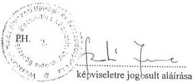

Budapest, 1999. március "11."

---

.

.

.

.

---

---

23. sz. melléklet
a V-25-60/1998-99. sz.
jelentéshez

# Wesselényi Miklós Nemzeti Ifjúsági és Szabadidősport az Egészséges Életmódért Közalapítvány
(NISZKA)
Eredménykimutatás

Adatok E Ft-ban

|  Sor-szám | Megnevezés | Vállalkozási tevékenység |   | Alapítványi célú tevékenység  |   |
| --- | --- | --- | --- | --- | --- |
|   |   |  1997. V.27. - XII.31. | 1998. | 1997. V.27. - XII.31. | 1998.  |
|  1. | Összes (ár) bevétel |  |  | 609.043 | 565.698  |
|  2. | Összes költség (ráfordítás) |  |  | 374.881 | 810.677  |
|  3. | Adózás előtti eredmény |  |  | 234.162 | -244.979  |
|  4. | Adófizetési kötelezettség |  |  | 0 | 0  |
|  5. | Adózott eredmény |  |  | 234.162 | -244.979  |
|  6. | Átcsoportosítás |  |  | 0 | 0  |
|  7. | Tőkeváltozás |  |  | 234.162 | -244.979  |

Alulírott az 1989. évi XXXVIII. tv. 24. § c. pontja alapján aláírásommal kijelentem, hogy a feltüntetett adatok teljesek, és a közalapítvány nyilvántartásaival, okmányaival mindenben egyeznek.

Budapest, 1999. március " 11 "

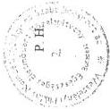

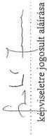

---

.

.

.

.

---

# A Wesselényi Miklós Nemzeti Ifjúsági és Szabadidősport az Egészséges Életmódért Közalapítvány (NISZKA) bevételei

24. sz. melléklet
a V-25-60/1998-99. sz.
jelentéshez

|  S.sz. | Bevételek | 1997. év V. 27. - XII.31. | Adatok E Ft-ban 1998. év  |
| --- | --- | --- | --- |
|  1. | Központi költségvetésből juttatott támogatás | 32.500 | 5000  |
|  2. | Egyéb állami támogatás | 0 | 0  |
|  3. | Egészségbiztosítási önkormányzattól kapott támogatások | 0 | 0  |
|  4. | Sorsolásos játékok játékadója 12 % | 538.195 | 456.198  |
|  5. | Önkormányzatok hozzájárulása | 0 | 0  |
|  6. | A közalapítvány pénzügyi gazdálkodásából eredő pénzintézet által fizetett kamat - árfolyamnyereség | 18.066 8.545 | 73.427 10.669  |
|  7. | A vállalkozási tevékenységből származó nyereség | 0 | 0  |
|  8. | Magánszemélyek SZJA-nak 1 %-a | 25 | 10  |
|  9. | *Csatlakozás során tett felajánlások, juttatások, adományok | 0 | 11.232  |
|  10. | Pályázat útján nyert támogatások | 0 | 0  |
|  11. | Egyéb bevételek | 11.712 | 9.162  |
|   | Ebből: - pályázati nevezési díj | 6.570 | 6.664  |
|   | - támogatás visszafizetése | 623 | 1.501  |
|  12. | Összesen | 609.043 | 565.698  |

Alulírott az 1989. évi XXXVIII. tv. 24. § c. pontja alapján aláírásommal kijelentem, hogy a feltüntetett adatok teljesek, és a közalapítvány nyilvántartásaival, okmányaival mindenben egyeznek.

* Pályázati támogatás utalványban (BON) történő kifizetésének árengedménye.

Budapest, 1999. március

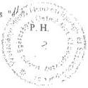

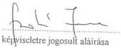

---

1

2

3

4

---

25. sz. melléklet

a V-25-60/1998-99. sz.

jelentéshez

# Wesselényi Miklós Nemzeti Ifjúsági és Szabadidősport

# az Egészséges Életmódért Közalapítvány (NISZKA)

# Kiadások (költségek)

|  Sor-szám | Megnevezés | 1997. év V.27. - XII.31. | 1998. év  |
| --- | --- | --- | --- |
|  I. | Alapítványi célú támogatások kiadásai összesen (1+2+3+4+5+6) | 341.316 | 751.873  |
|   | Ebből: | 41.400 | 63.858  |
|  1. | Normatív támogatás |  |   |
|  2. | Céltámogatás | 0 | 0  |
|  3. | Címzett támogatás | 0 | 0  |
|  4. | Sportösztöndíj | 0 | 0  |
|  5. | Pályázati úton történő feladatfinanszírozás | 299.916 | 688.015  |
|  6. | Pályázati rendszeren kívüli támogatás | 0 | 0  |
|  II. | Működési költségek összesen | 31.033 | 57.453  |
|   | Ebből: |  |   |
|  1. | Anyagköltség | 776 | 2.558  |
|  2. | Anyag jellegű szolgáltatás | 3.517 | 5.860  |
|   | Ebből: Nyomdai költség | 1.143 | 551  |
|   | Telefonköltség, Internet | 1.295 | 2.774  |
|  3. | Bérköltség | 7.986 | 14.699  |
|  4. | Személyi jellegű ráfordítások | 4.784 | 7.838  |
|   | Ebből: Reprezentáció | 225 | 383  |
|  5. | Értékcsökkenés | 1.797 | 4.650  |
|  6. | Nem anyagjellegű szolgáltatás | 10.998 | 17.271  |
|   | Ebből: Bérleti, kölcsöncélú díjak | 2.740 | 2.365  |
|   | Hirdetési díjak, reklám ktg-ek | 1.551 | 1.238  |
|   | Könyvvezetés és gazd.-i szolg. | 3.914 | 7.644  |
|  7. | Bankköltség | 369 | 1.116  |
|  8. | Hatósági díjak | 230 | 1.732  |
|  9. | Biztosítási díjak | 576 | 1.251  |
|  10. | Munkaadói járulék | 0 | 478  |
|  III. | Egyéb ráfordítások | 1.628 | 1.183  |
|  IV. | Előző időszak ráfordításai | 904 | 168  |
|  V. | Kiadások összesen | 374.881 | 810.677  |

Alulírott az 1989. évi XXXVIII. tv. 24. § c. pontja alapján aláírásommal kijelentem, hogy a feltüntetett adatok teljesek, és a közalapítvány nyilvántartásaival, okmányaival mindenben egyeznek.

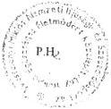

Budapest, 1999. március "11."

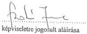

---

.

.

.

.

---

26. sz. melléklet
a V-25-60/1998-99. sz.
jelentéshez

# Wesselényi Miklós Nemzeti Ifjúsági és Szabadidősport az Egészséges Életmódért Közalapítvány (NISZKA)

Bér és személyi jellegű kifizetések alakulása

|  Sor-szám | Megnevezés | Létszám (fő) |   | Bérköltség (E Ft) |   | Tiszteletdíj (E Ft) |   | Költségtérítés (E Ft)  |   |
| --- | --- | --- | --- | --- | --- | --- | --- | --- | --- |
|   |   |  1997. V.27-XII.31. | 1998. év | 1997. V.27-XII.31. | 1998. év | 1997. V.27-XII.31. | 1998. év | 1997. V.27-XII.31. | 1998. év  |
|  1. | Irodai foglalkoztatottak | 8 | 9 | 5.848 | 11.208 | 0 | 0 | 471 | 628  |
|   | Ebből: teljes munkaidőben foglalkoztatottak | 7 | 8 | 5.239 | 10.044 | 0 | 0 | 471 | 592  |
|   | nem teljes munkaidőben foglalkoztatottak | 1 | 2 | 609 | 1.164 | 0 | 0 | 0 | 36  |
|  2. | megbízási jogviszony teljes létszáma Állományba nem tartozó foglalkoztatottak | 9 | 11 | 497 | 700 | 0 | 0 | 0 | 0  |
|  3. | Kuratórium | *8 | *7 | 0 | 0 | 1.165 | 1.855 | 871 | 1.715  |
|  4. | Felügyelő Bizottság | 3 | 3 | 0 | 0 | 476 | 936 | 114 | 415  |
|  5. | Egyéb (Pályázattal kapcsolatos) | 0 | 0 | 0 | 0 | 0 | 0 | 0 | 110  |

*A kuratórium tagjai közül 1 fő nem részesült tiszteletdíjban 1997-1998. évben (így a létszámadatokban nem szerepel)

1998. évben 1 fő június 17-től nem kapott tiszteletdíjat, 1 fő pedig október 01-vel lemondott. (Létszámadatokban ennek megfelelően szerepeltettük).

Alulírott az 1989. évi XXXVIII. tv. 24. § c. pontja alapján aláírásommal kijelentem, hogy a feltüntetett adatok teljesek, és a közalapítvány nyilvántartásaival, okmányaival mindenben egyeznek.

Budapest, 1999. március 11.

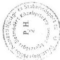

kepviselőre jogosult aláírása

---

•
•
•
•

---

27. sz. melléklet
a V-25-60/1998-99. sz.
jelentéshez

Nemzeti Ifjúsági és Szabadidősport az Egészséges Életmódért Közalapítvány
(NISZKA) pályázatainak megoszlása kategóriánként

1997-es pályázati év

|  Sorsz. | Kategória | Pályázatok száma (db) |   |   | Pályázati összeg (E Ft)  |   |   |
| --- | --- | --- | --- | --- | --- | --- | --- |
|   |   |  benyújtott | elbírált | nyertes | igényelt | elbírált | elnyert  |
|  1. | Óvoda | 2.063 | 2.001 | 508 | 544.091 | 521.196 | 56.026  |
|  2. | Sportszervezet | 911 | 760 | 650 | 394.379 | 323.117 | 67.357  |
|  3. | Nevelési és okt. intézmény | 1.184 | 1.059 | 993 | 281.853 | 248.323 | 102.166  |
|  4. | Sporteszköz vásárlás | 1.985 | 1.764 | 1.554 | 618.026 | 549.618 | 138.001  |
|  5. | Diáksport szervezetek | 198 | 111 | 87 | 60.686 | 42.537 | 14.620  |
|  6. | Helyi és megyei bajnokság | 512 | 423 | 328 | 146.030 | 123.838 | 47.070  |
|  7. | Főiskola, egyetem | 149 | 149 | 128 | 69.634 | 69.634 | 17.503  |
|  8. | Összesen | 7.002 | 6.267 | 4.248 | 2.114.699 | 1.878.263 | 442.743  |
|  9. | Támogatottság aránya % nyert/beny. | - | - | 61% | - | - | 21%  |
|  10. | 1 nyertes pályázóra jutó támogatás Ft-ban | - | - | - | - | - | 104.224  |

1998-as pályázati év

|  Sorsz. | Kategória | Pályázatok száma (db) |   |   | Pályázati összeg (E Ft)  |   |   |
| --- | --- | --- | --- | --- | --- | --- | --- |
|   |   |  benyújtott | elbírált | nyertes | igényelt | elbírált | elnyert  |
|  1. | Óvodai pályázók | 1222 | 1205 | 1032 | 106.583 | 104.062 | 39.651  |
|  2. | Alap és középfokú nev. és okt. intézmények | 1540 | 1311 | 902 | 367.846 | 311.671 | 88.618  |
|  3. | Felsőfokú oktatási intézmények | 53 | 36 | 27 | 26.937 | 18.577 | 8.120  |
|  4. | Sportszervezet | 1103 | 1028 | 944 | 429.222 | 392.722 | 182.261  |
|  5. | II. kat. sporteszköz vásárlás | 565 | 503 | 472 | 120.629 | 102.554 | 72.111  |
|  6. | II. kat. diáksport szervezetek | 202 | 188 | 146 | 26.875 | 22.002 | 24.240  |
|  7. | Szabadidősport versenyek támogatása | 675 | 627 | 573 | 168.399 | 152.036 | 100.788  |
|  8. | Szabadidősportot népsz. alkalmi kiadványok | 49 | 45 | 39 | 69.475 | 60.685 | 27.660  |
|  9. | Összesen: | 5.409 | 4.943 | 4.135 | 1.315.966 | 1.164.309 | 543.449  |
|  10. | Támogatottság aránya % nyert/beny. |  |  | 76% |  |  | 41%  |
|  11. | 1 nyertes pályázóra jutó támogatás Ft-ban |  |  |  |  |  | 131.427  |

Alulírott az 1989. évi XXXVIII. tv. 24. § c. pontja alapján aláírásommal kijelentem, hogy a feltüntetett adatok teljesek és a közalapítvány nyilvántartásaival, okmányaival mindenben egyeznek. E táblázat nem tartalmazza a szakosztályok igényelt, illetve elbírált összegét. *-gal jelölve.
Budapest, 1999. március 18.
PH.
képviseletre jogosult aláírása

---

.

.

.

.

---

28. sz. melléklet
a V-25-60/1998-99. sz.
jelentéshez

# A Wesselényi Miklós Nemzeti Ifjúsági és Szabadidősport az Egészséges Életmódért Közalapítvány
(NISZKA)

által nyújtott normatív támogatások

Adatok: E Ft-ban

|   | Megnevezés | 1997. év V.27. - XII.31. | 1998. év  |
| --- | --- | --- | --- |
|  1. | Magyar Természetbarát Szövetség | 5.360 | 10.030  |
|  2. | Magyar Szabadidősport Szövetség | 5.800 | 11.800  |
|  3. | Magyar Diáksport Szövetség | 19.120 | 24.780  |
|  4. | Magyar Technikai és Tömegsportklubok Országos Szövetsége | 2.960 | 5.074  |
|  5. | Fogyatékosok sport- és érdekvédelmi Szövetségei | 8.160 | 12.174  |
|  a. | Ebből: Magyar Értelmi Fogyatékosok Sportszövetsége | 1.800 | 3.271  |
|  b. | Magyar Mozgáskorlátozottak Sportszövetsége | 2.120 | 3.659  |
|  c. | Magyar Transzplantáltak Kulturális és Sportegyesülete | 440 | 665  |
|  d. | Magyar Vakok- és Gyengénlátók Sportszövetsége | 1.600 | 2.878  |
|  e. | Magyar Siketek Sportszövetsége | 800 | 1.701  |
|  f. | Magyar Speciális Olimpiai Sportszövetség | 1.400 | 0  |

Alulírott az 1989. évi XXXVIII. tv. 24. § c. pontja alapján aláírásommal kijelentem, hogy a feltüntetett adatok teljesek és a
közalapítvány nyilvántartásaival, okmányaival mindenben egyeznek.

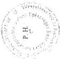

Budapest, 1999. március "11."

képviseletre jogosult aláírása

---

.

.

.

.

---

29. sz. melléklet  
a V-25-60/1998-99. sz.  
jelentéshez

Németh Csabáné  
bejegyzett könyvvizsgáló  
Salgótarján  
Frigyes krt. 3.  
3104.

# FELJEGYZÉS

a NISZKA Felügyelő Bizottsága részére

A Wesselényi Miklós Nemzeti Ifjúsági- és Szabadidősport az Egészséges Életmódért Közalapítványnál (NISZKA) az Állami Számvevőszék által folytatott vizsgálata során Bittó Zoltán számvevő tanácsos részéről felmerült a Sportlétesítmények Részvénytársaság tulajdonosi joggyakorlásának a Közalapítvány beszámolójában való összegszerű megjelenítésének a kérdése.

A Közalapítvány beszámolóiban az Immateriális javak között, Vagyoni értékű jogként nem szerepel a Sportlétesítmények Részvénytársaság saját tőkéjének értékéből a tulajdonosi joggyakorlás mértékének megfelelő érték.

A Közalapítvány a megalakulásának évében a Sportlétesítmények Részvénytársaság tekintetében nem rendelkezett a beszámolóban való számszerű megjelenítés tekintetében adatokkal. Megalakulásakor az alapító rendelkezésére sem álltak számszerű adatok, mely az alapító okirat V. A közalapítvány vagyona, anyagi forrásai fejezet, 1. A közalapítvány vagyonának részletezése pontoknál látható.

Az alapító okiratban a vagyon részletezésénél a-c pontokban nevesíti a számszerűsíthető vagyon részeket, s a nem számszerűsíthető vagyon megfogalmazása a következő:

'A vagyonhoz kapcsolódik továbbá – az egyes sportcélú ingatlanok tulajdoni ... – a Sportlétesítmények Vállalat Rt. 25%-os üzletrésze feletti tulajdonosi jogok gyakorlása.'

A Közalapítványnak így megalakulásakor nem volt lehetősége a vagyon e részének összegszerű megjelenítésére.

A Közalapítvány 1997. évi beszámolójában a Sportlétesítmények Rt. feletti tulajdonosi joggyakorlás összegszerű megjelenítése aggályos volt, mivel a Sportlétesítmények Rt. Éves beszámolóját a társaság könyvvizsgálója korlátozó záradékkal látta el, amely korlátozó záradék érintette a Részvénytársaság saját tőkéjét is. Ezen tény alapján a Közalapítvány beszámolójának a hitelesítésére sem kerülhetett volna sor, amennyiben a Vagyoni értékű jogok között egy könyvvizsgáló által el nem fogadott saját tőke rész tulajdonosi joggyakorlással arányos részét szerepelteti. A Sportlétesítmények Rt. 1997. évi Éves beszámolójának kapcsán a korlátozó záradék feloldásra került, s előzetes információk alapján a beszámoló közgyűlés által történő jóváhagyásra kerül 1999. január 18-án.

---

.

.

.

.

---

---

29.sz. melléklet
2. lap

Ezen közgyűlési jóváhagyást követően - a Közalapítvány kezelő szerve, Felügyelő Bizottsága,
valamint könyvvizsgálójának vélemény azonossága esetén - lehetőséget látok arra, hogy a
Közalapítvány beszámolójába a Vagyoni értékű jogok közé a Sportlétesítmények Rt.
1.746.089 ezer Ft. saját tőkéjének tulajdonosi joggyakorlással arányos része bekerülhessen.

Salgótarján, 1998. december 17.

Németh Csabáné
bejegyzett könyvvizsgáló

---

.

.

.

.

---

## HELYSZÍNI ELLENŐRZÉSÉNEK MEGÁLLAPÍTÁSAI

### 1. A MFKA MEGALAKULÁSÁNAK ÉS MŰKÖDÉSÉNEK JOGI, SZERVEZETI FELTÉTELEI

A MFKA célja a Sport tv. 31. §-a alapján a nyugdíjas olimpiai és világbajnoki érmes sportolók, valamint sportszakemberek erkölcsi és anyagi megbecsülése, támogatása.

Az Országgyűlés a közalapítvány létrehozását követően, a közalapítvány céljaival részben párhuzamosan az 1997. évi XXII. törvénnyel döntött az olimpiai bajnoki járadék 1998. január 1-i bevezetéséről azzal, hogy a járadékot az OTSH folyósítja.

A járadékra meghatározott feltételek alapján az olimpiai bajnokok, illetve özvegyeik jogosultak.

Az MFKA-t a Kormány az 1081/1996. (VII. 23.) sz. határozatával hozta létre, a Fővárosi Bíróság az 1996. október 14-én kelt 11.Pk.60961/96/4. számú végzésével 6340. sorszám alatt vette nyilvántartásba. Adószámot 1996. december 10-én (18083756-1-41), TB-törzsszámot 1997. április 24-én (5869738/A) kapott.

A közhasznú szervezetekről szóló 1997. évi CLVI. törvény előírásainak megfelelően az MFKA közhasznú szervezetként történő bírósági bejegyzése érdekében a Kormány módosította az alapító okiratot, melyet a Fővárosi Bírósághoz 1998. július 21-én benyújtottak. A közhasznú szervezetté minősítésről, illetve az alapító okirat módosításának tudomásulvételéről szóló végzést a közalapítvány még nem kapta meg. **A módosított alapító okirat teljes körűen tartalmazza a törvényi előírásokat.**

Meghatározta a kuratóriumi tagokkal szemben a törvény 8. és 9. §-ában meghatározott összeférhetetlenségi szabályokat, mely követelményeknek a kuratórium jelenlegi tagjai megfelelnek.

Rögzítésre került, hogy az MFKA milyen közhasznú tevékenységet végez, hogyan oszthatja fel elért eredményét. Kiegészítették a kuratórium és az FB ügyrendjének és működésének szabályait.

Az alapító az MFKA 10 M Ft összegű induló vagyonát törzsvagyonként határozta meg, kötelezettséget vállalt továbbá arra, hogy a folyamatos működés biztosítására az éves költségvetésből 5 M Ft éves költségvetési támogatásban részesíti.

Az MFKA 1996. december 13-án történt számlanyitása után **az induló vagyon és a támogatás átutalása** 1996. december 19-én **megtörtént.**

---67

---

Az MFKA vagyonának kezelő és legfőbb döntéshozó szerve a 7 fős **kuratórium**, melynek tagjait az alapító kérte fel és bízta meg 4 évre. Valamennyien olimpiai bajnokok. A kuratórium személyi összetétele az ellenőrzött időszakban egy kuratóriumi tag lemondása miatt változott.

**A kuratórium kizárólagos jogkörébe tartozik** az MFKA-t érintő minden lényeges döntés:

- az SZMSZ és egyéb belső szabályzatok megállapítása és módosítása,
- az MFKA éves gazdálkodási tervének és mérlegének megállapítása,
- döntés az alapítványi támogatásokról,
- a kuratórium titkárának kinevezése és felmentése.

Alakuló ülésüket 1996. november 15-én tartották. Azóta tíz alkalommal találkoztak, üléseik rendszeresek, alkalmazkodtak a felmerült igényekhez és döntési szükségletekhez. Általában két havonta üléseztek, amikor az aktuális kérdéseket megvitatták és határozatokat hoztak.

Az ülésekről jegyzőkönyvek készültek, melyek tartalmi és formai szempontból megfeleltek a követelményeknek. Határozataikat szabályosan hozták, azok végrehajtásának ellenőrzése biztosított volt. A kuratóriumi határozatok nyilvántartása a közhasznú szervezetekről szóló 1997. évi CLVI. törvény előírásainak megfelelően került módosításra, melyet azóta a gyakorlatban is az új követelményeknek megfelelően végeztek.

MFKA az OTSH helyiségeit és eszközeit térítésmentesen használta tevékenysége során, a kuratórium munkáját segítő, ügyintéző, titkársági, pénzügyi, gazdálkodási feladatokat ellátó **kuratóriumi titkári és gazdasági ügyintézői** tevékenységet főállásban az OTSH-nál dolgozó személyek látták el.

Az adminisztrációs tevékenységet a kuratórium által 1996. november 15-én megbízott **titkár irányította**. Feladata a kuratóriumi **döntések előkészítése, végrehajtásának megszervezése**, az MFKA **gazdálkodásának** - a gazdálkodási szabályzatban meghatározott módon történő - **felelős irányítása** és a napi ügyek intézése. A kuratóriumtól kapott felhatalmazás alapján gazdasági ügyintézőt bízott meg a pénzügyi feladatok elvégzésére. Mindketten a kuratóriumi ülések tanácskozási jogú állandó résztvevői voltak.

Az **FB** tagjait az alapító kérte fel, személyükben alkalmasak feladatuk ellátására. A 3 fős bizottság minden tagja pénzügyi, illetve gazdasági szakember, egyikük olimpiai bajnok sportoló volt. **Ügyrendet nem készítettek**, holott az alapító okirat 9.7 pontja ezt előírta számukra. Az FB elnöke minden kuratóriumi ülésen részt vett. Az FB a kuratórium határozatainak végrehajtását ellenőrizte.

Az FB éves munkaterv alapján végezte ellenőrzéseit, mely csak általánosan fogalmazta meg az ellenőrzési feladataikat, ezért az - az ellenőrzés álláspontja sze-

68

---

rint - tartalmilag kiegészítésre szorul. Nem rögzítették benne a végrehajtandó ellenőrzések időpontját, a kezdés-, befejezés-, jelentés elkészítés határidejét, felelőseit.

Az FB elnöke és egyik tagja ellenőrizte az MFKA 1997. június és december havi pénztárforgalmát és azt rendben találták, az okmányokon ezt rögzítették. **Hiányosság, hogy az egyéb ellenőrzéseiket nem dokumentálták, jegyzőkönyvben nem rögzítették észrevételeiket és javaslataikat.**

Az alapító okirat 9., 10. pontjában foglaltak szerint 1998. április 6-án **beszámoltak az alapítónak az alapítvány 1997. évi gazdálkodásáról, melyet eredményesnek ítéltek.** Megállapították többek között, hogy az éves bevételi és kiadási előirányzat megalapozott volt. A pénzgazdálkodás terén a pénzügyi jogszabályokat, a bizonylati és okmányfegyelmet betartották, az utalványozások szabályosan történtek. A készpénz- és bankegyenlegek, valamint az analitikus nyilvántartások és a főkönyvi könyvelés egyezőséget mutatott. Az éves beszámoló mérleget felülvizsgálták és azt rendben lévőnek találták.

**A helyszíni ellenőrzés az FB fenti megállapításait megalapozottnak minősítette.**

## 2. AZ MFKA GAZDÁLKODÁSÁNAK, KÖNYVVEZETÉSÉNEK SZABÁLYOSSÁGA

Az MFKA nyitómérleget nem készített.

A számviteli törvény szerinti egyéb szervezetek éves beszámoló készítésének és könyvvezetési kötelezettségének sajátosságáról - az ellenőrzött időszakban hatályban lévő - a 8/1996. (I. 24.) Korm. rendelet előírásainak megfelelően a közalapítvány kettős könyvvitelt vezetett, az 1996. és 1997. évi gazdálkodásról egyszerűsített éves beszámolót készített. Ezek a jogszabály előírásainak megfeleltek.

Az **1996-os** beszámoló szerint egyetlen jelentős pénzügyi tranzakciót hajtottak végre, a költségvetési támogatásként kapott 50 M Ft-ból 49 M Ft-ot értékpapírba fektettek.

Az **1997.** évi egyszerűsített mérlegben az összes eszközérték 93 M Ft, ezen belül az értékpapírok állománya 85 M Ft, a pénzeszköz értéke 8 M Ft volt.

A kuratórium az MFKA működéséről és gazdálkodásáról készült 1997. évi beszámolót benyújtotta az alapítói jogok gyakorlásával felruházott OTSH elnökének, 1997. évi gazdálkodásának legfontosabb adatait a Sportértesítő 1998. májusi számában nyilvánosságra hozta.

MFKA a kezelésében, illetve tulajdonában lévő eszközökről és azok forrásairól, a gazdasági műveletekről a jogszabályoknak megfelelő könyvviteli nyilvántartást vezet, amely az eszközökben (aktívákban) és a forrásokban (passzívákban), va-

69

---

lamint ezen felül a saját tőkében bekövetkezett változásokat a valóságnak megfelelően, folyamatosan, áttekinthetően egységes számlakeret rendszerben mutatja.

**A közalapítványnak a helyszíni ellenőrzés befejezéséig nem készült el az SZMSZ-e, tájékoztatásuk szerint elkészítése folyamatban van. E mulasztásért a felelősség a kuratóriumot terheli.**

Az alapító okirat 8.6. pontja szerint a közalapítvány gazdálkodásának, működésének, szervezetének és képviseletének részletes szabályait az SZMSZ-ben kell meghatározni, jóváhagyása a kuratórium kizárólagos hatáskörébe tartozik.

Az SZMSZ hiánya miatt nincs a szükséges részletességgel szabályozva az MFKA szervezeti felépítése, feladata és a hatáskörök megosztása, ezen belül a kuratóriumnak, az FB-nek, a kuratórium titkárának és a gazdasági ügyintézőnek a feladata, hatásköre, továbbá a vagyonkezelés és gazdálkodás szabályai. Nincs megfelelően szabályozva az MFKA működési rendje sem.

Ezen hiányosságok is közrejátszottak abban, hogy az alapító okiratban rögzítettekkel ellentétes határozatokat is hozott a kuratórium.

Pl. tiszteletdíj fizetése az FB tagjai részére.

A közalapítvány rendelkezik **gazdálkodási és pénzkezelési szabályzattal**, melyeket a kuratórium 1997. június 25-i ülése fogadott el.

A **gazdálkodási szabályzat** részletesen ismerteti az MFKA beszámolási és könyvvezetési kötelezettségét, gazdálkodásának szabályait, gazdálkodását érintő rendelkezéseket. Az alapító okiratban foglaltaknak megfelelően előírja, hogy az MFKA kötelezettségeinek veszélyeztetése nélkül csak államilag garantált értékpapírokba fektetheti be szabad pénzeszközeit, vállalkozási tevékenységben nem vehet részt, hitelt nem adhat és nem vehet fel. A gazdálkodási szabályzat mellékletét képezi **a hatásköri jegyzék, az egyszerűsített éves beszámoló mérlegének előírt tagolása, az MFKA bizonylati szabályzata, a számlatükör és számlarend.** A számlatükör kialakításánál figyelembe vették a várható gazdasági eseményeket, ez tette lehetővé, hogy az egyszerűsített éves beszámoló előírt tagolásban történő elkészítése maradéktalanul biztosított legyen.

A **pénzkezelési szabályzat** rögzíti a bankszámla és készpénz kezelésével kapcsolatos feladatokat, szabályokat, a szigorú számadású nyomtatványokkal kapcsolatos nyilvántartási és eljárási rendet, az MFKA-i bélyegzők kezelésének rendjét.

**Az ellenőrzés megállapította, hogy az elkészült szabályzatok megfeleltek a törvényi követelményeknek**, napi munkájukat a bennük rögzítettek szerint végezték, a pénzügyi-, számviteli és egyéb szükséges nyilvántartásokkal teljes körűen rendelkeztek. A szabályzatok és nyilvántartások alkalmasak az alapító okiratban megjelölt célok teljesítésére, az állami és egyéb forrásból kapott

70

---

támogatások jogcím szerinti, a törvények, illetve támogatók által előírt részletességű elszámolására.

Az alapító okirat 8.5 pontja szerint az MFKA éves gazdálkodási tervének megállapítása a kuratórium kizárólagos hatásköre.

**Az 1997. évi gazdálkodási tervet** 1997. január 24-én hagyta jóvá a kuratórium, mely tartalmazta **kiadási oldalon** a közalapítvány céljának megfelelő várható kiadásokat, a dologi kiadásokat és a személyi juttatásokat, **bevételi oldalon** a várható központi költségvetési támogatást és a kamatbevételt. A gazdálkodási terv megalapozott volt, így évközi módosítása nem volt szükséges.

Az MFKA folyószámláját a Kincstár vezeti.

**A gazdálkodás során** a pénzkezelés szabályosan történt, a pénzügyi fegyelem érvényesült.

A működési költségeket 1998-ban nem megfelelően különítették el. A vagyonnyilvántartás szabályos volt, a vagyonvédelemmel kapcsolatos előírásokat betartották. Értékpapírjaik a bankban vannak tárolva. A közalapítvány tárgyi eszközeinek leltározására - ezek csekély száma miatt - eddig nem került sor.

Tárgyi eszközként mindössze 2 db pénzszállító táska és 1 telefon regiszter szerepel a nyilvántartásban.

**1997-ben az MFKA összes kiadása 26,3 M Ft-ot tett ki, ebből az alapító okiratban megjelölt célok megvalósítására fordítottak 21,2 M Ft-ot, az összes kiadás 81 %-át.**

**Az MFKA működési költsége 5,2 M Ft, az összes kiadás 19 %-a volt.**

Az összköltség 18 %-át - 4,7 M Ft-ot - a bér és TB járulék jelentette, ez a működési költség 90 %-át tette ki. A magas arány abból fakadt, hogy míg a működési költségek más tételeinél takarékosan gazdálkodtak, **a személyi kifizetések mértéke az ellenőrzés álláspontja szerint eltúlzott (egy részük indokolatlan) volt.**

Reprezentációra 0,2 M Ft-ot, nem anyagi jellegű szolgáltatásra 0,3 M Ft-ot fordítottak. Ezek a kiadásaik takarékosak és indokoltak voltak.

1997-ben az MFKA 118 M Ft-os összes bevételéből 26,3 M Ft kiadást teljesítettek, év végén a pénzmaradvány 91,7 M Ft-ot tett ki.

**A helyszíni ellenőrzést követően, 1999. április 9-i keltezéssel a kuratórium elnöke korrigálta a korábbi - hitelességet és teljességet igazoló záradékkal ellátott és aláírt - tanúsítványát, így 1998. évben a közalapítvány összes költsége 27,9 M Ft volt, ebből az alapítványi célú támogatás 20,7 M Ft, működési költség 7,2 M Ft. A működési költségek az összes költség 25,9 %-át tették ki, ez az ellenőrzés álláspontja szerint**

71

---

## **indokolatlanul magas, elsősorban a tiszteletdíjak és ezek közterhei miatt.**

Az 1999. március 1-én kelt tanúsítvány szerint a közalapítvány alapítványi célú támogatása 15,6 M Ft volt, a működési költségek összege pedig 12,3 M Ft volt. A közalapítvány kuratóriumi elnökének 1999. április 9-i levele szerint tévesen a működési költségek között szerepeltették a londoni olimpia 50. évfordulója alkalmából szervezett emléktúrát, valamint a Mező Ferenc emlékgyűrű költségeit, így az 1998. évi működési költség 12,3 M Ft-ról 7,2 M Ft-ra, a működési költségek aránya az összes költséghez viszonyítva 44,1 %-ról 25,9 %-ra csökkent.

Az alapító okirat 7.5. pontja szerint a kuratórium tagjai díjazásban részesülhetnek, illetve a kuratóriumi működésükkel kapcsolatban felmerült igazolt költségeik megtérítésére igényt tarthatnak. **Az alapító nem határozta meg a tiszteletdíj összegét, így ezt a kuratórium maga állapította meg.**

A 1997. május 20-i ülésen elfogadott kuratóriumi határozat 1997. március 1-jére visszamenőleges hatállyal a kuratórium elnökét és az FB elnökét a minimálbér kétszeresének (bruttó 42.500 Ft/hó), a kuratórium és az FB tagjait pedig a minimálbérnek megfelelő (bruttó 21.500 Ft/hó) tiszteletdíjban részesítette. **A kifizetett tiszteletdíjak** 1997-ben 1.228 E Ft, 1998-ban 2.058 E Ft összegben terhelték a közalapítványt, **a kuratórium működési költségének mintegy 40 %-át tették ki.**

A kuratórium elnöke és a kurátorok egy része a többi kurátornál lényegesen nagyobb időráfordítással, rendszeresen részt vett a napi feladatok megoldásában, így **az ellenőrzés nem tartja kellően megalapozottnak a kuratóriumi tagok számára a tiszteletdíj azonos összegű megállapítását.**

**A kuratóriumi határozatnak az FB elnökének és tagjainak tiszteletdíjára vonatkozó része ellentétes volt a közalapítvány alapító okirata 9.6. pontjával, amely az FB tagjai számára csak költségtérítést engedélyezett. Az FB elnöke és egy tagja elfogadta a tiszteletdíj juttatást, az általuk felvett tiszteletdíj 1997-ben 549 E Ft-tal, 1998-ban 768 E Ft-tal terhelte a közalapítványt. Az FB elnöke rendszeresen részt vett a napi feladatok megoldásában.**

### **Költségtérítést sem a kuratórium, sem az FB tagjai nem igényeltek.**

Kuratóriumi határozat alapján havi tiszteletdíjat kapott a kuratórium titkára 50.000 Ft, a gazdasági ügyintéző 40.000 Ft és a sajtószövivő 21.500 Ft összegben, amely évente 1.493 E Ft-tal terhelte a közalapítványt. A megállapított díjazást az ellenőrzés reálisnak és a végzett munkával arányosnak minősítette.

A kifizetések negyedévente a megbízási szerződések alapján szabályosan történtek, a TB és adótörvénynek megfelelően levonták az SZJA-t és átutalták az APEH-nak és a TB-nek.

Az MFKA likviditása folyamatosan biztosított volt.

---72

---

### 3. AZ MFKA RENDELKEZÉSÉRE ÁLLÓ KÖZPONTI KÖLTSÉGVETÉSI TÁMOGATÁS, ILLETVE A KÖZPÉNZEK RENDELTETÉSSZERŰ, TÖRVÉNYES ÉS CÉLSZERŰ FELHASZNÁLÁSA

**1996. évben az MFKA vagyona 50 M Ft volt, amely a 10 M Ft-os törzsvagyonból és a 2312/1996. (XI. 21.) Korm. határozat alapján 1996. december 23-án a költségvetési tartalékból átutalt 40 M Ft-os támogatásból tevődött össze.**

Az 1997. évi költségvetési törvény a XI/22. címen (az OTSH előirányzatai között) az MFKA **támogatásaként 50 M Ft-ot hagyott jóvá. A támogatás 1997-es év folyamán** részletekben került **átutalásra.**

A közalapítvány bevételét képezte továbbá 1997-ben a vásárolt értékpapírok 15,7 M Ft kamathozama és a MOB-tól kapott 2,5 M Ft egyszeri támogatás, így **1997. évben összesen 118 M Ft-tal gazdálkodhattak.**

**1998. évben** működési költségekre 5 M Ft-ot kapott az MFKA a központi költségvetéstől. Az MFKA folyószámlájára havi bontásban az összeg időarányosan megérkezett. Az értékpapírok kamataiból 28 M Ft bevétele várható, így együttesen **1998. évben összesen 125 M Ft áll a közalapítvány rendelkezésére** (3/c. tanúsítvány).

A szabad pénzeszközöket egy kereskedelmi banknál államilag garantált értékpapírba fektették, mely 25 %-os kamathozamot biztosít.

A bevételek felhasználásának elveit a kuratórium 1997. május 20-i ülésén határozta meg, a **normatív jellegű támogatás részarányát 70 %, az eseti, kérelemre történő támogatást 30 %-os arányban fogadták el, fenntartva a lehetőséget az esetleges átcsoportosításra is.**

E döntés helyességét az 1997. évi felhasználási adatok utólag is igazolják, mivel az eseti támogatás az összes támogatásnak csak 10 %-át tette ki.

**Normatív pénzbeli támogatást** a támogatott kategóriába eső kedvezményezetteknek **évente két alkalommal** adományoznak, (júniusban és decemberben). Azt, hogy az adott félévi normatív támogatásban melyik nyugdíjas sportolói kategória részesül és milyen összeggel, az aktuális kuratóriumi ülés döntötte el.

A normatív támogatásban részesülők esetében eltekintettek a szociális helyzet igazolásától, minden érintett automatikusan megkapta a neki járó összeget.

Az eseti kérelemre történő pénzbeli támogatást ugyanazok a személyek kaphatták, akik a normatív támogatásra jogosultak voltak, de ennek igényléséhez külön kérelmet kellett benyújtaniuk és igényüket meg kellett indokolniuk.

73

---

A kuratórium a beérkezett eseti szociális kérelmeket negyedévente elbírálta, a megalapozott kérelmekre utána kifizették a segélyt. A kuratórium az egyszeri segély minimum összegét 20.000 Ft-ban határozta meg.

A beérkező eseti szociális kérelmekről egy 3 fős (körülményeket vizsgáló) előkészítő bizottság javaslatát figyelembe véve döntött a kuratórium.

Eseti szociális támogatásban évente minden kérelmező csak egy alkalommal részesülhet. Ez alól csak kivételesen indokolt esetben a kuratórium tagjainak egyhangú határozatával lehetne eltérni, de eddigi működésük alatt erre nem került sor.

A kuratórium a támogatás elveit körültekintően meghatározta. Eszerint csak olyan volt élsportolókat részesít támogatásban, akik magyar színekben értek el világ- vagy olimpiai bajnokságon eredményt, illetve olyan edzőket és sportszakembereket, akik ezen sportolók felkészítését végezték, jelenleg is magyar állampolgárok és a Magyar Köztársaság területén élnek.

Nem részesülhet a kuratórium támogatásában az, aki külföldön dolgozik, a külföldi munkavállalásának idejére, amennyiben az eléri vagy meghaladja az egy évet.

A nyugdíjazás évében csak abban az esetben részesülhet támogatásban valaki, ha a nyugdíjazásra a tárgyév első felében került sor. Ha az érintett az eredményei alapján normatív támogatásra jogosult, a tárgyévben csak a normatív támogatási összeg 50 %-a illeti meg.

A kifizetett segélyek az SZJA törvény 1. számú mellékletének 3.2.2. pontja alapján adómentesek.

A kuratórium támogatásban részesítette a kedvezményezetti körbe tartozó, elhunyt sportolók özvegyeit is (összesen 2.580 E Ft-ot használtak fel e célra), bár az alapító okirat e célt nem fogalmazta meg.

1997. első és második félévi normatív támogatásban részesült összesen 327 fő 19.085 E Ft összegben.

1997. I. félévében normatív támogatásban 144 fő részesült, összesen 6.525 E Ft összegben. Csoportonként 59 fő nyugdíjas (továbbiakban ny.) olimpiai bajnok 60 E Ft, 23 fő ny. olimpiai ezüstérmes 40 E Ft, 37 fő ny. olimpiai bronzérmes 35 E Ft, 16 fő olimpiai érmes özvegye 30 E Ft, 9 fő ny. edző 30 E Ft, 1 fő 50 E Ft összegben.

1997. II. félévében normatív támogatásban részesült 183 fő, összesen 12.560 E Ft összegben. Csoportonként 61 fő ny. olimpiai bajnok 120 E Ft, 23 fő ny. olimpiai ezüstérmes 50 E Ft, 38 fő ny. olimpiai bronzérmes 45 E Ft, 25 fő ny. világbajnok 40 E Ft, 27 fő olimpiai érmes özvegye 40 E Ft, 9 fő ny. sportszakember 40 E Ft összegben.

Eseti, nem rendszeres támogatásban részesült bejelentett igény alapján 14 fő, 835 E Ft összegben.

74

---

Az 1998. június 3-i kuratóriumi határozat alapján **az olimpiai bajnokok és az olimpiai bajnokok özvegei a normatív támogatási rendből kikerültek**, arra hivatkozással, hogy e kör anyagi támogatását az olimpiai bajnoki járadékról szóló 1997. évi XXII. törvény rendezi. A kuratórium nem zárta ki, hogy részükre - indokolt esetben - egyszeri szociális segély folyósításra kerüljön.

E döntés az érintetteknél megértésre talált, mivel az olimpiai bajnokok a jelzett törvény alapján az eddigi támogatás többszörösét kapják.

A kedvezményezetti kör szűkítése jó hatással volt az MFKA többi támogatottjára is, mivel a megnövekedett keretből növelhették a számukra kifizetett támogatások összegét, illetve a jövőben bővíthetik a kedvezményezettek körét a világbajnoki érmesekkel és az erkölcsi megbecsülést szolgáló kiadások növelésével.

Támogatást kívánnak nyújtani egy arcképcsarnok létrehozásához, valamint kórház utáni utókezelések segítésére, stb.

**Az 1998. első félévi kiadások teljesítésére** fentiek figyelembe vételével került sor, minden érintett egységesen 60 E Ft támogatásban részesült.

Támogatást kapott 24 fő ny. olimpiai ezüstérmes, 39 fő ny. olimpiai bronzérmes, 26 fő ny. világbajnok, 17 fő támogatott özvegy, 16 fő ny. sportszakember.

**122 fő részesült normatív támogatásban, melynek összege 7.270 E Ft volt**, ez az összes támogatási kiadás 90 %-át jelentette.

**16 fő nem rendszeres, eseti támogatást kapott 0,7 M Ft összegben**, ez az összes támogatási kiadás 10 %-a.

**1998-ban tehát összesen 138 fő, 8 M Ft támogatásban részesült.**

Az MFKA alapító okiratában megfogalmazott céloknak megfelelően egyéb módon is támogatták az érintetteket.

A rászorultak utazását orvoshoz, illetve az MFKA rendezvényeire taxival biztosították (0,2 M Ft).

1998. augusztus 1-5. között emlékutat rendeztek Londonba az 1948-as olimpia 50. évfordulója alkalmából azoknak, akik itt nyertek érmet. Az utazáson 16 hajdani versenyző és 9 szervező, illetve kísérő vett részt. Az emlékút 2,8 M Ft-ba (112 E Ft/fő) került. Két fős TV-stáb és a sajtó képviselője biztosította az utazás bemutatását és a résztvevők népszerűsítését, ez része volt az érintettek erkölcsi megbecsülésének.

Az utazást takarékosan szervezték meg, azon a résztvettek személye indokolt és szükséges volt, mivel a résztvevők idős kora és egészségi állapota körültekintő szervezést és az átlagosnál magasabb kísérő állományt igényelt.

Az utazásról „Ötkarikás rapszódia” címmel film is készült, melynek költsége 0,2 M Ft volt.

---75

---

A film az olimpiai bajnokok életét mutatja be, egy sportfilmrendező készítette önköltségi áron.

1998. október 3-án 40 fő olimpiai bajnok részére Mező Ferenc arany emlékgyűrűt adtak át 1,7 M Ft felhasználásával.

Évfordulók alkalmával gondozták, illetve meglátogatták több elhunyt olimpiai bajnok sírját, és oklevél, könyv, ajándéktárgy átadásával köszöntötték az élő ny. olimpiai bajnokokat.

**A kuratórium által kidolgozott támogatási célok és ezek megvalósítása összhangban volt a rendelkezésre álló pénzügyi forrásokkal.**

**A támogatások összegét folyamatosan a beérkezett igényekhez és a rendelkezésre álló anyagi forrásokhoz igazították.**

#### **4. AZ MFKA VAGYONÁNAK MEGŐRZÉSE ÉS HASZNO-SÍTÁSA**

**Az MFKA kiadásait és ráfordításait döntően a központi költségvetési támogatás fedezte**, egyéb forrásból származó bevétele egy esetben a MOB támogatása, valamint a vagyon befektetéséből származó kamatbevételek voltak. A kuratórium eredményesen törekedett arra, hogy a kamathozadékot és az esetleges egyéb támogatást használják fel az alapítványi támogatásokra és ne nyúljanak a tartósan lekötött összegekhez. A kuratórium - annak érdekében, hogy a rendelkezésre álló pénz hosszútávon biztosíthassa az alapítványi célokat - úgy döntött, hogy egyenlőre csak a lekötött összeg kamatait használja fel. E döntést az tett megalapozottá, hogy az alapító az alapító okiratban az MFKA folyamatos működésének biztosítására 5 M Ft összegű éves költségvetési támogatást vállalt. Ez az összeg elegendő a működési költségek fedezésére.

**Az alapító okirat 10 M Ft-ban jelölte meg a törzsvagyont, melynek elkülönítése megtörtént.** Az alapítói vagyon felhasználására vonatkozó korlátozásokat betartották. A törzsvagyont szabályosan kezelték, tartós értékpapírba fektették és csak a kamatait használták fel. 1996-ban 49 M Ft, 1997-ben 85 M Ft, 1998-ban 88 M Ft volt év végén értékpapírban tartósan lekötve. A vagyonkezelési tevékenységre és az MFKA-i befektetésekre vonatkozó előírásokat betartották, köztartozásuk nincs, a hitelfelvételi tilalmat betartották.

Budapest, 1999. január

---76

---

30. sz. melléklet
a V-25-60/1998-99. sz.
jelentéshez

# Mező Ferenc Közalapítvány
Eszközök és források

Adatok E Ft-ban

|  Sor-szám | Megnevezés | Nyitó adatok | 1997. XII. 31. | 1998. XII. 31.  |
| --- | --- | --- | --- | --- |
|  1. | A. Befektetett eszközök (2-5. sor) |  |  |   |
|  2. | I. Immateriális javak |  |  |   |
|  3. | II. Tárgyi eszközök |  |  |   |
|  4. | III. Befektetett pénzügyi eszközök |  |  |   |
|  5. | IV. Befektetett eszközök értékhelyesbítése |  |  |   |
|  6. | B. Forgóeszközök (7-10. sorok) | 50 003 | 92 837 | 93 005  |
|  7. | I. Készletek |  |  |   |
|  8. | II. Követelések |  |  |   |
|  9. | III. Értékpapírok | 49 000 | 85 268 | 91 334  |
|  10. | IV. Pénzeszközök | 1 003 | 7 569 | 1 671  |
|  11. | C. Aktív időbeli elhatárolások |  |  |   |
|  12. | Eszközök (aktívák) összesen (1+6+11. sor) | 50 003 | 92 837 | 93 005  |
|  13. | D. Saját tőke (14-16. sor) | 50 003 | 91 914 | 92 729  |
|  14. | I. Induló tőke | 10 000 | 10 000 | 10 000  |
|  15. | II. Tőkeváltozás | 40 003 | 81 914 | 82 729  |
|  16. | III. Értékelési tartalék |  |  |   |
|  17. | E. Céltartalék |  |  |   |
|  18. | F. Kötelezettségek (19-20. sor) |  | 923 | 276  |
|  19. | I. Hosszú lejáratú kötelezettségek |  |  |   |
|  20. | II. Rövid lejáratú kötelezettségek |  | 923 | 276  |
|  21. | G. Passzív időbeli elhatárolások |  |  |   |
|  22. | Források (passzívák) összesen (13+17+18+21. sor) | 50 003 | 92 837 | 93 005  |

Alulírott az 1989. évi XXXVIII. tv. 24. § c. pontja alapján aláírásommal kijelentem, hogy a feltüntetett adatok teljesek, és a közalapítvány nyilvántartásaival, okmányaival mindenben egyeznek.

Budapest, 1999. március 1.

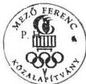

képviseletre jogosult aláírása
Lemhényi Dezső dr. Nagy József
elnök titkár

---

.

-

.

.

---

34. sz. melléklet
a V-25-60/1998-99. sz.
jelentéshez

# Mező Ferenc Közalapítvány
Eredménykimutatás

Adatok E Ft-ban

|  Sor-szám | Megnevezés | Vállalkozási tevékenység |   | Alapítványi célú tevékenység  |   |
| --- | --- | --- | --- | --- | --- |
|   |   |  1997. | 1998. | 1997. | 1998.  |
|  1. | Összes (ár) bevétel |  |  | 68 236 | 28 717  |
|  2. | Összes költség (ráfordítás) |  |  | 26 324 | 27 901  |
|  3. | Adózás előtti eredmény |  |  |  |   |
|  4. | Adófizetési kötelezettség |  |  |  |   |
|  5. | Adózott eredmény |  |  |  |   |
|  6. | Átcsoportosítás |  |  |  |   |
|  7. | Tőkeváltozás |  |  | 41 912 | 816  |

Alulírott az 1989. évi XXXVIII. tv. 24. § c. pontja alapján aláírásommal kijelentem, hogy a feltüntetett adatok teljesek, és a közalapítvány nyilvántartásaival, okmányaival mindenben egyeznek

Budapest, 1999. március 1.

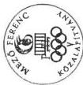

képviselőre jogosult aláírása
Lemhényi Dezső
elnök
Dr. Nagy József
titkár

---

.

.

.

.

.

---

32. sz. melléklet
a V-25-60/1998-99. sz.
jelentéshez

A Mező Ferenc Közalapítvány
bevételei

Adatok: E Ft-ban

|  Sorsz. | Megnevezés | 1996. év | 1997. év | 1998. év  |
| --- | --- | --- | --- | --- |
|  1. | Központi költségvetési támogatás | 50 000 | 50 000 | 5 000  |
|  2. | MOB támogatás | - | 2 500 | -  |
|  3. | Egyéb bevétel | 4 | 15 736 | 23 717  |
|   | Ebből: Értékpapír vásárlás árfolyamnyeresége | - | 15 736 | 23 628  |
|   | Kamatbevétel | 4 | - |   |
|  4. | Összesen: (1+2+3) | 50 004 | 68 236 | 28 717  |

Alulírott az 1989. évi XXXVIII. tv. 24. § c. pontja alapján aláírásommal kijelentem, hogy a feltüntetett adatok teljesek, és a közalapítvány nyilvántartásaival, okmányaival mindenben egyeznek.

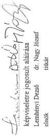

Budapest, 1999. március 1.

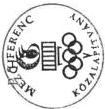

---

,

.

.

.

---

33. sz. melléklet
a V-25-60/1998-99. sz.
jelentéshez

# A Mező Ferenc Közalapítvány
kiadásai (költségei)

Adatok E Ft-ban

|  Sor-szám | Megnevezés | 1996. év |   | 1997. év |   | 1998. év  |   |
| --- | --- | --- | --- | --- | --- | --- | --- |
|   |   |  fő | összeg | fő | összeg | fő | összeg  |
|  1. | Alapítványi célú támogatások kiadásai összesen (7+8+9) |  |  | 197 | 21 156 |  | 20 688  |
|   | Ebből: |  |  |  |  |  |   |
|  1. | Nyugdíjas olimpiai bajnokok |  |  | 61 | 10 800 |  |   |
|  2. | Nyugdíjas olimpiai ezüstérmesek |  |  | 23 | 2 070 |  | 2 820  |
|  3. | Nyugdíjas olimpiai bronzérmesek |  |  | 38 | 3 005 |  | 4 660  |
|  4. | Nyugdíjas világbajnokok |  |  | 25 | 1 000 |  | 3 000  |
|  5. | Támogatott özvegyek |  |  | 27 | 1 530 |  | 2 070  |
|  6. | Támogatott nyugdíjas sportszakemberek |  |  | 9 | 680 |  | 1 920  |
|  7. | Összesen (1+2+3+4+5+6) |  |  | 183 | 19 085 |  | 14 470  |
|  8. | Nem rendszeres támogatások |  |  | 14 | 835 |  | 1 160  |
|  9. | Egyéb alapítványi célú kiadások |  |  |  | 1 236 |  | 5 058  |
|  II. | Működési költségek összesen |  | 1 |  | 5 168 |  | 7 213  |
|   | Ebből: |  |  |  |  |  |   |
|  1. | Anyagköltség |  |  |  | 179 |  | 17  |
|  2. | Anyag jellegű szolgáltatás |  |  |  | 23 |  | 110  |
|   | Ebből: Nyomdai költség |  |  |  |  |  | 109  |
|   | Telefonköltség |  |  |  |  |  |   |
|  3. | Bérköltség |  |  |  |  |  |   |
|  4. | Személyi jellegű kifizetések |  |  |  | 3 512 |  | 4 953  |
|   | Ebből: Reprezentáció |  |  |  | 242 |  | 500  |
|  5. | Értékcsökkenés |  |  |  |  |  |   |
|  6. | Nem anyagjellegű szolgáltatás |  |  |  | 250 |  | 576  |
|   | Ebből: |  |  |  |  |  |   |
|   | Bérleti, kölcsöncélú díjak |  |  |  |  |  |   |
|   | Hirdetési díjak, reklám ktg-ek |  |  |  | 250 |  | 236  |
|   | Könyvvezetés |  |  |  |  |  |   |
|  7. | Bankköltség |  | 1 |  | 7 |  | 2  |
|  8. | TB-járulék |  |  |  | 1 197 |  | 1 555  |
|  III. | Előző időszak ráfordításai |  |  |  |  |  |   |
|  IV. | Költségek összesen |  | 1 |  | 26 324 |  | 27 901  |

Alulírott az 1989. évi XXXVIII. tv. 24. § c. pontja alapján aláírásommal kijelentem, hogy a feltüntetett adatok teljesek, és a közalapítvány nyilvántartásaival, okmányaival mindenben egyeznek.

Budapest, 1999. április 9.

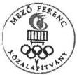

képviseletre jogosult aláírása
Lemhényi Dezső dr. Nagy József
elnök titkár

---

.

:

.

.

---

34. sz. melléklet
a V-25-60/1998-99. sz.
jelentéshez

Mező Ferenc Közalapítvány

Bér és személyi jellegű kifizetések alakulása

|  Sor-szám | Megnevezés | Létszám (fő) |   | Bérköltség (E Ft) |   | Tiszteletdíj (E Ft) |   | Költségtérítés (E Ft)  |   |
| --- | --- | --- | --- | --- | --- | --- | --- | --- | --- |
|   |   |  1997. év | 1998. év | 1997. év | 1998. év | 1997. év | 1998. év | 1997. év | 1998. év  |
|  1. | Irodai foglalkoztatottak |  |  |  |  | 1 493 | 1 626 |  |   |
|  2. | Kuratórium |  |  |  |  | 1 228 | 2 058 |  |   |
|  3. | Felügyelő Bizottság |  |  |  |  | 549 | 768 |  |   |

Alulírott az 1989. évi XXXVIII. tv. 24. § c. pontja alapján aláírásommal kijelentem, hogy a feltüntetett adatok teljesek, és a közalapítvány nyilvántartásaival, okmányaival mindenben egyeznek.

Budapest, 1999. március 1.

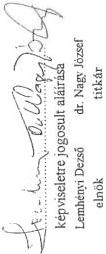

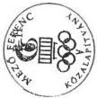

---

.

.

.

.

---

# AZ UNIÓ LABDARÚGÓ EURÓPA BAJNOKSÁG KÖZALAPÍTVÁNY HELYSZÍNI ELLENŐRZÉSÉNEK MEGÁLLAPÍTÁSAI

## Az Unió EBKA létrehozásának előzményei

A 2004. évi labdarúgó Európa-bajnokság 16-os döntőjének - Ausztriával közös - megrendezéséhez benyújtandó **pályázat leadási határideje 1998. szeptember 30.** volt.

A közös megrendezés ötlete Ausztria részéről vetődött fel. Ausztria és Magyarország 1997-ben döntött arról, hogy közös rendezésben megpályázza az EB-döntő megrendezését. A magyar kormány 1997. áprilisában a rendezésre vonatkozóan szándéknyilatkozatot adott.

Az EB megrendezéssel kapcsolatos pályázat előkészítő munkáit az MLSZ EB előkészítő bizottsága kezdte. A bizottság 1997. októberében a mérkőzések lebonyolítására stadionpályázatot írt ki.

Az MLSZ működésével kapcsolatos problémák miatt a Kormány az MLSZ-től független, de az MLSZ bevonásával működő bizottság felállításáról döntött, amikor a pályázat előkészítése érdekében a 2410/1997. (XII. 17.) sz. határozatával létrehozta az „EURO 2004” Nemzeti Bizottságot. Annak érdekében, hogy a pályázat előkészítését végző szervezet jogi személy legyen, továbbá, hogy a központi költségvetési támogatáson túl nem állami forrásokat is integrálni tudjon, a Nemzeti Bizottság működését átmenetinek szánva, megfelelő szervezeti formaként olyan közalapítvány létrehozását határozta el a Kormány, amely elláthatja a kormányzati döntésekhez szükséges előkészítő munkálatokat és ugyanakkor elvégezheti - MLSZ-szel együttműködve - a sportszakmai jellegű koordinációt is.

## 1. A MEGALAKULÁS ÉS MŰKÖDÉS JOGI, SZERVEZETI FELTÉTELEI

Az Unió EBKA-t a Kormány abból a célból hozta létre, hogy a Sport tv. 2. § c., h., i., g. pontjaiban megfogalmazott állami feladatokból következően egy jelentős nemzetközi labdarúgó torna - **a 2004-es Labdarúgó EB - megpályázásának és megrendezésének támogatásával segítse** a magyar labdarúgás és az érintett labdarúgó stadionok fejlesztésének, működőképességének biztosítását.

Az Unió EBKA alapvető célja, hogy irányító-koordináló tevékenységével, továbbá anyagi eszközökkel támogassa Magyarország és Ausztria közös pályázati projektjét a Labdarúgó Európa Bajnokság rendezési jogának elnyerése és megrendezése

77

---

érdekében, ezáltal is megalapozva Magyarország még jobb megismertetését az Európai Közösség tagállamaival.

Az alapító okirat a közhasznú szervezetekről szóló 1997. évi CLVI. törvény előírásainak figyelembe vételével készült.

Rögzíti a kitűzött célok megvalósítása érdekében elvégzendő átfogó feladatokat, a közalapítvány vagyonát és működését, a vagyon kezelését, befektetését, a gazdálkodás szabályait, a közalapítvány képviseletét.

A közalapítvány **nyitott**, ahhoz bármely hazai vagy külföldi természetes személy, illetve jogi személyiséggel nem rendelkező szervezet felajánlással, pénzbeli vagy természetbeni juttatással, vagyonrendeléssel csatlakozhat, ha a közalapítvány céljait és az alapító okiratban foglaltakat elfogadja.

Az Unió EBKA-t a Kormány az 1014/1998. (II. 4.) sz. határozattal hozta létre.

### **A megalakulásához és működésének beindításához szükséges jogi és szervezési intézkedések maradéktalanul megtörténtek.**

A Fővárosi Bíróság az 1998. március 31-én kelt 13. Pk. 60247/98/5. sz. végzésével 7071. sorszám alatt vette nyilvántartásba, mely 1998. április 21-én emelkedett jogerőre.

Az alapító az alapító okiratban az Unió EBKA **alapításkori vagyonaként 5 M Ft**-ot határozott meg, melyből 10 % (0,5 M Ft) a törzsvagyon, amelyet a működéshez nem használhat fel. Átutalására 1998. május 19-én került sor.

Az Unió EBKA vagyonának kezelő és legfőbb döntéshozó szerve a hat fős **kuratórium**, melynek elnökét, alelnökét és tagjait - mint gazdasághoz, sporthoz értő szakembereket - az alapító kérte fel és bízta meg határozatlan időre feladatuk ellátására. A kuratórium alakuló ülését **1998. április 24-én** tartotta.

A kuratóriumi tagok közül egy fő a BM, három fő az OTSH képviseletében kapott felkérést.

A kuratórium tagjaira vonatkozóan a közhasznú szervezetekről szóló 1997. évi CLVI. törvény 8. §-ának (2) bekezdésében foglalt **összeférhetetlenségi szabályok érvényesültek**. Ezen túlmenően az alapító okirat más szabályokat nem írt elő.

Az összeférhetetlenségi előírásokat a kuratóriumi ügyrend részletesen rögzíti.

Folyószámláját a Kincstárnál 1998. május 19-én nyitották meg, adószámot 1998. május 5-én (18162400-2-42), társadalombiztosítási törzsszámot 1998. május 19-én (9987865/A) kapott.

A kuratórium az ellenőrzött időszakban összesen négy alkalommal ülésezett, üléseinek száma és rendszeressége megfelel az alapító okirat előírásainak. Az ülések

---78

---

alkalmazkodtak a felmerült igényekhez és döntési szükségletekhez. A kuratórium tevékenységét - hatáskörét betartva - szabályosan végezte.

Az ülésekről jegyzőkönyvek készültek, melyben a határozatokat is rögzítették. A kuratóriumi határozatokat a határozatok könyvében tartják nyilván, mely megfelel a közhasznú szervezetekről szóló 1997. évi CLVI. törvény előírásainak.

A kuratórium elfogadta az Unió EBKA működését biztosító terveket és meghozta a tevékenység törvényes ellátásához szükséges határozatokat. **A kuratórium döntései - a helyszíni ellenőrzés tapasztalatai szerint - összességében törvényesek, megalapozottak és célszerűek voltak.**

A helyszíni ellenőrzés alatt a kuratórium elnöke lemondott, az új elnök kinevezése nem történt meg. A kuratórium tevékenységét az alapító okiratnak megfelelően az alelnök irányította.

Az alapító okirat rendelkezik arról, hogy a kuratórium elnöke hatáskörét - tartós akadályoztatás esetén - az alelnök korlátozás nélkül gyakorolja.

**A kuratórium működése** a kilátásba helyezett személyi változások miatt bizonytalanná vált. A helyszíni ellenőrzés befejezéséig a BM által delegált kuratóriumi tag esetében történt személycsere.

Október végén az alapító képviselője szóban tájékoztatta a projekt igazgatóját, hogy két kuratóriumi tag kivételével a kuratórium tagjai és a projekt iroda igazgatója leváltásra kerülnek.

Az alapító okirat a közalapítvány működéséhez szükséges, a kuratórium folyamatos munkáját segítő ügyintéző, pénzügyi, gazdálkodási feladataira ún. **Közalapítványi Projekt Iroda** megszervezését írta elő, melyet igazgató irányít. Az iroda a közalapítvány szervezeti egysége, nem önálló jogi személy, saját vagyona nincs. Az igazgató felett a munkáltatói jogokat a kuratórium elnöke gyakorolja. A projekt iroda **1998. április 21-től** működik. Az iroda működésének tárgyi feltételei biztosítottak. A feladatkörébe tartozó ügyekben az igazgató dönt. A kuratórium a projekt iroda igazgatóját az iroda hatáskörébe tartozó ügyekben képviseleti és aláírási joggal is felruházta. **Az iroda tevékenysége összességében összhangban volt az alapító okirattal és a közalapítvány belső szabályzataival.**

Az iroda főállású igazgatója az SZMSZ-ben részletesen rögzített szabályok betartásával végezte munkáját, a kuratóriumi ülések állandó tanácskozási joggal rendelkező résztvevője volt, részletes feladatait munkaszerződésben rögzítették, munkabérét a kuratórium határozta meg.

Az irodának az igazgatón kívül 3 fő teljes munkaidős és 1 fő napi 4 órás alkalmazottja van, akik felett a munkáltatói jogokat az iroda igazgatója gyakorolta.

Feladatuk az Unió EBKA pénzügyi és gazdasági ügyeinek intézése, konkrét feladataikat és jogaikat munkaszerződésben rögzítették, melyek a Munka Törvénykönyvében előírt követelményeknek megfeleltek.

79

---

Az iroda a munkához szükséges szabályzatokkal rendelkezik, tevékenységét ezek alapján végezte. A szabályzatok tartalmilag összhangban voltak az alapító okiratban meghatározott követelményekkel.

Az **FB** három - gazdasági és pénzügyi végzettségű - tagból áll, akiket az alapító kért fel feladatuk ellátására. Megbízatásuk határozatlan időre szól. Az FB 1998. április 27-én tartotta alakuló ülését. A közhasznú szervezetekről szóló 1997. évi CLVI. törvény 8. §-ának (2) bekezdésében foglalt összeférhetetlenségi szabályokon túl az alapító okirat azt is előírta, hogy nem állhatnak az alapítóval alkalmazotti vagy egyéb érdekeltségi viszonyban. Az FB tagjaira vonatkozóan **az összeférhetetlenségi szabályok érvényesültek.**

Az alapító okirat meghatározta az FB ellenőrzési feladatait, jogait és kötelességeit, ugyanakkor felhatalmazást adott az ügyrend saját hatáskörben történő megállapítására.

Az FB alakuló ülésén megválasztotta elnökét, elfogadta ügyrendjét. Az ügyrend megfelelően szabályozza az FB tevékenységét, összhangban van az alapító okirattal. Az elnök tanácskozási joggal rendszeresen részt vett a kuratórium ülésein.

A bizottság munkaterv alapján dolgozik. A kuratóriumi üléseket követően, az ott készült emlékeztetőt felhasználva, öt munkanapon belül ülést tartott, ahol minden napirendet értékelt.

Felülvizsgálták az Unió EBKA szabályzatait, a magyar-osztrák partneri viszony féléves elszámolását, a stadionpályázat lebonyolítását és eredményét, az Unió EBKA által kötött szerződéseket, a költségvetés féléves egyensúlyát, a közalapítvány likviditását elemző pénzügyi beszámolót.

A kuratórium által elfogadott szabályzatokkal kapcsolatban nem támasztottak kifogást, ezt az ülésről készült jegyzőkönyvben rögzítették.

Az Unió EBKA II. félévi pénzügyi helyzetének vizsgálata keretében megállapították, hogy a II. félévre a központi költségvetés általános tartalékából előzetesen megígért 30 M Ft támogatás biztosítása kérdéssé vált, ennek következtében veszélybe került az Unió EBKA terv szerinti feladatainak ellátása. Kezdeményezték a Miniszterelnöki Hivatal vezetőjénél és az ifjúsági és sportügyek államtitkáránál, mint az alapító képviselőinél a jóváhagyott támogatás tervszerinti átutalását, a pénz terveknek megfelelő kiutalását. Kezdeményezésük az ellenőrzés befejezéséig nem járt eredménnyel.

A többi témában - a munkatervhez képest kisebb késéssel - az ellenőrzés folyamatban volt.

Az alapító okirat nem írja elő kötelezően könyvvizsgáló alkalmazását, felkérését eseti megbízással tervezik, az éves mérlegbeszámoló auditálásához.

---80

---

## 2. A GAZDÁLKODÁS ÉS A KÖNYVVEZETÉS SZABÁLYOSSÁGA

A közalapítvány a működéséhez szükséges belső szabályzatokkal, így **SZMSZ-szel, gazdálkodási szabályzattal, számviteli politikával és számlarenddel és közbeszerzési szabályzattal rendelkezik. A szabályzatok megfelelnek a törvényi követelményeknek**, alkalmasak az alapító okiratban megjelölt célok teljesítésére, az állami és egyéb forrásból kapott támogatások jogcím szerinti, a törvények, illetve támogatók által előírt részletezettségű elszámolásra.

Az **SZMSZ** tartalmazza az Unió EBKA legfontosabb adatait, jogállását, célját és feladatát, a kuratórium, az FB, a könyvvizsgáló, a projekt iroda feladatát és hatáskörét, valamint a közalapítvány teljes működési rendjét.

A **gazdálkodási szabályzat** teljes körűen szabályozza az Unió EBKA vagyonkezelési, gazdálkodási, befektetési, nyilvántartási, beszámolási, bankszámla kezelési, utalványozási, vállalkozási tevékenységének szabályait és meghatározza az operatív gazdasági működés feladatait.

A **számviteli politika és számlarend** kialakítása megtörtént, ezen belül meghatározásra került az eszközök és források leltárkészítési, valamint selejtezési szabályzata, az eszközök és források értékelési szabályzata, és a pénzkezelési szabályzat.

A kuratórium a közalapítvány **költségvetését** az 1998. április 24-i ülésén fogadta el, ebben a várható bevételeket az akkori ismereteik alapján megalapozottan vette számításba, és a tervezett kiadásokat ehhez igazították. **A jóváhagyott működési költségvetés egyensúlyban volt.**

A kuratórium több alkalommal foglalkozott a végrehajtás során keletkezett forráshiány problémáival. A helyszíni ellenőrzés időszakában még nem voltak ismertek az új költségvetési és egyéb támogatási elképzelések, ezért nagyfokú bizonytalanság volt érezhető a tervek megvalósulását illetően. A Kormány képviselőjétől szóban ígéretet kaptak a tervezett támogatás II. félévi folyósítására, ennek átutalására azonban a helyszíni ellenőrzés befejezéséig nem került sor.

**A forráshiány ellenére likviditási zavarok nem voltak**, mivel a kitűzött programokat menetközben módosították és a tervezetthez képest kevesebb számú rendezvényt, szerényebb kiadások mellett valósítottak meg.

A helyszíni ellenőrzés befejezéséig a közalapítvány még nem fejezte be működésének első évét, így **beszámoló, illetve közhasznúsági-jelentés készítési kötelezettsége még nem volt esedékes.**

A közalapítvány **kettős könyvvitelt vezet.**

A közalapítvány gazdálkodását a kuratórium irányította. Az alapító okiratban rögzítetteknek megfelelően a kuratórium stratégiai döntései alapján a konkrét

81

---

feladatokat a projekt iroda döntésre előkészítette, illetve a kuratórium döntéseinek megfelelően végrehajtotta. Az iroda dolgozói végezték a prezentációk előkészítését, lefolytatását és a marketing munkát, a pénzgazdálkodást, pénzkezelést és bizonylatok ellenőrzését.

**A gazdálkodás és pénzkezelés a szabályzatok előírásainak betartásával, szabályosan történt, a pénzügyi fegyelem érvényesült.** Felelősségi nyilatkozattal, szigorú számadási okmányokkal rendelkeztek, azokat szabályosan alkalmazták.

A vagyontárgyakat leltárkönyvben, szabályosan tartják nyilván. Az eszköznyilvántartás beszerzési áron történik. Leltározásra még nem került sor.

Hiányosság, hogy a pénztár páncélszekrényének tartalékkulcsa nincs letétbe helyezve.

Az alapító okirat a kuratórium és az FB tagjainak a tisztségük ellátásával kapcsolatban felmerülő szükséges és indokolt költségeik megtérítésére adott lehetőséget, egyéb díjazást nem engedélyezett. **E szabályozás az ellenőrzött időszakban maradéktalanul érvényesült.** Költségtérítést esetenként a kuratórium tagjai kaptak, pl. külföldi prezentációkon részt vett a kuratórium elnöke és néhány tagja, részükre összesen 0,1 M Ft napidíj kifizetésre került sor. Az FB tagjai eddigi tevékenységükért költségtérítést nem igényeltek.

### 3. A RENDELKEZÉSRE ÁLLÓ KÖZPONTI KÖLTSÉGVETÉSI TÁMOGATÁS ÉS EGYÉB BEVÉTELEK ALAKULÁSA, A KÖZPÉNZEK RENDELTETÉSSZERŰ, TÖRVÉNYES ÉS CÉLSZERŰ FELHASZNÁLÁSA

#### 3.1. A közalapítvány bevételeinek alapító okirat szerinti alakulása, a támogatások jogcímei, célja, összege

Az 1998. évi működési költségvetésben **bevételként 108 M Ft-ot terveztek.**

A **tervezett bevételek** a következők voltak:

|  50 M Ft | központi költségvetési támogatásból  |
| --- | --- |
|  20 M Ft | Országos Idegenforgalmi Bizottság támogatásából  |
|  10 M Ft | OTSH támogatásából  |
|  8 M Ft | NSKA támogatásából  |
|  20 M Ft | szponzori támogatásból  |

A helyszíni ellenőrzés befejezéséig még egyetlen tervezett támogatás sem realizálódott a tervezett szinten, a teljesített bevétel 48,3 M Ft volt.

A központi költségvetésből 1998. május 19-én 25 M Ft-ot, (ebből 5 M Ft induló vagyon), az NSKA-tól 1998. május 21-én 5 M Ft támogatást kaptak, konkrét felhasználási cél megjelölése nélkül.

82

---

11 M Ft a MOL Rt.-vel 1998. április 22-én, 7 M Ft a Szerencsejáték Rt.-vel 1998. május 31-én kötött szponzori szerződés alapján realizálódott, 0,2 M Ft volt a külföldi prezentáció költségtérítése, 0,1 M Ft pedig a banki kamat bevétel.

A szponzori szerződésekben részletesen rögzítették a támogatás ellenértékeként nyújtott reklámszolgáltatásokat, melyeknek a közalapítvány eleget tett.

# 3.2. Az alapító okiratban megfogalmazott közalapítványi célokra teljesített kiadások alakulása és ezek szabályszerűsége

A tervezett kiadások a következők voltak:

|  46,2 M Ft | közös projektek Unió EBKA-ra eső hányada  |
| --- | --- |
|  5 M Ft | stadionpályázatokra, sajtómarketingre  |
|  18 M Ft | az Unió EBKA és a projekt iroda hazai és nemzetközi tevékenységére, közterhekre  |
|  4,3 M Ft | dologi költségekre  |
|  11 M Ft | bér és bérjellegű kifizetésekre  |
|  14,5 M Ft | lobby tevékenységgel kapcsolatos utazásokra  |
|  9 M Ft | UEFA felé beadandó pályázati anyag költségére  |

1998. november 30-ig Unió EBKA teljesített kiadása 19,2 M Ft volt, ez a bevételek 40 %-át tette ki.

Alapítványi célú tevékenységre 11,9 M Ft-ot, az összes kiadás 62 %-át, vállalkozási tevékenységre 7,3 M Ft-ot, az összes kiadás 38 %-át fordították.

A teljesített kiadásból 7,8 M Ft az „EURO 2004” Nemzeti Bizottság működésével kapcsolatban merült fel (tárgyi eszköz beszerzések, a külföldön végzett közvélemény-kutatás, pályázati anyagok elkészítése, reklám anyagok, utazások és a napi működés feltételeinek biztosítása).

Ennek előzménye, hogy a Kormány 1997. december 17-i 2410/1997. (XII. 17.) sz. határozatával létrehozta a „EURO 2004” Nemzeti Bizottságot, de nem biztosította a működéséhez szükséges forrásokat. A Nemzeti Bizottság a szoros jelentkezési határidő miatt azonnal megkezdte a 2004-es EB aktuális szervezési feladatainak intézését. A költségeket az elnöki feladatra felkért Szerencsejáték Rt. elnökvezérigazgatója intézkedésére a Szerencsejáték Rt. előlegezte meg.

A közalapítvány kuratóriuma úgy döntött, hogy a működéséhez szükséges eszközöket átveszi, illetve a bizottságnál keletkezett indokolt költségeket megtéríti, mivel azok a közalapítvány által elvégzendő feladatokat szolgálták. A költségek jogosságát a projekt iroda igazgatója ellenőrizte.

Az elszámolást az 1998. május hónapban kötött megállapodásban részletesen rögzítették és dokumentálták, majd a számlák alapján kifizették a Szerencsejáték Rt.-nek.

83

---

Az Unió EBKA használatában lévő négy telefonvonal tulajdonjoga a Szerencsejáték Rt.-é. Áthelyezése az Unió EBKA tulajdonába tetemes többlet-kiadást jelentene. Azért, hogy ezt a kiadást elkerüljék a közalapítvány telefonszámláját jelenleg is a Szerencsejáték Rt. közbeiktatásával fizeti az Unió EBKA a Matávnak.

A helyszíni ellenőrzés az átvállalt számlák és kifizetések szabályosságát ellenőrizte. A közalapítvány nem jogutódja a Nemzeti Bizottságnak, így a megtérített számlák közül a bizottság működési költségeinek megtérítése a Szerencsejáték Rt.-nek indokolatlan volt.

A legnagyobb kiadási tételt (9 M Ft-ot, a kiadások 47 %-át) a Budapest Sportcsarnokban bérelt helyiségekben működő projekt iroda működtetésének költségei és az ott dolgozók bérköltségei jelentették. A működési költségek arányát az ellenőrzés a közalapítvány működésének induló évében elfogadhatónak tartja.

Jelenleg az EB rendezési jogának elnyeréséért folytatta tevékenységét az Unió EBKA és csak a tervezett beruházások előkészítése folyt eddig. A működési költségek arányának csökkenése a beruházások elkezdése után várható.

A működési költségeken belül jelentős összeget képeznek a bérköltségek és közterhek. Az összes költség 21 %-át a kifizetett bér- és TB-járulék jelentette, ez a működési költségek 44 %-át tette ki.

A kifizetések és levonások havonta szabályosan történtek, az adók és járulékok átutalásra kerültek.

A projekt iroda 5 főállású munkatársa 4 M Ft (projekt iroda igazgató 260 E Ft/hó, 1 munkatárs 150 E Ft/hó, 2 munkatárs 120 E Ft/hó, 1 félmunkaidős munkatárs 28 E Ft/hó) összegű munkabérben részesül.

A kuratórium szeptember 24-i ülésén az elnök javaslatára határozatot fogadott el, melyben a projekt iroda igazgatóját és dolgozóit jó munkájuk elismeréseként egy havi bérnek megfelelő összeggel megjutalmazták.

Az iroda több alkalommal foglalkoztatott szakértőket eseti megbízással, e szolgáltatás igénybevétele szükséges és célszerű volt:

- közvélemény-kutatás a 2004-es Labdarúgó EB magyar-osztrák rendezés nemzetközi támogatottságának felmérése;
- az UEFA-hoz benyújtott pályázat szakmai részének előkészítése;
- a közalapítvány szükséges szabályzatainak elkészítése.

A közalapítvány könyvelését, bérszámfejtését és egyéb számviteli feladatait havi 50 E Ft + ÁFA összegért külső szervezet végzi. A feladatok mennyisége nem teszi indokolttá főállású alkalmazott foglalkoztatását.

84

---

Tárgyi eszköz beszerzésre 2,9 M Ft-ot (az összkiadás 15 %-át és a működési költség 32 %-át) fordították. A beszerzések a közalapítvány működéséhez szükségesek voltak.

4 db számítógépet (1,5 M Ft-ért) 1 db fénymásolót (0,8 M Ft-ért), és egyéb gépeket és bútorokat (0,4 M Ft-ért) vásároltak.

Külföldi prezentációra 1,9 M Ft-ot, stadion pályázatokra 0,4 M Ft-ot, szervezőbizottsági ülésekre 0,2 M Ft-ot, UEFA pályázatra 0,2 M Ft-ot, hazai rendezvényekre 0,2 M Ft-ot, tiszteletdíjra 0,3 M Ft-ot, költségtérítésre 0,4 M Ft-ot, reprezentációra 0,3 M Ft-ot fordítottak. Mivel a közalapítvány személygépjárművel nem rendelkezik, az igazgató a hivatalos utakon saját gépjárművét használta. A kilométer és költségelszámolás az érvényes normák alapján, szabályosan történt.

Az ellenőrzés kifogásolja, hogy 1998-ban **két alkalommal az MLSZ elnöke és főtitkára, egy alkalommal a Magyar Turizmus Rt. képviselője külföldi kiküldetési költségeit az Unió EBKA fedezte. Indokolatlan, hogy az MLSZ, mint az EB egyik rendezője, illetve a Magyar Turizmus Rt., mint a turisztikai árbevétel egyik kedvezményezettje a jórészt közpénzből működő közalapítvány költségei terhére végezze feladatait.**

Az eddig teljesített kiadások arányosak voltak a végzett munkával. A gazdálkodásban a feltárt hiányosságokat leszámítva érvényesült a takarékosságra való törekvés, melyet a II. félévi finanszírozási problémák is kikényszerítettek.

Több, eredetileg tervezett külföldi promóciós bemutató programon takarékossági okok miatt nem vettek részt.

A közalapítvány **vállalkozási tevékenysége** a szponzori szerződésekben vállalt reklámtevékenység és a projektet népszerűsítő promóciós tevékenység, melyeken a szponzorokat is megjelentették és népszerűsítették. A vállalkozási tevékenység 7,8 M Ft költségével szemben 1998. november 30-ig 18 M Ft szponzori bevétel realizálódott.

**Az Unió EBKA a támogatásként kapott közpénzeket az ellenőrzött időszakban általában rendeltetésszerűen, törvényesen, célszerűen használta fel.**

### 3.3. A közalapítvány vagyona megőrzése és hasznosítása

A kuratórium **a törzsvagyont szabályosan kezelte**, elkülönítése megtörtént, a felhasználására vonatkozó korlátozásokat betartották. A törzsvagyont tartós lekötésű, állam által garantált értékpapírokba fektetették, a közalapítvány működésére csak kamatait használták fel.

A helyszíni ellenőrzés befejezésekor a közalapítvány 15,2 M Ft-ot egy kereskedelmi banknál diszkont kincstárjegybe fektetett, ezen felüli pénzeszközeit a folyószámlán tartotta. Köztartozása az ellenőrzött időszakban nem volt. Az alapító okiratban meghatározott hitelfelvételi tilalmat betartotta.

85

---

#### 4. A BEVÉTELEK ÉS KIADÁSOK ÖSSZHANGJA AZ ALAPÍTÓ OKIRATBAN ELŐÍRT CÉLOKKAL

A közalapítvány alapító okirata **kiemelt feladatként** határozta meg a következőket:

- – Magyarország és Ausztria közös pályázati projektjének támogatása a Labdarúgó EB rendezési jogának elnyerése érdekében;
- – sikeres pályázat esetén a labdarúgó EB előkészítésének és lebonyolításának támogatása, szervezése;
- – kapcsolattartás és együttműködés az euroatlanti integrációt koordináló állami szervezetekkel;
- – olyan sportesemények, rendezvények szervezése és támogatása, amely elősegíti az alapvető pályázati cél megvalósítását;
- – eszmeileg a közalapítvány céljával megegyező elméleti és gyakorlati tevékenység elősegítése;
- – pályázatok kiírása a Labdarúgó EB helyszíneként szolgáló létesítmények kiválasztása és fejlesztése érdekében;
- – olyan időszaki vagy folyamatos kiadványok, újságok kiadása, illetve médiák működtetése, vagy ezek támogatása, amelyek a közalapítványi célok megvalósulását jelentős mértékben elősegítik;
- – hazai és nemzetközi előkészítő és marketing tevékenység szervezése a projekt megvalósítása érdekében;
- – a közalapítvány és a Projekt Iroda működésének pénzügyi és dologi feltételeinek biztosítása.

Az ellenőrzött időszakban a közalapítvány alig nyolc hónapja működött, **a megszabott feladatok többségének megvalósításához hozzákezdtek.**

A helyszíni ellenőrzés időszakában azonban - a II. félévi központi költségvetési támogatás finanszírozásának elhúzódása, illetve a kuratórium összetételében várható személyi változások miatt - már **érzékelhető volt az előkészítő, tervező munkák ütemének csökkenése.**

---86

---

#### **4.1. A kialakított kapcsolattartás és koordináció az euroatlanti integrációt koordináló, valamint az érintett magyar és osztrák sportot irányító állami- és sportszervekkel**

A közalapítvány 1998. április 22-én írásos megállapodást kötött az **MLSZ**-szel. Szakmai kérdésekben rendszeres kapcsolatot tartottak az **OTSH** vezetőivel. A megkötött együttműködési szerződések korrektek, figyelembe vették a felek érdekeit, eredményesen szolgálták az Unió EBKA által kitűzött célok megvalósulását.

**Szoros kapcsolatot és koordinációt alakított ki az érintett európai országokkal és szervezetekkel, együttműködik az UEFA vezetésével.**

**A kuratórium 1998. április 22-én megállapodást kötött az ÖFB-vel, amelyben részletesen meghatározták az együttműködés jogi és pénzügyi kereteit:** a pályázat bemutatásának előkészítő intézkedéseit közösen határozzák meg, finanszírozását közösen, egyenlő arányban viselik, a fedezetet közösen teremtik elő.

Magyar-osztrák szervezőbizottságot és projekt csoportot hoztak létre. A projekt csoport tett javaslatot a szükséges intézkedésekre a szervezőbizottságnak, melyet jóváhagyás után végrehajtott.

**A szervező bizottság Pénzügyi Szabályzatot dolgozott ki, majd ennek alapján összeállította és jóváhagyta az előkészítő munkák költségvetését.**

A megállapodás szerint a feladatok költségeit az a fél előlegezi meg, amelyik országban az eseményre sor kerül, a másik fél az elszámolás benyújtása és annak szervezőbizottság által történő jóváhagyását követően egy hónapon belül köteles megfizetni a rá eső részt. Az elszámolással kapcsolatban eddig nem merült fel probléma.

A megállapodás szerint a pályázat elkészítésének és az előkészületeknek a költségeiből közös finanszírozásúnak tekintik a következőket:

- harmadik féllel (ország, személy, szervezet) való kapcsolatot, a kiutazás, a meghívások és a vendégül látás költségeit,
- a közös rendezvények és prezentációk költségeit,
- közös kiadványok, filmek költségeit,
- a közös PR kialakítás költségeit.

Közös programnak és közös költségnek tekintettek minden olyan költséget, amelyről a szervezőbizottság megállapodott.

87

---

A megállapodás szerint a költséget keletkeztető fél kiadásainak tekintik a következőket:

- projekt irodák rezsi- és működési költségeit,
- bér- és bér jellegű kifizetéseket,
- az érintett ország belső marketing tevékenységét és annak szakértői díjait,
- belföldi utazások költségeit,
- a projektben résztvevő stadionok és városok kijelölésének, fejlesztésének vagy újjáépítésének költségeit és az ezekhez kapcsolódó költségeket,
- a projekthez, vagy a pályázathoz szükséges, az érintett ország által rendelkezésére bocsátott anyagok szakértői díjait,
- a felek egymásnál tett látogatásainak, illetve egymás vendégül látásának költségeit.

A ráfordítások fedezetére az Unió EBKA és az ÖFB külön kalkulációt készített. A projekt csoport vezetői jogosultak saját költségvetési tervükben tervezett tevékenységeket önállóan megvalósítani az ehhez szükséges szerződéseket megkötni.

Az együttműködési szerződésben rögzítetteket a felek betartották, egymás felé az elszámolásokat a Pénzügyi Szabályzatban rögzítetteknek megfelelően szabályosan végezték.

Az államtitkári szintű vegyes bizottsági üléseket a szükségleteknek megfelelő gyakorisággal tartották, a költségeit mindig a vendéglátó ország fedezte.

Kéthetente, esetenként hetente, országonként váltva közös munkanapot tartott a két projekt igazgató, ahol egyeztették az aktuális tevékenységet, bemutatták az elkészült anyagokat, véleményt cseréltek az aktuális kérdésekről.

## 4.2. Sportesemények, bajnokságok, rendezvények szervezése és támogatása

A cél érdekében kellően kihasználták a figyelem középpontjába kerülő nemzetközi és hazai sportrendezvényeket.

- Március 7-11-ig kiállítást és közvélemény-kutatást tartottak Berlinben, melyen bemutatták a közös magyar-osztrák rendezés elképzeléseit és reprezentatív közvélemény-kutatáson győződtek meg az elképzelés nemzetközi támogatottságáról, amely pozitív eredménnyel zárult. A megkérdezettek döntő többsége támogatta a közös rendezési elképzelést. Költsége 1,9 M Ft volt.

88

---

- - Március 25-én válogatott barátságos labdarúgó mérkőzés volt Bécsben Ausztria és Magyarország csapatai között. A találkozóhoz kapcsolódóan megvalósult a közös rendezés elképzelésének ismertetése, bemutatása, reklám anyagok kiosztása, promóciós bemutató, kiegészítve folklor programmal (a Duna Művész-együttes részvételével). Költsége 0,3 M Ft volt. Sajtófogadást és tájékoztatást tartottak a meghívott újságíróknak.
- - Április 28-30-ig a kuratórium elnöke, egy tagja és a projekt iroda igazgatója részt vett Dublinban az UEFA kongresszuson, ahol fogadást és bemutatót tartottak a résztvevőknek, ismertették elképzeléseiket. Költsége 0,3 M Ft volt. Filmbemutatót tartottak, ajándéktárgyakat és reklám anyagokat osztottak ki a résztvevőknek.
- - Június 10-én és június 22-én a labdarúgó VB során sajtótájékoztatókat és promóciós bemutatókat tartottak Franciaországban. A nyitómérkőzésre a kuratórium elnöke és a projekt iroda igazgató részére tapasztalatszerző és bemutatkozó utat szerveztek. Olaszország és Ausztria mérkőzése alkalmával nagy létszámú, népszerűsítést szolgáló, reklám anyagok kiosztásával egybekötött bemutató rendezvényt szerveztek a sajtó (mintegy 200 fő) képviselőinek. Összköltsége 1,2 M Ft volt.
- - Augusztus 18-23-ig a budapesti atlétikai EB rendezvényein a 2004-es labdarúgó EB-t népszerűsítő ismertető és reklám anyagokat osztottak két helyszínen, részvételi jegyeket sorsoltak és osztottak ki a leendő EB mérkőzéseire, sajtótájékoztatót és bemutatót tartottak az érdeklődőknek. Költsége 0,1 M Ft volt.
- - Szeptember 30-án a hivatalos magyar-osztrák pályázat és dokumentációk átadására az UEFA vezetőinek genfi titkárságán került sor az MLSZ elnöke és főtitkára, a projekt iroda igazgatója és egy tolmács részvételével, ahol promóciós anyagokat is bemutattak részükre.
- - Október 16-18-ig került sor 26 kelet-európai labdarúgó szövetség és az UEFA vezetőinek budapesti értekezletének megszervezésére és lebonyolítására. Előadások, véleménycserék voltak, idegenforgalmi bemutatót tartottak, ezek célja a magyarországi helyszínek népszerűsítése volt. Sajtótájékoztatót és fogadást tartottak 120 fő részvételével.
- - November 10-én a pályázatok részletes ismertetésére került sor az UEFA vezetőivel és az UEFA EB bizottságával Genfben az MLSZ elnöke, főtitkára, a projekt iroda igazgatója, a Magyar Turizmus Rt. képviselője és egy tolmács részvételével, melynek során promóciós szoba berendezésére, stadion modellek bemutatására és szakmai vetítésekre került sor.

---89

---

### 4.3. A projekt megvalósulása érdekében szervezett hazai és nemzetközi előkészítő és marketing tevékenység

A pályázat megvalósulása érdekében az Unió EBKA az általa szervezett rendezvényeken és azon kívül is folyamatosan végezte a 2004-es EB magyar-osztrák rendezésének népszerűsítését és reklámtevékenységet fejtett ki.

Ehhez sajtó anyagot, illetve a Magyar Televízióval együtt promóciós filmet készítettek, amiket a sajtótájékoztatókon használtak fel.

Elkészítették az „EUROPEAN FOOTBALL CHAMPIONSHIP 2004” című háromnyelvű kiadványt, amely bemutatja a leendő helyszíneket.

Népszerűsítő emléktárgyakat (zászlók, kitűzők, trikók, matricák, labdák stb.) készítettek és osztottak szét a promóciós bemutatókon és sportrendezvényeken az érdeklődőknek. Ezek összköltsége 5,8 M Ft volt.

Igénybe vették a média nyújtotta lehetőségeket a projekt népszerűsítésére, pl. a legtöbb promóciós bemutatón sajtótájékoztatót is tartottak.

### 4.4. Pályázat-kiírás a Labdarúgó EB helyszíneként szolgáló létesítmények kiválasztása és fejlesztése érdekében

A kuratórium által elbírált pályázatokat még az EURO 2004 Nemzeti Bizottság hirdette meg. A stadion-pályázatra 11 pályázat érkezett.

Az első stadionpályázatot az MLSZ EB előkészítő bizottsága 1997. októberében írta ki a mérkőzések lebonyolítására.

A Nemzeti Bizottság 1998. február 12-én új stadionpályázatot írt ki, 1998. március 31-i beérkezési határidővel. Úgy tervezték, hogy a beérkező pályázatokat - a kormánydöntés előtt - a Nemzeti Bizottság auditáltatja, majd a kormánydöntés után - a feltételek ismeretében - a pályázónak meg kell erősítenie pályázati szándékát. A pályázati kiírásban meghatározták a szükséges mellékleteket, a tartalmi és formai követelményeket. A pályázóknak elméleti és gyakorlati szakmai segítséget nyújtottak annak érdekében, hogy a pályázatok megfeleljenek a követelményeknek.

A benyújtott pályázatok többek között tartalmazták a beruházási program megvalósításának részletezett, kimunkált várható pénzügyi kihatásait, az önkormányzati testületek elvi döntéseit a támogatásról és a pénzügyi kötelezettségvállalásról, a stadionfejlesztésekbe befektetni kívánó cégek előzetes szándéknyilatkozatait és a stadionfejlesztésekhez igényelt központi költségvetési forrásigényeket.

A beérkezett pályázatokat az előre elfogadott szempontok alapján elbírálták.

A Nemzeti Bizottság döntését a kuratórium megerősítette, Budapesten a Népstadion és az FTC stadion, valamint Győr, Székesfehérvár és Debrecen megyei jogú városok stadiontervei maradtak versenyben.

---90

---

A nyertes pályázatok stadionfejlesztési tervei 1998-as árakon számolva 35 Mrd Ft kiadást tartalmaznak, ebben a következő összegű központi költségvetési támogatást feltételeznek:

Népstadion 7,8 Mrd Ft

FTC stadion 4,0 Mrd Ft

győri stadion 6,2 Mrd Ft

debreceni stadion 4,0 Mrd Ft

székesfehérvári stadion A. változat: 5,0 Mrd Ft

B. változat: 6,5 Mrd Ft

Összesen: 27-28,5 Mrd Ft

Fentiek közül fog kikerülni az a négy stadion, ahol az EB magyarországi mérkőzéseit játszanák. A végleges döntést 1999-es évre halasztották.

Az ellenőrzés megállapította, hogy a pályáztatás és annak elbírálása a pályázati felhívásban megfogalmazott szempontok figyelembe vételével szabályosan történt.

Összességében megállapítható, hogy a kuratórium által elfogadott program összhangban volt az alapító okiratban előírt feladatokkal, megvalósításuk szabályosan történt és eddig eredményesen valósították meg az Unió EBKA számára kitűzött célokat.

# 5. AZ EB MEGRENDEZÉSÉVEL KAPCSOLATOS PÁLYÁZAT ELKÉSZÍTÉSÉNEK ÉS A KORMÁNYGARANCIÁK MEGADÁSÁNAK FOLYAMATA

A kormányváltás előtt az 1052/1998. (IV. 29.) Korm. határozat döntött a 2004. évi Európa Bajnokság Ausztriával közös megrendezéséhez szükséges költségvetési forrás, valamint az UEFA által kért kormányzati garanciák biztosításáról.

A határozatban a Kormány támogatta az osztrák és magyar labdarúgó szövetségek közös pályázatát az EB döntő megrendezésére és a verseny megszervezésére, amennyiben kedvező döntés születik, a pályázat benyújtásához szükséges kormányzati és hatósági garanciákat, illetve megerősítéseket biztosítja.

A kedvező döntést követően a belügyminiszternek kellett volna az érintett miniszterekkel együttesen előterjesztést készíteni a megrendezéssel összefüggő feladatok végrehajtására és az ahhoz szükséges költségvetési források biztosítására.

A kormányváltás után a rendezési pályázatról szóló kormánydöntéshez az MH Ifjúsági és Sport Államtitkársága 1998. augusztus 24-én elkészítette „A 2004. évi Labdarúgó Európa-bajnokság rendezése” című háttértanulmányt.

91

---

A háttéranyag elkészítéséhez személyes konzultációkat folytattak az érintettekkel, felhasználták a beérkezett stadionpályázatokat és önkormányzati dokumentumokat, az Unió EBKA által készített dokumentumokat, a KPMG-Hungária Kft.: 'Labdarúgó Európa-bajnokság 2004-ben Ausztria-Magyarország' c. munkaanyagot, az UEFA anyagait, az 1996-os angliai Európa-bajnokság értékelő dokumentációját.

A háttértanulmány tartalmazza a projekt leírását, ismerteti az EB rendezés lehetséges magyar helyszíneit és létesítményeit, a logisztikai problémákat és fejlesztési terveket, részletezi a stadion beruházásokat és finanszírozásuk költségeit. Elemzi a projekt megvalósításának előnyeit, hátrányait és kockázatait, bemutatja a versenyelőnyöket és hátrányokat a másik két pályázó országgal (Spanyolország és Portugália) szemben.

A tanulmány készítői az alaposabb részelemzések hiánya miatt - értékelésük szerint - a szokásosnál nagyobb kockázattal járó becslésekre voltak utalva. A bevételeket és a költségeket 1998-as árakon prognosztizálták.

### **Tervezett költségek:**

A pályázati feltételek szerint a feltételek kialakításának költségeit (stadionok építése, sajtóközpontok kialakítása stb.) teljes egészében a rendező ország szövetségének kell fedeznie.

**A beruházási költségek** a különböző finanszírozási módtól függően 35 milliárd Ft körül alakulnának, ehhez mintegy 27-28,5 milliárd Ft állami támogatás szükséges. (A beruházások költségeit a stadionpályázatok alapján, saját számítással végezték a tanulmány készítői.)

**A működési költségek** mintegy 3,7 milliárd Ft-ot tesznek ki.

### **Várható bevételek:**

**Jegybevétel** 9,4 milliárd Ft. (Az Unió EBKA dokumentumai alapján, saját számítással végezték a tanulmány készítői.)

**Közvetítési, reklám- és kereskedelmi jogok értékesítéséből** származó bevételek 5-6 milliárd Ft.

**Származékos bevételek:** turisztikai bevétel 13,7-27,1 milliárd Ft, de csak komoly szálloda-beruházások esetén realizálható. Ennek költségei és finanszírozása jelenleg nem becsültek, illetve az adó és nem adójellegű állami bevételek, elsősorban a költségvetés ÁFA bevételei.

### **Előnyök, hátrányok, kockázatok**

**Pénzügyi hatások:** a tervezett bevételek és kiadások egyenlege a legoptimistább számítások esetén is mintegy 15 milliárd Ft-os deficitet mutatnak, jelentős jövedelem-átcsoportosítás mellett, mivel a költségek legalább háromnegyedét központi kormányzati erőforrásból kell fedezni.

---92

---

**Nemzetgazdasági hatások:** A turisták által generált keresletnek gazdaságélén-kítő hatása van. Egy tanulmány 5-8 ezer új munkahely teremtéssel számol.

**Sportszakmai hatások:** négy szupermodern stadion, de csak a négy kivételezett helyszínen, esély a magyar labdarúgás megújulására, viszont más sportágak fejlesztésére nem marad pénz.

**Társadalmi és politikai hatások:** nemzeti azonosságtudat, pozitív országkép, ország-marketing, EU integráció.

**Kockázati tényezők:** sikertelen pályázat-pályázati költségek; nincs elég szállodai férőhely; egyenlőtlen stadionfejlesztés; a költséginfláció; bizonytalan önkormányzati és vállalkozói források a stadionépítésben; a magyar válogatott rossz szereplése; sokmilliárdos beruházás az adófizetők pénzéből; erőforrás elvonása a sportszféra más területeiről; a sikertelen rendezés EU integrációra gyakorolt hatása.

**1998. szeptember 25-én a Magyar Köztársaság miniszterelnöke és az MLSZ elnöke megadták a kötelező írásos nyilatkozatokat az UEFA számára, amelyben vállalták, hogy**

- teljes mértékben támogatják a 2004. évi Európa Bajnokság utolsó körének megrendezését;
- megteszik a szükséges lépéseket az UEFA kereskedelmi jogainak megvédésére a pályázati feltételeknek megfelelően;
- kiegészítő reklám tevékenységekkel támogatják a döntő megrendezését saját országukban.

**Az UEFA által kért kormánygaranciák megadását a 2213/1998. (IX. 30.) Korm. határozat engedélyezte.**

- felhatalmazta a miniszterelnököt a pályázat teljes támogatására vonatkozó nyilatkozat aláírására, felhívta az MH-t vezető minisztert a pályázat benyújtásához szükséges további kormányzati garanciavállalások megadásának előkészítésével kapcsolatos egyeztetések lefolytatására;
- felhívta az MH-t vezető minisztert, hogy 1998. október 15-ig, az 1999. évi központi költségvetés elkészítésével párhuzamosan készítsen részletes költségszámítást a pályázat elnyerése esetén várható állami költségvetési kiadásokra és tegyen javaslatot az 1999. évre várható kiadásoknak a költségvetési törvény tervezetébe történő beépítésre;
- felhívta az MH-t vezető minisztert, hogy 1998. október 15-ig az MH ifjúsági és sportfeladatokért felelős politikai államtitkára útján tekintse át a pályázat előkészítésének folyamatát, az Unió EBKA működésére és tevékenységére felhasznált költségeket, és tegyen javaslatot a Nemzeti Szervező Bizottság feladatait ellátó közalapítvány kuratóriumának az új feladatok ellátása érdekében szükséges megváltoztatására és az alapító okirat módosítására.

93

---

Az ellenőrzés megállapítása szerint **az EB pályázat előkészítésének folyamata** az előkészítést végző szervezetek többszöri változása ellenére összességében **eredményesen történt**.

**A központi költségvetés várható terheit** az elkészült háttértanulmány a jelenleg rendelkezésre álló adatokból adódóan csak **tág intervallumban** volt képes megbecsülni.

A további tervszerű munkát - elsősorban a pályázat sikeressége esetén - **gátolhatja**, hogy jelenleg **még nem tisztázott az MLSZ szerepe** - feladata, kötelezettségei és jogai, anyagi érdekeltsége stb. - az EB megrendezésében, jóllehet az UEFA számára a Kormány mellett a kötelező garanciákat az MLSZ-nek is vállalnia kellett.

A közalapítvány kuratóriuma és alkalmazottai az előkészítő munkákat eddig **sikeresen menedzselték**, de a végleges beruházási pályázatok műszaki és pénzügyi koordinációja, a sportszakmai szervezési feladatok stb. **messze meghaladják a közalapítvány jelenlegi szervezeti-személyi kereteit**.

Budapest, 1999. január

---94

---

a V-25-60/1998-99. sz.
jelentéshez

Unió Labdarúgó EB Közalapítvány Eredménykimutatás

Adatok E Ft-ban

|  Sor-szám | Megnevezés | Vállalkozási tevékenység |   | Alapítványi célú tevékenység  |   |
| --- | --- | --- | --- | --- | --- |
|   |   |  1997. | 1998.XII.31 | 1997. | 1998.XII.31  |
|  1. | Összes bevétel |  | 19 000 |  | 30 299  |
|  2. | Összes költség (ráfordítás) |  | 19 465 |  | 18 518  |
|  3. | Adózás előtti eredmény |  | -465 |  | 11 781  |
|  4. | Adófizetési kötelezettség |  |  |  |   |
|  5. | Adózott eredmény |  | -465 |  | 11 781  |
|  6. | Átcsoportosítás |  |  |  |   |
|  7. | Tőkeváltozás |  | -465 |  | 11 781  |

Alulírott az 1989. évi XXXVIII. tv. 24. § c. pontja alapján aláírásommal kijelentem, hogy a feltüntetett adatok teljesek, és a közalapítvány nyilvántartásaival, okmányaival mindenben egyeznek.

Budapest, 1998.

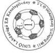

képviseletre jogosult aláírása

---

5

-

5

1

---

a V-25-60/1998-99. sz.
jelentéshez

Unió Labdarúgó EB Közalapítvány bevételei

Adatok E Ft-ban

|  Sorszám | Megnevezés | 1998. Év XII. 31.  |
| --- | --- | --- |
|  1. | Központi költségvetési támogatás | 20 000 + 5 000 alapítói vagyon  |
|  2. | Szponzori bevételek |   |
|  3. | Kamat bevételek | 2077  |
|  4. | Egyéb bevételek | 27 222 *  |
|  5. | Összesen (1+2+3+4) | 49 299 + 5 000 alapítói vagyon = 54 299  |

Alulírott az 1989. évi XXXVIII. tv. 24. § c. pontja alapján aláírásommal kijelentem, hogy a feltüntetett adatok teljesek, és a közalapítvány nyilvántartásaival, okmányaival mindenben egyeznek.

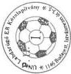

Budapest, 1998.

* egyéb bevetelek részletezve:
kullfodi prezentacio: 221 Eft
PR tevekenyseg: 19 000 Eft
NSKA támogatás: 5 000 Eft
Magyar Turizmus Rt.: 3 000 Eft
Egyeb bevete: 1 Eft
Osszesen: 27 222 Eft

képviselőre jogosult aláírása

---

)

-

1

)

---

a V-25-60/1998-99. sz.
jelentéshez

Unió Labdarúgó EB Közalapítvány
költségei és ráfordításai

|  Sorszám | Jogcím | Adatok E Ft-ban  |
| --- | --- | --- |
|   |   |  1998. Év XII.31-ig  |
|  1. | UEFA pályázat | 212  |
|  2. | Stadion pályázatok | 380  |
|  3. | Külföldi prezentációk | 3022  |
|  4. | Szervezőbizottsági ülések | 249  |
|  5. | Hazai rendezvények | 8309  |
|  6. | Irodai általános költségek, bérköltségek | 14540  |
|  7. | Reklám anyagok | 1 004  |
|  8. | Pályázatok költségei | 100  |
|  9. | Egyéb (PR) | 10 151  |
|  10. | Összesen | 37 967  |

ráfordítások 16 EFt

Alulírott az 1989. évi XXXVIII. tv. 24. § c. pontja alapján aláírásommal kijelentem, hogy a feltüntetett adatok teljesek, és a közalapítvány nyilvántartásaival, okmányaival mindenben egyeznek.

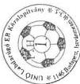

Budapest, 1998.

képviselőre jogosult aláírása

---

---

---

a V-25-60/1998-99. sz.
jelentéshez

UNIÓ Közalapítvány

# Bér és személyi jellegű kifizetések alakulása

|  Sor-szám | Megnevezés | Létszám (fő) |   | Bérköltség (E Ft) |   | Tiszteletdíj (E Ft) |   | Költségtérítés (E Ft)  |   |
| --- | --- | --- | --- | --- | --- | --- | --- | --- | --- |
|   |   |  1997. év | 1998. év | 1997. év | 1998. év | 1997. év | 1998. év | 1997. év | 1998. év  |
|  1. | Irodai foglalkoztatottak |  | 4 (+ 1 félállású) |  | 5 872 |  | * 499 |  | **594  |
|  2. | Kuratórium |  | 14 |  |  |  |  |  |   |
|  3. | Felügyelő Bizottság |  | 3 |  |  |  |  |  |   |

* megbízási díjak, külsős szakértőknek

** külföldi kiküldetési napidíjak összege, melyek tartalmazzák a Kuratórium tagjainak és külsősöknek kifizetett napidíjakat is

Alulírott az 1989. évi XXXVIII. tv. 24. § c. pontja alapján aláírásommal kijelentem, hogy a feltüntetett adatok teljesek, és a közalapítvány nyilvántartásaival, okmányaival mindenben egyeznek.

Budapest, 1999.

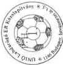

képviselője jogosult aláírása

Budapest, 1999. május

---

LJ000302