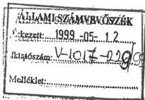

Állami Számvevőszék

# JELENTÉS

a települési önkormányzatok vízrendezési
és csapadékvíz elvezetési feladatai
ellátásának és az ehhez kapcsolódó
állami támogatás felhasználásának
vizsgálatáról

1999. május

9909.

---

Az ellenőrzés végrehajtásáért felelős:

V. Önkormányzati és Területi Ellenőrzési Igazgatóság

Dömötör Gyula

számvevő igazgató

Az ellenőrzést vezette:

Farkas László

régióvezető főtanácsos

Csuti Lajos

számvevő tanácsos

dr. Hegedűs György

számvevő tanácsos

dr. Szirota István

számvevő

közreműködésével.

Az ellenőrzésben részt vettek:

A résztvevők névsorát az 1. sz. melléklet tartalmazza

A témakörrel foglalkozó ÁSZ vizsgálatok jegyzéke:

Az önkormányzatok tulajdonába került vagyontárgyakkal való gazdálkodás ellenőrzése (V-1016/1992-1993.)

A helyi önkormányzatok közüzemi víz- és csatornaszolgáltatási feladatainak és az ehhez kapcsolódó lakossági díjtámogatási rendszer működésének utóvizsgálata (V-1007/1995-1996.) (A Parlament számítógépes hálózatán a vizsgálat fájl neve: 0314J000 doc).

Jelentés a Vízügyi Alap működtetésének pénzügyi-gazdasági ellenőrzéséről (V-25/1996-1997.) (A Parlament számítógépes hálózatán a vizsgálat fájl neve: 0400J000 doc).

Jelentés három regionális vízmű 1996-1997. évi gazdálkodásának ellenőrzéséről.(V-15/1997-98). (A vizsgálat még nincs lezárva).

1999. évben induló vizsgálatok

A helyi önkormányzatok vagyon szerkezetének alakulása, a vagyonhasznosítás és nyilvántartás szabályszerűsége, valódisága.

Az állam kizárólagos tulajdonát képező forgalomképtelen vagyonelemek kezelésének ellenőrzése.

Jelentéseink az INTERNETEN 1999. június 1-től WWW.ASZ.gov.hu címen olvashatók.

Jelentéseink az Országgyűlés számítógépes hálózatán is olvashatók.

---

V-1017-232/1998-99. TSZ. 444

# TARTALOMJEGYZÉK

I. ÖSSZEGZŐ MEGÁLLAPÍTÁSOK, KÖVETKEZTETÉSEK, JAVASLATOK 6

II. RÉSZLETES MEGÁLLAPÍTÁSOK 10

1. A települési önkormányzatok feladatainak és vagyoni körének meghatározása 10

1.1. A vízrendezési és csapadékvíz elvezetési feladatok szabályozottsága 10

1.2. A települési önkormányzati feladatellátás értelmezése 13

1.3. A feladatellátást biztosító vagyon tulajdoni helyzete 14

1.4. Az önkormányzati vagyon szabályozottsága 20

1.5. A vagyon nyilvántartása, statisztikai számbavétele 21

2. Az önkormányzati feladatok ellátása 23

2.1. A települési vízrendezési, vízkárelhárítási feladatok megoldási módjai 23

2.2. A feladatellátásra előirányzott kiadások, bevételek alakulása 27

2.3. Az állami támogatások szerepe a feladatok megoldásában 30

2.4. A vízrendezési tevékenység számviteli elszámolása 33

2.5. A vízkárok elleni védekezés és a káresemények az önkormányzatoknál 35

1

---

.

---

# Jelentés

## a települési önkormányzatok vízrendezési és csapadékvíz elvezetési feladatai ellátásának és az ehhez kapcsolódó állami támogatás felhasználásának vizsgálatáról

Az Állami Számvevőszék 1998. évi ellenőrzési terve alapján vizsgáltuk a települési önkormányzatok vízrendezési és csapadékvíz elvezetési (továbbiakban: vízrendezési) feladatainak ellátását, a rendelkezésükre álló pénzeszközök felhasználását. Vizsgálatunk kizárólag az önkormányzatok vízrendezési feladat ellátásával foglalkozott. A helyszíni vizsgálat 1998. I. félévi állapot felmérésével zárult, így nem érintette az 1998. őszi, továbbá az 1999. téli árvíz- és belvíz káreseményeket, ugyanakkor a feladatellátás hiányosságai előre jelezték a súlyos helyzet bekövetkeztének lehetőségét.

Az 1990-es években a feladatellátást szabályozásában bekövetkező változások, a tulajdonviszonyok rendezése, a természeti adottságok indokolták a kérdés átfogó vizsgálatát, a belterületi és külterületi vízrendezési feladatok megoldásának ellenőrzését. A jogszabályok változásai, a szakmai és földrajzi követelmények miatt szükségszerű a belterületi és külterületi vízrendezési feladatok összehangolt megoldása.

A vízrendezési tevékenység a településeken átfolyó vízfolyások, belvízcsatornák rendezésén és a csapadékvíz-elvezető hálózatok kiépítésén túlmenően kiterjed a települések védelmét szolgáló létesítmények (övárok, csapadék- és hordalék visszatartó művek, záportározók és körtöltések) építésére, fenntartására is.

A települési vízrendezési tevékenység célja az élet- és vagyonbiztonság, a kultúrált lakókörnyezet megteremtése és egyes települések lakosságmegtartó képességének erősítése is.

Magyarország a Kárpát-medence magas hegyekkel körülhatárolt földrajzi egységének nagyjából a közepén helyezkedik el. A felszíni vizek 96%-a külföldről érkezik az ország területére. A vízgyűjtő területek döntő része a határokon kívül terül el, s így azokon beavatkozni nem áll módjában az országnak. Beavatkozásokat befolyásolni is csak igen korlátozottan, a határvízi együttműködések keretében van lehetőség.

A nyugat-európai óceáni, a dél-európai mediterrán és a kelet-európai kontinentális időjárás egyaránt kifejti hatását. Ezért az időjárás szeszélyes, jelentős szélsőségek is előfordulnak. Nagy mértékben változik a csapadék nagysága, időbeli és térbeli eloszlása, s gyakoriak a helyi jelentőségű, nagy intenzitású esők, zivatarok.

Az ország domborzati viszonyaira jellemző, hogy területének csaknem fele (44 ezer km²) síkvidéki, valamivel több mint fele (47 ezer km²) hegy- és dombvidéki, s a magasabb hegyek részaránya mintegy 2%.

---3

---

I. ÖSSZEGZŐ MEGÁLLAPÍTÁSOK, KÖVETKEZTETÉSEK, JAVASLATOK

Nemzetközi összehasonlításban Magyarország vízkár veszélyeztetettsége Európában egyedülálló, megközelítően hasonló helyzetben csak Hollandia van.

Az ország földrajzi helyzetéből és éghajlati viszonyaiból eredően a károkozás elleni felkészülés célja kettős: a fölös és káros vizeknek a lehetséges minimális károkozás melletti levezetése, illetve a vízhiány okozta károk megfelelő és rendezett visszatartással történő elhárítása. Magyarországon a vizek kártételeinek lehetőségei nemcsak a mezőgazdaságban, hanem a városokban és községekben is egyaránt jelen vannak.

A vízkárelhárítás körébe tartozó feladatok a következők szerint oszlanak meg:

- megelőzést (fenntartás, felújítás, fejlesztés) jelent az árvízmentesítés, folyó- és tószabályozás, a vízrendezés, vízfolyásrendezés, a települési vízrendezés;
- a védekezés módjai: az árvízvédekezés, a belvízvédekezés és a helyi vízkárelhárítás.

A feladat megoszlásból eredően a vízkárelhárítás alapvető célkitűzése egyrészt, hogy a vízi létesítmények megépítésével biztosítsa a nemzeti vagyon védelmét. Másrészt pedig a kiépített műveken - szükség esetén - lássa el a védekezési feladatokat az élet- és vagyon biztonsága érdekében, az ehhez szükséges eszközök meglétével és a védelem szervezeti, működési rendszerének kialakításával.

A települési vízrendezési tevékenység összefoglalóan a városokon, községeken átfolyó és/vagy azokat veszélyeztető vízfolyások, belvízcsatornák, nyílt és zárt csapadékvíz-elvezető hálózatok építését, fenntartását, ezen túlmenően a települések védelmét szolgáló létesítmények (öv-árkok, csapadék és hordalék visszatartó művek, záportározók, körtöltések) fejlesztését és karbantartását, továbbá a helyi vízkárok elleni védekezést foglalja magába. (A fogalmi meghatározásokat a 3. sz. melléklet tartalmazza).

**Az ellenőrzés célja:** annak megállapítása volt, hogy

- a települési önkormányzatok a helyi önkormányzatokról szóló 1990. évi LXV. törvényben (továbbiakban: ÖTV) meghatározott vízrendezési és csapadékvíz elvezetési közszolgáltatási feladataiknak eleget tesznek-e;
- rendelkeznek-e a feladat megvalósításához szükséges vagyonnal, megoldott-e a vizek és a közcélú vízi létesítmények működtetése és fenntartása, milyen nagyságrendű fejlesztéseket valósítottak meg;
- a belső nyilvántartás, adatszolgáltatás megbízható információkat biztosít-e a feladat ellátásának figyelemmel kísérésére;
- a központi támogatások felhasználásánál érvényesül-e a törvényesség és szabályszerűség; a pénzeszközök célszerűen és eredményesen szolgálták-e a települések vízrendezési feladatainak ellátását.

**Vizsgált időszak:** 1992 - 1998. I. félév

A helyszíni vizsgálat során ellenőriztük a Közlekedési, Hírközlési és Vízügyi Minisztériumot. Vizsgálatunk 98 önkormányzatra terjedt ki (5 megyei jogú vá-

4

---

I. ÖSSZEGZŐ MEGÁLLAPÍTÁSOK, KÖVETKEZTETÉSEK, JAVASLATOK

ros, 24 város, 13 nagyközség és 56 község), amelyek közigazgatási területe 547 904 hektár, az ország összes területének 6%-a és a belterületük nagysága 53 540 hektár, a települések összes belterületének 8%-a. A vizsgálatra történő kijelölésnél figyelembe vettük a szakma minősítése szerinti veszélyeztetett területeket, illetve a feladat ellátására címzett állami támogatásban részesített önkormányzatokat. Ezek együttesen a vizsgált önkormányzatok mintegy 90%-át teszik ki. (A vízrendezetség állapotát befolyásoló tényezők alakulását a mellékelt **1. sz.** táblázat tartalmazza).

Az önkormányzati ellenőrzések során a szakmai és vagyoni szempontok részletesebb megalapozására tájékozódó jellegű vizsgálatokra is sor került 10 vízügyi igazgatóságnál, 38 vízitársulatnál és 15 vagyonátadó bizottságnál. Ezek a vizsgálatok tették lehetővé, hogy - a központi adatgyűjtés és feldolgozás hiányában - az önkormányzati vizek és vízi létesítmények nagyságáról országos szinten legalább megközelítő képet lehessen kapni. Így vált lehetővé, hogy az állami tulajdonból az önkormányzatok részére - a vízügyi igazgatóságoktól és a vízitársulatoktól - felajánlott vízi létesítmények mértékéről és az átvétel arányáról legyenek információk. (A vizsgált egységek jegyzékét a **2., 2/a., 2/b., 2/c. sz.** melléklet tartalmazza).

Az ország síkvidéki vízrendezési feladatainak ellátását 42,4 ezer km hosszú belvízcsatorna szolgálja, amelyből 27,7 ezer km állami tulajdonban van, 1,8 ezer km az önkormányzatok tulajdonát képezi, míg 12,9 ezer km természetes személyek és jogi személyek (mezőgazdasági üzemek) tulajdona.

A hegy- és dombvidéki vízrendezési tevékenység keretébe 57,0 ezer km vízfolyás tartozik. Ennek megoszlása a következő: 20,3 ezer km állami, 6,7 ezer km önkormányzati, 30 ezer km magán (volt üzemi) tulajdonú vízfolyás.

A településeken keletkező többlet vizek elvezetését szolgálja az önkormányzatok tulajdonában lévő 28,9 ezer km hosszúságú nyílt csapadékvíz-elvezető, továbbá 4,7 ezer km egyesített és 6,4 ezer km elválasztó rendszerű zárt csapadékcsatorna hálózat.

A helyszíni vizsgálat kiterjedt a **települési vízrendezés** egészére. Ugyanis a régi jogszabályok a tanácsokat csak a belterületi vízrendezésre kötelezték. Az önkormányzatoknak azonban már a település egészére vonatkozóan kell a vízrendezési közszolgáltatási feladataikat ellátni. Így vizsgálatunk magába foglalta a települések kül- és belterületén történt helyi vízkárelhárítást, az önkormányzatok hatáskörébe tartozó vízi létesítmények fejlesztésével és fenntartásával együtt. Nem foglalkoztunk az állami tulajdonú vizek és vízi létesítmények kérdéseivel, a mezőgazdasági területek belvíz és árvíz elöntéseivel, valamint a vízügyi igazgatóságok védekezési tevékenységével.

Szakmai és földrajzi követelmények is alapvetően megkövetelik a belterületi és külterületi vízrendezési, csapadékvíz-elvezetési feladatok összehangolt ellátását. A belterületről ugyanis csak a külterületi vízfolyások, csatornák és tározók megfelelő, jó karba helyezett állapota teszi lehetővé a felesleges és káros vizek károkozás nélküli elvezetését, esetleges - későbbi hasznosítás érdekében a - visszatartását. Természetesen elengedhetetlen az állami tulajdonú művek rendezett állapota is ahhoz, hogy a vizek a megfelelő befogadóba jussanak. Ez

5

---

I. ÖSSZEGZŐ MEGÁLLAPÍTÁSOK, KÖVETKEZTETÉSEK, JAVASLATOK---

utóbbi kérdéssel az Állami Számvevőszék egy további külön ellenőrzés keretében kíván foglalkozni, összefoglalja a vízügy feladatainak ellátására fordított anyagi erőforrások hasznosítása során szerzett teljes tapasztalat anyagát.

# I. ÖSSZEGZŐ MEGÁLLAPÍTÁSOK, KÖVETKEZTETÉSEK, JAVASLATOK

A települési önkormányzatok közszolgáltatási feladatai közé tartozik az ÖTV 8. § (1) bekezdésében megfogalmazott vízrendezési és csapadékvíz elvezetés, melyet a vízgazdálkodásról szóló 1995. LVII. tv. (VGT) tesz kötelezővé, határozza meg és részletezi a feladatokat.

A követelmények ellenére a vizsgált önkormányzatok **alig 20%-a tekinti kötelező feladatának** a vízrendezést és a csapadékvíz elvezetését. A túlnyomó többségük (80%) önként vállalható feladatai közé sorolja, elsősorban azért, mert az önkormányzati törvény megtévesztő szövegezése miatt a kötelező feladatellátást az ÖTV. 8. § (4) bekezdésében megjelölt feladatokkal azonosítják.

Amíg a nagy többség szabadon választható feladatnak minősíti a vízrendezést és a csapadékvíz elvezetését, addig a vizeket és a közcélú vízi létesítményeket - a törvényi elrendelésnek megfelelően helyesen - a forgalomképtelen törzsvagyonban szerepeltetik, ugyanakkor a törvény azt a vagyont rendeli törzsvagyonba helyezni, amely a kötelező feladat ellátására szolgál.

Az önkormányzatok nem vették tudomásul, hogy a kötelező feladatellátás és a forgalomképtelen törzsvagyonba tartozó vizek és közcélú vízi létesítmények mennyire szorosan összetartoznak. Ezért is fordulhatott elő, hogy **a vizsgált önkormányzatok túlnyomó többsége, mintegy 80%-a, nem fogadta el** a részére a vagyonátadó bizottságokon (VÁB) keresztül felajánlott - a vízügyi igazgatóságok (VIZIG) és a vízitársulatok által átadásra javasolt - állami tulajdonú vizeket és közcélú vízi létesítményeket.

A jogi szabályozás nem adott egyértelmű választ arra, hogy a **települési önkormányzatoknak a vízrendezési, vízkárelhárítási kötelező feladatait az ún. helyi közcélú vizekkel, vízfolyásokkal és vízi-létesítményekkel kell ellátnia** és ennek a vagyonnak önkormányzati tulajdonba kell kerülnie.

Ugyanis az **egész szabályozás vétója benne volt magában az egyes állami tulajdonban lévő vagyontárgyak önkormányzati tulajdonba adásáról szóló 1991. évi XXXIII. évi törvényben (ÖVAT)**, amely megengedte, hogy **az önkormányzat a vagyontárgyak tulajdonjogát visszautasíthassa**.

A törvényi felhatalmazással élve az önkormányzatok mérlegelték a felajánlott vagyon műszaki állapotát és várható gazdasági hasznát, ezért a magas fenntartási, felújítási költségek miatt elsősorban a kis ráfordítást igénylő és hasznosítható létesítmények átvétele mellett döntöttek. A döntést a feladatellátásra

---6

---

I. ÖSSZEGZŐ MEGÁLLAPÍTÁSOK, KÖVETKEZTETÉSEK, JAVASLATOK

rendelkezésre álló források finanszírozási bizonytalanságai is befolyásolták. A feladat ellátására, a működtetésre, folyamatos üzemeltetésre vonatkozóan központi pénzügyi források nevesítetten nem álltak rendelkezésre. (Megjegyzendő, hogy 1991. évtől a Vízügyi Alap, 1997. évtől a címzett támogatások keretében belterületi vízrendezésre - fejlesztési céllal - biztosítottak szerény mértékű központi támogatást).

A települési önkormányzatok részére előírt és kötelezővé tett közszolgáltatási feladatok ellátásához szükséges a vizek és a vízfolyások tulajdonjoga.

Az állami vizek és közcélú vízi létesítmények 1990-es évek elején megkezdett önkormányzati tulajdonba adásának folyamata befejezetlen maradt.

A vizsgálati tapasztalatok azt is bizonyították, hogy az önkormányzatok döntő többsége nem ismerte fel a feladatellátás elmaradásának kockázatát; az emiatt bekövetkező káresemények hatását.

Országosan a vízfolyásoknál 17,4%; a tavaknál és holtágaknál 83,1%; a belvízcsatornáknál 10,6%; a tározóknál 298,0%; a műtárgyaknál 17,1% volt a felajánlott vagyontárgyak átvételi aránya. A vizsgált önkormányzatoknál ugyanazon sorrendben 32,0%; 145,0%; 5,8%; 0% és 3,0% átvételi arány volt megállapítható.

A vizek és vízi létesítmények tulajdonviszonya sokszínű, míg a belterületen az önkormányzati tulajdonviszony a jellemző, a külterületen az állami és a magántulajdon túlsúlya jelentkezik. Külön probléma továbbá, hogy ugyanazon vízfolyásnak több tulajdonosa van, ami a hosszabb vízfolyások esetében természetes is, tekintettel arra, hogy az több önkormányzat területét is érinti. Itt gyakorlatilag közös tulajdonról van szó, olyan értelemben, hogy a vízfolyásnak az adott önkormányzatot érintő szakasza van az egyes önkormányzatok tulajdonában. Azokban az esetekben, amikor a korábban osztatlan állami tulajdonban lévő vagyon több tulajdonos közötti megosztása következett be, jelentkezett a különböző érdekeltségből származóan a vagyon működtetésének eltérő módja. Mindezekből következően nem alakult ki a különböző tulajdonosok közötti együttműködés rendszere, ez az állapot nem segíti elő a vízrendezési feladatok egységes szakmai kezelését.

A vízrendezési és a csapadékvíz elvezetési feladatok elhanyagolását jelzi az is, hogy a vizsgált települési önkormányzatok 80%-a nem készítette el a jogszabályok által kötelezően előírt vízkárelhárítási tervet.

Ezzel is magyarázható, hogy az állampolgárok ingatlanaikhoz tartozó út menti árkok tisztántartására kötelező önkormányzati rendeletek által kilátásba helyezett szankcionálást a fenyegetés ígéretén túlmenően egyetlen esetben sem észlelték a helyszíni vizsgálatok.

A kizárólagos állami tulajdonban lévő vizek, vízfolyások kategóriáját jogszabály - a 22/1996. (XI. 29.) KHVM rendelet - határozta meg és tette ismertté. **Nem szabályozott viszont tételesen a helyi jelentőségű közcélú vizek, vízfolyások köre, amelyek nélkül nem lehet a települési vízrendezést megoldani.**

Az önkormányzatoknál - különösen a veszélyeztetett településeken - egyre növekvő mértékű pénzügyi forrást igényel a vízelvezető művek fenntartása, felújí-

7

---

I. ÖSSZEGZŐ MEGÁLLAPÍTÁSOK, KÖVETKEZTETÉSEK, JAVASLATOK---

tása és fejlesztése. Általános tapasztalat, hogy az önkormányzatok e feladat ellátására a szükségesnél kevesebb pénzeszközt fordítottak. **A kiadások előirányzatának részesedése az éves költségvetési főösszegekhez viszonyítva az ellenőrzött önkormányzatok kétharmadánál nem éri el még az 1%-os mértéket sem.** Még a veszélyeztetett települések önkormányzatai sem adtak mindenütt e feladatnak prioritást az éves költségvetésük előirányzatai között.

A tulajdonosi szemlélet összességében még alig alakult ki, mindezt az önkormányzati tulajdonba került vagyon nyilvántartásbeli és statisztikai adatszolgáltatási hiányosságai is mutatják.

A törvényi szabályozás alapján önkormányzati tulajdonba került vagyon besorolása sok hiányosságot mutatott. Néhány önkormányzat nem rendelkezett helyi vagyonrendelettel, így nem teljesítették az ÖTV követelményét, mivel a törzsvagyon korlátozottan forgalomképes kategóriába sorolását és nyilvántartását elmulasztották. Az előírt ingatlanvagyon kataszter elkészítése, annak folyamatos vezetése, továbbá a számviteli nyilvántartásra vonatkozó előírások betartása az ellenőrzött önkormányzatok 80%-ánál kifogásolható volt.

A csapadékvíz elvezető nyílt és zárt csatornák fenntartását és karbantartását különböző szervezeti keretek között, illetve a lakosság - a helyi rendeletben rögzített szabályok szerinti - bevonásával oldották meg.

A feladatok és a megoldásokra fordított pénzeszközök statisztikai-szakmai előírásbeli eltérései, illetve hiányosságai nem biztosítják az egyértelmű elkülönített adatszolgáltatás alapjait.

A pályázati úton megszerzett központi források célirányos felhasználása - egyes esetekben - kedvezően hatott a feladatellátás színvonalára. A vízfolyások hossza 6,6%-kal, a nyílt csapadékvíz elvezető csatornák (árok) hossza 7%-kal, a zárt csapadékvíz elvezető (elválasztó rendszerű) csatornák hossza 19%-kal növekedett. Javulás volt tapasztalható - ugyancsak kis mértékben - az ivóvízhálózatba (8,4%) és szennyvízcsatorna hálózatba (12,2%) bekapcsolt lakások esetében.

E műszaki beavatkozások ily módon lehetővé vált megvalósítása esetenként enyhítette, de hosszabb távra nem oldotta meg az érintett települések vízrendezési, vízelvezetési gondjait. Ugyancsak gátolja a széles körű koordinációt, az összehangolt végrehajtást, az erőforrások koncentrálását és a központi pénzügyi támogatások hatékony felhasználását a vagyonátadás következtében kialakult sokrétű tulajdonviszony.

## Javaslatok

A helyszíni vizsgálatok tapasztalatai alapján a települési önkormányzatoknak tett javaslatok a vízgazdálkodási törvényen alapuló feladatok SZMSZ-ben történő kötelező feladatkénti meghatározására, a védelmi tervek elkészítésének pótlására, a költségvetési előirányzatok megalapozottabb tervezésére, továbbá a pénzügyi elszámolások jogszabályokban rögzítettek szerinti végzésére hívták fel a figyelmet.

---8

---

I. ÖSSZEGZŐ MEGÁLLAPÍTÁSOK, KÖVETKEZTETÉSEK, JAVASLATOK

Javasoltuk a térségi együttműködés lehetőségeinek eddiginél eredményesebb kihasználását a különböző pályázatok benyújtásánál, de a vagyonnyilvántartásban felderített hiányosságok felszámolására, az elmaradások pótlására, a tulajdon-viszonyok rendezésére is ráirányítottuk az érintett önkormányzatok figyelmét.

A vizsgált önkormányzatok a javaslatokat elfogadták, ellene, illetve a jelentések egyéb tartalma miatt észrevételt nem tettek. Néhány önkormányzat a tervezett intézkedéseit írásba foglaltan közölte.

Az ellenőrzés tapasztalatai és következtetései alapján az indokolt kormányzati intézkedések előmozdítása érdekében javasoljuk:

### **A Kormánynak**

Tekintse át és komplex módon elemezze a települési önkormányzatok vízrendezési feladatai meghatározását, a feladatellátásra szolgáló vagyon tulajdoni helyzetét, a finanszírozás megoldási lehetőségeit, összhangban az EU csatlakozás követelményeivel.

### **A belügyminiszternek**

1. Kezdeményezze a helyi önkormányzatok kötelező feladatainak felülvizsgálatát. A törvényi szabályozásban egyértelműen nevesítse, hogy mely feladatokat kötelesek az önkormányzatok ellátni.
2. Intézkedjék a VÁB eljárások keretében történt vagyonátadások számbavételéről. Rendelje el a VÁB-ok működésével összefüggő iratanyagok egységes rendszer szerinti kezelését és irattári elhelyezését.
3. Kezdeményezze a közigazgatási hivataloknál, hogy a törvényességi ellenőrzés keretében kérjék számon az önkormányzati feladatok rendeletben történő meghatározását.

### **A belügyminiszter a pénzügyminiszter bevonásával**

1. Vizsgálják meg az önkormányzatok tulajdonában lévő ingatlanvagyon nyilvántartási és adatszolgáltatási rendjéről szóló 147/1992. (XI. 6.) Korm. rendelet hatályosulását. Az eddigi ÁSZ vizsgálatok tapasztalatai szerint a rendelet a neki szánt szerepet nem tölti be. Ezért olyan kataszteri nyilvántartási követelményt határozzanak meg, mely egyszerűsített formában elégíti ki a helyi és központi információs igényeket és összhangba kerülhet a számviteli analitikus nyilvántartásokra vonatkozó előírásokkal. Biztosítsák a kétféle nyilvántartás összekapcsolásának és az értékbeni számbavételnek a lehetőségét.

Kezdeményezzék az önkormányzatok ingatlan nyilvántartása és az ezen alapuló központi statisztikai adatszolgáltatás egyezőségének megteremtését.

2. A települési vízrendezés és csapadékvíz elvezetési feladatok megoldása érdekében a társulásos formában történő módok kapjanak elsőbbséget az állami támogatások és a pályázatok jogcímei között.

9

---

II. RÉSZLETES MEGÁLLAPÍTÁSOK

# A közlekedési, hírközlési és vízügyi miniszternek

1. Határozza meg a helyi jelentőségű közcélú vizek és vízi létesítmények fogalmát, kategóriáit, a kizárólagos állami tulajdonhoz hasonlóan és kezdeményezze ennek jogszabályi rendezését.
2. Intézkedjen a települési önkormányzatok tulajdonát képező közcélú vizek, vízfolyások és vízi létesítmények műszaki állapotának, mennyiségének - egységes szakmai elvek szerint koordinált - felmérésére.

# A pénzügyminiszternek

A jelenleg érvényben lévő szakágazati, illetve szakfeladatrendet vizsgálja felül, azok tartalmát hozza összhangba - a Központi Statisztikai Hivatal bevonásával - a TEÁOR előírásaival, teremtse meg a lehetőségét a szakfeladatrend egyszerűsítésének és pontosításának.

# II. RÉSZLETES MEGÁLLAPÍTÁSOK

# 1. A TELEPÜLÉSI ÖNKORMÁNYZATOK FELADATAINAK ÉS VAGYONI KÖRÉNEK MEGHATÁROZÁSA

# 1.1. A vízrendezési és csapadékvíz elvezetési feladatok szabályozottsága

A vízrendezés és csapadékvíz elvezetés települési önkormányzati feladatait a jog egyre bővülő tartalmi követelményekkel szabályozta.

Az önkormányzatok létrejöttekor, illetve azt megelőzően, a tanácsrendszer idején, a vízügyről szóló 1964. évi IV. tv. (VIT) az állami szervek feladataihoz képest a tanácsoknak, majd az önkormányzatoknak szűkebb mozgásteret biztosított.

E törvény alapján a tanácsok, illetve az önkormányzatok feladata igazgatás jellegű és elsősorban a vizek kártételei elleni védekezés államigazgatási irányítása, koordinálása. A vízügyi szervek kezelésébe nem tartozó árvíz- és belvízvédelmi műveken, továbbá a helyi jelentőségű kisebb vízfolyásokon a vizek kártételei elleni megelőző és tényleges védekezés (a helyi vízkárelhárítás) műszaki feladatait a tanácsok, majd az ezeket felváltó önkormányzatok látják el.

A helyi önkormányzatok és szerveik feladat és hatásköréről szóló 1991. évi XX. törvényben körvonalazódott az önkormányzati közszolgáltatási és közhatalmi feladatok elhatárolása és önálló megfogalmazása, összhangban az (ÖTV) idevonatkozó szabályozásával.

10

---

II. RÉSZLETES MEGÁLLAPÍTÁSOK

Ezek szerint az önkormányzat feladata a csapadékvíz elvezetése, a helyi vízrendezés és vízkárelhárítás, valamint az árvíz- és belvízvédekezés és a helyi vízkárelhárítás államigazgatási feladatainak ellátása. Továbbá az önkormányzat képviselő-testületének feladatává tette a belterületi vízelvezető művek szakszerű üzemeltetéséről való gondoskodást, valamint deklarálta, hogy a belterületi vízelvezető művek önkormányzati tulajdonban állnak.

Ekkor még a jogi szabályozás értelmében a feladatellátás kizárólag a belterületi vízrendezésre korlátozódott.

A VIT-et hatályon kívül helyező és helyébe lépő VGT a helyi önkormányzati feladatokat már differenciáltan szabályozta, külön fejezetben szólt a vizekkel és vízi létesítményekkel összefüggő feladatokról, a tulajdonra és a tulajdon működtetésére vonatkozó rendelkezésekről, valamint a vizek kártételei elleni védelemről és védekezésről.

A VGT szabályozásában a korábbi államigazgatási jelleg mellett megerősödött az önkormányzat közszolgáltatási és tulajdonosi minőségét kifejező feladatellátás megfogalmazása, és a belterületi jelző elhagyásával a feladatellátás a település külterületére is, vagyis a közigazgatási terület egészére tevődött át. A feladatellátáshoz kapcsolódó vagyontárgyak jogszabályban történő meghatározása azonban nem volt teljes körű. A 22/1996. (XI. 29.) KHVM rendelet csupán a kizárólagos állami tulajdonban lévő vízi létesítmények körét szabályozta tételesen, ilyen részletes jogi szabályozás az önkormányzatok közfeladat ellátására szolgáló vízi létesítményekre vonatkozóan nem készült.

Mindezek alapján, a helyszíni vizsgálat idején hatályos törvényi szabályozás szerint az önkormányzatok vízrendezési és csapadékvíz elvezetési feladatai, a feladatellátás minősége szempontjából a következők szerint csoportosíthatók.

A) Közszolgáltatási feladatok (a VGT 4-5. §-ai és az ÖTV 8. §-a)

A helyi vízrendezés és vízkárelhárítás, az árvíz- és belvízelvezetés, a csapadékvíz elvezetés.

B) Tulajdonosi feladatok (a VGT 6-8., 16. §-ai)

A helyi önkormányzat tulajdonában vannak törzsvagyonként az átadott, illetve az átvett vizek és vízi létesítmények, amelyekről gondoskodnia kell.

A gondoskodás mértéke a közérdek és magában foglalja:

a természetes állóvizek és holtágak, patakok vagy patakszakaszok szabályozását, fenntartását, partvédelmét és üzemeltetését, a vizek kártételeinek megelőzését, mérséklését; a belvízelvezető művek (így pl. a belvízcsatornák, szivattyútelepek, belvíztározók) létesítését, fenntartását, bővítését és a belvízvédekezés végrehajtását; a víz, a hordalék, a jég zavartalan levonulási lehetőségének megteremtését, a szabályozási és meder-fenntartási munkálatok elvégzését; a település belterületén a patakok, csatornák áradása, továbbá a csapadék- és egyéb vizek kártételének megelőzését, a kül- és belterületen a patakszabályozást, árvízvé-

11

---

II. RÉSZLETES MEGÁLLAPÍTÁSOK

**delmi létesítmények** építését, fenntartását, fejlesztését, az **árvízmentesítést**, az **árvízvédekezés** szervezését, irányítását, végrehajtását, a védelmi szakfelszerelés karbantartását és fejlesztését; legfeljebb két település érdekében álló védőművek létesítését, a helyi önkormányzat tulajdonában lévő védőművek fenntartását, fejlesztését és azokon a védekezés ellátását.

### C) Államigazgatási feladatok (a VGT 17. §-a)

A polgármester (főpolgármester) a hivatala útján látja el a saját szervezettel védekező települések által fenntartott műveken az **árvíz- és belvízvédekezés** műszaki feladatait a település közigazgatási határán belül.

#### A polgármester az árvíz- és belvízvédekezéssel kapcsolatos államigazgatási feladat- és hatáskörében:

- közreműködik az árvíz- és belvíz-védekezési területi bizottság jogszabályban meghatározott feladatainak végrehajtásában;
- gondoskodik a közerők, továbbá a védekezéshez szükséges anyagok, eszközök és felszerelések összeírásáról, nyilvántartásáról, szükség szerinti mozgósításáról, továbbá a közerők általános ellátásáról;
- megtervezi a kiürítést, a mentést és a visszatelepítést, illetőleg ezek elrendelése esetén gondoskodik a végrehajtásról;
- gondoskodik az élet- és vagyonbiztonság, valamint a mentés érdekében szükséges egyéb intézkedések megtételéről;
- gondoskodik a védekezésben résztvevők egészségügyi ellátásáról, továbbá a kiürítés, a mentés és visszatelepítés során a járványok megelőzésével és elhárításával kapcsolatos intézkedésekről, a területileg illetékes népegészségügyi tisztiorvosi szolgálat közreműködésével;
- megteszi az árvíz és belvíz által okozott, valamint a védekezéssel kapcsolatban keletkezett károkkal összefüggésben keletkezett helyreállításhoz szükséges intézkedéseket.

A funkciós tagozódáson belül a közszolgáltatási feladat hangsúlyát erősíti, a feladat-ellátási kötelezettséget szélesíti a 64/1993. (XII. 22.) Alkotmánybírósági Határozat, amikor az ÖTV 8. § (1) bekezdésében megfogalmazott közszolgáltatási feladatról megállapítja, hogy a törvényi előírás ilyenkor az önkormányzatokra nem egyszerűen csak mint tulajdonosokra, hanem egyúttal mint alkotmányos közhatalmi szervekre is vonatkozik, amelyek számára a törvény kötelező feladatkört és hatáskört létesít.

A vízgazdálkodási közszolgáltatási feladat ellátására a törvény az önkormányzatot nem csak mint tulajdonost, hanem mint a **közszolgáltatási funkciót ellátót** is kötelezi. A kötelező feladat ellátásához szükséges vagyont, tulajdont, viszont törzsvagyonba kell helyezni és az a feladat ellátásának biztosítékául szolgál.

A VGT hatályba lépésével megvalósult az önkormányzati feladatellátás szabályozása, a kötelező feladatok meghatározása egyértelművé tette a települési önkormányzatok vízrendezési feladatait.

12

---

II. RÉSZLETES MEGÁLLAPÍTÁSOK

# 1.2. A települési önkormányzati feladatellátás értelmezése

Az ÖTV 18. § (1) bekezdése előírja, hogy a képviselő-testület működésének részletes szabályait a szervezeti és működési szabályzatról (SZMSZ) szóló rendeletében határozza meg. Ennek megfelelően a vizsgált önkormányzatok döntő többsége (90%-a) SZMSZ-ben meghatározta az önkormányzat által ellátandó feladatokat is.

A feladatellátási kötelezettség megfogalmazása szempontjából, azonban ellentmondásos jogértelmezést tapasztalt az ellenőrzés. Ennek alapja - az önkormányzatok általánosnak mondható értelmezése és kialakított gyakorlata szerint - az ÖTV 8. § (1) és (4) bekezdése szerinti feladat meghatározás.

Az önkormányzati jogértelmezés egyértelműen tükröződik a képviselő-testületek által elfogadott SZMSZ önkormányzati feladat meghatározásában.

A vizsgálat megállapítása szerint az ÖTV 8. § (1) bekezdésében megfogalmazott települési vízrendezés és csapadékvíz elvezetés közszolgáltatási feladatellátást a vizsgált önkormányzatok 20%-a tekinti egyértelműen kötelező önkormányzati feladatnak és ezt szabályzatában (SZMSZ) is leírta, illetve arra tett utalást (pl. Makó, Záhony, Pápa, Mecseknádasd, Poroszló).

A vizsgált önkormányzatok mintegy fele azért nem tartotta a vízrendezést és csapadékvíz elvezetését kötelező feladatnak, mert az ÖTV 8. § (4) bekezdése ezt nem tartalmazta, illetve az ÖTV 8. § (1) bekezdésének felsorolása előtt nincs ott a „köteles gondoskodni” kifejezés.

Ez a fajta értelmezés azonban téves, ugyanis a települési önkormányzatnak nemcsak azok a kötelező feladatai, amelyről az ÖTV 8. § (4) bekezdése szerint köteles gondoskodni, hanem minden olyan feladat, melyet törvény ír elő számára.

A kötelező feladatellátás kötelezettsége az ÖTV 8. § (1) és (4) bekezdéseinek szembe állításából nem vezethető le, mivel mindkét bekezdés megfogalmazása (különösen, illetve köteles gondoskodni) egyaránt kötelező normatartalomra utal.

A települési önkormányzati kötelező feladatellátás az ÖTV 1. § (5) bekezdése (Törvény a helyi önkormányzatnak kötelező feladat- és hatáskört is megállapíthat), valamint a 8. § (3) bekezdése (Törvény a települési önkormányzatokat kötelezheti arra, hogy egyes közszolgáltatásokról és közhatalmi helyi feladatok ellátásáról gondoskodjon) együttesen határozza meg.

Ennek alapján törvények - tehát az önkormányzati törvényen kívül más törvények is - adott esetben a VGT is rendelhetnek el kötelező feladatokat.

Az e csoportba tartozó önkormányzatok (pl. Székesfehérvár, Szekszárd, Veszprém, Zselicszentpál, Szabolcsveresmart) az ÖTV szerkezetét követve SZMSZ-üket úgy állították össze, hogy a kötelezően ellátandó feladatokat az ÖTV 8. § (4) bekezdésében megjelölt feladatokkal azonosították és ebből adódóan arra a következtetésre jutottak, hogy a vízrendezést és a csapadékvíz elvezetését önként vállalt feladatnak kell tekintetni. Néhány önkormányzat (pl. Marcali, Bonyhád, Bük, Kunmadaras, Kisbudmér,

13

---

II. RÉSZLETES MEGÁLLAPÍTÁSOK---

**Magyarszerdahely)** az SZMSZ-ben nevesítetten **önként** vállalt feladatai közé sorolta a vízrendezést és a csapadékvíz elvezetést.

**A vizsgált önkormányzatok 20%-ának szabályozásában** (pl. Pécs, Fehérgyarmat, Gelénes, Zalakaros, Somogybabod) **nem volt megállapítható** a feladat ellátásának kötelező, vagy önként vállalt jellege, mivel e kérdésben konkrétan **nem foglalnak állást**.

**A vizsgált önkormányzatok 10%-a** (pl. Kaposvár, Somogyszil, Zalaszentlászló) **az önkormányzati feladatok ellátását szabályzati szinten egyáltalán nem említette**. Sem a kötelezően ellátandó, sem pedig az önként vállalható feladatok számbavételével, felsorolásával nem foglalkoztak.

A számvevőszéki ellenőrzés az évekkel ezelőtt elindított, teljeskörűen még ma sem befejezett, vagyonátadási folyamatot áttekintve úgy ítéli meg, hogy az önkormányzatok felfogásában a kötelező feladatok nem egyértelműek, ezért a feladatellátáshoz tartozó vagyon mennyiségét és minőségét teljeskörűen nem lehet megállapítani.

### 1.3. A feladatellátást biztosító vagyon tulajdoni helyzete

**Az önkormányzatok** az előírt vízrendezési és csapadékvíz elvezetési **feladataikat** elsősorban **a tulajdonukban lévő vizek és közcélú vízi létesítmények üzemeltetése** (működtetése, karbantartása, fejlesztése) **révén láthatják el**.

A vizsgált önkormányzatok mindegyike rendelkezett valamilyen vízrendezési célt szolgáló létesítménnyel, tulajdonnal, amely jellemzően a település belterületén található, de az önkormányzatok többsége (90%-a) külterületi tulajdont is kimutat.

Az önkormányzatok részére a kötelező feladatok ellátásához a törvényi szabályozás vagyont, tulajdont igyekezett biztosítani, mégpedig kétféle módon.

**Az általános és szinte valamennyi önkormányzatot érintő vagyon-szerzési jogcím a törvény (ÖTV) erejénél fogva lehetővé tett jogcím volt.**

Az ÖTV 107. § (2) bekezdés értelmében az önkormányzat a törvény hatályba lépésének napján jutott azon vizek és vízi létesítmények tulajdonjogához, **amelyek korábban állami tulajdonban és tanácsi kezelésben voltak**.

Az önkormányzat polgármesterének kérelmére az ingatlan-nyilvántartásról szóló és jelenleg is hatályos 1972. évi 31. tvr. és a végrehajtására kiadott 27/1972. (XII. 31.) MÉM rendelet szerint a földhivatal a tulajdonjogot bejegyezte - hivatalból erre nem volt kötelezve - a kezelői jog egyidejű törlése mellett.

---14

---

II. RÉSZLETES MEGÁLLAPÍTÁSOK

# **A vizsgált 98 önkormányzat az ÖTV erejénél fogva az alábbi típusú vizek és vízi létesítmények tulajdonjogát szerezte meg.**

|  Megnevezés | Mértékegység | Mennyiség  |
| --- | --- | --- |
|  Vízfolyás | km | 186,835  |
|  Belvízcsatorna | km | 60,525  |
|  Nyílt csapadékvíz-elvezető csatorna | km | 1500,826  |
|  Zárt csapadékvíz-elvezető csatorna | km | 466,779  |
|  Tó, holtág | ha | 271,1396  |
|  Tározó | ha | 289,9841  |
|  Műtárgy | db | 176  |

A helyszíni vizsgálat több esetben rögzítette, hogy az önkormányzatok tévedésben voltak a tulajdonukban lévő vizek, árkok, patakok tekintetében.

Előfordult, hogy szerintük az ÖTV alapján vagyonhoz nem jutottak, ugyanakkor nyilvántartásaik alapján több tíz km hosszúságú különféle csatornával rendelkeznek (**Sarud**). **Hunya** tájékoztatása szerint sem a törvény erejénél fogva, sem pedig a VÁB eljárással nem szerzett vagyont, ugyanakkor a helyszíni vizsgálat megállapította, hogy 1997-ben beruházási program készült a meglévő árkok mélyítéséről és újak kiásásáról. A település egyébként állandó belvíz veszélynek van kitéve.

**Szabolcsveresmart** esetében nem szerepelnek külön hrsz. alatt a vizek és vízi létesítmények, hanem az utakhoz kapcsolódóan tüntették fel a csapadékvíz elvezető árkokat.

A számvevőszéki ellenőrzés során derült ki több önkormányzatnál, hogy a nyilvántartásaikban szereplő vízfolyások nem önkormányzati, hanem állami tulajdonban maradtak, illetve rendezetlen a tulajdonviszony (pl. **Kaposvár, Zselickislak, Cered, Pusztavám**).

**A másik** vagyonszerzési **jogcím, a VÁB-ok döntései alapján** történt tulajdonszerzés volt.

Az ÖTV 107. § (3) bekezdése alapján a VÁB adta önkormányzati tulajdonba azokat az **állami tulajdonú, de nem tanácsi kezelésben lévő** vizeket és közcélú vízi létesítményeket, amelyeket az ÖVAT 15-17. §-ai alapján át lehetett, illetve át kellett adnia az önkormányzatoknak.

Az ÖVAT 15-19. §-ai jelölték ki azt a vagyoni kört (vizek, közcélú vízilétesítmények), amelyek az állam tulajdonában és a vízügyi igazgatóságok, vagy a vízgazdálkodási társulatok kezelésében álltak és önkormányzati tulajdonba kerülhetnek.

A kezdeti időszakban az önkormányzatok részéről rendkívül **erős volt a visszautasításra vonatkozó döntés** a felajánlott vagyon iránt.

A szabályozási lehetőséget kihasználva - az ÖVAT 28. § (2) bek. szerint - visszautasítási joggal élt **az önkormányzatok mintegy 80%-a**, amikor a VÁB

15

---

II. RÉSZLETES MEGÁLLAPÍTÁSOK

eljárás során felajánlott vagyont nem vette tulajdonba, mérlegelve a felajánlott létesítmények műszaki állapotát és várható fenntartási és felújítási költségeit.

**Borsod-Abaúj-Zemplén** megyében a 122 db vízfolyásból 7 db-ot, **Heves** megyében a felajánlott 59 db-ból 4 db-ot vettek át. **Csongrád** megyében mindössze 2 önkormányzat (**Hódmezővásárhely**, **Mindszent**) vette át a felajánlott vagyont. **Békés** megyében pedig 8 önkormányzat fogadta el a felajánlott vagyont. **Zala** megyében a 257 önkormányzatból 169 (66%) kapott felajánlást, közülük 9 (5,3%) önkormányzat vette át a vagyont.

**Vas** megyében 217 önkormányzatból 157 (72%) településnek javasoltak átvételt, közülük 13 önkormányzat (8,3%) élt a felajánlott vízfolyások átvételének lehetőségével.

**Baranya** megye 302 önkormányzatának 4,3%-a részére (13) ajánlottak fel vagyont, közülük 4 önkormányzat vette át.

**Jász-Nagykun-Szolnok** megyében a 79 önkormányzat közül 64 önkormányzatnak (81%) ajánlottak fel vagyont, ezekből 27 önkormányzat (42%) vette át.

Az 1991. szeptember 1-én hatályba lépett, az állami vagyon önkormányzati **tulajdonba** adásáról rendelkező törvény (ÖVAT) szerinti vagyont az önkormányzatoknak az ÖTV 107. § (7) bek. alapján 1995. március 31-ig volt lehetőségük az állami vagyon megszerzésére a VÁB-nál lefolytatott eljárás során.

Az 1991. decemberében megkezdődött vagyonátadási folyamat elhúzódott. Eleinte az önkormányzatok nagyobb része határidőre nem reagált a VÁB által megküldött és átvételre felajánlott vagyon átvételi, illetve elutasítási szándékáról. Ezért a VÁB ismételt nyilatkozattételre szólította fel az önkormányzatokat.

**Somogy** megyében 1992. évvel bezárólag egyetlen átadás sem történt. A VÁB 1996. december 31-i jelentése viszont már 36 önkormányzatnak 51 db vagyonegység átadásáról tájékoztat.

**Veszprém** megyében először 1994. május 31-én történt döntés önkormányzati tulajdonba adásról.

A helyszíni vizsgálati tapasztalatok alapján összességében megállapítható, hogy **az önkormányzatokban nem tudatosult, hogy milyen vagyont miért szükséges tulajdonba venni.** Az önkormányzatok nagy többsége vállalkozási jellegű vagyonnak tekintette a vizeket és vízi létesítményeket és átvételétől szinte kizárólag anyagi hasznot remélt, illetőleg a visszautasítás legfőbb okául a vizek, vízfolyások elhanyagolt állapotát, a várható felújítások magas költségigényét jelölte meg.

**Belvízcsatornát alig vettek át** az önkormányzatok, de csekélynek nevezhető a vízfolyások átvett mennyisége is. Az Alföldön - **különösen Csongrád, Jász-Nagykun-Szolnok, Szabolcs-Szatmár-Bereg megyékben** a VIZIG-ek és Vizitársulatok nagy mennyiségben igyekeztek a kezelésükben lévő belvíz csatornákat átadni, ugyanakkor a visszautasítás nagymértékű volt (pl. **Csongrád** 27 db csatornát 59 km hosszúságban, **Makó** 17 db csatornát 53 km hosszúságban, **Mezőtúr** 134,8 km, **Sarkad** 80 km, **Fehérgyarmat** 44 km belvízcsatornát **nem vett át**).

**A tavak, holtágak átvétele viszont meghaladta a felajánlott mennyiséget.** Ennek oka az, hogy több önkormányzat maga kezdeményezte a köz-

16

---

II. RÉSZLETES MEGÁLLAPÍTÁSOK

igazgatási területén lévő vizek megszerzését és ez egyes esetekben sikerrel járt (pl. **Mezőtúr, Kisbudmér, Fadd**).

Ezek az önkormányzatok a vízkárelhárítási feladatokon túlmenően a vizek idegenforgalmi, turisztikai és szabadidő jellegű hasznosításával számoltak elsősorban.

A vizsgált önkormányzatoknak **felajánlott és VÁB határozattal átvett vagyon jellemzőit a következő kimutatás szemlélteti.**

|  Megnevezés, mértékegység | ÓVAT alapján felajánlott va- gyon mennyisé- ge | VÁB határozat- tal ténylegesen átvett vagyon mennyisége | Átvett vagyon aránya %  |
| --- | --- | --- | --- |
|  Vízfolyás km | 205,717 | 66,204 | 32,0  |
|  Belvízcsatorna km | 521,822 | 3,030 | 5,8  |
|  Tó, holtág ha | 276,3821 | 400,4352 | 145,0  |
|  Tározó ha | - | - | -  |
|  Műtárgy db | 101 | 3 | 3,0  |

A vagyonnyilvántartás hiányosságai - az előzőekhez hasonlóan - itt is kiütköztek. Néhány önkormányzat elutasított, vagy kért olyan vagyont, amely már korábban jogszerűen került a tulajdonába (pl. **Marcali, Gyomaendrőd, Vanyarc**).

A vizek és közcélú vízi létesítmények önkormányzati tulajdonba adásánál **speciális szabályok érvényesültek, meghatározó szerepük volt a vízügyi igazgatóságoknak** (VIZIG), amelyek feladata volt a VÁB-ok munkájának vízügyi-műszaki előkészítésében való közreműködés.

Az átadható vagyon felmérését az Országos Vízügyi Főigazgatóság irányította, de az egyes VIZIG-ek önállóan jártak el. A vizitársulatok bevonásával 1990-től kezdődően többször végeztek felméréseket az átadható vizek és vízi létesítmények köréről.

A szabályozás értelmében a VIZIG-ek feladata volt az átadható állami vagyon előkészítése és annak közlése az illetékes VÁB részére. Ennek ellenére előfordult, hogy önkormányzatok, VIZIG-ek és vizitársulatok közvetlen tárgyalásokat folytattak vizek és vízi létesítmények átadás-átvételéről. Az önkormányzatok ezen esetekben is visszautasító álláspontra helyezkedtek (pl. **Sarkad, Szentes**).

**A VIZIG-ek által felajánlott vagyon a kimutatásaikban csak mennyiségi adatot tartalmazott.** Az átadható vagyon elemeinek **értékbeni felmérésére jogszabály nem kötelezte a VIZIG-eket**, felügyeleti szervi utasítás sem volt. Kivételesen fordult elő, hogy a vagyon értékadatát is közölték.

A Kőrösvidéki Vízügyi Igazgatóság (KÖVIZIG) területén a saját irattári példányaikra az értékadatot felvezették. Az érték meghatározása bruttó módon történt. Mindezekkel együtt **a felajánlott vagyon több, mint felét érték nélkül közölték, tartották nyilván.**

A Nyugatdunántúli Vízügyi Igazgatóság (NYUVIZIG) is csupán naturális adatokat adott át a VÁB-nak, holott a felajánlott vízfolyások között több olyan szerepelt, mely a területileg illetékes vizitársulatnál értékben is nyilván volt tartva.

17

---

II. RÉSZLETES MEGÁLLAPÍTÁSOK

A VIZIG-ek által összegyűjtött és jegyzékbe foglalt átadható vagyon listáját megismerve a VÁB kereste meg az önkormányzatot és ajánlotta fel számára a vizeket és közcélú vízi létesítményeket. A VÁB eljárását szabályozó joganyagban nem történt rendelkezés, hogy a vagyon átadás-étvételt mennyiségben vagy értékben kell-e vezetni.

A vagyonátadási folyamat során a VÁB-ok tevékenységében, a vizsgálat megállapításai szerint számos hiányosság állapítható meg.

A VÁB-ok tulajdonba adást kimondó határozatai gyakran hibásak, megvalósíthatatlanok voltak. Nem győződtek meg arról, hogy a határozattal érintett vagyon valójában kinek a tulajdona, egyáltalán a törvény által megjelölt vagyoni körbe tartozik-e (pl. Terény, Kiskunhalas, Kishartyán, Bárna, Erdőtarcsa, Nógrádmegyer, Kecskemét, Kelebia, Kunadacs, Bogyiszló).

A VÁB-ok a határozatokat valamennyi érdekeltnek, néhány eset kivételével megküldték.

Békés megyében a határozatokat nem küldték meg a földhivataloknak, csak az átvevő önkormányzatnak, az átadó szervnek és minden határozatot megkapott a KÖVIZIG illetékes munkatársa.

Pest megyében a tulajdonba adásról szóló határozatot az érintett önkormányzat, vízügyi igazgatóság, vízitársulat és a VÁB elnöke kapta meg. Az illetékes földhivatalok nem kaptak másolati példányt ezekről a határozatokról.

Veszprém megyében az 1994. évi határozatokból nem küldtek az illetékes földhivatalnak. Ezt később észlelték és 1996-ban pótolták a korábban hozott határozatok példányainak megküldésével.

A VÁB-ok közül néhányan nem vették figyelembe azt a törvényi előírást, hogy 1995. március 31-et követően új eljárást nem lehet kezdeményezni a bizottság előtt, hanem bírósághoz kell fordulni az igény érvényesítése végett.

Veszprém megyében a VÁB 1996., 1997. és 1998. évben is elbírálta az önkormányzati kérelmeket. 1996-ban például a VIZIG javaslatára 8 fordult igényével a VÁB-hoz, közülük végül 3 település (Herend, Sóly, Királyszentistván) jutott vagyonhoz a VÁB határozata alapján. 1998-ban pedig 6 önkormányzatnak (Várpalota, Papkeszi, Tapolca, Bakonybél, Káptalanfa, Kup) adott át vízfolyást.

Tolna megyében a VÁB 1998. március 25-én 7 önkormányzattól 10 db vízfolyás átvételére kért nyilatkozatot. A vizsgált Báta önkormányzat részére 1998. október 30-án hozott határozattal adott át 2 db csatorna ingatlant.

A VÁB-oknak a BM 301-b-12/1996. számú levelére kimutatást kellett készíteniük az 1991. szeptember 1. - 1996. január 31. közötti vagyonátadási tevékenységről.

E vagyonátadási tevékenységről készült VÁB kimutatások teljeskörűsége erősen megkérdőjelezhető:

A Pest Megyei VÁB felajánlott és átvett vagyonelemekre vonatkozó adatait - a nyilvántartás hiányosságai miatt - a számvevőszéki vizsgálat a Közép-Duna-Völgyi VIZIG-től vette át.

18

---

II. RÉSZLETES MEGÁLLAPÍTÁSOK

**Veszprém** megyében a kért felmérés elkészítésére nem került sor, 1995. év végén változás történt a VÁB vezetőjének személyében, az irattár hivatalosan nem került átadásra.

**Nógrád, Tolna** megyében a VÁB szerint a ténylegesen átvett vízfolyások és vízi létesítmények adatairól nem volt tájékoztatási kötelezettségük.

**A tulajdonjog megszerzése** tekintetében néhány önkormányzat **nem intézkedett**, hogy a VÁB által tulajdonba adott vagyont a földhivatalnál bejegyeztesse.

**Zala** megyében a helyszíni vizsgálat megállapította, hogy **Nemesrádó** és **Zalaigrice** önkormányzatai a VÁB határozatát nem hajtották végre, nem kérték a tulajdonba adott vízfolyások földhivatali bejegyezést és ezért azok a vizsgálat idején állami tulajdonú és társulati kezelésű vízfolyásnak minősültek.

Az egyes állami tulajdonban lévő vagyontárgyak önkormányzati tulajdonba adása a vizek és közcélú vízi létesítmények területén felemás módon ment végbe. A felajánlott vagyonnak csak igen kis hányada került az önkormányzatok vagyoni körébe. (Az önkormányzatok által átvett vagyon országos adatait a **2. sz.** táblázat tartalmazza).

A települések közigazgatási területén jelenleg nem alakult ki az egységes önkormányzati tulajdon, esetenként magántulajdon is előfordul. Ez nemcsak a feladatellátás tekintetében (fejlesztés, fenntartás-karbantartás), hanem a helyi vízkárelhárítás (védekezés) esetében is problémát okoz.

- A **sellyei** vizitársulat érdekeltségi területén a vizek és vízfolyások 58%-a volt állami tulajdonban és ennek csak 51%-a volt az ingatlan nyilvántartásban a vizitársulat kezelőként bejegyezve. A társulati kezelésűnek tartott vizek, vízfolyások 29%-a a települési önkormányzatok tulajdonában van.
- **Marcali** tíz patak, árok tulajdonosa lett, azonban kiderült, hogy a vízfolyásoknak sok a tulajdonosa, esetenként egy vízfolyásnak több tulajdonosa is van (helyi TSZ, magánszemély). Az illetékes vizitársulat is több vízfolyásnak tulajdonosa - ugyanakkor a társulatnál végzett tájékozódó vizsgálat alapján az Észak-Somogyi Vizitársulat kizártnak tartotta, hogy vízfolyásoknak tulajdonosa legyen. A kérdést a földhivatal nem tudta megnyugtatóan igazolni.

Az állami tulajdonban maradt vizek és vízi létesítmények fejlesztésére, fenntartására, működtetésére a vizsgálat nem terjedt ki. A vízügyi igazgatóságoknál és a vizitársulatoknál végzett tájékozódás alapján megállapítható, hogy a jelenlegi tulajdonjogi helyzet a következő:

- állami tulajdon (mint eredeti tulajdonos);
- vizitársulat (aktivált beruházás révén);
- önkormányzat (az Ötv. erejénél fogva és VÁB határozat révén);
- természetes és jogi személy (kárpótlás, részarány-tulajdon kiadása révén).

19

---

II. RÉSZLETES MEGÁLLAPÍTÁSOK---

Problémaként jelentkezik az a tény, hogy a földhivatali nyilvántartási pontatlanságok, a földméréseknél elkerülhetetlen mérési hibák következtében számos közcélú vízfolyás - a Vízgazdálkodási Társulatok Országos Szövetsége tájékoztatása szerint - magántulajdonú földterületekbe került bemérésre. Így a közcélú vízfolyások egyes - a kezelő vízitársulatok számára ismeretlen - részei jogilag magántulajdonban vannak, a tulajdonosokat nehéz megtalálni.

Az egyes vízfolyásoknál szereplő nagy számú tulajdonos, az esetenként fennálló egyéni érdekeltség hiánya gátolja e létesítmények egységes szakmai kezelését, a belvíz- és csapadékvíz elvezetési feladatok megoldását.

### 1.4. Az önkormányzati vagyon szabályozottsága

A törvényi szabályozás szerint ÖVAT 18. § (1) bek. és a VGT 6. § (3) bek. az önkormányzati tulajdonban lévő vizek és közcélú vízi létesítmények az önkormányzati törzsvagyonba tartoznak és forgalomképtelenek.

A vizsgált önkormányzatok túlnyomó többsége, **85%-a vagyonrendeletet alkotott** és abban állapította meg a törzsvagyonnal kapcsolatos szabályokat. Ennek keretében a vizeket és vízi létesítményeket a **forgalomképtelen törzsvagyonban** mutatja ki.

Az önkormányzatok 15%-a (pl. **Báta, Domaszék, Eszteregnye, Belvárdgyula**), nem készített vagyonrendeletet, illetőleg nem tudta bemutatni a törzsvagyon rendeleti szabályozását.

**Soltvadkert** vagyonrendeletében nem a forgalomképtelen, hanem a korlátozottan forgalomképes törzsvagyonban a közművek között tartja nyilván a csapadékvíz elvezető csatornákat és árkokat.

**Füzér** sajátos módon szabályozta vagyongazdálkodását, mivel nem alkotott vagyonrendeletet, viszont az SZMSZ mellékletében sorolja fel a törzsvagyon forgalomképtelen tárgyait, amelyek között a vizek és vízi létesítmények jegyzéke is szerepel.

Az önkormányzati vagyonra, **törzsvagyonra vonatkozó rendeletalkotási kötelezettség törvényi szabályozása kimondja, hogy a törzsvagyon körébe tartozó tulajdon vagy forgalomképtelen vagy korlátozottan forgalomképes. Az ÖTV 79. § (2) bekezdés csak a korlátozottan forgalomképes törzsvagyonnal való rendelkezés feltételeinek meghatározására ír elő önkormányzati rendeleti szabályozást.** Ennek a vízilétesítmények számbavétele miatt van jelentősége.

Az ÖTV 78. § (2) bekezdése értelmében az önkormányzati **törzsvagyont a többi vagyontárgytól elkülönítve kell nyilvántartani és a vagyonállapotot az éves zárszámadáshoz csatolt leltárban kell kimutatni.**

Az ÁHT 82. §-a kötelezően előírja, hogy a költségvetés végrehajtására vonatkozó zárszámadást rendeletben kell megállapítani.

Az 1018/H/1994. AB határozat ezzel kapcsolatban kijelenti, hogy az ÖTV rendelkezéseiből nem következik olyan jogalkotási kötelezettség, amely szerint az önkormányzati vagyonrendeletnek a törzsvagyon körét tételesen, egyes vagyontárgyak ingatlan nyilvántartás szerinti felsorolásával meg kell jelölni.

---20

---

II. RÉSZLETES MEGÁLLAPÍTÁSOK

Igaz viszont, hogy erre a megállapításra az Alkotmánybíróság azt követően jut, hogy meggyőződik arról, hogy az önkormányzat ingatlan vagyon katasztere vagyontárgyanként tartalmazza a törzsvagyon körébe tartozó önkormányzati vagyont, vagyis a kataszter megfelel a törvény nyilvántartási követelményének.

A vízrendezés feladatait szolgáló létesítmények, vizek és vízfolyások önkormányzati vagyon, törzsvagyon szabályozásának elfogadott módja lehet a vagyonrendelet, illetve a mellékletként csatolt részletes vagyonkimutatás, de ennek hiányában az is elfogadható, ha az önkormányzati ingatlan vagyon kataszteri nyilvántartás részletesen tartalmazza a vagyontárgyakat és erre a tényre hivatkozik a vagyonrendelet.

A helyszíni vizsgálatok során különböző gyakorlattal találkoztunk:

- jellemző, általános tapasztalat az, hogy az önkormányzat vagyonrendeletet alkot, amelyben rögzíti a törzsvagyon szabályait, vagyontárgyi kört és az utóbbit a melléklet tételesen felsorolja (pl. Kiskunfélegyháza, Poroszló, Gyöngyöspata);
- az önkormányzat vagyonrendelete csak a korlátozottan forgalomképes és forgalomképtelen törzsvagyon körébe tartozó vagyontárgyak gyűjtőfogalmát (pl. vizek és közcélú vízi létesítmények) határozza meg, tételes vagyonkimutatást nem tartalmaz. Ezek a rendeletek többségükben az ingatlan vagyon kataszter nyilvántartásra sem utalnak (pl. Kaposvár, Szekszárd, Veszprém);
- a vagyonrendeletből hiányzik, kimaradt a vizek és közcélú vízi létesítmények számbavétele (pl. Bátaszék, Vésztő, Gyöngyöshalász).

### 1.5. A vagyon nyilvántartása, statisztikai számbavétele

Ellenőrzési szempontból a helyszíni vizsgálatok egyik legellentmondásosabb, nehezen áttekinthető területe volt a vagyon nyilvántartása és a belőle készített statisztika. Összefoglalóan megállapítható, hogy az ingatlankataszter, és a belőle készített statisztikai adatszolgáltatás nem a műszaki, pénzügyi-szakmai követelményeknek megfelelő naturáliákat, illetve tartalmat írja elő, nem alkalmas szakmai elemzések és döntések megalapozására.

Az ÖVAT 42. §-a rendelte el, hogy az önkormányzat vagyonát jogszabályban meghatározott módon köteles nyilvántartani, értékelni és teljesíteni az előírt adatszolgáltatást.

Az önkormányzatok tulajdonában lévő ingatlanvagyon nyilvántartási és adatszolgáltatási rendjéről szóló 147/1992. (XI. 6.) Korm. rendelet előírta - többek között -, hogy az önkormányzat tulajdonában lévő ingatlan vagyonról katasztert kell felfektetni és folyamatosan vezetni.

A kataszter ingatlan adatlapjának, valamint a betétlapoknak az adatai meg kell egyezzenek a földhivatal ingatlan- nyilvántartásának azonos tartalmú adataival, illetve a közmű üzemeltetőjének nyilvántartásával.

A kataszter elkülönítetten tartalmazza - a törzsvagyon és egyéb vagyon szerinti bontásban - az ingatlanra vonatkozó főbb adatokat, továbbá ha rendelkezésre

21

---

II. RÉSZLETES MEGÁLLAPÍTÁSOK

áll, az ingatlan számviteli nyilvántartás szerinti bruttó értéket, értékbecslés esetén a becsült értéket.

Az ingatlanokról kataszternaplót kell felfektetni és folyamatosan vezetni. A kataszterből a helyi önkormányzatok adatokat szolgáltatnak a TÁKISZ (FÁKISZ) útján a KSH részére.

A helyszíni tapasztalatok egységesen jelzik a vagyon-nyilvántartás problémáit, hibáit és ellentmondásait. Nem volt olyan önkormányzat, ahol valamilyen jellegű, mérvű hibát ne észleltünk volna.

**A helyszíni tapasztalatok alapján csoportosítva a következő megállapítások tehetők:**

- a 98 önkormányzat közül 1 esetben (**Kunmadaras**) találkozott az ellenőrzés teljes körű értéknyilvántartással. Az önkormányzat felértékeltette vagyonát;
- a VÁB eljárás útján megszerzett vagyont többségében nem vették nyilvántartásba, a kataszterben nem szerepelt;
- ehhez hasonlóan a beruházás során keletkezett vagyont sem tartották nyilván a kataszterben;
- a vagyonrendeletben felsorolt törzsvagyonhoz tartozó vizek és vízi létesítmények a legtöbb esetben nem egyeztek a kataszteri nyilvántartással;
- néhány önkormányzat (pl. **Petrivente, Eszteregnye**) a kataszteri nyilvántartást nem vezette, illetve abban a vizek és vízi létesítmények nem szerepeltek.

A kataszteri nyilvántartás alapján készített, a TÁKISZ-ok által feldolgozott és a **KSH-nak továbbított statisztikai jelentések adatai szinte valamennyien hibásak voltak**, a helyszíni vizsgálatok megállapították, hogy azok nem a valós adatokat tartalmaztak, a statisztikai, illetve a műszaki-szakmai előírás egyezőségének hiányában.

**Balatonboglár** jelentésében a vízfolyások területe 8469 m², ezzel szemben a valós adat 13108 m²,

**Dunaföldvár** statisztikájában 23329 m² víz szerepel, viszont a 39 db „V” jelű adatlap 22867 m² vízfolyást tartalmaz.

**Szenna** statisztikájában 60853 m² természetes vízfolyást jelentett, amely valóságban 8 156 m²-rel több, mivel egy vízfolyás adata a statisztikából kimaradt.

**Liszó** statisztikájában 7307 m² nagyságú vizek, közcélú vízi létesítményről adtak számot. A helyszíni vizsgálat során végzett egyeztetés eredményeképpen a helyes adat: 44369 m².

**Gyöngyöshalász** statisztikájából hiányzik két vízfolyás adata, amelynek területe összesen 6564 m²-t tesz ki.

Alapvető probléma, hogy a vízfolyások számbavételi egysége a terület (m²), holott a hosszúság (m) ismeretére van szükség.

22

---

II. RÉSZLETES MEGÁLLAPÍTÁSOK

Néhány esetben az önkormányzatok az ingatlan vagyon kataszterben a vizek, közcélú vízi létesítmények betétlapok helyett a földterület ingatlan betétlapjait töltötték ki.

A kitöltési útmutató szerint ugyanis a vizeket és a közcélú vízi létesítményeket az ún. „V” jelű betétlapokon és adatlapokon, míg a földterület ingatlant az „F” jelű betétlapokon és adatlapokon kell kimutatni.

Mezőtúr a törvény erejénél fogva megszerzett vagyonából a vizeket és a közcélú vízi létesítményeket nem a „V”, hanem az „F” betétlapokra vezették fel ezért azok helytelenül a beépítetlen földterület és zöldterület kategóriában voltak nyilvántartva.

Belvárdgyula a csapadékvíz elvezető árkok adatait nem a „V”, hanem az „F” adatlapon és betétlapokon tartja nyilván.

A „Jelentés az önkormányzatok tulajdonában lévő ingatlanvagyonról” elnevezés KSH statisztikával kapcsolatos problémák a következők szerint csoportosíthatók:

a statisztikai jelentés 05-ös adatlapjain kellene kimutatni a vizek, kozcélu vizi létésitmények adatait a "V" betétlapokkal egyezöen. Az adatlapok kitöltese azér marad el tobb önkormányzatnál, mert a betétlapokat sem toltötték ki;
a 07-es kozlekedesi teruletek adatlapokat az "U" betetlappal egyezoen kell kitolteni. A kitoltesi utmutato szerint a kiépitett ut teruletébe beletartozik a kiemelt szegely, az ut viztelenitését szolgálo árok, csatorna, mas vizelvezetó letesitmény is, nehány önkormányzat viszont az ut menti árkokat, csatornákat onallo helyrajzi szamon nem mutatja ki, igy ezek az ut statisztkat novelik;
a 23-as kozmú, csatornamú adatlap alapja a „K" betétlap. Ennek sorai csapadék csatorna adatokat tartalmaznak, a kitöltési utmutató szerintCsak a felszín alatti zárt csapadékcsatorna hosszát kell szerepeltetni. Több önkormányzat a 23-as adatlap kitöltését az ivóviz és szennyvíz kozmúvekre értelmezi, ezert statisztkájában adat nem szerepel (pl. Balatonszemes, Balatonkeresztür) holott rendelkeznek csapadékvíz csatornával.

A vízrendezés funkciót ellátó út menti árkok, csatornák és a felszín alatti zárt csapadékcsatornák közlekedési területként, illetve közműként való számbavétele azzal a veszéllyel jár, hogy az önkormányzati feladat ellátását biztosító vagyonról nem kapunk reális információt.

# 2. AZ ÖNKORMÁNYZATI FELADATOK ELLÁTÁSA

# 2.1. A települési vízrendezési, vízkárelhárítási feladatok megoldási módjai

A vizsgált önkormányzatok túlnyomó többsége (90%-a) rendeletileg szabályozta az állampolgárok részvételét a vízrendezési és csapadékvíz elvezetési feladatok ellátásában.

23

---

II. RÉSZLETES MEGÁLLAPÍTÁSOK---

Rendszerint a köztisztaságról szóló, valamint egyéb - kommunális, illetve környezetvédelmi - rendeletekben határozták meg a lakosság, az ingatlan tulajdonosok és használók feladatait, kötelességeit.

Ezen önkormányzatok több mint felénél a lakossági részvétel szinte azonos módon került meghatározásra a helyi rendeletekben. E szerint az ingatlan tulajdonos kötelezettsége a járdaszakaszok melletti nyílt árok és ennek műtárgyai tisztántartása, a csapadékvíz zavartalan lefolyását akadályozó anyagok és más hulladékok eltávolítása (pl. **Kaposvár, Zalaszentgrót, Sarkad, Fadd, Tác**).

Az állampolgári részvétel szabályozásában a szabálysértési szankció is szerepel (**Dunaföldvár**), ennek érvényesítésére azonban nem került sor.

**Soltvadkerten** a lakosság az árkok egyrészt - az önkormányzat tájékoztatása szerint - betemette, de ezt az önkormányzat nem szankcionálta.

**A vizsgált önkormányzatok 10%-a nem igényli, vagy nem is szabályozta az állampolgárok részvételét** a vízrendezési és csapadékvíz elvezetési feladatok ellátásában.

Ezek az önkormányzatok (pl. **Szentes, Szentgotthárd, Doboz, Tornaszentjakab**) különféle módon saját szervezettel, vállalkozókkal, közhasznú munka szervezésével, vagy közmunkások foglalkoztatásával oldják meg a többségi szabályozásban a tulajdonosokra, lakosokra kirótt feladatokat.

**Balatonfenyves** sajátos magyarázatát adja az állampolgárok részvétele mentességének. A község lakóinak nagyobb része üdülőtulajdonos, ezért úgy döntött a képviselő-testület, hogy az önkormányzat vállalja az állampolgárok kötelezettségébe tartozó feladatok ellátását.

A közterületeken áthaladó vízfolyások fenntartását, felújítását a kisebb önkormányzatoknál közhasznú, illetve közmunka végzés keretében oldják meg. Ez utóbbi különösen jellemző azokra a településekre, melyek a közmunka-programra benyújtott pályázataikban e feladatellátást a foglalkoztatás céljaként építették be.

**Kunmadaras** 1998. évben elnyert 20 182 ezer forint közmunka-program támogatás felhasználásával 5 999 fm nyílt árok kiépítését és 15 580 fm meglévő árok felújítását végeztette el 35 utcában.

**Nagykörű** 1996. évben 3 706 ezer forint támogatás igénybevétele mellett 9,9 km csapadékvíz elvezető csatornát állított helyre.

**Kötelek** ugyancsak 3 076 ezer forint támogatás felhasználásával finanszírozott 10,5 km árok felújítást.

**Záhony** igényét 1998. évben elutasították, „saját erő kevésnek bizonyult” indoklással, ugyanakkor a saját erő biztosítása nem volt pályázati feltétel.

Főként nagyobb településekre jellemző, hogy az ÖTV-ben meghatározott települési vízrendezési, csapadékvíz elvezetési feladataikat saját fenntartású intézményekhez - pl. városgondnokság, műszaki-ellátó szervezet - telepítve látják el.

---24

---

II. RÉSZLETES MEGÁLLAPÍTÁSOK

**Mezőkövesden** vagyonkezelő és városüzemeltető szervezet, **Kaposváron és Pápán** a városgondnokság, **Bonyhádon** közüzemi Kft. látja el a közcélú vízfolyások karbantartását, üzemeltetését.

A települések egyharmada a vízrendezési feladatok megvalósításában együttműködik a területileg illetékes vizitársulattal. Mindez azon településekre jellemző elsősorban, ahol azonos vízfolyásnak a résztulajdonosa az önkormányzat, illetve a kezelő vizitársulat, így érdekazonosságuk is fennáll. A vízgazdálkodási társulatok a VGT-ben meghatározott közfeladatot ellátó gazdálkodó szervezetek, melyek feladatuk jellegétől függően lehetnek víziközmű társulatok, illetve vizitársulatok. A vizitársulat a törvényben meghatározott közfeladatai keretében érdekeltségi területén - többek között - helyi **vízrendezési és vízkárelhárítási feladatokat lát el**. Ezen túlmenően az alapszabályban meghatározott **közfeladatait elősegítő vállalkozási tevékenységet is folytathat**.

A társulat tagjai kötelesek a közfeladat ellátás költségeihez érdekeltségi területük arányában hozzájárulni.

Rendszeresen végez fenntartási munkákat a társulat **Pápa, Marcali, Veszprém** területén a használatukban (kezelésükben) lévő vízfolyásokon, erről győződhetett meg a vizsgálat **Kisvejke, Szabolcsveresmart, Somogyszil** esetében is az ellenőrzött időszak egyes éveiben.

A vizsgálat több olyan esettel is találkozott, hogy a társulat az adott településen **fenntartási** munkát évek óta nem végzett (pl. **Sóshartyán, Nógrádsipek, Pilisszentiván, Bogyiszló**). Ugyanakkor néhány településen a társulatok saját közfeladataik ellátásnak részeként jelentős **beruházási** tevékenységet végeztek.

**Baja** közelében 1992-94. között megépült a csapadékvíz elvezető csatorna (Bajaszentistván térsége). **Kaposszerdahelyen** 1998. éven 4 km² területen tározó építését kezdte el a társulat. **Szekszárdon** a társulat 22,7 millió Ft költséggel sankolóteret épített, ebből 8,3 millió Ft értékű részarány az önkormányzat tulajdona lett.

Az 1995. december 31-ig hatályban lévő, a vízgazdálkodási társulatokról szóló 1977. évi 28. tvr., a helyébe lépő, ugyancsak a vízgazdálkodási társulatokról szóló 160/1995. (XII.26.) Korm. rendelet a vizitársulat tagjainak a társulat érdekeltségi területén ingatlantulajdonnal rendelkező, vagy az ingatlant egyéb jogcímen használó természetes és jogi személyek, jogi személyiséggel nem rendelkező gazdasági társaságok részére érdekeltségi hozzájárulás fizetési kötelezettséget írt elő.

A társulati érdekeltségi hozzájárulás fajlagos mértékének 1998. évi megállapítására vonatkozóan a KHVM helyettes államtitkára 1997. december 17-én kelt 762173/1997. sz. leiratában a közcélú érdekeltségi hozzájárulást **830-1240 Ft/ha között javasolta megállapítani a helyi jelentőségű közcélú művek tulajdonosai részére**, ahol nem működik társulat. Az ellenőrzés tényként állapította meg, hogy ezen ajánlás legalacsonyabb mértékét sehol sem alkalmazták a tájékozódó vizsgálatba bevont vizitársulatok 1998. évben.

25

---

II. RÉSZLETES MEGÁLLAPÍTÁSOK

Az ellenőrzött önkormányzatok által fizetett érdekeltségi hozzájárulás mértéke tág határok között változott a vizsgált időszakban. A külterületi érdekeltségi hozzájárulás **1998-ban** 60 Ft/ha és 600 Ft/ha között volt (10-szeres szóródás). Belterületen a legkisebb érdekeltségi díj 50 Ft/ha. A jellemző értékek 100 Ft/ha és 200 Ft/ha között vannak. A 200 Ft/ha feletti érdekeltségi hozzájárulás az esetek mintegy 15%-ában fordul elő.

A helyszíni tájékozódás során **a vizsgált időszakban** (1992-1998. között) érvényes hozzájárulási mértékek a külterületen 10 Ft/ha (**Sajó-Hangonyvölgyi Vizitársulat**), illetve 600 Ft/ha (**Szekszárd-Paksi Vizitársulat**) között szóródtak. Az önkormányzatok részére megállapított mérték 100 Ft/ha, illetve 350 Ft/ha mérték között változott a belterületi földterületek után (**Zalaegerszegi Vizitársulat**, illetve **Rinya-Dombómenti Vizitársulat**).

Az érdekeltségi hozzájárulás növekedése a vizsgált időszak alatt mérsékelt ütemű volt. A növekedés pl. 1997-ről 1998-ra ritkán haladta meg az infláció mértékét. A legtöbb helyen nem volt érdemi emelkedés. Az esetleges kiemelkedő díjemelés oka a korábbi igen alacsony érdekeltségi hozzájárulási szint volt.

Külön kategóriát képeznek azok a vizitársulatok, melyek vállalkozói tevékenység keretében, önkormányzati megrendelésre végeztek fenntartási, felújítási, vagy beruházási munkákat a helyi közcélú vízfolyásokon, vízi létesítményeken.

Néhány vízgazdálkodási társulatnál kialakult gyakorlat, hogy az önkormányzati tulajdonú vízfolyásokat megállapodás alapján **külön érdekeltségi hozzájárulás fizetése mellett üzemeltetnek**, vagy megrendelésre vízrendezési munkát végeznek (pl. **Somogybabod**, **Csongrád**, **Tác**, **Gyöngyöspata**, **Pápa**). E megoldást alkalmazta a Balaton-felvidéki VT **Tapolca**, **Balatonfüred**, **Ajka** esetében, továbbá a Pápakörnyéki VT **Pápa** is. Ez utóbbi ilyen címen 3 654 ezer forint bevételt számolt el az önkormányzatok befizetéseiből.

Gyakran alkalmazott megoldás, hogy a megállapodás alapján végzett munka számlázására nem, csak műszaki átadás-átvételre kerül. Ilyenkor a felújítási, beruházási munkákra átadott érdekeltségi hozzájárulás tárgyi eszköz-növekményként az önkormányzatoknál nem jelenik meg. **Tác** 1996-97. években 10 112 ezer forint differenciált érdekeltségi hozzájárulást fizetett a Sárvízimalomcsatorna Vizitársulatnak **beruházási** és ároktisztítási munkák elvégzéséért. **Nagyesztergár** a vizitársulatnak nem tagja, ugyanakkor az elvégzett **felújítási munkáért 100 ezer forint érdekeltségi hozzájárulást fizettek** ki.

Hasonló módon külön érdekeltségi hozzájárulást fizetett többek között **Dunaföldvár**, **Fadd**, **Eszteregnye és Liszó** önkormányzata is a területileg illetékes vizitársulatnak.

Az önkormányzatok a jogszabályok szerinti érdekeltségi hozzájárulás fizetési kötelezettségeknek - kevés kivételtől eltekintve - eleget tettek. Ezt bizonyítja, hogy a társulatoknál felhalmozódott hozzájárulás meg nem fizetéséből származó kintlévőség csupán 8-10%-a terheli az önkormányzatokat. A vizsgálati tapasztalatok szerint a fizetés elmaradás azokra az önkormányzatokra jellemző, amelyeknél a vizitársulat sem saját közcélú feladatai keretében, sem önkormányzati megrendelésre munkát nem végzett. Ebből következően a társulati kezelésben lévő befogadó vízgyűjtő vízfolyások állapota sem megfelelő a belterületen összegyűlt csapadékvíz befogadására, illetve elvezetésére.

26

---

II. RÉSZLETES MEGÁLLAPÍTÁSOK

Az érdekeltségi hozzájárulás hátralék 85-90%-a a gazdálkodó szervezetek, mg. vállalkozások, magángazdálkodók befizetéseinek elmaradásából adódik. A társulatok az új tulajdonosokat, földhasználókat - melyek száma a vizsgált időszakban tízezres nagyságrendre emelkedett - megfelelő nyilvántartási adatok hiányában - nem ismerik, ezért már a hozzájárulás kivetése is nehézségekbe ütközik.

Egyes önkormányzatoknál a vizsgálat azt tapasztalta, hogy a tulajdonukban lévő belterületek után megállapított érdekeltségi hozzájárulás fajlagos mértéke lényegesen meghaladja a gazdálkodó szervezetek, magánvállalkozások részére megállapított díjat.

A **Zalaegerszegi Vizitársulat** 40%-kal, a **Kaposvölgyi VT Kaposvár** 35%-kal, az **Észak-Somogyi VT Lengyeltóti** 20%-kal magasabb mértékű hozzájárulást állapított meg a belterületekre vonatkozóan, mint a külterületi földterületek után.

A társulatoknál felhalmozódott érdekeltségi hozzájárulás hátralékok csökkentése, illetve behajtása érdekében a leggyakoribb intézkedés felszólító levelek kiküldése volt, azonban adók módjára történő behajtás végett önkormányzatok jegyzői illetve APEH megkeresésre csak néhány esetben volt példa.

## 2.2. A feladatellátásra előirányzott kiadások, bevételek alakulása

**A számos jogszabály által meghatározott, egyre bővülő tartalmú önkormányzati feladat ellátását szolgáló vagyon működtetése, fenntartása és fejlesztése egyre nagyobb forrásigényt támaszt az önkormányzatokkal szemben, melynek saját pénzügyi lehetőségeik korlátot szabnak.**

A vizsgálatban érintett **98** önkormányzat adatai azt bizonyítják, hogy a települési vízrendezéssel, csapadékvíz elvezetéssel és vízvédelemmel összefüggő tervezett kiadásaik **1992-1997. évek között 299,6 millió forintról 865,9 millió forintra emelkedtek** (a növekedés közel 3-szoros).

A vizsgált időszak első felében - az 1992-95. évek között - a tervezett kiadások emelkedésére mérsékeltebb ütem volt jellemző (151,4%), és a tervezett összeg mintegy 45%-át a működési, fenntartási kiadások tették ki. Ugyanezen kiadások előirányzata az 1996-97. években kedvezőbben alakultak: az összes tervezett kiadási előirányzat növekedési indexe 191%, de a működési kiadásokra tervezett kiadási előirányzat aránya 34%-ra csökkent a felhalmozási (beruházási és felújítási) kiadások erőteljesebb növekedése miatt.

A tapasztalt növekedés ellenére a ráfordítások kedvezőtlen helyzetet mutatnak. Az éves költségvetési főösszegekhez viszonyítottan a települési **vízrendezéssel kapcsolatos kiadások előirányzatának részesedése az ellenőrzött önkormányzatok kétharmadánál nem éri el az 1%-os mértéket sem**. Az ennél magasabb arány csak azoknál az önkormányzatoknál volt kimutatható, ahol az előző év(ek)ben folyósított központi támogatás maradvány felhasználását irányozhatták elő (pl. **Báta, Zselicszentpál**). Ugyanakkor a **vizsgált körben az önkormányzatok 20%-a eredeti előirányzatot az**

27

---

II. RÉSZLETES MEGÁLLAPÍTÁSOK

**időszak egészében nem tervezett**, és ezzel azonos nagyságrendet képviselnek azok az önkormányzatok, ahol csak **eseti jelleggel történt előirányzat tervezés** az egyes években (pl. **Záhony, Zselickislak, Domaszék, Somogyszil**).

Általánosítható negatív ellenőrzési tapasztalat, hogy **a helyi vízrendezés, csapadékvíz elvezetés, fenntartás feladata még azon települések önkormányzatai költségvetésében is igen alacsony arányt képviseltek, ahol azt az SZMSZ-ben kötelező alapfeladatként szerepeltették**.

A feladatellátás **tényleges kiadásainak tendenciája azonosan alakult a tervezésnél megállapítottal**. A ténylegesen teljesített kiadások - 1992. évet kivéve - valamennyi évben meghaladták a tervezettet: 1995. évben 9,9%-kal, 1996-97. években 14-14%-kal teljesült túl az eredeti előirányzat. (A helyi önkormányzatok országosan összesített tényleges költségvetési kiadásait a 751834 szakfeladatra vonatkozóan a **3. sz.**, a vizsgált önkormányzatokét a **3/a.** táblázat tartalmazza).

Különösen kedvezőtlen, hogy a vizsgált veszélyeztetett települések (pl. **Gelénes, Szabolcsveresmart, Vésztő, Kondoros, Fehérgyarmat**) a tényleges ráfordítás aránya kiugróan alacsony, 0,5% körüli érték.

A vízkárelhárítási szakfeladatot alkalmazó vizsgált önkormányzatok a bázisnak tekintett 1992. évi 76 135 ezer forinttal szemben 1995. évben 47,7%-kal, 1996. évben 80,8%-kal, 1997. évben 163,1%-kal magasabb kiadás teljesítéséről adtak számot.

A vizsgált önkormányzatok a helyi közcélú vízelvezető rendszerek, vízilétesítmények **felújítására** évenként eltérő összegű ráfordításokat számoltak el.

A felújítások értéke a vizsgált körben együttesen 6 423 ezer forint (1995. év) és 66 936 ezer forint (1997. év) között változott. Az előirányzatok döntő részét évente két-három önkormányzat használta fel.

A vizsgált első évben az ellenőrzöttek közül nyolc önkormányzat 18 761 ezer forint értékben (ebből **Székesfehér, Kaposvár és Sarkad** 14 742 ezer forinttal részesedik), 1996. évben hat önkormányzat 6 423 ezer forint, 1997. évben 10 önkormányzat 66 936 ezer forint értékben (ebből **Budakalász** 33 984 ezer forint) számolt el felújítást.

A **beruházások értéke** az 1992-1996. évek közötti időszakban 117 710 ezer forint és 224 870 ezer forint között szóródott, majd 1997. évben erőteljes növekedés következett be. A beruházási kiadások elszámolt értéke ebben az évben 490 689 ezer forintra emelkedett. Ebben a jóváhagyott **címzett támogatások, valamint a feladatok fontosságát felismerő önkormányzatok saját anyagi erőforrásainak** e célra történő nagyobb arányú felhasználása is kifejezésre jut.

A fenti beruházási kiadást 41 önkormányzat számolta el, azonban az egyes önkormányzatok ráfordítása tág határok között változott (**Pusztavám** vízrendezési tervekre 188 ezer forintot fordított mint alsó érték, míg **Székesfehérvár**

28

---

II. RÉSZLETES MEGÁLLAPÍTÁSOK

8 tételben 172 282 ezer forint értékben csatorna építéssel és rekonstrukcióval kapcsolatos kiadást számolt el 1998. évben - mint felső érték). (A helyi önkormányzatok országosan összesített tényleges felhalmozási kiadásait a 751834 szakfeladatra vonatkozóan a **4. sz.**, az ellenőrzött önkormányzatokét a **4/a. sz.** táblázat tartalmazza).

A vizsgált önkormányzatok által a vízkárelhárítási szakfeladaton kimutatott összes felhalmozási kiadás 1992. évben 13 028 ezer forint volt, mely összeg 1997. évben 60 001 ezer forintra növekedett (465,5%).

A helyszíni vizsgálatok azt is bizonyították, hogy egyes önkormányzatok hivatalai az ellenőrzött feladatellátással kapcsolatos kiadásokat nem tartalmuknak megfelelően és a PM által kiadott szakfeladatrend előírásai szerint számolták el, de rendszerbeli hiányosság - félreérthetően megfogalmazott követelmény, nem egyértelmű feladat elhatárolás - is szerepet játszott ennek megtörténetében.

Az ellenőrzött önkormányzatok vízrendezéssel, csapadékvíz elvezetéssel, vízkárelhárítással összefüggő kiadási és bevételi tételeket a vizsgált időszakban **19** különböző **szakfeladat alkalmazásával** számolták el.

A **75183-4 „Vízkárelhárítás”** szakfeladatot mindössze **25** vizsgált önkormányzat hivatala alkalmazta, míg a **90111-6 „Szennyvízelvezetés és kezelés”** szakfeladaton **27** önkormányzati hivatal számolt el kiadást. **Ez utóbbi alkalmazását a szakfeladatrend nem tiltja a csapadékvíz elvezetés kiadásainak elszámolásánál.**

A legtöbb vizsgált egység - összesen 30 - a **75184-5 „Város és községgazdálkodás szolgáltatás”** szakfeladaton mutatta ki felhasználásait.

**Látrány és Somogybabod** valamennyi vízrendezéssel és csapadékvíz elvezetéssel összefüggő működési, fenntartási kiadást a 452-025. „Helyi közutak, hidak, alagutak létesítése és felújítása” szakfeladaton számolta el.

E különböző szakfeladatokon kimutatott tényleges kiadások 1992. évben együttesen 223 205 ezer forintot tettek ki, mely összeg 1997. évre több mint 3,5-szörösére (786 841 ezer forintra) nőtt. Ezen belül a **felhalmozási kiadások** 164,3 millió forintról 607,4 millió forintra változtak (369,7%). (Az egyéb szakfeladaton elszámolt tényleges kiadási tételeket a **3/b. és 4/b. sz.** táblázatok tartalmazzák).

A jelenleg érvényben lévő **szakfeladatrend előírásainak eltérő értelmezése és alkalmazása nemcsak az ellenőrzés folyamatos végzését és a megalapozott megállapítások megtételét nehezítette, de az önkormányzatok számára sem nyújtott egyértelmű tájékoztatást a vízrendezési feladatokra fordított pénzeszközökről.**

Gyakori hiányosságként tárták fel a helyszíni vizsgálatok a 90111-6 „Szennyvízelvezetés és kezelés” szakfeladat helytelen alkalmazását, mely azonban kevésbé róható fel az önkormányzatok hibájaként. A szakfeladat előírt tartalmi követelménye ide rendeli „a települések csapadékvízeinek összegyűjtésével és elvezetésével összefüggésben felmerült bevételek és kiadások” elszámolását.

29

---

II. RÉSZLETES MEGÁLLAPÍTÁSOK

Az ellenőrzés álláspontja, hogy a szakfeladatrend e helyen hibás tartami követelményt támaszt. Nem veszi figyelembe azt, hogy a TEÁOR tartamilag a közigazgatás, védelem nemzetgazdasági ágon belül a társadalmi szolgáltatások igazgatása szakágazatba sorolja a vízkárelhárítási tevékenységet. A szennyvíz kezelését, csatornahálózaton történő elvezetését, a tisztítást és elhelyezést az egyéb közösségi, személyi szolgáltatás nemzetgazdasági ágon belül a „Szennyvízelvezetés-, kezelés” szakágazatba helyezi. Emiatt helytelen a szakfeladatrendben a két szakágazat összevonása, melyek különböző nemzetgazdasági ághoz tartoznak. E körülmény a csapadékvíz elvezetéssel összefüggő kiadások értékadatokkal történő alátámasztását, valós megítélését nehezítette.

Egyes útépítési (felújítási) munkák és egyéb építési beruházások (tornacsarnok) járulékos részét képezheti a csapadékvíz elvezetési megoldás. Ezekben az esetekben, az ilyen kapcsolódó kiadások nem, vagy nehézkesen választhatók le a beruházás bekerülési költségeiből, ezért a létesítmény aktivált értékében jelenik meg a vízelvezetés ráfordítása.

**Herend** az általános iskola és sportcsarnok építéshez kapcsolódó parkoló csapadékvíz elvezetés ráfordításait a **80121-4** Általános Iskolai oktatás szakfeladaton mutatta ki 1998. évben, 261 ezer forint értékben.

A **63121-1** „Közutak, hidak, alagutak üzemeltetése, fenntartása szakfeladaton 14 vizsgált önkormányzat számolt el vízrendezéssel kapcsolatos kiadást 14,2 millió Ft - és 28,4 millió Ft közötti nagyságrendben.

A rendkívül szűkös önkormányzati **saját bevételek** vízrendezési, csapadékvíz elvezetési, vízkárelhárítási célokra történő felhasználásánál az ún. „maradvány elv” jutott érvényre. E feladathoz kapcsolódóan saját bevételt előirányozni a vizsgálatba vont önkormányzatoknak csak szűk körben volt lehetősége. Számuk az 1992-97. évek között 2-ről 32-re emelkedett, a bevételi előirányzatuk ugyanezen időszakban 77,8 millió forintról 250,4 millió forintra növekedett (321,8%).

### 2.3. Az állami támogatások szerepe a feladatok megoldásában

A tényleges bevételek alakulásában meghatározó volt - egyben a vizsgált feladatellátás finanszírozását nagy mértékben segítették elő - a pályázati úton megszerezhető különböző kiegészítő állami pénzügyi források (pl. Vízügyi Alap, Központi Környezetvédelmi Alap, Megyei Területfejlesztési Tanácsok támogatásai).

A helyi önkormányzatok címzett- és céltámogatási rendszeréről szóló - többször módosított - 1992. LXXXIX. tv. (Cct.) alapján az önkormányzatok 1997. évtől pályázhattak címzett támogatásra belterületi vízrendezési munkáik megvalósításához. A pályázati rendszer két lépcsős: először beruházási koncepciót kell készíteni, a KHVM-hez és a BM-hez benyújtani, majd ennek elfogadása esetén lehet a tényleges pályázatot összeállítani. A támogatás aránya a beruházás összköltségének maximum 50%-a lehet.

Az 1997. évre a kétlépcsős bírálati rendszerben 210 beruházási koncepciót nyújtottak be az önkormányzatok. Az Országgyűlés döntése alapján 30 igénybejelentésből 13 önkormányzat 14 pályázata 110,9 millió forintot kapott. Ezekből

30

---

II. RÉSZLETES MEGÁLLAPÍTÁSOK

1997. évben 10 önkormányzat részére 40,1 millió forint folyósítás történt, ebből 21 132 ezer forint értékű tevékenység fejeződött be 50%-os mértékű támogatás mellett (pl. **Tornaszentjakab, Herend és Gelénes**). Nem megfelelő előkészítés miatt csak részben igényelhette le a támogatást (pl. **Kisköre, Balatonkenese**).

Az 1998. évi támogatásra 116 beruházási koncepció érkezett be. Az igénybejelentések közül 17 település 215,2 millió forint beruházási támogatáshoz jutott.

**A vizsgált önkormányzatok közül 22 részesült címzett támogatásban** 1997. évi indítással, 2000. évi befejezéssel. Az általuk közölt belterületi vízrendezési beruházások tervezett értéke 973,1 millió forint volt, melyhez 460,3 millió forint összegű, 47,3 %-os mértékű címzett támogatási igényt jeleztek. Az összes igényből 1997-1998. években együttesen 330,6 millió forint (96,0 millió forint + 234,6 millió forint) állt rendelkezésre. A két évben 279,5 millió forint felhasználásra került sor és 51,1 millió forint 1999. évben felhasználható maradvány keletkezett. (A folyamatban lévő központi - címzett és egyéb - támogatás igénybevételével megvalósított jelentősebb vízrendezési beruházások jegyzékét a **4. sz.** melléklet tartalmazza).

A támogatásra benyújtott és szakmailag támogatott pályázatok elutasításának részletes okairól az önkormányzatok nem rendelkeznek információval.

Az elutasítás legfőbb oka az állami támogatás szűkössége, néhány esetben a jogszabályi előírások, illetve a kiírás szempontjainak hiányos teljesítése volt. Ugyanakkor azonban olyan pályázatot is feltárt az ellenőrzés, amely az előkészítés hiányosságai miatt feleslegesen kötött le állami támogatási keretet.

**Pécsett** az 1996. évben benyújtott pályázatban két ütemű megvalósításra 142 683,9 ezer forintot terveztek. A beruházás költségadatait nem vizsgálták felül, ezért a címzett támogatást a nem aktualizált bekerülési érték alapján 49 942,7 ezer forint összegben hagyták jóvá részükre. A megemelkedett kivitelezési költségek miatt a műszaki tartalom szűkítésére és a költségek újbóli meghatározására kényszerültek, melynek eredményeként 42,8 millió forint forráshiányt mutattak ki.

A vizsgálat idején az I. ütemből 148 981,6 ezer forint értékű munka kivitelezői szerződéssel le volt kötve, de ez nem tartalmazta az eredetileg tervezett 60 938,9 ezer forintot kitevő munka értékét.

A II. ütemű beruházást a támogatás igénybevételi lehetőségének évében nem kezdték el, ennek ellenére a pályázott összegről nem mondott le az önkormányzat. Ugyanakkor az eddig elvégzett munkák után sem igényelték le a támogatást, mivel **a műszaki tartalom megváltozása miatt a várost kizárták a pályázatból**.

(Az 1997. és 1998. évi, belterületi vízrendezésre nyújtott címzett támogatásokat az **5. sz.** táblázat tartalmazza).

A címzett támogatásokon kívül egyéb források is az önkormányzatok rendelkezésére álltak a vízrendezési feladataik megoldásához.

Az egyes elkülönített állami pénzalapokról szóló - többször módosított - 1992. évi LXXXIII. tv. értelmében a **Vízügyi Alap** (VA) kezelője a KHVM. A VA

31

---

II. RÉSZLETES MEGÁLLAPÍTÁSOK

pénzeszközei - többek között - felhasználhatók belterületi és helyi jelentőségű vízrendezési művek létesítésére, továbbá a vízkárok folytán a vízlétesítményekben keletkezett károsodások helyreállítására. A törvény rendelkezése szerint a támogatások igénybevételére a KHVM évente pályázatot ír ki. A pályázatokat bizottság bírálja el. Az érintett minisztériumok képviselőiből Tárcaközi Bíráló Bizottság (TBB) alakult, amely dönt a pályázatok odaítéléséről.

A KHVM a VA belterületi vízrendezési pályázataihoz részletes bírálati szempontokat és pontszámokat állított össze, amelynek alapján a területileg illetékes VIZIG a Megyei Területfejlesztési Tanáccsal (MTT) egyeztetett javaslatot tett. A pályázatokat az Országos Vízügyi Főigazgatósághoz terjesztik fel. Itt a pályázatokat összesítik, vízgazdálkodás-politikai szempontokból felülvizsgálják és értékelik, majd javaslatokat tesznek a támogatásra a TBB részére.

Az 1992-1998. évek között 129 önkormányzat kapott a Vízügyi Alapból belterületi vízrendezésre beruházási támogatást, 171,4 millió forint vissza nem térítendő és 83,2 millió forint visszatérítendő támogatás került kiutalásra. A támogatások a beruházások teljes költségének 10-20%-át teszik ki.

A vizsgálatba vont önkormányzatok közül 15 önkormányzat 30,3 millió forint vissza nem térítendő, 4 önkormányzat 34 millió forint visszatérítendő támogatásban részesült. Ez egyben azt is mutatja, hogy a **Vízügyi Alap támogatás összegének 32%-át a vizsgálattal érintett önkormányzatok vehették igénybe.** A támogatás átlagos mértéke a beruházások teljes bekerülési költségének 10-20%-a között változott.

A Vízügyi Alap támogatások a pályázott összeghez viszonyítottan a vizsgált körben 7,3% (1996. év) és 81,1% (1994. év) közötti mértékben realizálódtak, összegüket tekintve 2,3 millió forint és 30,3 millió forint között mutatható ki a szóródás.

**Tác** község önkormányzata az elnyert 1 760 ezer forint Vízügyi Alap támogatást nem hívta le, mert a pályázatban megjelölt beruházás esetében nem az önkormányzat, hanem a Sárvízi-malomcsatorna Vízitársulat volt a beruházó (az önkormányzat differenciált érdekeltségi hozzájárulást fizetett).

(A Vízügyi Alap támogatást az önkormányzatok vízrendezési munkáihoz a **6., 6/a. sz.** táblázatok tartalmazzák).

**A Megyei Területfejlesztési Tanácsok különböző jogcímű pénzeszközeire** 1997. évben 12 önkormányzat 56 millió forint, 1998. évben szintén 12 önkormányzat 272,7 millió forint összegű támogatásra pályázott. Ezzel szemben 1997. évben 10 önkormányzat 27,3 millió forint (48,9%), 1998. év I. félévében 8 önkormányzat 37,6 millió forint (13,8%) területfejlesztési támogatást vehetett igénybe.

Az 1998. évre pályázott összegekből 133,2 millió forinttal **Kiskunfélegyháza** részesedett. Ez a - ténylegesen elutasított - pályázati összeg a fentebb kimutatott teljes összeg 48,9%-át tette ki. Nem teljesült ezen túlmenően 1997. évben **Fadd és Vésztő**, továbbá 1998. évben **Fehérgyarmat, Bogyiszló és Celldömölk** támogatási igénye sem.

32

---

II. RÉSZLETES MEGÁLLAPÍTÁSOK

(A vízrendezési célú területi kiegyenlítést szolgáló támogatást a **8. sz.** táblázat tartalmazza).

Arányukat tekintve ennél kisebb, összegük nagyságrendjénél fogva azonban nem elhanyagolhatók a vízrendezési feladatok megvalósítását is szolgáló, a további elkülönített állami pénzalapokból igényelt és folyósított támogatások.

A **Központi Környezetvédelmi Alapból** 1996-98. I. féléve közötti időszakban 11,7 millió forint, az **Útalapból** 1994. évben 2,6 millió forint, a **Munkaerő Piaci Alapból** 45 millió forint forrás segítette a vizsgált önkormányzatoknál e feladat ellátását.

A vizsgált önkormányzatok közül 5 önkormányzat élt a közmunkaprogram támogatás igénybevételi lehetőségével is. **Záhony és Hangony** önkormányzatainak pályázata elutasításra került, míg **Nagykörű, Kőtelek és Kunmadaras** önkormányzata belvízrendezési célú közmunkák támogatásaként együttesen 27 594 ezer forintot vehetett igénybe.

A benyújtott pályázatok a pályázati kiírási feltételeinek általában mind alaki, mind tartalmi szempontból megfeleltek, ilyen jellegű hiányosság miatti elutasításra csak kevés esetben került sor. Az elutasítások oka az esetek döntő többségében a korlátozottan rendelkezésre álló pénzügyi forrás, illetve annak hiánya volt.

Előfordult, hogy nem csatolták az előírt mellékleteket (pl. vízjogi létesítési engedély), vagy a saját forrás a kötelező mértékét nem érte el (pl. **Zalakomár**).

**A fejlesztési célú központi források (címzett támogatások) szerény mértékénél fogva csupán néhány önkormányzat gondjai enyhítésében segített, a fenntartási, felújítási források szűkössége azonban a települések vízvédelmi védettségének hosszabb távú biztosítását nem tették lehetővé.** Ehhez további források bevonása, céltudatos koordináció, helyi és térségi szinten a tulajdonosok összefogása elengedhetetlen. Nehezítő körülményként jelentkezik jelenleg a tulajdonviszonyok rendezetlensége, a helyi és központi források szűkössége, ezért csak a legszükségesebb beavatkozások jöhetnek szóba. Az önkormányzatok nem használják ki kellően a vízrendezési feladatok társulásos módon történő megvalósításának előnyeit.

## 2.4. A vízrendezési tevékenység számviteli elszámolása

Az önkormányzatok gazdálkodásának a rendelkezésre álló pénzeszközök törvényes és szabályos felhasználásának, továbbá a megbízható tervezésnek és döntésnek alapvető követelménye, hogy a számvitel által nyújtott megfelelő információval rendelkeznek.

A vízrendezési, csapadékvíz elvezetési és vízkárelhárítási feladatok megvalósítására **felhasznált pénzeszközök elszámolása a vizsgált önkormányzatok mintegy 25%-ánál nem felelt meg a számvitelről** szóló, többször módosított 1991. évi XVIII. tv., illetve a költségvetési szervek beszámolási és könyvvezetési kötelezettségét szabályozó, módosított 54/1996. (IV.12.) Korm. rendelet előírásainak.

33

---

II. RÉSZLETES MEGÁLLAPÍTÁSOK---

A jogszabályokban előírt számlarenddel, egyéb belső szabályzatokkal néhány ellenőrzött önkormányzat (pl. **Gelénes, Fehérgyarmat, Kondoros, Eszteregnye**) nem rendelkezett, több önkormányzat pedig nem aktualizálta ezen szabályzatait, nem alakította ki az analitikus nyilvántartási rendszerét, ezáltal nem, vagy nem megfelelően biztosított a főkönyvi adatok és az analitika összhangja.

A szakfeladatok előírt tartalmától eltérő alkalmazásán túlmenően az elvégzett fenntartási és felújítási munkák elhatárolása és elszámolása nem megfelelően történt meg. Esetenként előfordult (pl. **Zalakomár, Bonyhád, Veszprém**), hogy már megvalósult, üzemelő vízrendezési beruházásokat befektetett tárgyi eszközként **nem aktiválták, vagy beruházási, felújítási kiadásoknak minősülő kifizetéseket működési kiadásként számoltak el. Emiatt e ráfordítások az önkormányzat vagyonában értéknövekményként nem jelenhettek meg.**

**Kaposszerdahelyen** 1998. évben 150 m árok építés 200 ezer forint kiadását helytelenül működési ráfordításként számolták el.

**Zselicszentpál** a 4 éven belül épített új befogadó árkok kiadásait ingatlan karbantartás címén könyvelte.

**Tinnyén** szintén valamennyi kiadás működési kiadásként jelenik meg, ami azért nem valós, mert az 1996. évben folyósított vis maior támogatás nagyobb hányadát építésre fordították, a munkák vállalkozásba adásával. E támogatás összegével a helyszíni vizsgálat időpontjáig még nem számolt el.

**Balatonkeresztúr** 1997. évben 2.271 ezer forint értékű ároképítés és zárt csapadékvíz elvezető rendszer kiadásait működési kiadásként mutatta ki.

**Szenna** a közcélú vízfolyásokon végzett felújítások értékét nem aktiválta.

**Belvárdgyula** költségvetése nem tartalmazott előirányzatot a belvízrendezési munkákra és hiányzott a kiviteli szerződésen a jegyző ellenjegyzése is. Az 1996. évben folyósított 4.333 ezer forint vis maior támogatásról elszámolást az ellenőrzés részére bemutatni nem tudta, az elvégzett áteresz burkolási és árok építési munkákat beruházásként, illetve felújításként nem mutatta ki.

A helyszíni vizsgálat megállapította, hogy a belterületi vízrendezés jogcímen kapott központi támogatások egy része nem a vízrendezési létesítményekre, hanem az utak és egyéb közterületek megvalósítására fordították.

Pl. **Balatonfenyves, Balatonszemes, Balatonszentgyörgy** önkormányzatok címzett állami támogatást nyertek belterületi vízrendezési jogcímen.

A megvalósított, illetve megvalósuló beruházások nagy része út menti árok, amelynek önálló helyrajzi száma nincs. Ennélfogva a beruházás aktivált értékei az útingatlan vagyon értékét növelték.

A törzsvagyon részét képező vizek, vízi létesítmények mennyiségében és értékben bekövetkezett évközi változásokról az államháztartásról szóló 1992. évi XXXVIII. tv. (ÁHT) 116. § (6) és (8) pontjában előírt tájékoztatási kötelezettségét az ellenőrzött önkormányzatok mintegy 80%-a nem teljesítette.

---34

---

II. RÉSZLETES MEGÁLLAPÍTÁSOK

A törzsvagyon kategóriába sorolt elkülönített analitikus számviteli nyilvántartását az önkormányzatok alig 1/4-e fektette fel és vezeti folyamatosan a hivatkozott kormányrendelet előírásai szerint.

## 2.5. A vízkárok elleni védekezés és a káresemények az önkormányzatoknál

Az élet- és vagyonvédelem a településeken is megköveteli a vízrendezési, csapadékvíz elvezetési feladatok megvalósítását, a vízkárok megelőzését, illetve annak bekövetkezése esetén a védekezési, kárelhárítási feladatok előre megtervezett, szervezett végrehajtását. Ennek jogszabályi háttere a VGT, továbbá a vizek kártételei elleni védekezés szabályairól szóló 232/1996. (XII.26.) Korm., illetve az árvíz és belvízvédelemről rendelkező 10/1997. (VII.17.) KHVM rendeletekben rögzített szabályozás.

A Vízügyi Igazgatóságok hatósági jogkörükben eljárva engedélyezik a belterületi vízelvezető rendszerek, vízi létesítmények építését a településeken.

Ezzel összefüggésben vizsgálják, hogy a belterületi vízrendezés illeszkedik-e a térség vízgazdálkodási rendszerébe, megvalósításukat követően biztosított-e a létesítmény üzemeltetése, fenntartása.

A Dél-dunántúli Vízügyi Igazgatóság a védelmi terv elkészítéséhez mintát bocsátott az önkormányzatok rendelkezésére.

A Nyugat-dunántúli Vízügyi Igazgatóság a 10/1997. (VII. 17.) KHVM rendelettel előírt védelmi tervek elkészítésének különös fontosságára írásban hívta fel 42 Vas- és 15 Zala megyei veszélyeztetett település önkormányzatának figyelmét a szakmai segítségnyújtás egyidejű felajánlásával.

Az elvégzett tájékozódó vizsgálatok alapján megállapítható, hogy az igazgatóság szakemberei rendszeres kapcsolatot tartanak a települések önkormányzatainak tisztségviselőivel, a hivatalok műszaki szakembereivel, részt vállalnak a Területi Vízgazdálkodási Tanácsokról szóló 5/1998. (III. 11.) KHVM rendelet alapján létrehozott Tanácsok tevékenységéből.

A védekezési, kárelhárítási feladatok ellátása miatt különösen fontos, hogy a védekezésre kötelezetteknek - így a települési önkormányzatoknak is - védekezési tervet kell készíteni és minden év december 10-ig felül kell vizsgálni és a változásokat a terveken át kell vezetni.

A jelenleg érvényben lévő jogszabályok biztosítják a települési önkormányzatok számára a vizek kártételei elleni védekezés jogi és szakmai alapjait. A vizsgált 98 önkormányzat közül **mindössze 18 rendelkezett** a jogszabályokban előírt védekezési (helyi vízkárelhárítási) tervvel. A tervek elkészítéséhez a vízügyi igazgatóságok részletes szakmai segítséget nyújtottak. A 18 önkormányzat figyelembe vette a szakmai javaslatokat, egyeztetéseket is végeztek és ezt követően készítették el a helyi vízkárelhárítási terveiket. A vizsgált további 80 önkormányzat még nem rendelkezik védekezési tervvel. A vízkárelhárítási tervvel rendelkező önkormányzatok közül 7 településen volt 1992-1998. közötti időszakban tényleges védekezési tevékenység, amelynek ellátásában lényeges szerepet játszott a megfelelő előkészület is. A 18 önkormányzat felében - a helyszíni vizsgálat megállapításai szerint - a védekezés műszaki, személyi és pénz-

35

---

II. RÉSZLETES MEGÁLLAPÍTÁSOK---

ügyi feltételei biztosítottak voltak, míg a másik felében csak részben tekinthető elegendőnek.

A veszélyeztetett települések esetében „Közerő kiállítási, mozgósítási, kiürítési és mentesítési” tervek elkészítését a területi polgári védelmi parancsnokságok (PV) rendelték el (**Záhony Kunmadaras, Fehérgyarmat, Nagykörű, Vaskút**), illetve e tervet a közigazgatási hivatal, valamint jogelődje felhívásának eleget téve készítették el (Kunmadaras 1994. évi, Kisköre 1995. évi felhívást kapott).

Az elkészült és jóváhagyott tervek a védekezés és kárelhárítás személyi- és tárgyi feltételeit részletesen magukban foglalták, azonban többségükben a **pénzügyi források biztosításáról már nem, vagy egyáltalán nem rendelkeznek**

**Székesfehérvár** ár- és belvízrendezési intézkedési terve tartalmazza a védelmi szervezet beosztást, a védekezési feladat felosztását a felelősök megnevezésével, a szükséges anyagok és gépi eszközök tárolási helyének feltüntetésével.

A végrehajtáshoz szükséges személyi feltételeket és pénzügyi forrásokat nem kizárólag önkormányzati erők bevonásával tervezik biztosítani.

**Pusztavám** az önkormányzati erőforrásokon túl 6 szervezetet vont be a védelem biztosításába.

A védelmi anyagokat, járműveket, munkagépeket a gazdálkodó szervezetek, a személyi feltételeket a tűzoltóság és a polgári védelem biztosítja.

**Poroszlón** a terv megvalósításához szükséges pénzügyi és személyi feltételek biztosíthatók, de a technikai kevésbé, mivel nincs jelentős gazdálkodó szervezet a településen.

**Sóshartyánban** nem készítettek vízkárelhárítási tervet, annak ellenére, hogy erre a VÍZIG 1992. évben felszólította az önkormányzatot. Az elmaradt tervkészítést azzal indokolták, hogy a területen nincs ár- és belvízveszély.

**Budakalászon és Szentesen** az ellenőrzés megállapítása szerint a személyi- és tárgyi feltételeken kívül a pénzügyi források is rendelkezésre álltak a kárelhárítási tervben rögzítettek finanszírozásához.

**Balatonkenesén** vízkárelhárítási tervvel nem rendelkeznek, e feladattal ad-hoc jelleggel, „szükség diktálta” módon foglalkoznak.

**Sarkad, Szentgotthárd, Doboz, Hunya és Lukácsháza** jóváhagyott tervvel rendelkezik, azonban a pénzügyi források biztosításáról nem tesznek említést ezen tervekben.

Az önkormányzatok esetében a vízkár elleni védekezési tevékenység a települések közigazgatási (külterület és belterület) területére terjedt ki, s így a helyszíni vizsgálat is e térségek belvíz-védekezési és káreseményeivel foglalkozott. Nem terjedt ki az ellenőrzés a mezőgazdasági területek belvízproblémáival kapcsolatos kérdésekre. A 98 önkormányzat közül 25 településen volt különböző káresemény 1995-1998. I. félév időszakában. A kiváltó oka elsősorban a nagy intenzitású, rövid idő alatt lehullott csapadék mennyisége volt, amely lényegesen meghaladta az addig mért értékeket.

A károk lakóházakban, önkormányzati intézményekben, közutakban és műtárgyakban, vízi létesítményekben keletkeztek. A károk nagyságrendjét - egy-

---36

---

II. RÉSZLETES MEGÁLLAPÍTÁSOK

két kivételtől eltekintve - az önkormányzatok részben saját maguk, részben külső szakértők igénybevételével igyekeztek felmérni és megállapítani.

A védekezésben az önkormányzati alkalmazottakon (ahol volt erre munkavállaló, vagy önkormányzati intézmény) kívül az érintett települések lakossága, a polgári védelem és a tűzoltóság vettek részt. A védekezési tevékenység megszervezését a polgármesterek végezték. Szakmai és műszaki segítséget a vízügyi igazgatóságoktól és a vizitársulatoktól kaptak. A vizsgálat tapasztalatai és a helyszíni védekezési dokumentumok alapján a területi szervek együttműködésében nem merültek fel a védekezést zavaró vagy gátló tényezők.

A vizsgált önkormányzatoknál a káresemények következtében 1996. évben 192 ha (belterület 180 ha), 1997. évben 138 ha (belterület 138 ha) és 1998. I. félévében 131 ha (belterület 117 ha) területet öntött el a víz. A veszélyeztetett lakások száma 1996-ban 986 db, 1997-ben 538 db és 1998. I. félévében 518 db, ugyanezen időszakokban a veszélyeztetett önkormányzati intézmények száma 14 db, 16 db és 17 db volt. (A helyi vízkár elleni védekezés főbb adatait a 7. sz. táblázat tartalmazza).

#### A belvizek okozta károk a 98 vizsgált önkormányzatnál:

|   | ezer Ft  |   |
| --- | --- | --- |
|   | Összesen | ebből: lakosság  |
|  1995. év | 23 218 | 1 300  |
|  1996. év | 93 150 | 25 415  |
|  1997. év | 132 325 | 73 712  |
|  1998. I. félév | 240 072 | 142 653  |

A károk döntő részben (80-90%) Békés megyében (**Doboz, Hunya, Kondoros**) és Pest megyében (**Tinnye, Törökbálint**) keletkeztek.

A károk helyreállítására 19 önkormányzat vis maior támogatásban részesült, amelyeket azonban saját forrásból is ki kellett egészíteni, 1996. évben 30 640 ezer forint, 1997. évben 19 334 ezer forint és 1998. I. félévben 41 040 ezer forint volt a központi támogatások összege.

Az 1995 - 1997. évi károk helyreállítása megtörtént, az 1998. I. félévi káresemények rendezése folyamatban van. E feladatot az önkormányzatok vállalkozókkal, saját szervezettel, esetenként vizitársulatok bevonásával és közmunka igénybevételével végezték el.

A települési vízrendezési és helyi vízkárelhárítási feladatok ellátásához a Vízügyi Igazgatóságok konkrét és folyamatos támogatást nyújtottak a védekezési tervek véleményezésében, a védművek felülvizsgálatában, a védekezéshez szükséges műszaki közreműködésben, melyet az elkészített szakmai útmutatók is segítettek.

A vizsgált 98 településből 25 település szenvedett belvízkárt, amelyekből 17 településnél nem tapasztalt javulást az ellenőrzés a vízrendezettség állapotát befolyásoló tényezőkben. A nyílt és a zárt csapadékvíz-elvezető árok hálózat hossza 1992. évihez képest 1997. év végén változatlan maradt, működőképes-

37

---

II. RÉSZLETES MEGÁLLAPÍTÁSOK

ségéről, megfelelő fenntartásáról nem álltak rendelkezésre információk. Hasonló a helyzet a szennyvízelvezetés és tisztítás területén is, mivel ezen települések nem rendelkeznek ilyen létesítményekkel. Igen nagy az eltérés az ivóvízellátás és a csatornázás területén, a lakások alig néhány százaléka (5-10%) van közcsatorna hálózatba bekötve és ez is egyik okozója a magas talajvízszintnek.

Budapest, 1999. május "25."

dr. Kovács Árpád  
elnök{
  "label": "",
  "top_left": [
    0.7299212568135969,
    0.19484848484848485
  ],
  "bottom_right": [
    0.8695234567340553,
    0.3944743944743945
  ]
}

38

---

1. sz. melléklet
a V-1017/1999. sz. jelentéshez

# A helyszíni vizsgálatot végezték

**Közlekedési, Hírközlési és Vízügyi Minisztérium**

dr. Szirota István számvevő

**Baranya megye**

Remeczki László számvevő tanácsos

**Bács-Kiskun megye**

dr. Botta Tibor számvevő tanácsos

**Békés megye**

Kollár Lászlóné számvevő tanácsos

**Borsod-Abaúj-Zemplén megye**

Kocsis István számvevő tanácsos

dr. Szikszai Bertalan számvevő

**Csongrád megye**

dr. Boda Sándor számvevő tanácsos

**Fejér megye**

Czifra Erzsébet számvevő tanácsos

**Heves megye**

Maróti Sándor számvevő tanácsos

**Jász-Nagykun-Szolnok megye**

Csomán Mihály számvevő tanácsos

**Nógrád megye**

Zeke József számvevő tanácsos

**Pest megye**

Fancsali Mária számvevő

**Somogy megye**

dr. Hegedűs György számvevő tanácsos

Tormáné Ivánfi Irén számvevő

Zsigmondné Preller Zsuzsa számvevő

---

# ---**Szabolcs-Szatmár-Bereg megye**

Kenéz Sándor számvevő tanácsos

# **Tolna megye**

Major Lászlóné számvevő tanácsos

Kispálné Wiedemann Györgyi számvevő tanácsos

# **Vas megye**

Kántor Ilona számvevő tanácsos

# **Veszprém megye**

Komlósiné Bogár Éva számvevő tanácsos

# **Zala megye**

Csuti Lajos számvevő tanácsos

Köcse Istvánné számvevő tanácsos

---2

---

---2. sz. melléklet  
a V-1017/1999. sz. jelentéshez

# A vizsgált önkormányzatok (98 db)

## Baranya megye

|  Pécs | megyei jogú város  |
| --- | --- |
|  Sásd | város  |
|  Belvárdgyula | község  |
|  Kisbudmér | község  |
|  Mecseknádasd | község  |

## Bács – Kiskun megye

|  Baja | város  |
| --- | --- |
|  Kiskőrös | város  |
|  Kiskunfélegyháza | város  |
|  Soltvadkert | város  |
|  Vaskút | község  |

## Békés megye

|  Sarkad | város  |
| --- | --- |
|  Doboz | nagyközség  |
|  Kondoros | nagyközség  |
|  Vésztő | nagyközség  |
|  Hunya | község  |

## Borsod – Abaúj – Zemplén megye

|  Mezőkövesd | város  |
| --- | --- |
|  Bükkszentkereszt | község  |
|  Füzér | község  |
|  Hangony | község  |
|  Monok | község  |
|  Tornaszentjakab | község  |

## Csongrád megye

|  Csongrád | város  |
| --- | --- |
|  Makó | város  |
|  Szentes | város  |
|  Domaszék | község  |

## Fejér megye

|  Székesfehérvár | megyei jogú város  |
| --- | --- |
|  Rácalmás | nagyközség  |
|  Nagyvenyim | község  |
|  Pusztavám | község  |
|  Tác | község  |

---

### Heves megye

|  Kisköre | nagyközség  |
| --- | --- |
|  Gyöngyöshalász | község  |
|  Gyöngyöspata | község  |
|  Poroszló | község  |
|  Sarud | község  |

### Jász – Nagykun – Szolnok megye

|  Mezőtúr | város  |
| --- | --- |
|  Kunmadaras | nagyközség  |
|  Kőtelek | község  |
|  Nagykörű | község  |

### Nógrád megye

|  Cered | község  |
| --- | --- |
|  Endrefalva | község  |
|  Nógrádsipek | község  |
|  Sóshartyán | község  |

### Pest megye

|  Budakalász | nagyközség  |
| --- | --- |
|  Törökbálint | nagyközség  |
|  Kosd | község  |
|  Pilisszentiván | község  |
|  Telki | község  |
|  Tinnye | község  |

### Somogy megye

|  Kaposvár | megyei jogú város  |
| --- | --- |
|  Balatonboglár | város  |
|  Marcali | város  |
|  Balatonfenyves | község  |
|  Balatonkeresztúr | község  |
|  Balatonszemes | község  |
|  Balatonszentgyörgy | község  |
|  Kaposszerdahely | község  |
|  Látrány | község  |
|  Somogybabod | község  |
|  Somogyszil | község  |
|  Szenna | község  |
|  Zselickislak | község  |
|  Zselicszentpál | község  |

### Szabolcs – Szatmár – Bereg megye

|  Fehérgyarmat | város  |
| --- | --- |
|  Záhony | város  |
|  Csaroda | község  |
|  Gelénes | község  |
|  Szabolcsveresmart | község  |

---2

---

### **Tolna megye**

|  Szekszárd | megyei jogú város  |
| --- | --- |
|  Bátaszék | város  |
|  Bonyhád | város  |
|  Dunaföldvár | város  |
|  Fadd | nagyközség  |
|  Báta | község  |
|  Bogyiszló | község  |
|  Kisvejke | község  |
|  Őcsény | község  |

### **Vas megye**

|  Celldömölk | város  |
| --- | --- |
|  Szentgotthárd | város  |
|  Bük | nagyközség  |
|  Répcelak | nagyközség  |
|  Lukácsháza | község  |

### **Veszprém megye**

|  Veszprém | megyei jogú város  |
| --- | --- |
|  Balatonfüred | város  |
|  Pápa | város  |
|  Balatonkenese | nagyközség  |
|  Herend | nagyközség  |
|  Nagyesztergár | község  |

### **Zala megye**

|  Zalakaros | város  |
| --- | --- |
|  Zalaszentgrót | város  |
|  Eszteregnye | község  |
|  Liszó | község  |
|  Magyarszerdahely | község  |
|  Nemesrádó | község  |
|  Petrivente | község  |
|  Zalaigrice | község  |
|  Zalakomár | község  |
|  Zalaszentlászló | község  |

---3

---

2/a. sz. melléklet a V-1017/1999. sz. jelentéshez

# **A vizsgált vízügyi igazgatóságok (10 db)**

|  Közép-Duna-völgyi VIZIG | Budapest  |
| --- | --- |
|  Alsó-Duna-völgyi VIZIG | Baja  |
|  Közép-dunántúli VIZIG | Székesfehérvár  |
|  Dél-dunántúli VIZIG | Pécs  |
|  Nyugat-dunántúli VIZIG | Szombathely  |
|  Felső-Tisza-vidéki VIZIG | Nyíregyháza  |
|  Észak-magyarországi VIZIG | Miskolc  |
|  Közép-Tisza-vidéki VIZIG | Szolnok  |
|  Alsó-Tisza-vidéki VIZIG | Szeged  |
|  Körös-vidéki VIZIG | Gyula  |

---4

---

---2/b. sz. melléklet  
a V-1017/1999. sz. jelentéshez

# **A vizsgált vízgazdálkodási társulatok (38 db)**

|  Körös-Berettyói Vízgazdálkodási Társulat | Békés  |
| --- | --- |
|  Sajó-Hangony Vízgazdálkodási és Talajvédelmi Társulat | Putnok  |
|  Principális és Felső-Zalamenti Vízatársulat | Nagykanizsa  |
|  Mátraaljai Vízgazdálkodási és Talajvédelmi Társulat | Gyöngyös  |
|  Hanyi-Sajfoki Vízgazdálkodási Társulat | Heves  |
|  Eger-Tarnavölgyi Vízgazdálkodási és Talajvédelmi Társulat | Eger  |
|  Körösi Vízgazdálkodási Társulat | Gyula  |
|  Baranya-csatornamenti Vízatársulat | Sásd  |
|  Kelet Baranyai Vízatársulat | Mohács  |
|  Ipolymenti Vízgazdálkodási és Talajvédelmi Társulat | Rétság  |
|  Jászkisér és Vidéke Vízgazdálkodási Társulat | Jászkisér  |
|  Mirhó-Kisfoki Vízgazdálkodási Társulat | Kunhegyes  |
|  Mezőtúr – Tiszaugi Vízgazdálkodási Társulat | Mezőtúr  |
|  Nagykunsági Vízgazdálkodási Társulat | Karcag  |
|  Dunaújvárosi Vízatársulat | Dunaújváros  |
|  Vértesaljai Vízatársulat | Mór  |
|  Zagyvavölgyi Vízgazdálkodási Társulat | Pásztó  |
|  Szeged és Környéke Vízgazdálkodási Társulat | Szeged  |
|  Szentes és Környéke Vízgazdálkodási Társulat | Szentes  |
|  Tisza-Marosszögi Vízgazdálkodási Társulat | Hódmezővásárhely  |
|  Csongrád és Környéke Vízgazdálkodási Társulat | Csongrád  |
|  Zalaegerszegi Vízgazdálkodási Társulat | Zalaegerszeg  |
|  Felsőszabolcsi Vízgazdálkodási Társulat | Kisvárda  |

---5

---

|  Középdunamenti Vízgazdálkodási Társulat | Pomáz  |
| --- | --- |
|  Őrségi Vízrendezési és Talajvédelmi Társulat | Szombathely  |
|  Kapos-Koppányvölgyi Vízitársulat | Tamási  |
|  Tisza-Kunsági Vízgazdálkodási Társulat | Kiskunfélegyháza  |
|  Bácskai-Margittaszigeti Vízgazdálkodási Társulat | Baja  |
|  Kisbalatoni és Zalamenti Vízitársulat | Keszthely  |
|  Szekszárd-Paksi Vízitársulat | Szekszárd  |
|  Sárvíz-Malomcsatorna Vízitársulat | Székesfehérvár  |
|  Dél-Balatoni Vízitársulat | Szántód  |
|  Rinya-Dombómenti Vízitársulat | Nagyatád  |
|  Kaposvölgyi Vízitársulat | Kaposvár  |
|  Észak-Somogyi Vízitársulat | Lengyeltóti  |
|  Balaton-felvidéki Vízitársulat | Tapolca  |
|  Pápakörnyéki Vízitársulat | Pápa  |
|  Hegyhát-Kemenesaljai Vízitársulat | Celldömölk  |

---6

---

---2/c. sz. melléklet  
a V-1017/1999. sz. jelentéshez

# **A vizsgált vagyonátadó bizottságok (15 db)**

|  Baranya megyei VÁB | Pécs  |
| --- | --- |
|  Bács-Kiskun megyei VÁB | Kecskemét  |
|  Békés megyei VÁB | Békéscsaba  |
|  Csongrád megyei VÁB | Szeged  |
|  Fejér megyei VÁB | Székesfehérvár  |
|  Heves megyei VÁB | Eger  |
|  Jász-Nagykun-Szolnok megyei VÁB | Szolnok  |
|  Nógrád megyei VÁB | Salgótarján  |
|  Pest megyei VÁB | Budapest  |
|  Somogy megyei VÁB | Kaposvár  |
|  Szabolcs-Szatmár-Bereg-megyei VÁB | Nyíregyháza  |
|  Tolna megyei VÁB | Szekszárd  |
|  Vas megyei VÁB | Szombathely  |
|  Veszprém megyei VÁB | Veszprém  |
|  Zala megyei VÁB | Zalaegerszeg  |

---7

---

---3. sz. melléklet  
a V-1017/1999. sz. jelentéshez

# **Vízgazdálkodási fogalom-meghatározások**

**Vízfolyás:** Minden olyan természetes terepalakulat, képződmény, amelyben állandóan vagy időszakosan víz áramlik. A medret a területi igényeknek megfelelően alakítják ki. Állandó jellegű vízfolyás patak névvel is jelölhető. Hegyvidéki és dombvidéki sebes és sok hordalékot görgető vízfolyások torrensek vagy vadpatak.

**Belvízcsatorna:** A síkvidéki területen mesterségesen létesített vízilétesítmények. A természetes csapadékból származó káros és felesleges vizek meghatározott időn belüli, szabályozott elvezetését szolgálja. Vízgyűjtőterülete nagyobb térséget érint, nyomvonala a városok, községek területén is keresztülhalad, így a településekre hulló természetes csapadék elvezetését is biztosítja. Vonalvezetését és esését a terep- és a befogadó vízállás viszonyai határozzák meg.

# **Nyílt csapadékvíz-elvezető csatorna:**

A települések területére hullott csapadékvíz összegyűjtését és rendezett elvezetését szolgáló létesítmény, amely lehet földmedrű vagy burkolt. Ide sorolhatók még a külvízcsatornák, útárkok is.

# **Zárt csapadékvíz-elvezető csatorna:**

A települések területére hullott csapadékvíz összegyűjtését és rendezett elvezetését szolgáló létesítmény, amely lehet elválasztó rendszerű (csak csapadékvíz szállításra) és egyesített rendszerű (csapadék- és szennyvíz szállításra). E körbe tartoznak a lefedett medrek is.

# **Vizek kártételei elleni védelem és védekezés (vízkárelhárítás):**

Az élet- és vagyonbiztonság érdekében, az árvíz, a belvíz kártételeinek megelőzését, elhárítását, illetőleg mérséklését szolgáló műszaki és államigazgatási tevékenység. A védőművek védő, illetőleg működőképességének megőrzése, a feladatok ellátásához szükséges munkaerő, eszköz, anyag, felszerelés rendelkezésre állásának biztosítása. Rendvédelmi, szociális és egészségügyi hatósági feladatok ellátása.

---

### **Helyi vízkárelhárítás:**

Az árvíz- belvízvédekezés céljából kiépített védművek hiányában a fellépő káros vizek elleni védekezés, továbbá az elöntések folytán a területen szétterült vizeknek a vízfolyásokba, csatornákba vezetése.

A helyszíni vizsgálatok a települések kül- és belterületén történt helyi vízkárelhárításra, az önkormányzatok hatáskörébe tartozó vízilétesítmények fejlesztésére, fenntartására terjedtek ki. Nem foglalkozott az állami tulajdonú vizek és vízilétesítmények kérdéseivel, a mezőgazdasági területek belvíz- és árvízelöntéseivel, valamint a vízügyi igazgatóságok védekezési tevékenységével.

---2

---

4. sz. melléklet

a V-1017/1999. sz. jelentéshez

# Központi (címzett és egyéb) támogatás igénybevételével megvalósított jelentősebb vízrendezési beruházások (a vizsgált településeken)

Kisköre: címzett támogatással és Vízügyi Alap felhasználással megvalósuló belterületi vízrendezés van folyamatban, melynek bruttó bekerülési költsége 99 938 ezer forint. Ehhez 49 969 ezer forint címzett támogatást vehettek igénybe 1997-98. évben.

Balatonszemes: a 13.220 fm Bakoskutai vasúti övárok rekonstrukciója van folyamatban. A 33 185 ezer forint bekerülési értékű munkát 50%-os mértékű címzett támogatás segíti 1998-99. évekre arányosan elosztva.

Fehérgyarmat: 1998-99. évben nyílt lehetőség fejlesztések megvalósítására, mivel a korábbi időszakban likviditási gondok miatt erre nem kerülhetett sor. A tervek szerint megvalósul 2004 fm nyílt földmederű, 1558 fm nyílt burkolt, 1592 fm zárt csapadék csatorna és 12 áteresz építése 45.404 ezer forint ráfordítással, melyhez 20 004 ezer forint címzett és 15 000 ezer forint területfejlesztési támogatást vehetnek igénybe.

Csaroda: 1997-98. évben 1200 fm zárt, illetve nyitott csatorna építés valósult meg 12 886 ezer forint költséggel, melyhez további 2200 fm zárt csatorna építés kapcsolódik 1998-99. évi kivitelezéssel.

Pápa: csapadékvíz főgyűjtő építéshez címzett támogatást vehet igénybe 1998-99. évben 39 332 ezer forint összegben.

Veszprém: 876 fm burkolt vízfolyás és 4400 m³ kapacitású záportározó építéshez 50 037 ezer forint címzett támogatás kapcsolódott 1997-98. évi igénybevételi lehetőséggel.

Egyéb központi-, megyei támogatással és saját forrásból finanszírozott megvalósított jelentősebb beruházások és felújítások:

Székesfehérvár: 1998. I. félév közötti időszakban 353 013 ezer forint értékű vízrendezési beruházás valósult meg, mely döntően a meglévő 2 főgyűjtő tehermentesítését szolgáló A-0-0 jelű főgyűjtő építését foglalta magában. Ezen kívül 1997. évben megvalósult a Fekete-hegy I. ütemének és a Tapolcsányi utcai csapadékvíz elvezető csatorna építése is.

---

**Szekszárd:** a megvalósított beruházások értéke 17 994 ezer forint volt, melyből 1370 fm zárt, 1238 fm nyílt és 290 fm burkolt csapadékvíz elvezető árok készült el saját forrásból finanszírozottan.

**Hunya:** a belvízveszély növekedése sürgette a csapadékvíz elvezető rendszer kiépítését, melynek tervezett hossza 5863 fm. Ebből 1997. évben megépült 2844 fm, továbbá 1998. évben 410 fm csapadék csatorna 2352 fm nyílt árok és 2 db átemelő összesen 12 559 ezer forint ráfordítással, melyből 8 820 ezer forint területi kiegyenlítő támogatás volt.

**Lukácsháza:** 1997. évben vízrendezési társulat alakult, melynek létrejöttét 374 fő tulajdonosból 296 támogatott. Megvalósítottak 12 km burkolt árok, 293 m zárt csapadékcsatorna, 195 db áteresz építést 70 millió forint értékben. E beruházás Vízügyi Alap, Területfejlesztési Alap támogatásból, valamint önkormányzati, lakossági és hitel forrásokból finanszírozták. A munkálatok 1998. VII. 31-én befejezésre kerültek.

**Székesfehérvár:** az előzőekben ismertetett beruházási kiadásokon túlmenően 1992-ben és 1997-98. évben jelentős értékű felújítási munkákat végeztek. 1992. évben 6 500 ezer forint összeggel valósult meg az Aszavölgyi árok felújításának II. üteme. 1997-98. évben árokburkolásokat és csatorna rekonstrukciót végeztettek 8 384 ezer forint ráfordítással.

**Kisvejke:** felújítottak 257 fm vízelvezető árkot, megtörtént 250 fm mederburkolás, melyhez 2 038 ezer forint Területfejlesztési Támogatást vehettek volna igénybe, de 137 ezer forintról lemondtak.

**Csaroda:** 1997. évben 1800 fm csatornát újítottak fel 1,5 millió forint közmunkatanács támogatással.

---2

---

1. sz. táblázat
a V-1017/1999. sz. jelentéshez

A vízrendezettség állapotát befolyásoló tényezők alakulása a vizsgált önkormányzatoknál

|  Megnevezés | 1992. | 1997. | Növekedés | %  |
| --- | --- | --- | --- | --- |
|  A települések közigazgatási területe ha | 547 904 | 547 907 | - | -  |
|  - ebből: belterület ha | 53 540 | 53 540 | - | -  |
|  Vízfolyás hossza km | 623,3 | 679,5 | 56,2 | 9  |
|  Nyílt csapadékvíz-elvezető csatorna hossza km | 3 397,7 | 3 623,8 | 226,1 | 6,6  |
|  Zárt csapadékvíz-elvezető (elválasztó) csatorna hossza km | 733,9 | 873,9 | 140 | 19,1  |
|  Vízhálózatba bekapcsolt lakások száma db | 320 732 | 348 190 | 27 458 | 8,4  |
|  Csatornahálózatba bekapcsolt lakások száma db | 187 834 | 210 966 | 23 132 | 12,2  |
|  Ivóvízhálózat hossza km | 4 642,5 | 5 134,7 | 492,2 | 10,6  |
|  Szennyvízcsatorna-hálózat hossza km | 1 654,3 | 2 464,4 | 810,1 | 49  |

Adatforrás: a vizsgált önkormányzatok adatai

---

2. sz. táblázat
a V-1001/1999. sz. jelentéshez

# Az önkormányzatok által átvett vízilétesítmények
(országos adat)

|  Megnevezés | VIZIG | Társulat | Összesen  |
| --- | --- | --- | --- |
|  **Vízfolyás km** |  |  |   |
|  felajánlott | 268,8 | 3 814,6 | **4 083,4**  |
|  átvett | 26,7 | 683,9 | **710,6**  |
|  % | 9,9 | 17,9 | **17,4**  |
|  **Tó, holtág ha** |  |  |   |
|  felajánlott | 1 598,3 | - | **1 598,3**  |
|  átvett | 1 327,6 | 0,1 | **1 327,7**  |
|  % | 83,1 | - | **83,1**  |
|  **Belvízcsatorna km** |  |  |   |
|  felajánlott | 1 524,9 | 6 766,3 | **8 291,2**  |
|  átvett | 162,7 | 716,2 | **878,9**  |
|  % | 10,7 | 10,6 | **10,6**  |
|  **Tározó ha** |  |  |   |
|  felajánlott | 10,0 | - | **10,0**  |
|  átvett | 12,3 | 17,5 | **29,8**  |
|  % | 123,0 | - | **298,0**  |
|  **Műtárgy db** |  |  |   |
|  felajánlott | 1 037,0 | 1 616,0 | **2 653,0**  |
|  átvett | 75,0 | 378,0 | **453,0**  |
|  % | 7,2 | 23,4 | **17,1**  |

Adatforrás: OVF 1998. július

---

3. sz. táblázat

a V-1017/1999. sz. jelentéshez

A helyi önkormányzatok költségvetési kiadásai összesen
a vízkár-elhárítási (751834) szakfeladaton
(országos adatok)

|  Megye | 1993. | 1994. | 1995. | 1996. | 1997. | 1998  |
| --- | --- | --- | --- | --- | --- | --- |
|  Budapest | 230 066 | 156 703 | 158 538 | 170 817 | 236 289 | 479 954  |
|  Baranya megye | 27 190 | 23 498 | 11 130 | 17 002 | 40 772 | 21 674  |
|  Bács-Kiskun megye | 49 535 | 10 622 | 9 002 | 18 874 | 26 376 | 14 273  |
|  Békés megye | 254 628 | 31 147 | 40 711 | 36 331 | 129 678 | 114 305  |
|  Borsod-Abaúj-Zemplén megye | 2 722 | 14 290 | 15 721 | 8 209 | 74 288 | 38 930  |
|  Csongrád megye | 27 033 | 27 478 | 16 814 | 18 091 | 22 251 | 22 621  |
|  Fejér megye | 102 391 | 142 495 | 147 859 | 190 777 | 232 760 | 248 325  |
|  Győr-Moson-Sopron megye | 29 941 | 27 240 | 23 153 | 35 989 | 22 821 | 21 808  |
|  Hajdú-Bihar megye | 21 902 | 25 569 | 13 100 | 26 029 | 20 240 | 27 695  |
|  Heves megye | 16 259 | 19 188 | 466 | 12 | 10 382 | 1 045  |
|  Komárom-Esztergom megye | 868 | 2 438 | 1 935 | 7 008 | 11 816 | 16 036  |
|  Nógrád megye | 7 112 | 8 643 | 8 862 | 9 947 | 4 890 | 6 759  |
|  Pest megye | 8 335 | 58 | 5 242 | 598 | 24 438 | 12 892  |
|  Somogy megye | 1 782 | 7 402 | 5 946 | 19 151 | 11 048 | 15 755  |
|  Szabolcs-Szatmár-Bereg megye | 1 303 | 1 096 | 126 | - | 10 729 | 1 623  |
|  Jász-Nagykun-Szolnok megye | 8 202 | 11 192 | 9 085 | 26 052 | 38 625 | 42 550  |
|  Tolna megye | 51 614 | 72 921 | 52 620 | 53 835 | 81 730 | 73 197  |
|  Vas megye | 14 110 | 7 080 | 6 830 | 7 926 | 29 431 | 48 656  |
|  Veszprém megye | 17 357 | 16 280 | 6 348 | 8 623 | 22 038 | 101 499  |
|  Zala megye | 29 802 | 23 447 | 23 058 | 34 340 | 53 519 | 42 943  |
|  Összesen | 902 152 | 628 787 | 556 546 | 689 611 | 1 104 121 | 1 352 540  |

Adatforrás: APEH-SZTADI

Megjegyzés: Az 1998. évi adatok kiadási előirányzatok

---

3/a. sz. táblázat

a V-1017/1999. sz. jelentéshez

# A vizsgált önkormányzatok vízkár-elhárítási szakfeladaton

# (751834) elszámolt kiadásai összesen

# 1992., illetve 1995-97. években

ezer Ft

|  Sorsz. | Önkormányzat neve | 1992. | 1995. | 1996. | 1997.  |
| --- | --- | --- | --- | --- | --- |
|  1. | Baja | - | 6 169 | 11 070 | 13 815  |
|  2. | Kiskőrös | 814 | 2 190 | 3 232 | 3 214  |
|  3. | Makó | 694 | 1 415 | 2 275 | 3 589  |
|  4. | Rácalmás | - | 7 750 | 5 704 | 16 731  |
|  5. | Székesfehérvár | 29 065 | 53 944 | 66 735 | 81 650  |
|  6. | Poroszló | 3 500 | - | - | -  |
|  7. | Cered | 68 | - | - | 349  |
|  8. | Nógrádsipek | - | - | 200 | -  |
|  9. | Sóshartyán | 60 | 710 | - | -  |
|  10. | Tinnye | - | - | - | 1 170  |
|  11. | Lukácsháza | 11 | - | 88 | 14 546  |
|  12. | Szentgotthárd | 337 | 11 828 | 5 955 | 7 234  |
|  13. | Celldömölk | 702 | 328 | 159 | 664  |
|  14. | Herend | 10 | 79 | - | 10  |
|  15. | Balatonkenese | 1 175 | - | - | -  |
|  16. | Liszó | - | 5 | 2 909 | 5  |
|  17. | Zalaszentgrót | 1 079 | 138 | 572 | 260  |
|  18. | Nemesrádó | 8 | - | - | -  |
|  19. | Zalaigrice | 1 | - | - | -  |
|  20. | Szekszárd | 35 550 | 25 431 | 36 208 | 50 798  |
|  21. | Báta | 2 705 | 1 250 | - | 1 274  |
|  22. | Őcsény | 208 | - | - | -  |
|  23. | Szenna | - | - | - | 236  |
|  24. | Zselicszentpál | 148 | - | - | -  |
|  25. | Balatonboglár | - | 1 233 | 2 547 | 4 785  |
|  **Összesen:** |   | **76 135** | **112 470** | **137 654** | **200 330**  |

Adatforrás: a vizsgált önkormányzatok adatai

---

3/b. sz. táblázat  
a V-1017/1999. sz. jelentéshez

# **A vizsgált önkormányzatok egyéb szakfeladatokon  
elszámolt összes kiadásai  
1992., illetve 1995-97. években**

ezer Ft-ban

|  Szakfeladat száma | Alkalmazó önk. száma (db) | Elszámolt kiadás összesen  |   |   |   |
| --- | --- | --- | --- | --- | --- |
|   |   |  1992. | 1995. | 1996. | 1997.  |
|  751845 | 30 | 1 895 | 15 690 | 33 591 | 80 680  |
|  901116 | 27 | 169 335 | 318 629 | 148 957 | 532 142  |
|  631211 | 15 | 14 200 | 22 950 | 10 149 | 28 409  |
|  751153 | 11 | 1 795 | 3 281 | 391 | 30 824  |
|  751856 | 7 | - | 5 766 | 3 872 | 7 545  |
|  452025 | 6 | 3 275 | 10 944 | 10 432 | 7 205  |
|  452014 | 5 | 6 074 | 700 | 7 298 | 20 353  |
|  0 14034 | 2 | 1 712 | 2 115 | 1 941 | 2 554  |
|  930932 | 1 | - | - | 3 568 | 1 784  |
|  751955 | 1 | - | - | - | 5 866  |
|  853279 | 1 | - | - | 300 | -  |
|  902113 | 1 | - | - | 2 396 | -  |
|  751922 | 1 | 19 229 | 5 277 | 4 710 | -  |
|  751197 | 1 | - | - | - | 37 190  |
|  Több szakfel.-on összevontan | 4 | 5 690 | 556 | 14 703 | 32 289  |
|  **Összesen:** | **-** | **223 205** | **385 908** | **242 308** | **786 841**  |
|  7518343/A. táblázaton kimutatott |  | 76 135 | 112 470 | 137 654 | 200 330  |
|  **Mindösszesen elszámolt kiadás** |  | **299 340** | **498 378** | **379 962** | **987 171**  |

Adatforrás: a vizsgált önkormányzatok adatai

---

4. sz. táblázat

a V-1017/1999. sz. jelentéshez

A helyi önkormányzatok felhalmozási kiadásai
a vízkár-elhárítás (751834) szakfeladaton
(országos adatok)

|  Megye | 1993. | 1994. | 1995. | 1996. | 1997. | 1998  |
| --- | --- | --- | --- | --- | --- | --- |
|  Budapest | 95 054 | 27 193 | 33 609 | 29 682 | 83 277 | 339 200  |
|  Baranya megye | 13 902 | 11 910 | - | 3 872 | 5 850 | 1 651  |
|  Bács-Kiskun megye | 21 792 | 1 124 | 1 309 | 6 955 | 14 968 | 1 000  |
|  Békés megye | 185 546 | 5 073 | 9 083 | 745 | 1 290 | 41 300  |
|  Borsod-Abaúj-Zemplén megye | - | 815 | 3 784 | 2 165 | 36 077 | 1 125  |
|  Csongrád megye | 3 089 | 8 894 | 2 716 | 4 218 | 3 732 | -  |
|  Fejér megye | 9 248 | 14 421 | 11 405 | 6 091 | 37 047 | 2 910  |
|  Győr-Moson-Sopron megye | 3 406 | 6 846 | 218 | 5 426 | 6 145 | 8 400  |
|  Hajdú-Bihar megye | 75 | - | - | - | - | -  |
|  Heves megye | 3 115 | 1 409 | - | - | 10 000 | -  |
|  Komárom-Esztergom megye | - | 1 366 | - | - | - | -  |
|  Nógrád megye | 1 191 | 119 | 719 | 4 070 | 1 140 | 3 000  |
|  Pest megye | 115 | - | 4 154 | 420 | 181 | -  |
|  Somogy megye | - | - | 986 | 5 922 | 4 860 | 1 000  |
|  Szabolcs-Szatmár-Bereg megye | - | - | - | - | - | -  |
|  Jász-Nagykun-Szolnok megye | 1 131 | 137 | 187 | 9 894 | 6 727 | 2 500  |
|  Tolna megye | 12 162 | 30 425 | 812 | 7 115 | 9 278 | 11 638  |
|  Vas megye | 9 270 | 3 028 | - | - | 17 425 | 32 781  |
|  Veszprém megye | 8 561 | 3 561 | 32 | - | 11 598 | 94 083  |
|  Zala megye | 3 506 | 532 | 440 | 1 311 | 8 301 | 1 000  |
|  Összesen | 371 163 | 116 853 | 69 454 | 87 886 | 257 896 | 541 588  |

Adatforrás: APEH-SZTADI

Megjegyzés: Az 1998. évi adatok kiadási előirányzatok

---

4/a. táblázat

a V-1017/1999. sz. jelentéshez

# A vizsgált önkormányzatok vízkár-elhárítási szakfeladaton (751834)

# elszámolt felhalmozási kiadásai összesen

# 1992., illetve 1995-97. években

ezer Ft-ban

|  Sorsz. | Önkormányzat neve | 1992. | 1995. | 1996. | 1997.  |
| --- | --- | --- | --- | --- | --- |
|  1. | Baja | - | 1 937 | 5 898 | 7 900  |
|  2. | Kiskőrös | - | 694 | 853 | -  |
|  3. | Makó | - | - | - | -  |
|  4. | Rácalmás | - | 6 200 | 5 704 | 16 731  |
|  5. | Székesfehérvár | 5 550 | - | - | 8 390  |
|  6. | Poroszló | 3 500 | - | - | -  |
|  7. | Cered | - | - | - | -  |
|  8. | Nógrádsipek | - | - | 200 | -  |
|  9. | Sóshartyán | - | - | - | -  |
|  10. | Tinnye | - | - | - | -  |
|  11. | Lukácsháza | - | - | 88 | 14 536  |
|  12. | Szentgotthárd | 61 | 7 500 | - | -  |
|  13. | Celldömölk | - | - | - | -  |
|  14. | Herend | - | - | - | -  |
|  15. | Balatonkenese | 1 169 | - | - | -  |
|  16. | Liszó | - | - | - | -  |
|  17. | Zalaszentgrót | - | - | - | -  |
|  18. | Nemesrádó | - | - | - | -  |
|  19. | Zalaigrice | - | - | - | -  |
|  20. | Szekszárd | - | - | - | 7 286  |
|  21. | Báta | 2 540 | - | - | 374  |
|  22. | Őcsény | 208 | - | - | -  |
|  23. | Szenna | - | - | - | -  |
|  24. | Zselicszentpál | - | - | - | -  |
|  25. | Balatonboglár | - | 1 233 | 2 547 | 4 785  |
|  **Összesen:** |   | **13 028** | **17 564** | **15 290** | **60 001**  |

Adatforrás: a vizsgált önkormányzatok adatai

---

4/b. táblázat

a V-1017/1999. sz. jelentéshez

# A vizsgált önkormányzatok egyéb szakfeladatokon
elszámolt felhalmozási kiadásai
1992., illetve 1995-97. években

ezer Ft-ban

|  Szakfeladat száma | 1992. | 1995. | 1996. | 1997.  |
| --- | --- | --- | --- | --- |
|  751845 | 170 | 6 411 | 11 980 | 50 055  |
|  901116 | 112 038 | 230 779 | 74 998 | 388 847  |
|  631211 | 8 368 | 13 275 | 5 204 | 7 637  |
|  751153 | 1 220 | 2 265 | - | 20 961  |
|  751856 | - | 2 115 | 347 | 7 356  |
|  452025 | - | - | - | 1 267  |
|  452014 | 6 074 | 700 | 7 298 | 20 353  |
|  930932 | - | - | 3 568 | 1 784  |
|  751922 | 19 229 | 5 277 | 4 710 | -  |
|  751197 | - | - | - | 21 375  |
|  Több szakfel.-on összevontan | 4 258 | 11 | 12 862 | 27 800  |
|  **Összesen:** | **151 357** | **260 833** | **120 967** | **547 435**  |
|  751834 (4/a. táblázat) | 13 028 | 17 564 | 15 290 | 60 001  |
|  **Felhalm. célú kiadá- sok mindösszesen:** | **164 385** | **278 397** | **136 257** | **607 436**  |

Adatforrás: a vizsgált önkormányzatok adatai

---

5. sz. táblázat

a V- 1017/1999. sz. jelentéshez

Az 1997. és 1998. évi címzett támogatások a belterületi vízrendezésre

(országos adatok)

|  Önkormányzat | Beruházás összköltsége | Ebből: |   | 1997. évi támogatás |   |   | Maradvány 1998. évre | 1998. évi jóváhagyott | 1998. évi lehetőség | 1998. évi teljesítés | 1998. évi lemondás | Ezer Ft Maradvány 1999. évre  |
| --- | --- | --- | --- | --- | --- | --- | --- | --- | --- | --- | --- | --- |
|   |   |  Saját forrás | Igényelt támogatás | Jóváhagyott | Tényleges teljesítés | Lemondás  |   |   |   |   |   |   |
|  **Baranya megye** |  |  |  |  |  |  |  |  |  |  |  |   |
|  Pécs I. ütem | 119474 | 77658 | 41816 | 14301 | - | - | 14301 | 20000 | 34301 | - | - | 34301  |
|  Pécs II. ütem | 23220 | 15093 | 8127 | 8127 | - | - | 8127 | - | 8127 | - | - | 8127  |
|  Belvárdgyula | 45064 | 22532 | 22532 | - | - | - | - | 11266 | 11266 | 11246 | - | 20  |
|  Mecseknádasd | 67992 | 33996 | 33996 | - | - | - | - | 16998 | 16998 | 7755 | - | 9243  |
|   | 255750 | 149279 | 106471 | 22428 | - | - | 22428 | 48264 | 70692 | 19001 | - | 51691  |
|  **Békés megye** |  |  |  |  |  |  |  |  |  |  |  |   |
|  Doboz | 28167 | 14084 | 14083 | - | - | - | - | 7042 | 7042 | 7042 | - | -  |
|  Sarkad | 10000 | 5100 | 4900 | - | - | - | - | 2450 | 2450 | 2450 | - | -  |
|  Vésztő | 31962 | 15982 | 15980 | - | - | - | - | 7990 | 7990 | 7990 | - | -  |
|   | 70129 | 35166 | 34963 | - | - | - | - | 17482 | 17482 | 17482 | - | -  |
|  **Borsod-Abaúj-Zemplén megye** |  |  |  |  |  |  |  |  |  |  |  |   |
|  Monok | 23000 | 11500 | 11500 | 5000 | 5000 | - | - | 6500 | 6500 | 6500 | - | -  |
|  Tornaszentjakab | 7384 | 3692 | 3692 | 3692 | 3692 | - | - | - | - | - | - | -  |
|  Füzér | 35883 | 17942 | 17941 | - | - | - | - | 8970 | 8970 | 8970 | - | -  |
|   | 66267 | 33134 | 33133 | 8692 | 8692 | - | - | 15470 | 15470 | 15470 | - | -  |
|  **Győr-Moson-Sopron megye** |  |  |  |  |  |  |  |  |  |  |  |   |
|  Győr (Mérfőcsanak) | 50000 | 27055 | 22945 | - | - | - | - | 11473 | 11473 | 5950 | - | 5523  |
|  Győrasszonyfa | 20448 | 10224 | 10224 | - | - | - | - | 10224 | 10224 | 10224 | - | -  |
|   | 70448 | 37279 | 33169 | - | - | - | - | 21697 | 21697 | 16174 | - | 5523  |
|  **Hajdú-Bihar megye** |  |  |  |  |  |  |  |  |  |  |  |   |
|  Körösszakál | 163830 | 81915 | 81915 | - | - | - | - | 40958 | 40958 | 40955 | - | 3  |
|  Nagyhegyes | 14050 | 7050 | 7000 | - | - | - | - | 7000 | 7000 | 7000 | - | -  |
|  Zsáka | 59600 | 29800 | 29800 | - | - | - | - | 14900 | 14900 | 14900 | - | -  |
|   | 237480 | 118765 | 118715 | - | - | - | - | 62858 | 62858 | 62855 | - | 3  |
|  **Heves megye** |  |  |  |  |  |  |  |  |  |  |  |   |

1. oldal

---

5. sz. táblázat

a V- 1017/1999. sz. jelentéshez

|  Önkormányzat | Beruházás összköltsége | Ebből: |   | 1997. évi támogatás |   |   | Maradvány 1998. évre | 1998. évi jóváhagyott | 1998. évi lehetőség | 1998. évi teljesítés | 1998. évi lemondás | Maradvány 1999. évre  |
| --- | --- | --- | --- | --- | --- | --- | --- | --- | --- | --- | --- | --- |
|   |   |  Saját forrás | Igényelt támogatás | Jóváhagyott | Tényleges teljesítés | Lemondás  |   |   |   |   |   |   |
|  Kisköre | 99938 | 49969 | 49969 | 20000 | 5000 | - | 15000 | 29969 | 44969 | 41049 | - | 3920  |
|  **Pest megye** |  |  |  |  |  |  |  |  |  |  |  |   |
|  Albertirsa | 57695 | 28848 | 28847 | 10000 | - | 10000 | - | 18847 | 18847 | - | 18847 | -  |
|  **Somogy megye** |  |  |  |  |  |  |  |  |  |  |  |   |
|  Balatonszentgyörgy | 29715 | 14857 | 14858 | 5000 | 4889 | - | 111 | 9858 | 9969 | 9969 | - | -  |
|  Balatonfenyves | 5148 | 2574 | 2574 | - | - | - | - | 2574 | 2574 | - | - | 2574  |
|  Balatonszemes | 33185 | 16924 | 16261 | - | - | - | - | 8131 | 8131 | 7646 | - | 485  |
|   | 68048 | 34355 | 33693 | 5000 | 4889 | - | 111 | 20563 | 20674 | 17615 | - | 3059  |
|  **Szabolcs-Szatmár-Bereg megye** |  |  |  |  |  |  |  |  |  |  |  |   |
|  Csaroda | 12700 | 6350 | 6350 | 3000 | 3000 | - | - | 3350 | 3350 | 3350 | - | -  |
|  Gelénes | 8000 | 4000 | 4000 | 4000 | 4000 | - | - | - | - | - | - | -  |
|  Szabolcsveresmart | 24000 | 12000 | 12000 | 6000 | 6000 | - | - | 6000 | 6000 | 6000 | - | -  |
|  Záhony | 29740 | 14870 | 14870 | 5000 | 5000 | - | - | 9870 | 9870 | 9870 | - | -  |
|  Csaroda (Beregszászi út) | 28762 | 14381 | 14381 | - | - | - | - | 7190 | 7190 | 7190 | - | -  |
|  Fehérgyarmat | 45404 | 25400 | 20004 | - | - | - | - | 10002 | 10002 | 9087 | - | 915  |
|  Rakamaz | 34924 | 17462 | 17462 | - | - | - | - | 8731 | 8731 | 8680 | - | 51  |
|   | 183530 | 94463 | 89067 | 18000 | 18000 | - | - | 45143 | 45143 | 44177 | - | 966  |
|  **Veszprém megye** |  |  |  |  |  |  |  |  |  |  |  |   |
|  Balatonkenese | 15225 | 7613 | 7612 | 4000 | 722 | - | 3278 | 3612 | 6890 | 6890 | - | -  |
|  Veszprém | 103449 | 53412 | 50037 | 20000 | - | - | 20000 | 30037 | 50037 | 49818 | - | 219  |
|  Herend | 5748 | 2874 | 2874 | 2874 | 2874 | - | - | - | - | - | - | -  |
|  Pápa | 162944 | 81472 | 81472 | - | - | - | - | 39332 | 39332 | 39299 | - | 33  |
|   | 287366 | 145371 | 141995 | 26874 | 3596 | - | 23278 | 72981 | 96259 | 96007 | - | 252  |
|  **Mindösszesen** | 1396651 | 726629 | 670022 | 110994 | 40177 | 10000 | 60817 | 353274 | 414091 | 329830 | 18847 | 65414  |

Adatforrás: Magyar Államkincstár

2. oldal

---

6. sz. táblázat  
a V-1017/1999. sz. jelentéshez

# **A felhasznált Vízügyi Alap támogatás az önkormányzatok  
vízrendezési munkáihoz  
(visszatérítendő)  
(országos adatok)**

Ezer Ft

|  Megye | 1995. | 1996. | 1997. | 1998 | Összesen  |
| --- | --- | --- | --- | --- | --- |
|  Budapest |  |  |  |  |   |
|  Baranya |  |  |  |  |   |
|  Bács-Kiskun |  | 560 | 22 755 | 7 136 | 30 451  |
|  Békés |  |  |  |  |   |
|  Borsod-Abaúj-Zemplén |  |  |  |  |   |
|  Csongrád |  |  |  |  |   |
|  Fejér |  | 12 212 | 7 629 | 2 345 | 22 186  |
|  Győr-Moson-Sopron | 2 603 |  | 2 657 | 4 668 | 9 928  |
|  Hajdú-Bihar | 263 |  |  |  | 263  |
|  Heves |  |  | 1 250 | 17 169 | 18 419  |
|  Komárom-Esztergom | 824 |  |  |  | 824  |
|  Nógrád |  |  |  |  |   |
|  Pest | 959 |  |  |  | 959  |
|  Somogy |  |  |  |  |   |
|  Szabolcs-Szatmár-Bereg |  |  |  |  |   |
|  Jász-Nagykun-Szolnok | 220 |  |  |  | 220  |
|  Tolna |  |  |  |  |   |
|  Vas |  |  |  |  |   |
|  Veszprém |  |  |  |  |   |
|  Zala |  |  |  |  |   |
|  **Összesen** | **4 869** | **12 772** | **34 291** | **31 318** | **83 250**  |

Adatforrás: Országos Vízügyi Főigazgatóság

---

6/a. sz. táblázat
a V-1017/1999. sz. jelentéshez

A felhasznált Vízügyi Alap támogatás az önkormányzatok vízrendezési munkáihoz

(vissza nem térítendő)

(országos adatok)

|  Megye | 1992. | 1993. | 1994. | 1995. | 1996. | 1997. | 1998. | Összesen  |
| --- | --- | --- | --- | --- | --- | --- | --- | --- |
|  Budapest |  |  |  |  |  |  |  |   |
|  Baranya | 1 040,0 | 1 842,0 |  |  |  |  | 2 699,0 | 5 581,0  |
|  Bács-Kiskun | 2 356,0 | 3 028,0 | 989,0 |  |  |  |  | 6 373,0  |
|  Békés | 1 060,0 | 4 032,0 | 2 739,0 | 3 784,0 |  |  |  | 11 615,0  |
|  Borsod-Abaúj-Zemplén |  | 1 048,0 | 1 585,0 | 253,0 |  | 651,0 | 4 028,0 | 7 565,0  |
|  Csongrád | 4 000,0 |  | 4 519,0 |  | 2 697,0 | 5 661,0 |  | 16 877,0  |
|  Fejér |  | 3 605,0 | 522,0 | 932,0 | 159,0 | 5 783,0 | 6 976,0 | 17 977,0  |
|  Győr-Moson-Sopron | 1 238,0 | 1 203,0 | 741,0 |  |  | 1 994,0 | 3 795,0 | 8 971,0  |
|  Hajdú-Bihar | 1 275,0 | 292,0 | 3 004,0 |  |  |  | 4 981,0 | 9 552,0  |
|  Heves | 138,0 | 2 158,0 | 235,0 |  |  |  | 432,0 | 2 963,0  |
|  Komárom-Esztergom |  |  |  | 810,0 |  | 408,0 | 272,0 | 1 490,0  |
|  Nógrád | 489,0 | 588,0 |  |  |  |  |  | 1 077,0  |
|  Pest |  | 285,0 | 1 221,0 |  |  |  |  | 1 506,0  |
|  Somogy |  | 3 461,0 | 790,0 |  |  | 6 448,0 | 6 072,0 | 16 771,0  |
|  Szabolcs-Szatmár-Bereg | 586,0 | 11 027,0 | 8 608,0 | 288,0 | 400,0 | 4 452,0 | 10 576,0 | 35 937,0  |
|  Jász-Nagykun-Szolnok |  | 707,0 | 468,0 |  |  |  |  | 1 175,0  |
|  Tolna |  | 110,0 | 4 290,0 |  |  |  |  | 4 400,0  |
|  Vas | 1 075,0 | 2 793,0 | 750,0 |  |  | 3 288,0 | 9 521,0 | 17 427,0  |
|  Veszprém |  | 1 183,0 |  |  |  |  |  | 1 183,0  |
|  Zala |  | 121,0 | 1 266,0 | 219,0 |  | 864,0 | 541,0 | 3 011,0  |
|  Összesen | 13 257,0 | 37 483,0 | 31 727,0 | 6 286,0 | 3 256,0 | 29 549,0 | 49 893,0 | 171 451,0  |

Adatforrás: Országos Vízügyi Főigazgatóság

---

7. sz. táblázat
a V-1017/1999. sz. jelentéshez

A helyi vízkár elleni védekezés főbb adatai
a vizsgált önkormányzatoknál

|  Megnevezés | 1995. | 1996. | 1997. | 1998.  |
| --- | --- | --- | --- | --- |
|  Érintett önkormányzatok száma | 6 | 15 | 5 | 9  |
|  Védekezési napok száma | 1 | 51 | 393 | 203  |
|  Elöntött terület ha | 1,45 | 192,0 | 138,2 | 131,3  |
|  - ebből belterület ha | 1,0 | 180,3 | 138,2 | 117,3  |
|  Átemelt víz mennyisége 1000 m³ | 0 | 37 | 1 000 | 199,3  |
|  A védekezésben résztvevők száma (fő) | 8 | 269 | 62 | 115  |
|  - ebből önkormányzat alkalmazásában fő | 2 | 89 | 47 | 68  |
|  - állampolgár fő | 6 | 180 | 15 | 47  |
|  A védekezés kiadásai 1000 Ft | - | 42 253 | 23 792 | 42 448  |
|  - ebből költségvetési támogatás 1000 Ft | - | 30 640 | 19 334 | 41 040  |
|  A veszélyeztetett lakások száma db | - | 986 | 538 | 518  |
|  Okozott károk 1000 Ft | 23 218 | 93 150 | 132 325 | 240 072  |
|  - ebből lakossági 1000 Ft | 1 300 | 25 415 | 73 712 | 142 653  |

Megjegyzés: A vizsgált önkormányzatokból 25 településen volt káresemény

---

8. sz. táblázat

a V-1017/1999. sz. jelentéshez

# Területi kiegyenlítést szolgáló támogatás
vízrendezésre
(országos adatok)

Ezer Ft

|  Megye | 1996. | 1997. | 1998.  |
| --- | --- | --- | --- |
|  Budapest |  |  |   |
|  Baranya | 96 287 | 64 440 | 54 297  |
|  Bács-Kiskun |  | 13 500 | 34 806  |
|  Békés | 3 321 | 30 764 |   |
|  Borsod-Abaúj-Zemplén | 6 582 | 39 055 | 23 892  |
|  Csongrád |  | 1 966 | 27 374  |
|  Fejér | 7 140 | 35 253 | 12 695  |
|  Győr-Moson-Sopron | 7 500 | 5 500 | 10 500  |
|  Hajdú-Bihar | 12 445 | 33 308 |   |
|  Heves | 56 779 | 43 100 | 18 825  |
|  Komárom-Esztergom |  | 28 470 | 15 579  |
|  Nógrád | 896 | 2 579 | 7 673  |
|  Pest | 58 644 | 23 051 | 9 863  |
|  Somogy |  |  | 7 816  |
|  Szabolcs-Szatmár-Bereg | 11 000 | 59 867 | 49 248  |
|  Jász-Nagykun-Szolnok | 31 240 | 7 443 | 611  |
|  Tolna |  | 2 038 |   |
|  Vas |  |  |   |
|  Veszprém | 4 000 | 13 649 |   |
|  Zala | 87 200 | 37 914 | 18 035  |
|  Összesen | 383 034 | 441 897 | 291 214  |

Adatforrás: Magyar Államkincstár

---

BELÜGYMINISZTÉRIUM
ÖNKORMÁNYZATI HELYETTES ÁLLAMTITKÁR

5-15/ 4/1999.

Dr. Kovács Árpád úrnak
elnök
Állami Számvevőszék

Budapest

Tisztelt Elnök Úr!

Dr. Pintér Sándor belügyminiszter úr megbízásából a települési önkormányzatok
vízrendezési és csapadékvíz elvezetési feladatai ellátásának és az ehhez
kapcsolódó állami támogatás felhasználásának vizsgálatáról készült Állami
Számvevőszék-i jelentést megvizsgáltattam, a jelentéssel egyetértek.

Az anyag megállapításai és javaslatai rávilágítanak azokra a tennivalókra,
amelyek az 1990. évi LXV. törvény (Ötv.) hatályba lépését követően az
önkormányzatok vízrendezési feladatai ellátásában problémaként jelentkeztek.

Indokolt, hogy a Kormány komplex módon elemezze a helyzetet és a
feladatokat. A Belügyminisztériumban megkezdtük a helyi önkormányzatok
feladat- és hatáskörének felülvizsgálatát. E munkában, illetőleg a további
jogalkotási tevékenységünk során figyelembe vesszük a megállapításokat.

Budapest, 1999. május „10”

Üdvözlettel:

Dr. Kara Pál

---

# KÖZLEKEDÉSI, HÍRKÖZLÉSI ÉS VÍZÜGYI
MINISZTER

004807/ 1 /1999.

Dr. Kovács Árpád úr
elnök

Állami Számvevőszék

Budapest

|  ÁLLAMI SZÁMVEVŐSZÉK  |
| --- |
|  Érkezett: 1999 -05- 2 1  |
|  Érkezés: K-1017-230/99.  |
|  Érkezés: Melléklet:  |

# Tisztelt Elnök Úr!

A települési önkormányzatok vízrendezési és csapadékvíz elvezetési feladatai
ellátásának és az ehhez kapcsolódó állami támogatás felhasználásának
vizsgálatáról szóló jelentését elfogadom, a megállapításaival egyetértek.

A vizsgált időszak befejezését követő kormányzati változások során, az állam
kizárólagos tulajdonát képező vizek és vízilétesítmények kivételével, a nem
kizárólagos állami tulajdonú, forgalomképes helyi jelentőségű közcélú vizek és
vízilétesítmények döntő többsége a Földművelésügyi és Vidékfejlesztési
Minisztérium feladat- és hatáskörébe került. Ezért kérem, hogy a vizsgálati
jelentést a földművelésügyi és vidékfejlesztési miniszter úr részére is küldjék
meg, hogy a KHVM részére javasolt intézkedések megtételében velünk együtt
működjön közre.

Budapest, 1999. május "18".

Üdvözlettel

Katona Kálmán