Állami Számvevőszék

## JELENTÉS

**a megyei területfejlesztési tanácsok**
**működésének ellenőrzéséről, különös**
**tekintettel a decentralizált támogatási**
**keret felhasználásának célszerűségére és**
**szabályszerűségére**

1999. június

9912

---

Az ellenőrzés végrehajtásáért felelős:

V. Önkormányzati és Területi Ellenőrzési Igazgatóság

Dömötör Gyula

számvevő igazgató

Az ellenőrzést vezette és a jelentést összeállította:

Németh Péterné

vizsgálatvezető főtanácsos

dr. Mezei Imréné

számvevő tanácsos

Tímár József

számvevő tanácsos

Vécsey László

számvevő tanácsos közreműködésével

Az ellenőrzésben részt vettek:

A résztvevők névsorát az 1. sz. melléklet tartalmazza.

A témakörrel foglalkozó ÁSZ vizsgálatok jegyzéke:

Jelentés a helyi önkormányzatok infrastrukturális fejlesztésére fordított pénzeszközök felhasználásának ellenőrzéséről (V-1011-56/1995-96.).

Jelentés a Környezetvédelmi és Területfejlesztési Minisztérium fejezet működésének pénzügyi-gazdasági ellenőrzéséről (V-17-47/1996-97., a Parlament számítógépes hálózatán a vizsgálat fájl neve: 0390J000.doc)

Jelentéseink az INTERNETEN 1999. június 1-től a WWW.ASZ.gov.hu. címen olvashatók

Jelentéseink az Országgyűlés számítógépes hálózatán is olvashatók.

---

V-1014-40/1998-99. TSZ: 441

# TARTALOMJEGYZÉK

I. ÖSSZEGZÖ MEGÁLLAPITÁSOK, KÖVETKEZTÉSEK, JAVASLATOK 5
II. RÉSZLETES MEGÁLLAPITÁSOK 11

1. A megyei teruilefejlesztési tanácsok tevekenységét meghatározó kozponti feladatok szabályozottsága és vegrehajtasa 11
2. A megyei teruilefejlesztési tanácsok és munkaszervezeteik tevékensége, gazdalkodása 18

2.1. A tanácsok megalakulása, szervezeti-muködési és gazdalkodási rend-juk kialakítása 18
2.2.A tanacsok es munkaszervezeteik gazdalkodasa 21
2.3.A tanacsok szamara eloirt feladatok vegrehajtasa 25

2.3.1. A megyei teruilefejlesztés koncepcionális megalapozása, a megvalósítást szolgálo szervező-koordináló munka 26
2.3.2.A teruilefejlesztesi feladatok osszehangolasa 27

2.3.2.1. Regionális területfejlesztési tanácsok 27
2.3.2.2. Onkormányzati társulások 29
2.3.2.3. A teruilefejlesztésben és rendezésben kozremuködő egyéb teruleti szervek tevékensége 31

3. A területfejlesztést szolgáló decentralizált pénzeszközök felhasználása 33

3.1.Apalyazati rendszerek mukodtetese 33
3.2.A teruilefejlesztesi celloiranyzat decentralizalt tamogatasi kerete 37
3.3.Teruleti kiegyenlítészolgáfo fejlesztési celu támogatások 43
3.4.Az onkormanyzatok celjellegu decentralizalt tamogatasi eloranyzata 49

1

---

---

---

# A jelentésben alkalmazott rövidítések:

1. Országgyűlés OGY
2. A területfejlesztésról és a területrendezésról szólo 1996. évi XXI. törvény Tf. tv.
3. Az Államháztartásról szólo törvény Áht
4. Europai Unio EU
5. Földművelésügyi Minisztérium FM
6. Földművelésügyi és Vidékfejlesztési Minisztérium FVM
7. Környezetvédelmi és Területfejlesztési Minisztérium KTM
8. Belügyminisztérium BM
9. Pénzügyminisztérium PM
10. Országos Területfejlesztési Tanács OTFT
11. Országos Területfejlesztési Központ OTK
12. Megyei Területfejlesztési Tanács MTFT
13. Regionális Fejlesztési Tanács RFT
14. Magyar Államkincstár Kincstár
15. Központi Statisztikai Hivatal KSH
16. Adó-és Penzügyi Ellenőrzési Hivatal APEH
17. Területi Államháztartási és Közigazgatási Információs Szolgálat TÁKISZ
18. Földművelésügyi Hivatal FM hivatal
19. Magyar Regionális Fejlesztési és Urbanisztikai K.h.t. VÁTI k.h.t.
20. Területfejlesztési Céleloirányzat TFC
21. Területi kiegyenlítést szolgáló támogatás TEKI
22. Céljellegú decentralizált támogatás CÉDA
23. Területi Információs Rendszer TeIR
24. Brutto Nemzeti Termék GDP
25. Kormányzati Pénzügyi Statisztika GFS
26. Szervezeti és Múködési Szabályzat SZMSZ

---

---

---

# Jelentés

## a megyei területfejlesztési tanácsok működésének ellenőrzéséről, különös tekintettel a decentralizált támogatási keret felhasználásának célszerűségére és szabályszerűségére

Az Országgyűlés az ország kiegyensúlyozott területi fejlődése, az átfogó területfejlesztési politika érvényesítése, az országos és a térségi területfejlesztési és területrendezési feladatok összehangolása érdekében **megalkotta a területfejlesztésről és területrendezésről szóló 1996. évi XXI. törvényt** (Tf.tv.), ami 1996. június 5-én lépett hatályba. A törvény rendelkezett a területfejlesztés és -rendezés céljáról, feladatairól, eszköz- és intézményrendszerének kialakításáról, figyelembe véve az Európai Unió regionális politikáját, alapelveihez, eszköz- és intézményrendszeréhez való csatlakozás követelményeit. Ezzel egy olyan sokszereplős területi politika intézményi, tervezési és finanszírozási gyakorlatát alapozta meg, melyben a programfinanszírozás elvére épülő fejlesztési folyamat - a térségben közvetlenül érdekelt gazdasági szereplők bevonása révén - a döntéshozatal széleskörű demokratizmusára, ezáltal az igénybevehető finanszírozási források kibővítésére épít.

A törvény értelmében az egyes megyék területfejlesztési feladatainak összehangolására, a területfejlesztés térségi pénzeszközeinek e követelménnyel összhangban álló felosztására **1996-ban létrejöttek a megyei területfejlesztési tanácsok**.

A megyei területfejlesztési tanácsoknak a területfejlesztési törvény és az éves költségvetési törvények alapján 1996-ban 4,7 milliárd Ft területfejlesztési célelőirányzatot (TFC) és 5 milliárd Ft területi kiegyenlítő fejlesztési célú (TEKI) támogatási keretet, 1997-ben ugyanezen jogcímeken 5,2 és 8 milliárd Ft-ot, míg 1998-ban 5,5 és 9,0 milliárd Ft-ot biztosítottak. 1998-ban további 4,0 milliárd Ft céljellegű decentralizált támogatással (CÉDA) kívánták segíteni a területfejlesztési célkitűzéseket.

A rendelkezésre álló támogatások - mint a fejlesztések részbeni forrásai - **hozzájárultak ahhoz, hogy az önkormányzati körben a felhalmozási és tőkejellegű kiadások** az 1995. évi 136 milliárd Ft bázistól indulva 1997. év végére elérjék a 217 milliárd Ft-ot, arányaiban pedig **megközelítsék az önkormányzati szintű GFS rendszerű kiadások egyötödét**. E fejlesztési volumen lehetővé tette az infrastrukturális ellátottság számottevő további fejlődését.

A **közüzemi vízellátásba** bekapcsolt települések aránya csaknem teljes körűnek mondható, a vezetékhálózat magas általános kiépítettségi arány mellett 2,9%-kal bővült.

---3

---

I. ÖSSZEGZŐ MEGÁLLAPÍTÁSOK, KÖVETKEZTETÉSEK, JAVASLATOK

Leglátványosabb fejlesztések országos méretekben is a szennyvízelvezetés és kezelés körében valósultak meg, a zárt közcsatorna-hálózattal rendelkező települések száma 67,2%-kal, a csatornahálózat 29,4%-kal bővült, így 1 km vízvezeték-hálózatra 1997. év végére már 410 m - azaz negyedével több - szennyvízcsatorna-hálózat jutott, mint 1995-ben.

A csatornahálózatba ténylegesen bekapcsolt lakások aránya ugyan nem bővült az előző nagyságrendnek megfelelően, ez azonban főként a lakosság teherbíró képességével magyarázható.

Számottevően - 20%-ot megközelítően - bővült a vezetékes gázhálózat kiépítettsége, a fogyasztásba bekapcsolt települések száma 32,1%-kal, míg a háztartási gázfogyasztók száma 12,4%-kal emelkedett.

Az önkormányzati belterületi utak kismértékű növekedése mellett 1997. év végéig a kiépített (burkolt) utak aránya elérte a 70%-ot.

A területfejlesztésről és területrendezésről szóló 1996. évi XXI. törvény 12. §-ának (2) bekezdése értelmében a megyei területfejlesztési tanácsok és munkaszervezeteik gazdálkodását - célszerűségi szempontból is - az Állami Számvevőszék ellenőrzi.

A decentralizált források felhasználásának ellenőrzését az Állami Számvevőszékről szóló 1989. évi XXXVIII. törvény 2. §-ának (5) bekezdése alapján végeztük.

A vizsgálat célja annak megállapítása volt, hogy

- a decentralizált területfejlesztési céltámogatásokat szolgáló központi költségvetési források koordinált, összehangolt felhasználásának megteremtődtek-e a jogszabályi, intézményi feltételei,
- a megyei- és a regionális területfejlesztési tanácsok megalakulásánál, munkaszervezeteik kialakításánál és feladataik ellátásánál betartották-e a vonatkozó jogszabályi előírásokat, gazdálkodásukban érvényesült-e az eredményesség és célszerűség követelménye,
- a tanácsok a rendelkezésükre bocsátott támogatási lehetőséget milyen döntési mechanizmus keretében, milyen célokra és milyen eredményességgel használták fel,
- a különböző decentralizált támogatási kereteket az önkormányzatok és az egyéb támogatásban részesülő szervezetek szabályszerűen, milyen hatékonysággal, eredményességgel használták fel, tekintettel azok más finanszírozási lehetőségekkel való összehangolására,
- a decentralizált döntéshozatal milyen hatással volt a területfejlesztésre, annak helyi szereplőire. Mennyiben segítette elő a központi pénzeszközök célszerűbb és hatékonyabb felhasználását, a területfejlesztési feladatok összehangolását, a területkiegyenlítődés folyamatát, a megyékben kialakult válsághelyzetek kezelését.

Vizsgált időszak: 1996 – 1997. és 1998. I. félév

A vizsgálat körébe vont szervezetek kiválasztása kettős megközelítésű volt. A helyszíni vizsgálat - a Tf. tv. által előírt feladatok ellátása tekintetében -

4

---

I. ÖSSZEGZŐ MEGÁLLAPÍTÁSOK, KÖVETKEZTETÉSEK, JAVASLATOK

egyfelől a decentralizált támogatási rendszer működtetésében résztvevő szervezetekre (Országos Területfejlesztési Tanács és hivatali szervezete, 13 megyei területfejlesztési tanács és megyei önkormányzat), másfelől az előzőekhez való visszacsatolásként 141 támogatott szervezet és 383 fejlesztési feladat megvalósítására (92 helyi önkormányzat, 42 vállalkozás, 7 településszövetség, illetve társulás) terjedt ki.

A kiválasztást behatárolta, hogy a támogatások odaítélésének gyakorlata döntően az év harmadik negyedévére összpontosult, így az 1998. évi támogatási keretek felhasználásakor csak a támogatások elosztásának folyamata volt áttekinthető. Az ellenőrzés a megvalósult, folyamatban lévő feladatok esetében az 1996-97. évi döntésekre koncentrált, ezért a vizsgált körben felosztható decentralizált támogatások 32,4%-áról áll rendelkezésre ellenőrzési tapasztalat. A **vizsgált egységek megoszlását** és a helyszíni ellenőrzés körébe vont **támogatások arányát a jelentés 2. sz. melléklete** tartalmazza.

Tájékoztatást, illetve adatszolgáltatást kértünk továbbá a Környezetvédelmi és Területfejlesztési, későbbiekben a Földművelésügyi és Vidékfejlesztési minisztériumtól és háttérintézményétől a VÁTI Kht-től, a Magyar Államkincstártól és annak megyei kirendeltségeitől, valamint a területfejlesztésben érintett egyéb területi szervektől (kamarák, megyei főépítészek, közigazgatási és más területi hivatalok)

# I. ÖSSZEGZŐ MEGÁLLAPÍTÁSOK, KÖVETKEZTETÉSEK, JAVASLATOK

Magyarországon a gazdasági elemzések szerint, az ország kis méretei ellenére jelentősek a gazdasági fejlettségbeli különbségek az egyes országrészek (régiók) között. A gazdasági fejlettséget összefoglalóan kifejező egy főre jutó GDP szerint - melyet területenként 1994. óta számol a KSH - **az ország legfejlettebb és legelmaradottabb régiói között** 78 százalékpontos a **különbség**, ami igen nagy, de még rosszabb, hogy a fejlettségbeli távolság **tartósan fennáll**, stabilnak mutatkozik. A munkanélküliségi mutató pl. 1998-ban több mint négyszeres a megyék között, regionálisan ez háromszoros volt Közép-Magyarország és Észak-Magyarország összehasonlításában. Fő oka, hogy a rendszerváltást követően a nagy strukturális átalakulás után minden kedvező gazdasági folyamat a főváros és a fejlettebb Nyugat, illetve Közép-Dunántúl előnyét növelte, s a negatív változások Észak-Magyarország és Észak-Alföld hátrányát fokozták. E térségek súlyosabb foglalkoztatási, termelési, jövedelmi és infrastrukturális problémákkal küszködnek az országos átlagnál.

Az 1994. évi infrastrukturális fejlesztésekkel foglalkozó vizsgálatunk is megállapította, hogy a kilencvenes években megvalósuló jelentős fejlesztések ellenére az egyes térségek és települések ellátottsági színvonalában meglévő különbségek átrendeződtek ugyan, de összességében nem mérséklődtek. A valamennyi régiót érintő fejlesztés nem volt elegendő a lemaradás felszámolásához, jobb esetben is csak a leszakadás megállítását tette lehetővé. Alapvető problémát jelentett, hogy **nem volt egy olyan magas szintű jogszabály**, amely bizto-

5

---

I. ÖSSZEGZŐ MEGÁLLAPÍTÁSOK, KÖVETKEZTETÉSEK, JAVASLATOK

sította volna az egységes állami területi- és településfejlesztési politika kialakítását és garantálta volna a megvalósításhoz szükséges eszközöket. **Kevés**, ugyanakkor a különböző alapok között erősen **szétforgácsolt volt a térségfejlesztésben használható forrás és a túlzottan centralizált döntési rendszer** többségében nem vette figyelembe a helyi sajátosságokat, ellátottságbeli különbségeket.

A területfejlesztési **törvény fő célja volt egy egységes és összehangolt területfejlesztési politika érvényesítése**, ezáltal a kiegyensúlyozott területi fejlődés megvalósítása, a társadalmi gazdasági esélykülönbségek csökkentése, a fejlettségbeli különbségek mérséklése. Mindezek érdekében Magyarország alkalmassá tétele a struktúrapolitikai pénzeszközök fogadására az uniós normák érvényesülése alapvető feltételeinek a megteremtésével.

**A törvény** a területfejlesztés különböző (központi és megyei) szintű független intézményrendszerének a kialakításával és a feladatmegosztás rendezésével **létrehozta a koncepcióalkotás, a tervezés, a programozás, a koordináció tényleges garanciáit**. Mindezek az országosan egységes területfejlesztési politika kialakításának, a területfejlesztési eszközök koncentrált felhasználásának és a szabadtársulások kiteljesedésének a legfontosabb feltételei. A decentralizáció, a megyei keretek meghatározása a területi fejlettség függvényében differenciáltan történt, újra szabályozták, korszerűsítették az elmaradott térségek lehatárolásának a feltételeit.

A területfejlesztésben minőségileg új korszak lehetőségét megteremtő **keretjellegű törvény ugyanakkor csak egy folyamatot indított el**, melynek sikere az időben meghozott, kellően előkészített további kormányzati lépésektől függ. A célok megvalósítását szolgáló feladatok ütemes megvalósításához szükséges garanciák (határidők) azonban nem épültek be a törvénybe. A célkitűzések megvalósítását szolgáló széleskörű egyeztetést igénylő **jogszabályi háttér kiépülése lassú**. Koncepciók, területfejlesztési egyeztetések, koordinációk hiányában sok a bizonytalanság.

Az Országos Területfejlesztési Koncepcióról szóló Országgyűlési határozat, valamint a területfejlesztési koncepciók, programok és a területrendezési tervek tartalmi követelményeiről, a források koordinációjáról szóló rendeletek a törvény hatálybalépését követően két év elteltével jelentek meg. A koncepcióalkotás elhúzódó, időigényes folyamata következtében a megyei területfejlesztési tanácsok **a vizsgálat időpontjában még országosan egyeztetett, jóváhagyott koncepcióval és arra épülő programmal nem rendelkeztek**, így a pályázati célok szűkítésére nem kerülhetett sor. Az addig kidolgozott megyei, kistérségi programok még nem tekinthetők egy egységes területfejlesztési politika részének, és a pénzeszközöket sem ennek megfelelően osztották fel.

A területfejlesztést ellátó területi szervek és feladataik tekintetében a Tf. tv. egy olyan **keretjellegű** szabályozás, amely a szervezeti-intézményi keretek, a működés rendje, szabályai tekintetében szintenként eltérő mértékben, de **jelentős** teret engedett a helyi döntéseknek. Tekintettel azonban arra, hogy a helyi döntéshozók **általában szerény feltételekkel** rendelkeztek ahhoz, hogy - a törvényben biztosított lehetőségekkel élni tudjanak, s mind a kistérségek, mind a régiók szintjén erős, jól szervezett, hatékony intézményi feltételeket teremtsenek

6

---

I. ÖSSZEGZŐ MEGÁLLAPÍTÁSOK, KÖVETKEZTETÉSEK, JAVASLATOK

meg, még nem alakult ki a területfejlesztés partnerségre képes szervezeteinek struktúrája.

**A törvény a területfejlesztés intézményrendszerén belül kiemelt szerepet biztosít** a térségi eszközök koordinációját ellátó, valós jogosítványokkal rendelkező **megyei területfejlesztési tanácsoknak**. A megyei területfejlesztési tanácsok megalakulásuk és működésük során törekedtek a törvényesség betartására. Jogállásuk és a feladatuk újszerűsége, függelmi viszonyaik tisztázatlansága, a különböző útmutatások és feltételek hiánya következtében azonban számos bizonytalansággal kellett szembenézniük.

A munkaszervezetek szakmai és gazdálkodási feladatainak az ellátására **változatos szervezeti és gyakorlati megoldásokat alakítottak ki**, törekedve az adott körülmények közötti célszerű megoldásokra. A feltételek azonban – részben a részükre biztosított alacsony források, másrészt a szakemberhiány miatt – nem voltak elegendőek ahhoz, hogy feladataiknak maradéktalanul meg tudjanak felelni. A tanácsok és munkaszervezeteik tevékenységének szabályozottsága többségében hiányos, illetve tartalmi és formai hiányosságok jellemzik. A gazdálkodási fegyelem alacsony. **Gazdálkodásuk során nem tartották be a költségvetési szervekre vonatkozó hatályos jogszabályi előírásokat**, amihez hozzájárult az is, hogy azok esetenként nem is voltak egyértelműen adaptálhatók. A munkaszervezetek ellenőrzési rendje sem alakult ki.

**A régióknak**, mint a területfejlesztésben optimálisnak tekinthető egységnek a **kialakulása lassan** halad. Ebben alapvetően szerepet játszott az, hogy a legkülönfélébb érdekeket a kormányzat még nem tudta integrálni úgy, hogy megfogalmazta és érvényesítette volna az országos érdekeket is. A törvény a fejlesztési régiók szerveződését a megyék önkéntes társulásaira bízta, ami felgyorsult ugyan, de több esetben nem estek egybe a tervezési, statisztikai régiókkal. **Munkájuk megfelelő feltételek híján kevés értékelhető eredményt hozott**, gyakori még az útkeresésre utaló elem. A különféle regionális területfejlesztési koncepciók leginkább a megyei kívánságokat gyűjtik egybe, túlzottan általános célokat fogalmaznak meg ahelyett, hogy a terület egésze szempontjából alapvető fontosságú fejlesztési irányokat határoznának meg és ezáltal teremtenének összefüggést, érdekazonosságot a közigazgatási egységek között. Források hiányában nem képesek sem pályázni, sem a fejlesztéseket hathatósan támogatni.

A területfejlesztési intézményrendszer megfelelő kiépítését a közigazgatási reform elhúzódása is gátolta. Nem történt meg a feladat- és hatáskörök felülvizsgálata, ezzel egyidejűleg a megye és a régió szerepének a tisztázása. Felgyorsíthatná a folyamatot az önkormányzatok finanszírozási rendszerének gyökeres és lényegi átalakítása, az állam és az önkormányzatok közötti forrásmegosztás jelenlegi mértékének megváltoztatása is. Az önkormányzatok számottevő része ugyanis azért nem tudott térségfejlesztésbe bekapcsolódni, mert saját forrással nem rendelkezett. A területfejlesztési tanácsok megalakulása ösztönzőleg hatott a **kistérségi szerveződésekre**, azok képviselői részt vesznek a döntésekben, a pénzek elosztásában. Az önkormányzati területfejlesztési társulások azonban ma még a **területfejlesztés intézményrendszerének a leggyengébb**

7

---

I. ÖSSZEGZŐ MEGÁLLAPÍTÁSOK, KÖVETKEZTETÉSEK, JAVASLATOK---

**elemei.** Létük több esetben névleges, eszköz és intézményrendszer hiányában gazdálkodást csak elvétve folytatnak.

A megyei területfejlesztési tanácsok törvényben meghatározott szakmai feladataik közül a vizsgált időszakban **a legnagyobb hangsúlyt a decentralizált fejlesztési célú pénzeszközök felosztási rendszerének működtetésére helyezték.** Mindez összefügg azzal a fokozott várakozással, amely a területfejlesztés intézményrendszerének funkcionálását a társadalmi-gazdasági élet szereplőinek körében megelőzte.

A területfejlesztési tanácsok tevékenységének áttekintése arra utal, hogy a törvény hatályba lépése óta **eltelt közel három év nem bizonyult elegendőnek a területfejlesztésben meglévő legalapvetőbb ellentmondások felszámolására.** Miközben ugyanis a területfejlesztési támogatások elvitathatatlanul fontos társadalmi feszültségek és önkormányzati feladatok megoldására irányultak, a döntési mechanizmus nem biztosította megfelelően a kiegyenlítődés és felzárkóztatás követelményeinek az érvényesülését.

Annak ellenére, hogy a törvény hangsúlyozottan deklarált alapelve volt a **decentralizáció, az nem volt olyan mérvű – 1998-ban a térségfejlesztési eszközöknek mindössze 7,2%-a –, hogy lényeges átrendeződést idézett volna elő a területfejlesztésben.** A térségfejlesztési forrásoknál alig mérséklődött a kormányzatnál összpontosuló döntéshozatali, finanszírozási túlsúly. A decentralizált keretek felhasználásának feltételeit minden évben kormányrendeletekben újraszabályozták, ami **a rendszer működésének átláthatóságát, kiszámíthatóságát mérsékelte.** Másrészt a több évet érintő fejlesztések során a különböző hatályú jogszabályi előírások egyidejű kezelésének a követelménye a döntés-előkészítésben közreműködők, a döntéshozók tevékenységének szakmai megalapozottságát és a pályázók tisztánlátását egyaránt rontotta.

A vizsgált időszakban a tanácsok által országos szinten kihelyezett **decentralizált keret 44,6 milliárd Ft volt, a területfejlesztési források 7,4%-a.** Ezzel a megyei területfejlesztési tanácsok **209,3 milliárd Ft-os fejlesztést támogattak, 21,5%-os átlagos támogatási aránnyal.** A decentralizált keretből 30,7 milliárd Ft önkormányzatok által megvalósított fejlesztéseket szolgált és közel 14 milliárd Ft-ot gazdálkodó szervezeteknek ítélték oda munkahelyteremtés és megtartás, gazdaságfejlesztés stb. címen.

Az önkormányzatok és a gazdálkodó szervezetek a vizsgált körben és időszakban 8.562 db pályázatot nyújtottak be. A támogatásokra benyújtott igények folyamatosan növekedtek, a kért támogatás jellemzően három-négyszerese volt a lehetőségeknek. A minél több pályázó támogatásának elve alapján a pályázatok 52,7%-át támogatták a kért összegnél lényeges kisebb mértékben. A szűkös forrásokból – a többségében elaprózott támogatások – többnyire olyan fejlesztéseket tudtak a megyék támogatni, melyek csak települési, kistérségi szinten hoztak mérhető eredményeket. Viszonylag **kevés volt még a tudatos, területi célokat szolgáló nagyobb léptékű együttműködésen alapuló projekt.**

---8

---

I. ÖSSZEGZŐ MEGÁLLAPÍTÁSOK, KÖVETKEZTETÉSEK, JAVASLATOK

A lokális fejlesztések nem egy elfogadott program részeként valósultak meg, hanem a koncepciókat meglehetősen tágan értelmező irányelvek mentén, ami teret engedett a helyi érdekek előtérbe kerülésének. Nem véletlen ezért, hogy az egyes támogatási rendszerek később részletezett ellenőrzési tapasztalatai a vizsgált fejlesztéseket általában összhangban lévőnek, koncepcióba illeszthetőnek találták, ami azonban mégsem jelentette azt, hogy tudatos, koordinált területfejlesztés részeként valósultak volna meg. A tervezés és a végrehajtás között laza a kapcsolat még akkor is, ha az ellenőrzött fejlesztések döntő része a jogszabályok alapján támogatható volt, indokoltságuk általában nem volt vitatható. **A helyi fejlesztések nagy számban az infrastruktúra hiányzó elemeinek a kiépítésére irányultak**, ahol a decentralizált forrásokat egy újabb kiegészítő forrásnak tekintették, amihez nem kapcsolódott valóságos területfejlesztési szemlélet.

A törvény és az Országos Területfejlesztési Koncepció egyik legfontosabb alapelve a **térségi területfejlesztési feladatok összeghangolása, a területfejlesztési pénzeszközök forráskoordinációja**. A forráskoordináció térségi megvalósítói a megyei területfejlesztési tanácsok. A vizsgálat tapasztalatai szerint bizonyos törekvések és intézkedések (további decentralizálás a kistérségek felé, minél több pályázó támogatása) azonban nem az összehangolt területfejlesztést, a források koordinált felhasználását jelzik, hanem az elaprózódás irányába mutatnak. A megyei területfejlesztési tanácsok **a koordináció, az összehangolás feladatának** a valós helyi prioritások kialakításának hiányában még **nem tudtak megfelelni**, annak módszere nem alakult ki. Ezáltal az ágazati és a térségi fejlesztési célok összehangolása sem valósult meg, az ágazati célok közvetítése még nem elég erős a térségi prioritások megfogalmazásához, szűkítéséhez.

A területfejlesztés, a források hatékony felhasználása **többpólusú információs rendszert** feltételez. **A területi információs rendszer**, mely segítséget adna a területi koncepciók, tervek, programok készítéséhez, a döntések előkészítéséhez és a döntések hatásainak az elemzéséhez, megyei szinten még nem épült ki.

**Az államháztartás pénzügyi információs rendszerébe illeszkedő, integrált nyilvántartási rendszer**, ami lehetővé tenné a támogatások ágazati, célonkénti, területi kedvezményezettek szerinti értékelését, még szintén nem alakult ki.

A támogatások felhasználásának ellenőrzési rendszere - a Kincstár szerepvállalásával együtt - csak részben funkcionált, illetve egyes támogatási formáknál még ki sem alakult. E mellett a támogatások hatékonysága és számonkérhetősége tekintetében a pályázati szabályok több kérdésben nem egyértelműek.

**Összességében a decentralizált döntési rendszer továbbra sem alapoz megfelelően az ellátottságbeli különbségekre**. A támogatások változatlanul elaprózottak, a különböző támogatási formák kritérium- és döntési rendszere még mindig nem kellően összehangolt, a **forrásokkal nem rendelkező elmaradott települések pályázati rendszerbe való bekapcsolódása pedig továbbra sem megoldott**. A területfejlesztés egészéből változatlanul hiányzik még a tervszerűség és a rendszerszemlélet. Miután a telepü-

9

---

I. ÖSSZEGZŐ MEGÁLLAPÍTÁSOK, KÖVETKEZTETÉSEK, JAVASLATOK

lések többsége nem rendelkezett megalapozott településfejlesztési programmal, a támogatási rendszer még mindig többségében az egyedi, az éppen aktuálisan elérhető támogatások feltétele szerinti feladatokat támogat.

Eközben a sürgető igényként megfogalmazódó régiós gondolkodás késik, helyenként a régiószervezés tekintélyalapú vitáiban csúcsosodik ki, az uniós csatlakozástól remélt források fogadásának előkészítésében pedig kevés előrelépés tapasztalható.

Az ellenőrzési tapasztalataink alapján a következő intézkedések megtételét javasoljuk:

a Kormánynak, hogy a területfejlesztésről szóló 1996. évi XXI. sz. törvény módosításának előkészítése és a végrehajtásának megszervezése során

1. a területfejlesztés intézmény- és eszközrendszerének továbbfejlesztése érdekében

- gondoskodjek - az unios csatlakozásra valo felkészüles jegyében - a területfejlesztés regionális intézményrendszerének a megerósítéséról. Biztositsa muködésük jogi, szervezeti és penzügyi felteteleit, szerepüket a koncepciókátasban, a programozásban, a területfejlesztés szervezésében, forrásallokácioban.
- Tegye egyertelmüve a megyei területfejlesztési tanácsok jogi, penzügyi és a munkaszervezeteinek jogi, szervezeti és penzügyi feltételrendszerét, határozza meg a törvenyességi felügyeletet, annak területeit.
- Kezdemenyezze a teruilefejlesztesi forrasok jelenleginel nagyobb aranyu decentralizalasat, tekintettel a dontesek regios szintu telepitesere is.
Gyorsitsa fel az Orszagos Teruletrendezesi Terv elkeszitsenek a folyamatat.
- Biztositsa a decentralizalt teruilefejlesztesi támogatások hasznosulásanak hatékonysági kovetelmenyeit jelentösen befolyásoló teruleti informácios rendszer muködtétésenek a felteteleit.

2. A pályázati rendszer hatékonyabb működtetése érdekében

- kezelje kiemelten a decentralizalt teruilefejlesztési eloranyzatok felhasznalasi szabályaiban a stabilías, a tobb évre szólo programozás finanszirozásizsempontjait, a támogatások koncentrált, hatékony felhasznalásanak és azellatottsági helyzetfelmerésre alapozott pályázati rendszer muködtétésenek a kovetelményét, a rosszabb jovedelmi helyzetü onkormányzatok pályázati rendszerbe valo bekapsolódásanak a lehetósegét.
- Tegye egyertelmüve és ertelmezze azonosan a különboző pályázati alapok feltételrendszerén belül a pályázati szabályzatok előirásait (foglalkoztatási kõtelezettseg, elidegenitési tilalom, kamattamogatás meghatározása, beruházás, fejlesztés elismerhető kolşégei, megkezdett beruházás, beruházás részekre bontása, szakaszolása).
- Ertelmezze és rögzítse - a támogatási rendszer továbbfejlesztésével összefuggésben - a Magyar Államkincstár területfejlesztési támogatások dontéselokészítésben és ellenorzsésben betoltött szerepét.

10

---

II. RÉSZLETES MEGÁLLAPÍTÁSOK

A földművelésügyi és vidékfejlesztési miniszternek, hogy

- szervezze meg a területfejlesztés szereplőinek szakmai felkészítését, továbbképzését.

A területfejlesztési tanácsoknak a helyszíni vizsgálatok során javasoltuk, hogy a területfejlesztési törvényben foglalt feladataik végrehajtása érdekében

gondoskodjanak a tanacs testuletenek, bizottsagainak, munkaszervezetenek mukodeset szabalyozodokumentumok kidolgozasarol. Alakitsak ki es az elorasoknak megfeleloen mukodtessek az allamhaztartas alrendszereitol megkivant tervezesi, beszamolasi, szamviteli es gazdalkodasi rendet.
A helyi palyazati szabalyok megalkotasa es annak mukodtetese soran helyezzek eloterebe az eroforrasok koncentralt felhasznalasanak, a helyi sajatossagok ernyesitesenek az igenyet, szabjanak gatat a tamogatasok elaprozdasanak.
Forditsanak fokozott figyelmet a legelmaradottabb, sajat fejlesztesi forrassal ke- vessé vagy egyaltalan nem rendelkezó települsek palyazati rendszerbe valo bekapcsolódásanak elosegitésere, a teruletfejlesztés szempontjából azonos besorolásu települsek elteró jovedelmi viszonyaira.
Alakitsak ki es mukodtessek a tamogatasok felhasznalasanak ellenorzesi es teljes koru nyilvantartasi rendszeret, biztositsak az ehhez szukseges felteteleket.
A tanacsi tevekenyseg sulypontjait helyezzek fokozatosan a rendszersemleletu teruletfejlesztés iranyaba mutato forraskoordinaciona, programalkotasra es programmenedzelsesi feladatokra.
Sajatos eszkoeikkel osztonozzek a tersegeken beluli es a kistersegi osszefogast, tamogassak e szervezeteket abban, hogy a teruletfejlesztés valos szereploive valhassanak.

## II. RÉSZLETES MEGÁLLAPÍTÁSOK

# 1. A MEGYEI TERÜLETFEJLESZTÉSI TANÁCSOK TEVÉKENYSÉGÉT MEGHATÁROZÓ KÖZPONTI FELADATOK SZABÁLYOZOTTSÁGA ÉS VÉGREHAJTÁSA

A területfejlesztést az 1990-1996 közötti időszakban a kormányzati és a központilag támogatott programok rendszere jellemezte, míg 1996. évtől a területfejlesztésről és területrendezésről szóló 1996. évi XXI. törvény határozza meg.

A korábbitól merőben eltérő, új rendszerű területfejlesztés alapelveinek meghatározásával az Országgyűlés azokat a keretfeltételeket alkotta meg, melyek számos részelem kidolgozásával válhattak csak teljessé, biztosítva a végrehajtásban résztvevőknek a területfejlesztési célkitűzések megvalósításához elengedhetetlenül szükséges jogszabályi hátteret.

A törvény konzekvensen és határozottan írta elő egyebek mellett az Országgyűlés, valamint a központi kormányzati szervek feladatait a rendszer teljes kiépí-

11

---

II. RÉSZLETES MEGÁLLAPÍTÁSOK

tése, a szükséges szabályozási feladatok végrehajtása tekintetében, ugyanakkor **az ütemes és gyors végrehajtást biztosító határidők beépítése elmaradt.**

Az Országgyűlés **az Országos Területfejlesztési Koncepcióról szóló határozatát** a Tf. tv. megjelenését követően közel **két év** elteltével – a 35/1998. (III. 20.) OGY határozatában – hozta csak meg, így az a vizsgált időszakban még nem tudta kellően betölteni szerepét, segíteni az összehangolt területfejlesztést.

A koncepcióban a feladatok már konkrétabbak voltak, mint a Tf. tv-ben, s általános megfogalmazásuk ellenére nagyobb segítséget adtak a területfejlesztés koncepcionális megalapozásához. A regionális intézményrendszer fejlesztése és az ágazati prioritások tekintetében is jobban körvonalazódtak a feladatok, de mindezek hatása a vizsgált időszakban még nem jelentkezhetett.

Az Országos Területfejlesztési Koncepció kialakításához a megyei területfejlesztési tanácsok véleményt nyilváníthattak, így az segítette ugyan a megyei koncepciók kialakítását, azonban az egyeztetések időigénye miatti késedelmes megjelenése hátráltatta a megyei koncepciók véglegesítését.

Az országos, kiemelt térségi, regionális, megyei és kistérségi területfejlesztési **koncepciók, programok és a területrendezési tervek tartalmi követelményeiről** szóló 18/1998. (VI. 25.) KTM rendelet is **késedelmesen** jelent meg az Országos Területfejlesztési Koncepció elfogadásának elhúzódása miatt, ami szintén hátráltatta a többszintű koncepciók, területrendezési tervek kialakítását, kidolgozását, illetve ezek összehangolását.

**Az Országos Területrendezési Terv** ugyanakkor még csak az előkészítés stádiumában van, Országgyűlés elé terjesztésének határidejét 1999. december 31-ében írta elő az 1998. évben elfogadott Országos Területfejlesztési Koncepció.

Az Országos Területrendezési Tervnek azonban várhatóan csak a legfontosabb elemei készülnek el 1999. év végére (közlekedési rendszer, terület-felhasználás fő elemei, települési hálózat fejlesztésének perspektívái), holott a teljes körű területrendezési tervek elkészítése az EU-hoz történő csatlakozásnak is fontos feltétele.

Az Országgyűlés a területfejlesztési támogatások és a decentralizáció elveiről, a kedvezményezett területek besorolásának feltételrendszeréről a 30/1997. (IV.18.) OGY határozatában intézkedett.

Előzőekből következően a területfejlesztés prioritásait csak az évenként módosuló, tehát rövid távra szóló kormányrendeletek közvetítették. A területi szervek munkáját a fejlesztések koncepcionális megalapozásában nem segítette egy hosszú távú, stabil, kellően kidolgozott stratégia.

A Tf. tv. a **sokszereplős** területi politika **intézményi feltételeinek** megvalósítása érdekében — egyebek mellett — a közképviselettel rendelkező szervezetek (Országgyűlés, önkormányzatok), továbbá a területfejlesztés egyéb szereplői együttműködésének biztosítására **megyei területfejlesztési tanácsok** létre-

12

---

II. RÉSZLETES MEGÁLLAPÍTÁSOK

hozásáról rendelkezett, lehetővé téve egyúttal regionális, illetve kistérségi szerveződések létrehozását is.

A korábbi szabályozás szerint középszinten sem állami dekoncentrált szerv, sem önkormányzati szerv nem volt felhatalmazva a területfejlesztés és területrendezés térségi feladatainak ellátására. Bár egyes megyei önkormányzatok önként vállalt feladataik körében végeztek területfejlesztést, általános tapasztalat volt, hogy **hiányzott az a középszint**, ami a területfejlesztés kormányzati feladatait közvetítette, kellően összehangolta, tervszerűvé tette volna a fejlesztéseket. Mindez - egyebek mellett - azzal járt, hogy az igen jelentős nagyságrendű központi **költségvetési támogatások hasznosulása nem volt kellően eredményes**, amit az ÁSZ korábbi vizsgálatai - pl. az infrastrukturális fejlesztéseket illetően - már jeleztek.

A területfejlesztés intézményrendszerének kialakítására hozott rendelkezések a középszintű koordináció **erős** intézményévé a **megyei területfejlesztési** tanácsokat tették. Míg a törvény **kötelező** erővel írta elő a megyei területfejlesztési tanácsok létrehozását, addig a regionális fejlesztési tanácsok megalakítását a spontán kezdeményezésekre, szerveződésekre bízta. A megyék kaptak hatásköröket a decentralizált pénzeszközök feletti döntési jogosultságra, míg a régiók ilyen jogosultságot nem kaptak. A törvény értelmében az esetlegesen **létrejövő régióknak csak származtatott jogosítványai és átruházott forrásai lehettek**.

Az említett, ellentmondást hordozó szabályozás annak ellenére került a Tf. tv-ben rögzítésre, hogy már a törvény megjelenésekor is egyértelműen látni lehetett a **regionalitás** fontosságát a jövőt illetően. Ezt igazolja a törvény 15-17. §-aihoz fűzött indoklás is, mely szerint a regionális fejlesztési tanácsok létrehozását a nemzetközi pénzügyi forrásokhoz való hozzájutás indokolja. Az EU támogatási feltételrendszere szerint ugyanis már 1996-ban is az un. NUTS II. szinten, azaz a **régiók** szintjén nyújtottak támogatást, ezért a reménybeli támogatások szempontjából a régió volt a legkedvezőbb tervezési-statisztikai egység.

A területfejlesztés szintén új szereplőit, **az önkormányzati társulásokat** a képviselőtestületek **megállapodással** hozhatták létre a települések összehangolt fejlesztése, a kistérségi érdekek integrálása céljából. A törvényi szabályozás a kistérségi szerveződésekre vonatkozóan tartalmazta a legkevesebb előírást, teljes egészében az önkormányzatokra bízva az együttműködés célját, kereteit, tartalmát, működési rendjét illető kérdések eldöntését.

A területfejlesztéssel és területrendezéssel kapcsolatos kormányzati feladatok ellátására létrehozott **Országos Területfejlesztési Tanács** (továbbiakban: OTFT) tevékenysége a területfejlesztési tanácsok munkájának segítésében eredményes volt.

Az OTFT 1996. december 17-én tartotta alakuló ülését és fogadta el ügyrendjét. Az ügyrend mellékletében a Tf. tv. 8. § (2) bekezdésének előírása szerint határozták meg az OTFT 22 fős állandó szavazati joggal rendelkező tagjait, amelynek elnöke a KTM miniszter volt.

A Tanács titkárságának feladatait a Tf. tv. előírása alapján az Országos Területfejlesztési Központ (továbbiakban: OTK) – a miniszter hivatali szervezeteként – látta el. Az OTK a vizsgált időszakban 10-13 fő főállású, 3-4 fő részmunkaidős és

13

---

II. RÉSZLETES MEGÁLLAPÍTÁSOK

1-2 fő megbízásos létszámot foglalkoztatott. A Tanács és hivatali szervezetének együttes 1996. évi bevétele és kiadása 61,5 millió Ft-ot, 1997. évben 100 millió Ft-ot tett ki.

Az OTFT az országos, az ágazati és a térségi fejlesztések összehangolását, a megyei területfejlesztési tanácsok működését több oldalról igyekezett segíteni. Ülésein több esetben foglalkozott az országos, az ágazati, a térségi és a megyei fejlesztési koncepciók, programok állásával, Kormány elé terjesztésének ütemezésével.

Az OTFT munkájában a megyei területfejlesztési tanácsok képviseletében régiónként az elnökök vettek részt. Az OTK viszont régió igazgatóin keresztül működött közre az egyes fontos és kiemelt megyei fejlesztési programok, projektek kialakításában, végrehajtásában. Kapcsolatot tartottak, s konzultációkat szerveztek a megyei és a regionális területfejlesztési tanácsok munkaszervezetei tagjainak. A több tárcát is érintő feladatok egységes végrehajtása érdekében az érintett tárcákkal egyeztetett állásfoglalást alakítottak ki. A régióigazgatók felügyelték a területfejlesztési tanácsok jogszabály szerinti működését is. Kizárólagos vétójoguk van a megyei tanácsok törvénysértő döntéseit érintően, de ennek alkalmazására a vizsgált körben csak elvétve került sor.

Az 1996. évi tapasztalatokat már az 1997. évi szabályozás során érvényesítették (térségi elmaradottság fokozottabb figyelembevétele a támogatások megállapításánál, a TEKI támogatási feltételeinek pontosítása, stb.).

Területfejlesztési célok támogatására a vizsgált időszakban is több állami és egyéb forrás állt rendelkezésre:

- elkülönített állami pénzalapok,
- címzett- és céltámogatások, céltámogatás kiegészítő kerete,
- decentralizált támogatási keretek (TFC, TEKI, CÉDA),
- fejezeti kezelésű, területfejlesztéssel kapcsolatos célelőirányzatok,
- PHARE területfejlesztési támogatások.

A vizsgált időszakban az összes területfejlesztési célú támogatás felhasználás 147 milliárd Ft-ról 256 milliárd Ft-ra és ebből a decentralizált támogatás aránya 3,0%-ról 7,2%-ra növekedett. Az összes területfejlesztési támogatásból a közvetlen önkormányzati támogatás aránya 20,4%-ról 26,2%-ra, ezen belül a decentralizált támogatás aránya 6,7%-ról 20,2%-ra emelkedett.

A támogatások felhasználásának további, forrásonkénti részletezését a 3. sz. melléklet tartalmazza. A források öt tárcánál és öt alapkezelőnél jelentek meg, azonos célokat több forrásból is támogathattak, ami önmagában is nehezítette a forráskoordinációt. A megyei területfejlesztési tanácsok által felhasználható decentralizált források nagyságrendje és aránya a területfejlesztést szolgáló pénzeszközökön belül alacsony, ami a kismértékű növekedés ellenére sem érte el 1998-ban még a 8%-ot sem.

A területfejlesztés támogatásának decentralizált (térségi) eszközét alapvetően a területfejlesztési törvény által meghatározottan a területfejlesztési célelőirányzat - területfejlesztési célokat szolgáló központi költségvetési

14

---

II. RÉSZLETES MEGÁLLAPÍTÁSOK

előirányzat (a Területfejlesztési Alap átvett feladatai), valamint az állami vagyon privatizációjából származó, területfejlesztési célokra fordítható bevétel együttes összegének legalább 50%-a - és az önkormányzati szabályozás keretében **működő területi kiegyenlítést szolgáló fejlesztési támogatás képezi.**

Az **egyes megyék szintjére** decentralizált támogatási keretek meghatározása évente kormányrendeletekkel [109/1996. (VII.16), 105/1997. (VII.18.), 28/1998. (II.18.)] történt.

Az országos decentralizált támogatási keretek felosztásában az 1997-98. években a TFC esetében 20%-át a megyék lakónépessége, 30%-át – a TEKI esetében 50%-át – a megyékre számított GDP fajlagos értéke alapján számították. A további 50% felosztásánál a külön kormányrendeletekben meghatározott, területfejlesztési szempontból kedvezményezett térségek lakónépességét vették figyelembe. Az új mutatószám rendszerek alkalmazásával javult az elmaradott térségek támogatottsága, és ez a területi különbségek mérséklésének irányába mutat.

A decentralizált keretek összegét a 30/1997. (IV.18.) OGY határozatban előírtaknak megfelelően **megyénként differenciáltan állapították meg** ún. allokációs képletek alapján. A kedvezményezett térségek besorolásánál 6 mutatószám csoport 28 mutatóját alkalmazták, amely a térségek infrastrukturális ellátottságát is figyelembe vette.

A felosztható területfejlesztési pénzeszközök megyékhez rendelésénél alkalmazott allokációs képletek amellett, hogy igyekeztek figyelembe venni a megyék és térségek eltérő adottságait, **több problémát is felvetettek.**

A mutatók számítási módszere bonyolult, nehezen azonosítható, követhető és gyakran változott az egyes térségek kedvezményezettsége a mutatók évenkénti, valamint a települési társulások összetételének változásából adódóan, ami zavarta a megyei pályázati rendszerek működtetését, az eredményesebb forráselosztást.

A területfejlesztés decentralizált támogatási rendszerét megelőzően a területfejlesztés **kedvezményezett területeinek** jegyzékét a 61/1995. (V.30.) Korm. rendelet határozta meg, a gazdasági-társadalmi szempontból elmaradott és az országos átlagot 1,5 szeresen meghaladó munkanélküliséggel sújtott térségek figyelembevételével.

**Pest megyében** pl. a hivatkozott kormányrendelet 7 települést jelölt csak gazdasági-társadalmi szempontból elmaradottnak.

Ezt követően a 80/1996. (V.7.) Korm. rendelet határozta meg a területfejlesztés kedvezményezett térségeit, amit a TFC és TEKI támogatások során a megyei területfejlesztési tanácsoknak figyelembe kellett venni. Kedvezményezett térségnek a társadalmi-gazdasági szempontból elmaradott térségek, az ipari szerkezetátalakítás térségei, a mezőgazdasági vidékfejlesztés térségei, valamint a jelentős munkanélküliséggel sújtott települések minősültek.

A szabályozás változása következtében **Nagykáta** térsége 13 településsel a társadalmi-gazdasági szempontból elmaradott, **Ráckeve** térsége 14 településsel az ipari szerkezetátalakítással érintett térségként került a kedvezményezettek körébe.

15

---

II. RÉSZLETES MEGÁLLAPÍTÁSOK

A következő évben megjelent 106/1997. (VI.18.) Korm. rendelet alapján Pest megyében a területfejlesztés kedvezményezett településeinek listája további 10 településsel egészült ki, amelyből 6 település már a 61/1995. (V.30.) Korm. rendeletben is szerepelt.

A 215/1997. (XII.1.) Korm. rendelet 3 település törlésével és 3 újabb település bevonásával módosította a társadalmi és gazdasági szempontból elmaradott és az országos átlagot jelentősen meghaladó munkanélküliséggel sújtott települések jegyzékét.

A 19/1998. (II.4.) Korm. rendelet új mutatórendszere alapján Nagykáta és Ráckeve térsége kikerült a kedvezményezettek köréből és helyükbe **Szob** térsége lépett.

**Győr-Moson-Sopron megyében** a 61/1995. (V.30.) Korm. rendelet szerint a megyében 1 kedvezményezett térség volt (Kapuvár), amelyhez a 8001/1996. (K.É. Ért. 8.) KTM tájékoztató szerint 19 település tartozott 1996-ban. 1997-ben a 106/1997. (VI.18.) Korm. rendelet szerint már nem létezett egy kedvezményezett térség sem a megyében, bár ugyanezen jogszabály 1. sz. függelékében négy térségbe tartozóan 10 kedvezményezett települést nevesítettek.

1998-ban ismét változott a kijelölés, ugyanis két kedvezményezett területet (csornai, téti) említ a 19/1998. (II.4.) Korm. rendelet, melybe mintegy 62 település tartozik.

Az Országgyűlés 1998. évtől a megyei területfejlesztési tanácsok és a főváros részére újabb, 1998-ban 4.000 millió Ft értékű **normatívan elosztható céljellegű decentralizált támogatási keretet** hagyott jóvá. Az előirányzatnak az egyes megyékre, illetve a fővárosra jutó összegét - a helyi önkormányzatok címzett és céltámogatási rendszeréről szóló 1992. évi LXXXIX. törvényt módosító 1997. évi CXXXI. törvény 2. § (3) bekezdésének a., pontja alapján - normatív módon kellett megállapítani.

E forrásból a helyi önkormányzatok költségvetési rendeletében szereplő, gyakorlatilag minden felhalmozási feladat támogatható volt, 20%-át azonban vis major támogatásra kellett tartalékolni. A pályázati rendszer működtetéséről a 7001/1998. (BK.9.) BM irányelv intézkedett, gyakorlatilag minden önkormányzat jogosult volt pályázatot benyújtani, nem befolyásolták az előzőekben említett lehatárolási problémák.

A területfejlesztési források centralizált elosztásának rendszerében a túlzottan központosított elosztási rendszer ellenére sem érvényesült a támogatások **összehangolt felhasználása**.

A Tf. tv. 20. § (1) bekezdése kimondta, hogy a területfejlesztési célokat az általános gazdasági szabályozás, a normatív és a térségre vonatkozó sajátos pénzügyi eszközrendszer **összehangolt működése** biztosítja, ez azonban nem valósult meg. A törvény rendelkezése csak deklarált kívánalomnak volt tekinthető, mivel annak információs bázisa és szemlélete sem alakult ki annak ellenére, hogy megoldására a KTM-et nevesítette a törvény.

A 30/1997. (IV.18.) OGy határozat is rögzítette, hogy a különböző elkülönített állami pénzalapokat, fejezeti kezelésű célelőirányzatokat és egyéb állami pénzeszközöket, pénzügyi kedvezményeket **összehangoltan** kell működtetni és felhasználni úgy, hogy a központi támogatások térségenkénti és fejlesztési célkénti halmozódása a területfejlesztési támogatás elveivel összhangban történjen. Ennek érdekében mind országos, mind térségi szinten biztosítani kellett volna a támogatások összehangolt felhasználását, illetve a felhasználá-

16

---

II. RÉSZLETES MEGÁLLAPÍTÁSOK

sok átláthatóságát. A pályázati rendszer úgy próbálta ezt megoldani, hogy a fejlesztési források között megjelentette a más állami pénzeszközök rendelkezésre állását is, amelyben már a koordináitabb felhasználás mozzanatai fellelhetők.

A határozat azon túl, hogy ráirányította a figyelmet a különböző állami pénzeszközök koordinált felhasználásának szükségességére, azt önmagában — végrehajtási szabályozás hiányában — biztosítani nem tudta. E kérdésben a fejezeti kezelésű előirányzatok és az elkülönített állami pénzalapok egymáshoz kapcsolódó célú, rendeltetésű előirányzatainak összehangolt felhasználásának szabályairól szóló 263/1997. (XII.21.) Korm. rendelet jelentett változást. Hatása azonban a vizsgált időszakban még nem érződött, mivel a rendelet csak 1998. január elsejével lépett hatályba, és több fontos rendelkezése csak az 1999. évi költségvetés tervezése során érvényesülhetett.

Azáltal, hogy a kormányrendelet előírása alapján az előirányzatok kezelőinek, a megyei és a regionális fejlesztési tanácsoknak

- pályázati felhívásaikat egymással összehangoltan kell kiadniuk,
- a döntést közösen vagy egymást tájékoztatva kell meghozniuk,
- több előirányzatból történő együttes támogatás esetén a pályázatot ott kell befogadni, ahonnan a legmagasabb támogatást kérik (kivéve címzett és céltámogatás),
- összehangoltan kell ellenőrizniük a támogatási szerződésben meghatározott program, projekt megvalósítását és a támogatások felhasználását,

megteremtődtek a területfejlesztési források összehangolt felhasználásának a feltételei.

A decentralizált területfejlesztési támogatások nyilvántartásának, folyósításának és elszámolásának információs rendszere hiányos. Az évenkénti, módosított tartalmú szabályozás is hozzájárult ahhoz, hogy a támogatások felhasználásáról nincs egységes, teljes körű és egy helyen fellelhető adatbázis kialakítva.

A Magyar Államkincstárnál (továbbiakban: Kincstár) a jogszabályi előírások következtében csak a támogatottak köréről volt információ nyerhető.

Az Országos Területfejlesztési Központban a megyei területfejlesztési tanácsoktól kért, nem teljes körű adatokat dolgozták fel az ágazati beszámolókhoz.

A pályázókról, az elutasított, a befogadott pályázatokról, a pénzügyi teljesítésekről csak a megyei területfejlesztési tanácsoknál volt teljes körű információ, bár rendezettségét, pontosságot illetően nem mindenhol egyforma minőségben. Ezen információkat azonban országos szinten nem összesítették, s azoknak csak bizonyos részei jelentek meg a központi szervek (KTM, OTK, Kincstár, BM, PM) adatbázisában.

A 263/1997. (XII. 21.) Korm. rendelet a támogatások nyilvántartásával, folyósításával és elszámolásával kapcsolatos feladatokkal elsősorban a Kincstárt bízta meg. A Kincstár az Országos Támogatási Monitoring Rendszer segítségével gondoskodik az 1998. január 1. után elbírált támogatások adatainak (költség, forrás, támogatási összeg) nyilvántartásáról. Teljes körű adatszol-

17

---

II. RÉSZLETES MEGÁLLAPÍTÁSOK

gáltatást azonban ez sem ad, mivel továbbra is csak a jóváhagyott támogatásokat tartja nyilván. Működése következtében ugyanakkor átláthatóvá válik a rendszer és a pályázó – más forrásból elnyert támogatás – bejelentésének elmulasztása esetén is kiszűri a jogtalan igénybevételt.

Az **információ** más vonatkozásban is fontos alapfeltétele a területfejlesztésnek. A Tf. tv. ugyanis olyan területi információs rendszer (továbbiakban: TeIR) kialakítását és működtetését írta elő, amely biztosítja a társadalom, a gazdaság és a környezet **területi jellemzőinek és változásainak** figyelemmel kísérését, illetve az országos, a regionális, a megyei és a települési szintek közötti **információ-áramlást**. Ennek végrehajtásáról, a területfejlesztéssel és területrendezéssel kapcsolatos információs rendszerről, a kötelező adatközlés rendjéről a 112/1997. (VI.27.) Korm. rendelet intézkedett.

A TeIR kialakítására a törvény és a kormányrendelet sem állapított meg határidőt. A TeIR kialakítását a KTM, jelenleg az FVM háttérintézménye, a VÁTI Magyar Regionális Fejlesztési és Urbanisztikai Kht. végzi.

A TeIR adattartalma kétszintű, amely mind az országos, mind a megyei szint adatköréit tartalmazza hat témakörben. A két szint adattartalma a területi hatályban és a tartalmi részletezettségben különbözik egymástól.

Az Országos TeIR kialakítása 1998. év végére megtörtént. Adattartalmának bővítése és karbantartása folyamatos munkát igényel. A megyék számára az országos adatok hozzáférhetőek, a saját adatbázisuk kialakítására azonban még csak az elkövetkezendő időszakban kerül sor.

## 2. A MEGYEI TERÜLETFEJLESZTÉSI TANÁCSOK ÉS MUNKASZERVEZETEIK TEVÉKENYSÉGE, GAZDÁLKODÁSA

### 2.1. A tanácsok megalakulása, szervezeti-működési és gazdálkodási rendjük kialakítása

A vizsgált megyék mindegyikében a törvényben előírt határidőre – az 1996. június 5-i hatálybalépést követő 30 napon belül – megalakultak a megyei fejlesztési tanácsok. Az alakuló üléseken általában jóváhagyták a tanácsok szervezeti és működési szabályzatát, melyekben mindenhol a törvény előírásai szerint rögzítették a tisztségviselők feladatait, hatásköreit. Meghatározták a tanács tagjait, valamint a tanácskozási joggal meghívottak körét is, amit a későbbiekben kevés kivételtől eltekintve bővítettek, szélesítettek (TÁKISZ, Kincstár stb.).

Általánosnak tekinthető, hogy a tanács munkájának segítésére különféle szakbizottságokat hoztak létre, melyek működését azonban esetenként nem szabályozták.

**Veszprém megyében** az SZMSZ-ben nem nevesítették a létrehozható bizottságokat, s a tanács későbbi határozatával létrehozott Projekt és Pénzügyi Műveleteket Ellenőrző Bizottság a vizsgálat időpontjáig sem készítette el saját hatásköri és ügyrendi szabályozását.

18

---

II. RÉSZLETES MEGÁLLAPÍTÁSOK

**Hajdú-Bihar megyében** két állandó szakbizottságot hoztak létre, melyek ügyrendjeit szintén saját maguknak kellett volna elkészíteniük az SZMSZ előírása szerint, ami azonban elmaradt.

Néhány helyen bizonytalanságot okozott a tanács jogállásának értelmezése az induláskor pl. a tekintetben, hogy ki jogosult, s jogosult-e egyáltalán valaki a tanácsokat törvényességi szempontból ellenőrizni.

Emiatt pl. **Jász-Nagykun-Szolnok megyében** a megyei Közigazgatási Hivatal jogkörébe „utalták” a működés törvényességének ellenőrzését.

Ahol megértették a tanácsok sajátosan új jogi státuszát, egyértelmű előírások és tapasztalatok hiányában, ott is gondokat okozott a tanács munkaszervezete formájának megválasztása, működésének szabályozása.

A törvény erre vonatkozó rendelkezésének hiányát az 1997. január 1-től életbe lépett azon módosítás sem tudta pótolni, mely szerint a tanácsok és munkaszervezeteik - működésükkel kapcsolatos - gazdálkodására a **költségvetési szervek** gazdálkodására vonatkozó szabályokat kell alkalmazni, a törvényben meghatározott sajátosságok figyelembe vételével. A gazdálkodás költségvetési szabályait e szervekre nem lehet maradéktalanul alkalmazni, gazdálkodásuk **nem** része az államháztartásnak.

A Tf. tv. 12. § (5) bekezdésében foglaltak szerint a „megyei területfejlesztési tanács maga alakítja ki **munkaszervezetét**”. E rendelkezés széleskörű, helyileg legmegfelelőbb megoldásokra adott lehetőséget, mivel nem írt elő semmiféle további megkötöttséget. A jogi személyiséggel felruházott tanácsok azonban rendkívül **bizonytalanok** voltak a tekintetben, hogy sajátos testületi munkájukat milyen szervezet segíthetné leginkább. Több helyen (pl. Győr-Moson-Sopron, Jász-Nagykun-Szolnok, Komárom-Esztergom megyékben) emiatt felméréseket végeztettek a lehetséges megoldások feltárására, költségigényének kimunkálására. Ezek eredménye általában az volt, hogy **önálló** jogi személyiséggel rendelkező munkaszervezet létrehozásának, elsősorban finanszírozási okokból, **nem volt realitása**.

Általában 20-25 millió Ft-ban jelölték meg azt a minimális összeget, ami egy 4-6 fős létszámú, önálló iroda (ügynökség) működtetéséhez szükséges lett volna. Tekintettel arra, hogy a KTM évi 4,8 millió Ft központi hozzájárulást tudott garantálni a területfejlesztési tanácsok és munkaszervezeteik fenntartásához, a fennmaradó jelentős forráshiányt a területfejlesztési tanács helyi tagjainak kellett volna fedezniük. Mivel erre hajlandóság nem volt, s jelenleg sincs meg, más - **olcsóbb** - megoldásokat kellett keresniük.

A megyék többségében a munkaszervezeteknek a **megyei önkormányzatok bázisán** történő létrehozását ítélték a legcélszerűbbnek, bár azt - akkor is és még jelenleg is - az önkormányzati oldal dominanciája miatt helyenként vitatták. Valójában **nem sok lehetőség** adódott a választásra, mivel a megyei önkormányzati hivatalok rendelkeztek a területfejlesztéshez leginkább értő gyakorlati szakemberekkel, s az ilyen jellegű munkához szükséges infrastruktúrával is. A **legkisebb pénzügyi és szakmai kockázattal** járó megoldást azonban többségében **átmenetinek, ideiglenesnek** tekintették.

19

---

II. RÉSZLETES MEGÁLLAPÍTÁSOK

A vizsgált megyék közül mindezek következményeképpen 8 tanács (62%) a megyei önkormányzat szervezetén **belül** hozta létre megállapodás alapján munkaszervezetét, szervezési módját illetően azonban nem egységesen. Egyes megyékben (Győr-Moson-Sopron, Csongrád) elkülönült szervezeti egységként (csoport, titkárság), míg más megyékben az önállóság ezen minimumának biztosítása nélkül vállalta el a megyei önkormányzat a munkaszervezeti feladatok ellátását (Komárom-Esztergom, Somogy, Zala megyékben).

Nem lehetett tudni (pl. Komárom-Esztergom megyében), hogy az önkormányzati hivatalban pontosan ki és milyen munkaköri kötelességek alapján látja el feladatát. Tisztázatlanok a pontos ügyrendi, hatásköri és felelősségi kérdések, s a túlzott integráció következményét jelzi pl. Zala megyében, hogy a megyei főjegyző irányításával végzik a munkaszervezet tevékenységének pénzügyi-gazdasági ellenőrzését.

A tanácsok és munkaszervezeteik gyakorlottabbá válása következményeként 1998. évre 62%-ról 38%-ra csökkent azon megyék aránya, melyeknél a munkaszervezeti feladatokat a megyei önkormányzati hivatalok látják el. Ezzel összefüggésben ugyanakkor 4-ről 7-re (31%-ról 54%-ra) nőtt azon megyék száma, ahol a **tanács mellett** működő, de **nem önálló jogi személyiségű** szervezet végzi az operatív teendőket. Bár még ezek a többnyire titkárságnak nevezett munkaszervezetek sem **önálló** - alapító okirattal létrehozott, bejegyzett - költségvetési intézmények, ennek ellenére függetlenségük **nagyobb**, tevékenységük **körülhatároltabb**, jobban irányítható és figyelemmel kísérhető. Szabályozottságuk éppen viszonylagos függetlenségük miatt kidolgozottabb, teljesebb. A vizsgált körből mindössze egy megyében végezte a feladatokat **önálló** jogi személyiségű szervezet.

Nógrád megyében, ahol a terület Kormány által kiemelt támogatása következtében viszonylag nagyobb gyakorlatra tettek szert, már 1996. augusztusában létrehozták a területfejlesztési tanács közhasznú társaságát. Az alapító okirat szerint nemcsak közhasznú, hanem üzletszerű tevékenység ellátására is felhatalmazták a Kht-t.

A tanácsok - szervezeti megoldástól függetlenül - szinte mindenütt **azonosan** fogalmazták meg a munkaszervezetek feladatait, ami a **titkársági, döntés-előkészítő és végrehajtást szervező** teendők széles körét érintette. Ezek részben magas szakmai felkészültséggel, részben jelentős terheléssel járó munkát igényeltek a munkaszervezetektől, aminek azonban **sehol** sem voltak meg maradéktalanul a szervezeti, személyi (elsősorban létszám) feltételei.

A megyék eltérő nagyságrendje miatt általában 3-6 fő között volt a munkaszervezetek létszáma. Ahol a megyei önkormányzati hivatalok vállalták át teljes egészében a **feladatot**, ott a létszám pontos megállapítása nem is volt lehetséges, így az sem volt összesíthető, hogy pontosan hányan végeztek a vizsgált megyékben ezt a munkát.

A vizsgált időszak végre bekövetkezett néhány fős bővülések ellenére sem rendelkezik **egyik megye sem** olyan nagyságrendű szakemberállománnyal, ami a feladatok végrehajtásához elegendő lenne. A tanácsoknál és a munkaszervezeteknél a pályázatáson túl kevés idő jutott a **tényleges szakmai munkára** (szervezés, koordinálás, térségmenedzselés, elemző-ellenőrző funkció stb.).

20

---

II. RÉSZLETES MEGÁLLAPÍTÁSOK

## 2.2. A tanácsok és munkaszervezeteik gazdálkodása

A tanácsok és munkaszervezeteik gazdálkodásában - melyre a legkülönfélébb megoldások jellemzőek - általában nem érvényesültek a költségvetési szervekre vonatkozó szabályok, kötelező előírások. Ebben egyaránt szerepet játszott **joghézag**, de a gazdálkodást végzők (munkaszervezet, megyei önkormányzat, külső vállalkozások) **hibái** is.

A vizsgálat idejéig nem szabályozták pl., hogy a tanácsok és munkaszervezeteik költségvetése részét képezi-e az államháztartásnak, s a költségvetési szervekre vonatkozó gazdálkodási előírásokat **teljes mértékben** vagy csak korlátozottan, a tanácsok sajátos státuszához igazodóan, s **konkrétan hogyan** kötelesek a törvény idézett előírása szerint alkalmazni. Ezért az a sajátos állapot alakult ki a Tf. tv. e tekintetben **nem előnyös** keretjellege, s a gazdálkodásra vonatkozó végrehajtási utasítás elmaradása miatt, hogy a munkaszervezetektől a gazdálkodás néhány kivételtől eltekintve **szervezetileg** különvált, s ahogy a munkaszervezeti, úgy a gazdálkodási feladatok ellátásának is a **legkülönfélébb** szervezeti, gyakorlati megoldásai alakultak ki.

A munkaszervezetekhez hasonló tendencia figyelhető meg itt is, ugyanis felére (8-ról 4-re) csökkent azon megyék száma, ahol a megyei önkormányzatok szervezetén belül látják el a gazdálkodási teendőket. Ennek következtében 4-ről 6-ra emelkedett azon megyék száma, ahol a tanácsok mellett működő munkaszervezetek gazdálkodnak. Figyelemre méltó, hogy a gazdálkodást **más módon** megszervező megyék köre 1-ről 3-ra bővült a vizsgált időszakban, ahol a tanács külső, független szervezeteket, személyt bízott meg a pénzügyi-gazdasági teendők ellátásával.

A sokszínűség önmagában nem lett volna hátrányos, de az már kifogás tárgyát képezi, hogy a költségvetési gazdálkodás kötelezően előírt alapelemei **sehol sem** valósultak meg maradéktalanul.

A tanácsok és munkaszervezeteik nem minősülnek költségvetési szerveknek, nem illeszkednek az államháztartás rendszerébe, s ezért annak gazdálkodási előírásait sem tudták hiánytalanul teljesíteni. **Nincs egységesített formátumú és tartalmú** tervezési és beszámolási kötelezettségük a TÁKISZ, illetve az államháztartás pénzügyi információs rendszere felé.

Gazdálkodásukról csak a KTM részére kellett **rendkívül összevont**, néhány jogcímen alábontott költségvetési információt szolgáltatniuk. Ez azonban inkább informatív jellegű, ami messze **nem felelt meg** adattartalmában a költségvetési szervek számára előírt részletes és kötelező tartalmú adatszolgáltatásnak.

Alapvetően ezen tényezők okozták azt, hogy a tanácsok (munkaszervezetek) többsége egyfelől nem tartotta be a költségvetési gazdálkodásra vonatkozó szabályokat. Másfelől, ha törekedtek is azok érvényesítésére, azt nem tudták megtenni.

E sajátos kettősséget mutatja pl. az ellenőrzés **Hajdú-Bihar megyében** szerzett tapasztalata, ahol alapító okirat és költségvetési alapokmány is bizonyítja, hogy **költségvetési szervként** kívánták működtetni munkaszervezetüket. Ez viszont bejegyzés hiányában - más megyéhez hasonlóan - nem valósulhatott meg. Ugyanakkor arra már nem fordítottak figyelmet, hogy eleget is tegyenek e szerve-

21

---

II. RÉSZLETES MEGÁLLAPÍTÁSOK

zetekre érvényes folyamatos könyvvezetési kötelezettségnek, lezárják a munkaszervezet 1997. évi számláit, s lekönyveljék az 1998. évi - a vizsgálat időpontjáig 11 hónap alatt bekövetkezett - gazdasági eseményeket.

**Komárom-Esztergom megyében** csak pénztári szabályzattal rendelkeztek a vizsgálat időpontjában. 1998-as elfogadott költségvetés még az ellenőrzés idejekor sem volt, annak elfogadására csak 1998. december 18-án (!) került sor az újjáalakult területfejlesztési tanács által.

**Szabolcs-Szatmár-Bereg megyében**, ahol nem önálló jogi személyiségű szervezetként működő Fejlesztési Ügynökség látja el mind a munkaszervezeti, mind annak gazdálkodási feladatait, APEH állásfoglalás alapján nem a költségvetési, hanem az egyéb gazdálkodó szervezetekre vonatkozó szabályok szerint végezték a gazdálkodást. Számlarendet azonban nem készítettek, s az 1997-es beszámolót az ellenőrzés időpontjáig még nem állították össze, s az 1998. évi gazdasági eseményeket sem könyvelték még le. (Mindebben közrejátszott az, hogy a rendőrség még 1997 évben vizsgálatot indított az Ügynökség tevékenységével kapcsolatban).

Általános jelenségnek tekinthető, hogy nem különíthetők el sem a tervezés, sem a beszámolás során a területfejlesztési **tanácsok és munkaszervezeteik** működésével kapcsolatos bevételek és kiadások, holott a feladatellátás, a funkció különbözősége - egyebek mellett - azt indokolttá tenné.

Ugyancsak általánosnak tekinthető, hogy alacsony a költségvetési gazdálkodási **fegyelem**, nem tartják be a költségvetési előirányzatokkal való gazdálkodásra, az előirányzatok betartására, módosítására, s nem utolsó sorban a pénzmaradvány-elszámolásra vonatkozó kötelező előírásokat. Ebben nagy szerepe van a már említett bizonytalanságnak a munkaszervezetek státuszát illetően, mint ahogy a tekintetben sincs egységes álláspont, hogy köztisztviselőknek, közalkalmazottaknak vagy a Munka Törvénykönyve hatálya alá tartozóknak kell-e a munkaszervezeteknél dolgozókat tekinteni.

**Veszprém megyében** a költségvetés és beszámoló szerkezete nem felelt meg az előírásoknak, a bevételeket nem tervezték meg teljes körűen s a többletbevételekkel a költségvetést nem módosították. Az 1998. évi költségvetést úgy hagyta jóvá a tanács, hogy abban a bevételi és kiadási főösszeget nem rögzítették. Az 1997. évi beszámolót és pénzmaradvány-elszámolást nem terjesztették a tanács elé jóváhagyásra.

**Komárom-Esztergom megyében** a vizsgálat időszakában sem rendelkeztek még jóváhagyott 1998. évi költségvetéssel. A tanács nevében a megyei önkormányzat számára úgy utalta át az I-III. negyedévi költségek megtérítését az alelnök, hogy arra - jóváhagyott költségvetés hiányában - nem volt az SZMSZ szerint jogköre.

A tanácsok és munkaszervezeteik működésének pénzügyi feltételei a vizsgált időszakban dinamikusan bővültek.

A vizsgált megyék **4. sz. mellékletben** részletezett **összes bevétele** az 1996. évi 112 millió Ft-ról 310 millió Ft-ra nőtt 1997 évre, s az 1998. évi várható bevételük - a vizsgálat idejekor rendelkezésre álló információk szerint - megközelítette az 500 millió Ft-ot. A költségvetések megyénkénti nagyságrendje szoros összefüggésben van az egyes megyék eltérő nagyságrendje, s az ebből

22

---

II. RÉSZLETES MEGÁLLAPÍTÁSOK

adódó eltérő feladatok által determinált különböző nagyságrendű munkaszervezetekkel.

Addig, amíg a legalacsonyabb decentralizált területfejlesztési forrásokkal rendelkező Győr-Moson-Sopron és Komárom-Esztergom megyék 1997. évben csak 11,3, illetve 12,5 millió Ft-tal gazdálkodhattak, addig Szabolcs-Szatmár-Bereg megye 35,1 millió, Pest megye 32 millió Ft felett rendelkezhetett.

A bevételek stabil elemét jelentette mindenhol a KTM működési célú támogatása, ami 1996-97. években évi 4,8 millió, míg 1998 évben 7 millió Ft-ot tett ki megyénként. E támogatást az eltérő nagyságrendű munkaszervezetek eltérő költségvetése miatt a tanácsban tagsággal rendelkező szervezeteknek kellett, szintén eltérő nagyságrendű hozzájárulásaikkal kiegészíteni.

Addig, míg pl. Pest, Veszprém, Jász-Nagykun-Szolnok megyékben a kamarák 3,1-3,5 millió Ft közötti összeggel járultak hozzá a költségvetéshez 1997-ben, addig Komárom-Esztergom, Győr-Moson-Sopron megyékben erre nem volt ilyen nagyságrendben szükség, s a tagdíjbevétel 600 ezer Ft körül alakult. A többi megyében a két szélső érték között helyezkedett el a helyi hozzájárulások nagyságrendje, szervezetnagyságtól függően.

Forráshiány miatt sehol sem kellett korlátozni a munkaszervezetek tevékenységét, bár a helyi befizetések esetenként késve realizálódtak.

Komárom-Esztergom megyében pl. az 1998. november 30-i állapotnak megfelelően a múlt évi hátralék összege 990 ezer Ft volt, a tárgyévi befizetési kötelezettség 4.620 ezer Ft-ot tett ki, s az 5.610 ezer Ft-os előirányzattal szemben a teljesítés mindössze 1.320 ezer Ft volt.

Hajdú-Bihar megyében a kamarák fizetési fegyelmével évek óta gondok voltak, s pl. a vizsgálat ideje alatt két esetben is fel kellett szólítani őket tartozásuk rendezésére.

Néhány - már említett - megye folyamodott csak ahhoz, hogy különböző jogcímeken kivetett helyi díjakkal egészítse ki forrásait.

Ilyen volt pl. Jász-Nagykun-Szolnok megye, ahol a tanács által meghatározott bírálati díjbevétel 8,1 millió Ft-ot, a bevételek közel 1/3-át tette ki 1997 évben.

Veszprém megyében a nyertes pályázóknak az elnyert támogatási összeg 1%-át kellett visszafizetniük a kistérségi fejlesztések támogatása céljából, amit elkülönítetten szándékoztak kezelni. Az így létrehozott alap kezelésére - bár tervezték - nem készült szabályzat a vizsgálat időpontjáig sem. Összesen 12.941 ezer Ft halmozódott fel a munkaszervezet számláján ezen a címen, amit az egyéb bevételek fel nem használt részével együtt lekötöttek, de a kamatbevételt már nem osztották meg az elkülönített alap és a működési előirányzatok között. Ugyanezen megyében a pályázati csomagok értékesítéséért is (csomagonként 10 ezer Ft) bevételre tettek szert, amit azonban nem vettek figyelembe a tagok működési hozzájárulásának megállapításánál (4,5 millió Ft összesen).

Bár a költségvetési kiadások a munkaszervezetek már említett nagyságrendi, egyúttal szervezeti különbözőségeit tükrözték, a vizsgálat során egyik szervezeti megoldás előnye vagy hátránya sem volt igazolható a gazdálkodás

23

---

II. RÉSZLETES MEGÁLLAPÍTÁSOK

**eredményessége, célszerűsége** szempontjából. Általános volt a gazdálkodás e tekintetben **pozitív** megítélése annak ellenére, hogy a **szabályszerűséget** illetően - a már említett - **számos kifogás** merült fel.

A tanácsok és munkaszervezeteik gazdálkodása takarékos, mértéktartó volt. 1996. évben 29,9 millió Ft, míg 1997. évben **102,9 millió Ft pénzmaradványuk** keletkezett. A tendencia 1998-ban várhatóan tovább folytatódik, mivel a pénzmaradvány előreláthatóan meghaladja a 130 millió Ft-ot.

A pénzmaradvány nagyságrendjét mutatja, hogy az az 1996. évi teljesített bevétel 26,5, az 1997. évi korrigált teljesített bevétel 25,8%-át tette ki.

A magas pénzmaradványban kifejeződik egy **sajátos kettősség** a tanácsok munkáját illetően. Ahhoz a feladathoz ugyanis, amit jelenleg ellátnak (elsősorban a területfejlesztés koncepcionális megalapozása, illetve a pályázati rendszerek működtetése), **elegendő** forrásokkal rendelkeznek. Ez azonban a tanácsok (és munkaszervezeteik) **valamennyi**, a törvényben előírt feladatának teljesítéséhez már nem **elegendő**.

A helyszíni ellenőrzések során mindvégig érezhető volt egyfajta **bizonytalanság** a jövőt illetően a munkaszervezetnél, ami fékezőleg hatott az önállóbbá válás, az intézményesedés folyamatára. Ez a bizonytalanság kihatott a gazdálkodásra is, visszafogottá téve azt, ami teret engedett a rövid távú szemlélet elterjedésének. Emiatt kevés pl. a jártas, képzett területfejlesztési szakember a munkaszervezeteknél, s általánosak a különféle megbízások, szerződéses foglalkoztatások.

A Tf. tv. a megyei területfejlesztési tanácsok és munkaszervezeteik létrehozásával egy olyan új szervezeti-működési konstrukciót hozott létre, melynek részletei nem voltak - s jelenleg sincsenek - minden tekintetben tisztázva, kidolgozva, jogszabályban rögzítve. Ennek egyik következménye lett az, hogy a területfejlesztési tanácsok munkaszervezetük **ellenőrzési rendjét** - kevés kivételtől eltekintve - **nem** alakították ki, s annak gyakorlására sem fordítottak kellő figyelmet. A munkaszervezetek így - különösen a gazdálkodás tekintetében - **kontroll nélkül** tevékenykedtek, melynek azért nem voltak súlyosabb következményei, mert a gazdálkodási feladatok ellátásában a megyei önkormányzatok hivatalainak szerepe jelentős volt, itt rendelkeztek kellő gyakorlattal, szakismerettel a költségvetési gazdálkodást illetően. Néhány megyében tettek ugyan erőtlen kísérleteket a munkaszervezetek ellenőrzésére, de azok - egy kivételével - **sehol** sem tekinthetők elegendőnek, eredményesnek.

**Nógrád megyében**, ahol önálló munkaszervezettel (Kht) rendelkezett a tanács, felügyelő bizottság, illetve könyvvizsgáló gondoskodott a munkaszervezet gazdálkodásának ellenőrzéséről, megfelelő eredményességgel.

**Békés megyében egy** alkalommal könyvvizsgálót kértek fel a gazdálkodás ellenőrzésére, amikor is a megalakulástól 1998. június 30-ig terjedő kétéves időszak számvitele került vizsgálat alá. A tanács ugyanakkor nem szabályozta munkaszervezetének ellenőrzési rendjét, s azt nem is gyakorolták.

24

---

II. RÉSZLETES MEGÁLLAPÍTÁSOK

**Szabolcs-Szatmár-Bereg megyében** is foglalkoztattak könyvvizsgálót, azonban az SZMSZ-ben előírt felügyelő bizottság érdemben még nem végzett ellenőrzést a vizsgált időszakban.

**Jász-Nagykun-Szolnok megyében** a megyei önkormányzat Ellenőrzési Társulását kérték fel egy alkalommal ellenőrzésre, ami bár hasznos volt, nem helyettesítheti a rendszeres ellenőrzést.

Az említett megyék esetében is tehát többnyire **esetinek, kampányszerűnek** volt tekinthető az ellenőrzési feladat végrehajtása. Nem elegendő az egyre nagyobb - a vizsgált kört illetően 1 milliárd Ft-ot megközelítő - költségvetéssel gazdálkodó munkaszervezetek gazdálkodásának kontrolljához.

### 2.3. A tanácsok számára előírt feladatok végrehajtása

A megyei területfejlesztési tanácsok tevékenységük során mindenhol törekedtek a jogszabályi keretek, a **törvényesség** betartására. Nehezítette azonban a helyzetüket, hogy a Tf. tv-ben előírt, a végrehajtáshoz elengedhetetlenül szükséges rendeleteket a Kormány és a szaktárca késve jelentette meg, ami **akadályozta, hátráltatta** a területfejlesztésben szándékolt változások beindulását, kiteljesedését. A tanácsoknak ezért - hasonlóan a területfejlesztés más szereplőihez - rendkívül **sok** bizonytalansággal, értelmezési problémával, információhiánnyal kellett szembenézniük. Némileg tompította e gondokat néhány megye esetében az, hogy már a Tf. tv. megjelenése előtt szert tettek olyan jártasságra, ismeretre, amit a törvény végrehajtása során jól tudtak hasznosítani.

**Győr-Moson-Sopron, Vas és Zala megyék** közel tizenhárom éves múltra visszavezethető együttműködést alakítottak ki az Osztrák Burgenland tartománnyal. A Kormány által is támogatott, kezdetben csak területrendezési és tervezési együttműködés az évek során egyre mélyült, szélesedett, fejlődött. 1995. évre már olyan szintet ért el, hogy Ausztria EU csatlakozásával megnyílt a lehetőség a PHARE CBC támogatások elnyerésére, ami az 1995-99-es évek viszonylatában eredetileg 35, majd később 50 millió ECU-re emelt pótlólagos forráslehetőséget jelentett a térség számára. A támogatások azonban csak úgy indulhattak meg, hogy a régióban az említett kapcsolatok, fejlődés révén megteremtődtek a programszerű működés feltételei. Az érintett megyék önkormányzatai apparátusainak felkészültsége nemcsak az EU strukturális alapjainak fogadását tette lehetővé, hanem jó alapot adott a területfejlesztési törvényben foglaltak megvalósításához is.

Külön említést érdemelnek **Borsod-Abaúj-Zemplén** és **Szabolcs-Szatmár-Bereg** megyék. Borsodban és Szabolcsban már a területfejlesztési törvény előkészítésével párhuzamosan, 1994. évtől programok készültek e megyék integrált szerkezetátalakítása válságkezelése és középtávú területfejlesztésével kapcsolatosan.

A Kormány 1051/1994. (VI.29.) sz. határozatában a két megyében a területfejlesztési feladatok irányításának, szervezésének, ellenőrzésének, a fejlesztési programok kidolgozásának végrehajtására kísérleti jelleggel Megyei Fejlesztési Közalapítványokat hozott létre, amelyeket különböző alapokból, fejezeti kezelésű előirányzatokból támogatott. A támogatás PHARE pályázati pénzeszközökkel is kiegészült.

25

---

II. RÉSZLETES MEGÁLLAPÍTÁSOK

A tanácsok tevékenysége **formai, eljárási** szempontból hasonló a megyei önkormányzatokéhoz annak következtében, hogy a titkársági feladataikat ellátó munkaszervezetek túlnyomó része a megyei önkormányzatok hivatalainak bázisán jött létre. Tevékenységüket **tartalmi szempontból** sokszínűség jellemzi, arra visszavezethetően, hogy igen **eltérő közegben**, feltételek és adottságok birtokában kell feladataikat ellátni. Ugyanakkor megállapítható, hogy a törvényben előírt feladatoknak különböző mértékben ugyan, de jelenleg még **egyik tanács sem tudott maradéktalanul megfelelni**. Általános jelenség, hogy munkájuk **döntő** részét a **pályázati rendszerek működtetése** mellett a **koordináció**, illetve az ezt szolgáló különféle koncepciókkal, programokkal kapcsolatos tevékenység **jelenti**, míg a Tf. tv-ben előírt további feladataikra kevesebb idő, energia jutott.

### 2.3.1. A megyei területfejlesztés koncepcionális megalapozása, a megvalósítást szolgáló szervező-koordináló munka

A tanácsok a területfejlesztés **koncepcionális megalapozásának** a legkülönbözőbb fázisaiban vannak, de szinte még sehol nem kezdődött meg a törvény 13. § (2) bekezdés b) pontjában előírt **fejlesztési programalkotás**, illetve az arra épülő tudatos munka.

**Zala, Győr-Moson-Sopron, Veszprém megyékben** még a törvény hatálybalépése előtt rendelték meg a megyei közgyűlések a területfejlesztési koncepciók elkészítését, amit az időközbeni változások, az országos területfejlesztési koncepció megjelenése miatt aktualizálni kellett. A programok elkészítésére előkészítő intézkedéseket tettek.

**Pest megye** rendelkezik ugyan egy 1997-ben elfogadott hosszú távú fejlesztési koncepcióval, ami azonban csak általánosságokban, prioritások kiemelése nélkül határozta meg a területfejlesztés feladatait. A megyére program-vázlatot is készítettek, ami szintén nem kellően konkrét, mivel nem foglalkozik a célok végrehajtási irányaival, változataival, sorrendiségével, a költségek prognosztizálásával.

**Komárom-Esztergom, Csongrád megye** ugyanakkor a vizsgálat idejekor még nem rendelkezett megyei területfejlesztési koncepcióval sem.

A vizsgált megyék közül csak **Nógrád és Szabolcs-Szatmár-Bereg megyékben** volt térségfejlesztő koncepció és program.

A koncepciók és programok elfogadását általában széleskörű szakmaitársadalmi egyeztetési folyamat előzte meg, melynek során **érvényesültek** a területfejlesztési koncepciók és programok, valamint a területrendezési tervek egyeztetésének és elfogadásának rendjéről szóló 184/1996. (XII.11.) Korm. rendelet előírásai. Néhány vonatkozásban azonban a jogszabály átmenetileg végrehajthatatlan volt, ugyanis az országos területfejlesztési koncepció hiányában (1998. márciusáig) a már elkészült megyei koncepciókat azzal nem tudták összehangolni és véglegesíteni. A területrendezési tervek megyei, illetve országos szint közötti összehangolására e tervek **hiánya** miatt nem kerülhetett még ezideig sor, mint ahogy a koncepciók sem támaszkodhattak sehol sem egy elfogadott, konzisztens területrendezési tervre.

26

---

II. RÉSZLETES MEGÁLLAPÍTÁSOK

Bár a stratégiák **nem egységes** módszertan szerint készültek, az megállapítható volt, hogy céljuknak általában megfeleltek, s tükrözték az egyes területek eltérő sajátosságaiból adódó eltérő feladatokat.

**Szabolcs-Szatmár-Bereg megyében** a megyefejlesztés általános célját az életminőség folyamatos javításában jelölték meg, **Győr-Moson-Sopron megyében** az előnyök kihasználásán alapuló területfejlesztést, a megye vezető szerepének megtartását, megerősítését tekintették fő célkitűzésüknek.

Tekintettel arra, hogy a területfejlesztési tanácsok többsége csak koncepciókkal rendelkezett a vizsgált időszakban, a decentralizált területfejlesztési támogatásokhoz kapcsolódó döntések, a pályázati rendszerek működtetése során is csak ezekhez a meglehetősen **tágan, rugalmasan** értelmezhető irányelvekhez tudtak igazodni. Figyelembe kellett természetesen venniük az érvényes kormányrendeletek korlátozó szabályait is, ami azonban a koncepciókkal együtt sem volt biztosíték arra, hogy szerény mértékű forrásaikat a területfejlesztést legeredményesebben szolgáló projektek támogatására ítéljék oda. A koncepciókba ugyanis még sok minden „belefér”, amit a programozásnak kellene közép és rövid távra összerendezni, szelektálni.

### 2.3.2. A területfejlesztési feladatok összehangolása

A tanácsok a **megyék társadalmi-gazdasági helyzetének vizsgálatához**, értékeléséhez, a programok (alprogramok) és az ahhoz szükséges **pénzügyi tervek készítéséhez** vagy a **forrásgyűjtéshez nem rendelkeztek elegendő személyi, pénzügyi, tárgyi feltételekkel**. Így a vizsgált időszakban nem váltak a térségfejlesztés **integráló, szervező erőivé**. Ahhoz, hogy a tanácsok a területfejlesztésnek valódi és hatásos szervezői, motorjai, koordinátorai legyenek, nagyobb anyagi - decentralizált - **forrásokra**, több **információra**, jobb **szakismeretre** és nem utolsó sorban megfelelő **intézményi - személyi** - háttérre lett volna szükségük. Különösen a munkaszervezeti háttérfeltételek szerénysége emelendő ki e vonatkozásban, ugyanis általánosnak tekinthető, hogy csak a megyei munkaszervezetek rendelkeztek - kis létszámú - „profi” apparátussal, és a kistérségi központok néhány térségmenedzserén kívül szinte **senki sincs** a megyékben, aki „főállásban” foglalkozna területfejlesztéssel.

A területfejlesztési tanácsok - élve a Tf. tv-ben biztosított lehetőségeikkel - igyekeztek ugyan szerepet vállalni a **különböző szintű** térségfejlesztési feladatokban, azonban e törekvésük mind a **regionális területfejlesztési társulások**, mind az önkormányzatok **kistérségi társulásai** tekintetében még nem lehetett kellően eredményes.

#### 2.3.2.1. Regionális területfejlesztési tanácsok

A törvény alapján a megyei területfejlesztési tanácsok a megyehatárokon túlterjedő egyes területfejlesztési feladatok ellátására regionális fejlesztési tanácsokat hozhattak létre. Valamennyi vizsgálat alá vont megyei területfejlesztési tanács tagja **regionális területfejlesztési tanácsnak**.

27

---

II. RÉSZLETES MEGÁLLAPÍTÁSOK

Az önkéntes szerveződéssel létrejött, magukat funkcionálisnak nevező regionális területfejlesztő tanácsok csak részben felelnek meg az Országos Területfejlesztési Koncepcióban meghatározott tervezési és statisztikai régióknak.

A regionális fejlesztési tanácsok működésének jelenlegi szabályozottsága nem felel meg az EU követelményeinek. A megyék szabad választásának a függvénye, hogy mely régióhoz csatlakoznak és mikor válnak ki abból. Esetenként egy megye több regionális tanácsnak is tagja.

**Zala megye** - sajátos helyzetéből fakadóan - három regionális fejlesztési tanácsnak, a Nyugat-Dunántúli, a Dél-Dunántúli és a Balatoni Fejlesztési Tanácsnak is tagja.

Hat megye összefogásaként alakult meg az **Észak-Magyarországi Régió**, ami azonban már a megalakulástól kezdve számos kritikát kapott a régió sorsát, egybetarthatóságát illetően. Mindennek az lett a következménye, hogy **érdemi** működésről, gazdálkodásról a vizsgálat idején még nem tudtak számot adni. Érezhető szándék volt ugyanakkor, hogy az országos területfejlesztési koncepcióban rögzített lehatárolásnak megfelelően alakuljon két régió az említett térségben (Észak-Magyarországi és Észak-Alföldi Regionális Tanács).

A tanácsok az alakuló üléseiken elfogadták alapszabályaikat. Működésük pénzügyi forrását a központi támogatásoktól remélték, arra megyei forrásokat - bár döntöttek a tagdíjakról - általában nem biztosítottak (pl. a Közép-Dunántúli és Nyugat-Dunántúli régiókban).

A regionális tanácsok elnökei - rotációban - az együttműködésben résztvevő megyék tanácsainak elnökei, székhelye pedig a soros elnök hivatala (munkaszervezete) székhelyével azonos.

Ez problémát okozott pl. a **Nyugat-Dunántúli Regionális Fejlesztési Tanácsnál**, ugyanis pénzügyi székhelye 1998. szeptemberben még mindig Győr volt annak ellenére, hogy 1998-ban már nem e megye, hanem Vas megye tanácsának elnöke volt a regionális tanács soros elnöke. Az RFT pénze (8.624 ezer Ft) a vizsgálatkor még mindig a Győr-Moson-Sopron megyei tanács munkaszervezete által 1997. évben megnyitott számlán volt, míg az RFT folyó kiadásait a Vas megyei tanács előlegezte meg.

A **Dél-Alföldi** régióban ezt a problémát azzal a döntéssel előzték meg, hogy az RFT **pénzügyi székhelye** nem változik, az változatlanul Kecskeméten lesz, a soros elnök székhelyétől függetlenül.

A tanácsok érezhetően **óvatosak** voltak az intézményesülést illetően, mivel a kormányzati szándék ismeretének hiányában még a látszatát is igyekeztek elkerülni annak, hogy létrejöttük valamilyen formában veszélyeztetné a közigazgatási megyék autonómiáját, helyét, szerepét a területi igazgatásban. Önálló munkaszervezetet ezért nem is hoztak létre, s az a megoldás, hogy mindig a soros elnök tanácsának munkaszervezete látja el a feladatokat, számos problémát hordoz, csak átmeneti megoldás lehet.

A változó hivatalokban időszakonként változik az „apparátus”, költözik az ügyiratkezelés, az irattár stb. Nincs pl. állandó postacím, a címváltozások a külső partnerek számára nehezen követhetők. A **Dél-Alföldi tanács** ugyan létrehozott egy Kht-t az ügynökségi típusú feladatok ellátására, de ezt elsősorban az EU-s

28

---

II. RÉSZLETES MEGÁLLAPÍTÁSOK

pályázati rendszerekhez való kapcsolódás megismeréséhez biztosított PHARE támogatás elnyerése, s nem a célszerűbb működés érdekében kellett megtenniük. Ilyen társaság működik a **Közép-Dunántúli RFT**-nél is.

Nem alakult ki **sehol sem** egy stabil, megfelelő intézményi, személyi háttér ahhoz, hogy a regionális fejlesztési tanácsok meg tudjanak felelni a megyei tanácsokhoz sok tekintetben hasonló, de annál nagyobb terjedelmű, léptékű feladataiknak. E feladatok - éppen a nagyobb területi vonatkozások miatt - **nagyobb, szervezettebb és magasabb szintű** szervező-koordináló munkát igényelnének a megyéknél, különösen tekintettel az EU csatlakozásból, az elnyerhető forrásokhoz való hozzáférésből fakadó követelményekre.

A regionális tanácsok munkája a vizsgált időszakban még **kevés konkrét eredményt** hozott. Általában a regionális koncepciók készítésének fázisában vannak, kevés programot tudtak még indítani. A megyék sehol sem biztosítottak ehhez mobilizálható forrásokat, így a régiók kevés helyen tudtak még - saját erő hiányában - pályázóként források megszerzése érdekében fellépni, mint ahogy a regionális fejlesztési célok megvalósítását sem tudták hathatósan támogatni.

Önálló szervezet híján **gazdálkodásuk** rendkívül **szűk körű**, az éppen soros megye tanácsának munkaszervezete látja el térítés ellenében. Ebből adódóan a gazdálkodás jellemző hiányosságai is **azonosak** a megyei területfejlesztési tanácsok munkaszervezeteinél - előzőekben már részletezett - tapasztaltakkal. Kiadásaik döntő részét a dologi kiadások teszik ki, ami a működtetéssel, a megyei munkaszervezeteknek fizetett költségtérítéssel van kapcsolatban. Önálló munkaszervezet híján személyi kiadásaik általában nincsenek.

Dologi kiadásaik között mindenhol megjelent a koncepciókkal, programokkal kapcsolatos, külső szervezetek, vállalkozások által végzett szolgáltatások ellenértéke, melyhez különböző forrásokból (KTM, PHARE) kaptak támogatásokat. E kiadások szabályszerűségét, célszerűségét illetően az ellenőrzések **nem** tártak fel hiányosságokat.

### 2.3.2.2. Önkormányzati társulások

A vizsgált megyék mindegyikében nagy számban alakultak **önkormányzati területfejlesztő társulások**. Egy részük már a Tf. tv. hatálybalépése előtt jött létre, egyebek mellett **területfejlesztési** célzattal.

A társulások szervezeti-működési, gazdálkodási rendje, egyúttal ellenőrzése jelenleg **kialakulatlan**, több tekintetben is **szabálytalan**. Általános jelenség, hogy az önkormányzatok vagy nem vették figyelembe a Tf. tv. 10. § (1) bekezdés azon rendelkezését, ami a létrehozható területfejlesztési társulás **önálló jogi személyiségét** írta elő, vagy nem voltak tekintettel az ezzel járó további kötelezettségek teljesítésére. A helyi önkormányzatok társulásairól és együttműködéséről szóló 1997. évi CXXXV. törvény 17. § (1) bekezdése előírta, hogy a jogi személyiséggel rendelkező társulás **költségvetési szerv**, létrehozásához **alapító okirat** szükséges. A 20. § (2) bekezdés szerint a törvény hatálybalépése (1998. január 15.) előtt kötött önkormányzati társulási megállapodásokat a

29

---

II. RÉSZLETES MEGÁLLAPÍTÁSOK

képviselőtestületeknek felülvizsgálniuk, módosítaniuk kellett a törvény hatálybalépését követő három hónapon belül.

**Szabolcs-Szatmár-Bereg megyében** a 16 társulás egyike sem jogi személy, a hivatkozott jogszabályi előírás ellenére.

**Bács-Kiskun megyében** is, ahol tíz térségben működik társulás, csak egynél (Kecskemét és térsége) alapítottak önálló költségvetési szervet, s megállapodásaikat **nem** módosították a vizsgálat időpontjáig.

Ugyanígy **Csongrád megye** 10 területfejlesztési társulásánál sem módosították megállapodásaikat, s alapító okirattal sem rendelkeznek.

A **Somogy megyei** nyolc társulásnál nem folyik semmiféle gazdálkodás, pénzeszközök felett nem rendelkeznek, s csak a megyei területfejlesztési pénzeszközök döntés-előkészítésében van jelentősebb szerepük.

Mindez - egyebek mellett - arra vezethető vissza, hogy a társulások egy részének létrejöttében közrejátszott az is, hogy a Tf. tv. 14. § (1) bekezdésében előírt megyei tagsági feltétel, ami a területfejlesztési önkormányzati társulások statisztikai vonzáskörzetenkénti egy-egy képviselőjére vonatkozott, teljesüljön. Ugyanakkor a kistérségi fejlesztések szervezésére, koordinálására, s a szervezet szabályszerű működtetésére kevés figyelem jutott. Ehhez más tényezők, feltétel-beli hiányosságok is hozzájárultak.

A társulások vezetését a polgármesterek - többnyire rotációban - látják el, akik idő, felkészültség, szakértelem hiányában a feladatok végrehajtására kevés helyen tudnak kellő energiát fordítani. Ugyanez vonatkozik a községi önkormányzati hivatalok egyébként is túlterhelt dolgozóira.

A társulások rendkívül szűk volumenű saját forrásokkal rendelkeznek, melynek alapját az általában lakosságszámra vetített tagdíjakból (5-60 Ft/fő/év), s a megyei önkormányzatok támogatásából teremtik elő, ami a működtetés legszerényebb finanszírozására ad csak lehetőséget. Számos önkormányzat ezért térítés nélkül vagy kedvezményesen látja el a társulások titkársági, működtetési feladatait. A gazdálkodás szinte kivétel nélkül a községi önkormányzati hivatalokon belül történik, aminek ellenőrzöttsége **laza, esetleges**.

A társulások működésének érzékelhető eredménye a különféle **kistérségi koncepciók, programok, tanulmányok** elkészíttetésében tapasztalható, azonban az is csak mintegy 350 települést magába foglaló társulást érint.

**Békés megyében** 32 millió, **Győr-Moson-Sopron megyében** 44 millió, **Nógrád megyében** 60 millió Ft-tal támogatták a megyei területfejlesztési tanácsok e munkát, de más megyékben is hasonló nagyságrendekkel segítették a társulásokat.

Az intézményesedés igen alacsony szintje, a szakértők, térségmenedzserek tartós foglalkoztatásának megoldatlansága és bizonytalansága negatívan befolyásolta a területfejlesztés legalsó szintjét. A térségmenedzserek foglalkoztatásához az Országos Foglalkoztatáspolitikai Alap pályázatain nyertek támogatást a társulások, amiből az következett, hogy velük csak rövid távra tudtak szerződéseket kötni, melyek megújítása a következő pályázat sikerétől függött.

30

---

II. RÉSZLETES MEGÁLLAPÍTÁSOK

A területfejlesztési társulások fejletlenségének következtében igen laza a kapcsolat, koordináció a „felsőbb” szintekkel, melynek következtében még kevés helyen lehet valódi együttműködésre épülő területfejlesztésről beszélni. Helytállónak tekinthető e megállapítás akkor is, ha minden megyében voltak már kedvező jelenségek is tapasztalhatók, de ezek még lokálisak, illetve eredményük csak **hosszabb távon** mérhető.

### 2.3.2.3. A területfejlesztésben és rendezésben közreműködő egyéb területi szervek tevékenysége

A **megyei önkormányzatok** hatáskör és feltételek hiányában, de nem utolsó sorban a nem kellően konkrét előírások miatt csak **részben** tudtak megfelelni a törvényben foglalt előírásoknak. Munkájuk eredménye leginkább csak a tanácsok létrehozásában, a munkaszervezeti feladatok ellátása támogatásában mérhető.

A települések fejlesztési tevékenységének **koordinálása** - hatáskör hiányában - csak a települési önkormányzatok felkérésére indulhat be, de ilyen irányú felkérés **nem** érkezett.

A megye gazdasági szereplőivel való **együttműködési kötelezettség** előírása önmagában - kellő konkrétság, hatáskör, feltételrendszer nélkül - nehezen értelmezhető s hajtható végre.

A kötelező feladatok területi **összehangolásának kötelezettsége** a hosszú távú előrejelzések és ágazatfejlesztési koncepciók hiányában nem valósulhatott meg.

A megyei önkormányzatok feladata még a **megyei területrendezési tervek** elkészítése, illetve elfogadása, valamint a **területi információs rendszer** (TeIR) kialakítása és működtetése. Egyik feladatot sem tudták azonban, jórészt **rajtuk kívülálló okok** miatt, a vizsgálat időpontjáig teljesíteni.

Az elhúzódó központi intézkedések, s a területrendezési tervekhez szükséges pénzforrások hiánya miatt a megyei rendezési tervek még sehol sem készülhettek el. A fejlesztési döntésekben, a támogatások odaítélésében ezért mindenütt jelen volt egyfajta rögtönzés, hisz általában nem volt egyértelmű az egyes fejlesztések területrendezési szempontú indokoltsága, megfelelősége, összhangja. Ennek hiányát minden megyében érzékelték, ezért - e tervek konkrét tartalmi követelményének ismerete nélkül, - megindították a tervezés folyamatát, melynek különböző szintjeire értek el a vizsgálat idejére.

A megyei önkormányzatok másik, kevésbé sikeres tevékenységét a **területi információs rendszerek** létrehozásában való közreműködés jelentette.

A Kormány megjelentette ugyan a területfejlesztéssel és területrendezéssel kapcsolatos információs rendszerről és a kötelező adatközlés rendjéről szóló rendeletét, ami hozzájárult néhány alapkérdés tisztázásához, egyúttal a kiépítés folyamatának felgyorsításához is, de egységes módszertant nem írt elő. Számos kérdés az ellenőrzés időpontjában is megválaszolatlan volt.

31

---

II. RÉSZLETES MEGÁLLAPÍTÁSOK

Nem volt pl. minden tekintetben tisztázott a megyei információs rendszerek tartalma, működtetésének rendje, forrása, a megyei főjegyzőknek a rendszerben elfoglalt helye, szerepe, feladatai, lehetőségei vagy a különféle információs rendszerek működtetőinek jogai, kötelezettségei stb.

A TeIR működésének beindulására a vizsgálat időpontjában rendelkezésre állt információk szerint 1999. évben még részlegesen sem lehet számolni a megyékben.

**A Kincstár megyei szervezetei** helyi szerződések alapján töltenek be egyre aktívabb szerepet a területfejlesztési pályázati rendszerek működtetésében. Ennek során már nemcsak az említett nyilvántartási, folyósítási teendőket látják el, hanem a TEKI és TFC pályázatokkal kapcsolatban egyre hatékonyabb **előszűrő**, ellenőrző funkciót végeznek.

Az 1998. évben indult CÉDA pályázatokkal kapcsolatos ezen teendőket a megyei területfejlesztési tanácsok és munkaszervezeteik látják el, azokra az említett megállapodást még nem terjesztették ki. Kivétel Csongrád megye, ahol pénzügyi szolgáltatásként, térítés ellenében vállalta a Kincstár a CÉDA pályázatási rendszer működtetésében való közreműködést.

A Kincstár területi szerveinek közreműködése mindenhol egyre eredményesebb, mivel **segít** a jogszabályi előírásoknak meg nem felelő pályázatok **kiszűrésében**, illetve - ha lehetséges - a szükséges pótlások révén a jogszabályi megfelelés biztosításában. Ez esetenként a finanszírozási szerződéskötések elhúzódásához vezetett, amit a pályázatok jobb előkészítésével, a pályázók alaposabb felkészítésével lehetne elkerülni.

Különösen **Veszprém megyében** tapasztaltak az ellenőrzés során e tekintetben negatív jelenségeket, ahol a benyújtott pályázatok jelentős része alacsony színvonalú volt, s a szükséges mellékleteket tekintve rendkívül hiányosak. Ebből következően igen jelentős volt az utólag benyújtott dokumentumok száma. A hiányosságok írásbeli dokumentálása, a módosítások, korrekciók indoklása 1996-97. években nem történt meg, s a pályázókkal az egyeztetések **szóban** történtek csak meg.

**A Kincstár közreműködésének egyik fontos területe a támogatások felhasználásának ellenőrzése**, ami a vizsgálat időszakában, szabályozás hiányában, még nem tekinthető egységesnek és kellően hatékonynak. Addig, míg a TFC felhasználásának ellenőrzését minden megyében a Kincstár végzi, a TEKI felhasználásában csak egyes megyékben, a CÉDA igénybevételének ellenőrzésében egyáltalán nem vett részt.

A **területi államigazgatási szervek** egyre bővülő köre vesz részt - állandó meghívottként - a területfejlesztési tanácsok munkájában (munkaügyi központok, területi főépítészek, TÁKISZ-ok, FM hivatalok stb.). Annak ellenére, hogy ezek körét a Tf. tv. konkrétan nem fogalmazta meg (14. § (6) bekezdés), a tanácsok mindenhol törekedtek az államigazgatási szervek fokozott bevonásával tevékenységük, döntéseik **nyilvánosságát, legitimációját**, egyben **megalapozottságát** biztosítani. Ennek eredményességét jelzi, hogy az ellenőrzési tapasztalatok szerint a tanácsok általában rövid idő alatt a megyék közéletének **elfogadott szereplőivé** váltak annak ellenére, hogy az általuk felosz-

32

---

II. RÉSZLETES MEGÁLLAPÍTÁSOK

tott pénzek valójában sehol sem voltak - más támogatási forrásokhoz (pl. cél-, címzett támogatások) viszonyítva - túlzottan jelentős nagyságrendűek.

Ehhez hozzájárult az is, hogy bár a gazdasági kamarák részvételével a gazdaság más szereplői is lehetőséget kaptak a területfejlesztésben, a vállalkozásoknak még igen szűk köre került azzal közvetlen kapcsolatba, s érdekeiket még kevésbé tudják érvényesíteni. Ebben közrejátszott az, hogy a tanács végső döntéseit - az önkormányzati „oldal” túlsúlya miatt - nem mindig tudták szándékuk szerint befolyásolni. Érezhető volt az a - helytelen - szemlélet is, hogy a kamaráknak csak a TFC felosztásában van szerepük, mivel a vállalkozások csak e forrásból részesedhetnek pályázataik útján. Nem tudatosult még kellően az, hogy a területfejlesztés annál sokkal **szélesebb, összetettebb** tevékenység, mint a decentralizált források felosztásához kapcsolódó döntések meghozatala. E szemlélet következménye - egyebek mellett - az, hogy a vállalkozások mozgósítása, bevonása még nem sikerült ezideig a szükségszerűen sokszereplős területfejlesztésbe, az továbbra is leginkább az **állami, önkormányzati közigazgatás** tevékenységében nyilvánul meg.

### 3. A TERÜLETFEJLESZTÉST SZOLGÁLÓ DECENTRALIZÁLT PÉNZESZKÖZÖK FELHASZNÁLÁSA

#### 3.1. A pályázati rendszerek működtetése

A megyei területfejlesztési tanácsok működésük első két évében a **területfejlesztési célelőirányzat és a területi kiegyenlítést szolgáló fejlesztési célú támogatások** megyei szintre decentralizált támogatási keretének felosztásáról, majd 1998. évtől kezdődően az éves költségvetési törvényben meghatározott összegű **önkormányzati céljellegű decentralizált támogatások** felhasználásáról is dönthettek. A támogatási keretek felhasználási jellemzőit az **5-11 sz. mellékletek** szemléltetik.

**A tanácsok** az érvényben lévő kormányrendeletek előírásait alapul véve **évente helyi pályázati szabályokat alkottak**, amelyeket egyre szélesebb körben - kamarák, vállalkozásfejlesztési alapítvány, önkormányzatok, helyi sajtó - tettek hozzáférhetővé. E szabályzatok rögzítették a pályázati rendszer működésének főbb elvi és gyakorlati működésére vonatkozó előírásokat, kialakították a döntés-előkészítés helyi rendjét.

A tanácsok - látva az igények és a decentralizált pénzeszközök közötti jelentős különbségeket - döntésre kényszerültek a helyi felosztási szabályok kialakítása tekintetében. Ennek során **általában nem vállalták fel - megfelelő programok hiányában** erre nem is volt sok alapjuk - **az erőteljesebb szelekciót**, a pályázati feltételek **szigorítását**, inkább a „segítsünk minél több pályázót” elvét követték.

Ezen elv - s az igények, valamint a pénzügyi lehetőségek nem javuló viszonyát - jelzi az, hogy a decentralizált pénzeszközökből egyre csökkenő mértékű támogatást (9,0-7,5-6,7 millió Ft) tudtak átlagosan egy jóváhagyott pályázatra odaítélni. Bár az átlag körül az egyes fejlesztések eltérő nagyságrendje miatt jelentős a szóródás, az mégis megállapítható, hogy ilyen nagyságrendű támogatásokkal nem lehet kellően segíteni, befolyásolni középszinten a területfejlesztést.

33

---

II. RÉSZLETES MEGÁLLAPÍTÁSOK

A pályázati rendszerek működtetése során – elsősorban a jogszabályi rendezetlenség miatt – **több megyében érvényesítettek** a területfejlesztés támogatási rendszerének egészével **nehezen összeegyeztethető gyakorlatot**. Ezek közé sorolható **a támogatási keretek döntési jogkörének** tanács testületén túli **további decentralizálása, a helyi pályázati (bírálati) díj** bevezetése, valamint **a támogatható települések körének** egyéni indokrendszer alapján való **kiterjesztése**, illetve **a pályázati keretfeltételek fellazítása**.

**A döntési szintek további decentralizálása főként a keleti országrész megyében** figyelhető meg. E megyék területfejlesztési tanácsai a támogatási keretek döntés-előkészítésének gyakorlatát megosztották. A területfejlesztési célelőirányzatra vonatkozó javaslatokat a gazdasági kamarák képviselői, míg az önkormányzati területekre irányuló területi kiegyenlítő és céljellegű decentralizált támogatások felosztási javaslatát az önkormányzatok kistérségi képviselői teszik meg. Az arra alapozott végső formai döntést a területfejlesztési tanácsok hozták meg, a felosztott kereteket azonban szerzett jognak tekintették és ezzel **a területfejlesztési szempontú forrásallokációt korlátozták**. Megfelelő érvrendszer hiányában nem vállalták azt a felelősséget, ami a megyei érdekeket jobban kifejező, s egyben szigorúbb döntéshozatalhoz szükséges lett volna a pályázatok támogatása/elutasítása tekintetében.

A döntéshozatalban közreműködők **Nógrád megyében** is a saját területükről jelentkező igények kielégítésében voltak érdekeltek. Elfogadott területfejlesztési koncepció hiányában nem volt megfelelő érvrendszer az elutasításra, így minden szereplő támogatta a minél szélesebb körű igénykielégítést. A népességarányosan kialakított támogatási keret felosztást kistérségen belül is meghatározónak tekintették. Emiatt a támogatási keret felhasználása eleve elaprózottságra volt ítélve.

Az önkormányzatok képviselői a hat kistérségben abban állapodtak meg, hogy 4 év távlatában igényelheti minden település a számára „járó” lakosságarányos alapot. A bátonyterenyei térségben annyi mozgásteret hagytak, hogy 4 év átlagában minden önkormányzatnak meg kell kapnia az így meghatározott keret legalább 3/4 részét.

A térségekre kidolgoztak ugyan fejlesztési koncepciókat, az annak való megfeleltetés az egyes pályázatoknál nem volt meghatározó. A térségek közötti koordinációt legfeljebb a keretek „kölcsönadása” jelentette, s a fejlesztések nagyobb (megyei) léptékű megfeleltetésére, rangsorolására nem került sor.

**Jász-Nagykun-Szolnok megye** területfejlesztési tanácsa pedig oly módon osztotta fel a kistérségek között a rendelkezésre álló területi kiegyenlítő támogatást, hogy a kistérség felosztható keretét 50%-ban a térség kedvezményezett besorolású lakónépessége, 50%-ban a térségből beérkező támogatási igények alapján határozták meg. A térségben bármely okból felszabaduló támogatási keret a térségben marad, a lebontott keretet az érintett kistérség önkormányzatai töltik meg konkrét feladattal.

Ehhez hasonló döntési mechanizmusok működtek **Szabolcs-Szatmár-Bereg, Békés, Bács-Kiskun és Csongrád megyében** is.

**A tanácsok** más tekintetben is **bevezettek néhány olyan helyi szabályt**, amit kifejezett **törvényi tiltás hiányában** - kihasználva a Tf. tv. keretjellegét - szükségesnek tartottak. Ilyen volt a **pályázóktól különböző címeken be-**

34

---

II. RÉSZLETES MEGÁLLAPÍTÁSOK

**szedett** - pályázati, bírálati, döntés-előkészítési - **díj**, melyeket a helyi szabályozásokban rögzítettek.

A **Jász-Nagykun-Szolnok megyei** tanács 1997-től valamennyi támogatási formánál bevezette a döntés-előkészítési díj fizetésének kötelezettségét, melyet pályázatonként kellett az igényelt támogatás 3%-ében megfizetni. Ez azonban 10 ezer Ft-nál alacsonyabb nem lehetett. A díj befizetése itt előfeltétele volt a pályázatok befogadásának.

**Békés megyében** a TEKI-re benyújtott pályázatokra is kiterjesztették (a TFC-hez hasonlóan) az 5% pályázati díjat a nyertes pályázatok esetében, míg Csongrád megyében a pályázati egységcsomagokért fizettettek először 10, majd 1998-tól 20 ezer Ft-ot.

**Veszprém megyében** a nyertes pályázóktól a támogatás 1%-ának megfelelő díj közös alapba való befizetését kívánták meg, illetve Hajdú-Bihar, Pest megyében is előírtak különböző díjakat a pályázók számára.

Ezzel szemben **Győr-Moson-Sopron megyében** csak ezer forintot kértek a pályázati csomagokért.

Az eltérő gyakorlatot az okozta, hogy a tanácsok egy része figyelmen kívül hagyta azt, hogy a Tf. tv. szerint „a tanács működéséhez szükséges pénzügyi fedezetről a megyei területfejlesztési tanácsban **tagsággal rendelkező szervek** (helyi önkormányzatok, kamarák, Kormány) gondoskodnak. Nem voltak tekintettel arra sem, hogy a tanács a területfejlesztés sajátos - nem állami, hatósági jogosítványokkal rendelkező - szerve, melynek összehangoló, döntéshozó tevékenysége a **partnerség** elvére épül, és kifejezi a területfejlesztés sokszereplős jellegét. Ezzel szemben azt a lehetőséget hangsúlyozták - a Tf. tv. 13. § (2) bekezdés h. pontjára alapozva -, hogy forrásokat gyűjthetnek a tanács működéséhez.

Sem a törvény, sem a támogatási keretek felhasználási szabályait rögzítő kormányrendeletek nem rendelkeztek ugyanis arról, hogy a forrásgyűjtés érdekében a tanácsok milyen módszerekkel élhetnek.

**A pályázati feltételek fellazítása** mind a támogatásban részesíthető szervezetek körében, az egyes támogatási jogcímek túlzottan általános megfogalmazásában, mind pedig a fejlesztési feladatok részekre bonthatóságában - ezáltal több ütemű támogathatóságában - tapasztalható volt.

**Hajdú-Bihar megyében** a tanács a debreceni agglomeráció 22 települését is a támogatható települések körébe sorolta annak ellenére, hogy az akkor érvényben lévő kormányrendeletek sem a térségi, sem a települési besorolási szempontok alapján nem tekintették az érintetteket a területfejlesztés támogatható települései közé tartozónak. A tanács e döntésével 1996-ban a megye mind a 82 települését kedvezményezetté nyilvánította.

Nagyobb összköltségű, több évet érintő, elsősorban szennyvíz és útépítési beruházások esetében volt tapasztalható **a fejlesztési feladat évenkénti önálló szakaszokra bontása**. A teljes műszaki program több pályázati szakaszra való bontása ahhoz vezetett, hogy a fejlesztés akár több keretből, vagy akár több éven át részesülhetett területfejlesztési támogatásban, holott ezt a jelenlegi

35

---

II. RÉSZLETES MEGÁLLAPÍTÁSOK

pályázati feltételek egy feladat vonatkozásában kizárják. Ilyen eseteket több megye támogatási gyakorlatában tapasztalt az ellenőrzés.

**Hajdú-Bihar megyében Tiszacsege** szennyvízcsatorna-hálózatának kiépítésére mindhárom vizsgált évben kapott területi kiegyenlítést célzó támogatást. Ezen belül az 1997-98-ban biztosított támogatások a szennyvízcsatorna-hálózat kiépítésének II. üteméhez kapcsolódtak, amely céltámogatásban is részesült egy beruházási feladatként befogadottan.

**Jász-Nagykun-Szolnok megyében a Tószeg** község gesztorságával 4 év alatt megvalósuló, 4 községre kiterjedő 2,4 milliárd Ft összköltségű szennyvízprogram 1996-ban a területi kiegyenlítést célzó keretből egy önkényesen kiragadott műszaki tartalomhoz, majd 1997-ben a területfejlesztési célelőirányzatból a belterületi vezetékszakaszok megépítéséhez részesült támogatásban. Ugyanakkor a beruházást a céltámogatási rendszer is szerves egységként kezeli.

A beruházások több ütemű támogatottsága az útépítési programok esetében is széles körű gyakorlat, azonban ez esetben kormányrendelet sérelme a munkák természete - az utcánkénti szakaszolás - miatt közvetlenül csak nehezen igazolható.

A támogatások odaítélésének pályázati rendszere több formai igazolás és nyilatkozat meglétét kívánja meg, miközben a pályázatok érdemi bírálatának dokumentált rendje többségében nem kellő alaposságú.

A kormányrendelet szerint a saját forrás rendelkezésre állását a számlavezető pénzintézetnek kell igazolnia. Több évet érintő fejlesztésnél azonban nem reális igény, hogy a kívánt saját forrás akár a vállalkozásoknál, akár az önkormányzati pályázóknál a megvalósítás szakaszolhatóságától függetlenül előre rendelkezésre álljon. A pénzintézeti nyilatkozat így formálissá válik, a pályázókat vitatható pénzügytechnikai megoldásokra kényszerítheti. Ilyen esetet - néhány napra, a forrásigazolás időszakára való kölcsönvételt - **Jász-Nagykun-Szolnok megyében a tószegi** szennyvízberuházás és a **Veszprém megyei Zirc** támogatott fejlesztése kapcsán tapasztalt az ellenőrzés.

A bírálat dokumentációs hiányosságai elsődlegesen a nagyszámú pályázatokat kezelő megyékben jellemzőek, de lényeges, jogtalan igénybevételre is alapot adó eljárásbeli hiányosságok Veszprém megyében is előfordultak.

A támogatási, vállalkozási és a finanszírozási **szerződéskötések elhúzódása** differenciált mértékben ugyan, de általánosan jellemző a pályázati rendszer egészében. Ez nagyrészt azzal függ össze, hogy a fejlesztési tanácsok megengedő magatartást tanúsítanak a mulasztó vagy késlekedő, esetleg módosítási igényekkel fellépő pályázókkal szemben.

A szerződésszegések megelőzése, feltárása és szankcionálása a pályázati rendszer működésének eddig eltelt időszaka alatt csak szórványosan volt tapasztalható. A sokszereplős területfejlesztési intézményrendszer keretében juttatott **támogatások célszerinti felhasználását a vállalt kötelezettségek érvényesítését nyomon követő pályázatfigyelési és teljes körű ellenőrzési rendszer nem alakult ki**, mindössze a Kincstár folyamatba épített és a területfejlesztési célelőirányzat főbb elemeit érintő kontroll-megoldásai érvényesülnek, megyénként változó eredményességgel.

36

---

II. RÉSZLETES MEGÁLLAPÍTÁSOK

### 3.2. A területfejlesztési célelőirányzat decentralizált támogatási kerete

A területfejlesztési célelőirányzatból a megyék szintjére decentralizált támogatások összege országosan 1996-ban 4,7, 1997-ben 5,2, 1998-ban 5,5 (együttvéve 15,4) milliárd Ft volt. Az ellenőrzés körébe vont megyék területfejlesztési tanácsai a rendelkezésre álló keret 71%-ának felhasználásáról dönthettek.

A legnagyobb összegű támogatás mindhárom évben Borsod-Abaúj-Zemplén, Szabolcs-Szatmár-Bereg, Bács-Kiskun, és Hajdú-Bihar megyének jutott, míg legkisebb mértékben Vas, Komárom-Esztergom, Győr-Moson-Sopron megye rendelkezett felosztható támogatási kerettel.

A támogatások összköltséghez viszonyított aránya a megyére jellemző GDP 1 főre jutó összegétől, a támogatott szervezettől és a megjelölt feladattól függően 20-100% közötti lehet.

A források részletes felhasználási szabályait a Kormány évente, az előző évihez képest a támogatási feltételek részleteit kismértékben ugyan, de módosítva - a 107/1996. (VII. 16.), a 81/1997. (V. 16.), illetve a 31/1998. (II. 25.) Korm. rendeletével - szabályozta. Miután a kormányrendeletek minden évben lehetőséget adtak a tanácsok számára az éven túli, következő évek kereteit terhelő kötelezettségvállalásokra, így ténylegesen az évente odaítélt támogatások átlagosan mintegy 15-20%-kal haladták meg a tárgyévi kereteket.

A területfejlesztési célelőirányzatra vonatkozó szabályozás 1996-ban az éves kerethez képest 1997-re 30%-kal, a döntés évét követő 3 évre összesen 40%-kal, 1997-ben konkrétan meg nem határozott időtávú következő évekre 25%-kal, 1998-ban pedig a kamattámogatások hatását is figyelembe vevő módon 40%-kal megnövelt keretösszeg felosztását tette lehetővé.

Az ellenőrzött körben a tanácsok mindegyike élt a támogatási keretek évek közötti különböző arányú átcsoportosításának lehetőségével, kiszámíthatóbbá téve ezáltal a több évet érintő, nagyobb költségigényű fejlesztési feladatok megvalósítási lehetőségeit.

**A célelőirányzat terhére évente növekvő számú és összértékű támogatási igény érkezett.** Míg 1996-ban 960, addig 1997-ben 1.424, 1998-ban 1.437 pályázatot nyújtottak be, amelyekben összesen 46 milliárd Ft támogatási igényt fogalmaztak meg. **A rendelkezésre álló forrásokból azonban csak minden második pályázat vált támogathatóvá.**

Az elutasítás indoka kétharmad részben forráshiány volt, míg a fennmaradók a pályázat tartalmi, formai hiányosságai miatt nem részesülhettek kedvező elbírálásban.

A célelőirányzat évenkénti növekedését meghaladó ütemben jelentkező, de megközelítően azonos arányban befogadott igények **az 1 pályázatra jutó átlagos támogatás értékének folyamatos csökkenéséhez vezettek.** Míg a pályázati rendszer induló évében 34,7%-os igény-kielégítési szint mellett 1 pályázóra átlagosan 9,1 millió Ft addig 1998-ban - a megfogalmazott igény alig 1/3-át kielégítve - 6,2 millió Ft jutott.

37

---

II. RÉSZLETES MEGÁLLAPÍTÁSOK

**A pályázati rendszer egyik sarkalatos kérdése volt csaknem minden megyében az optimális támogatási nagyságrend keresése**, és annak eldöntése, hogy a rendelkezésre álló támogatási keretet mennyire koncentráltan használják fel, döntéseik során nagyobb számú fejlesztés alacsonyabb arányú, vagy kevesebb pályázó nagyobb arányú támogatottságát képviseljék és érvényesítsék.

Egészében véve a területfejlesztési célelőirányzatból 1996-ban 21,2, 1997-ben 28,2, 1998-ban 46,7 milliárd Ft összköltségű fejlesztési program vált támogathatóvá. A nyertes pályázók azonban a területfejlesztési célelőirányzatból fejlesztési költségeiknek egyre csökkenő hányadára - 1996-ban 19,9%-ára, 1997-ben 14,3%-ára, 1998-ban 11,1%-ára - kaptak fedezetet.

A támogatás aránya **Békés megyében** is évről évre csökkent. A célelőirányzat terhére biztosított 10 millió Ft alatti támogatások az összes támogatás háromnegyedét teszik ki, de ezekre csak a támogatási összeg 26-41%-a jutott. A 3 millió Ft összeg alatti támogatások aránya 1998-ban elérte a 33%-ot, míg 20 millió Ft-nál nagyobb összeghez a 3 év alatt összesen 9 pályázó jutott.

Ezzel egyidőben azonban tendenciájában növekedett az egyéb költségvetési támogatások - főként az elkülönített állami pénzalapok - finanszírozásba való bevonása, így **egészében véve 1998-ra a támogatott feladatok 35%-ban állami forrásokból finanszírozottak**.

**A támogatás címzettjei** elsősorban a térségfejlesztés kedvezményezett területén megvalósuló fejlesztések lehettek. Az e területeken kívül megvalósuló programok akkor részesülhettek támogatásban, ha azok egyidejűleg a kedvezményezett térségek fejlődését is szolgálták, illetve ha a megyei fejlesztési program keretében vagy vállalkozási övezetben, illetve társadalmi-gazdasági szempontból elmaradott - a módosított 219/1996. (XII. 24.) Korm. rendelet településjegyzéke szerinti - településen valósultak meg.

A támogathatóság feltételének fenti meghatározása lényegében ahhoz vezetett, hogy a befogadott pályázatok mindegyike - bár több esetében szubjektív, egyedi indokrendszert követve - besorolható volt az említett négy kategória valamelyikébe.

**Bács-Kiskun megyében** Kecskemét-Lajosmizse-Tiszakécske nem kedvezményezett térségében évente 10-13 beruházás kapott ilyen indoklással támogatást. E térségben működő önkormányzatok belterületi út felújításra, lakossági és nem lakossági területeket érintő földgázellátásra, fűtéskorszerűsítésekre részesültek a területfejlesztési célelőirányzatból.

A megyei fejlesztési elképzelések keretjellegű általános megfogalmazásai valamennyi megye esetében alapot adtak - jogszabályi hivatkozást teremtettek - bármely befogadott pályázó támogatására.

**A területfejlesztési támogatási célelőirányzat rendeltetése szerint** a társadalom és gazdaság életkörülményekben, gazdasági, kulturális és infrastrukturális feltételeiben az ország egyes területei között meglévő jelentős esélyegyenlőtlenségek mérséklésére irányul.

38

---

II. RÉSZLETES MEGÁLLAPÍTÁSOK

E kiemelt cél elérése érdekében a megyei területfejlesztési tanácsok olyan pályázati rendszert működtetnek, amelynek keretében munkahely-teremtéshez és megtartáshoz, vállalkozások megalakulását és fejlődését szolgáló anyagi szolgáltatások kiépüléséhez, a térség gazdaságfejlesztési programjához illeszkedő életkörülményeket javító termelő infrastrukturális beruházásokhoz, térségi jelentőségű energia, közlekedési, hírközlési, informatikai rendszerekhez, környezetvédelmi beruházásokhoz, kistérségi, helyi társadalom szerveződését támogató programok, szervezetek kiépüléséhez, közmunkaprogramokhoz, tájjellegű egyedi termék és biotermék előállításához, falusi turizmus és gyógyturizmus fejlesztéseihez adhatnak támogatást.

A területfejlesztési tanácsok a megye sajátosságait figyelembe vevő módon, az általuk kialakított prioritási sorrend alapján támogathatnak belföldi székhelyű jogi és természetes személyeket egyaránt. Az ellenőrzött körben **a támogatott pályázók szervezet szerinti összetétele lényegesen módosult**. Míg 1996-ban a pályázók alig több mint fele volt egyéni és társas vállalkozás, addig 1998-ban a kedvezményezettek több mint négyötöde tartozott e gazdálkodási formához. A három évet együttvéve a célelőirányzat több mint kétharmadát e vállalkozási formák részére biztosították a megyei fejlesztési tanácsok.

Ezzel egyidőben csaknem felére csökkent az önkormányzatok támogatottsága, amely azzal függ összeg, hogy a területfejlesztési tanácsok a pályáztatás induló évében kiemelt fontosságot tulajdonítottak a folyamatban lévő önkormányzati infrastrukturális beruházások - elsősorban gázprogramok - befejezésének. Erre inspirálta a tanácsokat az is, hogy míg a pályáztatás feltételeit tartalmazó kormányrendelet késői megjelenése, a tárgyévi döntési kényszer a vállalkozásokat felkészületlenül érte, addig az önkormányzatok befejezetlen, forráshiánnyal küzdő fejlesztései készen álltak a támogatások fogadására.

Szembetűnő, hogy **térségfejlesztési szervezetek és programok támogatottsága** mind számában, mind összegében **csökkent**, holott e támogatások lennének hivatva arra, hogy a területfejlesztés önkéntes vagy statisztikai besorolási alapon szerveződő térségeiben teremtődjenek meg a programszerű területfejlesztés feltételei.

A különböző térségfejlesztési koncepciók, programok támogatásának megítélését jelentősen befolyásolja, hogy a programok tartalmi követelményei - különösen megyei fejlesztési koncepciók, rendezési tervek hiányában - értékelésének, elfogadásának rendje nem alakult ki. Így az elkészült programok gyakorlati haszna nehezen igazolható, a tanácsok a kézzelfoghatóbb fejlesztési döntéseket támogatták.

**Jász-Nagykun-Szolnok megye** területfejlesztési tanácsa számára is gondot okozott a különböző fejlesztés koncepciók, térségfejlesztési programok értékelése és elfogadása.

A megyei Tiszazugi Települések Szövetsége 10 millió Ft-os összköltségű térségfejlesztési programjának kidolgozásához úgy részesült 7 millió Ft összegű támogatásban, hogy a program tartalmi követelményeit csak vázlatosan rögzítették. Viszonyítás hiányában a teljesítés igazolása a Tiszazugi Települések Szövetsége és a Területfejlesztési Tanács részéről is csak a dokumentum formai meglétére irányult. Aggályok támadtak a tanács testületében a célelőirányzat terhére támogatott megyei területi információs rendszer megvalósíthatósági tanulmánya, valamint a területrendezési terv előkészítő fázisának értékelése kapcsán.

39

---

II. RÉSZLETES MEGÁLLAPÍTÁSOK

# **Az odaítélt területfejlesztési célelőirányzatok évente növekvő arányban (1996-ban 44,3%-ban, 1997-ben 52,3%-ban, 1998-ban 72,6%-ban) a munkahelyteremtő és munkahelymegtartó beruházások megvalósítását szolgálták.**

A munkahelyteremtés támogatásának jogszabályi feltételei körülhatároltak, egy főre jutó összegének felső határa évente meghatározott. A támogatás ellenében vállalt kötelezettségként a munkahelyteremtő vagy fenntartó beruházást a szerződéskötéstől számított 2 éven belül be kell fejezni, a befejezést követő 6 hónapon belül a kívánt többlet-foglalkoztatást el kell érni, és további 5 éven át meg kell tartani. További kötelezettség, hogy a támogatás ellenében a KTM (jelenleg FVM) javára a támogatás 150%-ának megfelelő összegben zálogjogot kell alapítani, vagy készfizető kezességet kell vállalni.

A munkahelyteremtő beruházások esetében különösen fontos kívánalom, hogy azok megfelelő arányban, reálisan vállalható és számonkérhető kötelezettség mellett, koncentráltan kerüljenek felhasználásra. A támogatás odaítélésének gyakorlata azonban néhány megyében itt is az elaprózódás irányába mutat, nem ritka a néhány fős foglalkoztatási kötelezettség előírása sem. A munkahelyteremtés a foglalkoztatási szempontból kritikus megyékben a támogatási rendszer ellentmondásai ellenére is kedvezően értékelhető eredményeket hozott.

**Békés megyében** az elmúlt két évben minden második támogatott kérelem a munkahelyteremtést szolgálta, **Pest megyében** a Sony Hungária Kft 134 millió Ft-os támogatása révén 1.000 fős foglalkoztatás alapjai teremtődtek meg. Az alkalmazott létszámot a térség 62 településéről foglalkoztatják.

**Jász-Nagykun-Szolnok megyében** a biztosított támogatás fejében 1997-98-ban 1.241 új munkahely megteremtését, illetve közel 900 fő munkahelyének megtartását és tartós foglalkoztatását vállalták. A legmagasabb odaítélt támogatás 1998-ban 55 millió Ft volt és 150 fős munkahelyteremtéshez, a legkisebb 500 ezer Ft volt és 1,5 fő munkahelymegtartásához kapcsolódott.

Jelzés értékű azonban, hogy 1998-ban két nagy összegű munkahelyteremtő támogatás címzettje mondott le a részére megítélt támogatásról, annak vállalt kötelezettséghez képest irreálisan alacsony összege miatt.

**Szabolcs-Szatmár-Bereg megyében** 1996-97-ben csaknem kétezer (1.923) új munkahely jött létre területfejlesztési támogatásból, és megközelítően hasonló nagyságrendet elérő a meglévő foglalkoztatott létszám megőrzését vállaló piac- és termékváltást segítő fejlesztés is. Az 1996-97-ben munkahelyteremtő pályázatok közül azonban 51% 10 fő alatti, 43% 10-50 fő közötti létszámnövelésre vállalt kötelezettséget, mindössze 3 pályázó tervezett 50-100 fő közötti többletfoglalkoztatást.

**Hajdú-Bihar megyében** a támogatási keret 64,9%-a a munkahelyteremtést célozta, **Bács-Kiskun megyében** pedig 1998-ban a támogatás 76,4%-a irányult e területre.

**Az agrárgazdasági célokhoz kapcsolódó támogatások** 1997-ben viszonylag jelentősebb részarányt képviseltek, amely elsősorban azzal függött össze, hogy a pályázók kedvező elbírálás esetén az agrártámogatások körében is magasabb arányú részesedésre számíthattak, így a területfejlesztési tanácsok erről az oldalról igyekeztek támogatni a forrásallokáció lehetőségét.

40

---

II. RÉSZLETES MEGÁLLAPÍTÁSOK

Ez irányú tapasztalatot szerzett az ellenőrzés többek között Nógrád megyében. Az FM támogatási rendszer szabályozása szerint 5%-kal magasabb támogatás volt adható, ha a támogatott a decentralizált területfejlesztési célelőirányzat pénzeszközeiből is részesedett. 1998-tól pedig az FM többlet támogatásoknál volt feltétel a célelőirányzatból való támogatottság.

A támogatásokban egyaránt alkalmazták **a visszatérítendő és a végleges juttatásokat**, helyenként ennek kombinációját, azonban igen szűk körben éltek a vállalkozások által felvett hitelek kamatterheinek részbeni átvállalásával.

A tanácsok eltérően ítélik meg a támogatási formákban rejlő lehetőségeket. Több megyében (**Győr-Moson-Sopron, Veszprém**) megfogalmazták, hogy az egyéni gazdagodást elkerülendően társadalmilag elfogadottabb támogatási gyakorlatot kell folytatni. Ezért a vállalkozások esetében egyre gyakoribb a visszatérítendő formában nyújtott támogatás.

**Szabolcs-Szatmár-Bereg megyében** kizárólag vissza nem térítendő formában ítélték oda a juttatásokat, **Jász-Nagykun-Szolnok** megyében pedig a munkahelyteremtő és megtartó beruházásoknál fele-fele arányban biztosították azt.

A kamattámogatási konstrukciót többségük mellőzte, mert - miután a piaci kamatfeltételek előre nem látható alakulása miatt nem ismert a tényleges támogatás, és a következő évi támogatási keret lekötésének nagyságrendje - nehezen illeszkedik a döntési gyakorlathoz.

**A kamattámogatás** esetében nem szabályozott, hogy a jóváhagyott kamattámogatás összegét és részarányát hogyan kell meghatározni, mely hitelformák után, milyen bizonylatolási rendet követve vehető igénybe. Nem szabályozott az sem, hogy a nem kedvezményezett térségben megvalósuló beruházások esetén milyen mértékű lehet a támogatottság.

A területfejlesztési célelőirányzat helyszíni, vállalkozásoknál lefolytatott ellenőrzései **a támogatási rendszer működtetésével kapcsolatosan több területet érintően pontosítási igényt fogalmaztak meg**. E körbe sorolható a foglalkoztatási kötelezettségek előírása kapcsán **a létszám-kategória egyértelműsítése**, a fejlesztés költségében szereplő **tartós készlet finanszírozottságának helyzete, az ipari parkok támogatásának ellentmondásossága, a közbeszerzési eljárások kellő jogalap nélküli mellőzése**.

A kormányrendeletek a **foglalkoztatási kötelezettség** előírása kapcsán ugyanis nem rendezték, hogy azt mely létszám-kategóriaként (állományi, munkajogi) és milyen időszak átlagában (és az idényjellegű foglalkoztatásban hogyan) kell értelmezni. A tartós foglalkoztatási kötelezettség a gazdálkodó szervezet mely szintjén értendő, és az milyen dokumentumokkal igazolható.

Nem tisztázott, ezért eltérő a gyakorlat a tekintetben, hogy a **fejlesztés összköltségében szereplő tartós készletek** a beruházás támogatottsága szempontjából elismerhető tételek e vagy sem.

A témákban elsősorban **Békés, Nógrád és Bács-Kiskun megyében** tapasztalt ellentmondásos gyakorlatot az ellenőrzés.

41

---

II. RÉSZLETES MEGÁLLAPÍTÁSOK

**Az ipari parkok** támogathatósága sajátos ellentmondást hordoz. Mint támogatási cél, a vállalkozások letelepítése szempontjából kiemelt fontosságú, ugyanakkor a területfejlesztési célelőirányzat felhasználási szabályai szerint a támogatással létrehozott vagyon a tanács hozzájárulása nélkül nem idegeníthető el, és nem adható bérbe. Az ipari parkok területének bérbeadása vagy elidegenítése azonban éppen azok rendeltetésszerű hasznosítását jelenti.

Ezt megalapozó észrevételeket **Csongrád, Veszprém, Bács-Kiskun megyében** tett az ellenőrzés.

**Veszprém megyében az Ajkai** ipari park területértékesítése során olyan megoldást választottak, hogy a közművek gerincvezetékét és az ahhoz tartozó területet nem értékesítik, csak az infrastruktúra kiépítése miatt értékesebb földterületet adják el a vállalkozóknak. Erre azáltal nyílt lehetőség, hogy a támogatott beruházásrész műszaki tartalmát egyértelműen nem határozták meg, így csak a közművek gerincvezetékét tekintették a támogatott körbe tartozónak.

**A közbeszerzési eljárások** lefolytatásának igénye - az állami pénzek nagyságrendjére tekintettel - több támogatott beruházás esetében felmerült. Ezek jelentős részében igyekeztek betartani a törvényi előírásokat, azonban az **agrárgazdaságot érintő területfejlesztési támogatások esetében kifogásolható gyakorlatot folytattak**. Ehhez a közbeszerzési törvényt érintően a Kincstár által alkalmazott -az FM Jogi Osztálya által kiadott - vitatható állásfoglalás szolgált alapul, amely minden olyan agrárgazati beruházást, fejlesztést agrárpiaci rendtartás körébe tartozónak tekintett - és így mentesített a közbeszerzési törvény hatálya alól-, amely az FM által kezelt agrártámogatásban részesült. A közbeszerzési törvény hatálya alól kivett agrárpiaci rendtartás körébe tartozó, az 1993. évi VI. törvény által szabályozott beszerzések azonban függetlenek a területfejlesztés intézményrendszere által támogatott agrárgazdasági feladatoktól, így az erre való törvényi hivatkozás alkalmazása helytelen.

**A területfejlesztési célelőirányzatból biztosított támogatások ellenőrzésének rendszerét a KTM és a Kincstár közötti létrejött megállapodás alapján alakították ki.** A Kincstár a támogatások ellenőrzésének rendjét belső szabályzatba foglalta, ebben megfelelően rögzítette az előzetes, a munkafolyamatba épített és az utólagos ellenőrzési munkaszakaszok kívánalmait.

A megyei fiókok többnyire 1998-ban kezdték meg a támogatott feladatok féléves tagolású ütemterv szerinti utólagos ellenőrzését. Az előzetes és folyamatba épített kontroll a szerződések előkészítése és a finanszírozás folyamata során valósult meg. A helyszíni ellenőrzésekről, azok összegezhető tapasztalatairól a területfejlesztési tanácsoknak hasonló rendszerességgel beszámoltak, illetve szükség szerint jelzéssel éltek, tanácsi intézkedést kezdeményeztek.

A befejezett beruházások, fejlesztések áttekintését célzó ellenőrzési tervek feszítettek, esetenként irreális megvalósíthatósági feltételeket tartalmaztak.

**Jász-Nagykun-Szolnok megyében** például egy-egy ellenőrzési napra esetenként 3-4 támogatott helyszíni ellenőrzését is betervezték, ami nem volt tartható.

42

---

II. RÉSZLETES MEGÁLLAPÍTÁSOK

A Kincstár ellenőrzéseiről készült írásos feljegyzések, jegyzőkönyvek szűkszavúak, változó intenzitású és eredményességű tevékenységről tanúskodnak ugyan, de a kialakított **ellenőrzési rendszer a személyi feltételek javításával eredményesen működtethető.**

**Csongrád megyében** az ellenőrzések tapasztalatai kedvezőek, a támogatások felhasználása döntően a pályázati célok, illetve a támogatási szerződésben foglaltak szerint történt. A 29 ellenőrzésből egy esetben fordult elő a támogatási szerződésben előírtaktól eltérő felhasználás.

**Bács-Kiskun megyében** viszont a vizsgálat időpontjáig mindössze 9 beruházást ellenőrzött a Kincstár megyei fiókja, amely az 1996-97-ben elbírált pályázatok mindössze 8%-a. A számvevőszéki ellenőrzés időpontjában kétségesnek látszott az 1998. II. félévre betervezett 21 beruházás ellenőrzése is.

**Nógrád megyében** 1998-ban 20 célelőirányzathoz kapcsolódó pályázat ellenőrzését ütemezték. A Kincstár ellenőrzése alapján a tanács 2 esetben a támogatás szerződésszegés miatti visszavonását kezdeményezte.

**Békés megyében** a kincstári ellenőrzés 2 alkalommal tárt fel szerződésszegést, amely engedély nélküli elidegenítéshez, valamint a teljesítményarányostól eltérő igénybevételhez kapcsolódott.

A számvevőszéki ellenőrzés a területfejlesztési célelőirányzathoz kapcsolódóan **Veszprém megyében egy Kft** támogatásával összefüggésben tárt fel jogtalanul megállapított és igénybevett támogatást.

A Kft 1997-ben benyújtott kérelmére 189.000 ezer Ft összköltségű beruházásához 32.400 ezer Ft vissza nem térítendő támogatásban, valamint a feladathoz kapcsolódó teljes hitelállománya után 30%-os kamattámogatásban részesült.

A területfejlesztési támogatást a támogatási szerződéstől eltérően a döntést megelőzően már kifizetett számlák és a forgóeszköz hitel után is igénybe vették, amely jogtalannak minősül. A feltárt jogtalan igénybevétel összege együttesen 16,4 millió Ft.

### 3.3. Területi kiegyenlítést szolgáló fejlesztési célú támogatások

Az e címen felhasználható forrást az éves költségvetési törvények 1996-ban 5, 1997-ben 8, 1998-ban 9 milliárd (3 évben összesen 22 milliárd) Ft-ban határozták meg, amelyből a vizsgált megyék összesen 15,77 milliárd Ft-tal részesedtek.

E támogatási forma esetében is Borsod-Abaúj-Zemplén, Szabolcs-Szatmár-Bereg, Bács-Kiskun, Hajdú-Bihar és Pest megye áll az élen. **Három év alatt ez az 5 megye kapta a területi kiegyenlítő támogatások közel 50%-át.** A legkisebb összegű támogatást jellemzően a dunántúli megyék oszthatták fel. Vas, Komárom-Esztergom és Győr-Moson-Sopron megye mindössze az előirányzott összeg 4,3%-ával rendelkezett.

A támogatási keret felhasználásának rendjét ez esetben is évente kormányrendeletekkel - 108/1996. (VII. 16.), 80/1997. (V. 14.), 32/1998. (II. 25.) - szabályozták.

43

---

II. RÉSZLETES MEGÁLLAPÍTÁSOK

**A támogatás célja a termelő infrastrukturális feltételekben meglévő fejlettségbeli különbségek mérséklése. Legfontosabb sajátossága pedig, hogy igénybevételére csak önkormányzatok pályázhatnak, amennyiben a területfejlesztési szempontból támogatható térségben helyezkednek el, illetve társadalmi-gazdasági szempontból elmaradott településnek tekinthetők. A támogathatóság felső határa a megyére jellemző GDP függvényében a fejlesztési költség egészét is elérheti.**

A döntéshozó tanácsok e támogatási forma keretében is élhettek az éven túli kötelezettségvállalás lehetőségével, ennek mértéke az egyes támogatási évek között ugyan rendre változott, a tanácsok azonban döntéseik során az előírt kereteken belül maradtak.

A támogatási keret terhére évről-évre növekvő számú - a vizsgálat lezárásáig a 3 évben összesen 3 835 - pályázatot nyújtottak be az önkormányzatok 69 milliárd Ft-ot meghaladó összegben. **A benyújtott igények több mint négyszeresen meghaladták a támogatási lehetőségeket.** A bírálati előkészítés, majd döntés szakaszában a pályázatok 52,2%-a vált támogathatóvá, s a 69 milliárd Ft nagyságrendben megfogalmazott igényeket csak 25,6%-ban, 17,7 milliárd Ft összegben ismerték el.

**A támogatott pályázatok és az önkormányzatok számának dinamikus növekedése mellett az 1 pályázatra jutó támogatás összege kismértékben csökkent, a 3 év átlagában pedig nem érte el a teljes tervezett bekerülési költség egynegyedét sem.**

Míg a tanácsok 1996-ban 457 önkormányzattól beérkezően 496 pályázatot támogattak, átlagosan 9 millió Ft összegben, addig 1997-ben 639 önkormányzat 774 pályázatához egyenként 8,8 millió Ft összegű, 1998-ban a vizsgálat időszakáig 635 önkormányzat 735 pályázatához átlagosan szintén 8,8 millió Ft összegű támogatást biztosítottak.

Az odaítélt támogatások 1996-ban a teljes tervezett fejlesztési költség 22,3%-ára, 1997-ben 29,9%-ára, 1998-ban ismét csak 22,4%-ára biztosítottak fedezetet.

A csökkenő támogatási részarányt a pályázók a műszaki tartalom, illetve a fejlesztési költség egészének mérséklésével igyekeztek ellensúlyozni. E magatartás lényegében újabb testületi jóváhagyás mellett magasabb támogatottságot jelentett.

A műszaki tartalom döntést követő csökkentésére irányuló kezdeményezések legnagyobb arányban **Jász-Nagykun-Szolnok megye** támogatási gyakorlatában fordultak elő.

A nyertes pályázók az alacsonyabb részaránnyal megítélt támogatások esetében a döntést követően azonnal kezdeményezték a tervezett fejlesztés műszaki tartalmának megfelelő költségcsökkentést oly módon, hogy a megítélt támogatás összege nem változott. Több vizsgált esetben (**Kunszentmárton, Kisújszállás város** szennyvízcsatorna és útberuházásai) a pályázó eleve úgy fogadta el a részére megítélt támogatást, ha az - maximálisan odaítélhető részesedésnek tekintve - a fejlesztés összköltségét csökkentheti. A területfejlesztési tanács minden különösebb tartalmi felülvizsgálat nélkül hozzájárult ezekhez a kezdeményezésekhez.

44

---

II. RÉSZLETES MEGÁLLAPÍTÁSOK

**Szembetűnő, hogy területi kiegyenlítő támogatással megvalósuló fejlesztésekben** - 71,7 milliárd Ft összértékű önkormányzati beruházásokban - **igen jelentős volt az egyéb címen juttatott költségvetési forrás.** A címzett-, céltámogatás és elkülönített alapok eszközeinek bevonása révén az önkormányzati fejlesztéseket 1996-ban átlagosan 31,8%-ban, 1997-ben 61,3%-ban, 1998-ban 64,9%-ban a költségvetés finanszírozta. A **forrásallokáció** elsősorban az állami források keretében valósult meg. Nem változott lényegesen sem a hitel, sem a lakossági források szerepe, így az állami feladatvállalás arányának növekedése főként a szükséges önkormányzati saját erő mérséklődését eredményezte. A fejlesztésekhez mozgósítható önkormányzati saját forrás csökkenés főként a privatizációs bevételek fokozatos kimerülésével magyarázható.

A fejlesztések - megyénként eltérő belső felhasználási jellemzők mellett - a kormányrendeletek által megjelölt célokhoz kötődtek.

**A 3 év alatt a vissza nem térítendő támogatások 71,6%-ban termelő infrastruktúra kiépítéséhez** — ezen belül 1/3-1/3 arányt meghaladóan belterületi és összekötő utak építéséhez, valamint szennyvízkezeléshez —, további 10%-ban e hálózatok rekonstrukciójához **kapcsolódtak.**

A környezetvédelmi szempontból is kiemelt jelentőségű **szennyvízprogramok Szabolcs-Szatmár-Bereg, Hajdú-Bihar, Békés megyében, míg a belterületi útépítések Pest, Bács-Kiskun megyében élveztek elsődleges támogatottságot.**

**A belterületi útépítések iránti fokozott támogatási igény** kielégítését több megyében az tette lehetővé, hogy a tanácsok az erőteljes önkormányzati igényekre alapozva rendkívül tágan — lényegében minden belterületi út kiépítéshez kapcsolódóan — értelmezték a felhasználást szabályozó kormányrendelet előírását, amely elsősorban a bel- és külterületi összekötő, forgalmi és gyűjtő utakat kívánta előnyben részesíteni. Ezzel szemben **Bács-Kiskun megyében** is a legnagyobb mennyiségben és összegben támogatott útépítés döntő hányada belterületen készült, több települést érintő összekötőút építésre, illetve korszerűsítésre egy-két esetben került sor.

**Jász-Nagykun-Szolnok megyében** szintén a belterületi útépítések dominanciája érvényesült.

**A szennyvízelvezetés és gázberuházás programjai** jellemzően több település - esetenként több megye - önkormányzatának összefogásával valósultak meg. Mindez azért is kiemelendő, mert az önkormányzati körben a különböző támogatási rendszerekben meglévő összefogást ösztönző elemek nem bizonyultak elegendőnek, a területfejlesztési támogatások is jellemzően lokális településfejlesztési feladatok megvalósítását segítették.

Bár néhány önkormányzati összefogást reprezentáló, támogatott fejlesztés mindenütt előfordult ugyan, de tudatosan alkalmazott gyakorlattá válása csak néhány megyében jellemző.

**Győr-Moson-Sopron megyében** 1997-98-ban a területi kiegyenlítő keret terhére elfogadott pályázatok révén összesen 50 településen tudták a gázellátást támo-

45

---

II. RÉSZLETES MEGÁLLAPÍTÁSOK

gatni, amit jól egészített ki az, hogy a TFC-ből további 11 település gázellátását segítették.

Példa értékű **Pest, Nógrád és Komárom-Esztergom megyében** az Ipoly menti települések gázellátását megvalósító, 42 önkormányzatra kiterjedő Börzsönygáz program támogatása, amely a Pest megyében megfogalmazott a települések térségi összefogását erősítő prioritási elv eredményességét jelzi.

**Nem tapasztalható** azonban megfelelő együttműködési készség a 4. sz. főút autóúttá való átépítésének megvalósíthatósági tanulmánya kapcsán **Pest, Jász-Nagykun-Szolnok és Hajdú-Bihar megye fejlesztési tanácsai között**.

A területi kiegyenlítő előirányzat a kormányrendeletben megfogalmazott céloknak megfelelően, csak szűk körben, **kivételként (Zala, Szabolcs-Szatmár-Bereg megye) támogatta a foglalkoztatási helyzet javítását**.

**Szabolcs-Szatmár-Bereg megyében Nyírlugos** Önkormányzata 12 hektár alapterületen támrendszeres uborkatermesztő telep létesítését valósította meg önkormányzati tulajdonban lévő közhasznú társaságán keresztül. A telep haszonbérleti rendszerben működve idényjellegű foglalkoztatásként 180 család részére biztosít jövedelmet.

Az előirányzat felhasználási jogcímei között **növekvő arányú a lakossági életkörülmények javításához kötődő feladatok támogatottsága**.

Ez a kategória igen nehezen konkretizálható, ezáltal szubjektívizmusra is alapot adó keretfeltétel, amely lényegében bármely önkormányzati feladatot támogathatóvá tesz, ezáltal önmagában is az elaprózódáshoz vezet.

Az önkormányzatok feladatellátása szempontjából közvetlenül vagy közvetve minden fejlesztési szándék lakossági életkörülményekre ható, nincs megfelelő sorolási alapot képező objektív mérce a feladatok támogathatóságát illetően.

A fellazult támogatási keretfeltételek és az ehhez kapcsolódó pályázati gyakorlat 1998-ban **Jász-Nagykun-Szolnok megyében** az FVM képviselőjének vétójog gyakorlásához is vezetett, amikor is 5 téma kapcsán (ravatalozó építés, művelődési ház vizesblokk felújítás, nyilvános illemhely rekonstrukció, fedett buszváró létesítés, iskolabővítés) a megítélt tanácsi támogatások folyósítását felfüggesztette. A területfejlesztési tanács a problémát úgy oldotta fel, hogy egy pályázatot új feltételek mellett ismét benyújthatóvá tett, négyet pedig átterelt a céljellegű decentralizált előirányzat támogatási körébe.

**Nógrád megyében** a forrásszűke, a lakosság alacsony teherbíró képessége miatt az önkormányzatok 1997-ben főleg olyan fejlesztésekhez igényeltek a területi kiegyenlítésre szolgáló keretekből pénzt, amely viszonylag rövid kivitelezési időt igényel, nem terheli a lakosságot, de életminőség szempontjából minden lakost érint. Emiatt általános volt a belterületi utak, járdák építése, felújítása. A belterületi utak ilyen arányú felújítása nemcsak azért kifogásolható, mert a térségfejlesztés szempontjából nem nevezhető meghatározónak, hanem azért is, mert a megye településeinek 90%-a még a szennyvízcsatorna megépítése előtt áll.

**A területi kiegyenlítést célzó fejlesztési támogatási rendszer működésének lényeges rendszerbeli hiányossága, hogy nem kívánja meg** - ezáltal a megyék döntő része nélkülözi is - **az ellátottsági mutatók elemzésére alapozott helyzetfelmérést. A meglévő ellátottsági differenci-**

46

---

II. RÉSZLETES MEGÁLLAPÍTÁSOK

**ák figyelembevétele csak szűk körben, kevésbé eredményes kezdeményezésként Csongrád és Nógrád megye gyakorlatában fordult elő.** Ily módon a területi kiegyenlítést szolgáló támogatások nem elsősorban az ellátottsági szempontból leginkább rászoruló területekre irányultak, sokkal inkább a **saját forrás megléte szerint differenciálódó pályázati hajlandóságtól váltak függővé.**

**Bács-Kiskun megyében** a támogatási pénzeszközök nagyobb hányadát — 1998-ban 54%-át — városi, nagyközségi önkormányzatok, illetve a megyei önkormányzat kapta. Eközben a kisebb települések sok esetben a minimális 20%-os saját forrást sem tudják biztosítani.

**Békés és Csongrád megye** kistelepülései számára is probléma, hogy a halmozottan hátrányos települések nem tudják biztosítani a pályázati rendszerbe való belépéshez szükséges saját forrás összegét, nem tartják igazságosnak a statisztikai körzetekbe való besorolásra alapozott azonos támogatási feltételeket. A térségen belüli fejlettebb, nagyobb települések rontanak a kistelepülések pályázati esélye. Sarkad, Zsadány, Szarvas önkormányzata helyteleníti az Orosházának juttatott források arányát. Orosháza minden évben kapott területi kiegyenlítő támogatást, így a 3 évi felosztott keret 11,3%-ához jutott hozzá.

Hasonló tapasztalatokat más megyében is szerzett az ellenőrzés, **Jász-Nagykun-Szolnok megyében** például kimutatható volt, hogy a megye elmaradottabb térségei a szükséges saját erő hiányára visszavezethetően nem tudtak pályázni.

A támogatás felhasználásának helyszíni ellenőrzése ismét ráirányította a figyelmet **az önkormányzati közművagyon kezelésének problémáira.** A területi kiegyenlítő előirányzatból több megye (**Győr-Moson-Sopron, Zala, Bács-Kiskun, Békés**) jelentős nagyságrendben támogatott olyan közmű létesítési (gáz-, villanyhálózat) programot, amelyhez az önkormányzatok pénzeszköz átadás formájában biztosítják a fedezetet a közmű beruházást megvalósító gazdasági társaságnak. Ez esetben azonban a létrejött vagyon vagy eleve a szolgáltatást is végző társaság tulajdonába kerül, vagy valós választási alternatíva hiányában a piaci értéktől messze elszakadóan a szolgáltató megvásárolja a létrejött közművet, így a területi kiegyenlítő támogatások a magántársaságok vagyonát gyarapítják.

A támogatással létrejövő vagyon elidegeníthetősége, bérbeadása, apportálhatósága tekintetében a területi kiegyenlítő keret felhasználási előírásai megengedőbb szabályozást tartalmaznak, mint a területfejlesztési célelőirányzat. Ez azokban a fejlesztésekben is problémát okoz, ahol az önálló beruházási szakaszokra bontott, ezáltal mindkét alapból is támogathatóvá vált beruházás esetében mindkét alapra vonatkozó jogszabályi előírásnak érvényt kell szerezni.

Csaknem minden megyében előfordult, hogy néhány támogatási-finanszírozási szerződést különböző indokra való hivatkozással a kormányrendeletekben előírt 90 napos határidőn túl kötötték meg. Ugyanakkor a támogatási és finanszírozási szerződésekben a döntés idején érvényes ütemezést vették figyelembe, eltekintve attól, hogy a beruházások még meg sem kezdődtek.

**Pest megyében** azoknál a fejlesztéseknél, amelyek megvalósításához a decentralizált kereteken túlmenően címzett- és céltámogatások, illetve elkülönített állami pénzalapok is hozzájárultak, vállalkozásba adásukra közbeszerzési eljárást

47

---

II. RÉSZLETES MEGÁLLAPÍTÁSOK

kellett lefolytatni. A szerződéskötések a támogatási döntést követő fél-egy év elteltével történtek meg.

A **Tura** nagyközség gesztorsága mellett épülő regionális hulladéklerakó előkészítésénél tapasztaltuk, hogy az 1996. október 30-i döntést követően a vállalkozási szerződés megkötésére több mint 1 év elteltével került sor.

Hasonló hosszadalmas eljárás volt tapasztalható **Kocsér** község ivóvízhálózatának építésénél (9 hó), **Tápióbicske** útépítésénél (7 hó), **Tápióság** (9 hó) is.

**Jász-Nagykun-Szolnok megyében Kunszentmárton** város esetében a regionális hulladéklerakó céltámogatásos beruházásához kapcsolódó területkiegyenlítést szolgáló fejlesztési támogatási finanszírozási szerződést az 1997. augusztus 19-i döntést követően 1998. szeptember 8-án kötötték meg.

**Általános jelenség, hogy a területi kiegyenlítést célzó fejlesztési előirányzatból megvalósuló fejlesztések ellenőrzésére nem irányult megfelelő figyelem.** Nem tudatosult, hogy a KTM és a Kincstár között az ellenőrzés tárgyában létrejött megállapodás a területi kiegyenlítő és a céljellegű decentralizált támogatási keretre nem vonatkozik. Mindössze a Kincstár előkészítési és finanszírozási folyamatába épített szabályszerűségi számlaellenőrzés funkcionál, ezért a támogatási szerződésekben foglaltak végrehajtásának ellenőrzését **a területfejlesztési tanácsnak - mint az előirányzat felett rendelkezésre jogosultnak** - vagy az általa megbízott szervezetnek **kell el látnia**. Azt a külső, a gazdálkodás általános menetéhez illeszkedő ellenőrzések nem helyettesíthetik. Ilyen megközelítésű ellenőrzésre azonban a vizsgált megyék egyikében sem került sor, mindössze a befejezett programhoz kötődő, önbevallással készülő adatlapok formai áttekintése történt meg.

Az ellenőrzési rendszer kiépítésének elmulasztásából is következik, hogy a támogatások felhasználását nyomon követő monitoring rendszer sem működött, nincsenek a területfejlesztés és területkiegyenlítés szempontjából értékelhető és a pályáztatási rendszert ellátottsági oldalról megalapozó tapasztalatok. A helyszíni ellenőrzés a területi kiegyenlítő támogatásnál is **Veszprém megyében tárt fel jogtalan igénybevételt.**

**Zirc város** két beruházási feladata -zennyvíztisztító bővítés, gázellátás - mint folyamatban lévő beruházás részesült területi kiegyenlítő támogatásban. A szabályozás szerint ez esetben a támogatás csak a feladatok befogadását követően felmerült költségekhez vehető igénybe. Az önkormányzat ezzel szemben az ezt megelőzően felmerült kiadásai után is részesült támogatásban, ezért az ellenőrzés a két téma kapcsán összesen 18.206 ezer Ft területi kiegyenlítő támogatás igénybevételét jogtalannak tekintette.

A jogtalan igénybevételhez az önkormányzat magatartása mellett a Kincstár kifogásolható színvonalú döntés-előkészítő tevékenysége is hozzájárult.

48

---

II. RÉSZLETES MEGÁLLAPÍTÁSOK

### 3.4. Az önkormányzatok céljellegű decentralizált támogatási előirányzata

A területfejlesztési tanácsok részére normatívan elosztott céljellegű támogatás 1998 évi összege 4 milliárd Ft volt.

A differenciált elosztás következtében a 4 milliárd Ft-os támogatási keretből 300 millió Ft-ot meghaladóan 3 megye, ez esetben is Borsod-Abaúj-Zemplén, Szabolcs-Szatmár-Bereg és Pest részesült, míg Komárom-Esztergom megye számára mindössze 92 millió Ft jutott.

A megyénként felhasználható összeg két részre tagozódott. **Egyrészt támogathatók voltak** a keretből a helyi önkormányzatok feladatkörébe tartozó **felhalmozási feladatok, másrészt** ebből az összegből kellett biztosítani az előre nem látható természeti vagy más károkból adódóan az önkormányzatokat terhelő többletkiadások - **vis maior esetek** - részbeni vagy teljes fedezetét.

A vizsgált körben a területfejlesztési tanácsok 1998-ban 2,6 milliárd Ft támogatási keret felhasználásáról dönthettek oly módon, hogy döntéseikben a következő évekre a tárgyévi keret 40%-ának (ezen belül 1999-re 30%-nak) megfelelő kötelezettséget vállalhattak.

A megyei területfejlesztési tanácsok a helyi pályáztatási és döntési gyakorlatban fő elemeiben érvényesítették a BM által kiadott irányelveket, illetve annak ajánlásait. Figyelemmel voltak arra, hogy az első félévben legfeljebb az éves keret 70%-a köthető le döntéssel, illetve megfelelő arányban - az éves keretnek az első félévben legalább 10, a második félévben halmozottan legalább 20%-át - különítették el a kereten belül a vis maior esetek többletkiadásainak támogatására.

A pályáztatás rendje a megyék többségében igazodott a tanács egyéb támogatásokat érintő eljárási rendjéhez. **Szabolcs-Szatmár-Bereg megyében** azonban a támogatási keretre önálló pályázati kiírás készült. A pályázati kiírás öt olyan témakört ölelt fel, amely főleg olyan általános és középiskolai beruházásokhoz, egészségügyi és szociális ellátásokhoz kapcsolódott, amelyek a céltámogatási rendszerből kimaradtak, építészeti, kultúrtörténeti értékek megmentésére, polgármesteri hivatalok, faluházak és szolgáltató létesítmények beruházásaihoz, egyéb nem kötelező önkormányzati feladatellátáshoz kapcsolódtak.

A vizsgálat befejezéséig 1998-ban az önkormányzatok költségvetési rendeleteikben tervezett beruházási és felújítási feladataik támogatása céljából 996 db pályázatot nyújtottak be, 10,6 milliárd Ft-os igényt megfogalmazva. E pályázatokból a döntés-előkészítést követően a benyújtott kérelmek 58%-a vált támogathatóvá 2,6 milliárd Ft összegben.

Az 1 feladatra jutó támogatás átlagos összege alig több mint 4,5 millió Ft, amely 25%-os igénykielégítést jelent.

Ezen belül a differenciák jelentősek például **Békés megyében** az 500 ezer Ft-os támogatástól a 40 millió Ft-os nagyságrendig minden megtalálható, olymódon, hogy a támogatások 75%-a 1-5 millió Ft közötti nagyságrendű.

49

---

II. RÉSZLETES MEGÁLLAPÍTÁSOK

**A BM irányelv az egyes fejlesztési célú támogatási formák rendszer-szemléletű, egymásra épülő támogatási elemeit vázolja fel.** A céljellegű decentralizált támogatás minden ágazati és költségkorlátozás nélkül bármely, de ugyanakkor a területfejlesztés szempontrendszerétől teljesen nem elszakadó feladathoz adható. **Nem számolt azzal a ténnyel, hogy az önkormányzatok jelentékeny hányadát elsősorban az intézményi ellátás színvonalát érintő elmaradt kisebb beruházások, korszerűsítési és felújítási munkák forráshiánya feszíti.**

A rendelkezésre álló támogatási lehetőségek elaprózott felhasználása így e támogatási formánál is jelen van, ez esetben a tanácsok szándéka - az önkormányzatok minél szélesebb körének támogatása - párosul az alap felhasználási irányelveinek keretjellegű meghatározásával.

**Szabolcs-Szatmár-Bereg megyében** - ahol egyébként a céljellegű decentralizált keretből is a legnagyobb mértékben részesedtek - a 413 millió Ft terhére 55 önkormányzat 62 pályázata részesült támogatásban. Ennek keretében valósult meg többek között két tanszoba, létesült faluház és ravatalozó, bővült az egészségügyi gép-műszer park. A feladatokhoz átlagosan 6,6 millió Ft-tal járultak hozzá.

Ugyanakkor **Jász-Nagykun-Szolnok** megyében szintén 62 támogatott feladatra mindössze 212 millió Ft - azaz egyenként 3,4 millió Ft - jutott.

**Nógrád megyében**, ahol nem alakítottak ki semmilyen támogatási rangsort - a pályázati kiírás szerint minden önkormányzati beruházási-felújítási feladat támogatható, ami a költségvetésben szerepel - az 1 pályázóra jutó támogatás 3 millió Ft alatt maradt.

A területfejlesztési tanács által biztosított hozzájárulás révén 577 önkormányzat 9,8 milliárd Ft összköltségű beruházási-felújítási feladata vált támogathatóvá. Ezen belül összességében a támogatások 67%-ban beruházásokhoz, a fennmaradó hányad pedig felújítási-karbantartási munkákhoz kapcsolódtak. Néhány egyedi kivételtől eltekintve a helyi lakosság ellátásának szintjén maradtak, a térségfejlesztés szempontjai e támogatott körben nem érvényesültek

E decentralizált támogatási forma az egyéb állami forrásokkal kiegészülve a feladatok megvalósítására 55,8%-ban biztosított fedezetet.

A tanácsok a szakminisztériumokkal előírt egyeztetési rendet egyedi megállapodások hiányában az Országos Területfejlesztési Központ koordinációjával biztosították.

**A vis maior támogatások** elkülönített kezelésére minden megye területfejlesztési tanácsa kellő figyelmet fordított. A decentralizált döntési mechanizmus lehetőséget adott a vis maior helyzetek reálisabb kezelésére.

A feltételeknek következetesen érvényt szerezve, csak a valóban elháríthatatlan események miatt az önkormányzati ingatlanokban bekövetkezett károk ellentételezését biztosították, egyidejűleg elutasították azokat a kérelmeket, amelyek vélhetően az elmaradt karbantartásból eredően okoztak üzemelési nehézségeket. Így járt el többek között **Nógrád megye** területfejlesztési tanácsa is.

50

---

II. RÉSZLETES MEGÁLLAPÍTÁSOK

**Békés megye** számára gondot jelentett, hogy miközben a rendelkezésre álló teljes keretösszeget felhasználta, annak 82%-át belvízkárok elhárítására fordította, az mégsem volt elegendő a megyét ért teljes kárelhárítás megoldására, **Doboz és Hunya** községek belvízgondjai csak a pótkeret igénylésével váltak enyhíthetővé.

A döntéshozó területfejlesztési tanácsok a támogatás induló évében az előirányzat felhasználásának ellenőrzési rendszerét még nem alakították ki.

Budapest, 1999. június

dr. Kovács Árpád

51

---

The Ground Truth image displays a single, solid horizontal line. According to Rule 2 (UNDERSCORE & LINE RULES), this is a stylistic or background line, not a placeholder underscore. Therefore, the OCR result must ignore it and output nothing or only meaningful text. The provided OCR content is "____", which consists of four underscores. This is an incorrect interpretation of the line as a placeholder, violating the rule that stylistic lines must be ignored. The OCR has hallucinated underscores where none should exist based on the GT's visual context. Hence, the OCR result is inconsistent with the Ground Truth.

---

1. sz. melléklet
a V-1014/1998-99. sz. jelentéshez

# **A helyszíni vizsgálatot végezték:**

Bács-Kiskun-megye

Tréfás Antal számvevő tanácsos
Nagy János számvevő tanácsos

Békés megye

Vida László számvevő
Hirka Mihály számvevő tanácsos

Csongrád megye

Klapcsik László számvevő tanácsos

Győr-Moson-Sopron megye

Vécsey László

Hajdú-Bihar megye

Szilágyi Sándor számvevő tanácsos

Jász-Nagykun-Szolnok megye

Dr. Mezei Imréné számvevő tanácsos

Komárom-Esztergom megye

Koltayné Szepesi Zsuzsa számvevő tanácsos

Nógrád megye

Bocsi Sándor számvevő tanácsos

Pest megye

Tímár József számvevő tanácsos
Dr. Spilák Antal számvevő tanácsos
Szabó Gabriella számvevő
Kalmár Ferencné számvevő tanácsos

Somogy megye

Huszti István számvevő tanácsos

Szabolcs-Szatmár-Bereg megye

Dr. Szűcs Zoltán számvevő tanácsos

Veszprém megye

Dr. Vasváriné dr. Rózsa Anikó számvevő tanácsos

Zala megye

Angyalosi Dániel számvevő tanácsos

---

---

---

2. sz. melléklet
a V-1014/1998-99. sz. jelentéshez

# ÖSSZESÍTŐ KIMUTATÁS

a vizsgálat reprezentációjáról 1996-1997.

|  Megnevezés | Ellenőrzött |   |   |   |   | Összesen* 1996-97.  |
| --- | --- | --- | --- | --- | --- | --- |
|   |  önkormányzatok |   |   | vállalkozások | Egyéb szervezetek (településszöv., társulás)  |   |
|   |  Város, megye | Nagyközség | Község  |   |   |   |
|  1. Vizsgált egységek száma (db) | 32 | 7 | 53 | 42 | 7 | 141  |
|  2. Vizsgált támogatott fejlesztések, beruházások száma (db) | 166 | 45 | 108 | 57 | 7 | 383  |
|  3. Az ellenőrzött fejlesztések előirányzott összértéke (millió Ft) | 7 134 | 4 568 | 4 568 | 7 014 | 61 | 23 345  |
|  4. Összes decentralizált fejlesztési támogatás az ellenőrzött körben (TFC, TEKI) (millió Ft) |  |  |  |  |  | 16 278  |
|  5. Helyszíni ellenőrzés körébe vont támogatás (millió Ft) | 2 305 | 449 | 1 484 | 979 | 51 | 5 268  |
|  6. Vizsgált támogatások aránya % - az előirányzott összértékhez képest (5/3) | 32,3 | 9,8 | 32,5 | 14,0 | 83,4 | 22,6  |
|  - az összes decentralizált fejlesztési támogatáshoz képest (5/4) |  |  |  |  |  | 32,4  |

* Megjegyzés:

1. Az 1998. évi támogatások helyszíni vizsgálatára még nem volt lehetőség a döntések, illetve szerződéskötések elhúzódása miatt.
2. A decentralizált támogatási keretek felosztását a megyei területfejlesztési tanácsoknál 1996-98. években teljeskörűen vizsgáltuk.

---

                                                                                    ---

---

2/a sz. melléklet
a V-1014/1998-99. sz. jelentéshez

# **A vizsgált támogatott önkormányzatok (92 db) és kistérségek (7 db)**

# **Bács – Kiskun Megye**

- Megyei önkormányzat
- Kecskemét megyei jogú város
- Kunszentmiklós város
- Kiskunmajsa város
- Jánoshalma város
- Tiszaalpár nagyközség
- Sükösd nagyközség
- Dunaegyháza község
- Kisszállás község
- Dusnok község
- Tataháza község
- Katymár község
- Szentkirály község

# **Békés megye**

- Sarkad város
- Mezőhegyes város
- Gyomaendrőd város
- Szarvas város
- Vésztő nagyközség
- Kevermes nagyközség
- Ecsegfalva község
- Békéssámson község
- Zsadány község
- Bucsa község
- Almáskamarás község
- Észak-Békés megyei Területfejlesztési Társulás
- Marosház Területfejlesztési Társulás

# **Csongrád megye**

- Megyei önkormányzat
- Makó város
- Szentes város
- Bordány község
- Mártély község

# **Győr-Moson-Sopron megye**

- Tét nagyközség
- Sobor község
- Várbalog község
- Tarjánpuszta község
- Tét térségi gázberuházás

---

**Hajdú-Bihar megye**

Püspökladány város
Tiszacsege nagyközség

**Jász-Nagykun-Szolnok megye**

Megyei önkormányzat
Kunszentmárton város
Tiszaföldvár város
Kisújszállás város
Tószeg község
Tiszazugi Település Szövetség

**Komárom-Esztergom megye**

Kisbér város
Tardos község
Réde község

**Nógrád megye**

Megyei önkormányzat
Bátonyterenye város
Becse község
Tereske község
Csesztev község
Érsekvadkert község
Szarvasgede község

**Pest megye**

Tura nagyközség
Törtel község
Jászkarajenő község
Kocsér község
Tápióság község
Tápióbicske község
Tápiógyörgye község
Szigetszentmárton község
Szigetcsép község
Bernecebaráti község
Vámosmikola község
Perőcsény község
Budapesti Agglomeráció Fejlesztési Ügynökség
Tápiómenti Területfejlesztési Társulás
„ORSZÁG KÖZEPE” Területfejlesztési Társulás

2

---

# Somogy megye

Megyei önkormányzat

Barcs város

Csurgó város

Nagyatád város

Tab város

Karád község

Gyugy község

Hács község

Nikla község

Somogyszentpál község

Alsóbogát község

Osztopán község

Háromfa község

Visnye község

# Szabolcs-Szatmár-Bereg megye

Csenger város

Nagyecsed város

Mándok nagyközség

Nyírlugos nagyközség

Tunyogmatolcs község

Gyulaháza község

# Veszprém megye

Zirc város

Mencshely község

# Zala megye

Zalaegerszeg megyei jogú város

Letenye város

Lenti város

Zalaszentgrót város

Murarátka község

Nova község

Zalabér község

Egervár község

3

---

__________

---

2/b. sz. melléklet

a V-1014/1998-99. sz. jelentéshez

# A vizsgált támogatott vállalkozások (42 db)

Matrica Szolgáltató Kft. Kecskemét

KOVEXIM Kft. Kiskőrös

Duna Kötöttárugyár Kft. Baja

Bácska Kft Jánoshalma

Bácsalmás és Vidéke ÁFÉSZ Bácsalmás

Kalapos László vállalkozó Akasztó

„Harmónia” Szenvedélybetegek Otthona Kaskanytú

Szarvasi Fém Rt. Szarvas

Stabák Kft. Szarvas

OVM Karsai Rt. Orosháza

Békés megyei Általános Építő Rt. Békéscsaba

Békés Gáz Kft. Békésszentandrás

Zalka Tej Kft. Nagybánhegyes

Színfolt Kft. Békéscsaba

Euro-Unior Kft. Orosháza

Békés megyei Állami Közútkezelő Kht. Békéscsaba

Hungerit Rt. Szentes

MAZ-DU Bt. Szeged

Benkő és Társa Kft. Makó

Budai Sándor vállalkozó Szatymaz

Tóth Magdolna vállalkozó Balástya

---

INNONET Kht.

HORKER Kft.

Gyógyfürdő Rt.

Gyógyfürdő Kft.

Jász Sütőház Kft.

Marenkó Kft.

MOMO Fehérneműgyártó Kft.

A + J Járműalkatrészgyártó Kft.

Varga József vállalkozó

Dr. Hetényi Tamásné vállalkozó

Spektív 2000 bútorhuzat készítő Kft.

Costrade (mezőgazdasági) Kft.

Cserhát szolgáltató Kft.

Kenguru Gold Kft.

SONY Hungária Kft.

GAIA Alapítvány

Aranyhegyei Pince Szövetkezet

Direkt-Line Építő Ipari Kft.

Pongó Export-Import Kft.

Új Atlantisz Ipari Park

Varga Bortászati és Ásványvíz Kft.

Győr

Nyúl

Hajdúszoboszló

Debrecen

Jászapáti

Tiszaföldvár

Kisbér

Almásfüzítő

Szécsény

Borsosberény

Rétság

Salgótarján

Cserhátsurány

Budapest

Gödöllő

Galgahévíz

Cegléd

Kisvárda

Nyíregyháza

Ajka

Veszprém

2

---

3. számú melléklet
a V-1014/1998-99. sz. jelentéshez

Kimutatás az 1996-1998. évi területfejlesztési célú támogatásokról

Adatok: millió Ft-ban

|  Megnevezés | 1996 |   | 1997 |   | 1998. évi előirányzat  |   |
| --- | --- | --- | --- | --- | --- | --- |
|   |  összesen | önkormányzati | összesen | önkormányzati | összesen | önkormányzati  |
|  Utalap | 48 129 | 623 | 62 236 | 998 | 71 750 | 900  |
|  Vízügyi Alap | 2 575 | 567 | 4 107 | 1 564 | 5 210 | 2 516  |
|  Nemzeti Kulturális Alap | 1 514 | 492 | 2 505 | 759 | 2 401 | 818  |
|  Központi Környezetvédelmi Alap | 8 608 | 2 396 | 11 326 | 3 525 | 16 272 | 4 817  |
|  Munkaerőpiaci Alap | 1 219 |  | 8 184 | 1 529 | 5 250 | 1 440  |
|  Céltámogatás * | 12 794 | 12 794 | 15 255 | 15 255 |  |   |
|  Címzett támogatás * | 10 402 | 10 402 | 16 113 | 16 113 | 42 800 | 42 800  |
|  Céltámogatást kiegészítő keret | 322 | 322 | 705 | 705 | 330 | 330  |
|  **Alapok és cél- címzett támogatások összesen** | **85 563** | **27 596** | **120 431** | **40 448** | **144 013** | **53 621**  |
|  Terület kiegv. támogatás | 571 | 571 | 7 044 | 7 044 | 8 564 | 8 564  |
|  Területfejlesztési célelőirányzat | 3 834 | 1 430 | 3 025 | 671 | 5 899 | 990  |
|  Céltámogatás, decentralizált | - | - | - | - | 4 000 | 4 000  |
|  **Decentralizált keretek összesen** | **4 405** | **2 001** | **10 069** | **7 715** | **18 463** | **13 554**  |
|  KTM | 3 184 | 417 | 5 554 | - | 7 957 | -  |
|  KHVM | 27 572 |  | 32 311 | - | 35 460 | -  |
|  FM | 23 074 |  | 27 282 | - | 36 520 | -  |
|  IKM | 2 730 |  | 5 903 | - | 10 861 | -  |
|  BM |  |  |  |  | 3 000 |   |
|  **Fejezeti kezelésű célelőirányzatok összesen** | **56 560** | **417** | **71 050** | **-** | **93 798** | **-**  |
|  PHARE Területfejlesztési (Sz.Sz.B. és B.A.Z. megye) | 452 |  | 128 | - | 425 |   |
|  **MINDÖSSZESEN** | **146 980** | **30 014** | **201 678** | **48 163** | **256 274** | **67 175**  |
|  Összes önkormányzati támogatás %-a |  | 20,4 |  | 23,9 |  | 26,2  |
|  Önkormányzaton belüli decentralizált támogatás %-a |  | 6,7 |  | 16,0 |  | 20,2  |
|  Összes támogatáson belül: |  |  |  |  |  |   |
|  - decentralizált %-a | 3,0 |  | 5,0 |  | 7,2 |   |
|  - önk. decentralizált %-a |  | 1,4 |  | 3,8 |  | 5,3  |

Megjegyzés: * az 1998. évi előirányzat adatai együttesen

---

---

---

4. sz. melléklet

a V-1014/1998-99. sz. jelentéshez

# A vizsgált megyei területfejlesztési tanácsok munkaszervezetének gazdálkodását jellemző főbb mutatók alakulása

|  Megnevezés | 1996 tény | 1997 tény | 1996-97 tény | 1998 várható | Mind- összesen  |
| --- | --- | --- | --- | --- | --- |
|   |  E z e r Ft  |   |   |   |   |
|  **Bevételek összesen** | 112 877 | 310 598 | 423 475 | 488 237 | 911 712  |
|  Ebből: - önkormányzatoktól átvett pénzeszközök | 11 948 | 51 479 | 63 427 | 59 130 | 122 557  |
|  - központi költségv. szervtől átvett pénzeszk. | 0 | 7 090 | 7 090 | 29 524 | 36 614  |
|  - kistérségi társulásoktól átvett pénzeszközök | 10 838 | 33 176 | 44 014 | 40 220 | 84 234  |
|  - kamaráktól átvett pénzeszközök | 6 547 | 29 470 | 36 017 | 36 593 | 72 610  |
|  - KTM működési célú támogatás | 58 114 | 62 902 | 121 016 | 91 000 | 212 016  |
|  - hitelek | 0 | 0 | 0 | 0 | 0  |
|  - egyéb bevételek | 25 430 | 96 603 | 122 033 | 128 905 | 250 938  |
|  - előző évi pénzmaradvány | 0 | 29 878 | 29 878 | 102 865 | 132 743  |
|  **Kiadások összesen** | 82 999 | 207 733 | 290 732 | 431 506 | 722 238  |
|  Ebből: - állományba tartozók személyi juttatásai | 15 567 | 52 887 | 68 454 | 88 311 | 156 765  |
|  - állományba nem tartozók személyi juttatásai | 2 030 | 6 249 | 8 279 | 11 314 | 19 593  |
|  - TB járulék | 7 334 | 22 205 | 29 539 | 38 612 | 68 151  |
|  - dologi kiadások | 38 478 | 80 123 | 118 601 | 150 330 | 268 931  |
|  - beruházások | 9 570 | 21 125 | 30 695 | 65 191 | 95 886  |
|  - pénzeszköz-átadás | 10 020 | 25 144 | 35 164 | 77 748 | 112 912  |
|  **A munkaszervezeti és a gazdálkodási feladatok ellátási módja** | **1996** | **1997** | **1998**  |   |   |
|   |   |   |  db  |   |   |
|  **Munkaszervezeti feladatok** |   |   |  |  |   |
|  - megyei önkormányzat szervezetén belül |   |   | 8 | 6 | 5  |
|  - a tanács mellett működő |   |   |  |  |   |
|  a) önálló jogi személyiségű szervezettel |   |   | 1 | 1 | 1  |
|  b) nem önálló jogi személyiségű szervezettel |   |   | 4 | 6 | 7  |
|  |   |   |   |   |   |
|  **Gazdálkodási feladatok** |   |   |  |  |   |
|  - megyei önkormányzat szervezetén belül |   |   | 8 | 5 | 4  |
|  - a tanács mellett működő szervezeten belül |   |   | 4 | 6 | 6  |
|  - egyéb módon |   |   | 1 | 2 | 3  |
|  **Vizsgált megyék száma** |   |   | 13 | 13 | 13  |

---

1. 2017年，公司与上海浦东发展银行股份有限公司签订了《关于使用部分闲置募集资金进行现金管理的协议》。

---

5. sz. melléklet

a V-1014/1998-99. sz. jelentéshez

# A területfejlesztési tanácsok részére biztosított decentralizált fejlesztési támogatási keretek összesen 1996-1998

Millió Ft-ban!

|  Megyék (főváros) | Terület-fejlesztési cél-előirányzat | Területi kiegyenlítést szolgáló fejl.célú tám. | Céljellegű decentralizált fejlesztési támogatás | Decentralizált fejlesztési támogatások összesen  |
| --- | --- | --- | --- | --- |
|   |  1996-1998  |   |   |   |
|  1. | 2. | 3. | 4. | 5.  |
|  Főváros |  |  | 292,2 | 292,2  |
|  Baranya megye | 761,4 | 1 048,9 | 222,6 | 2 032,9  |
|  Bács-Kiskun megye | 1 222,5 | 1 771,9 | 260,6 | 3 255,0  |
|  Békés megye | 952,7 | 1 387,8 | 179,8 | 2 520,3  |
|  Borsod-Abaúj-Zemplén megye | 1 869,7 | 2 676,0 | 385,2 | 4 930,9  |
|  Csongrád megye | 771,0 | 1 107,0 | 155,2 | 2 033,2  |
|  Fejér megye | 527,6 | 688,2 | 133,4 | 1 349,2  |
|  Győr-Moson-Sopron megye | 396,9 | 507,7 | 152,2 | 1 056,8  |
|  Hajdú-Bihar megye | 1 185,4 | 1 699,9 | 223,9 | 3 109,2  |
|  Heves megye | 614,2 | 853,8 | 146,8 | 1 614,8  |
|  Jász-Nagykun-Szolnok megye | 1 025,6 | 1 446,6 | 192,8 | 2 665,0  |
|  Komárom-Esztergom megye | 368,9 | 501,8 | 92,4 | 963,1  |
|  Nógrád megye | 720,3 | 1 047,5 | 123,4 | 1 891,2  |
|  Pest megye | 1 053,8 | 1 616,6 | 319,3 | 2 989,7  |
|  Somogy megye | 614,5 | 880,5 | 197,8 | 1 692,8  |
|  Szabolcs-Szatmár-Bereg megye | 1 688,6 | 2 487,8 | 345,0 | 4 521,4  |
|  Tolna megye | 427,0 | 605,5 | 123,6 | 1 156,1  |
|  Vas megye | 272,4 | 355,0 | 127,0 | 754,4  |
|  Veszprém megye | 512,5 | 743,4 | 166,5 | 1 422,4  |
|  Zala megye | 415,2 | 574,3 | 160,0 | 1 149,5  |
|  Ö S S Z E S E N | 15 400,0 | 22 000,0 | 4 000,0 | 41 400,0  |
|  ebből ellenőrzött megyék előirányzata | 10 928,0 | 15 773,0 | 2 569,0 | 29 270,0  |
|  Odaítélt támogatások | 13 411,0 | 17 771,0 | 2 650,0 | 33 832,0  |
|  % | 122,7% | 112,7% | 103,2% | 115,6%  |

---

                                                                                    ---

---

6. sz. melléklet

a V-1014/1998-99. sz. jelentéshez

A decentralizált területfejlesztési célelőirányzat (TFC) főbb támogatási jogcímenkénti alakulása
1996-1998.

1996-1998 összesen

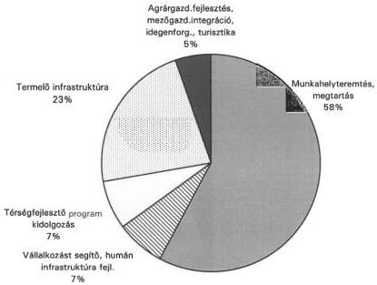

Munkahelyteremtes, megartas
Vállalkozást segító, humán infrastruktúra fejl.
Térsegfejlesztő program kidolgozás
Termeló infrastruktura
Agrárgazd.fejlesztés, mezőgazd.integrácio, idegenforg., turisztika

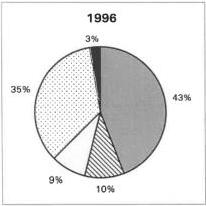

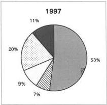

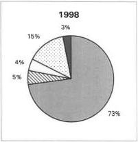

---

                                                                                    ---

---

7. sz. melléklet

a V-1014/1998-99. sz. jelentéshez

# A területi kiegyenlítést szolgáló fejlesztési célú (TEKI) támogatás felhasználásnak jellemzői
1996-1998

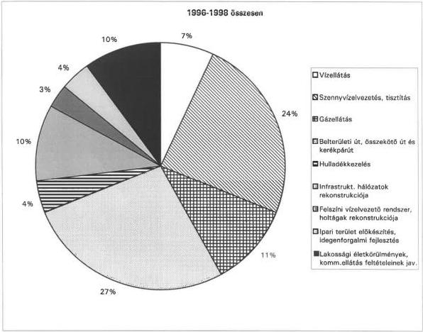

Termelő infrastruktúra fejlesztés összesen: 73 %

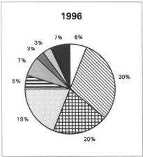

Termelő infrastruktúra 80%

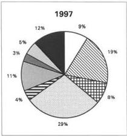

Termelő infrastruktúra: 69%

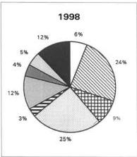

Termelő infrastruktúra:

67%

---

                                                                                    -

---

8. sz. melléklet

a V-1014/1998-99. sz. jelentéshez

# A területfejlesztési tanácsok döntési jogkörébe utalt fejlesztési támogatások felhasználásának főbb jellemzői

Értékadatok millió Ft-ban!

|  Megnevezés | Me. | 1996 | 1997 | 1998  |
| --- | --- | --- | --- | --- |
|  Az ellenőrzött megyék települési önkormányzatainak száma | (db) | 1 921 | 1 923 | 1 924  |
|  A területfejlesztés kedvezményezett térségeinek száma | (db) | 49 | 55 | 62  |
|  A területfejlesztés kedvezményezett településeinek száma | (db) | 869 | 1 011 | 1 097  |
|  A társadalmi-gazdasági és infrastrukturális szempontból elmaradott, illetve az országos átlagot jelentősen meghaladó munkanélküliséggel sújtott települések száma | (db) | 519 | 708 | 761  |
|  Területfejlesztési társulások száma | (db) | 125 | 129 | 132  |
|  A területfejlesztési tanácsok felhasználási jogkörébe utalt összes decentralizált pénzeszköz (TFC, TEKI, 1998-ban CÉDA) | (M Ft) | 8 658 | 10 822 | 14 352  |
|  A megyei területfejlesztési tanács által nyújtott támogatott pályázatok száma | (db) | 958 | 1 445 | 2 156  |
|  - TFC |  | 462 | 671 | 840  |
|  - TEKI |  | 496 | 774 | 735  |
|  - CÉDA |  |  |  | 581  |
|  Egy pályázatra jutó átlagos támogatás értéke | (M Ft) | 9,0 | 7,5 | 6,7  |
|  - TFC |  | 9,1 | 6,0 | 6,2  |
|  - TEKI |  | 9,0 | 8,8 | 8,8  |
|  - CÉDA |  |  |  | 4,6  |
|  A támogatás átlagos aránya a fejlesztés tervezett költségéhez viszonyítva | (%) | 21,1 | 21,3 | 16,8  |
|  - TFC |  | 19,9 | 14,3 | 11,1  |
|  - TEKI |  | 22,3 | 29,9 | 22,4  |
|  - CÉDA |  |  |  | 27,0  |

---

                                                                                    ---

---

9. sz. melléklet
a V-1014/1998-99. sz. jelentéshez

Decentralizált fejlesztési támogatások egy pályázatra jutó átlagos értékei 1996-1998. években

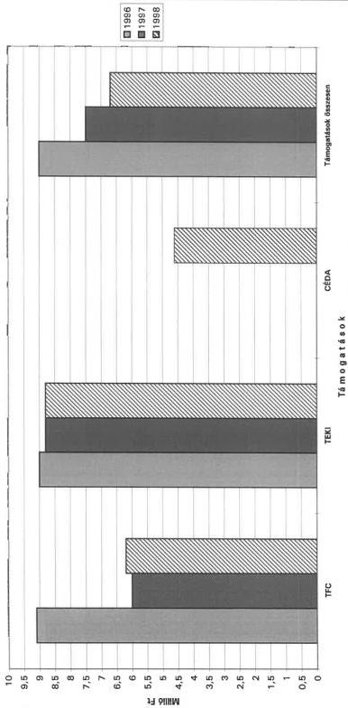

---

 .

---

10. sz. melléklet
a V-1014/1998-99. sz. jelentéshez

Területfejlesztési célelőirányzat (TFC) egy pályázatra jutó átlagos értékei a vizsgált megyékben

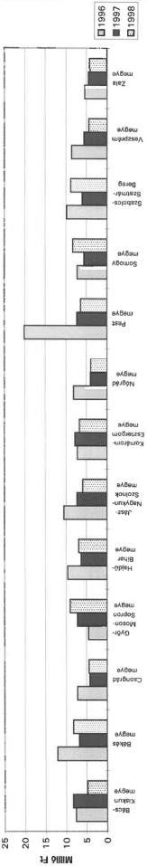

Területi kiegyenlítést célzó fejlesztési támogatások (TEKI) egy pályázatra jutó átlagos értékei a vizsgált megyékben

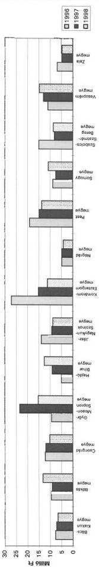

Céljellegű decentralizált támogatások (CEGA) egy pályázatra jutó átlagos értékei a vizsgált megyékben

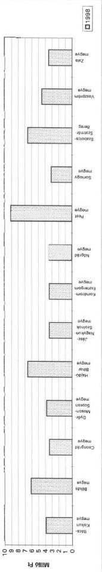

---

                                                                                    ---

---

11. sz. melléklet
a V-1014/1998-99. sz. jelentéshez

Decentralizált területfejlesztési támogatással megvalósuló fejlesztések finanszírozási arányai 1996-1998.

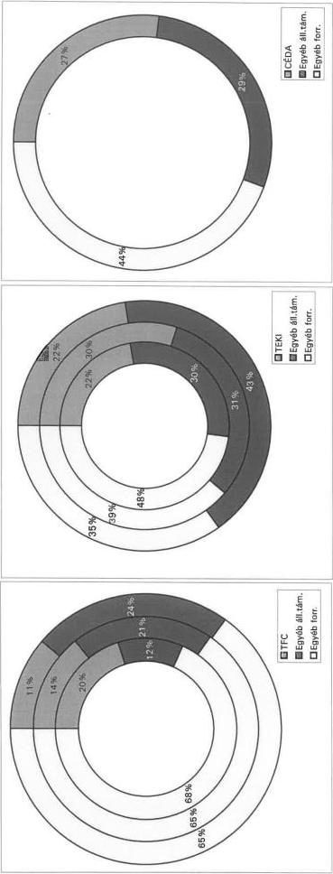

Céljellegű decentralizált alap támogatásával
megvalósuló fejlesztések finanszírozási arányai
1998.

Területi kiegyenlítést célzó támogatással
megvalósuló fejlesztések finanszírozási arányai
1996-1998.

Területfejlesztési célelőirányzatból megvalósuló
fejlesztések finanszírozási arányai
1996-1998.

---

                                                                                    ---

---

293/814/99.

# BELÜGYMINISZTÉRIUM
ÖNKORMÁNYZATI HELYETTES ÁLLAMTITKÁR

Szám: 5-15/5/1999.

Okt!

Dr. Kovács Árpád úrnak
elnök
Állami Számvevőszék

6. S. Lóránd 2-7
428
Sákon

Budapest

|  ÁLLAMI SZÁMVEVŐSZÉK  |   |
| --- | --- |
|  Érkezett: | 1999 -05- 28  |
|  Illetkezés: |   |
|  Illetkezés: | V-1014-37/98  |
|  Melléklet: | 99  |

Tisztelt Elnök Úr!

A megyei területfejlesztési tanácsok működésének ellenőrzéséről, különös tekintettel a decentralizált támogatási keret felhasználásának célszerűségére és szabályszerűségére című ÁSZ jelentéssel kapcsolatosan – Miniszter Úr megbízásából – tájékoztatom, hogy az abban foglalt megállapításokkal egyetértek.

Budapest, 1999. május „ 25 ”

Tisztelettel:

---

   -

---

1999 MAJ 25.

# PÉNZÜGYMINISZTÉRIUM

# Helyettes Államtitkár

Ikt.sz.: 3944/1/99

Hív.sz.:

dr. Kovács Árpád úrnak,

elnök

Állami Számvevőszék

Budapest

L. E. Lőrincz

VI.2.

ÁLLAMI SZÁMVEVŐSZÉK

Érkezett: 1999 -06- 01

Iktatószám: V-1014-39/98

Melléklet: 99

Tisztelt Elnök Úr!

A megyei területfejlesztési tanácsok működésének ellenőrzése, különös tekintettel a decentralizált támogatási keret felhasználásának célszerűsége és szabályszerűsége tárgyában készült - átdolgozott - jelentés figyelembe vette és érvényesítette a tárca által tett korábbi észrevételeket.

Tekintettel arra, hogy a jelentés a területfejlesztés intézményesülését, szabályozottságát elsősorban a megyei területfejlesztési tanácsok feladatellátásával összefüggésében vizsgálta, - általunk is támogatott - megállapításait, javaslatait e megközelítéssel teszi, ezért a véglegezett jelentéshez további észrevételt nem fűzök.

Az intézkedési javaslatokkal egyetértve megfontolandónak tartom a Kormány számára javasolt intézkedések egy részét a területfejlesztésért felelős FVM számára címezni (pl. javaslat a megyei területfejlesztési tanácsok jogi, pénzügyi feltételrendszerére, az Országos Területrendezési Terv felgyorsítása, területi információs rendszer, területfejlesztési előirányzatok felhasználási szabályainak korszerűsítése).

Budapest, 1999. május 20.

Üdvözlettel:

---

---

---

FÖLDMŰVELÉSÜGYI ÉS VIDÉKFEJLESZTÉSI

MINISZTER

316/1/69.

dr.Kovács Árpád

elnök úr

Állami Számvevőszék

Budapest

Apáczai Csere János u. 10.

1051

Tisztelt Elnök Úr !

A megyei területfejlesztési tanácsok működésének ellenőrzéséről készült Jelentés-t köszönettel megkaptam. A Jelentés megállapításait tudomásul veszem, az abban foglaltakat elfogadom.

Sajnálattal állapítom meg azonban, hogy a javasolt intézkedésekre vonatkozó észrevételeinket a végleges anyag összeállításakor csak részben vették figyelembe. Ezért a Kormány részére javasolt intézkedésekkel kapcsolatban tett észrevételek közül az alábbiakat változatlanul fenntartom:

1. A területfejlesztésről és területrendezésről szóló 1996. évi XXI. törvény módosítására vonatkozó törvényjavaslatot a Kormány áprilisban benyújtotta az Országgyűléshez. A törvénymódosítás egyik legfontosabb célkitűzése a regionális intézményrendszer kialakítása, a tervezési-statisztikai régiókban a regionális fejlesztési tanácsok valamint ezek munkaszervezeteinek a létrehozása, feladataik meghatározása.

A törvényjavaslatban szerepel a területfejlesztési tanácsok törvényességi felügyeletével kapcsolatos probléma rendezése is.

2. A megyei teruletfejlesztési tanácsok és munkaszervezeteik allamháztartáshoz való viszonyát a költségvetési törveny egyertelmüen meghatározza, ez nem tartozik a teruletfejlesztési törveny kompetenciájába.
3. Közvetlenül a területfejlesztési célokra fordithato források decentralizált arányanak novelésere nincs lehetőseg. A hárányos helyzetú megyék külön támogatásí elöirányzataival együtt a decentralizált keret az elöirányzatnak kölzel kétharmada, a központi keret terhelő kõtelezettsegek további decentralizálást nem tesznek lehetővé.

ÁLLAMI SZÁMVEVŐSZÉK
Érkezett: 1999. 05. 26.
Iktatószám: V-1014-36/99
Melléklet:

L. B. Lóránt 2
v. 26.
Sábor
Kovács
5/21.

---

2

4. A más tárcák kezelésében levő pályázati penzalapok felhasználásanak elveit a területfejlesztés keretében történő szabályozási rendszerben nem tartjuk megoldhatónak. Ezt az allamháztartás működési rendjéról szólo 217/1998.(XII.30.) Korm. rendelet tartalmazza.
5. Az Orszagos Teruletrendezesi Terv keszitsenek javasolt felgyorsitasat, annak egyeztetesi rendszere idoigenyessege miatt nem latjuk lehetségesnek.

Budapest, 1999. május „19”.

Üdvözlettel:

dr. Torgyán József

---

V-1014-38/1998-99.

Földművelésügyi és Vidékfejlesztési Minisztérium

dr. Torgyán József úr,
miniszter

Tisztelt Miniszter Úr!

A megyei területfejlesztési tanácsok működésének ellenőrzéséről készült jelentéssel kapcsolatos észrevételére tájékoztatom, hogy helyettes államtitkár úr véleményét a jelentésünk véglegzésénél figyelembe vettük.

Tudomásul vettük az ápr. 27-i tájékoztatását, miszerint a Kormány várhatóan még áprilisban benyújtja a törvénymódosítási javaslatát az Országgyűlésnek. A helyszíni vizsgálatokkal megalapozott ez irányú javaslatainkat azonban nemcsak ellenőrzésszakmai szempontból nem vettük ki a jelentésből, hanem a Kormány törekvéseit megerősítve, az Országgyűlés ellenőrző szerveként a törvényhozást kívántuk támogatni abban, hogy a kérdés mielőbb napirendre kerüljön és megfelelő tartalommal döntés születhessen a regionalizáció igen jelentős konszenzust igénylő kérdésében.

A régiók megerősítése ugyanakkor elkerülhetetlenné teszi a szélesebb értelembe vett területfejlesztési források nagyobb arányú decentralizálását. Jelentésünkben a minisztérium kezelésében lévő területfejlesztési célelőirányzat megosztásának arányát és mértékét nem vitattuk.

A költségvetési törvényben valóban tisztázott, hogy a területfejlesztési törvénnyel összhangban milyen összeget biztosítanak a decentralizált döntéshozatalra, illetve a tanácsok működésére. Változatlanul nem tisztázott azonban - és javaslatunk is erre irányul -, hogy hogyan értelmezendő a tanácsok és ebből következően munkaszervezeteik területfejlesztési törvényben megfogalmazott sajátos jogi státusa, ugyanis ekként nevesített szervezeti formát a Ptk. sem ismer. Függelmi, kötelmi viszonyaik ezáltal nem rendezettek.

Az általunk felvetett értelmezési kérdésekkel az államháztartás működési rendjéről szóló 217/1998. (XII.30.) Korm. rendelet nem foglalkozik, az elsősorban az évenkénti pályázati feltételek szabályozási körébe tartozik.

---

Az Országos Területrendezési Terv egyeztetési rendszerének időigényességét nem vitatjuk, viszont épp a támogatási rendszer működésének hatékonysága megkívánja, hogy azt a jelenlegi ütemhez képest gyorsítsák. Vizsgálati tapasztalataink is megerősítik a helyettes államtitkár úr azon véleményét, hogy ebben fontos szerepe lehetne a tervek elkészítéséhez szükséges források biztosításának is. A gyorsítás módjának a megválasztása a Kormány lehetősége, illetve kompetenciája.

Kérem tájékoztatásom szíves tudomásulvételét.

Budapest, 1999. május 31.

Tisztelettel

dr. Kovács Árpád

2

---

The Ground Truth image displays a single, solid horizontal line. According to Rule 2 (UNDERSCORE & LINE RULES), this is a stylistic or background line, not a placeholder underscore. Therefore, the OCR result must ignore it and output nothing or only meaningful text. The provided OCR content is "____", which consists of four underscores. This is an incorrect interpretation of the line as a placeholder, violating the rule that stylistic lines must be ignored. The OCR has hallucinated underscores where none should exist based on the GT's visual context. Hence, the OCR result is inconsistent with the Ground Truth.

[Non-Text]

[Non-Text]

[Non-Text]

[Non-Text]

[Non-Text]

[Non-Text]

[Non-Text]

[Non-Text]

[Non-Text]

[Non-Text]

[Non-Text]

[Non-Text]

[Non-Text]

[Non-Text]

[Non-Text]

[Non-Text]

[Non-Text]

[Non-Text]

[Non-Text]

[Non-Text]

[Non-Text]

[Non-Text]

[Non-Text]

[Non-Text]

[Non-Text]

[Non-Text]

[Non-Text]

[Non-Text]

[Non-Text]

[Non-Text]

[Non-Text]

[Non-Text]

[Non-Text]

[Non-Text]

[Non-Text]

[Non-Text]

[Non-Text]

[Non-Text]

[Non-Text]

[Non-Text]

[Non-Text]

[Non-Text]

[Non-Text]

[Non-Text]

[Non-Text]

[Non-Text]

[Non-Text]

[Non-Text]

[Non-Text]

[Non-Text]

[Non-Text]

[Non-Text]

[Non-Text]

[Non-Text]

[Non-Text]

[Non-Text]

[Non-Text]

[Non-Text]

[Non-Text]

[Non-Text]

[Non-Text]

[Non-Text]

[Non-Text]

[Non-Text]

[Non-Text]

---

The Ground Truth image displays a single, solid horizontal line. According to Rule 2 (UNDERSCORE & LINE RULES), this is a stylistic or background line, not a placeholder underscore. Therefore, the OCR result must ignore it. The provided OCR content is "____", which consists of four underscores. This is an incorrect interpretation of the line as a placeholder, violating the rule that stylistic lines must be ignored. The OCR has hallucinated text (underscores) where none should exist. Hence, the result is inconsistent with the Ground Truth.

The Ground Truth image displays a single, solid horizontal line. According to Rule 2 (UNDERSCORE & LINE RULES), this is a stylistic or background line, not a placeholder underscore. Therefore, the OCR result must ignore it. The provided OCR content is "____", which consists of four underscores. This is an incorrect interpretation of the line as a placeholder, violating the rule that stylistic lines must be ignored. The OCR has hallucinated text (underscores) where none should exist. Hence, the result is inconsistent with the Ground Truth.

[Non-Text]

[Non-Text]

[Non-Text]

[Non-Text]

[Non-Text]

[Non-Text]

[Non-Text]

[Non-Text]

[Non-Text]

[Non-Text]

[Non-Text]

[Non-Text]

[Non-Text]

[Non-Text]

[Non-Text]

[Non-Text]

[Non-Text]

[Non-Text]

[Non-Text]

[Non-Text]

[Non-Text]

[Non-Text]

[Non-Text]

[Non-Text]

[Non-Text]

[Non-Text]

[Non-Text]

[Non-Text]

[Non-Text]

[Non-Text]

[Non-Text]

[Non-Text]

[Non-Text]

[Non-Text]

[Non-Text]

[Non-Text]

[Non-Text]

[Non-Text]

[Non-Text]

[Non-Text]

[Non-Text]

[Non-Text]

[Non-Text]

[Non-Text]

[Non-Text]

[Non-Text]

[Non-Text]

[Non-Text]

[Non-Text]

[Non-Text]

[Non-Text]

[Non-Text]

[Non-Text]

[Non-Text]

[Non-Text]

[Non-Text]

[Non-Text]

[Non-Text]

[Non-Text]

[Non-Text]

[Non-Text]

[Non-Text]

[Non-Text]

[Non-Text]

[Non-Text]

[Non-Text]

[Non-Text]

[Non-Text]

[Non-Text]

[Non-Text]

[Non-Text]

[Non-Text]

[Non-Text]

[Non-Text]

[Non-Text]

[Non-Text]

[Non-Text]

[Non-Text]

[Non-Text]

[Non-Text]

[Non-Text]

[Non-Text]

[Non-Text]

[Non-Text]

[Non-Text]

[Non-Text]

[Non-Text]

[Non-Text]

[Non-Text]

[Non-Text]

[Non-Text]

[Non-Text]

[Non-Text]

[Non-Text]

[Non-Text]

[Non-Text]

[Non-Text]

[Non-Text]

[Non-Text]

[Non-Text]

[Non-Text]

[Non-Text]

[Non-Text]

[Non-Text]

[Non-Text]

[Non-Text]

[Non-Text]

[Non-Text]

[Non-Text]

[Non-Text]

[Non-Text]

[Non-Text]

[Non-Text]

[Non-Text]

[Non-Text]

[Non-Text]

[Non-Text]

[Non-Text]

[Non-Text]

[Non-Text]

[Non-Text]

[Non-Text]

[Non-Text]

[Non-Text]

[Non-Text]

[Non-Text]

[Non-Text]

[Non-Text]

[Non-Text]

[Non-Text]

[Non-Text]

[Non-Text]

[Non-Text]

[Non-Text]

[Non-Text]

[Non-Text]

[Non-Text]

[Non-Text]

[Non-Text]

[Non-Text]

[Non-Text]

[Non-Text]

[Non-Text]

[Non-Text]

[Non-Text]

[Non-Text]

[Non-Text]

[Non-Text]

[Non-Text]

[Non-Text]

[Non-Text]

[Non-Text]

[Non-Text]

[Non-Text]

[Non-Text]

[Non-Text]

[Non-Text]

[Non-Text]

[Non-Text]

[Non-Text]

[Non-Text]

[Non-Text]

[Non-Text]

[Non-Text]

[Non-Text]

[Non-Text]

[Non-Text]

[Non-Text]

[Non-Text]

[Non-Text]

[Non-Text]

[Non-Text]

[Non-Text]

[Non-Text]

[Non-Text]

[Non-Text]

[Non-Text]

[Non-Text]

[Non-Text]

[Non-Text]

[Non-Text]

[Non-Text]

[Non-Text]

[Non-Text]

[Non-Text]

[Non-Text]

[Non-Text]

[Non-Text]

[Non-Text]

[Non-Text]

[Non-Text]

[Non-Text]

[Non-Text]

[Non-Text]

[Non-Text]

[Non-Text]

[Non-Text]

[Non-Text]

[Non-Text]

[Non-Text]

[Non-Text]

[Non-Text]

[Non-Text]

[Non-Text]

[Non-Text]

[Non-Text]

[Non-Text]

[Non-Text]

[Non-Text]

[Non-Text]

[Non-Text]

[Non-Text]

[Non-Text]

[Non-Text]

[Non-Text]

[Non-Text]

[Non-Text]

[Non-Text]

[Non-Text]

[Non-Text]

[Non-Text]

[Non-Text]

[Non-Text]

[Non-Text]

[Non-Text]

[Non-Text]

[Non-Text]

[Non-Text]

[Non-Text]

[Non-Text]

[Non-Text]

[Non-Text]

[Non-Text]

[Non-Text]

[Non-Text]

[Non-Text]

[Non-Text]

[Non-Text]

[Non-Text]

[Non-Text]

[Non-Text]

[Non-Text]

[Non-Text]

[Non-Text]

[Non-Text]

[Non-Text]

[Non-Text]

[Non-Text]

[Non-Text]

[Non-Text]

[Non-Text]

[Non-Text]

[Non-Text]

[Non-Text]

[Non-Text]

[Non-Text]

[Non-Text]

[Non-Text]

[Non-Text]

[Non-Text]

[Non-Text]

[Non-Text]

[Non-Text]

[Non-Text]

[Non-Text]

[Non-Text]

[Non-Text]

[Non-Text]

[Non-Text]

[Non-Text]

[Non-Text]

[Non-Text]

[Non-Text]

[Non-Text]

[Non-Text]

[Non-Text]

[Non-Text]

[Non-Text]

[Non-Text]

[Non-Text]

[Non-Text]

[Non-Text]

[Non-Text]

[Non-Text]

[Non-Text]

[Non-Text]

[Non-Text]

[Non-Text]

[Non-Text]

[Non-Text]

[Non-Text]

[Non-Text]

[Non-Text]

[Non-Text]

[Non-Text]

[Non-Text]

[Non-Text]

[Non-Text]

[Non-Text]

[Non-Text]

[Non-Text]

[Non-Text]

[Non-Text]

[Non-Text]

[Non-Text]

[Non-Text]

[Non-Text][{"box [0, [0, [0, [0, [0, [0, 0, 0, 0, 0, 0, 0, 0, 0, 0, 0, 0, 0, 0, 0, 0, 0, 0, 0, 0, 0, 0, 0, 0, 0, 0, 0, 0, 0, 0, 0, 0, 0, 0"}][{"box [0, [0, [0, [0, [0, [0, 0, 0, 0, 0, 0, 0, 0, 0, 0, 0, 0, 0, 0, 0, 0, 0, 0, 0, 0, 0, 0, 0, 0, 0, 0"}]

[Non-Text]

[Non-Text]

[Non-Text]

[Non-Text][{"box [0, [0, [0, [0, [0, [0, 0, 0, 0, 0, 0, 0, 0, 0, 0, 0, 0, 0, 0, 0, 0, 0, 0, 0, 0, 0, 0, 0, 0, 0, 0, 0, 0, 0, 0, 0"}]

[Non-Text]

[Non-Text]

[Non-Text]

[Non-Text]

[Non-Text][{"box [0, [0, [0, [0, [0, [0, 0, 0, 0, 0, 0, 0, 0, 0, 0, 0, 0, 0, 0, 0, 0, 0, 0, 0, 0, 0, 0, 0, 0, 0, 0, 0, 0, 0, 0, 0"}]

[Non-Text]

[Non-Text]

[Non-Text]

[Non-Text]

[Non-Text]

[Non-Text]

[Non-Text]

[Non-Text]

[Non-Text]

[Non-Text]

[Non-Text][{"box [0, [0, [0, [0, [0, [0, 0, 0, 0, 0, 0, 0, 0, 0, 0, 0, 0, 0, 0, 0, 0, 0, 0, 0, 0, 0, 0, 0, 0"}]

[Non-Text]

[Non-Text]

[Non-Text]

[Non-Text][{"box [0, [0, [0, [0, [0, [0, 0, 0, 0, 0, 0, 0, 0, 0, 0, 0, 0, 0, 0, 0, 0, 0, 0, 0"}]

[Non-Text]

[Non-Text]

[Non-Text]

[Non-Text]

[Non-Text][{"box [0, [0, [0, [0, [0, 0, 0, 0, 0, 0, 0, 0, 0, 0, 0, 0, 0, 0, 0, 0, 0, 0, 0, 0"}][{"box [0, [0, [0, [0, [0, [0, 0, 0, 0, 0, 0, 0, 0, 0, 0, 0, 0, 0, 0,