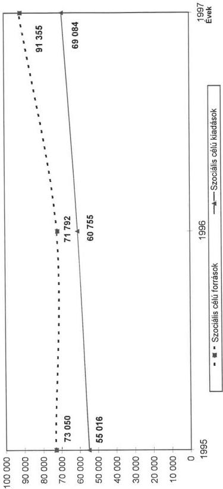
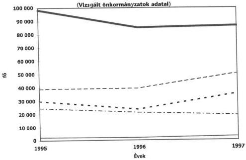
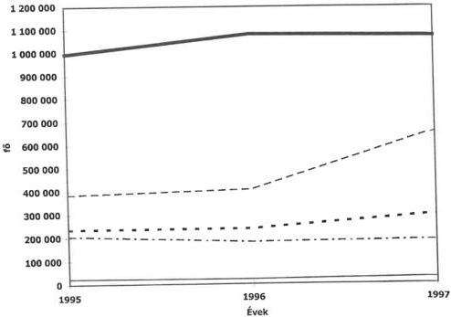
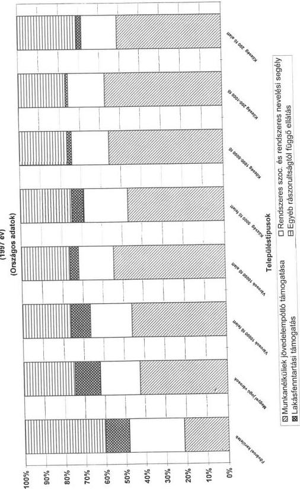
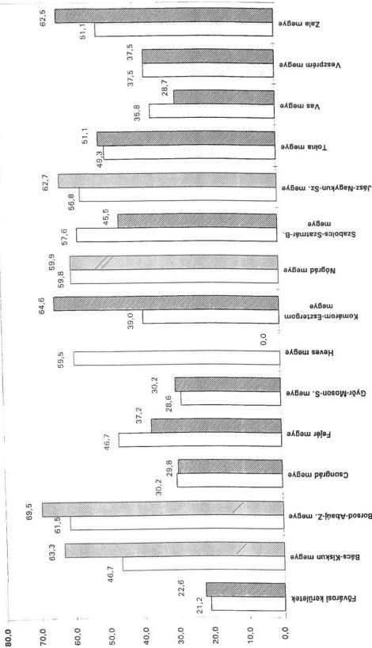
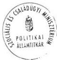

Állami Számvevőszék

# JELENTÉS

**a helyi önkormányzatok által nyújtott  
pénzbeli szociális ellátások helyzetének  
vizsgálati tapasztalatairól**

1999. június

9913.

---

Az ellenőrzés végrehajtásáért felelős:
V. Önkormányzati és Területi Ellenőrzési Igazgatóság

Dömötör Gyula
számvevő igazgató

Dr.Lóránt Zoltán
számvevő igazgatóhelyettes

Az ellenőrzést vezette és a jelentést összeállította:

Dr. Felleg Zsoltné
régióvezető főtanácsos

A jelentés összeállításában közreműködtek:

Berényi Magdolna
számvevő tanácsos

Huberné Kuncsik Zsuzsanna
számvevő tanácsos

Dr.Lacó Bálintné
számvevő tanácsos

Tóth Ferencné
számvevő tanácsos

Az ellenőrzésben a résztvevők névsorát az 1. sz. melléklet tartalmazza

A témakörrel foglalkozó ÁSZ vizsgálatok jegyzéke:

Jelentés az önkormányzatok felnőtt szociális alapellátási tevékenységéről (V-1/1993.).

Jelentés a családban nevelkedő fiatalkorúak szociális ellátásáról (V-1018/1994.).

Jelentéseink az Országgyűlés számítógépes hálózatán is olvashatók.

---

V-1015-31/1998-99. TSZ:442

# TARTALOMJEGYZÉK

|  **I. ÖSSZEGZŐ MEGÁLLAPÍTÁSOK, KÖVETKEZTETÉSEK, JAVASLATOK** | **4**  |
| --- | --- |
|  **II. RÉSZLETES MEGÁLLAPÍTÁSOK** | **9**  |
|  1. A szociális ellátórendszer ágazati irányítása, jogi feltételrendszere | 9  |
|  2. Az állami források nagyságrendje, összetétele, a forrásszabályozás jellemzői | 11  |
|  2.1. A forrásszabályozás jellemzői, változásai | 11  |
|  2.2. Az állami források nagyságrendje, összetétele és a szociális kiadásokhoz viszonyított aránya | 13  |
|  3. A szociális támogatások önkormányzati szintű ellátásának feltételei, szabályozottsága | 14  |
|  3.1. A települések feladatellátásának szabályozottsága | 14  |
|  3.2. A feladat- és hatáskörök gyakorlása, szervezeti keretei | 18  |
|  4. Az önkormányzatok által nyújtott pénzbeli ellátások formái, nagyságrendje | 19  |
|  4.1. Munkanélküliek jövedelempótló támogatása | 20  |
|  4.2. Rendszeres szociális segély és időskorúak járadéka | 25  |
|  4.3. Rendszeres nevelési segély és rendszeres gyermekvédelmi támogatás | 28  |
|  4.4. Átmeneti segélyek, rendkívüli gyermekvédelmi támogatás | 30  |
|  4.5. Lakásfenntartási támogatás | 33  |
|  5. Az ellátásokról vezetett szakmai és pénzügyi nyilvántartások rendje, megbízhatósága | 35  |

1

---

1

[Non-Text]

1

[Non-Text]

[Non-Text]

[Non-Text]

[Non-Text]

[Non-Text]

[Non-Text]

[Non-Text]

[Non-Text]

[Non-Text]

[Non-Text]

[Non-Text]

[Non-Text]

[Non-Text]

[Non-Text]

[Non-Text]

[Non-Text]

[Non-Text]

[Non-Text]

[Non-Text]

[Non-Text]

[Non-Text]

[Non-Text]

[Non-Text]

[Non-Text]

[Non-Text]

[Non-Text]

[Non-Text]

[Non-Text]

[Non-Text]

[Non-Text]

[Non-Text]

[Non-Text]

[Non-Text]

[Non-Text]

[Non-Text]

[Non-Text]

[Non-Text]

[Non-Text]

[Non-Text]

[Non-Text]

[Non-Text]

[Non-Text]

[Non-Text]

[Non-Text]

[Non-Text]

[Non-Text]

The Ground Truth image displays a single, solid horizontal line. According to Rule 2 (UNDERSCORE & LINE RULES), this is a stylistic or background line, not a placeholder underscore. Therefore, the OCR result must ignore it and output nothing or only meaningful text. The provided OCR content is "____", which consists of four underscores. This is an incorrect interpretation of the line as a placeholder, violating the rule that stylistic lines must be ignored. The OCR has hallucinated underscores where none should exist based on the GT's visual context. Hence, the OCR result is inconsistent with the Ground Truth.

---

## Jelentés
a helyi önkormányzatok által nyújtott pénzbeli szociális ellátások helyzetének vizsgálati tapasztalatairól

Az ebben az évtizedben végbement gazdasági változások, a lezajlott gazdasági-társadalmi folyamatok jelentős hatással voltak a lakosság széles rétegeinek életkörülményeire. Az évtized első időszakát súlyos recesszió; az ipari termelés, valamint a GDP reálértékének jelentős visszaesése, magas infláció, a lakosság jövedelmének csökkenése jellemezte. A gazdasági szerkezet átalakulása a foglalkoztatottak számának csökkenésével, illetve a munkanélküliségi ráta emelkedésével járt együtt. E folyamatok kedvezőtlen tendenciáit az 1994-95. évektől stagnálás, majd lassú, pozitív irányú elmozdulás váltotta fel. Az évtized közepére az egyik legsúlyosabb szociális problémává vált a tartós munkanélküliek magas száma, illetve a munkanélkülieken belüli arányának növekedése.

A változások a társadalom egyes rétegeit eltérően érintették. A jövedelmek erőteljesen differenciálódtak, egyre többen szorultak a társadalom támogatására. A legkedvezőtlenebb helyzetbe az idősek, a hosszabb ideje munkanélküliek, alacsony jövedelmű gyermekes családok kerültek, ugyanakkor romlottak az életesélyei az egészségkárosodott, csökkent munkaképességű személyeknek is.

Az **állampolgárok alkotmányos joga a szociális biztonság**, ennek megvalósításáról törvényekben szabályozott módon az állam köteles gondoskodni. A család, a gyermekek védelmét az Alkotmány külön is kiemeli (1949. évi XX. tv.1-16, 67. §-ai). Az 1990-es évektől jelentősen megváltozott társadalmi-gazdasági környezet szükségszerűvé tette a szociális ellátórendszerek összehangolt átalakítását, a gazdaság csökkenő jövedelemtermelő képességéhez történő igazítását. A családi támogatások, nyugdíjszerű szociális ellátások folyósítása jellemzően a társadalombiztosítás, míg a **rászorultságtól függő különböző támogatások megállapítása és kifizetése a helyi önkormányzatok feladatkörébe tartozik**.

Az önkormányzatok által nyújtott - **jelen vizsgálat tárgyát képező - rászorultságtól függő pénzbeli** - természetbeni formában is nyújtható - **ellátások** 3 fő csoportba sorolhatók.

- jogszabályok által behatárolt jogosultsági elven működő jövedelemkiegészítő támogatások (munkanélküliek jövedelempótló támogatása, ápolási díj, rendszeres szociális segély, 1997. XI. 1-től rendszeres gyermekvédelmi támogatás, 1998. I. 1-től időskorúak járadéka)
- szükséglethez kapcsolódó ellátás (temetési segély, lakásfenntartási támogatás)
- eseti (átmeneti)- és krízissegély (átmeneti nehéz élethelyzethez kapcsolódik).

3

---

I. ÖSSZEGZŐ MEGÁLLAPÍTÁSOK, KÖVETKEZTETÉSEK, JAVASLATOK

Az önkormányzatok pénzbeli ellátásokra 1995. évben 38,2 milliárd forint, 1997. évben már 45,1 milliárd forint támogatást fizettek ki. Az ellátotti kör fokozatos bővülése és a szociális célokra fordítható, rendelkezésre álló pénzeszközök korlátozott volta megköveteli, hogy a leginkább rászorulók részesüljenek a különböző ellátásokban. (5. sz. melléklet)

A rászorultságtól függő pénzbeli támogatások közül a jelentés részletesen nem foglalkozik az e körbe tartozó ápolási díjként és temetési segélyként biztosított juttatásokkal.

Az ellenőrzés célja: annak megállapítása volt, hogy az önkormányzatok

- milyen pénzbeli szociális ellátórendszert alakítottak ki,
- a szabályozásban és a végrehajtásban hogyan érvényesült a rászorultsági elv,
- a helyi források hogyan hasznosultak, mennyiben segítették a leginkább rászorulók támogatását.

Az ellenőrzés az 1995-1997. éveket, valamint 1998. I. félévét érintően a Népjóléti Minisztériumra (jelenleg Szociális és Családügyi Minisztérium) valamint 82 települési önkormányzatra terjedt ki. (1998. évi adatok az ellenőrzés lezárásának időszakában még nem álltak rendelkezésre).

A vizsgálati körbe bevont önkormányzatok közül 5 fővárosi kerület, további 77 önkormányzat 14 megyében működik. (2. sz. melléklet) A településtípus szerinti megoszlás jól reprezentálja a helyi sajátosságoktól is függő ellátási különbségeket. A kiválasztási szempontok között az ellátások fajlagos alakulása, a foglalkoztatási, munkanélküliségi helyzet, a társadalmi-gazdasági környezet, a települések fejlettségi szintje is szerepet kapott. A vizsgált településeken él az ország lakosságának 12%-a, s ezzel közel azonos arányú a szociális célú források és kiadások nagyságrendje is.

4

---

I. ÖSSZEGZŐ MEGÁLLAPÍTÁSOK, KÖVETKEZTETÉSEK, JAVASLATOK

# I. ÖSSZEGZŐ MEGÁLLAPÍTÁSOK, KÖVETKEZTETÉSEK, JAVASLATOK

Az elmúlt években bekövetkezett demográfiai változások és gazdasági folyamatok hatására a lakosság egyes rétegeinek életkörülményei jelentősen megváltoztak. A jövedelmek erőteljesen differenciálódtak, a munkanélküliség növekedésével, a munkajövedelmek reálértékének csökkenésével **bővült a szociális támogatásra szorulók száma**. A rendelkezésre álló statisztikai kimutatások (az adatok halmazódása miatt) pontosan nem rögzítik a rászorultsági alapon támogatottak számát. A különféle pénzbeli ellátásban részesítettek létszámának növekedése azonban arra utal, hogy az a lakosság egyre szélesebb körét érinti. (7. sz. melléklet)

Az önkormányzati rendszer kezdeti időszakában a szociális juttatásokra, pénzbeli szociális ellátásra szorulók támogatásának feltételeit szakmai törvények nem szabályozták. Bár még a korábbi tanácsi viszonyokra épülő kormány- és miniszteri rendeletek egyes előírásai érvényben maradtak, ebben az időszakban lényegében az önkormányzati testületek joga és kötelessége volt a szükségesnek ítélt ellátásokra helyi szabályokat alkotni. E tekintetben a **szociális igazgatásról és ellátásokról szóló 1993. évi III. törvény** (továbbiakban Szt.) **megalkotásával jelentős előrelépés történt. E törvény hatálybalépésével vált lehetővé** a munkanélküli járadék folyósítására már nem jogosult, de munkát nem találó polgárok széles köre számára **jövedelempótló támogatás biztosítása**. Ugyancsak **e törvény nevesíti** önálló ellátási formaként **a lakásfenntartási támogatást**, amely az energiaárak dinamikus növekedése miatt emelkedő lakásfenntartási kiadások részbeni fedezetéhez kívánt keretjellegű szabályokat meghatározni.

Az 1993. évben hatályba lépett **törvény alapvető hibája, hogy a gyermekes családok, valamint az időskorúak legrászorultabb rétege számára a támogatáshoz jutás feltételeit nem határozta meg**. A rendszeres szociális segélyezés, valamint a rendszeres nevelési segélyezés szociális feltételeinek és pénzügyi garanciáinak megállapítása nélkül e rétegek támogatása továbbra is a helyi szemlélettől és pénzügyi lehetőségektől függött.

**A hiányosságok megszüntetésére csak évekkel később került sor.** A szociális törvény 1997. I. 1-től nevesíti a rendszeres szociális segély igénybevételének feltételeit, a gyermekes családok rendszeres támogatását pedig az 1997. évben megjelenő, a gyermekek védelméről és a gyámügyi igazgatásról szóló 1997. évi XXXI. törvény (továbbiakban Gyvt.) - a rendszeres szociális segélyhez hasonló állami garanciák biztosítása mellett - szabályozza. A rendszeres ellátások bővülése és törvényi szabályozása révén mind több nehéz élethelyzetben levő személy számára vált lehetővé, hogy legalább az ezen ellátásokhoz előírt minimális összeg mértékéig anyagi segítséget kapjon.

A támogatásra jogosultság megállapításánál **a törvényi szabályozás a rászorultsági elv következetes érvényesítését írja elő**, és az ehhez szük-

5

---

I. ÖSSZEGZŐ MEGÁLLAPÍTÁSOK, KÖVETKEZTETÉSEK, JAVASLATOK

séges bizonyítékokat is nevesíti. Ezek közül a kérelmező által benyújtott jövedelem-nyilatkozatnak alapvető jelentősége van. Az önkormányzatok által végzett környezettanulmányoknak a kérelmező életvitelére, életmódjára vonatkozó információi azt mutatják, hogy azok valóságtartalma gyakran megkérdőjelezhető. A környezettanulmányok a jelenlegi szabályozás szerint bizonyítékként nem használhatók fel, holott az önkormányzatok számára más **lehetőség valójában** nincs a tényleges jövedelemi helyzet megismerésére. Mindezek következtében a szociális ellátások megállapítása és folyósítása során a **rászorultsági elv teljes körűen nem érvényesül**.

Az önkormányzatok számára juttatott **szociális célú források nagyságrendjét**, az elosztás feltételeit a szakmai törvényekben meghatározott garanciális elemek figyelembevételével az **éves költségvetési törvények rögzítik**. A források között, nagyságrendjét tekintve, kiemelt szerepe van a felhasználási kötöttség nélkül juttatott szociális normatívának, amely a szociálisan hátrányos adottságú, a **népesség összetételét tekintve kedvezőtlen helyzetben levő települések számára az átlagosnál magasabb összegű támogatást biztosít**. A szociális források felhasználása során tapasztaltak azonban nem teljes mértékben támasztják alá az elosztási szempontok helyességét. **Az önkormányzatok többsége e források egy részét** a törvényalkotói szándéktól eltérően **nem szociális célokra használja fel. 1997. évben** az állam különböző jogcímeken 91 milliárd forintot biztosított az önkormányzatok számára a jelen vizsgálat tárgykörénél szélesebb feladatkört átfogó szociális alapellátás, valamint pénzbeli és természetbeni ellátás kiadásainak fedezetére. Az ezen feladatellátására fordított tényleges kiadások 69 milliárd forintot tettek ki, az **eltérés éves szinten 22 milliárd forint volt**. (4. sz. melléklet)

**Az önkormányzatok költségvetésük mind kisebb hányadát fordították a rászorultságtól függő támogatások finanszírozására**. Országos szinten 1995 évben ez a költségvetésük 4,4%-át tette ki, 1997. évben ilyen célra összes kiadásaiknak már csak 3,4%-át fordították. E kiadások növekedése a két év viszonylatában mindössze 18,1%-os volt, amely az inflációs hatásokat figyelembe véve azok reálértékének csökkenését mutatja. (5. sz. melléklet)

Az önkormányzatok többsége **helyi rendeleteiben a saját hatáskörben szabályozható ellátásokat a törvényben ajánlott keretek között rögzítette**, de messzemenően figyelembe vette saját anyagi lehetőségeit és a helyi prioritásokat is. Az e kategóriába tartozó lakásfenntartási támogatásra inkább a nagyobb települések képviselőtestületei biztosítanak forrást, míg a községekben inkább az átmeneti segélyként történő támogatást részesítik előnyben. E körben gyakori, hogy egyes lakossági rétegek (időskorúak, gyermekek) számára egy-egy alkalomhoz kötődően rászorultság vizsgálata nélkül is folyósítanak segélyeket.

**A havi rendszerességgel** - a szakmai törvényekben előírt feltételek megléte esetén - kötelezően **nyújtandó támogatások tekintetében** egyes nagyvárosok, fővárosi kerületek, települések kivételével **csak** az azokban rögzített **minimális összeget biztosították**. Mindezek ellenére összességében **az ezen ellátásra szorulók szociális biztonsága javult, hiszen** a törvényben foglalt feltételek megléte esetén **biztosan számíthatnak ezen támoga-**

6

---

I. ÖSSZEGZŐ MEGÁLLAPÍTÁSOK, KÖVETKEZTETÉSEK, JAVASLATOK

**tásokra.** Ebben a tekintetben a **Gyvt**-ben szabályozott rendszeres gyermekvédelmi támogatás bevezetése **különösen jelentős változásokat hozott.** A törvényben foglalt - a korábbi helyi szabályozáshoz képest többnyire kedvezőbb - jogosultsági feltételek alapján mind a **támogatott gyermekek száma**, mind az egy-egy gyermekre tekintettel nyújtott **támogatás nagyságrendje megemelkedett.**

A szociális ellátások között legnagyobb súlyt jelentő **munkanélküliek jövedelempótló támogatása az önkormányzati hatáskörbe tartozó juttatások körébe kevésbé illeszkedik.** A munkanélküli járadék megszűnését követően meghatározott ideig igénybe vehető ellátás lényegében ugyanazt a réteget, a munkaügyi központok hatáskörébe tartozó korábbi járadékosok körét érinti. A tömegesen jelentkező kérelmek és a szabályozás kötöttségei miatt az önkormányzatoknál az igények elbírálása automatikus. Differenciálásra (a minimális összegnél magasabb összegű támogatás megállapítására) alig kerül sor, a támogatás mértékét a jövedelemnyilatkozatban szereplő összeg nagysága lényegében meghatározza. A jelentős részben a **Munkaerőpiaci Alapból finanszírozott normatív jellegű juttatás** szabályszerű **megállapításához** az önkormányzatoknak **a munkaügyi központokkal rendszeres és folyamatos kapcsolatot kell kiépíteni és fenntartani.** Az önbevalláson alapuló jövedelemigazolások kivételével ugyanis **minden** egyéb **információ ott áll rendelkezésre.** A jelenlegi gyakorlat ugyanakkor párhuzamos nyilvántartásokhoz, a bürokrácia felduzzadásához vezetett.

**Az önkormányzatok** az ellátások bővülése és a rászorulók széles köre miatt **megnövekedett feladataiknak eltérő színvonalon tudnak megfelelni.** A sokrétű, esetenként bonyolult jogi előírások értelmezése és alkalmazása megfelelő szakképzettséggel rendelkező munkatársakat igényel, akik főként a kisebb településeken gyakran hiányoznak. Az egyes ellátásokban részesülő személyek támogatásának figyelemmel kíséréséhez szükséges korszerű nyilvántartási rendszer kialakításának feltételeit kevés önkormányzat (10%) teremtette meg. Kisebb településeken a már meglévő számítástechnikai géppark e célra történő hasznosítására sem történt intézkedés.

A különböző rendszeres támogatások meghatározott hányadára központi források nyújtanak fedezetet. Az állampolgárok részére folyósított jogosulatlan támogatások állami forrással fedezett részének központi költségvetéssel történő elszámolásáról a jogszabályok teljes körűen nem rendelkeznek. Nincs szabályozás azon esetekre, ha az önkormányzatok e támogatások visszafizetésétől, méltányosságot gyakorolva, eltekintenek, vagy annak behajtása sikertelennek mutatkozik. A személyi feltételek hiánya mellett e szabályozásbeli hiányosság is közrejátszik abban, hogy **az önkormányzatok nem fordítanak kellő figyelmet a jogosulatlan kifizetések nyilvántartására és azok visszafizetésére.** Ennek következtében a költségvetéssel történő elszámolás is sok esetben elmarad.

**A szakmai statisztikai rendszer jelentős adatbázissal rendelkezik.** Ezek az adatok - a helyi adatszolgáltatás hibái, valamint az esetenként nem egyértelmű központi előírások miatti hiányosságok ellenére is - jól használhatók a különböző felsőszintű döntésekhez. Ugyanakkor **kifogásolható, hogy a**

7

---

J. ÖSSZEGZŐ MEGÁLLAPÍTÁSOK, KÖVETKEZTETÉSEK, JAVASLATOK

felnőttek és a gyermekek ellátását biztosító támogatások mérése eltérő szempontok szerint történik. A felnőtt korosztály támogatását bemutató statisztika az egyes ellátások tekintetében részletes információkat tartalmaz, míg a gyermekekre vonatkozóan ilyen mélységű adatok nem állnak rendelkezésre. A rendszer alapvető hibája, hogy **nem képes kiszűrni a támogatásban részesülők számánál** a többféle segélyt igénybevevő ellátottak miatti **halmozódást**. Ennek következtében pontosan nem ismert az önkormányzatok szociális támogatásában részesülők száma. A **pénzügyi információs rendszer** pedig sem a kötelezően megnyitandó főkönyvi számlák sem az információs füzetek adatait tekintve **a szakmai törvények által nevesített ellátásokhoz** kellően **nem igazodik**.

A rászorultságtól függő pénzbeli ellátások rendszerének hatékonyabb működtetése érdekében **javasoljuk, hogy**

a **Kormány:**

- Fontolja meg a munkanélküliek számára biztosított **jövedelempótló támogatás rendszerének átalakítását** és annak a munkaügyi központokhoz történő telepítését. Ezzel a munkanélküli segélyre már nem jogosult, de elhelyezkedni önhibájukon kívül nem tudó személyek támogatását - a foglalkoztatási törvényben szabályozott mértékben és feltételek alapján - a munkaügyi központok folyósíthatnák. A szociális ellátórendszerbe pedig csak olyan személyek kerülnének, akik már ezt a lehetőséget is maximálisan kimerítették, s családjuk szociális helyzete miatt további társadalmi gondoskodást igényelnek.
- Tegyen intézkedéseket a makroszintű elemzések elvégzésére, szociálpolitikai célkitűzések megalapozására alkalmas **információs rendszer kialakítására**. Ennek keretében az egyes ellátások egységesebb számbavételét kell biztosítani. El kell érni, hogy a rászorulók körére vonatkozóan halmozódást nem tartalmazó adatok is álljanak rendelkezésre. A pénzügyi információ mind a számviteli nyilvántartások tekintetében, mind a beszámoló szerkezeti rendjében jobban igazodjon a szakmai törvényekben előírt ellátások tagolásához.

a **Pénzügyminiszter** együttműködve a Szociális és Családügyi Miniszterrel:

- Törekedjen arra, hogy a forrásszabályozás folyamatban lévő átalakítása során a szociálpolitikai célok és az azok megvalósítását segítő eszközrendszer összhangja tovább javuljon. A szabályozás további finomításával el kell érni, hogy a **szociális célra szánt állami pénzeszközök** fokozottabb mértékben **ebben az ágazatban hasznosuljanak**.
- Kezdeményezze a **jogosulatlanul igénybevett ellátásokhoz kapcsolódó** központosított **támogatások** - önkormányzatok és a központi költségvetés közötti - **elszámolásának szabályozását**.

8

---

II. RÉSZLETES MEGÁLLAPÍTÁSOK

# **a Szociális és Családügyi Miniszter:**

- Kezdeményezzen olyan törvénymódosításokat, amely a **rászorultság elvének** gyakorlatban való **következetesebb érvényesítéséhez** szélesebb eszköztárat biztosít az önkormányzatok számára. Legyen lehetőség a támogatást igénylők tényleges jövedelmi, vagyoni helyzete, életmódja vizsgálatára, és annak az önkormányzati döntések során történő figyelembe vételére.

## II. RÉSZLETES MEGÁLLAPÍTÁSOK

### 1. A SZOCIÁLIS ELLÁTÓRENDSZER ÁGAZATI IRÁNYÍTÁSA, JOGI FELTÉTELRENDSZERE

A szociális ellátás egyes formáinak és az ellátásra való jogosultság feltételeinek törvényi szintű szabályozására az Szt. megalkotásával került sor. A törvény új ellátási formákat vezetett be, nevezetesen a munkanélküliek jövedelempótló támogatását, a lakásfenntartási támogatást, egységes jogi keretek között határozta meg az ápolási díj, az átmeneti segély és a temetési segély feltételrendszerét. A **törvény** ugyanakkor **nem szabályozott** olyan **alapvető ellátásokat**, mint az időskorúak és a gyermekek rendszeres segélyezése, holott a szociális alapellátáson belül a rászorult felnőttek, valamint a veszélyeztetett kiskorúak pénzbeli és természetbeni támogatását a helyi önkormányzatokról szóló 1990. évi LXV. törvény (továbbiakban: Ötv.), továbbá a hatásköri törvény egyaránt a települési önkormányzatok kötelező feladataként határozta meg. Erre csak évekkel később az Szt. 1996. évben megjelent módosításával, valamint a Gyvt. megalkotásával (hatályos 1997. november 1.) került sor.

A **vizsgált időszak folyamán az Szt-nek** a támogatási rendszer jelen ellenőrzés tárgykörével összefüggő **módosításai** meghatározóan a **munkanélküliek jövedelempótló támogatása**, a **lakásfenntartási támogatás rendelkezéseit érintették**, továbbá a **rendszeres szociális segély, valamint az időskorúak járadékának törvényi szintű szabályozására vonatkoztak**.

Az **1993-ban hatályba lépett Szt.** a foglalkoztatás elősegítéséről és a munkanélküliek ellátásáról szóló 1991. évi IV. törvény (a továbbiakban: Flt). alapján nyújtott **munkanélküli járadék folyósításának megszűnését követő időszakra** a meghatározott jogosultsági feltételek fennállása esetén - **időtartam-korlátozás nélkül** - **jövedelempótló támogatás megállapítását tette lehetővé**. A támogatás megállapítása és folyósítása a települési önkormányzatok feladata. A **munkanélküliek jövedelempótló támogatásának rendszerében** a gazdasági stabilizációt szolgáló egyes törvénymódosításokról szóló **1995. évi XLVIII. törvény** (a továbbiakban: Gst.) **alapvető változást hozott**. A törvény a jövedelempótló **támogatás folyósításának időtartamát 24 hónapban maximálta**, hatálybalépéskor (1995. június 30-án)

9

---

II. RÉSZLETES MEGÁLLAPÍTÁSOK

az ellátási rendszerben már benne lévő személyekre pedig átmeneti rendelkezéseket határozott meg.

**A rendszeres szociális segély megállapításának és folyósításának feltételei** az Szt. 1997. I. 1-től hatályba lépő módosítása következtében **alapvetően megváltoztak**. E segélyezési formának évek óta indokolt törvényi szintű szabályozása a munkanélküliek jövedelempótló támogatása folyósításának 24 hónapra történő korlátozása miatt tovább már nem volt halasztható. Az ellátásra jogosultak köre bővült a jövedelempótló támogatásból kikerült aktív korú nem foglalkoztatottakkal, de a teljes ellátotti körre vonatkozó szabályok is jelentősen módosultak. A korábbi önkormányzati mérlegelési jogkörön alapuló szabályozással szemben a törvény meghatározta az önkormányzati döntések során kötelezően alkalmazandó jogosultsági feltételeket.

A gyermekes családok anyagi támogatása tekintetében kiemelt jelentősége van az 1997. november 1-től hatályos **Gyvt.** megjelenésének, amely **alapvető jogként fogalmazza meg, hogy a gyermeket** kizárólag **anyagi okból fennálló veszélyeztetettsége miatt nem szabad a családjától elválasztani**. A **rendszeres és rendkívüli gyermekvédelmi támogatás** feltételrendszerét, a felnőtt korosztály segélyezéséhez hasonlóan helyi szabályok helyett, törvény állapítja meg. Így adott élethelyzetben lévő gyermekes családok minden településen azonos mértékben számíthatnak az állam segítségére.

A nyugdíjrendszer, továbbá a szociális ellátások rendszerének korábban elhatározott átalakításával összefüggésben az Szt. módosításával a megélhetést biztosító jövedelemmel nem rendelkező idős személyek legrászorultabb rétege számára **1998. január 1-től** új ellátást, a korábbiaknál nagyobb szociális biztonságot nyújtó **időskorúak járadékát vezettek be**. Egyidejűleg **megszűnt a 62. életévüket** (illetve a reájuk irányuló nyugdíjkorhatárt) **betöltött időskorúak rendszeres szociális segélyezése**.

A fenti szabályozásbeli változások következtében a rendszeres gyermekvédelmi támogatás, jövedelempótló támogatás, rendszeres szociális segélyezés feltételeinek törvényi meghatározásával a korábbi, az önkormányzatok mérlegelési lehetőségén alapuló támogatási gyakorlat helyére egy kötelező előírásokon nyugvó támogatási rendszer került. A törvények a leginkább **érintett társadalmi csoportokra** (munkanélküliek, időskorúak, gyermekes családok) **meghatározták azon** - csoportonként részben eltérő - **normatív jogosultsági kritériumokat, amelyeket az önkormányzatoknak alkalmazniuk kell**. Mindhárom támogatási forma esetében azonosan, **az öregségi nyugdíjminimum százalékában meghatározott jövedelemhatár képezi a segély megállapításának fő kritériumát**.

**Az állam** - a rendszeres szociális segély kivételével - **a törvényben nevesített rendszeres támogatások meghatározott hányadát** az önkormányzatok számára **megtéríti**. Így a rászorulók a települések gazdasági helyzetétől, a képviselőtestület szociális érzékenységétől függetlenül hozzájuthatnak a törvényekben garantált ellátásokhoz.

Miközben a rászorulók számára az önkormányzatok által nyújtható támogatásokhoz történő hozzájutás lehetőségei erősödtek, a végrehajtásban, a **rászo-**

10

---

II. RÉSZLETES MEGÁLLAPÍTÁSOK

**rultság fogalmának kezelésében és helyi szinten történő érvényesítésében a tapasztalatok kedvezőtlenek.** A rászorultság, a szociális ellátást igénylők helyzetének megítélése, ennek alapján a támogatás meghatározása a család kimutatott jövedelme alapján történik. A kérelemhez csatolt jövedelemigazolások azonban csak részben segítik a családok, egyének tényleges jövedelmi helyzetének megismerését, azok **valóságtartalma** - az önkormányzatok tapasztalatai szerint - **sokszor megkérdőjelezhető. A kimutatott jövedelmek gyakran nem állnak összhangban a kérelmező életvitelével, életmódjával.** A jövedelemigazolások adattartalmának felülvizsgálata és a dokumentálttól eltérő jövedelmi helyzet bizonyítása az önkormányzatok számára szinte lehetetlen, a környezettanulmány pedig, a jelenlegi szabályozás szerint, bizonyítékként nem használható fel.

A 32/1993. (II. 17.) Korm. rendelet szabályozza a szociális ellátások igényléséhez felhasználható bizonyítékokat. E körben - a gyermeknevelési támogatás kivételével - a jogszabály a környezettanulmány készítését nem nevesíti. Az Alkotmánybíróság is foglalkozott e kérdéssel és a 9/1998. (III.27.) AB határozat megállapítja, hogy a rászorultságtól függő pénzbeli szociális ellátások megállapításához az ügyfél „a jövedelem-nyilatkozat” megtételére kötelezhető, környezettanulmány tűrésére azonban nem.

Az egyes törvényi előírások módosításaival a **rászorultsági elv következetesebb érvényesítése**, a társadalmi igazságosság érdekében, a források korlátozott volta és a rászorulók számának emelkedése miatt **alapvető követelmény**.

## 2. AZ ÁLLAMI FORRÁSOK NAGYSÁGRENDJE, ÖSSZETÉTELE, A FORRÁSSZABÁLYOZÁS JELLEMZŐI

### 2.1. A forrásszabályozás jellemzői, változásai

A helyi lakosság életkörülményeire közvetlenül ható pénzbeli és természetbeni **szociális támogatások pénzügyi feltételeit alapvetően az állami támogatások rendszere teremti meg.** A települési önkormányzatok képviselő-testülete által megállapított és folyósított ellátások kiadásaihoz az állam szociális célú normatív támogatással és egyéb célirányos központi támogatásokkal járul hozzá.

A szociális ellátások finanszírozásának alapelveit az Szt. szabályozza, míg a költségvetési hozzájárulások jogcímeit és mértékét a mindenkori éves költségvetési törvények határozzák meg. Ezek jelentős része kötetlen felhasználású, (szociális normatív hozzájárulás) de a forráselemek között évről évre, az aktuális szociálpolitikai célok megvalósítását segítő, többnyire elszámolásköteles támogatások is megtalálhatók. A többszatornás finanszírozási rendszer bonyolult, az összehasonlíthatóságot nehezíti, hogy egyes támogatások forráshelye, mértéke, megosztása a központi költségvetés és a Munkaerőpiaci Alap között évente változott.

11

---

II. RÉSZLETES MEGÁLLAPÍTÁSOK

A munkanélküliek jövedelempótló támogatásának fedezetét 1995 évben 50-50%-ban az önkormányzatokhoz megosztott bevételként juttatott személyi jövedelemadó, s a Belügyminisztérium költségvetésében szereplő központosított támogatás biztosította. 1996. évtől az állami hozzájárulás fele-fele részben a szociális normatívából és a Munkaerőpiac Alapból származott, a következő évtől a forrásmegosztás aránya is megváltozott. Ez időponttól az egészségügyi hozzájárulással növelt kifizetett támogatások 75%-a visszaigényelhető az elkülönített pénzalapból, a fennmaradó rész fedezetére a szociális normatíva szolgál.

Az állami források között legnagyobb részarányt jelentő **szociális támogatás normatívájának tartalma**, belső arányösszetétele évről-évre **módosult, az abból** részben vagy teljes egészében **finanszírozandó feladatok köre fokozatosan bővült**.

1996. évtől a normatív támogatások között korábban önálló jogcímen szereplő lakásgazdálkodási feladatok, 1997. évtől pedig az előző években célzottan nyújtott fűtési energiakiadás, fűtéskorszerűsítés támogatások fedezete épült be a kötetlen felhasználású szociális normatívába. A rendszeres szociális segélyezési feladatok törvényi szabályozásával összefüggésben 1997. évtől az aktív korú, jövedelemmel nem rendelkezők rendszeres segélyezéséhez az állam a szociális normatíván keresztül nyújtott támogatást. Az 1997. november 1-től hatályos Gyvt. által bevezetett rendszeres és rendkívüli gyermekvédelmi támogatáshoz nyújtott központi hozzájárulás - előirányzat-átcsoportosítás révén - ugyancsak a szociális normatívát módosította.

**A szociális normatíva kialakításának alapelve az volt, hogy az adott településen ellátandó feladatokat egy normatíva keretében, de a lakosság szociális jellemzőit figyelembe véve, támogassa.** E célra dolgozták ki a szociális normatíva differenciálását biztosító algoritmust. Lényegét tekintve a normatíva két fő eleme a lakosságszámhoz rendelt fix összeg, valamint az u.n. szociális szorzó alapján számított differenciált hozzájárulás. A vizsgált időszakban **részarányában és abszolút összegében is csökkent** a szociális normatíván belül **egységesen, lakosságszám alapján elosztott hányad. A differenciálás szempontjai**, súlyarányai évről-évre módosultak. A szociális helyzetet leginkább tükröző **munkanélküliség, a személyi jövedelemadót nem fizető aktív korú népesség** együttesen **növekvő**, míg az inaktív korúak száma folyamatosan csökkenő **súllyal szerepelt a hozzájárulás mértékének meghatározásában**. Az évente rendelkezésre álló **szociális célú normatív állami hozzájárulás összegének 1995. évben egyharmadát**, 1996. évben háromnegyedét, 1997. évben már 80%-át, míg **1998 évben 90%-át osztották fel** a szociális szorzó alapján **differenciáltan**.

Az önkormányzatok által folyósított pénzbeli és természetbeni ellátások forrásait 1997. év végéig a lakástámogatásokkal, az egyéb szociális alapellátásokkal - házi segítségnyújtás, szociális étkeztetés, családsegítés működtetése - együttesen célszerű vizsgálni, mivel a szociális normatíva ezen önkormányzati feladatok ellátásának támogatását is tartalmazta. 1998. évtől a finanszírozási rendszer korszerűsítése keretében a szociális normatíva tartalma lényegesen megváltozott. A szakmai koncepció kiindulópontjául a Népjóléti Minisztérium megbízásából 1997. évben készített tanulmány szolgált, melyben közel 800

12

---

II. RÉSZLETES MEGÁLLAPÍTÁSOK

településnél vizsgálták az előző évek szociális normatívájának felhasználási jellemzőit. A tapasztalatokat is figyelembe véve 1998. évtől a korábban összevont szociális normatíva különvált. Az alapellátás, valamint a pénzbeli és természetbeni juttatások fedezetére szolgáló állami pénzeszközök önállóan jelentek meg az éves költségvetési törvényben.

# 2.2. Az állami források nagyságrendje, összetétele és a szociális kiadásokhoz viszonyított aránya

A szociális ellátásokhoz biztosított központi költségvetési források 1995. és 1997. évek között mindössze 26%-kal emelkedtek úgy, hogy 1996. évben a támogatások volumene nem érte el az előző évi szintet sem. Míg 1995. évben a különböző címen juttatott források 72,3 milliárd forintot tettek ki, 1997. évben az állam 91 milliárd forintot nyújtott e kiadások fedezetére. Mindez az inflációt is figyelembe véve a támogatások reálértékének csökkenését eredményezte. (3. sz. melléklet)

Az önkormányzatok összes költségvetési bevétele a szociális célú forrásoknál dinamikusabban emelkedett, ennek következtében a szociálpolitikai feladatokra rendelkezésre álló pénzeszközök aránya évről-évre csökkenő tendenciájú. Az önkormányzati szintű bevételeknek 1995. évben 7,9%-a, 1997. évben már csak 6,5%-a szolgált a szociális kiadások fedezetére. A bevételi szerkezet egyes, szociális mutatók tekintetében hátrányosnak tekintett, településeknél az átlagostól eltérő. A vizsgált körben a kisebb városokban (10000 fő alatti) és a községekben a szociális célú források növekedési üteme lényegesen meghaladta az összbevételekét és részarányuk is növekvő mértékű. Ennek alapvető oka, hogy ezen települések többsége az átlagosnál kedvezőtlenebb szociális mutatók alapján kiemelt állami támogatásban részesült.

A pénzbeli és természetbeni ellátások forrásai között a legjelentősebb nagyságrendű normatív állami hozzájárulás összege a három év viszonylatában 73,2%-kal növekedett, ami az ellátandó feladatok bővülésével, a forrásszabályozás tartalmi változásával is összefügg. 1995-1997. évek között a támogatás szociális forrásokon belüli részaránya 47,1%-ról 65,3%-ra növekedett és 1997. évben 60 milliárd forintot tett ki.

Az egyes, rászorultságtól függő ellátásokhoz nyújtott állami támogatások nagyságrendje alapvetően a szociális támogatások körét szabályozó jogi előírások feltételeiben bekövetkezett változások hatására növekedett vagy csökkent.

A munkanélküliek jövedelempótló támogatására szolgáló bevételek nagyságrendje összefügg az ellátásra jogosultak számának csökkenésével, s a szabályozásból adódó fajlagos támogatások összegének emelkedésével. A Munkaerőpiaci Alap növekvő mértékben fedezi az ezzel összefüggő önkormányzati kiadásokat.

13

---

II. RÉSZLETES MEGÁLLAPÍTÁSOK

A **kiskorúak rendszeres nevelési segélyének** kiegészítéséhez 1993.-tól évente azonos összegű forrás állt rendelkezésre (1.850 millió forint), amelyhez pályázatok útján juthattak az önkormányzatok. A Gyvt. hatálybalépésével (1997. november 1-től) az állam a rendszeres gyermekvédelmi támogatás részbeni fedezetére központi forrást biztosít.

Az **önkormányzatok szociális célú forrásai** évről-évre jelentősen **meghaladták a pénzbeli és** a jelen vizsgálattal nem érintett **természetbeni ellátások** (köztemetés, közgyógyellátás, egészségügyi szolgáltatásra való jogosultság), **valamint az alapellátások** (házi segítségnyújtás, szociális étkeztetés, családsegítés) **együttes kiadásait** (11-22 milliárd forint volt az eltérés a vizsgált években). A települések a feladatellátásra fordítható állami bevételek egyre csökkenő hányadát költötték a lakosság szociális támogatására, ebből az következik, hogy a **kötetlen felhasználású szociális normatíva egy részét egyéb feladataikra** - elsősorban intézményfenntartás, infrastrukturális célú beruházások, fejlesztések finanszírozására - **fordították. Ennek következtében ezen állami források egy része a rászorulók életkörülményeinek javítását közvetlenül nem szolgálta.**

### 3. A SZOCIÁLIS TÁMOGATÁSOK ÖNKORMÁNYZATI SZINTŰ ELLÁTÁSÁNAK FELTÉTELEI, SZABÁLYOZOTTSÁGA

#### 3.1. A települések feladatellátásának szabályozottsága

Az önkormányzatok által kötelezően biztosítandó szociális ellátások köre fokozatosan bővült. Ez növelte felelősségüket lakosaik szociális biztonságának megteremtésében. Az önkormányzatok szociálpolitikai tevékenysége egyre jelentősebb lakossági rétegek életkörülményeire, anyagi helyzetére gyakorol közvetlen hatást. A szociális ellátások helyi szabályozásához a döntést hozóknak pontos ismeretekre van szükségük a település társadalmi-gazdasági helyzetéről, a lakosság életszínvonaláról, jövedelmi helyzetéről, ezek változásainak lehetséges irányairól.

Az önkormányzatok az ott élő állampolgárok helyzetéről (korösszetétel, munkaképes korúak, foglalkoztatottak, munkanélküliek) a népességnyilvántartásból, a munkaügyi központok jelzéseiből, KSH elemzésekből viszonylag pontos adatokkal rendelkeznek, a szociális helyzetet komplex módon bemutató elemzések, felmérések azonban többnyire nem készültek. A kisebb lélekszámú falvakban ilyen helyzetfeltáró tevékenységre kevésbé van szükség, hiszen a döntéselőkészítők, döntéshozók személyes kapcsolatokon keresztül többnyire ismerik az ott élők életkörülményeit.

A nagyobb települések (16 db) jelentős anyagi ráfordítással külső szakértők bevonásával elkészítették az önkormányzat un. szociális térképét, de a túlnyomó részben 4-5 évvel korábbi helyzetet tükröző tanulmányok aktualizálása rendszerint elmaradt, így azok csak korlátozottan hasznosíthatók. A vizsgált időszakban három településen volt folyamatban a lakosság szociális helyzetének felmérése. (Szakoly, Balkány, Salgótarján)

14

---

II. RÉSZLETES MEGÁLLAPÍTÁSOK

A szociálisan rászorulók felkutatásában az önkormányzatok saját intézményeiktől (szociális, egészségügyi alapellátás intézményei, oktatási intézmények) kapják a leghathatósabb segítséget. A különböző szociális célú alapítványokkal, karitatív csoportokkal, a vöröskereszt helyi szerveivel, civil szervezetekkel az együttműködés formái változatosak, néhány kivételtől eltekintve azonban írásban nem szabályozottak. Ezek a szervezetek természetbeni adományokkal - élelmiszer, ruha stb. - támogatják a rászorultakat, az önkormányzatok pedig működésüket helyiség biztosításával, pénzeszközök átadásával is segítik.

**Csongrád** város (Csongrád megye) önkormányzata a városban működő egészségügyi és szociális szervezetek részére pályázatás útján nyújt támogatást. A 8 szervezet 1996-1998. évek között 1178 ezer forint támogatást kapott a megjelölt célok megvalósítására. 1996. évben az Eugerázia Szoció Műhely Egyesülete az ápolási díjban részesülőknek otthonápolási tanfolyamot szervezett, a problémák megoldásában hatékonyan segített.

**A főváros XII. kerületi önkormányzata** 1997. évben létrehozta a „Szociális Kerekasztalt”, melyben a segítségnyújtásban szerepet vállaló egyházak, egyesületek, civil szervezetek, a Népjóléti Iroda és a Szociális Bizottság képviseltetik magukat. Rendszeres időközönként megvitatják és egyeztetik a segélyezéssel kapcsolatos elvi és gyakorlati teendőket.

**Székesfehérvár** (Fejér megye) 3 éves ellátási szerződést kötött különböző szervezetekkel arra vonatkozóan, hogy az általuk nyújtott szolgáltatások finanszírozására anyagi támogatást nyújt. A városban 18 szociális célú egyesület, karitatív szervezet tevékenykedik. A szociális területen tevékenykedő civil szervezetek, egyházak a megállapodások szerint rész vesznek a rászorulók felkutatásában, szükség szerinti megsegítésében. (Információszolgáltatás, tanácsadás, adománygyűjtés és - elosztás, karitatív vásárok, jótékonysági estek szervezése, szabadidős programok, érdekképviselet, segélyezés stb.)

A helyi kisebbségi önkormányzatok szociális ellátásban való közreműködését törvény nem írja elő, rendeletalkotási kötelezettségük nincs. A szociális feladatok megoldásában való részvételük jellemzően a rászorulók jelzésére, a támogatási kérelmek véleményezésére korlátozódik. A szociálisan leginkább érintett roma kisebbségek önkormányzatai a rendelkezésükre álló források terhére esetenként konkrét segélyezést is folytattak.

**Jászkisér** nagyközség (Jász-Nagykun-Szolnok megye) Cigány Kisebbségi Önkormányzata költségvetése terhére beiskolázási segély céljára adott át forrást a helyi iskolának, a különböző pályázatokon elnyert pénzösszegekből támogatták a rászoruló tanulókat. A nagyközség szakbizottságában képviselőjük van, aki javaslataival segíti a döntések meghozatalát.

**Tiszaroff** község (Jász-Nagykun-Szolnok megye) Cigány Kisebbségi Önkormányzata az ülések jegyzőkönyveinek tanúsága szerint rendszeresen segélyezte a cigány származású tanulókat és a szociálisan hátrányos helyzetű személyeket, családokat.

**Jánosháza** nagyközség (Vas megye) roma kisebbségi önkormányzata a forrásaiból szociális célra szánt pénzeszközeit átadta az önkormányzatnak, ebből fedezték a cigány tanulók tankönyvköltségét, segélyezték a gyerekeket. 1997. évben a tankönyvköltség 112.050 forint, 1998. évben 291.280 forint volt, 38 fő általános

15

---

II. RÉSZLETES MEGÁLLAPÍTÁSOK

iskolai tanuló ezen felül 1000 Ft/fő segélyt kapott, a középiskolások (5 fő) ennél magasabb, 5000 Ft/fő támogatásban részesültek.

Az önkormányzatok az Szt. módosításait, valamint a Gyvt. hatályba lépését követően átdolgozták helyi rendeleteiket. Az egyre konkrétabbá váló törvényi szintű előírások hatására **a szabályozottság helyi szinten is javult**. Ugyanakkor a vizsgált települések 28%-ánál a rendeletek megalkotására kisebb-nagyobb hiányosságokkal került sor (egyes ellátásokat nem tartalmaztak, nem tértek ki folyósítási, eljárási szabályokra, a rendszeres támogatások felülvizsgálati kötelezettségére stb.), **öt önkormányzatnál pedig** - azok törvénysértő volta miatt - **a közigazgatási hivatalok törvényességi kifogással éltek**.

**Nyírvasvári** község (Szabolcs-Szatmár-Bereg megye) önkormányzata nem szabályozta az időskorúak járadéka, a rendszeres szociális segély megállapítására, felülvizsgálatára, folyósítására vonatkozó helyi előírásokat, továbbá a Gyvt. értelmében a gyermekek védelmével kapcsolatos feladatait (rendszeres, rendkívüli gyermekvédelmi támogatás).

**Bőny** község (Győr-Moson-Sopron megye) szociális rendelete nem volt szinkronban a törvényi előírásokkal, nem tért ki az időskorúak járadéka ellátási forma szabályaira, továbbá a lakásfenntartási támogatás helyi sajátosságoknak megfelelő kritériumrendszerére sem (pl. helyben elismerhető lakásnagyság, közüzemi díjak mértéke stb.).

**Türje** község (Zala megye) szociális rendelete nem tartalmazta a lakásfenntartási támogatás jogosultsági feltételeit, ezt a hiányosságot 1997. április 30-án megalkotott új rendeletükben pótolták, de rendelkezéseit csak 1998. október 1-től alkalmazták.

**Ács** nagyközség (Komárom-Esztergom megye) többször módosított szociális rendeletét a Komárom-Esztergom Megyei Közigazgatási Hivatal - hivatkozva az Alkotmány, a helyi önkormányzatokról szóló 1990. évi LXV. tv., valamint a szociális igazgatásról és szociális ellátásokról szóló 1993. évi III. tv. előírásaira - törvénysértőnek és az Alkotmányban biztosított szociális ellátáshoz való jog korlátozására irányulónak minősítette. Ugyanis az önkormányzat rendelete az ellátások jogosultsági feltételeit a törvényben előírtaknál szigorúbban határozta meg.

**Ajka** város (Veszprém megye) szociális rendelete a rendszeres szociális segélyben részesülők részére az illetékes munkaügyi központtal való együttműködési kötelezettséget írt elő. Ezt a szigorítást a közigazgatási hivatal törvénysértőnek minősítette, felhívásának megfelelően a hibát korrigálták.

Az önkormányzatok helyi szociális rendeletei kizárólag a törvényekben nevesített pénzbeli illetve az azt helyettesítő természetbeni ellátási formákat tartalmazták, mindössze **a vizsgált települések negyede rendelkezett önként vállalt egyéb támogatásokról**. A kedvezőbb anyagi kondíciókkal rendelkező települések (elsősorban városok, fővárosi kerületek) egyes támogatási lehetőségek megteremtésével többnyire egy-egy lakossági réteget céloztak meg. E támogatások egy része a szabályozásból adódóan normatív jelleggel - jövedelmi helyzettől függetlenül - jár (anyasági támogatás, szülési segély, újszülöttek támogatása, első házasulók segítése, nyugdíjbavonulók áthidaló kölcsöne stb.). Az önkéntes ellátások másik része általában konkrét feltételekhez kötött,

16

---

II. RÉSZLETES MEGÁLLAPÍTÁSOK

és az adott település sajátos gondjainak megoldását segíti. (Ilyen ellátások: lakbértámogatás, fogászati-ellátáshoz hozzájárulás, gázfűtés korszerűsítési támogatás, nevelési díj, szociális tanulmányi ösztöndíj, díjhátralék-kiegyenlítő támogatás stb.)

Az Szt. a rászorultsági elv gyakorlatban történő érvényesülését várja el, ennek ellenére a vizsgált önkormányzatok **helyi szociális rendeleteinek 19%-a lehetővé teszi, hogy egyes lakossági rétegek teljes körűen, jövedelmi helyzetüktől függetlenül anyagi támogatást kapjanak.** A gyakorlatban az un. „egyénsegélyek” megállapítására még a szabályozottnál is szélesebb körben került sor. A **rászorultság vizsgálata nélkül folyósított**, túlnyomó részben kisebb településekre jellemző **támogatások** általában az **időskorúakat és a gyermekeket érintik és meghatározott alkalmakhoz kötődnek** (karácsony, mikulás, iskolakezdés, térítési díjhoz biztosított általános kedvezmény stb.).

A **települések** többnyire **részletesen szabályozták az egyes támogatási formák** (törvényben nevesített és önként vállalt ellátások) **jogosultsági feltételeit. A szociális rendeletek** a különböző ellátások egyidejű igénybevételét több esetben korlátozták és széleskörűen tartalmaztak szigorításokat, kizáró tényezőket. A korlátozások a rendszeres támogatásban részesülők eseti segélyezésére, illetve egyes családok éves szintű segély összegének maximalizálására vonatkoztak. E **rendelkezések esetenként célszerűtlenek** és nem ritkán a megfelelő nyilvántartási háttér hiánya miatt, **betarthatatlanok.**

**Sáreges** község (Fejér megye) önkormányzata a tárgyévenként biztosított szociális ellátások együttes összegét az öregségi nyugdíjminimum a család jogállását alapul vevő differenciált mértékben maximálta. (A rendelet nem tesz kivételt eseti és rendszeres támogatás között, nem határozza meg azt sem, hogy az összeghatárok a nyugdíjminimumok havi vagy éves összegéhez igazodnak.) A pénzbeli segélyezésből egy évre kizárható a kérelmében félrevezető, hamis adatot közlő személy. A helyi rendelet szerint nem állapítható meg ellátás olyan személyek részére, akik önhibájukból kerültek nehéz anyagi helyzetbe, s azon javíthattak volna, de azt elmulasztották.

**Jászárokszállás** város (Jász-Nagykun-Szolnok megye) az ellátások igénybevételénél rögzíti, hogy gyermekvédelmi támogatásban részesülő család átmeneti segélyben nem részesülhet. Akinek pedig rendszeres gyermekvédelmi támogatást folyósítanak, nem kaphat rendkívüli gyermekvédelmi támogatást. Rendszeres nevelési támogatás egy családban max. 3 gyermekre állapítható meg. További szigorítás a rendeletben, hogy rendszeres segélyezés mellett évi egy alkalommal adható átmeneti segély.

**Jánossomorja** község (Győr-Moson-Sopron megye) helyi szociális rendelete szerint nem részesíthető - közgyógyellátás és gyógyszertámogatás kivételével - szociális juttatásban az az igénylő, akinek vagy vele együtt élő családtagjának helyi-adó hátraléka van; egy éven belül az önkormányzat sérelmére tulajdon elleni szabálysértést vagy bűncselekményt követett el és azt jogerős határozat (ítélet) megállapította; az önkormányzat tudomása szerint saját maga vagy vele együtt élő családtagja külföldön állandó vagy alkalmi munkavállaló; a kérelmekhez csatolandó dokumentumokban valótlan adatot közölt; a felajánlott közhasznú munkavégzést alapos indok nélkül megtagadja.

17

---

II. RÉSZLETES MEGÁLLAPÍTÁSOK

Az önkormányzati rendeletek többsége egyes támogatások természetbeni ellátásként történő nyújtásának szabályait is kidolgozta, azoknak prioritást biztosít. A természetbeni formák között legelterjedtebb a fizetési kötelezettségek részbeni átvállalása, a támogatások közvetlen szolgáltatóhoz, pénzintézethez való utalása. Egyes településeken - különösen az átmeneti segélyeknél - rendelkeztek vásárlási utalványok juttatásáról, de azok elszámolási rendjét, néhány kivételtől eltekintve, nem szabályozták.

### 3.2. A feladat- és hatáskörök gyakorlása, szervezeti keretei

A pénzbeli szociális ellátásokkal kapcsolatos hatásköröket az Szt. állapítja meg. A pénzbeli szociális ellátások tekintetében annak címzettje a képviselő-testület, amely azt az Ötv 9. § (3) bekezdésében foglaltak szerint a polgármesterre, bizottságaira, a részönkormányzat testületére, a helyi kisebbségi önkormányzat testületére, törvényben meghatározott módon társulására átruházhatja.

**Az önkormányzatok** a pénzbeli szociális ellátásokkal kapcsolatos **feladat- és hatásköröket** a legkülönbözőbb módon, többnyire a helyi sajátosságokra is tekintettel - a törvényi előírások figyelembevételével - **célszerűen szabályozták**. A döntési jogkörök alapvetően átruházott hatáskörben, a polgármesterek és a testületek szakbizottságai között oszlanak meg, utóbbiak többnyire rendszeres támogatásokról, méltányossági ügyekről döntenek. A helyi rendeletek a települések széles körénél lehetővé teszik az ellátások méltányossági alapon történő megítélését olyan esetekben, ha a kérelmező a jogosultsági feltételeknek nem felel meg.

A **települések** mintegy **10%-ánál** (jellemzően a nagyobb, jelentős számú kérelmet elbíráló városok) a döntési mechanizmus **ellentétes a jelenlegi törvényi előírásokkal**. Ezeknél az önkormányzatoknál szinte minden hatáskör a polgármesteré - ezt a rendeletek is így szabályozzák - ugyanakkor a **döntést** a polgármesteri hivatalon belül működő **szociális szervezet** (iroda, osztály, csoport vezetője) **hozza**. A hivatali szakapparátus jogszerűen csak az SZMSZ-ben, az ügyrendben, egyéb belső utasításban előírtak szerinti döntés-előkészítéssel, adatkezeléssel, folyósítással és elszámolással kapcsolatos feladatokat láthatna el.

A képviselő-testületek és az illetékes bizottságok a pénzbeli szociális ellátás helyzetét, annak gyakorlati tapasztalatait általában az önkormányzati rendeletek megalkotása, módosítása során tekintették át. A rászorultak szociális körülményeinek javítását célzó távlati irányelvekről, **szociális koncepciókról** - a **nagyobb városok** kivételével - nem **határoztak**.

**Győr** Megyei Jogú Város (Győr-Moson-Sopron megye) 1990. évben készült, 2000-ig szóló szociálpolitikai koncepciójában az ellátások javítása szerepel távlati feladatként, abban a személyes gondoskodás körébe tartozó szolgáltatásokkal kapcsolatos tennivalók kaptak nagyobb hangsúlyt. A feladatok között kiemelt a városban működő Szociális Kerekasztal résztvevőivel történő egyeztetés, a lakossági hátralékok kezelése, a helyi ellátási rendszert rögzítő kiadvány elkészítése.

18

---

II. RÉSZLETES MEGÁLLAPÍTÁSOK

**A főváros XX. kerülete** 1998 januárjában elfogadott cselekvési programja egyebek mellett a főváros és a kerület közötti kölcsönös területi és ágazati megállapodások megkötését irányozza elő az ellátások zavartalanságának biztosítására, továbbá tevékenyen kívánja támogatni a főváros szociálpolitikai adatbázisának és informatikai-kommunikációs rendszerének kialakítását. Az önkormányzat csatlakozott a Budapesti Szociális Chartához (ennek további 16 kerület a tagja) annak érdekében, hogy a fővárosban egységes szociális elvek valósuljanak meg.

**Tatabánya** Megyei Jogú Város (Komárom-Esztergom megye) 1995. évben dolgozta ki az önkormányzat távlati szociális koncepcióját, abban bemutatták a gazdasági-társadalmi folyamatoknak a lakosság szociális helyzetére gyakorolt hatását. A helyzetfelmérésre alapozottan határozták meg a szociálpolitikai rendszer felépítését, az irányelveket és a konkrét feladatokat. A kitűzött főbb alapelvek: a családtámogatás, a legrászorultabbak segítése, a hatékonyabb természetbeni ellátások prioritása, a többszatornás szociális támogatások kiküszöbölése érdekében a hasonló területen tevékenykedő külső szervekkel az együttműködés erősítése. Az önkormányzat a támogatások értékállóságát is célul tűzte ki, az egyes ellátásokhoz kapcsoltan konkrét feladatokat is megfogalmazott.

A szociális feladatok ellátására elkülönített szervezeti egységeket (pl. osztály, csoport, iroda) a polgármesteri hivatalokon belül csak nagyobb településeken hoztak létre. A **kisebb önkormányzatoknál a szociális ügyeket jellemzően kapcsolt munkakörben látják el. A rendkívül elaprózott, sokféle ellátást magába foglaló, bonyolult jogi szabályozás szinte állandó változása megkövetelné a rendszeres szakmai továbbképzést**, mely azonban nem megoldott. A városokban a munkavégzés személyi és tárgyi feltételei jóval kedvezőbbek, az ügyintézők munkáját számítógépes háttér segíti. Az önkormányzatok ugyanakkor itt sem tettek meg mindent a bővülő feladatokhoz szükséges feltételek biztosítására. A kérelmezők nagy száma és a támogatások sokfélesége miatt nagyfokú a leterheltség, amely esetenként jelentős fluktuációhoz vezet. Mindez a feladatellátás szakmai színvonalát kedvezőtlenül befolyásolja. Az operatív munkavégzés során előforduló hibák, hiányosságok is ezt a tényt támasztják alá.

#### 4. AZ ÖNKORMÁNYZATOK ÁLTAL NYÚJTOTT PÉNZBELI ELLÁTÁSOK FORMÁI, NAGYSÁGRENDJE

A települési önkormányzatok a lakosság igényei alapján, anyagi lehetőségeik függvényében a közszolgáltatások széles körét biztosítják. Fontos feladatuk a település fejlesztése, a lakosság jogos igényeként jelentkező infrastruktúra kiépítése, különféle szükségleteket kielégítő intézményhálózat (egészségügyi, oktatási és kulturális) fenntartása. Mindezek a rendelkezésre álló pénzügyi források egyre nagyobb hányadát kötik le. Így **annak ellenére, hogy a szociális juttatásokat szabályozó törvények által meghatározott ellátások köre bővült és az állam ezen támogatások folyósításához szükséges pénzeszközök jelentős részarányát törvényi szinten garantálja, a szociális rászorultságtól függő kiadások aránya az önkormányzati költségvetési kiadásokon belül fokozatosan csökkent.** (Országosan az 1995. évi 4,4%-ról 1997. évre 3,4%-ra, a vizsgált körben 3,7%-ról 2,5%-ra esett vissza).

19

---

II. RÉSZLETES MEGÁLLAPÍTÁSOK

Az önkormányzati kiadások tervezésénél nagyobb településeken a lakosság életkörülményeit, közérzetét kedvezően befolyásoló **fejlesztések**, kisebb városokban pedig a meglévő intézmények fenntartása **élveznek prioritást**. Az önkormányzatok költségvetési kiadása országosan 1995. évben 877 milliárd forint, 1997. évben 1322 milliárd forint volt (a növekedés mértéke 50,7%), ugyanezen időszak alatt **a felhalmozási kiadások országosan több mint két és félszeresére emelkedtek** (263,7%). Hasonlóak a tendenciák a vizsgált körben is. Mindezeknél lényegesen **szerényebb mértékben, mindössze 18,1%-kal növekedtek az önkormányzatok szociális célú kifizetései**.

A rászorultságtól függő **szociális ellátások meghatározó része munkanélküliek jövedelempótló támogatása címén került kifizetésre**. (9. sz. melléklet) Országosan 1997. évben 46,2%-os, a vizsgált önkormányzatoknál 42,8%-os részarányt képviselnek ezen kiadások. Nagyobb településeken a lakásfenntartási támogatás, valamint a rendszeres nevelési- és szociális segélyezés képvisel jelentősebb arányt. E támogatásokat kisebb településeken kevésbé alkalmazzák, ott inkább a nem rendszeres jelleggel nyújtott szociális ellátások, döntően az átmeneti segélyezés a jellemző. Az országostól eltérő támogatási szerkezet tapasztalható a főváros kerületeiben, mely meghatározó részben abból adódik, hogy itt, a kedvezőbb foglalkoztatási lehetőségek következtében viszonylag alacsony a munkanélküliek jövedelempótló támogatásának aránya. Ezen önkormányzatok, a részarányt tekintve, több helyi döntéstől függő ellátást folyósítanak. (Az egyéb rászorultságtól függő támogatások országos szinten 26,0%-ot tettek ki, a kerületek e kiadásokra az összes támogatás 40%-át fordították). (8. sz. melléklet)

#### 4.1. Munkanélküliek jövedelempótló támogatása

A munkanélküli járadék jogosultsági időtartamának lejáratát követően a munkát továbbra sem találok számára az állam **munkanélküliek jövedelempótló támogatása** címen biztosít jövedelmet.

A jövedelempótló támogatás megállapításának és folyósításának szabályai a vizsgált időszakban többször módosultak. A jogosultság feltételeit a Szt. tételesen előírja és megállapítását konkrét dokumentumok meglétéhez köti. Mindezeken túl a feladatellátáshoz jelentős garanciát nyújt, hiszen a kifizetett támogatás alapösszegének - a mindenkori öregségi nyugdíjminimum 80%-ának - 1996. évben az 50%-át, 1997. évtől a 75%-át a Munkaerőpiaci Alaptól a települési önkormányzat visszaigényelheti. **1995. évtől** a támogatás megállapításának feltételei szigorodtak. A **Gst. a korábbi, korlátlan idejű jogosultságot 24 hónapban határozta meg és a zökkenőmentes átálláshoz átmeneti szabályokat alkotott**.

Az önkormányzatoknak azon támogatottak számára, akik 1995. június 30-án jövedelempótló támogatásban részesültek, vagy erre jogosultak lettek volna, de meghatározott ok - kereső tevékenység, képzésben való részvétel, vagy együttműködés hiányából eredő folyósítás felfüggesztése - miatt az részükre nem került folyósításra, 1996. szeptember 30-ig az ellátást biztosítani kellett.

20

---

II. RÉSZLETES MEGÁLLAPÍTÁSOK

Ezt követően a támogatást csak annak lehetett folyósítani, aki 1995. július 1. és 1996. szeptember 30. között legalább 90 nap munkaviszonyt tudott igazolni. Annak, aki e munkaviszonyt 1996. szeptember 30-ig csak részben szerezte meg, jövedelempótló támogatás csak akkor volt továbbfolyósítható, ha 1996. december 31-ig rendelkezett a 90 nap munkaviszony teljes tartamával.

E 90 napos munkaviszony a Gst-ből adódó **egyszeri, kedvezményes lehetőség volt** a jövedelempótló támogatás 24 havi továbbfolyósítására. A továbbiakban a folyósítási idő lejáratát követően legalább 180 nap munkaviszony szerzésével előbb a munkanélküli járadékos körbe kell visszakerülni, s csak ezt követően lehet a jövedelempótló támogatást újabb 24 hónapra megállapítani.

A támogatás törvény szerinti minimális összege az öregségi nyugdíjminimum mindenkori legkisebb összegének 80%-a. A támogatás mértékét a vizsgált önkormányzatok 90%-a a helyi szociális rendeletében a törvényi szabályozással összhangban, míg 10%-uk többnyire csak rövidebb időszakra, de annál kedvezőbb mértékben állapította meg.

**Kapuvár** városban (Győr-Moson-Sopron megye) a helyi rendelet szerint a jövedelempótló-támogatás a mindenkori nyugdíjminimum 100%-a azoknál a jogosultaknál, akiknek családjában kiskorú gyermek is él, s erre tekintettel rendszeres nevelési segélyben a támogatott családja nem részesül.

**Szabadegyháza** község (Fejér megye) önkormányzata kizárólag 1996. évben alkalmazott kedvezőbb szabályokat a törvényben előírtaknál, mivel ebben az időszakban a helyi rendelet szerint a jogosultak részére meghatározott feltételek teljesülésekor további segélyt automatikusan folyósítottak. (2 eltartott kiskorú esetén 1000Ft/hó; 3 vagy több kiskorú gyermek esetén 920 Ft/hó gyermekenként).

**Ajka** városban (Veszprém megye) a kiskorú gyermeket nevelő, jövedelempótló támogatásban részesülő személyek 1996. áprilisáig a támogatást megemelt összegben (az öregségi nyugdíjminimum 110%-a) kapták, ez időponttól csak a törvényi mérték szerint jár részükre is támogatás.

**Paks** városban (Tolna megye) a helyi szabályok értelmében valamennyi jogosult jövedelempótló támogatásként havonta a mindenkori nyugdíjminimum 100%-ának megfelelő segélyezésben részesül.

**Ács** község (Komárom-Esztergom megye) önkormányzata kezdetben a jövedelempótló támogatás összegét a nyugdíjminimum 100%-os mértékéig kiegészítette, 1996 évtől már csak az Szt-ben szabályozott minimális támogatást folyósítják.

**A munkanélküliek jövedelempótló támogatásában részesítettek átlagos létszáma** országos szinten 1995-1997. években 205.549 főről 186.501 főre - 9,3%-kal - **mérséklődött**. (6. sz. melléklet) E változások alapvetően a szabályozó rendszer folyósítási időtartamot korlátozó rendelkezései miatt következtek be, de nem hagyhatók figyelmen kívül az elmúlt években a foglalkoztatási lehetőségek területén tapasztalható pozitív változások sem. Bár a támogatásban részesítettek száma csökkent, a részükre kifizetett ellátás összege, annak fajlagos értéke egyaránt emelkedett. A növekedés a támogatás alapját képező öregségi nyugdíjminimum évenkénti emelkedésének következménye. A **rászorulók** a munkanélküliek jövedelempótló támogatásának keretében

21

---

II. RÉSZLETES MEGÁLLAPÍTÁSOK

1995. évben havonta átlagosan 6675 forint, **1996-ban 7394 forint és 1997-ben 9346 forint összegű támogatáshoz jutottak.** (10. sz. melléklet)

Az országos átlagtól eltérően 1997-ben a legmagasabb a megyei jogú városokban (10.120 forint) és a főváros kerületeiben nyújtott (9388 forint) támogatások havi összege, legalacsonyabb a 10.000 alatti lakosú városokban (8731 forint) és az 5.000 fő feletti községekben (8832 forint).

Az Szt. figyelembevételével megalkotott **helyi rendeletek végrehajtásának tapasztalatai eltérőek. Az önkormányzatok döntő többségénél** - elsősorban a nagyobb településeken - **az ellátások megállapítása szabályszerű volt.** A vizsgált önkormányzatok mintegy 20%-a azonban a hatályos központi, illetve helyi szabályok pontatlan alkalmazása következtében kisebb-nagyobb szabálytalanságokat követett el.

**Pankasz** (Vas megye) és **Mogyorósbánya** (Komárom-Esztergom megye) községekben a támogatási kérelmeket esetenként az ügyfél jövedelemnyilatkozata alapján bírálták el, nem kértek pl. nyugdíjszelvényt, jövedelemigazolást.

**Lipót** községben (Győr-Moson-Sopron megye) a jövedelempótló támogatás megállapításához esetenként kérelem nyomtatványt nem csatoltak, jövedelem nyilatkozat hiányzik, nincs a folyósítási időtartam meghatározva.

**Jászladány** községben (Jász-Nagykun-Szolnok megye) a jövedelempótló támogatás megállapításánál esetenként hiányzik a jövedelem-nyilatkozatot alátámasztó jövedelem igazolás, előfordul, hogy az 1 főre jutó nettó jövedelem számítása hibás.

**Bikács** községben (Tolna megye) az ügyiratok tanúsága szerint több esetben hiányoztak a támogatás megállapításához szükséges alapdokumentumok (jövedelemnyilatkozat, munkaügyi központ kirendeltségének igazolása), a határozatban a folyósítási időszakot szabálytalanul állapították meg.

A vizsgálati tapasztalatok szerint a **támogatási kérelmek elutasításánál is érvényesült a törvényesség**, a jogtalanul elutasított kérelmek száma minimális. A vizsgált időszakban mindössze néhány támogatási kérelmet elutasító államigazgatási határozat bírósági felülvizsgálatát kezdeményezte a kérelmező. **A bírósági döntés** az elutasító határozatot hatályon kívül helyezte és az önkormányzatot új eljárás lefolytatására kötelezte. A bíróság az új eljáráshoz iránymutatást adott, melynek **értelmében** a támogatási kérelemhez csatolt **jövedelem-igazolások valódisága csak hitelt érdemlő bizonyítékok alapján vitatható.**

**Tótszentmárton** községben (Zala megye) a vizsgált időszakban jövedelempótló támogatásban senki sem részesült. A képviselő-testület 1996-97. években 1-1 fő, 1998-ban 6 fő munkanélküli jövedelempótló támogatás megállapítására vonatkozó kérelmét utasította el. A képviselő-testület határozatának felülvizsgálatát 2 fő kérte a Zalaegerszegi Városi Bíróságon. Egyik esetben - vizsgálatunk befejezéséig - az eljárás nem zárult le, a másik esetben a bíróság a határozatot hatályon kívül helyezte és új eljárás lefolytatására kötelezte a képviselő-testületet. Az új eljárás lefolytatásához iránymutatást határozott meg, mely szerint alkalmi mun-

22

---

II. RÉSZLETES MEGÁLLAPÍTÁSOK

kára vonatkozó, hitelt érdemlő bizonyíték hiányában a kérelem nem utasítható el.

Az önkormányzatokat az Szt. a megállapított jövedelempótló támogatások éves felülvizsgálatára kötelezi. A támogatások felülvizsgálatának módját, dokumentálását a helyi szociális rendeletek általában nem tartalmazzák, így annak gyakorlati végrehajtása sem egységes. A megállapított jövedelempótló támogatás jogosultsági feltételeinek fennállását a vizsgált önkormányzatok 85%-a évenkénti rendszerességgel felülvizsgálta, néhány önkormányzat viszont az Szt-ben előírt ezirányú kötelezettségének nem, illetve nem teljes körűen tett eleget. Egyes önkormányzatoknál a felülvizsgálat formális volt, a jogosultság megítéléséhez szükséges jövedelem-igazolást a támogatásban részesülőktől nem szerezték be.

1995. évben a **közhasznú munkavégzés a jövedelempótló támogatásra jogosultak foglalkoztatásával kibővült.** A vizsgált önkormányzatok szinte kivétel nélkül felismerték e foglalkoztatási formában rejlő lehetőségeket. Ezáltal biztosítani tudták azt, hogy a már 1995. július 1-e előtt is jövedelempótló támogatásban részesült munkanélküliek újabb kétéves időtartamra jogosulttá váljanak e támogatásra. Ennek hiányában ugyanis az érintettek szociális ellátása kizárólag az önkormányzatok költségvetését terheli. A közhasznú foglalkoztatás megszervezése kedvező az önkormányzatok számára azért is, mert annak idejére a jövedelempótló támogatáshoz biztosított állami források igénybevétele mellett mód van a foglalkoztatás közvetlen költségei (maximum 70%) munkaügyi központoktól történő igénylésére is.

**A törvényi szabályozás** 1996. április 18-tól **bevezette a folyósítás szüneteltetés jogintézményét** és tételesen **meghatározta a szüneteltetés jogcímeit.** A vizsgált önkormányzatok 20%-ánál okozott problémát a támogatásszüneteltetés előírásainak gyakorlati alkalmazása. Számtalan esetben - **szabálytalanul - megszüntették a jövedelempótló támogatás folyósítását akkor is**, amikor az Szt. 34. § (3) bekezdésében előírt **szüneteltetési ok állt fenn.** Mindezek következtében ismételt támogatás megállapítás esetén a 24 hónap folyósítási időbe a megszüntetés előtti időt nem számították be. Emiatt a **folyósítási időtartam** újabb **megállapítása is szabálytalanul - hosszabb időszakra - történt, ami a későbbiekben jogtalan támogatás-igénybevételt eredményezhet.** Általános tapasztalat, hogy az elmúlt években az önkormányzatok a jövedelempótló támogatást leggyakrabban kereső tevékenység folytatása miatt szüneteltették. Kisebb mértékű a munkaügyi központtal való együttműködés hiánya, a felajánlott munka indok nélküli visszautasítása és az önkormányzat felülvizsgálati megkeresésének elmulasztása következtében szüneteltetett támogatási esetek száma.

**Sáregres** községben (Fejér megye) a jövedelempótló támogatást munkaviszony létesítése esetén szabályszerűen szüneteltették, ellenben azoknál akik automatikusan visszakerültek a támogatási rendszerbe - a munkaviszony időtartama nem érte el a 180 napot, így járadékra nem váltak jogosulttá - az ellátást az előzmény beszámítása nélkül ismét 24 hónapra állapították meg. A vizsgálatot követően a hibát korrigálták, abból adódóan túlfolyósítás nem történt.

23

---

II. RÉSZLETES MEGÁLLAPÍTÁSOK

**Nyírvasvári, Rábahidvég, Pankasz, Mogyorósbánya, és Kapuvár** településeken több alkalommal előfordult, hogy a támogatás folyósítását az ügyfél munkaviszony létesítése esetén helytelenül megszüntették, szüneteltetés helyett. Az önkormányzatok számára nem volt világos a szüneteltetés - megszüntetés közötti lényeges különbség.

Jövedelempótló támogatás **megszüntetésére** 1996. évben **akkor került sor, ha** a Cst. átmeneti rendelkezéseiben foglalt feltételeket nem sikerült maradéktalanul teljesíteni. A nagyobb településen (fővárosi kerületekben, városokban) **az érintettek egy része az önkormányzatok segítségével sem tudta a szükséges munkaviszonyt megszerezni**, ezért ellátásukat meg kellett szüntetni. **1997. év közepétől** a támogatási **rendszerből már egyre többen a folyósítási idő lejárata miatt estek ki.**

A jövedelempótló támogatás megállapítása, megszüntetése, szüneteltetése az önkormányzatok feladata, az ehhez szükséges információkkal - az önbevalláson alapuló jövedelem-igazolások kivételével - elsődlegesen a munkaügyi központok rendelkeznek. Mindezek következtében a munkaügyi központ kirendeltségei és az önkormányzatok között állandó információ cserére, egyeztetésre van szükség. A kölcsönös tájékoztatás elengedhetetlen követelménye a párhuzamos nyilvántartás-vezetés, feladatellátás, mely jelentősen megnövelte a szervezési és adminisztrációs költségeket és nem utolsó sorban a bürokráciát.

Munkanélküli jövedelempótló **támogatás jogtalan igénybevételét a vizsgált önkormányzatok 82%-a tárt fel.** Ennek alapvető oka, hogy a támogatás jogosultsági feltételeiben bekövetkezett változásra vonatkozó **bejelentési kötelezettségüknek** az ellátottak **időnként későn, vagy egyáltalán nem tettek eleget.** A nyugdíjbiztosítási igazgatóságok által több hónapra visszamenőlegesen megállapított rendszeres pénzellátásokról az önkormányzatok esetenként csak késve értesültek. Ilyenkor a támogatás visszafizetésére vonatkozó igényeket többnyire részletekben, gyakran több év alatt tudták csak érvényesíteni. Az egyes pénzbeli szociális ellátások folyósításának és elszámolásának szabályairól rendelkező 30/1993/. (II. 17.) Korm. rendelet 1998. I. 1-től hatályos módosítása a jogosult számára már bejelentési kötelezettséget ír elő arra az esetre, ha társadalombiztosítási szervtől rendszeres pénzellátás megállapítását kéri. Ennek hatása azonban a vizsgálat során még nem volt érzékelhető.

**Kozárd** községben (Nógrád megye) a Nyugdíjbiztosítási Igazgatóság 1 fő részére 1995. május 17-i határozatával visszamenőleges hatállyal 1994. november 1-től rokkantsági nyugdíjat állapított meg. A polgármester június 16-i határozatával 47.368 forint összegű visszafizetési kötelezettséget állapított meg, melynek befizetésére azonnal sor került. Az önkormányzat a visszafizetett támogatás összegével a Munkaerőpiac Alap felé nem számolt el.

A jogosulatlanul igénybe vett támogatás visszafizetését az önkormányzatok mintegy 30%-a nem kísérte figyelemmel. Ennek következtében a vizsgált időszakban hátralékok halmozódtak fel, amelyek behajtásáról az önkormányzatok nem gondoskodtak.

**Sárvár** városban (Vas megye) a vizsgált időszakban 64 fő részére állapítottak meg jogtalan jövedelempótló támogatás igénybevétel miatt visszafizetési kötele-

24

---

II. RÉSZLETES MEGÁLLAPÍTÁSOK

zettséget. A kötelezettek mintegy 50%-a hátralékos, fizetési kötelezettségének nem tett eleget. Felszólításukra, illetve behajtási intézkedések kezdeményezésére nem került sor.

Az Szt. a jogosulatlanul felvett támogatások méltányosságból történő elengedésére a képviselőtestületek számára lehetőséget biztosít, amellyel azok 30%-a élt is. Döntéseik anyagi konzekvenciáit azonban nem ők viselték. Az egyes pénzbeli szociális ellátások folyósításának és elszámolásának szabályairól rendelkező 30/1993. (II. 17.) Korm. rendelet ugyanis az ellátottak által tárgyévben ténylegesen visszafizetett jövedelempóló támogatás elszámolásáról rendelkezik, de nem tér ki a méltányosságból elengedett, illetve vissza nem fizetett támogatások esetén megteendő pénzügyi intézkedésekre.

**Néhány önkormányzat ugyanakkor a jogosulatlanul felvett jövedelempótló támogatás visszafizetését követően sem tett eleget az elkülönített állami pénzalapot érintő elszámolási kötelezettségének.**

**Győr Megyei Jogú Városban** 1997-ben 7, 1998-ban 18 alkalommal került sor összesen 194 ezer forint, illetve 392 ezer forint jogtalan igénybevétel megállapítására. Visszafizetésüktől a képviselő-testület eltekintett, így az állami támogatás elszámolására nem került sor.

**Csepreg** városban (Vas megye) 1 fő jövedelempótló támogatásban részesülőt bejelentési kötelezettség elmulasztása miatt 57.809 forint jogtalanul felvett jövedelempótló támogatás és 5.781 forint kamat befizetésére köteleztek 1998. március 25-ig, melynek az ellenőrzés időpontjáig nem tett eleget. A hátralék behajtására nem intézkedtek, a Munkaerőpiaci Alappal az elszámolás nem történt meg.

## 4.2. Rendszeres szociális segély és időskorúak járadéka

**A rendszeres szociális segély több évtizede** alkalmazott ellátási forma. Megállapításának szabályait a rendszeres szociális segélyről, valamint a vakok rendszeres szociális segélyezéséről szóló 2/1969. (V.4.) EüM rendelet rögzítette, amely a létfenntartásukhoz elegendő jövedelemmel nem rendelkező 18 éven felüli, munkaképtelen, illetve rokkant személyek ellátásáról rendelkezett. **Ezen alapvető ellátást az 1993. évben megjelenő szociális törvény nem nevesítette**, arra csak 1997. január 1-től került sor. Mindaddig az önkormányzatok a hivatkozott EüM rendelet még érvényben lévő rendelkezései, valamint saját helyi rendeleteikben meghatározott feltételek szerint folyósították azt. Az Szt. 1997. január 1-től a segély összegének irányadó mértékét, a feltételektől függően, a mindenkori öregségi nyugdíjminimum összegének 80, illetőleg 70%-ában állapította meg és előírta az ellátás jogosultsági feltételeinek évenként legalább egyszeri felülvizsgálatát. Ezen ellátásra jogosultak körét érintően **1998. január 1-től** további szabályozásbeli változások következtek be. A rendszeres szociális segélyre jogosultakon belül a 62. életévüket, illetve a rájuk irányadó **nyugdíjkorhatárt betöltött személyek támogatása önálló ellátási formaként különült el (időskorúak járadéka).**

A rendszeres szociális segélyezettek létszáma 1996. év végéig folyamatosan csökkent, majd 1997. évtől, a törvénymódosítás hatálybalépését követően, is-

25

---

II. RÉSZLETES MEGÁLLAPÍTÁSOK

mételten nőtt. **Országos szinten a segélyezettek** éves átlagos **létszáma** 1996. évben 20.729 fő, **1997. évben 27.000 fő volt, segélyezésükre** országosan 1996. évben 1.598 millió forintot, 1997. évben **2.692 millió forintot fizettek ki** az önkormányzatok. A rendszeres szociális segélyben részesítettek aránya, az eltérő korösszetétel miatt kisebb településeken magasabb. (6. sz. melléklet)

A vizsgált fővárosi kerületekben 1996. évben a 10.000 fő 18 éven felüli lakosra jutó segélyezettek száma 9 fő volt, míg a 200-1000 fő közötti lakónépességgel rendelkező községekben 10.000 felnőtt lakosra 38 fő segélyezett jutott.

A törvényi előírásokban, valamint a **helyi rendeletben foglaltak végrehajtásának tapasztalatai változóak**. Az esetek többségében (73%) főleg a nagyobb településeken (fővárosi kerület, város) a segélyek megállapításával, felülvizsgálatával, megszüntetésével kapcsolatos eljárás a szabályoknak megfelelő. **Előfordult** ugyanakkor, **hogy** a rendszeres szociális segélyek és az időskorúak járadékára vonatkozó **jogosultság felülvizsgálatát** késve, a törvényben rögzített határidőn túl **hajtották végre**, illetve a **törvény által rögzített minimum szint alatt állapították meg a támogatást**. Esetenként az ügyiratokból nem állapítható meg a támogatásra való jogosultság felülvizsgálatának ténye.

A támogatás mértékét, fajlagos összegét az 1997. január 1-i törvényi szabályozást megelőzően alapvetően a helyi lehetőségek határozták meg. Ennek következtében a havi támogatás összegében az egyes települések között nagy különbségek voltak. (A szélső értékek 833 forint, illetve 10.849 forint.) 1997 évtől törvény rögzíti a segély összegének irányadó mértékét, ennek hatására a vizsgált települések által folyósított rendszeres szociális segély átlagos összege az 1996. évi 7403 forintról 8605 forintra emelkedett és az egyes települések közötti eltérések csökkentek. A havonta kifizetett segélyek átlagos összege a vizsgált önkormányzatok közül a fővárosi kerületekben a legmagasabb (1996. évben 9022 forint, 1997. évben 10.345 forint). Ennek oka, hogy ezen önkormányzatok már a törvény megjelenését megelőző időszakban is magasabb összegű ellátást biztosítottak és a törvényi előírások szerint az újonnan megállapított összeg nem lehet kevesebb a korábbi támogatásnál.

A törvényi szabályozás lehetővé teszi az önkormányzatok számára, hogy aktív korú nem foglalkoztatott személyek számára a **segély folyósításának feltételeként családsegítő szolgálattal vagy egyéb, kijelölt szociális intézménnyel együttműködési kötelezettséget** írjanak elő. A törvényi lehetőséggel **feltételek hiányában a kisebb települések jellemzően nem éltek. Másutt az együttműködés változatos formáit** (aktív és passzív programok, igazgatási előadóval történő együttműködés stb.) **alkalmazzák**.

**Ózdon** (BAZ megye) a rendszeres szociális segélyezett köteles a Családsegítő Szolgálattal együttműködni. A Családsegítő Szolgálat személyre szólóan jelöli ki az együttműködés programját, ami lehet munkaprogram, önkormányzat által szervezett alkalmi munka, képzési és átképzési program, földprogram, lakásépítés, lakáskarbantartás, mentális programok és életvezetési tanácsadás. Amennyiben a segélyezett együttműködési kötelezettségének, neki felróható okból,

26

---

II. RÉSZLETES MEGÁLLAPÍTÁSOK

nem tesz eleget, a segély összegét az első két alkalommal (50%-30%-ra) csökkentik, majd a harmadik alkalommal megszüntetik.

**Mór** városban (Fejér megye) az aktív korú nem foglalkoztatott személy rendszeres szociális segélyezésének feltétele a Családsegítő Központtal kötendő együttműködési megállapodás, annak alapján egyéni vagy csoportos programban való aktív részvétel. A program személyre szabott, a folyamat részletesen dokumentált. (Interjúk, adatgyűjtés, mentális állapot feltárása, életkörülmények alakulásának okai stb.) A vizsgált időszakban a programok 4 fő esetében sikerrel zárultak, a segélyezettek helyzete megoldódott, kikerültek a támogatási rendszerből.

A főváros **XX. kerülete** aktív, passzív és un. komplex együttműködési programtípusokat határozott meg. Az aktív program max. havi 14 órában valamely önkormányzati intézménynél folytatandó segítő munkavégzést jelent (kertrendezés, takarítás, konyhai kisegítés, pedagógiai asszisztensi munka, szakmunkák). A különféle mentális programok alkotják a helyi rendelet szerinti un. passzív programokat (így pl: személyiségfejlesztés, álláskereső tréning, gyermeknevelés és gondozás stb.). A komplex program az előző kettő ötvözete, célja a lelki segítségnyújtás mellett a segélyezett helyzetének megoldása.

A programok eredményességéről még nincsenek értékelhető tapasztalatok. Probléma lehet azonban, hogy a sikeres program hatására munkát találó és vállaló segélyezett kikerül e támogatási körből, és ha nem tudja a munkanélküli segély megállapításához szükséges munkaviszonyt (180 nap) megszerezni, a továbbiakban rendszeres ellátás nélkül marad. Ekkor ugyanis az önkormányzat már csak átmeneti segélyben részesítheti.

Törvényi előírás rendelkezik arról is, hogy a települési önkormányzat az időskorúak járadékában részesülő személy esetében köteles bejelenteni, a rendszeres szociális segélyben részesülő személy esetében pedig - saját rendeletében foglaltak szerint - bejelentheti hagyatéki teherként a folyósított járadék, segély összegét a területileg illetékes közjegyzőnél. A rendszeres szociális segély összegének hagyatéki teherként történő bejelentési lehetőségével a vizsgált önkormányzatok 91%-a kíván élni. Az **időskorúak járadékára jogosultak körében a hagyatéki teher bejelentésének kötelezettsége visszatartó hatású. A vizsgált körben az igénylők közül 119 fő visszavonta kérelmét.**

**Székesfehérváron** (Fejér megye) 8 fő visszavonta rendszeres szociális segély iránti kérelmét hagyatéki teher miatt és 1998. október végéig 107 fő kérte emiatt segélyezése megszüntetését.

**Kapuvár** városban (Győr-Moson-Sopron megye) a hagyatéki teherként való bejelentésre tekintettel 2 fő visszavonta az időskorúak járadékára vonatkozó kérelmét, a folyósított támogatásra nem tartott igényt.

**A törvényben foglaltak végrehajtása** egyébként is **nehézségekbe ütközik.** A segélyezéssel kapcsolatos államigazgatási határozat hiába nevesíti a hagyatéki teher bejelentésének szándékát, az azonban még nem jelent az állampolgár vagyona elidegenítésére és terhelésére tilalmat. A rászorult bármikor elajándékozhatja, elidegenítheti azt. A hagyatéki igényt a hagyatéki leltárt követő eljárás során kell bejelenteni, mert annak csak akkor van kötelező jogi hatálya. Arra azonban nincs garancia, hogy az önkormányzat kellő időben

27

---

II. RÉSZLETES MEGÁLLAPÍTÁSOK

tudomást szerez a segélyezett elhunytáról, a hagyatéki tárgyalás helyéről és idejéről.

### 4.3. Rendszeres nevelési segély és rendszeres gyermekvédelmi támogatás

A családban nevelkedő kiskorúak támogatására az **önkormányzatok széles körben folyósítottak rendszeres nevelési segélyt**. Az önkormányzatok megalakulását követő időszakban a segélyezés részletes szabályait a gyámhatóságokról, egyes gyámhatósági feladatokról és a gyámhatósági eljárásról szóló 12/1987. (VI.29.) MM rendelet fogalmazta meg, amely mind a segély megállapításának feltételeit, mind annak mértékét részletesen meghatározta. Ezen jogszabályi kötöttségeket az egyes népjóléti miniszteri rendeletek és utasítások módosításáról és hatályon kívül helyezéséről szóló 17/1992. (VII.10.) NM rendelet nagyrészt feloldotta. Ennek ellenére a következő évben megjelenő szociális törvény azt önálló ellátásként nem nevesítette és a támogatás nyújtásának feltételeiről sem rendelkezett. A szociális törvény 1995. évi módosítása (Gst) is csupán az átmeneti segély keretből történő rendszeres folyósítást tette lehetővé. Mindezek következtében a **segélyezésre szorulók megítélése, a nyújtott támogatás nagyságának meghatározása helyi testületi hatáskör volt**.

A rendszeres nevelési segélyekre vonatkozó szabályokat az 1997. november 1-től hatályos Gyvt, valamint a végrehajtására megjelent, a gyámhatóságokról, valamint a gyermekvédelmi és gyámügyi eljárásról szóló 149/1997. (IX.10.) Korm. rendelet hatályon kívül helyezte. **A Gyvt. új ellátási formaként** a gyermekek családi környezetben történő ellátása érdekében bevezette a **rendszeres gyermekvédelmi támogatást**. A **törvény az ellátás megállapításának feltételeit, annak minimális mértékét részletesen szabályozza**, megszüntetve ezzel a korábbi, helyi lehetőségeken alapuló segélyezési gyakorlatot. Az elbírálás alapkritériuma, hogy a gyermeket gondozó családban az egy főre jutó havi jövedelem összege ne haladja meg az öregségi nyugdíjminimum összegét és a családban történő nevelkedés ne álljon ellentétben a gyermek érdekével.

A Gyvt. megjelenése előtti időszakban a **rendszeres nevelési segélyek helyi szabályozásának feltételeit az önkormányzatok alapvetően pénzügyi helyzetük**, valamint a testületek szociális érzékenysége **függvényében határozták meg**. Jogosultsági feltételként a nyugdíjminimum százalékában (60%—150%) megállapított jövedelemhatárok mellett leggyakrabban a gyermekek számát, egészségi állapotát, a család vagyoni, egyéb körülményeit (csonka család stb.) vették figyelembe. Előfordult, hogy a helyi rendeletben kizáró tényezőként szerepelt a saját tulajdonú gépkocsi, függetlenül annak típusától és életkorától. Néhány önkormányzat rendeletében vagy egyedi határozatában a szülőnek felróható magatartás, felelőtlen életvitel miatt (alkoholizáló életmód, dohányzás, közhasznú munka el nem fogadása stb.) zárta ki vagy utasította el a gyermek családjának támogatását. Ez a döntés a család amúgy is hátrányos helyzetben lévő gyermekeit sújtotta.

28

---

II. RÉSZLETES MEGÁLLAPÍTÁSOK

**Vásárosnamény** városban (Szabolcs-Szatmár-Bereg megye) a rendszeres nevelési segély iránt beadott kérelmek elutasítása mögött legtöbb esetben a családok jövedelmi viszonya, szociális helyzete állt. Több esetben azonban az elutasító határozat indokaként az került rögzítésre, hogy a család felelőtlen életvitel miatt került olyan helyzetbe, hogy önkormányzati támogatást igényel (pl. az apa nem vállalta el a felajánlott közmunkát, nem tartotta a kapcsolatot a munkaügyi központtal stb.)

**Devecser** város önkormányzata (Veszprém megye) kizárta a nevelési segélyben részesítendők köréből azokat, akik esetében a szülő önhibájából vált munkanélkülivé, illetve ellátását együttműködés hiányában kellett szüneteltetni vagy megszüntetni.

**A rendszeres gyermekvédelmi támogatást az önkormányzatok a Gyvt-ben foglalt**, a korábbi, helyi szabályozásnál többnyire kedvezőbb **feltételekkel határozták meg**. A törvényi előírásoktól eltérő, annál magasabb összegű ellátás megállapításának lehetőségével egy-két kivételtől eltekintve nem éltek. Több önkormányzat a család életvitelével és vagyoni helyzetével összhangban nem álló jövedelemigazolásra hivatkozással utasított el támogatási kérelmeket. A testületi döntést követő fellebbezés keretében született bírósági határozat hatályon kívül helyezte az önkormányzat döntését (annak nem megalapozott voltára hivatkozással) és új eljárás lefolytatását írta elő.

**Gérce** önkormányzat (Vas megye) képviselőtestülete a minimum nyugdíjnál alacsonyabb egy főre jutó jövedelem ellenére 2 esetben elutasította a kérelmezők rendszeres gyermekvédelmi támogatásra vonatkozó igényét. Az önkormányzat úgy ítélte meg, hogy a bevallott jövedelem ellenére a családok életkörülményei (több éve folytatott vállalkozás, 2 gépkocsi, rendszeres külföldi nyaralás) nem indokolják a támogatást. Szombathely Városi Bíróság azonban a fellebbezés keretében hozott elsőfokú ítéletében nem tartotta elegendőnek a felhozott indokokat, az önkormányzat elutasító határozatát hatályon kívül helyezte és új eljárás lefolytatására kötelezte.

**Nyírvasvári** község (Szabolcs-Szatmár-Bereg megye) önkormányzatánál előfordult, hogy az igénylőnek a család vagyoni helyzetére, életvitelére tekintettel utasították el a rendszeres gyermekvédelmi támogatásra vonatkozó kérelmét. A kérelmező nem kérte a határozat felülvizsgálatát.

**A Gyvt. hatálybalépését követő időszakban a támogatást igénybevevők száma jelentősen megnövekedett.** Ez már az 1997. évi statisztikai kimutatásokban is érzékelhető. 1997. évben a rendszeres nevelési segélyben, illetve az év utolsó két hónapjában rendszeres gyermekvédelmi támogatásban részesülők együttes száma 656.219 fő volt, amely 70%-kal magasabb az 1995. évben rendszeres nevelési segéllyel támogatott gyermeklétszámnál.

Országos adatok szerint a nevelési segélyként folyósított támogatás átlagos havi összege 1997. évben 847 forint volt, ami településenként rendkívül nagy eltéréseket takar. A vizsgált megyei jogú városokban a segély átlagos havi összege 643 forint és 2500 forint összeghatárok között mozgott. Az **elmúlt évek során a nevelési segélyként kifizetett támogatás reálértéke fokozatosan csökkent.** Míg a 90-es évek első felében a rendszeres nevelési segély a gyermekes családok részére komoly anyagi segítséget jelentett (a mini-

29

---

II. RÉSZLETES MEGÁLLAPÍTÁSOK

málbér 1992. évben 8000 forint, a nevelési segély átlagos összege 1200 forint), 1997. évre az már jelentősen elértéktelenedett. (1997. évben a minimálbér 17.000 forint, az átlagos nevelési segély ennek csupán 5%-a).

A Gyvt. rendelkezései alapján a **támogatás gyermekenkénti havi összege 1998. évben** az 1997. évi átlaghoz képest **jelentősen emelkedett** és arra valamennyi a családban élő gyermek jogosult. E **törvényi előírások alapján a családok szélesebb körében, egy-egy család tekintetében pedig jelentősebb összegben nyílt lehetőség támogatás nyújtására.** (1998. évi adatok még nem állnak rendelkezésre)

#### 4.4. Átmeneti segélyek, rendkívüli gyermekvédelmi támogatás

A szociális törvény az átmeneti segélyt hatálybalépésétől kezdve nevesíti, a támogatás megállapításának feltételeire, annak mértékére azonban kötöttségeket nem írt elő. A törvény előírásaiban 1995. évben a Gst annyiban hozott változást, hogy rögzítette az átmeneti segélyként havi rendszerességgel adható ellátásokat (jövedelem-kiegészítő támogatásként, rendszeres nevelési segélyként). A támogatások körének megállapítása a jogosultsági feltételek, a támogatás mértékének meghatározása továbbra is helyi hatáskör maradt. Ennek következtében a segélyezés formái és feltételrendszere az egyes településeken rendkívül változatosan alakult.

Az önkormányzatok helyi rendeleteikben a rászorultság feltételeként általában az egy főre jutó jövedelemszintet rögzítették, de kivételesen egyéb kritériumokat (pl. vagyoni helyzet) is meghatároztak. Ugyanakkor a törvényben támogatási feltételként rögzített „létfenntartást veszélyeztető rendkívüli élethelyzet” értelmezése - négy eset kivételével - nem történt meg. A helyi rendeletek szabályozták az egy alkalommal nyújtható segély nagyságát, az éven belül adható segélyek esetszámát. Az esetenként adható segély minimális összegét nem rögzítették, míg maximumát a mindenkori öregségi nyugdíjminimum meghatározott %-ában állapították meg. A helyi rendeletek meghatározták azt is, hogy az átmeneti segély mely egyéb ellátási formákkal és milyen gyakorisággal folyósítható. (Pl: rendszeres támogatások mellett az igényelhető átmeneti segélyezési lehetőségek száma alacsonyabb, rendszeres és rendkívüli gyermekvédelmi támogatás egyidejűleg nem folyósítható stb.)

Az önkormányzatoknál általános gyakorlat, hogy **az átmeneti segélyezés bizonyos formáinál az egyén vagy család rászorultságának vizsgálata elmarad.** E támogatások jellemzője, hogy a helyben élők meghatározott körét vagy egy-egy rétegét teljes körűen, szociális körülményeiktől függetlenül érinti. Széles körben elterjedt pl. a tanévkezdés alkalmával az iskolás gyermekek tanszer- és tankönyvtámogatása, az idősek és a gyermekek karácsonyi megajándékozása, egyéb címen juttatott támogatások.

**Lipót** község (Győr-Moson-Sopron megye) önkormányzatánál kialakult gyakorlat szerint az év közben fel nem használt segélykeret maradványát év vége előtt a nyugdíjasok között tüzelőtámogatás címén kiosztják, 1997. évben 88 fő kapott - rászorultság vizsgálata nélkül - egységesen 5000 forint támogatást.

30

---

II. RÉSZLETES MEGÁLLAPÍTÁSOK

**Vereb** községben (Fejér megye) átmeneti segélyből biztosították a tanulók számára a tankönyveket.

**Rétság** város (Nógrád megye) önkormányzata, helyi rendeletében foglaltak szerint, rászorultság vizsgálata nélkül szemétszállítási költséghozzájárulás címén biztosít támogatást a település lakossága részére.

A többségében eseti jelleggel folyósított **átmeneti segély** az önkormányzatok legszélesebb körében alkalmazott támogatás, melynek **formái rendkívül változatosak**. Gyakori, hogy az pénzbeli kifizetést helyettesítő természetbeni ellátás keretében valósul meg. A rászorulók számára vásárlási utalványokat, tankönyvet, tüzelőt, ruházatot, ajándékcsomagot juttatnak. Az ezen juttatásokkal kapcsolatos pénzügyi elszámolások azonban többnyire nem rendezettek (szigorú számadású nyomtatványok nyilvántartása nem megfelelő, átvételi elismervények hiányosan dokumentáltak). A természetbeni ellátások fokozottabb elterjedését gátolja, hogy annak szabályszerű nyilvántartása, elszámolása (étkezési jegyek, ajándékcsomagok) az önkormányzatok számára jelentős többletmunkával jár, de a kérelmezők is szívesebben fogadják a pénzbeli támogatásokat. Átmeneti segély kamatmentes kölcsön formájában történő nyújtásáról a vizsgált önkormányzatok 27%-a rendelkezett.

**Ózd** városban (BAZ megye) az átmeneti segélyeket az önkormányzat természetben adja, vásárlási utalvány formájában, amit saját üzemeltetésű szociális diszkontboltban lehet vásárlásra fordítani.

**Szakoly** községben (Szabolcs-Szatmár-Bereg megye) az önkormányzat a tulajdonában lévő fasorok, erdők gyérítése során kitermelt fát feldolgozva, fűtésre kész állapotban a rászorultak részére házhoz szállítja.

**Tiszabecs** község (Szabolcs-Szatmár-Bereg megye) önkormányzata a külön pályázati pénzeszközökkel is támogatott földprogram keretében a kisgazdaságokban lévő termőföld megművelését erő- és munkagépek biztosításával, míg az állattartást kisállatoknak a családhoz történő kihelyezésével segíti.

**Csongrád** városban (Csongrád megye) kamatmentes kölcsönben 1996 évben 17 fő, 1997 évben 32 fő, 1998. I. félévében 17 fő részesült, melynek során 525 ezer forint, 927 ezer forint és 455 ezer forintot fizettek ki. Kamatmentes kölcsönt közüzemi díjhátralék rendezéséhez, telekkönyves ingatlan karbantartásához, javításához, illetve rendkívüli élethelyzetbe kerülteknek nyújt.

**Székesfehérvár** Megyei Jogú Város (Fejér megye) helyi rendelete szerint kölcsönsegélyben az a személy részesíthető, aki rendkívüli élethelyzetbe került, rendszeres jövedelme van, vagy igazoltan 3 hónapon belül havi jövedelem folyósítása várható. A kölcsönsegélyhez 2 fő készfizető kezes is kell, akiknek jövedelme az öregségi nyugdíjminimum 50%-át meghaladja. A segélykérelmeket a Szociális és Családvédelmi Bizottság bírálja el, a felvehető összeg a havi minimumnyugdíj ötszöröse lehet, törlesztési időszak 24 hónap.

**Átmeneti segélyben 1997. évben 1.072.161 fő részesült, ez 7,7%-kal haladja meg az 1995. évi szintet.** Nagyobb településeken az átmeneti segélyezettek száma csökkent, ugyanakkor kisebb településeken (10.000 fő alatti) ezzel ellentétes tendencia érzékelhető. Az adatok értékelésénél figyelembe kell venni, hogy az önkormányzatok egyes ellátásokat más-más jogcímen vagy

31

---

II. RÉSZLETES MEGÁLLAPÍTÁSOK

egyáltalán nem mutattak ki (HTO támogatás, étkezési térítési díjkedvezmény, természetbeni ellátások). Így a rendelkezésre álló információk alapján levonható következtetések óvatosan kezelendők.

A rendelkezésre álló adatok szerint a 10.000 fő alatti településeken a lakosság nagyobb része kap viszonylag kis összegű átmeneti segélyt, míg a nagyobb városokban, fővárosi kerületekben szűkebb lakossági réteg jut magasabb összegű támogatáshoz. 1997. évben a főváros vizsgált kerületeiben a lakónépesség 6,03%-a részére folyósítottak alkalmanként átlagosan 5.086 forint átmeneti segélyt, a 200-1000 fő közötti településeken a lakosság 18,3%-a kapott esetenként átlagosan 2439 forintot.

Az azonos szociális körülmények között élő **családok átmeneti segélyezése az egyes településeken eltérő mértékű. Ez a törvényi szabályozás „keretjellegével” és az egyes önkormányzatok eltérő anyagi lehetőségeivel magyarázható.** Előfordult azonban, hogy ugyanazon önkormányzat azonos élethelyzetű családokat eltérő mértékben támogatott. Ilyen esetben a döntés során a szubjektivitás nem zárható ki.

Országos szinten az egy esetre jutó **átmeneti segély átlagos összege 1995. évben 2970 forint, 1997. évben 3595 forint volt.** Nem ritka az **500-1000 forint összegű segély megállapítása**, mely nemhogy a rendkívüli élethelyzet feloldására, de még a mindennapi szükségletek (élelmiszer) kielégítésére sem elegendő. Az ilyen kis összegű segély a valóban rászoruló és komoly anyagi nehézségekkel küzdő **kérelmező számára megalázó is lehet.**

Az önkormányzatok az átmeneti segélykeretükből **kamatmentes kölcsönt 1995. évben országosan 6868 fő, 1997. évben 7963 fő részére állapítottak meg.** A folyósított összeg mindkét évben közel azonos nagyságrendű (mintegy 198 millió forint) volt.

A rendkívüli nevelési segélyre vonatkozó ellátást az Szt. nem nevesítette, így a **gyermekekre** tekintettel **megállapított esetenkénti támogatásokat az önkormányzatok az átmeneti segély keretein belül szabályozták, gyakran arról külön nem is rendelkeztek.** Fentiek következtében a gyermekek támogatására kifizetett összegekről, a **támogatottak létszámáról nyilvántartást általában nem vezettek.**

A Gyvt-ben a gyermekek részére alkalmanként megállapítható **rendkívüli gyermekvédelmi támogatás önálló ellátási forma.** A törvény általános elvárásokat rögzít, a jogosultság feltételeire, a segély minimális összegére vonatkozóan nem tartalmaz előírásokat. A gyermekvédelmi törvény megjelenését követően a rendkívüli gyermekvédelmi **támogatás megállapításának helyi szabályait az önkormányzatok helyi rendeleteikben rögzítették, ilyen jellegű támogatást azonban többségük nem biztosít.** Ennek alapvető oka, hogy a Gyvt-ben foglaltak alapján jelentősen megnövekedett a rendszeres gyermekvédelmi támogatásban részesítettek köre és a kifizetett támogatások összege is magasabb a korábbiaknál. E körbe a korábban egyáltalán nem támogatott családok is bekerültek. A vizsgált körben mindössze 24 önkormányzatnál (29%) fordult elő különféle célokra rendkívüli gyermekvédelmi támogatás jogcímen kifizetés (pl. tanulmányút támogatása.) A kevés számú eset között is előfordult a szabályoknak nem megfelelő támogatás.

32

---

II. RÉSZLETES MEGÁLLAPÍTÁSOK

**Mezőcsáton** (BAZ megye) rendkívüli gyermekvédelmi támogatás címén 1998. augusztus 31-ig 107.000 forintot ítélték oda 17 kérelmezőnek. Ebből 10.000 forintot intézménynek adtak át asztmás betegek segítése céljából. Az eljárás szabálytalan, mivel a segély összegét nem személyre szólóan határozták meg.

#### 4.5. Lakásfenntartási támogatás

A lakásfenntartási kiadások, a közüzemi díjak erőteljes emelkedése egyre nagyobb terhet jelent az alacsony jövedelemmel rendelkező személyeknek, családoknak. Az önkormányzatok által megállapítható támogatás e fizetési kötelezettségek teljesítéséhez kíván hozzájárulni.

**Az Szt. a** lakásfenntartási támogatást a szociális rászorultságtól függő ellátási formák között nevesíti, **rendelkezései** a támogatás feltételeinek megállapítása tekintetében **keretjellegűek**. **A törvény** a rászorultság megállapítását rábízta az önkormányzatokra, csupán a **rászorultság azon eseteit körvonalazta, amikor különösen indokolt a támogatás nyújtása**.

A törvényi szabályozás szerint ezt a támogatási formát az önkormányzat annak nyújthatja, aki a településen elismert minimális lakásnagyságot és minőséget meg nem haladó lakásban vagy nem lakás céljára szolgáló helyiségben lakik és lakáshasznosításból származó jövedelemmel nem rendelkezik. Különösen indokolt a támogatás nyújtása akkor, ha a háztartás 1 főre jutó jövedelme nem haladja meg az öregségi nyugdíjminimum kétszeresét és a lakásfenntartás indokolt havi költsége eléri vagy meghaladja a háztartás havi jövedelmének 35%-át. 1997. január 1-től a fűtéssel kapcsolatos költségekre külön is nyújtható támogatás, ha a lakásfűtési költségek havi összege eléri vagy meghaladja a háztartás összjövedelmének 20%-át.

**Az önkormányzatok** - élve a törvény által biztosított széles körű döntési szabadsággal - a **lakásfenntartási támogatás helyi feltételrendszerét rendkívül változatosan alakították ki**. A törvényi szabályozás elvárásaihoz képest az önkormányzatok 17%-a - különösen a főváros kerületei és a nagyobb városok - kedvezőbben, míg harmadrészük szigorúbban állapította meg a lakásfenntartási támogatás igénybevételének szabályait. Általános tapasztalat, hogy a helyi szabályozás feltételrendszere és az önkormányzat pénzügyi lehetőségei szorosan összefüggnek egymással. **Néhány önkormányzat** a támogatásra való jogosultság feltételeinek túlszabályozásával, illetve kizáró okok megfogalmazásával **leszűkítette az ellátásra jogosultak körét**.

**Tolmács** község (Nógrád megye) önkormányzata a helyi szociális rendeletében a lakásfenntartási támogatás folyósításának feltételeit részletesen szabályozta, ugyanakkor a lakás minőségét nem határozta meg, jövedelemhatárokat nem állapított meg. A támogatás feltételeként rögzítették, hogy ellátás csak akkor folyósítható, ha a család felnőtt tagjai vagy az egyedülálló személy legalább 3 hónapja rendszeres jövedelemmel nem rendelkezik, illetve rendszeres pénzellátásban nem részesül. Ezzel gyakorlatilag mindenkit kizártak a támogatható körből. Az 1997-ben módosított rendelkezések szerint támogatás a szoba-konyhás, komfort nélküli lakásban lakók számára folyósítható, amennyiben a lakásfenntartás havi igazolt költsége meghaladja a háztartás havi jövedelmének 35%-át.

A főváros **X. kerületi** önkormányzat támogatási gyakorlata nincs tekintettel a lakásfenntartási költség és a támogatott család összjövedelme arányának alaku-

33

---

II. RÉSZLETES MEGÁLLAPÍTÁSOK

lására. A támogatás mértéke nem függ a lakásfenntartási kiadás és az összjövedelem arányától, a támogatási rendszer érzéketlen a lakásfenntartási költség és a jövedelem különbségekre. Így pl. azonos egy főre jutó jövedelem esetén ugyanannyi támogatást kap az a család is, ahol a lakásfenntartási költség és a jövedelem aránya csak 5%-ot ér el, mint ahol ez az arány meghaladja az 50%-ot.

Az önkormányzatok helyi rendeleteikben **az elismert lakásnagyságot** az életvitelszerűen együtt élők száma, valamint a **település lakásállománya sajátosságainak függvényében szabályozták**. Általában figyelembe vették, hogy községekben, nagyközségekben, kisvárosokban nagy alapterületű családi házak képezik a lakásállomány meghatározó részét, míg a városokban és a főváros kerületeiben a lakótelepi, kis alapterületű és a nagy méretű volt tanácsi bérlakások egyaránt megtalálhatók.

A helyi szabályozásban a **lakásfenntartási költségek** támogatás szempontjából elismert mértékét az önkormányzatok **eltérő módon** - családtagonként naturális mennyiségben vagy havi forint összegben, illetve a költségek %-os mértékében - **határozták meg**. A vizsgálattal érintett önkormányzatok meghatározó része a lakásfenntartás **indokolt költségeinek a család összjövedelméhez viszonyított arányát** az Szt. által javasolt **35%-os mértékben állapította meg**. A jogosultság megállapításánál figyelembe vehető 1 főre jutó jövedelemhatárt a helyi rendeletek, a mindenkori öregségi nyugdíjminimum 80-220%-a között - négyötödük azonban 100%-os mértékben - határozták meg.

A támogatás feltételrendszerét a **vizsgált önkormányzatok** 94%-a szabályozta a szociális ellátásokról szóló rendeletében, ugyanakkor a vizsgált időszakban **37%-uk nem alkalmazta e támogatási formát**.

Az elmúlt években a támogatás e formájában a lakosság viszonylag szűk köre részesült. Országos szinten minden 10.000 lakosból 1995. évben 229 fő, 1996. évben 232 fő, 1997. évben pedig 292 fő kapott lakásfenntartási támogatást. (11. sz. melléklet). Jellemző, hogy a kisebb településeken a lakásfenntartási támogatás megállapítását, az ellátás differenciálását - a többi pénzbeli szociális ellátáshoz hasonlóan - a képviselő-testületek nem vállalták.

Lakásfenntartási támogatás címén az önkormányzatok 1995. évben 2,3 milliárd forintot, 1997. évben 3,7 milliárd forintot fizettek ki a lakosság részére. A kifizetett összeg növekedése ellenére a támogatás átlagos mértéke **alig haladja meg a törvényben előírt minimális** - havi 1000 forint - **szintet, így az egyre kevésbé nyújt hathatós segítséget a ténylegesen rászorulók számára**. 1995. évben egy személynek átlagosan 9948 forint, 1996. évben 12.696 forint és 1997. évben 12.480 forint támogatást fizettek ki az önkormányzatok.

**Az önkormányzatok meghatározó többsége a lakásfenntartási támogatás megállapításakor a magasabb szintű jogszabályok és a helyi rendeletek előírásainak megfelelően járt el.** Néhány esetben azonban a támogatási gyakorlat nem, illetve csak részben felelt meg a helyi szabályozásnak. A döntést hozók maradéktalanul nem érvényesítették a helyi rendeletben

34

---

II. RÉSZLETES MEGÁLLAPÍTÁSOK

meghatározott, az elismert lakásnagyságra, komfortfokozatra, a lakásfenntartási költségek és az összjövedelem arányára vonatkozó, előírásokat.

A pénzeszközök célirányosabb felhasználása érdekében egyre több településen (elsősorban városokban, nagyközségekben) a lakásfenntartási és a fűtési támogatást természetbeni ellátásként nyújtják. Jellemző, hogy az önkormányzatok a megítélt támogatást, a közüzemi számlák részbeni kiegyenlítésére közvetlenül a szolgáltató gazdasági szerveknek utalták, indokolt esetben a támogatásból tüzelőt vásároltak a rászorulóknak. 1996. évben a teljesített **lakásfenntartási támogatás 30,6%-át, 1997-ben 37,5%-át természetbeni juttatásként nyújtották az önkormányzatok.**

Az elmúlt években a vizsgált **önkormányzatok 63,4%-a utasított el lakásfenntartási támogatásra vonatkozó kérelmet.** A kisebb településeken az elutasított kérelmek száma nem volt jelentős. A fővárosi kerületekben és nagyobb városokban azonban a kérelmek 30-37%-át, de előfordult, hogy több, mint 50%-át utasították el a döntést hozók. Az elutasítás a helyi szabályokat figyelembe véve többnyire indokolt volt, mivel a kérelmek nem feleltek meg a helyi rendeletekben megfogalmazott támogatási feltételeknek.

A **főváros XIX. kerületében** az elutasított lakásfenntartási támogatás kérelmek száma igen magas. A támogatásban részesülők számához viszonyítva 1996-ban a kérelmek 53%-át, 1997-ben 46%-át utasították el, mivel azok nem feleltek meg a helyi rendeletben foglalt feltételeknek.

**Devecser** városban (Veszprém megye) a lakásfenntartási támogatás kérelmek 55,6%-át, illetve 42,9%-át utasították el 1996. és 1997. évben. Az elutasítások oka, hogy a kérelmező családjában az egy főre jutó jövedelem a rendeletben elismerhető maximált lakásfenntartási költségek levonása után meghaladta a mindenkori öregségi nyugdíj legkisebb összegének 80%-át, melyet mint korlátozó feltételt fogalmaztak meg.

**Székesfehérvár** Megyei Jogú Városban a kérelmeket leggyakrabban a jövedelemhatár túllépése, valamint a lakásfenntartási költségek az összjövedelem 35%-át el nem érő aránya miatt utasították el. A beadott kérelmekhez képest az elutasítások száma számottevő, 1996-ban 905 fő, 1997. évben 945 fő, 1998. év első 10 hónapjában 687 fő nem kapott támogatást. Az elutasított kérelmezők közül sokan átmeneti segélyben részesültek, mivel az átmeneti támogatás ugyanilyen célokra nyújtható.

## 5. AZ ELLÁTÁSOKRÓL VEZETETT SZAKMAI ÉS PÉNZÜGYI NYILVÁNTARTÁSOK RENDJE, MEGBÍZHATÓSÁGA

A szociális ellátásra való jogosultság megállapítása, az ellátás biztosítása, fenntartása és megszüntetése céljából az önkormányzat jegyzője nyilvántartás vezetésére kötelezett. Annak tartalmi követelményeit a többször módosított Szt. 18. §-a, valamint a Gyvt. 138. §-a rögzíti. A törvényekben tételesen felsorolásra kerültek mindazon adatok és információk, amelyek szükségesek az egyes ellátások megállapításához, fenntartásához, illetve megszüntetéséhez. Az adatok nyilvántartásának megszervezése, annak formája, a szükséges adatbázis kialakítása az önkormányzat hatáskörébe tartozik.

35

---

II. RÉSZLETES MEGÁLLAPÍTÁSOK

A folyósított ellátásokról, a pénzben és természetben nyújtott támogatásokról, illetve a gyámhatóság tevékenységéről és a települési önkormányzatok rendszeres nevelési segélyéről külön statisztikai jelentés ad számot. A szakminisztérium által szervezett kétféle statisztikai beszámoló adattartalma, szerkezete nem egységes. A kitöltéshez kiadott útmutató nem minden ellátás tekintetében fogalmazza meg egyértelműen a statisztikai számbavétel rendjét.

Az Szt. hatálybalépésével jelentősen bővült az önkormányzatok által folyósított ellátások köre, ami a statisztikai kimutatásokban tükröződik is. A törvényekben megfogalmazott jogosultsági feltételek figyelembevételével ugyanazon személy többféle támogatásban is részesül, arra vonatkozóan azonban nem állnak rendelkezésre megbízható adatok, hogy a szociális támogatásként kifizetett összegeket végső soron hány fő kapja és számukra az milyen mértékű anyagi támogatást jelent. Ezen információk a szociális helyzet reális áttekintéséhez, a jövőbeni döntések megalapozásához elengedhetetlenül szükségesek.

A folyósított ellátásokat a szakmai statisztikákon túlmenően a számviteli nyilvántartások és az ebből készült pénzügyi információ adatai is rögzítik. Az önkormányzatok számára kötelező számviteli előírások nem igazodnak az Szt-ben, illetve egyéb szakmai jogszabályokban meghatározott ellátások tartalmához, tagolásához. Az adatok részletezettsége évente eltérő, mely gátolja az összehasonlítást.

Az önkormányzatok maradéktalanul nem tettek eleget a törvényekben foglalt szociális igazgatási eljárás kapcsán kötelezően előírt adat-nyilvántartási kötelezettségüknek. A nyilvántartások gyakran hiányosak, nem tartalmazzák a jogosult, valamint tartására kötelezett személy alapvető személyazonosító adatait, a jogosultsági feltételekre, az azokban bekövetkezett változásokra vonatkozó információkat stb. Az önkormányzatok általában ellátási formánként vezetik a támogatásokat és tartják nyilván a segélyezetteket, a kapcsolatos önkormányzati döntéseket. A nyilvántartások nem naprakészek, nem szolgáltatnak kellő információt a döntést előkészítők, döntést hozók részére a törvényekben, helyi rendeletekben foglalt követelmények, korlátozások betartásához. Ennek alapvető oka, hogy még nem általános a számítógépek, illetve megfelelő számítógépes programok alkalmazása. Különösen kisebb településeken, községekben gyakori az adatok támogatási formák szerinti elkülönített, manuális módon való rögzítése.

Budapest, 1999. június „30„

Dr. Kovács Árpád

36

---

1. sz. melléklet
a V-1015/1998-99. sz. jelentéshez

# **A helyszíni vizsgálatot végezték:**

Bács-Kiskun megye:

Domján Jenő

Borsod-Abaúj-Zemplén megye:

dr.Takács András

Csongrád megye:

Csiszárné dr.Kosik Mária
Benkéné dr.Lavner Klára

Fejér Megye:

Huberné Kuncsik Zsuzsanna
Benn Imréné

Győr-Moson-Sopron megye:

Berényi Magdolna
dr. Lacó Bálintné

Jász-Nagykun-Szolnok megye:

dr. Csapó Anna
Buczkó András

Komárom-Esztergom megye:

György Árpád

Nógrád megye:

Huszár Sándorné

Szabolcs-Szatmár-Bereg megye:

Szabó Zoltán
Valu Tibor

Tolna megye:

Kopaczné Horváth Zsuzsanna

Vas megye:

Tóth Ferencné
dr.Pál Lehelné

Veszprém megye:

Szikszainé Király Mária

---

Zala megye:

Dér Lívia

Főváros és Pest megye:

Gordos László

Marosi Gyöngyi

Telkes Imre

Turnheimné Lakos Zsuzsa

2

---

2. sz. melléklet

a V-1015/1998-99. sz. vizsgálati jelentéshez

Helyszíni vizsgálattal érintett települési önkormányzatok

|  Megyék | Vizsgált önkorm. száma | Fővárosi kerületek | Megyei jogú városok | Város |   | Községek  |   |   |   |
| --- | --- | --- | --- | --- | --- | --- | --- | --- | --- |
|   |   |   |   |  10 000 lakos felett | 10 000 lakos alatt | 5000 fő felett | 1000-5000 fő között | 200-1000 fő között | 200 fő alatt  |
|  Főváros | 5 | X. XII. XVIII. XIX. XX. |  |  |  |  |  |  |   |
|  Bács-Kiskun | 5 |  |  | Kiskunhalas Tiszakécske | Kunszentmiklós | Mélykút | Tass |  |   |
|  Borsod-Abaúj-Zemplén | 5 |  |  | Ózd | Mezőcsát |  | Balaton Mezőkeresztes | Tiszacsermely |   |
|  Csongrád | 5 |  |  | Csongrád Makó | Szentes |  | Baks Kiszombor |  |   |
|  Fejér | 7 |  | Székesfehérvár | Mór |  |  | Kőszárhegy Lepsény Szabadegyháza | Sáregres Vereb |   |
|  Győr-Moson-Sopron | 7 |  | Győr | Kapuvár |  | Jánossomorja | Bőny Fertőrákos | Lipót | Rábcakapi  |
|  Jász-Nagykun-Szolnok | 10 |  |  | Törökzentmiklós | Jászárokszállás | Jászladány Jászkísér | Ócsőd Tiszabó Tiszaigar Tiszaroff | Kuncsorba Mesterszállás |   |
|  Komárom-Esztergom | 3 |  | Tatabánya |  |  | Ács |  | Mogyorósbánya |   |

1. oldal

---

2. sz. melléklet

a V-1015/1998-99. sz. vizsgálati jelentéshez

|  Megyék | Vizsgált önkorm. száma | Fővárosi kerületek | Megyei jogú városok | Város |   | Községek  |   |   |   |
| --- | --- | --- | --- | --- | --- | --- | --- | --- | --- |
|   |   |   |   |  10 000 lakos felett | 10 000 lakos alatt | 5000 fő felett | 1000-5000 fő között | 200-1000 fő között | 200 fő alatt  |
|  Nógrád | 6 |  | Salgótarján |  | Rétság |  | Érsekvadkert | Kisecset Kozárd Tolmács |   |
|  Szabolcs-Szatmár-Bereg | 9 |  |  | Tiszavasvári | Vásárosnamény | Balkány | Dombrád Geszteréd Nyírcsaholy Nyírvasvári Szakoly Tiszabecs |  |   |
|  Tolna | 5 |  |  | Paks | Simontornya |  | Nagydorog | Alsónyék Bikács |   |
|  Vas | 7 |  |  | Sárvár | Csepreg |  | Gérce Jánosháza Rábahídvég | Pankasz Rádóckölked |   |
|  Veszprém | 4 |  |  | Ajka |  | Devecser | Bakonybél | Fénzesgyőr |   |
|  Zala | 4 |  | Nagykanizsa |  |  |  | Tötszentmárton Túrje Zalavár |  |   |
|  ÖSSZESEN | 82 | 5 | 5 | 13 | 7 | 7 | 29 | 15 | 1  |

2. oldal

---

3. sz. melléklet
a V-1015/1998-99. sz. vizsgálati jelentéshez

Szociális célú pénzeszközök alakulása*
(1995 - 1997)

|  Megnevezés | Összes önkormányzat |   |   |   |   |   | Vizsgált önkormányzatok  |   |   |   |   |   |
| --- | --- | --- | --- | --- | --- | --- | --- | --- | --- | --- | --- | --- |
|   |  1995 |   | 1996 |   | 1997 |   | 1995 |   | 1996 |   | 1997  |   |
|   |  Tény millió Ft | Megoszlás % | Tény millió Ft | Megoszlás % | Tény millió Ft | Megoszlás % | Tény millió Ft | Megoszlás % | Tény millió Ft | Megoszlás % | Tény millió Ft | Megoszlás %  |
|  Szociálpolitikai feladatok normatív állami hj. | 34 441 | 47,15 | 42 958 | 59,84 | 59 657 | 65,30 | 4 220 | 44,17 | 5 213 | 59,16 | 6 963 | 62,42  |
|  Munkanélküliek jövedelempótló támogatása ¹ | 20 433 | 27,97 | 9 628 | 13,41 | 18 585 | 20,34 | 2 353 | 24,63 | 1 054 | 11,96 | 1 686 | 15,11  |
|  Gyermeknevelési támogatás | 5 362 | 7,34 | 6 573 | 9,16 | 8 648 | 9,47 | 553 | 5,79 | 660 | 7,49 | 874 | 7,84  |
|  Gazdasági stb. intézkedéshez, lakossági tüzelőalaj felhaszn. kisd. kapcs. szoc. célú hj. | 4 983 | 6,82 | 6 972 | 9,71 |  |  | 502 | 5,25 | 589 | 6,68 |  |   |
|  Szoc. célú kifizetésekhez biztosított egyéb közp.-i pénzeszk., támogatások ² | 7 097 | 9,72 | 5 272 | 7,34 | 4 179 | 4,57 | 1 902 | 19,91 | 1 295 | 14,70 | 1 625 | 14,57  |
|  Szoc. célú közp.-i pénzeszközök összesen | 72 316 | 99,00 | 71 403 | 99,46 | 91 069 | 99,69 | 9 530 | 99,75 | 8 811 | 99,99 | 11 148 | 99,94  |
|  Önkormányzati saját források | 734 | 1,00 | 389 | 0,54 | 286 | 0,31 | 24 | 0,25 | 1 | 0,01 | 7 | 0,06  |
|  Szociális ellátások forrásai össz: | 73 050 | 100,00 | 71 792 | 100,00 | 91 355 | 100,00 | 9 554 | 100,00 | 8 812 | 100,00 | 11 155 | 100,00  |

*Megjegyzés:

¹ Megosztott SZJA bevétel és központosított támogatás 1995 évben, 1996 évtől a normatív támogatáson felüli rész, amely a Munkaerőpiaci Alapból származik

² Központosított előirányzatokból, fejezeti kezelésű célkeretekből származó központi forrás
/Nevelési segély kiegészítés, tankönyvtámogatás, közgyógyellátás, lakásfenntartási támogatás kiegészítése,
mozgáskorlátozottak támog. energia- és gyógyszerérkompenzáció, célzott pályázati pénzeszk. a szoc. alapellátás fejlesztésére/

---

4. sz melléklet
a V-1015/1998-99. sz. vizsgálati jelentéshez

# Az önkormányzatok szociális célú forrásai és kiadásai*
(Országos adatok)

*Megjegyzés: A szociális célú források a szociálpolitikai normatív hozzájárulás, céllal lebontott központi források, önkorm. kiegészítések összegeit tartalmazzák
/A csatolt 3. számú mellékletben részletezett forráselemek/

A szociális célú kiadások az önkormányzatok által folyósított ellátásokat, a házi segítségnyújtás, a szociális étkeztetés, a családsegítés saját bevétellel csökkentett ráfordításait, valamint a lakosság részére lakástámogatás címén folyósított kifizetéseket tartalmazzák

---

5. sz. melléklet

a V-1015/1998-99. sz. vizsgálati jelentéshez

# Önkormányzatok által folyósított rászorultságtól függő pénzbeli és természetbeni ellátások nagyságrendje, költségvetési kiadáson belüli aránya

Vizsgált önkormányzatok adatai

|   | Településtípusok | Rászorultságtól függő pénzbeli és természetbeni ellátások összege millió Ft-ban |   |   | Változás %-a 1997/95 | Rászorultságtól függő pénzbeli és természetbeni ellátások a költségvetési kiadások %-ában |   |   | Változás %-a 1997/95  |
| --- | --- | --- | --- | --- | --- | --- | --- | --- | --- |
|   |   |  1995 | 1996 | 1997 |   | 1995 | 1996 | 1997  |   |
|  1. | Fővárosi kerületek | 1120,4 | 1132,1 | 1201,3 | 107,2 | 3,7 | 3,6 | 2,5 | 67,6  |
|  2. | Megyei jogú városok | 1415,7 | 1378,5 | 1554,2 | 109,8 | 2,7 | 2,1 | 1,8 | 66,7  |
|  3. | Városok 10000 fő felett | 1254,4 | 1276,1 | 1218,5 | 97,1 | 4,0 | 3,4 | 2,7 | 67,5  |
|  4. | Városok 10000 fő alatt | 230,5 | 236,9 | 222,8 | 96,7 | 5,8 | 5,7 | 3,7 | 63,8  |
|  5. | Község 5000 fő felett | 244,3 | 249,8 | 286,7 | 117,4 | 8,7 | 9,1 | 8,2 | 94,3  |
|  6. | Község 1000-5000 fő | 329,8 | 359,6 | 404,4 | 122,6 | 8,6 | 9,3 | 7,3 | 84,9  |
|  7. | Község 200-1000 fő | 43,7 | 48,4 | 51,4 | 117,6 | 9,7 | 10,8 | 8,4 | 86,6  |
|  8. | Község 200 fő alatt | 0,6 | 0,9 | 0,2 | 33,3 | 4,1 | 6,7 | 1,9 | 46,3  |
|   | Összesen | 4639,4 | 4682,3 | 4939,5 | 106,5 | 3,7 | 3,2 | 2,5 | 67,6  |

Országos adatok

|   | Településtípusok | Rászorultságtól függő pénzbeli és természetbeni ellátások összege millió Ft-ban |   |   | Változás %-a 1997/95 | Rászorultságtól függő pénzbeli és természetbeni ellátások a költségvetési kiadások %-ában |   |   | Változás %-a 1997/95  |
| --- | --- | --- | --- | --- | --- | --- | --- | --- | --- |
|   |   |  1995 | 1996 | 1997 |   | 1995 | 1996 | 1997  |   |
|  1. | Fővárosi kerületek | 5580,5 | 5729,8 | 5760,3 | 103,2 | 4,0 | 3,5 | 2,7 | 67,5  |
|  2. | Megyei jogú városok | 6650,8 | 6722,6 | 7747,4 | 116,5 | 2,8 | 2,3 | 2,2 | 78,6  |
|  3. | Városok 10000 fő felett | 8165,5 | 9223,8 | 9799,4 | 120,0 | 3,6 | 3,4 | 2,6 | 72,2  |
|  4. | Városok 10000 fő alatt | 2027,2 | 2358,5 | 2662,2 | 131,3 | 4,8 | 4,6 | 4,0 | 83,3  |
|  5. | Község 5000 fő felett | 2511,6 | 2753,3 | 2764,0 | 110,0 | 5,4 | 5,9 | 4,7 | 87,0  |
|  6. | Község 1000-5000 fő | 9533,3 | 10911,7 | 11817,8 | 124,0 | 6,9 | 7,2 | 5,9 | 85,5  |
|  7. | Község 200-1000 fő | 3496,0 | 3936,0 | 4286,4 | 122,6 | 8,0 | 9,1 | 7,6 | 95,0  |
|  8. | Község 200 fő alatt | 234,2 | 288,2 | 265,7 | 113,5 | 9,5 | 12,7 | 8,5 | 89,5  |
|   | Összesen | 38199,1 | 41923,9 | 45103,2 | 118,1 | 4,4 | 4,1 | 3,4 | 77,3  |

---

6. sz. melléklet
a V-1015/1998-99. sz. vizsgálati jelentéshez

# Egyes rászorultságtól függő támogatások főbb adatai*

Vizsgált önkormányzatok adatai

|  Megnevezés | Támogatásban részesítettek száma (fő) |   |   | Változás %-a 1997/95 | Folyósított támogatások összege (millió Ft) |   |   | Változás %-a 1997/95  |
| --- | --- | --- | --- | --- | --- | --- | --- | --- |
|   |  1995 | 1996 | 1997 |   | 1995 | 1996 | 1997  |   |
|  Munkanélküliek jövedelempótló tám. | 24460 | 20963 | 18875 | 77,2 | 1948 | 1959 | 2141 | 109,9  |
|  Rendszeres szociális segély | 2313 | 1923 | 2819 | 121,9 | 189 | 171 | 291 | 154,0  |
|  Rendszeres nevelési segély | 38871 | 39173 | 50407 | 129,7 | 715 | 760 | 799 | 111,7  |
|  Lakásfenntartási támogatás | 29729 | 23381 | 35201 | 118,4 | 271 | 378 | 614 | 226,6  |
|  Átmeneti segély | 98364 | 85169 | 86491 | 87,9 | 547 | 623 | 669 | 122,3  |

Országos adatok

|  Megnevezés | Támogatásban részesítettek száma (fő) |   |   | Változás %-a 1997/95 | Folyósított támogatások összege (millió Ft) |   |   | Változás %-a 1997/95  |
| --- | --- | --- | --- | --- | --- | --- | --- | --- |
|   |  1995 | 1996 | 1997 |   | 1995 | 1996 | 1997  |   |
|  Munkanélküliek jövedelempótló tám. | 205549 | 179793 | 186501 | 90,7 | 16893 | 17243 | 20841 | 123,4  |
|  Rendszeres szociális segély | 23507 | 20729 | 27000 | 114,9 | 1644 | 1598 | 2692 | 163,7  |
|  Rendszeres nevelési segély | 384565 | 405642 | 656219 | 170,6 | 5169 | 6006 | 6671 | 129,1  |
|  Lakásfenntartási támogatás | 234727 | 236559 | 296280 | 126,2 | 2332 | 3004 | 3698 | 158,6  |
|  Átmeneti segély | 995109 | 1080611 | 1072161 | 107,7 | 5001 | 5895 | 6328 | 126,5  |

* A KSH által összesített szakmai statisztika szerinti adatok

---

7. sz. melléklet

a V-1015/1998-99. sz. vizsgálati jelentéshez

Egyes rászorultságtól függő támogatásban részesítettek
létszámadatai*

(Országos adatok)

Atmeneti segely
Rendszeres nevelesi segely
Lakasfenntartasi tamogatas
Munkanelkulek jovelempotlo tam.
Rendszeres szocialis segely

* A KSH által összesített szakmai statisztika szerinti adatok

---

8. sz. melléklet
a V-1015/1998-99. sz. vizsgálati jelentéshez

A rászorultságtól függő pénzbeli támogatások megoszlása
(1997 év)
(Országos adatok)

---

9. sz. melléklet
a V-1015/1998-99. sz. vizsgálati jelentéshez

# Munkanélküli jövedelempótló támogatások összege
a rászorultságtól függő ellátások arányában (%)

1997 évben

☐ Országos adatok
☑ Vizsgált önkormányzatok adata

---

10. sz. melléklet  
a V-1015/1998-99. sz. vizsgálati jelentéshez

# Egy támogatottra jutó ellátások havi összege (Ft)

## Vizsgált önkormányzatok adatai

|  Megnevezés | 1995 | 1996 | 1997  |
| --- | --- | --- | --- |
|  Rendszeres szociális segély | 6795 | 7403 | 8605  |
|  Lakásfenntartási támogatás | 761 | 1346 | 1453  |
|  Munkanélküliek jövedelempótló támogatása | 6637 | 7787 | 9453  |

## Országos adatok

|  Megnevezés | 1995 | 1996 | 1997  |
| --- | --- | --- | --- |
|  Rendszeres szociális segély | 5827 | 6424 | 8306  |
|  Lakásfenntartási támogatás | 829 | 1058 | 1040  |
|  Munkanélküliek jövedelempótló támogatása | 6675 | 7394 | 9346  |

---

11. sz. melléklet  
a V-1015/1998-99. sz. vizsgálati jelentéshez

# **Segélyezettek 10000 lakosra jutó aránya (fő)**  
(Országos adatok)

|  Megnevezés | 1995 | 1996 | 1997  |
| --- | --- | --- | --- |
|  Munkanélküliek jövedelempótló támogatása | 201 | 176 | 184  |
|  Rendszeres szociális segély | 23 | 20 | 27  |
|  Lakásfenntartási támogatás | 229 | 232 | 292  |
|  Átmeneti segély | 971 | 1058 | 1054  |
|  ebből: kamatmentes kölcsön | 7 | 6 | 8  |

---

# **PÉNZÜGYMINISZTER**
6470/99.

**Dr. Kovács Árpád úr,**
**elnök**

**Állami Számvevőszék**

**B u d a p e s t**

**Tisztelt Elnök Úr!**

|  **ÁLLAMI SZÁMVEVŐSZÉK**  |   |
| --- | --- |
|  Érkezett: |   |
|  Iktatószám: | 1-1015-1/1  |
|  Melléklet: |   |

Köszönettel vettem a helyi önkormányzatok által nyújtott pénzbeli szociális ellátások ellenőrzéséről készült jelentést. A megállapításokkal alapvetően egyetértek, de szükségesnek tartok néhány észrevételt a Kormány, illetve a pénzügyminiszter részére tett javaslatokhoz.

- • A munkanélküliek számára biztosított jövedelempótló támogatás rendszerének átalakításával magam is egyetértek. Jelzem, hogy a szaktárcával együttműködve már döntés-előkészítő fázisban van a Kormány részére egy olyan több változata munkaanyag, amely a munkanélküli ellátás rendszerét a javasoltaknak megfelelő szellemben szervezi újra. Ennek keretében körvonalazódik egy új, három elemű - a munkanélküli jövedelempótló támogatást, a munkanélküli segélyt és a rendszeres szociális segélyt magában foglaló - rendszer is, ami a munkanélküli és a szociális ellátást jelentősen átstrukturálná.
- • Az információs rendszer átalakítása olyan összetett feladat, amely a szaktárca és a Központi Statisztikai Hivatal koordinált együttműködését is feltételezi. Úgy gondolom, hogy a vázolt szempontoknak megfelelő információs rendszer kialakítása a 2000. évi költségvetés munkálataival párhuzamosan a következő évre vonatkozóan tervezhető.
- • Szemléletileg a javaslatban megfogalmazott formában nem fogadható el, hogy a szabályozástól feladatfinanszírozási kritériumokat kérjünk számon, hiszen ez az önkormányzatiság és a forrásszabályozás szellemével is ellentétes lenne. Azt viszont magam is szükségesnek tartom, hogy a szabályozás további

---

finomításával elérhető váljon, hogy az allokáció az önkormányzatok legfontosabb szociális jellemzőinek jobban megfelelő mértékű forráselosztást biztosítson.

A szociális jogcímen odaítélt állami hozzájárulások és az önkormányzatok szociális célú kiadásai között megállapított eltérés mértéke (22 Mrd Ft) látszólagos, valójában ettől az lényegesen kisebb. Az önkormányzatok ugyanis bizonyos szociális célú kifizetéseket más ágazatban számolnak el (pl. iskolai étkeztetés, szülők helyett térítési díj átvállalások), más esetekben pedig a hozzájárulást közvetlen intézmény-finanszírozásként is biztosíthatják (pl. közoktatási intézmények esetében).

• Ismert az a probléma, hogy az önkormányzatok nem fordítanak kellő figyelmet a jogosulatlan kifizetések visszafizettetésére, és esetenként nem történik meg a központi költségvetéssel az elszámolás. A szociális törvény parlamenti tárgyalási szakaszban lévő módosítása tartalmaz szabályozást erre vonatkozóan. A javaslat elfogadása esetén a hatálybalépést követően ez év végéig lesz lehetőség a tapasztalatok áttekintésére, és annak alapján a 2000. évi költségvetés tervezés során a csatlakozó törvények módosításánál a szakminisztériummal egyeztetett szabályozás kialakítására.

Budapest, 1999. június 16.

Üdvözlettel:

Járai Zsigmond

---

SZOCIÁLIS ÉS CSALÁDÜGYI
MINISZTÉRIUM
MINISZTER

1953 4/59/2011

17
V/25
1/11

ÁLLAMI SZÁMVEVŐSZÉK
Érkezett: 1999. 06. 25.
V-1015-56/1
1/11

Dr. Kovács Árpád úrnak,
elnök

Állami Számvevőszék

Budapest

Tisztelt Elnök Úr!

A részemre megküldött, a helyi önkormányzatok által nyújtott pénzbeli szociális ellátások helyzetének vizsgálati tapasztalatairól szóló jelentésben foglalt megállapításokkal és javaslatokkal alapvetően egyetértek. Az Önök által jelzett problémák egybeesnek a mi tapasztalatainkkal is.

A minisztérium munkatársai által végzett korábbi vizsgálatok is alátámasztják, hogy a szociális célra szánt állami pénzeszközök egy része nem ebben az ágazatban hasznosul. Ez mindenképpen indokolttá teszi a források szabályozásának módosítását.

Ugyancsak egyetértek azzal, hogy a jogi szabályozás eszközével is elő kell segíteni a rászorultság elvének következetesebb érvényesülését. Az erre irányuló javaslatok már koncepció szinten kidolgozásra kerültek.

Sándor is.

Újsz
06.25.

---

A munkanélküliek jövedelempótló támogatása átalakításának szükségessége már kormányzati szinten is megfogalmazódott. A foglalkoztatásról szóló törvény módosítására vonatkozó javaslatunkat ennek figyelembevételével készítjük el.

Bízom benne, hogy jelentésük nemcsak számunkra, hanem a helyi önkormányzatok számára is sok hasznos információt szolgáltat és hozzájárul a helyi szinten tapasztalt hiányosságok megszüntetéséhez.

Budapest, 1999. június „2.”

Tisztelettel:

(Harrach Péter) u.

---

SZOCIÁLIS ÉS CSALÁDÜGYI

MINISZTÉRIUM

HELYETTES ÁLLAMTITKÁR

498- /99-3019

Dömötör Gyula úrnak,

számvevő-igazgató

Állami Számvevőszék

Budapest

Tisztelt Igazgató Úr!

Az önkormányzatok által nyújtott pénzbeli szociális ellátások helyzetének vizsgálati tapasztalatairól készült jelentés magas szakmai igényességgel, kellő alapossággal tekinti át a vizsgálat témaköreit. A benne foglalt megállapítások hozzájárulnak az ágazati jogalkotói munka további fejlesztéséhez. A javaslatok több ponton - pl.: a tényleges jövedelmi helyzet megítélésének az erősítése vagy az ágazat információs rendszerének a korszerűsítése - megegyeznek a Szociális és Családügyi Minisztérium elképzeléseivel. A gyakorlati végrehajtást rendszerszerűen feltáró és bemutató vizsgálatokra a jövőben is szükség van annak érdekében, hogy a meglévő hiányosságok mind a jogszabályokban, mind helyi szinten kiküszöbölhetőek legyenek.

A jelentés ugyanakkor igen „kemény” állításokat is tartalmaz, amelyeket a jelenleginél jobban alá kellene támasztani. A jelentés 6. oldalán szerepel, hogy 1997-ben a szociális célra biztosított forrásokból közel 30 milliárd Ft más területen került felhasználásra. Ezen megállapítás tényszerű nyomon követése a mellékletekben szereplő adatok alapján nem teljes mértékben biztosított. A 4. számú mellékletben található grafikonból nem derül ki, hogy mely jogcímek kerültek figyelembevételre a források, illetve a kiadások között. Zavaró továbbá, hogy a 3. és 4. számú mellékletben nem ugyanazon számadat szerepel. A megállapítás súlyára tekintettel javasoljuk a források és kiadások tételes bemutatását a későbbi viták elkerülése érdekében.

Budapest, 1999. május „ 25

Tisztelettel:

ÁLLAMI SZÁMVEVŐSZÉK

Érkezett: 1999 -05- 26

Iktatószám: V-1015-14/98

Melléklet: 1

---

PÉNZÜGYMINISZTÉRIUM
HELYETTES ÁLLAMTITKÁR

ÁLLAMI SZÁMVEVŐSZÉK

Érkezett: 1999. -05. - 2. 1.

Iktatószám: V-1015-23/99

Melléklet: 99

5652/99

Állami Számvevőszék

dr. Lóránt Zoltán úr
számvevő igazgató

Budapest

Tellap Zsűrő ártatja
Tóthúzás

Tisztelt Igazgató Úr!

A helyi önkormányzatok által nyújtott pénzbeli szociális ellátások helyzetének vizsgálatáról készült jelentést áttanulmányoztam, az abban foglalt megállapításokkal alapvetően egyetértek.

Fontosnak tartom a Szociális igazgatásról és szociális ellátásokról szóló 1993. évi III. törvény működése tapasztalatainak időnkénti áttekintését, hiszen ez a helyi önkormányzatok feladat ellátásának egy jelentős szegmense, és mint ilyen, a központi költségvetési szerepvállalás fontos tételét jelenti.

Úgy vélem az értékelésnél legfontosabb szempont a szakmai követelmények és a pénzügyi feltételrendszer együttes hatásának elemzése. Ebben az összefüggésben a szakmai szabályozást tartom elsődlegesnek, hiszen ennek kell hordoznia a törvényalkotói szándékot, azaz mindazt az üzenetet, amit jelen feltételeken belül a társadalom felé közvetíteni kíván. A pénzügyi oldal a "jelen feltételek" egy meghatározó részét, valamint a feladathoz szükséges erőforrás allokációt jelenti.

Mindezt azért tartom szükségesnek előre bocsátani, hogy jelezzem, magam is egyetértek a Kormány felé megfogalmazott azon javaslatokkal, amelyek

- a rászorultság elvének következetesebb érvényesítését, valamint
- a munkanélküliek jövedelempótló támogatási rendszerének átalakítását

várja el a szakmai szabályozástól. Cél, hogy ez összességében ne teremtsen az érintettek számára a munka világával ellentétes érdekeltséget, és ezzel együtt ésszerűen korlátozza a passzív munkaerő-piaci eszközök alkalmazását is.

1

---

**VI. Elemző, Minőségbiztosítási és
Informatikai Igazgatóság**
Minőségbiztosítási Osztály

37-4/MBO/1998.

## **F e l j e g y z é s**

**dr. Felleg Zsoltné régióvezető főtanácsos asszony részére**

Mellékelten megküldöm az önkormányzatok által nyújtott pénzbeli szociális ellátások helyzetének vizsgálati tapasztalatairól készített, V-1015- /1998-99. számú jelentés-tervezetre tett észrevételeinket azzal, hogy kérem - a szóban megegyezettekkel együtt - azokat szíveskedjék a tervezet módosításánál figyelembe venni.

Budapest, 1999. május 27.

Bodonyi Miklós  
igazgatóhelyettes

o:\users\mbizt\vegyes\oni\szocell.doc

---

# **VI. Elemző, Minőségbiztosítási és  
Informatikai Igazgatóság**  
Minőségbiztosítási Osztály

37-4/MBO/1998.

# **É s z r e v é t e l**

# **az önkormányzatok által nyújtott pénzbeli szociális ellátások  
helyzetének vizsgálati tapasztalatairól készített  
jelentés-tervezetre**

Az 1999. május 26-án lefolytatott szóbeli egyeztetésen dr. Felleg Zsoltné régióvezető főtanácsos, valamint Berényi Magdolna, Huberné Kuncsik Zsuzsanna és dr. Lacó Bálintné számvevő tanácsos asszonyokkal megtárgyalt észrevételeink közül a következőket emelem ki:

1. 1. A jelentés-tervezet bevezetőjében jelezni kellene, hogy az ellenőrzés a pénzbeli szociális ellátások nem teljes körére terjedt ki, a kiválasztás milyen szempontok szerint történt. Indokolt lenne arra is utalni, hogy miért hiányoznak - 1999. május végén - az 1998. évi adatok.
2. 2. Egyes javaslatok összegző megállapításokkal történő megalapozást (1., 2., 4.), konkrétabb megfogalmazást (3.), illetőleg - a hatáskör tisztázását követően - korrekciót (5.) igényelnek.
3. 3. A szociális normatívák „megtakarítása”, nem szociális ágazatban történt felhasználása fogalmi és összegszerű pontosítást, értelmezést tesz szükségessé, illetve a más célú felhasználásokra vonatkozó megállapítások alátámasztást indokolnak (6. old. 1. bek., 13. old. 5. bek.).
4. 4. A megyei munkaügyi központokat érintő megállapításokat és javaslatot indokolt lenne a Költségvetési Igazgatósággal egyeztetve a Munkaerő-piaci Alap ellenőrzésének vizsgálati jelentésével összhangba hozni.
5. 5. A pénzbeli szociális ellátásokat helyettesítő természetbeni juttatások fogalmi kérdését és tartalmát egyértelművé kellene tenni (pl. 4. old. utolsó előtti bek., 16. old. 2. bek.).
6. 6. A jelentés-tervezetben több helyen szereplő 'gyakran, néhány, döntő többségben, jelentős mértékben' gyakorisági jelzők helyett számszerű adatokat, arányokat kell alkalmazni (7. old. 1. bek., 10. old. 2. bek., 22. old. 2. bek., 24. old. 1-3. bek., 25. old. 4. bek., 27. old. 1. bek., 29. old. 6. bek., 31. old. 7. bek., 34. old. 2-4. bek.).

---o:\users\mbizt\jelentes\1998\onk\szocell.doc

---

I. Elnöki Igazgatóság

262/Jog/1999.

Dr. Lajos Béla

Dr. Fellop Zsné érihőtől
Tóthúzius!

# FELJEGYZÉS

# Dr. Lévai János számvevő igazgató úr útján

# Dr. Lóránt Zoltán számvevő igazgató úr részére

Az önkormányzatok által nyújtott pénzbeli szociális ellátások helyzetének vizsgálati tapasztalatairól szóló jelentés-tervezethez a következő észrevételeket fűzzük:

# A címhez:

A teljes precizitás érdekében javasoljuk kiegészíteni: "a helyi önkormányzatok által nyújtott..."

# A 17. old. 3. bekezdéséhez:

A méltányosságnak, mint jogi fogalomnak a lényege, hogy valakit annak ellenére juttatnak támogatáshoz, hogy a kritériumrendszernek nem felel meg, tehát kivételes módon kezelik az ügyet.

Ha a méltányossági esetekre is feltételrendszert állapítanak meg az oda vezet, hogy az annak alapján juttatott támogatás már nem kivételes, hanem a rendes feltételrendszer részévé válik. A méltányossági esetekre ezért nem lehet és nem is célszerű kimerítő feltételrendszert alkotni, legfeljebb annyit lehet tenni, hogy a döntési szintet feljebb viszik. Adott esetben tehát nem azt lehet kifogásolni, hogy nincs kidolgozott kritériumrendszer a méltányossági esetekre, hanem azt, hogy túl széles körben alkalmazzák.

Ebben az esetben lehetséges, hogy az alap-feltételrendszer rossz, s emiatt kell az eredendően kivételesnek minősülő méltányosságot széles körben alkalmazni.

Javasoljuk a bekezdés ennek megfelelő pontosítását.

99.05.26 11:48 DE o:\users\jogio\wmunka\bela\262jog99.doc

---

Költségvetési Ellenőrzési Igazgatóság
511/1999.

# FELJEGYZÉS

Dr. Lóránt Zoltán számvevő igazgató úr részére

Tárgy: Jelentés tervezet véleményezése

Az önkormányzatok által nyújtott pénzbeli szociális ellátások helyzetét feltáró vizsgálat-hoz a következő észrevételeket teszem:

- A 8-ik oldal második javaslatát célszerű lenne kiegészíteni azzal, hogy "Az információs rendszer korszerűsítésénél egyeztessenek és illeszkedjenek az SzCsM-nél meglévő információs rendszerhez."
- A 14-ik oldal második bekezdéséből nem derül ki, hogy a kapcsolattartás szabályozatlansága csak a civil szervezetekre vagy az önkormányzatok saját intézményeire is fennáll. Amennyiben a rászorultak kiszűrésére irányuló adatgyűjtés nem megfelelően szabályozott, akkor ennek megfelelő szabályozására - informatikai leképezésére - célszerű lenne az összefoglalóban javaslatot tenni.
- A 23-ik oldal utolsó bekezdéséhez kapcsolódóan javaslom, hogy a jövedelempótló támogatás folyósításához a területileg illetékes munkaügyi hivatal igazolásával, ill. jóváhagyásával legyen lehetőség, mert a munkaügyi hivatal és az önkormányzat információi együtt nyújtanak megfelelő alapot a döntéshez. Ennek az információs kapcsolatnak az előírását a foglalkoztatás elősegítéséről és a munkanélküliek ellátásáról szóló 1991. évi IV. törvényben és a szociális igazgatásról és szociális ellátásokról szóló 1993. évi III. törvényben célszerű leszabályozni.

Budapest, 1999. május 21.

Bihary Zsigmond

---

Elemző, Minőségbiztosítási és
Informatikai Igazgatóság
558/Bné/99.

dr. Fellep Zrú urhály
Főhivánov
1/21

# F e l j e g y z é s

dr. Lóránt Zoltán igazgatóhelyettes úr részére

Tárgy: Jelentés tervezet véleményezése

Az önkormányzatok által nyújtott pénzbeli szociális ellátások helyzetét feltáró vizsgálat-
ról készített jelentés tervezettel egyetértek, arra észrevételt nem teszek.

Budapest, 1999. május 20.

Bakonyi Sándorné

igazgató

---

IV. Vagyonellenőrzési Igazgatóság

151/IV/99.

Dr Fellop Zsue ürbó
Tóthnánus

Végülneves hír-
lemenkedés

# FELJEGYZÉS

dr. Lóránt Zoltán számvevő igazgató úr részére

Város
1/25

Tárgy: Az önkormányzatok által nyújtott pénzbeli szociális ellátások helyzetének vizsgálati tapasztalatairól készített jelentés-tervezet véleményezése

A jelentés-tervezet összességében jól strukturált, logikusan felépített, a javaslatok következetesek, a mellékletek érthetők.

A jelentés-tervezethez a következő formai, pontosító észrevételeket tesszük:

- célszerű lenne a javaslatokat kiemeltebbé tenni, esetleg sorszámozni a könnyebb hivatkozás érdekében,
- egységesíteni kellene a tizedespontok használatát (pl: 21. oldal 7394 forint, 24. oldal 57.809 forint),
- a 8. oldalon szereplő "a helyi önkormányzatokról" szóló 1990. évi LXV. törvény után be kellene illeszteni: (továbbiakban: Ötv.), mivel később hivatkoznak az Ötv-re,
- a hivatkozott Kormányrendeletek, NM, MM rendeletek továbbá Alkotmánybírósági határozat címeket pontosítani kell,
- 12. oldal: Népjóléti Minisztérium
- 15. oldal 5. bekezdésében (Nyírvasvári) a törvény száma helyett a Gyvt. rövidítés lenne a helyes,
- 15. oldal vége: Ács nagyközség bekezdésnél lásd előző pont,

---

$$\therefore m = \frac{3}{11}$$