Állami Számvevőszék

# JELENTÉS

a központi költségvetés vám- és egyes
adóbevételei realizálásának pénzügyi-
gazdasági ellenőrzéséről

9914

1999. június

9914

---

# Az ellenőrzés végrehajtásáért felelős:
az ÁSZ III. Költségvetési Ellenőrzési Igazgatósága

Bihary Zsigmond
igazgató

Az ellenőrzést vezette:

Simon Ákosné
számvevő főtanácsadó

Az ellenőrzésben részt vettek:

Fogarasi Miklós
számvevő tanácsos

Uram Ferenc
számvevő

Hegedűsné Erdélyi Piroska
számvevő tanácsos

Vörös Mária
számvevő

László Józsefné
számvevő tanácsos

Varga Balázs
külső szakértő

A központi költségvetés vám- és egyes adóbevételeire irányuló
eddigi ellenőrzéseink:

A központi költségvetési törvényjavaslat és a központi költségvetés
zárszámadása ellenőrzése keretében 1991. évtől minden évben ellenőriztük
- és ez évben is ellenőrizzük - a vám- és egyes adóbevételek tervezésének
megalapozottságát, és a bevételek realizálását.

Jelentés a Vám- és Pénzügyőrség működésének és gazdálkodásának
ellenőrzéséről (1995.)

A jelentés az internet www.asz.gov.hu alatt olvasható

Jelentéseink az Országgyűlés számítógépes hálózatán is olvashatók.

---

V-24-40/1998-99.

# TARTALOMJEGYZÉK

|  I. ÖSSZEGZŐ MEGÁLLAPÍTÁSOK, KÖVETKEZTETÉSEK, JAVASLATOK | 6  |
| --- | --- |
|  II. RÉSZLETES MEGÁLLAPÍTÁSOK | 14  |
|  1. A vám- és egyes adóbevételek realizálásának feltételrendszere | 14  |
|  1.1. A feladatok jogi szabályozottsága | 14  |
|  1.2. A feladat-szervezet és az erőforrások összhangja | 16  |
|  1.3. A kiadások és a bevételek alakulása | 21  |
|  2. A vám- és egyes adóbevételek realizálásával kapcsolatos hatósági tevékenység | 23  |
|  2.1. A vám- és jövedéki alanyok regisztrálása | 23  |
|  2.2. A hatósági határozatok és engedélyek | 24  |
|  2.2.1. A származási szabály alkalmazása | 27  |
|  2.2.2. A halasztott vámfizetés engedélyezési rendje | 28  |
|  2.2.3. Általános (korlátlan) készfizető kezesség | 28  |
|  2.3. Az ellenőrzési tevékenység | 30  |
|  2.3.1. A vámellenőrzés | 30  |
|  2.3.1.1. Az előzetes ellenőrzés | 30  |
|  2.3.1.2. A vámérték vizsgálatok eredményessége | 31  |
|  2.3.1.3. A vámvisszatérítéssel kapcsolatos ellenőrzés | 34  |
|  2.3.1.4. Az utólagos ellenőrzés | 34  |
|  2.3.2. A jövedéki ellenőrzés | 36  |
|  2.3.2.1. A piaci ellenőrzések hatékonysága | 37  |
|  2.3.2.2. A jövedéki adó visszatérítésével kapcsolatos ellenőrzés | 40  |
|  2.4. A vám- és egyes adóbevételek kintlevőségei | 41  |
|  2.4.1. Azonnali beszedési megbízások eredményessége | 41  |
|  2.4.2. Ingóságok, ingatlanok végrehajtása, értékesítése | 42  |
|  2.4.3. A tartozások behajthatatlanság címén való törlése | 43  |
|  2.4.4. Az átalakult szervezetek hátralékának rendezésére tett intézkedések | 44  |
|  2.4.5. A csőd-, felszámolási- és végelszámolási eljárások alakulása, az érintett kinnlevőségek behajtására tett intézkedések | 44  |
|  2.4.6. A végrehajtási illetékesség változásával kapcsolatos feladatok | 46  |
|  3. A vám- és egyes adóbevételek realizálását támogató informatikai rendszer | 47  |
|  3.1. A váminformatikai rendszerek fejlesztése | 47  |
|  3.1.1. A stratégiai célkitűzések és a fejlesztések összhangja | 47  |
|  3.1.2. Az informatikai fejlesztések megvalósítása | 48  |
|  3.2. A szakmai és pénzügyi feladatellátás informatikai támogatottsága | 50  |
|  3.3. A központi költségvetés vám- és adóbevételeit realizáló szervek informatikai együttműködése | 53  |
|  3.4. A VP informatikai eszközellátottsága | 53  |
|  3.5. 2000. évvel kapcsolatos intézkedések | 54  |
|  3.6. Biztonságtechnika | 54  |

1

---

## Rövidítések jegyzéke

|  APEH | - | Adó- és Pénzügyi Ellenőrzési Hivatal  |
| --- | --- | --- |
|  Art. | - | Adózás rendjéről szóló 1990. évi XCI. törvény  |
|  ASYCUDA++ | - | Automatizált Vámadatfeldolgozó Rendszer  |
|  Áe. | - | Államigazgatási eljárás általános szabályairól szóló 1957. évi IV. törvény  |
|  ÁRUREG | - | Vámhivatali Egységes Áruforgalmi Regisztrációs Rendszer  |
|  CEFTA | - | Közép-európai Szabadkereskedelmi Megállapodás  |
|  EFTA | - | Európai Szabadkereskedelmi Társulás  |
|  EU | - | Európai Unió  |
|  GM | - | Gazdasági Minisztérium  |
|  HSZT | - | Fegyveres szervek hivatásos állományú tagjainak szolgálati viszonyáról szóló 1996. évi XLII. törvény  |
|  IKIM | - | Ipari, Kereskedelmi és Ipari Minisztérium  |
|  ITB | - | Informatikai Tárcaközi Bizottság  |
|  Jöt. | - | Jövedéki adóról és a jövedéki termékek forgalmazásának különös szabályairól szóló 1997. évi CIII. törvény  |
|  Jszt. | - | A jövedéki szabályozásról és ellenőrzésről, valamint a bérfőzési szeszadóról szóló 1993. évi LVIII. törvény  |
|  NAO | - | Egyesült Királyság Számvevőszéke  |
|  PM | - | Pénzügyminisztérium  |
|  RO-LA | - | Közúti járművek vasúti árutovábbítása  |
|  SZMSZ | - | Szervezeti és Működési Szabályzat  |
|  UCLAF | - | Európai Unió Csalás Elleni Bizottsága  |
|  VP | - | Vám- és Pénzügyőrség  |
|  VPOP | - | Vám- és Pénzügyőrség Országos Parancsnoksága  |
|  VPÜSZK | - | Vám- és Pénzügyőrség Ügyvitelszervezési és Számviteltechnikai Központ  |
|  VÁMREG | - | Vámregisztrációs Rendszer  |
|  Vámtörvény | - | A vámjogról, a vámeljárásról, valamint a vámigazgatásról szóló 1995. évi C. törvény  |
|  Vhr. | - | A vámtörvény végrehajtására kiadott kormányrendelet  |
|  VÁMSZÁM | - | Vámadatfeldolgozó Rendszer  |

2

---

ÁLLAMI SZÁMVEVŐSZÉK

V-24-40/1998-99.

TÉMASZÁM: 456.

# JELENTÉS

# A KÖZPONTI KÖLTSÉGVETÉS VÁM- ÉS EGYES ADÓBE-VÉTELEI REALIZÁLÁSÁNAK PÉNZÜGYI-GAZDASÁGI ELLENŐRZÉSÉRŐL

A központi költségvetés vám- és egyes adóbevételeinek (vám, vámkezelési díj, statisztikai illeték, import ÁFA, import fogyasztási adó, jövedéki adó) beszedése a Vám- és Pénzügyőrség (VP) illetékességi körébe tartozik. A szervezet feladatait az 1995. évi C. törvény 174-175. §-ai, a területi vámszervek feladatait és hatáskörét a 45/1996. (III. 25.) Korm. rendelet 243-245. §-ai szabályozzák. A VP szakmai és gazdálkodási felügyeletét a pénzügyminiszter látja el. A külkereskedelmi áruforgalommal kapcsolatos nemzetközi vámügyekben a pénzügyminiszter a gazdasági miniszterrel egyetértésben jár el.

A Vám- és Pénzügyőrség rendészeti testület, melynek feladata a Magyar Köztársaság pénzügyi és gazdasági rendjének védelme érdekében a vám, deviza, adó és jövedékkel kapcsolatos ellenőrző tevékenység, a pénzügyi bűncselekmények és szabálysértések megelőzése, az elkövetett jogsértések felderítése, elbírálása, valamint a nemzetközileg ellenőrzött termékek és technológiák forgalmának hazai ellenőrzése.

Az elmúlt években jelentősen módosult a vámhatóság tevékenységének jogi szabályozása. A vámtörvény és a vámtarifáról szóló törvények 1996. évi életbe lépésével olyan korszerű szabályozás alakult ki, amely a piaci szereplők számára azonos versenykövetelményeket és lehetőséget teremtett.

A törvényi változások megkövetelték a VP szervezeti rendszerének átalakítását is. A szervezet struktúrája hármas tagozódású, a Vám- és Pénzügyőrség Országos Parancsnoksága (VPOP) irányítása mellett működnek a fővárosi, a területi parancsnokságok és a vámhivatalok. Az új szervezeti rendszer lehetővé tette, hogy a VPOP elsősorban elvi, szakmai irányító funkciót töltsön be és valamennyi ügyben a döntéshozatal ott történjen meg, ahol az ügyfelekkel a kapcsolat létrejött.

A VP Országos Parancsnoka irányítja és ellenőrzi a bevételi, rendészeti, pénzügyi és integrációs főigazgatókon keresztül a vám- és jövedéki adó igazgatást, az informatikai, a nyomozati és szabálysértési, felderítési, jogi és határfelügyeleti, gazdálkodási és a nemzetközi kapcsolatokból eredő feladato-

3

---

kat. A területi parancsokságok és a vámhivatalok szervezeti struktúrája megfelel a VPOP szakmai és funkcionális tagozódásának.

A vámigazgatás egyik legfontosabb feladata a költségvetési bevételek beszedésének biztosítása. A vámigazgatás ma már kulcsszerepet játszik a kereskedelempolitikai célok megvalósításában és a piacvédelmi eszközök végrehajtójaként a hazai gazdaság működőképességének fenntartásában.

A Magyar Köztársaság központi költségvetése 1998. évi bevételeinek több mint felét a Vám- és Pénzügyőrség szedi be. A bevételek realizálása szempontjából figyelemre méltó, hogy már az áru megjelenésekor biztosítja a VP a közterheket, ezzel naponta is hozzájárul a költségvetés likviditásához.

A VP a Pénzügyminisztérium költségvetési fejezeten belül önálló címet képező országos hatáskörű központi költségvetési szerv. Feladatai ellátását 1998. évben 27,3 Mrd Ft forrásból finanszírozta. A foglalkoztatottak átlaglétszáma 7928 fő, az immateriális javak és tárgyi eszközök nettó értéke 11,4 Mrd Ft volt.

Az Állami Számvevőszékről szóló - többször módosított - 1989. évi XXXVIII. törvény 2. § (4) bekezdése szerint az Állami Számvevőszék ellenőrzi a Vám- és Pénzügyőrség tevékenységét.

A VP-nél 1994-1995-ben végzett átfogó ellenőrzésünk a központi költségvetés bevételeinek beszedésével összefüggésben számos hiányosságra hívta fel a figyelmet. (Az ellenőrzés kivonatos megállapításait az 1. sz. melléklet tartalmazza.)

A központi költségvetés szempontjából kiemelt jelentőségű vám- és egyes adóbevételek realizálására, valamint a korábbi ÁSZ ellenőrzések tapasztalataira is tekintettel a jelenlegi ellenőrzés célja annak értékelése volt, hogy

- mennyiben biztosított a központi költségvetés bevételeit képező adó- és vámfizetési kötelezettségek regisztrálásának teljes körűsége;
- a vámhatóság szervezeti rendszere, irányítása és működési rendje összhangban volt-e a szakmai feladatokkal, a kialakított automatizmusok milyen eredményességgel szolgálták a központi költségvetés vámbevételeinek mind teljesebb realizálását, a kintlévőségek csökkenését; miként befolyásolták ezek alakulását a vámhatósági beavatkozások;
- a központi költségvetés bevételi előirányzatainak teljesíthetőségét mennyiben segítették a rendelkezésre álló személyi, tárgyi, informatikai erőforrások; a fejlesztési ráfordítások, a kiadási többletek összhangban vannak-e a feladatvégrehajtás gazdaságosságának, eredményességének változásával, mennyiben segítették a munkavégzés hatékonyságának javulását;
- a vámhatóság mennyiben hasznosította a korábbi számvevőszéki ellenőrzések (pénzügyi-gazdasági ellenőrzés, zárszámadás) megállapításait, ajánlásait.

4

---

II. RÉSZLETES MEGÁLLAPÍTÁSOK

Az ellenőrzés alapvetően az 1998. évi adó- és vámbeszedési tevékenységre, kiemelt hangsúllyal a vámhatósági beavatkozásokra (vámvisszatérítés ellenőrzése, jövedéki adó visszatérítés ellenőrzése, jövedéki ellenőrzés, utólagos ellenőrzés, végrehajtás), valamint a vám ellenőrzési feladatokra terjedt ki. A szervezet 1998. évi tevékenységének értékeléséhez felhasználtuk az 1996-1997. évek idősoros adatait is.

Ellenőrzésünk során a VP adó- és vámbevételeket realizáló tevékenységét elsősorban eredményességi szempontból, a teljesítmény ellenőrzés módszereinek felhasználásával értékeltük.

Az ellenőrzés irányultságát, módszerét az Egyesült Királyság Számvevőszékének (NAO) szakértőivel folytatott konzultációk keretében és a rendelkezésünkre bocsátott anyagaik ismeretében alakítottuk ki.

A szakmai együttműködés, az ellenőrzés valamennyi munkaszakaszára (az előkészítés, az ellenőrzési program összeállítása, a helyszíni ellenőrzés időszakában a felmerült ellenőrzés szakmai kérdések megvitatása, az ellenőrzés megállapításainak írásba foglalása) kiterjedt. (A jelentést a NAO jelentéseinek megfelelő szerkezetben is elkészítettük.)

A helyszínen ellenőrzött szervezetek körét korábbi ellenőrzési tapasztalataink, valamint a NAO gyakorlatában alkalmazott statisztikai módszerekkel - és a VPOP véleményének ismeretében - határoztuk meg. Így az ellenőrzött területek megfelelően reprezentálják a VP tevékenységét. A példaszerűen bemutatott esetek a megállapítások illusztrálására szolgálnak.

A tevékenység eredményességét összehasonlító módszerrel, jellemzően az 1996-1998. közötti időszak adatainak összevetésével bázisszemléletben, illetve a változások dinamikája és tendenciája alapján értékeltük. Ezzel a módszerrel elemeztük a feladatok, valamint a személyi és a tárgyi feltételek összhangját, és azoknak a VP által kialakított technológiai rendhez való alkalmazkodását. Elemeztük a vám- és adóbevételek, valamint a testület működési, fejlesztési kiadásai közötti kapcsolatot is.

A hatósági tevékenységen belül az alaphatározatok előkészítettségét a jogerős bírósági ítéletekben helyben hagyott köztartozások arányának változásával, a vámérték vizsgálatok bevételre gyakorolt hatását pedig az ezek esetszáma és az ebből származó bevételek arányának alakulásából levonható következtetések alapján értékeltük.

A származási szabály alkalmazásánál a mintavétel a bírósági szakaszba került, kiemelt jelentőségű vámhatósági határozatokra terjedt ki. A Vámtörvény szerinti tételes áruvizsgálati kötelezettség teljesítésének megítélésénél mintegy 21%-os mintát vettünk.

A jövedéki ellenőrzések közül a piaci ellenőrzések eredményességét az ellenőrzés egy órájára jutó bevétel és a bérköltség arányával, valamint a lefoglalt alkoholtermékek és dohányáruk naturális adataival mértük.

5

---

ÖSSZEGZŐ MEGÁLLAPÍTÁSOK, KÖVETKEZTETÉSEK, JAVASLATOK

A kintlévőségek állományváltozásának tendenciáját és a végrehajtási eljárások bevételre gyakorolt hatását a jellemző eredményességi mutatóval - a hátralékállomány és a megtérülés aránya - elemeztük.

A VP jelenlegi informatikai rendszerének fejlettsége és adattartalmának megbízhatósága ennél szélesebb körű teljesítmény ellenőrzés feltételeit nem tette lehetővé.

# I. ÖSSZEGZŐ MEGÁLLAPÍTÁSOK, KÖVETKEZTETÉSEK, JAVASLATOK

A központi költségvetés tervezett éves egyensúlyi pozíciójának fenntartásában meghatározó szerepe van a Vám- és Pénzügyőrség által beszedett bevételeinek, és ezen belül a külkereskedelmi áruforgalomhoz kapcsolódó bevételek teljesülésének.

A VP a központi költségvetés likviditását 1994-ben 467,9 Mrd Ft, 1998. évben 1329 Mrd Ft bevétellel biztosította. A költségvetés likviditásához 1994. évben napi 1586 M Ft-tal, míg 1998. évben már 4500 M Ft-tal járult hozzá. A bevételek dinamikus emelkedésében a gazdaság- és pénzügypolitika (forint leértékelés, vámpótlék, adóbevételek valorizálása, jövedéki termékek megváltozott adózási rendje) és az ezzel összefüggő jogszabályi környezet változásán kívül a külkereskedelmi áruforgalom fellendülésének és a VP javuló munkájának is szerepe volt.

Az elmúlt években a **vámhatóság tevékenységét meghatározó jogszabályok** - figyelemmel az Európai Közösségekkel való jogharmonizáció megteremtésére, valamint a költségvetés vám- és egyes adóbevételeinek mind teljesebb mértékű realizálására - **folyamatosan és jelentősen módosultak**. A vámtörvény végrehajtási rendelete még eltér a közösségi szabályoktól, azonban azok számos eleme a végrehajtás szintjén már átvételre került (vámérték meghatározás, egységes vámárunyilatkozat).

A vámterhek beszedésének szabályozása EU konform, de a fizetési határidők és a vámterhek megtérülését biztosító vámgarancia rendszer lényegesen szigorúbb, mint az EU-ban honos szabályozás, aminek fenntartása a bevételek biztonságos teljesítése és a hátralékok keletkezésének megakadályozása szempontjából jelenleg még indokolt.

Az Európai Közösségekkel szemben fennálló jogharmonizációs kötelezettségnek eleget téve **1998. január 1-től hatályba lépett a jövedéki adóról szóló törvény (Jöt.)**, amely megteremtette a jövedéki termékek előállításának, felhasználásának, forgalmazásának és ellenőrzésének zárt rendszerét. Minden-

6

---

ÖSSZEGZŐ MEGÁLLAPÍTÁSOK, KÖVETKEZTETÉSEK, JAVASLATOK

nek köszönhetően nagyobb biztonsággal realizálhatók az adóbevételek.

A Vám- és Pénzügyőrség szakmai irányítását, a jogszabályok előkészítésével és az EU jogharmonizáció kialakításával összefüggő feladatokat a Pénzügyminisztérium Forgalmi Adó- és Vámfőosztálya jó szakmai színvonalon és körültekintően látta el.

Az új törvényi szabályozások, illetve ezek módosításai alapvető kihatással voltak a szervezet működésére, szervezeti felépítésére. A feladatváltozásokkal összefüggésben a VP az elmúlt három évben folyamatos átszervezés alatt állt. A jogszabályokban előírt feladatrendszeréhez megfelelően illeszkedő új szervezeti és irányítási mechanizmust 1998. évre alakították ki. Az Országos Parancsnok közvetlen irányításával működő szakmai és funkcionális főigazgatóságok létrehozásával megvalósult az egységes szemléletű irányítás és koordinált szakmai felügyelet. A szakértelem koncentrálását, a vámérték megalapozottabb megállapítását és az utóellenőrzés hatékonyságának erősítését célozta a szakosított vámhivatalok, a szakreferensi rendszer, a végrehajtási alosztályok és - a fekete-kereskedelem visszaszorítása érdekében - a Vám- és Pénzügyőrség Központi Járőrszolgálati Parancsnokság létrehozása.

A Vám- és Pénzügyőrség 1998. október 15-ig nem rendelkezett alapító okirattal. A felügyeleti szerv a VP Szervezeti és Működési Szabályzatát még nem hagyta jóvá, ennek hiányában a szervezet 1998. évben is az 1993. évben készült, a feladatváltozásokkal aktualizált ügyrend tervezet szerint dolgozik. Mindezek nem befolyásolták kedvezőtlenül a VP feladatellátását.

A VP által ellátott feladatok és a szervezet rendelkezésére álló személyi és tárgyi feltételek között az összhang még nem teremtődött meg, ugyanakkor - az erőforrások szűkössége mellett - a rendszerben vannak tartalékok, amelyeket célirányosan kellene felhasználni (az informatikai rendszerek közötti integráció megteremtésével a munkaerő és az eszközgazdálkodás hatékonysága javítható).

A feladatnövekedésekhez rendelt többlet létszám mellett sem biztosított a technológiai rend szerint szükséges minimális létszámigény. A munkaerő állománynál jelentkező erőveszteségek - szabadság, betegségek, vezénylések, képzések - aránya esetenként eléri a 20%-ot is, ami igen kedvezőtlen hatással van a szolgálat szervezésére. A jelenlegi létszámon belül foglalkoztatott magasan kvalifikált szakemberek aránya a szükségesnél alacsonyabb. A szervezetnél kialakult jövedelmi viszonyok nem segítik a munkaerő megtartását.

A VP létesítményekkel és egyéb tárgyi, illetve technikai eszközökkel való ellátottsága nem kielégítő. A területileg rendkívül széttagoltan működő szervezeti egységek többségénél hiányoznak az áruvizsgálatok feltételei.

A szervezet felügyeletét ellátó Pénzügyminisztérium figyelmen kívül hagyta a testület működésének, feladatellátásának, gazdálkodásának átvilágítását szorgalmazó korábbi javaslatunkat, így 1998. évben is - az 1994. évhez hasonlóan - a működési és fejlesztési kiadásokat változatlanul nem a szakmai fel-

7

---

ÖSSZEZGŐ MEGÁLLAPÍTÁSOK, KÖVETKEZTETÉSEK, JAVASLATOK

adatok, hanem - a költségvetési tervezésre jellemző általános gyakorlat szerint - a felügyeleti szerv és a VP közötti alkumechanizmus alakította.

A korábbi ellenőrzéshez képest a Vám- és Pénzügyőrség **informatikai fejlesztése tekintetében jelentős eredmények, illetve részeredmények születtek**. Ezt a számítógépes munkahelyek számának és arányának növekedése, a hardver eszközök és rendszerszoftverek korszerűségének javulása, az adattovábbítási, adatátviteli lehetőségek minőségi megváltozása mutatja. A nemzetközileg is elismert Vám Regisztrációs Rendszer alkalmazásával teljessé és egységessé vált a vámfelügyelet, illetve az árunyilatkozatot tett vámadások nyilvántartása.

**Nem épült ki viszont a vámhatóság, az állami adóhatóság és a cégbíróságok adatállományának közös információs rendszere, ennek hiányában jelenleg nem megoldott a fiktív cégek és ügyletek fokozottabb kiszűrése.**

A VP informatikai stratégiai koncepcióját 1994-ben alakította ki, stratégiai tervéből viszont csak az 1998-as változat került jóváhagyásra. **A stratégiai terv alapvetően az ASYCUDA++ vámigazgatási szoftver hazai adaptálására, illetve az egységes platform kialakítására irányult.** Az eredeti tervek szerint **a magyar vámigazgatás egészét lefedő programrendszerrel** megvalósult volna az egységes export-import, a tranzitkezelés és a folyószámlavezetés. Ezek a célok nem, vagy csak részben jelentek meg a VP tényleges informatikai fejlesztéseiben. Alapvetően az adatbázis, illetve adattartalom szintjén hiányzott a rendszerek összehangolása. **A rendszer** adaptálása, a hazai vámigazgatási eljárásokhoz való illesztése évek óta folyik, viszont annak még **egyetlen modulját sem helyezték üzembe**.

Az ellenőrzött években elkezdett szoftver fejlesztésekkel kapcsolatos döntéseket az állandóan változó jogszabályi környezetnek való megfelelésre, a feladattömeg maradéktalan végrehajtására irányuló törekvések motiválták (emiatt háttérbe szorult a fejlesztések megvalósításának számos szakmai és gazdaságossági kérdése). Az informatikai fejlesztések az Informatikai Tárcaközi Bizottság (ITB) ajánlásainak nem feleltek meg. A szoftverek annak ellenére nem közös, egységesen kialakított relációs adatbázison működnek, hogy fejlesztésüket többségében ugyanaz a külső vállalkozó végezte.

A vám- és adóigazgatási, vámeljárási, árukövetési feladatellátásra a VP alapvetően négy nagy rendszert (VÁMSZÁM, VÁMREG, JÖVEDÉK, és a VÁMSZLA) működtet. Ezen **rendszerek integráltsági foka nem megfelelő**, működtetésüket **a VP** átmenetinek tekintette, és **nem gondoskodott a végleges rendszerrel való harmonizálásukról** sem.

Az informatikai rendszerek nem biztosítják teljes körűen a feladatellátáshoz szükséges információkat, esetenként adattartalmukban is bizonytalanságok vannak. A jövedéki rendszer négy alrendszere közül teljes mértékben egyik sem működött. A feladatokat szükségmegoldásokkal, többletmunkával - jelentős ügyirathátralék felhalmozódás mellett - látták el.

8

---

ÖSSZEGZŐ MEGÁLLAPÍTÁSOK, KÖVETKEZTETÉSEK, JAVASLATOK

A rendszerek fejlesztésére fordított összegek nem minden esetben a hosszabb távon kitűzött célhoz illesztve és legkedvezőbb módon hasznosultak.

Az államháztartási számlák (nemzetgazdasági) pénzforgalmi állománya, illetve a vámadósok folyószámlájára vonatkozó adatokkal a Vám és Pénzügyőrség számlavezető vámszerve 1991. január 1-től rendelkezik. Az ezeket kezelő rendszer 1995. XII. 31-gyel megváltozott. A vámadósok terhére kimutatott tartozásállomány - keletkezési idejének megfelelően - fizikailag is elkülönült. A vámadósok terhére kimutatott kötelezettségek (előírások), illetve azok befizetéseinek elszámolása nem egységes. Az új számlavezető rendszer bevezetése óta eltelt három év ellenére több 10 Mrd Ft-os az elszámolatlan - a vámadósok által befizetett - vámbiztosíték. A folyószámlák adattartalma nem felel meg a számvitelről szóló (többször módosított) 1991. évi XVIII. törvény 15. § alapelveinek, mivel a VP az ügyfelek folyószámláján a kötelezettségeket és azok pénzügyi teljesítéseit az esedékesség határidejére „visszakönyvelve” vezeti.

A VP hatósági tevékenysége a korábbi ÁSZ ellenőrzés értékeléséhez viszonyítva számottevően javult, a jelenleg feltárt hibák és hiányosságok ellenére a bevételek beszedése tekintetében eredményesnek értékelhető.

Az alaphatározatok előkészítettsége, jogszerűsége 1994. évtől kezdődően folyamatosan javult, a jogerős bírósági ítéletekben megerősített (előírt) köztartozások aránya kedvező irányba, az 1994. évi 22,7%-ról 1998. évre 72,4%-ra változott. A területi parancsnokságok hatósági tevékenységének színvonala ugyanakkor nem kiegyensúlyozott. Ellenőrzési tapasztalatunk szerint az első fokon hozott határozatok 27,6%-át a bírósági felülvizsgálatok megalapozatlannak tartották, mely esetekben a jogorvoslatok többéves elhúzódása miatt az előírt köztartozás (14,3 Mrd Ft) 20%-a folyt be a költségvetésbe.

A hatósági tevékenység VP általi elemzését, kiértékelését jelenleg még nem támogatja megfelelő információs rendszer. Erre is visszavezethetően a VPOP a hatósági munka jogszerűségét elősegítő belső szabályozásában, felügyeleti, oktatási és továbbképzési tevékenységében nem helyezett kellő hangsúlyt a gyakorlati munkában jelentkező gyenge pontok felszámolására.

A származási szabályok helyes alkalmazását a nemzetközi gyakorlat és többnyire a bírósági ítéletek is alátámasztják.

A testület a - bevételek beszedésének biztonságát szavatoló - vámbiztosíték rendszer engedélyezési eljárásánál 1998. évben körültekintően járt el, halasztott vámfizetési engedéllyel rendelkező vámalany részére előírt köztartozás után hátralék nem keletkezett. Ezzel szemben az általános (korlátlan) készfizető kezességvállalás esetében a vámbiztosíték rendszer a nem kellően szigorú szabályozás, valamint a vámhatóság vámbiztosíték nyilvántartási rendjének hiányosságai következtében a költségvetés számára indokolatlan kockázatvállalást jelentett. A VP a bankgaranciát meghaladóan vállalt gazdálkodói kezességvállalásokat vagyoni, likviditási szempontból nem kísérte figyelemmel, így több esetben nem volt módja ezek érvényesítésére.

9

---

ÖSSZEGZŐ MEGÁLLAPÍTÁSOK, KÖVETKEZTETÉSEK, JAVASLATOK

A testület a jogszabályokban előírt **tételes vámvizsgálati kötelezettségének eleget tett** (a külkereskedelmi áruforgalom mintegy 7-10%-át érintő áruk vonatkozásában). A kereskedelmi forgalomban az áruféleségek 90%-ánál egyszerűsített áruvizsgálatot végeznek, melyen belül igen magas az okmányszerű áruvizsgálatok száma. **A határellenőrzések tekintetében egyértelműen megállapítható, hogy azok hatékonysága erősen vitatható, miután a vámvizsgálatok célzott szempontrendszerét nem alakították ki, a kiválasztás jellemzően szubjektív alapon történik.**

A piaci és közúti ellenőrzéseknél végzett hatékonysági vizsgálataink ráirányították a figyelmet arra, hogy az ellenőrzés extenzív növelésével korlátos a feketekereskedelem visszaszorítása, az - ellenőrzések szervezettségének javítása mellett - elsősorban az illegális áruk országba kerülésének megakadályozásával, a célzott és tételes áruvizsgálatok számának emelésével érhető el.

**A vámérték vizsgálatok eredményessége eltérő képet mutat.** Kedvezően értékelhető, hogy a külföldi megkeresés által felderített elkövetési érték számottevően emelkedett. A vámvizsgálatok esetszámainak növekedése ugyanakkor nem állt arányban a vizsgálatokból származó bevételek növekedésével.

**A vámvisszatérítések** kontroll nélküli végrehajtását az 1997. évi központi költségvetés zárszámadásának ellenőrzésénél kifogásoltuk. Javaslatunkra a VP elrendelte a vámvisszatérítések felülvizsgálatát. A feltárt hiányosságok igazolták az előzetes és az utólagos ellenőrzések indokoltságát. A hiányosságok felszámolására a VP a szükséges intézkedéseket megtette.

A kereskedelmi áruk vizsgálatánál kialakult okmányszerű (tételes áruvizsgálat nélküli) ellenőrzések magas aránya az **utólagos ellenőrzések** szerepét felértékelte. Az ellenőrzéseket már a kockázatelemzésen alapuló célirányos szakszerű kiválasztás módszerével végezték. Az ellenőrzési jelentések megállapításait az objektivitás és szakszerűség jellemezte. Az ellenőrzési apparátus 1998. évben 3,7 Mrd Ft-tal járult hozzá a központi költségvetés bevételei növekedéséhez, a vámhatóság munkájának nemzetközi elismeréséhez.

**A jövedéki ellenőrzés** területén a jövedéki törvény a VP-t 1998. évtől új, az eddigiektől eltérő adóhatósági jogkörrel (a jövedéki adóalanyok teljes körű adóhatósági ellenőrzése) ruházta fel, amire a szervezet minden területen még nem tudott felkészülni. **Kifogásoljuk, hogy a jövedéki adóbevételek 81%-át kitevő 11 adóalany ellenőrzésének különleges és a többi adóalanyhoz viszonyítva kiemelt vizsgálatára nem helyeztek kellő hangsúlyt.** A költségvetési kapcsolatai alapján a legmagasabb kategóriába tartozó adóalanyok speciális ellenőrzésének módszertanát nem dolgozták ki, önálló ellenőrzési szervezetet nem hoztak létre, pedig ezt különleges helyzetük indokolta volna.

A jövedéki adózás területén a jogi szabályozás átmenetileg akadályozta az eredményes hatósági fellépést a feketekereskedelem gyorsan terjedő tranzakcióival szemben. A VP az extrakönnyű fűtőolaj forgalmának ugrásszerű növekedését jelezte 1997. évben. A visszaélések felszámolása az 1998. évi törvényi változásokkal, a mintavételes laborvizsgálatok bevezetésével oldódott meg.

10

---

ÖSSZEGZŐ MEGÁLLAPÍTÁSOK, KÖVETKEZTETÉSEK, JAVASLATOK

A feketegazdaság elleni fellépés egyik célzott területe a piacokon végzett ellenőrzés, melynek elsődleges célja a feketekereskedelem visszaszorításában, a jövedéki termékek illegális piacának szűkülésében mutatkozik.

A piaci ellenőrzések rendszeressége a VPOP utasításokban megfelelően szabályozott. Az ellenőrzések mérésére viszont teljesítménykategóriákat nem dolgoztak ki. A piaci, a közterületi ellenőrzésekhez önálló szervezeti egységet a korábbi ellenőrzési megállapításaink ellenére sem hoztak létre és a teljes körű ellenőrzések szervezett keretek közötti végrehajtása sem valósult meg.

A VP által kimutatott kintlévőség állomány 1998. december 31-én 48,6 Mrd Ft tőketartozás és 69 Mrd Ft késedelmi pótlék, melyből megtérülés alig várható. A követelésállomány jelentős része (46,3 Mrd Ft) a vámtörvény hatálybalépése előtt keletkezett, döntően a megvont halasztott vámfizetési engedéllyel rendelkezők fizetési kötelezettségének elmulasztásával függ össze.

A kintlevőség állománya - a folyószámla rendszer rendezetlensége, a vámbiztosíték 1995. évi állományi adatából (pénzügyi fedezet nélküli) elszámolatlan 13,4 Mrd Ft, az azonosítatlan tételek magas száma és a követelés felülvizsgálat az elévült követelések leírása és a hátralékállomány dokumentálásának elmaradása miatt - nem tekinthető hiteles adatnak.

A behajtási tevékenység eredményessége mind az eljárások számát, mind a befolyt összeget tekintve növekedett 1996-1998. között, azonban nem képvisel a hátralékállomány összegéhez mérten - két év alatt - számottevő nagyságrendet (2%).

A végrehajtási eljáráson belül az azonnali beszedési megbízásokkal megkísérelt behajtási műveletek döntően eredménytelenül záródtak. A vámhivatalok késedelmes intézkedései is közrejátszottak abban, hogy a végrehajtást foganatosító vámszervet időben megelőzte a vámadós bankszámlájának leürítési művelete. Az ingó- és ingatlanvégrehajtásból származó bevétel - a lefoglalások alacsony száma miatt - elenyésző. Az értékesítésből származó bevétel - két év alatt - mindössze 5 M Ft volt.

A felszámolási eljárások száma és az eljárással érintett követelés összege az elmúlt három évben nem csökkent (1998. XII. 31-én 5327 gazdálkodónak 41,1 Mrd Ft tőketartozása volt). A felszámolási eljárásoknál a hitelezői igénybejelentés valódiságát a folyószámla rendezetlensége nem biztosítja. A hitelezői igénybejelentés több esetben nem történt meg az előírt határidőre. A befejezett felszámolási eljárásoknál igen alacsony, mintegy 1% volt a hitelezői igény kielégítés aránya.

A VP folyószámlarendszer adatállományának hiányosságát mutatja, hogy a végelszámolás alatt állók felé benyújtott beszedési megbízások érvényesítéséről nem áll rendelkezésre összesített adat.

11

---

ÖSSZEGZŐ MEGÁLLAPÍTÁSOK, KÖVETKEZTETÉSEK, JAVASLATOK

# Az ellenőrzés részletes megállapításainak hasznosítása mellett javasoljuk

# a pénzügyminiszternek

1. Kezdeményezze a gazdálkodó szervezetek köztartozásainak regisztrációjához szükséges adatokat tartalmazó központi nyilvántartás (APEH-VP-Cégbíróság) létrehozását.
2. Kísérje figyelemmel - szakmai irányító tevékenysége keretében - a Vám- és Pénzügyőrségnek befizetett és az adós folyószámláján nem rendezett vám-biztosíték állomány korábbi évekkel összefüggő nyitott tételeinek rendezését.

# a VP országos parancsnokának

1. Dolgozza ki a belső áruvizsgálat célirányosabb elvégzéséhez a kockázatelemzésen alapuló kiválasztási rendszer módszertanát és az elvégzett áruvizsgálatok típus szerinti nyilvántartását.
2. Alakítsa ki a szervezet hatósági tevékenységének teljes körű információs rendszerét abban álljanak rendelkezésre (pl. az elsőfokú határozatokra érkezett fellebbezések száma és összege, a helybenhagyó, megváltoztató és új eljárásra utasító határozatok adatai).
3. Gondoskodjon a jövedéki adóellenőrzés hatékonyabbá tétele érdekében a jelentős költségvetési kapcsolatokkal rendelkező jövedéki alanyok fokozottabb ellenőrzéséről, vizsgálja meg a kiemelt adóalanyok külön szervezetben történő adóellenőrzésének lehetőségeit.
4. Vizsgálja felül és korszerűsítse a jelenlegi jövedéki adónyilvántartási rendszert, biztosítsa az adatok gyorsabb elérését és a felhasználói adatszolgáltatási igény kielégítését.
5. Gondoskodjon az elévült követelések leírásáról, azok rendszeres felülvizsgálata érdekében a hátralékállomány pontos dokumentálásáról.
6. Intézkedjen, hogy a csőd- és végelszámolási eljárás alatt álló adósokról - a befolyt, az átütemezett és a meghiúsult követelések vonatkozásában - összesített, teljes körű nyilvántartás álljon rendelkezésre.
7. Mérje fel a vámadósok által az 1993-1998. években befizetett és azóta is elszámolatlan vámbiztosítékok rendezésének feltételeit. Készítsen ütemtervet a pénzügyi fedezet nélkül kimutatott állami kötelezettségek rendezésére.
8. Tekintse át teljes körűen a szakmai és informatikai feladatokat és vizsgálja felül a kialakított fejlesztési koncepciót, továbbá évenként aktualizálja az informatikai fejlesztések stratégiai tervét.

12

---

ÖSSZEGZŐ MEGÁLLAPÍTÁSOK, KÖVETKEZTETÉSEK, JAVASLATOK

9. Helyezzen nagyobb hangsúlyt a számítástechnikai rendszereknél a platformváltás ésszerű megvalósítására, a váminformatikai rendszerek összehangolására, az adatkezelés egységességére és teljességére.

13

---

II. RÉSZLETES MEGÁLLAPÍTÁSOK

## II. RÉSZLETES MEGÁLLAPÍTÁSOK

### 1. A VÁM- ÉS EGYES ADÓBEVÉTELEK REALIZÁLÁSÁNAK FELTÉTELRENDSZERE

#### 1.1. A feladatok jogi szabályozottsága

Az Európai Közösséggel 1991. december 16-án Brüsszelben aláírt Társulási Megállapodás jelenti Magyarország európai integrációjának alapját. A Megállapodás lehetővé tette az áruk, a munkaerő, a szolgáltatások és a tőke szabad áramlását az EU-tagországok és Magyarország között, valamint megindította a jogharmonizációt a közösségi szabályokkal. A Társulási Megállapodás és az 1994. március 31-én hivatalosan is benyújtott csatlakozási szándék azt is jelentette, hogy a vámjog, vámeljárás és a vámigazgatás jogi szabályozását a nemzetközi elvárásokhoz igazodva - felszámolva az 1995. évig kialakult, helyenként egymásnak is ellentmondó jogszabályi környezetet - új törvényi szintű szabályozással kellett megteremteni.

Az Országgyűlés az áruforgalom korszerű piacgazdasági eszközeivel harmonizáló feltételeinek megteremtése és a költségvetés bevételi forrását biztosító aktív vámpolitikai érvényesítése érdekében 1995-ben elfogadta és **1996. április 1-jén hatályba lépett a vámjogról, a vámeljárásról, valamint a vámigazgatásról szóló 1995. évi C. törvény (vámtörvény), valamint a vámtarifáról szóló 1995. évi CI. törvény.** A két törvény életbe lépését követően - egy hónapon belül - elkészültek az ezek végrehajtását szabályozó kormány-, illetve miniszteri rendeletek.

A vámtörvény végrehajtását a 45/1996. (III. 25.) Korm. rendelet, a vámjog részletes szabályait a 10/1996. (III. 25.) PM rendelet, a vámtarifáról szóló törvény végrehajtását pedig a 18/1996. (III. 25.) IKM-PM együttes rendelet szabályozta.

**A törvényi szabályozásokban** - az eljárásjogi és anyagi jogi kérdések tekintetében - **teljesült az a követelmény, hogy az EU vám jogrendszeréhez közelítés a hazai lehetőségekhez igazodva, az államot megillető bevételek biztosításával valósuljon meg.** A vámtörvény végrehajtási rendelete még eltér a közösség szabályaitól, azonban azok számos elemét a végrehajtás szintjén már alkalmazzák.

A vámérték meghatározásának magyar szabályai szinte teljesen azonosak az EU-éval. Átvettük a vámérték-bevallás alkalmazott rendszerét és EU mintára bevezettük a vámérték egyszerűsített megállapítását.

A Vámformalitások Egyszerűsítéséről szóló Egyezményhez Magyarország 1996-ban csatlakozott és bevezettük az EU vámokmányát, az Egységes Vámárunyilatkozatot, amely a kereskedelmi forgalomban teljesen, a nem keres-

14

---

II. RÉSZLETES MEGÁLLAPÍTÁSOK

kedelmi forgalomban részben használatos a vámkezelés iránti kérelem benyújtásánál.

**Az állami bevételek beszedési módjai** (az azonnali fizetés rendje, a halasztott vámfizetésre vonatkozó szabályok, a biztosítéknyújtási feltételek), **a közösségi árutovábbítással összefüggő garanciarendszer** (Magyarország 1996 óta tagja a Közösségi Tranzit rendszernek) **a szabályozás és végrehajtás szintjén egyaránt EU konform**. A magyar vámjog azonban lényegesen szigorúbb e tekintetben, mint az EU-ban honos szabályozás. A bevételek realizálását magasabb - a hazai pénzügyi kockázathoz igazodó - vámbiztosíték rendszer fedezi, aminek a fenntartása a bevételek biztosítása és a hátralékok keletkezésének megakadályozása érdekében jelenleg még indokolt.

A vámtörvény és a kapcsolódó végrehajtási és egyéb rendeletek megjelenésük óta több alkalommal is változtak. **A törvénymódosítások jelentős része az EU jogharmonizációhoz kapcsolódott, illetve a magyar gazdaság piaci szereplőinek változó fizetési készségéhez és képességéhez igazodva** - a költségvetési bevételek beszedésének biztonsága érdekében - „**a vámszempontból megbízhatóság**” feltételrendszerének többszöri újragondolására irányult.

Az EU Kombinált Nomenklatúráján alapul az 1996-ban bevezetett magyar Kombinált Nomenklatúra. Az EU változásokat rendszeresen követi a magyar szabályozás.

Magyarország 1997. július 1-jével csatlakozott a páneurópai kumulációs rendszerhez (származási szabályok), amely az EU, a CEFTA és az EFTA országok közötti gazdasági kapcsolatokat erősíti.

A „vámszempontból megbízhatóság” újraszabályozásával a jelenlegi szabályozás liberálisabb lett, de a kedvezmények igénybevételének lehetőségét szigorú feltételrendszerhez kötötte (az ügyfél kétéves tartozásmentességének esetén a vámbiztosíték nyújtásánál a garancia mértéke csak 50%-os). Ezt a kedvezményt csak néhány gazdálkodó tudta igénybe venni.

**A törvénymódosítások egy része viszont a VP jogszabálymódosítási javaslatainak hiányosságaira mutatott rá**, miután azok több esetben nem voltak megfelelően előkészítve, hatásvizsgálatokkal, elemzésekkel alátámasztva. Eltérő jogértelmezés is előfordult a PM rendeletek és a VP belső utasítások között.

A vámtörvény 7. § (5) bekezdés d) pontjának az általános (korlátlan) készfizető kezességvállalásra vonatkozó előírása (20 M Ft bankgarancia letétele mellett a készfizető kezességvállalás nincs értékhatárhoz kötve) és a VP nyilvántartási rendszerének hiányosságai indokolatlan kockázatot és nezehen számszerűsíthető bevételkiesést okozott a költségvetésnek.

A vámtörvény 145. §-ának előírásait időben nem követték a vámérték vizsgálattal összefüggő VPOP utasítások. Az ügyintézési határidő külföldi megkereséssel kapcsolatos szabályozása (a külföldi vámhatóság válaszának megérkezéséig eltelt idő az ügyirat elintézési határidejét meghosszabbítja) - az ellenőrzésünk időszakában - három esetben változott. A tárgykörben kiadott belső utasítások - a

15

---

II. RÉSZLETES MEGÁLLAPÍTÁSOK

külföldi vámhatóságokkal való kapcsolatteremtésre vonatkozó előírások tekintetében - eltértek a vámtörvényben rögzítettektől.

**Az Európai Közösségekkel szemben fennálló jogharmonizációs kötelezettségnek eleget téve 1998. január 1-jétől lépett hatályba a jövedéki adóról és a jövedéki termékek forgalmazásának különös szabályairól szóló 1997. évi CIII. törvény (Jöt.).** (Ezzel egyidejűleg hatályát vesztette a jövedéki szabályozásról és ellenőrzésről, valamint a bérfőzési szeszadóról szóló, többször módosított 1993. évi LVIII. tv. /jszt./). A Jöt. a VP-t ruházta fel a jövedéki adók beszedésének, a jövedéki termékek előállításának és forgalmazásának ellenőrzési jogával.

A magyar szabályozásban a jövedéki ágak a törvényen belül határozottan elkülönülnek, a törvény különös részében a Jöt. hatálya alá tartozó termékek forgalmazásának, kereskedelmének speciális szabályai kaptak helyet, hasonlóan a hatályos uniós szabályozáshoz.

A jövedéki adó három klasszikus termékcsoportra, a dohánygyártmányokra, a bor kivételével az alkoholtartalmú termékekre és az ásványolaj termékekre korlátozódik. Az új adózási rend megteremtette a jövedéki termékek előállításának, felhasználásának és forgalmazásának zárt rendszerét, ezáltal nagyobb biztonsággal realizálhatók az adóbevételek.

A VP és az adófizetők között közvetlen kapcsolat alakult ki az adójegy, zárjegy elszámolás, a termékmérleg (termékcsoportonként kimutatott forgalmi adat) figyelemmel kísérése és az ellenőrzések kapcsán. A jövedéki adóalanyok adóbevallásaiban szerepeltetett adatok kontrollját a termelési és forgalmi adatok ismerete és zárt rendszere biztosítja.

**Az új jogi szabályozás** - az adóraktári jogintézmény, az adófelfüggesztéses adóztatás és a dohánygyártmányokra 1998. szeptember 1-jétől bevezetett adójegy vonatkozásában - **igazodik az Európai Unióban alkalmazott jövedéki szabályozáshoz és összhangban van a korábbi ellenőrzési javaslatunkkal is.** A feketekereskedelem visszaszorítása érdekében a Jöt.-ben célszerű lenne megvizsgálni a pezsgő és köztes alkoholtermékek zárjeggyel való ellátásának lehetőségét, ennek hiánya nehezíti az illegálisan beszerzett termékek kereskedelmi forgalmának ellenőrzését.

## 1.2. A feladat-szervezet és az erőforrások összhangja

A VP feladatai a vám és jövedéki törvény megjelenése óta folyamatosan bővültek. A feladatnövekedések jellemzően a határforgalom, a hatósági engedélyezési eljárások számának emelkedésével, az új feladatok szervezethez telepítésével és az EU, valamint a nemzetközi szerződésekből eredő kötelezettségek teljesítésével voltak összefüggésben.

A jövedéki törvény 1998. évtől a VP hatáskörébe utalta a jövedéki termékek gyártásával, forgalmazásával összefüggő hatósági, adóbeszedési és ellenőrzési feladatokat. Ezzel adóhatósági jogköre is bővült. (A feladatok egy része korábban az APEH hatáskörébe tartozott a fogyasztási adó formájában.)

16

---

II. RÉSZLETES MEGÁLLAPÍTÁSOK

A határforgalomban a tehergépkocsik, vízijárművek és légi járművek száma 1997. évhez képest rendre 14,14 - 17,76 - 3,44%-kal emelkedett 1998. évre.

A hatósági engedélyek közül a halasztott vámfizetési általános engedély 11,5%-kal, a készfizető kezességvállalási és aktívfeldolgozási (külföldi fél tulajdonában lévő vámárun visszavételezési kötelezettség mellett, belföldön végzett bérmunka) engedélyek száma 13,3, illetve 33,1%-kal emelkedett. A vámügynöki engedélyek száma megkétszereződött, a passzív feldolgozásé (belföldi árun külföldön visszahozatali szándékkal végzett bérmunka) pedig négyszeresére emelkedett az 1997. évi forgalomhoz képest 1998. évre.

A feladatváltozásokkal összefüggésben a VP folyamatos átszervezés alatt állt. A testület a szervezet átalakítását követően is megőrizte korábbi struktúráját, a 9/1996. (II. 5.) Korm. rendelet szerinti hármas tagozódását (felsőfokú, középfokú és alsó fokú szervek).

A testület **felsőfokú szerve** a VPOP, amely a közép- és alsó fokú szervek irányítását látja el.

A **középfokú szervek** a fővárosi és a területi parancsnokságok, a Központi Repülőtéri Parancsnokság, az Ügyvitel Szervezési Központ, valamint a Központi járőrszolgálati Parancsnokság, ezek hatósági jogkörrel is rendelkeznek.

Hatósági jogkörrel nem rendelkező intézmény 1999. január 1-jétől a Vámlaboratórium.

Az **alsó fokú szervek** a hatósági jogkörrel rendelkező vámhivatalok és a speciális feladatokat ellátó szervezeti egységek (vámáru-raktár, nyomozóhivatalok, szabálysértési hivatal).

**A Vám- és Pénzügyőrség 1998. október 15-ig nem rendelkezett alapító okirattal, valamint Szervezeti és Működési Szabályzattal (SZMSZ).** A szervezet alapító okiratát a pénzügyminiszter 1998. október 16-án hagyta jóvá. A VP költségvetési szervei - az Áht. 88. § (4) bek. előírásának megfelelően - a PM által vezetett nyilvántartásban szerepelnek. Az SZMSZ tervezetét a VP 1998. december 3-ára elkészítette, ennek felügyeleti szervi jóváhagyására a helyszíni ellenőrzés befejezéséig nem került sor.

Az SZMSZ hiányában a szervezet 1998. évben is az 1993. évben készült, a feladatváltozásokkal aktualizált ügyrend tervezet szerint dolgozott.

**A VP a törvényekben és más jogszabályokban előírt feladatrendszeréhez megfelelően illeszkedő új szervezeti és irányítási mechanizmust alakított ki, amelyben elkülönültek az államigazgatási eljárás szerinti első- és másodfokú hatósági jogkörök.** A vámtörvényben meghatározott utólagos ellenőrzési feladatok végrehajtásában a VPOP Ellenőrzési Hivatala szakmai irányítása mellett jelentős szerepet töltenek be a területi parancsnokságok ellenőrzési osztályai.

A VPOP-nál, az országos parancsnok közvetlen irányításával működő négy szakmai főigazgatóság mellett, megvalósult az egyes szolgálati ágak egységes, koordinált felügyelete és irányítása.

17

---

II. RÉSZLETES MEGÁLLAPÍTÁSOK

Az alsó fokú szervek szintjén létrehozott szakosított és a speciális feladatokra szakosodott vámhivatalok előnye a szakértelem koncentrálása, megalapozottabb vámérték megállapítás és hatékonyabb utóellenőrzés (pl. a 7. sz. Vámhivatal az egész országban központosítottan végzi a személygépkocsik vámkezelését, a 16., 18. sz. Vámhivatalok kizárólag jövedéki termékekkel foglalkoznak).

Az irányítás és ellenőrzés hatékonyságának erősítését célozza az 1996. évben kialakított és mára már jól működő „szakreferensi” rendszer. E rendszer előnye, hogy a felső vezetés hamarabb kap információt a vámhivatalokban felmerülő problémákról és ezek megoldására a döntések, az intézkedések hamarabb meghozhatók.

A behajtási tevékenység színvonalának javítása érdekében a vámhivatalok többségénél 1997-ben létrehozták a végrehajtási tevékenység elkülönült, szakirányú szervezeti egységeit, a megyeszékhelyi végrehajtási alosztályokat.

Az 1997. évtől működő Központi Járőrszolgálati Parancsnokság az ország egész területén lát el a feketeckeskedelem visszaszorítása érdekében ellenőrzési és felderítési feladatokat.

A jövedéki ellenőrzési feladatokat az országos parancsnokság koordinálása és irányítása mellett 9 megyei parancsnokság és 56 vámhivatal látja el.

**Az ésszerű szervezeti módosítások, az irányítási és ellenőrzési funkció hatékonyságának erősítését szolgáló átrendezések mellett is tapasztalható volt a feladatok és a szervezet személyi, tárgyi feltételei között az összhang hiánya, a többletfeladatok ellátásához szükséges pénzeszközök csak részben álltak a szervezet rendelkezésére.**

Az utóbbi három évben a VP létszáma a feladatnövekedésekhez rendelten 6064 főről, három év alatt 1864 fővel, 7928 főre emelkedett.

1996-ban határátkelőhely-fejlesztés címén 514 fő, továbbá jövedéki ellenőrzés és informatikai feladatok teljesítése céljából további 250 fő, összesen 764 fő többlet munkaerő alkalmazása vált lehetővé.

1997-ben további 850 fővel emelkedett a létszám, ami új szervezeti egységek kialakításával, illetve a már meglévő hivatalok fejlesztésével (pl. VP Központi Járőrszolgálati Parancsnokság, illetve a 17. és 18. vámhivatalok) volt összefüggésben.

1998-ban a jövedéki adótörvényben meghatározott többletfeladatokra, valamint az - uniós csatlakozási folyamathoz kapcsolódóan - Integrációs Hivatal kialakításához további 250 fő felvételére kapott pénzügyi támogatást a VP.

A VP összlétszámán belül a hierarchia különböző szintjein végbement tényleges létszámváltozások - az új létszám felvétellel és a belső áthelyezésekkel együtt - a tervezettől eltérően alakultak. **Míg a feladatnövekedések döntően a vámhivataloknál, mint alsó fokú szervek szintjén jelentek meg, addig a belső áthelyezések révén a közép- és felsőfokú szervek „felszívták” az állomány nem jelentéktelen és képzett hányadát, gyengítve ezzel a vámhivatalok személyi erőforrásait.**

18

---

II. RÉSZLETES MEGÁLLAPÍTÁSOK

Az 1996-1998. közötti időszakban összesen 301 fő (85 - 114 - 102 fő) létszám rendeződött át az alsó fokú szervektől közép-, illetve felsőfokú szervhez. Ebből a VPOP létszámnövekedése összesen 81 fő volt.

A vámhivatalok minimális létszámigényének tervezéséhez a feladatok tipizálása és egységesítése érdekében a VP utasítást adott ki.

# **A közép és alsó fokú szervek tényleges létszáma alacsonyabb, mint a technológiai rend alapján szükséges minimális létszám.**

A Győr-Moson-Sopron, Komárom-Esztergom és Veszprém Megyei Parancsnokság állománytáblája szerint a minimális hivatásos létszám 623 fő lenne, ezzel szemben a tényleges hivatásos létszám 444 fő, a Bács-Kiskun, Jász-Nagykun-Szolnok Megyei Parancsnokság minimális hivatásos létszámigénye 538 fő, tényleges hivatásos létszáma 454 fő volt 1998. évben

A tényleges létszám kapacitását a munkarenden belüli kieső idők (szabadságok, betegségek, vezénylések, továbbképzések) is csökkentik. Ennek nagyságrendje VP szinten mintegy 20%-os volt 1998. évben.

Győr-Moson-Sopron, Esztergom-Komárom és Veszprém Megyei Parancsnokságról kötelező oktatáson 245 fő, egyéb továbbképzésen 399 fő vett részt, ami 79 nap/fő, illetve 4 nap/fő munkaidő kieséssel járt. A Bács-Kiskun, Jász-Nagykun-Szolnok Megyei Parancsnokság esetében ugyanez 139 fő, illetve 143 fő kiesését és 50 nap/fő, illetve 2 nap/fő távollétet jelentett.

A Hszt. szerint az 1 fő által teljesíthető túlórák száma nem haladhatja meg az évi 300 órát és a teljesített túlórákat elsősorban szabadnapokban kell kiadni. **Az állomány leterheltsége nem teszi lehetővé az összes túlórák szabadnapokban történő kiadását**, mivel az éves rendes szabadságok kiadása is sok esetben problémát jelent.

A VP testülete által 1997. évben teljesített összes túlórák száma 486.820 óra, ebből 470.020 óra a hivatásos és 16.800 óra a közalkalmazotti állományé. Az 1998. évben teljesített összes túlóra 510.528 óra volt, ebből 480.777 órát a hivatásos, 29.751 órát pedig a közalkalmazotti állomány teljesített. A teljesített túlórákból a pénzben kifizetett órák aránya 1997-1998. évben 84,6, illetve 85,3%-os volt, ami 1997 és 1998. évben 71, illetve 201 M Ft-tal növelte a bérkiadást.

**A hivatásos állomány állami iskolai végzettség szerinti megoszlása nem mutat kedvező képet. A magasan kvalifikált szakemberek aránya a szükségesnél alacsonyabb.** Az alsó fokú szervek állományának átlagéletkora 26-30 év közötti. Az újonnan felvett fiatalok sem magasabb (felsőfokú) állami iskolai, sem szakmai végzettséggel nem rendelkeznek.

1996-ban az 5330 fő hivatásos állományból 16,8%, 1997-ben a 6121 fős állomány 17%-a, 1998-ban a 6387 fős állomány 16,8%-a rendelkezett felsőfokú iskolai végzettséggel. Növekedett az egyetemet és főiskolát végzettek száma, azonban arányukban nem történt előrelépés. Az sem tekinthető pozitív változásnak, hogy a többszörösére növekedett hatósági feladatok mellett négy év elteltével 44 főről mindössze 50 főre emelkedett a jogi egyetemet végzettek száma, akik közül 13 fő tette le a jogtanácsosi szakvizsgát. Ez az arány az APEH-nál éppen duplája.

19

---

II. RÉSZLETES MEGÁLLAPÍTÁSOK

A feladatellátás színvonalának emelése érdekében a VP támogatja az állomány továbbtanulását. 1997-ben 613 fő, 1998-ban 870 fő vett részt felsőfokú állami iskolai képzésben.

1996. évben 4319 fő, a hivatásos állomány 81%-a rendelkezett középfokú iskolai végzettséggel. Ez 1997. évre 4959 főre, 1998-ban 5200 főre emelkedett, aránya viszont nem változott.

A VP a hivatásos állományba felvett pénzügyőrök részére biztosítja a szakmai képzést.

A testület valamennyi egyenruhás tagjának kötelező elvégeznie egy négyhetes előképző tanfolyamot, majd a felvételt követő egy éven belül meg kell kezdenie a 6 hónapos bentlakásos alapfokú szaktanfolyamot is.

A Vám- és Pénzügyőrség feladataiból következően a nyelvismeret fontos követelmény, különösen a határvámhivataloknál szolgálatot teljesítőknél. Jelentős a nyelvtudással rendelkezők aránya, de továbbra is az alapfokú nyelvismeret a jellemző.

1998. évben alapfokú nyelvvizsgával 676 fő, középfokú nyelvvizsgával 369 fő, felsőfokú nyelvvizsgával 147 fő rendelkezett (33 főnek van két alapfokú nyelvvizsgája, kettőnél több nyelvvizsgával 18 fő rendelkezik és 29 főnek van két középfokú, 17 főnek pedig két felsőfokú nyelvvizsgája).

**A szervezetnél kialakult jövedelmi viszonyok az érdemi ügyintézők tekintetében nem segítik a munkaerő megtartását.** Az érdemi ügyintézők átlagbére és átlagjövedelme az ügyviteli alkalmazottak és a fizikai dolgozóknál kialakult átlaghoz képest alacsony, a jövedelmi arányok nem követik a szaktudásbeli és a felelősségbeli különbségeket. Az 1996. évihez viszonyítva a testület 1998. évi **átlagbére** (43.663 Ft-ról 53.628 Ft-ra) 22,9%-kal, az átlagjövedelem (62.483 Ft-ról 86.473 Ft-ra) 38%-kal emelkedett.

Amíg a testületi átlagot jóval meghaladó mértékben emelkedett (171,2, illetve 138,8%), a felső vezetők és vezetők átlagbére és átlagjövedelme addig az érdemi ügyintézők, ügyviteli alkalmazottak és fizikai dolgozók átlagbére 25,2-29,8-27,8%-kal, átlagjövedelme pedig 31,2-43,5-54,1%-kal emelkedett.

Az átlagbérek és átlagjövedelmek alakulása és növekedési üteme az ügyintézők körében volt a legalacsonyabb 25,2-31,2%. Állománycsoporton belül igen kedvezőtlen arány alakult ki az érdemi ügyintézők és a fizikai dolgozók átlagbére és átlagjövedelme között, ez utóbbiak esetében a növekedési ütem 2, illetve 22,9% ponttal volt magasabb.

**A VP tevékenységét a hatékony és takarékos működés szempontjából hátrányosan befolyásolják, hogy a VPOP különböző szervezeti egységei területileg széttagoltan működnek. A vámhivatalok rendelkezésére álló épületek nagy részében nem megoldható az egyes szakterületek szétválasztása, az ügyfélfogadás elkülönítése, többségük nem rendelkezik pl. a kamionok átvizsgálásához szükséges fedett tárolóval. Nem, vagy nehezen megoldott az irattározás.**

20

---

II. RÉSZLETES MEGÁLLAPÍTÁSOK

A Bevételi Főigazgatósághoz tartozó Vám- és Adófőosztály Bp. IX. Mester utcában, a Jövedéki Főosztály Bp. XII. Hajnóczi utcában, az Informatikai Főosztály pedig Bp. IX. Munkácsy M. utcában található.

A Budakörnyéki Vámhivatal egységei Budaörsön 6, Törökbálinton 8, Százhalombattán 2, Pilisvörösváron 2, továbbá Pomázon, Solymáron 1-1, összesen 20, ezen kívül a székesfehérvári vámhivatal 16, a pécsi vámhivatal 8, a győri vámhivatal 19, a soproni vámhivatal 10, a veszprémi vámhivatal 9, a debreceni vámhivatal 9, a záhonyi vámhivatal 13 kirendeltségen működnek.

### 1.3. A kiadások és a bevételek alakulása

Az adó- és vámbevételek, valamint az ezek beszedése érdekében felmerült működési és fejlesztési kiadások növekedési üteme között a vizsgált években kapcsolat nem volt tapasztalható. A bevételek hullámzását a jogszabályi változások eredményezték.

#### A bevételek és kiadások változásának alakulása

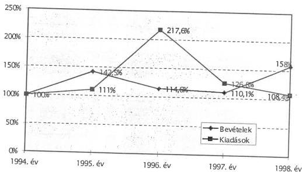

Az adó- és vámbevételek, valamint a **kiadások** aránya az Egyesült Királyság vámszerveinél 1,1% körül alakult. A VP-nél ez az arány a vizsgált időszakban 1,75% és 2,98%-os intervallumban mozgott.

21

---

II. RÉSZLETES MEGÁLLAPÍTÁSOK

A kiadások és bevételek alakulása az 1994-1999. évek között.

|  Év | Kiadások folyó áron (Mrd Ft) | Bázis-viszony-szám 1994. év 100% | Adó- és vámbevételek (Mrd Ft) | Bázis-viszony-szám 1994. év 100% | Kiadások aránya a bevételekhez (%) | Infláció mértéke az előző évhez (%)  |
| --- | --- | --- | --- | --- | --- | --- |
|  1994 | 8,2 | 100,0 | 467,9 | 100,0 | 1,75 | 18,8  |
|  1995 | 9,1 | 111,0 | 666,8 | 142,5 | 1,36 | 28,2  |
|  1996 | 19,8 | 241,5 | 764,1 | 163,3 | 2,59 | 23,6  |
|  1997 | 25,1 | 306,1 | 841,3 | 179,8 | 2,98 | 18,3  |
|  1998 | 27,2 | 331,7 | 1.329 | 284,0 | 2,05 | 14,3  |

A kiadások növekedési üteme nominál értéken számolva az 1996. év kiugró (217%) növekedését követően folyamatosan mérséklődött, 1998-ban a növekedés üteme már nem érte el az infláció mértékét, így a kiadások reálértékét nem sikerült megőrizni, miközben a szervezet feladatai folyamatosan bővültek.

A kiadások szerkezete 1996. évtől kezdődően eltolódott a beruházások javára, ami az informatika és a határátkelőhelyek fejlesztését, a vámhivatalok és a VPOP elhelyezési körülményeinek javítását szolgálta. A fejlesztések ellenére is a VP technikai erőforrások tekintetében még elmarad az uniós tagországok fejlettségi szintjétől.

A **bevételek** növekedési üteme nominál értéken számolva 10,1% és 58% között mozgott. A növekedés ütemére hatással volt:

- – a forint leértékelése, mert ezáltal nőtt az importált termékek vámértéke;
- – az áruforgalomnak az infláció mértékét meghaladó értéknövekedése;
- – az importált termékek összetételének változása, ami kedvezően hatott az import ÁFA és az import fogyasztási adó növekedésére;
- – a törvényi változás, ami a jövedéki adót a VP által beszedett adóbevételekbe integrálta;
- – a vámpótlék, amely 1995. évtől növelte a bevételeket, majd mértéke és ezáltal összege folyamatosan csökkent és 1997. július 1-től megszűnt;
- – az adómértékek valorizálása, valamint az adóztatás alá vont termékek körének módosítása mind pozitív, mind negatív irányba hatott a bevételek alakulására.

22

---

II. RÉSZLETES MEGÁLLAPÍTÁSOK

A bevételi struktúra a vizsgált időszakban jelentősen megváltozott. A bevételekben egyre kisebb szerepet töltenek be a vámbevételek és nagyobb részt képviselnek az import ÁFA és a jövedéki adóból származó bevételek. A bevételek növekedését mérsékelte a Közösségi Vámkódex EU vámtételekhez való igazodása (vámleépítés), a vámtételek mértékének csökkentése, valamint a statisztikai illetéket fizetők körének szűkítése.

## 2. A VÁM- ÉS EGYES ADÓBEVÉTELEK REALIZÁLÁSÁVAL KAPCSOLATOS HATÓSÁGI TEVÉKENYSÉG

### 2.1. A vám- és jövedéki alanyok regisztrálása

A központi költségvetés bevételeinek realizálása szempontjából kiemelt jelentősége van a vám- és jövedéki alanyok vámhatósági nyilvántartásba kerülésének.

Tipikus import esetén az első behozatal időpontjában kerül a vámkezelést kérő a regisztrációs rendszerbe. **A vámadások teljes körű nyilvántartása a VÁMSZÁM, illetve a VÁMREG informatikai rendszer bevezetésével 1998. évtől biztosított.** Az adatok bevitele, számítástechnikai rögzítése árunyilatkozathoz kötött, ezáltal a fiktív cégekre, ügyletekre jelzést nem adhat. Ezek kiszűrését a VP, APEH, cégbíróságok közös nyilvántartó rendszerének kialakítása jelentené. Az adatok cégnyilvántartással való ütköztetése különösen az aktív feldolgozási ügyleteknél (pl bérmunka, összeszerelés) indokolt, ahol a vámáruk vám- és vámbiztosíték mentesen kerülnek kiadásra.

A vámtörvény az Art.-vel szemben nem írja elő a gazdálkodó szervek részére a tevékenység megkezdésével egy időben a vámhatóság tájékoztatását, beleértve a gazdálkodó szervezet adataiban bekövetkező változások bejelentését sem. Ennek hiányában a gazdálkodó szervezetek vámigazgatás szempontjából lényeges adatainak nyomon követése nem megoldott.

A gazdasági jellegű vámeljárásoknál (pl. az aktív feldolgozásnál vagy ideiglenes behozatal esetén) a hazai vámjogban a tevékenység engedélyezésénél - az EU szabályokkal ellentétben - széles körűen nem alakult ki az engedélyezés gazdasági indokoltságának felülvizsgálata. A feldolgozási célból történő behozatal esetében a tevékenységi engedélyköteles termékeknél (élelmiszer, veszélyes áruk) szükséges a GM és a környezetvédelmi hatóság engedélye, a nem engedélyköteles termékeknél a GM engedélyezési eljárása csak formális.

A vámtörvény 74. § (2) bekezdés részletes szabályaira kiadott Vhr. az aktív feldolgozás engedélyezési szabályait teljes körűen nem tartalmazta, erre vonatkozó előírásokat a 21/1996. (III. 28.) IKIM rendelet rögzített, melyet a passzív feldolgozási tevékenység engedélyezésének rendjéről szóló 8/1998. (X. 21.) GM rendelet hatályon kívül helyezett. Így jelenleg nincs olyan szabályozás, amely az engedélyezéssel kapcsolatos előírásokat rendezné, holott a vámtörvény 74. § (1) bekezdésének a) pontja feltételezi a hatályon kívül helyezett IKIM rendeletet.

**A jövedéki alanyok teljes körű regisztrációja** az előzetes engedélyezési eljárás keretében **biztosított.** A Jöt. 17. § (1) bekezdése célirányosan határozta

23

---

II. RÉSZLETES MEGÁLLAPÍTÁSOK

meg az adóalanyok körét, ezzel csökkentette a VP adminisztrációs terheit is. **Az új jövedéki engedélyek kiadása nem volt zökkenőmentes.** A jövedéki engedélyeket manuális úton kellett kiállítani, mert a VP számítógépes feldolgozó rendszere nem készült el határidőre. Később a már kiadott engedélyeket bevonták és új gépi úton előállított engedélyeket adtak ki.

A törvény a jövedéki engedélyek kiadását a megyeszékhelyi vámhivatalok hatáskörébe utalta. A törvény hatálybalépését megelőző időszakban a már jövedéki engedéllyel rendelkező adóalanyoknak 1998. február 28-ig kellett az új törvény előírásainak betartásával jövedéki engedélyüket megújítani.

**A szigorú és egyben rendkívül hatásos jövedéki biztosíték rendszer (készpénz és bankgarancia) bevezetése** - az államot megillető bevételek realizálása érdekében - **megszűrte a gazdálkodókat.** A jövedéki adóalanyok száma alapvetően átrendeződött 1998. évben, a VP nyilvántartásában 498 jövedéki, 853 adóraktári és 116 keretengedélyes szerepel, szemben az 1997. évi 6089 jövedéki engedéllyel rendelkezővel.

## 2.2. A hatósági határozatok és engedélyek

A VP által realizált bevételek a hatósági tevékenység keretében a határozathozatallal kerülnek kiszabásra, így a hatósági munka színvonala közvetlen hatással van a bevételi előírásokra és ezek realizálására.

Az ellenőrzés tapasztalatai szerint **a VP hatósági tevékenysége** - az elsőfokú határozatok előkészítettsége, a származási szabályok, a vámérték megállapítások szakszerűsége, az engedélyezési eljárások szabályszerűsége tekintetében - **a korábbi ellenőrzésünk értékeléséhez viszonyítva számottevően javult, a jelenleg feltárt hibák és hiányosságok ellenére a bevételek beszedésének tekintetében eredményesnek értékelhető.**

**Az elsőfokú határozatok** megalapozottsága a korábbi ÁSZ vizsgálat megállapításaihoz mérten kedvezőbb képet mutat. A jogerős bírói ítéletekben megerősített köztartozások aránya a perek kimenetelének arányát is hűen tükrözi. Erre utal, hogy **a jogerős bírósági ítéletek után fennmaradt (előírt) köztartozások aránya kedvező irányba változott**, az 1994. évi 22,7%-ról 1998. évre 72,4%-ra emelkedett. A perek többéves átfutási ideje miatt viszont az előírt köztartás jelentős része, különösen a felszámolási eljárás alá kerülő vállalkozások tekintetében, nem növelte a költségvetés bevételeit.

A jogerős bírósági ítéletekben az előírt vám- és importteher 1995. és 1998. évek között 44,4 - 60 - 66,9, illetve 72,4 %-ának megfizetésére kötelezték a vámadósokat. Az 1998. évi bírósági ítélettel megerősített 14,3 Mrd Ft előírt köztartozás 80 %-a azonban pénzügyileg nem realizálódott.

Az alaphatározatok előkészítettségének, megalapozottságának (figyelemmel a perek több éves átfutási idejére) jelentős a hatása a költségvetés bevételeire. Az első fokon hozott határozatok megalapozatlansága és ebből következően az ügyek elhúzódása miatt fokozatosan csökken a behajtható peresített köztartozás mértéke.

24

---

II. RÉSZLETES MEGÁLLAPÍTÁSOK

A köztartozás időarányos csökkentésének jellemző példája egy tiszafüredi kft. behozatali előjegyzésével kapcsolatos ügylet. A jászberényi vámhivatal 1992. évben hozott alaphatározataiban az utólagos ellenőrzés 357 db határozatot jogszerűtlennek tartott. Ezért a kivetett 1212 M Ft köztartozásból az ellenőrzés után 483 M Ft került előírásra. A megállapítások alapján hozott határozatokkal szemben a kft. fellebbezéssel élt. Az előírt összegeket a másodfokon eljáró vámhatóság - az elévülés következtében - 446 M Ft-ra csökkentette. Az előírt vámteher biztosítására - végrehajtási eljárás keretében - a vámhivatal 158,5 M Ft ingóságot vett zár alá. A kft. a vámhatósági határozattal szemben bírósági keresetet, míg a lefoglalt vámáruk után végrehajtási igényper iránti kérelmet nyújtott be. Az 1998. január 20-án hozott ítélet alapján a végrehajtási eljárás részben korlátozásra, illetve megszüntetésre került. A vámteher biztosítására mindössze 23,9 M Ft becsült értékű ingóság került zár alá, melyből 1998. májusban 10,4 M Ft befizetésre került sor.

Hat év elteltével sem zárult le egy jászberényi kft. - vámteher összegszerűségét vitató - pere. Az 1993. április 13-i vámkezelést követően hozott elsőfokú határozatokban (3 db) 75,5 M Ft vám és importterhet írtak elő. Az utólagos ellenőrzés jegyzőkönyve alapján (1994. évben) a módosított határozatok már csak 53,4 M Ft fizetési kötelezettséget tartalmaztak. Az első fokon 1998. október 12-én hozott ítélet az alperest a határozat megalapozatlansága miatt új eljárás lefolytatására kötelezte. A Bács-Kiskun, Szolnok megyei területi parancsnokság 1998. december 23-án fellebbezett.

**A jogszabályokkal összhangban hozott határozatok esetén a pénzügyi teljesítés a kiszabott köztartozások összegének megfelelően és (jogorvoslat hiányában) az esedékesség időpontjában történt.** A példák a megállapítások illusztrálására szolgálnak.

Egy budapesti kereskedelmi kft-nél tartott - három évre kiterjedő - utólagos ellenőrzés a tárgykörben hozott valamennyi vámhatósági határozatot felülvizsgálta. A vizsgálat tárgyát képező vámmentes vámkezeléseket jogszerűnek tekintették. A jegyzőkönyvek azt is rögzítették, hogy az előírások szerint kivetett köztartozásokat (általános forgalmi adó, környezetvédelmi termékdíj) megfizették.

Egy textilkereskedelmi kft-nél az ellenőrzött időszak 1994. április 1-jétől 1998. december 31-ig tartott. A felülvizsgálat a vámtarifa alkalmazására, a vámáruk származására, a vámérték kimunkálására és a vámáruk vámellenőrzés alá helyezésére terjedt ki. A vizsgálat hiányosságot nem tárt fel.

Egy bútorkereskedelmi kft. 1994. december 14. és 1998. december 31. közötti időszakra vonatkozó szűrőpróbaszerű ellenőrzése a vámtarifaszámok előírásszerű alkalmazására, vámáruk származására, a vámérték felülvizsgálatára és a vámáru vámellenőrzés alá helyezésének megtörténtére terjedt ki. A vizsgálat a vámhatósági határozatok jogszerűségét megerősítette.

**A felügyeleti intézkedések** eredményessége - a helyszínen ellenőrzött esetek 90%-ában - a felügyeleti jogkört ellátó VPOP gondos, körültekintő hatósági munkájával függ össze. A felügyeleti intézkedések szakszerűségét a szakmai felügyeletet ellátó PM Forgalmiadó és Vámfőosztálya jogalkalmazási iránymutatási tevékenysége is segítette.

Egy budapesti fuvarozó Rt.-nél és egy veszprémi kft-nél a VPOP a vámhatóság határozatát megsemmisítette és új eljárás lefolytatására kötelezte a elsőfokú vámhatóságot. A vámadós a felügyeleti intézkedéssel egyidejűleg bírósági felül-

25

---

II. RÉSZLETES MEGÁLLAPÍTÁSOK

vizsgálatot is kezdeményezett. A VPOP döntése alapján azonban a pereket megszüntették.

Egy kereskedelmi kft-nél, amikor a VPOP meggyőződött a per - alperes számára kedvező - kimeneteléről, felügyeleti jogkörével nem kívánt élni.

**Az államigazgatási eljárás általános szabályairól szóló 1957. évi IV. törvény (Áe.) 26. §-ának alkalmazása tekintetében nem ilyen kedvező a tapasztalat.** A kiválasztott minta egynegyedénél a korábbi ellenőrzésünk megállapításaihoz hasonlóan ezúttal is találkoztunk olyan ítélettel, ahol a tényállás tisztázását hivatott bizonyítási eljárás elmaradása miatt a másodfokon eljáró bíróság a vámhatóság határozatait megalapozatlannak minősítette.

Egy kiskunfélegyházi Kft. behozatali előjegyzésben vámkezelt vámáruval, a megmunkálás során keletkezett veszteség és hulladék mennyiségével elszámolni nem tudott. A kecskeméti vámhivatal határozatában a megrendelő részére vissza nem szállított anyagmennyiség után a Kft. részére kiszabta a vámot és az egyéb importterhet. A másodfokú határozat az alaphatározatot helyben hagyta. A bíróság másodfokon új eljárás lefolytatására kötelezte az első fokon eljárt közigazgatási szervet, mivel indokolása szerint „megfelelő bizonyítékkal kellett volna alátámasztani” álláspontjaikat a felperes által bérmunkaszerződés keretében végzett feldolgozási veszteség mértékét illetően.

A tényállás tisztázási kötelezettség elmulasztása jelentkezik egyes jövedéki törvénysértéssel kapcsolatos ügyekben is. A származás igazolására vonatkozó rendelkezések értelmezése okozott problémát az ún. fiktív számlázások esetén.

A bajai vámhivatal 1.371480 Ft jövedéki bírság kiszabásáról hozott határozatot egy dusnoki bt. részére. A társaság fellebbezése után - a megtámadott határozat megsemmisítését követően - az új eljárásban a jövedéki törvénysértés ismét megállapításra került, mivel a bt. a 11.000 liter gázolaj beszerzését valós számlával nem tudta igazolni. A fiktív számla tényét a vámhatóság nem tisztázta körültekintően, ezért mind az első, mind a másodfokú ítélet kapcsán a vámhatóság pervesztes lett.

**Az utólagos ellenőrzéssel** indult vámeljárások alapján hozott határozatok megalapozottsága a perek kimenetelében is kifejezésre jut. Egyes, nagy értékű (esetenként 10 Mrd Ft-ot meghaladó) köztartozást tartalmazó határozatok esetében nem a VP tevékenységén múlt, hogy a megnyert perek után nem realizálódott bevétel.

A hatósági tevékenység minőségének gyenge pontjai elsősorban az alaphatározatokra érkezett fellebbezések motivációiból, gyakoriságából lennének érzékelhetők. Az elsőfokú határozatok és ezzel együtt a teljes körű hatósági tevékenység szintetizáló minősítését azonban a jelenlegi nyilvántartási rendszer nem teszi lehetővé. A kereskedelmi áruforgalomban **az alaphatározatok ellen benyújtott fellebbezések számáról, összegéről nyilvántartást nem vezetnek. A másodfokú határozatok számáról és tartalmáról sincs információ. A felügyeleti intézkedések adatai szintén nem állnak rendelkezésre.** Az előbbi hiányosságok felszámolására az elmúlt években érdemi intézkedés nem történt annak ellenére, hogy a korábbi ellenőrzésünk is felhívta erre a figyelmet.

26

---

II. RÉSZLETES MEGÁLLAPÍTÁSOK

Összesített adatok hiányában nem áll rendelkezésre arra vonatkozó ismeretanyag, hogy a benyújtott jogorvoslatok a hatósági határozatok jellemzően mely elemeire, a vámeljárások mely mozzanataira irányultak, illetve eltérő jogértelmezés esetén mire vonatkoztak.

A jövedéki hatósági tevékenységet elemző általunk kért összesítő adatokat nyilvántartás hiányában többnapos munkával, kézi kigyűjtéssel tudták előállítani, ugyanakkor a kereskedelmi áruforgalomban keletkező vámhatósági határozatokat, azok magas száma miatt, utólagosan feldolgozni nem lehetett.

Kellő információ hiányában a VPOP a hatósági munka jogszerűségét elősegítő belső szabályozásában, oktatási és továbbképzési tevékenységében nem helyezhetett kellő hangsúlyt a gyakorlatban jelentkező gyenge pontok fokozott felszámolására.

A VP szakmai főosztályai által a belső utasításokban kiadott, a Vám- és Pénzügyőri Értesítőben rendszeresen közzétett iránymutatások hasznos segítséget nyújtanak a vámhivataloknak az egységes hatósági fellépéshez, illetve döntéshozatalhoz, azonban nem ítélhető meg, hogy azok tartalmilag mennyiben érintik a fellebbezéssel megtámadott elsőfokú határozatok vitatott elemeit.

A hatósági tevékenység VP általi elemzését önmagában az is indokolja, hogy az 1994. évi adatokhoz képest a jogerős ítéletekkel zárult közigazgatási perek száma 1998. évben több, mint háromszorosára, a perbeli köztartozások összege pedig 40-szeresére emelkedett. Az is figyelemre méltó, hogy a VP által realizált vám- és adóbevételekhez képest a perveszteség miatt kieső (előírt) köztartozás az 1994. évi 0,1 %-ról az 1998. évre 0,4 %-ra emelkedett, de még mindig nem túl magas.

Míg 1994-ben 176 db per mellett 0,5 Mrd Ft volt az előírt köztartozás összege, addig 1998. évben 564 db perre 19,8 Mrd Ft (ebből 9,9 Mrd Ft egy Rt.) vám- és adótartozás (előírás) jutott.

# 2.2.1. A származási szabály alkalmazása

Ellenőrzésünk a jelentős nagyságrendű származási igazolással kapcsolatos ügyeket tekintette át és megállapítottuk, hogy a származási szabály helyes alkalmazását igazolják a nemzetközi gyakorlattal és a bírósági ítéletekkel alátámasztott vámhatósági határozatok.

Az esztergomi vámhivatal az 1997. szeptember 27 és 1998. január 23. napja között kiadott határozataiban az exportálni kívánt személygépkocsikra vonatkozóan az EU1. szállítási bizonyítvány hitelesítését, illetve utólagos megerősítésre irányuló kérelmét a vámigazgatási bírság kiszabása mellett visszautasította. A másodfokú vámhatározatok az alaphatározatokat helybenhagyták.

A vámhatóság a EU-n kívüli importtermékekre vonatkozóan adott árengedmények miatt utasította vissza az exportőr ez irányú kérelmét. A vámhatóság szakmai álláspontját a VPOP Ellenőrzési Hivatalának az utólagos ellenőrzéséről készült jegyzőkönyve is alátámasztotta.

A vizsgálat az UCLAF (Európai Unió Csalás Elleni Bizottsága) EU1 származási bizonyítványok utólagos ellenőrzésére és a vámérték ellenőrzésére vonatkozó ké-

27

---

II. RÉSZLETES MEGÁLLAPÍTÁSOK

relmére történt. A vizsgálat célja az exportált személygépkocsik származási helyzetének tisztázása volt. A vizsgálat megállapításait az UCLAF teljes egészében elfogadta, melynek eredményeképpen az EU tagállamok döntő része utólag visszavonta az exportőr felé megadott preferenciát.

A vizsgált vállalat bírósági útra terelte az eljárást, az illetékes bíróság helyt adott a vállalat keresetének és elfogadta az általa alkalmazott árképzési gyakorlatot.

A tapolcai vámhivatal 1997. május 11-én kelt határozatában kiviteli ellenőrzés keretében egy nyirádi kft. EU1 szállítási bizonyítvány hitelesítése iránti kérelmét utasította vissza, mivel a felhasznált nem származó anyagok értéke meghaladta a termék gyártelepi árának 50 %-át (az 1993. évi LXXXIII. törvényben kihirdetett, a Magyar Köztársaság és az EFTA tagállamai között aláírt Szabadkereskedelmi megállapodás B Jkv. 1. Cikk alapján a másodfokú határozat az alaphatározatot helybenhagyta.) A Veszprémi Városi Bíróság ítéletében elutasította a felperes kft. keresetét. Az ítéletet másodfokon a Veszprém Megyei Bíróság 1998. október 18-án helybenhagyta.

### 2.2.2. A halasztott vámfizetés engedélyezési rendje

A halasztott vámfizetés feltételeit, engedélyezési rendjét a vámtörvény 132. § 5-12. bekezdései, részleteiben a Vhr. 212-213. §-ai rögzítik. Az összegszerű és időbeli korlátok ellenőrzésére kialakított nyilvántartási és figyelő rendszer működését belső utasításokban szabályozta a VP.

**A vámszempontból megbízható vállalkozások részére engedélyezett halasztott vámfizetési rendszer teljes körűen zártnak ítélhető.** Az engedélyek megadásánál a VPOP a vonatkozó előírások következetes betartásával járt el.

Az engedélyek meghosszabbításának, új engedélyek megadásának szigorítása is hozzájárult ahhoz, hogy a vizsgált három év alatt nem emelkedett lényegesen a halasztott vámfizetési engedéllyel rendelkező vállalkozások száma és aránya.

A kiadott engedélyek száma 1996-ban 211 db-ról - az átmeneti csökkenés után (1997-ben 190 db) - 1998. évre 5,4 %-kal emelkedett (233 db-ra). Ezen belül figyelemre méltó, hogy a halasztott fizetésű jövedéki engedélyek az 1996. évi 25 db-ról 5 db-ra, a feltételes engedélyek száma 40-ről 14 db-ra csökkent. A visszavonásra került engedélyek száma 1996-ban 38, 1997-ben 36 és 1998-ban 39 db volt.

**A rendszer megbízhatóságát jól szemlélteti, hogy 1998. évben halasztott vámfizetési engedéllyel rendelkező vámalany részére előírt köztartozás (453 Mrd Ft) után hátralék nem keletkezett.**

### 2.2.3. Általános (korlátlan) készfizető kezesség

A költségvetés vámteherre vonatkozó igényének érvényesíthetőségét a vámbiztosíték jogintézményén keresztül garantálja a vámtörvény. Vámbiztosítékot kell fizetni minden esetben, amikor a vámáru kikerül a vámhatóság közvetlen felügyelete alól.

28

---

II. RÉSZLETES MEGÁLLAPÍTÁSOK

A vámtörvény 7. §-a szerint a vámbiztosíték - az annak nyújtására kötelezett választása szerint - lehet készpénz, bank által vállalt garancia, vagy fedezetigazolás, továbbá készfizető kezesség.

Ellenőrzésünk tapasztalatai szerint a készpénzben nyújtott vámbiztosíték összege elenyésző. A legelterjedtebb a készfizető kezesség vállalásával nyújtott vámbiztosíték. **A készfizető kezességen belül az általános (korlátlan készfizető kezességvállalás 1998. évben közel 90%-ot tett ki, részben a nem kellően szigorú szabályozás, részben pedig a Vám- és Pénzügyőrség garancia nyilvántartási rendszerének hiányosságai következetében. Ezáltal a költségvetés számára pontosan nem számszerűsíthető kockázatvállalásra nyílt lehetőség.**

A vámtörvény 7. § 5. bekezdés d) pontja szerint 20 M Ft bankgarancia, illetve az ennek alapján kiadott készfizető kezességvállalási engedély biztosítja a kezesnek, hogy a bankgarancia érvényességi idején belül (a bankgarancia mértékét meghaladóan), összeghatárra tekintet nélkül vállalhat készfizető kezességet. (Ugyanakkor a jövedéki termékek tekintetében csak a bankgarancia mértékéig vállalható a kezesség.)

A kezességvállalási engedélyek kiadása a vizsgálat tapasztalatai szerint megfeleltek a vonatkozó előírásoknak, ennek részeként a VP meggyőződött a feltételek fennállása felől. **A VP nem készült fel arra, hogy a bankgarancia összegét meghaladó vállalkozói kezességet figyelemmel kísérje és érvényesítésük eredménnyel járjon.** Nem kontrollálták, hogy az adott cég a 20 M Ft bankgarancia mellett milyen összegre vállalt készfizető kezességet. Így fordulhatott elő, hogy **egyes, a bankgarancia mértékén felül kezességvállaló cégekkel szemben a VP-nek nem volt módja érvényesíteni az általuk vállalt készfizető kezességet.**

A 7. sz. Vámhivatal gépjármű kirendeltségénél 1997. és 1998. években történt vámérték vizsgálatok eredményeként egy kezességvállalással rendelkező budapesti vámtanácsadó részvénytársaság részére több, mint 71 M Ft vámteher került kiszabásra - ennek 80-85 %-a az ún. kettős számlázásból (a bemutatott és az eredeti számla különbözete) adódó vámteher különbözet -, melyből 17 M Ft-ot megfizettek, fedezethiány miatt azonban mintegy 54 M Ft vámtartozás keletkezett.

Egy dunakeszi székhelyű vámügynökség részére az előbbi esethez hasonlóan döntően vámérték vizsgálatból adódó vámteher-különbözet került előírásra. A vámügynökség felé benyújtott azonnal beszedési megbízás eredménytelen volt, ezért a VPOP az általános készfizető-kezesség vállalási engedélyt 1998. június 26-ával visszavonta.

**A jogszabály módosítását a VPOP kezdeményezte. A vámtörvény 1998. évi módosítása (XC. tv.) a készfizető kezesség túlvállalási lehetőségét - az árutovábbítások során vállalt kezesség kivételével - megszüntette.** Ennek eredményeként pl. a 7. sz. Vámhivatal Gépjármű Kirendeltségénél minimumra csökkent a használt gépjárművek vonatkozásában a kezességet nyújtó, illetve az általuk kiadott kezességek száma 1999. első két hónapjában. A törvényi szigorítás hatályba lépése előtti időszakban engedélyezett és még érvényben lévő kezességvállalási engedélyekkel kapcsolatosan kiadásra került a 33/1999. (II. 26.) Korm. rendelet, melynek 12. § (5) bekezdése

29

---

II. RÉSZLETES MEGÁLLAPÍTÁSOK

1999. I. 1-től IX. 30-ig átmenetileg visszaállította az eredeti szabályozást. Erre azért került sor, hogy a függőben lévő engedélyek még az eredeti eljárás szerint nyerjenek elbírálást.

## 2.3. Az ellenőrzési tevékenység

### 2.3.1. A vámellenőrzés

#### 2.3.1.1. Az előzetes ellenőrzés

A külkereskedelmi (behozatali és kiviteli irányú) áruforgalom vámeljárásának legfontosabb mozzanata a külső és belső áruvizsgálat.

A **külső** áruvizsgálat az árut kísérő bizonylatok, az árunyilatkozat adatainak és az áru külső jegyeinek összehasonlításából, valamint a vámzár felülvizsgálatából áll.

A **belső** áruvizsgálat az áru legfontosabb jellemzőit tisztázza. Ennek során ellenőrzik mindazon adatokat, amelyek meghatározzák a vámot és a vámmal együtt kivetendő adókat, illetékeket.

A vámhivatalok 1998. évben import forgalomban 1.442.075 esetben végeztek **behozatali** irányú vámkezelést. A vámkezelt vámáruk vámértéke 4.367,7 Mrd Ft volt. A belföldi felhasználásra behozott áruk alkották a behozatal nagyobb hányadát 3.565,1 Mrd Ft értékben. A forgalmi esetszám 14,1%-kal, míg a behozatali érték 32,6%-kal haladta meg 1998. évben az 1997. évi adatokat.

A **kiviteli irányú** forgalomban a vámhivatalok 1.232.393 esetben végeztek vámkezelést. A kivitelben kezelt áruk értéke 3.713,8 Mrd Ft volt, amely az 1997. évi forgalomhoz viszonyítva 1998. évben 18,1%-kal magasabb.

A vámvizsgálatok tartalmát és feltételeit a vámtörvény 46. §-a, részleteiben a vámtörvény végrehajtására kiadott, többször módosított 45/1996. (III. 25.) Korm. rendelet (továbbiakban Vhr.) 67., 67/A., 68. §-ai írják elő. A vámkezelés módját viszont a vámtörvény 46. §-ának rendelkezései alapján a vámhivatalok határozzák meg.

**Az áruforgalom mintegy 7-10%-át kitevő, a Vhr. 85. § (1), valamint a 88. § (3) bekezdésben meghatározott áruk** (a jövedéki termékeknél és a Vhr-ben felsorolt ún. veszélyes és érzékeny áruk, továbbá a nemzetközi egyezményekben rögzített termékek és technológiák) **vonatkozásában 1998. évben a tételes vámvizsgálati kötelezettségének** - a helyszíni vizsgálat tapasztalatai szerint (a véletlenszerű kiválasztás 21%-os) - **a VP eleget tett.**

A kereskedelmi forgalomban az áruféleségek több, mint 90 %-ánál a vámhatóság egyszerűsített vámvizsgálatot végez. Arról, hogy ezekből mennyi a szűrőpróbaszerű, illetve az okmányszerű vizsgálatok száma és aránya, teljes körű nyilvántartást nem vezetnek. Ennek hiányában a VP sem ismeri ezek megoszlását, pedig ezen adatok elemzése a bevételek beszedése és a feketekereskedelem visszaszorítása érdekében szükséges lenne.

30

---

II. RÉSZLETES MEGÁLLAPÍTÁSOK

A helyszíni ellenőrzés alkalmával - kérésünkre - négy vámhivatalnál és a RO-LA (közúti járművek vasúti árutovábbítása) szolgálati helyen az árunyilatkozatok adatai kigyűjtésre kerültek.

A záhonyi vámhivatalnál 37.285 db árunyilatkozatból mindössze 2,9%-os volt a tételes áruellenőrzés, a szúrópróbaszerű ellenőrzés az esetek 12,1%-át érintette, 85%-ban adminisztratív ellenőrzést tartottak.

A röszkei vámhivatalnál 17.189 db árunyilatkozatból 6,8%-ban tételes, 32%-ban szúrópróbaszerű és 61,2%-ban adminisztratív ellenőrzést folytattak.

A tompai vámhivatalnál a kisebb forgalom mellett 3925 db árunyilatkozat benyújtásánál 32,3%-ban tételes áruvizsgálatot tartottak, a szúrópróbaszerű vámvizsgálati esetek száma 50,5%-os volt, míg az okmányszerű 17,2% volt.

A soproni vámhivatal 140.657 db árunyilatkozata alapján 8,3%-ban tételes ellenőrzést tartottak, 14,4%-ban szúrópróbaszerű és 77,3%-ban adminisztratív jellegű ellenőrzés elrendelésére került sor.

A soproni RO-LA szolgálati hely 21.106 db árunyilatkozatából 2,8%-ban tételes, 16,2%-ban szúrópróbaszerű és 81,0%-ban okmányszerű áruvizsgálatot folytattak.

Az utólagos, a piaci és a közúti ellenőrzések tapasztalatai ráirányítják a figyelmet arra, hogy a feketekereskedelem elleni fellépés eredményessége döntően úgy javítható, ha a VP nagyobb hangsúlyt fektet az illegális áruk országba kerülésének megakadályozására, a célzott, illetve tételes belső áruvizsgálatok számának emelésével.

A tételes áruvizsgálatok száma - annak ellenére, hogy ennek fontosságára és kiemelt jelentőségére a korábbi ÁSZ vizsgálat is felhívta a figyelmet - elsősorban a veszélyeztetett határszakaszon igen alacsony. A határellenőrzés kockázatát tovább növeli, hogy a vámvizsgálatok célzott szempontrendszerét nem alakították ki, pedig ennek informatikai háttere (VÁMREG) rendelkezésre áll.

A kiválasztás módszere - a Vhr. vonatkozó előírásai, valamint a VPOP utasítások mellett - döntően a vámkezelést végzők személyes tapasztalatain, intuícióin alapul. Az indokoltnál nagyobb szerepe van még mindig az emberi tényezőknek annak ellenére, hogy az információs rendszer a kockázatelemzés kialakításának feltételeit megteremtette.

# 2.3.1.2. A vámérték vizsgálatok eredményessége

A hatósági jogalkalmazási munkában esetenként zavart, bizonytalanságot okozott, hogy a vámtörvény előírásait időben nem követték a vámérték vizsgálatokra kiadott VPOP utasítások. Ennek eredményeként a bevallott és az ideiglenes vámérték felett kiszabott (vámérték vizsgálattal lezárt) vámteher különbözet jogosságát a VP esetenként - bizonyítás hiányában - nem tudta megerősíteni, mivel a külföldről kért információkat csak késedelmesen kapta meg, így túllépte az utasításában - a vámtörvénnyel ellentétesen - megállapított elintézési határidőt.

31

---

II. RÉSZLETES MEGÁLLAPÍTÁSOK

A vámtörvény 145. §-a a vámigazgatási ügyekkel kapcsolatos alapvető eljárási rendet szabályozza. E szakasz (1), illetve (7) bekezdése - kivéve az 1997. II. félévet - az elintézési határidők megállapításában is egyértelműen rendelkezik.

A vámérték vizsgálat eljárási rendjéről szóló 23/1997. (II. 11.) VPOP utasítás az elintézés határidejének megállapításánál csak a vámtörvény 145. § (1) bek. szerinti eljárást rögzíti. Ezzel összefüggésben úgy rendelkezik, hogy az Áe. 15. § (1) bekezdés szerinti elintézési határidő „egy ízben legfeljebb 30 nappal” meghosszabbítható. Az is előírásra került hogy „a határidő túllépése esetén a vámérték vizsgálatot azonnal be kell fejezni, az ideiglenes vámérték helyett véglegeset kell megállapítani a különbözői vámbiztosíték egyidejű feloldása mellett”. Az utasítás tehát meg sem említi a vámtörvény 145. § (7) bekezdését, mely szerint a külföldi vámhatóság válaszának megérkezéséig eltelt idő nem számít bele az elintézési határidőbe.

Fentiek alapján a 23/1997. (XII. 11.) VPOP utasítás 1997. június 30-ig, illetve 1998. január 1-jétől nem felel meg a vámtörvény előírásainak. Az utasítás a vámtörvény 1997. évi L. törvény 56. §-ának módosításával került összhangba, mivel a vámtörvény 145. § (6) bekezdés c) pontja megszüntette a vámérték vizsgálat során történő külföldi megkereséssel eltelt idő elintézési határidőbe való beszámítását.

Egyes, nem egyértelmű VPOP utasítások, amelyek a külföldi megkeresésekkel kapcsolatosak, a **vámérték** vizsgálatok eredményességét gyengítették.

Az „eljárási rend a vámérték vonatkozású külföldi megkeresések során” tárgyú 44/1997. (IV. 8.) VPOP utasítás helyesbítette a 23/1997. (II. 11.) VPOP utasítás hiányosságait. Ennek kiegészítésére kiadott 165/1998. (IX. 28.) VPOP utasítás azonban a külföldi vámigazgatások indokolatlan leterhelésének alapgondolatából kiindulva megteremtette a lehetőségét a vámérték vizsgálatok hatásfoka gyengítésének. Az utasítás szerint „azon exportőrök esetében”, ahol „a vámhivatal korábban már élt külföldi megkereséssel és a külföldi vámigazgatás az érdemi választ megadta, úgy ismételt megkeresésre csak különösen indokolt és kivételes esetben van lehetőség”. Ilyen esetekre azonban az utasítás már nem tér ki.

Az utasítás következetes betartásával a 7. sz. Vámhivatal gépjármű kirendeltsége már nem kereste meg a német vámhatóságot akkor sem, amikor a bevallott vámérték (3000 DEM) és az összehasonlító érték (19.157 DEM) között több mint 6-szoros volt az eltérés. (1998. október 1-jei határozat sz.: 10750480106459.) Az 1998. október 1-jei vámkezelésnél sem keresték meg az olasz vámigazgatást, pedig a bevallott vámérték (1,5 M ITL) és a vámérték vizsgálat eredménye (15,3 M ITL) között 10-szeres volt a különbözet (határozatszám: 10750480105999). Mindkét esetben a bevallott vámérték alapján került kiszabásra a vám- és importteher.

**Ugyanakkor a VP - elismerésre méltóan - érdekeltségi rendszerén keresztül is a vámérték vizsgálatok számának és hatékonyságának növelésére törekszik.** Az eredmények az esetszámok emelkedésében és a külföldi megkeresésekből származó elkövetési érték (a bevallott és a tényleges vámérték különbözete) növekedésében mutatkoznak. **Különösen kedvezően értékelhető, hogy a külföldi vámigazgatás segítségével megállapított elkövetési érték 1997. évhez mérten 7-szeresére emelkedett.**

Két kft és egy zöldség-gyümölcs importtal foglalkozó magánszemély esetében a Vámérték Osztály által tartott vizsgálat során kétség merült fel a gazdálkodók ál-

32

---

II. RÉSZLETES MEGÁLLAPÍTÁSOK

tal benyújtott számlák valódiságát illetően. Így a vámhatóság megkereséssel élt a holland vámigazgatás felé. A válaszlevélben foglaltak szerint a Magyarországon bemutatott számlák nem voltak megtalálhatók a holland exportőr cég nyilvántartásában. A ténylegesen kifizetett számlamásolatokat mellékelték, melyben a bevallottnál lényegesen magasabb árakat tüntettek fel. A válaszlevél továbbítását követően az illetékes vámhivatal feljelentést tett csempészet elkövetésének alapos gyanúja miatt a Fővárosi Nyomozó Hivatal felé és ezzel egyidejűleg az utólagos eljárás során vámterhet és vámigazgatási bírságot szabott ki. Az elkövetési érték 76.447,960 Ft.

A nyíregyházi vámhivatal 1998. június 15-én nagy mennyiségű háztartási árut, alumíniumárut, rozsdamentes acélból készült edénygarnitúrát, nem elektromos vízmelegítőt, kenyérpirítót és kanálkészletet vámkezelt a belföldi forgalom számára egy kft. indítványa alapján. A vámhivatal a vámkezelést a kérelemnek megfelelően elvégezte, a bevallott vámértéket ideiglenesnek tekintette és egyúttal elrendelte a vámérték vizsgálatot is. A különbözőt vámbiztosítékra készfizető kezességi nyilatkozatot egy kft. adott. A vámérték vizsgálat keretén belül a vámhivatal külföldi megkeresést javasolt. A belga vámigazgatás tájékoztatása szerint az áruk vételára a bevallott értéktől eltért. A vámérték különbözet 58.806.187 Ft volt. A válaszlevél megérkezését követően a vámhivatal feljelentést tett a VP Szabolcs-Szatmár-Bereg MP Nyomozó Hivatalánál.

Egy kft. élelmiszeripari termékek belföldi forgalom számára történő vámkezelését indítványozta. Miután a bevallott vámérték indokolatlanul alacsonynak tűnt, ezért vámérték vizsgálat elrendelésére került sor, melynek keretén belül a vámhivatal élt a külföldi megkeresés lehetőségével is. Az osztrák vámigazgatás a vizsgálatot lefolytatta, melynek során a kettős számlázás ténye megállapítást nyert. Az illetékes vámhivatal feljelentést tett a VP Fővárosi Nyomozó Hivatalánál. Az elkövetési érték 96.656.000 Ft volt.

**A vámérték vizsgálatok számának növelése azonban nem állt arányban a bevételek növekedésével. Az sem kedvező, hogy a vizsgálatok számán belül a vámérték emelések száma az 1997. évi 5,7%-ról 5,1%-ra csökkent 1998-ban.**

1997. évben 12348 vizsgálatból 708 esetben történt vámértékemelés, melyből 116 M Ft bevétel realizálódott. A lezárt vámérték vizsgálatok száma az érdekeltségi rendszernek köszönhetően 1998. évben több, mint duplájára nőtt, 27.942 volt, melyből 1438 esetben került sor vámérték emelésre. A vizsgálatokból származó bevétel 176,4 M Ft volt. Megállapítható tehát, hogy mind az esetszámokhoz, mind a vámérték emelésekhez mérten a fajlagos bevétel számottevően csökkent.

A gépjárművek esetében a vizsgálatok eredményességét kedvezőtlenül befolyásolja, hogy az elrendelt vámérték vizsgálatok 65-70%-nál - döntően objektív okok miatt - nem veszik (vehetik) igénybe a külföldi vámigazgatás segítségét. Pl. az összehasonlító értéknél 20%-ot meghaladó mértékben alacsonyabb számlák mintegy 50%-a olyan országból származik (pl. Svájc), amely nem írta alá a Vámérték Együttműködési Megállapodást, így az egyedi megkeresés nem nyújt segítséget.

Helyszíni vizsgálatunk a 7. sz. Vámhivatal gépjármű kirendeltségén az 1998. október 1-jei vámkezeléseket tekintette át. Az összesen 35 vámkezelésből 17 esetben a számla Svájcból származott; 5 esetben a 165/1998. (IX. 28.) VPOP utasítás hatályba lépése miatt nem keresték meg a külföldi vámigazgatást, 7 esetben a

33

---

II. RÉSZLETES MEGÁLLAPÍTÁSOK

vámérték vizsgálat a helyszíni ellenőrzésünk befejezésének időpontjáig nem zárult le, 6 esetben a vámérték vizsgálat eredményes volt..

# 2.3.1.3. A vámvisszatérítéssel kapcsolatos ellenőrzés

A vámvisszatérítés végrehajtásának ellenőrzésére a VPOP - 1998. március 26-ig - nem adott ki belső utasítást.

A vámvisszatérítés módját és feltételeit a Vámtörvény 137. §-a, az egyszerűsített vámvisszatérítést a Vhr. 216-217. §-ai szabályozzák. Ezt követően a 34109/1998. VPOP Utasítás elrendelte az 1 M Ft feletti tételeknél a teljes körű felülvizsgálatot. A nagy tételszámra tekintettel októbertől 3 M Ft feletti és a 1-3 M Ft közötti tételeknél szúrópróbaszerű ellenőrzést írtak elő az esetek 5-10%-ában.

# A felülvizsgálatok által feltárt hiányosságok igazolták az előzetes és utólagos ellenőrzés indokoltságát.

A vámhivatalok esetenként nem ellenőrizték a szabadkereskedelmi megállapodások 15. Cikkében meghatározott vámvisszatérítési tilalom betartását. A leggyakoribb hiba volt, hogy nem követelték meg a gazdálkodóktól a Vhr. 128. § (1) b. pontjában meghatározott szempontok szerinti anyagfelhasználási kimutatást, valamint a befizetéseket igazoló bizonylatokat. Ebből következően nem is győződhettek meg a vámvisszatérítés valós tartalmáról.

A helyszíni ellenőrzésünk során a Fővárosi Parancsnokság 1. sz. Vámhivatalánál áttekintett dokumentációk alapján a következő hiányosságokat tapasztaltuk.

Egy budapesti kft. - a 9/1995. (III. 17.) IKM-PM együttes rendelet 2. §-ára hivatkozva - 10 db síkkötőgép után megfizetett vámpótlék visszatérítését kérte. A visszafizetés feltételeként előírt - beruházás céljából történő behozatalról szóló - igazolást viszont csak 2 db gépre nyújtotta be. Az 1. sz. Vámhivatal 8 db gép után jogtalanul utalta vissza a vámpótlékot. A tévesen visszafizetett összeg (1 M Ft) előírása iránt az intézkedés megtörtént.

Egy édesipari kft. és elektronikai rt. exporttermékbe történő beépítés címén kért vámvisszatérítést. Az anyagfelhasználási kimutatás nem felelt meg a Vhr. 128. § (1) bekezdésében foglalt előírásoknak. Ennek ellenére a vámvisszafizetés megtörtént. (A téves visszatérítéssel összefüggésben a bevételezésre intézkedés történt.)

Egy esetben a Fővárosi Parancsnokság az 1998. I. félévi határozatok felülvizsgálata alapján az 1. sz. Vámhivatal 1.100.610 Ft visszatérítésről hozott alaphatározatát megsemmisítette és új eljárás lefolytatására kötelezte a Vámhivatalt.

# 2.3.1.4. Az utólagos ellenőrzés

A belső áruvizsgálat szempontrendszere kialakításának elhúzódása és az okmányszerű ellenőrzések nagy száma az utólagos ellenőrzések (a vámhatóság által végzett a vámfizetésre kötelezett vámellenőrzés alá eső külkereskedelmi tevékenységre irányuló teljes körű felülvizsgálat) fontosságát és szerepét felértékelte.

34

---

II. RÉSZLETES MEGÁLLAPÍTÁSOK

# **Az utólagos ellenőrzéseknél a kockázatelemzésen alapuló célirányos szakszerű kiválasztás - 1998. évben kombináltan, 1999. évben teljes körűen - a vizsgálati programokba beépítésre került.**

Az Ellenőrzési Hivatal által kidolgozott kockázatelemzési módszer (az emberi és anyagi erőforrások optimalizálásával a kockázatok lehető legalacsonyabb szintre történő csökkentése) nem csak az utólagos ellenőrzéseket, hanem alkalmanként a vámellenőrzéseknél előforduló összes ellenőrzés fajtáját (előzetes, folyamatba épített stb.) is segítheti. Az ellenőrzések hatékonysága lényegesen javul, mivel a kockázatos áruféleségeket, szállítókat, származást stb. a számítógépes adatbázis segítségével választják ki.

**A helyszíni ellenőrzés során áttanulmányozott - az ellenőrzési hálózat által végzett - ellenőrzések megállapításai jellemzően objektívek, szakszerűek, eredményei jelentős mértékben hozzájárultak a behozott árumennyiség hitelesebb számbavételéhez, a központi költségvetés bevételei növekedéséhez, a vámhatóság nemzetközi elismeréséhez.** Az utólagos ellenőrzés közvetett módon, a bűnüldöző szervek munkáját is segíti akkor, amikor a feltárt jogsértések esetén büntető feljelentést is kezdeményez.

Az utólagos ellenőrzés objektivitását igazolja, hogy egy budapesti gépjárműforgalmazó kft-nél tartott, több évet átfogó ellenőrzés - 3 esetben az alapvámkezelésnél alkalmazott vámtétel helytelen megállapítása miatt - a vámhivatal 7,5 M Ft visszatérítést rendelt el az importőr javára.

Egy dunaújvárosi kft-nél tartott, 1993. szeptember 1 - 1998. február 28. közötti időszakot felölelő ellenőrzés tárgya az importvámkezelésekhez kapcsolódó számlák és átutalások szűrőpróbaszerű felülvizsgálata volt. A vizsgálati jegyzőkönyv megállapításai alapján „a kft a vámkezelések során a vámteher megállapítása szempontjából lényeges körülmény (fuvarköltség, vámérték) tekintetében valótlan nyilatkozatot tett”. Elsősorban erre a megállapításra alapozva és megfelelő szakmai indoklással alátámasztva a Pest-Fejér-Nógrád megyei területi parancsnokság 4824 M Ft értékben elkövetett csempészet alapos gyanúja miatt tett feljelentést. A vizsgálat jegyzőkönyve alapján 66 határozatot a vámhivatal módosított. A kiszabott köztartozás 2.155 M Ft volt, melyből 1.991 M Ft bevételezésre került, emellett 718 M Ft vámbírság is terhelte a gazdálkodót.

Szintén büntetőfeljelentéssel zárult egy salgótarjáni rt.-nél folytatott utólagos ellenőrzés. A jegyzőkönyv alapján 84 M Ft értékben elkövetett csempészet bűncselekmény, illetve 6.245 M Ft értékben elkövetett devizabűncselekmény alapos gyanúja miatt a Pest-Fejér-Nógrád megyei területi parancsnokság feljelentést tett. Az előírt köztartozás 46 M Ft volt, melyből 44 M Ft pénzügyileg realizálódott. A megállapított vámigazgatási bírság 15 M Ft volt, melyből 13 M Ft befolyt a költségvetésbe.

A vizsgált esetekben a vámtörvény 161-172. § előírásai - a 162. § kivételével - betartásra kerültek. **Kedvezően értékelhető, hogy az utólagos ellenőrzések kapcsán előírt költségvetési bevételek mintegy 57 %-a (1998. évben 3,7 Mrd Ft) beszedésre is került annak ellenére, hogy azok mögött nem volt vámbiztosíték.**

35

---

II. RÉSZLETES MEGÁLLAPÍTÁSOK

### 2.3.2. A jövedéki ellenőrzés

A jövedéki ellenőrzés a Jöt. 73. §-ában előírt célja, hogy felügyelje a jövedéki alanyok törvényben meghatározott (adó) kötelezettségeinek betartását és felderítse a jövedéki termékek előállításával, forgalmazásával, importálásával kapcsolatos esetleges törvénysértéseket.

A Jöt. szigorú előírásaival visszaszorítja az adóelkerülés lehetőségeit és garanciarendszerével megteremti a költségvetési bevételek biztonságosabb, folyamatosabb áramlásának feltételeit. A jövedéki adóbevételek 81%-át (308 Mrd Ft) befizető adóalanyok (11 gazdálkodó) ellenőrzésének meghatározó jelentősége van.

A költségvetési kapcsolatok szempontjából a legmagasabb kategóriába tartozó adóalany részére a Jöt. előírásaitól eltérően a Budakörnyéki vámhivatal olyan összegek visszautalását rendelte el, melyek befizetése nem történt meg. A cél ellenőrzés alkalmával nem volt nyomon követhető az, hogy a vámhivatal által előírt határidőre, azaz a vámkezelést követő 30. napig a jövedéki terméket adóraktárba, adómentes felhasználók üzemébe betárolták-e. A vámhivatal a felfüggesztett jövedéki adók (218 M Ft) esetében nem tartotta nyilván és nem ellenőrizte, hogy a vámfizetésre kötelezettek a fentiekben megadott határidőig teljesítették-e kötelezettségüket. Az előbbiek miatt a vámhivatal megsértette a Jöt. 10. §-ának (3) és 13. §-ának (6) bekezdését és 14. §-át.

Az ún. virilistás ellenőrzés bevezetése a vámtarifaszám bonyolultsága, a speciális szakértelem miatt is indokolt lenne. **Kifogásolható, hogy a helyes vámtarifaszám besorolásának ellenőrzésére mindössze egy esetben került sor adóellenőrzés keretében** (a 18. számú Vámhivatal folytat adóellenőrzést, amely a helyszíni vizsgálat befejezéséig még nem zárult le).

A jövedéki adó mértéke a vámtarifaszám alapján állapítható meg. A legnagyobb adófizető a termékeit több, mint száz féle vámtarifaszám alá sorolja be. Speciális szakértelmet kíván annak eldöntése, hogy a benyújtott okmányok alapján a termékek megnevezése és tarifális besorolása megfelelő-e.

A legnagyobb adófizetők tevékenységének kontrolljára indokolt lenne külön ellenőrzési szervezetet létrehozni.

A VP által végzett ellenőrzéseknél döntő mértékben a Jöt., kisebb részben viszont az Art. rendelkezései az irányadók. A nem adóalanyok közterületi, piaci, közúti ellenőrzése, továbbá az adóalanyok jövedéki és adóellenőrzése a Jöt. szerint, a klasszikus adóellenőrzés azonban az Art. szerint történik. A két adótörvény együttes alkalmazása több jogértelmezési problémát vetett fel, amit a VPOP utasításaiban többnyire megfelelően rendezett.

A jogtalan adó visszaigénylés esetén a jogosulatlan igény 100%-ában határozta meg az adóbírság összegét a Jöt., ugyanakkor az Art. a kiszabható bírság felső határát 50%-ban maximálta.

A mezőgazdasági visszaigénylőknél a bírság alapjának meghatározásakor problémát jelentett, hogy a gázolaj jövedéki adó tétele (67,5 Ft/l) és a termelő által visszaigényelhető adó összege (44,3 Ft/l) nem azonos. A Jöt. 74. § (2) bekezdése

36

---

II. RÉSZLETES MEGÁLLAPÍTÁSOK

szerint a bírság alapja nem a jogtalanul visszaigényelt adó összege volt, hanem a jövedéki adó tétele.

A jövedéki ellenőrzés sajátossága, hogy az adóraktárakban előállított jövedéki termékek ellenőrzése a havi termékmérleg és adóbevallás során rendszeresen történik. Az Art. szerinti adóellenőrzéseket a VP az APEH revizoraival közösen végzi.

Az adóellenőrzés megállapításait a pénzügyőrök külön jegyzőkönyvbe foglalják. Az 1998-ban végzett 164 közös ellenőrzés során a pénzügyőrök 265 M Ft adóhiányt állapítottak meg.

A jövedéki visszaélések legfrekventáltabb területét az ásványolaj termékek képezik. A jövedéki ellenőrzés esetenként nem tudott lépést tartani a feketegazdaság újabb, 1997. évben virágzó akciójával, az extrakönnyű fűtőolaj gázolajként történő értékesítésével. **A VP a fűtőolaj forgalmának ugrásszerű növekedését jelezte 1997. évben, azonban a jogszabályi környezet nem tette lehetővé a hatósági fellépést.**

1997. év áprilisában - az előző év hasonló időszakához képest - több mint 4-szeresére, májusban 5-szörösére, júniusban már 13-szorosára, szeptemberben folyamatos volumennövekedés mellett, 4-szeresére emelkedett az extrakönnyű fűtőolaj-forgalom. (Az 1997. szeptemberi forgalom 22,3 millió kg volt, amely a teljes 1998. évi forgalom 36,1%-a.)

A fűtőolaj forgalmának növekedésére és a jogszabályváltozásra tekintettel a vámigazgatás 1998. évben bevezette a mintavételes laborvizsgálatot. Az intézkedés hatására 1998. évben az előző évi forgalom 43%-ára (61,9 millió kg) visszaesett az extrakönnyű fűtőolaj forgalma (vtsz.: 2710 00 74 00). **A megelőző intézkedések (laborvizsgálat) a legális (adózott) felhasználás irányába terelték a fogyasztást.**

A 2710071-27100078 vtsz. alá tartozó fűtőolajak belföldi forgalom számára történő vámkezelésénél 1998. január 1-jétől - tételes vámvizsgálat keretében - kötelező a laborvizsgálat (Vhr. 67/A. § (2) bekezdés a) pont).

### 2.3.2.1. A piaci ellenőrzések hatékonysága

**A feketegazdaság elleni küzdelem egyik célzott területe a piacokon folytatott illegális kereskedelem felszámolása.** A piaci ellenőrzéseket a VP - az APEH, a Rendőrség és a Piacfelügyelet bevonásával - ún. akciók keretében végezte. Az ellenőrzésben résztvevők jogkörüknek megfelelően alakították ki ellenőrzési szempontjaikat, így lehetővé vált az ügyek komplex módon való kezelése (pl. az illegálisan behozott dohányterméket jövedéki engedéllyel nem rendelkező kereskedő számla nélkül értékesítette).

Magyarországon a jövedéki ellenőrzés szempontjából 1996-ban figyelembe vehető piacok száma 497 volt. A piacok számában és összetételében számottevő változás 1998. december 31-ig nem történt. Jövedéki szempontból a VP által fontosnak ítélt piacok 80%-át ellenőrizték 1996-ban, 1997-ben 79%-át és 1998-ban 82%-át.

37

---

II. RÉSZLETES MEGÁLLAPÍTÁSOK

A Vám- és Pénzügyőrség Központi Járőrszolgálata 1997. évtől szintén végez ellenőrzéseket jövedéki területen. A Járőrszolgálat piaci ellenőrzésének eredményességét növeli az előzetesen végzett környezettanulmány. A végrehajtott ellenőrzések száma 1998-ban 34%-os részaránynövekedést mutatott.

A Járőrszolgálat 1997-ben 87, 1998-ban 116 piac ellenőrzésében vett részt az ország különböző pontjain. A piaci ellenőrzéseket előre megtervezett ütemterv alapján végzik. Az akciókat a vámhivatalokkal közösen hajtják végre, eredményeik is a vámhivataloknál jelentek meg.

**A piaci ellenőrzések rendszeressége a VPOP utasításokban megfelelően szabályozott.** Az 1998 évre vonatkozó VPOP titkos utasítás valamennyi jövedéki feladatot ellátó vámhivatal által készített jövedéki ellenőrzési tervben kiemelt feladatként határozta meg a külföldiek által látogatott minden piac céllellenőrzését.

**A piaci ellenőrzések mérésére a VP teljesítménykategóriákat nem dolgozott ki.** Az ellenőrzésekről részletes értékelést, elemzést készítettek, azonban nem kísérték figyelemmel az ellenőrzési tapasztalatok hasznosulását.

A piaci ellenőrzések teljesítményét egyetlen aggregát mutatóban megjeleníteni nem célszerű, mivel az eredményesség tartalma összetett, annak egy része nem számszerűsíthető eredményekből is áll. A piaci ellenőrzések demonstratív jellegéből adódik preventív, visszatartó hatásuk, ami viszont nem számszerűsíthető, ugyanakkor pozitív hatásuk nem vitatható.

A piaci ellenőrzési tevékenység hatékonysága csak a rendelkezésre álló output adatok, a kiszabott bírság és/vagy az elkobzott áru értéke alapján volt megítélhető.

A minősítést ugyanakkor számos tényező befolyásolja:

- a jogszabályváltozás hatására 1998. évben csökkent a jövedéki bírság kivetésének alapja;
- csökkent az ellenőrzések során lefoglalt és elkobzott jövedéki termékek mennyisége;
- az adóalanyok körében a jövedéki törvény ismerté vált és ezzel összefüggésben fokozottabban érvényesült a jogkövető magatartás (ezt igazolják a VP tapasztalatai is);
- a jövedéki törvénysértést elkövetők magatartása megváltozott, csak kis mennyiségű jövedéki terméket tartanak maguknál, így mérséklik tettenérés esetén kárukat;
- a piacokon jelentősen megnövekedett a rendőrség által végzett idegenrendészeti ellenőrzések száma, ezért csökkent a piacokon árusító külföldi állampolgárok száma is.

38

---

II. RÉSZLETES MEGÁLLAPÍTÁSOK

A piaci ellenőrzések főbb teljesítmény mutatóinak alakulása

|  Megnevezés | 1996. év | 1997. év | 1996 = 100 % | 1998. év | 1996 = 100%  |
| --- | --- | --- | --- | --- | --- |
|  Piaci ellenőrzé- sek száma | 2203 | 2927 | 132,9 | 3070 | 139,4  |
|  Ellenőrzésre fordított munka- óra | 8056 | 11052 | 137,2 | 11252 | 139,7  |
|  Egy ellenőrzésre fordított munka- óra | 3,7 | 3,8 | 103,3 | 3,7 | 100,2  |
|  Összes bevétel | 58.606.295 | 68.679.559 | 117,2 | 56.707.382 | 96,8  |
|  Egy ellenőrzésre jutó bevétel | 26.603 | 23.464 | 88,2 | 18.471 | 69,4  |
|  Az ellenőrzés 1 órájára jutó bevételek | 7275 | 6214 | 85% | 5040 | 69%  |

Megállapítható, hogy célszerű az ellenőrzések optimális számát a prevenció szempontjából meghatározni, mivel kizárólag extenzív módszerrel (az ellenőrzésre fordított idő növelésével) nem növelhető arányosan az ellenőrzések hatékonysága.

Az ellenőrzés eredményessége döntően az ellenőrzések jobb megszervezésével - információk gyűjtése, felkészülés az ellenőrzésre, a rendelkezésre álló idő jobb kihasználása és az elkövetői magatartás elemzésének vizsgálatában - valamint a célzott és tételes áruvizsgálatok emelésével, az illegális áruk országba kerülésének megakadályozásával növelhető. Ezt támasztják alá a piaci ellenőrzések alkalmával lefoglalt jövedéki termékek - kiemelten az alkoholtermékek és dohánygyártmányok - naturális adatai is, miszerint az utóellenőrzések során az illegális áruk jelenlétének megszüntetése hosszú időt és nagyobb erőt igényel.

A lefoglalt alkoholtermékek az 1996. évi 5681 hlf-ról az 1997. évre 24.048 hlf-re emelkedett, ami 1998. évre 12.059 hlf-re mérséklődött, de az 1996. évinek még mindig több mint kétszerese.

Hasonló arányok alakultak ki a dohánytermékeknél is (1996-1998. évek között 4896 - 26.268 - 9910/1000 szál).

A piaci ellenőrzések várható bevételei fedezetet nyújtanak az ellenőrzés során felmerült költségekre. Az 1 órára jutó bérköltség és közterhei (470 Ft/óra) nem éri el a piaci ellenőrzésekből származó bevételek 10%-át. A bérköltség alternatív költségként jelentkezik, hiszen az akkor is felmerül, ha a pénzügyőr nem vesz részt ellenőrzésben, megtakarításként csak az üzemanyagköltség és túlóraköltség jelentkezik.

A piaci ellenőrzések hatékonysági mutatók szerinti elemzése alapján megállapítható, hogy azok az illegális kereskedelem visszaszorítását ugyan még nem elégséges mértékben, de a VP adatai szerint kedvező irányú változását segítették elő, függetlenül a tendenciájában eltérően csökkenő fajlagos mutatók értékétől.

39

---

II. RÉSZLETES MEGÁLLAPÍTÁSOK

### 2.3.2.2. A jövedéki adó visszatérítésével kapcsolatos ellenőrzés

A mezőgazdasági termelők, az erdőgazdálkodók, a haltermelők és a szarvasmarha-tartók tevékenységéhez felhasznált gázolaj fogyasztási adójának visszatérítését - a benyújtott (bevallás) kérelem alapján - 1998. január 1-jét követően a jogosult székhelye szerint illetékes vámhivatalok végzik. Az új feladat ellátásának megszervezésére a felkészülési idő nem volt elégséges. **A megfelelő számítógépes (technikai) adatfeldolgozási háttér, a személyi feltételek nem biztosították a bevallások folyamatos feldolgozását és ellenőrzését.**

A jövedéki adóvisszatérítés jogcímén 1998-ban 5 Mrd Ft került kiutalásra, ez az összeg a jövedéki adóbevétel 2%-ának felel meg. A visszaigényelt jövedéki adó jogcímenkénti megoszlása az adóalanyok számát tekintve egyenlőtlen, a visszaigényelt összeg 46%-a egyetlen adóalanyhoz kötődik, 52%-a közel 39 ezer bevallást adó mezőgazdasági termelő között oszlott meg. A kérelmek nagy száma egy racionálisabb ügyvitelszervezést indokolt volna.

A kérelmek nyilvántartásba vétele manuális úton történt, ezért ezek kezelése és az adatok visszakeresése nehézkes és időigényes volt. A késedelmes kiutalások miatt 8,6 M Ft késedelmi kamatfizetési kötelezettsége keletkezett a VP-nek.

A bevallások feldolgozását és ellenőrzését a VPOP utasítás tartalmazza. Az adóbevallások ellenőrzéséhez prioritási szempontokat határoztak meg. (Ilyen pl. a visszaigénylési időszak, a gázolaj vásárlását igazoló számla kibocsátójának ellenőrzése stb.) A vizsgálatok döntően a bevallások mellékletét képező bizonylatokra (számlák, szerződések stb.) irányultak, ami csökkentette a jogtalan visszatérítések kockázatát.

Az ellenőrzések által feltárt jellemző hibák: a számlák nem voltak szabályszerűen kiállítva; a számla kiállítója nem volt jövedéki adóalany; a feltüntetett összeg nem volt azonos a számla kibocsátójának birtokában lévő számlán feltüntetett összeggel.

A benyújtott bevallások 11%-ánál (4386 db) a helyszínen jövedéki ellenőrzést is végeztek.

Az ellenőrzések 398 esetben összesen 35,6 M Ft jogosulatlan adóvisszatérítést tártak fel 1998-ban. A jogosulatlan visszaigénylésre előírt bírság összege 22,8 M Ft volt, melynek 30%-át fizették meg 1998. december 31-ig.

**A helyszíni ellenőrzés feltételrendszerének kialakításában a kockázatkezelés nem kapott kellő hangsúlyt.** Az időponthoz kötött helyszíni vizsgálatok elrendelése esetében nem határozták meg azt a limitált összeget, amely esetén nem célszerű annak lefolytatása, mert nagyobb az ellenőrzés költsége mint annak várható eredménye.

Az ellenőrzések hatékonyságát és várható eredményét rontotta a kis kockázatú, kis összegű (5 E Ft) visszaigénylések helyszíni ellenőrzése.

40

---

II. RÉSZLETES MEGÁLLAPÍTÁSOK

# 2.4. A vám- és egyes adóbevételek kintlevőségei

Az eljárás alatt álló szervezetek adó- és vámhátralékának 1998. XII. 31-i nyilvántartás szerinti összege 48,6 Mrd Ft, a hozzákapcsolódó - számított, de határozottal elő nem írt - pótlék pedig 69 Mrd Ft volt. Az adó- és vámhátralék 1995-höz képest 5%-kal, 1997. évhez viszonyítva pedig 19%-kal nőtt.

A tartozásból 20 Mrd Ft tőke és 16 Mrd Ft pótlék tartozás tíz adósé, közöttük 1993. sőt 1991. előtt keletkezett tartozásokkal.

Az 1995. évben visszavont halasztott vámfizetési engedéllyel rendelkező 12 adós - közöttük a VPOP felderítése szerint ezzel visszaélő jövedéki alanyok - tartozása 1998. december 31-én 13,3 Mrd Ft volt. A tartozások 33 M Ft és 3 Mrd Ft között szóródnak. Figyelemre méltó, hogy a hátralékállomány közel felét két társaság, egyenként 3, illetve 2,8 Mrd Ft-tal, továbbá két kft 2 Mrd Ft-tal, három kft pedig 1 Mrd Ft-tal idézte elő. A társaságok közül négy ellen büntetőeljárás van folyamatban, a többi felszámolási eljárás alatt áll.

A VP által kimutatott kinnlevőség állomány az azonosítatlan függő tételek magas száma, a folyószámlarendszer rendezetlensége és a tartozások elévülés szerinti felülvizsgálatának elmaradása következtében nem tekinthető hiteles adatnak.

A VPÜSZK 1998. évre sem számolta fel az 1996. január 1-jétől kialakult kettős folyószámla rendszert. A régi folyószámlákon mintegy 50 Mrd Ft hátralékállományt, a vámbiztosíték számlán 13,8 Mrd Ft elszámolatlan bevételt kezelnek, melynek rendezése három év alatt sem történt meg.

Az előző évi hátralékállomány összegét a testület minden évben visszamenőlegesen módosította, pl. folyószámla-rendezések, utólagos helyesbítések miatt. Ezt az 1996-1997. évek zárszámadására vonatkozó számvevőszéki vizsgálatok is megállapították. 1998-ban pl. az 1997. XII. 31-i vám- és importforgalmi adó hátralék 54,3 Mrd Ft-os összegét 63,8 Mrd Ft-ra korrigálták, ami 9,9 Mrd Ft-tal tovább nőtt egy Rt. tartozásának utólagos nyilvántartásba vétele miatt.

A kintlevőség állomány elévülés szerinti felülvizsgálatát 1997-1998. években nem végezték el, így a hátralékállomány elévült, leírható tételeket is tartalmaz. Rendszeresen, nem a törlés időszakában rendezik a bíróságok által a cégjegyzékből törölt gazdálkodók tartozásának leírását és a hátralékállomány ezért sem hiteles.

# 2.4.1. Azonnali beszedési megbízások eredményessége

A vámtartozások behajtásában az azonnali beszedési megbízások kibocsátásának, mint a végrehajtási eljárások első szakaszának eredményessége minimális volt az elmúlt időszakban. 1996-ban 12,8 Mrd Ft adó- és vámtartozásra kibocsátott azonnali beszedési megbízásból 289 M Ft folyt be, 1998-ban pedig 6 Mrd Ft-ból 424 M Ft.

Az eredményességi mutató 1996-ban 2,3% volt, 1998-ban 7,1%-ra nőtt, de a tartozásállományhoz viszonyítva elenyésző. Az esetek nagy részében a végrehajtási tevékenységet foganatosító vámszerv terhelhetetlen, „üres” bankszám-

41

---

II. RÉSZLETES MEGÁLLAPÍTÁSOK

lával állt szemben, **amiben a vámhivatalok késedelmes intézkedései is szerepet játszottak.**

A VPOP által végzett vizsgálatok több szervnél tártak fel e tárgykörben hiányosságot. A lejárt határidejű tételeket vizsgálva több vámhivatalnál megállapították, hogy sorozatosan nem, vagy késedelmesen küldték ki a vámhivatalok a fizetési felszólítást, az azonnali beszedési megbízás felterjesztése iránt nem, vagy késedelmesen rendelkeztek. (pl. Pest, Fejér és Nógrád Megyei Parancsnokság). E vizsgálatok több esetben feltárták, hogy a vámhivatalok nem, vagy késedelmesen kaptak visszajelzést a számlavezető megyei parancsnokságtól az azonnali beszedési megbízás sikertelenségéről (pl. Csongrád Megyei Parancsnokság).

**A befizetési határidő lejártát követő további eljárási cselekmények késedelmes megindítását 1998-ra nem sikerült felszámolnia a VP-nek.** Az 5. sz. és a Buda-környéki Vámhivatal behajtási tevékenységének szúrópróbaszerű ellenőrzése során is tapasztaltunk eljárási késedelmet.

A vámhivatal egy érdi telephelyű kft. részére 1998. április 7-én kérte az azonnali beszedési megbízás benyújtását a Jövedéki Főosztálytól, ahonnan a megbízás teljesítéséről visszajelzést csak 1998. július 24-én kapott. Egy budapesti telephelyű kft. részére a vámhivatal 1998. október 7-én kérte az azonnali beszedési megbízás benyújtását, a részteljesítésről visszajelzést a számlavezető pénzintézet által küldött tájékoztatással egy napon, 1999. február 11-én kapott. Egy budapesti vállalkozó részére a vámhivatal 1997. július 24-én kezdeményezte az azonnali beszedési megbízás benyújtását, a VPUSZK csak 1998. január 21-én értesítette a megbízás benyújtásának sikertelenségéről.

#### 2.4.2. Ingóságok, ingatlanok végrehajtása, értékesítése

Az azonnali beszedési megbízás érvényesítésének sikertelenségét követő behajtási tevékenység az ingatlanok és ingóságok végrehajtása. **A végrehajtási eljárások során 1998-ban az előző évinél kevesebbszer, mintegy 200 esetben foglaltak a vámszervek ingatlan és ingó vagyont.**

A foglalások száma rendkívül kevés, ha figyelembe vesszük, hogy pl. 1998-ban a mintegy 4000 esetben benyújtott azonnali beszedési megbízásból közel 3000 sikertelen volt, és a korábbi évekből is több ezer teljesítetlen azonnali beszedési megbízás után kellett volna megindítani az ingó, illetve ingatlan foglalásokat, végrehajtást.

Az eljárások során több ízben problémát okozott, hogy a behajtási eljárások lefolytatásához szükséges okmányokat gyakran hiányosan küldték meg a végrehajtást kezdeményező vámhivatalok, s ezek utólagos rendezése az eljárások folyamatosságát hátráltatja. Az idő múlása pedig csökkentette a behajtás esélyét.

Az ingatlanok foglalásának eredményességét, illetve az értékesíthetőséget rontotta, hogy ezek sok esetben már többszörös jelzáloggal, esetenként bejegyzett végrehajtási joggal terheltek, illetve jellemzően lakottak voltak.

**Az árverések, az ingó- és ingatlanértékesítések száma és ezek eredményeként befolyt bevétel minimális volt.**

42

---

II. RÉSZLETES MEGÁLLAPÍTÁSOK

Az árverések lebonyolítását korlátozta, hogy a bírósági végrehajtók tevékenységüket csak a követelt összeg meghatározott százalékának letétbe helyezése után kezdik meg.

Az árverésekhez kevés árverési csarnok állt rendelkezésre - ezek az APEH által béreltek és közös használatúak - a többi árverést a helyszínen bonyolították. A tapasztalatok szerint az árverési csarnokban végrehajtott árverések nem biztosítottak magasabb értékesítési árat.

1998. évben 151 esetben foglaltak ingóságot, 50 esetben ingatlant, 12 esetben pedig követelést, üzletrészt. 79 esetben tartottak árverést, ebből 22 eset volt eredményes. A foglalt ingóságok 11%-át, az ingatlanok 8%-át értékesítették. A 16 db ingó értékesítésből mindössze 3 M Ft bevétel, a 4 db ingatlan értékesítéséből pedig 2 M Ft bevétel származott.

**A vámtestület ez ideig a végrehajtási eljárások eredményességét nem mérte.** A PM által - az állami többletbevételek biztosítása érdekében - előírt érdekeltségi feltételek között szerepel ugyan a testület által a korábbi években kiszabott és be nem szedett követelésállomány csökkentése is, ennek megállapítása azonban nem igényelte az említett megmérettetést és a jutalom sem függött a behajtott összegtől.

Jelen vizsgálat ezért a testület végrehajtási tevékenysége során elért eredményeket - a többségében csak 1996-tól rendelkezésre álló adatok, információk alapján - értékelte. **A végrehajtási tevékenység úgy az eljárások számát, mint a befolyt összeget tekintve dinamikusan növekedett az elmúlt három évben, azonban nem képvisel a hátralékállomány összegéhez viszonyítva jelentős nagyságrendet és érdemben nem növelte a költségvetés bevételét.**

A végrehajtási eljárás keretében 1998. évben befolyt 862 M Ft 256%-a az 1996. évi 336 M Ft-nak. A befolyt összeg adó- és vámhátralékhoz viszonyított aránya 0,8%-ról 2%-ra növekedett. Az összeg nagy részét - 1996-ban 87%, 1998-ban 50 % - azonnali beszedési megbízással szedték be, melyeknek 1996-ban 2,3%-a, 1998-ban 7,1%-a teljesült. Egy végrehajtóra 1996-ban 4,6 M Ft, 1998-ban 8,4 M Ft befolyt összeg jutott, a növekedés mértéke 82%.

Az ingó és ingatlanfoglalások töredékét értékesítették, 1996-ban 2,3%-át, illetve semmit, 1998-ban 10,6, illetve 8%-át. Az eredményes árverések aránya az 1996. évi 46,9%-ról 1998-ra 27,8 %-ra csökkent.

### 2.4.3. A tartozások behajthatatlanság címén való törlése

A végrehajtási eljárások legnagyobb része eredménytelen. A vámtörvény értelmében (153. §) a végrehajtási eljárást lefolytató vámhatóság határozattal törli a vámtartozást, ha a vámtartozásra egyetemlegesen kötelezettek mindegyikével szemben lefolytatták a végrehajtási eljárást, de az nem vezetett eredményre. A behajthatatlanság címén törölt vámtartozást újból elő kell írni, ha a végrehajtáshoz való jog elévülési idején belül a vámtartozás behajthatóvá válik. **A tartozás újbóli előírásának a vámhatóság eleget tett.**

A nyilvántartások szerint a vámhatóság 1998. évben közel 3000 esetben 2,6 Mrd Ft összegben törölt tartozást behajthatatlanság címén. Ugyanakkor a tar-

43

---

II. RÉSZLETES MEGÁLLAPÍTÁSOK

tozás újbóli előírására 12 esetben, 9 M Ft-ot érintően került sor, melyből 6 eset eredményesnek bizonyult. A törlések összege 1996-ban 5,6 Mrd Ft, 1997-ben pedig 2,3 Mrd Ft volt, a tartozás újbóli előírásának esetszáma 1, illetve 5 volt.

#### 2.4.4. Az átalakult szervezetek hátralékának rendezésére tett intézkedések

Az átalakult, azaz jogutódlással megszűnt szervezetek folyószámla-tartozásáról a számlavezető vámszervnek kell értesítenie a vámhivatalt, amely felszólítja a szervezetet a tartozás megfizetésére, eredménytelensége esetén pedig meg kell indítania a végrehajtási eljárást.

A számlavezető vámszerv (VPÜSZK) 1998. évi nyilvántartásában kb. 4000 jogutóddal megszűnő szervezet szerepelt. **A Vám- és Adófőosztály Felügyeleti Osztálya a VPÜSZK ellenőrzése során megállapította, hogy a jogelőd gazdálkodó szervezetek tartozásának átterhelése a jogutódra teljes körűen és időben nem történt meg.** Ebben szerepe volt a - több évre visszanyúló - folyószámla-rendezések és az átvezetési kérelmek késedelmének, illetve elmaradásának is. A késedelmes folyószámla rendezés a növekvő ügyirathátralékkal függött össze.

A VPÜSZK - 1998. évben 8 fős - Csőd- és Felszámolási csoportjának nyilvántartása szerint 1998-ban több, mint 25 ezer gazdálkodó állt különféle eljárás (csőd, felszámolás, végelszámolás, átalakulással megszűnés, törlés) alatt. A csoportnak 1998-ban 10600 ügyiratot kellett intéznie, melyből hátralék ügyirat 1997-ről 3890 db volt. Az ügyiratok elintézési határidejét nem tudták tartani, az ügyek jelentős része több évig tartó eljárások miatt nem volt lezárható. Mindezek következtében 1999-re 7763 db ügyirathátralékot hoztak át.

#### 2.4.5. A csőd-, felszámolási- és végelszámolási eljárások alakulása, az érintett kinnlevőségek behajtására tett intézkedések

A csődtörvény szervezeten belüli végrehajtására a 133/1997. (XI. 13.) VPOP utasítással módosított 191/1995. (XII. 11.) VPOP utasítás rendelkezett. Az ebben foglalt előírások gyakorlati végrehajtásának vizsgálata 1998-ban is a felügyeleti ellenőrzés egyik fő feladatát képezte.

A csőd, a felszámolási és a végelszámolási eljárásokra vonatkozó belső szabályzat 1995-től a megyeszékhelyi vámhivatalok, a fővárosban az erre kijelölt 5. sz., Pest megyében pedig a Budakörnyéki Vámhivatal illetékességét jelölte meg.

A csődeljárások száma az elmúlt három évben 427-ről 155-re csökkent. Az eljárással érintettek nyilvántartott tőketartozása 1998. XII. 31-én 516 M Ft, a késedelmi pótlék tartozás 1.065 M Ft volt.

A csődeljárás alatt álló gazdálkodó szervezetekről nem készült vámhatóságszintű, összegzett információ a csődegyezéségek betartásáról vagy meghiúsulásáról, a befolyt, az átütemezett, valamint a meghiúsult vám- és adótartozás éves adatairól. Ennek hiányában az eljárások eredményessége nem értékelhető.

44

---

II. RÉSZLETES MEGÁLLAPÍTÁSOK

A belső utasítás értelmében a kijelölt vámhivatal köteles figyelemmel kísérni a csődmegállapodásban foglaltak teljesítését. Nem írja elő azonban egy egységes nyilvántartás felfektetését és vezetését, ami a hatékony ügyintézést és ugyanakkor az utólagos ellenőrizhetőséget is elősegítené.

Felszámolási eljárás az adós fizetésképtelensége esetén folytatható le. A követelések elismertként történő nyilvántartásba vétele érdekében a hitelezőknek az ismert követeléseiket a felszámolást elrendelő végzés közzétételétől számított 40 napon belül kell bejelenteniük a felszámolónak. A hitelezői igénybejelentések valódiságát a folyószámla rendezetlensége nem biztosította, a hitelezői igénybejelentés határidejének betartását a megyei parancsnokságok és a vámhivatalok ügyintézési együttműködésének hiányosságai veszélyeztették.

Jelen vizsgálattal érintett vámhivatalok (Fővárosi 5. számú, Budakörnyéki) az éves tevékenység értékelése kapcsán megállapították, hogy a hitelezői igénybejelentést mintegy 25%-ot meghaladó mértékben módosítaniuk kellett, mivel a folyószámlákon szereplő adatok nem voltak pontosak. Az is előfordult, hogy a tartozást nyilvántartó jövedéki számlavezető szerv nem értesítette a vámhivatalt a csődtörvényben meghatározott határidő betartása mellett az eljárás alatt álló gazdálkodó tartozásáról. A felügyeleti ellenőrzések során azt tapasztalták, hogy a megyei parancsnokságtól a vámhivatal részére a hitelezői igény 1%-ának befizetéséről szóló bizonylat másolata - melyet a vámhivatalnak csatolni kell a felszámoló részére megküldött hitelezői igény bejelentéséhez - több esetben csak kb. 3 hét elteltével érkezett vissza, veszélyeztetve ezzel a 40 napos határidő betartását.

A felszámolási eljárások száma és az eljárással érintett követelés összege az elmúlt időszakban lényegében nem csökkent. Eljárás alatt 1998. XII. 31-én 5.327 gazdálkodó állt 41,1 Mrd Ft tőke és 54,1 Mrd Ft - számított, határozattal elő nem írt - késedelmi pótlék tartozással. A vámtestületnél a kintlévőség-állomány legnagyobb részét ezek a - többségében évekkel ezelőtt keletkezett - követelések teszik ki.

1998-ban a felügyeleti ellenőrzés a bíróság által jogerős végzéssel törölt cégek folyószámláin könyvelt tételeket vizsgálta. Megállapítást nyert, hogy - a naprakész nyilvántartási rendszer elmaradása miatt - a számlavezető vámszerv az 1992-1995 közötti időszak csőd-, felszámolási-, végelszámolási eljárások nyomán a bíróság által törölt cégek vonatkozásában az el nem intézett tételek rendezését csak 1998. év elején kezdte meg. Mintegy 8 Mrd Ft tartozás vonatkozásában történt intézkedés a vám- és adótartozást törlő határozatok meghozatalában. A törölt tartozás a hátralékállományt csökkentette.

A felszámolási eljárások befejezésekor minimális a hitelezői igény kielégítés összege. Ezen a jogcímen az elmúlt időszakban a tartozások alig 1%-a folyt be. Az alacsony megtérülés oka, hogy a felszámolási eljárás alá került szervezetek vagyona nem nyújt fedezetet a követelések kielégítésére.

Végelszámolásnak akkor van helye, ha a gazdálkodó szervezet fizetőképes és a rendelkezésre álló vagyon fedezetet nyújt valamennyi hitelezői igény kielégítésére.

45

---

II. RÉSZLETES MEGÁLLAPÍTÁSOK

A számlavezető vámszerv nyilvántartása szerint 1998. XII. 31-én 2732 gazdálkodó állt végelszámolás alatt, tőketartozásuk 756 M Ft, késedelmi pótlék tartozásuk 1,4 Mrd Ft volt.

**A vámhatóság végelszámolás alatt állókra vonatkozó beszedési tevékenysége nem értékelhető, mivel nincs összesített adat az eljárás alatt állók által befizetett, illetve a meghiúsult, vagy törölt összegekről.**

A vámtörvény 162. § értelmében, valamint a végrehajtási rendelet 233. § (1) bek. előírása szerint felszámolás vagy végelszámolás esetében az utólagos ellenőrzést teljes körűen le kell folytatni és pontosan meg kell állapítani az eljárás alatt álló szervezet vámmal kapcsolatos fizetési kötelezettségeit.

**Az utólagos ellenőrzéseket lefolytató Ellenőrzési Hivatal e jogszabályi előírásnak évek óta nem tett eleget.** Kapacitáshiány miatt a felszámolás és a végelszámolás alá került szervezeteknek csak töredékét ellenőrzi, így a tartozások valós feltárása és a végelszámolások tekintetében a bevételek maradéktalan realizálása nem biztosított.

Az Ellenőrzési Hivatal 129 fős országos ellenőrzési hálózata 1997-ben 278 db, 1998. évben 385 db szervezetet vont utólagos ellenőrzés alá. 1997-ben 6,4 Mrd Ft, 1998. évben 6,2 Mrd Ft vám- és adóterhet szabott ki, melyből 1,1 Mrd Ft-ot, illetve 3,7 Mrd Ft Ft-ot fizettek be a kötelezettek.

#### 2.4.6. A végrehajtási illetékesség változásával kapcsolatos feladatok

1999. január 1-jétől az adózás rendjéről szóló törvény, valamint a vámtörvény módosítása (1998. évi LXII. tv. 16. § és 31. §) kapcsán a **csőd-, a felszámolási eljárásban, a végelszámolásban**, valamint a **végrehajtási eljárásban** a központi költségvetést megillető vám- és jövedéki követelések tekintetében a hitelezők képviselőjeként, illetve az ingó- és ingatlan végrehajtási eljárásban **az állami adóhatóság jár el.**

A jogszabálymódosítás célja a felsorolt ügyek egy hatóságnál való összpontosítása révén - az APEH szakirányú szervezetével - az eredményesebb fellépés lehetőségének megteremtése volt.

A törvény kihirdetését követően 1998. novembertől folynak az előkészítő munkálatok a két hatóság között. 1999. február közepéig még nem született végleges megállapodás az ügyek átadás-átvételéről és az együttműködésről. Az átadás-átvétel elhúzódása - az időtényező kiemelt szerepe miatt - kedvezőtlenül befolyásolja a behajtás eredményességét.

A vámhatóságnál az új belső utasítások, illetve a meglévő utasítások módosítása még tervezet-szinten készült csak el 1999. február közepéig.

Az 1998. december 31-én folyamatban lévő több ezer végrehajtási ügy korrekt átadása érdekében 1998. decemberben intézkedés, részletes utasítás kiadása megtörtént a VPOP részéről a hatósági jogkörrel rendelkező területi parancsnokságok felé.

46

---

II. RÉSZLETES MEGÁLLAPÍTÁSOK

### 3. A VÁM- ÉS EGYES ADÓBEVÉTELEK REALIZÁLÁSÁT TÁMOGATÓ INFORMATIKAI RENDSZER

Az elmúlt négy évben a Vám- és Pénzügyőrség informatikai fejlesztése tekintetében jelentős előrelépés történt. Ezt a számítógépes munkahelyek számának és arányának növekedése, a hardver és rendszerszoftverek korszerűségének javulása, az adattovábbítási, adatátviteli lehetőségek minőségi változása mutatja.

A VP informatika fejlesztési koncepcióját 1994-ben az ASYCUDA++ projekt adaptálására vonatkozó döntés idején alakította ki. **Stratégiai tervet** 1995. végén állítottak össze. Az évenként részleteiben alig módosuló változatok közül jóváhagyásra, csak az 1998. augusztusában készült változat került. A stratégiai terv alapvonalát az ASYCUDA++ fejlesztésre, illetve az egységes platformváltásra vonatkozó elgondolások adták, menet közbeni változás csak a részfeladatok megfogalmazásában volt (centralizált, vagy decentralizált folyószámla kezelés). A fejlesztés távlati elgondolásainak korábbi változatai - pontos feladatkírás és költségekkel ellátott ütemezés hiányában - nem feleltek meg az ITB vonatkozó ajánlásának.

A Kormány a kormányzati informatikai fejlesztések koordinálása érdekében hozta létre az Informatikai Tárcaközi Bizottságot. Ez a Bizottság a hatékony, egységes és ellenőrizhető informatikai tevékenység érdekében az 1039/1993 (V. 21.) Korm. határozat alapján készítette el az 'Európai Közösségek előírásaihoz igazodó' ajánlásait. Ezek összességükben lefedik a kormányzatban előforduló informatikai tevékenységeket, biztosítják a 'nyílt rendszer elv érvényesítését, informatikai stratégiai tervek készítését, a tervezéshez minőségjavító módszerek bevezetését, a biztonsági és adatvédelmi követelmények fokozott érvényre juttatását...'

A nemzetközi szervezetek által ajánlott, több (vámigazgatási és vámeljárási jogban kevésbé fejlett) országban alkalmazott UNCTAD ASYCUDA++ programcsomag bevezetése melletti döntést külső szakértők véleményére és személyes tapasztalatszerzésre alapozták. A döntést kormányközi megállapodásban rögzítették. A megvalósítást - mintegy két év figyelembe vételével - 1996. augusztusára prognosztizálták. Finanszírozását a British Know-how Fund vállalta, amihez távadat-átviteli hálózatot a központi költségvetési forrás terhére a MATÁV biztosított.

#### 3.1. A váminformatikai rendszerek fejlesztése

##### 3.1.1. A stratégiai célkitűzések és a fejlesztések összhangja

**Az informatikai fejlesztés irányvonalaként az 1995. és 1997. évek között kitűzött célok nem, vagy csak részben jelentek meg a VP tényleges informatikai fejlesztéseiben.** Alapvetően az adatbázis, illetve adattartalom szintjén hiányzott az ASYCUDA++ rendszerhez történő illesztés. Ezek a szoftverek annak ellenére nem közös, egységesen kialakított relációs adatbázison működnek, hogy fejlesztésüket többségében ugyanaz a külső vállalkozó végezte (pl. VÁMSZÁM, VÁMREG rendszerek). A stratégiai célkitűzések és a tényleges fejlesztői tevékenység elszakadásában meghatározó szerepe van annak, hogy a vizsgált időszakban a VP Informatikai Főosztálya elsősorban az

47

---

II. RÉSZLETES MEGÁLLAPÍTÁSOK

ASYCUDA++ rendszer adaptálása körüli teendőket végezte, és nem vett kellőképpen részt a vámigazgatásban - az ASYCUDA++ bevezetéséig - használt átmeneti feladatokat ellátó szoftverek specifikálásában.

Az ellenőrzött években elkezdett szoftver fejlesztések döntéseinek szempontrendszere között az állandóan változó jogszabályi környezetnek való megfelelésre, a feladattömeg maradéktalan végrehajtására irányuló törekvés volt alapvetően nyomon követhető. **Az informatikai rendszerek fejlesztési folyamatára általánosságban elmondható, hogy az Informatikai Tárcaközi Bizottság rendszerfejlesztésekre vonatkozó ajánlásai nem teljesültek.** A rendszerek tervezési fázisa nem követhető, az SSADM (az ITB 4. sz. ajánlása, strukturált rendszerelemzési és -tervezési módszer) szoftverfejlesztési dokumentációk nem lelhetők fel.

A tervezési folyamatok, illetve azok dokumentációjának a hiánya néhány esetben magyarázható a rendelkezésre álló idő rövidségével. Erre példa a Jövedéki Rendszer esete, ahol a Jövedéki Törvény (1997. XI. 14.) által előírt feladatok informatikai megvalósításához nem állt rendelkezésre a megfelelő idő.

### 3.1.2. Az informatikai fejlesztések megvalósítása

A VP alapvető szakmai (vám és jövedéki területek) feladatainak informatikai támogatásához a szoftverfejlesztések jellemzően három szinten történtek (külső kivitelezésben a vámigazgatási feladatokat átfogó ASYCUDA++ fejlesztés, az átmeneti időszak feladatellátásnak számítógépes támogatása, valamint a sajátos VP VIR fejlesztés). A VP informatikai fejlesztései során a külső fejlesztő nem járt el a kellő gondossággal.

A fejlesztéseket megelőző **feladatspecifikáció elmaradására is visszavezethető** annak a kedvezőtlen helyzetnek a kialakulása, **hogy az** azonos vállalkozó által készített **informatikai rendszerek egymástól független adatbázist használnak**, miközben a rendszerek egymással logikai kapcsolatba hozhatók, **az integrált rendszer kialakítása pedig nyilvánvaló kellett, hogy legyen.** A feladat volumene indokolttá tette volna megvalósítási tanulmány készítését is. Nem minden esetben álltak rendelkezésre az adott szoftverek rendszertervei, illetve azok informatika szakmai véleményei sem. Ezek hiánya miatt nem ítélhető meg, hogy a teljesített műszaki tartalom és a beruházási költség összhangban van-e a megállapodás tárgyát képező feladattal.

Az éves stratégiákban a feladatkiírások, illetve a költségekkel ellátott ütemezés elmaradása eredményezte az ad-hoc módon történt fejlesztéseket.

**Az ASYCUDA++ az eredeti tervek szerint a magyar vámigazgatás egészét lefedő programrendszert jelentett volna**, azaz el kellett volna látnia az export, az import, a tranzit kezelését, a folyószámla-vezetést. **A rendszer adaptálása, a hazai vámigazgatási sajátosságokhoz való illesztése évek óta folyik, azonban annak még egyetlen modulját sem helyezték üzembe.**

48

---

II. RÉSZLETES MEGÁLLAPÍTÁSOK

A határidők elcsúszása miatt a szoftver fejlesztővel szemben a magyar vámigazgatás semmilyen szankciót nem alkalmazhatott, ugyanis az adaptáció kiadásait nem a VP finanszírozta. A VP sem a szoftver forráskódjához, sem a fejlesztőeszközhöz nem jutott hozzá, ami azt jelenti, hogy a kifejlesztés időszakán túl, az üzemszerű működtetés teljes idejében minden lényeges változtatás miatt Genfhez kell fordulni (az ASYCUDA++ rendszer kidolgozásánál feltételeztek egy vámigazgatási eljárásrendet, amitől a hazai gyakorlat jelentősen eltér). A magyar vámigazgatás informatikai támogatottsága - tartalomban és operativitásban - az alapszoftver kifejlesztőjétől válik végérvényesen függővé.

A jelenleg üzemelő rendszereket a vámigazgatás a vizsgálat időszakában stratégiai szinten átmenetinek tekintette, és nem gondoskodott annak a végleges rendszerhez való harmonizálásáról. Nem lelhető fel, hogy az ASYCUDA++ bevezetése után hogyan illeszkednek az abból még hiányzó funkciókat ellátó, de már működő rendszerek, illetve kiváltásuk milyen ütemezéssel és kapcsolati szoftverekkel történhet meg. A feladat meghatározásának elmulasztása mellett elmaradt az erőforrás és költségigény felmérés is.

**A fejlesztés során szerzett együttműködési tapasztalat nem igazolja maradéktalanul vissza az adaptálásra vonatkozó döntést megelőzően feltárt körülményeket, az ASYCUDA++ bevezetésétől elvárt eredmények teljesülését.**

A VP informatikai rendszereinek fejlesztésénél speciális helyzetben lévő külső vállalkozó saját árkalkulációja - ár és tartalom, illetve a piaci árviszonyokhoz való alkalmazkodás tekintetében - nem megítélhető. Versenyhelyzet hiányában még a piacon érvényesíthető fajlagos árak mellett sem mérhető a munka hatékonysága. A vállalkozó - a jelentős vámszakmai tapasztalata alapján kialakult - monopol helyzeténél fogva a fejlesztéseket a számára legkönnyebben realizálható, és sok esetben nem a vámigazgatás egésze számára legmegfelelőbb módon végezte.

**A VP kifogásolható módon rendszeresen elfogadta a vállalkozó határidőben és minőségben nem megfelelő teljesítését. A menetközbeni intézkedések a kialakult helyzet módosítására, kiegészítésére, az előállt hibák megszüntetésére irányultak, nem a prevencióra. Következményeként a hatékony feladatszervezés és az erőforrásokkal való ésszerűbb gazdálkodás nem valósulhatott meg.**

A szerződések a részletfizetés mértékét általában százalékban határozták meg, nem definiálták viszont, hogy mely feladat teljesítése tartozik az adott százalékos arányhoz. Előfordult, hogy a szerződéskötés dátuma és a teljesítés határideje között nem állt rendelkezésre annyi naptári nap, vagy hónap, mint ami a kalkuláció alapjául szolgált, amit a VP tudomásul vett.

A fejlesztéssel megvalósítandó megrendelői követelményeket többször a fejlesztést végző vállalkozó fogalmazta meg saját magának (pl. az egységes vám-informatikai rendszer, a VÁMSZÁM 3.0 kiegészítése, a jövedéki rendszer, a vámregisztrációs rendszer, az ASYCUDA++ programcsomag és a külső rendszerek integrátori feladatának vámszakmai követelményrendszerét). A megvalósítás során a feladat teljességére való törekvés gyakran hiányzott.

49

---

II. RÉSZLETES MEGÁLLAPÍTÁSOK

A megállapodások a szerződésszegés esetére felelősségi kitételeket nem tartalmaztak. Kötbér, kártérítési igény érvényesítésre, a számlázott összeg rész-, vagy teljes összegének végleges visszatartására annak ellenére nem került sor, hogy ezek indokoltságát a társfőosztályi, a vámhivatali levelek, a Felügyeleti Osztályi jelentések, az utólagos programmódosításokra, hibajavításokra adott megrendelések és a szervizek sokasága hiteltérdemlően igazolták.

A jövedéki rendszert UNIX/Oracle platform és a távadatátviteli hálózat lehetőségeit optimálisan kihasználó fejlesztéssel kellett volna kialakítani, amit a vállalkozó humánerőforrás hiányában nem teljesített. A szerződött kötelezettség elfogadott vállalkozói mulasztás is hozzájárult a jövedéki rendszer lassú működéséhez.

Az 1997. november 25-én a jövedéki rendszer fejlesztésére aláírt szerződésből a helyszíni ellenőrzés idején sem működött még a jövedéki termékek forgalmát figyelő Vámhivatali Egységes Áruforgalmi Regisztrációs Rendszer (ÁRUREG), korlátozva az áruregisztráció megvalósításának teljességét.

A VPOP nem rendelkezik olyan részletes elemzéssel, amiből megállapítható lenne, hogy az informatikai rendszerei között mely pontokon, milyen természetű (adat, program szintű, ellenőrzési stb.) kapcsolatokat kellene biztosítani, a munka minőségi színvonal javulásához, az erőforrásokkal való célszerűbb gazdálkodáshoz. Nem mérték fel azt sem, hogy a feladatellátást szolgáló szoftverek megírásának a kivitelező által választott módja - a párhuzamos és többletmunka végzés - hogyan hatott az üzemeltetés (működés) munkaerő igényére, munkaszervezésre, a feldolgozás és a távadatátvitel sebességére, a központi költségvetés kiadására.

Nem gondoskodtak a rendszerek fejlesztési, illetve az üzemeltetési feladatainak tartalmi és felelősségi elkülönítéséről sem (VÁMSZLA rendszerben a zárási feladatok ellátásának felügyelete a rendszerfejlesztést végző vállalkozó, a végrehajtási feladatok a VPUSZK rendszerfelelősének feladatkörébe tartozik a rendszerdokumentáció és a szerződés szerint is).

### 3.2. A szakmai és pénzügyi feladatellátás informatikai támogatottsága

A vám- és adóigazgatási, vámeljárási, árukövetési feladatellátásra a VP alapvetően négy nagy rendszert (VÁMSZÁM, VÁMREG, JÖVEDÉK, és a VÁMSZLA) működtet.

A Vám- és Pénzügyőrség Vezetői Információs Rendszere (VP VIR) 1997. februárjától létezik, a szakmai feladatellátásra vonatkozó adatokat Excel tábla sorozatba összesítik. Az adatok megbízhatósági problémái mellett gondot jelent, hogy az alaprendszerek adattovábbítási lehetőségének megteremtése nélkül, ismételten rögzített adatokkal dolgozva, jelentős többletmunkával, indokolatlanul terheli elsősorban a vámhivatali apparátust.

A **VÁMREG rendszer** kifejlesztése a korlátozottan rendelkezésre álló technikai eszközökre hivatkozva két verzióban (DOS-os és WINDOWS-os) készült. Platformváltással az átírásuk elkerülhetetlen. Koncepcionális probléma a kialakítás kettőssége, valamint az, hogy több vámhivatalnál mindkét programváltozatot használják.

50

---

II. RÉSZLETES MEGÁLLAPÍTÁSOK

A rendszer használata nagyban segítette az árukövetés országossá tételét, teljességét azonban a határon regisztrált vámárnak a vámkezelésekkel, illetve tranzitforgalom esetén a kiléptetéssel párosított tételeinek aránya (általános kivezetettség szintje) nem igazolja. A vámhivatalok 1998. augusztus-november havi adatai alapján átlagosan 50-70% közötti az automatikus kivezetettség, sok a pár nélküli tételek aránya, vámhivatalonként a 0 és a 100% körüli értékek egyaránt előfordultak. Ebben meghatározó szerepe van az ismételt adatrögzítési pontatlanságok emberi tényezőinek. A feldolgozási rendszer működésének módosításával, illetve a vonalkód használatának rendszeresítésével az adatrögzítési problémák felszámolhatók, ami a rendelkezésre álló munkaerő célszerűbb hasznosítását is jelentené.

A VPOP a **jövedéki informatikai rendszer** fejlesztése keretében a jövedéki termékek forgalmával, engedélyezési eljárásával, a jövedéki ellenőrzéssel és azok jogkövetkezményeivel (bírság), beleértve a zár- és adójeggyel, a jövedéki adózással és beszedésével kapcsolatos vámkezelési és vámigazgatási feladatokat kívánta informatikai úton támogatni. Az 1997. novemberében kötött szerződés szoros és egységes kapcsolat kialakítást állított követelményként a már működő rendszerekkel (VÁMREG, VÁMSZÁM, VÁMSZLA, VP VIR stb.) szemben, biztosítva a különböző részterületek szabályozott kapcsolatát, a párhuzamos tevékenységek elkerülését, valamint a több lépcsőben történő bevezetést. Teljesítését azonban a kivitelezőn nem kérték számon. A jövedéki rendszer 4 alrendszere közül teljes mértékben egy sem volt működőkész még 1998. augusztusában sem. A feladatok ellátását különböző szükségmegoldásokkal, többletmunkával - jelentős ügyirathátralék felhalmozódás mellett - végezték. A rendszert továbbra is szervízlemezekkel javítgatják.

A mezőgazdaságban felhasznált gázolaj utáni jövedéki adóbevallás több, mint 1/4-ét egyetlen vámhivatalhoz (Békés Megye, Békéscsaba) nyújtották be. A feladat elvégzéséhez elégséges intézkedést (pl. adattovábbítási prioritás, háttérben történő adattovábbítás) nem tették meg, annak végrehajtását a rendszerfejlesztőn nem kérték számon.

A MÁV Rt. gázolaj jövedéki adója visszaigénylésének jogszabály szerinti tételes elszámolására nem képes a VP informatikai rendszere. Az országosan összesített adatok másodlagos adathordozón történő benyújtásáról a PM, a MÁV Rt. és a VPOP megállapodott, azonban a helyszíni ellenőrzés lezárásáig a floppyn történő adatfogadást technikailag nem oldották meg. Az adatokat ismételten rögzíteni kell.

Az államháztartási számlák forgalmáról a Vám és Pénzügyőrség számlavezető vámszerve 1991. január 1-től rendelkezik adatokkal. A **folyószámla-vezetés (VÁMSZLA) rendszere** a vámadások terhére kiszabott kötelezettségek és azok befizetésének elszámolására 1995. XII. 31-ig az AS 400-as folyószámla-kezelő rendszerben, az egyszeres könyvvezetési gyakorlat követésével történt. A technikai eszközök váltásával egyidejűleg (VAX 7600-as) 1996. I. 1-től változott a nyilvántartási rend is.

Az államháztartási számla vezetéséhez kapcsolódóan a VP vezetése intézkedett az adós folyószámlákon előírt és/vagy befizetett tételek 1995. évi rendezésére, a vámadások által befizetett vámbiztosíték sürgős elszámolására. Az 1996. évben

51

---

II. RÉSZLETES MEGÁLLAPÍTÁSOK

a vámbiztosíték elszámolás 1995. XII. 31-i ügyirat hátralékának mindössze egy harmadát dolgozták fel. A vámbiztosíték 55,6 Mrd Ft-os 1995. év végi állományából 1996. végén 21,4 Mrd Ft, 1998. év végén 13,4 Mrd Ft elszámolatlan tétel maradt.

Az 1998. XII. 31-i rendezetlen vámletétből 1993-tól 2,1 Mrd Ft, 1994-től 0,8 Mrd Ft, 10,5 Mrd Ft elszámolása pedig 1995-től húzódott.

Az „új” folyószámla-vezetési rend alapvetően a vámtörvény, valamint a számviteli törvény kettős könyvviteli előírásainak részbeni figyelembevételével került kialakításra. A bevételi számlák vezetését 1996. I. 1-én nyitóegyenleg nélkül kezdte meg a VPÜSZK. A vám és adónemenként vezetett államháztartási számlák forgalmáról kettős könyvvezetés szerinti nyilvántartást vezetnek. A vámbiztosíték befizetések tárgyévben elszámolatlan egyenlegét a következő évtől csak a 0-ás számlaosztályban tartják nyilván, amivel az kikerült a kettős könyvvezetési gyakorlat zárt rendszeréből. A központi költségvetés végleges bevételeként évenként leürített vámbiztosíték számla záró állományának tárgyévet követő jogcímenkénti átkönyvelését tényleges pénzforgalom nélkül, a vámadásoknak visszajáró összegek kiutalását a folyó évi bevételek terhére rendezik.

A vámadások terhére kimutatott tartozásállomány mindkét rendszerben fellelhető, a kötelezettségek (előírások) és a befizetések elszámolása nem egységes. Az új számlavezető rendszer bevezetése óta eltelt 3 év ellenére, több tízmilliárd forintos az elszámolatlan vámbiztosíték. A folyószámlák adattartalma - a korábbi ellenőrzési megállapításainkhoz hasonlóan - megbízhatatlan, mert változatlanul sok az adatvesztés, az azonosítatlan adat. Nem működik megfelelően a gépi programokkal elvégezhető automatikus ellenőrzés.

A folyószámlán történő **előírás-elszámolás szempontjából** az **1995 I. 1-ig** csak a befizetett és a vámhivatal által kivezetett tételeket könyvelték a VPÜSZK központi gépére. **1995. I. 1-től** a vámhivatalnál vissza nem igazolt befizetések előírásai ún. INFO (technikai) állományba kerültek, ahonnan csak a befizetett és a vámhivatalok által visszaigazolt tételeket vezették fel a folyószámlára. Az **1996-os INFORMÁCIÓS** állományban lévő tételek 1998. II. 19-én kerültek fel az adósfolyószámlára, függetlenül a befizetettségük és igazoltságuk állapotától. Az **1997-ben** a tárgyév előírásait csak júliustól vitte fel a VPÜSZK a folyószámlára. Azóta akár befizetett és igazolt, akár igazolatlan a tétel közvetlenül a folyószámlára kerül.

Mindkét folyószámla-vezetési rendben a **VP az ügyfelek analitikus folyószámláján a kötelezettségeket és azok pénzügyi teljesítéseit az esedékesség határidejére „visszakönyvelve” vezeti**. Nem idősoros könyvvezetést végeznek, ami nem felel meg a számviteli törvény 15. § (7) bekezdésének. **Az idősoros könyvvezetés hiánya miatt az analitikus és a főkönyvi adatok közötti egyezőség** - a rendszerbe állított programok szerint - **mindenkor csak az adott pillanatban áll fenn, utólagosan a tényleges folyószámlaadatokból csak kivételes eljárással** (a tárolás napjának felhasználásával) **rekonstruálható**.

Az adó- és vámfizetők által az adott gazdasági évben pénzügyileg teljesített és az államháztartási számlákon (Magyar Államkincstár) jóváírt, illetve terhelt

52

---

II. RÉSZLETES MEGÁLLAPÍTÁSOK

tételek a VP folyószámla-kezelő szervének a főkönyvében is könyvelésre került. Az államháztartás bevételi számláinak egyenlege naponként bankkivonattal alátámasztott, a csekken teljesített postai befizetések ugyancsak napi elszámolásúak.

### 3.3. A központi költségvetés vám- és adóbevételeit realizáló szervek informatikai együttműködése

A VPOP feladatellátásnak jobbítására irányuló törekvése, valamint a kormányzati informatikai stratégia elveire támaszkodó együttműködés az APEH és a VPOP között folyamatosan alakult ki.

Az APEH és a VPOP 1996 őszén helyzetfelméréssel tekintette át azokat a működési területeket, adatszolgáltatási kötelezettségeket, külső kapcsolatokat, amelyek mindkét szervezet tevékenységében szerepet játszottak. Meghatározták azokat az információkat, melyek ellenőrzési és egyéb feladataik ellátásához mindkét szervezetnek szüksége lenne és a másik rendelkezésére áll, illetve azok körét amelyeket közös létrehozással, fejlesztéssel érdemesebb kialakítani. Felügyeleti szervük felé a közös használatú adóhatósági adatbázis létrehozására tettek javaslatot. Eredményességét a feketegazdaság visszaszorításban és a működési költségcsökkenésben prognosztizálták. Ezt követően 1997. és az 1998. évekre együttműködési programot dolgoztak ki, ennek végrehajtására VPOP-APEH integrációs csoportot hoztak létre. A két szervezet közötti kapcsolat - a helyszíni ellenőrzés idején - adatátadási formában működik. A központi költségvetést megillető bevételek realizálása szempontjából egy közös kialakítású adatbázis használata lenne indokolt.

### 3.4. A VP informatikai eszközellátottsága

A VP eszközrendszerét alapvetően a PHARE segélykertből beszerzett géppark határozza meg. A segélyből beszerzett 194 db szerver, illetve 1570 db munkaállomás a magyar vámigazgatásban jelenleg üzemelő szervereknek, illetve munkaállomásoknak több mint 50%-át jelentik. Meghatározó szerepük abból adódik, hogy a vámhivatalokban levő, korszerűnek mondható eszközökből a PHARE keretből beszerzett gépek aránya több mint 90%-os. A gépek beszerzésükkor korszerűnek számítottak, azonban félő, hogy a dinamikusan fejlődő számítástechnikai környezetben mire a teljes integrált informatikai rendszer alkalmazásai ténylegesen kifejlesztésre kerülnek, ez a géppark elavulttá válik.

A PHARE a magyar vámigazgatás számítógépesítését az 1991. november 4-én aláírt megállapodás alapján, összesen 8 M ECU-vel támogatta. A projekt 1998. június 30-ával zárult le. A VP gépeket és szoftvereket, illetve szolgáltatásokat vásárolt, összesen kb. 6,5 M ECU-ért, a további mintegy 1,5 M ECU-t az EU brüsszeli központja által tanulmányok, illetve utazások fedezésére használták fel. A projektet a PHARE lezártnak és teljesítettnek tekinti. A projekt hasznosulásának vizsgálata sem a PHARE, sem pedig a VP részéről nem történt meg annak ellenére, hogy pl. a lopott gépjárművek rendszere azóta sem üzemel.

A támogatási összeg felhasználása külső okból is jelentősen csúszott. A hardverfejlesztés 1995. novemberében kezdett tendereztetésének kétszeri lefolytatása

53

---

II. RÉSZLETES MEGÁLLAPÍTÁSOK

után is az első alkalommal győztes vállalkozó kapott lehetőséget a megvalósításra. A szerződéskötésre azonban csak 1997. június 30-án került sor.

A VP csaknem teljes számítógép-állományát átfogja annak **virtuális magánhálózata** (a távközlési szolgáltató tulajdonában, de a VP kizárólagos használatában lévő átviteli hálózat), amely költségvetési keretből valósult meg. Ez a hálózat az átviteli gerinceket a megyei parancsnokságok, a VPOP, illetve a VP Nemzeti Számítóközpontja között a MATÁV-tól bérelt 64 kbps sebességű digitális vonalakon (PLEX-COM), illetve műholdas adatátvitellel működik. Ez a rendszer kielégíti a VP igényeit. A biztonság növelése érdekében a megyei parancsnokságok, illetve a VPOP rendelkeznek tartalék átviteli vonallal is, amely szintén műholdas adatátvitellel került kialakításra. A VP kezelésében levő számítógépek több mint 80%-a csatlakozik ehhez a hálózathoz. A lokálisan üzemelő gépek olyan helyeken fordulnak elő, ahol a hálózat kiépítése nem indokolt (magas költség vagy alacsony forgalom).

### 3.5. 2000. évvel kapcsolatos intézkedések

Az 1059/1998. (V. 8.) Korm. határozat alapján a VPOP a 2000. év problémájával kapcsolatos tevékenységet megkezdte, **befejezése** - az előírástól eltérően - **1999. júliusára várható**. Részletesen lebontott projektterv helyett csak egy nagyvonalú ütemezés készült. A 2000. évvel kapcsolatos katasztrófaterv elkészítésénél a kormányhatározatban előírt határidőt nem tartották be. A VP 2000. év problémájának kezelésével kapcsolatos projektje - néhány kivételtől eltekintve - az ITB vonatkozó (14.) ajánlásának megfelel. Nem készült részletes költségtípus bontás, valamint a tesztelési stratégia kidolgozása is elmaradt.

### 3.6. Biztonságtechnika

A vizsgált időszakban a VPOP rendelkezett érvényes Adatbiztonsági és Adatvédelmi Szabályzattal. Ez a szabályzat széles körűen, de nem számonkérhető módon tartalmazza az adatok védelmét, illetve biztonságát szolgáló utasításokat (nem történt meg a konkrét feladatmeghatározás, és ennek végrehajtási módja). A Vám- és Pénzügyőrségnél kezelt adatok tömege és jellege önmagában is indokolja az Informatikai Tárcaközi Bizottság vonatkozó ajánlásainak maradéktalan betartását. A szabályzatnak összességében ki kell térnie az objektumokkal, az adatokkal, a kommunikációval, a szoftverekkel illetve a személyzettel kapcsolatos kérdések szabályozására is.

Az **adatok sérthetetlensége** alapvetően a rossz szándékú megváltoztatás kizárását, illetve ennek a veszélynek a minimalizálását jelenti. Az adatok sérülésének további okozója lehet a szoftverek rejtett hibája. A több platformon futó rendszerek az adatsérülés kockázatát megnövelik. A VP Adatbiztonsági és Adatvédelmi Szabályzata előírja a felhasználói programok esetén a rendszerspecifikus védelmi rend kialakítását, a rendszerek tényleges védettségének független szakértő által történő auditálását azonban nem írja elő. A helyszíni vizsgálat alatt kezdődött meg a VP teljes informatikai rendszerének eseti átvilágítása.

54

---

II. RÉSZLETES MEGÁLLAPÍTÁSOK

Egy esetben, az 1. sz. Vámhivatal Volán-Tefu kirendeltségnél „szinte kétséget kizáróan” megállapítható volt az idegenkezűség az adatbázis táblák megváltoztatásánál. A cselekménynek anyagi következménye nem volt.

A számítógépes adatbázisba történő behatolás lehetősége rendkívül aggályos. Nagyobb hozzáértés esetén nem zárható ki rejtve maradásának lehetősége. Nem rendszeresítettek felderítésre szolgáló ellenőrzéseket sem.

Budapest, 1999. június 11.

Melléklet: 46 lap

elnök{
  "label": "",
  "top_left": [
    0.7299212640320587,
    0.7848484848484849
  ],
  "bottom_right": [
    0.8695294117647059,
    0.8997997997997998
  ]
}

55

---

.

.

.

.

.

.

---

1 sz. Melléklet  
a V-24-40/1998-99. sz. jelentéshez

# A VÁM- ÉS PÉNZÜGYŐRSÉGNÉL 1994-1995. ÉVBEN VÉGZETT ELLENŐRZÉSÜNK FŐBB MEGÁLLAPÍTÁSAI

A vizsgált időszakban, az 1992-95. közötti években a Vám- és Pénzügyőrség feladatai jelentősen bővültek. A feladatokat meghatározó jogszabályok változása következtében a szervezet a folyamatos átszervezés időszakát élte át. A feladatok bővülésével nem tartott lépést a személyi és tárgyi feltételek alakulása, az eszközellátottság és a szervezet informatikai rendszerének fejlesztése. A jogi szabályozás hiányosságai, esetenkénti ellentmondásai is kedvezőtlenül befolyásolták a szervezet működését. Mindezen körülmények is szerepet játszottak abban, hogy a Vám- és Pénzügyőrség feladatait nem tudta megfelelő hatékonysággal ellátni.

A vizsgálat a Vám- és Pénzügyőrség tevékenységének gyenge pontjait többek között a következő területeken tárta fel. A külkereskedelmi áruforgalomban a belső áruvizsgálat szelektív ellenőrzési módszerét nem alakították ki. A vámértéket döntően okmányok alapján állapították meg. Ez illegális árubehozatalra adott lehetőséget, melynek következtében a költségvetést veszteségek érhették. A halasztott vámfizetés új engedélyezési rendjére a szervezet nem készült fel. Nem volt megbízható nyilvántartása az ügyfelek tartozásáról, ami több esetben visszaélésre adott lehetőséget. Az azonnali vámfizetési kötelezettség alá tartozó adósok határidőre nem teljesített tartozásai behajtásának kezdeményezésénél a késedelem jelentős, nem ritkán 4-6 hónap, vagy azt meghaladó volt. A jövedéki engedélyezés alkalmazott módja a regisztrálás követelményeinek ugyan megfelelt, de a leendő jövedéki alanyok valós feltételek alapján történő megszűrésére nem volt alkalmas.

A vámbiztosítékok között jelentős arányt képviselt a készpénzben teljesített vámbiztosítékok összege. A VP a vámhatározatokkal kiszabott köztartozásokat az indokoltnál hosszabb idő alatt utalta át a vámbiztosíték számláról a központi költségvetés megfelelő vám-adó-illeték bevételi számlájára. A vámbiztosíték rendszertől idegen megoldás, hogy a Pénzügyminisztérium a befizetések és a pénzügyi rendezések lebonyolítására bevételi számlát nyitott és annak év végi egyenlegét elvonta. A számlák záróegyenlegének leürítésével fedezetlenné váltak a kivetés előtt álló köztartozások, illetve többletbefizetések.

---

•

•

•

•

•

•

---

A szakmai területeken tapasztalt hiányosságok, nyilvántartási problémák egyik - alapvetően befolyásoló - oka, hogy nem alakították ki VP teljes tevékenységét lefedő egységes informatikai rendszert. Az ellenőrzésünk idejéig kifejlesztett és működő, illetve fejlesztés alatt álló rendszerek közös problémája a szervezet decentralizált működése és egyben általános illetékessége. Ez ugyanis szükségessé tette volna, hogy a különböző adatok az ország különböző helyszínein rendelkezésre álljanak, amely feltételt a távadatátviteli hálózat hiánya gyakorlatilag nem biztosította.

A VP informatikai rendszerének színvonala elmaradt a követelményektől. Az adatok megbízhatósága rengeteg kívánnivalót hagytak maguk után, több esetben előfordultak adathibák, adatvesztések, illetve adatduplikációk. Súlyos hiányosságként rögzítettük, hogy egy-egy adat útja sokszor nem, vagy csak nehezen volt követhető. Nem volt kellően megoldott az egyes önálló számítástechnikai adatbázisok szükséges és elégséges mértékű védelme.

Ellenőrzési tapasztalataink alapján - mind a szervezet működésére, gazdálkodására, mind pedig az informatikai tevékenység javítására - több javaslatot tettünk.

Javaslataink a következők voltak.

1. A költségvetési és a zárszámadási törvényjavaslatokhoz kapcsolódó általános és részletes indoklásokban teljes körűen és a pénzforgalom elvének következetes alkalmazásával prezentálja a Vám- és Pénzügyőrség részére előírt költségvetési bevételek elmaradásának adatait, térjen ki a felszámított, de nem realizált késedelmi pótlékok - mint behajtandó állammal szembeni tartozások - összegeire, a vám-, adó- és egyéb tartozások kintlevőségeit a pénzügyi esedékesség alapján minősítse.

A VP az 1996-1997. évi költségvetési és zárszámadási törvényjavaslatokhoz kapcsolódó indoklásokban javaslatunknak eleget tett.

2. Teremtse meg a fogyasztási adó tényleges befizetésének és a jövedéki termékek gyártásával, importálásával összefüggő mennyiségű elszámoltatások összekapcsolásának lehetőségét. Ennek érdekében vizsgálja meg az adójegy differenciált bevezetésének lehetőségét, mely során a termelő, importáló az adójegy megvásárlásakor befizeti az adót, az ellenőrzés ennek kapcsán az adójegyek meglétének ellenőrzésére koncentrálható.

A fogyasztási adó körébe tartozó termékek jelentős része - ásványolaj termékek, alkoholtermékek a bor kivételével, dohányáruk - 1998. január 1-jétől a jövedéki törvény hatálya alá kerültek. A jövedéki adótörvényben előírtak szerint biztosított a jövedéki termékek előállításának, felhasználásának, forgal-

---2

---

.

.

.

.

.

.

---

mazásának és ellenőrzésének zárt rendszere. A dohányárukra az adójegy bevezetése megtörtént.

3. Erősítse meg az adó- és vámjellegű állami bevételekkel kapcsolatos felügyeleti tevékenységét, kísérje figyelemmel az Állami Számvevőszék ellenőrzési megállapításainak hasznosulását.

A Pénzügyminisztérium és a VP az adó- és vámjellegű állami bevételek felügyeleti tevékenységét az előírt feladat megoszlás szerint 1996-1998. évek között a korábbi ellenőrzési tapasztalatunkhoz viszonyítva eredményesen gyakorolta.

4. Főként éli határszakaszokon működő, illegálisnak nem minősíthető nem kívánatos kereskedelem mérséklése érdekében szabályozza, hogy adott határszakaszon naponta mindössze egy (oda-vissza) alkalommal lehet a határt szankciómentesen átlépni.

A nem kívánatos kereskedelem visszaszorítását elősegítő szabályozás nem készült el.

5. Haladéktalanul alakítsa ki a hatósági tevékenység teljes körű információs rendszerét, melyben legalább a másodfokú határozatok száma és összege, a fellebbezések száma és összege, megváltoztató, helybenhagyó, új eljárásra utasító bontásban rendelkezésre áll. Hasonló összeállítás szükséges a bírósági felülvizsgálatok alakulásáról is.

A hatósági tevékenység teljes körű információs rendszere nem készült el.

6. Javítsa a nyomozati tevékenység eljárásbeli és tárgyi feltételeit. A közbenső ellenőrzések eredményességét önálló, vámhivataloktól független, külön megyei parancsnoksági(decentrumi) alárendeltségben működő állandó akciócsoportok felállításával biztosítsa.

A nyomozati tevékenység hatósági jogosítványai 1996. évtől erősödtek. A korábban ideiglenesen felállított akciócsoportok helyett 1996. novembertől létrejött a VP Központi Járőrszolgálati Parancsnoksága. A VP közúti gépjármű ellenőrzési jogosítványát a vámtörvény mellett a KRESZ-ben is szabályozták.

7. Vizsgálja meg a jövedéki alanyok számának számottevő emelkedése miatt a jövedéki szervezetek önállóságának növelését, jövedéki hivatalok felállításával (pl. a nyomozó hivatalokhoz hasonlóan), a nagy jövedéki termékelőállító importáló szervezetek termékforgalmának és adókötelezettsége teljesítésének ellenőrzéséhez - tekintettel a Jtv. 1995. évi módosítására és kiegészítésére - állandó pénzügyi felügyelet felállításának lehetőségét.

A jövedéki adótörvény előírásai szerint a legnagyobb adóalanyoknál biztosított a folyamatos vámfelügyelet.

---3

---

.

.

.

.

.

.

---

8. A végrehajtási tevékenység szervezeti feltételeinek javítása érdekében a megyei parancsnokságok (decentrumok) irányításával állítson (az 1995. január 15-én létrehozott, vámhivatalokhoz telepített végrehajtási alegységek helyett) önálló végrehajtói irodákat a speciális ismereteket feltételező végrehajtói állomány koncentrált feladatellátása, a behajtásból hasznosításra váró vagyontárgyak mielőbbi (központi) értékesítésének megvalósítására.

A végrehajtási tevékenység feltételeinek javítása érdekében 1997. évtől létrehozták a végrehajtói irodákat.

9. Záros határidőn belül végezze el a nyilvántartott adatoknak az adóalanyokkal történő visszamenőleges egyeztetését, a hibás adatok korrekcióját. Felhasználva a távadatfeldolgozás előnyeit is, szüntesse meg a VPÜSZK hatósági jogkört sértő adatmódosítási lehetőségét.

A vám- és adóalanyok nyilvántartott adatainak egyeztetése folyamatosan történik. A VPÜSZK hatósági jogkört sértő adatmódosítási lehetőségét megszüntették.

10. Kezdeményezze az igazoltan objektív okokból nem bizonyítható terhelések összegeinek rendezését.

A régi folyószámla rendszerben a bevételi előírások és befizetések teljes körű rendezése nem történt meg.

11. Az adathibák és -hiányok keletkezetését, de legalább felhalmozódását az adatok továbbításának és feldolgozásának folyamataiba épített - elsősorban automatizált - ellenőrzés kialakításával és hézagmentes működésével akadályozza meg.

Az informatikai rendszer működésének hiányosságaira visszavezethetően az adatfeldolgozás folyamatba épített automatizált ellenőrzése még nem teljes körű.

12. A feldolgozás és nyilvántartás rendjét a számviteli elvek és szabályok alapján alakítsa ki, biztosítva az adatállományok valódiságát és rekonstruálhatóságát.

Az ügyfelek folyószámlájának nyilvántartási rendje az idősoros könyvvezetés előírásainak jelenleg sem felel meg.

13. Haladéktalanul dolgoztassa ki a megfelelő adatbiztonsági, adatvédelmi eljárásokat, amelyek védelmet biztosítanak mind a szándékos, mind pedig a véletlen adathibákkal szemben. Vizsgálja meg az adatok fizikai mozgásának szükségességét és szűrje ki a redundanciákat.

---4

---

.

.

.

.

.

.

---

A VP elkészítette az Adatbiztonsági és Adatvédelmi Szabályzatot. A szándékos és véletlen adathibák kiszűrése teljeskörűen nem megoldott.

14. Biztosítson megfelelő szintű és színvonalú oktatást a számítástechnikát használók részére, amely a felhasználói programokon túlmenően terjedjen ki a számítástechnikai alapismeretekre is.

A számítástechnikai alapképzés, az új felhasználói programok bevezetésének megismertetése folyamatos oktatás formájában biztosított.

Budapest, 1999. május

---5

---

.

.

.

.

.

.

---

1. sz.

# TANUSÍTVÁNY

Vám- és Pénzügyőrség kiadási előirányzata és teljesítése

|  (Adatok: millió Ft-ban)  |   |   |   |   |   |   |   |
| --- | --- | --- | --- | --- | --- | --- | --- |
|  MEGNEVEZÉS | 1996. |   | 1997. |   | 1998. |   | 1999.  |
|  I. KIADÁSOK | Eredeti előirányzat | Teljesítés | Eredeti előirányzat | Teljesítés | Eredeti előirányzat | Teljesítés | Eredeti előirányzat  |
|  1. Működési költségvetés |  |  |  |  |  |  |   |
|  Személyi juttatás | 5,755.4 | 6,276.6 | 7,626.6 | 7,924.6 | 9,163.1 | 9,657.0 | 10,098.8  |
|  Munkaadókat terhelő járulék * | 2,348.0 | 2,492.7 | 3,062.1 | 3,319.1 | 3,731.0 | 3,921.6 | 3,644.3  |
|  Dologi kiadás | 4,506.1 | 4,944.5 | 5,395.8 | 4,991.1 | 6,034.6 | 6,239.8 | 8,133.7  |
|  Egyéb műk. célú kiadás | 0.0 | 1.5 | 0 | 0.1 | 0 | 2.1 | 6.1  |
|  Kamatfizetések | 0.3 | 1.4 | 0 | 0.1 | 0 | 0 | 0  |
|  Működési kiadás összesen: | 12,609.8 | 13,716.7 | 16,084.5 | 16,235.0 | 18,928.7 | 19,820.5 | 21,882.9  |
|  2. Felhalmozási kiadások |  |  |  |  |  |  |   |
|  Intézményi beruházások | 0 | 680.0 | 1,279.5 | 1,989.7 | 2,281.5 | 2,878.4 | 7,017.7  |
|  Felújítások | 200.0 | 213.0 | 200.0 | 230.7 | 210.0 | 272.7 | 210.0  |
|  Egyéb intézményi felhalmozás | 0 | 41.3 | 0 | 1.3 | 0 | 18.1 | 10.0  |
|  Egyéb központi beruházás | 0 | 4,936.0 | 0 | 6,228.1 | 3,111.0 | 4,094.3 | 3,647.3  |
|  Lakástámogatás | 30.0 | 30.0 | 50.0 | 50.0 | 50.0 | 50.0 | 50.0  |
|  Lakásépítés | 140.0 | 163.4 | 150.0 | 392.6 | 150.0 | 149.1 | 150.0  |
|  Felhalmozás összesen | 370.0 | 6,063.7 | 1,679.5 | 8,892.4 | 5,802.5 | 7,462.6 | 11,085.0  |
|  3. Fejezeti kezelésű speciális kiadások | 300.0 | 0.0 | 0.0 | 0.0 | 0.0 | 0.0 | 0.0  |
|  Fűszerpaprika őrlemény jövedéki ell. | 300.0 | 0 | 0 | 0 | 0 | 0 | 0  |
|  KIADÁSOK MINDÖSSZESEN | 13,279.8 | 19,780.4 | 17,764.0 | 25,127.4 | 24,731.2 | 27,283.1 | 32,967.9  |
|  Átlagaszt (foglalkoztatás) száma (B) | 6,808 | 6,838 | 7,433 | 7,410 | 7,928 | 7,928 | 7,928  |

Nyilatkozat: A tanúsítványban szereplő adatok a könyvviteli nyilvántartással egyezők, valódiságukat igazolom.

Kelt: Budapest, 1999. év március hó 30. nap.

P. H.

* 1996. évben csak a TB járulék adatai

Képzés

Készítette: Hegedűs Sz. fiúgy (202-5971/277 mell.)

Előadók:

---

.

.

.

.

.

.

---

2. sz.

# TANÚSÍTVÁNY

a Vám- és Pénzügyőrség által kezelt (nettó) adó és vámbevételek alakulása

|  Sor-szám | Megnevezés | 1995. |   | 1996. |   |   | 1997. |   |   | 1998.  |   |   |
| --- | --- | --- | --- | --- | --- | --- | --- | --- | --- | --- | --- | --- |
|   |   |  előírás M Ft | bevétel M Ft | előírás M Ft | bevétel M Ft | index 1995=100% | előírás M Ft | bevétel M Ft | Index 1995=100% | előírás M Ft | bevétel M Ft | Index 1995=100%  |
|  1. | Vám- és vámkezelési díj | 153 166 | 148 348 | 91 753 | 92 432 | 62,32 | 89 243 | 92 814 | 62,57 | 102 995 | 103 965 | 70,08  |
|  2. | Vámpolók | 25 345 | 22 305 | 97 958 | 97 669 | 437,88 | 30 040 | 32 016 | 143,63 | -2 997 | -5 005 | 5,12  |
|  3. | Szolgálósi illeték | 29 990 | 28 531 | 21 945 | 22 480 | 78,79 | 10 000 | 10 287 | 36,06 | 7 069 | 6 818 | 21,90  |
|  4. | Vámközmérők | — | 47 496 | — | 22 365 | 68,14 | — | 24 398 | 72,42 | — | 24 805 | 52,23  |
|  1-4. | Összesen: Vám- és bejelentésfejlesztések | 208 201 | 246 680 | 211 556 | 244 966 | 99,31 | 129 295 | 149 333 | 66,73 | 107 067 | 130 383 | 55,94  |
|  5. | Általános forgalmi adó | 385 256 | 382 981 | 489 208 | 482 849 | 126,08 | 618 211 | 627 125 | 163,75 | 802 530 | 795 226 | 207,64  |
|  6. | Pegyezetközlő adó | 41 630 | 33 931 | 29 637 | 31 008 | 91,33 | 37 278 | 38 184 | 112,47 | 19 078 | 18 863 | 55,56  |
|  5-6. | Összesen: Pogyasztói középcső adó | 426 886 | 418 932 | 518 843 | 513 837 | 123,25 | 655 489 | 665 309 | 139,57 | 821 608 | 814 089 | 195,26  |
|  7. | Összesen: Századokból adó |  |  |  |  |  |  |  |  | 168 468 | 180 409 |   |
|  8. | Egyéb termék szándéjének adó |  |  |  |  |  |  |  |  | 93 585 | 98 418 |   |
|  9. | Betűbeli szerződés (nem központ is) | 1 360 | 1 490 | 1 320 | 2 542 | 170,60 | 2 100 | 2 630 | 176,51 | 1 716 | 2 191 | 147,05  |
|  7-9. | Összesen: Jövődő adó | 1 360 | 1 490 | 1 320 | 2 542 | 170,60 | 2 100 | 2 630 | 176,51 | 263 769 | 281 018 | 18 860,37  |
|  10. | Lakossági vámkezelések |  |  |  | 571 |  |  | 1 397 |  |  | 1 012 |   |
|  11. | Jövődői község |  |  |  |  |  |  |  |  | 3 363 | 299 |   |
|  11/A. | Jövődői község (nem központ) | 2 260 | 377 | 2 087 | 511 | 135,54 | 4 611 | 611 | 162,07 | 293 | 316 | 83,82  |
|  12. | Vám kamat |  |  |  |  |  |  |  |  | -271 | -151 |   |
|  12/A. | Jövődői község (nem központ) | 168 | 10 | 36 | 9 | 90,00 | 330 | 12 | 120,00 | 23 | 5 | 50,00  |
|  13. | Egyéb |  |  |  |  |  |  |  |  |  |  |   |
|  1-13. | Összesen | 639 175 | 665 489 | 733 844 | 762 456 | 114,57 | 791 825 | 859 494 | 687 | 1 193 852 | 1 227 171 | 19 242  |
|  14. | Összesen: beszélő adó |  |  |  |  |  |  |  |  |  |  |   |
|  15. | Közvesztráloktól szavazd |  |  |  |  |  |  |  |  |  |  |   |
|  16. | Külföldi gépjárműadó | 1 340 | 1 346 | 1 694 | 1 688 | 135,41 | 1 894 | 1 878 | 111,36 | 2 404 | 2 402 | 142,30  |
|  1-16. | Mindenesem | 640 515 | 666 835 | 735 538 | 764 144 | 114,59 | 793 719 | 841 372 | 798 | 1 198 256 | 1 229 573 | 19 385  |

* számítás alatt, mivel átlátó tétel

Nyilatkozat: A tanúsítványban szereplő adatok a könyvviteli nyilvántartással egyesítek, valószínűségeket igazolom.

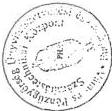

Budapest, 1999. február 11.

---

The following table provides the information in a tabular format:

.

.

.

.

.

.

---

# TANÚSÍTVÁNY

3. sz.

a vám- és vámkezelési díjak alakulásáról

|  1996. |   |   |   | 1997. |   |   |   |   |   | 1998.  |   |   |   |   |   |   |   |
| --- | --- | --- | --- | --- | --- | --- | --- | --- | --- | --- | --- | --- | --- | --- | --- | --- | --- |
|  előirányzat | teljesítés* | változás előir.=100% |   | előirányzat | teljesítés** | vált. előir.=100% |   | telj. vált. 1996=100% |   | előirányzat | teljesítés* | Változás előir.=100% |   | telj. vált. 1996=100% |   | telj. vált. 1997=100%  |   |
|   |   |  értékben | %-ban |   |   | értékben | %-ban | értékben | %-ban |   |   | értékben | %-ban | értékben | %-ban | értékben | %-ban  |
|  1 | 2 | 3 | 4 | 5 | 6 | 7 | 8 | 9 | 10 | 11 | 12 | 13 | 14 | 15 | 16 | 17 | 18  |
|  246,00 | 247,16 | 1,16 | 100,47 | 196,00 | 159,90 | -36,10 | 81,58 | -87,26 | 64,69 | 104,00 | 130,58 | 26,58 | 125,56 | -116,58 | 52,83 | -29,32 | 81,66  |

* Vám- és vámkezelési díj + várpótlék + realizálási illeték + vámbiztosíték

** A várpótlék az év második felében megszűnt

Nyilatkozat: A tanúsítványban szereplő adatok a könyvviteli nyilvántartással egyezőek, valódiságukat igazolom.

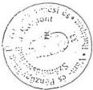

Budapest, 1999. február 11.

---

---

.

.

.

-

.

.

---

# TANÚSÍTVÁNY

a fogyasztási adó és a jövedéki adó alakulásáról

4. sz.

|  Megnevezés | 1996. |   |   |   | 1997. |   |   |   |   |   | 1998.  |   |   |   |   |   |   |   |
| --- | --- | --- | --- | --- | --- | --- | --- | --- | --- | --- | --- | --- | --- | --- | --- | --- | --- | --- |
|   |  előirányzat | teljesítés | változás előir.=100% |   | előirányzat | teljesítés | vált. előir.=100% |   | telj. vált. 1996=100% |   | előirányzat | teljesítés | Változás előir.=100% |   | telj. vált. 1996=100% |   | telj. vált. 1997=100%  |   |
|   |   |   |  értékben | %-ban |   |   | értékben | %-ban | értékben | %-ban |   |   | értékben | %-ban | értékben | %-ban | értékben | %-ban  |
|  1 | 2 | 3 | 4 | 5 | 6 | 7 | 8 | 9 | 10 | 11 | 12 | 13 | 14 | 15 | 16 | 17 | 18 | 19  |
|  Fogyasztási adó * | 35,40 | 31,31 | -4,09 | 88,45 | 28,00 | 35,68 | 7,68 | 127,43 | 4,37 | 113,96 | 17,70 | 18,86 | 1,16 | 106,55 | -12,45 | 60,24 | -16,82 | 52,86  |
|  Jövedéki adó ** | — | — | — | — | — | — | — | — | — | — | 287,45 | 291,87 | 4,42 | 101,54 | — | — | — | —  |
|  Összesen | 35,40 | 31,31 | -4,09 | 88,45 | 28,00 | 35,68 | 7,68 | 127,43 | 4,37 | 113,96 | 305,15 | 310,73 | 5,58 | 101,83 | 279,42 | 992,43 | 275,05 | 870,88  |

Nyilatkozat: A tanúsítványban szereplő adatok a könyvviteli nyilvántartással egyezőek, valódiságukat igazolom.

* A költségvetési törvény nem bontja meg, csak VP, prognosztizáció és bevétel.

** Az adónem 1998.01.01-el került bevezetésre.

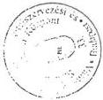

Budapest, 1998. február 11.

---

•

•

•

•

•

•

---

# TANÚSÍTVÁNY

5. sz.

az import termékek és szolgáltatások általános forgalmi adójának alakulásáról

|  1996. |   |   |   | 1997. |   |   |   |   |   | 1998.  |   |   |   |   |   |   |   |
| --- | --- | --- | --- | --- | --- | --- | --- | --- | --- | --- | --- | --- | --- | --- | --- | --- | --- |
|  előirányzat | teljesítés | változás előir.=100% |   | előirányzat | teljesítés | vált. előir.=100% |   | telj. vált. 1996=100% |   | előirányzat | teljesítés | Változás előir.=100% |   | telj. vált. 1996=100% |   | telj. vált. 1997=100%  |   |
|   |   |  értékben | %-ban |   |   | értékben | %-ban | értékben | %-ban |   |   | értékben | %-ban | értékben | %-ban | értékben | %-ban  |
|  1 | 2 | 3 | 4 | 5 | 6 | 7 | 8 | 9 | 10 | 11 | 12 | 13 | 14 | 15 | 16 | 17 | 18  |
|  406,00 | 486,15 | 80,15 | 119,74 | 580,00 | 597,60 | 17,60 | 103,03 | 111,45 | 122,93 | 780,00 | 795,23 | 15,23 | 101,95 | 309,08 | 163,58 | 197,63 | 133,07  |

* A költségvetési törvény nem bontja meg, csak VP. prognosztizáció és bevétel.

Nyilatkozat: A tanúsítványban szereplő adatok a könyvviteli nyilvántartással egyezőek, valódiságukat igazolom.

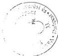

Budapest, 1999. február 11.

---

.

.

.

.

.

.

---

# TANÚSÍTVÁNY

a Vám- és Pénzügyőrség által kezelt összes bevétel alakulásáról

6. sz.

|   | 1996. |   |   |   | 1997. |   |   |   |   |   | 1998.  |   |   |   |   |   |   |   |
| --- | --- | --- | --- | --- | --- | --- | --- | --- | --- | --- | --- | --- | --- | --- | --- | --- | --- | --- |
|   |  előirányzat | teljesítés | változás előir.=100% |   | előirányzat | teljesítés | vált. előir.=100% |   | telj. vált. 1996=100% |   | előirányzat | teljesítés | Változás előir.=100% |   | telj. vált. 1996=100% |   | telj. vált. 1997=100%  |   |
|   |   |   |  értékben | %-ban |   |   | értékben | %-ban | értékben | %-ban |   |   | értékben | %-ban | értékben | %-ban | értékben | %-ban  |
|   | 1 | 2 | 3 | 4 | 5 | 6 | 7 | 8 | 9 | 10 | 11 | 12 | 13 | 14 | 15 | 16 | 17 | 18  |
|  Vám- és vámkezelési díjak | 246,00 | 247,16 | 1,16 | 100,47 | 196,00 | 159,90 | -36,10 | 81,58 | -87,26 | 64,69 | 104,00 | 130,58 | 26,58 | 125,56 | -116,58 | 52,83 | -29,32 | 81,66  |
|  Általános forgalmi adó | 406,00 | 486,15 | 80,15 | 119,74 | 580,00 | 597,60 | 17,60 | 103,03 | 111,45 | 122,93 | 780,00 | 795,23 | 15,23 | 101,95 | 309,08 | 163,58 | 197,63 | 133,07  |
|  Fogyasztási és jövedéki adó | 35,40 | 31,31 | -4,09 | 88,45 | 28,00 | 35,68 | 7,68 | 127,43 | 4,37 | 113,96 | 305,15 | 308,54 | 3,39 | 101,11 | 277,23 | 985,44 | 272,86 | 864,74  |
|  Összes bevétel | 687,40 | 764,62 | 77,22 | 111,23 | 804,00 | 793,18 | -10,82 | 98,65 | 28,56 | 103,74 | 1 189,15 | 1 234,35 | 45,20 | 103,80 | 469,73 | 161,43 | 441,17 | 155,62  |

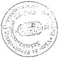

Nyilatkozat: A tanúsítványban szereplő adatok a könyvviteli nyilvántartással egyezőek, valódiságukat igazolom.

Budapest, 1999. február 11.

---

.

.

.

.

.

.

---

7. SZ.

# Tanúsítvány

a Vám- és Pénzügyőrség által kezelt hátralékállomány alakulásáról

|  Megnevezés | 1993. XII. 31. |   |   | 1996. XII. 31. |   |   | 1997. XII. 31. |   |   | 1998. XII. 31. |   |   | 1998. XII. 31.  |   |   |
| --- | --- | --- | --- | --- | --- | --- | --- | --- | --- | --- | --- | --- | --- | --- | --- |
|   |  Téke | Párfák *** | Összesen | Téke | Párfák *** | Összesen | Téke | Párfák *** | Összesen | Téke | Párfák *** | Összesen | Index: 1993=100%  |   |   |
|   |   |   |   |   |   |   |   |   |   |   |   |   |  Téke | Párfák *** | Összesen  |
|  Családjárda alatt 100% tartalmat (g/m²-tétlen) | 1 758 744 | 2 530 492 | 4 287 146 | 850 477 | 1 649 345 | 2 518 842 | 166 200 | 1 374 181 | 2 540 481 | 816 183 | 1 063 713 | 1 581 896 | 29 38 | 42 12 | 38 50  |
|  Falastárvonal (g/m²-g/m²-tétlen) | 30 257 769 | 33 978 404 | 90 236 157 | 37 363 808 | 73 312 802 | 110 976 602 | 53 122 003 | 65 371 012 | 90 493 676 | 41 159 723 | 34 109 493 | 95 243 649 | 113 48 | 100 24 | 103 55  |
|  Adatokravalóház | 934 303 | 2 070 727 | 3 003 232 | 907 706 | 2 307 386 | 3 402 286 | 712 389 | 2 430 776 | 3 108 263 | 503 107 | 2 651 114 | 3 234 223 | 82 40 | 178 03 | 107 82  |
|  (g/m²) károsba határozat |  |  |  |  |  |  |  |  |  |  |  |  |  |  |   |
|  Ügyvédelmi (g/m²-tétlen) 100% tartalmat (g/m²-tétlen) | 1 663 722 | 2 924 451 | 4 508 176 | 1 696 556 | 4 128 071 | 6 024 107 | 916 033 | 2 200 452 | 3 216 463 | 756 017 | 1 406 845 | 2 162 862 | 45 44 | 48 11 | 47 14  |
|  Kertésztés, illetve nem belajdázó |  |  |  |  |  |  |  |  |  |  |  |  |  |  |   |
|  Belajdázó, fő, belajdázó alatt |  |  |  |  |  |  |  |  |  |  |  |  |  |  |   |
|  Összesen | 40 612 741 | 61 503 888 | 102 110 729 | 40 828 019 | 82 096 818 | 123 924 827 | 35 929 805 | 60 396 450 | 103 318 338 | 42 989 078 | 39 235 566 | 102 225 621 | 105 85 | 98 31 | 100 10  |
|  Belajdázó száma |  |  |  |  |  |  |  |  |  |  |  |  |  |  |   |
|  Belajdázó összeg |  |  |  |  |  |  |  |  |  |  |  |  |  |  |   |
|  *** nem adatokra adni |  |  |  |  |  |  |  |  |  |  |  |  |  |  |   |

Nyilvántart: A tanúsítványban szereplő adatok a központiát nyilvántartásnak egyesülnek, valószínűségeket igazolom

Budapest, 1999. február 11.

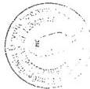

Adatok: 8. Fohám

---

.

.

.

.

.

.

---

8/1. sz.

# TANUSÍTVÁNY

a VP feladatváltozásáról, illetve az azt követő szervezeti-, létszám és költségvetési előirányzat módosításról
1996 - 1998.

|  Év | Jogszabály, belső utasítás száma, kelte | Feladatváltozás megnevezése | A feladatváltozás megjelenítése |   | A költségvetési előirányzatnál |   |   |   |   | Feladatmutató változás  |
| --- | --- | --- | --- | --- | --- | --- | --- | --- | --- | --- |
|   |   |   |  Szervezeti átalakulás | Létszám változás főben (+,-) | Személyi juttatás |   | Dologi kiadás |   | Felhalmozási kiadás  |   |
|   |   |   |   |   |  egyszeri | folyamatos | egyszeri | folyamatos  |   |   |
|  1996. | 1995. évi CXXI. tv. | Határátkelőhely fejl. | technológiai rend | 515 |  | 2,242.0 |  | 831.6 | -269.6 | 75122-9  |
|   |   |  Jövedéki ell., informatika | új szervezeti egys. | 255 |  |  |  |  |  |   |
|   |   |  HTO utalvány ell. megsz. | technológiai rend | -6 | 0 | -13.8 | 0 | -23.4 | 0 | 75122-9  |
|   |  1996. évi CXXI. tv. | Fűszerpaprika őrl. jöv. | technológiai rend |  | 72.4 | 0 | 94.1 | 0 | 133.5 | 75122-9  |
|   |  2096/1996. (IV.23.) K.h. | Létszámcsökk. ei. zárol. |  |  | -71.0 | 0 | -87.9 | 0 | 0 | 75122-9  |
|   |  1995. évi LVI. tv. | Környezetv. termékdíj | technológiai rend |  | 0 | 0 | 27.6 | 0 | 68.3 | 75122-9  |
|   |  |   |   |   |   |   |   |   |   |   |
|   | ÖSSZESEN: |  |  | 764 | 1.4 | 2,228.2 | 33.8 | 808.2 | -67.8 |   |
|  1997. | 156/1996. (X.22.) Korm.r. | VP KJP létrehozás | új szervezeti egys. |  |  |  |  |  |  |   |
|   |  1995. évi C. tv | Feketegszd. elleni harc | technológiai rend | 850 |  | 1,062.9 |  | 603.8 | 494.6 | 75122-9  |
|   |  154/1997. (X.31.) VPOP | 17. sz. Vámhivatal | új szervezeti egys. |  |  |  |  |  |  |   |
|   |  155/1997. (X.31.) VPOP | 18. sz. Vámhivatal | új szervezeti egys. |  |  |  |  |  |  |   |
|   |  1995. évi C. tv | Vámig. Világszerv. Taná | egyszeri feladat |  | 0 | 0 | 50.0 | 0 | 0 | 75122-9  |
|   |  2037/1997. (II.12.) Korm.l | Előirányzat-esökkentés |  |  | 0 | 0 | 0 | -246.3 | 0 | 75122-9  |
|   |   | Katonai Igazg. Csoport | új szervezeti egys. |  | 0 | 0 | 0 | 0 | 1.4 | 75122-9  |
|   |  2245/1997. (VII.29.) Korm | Gépjárműlopás felderítés | technológiai rend |  | 0 | 0 | 15.0 | 0 | 45.0 | 75122-9  |
|   |  1995. évi LVI. tv. | Környezetv. termékdíj | technológiai rend |  | 0 | 0 | 27.6 | 0 | 68.3 | 75122-9  |
|   |  46/1997. (IV.21.) VPOP | Pénzügyőrök fizikai állapot |  |  | 0 | 0 | 0 | 19.0 | 5.0 | 92601-8  |
|   |  |   |   |   |   |   |   |   |   |   |
|   | ÖSSZESEN: |  |  | 850 | 0.0 | 1,062.9 | 92.6 | 376.5 | 614.3 |   |
|  1998. | 1997. évi CIII. tv. | Jövedékiadó-törvény | technológiai rend | 250 | 0 | 510.0 | 0 | 275.0 | 215.0 | 75122-9  |
|   |  1997. évi CIII. tv. | Jövedékiadó-törvény | technológiai rend |  | 0 | 0 | 0 | 0 | 692.0 | 75122-9  |

1. oldal - összesen 2.

---

.

.

.

.

.

.

---

8/2. sz.

# TANUSÍTVÁNY

a VP feladatváltozásáról, illetve az azt követő szervezeti-, létszám és költségvetési előirányzat módosításról
1996 - 1998.

|  Év | Jogszabály, belső utasítás száma, kelte | Feladatváltozás megnevezése | A feladatváltozás megjelenítése |   | A költségvetési előirányzatnál |   |   |   |   | (Adatok: M Ft-ban) Feladatmutató változás  |
| --- | --- | --- | --- | --- | --- | --- | --- | --- | --- | --- |
|   |   |   |  Szervezeti átalakulás | Létszám változás főben (+,-) | Személyi juttatás |   | Dologi kiadás |   | Felhalmozási kiadás  |   |
|   |   |   |   |   |  egyszeri | folyamatos | egyszeri | folyamatos  |   |   |
|   |  | Integrációs Hivatal | új szervezeti egys. | 20 | 0 | 47.5 | 0 | 64.8 | 22.0 | 75122-9  |
|   |   | EDI technika kialakítása | technológiai rend |  | 0 | 0 | 0 | 0 | 18.0 | 75122-9  |
|   |  1997. évi CIII. tv. | Adójegyek előáll. ktg. | technológiai rend |  | 0 | 0 | 300.0 | 0 | 0 | 75122-9  |
|   |  |   |   |   |   |   |   |   |   |   |
|   |  |   |   |   |   |   |   |   |   |   |
|  ÖSSZESEN: |   |  |  | 270 | 0.0 | 557.5 | 300.0 | 339.8 | 947.0 |   |

Nyilatkozat: A tanusítványban szereplő adatok a könyvviteli nyilvántartással egyezőek, valódiságukat igazolom.

Kelt: Budapest, 1999. év március hó 30. nap.

Készítette: Hegedűs Sz. fndgy. (202-5971/277. mell.)

Ellenőrizte:

PH.

aláírás

2. oldal - összesen 2.

---

.

.

.

.

.

.

---

9/1. sz.

# TANÚSÍTVÁNY

az immateriális javak és tárgyi eszközök állományának alakulásáról 1996. évben[{"box_2d": [191, 46, 757, 970], "label": "table", "caption": "<table><tr><th colspan=\"2\">Megnevezés</th><th>Sor-szám</th><th>Immateriális javak</th><th>Ingatlanok</th><th>Gépek, berendezések és felszerelések</th><th>Járművek</th><th>Összesen</th></tr><tr><td colspan=\"2\">1</td><td>2</td><td>3</td><td>4</td><td>5</td><td>6</td><td>7</td></tr><tr><td colspan=\"2\">Előző évi záró állomány (Tárgyévi nyitó állomány)</td><td>01</td><td>105,917</td><td>4,197,720</td><td>1,232,312</td><td>582,242</td><td>6,118,191</td></tr><tr><td rowspan=\"11\">Bruttó érték</td><td rowspan=\"5\">Növekedés</td><td>02 Beszerzés, létesítés</td><td>09,713</td><td>3,884,054</td><td>499,206</td><td>166,936</td><td>4,659,909</td></tr><tr><td>03 Alaptevékenységhez térítésmentes átvétel</td><td>04 Alaptevékenységhez térítésmentes átvétel</

Előző évi záró állomány (Tárgyévi nyitó állomány)</td><td>356,408</td><td>190,176</td><td>138,320</td><td>712,861</td></tr><tr><td>04 Felújítás</td><td>06 Felújítás</td><td>167,569</td><td>21</td><td>3,099</td><td>170,689</td></tr><tr><td>05 Egyéb növekedések</td><td>28,299 Egyéb növekedések</td><td>43,788</td><td>253,023</td><td>44,375</td><td>369,485</td></tr><tr><td>06 Összes növekedés (02+...+05)</td><td>06 Összes növekedés (02+...+05)</td><td>165,969</td><td>4,451,819</td><td>942,426</td><td>352,730</td><td>5,912,944</td></tr><tr><td rowspan="5">Csökkenés</td><td>07 Selejtezés, megsemmisülés</td><td>08 Selejtezés, megsemmisülés</td><td>408</td><td>0</td><td>13,047</td><td>11,261</td><td>24,716</td></tr><tr><td>08 Térítésmentes átadás</td><td>09 Térítésmentes átadás</td><td>7,442</td><td>40,866</td><td>220,211</td><td>164,409</td><td>432,928</td></tr><tr><td>09 Értékesítés</td><td>Értékesítés</td><td>0</td><td>0</td><td>0</td><td>28,164</td><td>28,164</td></tr><tr><td>10 Egyéb csökkenések</td><td>Egyéb csökkenések</td><td>35,818</td><td>3,495,705</td><td>280,623</td><td>0</td><td>3,812,146</td></tr><tr><td>11 Összes csökkenés (07+...+10)</td><td>Összes csökkenés (07+...+10)</td><td>43,668</td><td>3,536,571</td><td>513,881</td><td>203,834</td><td>4,297,954</td></tr><tr><td colspan="2">Bruttó érték összesen (06+11)</td><td>12 Bruttó érték összesen (06+11)</td><td>228,218</td><td>5,112,968</td><td>1,660,857</td><td>731,138</td><td>7,733,181</td></tr><tr><td rowspan="4">Értékcsökkenés</td><td>Előző évi záró állomány (Tárgyévi nyitó állomány)</td><td>13 Előző évi záró állomány (Tárgyévi nyitó állomány)</td><td>13,154</td><td>477,957</td><td>782,786</td><td>271,309</td><td>1,585,206</td></tr><tr><td>Növekedés</td><td>Növekedés</td><td>14 Növekedés</td><td>83,469</td><td>114,697</td><td>420,228</td><td>182,637</td><td>801,031</td></tr><tr><td>Csökkenés</td><td>Csökkenés</td><td>15 Csökkenés</td><td>13,231</td><td>18,471</td><td>213,486</td><td>64,074</td><td>309,262</td></tr><tr><td>Értékcsökkenés összesen (13+14+15)</td><td>Értékcsökkenés összesen (13+14+15)</td><td>16 Értékcsökkenés összesen (13+14+15)</td><td>123,392</td><td>574,183</td><td>989,528</td><td>389,872</td><td>2,076,975</td></tr><tr><td colspan="2">Eszközök nettó értéke (12-16)</td><td>17 Eszközök nettó értéke (12-16)</td><td>17,104,826</td><td>104,826</td><td>4,538,785</td><td>671,329</td><td>341,266</td><td>5,656,206</td></tr><tr><td colspan="2">Teljesen (0-ig) leírt eszközök bruttó értéke</td><td>18 Teljesen (0-ig) leírt eszközök bruttó értéke</td><td>18,29,972</td><td>29,972</td><td>1,982</td><td>416,383</td><td>106,880</td><td>555,217</td></tr></table>

Aláírás

Nyilatkozat: A tanúsítványban szereplő adatok a könyvviteli nyilvántartással egyezőek, valódiságukat igazolom.

P. H.

Kelt: Budapest, 1999. év március hó 30. nap

Készítette: Hegedűs Sz. fhdgy. (202-5971/227. mell.)

Ellenőrizte:

---

.

.

.

.

.

.

---

9/2. sz.

# TANÚSÍTVÁNY

az immateriális javak és tárgyi eszközök állományának alakulásáról 1997. évben[{"box_2d": [195, 43, 765, 967], "label": "table", "caption": "<table><tr><th colspan=\"2\">Megnevezés</th><th>Sor-szám</th><th>Immateriális javak</th><th>Ingatlanok</th><th>Gépek, berendezések és felszerelések</th><th>Járművek</th><th>Összesen</th></tr><tr><td colspan=\"2\">1</td><td>2</td><td>3</td><td>4</td><td>5</td><td>6</td><td>7</td></tr><tr><td colspan=\"2\">Előző évi záró állomány (Tárgyévi nyitó állomány)</td><td>01</td><td>228,218</td><td>5,112,968</td><td>1,660,857</td><td>731,138</td><td>7,733,181</td></tr><tr><td rowspan=\"11\">Bruttó érték</td><td rowspan=\"5\">Növekedés</td><td>02 Beszerzés, létesítés</td><td>184,968</td><td>5,034,082</td><td>1,277,492</td><td>382,758</td><td>6,879,300</td></tr><tr><td>03 Alaptevékenységhez térítésmentes átvétel</

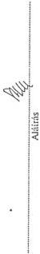

Kelt: Budapest, 1999. év március hó 30. nap

P. H.

Készítette: Hegedűs Sz. fndgy (202-5971/227. mell.)

Ellenőrizte:

---

1

2

3

4

5

6

---

9/3. sz.

# TANÚSÍTVÁNY

az immateriális javak és tárgyi eszközök állományának alakulásáról 1998. évben

| Megnevezés | Sor-szám | Immateriális javak | Ingatlanok | Gépek, berendezések és felszerelések | Járművek | Összesen |
| --- | --- | --- | --- | --- | --- | --- |
| 1 | 2 | 3 | 4 | 5 | 6 | 7 |
| Előző évi záró állomány (Tárgyévi nyitó állomány) | 01 | 461,524 | 6,530,454 | 3,029,332 | 1,273,675 | 11,294,985 |
| Bruttó érték | Növekedés | 02 | 236,586 | 5,044,536 | 1,087,764 | 742,888 | 7,121,774 |
| 03 | 84,794 | 2,506,820 | 4,061,679 | 1,086,207 | 7,742,500 |
| 04 | 0 | 262,731 | 2,784 | 7,207 | 272,722 |
| 05 | 131,034 | 3,188,036 | 1,553,969 | 434,382 | 5,307,421 |
| 06 | 465,414 | 11,002,123 | 6,706,196 | 2,270,684 | 20,444,417 |
| Csökkenés | 07 | Selejtezés, megsemmisülés 21,192 | 21,192 6,015 | 6,015 69,329 | 69,329 165,490 | 165,490 262,026 | 262,026 6,295,412 |
| 08 | Terítésmentes átadás 83,083 | 83,083 2,532,012 | 2,536,675 2,636,675 | 2,636,675 1,043,642 | 1,043,642 0 | 1,043,642 77,930 | 77,930 8,955,290 |
| 09 | Értékesítés 0 | 0 111,785 | 11,533 6,748,171 | 66,397 1,672,771 | 66,397 422,563 | 0 8,955,290 | 77,930 8,955,290 |
| 10 | Egyéb csökkenések 216,060 | 11 116,060 9,297,731 | 216,060 9,297,731 8,234,846 | 9,297,731 4,445,172 | 4,445,172 1,631,695 | 1,631,695 1,631,695 15,590,658 | 15,590,658 16,148,744 |
| Bruttó érték összesen (06+11) | 12 | 710,878 | 8,234,846 | 5,290,356 | 1,912,664 | 1,912,664 16,148,744 | 16,148,744 |
| Értékcsökkenés | Előző évi záró állomány (Tárgyévi nyitó állomány) | 13 | 245,626 | 693,518 | 1,532,786 | 603,208 | 603,208 3,075,138 | 3,075,138 |
| Növekedés | 14 | 273,550 | 638,611 | 1,969,270 | 732,624 | 732,624 3,614,055 | 3,614,055 |
| Csökkenés | 15 | 83,711 | 477,678 | 890,888 | 505,861 | 505,861 1,958,138 | 1,958,138 |
| Értékcsökkenés összesen (13+14+15) | 16 | 435,465 | 854,451 | 2,611,168 | 829,971 | 829,971 829,971 4,731,055 | 4,731,055 |
| Eszközök nettó értéke (12-16) | 17 | 275,413 | 7,380,395 | 2,679,188 | 1,082,693 | 1,082,693 11,417,689 | 11,417,689 |
| Teljesen (0-ig) leírt eszközök bruttó értéke | 18 | 100,658 | 26,044 | 686,741 | 147,284 | 147,284 947,727 960,727 | 960,727 |

Nyilatkozat: A tanúsítványban szereplő adatok a könyvviteli nyilvántartással egyezőek, valódiságukat igazolom.

Kelt: Budapest, 1999. év március hó 30. nap

P. H.

Aláírás

Készítette: Hegedűs Sz. fndgy. (202-5971/277. mell.)

Ellenőrizte:

---

.

.

.

.

.

.

---

10. sz.

# TANÚSÍTVÁNY

a Vám- és Pénzügyőrségné az üres álláshelyek számának alakulásáról

|  Megnevezés | 1996. (XII.31.) |   | 1997. (XII.31.) |   | 1998. (XII.31.)  |   |
| --- | --- | --- | --- | --- | --- | --- |
|   |  fő | ebből 6 hónapon túli | fő | ebből 6 hónapon túli | fő | ebből 6 hónapon túli  |
|  I. HIVATÁSOS |  |  |  |  |  |   |
|  Felső vezetők | - | - | - | - | - | -  |
|  Vezetők | 11 | - | 5 | - | 7 | -  |
|  Ügyintézők | 177 | - | 64 | - | 13 | -  |
|  Ügyviteli alkalmazottak | - | - | - | - | - | -  |
|  Fizikai | 9 | - | 3 | - | - | -  |
|  ÖSSZESEN | 197 | - | 72 | - | 20 | -  |
|  II. KÖZALKALMAZOTTAK |  |  |  |  |  |   |
|  Felső vezetők | - | - | - | - | - | -  |
|  Vezetők | - | - | - | - | - | -  |
|  Ügyintézők | - | - | 1 | - | 1 | -  |
|  Ügyviteli alkalmazottak | 10 | - | 8 | - | 2 | -  |
|  Fizikai | 9 | - | 11 | - | 2 | -  |
|  ÖSSZESEN | 19 | - | 20 | - | 5 | -  |
|  MINDÖSSZESEN: | 216 | - | 92 | - | 25 | -  |

Nyilatkozat: A tanúsítványban szereplő adatok a nyilvántartással egyezőek, valódiságukat igazolom.

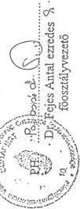

Kelt: Budapest, 1999. március 30.

I. Adott évben a költségvetésben engedélyezett létszámhoz képest

---

.

.

.

.

.

.

---

11. sz.

# TANÚSÍTVÁNY

a Vám- és Pénzügyőrség képzettség szerinti létszám megoszlásáról

|  Megnevezés | Posztgraduális végzettség |   |   | Felsőfokú végzettség |   |   | Középfokú végzettség |   |   | Szakmunkás végzettség |   |   | Általános iskolai végzettség  |   |   |
| --- | --- | --- | --- | --- | --- | --- | --- | --- | --- | --- | --- | --- | --- | --- | --- |
|   |  év |   |   | év |   |   | év |   |   | év |   |   | év  |   |   |
|   |  1996. | 1997. | 1998. | 1996. | 1997. | 1998. | 1996. | 1997. | 1998. | 1996. | 1997. | 1998. | 1996. | 1997. | 1998.  |
|  *Felső vezető* |  |  |  |  |  |  |  |  |  |  |  |  |  |  |   |
|  hivatásos | - | - | 2 | 3 | 6 | 6 | - | - | - | - | - | - | - | - | -  |
|  közalkalmazott | - | - | - | - | - | - | - | - | - | - | - | - | - | - | -  |
|  *Vezető* |  |  |  |  |  |  |  |  |  |  |  |  |  |  |   |
|  hivatásos | 25 | 25 | 35 | 198 | 240 | 255 | 190 | 195 | 229 | - | - | - | - | - | -  |
|  közalkalmazott | - | - | - | 2 | 5 | 5 | 1 | - | - | - | - | - | - | - | -  |
|  *Ügyintéző* |  |  |  |  |  |  |  |  |  |  |  |  |  |  |   |
|  hivatásos | 42 | 46 | 60 | 626 | 721 | 713 | 4129 | 4764 | 4971 | - | - | - | - | - | -  |
|  közalkalmazott | - | - | - | 11 | 96 | 102 | 611 | 649 | 717 | 82 | 96 | 94 | 40 | 18 | 16  |
|  *Fizikai* |  |  |  |  |  |  |  |  |  |  |  |  |  |  |   |
|  hivatásos | - | - | - | - | - | - | - | - | - | 117 | 124 | 116 | - | - | -  |
|  közalkalmazott | - | - | - | - | - | - | 15 | 76 | 74 | 130 | 153 | 141 | 352 | 332 | 330  |

Nyilatkozat: A tanúsítványban szereplő adatok a nyilvántartással egyezőek, valódiságukat igazolom.

Kelt: Budapest, 1999. március 30.

Dr. Fejes Antal ezredes 9. főosztályvezető

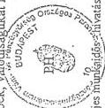

Megjegyzés: 1/ A Tanúsítvány létszámadatai együtt tartalmazzák a foglalkoztatott teljes munkaidő-, hivatásos és közalkalmazott -, valamint a részmunkaidő közalkalmazotti létszámot.
2/ az Őrszolgálat állományában szolgálatot teljesítő hivatásos állományúak szakmunkás képesítéssel rendelkeznek.

---

.

.

.

.

.

.

---

# Tanúsítvány

12. sz.

a Vám- és Pénzügyőrségnél az egy főre jutó átlagbér és átlagjövedelem alakulásáról

|  Állománycsoport | 1996.év |   | 1997.év |   |   |   | 1998.év  |   |   |   |
| --- | --- | --- | --- | --- | --- | --- | --- | --- | --- | --- |
|   |  Átlagbér | Átlag jövedelem | Átlagbér | Átlag jövedelem | (1996.év = 100 %) |   | Átlagbér | Átlag jövedelem | 1996.év = 100 %  |   |
|   |   |   |   |   |  Átlagbér | Átlag jövedelem |   |   | Átlagbér | Átlag jövedelem  |
|  Felső vezetők | 135 861 | 254 583 | 210 541 | 337 944 | 154,9 | 132,7 | 368 479 | 608 137 | 271,2 | 238,8  |
|  Vezetők | 87 095 | 163 060 | 127 314 | 214 221 | 146,1 | 131,3 | 147 869 | 249 646 | 169,7 | 153,1  |
|  Érdemi ügyintézők | 44 790 | 65 517 | 52 090 | 81 370 | 116,2 | 124,1 | 56 111 | 85 960 | 125,2 | 131,2  |
|  Ügyviteli alkalmazottak | 40 555 | 57 609 | 49 006 | 70 398 | 120,8 | 122,1 | 52 671 | 82 694 | 129,8 | 143,5  |
|  Fizikai alkalmazottak | 41 566 | 52 551 | 48 515 | 64 690 | 116,7 | 123,0 | 52 906 | 80 999 | 127,2 | 154,1  |
|  ÖSSZESEN | 43 633 | 62 483 | 50 789 | 77 291 | 116,4 | 123,6 | 53 628 | 86 473 | 122,9 | 138,3  |

Nyilatkozat: A tanúsítványban szereplő adatok a könyvviteli nyilvántartással egyezők, valódiságukat igazolom.

Kelt: Budapest 1990. év. április hó 12. nap

Szántayné Turzán Mária szds
osztályvezető

---

,

,

,

,

,

,

---

## TANÚSÍTVÁNY

13. sz.

a Vám- és Pénzügyőrségnél a piaci ellenőrzési tevékenységek alakulásáról

|  Az ellenőrzést végző szerv megnevezése | Ellenőrzések száma |   |   |   |   | Elkövetési érték  |   |   |   |   |
| --- | --- | --- | --- | --- | --- | --- | --- | --- | --- | --- |
|   |  1996. | 1997. | Index 1996=100% | 1998. | Index 1996=100% | 1996. | 1997. | Index 1996=100% | 1998. | Index 1996=100%  |
|  VPMP Pécs | 238 | 235 | 98,74% | 181 | 76,05% | 850.099 | 1.159.616 | 136,40% | 341.120 | 40,13%  |
|  VPMP Kecskemét | 101 | 116 | 115% | 147 | 146% | 1.110.222 | 1.945.895 | 175% | 614.542 | 55%  |
|  VPMP Miskolc | 417 | 567 | 135% | 654 | 157% | 2.933.648 | 2.148.438 | 73% | 880.080 | 33%  |
|  VPMP Szeged | 214 | 313 | 146% | 514 | 240% | 10.462.833 | 20.862.506 | 199% | 9.291.423 | 89%  |
|  VP Főváros | 35 | 39 | 111,4% | 39 | 111,4% | 28.034.729 | 12.935.754 | 46,1% | 5.201.811 | 18,6%  |
|  VPMP Győr | 276 | 360 | 130,43% | 317 | 114,85% | 379.065 | 463.179 | 122,19% | 223.005 | 58,83%  |
|  VPMP PEFENO | 286 | 340 | 119% | 277 | 96% | 5.852.598 | 4.517.196 | 77% | 2.876.749 | 49%  |
|  VPMP Debrecen | 316 | 668 | 211% | 767 | 243% | 9.280.844 | 15.914.464 | 171% | 10.353.358 | 112%  |
|  VPMP Szombathely | 96 | 116 | 121% | 133 | 138% | 216.992 | 29.855 | 137% | 101.858 | 47%  |
|  **Összesen:** | **1979** | **2754** | **139,2%** | **3.029** | **153,1%** | **59.121.030** | **59.976.903** | **101,4%** | **29.884.546** | **50,5%**  |

Nyilatkozat: A tanúsítványban szereplő adatok a könyvviteli nyilvántartással egyezőek, valódiságukat igazolom.

Budapest, 1999. 03. 26.

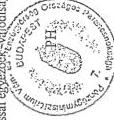

aláírás

---

.

.

.

.

.

.

---

# TANÚSÍTVÁNY

A Vám- és Pénzügyőrség nyilvántartásában szereplő jövedéki üzemek éves termeléséről

14. sz.

|  Jövedéki üzem megnevezése | Mennyiségi egység | Előállított mennyiség  |   |   |   |   |
| --- | --- | --- | --- | --- | --- | --- |
|   |   |  1996 | 1997 |   | 1998  |   |
|   |   |  Előállított mennyiség | Előállított mennyiség | Index: 1996=100% | Előállított mennyiség | Index 1996=100%  |
|  Fermentáló üzem | 1000 kg | 7.624,902 | 7.292,485 | 95,64 | - | -  |
|  Dohányüzem | 1000 db | 29.174.969,700 | 26.760.600,480 | 91,72 | 23.515.945,51 | 80,6  |
|  Szesztermék | Hlf | 119.003.659,470 | 80.668.089,590 | 67,79 | 84.854.430,1 | 71,3  |
|  Sörüzem | 1000 Hl | 7.855,786 | 7.641,737 | 97,27 | 6.670,066 | 84,9  |
|  Kőolajfeldolgozó üzem | 1000 l | 7.904.434,495 | 8.342.682,603 | 105,54 | 8.651.313,837 | 109,5  |
|  Fűszerpaprika üzem | 1000 kg | 8.823,600 | 8.728,838 | 98,92 | - | -  |
|  Kávé üzem | 1000 kg | 28.604,398 | 29.132,077 | 101,84 | - | -  |
|  Köztes alkoholtermék | 1000 liter | - | - | - | 9.603,12 | -  |
|  Pezsgő | 1000 liter | - | - | - | 15.844,63 | -  |

Nyilatkozat: A tanúsítványban szereplő adatok a könyvviteli nyilvántartással egyezőek, valódiságukat igazolom.

Kelt:...Budapest...1999...év...január...hó...13...nap

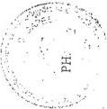

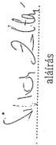

---

.

.

.

.

.

.

---

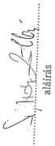

# TANÚSÍTVÁNY

a Vám- és Pénzügyőrségnél a jövedéki ellenőrzés alól elvont jövedéki termékekről
1996. év

15/1. sz.

|  A jövedéki termék megnevezése | Mérték-egység | Jövedéki ellenőrzés alól elvont |   | Az elvont mennyiségből lefoglalt mennyiség | Az elvont termék után kiszabható jövedéki bírság forint  |
| --- | --- | --- | --- | --- | --- |
|   |   |  Mennyiség | Értéke (fogy. áron számolva) forint  |   |   |
|  Cigaretta, szivar | 1000 db | 101.518,31 | 846.766.018 | 50.762,29 | 1.364.853.325  |
|  Fogyasztási dohány | kg | 31,05 | 198.169 | 31,05 | 229.127  |
|  Szesz | Hlf | 109.064,62 | 36.340.404 | 26.599,04 | 70.047.207  |
|  Szeszesital | Hlf | 86.879,23 | 201.381.837 | 84.022,50 | 365.817.588  |
|  Sör | Hl | 7.637,63 | 89.231.962 | 5.008,35 | 99.926.109  |
|  Kávé | kg | 158.023,43 | 454.534.224 | 154.902,81 | 274.007.680  |
|  Fűszerpaprika-őrlemény | kg | 5.317,55 | 4.637.295 | 3.910,25 | 5.273.565.  |
|  Motorbenzin | liter | 2.323.457,00 | 261.107.019 | 665.791,00 | 315.955.067  |
|  Gázolaj, tüzelőolaj | liter | 20.769.510,00 | 1.245.232.753 | 1.306.124,00 | 3.094.054.563  |
|  Petróleum | liter | 1.717.301,00 | 288.048.945 | 1.698.828,00 | 197.300.848  |
|  Összesen |  | - | 3.427.478.626 | - | 5.787.465.079  |

Nyilatkozat: A tanúsítványban szereplő adatok a könyvviteli nyilvántartással egyezőek, valódiságukat igazolom.

Kelt:..Budapest...1999...év...január...hó..13..nap

---

.

.

.

.

.

.

---

# TANÚSÍTVÁNY

a Vám- és Pénzügyőrségnél a jövedéki ellenőrzés alól elvont jövedéki termékekről
1997. év

15/2. sz.

|  A jövedéki termék megnevezése | Mérték-egység | Jövedéki ellenőrzés alól elvont |   | Az elvont mennyiségből lefoglalt mennyiség | Az elvont termék után kiszabható jövedéki bírság forint  |
| --- | --- | --- | --- | --- | --- |
|   |   |  Mennyiség | Értéke (fogy. áron számolva) forint  |   |   |
|  Cigaretta, szivar | 1000 db | 354.563,53 | 394.856.603 | 8.511,72 | 630.334.519  |
|  Fogyasztási dohány | kg | 37,94 | 53.653 | 36,54 | 124.740  |
|  Szesz | Hlf | 326.889,57 | 510.144.602 | 53.054,65 | 839.675.332  |
|  Szeszesital | Hlf | 65.981,09 | 170.992.302 | 63.170,74 | 348.895.277,60  |
|  Sör | Hl | 13.763,50 | 26.889.913 | 13.416,21 | 33.463.574,60  |
|  Kávé | kg | 9.809,33 | 12.451.238 | 8.675,78 | 8.858.594  |
|  Fűszerpaprika-örlemény | kg | 1.846,30 | 2.342.253 | 1.719,14 | 3.065.513  |
|  Motorbenzin | liter | 243.049,00 | 29.407.972 | 74.672,00 | 37.636.048  |
|  Gázolaj, tüzelőolaj | liter | 50.935.285,00 | 5.956.399.826 | 3.025.717,00 | 6.968.256.767  |
|  Petróleum | liter | 1.545.384,00 | 180.731.095 | 352.156,00 | 540.429.911  |
|  Zárjegy | 69.§ a | - | - | - | 888.600  |
|  Összesen |  | - | 7.284.269.457 | - | 9.411.628.876,20  |

Nyilatkozat: A tanúsítványban szereplő adatok a könyvviteli nyilvántartással egyezőek, valódiságukat igazolom.

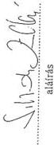

Kelt: Budapest 1999. év. január hó 13. nap

---

.

.

.

.

.

.

---

15/3. sz.

# TANÚSÍTVÁNY

a Vám és Pénzügyőrségnél a jövedéki ellenőrzés alól elvont jövedéki termékekről

1998.

Adatok ezer forintban

|  A jövedéki termék megnevezése | Mérték- egység | Jövedéki ellenőrzés alól elvont |   | Az elvont mennyiségből lefoglalt mennyiség | Az elvont termék után kiszabható jövedéki bírság  |
| --- | --- | --- | --- | --- | --- |
|   |   |  Mennyiség | Értéke (fogy. áron számolva)  |   |   |
|  Cigaretta, szivar | 1000 db | 15.258,8 | 141.020,4 | 12.519,0 | 360.801,8  |
|  Fogyasztási dohány | kg | - | - | - | -  |
|  Szesz | hlf | 154.610,4 | 281.041,6 | 72.345,8 | 441.750,5  |
|  Szeszesital | hlf | 30.886,0 | 106.510,6 | 30.081,9 | 246.749,6  |
|  Sör | hl | 611,6 | 4.864,8 | 212,0 | 9.400,2  |
|  Kávé | kg | 10.308,6 | 1.825,9 | 10.308,6 | 2.009,8  |
|  Motorbenzin | l | 650.973,0 | 94.133,7 | 21.443,0 | 53.878,5  |
|  Gázolaj, tüzelőolaj | l | 5.086.952,0 | 676.742,6 | 2.846.976,0 | 2.961.643,8  |
|  Petróleum | l | - | - | - | -  |
|  Pezsgő | l | 1.125,5 | 639,6 | 763,8 | 4.719,0  |
|  Köztes alkoholtermék | l | 981.416,8 | 78.759,5 | 381.345,6 | 33.043,3  |
|  Összesen |  |  | 1.385.538,7 |  | 4.113.996,5  |

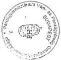

Nyilatkozat: A tanúsítványban szereplő adatok a könyvviteli nyilvántartással egyezőek, valódiságukat igazolom.

Budapest, 1999. január 14.

aláírás

---

.

.

.

.

.

.

---

16/1. sz.

# Ellenőrzött piacok számának alakulása
(ellenőrzések száma) ellenőrzésre fordított munkaóra

|  Megyei Pk. megnev. | 1996. |   |   |   | 1997. |   |   |   | 1998.  |   |   |   |
| --- | --- | --- | --- | --- | --- | --- | --- | --- | --- | --- | --- | --- |
|   |  Piacok száma | Ellenőrzött piacok száma | Piac- ellenőrzések száma | Ellenőrzésre fordított munkaóra | Piacok száma | Ellenőrzött piacok száma | Piac- ellenőrzések száma | Ellenőrzésre fordított munkaóra | Piacok száma | Ellenőrzött piacok száma | Piac- ellenőrzések száma | Ellenőrzésre fordított munkaóra  |
|  BST | 37 | 37 | 234 | 1 371 | 39 | 39 | 230 | 1 186 | 39 | 39 | 189 | 1 022  |
|  BKJNSZ | 128 | 66 | 100 | 489 | 129 | 54 | 114 | 572 | 130 | 59 | 143 | 820  |
|  BAZH | 47 | 47 | 417 | 880 | 48 | 48 | 567 | 1 303 | 48 | 48 | 654 | 589  |
|  CSB | 43 | 31 | 423 | 1 650 | 43 | 32 | 465 | 1 928 | 43 | 36 | 514 | 2 315  |
|  GYMSKEV | 27 | 27 | 276 | 812 | 28 | 28 | 360 | 944 | 28 | 27 | 317 | 927  |
|  HBSZSZB | 92 | 92 | 316 | 841 | 92 | 92 | 668 | 2 784 | 91 | 91 | 767 | 3 485  |
|  PEFENO | 58 | 50 | 286 | 1 323 | 55 | 49 | 340 | 1 458 | 56 | 43 | 277 | 1 210  |
|  VZ | 21 | 21 | 96 | 440 | 21 | 21 | 116 | 470 | 24 | 24 | 133 | 617  |
|  FŐVÁROS | 44 | 28 | 55 | 250 | 43 | 32 | 67 | 407 | 40 | 40 | 76 | 267  |
|  Összesen: | 497 | 399 | 2 203 | 8 056 | 498 | 395 | 2 927 | 11 052 | 499 | 407 | 3 070 | 11 252  |
|  VPKJSZP |  |  |  |  |  | 87 | 604 | 10 670 |  | 116 | 663 | 14 040  |

1. oldal

54037.XLS
1.2

---

.

.

.

.

.

.

---

16/2. sz.

Piacellenőrzésen lefoglalt és elkobzott jövedéki termékek mennyisége (fajtánként)

|   |  | 1996. | 1997. | 1998. | 1996. | 1997. | 1998.  |
| --- | --- | --- | --- | --- | --- | --- | --- |
|  Ásványolaj üzemanyag | liter | 3 170,00 | 193 048,00 | 133 988,00 | 2 710,00 | 2 136,00 | 1 260,00  |
|  Egyéb ásványolaj cseppfolyós | kg | 0,00 | 0,00 | 3 000,00 | 0,00 | 0,00 | 0,00  |
|  Egyéb ásványolaj sürített | km3 | 0,00 | 0,00 | 0,00 | 0,00 | 0,00 | 0,00  |
|  Egyéb ásványolaj | liter | 0,00 | 0,00 | 0,00 | 0,00 | 0,00 | 0,00  |
|  Egyéb ásványolaj | kg | 0,00 | 0,00 | 0,00 | 0,00 | 0,00 | 0,00  |
|  Alkoholtermék | klf | 5 681,07 | 24 048,62 | 12 058,88 | 5 656,24 | 6 467,00 | 2 646,80  |
|  Sör | kl | 10,65 | 4 453,42 | 10,81 | 5,65 | 24,00 | 0,51  |
|  Fezsgő | liter | 0,00 | 0,00 | 259,50 | 0,00 | 0,00 | 16,50  |
|  Köztes alkoholtermék | liter | 0,00 | 0,00 | 102,30 | 0,00 | 0,00 | 62,30  |
|  Dohánygyártmány cigaretta | 1000 szál | 4 896,52 | 26 268,56 | 9 910,71 | 4 950,22 | 5 430,21 | 2 782,93  |
|  Dohánygyártmány szivar | 1000 szál | 0,00 | 0,00 | 0,00 | 0,00 | 0,00 | 0,00  |
|  Dohánygyártmány fogyasztási dohány | kg | 0,00 | 0,00 | 0,00 | 0,00 | 0,00 | 0,00  |
|  Kávé | kg | 227,70 | 1 404,27 | 99,00 | 152,25 | 353,70 | 0,00  |
|  Fűszerpaprika őrlemény | kg | 30,60 | 198,70 | 0,00 | 41,60 | 144,70 | 0,00  |
|  Fermentált dohány | kg | 0,00 | 0,00 | 0,00 | 0,00 | 0,00 | 0,00  |

Nyilatkozat: A tanúsítványban szereplő adatokat a könyvviteli nyilvántartással egyezőek, valódiságokat igazolom.

Budapest, 1999. február 21.

PH.

---

.

.

.

.

.

.

---

16/3. sz.

Piacellenőrzéssel összefüggésben kiszabott jövedéki bírság,
jövedéki adó, adóbírság, mulasztási bírság

|   | 1996 |   |   |   | 1997 |   |   |   | 1998  |   |   |   |
| --- | --- | --- | --- | --- | --- | --- | --- | --- | --- | --- | --- | --- |
|   |  Jövedéki adó | Adó- bírság | Mulasztási bírság | Jövedéki bírság | Jövedéki adó | Adó- bírság | Mulasztási bírság | Jövedéki bírság | Jövedéki adó | Adó- bírság | Mulasztási bírság | Jövedéki bírság  |
|  BST |  |  |  | 977 712 |  |  |  | 2 084 341 | 64 614 | 64 614 |  | 610 000  |
|  BKJNSZ | 0 | 0 | 0 | 1 433 891 | 0 | 0 | 0 | 2 725 285 | 512 374 | 418 540 | 0 | 1 222 786  |
|  Szolnok |  |  |  | 615 883 |  |  |  | 1 281 183 | 93 834 |  |  | 716 978  |
|  Kecskemét |  |  |  | 228 562 |  |  |  | 823 576 | 30 108 | 30 108 |  | 205 490  |
|  Jászberény |  |  |  | 221 864 |  |  |  | 293 622 |  |  |  | 200 000  |
|  Baja |  |  |  | 183 009 |  |  |  | 112 829 |  |  |  |   |
|  Kiskunhalas |  |  |  | 20 000 |  |  |  | 164 075 |  |  |  |   |
|  Kiskőrös |  |  |  | 164 573 |  |  |  | 50 000 | 388 432 | 388 432 |  | 100 318  |
|  BAZH |  |  |  | 22 121 716 |  |  |  | 20 637 886 | 245 155 | 245 155 |  | 3 181 550  |
|  CSB |  |  |  | 7 035 557 |  |  |  | 11 458 562 | 447 726 | 447 726 |  | 12 054 284  |
|  GYMSKEV |  |  |  | 475 866 |  |  |  | 978 696 | 1 473 | 1 473 |  | 420 000  |
|  HBSZSZB |  |  |  | 17 802 525 |  |  |  | 15 419 443 | 1 204 189 | 1 204 189 |  | 25 379 534  |
|  PEFENO |  |  |  | 5 343 418 |  |  |  | 1 274 116 |  |  |  | 1 662 775  |
|  VZ |  |  |  | 277 949 |  |  |  | 232 230 | 1 269 | 1 269 | 80 000 | 400 000  |
|  FŐVÁROS |  |  |  | 3 137 661 |  |  |  | 13 869 000 | 392 564 |  | 50 000 | 6 394 123  |
|  VPKJSZP |  |  |  |  |  |  |  |  |  |  |  |   |
|  Összesen: | 0 | 0 | 0 | 58 606 295 | 0 | 0 | 0 | 68 679 559 | 2 869 364 | 2 382 966 | 130 000 | 51 325 052  |

Nyilatkozat: A tanúsítványban szereplő adatokat a könyviteli nyilvántartással egyezőek, valódiságukat igazolom.

Budapest, 1999. február 21.

PH.

---

.

.

.

.

.

.

---

# TANÚSÍTVÁNY
a Vám- és Pénzügyőrségnél a "megsemmisítés" adatairól

17. sz.

|  Megnevezés | Mennyiség | Megsemmisítés 1996. |   |   | Megsemmisítés 1997. |   |   | Megsemmisítés 1998.  |   |   |
| --- | --- | --- | --- | --- | --- | --- | --- | --- | --- | --- |
|   |   |  Értékesítés útján |   | Ténylegesen | Értékesítés útján |   | Ténylegesen | Értékesítés útján |   | Ténylegesen  |
|   |   |  Mennyiség | Érték (Ft) |   | Mennyiség | Érték (Ft) |   | Mennyiség | Érték (Ft)  |   |
|  Mesterségesen fermentált dohány | kg | 17 | 28.800 | 144,35 | 1997-re más tartalmú országos adatgyűjtés történt, nincs összehasonlítási alap. | - | - | -  |   |   |
|  Cigaretta, Szivar | 1000 db | 644,52 | 2.115.089 | 24.738,097 |   |   |   | 790,24 | 3.979.368 | 4.863,98  |
|  Szesz | Hlf | 5.243,20 | 137.990 | 3.192,868 |   |   |   | 30,017 | 2.819.406 | 1.911,97  |
|  Szeszesital | Hlf | 17.498,44 | 4.928.978 | 27.720,564 |   |   |   | 1,27 | 14.890 | 113,27  |
|  Sör | Hl | 92,211 | 816.812 | 1.121,341 |   |   |   | - | - | -  |
|  Kávé | kg | 4.807 | 4.471.177 | 4.920,33 |   |   |   | - | - | -  |
|  Fűszerpaprika örlemény | kg | 2.000 | 289.100 | 482,25 |   |   |   | 0 | 0 | 0  |
|  Motorbenzin | l | 12.759 | 355.462 | 0 |   |   |   | 261.700 | 2.245.132 | 240.000  |
|  Gázolaj, tüzelőolaj | l | 366.220 | 8.858.416 | 580,60 |   |   |   | 21.400 | 271.830 | 170.000  |
|  Egyéb kőolaj származék | l v. kg | 82.106 | 1.048.523 | 0 |   |   |   | - | - | -  |
|  HTO | l | 1.580 | 47.400 | 400 |   |   |   | - | - | -  |
|  Fűszerpaprika féltermék | kg | 0 | 0 | 0,30 |   |   |   | - | - | -  |
|  Cukorcefre | l | 477.600 | 1.264.175 | 61.200 |   |   |   | Nincs országosan összesített adat  |   |   |
|  Gép | db | 0 | 0 | 0  |   |   |   |   |   |   |
|  Termelőeszköz | db | 0 | 0 | 8  |   |   |   |   |   |   |
|  Jármű | db | 0 | 0 | 0  |   |   |   |   |   |   |
|  Köztes alkoholtermék | l | - | - | - |   |   |   | 0 | 0 | 139.630  |
|  Pezsgő | l | - | - | - |   |   |   | 13,5 | 2.109 | 109.620  |

Nyilatkozat: A tanúsítványban szereplő adatok a könyvviteli nyilvántartással egyezők, valódiságukat igazolom.

aláírás

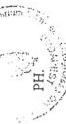

Kelt: Budapest 1999 év január hó 13 nap

---

.

.

.

.

.

.

---

18. sz.

# TANÚSÍTVÁNY

a Vám- és Pénzügyőrség vámsemlegesítések, kedvezőbb vámtételek alkalmazásának alakulásáról

|  Jogcím | 1996. |   |   | 1997. |   |   | 1998.  |   |   |
| --- | --- | --- | --- | --- | --- | --- | --- | --- | --- |
|   |  Eset db | Vámérték MFt | Nem érv. MFt | Eset db | Vámérték MFt | Nem érv. MFt | Eset db. | Vámérték MFt | Nem érv. MFt  |
|  Vámkontingens - általános |  | 22.320,8 | 4.526,9 |  | 56.985,4 | 7.901,4 |  | 81.243,0 | 10.295,8  |
|  - származástól függő |  | 18.687,4 | 7.288,3 |  | 33.152,1 | 12.068,9 |  | 47.663,7 | 14.973,4  |
|  Összesen: |  | 41.008,2 | 11.815,2 |  | 90.137,5 | 19.970,3 |  | 128.906,7 | 25.269,2  |
|  Engedélyjegyes eljárás |  | 8.210,2 | 664,4 |  | 6.496,1 | 513,0 |  | 12.565,0 | 1.050,3  |
|  Vámfelfüggesztés |  | 7.389,2 | 994,7 |  | 1.459,7 | 1.382,9 |  | 11.852,7 | 1.056,9  |
|  Összesen: |  | 15.599,4 | 1.659,1 |  | 7.955,9 | 1.895,9 |  | 24.417,7 | 2.107,2  |
|  Vámsemlegesítés összesen |  | 56.607,6 | 13.474,3 |  | 98.093,4 | 21.886,2 |  | 153.324,4 | 27.376,4  |
|  Referenciás vámtétel |  | 23.227,9 | 2.794,8 |  | 26.495,6 | 2.601,3 |  | 28.632,3 | 2.929,0  |
|  Szerződéses vámtétel |  | 926.410,4 | 39.406,4 |  | 1.333.199,4 | 80.936,0 |  | 1.990.221,9 | 128.263,5  |
|  Összesen: |  | 949.638,3 | 42.201,2 |  | 1.359.695,0 | 83.537,3 |  | 2.018.854,2 | 131.192,5  |

Nyilatkozat: A tanúsítványban szereplő adatok a könyvviteli nyilvántartással egyezőek, valódiságukat igazolni.

Kelt: 1999. év. 10. hó. 24. nap.

PH:

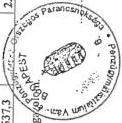

aláírás

---

.

.

.

.

.

.

---

19/1. sz.

# TANÚSÍTVÁNY

a jövendő határozatok alakulásáról 1995. évben

|  Vámhatszág | I. fokú határozatok(ból) |   |   |   |   |   |   |   |   |   | II. fokú határozatok(ból)  |   |   |   |   |   |   |   |   |   |   |   |
| --- | --- | --- | --- | --- | --- | --- | --- | --- | --- | --- | --- | --- | --- | --- | --- | --- | --- | --- | --- | --- | --- | --- |
|   |  száma (db) |   | felletkezések száma (db) |   | Jelenés hat. száma (db) |   | Előírás E Ft |   | Pénzügyi teljesítés E Ft |   | Helybenhagyó (db) |   | Megváltozható (db) |   | Megsemmisítő (db) |   | Törlés E Ft |   | Előírás E Ft |   | Pénzügyi teljesítés E Ft  |   |
|   |  Jöv. alany | Nem jöv. alany | Jöv. alany | Nem jöv. alany | Jöv. alany | Nem jöv. alany | Jöv. alany | Nem jöv. alany | Jöv. alany | Nem jöv. alany | Jöv. alany | Nem jöv. alany | Jöv. alany | Nem jöv. alany | Jöv. alany | Nem jöv. alany | Jöv. alany | Nem jöv. alany | Jöv. alany | Nem jöv. alany | Jöv. alany | Nem jöv. alany  |
|  VPOP | 61 |  | 1 |  | 60 |  | 2.787 |  | 1.197 |  | 1 |  |  |  |  |  |  |  |  |  | 1.197 |   |
|  Baranya, Somogyi, Tolna megye | 544 | 218 | 138 | 38 | 411 | 181 | 756.869 | 36.901 | 34.557 | 11.032 | 102 | 22 | 11 | 8 | 24 | 6 |  |  | 646.891 | 37.136 | 8.745 | 1.733  |
|  Éles-Kiskun, Jász-Nagykun, Szabóka megye | 319 | 214 | 114 | 70 | 252 | 167 | 384.582 | 144.947 | 16.765 | 23.328 | 75 | 28 | 20 | 9 | 19 | 19 | 4.909 | 4.205 | 82.840 | 80.888 | 3.751 | 2.123  |
|  Borsod-Almij-Zemplén, Havas megye | 297 | 1.280 | 63 | 116 | 241 | 1.253 | 35.231 | 56.894 | 7.0012 | 54.041 | 63 | 62 | 12 | 26 | 13 | 10 | 121.988 | 1.853 | 125.643 | 3.118 | 3.642 | 2.992  |
|  Csongrád, Békés megye | 99 | 326 | 21 | 63 | 89 | 292 | 41.113 | 385.161 | 4.177 | 12.926 | 17 | 43 |  | 4 | 2 | 11 |  | 290.428 | 5.635 | 295.504 | 493 | 4.095  |
|  Hajdú-Szín, Szabolcs-Szabó-Köreg megye | 257 | 1.617 | 62 | 328 | 133 | 1.541 | 54.063 | 233.207 | 6.132 | 7.330 | 95 | 157 | 9 | 5 | 6 | 18 | 82 | 44.178 | 22.702 | 61.617 | 6.770 | 3.652  |
|  Főváros | 135 | 96 | 31 | 22 | 104 | 74 | 244.486 | 36.532 | 12.786 | 1.265 | 9 | 2 |  | 1 | 1 |  |  |  | 244.386 | 36.410 | 12.786 | 1.265  |
|  Fővárosi Parancsnokság | 32 |  |  |  |  |  |  |  |  |  |  |  |  |  |  |  |  |  |  |  |  |   |
|  Győr-Sopron, Kossárum-Extergson, Veszprém megye | 814 | 197 | 223 | 53 | 669 | 169 | 66.626 | 32.655 | 50.787 | 12.086 | 170 | 30 | 32 | 13 | 18 | 10 | 7.005 | 11.647 | 89.825 | 27.208 | 23.569 | 8.143  |
|  Pest, Fejér, Nógrád megye | 441 | 262 | 124 | 97 | 350 | 220 | 244.568 | 39.743 | 52.869 | 27.562 | 101 | 90 | 4 | 3 | 19 | 4 | 14.266 | 1.487 | 221.701 | 36.069 | 46.895 | 25.671  |
|  Vas, Zala megye | 66 | 94 | 31 | 37 | 42 | 62 | 119.974 | 7.047 | 7.194 | 3.698 | 22 | 32 | 5 | 3 | 4 | 2 |  |  | 9.730 | 32.669 | 1.794 | 5.325  |

Budapest, 1999. április 13.

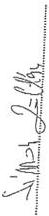

---

1

1

1

1

1

1

---

19/2. sz.

# TANÚSÍTVÁNY
a jövődési határozatok alakulásáról 1996. évben

|  Vámhatszág | I. fokú határozatok (ból) |   |   |   |   |   |   |   |   |   | II. fokú határozatok (ból)  |   |   |   |   |   |   |   |   |   |   |   |
| --- | --- | --- | --- | --- | --- | --- | --- | --- | --- | --- | --- | --- | --- | --- | --- | --- | --- | --- | --- | --- | --- | --- |
|   |  száma (db) |   | fellebbezése |   | jogorús hit |   | Előírás |   | Pénzügyi teljesítés E Ft |   | Helybenhagyó (db) |   | Megváltoztató (db) |   | Megszemlőálló (db) |   | Törlés E Ft |   | Előírás E Ft |   | Pénzügyi teljesítés E Ft  |   |
|   |  Jöv. alany | Nem jöv. alany | Jöv. alany | Nem jöv. alany | Jöv. alany | Nem jöv. alany | Jöv. alany | Nem jöv. alany | Jöv. alany | Nem jöv. alany | Jöv. alany | Nem jöv. alany | Jöv. alany | Nem jöv. alany | Jöv. alany | Nem jöv. alany | Jöv. alany | Nem jöv. alany | Jöv. alany | Nem jöv. alany | Jöv. alany | Nem jöv. alany  |
|  VFOP | 4 |  |  |  | 4 |  | 358 |  | 160 |  |  |  |  |  |  |  |  |  |  |  |  |   |
|  Borsóya, Somogyi, Tolna megye | 581 | 709 | 82 | 38 | 205 | 258 | 551,450 | 280,160 | 23,279 | 2,885 | 59 | 25 | 4 | 2 | 14 | 9 |  |  | 151,594 | 242,592 | 5,575 | 256  |
|  Bács-Kiskun, Jász-Nagykun, Szolnok megye | 199 | 194 | 66 | 64 | 158 | 138 | 1149,330 | 130,494 | 5,331 | 11,052 | 59 | 35 | 7 | 10 | 8 | 10 | 125 |  | 229,646 | 97,167 | 2,296 | 3,579  |
|  Borsó-Abról-Zemplén, Hovcs megye | 346 | 1,309 | 153 | 196 | 119 | 1,303 | 265,555 | 73,458 | 10,694 | 15,399 | 60 | 138 | 27 | 13 | 11 | 15 | 1,839 | 3,871 | 10,738 | 4,870 | 3,602 | 2,131  |
|  Csengrád, Békés megye | 116 | 306 | 22 | 65 | 109 | 275 | 82,711 | 222,384 | 1,875 | 9,311 | 13 | 42 | 1 | 9 | 2 | 6 | 51 | 1,787 | 631 | 6,559 | 294 | 1,890  |
|  Hajdú-Bihar, Szabolcs-Szatmár-Bereg megye | 299 | 1,981 | 89 | 251 | 234 | 1,928 | 73,561 | 395,613 | 10,094 | 19,917 | 60 | 223 | 12 | 9 | 10 | 26 | 366 | 76,616 | 588,515 | 148,568 | 6,914 | 9,219  |
|  Főváros | 352 | 263 | 73 | 44 | 279 | 219 | 658,854 | 81,843 | 72,262 | 8,179 | 51 | 41 |  |  | 22 | 3 |  |  | 197,707 | 13,702 | 2,760 | 2,961  |
|  Fővárosi Parancsnokság | 1 |  |  |  |  |  |  |  |  |  |  |  |  |  |  |  |  |  |  |  |  |   |
|  Győr-Sopron, Kossárom-Esztergore, Veszprém megye | 462 | 107 | 117 | 25 | 358 | 85 | 41,014 | 50,484 | 35,158 | 9,729 | 79 | 13 | 14 | 7 | 21 | 4 | 4,874 | 6,272 | 153,344 | 23,566 | 13,493 | 7,335  |
|  Post, Fejér, Nógrád megye | 339 | 163 | 119 | 68 | 255 | 119 | 2680,333 | 30,651 | 19,323 | 13,254 | 107 | 63 | 2 | 2 | 10 | 3 | 257 | 3,139 | 13,095 | 12,245 | 6,913 | 10,692  |
|  Vas, Zala megye | 195 | 23 | 63 | 12 | 135 | 15 | 154,648 | 3,360 | 11,728 | 1,344 | 45 | 11 | 3 | 1 | 13 |  | 27,926 |  | 20,625 | 47,532 | 3,046 | 808  |
|  Vas-Zala megyei Parancsnokság | 1 |  |  |  | 1 |  | 7 |  |  |  |  |  |  |  |  |  |  |  |  |  |  |   |

Budapest, 1999. április 13.

---

.

.

.

.

.

.

---

19/3. sz.

# TANÚSÍTVÁNY
a jövődési határozatok alakulásáról 1997. évben

|  Vámhatóság | I. fokú határozatok (kft) |   |   |   |   |   |   |   |   |   | II. fokú határozatok (kft)  |   |   |   |   |   |   |   |   |   |   |   |
| --- | --- | --- | --- | --- | --- | --- | --- | --- | --- | --- | --- | --- | --- | --- | --- | --- | --- | --- | --- | --- | --- | --- |
|   |  száma (db) |   | felbízásbázisok száma (db) |   | fogoros hat. száma (db) |   | Előírás E Ft |   | Pénzügyi teljesítés E Ft |   | Helybenjegyző (db) |   | Megválasztó (db) |   | Megszemmisítő (db) |   | Töltés E Ft |   | Előírás E Ft |   | Pénzügyi teljesítés E Ft  |   |
|   |  Jöv. alany | Nem jöv. alany | Jöv. alany | Nem jöv. alany | Jöv. alany | Nem jöv. alany | Jöv. alany | Nem jöv. alany | Jöv. alany | Nem jöv. alany | Jöv. alany | Nem jöv. alany | Jöv. alany | Nem jöv. alany | Jöv. alany | Nem jöv. alany | Jöv. alany | Nem jöv. alany | Jöv. alany | Nem jöv. alany | Jöv. alany | Nem jöv. alany  |
|  VPOP | 116 |  | 5 |  | 11 |  | 472,483 |  | 12,479 |  | 5 |  |  |  |  |  |  |  |  |  |   |   |
|  Barnaya, Somogy, Tolna megye | 283 | 344 | 124 | 54 | 250 | 314 | 447,741 | 27,708 | 14,267 | 1,769 | 83 | 32 | 14 | 5 | 20 | 17 |  |  | 192,907 | 229,469 | 4,207 | 201  |
|  Bács-Kiskun, Jász-Nagykun, Szolnok megye | 251 | 239 | 58 | 65 | 220 | 199 | 230,193 | 137,990 | 15,513 | 30,435 | 38 | 38 | 20 | 4 | 8 | 7 | 166 | 8,723 | 76,656 | 96,827 | 8,778 | 2,945  |
|  Borsod-Abaúj-Zemplén, Haves megye | 376 | 723 | 150 | 138 | 131 | 719 | 184,130 | 95,845 | 4,208 | 5,301 | 58 | 91 | 21 | 21 | 21 | 26 | 18,534 | 14,121 | 13,920 | 11,925 | 4,583 | 3,820  |
|  Csongrád, Bölcs megye | 152 | 360 | 38 | 60 | 140 | 340 | 364,111 | 2,052,855 | 3,694 | 7,767 | 23 | 31 | 3 | 4 | 7 | 9 | 482 | 53,164 | 2,197 | 72,380 | 1,148 | 516  |
|  Hajdú-Bölcs, Szabolcs-Szatmár-Bereg megye | 307 | 1,775 | 75 | 193 | 290 | 1,757 | 574,724 | 681,852 | 17,669 | 11,855 | 38 | 172 | 4 | 15 | 15 | 36 | 5,197 | 30,356 | 41,666 | 122,673 | 6,186 | 5,016  |
|  Főváros | 436 | 317 | 131 | 85 | 305 | 232 | 574,806 | 49,983 | 4,725 | 2,810 | 110 | 55 | 12 | 12 | 9 | 8 |  |  | 51,723 | 13,834 | 18,520 | 28  |
|  Fővárosi Parancsnokság | 13 |  | 4 |  |  |  |  |  |  |  |  |  |  |  |  |  |  |  |  |  |  |   |
|  Győr-Sopron, Kormáncszín, Vasayvár megye | 611 | 138 | 116 | 23 | 518 | 119 | 202,996 | 41,939 | 41,668 | 7,510 | 80 | 15 | 17 | 4 | 16 | 4 | 5,320 | 1,634 | 957,670 | 104,830 | 12,169 | 491  |
|  Pető, Fejér, Nagyár megye | 382 | 257 | 156 | 179 | 304 | 235 | 1,003,771 | 1,772,591 | 36,445 | 105,918 | 134 | 166 | 10 | 7 | 12 | 6 | 2,201 | 1,580 | 557,079 | 1,772,573 | 29,252 | 102,461  |
|  Vas, Zala megye | 146 | 39 | 60 | 14 | 78 | 26 | 266,888 | 25,164 | 10,095 | 2,257 | 60 | 8 | 6 | 3 | 4 | 4 | 32,518 | 128 | 163,935 | 1,594 | 7,576 | 696  |

Budapest, 1999. április 13.

---

.

.

.

.

.

.

---

19/4. sz.

# TANÚSÍTVÁNY
a jövedéki határozatok alakulásáról 1998. évben

|  Vámhatszág (Vámhivatal) | I. fokú határozatok (ból) |   |   |   |   |   |   |   |   |   | II. fokú határozatok (ból)  |   |   |   |   |   |   |   |   |   |   |   |
| --- | --- | --- | --- | --- | --- | --- | --- | --- | --- | --- | --- | --- | --- | --- | --- | --- | --- | --- | --- | --- | --- | --- |
|   |  száma (db) |   | felletkezések száma (db) |   | jogosítás hat. száma (db) |   | Előírás E Ft |   | Pénzügyi teljesítés E Ft |   | Helybenhagyó (db) |   | Megváltoztató (db) |   | Megsemmisítő (db) |   | Törlés E Ft |   | Előírás E Ft |   | Pénzügyi teljesítés E Ft  |   |
|   |  Jöv. alany | Nem jöv. alany | Jöv. alany | Nem jöv. alany | Jöv. alany | Nem jöv. alany | Jöv. alany | Nem jöv. alany | Jöv. alany | Nem jöv. alany | Jöv. alany | Nem jöv. alany | Jöv. alany | Nem jöv. alany | Jöv. alany | Nem jöv. alany | Jöv. alany | Nem jöv. alany | Jöv. alany | Nem jöv. alany | Jöv. alany | Nem jöv. alany  |
|  VPOP | 92 |  | 2 |  | 90 |  | 199,852 |  | 601 |  | 2 |  |  |  |  |  |  |  |  |  |  |   |
|  Barnaya, Somogy, Tolna megye | 298 | 297 | 87 | 45 | 224 | 222 | 458,641 | 25,981 | 15,380 | 7,351 | 75 | 33 | 6 | 4 | 5 | 8 |  |  | 508,272 | 29,179 | 6,871 | 1,476  |
|  Bács-Kiskun, Jász-Nagybán, Szabóok megye | 44 | 160 | 13 | 21 | 36 | 107 | 233,631 | 620,310 | 1,485 | 3,953 | 6 | 6 | 3 | 2 | 2 | 4 |  | 2,403 | 227,068 | 313,438 | 250 | 130  |
|  Borsod-Akai-J. Zemplén, Hives megye | 342 | 597 | 51 | 77 | 151 | 313 | 330,320 | 74,887 | 4,188 | 43,837 | 25 | 25 | 7 | 13 | 19 | 20 | 150 | 120 | 8,432 | 3,188 | 376 | 322  |
|  Csongrád, Békés megye | 15 | 561 | 4 | 76 | 11 | 294 | 3,227 | 220,657 | 76 | 4,847 | 4 | 29 | 1 | 1 | 3 | 28 |  | 300 |  | 120 |  | 20  |
|  Hajdú-Bihar, Szabolcs-Szabó-Koleg megye | 210 | 1,672 | 46 | 128 | 179 | 1,222 | 128,795 | 283,657 | 7,742 | 10,723 | 35 | 78 | 4 | 5 | 6 | 46 |  |  | 101,017 | 21,561 | 2,293 | 2,162  |
|  Főváros | 419 | 96 | 68 | 17 | 359 | 80 | 1219,639 | 17,911 | 13,160 | 1,686 | 56 | 8 | 12 | 2 |  |  |  | 1 | 1219,119 | 17,411 | 13,160 | 1,686  |
|  Fővárosi Parancsnokság | 2 |  | 2 |  | 1 |  | 13,008 |  |  |  |  |  |  |  |  |  |  |  |  |  |  |   |
|  Győr-Sopron, Kosszent-Eszegem, Veszprém megye | 349 | 339 | 55 | 45 | 301 | 256 | 25,974 | 68,805 | 16,256 | 12,749 | 28 | 23 | 2 | 5 | 13 | 15 | 50 | 431 | 5,409 | 3,656 | 1,533 | 1,142  |
|  Pest, Fejér, Nógrád megye | 367 | 164 | 96 | 48 | 233 | 112 | 279,633 | 46,421 | 19,597 | 9,058 | 77 | 44 | 3 |  | 16 | 4 | 16,786 | 2,716 | 25,035 | 23,611 | 12,831 | 2,038  |
|  Vas, Zala megye | 350 | 59 | 95 | 20 | 258 | 32 | 162,524 | 7,969 | 17,141 | 1,850 | 63 | 13 | 2 | 1 | 6 | 1 | 300 |  | 26,350 | 10,574 | 3,541 | 10  |

Budapest, 1999. április 13.

---

.

.

.

.

.

.

---

20/1. sz.

# NYILATKOZAT
a Vám- és Pénzügyőrség felügyeleti intézkedéseiről

|  Vámházból | Év | Benyújtott kérelnök száma | Jóváhagyott jogerős döntések száma | Megváltoztatott (jogerős) döntések száma | Ebből  |   |   |
| --- | --- | --- | --- | --- | --- | --- | --- |
|   |   |   |   |   |  Előfizetés E Ft | Pénzügyi teljesítés E Ft | Törlés E Ft  |
|  Baranya, Somogy és Tolna | 1995 |  |  |  |  |  |   |
|   |  1996 |  |  | 2 | 11.420 |  | 11.420  |
|   |  1997 |  |  | 9 | 2.010 |  | 2.010  |
|   |  1998 | 2 |  | 3 | 290 |  | 290  |
|  Bács-Kiskun, Jász-Nagykun és Szoltok | 1995 |  |  |  |  |  |   |
|   |  1996 | 1 |  | 3 | 258 |  | 258  |
|   |  1997 | 1 |  | 2 | 657 |  | 657  |
|   |  1998 |  |  | 1 |  |  |   |
|  Borsod-Abrán-Zemplén és Heves | 1995 |  |  |  |  |  |   |
|   |  1996 |  |  |  |  |  |   |
|   |  1997 |  |  |  |  |  |   |
|   |  1998 |  |  |  |  |  |   |
|  Csongrád és Békés | 1995 |  |  |  |  |  |   |
|   |  1996 |  |  |  |  |  |   |
|   |  1997 |  |  |  |  |  |   |
|   |  1998 |  |  |  |  |  |   |
|  Hajdú-Bihar és Szabolcs-Szatmár-Bereg | 1995 | 2 | 1 | 1 | 260 |  |   |
|   |  1996 | 4 | 2 | 2 | 294 | 100 |   |
|   |  1997 | 2 |  | 2 |  |  |   |
|   |  1998 | 2 | 2 |  | 3.914 | 1.034 |   |
|  Főváros | 1995 |  |  |  |  |  |   |
|   |  1996 | 1 |  | 1 | 400 |  |   |
|   |  1997 | 1 |  | 1 | 500 |  |   |
|   |  1998 | 1 |  | 1 |  |  |   |
|  Győr-Moson-Sopron Komárom-Esztergom | 1995 | 1 | 1 |  | 50 |  |   |
|   |  1996 | 1 | 1 |  | 199 |  |   |
|   |  1997 |  |  |  |  |  |   |
|   |  1998 | 1 |  |  | 210 |  |   |
|  Pest, Felér, Nógrád | 1995 | 1 |  | 1 | 2.498 | 2.498 |   |
|   |  1996 |  |  |  |  |  |   |
|   |  1997 | 1 | 1 |  |  |  |   |
|   |  1998 | 4 | 4 |  | 5.075 | 5.075 |   |
|  Vas és Zala | 1995 |  |  |  |  |  |   |
|   |  1996 | 1 |  | 1 |  |  |   |
|   |  1997 | 1 |  | 1 | 450 | 450 |   |
|   |  1998 |  |  |  |  |  |   |

Budapest, 1999. április 13.

---

.

.

.

.

.

.

---

# NYILATKOZAT
A Vám- és Pénzügyőrség felügyeleti intézkedéseiről

20/2. sz.

|  MEGNEVEZÉS | 1995. | 1996. | 1997. | 1998.  |
| --- | --- | --- | --- | --- |
|   |  Jövedéki határozatok | Jövedéki határozatok | Jövedéki határozatok | Jövedéki határozatok  |
|  Benyújtott kérelmek száma (db) | 4 | 8 | 6 | 10  |
|  Jóváhagyott jogerős döntések száma (db) | 2 | 3 | 1 | 6  |
|  Megváltoztatott (jogerős) döntések száma (db) | 2 | 9 | 6 | 9  |
|  Ebből: |  |  |  |   |
|  Előírás (E Ft) | 2 808 | 1 151 | 3 617 | 9 489  |
|  Pénzügyi teljesítés (E Ft) | 2 498 | 100 | 450 | 6 109  |
|  Törlés (E Ft) | - | 11 678 | 2 667 | 290  |

Nyilatkozat: A tanúsítványban szereplő adatok a könyvviteli nyilvántartással egyezőek, valóságukat igazolom.

Kelt: 1999. év. 1. hó. 6. nap

PH.

A tárlás

---

A

?

B

C

D

E

---

21. sz.

# TANÚSÍTVÁNY

a Vám- és Pénzügyőrség közigazgatási pereinek alakulásáról

|  Megnevezés |   | 1995. | 1996. | Index '95 = 100 % | 1997. | Index '95 = 100 % | 1998. | Index '95 = 100 %  |
| --- | --- | --- | --- | --- | --- | --- | --- | --- |
|  Előző időszak végén folyamatban volt (db) |   | 396 | 630 | 159 | 815 | 205 | 892 | 225  |
|  Tárgyidőszakban indult perek (db) |   | 615 | 760 | 123 | 806 | 131 | 731 | 118  |
|  Perek összesen (db) |   | 1011 | 1390 | 137 | 1621 | 160 | 1623 | 160  |
|  Tárgyidőszakban befejezett perek (db) |   | 381 | 575 | 150 | 729 | 191 | 564 | 148  |
|  A tárgyidőszakban jogerősen befejezett perek megoszlása | Helybenhagyás (db) | 214 | 334 | 156 | 442 | 206 | 314 | 146  |
|   |  Megváltoztatás (db) | 22 | 34 | 154 | 41 | 186 | 34 | 154  |
|   |  Hatályon kívül helyezett (db) | 75 | 115 | 153 | 90 | 120 | 89 | 118  |
|   |  Megszűnt (db) | 70 | 92 | 132 | 156 | 222 | 127 | 181  |
|  Jogerős perköltség összege | VP terhére (Ft) | 1.050.100 | 2.465.000 | 234 | 7.676.220 | 730 | 7.144.000 | 680  |
|   |  VP javára (Ft) | 312.290 | 4.247.550 | 1360 | 1.556.500 | 498 | 7.281.900 | 2331  |
|  Jogerős bírósági eljárás előtti köztartozás összege (Ft) |   | 925.622.842 | 4.746.240.577 | 512 | 12.606.041.164 | 1361 | 19.786.947.074 | 2137  |
|  Jogerős bírósági eljárás utáni köztartozás összege (Ft) |   | 411.862.974 | 2.861.054.696 | 694 | 8.436.925.126 | 2048 | 14.330.323.012 | 3479  |
|  1 főre jutó perek száma (db) |   | 46,3 | 49,8 |  | 51,2 |  | 55,1 |   |
|  1 főre jutó perérték (Ft) |   | 44.077.278 | 169.508.592 |  | 630.302.058 |  | 682.308.519 |   |

Nyilatkozat: A tanúsítványban szereplő adatok a könyvviteli nyilvántartással egyezőek, valódiságukat igazolom.

Kelt: 1999. év 1. hó 6. nap

PH.

aláírás

---

.

.

.

.

.

.

---

22. sz.

# TANÚSÍTVÁNY
a Vám- és Pénzügyőrség államigazatási jogkörben okozott kár iránti perek alakulásáról

|  Megnevezés |   | 1995. | 1996. | Index '95 = 100 % | 1997. | Index '95 = 100 % | 1998. | Index '95 = 100 %  |
| --- | --- | --- | --- | --- | --- | --- | --- | --- |
|  Előző időszak végén folyamatban volt (db) |   | 13 | 18 | 120 | 24 | 184 | 28 | 215  |
|  Tárgyidőszakban indult perek (db) |   | 12 | 15 | 125 | 17 | 141 | 14 | 116  |
|  Perek összesen (db) |   | 25 | 33 | 132 | 41 | 164 | 42 | 168  |
|  Tárgyidőszakban befejezett perek (db) |   | 3 | 9 | 300 | 13 | 433 | 13 | 433  |
|  A tárgyidőszakban jogerősen befejezett perek megoszlása | Kereset elutasítás (db) | 3 | 7 | 233 | 8 | 266 | 8 | 266  |
|   |  Kereset helybenhagyása (db) |  | 1 | - | 1 | - | 2 | -  |
|   |  Keresetnek részbeni helybenhagyása (db) |  | 1 | - | 3 | - | 1 | -  |
|  Jogerős ítélet alapján fizetett kártérítés összege (Ft) |   |  | 67.477.148 | - | 14.277.425 | '96 = 100 % 21 | 865.184 | '96 = 100 % 1,2  |

Nyilatkozat: A tanúsítványban szereplő adatok a könyvviteli nyilvántartással egyezőek, valódiságukat igazolom.

Kelt: 1999. év 1. hó 6. nap

aláírás

---

^

,

^

,

^

,

---

23/1. sz.

TANUSÍTVÁNY
a vámhatósági utóellenőrzések eredményeként megállapított köztartozások

|   | 1996 |   | 1997 |   |   |   | 1998  |   |   |   |
| --- | --- | --- | --- | --- | --- | --- | --- | --- | --- | --- |
|   |  Előírt (E Ft) | Bevételezett (E Ft) | Előírt (E Ft) | Index 1996=100% | Bevételezett (E Ft) | Index 1996=100% | Előírt (E Ft) | Index 1996=100% | Bevételezett (E Ft) | Index 1996=100%  |
|  VP Baranya, Somogy és Tolna megyei Parancsnoksága | 14 648 | 12 725 | 29 735 | 203,0% | 35 664 | 280,3% | 14 159 | 96,7% | 12 049 | 94,7%  |
|  Vámbírság | 7 422 | 6 405 | 28 088 | 378,4% | 15 567 | 243,0% | 5 267 | 71,0% | 3 951 | 61,7%  |
|  VP Bács-Kiskun és Jász-Nagykun- Szolnok megyei Parancsnoksága | 79 859 | - | 1 212 418 | 1518,2% | 597 | - | 715 438 | 895,9% | 263 344 | -  |
|  Vámbírság | 15 | - | - | - | - | - | 4 863 | 32420,0% | 1 579 | -  |
|  VP Borsod-Abaúj-Zemplén és Heves megyei Parancsnoksága | 42 733 | 11 285 | 298 274 | 698,0% | 14 583 | 129,2% | 45 399 | 106,2% | 34 799 | 308,4%  |
|  Vámbírság | 1 202 | 1 202 | 154 045 | 12815,7% | 8 613 | 716,6% | 11 660 | 970,0% | 6 527 | 543,0%  |
|  VP Csongrád és Békés megyei Parancsnoksága | 181 949 | 1 165 | 67 | 0,0% | 31 | 2,7% | 370 116 | 203,4% | 349 270 | 29980,3%  |
|  Vámbírság | 59 763 | 850 | 480 | 0,8% | 480 | 56,5% | 177 038 | 296,2% | 59 197 | 6964,4%  |
|  VP Fővárosi Parancsnoksága | 614 430 | 2 525 | 341 162 | 55,5% | 247 019 | 9782,9% | 386 178 | 62,9% | 399 785 | 15833,1%  |
|  Vámbírság | 34 871 | 67 | 117 963 | 338,3% | - | - | 81 853 | 234,7% | 5 569 | 8311,9%  |
|  VP Győr-Moson-Sopron, Komárom- Esztergom és Veszprém megyei Parancsnoksága | 3 460 | 3 460 | 36 470 | 1054,0% | 4 845 | 140,0% | 995 074 | 28759,4% | 36 687 | 1060,3%  |
|  Vámbírság | 1 416 | 1 416 | 4 097 | 289,3% | 1 170 | 82,6% | 484 779 | 34235,8% | 5 471 | 386,4%  |
|  VP Hajdú-Bihar és Szabolcs- Szatmár-Bereg megyei Parancsnoksága | 807 | - | 71 032 | 8802,0% | 5 413 | - | 43 093 | 5339,9% | 40 365 | -  |
|  Vámbírság | - | - | 4 424 | - | 13 | - | 15 574 | - | 2 819 | -  |

---

>

>

>

>

>

>

---

23/2. sz.

TANÚSÍTVÁNY
a vámhatósági utóellenőrzések eredményeként megállapított köztartozások

|   | 1996 |   | 1997 |   |   |   | 1998  |   |   |   |
| --- | --- | --- | --- | --- | --- | --- | --- | --- | --- | --- |
|   |  Előírt (E Ft) | Bevételezett (E Ft) | Előírt (E Ft) | Index 1996=100% | Bevételezett (E Ft) | Index 1996=100% | Előírt (E Ft) | Index 1996=100% | Bevételezett (E Ft) | Index 1996=100%  |
|  VP Pest, Fejér és Nógrád megyei Parancsnoksága | 26 242 | 12 052 | 60 548 | 230,7% | 63 227 | 524,6% | 1 838 987 | 7007,8% | 1 691 812 | 14037,6%  |
|  Vámbírság | 17 367 | 1 030 | 43 183 | 248,6% | 29 113 | 2826,5% | 873 390 | 5029,0% | 182 799 | 17747,5%  |
|  VP Vas és Zala megyei Parancsnoksága | 13 246 | 7 344 | 63 484 | 479,3% | 31 012 | 422,3% | 63 091 | 476,3% | 7 331 | 99,8%  |
|  Vámbírság | 416 | 100 | 34 798 | 8364,9% | 16 005 | 16005,0% | 28 949 | 6958,9% | 2 679 | 2679,0%  |
|  VPOP Ellenőrzési Hivatal | 1 442 896 | 1 302 635 | 3 913 927 | 271,3% | 624 714 | 48,0% | 181 587 | 12,6% | 178 028 | 13,7%  |
|  Vámbírság | n.a. | n.a. | n.a. | - | n.a. | - | 44 335 | - | 20 803 | -  |
|  |   |   |   |   |   |   |   |   |   |   |
|  Egyéb összesen: | 2 420 270 | 1 353 191 | 6 027 117 | 249,0% | 1 027 105 | 75,9% | 4 653 122 | 192,3% | 3 013 470 | 222,7%  |
|  Vámbírság összesen: | 122 472 | 11 070 | 387 078 | 316,1% | 70 961 | 641,0% | 1 727 708 | 1410,7% | 291 394 | 2632,3%  |
|  MINDÖSSZESEN: | 2 542 742 | 1 364 261 | 6 414 195 | 252,3% | 1 098 066 | 80,5% | 6 380 830 | 250,9% | 3 304 864 | 242,2%  |

n.a. = nincs adat

Nyilatkozat: A tanúsítványban szereplő adatok nyilvántartásainkkal egyezőek, valódiságukat igazolom.

Kelt: 1999. Április 01.

P.H.

Aláírás
Hivatal vezér - 4.

---

“

”

“

“

“

”

---

24. sz.

# TANÚSÍTVÁNY

a Vám- és Pénzügyőrségnél történt végrehajtási eljárások eredményességéről

|  Megnevezés | 1996. |   |   | 1997. |   |   |   | 1998.  |   |   |   |   |
| --- | --- | --- | --- | --- | --- | --- | --- | --- | --- | --- | --- | --- |
|   |   |  Vám | Jövedék | Összesen | Vám | Jövedék | Összesen | Index 1996=100% | Vám | Jövedék | Összesen | Index 1996=100%  |
|  Végrehajtási jog bejegyzése | esetszám db | 5 | 12 | 17 | 32 | 63 | 95 | 558,82 | 98 | 157 | 255 | 1500  |
|   |  érték Eft | 9 086 | 35 794 | 44 880 | 47 138 | 298 431 | 345 569 | 769,98 | 67 269 | 1 341 499 | 1 408 768 | 3 138,97  |
|  Jelzálogjog bejegyzés | esetszám db | 4 | 0 | 4 | 3 | 4 | 7 | 175,00 | 2 | 48 | 50 | 1 250,00  |
|   |  érték Eft | 18 239 | 0 | 18 239 | 1 501 | 1 719 | 3 220 | 17,65 | 1 362 | 42 733 | 44 095 | 241,76  |
|  Végrehajtás alá vont lefoglalt ingóság | esetszám db | 174 | 46 | 220 | 155 | 88 | 243 | 110,45 | 79 | 72 | 151 | 68,64  |
|   |  érték Eft | 115 000 | 10 377 | 125 377 | 203 384 | 33 729 | 237 113 | 189,12 | 34 706 | 117 034 | 151 740 | 121,03  |
|  Végrehajtás alá vont lefoglalt ingatlan | esetszám db | 62 | 9 | 71 | 35 | 22 | 57 | 80,28 | 8 | 42 | 50 | 70,42  |
|   |  érték Eft | 196 000 | 35 098 | 231 098 | 26 275 | 11 796 | 38 071 | 16,47 | 29 900 | 30 044 | 59 944 | 25,94  |
|  Végrehajtás alá vont lefoglalt követelés, üzletrész, értékpapír | esetszám db | 2 | 0 | 2 | 3 | 6 | 9 | 450,00 | 10 | 2 | 12 | 600,00  |
|   |  érték Eft | 1 663 318 | 0 | 1 663 318 | 324 585 | 2 159 | 326 744 | 19,64 | 126 878 | 145 | 127 023 | 7,64  |
|  Végrehajtási eljárás keretében beszedett összeg, ebből: | Eft | 283 987 | 30 559 | 314 546 | 197 487 | 66 446 | 263 933 | 83,91 | 394 478 | 99 026 | 493 504 | 156,89  |
|   |  Eft | 0 | 769 | 769 | 0 | 7 031 | 7 031 | 914,30 | 1 814 | 11 580 | 13 394 | 1 741,74  |
|  illetmény letiltással beszedett összeg | Eft | 0 | 0 | 0 | 0 | 0 | 0 | 0 | 0 | 8 635 | 8 635 | 0  |
|  bankszámla letiltással beszedett összeg | Eft | 286 350 | 2 874 | 289 224 | 417 380 | 4 883 | 422 263 | 146,00 | 424 460 | 9 783 | 434 243 | 150,14  |
|  azonál beszedési megbízással beszedett összeg | Eft | 16 073 | 371 | 16 444 | 15 107 | 678 | 15 785 | 95,99 | 674 | 2 499 | 3 173 | 19,30  |
|  ingó értékesítéssel beszedett összeg | Eft | 0 | 0 | 0 | 0 | 0 | 0 | 0 | 1 975 | 195 | 2 170 | 0  |
|  egyéb módon beszedett összeg | Eft | 0 | 26 545 | 26 545 | 0 | 53 854 | 53 854 | 202,88 | 334 492 | 66 334 | 400 826 | 1 509,99  |
|  ingó értékesítés | esetszám db | 5 | 5 | 5 | 3 | 3 | 3 | 60,00 | 1 | 15 | 16 | 320,00  |
|  ingatlan értékesítés | esetszám db | 0 | 0 | 0 | 0 | 0 | 0 | 0 | 1 | 3 | 4 | 0  |
|  Végrehajtás felfüggesztése bírósági eljárás stb. mi | esetszám db | 38 | 38 | 38 | 52 | 52 | 52 | 136,84 | 470 | 32 | 502 | 1 321,05  |
|   |  összeg Eft | 646 255 | 646 255 | 646 255 | 159 258 | 159 258 | 159 258 | 24,64 | 517 317 | 307 898 | 825 215 | 127,69  |
|  Tartozás behajthatatlanság címén való törlése | esetszám db | 2 659 | 1 132 | 3 791 | 713 | 1 063 | 1 776 | 46,85 | 887 | 1 705 | 2 592 | 68,37  |
|   |  összeg Eft | 753 127 | 4 841 850 | 5 594 977 | 1 556 444 | 784 349 | 2 340 793 | 41,84 | 1 868 605 | 760 170 | 2 628 775 | 46,98  |
|  Árverések száma, ebből | esetszám db | 16 | 16 | 32 | 15 | 7 | 22 | 68,75 | 33 | 46 | 79 | 246,88  |
|   |  esetszám db | 10 | 4 | 14 | 5 | 6 | 11 | 78,57 | 4 | 16 | 20 | 142,86  |
|   |  esetszám db | 1 | 1 | 1 | 0 | 0 | 0 | 0,00 | 1 | 1 | 2 | 200,00  |
|  érdeményezés ingatlan árverések száma | öb | 73 | 73 | 73 | 83 | 83 | 83 | 113,70 | 103 | 103 | 103 | 141,10  |
|  Végrehajtást végzők létszáma |  |  |  |  |  |  |  |  |  |  |  |   |

Nyilatkozat: A tanúsítványban szereplő adatok a könyvviteli nyilvántartásokkal egyezőek, valódiságukat igazolom.

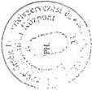

Budapest, 1999. 02. 11.

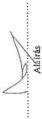

---

2

3

4

5

6

7

---

25. sz.

# TANÚSÍTVÁNY

a Vám- és Pénzügyőrségnél az azonnali beszedési megbízások

eredményességéről

|  Megnevezés | Mennyiségi egység | 1996. | 1997. |   | 1998.  |   |
| --- | --- | --- | --- | --- | --- | --- |
|   |   |   |   | Index 1996=100% |  | Index 1996=100%  |
|  VP által a számlavezetőhöz benyújtott azonnali beszedési megbízások száma | db | 2 448 | 4 380 | 178,92 | 4 039 | 164,99  |
|  Sikertelen beszedési megbízások száma | db | 1 486 | 2 740 | 184,39 | 2 925 | 196,84  |
|  Részben sikeres beszedési megbízások száma | db | 51 | 92 | 180,39 | 181 | 354,90  |
|  Sikeres beszedési megbízások száma | db | 672 | 817 | 121,58 | 715 | 106,40  |
|  Beszedési megbízással követelt összeg | M Ft | 12 767,65 | 8 900,88 | 69,71 | 32 378,09 | 253,59  |
|  Beszedési megbízás eredményeként rendezett összeg | M Ft | 289,22 | 422,26 | 146,00 | 10 207,46 | 3 529,31  |

Nyilatkozat: A tanúsítványban szereplő adatok a könyvviteli nyilvántartással egyezőek, valódiságukat igazolom

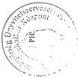

Budapest, 1999. február 11.

Aláírás

---

1

1

1

1

1

1

---

26. sz.

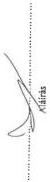

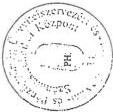

# Tanúsítvány

a Vám- és Pénzügyőrségnél a csődeljárások eredményességéről

|  Megnevezés | Mérték egység | 1996. | 1997. |   | 1998.  |   |   |
| --- | --- | --- | --- | --- | --- | --- | --- |
|   |   |   |   | Index 1996=100% |  | Index 1996=100%  |   |
|  Tárgyév során lezárult csődeljárások száma | db | 381,00 | 348,00 | 91,34 | 431,00 | 113,12  |   |
|  Az eljárással érintettek | tőketartozása | E Ft | 937 003,11 | 507 345,18 | 54,15 | 361 654,79 | 38,60  |
|  késedelmi pótlék tartozása |  | E Ft | 2 244 052,72 | 1 634 858,75 | 72,85 | 1 090 037,03 | 48,57  |
|  A tartozásból | befolyt összeg * | E Ft | —— | —— | —— | —— | ——  |
|  elengedett összeg * |  | E Ft | —— | —— | —— | —— | ——  |
|  meghiúsult összeg * |  | E Ft | —— | —— | —— | —— | ——  |
|  December 31-én csődeljárás alatt álló gazdálkodók száma | db | 427,00 | 334,00 | 78,22 | 155,00 | 155,00 | 36,30  |
|  tőketartozása |  | E Ft | 850 477,38 | 666 279,62 | 78,34 | 516 182,51 | 60,69  |
|  késedelmi pótlék tartozása |  | E Ft | 1 668 365,07 | 1 374 181,27 | 82,37 | 1 065 711,69 | 63,88  |

* VH nyilvántartásban szerepel

Nyilatkozat: A tanúsítványban szereplő adatok a könyvviteli nyilvántartással egyezőek, valódiságukat igazolom

Budapest, 1999. február 11.

---

2

.

3

.

.

.

---

# TANÚSÍTVÁNY

a Vám- és Pénzügyőrségnél a végelszámolási eljárások eredményességéről

27. sz.

|  Megnevezés | Mennyiségi egység | 1996. | 1997. |   | 1998.  |   |
| --- | --- | --- | --- | --- | --- | --- |
|   |   |   |   | Index 1996=100% |  | Index 1996=100%  |
|  Tárgyév során lezárult végelszámolások száma * | db | --- | --- | --- | --- | ---  |
|  tőketartozása | E Ft | --- | --- | --- | --- | ---  |
|  késedelmi pótlék tartozása | E Ft | --- | --- | --- | --- | ---  |
|  bírság tartozása | E Ft | --- | --- | --- | --- | ---  |
|  A tartozásból befolyt összeg * | E Ft | --- | --- | --- | --- | ---  |
|  elengedett összeg | E Ft | --- | --- | --- | --- | ---  |
|  meghiúsult összeg | E Ft | --- | --- | --- | --- | ---  |
|  December 31-én csődeljárás alatt álló gazdálkodók száma | db | 2 985 | 3 156 | 105,73 | 2 732 | 91,52  |
|  tőketartozása | E Ft | 1 696 036,05 | 916 035,07 | 54,01 | 756 016,81 | 44,58  |
|  késedelmi pótlék tartozása | E Ft | 4 328 070,56 | 2 300 429,72 | 53,15 | 1 406 845,15 | 32,51  |
|  bírság tartozása | E Ft | --- | --- | --- | --- | ---  |

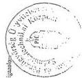

* VH nyilvántartásban szerepel

Nyilatkozat: A tanúsítványban szereplő adatok a könyvviteli nyilvántartással egyezőek, valódiságukat igazolom.

---

?

?

?

?

?

?

---

28. sz.

# Tanúsítvány

a Vám- és Pénzügyőrségnél a felszámolási eljárások eredményességéről

|  Megnevezés | Mérték-egység | 1996. | 1997. |   | 1998.  |   |
| --- | --- | --- | --- | --- | --- | --- |
|   |   |   |  Index 1996=100% | Index 1996=100% | Index 1996=100% | Index 1996=100%  |
|  Tárgyévben befejezett felszámolási eljárások száma | db | 3 498 | 8 092 | 231,33 | 13 508 | 386,16  |
|  hitelezői igénykielégítés | EB | 4 498,80 | 116 971,11 | 2 600,05 | 52 383,28 | 1 164,38  |
|  elengedett tartozás | EB | --- | --- | --- | --- | ---  |
|  hitelezői veszteség | EB | 5 544 285,07 | 11 246 500,16 | 202,85 | 16 462 069,27 | 296,92  |
|  Esből a VP által kezdeményezett eljárások száma * | db | --- | --- | --- | --- | ---  |
|  hitelezői igénykielégítés | EB | --- | --- | --- | --- | ---  |
|  elengedett tartozás | EB | --- | --- | --- | --- | ---  |
|  hitelezői veszteség | EB | --- | --- | --- | --- | ---  |
|  December 31-én szabóeljárás alatt álló gazdálkodók száma | db | 6 214 | 5 950 | 95,75 | 5 327 | 85,73  |
|  tőketartozása | EB | 37 383 799,59 | 33 622 065,01 | 89,94 | 41 133 753,05 | 110,03  |
|  késedelmi pótlék tartozása *** | EB | 73 592 802,30 | 63 271 013,33 | 85,97 | 54 109 894,56 | 73,53  |
|  birágg tartozása ** | EB | --- | --- | --- | --- | ---  |
|  Esből VP által kezdeményezett eljárás alatt álló gazdálkodók száma * | db | --- | --- | --- | --- | ---  |
|  tőketartozása | EB | --- | --- | --- | --- | ---  |
|  késedelmi pótlék tartozása | EB | --- | --- | --- | --- | ---  |
|  birágg tartozása ** | EB | --- | --- | --- | --- | ---  |

* VH nyilvántartásban szerepel

** nincs különbözve

*** csak számított adat

Nyilatkozat: A tanúsítványban szereplő adatok a könyvviteli nyilvántartással egyeznek, valóságukat igazolom

Budapest, 1999. február 11.

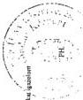

A handwritten signature in blue ink, located to the right of the 'Hajdú' (Hajdú) is positioned above the printed name.

---

0

1

2

3

4

5

---

29. sz.

NYILATKOZAT

a Vám- és Pénzügyőrség 1998. XII. 31-i kintlévőségének bontásáról

(előzetes)

M Ft-ban

|  Megnevezés | 1995. XII. 31-ig | 1996. és 1997. évben | 1998. évben keletkezett | Összes kintlévőség  |
| --- | --- | --- | --- | --- |
|   |  keletkezett kintlévőség | keletkezett kintlévőség | kintlévőség | 1998. XII. 31-én  |
|  Vám- és vámkezelési díj | 10 355 | 4 118 | -3 992 | 10 481  |
|  Statisztikai illeték | 1 133 | 83 | -83 | 1 133  |
|  Vámpótlék | -121 | -2 060 | 1 623 | -558  |
|  Általános forgalmi adó | 22 845 | 12 880 | -11 622 | 24 103  |
|  Fogyasztási adó | 15 811 | 8 824 | -483 | 24 152  |
|  Tőke kintlévőség összesen | 50 023 | 23 845 | -14 557 | 59 311  |
|  Vám késedelmi pótlék (kamat+bírság) | 0 | 3 401 | 1 920 | 5 321  |
|  Összesen | 50 023 | 27 246 | -12 637 | 64 632  |
|  Jövedéki adó (üa., egyéb termék, dohánygyártmány, adójegy) |  |  | -15 418 | -15 418  |
|  Bérfőzési szeszadó | 2 | 11 | -599 | -586  |
|  Összesen | 2 | 11 | -16 017 | -16 004  |
|  Jövedéki bírság |  |  |  |   |
|  Mindösszesen | 50 025 | 27 257 | -28 654 | 48 628  |

Nyilatkozat: A tanúsítványban szereplő adatok a könyvviteli nyilvántartással egyezőek, valódiságukat igazolom

* KORDAX-al együtt

** bevalláshoz kapcsolódó előleg befizetések

Budapest, 1999. február 11.

PH.

Budapest, 1999. június

---

1

1

1