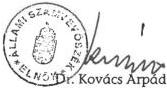
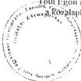
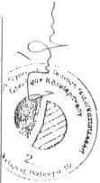

Állami Számvevőszék

# JELENTÉS

**a Fogyatékos Gyermekek, Tanulók**
**Felzárkóztatásáért Országos**
**Közalapítvány működésének**

pénzügyi-gazdasági ellenőrzéséről

9915

1999. június

9915

---

# Az ellenőrzés végrehajtásáért felelős:
az ÁSZ III. Költségvetési Ellenőrzési Igazgatósága

Bihary Zsigmond
számvevő igazgató

Az ellenőrzést vezette:

Balázs Andrásné
számvevő főtanácsos

Az ellenőrzésben részt vettek:

Solymár Ágnes
számvevő
dr. Oszer Sándor Lajos
számvevő

Az ÁSZ által eddig ellenőrzött, illetve 1999-ben ellenőrzendő közalapítványok,
alapítványok listája:

- Nemzeti Gyermek- és Ifjúsági (Köz)alapítvány (1992, 1996, 1999)
- Magyar Vállalkozásfejlesztési Alapítvány (1994, 1996)
- Az alapítványoknak juttatott állami pénzek témaellenőrzése 388 alapítványnál (1996)
- Grassalkovich Kastély Közalapítvány (1996)
- Magyarországi Nemzeti és Etnikai Kisebbségekért Közalapítvány (1996, 1997)
- A Településekért, Régiókért Közalapítvány (1996)
- 1956-os Forradalom Történetének Dokumentációs és Kutatóintézete Közalapítvány (1996)
- Hadigondozottak Közalapítvány (1996)
- Hungária Televízió Közalapítvány (1996)
- Borsod-Abaúj-Zemlén Megyei Fejlesztési Közalapítvány (1996)
- Szabolcs-Szatmár-Bereg Megyei Fejlesztési Közalapítvány (1996)
- Illyés Közalapítvány (1996)
- Pro Professione Alapítvány (1996)
- Magyar Alkotóművészeti Közalapítvány (1996)
- Magyar Rádió Közalapítvány (1997, 1998)
- Magyar Televízió Közalapítvány (1997, 1998)
- Gandhi Közalapítvány (1997)
- Magyarországi Cigányokért Közalapítvány (1997)
- Nemzetközi Pető András Közalapítvány (1998)
- Magyar Nemzeti Üdülési Alapítvány (1999)
- Sportcélú közalapítványok, (négy közalapítvány, 1999)
- Közoktatási Modernizációs Közalapítvány (1999)

A jelentés az internet www.asz.gov.hu alatt olvasható.

Jelentéseink az Országgyűlés számítógépes hálózatán is olvashatók.

---

# I. ÖSSZEGZŐ MEGÁLLAPÍTÁSOK, KÖVETKEZTETÉSEK, JAVASLATOK ... 7

# II. RÉSZLETES MEGÁLLAPÍTÁSOK ... 11

1. Az FGYKA MŰKÖDÉSE, JOGI, PÉNZÜGYI ÉS SZERVEZETI FELTÉTELEINEK A MEGTEREMTÉSE ... 11

1.1.Az FGYKA mukodese megkezdesehez tett intezkedesek. 11
1.2.Az FGYKA indulo vagyona 12
1.3.A kuratorium es az FB letrehozasa, a kozalapitvanyi iroda megalakitasa. 13

2. Az FGYKA MŰKÖDÉSE ... 14

2.1.A kuratorium mukodese 14
2.2.A belso szabalyzatok teljessege, torvenyessege, a konyvvezetes szabalyossaga...15
2.3.Az FGYKA titkárságanak muködése 17
2.4.Az FB mukodese 17

3. Az FGYKA GAZDÁLKODÁSA ... 18

3.1. Az éves penzügyi tervek elkésztése, jováhagyása 18
3.2.Az FGYKA bevetelei es kiadasai (koltsegei) 20

3.2.1. Az FGYKA szamara meghatarozott beveteli forrasok realizalasa 20
3.2.2.A bevetelek es kiadasok (koltsegek) alakulasa 1997-1998. években 21
3.2.3. Az FGYKA a mukodéshez szükséges feltetelek megteremtése, a mukodési költségek alakulása 22

3.3.A vagyonvedelem helyzete 24
3.4. Az éves beszámoló szabályossága, jováhagyása, a konyvvizsgálói kötelezettseg teljesítese 25
3.5.Az FGYKA finanszirozasa es likviditasa 26
3.6.Az FGYKA vagyonanak megorzese es hasznositasa 27

4. Az FGYKA-NAK NYÚJTOTT KÖZPONTI KÖLTSÉGVETÉSI TÁMOGATÁS RENDELTETÉSSZERŰ,
TÖRVÉNYES ÉS CÉLSZERŰ FELHASZNÁLÁSA ... 28

4.1. Az FGYKA támogatási koncepciója és ennek összhangja az alapíto okirat celkitüzeseivel 28
4.2.A palyaztatasi rend mukodese 30

4.2.1.Az FGYKA palyaztatasi koncepciójának megvalósulása 30
4.2.2. Egyes kozalapitvanyi celok penzugyi tamogatasa elmaradasanak okai 33

4.2.2.1. A különleges gondozás igénybevételéhez szükséges eszközök, járművek
beszerzése ... 33

1

---

4.2.2.2. A felsőfokú tanulmányok megkezdésének, illetve folytatásának támogatása... 33
4.2.3. A pályázatok nyerteseivel kötött megállapodások... 34
4.2.4. A pályázati feladatok teljesítésének ellenőrzési rendszere, az ellenőrzések kapcsán tett intézkedések... 35
4.3. A Bárczi Gusztáv Gyógypedagógiai Tanárképző Főiskolával kötött megállapodás és annak végrehajtása... 36

2

---

## Rövidítések jegyzéke

|  1997. évi költségvetési törvény | a Magyar Köztársaság 1997. évi költségvetéséről szóló 1996. évi CXXIV. törvény  |
| --- | --- |
|  1998. évi költségvetési törvény | a Magyar Köztársaság 1998. évi költségvetéséről szóló 1997. évi CXLVI. törvény  |
|  1999. évi költségvetési törvény | a Magyar Köztársaság 1999. évi költségvetéséről szóló 1998. évi XC. törvény  |
|  Áht. | az államháztartásról szóló, többször módosított 1992. évi XXXVIII. törvény  |
|  ÁSZ | Állami Számvevőszék  |
|  BGGYTF | Bárczi Gusztáv Gyógypedagógiai Tanárképző Főiskola  |
|  BM | Belügyminisztérium  |
|  EÜM | Egészségügyi Minisztérium  |
|  FB | felügyelő bizottság  |
|  FGYKA | Fogyatékos Gyermekek, Tanulók Felzárkóztatásáért Országos Közalapítvány  |
|  Kööt. | a közoktatásról szóló, többször módosított 1993. évi LXXIX. törvény  |
|  MKM | Művelődési és Közoktatási Minisztérium  |
|  MüM | Munkaügyi Minisztérium  |
|  NM | Népjóléti Minisztérium  |
|  OM | Oktatási Minisztérium  |
|  Ötv. | 1990. évi LXV. törvény a helyi önkormányzatokról  |
|  PM | Pénzügyminisztérium  |
|  Ptk. | a Magyar Köztársaság Polgári Törvénykönyvéről szóló 1959. évi IV. törvény  |
|  SZCSM | Szociális és Családügyi Minisztérium  |
|  SZMSZ | szervezeti és működési szabályzat  |
|  Szt. | a számvitelről szóló, többször módosított 1991. évi XVIII. törvény  |

3

---

4

---

Állami Számvevőszék

Témaszám: 466.

# JELENTÉS

## A FOGYATÉKOS GYERMEKEK, TANULÓK FELZÁRKÓZTATÁSÁÉRT ORSZÁGOS KÖZALAPÍTVÁNY MŰKÖDÉSÉNEK PÉNZÜGYI-GAZDASÁGI ELLENŐRZÉSÉRŐL

Az **Alkotmány** 67. §-ának (1) bekezdése alapján a Magyar Köztársaságban minden gyermeknek joga van a családja, az állam és a társadalom részéről arra a védelemre és gondoskodásra, amely a megfelelő testi, szellemi és erkölcsi fejlődéséhez szükséges. **A Gyermekek jogairól szóló, New Yorkban, 1989. november 20-án kelt Egyezményt** az Országgyűlés az 1991. évi LXIV. törvénnyel hirdette ki. A 23. cikk 2. pontja szerint az Egyezményben részes államok elismerik a fogyatékos gyermek különleges gondozáshoz való jogát, és a rendelkezésükre álló forrásoktól függő mértékben, az előírt feltételeknek megfelelő fogyatékos gyermeknek és eltartóinak, kérelemre, a gyermek állapotához és szülei vagy gondviselői helyzetéhez alkalmazkodó segítséget biztosítanak.

Fent megjelölt feladatok ellátásának **törvényekben rögzített feltételeit az Országgyűlés fokozatosan teremtette meg.** Az **Ötv.** - mely az önkormányzati képviselő-testületek tagjainak 1990. évi választásának napján lépett hatályba - még nem nevezte meg konkrétan a fogyatékos gyermekek oktatásával, nevelésével kapcsolatos önkormányzati feladatokat. Az Ötv. 1994. december 11-től hatályos 70. §-a a megyei önkormányzatok kötelező feladatává tette, hogy gondoskodjanak - többek között - az egészségügyi intézményekben tartós gyógykezelés alatt álló gyermekek oktatásáról, a többi tanulóval együtt nem foglalkoztatható fogyatékos gyermekek oktatásáról, neveléséről és gondozásáról. A **Kööt.** 1996. szeptember 1-jétől hatályos 86. § (2) bekezdése szerint a községi, a városi, a fővárosi, kerületi és a megyei jogú városi önkormányzat köteles a többi gyermekkel együtt nevelhető, oktatható testi, érzékszervi, enyhe értelmi, beszéd - és más fogyatékos gyermekek, tanulók ellátásáról gondoskodni.

---5

---

**A közalapítványt a Kormány** a Kööt. 1996. szeptember 1-jétől hatályos 119. § (2) bekezdése alapján - az 1997. július 24-i ülésén elfogadott - **164/1997. (IX. 30.) Korm. rendelettel hozta létre**, a testi, érzékszervi, értelmi, beszéd- és más fogyatékos gyermekek nevelésével és oktatásával, a pedagógiai szakszolgálatok biztosításával, a korai fejlesztéssel és gondozással, illetve a fejlesztő felkészítéssel kapcsolatos közoktatási feladatok segítése, a feladatellátásban közreműködő intézményrendszer működtetése és fejlesztése, az érintett gyermekek, tanulók részére a különleges gondozás igénybevételéhez szükséges eszközök, járművek beszerzésének támogatása, a szülői gondozói tanfolyam megszervezésének segítése céljából. A Fővárosi Bíróság a közalapítványt a 12 Pk. 60887/1997/3. számú végzésével 1997. szeptember 23-án, 6799. sorszám alatt vette nyilvántartásba. (A Korm. rendeletet és az ennek mellékleteként jóváhagyott alapító okiratot ezt követően hirdették ki.)

A fogyatékos gyermekek, tanulók nevelése és oktatása nemcsak az oktatási ágazatot, hanem a szociális ellátást és az egészségügyi ellátást is érinti. A fogyatékos gyermek az óvodai, iskolai neveléssel és oktatással egyidejűleg szociális ellátásra, rehabilitációra és egészségügyi ellátásra is jogosult. Mindez indokolta, hogy a feladatok finanszírozásában részt vegyen az Egészségbiztosítási Alap is. Ennek megfelelően **a Kööt. az FGYKA bevételei között mind a központi költségvetés, mind az Egészségbiztosítási Alap hozzájárulását megjelölte.**

Az ÁSZ a Ptk. 74/G. §-ának (8) bekezdése alapján a közalapítványok gazdálkodásának törvényességét és célszerűségét jogosult ellenőrizni.

**Ennek keretében arra kerestünk választ, hogy**

- az FGYKA működése hogyan segítette elő a közoktatási törvényben, valamint az alapító okiratban meghatározott közfeladatok megvalósítását;
- a kuratórium szabályosan és eredményesen gazdálkodott-e az átadott vagyonnal és a támogatással.

**Az ellenőrzés az FGYKA megalakulásától 1999. március 31-ig tartó időszakra terjedt ki, összefoglaló és részletes megállapításainkat a jelentés, a kapcsolódó adatokat a mellékletek, a szakmai programok értékelését a Függelék tartalmazza.**

6

---

I. ÖSSZEGZŐ MEGÁLLAPÍTÁSOK, KÖVETKEZTETÉSEK, JAVASLATOK

# I. ÖSSZEGZŐ MEGÁLLAPÍTÁSOK, KÖVETKEZTETÉSEK, JAVASLATOK

Az FGYKA alapító okirata a közoktatásról szóló törvényben rögzített célokkal és feladatokkal összhangban határozta meg a közalapítvány céljait. A Fővárosi Bíróság az FGYKA-t **kiemelkedően közhasznú szervezetként** nyilvántartásba vette.

**Az FGYKA** - a létrehozását előíró törvényi rendelkezés hatálybalépéséhez képest - **csaknem másfél éves késéssel kezdte meg működését.**

Az 1997. évi költségvetési törvény nem hagyott jóvá elkülönített előirányzatot az FGYKA induló vagyona céljára. Az induló vagyont a Kormány olyan előirányzat terhére jelölte meg (Belügyminisztérium fejezet, Körzeti, térségi feladatok támogatása), melyre az 1997. évi költségvetési törvény szerint nem volt felhatalmazása, ebből következően **az induló vagyont illetően ellentmondásos intézkedéseket tárt fel az ellenőrzés.**

Az FGYKA az induló vagyonként számításba vett 200 M Ft összeget nem az alapítótól (a Kormánytól) és nem induló vagyonként, hanem központi költségvetési támogatásként, megállapodás alapján az MKM-től kapta, felhasználási céljait az MKM írta elő. Az 1997. évi központi költségvetési támogatás felhasználására az MKM által meghatározott feladatsor bővebb volt, mint amit az alapító okirat 1997. évre az induló vagyon terhére a kuratóriumnak előírt. A Ptk. 74/B. § (1) bekezdése szerint az alapítvány céljára rendelt vagyont (induló vagyont) és annak felhasználási módját az alapító okiratban meg kell jelölni.

**Az FGYKA-t az ellentmondásos intézkedések miatt nem érte anyagi hátrány**, mivel időben hozzájutott a működésének és a közalapítványi célok teljesítésének megkezdéséhez szükséges forrásokhoz. Az alapítványok gazdálkodási rendjéről szóló 115/1992. (VII. 23.) Korm. rendelet 8. § (1) bekezdésével **ellentétes** azonban, **hogy** az 1997. évi mérlegében 200 M Ft **induló tőkét mutatott ki, mivel nem ezen jogcímen kapta a fenti összeget.**

Az **Egészségbiztosítási Alap hozzájárulásából**, az állampolgárok által az **SZJA-ból** felajánlott 1 %-ból, a természetes személyek és jogi személyek **önkéntes befizetéseiből** és a **vállalkozási** tevékenység **eredményéből sem 1997-ben, sem 1998-ban az FGYKA-nak nem volt bevétele, a kuratórium érdemben nem kezdeményezte, hogy e forrásokból is bevételekhez jusson.**

Az ellenőrzött időszak alatt a **bevételi forrásokat 90 %-ban** az éves költségvetési törvényekben jóváhagyott **központi költségvetési támogatás tette ki**, egyéb bevételei az átmenetileg szabad pénzeszközeinek államilag garantált értékpapírba való befektetésből származtak.

Az FGYKA létrehozása óta eltelt idő alatt **sem az alapító nevében eljáró MKM, sem az FGYKA kuratóriuma nem tudta bevonni az Egészségbiz-**

7

---

I. ÖSSZEGZŐ MEGÁLLAPÍTÁSOK, KÖVETKEZTETÉSEK, JAVASLATOK

**tosítási Alap forrásait** a közalapítvány támogatásába, mivel az Alap éves költségvetését meghatározó törvények nem jelölték meg az FGYKA-t, mint támogatandó szervezetet. Az Alap hozzájárulását az FGYKA a fogyatékosok mozgását elősegítő eszközök, járművek beszerzéséhez nyújtott támogatásnál használhatná fel.

**Az FGYKA kuratóriuma** - működésének alig másfél éve alatt - **összességében eredményesen látta el vagyonkezelői feladatait**, az alapító okiratban megjelölt közcélok túlnyomó többségének támogatására pályázatokat írt ki. A szakmai programokat a kuratóriumi tagok delegálásában részt vevő szervezetek és a kuratóriumi tagok javaslataira, valamint a megyei, fővárosi közoktatás-fejlesztési koncepciókra alapozta. Ezek elbírálására, az odaítélt támogatások felhasználásának ellenőrzésére **célszerűen funkcionáló rendszert és módszereket dolgozott ki**. Az FGYKA által kiírt pályázati feltételek alapján az ellenőrzött időszak alatt összesen 1608 db pályázatot nyújtottak be. A pályázatok alaki és tartalmi feltételei meglétének vizsgálata után 346 db pályázatot elfogadott, 759 db pályázatot elutasított a kuratórium, 503 db értékelése az ellenőrzés befejezésekor még folyamatban volt. A pályázatokra igényelt összeg 14 %-át teljesítette a kuratórium, egy pályázatra átlagosan 0,5 M Ft támogatás jutott. A FGYKA a rendelkezésre álló pénzeszközeinek - az ellenőrzés befejezéséig - közel felét használta fel a pályázati programok pénzügyi teljesítésére. Forráshiányra hivatkozva - melyet csak részben tartunk megalapozottnak - **nem adott eddig támogatást** a kuratórium **járművek beszerzéséhez**, illetve az alapító okiratban egyértelműen megjelölt támogatási cél hiányában **a felsőoktatásban tanulmányokat végző fogyatékos hallgatók számára**.

Az ellenőrzött időszakban **a kuratórium összességében törvényesen működött**. 1998. év végére szabályozottsága teljes körűvé vált, de egyes szabályzatai az utalványozási jog gyakorlását illetően nem voltak összhangban. Az alapítványi célú tevékenység számbavételére az FGYKA-nál kialakított **számviteli rendszer csak részben alkalmas**. A könyvvezetésben az **alapítványi célú kiadások** egyértelmű, **elkülönített** kimutatása **nem biztosított**, azok nem válnak el a működési költségektől. Az alapító okirat az FGYKA éves működési költségét az „**éves tervezett költségvetés bevételi oldalának 8 %-ában**” határozta meg, **nem** pedig a működési költségek mértékét elsősorban befolyásoló **alapítványi célú kiadások arányában**.

**Az FB tagok részére a kuratórium állapította meg a tiszteletdíjat. Az FB nincs függelmi viszonyban a kuratóriummal, megbízását az alapítótól kapta** a kuratórium tevékenységének ellenőrzésére, beszámolási kötelezettséggel is az alapítónak tartozik. **A kuratórium az alapító okirat felhatalmazása nélkül határozta meg az FB tagoknak a tiszteletdíj összegét**.

A közalapítvány székhelyének **akadálymentes megközelítéséhez** tervezett beruházás **indokolatlanul elhúzódik**, jóllehet a **közalapítvány kedvezményezettjei egy részének a tervezett átalakítás nélkülözhetetlen**.

8

---

I. ÖSSZEGZŐ MEGÁLLAPÍTÁSOK, KÖVETKEZTETÉSEK, JAVASLATOK

Az ellenőrzött időszak alatt az FGYKA folyamatosan rendelkezett szabad pénzeszközzel, pénzügyi helyzete és likviditása kiegyensúlyozott volt.

Szabad pénzeszközeinek egy részét - az alapító okiratban és a vagyonkezelési szabályzatban foglaltaknak megfelelően - államilag garantált értékpapírba fektette.

Az FGYKA FB 1998. évben az alapító okiratban megfogalmazott feladatai közül a közalapítvány működése törvényességének és vagyona kezelésének, ezen belül a pénzügyi terveknek és a beszámolóknak az ellenőrzését elvégezte.

# AZ ELLENŐRZÉS MEGÁLLAPÍTÁSAI ALAPJÁN JAVASOLJUK

# a Kormánynak

1. Kezdemenyezze - a kozoktatasrol szoló 1993. évi LXXIX. törveny 119. § (2) bekezdésel összhangban - hogy az Orszaggyulés az Egészségbiztositási Alap éves koltsegvetését meghatározó törvenyekben allapitsa meg az Alap hozzájárulásat a Fogyatékos Gyermekek, Tanulok Felzarkóztatasaert Orszagos Kozalapitvány kozalapitványí celjainak tamogatásahoz.
2. Intezkedjen mint alapito, hogy a Fogyatékos Gyermekek, Tanulok Felzárköztatáér Országos Közalapitvány az alapito okiratban megjelölt induló vagyonát megkapja. (Ennek celszerú megoldásimódja lehet pl., ha a Magyar Köztársaság 2000. évi koltsegvetésben 200 millio Ft koltsegvetési elöiranyzatot induló vagyonként szerepel-tetnek.)
3. Tekintse at a Fogyatékos Gyermekek, Tanulok Felzárköztatáér Országos Közalapitvány alapíto okiratát és annak modositása keretében

a) allapitsa meg az FB tagok tiszteletdijat, vagy hatalmazza fel erre az alapito neveben eljaro oktatasi miniszert;
b) a kozalapitvany mukodesi koltsegeit a targyevben teljesitett alapitvanyi celu kiadasok aranyaban hatarozza meg.

# a Fogyatékos Gyermekek, Tanulók Felzárkóztatásáért Országos Közalapítvány kuratóriumának

1. Intezkedjen, hogy a kozalapitvany szamvitele legyen alkalmas a kozalapitvanyi celu tevekenyseg alapito okiratnak megfelelo szambavetelere, a kozalapitvanyi es mukodesi celu kiadasok szabalyos elkulonitese. A belso szabalyzatokban meghatarozott kotelezettsegvallalasi es utalvanyozasi jogkorokkel ellentetes gyakorlatot haladektalanul szamolja fel, es gondoskodjon arrol, hogy a tisztségviselok es a titkarsag maradektalanul tartsa be a kozalapitvany szabalyzatainak elorasait.
2. Dolgozza ki és alkalmazza azokat a modszereket, amelyek segitségevel a kozalapitvány nagyobb mertékben hozzájut az alapíto okiratában megjelölt valamennyi bevételi forrashoz, igy pl. a természetes és jegi szemelyek önkéntes befizeteseihez, az allampolgárok által felajánlott SZJA-hoz, vallalkozásí bevetelekhez.

9

---

I. ÖSSZEGZŐ MEGÁLLAPÍTÁSOK, KÖVETKEZTETÉSEK, JAVASLATOK

3. Gondoskodjon - az alapító intézkedését követően - az induló tőke és tőkeváltozás számviteli rendezéséről.

9

1

2

3

10

---

II. RÉSZLETES MEGÁLLAPÍTÁSOK

## II. RÉSZLETES MEGÁLLAPÍTÁSOK

### 1. AZ FGYKA MŰKÖDÉSE, JOGI, PÉNZÜGYI ÉS SZERVEZETI FELTÉTELEINEK A MEGTEREMTÉSE

#### 1.1. Az FGYKA működése megkezdéséhez tett intézkedések

Az **FGYKA célja**, hogy támogatást nyújtson a testi, érzékszervi, értelmi, beszéd- és más fogyatékos gyermekek és tanulók személyiségének kibontakoztatása, szellemi és fizikai tehetségük és képességük kifejlesztése, esélyegyenlőségük növelése érdekében, valamint hogy kialakítson egy olyan ellátó rendszert, amely lehetővé teszi, hogy az érintett gyermekek lakóhelyükhöz közel, bejárás-sal tudják igénybe venni a fogyatékosság típusának megfelelően létrehozott óvodát, iskolát, valamint részt vegyen az ép gyermekekkel együtt történő nevelés, oktatás feltételeinek megteremtésében.

E célok megvalósítása érdekében az FGYKA pedagógiai szakmai és szakszolgáltatásokat nyújt, pályázat útján támogatja a fogyatékos gyermekek ellátásában közreműködő intézményrendszer fejlesztését, pedagógiai programok fejlesztését, eszközök, járművek beszerzését, szabadidős tevékenységek megszervezését, az érintett tanulók középfokú iskolai tanulmányainak folytatását és a felsőfokú tanulmányainak megkezdését, továbbá munkába állását, valamint megtéríti a szülők részére szervezett tanfolyamok költségét.

**Az alapító okiratban megfogalmazott célok és feladatok a közoktatásról szóló törvényben rögzített célokkal és feladatokkal összhangban vannak.**

A közhasznú szervezetekről szóló 1997. évi CLVI. törvény megjelenését követően az FGYKA kuratóriuma kidolgozta a kiemelkedően közhasznú szervezetként történő működéshez szükséges alapító okirat módosítását, amit a Kormány, mint alapító elfogadott, majd felhatalmazta a művelődési és közoktatási minisztert, hogy az alapító nevében gondoskodjon az FGYKA kiemelten közhasznú szervezetként történő bírósági nyilvántartásba vételéről. Ezen intézkedés 1998. május 29-én - az előírt határidőn belül - megtörtént. **A Fővárosi Bíróság** - a kért hiánypótlások teljesítése után - **1999. január 27-én** a 12. Pk. 60887/1997/9. számú **végzésével kiemelkedően közhasznú szervezetként nyilvántartásba vette az FGYKA-t.** Az alapító okirat módosítását a 24/1999. (II. 12.) Korm. rendelet tartalmazza.

**A módosított alapító okirat megfelel a közhasznú szervezetekről szóló 1997. évi CLVI. törvény 4. § (1) és 7. §-ban megfogalmazott előírásoknak.**

Az FGYKA megalapításához és működéséhez szükséges **adó- és TB** igazgatási, eljárási intézkedéseket a bírósági bejegyzést követő egy hónapon belül teljes körűen és szabályszerűen megtették.

11

---

II. RÉSZLETES MEGÁLLAPÍTÁSOK

Az FGYKA a Magyar Államkincstárnál 1997. október 6-án nyitott **folyószámlát** és kötött határozatlan időre szóló megállapodást - az Áht. 18/C. § (6) bekezdésben foglaltak alapján - pénzeszközeinek nyilvántartására és fizetési forgalmának lebonyolítására. A folyószámla felett rendelkezni jogosult személyek - az alapító okirat szerint a kuratórium elnöke és képviseleti joggal felruházott két kuratóriumi tag - aláírásukkal a pénzforgalmi szabályoknak megfelelően bejelentkeztek.

Az FGYKA alapító okirat szerinti **székhelye** 1055 Budapest, Báthory u. 10. Az irodahelyiségeket az MKM-től bérli, évenként megkötött bérleti szerződés alapján.

## 1.2. Az FGYKA induló vagyona

**Az 1997. évi költségvetési törvény nem hagyott jóvá elkülönített előirányzatot az FGYKA induló vagyona céljára.**

Az FGYKA induló vagyonának forrását a létrehozást követően a Kormány olyan előirányzat terhére jelölte meg, melyre a hatályos törvények szerint nem volt felhatalmazása, ebből következően **az induló vagyont illetően a következő ellentmondásos intézkedéseket tárta fel az ellenőrzés:**

**Az FGYKA létrehozásáról szóló 164/1997. (IX. 30.) Korm. rendelet 3. §-a szerint a közalapítvány induló vagyona 200 M Ft**, melyet az 1997. évi központi költségvetés XI. Belügyminisztérium fejezet, 23. cím, 4. alcím, 14. kiemelt előirányzat 'Körzeti, térségi feladatok támogatása' célra jóváhagyott 3.200 M Ft terhére kell biztosítani. Az 1997. évi költségvetési törvény **nem hatalmazta fel a Kormányt** arra, hogy az általa alapított közalapítvány **induló vagyonát fenti előirányzat terhére biztosítsa.**

A megjelölt előirányzat felhasználását az 1997. évi költségvetési törvény 5. sz. melléklete szabályozta, melynek a helyi önkormányzatok által felhasználható központosított előirányzatok 14. pontja a következőket tartalmazza:

„Körzeti, térségi feladatok támogatása

Igényelhetik a megyei (fővárosi) önkormányzatok a Kormány által létrehozott, továbbá a fővárosi és a megyei közalapítványok működtetéséhez, a pedagógiai szakszolgálatok, valamint pedagógiai szakmai szolgáltatások szervezéséhez. A támogatás részletes feltételeit az MKM - a MűM, a PM és a BM véleményének kikérésével - 1997. március 31-ig jelenteti meg. A támogatás összegét az önkormányzat köteles a megyei, fővárosi, országos közalapítvány részére átutalni.”

Az 1997. évi költségvetési törvény 43. § (3) bekezdése szerint a Kormány a helyi önkormányzatok által felhasználható központosított előirányzat (XI. Belügyminisztérium fejezet, 23. cím, 4. alcím) jogcímei között, a működésképtelenné vált helyi önkormányzatok kiegészítő támogatása (XI. Belügyminisztérium fejezet, 23. cím, 5. alcím) jogcímei között, továbbá a 4. és 5. alcím között - a felhasználás iránti igény figyelembevételével - átcsoportosításokat hajthat végre. E felhatalmazás a meghatározott jogcímek közötti átcsoportosítást engedélyezte, nem pedig azt, hogy e jogcímeken túl, az államháztartáson kívülre, a Kormány által alapított közalapítvány induló vagyona céljára vonjon el a Kormány forrást.

12

---

II. RÉSZLETES MEGÁLLAPÍTÁSOK

# **Az FGYKA 1997-ben 200 M Ft támogatást nem az alapítótól és nem induló vagyonként, hanem költségvetési támogatásként, megállapodás alapján kapta az MKM-től (1. sz. melléklet).**

Az MKM a Művelődési Közlöny 1997. április 17-i számában jelentette meg az 1997. évi közoktatási célú támogatási előirányzatok igénybevételi feltételeiről szóló közleményt, melynek 3.1 pontja 200 M Ft-ot irányzott elő a fogyatékos gyermekek nevelésével, oktatásával kapcsolatos országos feladatok ellátásához. A támogatás célja a közlemény szerint a Kööt. 119. § (2) bekezdése alapján a Kormány által létrehozott országos közalapítvány működéséhez, feladatainak ellátásához szükséges forrás egy részének biztosítása.

A közlemény a Kormány által később létrehozott közalapítvány számára az MKM-mel megkötendő megállapodást jelölte meg az előirányzat rendelkezésre bocsátása feltételeként, jóllehet az 1997. évi költségvetési törvény 5. sz. melléklete szerint a Kormány által létrehozott közalapítvány működtetéséhez is a megyei (fővárosi) önkormányzat igényelhette volna az előirányzatot.

Az 1997. szeptember 29-én kötött megállapodás többek között meghatározta a támogatás céljait, összegét, forrását, valamint azt, hogy a támogatás 1997. december 31-ig fel nem használt összege az FGYKA vagyonát gyarapítja, alapító okiratának megfelelően.

Az MKM helyettes államtitkára 1997. szeptemberében írásban tájékoztatta a főpolgármestert az FGYKA számára meghatározott 200 M Ft-tal kapcsolatos teendőkről (2. sz. melléklet).

E levél szerint az 1997. évi költségvetési törvény fent megjelölt előirányzata az FGYKA induló vagyonát tartalmazza.

A támogatást a megállapodás megkötése után az MKM kezdeményezésére a BM a Fővárosi Önkormányzathoz utaltatta, majd a Fővárosi Önkormányzat továbbutalta az FGYKA számlájára, ahova 1997. október 22-én érkezett meg.

# **Az FGYKA-t az ellentmondásos intézkedések miatt anyagi hátrány nem érte, hozzájutott a működésének és a közalapítványi célok teljesítésének megkezdéséhez szükséges forrásokhoz.**

**Az FGYKA** - az alapítványok gazdálkodási rendjéről szóló 115/1992. (VII. 23.) Korm. rendelet 8. § (1) és (3) bekezdésével ellentétesen - **az 1997. évi mérlegében 200 M Ft induló tőkét mutatott ki, jóllehet nem ilyen jogcímen kapta fenti összeget** (3. sz. melléklet).

A jelzett jogszabály szerint az alapítvány az alapító által az alapítvány céljára rendelt pénzeszközöket és eszközöket induló tőkeként, az alapítványi célú tevékenység eredményét - a bevételek és kiadások egyenlegét - tőkeváltozásként köteles kimutatni.

# **1.3. A kuratórium és az FB létrehozása, a közalapítványi iroda megalakítása**

Az FGYKA kurátorait és az FB tagjait az alapító okiratban megjelölt szervezetek javaslata alapján a Kormány 1997. szeptember 22-én kérte fel, 3 éves időtar-

13

---

II. RÉSZLETES MEGÁLLAPÍTÁSOK

tamra. Az FGYKA döntéshozó és kezelő szerve az alapító okirat szerinti 11 tagú, illetve a módosított alapító okirat szerinti 12 tagú kuratórium. **A kuratórium személyi összetétele megfelel a Ptk. 74/C. § (3) bekezdésében foglalt előírásoknak, mivel az alapító a kuratóriumban a vagyon felhasználására meghatározó befolyást nem gyakorol.**

Az alapító okirat 1. sz. melléklete név szerint felsorolja a kuratórium és az FB tagjait.

A kuratóriumba 4 tagot delegáltak a testi, érzékszervi, értelmi, beszéd- vagy más fogyatékos gyermekek, tanulók, illetve szüleik érdekképviseletét ellátó országos szervezetek, 3 tagot az ellátásban érdekelt országos szakmai szervezetek és 1-1 tagot a művelődési és közoktatási miniszter, az Egészségbiztosítási Önkormányzat, a helyi önkormányzatok országos érdekképviseleti szervei és a BGGYTF. A módosított alapító okirat szerint 2 tagot delegál az oktatási miniszter, 1-1 tagot a szociális és családügyi miniszter, a helyi önkormányzat országos érdekképviseleti szervei és a BGGYTF.

Az FGYKA-nál működő FB szabályosan - az alapító okirat előírásainak megfelelően - öt taggal alakult meg.

A 164/1997. (IX. 30.) Korm. rendelet mellékleteként jóváhagyott eredeti alapító okirat szerint az FB-be 1-1 tagot delegált a PM, az MKM, az NM, a BM és a MUM.

A 24/1999. (II. 12.) Korm. rendelet mellékletében foglaltak szerint módosított alapító okirat szerint 1-1 tagot delegált az FB-be a BM, az EÜM, az OM, az SZCSM és a PM.

Az FGYKA titkársága - mint operatív előkészítő és végrehajtó szerv - 1997. november 1-jén kezdte meg működését.

## 2. Az FGYKA MŰKÖDÉSE

### 2.1. A kuratórium működése

Az **FGYKA** a kuratórium által meghatározott és elfogadott éves szakmai program szerint működik. A szakmai programokat a kuratóriumi tagok delegálásában részt vevő szervezetek és a kuratóriumi tagok javaslataira, valamint a megyei, fővárosi közoktatás-fejlesztési koncepciókra alapozták.

A kuratórium feladat- és munkatervet csak 1999. évre készített.

A kuratórium feladatai ellátása érdekében üléseit - az alapító okiratban előírt évente legalább négyszeri alkalmat meghaladóan - átlag havonként egyszer tartotta.

A kuratóriumi üléseken a határozatok meghozatalakor minden esetben betartották a határozatképességre vonatkozó előírásokat. Az alapító okirat rendelkezése szerint az ülésekről jegyzőkönyvet készítettek a jelenlévők felszólalása lényegének rögzítésével és a meghozott határozatok szó szerinti közlésével.

A jegyzőkönyvet a kuratórium ülésének vezetője és a megválasztott jegyzőkönyv hitelesítő minden esetben aláírta. A kuratórium határozatairól a titkárság - a

14

---

II. RÉSZLETES MEGÁLLAPÍTÁSOK

közhasznú szervezetekről szóló 1997. évi CLVI. tv. III. fejezet 7. § (2) bekezdés a. pontja, valamint az ennek megfelelően módosított alapító okirat szerint - vezeti a határozatok gyűjteményét, gondoskodik azok nyilvánosságra hozataláról. Az FGYKA SZMSZ-e - összhangban a módosított alapító okirattal - részletesen meghatározta a kuratórium döntéseinek nyilvántartását és nyilvánosságra hozatalát.

Az eredeti alapító okirat nem rendelkezett az FGYKA kuratóriumi tagjainak összeférhetetlenségéről, de a kuratórium tagjai a közalapítvány nyilvántartásba vétele előtt nyilatkoztak arról, hogy megfelelnek a Ptk. 74/C. § (3) bekezdés előírásainak.

A kurátorok döntéshozatali összeférhetetlenségét a közhasznú szervezetekről szóló 1997. évi CLVI. tv. 8. § (1) bekezdés b. pontja írja elő kötelező jelleggel, amelyet az FGYKA módosított alapító okirata és SZMSZ-e rögzített. A kuratóriumi tagok nyilatkozatban kijelentették, hogy a fenti törvényben meghatározott kizárási okok nem állnak fenn.

Az összeférhetetlenségi szabályokat a kuratóriumi döntések meghozatalakor betartották, a döntésekben érintett kuratóriumi tagok az adott határozat meghozatalában nem vettek részt.

Pl. a kuratórium jegyzőkönyve szerint a szabadidős tevékenységek program keretében beérkezett pályázatok értékelésében, a 27/1998. (VI. 11.) számú kuratóriumi határozat meghozatalában az érintett kurátorok nem vettek részt.

# 2.2. A belső szabályzatok teljessége, törvényessége, a könyvvezetés szabályossága

Az FGYKA a gazdálkodási kereteit meghatározó szabályzatait a működés megkezdésétől folyamatosan készítette, de csak a működés megkezdését követő egy év letelte után, 1998. év végére vált szabályozottsága teljes körűvé.

Az FGYKA SZMSZ-ének elkészítése elhúzódott, teljes terjedelemben 1998. október 29-től hatályos.

A kuratórium megalakulásakor elkészítette és jóváhagyta a szavazás rendjéről szóló szabályzatot.

Az SZMSZ - összhangban az eredeti és a módosított alapító okirattal - tartalmazza az FGYKA vagyoni viszonyait, gazdálkodását, rögzíti szervezeti felépítését, az egyes szervezeti egységek feladatait, működését, az összeférhetetlenségre vonatkozó szabályokat, valamint a kártérítési felelősséget.

A kuratórium a jogszabályokban kötelezően előírt valamennyi szabályzatot elkészítette és jóváhagyta. Önálló szabályzat formájában 1998. április 15-től rendelkezik számviteli politikával, számlarenddel, értékelési, leltározási, pénzkezelési szabályzattal. Az alapító okiratban előírt vagyonkezelési és befektetési szabályzatot, valamint a felesleges vagyontárgyak hasznosításáról és selejtezéséről szóló szabályzatot 1998. december 11-én hagyta jóvá a kuratórium. A szabályzatok többsége megfelel a jogszabályok előírásainak, a helyszíni ellenőrzés a pénzkezelési szabályzatot és a vagyonkezelési szabályzatot az utalványozási jogkör nem egyér-

15

---

II. RÉSZLETES MEGÁLLAPÍTÁSOK

telmű szabályozása, a számlarendet a működési kiadásoknak (költségeknek) a 115/1992. (VII. 23.) Korm. rendelet 5. § (2) bekezdésének nem megfelelő elkülönítése miatt kifogásolta.

- A bankszámla feletti rendelkezésről és utalványozásról szóló jog - az alapító okirat szerint - a kuratórium elnökét és a képviseleti joggal felruházott két kuratóriumi tagot illeti meg. A pénzkezelési szabályzat ezzel összhangban áll. Az SZMSZ és a vagyonkezelési szabályzat utalványozási jogot biztosított a kuratórium elnökének, a képviseleti joggal felruházott két kuratóriumi tagnak és 100 E Ft összeghatárig a titkárság vezetőjének. Ezzel ellentétben a pénzkezelési szabályzat szerint utalványozási jog a titkárság vezetőjét nem illeti meg. Az ellenőrzés megállapította, hogy 1997. és 1998. évben az utalványozási joggal csak a kuratórium elnöke élt. A kuratóriumi elnök 1999. április 15-i levelében azt a tájékoztatást adta, hogy az utalványozási joggal kapcsolatos ellentmondást a kuratórium 1999. február 4-én tartott ülésén az érintett szabályzatok pontosításával helyreigazította.
- Az alapítványi célú kiadások közül a pályázatokkal kapcsolatos rezsi költségek keverednek a működési költségekkel, ezek elkülönítése csak az analitikában biztosított. Fent hivatkozott jogszabály szerint az alapítvány költségeit (kiadásait)
  - vállalkozási tevékenység közvetlen költségei;
  - alapítványi célú tevékenység közvetlen költségei;
  - az alapítvány kezelő szervének költségei (kiadásai) és az egyéb közvetett költségek (kiadások)

szerinti részletezésben elkülönítetten, a számviteli előírások szerint kell nyilvántartani.

A jelenleg hatályos számviteli politika már megfelel a közalapítvány sajátosságainak.

Az eredeti, 1998. április 15-én elfogadott számviteli politikában céltartalék képzés szerepelt, valamint az egyszerűsített éves beszámolóhoz kiegészítő melléklet elkészítését írta elő. Az Szt. szerinti egyéb szervezetek éves beszámoló készítésének és könyvvezetési kötelezettségeinek sajátosságáról szóló 8/1996. (I. 24.) Korm. rendelet - mely az ellenőrzött időszakban még hatályos volt - a közalapítványok számára nem írta elő kiegészítő melléklet készítését, céltartalék képzést pedig csak a vállalkozási tevékenységet folytató közalapítványok számára tette lehetővé. Az 1998. december 11-én elfogadott új számviteli politikában rögzítették, hogy céltartalékot az FGYKA nem képez, mivel vállalkozási tevékenységet nem folytat.

Az alapítványi célú tevékenység számbavételére az FGYKA-nál kialakított számviteli rendszer csak részben alkalmas. A könyvvezetésben az alapítványi célú tevékenységhez kapcsolódó kiadások nem tükrözik az alapító okiratban meghatározott támogatási célokat.

Az alapítványi célú tevékenységek bevételei az alapító okiratnak megfelelő bontásban kerülnek kimutatásra.

16

---

II. RÉSZLETES MEGÁLLAPÍTÁSOK

### 2.3. Az FGYKA titkárságának működése

Az ellenőrzött időszakban a **titkárság tevékenységét**, valamint a titkárság vezetőjének feladatait - az alapító okirattal összhangban, azt kiegészítve - **az SZMSZ szabályozta**.

Az SZMSZ - az alapító okiratban leírtakon túlmenően - a titkárság feladatai közé sorolta a kuratórium döntéseiről nyilvántartás vezetését, a döntések nyilvánosságra hozatalát, az érintettekkel való közlését, a közalapítvány irataiba való betekintés feltételeinek biztosítását, a kiírásra kerülő pályázatok előkészítésének, értékelésének szervezését, a kuratórium által jóváhagyott pályázati felhívások közzétételét.

A titkárság élén a kuratórium által kinevezett vezető áll. A titkárságvezető - az alapító okiratnak megfelelően - gyakorolja a munkáltatói jogokat a titkárság alkalmazottai felett, irányítja a titkárságot, gondoskodik a működéshez szükséges feltételek biztosításáról, kidolgozza a munkaköri leírásokat, a megbízás alapján közreműködő személyekkel tartja a kapcsolatot.

Az ellenőrzött időszak alatt az FGYKA-nál alkalmazott dolgozók **szabályos munkaszerződéssel és részletes** - az SZMSZ-el összhangban lévő - **munkaköri leírással rendelkeztek**.

A titkárság létszámának meghatározására az alapító okirat szerint a kuratórium jogosult.

1997. évben teljes munkaidőben 2 fő végezte a titkárság feladatait (a titkárság vezetője és a pályázati manager), 1998. évben 2 fő teljes, és 2 fő részfoglalkozású alkalmazott volt.

A könyvelési feladatokat megbízási szerződés alapján külső könyvelő cég végezte.

A közalapítványi titkárság az alapító okiratban és az SZMSZ-ben előírt feladatait megfelelő szakmai színvonalon végezte, de **egyes - a közalapítvány működésére meghatározó - kötelezettségvállalások aláírásakor a titkárság vezetője feladat- és hatáskörét túllépte**.

Az SZMSZ szerint az FGYKA működéséhez szükséges, külső személyekkel kötött szerződések aláírására a kuratórium elnöke jogosult, ennek ellenére a gazdasági vezetővel, a könyvvizsgáló céggel, a jogi szakértővel a megbízási szerződéseket a titkárság vezetője írta alá, mint megbízó.

### 2.4. Az FB működése

**Az FGYKA kuratóriumának és titkárságának tevékenységét 5 tagú FB ellenőrzi.** Az FB tagjai az ellenőrzött időszakban a kuratórium ülésein rendszeresen részt vettek.

Az FB a működését 1997. november 4-én kezdte meg, 1997. évben azonban érdemi ellenőrző tevékenységet nem folytatott, 1997. évi tevékenységéről az alapítónak nem számolt be. Az FB saját **ügyrendjét** 1998. február 24-én fogadta el, tartalma megfelel az alapító okiratban foglaltaknak. 1998. évben öt alka-

17

---

II. RÉSZLETES MEGÁLLAPÍTÁSOK

lommal tartott ülést, megvizsgálta az FGYKA 1997. évi beszámolóját, az 1998. évi pénzügyi tervét, a gazdálkodással kapcsolatos szabályzatokat.

**Az ellenőrzött időszak alatt az FB egy alkalommal végzett pénzügyi-gazdasági ellenőrzést**, az induló év három hónapjának tevékenységét tekintette át. Az ellenőrzés tapasztalatai alapján a gazdálkodással és működéssel kapcsolatos belső szabályzatok mielőbbi kidolgozására és elfogadására hívta fel a kuratórium figyelmét.

Az FB az ellenőrzési munka alapját szolgáló **ellenőrzési munkatervet** - ellentétben az 1997. november 4-én megtartott ülésen elfogadott II/1997. (X. 4.) sz. határozatával - **1998. évre nem, csak az 1999. évre készített**. A munkaterv tartalmazza az FGYKA 1999. évi pénzügyi tervének, az 1998. évi - az alapítónak elkészítendő - szakmai jelentés és a közhasznúsági jelentés ellenőrzését, valamint az 1999. évi gazdálkodás, a titkárság működése és a pályáztatási rendszer vizsgálatát.

**Az FB 1998. évben az alapító okiratban megfogalmazott feladatai közül a közalapítvány működése törvényességének és vagyona kezelésének, ezen belül a pénzügyi tervek és a beszámolók ellenőrzését elvégezte.**

### 3. Az FGYKA GAZDÁLKODÁSA

#### 3.1. Az éves pénzügyi tervek elkészítése, jóváhagyása

Az alapító okirat szerint az FGYKA éves pénzügyi terv alapján gazdálkodik, azzal a megkötéssel, hogy a törzsvagyona 20 millió Ft alá nem csökkenhet. **Az alapító okirat tervezésre vonatkozó előírásait a kuratórium az ellenőrzött időszakban betartotta.**

Az FGYKA az ellenőrzött időszak mindhárom évében készített éves pénzügyi tervet. A pénzügyi tervezés kiterjedt az alapítványi célú és a működési célú kiadások, valamint a bevételi források tervezésére, figyelembe véve az alapító okiratban meghatározott felhasználási célokat.

**A pénzügyi tervek és a beszámolók tartalma nem volt összhangban. A kuratórium által elfogadott pénzügyi tervekben a bevételeket és kiadásokat, a beszámolókban pedig a bevételeket és költségeket mutatták ki.**

A pénzügyi tervben és a beszámolóban kiadások és költségek összege alapvetően az értékcsökkenés összege miatt különbözött, ebből is adódott, hogy pl. 1998. évben a tényleges működési költségek (22 M Ft) meghaladták a tervezett szintet (21 M Ft).

**Az FGYKA bevétele** a Kööt. 119. § (2) bekezdése szerint a központi költségvetés és az Egészségbiztosítási Alap hozzájárulása, a törvényben vagy kormányrendeletben előírt befizetések, természetes személyek, jogi személyek vagy ezek jogi személyiség nélküli társaságainak önkéntes befizetései, valamint az alapító okiratban meghatározott egyéb bevételek. Az alapító okirat az FGYKA bevé-

18

---

II. RÉSZLETES MEGÁLLAPÍTÁSOK

teleinek jogcímeit konkretizálta, illetve kibővítette, így pl. az SZJA 1 %-os részének felajánlásából, illetve a vállalkozásokból befolyó bevételekkel.

**Az Egészségbiztosítási Alap hozzájárulásából, az SZJA felajánlható 1 %-ból, a természetes és jogi személyek önkéntes befizetéseiből, valamint a vállalkozási tevékenység eredményéből sem 1997-ben, sem 1998-ban az FGYKA nem tervezett bevételt.**

**Az FGYKA kuratóriuma a bevételeket nagy biztonsággal tudta tervezni, mivel az ellenőrzött időszak alatt a bevételi forrásokat 90 %-ban az éves költségvetési törvényekben jóváhagyott központi költségvetési támogatás tette ki, egyéb bevételei pedig az átmenetileg szabad pénzeszközeinek államilag garantált értékpapírba való befektetésből származtak.**

Az FGYKA éves **működési költségeinek** összege az alapító okirat szerint „**nem lehet nagyobb az éves tervezett költségvetés bevételi oldalának 8 %-ánál**”. Álláspontunk szerint a működési költségeket célszerűbb lett volna a teljesített alapítványi célú kiadások arányában meghatározni, mivel a kuratórium és a titkárság munkája elsősorban e kiadások törvényes és célszerű megszervezéséhez kapcsolódik.

Az alapító okirat működési költségekre vonatkozó korlátozásából nem állapítható meg egyértelműen, hogy csak az adott év bevételét, vagy az előző évi maradványt is tartalmazó pénzügyi forrást kell alapul venni. Az FGYKA kuratóriuma a számára kedvezőbb, pénzmaradványt is tartalmazó pénzügyi forrás összegét vette alapul a működési költségek összegének tervezésekor.

A tervezett kiadásokon belül a legnagyobb súllyal (80 %) a **pályázat** alapján folyósított **támogatások** szerepeltek, melyet a kuratórium szakmai programja szerint terveztek. A pályázatok meghirdetésével, szakértők bevonásával kapcsolatos költségeket - az ún. pályázati rezsi költségeket - a kuratórium a pénzügyi terv részeként határozta meg.

Az alapító okirat szerint a pályázatok meghirdetésével, lebonyolításával, elbírálásának előkészítésével, szakértők bevonásával kapcsolatos költségeket a kuratórium külön, a pályázat kiírásakor határozza meg.

A kuratórium határozatai szerint a pályázatok rezsi költsége a pályázati úton elosztható támogatás maximum 5 %-a lehet. Ezt az előírást 1997. évben az FGYKA betartotta, mivel a pályázati úton felosztható 58 M Ft támogatás 2,9 M Ft-ot kitevő 5 %-ával szemben mindössze 0,7 M Ft pályázati rezsi költség merült fel.

1998. évben a pályázatok rezsi költsége (5,6 M Ft) a pályázati úton történő feladat-finanszírozás (135 M Ft) 4 %-a volt, vagyis az előírt kereten belül maradt.

### **A pénzügyi terveket a kuratórium mindhárom évben jóváhagyta.**

**Az 1997. évi pénzügyi tervet** a kuratórium a tényleges működés rövid időtartamának figyelembevételével készítette el. A tervezett bevétel 206 M Ft volt, amelyből 200 M Ft-ot terveztek induló vagyon jogcímen, 6 M Ft-ot egyéb bevételként. A tervezett 95 M Ft kiadáson belül az alapítványi célú támogatás és a pályázatokhoz kapcsolódó költségek együttesen 91 M Ft-ot, az összes kiadás 96 %-át tették ki. A működési költségek tervezésénél a működés három hónapjára

19

---

II. RÉSZLETES MEGÁLLAPÍTÁSOK

eső arányos bevétel 8 %-át, 4,1 M Ft-ot vettek figyelembe, mely megfelelt az alapító okiratban meghatározott aránynak.

**Az 1998. évi pénzügyi tervben** 421 M Ft pénzügyi forrással számoltak, ebből 200 M Ft volt a központi költségvetési támogatás, 191 M Ft az előző évi maradvány és 30 M Ft az értékpapírok tervezett hozama. A tervezett 392 M Ft kiadáson belül az alapítványi célú támogatás és a pályázatokhoz kapcsolódó költségek együttes összege 371 M Ft-ot, az összes kiadás 95 %-át tette ki. Működési költségekre 21 M Ft-ot terveztek, mely az éves pénzügyi terv bevételi oldalának 5 %-a volt, megfelelt az alapító okirat előírásának. Az 1998. évi tervet - ezen belül elsősorban a pályázati úton történő támogatások összegét - a kuratórium többször módosította, főleg a tapasztalat hiánya miatt.

**Az 1999. évi pénzügyi tervben** 461 M Ft pénzügyi forrással számoltak, ebből az előző évi maradvány 218 M Ft, a központi költségvetési támogatás 200 M Ft, az értékpapírok tervezett hozama 40 M Ft, a pályázati díjakból származó tervezett bevétel 3 M Ft volt. A tervezett összes kiadás 431 M Ft, amelyen belül az alapítványi célú támogatások és a pályázatokhoz kapcsolódó költségek együttes összege 412 M Ft (összes kiadás 96 %-a) volt. Az 1999. évi terv azzal számol, hogy az előző évek jelentős kiadási megtakarításából származó pénzmaradványt a tárgyévben alapítványi célokra felhasználják. 1999. évben a működési költségekre 19 M Ft-ot terveztek, amely a pénzügyi terv bevételi oldalának (461 M Ft) 4 %-át, a tárgyévi folyóbevétel (243 M Ft) 8 %-át teszi ki.

### 3.2. Az FGYKA bevételei és kiadásai (költségei)

#### 3.2.1. Az FGYKA számára meghatározott bevételi források realizálása

**1997-1998. években az FGYKA évente 200 M Ft központi költségvetési támogatást kapott, az 1999. évi költségvetési törvény ugyancsak 200 M Ft támogatást irányzott elő.**

**Az ellenőrzött időszakban a Kööt. által meghatározott bevételi források egy részéből az FGYKA-nak nem származott bevétele.**

Az **Egészségbiztosítási Alap** hozzájárulásából, az állampolgárok által az SZJA-ból felajánlott 1 %-ból, a természetes személyek és jogi személyek önkéntes befizetéseiből és a vállalkozási tevékenység eredményéből **sem 1997-ben, sem 1998-ban az FGYKA-nak nem volt bevétele.**

- Az **Egészségbiztosítási Alap** támogatásával igénybe vehető szolgáltatási körébe illeszthető pl. a különleges gondozás igénybevételéhez szükséges eszközök és járművek beszerzése, a fogyatékos gyermekek oktatási, nevelési intézménybe járásához kapcsolódó útiköltségek megtérítése, az Egészségbiztosítási Alap támogatása tehát ezeknek az alapítványi céloknak a finanszírozásához járulhatott volna hozzá. Az FGYKA létrehozása óta eltelt idő alatt **sem az alapító nevében eljáró MKM, sem az FGYKA kuratóriuma nem tudta bevonni az Egészségbiztosítási Alap forrásait** a közalapítvány támogatásába.

20

---

II. RÉSZLETES MEGÁLLAPÍTÁSOK

Az FGYKA létrehozását megelőzően, 1997. április 4-én a művelődési és közoktatási miniszter levélben fordult az Egészségbiztosítási Önkormányzat elnökéhez, melyben - hivatkozva a Kööt. 119. §-ának (2) bekezdésére - kérte az Egészségbiztosítási Alap hozzájárulását az FGYKA induló vagyonához (4. sz. melléklet).

E jogszabályhely azonban nem az FGYKA induló vagyon kiegészítése, hanem bevételi forrásai bővítése céljából jelölte meg az Egészségbiztosítási Alapot.

Az Egészségbiztosítási Önkormányzat elnöke elutasító válaszában arra hivatkozott, hogy az Országos Egészségbiztosítási Pénztár, valamint az Egészségbiztosítási Önkormányzat költségvetése nem tartalmaz 1997. évre az FGYKA céljára elkülönített pénzeszközt (5. sz. melléklet).

Az FGYKA létrejöttét követően, 1997. szeptember 30-án a művelődési és közoktatási miniszter ismételten írásban megkereste az Egészségbiztosítási Önkormányzat elnökét, és tájékoztatást kért az FGYKA támogatási lehetőségét illetően (6. sz. melléklet). Az MKM munkatársának szóbeli tájékoztatása alapján 1998-ban is írásban kérték az Egészségbiztosítási Önkormányzat támogatását, de nem kaptak kedvező választ.

A helyszíni ellenőrzés ezeket a dokumentumokat nem kapta meg.

- A személyi jövedelemadó meghatározott részének az adózó rendelkezése szerinti felhasználásáról szóló 1996. évi CXXVI. törvény 4. § (1) bekezdésének c. pontja szerint az FGYKA kedvezményezettnek minősül, így az SZJA 1 %-ának fogadására jogosult. Ilyen jogcímen az FGYKA-nak az ellenőrzött időszakban nem volt bevétele.

Az ellenőrzésünk tapasztalatai szerint a kuratórium eddig nem tett érdemi intézkedéseket annak érdekében, hogy az FGYKA-nak a központi költségvetési támogatáson túl más forrásból bevétele származzon. A civil szféra önkéntes befizetéseit és adományait részben ellensúlyozta, hogy a kuratórium a támogatást több pályázati célnál (pl. nyári táborok, szülői gondozói tanfolyamok) önrész meglétéhez kötötte, ezáltal bővült a támogatásban részesíthető kedvezményezettek köre, illetve közvetve az alapítványi célok finanszírozási lehetősége.

# 3.2.2. A bevételek és kiadások (költségek) alakulása 1997-1998. években

1997. évben a tényleges bevételek összege 201,5 M Ft, a tényleges költségek összege 4,8 M Ft volt. A bevételek tervezettől való elmaradásának oka az volt, hogy az értékpapírok befektetéséből származó hozamot felültervezték. A tényleges költségek a tervezett összeg 5 %-át, a befolyt bevételek mintegy 2 %-át tették csak ki, mivel a pályázatokra megítélt támogatásokat az év végéig hátralévő rövid idő miatt nem utalták át az érintetteknek.

1998. évben a befolyt bevételek összege 227,2 M Ft, a tényleges költségek összege 193,3 M Ft volt. A bevételeken belül a befektetésből származó bevétel 27 M Ft (az összes bevétel 12%-a) volt. Az alapítványi célú kiadások a tárgyévben

21

---

II. RÉSZLETES MEGÁLLAPÍTÁSOK

befolyt bevételek 85 %-át tették ki. A pénzügyileg teljesített alapítványi célú támogatások (kiadások) jelentősen alatta maradtak az e célra tervezett kiadásoknak (költségeknek), mindössze 46 %-os mértékben realizálódtak. Ennek oka, hogy pályázati úton az FGYKA a tervezett 326,5 M Ft-tal szemben csak 135 M Ft támogatást utalt át, további 129,5 M Ft-ra kötelezettségvállalást adott, amelyek tényleges kifizetését 1999. évben tervezik. Az 1998. évben kiírásra került pályázatok - a ténylegesen kifizetett és a kötelezettségvállalásként kezelt támogatások együttesen - 264,5 M Ft-os összege a tervezett 326,5 M Ft 81 %-os teljesítését jelentette.

Az ellenőrzött időszakban tervezett és teljesített bevételek, illetve kiadások adatait a 7-9. sz. mellékletek tartalmazzák.

### 3.2.3. Az FGYKA működéséhez szükséges feltételek megteremtése, a működési költségek alakulása

Az FGYKA az alapító okirata szerint 1997. évben legfeljebb **15 M Ft**-ot fordíthatott **székhelyének kialakítására**, az induláshoz szükséges eszközök, berendezések, felszerelések megvásárlására. A kuratórium a **tárgyi feltételek megteremtésére 8 M Ft**, a titkársági **iroda felújítására és akadálymentesítésére 7 M Ft** felhasználását engedélyezte. Az eszközök beszerzése 1997. évben megkezdődött 3,1 M Ft értékben, majd 1998. évben folytatódott 4,9 M Ft értékben. Az iroda felújítása 1997. december 15-én fejeződött be, 1,3 M Ft összegben. A beszerzett tárgyi eszközök valós szükségletet elégítettek ki, színvonalas, korszerű működési feltételeket biztosítottak. A beszerzési források kiválasztásánál a titkárság a fogyatékos szakemberek, vagy az őket foglalkoztató szervezetek kínálatát is figyelembe vette. **A kuratórium és a titkárság az eszközök beszerzésénél ésszerűen és takarékosan járt el.**

**1997. év végén a mozgássérültek közlekedésének biztosítása érdekében megkezdték a székhely akadálymentesítéséhez** szükséges előkészületeket, amely a mellékhelyiség, az épület bejárata, valamint egy mozgássérültek részére készült, speciális lépcsőlift kialakítását tartalmazta.

A szükséges tervek elkészültek, az építési engedély 1998. május 8-án lett jogerős. Az 1998. évi pénzügyi tervben a beruházásra a kuratórium 5,3 M Ft-ot hagyott jóvá.

A beruházás 1998-ban nem kezdődött el, így ezt az összeget változatlan nagyságban és célra a kuratórium az 1999. évi tervben is elfogadta. A kuratórium 1999. év folyamán úgy döntött, hogy a lépcsőlift beszerzése és felszerelése szükségtelen. A mellékhelyiség és a bejárati kapu átalakítására vonatkozó árajánlatok bekérése a helyszíni ellenőrzés 1999. márciusi befejezésekor még folyamatban volt.

**A beruházás - annak műszaki tartalmát illetően - nem volt kellően átgondolt, kivitelezése a titkárságnak felróhatóan indokolatlanul elhúzódik, jóllehet a közalapítvány kedvezményezettjei egy részének a tervezett átalakítás a közalapítvány székhelyének akadálymentes megközelítéséhez nélkülözhetetlen.**

22

---

II. RÉSZLETES MEGÁLLAPÍTÁSOK

A helyszíni ellenőrzés során nem kaptunk magyarázatot a beruházás elhúzódásának indokaira.

Az FGYKA 1997-ben, az alapítás évében egy negyedévet működött, 4,1 M Ft összegű működési költsége a bevételek egy negyedévre jutó arányos részének 8,1 %-át tette ki. A működési költségeken belül a személyi jellegű ráfordítások 3,1 M Ft-ot ( 76% ), az egyéb költségek 1 M Ft-ot ( 24% ) tettek ki.

1998. évben a működési költségek összege 22 M Ft volt, amely az éves pénzügyi terv bevételi oldalának (mely az előző évi pénzmaradványt is tartalmazta) 5,2 %-át tette ki. A működési költségeken belül a személyi jellegű ráfordítások összege 14,1 M Ft ( 64% ), az egyéb költségek összege 7,9 M Ft (36% ) volt.

A működési költségeket részletesen a 9. sz. melléklet tartalmazza.

Az ellenőrzött időszakban a legnagyobb súllyal szereplő személyi jellegű ráfordítások a tisztségviselők tiszteletdíjából, költségtérítéséből, a titkárság alkalmazottainak bérköltségéből, a közterhekből és a megbízási szerződésekből tevődtek össze.

A létszám, valamint a bérek, tiszteletdíjak, költségtérítések részletes adatait a 10. sz. melléklet tartalmazza.

A kuratóriumi és FB tagok tiszteletdíja és költségtérítése 1997. évben 1,4 M Ft (a működési költségek 34%-a), 1998. évben 6 M Ft (a működési költségek 27%-a) volt. A kuratórium tagjai kizárólag útiköltség címen részesültek költségtérítésben, 1997. évben összesen 45000 Ft, 1998. évben 121000 Ft összegben, a benyújtott és igazolt számlák alapján. Az FB tagjai az ellenőrzött időszak alatt nem igényeltek költségtérítést.

Az alapító az alapító okiratban lehetővé tette mind a kurátorok, mind az FB tagok részére havi tiszteletdíj kifizetését és a számlával igazolt költségek megtérítését, ugyanakkor nem határozta meg az FB tagok tiszteletdíjának összegét, a költségtérítésre kifizethető összeget és a számlával igazolt, indokolt költségek körét.

A kuratórium az alapító okirat felhatalmazása alapján saját tagjai számára, az alapító okirat felhatalmazása nélkül pedig az FB tagoknak is meghatározta a tiszteletdíj összegét.

1997. és 1998. évben a kuratóriumi és FB tagok 25000 Ft, 1999. évtől 30000 Ft; 1997. és 1998. évben a kuratórium és FB elnök 50000 Ft, 1999-től 55000 Ft havi tiszteletdíjban részesülnek.

Álláspontunk szerint az FB kuratóriumot ellenőrző tevékenységével összeférhetetlen, ha a kuratórium állapítja meg az FB tagok számára a tiszteletdíjat. Az FB nincs függelmi viszonyban a kuratóriummal, megbízását az alapítótól kapta, beszámolásra is az alapító számára kötelezett.

A költségtérítések összegét az SZMSZ havi 25000 Ft-ban maximálta és meghatározta a költségtérítésnél figyelembe vehető, indokolt költségeket.

23

---

II. RÉSZLETES MEGÁLLAPÍTÁSOK

Az útiköltségek, az FGYKA céljaival összefüggő külföldi szakmai konferencián, hazai tanfolyamon való részvétel költségei, szakkönyvek, számítástechnikai eszközök vásárlásával kapcsolatos költségek tartoznak az elszámolható költségek közé.

A titkárság alkalmazottainak bérköltsége 1997. évben 0,6 M Ft, 1998. évben 3,3 M Ft ( mindkét évben a működési költségek 15 %-a ) volt. Az 1999. évi terv e célra 3,5 M Ft-ot irányzott elő, így a bérköltségek 5%-kal növekednek.

A személyi jellegű költségek közterhe 1997. évben 0,8 M Ft ( a működési költségek 20 %-a ), 1998. évben 3,7 M Ft ( a működési költségek 17 %-a ) volt. Az FGYKA által kifizetett megbízási díjak 1997. évben 0,2 M Ft-ot (5 % ), 1998. évben 0,8 M Ft-ot ( 4 % ) tettek ki. A megbízások az FGYKA működését segítették elő.

A közalapítvány 1998. szeptember 1-től megbízási szerződés alapján jogi szakértőt foglalkoztat jogi képviseletének ellátására, szerződések előkészítésére, jogi tanácsadásra. Jogi szakértő készítette el - eseti megbízás alapján - az SZMSZ-t a közhasznú szervezetekről szóló tv. előírásának figyelembevételével, és azzal összhangban.

Az FGYKA 1998. november 1-én megbízási szerződést kötött egy céggel az FGYKA-ról szóló és az interneten olvasható információs anyag elkészítésére. A szerződésben vállalt feladatokat a megbízott teljesítette, így számára a megállapodás szerinti díj - 150000 Ft + ÁFA - kifizetésre került.

Az anyagjellegű ráfordítások 1997. évben 0,4 M Ft-ot, 1998. évben 2 M Ft-ot tettek ki (elsősorban az irodai tevékenység beindításához szükséges irodaszerek és egyéb anyagok beszerzése), az 1999. évi terv anyagjellegű ráfordításokra 1,4 M Ft-ot irányzott elő.

Az iroda (78,6 m²) bérleti díját az MKM-mel évenként megkötött bérleti szerződés határozza meg (1997. évben 0,2 M Ft, 1998. évben 1,4 M Ft volt).

# 3.3. A vagyonvédelem helyzete

Az ellenőrzött időszakban a pénzkezeléssel kapcsolatos feladatok elvégzésére kijelölt munkaköröket (pénztáros, pénztárellenőr, érvényesítő) szabályosan osztották meg, a feladatok elvégzésével kapcsolatos összeférhetetlenségről a pénzkezelési szabályzat rendelkezett, azokat a működés során betartották. Pénztári utalványozást az ellenőrzött időszakban csak a kuratórium elnöke végzett.

A pénzeszközöket korszerű páncélszekrényben tárolják.

A szabályzat a napi pénztári záróállományt 50 E Ft-ban határozta meg, mely összeget három alkalommal - engedéllyel - túlléptek. A kuratórium az FGYKA vagyonára biztosítási szerződést kötött, az épületet portaszolgálat őrzi.

Az eszközök nyilvántartása megfelelő, áttekinthető, a főkönyvi kivonattal egyező. Az FGYKA 1997. év és 1998. év végén az Szt-ben és a saját leltározási szabályzatában előírt leltározási kötelezettségének eleget tett.

24

---

II. RÉSZLETES MEGÁLLAPÍTÁSOK

A leltározás a leltározási szabályzatban foglaltaknak megfelelően történt.

A leltározást mennyiségi felvétellel (befektetett eszközök, pénzkészlet) és egyeztetéssel (értékpapírok, követelések, bankszámla, szállítók, egyéb kötelezettségek) végezték el.

3.4.

# Az éves beszámoló szabályossága, jóváhagyása, a könyvvizsgálói kötelezettség teljesítése

Az FGYKA az Szt. 11. § (2) bekezdése és a 8/1996. (I. 24.) Korm. rendelet alapján egyszerűsített éves beszámoló készítésére kötelezett, melynek keretében egyszerűsített mérleget és eredmény-kimutatást kell készítenie.

A 8/1996. (I. 24.) Korm. rendelet az ellenőrzött időszakban még hatályban volt.

Az FGYKA mind az 1997. évi, mind az 1998. évi egyszerűsített éves beszámolóját elkészítette.

A mérleg és eredmény-kimutatás könyvvezetéssel és leltárral alátámasztott, tartalmát tekintve - az induló tőke és tőkeváltozás mérlegsorok kivételével (3. sz. melléklet) - szabályszerű volt.

Az FGYKA formálisan nem kapta meg az alapítótól az induló vagyont, így az 1997. évi költségvetési támogatás maradványát tőkeváltozásként kellett volna kimutatni.

Az 1997. évi eredmény-kimutatás formailag nem felelt meg a 8/1996. (I. 24.) Korm. rendelet 5. sz. mellékletében meghatározottaknak, a bevételeket és kiadásokat tartalmilag helyesen, könyvvezetéssel alátámasztva, de az előírt tagolástól eltérően készítették el.

A könyvvizsgáló az FGYKA 1997. évi egyszerűsített éves beszámolójáról a könyvvizsgálói jelentést elkészítette és 1998. március 4-én a mérleget hitelesítő záradékkal ellátta.

Az 1997. évi beszámoló felülvizsgálatát és hitelesítését egy kft. végezte az 1997. december 22-én megkötött megbízási szerződés szerint, mely mellékletként tartalmazta a könyvvizsgálói engedélyt és a cég bejegyzéséről szóló cégbírósági végzést.

Az alapító okirat szerint a kuratórium köteles az alapító nevében eljáró művelődési és közoktatási-, illetve a jelenlegi kormányzati struktúrában az oktatási miniszternek beszámolót készíteni, amely tartalmazza az előző év könyvvizsgáló által hitelesített számviteli beszámolóját, a cél szerinti tevékenységről szóló beszámolót, a vagyon felhasználásával kapcsolatos kimutatást, a kiadásokról szóló tájékoztatást, a vállalkozási tevékenység bemutatását. Az FGYKA és az MKM fejezet között - évenként - megkötött megállapodás kötelezi a kuratóriumot, hogy minden év január 31-ig jelentést és pénzügyi elszámolást készítsen a költségvetési támogatás felhasználásáról.

25

---

II. RÉSZLETES MEGÁLLAPÍTÁSOK

Az **1997. évről szóló beszámolót** - az alapító okirat és a megállapodás szerinti beszámolót összevontan - a kuratórium 1998. február 13-i ülésén a 9/1998. (II. 13.) sz. határozatával hagyta jóvá, és a kuratórium elnöke 1998. március 12-én nyújtotta be a minisztériumhoz. A beszámoló tartalmazta a működési feltételek megteremtése érdekében tett intézkedéseket, a cél szerinti tevékenységeket az alapító okiratban meghatározott csoportosításban, a számviteli beszámolót, a kiadásokról szóló tájékoztatást, valamint azt a tényt, hogy az FGYKA 1997. évben vállalkozási tevékenységet nem folytatott. **A beszámoló az alapító okiratban meghatározott részletezettség szerint készült el, teljes körűen tartalmazta az FGYKA gazdálkodásának és tevékenységének bemutatását.**

Az **1998. évről szóló pénzügyi elszámolást** és a tevékenységről szóló jelentést a kuratórium 1999. február 4-i ülésén fogadta el, majd - 1999. január 31. helyett - március 9-én nyújtotta be a kuratórium elnöke a minisztériumhoz. **A jelentés teljes körűen ismerteti az FGYKA 1998. évi működését és gazdálkodását.** Ennek keretében szól a működés szervezeti és személyi feltételek megteremtésének befejezéséről, a cél szerinti tevékenységekről, az egyes célokhoz kapcsolódó pályázati témákról és az elosztható keretösszegekről, valamint a kommunikációs tevékenységről. A jelentés tartalmazza a kiadásokról szóló számszerű tájékoztatást.

### 3.5. Az FGYKA finanszírozása és likviditása

**1997-ben** az FGYKA a Fővárosi Önkormányzaton keresztül kapott az MKM-mel kötött megállapodásnak megfelelően 200 M Ft - központi költségvetésből származó - támogatást.

**1998-ban** a Kormány a programfinanszírozás körébe vonta az FGYKA támogatására jóváhagyott előirányzatot. A 208/1996. (XII. 23.) Korm. rendelet 6. § előírásainak megfelelően az FGYKA programismertetője 1998. január 12-én elkészült, az MKM helyettes államtitkára jóváhagyta, majd megküldte a Kincstárnak. **A programismertető megfelelő az előírt tartalmi követelményeknek, tartalmazta a támogatott szervezet nevét, a támogatás összegét és ütemezését.**

A Kincstár az FGYKA finanszírozására nem kötött az MKM fejezettel finanszírozási szerződést, jóllehet a programfinanszírozás körébe vont fejezeti kezelésű előirányzatok megtervezéséről, az ezek felhasználásával megvalósuló kiadások finanszírozásának rendjéről szóló 208/1996. (XII. 23.) Korm. rendelet 6. § (2) bekezdése ezt előírja. A szerződéskötés elmulasztása nem akadályozta az FGYKA finanszírozását.

A szerződéskötés elmaradásának okaira a helyszíni ellenőrzés, illetve a megállapítások egyeztetése során nem kaptunk magyarázatot.

Az MKM helyettes államtitkára 1998. április 16-án írta alá az egyszerűsített részprogram engedélyezési okiratot. A Kincstár 1998. május 25-én átutalta a költségvetési támogatás aktuális első öt havi részletét az FGYKA Kincstárnál megnyitott számlájára, majd év végéig havi bontásban egyenlő részletekben

26

---

II. RÉSZLETES MEGÁLLAPÍTÁSOK

utalta a teljes összeget. A kifizetések egyetlen program, az FGYKA működésének és pályáztatási feladatainak finanszírozására történtek.

Az FGYKA a 208/1996. (XII. 23.) Korm. rendelet 6. § (2) bekezdésének megfelelően megkapta a támogatást. Mivel pályáztatásra, illetve a közalapítvány működésére nem használták fel teljes mértékben, **jelentős összegű - 217 M Ft - pénzmaradvány** halmazódott fel év végén, mely meghaladta az 1998. évi 200 M Ft összegű költségvetési támogatást. **A programfinanszírozással kapott költségvetési támogatás nagy részét kincstárjegybe fektette az FGYKA.**

Az FGYKA 1997-1998. évi kötelezettségvállalásait a 11. sz. melléklet mutatja.

A pénzmaradvány várhatóan 1999-ben felhasználásra kerül, mivel 1998. decemberében a kuratórium 7 pályázati témában 150 M Ft pályázati úton történő elosztására vállalt kötelezettséget.

**Az ellenőrzött időszak alatt** az FGYKA folyamatosan rendelkezett szabad pénzeszközzel, **pénzügyi helyzete és likviditása kiegyensúlyozott volt.**

A FGYKA 1997-ben, az indulás évében a 200 M Ft központi költségvetési támogatás átutalását követően vált fizetőképes szervezetté.

Mind 1997, mind 1998. évben az elkészített pénzügyi tervek keretei között, a rendelkezésre álló források erejéig vállalt kötelezettséget és teljesített kifizetéseket.

Az ellenőrzött időszak alatt a **szabad pénzeszközökkel ésszerűen, körültekintően gazdálkodtak**, a folyószámlán lekötetlen szabad pénzeszköz csak a folyamatos fizetőképessége fenntartása erejéig tartottak.

### 3.6. Az FGYKA vagyonának megőrzése és hasznosítása

Az alapító az FGYKA induló vagyonát 200 M Ft-ban határozta meg, ezen belül 20 M Ft a törzsvagyon, melynek összege nem csökkenhet, hozama azonban felhasználható.

**A vagyonkezelői feladatokat a kuratórium a vagyonkezelési és befektetési szabályzata előírásainak figyelembe vételével látta el.**

A kuratórium által 1998. december 11-én jóváhagyott SZMSZ 1. sz. melléklete tartalmazza az FGYKA vagyonkezelési és befektetési szabályzatát.

A kuratórium a szabad pénzeszköz egy részét (1997-ben 100 M Ft-ot, 1998-ban 194,3 M Ft-ot) az állam által garantált értékpapírba (kincstárjegybe) fektette. **1997. évben** - három hónap időtartam alatt - az értékpapír árfolyamnyereségéből származó **hozam 1,5 M Ft** volt, amely a befektetett pénzeszköz (101 M Ft) 14,8 %-át tette ki. **1998. évben az elért hozam 26 M Ft volt**, amely az átlagos havi befektetett pénzeszköz állomány (160 M Ft) 16 %-a volt.

Az FGYKA köztartozásait időben teljesítette, a hitelfelvételi tilalmat betartotta. Az ellenőrzött időszakban vállalkozási tevékenységet nem folytatott.

27

---

II. RÉSZLETES MEGÁLLAPÍTÁSOK

# 4. AZ FGYKA-NAK NYÚJTOTT KÖZPONTI KÖLTSÉGVETÉSI TÁMOGATÁS RENDELTETÉSSZERŰ, TÖRVÉNYES ÉS CÉLSZERŰ FELHASZNÁLÁSA

# 4.1. Az FGYKA támogatási koncepciója és ennek összhangja az alapító okirat célkitűzéseivel

Az FGYKA célja a fogyatékos gyermekek, tanulók ellátásában közreműködő intézményrendszer tervszerű fejlesztése, a nevelést, oktatást szolgáló pedagógiai programok, eljárások kifejlesztésének segítése. Az FGYKA támogatási koncepciójának kidolgozása során a kuratórium figyelembe vette az Alkotmánynak, a Gyermekek jogairól szóló ENSZ egyezménynek, a közoktatási törvénynek, valamint az FGYKA alapító okiratának a fogyatékos személyek jogairól és esélyegyenlőségük biztosításáról szóló előírásait.

A támogatási koncepció kialakításában részt vettek a kuratóriumi tagokat delegáló szervezetek, a kuratórium tagjai, felhasználták továbbá a megyei, fővárosi közoktatási fejlesztési terveket is.

A kuratórium 1997. november 7-én fogadta el az FGYKA alapvető támogatási céljait rögzítő koncepciót, az éves működési költségvetésekben - az abban foglaltak megvalósítását szolgáló támogatási döntéseivel - biztosította az előírt feladatok végrehajtásának pénzügyi feltételeit.

Az első programok indításához - mivel a kuratórium még nem rendelkezett kellő tapasztalattal - az érintettek igényeit is felmérték.

Az FGYKA titkársága megvizsgálta, hogy a benyújtott igények megfelelnek-e az alapító okiratban rögzített célkitűzéseknek, a kidolgozott javaslat alapján a kuratórium 8 makro- és 5 mikro-programból álló támogatási koncepciót fogadott el. A sorrend az egyes programok között fontossági sorrendet is jelentett, a koncepció makro (a fejlesztést szolgáló átfogó, nagyobb összegű támogatást igénylő) és mikro (egy-egy részfeladat teljesítését szolgáló, kisebb pénzigényű) programokat tartalmazott.

# Makro-programok:

- szülői gondozói tanfolyamok;
- számítástechnikai fejlesztés;
- korai fejlesztés és gyógypedagógiai tanácsadás fejlesztése;
- integrációs program;
- halmozottan fogyatékos és képzés kötelezett gyermekek ellátásának fejlesztése program;
- nemzeti alaptanterv szerinti pedagógiai programok és helyi tanterv fejlesztési program;
- autista gyermekek ellátásának fejlesztése program;

28

---

II. RÉSZLETES MEGÁLLAPÍTÁSOK

- a kollégiumi és a gyermekotthoni ellátás fejlesztése program.

**Mikro-programok:**

- a társadalom fogyatékosságképének befolyásolása, alakítása;
- a szakértői és rehabilitációs bizottságok munkájának támogatásai;
- a nem önkormányzati iskolák támogatása;
- a szabadidős tevékenységek támogatása;
- a közép- és felsőfokon tanulók támogatása.

A programok célja, hogy időben, ütemezett módon segítsék elő egy-egy gyógypedagógiai szolgáltatás mennyiségi és minőségi fejlesztését. A programok egymásra épülésével a hatékonyságot és az ésszerű pénzfelhasználást kívánták növelni.

A támogatási koncepció az alapító okiratban **meghatározott célkitűzések döntő többségét tartalmazza, kivéve** a különleges gondozás igénybevételéhez szükséges **eszközök, járművek beszerzéséhez nyújtandó támogatást**. E célra eddig az FGYKA nem írt ki pályázatot.

**A kuratórium egyes támogatásokat késve, illetve a pénzügyi lehetőségeihez képest kisebb mértékben juttatta el az alapító okiratban meghatározott kedvezményezettekhez.** Ebben külső és belső tényezők is szerepet játszottak.

- **1997-ben** - a működés megkezdésének, így a pályázatok meghirdetésének elhúzódása miatt - **a kedvezményezettek még nem kaptak támogatást az FGYKA-tól**, jóllehet a fedezet rendelkezésre állt.

1997-ben a szülői gondozói tanfolyamra és a számítógépes hálózatok kiépítésére hirdetett pályázatot a kuratórium, mivel a két fős titkárság működését csak 1997. november elsején kezdte meg. A pályázatokat 1998-ban bírálták el, és ezt követően kapták meg az érintettek a támogatást.

A kuratóriumnak - a kuratórium elnökének nyilatkozata szerint - az volt a célja, hogy a központi költségvetésből kapott támogatást megfontoltan, pályázat útján, az alapító szándékainak és a támogatandók igényeinek megfelelően használja fel.

- **A kuratórium az ellenőrzött időszakban a rendelkezésére álló fedezet jelentős részére nem hirdetett pályázatot**, pályázati programokkal le nem kötött pénzeszközei 1997. év végén 76 M Ft-ot, 1998. év végén 71 M Ft-ot tettek ki.
- Az alapító okirat, illetve az MKM az FGYKA számára már 1997. évben biztosította a BGGYTF támogatásának fedezetét, de ezt csak 1998. decemberében utalták át BGGYTF-nek (lásd 4.3. pont).

29

---

II. RÉSZLETES MEGÁLLAPÍTÁSOK

**1998-ban további 13 pályázatot hirdetett meg az FGYKA**, melyek tartalmi előírásainál a kuratóriumi tagokat delegáló szervezetek véleményét és a megyei és fővárosi fejlesztési programokban rögzített ajánlásokat is figyelembe vették. A meghirdetett pályázati programok **összhangban voltak az alapító okiratban megfogalmazott célokkal**.

**Az 1999. évi programokat** elsősorban a megyei és fővárosi fejlesztési tervek **gyógypedagógia elveire**, illetve a Kööt. 1996. évi módosítása során megjelölt **gyógypedagógiai szolgáltatásokra alapozták**. A helyszíni ellenőrzés befejezéséig két pályázatot - a középfokú iskoláztatási programot és a diákotthoni programot - hirdettek meg. Folytatódott a szülői gondozói tanfolyam, háttérbe szorultak a szabadidős programok. **Az FGYKA - széles támogatási körében - évről-évre más támogatotti kört kíván előtérbe helyezni**.

## 4.2. A pályáztatási rend működése

### 4.2.1. Az FGYKA pályáztatási koncepciójának megvalósulása

**A kuratórium 1997. évben, működésének megkezdésekor kidolgozta a pályáztatás általános alapelveit és módszereit.**

A kuratórium alapelvként határozta meg, hogy a támogatások ne aprózódjanak el, a szakmai kritériumok alapján kiválasztott legjobb pályázók nagyobb összegű - a benyújtott pályázati program reális végrehajtásához szükséges - támogatást kapjanak, továbbá a pályázatokat saját szakértői hálózat bírálja el.

A pályáztatás rendjét a titkárság dolgozta ki, és a kuratórium a 21/1997. (XI. 7.) sz. határozatával jóváhagyta.

**A jóváhagyott elveket és módszereket a pályázatok elbírálása során a kuratórium betartotta.**

A pályázatokat elbíráló szakértői bizottság - a kuratórium jóváhagyásával - egyes támogatások összegének kialakításához normákat dolgozott ki.

Pl. a táboroztatás étkezési és szállásköltségének támogatását 1000-1500 Ft/fő/napban határozták meg, a benyújtott és csatolt árajánlatok átlagárai alapján.

Az elfogadott normákhoz képest magasabb támogatási összegű pályázatoknál a kuratórium javasolta a benyújtott terv módosítását, az átdolgozást követően a kuratórium a módosított igénynek megfelelő támogatást engedélyezte.

**Az eddig értékelt nyolc pályázati program közül az elfogadott pályázók által igényelt összeget átlagosan 81 %-ban fogadta el és támogatta az FGYKA kuratóriuma.**

A gyógypedagógiai szakmai konferenciákra 54 %-os, a fogyatékos gyermekek országos kulturális rendezvényére és a második szülői gondozói tanfolyamra 69-69 %-os, a fogyatékos és ép gyermekek közös táboroztatására 72 %-os mértékben biztosították a pályázók által eredetileg kért támogatást.

30

---

II. RÉSZLETES MEGÁLLAPÍTÁSOK

A pályázati összeg módosítása az esetek többségénél indokolt volt. A benyújtott pályázatok a szakmai tartalmi követelményeknek megfeleltek, az alapítványi célok megvalósítását szolgálták, de sok esetben az elfogadott normánál magasabb pénzügyi támogatási igényt tartalmaztak.

A kialakított normát meghaladták a táborozásoknál a szállás és az étkezés tervezett költségei, a szervezők számára igényelt munkabér, kulturális rendezvényeknél a résztvevők várható létszámát a bíráló bizottság tapasztalatai alapján irreálisan magasra prognosztizálták, egyes rendezvényekre a jelzett létszámot nem tudták részvételi szándék-nyilatkozatokkal alátámasztani stb.

A pályázatok elbírálása reális tervezésre ösztönözte a pályázókat, melynek hatása a későbbi pályázatoknál már érezhető volt.

A későbbi pályázatok során folyamatosan emelkedett azoknak a pályázóknak a száma, akik az igényelt összeg 80 %-nál magasabb támogatást kaptak.

A pályáztatás lebonyolítására kidolgozott módszer és szakértői bizottságok működése eredményes volt. A bizottságok szakmai tapasztalataik alapján megalapozott információkkal készítették elő a kuratórium döntéseit, valamennyi pályázatot egyedileg értékeltek, melyről a pályázókat is tájékoztatták.

A pályáztatások a pályázati programok kuratórium által történt elfogadásával indultak. A pályázatokhoz ún. pályázati dossziét készítettek, mely tartalmazta a pályázati adatlapot, a kitöltési útmutatót, a pályázati kérdőívet, valamint tájékoztató levelet. Az FGYKA titkársága folyamatosan biztosította pályázati dosszié hozzáférhetőségét, a pályázati felhívások meghirdetése után az érintetteknek, illetve az érdeklődőknek külön is megküldte, szükség esetén konzultációs, vagy adatpótlási lehetőséget biztosított a pályázóknak.

A felhívások megjelentek a „Köznevelés” szaklapban, a „Sansz” és a „Pályázati figyelő” nonprofit lapban, a „Népszabadság” napilapban, speciális esetben közvetlen megkereséssel pontírásban, jelnyelven.

A meghirdetett pályázatok közel felénél, (7-nél) 1-4 E Ft összegű pályázati díj befizetésével lehetett pályázni.

A pályázatokat a titkárság regisztrálta és formai szempontból ellenőrizte. Az elbírálás két fordulóban történt, a kidolgozott értékelő lapok és útmutató alapján az első fordulóban a szakértői, a második fordulóban a kuratóriumi bíráló csoport bírálta el a pályázatokat.

A támogatandó pályázatokról a kuratórium döntött. A pályázókat értesítették az őket érintő döntésekről, az elfogadás, vagy az elutasítás tényéről, indokairól és a pályázati program általános tapasztalatairól.

A nyertes pályázókkal a kuratórium szerződést kötött, amely tartalmazta, hogy a szerződés utólagos módosítása csak a kuratórium jóváhagyásával lehetséges. A pályázati támogatás átutalását követően a szakértői bizottságok a helyszínen ellenőrizték a pályázati programok megvalósulását, az ellenőrzés során szerzett tapasztalatokat összegezték és az érintettek részére hozzáférhetővé tették. Ellenőrizték a pénzügyi elszámolásokat, értékelték a pályázatok eredményességét.

31

---

II. RÉSZLETES MEGÁLLAPÍTÁSOK

Az FGYKA kuratóriuma 1997-1999. között összesen 19 (1997-ben 2, 1998-ban 13, 1999-ben 4) szakmai programot hirdetett meg. A helyszíni ellenőrzés befejezéséig nyolc program befejeződött, tíz folyamatban volt, egy pedig (a szponzor visszalépése miatt) elmaradt.

Az ellenőrzött időszakban az FGYKA a következő programokhoz nyújtott pénzügyi támogatást:

- útiköltség támogatás súlyosan-halmozottan fogyatékos gyermekek ellátásához;
- a korai fejlesztés, nevelés, oktatás, fejlesztő programok kidolgozása;
- a testi, érzékszervi, értelmi, beszéd és más fogyatékos gyermekek ellátásával, nevelésével, oktatásával foglalkozó intézményrendszer működtetése, fejlesztése;
- a fogyatékos gyermekek szabadidős és sport tevékenységének megszervezése;
- a fogyatékos tanulók iskolai tanulmányainak megkezdését, munkába állását segítő tevékenység;
- a fogyatékos gyermekek szülei részére szervezett tanfolyamok költségeinek megtérítése.

A legnagyobb - 103,3 M Ft összegű - támogatást a fogyatékos gyermekek ellátásával, oktatásával foglalkozó intézményrendszer kapta a kuratóriumtól. A számítógép-pályázat keretében a támogatásból 9 db komplett számítógépes laboratórium és 61 db számítógépes munkaállomás létesült. A kuratórium 30,4 M Ft-tal járult hozzá a fogyatékos gyermekek szülei részére szervezett tanfolyamokhoz, az ellenőrzés befejezéséig a szülői gondozói tanfolyamon 150 fő vett részt. A fogyatékos gyermekek szabadidős- és sporttevékenységét 17 M Ft adományozásával segítette a kuratórium. A fogyatékos és az ép gyermekek közös táboroztatása keretében 1441 fő kapott támogatást, közülük 834 fogyatékos gyermek volt.

Az FGYKA által kiírt pályázati feltételek alapján az ellenőrzött időszak alatt összesen 1.608 db pályázatot nyújtottak be. A pályázatok alaki és tartalmi feltételei meglétének vizsgálata után - azok 22 %-át - 346 db pályázatot fogadtak el és támogattak, 503 db még értékelés alatt áll, 759 pályázatot elutasítottak.

**A pályázatokra benyújtott 1.096 M Ft-os igényével szemben 156,6 M Ft-ot osztottak el, amely az igényelt összeg 14 %-át jelentette, egy pályázatra átlagosan 0,5 M Ft támogatás jutott.**

Az egyes programok részletes értékelését a jelentés **Függelék**-ében foglaltuk össze.

32

---

II. RÉSZLETES MEGÁLLAPÍTÁSOK

# 4.2.2. Egyes közalapítványi célok pénzügyi támogatása elmaradásának okai

# 4.2.2.1. A különleges gondozás igénybevételéhez szükséges eszközök, járművek beszerzése

E célra az ellenőrzött időszakban nem írt ki pályázatot a kuratórium, és 1999-ben sem tervezi.

Az FGYKA titkárságának vezetője szerint azért nem hirdettek e célra pályázatot, mert a várhatóan nagy számú igény kielégítésére a rendelkezésre álló források nem elegendőek.

Az ellenőrzés álláspontja szerint e támogatási cél teljes háttérbe szorítása pénzügyi szempontból indokolatlan, az elmúlt két évben az FGYKA rendelkezésére álló szabad pénzeszközök már lehetőséget adtak volna - szociális, vagy más szempontok szerint kialakított sorrend szerint - az eszköz- és jármű beszerzési igények fokozatos, illetve szakaszos kielégítésére.

A közalapítvány e célra fordítható forrásait - törvényi felhatalmazás után - az Egészségbiztosítási Alap hozzájárulása egészíthetné ki.

# 4.2.2.2. A felsőfokú tanulmányok megkezdésének, illetve folytatásának támogatása

E cél támogatására a kuratórium három részprogramból álló projektet dolgozott ki, ennek keretében a fogyatékos hallgatóknak speciális eszközök beszerzéséhez terveztek támogatást, illetve a felsőfokú tanulmányok folytatásához a kuratórium tanulmányi ösztöndíjat kívánt adományozni.

E közalapítványi cél teljesítését részben az alapító okirat nem egyértelmű szabályozása, részben a kuratórium határozatlansága gátolta.

Az FGYKA eredeti alapító okiratának 2. b) pontja szerint a kuratórium az érintett tanulók középiskolai, felsőfokú iskolai tanulmányainak megkezdéséhez, továbbá a munkába állását segítő tevékenységhez pályázat útján támogatást adhat. A kuratórium elnöke 1998. szeptember 29-én - a működés megkezdését követő csaknem egy év elteltével - írásban kérte (12. sz. melléklet) az alapító képviselőjének (oktatási miniszter) állásfoglalását arról, hogy a „felsőfokú iskolai tanulmányok megkezdése” támogatási cél keretében milyen konkrét feladatokhoz adhatnak támogatást. Írásos választ az ellenőrzés befejezéséig nem kapott, szóban azt a felvilágosítást kapta, hogy az alapító okirat a felsőfokú tanulmányok támogatására nem ad lehetőséget.

A közép- illetve a felsőfokú oktatásban résztvevő fogyatékos hallgatók tanulásának támogatása érdekében a kuratórium kezdeményezte az alapító okirat módosítását. A 24/1999. (II. 12.) Korm. rendelet - többek között - módosította az FGYKA alapító okiratának 2. b) pontját, de csak a középiskolai tanulmányok szempontjából szélesítette a kedvezményezett időintervallumot, a felsőfokú oktatásban résztvevők számára továbbra is csak a felsőfokú iskolai tanulmányainak megkezdéséhez adható támogatás.

33

---

II. RÉSZLETES MEGÁLLAPÍTÁSOK

**A kuratórium az ellenőrzött időszakban az alapító okiratban biztosított támogatási lehetőséggel sem élt, a felsőfokú iskolai tanulmányaik megkezdéséhez sem adott támogatást.**

Az ellenőrzés álláspontja szerint - **a közalapítvány közhasznú tevékenységét, az ellátott állami közfeladatot tekintve - indokolatlan a felsőfokú tanulmányokat folytató fogyatékos hallgatók támogatásának korlátozása**, mivel a felsőfokú szakképzettség megszerzése mind a munkába állást, mind a társadalomba való harmonikus beilleszkedést elősegítheti.

### 4.2.3. A pályázatok nyerteseivel kötött megállapodások

A támogatásokat (egy eset kivételével) a kuratórium pályázat útján ítélte oda, a kedvezményezettekkel minden esetben megállapodást kötöttek.

A helyszíni ellenőrzés során pályázati programhoz tartozó szerződéscsomag közül szűrőpróbaszerű kiválasztással 5-5 db pályázatot ellenőriztünk.

**Az ellenőrzött szerződések tartalmi és formai szempontból megfelelőek voltak, a jogszabályi előírásoknak megfeleltek.**

Az FGYKA az általa nyújtott támogatásokhoz egységes szabályozást, egységes elszámolási követelményeket alakított ki, melyet a gyakorlatban következetesen alkalmaztak és betartottak.

A megállapodások tartalmazták a támogatás felhasználási céljait, a teljesítési és a szankcionális kikötéseket, az elszámolási, ellenőrzési kötelezettségeket és jogosultságokat.

A kedvezményezettek többsége a támogatást a szerződésben rögzítetteknek megfelelően használta fel, elszámolási kötelezettségét szabályos dokumentumokkal teljesítette.

Két esetben - utólagos kérésre - a kuratórium hozzájárult ahhoz, hogy az eredeti pályázati programra kapott, de objektív okok miatt fel nem használt támogatás egy részét más célra használják fel.

Az 59/1998. (XII. 11.) sz. kuratóriumi határozatban hozzájárultak ahhoz, hogy az egyik intézmény a nyári táborozásra kapott és fel nem használt támogatásból 75000 Ft-ot az elhasználódott túraeszközök pótlására és felújítására, egy másik intézmény pedig a szülői gondozói tanfolyamra kapott és fel nem használt előadói tiszteletdíjakból megmaradt 115000 Ft-ot a hangszerpark bővítésére fordítson.

A módosítási kérelmek támogatása megalapozott volt, mivel a maradványok megtakarításból származtak, a pótlólag engedélyezett felhasználási lehetőségek is összhangban voltak az alapítványi célokkal.

Eddig a szülői gondozói tanfolyamok esetében 12 pályázót, a táboroztatási pályázatok esetében 4 pályázót kellett írásban felszólítani a támogatás elszámolására, egy kivételével az érintettek a felszólításnak eleget tettek.

34

---

II. RÉSZLETES MEGÁLLAPÍTÁSOK

Eddig egy olyan pályázó volt, aki többszöri felszólításra sem tett eleget elszámolási kötelezettségének, a szülői gondozói tanfolyam pályázati támogatásával háromszori felszólításra sem számolt el. Az FGYKA megkezdte a követelés bírósági úton történő érvényesítését.

#### 4.2.4. A pályázati feladatok teljesítésének ellenőrzési rendszere, az ellenőrzések kapcsán tett intézkedések

**A helyszíni ellenőrzés tapasztalata szerint a kuratórium, az FB, és a titkársága megfelelően végezte az ellenőrzési kötelezettségét, figyelemmel kísérték a feladatok teljesítését és elszámolását.**

Az FGYKA kuratóriuma az ellenőrzésre megfelelő rendszert és módszereket dolgozott ki.

A pályázatok ellenőrzésének elveit a kuratórium 1998. február 4-én fogadta el.

A kuratórium döntésének megfelelően minden pályázati program ellenőrzését három fős bizottság végzi, melynek tagjai között egy fő kurátor, egy fő titkársági dolgozó és egy fő külső szakértő van. A bizottság feladata mindannak az ellenőrzése, ami az adott program végrehajtása során, a szerződés megkötése és a program befejezése között történik. A bizottság a program befejezésekor a helyszíni tapasztalatokat is tartalmazó összefoglaló jelentésben összegzi majd a pályázati program végrehajtását, elkészíti a pályázati program nonprofit és szakmai szempontból történő átvilágítását, melyet a pályázati program lezárásaként a kuratórium fogad el. A tervek szerint erre 1999. áprilisában kerül sor először.

**Az egyes programok végrehajtása során a bizottságok a beküldött dokumentumok többségét már ellenőrizték, ennek során áttekintették**

- a pályázati program költségvetését, amely az eszközökre, illetve részprogramokra engedélyezett felhasználás költségeit tartalmazta;
- a pályázatokban vállalt kötelezettségek teljesítését;
- a támogatás felhasználásról adott beszámolókat és elszámolásokat.

A bizottságok - az eddigi tapasztalatok szerint - ellenőrzéseik során törekedtek a pályázati programok alapos megismerésére, ennek végrehajtásáról több helyszínen személyesen meggyőződtek, szükség esetén a kedvezményezetteknek - elsősorban módszertani kérdésekben - segítséget nyújtottak.

Az ép és fogyatékos gyermekek 62 nyertes táboroztatási programjának megvalósulását 33 tábor esetében ellenőrizték, ez a támogatott táborok 53 %-át, a 100000 Ft feletti támogatást élvező táborok 80 %-át jelentette. Részletes írásos beszámoltatással 25 tábor (ez a támogatott táborok 40 %-a) tevékenységét értékelték.

A ellenőrzések által feltárt hiányosságok a pályázóknál folyó szakmai munka módszertani részére vonatkoztak, a pályázati támogatás szabályos pénzügyi felhasználását nem kifogásolták.

35

---

II. RÉSZLETES MEGÁLLAPÍTÁSOK

A táboroztatásnál az integrációs célkitűzések csak részben valósultak meg, mert a tervekhez képest kevesebb ép gyermek vett részt a közös táboroztatásban, viszonylag kevés program irányult a velük való találkozás elősegítésére.

A szülői gondozói tanfolyamok esetében általában kevesebb szülő vett részt a tanfolyamokon, mint amennyit a szerződésekben vállaltak. A tanfolyamok témáit sok esetben nem a szülők, hanem a gyógypedagógusok igényei alapján állapították meg. Néhány esetben nem olyan neves előadó tartotta a foglalkozást, mint akit a pályázatban és a szerződésben megjelöltek.

Az FGYKA-hoz eddig négy pályázat (a számítógép beszerzési, a szülői gondozói tanfolyam I., a kulturális pályázat I., valamint az ép és fogyatékos gyermekek táboroztatása) elszámolásának teljes anyaga érkezett meg, feldolgozásuk, értékelésük a helyszíni ellenőrzés befejezésekor még folyamatban volt.

### 4.3. A Bárczi Gusztáv Gyógypedagógiai Tanárképző Főiskolával kötött megállapodás és annak végrehajtása

A BGGYTF-t az FGYKA az alapító okiratában meghatározottakkal összhangban bevonta az országos pedagógiai szakmai szolgáltatásokkal és a pedagógiai szakszolgáltatásokkal kapcsolatos feladatai ellátásába.

A két szervezet között hosszan elhúzódó előkészítő tárgyalási időszak előzte meg a megállapodást, amely a tervekhez képest késve készült el.

Ennek a következő fő okai voltak:

- az FGYKA a tervezett 1997. február helyett csak szeptemberben jött létre;
- megalakuláskor nem működött a BGGYTF pedagógiai szak és szakmai szolgáltató központja, annak nyilvántartásba vétele 1998. február 10-én történt meg;
- csaknem másfél évig nem tudott a két fél megegyezni az 1997-re az alapítvány alapító okiratában a BGGYTF részére biztosított 30 M Ft felhasználásáról.

Ennek következménye az lett, hogy a támogatást 1997-ben nem kapta meg a BGGYTF az FGYKA-tól, annak ellenére, hogy az alapító okiratban az alapító ezt meghatározta és a szükséges fedezetet az 1997. évi költségvetési támogatásban biztosította.

A két érintett fél 1998. június 30-án aláírta a 164/1997. (IX. 30.) Korm. rendeletnek megfelelően az öt évre (1998. június 1-től, 2003. május 31-ig) szóló megállapodást. A megbízási szerződés rögzíti az első év (1998. június 1-től, 1999. május 31-ig) feladatait és azok ellenértékét, továbbá a két szerződött fél ehhez kapcsolódó részletes jogait és kötelezettségeit, a hosszú távú együttműködés feltételeit és módját.

**Az együttműködést célszerűen alakították ki, figyelembe vették a FGYKA igényeit és a BGGYTF lehetőségeit.**

A főiskola kötelezettségeit a szerződés részletesen tartalmazza. Ennek teljesítése fejében az FGYKA vállalta, hogy a megállapodás, illetve munkaterv kuratórium által történő elfogadása és a két intézmény képviselői által történt aláírása

36

---

II. RÉSZLETES MEGÁLLAPÍTÁSOK

után 15 napon belül átutal a vállalt szolgáltatások ellenértékeként a végrehajtáshoz szükséges eszközök és programok beszerzésére (első ütemben 22,4 M Ft-ot, majd a munkaterv BGGYTF által történő kiegészítését követően 7,6 M Ft-ot) összesen 30 M Ft-ot.

Az FGYKA és a BGGYTF Pedagógiai Szakszolgáltató és Szakmai Szolgáltató Központja között létrejött megállapodásban foglaltak végrehajtására az alapító okiratnak megfelelően munkatervet készítettek, amely tartalmazza a végrehajtandó részletes programok tartalmát, célját és időbeni ütemezését.

A munkaterv feladatainak teljesítéséhez szükséges fedezet egy részét a megállapodásban rögzített ütemezésben az FGYKA biztosította, 1998. július 20-án 22,4 M Ft-ot átutalt a BGGYTF részére. Az egyéb szakmai szolgáltatásokra adott 7,6 M Ft-ot az FGYKA 1998. december 7-én - a titkárság hibájából - két hónap késéssel utalta át a BGGYTF-nek.

A BGGYTF a szakszolgáltatásokat - a Pedagógiai Szakszolgáltató és Szakmai Szolgáltató Központ vezetője által adott tájékoztatás szerint - a szerződésben foglaltaknak megfelelően végzi, ezt azonban a BGGYTF a helyszíni ellenőrzés befejezéséig nem tudta dokumentálni, illetve adatokkal alátámasztani.

A szakmai szolgáltatások közül a tanfolyamok teljesítését időarányosan, a munkatervnek megfelelően végzik.

Kilenc tanfolyamot terveztek, ebből a helyszíni ellenőrzésig az alábbi négy fejeződött be:

A pályázás alapjai; Logopédiai diagnosztika; Családterápiás eljárások pszichésen sérült kisgyermekek családjainál; Halmozottan sérült, súlyosan mozgáskorlátozott gyermekek, fiatalok képzési kötelezettsége.

Négy tanfolyam végrehajtása folyamatban van:

Az audiológiai alapismeretek; Gyógypedagógiai diagnosztika; Szakértői Bizottságok vezetőinek; Esetmegbeszélő szakmai szeminárium a Pedagógiai Szakszolgálatban dolgozó pedagógus, gyógypedagógus, pszichológus munkatársak részére.

A Részképesség (írás, olvasás, számolás) zavarok című tanfolyam még nem kezdődött el, a többi feladat teljesítésében a BGGYTF késik az ütemtervben rögzítettektől.

Ennek - a szóban kapott tájékoztatás szerint - az az oka, hogy a Pedagógiai Szakszolgáltató és Szakmai Szolgáltató Központ vállalt feladatainak a jelenlegi három fős létszámmal nem tud eleget tenni.

Budapest, 1999. június 30

Melléklet: 14 lap

Függelék: 4 lap

37

---

.

.

.

.

---

1. sz. mellékelt
a V-1-30/1999. sz.
jelentéshez

Ügyirat száma: 45.658/37/xv.

# MEGÁLLAPODÁS
költségvetési támogatás felhasználására

amely létrejött egyrészt a Művelődési és Közoktatási Minisztérium (Budapest V. Szalai u. 10-14.) - a továbbiakban támogató - valamint A Fogyatékos Gyermekek, Tanulók Felzárkóztatásáért Országos Közalapítvány (Budapest V., Báthori u. 10.) - a továbbiakban támogatott - között az alábbi feltételekkel:

# 1. A költségvetési támogatás célja:

A támogatott alapító okiratában meghatározott feladatok 1997. évi megvalósítása, ezen belül kiemelten:

a kozalapitvany mukodesi felteteleinek (targyi, szemelyi, ugyviteli) megteremtese;
- az orszagos pedagogiai szakmai- es szakszolgaltato feladat ellatasatBiztosito megallapodas megkotese a Barczi Gusztav Gyogypedagogiai Tanarkepz Fiskola altal letrehozzt kozoktatasi intezmennyel a Kozalapitvany alapito okirataban foglaltak szerint;
- Otvenmillo forint ertekben korszeru, a fogyatekos tanlok igenyenek megfelelo specialis kiegeszitokkel ellatott szamitogepk es mas informatikai es technikai eszkozok beszerzese, az intezmenyek, gyermekek, tanlok kozott palyazati uton torten o elosztasa;
a kuratorium dontese alapjan az alapito okiratban foglaltak szerinti celok megvalositasara palyazat kiirasa;
a kozalapitvany kuratoriuma altal szakmai es penzugyi szempontbol elfogadott szuloi gondozoi tanfolyamok koltsgeinekBiztositasa.

2. A költségvetési támogatás összege: 200.000.000.-Ft - azaz Kettőszázmillió forint.

3. A támogatás forrása: A Magyar Köztársaság 1997. évi költségvetéséről szóló 1996. évi CXXIV. törvény XI. Belügyminisztérium fejezet, 23. cím, 4. alcím, 14. kiemelt előirányzat szám "Körzeti, térségi feladatok támogatása" címen elkülönített kerete, melynek felhasználásáról a költségvetési törvény 5. sz. mellékletének 14. pontja, valamint az e pontban megjelölt kötelezettség alapján a Művelődési és Közoktatási Minisztérium - a Munkaügyi Minisztérium, a Pénzügyminisztérium és a Belügyminisztérium véleményének kikérésével - közleményben rendelkezik.

---

1. sz. melléklet
2. lap

A Művelődési Közlöny 1997. évi 9. szám II. kötetében megjelent közlemény 3.2. pontjában foglaltak szerint a támogatás folyósításának feltétele az MKM és a Közalapítvány közötti megállapodás megkötése.

A támogatás forrását "A Fogyatékos Gyermekek, Tanulók Felzárkóztatásáért Országos Közalapítvány létrehozásáról" szóló, a Magyar Köztársaság Kormánya 1997. július 24.-i ülésén elfogadott rendeletének 3. §-a megerősíti.

4. Az MKM vállalja, hogy jelen megállapodás aláírását követő három napon belül kezdeményezi a Belügyminisztériumnál a fenti összegnek a Fővárosi Önkormányzat részére történő átváltásat, s egyidejűleg felhívja a Fővárosi Önkormányzat figyelmét a "Körzeti, térségi feladatok támogatása" című előirányzatból történő támogatások részletes feltételeit meghatározó közleményben foglalt továbbítási kötelezettségére, mely szerint az összeget mielőbb, de legkésőbb tizenöt napon belül át kell utalnia a Fogyatékos Gyermekek, Tanulók Felzárkóztatásáért Országos Közalapítvány számlaszámára.

5. A támogatás 1997. december 31.-ig fel nem használt összege a támogatott alapító okiratának megfelelően az alapítvány vagyonát gyarapítja.

6. A támogatás elszámolása:

Az alapítvány évenként szakmai és pénzügyi beszámolót készít. A beszámoló tartalmazza a cél szerinti tevékenységről szóló szakmai értékelést, a kiadásokról szóló tájékoztatót, a számviteli beszámolót, a vagyon felhasználásáról szóló kimutatást. Az 1997. évi beszámolót a Közalapítvány 1998. január 31.-ig a Művelődési és Közoktatási Minisztérium részére megküldi.

Budapest, 1997. szeptember 29.

Dr. Báthory Zoltán
az MKM nevében

A megállapodás melléklete,

A közalapítvány cégbírósági bejegyzésének másolata

Tóth Egon a kuratórium elnöke
A közalapítvány nevében

---

2. sz. mellékelt
a V-1-30/1999. sz.
jelentéshez

Ügyiratszám: 45.658/XV/97
Melléklet: 4 db

Budapest Főváros Főpolgármesteri Hivatala

Dr. Demszky Gábor főpolgármester

1052 Budapest

Városház u. 9-11.

# Tisztelt Főpolgármester Úr!

A Magyar Köztársaság Kormánya 1997. július 24-i ülésén döntött "A Fogyatékos Gyermekek, Tanulók Felzárkóztatásáért Országos Közalapítvány" létrehozásáról. A Fővárosi Bíróság a Közalapítványt 6799. sorszám alatt nyilvántartásba vette.

A Közalapítvány 200 millió Ft-os induló vagyonát a Magyar Köztársaság 1997. évi költségvetéséről szóló törvény "XI. Belügyminisztérium fejezet, 23. cím, 4. alcím, 14. kiemelt előirányzat Körzeti, térségi feladatok támogatása" címen elkülönített kerete tartalmazza. Felhasználásáról a költségvetési törvény 5. sz. mellékletének 14. pontja rendelkezik.

A keret felhasználásáról szóló - a Művelődési Közlöny 1997. évi 9. szám II. kötetében megjelent - Közlemény 3.2. pontjában foglalt feltételek teljesültek.

Önnek írott levelemmel egyidejűleg kértem a Belügyminisztérium intézkedését a 200 millió Ft - azaz Kettőszázmillió forintnak - a Fővárosi Önkormányzat számlaszámára történő átutalásáról. A közleményben foglaltak szerint a Fővárosi Önkormányzat a támogatás összegét tizenöt napon belül átutalja az országos közalapítvány számlájára. A Közalapítvány számlanyitása folyamatban van, a számlaszámról annak kézhezvételét követően haladéktalanul értesítjük Önt.

Együttműködését köszönöm

Budapest, 1997. szeptember

Üdvözlettel:

Dr. Báthory Zoltán

# Mellékletek:

-aKozlemeny3.2.pontja,
- a Kozalapitvany letrehozasarol szolokormanyrendelet masolata,
- a birosagi vegzes masolata,
- a Mivelodési és Kozoktatási Miniszterium és a Kozalapitvány kozötti megallapodás.

---

“

”

”

”

---

3. sz. mellékelt
a V-1-30/1999. sz.
jelentéshez

# Fogyatékos Gyermekek, Tanulók Felzárkóztatásáért
Országos Közalapítvány
mérlegei

Adatok: E Ft-ban

|  Sor-szám |  | Megnevezés | Induló mérleg | 1997. év | 1998. év  |
| --- | --- | --- | --- | --- | --- |
|  1. | A. | BEFEKTETETT ESZKÖZÖK (2-5. SOROK) |  | 4.416 | 7.843  |
|  2. | I. | Immateriális javak |  | 156 | 1.366  |
|  3. | II. | Tárgyi eszközök |  | 4.260 | 6.477  |
|  4. | III. | Befektetett pénzügyi eszközök |  |  |   |
|  5. | IV. | Befektetett eszközök értékhelyesbítése |  |  |   |
|  6. | B. | FORGÓESZKÖZÖK (7-10. sorok) | 200.000 | 195.445 | 218.044  |
|  7. | I. | Készletek |  | 50 |   |
|  8. | II. | Követelések |  |  | 1.000  |
|  9. | III. | Értékpapírok |  | 100.740 | 194.300  |
|  10. | IV. | Pénzeszközök | 200.000 | 94.655 | 22.744  |
|  11. | C. | AKTÍV IDŐBELI ELHATÁROLÁSOK |  | 740 | 6.131  |
|  12. |  | **ESZKÖZÖK ÖSSZESEN** | **200.000** | **200.601** | **232.018**  |
|  13. | D. | SAJÁT TŐKE (14-16 SOROK) | 200.000 | 196.699 | 230.943  |
|  14. | I. | Induló tőke | 200.000 | 200.000 | 200.375  |
|  15. | II. | Tőkeváltozás |  | -3.301 | 30.568  |
|  16. | III. | Értékelési tartalék |  |  |   |
|  17. | E. | CÉLTARTALÉK |  |  |   |
|  18. | F. | KÖTELEZETTSÉGEK (19-20 SOR) |  | 3.431 | 1.075  |
|  19. | I. | Hosszúlejáratú kötelezettségek |  |  |   |
|  20. | II. | Rövidlejáratú kötelezettségek |  | 3.431 | 1.075  |
|  21. | G. | PASSZÍV IDŐBELI ELHATÁROLÁSOK |  | 471 |   |
|  22. |  | **FORRÁSOK ÖSSZESEN (13+17+18+21. sor)** | **200.000** | **200.601** | **232.018**  |

Budapest, 1999. február 25.

---

.

.

,

1

---

4. sz. mellékelt
a V-1-30/1999. sz.
jelentéshez

MŰVELŐDÉSI ÉS KÖZOKTATÁSI

MINISZTER

41300/97/XIV.

prof. dr. Halmi László úrnak

az Egészségbiztosítási Önkormányzat elnökének

# Budapest

# Tisztelt Professzor Úr!

A közoktatásról szóló törvény 119. §-ának (2) bekezdése szerint a Kormány közalapítványt hoz létre a testi, érzékszervi, értelmi, beszéd- és más fogyatékos gyermekek és tanulók nevelésével és oktatásával kapcsolatos közoktatási feladatok segítése céljából. Ezeknek a gyermekeknek, tanulóknak az ellátása nem csupán pedagógiai feladat, hanem olyan tevékenység, amelyik magában foglalja a gyógypedagógiai nevelés és oktatás mellett az egészségügyi és pedagógiai célú habilitációs és rehabilitációs ellátást is. Ennek az intézményrendszernek a kiépítése és működtetése jelentős mértékben hozzájárulhat ahhoz, hogy az érintettek megkapják az állapotuknak megfelelő ellátást és a lehető legteljesebb mértékig ki tudják bontakoztatni képességüket. Olyan ellátási formáról van tehát szó, amelyben szorosan kapcsolódik egymáshoz a közoktatás és az egészségügyi ellátás rendszere. Az érintett gyermekek ellátásába és gondozásába ennek megfelelően bekapcsolódhatnak a bölcsődék, a fogyatékosok ápoló és gondozó otthona, a fogyatékosok rehabilitációs intézményei is.

A közoktatásról szóló törvény 119. §-ának (2) bekezdése szerint a közalapítvány bevételei közé tartozik - többek között - az Egészségbiztosítási Alap költségvetését meghatározó törvényben megállapított mértékű hozzájárulás is.

A közalapítvány induló vagyona jelen pillanatban 200 millió forint, melynek fedezete megtalálható az éves költségvetésről szóló törvényben.

Kérem Professzor Urat, szíveskedjen tájékoztatni arról, lát-e lehetőséget arra, hogy az Egészségbiztosítási Alap hozzájáruljon 20-30 millió forinttal a közalapítvány induló vagyonához.

Együttműködését és fáradozását köszönve.

Budapest, 1997. április "4."

---

•

•

1

1

---

5. sz. mellékelt
a V-1-30/1999. sz.
jelentéshez

# EGÉSZSÉGBIZTOSÍTÁSI ÖNKORMÁNYZAT
ELNÖKE

1997 MÁJ 29.

8-1189/97.

**Dr. Magyar Bálint úrnak**
**miniszter**

Művelődésügyi és Közoktatási
Minisztérium

Budapest

**Tisztelt Miniszter Úr!**

Az Egészségbiztosítási Önkormányzatnak címzett levelét megkaptuk,
melyben Ön egy létrehozandó alapítványt segítendő anyagi
támogatást kér.

A támogatás lehetőségét megvizsgáltuk és sajnálattal kellett
megállapítanunk - *elismerve azt, hogy az említett alapítvány jelentős
mértékben segítheti a testi, érzékszervi, értelmi beszéd- és más
fogyatékos gyermekek oktatását, nevelését, illetőleg egészségügyi
jellegű problémáinak megoldását* -, hogy kérését nem áll módunkban
teljesíteni.

Az Országos Egészségbiztosítási Pénztár, valamint az
Egészségbiztosítási Önkormányzat költségvetése nem tartalmaz 1997.
évre a fenti célra elkülönített pénzeszközt.

Nyilvánvaló számunkra, hogy Ön is tud az Egészségbiztosítási
Ágazat állandósult hiányáról, amelynek következtében a vonatkozó
költségvetési törvényben rögzített szolgáltatási elvárásoknak is csak
feltehetőleg pótköltségvetés alapján tud megfelelni.

---

5. sz. mellékelt
2. lap

honnan: 36 1 132 6946

07/04/99 09:04 014: 4

HKM.KOZ.FEJL.ALAP 11THAPSON

HONOR No. : 36 1 132 6946

Apr. 07 1999 10:49AM P04

Ez az oka csupán annak, hogy legjobb szándékunk ellenére sem áll módunkban az Önök kérésének eleget tenni és a jelenlegi helyzetben a létesítendő alapítvány számára anyagi támogatást biztosítani.

Reméljük, hogy az Egészségbiztosítási Alap 1998. évi költségvetési előirányzatai "nevesítve" tartalmazzák majd azt a pénzügyi forrást, amelynek alapján támogatásban fogjuk tudni részesíteni a mi megítélésünk szerint is fontos humánus és társadalmi szolgáltatásokat nyújtó alapítványt.

Budapest, 1997. május "22"

Tisztelettel:

Dr. Halmy László

---

MŰVELŐDÉSI ÉS KÖZOKTATÁSI
MINISZTER

6. sz. mellékelt
a V-1-30/1999. sz.
jelentéshez

Ügyiratszám:

Dr. Kovács Pál úrnak
az Egészségbiztosítási Önkormányzat elnökének

Budapest 1139

Váci út 73/a

# Tisztelt Elnök Úr!

Fogadja szívélyes gratulációimat az Egészségbiztosítási Önkormányzat elnökének történt
megválasztása alkalmából. Kívánom, hogy e felelősségteljes beosztásában az egészségügyi
törvény vitája, az egészségügyi ellátórendszer átalakítása idején a köz javát szolgáló, örömteli
és eredményes munkát végezhessen.

Mint az Ön előtt is ismert, a Gyermek jogairól szóló Egyezmény 23. cikk 2. pontjában
található a fogyatékos gyermekek különleges gondozásához való joga, melynek megvalósítása
érdekében a közoktatási törvény 119.§ (2) bekezdése országos Közalapítvány létrehozását írta
elő. A Kormány ennek a kötelezettségének eleget tett, és megalapította a Fogyatékos
Gyermekek, Tanulók Felzárkóztatásáért Országos Közalapítványt. A fogyatékos gyermekek
esélyegyenlőségének biztosítása az egészségügyi és az oktatási kormányzat közös felelőssége,
össztársadalmi humánpolitikai érdek. A szakmai együttműködésre lehet garancia az
Egészségbiztosítási Önkormányzatnak biztosított kuratóriumi hely, melyre dr. Chikán Csaba
urat delegálták. A célok elérhetősége érdekében a Közalapítvány Alapító Okirata a bevételi
források között az Egészségbiztosítási Alapot is megjelölte.

1997. április 4-én kelt 41300/97/XIV. sz. levelemben kértem prof. dr. Halmy László urat
arra, hogy vizsgálja meg az Egészségbiztosítási Alap hozzájárulásának lehetőségét. Az Elnök
Úr 1997. május 22-én kelt 8-1189/97-es sz. válaszlevelében elismerte azt, hogy a
Közalapítvány jelentős szerepet tölthet be a testi, érzékszervi, értelmi, beszéd és más
fogyatékos gyermekek oktatását, nevelését, illetőleg egészségügyi jellegű problémáinak
megoldását illetően. Reményét fejezte ki továbbá, miszerint az Egészségbiztosítási Alap 1998.
évi költségvetési előirányzatai "nevesítve" tartalmazzák majd azt a pénzügyi forrást, amelynek
alapján támogatásban fogják tudni részesíteni a Közalapítványt.

Kérem Elnök Urat, szíveskedjen tájékoztatni arról, hogy a fenitek alapján lát-e lehetőséget a
pénzügyi hozzájárulásra, ill. mekkora összegre lehet számítani.

Együttműködését és fáradozását köszönve:

Budapest, 1997. szeptember "3"

---

•

•

•

•

---

7. sz. mellékelt
a V-1-30/1999. sz.
jelentéshez

# Fogyatékos Gyermekek, Tanulók Felzárkóztatásáért Országos Közalapítvány
EREDMÉNY-KIMUTATÁSAI

Adatok E Ft-ban

|  Sor-szám | Megnevezés | Vállalkozási tevékenység |   | Alapítványi célú tevékenység  |   |
| --- | --- | --- | --- | --- | --- |
|   |   |  1997. | 1998. | 1997. | 1998.  |
|  1. | Összes (ár)bevétel |  |  | 1.480 | 227.174  |
|  2. | Összes költség (ráfordítás) |  |  | 4.781 | 193.306  |
|  3. | Adózás előtti eredmény |  |  | -3.301 | 33.868  |
|  4. | Adófizetési kötelezettség |  |  |  |   |
|  5. | Adózott eredmény |  |  | -3.301 | 33.868  |
|  6. | Átcsoportosítás |  |  |  |   |
|  7. | Tőkeváltozás |  |  | -3.301 | 33.868  |

Budapest, 1999. február 25.

---

0

1

1

1

---

8. sz. mellékelt
a V-1-30/1999. sz.
jelentéshez

# Fogyatékos Gyermekek, Tanulók Felzárkóztatásáért
Országos Közalapítvány
bevételei

Adatok E Ft-ban

|  Sorsz. | BEVÉTELEK | 1997. év |   | 1998. év |   | 1999. év  |
| --- | --- | --- | --- | --- | --- | --- |
|   |   |  Terv | Tény | Terv | Tény | Terv  |
|  1. | Összes közhasznú tevékenység bevétele | 206.000 | 201.480 | 230.000 | 227.174 | 243.000  |
|  1.1. | Ebből: közhasznú célra, működésre kapott támogatás összesen |  |  |  |  |   |
|  1.1.1 | Ebből: alapítótól | 200.000 | 200.000 |  |  |   |
|  1.1.2. | központi költségvetésből |  |  | 200.000 | 200.000 | 200.000  |
|  1.1.3. | egészségbiztosítási önkormányzattól |  |  |  |  |   |
|  1.2. | pályázati úton elnyert támogatás |  |  |  |  |   |
|  1.3. | természetes személyek, jogi személyek, jogi személyiség nélküli társaságok önkéntes befizetései, juttatásai, adományai |  |  |  |  |   |
|  1.4. | magánszemélyek SzJA-nak 1 %-a |  |  |  |  |   |
|  1.5. | egyéb bevétel | 6.000 | 1.480 | 30.000 | 27.174 | 43.000  |
|  2. | Vállalkozási tevékenység bevétele |  |  |  |  |   |
|  3. | Összes bevétel | 206.000 | 201.480 | 230.000 | 227.174 | 243.000  |

Budapest, 1999. február 25.

---

©

1.

1

1

---

9. sz. mellékelt  
a V-1-30/1999. sz.  
jelentéshez

# Fogyatékos Gyermekek, Tanulók felzárkóztatásáért  
Országos Közalapítvány  
kiadásai

Adatok E Ft-ban

|  Sor-sz. | Megnevezés | 1997. |   | 1998. |   | 1999.  |
| --- | --- | --- | --- | --- | --- | --- |
|   |   |  Terv | Tény | Terv | Tény | Terv  |
|  A. | Közhasznú tevékenység költségei | 95.020 | 4.781 | 391.825 | 193.306 | 431.440  |
|  I | Alapítványi célú támogatások kiadásai összesen (1.1.+1.2. sor) | 90.900 | 686 | 370.685 | 171.291 | 412.000  |
|  1.1. | Pályázati úton történő feladatfinanszírozás | 58.000 | 0 | 326.500 | 135.372 | 360.000  |
|  1.2. | Pályázati rendszeren kívüli támogatás | 30.000 | 15 | 30.000 | 30.300 | 30.000  |
|  1.3. | Pályázatok személyi kif. jellegű rezsi költségei | 900 | 63 | 4.000 | 1.330 | 12.000  |
|  1.4. | Pályázatok dologi jellegű rezsi költségei | 2000 | 608 | 10.185 | 4.289 | 10.000  |
|  2. | Működési költségek összesen (2.1.-2.5. sorok) | 4.120 | 4.095 | 21.140 | 22.015 | 19.440  |
|  2.1. | Anyagjellegű ráfordítások összesen | 200 | 388 | 1.940 | 2.235 | 1.400  |
|  2.1.1. | Nyomdai költség | 0 | 0 | 0 | 0 | 0  |
|  2.1.2. | Telefonköltség | 25 | 18 | 500 | 245 | 300  |
|  2.2. | Személyi jellegű ráfordítások összesen | 3.705 | 3.066 | 15.400 | 14.078 | 14.610  |
|  2.2.1. | Bérköltség | 940 | 590 | 4.024 | 3.296 | 3.460  |
|  2.2.2. | Megbízási díjak | 300 | 200 | 900 | 858 | 0  |
|  2.2.3. | Tiszteletdíjak | 1.325 | 1.325 | 5.200 | 5.150 | 6.720  |
|  2.2.4. | Személyi jellegű egyéb költségek | 100 | 122 | 1.200 | 1.033 | 512  |
|  2.2.5. | Személyi jellegű költségek közterhei | 1.040 | 829 | 4.076 | 3.741 | 3.918  |
|  2.3. | Értékcsökkenés |  | 173 |  | 1.967 |   |
|  2.4. | Nem anyagi jellegű szolgáltatások összesen | 215 | 450 | 3.800 | 3.734 | 3.430  |
|  2.4.1. | Bérleti díj | 200 | 196 | 1.500 | 1.441 | 1.380  |
|  2.4.2. | Reklám klg. | 0 | 0 | 0 | 0 | 0  |
|  2.4.3. | Könyvvezetés költsége | 0 | 138 | 1.000 | 1.041 | 1.200  |
|  2.5. | Egyéb költségek (kiadások) összesen | 0 | 18 | 0 | 1 | 0  |
|  B. | Vállalkozási tevékenység költségei |  |  |  |  |   |

Budapest, 1999. február 25.

---

1

2

3

4

1

---

10. sz. mellékelt
a V-1-30/1999. sz.
jelentéshez

Fogyatékos Gyermekek, Tanulók Felzárkóztatásáért Országos Közalapítvány
bér és személyi jellegű kifizetések alakulása

|  Sor-sz. | Megnevezés | Létszám (fő) |   |   | Bérköltség (E Ft) |   |   | Tiszteletdíj (E Ft) |   |   | Költségtérítés (E Ft)  |   |   |
| --- | --- | --- | --- | --- | --- | --- | --- | --- | --- | --- | --- | --- | --- |
|   |   |  1997. | 1998. | 1999. terv | 1997. | 1998. | 1999. terv | 1997. | 1998. | 1999. terv | 1997. | 1998. | 1999. terv  |
|  1. | Irodai foglalkoztatottak | 2 | 4 | 4 | 590 | 3.296 | 3.460 |  |  |  | 65 | 717 | 372  |
|  2. | Kuratórium tagjai | 11 | 11 | 12 |  |  |  | 900 | 3.400 | 4.620 | 45 | 121 | 140  |
|  3. | Felügyelő Bizottság tagjai | 5 | 5 | 5 |  |  |  | 425 | 1.750 | 2.100 |  |  |   |
|  4. | Összesen | 18 | 20 | 21 | 590 | 3.296 | 3.460 | 1.325 | 5.150 | 6.720 | 410 | 838 | 512  |

Budapest, 1999. február 25.

---

C

?

y

y

---

11. sz. mellékelt
a V-1-30/1999. sz.
jelentéshez

# KIMUTATÁS

az FGYKA pénzügyi kötelezettségvállalásairól 1997. és 1998. években

Adatok: M Ft-ban

|  Év | Rendelkezés re álló pénz- ügyi forrás | Működési költség | Törzsva- gyon | Egyéb kötele- zettségválla- lás (első be- szerzés) | Pályázati renden ki- vüli tá- mogatás | Pályázati úton történt köte- lezettségvállalások mértéke |   | Pályázati tá- mogatással le nem kötött, kötelezettség- vállalással nem terhelt szabad pénz- eszközök  |
| --- | --- | --- | --- | --- | --- | --- | --- | --- |
|   |   |   |   |   |   |  Pályázatok- ra kifizetett támo- gatások összege | Pályázatokra kötele- zettségválla- lás összege  |   |
|  1997. | 206 | 4 | 20 | 15 | 30 | - | 61 | 76  |
|  1998. | 428 | 21 | 20 | 15 | 30 | 141 | 130 | 71  |

Budapest, 1999. május

---

C

?

A

A

---

12. sz. mellékelt
a V-1-30/1999. sz.
jelentéshez

# FOGYATÉKOS GYERMEKEK TÁJÉKOZATÁSÁTMI ORSZÁGOS KÖZALAPÍTVÁNY

HONORVÁTH PÉTER

MELLÉKELT

LÁRGY állásfoglalás iránti kérelem

EGYÍRÁSZAM 1/1/99

HIVÁZAM

Oktatási Minisztérium

Budapest, 1055

Báthory u. 10.

Pokorni Zoltán

Oktatási Miniszter Uh

Lisztett Miniszter Uh!

A Fogyatékos Gyermekekért Közalapítvány nevében az alábbi kérésekkel fordulok Önhöz:

A Közalapítvány működtetése közben számos olyan problémát kell megoldanunk, amelyhez az Alapító közreműködése nélkülözhetetlen. Az Alapító Okirat szerint a Közalapítványt alapító Kormány nevében az Oktatási Miniszter jár el. Kérem szíves tájékoztatását arról, hogy a jövőben leveleinket elmezhetjük-e Önnek, esetleg szándékában áll-e a minisztérium dolgozói közül olyan szakembert kijelölni, akihez fordulhatunk. (Ilyen ügyek pl. az alapító okirat módosítása, a költségvetési támogatás felhasználása, a kuratóriumi ülések megbízójának megküldése, ill. a pedagógiai szakmai szolgáltatással kapcsolatos feladataink ellátása.)

Kérem, hogy a következő ügyben hozott állásfoglalásával segítse a Közalapítvány munkáját. Hogyan értelmezendő az Alapító Okirat azon szakasza, miszerint "a Közalapítvány támogatást nyújthat az érintett tanulók felsőfokú iskolai tanulmányainak megkezdéséhez"? (Idézet: "2. A Közalapítvány céljainak megvalósítása érdekében b. támogatást nyújthat pályázat útján" - utolsó bekezdés.) Mit jelent a "tanulmányok megkezdése" kifejezés? Milyen tevékenységek, támogatási lehetőségek sorolhatóak ebbe a körbe? Támogathatóak-e a felsőoktatási intézmények elsődleges, illetve felsőbb évfolyamos fogyatékos hallgatói?

Tájékoztatásul megküldöm azt az adatlapot is, melyet a Miniszterelnöki Hivatal Civil Kapcsolatok Főosztályának kezdeményezésére töltöttünk ki

Budapest, 1998 szeptember 29

Budapest, 1999. június

1051 BUDAPEST BÁTHORY U. 10. | 1. 10. | 11. | 12. | 13. | 14. | 15. | 16. | 17. | 18. | 19. | 20. | 21. | 22. | 23. | 24. | 25. | 26. | 27. | 28. | 29. | 30. | 31. | 32. | 33. | 34. | 35. | 36. | 37. | 38. | 39. | 40. | 41. | 42. | 43. | 44. | 45. | 46. | 47. | 48. | 49. | 50. | 51. | 52. | 53. | 54. | 55. | 56. | 57. | 58. | 59. | 60. | 61. | 62. | 63. | 64. | 65. | 66. | 67. | 68. | 69. | 70. | 71. | 72. | 73. | 74. | 75. | 76. | 77. | 78. | 79. | 80. | 81. | 82. | 83. | 84. | 85. | 86. | 87. | 88. | 89. | 90. | 91. | 92. | 93. | 94. | 95. | 96. | 97. | 98. | 99. | 100.

---

^

^

^

^

---

a V-1-30/1999. sz.  
jelentéshez

# FÜGGELÉK

## A FOGYATÉKOS GYERMEKEK, TANULÓK FELZÁRKÓZTATÁSÁÉRT ORSZÁGOS KÖZALAPÍTVÁNY ÁLTAL 1997-1999 KÖZÖTT TÁMOGATOTT SZAKMAI PROGRAMOK

### 1. ÚTIKÖLTSÉG TÁMOGATÁS SÚLYOSAN-HALMOZOTTAN FOGYATÉKOS GYERMEKEK ELLÁTÁSÁHOZ

E feladatkörben a pályázatot 1998-ban hirdette meg a kuratórium, 15 M Ft keretösszeggel.

A támogatás célja az esélyegyenlőség javítása érdekében az volt, hogy elősegítsék az érintettek felzárkóztatását és a törvényben garantált közoktatási szolgáltatások biztosítását.

A pályázók közoktatási és közoktatási feladatokat ellátó szociális intézmények voltak. 23 pályázat érkezett 10,8 M Ft támogatási igénnyel, ebből 15-öt fogadtak el és támogattak 7,3 M Ft (az igény 68 %-a) összeggel. Az elfogadott pályázók támogatási igényeinek (7,5 M Ft) 98 %-át ismerték el és támogatták.

Támogatást a szolgáltatást biztosító intézmény által ellátott gyermekek utaztatásának költségeire és a szolgáltatás elérhetősége érdekében igénybe vett szállítási szolgáltatás költségeinek fedezésére adott az FGYKA.

Az elutasított 8 pályázat formai hiba miatt nem felelt meg a pályázati kiírásban rögzítetteknek. A pályázók nem a pályázati felhívásban megfogalmazott költségekre pályáztak, illetve a pályázók egy része nem tartozott a meghatározott pályázók körébe.

### 2. A KORAI FEJLESZTÉS, NEVELÉS, OKTATÁS, FEJLESZTŐ PROGRAMOK KIDOLGOZÁSA

E feladatkörben egy pályázati programot hirdetett meg a kuratórium 1998. decemberben a „képzési modulok kidolgozása a speciális szakiskolák és a készségfejlesztő speciális szakiskolák részére” témában. A pályázat célja az volt, hogy a speciális szakiskolákban, illetve készségfejlesztő speciális szakiskolákban használható, a munkába álláshoz, életkezdéshez szükséges gyakorlati ismereteket tartalmazó képzési modulok kidolgozásával a szakiskolai kínálatot bővítse. A pályázatra fordítható keret összegére a kuratórium 4 M Ft-ot hagyott jóvá, amely a pályázatot nyert szerzők szerzői díjaira, illetve a felmerült kiadá-

1

---

sainak fedezésére lehet felhasználni. A pályázatra a helyszíni ellenőrzés befejezéséig 24 pályázat érkezett, a feldolgozásuk még nem fejeződött be.

1 M Ft visszatérítendő támogatást nyújtottak az értelmi fogyatékos gyermekek összevont osztályaiban tanítók számára készülő átmeneti tantervek, tanmenetek és taneszközök elkészítéséhez egy szakíró részére, akit az FGYKA kuratóriuma kért fel a feladat elvégzésére.

3.

# A TESTI, ÉRZÉKSZERVI, ÉRTELMI, BESZÉD ÉS MÁS FOGYATÉKOS GYERMEKEK ELLÁTÁSÁVAL, NEVELÉSÉVEL, OKTATÁSÁVAL FOGLALKOZÓ INTÉZMÉNYRENDSZER MŰKÖDTETÉSE, FEJLESZTÉSE

E feladatkörben 1997-ben egy, 1998-ban öt, 1999-ben egy, összesen hét pályázatot hirdettek meg.

# 1997. év decemberben írtak ki pályázatot számítógépes hálózat kiépítésére.

A pályázat célja az volt, hogy térítés nélkül számítógépeket, illetve számítógépes hálózatokat adjon, amelyek segítségével biztosítható a fogyatékos gyermekek, tanulók informatikai ismereteinek bővítése, más tantárgyak oktatása, az internethez való csatlakozás. A pályázók fogyatékos gyermekek oktatásával és nevelésével foglalkozó általános és szakiskolák voltak. A kuratórium erre a célra 50 M Ft felhasználását tervezte, melyből 7 db komplett laboratórium és 39 db egyedi munkaállomásos konfiguráció kiépítését kívánták megvalósítani.

A pályázat elbírálása során a következő értékelési elveket alkalmazták:

- a legjobb palyazatot benyujtokat tamogatjak, melyeket pontszam alapjan rangsoroltak;
- minded megye és minden fogyatékos típusú iskola kapjon támogatást;
- a szegregált (csak fogyatékosokat oktató), a tagozatos (a fogyatékosok külön osztályban tanulnak) és integráló (osztályon belül ép és fogyatékos együtt tanulnak) iskolák is kapjanak támogatást, figyembe veve a fogyatékosok letszámarányát.

A laboratóriumra érkezett 125 pályázatból 9-et, a munkaállomásokra érkezett 199-ből pedig 61-et fogadtak el.

A számítógépes pályázatra 324 pályázó 369,8 M Ft értékben nyújtott be igényt, melyből az elfogadott 70 nyertes (22 %) pályázatra 89,1 M Ft-ot (az igény 24 %-a) fordított az FGYKA. A rendelkezésre álló anyagi eszközeikkel arányos volt a kuratórium által tervezett programkeret, azt rugalmasan növelték a végrehajtás során, de még így sem elégítették ki a felmerült igény negyedét sem.

A benyújtott pályázatok döntő többsége reális igényt fogalmazott meg, teljesítésének határát a rendelkezésre álló keretösszeg határozta meg. A pályázatok

2

---

elbírálása során a kuratórium által elfogadott elveket betartották és következetesen alkalmazták.

A nyertes pályázatok által benyújtott igényt az FGYKA 100 %-ban kielégítette.

A számítógépek beszerzésére fordított program a közbeszerzésről szóló 1995. évi XL. törvény hatálya alá tartozott. Önálló közbeszerzést a pályáztatások során nem folytattak, mivel a pályázati programokban meghirdetett számítógépek beszerzésére csatlakoztak az MKM azonos közbeszerzési programjához és a gépek beszerzését annak keretében hajtották végre. A nyertes szállítók a közbeszerzési törvény által előírt, szabályosan végrehajtott pályáztatás után nyerték el a szállítás jogát, mivel a legkedvezőbb ajánlatokat tették.

Az eszközök átadásának feltételeit szerződésben rögzítették, és átadás-átvételi jegyzőkönyvvel adták át. Mindkét okmányon az átadó a kuratórium elnöke, az átvevő a pályázatot nyert intézmény képviselője volt.

Az ellenőrzés tapasztalata szerint a végrehajtott közbeszerzési eljárás során az FGYKA képviselői körültekintően jártak el és a vonatkozó törvény előírásait betartották.

**1998-ban 5 pályázati feladatra írtak ki programot, ezek a következők voltak:**

- Gyógypedagógiai szakmai konferenciák támogatása

A pályázat célja, hogy a támogatott konferenciák járuljanak hozzá a gyógypedagógiai intézményrendszer fejlesztéséhez, az ott folyó tartalmi munka színvonalának emeléséhez, új és korszerű ismeretek, fejlesztő eljárások elterjesztéséhez. Az elosztható tervezett keretösszeg 10 M Ft volt.

A pályázók közoktatási intézmények alapítványok, egyesületek, szövetségek, közhasznú társaságok voltak.

Támogatták azokat a szakmai rendezvényeket is, amelyek a fogyatékos gyermekekkel, tanulókkal foglalkozók mentálhigiénés szükségleteire reagáltak.

A benyújtott 47 pályázat közül 31-et (66 %) fogadtak el. A 29,3 M Ft támogatási igényt 12,7 M Ft-tal (43 %) támogatták.

Az elfogadott pályázatok 23,5 M Ft-os támogatási igényének 54 %-át elégítették ki, mivel több pályázat irreálisan magas költségek számbavételével igényelt támogatást.

Volt olyan pályázó, aki ismeretterjesztő előadásért 60-70 ezer Ft-os óradíjat, illetve szervezésért 300 ezer Ft/fő honoráriumot igényelt.

- Az ép és fogyatékos gyermekek, tanulók együttes nevelését, oktatását, ellátását segítő utazó gyógypedagógiai hálózat létrehozása

3

---

A pályázat célja, hogy elősegítse a fogyatékos gyermekek, tanulók társadalmi integrációját, az ellátáshoz szükséges feltételek egy részének megteremtését. A pályázók köréhez tartoznak azok a közoktatási intézmények, amelyek az utazó gyógypedagógus hálózat ellátásáért felelősek. A tervezett elosztható keretösszeg 20 M Ft.

A benyújtott pályázatok elbírálása még folyamatban van.

# – **Az ép és fogyatékos gyermekek, tanulók együttes nevelési és oktatási feladatainak az adott lakóhelyen történő megteremtése**

A pályázat célja a fogyatékos gyermekek társadalmi integrációjának előmozdítása, az ellátáshoz szükséges - a közoktatási törvényben meghatározott - feltételek lakóhelyen történő megteremtésében való közreműködés. A pályázók köréhez az érintett fogyatékosokat befogadó óvodák és általános iskolák (1-4. osztályig) tartoznak, ahol a pályázat által nyújtott egyszeri támogatásból gyógypedagógust foglalkoztathatnak és eszközöket szerezhetnek be. Az elosztható keretösszeg 14 M Ft. A benyújtott pályázatok feldolgozása még folyamatban van.

# – **Kistérségi együttműködésben szervezett gyógypedagógiai óvodai, iskolai ellátásának, az érintettek napi bejárásával történő biztosítása**

A pályázat célja olyan kistérségi együttműködés kialakítása, amely alapján lehetővé válik, hogy a fogyatékos gyermekek, tanulók saját családjukban nőhessenek fel, illetve lakhelyükhöz minél közelebb járhassanak óvodába és iskolába. A programban pályázni lehet több helyi önkormányzat által közösen működtetett osztályokban folyó munka feltételeinek javításához, szükség esetén a bejárás megszervezéséhez. Az elosztható keretösszeg 15 M Ft. Eddig 82 pályázat érkezett a feldolgozásuk még folyamatban van.

# – **A súlyosan - halmazottan fogyatékos gyermekek ellátása**

A pályázat célja a különböző fejlesztő eljárások terápiás foglalkozások elterjesztésének elősegítéséhez szükséges tárgyi feltételek biztosítása. A pályázók körébe tartoznak a súlyos fogyatékosokat kezelő korai fejlesztő központok, bölcsődék, intézmények, alapítványok, egyesületek, szövetségek, közhasznú társaságok.

A pályázatban támogatást hirdettek meg 25 M Ft keretösszegben, a támogatott körbe tartozók részére szükséges fejlesztő eszközökre, játékokra és a fejlesztő helyiségek felújítási, berendezési, felszerelési költségeinek fedezésére.

A benyújtott pályázatok feldolgozása folyamatban van.

1999-ben a diákotthoni program egyik résztémájára lehetett pályázni, amelyben - külföldi előadók közreműködésével lebonyolított - 3 napos tanfolyamon való részvétel költségeit finanszírozza meg az FGYKA. A résztvevők diákotthon igazgatók, nevelő tanárok, gyermekfelügyelők és egyéb szakemberek.

4

---

A tanfolyam célja korszerű ismeretek elterjesztése a gyermekvédelmi gondoskodásba vett, fogyatékos gyermekek lakóközösségben való elhelyezéséhez és neveléséhez, valamint önálló életvitelre való felkészítéshez szükséges képességek fejlesztése.

Eddig 34 pályázat érkezett és mindegyiket elfogadták, a benyújtott 1,5 M Ft támogatási igényt 100 %-ban elfogadták és biztosítják. A tanfolyam végrehajtására még nem került sor a helyszíni ellenőrzés befejezéséig.

4.

# A FOGYATÉKOS GYERMEKEK SZABADIDŐS ÉS SPORT TEVÉKENYSÉGÉNEK MEGSZERVEZÉSE

A feladatkörben négy pályázatot hirdettek meg 1998-ban, 1999-ben pedig kettő van előkészítés alatt.

1998-ban meghirdetésre került:

- A fogyatékos és ép gyermekek közös táboroztatása pályázat

A pályázat elosztható keretösszegét 10 M Ft-ban határozták meg.

Célja, hogy támogassa az ép és fogyatékos gyerekek közös táboroztatását, ezáltal elősegítsék beilleszkedésüket és elfogadásukat az ép gyermekek közösségébe. 175 pályázat érkezett 48,9 M Ft igénnyel, ebből 62-t (35 %) fogadtak el és támogattak 10,2 M Ft (21 %) felhasználásával.

A támogatottak körét a pontszámok alapján kialakított pályázói sorrendből a rendelkezésre álló keretösszeg figyelembe vételével választották ki.

Az elfogadott pályázatok 14,2 M Ft-os igényének 72 %-át elégítették ki. A táborozásokban 1441 fő vett részt, ebből 834 fő (58 %) volt fogyatékos.

A tervezetthez képest kevesebb kívülálló, ép gyermek vett részt a táborozásokon, mivel a résztvevők többsége a fogyatékosok ép családtagjai voltak.

Ezen a jövőben, a kitűzött cél megvalósítása érdekében, változtatni fognak. Erre az elképzeléseket kialakították és a következő pályázati kiírásba már bedolgozásra kerültek.

A pályázat meghirdetésének hatására megnőtt az ép és fogyatékos gyermekek közös táboroztatása iránti érdeklődés a táboroztatók körében, amely a jövőben elősegítheti a fogyatékosok társadalmi beilleszkedését.

- A fogyatékos gyermekek országos kulturális rendezvényei pályázat

A meghirdetett pályázati keretösszeg 5 M Ft volt.

A pályázatban olyan országos kulturális rendezvényeket támogattak, amelyek elősegítették a fogyatékos gyermekek, tanulók szabadidejének az egyén és közösség számára hasznos módon való eltöltését. Megismertették velük az

5

---

ország különböző régióiban élők szokásait, hagyományait. A szakértők 23 pályázatot értékeltek, a beérkezett igény 11 M Ft volt, ebből 11 pályázatot (48 %) fogadtak el és azokat 4,7 M Ft-tal (43 %) támogatott az FGYKA.

Az elfogadott pályázók által benyújtott igény 6,9 M Ft volt, aminek az FGYKA 69 %-át teljesítette. A benyújtott pályázatoknak még felét sem fogadták el és az elfogadottakat is csak részben támogatták. A különbség a nyertes pályázók által benyújtott igény és az FGYKA-tól kapott támogatás között abból adódott, hogy a pályázók a költségeket az indokoltnál magasabbra tervezték.

Az FGYKA a pályázók igényét figyelembe véve még egyszer meghirdette ezt a pályázati programot 5 M Ft elosztható keretösszeggel, amelyre 32 pályázatot nyújtottak be 15,3 M Ft igényel. Ebből 7-et elfogadtak és 2,1 M Ft biztosítottak a végrehajtásukra, 7 pályázat elbírálása még nem fejeződött be, ezért a pályázat értékelésére még nincs lehetőség.

# **– A Sopronban 1999. május 31. - június 5. között megrendezésre kerülő vízifesztivál**

A pályázati program célja, a súlyosan - halmazottan fogyatékos gyermekek vízben történő fejlesztésének elősegítése. A programra 6 M Ft felhasználását tervezték, eddig 96 pályázat érkezett 3,8 M Ft igényel. 91 pályázatot elfogadtak, azonban a külföldi társrendező technikai okokra hivatkozva visszalépett a rendezéstől, ezért a kuratórium március 11-i ülésén úgy határozott, hogy a rendezvény elmarad. Erről a pályázókat írásban értesítették.

1999-ben meghirdetésre került a fogyatékos gyermekek országos kulturális rendezvényei III. pályázati programja és a közös táboroztatás II. programja. Ezeket a kuratórium 1999. március 11-i ülésén elfogadta és intézkedett azok megjelentetéséről.

# **5. A FOGYATÉKOS TANULÓK ISKOLAI TANULMÁNYAINAK MEGKEZDÉSÉT, MUNKÁBA ÁLLÁSÁT SEGÍTŐ TEVÉKENYSÉG**

Ebben a programkörben eddig nem hirdettek meg pályázatot.

# **6. A FOGYATÉKOS GYERMEKEK SZÜLEI RÉSZÉRE SZERVEZETT TANFOLYAMOK KÖLTSÉGEINEK MEGTÉRÍTÉSE**

A feladatkörben 1997-ben egy, 1998-ban kettő és 1999-ben eddig egy (összesen négy) pályázatot hirdettek meg. A pályázatokat a fogyatékos gyermekek szülei részére hirdették meg. Ezek célja az érintett gyermekek családon belüli nevelését, gondozását, fejlesztését segítő ismeretek, tapasztalatok átadása a szülőknek. A pályázók körébe közoktatási intézmények, alapítványok, egyesületek, szövetségek, szülőcsoportok tartoznak.

Az 1997-ben meghirdetett pályázati keretösszeg 8 M Ft volt, erre 170 pályázat érkezett 57,2 M Ft támogatási igényel. Ebből 81-et (48 %) fogadtak el és tá-

6

---

mogattak 15,4 M Ft-tal (27 %). Az elfogadott pályázók által igényelt 22,3 M Ft-nak a 69 %-át fogadta el az FGYKA.

Az 1998-ban meghirdetett két pályázat közül az egyik eredménye még nem értékelhető. A másikat 10 M Ft-os keretösszeggel hirdették meg, amelyre 162 pályázat érkezett 43,5 M Ft támogatási igénnyel ebből 69-et (43 %) fogadtak el és 15 M Ft-tal (34 %) támogatták azokat. Az elfogadott pályázók által igényelt 17,5 M Ft-nak a 86 %-át biztosította az FGYKA.

Mindkét elbírált pályázat esetén a megállapított keretösszeg befolyásolta a támogatottak számát. A szülői gondozói tanfolyam az egyik legnépszerűbb a pályázók körében, ez tükröződik a magas jelentkezési számokban és a támogatási igényekben. Az FGYKA nagy figyelmet fordított a fogyatékosok szüleire és folyamatosan lehetővé tette az új érdeklődők igényeinek a kielégítését, ennek megfelelően rugalmasan emelték a pályázat keretösszegét.

Az 1999-ben meghirdetett pályázat eredménye még nem értékelhető.

Budapest, 1999. június

---7

---

4

5

6

7