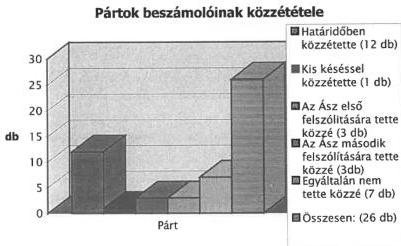
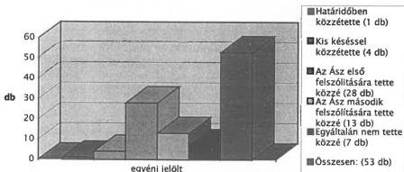

Állami Számvevőszék

# JELENTÉS

Az 1998. évi országgyűlési választásra fordított pénzeszközök elszámolásának ellenőrzése a jelölő szervezeteknél és a független jelölteknél

1999. július

9916

---

Az ellenőrzés végrehajtásáért felelős:

**Kemény Emil**
mb. számvevő igazgató

Az ellenőrzést vezette:

**Dr. Szávai Tamás**
osztályvezető főtanácsos

Az összefoglaló jelentést készítette:

**Hoffmann István**
számvevő

Az ellenőrzésben részt vettek:

**Berzétey Attiláné**
számvevős tanácsos

**Deák Lórántné**
számvevő

**Dr. Dotterweich Antal**
számvevő tanácsos

**Hoffmann István**
számvevő

**Pálfiné Mészáros Éva**
számvevő

**Tóth István**
számvevő tanácsos

A vizsgált témában a pártoknál korábban ÁSZ ellenőrzés nem volt.

www.asz.gov.hu

Jelentéseink az Országgyűlés számítógépes hálózatán is olvashatók.

---

V-1010-82/1998-99. TÉMASZÁM: 425

# TARTALOMJEGYZÉK

I. ÖSSZEGZÖ MEGÁLLAPITÁSOK, KÖVETKEZTÉSEK, JAVASLATOK 5
II. RÉSZLETES MEGÁLLAPITÁSOK 8

1. Valamennyi jelölő szervezetre, illetve független jelöltre vonatkozó megállapítások 8

1.1.Jogszabalyi hatter 8
1.2.Beszamolasi kotelezettseg kore 12

2. A helyszínen ellenőrzött jelölő szervezetekre és független jelöltekre vonatkozó megállapítások 15

2.1.A beszamolok kozzetele es tartalma 15
2.2.A beszamolokban szereplo adatok szamviteli alatamasztottsaga 16

1

---

1

2

3

4

5

6

7

8

---

# Jelentés

## az 1998. évi országgyűlési választásra fordított pénzeszközök elszámolásának ellenőrzése a jelölő szervezeteknél és a független jelölteknél

A pártok működéséről és gazdálkodásáról szóló - többször módosított - 1989. évi XXXIII. tv. (továbbiakban: párttörvény) 10. § (1) bekezdése, valamint az Állami Számvevőszékről szóló 1989. évi XXXVIII. törvény 5. §-a alapján a pártok gazdálkodása törvényességének ellenőrzésére az Állami Számvevőszék (továbbiakban: ÁSZ) jogosult. A választási eljárásról szóló 1997. évi C. törvény (továbbiakban: Ve. tv.) 92. § (3) bekezdésében kapott felhatalmazás alapján az országgyűlési képviselőválasztásra fordított állami és más pénzeszközök, anyagi támogatások felhasználásának ellenőrzése az ÁSZ feladata. Az ÁSZ az ellenőrzést az országgyűlési képviselethez jutott jelölő szervezetek és független jelöltek tekintetében hivatalból és teljes körűen, a képviselethez nem jutott jelölő szervezetek és független jelöltek esetében más jelölt, jelölő szervezet kérelmére köteles elvégezni. Az ÁSZ a választásra fordított pénzeszközök és anyagi támogatások felhasználásának törvényességét ellenőrzi.

A törvényben előírt teljes körű ellenőrzési kötelezettség végső soron mindazon pártokra és független képviselő jelöltekre terjedt ki, amelyek és akik az 1998. évi országgyűlési választás során mandátumot szereztek. Ez a kötelezettség összesen 6 pártot és 1 fő független képviselőjelöltet érintett. Egyéb jelölő szervezetek és független jelöltek tekintetében más jelölt, jelölő szervezet a Ve. tv-ben biztosított lehetőséggel nem élt, így az ÁSZ-hoz 1998. augusztus 24-ig bezárólag ellenőrzés iránti kérelem nem érkezett be.

A törvényben előírt teljes körű ellenőrzési kötelezettséget az ÁSZ ellenőrzési programja kiterjesztette azokra az országgyűlési képviselethez nem jutott pártokra is, amelyek soron következő kétévenkénti ellenőrzési kötelezettsége 1998. év II. félévére esett. E pártoknál a párttörvény 10. § (1) és (3) bekezdésének felhatalmazása alapján a gazdálkodás törvényességének ellenőrzésekor került sor a választási pénzek ellenőrzésére is. A vizsgálati tapasztalatok azonossága indokolja, hogy a megállapítások e jelentésben is bemutatásra kerüljenek. Így került sor a Kereszténydemokrata Néppárt választásra fordított pénzeszközinek, forrásainak és azok felhasználásának helyszíni ellenőrzésére is. Az ÁSZ ellenőrzési programja ütemezésében az 1998. év III. n. évében a Munkáspártnál végrehajtott kétévenkénti számvevőszéki ellenőrzés során a párt választási pénzfelhasználásra irányuló ellenőrzési kísérlet meghiúsult, mert a párt választási beszámolóját csak megkésve, október hónapban készítette el, amelynek törvényi előírásokban foglalt szankciók hiányában nem lehetett következménye.

Az ÁSZ az 1998. évi országgyűlési választásra fordított pénzeszközök felhasználásának teljes körű helyszíni ellenőrzését

3

---

- a FIDESZ Magyar Polgári Pártnál,
- a Független Kisgazda-, Földmunkás és Polgári Pártnál,
- a Kereszténydemokrata Néppártnál,
- a Magyar Demokrata Fórumnál,
- a Magyar Igazság és Élet Pártjánál,
- a Magyar Szocialista Pártnál
- a Szabad Demokraták Szövetségénél, mint

jelölő szervezeteknél és egy országgyűlési képviselővé megválasztott független jelöltnél hajtotta végre, míg a többi jelölő szervezet és független jelölt esetében adatközlésen alapuló ellenőrzést végzett.

**Az ellenőrzött időszak:** 1998. január 1. - 1998. július 22.

**Az ellenőrzés célja:** a választási eljárásról szóló törvényben kapott felhatalmazás alapján az 1998. évi országgyűlési választáson indult jelölő szervezetek, illetve független jelöltek által a választásra fordított állami és más pénzeszközök felhasználásának ellenőrzése a törvényesség és az átláthatóság biztosítása érdekében, valamint a törvényt megszegőkkel szemben az előírt szankciók alkalmazásának kezdeményezése.

**Az ellenőrzés módszere:** teljes körű helyszíni ellenőrzés a kiválasztott körben, míg a többi jelölő szervezetnél és független jelöltnél adatközlésen alapuló vizsgálat.

A jelentés megállapításai a pártok országos központjában rendelkezésre bocsátott iratok, az egy fő független képviselő jelölt által adott dokumentumok és bizonylatok tanulmányozásával, valamint a Magyar Közlönyben közzétett választási beszámolók figyelembe vételével megvalósított ellenőrzésen alapulnak.

A törvény előírásainak teljesítését először az 1998. évi általános országgyűlési választással összefüggésben kellett ellenőrizni, ezért a vizsgálat lefolytatására most első alkalommal került sor.

A jelentés a Magyar Közlönyben 1999. május 07-ig közzétett beszámolók adatainak figyelembe vételével készült.

4

---

I. ÖSSZEGZŐ MEGÁLLAPÍTÁSOK, KÖVETKEZTETÉSEK, JAVASLATOK

# I. ÖSSZEGZŐ MEGÁLLAPÍTÁSOK, KÖVETKEZTETÉSEK, JAVASLATOK

## 1. Összegző megállapítások

Törvényi szinten 1989. évben került megfogalmazásra az az igény, hogy az országgyűlési képviselőválasztáson indult független jelöltek és pártok hozzák nyilvánosságra a választási kampánykiadásaikat és ezek forrását. Az 1989. évi XXXIV. törvény és annak 1994. évi módosítása csak az igényt fogalmazta meg, a közzététel helyeként a sajtót jelölte meg, de időpontját nem határozta meg, ezért a várt eredmény elmaradt.

A választási eljárásról szóló 1997. évi C. törvény már szélesebb körűen és részletesebben rendelkezett, sőt kijelölte az Állami Számvevőszéket, hogy az országgyűlési választásra fordított állami és más pénzeszközök felhasználását ellenőrizze. A törvény két kötelezettséget ró a jelöltekre: egyrészt el kell számolniuk a Pénzügyminisztérium felé a választásra kapott állami támogatás felhasználásáról, másrészt a nyilvánosság tájékoztatása érdekében a Magyar Közlönyben közzé kell tenni a választás céljára felhasznált összes költség kimutatását.

A választási kampányra 3873 fő képviselőjelölt kapott központi állami támogatást összesen 100 M Ft nagyságrendben, amelyet az Országgyűlés állapított meg. Ebből az összegből minden jelölő szervezet, amely a választáson jelöltet állított, a jelöltállítással arányos központi támogatásra volt jogosult. A független jelölteket szintén - a jelölő szervezetek jelöltjeivel azonos mértékű - központi támogatás illette meg. A központi támogatásra megállapított 100 M Ft-tal (jelöltenként 25.819 Ft) minden egyes jelölő szervezetnek és független jelöltnek a választást követő 30 napon belül el kellett számolnia.

Az országgyűlési választáson indult 26 párt és 53 független képviselőjelölt közül a Magyar Közlönyben 12 párt és egy független képviselőjelölt tett eleget - a törvényben megjelölt határidőben - beszámoló közzétételi kötelezettségének. A beszámoló megjelentetését 7 párt mulasztotta el, 7 párt pedig jelentős késéssel adta közre azt. A független képviselőjelöltek közül 7 fő nem tette közzé, 1 fő határidőben, 45 fő pedig - egy-egy kivételtől eltekintve - több hónapot késett a megjelentetéssel annak ellenére, hogy az ÁSZ levélben két alkalommal is felszólította a késedelmeskedőket közzétételi kötelezettségük teljesítésére.

A Pénzügyminisztérium közlése alapján 1999 februárjáig az országgyűlési képviselőválasztáson indult pártok közül 8, a független képviselőjelöltek közül 43 fő a választásra fordított központi támogatás összegével (2,4 M Ft) nem számolt el (ld. 3. melléklet). Mivel a választási törvény a beszámolás elmulasztását nem szankcionálja, így az ÁSZ csak az ismételt felszólítás eszközével élhetett a mulasztókkal szemben. Az a sajátos helyzet állt elő, hogy azok a képviselők, akik eleget tettek törvényes elszámolási kötelezettségüknek, hátrányos helyzetbe kerültek a beszámolást elmulasztókkal szemben.

5

---

I. ÖSSZEGZŐ MEGÁLLAPÍTÁSOK, KÖVETKEZTETÉSEK, JAVASLATOK

A helyszínen teljes körűen ellenőrzött pártok - kettő kivételével - a választást megelőzően, a választási célú bevételek és kiadások elkülönített nyilvántartása céljából, külön szabályozást készítettek, amelyek - figyelemmel a választási törvény hézagaira - elősegítették a kiadások elszámolását. A helyszínen vizsgált elszámolások azonban - két párt kivételével - teljes körűek voltak.

A választási törvény nem határozta meg a kampány, a választási költség és azon belül a dologi költség fogalmát. Nem határozta meg továbbá a költségvetési támogatás kifizetőhelyét. A törvény szerinti és a tényleges kampányidőszak a gyakorlatban egymástól eltérhetett. A törvény nem határozta meg továbbá, hogy milyen formában kell a választásra fordított összegeket és azok forrásait nyilvánosságra hozni. Az ÁSZ - a választást megelőzően - a Választási Füzetek 44. kötetének függelékében ajánlásként közzétett egy elszámolási mintát, amelyet a jelölő szervezetek és független jelöltek közül többen nem vettek figyelembe. Ennek következtében a közzétett elszámolások (beszámolók) formája és tartalma eltérő. A törvény arról sem rendelkezett, hogy mi a teendő azokkal a jelölő szervezetekkel és jelöltekkel szemben, akik elmulasztották az elszámolást közzétenni. Mindezek megnehezítették a határidőre történő pontos elszámolás teljesítését.

A választási törvény nem határozta meg, hogy választási kampányhoz nem pénzben nyújtott támogatásokat a választási források és kiadások között hogyan és milyen mértékben kell figyelembe venni.

Az ellenőrzés számára az minősült kampányköltségnek, ami a pártok számviteli nyilvántartásában megjelent, illetőleg átfutott.

A teljes körűen vizsgált 7 párt összesen 2584 képviselőjelöltet állított, és ez - egy párt kivételével - megegyezik a közzétett beszámolók adataival. A közzétett beszámolókban a bevételt, illetve a forrásokat 2 párt pontatlanul jelölte meg, azaz nem az országgyűlési képviselőválasztásra fordított, hanem 1998. I. félévi politikai tevékenységi célokra rendelkezésre álló pénzeszközöket tüntette fel.

A pártok az 1998. évi országgyűlési választáson állított jelöltek száma alapján - a jelöltek száma után juttatott központi támogatással együtt - összesen 3.919 M Ft-ot fordíthattak volna választási kiadásra, ezzel szemben a közzétett beszámolók 1.438 M Ft választási kiadást mutatnak.

A választási törvény a jelölő szervezetek számára azt írta elő, hogy az egy főre jutó kampányköltség - az állami támogatáson felül - nem haladhatja meg az 1.000 E Ft-ot. Ezért az ÁSZ nem vizsgálta azt, hogy egy párton belül az egyes jelöltek kampányára fordított költség egyénenként miként alakult, nevezetesen, hogy meghaladta-e a törvényben meghatározott értéket.

A választáson indult és beszámolóját közzétett 26 párt, illetve jelölő szervezet közül egyetlen szervezet sem lépte át a törvényben megengedett, rá eső összeghatárt. Az 53 független képviselőjelöltből 1 jelölt lépte túl az 1998. évi országgyűlési választások esetében 1.025.819 Ft-ban megállapított felső határt. E képviselőjelölt - a Ve. tv. 92. § (4) bekezdése értelmében - az ÁSZ felhívására a túllépés összegének kétszeresét - 272.158 Ft-ot - befizette a központi költségvetésbe. A jelölő szervezetek és független képviselőjelöl-

6

---

I. ÖSSZEGZŐ MEGÁLLAPÍTÁSOK, KÖVETKEZTETÉSEK, JAVASLATOK

tek által közzétett választási kiadások 1.450 M Ft-ot kitevő összege 3593 képviselőjelöltet érint.

Az 1998. évi országgyűlési képviselőválasztásra fordított állami és más pénzeszközök anyagi támogatások felhasználásának helyszíni ellenőrzése keretében az ÁSZ 7 jelölő szervezet és 1 független képviselőjelölt elszámolását vizsgálta felül, amely a közzétett és kimutatott kiadások 94,5%-át, a képviselőjelöltek számát tekintve pedig 71,9%-át tette ki.

A fennmaradó, a teljes körű ellenőrzés által nem érintett választási kiadások összege, továbbá a hozzá kapcsolódó képviselőjelöltek száma - az egy főre jutó átlagos ráfordítást is tekintve - a lefolytatott ellenőrzés egésze szempontjából nem meghatározó.

## 2. Javaslatok

A jelentésben foglaltak alapján az Állami Számvevőszék javasolja a Kormánynak, hogy kezdeményezze az Országgyűlésnél a választási eljárásról szóló 1997. évi C. törvény módosítását, illetve pontosítását a felsorolt területeket érintően.

1. Hatarozza meg, hogy a valasztasi koltsegek elszamolasa szempontjabol mely idoszak, illetve tevekenyseg forrasait es raforditasait kell figylembe venni.
2. Hatarozza meg a jelöltek szama alapjan normativ modon juttatott allami tamogatast iltoen a dologi koltsegek fogalmat, a felhasznalas elszamolasnak formajat, tartalmat es a kifizetohelyet.
3. A vásasztási kölşegek forrásai tekintetében határozza meg, hogy az egyéb anyagi támogatások között milyen formában nyújtott és kiktól származó juttatásokat kell figyembe venni (pl. ingyenes, illetve kedvezményes hirdétés és egyéb szolgaltatas).
4. Hatarozza meg az orszaggyulési vlasztásra forditott allami és más pénzeszközok, anyagi támogatások összeget, forrasát és a felhasznalás modját bemutató, a Magyar Közlonyben megjentetett vlasztási beszámoló formaját és részletes tartalmát.
5. Módosítsa a választási beszámolók jelenlegi szúk 60 napon belül nyilvánosságra hozatali határidejét 90 vagy 120 napra, és fontolja meg szankció alkalmazását.
6. Rögzítse kovetelmenyként az egyeni jelöltek vásasztási költségeinek és forrásaina nyilvántási kõtelezettsegét, a kapott támogatások minősítését, figyelemmel a személyi jövedelemadoról szólo 1995. évi CXVII. törvenyben, illetőleg az adózás rendjéról szólo 1990. évi XCI. törvenyben foglaltakra.

7

---

II. RÉSZLETES MEGÁLLAPÍTÁSOK---

# II. RÉSZLETES MEGÁLLAPÍTÁSOK

## 1. VALAMENNYI JELÖLŐ SZERVEZETRE, ILLETVE FÜGGETLEN JELÖLTRE VONATKOZÓ MEGÁLLAPÍTÁSOK

### 1.1. Jogszabályi háttér

A jelenlegi többpárti demokrácia kialakításakor 1989. évben felmerült az igény, hogy az országgyűlési választásokon indult jelöltek és pártok tájékoztassák a közvéleményt az általuk a választásokra fordított választási kiadásokról és azok forrásairól.

Az országgyűlési képviselők választásáról rendelkező 1989. évi XXXIV. tv. 41. §-a rögzítette a választási eljárás nyilvánosságának szabályait. A (6) bekezdés előírása szerint:

*„Minden jelöltnek, pártnak a választásokra fordított állami és más pénzeszközök, anyagi támogatások mértékét és a felhasználás módját - országos összesítésben is - a sajtóban nyilvánosságra kell hoznia.”*

Az 1990. évi országgyűlési választások tapasztalatai azt mutatták, hogy a „sajtóban” megfogalmazás túl általános volt, melynek következtében az óhajtott tájékoztatási elvárás nem teljesült. Ezért az 1994. évi III. tv. 29. § (2) bekezdésével úgy módosították az országgyűlési képviselők választási eljárásáról rendelkező törvény 41. § (6) bekezdését, hogy „országos napilapokban” kell a jelölteknek és a pártoknak a megkívánt adatokat nyilvánosságra hozniuk.

Az 1994. évi országgyűlési választásokat követően a pártok és jelöltek döntő többsége nem tett eleget tájékoztatási kötelezettségének. A rendszeres költségvetési támogatásban részesülő pártok képviselői a szokásos kétévenkénti számvevőszéki ellenőrzés során - mint azt a jelentések bemutatták - úgy nyilatkoztak, hogy majd a többi párttal közösen fogják kampányköltségeiket közzé tenni. A pártok ezt azért tehették meg, mert a törvény nem szabott meg határnapot a közzététel időpontjára.

Az 1998. évi országgyűlési választások előkészítése során megalkotott - a választási eljárásról szóló - 1997. évi C. törvény a bemutatott kedvezőtlen tapasztalatok miatt hatályon kívül helyezte az országgyűlési képviselők választásáról rendelkező törvény 41. §-át és sokkal részletesebb szabályokat írt elő. A Ve. tv. rendelkezik a választási kampányról, kampányidőszakról és a választási költségek elszámolása fogalomköréről.

A Ve. tv. **általános rendelkezések keretében** a „Választási kampány” című VI. fejezet határozza meg a kampányidőszakokat és felsorol néhány, a kampány fogalomkörébe tartozó elemet. Ez a **felsorolás nem teljes körű**, elsősorban a kampányelemek alkalmazásával kapcsolatos tilalmakat tartalmazza.

---8

---

II. RÉSZLETES MEGÁLLAPÍTÁSOK

A törvény második része az országgyűlési képviselők választásával kapcsolatos speciális rendelkezéseket tartalmazza, a 91-93. §-ban kimondja, hogy:

- minden jelölő szervezet, amely a választásokon jelöltet állít, a jelöltállítással arányos költségvetési támogatásra jogosult. A független jelöltek a jelölő szervezetek jelöltjeivel azonos mértékű költségvetési támogatásban részesülnek,
- a költségvetési támogatás összegét hogyan kell kiszámítani, annak kifizetése hogyan történik,
- a támogatás csak dologi kiadásokra fordítható és felhasználásánál a jelölő szervezeteknek és független jelölteknek a választást követő 30 napon belül el kell számolniuk a kifizetőhelyen,
- jelöltenként maximálisan mekkora összeg használható fel,
- kötelezi a választáson indulókat a Magyar Közlönyben a második fordulót követő 60 napon belül arra, hogy hozzák nyilvánosságra a választásra fordított állami és más pénzeszközök, anyagi támogatások összegét, forrását, valamint felhasználásának módját,
- a jelöltenként elkölthető összeg túllépése esetén milyen szankció lép életbe.

A törvény fent felsorolt rendelkezései - az ellenőrzés számára - többnyire szűkszavúak, határozatlan jogfogalmakat használnak, egyes határidők pedig nem gyakorlatiasak, a nyilvánosságra hozatal formájára, továbbá a nyilvántartásra nem tartalmaznak szabályokat.

**A törvény** tételes rendelkezéseinek **sorrendjében** - az ellenőrzés végrehajtása szempontjából - a **következő** fontosabb **problémák merültek fel**:

A törvény 40. § (1) bekezdése szerint a választási kampány a választás kitűzésétől a szavazást megelőző nap 0.00 órájáig tart. A Köztársaság elnökének 6/1998. (I.30.) KE határozata szól az országgyűlési képviselői választások időpontjának kitűzéséről, amely szerint a választás első fordulóját május 10-re, második fordulóját május 24-re tűzte ki.

Az országgyűlési választásokra történő előkészületek során nem kizárt, hogy valamely jelölő szervezet vagy független képviselőjelölt a kampányidőszak indulása előtt vagy annak szünetében olyan eszközökre és szolgáltatásokra kötött korábban szerződéseket, - és ezek egy része már esetleg a kampányidőszak kezdete előtt teljesült - amelyek a választás céljait szolgálják. A gyakorlatban a politikai kampányidőszak és a pénzügyi elszámolási szempontból figyelembe vehető kampányidőszak nem fedi le egymást.

A törvény nem határozza meg a **választási kampány fogalmát**, nem jelöli meg mindazon eszközöket, módszereket, amelyek a jelölő szervezetek és a jelöltek ajánlásához, népszerűsítéséhez, a választók akaratának befolyásolásához igénybevehetők. A törvényben található rendelkezések néhány nevesített eszköz, módszer esetében (plakát, gyűlés) csak az azok alkalmazásával kapcsolatos tilalmakat, korlátokat írják elő.

9

---

II. RÉSZLETES MEGÁLLAPÍTÁSOK

A törvény - a választási kampány definiálatlan volta következtében - **nem határozza meg a választási költség fogalmát**. Előírás hiányában a választási költség jelentheti a jelölő szervezet és a jelölt népszerűsítését szolgáló közvetlen költségeket. Tágabb értelemben azonban a helységek, tárgyi eszközök, szolgáltatások jelöltekhez közvetlenül nem kapcsolódó igénybevételét is jelentheti, amely - idevágó rendelkezés hiányában - a működési költségek között is megjelenhetnek. A minden évben szokásos rendezvények, mint pl. a május 1-jei ünnepség költségeinek választási szempontok szerinti minősítése sem tisztázott.

A választási kampány, illetve a választási költség meghatározásának hiányában lehetetlen egyértelműen megállapítani az ellenőrzés során, hogy a beszámoló valamennyi választással kapcsolatban felmerült költséget tartalmaz-e.

A választási törvény 91. § (3) és (4) bekezdése szerint a választásra fordítható költségvetési támogatás kiutalását a jelölő szervezetek részére egy összegben, a független jelöltek részére személyenként - az Országos Választási Bizottság döntése alapján az azt követő 5 napon belül - a Pénzügyminisztérium vagy az általa kijelölt intézet végzi. Ez a költségvetési támogatás kizárólag a dologi költségek fedezetére szolgál. A támogatás felhasználásáról a jelölő szervezeteknek és a független jelölteknek a választást követő 30 napon belül el kell számolniuk a kifizetőhelyen. A gyakorlatban a Pénzügyminisztériumban kellett elszámolni. Ezt azonban semmilyen jogszabályban nem határozták meg, így **a jelöltek egy része csak nagy utánjárással szerzett tudomást arról, hogy hol kell a költségvetési támogatást elszámolni. Nem volt rögzítve az elszámolás formája és a „dologi költség” fogalmi meghatározása sem**.

Az ellenőrzés számára gyakorlatilag az minősül választási költségnek, amelyet a jelölő szervezet vagy független jelölt annak minősített. A jelölő szervezetek (pártok) költségei a párttörvényben előírt beszámoló tagolásának megfelelően alapvetően két csoportra különülnek: politikai és működési kiadásokra.

**A törvény nem határozza meg, hogy mit kell az elszámolás szempontjából anyagi támogatásnak tekinteni. Ezért nem egyértelmű, hogy pl. a törvény 93. § (1) bekezdésében megengedett, a közszolgálati műsorszolgáltatók által nyújtott - ingyenes választási hirdetést, illetve a műsorszolgáltatók által a fizetett választási hirdetésekhez nyújtott árengedményt anyagi támogatásnak - és így elszámolás alá tartozónak kell-e tekinteni.**

Előbbiek miatt több párt is úgy értelmezte, hogy azokat a kiadásokat, amelyeket nem a párt nevére kiállított számla alapján a párt jelöltjeinek kampányára harmadik személy fizetett ki, nem kell a beszámolóban szerepeltetni.

10

---

II. RÉSZLETES MEGÁLLAPÍTÁSOK

**A törvény nem határozza meg, hogy milyen formában kell a választásra fordított összegeket, azok forrásait nyilvánosságra hozni.**

Az Országos Választási Iroda a nyilvánosságra hozandó választási ráfordítások - állami és más pénzek felhasználásának - ajánlott tartalmát és formáját megfelelő időben közzétette, amelyet a választási törvény egyébként nem tartalmazott. A nyilvánosságra hozott adatok tartalmára vonatkozóan az ÁSZ a Választási Füzetek 1998. évi 44. számában ajánlást tett közzé, amit a jelölő szervezetek és független jelöltek nem mindegyike vett figyelembe.

Az országgyűlési képviselők választási költségeinek elszámolásáról közlemény első alkalommal a Magyar Közlöny 1998. július 24-i 68. számában jelent meg. A közzétett elszámolások formája és tartalma - kötelező előírás hiányában - nem mutat egységes képet. A beszámolók egyes sorainak tartalma esetleges, szervezetenként eltérő lehet.

A választás második fordulóját követő **60 napon belüli nyilvánosságra hozatali kötelezettség miatt a beszámolók nem teljes körűek.** A törvényben megjelölt határidőre teljes körű elszámolás gyakorlatilag nem készíthető, különféle, a jelölő szervezettől függetlenül előfordult problémák, vitatott számlák stb. miatt. Pl. a számlák **késedelmes beérkezése** következtében objektíve sem lehetett az előírt kötelezettségnek eleget tenni.

A törvény a **jelölő szervezetek belátására bízta**, hogy a kampányköltségek forrásairól, azok felhasználásának nyilvántartásáról **készítenek-e belső szabályozást**, s ezeket milyen szempontok szerint, mélységben tagolják. Definiálatlanság következtében - jelölő szervezetenként - eltérő tartalmú a választási költség.

Egyes költségek, pl. az ú.n. választási általános költségek (a kampányidőszak magasabb értékű közüzemi számlái, bérletei díjai, irodaszer felhasználás) nem számszerűsíthetők. Egyes esetekben pedig az eszközök beszerzése nemcsak kampányidőszakhoz kapcsolódhat.

A törvény **semmilyen útmutatást nem tartalmazott az egyéni jelöltek nyilvántartási kötelezettségét illetően.** Míg a jelölő szervezeteknek a párttörvény és a számviteli törvény írja elő az általános nyilvántartási, könyvvezetési szabályaikat, - melyek természetesen az országgyűlési választások pénzforgalmának lebonyolítására is vonatkoznak - addig az egyénileg indult független jelöltek esetében ilyen szabályozás nem készült. Nem világos az sem, hogy az egyéni jelölteknek juttatott állami vagy más szervezetektől, magánszemélyektől kapott egyéb választási célú támogatás mentes-e a személyi jövedelemadó kötelezettség alól.

**Jogi szabályozás hiányában az ellenőrzés elfogadta: csak az minősül kampányköltségnek, amit a párt annak minősít és ami az elszámolási határidőig a párt számviteli nyilvántartásában megjelent, illetve átfutott.**

11

---

II. RÉSZLETES MEGÁLLAPÍTÁSOK

## 1.2. Beszámolási kötelezettség köre

Az 1998. évi országgyűlési képviselőválasztáson 26 párt - mint jelölő szervezet - indított képviselőjelöltet, független képviselőjelöltként 53 fő indult el. A választási eljárásról szóló törvény 92. § (2) bekezdése előírja, hogy minden jelölő szervezetnek és független jelöltnek a választás második fordulóját követő 60 napon belül a Magyar Közlönyben nyilvánosságra kell hoznia a választásra fordított állami és más pénzeszközök, anyagi támogatások összegét, forrását és felhasználásának módját.

A jelölő szervezetek és a független jelöltek közül egyaránt előfordult, hogy nem hozták nyilvánosságra a választásokra fordított pénzeszközök felhasználásáról szóló beszámolót, illetve nem küldték el közzététel végett a Magyar Közlöny Szerkesztőségének. A határidőben való közzétételt is több párt és főleg független jelölt mulasztotta el (1., 2. melléklet).

Az országgyűlési képviselőválasztáson indult 26 párt közül 7 párt mulasztotta el a közzétételt, 7 párt határidőn túl, több hetes vagy hónapos késéssel jelentette meg beszámolóját a Magyar Közlönyben.

Az 53 független képviselőjelölt közül 7 fő a beszámolóját nem tette közzé, és mindössze 1 fő tartotta be a határidőt. A többi képviselőjelölt - 45 fő - egy-két kivételtől eltekintve - több hónapot késett a megjelentetéssel.

12

---

II. RÉSZLETES MEGÁLLAPÍTÁSOK

# Egyéni jelöltek beszámolóinak közzététele

A közzététel elmulasztása, vagy a jelentős nagyságú késedelem annak ellenére következett be, hogy az ÁSZ a jelölő szervezeteket és független jelölteket két ízben is felszólította levélben kötelezettségeik teljesítésére.

A választási költségek Magyar Közlönyben határidőre való közzétételi kötelezettségének elmulasztásához a törvény szankciót nem rendelt. **Ez a körülmény lehetetlenné teszi, hogy az ÁSZ a törvényi előírásoknak érvényt szerezzen.**

Az Országgyűlés a **költségvetési támogatásra fordítható** pénzeszközök összegét az 1998. évi országgyűlési képviselőválasztásokra **100 M Ft**-ban állapította meg, amelyből minden jelölő szervezet, amely a választáson jelöltet állított, a jelöltállítással arányos központi költségvetési támogatásra volt jogosult. A független jelölteket a jelölő szervezetek jelöltjeivel azonos mértékű költségvetési támogatás illette meg.

A választási kampányra tehát összesen 3873 fő képviselőjelölt kapott központi költségvetési támogatást, akikből 53 fő volt független képviselőjelölt. Jelöltenként egyaránt 25.819 Ft-ban részesültek, amelyek felhasználásáról - a jelölő szervezeteknek és független jelölteknek - a választásokat követő 30 napon belül a kifizetőhelyen el kellett számolniuk. A törvényi előírástól eltérően menetközben olyan döntés született, hogy az elszámolásokat a Pénzügyminisztériumnak kell benyújtani.

Az országgyűlési képviselőválasztáson indult **26 párt közül 8, a független képviselőjelöltek (53 fő) közül 43 fő nem számolt** el a Pénzügyminisztériumnak a választásra fordított **központi támogatás összegével**, összesen 2.401 E Ft-tal. (3. melléklet). A Pénzügyminisztérium ezzel kapcsolatosan levélben tájékoztatta az ÁSZ-t, amelyben közölte, hogy a támogatások elszámolását az érvényes jogszabályi háttér sem segíti kellőképpen, a törvény csupán azt rögzíti: a támogatás dologi költségek fedezetére szolgál (ezek fogalmi, tartalmi meghatározása viszont hiányzik). A törvény arról sem rendelkezik, mi a teendő

13

---

II. RÉSZLETES MEGÁLLAPÍTÁSOK

azokkal a jelöltekkel, illetve jelölő szervezetekkel, akik elszámolásukat elmulasztották megküldeni.

A választási törvény a jelölő szervezetek és független jelöltek számára előírta, hogy az egy főre jutó kampányköltség - az állami támogatáson felül - nem haladhatja meg az 1.000 M Ft-ot. Ezért az ÁSZ nem vizsgálta azt, hogy egy párton belül az egyes jelöltek kampányára fordított költség egyénenként miként alakult. A szabályozás ugyanis nem zárta ki, hogy az egyes képviselőjelöltek esetében egyenlőtlenség alakuljon ki. Az átlagszámítás mellett egy pártnak lehetősége volt arra, hogy egyes jelöltjeire akár több millió Ft-ot is költsön más jelöltjei „rovására”.

A pártok az 1998. évi országgyűlési választáson állított jelöltek száma alapján - a jelöltek száma után kapott központi támogatással együtt - összesen 3.918.632 E Ft-ot fordíthattak volna választási kiadásokra.

A választáson indult és a beszámolóját közzétett 19 párt, illetve jelölő szervezet nem lépte át a ráeső összeghatárt, a törvényben meghatározott mértéket. Az 53 fő független jelölt által felhasználható, választási kiadásokra szolgáló összeg 54.368 E Ft-ot jelentett. Az egy jelöltre jutó keretösszeget - 1.025.819 Ft-ot - egy képviselőjelölt lépte túl 136.079 Ft-tal. A választási eljárásról szóló törvény 92. § (4) bekezdésének rendelkezése szerint amennyiben a jelölő szervezet, illetőleg a független jelölt túllépi az 1,025.819 Ft-ban megállapított felső határt, a túllépés összegének kétszeresét köteles befizetni a központi költségvetésbe. Ezért az előírtaknak megfelelően a képviselőjelöltet 272.158 Ft befizetési kötelezettség terhelte, amelynek eleget tett az ÁSZ elnökének felhívására.

Összességében nézve a vizsgált 7 párttal együtt a 26 jelölő szervezetből 19 szervezet tette közzé az országgyűlési képviselőválasztással kapcsolatos beszámolóját (4. melléklet), amely szerint összesen 1.438.344 E Ft-ot kitevő kiadást számoltak el, illetve mutattak ki. Ez az összeg 3548 képviselőjelöltet érint, akiket a szervezetek jelöltek a választásra. Emellett az indult 53 független képviselőjelölt közül közzétett 45 beszámoló 12.054 E Ft kiadásról ad számot.

A jelölő szervezetek és független képviselőjelöltek által közzétett beszámolók összesen 1.450.398 E Ft választási kiadást mutatnak a 3593 fő képviselőjelöltet érintően.

Az 1998. évi országgyűlési képviselőválasztásra fordított állami és más pénzeszközök, anyagi támogatások felhasználásának helyszíni ellenőrzése keretében az ÁSZ 7 jelölő szervezet (párt) és egy független képviselőjelölt elszámolását vizsgálta felül, amely a közzétett és kimutatott kiadások 94,5%-át, az indított képviselőjelöltek számát tekintve pedig 71,9%-át tette ki.

A fennmaradó, az ellenőrzés által nem érintett - választással kapcsolatos - közzétett kiadások összege, valamint a hozzákapcsolódó képviselőjelöltek száma (35,5 M Ft, 1009 képviselőjelölt) - az egy főre jutó átlagos ráfordítást is tekintve - az ellenőrzés egésze szempontjából nem meghatározó.

14

---

II. RÉSZLETES MEGÁLLAPÍTÁSOK

## 2. A HELYSZÍNEN ELLENŐRZÖTT JELÖLŐ SZERVEZETEKRE ÉS FÜGGETLEN JELÖLTEKRE VONATKOZÓ MEGÁLLAPÍTÁSOK

### 2.1. A beszámolók közzététele és tartalma

A helyszínen ellenőrzött pártok mindegyike (7 párt) 1998. július 24-ével (mivel 23-a pihenőnap volt) határidőben tett eleget közzétételi kötelezettségének.

A helyszínen ellenőrzött beszámolók tartalmukat tekintve megfelelnek az ajánlás tartalmának, jelölő szervezetenként 1998. június 27.-július 20. közötti időszak alatt beérkezett és lekönyvelt számlákat foglalják magukba (5. melléklet).

A pártok közül öten készítettek elszámolási szabályzatot, két párt viszont nem.

A helyszínen felülvizsgált beszámolók tartalma szerint az országgyűlési képviselőválasztásra fordított pénzeszközök az alábbi forrásokból eredetek:

|  Megnevezés | Összeg  |
| --- | --- |
|  Képviselőjelöltek állítása után kapott központi támogatás | 66.715 E Ft  |
|  Pártok saját forrása | 960.121 E Ft  |
|  Választási célra kapott kampány bevétel | 190.910 E Ft  |
|  Felvett hitelek | 150.000 E Ft  |

**Felhasznált összes forrás:**

**1.367.746 E Ft**

A felhasználási jogcímek a vizsgált pártok könyvvitelében az 5. számlaosztályban megnyitott költségnemek szerinti számlacsoportok megnevezésével egyezők. A beszámolók kiadási sorainak tartalma az ÁSZ ajánlásával általában véve összhangban volt, egyes jogcímek tartalmát megfelelő részletezésben közölték.

A közzétett beszámolókat tekintve szükséges rögzíteni, hogy két párt (MSZP, MIÉP) a bevételként feltüntetett összegeit, illetve forrásait pontatlanul jelölte meg. Az MSZP nem az országgyűlési képviselőválasztásra, hanem az 1998. I. félévére a politikai tevékenység kiadásai céljára rendelkezésre álló pénzeszközöket közölte a beszámolóban. Ez az összeg 47.225 E Ft-tal magasabb mint a választásra rendelkezésre állt források összege. A MIÉP pontatlansága abban nyilvánult meg, hogy az állami költségvetési támogatás soron nem csak a központi támogatást tüntette fel, hanem saját forrásai azon részét is amelyek a párt rendes éves költségvetési támogatásából, illetőleg megtakarításaiból állt rendelkezésre.

15

---

II. RÉSZLETES MEGÁLLAPÍTÁSOK

Az elszámolt költségek összege 1.367.746 E Ft volt, amely valamennyi vizsgált pártnál megegyezik a rendelkezésre álló források összegével.

Az Országos Választási Irodától kapott tájékoztatás szerint az vizsgált 7 párt összesen 2584 képviselőjelöltet állított és ez - egy párt kivételével - megegyezett a közzétett beszámolók adataival. A MIÉP a beszámolóban 178 főt szerepeltetett, mivel csak az önálló egyéni jelöltek számát tüntette fel, az országos listán és a limitált listán jelöltek számát viszont nem. A közzétett beszámolók alapján a 7 párt átlagosan véve egy képviselőjelöltre 562.496 Ft-ot fordított (az egy főre jutó ráfordítás szóródásának terjedelme: 97.940 Ft - 929.294 Ft).

## 2.2. A beszámolókban szereplő adatok számviteli alátámasztottsága

A vizsgált pártok - kettő kivételével - a választást megelőzően a választási célú bevételek és kiadások elkülönített nyilvántartására külön szabályozást készítettek. A jelöltállítás után kapott állami támogatást elkülönítetten tartották nyilván.

A választási kiadások elkülönített nyilvántartását általában úgy oldották meg, hogy azokat olyan azonosító kóddal jelölték meg, amely a számítógépes könyvelésben a költségnemek közül az automatikus kigyűjtést lehetővé tette. A kódot kontírozás során az alapbizonylaton is feltüntették, így az egyes tételek beazonosítása biztosított. A pártok többsége a szabályozásban törekedett arra, hogy az országgyűlési választási kampány pénzügyi elszámolása a követelményeknek eleget tegyen. Meghatározták a kampány időszakát, a választási kampány fogalmát, a képviselőjelölteknek a kampánnyal kapcsolatos pénzügyi elszámolási feladatait stb.

A pártok az általuk készített szabályzatban foglaltakat betartották. A lefolytatott ellenőrzés alapján rögzíthető, hogy a publikált beszámolók teljes körűen tartalmazzák - az MDF és a KDNP kivételével - a pártok országgyűlési választással kapcsolatos kiadásait. E két párt a törvényben előírt határidőre a választások befejezése utáni 60 nap alatt tőle független okok miatt valamennyi kiadási tételről számot adni nem tudott (számlák határidőn túli beérkezése, vitatott számlák miatt szükséges egyeztetések elvégzése). A kiadások számviteli elszámolása - az MDF kivételével - ahol néhány helyi szervezet nem a teljes ráfordítás értékét jelentette - teljes körű.

Az ellenőrzés tapasztalatai szerint két pártnál olyan kiadásokat is választási kiadásként számoltak el, amelyek nem tartoznak a kampányköltségek közé. Ezek nagyságrendje az elszámolt összköltségekhez viszonyítva azonban nem számottevő, elhanyagolható.

A választási törvény 91. § (4) bekezdése előírja, hogy a **jelöltállítással arányos központi költségvetési támogatás felhasználásáról a jelölő szervezeteknek és független jelölteknek 30 napon belül (június 23-ig) el kell számolni a kifizetőhelyen.**

16

---

II. RÉSZLETES MEGÁLLAPÍTÁSOK

Hat vizsgált párt a központi költségvetési támogatással határidőben elszámolt, mindössze egy párt volt, amelyik egy hét késéssel nyújtotta be elszámolását a Pénzügyminisztérium Központi Költségvetési fejezetek Főosztálya felé.

**Mellékletek:** 5 db

Budapest, 1999. július 12.

Dr. Kovács Árpád  
elnöke{
  "label": "",
  "top_left": [
    0.7297225806179548,
    0.19484848484848485
  ],
  "bottom_right": [
    0.8695294117647059,
    0.3944743944743945
  ]
}

17

---

;

;

。

。

。

。

。

。

---

1. sz. melléklet a
V-1010-77/1998-99.sz.jelentéshez

Jelölő szervezetek választási beszámolójának közzététele

|  Sorsz. | N é v | Közzététel időpontja |   | Késés napban | Közzététel helye (MK)  |   |   |
| --- | --- | --- | --- | --- | --- | --- | --- |
|   |   |  határidőn belül | határidőn túl |   | Év | Szám | Oldal  |
|  1 | Együtt Magyarországért Unió | 1998. 07. 24. |  |  | 1998 | 68 | 5093-4  |
|  2 | FIDESZ-Magyar Polgári Párt | 1998. 07. 24. |  |  | 1998 | 68 | 5101  |
|  3 | Földlakók-Élet-Igazság-Béke-Szabadság Pártja |  |  |  |  |  |   |
|  4 | Függetlenek Közössége |  |  |  |  |  |   |
|  5 | Független Kisgazdapárt | 1998. 07. 24. |  |  | 1998 | 68 | 5096-5100  |
|  6 | Független Polgárok Szövetsége |  |  |  |  |  |   |
|  7 | Kereszténydemokrata Néppárt | 1998. 07. 24. |  |  | 1998 | 68 | 5102  |
|  8 | Magyar Cigányok Demokrata Pártja |  | 1999. 02. 01. | 191 | 1999 | 7 | 519  |
|  9 | Magyar Demokrata Fórum | 1998. 07. 24. |  |  | 1998 | 68 | 5100  |
|  10 | Magyar Demokrata Néppárt | 1998. 07. 24. |  |  | 1998 | 68 | 5094  |
|  11 | Magyar Igazság és Élet Pártja | 1998. 07. 24. |  |  | 1998 | 68 | 5102-3  |
|  12 | Magyar Népjóléti Szövetség |  |  |  |  |  |   |
|  13 | Magyar Nép Pártja |  |  |  |  |  |   |
|  14 | Magyarországi Szociáldemokrata Párt |  | 1998. 10. 30. | 98 |  | 97 | 6088  |
|  15 | Magyarországi Zöld Párt |  | 1999. 02. 28. | 219 | 1999 | 16 | 1135  |
|  16 | Magyar Szocialista Munkáspárt |  | 1999. 03. 26. | 245 | 1999 | 25 | 1752  |
|  17 | Magyar Szocialista Párt | 1998. 07. 24. |  |  | 1998 | 68 | 5095-96  |
|  18 | Magyar Szociális Zöld Párt |  | 1998. 07. 31. | 7 | 1998 | 70 | 5322  |
|  19 | Munkáspárt |  | 1998. 10. 09. | 77 | 1998 | 92 | 5851  |
|  20 | Nemzetiségi Fórum | 1998. 07. 24. |  |  | 1998 | 68 | 5093  |
|  21 | Nők Pártja |  |  |  |  |  |   |
|  22 | Szabad Demokraták Szövetsége | 1998. 07. 24. |  |  | 1998 | 68 | 5103  |
|  23 | Szociáldemokrata Párt | 1998. 07. 24. |  |  | 1998 | 68 | 5101-2  |
|  24 | Társadalmi Koalíció az Emberközpontú Politikáért |  |  |  |  |  |   |
|  25 | Új Szövetség Magyarországért | 1998. 07. 24. |  |  | 1998 | 68 | 5092  |
|  26 | Vállalkozók Pártja |  | 1998. 10. 14. | 82 | 1998 | 93 | 5877  |
|   | Ö s s z e s e n: (db) | 12 | 7 | - | - | - | -  |

---

.

:

.

.

.

.

.

.

---

2. sz. melléklet a a V-1010-77/1998-99.sz. jelentéshez

# **Független jelöltek választási beszámolójának közzététele**

|  Sorsz. | Név | Közzététel időpontja |   | Késés napban | Közzététel helye (MK) |   |   | Közzétett kiadás E Ft  |
| --- | --- | --- | --- | --- | --- | --- | --- | --- |
|   |   |  határidőn belül | határidőn túl |   | Év | Szám | Oldal  |   |
|  1 | Garabits Károly |  | 1999. 03. 18. | 237 | 1999 | 22 | 1660 | 220  |
|  2 | Palotás János |  |  |  |  |  |  |   |
|  3 | dr. Varga János |  | 1998. 10. 09. | 77 | 1998 | 92 | 5852 | 187  |
|  4 | Kukoricza János |  | 1998. 10. 01. | 69 | 1998 | 89 | 5740 | 120  |
|  5 | Nagy Gábor |  |  |  |  |  |  |   |
|  6 | Hajdú Péter Gábor |  |  |  |  |  |  |   |
|  7 | Somlai Ferenc |  | 1999. 01. 27. | 187 | 1999 | 5 | 299 | 161  |
|  8 | Béda Pál |  | 1999. 02. 11. | 202 | 1999 | 10 | 703 | 30  |
|  9 | Nórántné dr. Hajós Klára |  |  |  |  |  |  |   |
|  10 | Kurdics Mihály |  | 1998. 10. 14. | 82 | 1998 | 93 | 5878 | 288  |
|  11 | dr. Szabó Attila | 1998. 07. 24. |  |  | 1998 | 68 | 5092 | 803  |
|  12 | dr. Magyar László |  | 1998. 10. 21. | 79 | 1998 | 95 | 3952 | 66  |
|  13 | Zwack Péter |  | 1999. 01. 27. | 187 | 1999 | 5 | 298 | 927  |
|  14 | dr. Vancsura István |  | 1998. 11. 13. | 111 | 1998 | 102 | 6543 | 136  |
|  15 | dr. Samu Mihály |  | 1998. 10. 14. | 82 | 1998 | 93 | 5877 | 51  |
|  16 | dr. Misur György |  | 1998. 10. 06. | 74 | 1998 | 91 | 815 | 76  |
|  17 | Bakos István |  |  |  |  |  |  |   |
|  18 | Molnár László |  | 1998. 10. 15. | 83 | 1998 | 94 | 5904 | 159  |
|  19 | dr. Abu-Kalmar Ata |  | 1999. 01. 27. | 187 | 1999 | 5 | 299 | 115  |
|  20 | Kovács Géza |  | 1998. 09. 29. | 67 | 1998 | 87 | 5677 | 50  |
|  21 | Kerezsi Lóránt |  | 1998. 10. 06. | 74 | 1998 | 91 | 5815 | 126  |
|  22 | dr. Urvári Sándor |  |  |  |  |  |  |   |
|  23 | Tóth István |  | 1998. 10. 21. | 89 | 1998 | 95 | 5952 | 26  |
|  24 | Kupa Mihály |  | 1998. 11. 06. | 105 | 1998 | 100 | 6477 | 1162  |

1. oldal

---

|  Sorsz. | Név | Közzététel időpontja |   | Késés napban | Közzététel helye (MK) |   |   | Közzétett kiadás £ Ft  |
| --- | --- | --- | --- | --- | --- | --- | --- | --- |
|   |   |  határidőn belül | határidőn túl |   | Év | Szám | Oldal  |   |
|  25 | Tirkala Ferenc |  | 1999.04.17 | 242 | 1999 | 29 | 2302 | 96  |
|  26 | Herédy Dezső |  | 1998. 10.28. | 96 | 1998 | 96 | 6060 | 37  |
|  27 | Tóth László |  |  |  |  |  |  |   |
|  28 | dr. Rab Károly |  | 1999. 03.18. | 237 | 1999 | 22 | 1660 | 71  |
|  29 | Győri Gyula |  | 1999. 01. 27. | 187 | 1999 | 5 | 299 | 626  |
|  30 | Szigeti István |  | 1998. 07. 31. | 7 | 1998 | 70 | 5322 | 33  |
|  31 | Orvos Mihály |  | 1999. 01. 27. | 187 | 1999 | 5 | 299 | 150  |
|  32 | dr. Szima Róza |  | 1999. 02. 11. | 202 | 1999 | 10 | 703 | 250  |
|  33 | Palkovics Ákos |  | 1998. 10. 09. | 98 | 1998 | 92 | 5852 | 30  |
|  34 | Szabó István |  | 1998. 09. 29. | 67 | 1998 | 87 | 5677 | 126  |
|  35 | Szűcs István |  | 1998. 11. 23. | 122 | 1998 | 105 | 6674 | 326  |
|  36 | dr. Könözsy László |  | 1998. 10. 28. | 96 | 1998 | 96 | 6060 | 217  |
|  37 | dr. Kenessey Miklós |  | 1998. 11. 11. | 110 | 1998 | 101 | 6530 | 26  |
|  38 | Pásztor Béla |  | 1998. 10. 30. | 98 | 1998 | 97 | 6088 | 526  |
|  39 | dr. Schmidt Géza |  | 1998. 10. 09. | 77 | 1998 | 92 | 5852 | 135  |
|  40 | Kucsák Béla |  | 1999. 01. 27. | 187 | 1999 | 5 | 298 | 26  |
|  41 | dr. Ilkei Csaba |  | 1998. 09. 25. | 63 | 1998 | 86 | 5667 | 840  |
|  42 | Roszik Gábor |  | 1998. 10. 28. | 96 | 1998 | 96 | 6061 | 886  |
|  43 | Juhász József |  | 1998. 07. 29. | 5 | 1998 | 69 | 5126 | 126  |
|  44 | Járvás László |  | 1998. 07. 31. | 7 | 1998 | 70 | 5321 | 45  |
|  45 | dr. Szira József |  | 1998. 09. 29. | 67 | 1998 | 87 | 5678 | 114  |
|  46 | Szira István |  | 1998.10. 28. | 96 | 1998 | 96 | 6061 | 218  |
|  47 | dr. Gábor Zoltán |  | 1999. 02. 28. | 96 | 1999 | 16 | 1135 | 116  |
|  48 | dr. Seszták Miklós |  | 1998. 09. 25. | 63 | 1998 | 86 | 5667 | 965  |
|  49 | Majoros Gyula |  | 1999. 07. 29. | 5 | 1998 | 69 | 5126 | 45  |
|  50 | dr. Kretz István József |  | 1998. 10. 04. | 72 | 1998 | 99 | 6404 | 27  |
|  51 | dr. Balipap Ferenc |  | 1998. 10. 04. | 72 | 1998 | 99 | 6404 | 50  |
|  52 | Udvardi Sándor |  | 1999. 01. 27. | 187 | 1999 | 5 | 298 | 222  |
|  53 | dr. Czoma László Dezső |  |  |  |  |  |  |   |
|   | Összesen: | 1 fő | 44 fő |  |  |  |  | 11.032  |

2. oldal

---

3. sz. melléklet  
a V-1010-77/1998-99.sz. jelentéshez

# **Kimutatás azon szervezetekről, illetve személyekről,  
akik nem küldtek kimutatást a Pénzügyminisztériumnak**

|  Megnevezés | Összeg  |
| --- | --- |
|  Molnár László | 25 819,0  |
|  Dr. Kőnözszy László | 25 819,0  |
|  Nők Pártja | 25 819,0  |
|  Győri Gyula | 25 819,0  |
|  Szoc. Dem. Párt | 51 638,0  |
|  Dr. Herrédy Dezső | 25 819,0  |
|  Dr. Czoma László Dezső | 25 819,0  |
|  Szücs István | 26 819,0  |
|  Dr. Urvári Sándor | 25 819,0  |
|  Független Pártok Szövetsége | 25 819,0  |
|  Vállakozók Pártja | 1 032 760,0  |
|  Magyar Népjóléti Szövetség | 25 819,0  |
|  Szira István | 25 819,0  |
|  Roszik Gábor | 25 819,0  |
|  Zwack Péter | 25 819,0  |
|  Dr. Schmidt Géza | 25 819,0  |
|  Dr. Varga János | 25 819,0  |
|  Palotás János | 25 819,0  |
|  Kukoricza János | 25 819,0  |
|  Nagy Gábor | 25 819,0  |
|  Béda Pál | 25 819,0  |
|  Somlai Ferenc | 25 819,0  |
|  Kerecsi Lóránt | 25 819,0  |
|  Dr. Szima Róza | 25 819,0  |
|  Dr. Ilkei Csaba | 25 819,0  |
|  Független Közösség | 77 457,0  |
|  Kucsak Béla | 25 819,0  |
|  Bakos István | 25 819,0  |
|  Földlakók EIBSZ Párt | 25 819,0  |
|  Dr. Vancsma István | 25 819,0  |
|  Tóth László | 25 819,0  |
|  Orvos Mihály | 25 819,0  |
|  Pásztor Béla | 25 819,0  |
|  Társadalmi Kualíció | 25 819,0  |
|  Hajdú Péter | 25 819,0  |
|  Nórántné Dr. Hajós Klára | 25 819,0  |
|  Dr. Samu Mihály | 25 819,0  |
|  Dr. Misur György | 25 819,0  |
|  Dr. Abu-Kamar Ata | 25 819,0  |
|  Kovács Géza | 25 819,0  |
|  Tóth István | 25 819,0  |
|  Tirkala Ferenc | 25 819,0  |
|  Dr. Rab Károly | 25 819,0  |
|  Palkovics Ákos | 25 819,0  |
|  Dr. Szira József | 25 819,0  |
|  Dr. Gábor Zoltán | 25 819,0  |
|  Dr. Ketz István József | 25 819,0  |
|  Dr. Balipap Ferenc | 25 819,0  |
|  Garabits Károly | 25 819,0  |
|  Juhász József | 25 819,0  |
|  Dr. Kennessey Miklós | 25 819,0  |
|  **Mindösszesen:** | **2 401 167,0**  |

(Forrás: Pénzügyminisztérium)

---

1

1

，

1

1

1

1

1

---

4. sz. melléklet a
V-1010-77/1998-99.sz.jelentéshez

# Jelölő szervezetek választási beszámolójában közzétett
ráfordítások, illetve kiadások

|  Sor-szám | Szervezetek megnevezése | Választási kiadások E Ft-ban | Képviselőjelöltek száma  |
| --- | --- | --- | --- |
|  1. | Szabad Demokraták Szövetsége | 367.718 | 385  |
|  2. | Magyar Szocialista Párt | 352.252 | 386  |
|  3. | FIDESZ Magyar Polgári Párt | 303.630 | 356  |
|  4. | Független Kisgazda-, Földmunkás és Polgári Párt | 139.859 | 386  |
|  5. | Magyar Demokrata Fórum | 90.024 | 331  |
|  6. | Kereszténydemokrata Néppárt | 76.752 | 357  |
|  7. | Magyar Igazság és Élet Pártja | 37.511 | 383  |
|  8. | Munkáspárt | 27.590 | 373  |
|  9. | Együtt Magyarországért Unió | 18.689 | 117  |
|  10. | Magyar Demokrata Néppárt | 8.504 | 112  |
|  11. | Új Szövetség Magyarországért | 6.892 | 192  |
|  12. | Magyarországi Szociáldemokrata Párt | 3.639 | 24  |
|  13. | Nemzetiségi Fórum | 2.246 | 53  |
|  14. | Vállalkozók Pártja | 1.336 | 40  |
|  15. | Magyar Szociális Zöld Párt | 824 | 11  |
|  16. | Szociáldemokrata Párt | 421 | 34  |
|  17. | Magyarországi Zöld Párt | 391 | 6  |
|  18. | Magyar Szocialista Munkáspárt | 40 | 1  |
|  19. | Magyar Cigányok Demokratikus Pártja | 26 | 1  |
|  Szervezetek összesen: |   | 1.438.344 | 3548  |

---

1. 2. 3. 4. 5. 6. 7. 8. 9. 10. 11. 12. 13. 14. 15. 16. 17. 18. 19. 20. 21. 22. 23. 24. 25. 26. 27. 28. 29. 30. 31. 32. 33. 34. 35. 36. 37. 38. 39. 40. 41. 42. 43. 44. 45. 46. 47. 48. 49. 50. 51. 52. 53. 54. 55. 56. 57. 58. 59. 60. 61. 62. 63. 64. 65. 66. 67. 68. 69. 70. 71. 72. 73. 74. 75. 76. 77. 78. 79. 80. 81. 82. 83. 84. 85. 86. 87. 88. 89. 90. 91. 92. 93. 94. 95. 96. 97. 98. 99.

---

5. sz. melléklet

a V-1010-77/1998-99.sz. jelentéshez

Az 1998. évi országgyűlési választáson indult és felülvizsgált jelölő szervezetek, független jelölitek főbb adatai

|  Megnevezés | KDNP | MDF | FIDESZ | MSZP | SZDSZ | FKGP | MIÉP | Dr. Kupa Mihály  |
| --- | --- | --- | --- | --- | --- | --- | --- | --- |
|  A választásra fordított pénzeszközök forrásainak megoszlása (Ft-ban) |  |  |  |  |  |  |  |   |
|  - jelölitek után kapott állami támogatás | 9.217.383 | 8.520.270 | 9.217.383 | 9.966.000 | 9.940.000 | 9.966.000 | 9.888.667 | 25.819  |
|  - saját források | 17.234.757 | 76.176.946 | 271.349.000 | 120.548.000 | 317.733.000 | 89.257.000 | 27.322.000 | 1.136.079  |
|  - adománya |  | 5.326.948 | 23.064.000 | 121.738.000 | 43.000 | 40.635.767 | 100.000 |   |
|  - hitelek | 50.000.000 |  |  | 100.000.000 |  |  |  |   |
|  Az OCY választásokra fordított pénzeszközök felhasználásáról szóló beszámoló közzététele (HL 1998.07.23.) | Elkészült 1998. 07. 22. Közzékletet 1998. 07. 24. MK. 68. sz. | Elkészült 1998. 07. 20. Közzékletet 1998. 07. 24. MK. 68. sz. | Elkészült 1998. 07. 16. Közzékletet 1998. 07. 24. MK. 68. sz. | Elkészült 1998. 07. 21. Közzékletet 1998. 07. 24. MK. 68. sz. | Elkészült 1998. 07. 21. Közzékletet 1998. 07. 24. MK. 68. sz. | Elkészült 1998. 07. 21. Közzékletet 1998. 07. 24. MK. 68. sz. | ASZ felhívására 1998. 11. 06-án a MK 100. sz. tette közzé |   |
|  Képviselőjelölitek száma |  |  |  |  |  |  |  |   |
|  - Választási irodázió kapott tájékoztatás szerint | 357 fő | 331 fő | 356 fő | 386 fő | 385 fő | 386 fő | 383 fő | független jelölt  |
|  - A párt által közzétett beszámoló szerint | 357 fő | 331 fő | 356 fő | 386 fő | 381 fő | 386 fő | 178 fő |   |
|  A párt által 1 fő képviselőjelölitek fordított összeg alakulása, az 1 M Ft-os összeghalat betartása (állami támogatás nélkül) beszámoló szerint | 214.992 Ft/fő | 271.976 Ft/fő | 827.000 Ft/fő | 887.000 Ft/fő | 929.294 Ft/fő | 362.329 Ft/fő | 97.940 Ft/fő | 1.136.079 Ft/fő Tollépés mértéke: 136.075 Ft/fő  |
|  A választási célú bevételek és kiadások elkülönített nyilvántartásának szabályozottsága | Szabályzatot a párt nem készített | Szabályzatot a párt nem készített | Szabályzatot készített "FIDESZ-Megnevezés"-ához az 1998. OCY képviselőválasztásra vonatkozóan | Szabályzatot készített "Útmutató" az 1998. OCY képviselőválasztások költségének elszámolása"-hoz. | Külön szabályzatot készített a párt | A párt külön szabályzatot készített a választási költségek elszámolásához | Szabályzatot készített "Kampálogazdálkodási Szabályzat" (nem kielégítő) |   |
|  Az elszámolás teljes körűsége (mely határidőig beérkezett számlákat tartalmazza a közzétett számlák) | 1998. 07. 07-ig beérkezett és lekönyvelt számlákat tartalmazza a beszámoló | 1998. 07. 11-ig beérkezett és lekönyvelt számlákat tartalmazza a beszámoló | 1998. 07. 15-ig beérkezett és lekönyvelt számlákat tartalmazza a beszámoló | A területi szenveivel 1998. 07. 30-ig, az Országos Központnál az 1998. 07. 20-ig beérkezett, lekönyvelt számlákat tartalmazza a beszámoló | 1998. 07. 20-ig beérkezett és lekönyvelt számlákat tartalmazza a beszámoló | 1998. 07. 20-ig beérkezett és lekönyvelt számlákat tartalmazza a beszámoló | 1998. 06. 27-ig beérkezett és lekönyvelt számlákat tartalmazza a beszámoló | a beszámoló teljes  |
|  Az állami támogatás elszámolási határidejének betartása a Pénzisportréjényi Központi Költségvetési Fajzzetek Főosztálya felé (jún. 23.) | Egy hét középpont, 1998. 07. 30-án számolt el | 1998. 06. 08-án határidőben elszámolt | 1998. 06. 18-án határidőben elszámolt | 1998. 06. 16-án határidőben elszámolt | 1998. 06. 22-én határidőben elszámolt | 1998. 06. 23-án határidőben elszámolt | 1998. 06. 22-én határidőben elszámolt | 1998. 06. 23-án határidőben elszámolt  |
|  "Megjegyzések" | A párt a választási kiadások könyvelésekor nem hajtott végre teljes körű könyvelési zárlatot | A párt központjában benyújtott megyei beszámolók egy része nem teljes körű |  | A saját forrásokból az ellenőrzés kerete az 1998.12 éves vonatkozó politikai célú tevékenységre rendelkezésre álló összeget |  |  | A jelölitek száma azért tér el, mert a párt csak az önálló jelöliteket tönnette fel beszámolójában. A saját források a rendez éves támogatást is tartalmazzák |   |

---

1

1

1

1

1

1

1

1