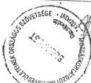

Állami Számvevőszék

# JELENTÉS

**a Mozgáskorlátozottak Egyesületeinek  
Országos Szövetsége gazdálkodásának  
ellenőrzéséről**

1999. július

9918. ✓

---

Az ellenőrzés végrehajtásáért felelős:

IV. Vagyonellenőrzési Igazgatóság

Kemény Emil

mb. számvevő igazgató

Az ellenőrzést vezette:

Dr. Szávai Tamás

számvevő főtanácsos

Az ellenőrzésben részt vettek:

Berzétey Attiláné

számvevő tanácsos

Dr. Dotterweich Antal

számvevő tanácsos

Pálfiné Mészáros Éva

számvevő

1990 óta az ÁSZ az alábbi központi költségvetési támogatásban részesült társadalmi szervezeteknél végzett hasonló vizsgálatot:

Magyarorszagi ROMA Parliament (1992.)
PHRALIPE Fuggetlen Cigany Szervezet (1992.)
Magyarorszagi Nemetek Szövetsége (1992.)
Magyarorszagi Szlovakok Szövetsége (1992.)
AMALIPE Cigany Kultura- es Hagyomanyorzo Egyesulet (1993.)
Magyarorszagi Ciganyok Igazsag Szovetsoge (1994.)
Magyarorszagi Romanok Szövetsége (1994.)
Magyarorszagi Horvatok Szövetsége (1994.)
Szerb Demokratikus Szövetség (1994.)
LUNGO DROM Erdekvédelmi Ciganyszövetség (1994.)
Cigany Ifjusagi Szovetség (1994.)
Magyar Madartani es Termeszetvedelmi Egyesulet (1994.)
Orszagos Omayar Kultura Barati Tarsasag (1994.)
Magyarorszagi Szlovenek Szövetsége (1995.)
Magyar Zsidok Kulturális Egyesülete (1995.)
Szuloi Kamara (1996.)
Magyarok Vilagszövetsége (1996.)
Magyar Vakok es Gyengénlátok Országos Szövetsége (1998.)
Siketek es Nagyothallok Orszagos Szövetsége (1998.)

Témavizsgálatot végeztünk továbbá az egészségügyi, rehabilitációs, prevenciós, egészségmegőrzési és szociálpolitikai társadalmi szervezetek költségvetési támogatása igénylésének és felhasználásának tárgyában az országgyűlés Társadalmi Szervezetek Költségvetési Támogatását Előkészítő Bizottság által rendelkezésre bocsátott iratok alapján (1997.)

www.asz.gov.hu

Jelentéseink az Országgyűlés számítógépes hálózatán is olvashatók.

---

V-1005-9/1999. TÉMASZÁM: 474

# TARTALOMJEGYZÉK

I. ÖSSZEGZÖ MEGÁLLAPITÁSOK, KÖVETKEZTÉSEK, JAVASLATOK 4
II. RÉSZLETES MEGÁLLAPITÁSOK 6

1. A Szövetség szervezeti felépítése és a Szövetség célja szerinti tevékenysége, valamint egyéb és vállalkozási tevékenysége 7

1.1.A Szovetseg szervezeti felepitése 7
1.2.A Szovetseg celja szerinti tevekenysége 8
1.3. Vallalkozasi tevekenyseg 10

2. A Szövetség szabályozottsága és működési rendje, különös tekintettel a gazdalkodásra 10
3. A Szövetség tevekenységéhez nyújtott költségvetési támogatással és egyéb bevetelekkel való gazdalkodás, költségvetés keszítese, jováhagyása és vegre-hajtása 12

3.1.A Szovetseg beveeteinek alakulasa 12
3.2.A koltsegvetesi támogatas igénylése, az elosztás modja 14
3.3.A Szovetseg kiadasainak alakulasa 15
3.4.A Szovetseg penzugyi helyzete 18

4. A számvitel rendje, a számviteli politika kialakítása 18

4.1.Az 1996-1997.evi beszamolok szabályszerüsege 19
4.2.A konyvvezetesi kotelezettseg teljesitese 20
4.3.Analitikus nyilvantartasok gezetese 21
4.4.Bizonylati rend,bizonylati fegyelem 21

5.A kulonfelle allami befizetesi kotelezetsgek teljesitese 22
6.Belso ellenorzesi tevekenyseg 22

1

---

1

1

1

1

1

1

1

1

1

1

1

1

1

1

1

1

1

1

1

1

1

1

1

1

1

1

1

1

1

1

1

1

1

1

1

1

1

1

1

1

1

1

1

1

1

1

1

1

1

1

---

# JELENTÉS

## a Mozgáskorlátozottak Egyesületeinek Országos Szövetsége gazdálkodásának ellenőrzéséről

**Az ellenőrzött szervezet neve:** Mozgáskorlátozottak Egyesületeinek Országos Szövetsége

**Címe:** 1032. Bp. San Marco u. 76.

**Jogállása:** önálló jogi személy, kiemelten közhasznú szervezet

**Bírósági nyilvántartási száma:** 6 Pk. 60560/4

A Mozgáskorlátozottak Egyesületeinek Országos Szövetsége (továbbiakban: Szövetség) társadalmi, érdekvédelmi szervezet, 1998. évtől kiemelkedően közhasznú civil szervezet. A Szövetséget 1981-ben a mozgássérült emberek helyi egyesületei hozták létre.

Tevékenységük fő területei: a mozgáskorlátozottságból eredő sajátos érdekek feltárása, megfogalmazása, ezen érdekek képviselete, védelme, érvényesítése, az esélyegyenlőség megteremtése a foglalkoztatás, a tömegkommunikáció, a közlekedés, a tanulás, az egészségügyi szolgáltatások, a sport, a pihenés területén.

Tevékenységüket több szervezet, a társadalmi együttélésben jelentős mértékben akadályozott fogyatékos és egészségkárosodott emberek érdekében folytatják. Tagegyesületeik és helyi csoportjaik révén jelen vannak az ország minden jelentős településén.

A Szövetség a feladatait az egyesülési jogról szóló 1989. évi II. törvény alapján az Alapszabályában foglaltak szerint látja el. Kiadásait elsősorban központi költségvetési támogatásból, továbbá tagdíjakból, pályázatokon elnyert támogatásokból és adományokból fedezi.

A Szövetség az 1996-1998. években 100-110 M Ft-tal gazdálkodott, ezen belül a központi költségvetési támogatás 1996-ban 72 M Ft, 1997-ben 77 M Ft, 1998-ban 92 M Ft volt, amelyeket a Parlament az éves költségvetési törvényekben hagyott jóvá részükre.

A Szövetség céljai megvalósításában **közreműködő tagszervezetek önálló jogi személyiséggel rendelkeznek**, önállóan gazdálkodnak. A tagszervezet-

---3

---

I. ÖSSZEGZŐ MEGÁLLAPÍTÁSOK, KÖVETKEZTETÉSEK, JAVASLATOK---

tek nagyobb részt saját bevételekből, kisebb részben a Szövetség által a központi költségvetési támogatásból részükre évente átutalt bevételekből gazdálkodnak. A Szövetség tagegyesületeinek száma 1998-ban 76, ezek keretei között további 482 helyi csoport működik. Teljes taglétszámuk mintegy 150 000 fő.

Az Állami Számvevőszék az ellenőrzést az 1999. évi ellenőrzési tervében foglaltak szerint, az Állami Számvevőszékről szóló 1989. XXXVIII. törvény 2. § (5) bekezdésében előírtak alapján végezte.

A törvény szerint a társadalmi szervezeteknél az állami támogatás felhasználását ellenőrzi az ÁSZ. A támogatást a Szövetség nem meghatározott célfeladatra kapta, hanem általános működési költségek fedezetére, ezért annak felhasználása nem volt elkülöníthetően ellenőrizhető. Az előzetes egyeztetés során a Szövetség igényelte, hogy az ÁSZ a teljes gazdálkodás ellenőrzését végezze el.

Az ÁSZ 1992 óta rendszeresen folytat ellenőrzéseket különböző területen működő jelentős összegű állami támogatásban részesülő társadalmi szervezeteknél. Így került sor több nemzeti kisebbségi szervezet, majd különböző kulturális, környezetvédelmi és egyéb szervezet vizsgálatára. Ezt követően került sor az Országgyűlés költségvetési fejezetében nevesítetten szereplő fogyatékosokat képviselő szervezetek ellenőrzésére. Közülük 1998-ban a Magyar Vakok és Gyngénlátók és a Siketek és Nagyothallók Országos Szövetségénél, 1999-ben pedig az Értelmi Fogyatékosokk és Segítőik és a Mozgáskorlátozottak Egyesületeinek Országos Szövetségénél végeztünk ellenőrzést.

A Szövetségnél most első ízben került sor Állami Számvevőszéki ellenőrzés lefolytatására.

**Az ellenőrzés célja** annak megállapítása volt, hogy a Szövetség gazdálkodása megfelelt-e a célszerűségi, eredményességi követelményeknek és a törvényi előírásoknak.

**Az ellenőrzés módszere:** a Szövetség által rendelkezésre bocsátott iratok szúrópróbaszerű ellenőrzése.

**Az ellenőrzött időszak:** 1996-1998. gazdasági évek.

---4

---

I. ÖSSZEGZŐ MEGÁLLAPÍTÁSOK, KÖVETKEZTETÉSEK, JAVASLATOK

# I. ÖSSZEGZŐ MEGÁLLAPÍTÁSOK, KÖVETKEZTETÉSEK, JAVASLATOK

## 1. ÖSSZEFOGLALÓ MEGÁLLAPÍTÁSOK

A Szövetség Alapszabályában lefektetett elveknek, alapfeladatoknak megfelelően aktívan részt vett nemcsak a mozgássérült, de valamennyi fogyatékossággal élő ember esélyegyenlőségének megteremtésére irányuló erőfeszítésekben. A mozgáskorlátozottak életfeltételeit javító napi feladatokon - lakás akadálymentesítés, közlekedés, parkolás, segédeszközök biztosítása, gyógykezelés, lelki segély szolgálat stb. - túlmenően tevőlegesen részt vettek a fogyatékos személyek jogairól és esélyegyenlőségük biztosításáról szóló 1998. évi XXVI. törvény kidolgozásában, részt vettek a Fogyatékossági Tanács munkájában. Naponta tapasztalható módon jelen vannak és rávilágítanak megoldásra váró problémáikra a tömegkommunikáció fórumain, rendezvényeik és kiadványaik útján segítenek a több százezres létszámú mozgáskorlátozott ember gondjainak megoldásában. Törekszenek arra, hogy a társadalom ismerje meg sajátos problémáikat, megfogalmazzák mit várnak el a Magyar

Köztársaság Parlamentjétől és Kormányától, hogy a fogyatékos emberek képesek legyenek magukról és családjukról gondoskodni, a társadalom aktív, értékes és egyenjogú tagjaivá válni. Felhívják a figyelmet arra, hogy a fogyatékossággal élő emberek helyzetének javítását, valamint a fogyatékosság bekövetkezésének megelőzését célzó intézkedések a társadalom számára hosszú távon megtérülő beruházások.

A Szövetség gazdálkodási rendjének szabályozottsága, az ellenőrzés hatékonysága nem volt megfelelő. Ezt a Szövetség Ellenőrző Bizottsága (továbbiakban: EB) által 1998. évben lefolytatott átfogó ellenőrzés is megállapította. A Szövetség által alkalmazott nyilvántartási rendszer, könyvvezetési gyakorlat nem biztosította a valódiság, a világosság és a következetesség számviteli alapelveinek betartását. Megállapításaik alapján, önellenőrzés keretében a hibákat nagyrészt kijavították. Megkezdték a feladatrendszerükhöz igazodó nyilvántartási és elszámolási rendszerük átdolgozását, számviteli politikájuk aktualizálását. Az ÁSZ ellenőrzés idejére e munka nagyrészt befejeződött.

A Szövetség céljainak elérése érdekében a rendelkezésére bocsátott pénzeszközökkel való gazdálkodása a törvényi előírásoknak - a végrehajtott önrevízió után - összességében megfelel, számviteli nyilvántartási, belső információs rendszerük korszerűsítése, pontosítása az Állami Számvevőszék ellenőrzése idején még folyamatban volt.

A Szövetséget a Fővárosi Bíróság 1998. január 1. napjától kiemelten közhasznú szervezetnek minősítette, ezért meg kell felelnie a közhasznú szervezetekről szóló 1997. évi CLVI. törvény gazdálkodási, illetőleg a nyilvántartási

5

---

I. ÖSSZEGZŐ MEGÁLLAPÍTÁSOK, KÖVETKEZTETÉSEK, JAVASLATOK---

szabályokra vonatkozó szigorúbb követelményeknek. A megtett intézkedések következtében a Szövetség a jogszabályi feltételeknek megfelelt.

Működési költségeit döntő mértékben és évente egyre nagyobb arányban a központi költségvetési támogatásból származó bevételeiből finanszírozta. Vállalkozási tevékenységet nem végzett, ilyen jellegű bevételszerző tevékenységet a Szövetség által alapított Alfa Ipari Rt folytatott.

A vizsgált időszakban a Szövetség részére biztosított **központi költségvetési támogatás** az össz-szövetségi feladatellátás céljait szolgálta, annak **mintegy 50%-át fordították közvetlenül az önálló jogi személyiséggel rendelkező tagszervezetek működési költségeinek finanszírozására**. Alapszabály szerinti feladataikat összességében eredményesen, hatékonyan látták el.

## 2. JAVASLAT

Az Állami Számvevőszék javasolja a Szövetség elnökének, hogy a jelentésben foglalt részletes megállapítások hasznosítása mellett fejezze be belső információs rendszerének korszerűsítését, pontosítsa számviteli politikáját az Szt. előírásainak megfelelően, számlarendjét igazítsa feladatrendszeréhez.

---6

---

II. RÉSZLETES MEGÁLLAPÍTÁSOK

## II. RÉSZLETES MEGÁLLAPÍTÁSOK

### 1. A SZÖVETSÉG SZERVEZETI FELÉPÍTÉSE ÉS A SZÖVETSÉG CÉLJA SZERINTI TEVÉKENYSÉGE, VALAMINT EGYÉB ÉS VÁLLALKOZÁSI TEVÉKENYSÉGE

#### 1.1. A Szövetség szervezeti felépítése

A Szövetség Alapszabályban meghatározott célkitűzése a mozgáskorlátozott emberek egyenjogú és teljes körű társadalmi beilleszkedésének igényével indokolt érdekek képviselete, érvényesítése és védelme. A mozgáskorlátozott emberek hazai szervezeteinek összefogása, tevékenységük segítése, összehangolása, közösségi érdekek érvényesítése, védelme, képviselete. A Szövetség egyesületi tagságtól függetlenül és a kizárólagosság igényétől mentesen törekszik valamennyi magyar mozgáskorlátozott személy érdekeinek védelmére és nyújtja részükre közhasznú szolgáltatásait.

A Szövetségben a tagszervezetek és a szövetségi szervek, helyi és országos hatáskörrel rendelkező tisztségviselők és munkatársak munkamegosztása és együttműködése valósul meg.

A **Közgyűlés** a Szövetség legfőbb testületi szerve, amely a tagszervezetek képviselőiből áll, minden tagszervezetnek egy szavazata van. Kizárólagos hatáskörébe tartozik többek között az Alapszabály elfogadása, módosítása, az Ellenőrző Bizottság beszámoltatása, az éves beszámolók és a közhasznúsági jelentés elfogadása.

Az **Elnökség** a Közgyűlésnek tartozik felelősséggel, a 7 tagú testületet a Közgyűlés választja 6 évi időtartamra. Az Elnökség feladata a Közgyűlés határozatainak megtartásával az ügyintézés, többek között a Szövetség központjának és a Szövetség által létrehozott egyszemélyes Rt felügyelete. Az Elnökség évente 6 alkalommal tart ülést.

A Szövetség **elnökének** feladata az országos hatáskörű testületi döntések végrehajtásának szervezése, az elnökségi ülések vezetése, az országos központ irányítása. Képviseli a Szövetséget, munkáltatói jogokat gyakorol a szövetségi alkalmazottak tekintetében.

Az **alelnökök** támogatják az elnök munkáját, szükség esetén helyettesítik. Az Elnökség döntése alapján szövetségi szervezet vezethetnek vagy feladatcsoportot irányíthatnak.

Az **Ellenőrző Bizottság** feladata a Szövetség működésének és gazdálkodásának ellenőrzése, az éves beszámoló és a közhasznúsági jelentés előzetes véleményezése.

7

---

II. RÉSZLETES MEGÁLLAPÍTÁSOK

A Szövetség munkájában részt vesznek országos hatáskörű tagozatok, szekciók, munkacsoportok. **Tagozatok** az 1995-ben alakult ifjúsági és az 1998. év elején alakult női tagozat. Az évek óta működő ifjúsági tagozat eredményei közül kiemelkedő, hogy kéthavonta jelentetik meg Hírmondó c. kiadványukat, minden évben tavaszi és őszi tanulmányi napot szerveznek, a „Közös Erővel” Fogyatékosok és Társaiik Sportegyesülettel rendszeres sport- és szabadidő jellegű programokat szerveznek. 1998. május 5-én általuk megszerzett szponzori támogatás felhasználásával Esélyegyenlőség Napja címmel rendezvényt szerveztek.

A **szekciók** tevékenységében a betegségcsoportok (diagnózisok) szerinti munkamegosztás valósul meg, így:

- Sclerosis Multiplex
- Izombetegségek
- Rheuma
- Osteoporózis
- Afázia
- Bechterew
- Post Traumás Osteryomyelitis
- Myasthenia Gravis
- Heine Medin

szekció folyamatos működése volt tapasztalható. Tevékenységüket részben külső szponzori támogatásból, részben a Szövetség által pályázatok alapján éves munkatervi feladataik finanszírozására kapott összegekből folytatják. A szekciók tagságukat érintő tájékoztató kiadványokat, lapot jelentetnek meg, tanácsadással, tanfolyamok, rendezvények, programok szervezésével segítik tagságukat. Telefon, levelezés útján rendszeres kapcsolatot tartanak az ország különböző területein élő tagságukkal, mivel egyszeri évi országos rendezvénynél több megszervezésére nincs lehetőségük.

A **munkacsoportokban** egy-egy érdekvényesítési (rehabilitációs) problémakör kezelése történik (pl. szociális, építészeti, műszaki, közlekedési, egészségügyi, jogi), a munkacsoportok működése társadalmi munkán alapul.

A Szövetség **Központjának** feladata, hogy részlegei, alkalmazottai és megbízottai révén gondoskodjék

- a Szövetség szervei, tisztségviselői tevékenységének és a
- tagszervezeteket segítő munkának,
- az Alapszabályban rögzített feladatok országos érdekkörű ellátásának szakmai, információs, ügyviteli, technikai, gazdálkodási feltételeiről.

## 1.2. A Szövetség célja szerinti tevékenysége

A Szövetség a vizsgált időszakban Alapszabályában rögzített célkitűzéseiknek megvalósítása érdekében két irányban fejtett ki tevékenységet:

8

---

II. RÉSZLETES MEGÁLLAPÍTÁSOK

**A) A társadalom irányában** számos akciót, rendezvényt, eseményt szervezett meg, így 1998. évben:

- Az új építési törvény (1997. évi LXXVIII. törvény az épített környezet alakításáról és védelméről) akadálymentesítésre vonatkozó rendelkezéseinek megismertetése az építészekkel, építtetőkkel, a társadalommal.
- Aláírásgyűjtési akció szervezése a fogyatékos személyek jogairól és esélyegyenlőségének biztosításáról szóló 1998. évi XXVI. törvény országgyűlési tárgyalása és elfogadtatása érdekében.
- Esélyegyenlőségi Nap megszervezése.
- Felmérés és tanácskozás szervezése a STANDARD RULES (ENSZ dokumentum a fogyatékos emberek jogairól és esélyegyenlőségének érvényesítéséről) magyarországi érvényesítésének és betartásának helyzetéről, ajánlások megfogalmazása a Kormány részére.
- Kapcsolatfelvétel és kapcsolattartás a választásokat követően a minisztériumok képviselőivel.
- A tömegközlekedés akadálymentesítése érdekében tárgyalások folytatása a Fővárosi Önkormányzat és a BKV illetékeseivel.
- A Balatonba való bejutást kerekesszéket használó és más súlyos sérültek számára is lehetővé tevő strandlift létesítése a Siófoki Önkormányzattal együttműködve.

**B) A Szövetség tagszervezetei, illetőleg a társszervezetek irányában** végzett tevékenységek

= A Szövetség lapja a „**Humanitás**” c. havonta megjelenő kiadvány. 1998. évben egyszerűsítették az előfizetési rendszert, **olcsóbbá tették** a terjesztést.
= Az aktuális belső információkból a csoportvezetők és klubvezetők részére a „Mozgalmi Értesítő” c. kiadványukat juttatták el. Kapcsolatokat tartanak fenn más fogyatékosokat képviselő szervezetekkel, alapítványokkal, egyéb szervezetekkel.
= Oktatások, képzések szervezésével segítik a társadalmi munkát végzők feladat ellátását.

A Szövetség a közhasznú szervezetekről szóló 1997. évi CLVI. törvény 26. § c./pontjában felsoroltak közül a következő cél szerinti tevékenységeket jelölte meg **közhasznú tevékenységként**:

- egészségmegőrzés, betegségmegelőzés, gyógyító, egészségügyi rehabilitációs tevékenység,
- szociális tevékenység, családsegítés, időskorúak gondozása,
- nevelés, oktatás, képességfejlesztés, ismeretterjesztés,
- kulturális tevékenység,
- gyermek- és ifjúságvédelem, gyermek- és ifjúság érdekképviselet,
- hátrányos helyzetű csoportok társadalmi esélyegyenlőségének elősegítése,
- emberi és állampolgári jogok védelme,
- sport,
- fogyasztóvédelem,
- rehabilitációs foglalkoztatás,

9

---

II. RÉSZLETES MEGÁLLAPÍTÁSOK

- euroatlanti integráció elősegítése,
- közhasznú szervezetek számára biztosított szolgáltatások.

E tevékenységeket a Szövetség nem kizárólag tagjai részére végzi, szolgáltatásait bármely mozgáskorlátozott igénybe veheti.

A Szövetség közreműködik a súlyos mozgáskorlátozottak közlekedési kedvezményeinek, lakásuk akadálymentesítését segítő támogatásnak (LAT) odaítélése során a 164/1995. (XII.27.) Korm. rendelet 15. § (1) bek. b./ pontja, valamint a 106/1988. (XII.26.) MT rendelet 3/E § (4) bek. alapján. A Szövetség elkészítette és alkalmazza az „Egységes eljárási utasítás a LAT ügyintézésre” c. szabályozást, amely a Szövetség és tagszervezetei közt munkamegosztásban rögzíti a feladatokat.

### 1.3. Vállalkozási tevékenység

A Szövetség Alapszabálya szerint „vállalkozási tevékenységet csak közhasznú céljainak megvalósítása érdekében, azokat nem veszélyeztetve végez.” A tényleges helyzetet a „végezhet” kifejezés tükrözné, mivel ténylegesen vállalkozási tevékenységet nem folytattak.

Bevételszerző tevékenységet az Alfa Ipari Rt végez, amelyben a Szövetség 124 M Ft értékű alaptőkével részesedik. Az Alfa Ipari Rt 1995. november 1-jével átalakulással jött létre, jogelődje az Alfa Ipari Vállalat volt, amelyet 1985-ben a Szövetség alapított azzal a célkitűzéssel, hogy munkalehetőséget biztosítson a megváltozott munkaképességű emberek részére, illetőleg vállaljon részt a gyógyászati segédeszköz ellátásban. Az Rt mintegy 350 fő, többségében megváltozott munkaképességű dolgozó foglalkoztatását biztosító rehabilitációs célszervezet, a 8/1983. (VI.29.) EüM-PM együttes rendelet 27/D pontjának megfelelően. A célszervezet normatív módon meghatározott támogatást igényelhet. Az Rt 1998. évi árbevétele 192 M Ft volt, ebből 92 M Ft támogatás. Ezen kívül a Szövetség 3 M Ft-os üzletrésszel rendelkezik a Humán Autó Kft-ben is.

## 2. A SZÖVETSÉG SZABÁLYOZOTTSÁGA ÉS MŰKÖDÉSI RENDJE, KÜLÖNÖS TEKINTETTEL A GAZDÁLKODÁSRA

A Szövetség működésének jogi kereteit alapvetően az egyesülési jogról szóló 1989. évi II. törvény és 1998. évtől a közhasznú szervezetekről szóló 1997. évi CLVI. törvény (továbbiakban: Kht.) határozza meg. A Szövetség szabályzatainak módosítása az ellenőrzés idején még folyamatban volt.

Az ellenőrzött időszakban a Szövetség 1991. július 6-án tartott küldöttközgyűlése által elfogadott Alapszabály volt hatályban, amelyet két ízben módosítottak. A belső szervezeti változtatásokon kívül az 1997. év szeptember 7-én tartott küldöttközgyűlés a személyi jövedelemadó 1%-ának elérése érdekében kimondta, hogy a Szövetség közvetlen politikai tevékenységet nem folytat, pártoktól független, azoknak anyagi támogatást nem nyújt, országgyűlési képviselőjelöltet nem állít. Az 1998. november 7-i közgyűlés a kiemelten közhasznú szervezet jogállás megszerzése érdekében módosította a vonatkozó törvény alapján az alapszabályt.

10

---

II. RÉSZLETES MEGÁLLAPÍTÁSOK

A Szövetség gazdálkodásának alapvető szabályait az Alapszabály rögzíti. A Szövetség szervezetének és működésének részletes szabályait a Szervezeti és Működési Szabályzat (továbbiakban: SZMSZ) tartalmazza, amely kiterjed az ügyvitelre, a gazdasági és vagyonkezelői tevékenységre is.

Az 1996. május 1-jétől hatályos SZMSZ hiányossága, hogy nem tükrözi az időközi alapszabály módosulásból adódó ténylegesen folytatott gyakorlatot, így pl. megszűnt a Vezetők Tanácsa, a főtitkári tisztség. SZMSZ módosítás nem követte az országos központban bekövetkezett szervezeti változásokat sem, így folyamatban lévő korszerűsítése indokolt.

Az SZMSZ-hez további belső szabályzatok kapcsolódnak, így:

Fegyelmi Szabalyzat
Ugyviteli es Ugykezelisi Szabalyzat
Munkaugyi Szabalyzat
Penzkezelisi Szabalyzat
Munkavédelmi Szabályzat
Tuzvédelmi Szabályzat
Kitüntetési Szabályzat

Az Országos Központ szervezeti felépítését az Elnökség 1997. október 11-i ülésének 2. sz. határozatával fogadta el, ez volt a vizsgált időszak végéig hatályban. Ennek alapján a központ két szolgálat keretében látta el feladatát.

A Közösségi Szolgálat feladatkörébe a következő ügycsoportok ellátása tartozott:

Egyesületi kapcsolatok
Testületek muködése
Elnökségi tagok, szakertői csoportok muködése
Palyazatok, forrasfejlesztés
Képzési feladatok
Rehabilitációs ügyek
LAT ügyek
- Telefon támogatások
Gyógyászai segédeszköz támogatások
Kulkapcsolatok
Orszagos rendezvények
PRkapcsolatok
Ugyfelszolgálat, informácio, panaszügyintézés
- Tagozatok, szekciok, partner szervezetek

Az Adminisztrációs Szolgálat az alábbi feladatcsoportokat végezte:

Gazdasagi ügyek (konyvelés, penztrár, ber, Tb, ado)
- Informatika (nyilvántartások, adatbank, kapcsolattartás)
- Szervezet muködtétés (üzemeltétés, gépkosci, karbantartás)
- Szervezet adminisztrácio (iktatas, postázás, sokszorosítás)

A szolgáltatások nyújtása a vizsgált időszak kezdetén a Közösségi Szolgálat feladata volt, 1998. július 1-jétől fokozatosan az ALFA Rt alvállalkozói közreműködésével (szállító szolgálat, otthoni ápolási, gondozási szolgálat) valósul meg.

11

---

II. RÉSZLETES MEGÁLLAPÍTÁSOK---

Az Országos Központ dolgozói munkaköri leírások alapján végezték feladataikat.

### 3. A SZÖVETSÉG TEVÉKENYSÉGÉHEZ NYÚJTOTT KÖLTSÉGVETÉSI TÁMOGATÁSSAL ÉS EGYÉB BEVÉTELEKKEL VALÓ GAZDÁLKODÁS, KÖLTSÉGVETÉS KÉSZÍTÉSE, JÓVÁHAGYÁSA ÉS VÉGREHAJTÁSA

A Szövetség - alapfeladatainak ellátásával összefüggő működési költségei fedezetére - a Magyar Köztársaság éves költségvetéséről szóló törvényekben meghatározott összegű központi költségvetési támogatásban részesült.

A juttatott költségvetési támogatás összegét a központi költségvetés 1996. évben az Országgyűlés fejezet kiemelt céljellegű előirányzataként, 1997. és 1998. években pedig a Népjóléti, illetőleg a Szociális és Családügyi Minisztérium fejezet kiemelt céljellegű előirányzataként irányozta elő.

**A támogatás összege 1996. évben 72,1 M Ft, 1997. évben 77,0 M Ft, 1998. évben 92,4 M Ft volt.**

A központi költségvetési támogatás felhasználásáról a költségvetési törvények nem rendelkeztek, konkrét feladatokat, célokat nem jelöltek meg, azt a Szövetség az Alapszabályában meghatározott alapfeladatai teljesítése céljából, a működési költségei fedezetére kapta, és arra is használta fel.

#### 3.1. A Szövetség bevételeinek alakulása

A Szövetség bevételei a vizsgált időszakban az Alapszabályában nevesített tevékenységének **célja szerinti és egyéb bevételekből állottak**. A társasági adóról szóló 1996. évi LXXXI. törvény 1. § (1) bekezdése szerinti, jövedelem- és vagyonszerzésre irányuló, bevételt eredményező gazdasági tevékenységnek minősülő **vállalkozási tevékenységet nem folytattak**.

**A cél szerinti bevételek** jogcímek szerint központi költségvetési támogatásból, az alaptevékenységhez tartozó feladatok bevételeiből, pályázati és egyéb támogatásokból, tagdíjból, jogi és magánszemélyek befizetéseiből és pénzügyi műveletek bevételeiből származtak:

---12

---

II. RÉSZLETES MEGÁLLAPÍTÁSOK

|  Bevételek (E Ft) | 1996 | % | 1997 | % | 1998* | %  |
| --- | --- | --- | --- | --- | --- | --- |
|  Költségvetési támogatás | 72100 | 76,3 | 77000 | 81,9 | 92400 | 86,5  |
|  Pályázati támogatás (1) | 12984 | 13,7 | 5476 | 5,8 | 1503 | 1,4  |
|  Adományok | 1231 | 1,3 | 3077 | 3,3 | 2170 | 2,1  |
|  Tagdíjak | 1117 | 1,2 | 1408 | 1,5 | 3131 | 2,8  |
|  SZJA 1%-a |  |  | 2558 | 2,7 | 1496 | 1,4  |
|  Egyéb bevételek | 7038 | 7,4 | 4535 | 4,8 | 6092 | 5,7  |
|  Folyó évi bevétel: | 94470 | 100 | 94054 | 100 | 106792 | 100  |
|  Előző évről áthozott pénzeszközök: | 22094 |  | 15463 |  | 2228 |   |
|  ebből: pályázati támogatás (2) | 19500 |  | 11692 |  | 400 |   |
|  Források összesen: | 116564 |  | 109517 |  | 109020 |   |

* előzetes adatok

A Szövetség feladatai megvalósításához rendelkezésre álló folyó évi forrásainak döntő hányada mindhárom évben központi költségvetési támogatásból származott.

A vizsgált 3 év alatt a költségvetési támogatás összege évente változó arányban növekedett, 1997. évben az előző évihez képest 6,8%-kal, 1998-ban 20%-kal. Ugyanakkor a források összege csökkent, 1998-ban az 1996. évinek csak 93,5%-a volt.

Az 1996. és 1997. évek bevételi struktúráját nagy mértékben befolyásolta a különböző pályázatokon - legnagyobb összegben az Országos Egészségbiztosítási Pénztártól - elnyert pályázati bevétel összege. Az előző években elnyert, több évre szóló pályázati összegek 1996-1997. években jelentős arányt képviseltek a Szövetség rendelkezésére álló pénzeszközök között, azonban egyre csökkenő mértékben.

A Szövetség 1998. évtől kiemelten közhasznú jogállású szervezet, így a már korábbi években is átvállalt egyes állami feladatok beépültek az alaptevékenységébe. E feladatok végrehajtására nem pályázatok útján, hanem a központi költségvetésből lenne jogosult támogatásra, amelyekre költségvetési normatíva nincs megállapítva.

A Szövetség az általános elszámolási kötelezettséggel, illetőleg elszámolási kötelezettség nélkül kapott pályázati támogatások felhasználását analitikusan elkülönítetten nyilvántartotta, előírt szakmai és pénzügyi elszámolási kötelezettségének eleget tett.

13

---

II. RÉSZLETES MEGÁLLAPÍTÁSOK

### 3.2. A költségvetési támogatás igénylése, az elosztás módja

A Szövetség a központi költségvetési támogatás iránti igényét alátámasztó előterjesztést nyújtott be 1996-97-98. évekre az Országgyűlésnek címezve. Az előterjesztésben minden évben a Szövetség országos érdekkörű feladatai ellátásához szükséges támogatási igényt szöveges indoklással, valamint azt kiegészítő, a tervezett bevételeket és kiadásokat részletező költségvetési tervvel támasztották alá.

A **bevételek között** az alapműködéshez igényelt költségvetési támogatáson kívül szerepeltették a pályázatokon elnyerni remélt összegeket, a tagdíjakat, és a működés egyéb bevételeit is.

A **kiadások** tervezése feladatra lebontva készült, tartalmazta a tagszervezetek feladatellátásához, a testületi szervek, a tagozatok, szekciók, munkacsoportok működtetéséhez, az Országos Központ fenntartásához, az országos érdekkörű feladatok végrehajtásához szükségesnek ítélt költségeket.

A jóváhagyott költségvetési támogatás ismeretében a **Szövetség Elnöksége** elkészítette és a vezető testületek (1996-97. években a Vezetők Tanácsa, 1998-tól a Közgyűlés) elé terjesztette jóváhagyásra a Szövetség **éves országos érdekkörű munkatervét**, amelyet a vezető testület határozattal elfogadott. A munkaterv mellékletét képezi az előző, mérleggel lezárt év **költségvetésének teljesítéséről készült összefoglaló**, valamint a folyó évi **költségvetés tervezete**. A részletes költségvetési terv feladatra lebontott szerkezetű, **költségnemek szerint csak az Országos Központ fenntartása és működtetése címen tervezett összeget részletezi**. A testületi szervek, a tagozatok, szekciók, munkacsoportok működtetésére, és az országos érdekkörű feladatokra jóváhagyott költségeket egy összegben tartalmazza, holott a költségek is anyagköltségből, anyagjellegű és nem anyagjellegű szolgáltatásból, bérköltségből stb. állnak (1. sz. melléklet). A feladatokra lebontott költségeket nem konkrét számításokkal alátámasztva határozták meg, azok nem a főkönyvi könyvelés adatain alapulnak.

A Szövetség **országos érdekkörű feladatainak ellátásában** rendezett munkamegosztásban részt vesznek az önálló jogi személyiséggel rendelkező tagegyesületek, helyi szervezetek, alapítványok, a központ mellett szerveződő, évente változó struktúrájú szekciók, munkacsoportok, tagozatok, valamint az önálló jogi személyiséggel bíró Magyar Mozgássérültek Sportszövetsége. A SZMSZ-ben körvonalazott elvek szerint a **központi költségvetési támogatás az össz-szövetségi feladatellátás céljait szolgálja**. Ezért évente elnökségi, illetőleg közgyűlési határozatban fektetik le a támogatás felosztásának alapelveit:

- A Szövetség növekvő számú tagegyesületei (1996-ban 57, 1997-ben 62, 1998-ban 76) taglétszámuk arányában meghatározott támogatást kapnak a központtól oly módon, hogy a tagszervezetek tagonként 10 Ft-ot fizetnek be tagdíjként a Szövetségbe, az a befizetett összeg alapján évente és tagonként 240 Ft-ot ad át a tagszervezeteknek „tagarányos támogatás” címen.

14

---

II. RÉSZLETES MEGÁLLAPÍTÁSOK

• „Lakás akadálymentesítési támogatás” (LAT) címén a tagegyesületek által elintézett ügyek arányában ugyancsak meghatározott összeget kapnak a tagegyesületek.
• A költségvetési támogatás meghatározott összegét pályázat útján, országos érdekkörűnek minősített feladatokra osztják el. A pályázatok elbírálása az Elnökség hatásköre. A pályázatokra elkülönített támogatás elnyerésére nemcsak a tagszervezetek, hanem a Szövetség tagozatai, szekciói, alapítványok stb. is pályázhatnak.

A központi költségvetési támogatásból a fenti csatornákon a vizsgált években a tagszervezetek és a Sportszövetség részére véglegesen átadott pénzeszközök aránya:

|  Megnevezés | 1996 | % | 1997 | % | 1998 | % | E Ft-ban  |
| --- | --- | --- | --- | --- | --- | --- | --- |
|   |   |   |   |   |   |   |  1998.évi az 1996.évi %-ában  |
|  Központi költségvetési támogatás | 72100 | 100 | 77000 | 100 | 92400 | 100 | 128,2  |
|  ebből: Központ | 38132 | 52,9 | 31216 | 40,5 | 45363 | 49,1 | 119,1  |
|  Tagszervezetek | 33968 | 47,1 | 45784 | 59,5 | 47037 | 50,9 | 138,5  |

A tagszervezetek és a Sportszövetség a fentiek szerint évről-évre emelkedő arányban részesülnek a költségvetési támogatásból. Míg a Szövetség részére jóváhagyott költségvetési támogatás összege 1998-ban az 1996. évihez képest 28,2%-kal emelkedett, addig a tagszervezetek által felhasznált összeg aránya 38,5%-kal. Ezen túlmenően a Szövetség központi költségei között szerepelnek olyan, a szekciók, munkacsoportok költségei között elszámolt összegek is, amelyek a szekciók, munkacsoportok munkájában részt vevő tagszervezeti tagok, illetőleg tisztségviselők munkájával összefüggésben merültek fel (pl. utazási és szállásköltségek).

A költségvetési támogatást tehát mintegy 50-50%-os arányban fordították a központ működtetésére és a központilag kezelt feladatokra, valamint a tagszervezetek és a Sportszövetség működésének finanszírozására.

### 3.3. A Szövetség kiadásainak alakulása

A Szövetség kiegyensúlyozott gazdálkodást folytatott, kiadásai egyik vizsgált évben sem haladták meg a forrásait.

15

---

II. RÉSZLETES MEGÁLLAPÍTÁSOK

E Ft-ban

|  Megnevezés | 1996 | % | 1997 | % | 1998 | %  |
| --- | --- | --- | --- | --- | --- | --- |
|  Kiadások összesen ebből le: | 101548 | 100 | 107289 | 100 | 105095 | 100  |
|  tagszervezeteknek átadott összeg | 33968 | 33,4 | 45784 | 42,7 | 47037 | 44,7  |
|  Szövetség kiadásai | 67580 | 66,6 | 61505 | 57,3 | 58058 | 55,3  |

A Szövetség működési költségeire jóváhagyott **központi költségvetési támogatás növekedését nem követte a kiadások hasonló arányú növekedése**. Az 1998. évi összes kiadás az 1996. évinek csak 3,5%-a volt. Ezen belül a Szövetség központi gazdálkodása rendelkezésére álló összegből teljesített kiadások évről-évre csökkentek, 1998-ban az 1996. évinek a 85,9%-a volt. Ennek oka egyrészt, hogy a költségvetési támogatás emelkedése **nem volt olyan mértékű**, hogy ellensúlyozta volna az **inflációt** és a **pályázati pénzek** elmaradását. Másrészt a Szövetség által a **tagszervezeteknek végleges jelleggel átadott támogatás összege is növekedett**. Ez azt jelentette, hogy a Szövetség központjának országos érdekképviseleti feladatai végrehajtásához egyre csökkenő nagyságrendű pénzeszköz állt rendelkezésére, miközben a tagszervezetek részére átadott összeg évről-évre növekedett.

A Szövetség által teljesített **kiadások szerkezete** - a **tagszervezeteknek véglegesen átadott támogatás nélkül** - áttekinthető volt az alapfeladatoknak megfelelő **programok szerinti** szerkezetben a költségvetésből, valamint a számviteli nyilvántartásból **költségnemek szerinti** megoszlásban. Azonban a **kétféle adathalmazt nem lehet megfeleltetni egymásnak**. Ugyanis az éves költségvetés programokra készül, azonban az egyes programok költségeit nem bontja le költséghelyekre, a számviteli nyilvántartásból pedig nem lehet megállapítani, hogy az egyes költségnemek hogyan oszlanak meg programok szerint. A Szövetség által alkalmazott számítógépes program alapján az Szt. 85. § (3) bekezdés b./ pontjában előírt kódjegyzék hiányában ez még nem megoldott.

16

---

II. RÉSZLETES MEGÁLLAPÍTÁSOK

A programokra felhasznált pénzeszközök aránya évről-évre növekedett:

|   |  |  | E Ft-ban  |
| --- | --- | --- | --- |
|  M e g n e v e z é s | 1996 | 1997 | 1998  |
|  Központ kiadásai | 67580 | 61505 | 58058  |
|  ebből: |  |  |   |
|  tagozatok, szekciók programjai | 355 | 2219 | 3788  |
|  munkacsoportok programjai |  | 129 | 180  |
|  tájékoztatási költségek | 10422 | 8305 | 13551  |
|  pályázati támogatás |  |  | 2951  |
|  Programok összesen: | 10777 | 10653 | 20470  |
|  Programokra a központi kiadásainak %-ában | 15,9 | 17,3 | 35,3  |

A programok szerint felhasznált pénzeszköz arányának növekedését 1998-ban elsősorban a tájékoztatási költségek között szerepeltetett „Humanitás” c. újság kiadási költségei, valamint a testületi szervek és a rendezvények költségének növekedése eredményezte. Ezek a költségek a mozgássérültek érdekeinek országos hatáskörben való képviselete során merültek fel, ugyanis e szekciók, munkacsoportok munkájában a tagszervezetek képviselői is részt vesznek.

A kiadások költségnemek szerint a számviteli nyilvántartásból csak a pályázati és az egyéb ún. tagszervezetek érdekkörében felhasznált kiadások nélkül értékelhetők. A pályázatokon elnyert támogatásokból teljesített kiadásokat - helytelenül - egy összegben tüntetik fel. A vizsgálat idején rendelkezésre álló főkönyvi könyvelés adataiból a pályázati kiadások költségnemek szerint nem voltak ellenőrizhetők.

Az 1997. évi főkönyvi kivonatban pl. az 51. Anyagjellegű ráfordítások főkönyvi számlán 17.306 E Ft, az 52. Személyi jellegű ráfordítások főkönyvi számlán 20.471 E Ft szerepel, míg a programok szerinti beszámolóban 7.077 E Ft, illetőleg 22.110 E Ft. Az 1998. évi előzetes főkönyvi kivonaton ugyanezen főkönyvi számlákon 23.165 E Ft, illetőleg 16.416 E Ft egyenleg szerepel a programok szerinti beszámolóban közölt 9.191 E Ft-tal, illetőleg 21.144 E Ft-tal szemben. A pályázatokon elnyert támogatások felhasználása az analitikus nyilvántartásokból követhető.

A Szövetség kiadásai közt a vizsgált időszakban egyre növekvő arányt képviseltek a bérköltségek és egyéb személyi jellegű kifizetések (26,9%, 35,9%, 36,4%) és az anyagjellegű ráfordítások. A központi bérköltségek és egyéb személyi jellegű kifizetések aránya a kapott központi költségveté-

17

---

II. RÉSZLETES MEGÁLLAPÍTÁSOK---

**si támogatáshoz viszonyítva** 1996-ban 47,7%, 1997-en 70,8% , 1998-ban 46,6% volt.

A Szövetség 1998. évtől köteles a KSH részére havi munkaügyi jelentést megküldeni. Az **1998. decemberi jelentés adatai szerint** a foglalkoztatottak létszáma összesen 13 fő volt, ebből:

2 fő fizikai és 8 fő szellemi főállású teljes munkaidős,

1 fő fizikai és 2 fő szellemi, nem teljes munkaidős.

A 13 fő foglalkoztatottnak kifizetett havi összes munkajövedelem 1.115 E Ft volt, ebből 1 főre átlagosan 85.769 Ft jutott.

E létszámon felül a Szövetség központjában teljesített szolgálatot **1996-97-ben mintegy 9 fő, 1998-ban 17 fő**, akik a Szövetség egyszemélyes gazdasági társasága, az **Alfa Rt alkalmazásában állnak a Szövetség és az Rt között ügyviteli szolgáltatás jogcímen kötött szerződés alapján**. A Szövetség tisztségviselői - a főtitkár kivételével - munkájukat társadalmi munkában végezték, költségeiket a jogszabályokban előírtak szerint térítette a Szövetség.

A személyi jellegű ráfordításoknak 1997-ben az 55,5%-át, 1998-ban 48%-át a teljes munkaidőben foglalkoztatottak részére fizették ki.

**A költségvetésben** - helytelenül - **bérjellegű kiadásként tervezték az Alfa Ipari Rt-nél foglalkoztatottak bérét** is, amelyet „Ügyviteli szolgáltatás” címen megtérítenek az Alfa Ipari Rt-nek.

### 3.4. A Szövetség pénzügyi helyzete

A Szövetség pénzügyi helyzete mindhárom vizsgált évben **kiegyensúlyozott** volt. A kiadásaik forrásaikat **nem haladták meg**, mindhárom évben jelentős, bár csökkenő **pénzmaradvánnyal** zárták az évet, amely többnyire az áthúzódó pályázati feladatok költségeit fedezte. Hosszúlejáratú kötelezettségeket nem vállaltak, hitel felvételére nem került sor. Rövidlejáratú kötelezettségeiket teljesítették, sem adó, sem társadalombiztosítási járulék tartozásuk - mint azt az ennek megállapítására illetékes hatóságok igazolták - nem volt. **Likviditási problémáik nem voltak**, a kincstár havonta átutalta számlájukra a költségvetési támogatás időarányos összegét, amelyet évről-évre ki tudtak egészíteni pályázatokon elnyert összegekkel és egyéb támogatásokkal.

### 4. A SZÁMVITEL RENDJE, A SZÁMVITELI POLITIKA KIALAKÍTÁSA

A vizsgált időszakban a Szövetség a beszámolókészítési és könyvvezetési kötelezettségét a számvitelről szóló, többször módosított 1991. évi XVIII. tv. (a továbbiakban: Szt.), valamint az eltérő sajátosságokat tartalmazó 8/1996. (I. 24.) Korm. rendelet előírásai szerint szabályozta. A Szövetség **beszámolási kötelezettségének egyszerűsített éves beszámoló készítésével tett eleget**. A könyvvezetés 1996-ban az egyszeres könyvvitel rendszerében, 1997. és 1998. években a kettős könyvvitel rendszerében történt.

---18

---

II. RÉSZLETES MEGÁLLAPÍTÁSOK

A Szövetség rendelkezik számviteli politikával, amely 1997. január 1-jén lépett hatályba. A számviteli politika nem tartalmazza a szervezet sajátosságaiból adódó speciális előírásokat, részben olyan előírásokat tartalmaz, amelyek nem a társadalmi szervezetre, hanem a vállalkozó tevékenységet végző gazdálkodó szervezetre vonatkoznak.

- A számviteli politikában leírtakkal ellentétben a Szövetségnek sem kiegészítő mellékletet, sem üzleti jelentést nem kell készítenie, mert a 8/1996. (I.24.) Korm. rendelet ezt a társadalmi szervezeteknek nem írja elő.
- Nem vonatkoznak a Szövetségre a céltartalék-képzés rendje és követelésminősítés elvei.
- A Szövetség bevételt eredményező vállalkozási tevékenységet nem folytat, nem alanya a társasági adónak, ezért nem kell céltartalékot képeznie.

A számviteli politika meghatározza a beszámolás és könyvvezetés módját. A beszámolókészítés zárónapját a tárgyévet követő év május hó 15. napjában határozták meg. A számviteli politika rögzíti az értékcsökkenési leírás elszámolásának rendjét. A 30.000 Ft egyedi beszerzési érték alatti tárgyi eszközöket azonnali értékcsökkenési leírásként egyösszegben számolják el.

Számviteli politikájukat kiegészítették az Szt. 1997. január 1-jével hatályba lépett módosításának megfelelően. Elkészítették az előírt szabályozásokat: a Pénzkezelési, Leltárkészítési, Eszközök és források értékelési szabályzatot.

A szabályzatok elkészítésekor megelégedtek a törvényi szabályozás kimásolásával. A Számlatükröt elkészítették mint a számviteli politika mellékletét, de a szöveges számlarendet nem. Ezzel nem tettek eleget az Szt. 79 § (1)-(2) bekezdésében előírtaknak. A számlatükröt tartalmaz olyan számlákat, amelyek tartalma egyértelműen nem következik elnevezésükből. A tagszervezeteknek nyújtott közhasznú szolgáltatásokat helytelenül vállalkozási tevékenységként szerepelteti. Hiányzik a főkönyvi számla és az analitikus nyilvántartás kapcsolatának rögzítése. A kettő között az értékadatok számszerű egyeztetésének lehetősége nem biztosított.

A jelenlegi számviteli rend nem biztosít lehetőséget a különböző - más szervezeteknek - adott támogatások nyomonkövetésére, ezért módosítani kell a 6-os számlaosztály vagy kódszám-rendszer alkalmazásával a belső információs rendszert, amellyel megoldható lenne a költségvetési beszámoló adatainak feladatrendszerű gyűjtése is.

#### 4.1. Az 1996-1997. évi beszámolók szabályszerűsége

A Szövetség 1996. és 1997. évekről készített és 1998. évi előzetes egyszerűsített éves mérlegeit (2. sz. melléklet) analitikus nyilvántartások, bizonylatok alátámasztják. A Szövetség 1997. január 1-jével tért át az egyszeres könyvvezetésről a kettős könyvvezetésre. 1996-ban naplófőkönyv vezetésével tettek eleget könyvvezetési kötelezettségüknek. Az egyszeres könyvvezetésről a kettős könyvvezetésre való áttéréskor betartották az Szt. 81. § (2) bekezdésében foglaltakat.

19

---

II. RÉSZLETES MEGÁLLAPÍTÁSOK

Az egyszerűsített éves beszámoló mérlegének és eredmény-kimutatásának elkészítését a társadalmi szervezeteknél a 8/1996. (I.24.) Korm. rendelet 7. § (3) bekezdése írta elő, a rendelet 3. sz. mellékletének megfelelően. A Szövetség az egyszerűsített éves beszámoló mérlegét a jogszabályi előírásoknak megfelelően készítette el. **Az egyszerűsített éves beszámoló eredmény kimutatását azonban** - arra való hivatkozással, hogy vállalkozási tevékenységet a Szövetség nem végez - **nem készítették el**. Az 1997. évi beszámoló vizsgálata során a Szövetség belső ellenőrzése megállapította, hogy a mérlegben a befektetett eszközök között 3 M Ft szerepel, mint a Humán Autó Kft-nél befektetett eszköz, és nem szerepeltetik az Alfa Ipari Rt-nél befektetett 124 M Ft értékű pénzügyi eszközt. **Elvégezték az 1997. évi mérleg felülvizsgálatot, a mérleget önrevízióval módosították.** A mérleg alátámasztására szolgáló leltározást végrehajtották. A leltári ívek alapján felvett eszközöket és a könyvelésben lefűzött számlák alapján beszerzett eszközöket összehasonlították, az eltéréseket korrigálták.

A Szövetség főkönyvi kivonata az **Szt. 82. §-ban előírtaknak** megfelelően tartalmazza a főkönyvi számlák számát, megnevezését, halmozott tartozik, illetve követel forgalmát, valamint egyenlegét.

Az 1998. évi beszámoló zárlati munkái a helyszíni ellenőrzés lezárásának időpontjáig még nem fejeződtek be, csak előzetes adatokat tartalmazó főkönyvi kivonatot készítettek.

## 4.2. A könyvvezetési kötelezettség teljesítése

A Szövetség **1996-ban** könyvvezetési kötelezettségének az egyszeres könyvvitel vezetésével tett eleget, naplófőkönyvet vezettek. Számítógépen rögzítették a gazdasági eseményeket, majd havonta az összesített adatokat írták be a naplófőkönyvbe. Az **1997. és 1998.** években a kettős könyvvitel rendszerén belül számítógépes adatfeldolgozást végeztek. A számítógépes könyvelést a Szövetség központjában végzik. A főkönyvi számlákra bizonylatok alapján, idősorrendben, dokumentáltan történik a gazdasági események rögzítése. **A Szövetség tagszervezetei önálló jogi személyek, önálló könyvvezetésük van, önállóan gazdálkodnak.**

A jelenlegi gyakorlat szerint - helytelenül - a **főkönyvi könyvelésben az 5. számlaosztályban költségként a nem anyag jellegű szolgáltatások között tartják nyilván a tagszervezeteiknek véglegesen átadott tagarányos támogatást.** A tagarányos támogatásokkal együtt 1997-ben ugyanerre a számlára könyvelték az egyéb támogatásokat, valamint a lakás átalakítási támogatást is. 1997-ben csak az analitikából állapítható meg a tagarányos támogatás, az egyéb támogatás és a LAT összege. Az 1998-as könyvelésben az 56. számlacsoporton belül már önálló alszámlát nyitottak az egyéb támogatásoknak és a LAT-nak.

A Szt. előírásai szerint a tagarányos támogatást - amely a Szövetség tagszervezeteinek véglegesen átadott pénz - nem az 5. számlaosztályban a költségek között, hanem a 8. számlaosztályban a rendkívüli ráfordítások között kell szerepeltetni.

20

---

II. RÉSZLETES MEGÁLLAPÍTÁSOK

A bizonylatok kontírozása a jelzett problémakör kivételével általában megfelelő.

A számlatükör 9. számlaosztályában a bevételek között olyan „vállalkozási” tevékenységből származó bevételeket is felsorolnak, amely tevékenységeket nem is végeztek.

A leírtak alapján szükséges a számlatükör módosítása, valamint a számlarend elkészítése. A vállalkozási tevékenység árbevételeként nyilvántartott bevételeket át kell sorolni a Szövetség célja szerinti tevékenységének bevételei közé. Az eszközök értékelése a számviteli előírásoknak megfelelő.

### 4.3. Analitikus nyilvántartások vezetése

A Szövetségnél - a főkönyvi könyveléshez kapcsolódóan - az alábbi analitikus nyilvántartásokat vezetik:

- tárgyi eszközök nyilvántartása,
- szigorú számadás alá vont nyomtatványok nyilvántartása,
- ideiglenesen befektetett pénzeszközök nyilvántartása,
- elszámolásra kiadott előlegek nyilvántartása.

E nyilvántartásokat folyamatosan vezették, a nyomtatványok felhasználását ellenőrizték.

### 4.4. Bizonylati rend, bizonylati fegyelem

A Szövetség 1997-ben léptette életbe az új Ügykezelési, Iratkezelési és Pénzkezelési Szabályzatát. A Pénzkezelési Szabályzat rögzíti a bizonylati elv és fegyelem meghatározását, a bizonylatok kiállításának alaki és tartalmi kellékeit, a szigorú számadás alá vont nyomtatványok körét, azok tárolását, nyilvántartását, feldolgozásának ügyvitelét. Felsorolták az utalványozási és érvényesítési jogkörrel megbízott személyeket. A kötelezettségvállalásnál nem szabályozták, hogy ki, mekkora összeghatárig vállalhat kötelezettséget, ez visszaélésre adott alkalmat (lásd: 6 pontban).

Az ellenőrzés során megvizsgált pénztárbizonylatok tartalmilag és alakilag megfeleltek az előírásoknak.

Több ízben szabálytalanul, átfestve javították a bizonylatokat.

Nem készítettek az Szt. 85. § (2) b./ pontjában előírt, az adatok egyértelmű azonosításához szükséges kódjegyzéket.

#### Gépjármű üzemeltetés

A Szövetség nem határozta meg saját szabályzatában a magántulajdonú gépjármű üzemi célú használatának rendszerét, az utazási költségtérítésben részesíthetők körét. A hivatali gépjármű hivatalos és a saját gépjármű hivatali célú használatával kapcsolatos jogszabályi előírásokat betartották. A kifizetések, illetve térítések során a 60/1992. (VI.1.) Korm. rendeletben foglaltakat -

21

---

II. RÉSZLETES MEGÁLLAPÍTÁSOK---

amely az üzemanyag fogyasztás igazolás nélkül elszámolható mértékéről rendelkezik - betartották.

### **Külföldi kiküldetések**

A Szövetség valutapénztárral nem rendelkezik, azonban házipénztárukban eseti jelleggel - általában külföldi kiküldetésekkel kapcsolatban - kezelnek valutát. A külföldi kiküldetéshez szükséges valutát a pénztár igényli meg a pénzintézettől. A kiküldetést teljesítők az átvett valutát elszámolási kötelezettséggel kapják. A kiküldetés teljesítése után a fel nem használt valutát 8 munkanapon belül vissza kell fizetni a házipénztárba. A fel nem használt valuták visszafizetése minden esetben megtörtént. A pénztáros a bevételezett valutát 3 napon belül visszafizeti annak a pénzintézetnek a pénztárába, amelytől azt korábban felvette.

A külföldi kiküldetéseket minden alkalommal az elnökség hagyta jóvá. A külföldi kiküldetésekkel kapcsolatban alkalmazott bizonylatok kitöltése megfelelő, de helytelen, hogy a külföldi kiküldetési utasítás és költségelszámolás lapokon - több esetben - hiányzik az utalványozó aláírása, a kiküldetésben eltöltött idő szükségességét igazoló aláírása, a kiküldetést elrendelő aláírása. A kiküldöttek a mindenkori minimum napidíjat kapták meg, aminek nem volt személyi jövedelemadó vonzata.

## **5. A KÜLÖNFÉLE ÁLLAMI BEFIZETÉSI KÖTELEZETTSÉGEK TELJESÍTÉSE**

A Szövetség a vizsgált években **vezetett olyan nyilvántartásokat**, amelyek alkalmasak a **személyi jövedelemadó, a társadalombiztosítás, nyugdíj és egészségbiztosítási járulék**, valamint a munkaadói és munkavállalói járulék alapjának, összegének megállapítására. A nyilvántartások alapján a befizetési kötelezettség megállapítása teljes körűen ellenőrizhető. Bevallási és befizetési kötelezettségének a vizsgált években a Szövetség eleget tett. A vizsgált időszakban az APEH és a Társadalombiztosítás a Szövetségnél ellenőrzést nem végzett. A kiemelten közhasznú szervezetté alakuláshoz szükséges igazolásokat, amelyek szerint Tb és adótartozása a Szövetségnek nincs, az illetékes hatóságok kiállították.

## **6. BELSŐ ELLENŐRZÉSI TEVÉKENYSÉG**

Az Alapszabály 12. §-a (1997-ig), illetőleg 14. §-a (1998-tól) szerint az EB a **Szövetség felügyelő szerve** - mint választott testület - a közgyűlésnek tartozik felelősséggel és általa visszahívható.

Feladata a Szövetség működésének és gazdálkodásának ellenőrzése, az éves beszámoló és a közhasznúsági jelentés előzetes véleményezése. Az EB a tagszervezeteknél - azok kérésére - ellenőrizheti - többek között - a központi költségvetési támogatásnak a tagszervezet és a Szövetség Alapszabálya szerinti célokra történő felhasználását, ennek a jogszabályok által előírt rendben történő nyilvántartását, valamint az átruházott szövetségi hatáskörben gyakorolt tevékenységet.

Az EB működésének részletes szabályait maga állapítja meg.

---22

---

II. RÉSZLETES MEGÁLLAPÍTÁSOK

Az EB munkáját éves ellenőrzési terv alapján végezte, a végzett munkáról a közgyűlésnek beszámolt. Az EB 1998. évben több évet érintő átfogó ellenőrzést végzett.

Az 1998. évi munkaterv lényegesebb pontjai:

- A Szövetség 1997. évi mérlegének és tevékenységének átfogó felülvizsgálata,
- a vezető testületi határozatok nyilvántartási rendszerének, az iktatási, irattározási rendszer felülvizsgálata,
- az utalványozás, pénzügyi gazdálkodás felülvizsgálata,
- az Alfa Ipari Rt és a Szövetség viszonya stb.

A Szövetség gazdálkodásának átfogó felülvizsgálatról készült részletes jegyzőkönyv - legtöbbször helytálló - megállapításai alapján, összefoglalva a Szövetségben sorozatosan megsértették az Szt. és a 8/1996. (I.24.) Korm. rendelet előírásait.

A nyilvántartási és könyvvezetési rendszer nem biztosította a valódiság, a világosság és a következetesség számviteli alapelveinek betartását. Ennek oka az évek során kialakult szövevényes, sokszor átláthatatlan iratkezelési és nyilvántartási rendszer. Konkrét megállapításai alapján a gazdálkodás nem tervszerű, a számviteli bizonylatok szabálytalanok, hiányosak voltak, az 1996-97. évi mérlegek nem valósak, így pl. nem tüntetik fel a befektetett pénzügyi eszközök között az Alfa Ipari Rt-be befektetett 124 M Ft-ot. A vezetői ellenőrzések felületesek, nem célirányosak voltak.

Az újonnan épült tanácsterem költségeinek ellenőrzése kapcsán megállapították, hogy nincs szabályozva a beruházások indításával kapcsolatos döntési hatáskör, a beruházás előkészítése, lebonyolítása „amatőr” módon történt, szabályozatlan volt a 12 M Ft összegű beruházás pénzügyi lebonyolítása. A Vezetők Tanácsa adhoc bizottságának e témában született jegyzőkönyve szerint a tanácsterem megvalósításáról sem az Elnökség, sem a Vezetők Tanácsa nem döntött.

A jegyzőkönyvben javaslatot tettek a mérleg módosítására, a kötelezettségvállalási, utalványozás rend kialakítására, az iktatási, irattározási rendszer kidolgozására, a pályázati pénzek elkülönített nyilvántartásának megoldására stb., végül a felelősök megállapítására és belső ellenőr foglalkoztatására.

Több célvizsgálatot is lefolytattak. Így pl.:

A postai pénzküldemények kezelésének ellenőrzésével kapcsolatos megállapításaik következménye rendőrségi feljelentés lett sikkasztás alapos gyanúja miatt. Rendőrségi feljelentést eredményezett egy nagy összegű, szabálytalan befektetési művelet következményeként létrejött sikkasztás.

Mindkét cselekmény elkövetője az okozott kárt megtérítette. A rendőrségi nyomozás az ellenőrzés lezárásának időpontjában még folyamatban volt.

23

---

II. RÉSZLETES MEGÁLLAPÍTÁSOK

Az EB átfogó ellenőrzési tevékenysége, valamint az egyéb célvizsgálatok eredményének ismeretében felelősség megállapítására is sor került. Ennek következtében megújult a Szövetség vezetése, új elnököt választottak, új irodavezető és belső ellenőr alkalmazására került sor. Szabályzataikat kiegészítették, így pl. befektetési, iratkezelési szabályzat készült, önellenőrzést hajtottak végre, módosították az 1997. évi mérleget, kijavították az EB által könyvvezetésben feltárt hibákat, folyamatban van a számviteli politika Szt-nek megfelelő aktualizálása stb.

A megtett intézkedések eredményeként hatékony és szakszerű EB és belső ellenőrzés, valamint folyamatos vezetői ellenőrzés mellett biztosított a Szövetség gazdálkodási tevékenységének előírásszerű folytatása a számviteli politika folyamatban lévő pontosításával.

Budapest, 1999. július 21.

Melléklet: 2 db

Dr. Kovács Árpád  
elnök{
  "label": "",
  "top_left": [
    0.7299, 0.7848200,
    0.6798258879134585
  ],
  "bottom_right": [
    0.8694,
    0.7879
  ]
}

24

---

|  MEOSZ költségvetési adatok  |   |   |   |   |   |   |   |   |   |   |
| --- | --- | --- | --- | --- | --- | --- | --- | --- | --- | --- |
|   |  |  | 1996 |  |  | 1997 |  |  | 1998 |   |
|   |  |  |  |  |  |  |  |  | előzetes |   |
|   |  | terv | tény | százalék | terv | tény | százalék | terv | tény | százalék  |
|   | BEVÉTELEK |  |  |  |  |  |  |  |  |   |
|   | TÁMOGATÁSOK |  |  |  |  |  |  |  |  |   |
|  1 | Kigyetési tám. | 72000 | 72100 | 100% | 77140 | 77000 | 100% | 92400 | 92400 | 100%  |
|  2 | Egyéb tám. (adományok köz. köt.) | 1500 | 1231 | 82% | 1967 | 3077 | 156% | 1500 | 2170 | 145%  |
|  3 | Pályázatokon elnyert tám. ☐ | 3500 | 12984 | 371% | 0 | 5476 |  | 2000 | 1503 | 75%  |
|  4 | SZJA 1% bev. | 0 | 0 |  | 600 | 2558 | 426% | 2600 | 1496 | 58%  |
|  5 | Tagdíjak | 1100 | 1117 | 102% | 1330 | 1408 | 106% | 2500 | 3131 | 125%  |
|   | Összesen | 78100 | 87432 | 112% | 81037 | 89519 | 110% | 101000 | 100700 | 100%  |
|   | EGYÉB BEV. |  |  |  |  |  |  |  |  |   |
|  6 | Működési bev. | 3500 | 6571 | 188% | 1050 | 1315 | 125% | 1000 | 2174 | 217%  |
|  7 | Nyomtatvány-értékesítés | 0 | 0 |  | 1300 | 1360 | 105% | 1400 | 2494 | 178%  |
|  8 | ÁFA-visszatérítés | 0 | 467 |  | 350 | 201 | 57% | 200 | 0 | 0%  |
|  9 | Kamatok, hozamok | 0 | 0 |  | 1200 | 1078 | 90% | 1100 | 1349 | 123%  |
|  10 | Egyéb bev. | 0 | 0 |  | 0 | 581 |  | 390 | 75 | 19%  |
|  11 | Részvénybev. (ALFA) | 0 | 0 |  | 0 | 0 |  | 1200 | 0 | 0%  |
|   | Összesen | 3500 | 7038 | 201% | 3900 | 4535 | 116% | 5290 | 6092 | 115%  |
|   | BEV. ÖSSZESEN | 81600 | 94470 | 116% | 84937 | 94054 | 111% | 106290 | 106792 | 100%  |
|   | ELŐZŐ ÉVRŐL ÁTHOZOTT PÉNZESZKÖZÖK |  |  |  |  |  |  |  |  |   |
|   | Maradvány Bankok-Pénztár | 270 | 2594 | 961% | 1512 | 1512 | 100% | 792 | 1194 | 151%  |
|   | Pályázatokon elnyert tám. ☐ | 20500 | 19500 | 95% | 11692 | 11692 | 100% | 400 | 400 | 100%  |
|   | Kintlevőségek, követelések | 0 | 0 |  | 2259 | 2259 | 100% | 800 | 634 | 79%  |
|   | Összesen | 20770 | 22094 | 106% | 15463 | 15463 | 100% | 1992 | 2228 | 112%  |
|   | MINDÖSSZESEN | 102370 | 116564 | 114% | 100400 | 109517 | 109% | 108282 | 109020 | 101%  |

---

KÖZETÉSI ADATOK

|   |  | 1996 |   |   | 1997 |   |   | 1998  |   |   |
| --- | --- | --- | --- | --- | --- | --- | --- | --- | --- | --- |
|   |  | terv | tény | százalék | terv | tény | százalék | terv | előzetes tény | százalék  |
|   | KIADÁSOK |  |  |  |  |  |  |  |  |   |
|  |   |   |   |   |   |   |   |   |   |   |
|   | Tagszerv-ek érdekkörében felhasznált eszközök |  |  |  |  |  |  |  |  |   |
|  1 | Tagszerv-ek közvetlen támogatása |  |  |  |  |  |  |  |  |   |
|  1/1. | Tagszerv-ek közvetlen tám. | 33600 | 30521 | 91% | 38000 | 40007 | 105% | 45290 | 41508 | 92%  |
|  1/2. | Áthúzódó tám. |  |  |  | 0 | 0 |  | 1700 | 1700 | 100%  |
|  1/3. | Tartalékból |  |  |  | 3000 | 2797 | 93% | 0 | 0 |   |
|  1/4. | Pályázati tám-ok tagszerv-eknek | 900 | 900 | 100% | 830 | 830 | 100% | 1815 | 1815 | 100%  |
|   | Összesen tagszervezeteknek | 34500 | 31421 | 91% | 41830 | 43634 | 104% | 48805 | 45023 | 92%  |
|  2 | Tagozatok, szekciók tám. |  |  |  |  |  |  |  |  |   |
|  2/1. | Sportszöv. | 3000 | 2547 | 85% | 1500 | 2150 | 143% |  | 2014 |   |
|  2/2. | Myasthenia Gravis | 0 | 0 |  | 30 | 698 | 2327% |  | 1040 |   |
|  2/3. | MEOSZ Ifjúsági Csoport | 300 | 311 | 104% | 500 | 468 | 94% |  | 1033 |   |
|  2/4. | MEOSZ Női Tagozat | 50 | 44 | 88% | 200 | 116 | 58% |  | 23 |   |
|  2/5. | Osteoporosis | 0 | 0 |  | 30 | 781 | 2603% |  | 1005 |   |
|  2/6. | Nyirokbetegek | 0 | 0 |  | 30 | 35 | 117% |  | 6 |   |
|  2/7. | PTO | 0 | 0 |  | 10 | 117 | 1170% |  | 141 |   |
|  2/8. | Heine-Medin | 0 | 0 |  | 0 | 4 |  |  | 126 |   |
|  2/9. | SM | 0 | 0 |  | 0 | 0 |  |  | 414 |   |
|   | Összesen tagozatoknak, szekcióknak | 3350 | 2902 | 87% | 2300 | 4369 | 190% | 0 | 5802 |   |
|  3 | Munkacsoportok működése |  |  |  |  |  |  |  |  |   |
|  3/1. | Otthonház | 0 | 0 |  |  | 35 |  |  | 29 |   |
|  3/2. | Közlekedési munkacsoport-ok | 0 | 0 |  |  | 33 |  |  | 44 |   |
|  3/3. | Szociális munkacsoport. | 0 | 0 |  |  | 27 |  |  | 9 |   |
|  3/4. | Diabetes | 0 | 0 |  |  | 34 |  |  | 0 |   |
|  3/5. | Szakértői csoport-ok | 0 | 0 |  |  | 0 |  |  | 98 |   |
|   | Összesen munkacsoportoknak | 250 | 1166 | 466% | 300 | 129 | 43% | 300 | 180 | 60%  |

2

---

# MEOSZ költségvetési adatok

3

|   |  | 1996 |   |   | 1997 |   |   | 1998  |   |   |
| --- | --- | --- | --- | --- | --- | --- | --- | --- | --- | --- |
|   |  | terv | tény | százalék | terv | tény | százalék | terv | előzetes tény | százalék  |
|  4 | Tájékoztatási költségek |  |  |  |  |  |  |  |  |   |
|  4/1. | Humanitás támogatása | 1600 | 1917 | 120% | 1900 | 3035 | 160% | 0 | 5343 |   |
|  4/2. | Kiadványok költségei | 0 | 300 |  | 0 | 0 |  | 1000 | 0 | 0%  |
|  4/3. | Képzési költségek | 2800 | 3676 | 131% | 1000 | 1210 | 121% | 2000 | 2059 | 103%  |
|  4/4. | Pályázati tám. | 0 | 0 |  | 0 | 0 |  | 6285 | 2951 | 47%  |
|  4/5. | Rendezvények, akciók ktg-ei | 1600 | 2809 | 176% | 490 | 595 | 121% | 3000 | 2705 | 90%  |
|  4/6. | Testületi szervek ktg-ei | 620 | 899 | 145% | 1062 | 2131 | 201% | 3500 | 2958 | 85%  |
|  4/7. | Egyéb tagszervezetekkel kapcsolatos ktg |  |  |  | 830 | 759 | 91% | 0 | 0 |   |
|  4/8. | Nemzetközi kapcs. | 500 | 821 | 164% | 500 | 575 | 115% | 1000 | 486 | 49%  |
|   | Összesen tájékoztatásra | 7120 | 10422 | 146% | 5782 | 8305 | 144% | 16785 | 16502 | 98%  |
|  |   |   |   |   |   |   |   |   |   |   |
|   | Tagszerv-ek érdekkörében felhasznált összesen | 45220 | 45911 | 102% | 50212 | 56437 | 112% | 65890 | 67507 | 102%  |
|  |   |   |   |   |   |   |   |   |   |   |
|   | Központ ktg-ei |  |  |  |  |  |  |  |  |   |
|  5 | Személyi ktg-ek |  |  |  |  |  |  |  |  |   |
|  5/1. | Munkabérek | 21931 | 18195 |  | 11200 | 11409 | 102% | 7700 | 9231 | 120%  |
|  5/2. | Mkabérek közterhei | 0 | 0 |  | 6050 | 5401 | 89% | 3850 | 4334 | 113%  |
|  5/3. | ALFA szolgáltatási díjak | 0 | 0 |  | 2500 | 2803 | 112% | 10600 | 4902 | 46%  |
|  5/4. | Utazás, küldetési ktg-ek | 0 | 0 |  | 720 | 827 | 115% | 1000 | 737 | 74%  |
|  5/5. | Megbízási díjak, jutalmak, eseti bérktg-ek | 0 | 0 |  | 1360 | 748 | 55% | 1000 | 525 | 53%  |
|  5/6. | Eseti bérjell. ktg-ek közterhei | 0 | 0 |  | 940 | 485 | 52% | 300 | 110 | 37%  |
|  5/7. | Szociális juttatások (étkezési hozzájár, stb) | 0 | 0 |  | 450 | 437 | 97% | 600 | 591 | 99%  |
|  5/8. | Vállalkozói díjak | 0 | 0 |  | 0 | 0 |  | 2300 | 714 | 31%  |
|   | Összesen | 21931 | 18195 |  | 23220 | 22110 | 95% | 27350 | 21144 | 77%  |

---

# MEOSZ költségvetési adatok

|   | 1996 |   |   | 1997 |   |   | 1998  |   |   |
| --- | --- | --- | --- | --- | --- | --- | --- | --- | --- |
|   |  terv | tény | százalék | terv | tény | százalék | terv | előzetes tény | százalék  |
|  **6 Működési ktg-ek** |  |  |  |  |  |  |  |  |   |
|  6/1. Helyiség-bérleti díjak és hirdetés | 100 | 89 |  | 107 | 164 | 153% | 180 | 197 | 109%  |
|  6/2. Közüzemi szolgáltatások díjai | 1500 | 895 |  | 1605 | 1267 | 79% | 1500 | 927 | 62%  |
|  6/3. Postai szolgáltatások díjai | 1500 | 1451 |  | 1605 | 2587 | 161% | 3000 | 4449 | 148%  |
|  6/4. Irodaszer, nyomtatvány | 0 | 0 |  | 650 | 547 | 84% | 800 | 1153 | 144%  |
|  6/5. Könyvek, szakmai anyagok ktg-ei | 0 | 0 |  | 400 | 353 | 88% | 450 | 241 | 54%  |
|  6/6. Biztosítási díjak | 0 | 0 |  | 200 | 210 | 105% | 250 | 309 | 124%  |
|  6/7. Eszközjavítás, karbantartás | 0 | 0 |  | 200 | 676 | 338% | 600 | 395 | 66%  |
|  6/8. Banki ktg-ek és késedelmi kamat | 0 | 0 |  | 300 | 526 | 175% | 550 | 310 | 56%  |
|  6/9. Fogyóeszköz-vásárlás | 0 | 0 |  | 87 | 138 | 159% | 300 | 504 | 168%  |
|  6/10. Egyéb fenntartási ktg-ek | 5600 | 6688 |  | 330 | 609 | 185% | 300 | 706 | 235%  |
|  **Összesen** | **8700** | **9123** |  | **5484** | **7077** | **129%** | **7930** | **9191** | **116%**  |
|  **7 Gépkocsi-fenntartás ktg-ei** |  |  |  |  |  |  |  |  |   |
|  7/1. Személygépkocsi üzemanyag-ktg-ei |  |  |  | 300 | 366 | 122% | 450 | 749 | 166%  |
|  7/2. Személygépkocsi javítás és szerviz ktg-ei |  |  |  | 271 | 319 | 118% | 350 | 208 | 59%  |
|  7/3. Szállító-szolgálat gk. üzemanyag ktg. |  |  |  | 900 | 1210 | 134% | 200 | 1311 | 656%  |
|  7/4. Szállító-szolgálat üzemeltetési ktg. |  |  |  | 600 | 1077 | 180% | 600 | 1773 | 296%  |
|  **Összesen** | **1669** | **1307** |  | **2071** | **2972** | **144%** | **1600** | **4041** | **253%**  |
|  **8 Egyéb működési kiadások** |  |  |  |  |  |  |  |  |   |
|  8/1. Parkolási igazolványok előállítása |  |  |  | 300 | 380 | 127% | 300 | 336 | 112%  |
|  8/2. Tagkönyvek előállítása |  |  |  | 500 | 1107 | 221% | 500 | 675 | 135%  |
|  8/3. Egyéb kiadások |  |  |  | 650 | 38 | 6% | 212 | 0 | 0%  |
|  **Összesen** | **2350** | **3085** |  | **1450** | **1525** | **105%** | **1012** | **1011** | **100%**  |
|  **9 Felújítás ktg-ei** |  |  |  |  |  |  |  |  |   |
|  9/1. Építési ktg-ek |  |  |  | 1500 | 0 | 0% | 3500 | 2201 | 63%  |
|  9/2. Tárgyi eszközök beszerzése |  |  |  | 0 | 0 | 0% | 1000 | 0 | 0%  |
|  **Összesen** | **2000** | **3135** | **157%** | **1500** | **0** | **0%** | **4500** | **2201** | **49%**  |
|  **10 Pályázati kiadások** | **20500** | **20792** | **101%** | **12692** | **17168** | **135%** | **0** | **0** |   |
|  **11 KIADÁSOK MINDÖSSZESEN** | **102370** | **101548** | **99%** | **96629** | **107289** | **111%** | **108282** | **105095** | **97%**  |
|  **MARADVÁNY** | **0** | **15016** |  | **3771** | **2228** | **59%** | **0** | **3925** |   |

Központ kiadása:

-33968
62.580

-45784
61.505

-47037
58.055

---

2. sz. melléklet a
V-10054/1999. sz. jelentés

|  9 | 0 | 0 | 2 | 7 | 3 | 2 | 9 | 1 | 9 | 9 | 3 | 3 | 7 | 0 | 1  |
| --- | --- | --- | --- | --- | --- | --- | --- | --- | --- | --- | --- | --- | --- | --- | --- |

Statisztikai számjel vagy adószám

MEGNEVEZÉSE: Mozgáskorlátozottak Egyesületeinek Országos Szövetsége

TIME: 1032 Budapest, San Marco u. 76.

## EGYSZERŰSÍTETT MÉRLEG

1996 1997 1998

adatok E Ft-ban

|  Sor-szám | A tétel megnevezése | 1996 | 1997 | 1998  |
| --- | --- | --- | --- | --- |
|  a | b | c | d |   |
|  1. | **A. Befektetett eszközök (2-4. sorok)** | **24.768** | **148.087** | **146.054**  |
|  2. | I. IMMATERIÁLIS JAVAK |  |  | 50  |
|  3. | II. TÁRGYI ESZKÖZÖK | 21.768 | 20.887 | 18.804  |
|  4. | III. BEFEKTETETT PÉNZÜGYI ESZKÖZÖK | 3.000 | 127.200 | 127.200  |
|  5. | **B. Forgóeszközök (6-9. sorok)** | **15.755** | **4.236** | **4.218**  |
|  6. | I. KÉSZLETEK | 292 | 625 | 433  |
|  7. | II. KÖVETELÉSEK | 2.259 | 2.417 | 639  |
|  8. | III. ÉRTÉKPAPÍROK | 2.742 |  |   |
|  9. | IV. PÉNZESZKÖZÖK | 10.462 | 1.194 | 3.146  |
|  10. | **ESZKÖZÖK (AKTÍVÁK) ÖSSZESEN (1. + 5. sor)** | **40.523** | **152.323** | **150.272**  |
|  11. | **D. Saját tőke (12. - 13. sorok)** | **40.412** | **150.940** | **148.772**  |
|  12. | I. INDULÓ TŐKE | 1.405 | 125.605 | 125.605  |
|  13. | II. TŐKEVÁLTOZÁS | 39.007 | 25.335 | 23.167  |
|  14. | **E. Céltartalék** |  |  |   |
|  15. | **F. Kötelezettségek (16. - 17. sorok)** | **111** | **1.383** | **1.500**  |
|  16. | I. HOSSZÚ LEJÁRATÚ KÖTELEZETTSÉGEK |  |  |   |
|  17. | II. RÖVID LEJÁRATÚ KÖTELEZETTSÉGEK | 111 | 1.383 | 1.500  |
|  18. | **FORRÁSOK (PASSZÍVÁK) ÖSSZESEN (11.+14.+15. sor)** | **40.523** | **152.323** | **150.272**  |

Keltezés: 1999. május 14.

vezető