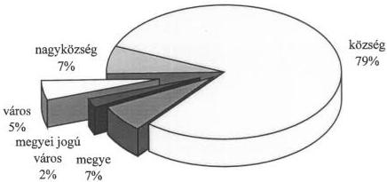
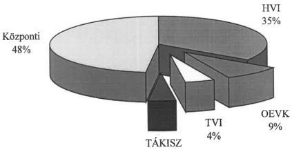

Állami Számvevőszék

## JELENTÉS

az 1997. évi népszavazásra, továbbá az
1998. évi országgyűlési, valamint a helyi
és kisebbségi önkormányzati képviselő-
választások lebonyolítására felhasznált
pénzeszközök vizsgálatáról

1999. július

9920

---

Az ellenőrzés végrehajtásáért felelős:
V. Önkormányzati és Területi Ellenőrzési Igazgatóság

Dömötör Gyula
számvevő igazgató

Az ellenőrzést vezette és a jelentést összeállította:

Csecserits Imréné
vizsgálatvezető főtanácsos

Kalmár Ferencné
számvevő tanácsos

Németh Gábor
számvevő tanácsos

Zeke József
számvevő tanácsos közreműködésével.

Az ellenőrzésben részt vettek: Lásd 1. számú melléklet

A témakörrel foglalkozó ÁSZ vizsgálatok jegyzéke:

Az 1990. évi országgyűlési képviselő-választások előkészítésével és lebonyolításával kapcsolatos állami feladatok végrehajtására biztosított költségvetési pénzeszközök felhasználásának ellenőrzése (V-38/1990.)

Az 1990. június 29-i népszavazáshoz nyújtott költségvetési pénzeszköz felhasználásának ellenőrzése (V-53/1990.)

Az országgyűlési, valamint a helyi és kisebbségi önkormányzati képviselő-választások lebonyolítására felhasznált pénzeszközök vizsgálata (V-1023/1994-95.)

Jelentéseink az INTERNETEN 1999. június 1-től a WWW.ASZ.gov.hu. címen olvashatók.

Jelentéseink az Országgyűlés számítógépes hálózatán is olvashatók.

---

V-1024-50/1998-99. TÉMASZÁM: 462

# TARTALOMJEGYZÉK

**I. ÖSSZEGZŐ MEGÁLLAPÍTÁSOK, KÖVETKEZTETÉSEK, JAVASLATOK** 5

**II. RÉSZLETES MEGÁLLAPÍTÁSOK** 9

**1. A választások pénzügyi fedezetének tervezése, biztosítása** 9

1.1. Tervezés 9
1.2. A költségvetési támogatás elosztása, helyi tervezése 13
1.3. A költségvetési támogatások rendelkezésre állása 14

**2. A választási pénzeszközök felhasználása** 17

2.1. A pénzeszközök feletti rendelkezési jog szabályozása 17
2.2. Elkülönített nyilvántartási kötelezettség teljesítése 18
2.2.1. Elkülönített nyilvántartás a KÖNYV Hivatalnál 18
2.2.2. Elkülönített nyilvántartás a helyi önkormányzatoknál és a TÁKISZ-oknál 18
2.2.3. A pénzeszközök felhasználásának dokumentálása az önkormányzatoknál és a TÁKISZ-oknál 19
2.3. A választások költségvetési előirányzatainak módosítása 20
2.4. A választásra jogosultak nyilvántartása és az értesítők készítése, kézbesítésének költségei 22
2.5. Felhalmozási célú előirányzat-módosítások a helyi önkormányzatoknál és a TÁKISZ-oknál 23
2.6. Személyi juttatások a helyi önkormányzatoknál 24
2.7. A helyi önkormányzatok részére átadott egyéb pénzeszközök 24
2.8. A felhalmozási célú pénzeszközök felhasználása 26
2.9. A választásoknál közreműködő egyéb szervezetek részére biztosított támogatás felhasználása, elszámolása 32

**3. Elszámolás a választási feladatra felhasznált pénzeszközökkel** 33

**4. Az előző választásokhoz beszerzett eszközök hasznosulása** 36

**5. Ellenőrzés** 37

**6. Az ÁSZ 1994. évi választásokkal összefüggő vizsgálati javaslatainak, ajánlásainak hasznosulása** 38

**Melléklet:** 1-5-ig melléklet
1.-VI-ig kimutatás

1

---

1. 2017年1月1日，公司与上海浦东发展银行股份有限公司签订了《关于使用部分闲置募集资金进行现金管理的协议》。

---

# Rövidítés jegyzék:

|  BM | = | Belügyminisztérium  |
| --- | --- | --- |
|  KÖNYV Hivatal | = | Központi Nyilvántartó és Választási Hivatal  |
|  TÁKISZ | = | Területi Államháztartási és Közigazgatási Információs Szolgálat  |
|  FÁKISZ | = | Fővárosi Területi Államháztartási és Közigazgatási Információs Szolgálat  |
|  OVM | = | Országos Választási Munkacsoport  |
|  OVI | = | Országos Választási Iroda  |
|  TVM | = | Területi Választási Munkacsoport  |
|  TVI | = | Területi Választási Iroda  |
|  HVM | = | Helyi Választási Munkacsoport  |
|  HVI | = | Helyi Választási Iroda  |
|  OEVI | = | Országos Egyéni Választási Iroda  |
|  OEVK | = | Országos Egyéni Választókerület  |
|  ORFK | = | Országos Rendőr-főkapitányság  |

2

---

1. 2017年1月1日，公司与上海浦东发展银行股份有限公司签订了《关于使用部分闲置募集资金进行现金管理的协议》。

---

# Jelentés

# az 1997. évi népszavazásra, továbbá az 1998. évi országgyűlési, valamint a helyi és kisebbségi önkormányzati képviselő-választások lebonyolítására felhasznált pénzeszközök vizsgálatáról

# Bevezetés

A választási eljárásról szóló 1997. évi C. törvény, valamint az államháztartásról szóló 1992. évi XXXVIII. törvény alapján a választások előkészítésével és lebonyolításával kapcsolatos állami feladatok végrehajtásának költségeit a központi költségvetés biztosítja, ezen pénzeszközök felhasználásának vizsgálata és a vizsgálati tapasztalatokról az Országgyűlés tájékoztatása az Állami Számvevőszék feladata.

# Az ellenőrzés

- az 1997. november 16-an megartott orszagos (NATO) nepszavazás,
- az 1998. majus 10. és 24. napjára kitüzött kétfordulós országgyűlesi képviselő-választás,
- az 1998. oktober 18-an vegrehajtott helyi és kisebbségi önkormányzati képviselő-valasztás, valamint
- az 1998. I. félévben tervezett, elokésztitet, de elmaradt nemzetiségi és etnikai kisebbségi országgyulési képviselő-valasztás

előkészítésére és lebonyolítására fordított pénzeszközök szabályszerű és célszerű felhasználásának vizsgálatára terjedt ki.

Ezen választásokra a központi költségvetés összesen 8 207 millió Ft-ot biztosított. A népszavazásra 1 700 millió Ft-ot, a kisebbségi országgyűlési képviselő-választás előkészítésére 400 millió Ft-ot, az országgyűlési képviselő-választásra 3 853 millió Ft-ot, a helyi és kisebbségi önkormányzati képviselő-választásra 2 254 millió Ft-ot, valamint a kisebbségi országgyűlési képviselő-választás 46 millió Ft maradványát.

A teljes összegből központi kiadásra 48%-ot, a választások lebonyolításában közreműködő települési és megyei önkormányzatok, valamint egyéb szervezetek feladataira pedig 52%-ot fordítottak.

Az ellenőrzés célja annak megállapítása volt, hogy a népszavazással és a választásokkal kapcsolatos feladatokat ellátó központi szerveknél, a megyei és települési önkormányzatoknál működött választási irodáknál (1997. évi országos népszavazásnál Területi és Helyi Választási Munkacsoport, 1998. évi választásoknál Területi és Helyi Választási Iroda az elnevezésük):

3

---

- az ellátandó feladatok költségigényét megalapozottan tervezték-e,
- a jogszabályi előírásoknak megfelelően használták-e fel a pénzeszközöket,
- a pénzügyi elszámolást a vonatkozó jogszabályokban előírt módon és határidőre teljesítették-e,
- a népszavazás és a választások (továbbiakban együtt: választások) során miként hasznosultak az Állami Számvevőszék 1994. évi választásokkal összefüggő vizsgálati javaslatai, ajánlásai.

**A vizsgált időszak:** 1997. július 1-től 1999. március 31-ig.

**Helyszíni ellenőrzést folytattunk:** az Országos Választási Munkacsoport (OVM), majd 1998-tól az Országos Választási Iroda (OVI) pénzügyi feladatait ellátó Központi Nyilvántartó és Választási Hivatalnál (KÖNYV Hivatal), a Fővárosi Területi Államháztartási és Közigazgatási Információs Szolgálatnál (FÁKISZ), 10 Területi Államháztartási és Közigazgatási Információs Szolgálatnál (TÁKISZ), a fővárosi és 10 megyei önkormányzatnál, 157 települési önkormányzatnál.

A 157 települési önkormányzatból 71 volt körjegyzőségi székhely, vagy kapcsolt település. Tekintettel arra, hogy körjegyzőségen belül egységes volt a választással kapcsolatos eljárás, a vizsgálati megállapítások további 122 kapcsolt, vagy székhely-településre, így összesen: 290 helyi önkormányzatra (9,2%) érvényesek.

Helyszíni vizsgálatra került sor az Országos Rendőr-főkapitányságnál (ORFK) és 4 megyei rendőr-főkapitányságnál a rendőrségi feladatokra és a győri Széchenyi István Főiskolánál a választásokhoz kapcsolódó oktatások tárgyi feltételeire biztosított pénzeszközök felhasználására és elszámolására vonatkozóan.

A vizsgálati körbe vont önkormányzatok, TÁKISZ-ok, egyéb – a választásoknál közreműködő szervek –, valamint a KÖNYV Hivatal rendelkeztek a központi költségvetési forrásból biztosított választás-népszavazás célú pénzeszközök 65,5%-ával.

A települési önkormányzatok közül a kiválasztás az önkormányzatok teljes országos ABC szerinti névjegyzékéből egyszerű (szisztematikus) mintavételezési eljárással történt. Ennek alapján 4 megyei jogú város, 8 város, 11 nagyközség és 134 község lett kijelölve. A kiválasztás módszere és a vizsgálati megállapításokkal érintett önkormányzatok aránya (9,2%) az önkormányzatokra vonatkozóan általánosítható megállapítások megtételét tette lehetővé. A választás-népszavazási célú költségvetési pénzeszközök 65,5%-ára kiterjedő helyszíni, részletes vizsgálat pedig a népszavazás és a választások előkészítésével, lebonyolításával kapcsolatos pénzeszközök felhasználásának általános megítéléséhez nyújt kellő alapot.

4

---

I. ÖSSZEGZŐ MEGÁLLAPÍTÁSOK, KÖVETKEZTETÉSEK, JAVASLATOK

# I. ÖSSZEGZŐ MEGÁLLAPÍTÁSOK, KÖVETKEZTETÉSEK, JAVASLATOK

Az 1998. évi választások tervezése, pénzügyi előkészítése és lebonyolítása az 1994. évi választásokhoz viszonyítva – a jelentésben részletesen feltárt hiányosságokat is figyelembe véve – **megalapozottabban és szabályszerűbben történt**. A választási előkészületek közben elrendelt ügydöntő országos népszavazás, a kisebbségi országgyűlési képviselők választásáról elhúzódó vita, a helyi és kisebbségi önkormányzati képviselők választása pénzügyi fedezetének az országgyűlési választások után megalakuló új kormány hatáskörébe utalása megnehezítette a feladatok előírás szerinti végrehajtását. Az ezek miatt egyidejűleg jelentkező többlet-terhelések rámutattak arra a problémára, hogy a KÖNYV Hivatal nem rendelkezett a feladatok – elsősorban informatikai komplex projektek – irányításához szükséges felkészültségű szakember-állománnyal. A jogszabályi előírásoktól eltérő eljárásuk is általában erre volt visszavezethető és nem volt megalapozott a kényszerhelyzetre való hivatkozásuk. A közbeszerzési eljárás több esetben formális volt, a KÖNYV Hivatal a megbízások során a tőle, illetve jogelődjétől – a köztisztviselői fizetésnek a versenyágazati szinttől való lényeges elmaradása miatt – korábban eltávozottak szaktudását vásárolta meg.

**Az 1997. évi költségvetés nem tartalmazott előirányzatokat az 1998. évi választások előkészítésére, az 1998. évi költségvetésben pedig csak az országgyűlési képviselő-választásra biztosított fedezetet.** Az 1997. évi népszavazásra, az országgyűlési képviselő-választás előkészítésére, a kisebbségi országgyűlési képviselők választására, valamint a helyi és kisebbségi önkormányzati képviselők választására csak a költségvetés általános tartaléka terhére, kormányhatározatokkal történő átcsoportosításokkal hoztak létre pénzügyi forrást. A választások pénzügyi fedezetének mértékét a feladatellátás módjának tervezéséhez és esetenként a hosszú átfutási idejű nyílt közbeszerzési eljárás szabályszerű lebonyolításához (NATO népszavazás, kisebbségi országgyűlési képviselő-választás) korábbi időpontban kellett volna eldönteni.

**A választások költségigényét, a költségtakarékos eljáráshoz viszonyítva túltervezték.** A rendelkezésre bocsátott források a tervezetben szereplő legigényesebb informatikai fejlesztésekre is fedezetet biztosítottak. Az informatikai fejlesztések nemcsak a választási feladatok szükségletét elégítették ki, hanem azoknál figyelembe vették az 1999. évben induló, a választások előkészítése során azonban még részletesen nem kidolgozott és jóvá nem hagyott okmány projektet is. A helyi és kisebbségi önkormányzati képviselő választások sok vitát okozó forráshiánya ténylegesen csak a jegyzőkönyvvezetők és helyi választási irodai tagok alacsony normatív díjazásában jelent meg.

A pénzeszközök felhasználására, elszámolására és azok ellenőrzésére a belügyminiszter választásonként rendeletet adott ki és jóváhagyta a választások költség-tervezetét. A normatív jellegű működési kiadásokra az előleget a Területi Választási Irodák (TVI), Helyi Választási Irodák (HVI) és TÁKISZ-ok a választásokat megelőzően – a BM rendeletben előírt határnaphoz képest eseten-

5

---

1. ÖSSZEGZŐ MEGÁLLAPÍTÁSOK, KÖVETKEZTETÉSEK, JAVASLATOK---

ként néhány nap késéssel - megkapták. Az előlegek számítása a BM rendeletben meghatározottak szerint történt, kivéve a körjegyzőségek részére az országgyűlési képviselő-választások alkalmával megállapított összeget. A nem normatív jellegű pénzeszköz felhasználásokról az OVI vezetője döntött. A felhalmozási célú eszközbeszerzés és szolgáltatás megrendelés túlnyomó részét a KÖNYV Hivatal végezte, de az OVI egyedi rendelkező levele alapján a helyi önkormányzatok és a TÁKISZ-ok is lehetőséget kaptak ilyen beszerzésekre. A KÖNYV Hivatalnál a tárgyi eszközök, immateriális javak állományba vételénél **a bizonylatok többségét hiányosan töltötték ki**, így ezen eszközök azonosítása általában nem volt lehetséges.

A helyi önkormányzatok esetében a BM rendeletek nem az államháztartásról szóló 1992. évi XXXVIII. törvény és a költségvetési szervek tervezésének, gazdálkodásának, beszámolásának rendszeréről szóló 156/1995. (XII.26.) Korm. rendelet előírásával összhangban szabályozták a kötelezettségvállalást, hanem minden választással kapcsolatos kiadás kötelezettség-vállalójaként a jegyzőt jelölték meg. **A nem összhangban lévő szabályozás miatt kialakult különböző megoldás azonban nem okozott fennakadást a választási feladatok pénzügyi lebonyolításában.**

A belügyminiszteri rendeletek a területi, helyi választási irodák vezetőit (főjegyzőket, jegyzőket) felelőssé tették a választás pénzügyi tervezéséért, lebonyolításáért, elszámolásáért. A területi és helyi választási irodáknál, a TÁKISZ-oknál a választási kiadásokat kevés kivételtől eltekintve nem tervezték meg. A jegyzőknek gondoskodniuk kellett többek között a választásokra fordított kiadások számvitelen belüli elkülönített kezeléséről. **A vizsgált egységek több mint felénél nem, vagy nem az előírásoknak megfelelően történt meg a saját és a támogatásként kapott pénzeszközök felhasználásának elkülönítése a számviteli nyilvántartásokban.**

A kialakított elszámolási rend fölöslegesen nehezítette az önkormányzatok munkáját és a központi elszámolást sem egyszerűsítette. A helyi önkormányzatoknak és a TÁKISZ-oknak a működési célú támogatást átfutó bevételként, a kiadásokat átfutó bevétel rendezéseként, a kapott felhalmozási célú támogatást pedig átvett pénzeszközként kellett nyilvántartania az OVM vezetőjének utasítása alapján.

A pénzeszközök felhasználásánál nem mindig, illetve gyakran csak látszólagosan tartotta be a KÖNYV Hivatal a közbeszerzésekről szóló 1995. évi XL. törvény, a központi költségvetési szervek központosított közbeszerzéseinek részletes szabályait tartalmazó 125/1996. (VIII.24.) Korm. rendelet, a központi költségvetési szervek szabadkézi vétellel történő beszerzéseinek szabályait előíró 126/1996. (VII.24.) Korm. rendelet és a 2/1997. sz. OVM vezetői utasítás előírásait. Közbeszerzési eljárás mellőzésével kötöttek értékhatárt meghaladó szállítási szerződést és részekre bontottak megrendeléseket a törvény megkerülése céljából. A kormányrendelet tiltása ellenére eltértek a központosított közbeszerzésre vonatkozó keretszerződés tartalmától. A szabadkézi beszerzések esetében 3 tartalmilag összehasonlítható írásbeli ajánlat hiányában rendeltek meg árut, illetve szolgáltatást.

---6

---

I. ÖSSZEGZŐ MEGÁLLAPÍTÁSOK, KÖVETKEZTETÉSEK, JAVASLATOK

A Magyar Államkincstárnál vezetett választás, népszavazás megnevezésű fejezeti kezelésű alszámlát az előírásoktól eltérve nem csak pénzellátási számlaként kezelték, hanem az intézmények és önkormányzatok pénzellátása mellett a KÖNYV Hivatal működési költségeinek – amelyek választásra elszámolható arányát megalapozottan nem határozták meg – közvetlen finanszírozására is.

Ez utóbbi szabálytalansággal függ össze, hogy az országgyűlési képviselők választásáról, a helyi és kisebbségi önkormányzati képviselők választásáról a KÖNYV Hivatal által készített feladat típusú pénzügyi elszámolások nem felelnek meg a választási költségek normatíváiról, tételeiről, elszámolási és belső ellenőrzési rendjéről szóló 15/1998. (III.20.), illetve 36/1998. (VIII.18.) BM rendeletek előírásainak, nem tartalmazzák az átadott normatív támogatásokon kívüli központi kiadásokat. A feladat típusú elszámolást az OVI vezetője a népszavazás esetében az előírt 1997. XII. 26. helyett csak 1998. III. 16-án, az országgyűlési képviselők választásakor 10 nap késedelemmel, a helyi és kisebbségi önkormányzati képviselők választását követően pedig az előírt határidőn belül készítette el. A határidő csúszásra a dokumentumok indoklást nem tartalmaztak.

A választási költségvetésekben meghatározott felhasználási jogcímek közötti átcsoportosításra az OVI vezetője volt jogosult. Átcsoportosítást általában az OVI vezetőjének kötelezettségvállalása alapján végeztek, de azt – a helyi és kisebbségi önkormányzati képviselőválasztást kivéve – nem dokumentálták. A választások eredeti előirányzatával szembeni 46 millió Ft-os elvonással kapcsolatos módosítás nem történt meg.

A választási pénzeszközök felhasználásának ellenőrzése hiányos volt. Az ellenőrzés – beleértve a vezetői és a folyamatba építettet is – elmulasztása tette lehetővé a szabálytalan beszerzéseket és kifizetéseket a KÖNYV Hivatalban. Az OVI vezetője egyik választásnál sem tett eleget a belügyminiszteri rendeletekben a területi választási irodák ellenőrzésére vonatkozóan előírt kötelezettségének. Ugyancsak nem teljesítette a helyi választási irodáknál az ellenőrzési kötelezettségét a területi választási irodák többsége.

Az 1994. évi választások ÁSZ vizsgálati jelentésében lévő javaslatok, ajánlások hasznosítására részben sor került az 1997. és 1998. évi választások során.

Mindezeket figyelembe véve az Állami Számvevőszék javasolja, hogy a belügyminiszter

1. kezdemenyezze, hogy az OVI gezetője az elmaradt országgyűlesi kisebbségi vásaszáskora, a helyi és kisebbségi önkormányzati képviselő-vásaszáskora, valamint az 1997. évi népszavazásra és az 1998-1999. évi vásaszáskora előirányzott teljes öszeg felhasználásáról készítsen az előirásoknak is megfelelo részletes elszamolást;
2. kezdemenyezze, hogy az orszaggyulési képviseló-valasztás évét megelózó évi kolt-segvetés tartalmazzon rendkivuli elöiranyzatot a vásaszások elokésztésere, a vásasz-tasi év koltsegvetésben pedig a helyi és kisebbségi önkormányzati képviselok vásaszásanak fedezete is szerepeljen;

7

---

I. ÖSSZEGZŐ MEGÁLLAPÍTÁSOK, KÖVETKEZTETÉSEK, JAVASLATOK

3. tegye egyszerűbbé, áttekinthetőbbé a választásokra fordított pénzeszközök finanszírozási és elszámolási rendszerét, valamint ennek során a körjegyzőségi sajátosságokat is vegye figyelembe.
4. szorgalmazza a Központi Adatfeldolgozó, Nyilvántartó és Választási Hivatal olyan szakemberekkel való megerősítését, hogy meg tudják tervezni és szervezni a következő választások feladatainak - különös tekintettel az informatikai feladatokra - irányítását, menedzselését saját köztisztviselőkkel.
5. kezdeményezze, hogy a választási kiadásokkal kapcsolatosan a helyi önkormányzatok esetében a kötelezettségvállalás és utalványozás szabályozása tekintetében az összhang biztosított legyen.

A helyszíni vizsgálati jelentésben a KÖNYV Hivatal részére az alábbi javaslatok kerültek megfogalmazásra:

1. tartsa be a termékek és szolgáltatások megrendelésénél a hatályos jogszabályi előírásokat (közbeszerzés, szabadkézi vétel),
2. készítsen szabályozást a Hivatal működési költségeinek választási feladatra elszámolható arányáról és azt következetesen tartsa be,
3. szervezze meg a választási költségek felhasználásának hatékony ellenőrzését, a megalapozatlan kifizetések rendezésére intézkedjen,
4. a tárgyi eszközök és az immateriális javak állományba vételét az erre a célra szolgáló bizonylatok pontos és teljes körű kitöltésével végezze,
5. biztosítsa, hogy az előirányzat-módosítások a jogszabályi előírásoknak megfelelően történjenek.

A területi, a helyi választási irodák és a TÁKISZ-ok számára javasoltuk, hogy a BM rendeletek előírásainak megfelelően:

1. gondoskodjanak a választási feladatokkal kapcsolatos kiadások tervezése és a választások lebonyolítása során a vonatkozó előírások maradéktalan betartásáról,
2. biztosítsák a választásokkal kapcsolatos összes kiadás elkülönített számviteli nyilvántartását
3. a területi választási irodák biztosítsák a választási pénzeszközök felhasználásának ellenőrzését.

A helyszíni vizsgálatok megállapításai alapján tett javaslatainkat az érintettek elfogadták.

8

---

II. RÉSZLETES MEGÁLLAPÍTÁSOK

## II. RÉSZLETES MEGÁLLAPÍTÁSOK

### 1. A VÁLASZTÁSOK PÉNZÜGYI FEDEZETÉNEK TERVEZÉSE, BIZTOSÍTÁSA

#### 1.1. Tervezés

Az 1998. évi országgyűlési képviselők valamint a helyi és kisebbségi önkormányzati képviselők választási költségei tervezésének 1997. I. félévi megkezdésekor nem volt ismert, hogy az Országgyűlés milyen mértékben módosítja a választásokra vonatkozó törvényeket, milyen időpontra lesznek kitűzve a választások és kell-e tartani országos népszavazást.

A választási kiadások tervezését nagyfokú bizonytalanság jellemezte. A választások pénzügyi előkészítésével legkorábban foglalkozó dokumentumot 1997. február hóban a KÖNYV Hivatal készítette kormányzati előterjesztés tervezetként. Ebben 1998. és 1999. évi választásokat vettek figyelembe. 1998. évben országgyűlési képviselők választását, helyi és kisebbségi önkormányzati képviselők választását, valamint elektoros rendszerben fővárosi és országos kisebbségi önkormányzati választást; 1999. évben időközi kisebbségi önkormányzati választást és országos népszavazást (új Alkotmány, NATO stb.). A tervezésnél az 1994. évi választások költségeit bázisadatként kezelték és azt növelték az infláció és a BM közigazgatási államtitkár által vezetett választási szakmai kabinet döntéseinek figyelembevételével. Számítási anyagot azonban a tervezet nem tartalmazott, hiányoztak a bázisadatok és az infláció figyelembe vett mértéke is. (Az 1994. évi választásokra 2,502 milliárd Ft-ot fordítottak a központi költségvetésből.) A választások lebonyolításához szükséges informatikai fejlesztés költségigényéről sem adott információt az anyag. Ezen tervezet megalapozottsága előbbiek miatt nem igazolható.

A választások költségét ekkor 10,4 milliárd Ft-ra tervezték. Ezen belül a parlamenti választás két fordulójára 5,2, az önkormányzati választásra 2,9, a kisebbségi képviselők időközi választásra 0,5, egy országos népszavazásra pedig 1,8 milliárd Ft-ot javasoltak. A tervezet szerint a választási kiadások 40-45%-a közbeszerzési törvény hatálya alá tartozott. Ezért egy évvel a választások előtt 4 milliárd Ft-ra fedezet-igazolás kiadását kezdeményezték.

A Pénzügyminisztériummal és az Igazságügyi Minisztériummal történt egyeztetések után az 1997. júniusban készült előterjesztés-tervezet már alacsonyabb összeget tartalmazott. Az országgyűlési képviselő-választás két fordulójára 4,0; a helyi és kisebbségi önkormányzati képviselők választására 2,5; az 1999. évi időközi kisebbségi képviselők választásra és az országos népszavazásra 2,3; összesen 8,8 milliárd Ft-nak az éves költségvetési törvényekben történő jóváhagyását kezdeményezték. Ebben a tervezetben már 500 millió Ft-os többletkiadási előirányzattal országgyűlési döntés függvényeként szerepelt a kisebbségi országgyűlési képviselők választása is. A korábbi tervezet néhány tételét (TÁKISZ-ok informatikai fejlesztését, közigazgatási hivatalok személyi megerő-

9

---

II. RÉSZLETES MEGÁLLAPÍTÁSOK---

sítését) más forrásból szándékoztak finanszírozni. A közbeszerzések miatti fedezetigazolási igényt 2,8 milliárd Ft-ra csökkentették.

A költségek tervezését befolyásolta, hogy párhuzamosan változott a jogszabályi környezet és kitűzésre kerültek a népszavazás és a választások időpontjai.

1997. évben az Országgyűlés megalkotta a választási eljárásról szóló 1997. évi C. törvényt. (Hatálybalépés ideje: 1997. XI. 6.) Ez hatályon kívül helyezte az országgyűlési képviselők választásáról szóló 1989. évi XXXIV. törvény IV-X. fejezetét azzal a megkötéssel, hogy a törvény hatálybalépése előtt kitűzött választás, elrendelt népszavazás lebonyolítására a kitűzés, illetőleg az elrendelés időpontjában hatályban lévő rendelkezéseket kell alkalmazni. Ennek megfelelően az Országgyűlés által elrendelt, a köztársasági elnök által 1997. november 16. napjára kitűzött országos népszavazást még az 1989. évi XXXIV. törvény előírásai szerint kellett lebonyolítani.

Az Alkotmánybíróság 52/1997. (X.14.) AB határozata következményeként az Országgyűlés módosította korábbi határozatát és így az előzetesen jelzett több kérdés helyett csak a NATO-hoz való csatlakozás kérdéséről tartottak ügydöntő országos népszavazást 1997. XI. 16-án.

Az 1998. évi országgyűlési képviselői választások időpontját a köztársasági elnök 1998. május 10. napjára (első forduló) és május 24. napjára (második forduló) tűzte ki.

Az országgyűlési képviselő-választás előkészítése során meg kívánták oldani a nemzetiségi és etnikai kisebbségek országgyűlési képviseletét. A kisebbségi országgyűlési képviselők választását az országgyűlési képviselők választásával egyidejűleg tervezték az Országgyűlésnek benyújtott törvényjavaslatokban. E törvényjavaslatokat a Kormány átdolgozásra visszakérte. Az új javaslatban a kisebbségek országgyűlési képviselőinek megválasztását első alkalommal a helyi önkormányzati képviselők és polgármesterek 1998. évi választásával együtt tervezték megtartani. A törvény-javaslatokat az Országgyűlés 1998. III. 16-i ülése nem fogadta el, így 1998. évben a kisebbségek országgyűlési képviselőinek megválasztására nem kerülhetett sor.

A helyi és kisebbségi önkormányzati képviselők választásának időpontját a köztársasági elnök 1998. október 18-ra tűzte ki. A választást a többször módosított 1989. évi LXIV. törvény és az országgyűlési képviselők választásánál már alkalmazott 1997. évi C. törvény előírásainak figyelembevételével kellett lefolytatni.

**A népszavazás esetében a kitűzés és a lebonyolítás közötti rövid idő nem tette lehetővé, hogy a választásokat összehangolt fejlesztések eredményeinek felhasználásával, a közbeszerzésekről szóló törvény előírásainak maradéktalan betartásával készítsék elő és bonyolítsák le.**

A kisebbségek országgyűlési képviselőinek választásával kapcsolatos elhúzódó vita, a választás időpontjának bizonytalansága, a választási eljárás szabályainak hiánya, majd az országgyűlési kisebbségi képviselő-választást meghiúsító országgyűlési döntés az e célra biztosított pénzeszközök felhasználásánál oko-

---10

---

II. RÉSZLETES MEGÁLLAPÍTÁSOK

zott gondot. A döntések bizonytalansága mellett ekkor a választáshoz a szoftver-fejlesztést a KÖNYV Hivatalnak meg kellett kezdenie. Ez a pénzügyi fedezet rendelkezésre állása előtt megtörtént. Az erre vonatkozó szerződéseket a 400 millió Ft biztosítása és az alszámlára való átutalása közötti időben megkötötték.

A választások állami feladatainak hatékony, költségtakarékos megoldása kellő időben elkezdett, összehangolt, tervszerű felkészüléssel lett volna biztosítható. A KÖNYV Hivatal azonban nem rendelkezett megfelelő szakértői gárdával a választások előkészítéséhez. A kormányzati előterjesztéseket nem alapozta meg különböző technikai színvonalat biztosító, alternatív megoldásokat tartalmazó terv készítése. Az előterjesztések a feladatok ellátásához szükségesnek vélt informatikai és szolgáltatási fejlesztéseket ugyan tartalmazták, de azok költségigényét nem. Utalásszerűen már itt szó volt a választási feladatokon túlmutató, más célt is szolgáló informatikai fejlesztésekről is.

A választási kiadások és a kapcsolódó fejlesztések tervezését, a közbeszerzések szabályos elvégzését nehezítette, hogy a pénzügyi fedezet csak fokozatosan és nem kellő időben került meghatározásra.

**Az 1998. évi választások költségvetési előkészítéséről a Kormány a 2216/1997. (VII.24.) határozatával döntött:**

1. Az 1998. évi országgyűlési választások és egy esetleges népszavazás előkészítésére 2 milliárd Ft pótelőirányzatot engedélyezett a Belügyminisztérium részére a költségvetés általános tartaléka terhére.
2. Engedélyezte, hogy a Belügyminisztérium – 2,5 milliárd Ft erejéig – az 1998. évi választások lebonyolításához szükséges közbeszerzési eljárásokat megindítsa.
3. Egyetértett azzal, hogy a Belügyminisztérium 1998. évi költségvetése az országgyűlési képviselő-választás I. és II. fordulójára összesen 3,053 milliárd Ft-ot tartalmazzon.
4. Felkérte a belügyminisztert és a pénzügyminisztert, hogy állapítsák meg egy esetleges népszavazás lebonyolításának az 1. pontban foglaltakon felüli költségvetését.

Ezt a kormányhatározatot a későbbiekben többször módosították, kiegészítették az alábbiak szerint:

A kormányhatározat 4. pontjában foglaltak alapján megállapított 2 milliárd Ft-on felül a 2265/1997. (IX.5.) Korm. határozat az 1997. évi országos népszavazás lebonyolításához további 500 millió Ft pótelőirányzatot engedélyezett a Központi Nyilvántartó és Választási Hivatal részére a költségvetés általános tartaléka terhére.

A 2301/1997. (IX.30.) Korm. határozat a 2216/1997. (VII.24.) Korm. határozat mellékletét képező adatlapot módosította azért, hogy a választási célú pénzeszközök átadását lehetővé tegye a Magyar Államkincstár körébe nem tartozó szervezetek (önkormányzatok) részére.

11

---

II. RÉSZLETES MEGÁLLAPÍTÁSOK

Az 1998. évi költségvetésről szóló 1997. évi CXLVI. törvény, a 2216/1997. (VII.24.) Korm. határozat 3. pontjának megfelelően 3 053 millió Ft rendkívüli előirányzatot tartalmaz a választás, népszavazás ágazati célfeladatokhoz. A költségvetési törvényben nevesítetten nincs előirányzat a helyi és kisebbségi önkormányzati képviselők választására.

Az Országgyűlés 1998. év elején a Választás, népszavazás ágazati célfeladat előirányzatából 100 millió Ft-ot engedélyezett az 1998. évi országgyűlési képviselő-választás kampányának támogatására fordítani.

**Az 1998. évi választások lebonyolításának további költségeiről a Kormány 1020/1998. (II.25.) határozatával döntött:**

1. Az 1998. októberi kisebbségi országgyűlési képviselők választására 400 millió Ft pótelőirányzatot engedélyezett a Belügyminisztérium fejezet részére, a központi tartalék terhére.
2. A helyi és kisebbségi önkormányzati képviselő-választásokhoz, valamint a kisebbségi országgyűlési képviselők választásához szükséges további 2 500 millió Ft pótelőirányzat biztosítása érdekében új előterjesztés készítését kérte. (Az 1038/1998. (III.31.) Korm. határozat úgy módosította ezt a kormányhatározatot, hogy abban már nem szerepel a pótelőirányzat összege.)

**A helyi és kisebbségi önkormányzati képviselő-választás lebonyolításának költségvetési fedezetét csak az 1100/1998. (VII.29.) Korm. határozat biztosította 2,3 milliárd Ft következő módon történő felhasználásának engedélyezésével:**

1. A központi költségvetés általános tartaléka terhére 2,160 milliárd Ft pótelőirányzatot engedélyezett a választás, népszavazás ágazati célfeladatra.
2. Engedélyezte, hogy a kisebbségi országgyűlési képviselők választására biztosított 400 millió Ft maradványát – 46 429 665 Ft-ot – a Belügyminisztérium felhasználhassa az 1998. évi helyi és kisebbségi önkormányzati képviselő-választásokra.
3. A központi költségvetés általános tartaléka terhére 94 millió Ft előirányzati tartalékot zárolt.

A 94 millió Ft-nak a választás, népszavazás ágazati célfeladatra való átcsoportosításáról a 1142/1998. (XI.11.) határozattal döntött a Kormány. Engedélyezte, hogy az átcsoportosított pótelőirányzatból a belügyminiszter a helyi és kisebbségi önkormányzati képviselő-választásokon közreműködő választási irodák tagjait és vezetőit díjazásban részesítse.

A választásokra fordítható összes pénzügyi forrás mértékének megfelelősége részletes dokumentumon alapuló költségtervek hiányában csak utólagosan, a felhasználás vizsgálata alapján értékelhető. A forrásbőségre utalnak a következők:

- az országgyűlési egyéni választókerületi szint informatikai fejlesztésére vonatkozó tanulmányban szereplő 5 változat közül a legköltségesebbet valósították meg.

12

---

II. RÉSZLETES MEGÁLLAPÍTÁSOK

- a helyi és kisebbségi önkormányzati képviselők választására 34 települési önkormányzatot az országgyűlési egyéni választókerület székhely településekkel azonos szintű informatikai fejlesztésben részesítettek. Ezt a választás nem tette szükségessé. Ezen településeken az informatikai eszközök beszerzése elsősorban az 1999-ben induló, a választások előkészítése során azonban még részletesen nem kidolgozott, és jóvá nem hagyott okmány-projekt miatt történt.

## 1.2. A költségvetési támogatás területi és helyi tervezése

A Belügyminisztérium az országos népszavazás és az 1998. évi országgyűlési képviselő-választások költségeinek normatíváiról, tételeiről és elszámolási rendjéről az 54/1997. (X. 10.) BM rendeletben és a 15/1998. (III. 20.) BM rendeletben intézkedett. A helyi és kisebbségi önkormányzati képviselők választásánál már a 36/1998. (VIII. 18.) BM rendelet normatívái, tételei voltak érvényben.

**A helyi önkormányzatoknál működő választási irodák vezetői (jegyzők, főjegyzők) néhány kivételtől eltekintve előzetes számításokat, pénzügyi terveket nem készítettek és e feladatra költségvetési előirányzatok kialakítását nem kezdeményezték.** Ezáltal nem teljesítették a hivatkozott BM rendeletek pénzügyi tervezésre vonatkozó előírásait.

A Veszprém és a Békés Megyei Közgyűlés biztosított az 1998. évi eredeti költségvetésében előirányzatot a választásokkal kapcsolatos várható többlet kiadásokra.

A települési önkormányzatok közül mindössze 9 (a vizsgált önkormányzatok 5,7%-a) végzett a választásokat megelőzően dokumentáltan számításokat a választások várható bevételeire és kiadásaira vonatkozóan. A központi költségvetési támogatás esetleges saját forrásból történő kiegészítésével a vizsgált két fővárosi kerületi önkormányzat kivételével egyik települési önkormányzat sem számolt.

A vizsgálatba bevont TÁKISZ-ok és a FÁKISZ (továbbiakban együtt TÁKISZ-ok) sem mérték fel a választások várható költségeit, sem 1997-ben, sem 1998-ban. Nem készítettek előzetes számításokat, pénzügyi tervet. A Komárom-Esztergom Megyei TÁKISZ a Belügyminisztérium kérésére az összes TÁKISZ-ra vonatkozóan készített előzetes számításokat a választásonként felmerülő kiadásokról, de ez az egyes TÁKISZ-okra nem került lebontásra.

A TÁKISZ-ok feladatairól szóló 19/1991. (I. 29.) Korm. rendelet 3. § (1) bekezdés e) pontja szerint térítésmentes kötelező feladataik közé tartozik a választással kapcsolatos informatikai feladatok ellátása. Ennek ellenére a TÁKISZ-ok költségvetése az 1998. évi választások egyszeri várható többletfeladataira eredeti előirányzatot 1998. évben nem tartalmazott.

A választási feladatokat a területi és a helyi választási irodák valamint a TÁKISZ-ok megfelelő pénzügyi tervek hiányában is teljesítették, amennyiben szükséges volt akkor a támogatást saját költségvetésük terhére kiegészítették.

A választási feladatokkal kapcsolatos felhasználások 52,1 %-a a helyi és a területi irodáknál valamint a TÁKISZ-ok-nál, 47,9 %-a pedig központi szinten je-

13

---

II. RÉSZLETES MEGÁLLAPÍTÁSOK

lent meg. (A választási kiadások szintenkénti alakulását a 4. sz. melléklet tartalmazza.)

### 1.3. A költségvetési támogatások rendelkezésre állása

A kormányhatározatok szerinti pénzeszközök a következő ütemezéssel kerültek átutalásra.

|  népszavazásra | 1997.X.13. | 500.000 ezer Ft  |
| --- | --- | --- |
|  népszavazásra és országgyűlési választások előkészítésére | 1997.X.17. | 2.000.000 ezer Ft  |
|  országgyűlési képviselő-választásra | 1998.II.25. | 437.755 ezer Ft  |
|  országgyűlési képviselő-választásra | 1998.III.12. | 1.212.645 ezer Ft  |
|  kisebbségi országgyűlési képviselő-választásra | 1998.III.13. | 400.000 ezer Ft  |
|  országgyűlési képviselő-választásra | 1998.IV.1. | 1.403.000 ezer Ft  |
|  helyi és kisebbségi önkormányzati képviselő-választásra | 1998.VIII.13. | 360.000 ezer Ft  |
|  helyi és kisebbségi önkormányzati képviselő-választásra | 1998.VIII.31. | 920.000 ezer Ft  |
|  helyi és kisebbségi önkormányzati képviselő-választásra | 1998.IX.30. | 800.000 ezer Ft  |
|  helyi és kisebbségi önkormányzati képviselő-választásra | 1998.X.29. | 80.000 ezer Ft  |
|  helyi és kisebbségi önkormányzati képviselő-választásra | 1998.XII.9. | 94.000 ezer Ft  |

A fenti összegekből 1997. X. 13-án 500 millió Ft a KÖNYV Hivatal költségvetési elszámolási számlájára, a többi a BM fejezeti kezelésű elszámlájára került.

**A népszavazás esetében a központi költségvetéstől a KÖNYV Hivatal késve (X.17-én) kapta meg a támogatást és így a BM rendeletben meghatározott továbbadási határidő (X.16.) betartása lehetetlenné vált.**

**Az országgyűlési képviselő-választásra és a helyi és kisebbségi önkormányzati képviselő-választásra a pénzügyi források a továbbadáshoz megfelelő időben a KÖNYV Hivatal rendelkezésére álltak.**

A területi és a helyi választási irodák, valamint a TÁKISZ-ok a választásokkal kapcsolatos kiadásokra kétféle módon kaptak támogatást.

- A BM rendeletekben meghatározott normatív támogatások a választási irodák választási feladattal szorosan összefüggő személyi és dologi kiadásainak fedezetét biztosították. A normatívák alapján kiszámított előleget az országos választási iroda utalta a területi választási irodáknak, amelyek továbbították a helyi választási irodáknak az azokat megillető összeget. Az OVI közvetlenül utalta át a TÁKISZ-oknak a normatív támogatást és a névjegyzék elkészítésére kiszámított összeget.
- A normatív tételeken kívül működési és felhalmozási célra az országos választási iroda vezetője további támogatást biztosított a választási irodáknak, illetve az önkormányzatoknak, elsősorban az ISDN vonalak vásárlására, fenntar-

14

---

II. RÉSZLETES MEGÁLLAPÍTÁSOK

tására, oktatásra, PC Hot-line-ra és személyi jellegű kifizetésekre, valamint informatikai fejlesztésekre.

Az Országos Választási Munkacsoport, későbbi nevén Országos Választási Iroda vezetője a normatív jellegű támogatásokat a népszavazásnál és az országgyűlési képviselő-választásnál az előírt határidő után 4-5 nappal, a helyi és kisebbségi önkormányzati képviselő-választásnál határidőn belül átutalta. A területi (megyei) választási irodák általában megfelelő időben továbbították a helyi választási irodák részére a központi támogatást.

A területi választási irodák vezetői (a főjegyzők) a polgármesteri hivatalok, illetve a körjegyzőséghez tartozó településeknél a körjegyzőség bankszámlájára utalták át az előlegeket, előlegrészleteket. A körjegyzők – a vizsgált 65 körjegyzőségből 3 kivételével – nem utalták tovább az előleget a hozzájuk tartozó önkormányzatoknak, hanem a körjegyzőség bankszámláján együtt kezelték a több települést megillető pénzeszközöket. A továbbutalásra a BM rendeletek sem tartalmaztak egyértelmű előírást. Ez az elszámolásnál problémákat okozott.

A Szabolcs-Szatmár-Bereg megyei Tiszavid és Tiszaadony község megkapta a körjegyzőségi székhelytől az őt megillető összeget, az átutalásra azonban mindhárom választásnál a választások befejezése után került sor (1997. XII. 12-én, 1998. VI. 3-án és XII. 9-én). A Tolna megyei Pincehely körjegyzőségi székhely község szintén a választások után utalta át az érintett kapcsolt településeknek az őket megillető összegeket (1997. XII. 29-én, 1998. VI. 2-án és X. 29-én).

Az önkormányzatokhoz történő továbbutaltatás előírásának hiánya és a választási pénzeszközök önkormányzat számvitelén belüli elkülönítésének BM rendeleti előírása ellentmond egymásnak.

A pénzeszközök körjegyzőségeknél történő felhasználása, körjegyzőségi bankszámlán történő kezelése miatt a körjegyzőségekhez tartozó önkormányzatok könyvvitelében a választással kapcsolatos - az esetleges saját kiadásokon kívüli - bevételek, kiadások nem jelentek meg.

A települési önkormányzatoknak a határidőn túli előleg kiutalások pénzügyi, finanszírozási gondot nem okoztak. (Mintegy 10-15 önkormányzatnál volt az előleg megérkezése előtt választással kapcsolatos kifizetés. Az összegek nagysága azonban nem volt meghatározó az önkormányzati gazdálkodáson belül.)

Jelentősebb arányú megelőlegezést kellett megoldani a népszavazásnál, a helyi és kisebbségi önkormányzati képviselő-választásnál azon önkormányzatoknak, ahol vállalták a választási névjegyzék és értesítő készítésének feladatát. Az értesítőket ugyanis a választást megelőző 58. napig a választásra jogosultaknak meg kellett kapniuk. Az elkészítésre adott normatívát pedig általában ezt követően kapták meg az önkormányzatok.

A vizsgálatba bevont települések közül 17 vállalta egy, vagy valamennyi választásnál a választási névjegyzék és az értesítő elkészítését, ez finanszírozási gondot egyik önkormányzat számára sem jelentett.

Az előlegek számítása a népszavazás, valamint a helyi és kisebbségi önkormányzati képviselő-választás tekintetében megfelelt a jogszabályi előírások-

15

---

II. RÉSZLETES MEGÁLLAPÍTÁSOK

nak. Az országgyűlési képviselő-választás esetében az előlegek megállapításánál tévesen került kiszámításra és kifizetésre a helyi választási irodák normatívája.

- Nem a BM rendeletekben előírt időponti létszámadatok alapján volt kiszámítva a választási névjegyzék és értesítő készítésére valamint kiküldésére biztosított normatíva összege. A nem jelentős eltérés korrekciójára nem került sor.
- A számítógépes program a körjegyzőséghez tartozó nem székhely községeknél is azzal számolt, hogy a településen helyi választási iroda működik. Így minden ilyen településre fordulónként a lakosságszám alapján meghatározott választási irodai taggal számolva 5 000 Ft/fő megbízási díjjal, ennek járulékaival és 3 000 Ft dologi kiadással több támogatást számoltak ki és utaltak át, mint amennyi megillette volna őket.

A helyi választási iroda a körjegyzőség székhelytelepüléseken működött, így normatív támogatást is csak itt lehetett elszámolni. Ennek megfelelően jogosulatlanul utaltak ki 883 kapcsolt település részére összesen 41 114 520 Ft-ot, amelyet az elszámoltatás során az Országos Választási Iroda visszavont.

A körjegyzőségek nem székhely települései részére az érintett körjegyzőségekhez átutalt összeggel kapcsolatosan a TVI vezetője részére 3 nappal a választás napja előtt, 1998. V. 7-én adott ki a intézkedést az OVI vezetője. Az intézkedés szerint a tévesen kiutalt összeget a TVI vezetőjének zárolnia kellett.

A vizsgálat tapasztalatai szerint 3 megyében – Baranya, Veszprém és Szabolcs-Szatmár-Bereg megye – egyes körjegyzőséghez tartozó nem székhely települések a tévesen kiutalt normatíva terhére kötelezettségvállalásokat tettek a zárolás bejelentése időpontjáig. A TVI-k a problémát jelezték az OVI részére, az OVI írásos engedélyt nem adott a kötelezettségvállalás miatti többlet költség elismerésére, de utólag nem kifogásolta ezt.

E három megyében a vizsgálattal érintett 18 körjegyzőséghez tartozó nem székhely községből 10 községnél merült fel a kötelezettségvállalás, számukra a 465 300 Ft téves normatíva összegből 288 065 Ft többletköltség került elismerésre. Az OVI engedélyezése jogtalan volt, mivel a vonatkozó 15/1998. (III.20.) BM rendelet ilyen címen többletköltség elismerésére nem tartalmazott előírást.

- A 15/1998. (III. 20.) BM rendelet szerint a helyi választási iroda tagjainak létszámát körjegyzőség esetén a körjegyzőséghez tartozó települések összlakosság száma alapján kellett meghatározni. Ezt a számítógépes program nem vette figyelembe.

Országos szinten elmaradt a kapcsolt települések lakosságszámának figyelembevétele. Ezért 191 körjegyzőség székhelytelepülés helyi választási irodájánál 1 fővel kevesebb taglétszámra utalták a támogatást, emiatt utólag 2 054 744 Ft támogatás kiutalására került sor.

A vizsgált 23 körjegyzőségi székhelyközségből 10-nél fordult elő az, hogy a körjegyzőséghez tartozó települések lakosságszáma meghaladta az 1000 főt, így 1 fővel magasabb létszámú választási iroda működtetésére voltak jogosultak, amely miatt a többlet normatíva összesen 13 510 Ft volt.

16

---

II. RÉSZLETES MEGÁLLAPÍTÁSOK

Az 1997. évi C. törvényben nevesített választási szerveken kívül választással összefüggő feladatra az alábbi szervezetek kaptak költségvetési támogatást:

|  Magyar Televízió Rt | 47 000 ezer Ft  |
| --- | --- |
|  Országos Rendőr-főkapitányság | 200 000 ezer Ft  |
|  BM DUNA Palota és Kiadó | 18 375 ezer Ft  |
|  Országos Igazságszolgáltatási Tanács Hivatala | 8 500 ezer Ft  |
|  BM Híradástechnikai Szolgálat | 118 138 ezer Ft  |
|  Széchenyi István Főiskola, Győr | 13 036 ezer Ft  |

A támogatásban részesülő szervezetek közül helyszínen vizsgáltuk az ORFK és a győri Széchenyi István Főiskola részére biztosított összegek rendelkezésre állását. A támogatásokat elszámolási kötelezettséggel átfutó pénzeszközként megfelelő időben kapták meg.

Az ORFK a helyi és kisebbségi önkormányzati képviselőválasztásra támogatást nem kapott, feladatait saját költségvetése terhére oldotta meg.

## 2. A VÁLASZTÁSI PÉNZESZKÖZÖK FELHASZNÁLÁSA

### 2.1. A pénzeszközök feletti rendelkezési jog szabályozása

A választási pénzeszközök feletti rendelkezési jogosultságot (kötelezettségvállalás, utalványozás, ellenjegyzés, érvényesítés) a vonatkozó BM rendeletek szabályozták.

Ezen szabályozások azonban a területi és helyi választási irodák esetében nincsenek összhangban az államháztartásról szóló 1992. évi XXXVIII. törvény 98. § (1) bekezdésében, valamint a költségvetési szervek gazdálkodását meghatározó 156/1995. (XII.26.) Korm. rendelet VIII. fejezetében előírtakkal, mivel azok kötelezettségvállalóként a polgármestert vagy az általa meghatározottat jelölik meg, a jegyzőnek és az általa kijelöltnek pedig ellenjegyzési jogosultságot adnak.

A választás pénzügyi elszámolásaival foglalkozó BM rendeletek kötelezettségvállalási, utalványozási jogosultsággal a TVI, HVI vezetőjét (főjegyző, jegyző) bízzák meg. A hatályos előírásoktól eltérő rendelkezésre csak törvényi szintű szabályozás útján van lehetőség az államháztartásról szóló törvény 98.§ (1) bekezdése szerint.

#### **A választási pénzeszközök feletti rendelkezési jogosultságot szabályozó BM rendelet törvénysértő, mert a magasabb rendű jogszabályban megfogalmazottakat szabályozza más módon.**

A hivatkozott BM rendeletek azon előírása, amely alapján a választási pénzeszközök feletti rendelkezési jogosultság a választási iroda vezetőjét illeti, elfogadható az átfutó pénzeszközök tekintetében, amelyek nem épülnek be az önkormányzatok költségvetésébe. A felhalmozási célú pénzeszközök felhasználásánál – amelyek átadott pénzeszközként kerülnek az önkormányzatok számlájára és átvételük előirányzat-módosítási kötelezettséggel jár – a BM rendelet előírásai nem érvényesíthetők.

17

---

II. RÉSZLETES MEGÁLLAPÍTÁSOK---

A vizsgált 168 önkormányzat 62%-ánál szabálytalanul került sor a választásokkal kapcsolatos pénzeszközök feletti rendelkezésre. A kormányrendeleti előíráson alapuló szabályzatuk szerint rendelkezési jogosultságot kapott jegyzőkön és a megfelelő szabályozás alapján eljáró körjegyzőkön kívül egyik jegyző sem volt jogosult az önkormányzati saját forrásokból választásra fordított felhalmozási célú pénzeszközök felett rendelkezni. A nem megfelelő szabályozás miatt kialakult gyakorlat jogsértő volt, de a választási feladat pénzügyi lebonyolításában fennakadást nem okozott.

## 2.2. Elkülönített nyilvántartási kötelezettség teljesítése

### 2.2.1. Elkülönített nyilvántartás a KÖNYV Hivatalnál

A választásokra vonatkozó BM rendeletek előírták a választás céljára szolgáló pénzeszközök elkülönített kezelési kötelezettségét. A választási pénzeszközök elkülönítésének biztosítására nyitotta meg a Magyar Államkincstárnál a BM a „Választás, népszavazás” megnevezésű alszámlát, amelynek kezelése a KÖNYV Hivatal feladata volt.

A KÖNYV Hivatal ezen alszámla pénzforgalmának elszámolására külön pénzügyi, főkönyvi elszámolási rendszert alakított ki. A választás, népszavazás feladatára 1997. és 1998. évre önálló intézményi költségvetési beszámolót készített és azt továbbította a BM Közgazdasági Főosztályának.

A KÖNYV Hivatalnál nem tartották be az OVM vezetőjének az alszámlán bonyolítható pénzforgalomra és az elszámolások rendjére vonatkozó utasítását, mivel a választások központi kiadásainak fedezetét az alszámláról nem utalták át a KÖNYV Hivatal költségvetési elszámolási számlájára.

Az alszámláról, amely a pénzellátást szolgálta a normatív támogatásokat, valamint az OVI vezetőjének egyedi rendelkezése szerinti támogatási összegeket tervezték biztosítani. Így annak egyenlege mindenkor a felhasználható előirányzat-maradványt kellett volna, hogy mutassa. A számlához kapcsolódó nyilvántartásból biztosítható lett volna az un. „feladat típusú” elszámolás elkészítése. A nyilvántartások nem megfelelő vezetése azonban nem tette lehetővé a BM rendelet szerinti feladat típusú elszámolást.

Az alszámla nem pénzellátási szerepet töltött be, mivel a KÖNYV Hivatal a választással kapcsolatos saját működési kiadásainak lebonyolítására is használta.

### 2.2.2. Elkülönített nyilvántartás a helyi önkormányzatoknál és a TÁKISZ-oknál

A választásokkal kapcsolatos kiadásokra a vizsgált települések 54,8%-a (86 önkormányzat), közöttük 67 körjegyzőséghez tartozó település nem különítette el semmilyen módon a választási pénzeszközöket, vagy az elkülönítés nem felelt meg a BM rendelet, illetve az azt kiegészítő és értelmező OVM utasítás előírásainak. További 71 településen a főkönyvi könyvelés alkalmazott módszere és a kialakított analitikus nyilvántartás megfelelt a BM és az OVM előírásainak.

---18

---

II. RÉSZLETES MEGÁLLAPÍTÁSOK

A főkönyvi könyvelésben főkönyvi számla nyitással, vagy alábontással, technikai szakfeladat kijelöléssel, részben önálló intézményként szerepeltetve a választási feladatot, illetve egyéb kódolásokkal valósították meg az elkülönítést. Az analitikus nyilvántartások is különbözőek voltak.

Valamennyi vizsgált TÁKISZ-nál a szabályoknak megfelelő volt az elkülönítés a központi pénzeszközök vonatkozásában mind a főkönyvi könyvelésben, mind az analitikus nyilvántartásokban.

Választásonként eltérő számban (43, 47, illetve 57) voltak olyan helyi önkormányzatok, akiknél saját forrásból fedezett kiadás kimutatásra került. Más önkormányzatoknál a saját forrás terhére teljesített választási kiadásokat nem mutatták ki, azokat az igazgatási szakfeladaton számolták el.

A vizsgált TÁKISZ-ok közül a saját költségvetés terhére a Hajdú-Bihar és a Békés megyei TÁKISZ számolt el kisebb összegű költséget, a többi TÁKISZ-nál a központi költségvetési támogatások fedezetet nyújtottak a választásokkal kapcsolatos kiadásokra.

Jellemző volt, hogy az önkormányzatok a saját költségvetés terhére történő ráfordításokat nem mutatták ki. Ennek hiányában csak becsülni lehet, hogy milyen arányban, mértékben fedezte a központi támogatás a választáshoz kapcsolható kiadásokat.

A vizsgálat során a települési önkormányzatok 80%-a jelezte, hogy a központi források nem fedezték a választások kiadásait, ezek többsége azonban saját forrás terhére történő ráfordítást nem mutatott ki. A saját kiadások elsősorban személyi kifizetésekkel, épület üzemeltetéssel, irodaszer felhasználással, postaköltségekkel, telefonköltségekkel, fénymásolással, utazási, kiküldetési költségekkel kapcsolatosak.

A vizsgált körben tapasztaltaknak az országos adatokra történő kivetítése útján végzett becsléseink szerint a helyi önkormányzatok a központi költségvetésből választási célra kapott összesen 3 922 millió Ft-ot mintegy 10%-kal, 400 millió Ft-tal egészítették ki. (Az egyes önkormányzatok között a kiegészítés mértéke jelentősen szóródott. A városoknál, nagyközségeknél előfordult, hogy 40-50 %-kal kiegészítették, de a Tolna megyei Önkormányzatnál, Miskolc városban, Kecel városban és további 31 községben a vizsgálatot végzőt arról tájékoztatták, hogy a kapott támogatás saját forrásból történő kiegészítésére nem volt szükség. Ezért a becslésnél a vizsgált körben tapasztaltak alapján a szükséges súlyozást elvégeztük.)

# 2.2.3. A pénzeszközök felhasználásának dokumentálása az önkormányzatoknál és a TÁKISZ-oknál

A választásokkal kapcsolatos bevételek és kiadások főkönyvi könyvelésére és analitikus nyilvántartására a választások elszámolási rendjéről szóló BM rendeletek és a már említett OVM utasítás tartalmaztak speciális szabályokat. Az OVM utasítás értelmében a működési célú pénzeszköz átvételeket – a normatív támogatásokat és a külön OVM intézkedésre kapott nem normatív összegeket – az érintett önkormányzatoknak átfutó bevételként, annak terhére történő ki-

19

---

II. RÉSZLETES MEGÁLLAPÍTÁSOK---

adásokat átfutó bevétel rendezéseként kellett a főkönyvi könyvelésben az egyéb pénzeszköz felhasználásoktól elkülönítetten könyvelni. A felhalmozási célra az OVI-tól kapott pénzeszközt a „*Felhalmozási célra átvett pénzeszköz fejezettől, központi költségvetésből*” főkönyvi számlán, az ennek terhére eszközölt kiadásokat a beszerzésnek megfelelő főkönyvi számlán kellett könyvelni, elszámolni.

A területi választási irodák az előírt analitikus nyilvántartásokat kialakították, azok a feladatokkal összhangban, kellően részletezettek voltak, megfelelő alapadatokat szolgáltattak a főkönyvi típusú elszámolások elkészítéséhez.

A vizsgált települési önkormányzatok 18,5%-ánál a könyvelés nem, vagy csak részben felelt meg az előírásoknak (pl. nem a megadott főkönyvi számlát alkalmazták, a kiadásokat szakfeladatra számolták el, a bevételeket működési bevételként könyvelték le, az átfutó bevétel rendezése nem történt meg teljes egészében). A hiányosságok többségét a helyszíni vizsgálatok során megszüntették.

A vizsgált TÁKISZ-ok a vonatkozó BM rendelet és OVM utasítás előírásainak eleget tettek. A főkönyvi könyvelésben az előírt főkönyvi számlán történt a könyvelés. Az analitikus nyilvántartások – bár különböző megoldással – kellően részletezettek voltak az elszámolások elkészítéséhez, a választások központilag biztosított pénzeszközei felhasználásának bizonyításához.

### 2.3. A választások költségvetési előirányzatainak és kiadási jogcímeinek módosítása

A BM rendeletek az OVM vezetőjét felhatalmazták a jóváhagyott választási költségvetés előirányzatain belül az egyes feladatok közötti átcsoportosítás és a választási költségvetés tartalékának felhasználási jogával.

A KÖNYV Hivatal kezelésébe utalt, a választásokhoz jóváhagyott költségvetésekkel kapcsolatos **szabályszerű előirányzat-módosítást az ellenőrzés nem talált**, annak ellenére, hogy a választási célra szolgáló teljes előirányzat 8.253 millió Ft-ról 8.207 millió Ft-ra módosult. A kisebbségi országgyűlési képviselőválasztásra átutalt összegből (400 millió Ft) 46 millió Ft felhasználását csak a helyi és kisebbségi önkormányzati képviselőválasztásoknál engedélyeztek előirányzat módosítás nélkül.

Az 1997. évi népszavazásra és az 1998. évi országgyűlési képviselő-választásra költségterv készült, amely a szavazópolgárok és szavazókörök számának változása (pontosítása) miatt módosításra került. Mivel a módosításokban csak a helyi és a területi kiadásokra vonatkozó adatok szerepelnek, nem állapítható meg, hogy az eltérést milyen központi kiadási jogcímmel szemben rendezték.

**A választásokkal kapcsolatos költségtervek módosítására a helyi és kisebbségi önkormányzati képviselőválasztások kivételével csak az elszámolásokat követően a felhasználások ismeretében került sor, amelyeknek dokumentált alapja nincs, így az egyes választások „módosított előirányzata” nem minősíthető.**

---20

---

II. RÉSZLETES MEGÁLLAPÍTÁSOK

Az országgyűlési képviselő-választáshoz kapcsolódóan 16 TÁKISZ működési célú támogatás felhalmozási célra történő átcsoportosítására kapott engedélyt, összesen 28,4 millió Ft nagyságrendben.

Az önkormányzati választásokhoz kapcsolódóan az OVI vezetője 13 TÁKISZ, valamint egy megyei és egy városi önkormányzat részére engedélyezett felhalmozási célú felhasználást működési célra jóváhagyott támogatásból, összesen 22,2 millió Ft összegben.

Az önkormányzatoknál a népszavazáshoz kapcsolódóan a személyi juttatás, a munkaadót terhelő járulék és a dologi kiadás címen biztosított átalányösszegek jogcímei között az eredeti előirányzatok összegének 10%-a mértékéig a szabad átcsoportosítás lehetősége a választási munkacsoport vezetője részére biztosított volt, azzal a kikötéssel, hogy a személyi kiadásra megállapított normatívákat biztosítani kell. Az előírás módosítását követően a választási nyilvántartások és értesítők készítésére, illetve az értesítők kézbesítésére szolgáló normatívák terhére személyi kiadás is teljesíthető volt.

Az országgyűlési képviselő-választás során a meghatározott kiadási jogcímek közötti átcsoportosítás korlátjaként csak a személyi kiadásokra megállapított normatívák biztosításának kötelezettségét írta elő jogszabály. A helyi és kisebbségi önkormányzati képviselő-választásnál a jogcímek között szabadon átcsoportosíthatott a választási iroda vezetője.

Az országgyűlési képviselő-választásnál részben a két forduló miatt a TVI dologi kiadások normatívája több mint háromszorosa volt a népszavazás normatívájának, ez nagyobb lehetőséget adott a dologi kiadási normatívákból történő átcsoportosításra is.

A Pest Megyei Önkormányzatnál a dologi normatíva 79,7%-át a TVI tagok megbízási díjának kiegészítésére csoportosították át. A dologi normatíva mintegy felét csoportosította át a Bács-Kiskun, a Békés és a Fejér megyei önkormányzat.

Az átcsoportosítások általában szabályszerűek voltak. Az önkormányzatok 8%-a sértette meg az előírásokat azáltal, hogy a személyi kiadásokra a dologi előirányzatból több mint 10%-ot átcsoportosított, vagy a személyi kiadások normatív összegét nem biztosította a rendeletben meghatározottak részére.

A vizsgált önkormányzatok közül a népszavazásnál 8, az országgyűlési képviselő-választásnál 5 sértette meg a BM rendeleti előírásokat az átcsoportosítással. A népszavazásnál a normatívák alapján számított együttes összeghez képest több mint 10%-ot csoportosított át a dologi kiadásokból személyi kiadásokra és járulékaira Sátoraljaújhely, a Baranya megyei Tótszentgyörgy, a Békés megyei Békéssámson, a Győr-Moson-Sopron megyei Magyarkeresztúr és Nagyszentjános, a Jász-Nagykun-Szolnok megyei Szelevény, a Komárom megyei Kisbér és a Somogy megyei Lakócsa.

A személyi kiadások normatívából dologi kiadásokra csoportosított át az országgyűlési képviselő-választásnál és ez által a személyi kiadásokat legalább a normatíva szintjén sem biztosította Salgótarján, a Baranya megyei Görcsönydoboka, a Hajdú-Bihar megyei Hortobágy, a Heves megyei Kömlő és a Vas megyei Őriszentpéter.

21

---

II. RÉSZLETES MEGÁLLAPÍTÁSOK---

A helyi és kisebbségi önkormányzati képviselő-választásnál már korlátozás nélküli átcsoportosítást engedett a BM rendelet.

A TÁKISZ-ok dologi normatíva címén kapták meg az őket megillető normatív támogatásokat. A népszavazásnál és az országgyűlési képviselő-választásnál a választási nyilvántartások és értesítők készítésére szolgáló normatíva terhére személyi juttatás kifizetését is megengedte a jogszabály. A helyi és kisebbségi önkormányzati képviselő-választás normatíváit, tételeit, elszámolási rendjét szabályozó rendelet pedig a TÁKISZ vezetőket is feljogosította a dologi normatívák szabad átcsoportosítására.

## 2.4. A választásra jogosultak nyilvántartása és az értesítők készítésének, kézbesítésének költségei

A TÁKISZ-ok a választásokat megelőzően felmérést végeztek az önkormányzatoknál arra vonatkozóan, hogy kívánják-e helyben készíteni a nyilvántartásokat és az értesítőket, vagy a TÁKISZ-nál rendelik meg a feladatot. A feladat ellátására vállalkozó helyi önkormányzatok aránya megyénként változó volt.

Bács-Kiskun megyében a 118 települési önkormányzat közül a népszavazásnál 4, az országgyűlési választásoknál 2, a helyi és kisebbségi önkormányzati képviselő-választásoknál egy sem vállalta a feladat végrehajtását. Békés megyében az egyes választásoknál eltérő arányban (24,0, 28,0, 30,7%) vállalták az önkormányzatok az értesítők elkészítését.

Az értesítők helyben készítését vállaló önkormányzatok általában a nagyobb lakosság számú önkormányzatok voltak.

A vonatkozó BM rendeletek szerint a választási nyilvántartást és értesítést készítő 20 Ft/fő támogatást kapott, így a TÁKISZ-ok is ezen összegért vállalták a feladatot, belső kalkulációkat nem készítettek a vállalási összegre.

A vizsgált körből a névjegyzék és értesítő készítést 15 települési önkormányzat vállalta valamelyik választásnál. A normatívához képest a költségek szélsőségesek voltak.

A legalacsonyabb költséget Debrecenben mutatták ki, a népszavazásnál 4,10 Ft/db, az országgyűlési képviselő-választásnál 7,70 Ft/db, a helyi önkormányzati képviselő-választásnál 2,40 Ft/db költséget számoltak el, de ezek csak dologi költségek, személyi kiadást nem számoltak el.

A személyi kiadások magas aránya miatt közel duplája költségbe került az előállítás a Somogy megyei Nagyatádon a népszavazásnál (36,39 Ft/db) és az országgyűlési képviselő-választásoknál (42,61 Ft/db), illetve a Vas megyei Megyehiden a népszavazásnál (36,90 Ft/db).

Az értesítők kiküldését többségében saját dolgozókkal oldották meg (a népszavazásnál 102, az országgyűlési és a helyi önkormányzati képviselő-választásnál 85-85 önkormányzat), közülük 20 a kézbesítésért nem fizetett díjat. A többieknél általában 10-20 Ft összegű megbízási díjat fizettek darabonként.

---22

---

II. RÉSZLETES MEGÁLLAPÍTÁSOK

## 2.5. Felhalmozási célú előirányzat-módosítások a helyi önkormányzatoknál és a TÁKISZ-oknál

Az önkormányzatoknak, illetve a TÁKISZ-oknak az OVI-tól felhalmozási célra kapott pénzeszközök többletbevételt jelentettek, ezáltal előirányzat rendezési kötelezettségük is keletkezett.

A vizsgált települési önkormányzatok közül a 10 Országos Egyéni Választókerület (OEVK) székhely és Túrkeve részesült felhalmozási célú támogatásban. **Többségük rendezte a beszerzésekkel, átvett pénzeszközökkel kapcsolatos előirányzatokat.** Nem tett eleget az előirányzat rendezési kötelezettségnek a Bp. XVI. kerületi, a salgótarjáni és a miskolci önkormányzat.

A felhalmozási célú pénzeszköz átadásnál az esetek jelentős részében pontosan meghatározásra került, hogy mi kerüljön beszerzésre, és az adott eszköz milyen áron, kitől szerezhető be. Ezekben az esetekben célszerűbb lett volna az eszközöket központilag beszerezni. Az informatikai eszközökhöz az önkormányzatok részben központi beszerzés útján, részben átadott pénzeszközök felhasználásával jutottak. Így egy nehezen áttekinthető vegyes tulajdonú eszközrendszer jött létre. A személyi számítógépek a KÖNYV Hivatal tulajdonában maradtak és üzemeltetésre átadott eszközként kerültek az önkormányzatokhoz. A szerverek, a szalagegységek és a szünetmentes tápegységek viszont túlnyomórészt – 183-ból 161 db – önkormányzati tulajdonba kerültek.

Utólag kellően nem megalapozottnak minősíthető informatikai fejlesztésre is sor került az elmaradt kisebbségi országgyűlési képviselő-választással kapcsolatban. A választás elmaradásáról 1998. III. 16-án döntött az Országgyűlés, a rendelkező leveleket III. 13-i dátummal írta az Országos Választási Iroda vezetője, az átutalást az országgyűlés lemondó döntését követően nem stornírozták, hanem III. 17-én végrehajtották. A feladatelmaradás miatt a rendelkező levelekben szereplő területi és helyi informatikai eszköz fejlesztésekre (138 463 565 Ft értékben) a kisebbségi országgyűlési képviselő-választásokhoz nem volt szükség, az ISDN működési költségek (41 295 738 Ft) pedig nem ezzel a választással kapcsolatban merültek fel.

A TÁKISZ-ok részére a három választáshoz és az elmaradt kisebbségi országgyűlési képviselő-választással kapcsolatosan az OVI pénzügyi forrást biztosított az ISDN vonalak kiépítésére, az adatfeldolgozást végző meglévő középkategóriájú számítógép bővítésére, az elektronikus levelező program beszerzésére, a szerver számítógépek beszerzésére, a VMS operációs rendszer és kapcsolódó szoftver elemek cseréjére, a második ISDN vonal kiépítésére, router beszerzésre, helyi számítógépes hálózat kiépítésére, illetve egyéb kisebb beszerzésekre. A fejlesztések nem az egyes választásokhoz, hanem általában a választásokhoz kapcsolhatók.

A vizsgált 11 TÁKISZ közül 7 a saját költségvetéséből, illetve a BM, mint felügyeleti szerv által biztosított pótelőirányzatból is hozzájárult a fejlesztésekhez.

Az OVI jelentős átcsoportosítási lehetőséget engedélyezett a PC Hot Line szolgáltatásra adott működési célú támogatásból. Az összes ilyen célra leadott

23

---

II. RÉSZLETES MEGÁLLAPÍTÁSOK---

55 040 ezer Ft-ból 22 783 ezer Ft-ot, a teljes összeg több mint 40%-át, TÁKISZ-onként eltérő arányban felhalmozási célokra használták fel.

A vizsgált TÁKISZ-oknál jelentős nagyságrendű - 127 669 ezer Ft - informatikai fejlesztés valósult meg a három választással és az elmaradt kisebbségi országgyűlési képviselőválasztással kapcsolatban.

**A TÁKISZ-ok az előirányzat rendezési kötelezettségeiket a felhalmozási célú átvételekkel és átcsoportosításokkal kapcsolatosan végrehajtották.**

## 2.6. Személyi juttatások a helyi önkormányzatoknál

Az előírások szerint a helyi választási irodavezetők díjazásáról a TVI vezetőjének a feladat típusú elszámolás elfogadásával egyidejűleg kellett dönteni, és intézkedni a kifizetésről. Az elszámolás leadását és elfogadását megelőző kifizetésre csak Fejér megyében a népszavazásnál került sor, a többi megyében a megfelelő időben fizették ki a díjakat.

**A TVI-k a jogszabály szerinti összeget biztosították a helyi választási irodavezetőknek, kivételt képezett a helyi és kisebbségi önkormányzati képviselő választásoknál Békés megye, ahol a kisebb településeknél a 20 ezer Ft díj helyett 18 ezer Ft, illetve a 24 ezer Ft díj helyett 20 ezer Ft bruttó díj kifizetéséről döntött a TVI vezetője és a felszabaduló összeget az Országos Egyéni Választási Iroda (OEVI) vezetők magasabb díjazására használta fel.**

**A települési önkormányzatok többsége csak a normatívák szerinti összeget fizette a szavazatszámláló bizottsági tagoknak, a jegyzőkönyvvezetőknek, a helyi választási iroda és bizottság tagjainak.** Nem biztosította valamennyi tagnak legalább a normatíva összegét a népszavazásnál 6, az országgyűlési képviselő-választásoknál 6, a helyi és kisebbségi önkormányzati képviselő-választásnál 10 önkormányzat. A népszavazásnál és az országgyűlési képviselő-választásoknál a hatályos BM rendeletek szerint legalább a normatívát ki kellett volna fizetni.

Hat önkormányzatnál a helyi és kisebbségi önkormányzati választásnál az alacsony összegre tekintettel (szóban) lemondtak a jegyzőkönyvvezetők és/vagy a HVI tagjai a normatíva szerinti díjról és azt élelmezésre, dologi kiadásokra vagy más személyek megbízási díjának kiegészítésére használták fel.

## 2.7. A helyi önkormányzatok részére átadott egyéb pénzeszközök

Valamennyi vizsgált TVI kapott az OVI külön intézkedése alapján egyéb – nem normatív – működési célú támogatást is. Ezeket a normatív jellegű támogatásokhoz hasonlóan átfutó bevételként, az ezekből teljesített kiadásokat pedig átfutó bevétel rendezéseként kellett könyvelniük. Ilyen jellegű támogatást kaptak a

---24

---

II. RÉSZLETES MEGÁLLAPÍTÁSOK

- népszavazásnál a területi választási bizottság tagjainak díjazására (A vizsgált körből 7 TVI kapott ilyen címen összeget, a 3-5 fős bizottságok tagjai 5 500 Ft/fő bruttó díját és járulékát tartalmazta a támogatás.);
- meghatározott keretszámban az informatikusok, köztisztviselők felkészítésére, oktatására; Az OVI rendelkezése szerint ezt az összeget a területi választási irodák kötelesek voltak azonnal tovább utalni a Győri Széchenyi István Főiskolának, függetlenül attól, hogy a biztosított oktatási lehetőséget kihasználták-e, vagy sem;

Békés megyében 3 fővel, Hajdú-Bihar megyében 6 fővel kisebb létszám vett részt az oktatásban, mint a biztosított lehetőség. A 11 vizsgált TVI-hez ezen a jogcímen leutalt összeg 17 118 ezer Ft volt. Az összeg csak keresztül futott a megyei önkormányzatok bankszámláján, az összeget országosan nem csökkentették, a rendelkező levélhez a megyei önkormányzat nevére szóló számla is mellékelve volt.

- a helyi és kisebbségi önkormányzati képviselő-választás szavazólapjai előállítására;

Hat TVI vállalta, hogy a szavazólapokat helyben állítja elő a vizsgált 11 TVI közül. A kapott összegek mintegy felét a személyi juttatásokra és azok járulékaira átcsoportosították.

- a helyi és kisebbségi önkormányzati képviselő-választásnál szavazólapok szállítására; Megyénként 500 ezer Ft–1 000 ezer Ft összegű forrást – összesen 8 500 ezer Ft-ot – biztosított az OVI a vizsgált TVI-knek;
- a helyi és kisebbségi önkormányzati képviselő-választásnál a helyi választási iroda vezetők díjazására;

A 36/1998. (VIII. 18.) BM rendelet a HVI vezetők díjára nem tartalmazott normatívát. Az OVI kezdeményezte a TVI-ken keresztül a települési önkormányzatoknál, hogy a HVI vezetők választás során végzett többletmunkáját saját keretből ismerjék el. A választás lebonyolítása után a központi keretek átcsoportosítása révén lehetővé vált a HVI vezetők előző választások normatíva szintjének megfelelő összegű központi díjazása.

- a helyi és kisebbségi önkormányzati képviselő-választásnál a területi választási irodák tagjainak és az irodavezető jogi, illetve informatikai helyetteseinek, valamint a pénzügyi elszámolásért felelősnek a díjazására és ennek járulékaira.

A vonatkozó BM rendelet ezen személyek díjazására sem tartalmazott normatívát. A központi pénzeszközök terhére biztosított díj az előző választások normatívájával egyező összegű volt.

A vizsgált TVI-knek összesen 80 219 ezer Ft-ot utalt át az OVI a külön intézkedések alapján. Az ellenőrzés jogtalan felhasználást nem tárt fel. Az elszámolásokat a TVI-k az előírt formában, a valóságnak megfelelő tartalommal, a kért időpontokra teljesítették.

A vizsgált települési önkormányzatok közül a 10 OEVK székhely település és Túrkeve az OVI külön intézkedésére, nem normatív jellegű működési célú pénzeszközt kapott két jogcímen. A TÁKISZ-okkal és azokon keresztül más önkormányzatokkal és központi szervekkel az adatátviteli vonal fenntartására

25

---

II. RÉSZLETES MEGÁLLAPÍTÁSOK---

valamint a helyi és kisebbségi önkormányzati választás alkalmával az OEVI tagjainak díjazására. (Túrkeve ilyen címen nem kapott támogatást, mert nem OEVK székhely).

A nem normatív jellegű, de működési célú pénzeszközök felhasználása, elszámolása az OVI kérésének megfelelően megtörtént.

Az ISDN vonalak fenntartásával kapcsolatos támogatásokat általában nem a megfelelő ütemben és mértékben biztosította az OVI. Az önkormányzatok és a TÁKISZ-ok a költségeket megelőlegezték és azok utólag kerültek elszámolásra. A problémát az okozta, hogy a tényleges ISDN működési költségek az eredetileg tervezett és indokolt kiadásokat többszörösen meghaladták. Ez az alkalmazott hálózat-felügyeleti szoftver paraméterezési hibájából, a Windows '95 működési módjából és az INTERNET elérési lehetőség kihasználásából eredt.

A hálózatmenedzsment rendszer 2 perces gyakorisággal ellenőrizte a hálózat üzemképességét. Minden lekérdezés automatikusan felépítette a kapcsolatot az ISDN vonalakon. A helyi hálózatra kapcsolt személyi számítógépeken futó program pedig rendszeresen felajánlotta, hogy készenlétben van a következő feladat ellátásra. Figyelembe véve, hogy az ISDN úgy működik, hogy az utolsó adatküldés után 30 másodperc kivárás után bontja csak a hálózatot, az előző két ok miatt a hálózaton állandó forgalmat generáltak. Az ISDN-nel rendelkező TÁKISZ-ok és önkormányzatok a felépített hálózaton – a KÖNYV Hivatalon és Miniszterelnöki Hivatalon – keresztül igénybe tudták venni folyamatosan az INTERNET szolgáltatásokat is. Ez esetben az ISDN működési költségét áttételesen a KÖNYV Hivatal, az INTERNET szolgáltató díját pedig a Miniszterelnöki Hivatal viselte.

A helyi és kisebbségi önkormányzati képviselő-választásokra a szoftverek paraméterezését megváltoztatták, az állandó forgalmat generáló hibákat kijavították és a MATÁV-val forgalomtól független havi működési díjban állapodtak meg, a bérelt vonalakhoz hasonlóan. Így az ISDN működési költségeket mérsékelték és azok tervezhetővé váltak.

## 2.8. A felhalmozási célú pénzeszközök felhasználása

A normatív jellegű támogatások kivételével a választási célú pénzeszközök felhasználásáról a belügyminiszter által jóváhagyott költségvetés keretén belül az OVI vezetője rendelkezett döntési jogosultsággal. A központi kezelésű eszközök beszerzését, szolgáltatások megrendelését a KÖNYV Hivatal végezte. A TÁKISZ-ok, a megyei és települési önkormányzatok csak az OVI rendelkező levelében meghatározott módon voltak jogosultak ilyen célú pénzeszközök felhasználására.

A KÖNYV Hivatal a közbeszerzésekről szóló, módosított 1995. évi XL. törvény előírásait is figyelembe véve „*Útmutató*”t adott ki az 1998. évi választások közbeszerzési eljárásainak előkészítésére és lebonyolítására. Az útmutató teljes körűen szabályozta és behatárolta az 1998. évi választásokkal összefüggő számítástechnikai – szoftver és hardver – fejlesztések, a szavazástechnikai anyagok, szavazásnapi nyomtatványok elkészítésének, szállításának megrendelésére irányuló közbeszerzéseknél alkalmazható eljárási módokat.

---26

---

II. RÉSZLETES MEGÁLLAPÍTÁSOK

Rendkívül szűk körben – a pártsemleges kampány biztosítása érdekében, az egységes hálózatra való csatlakozás (pl. az INTERNET) lehetőségének megteremtése, WEB szolgáltatások biztosítása és meghatározott műszaki specifikáció létrehozása kapcsán – látta indokoltnak nyílt közbeszerzési eljárás lefolytatását. Meghatározta a meghívásos eljárásban való részvételre felkérhető minősített ajánlattevőket (hardver-szállítók száma: 5 db, szoftver-szállítók száma: 9 db) és azon szállítókat is megnevezte, amelyek akkor hívhatók meg, ha a közbeszerzési törvény 65. §-nak (1) bekezdése a) pontja értelmében korlátozott számú jelentkező alkalmas a feladat teljesítésére. (A szoftverfejlesztés területén alkalmas szállítók számát 9-ben + 19 TÁKISZ és a FÁKISZ-ban határozta meg.)

A KÖNYV Hivatal – már 1997. júniusában – korlátozta az 1998. évi választások vonatkozásában a közbeszerzési körbe tartozó áruvásárlások és szolgáltatás-megrendelések nyílt versenyeztetésének lehetőségét.

Az 1998. évi választások költségvetési előkészítéséről szóló 2216/1997. (VII.24.) Korm. határozat az „Utasítás” aláírása előtt 3 nappal 2,5 milliárd Ft nagyságrendben biztosított kötelezettségvállalási lehetőséget az 1998. évi választások lebonyolításához szükséges közbeszerzési eljárások megindítására. A kötelezettség-vállalás lehetősége tehát az országgyűlési képviselő-választások előtt közel 10 hónappal, a helyi és kisebbségi önkormányzati képviselő-választások előtt pedig több mint egy évvel biztosított volt. Ugyanakkor a rendelkezésre álló idő nem volt elegendő a nyílt eljárások lefolytatásához az 1997. évi népszavazás vonatkozásában.

**Az 1997. évi népszavazással és az 1998. évi választásokkal összefüggésben a 30 közbeszerzési eljárást folytatott le a KÖNYV Hivatal a Belügyminisztérium Országos Közbeszerzési Főigazgatósága közreműködésével.** (A közbeszerzési eljárások összesítő adatait az 5. számú melléklet tartalmazza.)

- A 30 közbeszerzési eljárásból egy hiúsult meg, mivel a meghívás útján, gyorsított eljárásban lefolytatni kívánt közbeszerzési eljárásra egy jelentkező adta be ajánlatát, amelyből hiányzott a pénzügyi, gazdasági alkalmasságot igazoló pénzintézeti nyilatkozat. A részvételi jelentkezést a közbeszerzési törvény 52. § (2) bekezdés d) pontja alapján érvénytelenítették.
- A 29 eredményesen lefolytatott közbeszerzési eljárás során kötött szerződések (figyelembe véve a keretszerződésen alapuló árubeszerzéseket, szolgáltatás megrendeléseket is) teljesítési értéke 1998. december 31-ig 2 599,9 millió Ft volt, amely a választásokra fordított összes kiadás 31,7%-a.
- A közbeszerzések 80%-a (24 db) hirdetmény közzététele nélküli tárgyalásos, 13%-a (4 db) meghívás útján, gyorsított eljárásban megvalósított közbeszerzés, 7%-a (2 db) pedig nyílt eljárás útján, ajánlati felhívással, előminősítési tárgyalás megtartása nélküli eljárás volt.
- A közbeszerzési eljárások 50-50%-ban árubeszerzésre és szolgáltatás igénybevételére irányultak.

**A választások integrált számítógépes információs rendszerének kialakításához, az ehhez kapcsolódó kommunikációs útvonal kiépíté-**

27

---

II. RÉSZLETES MEGÁLLAPÍTÁSOK

**séhez, a szükséges géppark installálásához az oktatási, ügyeleti és egyéb más számítástechnikai szolgáltatás igénybevételére az OVI-nál közbeszerzésre rendelkezésre álló források 66,3%-a, 1 724,0 millió Ft került felhasználásra.**

A számítástechnikai termékek és szolgáltatások ráfordításainak 81,2%-a mindössze négy vállalkozó tevékenységéhez kapcsolódik. E teljesítés-adatok is mutatják milyen szűk körű volt a tárgyalásos eljárásban meghívott vállalkozók száma. A 24 hirdetmény közzététele nélküli tárgyalásos eljárásból 15 esetben csupán egyetlen vállalkozó tárgyalási meghívására került sor. A korlátozott nyilvánosságot biztosító, a hirdetmény közzététele nélküli tárgyalásos eljárás alkalmazását az ajánlati felhívásban elsősorban a közbeszerzési törvény 70. §. b) és f) bekezdéseire való hivatkozással indokolták. Ennek igazolása a dokumentációk alapján nem állapítható meg.

(b) pont: a műszaki-technikai sajátosságok, kizárólagos jogok védelme miatt egy meghatározott személy alkalmas a teljesítésre f) pont: korábban nyertes ajánlattevő másikkal történő helyettesítése nem lenne gazdaságos stb.)

Az említett bekezdések mellett a gyorsított eljárás alkalmazásakor indokként feltüntetésre került a rendelkezésre álló idő szűkössége is (4 esetben volt gyorsított eljárás).

Az ajánlati felhívások tartalmazták a törvény által meghatározott előírásokat, a csatolandó hatósági igazolások listáját és az ajánlattevői nyilatkozatot. A pályázati folyamatban a beérkező ajánlatok bontási eljárásának jegyzőkönyvi dokumentálása megtörtént. A közbeszerzési eljárásokat lefolytató BM Országos Közbeszerzési Főigazgatóság minden közbeszerzés vonatkozásában biztosította az eljárás eredményének közzétételét.

Bírálati szempontként mind a 30 eljárás esetén az „összességében legelőnyösebb ajánlat” alapján történő bírálat került megjelölésre az értékelési szempont sorrendjének meghatározása mellett. Kiemelt helyet kapott a sorrend kialakításánál a választási referenciával való rendelkezés.

A KÖNYV Hivatal vezetője 1997. szeptember hóban létrehozta az 1997. évi országos népszavazás, az 1998. évi önkormányzati és kisebbségi választások informatikai projektjének menedzselésére a Stratégiai Projekt Menedzsmentet, az Operatív Projekt Menedzsmentet és a Fejlesztők és Szállítók Tanácsadó Testületet valamint kijelölte azok tagjait. A Stratégiai Projekt Menedzsment feladata a szakmai és pénzügyi tervezés, a döntés előkészítés, az irányítás és az ellenőrzés volt a következő területeken: informatikai infrastruktúra fejlesztése, alkalmazásfejlesztés, infrastruktúra és alkalmazás üzemeltetés, minőségellenőrzés és rendszerpróbák, projekt adminisztráció és koordináció, valamint az Operatív Projekt Menedzsment tagjainak irányítása és ellenőrzése. Az SPM tagjai a KÖNYV Hivatal, az IDOM Rt, az IBM Magyarország Kft és a ZALASZÁM Rt vezető munkatársai voltak. A KÖNYV Hivatal ezáltal a tőle korábban eltávozott szakemberek munkáját vásárolta meg. Az SPM tagjaiként az IDOM Rt, az IBM Magyarország Kft és a ZALASZÁM Rt munkatársai a szakmai és pénzügyi tervezés, valamint a döntés-előkészítés folyamán a képviselt gazdasági társaság érdekeit érvényesíthették, a döntéshozatalt befolyásolták. Erre utal, hogy a közbeszerzési eljárások során ezek a gazdasági társaságok egyedüli meghívott-

28

---

II. RÉSZLETES MEGÁLLAPÍTÁSOK

ként, tárgyalásos eljárás keretében a megrendelések jelentős hányadát megkapták.

A vizsgált közbeszerzési eljárásokhoz kapcsolódóan megkötött szolgáltatási és árubeszerzési keretszerződések kötelezettségvállalója a hivatalvezető volt és az ellenjegyzés sem maradt el. A keretszerződésekhez tartozó eseti megrendelésekről azonban az ellenjegyzés minden esetben hiányzik.

# A közbeszerzési törvény előírásait a KÖNYV Hivatal több esetben megsértette:

- A törvény megkerülésének céljából a közbeszerzést részekre bontották és a beszerzés megkezdésekor a külön meghatározott mennyiséget meghaladó árubeszerzés során nem a törvény előírásai szerint jártak el.

A KÖNYV Hivatal az általa közbeszerzési eljárás lefolytatása nélkül kiválasztott szállítótól központilag meghatározott típusú és áru számítógép vásárlásához az elkészített szállítási szerződésminta kötelező alkalmazásának előírásával adott támogatást

- azon OEVK szekhely telepuleseknek (122+3), amelyek az 1994. evi valasztasok soran megvasaroltak a szervereket (telepulesenkent 952.779 Ft-ot, osszesen 119.097.375 Ft-ot),
a 10.000-nel tobb lakosu 34 nem OEVK szekhely telepulésnek (telepulésenként 1.920.000 Ft-ot, összen 91.375.000 Ft-ot),
A FAKISZ-nak es 6 TAKISZ-nak (egyenkent 952.779 Ft-ot, osszesen 6.669.463 Ft-ot,
- OEVK szekhely telepulseknek szunetmentes tapegysegk es szalagos egysgek vasarlasahoz (osszesen 103.102.095, illetve 17.423.670 Ft-ot).

Az ily módon egyedileg végzett gépbeszerzés a gépek egyedi értéke miatt nem tartozott a közbeszerzési törvény hatálya alá.

A KÖNYV Hivatal szállítási szerződés megkötése nélkül vásárolt 26 db - előbbiekkel azonos szállítótól ugyanolyan típusú és áru - számítógépet (26 120 815 Ft-ért) azon OEVK székhely települési önkormányzatok részére, amelyek nem vásárolták meg az 1994. évi választásokhoz biztosított gépet.

- A közbeszerzési törvény 73. § (1) bekezdés szerint a szerződéskötést követően a felek a szerződést csak meghatározott feltételekkel módosíthatják, ennek hiányában is sor került módosításra.

Az Állami Nyomda Rt-vel kötött szerződés szállító részéről történő egyoldalú nyilatkozatait a KÖNYV Hivatal szerződés-módosításként, kiegészítésként hallgatólagosan tudomásul vette, az így módosított árakat a közbeszerzési szerződésre hivatkozva kifizette. Ez az eljárás nem felel meg a hivatkozott törvényi előírásnak. A helyi és kisebbségi önkormányzati képviselők választására megrendelt nyomtatványok 1-2 kivétellel nem feleltek meg az ajánlati felhívásban, illetve a szerződésben rögzítetteknek. Ezekre a nyomdai feladatokra új közbeszerzési eljárást kellett volna lefolytatni. A szerződésbeli árakból „származtatott” árak ugyanis közbeszerzési szerződés szerinti árnak nem fogadhatók el. A vállalkozó által „származtatott” árakat a KÖNYV Hivatal érdemi felülvizsgálat nélkül elfogadta.

A gondatlanságra példa az önkormányzati választásokhoz megrendelt szállító dobozok esete. Az aláírt szerződés melléklete szerint a doboz mérete 370x530x470

29

---

II. RÉSZLETES MEGÁLLAPÍTÁSOK

mm, egységára 201,30 Ft/db. Az Állami Nyomda Rt az országgyűlési választásoknál alkalmazott kisebb (340x520x250 mm) doboz méretéből kiindulva, de helytelenül nem annak egységárából (157,30 Ft/db), hanem az önkormányzati választásra tervezett szállító doboz egységárából – hibás számítással – a dobozok térfogatának arányában kívánta az egységárat 247,60 Ft/db-ra emelni, majd a számítási hibát kijavítva 316,04 Ft/db egységárat közölt. A szállítódoboz mérete azonban nem nagyobb a szerződés mellékletében írthoz képest, hanem annál kisebb volt (330x500x420 mm). Az egységárat így nem megemelni, hanem csökkenteni kellett volna, még akkor is, ha az Állami Nyomda Rt egyébként is megalapozatlan, a szokásos nyomdai kalkulációtól is eltérő módszere szerint járnak el. Hasonlóan gondatlanul jártak el a többlet csomagolási és szállítási költségek meghatározásánál. Az 1998. október 8-i Állami Nyomda Rt által írt levél 3.340.193 Ft + Áfa többlet szállítási költséget jelez, ezzel szemben az 1998. szeptember 24-én kelt számla 3.822.000 Ft + Áfát tartalmaz. A 481.807 Ft-nyi eltérésnek nincs dokumentált magyarázata.

A nyomdai kivitelezés és szolgáltatás esetében sem a megrendelések mennyiségének, sem az alkalmazott árnak, sem a szerződés és a számla összhangjának érdemi ellenőrzése nem történt meg.

- A KÖNYV Hivatal annak ellenére, hogy az Állami Nyomda Rt választásokhoz kapcsolódó ügyeleti díja nem szerepelt a közbeszerzési szerződésben, mégis annak keretében számolta el.

Az országgyűlési képviselő-választásoknál fordulónként 2 579 046 Ft + ÁFA, a helyi és kisebbségi önkormányzati választásnál 6 447 615 Ft + ÁFA értékű árajánlatot adott az Állami Nyomda Rt. Szerződéskötésre, az árajánlat érdemi felülvizsgálatára, a több mint kétszeres díjemelkedés indokoltságának vizsgálatára utaló dokumentumot a vizsgálat során nem tudtak bemutatni. A számlához a 60-1684/1997. sz. közbeszerzési szerződési számra hivatkozó és ahhoz rendszeresített nyomdai kivitelezés és szolgáltatás megrendelés van csatolva. A szolgáltatásra vonatkozó igényt szerepeltetni kellett volna az ajánlati felhívásban és a szerződésben.

- A kötelező közbeszerzési eljárás formális volt, csak a korábbi döntés utólagos megerősítését szolgálta a törvényi előírás betartásának látszatával a következő esetben:

A választási informatikai rendszer részletes koncepciójának kidolgozására 1997. szept. 26-án kötött szolgáltatási szerződés teljesítésének ellenőrzése során bebizonyosodott, hogy a feladat ellátása már 1997. júniusában folyt. 1997. június 20-án már „Készrejelentési” jegyzőkönyv került kiállításra „A jelenlegi választási rendszer szakmai leírásának előkészítése a vonatkozó jogszabályok rendelkezéseinek figyelembevételével” című szoftvertermékre. A „Készrejelentési” jegyzőkönyv a 60-1818/97. számú szerződésre hivatkozik, amely azonban csak több hónappal később, 1997. szeptember 26-án került aláírásra. A hivatkozott szerződés 1. számú mellékletének 1.1 pontja a feladat-meghatározások között szerepelteti az 1997. június 20-án készrejelentett, igazolt munkát is. A hivatkozott szerződés 2. számú mellékletének 1. pontja pedig rögzíti, hogy a „Koncepció a Szerződés aláírását megelőzően, a Pályázati Ajánlat elfogadásával teljesítésre és elfogadásra került”. A szerződés 4. számú mellékletének megfelelően a Koncepció ellenértéke 38 millió Ft az előbbiekben említett „Készrejelentési Jegyzőkönyv”, mint teljesítés-igazolás alapján 1997. december 12-én kifizetésre került.

- A közbeszerzési törvény 31. § (3) bekezdésével összhangban a közbeszerzési „Útmutató” úgy rendelkezik, hogy a KÖNYV Hivatal bizottságot hoz létre a

30

---

II. RÉSZLETES MEGÁLLAPÍTÁSOK

közbeszerzési eljárást lezáró határozatot meghozó hivatalvezetői döntés szakmai előkészítésére. Nem megfelelő az ettől eltérő döntéshozói gyakorlat, amelynek során nem határozathozatal formájában hozott döntést a hivatalvezető az eljárás eredményéről, hanem a felterjesztett jegyzőkönyvekre, az eljárást összesítő kimutatásra írta rá – nem egyszer dátumozás nélkül –, hogy „Egyetértek”.

- A személyi számítógépeket a KÖNYV Hivatalnak a központi költségvetési szervek központosított közbeszerzéseinek részletes szabályairól szóló 125/1996. (VIII.24.) Korm. rendelet előírásai szerint kellett beszereznie.

A 348 db személyi számítógépet a KÖNYV Hivatal a központosított közbeszerzési pályázat egyik nyertesétől vásárolta meg. A kormányrendelet 5. § (4) bekezdése előírja, hogy a közbeszerzés megvalósítása során az intézmény és a nyertes ajánlattevő köteles a keretszerződés feltételeit megtartani. Ezt az előírást a keretszerződés két leglényegesebb pontja vonatkozásában a beszerzett gépek legalább 90%-a esetében megsértették, nem a keretszerződés hatálya alá tartozó terméket és nem az ott rögzített áron vásároltak.

Az 1997. október 3-i megállapodás 232 db gépre vonatkozik, a konfiguráció kiírása nem azonos a keretszerződés 2. sz. mellékletében leírtakkal, az ÁFÁ-t és a közbeszerzési díjat is tartalmazó egységár pedig a keretszerződésbeli 282 440 Ft/db-bal szemben 350 000 Ft/db. A megállapodás a 133, a 166 és a 200 Mhz órajelű gépekre azonos árat tartalmaz, ami nem tükrözi a gépek értékét. A különböző órajelű gépekből megvett mennyiséget csak az elosztási jegyzékből lehet számítással megállapítani. A megállapodásból nem dönthető el, hogy ki írta azt alá a megrendelő és ki a szállító képviseletében.

### Szabadkézi vétellel történt beszerzések hiányosságai:

A közbeszerzési értékhatár alatti, de 500 000 Ft értékhatárt meghaladó megrendelések esetében a központi költségvetési szervek szabadkézi vétellel történő beszerzéseinek szabályairól szóló 126/1996. (VII.24.) Korm. rendelet előírásai szerint kellett a KÖNYV Hivatalnak eljárnia. Ezeknél általánosan elkövetett hiba, hogy a beszerzés előkészítése során nem kértek írásban a rendelet 3. § (1) bekezdésében rögzítettek szerint három szállítói ajánlatot. Az ajánlatok a hivatkozott kormányrendelet 3. § (4) bekezdés b) pontja szerinti összehasonlítására az ajánlatok tartalmi különbözősége miatt nem kerülhetett sor.

A szerződés-kötéseknél a jellemző hibák a következők:

- A feladat elvégzésére csak egy vállalkozástól kértek ajánlatot.
- A szerződést fedezet rendelkezésre állása nélkül kötötték meg.
- A teljesítés igazolására annak ellenére sor került, hogy a szerződésben részletezett feladatok hiánytalanul nem teljesültek.
- A teljesítésigazolás alapjául szolgáló dokumentum egyértelműen nem azonosítható, nincs aláírva.
- Azonos tartalmú megbízásoknál csak az első esetben kértek több vállalkozótól ajánlatot.
- A megrendelést az értékhatár túllépés elkerülése érdekében részekre bontották.

31

---

II. RÉSZLETES MEGÁLLAPÍTÁSOK

- Különböző feladatok elvégzéséhez a szükséges műszaki-építési terv készítésének mellőzésével kértek ajánlatot kivitelezőktől. Terv hiányában az ajánlatok azonos tartalma nem volt biztosított és összehasonlítható.
- A szerződés megkötésére az ajánlatok beérkezését megelőzően sor került. Az ajánlatok beérkezését megelőző szerződéskötéssel megsértették a 126/1996. (VII.24.) Korm. rendelet 1. § (1) és 3. § (1) bekezdéseinek előírásait.

# **A KÖNYV Hivatal a vásárolt tárgyi eszközöket és immateriális javakat vagyonként nyilvántartásba vette, azonban ennek végrehajtása kifogásolható.**

- A tárgyi eszközök állományba vételi bizonylatai azonban hiányosak. A bizonylatokról általában hiányzik a rendelés száma, a gyártó megnevezése, a szállítólevél kelte, száma, az átvétel kelte, az átvevő aláírása, a gyártási szám, a gyártás éve, az üzembe helyezési okmány száma, az állományba vétel elrendelésének időpontja, 1998. júniusáig az állománybavétel elrendelőjének aláírása, az analitikus nyilvántartásba vétel kelte, a nyilvántartásba vevő aláírása. A bizonylat hiányos kitöltése miatt a tárgyi eszközök azonosítása nem minden esetben lehetséges. Ez különösen gondot jelent az idegen helyen tárolt tárgyi eszközök esetében. Ezek tárolási helyének nyilvántartása nem naprakész.
- A vagyonvédelem nem biztosított, mivel a tárgyi eszközök idegen helyre történő ki- és visszaszállítása szállítólevél és kapujegy nélkül történik, mozgatásuk csak a tárgyi eszköz nyilvántartástól elkülönülve vezetett műszaki nyilvántartásban kerül rögzítésre.
- A szoftvertermékek „Állományba vételi bizonylat”-ai csak elvétve tartalmazzák a rendelésszámot, szerződésszámot és annak pontos meghatározását, hogy milyen szoftver termék átvételéről, állományba vételéről van szó.

# **2.9. A választásoknál közreműködő egyéb szervezetek részére biztosított támogatás felhasználása, elszámolása**

Az Országos Rendőr-főkapitányság a támogatások összegéről, felhasználásának lehetőségeiről, elszámolásának rendjéről, határidejéről levelében értesítette a megyei főkapitányságokat. Ennek alapján a megyékben az elszámolásokkal kapcsolatban további intézkedéseket hoztak, különös tekintettel a túlmunka elszámolásokra és a gépjárművek üzemeltetésével kapcsolatos kiadásokra.

**Előírás hiányában a tényleges kiadások elkülönített nyilvántartása nem volt teljes körű.** Az országgyűlési képviselőválasztás tekintetében nyolc megye készített pontos elszámolást a költségekről, ebből kettőnek maradványa, hatnak többletköltsége keletkezett. A többletköltségek a maradványokból részben elismerésre kerültek.

A Győri Széchenyi István Főiskola 1998. január-februárban és augusztus-szeptemberben szervezett tanfolyamokat, összesen 1 340 fő részére. A kiadásokra a KÖNYV Hivatal 1998. júliusban és decemberben összesen 13 036 ezer Ft-ot utalt át. A kiadások fennmaradó részét a területi választási irodák utalták a Főiskola részére. Tételes elszámolást a KÖNYV Hivatal csak az általa közvetlenül átadott pénzeszközök felhasználásáról kért, a területi választási irodák ál-

32

---

II. RÉSZLETES MEGÁLLAPÍTÁSOK

tal átutalt összegről pedig nem kellett elszámolnia. A Főiskola ezért ezen oktatási feladattal összefüggő kiadásairól csak részben számolt el.

### 3. ELSZÁMOLÁS A VÁLASZTÁSI FELADATOKRA FELHASZNÁLT PÉNZESZKÖZÖKKEL

A választás pénzügyi rendjének kialakításában jelentős szerepe volt a Magyar Államkincstár Központi Fejezetek Főosztálya vezetője által 1997. IX. 4-én a KÖNYV Hivatal vezetőjének írt átiratnak, amelyben úgy foglalt állást, hogy: „Annak érdekében, hogy a választási, népszavazási kiadások teljesítése a megfelelő törvényi soron jelenjen meg, a rendelkezésre álló pénzeszközöket kincstári körön belülre és kívülre egyaránt átfutó kiadásként indokolt kiutalni az elszámolási kötelezettség előírása mellett. A pénzeszközt fogadónak szintén átfutó bevételként és kiadásként kell kezelnie a teljesítést.”

A javaslat több szempontból is kifogásolható, ezek közül a legfontosabb a felhalmozási célú kiadások átfutó tételként való elszámolása, amely – megvalósítása esetén – a befektetett eszközök elszámolását és nyilvántartását tette volna indokolatlanul bonyolulttá.

A választási pénzeszközök elszámolását egyszerűbben és célszerűbben meg lehetett volna oldani külön szakfeladaton való könyveléssel, valamennyi támogatás pénzeszköz-átadásként való megjelenítésével és az elszámoltatás jelenlegivel megegyező részletezettségének meghagyásával.

Részben az átiratban foglaltak figyelembevételével készült el az OVM vezetője és a BM közgazdasági főosztályvezetője 1997. XI. 4-én kelt együttes szabályozása, amely a felhalmozási célra szolgáló pénzeszközök tekintetében pénzeszköz átadás/átvételről, míg a működési célra szolgáló pénzeszközök esetén átfutó bevétel, illetve bevétel rendezéseként való nyilvántartási kötelezettséget ír elő. Ez a szabályozás az alapja az Országos Választási Munkacsoport vezetői utasításnak, amely – a „Választás, népszavazás fejezeti kezelésű ágazati célfeladat pénzügyi-lebonyolítási, elszámolási és könyvvezetési rendjéről” címmel – a költségvetési szervekre nézve kötelező előírás. Ezen utasítás csak az 1997. évre jóváhagyott 2 milliárd Ft-ra vonatkozik. Az OVI vezetője az 1998. évi választások pénzügyi elszámolási rendjének szabályozására nem adott ki utasítást. Az egyedi rendelkező levelek tartalmaznak viszont arra vonatkozó utalást, hogy az elszámolást az 1997. évi utasítás alapján kell biztosítani.

A választási célra szolgáló pénzeszközök felhasználásának elszámolását a vonatkozó BM rendeletek és OVM (OVI) vezetői utasítások is szabályozták.

A választásokkal kapcsolatos BM rendeletek meghatározták a normatív támogatásokkal történő elszámolás formáját, adattartalmát és határidejét. Ez az un. „feladat-típusú elszámolás”, amelyben a kapott normatív támogatás a tényleges igénnyel együtt kerül bemutatásra – személyi kiadások, munkaadói járulék és dologi kiadások megbontásban.

A feladat típusú elszámolások beadásával egyidejűleg jelezhették az önkormányzatok a többletköltségek biztosítására vonatkozó igényüket és ekkor közölték a feladatelmaradás miatt visszafizetendő támogatás összegét is.

33

---

II. RÉSZLETES MEGÁLLAPÍTÁSOK

A többletköltségek elismerésére és központi forrásból történő biztosítására a jogszabályok három jogcímen adtak lehetőséget: a szavazatszámláló bizottságokban – meghatározott feltételek mellett – a póttagok részvételének elismerésére; a választási bizottság tagjainak munkaidő-kedvezménye miatt a munkáltató által kért átlagbér kifizetésére; valamint a választópolgárok számának jelentős növekedése esetén. Az utóbbi két jogcímen csak néhány település nyújtott be többletköltség elismerési igényt.

A népszavazásnál jellemző volt, hogy a szavazatszámláló bizottságokba szavazókörönként 1-2 póttag bevonásra került. A vizsgált 157 önkormányzat közül 111 igényelte ilyen címen többletköltsége megtérítését. Az országgyűlési képviselőválasztásnál 34-nél, a helyi önkormányzati képviselő-választásnál 35-nél volt szükség a választott póttagok bevonására a pártdelegáltak hiánya miatt.

A helyi önkormányzatok egy része viszont a pótlólagos igényként felmerült, de jogszabályban nem szereplő jogcímre nyújtott be többletköltség elismerési igényt (pl. az országgyűlési képviselő-választás II. fordulójára vonatkozó értesítések kiküldése miatt) és azt az OVI elismerte, biztosította részére. A választási költségek elszámolására kialakított rendszer nem biztosítja a jogszabálytól eltérő indokok alapján kért többletköltségek kiszűrésének lehetőségét, így a jogszabályi alap nélkül elismert, kifizetett többletköltségek országos szintű összegének megállapítására sem volt lehetőség.

Összesen 54 települési önkormányzat elszámolása tartalmazott az országgyűlési képviselő-választás II. fordulójára vonatkozó értesítők kiküldése címén többletköltség elismerési igényt. Az ellenőrzési lehetőség hiánya miatt olyan önkormányzatok is kaptak ilyen címen többlet-támogatást, amelyeknél nem, vagy nem a jelzett mértékben merült fel ilyen költség. Pl. Békéssámson, Mátraszele.

**A feladat típusú elszámolások tartalma több esetben eltért a főkönyvi típusú elszámolásoktól és a valóságtól. A népszavazásnál 43, az országgyűlési képviselő-választásnál 35, a helyi önkormányzati képviselőválasztásnál 37 önkormányzat feladat típusú elszámolása minősíthető valótlannak. Többségüknél az elszámolások fő összege egyező, de a felhasználási jogcímek (személyi, járulék, dologi) között tapasztalhatók eltérések.**

Mindhárom választásnál 6-6 önkormányzat elszámolásában vizsgálatunk a többletköltséggel növelt normatív támogatásnál kisebb összegű elszámolható ráfordítást állapított meg. Az okok a nem választási célú bútorbeszerzések, a törvényi előírástól magasabb számú számlálóbizottsági tagok díjazása, számlahiány stb. voltak.

A feladat típusú elszámolások elkészítésénél gondot okoztak azok az esetek, amikor az OVI az értesítők készítésére és a dologi kiadások normatíva terhére felhalmozási célú kiadás teljesítését engedélyezte. Az elszámolás előírt rendszerében az átcsoportosítás, a felhalmozási célú felhasználás kimutatására nem volt lehetőség.

**A vizsgált önkormányzatok többsége meghatározott határidőre leadta a feladat típusú elszámolását.**

34

---

II. RÉSZLETES MEGÁLLAPÍTÁSOK

Az OVI vezetőjének egyedi rendelkezése szerint adott támogatások elszámolása a normatív támogatások részletes elszámolásával együtt „Tanúsítvány”-on történt. A tanúsítványok tartalmazták a felmerülő kiadásokat idősorosan, az egységesen meghatározott főkönyvi számlaszám megjelenítésével. Ez a tanúsítvány szolgált arra, hogy a választás összes felmerülő kiadása megfelelő jogcímeken (főkönyvi számlaszámonként) összesíthető legyen.

### **A TÁKISZ-ok határidőn belül elszámoltak a választási célra kapott pénzeszközök felhasználásáról.**

Maradvány keletkezett a Bács-Kiskun Megyei TÁKISZ-nál a népszavazásnál 85 019 Ft, illetve a helyi önkormányzati képviselőválasztásnál 431 Ft, amelyeket 1999. január 22-én visszafizettek.

Az OVI vezetője részére a választással kapcsolatos költségvetési előirányzatok teljesítésének elszámolásáról, annak tartalmi meghatározásáról, határidejéről kötelező előírást mindhárom választással kapcsolatban az érvényben lévő BM rendeletek tartalmaztak.

- A népszavazás napját követő 40 naptári napon belül (XII. 26-ig) az OVM vezetője a választási költségvetési előirányzatok felhasználásáról beszámolót köteles felterjeszteni a BM közgazdasági helyettes államtitkárához az 54/1997. (X.10.) BM rendelet szerint

Az elszámolás alaki és tartalmi követelményeit a rendelet nem határozta meg.

Az OVI vezetője közel három hónappal a jelzett határidő után 1998. III. 16-án nyújtotta be az 1997. november 16.-i népszavazás költségvetési előirányzatainak felhasználásáról szóló elszámolását. A határidő csúszásra indokot a vizsgált dokumentumok nem tartalmaztak. A beszámolóban 1 700 millió Ft előirányzattal szemben 1.648 millió Ft tényleges kiadással számolt el. A pénzmaradvány 52 millió Ft, amelyből 22 millió Ft-ot kötelezettséggel terheltnek jelzett. A Belügyminisztérium közgazdasági helyettes államtitkára kiegészítésként a bevételi oldal bemutatására kérte fel az OVI vezetőjét, aki a leirat alapján bevételi forrásonként elszámolt a kiadásokkal, azaz az 1997. évben összesen biztosított 2 500 millió Ft-tal. Eszerint a KÖNYV Hivatal költségvetésében megjelenő 500 millió Ft-ból a felhasználás 439 millió Ft, a maradvány 61 millió Ft, a fejezeti elszámlán pedig a 2 000 millió Ft-ból a felhasználás 1 209 millió Ft, az országgyűlési választások előkészítésére fordítható fennmaradó összeg 791 millió Ft.

- Az országgyűlési képviselő-választások feladat típusú elszámolásának adattartalmát és határidejét meghatározó rendelet szerint a választás második fordulójának napját követő 60 naptári napon belül, azaz július 24-ig kellett az OVI vezetőjének elszámolnia. Az OVI vezetője augusztus 3-án kelt levelével nyújtotta be elszámolását a BM részére. Az elszámolás nem felelt meg a rendelet mellékletének 4. számú mintájában meghatározottaknak. Az elkészített kimutatás – a HVI-k, a TVI-k és TÁKISZ-ok részére adott normatív támogatások országos szintű elszámolását tartalmazta a központi kiadások ismertetése nélkül. Az elszámolás a rendelet mellékletében szereplő 3. számú elszámolási minta szerint készült, amelynek adattartalma eltért a 4. számú elszámolási mintától.
- A helyi és kisebbségi önkormányzati képviselők választási költségeinek normatíváit, tételeit, elszámolási és belső ellenőrzési rendjét a 36/1998.

35

---

II. RÉSZLETES MEGÁLLAPÍTÁSOK

(VIII.28.) BM rendelet szabályozta. Az OVI vezetője határidőben elküldte feladat típusú elszámolását a BM közgazdasági helyettes államtitkárának. Az elszámolásban a BM rendeletre hivatkozott, az adattartalom azonban nem felelt meg az előírásoknak, mivel csak a normatív támogatások összesítése került bemutatásra a központi kiadások nélkül.

A rendeletekben előírt feladat típusú elszámolásokon kívül az OVI vezetője több esetben különböző tartalmú és részletezettségű elszámolást is készített a BM részére.

**Az elmaradt országgyűlési kisebbségi választásokra fordított pénzeszközök részletes elszámolására, valamint a helyi és kisebbségi önkormányzati képviselő-választások és a választások keretösszegének előírásszerű teljes elszámolására az ellenőrzés befejezéséig nem került sor.**

1999. április 7-i adatok szerint a választásokkal kapcsolatban 8.179 millió Ft került elszámolásra. A KÖNYV Hivatal nyilatkozata szerint a fennmaradó 28 millió Ft kötelezettségvállalással terhelt.

Az ellenőrzés az elkészült kimutatások vizsgálata során megállapította, hogy a választásokra elszámolt kiadásokat esetenként nem a megfelelő választásnál, illetve jogcímnél szerepeltették. Az eltéréseket a mellékelt I-V. számú kimutatások tartalmazzák.

#### 4. AZ ELŐZŐ VÁLASZTÁSOKHOZ BESZERZETT ESZKÖZÖK HASZNOSULÁSA

A korábbi választásokhoz kifejlesztett szoftverek „sziget-alkalmazások” voltak, egy-egy feladat megoldását biztosították, de nem képeztek egységes rendszert. Ezek az 1998. évi választásoknál alkalmazott integrált rendszer fejlesztésének alapját képezték. Az alapszoftverek minőségi fejlesztése szükségessé tette a korszerűsített változatok kidolgozását.

Az 1994. évi választásokhoz beszerzett központi informatikai eszközöket a KÖNYV Hivatal alapfeladatának teljesítéséhez használta és azok folyamatos fejlesztéséről gondoskodott. Az informatika gyors fejlődési üteméhez igazodva 4 év alatt a korábbi választásoknál alkalmazott hardverek lecserélésre kerültek.

A KÖNYV Hivatal 1997. júniusában felmérte az OEVK székhely települések részére 1994-ben központi forrásból, illetve központi támogatással beszerzett szerverek használatának mértékét. A gépek választáson kívüli használatához központilag alkalmazói programok kifejlesztésére nem került sor. A 148 db gépből 121 db-on így semmilyen alkalmazás nem futott. A tisztán központi forrásból beszerzett gépek egy részét a területileg illetékes TÁKISZ-ok begyűjtötték a választásokat követően és jelenleg is használaton kívüli állapotban tárolják (pl. Pest Megyei TÁKISZ 7 db-ot, Békés megyei TÁKISZ 2 db-ot). A használatban lévő 27 db gépen egyedi kezdeményezésre különböző alkalmazások futnak: térinformatika, népesség-nyilvántartás, levelezés, adó, könyvelés, iktatás, szociális támogatás stb.

36

---

II. RÉSZLETES MEGÁLLAPÍTÁSOK

Az 1994. évi választásoknál minden TÁKISZ-hoz telepítésre került 1 db szerver, amelyet 50-70%-os támogatással vásárolhattak meg. A választási feladatok ellátásán túl további hasznosításuk nem volt megoldott, a hivatali feladatokra való bekapcsolásuk csak további fejlesztésekkel, program vásárlásokkal volt megvalósítható. A FÁKISZ kivételével a TÁKISZ-ok a gépeket a két választás közötti időszakban különböző feladatra hasznosították, például szoftverfejlesztésekre, iktatásra, levelező rendszer működtetésre stb.

Az 1997-98. évi választások kapcsán a TÁKISZ-oknál végrehajtott fejlesztések jól szolgálták a választási feladatok pontos és igényeknek megfelelő ellátását, egyben jelentősen javították a szervezet feladatellátásának színvonalát. Az üzembe állított eszközökkel javult a közigazgatási számítógép-hálózat megbízhatósága, gyorsult az önkormányzatokkal, minisztériumokkal és területi szervekkel történő számítógépes kapcsolattartás. Lényegesen gyorsabbá, megbízhatóbbá vált a TÁKISZ-ok belső számítógépes hálózatának működése. A TÁKISZ-oknál kiépült a számítógépes levelező rendszer csomópontja, az új gépek szerverként működnek, az ISDN vonalakon keresztül lehetőséget biztosítanak az önkormányzatoknak INTERNET elérésére stb.

A vizsgálatra kiválasztott mintába 17 olyan önkormányzat került, amelyek az 1994. évi választások alkalmával, általában 50%-os támogatással PC számítógépet vásároltak. Az önkormányzatok ezeket a gépeket különféle felújításokkal, bővítésekkel az elmúlt években és a vizsgálatkor is alkalmazták könyvviteli nyilvántartásra, adónyilvántartásra, szövegszerkesztésre stb.

A kisebb önkormányzatoknál más, korábban biztosított eszközök közül a választási urnák még megvoltak, ezeket azonban általában nem használták, mivel választásonként díjmentesen új papírurnákat kapnak. A saját eszközeik közül a szavazófülkék kerültek ismételt használatra, több helyen azonban ezek felújítására vagy újak készítésére volt szükség.

## 5. ELLENŐRZÉS

A választások költségeinek normatíváiról, elszámolási és belső ellenőrzési rendjéről szóló BM rendeletek az OVI és TVI vezetők részére ellenőrzési kötelezettséget írtak elő.

**Az OVI vezetője a TVI-k ellenőrzésére sem a KÖNYV Hivatal dolgozóinak, sem külső szervezetnek nem adott megbízást. Az ellenőrzés rendjét nem szabályozta, vizsgálati programot nem készített, dokumentált ellenőrzést nem végzett.** Ennek alapján megállapítható, hogy az OVI vezetője jogszabályban meghatározott ellenőrzési feladatának nem tett eleget.

A TVI vezetőinek a HVI-k választási pénzeszközeinek felhasználását, elszámolását kellett ellenőrizni. A vizsgált TVI-knél a helyi elszámolások pénzügyi ellenőrzésére általában a pénzügyi lebonyolításért is felelős személy kapott megbízást.

Dokumentált helyszíni ellenőrzés Csongrád és Békés megyében, illetve a fővárosban volt a HVI-knél, a többi megyében az ellenőrzés a feladat típusú elszá-

37

---

II. RÉSZLETES MEGÁLLAPÍTÁSOK

molások és dokumentumok, bizonylatok alapján történt, vagy csak számszaki felülvizsgálatban merült ki. Az említett területi választási irodák is csak részlegesen néhány önkormányzatnál végeztek helyszíni ellenőrzést.

Csongrád megyében a népszavazásnál és a helyi és kisebbségi önkormányzati képviselő-választásnál 5-5 OEVI-t és HVI-t ellenőriztek; Békés megyében a népszavazásnál valamennyi települést, az országgyűlési képviselőválasztásnál 7, a helyi és kisebbségi önkormányzati választásnál 10 települést vizsgáltak helyszínen. Az ellenőrzések során a két megyében, illetve a fővárosban jegyzőkönyveket, feljegyzéseket készítettek. A vizsgálatok megállapításai nem adtak okot az intézkedésekre, a feltárt kisebb hiányosságok megszüntetésére azonban felhívták a figyelmet.

## 6. AZ ÁSZ 1994. ÉVI VÁLASZTÁSOKKAL ÖSSZEFÜGGŐ VIZSGÁLATI JAVASLATAINAK, AJÁNLÁSAINAK HASZNOSULÁSA

Az Állami Számvevőszék az 1994. évi választások lebonyolítására felhasznált pénzeszközök vizsgálata során javaslatot tett az elszámolási, nyilvántartási, ellenőrzési rendszer átalakítására.

Az 1997-1998. évi választásokra a támogatások és az elszámolások olyan új rendszere került kidolgozásra, amely lehetővé tette annak megállapítását, hogy a választáshoz biztosított támogatások felhasználása az előírásoknak megfelelően történt-e. A kialakított nyilvántartási és elszámoltatási rendszer - bár bonyolult és nehezen áttekinthető - összességében kellően részletes ahhoz, hogy megfelelő információt szolgáltasson a felhasználásokról és országos szinten jól összesíthető, a pénzügyi-gazdasági ellenőrzést általában segítő legyen. A gyakorlati végrehajtás azonban az eredeti elképzelésnek csak részben felelt meg. Ennek oka, hogy a lebonyolítás során történtek olyan intézkedések az eredeti tervtől eltérő jellegű felhasználásra vonatkozóan, amelyek következtében a kialakított rendszer módosításra lett volna szükség, valamint több esetben a felhasználás nem a megfelelő jogcímnél, tételnél került nyilvántartásba vételre.

A társadalombiztosítási járulék és a személyi jövedelemadó központi megfizetésére vonatkozó ajánlás a kincstári finanszírozási rend kialakításával megoldásra került.

Az ÁSZ javaslatának megfelelően a választások pénzügyi elszámolásaihoz kapcsolódóan a BM rendeletek előírták a különböző szintű ellenőrzési kötelezettséget. Azonban a szabályozás szerinti ellenőrzési rendszer a gyakorlatban az Országos Választási Iroda részéről nem, a Területi Választási Irodák részéről csak részben működött.

Az ÁSZ javaslatát figyelembe véve a KÖNYV Hivatalban kialakították az üzemeltetésre átadott eszközök nyilvántartási rendszerét. A hivatal 1998. évben minden érintett helyi önkormányzattól kérte az üzemeltetésre átadott eszközökről a tárolási nyilatkozat megküldését, azok azonban teljes körűen nem érkeztek be. Ezen eszközökről a nyilvántartás nem naprakész, az évközi változások átvezetése hiányos.

38

---

II. RÉSZLETES MEGÁLLAPÍTÁSOK

A választáshoz kapcsolódó immateriális javak (jellemzően szoftver termékek) mint tartós eszközök aktiválási, nyilvántartásba vételi gyakorlatát az ÁSZ észrevétele alapján módosították. Ezen eszközökre vonatkozóan is bevezették az „Állománybavételi bizonylatok” alkalmazási kötelezettségét. Ennek kitöltésénél tárt fel hiányosságokat a mostani vizsgálat.

A korábbi ÁSZ vizsgálat javasolta, hogy már a választásokkal kapcsolatos törvényalkotás során legyen figyelemmel az Országgyűlés a technikai lebonyolítást érintő egyéb törvényekben korábban meghatározott határidőkre és feltételekre. Ezen javaslat az országgyűlési képviselő választásokhoz biztosított előlegek, kötelezettségvállalást engedélyező döntések során realizálódott. Ez is elősegítette, hogy a korábbinál szélesebb körben - bár még sok hiányosság mellett - közbeszerzési eljárások lefolytatására került sor.

Budapest, 1999. július „ 28 „

dr. Kovács Árpád{
  "label": "",
  "top_left": [
    0.7297225806373548,
    0.19484848484848485
  ],
  "bottom_right": [
    0.8695234567049,
    0.2599489599489600
  ]
}

39

---

|  序号 | 名称 | 数量  |
| --- | --- | --- |
|  1 | 2017年1月1日 | 150  |
|  2 | 2017年1月2日 | 150  |
|  3 | 2017年1月3日 | 150  |
|  4 | 2017年1月4日 | 150  |
|  5 | 2017年1月5日 | 150  |
|  6 | 2017年1月6日 | 150  |
|  7 | 2017年1月7日 | 150  |
|  8 | 2017年1月8日 | 150  |
|  9 | 2017年1月9日 | 150  |
|  10 | 2017年1月10日 | 150  |
|  11 | 2017年1月11日 | 150  |
|  12 | 2017年1月12日 | 150  |
|  13 | 2017年1月13日 | 150  |
|  14 | 2017年1月14日 | 150  |
|  15 | 2017年1月15日 | 150  |
|  16 | 2017年1月16日 | 150  |
|  17 | 2017年1月17日 | 150  |
|  18 | 2017年1月18日 | 150  |
|  19 | 2017年1月19日 | 150  |
|  20 | 2017年1月20日 | 150  |
|  21 | 2017年1月21日 | 150  |
|  22 | 2017年1月22日 | 150  |
|  23 | 2017年1月23日 | 150  |
|  24 | 2017年1月24日 | 150  |
|  25 | 2017年1月25日 | 150  |
|  26 | 2017年1月26日 | 150  |
|  27 | 2017年1月27日 | 150  |
|  28 | 2017年1月28日 | 150  |
|  29 | 2017年1月29日 | 150  |
|  30 | 2017年1月30日 | 150  |
|  31 | 2017年1月31日 | 150  |
|  32 | 2017年1月32日 | 150  |
|  33 | 2017年1月33日 | 150  |
|  34 | 2017年1月34日 | 150  |
|  35 | 2017年1月35日 | 150  |
|  36 | 2017年1月36日 | 150  |
|  37 | 2017年1月37日 | 150  |
|  38 | 2017年1月38日 | 150  |
|  39 | 2017年1月39日 | 150  |
|  40 | 2017年1月40日 | 150  |
|  41 | 2017年1月41日 | 150  |
|  42 | 2017年1月42日 | 150  |
|  43 | 2017年1月43日 | 150  |
|  44 | 2017年1月44日 | 150  |
|  45 | 2017年1月45日 | 150  |
|  46 | 2017年1月46日 | 150  |
|  47 | 2017年1月47日 | 150  |
|  48 | 2017年1月48日 | 150  |
|  49 | 2017年1月49日 | 150  |
|  50 | 2017年1月50日 | 150  |
|  51 | 2017年1月51日 | 150  |
|  52 | 2017年1月52日 | 150  |
|  53 | 2017年1月53日 | 150  |
|  54 | 2017年1月54日 | 150  |
|  55 | 2017年1月55日 | 150  |
|  56 | 2017年1月56日 | 150  |
|  57 | 2017年1月57日 | 150  |
|  58 | 2017年1月58日 | 150  |
|  59 | 2017年1月59日 | 150  |
|  60 | 2017年1月60日 | 150  |
|  61 | 2017年1月61日 | 150  |
|  62 | 2017年1月62日 | 150  |
|  63 | 2017年1月63日 | 150  |
|  64 | 2017年1月64日 | 150  |
|  65 | 2017年1月65日 | 150  |
|  66 | 2017年1月66日 | 150  |
|  67 | 2017年1月67日 | 150  |
|  68 | 2017年1月68日 | 150  |
|  69 | 2017年1月69日 | 150  |
|  70 | 2017年1月70日 | 150  |
|  71 | 2017年1月71日 | 150  |
|  72 | 2017年1月72日 | 150  |
|  73 | 2017年1月73日 | 150  |
|  74 | 2017年1月74日 | 150  |
|  75 | 2017年1月75日 | 150  |
|  76 | 2017年1月76日 | 150  |
|  77 | 2017年1月77日 | 150  |
|  78 | 2017年1月78日 | 150  |
|  79 | 2017年1月79日 | 150  |
|  80 | 2017年1月80日 | 150  |
|  81 | 2017年1月81日 | 150  |
|  82 | 2017年1月82日 | 150  |
|  83 | 2017年1月83日 | 150  |
|  84 | 2017年1月84日 | 150  |
|  85 | 2017年1月85日 | 150  |
|  86 | 2017年1月86日 | 150  |
|  87 | 2017年1月87日 | 150  |
|  88 | 2017年1月88日 | 150  |
|  89 | 2017年1月89日 | 150  |
|  90 | 2017年1月90日 | 150  |
|  91 | 2017年1月91日 | 150  |
|  92 | 2017年1月92日 | 150  |
|  93 | 2017年1月93日 | 150  |
|  94 | 2017年1月94日 | 150  |
|  95 | 2017年1月95日 | 150  |
|  96 | 2017年1月96日 | 150  |
|  97 | 2017年1月97日 | 150  |
|  98 | 2017年1月98日 | 150  |
|  99 | 2017年1月99日 | 150  |
|  100 | 2017年1月100日 | 150  |

---

# A V-1024/1998-99. számú vizsgálati jelentés m e l l é k l e t e i :

1. számú melleklet: A helyszín vizsgálatot vegzők neve
2. számú melleklet: A vizsgalt önkormányzatok jegyzeke
2/a. számú melleklet Vizsgalt önkormányzatok megoszlása településtípusonként
3. számú melleklet: Jogszabályok és határozatok jegyzeke
4. számú melleklet A választási kiadások alakulása szintenként
5. számú melleklet A Közbeszerzési eljárások összesítő adatai

I. számú Kimutatas: Az 1997. november 16-i népszavazás kiadásainak alakulásáról
II. számú Kimutatas: Az országyúlesi választások előkésztésére forditott kiadások alakulásáról
III. számú Kimutatas: Az 1998. évi kisebbségi országgyulési képviselő-választások előkésztési költségeinek alakulásáról
IV. számú Kimutatas: Az országgyűlési képviselő-választás I. és II. fordulójára fordított kiadások alakulásáról
V. számú Kimutatas: A helyi és kisebbségi önkormányzati képviselő-választások kiadásainak alakulásáról
VI. számú Kimutatas: Az 1997-1998 évi választások elszámolásainak összesített adatairól

---

[Non-Text]

，

，

[Non-Text]

[Non-Text]

1. 2017年1月1日

[Non-Text]

[Non-Text]

(1) 2017年1月1日至2018年1月1日，公司与关联方累计发生的交易金额为人民币4,500万元。

[Non-Text]

[Non-Text]

[Non-Text]

[Non-Text]

[Non-Text]

[Non-Text]

[Non-Text]

[Non-Text]

[Non-Text]

[Non-Text]

[Non-Text]

[Non-Text]

[Non-Text]

[Non-Text]

[Non-Text]

[Non-Text]

[Non-Text]

1. 2017年1月1日至2018年1月1日（含）的公司股票交易均价为4.56元/股，与前一交易日收盘价相比，涨幅为-0.97%。

[Non-Text]

[Non-Text]

[Non-Text]

[Non-Text]

[Non-Text]

[Non-Text]

1. 2017年1月1日至2018年1月1日（含）的公司股票交易均价为4.56元/股，与前一交易日收盘价相比，涨幅为-0.97%。

[Non-Text]

[Non-Text]

[Non-Text]

[Non-Text]

[Non-Text]

[Non-Text]

[Non-Text]

1. 2017年1月1日至2018年1月1日（含）的公司股票交易均价为4.56元/股，与前一交易日收盘价相比，涨幅为-0.97%。

1. 2017年1月1日至2018年1月1日（含）的公司股票交易均价为4.56元/股，与前一交易日收盘价相比，涨幅为-0.97%。

1. 2017年1月1日，公司与上海浦东发展银行股份有限公司签订了《关于使用部分闲置募集资金进行现金管理的协议》。

[Non-Text]

[Non-Text]

[Non-Text]

[Non-Text]

[Non-Text]

1. 2017年1月1日，公司与上海浦东发展银行股份有限公司签订了《关于使用部分闲置募集资金进行现金管理的协议》。

---

V-1024/1998-99.sz. vizsgálati jelentés

1. számú melléklete

# A helyszíni vizsgálatot végzők neve:

|  Baranya megye | Remeczki László számvevő tanácsos  |
| --- | --- |
|  Bács-Kiskun megye | Nagy János számvevő tanácsos  |
|  Békés megye | Hirka Mihály számvevő tanácsos  |
|  Borsod-Abaúj-Zemplén megye | Kerezsi Pál számvevő  |
|   | dr. Takács András számvevő tanácsos  |
|  Csongrád megye | Csiszárné dr. Kosik Mária számvevő tanácsos  |
|  Fejér megye | Benn Imréné számvevő  |
|  Győr-Moson-Sopron megye | Fátrainé Zsebedics Katalin számvevő tanácsos  |
|   | Kalmár István számvevő tanácsos  |
|  Hajdú-Bihar megye | Pálfi András számvevő  |
|  Heves megye | dr. Tóth András számvevő tanácsos  |
|  Jász-Nagykun-Szolnok megye | Buczkó András számvevő tanácsos  |
|  Komárom-Esztergom megye | Koltayné Szepesi Zsuzsanna számvevő tanácsos  |
|  Nógrád megye | Zeke József számvevő tanácsos  |
|  Somogy megye | Tormáné Ivánfi Irén számvevő  |
|  Szabolcs-Szatmár-Bereg megye | dr. Szűcs Zoltán számvevő tanácsos  |
|   | Valu Tibor számvevő  |
|  Tolna megye | Kopaczné Horváth Zsuzsanna számvevő  |
|  Vas megye | Horváth János számvevő tanácsos  |
|  Veszprém megye | Szikszainé Király Mária számvevő tanácsos  |
|  Zala megye | Dér Lívia számvevő  |
|  Főváros és Pest megye | Kalmár Ferencné számvevő tanácsos  |
|   | Németh Gábor számvevő tanácsos  |
|   | dr. Telkes Imre számvevő  |
|   | Vojcsekné Szabó Ágnes számvevő  |

---

“

“

“

“

“

“

“

“

“

“

“

“

“

“

“

“

“

“

“

“

“

“

“

“

“

“

“

“

“

“

“

“

“

“

“

“

“

“

“

“

“

“

“

---

V-1024/1998-99.sz. vizsgálati jelentés

2.számú melléklete

# Vizsgált önkormányzatok jegyzéke:

|  Megye | Önkormányzat neve  |
| --- | --- |
|  BUDAPEST | 1 BUDAPEST FŐVÁROSI 2 BUDAPEST XIV. KERÜLET 3 BUDAPEST XVI. KERÜLET  |
|  BARANYA | 1 BESENCE 2 DENCSHÁZA 3 EGYHÁZASKOZÁR 4 FELSŐSZENTMÁRTON 5 GÖRCSÖNYDOBOKA 6 KISBESZTERCE 7 KŐVÁGÓSZŐLŐS 8 LIPTÓD 9 MARTONFA 10 PISKÓ 11 PÓCSA 12 RÓZSAFA 13 SZÁRÁSZ 14 SZÖRÉNY 15 TÓTSZENTGYÖRGY 16 VÁSÁROSBÉC 17 ZÁDOR  |
|  BÁCS-KISKUN | 1 BÁCS-KISKUN MEGYEI 2 ÉRSEKCSANÁD 3 GÁTÉR 4 KECEL 5 KÉLESHALOM 6 MÁTÉTELKE 7 ORGOVÁNY  |
|  BÉKÉS | 1 BÉKÉS MEGYEI 2 BÉKÉSSÁMSON 3 MÉHKERÉK 4 SARKADKERESZTÚR  |
|  BORSOD-ABAÚJ-ZEMPLÉN | 1 ALSÓSZUHA 2 ARLÓ  |
|   | 1. oldal  |

---

Megye

Önkormányzat neve

|   | 3 GÖNC  |
| --- | --- |
|   | 4 HERNÁDSZENTANDRÁS  |
|   | 5 LÁCACSÉKE  |
|   | 6 MÁD  |
|   | 7 MISKOLC  |
|   | 8 MONAJ  |
|   | 9 RAKACASZEND  |
|   | 10 RÁSONYSÁPBERENCS  |
|   | 11 RÁTKA  |
|   | 12 SAJÓBÁBONY  |
|   | 13 SAJÓLÁSZLÓFALVA  |
|   | 14 SÁTORALJAÚJHELY  |
|   | 15 SZEMERE  |
|   | 16 TAKTABÁJ  |
|   | 17 TISZALADÁNY  |
|   | 18 TRIZS  |
|  CSONGRÁD | 1 CSONGRÁD MEGYEI  |
|   | 2 FÖLDEÁK  |
|   | 3 ÖTTÖMÖS  |
|   | 4 SÁNDORFALVA  |
|   | 5 SZÉKKUTAS  |
|  FEJÉR | 1 FEJÉR MEGYEI  |
|   | 2 CSÁKVÁR  |
|   | 3 KŐSZÁRHEGY  |
|   | 4 MEZŐSZILAS  |
|   | 5 RÁCKERESZTÚR  |
|   | 6 VAJTA  |
|  GYŐR-MOSON-SOPRON | 1 CSIKVÁND  |
|   | 2 DARNÓZSELI  |
|   | 3 FEHÉRTŐ  |
|   | 4 FEKETEERDŐ  |
|   | 5 FERTŐBOZ  |
|   | 6 GYŐR  |
|   | 7 MAGYARKERESZTÚR  |
|   | 8 NAGYSZENTJÁNOS  |
|   | 9 RAJKA  |
|   | 10 TÉNYŐ  |
|   | 11 BOJT  |
|  HAJDÚ-BIHAR | 1 HAJDÚ-BIHAR MEGYEI  |
|   | 2 DEBRECEN  |
|   | 3 HORTOBÁGY  |

2. oldal

---

Megye

Önkormányzat neve

HEVES

1 ALDEBRŐ
2 BODONY
3 EGERSZALÓK
4 GYÖNGYÖSHALÁSZ
5 KARÁCSOND
6 KÖMLŐ
7 MIKÓFALVA
8 NAGYRÉDE
9 NAGYTÁLYA
10 PARÁDSASVÁR

JÁSZ-NAGYKUN-SZOLNOK

1 JÁSZ-NAGYKUN-SZOLNOK MEGYEI
2 ÖCSÖD
3 SZELEVÉNY
4 TÚRKEVE

KOMÁROM-ESZTERGOM

1 KOMÁROM-ESZTERGOM MEGYEI
2 KISBÉR

NÓGRÁD

1 BÉR
2 DIÓSJENŐ
3 FELSŐTOLD
4 HERENCSÉNY
5 HORPÁCS
6 MÁTRASZELE
7 NÓGRÁDKÖVESD
8 SALGÓTARJÁN
9 ZABAR

PEST

1 PEST MEGYEI
2 BERNECEBARÁTI
3 CSOMÁD
4 DÖMSÖD
5 GALGAGYÖRK
6 INÁRCS
7 PUSZTAVACS
8 TÓALMÁS

SOMOGY

1 BONNYA
2 KAPOSÚJLAK
3 KASTÉLYOSDOMBÓ
4 LAKÓCSA
5 MAGYAREGRES

3. oldal

---

Megye

Önkormányzat neve

6 NAGYATÁD
7 ORCI
8 RINYAÚJLAK
9 SOMOGYMEGGYES
10 TARANY
11 VÁRDA

SZABOLCS-SZATMÁR-BEREG

1 FEHÉRGYARMAT
2 GULÁCS
3 HERMÁNSZEG
4 KÁNTORJÁNOSI
5 KISVARSÁNY
6 KÓTAJ
7 LÖVŐPETRI
8 NAGYAR
9 OLCSVAAPÁTI
10 RAKAMAZ
11 SZAMOSSÁLYI
12 TARPA
13 TISZAADONY
14 TISZAVID

TOLNA

1 TOLNA MEGYEI
2 DALMAND
3 KAPOSPULA
4 PINCEHELY

VAS

1 BORGÁTA
2 BÖGÖT
3 EGYHÁZASHETYE
4 FELSŐMARÁC
5 MEGYEHID
6 MOLNASZECSŐD
7 ŐRISZENTPÉTER
8 PÁCSONY
9 RÉPCESZENTGYÖRGY
10 VASALJA
11 VASEGERSZEG
12 VASSURÁNY

VESZPRÉM

1 VESZPRÉM MEGYEI
2 BAKONYPÉTERD
3 BORZAVÁR
4 EPLÉNY
5 NEMESVITA

4. oldal

---

Megye

Önkormányzat neve

6 ZALAGYÖMÖRŐ

ZALA

1 BABOSDÖBRÉTE

2 BECSVÖLGYE

3 BÖDE

4 CSAPI

5 FITYEHÁZ

6 FÜZVÖLGY

7 KOZMADOMBJA

8 PÓKASZEPETK

9 PÖRDEFÖLDE

10 RIGYÁC

11 SZENTLISZLÓ

12 VINDORNYALAK

13 ZALABAKSA

14 ZALASZENTBALÁZS

5. oldal

---

1. 2017年1月1日

1. 2017年1月1日，公司与上海浦东发展银行股份有限公司签订了《关于使用部分闲置募集资金进行现金管理的协议》。

---

V-1024/1998-99. számú vizsgálati jelentés

2/a. számú melléklet

# Vizsgált önkormányzatok megoszlása településtípusonként

|  Településtípus | db  |
| --- | --- |
|  fővárosi megyei önkormányzat | 11  |
|  megyei jogú városi önkormányzat | 4  |
|  városi önkormányzat | 8  |
|  nagyközségi önkormányzat | 11  |
|  községi önkormányzat | 134  |
|  **Összesen:** | **168**  |

---

$$\therefore m = \frac{3}{11}$$

---

V-1024/1998-99. sz. jelentés  
3. számú melléklete

## Jogszabályok és határozatok jegyzéke

|  1989. évi XXXIV. törvény | az országgyűlési képviselők választásáról  |
| --- | --- |
|  1989. évi XVII. törvény | a népszavazásról és a népi kezdeményezésről  |
|  1990. évi LXIV. törvény | a helyi önkormányzati képviselők és polgármesterek választásáról  |
|  1995. évi XL. törvény | a közbeszerzésről  |
|  1997. évi C. törvény | a választási eljárásról  |
|  1997. évi CXLVI. törvény | a Magyar köztársaság 1998. évi költségvetéséről  |
|  156/1995 (XII.26.) Korm.rendelet | a költségvetési szervek tervezésének, gazdálkodásának, beszámolásának rendszeréről  |
|  125/1996. (VII.24.) Korm.rendelet | a központi költségvetési szervek központosított közbeszerzéseinek részletes szabályairól  |
|  126/1996.(VIII.24.) Korm.rendelet | a központi költségvetési szervek szabadkézi vétellel történő beszerzéseinek szabályairól  |
|  54/1997. (X.10.) BM rendelet | az 1997. november 16. napjára kitűzött országos népszavazás és az 1998. évi országgyűlési képviselőválasztások költségeinek normatíváiról, tételeiről és elszámolási rendjéről  |
|  15/1998. (III.20.) BM rendelet | a választási költségek normatíváiról, tételeiről, elszámolási és belső ellenőrzési rendjéről  |
|  36/1998. (VIII.18.) BM rendelet | a helyi önkormányzati képviselők és polgármesterek választása költségeinek normatíváiról, tételeiről, elszámolási és belső ellenőrzési rendjéről  |
|  86/1997. (X.8.) OGY határozat | országos népszavazás elrendeléséről  |
|  145/1997. (X.10.) KE határozat | országos népszavazás időpontjának kitűzéséről  |

---

|  52/1997. (XI.5.) AB határozat | népszavazás elrendelésének kötelezettségéről  |
| --- | --- |
|  6/1998. (I.28.) KE határozat | az országgyűlési képviselői választások időpontjának kitűzéséről  |
|  107/1998. (VII.31.) KE határozat | a helyi önkormányzati általános választások kiírásáról  |
|  2216/1997. (VII.24.) Korm.határozat | az 1998. évi választások költségvetési előkészítéséről  |
|  2265/1997. (IX.5.) Korm.határozat | az 1997. évi országos népszavazás lebonyolításának a 2216/1997. (VII. 24.) Korm. határozat 1. pontjában megállapított összegen felüli költségeiről  |
|  2301/1997. (IX.30.) Korm.határozat | az 1998. évi választások költségvetési előkészítéséről szóló 2216/1997. (VII. 24.) Korm. határozat módosításáról  |
|  1020/1998. (II.25.) Korm.határozat | az 1998. évi országos választások lebonyolításának költségeiről  |
|  1038/1998. (III.31.) Korm.határozat | az 1998. évi országos választások lebonyolításának költségeiről szóló 1020/1998. (II. 25.) Korm. határozat módosításáról  |
|  1100/1998. (VII.29.) Korm.határozat | az 1998 októberében megtartásra kerülő helyi és kisebbségi önkormányzati választások lebonyolításához szükséges forrás biztosításáról  |
|  1142/1998. (XI.11.) Korm.határozat | A választási irodák 1998. október 18-i általános helyi és kisebbségi önkormányzati választásokkal összefüggő többletmunkájának anyagi elismeréséről  |
|  2074/1998. (III. 31.) Korm. határozat | az 1998. évi központi költségvetés általános tartalékából történő előirányzat-átcsoportosításokról  |

---2

---

V-1024/1998-99. számú vizsgálati jelentés
4. számú melléklet

# A választási kiadások alakulása szintenként

|  Választási szervek | Kiadások  |   |
| --- | --- | --- |
|  HVI | 2 840 055 | ezer Ft  |
|  OEVK | 725 527 | ezer Ft  |
|  TVI | 356 647 | ezer Ft  |
|  TÁKISZ | 351 436 | ezer Ft  |
|  Központi | 3 933 335 | ezer Ft  |
|  Összesen: | 8 207 000 | ezer Ft  |

# A választási kiadások
szintenkénti megoszlása

---

(1) 2017年，公司与上海浦东发展银行股份有限公司签订了《关于使用部分闲置募集资金进行现金管理的协议》。

，

，

[Non-Text]

[Non-Text]

(1) 2017年1月1日至2018年1月1日，公司与关联方累计发生的交易金额为人民币4,500万元。

(1) 2017年1月1日至2018年1月1日，公司与关联方累计发生的交易金额为人民币4,000万元。

(1) 2017年1月1日至2018年1月1日，公司与关联方累计发生的交易金额为人民币4,000万元。

(1) 2017年1月1日至2018年1月1日，公司与关联方累计发生的交易金额为人民币4,000万元。

[Non-Text]

(1) 2017年1月1日至2018年1月1日，公司与关联方累计发生的交易金额为人民币4,500万元。

[Non-Text]

(1) 2017年1月1日至2018年1月1日，公司与关联方累计发生的交易金额为人民币4,000万元。

[Non-Text]

[Non-Text]

[Non-Text]

[Non-Text]

[Non-Text]

[Non-Text]

[Non-Text]

[Non-Text]

[Non-Text]

[Non-Text]

[Non-Text]

[Non-Text]

(1) 2017年1月1日至2018年1月1日，公司与关联方累计发生的交易金额为人民币4,000万元。

[Non-Text]

[Non-Text]

[Non-Text]

[Non-Text]

[Non-Text]

[Non-Text]

[Non-Text]

[Non-Text]

[Non-Text]

[Non-Text]

[Non-Text]

(1) 2017年1月1日至2018年1月1日，公司与关联方累计发生的交易金额为人民币4,500万元。

[Non-Text]

[Non-Text]

[Non-Text]

(1) 2017年1月1日至2018年1月1日，公司与关联方累计发生的交易金额为人民币4,000万元。

(1) 2017年1月1日至2018年1月1日，公司与关联方累计发生的交易金额为人民币4,000万元。

1. 2017年1月1日，公司与上海浦东发展银行股份有限公司签订了《关于使用部分闲置募集资金进行现金管理的协议》。

[Non-Text]

[Non-Text]

[Non-Text]

[Non-Text]

[Non-Text]

(1) 2017年1月1日至2018年1月1日，公司与关联方累计发生的交易金额为人民币4,000万元。

---

V-1024/1998-99. sz. vizsgálati jelentés

5.. számú melléklet

# A Közbeszerzési eljárások összesítő adatai

# I. Mennyiségi adatok

I/1. Közbeszerzések száma: 30 db

Közbeszerzések fajtái:

- hirdetmény kozztetele nélkūli tárgyalásos eljárás: 24 db
- meghivás utján, gyorsított eljárásban törtent kozbeszerzs: 4 db
nyilt eljaras utjan, ajanlati felhivassal, elominosi-tesi targyalas megartasa nelkul tortent kozbeszerzes: 2 db

I/2. Meghiúsult közbeszerzések száma: (30-ból): 1 db

I/3. A lefolytatott eljárás a beszerzés tárgya szerint:

- arubeszerzési szerzódés: 15 db
szolgaltatasi szerzodes: 15 db

I/4. A nyertes vállalkozók száma: 17

# II. Értékadatok

II/1. A közbeszerzési eljárás során *

a benyujtott ajanlatok erteke: 2080578752 Ft
ebbol: a szerzodott osszeg: 1769 084 817 Ft
a teljesités érteke: 1724010568 Ft
a szerzódes teljesités %-a: 97,45

* (A keretszerződések értékadatait nem tartalmazza)

---

II/2. A legnagyobb szerződéses szállítók és azok teljesítési adatai

|  A szállító megnevezése | A szerződés teljesítési értéke (E Ft) | Megoszlási viszonyszám az összes teljesítés %-ában  |
| --- | --- | --- |
|  IDOM Rt | 564 900,000 | 32,8  |
|  ZALASZÁM Rt | 350 035,000 | 20,3  |
|  DIREKT Rt | 264 403,680 | 15,3  |
|  IBM Magyarország Kft | 220 486,602 | 12,8  |
|  Összesen: | 1 399 825,282 | 81,2  |

II/3. A közbeszerzési eljárás során kötött keretszerződések és azok teljesítés-adatai

|  A szállító megnevezése | A szerződés teljesítési értéke (E Ft)  |
| --- | --- |
|  Állami Nyomda (szavazólap, helyi névjegyzék, nyomtatványok) | 692 391,246  |
|  Képmás Nyomdaipari és Kiadó Rt (oktatási anyag, nyomtatványok) | 58 947,565  |
|  Díjbeszedő Rt (szavazólapok, helyi névjegyzék oktatási anyag) | 17 397,888  |
|  BUDAPIÉRT Kft (névjegyzék, szavazólap, boríték) | 100 561,617  |
|  Lingua-Center Kft (szakfordítás, tolmácsolás stb.) | 6 619,172  |
|  Összesen: | 875 917,488  |

# III. Az összes közbeszerzés értéke:

1 724 010,568 + 875 917,488 = 2 599 928,056 E Ft

∑ Felhasználás: 8 158 936,9 E Ft (1998. december 31-én)

Felhasználás/felhalmozás aránya: 31,7%

2

---

V-1024/1998-99. számú vizsgálati jelentés

# I. számú Kimutatás

az 1997. november 16-i népszavazás kiadásainak alakulásáról

Adatok: ezer forintban

|  Sos-szám | Megnevezés | Költségtervben biztosított |   | Maradvány | Vizsgálat szerint  |   |
| --- | --- | --- | --- | --- | --- | --- |
|   |   |  kiadás |   |   | Elszámolható kiadás | Eltérés  |
|  1 | 2 | 3 | 4 | 5 (3-4) | 6 | 7 (6-4)  |
|  1 | **Helyi feladatok:** |   |   |   |  |   |
|  1.1 | Dologi kiadások | 440 500 | 450 377 | - 9 877 | 450 377 | -  |
|  1.2 | Személyi kiadások és járulékai | 365 860 | 307 555 | 58 305 | 307 555 | -  |
|  1 | *Helyi feladatok összesen:* | *806 360* | *757 932* | *48 428* | *757 932* | *-*  |
|  2 | **Területi feladatok:** |   |   | - |  | -  |
|  2.1 | Dologi kiadások | 26 210 | 26 135 | 75 | 26 135 | -  |
|  2.2 | Személyi kiadások és járulékai | 112 420 | 112 698 | - 278 | 112 698 | -  |
|  2 | *Területi kiadások összesen* | *138 630* | *138 833* | *- 203* | *138 833* | *-*  |
|  3 | **Központi feladatok:** |   |   | - |  | -  |
|  3.1 | *Központi dologi és felhalmozási kiadások:* |   |   | - |  | -  |
|  3.1.1 | OVB működési kiadásai, élelmezési költségei és egyéb rendkívüli kiadásai | 1 500 | 557 | 943 | 405 | - 152  |
|  3.1.2 | OVB mellett működő munkacsoport, valamint a sajtó képviselőinek működési kiadásai, élelmezési és szállítási költségei | 3 000 | 2 942 | 58 | 3 046 | 104  |
|  3.1.3 | Külföldi megfigyelők ellátási és egyéb költségei | 2 000 | 1 235 | 765 | 1 235 | -  |
|  3.1.4 | MTV választási informatikai rendszerének tervezése, kivitelezése, illesztése a televíziós stúdió- és adástechnikához, oktatása és üzemeltetése a teljes választási folyamatban | 10 000 | 10 000 | - | 10 000 | -  |
|  3.1.5 | Központi informatikai infrastruktúra továbbfejlesztéséhez eszköz- és szoftver vásárlás, bérletek és szolgáltatások | 133 000 | 211 182 | - 78 182 | 225 980 | 14 798  |
|  3.1.6 | Pártsemleges kampány (sajtó, TV, rádió és tájékoztató film) kiadásai | 8 000 | 8 715 | - 715 | 9 215 | 500  |
|  3.1.7 | Duna Palota működése a szavazás napján | 5 000 | 6 500 | - 1 500 | 6 500 | -  |
|  3.1.8 | Rendőrségi feladatok ellátásának költségei | 40 000 | 39 971 | 29 | 39 971 | -  |
|  3.1.9 | Szavazólapok, nyomtatványok, szavazó urna biztosítása | 140 000 | 137 459 | 2 541 | 137 459 | -  |
|  3.1.10 | Szavazásnapi nyomtatványok szállítási, elosztási költsége | 25 000 | 3 479 | 21 521 | 3 479 | -  |
|  3.1.11 | Helyi informatikai infrastruktúra továbbfejlesztéséhez eszköz és szoftvervásárlás és szolgáltatások | 50 000 | 74 125 | - 24 125 | 58 958 | - 15 167  |
|  3.1.12 | Oktatási anyagok készítése, tájékoztató anyagok megírása, szerkesztési díjak, tájékoztató füzetek, választójogi kommentár | 15 000 | 7 669 | 7 331 | 7 669 | -  |
|  3.1.14. | OVM kiadások | 15 000 | 14 036 | 964 | 14 036 | -  |
|  3.1.14. | Gépkocsi vásárlás (oktatásellenőrzés, szállítás) | 6 000 | 5 901 | 99 | 5 901 | -  |
|  3.1.14. | Népszavazás kezdeményezésénél aláírások hitelesítése | 5 000 | 4 985 | 15 | 4 985 | -  |

1. oldal

---

|  Sor-szám | Megnevezés | Költségtervben biztosított |   | Maradvány | Vizsgálat szerint  |   |
| --- | --- | --- | --- | --- | --- | --- |
|   |   |  kiadás |   |   | Elszámolható kiadás | Eltérés  |
|  1 | 2 | 3 | 4 | 5 (3-4) | 6 | 7 (6-4)  |
|  3.1.15 | A választások informatikai rendszereinek népszavazási szoftverfejlesztése | 120 000 | 135 125 | - 15 125 | 135 125 | -  |
|  3.1.17 | Informatikai projektirányítás, minőségellenőrzés, próbák, INTERNET kapcsolat kialakítás | 60 000 | 60 000 | - | 60 000 | -  |
|  3.1.18 | Választástörténeti adatbázis feltöltése | 2 000 |  | 2 000 |  | -  |
|  3.1.19 | Köztisztviselők választás-szakmai képzése | 2 000 | 18 986 | - 16 986 | 2 000 | - 16 986  |
|  3.1.20 | Elektronikus kiadványszerkesztés | 5 000 | 11 821 | - 6 821 | 5 696 | - 6 125  |
|  3.1 | **Központi dologi és felhalmozási kiadások összesen:** | 647 500 | 754 688 | - 107 188 | 731 660 | - 23 028  |
|  3.2 | **Központi személyi kiadások és járulékai** |  |  | - |  | -  |
|  3.2.1 | OVB választott tagjainak tiszteletdíja | 1 300 | 1 300 | - | 1 300 | -  |
|  3.2.2 | Országos Választási Munkacsoport díjazása | 25 000 | 24 989 | 11 | 24 989 | -  |
|  3.2.3 | Területi választási munkacsoport-vezetők tiszteletdíja | 2 400 | 2 400 | - | 2 400 | -  |
|  3.2.4 | TÁKISZ igazgatók tiszteletdíja | 1 600 | 1 600 | - | 1 600 | -  |
|  3.2.5 | Oktatási anyagok készítése | 2 000 |  | 2 000 |  | -  |
|  3.2.6 | Elektronikus médiák választásszakmai felkészítése | 2 000 | 416 | 1 584 | 416 | -  |
|  3.2.7 | Munkaadót terhelő járulékok | 12 040 | 7 979 | 4 061 | 7 979 | -  |
|  3.2 | **Központi személyi kiadások és járulékai összesen:** | 46 340 | 38 684 | 7 656 | 38 684 | -  |
|  3 | **Központi kiadások összesen:** | 693 840 | 793 372 | - 99 532 | 770 344 | - 23 028  |
|  4 | **Tartalék:** | 61 170 |  | 61 170 | - | -  |
|   | **Kiadások összesen: (1+2+3+4)** | 1 700 000 | 1 690 137 | 9 863 | 1 667 109 | - 23 028  |

2. oldal

---

V-1024/1998-99. számú vizsgálati jelentés

## II. számú Kimutatás

az országgyűlési képviselő-választások előkészítésére fordított kiadások alakulásáról

Adatok: ezer Ft-ban

|  Sor-szám | Megnevezés | Költségtervben biztosított |   | Maradvány | Vizsgálat szerint  |   |
| --- | --- | --- | --- | --- | --- | --- |
|   |   |  kiadás |   |   | Elszámoltató kiadás | Eltérés  |
|  1 | 2 | 3 | 4 | 5 (3-4) | 6 | 7 (6-4)  |
|  3 | **Központi feladatok:**  |   |   |   |   |   |
|  3.1.4 | MTV választási informatikai rendszerének tervezése, kivitelezése, illesztése a televíziós stúdió- és adástechnikához, oktatása és üzemeltetése a teljes választási folyamatban | 50 000 | 50 000 | - | 50 000 | -  |
|  3.1.5 | Központi informatikai infrastruktúra továbbfejlesztéséhez eszköz- és szoftver vásárlás, bérletek és szolgáltatások | 114 250 | 114 250 | - | 128 532 | 14 282  |
|  3.1.6 | Pártsemleges kampány (sajtó, TV, rádió és tájékoztató film) kiadásai | 52 000 | 51 860 | 140 | 50 360 | - 1 500  |
|  3.1.11 | Helyi informatikai infrastruktúra továbbfejlesztéséhez eszköz és szoftvervásárlás és szolgáltatások | 220 000 | 220 000 | - | 207 636 | - 12 364  |
|  3.1.15 | A választások informatikai rendszereinek népszavazási szoftverfejlesztése | 10 000 | - | 10 000 | - | -  |
|  3.1.16.1 | Választási informatikai rendszer koncepciója és logikai rendszerterve | 63 750 | 59 875 | 3 875 | 66 000 | 6 125  |
|  3.1.16.2 | Integrált informatikai rendszer részletes tervezése, kivitelezés művezetése | 50 000 | 50 000 | - | 50 000 | -  |
|  3.1.16.3 | Integrált informatikai rendszer kivitelezése, telepítése, felügyelete | 127 000 | 121 480 | 5 520 | 121 480 | -  |
|  3.1.16.4 | Választási szervek tevékenységét követő országos integrált belső ügyviteli szoftvere | 13 000 | 12 250 | 750 | 12 250 | -  |
|  3.1.16.5 | Választási költségvetési információs rendszer | 30 000 | 30 000 | - | 30 000 | -  |
|  3.1.16.6 | Jelöltajánlás rendszere | 10 000 | 10 000 | - | 10 000 | -  |
|  3.1.17 | Informatikai projektirányítás, minőségellenőrzés, próbák, INTERNET kapcsolat kialakítás | 60 000 | 60 000 | - | 60 000 | -  |
|  3.1 | **Központi dologi és felhalmozási kiadások összesen:** | **800 000** | **779 715** | **20 285** | **786 258** | **6 543**  |

---

•

1. 2017年1月1日

1

[Non-Text]

[Non-Text]

[Non-Text]

[Non-Text]

[Non-Text]

[Non-Text]

[Non-Text]

[Non-Text]

[Non-Text]

[Non-Text]

[Non-Text]

[Non-Text]

[Non-Text]

[Non-Text]

[Non-Text]

[Non-Text]

[Non-Text]

[Non-Text]

[Non-Text]

[Non-Text]

[Non-Text]

[Non-Text]

[Non-Text]

[Non-Text]

[Non-Text]

[Non-Text]

[Non-Text]

[Non-Text]

[Non-Text]

[Non-Text]

[Non-Text]

[Non-Text]

[Non-Text]

[Non-Text]

[Non-Text]

[Non-Text]

[Non-Text]

[Non-Text]

[Non-Text]

[Non-Text]

[Non-Text]

[Non-Text]

[Non-Text]

[Non-Text]

[Non-Text]

[Non-Text]

[Non-Text]

[Non-Text]

[Non-Text]

[Non-Text]

[Non-Text]

[Non-Text]

[Non-Text]

[Non-Text]

[Non-Text]

[Non-Text]

[Non-Text]

[Non-Text]

[Non-Text]

[Non-Text]

[Non-Text]

[Non-Text]

[Non-Text]

[Non-Text]

[Non-Text]

[Non-Text]

[Non-Text]

[Non-Text]

[Non-Text]

[Non-Text]

[Non-Text]

[Non-Text]

[Non-Text]

[Non-Text]

[Non-Text]

[Non-Text]

[Non-Text]

[Non-Text]

[Non-Text]

[Non-Text]

[Non-Text]

[Non-Text]

---

V-1024/1998-99. számú vizsgálati jelentés

### III. számú Kimutatás

az 1998. évi kisebbségi országgyűlési képviselő-választások előkészítési költségeinek alakulásáról

Adatok:ezer Ft-ban

|  Sor-szám | Megnevezés | Költségtervben biztosított |   | Maradvány | Vizsgálat szerint  |   |
| --- | --- | --- | --- | --- | --- | --- |
|   |   |  kiadás |   |   | Elszámolható kiadás | Eltérés  |
|  1 | 2 | 3 | 4 | 5 (3-4) | 6 | 7 (6-4)  |
|  1 | **Helyi informatikai infrastruktúra bővítése**  |   |   |   |   |   |
|  1.1 | OEVK RS 6000-es számítógépeinek bővítése (szalagegység és VPS) | 118 000 |  |  |  |   |
|  1.2 | RS 6000-es számítógépek telepítése | 22 800 |  |  |  |   |
|  1.3 | ISDN és analóg vonalak fenntartása | 28 800 |  |  |  |   |
|  1.4 | Biztonsági szakvélemény beszerzése | 2 000 |  |  |  |   |
|  1 | *Helyi informatikai infrastruktúra bővítése összesen:* | 171 600 | 136 426 | 35 174 | - | 136 426  |
|  2 | **Területi informatikai infrastruktúra bővítése**  |   |   |   |   |   |
|  2.1 | OPEN VMS UPGRADE biztosítása | 20 000 |  |  |  |   |
|  2.2 | Biztonsági szakvélemény beszerzése | 1 500 |  |  |  |   |
|  2.3 | TÁKISZ-ok ISDN vonalak fenntartása | 20 000 |  |  |  |   |
|  2.4 | ALPHA számítógépek bővítése | 20 000 |  |  |  |   |
|  2 | *Területi informatikai infrastruktúra bővítése összesen:* | 61 500 | 53 783 | 7 717 | 4 550 | 49 233  |
|  3 | **Központi informatikai infrastruktúra**  |   |   |   |   |   |
|  3.1 | KÖNYV Hivatal ISDN fenntartása | 1 500 |  |  |  |   |
|  3.2 | Duna Palotában kapcsolt vonalak biztosítása | 300 |  |  |  |   |
|  3.3 | ROUTER-ek memória bővítése | 35 200 |  |  |  |   |
|  3.4 | Biztonsági szakvélemény beszerzése és ügyeleti feladatellátás | 5 000 |  |  |  |   |
|  3.5. | 2 db központi ALPHA számítógép | 10 000 |  |  |  |   |
|  3.6 | WEB szerverek beszerzése, bérlete és kapcsolódó szolgáltatások | 12 800 |  |  |  |   |
|  3.7 | ORACLE HOT LINE | 2 100 |  |  |  |   |
|  3.8 | LAN ROUTER-ek bérlete | 10 000 |  |  |  |   |
|  3.9 | Hálózat management | 5 000 |  |  |  |   |
|  3 | *Központi informatikai infrastruktúra összesen:* | 81 900 | 91 843 | 9 943 | 87 843 | 4 000  |
|  4 | **Informatikai rendszerfejlesztés**  |   |   |   |   |   |
|  4.1 | Választási szoftver fejlesztése | 21 300 |  |  |  |   |
|  4.2 | Választási eredmények megjelenítő szoftverei | 8 700 |  |  |  |   |
|  4.3 | Hálózat tervezés | 15 000 |  |  |  |   |
|  4.4 | Minőségellenőrzés, tesztelés, próbák | 15 000 |  |  |  |   |
|  4.5 | INTERNET megjelenítés | 5 000 |  |  |  |   |
|  4 | *Informatikai rendszerfejlesztés összesen:* | 65 000 | 58 980 | 6 020 | 48 880 | 10 100  |
|  5 | *Választás kiadványai, oktatási anyagai elkészítése és fordítása 13 kisebbségi nyelvre* | 20 000 |  | 20 000 |  |   |
|   | **Összesen: (1+2+3+4+5+6)** | **400 000** | **341 032** | **58 968** | **141 273** | **199 759**  |

Az elszámolások fő jogcímeken és nem a költségvetés sorai szerint történtek

---

(1) 2017年，公司与上海浦东发展银行股份有限公司签订了《关于使用部分闲置募集资金进行现金管理的协议》。

1. 2017年，公司与上海浦东发展银行股份有限公司签订了《关于使用部分闲置募集资金进行现金管理的协议》。

1. 2017年，公司与上海浦东发展银行股份有限公司签订了《关于使用部分闲置募集资金进行现金管理的协议》。

[Non-Text]

[Non-Text]

(1) 2017年，公司与上海浦东发展银行股份有限公司签订了《关于使用部分闲置募集资金进行现金管理的协议》。

[Non-Text]

(1) 2017年，公司与上海浦东发展银行股份有限公司签订了《关于使用部分闲置募集资金进行现金管理的协议》。

(1) 2017年，公司与上海浦东发展银行股份有限公司签订了《关于使用部分闲置募集资金进行现金管理的协议》。

[Non-Text]

[Non-Text]

[Non-Text]

[Non-Text]

[Non-Text]

[Non-Text]

[Non-Text]

[Non-Text]

[Non-Text]

[Non-Text]

[Non-Text]

[Non-Text]

[Non-Text]

[Non-Text]

[Non-Text]

[Non-Text]

[Non-Text]

[Non-Text]

[Non-Text]

[Non-Text]

[Non-Text]

[Non-Text]

[Non-Text]

[Non-Text]

[Non-Text]

[Non-Text]

[Non-Text]

[Non-Text]

[Non-Text]

(1) 2017年，公司与上海浦东发展银行股份有限公司签订了《关于使用部分闲置募集资金进行现金管理的协议》。

[Non-Text]

[Non-Text]

(1) 2017年，公司与上海浦东发展银行股份有限公司签订了《关于使用部分闲置募集资金进行现金管理的协议》。

[Non-Text]

1. 2017年，公司与上海浦东发展银行股份有限公司签订了《关于使用部分闲置募集资金进行现金管理的协议》。

[Non-Text]

[Non-Text]

[Non-Text]

[Non-Text]

[Non-Text]

1. 2017年，公司与上海浦东发展银行股份有限公司签订了《关于使用部分闲置募集资金进行现金管理的协议》。

---

V-1024/1998.számú vizsgálati jelentés

# IV. számú Kimutatás

az országgyűlési képviselő-választás 1. és 2. fordulójára fordított kiadások alakulásáról

Adatok: ezer Ft-ban

|  Sor szám | Megnevezés | Költségtervben biztosított |   | Maradvány | Vizsgálat szerint  |   |
| --- | --- | --- | --- | --- | --- | --- |
|   |   |  kiadás |   |   | Elszámolható kiadás | Eltérés  |
|  1 | 2 | 3 | 4 | 5 (3-4) | 6 | 7 (6-4)  |
|  1 | **Helyi feladatok:**  |   |   |   |   |   |
|  1.1 | Dologi kiadások | 547 000 | 567 070 | - 20 070 | 563 029 | - 4 041  |
|  1.2 | Személyi kiadások és járulékai | 653 700 | 728 585 | - 74 885 | 728 585 | -  |
|  1 | **Helyi feladatok összesen:** | 1 200 700 | 1 295 655 | - 94 955 | 1 291 614 | - 4 041  |
|  2 | **Területi feladatok:**  |   |   |   |   |   |
|  2.1 | Dologi kiadások | 57 680 | 66 242 | - 8 562 | 72 050 | 5 808  |
|  2.2 | Személyi kiadások és járulékai | 256 180 | 210 104 | 46 076 | 204 296 | - 5 808  |
|  2 | **Területi kiadások összesen:** | 313 860 | 276 346 | 37 514 | 276 346 | -  |
|  3 | **Központi feladatok:**  |   |   |   |   |   |
|  3.1 | **Központi dologi és felhalmozási kiadások:**  |   |   |   |   |   |
|  3.1.1 | OVB működési kiadásai, élelmezési költségei és egyéb rendkívüli kiadásai | 3 000 | 2 985 | 15 | 2 985 | -  |
|  3.1.2 | OVB mellett működő munkacsoport, valamint a sajtó képviselőinek működési kiadásai, élelmezési és szállítási költségei | 6 000 | 6 095 | - 95 | 6 095 | -  |
|  3.1.3 | Külföldi megfigyelők ellátási és egyéb költségei | 4 000 | 4 000 | - | 4 000 | -  |
|  3.1.4 | MTV választási informatikai rendszerének tervezése, kivitelezése, illesztése a televíziós stúdió- és adástechnikához, oktatása és üzemeltetése a teljes választási folyamatban | 10 000 | 10 000 | - | 10 000 | -  |
|  3.1.5 | Központi informatikai infrastruktúra továbbfejlesztéséhez eszköz- és szoftver vásárlás, bérlete és szolgáltatások | 110 000 | 126 808 | - 16 808 | 134 283 | 7 475  |
|  3.1.6 | Pártsemleges kampány (sajtó, TV, rádió és tájékoztató film) | 26 000 | 25 261 | 739 | 25 261 | -  |
|  3.1.7 | Területi informatikai infrastruktúra továbbfejlesztéséhez eszköz és szoftvervásárlás és szolgáltatások | 90 000 | 88 749 | 1 251 | 137 907 | 49 158  |
|  3.1.8 | Duna Palota működése a szavazás napján | 10 000 | 10 000 | - | 10 000 | -  |
|  3.1.9 | Rendőrségi feladatok ellátásának költségei | 160 000 | 160 000 | - | 160 000 | -  |
|  3.1.10 | Szavazólapok, nyomtatványok, szavazó urna beszerzése | 300 000 | 209 299 | 90 701 | 209 299 | -  |
|  3.1.11 | Szavazásnapi nyomtatványok szállítási, elosztási költsége | 40 000 | 37 393 | 2 607 | 37 393 | -  |
|  3.1.12 | Helyi informatikai infrastruktúra továbbfejlesztéséhez eszköz és szoftvervásárlás és szolgáltatások | 60 000 | 59 623 | 377 | 194 049 | 134 426  |
|  3.1.13 | Oktatási anyagok készítése, tájékoztató anyagok megírása, szerkesztési díjak, tájékoztató füzetek, választójogi kommentár biztosítása | 45 000 | 45 673 | - 673 | 45 673 | -  |
|  3.1.14 | OVM működési és felhalmozási költsége | 45 000 | 58 357 | - 13 357 | 62 398 | 4 041  |
|  3.1.16. | Választási informatikai rendszer koncepciója és logikai rendszerterve | 8 000 |  | 8 000 |  | -  |

1. oldal

---

|  Sor szám | Megnevezés | Költségtervben biztosított |   | Maradvány | Vizsgálat szerint  |   |
| --- | --- | --- | --- | --- | --- | --- |
|   |   |  kiadás |   |   | Elszámolható kiadás | Eltérés  |
|  1 | 2 | 3 | 4 | 5 (3-4) | 6 | 7 (6-4)  |
|  3.1.16. | Integrált informatikai rendszer részletes tervezése, kivitelezés művezetése | 17 000 | 17 000 | - | 25 700 | 8 700  |
|  3.1.16. | Integrált informatikai rendszer kivitelezése, telepítése, felügyelete | 51 000 | 49 593 | 1 407 | 66 113 | 16 520  |
|  3.1.16. | Választási költségvetési információs rendszer | 10 000 | 40 000 | - 30 000 | 40 000 | -  |
|  3.1.16. | Kiadványkészítés információs rendszere | 10 000 | 10 000 | - | 10 000 | -  |
|  3.1.16. | Rendszertelepítés, oktatás | 20 000 | 16 520 | 3 480 | - | - 16 520  |
|  3.1.17 | Informatikai projektirányítás, minőségellenőrzés, próbák, INTERNET kapcsolat kialakítás | 110 000 | 109 990 | 10 | 109 990 | -  |
|  3.1.18 | Választástörténeti adatbázis feltöltése | 8 000 | 8 000 | - | 8 000 | -  |
|  3.1.19 | Köztisztviselők választás-szakmai képzése | 35 000 | 26 336 | 8 664 | 42 822 | 16 486  |
|  3.1.20 | Elektronikus kiadványszerkesztés | 5 000 | 9 774 | - 4 774 | 9 774 | -  |
|  **3.1** | **Központi dologi és felhalmozási kiadások összesen:** | **1 183 000** | **1 131 456** | **51 544** | **1 351 742** | **220 286**  |
|  **3.2** | **Központi személyi kiadások és járulékai** |  |  |  |  |   |
|  3.2.1 | OVB választott tagjainak tiszteletdíja | 2 600 | 1 340 | 1 260 | 1 340 | -  |
|  3.2.2 | Országos Választási Munkacsoport díjazása | 25 000 | 25 370 | - 370 | 25 370 | -  |
|  3.2.3 | Területi választási munkacsoport-vezetők tiszteletdíja | 4 800 | 4 800 | - | 4 800 | -  |
|  3.2.4 | TÁKISZ igazgatók tiszteletdíja | 3 200 | 3 200 | - | 3 200 | -  |
|  3.2.5 | Oktatási anyagok készítése | 6 100 |  | 6 100 |  | -  |
|  3.2.6 | Elektronikus médiák választásszakmai felkészítése | 2 000 |  | 2 000 |  | -  |
|  3.2.7 | Munkaadót terhelő járulékok | 15 340 | 9 756 | 5 584 | 9 756 | -  |
|  **3.2** | **Központi személyi kiadások és járulékai összesen** | **59 040** | **44 466** | **14 574** | **44 466** | **-**  |
|  **3** | **Központi kiadások összesen:** | **1 242 040** | **1 175 922** | **66 118** | **1 396 208** | **220 286**  |
|  **4** | **Pártok kampánytámogatása** | **100 000** | **99 976** | **24** | **99 976** | **-**  |
|  **5** | **Bíróságok működésének költségei** | **34 000** | **3 819** | **30 181** | **3 819** | **-**  |
|  **6** | **Tartalék** | **162 400** |  | **162 400** |  | **-**  |
|  6.1. | OVB személyi juttatás és munkaadói járulék |  | 3 419 | - 3 419 | - | - 3 419  |
|   | **Kiadások összesen: (1+2+3+4+5+6)** | **3 053 000** | **2 855 137** | **197 863** | **3 067 963** | **212 826**  |

2. oldal

---

V-1024/1998.számú vizsgálati jelentés

# V. számú Kimutatás

a helyi és kisebbségi önkormányzati képviselő-választások kiadásainak alakulásáról

Adatok: ezer Ft-ban

|  Sor-szám | Megnevezés | Költségtervben biztosított |   | Maradvány | Vizsgálat szerint  |   |
| --- | --- | --- | --- | --- | --- | --- |
|   |   |  kiadás |   |   | Elszámolható kiadás | Eltérés  |
|  1 | 2 | 3 | 4 | 5 (3-4) | 6 | 7 (6-4)  |
|  1 | **Helyi kiadások:** |   |   |   |  |   |
|  1.1 | *Dologi kiadások* | 487 336 | 474 404 | 12 932 | 471 347 | - 3 057  |
|  1.2 | Személyi juttatások | 231 519 | 230 987 | 532 | 230 987 | -  |
|  1.3 | Munkaadót terhelő járulékok | 81 263 | 81 077 | 186 | 81 077 | -  |
|  1 | *Helyi kiadások összesen:* | *800 118* | *786 468* | *13 650* | *783 411* | *- 3 057*  |
|  2 | **OEVK kiadások:** |   |   | - |  | -  |
|  2.1 | Dologi kiadások | 9 620 | 9 685 | - 65 | 9 685 | -  |
|  2.2 | Személyi juttatások |  | 10 184 | - 10 184 | 10 184 | -  |
|  2.3 | Munkaadót terhelő járulékok |  | 4 143 | - 4 143 | 4 143 | -  |
|  2 | *OEVK kiadások összesen:* | *9 620* | *24 012* | *- 14 392* | *24 012* | *-*  |
|  3 | **Területi kiadások:** |   |   | - |  | -  |
|  3.1 | Dologi kiadások | 10 800 | 10 800 | - | 10 800 | -  |
|  3.2 | Személyi juttatások | 330 | 67 128 | - 66 798 | 67 128 | -  |
|  3.3 | Munkaadót terhelő járulékok | 116 | 1 922 | - 1 806 | 1 922 | -  |
|  3 | *Területi kiadások összesen:* | *11 246* | *79 850* | *- 68 604* | *79 850* | *-*  |
|  4 | **TÁKISZ/FÁKISZ kiadások:** |   |   | - |  | -  |
|  4.1 | Dologi kiadások | 10 001 | 10 001 | - | 10 001 | -  |
|  4.2 | Személyi juttatások |  |  | - |  | -  |
|  4.3 | Munkaadót terhelő járulékok |  |  | - |  | -  |
|  4 | *TÁKISZ/FÁKISZ kiadások összesen:* | *10 001* | *10 001* | *-* | *10 001* | *-*  |
|  5 | **Központi kiadások:** |   |   | - |  | -  |
|  5.1 | *Dologi kiadások:* |   |   | - |  | -  |
|  5.1.1 | OVB működési kiadási | 500 | 605 | - 105 | 512 | - 93  |
|  5.1.2 | OVI működési kiadásai a választás napjához kapcsolódóan | 3 000 | 23 738 | - 20 738 | 23 738 | -  |
|  5.1.3 | Külföldi megfigyelők fogadásához, szállításához kapcsolódó költségek | 2 000 | 6 132 | - 4 132 | 6 132 | -  |
|  5.1.4 | Központi Informatikai infrastruktúra bővítése, fenntartása | 146 000 | 135 278 | 10 722 | 141 168 | 5 890  |
|  5.1.5 | Pártsemleges kampány költségei | 10 000 | 9 574 | 426 | 9 574 | -  |
|  5.1.6 | Oktatás, távközlés, HOT-LINE biztosítás | 52 000 | 76 713 | - 24 713 | 62 698 | - 14 015  |
|  5.1.7 | TÁKISZ LAN továbbfejlesztése | 40 000 | 40 000 | - | 40 000 | -  |
|  5.1.8 | Duna Palota - Országos Választási Központ - működési kiadásai | 7 500 | 7 500 | - | 7 500 | -  |
|  5.1.9 | Szavazólapok, nyomtatványok, szavazási kellékek készítése | 350 000 | 410 369 | - 60 369 | 410 369 | -  |
|  5.1.10 | Nyomtatványok szállítási költsége a 11000 szavazókör részére | 60 000 | 51 470 | 8 530 | 51 470 | -  |
|  5.1.11 | Helyi informatikai infrastruktúra bővítése, fenntartása | 40 000 | 149 549 | - 109 549 | 158 184 | 8 635  |
|  5.1.12 | Oktatási anyagok, segédletek, kiadások készítése | 30 000 | 37 588 | - 7 588 | 37 588 | -  |

1. oldal

---

|  Sor-szám | Megnevezés | Költségtervben biztosított |   | Maradvány | Vizsgálat szerint  |   |
| --- | --- | --- | --- | --- | --- | --- |
|   |   |  kiadás |   |   | Elszámolható kiadás | Eltérés  |
|  1 | 2 | 3 | 4 | 5 (3-4) | 6 | 7 (6-4)  |
|  5.1.13 | OVI Működési és felhalmozási, költségei a választások előkészítése lebonyolítása, elszámolása során | 33 172 | 39 086 | - 5 914 | 42 910 | 3 824  |
|  5.1.15 | Rendszerkoncepció, logikai rendszerterv | 33 000 | 32 500 | 500 | 32 500 | -  |
|  5.1.16 | Integrált informatikai rendszer részletes tervezése, művezetés | 20 000 | 25 000 | - 5 000 | 25 000 | -  |
|  5.1.17 | Rendszer kivitelezése, telepítése, felügyelete | 219 000 | 269 950 | - 50 950 | 269 950 | -  |
|  5.1.18 | Belső ügyviteli szoftver (OEVK - TÁKISZ - OVI között) elkészítése | 20 000 | 4 000 | 16 000 | 4 000 | -  |
|  5.1.19 | Költségvetési rendszer továbbfejlesztése, az elszámolások támogatása | 30 000 | 45 500 | - 15 500 | 45 500 | -  |
|  5.1.20 | Jelölt-ajánlás rendszerének kialakítása | 25 000 | 27 000 | - 2 000 | 27 000 | -  |
|  5.1.21 | Kiadványkészítési szoftver kialakítása | 10 000 | 12 000 | - 2 000 | 12 000 | -  |
|  5.1.22 | Informatikai projekt irányítás, minőségellenőrzés | 130 000 | 128 958 | 1 042 | 128 958 | -  |
|  5.1.23 | Választástörténeti adatbázis feltöltése | 5 000 | 2 125 | 2 875 | 2 125 | -  |
|  5.1.24 | Köztisztviselők választásszakmai továbbképzése | 21 500 | 2 022 | 19 478 | 2 022 | -  |
|  5.1.25 | Elektronikus kiadványszerkesztés (INTERNET Szerkesztőség) | 10 000 | 6 343 | 3 657 | 5 158 | - 1 185  |
|  5.1.26 | Médiák választásszakmai felkészítése | 1 000 |  |  |  | -  |
|  5.1 | **Dologi kiadások összesen:** | 1 298 672 | 1 543 000 | - 244 328 | 1 546 056 | 3 056  |
|  5.2 | **Személyi juttatások** |  |  | - |  | -  |
|  5.2.1 | Szavazatszámláló bizottsági választott póttagok díja | 36 508 | 17 229 | 19 279 | 17 229 | -  |
|  5.2.2 | Jogszabály alapján Szavazatszámláló Bizottság választott tagjai távolléti díja | 20 000 | 4 362 | 15 638 | 4 362 | -  |
|  5.2.3 | TVI vezetők díja |  | 2 400 | - 2 400 | 2 400 | -  |
|  5.2.4 | TÁKISZ igazgatók díja |  | 2 000 | - 2 000 | 2 000 | -  |
|  5.2.5 | OVB tiszteletdíj |  |  | - | 3 419 | 3 419  |
|  5.2 | **Személyi juttatások összesen:** | 56 508 | 25 991 | 30 517 | 29 410 | 3 419  |
|  5.3 | **Munkaadót terhelő járulékok** | 19 834 | 5 904 | 13 930 | 5 904 | -  |
|  5.4 | **Tartalék** | 94 001 |  | 94 001 |  | -  |
|  5 | **Központi kiadások összesen:** | 1 469 015 | 1 574 895 | - 105 880 | 1 581 370 | 6 475  |
|   | **Önkormányzati képviselőválasztás összesen:** | 2 300 000 | 2 475 226 | - 175 226 | 2 478 644 | 3 418  |

2. oldal

---

V-1024/1998-99. számú vizsgálati jelentés

# VI. számú Kimutatás

# az 1997-1998. évi választások elszámolásainak összesített adatairól

Adatok: ezer Ft-ban

|  Megnevezés | Központi költségvetésből biztosított előirányzat | Tényleges utalás | Elszámolt kiadás | Maradvány  |
| --- | --- | --- | --- | --- |
|  1 | 2 | 3 | 4 | 5(3-4)  |
|  I. Az 1997.XI.16-i népszavazásra | 1 700 000 | 1 700 000 | 1 690 137 | 9 863  |
|  II. Az országgyűlési képviselő-választások előkészítésére | 800 000 | 800 000 | 779 715 | 20 285  |
|  III. Kisebbségi országgyűlési képviselő-választás előkészítésére | 400 000 | 400 000 | 341 032 | 58 968  |
|  IV. Országgyűlési képviselő-választás I-II. fordulójára | 3 053 000 | 3 053 000 | 2 855 137 | 197 863  |
|  V. A helyi és kisebbségi önkormányzati képviselő-választásokra | 2 300 000 | 2 254 000 | 2 475 226 | - 221 226  |
|  **1997-1998. évi összesen** | **8 253 000** | **8 207 000** | **8 141 247** | **65 753**  |
|  1999.évi választások* | - | - | 37 831 | - 37 831  |
|  **Választások összesen:** | **8 253 000** | **8 207 000** | **8 179 078** | **27 922**  |

* országos kisebbségi, valamint megismételt és időközi választások

Az I-V. "Kimutatás"-okban a költségvetés tervezett előirányzatai a KÖNYV Hivatal 1999. április 7-ig elszámolt kiadásaival kerültek összehasonlításra.

Az elmaradt kisebbségi országgyűlési képviselő-választások pénzmaradványából 46 000 ezer Ft-ot zároltak, majd a helyi és kisebbségi önkormányzati képviselő-választás fedezetére fordítottak, így a választások 8 253 000 ezer Ft-os összes kiadási előirányzata 8 207 000 ezer Ft-ra módosult.