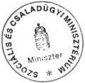
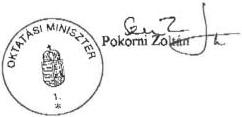
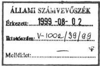
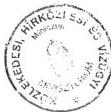

Állami Számvevőszék

1521465

# JELENTÉS

**a helyi önkormányzatok által igényelhető  
1998. évi központosított előirányzatok  
felhasználásának ellenőrzéséről**

1999. július

9921

---

Az ellenőrzés végrehajtásáért felelős:

V. Önkormányzati és Területi Ellenőrzési Igazgatóság

dr. Lóránt Zoltán

számvevő igazgató

Az ellenőrzést vezette:

Németh Péterné

számvevő igazgatóhelyettes

Dr.Klapcsik László

számvevő tanácsos

Turnheimné Lakos Zsuzsa

számvevő tanácsos

dr. Vasváriné dr. Rózsa Anikó

számvevő tanácsos

Az ellenőrzésben részt vettek:

A résztvevők névsorát az 1. sz. melléklet tartalmazza

A témakörrel foglalkozó ÁSZ vizsgálatok jegyzéke:

A helyi önkormányzatok által igényelhető 1996. évi központosított előirányzatok felhasználásának ellenőrzése (V-1002/1997. A Parlament számítógépes hálózatán a vizsgálat fájl neve: 0389J000).

A helyi önkormányzatok által igényelhető 1997. évi központosított előirányzatok felhasználásának ellenőrzése (V-1002/1998. A Parlament számítógépes hálózatán a vizsgálat fájl neve: 9824J000).

Jelentéseink az INTERNETEN 1999. június 1-től WWW.ASZ.gov.hu címen olvashatók.

Jelentéseink az Országgyűlés számítógépes hálózatán is olvashatók.

---

V-1002-36/1999.

# TARTALOMJEGYZÉK

|  **I. ÖSSZEGZŐ MEGÁLLAPÍTÁSOK, KÖVETKEZTETÉSEK, JAVASLATOK** | **4**  |
| --- | --- |
|  **II. RÉSZLETES MEGÁLLAPÍTÁSOK** | **11**  |
|  1. A központosított előirányzatok tervezése, évközi változása és felhasználása | 11  |
|  2. Az önkormányzatok által igénybevett támogatások | 14  |
|  2.1. Közműfejlesztési támogatás | 14  |
|  2.2. Települési folyékony hulladék ártalmatlanításának támogatása | 15  |
|  2.3. Lakossági víz- és csatornaszolgáltatás támogatása | 17  |
|  2.4. Gyermeknevelési támogatás | 22  |
|  2.5. Egyes jövedelempótló támogatások kiegészítése | 24  |
|  2.5.1. Rendszeres gyermekvédelmi támogatás | 24  |
|  2.5.2. Időskorúak járadéka | 27  |
|  2.5.3. Személyes szabadság korlátozása miatt kárpótlás címén kifizetett támogatás | 29  |
|  2.6. A létszámcsökkentéssel kapcsolatos hozzájárulás | 30  |
|  2.7. Szakmai fejlesztések támogatása | 32  |
|  2.8. Pedagógus szakvizsga és továbbképzés támogatása | 36  |
|  2.9. Pedagógusok szakirodalom vásárlási hozzájárulása | 41  |
|  2.10. Tankönyvvásárlási támogatás | 42  |
|  2.11. Pedagógusok minőségi munkavégzéséért járó keresetkiegészítés | 45  |
|  2.12. Helyi kisebbségi önkormányzatok működésének általános támogatása | 47  |

1

---

                                                                                     .

---

# Jelentés

## a helyi önkormányzatok által igényelhető 1998. évi központosított előirányzatok felhasználásának ellenőrzéséről

Az Országgyűlés az 1998. évi központi költségvetésből a helyi önkormányzatok által ellátandó, a költségvetési törvény 5. sz. mellékletében felsorolt feladatokra 23 jogcímen 52.758,6 millió Ft központosított előirányzatot állapított meg. A támogatást az önkormányzatok felhasználási kötöttséggel vehették igénybe, a törvény által meghatározott feltételek mellett.

Az ellenőrzés a központosított előirányzatok 86,3%-át képező 12 jogcímre

- a lakossági közműfejlesztés támogatására,
- a települési folyékony hulladék ártalmatlanításának támogatására,
- a lakossági víz- és csatornaszolgáltatás támogatására,
- a gyermeknevelési támogatásra,
- egyes jövedelempótló támogatások kiegészítésére,
- a létszámcsökkentéssel kapcsolatos hozzájárulásra,
- szakmai fejlesztések támogatására,
- a pedagógus szakvizsga és továbbképzés támogatására,
- a pedagógusok szakkönyvvásárlásának támogatására,
- a tankönyvvásárlás támogatására,
- a pedagógusok minőségi munkavégzésért járó kereset-kiegészítésére,
- a helyi kisebbségi önkormányzatok működésének támogatására terjedt ki.

**Az ellenőrzés célja** annak megállapítása volt, hogy

- a központi költségvetésből a különböző feladatokra elkülönített előirányzatok felhasználása hogyan alakult, mennyiben elégítették ki a jelentkező igényeket,
- a támogatási igények benyújtásánál, a támogatások odaítélésénél, felhasználásánál és elszámolásánál betartották-e a vonatkozó törvényi előírásokat,
- a támogatási rendszer működésének eredményessége, célszerűsége hogyan értékelhető.

3

---

I. ÖSSZEGZŐ MEGÁLLAPÍTÁSOK, KÖVETKEZTETÉSEK, JAVASLATOK

A vizsgálandó önkormányzatok kiválasztásánál alapvető szempont volt, hogy valamennyi önkormányzati típusra és kiválasztott előirányzat felhasználására általánosítható tapasztalatokat szerezzünk. Az önkormányzatok kiválasztását befolyásolta, hogy egyes jogcímeken csak meghatározott feladatot ellátó önkormányzatok igényelhettek támogatást, ugyanakkor olyan településeket vontunk a vizsgálatba, amelyeknél az elmúlt években ugyanebben a témában nem volt ellenőrzés és ahol átfogó vizsgálatot sem végeztünk még.

Helyszíni ellenőrzést folytattunk a Pénzügy-, a Belügy-, a Közlekedési, Hírközlési és Vízügyi, valamint az Oktatási Minisztériumban, továbbá az ország 14 megyéjében és a fővárosban összesen 81 települési önkormányzatnál. A helyszíni vizsgálattal érintett önkormányzatok számára juttatott támogatások az ellenőrzés tárgyát képező előirányzatok összegének 6,9%-át képviselik (lásd 3. sz. melléklet).

# I. ÖSSZEGZŐ MEGÁLLAPÍTÁSOK, KÖVETKEZTETÉSEK, JAVASLATOK

Az önkormányzatok forrásorientált szabályozási rendszerének kiegészítő elemét képező központosított előirányzatok évenként eltérő számban és tartalommal bővítik a támogatottak bevételi forrásait. A támogatások a normatív finanszírozás keretében nem kezelhető egyedi helyzetek, helyi sajátosságokból adódó feladatok megoldását, s a pénzügyi szabályozás feltételeinek változása következtében egyre inkább az aktuális társadalompolitikai feladatok megvalósításának elősegítését szolgálják. A központosított előirányzatok jogcímének és mértékének változásai jól tükrözik az elmúlt években végbement társadalmi, gazdasági változások és a csaknem minden területre kiterjedő intenzív jogi szabályozás hatását az önkormányzatok feladatellátásának bővülésére. Évenkénti szerkezeti módosulásai időszakról időszakra jól mutatják a támogatandó célok súlyának, fontosságának változását, de egyben a szabályozórendszer kiforratlanságát, az igények és lehetőségek összhangjának megteremtésére irányuló törekvést is tükrözik.

A központosított előirányzatok összege 1998-ban az önkormányzatoknak biztosított állami támogatások, hozzájárulások és az átengedett személyi jövedelemadó együttes összegének a 9%-át tette ki az előző évi 7,4%-kal szemben. Míg az említett források 18,4%-kal nőttek az 1997. évihez képest, addig az eredeti központosított előirányzatok növekedése 44,3%-os. A nagy arányú növekedést elsősorban a jövedelempótló támogatás jogcím megjelenése, valamint az oktatás támogatásának 3,5 milliárd Ft-os növekedése eredményezte. Az oktatással összefüggő korábbi előirányzatok összege csak kis mértékben növekedett, viszont új támogatási jogcímként bekerült a rendszerbe a pedagógus minőségi munkavégzésért járó keresetkiegészítés közel 2,5 milliárd Ft-os előirányzata. Így az igénybevett előirányzatok 53%-át a szociális jellegű, 21%-át a közoktatási feladatokra juttatott, 9%-át pedig a közművekhez kapcsolódó, általunk is vizsgált támogatások tették ki.

4

---

I. ÖSSZEGZŐ MEGÁLLAPÍTÁSOK, KÖVETKEZTETÉSEK, JAVASLATOK

A központosított előirányzatok 1998. évig általában a normatív finanszírozás rendszerében nem kezelhető működési feladatok finanszírozását szolgálták, 1998. évben azonban a támogatási rendszerbe nem illő, címzett fejlesztési feladatok finanszírozása is bekerült.

A központosított előirányzatok igénybevételének és felhasználásának rendjét számos külön törvény, kormányrendelet, miniszteri rendelet és évente megjelenő közlemény szabályozta, ezek sokasága önmagában is egyik oka a tévedéseknek, elkövetett szabálytalanságoknak. Ezt fokozták a jelentős többletadminisztrációt okozó igénylések és a felhasználási kötöttségből fakadó számviteli feladatok. Mindehhez esetenként a hatásait kellően nem mérlegelő, vagy hiányos jogi normák is társultak.

Részben a fentiekből adódik, hogy a támogatási igénybejelentéseket az önkormányzatok többsége ugyan a jogszabályi előírásoknak megfelelően és megalapozottan nyújtotta be, az igények dokumentáltsága esetenként hiányos, a felhasználás, valamint annak dokumentáltsága is több esetben jogszabálysértő volt. A feltárt hibák döntő többsége az önkormányzatok ellenőrző tevékenységével kiszűrhető lett volna, de sem a belső, sem pedig a felügyeleti ellenőrzés nem, vagy alig működött a vizsgált egységeknél. A felügyeleti ellenőrzés hiányát jelzi, hogy még a költségvetési beszámoló készítéséhez kapcsolódóan sem számoltatta el több önkormányzat az intézményeit, az általuk szolgáltatott adatokat felülvizsgálat nélkül elfogadta.

A közoktatási támogatási jogcímeknél megengedett és jelentős összegű volt az év végi feladattal terhelt maradvány. Ennek felhasználásáról a második ütemű elszámolás keretében - a féléves költségvetési beszámolóval egyidejűleg - kell, illetve kellett az önkormányzatoknak elszámolni. Ez az elszámolás azonban nem része az államháztartás beszámolórendszerének, mivel zárszámadással már lezárt évet érint. A helyszíni vizsgálatok során ezért **ellenőriztük** a közoktatási feladatok **1997. évi támogatásának második ütemű elszámolását** is. Az ennek kapcsán **jogtalannak ítélt 2,6 millió Ft** támogatást a jelentés 7. sz. melléklete tartalmazza.

Összességében a központosított előirányzatok önkormányzatok közötti elosztásának normativitása erősödött, ugyanakkor az állami források **szabályszerű és célszerű felhasználását** - az adott feladattól függően - ebben az évben is **számos tényező mérsékelte**.

- **A közművekhez kapcsolódó** lakossági terhek mérséklését szolgáló központosított előirányzatok közül a közműfejlesztési, valamint a települési folyékony hulladék ártalmatlanításához kapcsolódó támogatás az elmúlt években – a jogszabályi korlátok miatt – a kívánatosnál kisebb mértékben szolgálhatta eredeti célját.

A lakosság közreműködésével megvalósuló kapacitásbővítő beruházások csökkenését jelzi, hogy tovább mérséklődött a **közműfejlesztési támogatás** iránti igény. Országosan az előző évi támogatásnál 13,2%-kal kevesebb támogatást igényeltek az önkormányzatok. A vizsgált körben az igénybe vett támogatás 5,5%-át minősítette az ellenőrzés visszafizetendőnek, főként a kapacitásbővítés fogalmának helytelen értelmezése miatt.

5

---

I. ÖSSZEGZŐ MEGÁLLAPÍTÁSOK, KÖVETKEZTETÉSEK, JAVASLATOK---

A **települési folyékony hulladék** ártalmatlanításával kapcsolatos szervezési feladatokat az önkormányzatok jelentős része nem vállalja. A támogatás felhasználása során sem a lakossági terhek csökkentését, sem az ártalmatlanítás feltételeinek javítását nem tartották szem előtt. A szükséges nyilvántartási, ellenőrzési feladatok végrehajtása nem volt kielégítő.

A **lakossági víz- és csatornaszolgáltatás** támogatásának rendszere némileg finomult 1998. évben. A központosított előirányzat összege az inflációnál kisebb ütemben nőtt, ezért a támogatási küszöbértékek 25% körüli emelésére volt szükség, ami - az előző évinél több tényező mérlegelése ellenére is - az igénylésre jogosultaknál szűkebb kör számára és kisebb mértékben biztosította a támogatást. A támogatási forma továbbra sem illeszkedik tökéletesen a központosított előirányzatok rendszerébe. A támogatás igénybevétele során az önkormányzatok szerepe formális; sem a pályázatok benyújtásakor, sem pedig a támogatás felhasználása során nem tesznek eleget az ellenőrzési (árhatósági és tulajdonosi) feladataiknak. Az önkormányzatoknál a szakmai felkészültség hiánya, a tárcaközi bizottságnál pedig a rendelkezésre bocsátott technikai és munkaerőkapacitás szűkössége következtében nem került sor a pályázati várható- és a tényleges adatok egybevetésére, ami negatívan hatott a támogatási rendszer eredményes működésére.

- A családok életkörülményének romlása következtében az utóbbi években az önkormányzatoknak egyre nagyobb hangsúlyt kell helyezniük a **szociális jellegű** feladatokra. Részben ennek is köszönhető, hogy viszonylag kedvező tapasztalatokat szerzett a vizsgálat az ilyen célú előirányzatok igénybevételénél és felhasználásánál.

A **gyermeknevelési támogatás** megállapításában, folyósításában a hatéves gyakorlat ellenére még ebben az évben is jellemzőek voltak azok a nyilvántartási, jogszabály-értelmezési, elszámolási problémák, amelyek sok esetben a támogatás jogtalan igénybevételét eredményezték.

A **gyermekvédelmi támogatás** a rendszeres nevelési segélyt felváltó új támogatási forma, amely adott jövedelemhatár alatt alanyi jogon illeti meg a kiskorú eltartottakat. A kérelmezők, ezen belül is a vállalkozók kimutatott jövedelme azonban nem minden esetben nyújt objektív alapot a támogatás jogosultságának egyértelmű megállapítására. A jelenlegi jogi szabályozás nem ad lehetőséget az önkormányzatoknak arra, hogy a családok életvitelével, vagyoni helyzetével összhangban nem álló jövedelemnyilatkozatok esetén a támogatási kérelmet elutasítsák.

Az **időskorúak járadéka** a megélhetést biztosító jövedelemmel nem rendelkező idős személyek új – jövedelemhatártól függő – támogatási formája. A járadékot elsősorban a korábban rendszeres szociális segélyben részesített időskorúak részére állapították meg az önkormányzatok. A folyósított járadék hagyatéki teherként történő bejelentési kötelezettségének az önkormányzatok többsége nem tett eleget. Nem rendezett a visszatérült támogatás sorsa.

---6

---

I. ÖSSZEGZŐ MEGÁLLAPÍTÁSOK, KÖVETKEZTETÉSEK, JAVASLATOK

A tervezetthez képest a gyermekvédelmi támogatást közel negyedével több, 740 ezer fő után, míg az időskorúak járadékát a tervezett létszám hatoda, 9 ezer fő után igényelték átlagosan az év során.

- Az **egyes közoktatási feladatok** megvalósításához hét jogcímen több mint 15 milliárd Ft központosított előirányzatot biztosított az 1998. évi költségvetési törvény. Az egyes támogatási jogcímek igénylését, szabályszerű felhasználását a terjedelmes és ugyanakkor helyenként hiányos jogi szabályozás nehezítette. A támogatás felhasználása nem minden esetben felelt meg a közoktatási törvényben meghatározott céloknak. A támogatáshoz pályázati úton, intézményi mutatószámok alapján úgy juthattak az önkormányzatok, hogy a támogatás fajlagos összege – a pedagógus szakirodalom vásárlás és a minőségi bérpótlék kivételével – előre nem volt ismert.

A Sulinet-programban kitűzött cél 1998. őszére a **szakmai fejlesztésre** rendelkezésre álló támogatásból az eredetileg meghatározott középiskolai kör számára teljesült: a támogatást igénylő intézmények korszerű számítástechnikai eszközökhöz jutottak és az Internet-szolgáltatásba is bekapcsolódhattak. Az időközben általános iskolákkal kibővült támogatotti körből a nagyobb általános iskolák egy része – ha késedelemmel is, de 1999. évre – a középiskolákhoz hasonlóan számítástechnikai eszközökhöz jutott, ezen kívül az Internet használatára is lehetőséget kapott. Ugyanakkor a kisebb általános iskoláknál ez utóbbira a pályázati feltételekben meghirdetettel ellentétben nem volt mód.

A **pedagógus szakvizsga** kötelezővé válásáig tartó átmeneti időszakra biztosított támogatás meghaladta a tényleges szükségletet, ami tág teret biztosított az eredeti szándéktól eltérő előirányzat felhasználásához. Konkrét feltételek ismeretének hiányában a finanszírozási és helyettesítési alprogramok elkészítésének kötelezettsége az intézmények számára a továbbképzési programmal egyidejűleg nem reális. Gyakran találkozott a vizsgálat az oktatáshoz szükséges ismeretanyag elsajátításával nem indokolható továbbképzésekre való beiskolázásokkal, nagyarányú ösztönzési célú kifizetésekkel, esetenként a 20%-os önrésznek a támogatás terhére történő elszámolásával. A vizsgált önkormányzatok a tárgyévi forrásokat 1998. évben átlagosan 65,8%-ban tudták felhasználni és szinte mindenütt jelentős – átlagosan 31,5%-os – volt a kötelezettségvállalással terhelt maradvány összege. Az intézmények a módszertani előírás és a felügyeleti ellenőrzés elmaradása miatt analitikus nyilvántartást nem, vagy hiányosan vezettek. Szabályozatlan a támogatási szerződés megszegése következtében visszatérülő összegek sorsa.

A **pedagógus szakirodalom-vásárlási** támogatás adómentessé tételével a felhasználás és elszámolás egyszerűbbé vált. A támogatás felhasználása jellemzően a jogszabályi előírásoknak megfelelően történt, a számlák formai szempontból néhány esetben hiányosak voltak. A vizsgálat tapasztalata szerint nem minden esetben a pedagógiai munkát segítő szakkönyvet vásároltak a pedagógusok.

A **tankönyvvásárlás támogatása** nem tölti be a szerepét. A tankönyvárakhoz viszonyítva az egy tanulóra eső támogatási összeg nem jelentős, a differenciálást pedig nehezítik a jelenlegi átláthatatlan jövedelmi viszonyok.

7

---

I. ÖSSZEGZŐ MEGÁLLAPÍTÁSOK, KÖVETKEZTETÉSEK, JAVASLATOK

Az önkormányzatok évek óta kiemelt feladatuknak tekintik az iskoláskorúak tankönyvellátásának támogatását és gyakran a központi keretet lényegesen meghaladó saját forrást is biztosítanak e célra. Problémát jelentett, hogy a támogatás tényleges igénybevétele nem haladhatta meg a tervezett tanulólétszám alapján igényelt mértéket. A támogatási keret megosztása, a 25%-ának tartós tankönyvvásárlásra való felhasználása sok helyen nem a rászoruló tanulók érdekeit szolgálta, így nem érte el célját.

**A pedagógusok minőségi munkavégzéséért járó keresetkiegészítés** – nagyságrendjénél fogva – csak korlátozottan volt alkalmas a kiemelkedő munka presztízsének megteremtésére. Az intézmények részben az alacsony jövedelmek miatt, részben a konfliktusos helyzetek elkerülése céljából arra törekedtek, hogy minél több pedagógus részesedjen a kereset-kiegészítés minimális összegében.

- Az önkormányzatok **létszámcsökkentéséhez** igényelt központosított előirányzat 1998. évben – a korábbi évekhez viszonyítva – jelentősen csökkent. A támogatást a hatályos jogi szabályozásnak megfelelően igényelték és használták fel az önkormányzatok, a létszámcsökkentések ténylegesen megvalósultak.
- A **kisebbségi önkormányzatok** támogatása nem konkrét feladat finanszírozását szolgálja, hanem ezen testületek működési kiadásaihoz járul hozzá, ezért célszerűbb lenne a normatív finanszírozás rendszerébe beépíteni.

Az elmúlt évek során folyamatosan felvetettük a Kormánynak és a szaktárcáknak azokat a szabályozásbeli problémákat, melyek megoldása nélkül a vizsgált állami támogatások célszerű és hatékony felhasználása nem biztosítható. Megállapításainkat, javaslatainkat figyelembe véve **1999. évben jelentős változások következtek be** a vizsgált központosított előirányzatok körében:

- Az országos összefoglaló jelentés készítésének időszakában jelent meg a **közműfejlesztési hozzájárulás** igénybevételét szabályozó új, 73/1999. (V.21.) Korm.rendelet, amely az elmúlt évek ÁSZ vizsgálatai során felvetett jogszabályi problémákat kiküszöböli. Az új kormányrendelet lehetővé teszi a sokat vitatott közműhálózatra történő utólagos rácsatlakozás után is a támogatás igénybevételét.
- A költségvetési törvény 1999. évben a **folyékony hulladék ártalmatlanításához** támogatást csak annak az önkormányzatnak biztosít, amely az 1995. évi XLII. törvény alapján szervezett módon gondoskodik a tevékenység ellátásáról és a lakosság által fizetendő díjat a támogatás figyelembevételével határozza meg. Mindemellett csak a közműves csatornahálózattal nem rendelkező településrészen keletkezett lakossági folyékony hulladékkal összefüggésben igényelhető központosított támogatás, ösztönözve ezzel a meglévő közműhálózat kihasználását.
- Pontosították a **lakossági víz- és csatornaszolgáltatási támogatás** igénybevételének feltételeit, lehetővé téve a támogatás átlagköltség-szinten való megállapítását is.

8

---

I. ÖSSZEGZŐ MEGÁLLAPÍTÁSOK, KÖVETKEZTETÉSEK, JAVASLATOK

- A gyermeknevelési támogatás megállapítása és folyósítása 1999. áprilisától már nem önkormányzati feladat, azt az 1998. évi LXXXIV. törvényben előírtak alapján a megyei egészségbiztosító pénztárak végzik.
- A közoktatási támogatási jogcímek jelentős része (pedagógus szakvizsga és továbbképzés, pedagógusok szakkönyvvásárlása, tanulók tankönyvtámogatása, az érettségi és szakvizsga díjak, valamint a körzeti térségi feladatok) átkerült a kötött felhasználású normatív támogatások közé. A pedagógusok minőségi munkavégzésért járó kereset-kiegészítésének 1998. évi rendszere megszűnt, és 1999. szeptember 1-től egyéb, szintén a normatív finanszírozás keretében biztosított források terhére – a kiemelt munkavégzésért járó kereset-kiegészítés fedezetére – támogatási alapot kell képezni az önkormányzatoknak.

A szakmai fejlesztésre szolgáló támogatási forma 1999. évben is rendelkezésre áll ugyan, de a támogatási előirányzat 80%-át a már az Internet-szolgáltatásba bekapcsolt intézmények utáni átalánydíj kifizetésére kell fordítani. További intézmények számítástechnikai eszközökhöz juttatására, illetve az Internet-szolgáltatást igénybevevők körének bővítésére így erősen korlátozottak a lehetőségek.

Összességében 1998. évre 32,6 millió Ft összegű állami támogatás jogosulatlan lehívását állapítottuk meg. Vizsgálat közben vagy azt megelőzően az önkormányzatok egy része maga is korrigálta az elszámolásait, és az éves költségvetési beszámolóban ebből 13,6 millió Ft-ot szerepeltetett. Az ezen felül fennmaradó 19,0 millió Ft visszafizetési kötelezettségből pedig, - amely az Országgyűlés Önkormányzati és Rendészeti Bizottsága módosító indítványa alapján fog a zárszámadási törvény végleges szövegébe bekerülni - 11,7 millió Ft-ot már visszafizettek az önkormányzatok (lásd 4., 4/c sz. mellékletek).

Mindezeket figyelembe véve vizsgálatunk alapján az alábbi javaslatokat tesszük

a Kormánynak:

1. Kezdeményezze a vonatkozó jogszabályok módosítását annak érdekében, hogy az önkormányzatok a jövedelemnyilatkozattól eltérő életvitel esetén a gyermekvédelmi támogatási kérelmet elutasíthassák. Írja elő kötelezően a környezettanulmány felvételét vállalkozók és jövedelmet ki nem mutató kérelmezők esetén.
2. A pedagógus továbbképzés és szakvizsgáról szóló 277/1997. (XII. 22.) Korm. rendelet módosításával
- tegye lehetővé, hogy az intézmények a szakvizsgák és továbbképzések költségeinek 100%-át számolhassák el az állami támogatás terhére, ennek ellentételezésére viszont megszüntethető vagy minimális szintre korlátozható az anyagi ösztönzési célú kifizetések elszámolhatósága;

9

---

I. ÖSSZEGZŐ MEGÁLLAPÍTÁSOK, KÖVETKEZTETÉSEK, JAVASLATOK

- tegye egyertelmüve, hogy a támogatásból kizárólag az oktató-nevelő munkához szükséges ismeretanyag elsajátásat szolgálo továbbéképszek kölşégei finanszirozhatók;
- irja elo, hogy a helyettesitési es finanszirozási alprogramok elkésztése a tovabbékpési program helyett az éves beiskolázási tervhez kapcsolódjon.

# a pénzügyminiszternek:

1. Gondoskodjon a zárszámadas keretében a helyszín vizsgalat által feltart - a 4/c sz. mellekletben felsorolt - jogtalanul igénybevett támogatas rendezéséról. Ennek keretében 19.015 ezer Ft-ot elöiranyzati szinten rendezzenek, amelyból 7.349 ezer Ft-ot az önkormányzatok fizessenek vissza. (A kozmüfejlesztési támogatas és a települési folyékony hulladék támogatasa jogtalan igénybevételének napjat az 5., 6. sz. mellekletek tartalmazzák.)
2. Epitse be a kisebbségi onkormányzatok támogatását - nem konkrét feladatokhoz kapcsolódo jellege miatt - a normativ finanszirozas rendszerébe.

# a közlekedési, hírközlési és vízügyi miniszternek:

A lakossági víz- és csatornaszolgáltatás támogatási rendszerének eredményesebbé tétele érdekében

- segitsék az önkormányzatok árhatósági és ellenőrő szerepének erősítését utmutató kiadásával;
- biztositsa a palyaztatassal kapcsolatos adminisztrácios, adatfeldolgozási, elemzési és ellenorzési feladatok ellatasához a szükséges mertékü szamítástechnikai és szemelyi kapacitást.

# az oktatási miniszternek:

Tegye meg a szükséges intézkedéseket annak érdekében, hogy

1. hatarozzak meg a pedagogus szakvizsga kotelezóve valásáig az oktató-nevelő munkát segítő ismeretek megújtásat celzo tanfolyamok finanszirozasára szolgálo fajlagos támogatás szükséges mertékét;
2. szüntessék meg a kettós - fenntartói és intézményi - analitikus nyilvántási kõtelezettseget és az intézményi nyilvántás vezetésel kapcsolbatan a fenntartó ellenörzési kõtelezettsegét irjak elő. A pedagogus továbbékpéshez biztositott tamogatás felhasznalásanak attekinthetősége, egységes nyilvántása erdekében az analitikus nyilvántás elkésztéséhez modszertani utmutatóval segitsék az önkormányzatokat;
3. szabályozzák a tanulmányi szerzódések alapján visszatéruló támogatas jogosultját, felhasznalási kötöttsegét vagy a központi költségvetésbe történő visszafizétési kõtelezettsegét;

10

---

II. RÉSZLETES MEGÁLLAPÍTÁSOK

4. szüntessék meg a tanulói tankönyvtámogatáson belül a tartós tankönyv beszerzés kötelező jellegét, és tegyék lehetővé, hogy a teljes támogatási összeget a tanulók közvetlen támogatására fordítsák az önkormányzatok. A támogatás célszerű elköltése biztosítható lenne felhasználási kötöttség nélkül is;
5. hozzák összhangba az iskolák számítástechnikai eszközökkel és internet szolgáltatással való ellátásának szakmai koncepcióját a rendelkezésre álló forrásokkal.

## II. RÉSZLETES MEGÁLLAPÍTÁSOK

### 1. A KÖZPONTOSÍTOTT ELŐIRÁNYZATOK TERVEZÉSE, ÉVKÖZI VÁLTOZÁSA ÉS FELHASZNÁLÁSA

A központosított előirányzatokból támogatandó feladatok köre 1998-ban az előző évhez képest kismértékben bővült, a költségvetésben rendelkezésre álló előirányzat és az ellátandó feladatok összetétele ugyanakkor a támogatandó célok közötti súlyozás eredményeként jelentősen változott.

- Az alapvető változást – a gyermekvédelmi törvény 1997 novemberi hatálybalépése, valamint a szociális törvény 1998. évtől hatályos módosítása következtében – az új szociális támogatási formákhoz való költségvetési hozzájárulás biztosítása eredményezte. A rendszeres gyermekvédelmi támogatáshoz és az időskorúak járadékához az egyes jövedelempótló támogatások kiegészítése címen juttatott 17.220 millió Ft-os összeg a központosított előirányzatok előző évi módosított előirányzatának közel 51%-át, a teljes növekmény 92%-át tette ki. Az előirányzatot a Népjóléti Minisztérium által – a rendelkezésre álló statisztikai adatok alapján – számított támogatásra jogosult kör, valamint a jogszabályok szerinti támogatási összegnek a központi költségvetésből biztosítandó hányada figyelembevételével alakították ki. Ugyanez az előirányzat képezte a személyes szabadság korlátozása miatti kárpótlás fedezetét is. A különböző jogszabályok alapján különböző lakossági csoportokat érintő szociális támogatások egy előirányzaton belüli kezelése nem célszerű, hiszen igénylésük rendje, az ehhez szolgáltatandó adatok gyűjtése is értelemszerűen elkülönül egymástól.

A gyermeknevelési támogatás előirányzatát – követve az elmúlt évek felhasználási tendenciáit – közel 36%-kal növelték az előző évhez képest. A két szociális támogatási célra tervezett összeg 1998. évben összesen már a központosított előirányzatoknak több mint a felét, 26.720 millió Ft-ot tett ki.

- Tovább nőtt a közoktatási törvényben meghatározott feladatokra biztosított előirányzatok száma, s e hat feladathoz szükséges központi forrás összege, ami az eredeti előirányzatok 27,5%-át tette ki.

A közoktatási törvény előírásait figyelembe véve 1998. évre a szakmai fejlesztési, a pedagógus továbbképzési, valamint a körzeti térségi feladatokra összesen 12.200 millió Ft-ot kellett központosított, illetve a közokta-

11

---

II. RÉSZLETES MEGÁLLAPÍTÁSOK

tásért felelős tárca fejezeti előirányzataként tervezni. Ebből a központosított előirányzatok között a három feladatra összesen 9260 millió Ft-ot terveztek. Ezen felül a közoktatási törvényben előírt mértékű szakirodalom vásárlási támogatásra 1220 millió Ft, tankönyvvásárlási támogatásra pedig további 1592 millió Ft központosított előirányzatot biztosított a költségvetés. Az 1998. évben új támogatási formaként bevezetett, a pedagógusok minőségi munkavégzésért járó kereset-kiegészítésére a 2437 millió Ft-os forrást a közoktatási törvény előírásai alapján tervezték meg.

- Az ellenőrzés körébe vont további támogatási jogcímek jórészt a közművekhez kapcsolódó lakossági terhek mérséklését szolgálták. Ezek közül a – jogszabályi korlátok miatt – csak a közműfejlesztési támogatás iránti csökkenő igényt követte az előző évhez képest 20%-kal alacsonyabb összegben tervezett 2000 millió Ft-os előirányzat. A települési folyékony hulladék ártalmatlanítására szolgáló előirányzat tervezésénél az előző évek növekvő igénybevételi tendenciáját vették figyelembe a 30,5%-os előirányzat növeléssel. A lakossági víz- és csatornaszolgáltatás támogatásánál a szolgáltatás költségeinek folyamatos növekedését csak részben ismerték el az előirányzat 13,3%-os növelésével.

E három előirányzat együttes 5700 millió Ft-os összege az előző évre biztosított támogatással volt azonos, s az 1998. évi központosított előirányzatoknak közel 11%-át képviselte.

- Az elmúlt években végrehajtott racionalizálási lépéseket követően csökkent az önkormányzatok létszámcsökkentési lehetősége, így az ezzel kapcsolatos központi támogatást is az előző évi igénybevétel háromnegyedében, 1500 millió Ft-ban határozták meg.
- A helyi kisebbségi önkormányzatok működésének támogatására – elsősorban a választásokat követően újonnan alakuló kisebbségi önkormányzatokra tekintettel – az előző évinél közel 17%-kal többet, 350 millió Ft-ot biztosítottak a költségvetésben.
- A további tíz támogatási jogcímből kettő – a célját tekintve – nem illik a központosított előirányzatok eddig kialakított rendszerébe, mivel nem az önkormányzatok működési jellegű kiadásait támogatta, hanem címzett fejlesztési feladatok finanszírozását szolgálta (fővárosi metró- és gimnázium építés).

Az elmúlt években visszatérő problémaként merült fel, hogy a Kormány – az intézkedések hosszú átfutási ideje miatt – nem élt az előirányzat átcsoportosítás lehetőségével. E problémát az 1998. évi költségvetési törvény megoldotta azzal, hogy a belügyminiszter és a pénzügyminiszter együttes hatáskörébe utalta a központosított előirányzatokon belüli, illetve a központosított előirányzatok, a működésképtelenné vált helyi önkormányzatok támogatása, valamint a céljelleggel juttatandó decentralizált támogatásból a vis maior esetekre tartalékolt előirányzat közötti átcsoportosítás lehetőségét.

A központosított előirányzatok módosítására az év során négy alkalommal került sor a költségvetési törvény előírásainak figyelembevételével.

12

---

II. RÉSZLETES MEGÁLLAPÍTÁSOK

- A Kormány a szociálisan hátrányos helyzetben levők adósságterhének enyhítése érdekében a központi költségvetés altalános tartaléka terhére 500 millió Ft-ot csoportositott át a központositott előirányzatok közé. A Tiszán és a Dunán levonult árhullám miatti vizkárelhárításí feladatokra a KHVM fejezetból 100 millió Ft-ot biztositott két megye árvízvedelmi támogatására.
- A belugyminiszter - a penzugyminiszterrel egyetertesben - az arvizedelmi tamogatasokra a vis maior tartalekból további 185,2 millio Ft-ot csoportositott at. Ezen kivül attekintette a kozpontositott eliranyzatok felhasznalásnak alakulásat, melynek eredményeként vegrehajtotta az egyes kozpontositott eliranyzatok kozött szükséges és lehetséges atcsoportositásokat. A körjegyzsegek, a lakossagi kozmüfejlesztés, az adosságkezelés, valamint a letszamcsökkentés tamogatasára fel nem hasznalt összen 1556,8 millio Ft-ból 1533,7 millio Ft a gyermeknevelési tamogatasnál jelentkez eliranyzattullépes teljes összeget fedezte, a további 23,1 millio Ft pedig az egyes jovelemptól tamogatasok eliranyzat-tullépesenek egy részet ellentetelezte.

A fentiek alapján a központosított előirányzatok 25-re bővült jogcíméhez összesen 53.543,8 millió Ft-os módosított előirányzat állt rendelkezésre.

A módosított előirányzat főösszege 100,4%-ra, 53.773,8 millió Ft-ra teljesült. A túllépést az egyes jövedelempótló támogatások, valamint a pedagógusok szakirodalom-vásárlásához biztosított hozzájárulás többlet igénye okozta. A költségvetési törvény mindkét jogcímnél lehetőséget adott az előirányzat módosítás nélküli teljesülésre (lásd 2. sz. melléklet). A vizsgált körben igénybe vett támogatások felhasználását jogcímenként összesítve a 4. sz. melléklet tartalmazza.

Az előirányzatokat részben automatikusan, az önkormányzati igénylésben megjelölt összeg szerint (közműfejlesztési, folyékony hulladék ártalmatlanítási, szociális célú támogatások), részben mennyiségi felmérést követően, a törvényi előírások figyelembevételével, illetve a rendelkezésre álló előirányzat normatív felosztásával (közoktatási, kisebbségi jogcímek) kapták meg az önkormányzatok.

Mindössze két jogcím esetében volt szükség a pályázatok elbírálásához tárcaközi bizottság működtetésére:

A letszamcsokkentesi kiadasokhoz valo hozzajarulas odaiteleserol 1998. evben a BM iranyitasaval mukdo tarcakozi bizottsag dontt. A benyujtott palyazatok alapjan 1139 millio Ft-os tamogatasra, az eredeti eliranyzat \(76\%\) -ara tartottak igenyt az onkormanyzatok. A palyazatokban szereplo igenyekbol 1098,5 millio Ft-ot talalt jogosnak a tarcakozi bizottsag.
- Szintén tárcaközi bizottság dontoft a lakossági viz- és csatornaszolgáltatas magas rafordításaihoz valo hozzájárulas felosztásáról. Az igények közel 34%-kal haladták meg a költségvetési törvenybenBiztositott 3400 millio Ft-os elöirányzatot. A támogatásnak év vegi maradványa nem keletkezzett, mivel azon igénylók vissatzartott támogatásaból, akik év vegéig sem potol'ták a hiányzo vizjogi üzemeltetési engedélyt, az adminisztrácios hibábol kimaradt harom telepólés szamára biztositották a támogatást.

13

---

II. RÉSZLETES MEGÁLLAPÍTÁSOK

## 2. AZ ÖNKORMÁNYZATOK ÁLTAL IGÉNYBEVETT TÁMOGATÁSOK

### 2.1. Közműfejlesztési támogatás

A magánszemélyek jövedelemadójában a közműfejlesztésre megállapított kedvezmények megszüntetésének ellentételezésére a 89/1991. (VII. 12.) Korm. rendelet alapján volt lehetőség. A támogatást a lakosság anyagi hozzájárulásával kivitelezett közműfejlesztéshez - víz-csatorna, gázhálózat és útépítés esetében - igényelhettek az önkormányzatok.

**A támogatás igénybevételét szabályozó kormányrendelet** megalkotása óta tartalmában nem változott, annak ellenére, hogy a vizsgálati tapasztalatok alapján évek óta jeleztük a módosítás indokoltságát, hiszen a rendelet többek között

- nem definiálta egyértelműen az új közmű, valamint a meglévő közmű kapacitásnövelésének fogalmát, amelyek a gyakorlatban keveredtek a kapacitáskihasználás fogalmával;
- nem tisztázta, hogy az egyéves jogvesztő határidő az önkormányzatra is vonatkozik-e vagy csak a visszatérítési kérelem önkormányzathoz történő benyújtására;
- nem tartalmazott előírást az igénybevett támogatásra vonatkozóan arra az esetre, ha a magánszemély a beruházás megvalósításától eláll és a befizetett összeget visszakéri, vagy ha a beruházás nem valósult meg, de a befizetett közműfejlesztési hozzájárulás után a támogatás visszaigénylésre került, illetve a beruházás a tervezett összegnél kevesebbe került (esetleg csökkentett műszaki tartalommal valósult meg) és a beruházás befejezése után a befizetett lakossági hozzájárulásból maradvány képződött;
- nem fogalmazta meg a magánszemélyek nyilatkoztatásának kötelezettségét arra vonatkozóan, hogy a közműfejlesztési befizetést az SZJA vagy vállalkozói nyereségadó keretében nem számolta el.

Mindezek figyelembevételével a támogatás visszaigénylésének gyakorlata, a támogatás összegének kifizetése nem minden esetben felelt meg a hatályos jogszabályi előírásoknak. A helyszíni ellenőrzések az alábbi **hiányosságokat** tárták fel:

- Az ellenőrzött önkormányzatok a támogatás visszaigénylésére általában felhívták a lakosság figyelmét, de előfordult utólagos tájékoztatás (pl. Kunpeszér), illetve a tájékoztatás elmulasztása is, aminek következtében a közműfejlesztésre befizetett összeg után a lakosok nem igényelték a támogatást például Szegváron.
- Az önkormányzatok automatikus visszaigénylést és kifizetést ígértek a lakosságnak, ezért a támogatás igénylését külön kérelemhez, nyilatkozathoz nem kötötték.
- Az önkormányzatokhoz benyújtott igazolások a jogszabályi előírásnak nem feleltek meg akkor, ha nem a visszaigényelhető, hanem a befizetett összeget tartalmazták (pl. Báránd, Kaba, Mindszent), ha hiányzott a befizetés idő-

14

---

II. RÉSZLETES MEGÁLLAPÍTÁSOK

pontja (pl. Budapest XXI. kerület, Nagyhalász), illetve csoportos igazolást adtak az építőközösség tagjainak befizetéséről (pl. Balmazújváros, Nagyhalász), vagy ha évekkel korábban átalakult vállalat nevére szóló feladóvevény volt a visszaigénylés alapja (Kőszeg).

- A támogatás visszaigénylése a befizetéstől számított egy évet meghaladta Kőszegen és Acsán.
- A szolgáltató vállalatok a befizetésről szóló igazolást a közműhálózatra utólagosan rácsatlakozók részére is kiadták, és az önkormányzatok az igazolások alapján igénybe vették a támogatást. Emiatt állapított meg a vizsgálat jogtalan igénybevételt és támogatás visszafizetési kötelezettséget Bajánsenye, Balatonalmádi, Báránd, Balassagyarmat, Felsőőrs, Gétye, Kaba, Maglód, Pacsa, Parád önkormányzatoknál, illetve az önkormányzat önrevíziója Csepel önkormányzata esetében.
- Jogtalanul, vállalkozók befizetése után is visszaigényelte a támogatást Hőgyész és Zamárdi önkormányzata.
- Az állami támogatás megérkezése és kifizetése közötti maximum 15 napos időtartamot – a kormányrendelet előírása ellenére – több önkormányzat (Balatonalmádi, Demecser, Gétye, Hőgyész, Kerkáskápolna, Kakasd, Mélykút, Mindszent, Nagyhalász, Nyírdérzs) nem tartotta be, Kehidakustány önkormányzata pedig egyáltalán nem fizette ki.

A késedelmes kifizetéseket részben az önkormányzatok likviditási helyzete, részben pedig az alacsony támogatási összeghez kapcsolódó magas postaköltség okozta, amelynek csökkentése érdekében gyakran házipénztárból fizették ki a támogatást. Előfordult, hogy az önkormányzat (Pacsa, Kerkáskápolna) lemondó nyilatkozatot kért a magánszemélyektől arra vonatkozóan, hogy a támogatás összegét a beruházási költségekhez való további hozzájárulásként felajánlják.

A vizsgált körben jogtalanul igénybe vett közműfejlesztési támogatást az igénybevétel napja szerint az 5. sz. melléklet részletezi.

## 2.2. Települési folyékony hulladék ártalmatlanításának támogatása

Az önkormányzatok 1998. évben az előző évi szabályokkal megegyező módon és mértékben juthattak az ártalmatlanított lakossági eredetű folyékony hulladék mennyiségével arányos támogatáshoz. Ez egyben azt jelentette, hogy célszerű felhasználásnak lehetett tekinteni ez évben is a lakosság által fizetendő díj mérséklésén kívül a támogatásnak lerakóhely létesítésével–üzemeltetésével, illetve a hulladék elszállításával kapcsolatos kiadások ellentételezését.

Az önkormányzatoknak az önkormányzati törvény alapján továbbra sem kötelező feladatuk e tevékenység szervezése, ennek következtében általában az egyes helyi közszolgáltatások kötelező igénybevételéről szóló 1995. évi XLII. törvényben előírt rendeletet sem alkották meg.

15

---

II. RÉSZLETES MEGÁLLAPÍTÁSOK

A helyszínen vizsgált önkormányzatok közül 36 vette igénybe 1998-ban e támogatási formát, de ezek közül mindössze 10 alkotott rendeletet. E rendeletek többsége nem felelt meg a törvényi előírásoknak, mivel nem szabályozta az adott közszolgáltatás rendjét, módját, az ellátásával összefüggő helyi hatósági és egyéb feladatokat, csak a fizetendő díjakat (pl. Balmazújváros, Perbál, Segesd, Bánk).

A helyi szabályozatlanságból adódóan, vagy az elszállítást végző vállalkozóval történő megállapodás hiánya miatt a vizsgálattal érintett önkormányzatoknak csak alig több mint egynegyedénél volt egyértelműen megállapítható, hogy az elszállításért, illetve ártalmatlanításért fizetendő lakossági díjakat részben vagy egészben csökkentették a fajlagos támogatási összeggel (pl. Vokány, Bácsalmás, Okány, Pomáz).

**Segesd és Kutas** önkormányzatánál a célhoz kötött felhasználást úgy biztosították, hogy a számláknak a polgármesteri hivatalban történő leadásával egyidejűleg közvetlenül a lakosságnak fizették ki a m³-enkénti 100 Ft-os támogatást.

Azon települések esetében, ahol a folyékony hulladékot elszállító vállalkozóval az önkormányzat nem kötött megállapodást, vagy abban nem tisztázták a fizetési feltételeket, nem volt egyértelműen megállapítható, hogy az elszállításért fizetendő díjat csökkentették-e a szállítónak átadott támogatási összeggel (pl. Felgyő, Siófok, XXI. kerület).

A Fővárosi Közgyűlés csak 1998. második félévétől szabályozta rendeletileg a folyékony hulladékkal kapcsolatos közszolgáltatást, így az első félévben még a kerületi önkormányzatok igényelték a támogatást. A **XXI. kerületi önkormányzat** a szállítást végző Kft-nek átadta a 100 Ft/m³-es támogatást. A Kft szolgáltatásáért a közvetlenül fizető kerületi lakosok egy részének 700, egy másik részének 784 Ft-ot számlázott m³-enként, míg az önkormányzati lakásokért a bérbe adó önkormányzati társaságnak csak 473 Ft + ÁFA/ m³ összeget számított fel.

A települések egy részében az önkormányzati intézményként vagy társaságként üzemelő lerakóhely, szennyvíztisztítótelep működtetéséhez járultak hozzá a támogatás összegével (Pl. Békés, Bánk, Kaba, Mélykút), de akadt olyan település is, ahol a lerakóhoz vezető út vagy a lerakóhely karbantartására, felújítására fordították a támogatást részben vagy egészben (pl. Vokány, Káld, Jánkmajtis).

A támogatás **igénylésének szabályszerűsége** a vizsgált önkormányzatoknál nem volt minden esetben biztosított:

- a lerakóhely igazolásának csatolása helyett a szállítást végző szolgáltató nyilatkozott arról, hogy a folyékony hulladékot ártalmatlanították (pl. XXI. kerület, Felgyő, Siófok, Kőszeg);
- a lerakóhely igazolása – s ennek alapján az önkormányzat támogatás igénylése – az egész lerakott mennyiségre vonatkozott, s így jogtalanul a támogatás egy részét vagy egészét az önkormányzati intézményektől, illetve vállalkozásoktól elszállított folyékony hulladék után is igénybe vette az önkormányzat (Bácsalmás, Csanádapáca, Segesd, Kutas, Tapolca, Tés). Ez általában arra vezethető vissza, hogy a lerakóhelyek egy része nem vezet megfelelő nyilvántartást a beszállított mennyiségről, esetenként nem különítik el

16

---

II. RÉSZLETES MEGÁLLAPÍTÁSOK

azt a származás helye – lakossági vagy közületi – és a szállítási távolság szerint.

- az önkormányzatok zöme a benyújtott számlák valóságtartalmának ellenőrzése nélkül igényelte a támogatást, mindössze egyhatoduknál találta bizonyítottnak a helyszíni vizsgálat az igénylést megelőző ellenőrzést.

A támogatás jogtalan igénybevételéhez vezetett egyrészt a támogatási feltételek nem egyértelmű megfogalmazása, másrészt a **célhoz kötött felhasználás előírásának figyelmen kívül hagyása.**

**Felgyő** községben az igénylés alapdokumentumai a szállítást végző szolgáltatónak a – lakosság által igazolt – szállítólevelei voltak. Az ártalmatlanítás tényét, mennyiségét senki nem igazolta. Az önkormányzat a támogatás összegét a lakossági terhek csökkentésére sem közvetlenül, sem közvetve a szállítási költségek mérséklésére, illetve az ártalmatlanítás költségeihez való hozzájárulásra nem használta fel.

**Demecser** nagyközség csatornahálózattal rendelkezik, ennek ellenére nem a megfelelő – a lakosság víz- és csatornaszolgáltatás magas költségeit mérséklő – támogatásra, hanem jogtalanul a települési folyékony hulladék ártalmatlanítására szolgáló támogatásra nyújtott be igénylést.

**Nagyhalász** a lerakás költségeit, **Jánkmajtis** pedig a lerakóhelyhez vezető út karbantartási kiadásait fedezte, illetve szerződésben vállalt 1999. évi kifizetési kötelezettséget az 1998. évi támogatásból. A feladattal nem terhelt maradványt mindkét önkormányzat visszafizette.

**Kisnamény** önkormányzatának – az elmúlt évi nagyarányú jogtalan támogatás-igénybevételét követően – 1998. évi támogatás felhasználását is ellenőriztük. Az igénylés alapjaként kimutatott mennyiség ez évben sem valós, a lerakóhely működtetésének költsége pedig a támogatás összegének alig 8%-át teszi ki. A mostoha időjárási viszonyok okozta rongálódások miatt szükségessé váló helyreállítási munkákra – a bemutatott árkalkuláció alapján – 4,9 millió Ft-ot feladattal terhelt maradványként elfogadott a helyszíni vizsgálat, 6,1 millió Ft-ot azonban jogtalanul vettek igénybe, így az visszafizetendő.

A helyszíni vizsgálat során minden településen, ahol az 1995. évi XLII. törvény szerint nem szabályozták e tevékenységet, illetve a támogatást nem a lakossági terhek csökkentésére használták fel, felhívtuk a figyelmet a támogatás igénybevételi feltételeinek 1999. évi változására.

A vizsgált körben a jogtalanul igénybe vett támogatást az igénybevétel napja szerint a 6. sz. melléklet részletezi.

### 2.3. Lakossági víz- és csatornaszolgáltatás támogatása

A költségvetési törvény a szolgáltatók által magas ráfordítással végezhető közműves ivóvízellátás és szennyvízelvezetés lakossági terheinek mérséklése érdekében biztosítja e támogatást. Ezt szektorsemlegesen kapják meg a szolgáltatók, több települést érintő támogatott tevékenységük esetén a székhelyük szerinti – vagy más, kijelölt, illetve megállapodásban rögzített – önkormányzat közvetítésével. Ebből adódóan a támogatás nem jelenik meg minden érintett önkormányzat költségvetésében, ezért a közvetítő szerepet játszó önkormányzatoknak kell az elszámolásról is gondoskodniuk, ami – a benyújtott pályázat

17

---

II. RÉSZLETES MEGÁLLAPÍTÁSOK

ellenőrzéséhez hasonlóan – többnyire csak formális, mert legfeljebb saját településükre vonatkozóan tudták azt teljesíteni.

Az 1998. évi 3,4 milliárd Ft központosított előirányzatból biztosítható támogatásra a szolgáltatók azon általuk ellátott településeket érintően nyújthatták be pályázatukat, ahol 1998-ban a fajlagos termelési költségek m³-enként az ivóvíznél a 150 Ft-ot, a csatornaszolgáltatásnál pedig a 110 Ft-ot várhatóan meghaladták. Ezzel 15,6%-kal az előző évi támogatási szint felett húzták meg a jogosultság küszöbértékét. Az állami tulajdonú víziközműből az önkormányzati közmű által átvett víz esetén a küszöbértéket csak 11,1%-kal növelték, ami így lehetővé tette, hogy – az állami társaságok esetenként drasztikus, 50-70%-os áremelése ellenére is – csak 100 Ft-tal szerepeljen m³-enként az az átvevő kalkulációjában.

A polgármestereknek a pályázathoz csatolt nyilatkozattal kellett igazolniuk, hogy a benyújtott anyag a KHVM által közzétett feltételeknek megfelel, tartalma dokumentált, ellenőrizhető. E nyilatkozatokat csatolták a kérelemhez, ennek ellenére az országosan összesen 111 támogatott szolgáltatóból helyszíni vizsgálatunkkal érintett 13 támogatását továbbító **önkormányzat egyikénél sem találkoztunk** a szolgáltató által összeállított **pályázat ellenőrzésére utaló dokumentummal**. A költségek ismerete vélelmezhető ott, ahol a testület a benyújtást megelőzően a szolgáltatás áráról a rendelkezésére bocsátott kalkuláció alapján döntött (pl. Balassagyarmat, Tés), valószínűtlen azonban azon önkormányzatoknál, ahol magát a pályázati dokumentációt sem tudták az ellenőrzés rendelkezésére bocsátani (pl. Balmazújváros, Gyönk).

A KHVM-ben végzett ellenőrzés során derült fény arra, hogy **Maglód** csatornaszolgáltatásának támogatására két pályázatot is benyújtottak: a Maglódi Falugondnokság 22 ezer m³-re, 747,2 Ft/ m³-es ráfordítással, a Közmű és Mélyépítő Szolgáltató GMK pedig 10 ezer m³-re, 489,1 Ft/m³-es ráfordítással. (A támogatást az előbbi nyerte el, az utóbbi pályázat Maglódra vonatkozó igényét nem elégítették ki.) A két szolgáltató, illetve pályázat egymáshoz való viszonya nem tisztázott, a vízjogi üzemeltetési engedély szerint az üzemeltető a Közmű és Mélyépítő GMK. Mindkét pályázathoz csatolták a polgármester nyilatkozatát arra vonatkozóan, hogy azok megfelelően dokumentáltak és megfelelnek a pályázati feltételeknek.

A mintegy 1500 önkormányzatot érintő 118 szolgáltatói pályázat alapján a meghirdetett támogatási küszöbértékek fölötti teljes körű támogatottság esetén a költségvetési törvényben biztosított előirányzat 133,6%-ára, 4,5 milliárd Ft-ra lett volna szükség. A pályázatokat elbíráló tárcaközi bizottság ezért több variáció közül egy olyan felosztási javaslatot fogadott el, amely a közleményben meghirdetettnél 8, illetve 9%-kal, az előző évinél pedig 24,6 – 26,3 %-kal magasabb, **162 Ft/m³-es ivóvíz- és 120 Ft/m³-es csatornaköltség felett biztosítja a támogatást**. A fajlagos költségek előző évhez mért növekedését a szolgáltatónál ugyanakkor legfeljebb 25%-os mértékig vették figyelembe, így 23 szolgáltató 35 települést érintő fajlagos ráfordításait ennek megfelelően korrigálták. Azon települések esetében, ahol a már hatályos – vagy tervezett – lakossági árakhoz viszonyított fajlagos költségek 20%-nál nagyobb eltérést mutattak, a támogatásnak csak 90%-ával számoltak. Ez utóbbi körbe 35 szolgáltató által ellátott 116 önkormányzat tartozott, melyből 7 település esetében a 25%-nál nagyobb költségnövekedés miatt is korrekciót hajtottak végre a támo-

18

---

II. RÉSZLETES MEGÁLLAPÍTÁSOK

gatás megítélése során. (A vizsgált körből pl. a BÁCSVÍZ Rt (Lakitelek) által ellátott települések közül háromnál kellett e kettős korrekciót végrehajtani.)

Abból adódóan, hogy a küszöbértékek változtatásának mértéke jelentősen meghaladta a reális költségnövekedésekét, a ráfordítások csökkenő hányadát ellentételezte a támogatás, ami elviekben a lakossági árak nagyobb mértékű emelését tette szükségessé.

A küszöbérték csökkentésének hatását jól példázza, hogy a kiírási feltételek alapján a Hajdú Bihari Önkormányzatok Vízmű Rt (Balmazújváros) 36, a Nyírségvíz Rt (Nagyhalász) pedig 20 önkormányzatot érintően lett volna jogosult támogatásra, a küszöbérték növelését követően ez a jogosultság 5, illetve 10 önkormányzatra szűkült. Ennek azonban a lakossági árak alakulására egyik településen sem volt kihatása, mivel a képviselőtestületek az árakat nem a ráfordítások figyelembevételével, hanem mélyen az eredetileg meghirdetett fajlagos ráfordítási küszöbértékek alatt határozták meg Gyönk, Lakitelek, Gétye, Maglód önkormányzataihoz hasonlóan.

Egyes szolgáltatók pályázatukban településenként különböző fajlagos ráfordítási adatokat mutattak ki. Mivel az árakat ugyanakkor – a tulajdonos önkormányzatok igényével összhangban – közel azonos szinten tartják, célszerűbb lett volna fajlagos költségeiket is ennek megfelelően, átlag alapján figyelembe venni pályázatukban.

Az átvett víz esetén a meghirdetett 100 Ft-os m³-enkénti küszöbértéket nem változtatták. Ez azt eredményezte, hogy az átvett víz ára nem növelte jelentősen az önkormányzati tulajdonú szolgáltatók önköltség-szintjét.

Az önkormányzati tulajdonú szolgáltatók által átvett víz magas átadási ára miatti támogatás a keretösszeg 14%-át tette ki. Ezen felül az állami tulajdonban lévő szolgáltatók részére a támogatási küszöbértékek feletti ráfordítások ellentételezésére – a szolgáltatásaikat igénybevevő önkormányzatok lakossági fogyasztásával arányban – a központosított előirányzat közel 31%-át biztosították.

Az állami tulajdonú DRV Rt több mint 200 település víz- és csatornaszolgáltatásához, ezen belül közel 90 önkormányzati tulajdonú közmű üzemeltetéséhez a 3,4 milliárdos keret 27%-át, 915 millió Ft támogatást vett igénybe Siófok önkormányzatának közvetítésével. Mivel e város nem víz-, illetve csatornaközmű tulajdonos – az állami tulajdonú hálózatról veszi igénybe a szolgáltatást –, így sem ellenőrző, sem ármegállapító szerepe nincs, feladata ténylegesen a támogatás kimutatására és továbbítására korlátozódik.

A támogatási összeg 93,4%-át utalták át február végén az önkormányzatokon keresztül a szolgáltatóknak, figyelembe véve az elérhető kamatnyereséget is.

A költségvetési törvény 1998. évre nem adott közvetlen felhatalmazást arra, hogy a központosított előirányzatból a közegészségügyileg veszélyeztetett ivóvízű települések számára is biztosítsanak forrást az ivóvízellátás ideiglenes módozataira. Az önkormányzati törvény alapján az első önkormányzati ciklus, 1994. év végéig az önkormányzatoknak biztosítaniuk kellett volna településük egészséges ivóvízzel való ellátását. Mivel ez teljes mértékben napjainkig sem teljesült, a tárcaközi bizottság 20 millió Ft-ot különített el e célra. Az igénylés

19

---

II. RÉSZLETES MEGÁLLAPÍTÁSOK

módjáról készített tájékoztatót a TÁKISZ-okon keresztül juttatták el az önkormányzatokhoz. A keret éves szinten elegendőnek bizonyult, 0,4 millió Ft maradványa keletkezett.

Összességében közel 1300 önkormányzatot ellátó 111 szolgáltató között osztottak fel 3379,6 millió Ft támogatást, amiből a helyszíni vizsgálattal érintett 13 önkormányzatnak 1098,2 millió Ft-ot kellett a szolgáltatóhoz továbbítania. Az érvényes vízjogi engedély hiánya miatt 27 szolgáltató támogatását 47 települést érintően részben vagy egészben, összesen 267,2 millió Ft értékben – a vízjogi engedély bemutatásáig – visszatartották. Az előző évvel ellentétben 1998. évben már a támogatást továbbító önkormányzatok közvetlenül is kaptak tájékoztatást a támogatásról. A támogatás átutalását követően a KHVM és a PM közös levéllel kereste meg a polgármestereket, melyben a támogatás felhasználási feltételeire az önkormányzatok figyelmét külön felhívták.

A költségvetési törvény ebben az évben is előírta, hogy a szolgáltatásban résztvevő települési önkormányzatok az átutalást követő 30 napon belül állapodjanak meg a támogatás további megosztásáról, ám a gyakorlatban ez most sem teljesült, hiszen a támogatást kimutatni, továbbutalni a közvetítő szerepet vállaló önkormányzatok feladata volt, így e megosztás formális lett volna.

**Az önkormányzatok a támogatás összegét általában egy héttől egy hónapig terjedő időn belül utalták tovább a szolgáltatónak**, az így keletkezett kamatbevétellel teremtettek fedezetet a továbbutalással kapcsolatos banki költségekre. Egy hónapnál tovább tartotta saját számláján a támogatás összegét Tés, Nagykanizsa, Kehidakustány, Nagyhalász és Gétye önkormányzata. Az utóbbi két önkormányzat a támogatás egyösszegű átutalásából biztosítható kamatnyereség lehetőségétől is megfosztotta a szolgáltatót azáltal, hogy részletekben folyósította a megítélt támogatást.

A likviditási gondokkal küzdő **Nagyhalász** önkormányzata jegyzőkönyvben ismerte el a szolgáltatónak év végén még fennálló 5,5 millió Ft-os támogatás-tartozását.

A vizsgálattal érintett szolgáltatók közül csak a **hiánypótlást követően juthatott a támogatás egészéhez** Kehidakustány, Maglód, egy részéhez pedig Balmazújváros, Tés, Nagykanizsa, Siófok.

A DRV Rt októberben több települést érintően pótolta az addig hiányzó vízjogi engedélyt. A Bár és Dunaszekcső településeket érintően bemutatott vízjogi engedély azonban nem a – visszatartott támogatáshoz kapcsolódó – szennyvízcsatornára vonatkozott, hanem a már évek óta üzemelő ivóvíz-közműre, a támogatást Siófok önkormányzatának közvetítésével mégis átutalták. A helyszíni vizsgálat megállapítása szerint a támogatáshoz szükséges érvényes üzemeltetési engedély kelte 1999. januárja. Így a két település csatornaszolgáltatásához kapcsolódó 1971 ezer Ft támogatást jogtalanul vette igénybe a szolgáltató.

A szolgáltatók a megkapott támogatást 1998-ban nemcsak a lakossági fogyasztás mennyiségével arányosan használhatták fel, hanem a fajlagos ráfordítások növekedésével nem járó fogyasztáscsökkenés esetén a lakossági árnak – a pályázatban elnyert fajlagos támogatáson túli – további csökkentésére is fordíthatták. Ez annak elvi elismerését jelentette, hogy a mennyiség csökke-

20

---

II. RÉSZLETES MEGÁLLAPÍTÁSOK

nése általában – a szolgáltatás magas fixköltség-hányada miatt – a fajlagos ráfordítás növekedését eredményezi.

A vizsgálatba bevont támogatást továbbító önkormányzatok – amennyiben ők maguk egyáltalán érintettek voltak a támogatásban – még saját településüket érintően sem számoltatták el a szolgáltatókat. Ezért a helyszíni vizsgálat során **a szolgáltató által adott tanúsítvány alapján számszerűsítettük** – a szolgáltatással érintett valamennyi településre tekintettel – **a támogatás visszafizetendő összegét**.

Az adatok áttekintéséből megállapítható volt, hogy a támogatás alapvetően a lakossági terhek csökkenését eredményezte. Az önkormányzatok sok esetben a támogatási küszöbérték alatt határozták meg a lakossági árat, ami a központosított előirányzaton túl egyéb források igénybevételével volt csak biztosítható.

A szolgáltatók mintegy 30%-a – s nemcsak az állami árhatóság előírásait betartani köteles állami tulajdonú társaságok – annak ellenére, hogy nem ártámogatásban, hanem a költségek egy részét ellentételező támogatásban részesül, az önkormányzatok számára a támogatási küszöbértékben javasolja a lakossági ár meghatározását (pl. Nagykanizsa, Tés, Kehidakustány). Ez nem minden esetben biztosítja a ráfordítások egészének megtérülését, az árak megállapításáról szóló törvényben megjelölt nyereség képzését pedig lehetetlenné teszi.

A pályázatban szereplő fogyasztási mennyiségek általában megalapozottak voltak, s többé-kevésbé teljesültek. **Mennyiségi csökkenés esetén azonban egyáltalán nem éltek a szolgáltatók a lakossági ár további csökkentésével.** Ez érthető volt akkor, ha a csökkenés a fajlagos ráfordítási adatok növekedésével járt együtt, néhány esetben azonban a ténylegesen kimutatott fajlagos ráfordítási adatok változatlanok maradtak, (pl. Győnk) illetve növekedésük nem volt olyan mértékű, hogy a megítélt támogatás egészét jogosan felhasználhassa a szolgáltató (Pl. a DRV Rt által üzemeltetett önkormányzati vízművek közül Somogyszentpál, Várda esetében).

A fajlagos költségek növekedéséhez elsősorban a tervezettől elmaradó fogyasztás vezetett, ami az eredendően túlméretezett, esetleg szezonálisan ingadozó fogyasztás csúcsigényéhez igazított (pl. DRV esetében a Balaton parti települések miatt) vagy az időközben csökkenő volumenű kiskertes gazdálkodásra tervezett víztermelő és elosztó kapacitás (pl. BÁCSVÍZ Rt) kihasználatlanságának a következménye.

Egyes kistelepülések a saját, kisebb szervezetekkel üzemeltetett közművektől várták a költségek csökkenését, ami azonban a megfelelő felszereltség híján alvállalkozásban végeztetendő feladatok költségigénye miatt nem következett be (pl. Zala megye).

A költségek szintentartása időnként a technológia kisebb módosítása, a karbantartási munkák visszafogása, halasztása árán volt csak biztosítható (pl. Békés megye).

A DRV Rt a regionális vízmű szintjén kívánt elszámolni a támogatással, a fogyasztás-csökkenés miatti többlettámogatással kompenzálva más településeknél felmerülő többletköltségeket. Mivel azonban mint üzemeltető nem átlagos ráfordítási összegekkel pályázott az érintett önkormányzatoknál felmerülő költségeket

21

---

II. RÉSZLETES MEGÁLLAPÍTÁSOK

részben ellentételező támogatásra, így elszámolnia is önkormányzatonként kellett. Ennek alapján az ellenőrzés visszafizetési kötelezettséget állapított meg azon csökkenő fogyasztású településeket érintően, ahol a lakossági fogyasztásra jutó éves összes várható ráfordítás kisebb, mint az árbevétel és a támogatás együttes összege.

A közlekedési tárca - tárcaközi bizottság munkáját segítő - közgazdasági főosztályának a pályáztatással, az igénylések nagymennyiségű adatállományának ellenőrzésével, elemzésével, a támogatás felosztási javaslatának elkészítésével kapcsolatos teendői ellátásához nem áll rendelkezésre megfelelő nagyságrendű számítógépes és munkaerő-kapacitás, ami esetenként hibákat okozott (kimaradó pályázatok az elbírálás során, nem megfelelő vízjogi engedély elfogadása stb).

## 2.4. Gyermeknevelési támogatás

A szociális törvény előírásai alapján 1998-ban átlagosan 54 ezer fő vette igénybe a három kiskorú gyermeket nevelő szülőknek – a feltételek megléte esetén – járó normatív pénzbeli ellátást. A törvény megalkotása óta közel megkétszereződött a támogatást igénylők száma, az 1998-ban felhasznált 11 milliárd Ft támogatás pedig – az öregségi nyugdíjminimum folyamatos növekedésének is köszönhetően – az 1994. évi támogatási összeg 3,5-szerese volt.

Ennek oka az, hogy a támogatási forma a viszonylag magas átlagjövedelmű családok számára is igénybevehető. A szolgálati időre is jogosító gyermeknevelési támogatás a munkanélkülivé vált nagycsaládosok számára – a családi pótlékon, s 1998-ban a már szintén törvényileg garantált gyermekvédelmi támogatáson kívül – szinte egyetlen jövedelemforrásként nyújt némi anyagi biztonságot. Ugyanakkor a támogatás igénybevétele mellett a napi 4 órát el nem érő részfoglalkoztatás lehetősége a munkaerő-piaci szempontból kedvezőbb adottságú településeken a foglalkoztatáspolitikai elképzelések megvalósítását is segítheti.

A gazdasági stabilizációs törvénycsomag e támogatást érintő szigorításai először az 1996. április 15-e után született gyermekek esetében, azaz az 1999. áprilisától járó támogatásnál érvényesülnek.

**Eddigi megállapításainkat erősítették** meg az önkormányzatok által 1999. áprilisáig, éves szinten pedig utoljára 1998. évben igénybevehető támogatás felhasználásának **ellenőrzési tapasztalatai is**, melyek az alábbiakban foglalhatók össze:

- A támogatásban részesülőkról nem vezettek a szociális törvényben előírt nyilvántartást sem Pogány, Zamárdi, Felsőörs önkormányzatainál, de a meglévő nyilvántartás tartalmazott minden szükséges adatot a támogatásban részesülő önkormányzatok 30%-ánál.
- A támogatásra való jogosultságot általában megfelelően állapították meg, de előfordult, hogy az 1999. áprilisáig nem alkalmazható törvénymódosítás alapján eltekintettek a 180 nap biztosítási idő meglététől – nem kérve ehhez a miniszter méltányosságát –, s csak a gyermek iskolakezdéséig állapították meg a támogatást (pl. Gyönk, Báránd).

22

---

II. RÉSZLETES MEGÁLLAPÍTÁSOK

- A miniszteri méltányosság lehetőségével az önkormányzatok egy része – saját szociális célú forrásainak kímélése érdekében is – gyakran élt. A vizsgált önkormányzatok közül a Szabolcs és Veszprém megyei településeken a gyermeknevelési támogatásban részesítettek 30-50%-a, Csongrád megyében helyenként 20–25%-a, de Békés és Hajdú-Bihar megyében is 10–15%-a miniszteri méltányosság alapján kapta 1998. évben támogatást. Ugyanakkor Kerkáskápolna önkormányzata például nem terjesztette fel döntésre a méltányossági feltételeknek egyébként megfelelő igénylő adatait, ennek ellenére – a felülvizsgálat elmaradása miatt – jogtalanul tovább folyósította a támogatást.

**Tés** önkormányzata olyan esetben terjesztett fel a Népjóléti Minisztériumnak méltányossági kérelmet, amelyben jogszerűen sem a folyósítás, sem a méltányosság feltételei nem álltak fenn. A felterjesztéshez csatolt iratokból ez kiderülhetett volna, ennek ellenére a minisztérium tévesen arról tájékoztatta az önkormányzatot, hogy saját hatáskörben továbbfolyósítható a támogatás. Ennek következtében az önkormányzat jogtalanul folyósította a támogatást.

- A jogszabály egyértelmű előírása ellenére esetenként az önkormányzatok a folyósítás kezdetét vagy a megszüntetés időpontját helytelenül állapították meg, vagy naparányos támogatást folyósítottak a megállapítás hónapjában. Több esetben nem csatoltak, vagy nem az előírt időszakra vonatkozó keresetigazolások alapján készített jövedelemnyilatkozatot mellékeltek a kérelemhez.

A vizsgálat támogatás visszafizetési kötelezettséget állapított meg **Belecska, Balassagyarmat, Acsa, Vámosgyörk** önkormányzat esetében, amikor a támogatás folyósításának kezdési, illetve megszüntetési időpontját jogszabály ellenesen határozták meg.

- A vizsgált önkormányzatok 20%-a mulasztotta el a jogosultság évenkénti felülvizsgálatát, vagy nem a megállapítás szerinti időpontban, esetleg csak kétévente végezte el a felülvizsgálatot.

A felülvizsgálat elmaradása vagy figyelmetlen ügyintézés miatt a jogosnál tovább folyósították a támogatást **Nagyszénás és Balassagyarmat** esetében.

- Az önkormányzatok a támogatás 1998. évi megállapítása esetén többségében nem vették figyelembe a szociális törvény támogatás-visszafizetéssel kapcsolatos változását, s így a megállapító határozatban nem tájékoztatták a támogatottakat arról, hogy nemcsak utólag, hanem már a rendszeres pénzellátásra vonatkozó társadalombiztosítási igény benyújtásakor bejelentési kötelezettségük van az önkormányzattal szemben.

A jogtalanul igénybevett támogatás visszafizettetése érdekében nem tettek meg mindent az önkormányzatok, de az így befolyt összeggel sem minden esetben csökkentették állami támogatás-igényüket. Ebből adódóan a VII. és a XXI. kerület, valamint Tapolca önkormányzatának keletkezett visszafizetési kötelezettsége.

- A finanszírozási problémák elkerülése érdekében igényelhető előleget nem minden önkormányzat vette igénybe. Nemcsak a havi 40–300 ezer Ft támogatást biztosító Pogány, Ladánybene, Zamárdi, Kehidakustány, hanem

23

---

II. RÉSZLETES MEGÁLLAPÍTÁSOK

az önkormányzatnak ennél nagyobb megterhelést jelentő, havi 700 ezer – 1millió Ft-ot kifizető Szabadszállás, Maglód, Siófok sem élt ezzel a lehetőséggel.

A kifizetések és az elszámolás összhangjának hiánya téves és jogtalan támogatásigényléshez vezetett **Petneházán** és **Perbálon**.

## 2.5. Egyes jövedelempótló támogatások kiegészítése

### 2.5.1. Rendszeres gyermekvédelmi támogatás

Az 1997. november 1-től hatályos gyermekvédelmi törvény (1997. évi XXXI. törvény) új ellátási formaként, a gyermekek családi környezetben történő ellátása érdekében bevezette a rendszeres gyermekvédelmi támogatást. Az új támogatási forma a korábban önkormányzati szinten szabályozott **rendszeres nevelési segélyezést váltotta fel**. A törvény hatálybalépésétől számítva hat hónap állt a települési önkormányzatok rendelkezésére, hogy felülvizsgálják a rendszeres nevelési segélyezetteket és a feltételek fennállása esetén rendszeres gyermekvédelmi támogatást állapítsanak meg a jogosultaknak. **A törvény** a gyermekvédelmi támogatást az **öregségi nyugdíjminimumnál nem magasabb átlagjövedelmű családok gyermekei számára alanyi jogon biztosítja**. A jogosultság tekintetében az önkormányzat a család vagyoni helyzetének, életvitelének ismeretében nem mérlegelhet.

A támogatás legkisebb összegét gyermekenként az öregségi nyugdíjminimum 20%-ában (1998. évben 2740 Ft) határozta meg a gyermekvédelmi törvény. A települési önkormányzatok a megállapított alapösszeg 70%-át igényelhetik havonta vissza a központi költségvetésből, a kifizetett támogatás 30%-át saját költségvetésük terhére kell biztosítaniuk.

A gyermekvédelmi törvény a települési önkormányzat képviselőtestületének feladataként határozza meg a támogatás megállapítását. Ezt a hatáskörét a vizsgált önkormányzatok bizottságaikra ruházták át (Atkár, Gyöngyössolymos, Lőrinci, Nagyszénás, Parád, Vámosgyörk).

A törvényi szabályozás az önkormányzati helyi rendelet megalkotására hat hónapot biztosított. Helyileg elsősorban a kérelem benyújtásának szabályait, az igazolások és nyilatkozatok tartalmát, az elbírálás szempontjait, a jövedelemszámításnál irányadó időszakot, a támogatás kiegészítését, természetben történő nyújtásának lehetőségét és módját lehetett és kellett szabályozni. A vizsgált önkormányzatok – néhány kivételtől eltekintve – igen röviden, gyakorlatilag a gyermekvédelmi törvény aktuális paragrafusainak ismétlésével tettek eleget szabályozási kötelezettségüknek, helyi sajátosságokról nem rendelkeztek. Helyi szabályozási kötelezettségének Siófok és Mátraterenye nem tett eleget, két önkormányzat pedig a megadott határidőt követően hagyta jóvá helyi rendeletét (Gétye, Bácsbokod). Belecska község helyi rendelete jogszabálysértő rendelkezést fogalmazott meg, mivel a család jövedelmétől függetlenül tette lehetővé a gyermekvédelmi támogatás folyósítását. Néhány önkormányzat a törvényi előírásoknál kedvezőbb feltételek mellett is lehetőséget biztosított a támogatás igénybevételére. Esetenként azonban az állami támogatást is – jogtalanul – a megemelt összeg után vették igénybe az önkormányzatok.

24

---

II. RÉSZLETES MEGÁLLAPÍTÁSOK

Balatonalmádi város és Kakasd község önkormányzatának helyi rendelete a támogatás folyósításának feltételeként előírt jövedelemhatárt az egyedülálló, illetve három vagy több gyermekes szülők esetében 20%-kal megemelte. Balatonalmádi önkormányzata a méltányossági alapon folyósított támogatás 70%-át is visszaigényelte a központi költségvetésből, ezért 390 ezer Ft-ot jogtalanul vett igénybe.

Zamárdiban az önkormányzat helyi rendeletében a gyermekvédelmi támogatás összegét 3000 Ft/fő, Harta pedig 2800 Ft/fő összegben határozta meg. A támogatást nem az alapösszeg, hanem a ténylegesen kifizetett összeg után igényelte vissza mindkét önkormányzat, így az előbbi 46 ezer Ft-ot, míg az utóbbi 21 ezer Ft-ot jogtalanul vett igénybe.

A vizsgált önkormányzatok közül néhány – helyi szabályzata alapján – a gyermekvédelmi támogatást vagy annak egy részét természetbeni ellátás – elsősorban étkezési térítési díj – formájában biztosítja a jogosultaknak. (Bag, Békés, Balatonalmádi, Ladánybene, Lőrinci, Madaras, Mohora, Parád, Tapolca, VII. kerületi Önkormányzat)

A rendszeres nevelési segélyezettek számához viszonyítva 1998. évben a gyermekvédelmi támogatottak száma megduplázódott, de van ahol még ennél is nagyobb arányban növekedett.

Tapolcán rendszeres nevelési segélyben megközelítőleg 500 kiskorút részesített az önkormányzat. A vizsgálat időpontjában a gyermekvédelmi támogatásban részesülők száma közel 1400 fő volt, ami azt jelenti, hogy a támogatásban részesülők száma megháromszorozódott.

A gyermekvédelmi támogatást a nevelési segélyezettek felülvizsgálatát követően, illetve kérelem alapján – néhány esetben szabálytalanul – állapították meg az önkormányzatok (Kőszeg, Balatonalmádi, Belecska, Mohora).

Balatonalmádiban a rendszeres nevelési segélyezettek felülvizsgálatát gyakorlatilag csak 1998. áprilisában végezte el az önkormányzat. A felülvizsgálat időpontjáig a nevelési segélyt fizették a jogosultaknak és a támogatott gyereklétszám alapján 1998. januártól visszaigényelték a gyermekvédelmi támogatás alapösszegének 70%-át. A kifizetett nevelési segély összege általában kevesebb volt a gyermekvédelmi támogatás alapösszegénél és a nevelési segélyezettek egy része – mint ahogy ez a felülvizsgálat során ki is derült – nem volt jogosult a gyermekvédelmi támogatásra. Így a vizsgálat az 1998. januárjától májusig terjedő visszaigénylésekből 1.984 ezer Ft igénybevételét jogosulatlannak minősítette.

Belecskán a legtöbb esetben kérelem nélkül, a jövedelemnyilatkozatok alapján készültek a gyermekvédelmi támogatással kapcsolatos határozatok.

Mohora községben a megállapított gyermekvédelmi támogatás összegéből a hivatal levonásba helyezte a család kommunális adó hátralékát, ami törvénysértő. A jogsértést az önkormányzat saját hatáskörében rendezte.

A támogatás megállapításával kapcsolatban legsúlyosabb hiányosságokat a jövedelemnyilatkozatokkal és azok dokumentumokkal való alátámasztásával kapcsolatban tapasztalta a vizsgálat. Sok esetben a kérelmekhez nem mellékeltek jövedelemnyilatkozatot, a munkáltatók többnyire egy havi nettó keresetet és nem hat havi átlagjövedelmet igazoltak. Jellemzően hiányosak voltak vagy

25

---

II. RÉSZLETES MEGÁLLAPÍTÁSOK

nem az előírt időszakra vonatkoztak a családi pótlék, a gyermektartásdíj folyósítását alátámasztó dokumentumok, az iskolalátogatási, illetve a jövedelem igazolások (pl. Tapolca, Felsőörs, Mátraterenye). Problémát jelentett az önkormányzatnak a vállalkozók, az őstermelők és az alkalmi munkából élők jövedelemnyilatkozata. A vállalkozók gyakran nem az adóbevallásukat mellékelték a kérelemhez, hanem saját maguk igazolták jövedelmüket, az őstermelői igazolvánnyal rendelkezők bizonylattal nem támasztották alá jövedelmüket (Balassagyarmat, Belecska, Békés, Csanádapáca, Felsőörs, Mátraterenye, Tapolca).

Elvált szülők esetében a gyermektartásdíj igazolására a hatályos jogi szabályozás nem ír elő kötelezően benyújtandó dokumentumot. A benyújtott jövedelemnyilatkozatokban, igazolásokban szereplő adatok valódiságát szükség esetén az önkormányzat ugyan környezettanulmány készítésével ellenőrizheti, de arra a jelenlegi szabályozás értelmében nincs joga, hogy a család életvitelével és vagyoni helyzetével összhangban nem álló jövedelemigazolásra való hivatkozással elutasítsa a támogatási kérelmet. A jogi szabályozás ezen hiányosságát az önkormányzatok többsége kifogásolta.

A támogatásban részesülőkről a gyermekvédelmi törvény előírásainak megfelelő nyilvántartást — Gyönk, Mohora és Siófok települések kivételével — az önkormányzatok vezették. A nyilvántartások azonban több önkormányzatnál hiányosak voltak, nem tartalmazták a jövedelemre, nagykorúságra, a felülvizsgálat időpontjára vonatkozó információkat (Belecska, Bajánsenye, Bük, Felsőörs, Gyönk, Kerkáskápolna, Mezőladány, Tiszakanyár).

A gyermekvédelmi törvény nem kellően egyértelmű megfogalmazásával magyarázható több önkormányzatnak az a téves intézkedése, hogy **korábban rendszeres nevelési segélyben vagy gyermekvédelmi támogatásban nem részesült nagykorúaknak is megállapította a gyermekvédelmi támogatást.** A jogszabály értelmezése az önkormányzatok többségénél gondot okozott, ezért a vizsgálat ezekben az esetekben nem kezdeményezte a jogtalanul igénybevett állami támogatás visszafizetését, de felhívta az önkormányzatok figyelmét a törvényes állapot helyreállítására (Atkár, Gyöngyössolymos, Káld, Kőszeg, Tapolca, Békés)

**Békés** város önkormányzata 1998. évben a továbbtanuló nagykorúak részére 6.850 ezer Ft gyermekvédelmi támogatást fizetett ki. Az önkormányzatnál arra vonatkozóan nem rendelkeztek pontos információval, hogy közülük hányan kapták jogosan a támogatást.

A vizsgált önkormányzatok néhány kivételtől eltekintve (Bajánsenye, Belecska, Maglód, Mátraterenye) a támogatottak jövedelmi viszonyait egy év elteltével felülvizsgálták. Az adatszolgáltatási kötelezettséget nem teljesítő illetve a jövedelem határt túllépő támogatottak esetében a gyermekvédelmi támogatás folyósítását határozati formában megszüntették (Bük, Kapolcs, Lőrinci, Parád, Segesd).

Több önkormányzat helytelenül állapította meg a támogatás folyósításának kezdő időpontját, annak ellenére, hogy helyi rendelete a 30/1993.II.17.) Korm.rendeletben foglaltaktól eltérő szabályt nem fogalmazott meg.

26

---

II. RÉSZLETES MEGÁLLAPÍTÁSOK

**A Bács-Kiskun Megyei Közigazgatási Hivatal Gyámhivatala** – a törvény helytelen értelmezése miatt – kiadott egy körlevelet, amelyben arról tájékoztatta az önkormányzatokat, hogy a gyermekvédelmi támogatás a kérelem napjának benyújtásától esedékes és napokra számolva kell összegét meghatározni. Ebből adódóan ugyan többlet állami támogatás igénybevétel nem történt, de a támogatásra jogosultak károsultak. A vizsgálat felhívta az önkormányzatok figyelmét a helytelen gyakorlat megszüntetésére (több helyen a hiba felismerését követően már áttértek a kormányrendelet előírásának megfelelő gyakorlatra), valamint a jogos összegű támogatások pótlólagos kifizetésére (Atkár, Bácsbokod, Lajosmizse, Mélykút, Szabadszállás, Szeremle, Vokány).

**Ladánybenén és Madarason** a támogatási kérelmek benyújtásának dátumától függetlenül a támogatást a következő hónap, illetve a tárgyhónap első napjától számítva állapították meg, ezáltal az előbbinél az igényjogosultakat esetenként fél vagy egy havi támogatással károsították, míg az utóbbinál jogalap nélkül is fizettek ki támogatást.

Valamennyi vizsgált önkormányzat visszaigényelte az 1997. decemberi járandóságok (1998. januári kifizetés) 70%-át is, így gyakorlatilag ez a támogatási összeg a központi költségvetésből kétszer lett finanszírozva.

A támogatás összegét az önkormányzatok az esetek többségében határidőben, készpénzben fizették ki a jogosultaknak (kivétel Balatonalmádi, Gétye, Tapolca).

**Gétyén** a gyermekvédelmi támogatás kifizetése rendszertelenül történt. 1998. évben első alkalommal augusztus 3-án fizettek ki támogatást (van akinek 6,5 havit egyszerre). Az önkormányzat első ízben 1998. októberében igényelt támogatást vissza.

A támogatás folyósításához igénybevett előlegekkel az önkormányzatok 1998. decemberében elszámoltak, amennyiben visszafizetési kötelezettségük volt, azt teljesítették. Néhány önkormányzat az előleg igénylési lehetőséggel nem élt, a kifizetett támogatást saját forrásaiból előlegezte meg (Siófok, Szabadszállás, Zamárdi).

### 2.5.2. Időskorúak járadéka

A megélhetést biztosító jövedelemmel nem rendelkező idős személyek számára **1998. január 1-től új ellátási formát** vezetett be a szociális törvénynek az 1997. évi LXXXIV. törvénnyel történő módosítása. Ennek értelmében a települési önkormányzat – jövedelemhatártól függően – járadékban részesíti az időskorú személyeket úgy, hogy a saját jövedelmük és a járadék összege egyedülálló személyek esetében a nyugdíjminimum 95%-át, nem egyedülállók esetében a 80%-át érje el.

Az időskorúak járadékának bevezetésével párhuzamosan átalakultak az időseket érintő más szociális ellátások formái. 1998. évtől nem folyósítható rendszeres szociális segély a reá irányadó nyugdíjkorhatárt betöltött személyeknek. A korhatárt betöltött segélyezetteket az önkormányzatoknak 1997. december 31-éig felül kellett vizsgálni, és jogosultság esetén a rendszeres szociális segély megszüntetésével egyidejűleg az időskorúak járadékát kellett részükre megállapítani.

27

---

II. RÉSZLETES MEGÁLLAPÍTÁSOK

**Hartán** az önkormányzat csak 1998. júniusától állapított meg az időskorúak részre járadékot, eddig az időpontig rendszeres szociális segélyben részesítették a rászorulókat.

Problémát okozott az átmenetnél, hogy a rendszeres szociális segélyt tárgyhónapban kapták a jogosultak, az időskorúak járadékát viszont utólag, a tárgyhónapot követő hónapban kell folyósítani. Ebből adódóan az átmeneti egy hónapban ellátás nélkül maradtak a támogatottak. Ezt az önkormányzatok egy része úgy hidalta át, hogy a járadékot nem a jogszabályi előírásoknak megfelelően, utólag, hanem már a tárgyhónapban kifizeti a jogosultaknak (Balatonalmádi, Tapolca).

A törvényi szabályozás értelmében a települési önkormányzatnak hagyatéki teherként az illetékes közjegyzőnél be kell jelenteni a folyósított járadék összegét. A bejelentés tényéről a járadékot megállapító határozatban rendelkezni kell. **A hagyatéki teher bejelentésével kapcsolatosan a vizsgálat több hiányosságot is megállapított.** A hatályos jogi szabályozás az időskorúak járadékának megállapításához vagyonnyilatkozat tételi kötelezettséget nem ír elő, így legfeljebb csak a kérelmező szóbeli tájékoztatása alapján van információja az önkormányzatnak arra vonatkozóan, hogy az időskorú személynek milyen vagyona van.

Az időskorúak járadékára jogosultak körében a **hagyatéki teher bejelentési kötelezettség visszatartó hatású.** Néhány kérelmező a hagyatéki teher miatt le is mondott a támogatás igénybevételéről (Mezőladány, Nagyszénás). A járadékot megállapító határozatban – a törvényben foglaltak ellenére – nem tüntette fel a hagyatéki teher bejelentésének szándékát Bácsalmás, Báránd, Bóly, Csanádapáca, Harta, Felsőörs, Kapolcs, Kömpöc, Petneháza, Segesd, Tiszakanyár önkormányzata.

Arra való hivatkozással, hogy a járadékban részesült idős személynek nem volt vagyona, a vizsgált önkormányzatok – egy-két kivételtől eltekintve – a közjegyzőnek a hagyatéki teher kötelezettséget be sem jelentették a támogatott elhunytát követően.

A jelenlegi jogi szabályozásnak – a vagyonnyilatkozat tételi kötelezettség hiányán kívüli – további hiányossága, hogy nem rendelkezik a hagyatékból megtérült járadék sorsáról, arról, hogy a visszatérült támogatás az önkormányzatok felhasználási kötöttség nélküli bevételét képezi-e, vagy annak 70%-át vissza kell fizetni a központi költségvetésnek. A jelenlegi gyakorlat szerint a visszatérült járadék önkormányzati bevételt képez (Balmazújváros, Békés, Bük).

A támogatásban részesülők mintegy 90%-a a korábban rendszeres szociális segélyezettek köréből került ki, közel 10%-ban állapítottak meg az önkormányzatok új kérelmezőknek járadékot. A támogatás megállapításához szükséges jövedelemnyilatkozat több esetben hiányzott illetve a benne szereplő jövedelmi adatok nem voltak megfelelően dokumentálva (Báránd, Bóly, Lakitelek, Maglód, Tapolca, Vajszló).

A szociális törvényben előírt nyilvántartási kötelezettségnek a vizsgált önkormányzatok több esetben nem tettek eleget, mivel vagy egyáltalán nem vezettek nyilvántartást a járadékban részesülőkről, vagy a nyilvántartás adattartama

28

---

II. RÉSZLETES MEGÁLLAPÍTÁSOK

volt hiányos (Balatonalmádi, Balassagyarmat, Felsőőrs, Gyönk, Kapolcs, Mohora, Nagyhalász).

A járadék összegét az önkormányzatok – Bóly község kivételével – a törvényi előírásoknak megfelelően állapították meg.

Bóly községben az önkormányzat a járadék összegét 13.000 Ft-ban illetve 11.000 Ft-ban állapította meg, a törvény által előírt öregségi nyugdíjminimum 95% illetve 80%-a helyett. (13.015 Ft illetve 10.960 Ft ). A járadék kifizetése és visszaigénylése is a helytelenül megállapított összegnek megfelelően történt.

A vizsgált önkormányzatok a járadék összegének 70%-át, illetve bentlakásos intézményben lakók esetében 100%-át igényelték vissza a központi költségvetéstől. A támogatás kifizetéséhez az előleg igénylési lehetőséggel – Segesd és Siófok települések kivételével – éltek.

A támogatási jogcímmel kapcsolatban jogosulatlan járadék igénybevételt a vizsgálat Okány, Nagyhalász és Vámosgyörk településeken állapított meg. Mindegyik esetben a Nyugdíjfolyósító Igazgatóság visszamenőleges hatállyal állapított meg nyugdíjat, illetve házastársi pótlékot az időskorúak járadékában részesülő személyeknek.

A szociális törvény a támogatásban részesülők kétévenkénti felülvizsgálatát írja elő, így a vizsgálat időpontjában ilyen kötelezettsége az önkormányzatoknak még nem volt.

# 2.5.3. Személyes szabadság korlátozása miatt kárpótlás címén kifizetett támogatás

Az egyes jövedelempótló támogatások kiegészítésére biztosított központosított előirányzat tartalmazta a személyes szabadság korlátozása miatti kárpótlás címén kifizetett összeg fedezetét is.

A 93/1990. (XI. 21.) Korm.rendelet alapján az Országos Kárrendezési és Kárpótlási Hivatal állapította meg a kárpótlásként kifizetendő összeget, amelyet az önkormányzatok havonta folyósítottak a jogosultaknak, de évente egy alkalommal igényeltek vissza a központi költségvetésből.

A Kárpótlási Hivatal határozatában megállapított összeget – Kapolcs kivételével – az önkormányzatok évente nem emelték, hanem változatlan összegben folyósították a jogosultaknak.

Kapolcson az önkormányzat minden évben a hivatalos nyugdíjemelés összegével megemelte a nyugdíj-kiegészítésként megállapított összeget. Az Országos Kárrendezési és Kárpótlási Hivatal a nyugdíj-kiegészítés összegét 1991. július 1-től 375 Ft/hóban állapította meg, amely az emeléseket követően 1998. évben 670 Ft/hó volt.

29

---

II. RÉSZLETES MEGÁLLAPÍTÁSOK

## 2.6. A létszámcsökkentéssel kapcsolatos hozzájárulás

Az önkormányzatoknál 1998. évben a korábbi évekhez viszonyítva csökkent a létszám-racionalizálás üteme. A benyújtott pályázatok alapján 1139 millió Ft-os támogatásra, az eredeti előirányzat 76%-ára tartottak igényt az önkormányzatok. Ebből a tárcaközi bizottság 1099 millió Ft összegű pályázatot ítélt jogosnak.

A pályázat első ütemében 142 önkormányzat több mint 500 fős létszámcsökkentéshez 263 millió Ft-os támogatást igényelt. A benyújtott igények 9,7 %-ánál valamilyen hiányosságot – például 1997. szeptember 30-a utáni testületi döntés, munkáltatói intézkedés, kötelezettségvállalás hiánya stb. – állapított meg a bizottság, így ezen pályázatokat elutasították. Ebben az ütemben hiánypótlásra nem volt lehetőség, azt azonban lehetővé tették, hogy a hiányosságok pótlását követően a második ütemben ismételten benyújtsák az önkormányzatok pályázataikat.

A második ütemben – 1998. szeptember végéig – 876 millió Ft-os támogatási kérelmet nyújtottak be az önkormányzatok, a pályázatok száma azonban csak 250 darab volt. Az összességében odaítélt 1099 millió Ft támogatásból az átlagosnál többet a fővárosi kerületek és a Fővárosi Önkormányzat (134 millió Ft, 12,2%), Szabolcs-Szatmár Megye (121 millió Ft, 11%), Békés és Borsod megye önkormányzatai (88 illetve 73 millió Ft) vettek igénybe. A legkevesebb támogatásra Fejér és Tolna megye (16 illetve 19 millió Ft, 1,5-1,7%) tartott igényt, ami feltehetően összefüggésben van ezen megyék kedvezőbb – radikális létszámleépítést nem igénylő – helyzetével.

A támogatás igénybevételének feltételeit a belügyminiszter pályázati kiírása szabályozta, amely a költségvetési törvényben előírt határidőre megjelent. A pályázati kiírás értelmében azok a helyi önkormányzatok igényelhettek állami támogatást, amelyek költségvetési szerveiknél 1997. szeptember 30-át követően hozott döntés alapján főállású munkaviszony megszüntetést hajtottak végre.

A létszámleépítés jogszabályi feltételei 1998. január 1-től szigorodtak, mivel a 254/1997. (XII.21) Korm. rendelet egyértelművé tette, hogy foglalkoztatási forma megváltoztatása nem minősül létszámcsökkentésnek. A jogi szabályozásnak ennek ellenére azonban még mindig vannak hiányosságai:

- A pályázati kiírás értelmében a létszámleépítés következtében felszabaduló személyi juttatási előirányzatokat a továbbiakban is alkalmazásban maradó munkavállalók keresetének növelésére kell felhasználni. A pályázati kiírás hiányossága, hogy nem írja elő, milyen esetekben tekinthető felhasználtnak a felszabaduló személyi juttatási előirányzat, megelégszik a képviselőtestület nyilatkozatával.
- A vizsgált önkormányzatoknál személyi juttatási előirányzat zárolására ugyan nem került sor, de a megtakarítás keresetnövelésre való felhasználása és a következő évek költségvetéseiben való kimutathatósága és ellenőrizhetősége kétséges (Pacsa).
- Az 1998. évi szabályozásból sem derül ki, hogy a tartós létszámcsökkenésnek azon a területen, ahol a létszámcsökkenés történt (pl. kisegítői létszám) vagy

30

---

II. RÉSZLETES MEGÁLLAPÍTÁSOK

intézményi, esetleg önkormányzati szinten kell-e megvalósulnia. Továbbá az sem egyértelmű, hogy a létszámcsökkenésnek tárgyévre vagy hosszabb távra kell-e szólnia.

- A pályázóktól a feladat racionalizálási programjának elkészítését nem követelték meg, a pályázathoz elegendőnek bizonyult az a képviselőtestületi határozat, amelyben szerepelt a leépíteni kívánt létszám (Balassagyarmat, Bóly, Felsőörs, Mátraterenye, Mohora, Pusztamagyaród, Zamárdi).

A vizsgált önkormányzatok a pályázat feltételeinek megfelelő dokumentumokat az igénybejelentéshez csatolták. A létszámleépítéssel összefüggő felmentés és végkielégítés kiadási vonzatát a törvényi előírások betartásával határozták meg. A munkaviszonyt megszüntető dokumentumok a jogszabályi előírásokkal összhangban készültek. Az átlagkereset meghatározásához szükséges adatokat a bérszámfejtést végző TÁKISZ-ok szolgáltatták.

A vizsgált önkormányzati körben a létszámcsökkenés – néhány önkormányzat kivételével – ténylegesen kimutatható volt.

**Tapolcán** a Batsányi János Gimnáziumban a korábbi igazgató - miután vezetői megbízatása lejárt - korengedményes nyugdíjazását kérte az önkormányzattól. Munkaviszonyát - korengedményes nyugdíjazására tekintettel - 1998. október 31-ével megszüntették, de 1998. november 1-től megbízási szerződéssel tovább foglalkoztatták az intézményben. A vizsgálat a 254/1997. (XII. 21.) Korm.rendelet alapján a dolgozó tovább foglalkoztatása miatt a támogatás igénybevételét jogtalannak minősítette.

**Balassagyarmaton** és **Hőgyészen** a tényleges létszámcsökkentés intézményi, illetve önkormányzati szinten nem volt kimutatható, mivel a képviselőtestület egyéb feladatnövekedésre való hivatkozással az engedélyezett létszámot megemelte.

A munkaviszony megszüntetés feladatátszervezésre való hivatkozással elsősorban az intézmények kisegítő személyzetét – takarító, konyhai dolgozó – (Bóly, Felsőörs, Hőgyész) – és intézménybezárás, illetve a gyermeklétszám csökkenése, óraszámemelés miatt a pedagógusokat (Kőszeg, Nagykanizsa, Nyírderzs, Pacsa, XXI. kerületi önkormányzat) érintette a vizsgált önkormányzatoknál.

Arra vonatkozóan statisztikai adatok nem álltak a vizsgálat rendelkezésére, hogy összességében milyen mértékű létszámcsökkentést hajtottak végre az önkormányzatok és ennek mekkora hányadát képezte a korengedményes nyugdíjazás. Ez utóbbi támogatási igényét általában becsült számítások alapján határozták meg az önkormányzatok, pontos összege csak a NYUFIG visszaigazolása alapján vált ismertté. Ebből adódóan az igényelt támogatási összegből több önkormányzatnál visszafizetendő maradvány képződött (Felsőörs, Tapolca).

A vizsgált önkormányzati körben a felmentett dolgozók munkaviszonyuk megszüntetése miatt munkaügyi bírósághoz nem fordultak.

31

---

II. RÉSZLETES MEGÁLLAPÍTÁSOK

**Kabán** az egyik dolgozó, a munkaviszonyának megszüntetésére vonatkozó iratokat többszöri kísérletezés ellenére sem vette át. Ezért a TÁKISZ az önkormányzat támogatás igénylését visszaküldte, a pályázatot nem fogadta el.

Az OEP által finanszírozott körben, illetve közhasznú foglalkoztatottak után az ellenőrzött önkormányzatok központosított támogatást nem igényeltek.

## 2.7. Szakmai fejlesztések támogatása

A szakmai fejlesztések támogatása címen 1998. évben több mint 2,5 milliárd Ft-os előirányzat állt az önkormányzatok rendelkezésére. Ebből az országgyűlés a közoktatás számítógépes hálózatának kiépítését és az Internet-szolgáltatást kívánta támogatni. A forrás a középiskolák ellátásán túl általános iskolákban is lehetővé tette a technikai feltételek megteremtését.

A kiírt feltételek alapján az 1997. évi pályázathoz hasonlóan, a Sulinet-program eredeti céljával összhangban középiskoláknak, illetve önálló középiskolai kollégiumoknak, e körön kívül pedig az 500 főnél nagyobb létszámú általános iskoláknak Internet-labor támogatásra, valamint ehhez kapcsolódóan az Internet-szolgáltatás igénybevételére lehetett pályázni. Ez utóbbira az 1997-ben támogatott intézmények is benyújthatták igényüket. Az 500 főnél kisebb létszámú általános iskolák csak számítógépes munkahelyet és korlátozott időtartamú Internet használatot pályázhattak meg.

A pályázati feltételeknek megfelelő igénylést összesen 1477 önkormányzat 3217 intézménye nyújtott be. Ezen intézmények 25,5%-a már 1997-ben kapott Internet-labort, s így csak az Internet szolgáltatást igényelte most, 8,4%-ot tett ki a középiskolák és önálló középiskolai kollégiumok, 14,8%-ot pedig a „nagy” általános iskolák Internet-labor igénye. Az intézmények nagyobbik felét azon kisebb általános iskolák tették ki, amelyek csak egy számítógépes munkahely elnyeréséért pályázhattak.

A pályázati feltételeknek több intézmény azért nem felelt meg, mert a távközlési szolgáltató nyilatkozata szerint nem volt kiépíthető az Internet csatlakozást lehetővé tevő külön vonal, illetve az adott körzetben olyan telefonrendszer üzemel, amely alkalmatlan a szolgáltatás biztosítására. Mivel az 1997. évi Internet-labor igénylés elbírálásának nem volt feltétele hasonló nyilatkozat beszerzése, így előfordult, hogy csak 1998-ban – mikor a számítástechnikai eszközök már az intézmény rendelkezésére álltak – derült ki, hogy az Internet-szolgáltatást nem vehetik igénybe.

**Első ütemben** – a pályázati kiírásnak megfelelően – az **Internet-laborok** odaítéléséről kellett dönteni. A rendelkezésre álló keretből a Sulinet-szolgáltatás éves várható költségeinek fedezetére, valamint a „kisebb” általános iskolák számítógépes munkahelyeinek – közbeszerzési eljárást követő – forrásszükségleteként 1,0 milliárd Ft-ot tartalékoltak, s 1,3 milliárd Ft felosztásáról döntöttek.

Az elmúlt évi ÁSZ vizsgálati jelentésben részletezettek szerint az 1997. évi közbeszerzési eljárás során összesen hét szállítóval kötöttek keretszerződést a számítástechnikai laborok szállítására. Ezek alapján az 1997. évi szállításokat, az Apple gépek 1998. év eleji leszállítását, valamint a további hat szállítóval 1998. elején a keretszerződések módosítását követően 1998-ban összesen legalább 860, legfel-

32

---

II. RÉSZLETES MEGÁLLAPÍTÁSOK

jebb 4287 darab gép szállítására volt lehetőség az önkormányzati és nem önkormányzati fenntartású intézményekre együttvéve. (1998. év elején a Közbeszerzési Tanács Döntőbizottságának döntése nyomán az 1997-ben pályázó, de nem támogatott középiskolák részére lehetővé tették Apple gépek soron kívüli beszerzését. A cég módosított szerződése alapján 666 db számítógépet szállított le, melyből a 67 önkormányzati intézménynek leszállítottak értéke 211,1 millió Ft-ot tett ki.)

Az elosztáshoz a pályázati közleményben leírt elvek szerint intézményenként meghatározták a biztosítandó gépek darabszámát, felállították a „nagy” általános iskolák átlaglétszám szerinti rangsorát. A támogatásban részesülők számát a szállítók 1998-ra érvényes árai alapján lehetett meghatározni.

A támogatást minden pályázó középiskola és kollégium számára biztosították, ezen felül a „nagy” általános iskolák 40%-a kaphatott Internet-labort: a pályázati kiírás szerint kialakított rangsor alapján a 26 főt meghaladó átlaglétszámú intézmények (gyakorlatilag a 700 fő feletti tanulólétszámú iskolák) teljes körűen, ez alatt azonban csak mintegy 27%-ban kerülhettek a támogatott körbe.

Az összesen odaítélt 3880 gépből 459 önkormányzati fenntartású intézmény jutott 3268 géphez 1267,8 millió Ft értékben. A pályázaton nyertes fenntartók és intézmények írásos kiértésére a pályázati közleményben megadott április 3-i határidőnél egy héttel később került sor, ám a gépek leszállításánál – az egyik szállító külföldi partnerének szállítási késedelme miatt – ennél nagyobb volt a késedelem, így május vége helyett szeptemberig húzódott el az Internet-laborok telepítése.

Ezzel gyakorlatilag **az eredetileg megcélzott középiskolai körbe tartozó intézmények Internet-laborral való felszerelésének folyamata lezárult**, sőt ezen felül az általános iskolák egy szűkebb köre - az 1998-ban pályázó „nagy” általános iskolák 40%-a - is hozzájuthatott a számítástechnikai eszközökhöz.

Internet-laborhoz juttatott intézmények:

|  Intézmény | Önkormányzati fenntartású intézmény |   |   | Nem önkormányzati fenntartású intézmény |   |   | Összesen  |   |   |
| --- | --- | --- | --- | --- | --- | --- | --- | --- | --- |
|   |  1997. | 1998.* | Együtt | 1997. | 1998.* | Együtt | 1997. | 1998.* | Együtt  |
|  Középiskola | 495 | 275 | 770 | 23 | 94 | 117 | 518 | 369 | 887  |
|  Kollégium | 34 | 60 | 94 | 4 | 23 | 27 | 38 | 83 | 121  |
|  Általános iskola | 223 | 191 | 414 | 1 | 2 | 3 | 224 | 193 | 417  |
|  Összesen | 752 | 526 | 1278 | 28 | 119 | 147 | 780 | 645 | 1425  |
|  A juttatott gépek száma: |  |  |  |  |  |  | 7207** | 4546 | 11753  |

\* Az év elején szállított Apple gépekkel együtt.

\*\* 1997-ben a saját forrással biztosított kiegészítő és többletcsomagokkal, illetve kapcsolt beszerzésekkel együtt.

33

---

II. RÉSZLETES MEGÁLLAPÍTÁSOK

Az Internet-laborok telepítésétől függetlenül zajlott 1997. októbere óta az **intézmények bekapcsolása az Internet-szolgáltatásba**. A szolgáltatás jogát – nyílt közbeszerzési eljárás során – az Elender Kft. nyerte el. A Kft. a bekötéseket az 1997. júliusában előzetesen rendelkezésére bocsátott lista alapján kezdte meg. E lista – a számítógépes pályázat szempontjából figyelembe nem vehető szakiskolákkal együtt – valamennyi középfokú oktatási intézmény adatait tartalmazta. Nem jelölték rajta az 1997. évben támogatott – s természetesen az 1998-ban pályázó – intézményeket sem, általános iskolák pedig egyáltalán nem szerepeltek rajta. Egyeztetések ugyan folytak, hogy a laborjuttatásokkal összhangba kerüljenek az Internet-bekötések, ám ennek dokumentumait – részben a minisztériumi szervezet azóta bekövetkezett átalakításával járó feladatváltozásoknak betudhatóan – az érvényes szolgáltatói szerződéshez nem csatolták.

Mindezek következtében **1998. áprilisában** a számítástechnikai **labort elnyert intézményeket a bekötés várható időpontjáról még nem tudták értesíteni**.

1998. szeptember végére dolgozta fel az Oktatási Minisztérium felkérésére – az Internet-labor program pályáztatásával, a keretek felosztásával kapcsolatos jelentős számítástechnikai háttérfeladatokat folyamatosan ellátó – Zala megyei TÁKISZ az Elender Kft által szolgáltatott bekötési adatokat, és vetette egybe a Sulinet programban számítástechnikai eszközöket elnyerő intézmények listájával. A feldolgozás eredményeként többek között kiderült, hogy az augusztus végéig teljesített 1200 bekötésből 98 olyan intézményt kötöttek be, amely nem részesült számítógép vásárlási támogatásban, további 33 intézményt pedig anélkül kötöttek be, hogy igényelte volna azt. 1997-ben és az 1998. évi első ütemben összesen 1426 önkormányzati és nem önkormányzati fenntartású intézmény kapott számítástechnikai eszközöket, melyek között 1998. szeptemberében még 346 olyan volt, amely igényelte a szolgáltatást, de a bekötésre nem került sor. Ez a kör gyakorlatilag az 1997-ben támogatott kistelepülési általános iskolákat, valamint az 1998. évben Internet-labort elnyert „nagy” általános iskolákat jelentette. A rendelkezésre álló források áttekintését követően 1998. év végén sor kerülhetett az utóbbiak szolgáltatásba kapcsolásának megrendelésére és e munkák megkezdésére is.

A bekötéseket követően az Internet-szolgáltatásért a központosított előirányzat terhére 665 millió Ft-ot, míg a fejezeti kezelésű előirányzat terhére további 208 millió Ft-ot fizettek ki 1998-ban az Elender Kft részére.

A szolgáltatói szerződés szerint intézményenként a bekötést követően – a szolgáltatás igénybevételének mennyiségétől független – havi szolgáltatási díjat számláz le a szolgáltató. A szerződés mellékletei ennek induló mértékét (94.650 Ft), valamint az 1997. évi és 1998. januári bekötések után fizetendő díjat is tartalmazták. Mivel nem csatolták a szerződés mellé az 1998-ra alkalmazandó árindex mértékét, így nem állapítható meg, hogy a számlázás során alkalmazott, a szerződés 5. sz. melléklete szerinti összegeket ennek megfelelően alakították-e ki.

A szerződés szerint az 1997. évi bekötések esetén előre egy évi díj kifizetését vállalta az MKM, a későbbi bekötések esetén pedig egyösszegben az első három havi díjat kell kifizetni. Ezt követően havonta történik a számlázás.

34

---

II. RÉSZLETES MEGÁLLAPÍTÁSOK

A számlák igazolása az MKM Informatikai Igazgatóságának feladata volt 1998-ban, ami – a használattól független átalánydíj kifizetéséről lévén szó – gyakorlatilag annak ellenőrzését jelentette, hogy valóban olyan intézmények után nyújtott be számlát a szolgáltató, melyeket a szolgáltatásba bekötöttek.

Míg az Internet-laborok árát, mint támogatást az érintett önkormányzatok kapták meg a központi költségvetéstől és utalták át a számla ellenében a szállítónak, addig az Internet-szolgáltatásért járó díjat országosan a Fővárosi Önkormányzat Főpolgármesteri Hivatala kezeli.

A pályázati közlemény szerint a **kisebb általános iskolák** által megpályázott „nagyteljesítményű” **számítógépes munkahelyek** szállítását – az új közbeszerzési eljárás lefolytatását követően – 1998. június közepétől augusztus végéig tervezték. Ez azonban – a közbeszerzési eljárás előző évhez hasonló elhúzódása miatt – **több hónapos késedelmet szenvedett**.

A közbeszerzési eljárás eredményeként augusztus 31-ével írták alá a pályázati dokumentációban megfogalmazott követelményekkel összhangban lévő keretszerződést az Albacomp Rt-vel és a Szinvanet Kft-vel.

A szállítási körzetek meghatározását követően, az Internet-szolgáltatásra az év végéig várható kiadások figyelembevételével az eredetileg tartalékolt 100 millió Ft-os kerettel szemben 1998-ban 381,5 millió Ft központosított előirányzatot fordíthattak 974 önkormányzati fenntartású általános iskola, valamint 3,2 millió Ft fejezeti kezelésű előirányzatot további 8 egyéb fenntartású intézmény egy-egy számítógépes munkahellyel való ellátására. Ez a mennyiség a közbeszerzési pályázatban meghirdetett mennyiség 49,1%-a volt, ami az összes igény 57,1%-ának kielégítésére volt elegendő.

Az Internet-laborok „nagy” általános iskolák közötti felosztásához hasonlóan itt is az átlaglétszám alapján alakították ki a pályázó iskolák rangsorát: a 22 főnél nagyobb osztálylétszámú 411 önkormányzati intézmény mindegyike, míg az ez alattiak 45,3%-a juthatott számítógéphez úgy, hogy gyakorlatilag a 200 fő alatti iskolák nem kaphattak támogatást.

A gépek kiszállítására a tervezettnél négy és fél hónappal később, október végétől került sor. Nem teljesült a számítógépes munkahelyet megpályázó intézményi kör számára a közleményben ígért korlátozott idejű Internet-használat biztosítása. Erre 1998-ban a költségvetési források kimerülése következtében nem volt lehetőség, 1999-ben pedig – a tárgyévi pályázati feltételek alapján – mód sincs.

A helyszíni vizsgálattal érintett települések közül 35 önkormányzat 77 intézménye jutott 83,9 millió Ft összegben támogatáshoz. Ebből mindössze öt városi önkormányzat 10 intézménye volt középiskola, illetve önálló középiskolai kollégium: a balmazújvárosi Széchenyi István szakközépiskola Apple gépeket kapott március első felében, a további 9 intézmény május-június hó folyamán kapta meg az első fordulóban elnyert számítógépes laboratóriumot. Internet-labort 12 „nagy” általános iskola kapott, az intézmények túlnyomó többsége – 55 – pedig a korlátozott idejű Internet-hozzáférés érdekében pályázó, számítógépes munkahelyet igénylő kis általános iskola volt. Ez utóbbiaknak az Internet-szolgáltatás igénybevételére – támogatás keretében – nincs lehetősége.

35

---

II. RÉSZLETES MEGÁLLAPÍTÁSOK

Az önkormányzatok a támogatásból a leszállított eszközök számláit kiegyenlítették, majd az eszközöket intézményeiknek térítésmentesen átadták, ahol azokat nyilvántartásba vették.

Helyenként hiányos volt az iskolában felfektetett analitikus nyilvántartás (pl. Szegvár, Baks), esetleg csak az önkormányzatnál szerepeltették, s az iskolában nem (Bóly) az eszközöket, Mátraterenyén pedig a szoftvert egyáltalán nem vették nyilvántartásba.

## 2.8. Pedagógus szakvizsga és továbbképzés támogatása

A közoktatási törvény előírásait figyelembe véve 1998. évre a pedagógus szakvizsga és továbbképzés támogatására a központosított előirányzatok között 3.486 millió Ft előirányzatot terveztek. A támogatás igénybevételének feltételeit, folyósításának rendjét és az elszámolás feltételeit az MKM közleményben szabályozta.

A támogatás jogszerű felhasználásához 1998. évben már eligazítást adott a 277/1997. (XII.22.) Korm. rendelet is, amely azon pedagógusok számára írta elő kötelezően a szakvizsga letételét, akik 1998. augusztus 31-e után kezdték meg tanulmányaikat pedagógusképzést folytató felsőoktatási intézményben. A meglehetősen hosszú átmeneti időszakra a kormányrendelet csak ajánlásokat fogalmaz meg a továbbképzésben résztvevők kijelölésére.

Az 1997. évi elosztási elvekkel ellentétben 1998. évben minden intézménytípus esetében azonos egy főre jutó támogatási összeget biztosítottak, ami az óvodák, kollégiumok, szakszolgálatok esetében jelentős többletet – 2-4-szeres támogatási összeget – eredményezett az előző évhez képest. A kistelepülések (3000 fő alatti állandó népességszám és 25 fő alatti foglalkoztatott pedagóguslétszám) közoktatási intézményei számára a normatív támogatási összeg másfélszeresének igénybevételét (31.187 Ft/pedagógus) tették lehetővé.

A támogatást az önkormányzatok az 1997. december 31-i pedagógus létszám alapján teljes és részmunkaidős bontásban igényelhették. A részmunkaidősöket – a közleménynek megfelelően – egynegyed főként figyelembe véve 157,7 ezer pedagógus után igényeltek támogatást az intézményfenntartók. A pedagógusok 12,6%-a után másfélszeres támogatási összeg volt igényelhető. A központosított előirányzatból 20.791 Ft pedagógusonkénti támogatási összeget állapítottak meg, ami az iskolai pedagógusok esetében az előző évhez képest mindössze 1% normatíva növekedést jelentett. Ezzel szemben például a kistelepülések óvodapedagógusainak támogatása – az egységes normatíva kialakítás következtében – 600%-kal növekedett, aminek az lett a következménye, hogy a hozzájárulás jelentős hányadát a tárgyévben nem tudták felhasználni.

A támogatott önkormányzatok 4%-át érintő helyszíni **vizsgálat tapasztalatai a következőkben foglalhatók össze:**

- Az önkormányzatok – ellentétben az MKM közleményében foglaltakkal – általában szóban értesítették intézményeiket a számukra juttatott központosított előirányzat felhasználható összegéről. A tájékoztatást – néhány kivétel-

36

---

II. RÉSZLETES MEGÁLLAPÍTÁSOK

től eltekintve – időben megkapták az intézmények, a támogatás tervszerű felhasználását önkormányzati késedelem nem akadályozta.

**Vokány** község önkormányzata 1998. augusztus 9-én – az előírt határidőt közel két hónappal túllépve – tájékoztatta intézményeit az általuk felhasználható támogatási összegről.

- A vizsgált intézményfenntartók többsége nem élt az előirányzat 10%-ának visszatartási lehetőségével, a teljes összeget az igénylésnek megfelelően az intézmények rendelkezésére bocsátotta (kivétel Budapest XXI. kerület, Mélykút).

**Balmazújváros** önkormányzatának képviselőtestülete a keretek első lebontása során úgy döntött, hogy a támogatás 10%-át a vezetők továbbképzésére visszatartja. Önkormányzati hatáskörű felhasználás azonban nem történt, a visszatartott összeget differenciálás nélkül leadták az intézményeknek.

- A pedagógus szakvizsgára és továbbképzésre – a kapott központosított előirányzaton túl – a vizsgált önkormányzatok annak ellenére nem biztosítottak további forrásokat, hogy a támogatásból a képzés részvételi díjának legfeljebb 80%-a volt fedezhető. Nem foglaltak állást abban sem, hogy az intézményeik a költségvetési előirányzatuk terhére elszámolhatják-e a képzési költségek 20%-os önrészét, ezért teljes bizonytalanság volt tapasztalható ezen a téren. Az intézmények többsége költségvetése terhére vállalta a 20%-os önrész finanszírozását (pl. Lakitelek, Harta, Balatonalmádi, Ladánybene), de kirívó példaként az is előfordult, hogy a központi keret terhére annyi jutalmat számfejtettek, amelynek nettó összege fedezte a 20%-os önrészt. Jutalom kifizetését ugyan lehetővé teszi a kormányrendelet, de a helyszíni tapasztalatok szerint az e címen elszámolt összegek helyenként túlsúlyban voltak és ténylegesen nem a támogatott célt szolgálták.

A **balmazújvárosi** önkormányzat egyik intézményében a továbbképzésen résztvevő pedagógusok a 20 %-os önrészt ténylegesen nem fizették be. Helyette az iskola 11 pedagógusa részére 156.516 Ft jutalmat számfejtett és a munkáltatót terhelő járulékokkal együtt 223.818 Ft-ot helyezett kiadásba a központosított támogatás terhére. A jutalom nettó összegét – 81.631 Ft-ot – a pedagógusok befizetéseként könyvelték el.

**Tapolca** városban a továbbképzések 20%-os saját forrás szükségletét is elszámolták az állami támogatás terhére. Ehhez azt a könyvelési megoldást alkalmazták, hogy minden továbbképzésben résztvevő pedagógus minden kiadásánál a 20 % saját rész összegét felbruttósítva, TB és munkaadói járulékkal növelt összegben kimutatták, mint személyi ösztönzésre fordított kiadást. Ezt az összeget a pedagógusok jutalomként ténylegesen nem kapták meg.

A 20%-os önrész központosított forrásból történő finanszírozására más megoldással is találkozott a vizsgálat.

A Nógrád megyei **Mohorán és Bánkon** az intézményi elszámolásoknál általános hibaként jelentkezett, hogy a továbbképzések részvételi díjának nem a 80%-át, hanem 100%-át számolták el a központosított támogatás terhére. Ellentételezésként a felmerült útiköltségeket nem számolták el teljes egészében központi forrás terhére.

37

---

II. RÉSZLETES MEGÁLLAPÍTÁSOK

- A 277/1997. (XII.22.) Korm. rendelet értelmében öt évre szóló **továbbképzési programot** és az 1998/99-es tanévre szóló **beiskolázási tervet kellett készíteni** meghatározott tartalommal, szerkezetben és határidőre az intézményeknek. 1998. évben a továbbképzési program elfogadásának határidejét 1998. május utolsó munkanapjában, míg a beiskolázási terv elkészítésének határidejét június utolsó munkanapjában határozta meg a jogszabály. Ezen dokumentumokat csak megfelelő információ birtokában (központi támogatás összege, következő tanév képzési lehetőségeinek ismerete) tudják elkészíteni az intézmények. Ebben az évben a megalapozott tervezéshez a szükséges információk időben nem áltak rendelkezésre. Ez rányomta bélyegét az elkészített dokumentumok tartalmára, színvonalára, részletezettségére egyaránt.

Az ötéves továbbképzési program elkészítése nem volt feltétele a központi támogatás jogszerű igénybevételének, így néhány ellenőrzött intézmény nem is készítette el (pl. Balatonalmádi Zeneiskola és Nevelési Tanácsadó, Kömpöc Óvoda, Pogány Óvoda, Általános Iskola, Kunpeszér Óvoda, Gyönk Általános Iskola, Kakasd Általános Iskola, Kisnamény Óvoda). A továbbképzési programokhoz az intézmények több esetben nem készítettek finanszírozási és helyettesítési alprogramokat (Petneháza, Tiszakanyár, Mezőladány), de az elkészült programok is legtöbb esetben használhatatlannak bizonyultak. Néhány intézmény finanszírozási alprogramja olyan rendelkezéseket is tartalmazott, amelyre a hatályos kormányrendelet nem nyújtott lehetőséget.

**Parád** Általános Iskolájának továbbképzési programjában a részvételi díjak 100 %-os központi támogatásból történő finanszírozását írták elő.

A **bárándi** általános iskola továbbképzési szabályzata úgy rendelkezett, hogy a dolgozó által fizetendő önrészt elszámolják a központosított előirányzat terhére, ennek ellentételezésére viszont elmarad a helyettesítési díj, illetve az anyagi ösztönzési célú kifizetés.

Az éves beiskolázási tervek - egy-két kivételtől eltekintve (Lőrinci, Kapolcs) - elkészültek, nagyon eltérő színvonalon és eltérő részletezettséggel. Nevelőtestületi jóváhagyásuk nem minden esetben volt dokumentált (Tolna megye). A tényleges beiskolázások a továbbképzési programtól és a beiskolázási tervtől gyakran eltértek, az intézmények vezetői a változások tantestületi jóváhagyását nem igényelték (Hajdú-Bihar, Veszprém megyék).

A vizsgált körben a munkáltató által elrendelt továbbképzés nem volt jellemző, a továbbtanulás formáját a pedagógusok vállalkozó kedve határozta meg.

- Az MKM 3. számú közleménye értelmében a támogatás felhasználásáról a fenntartónál és az intézménynél is **naprakész analitikus nyilvántartást kell vezetni** úgy, hogy abból jogcímenként megállapítható legyen a tényleges felhasználás.

Nem teljesült az MKM azon ígérete, hogy az analitikus nyilvántartások kialakításához módszertani ajánlást fog adni. Ennek hiányára is visszavezethetők azok az esetenként alapvető és jelentős hiányosságok, amelyeket e területen a vizsgálat során tapasztaltunk.

38

---

II. RÉSZLETES MEGÁLLAPÍTÁSOK

A fenntartó önkormányzatok – a vizsgált körben szinte kivétel nélkül – elmulasztották az analitikus nyilvántartás vezetését. A támogatás felhasználásáról megfelelő analitikus nyilvántartást az intézményeknek is csak kisebb része vezetett, a hiányosságokat gyakran az ellenőrzés felhívására pótolták (pl. Atkár, Gyöngyössolymos, Parád, Vámosgyörk, Kömpöc, Mélykút, Kunpeszér, Baks, Balmazújváros, Balatonalmádi, Lőrinci). Néhány intézménynél a továbbképzések kiadásairól egyáltalán nem vezettek analitikus nyilvántartást (pl. Csengőd, Bóly, Pogány, Vokány, Felsőörs, Kapolcs). A támogatás felhasználásának számviteli elkülönítése sem volt mindenütt biztosítva (Balatonalmádi, Balmazújváros).

Az intézményi nyilvántartásokat, az abban foglaltak bizonylati alátámasztását az önkormányzatok dokumentáltan nem ellenőrizték még a városokban sem, ahol az ellenőrzés szervezeti keretei és személyi feltételei adottak voltak (pl. Kőszeg, Balatonalmádi, Tapolca, Balmazújváros). A fenntartók azt sem ellenőrizték, hogy az év végén kötelezettségvállalással terheltként feltüntetett maradványt jogosan mutatták-e ki az intézmények.

- Az átmeneti időszak továbbképzési feladataihoz mérten nagy összegű központosított előirányzat az intézmények egy részét arra ösztönözte, hogy a továbbképzés céljával nem összeegyeztethető tanfolyamokra iskolázzák be a pedagógusaikat, illetve **az összeg nagy részét anyagi ösztönzési célokra használják fel.**

**Balmazújváros** egyik óvodájának 16 pedagógusa részére a központosított előirányzatból INTERNET használattal kapcsolatos továbbképzést szerveztek.

**Balatonalmádi** egyik általános iskolájában az 1998. évi támogatási keret 75,3 %-át fizették ki jutalomként (járulékaival együtt) az 1997/98-as tanévben a továbbképzésen résztvevő hat pedagógusnak.

**Békés** városban az 1998. évi kötelezettségvállalással terhelt maradvány 46 %-át anyagi ösztönzésre tervezték kifizetni (ezen belül a Városi Óvodánál a maradvány 80 %-át kívánják jutalmazásra felhasználni).

A vizsgált önkormányzatok közel 90%-ánál mutatták ki a támogatás 9-77%-át, - átlagosan az 1998. évi továbbképzési támogatás 31%-át - kötelezettségvállalással terhelt maradványként. Az 1998. évi támogatási összeg 3%-át – 4.588 ezer Ft-ot – jogosulatlan igénybevételnek minősítette az ellenőrzés. Ennek döntő részét – 87 %-át – a kötelezettségvállalással nem terhelt maradvány képezi (pl. XXI. ker. Önkormányzat, Kaba, Érd, Nyírderzs, Balatonalmádi, Tapolca, Nagykanizsa, Pomáz, Mezőladány, Vámosatya). Pusztamagyaród egyik intézményénél nem voltak továbbképzésen, Nyírderzsen pedig megszüntették az iskolát, így a támogatást nem tudták felhasználni. Három önkormányzatnál (Lakitelek, Ladánybene és Tapolca) létszámeltérés miatt állapított meg a vizsgálat jogosulatlan támogatás igénybevételt.

- A központosított támogatásból finanszírozott továbbképzéseken résztvevőkkel tanulmányi szerződést általában csak akkor kötöttek a munkáltatók, ha a képzés több évet vett igénybe (Hajdú-Bihar, Veszprém megyék). Miután a továbbképzések döntő többsége rövid időtartamú, általában a pedagógiai

39

---

II. RÉSZLETES MEGÁLLAPÍTÁSOK

intézetek által szervezett képzés volt, így a vizsgált **önkormányzatoknál viszonylag kevés számú tanulmányi szerződést kötöttek.**

Jelenleg szabályozatlan a tanulmányi szerződés megszegése következtében visszafizetett támogatás „sorsa”. Sem központi költségvetésbe történő visszafizetési kötelezettség, sem önkormányzati felhasználási kötöttség nincs előírva a visszatérült összegre vonatkozóan, így az az önkormányzatok bevételét növeli (Balmazújváros, Vajszló). Az intézmények egy része a tanulmányi szerződésben foglaltak ellenére sem fizettette vissza a képzés költségeit a munkaviszonyát megszüntető pedagógusokkal (Tapolca).

- A vizsgálat során ellenőriztük az **1997. évi továbbképzési támogatás II. ütemű elszámolását**, a kötelezettségvállalással terhelt maradvány 1998. évi felhasználását is.

A vizsgálat megállapította, hogy 1997. évben még több önkormányzat, illetve intézmény nem igényelt központosított támogatást a pedagógusok továbbképzéséhez annak ellenére, hogy jogosultak lettek volna rá (Balatonalmádi: Vörösberényi Általános Iskola, Zeneiskola, Nevelési Tanácsadó, Bóly, Pogány).

Országos szinten az intézményfenntartók 1997. december 31-én közel 623 millió Ft feladattal terhelt maradványt mutattak ki, amelyből a II. ütemű elszámolást követően 78,7 millió Ft (13%) felhasználatlan maradványt visszautaltak a központi költségvetés számlájára. (Az első ütemű elszámoláskor visszautalt támogatási összeg 75,8 millió Ft volt.) Ez azt bizonyítja, hogy a **kötelezettségvállalással terhelt maradvány számbavétele nem minden esetben volt megalapozott**, illetve, hogy az 1997. évi támogatási összegből 154,5 millió Ft-ot (5,2%-ot) a fenntartók nem tudtak felhasználni a támogatás céljának megfelelően.

A vizsgálat megállapítása szerint az 1997. évi kötelezettségvállalással terhelt maradványt – néhány önkormányzattól eltekintve – az intézmények célnak megfelelően, jogszerűen használták fel, az elszámolt kiadások elkülönültek az 1998. évi keret terhére teljesített kifizetésektől.

**Tapolca** város önkormányzatának I. és II. ütemű elszámolása nem volt valós, mivel a továbbképzések 20%-os saját forrás szükségletét is elszámolták a támogatás terhére (jutalomként felbruttósítva). Az előírástól eltérő felhasználás miatt az önkormányzatnál 1.815 ezer Ft jogosulatlan támogatás igénybevételt állapított meg a vizsgálat.

**Kőszegen** az 1997. évi továbbképzési támogatás kötelezettségvállalással terhelt maradványa 1.272 ezer Ft volt, amelynek terhére azonban csak 944 ezer Ft kiadás merült fel, így a vizsgálat 328 ezer Ft jogosulatlan igénybevételt állapított meg.

A pedagógus szakvizsga és továbbképzéshez biztosított támogatás felhasználásával kapcsolatosan az önkormányzatok tájékoztató, segítő munkája nem volt kielégítő, mivel az gyakorlatilag csak a támogatás összegéről szóló TÁKISZ értesítés, vagy az MKM közlemény továbbításából állt. A jogszabályok alkalma-

40

---

II. RÉSZLETES MEGÁLLAPÍTÁSOK

zásával, értelmezésével kapcsolatos szakmai munkával a vizsgálat szinte sehol nem találkozott.

## 2.9. Pedagógusok szakirodalom vásárlási hozzájárulása

A szakirodalom vásárlásához 1998. évben – az előző évtől eltérően – nem szakirodalom vásárlási támogatást, hanem hozzájárulást biztosított a központi költségvetés a pedagógusoknak.

Ebből adódóan – annak ellenére, hogy mértékét a megelőző év utolsó napján érvényes minimálbér 50%-ára mérsékelték az előző évi 75%-ról – a pedagógusoknak juttatott 8500 Ft-os összeg 24,8%-kal meghaladta az adókkal és járulékokkal csökkentett 1997. évi nettó támogatási összeget (6811 Ft-ot). **A támogatás adómentessé tételével a hozzájárulás összegének felhasználása és elszámolása egyszerűbbé vált.**

Országos szinten 7225 önkormányzati intézmény közel 155 ezer pedagógusa után igényeltek támogatást az önkormányzatok. A hozzájárulás adó- és járulékmentessége következtében az előző évihez viszonyítva 1%-kal csökkenő pedagóguslétszám mellett 36%-kal kevesebb előirányzat biztosítására volt szükség (1.282,5 millió Ft).

A támogatási igénylés alapja az 1997. december 31-én pedagógus munkakörben, közalkalmazott jogviszonyban, illetve munkaviszonyban foglalkoztatott létszám és az 1997. évben munkában töltött idő volt. Az igénylőlap ebben az évben már összhangban volt a 20/1997. (II.13.) Korm. rendelettel, mivel az intézményben ténylegesen munkában töltött hónapok szerint csoportosítva kellett megadni a támogatási igényt. A hozzájárulás összegének pontos igénylését elősegítette, hogy arra olyan időpontban került sor, amikor az igénylés alapját képező mutatószám tényleges értéke megállapítható volt.

A támogatás igénylésénél meghatározott pedagógus létszámtól való eltérés miatt a vizsgálat három településen állapított meg jogosulatlan hozzájárulás igénybevételt (Érd, Siófok, Tapolca). Ennek oka, hogy üres állások, fizetés nélküli szabadságon, GYES-en lévő pedagógusok után is igényeltek az önkormányzatok szakirodalom vásárlási hozzájárulást.

A jól szervezett adatfeldolgozás következtében az április közepéig benyújtott igények alapján a fenntartó önkormányzatok úgy kapták meg a hozzájárulás összegét, hogy azt az április havi munkabérrel ki lehetett fizetni minden oktatási intézménynél.

A fenntartó önkormányzatok – a hatályos jogi szabályozással szemben – kisebb településeken általában csak szóban, általában a TÁKISZ kimutatásának átadásával tájékoztatták az intézményeiket a felhasználható hozzájárulási keretről. A városokban – ahol a támogatásban részesülő intézmények száma több – többségében írásban is tájékoztatták az intézmény vezetőket.

A fenntartók döntő többsége a támogatásról naprakész, tételes analitikus nyilvántartást nem vezetett (Csongrád, Heves, Pest, Somogy, Veszprém megyék). Az intézmények hasonló kötelezettségének ellenőrzését szintén elmulasztották (pl. Pest, Tolna, Veszprém megyék), melyek többsége sem tett eleget analitikus

41

---

II. RÉSZLETES MEGÁLLAPÍTÁSOK

nyilvántartás vezetési kötelezettségének (pl. Atkár, Bóly, Gyöngyössolymos, Harta, Kutas, Pogány, Parád, Segesd, Vajszló, Vámosgyörk).

Az MKM 3. sz. közleménye által előírt dupla – intézményi és fenntartói – nyilvántartás vezetése indokolatlan. Az analitikus nyilvántartások megfelelő adattartalmú, naprakész, tételes vezetését intézményi szinten kellene megkövetelni a fenntartó dokumentált ellenőrzési kötelezettsége mellett.

Az 1998. december 31-i elszámolási kötelezettségüknek a pedagógusok határidőre eleget tettek. Néhány esetben azonban egyáltalán nem, vagy csak a hozzájárulás részbeni felhasználásáról nyújtottak be számlát (Balmazújváros, Okány, Siófok, Tapolca).

Az oktatási miniszter 1998. novemberében közreadott tájékoztatója a hozzájárulásból olyan szakirodalom vásárlását is lehetővé tette, amely a pedagógus munkaköri feladataihoz, meglévő képzettségéhez közvetlenül nem kapcsolódik. A tájékoztatóban foglaltak így nincsenek összhangban a közoktatási törvénynek és végrehajtási rendeletének szövegével és szellemével, amelyek a pedagógus munkakörben foglalkoztatott munkavállalók számára a szakirodalom – és nem általában könyv, kazetta, napilap stb. – vásárlásához biztosított állami hozzájárulást szabályozzák.

Jónéhány intézménynél találkozott a vizsgálat olyan számlákkal, amelyeken a vásárolt szakirodalom részletes felsorolása helyett csak annyi szerepelt, hogy könyv, szakkönyv, vegyeskönyv, kazetta (pl. Balassagyarmat, Balatonalmádi, Csengőd, Felsőörs, Harta, Jánkmajtis, Mátraterenye, Mélykút, Nagyszénás, Tapolca, Tarhos). Néhány pedagógus a könyveket több példányban vásárolta meg, amelynek saját célra történő felhasználása kérdéses (Balatonalmádi, Tapolca). Egyes esetekben a megvásárolt könyv szakkönyv jellege sem volt egyértelmű.

Jogosulatlan igénybevételként a hozzájárulás visszafizetésére tett javaslatot a vizsgálat azokban az esetekben, amikor a támogatás igénybevételének nem volt jogalapja, vagy a pedagógusok a hozzájárulás felhasználásáról elszámolási kötelezettségüket nem teljesítették és a fel nem használt összeget nem fizették vissza az intézmény számlájára, illetve az intézmény nem vásárolt 1999. január 31-éig szakirodalmi könyveket könyvtára számára.

A Szabolcs-Szatmár megyei **Nagyhalász és Tiszakanyár** településeken néhány pedagógus magnósrádiót, festékpatront, papír-írószert vásárolt a szakkönyvvásárlási hozzájárulásból amelyeket a vizsgálat nem fogadott el.

**Tapolca** város gimnáziumában két pedagógus faxmodem és hangszóró vásárlásáról szóló számlát nyújtott be, amit az ellenőrzés szintén nem tudott elfogadni.

## 2.10. Tankönyvvásárlási támogatás

A tanulók tankönyvvásárlási támogatásának igénybevételét, felhasználását és elszámolását 1998. évben a Művelődési és Közoktatási Minisztérium 1/1998. számú közleménye szabályozta.

42

---

II. RÉSZLETES MEGÁLLAPÍTÁSOK

A tankönyvvé nyilvánításról és a tankönyvellátás rendjéről szóló 5/1998. (II.18.) MKM rendelet ahhoz későn jelent meg, hogy a tárgyévre vonatkozó előírásait az önkormányzatok és intézményeik 1998. évben érvényesíteni tudják a megrendeléseiknél.

A helyszíni vizsgálati tapasztalatok arra utalnak, hogy a jogszabályi előírások ellentmondásossága, a tankönyvjegyzék alapján a tartós tankönyvek nem egyértelmű beazonosíthatósága, ugyanakkor nem kellő választéka, valamint a kölcsönzés iránti eltérő igény miatt az intézmények jelentős része eltért a 25%-os tartós tankönyv vásárlási aránytól. Több intézmény segédkönyvek vásárlására fordította a támogatásnak ezt a részét, vagy az egészet felosztotta a tanulók között.

A tartós tankönyv vásárlására vonatkozó támogatás felhasználási kötelezettségnek az intézmények sora nem tett eleget (pl. Balmazújváros, Báránd, Bük, Bajánsenye, Kőszeg, Kapolcs, Felsőörs, Parád, Gyöngyössolymos, Vámosgyörk, Mohora, Mátraterenye, Bánk, Zamárdi, Jánkmajtis, Kehidakustány, Pusztamagyaród, Kakasd, Gyönk). A rendelkezés betartását nehezítette, hogy az iskolák a könyvek tartóságára vonatkozó információval nem rendelkeztek.

A helyszíni vizsgálat tapasztalatai alapján megállapítható, hogy az intézmények megközelítő pontossággal, reálisan tervezték meg a szeptember 1-i várható tanulólétszámot. Az esetek egy részében azonban a létszámok felültervezése volt a jellemző, így a tényleges statisztikai létszám alapján az intézményeknek néhány fő után visszafizetési kötelezettsége keletkezett (pl. Káld, Kőszeg, Mindszent, Szegvár, Lőrinci, Parád, Siófok, Boly, Gyönk, Kakasd, Érd, Budapest XXI. kerület, VII. kerület).

Nagyobb létszámeltérés miatti visszafizetési kötelezettség azokban a középfokú intézményekben volt, ahol a költségtérítéses tanulókat is beszámították a támogatás igénylésénél a tanulói létszámba (Tapolca Széchényi István Szakképző Iskola és Batsányi János Gimnázium).

**Nagyhalász** önkormányzata 218 tanuló részére kétszer igényelte meg a 242,9 ezer Ft támogatást. Egyrészt az általános iskola, másrészt az alapfokú művészeti oktatási intézmény is megkapta a támogatást, ahol a tanulók térítési díj ellenében részesülnek kiegészítő oktatásban.

Nem tudatosodott viszont az önkormányzatoknál az 1/1998. MKM közleményben foglalt azon pályázati feltétel, hogy a szeptemberi tényleges létszám alapján megállapított többlettámogatást haladéktalanul vissza kell fizetni. E kötelezettségnek ugyanis egyetlen vizsgált szervnél sem tettek eleget, így az év végi beszámoló keretében történő visszafizetést kezdeményezzük.

A vizsgált önkormányzatok - Bajánsenye kivételével - a támogatás teljes összegét átadták iskoláiknak, sőt több esetben valamilyen formában kiegészítették a központilag biztosított keretet. A településeken belül az egyes intézmények között jellemzően nem differenciáltak. Az intézmények esetenként az egyes évfolyamok támogatásának nagyságát a tankönyvcsomag árához igazították (pl. Balmazújváros, Báránd, Kaba). Balassagyarmat egyik iskolája a levelező és esti tagozatos tanulókat is támogatásban részesítette.

43

---

II. RÉSZLETES MEGÁLLAPÍTÁSOK

**Bajánsenyén** a képviselő-testület 1998. július 7-i ülésén a tantestület döntését figyelmen kívül hagyva úgy foglalt állást, hogy a tankönyvvásárlási támogatást az iskola fenntartásában közreműködő önkormányzatok részére létszámarányosan át kell utalni. A képviselő-testületnek e kérdésben sem állásfoglalásra, sem döntésre nem volt felhatalmazása, mert a közoktatásról szóló, többször módosított 1993. évi LXXIX. tv. 118. § /5/ bekezdése szerint a támogatás módjáról a nevelőtestület dönt.

**Tartós tankönyv címén döntő többségben nem tankönyvet, hanem egyéb szépirodalmi és szakkönyvet, esetleg számítógépes programot, vagy CD lemezt** (pl. Békés) **vásároltak** a pedagógusok igényei által motiváltan. A könyveket 1-2 példányban vásárolták meg, amelyeket a pedagógusok kézikönyvként ki is kölcsönöztek az iskola könyvtárából.

**Tapolca** város hat intézménye 952 ezer Ft-ot használhatott fel tartós tankönyvvásárlásra. Ezen támogatási összeg 54%-át a vizsgálat jogosulatlan felhasználásnak minősítette, mivel az intézmények a támogatás összegéből nem tartós tankönyveket, hanem egyéb könyveket vásároltak könyvtáraik számára.

A beszerzett tartós tankönyvek nyilvántartásba vétele több vizsgált intézménynél elmaradt (pl. Káld, Mezőladány, Tiszakanyár, Vámosatya).

**A tankönyvtámogatás összegének felosztásánál eltérő módszereket alkalmaztak** az intézmények:

- Differenciálás nélkül a fejkvóta összegét fizették ki a tanulóknak, illetve az ezzel csökkentett tankönyvárat fizetették be velük (pl. Káld, Kőszeg, Tapolca, Maglód, Tés, Kapolcs, Pusztamagyaród, Okány, Tarhos, Kakasd, Gyönk, Hőgyész, Budapest XXI. kerület, VII. kerület).
- A tanulólétszám után járó támogatás terhére az intézmény gazdálkodását lebonyolító önkormányzat tankönyv számlákat fizetett ki (Bük).
- Az önkormányzat ingyenes tankönyvellátást biztosított minden tanulónak (pl.: Kapolcs).
- Volt olyan eset is amikor a támogatás összegét a szülők engedélyével osztálypénzként használták fel (Tapolca Bárdi Lajos Általános Iskola).

Az MKM közlemény értelmében ezt a támogatási formát is számviteli szempontból elkülönítetten kellett kezelni, felhasználásáról a fenntartónál és az intézménynél is naprakész, tételes analitikus nyilvántartást kellett vezetni. Ez a gyakorlatban nem valósult meg, analitikus nyilvántartást sem a fenntartók, sem az intézmények nem vezettek a támogatás felhasználásáról (pl. Mindszent, Szegvár, Bag, Tarhos, Csanádapáca, Nagyszénás, Békés).

A támogatás összegének jogszerű felhasználását több esetben sem az intézményvezető, sem a fenntartó önkormányzat nem ellenőrizte (pl. Tapsony, Kutas, Siófok, Zamárdi, Kőszeg, Bük önkormányzata).

44

---

II. RÉSZLETES MEGÁLLAPÍTÁSOK

## 2.11. Pedagógusok minőségi munkavégzéséért járó keresetkiegészítés

A közoktatási törvénynek az 1998. költségvetési törvénnyel való módosítása **új támogatási formaként 1998. szeptember 1-től bevezette a pedagógusok minőségi munkavégzéséért járó keresetkiegészítést**, amelynek forrását a központosított előirányzatok között biztosították.

A normatív jellegű támogatás igénybevételi feltételeit a módosított közoktatási törvény, igénylésének, felhasználásának, elszámolásának szabályait a Művelődési és Közoktatási Minisztérium 3. számú közleménye tartalmazta.

Az 1998. évi központosított előirányzatok között a támogatás három havi pótlékokkal növelt összegének fedezetét biztosították (2437 millió Ft) a tervezett pedagógus létszám és a közalkalmazotti pótlékalap 25 %-ának megfelelően.

A támogatást a helyi önkormányzati rendeletben engedélyezett és jóváhagyott 1998. szeptember 1-i pedagógus létszám alapján igényelhették az intézményfenntartók. A létszám meghatározásánál problémát jelentett, hogy az államháztartási törvény előírásai szerint csak intézményi és nem pedagógus létszámkeretet kell az önkormányzatoknak költségvetési rendeletükben jóváhagyni, s azt sem a szeptember 1-i állapotnak megfelelően. Így az igénylés alapjául szolgáló dokumentum az önkormányzatoknál nem állt rendelkezésre, az igénylésekben szereplő tervezett létszámadatot csak egyéb kimutatásokból (munkaszerződés, bérjegyzék stb.) lehetett megállapítani (Atkár, Bag, Hógyész, Jánkmajtis, Kutas, Segesd, Siófok, Zamárdi, Vámosgyörk stb).

Az 1998. szeptember 1-i tényleges pedagógus létszám alapján a Belügyminisztérium kamatmentes támogatás-lemondási lehetőséget biztosított az önkormányzatoknak. A vizsgált települések egy része felülvizsgálta az igénylésben szerepeltetett létszámadatokat és a jogosulatlanul igényelt keresetkiegészítésről lemondott (Balassagyarmat, Békés, Csanádapáca, Érd, Mohora, XXI. ker., VII. kerületi önkormányzat). Több vizsgált önkormányzat azonban a létszámlemondási kötelezettségének nem tett eleget, és a vizsgálat kapcsán létszámeltérésből adódó jogosulatlan támogatás igénybevétel megállapítására került sor (Balatonalmádi, Felsőörs, Harta, Lakitelek, Perbál, Nagyszénás, Tapolca).

Az önkormányzati intézmények - néhány kivételtől eltekintve - a Kollektív Szerződés vagy az SZMSZ mellékleteként határozták meg a keresetkiegészítés felhasználásának helyi szabályait. Az önkormányzatnak - mint felügyeleti szervnek - a jóváhagyása azonban több esetben elmaradt (Báránd, Kutas, Kaba, Nagyhalász, Nagyszénás, Siófok).

Néhány intézmény elmulasztotta a keresetkiegészítés felhasználásának helyi szabályait megalkotni (pl. Kapolcs, Mohora, Segesd, Tés, Vámosgyörk).

A fenntartó önkormányzatok létszámarányosan átadták a támogatás összegét intézményeiknek, a differenciálás lehetőségével egy-két kivételtől (pl. XXI. kerületi önkormányzat, Mélykút, Mohora) eltekintve nem éltek.

A támogatási keret 20 %-át néhány további önkormányzat is visszatartotta, de azt nem intézményei közötti differenciálásra, hanem a vezetők kereset- kiegé-

45

---

II. RÉSZLETES MEGÁLLAPÍTÁSOK

szítésének fedezetére fordították (Balassagyarmat, Békés, Bóly, Mátraterenye, Tapolca).

**Balassagyarmaton és Mátraterenyén** az intézmények közötti differenciálási lehetőséget úgy értelmezték az önkormányzatok, hogy az intézményi támogatási keret 20 %-át az intézményvezetők keresetkiegészítésének fedezetére kell fordítani. Ez azonban olyan anomáliákat eredményezett, hogy Mátraterenyén az óvoda vezetője még a törvényben előírt minimális keresetkiegészítést sem kapta meg, Balassagyarmaton a nagyobb létszámú tantestülettel rendelkező intézmények vezetői viszont a minimális keresetkiegészítés nyolcszorosát kapták.

A vizsgált önkormányzatok többségénél az intézményvezetők keresetkiegészítését jellemzően az intézményi támogatási keretből biztosították.

**A keresetkiegészítés összegét** az intézmények **a minimális összeg közelében határozták meg** annak érdekében, hogy minél többen részesedjenek a támogatásból. A pedagógusok keresetkiegészítése általában a minimális összegtől havi 10.000 Ft-ig terjedt, míg a nagyobb intézmények vezetőinek a havi keresetkiegészítése jellemzően 15.000 - 25.000 Ft között változott, de egy-két esetben a havi 40.000 Ft-ot is meghaladta.

A költségvetési törvényben 1998. évre előírt 5.400 Ft/hó minimális keresetkiegészítésnél négy önkormányzatnál kevesebbet biztosítottak a pedagógusoknak (Kunpeszér, Mátraterenye, Parád, Tapolca).

**Jelentős** azon **önkormányzatok száma**, ahol intézményen belül **nem differenciáltak**, hanem **minden pedagógusoknak azonos összegű keresetkiegészítést hagytak jóvá** (Békés, Kehidakustyán, Lakitelek, Ladánybene, Pacsa, Pogány, Pusztamagyaród, Tarhos, Vajszló).

A keresetkiegészítéshez biztosított központi támogatást az önkormányzatok kisebb, nagyobb összeggel kiegészítették (Csanádapáca, Balatonalmádi).

**Felsőőrs** községben a keresetkiegészítés járulékokkal növelt összegét osztották ki a pedagógusoknak, így a TB és munkaadói járulék összegét az önkormányzatnak saját költségvetése terhére kellett biztosítania.

A támogatás felhasználásáról naprakész nyilvántartást jellemzően sem az intézmények, sem a fenntartó önkormányzatok nem vezettek. Az intézményi felhasználásokat az önkormányzatok nem ellenőrizték.

A vizsgálat támogatás visszafizetési kötelezettséget elsősorban kisebb összegű felhasználatlan maradvány miatt állapított meg (Balassagyarmat, Békés, Bóly, Csengőd, Kapolcs, Kőszeg, Kutas, Jánkmajtis, Tapolca). Az intézmény bezárása miatt Nyírderzsen, az intézményvezető átsorolásának elmulasztása miatt Parádon kellett még a támogatást visszafizetni.

A határozott idejű keresetkiegészítést 1998. szeptember 1-től 1999. augusztus 31-éig kapják a pedagógusok. Az 1998. évi központosított előirányzatok között az 1998. évi 3 havi keresetkiegészítés fedezete volt biztosítva, az 1999. évben 9 hónapon át kifizetendő támogatási összeget nevesítetten nem kapták meg az önkormányzatok, annak fedezetét a normatív állami hozzájárulás terhére kell biztosítaniuk.

46

---

II. RÉSZLETES MEGÁLLAPÍTÁSOK

A közoktatási törvény ismételt módosítása következtében a minőségi munka elismerésének ez a formája 1999. szeptember 1-től megszűnik. Ezen időponttól kiemelt munkavégzésért járó keresetkiegészítésben részesíthetők a pedagógusok. Ennek fedezetét szintén a normatív állami hozzájárulás tartalmazza, amiből 1500 Ft/pedagógus/hó támogatási alapot kell képezni az önkormányzatoknak.

## 2.12. Helyi kisebbségi önkormányzatok működésének általános támogatása

A kisebbségi önkormányzatok működési kiadásaira 350 millió Ft-os központosított előirányzat állt rendelkezésre 1998-ban, melyből a Nemzeti és Etnikai Kisebbségi Hivatal nyilvántartása alapján önkormányzat-arányosan részesedhettek a helyi kisebbségi, valamint a kisebbségi települési önkormányzatok.

A vizsgált települések közül 25 településen – az év elején országosan működő 746 kisebbségi önkormányzatból – 38 működött, melyek mindegyike éves szinten 453 ezer Ft-os támogatásban részesült. A havi közel 38 ezer Ft-os támogatási összeg önmagában általában nem volt elegendő a működéssel kapcsolatos kiadásokra, ezért az önkormányzatok anyagi lehetőségeik függvényében még kiegészítő támogatást biztosítottak saját forrásaikból.

A kisebbségi önkormányzatok pénzeit általában külön alszámlán kezelik, néhány önkormányzatnál (XXI. kerület, Bag, Maglód, Tapolca) azonban részben vagy egészben a települési önkormányzat költségvetési számlájáról történik a kisebbségi önkormányzati kiadások finanszírozása is.

A két részletben, 1998. január és július végén folyósított támogatást az önkormányzatok általában két héten belül továbbították a kisebbségi önkormányzat alszámlájára, de Hógyészen például csak egy-két hónap késéssel jutott hozzá a német kisebbségi önkormányzat.

Az év során a vizsgált körben egy kisebbségi önkormányzat szűnt meg Szabadszálláson, amely a második félévre már nem is vette igénybe a támogatást.

Az 1998. októberi önkormányzati választások során közel megduplázódott a kisebbségi önkormányzatok száma, országosan 655, a vizsgált körben pedig 27 új kisebbségi önkormányzat alakult. Ez utóbbiból 17 olyan 15 településen jött létre, ahol korábban kisebbségi önkormányzat nem működött.

A költségvetési törvény alapján az újonnan létrejövő kisebbségi önkormányzatok számára tartalékolt – és az évközi előirányzat-lemondásokból képződő maradvánnyal megnövelt – 15,2 millió Ft központosított előirányzat az egész évben működő kisebbségi önkormányzatoknak juttatottnál lényegesen kisebb, mindössze 23,3 ezer Ft-os támogatás juttatását tette lehetővé, amit december második felében folyósítottak. Az összeget az érintett kisebbségi önkormányzatok egyharmada részben vagy egészben csak 1999-ben tudta felhasználni, de szükség esetén a települési önkormányzatok megelőlegezték a működés beindításának költségeit (pl. Mohora, Bük, Tapsony). A késői igénybevétel miatt az újonnan alakult kisebbségi önkormányzatok egy része feladattal terhelt ma-

47

---

II. RÉSZLETES MEGÁLLAPÍTÁSOK

radványként szerepeltette beszámolójában a támogatást vagy annak egy részét (pl. Pogány, Csengőd, Madaras, Kisnamény).

E **támogatási forma nem illeszkedik** a feladatfinanszírozási funkciót betöltő, felhasználási kötöttséggel juttatott **központosított előirányzatok körébe**. Az általánosan megfogalmazott igénybevételi feltételnek megfelelően bármilyen működéssel kapcsolatos kiadást fedezhettek a kisebbségi önkormányzatok belőle, ezért célszerűbb lenne a normatív állami hozzájárulások között biztosítani e támogatást. Mivel tapasztalataink azt bizonyították, hogy a kisebbségi önkormányzatok működési kiadásai meghaladták a támogatás összegét, így azt felhasználtnak tekintettük.

Az egész évben működő kisebbségi önkormányzatok közül **Perbál** német kisebbségi önkormányzata a támogatás egy részét a partner német településről cserelátogatásra várt gyerekek itt tartózkodásának kiadásaira tartalékolta, így azt feladattal terhelt maradványként szerepeltette beszámolójában.

**Mezőladány** kisebbségi önkormányzata az év során fel nem használt 12 ezer Ft-ot a beszámoló-készítés során visszafizette.

Budapest, 1999. július

48

---

1. sz. melléklet
a V-1002/1999. sz. jelentéshez

# A helyszíni vizsgálatot végezték:

Baranya megye:

dr. Koronics Károlyné számvevő tanácsos

Bács-Kiskun megye:

Tréfás Antal számvevő tanácsos

dr. Botta Tibor számvevő tanácsos

dr. Csikai Zsolt számvevő

Békés megye:

Kollár Lászlóné számvevő tanácsos

Csongrád megye:

dr. Klapcsik László számvevő tanácsos

Hajdú-Bihar megye:

Kozák György számvevő tanácsos

Heves megye:

Nagy Sándorné számvevő tanácsos

Nógrád megye:

Bocsi Sándor számvevő tanácsos

Pest megye:

dr. Kőrös István számvevő

Szabó Gabriella számvevő

Somogy megye:

Zsigmondné Preller Zsuzsanna számvevő

Szabolcs-Szatmár-Bereg megye:

Szabó Zoltán számvevő

dr. Szűcs Zoltán számvevő tanácsos

Tolna megye:

Major Lászlóné számvevő tanácsos

Vas megye:

dr. Pál Lehelné számvevő

Veszprém megye:

dr. Vasváriné dr. Rózsa Anikó számvevő tanácsos

Zala megye:

Gerencsér Ferenc számvevő tanácsos

Főváros:

Marosi Gyöngyi számvevő tanácsos

Nagy Józsefné számvevő tanácsos

Turnheimné Lakos Zsuzsa számvevő tanácsos

---

$$\therefore m = \frac{3}{11}$$

---

2. sz. melléklet

a V-1002/1999.sz. jelentéshez

A helyi önkormányzatok által igénybe vett központosított

előirányzatok teljesítése

|  Sor-szám | Megnevezés | előirányzat |   |   | Teljesítés %-a  |
| --- | --- | --- | --- | --- | --- |
|   |   |  Eredeti | Módosított | Teljesített  |   |
|   | **Központosított előirányzatok összesen** | **52758,6** | **53543,8** | **53773,8** | **100,4**  |
|   | **Ebből a vizsgált előirányzatok összesen** |  |  |  |   |
|  1 | Lakossági közműfejlesztési támogatás | 2000,0 | 1339,2 | 1339,2 | 100,0  |
|  2 | Települési folyékony hulladék ártalmatlanításának támogatása | 300,0 | 300,0 | 303,7 | 101,2  |
|  3 | Lakossági víz- és csatorna szolgáltatás támogatása | 3400,0 | 3400,0 | 3400,0 | 100,0  |
|  4 | Gyermeknevelési támogatás | 9500,0 | 11033,8 | 11033,8 | 100,0  |
|  5 | Egyes jövedelempótló támogatások kiegészítése | 17220,0 | 17243,1 | 17650,5 | 102,4  |
|  6 | Hozzájárulás a létszám csökkentéssel kapcsolatos kiadásokhoz | 1500,0 | 1095,4 | 1096,2 | 100,1  |
|  7 | Szakmai fejlesztések támogatása | 2543,0 | 2543,0 | 2526,6 | 99,4  |
|  8 | Pedagógus szakvizsga és továbbképzés | 3486,0 | 3486,0 | 3482,7 | 99,9  |
|  9 | Pedagógusok szakkönyvvásárlásának támogatása | 1220,0 | 1220,0 | 1282,2 | 105,1  |
|  10 | Tanulók tankönyvvásárlásának támogatása | 1592,0 | 1592,0 | 1588,1 | 99,8  |
|  11 | Pedagógusok minőségi munkavégzéséért járó keresetkiegészítése | 2436,6 | 2436,6 | 2317,5 | 95,1  |
|  12 | Kisebbségi önkormányzatok támogatása | 350,0 | 350,0 | 350,0 | 100,0  |
|   | **Vizsgált előirányzatok összesen** | **45547,6** | **46039,1** | **46370,5** | **100,7**  |
|   | **Vizsgált kör aránya** | **86,3** | **86,0** | **86,2** |   |

---

 .

---

3. sz. melléklet

a V-1002/1999 sz. jelentéshez

Az 1998. évi központosított előirányzatok igénybevétele a vizsgált körben

millió Ft-ban

| Megnevezés | Eredeti előirányzat | Teljesített | Összesből a vizsgált kör kapott | Aránya az összes |
| --- | --- | --- | --- | --- |
| 1 | 2 | 3 | eredeti előirányzathoz % | módosított % | teljesí- téshez % |
| 1 Lakossági közműfejlesztési támogatás | 2000,0 | 1339,2 | 1339,2 | 43,1 | 2,2 | 3,2 | 3,2 |
| 2 Települési folyékony hulladék ártalmatlanításának támogatása | 300,0 | 300,0 | 303,7 | 31,6 | 10,5 | 10,5 | 10,4 |
| 3 Lakossági víz- és csatorna szolgáltatás támogatása | 3400,0 | 3400,0 | 3400,0 | 1098,2 | 32,3 | 32,3 | 32,3 |
| 4 Gyermeknevelési támogatás | 9500,0 | 11033,8 | 11033,8 | 561,9 | 5,9 | 5,1 | 5,1 |
| 5 Egyes jövedelempótló támogatások kiegészítése | 17220,0 | 17243,1 | 17650,5 | 884,7 | 5,1 | 5,1 | 5,0 |
| 6 Hozzájárulás a létszám csökkentéssel kapcsolatos kiadásokhoz | 1500,0 | 1095,4 | 1096,2 | 43,5 | 2,9 | 4,0 | 4,0 |
| 7 Szakmai fejlesztések támogatása | 2543,0 | 2543,0 | 2526,6 | 83,9 | 3,3 | 3,3 | 3,3 |
| 8 Pedagógus szakvizsga és továbbképzés | 3486,0 | 3486,0 | 3482,7 | 166,2 | 4,8 | 4,8 | 4,8 |
| 9 Pedagógusok szakkönyvvásárlásának támogatása | 1220,0 | 1220,0 | 1282,2 | 62,9 | 5,2 | 5,2 | 4,9 |
| 10 Tanulók tankönyvvásárlásának támogatása | 1592,0 | 1592,0 | 1588,1 | 77,3 | 4,9 | 4,9 | 4,9 |
| 11 Pedagógusok minőségi munkavégzéséért járó keresetkiegészíté | 2436,6 | 2436,6 | 2317,5 | 112,7 | 4,6 | 4,6 | 4,9 |
| 12 Kisebbségi önkormányzatok támogatása | 350,0 | 350,0 | 350,0 | 17,6 | 5,0 | 5,0 | 5,0 |
| Vizsgált előirányzatok összesen | 45547,6 | 46039,1 | 46370,5 | 3183,6 | 7,0 | 6,9 | 6,9 |

---

•

---

4. sz. melléklet

a V-1002/1999. sz. jelentéshez

Az ellenőrzéssel érintett központosított előirányzatok felhasználása 1998. évben a vizsgált körben

ezer Ft-ban

|  Sor-szám | Megnevezés | Központi költségvetésből rendelkezésre bocsátott összeg | Az önkormányzat által |   | Visszafizetendő támogatás 2-(3+4) | Ebből  |   |   |
| --- | --- | --- | --- | --- | --- | --- | --- | --- |
|   |   |   |  az adott célra jogosan felhasznált összeg | feladattal terhelt, de fel nem használt összeg |   | 33-as űrlapon rendezv | egyéb p.ü-leg rendezett | rendezetlen tétel  |
|   | 1 | 2 | 3 | 4 | 5 |  | 6 | 7  |
|  1 | Lakossági közműfejlesztési támogatás | 43106 | 40638 | 102 | 2366 | 1169 | 1197 | 0  |
|  2 | Települési folyékony hulladék ártalmatlanításának támogatása | 31582 | 15691 | 7735 | 8156 | 699 | 499 | 6958  |
|  3 | Lakossági víz- és csatorna szolgáltatás támogatása | 1098171 | 1085659 | 5501 | 7011 | 1296 | 5715 | 0  |
|  4 | Gyermeknevelési támogatás | 561938 | 559679 | 1576 | 683 | 304 | 354 | 25  |
|  5 | Egyes jövedelempótló támogatások kiegészítése | 884726 | 880635 | 222 | 3869 | 1432 | 2468 | -31  |
|  6 | Hozzájárulás a létszám csökkentéssel kapcsolatos kiadásokhoz | 43510 | 38185 | 3634 | 1691 | 1431 | 260 | 0  |
|  7 | Szakmai fejlesztések támogatása | 83888 | 83888 | 0 | 0 | 0 | 0 | 0  |
|  8 | Pedagógus szakvizsga és továbbképzés | 166172 | 109275 | 52309 | 4588 | 3601 | 572 | 415  |
|  9 | Pedagógusok szakkönyvvásárlásának támogatása | 62863 | 62196 | 50 | 617 | 621 | 14 | -18  |
|  10 | Tanulók tankönyvvásárlásának támogatása | 77348 | 74406 | 0 | 2942 | 2535 | 407 | 0  |
|  11 | Pedagógusok minőségi munkavégzéséért járó keresetkiegészítés | 112687 | 112051 | 0 | 636 | 456 | 180 | 0  |
|  12 | Kisebbségi önkormányzatok támogatása | 17596 | 17036 | 548 | 12 | 12 | 0 | 0  |
|   | Összesen | 3183587 | 3079339 | 71677 | 32571 | 13556 | 11666 | 7349  |

---

 .

---

4/a. sz. melléklet

a V-1002/1999. sz. jelentéshez

Az 1998. évi központosított visszafizetési kötelezettsége
az ellenőrzött önkormányzatoknál jogcímenként

ezer Ft-ban

|  Sor-szám | Település neve | Közmű-fejlesztés | Folyékony települési hulladék | Lakossági víz-csatorna támog. | GYET | Egyes jöv. pótló tám | Létsz.csök-kentés támog. | Kisebbségi önkormányz. | Közoktatás összesen | Összesen  |
| --- | --- | --- | --- | --- | --- | --- | --- | --- | --- | --- |
|  1 | Erzsébetváros Bp. VII. ker. |  |  |  | 28 | 116 |  |  | 261 | 405  |
|  2 | Csepel Önkorm. BP.XXI.ker. | 953 |  |  | 19 | 84 |  |  | 1405 | 2461  |
|  3 | Bóly |  |  |  |  |  |  |  | 77 | 77  |
|  4 | Vajszló |  |  |  |  |  |  |  |  | 0  |
|  5 | Vokány |  |  |  |  |  |  |  |  | 0  |
|  6 | Pogány |  |  |  |  |  |  |  |  | 0  |
|  7 | Bácsalmás |  | 36 |  |  |  |  |  | 8 | 44  |
|  8 | Lajosmizse |  |  |  |  |  |  |  | 14 | 14  |
|  9 | Szabadszállás |  |  |  |  |  |  |  | 21 | 21  |
|  10 | Bácsbokod |  |  |  |  | 36 |  |  | 1 | 37  |
|  11 | Harta |  |  |  |  | 21 |  |  | 31 | 52  |
|  12 | Lakitelek |  |  |  |  |  |  |  | 167 | 167  |
|  13 | Mélykút |  |  |  |  |  |  |  |  | 0  |
|  14 | Csengőd |  |  |  |  |  |  |  | 4 | 4  |
|  15 | Kömpöc |  |  |  |  |  |  |  | 12 | 12  |

1. oldal

---

|  Sor-szám | Település neve | Közmű-fejlesztés | Folyékony települési hulladék | Lakossági víz-csatorna támog. | GYET | Egyes jöv. pótló tám | Létsz.csök-kentés támog. | Kisebbségi önkormányz. | Közoktatás összesen | Összesen  |
| --- | --- | --- | --- | --- | --- | --- | --- | --- | --- | --- |
|  16 | Kunpeszér |  |  |  |  |  |  |  | 43 | 43  |
|  17 | Ladánybene |  |  |  |  | 5 |  |  | 78 | 83  |
|  18 | Madaras |  |  |  |  | 211 |  |  |  | 211  |
|  19 | Páhi |  |  |  |  |  |  |  |  | 0  |
|  20 | Szeremle |  |  |  |  |  |  |  | 1 | 1  |
|  21 | Tarhos |  |  |  |  |  |  |  | 1 | 1  |
|  22 | Csanádapáca |  | 309 |  |  | 9 |  |  | 62 | 380  |
|  23 | Nagyszénás |  |  |  | 19 | 17 |  |  | 33 | 69  |
|  24 | Okány |  |  |  |  |  |  |  | 232 | 232  |
|  25 | Békés |  |  |  |  |  |  |  | 379 | 379  |
|  26 | Mindszent |  |  |  |  |  |  |  | 18 | 18  |
|  27 | Szegvár |  |  |  |  |  |  |  | 94 | 94  |
|  28 | Baks |  |  |  |  |  |  |  |  | 0  |
|  29 | Felgyő |  | 45 |  |  |  | 3 |  |  | 48  |
|  30 | Balmazújváros |  |  |  |  |  |  |  | 124 | 124  |
|  31 | Kaba | 39 |  |  |  |  |  |  | 394 | 433  |
|  32 | Báránd | 72 |  |  |  |  |  |  | 4 | 76  |
|  33 | Folyás |  |  |  |  |  |  |  |  | 0  |
|  34 | Lőrinci |  |  |  |  |  |  |  | 25 | 25  |
|  35 | Parád | 27 |  |  |  | 3 |  |  | 72 | 102  |
|  36 | Atkár |  |  |  |  |  |  |  | 37 | 37  |
|  37 | Gyöngyössolymos |  |  |  |  |  |  |  | 4 | 4  |
|  38 | Vámosgyörk |  |  |  | 7 |  |  |  | 171 | 178  |
|  39 | Balassagyarmat | 6 |  |  | 17 |  |  |  | 734 | 757  |
|  40 | Mátraterenye |  |  |  |  | 27 |  |  | 13 | 40  |
|  41 | Mohora |  |  |  |  |  |  |  | 7 | 7  |
|  42 | Bánk |  |  |  |  | 2 |  |  | 47 | 49  |

2. oldal

---

|  Sor-szám | Település neve | Közmű-fejlesztés | Folyékony települési hulladék | Lakossági víz-csatorna támog. | GYET | Egyes jöv. pótló tám | Létsz.csők-kentés támog. | Kisebbségi önkormányz. | Közoktatás összesen | Összesen  |
| --- | --- | --- | --- | --- | --- | --- | --- | --- | --- | --- |
|  43 | Érd |  |  |  |  |  |  |  | 460 | 460  |
|  44 | Maglód | 53 |  |  |  |  |  |  |  | 53  |
|  45 | Bag |  |  |  |  | 11 |  |  | 12 | 23  |
|  46 | Acsa | 4 |  |  | 7 |  |  |  | 70 | 81  |
|  47 | Perbál |  |  |  | 6 |  |  |  | 25 | 31  |
|  48 | Pomáz |  |  |  |  | 623 |  |  | 178 | 801  |
|  49 | Siófok |  |  | 5169 |  | 0 |  |  | 152 | 5321  |
|  50 | Zamárdi | 66 |  |  |  | 45 |  |  | 28 | 139  |
|  51 | Segesd |  | 7 |  |  |  |  |  | 3 | 10  |
|  52 | Kutas |  | 63 |  |  | 6 |  |  | 22 | 91  |
|  53 | Tapsony |  |  |  |  |  |  |  | 1 | 1  |
|  54 | Nagyhalász |  | 58 |  |  |  |  |  | 310 | 368  |
|  55 | Demecser |  | 878 |  |  |  |  |  |  | 878  |
|  56 | Jánkmajtis |  | 226 |  |  |  |  |  | 68 | 294  |
|  57 | Kisnamény |  | 6080 |  |  |  |  |  | 29 | 6109  |
|  58 | Mezőladány |  |  |  |  | 18 |  | 12 | 99 | 129  |
|  59 | Nyírderzs |  |  |  |  |  |  |  | 127 | 127  |
|  60 | Petneháza |  |  |  | 25 | 16 |  |  |  | 41  |
|  61 | Tiszakanyár |  |  |  |  |  |  |  | 13 | 13  |
|  62 | Vámosatya |  |  |  |  |  |  |  | 89 | 89  |
|  63 | Hőgyész | 42 |  |  |  |  |  |  | 0 | 42  |
|  64 | Gyönk |  |  | 1296 |  |  |  |  | 17 | 1313  |
|  65 | Kakasd |  |  |  |  |  |  |  | 8 | 8  |
|  66 | Belecska |  |  |  | 102 |  |  |  | 0 | 102  |
|  67 | Kőszeg | 11 |  |  |  | 188 | 93 |  | 108 | 400  |
|  68 | Bük |  |  |  |  | 29 |  |  | 84 | 113  |
|  69 | Bajánsenye | 4 |  |  |  |  |  |  |  | 4  |

3. oldal

---

|  Sor-szám | Település neve | Közmű-fejlesztés | Folyékony települési hulladék | Lakossági víz-csatorna támog. | GYET | Egyes jöv. pótló tám | Létsz. csök-kentés támog. | Kisebbségi önkormányz. | Közoktatás összesen | Összesen  |
| --- | --- | --- | --- | --- | --- | --- | --- | --- | --- | --- |
|  70 | Káld |  |  |  |  |  |  |  | 3 | 3  |
|  71 | Kerkáskápolna |  |  |  | 201 |  |  |  |  | 201  |
|  72 | Tapolca |  | 392 |  | 93 |  | 748 |  | 980 | 2213  |
|  73 | Balatonalmádi | 962 |  |  |  | 2375 |  |  | 305 | 3642  |
|  74 | Felsőörs | 74 |  |  |  |  | 847 |  | 23 | 944  |
|  75 | Kapolcs |  |  |  |  |  |  |  | 80 | 80  |
|  76 | Tés |  | 62 | 546 | 159 |  |  |  | 1 | 768  |
|  77 | Nagykanizsa * |  |  |  |  |  |  |  | 727 | 727  |
|  78 | Pacsa | 5 |  |  |  | 27 |  |  | 24 | 56  |
|  79 | Gétye | 38 |  |  |  |  |  |  |  | 38  |
|  80 | Kehidakustány | 10 |  |  |  |  |  |  | 2 | 12  |
|  81 | Pusztamagyaród |  |  |  |  |  |  |  | 161 | 161  |
|   |  |  |  |  |  |  |  |  |  | 0  |
|   | **Összesen** | **2366** | **8156** | **7011** | **683** | **3869** | **1691** | **12** | **8783** | **32571**  |

* Az önkormányzat 1998. évi költségvetési beszámolójában maga állapította meg

4. oldal

---

4/b. sz. melléklet

a V-1002/1999. sz. jelentéshez

Az 1998. évi központosított előirányzatok visszafizetési kötelezettsége

az ellenőrzött önkormányzatoknál

közoktatási feladatok területén

ezer Ft-ban

|  Sor-szám | Település neve | Szakm. fejlesztés támogatása | Ped.szakvizsga továbbképzés | Ped. szakkönyv-vásárlása | Tanulók tankönyv támogatása | Ped. minőségi munkavégzés | Közoktatás Összesen  |
| --- | --- | --- | --- | --- | --- | --- | --- |
|  1 | Erzsébetváros Bp. VII. ker. |  | 43 | 58 | 160 |  | 261  |
|  2 | Csepel Önkormányzata BP.XXI.ker. |  | 1013 | 156 | 236 |  | 1405  |
|  3 | Bóly |  |  |  | 13 | 64 | 77  |
|  4 | Vajszló |  |  |  |  |  | 0  |
|  5 | Vokány |  |  |  |  |  | 0  |
|  6 | Pogány |  |  |  |  |  | 0  |
|  7 | Bácsalmás |  |  | 8 |  |  | 8  |
|  8 | Lajosmizse |  |  |  | 14 |  | 14  |
|  9 | Szabadszállás |  |  | 4 | 17 |  | 21  |
|  10 | Bácsbokod |  |  |  | 1 |  | 1  |
|  11 | Harta |  |  |  | 2 | 29 | 31  |
|  12 | Lakitelek |  | 99 |  | 10 | 58 | 167  |
|  13 | Mélykút |  |  |  |  |  | 0  |
|  14 | Csengőd |  |  |  | 2 | 2 | 4  |
|  15 | Kömpöc |  |  |  | 1 | 11 | 12  |
|  16 | Kunpeszér |  | 41 |  | 2 |  | 43  |
|  17 | Ladánybene |  | 62 |  | 16 |  | 78  |

1. oldal

---

|  Sor-szám | Település neve | Szakm. fejlesztés támogatása | Ped.szakvizsga továbbképzés | Ped. szakkönyv-vásárlása | Tanulók tankönyv támogatása | Ped. minőségi munkavégzés | Közoktatás Összesen  |
| --- | --- | --- | --- | --- | --- | --- | --- |
|  18 | Madaras |  |  |  |  |  | 0  |
|  19 | Páhi |  |  |  |  |  | 0  |
|  20 | Szeremle |  |  |  |  | 1 | 1  |
|  21 | Tarhos |  |  |  | 1 |  | 1  |
|  22 | Csanádapáca |  |  | 9 | 53 |  | 62  |
|  23 | Nagyszénás |  |  | 24 | 2 | 7 | 33  |
|  24 | Okány |  | 213 | 10 | 9 |  | 232  |
|  25 | Békés |  | 111 | 9 | 233 | 26 | 379  |
|  26 | Mindszent |  |  |  | 18 | 0 | 18  |
|  27 | Szegvár |  | 75 | 2 | 2 | 15 | 94  |
|  28 | Baks |  |  |  |  |  | 0  |
|  29 | Felgyő |  |  |  |  |  | 0  |
|  30 | Balmazújváros |  | 82 | 25 | 17 |  | 124  |
|  31 | Kaba |  | 385 |  | 9 |  | 394  |
|  32 | Báránd |  |  |  | 4 |  | 4  |
|  33 | Folyás |  |  |  |  |  | 0  |
|  34 | Lőrinci |  |  |  | 22 | 3 | 25  |
|  35 | Parád |  |  |  | 6 | 66 | 72  |
|  36 | Atkár |  | 31 |  | 6 |  | 37  |
|  37 | Gyöngyössolymos |  |  |  | 4 |  | 4  |
|  38 | Vámosgyörk |  | 171 |  |  |  | 171  |
|  39 | Balassagyarmat |  |  | 46 | 641 | 47 | 734  |
|  40 | Mátraterenye |  |  | 13 |  |  | 13  |
|  41 | Mohora |  |  |  | 1 | 6 | 7  |
|  42 | Bánk |  | 42 |  | 5 |  | 47  |
|  43 | Érd |  | 257 | 17 | 186 |  | 460  |
|  44 | Maglód |  |  |  |  |  | 0  |

2. oldal

---

|  Sor-szám | Település neve | Szakm. fejlesztés támogatása | Ped.szakvizsga továbbképzés | Ped. szakkönyv-vásárlása | Tanulók tankönyv támogatása | Ped. minőségi munkavégzés | Közoktatás Összesen  |
| --- | --- | --- | --- | --- | --- | --- | --- |
|  45 | Bag |  |  |  | 12 |  | 12  |
|  46 | Acsa |  | 70 |  |  |  | 70  |
|  47 | Perbál |  | 21 |  | 2 | 2 | 25  |
|  48 | Pomáz |  | 119 |  | 59 |  | 178  |
|  49 | Siófok |  |  | 50 | 102 |  | 152  |
|  50 | Zamárdi |  | 21 |  | 7 |  | 28  |
|  51 | Segesd |  |  |  | 3 |  | 3  |
|  52 | Kutas |  |  |  | 20 | 2 | 22  |
|  53 | Tapsony |  |  |  | 1 |  | 1  |
|  54 | Nagyhalász |  |  | 50 | 260 |  | 310  |
|  55 | Demecser |  |  |  |  |  | 0  |
|  56 | Jánkmajtis |  |  |  |  | 68 | 68  |
|  57 | Kisnamény |  |  |  |  | 29 | 29  |
|  58 | Mezőladány |  | 95 |  | 4 |  | 99  |
|  59 | Nyírderzs |  | 125 |  | 2 |  | 127  |
|  60 | Petneháza |  |  |  |  |  | 0  |
|  61 | Tiszakanyár |  |  | 13 |  |  | 13  |
|  62 | Vámosatya |  | 89 |  |  |  | 89  |
|  63 | Hőgyész |  |  |  |  |  | 0  |
|  64 | Gyönk |  |  |  | 17 |  | 17  |
|  65 | Kakasd |  |  |  | 1 | 7 | 8  |
|  66 | Belecska |  |  |  |  |  | 0  |
|  67 | Kőszeg |  | 42 | 13 | 33 | 20 | 108  |
|  68 | Bük |  |  | 5 | 79 |  | 84  |
|  69 | Bajánsenye |  |  |  |  |  | 0  |
|  70 | Káld |  |  |  | 3 |  | 3  |
|  71 | Kerkáskápolna |  |  |  |  |  | 0  |

3. oldal

---

|  Sor-szám | Település neve | Szakm. fejlesztés támogatása | Ped.szakvizsga továbbképzés | Ped. szakkönyv-vásárlása | Tanulók tankönyv támogatása | Ped. minőségi munkavégzés | Közoktatás Összesen  |
| --- | --- | --- | --- | --- | --- | --- | --- |
|  72 | Tapolca |  | 163 | 86 | 616 | 115 | 980  |
|  73 | Balatonalmádi |  | 255 | 9 | 19 | 22 | 305  |
|  74 | Felsőörs |  | 8 | 1 |  | 14 | 23  |
|  75 | Kapolcs |  | 72 |  | 2 | 6 | 80  |
|  76 | Tés |  |  |  | 1 |  | 1  |
|  77 | Nagykanizsa * |  | 726 | 1 |  |  | 727  |
|  78 | Pacsa |  |  | 8 |  | 16 | 24  |
|  79 | Gétye |  |  |  |  |  | 0  |
|  80 | Kehidakustány |  |  |  | 2 |  | 2  |
|  81 | Pusztamagyaród |  | 157 |  | 4 |  | 161  |
|   |  |  |  |  |  |  | 0  |
|   | **Összesen** | 0 | 4588 | 617 | 2942 | 636 | 8783  |

* Az önkormányzat 1998. évi költségvetési beszámolójában maga állapította meg

4. oldal

---

4/c. sz. melléklet
a V-1002/1999. sz. jelentéshez

# A helyi önkormányzatok által visszafizetendő támogatások részletezése

ezer Ft-ban

|  Sor-szám | Település neve | Visszafizetendő Összesen | Beszámolóban szerepeltetett | Egyéb  |   |
| --- | --- | --- | --- | --- | --- |
|   |   |   |   |  rendezett | Pénzügyileg nem rendezett  |
|  1 | Erzsébetváros Bp. VII. ker. | 405 | 384 | 21 |   |
|  2 | Csepel Önkorm. BP.XXI.ker. | 2461 | 2461 |  |   |
|  3 | Bóly | 77 | 77 |  |   |
|  4 | Vajszló | 0 |  |  |   |
|  5 | Vokány | 0 |  |  |   |
|  6 | Pogány | 0 |  |  |   |
|  7 | Bácsalmás | 44 | 44 |  |   |
|  8 | Lajosmizse | 14 | 14 |  |   |
|  9 | Szabadszállás | 21 | 21 |  |   |
|  10 | Bácsbokod | 37 | 37 |  |   |
|  11 | Harta | 52 | 52 |  |   |
|  12 | Lakitelek | 167 | 167 |  |   |
|  13 | Mélykút | 0 |  |  |   |
|  14 | Csengőd | 4 | 4 |  |   |
|  15 | Kömpöc | 12 | 12 |  |   |
|  16 | Kunpeszér | 43 | 43 |  |   |

1. oldal

---

|  Sor-szám | Település neve | Visszafizetendő Összesen | Beszámolóban szerepeltetett | Egyéb Pénzügyileg  |   |
| --- | --- | --- | --- | --- | --- |
|   |   |   |   |  rendezett | nem rendezett  |
|  17 | Ladánybene | 83 | 83 |  |   |
|  18 | Madaras | 211 | 211 |  |   |
|  19 | Páhi | 0 |  |  |   |
|  20 | Szeremle | 1 | 1 |  |   |
|  21 | Tarhos | 1 | 1 |  |   |
|  22 | Csanádapáca | 380 | 380 |  |   |
|  23 | Nagyszénás | 69 | 69 |  |   |
|  24 | Okány | 232 | 232 |  |   |
|  25 | Békés | 379 | 68 | 311 |   |
|  26 | Mindszent | 18 | 18 |  |   |
|  27 | Szegvár | 94 | 94 |  |   |
|  28 | Baks | 0 |  |  |   |
|  29 | Felgyő | 48 |  | 48 |   |
|  30 | Balmazújváros | 124 | 124 |  |   |
|  31 | Kaba | 433 | 9 | 39 | 385  |
|  32 | Báránd | 76 | 76 |  |   |
|  33 | Folyás | 0 |  |  |   |
|  34 | Lőrinci | 25 | 22 | 3 |   |
|  35 | Parád | 102 | 6 | 96 |   |
|  36 | Atkár | 37 | 37 |  |   |
|  37 | Gyöngyössolymos | 4 | 4 |  |   |
|  38 | Vámosgyörk | 178 | 178 |  |   |
|  39 | Balassagyarmat | 757 | 757 |  |   |
|  40 | Mátraterenye | 40 | 40 |  |   |
|  41 | Mohora | 7 | 7 |  |   |

2. oldal

---

|  Sor-szám | Település neve | Visszafizetendő Összesen | Beszámolóban szerepeltetett | Egyéb  |   |
| --- | --- | --- | --- | --- | --- |
|   |   |   |   |  Pénzügyileg rendezett | nem rendezett  |
|  42 | Bánk | 49 | 54 |  | -5  |
|  43 | Érd | 460 | 203 | 257 |   |
|  44 | Maglód | 53 |  | 53 |   |
|  45 | Bag | 23 | 53 |  | -30  |
|  46 | Acsa | 81 | 81 |  |   |
|  47 | Perbál | 31 | 31 |  |   |
|  48 | Pomáz | 801 | 682 | 119 |   |
|  49 | Siófok | 5321 | 152 | 5169 |   |
|  50 | Zamárdi | 139 | 94 | 45 |   |
|  51 | Segesd | 10 | 10 |  |   |
|  52 | Kutas | 91 | 91 |  |   |
|  53 | Tapsony | 1 | 1 |  |   |
|  54 | Nagyhalász | 368 | 368 |  |   |
|  55 | Demecser | 878 |  |  | 878  |
|  56 | Jánkmajtis | 294 | 294 |  |   |
|  57 | Kisnamény | 6109 | 29 |  | 6080  |
|  58 | Mezőladány | 129 | 111 | 18 |   |
|  59 | Nyírdérzs | 127 | 127 |  |   |
|  60 | Petneháza | 41 |  |  | 41  |
|  61 | Tiszakanyár | 13 |  | 13 |   |
|  62 | Vámosatya | 89 | 89 |  |   |
|  63 | Hőgyész | 42 |  | 42 |   |
|  64 | Győnk | 1313 | 1313 |  |   |
|  65 | Kakasd | 8 | 8 |  |   |
|  66 | Belecska | 102 |  | 102 |   |

3. oldal

---

|  Sor-szám | Település neve | Visszafizetendő Összesen | Beszámolóban szerepeltetett | Egyéb  |   |
| --- | --- | --- | --- | --- | --- |
|   |   |   |   |  Pénzügyileg rendezett | nem rendezett  |
|  67 | Kőszeg | 400 | 373 | 27 |   |
|  68 | Bük | 113 | 113 |  |   |
|  69 | Bajánsenye | 4 | 4 |  |   |
|  70 | Káld | 3 |  | 3 |   |
|  71 | Kerkáskápolna | 201 | 201 |  |   |
|  72 | Tapolca | 2213 | 1119 | 1094 |   |
|  73 | Balatonalmádi | 3642 | 305 | 3337 |   |
|  74 | Felsőörs | 944 | 847 | 97 |   |
|  75 | Kapolcs | 80 | 76 | 4 |   |
|  76 | Tés | 768 |  | 768 |   |
|  77 | Nagykanizsa * | 727 | 727 |  |   |
|  78 | Pacsa | 56 | 56 |  |   |
|  79 | Gétye | 38 | 38 |  |   |
|  80 | Kehidakustány | 12 | 12 |  |   |
|  81 | Pusztamagyaród | 161 | 161 |  |   |
|   |  | 0 |  |  |   |
|   | Összesen | 32571 | 13556 | 11666 | 7349  |

* Az önkormányzat 1998. évi költségvetési beszámolójában maga állapította meg

4. oldal

---

5. sz. melléklet

a V-1002/1999. sz. jelentéshez

# 1998. évben jogtalanul igénybe vett közműfejlesztési támogatás az igénybevétel napja szerint

ezer Ft-ban

|  Település | I.11. | IV.11. | VII.11. | X.11. | Összesen  |
| --- | --- | --- | --- | --- | --- |

A költségvetési beszámoló "33"-as űrlapján rendezve

|  Acsa |  |  |  | 4 | 4  |
| --- | --- | --- | --- | --- | --- |
|  Bajánsenye |  |  | 4 |  | 4  |
|  Balassagyarmat | 6 |  |  |  | 6  |
|  Báránd | 48 | 24 |  |  | 72  |
|  Csepel |  | 573 | 159 | 221 | 953  |
|  Gétye | 38 |  |  |  | 38  |
|  Kehidakustány | 9 |  |  | 1 | 10  |
|  Kőszeg |  | 11 |  |  | 11  |
|  Pacsa | 5 |  |  |  | 5  |
|  Zamárdi | 66 |  |  |  | 66  |
|  Összesen | 172 | 608 | 163 | 226 | 1169  |

Egyéb pénzügyileg rendezett, a "33"-as űrlapon nem szereplő, de vizsgálati megállapítás alapján visszafizetett támogatás

|  Balatonalmádi | 411 |  | 377 | 174 | 962  |
| --- | --- | --- | --- | --- | --- |
|  Felsőörs | 22 |  | 21 | 31 | 74  |
|  Hőgyész |  |  | 42 |  | 42  |
|  Kaba | 21 | 3 |  | 15 | 39  |
|  Maglód |  | 53 |  |  | 53  |
|  Parád |  |  | 27 |  | 27  |
|  Összesen | 454 | 56 | 467 | 220 | 1197  |

---

The Ground Truth image displays a single, solid horizontal line. According to Rule 2 (UNDERSCORE & LINE RULES), this is a stylistic or background line, not a placeholder underscore. Therefore, the OCR result must ignore it and output nothing or only meaningful text. The provided OCR content is "____", which consists of four underscores. This is an incorrect interpretation of the line as a placeholder, violating the rule that stylistic lines must be ignored. The OCR has hallucinated underscores where none should exist based on the GT's visual context. Hence, the OCR result is inconsistent with the Ground Truth.

，

，

，

[Non-Text]

[Non-Text]

[Non-Text]

[Non-Text]

[Non-Text]

[Non-Text]

[Non-Text]

[Non-Text]

[Non-Text]

[Non-Text]

[Non-Text]

[Non-Text]

[Non-Text]

[Non-Text]

[Non-Text]

[Non-Text]

[Non-Text]

[Non-Text]

[Non-Text]

[Non-Text]

[Non-Text]

[Non-Text]

[Non-Text]

[Non-Text]

[Non-Text]

[Non-Text]

[Non-Text]

[Non-Text]

[Non-Text]

[Non-Text]

[Non-Text]

[Non-Text]

[Non-Text]

[Non-Text]

[Non-Text]

[Non-Text]

[Non-Text]

[Non-Text]

[Non-Text]

[Non-Text]

[Non-Text]

[Non-Text]

[Non-Text]

[Non-Text]

[Non-Text]

[Non-Text]

---

6. sz. melléklet

a V-1002/1999. sz. jelentéshez

1998. évben jogtalanul igénybe vett folyékony települési hulladék ártalmatlanítására kapott támogatás az igénybevétel napja szerint

ezer Ft-ban

|  Település | I.11. | IV.11. | VII.11. | X.11. | Összesen  |
| --- | --- | --- | --- | --- | --- |

A költségvetési beszámoló "33"-as űrlapján rendezve

|  Bácsalmás | 3 | 3 | 14 | 16 | 36  |
| --- | --- | --- | --- | --- | --- |
|  Csanádapáca | 36 | 212 | 37 | 24 | 309  |
|  Kutas | 23 |  |  | 40 | 63  |
|  Segesd |  |  | 6 | 1 | 7  |
|  Nagyhalász | 58 |  |  |  | 58  |
|  Jánkmajtis |  |  |  | 226 | 226  |
|  Összesen | 120 | 215 | 57 | 307 | 699  |

Egyéb pénzügyileg rendezett, a "33"-as űrlapon nem szereplő, de vizsgálati megállapítás alapján visszafizetett támogatás

|  Felgyő |  |  |  | 45 | 45  |
| --- | --- | --- | --- | --- | --- |
|  Tapolca | 95 | 81 | 67 | 149 | 392  |
|  Tés |  | 62 |  |  | 62  |
|  Összesen | 95 | 143 | 67 | 194 | 499  |

A jogtalanul igénybe vett összeget nem fizették vissza:

|  Demecser | 347 | 252 | 279 |  | 878  |
| --- | --- | --- | --- | --- | --- |
|  Kisnamény | 4195 | 1885 |  |  | 6080  |
|  Összesen | 4542 | 2137 | 279 |  | 6958  |

---

$$\therefore m = \frac{3}{11}$$

---

7. sz. melléklet

a V-1002/1999. sz. jelentéshez

# A pedagógus szakvizsga és továbbképzéshez nyújtott 1997. évi támogatás felhasználása és a visszafizetési kötelezettség

ezer Ft-ban

|  Sor-szám | Megnevezés | Központi költségvetésből rendelkezésre bocsátott összeg | Az önkormányzat által |   | Visszafizetendő támogatás 2-(3+4) | ebből  |   |   |
| --- | --- | --- | --- | --- | --- | --- | --- | --- |
|   |   |   |  az adott célra jogosan felhasznált összeg | feladattal terhelt, de fel nem használt összeg |   | 33-as űrlapon rendezv | egyéb p.ü-leg rendezett | rendezetlen tétel  |
|   | 1 | 2 | 3 | 4 | 5 | 6 | 7 | 8  |
|  1 | Balatonalmádi | 916 | 805 |  | 111 |  | 111 |   |
|  2 | Felsőörs | 118 | 113 |  | 5 |  | 5 |   |
|  3 | Kapolcs | 237 | 235 |  | 2 |  | 2 |   |
|  4 | Kőszeg | 3116 | 2787 |  | 329 | 1 | 328 |   |
|  5 | Tapolca | 5491 | 3676 |  | 1815 |  | 1815 |   |
|   | Összesen | 9878 | 7616 |  | 2262 | 1 | 2261 |   |

Az 1997. évi létszámcsökkentéssel kapcsolatos támogatás visszafizetési kötelezettség

|  1 | Szegvár | 4624 | 4253 |  | 371 |  | 371 |   |
| --- | --- | --- | --- | --- | --- | --- | --- | --- |

---

SZOCIÁLIS ÉS CSALÁDÜGYI
MINISZTÉRIUM
MINISZTER

M-3609/99.

Hiv.sz.: V-1002-31/99

Dr. Kovács Árpád úrnak
elnök
Állami Számvevőszék

Budapest

Tisztelt Elnök Úr!

A helyi önkormányzatok által igényelhető 1998. évi központosított
előirányzatok felhasználásáról készült jelentést áttanulmányoztam, az
abban foglaltakkal alapvetően egyetértek.

Köszönettel vettem, hogy a vizsgálatról készült jelentés
tervezetének egyeztetése során tárcánk észrevételeit lényegében
elfogadták.

Tájékoztatom Elnök Urat, hogy az időskorúak járadékával
kapcsolatos szabályozási hiányosságot, - melyre a jelentés is utal (28.
oldal 5. bekezdés) - a szociális igazgatásról és szociális ellátásokról szóló
1993. évi III. törvényt módosító 1999. évi LXXIII. törvény 49. §-a
megoldotta.

Budapest, 1999. július „10„

Üdvözlettel

Harrach Péter

ÁLLAMI SZÁMVEVŐSZÉK
Érkezett: 1999 -07- 26
Iktatószám: V-1002-34/99
Melléklet:

---

# BELÜGYMINISZTÉRIUM
ÖNKORMÁNYZATI HELYETTES
ÁLLAMTITKÁR

Szám: 305-140/23/1999.

Dr. Kovács Árpád úrnak
elnök

Állami Számvevőszék

Budapest

Tisztelt Elnök Úr!

„A helyi önkormányzatok által igényelhető 1998.évi központosított
előirányzatok felhasználásának ellenőrzéséről” című jelentéssel kapcsolatban,
Miniszter úr megbízásából az alábbiakról tájékoztatom.

A vizsgálati jelentést körültekintő, minden részletre kiterjedő, tanulságos
anyagnak tartom, az abban foglalt megállapításokkal, az ellenőrzési
tapasztalatok alapján tett javaslatokkal továbbra is egyetértek.

Végül megköszönöm az Önök előremutató, segítőkész, nagyon hasznos
megállapításait, javaslatait, melyet munkánk során hasznosítunk.

Budapest, 1999. július „24”

Tisztelettel:

Dr. Kara Pál

---

# PÉNZÜGYMINISZTÉRIUM
Pénzügyminiszter

Ikt.sz.: 7636/1999.
Hív.sz.: V-1002-32/1999.

dr. Kovács Árpád úrnak
az Állami Számvevőszék
elnöke

Budapest

|  ÁLLAMI SZÁMVEVŐSZÉK 1999 -07- 23  |
| --- |
|  Érkezett:...  |
|  Iktatószám: V-1002-33/99  |
|  Melléklet:...  |

# Tisztelt Elnök Úr!

Köszönettel vettem a helyi önkormányzatok által igényelhető 1998. évi központosított előirányzatok felhasználására készült vizsgálat jelentését. Örülök annak, hogy az előzetes szakértői és vezetői szintű egyeztetések eredményeképpen a megállapítások döntő többségét tekintve egyetértés alakult ki az Állami Számvevőszék és a Pénzügyminisztérium között.

Figyelemre méltó azonban számomra, hogy az egyes jövedelempótló támogatások, valamint egyes közoktatási célú támogatások célszerűségével és eredményességével kapcsolatos értékítéleteink egymástól eltérnek, ezért szükségesnek tartom néhány szóval ezekre kitérni.

A különféle jövedelempótló támogatások kiegészítésére egy központosított előirányzati jogcím használata mellett több érv is szól:

- Ami a támogatás szakmai tartalmát illeti, mind a rendszeres gyermekvédelmi támogatás, mind az aktív korúak rendszeres szociális segélyezése, mind az időskorúak járadéka ugyanannak a szociális problémának a kezelését – a jövedelempótlást – szolgálja, csak az egyén életútjának eltérő szakaszában. Mindhárom támogatási forma egyaránt az öregségi nyugdíj minimum legkisebb összegének adott arányára épül, és a szaktörvényben meghatározott normatív feltételek esetén illeti meg az állampolgárt. Mindebből következik és ezzel a szakminisztérium is egyetért – hogy azonos előirányzati jogcím képes a legmegfelelőbben az önkormányzati kötelezettségek forrását biztosítani.

---

- A költségvetés tervezése és végrehajtása szempontjából is a fejezet felügyeletéért felelős Belügyminisztérium számára is kellően átlátható helyzetet teremt, ha a központosított előirányzatok közötti átcsoportosítás-lehetőségekkel kevesebb jogcím igénybevételével kell élni, és adott jogcímen belül a szakmai tartalom teremti meg a kiegyensúlyozott, időarányos felhasználás lehetőségét.

Magam is úgy ítélem meg, hogy 1998-ra, főleg a közoktatási törvénynek ezt megkívánó követelményei miatt az oktatási célú központosított előirányzatoknak igen sokrétű és nagyon sok céltípust magában foglaló rendszere alakult ki, amelyek között számos olyan is akadt, amely nem felelt meg a központosított előirányzatok jogintézménye eredeti szándékának. Ezért is reformértékűek az 1999. évi költségvetési törvény elfogadásával megvalósult változások, melyben a jogcímek javarésze a normatív alapon elosztott, de kötött felhasználású támogatások közé került, illetve a tisztán bérjellegű minőségi kereset-kiegészítés fedezete az alapnormatívák közé került beépítésre. Ezzel a támogatások igénylése és elszámolása is lényegesen egyszerűsödött, nincs szükség a jövőben terjedelmes közlemények megjelentetésére, és minden önkormányzat már az év elején biztosan kalkulálhat az erre a célra rendelkezésére álló pénzeszközökkel, a költségvetési tervezéssel egyidejűleg meghatározhatja ezek felhasználását.

A támogatási célok közül pénzügyi racionalitás szempontjából sem tartanám célszerűnek és hatékonynak a pedagógus szakvizsga és továbbképzés költségeinek általános és teljes mértékű megfinanszírozását. Egyrészt a közoktatási törvény ezévi módosítása oldotta a szakvizsga letételi kötelezettséget, és alkalmazási feltételként csak egyes munkakörökre írta elő annak meglétét. Másrészt a munkavállaló érdekelt saját továbbképzésében, hiszen tartósan magasabb anyagi elismerésre számíthat a képzés vállalásával. ( pl. a közigazgatási szakvizsgához, - amely a köztisztviselői körben megfeleltethető a pedagógus-képzés rendszerének - pontosan a munkavállalók ebben való érdekeltségére építve - a jogszabály által nem kötelezetteknél csak 60 %-ban járul hozzá a munkáltató). Az e címen kifizethető anyagi ösztönzési célú kifizetési lehetőség körét valóban szükséges korlátozni, azonban a munkaidőn túli, illetve munkaszüneti napokra szervezett továbbképzésekben való részvétel anyagi ösztönzését továbbra is fontosnak tartom, hiszen ezzel más ( pl.helyettesítés, túlmunka címen felmerülő ) magasabb kiadás takarítható meg.

A 2000. évi költségvetési tervezés során természetesen ismételten áttekintjük a központosított előirányzatok rendszerének egészét, és már az 1999. évi tapasztalatokat is figyelembe véve fogunk javaslatot tenni a jövő évi szabályozásra. Javaslom, hogy a költségvetési törvényjavaslat kapcsán ismételten térjünk vissza fenti témakörökre.

Budapest, 1999. július 21.

Üdvözlettel

Járó Zsigmond

---

99 01/30 11:55 FAX 30 1 2082437

MKM MINISZTERE

# A MAGYAR KÖZTÁRSASÁG
OKTATÁSI MINISZTERE

T 601.670/1999.

Dr. Kovács Árpád
elnök úr
Állami Számvevőszék

Budapest

# Tisztelt Elnök Úr!

Az Állami Számvevőszék „A helyi önkormányzatok által igényelhető 1998. évi központosított előirányzatok felhasználásának ellenőrzéséről” című jelentés közoktatást érintő javaslataihoz az alábbi észrevételt teszem:

A 2. ajanlas elso fele a kormanyprogramnak is megfelel, azaz, hogy a pedagogustovabbképzés koltsegeit a munkaltato \(100\%\) -ban fedezze a jovoben. Nem tervezzuk azonban, hogy az eredmenyes tovabbképzés anyagi elismeresenek lehetoseget megvonjuk. Kérem a 2. pont pontositasat!
A 4. pontban megfogalmazott javaslat felreertésen alapul. Az 5/1998.(II.18) MKM rendelet 17. § (1) bekezdese szerint a tankonyvtamogatas legalabb \(25\%\) -at ,tartos tankonyv, segedkonyv" vasarlasara kell felhasznalni. A tamogatasreszt az intezmeny tehat szuksegleteinek megfeleloen - reszben vagy egeszben - segedkonyv vasarlasara is fordithatja, azaz nincs jogszabalyi kotelezettseg, amely tartos tankonyv beszerzeset irna elo az intezmenyek szamara. Kerem, hogy a 4. pontban szereplo javaslatot az ervenyes jogszabalyoknak megfeleloen modositsak vagy toroljek.

Megjegyzem, hogy a tartós tankönyvekre vonatkozó, előkészületben lévő jogszabályunk célkitűzései megegyeznek a javaslat lényegével: az állami támogatás hatékonyabb, a tanulók érdekeit jobban szem előtt tartó felhasználását kívánjuk elérni.

Budapest, 1999. július 30

Üdvözlettel:

---

MAGYAR KÖZTÁRSASÁG
KÖZLEKEDÉSI, HÍRKÖZLÉSI ÉS VÍZÜGYI
MINISZTER

007.132/002/1999.

ÁLLAMSI SZÁMVEVŐSZÉK
1999 -08- 0 2
V-1002/40/99
Melléklet:

Dr. Kovács Árpád úr
elnök

Állami Számvevőszék

B u d a p e s t

Tisztelt Elnök Úr!

A helyi önkormányzatok által igényelhető 1998. évi központosított előirányzatok
felhasználásának ellenőrzéséről készített jelentést köszönettel vettem.

Tájékoztatom Elnök urat, hogy a jelentésben foglaltakkal egyetértek.

Budapest, 1999. július 22.

Üdvözlettel:

Katona Kálmán