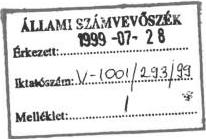
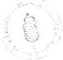

Állami Számvevőszék

# JELENTÉS

a helyi önkormányzatok beruházásaihoz
és rekonstrukcióihoz nyújtott 1998. évi
címzett és céltámogatások vizsgálatáról

1999. július

9922. ✓

---

# ---**Az ellenőrzés végrehajtásáért felelős:  
V. Önkormányzati és Területi Ellenőrzési Igazgatóság**

**dr. Lóránt Zoltán** számvevő igazgató

# **Az ellenőrzést vezette:**

**Farkas László** régióvezető főtanácsos

**dr. Ernst László**  
számvevő tanácsos  
**Fercsik Gyula**  
számvevő tanácsos  
**dr. Szirota István**  
számvevő

**közreműködésével.**

# **Az ellenőrzésben részt vettek:**

**A résztvevők névsorát az 1. sz. melléklet tartalmazza.**

# **A témakörrel foglalkozó ÁSZ vizsgálatok jegyzéke:**

A helyi önkormányzatok beruházásaihoz és rekonstrukcióihoz nyújtott 1995. évi címzett- és céltámogatások felhasználása (V-1001/1996.). (A Parlament számítógépes hálózatán a vizsgálat fájl neve: 0329J000 doc.).

A helyi önkormányzatok beruházásaihoz és rekonstrukcióihoz nyújtott 1996. évi címzett- és céltámogatások felhasználása (V-1001/1997.). (A Parlament számítógépes hálózatán a vizsgálat fájl neve: 0388J000 doc.)

A helyi önkormányzatok beruházásaihoz és rekonstrukcióihoz nyújtott 1997. évi címzett- és céltámogatások felhasználása (V-1001/1998.). (A Parlament számítógépes hálózatán a vizsgálat fájl neve 9823J000 doc.).

A főváros és a megyei jogú városok szennyvíztisztítási programjára rendelkezésre álló források felhasználásának vizsgálata (V-1014/1997-98.). (A Parlament számítógépes hálózatán a vizsgálat fájl neve 9805J000 doc.)

Jelentéseink az INTERNETEN 1999.június 1-től WWW.ASZ.gov.hu címen olvashatók.

---Jelentéseink az Országgyűlés számítógépes hálózatán is olvashatók.

---

V-1001/294/1999. TSZ. 464.

# TARTALOMJEGYZÉK

|  **I. ÖSSZEGZŐ MEGÁLLAPÍTÁSOK, KÖVETKEZTETÉSEK, JAVASLATOK** | **4**  |
| --- | --- |
|  **II. RÉSZLETES MEGÁLLAPÍTÁSOK** | **7**  |
|  1. Az 1998. évi beruházási célok kijelölése, a támogatási igények elbírálása | 7  |
|  2. Az önkormányzatok fejlesztési tevékenységének megalapozottsága | 12  |
|  3. A beruházások megvalósítása, a pénzügyi teljesítés alakulása | 17  |
|  4. A támogatás igénybevételének jogszerűsége | 19  |
|  5. A beruházások működtetése | 21  |
|  6. A befejezett beruházások értékelése | 23  |
|  Függelék |   |
|  Mellékletek |   |

1

---

.

.

.

.

---

# Jelentés

# a helyi önkormányzatok beruházásaihoz és rekonstrukcióihoz nyújtott 1998. évi címzett és céltámogatások vizsgálatáról

Az Állami Számvevőszék 1999. évi ellenőrzési terve alapján vizsgálta a címzett és céltámogatások 1998. évi igénybevételét és felhasználását.

Az ÁSZ az ellenőrzést az Állami Számvevőszékről szóló 1989. évi XXXVIII. törvény 2. § (5) bekezdésében és az államháztartásról szóló 1992. évi XXXVIII. törvény 121. § (3) bekezdésében foglalt felhatalmazás alapján végezte.

A Magyar Köztársaság 1998. évi költségvetéséről szóló 1997. évi CXLVI. törvény a címzett és céltámogatásokra 42 800,0 millió forint előirányzatot állapított meg. Ezt az összeget növeli az 1997. év végéig fel nem használt 27 297,8 millió forint, az évközi lemondásokat, illetve az ebből visszaforgatott összeget figyelembe véve összesen 63 286,4 millió forint állt a helyi önkormányzatok rendelkezésére.

Ezen felül a saját források egy részének kiváltását, illetve kiegészítését szolgálták az egyes elkülönített állami pénzalapokból (pl. Vízügyi Alapból, Központi Környezetvédelmi Alapból), illetve a megyei területfejlesztési tanácsok (Fővárosi Közgyűlés) döntési körébe tartozó decentralizált pénzalapokból (pl. területi kiegyenlítést szolgáló fejlesztési célú- és céljellegű decentralizált alapból, területfejlesztési célelőirányzatból) pályázatok útján adható támogatások.

Az ellenőrzés célja annak megállapítása volt, hogy:

- a címzett és cétlamogatások dontési rendszere és mechanizmusa miként segiti elő a helyi önkormányzatok fejlesztéseinek megvalósításat és az ágazati szakmai szempontok érvényre jutását;
- az onkormanyzatok megfeleloen keszitettek-e elo, illetveBiztositjak-e a beruhazasok megvalositasat. A tamogatasokkal erintett onkormanyzatok idejben rendelkeznek-e a feladat megvalositasahoz szukseges penzugyi eszkozkkel, ezt mennyiben segitette a 263/1997. (XII. 21.) Korm. rendelet;
a támogatások dontési rendszerében, igénybevételénél és felhasznalásanál érvényesült-e a törvenyesség;
- biztositott-e es milyen modon a megvalositott letesitmenyek uzemeltetese, hasznositasa;
- celszeru volt-e a támogatas segitségével az adott kapacitások létrehozása, figyelemmel az üzemeltetés finanszirozasára, illetve kihasználtságukra. A támogatasokkal megvalósított beruházásoknál és rekonstrukcióknál a pénzeszköket takarékosan és hatékonyan használták-e fel.

Az ellenőrzés során 57 db címzett támogatás segítségével megvalósuló helyi önkormányzati fejlesztést vizsgáltunk. Az ellenőrzött fejlesztések besorolását

3

---

I. ÖSSZEGZŐ MEGÁLLAPÍTÁSOK, KÖVETKEZTETÉSEK, JAVASLATOK---

tekintve 6 db a vízgazdálkodásba, 32 db az egészségügyi és szociális ellátásba, 19 db pedig az oktatás és kulturális szolgáltatásba tartozik.

A vizsgálatban 134 db céltámogatás szerepelt, közöttük döntő súllyal a vízgazdálkodás jelentkezik, itt 128 db beruházás ellenőrzését végeztük el.

A címzett és céltámogatások vizsgálata 18 megyére és a fővárosra terjedt ki, összesen 103 helyi önkormányzatra irányult.

Összességében az 1998. évben rendelkezésre álló pénzügyi előirányzat 49,4%-át vizsgáltuk (a címzett támogatások 69,8%-át, a céltámogatások 38,2%-át).

E reprezentációban a vízgazdálkodási ágazat, ezen belül a szennyvízelvezetés- és tisztítás területének prioritása mellett meghatározó volt a támogatott feladatok nagyobb volumene és korábbi jelentősebb előirányzat maradványa.

A vizsgálat során felmértük az 1995-1997. években céltámogatással befejezett 258 db beruházás megvalósítását, hasznosítását.

A vizsgált önkormányzatok és feladatok jegyzékét a 2. sz. melléklet tartalmazza. Az 1998. évi címzett- és céltámogatások reprezentációjának arányait a 7. sz. táblázat mutatja.

**Az ellenőrzött időszak:** alapvetően az 1998. év volt, befejezett beruházások esetében a célszerűség, eredményesség és hatékonyság tekintetében a beruházás teljes időszaka.

# I. ÖSSZEGZŐ MEGÁLLAPÍTÁSOK, KÖVETKEZTETÉSEK, JAVASLATOK

Az Országgyűlés az önkormányzatok beruházási feladataihoz nyújtandó címzett és céltámogatásokról, a központi pénzeszközök hatékony és ellenőrizhető felhasználásának igényével, az önkormányzatok fejlesztési tevékenysége stabilitásának megteremtése érdekében 1992. év decemberében alkotta meg a helyi önkormányzatok címzett és céltámogatási rendszerét szabályozó 1992. évi LXXXIX. sz. törvényt (Cct). E törvényhez kapcsolódóan a címzett és céltámogatások döntéselőkészítését szabályozó kormányrendelet (46/1993.) 1993. márciusban jelent meg.

A címzett és céltámogatási rendszer működésének tapasztalatai - közöttük az ÁSZ korábbi vizsgálatai alapján tett javaslatok hasznosítása - szükségessé tette a támogatási rendszer felülvizsgálatát és korszerűsítését. A korszerűsítés célja az volt, hogy a támogatás rendje alkalmazkodjon a megváltozott körülményekhez, egyszerűsödjön és ellenőrizhetőbbé váljon. Ennek jegyében jóváhagyta az Országgyűlés az 1997. évi CXXXI. törvényt és a végrehajtást szabályozva életbe lépett a 9/1998. (I. 23.) Korm. rendelet. A törvényi szabályozásban, többek között a döntéselőkészítés és a megalapozottság érdekében, előírták a megvalósíthatósági tanulmány elkészítését, egyértelműen szabályozták a vissza nem

---4

---

I. ÖSSZEGZŐ MEGÁLLAPÍTÁSOK, KÖVETKEZTETÉSEK, JAVASLATOK

igényelhetőként tervezett ÁFA esetében a visszaigénylés pénzügyi szabályait, a címzett támogatások értékhatárát. A szabályozás egyes elemei teljeskörűen 1999. január 1-től fejtik ki hatásukat.

Az Állami Számvevőszék az állami támogatások felhasználását 1991. évtől kezdődően - a zárszámadáshoz kapcsolódóan - vizsgálta. A Cct. 1993. évi hatálybalépése után a vizsgálatok célja e törvény betartásának ellenőrzése volt. Az 1993. évtől eltelt hat éves időszak alatt az önkormányzatok több mint egyharmadánál 1760 feladat ellenőrzését végeztük el.

Az önkormányzatok egy része a beruházáshoz szükséges saját pénzügyi forrást nem teljeskörűen, vagy egyáltalán nem tudta biztosítani. Ennek több oka volt: egyrészt az önkormányzatok céltámogatási igénybejelentését továbbra is a befogadtatási szándék érvényesítése jellemezte, ezzel összefüggésben saját pénzügyi teljesítőképességüket túlbecsülték, másrészt a fejlesztések céltámogatása, illetve aránya csökkent. Az önkormányzatok a saját forrás megteremtéséhez az elkülönített állami pénzalapokból és célelőirányzatokból igényelhető támogatásokra is számítottak, ugyanakkor ezek elbírálása a céltámogatástól időben is és rendszerében is eltérően történt. Az önkormányzatok kivárták az egyéb állami támogatások pályázatának az eredményét, ettől tették függővé egy-egy beruházás megindítását. Kedvezőtlen elbírálású pályázat esetén veszélybe került a beruházás megindítása.

A szükséges saját forrás biztosítása érdekében az önkormányzatok egy része a szabályozatlanságot kihasználva befogadta a kivitelezők és fővállalkozók részéről felajánlott közterületi használati, bérleti díjat, amely a beruházás saját forrását kímélte, ugyanakkor az állami támogatást terhelte és megnövelte a beruházási költségeket.

Az igények benyújtásakor a saját forrásra vonatkozó képviselő-testületi kötelezettségvállalás (határozat) megalapozatlan volt. A saját források hiánya, elégtelensége részben a beruházások elhagyásához, vagy csökkentett mértékű megvalósításához, illetve az előirányzatról való lemondáshoz vezetett, részben pedig a fejlesztések megvalósításának elhúzódását idézte elő. A céltámogatásokhoz a saját erőt több önkormányzat csak számottevő hitel (kölcsön) segítségével tudta előteremteni.

A szennyvízelvezetés és tisztítás ágazatban a tervezéshez a KHVM által meghatározott fajlagos maximált költségek magasnak tekinthetők, nem veszik kellően figyelembe a települések szerkezetét és ebből adódóan az alkalmazott műszaki megoldások eltérő költségigényét, illetve e fajlagos költségek a vissza nem igényelhető ÁFA-t is tartalmazzák.

A fejlesztések mintegy felének megvalósítása nem tekinthető tervszerűnek. A helyi önkormányzatoknál 1998. év végén az országos összesített adatok alapján a címzett és céltámogatások összes maradványa 27 284,7 millió forint volt (ez 43,1%). E maradvány döntő hányada, 21 385,5 millió forint, a szennyvízelvezetés és tisztítás ágazatban keletkezett.

5

---

I. ÖSSZEGZŐ MEGÁLLAPÍTÁSOK, KÖVETKEZTETÉSEK, JAVASLATOK---

**Az 1998. év végi országos és ellenőrzött céltámogatási maradvány - különösen a szennyvízelvezetés- és tisztítás szakágazatban - igen kedvezőtlennek minősíthető, mivel a központi költségvetésben korlátozottan rendelkezésre álló pénzeszközök hasznosulásának, felhasználásának jelentős mértékű lemaradását mutatja.**

Az önkormányzatok egy része a fel nem használt céltámogatási előirányzat maradványokról, illetve a saját források hiánya és egyéb okok miatt indokolatlanul lekötött állami támogatásokról történő - törvényben előírt - lemondási kötelezettségük nem teljesítésével feleslegesen kötött le nagy összegeket az állami támogatásokból. **A támogatási keretek indokolatlan lekötése a szükséges saját forrást vállaló helyi önkormányzatok támogatási lehetőségeit csökkenti és ezen keresztül hátrányosan érinti a címzett- és céltámogatási rendszer működésének hatékonyságát is.**

A szennyvíz tisztítás és elvezetés területén a saját források hiánya miatt bekövetkezett műszaki elmaradások, ebből következőleg a lakossági csatorna bekötések alacsony mértéke is hozzájárult ahhoz, hogy a **közmű olló nem zárult az EU csatlakozási követelményeinek megfelelően.** Az ÁSZ már a kiemelt városok szennyvíztisztítási programjának vizsgálata során is jelezte az EU irányelveihez viszonyított elmaradásunkat, a szennyvízelvezetés és tisztítás területén.

A vizsgálat az ellenőrzött 191 beruházásból 32 fejlesztésnél (17%) 40 szabálytalanságot állapított meg. A feltárt, jogtalan előirányzat és felhasználás mindösszesen 1,5 milliárd forint, az ellenőrzött beruházások 1998. évi előirányzatának mintegy 5%-a. A vizsgálat megállapításai alapján az Állami Számvevőszék összesen **469 705 ezer forint jogtalanul igénybe vett címzett és céltámogatás visszafizettetésére**, valamint **1 080 058 ezer forint címzett és céltámogatási és 110 471 ezer forint Céltámogatási Kiegészítő Keret (továbbiakban: CKK) előirányzat lemondási javaslatot tesz a zárszámadási törvényhez.** A vizsgálat által feltárt jogtalan állami támogatás igénybevételét a következők okozták: nem támogatott célra történő felhasználás (üdülő övezetek, üdülő ingatlanok szennyvízcsatornázása), beruházáshoz közvetlenül nem kapcsolódó költségek elszámolása, ÁFA visszaigénylés miatt keletkezett jogtalan igénybevétel. Ez utóbbinak az az oka, hogy a beruházás összköltségében az állami támogatás a vissza nem igényelhető ÁFA-hoz kapcsolódik. Bármilyen jogcímen történő ÁFA visszaigénylés esetén az erre jutó támogatásról le kell mondani, elkerülve a kétszeres támogatás igénybevételét.

**A visszafizetés, illetve lemondás miatt nehéz helyzetbe került önkormányzatok esetében a törvényi szabályozás megváltoztatása adhatna lehetőséget részletfizetésre, illetve a visszafizetés ütemezésének meghatározására, csúsztatására.**

A jelentés lezárásáig a vizsgált önkormányzatok - az Állami Számvevőszék javaslata alapján - **34 349 ezer forint** jogosulatlanul igénybe vett címzett és céltámogatást fizettek vissza az Államkincstárba. Továbbá **787 463 ezer forint** címzett és céltámogatási előirányzatról mondtak le, az összes jogosulatlan felhasználás és előirányzat 54,8%-áról. Az Állami Számvevőszék jogtalan

---6

---

II. RÉSZLETES MEGÁLLAPÍTÁSOK

igénybevétel miatt tett visszafizetési, illetőleg lemondási javaslatai képviselői módosító indítványok, illetve bizottsági módosító indítványok alapján kerülnek a zárszámadási törvényjavaslatba.

# Javaslatok

A címzett és céltámogatási rendszer, valamint a kapcsolódó területek jogi szabályozásának fejlesztése, működésének javítása, és a törvényesség érvényesítése érdekében az Állami Számvevőszék javasolja, hogy:

# a belügyminiszter

1. Kezdemenyezze az allami támogatásban megtervezett AFA visszaigénylés jogosulatlanságanak elkerülse érdekében a 9/1998. (I. 23.) Korm. rend. modosításat, hogy a támogatás igénybejelentéskor legyen kõtelező az önkormányzat testülete részeröl oyan nyilatkozat csatolása, amely az AFA visszaigénylésrol rendelkezik, azaz ha alanyi jogon AFA visszaigénylóve valik az AFA ne jelenhessen meg a beruházás forrásai között.
2. Kezdemenyezze az ellenorzesek altal feltart 1 080 058 ezer forint cimzett es celtamogatasi eloranyzat es 110 471 ezer forint CKK. tamogatasi eloranyzat csokkentest (5. es 6. sz. mellekletek szerint) - a képviseló-testületek altal a le nem mondott allami tamogatas figyelembevetelevel - az OGY-nek benyujtando zarszamadasi törvenyjvaslatban.

# a pénzügyminiszter

Kezdeményezze a vizsgálat által feltárt jogtalanul igénybe vett 33 489 ezer forint címzett és 436 216 ezer forint céltámogatás visszafizettetését (3. és 4. sz. mellékletek szerint) és büntető kamatainak megfizettetését a Magyar Köztársaság 1998. évi költségvetésének végrehajtásáról szóló törvényjavaslatban.

# a közlekedési, hírközlési és vízügyi miniszter

Vizsgálja felül a szennyvízelvezetés és tisztítás költségeinek tervezésére meghatározott KHVM fajlagos normákat, elsősorban a 25%-os ÁFA költség elhagyásával és differenciáltan határozza meg a műszaki szükségletek figyelembevételével.

# II. RÉSZLETES MEGÁLLAPÍTÁSOK

# 1. Az 1998. ÉVI BERUHÁZÁSI CÉLOK KIJELÖLÉSE, A TÁMOGATÁSI IGÉNYEK ELBÍRÁLÁSA

A címzett és céltámogatási rendszer működésének tapasztalatai - ezek között az ÁSZ korábbi vizsgálatai alapján tett javaslatok hasznosítása - az államháztartási reform és annak részeként a Magyar Államkincstár létrejötte, a Belügymi-

7

---

II. RÉSZLETES MEGÁLLAPÍTÁSOK

nisztérium előirányzatkezelői feladata, a megyei területfejlesztési tanácsok megalakulása szükségessé tette a címzett és céltámogatási rendszer felülvizsgálatát és korszerűsítését. A korszerűsítés célja az volt, hogy a támogatás rendje alkalmazkodjon a megváltozott körülményekhez, egyszerűsödjön és ellenőrizhetőbbé váljon. Ennek jegyében az 1997. évi CXXXI. tv. (hatályos 1997. dec. 10-től) módosította a Cct-t, a végrehajtást szabályozó 46/1993. (III. 17.) sz. Korm rendelet helyébe pedig a 9/1998. (I. 23.) sz. Korm. rendelet lépett. A szabályozás egyes elemei - közöttük - a vissza nem igényelhető ÁFA visszaigénylése esetén az ezzel arányos jogosulatlan céltámogatás visszafizetésére, lemondására szóló törvényi kötelezettség - a folyamatban lévő, illetve újonnan induló beruházásokra egyaránt életbe léptek és érvényesítendővé váltak.

Tekintettel arra, hogy a korszerűsített támogatási rendszer teljes körű funkcionálásának első éve 1999., a szabályozás más elemei a későbbiekben fejtik ki hatásukat: így az újonnan induló címzett támogatások 200 millió forintban megjelölt értékhatárának érvényesítése a döntés során, a beruházásokra - célszerűségi szempontokat is előíró - megvalósíthatósági tanulmány készítése.

A költségvetési törvény szerint a címzett és céltámogatások 1998. évi előirányzata 42,8 milliárd forint. Ebből a folyamatban lévő beruházások - már ütemezett - tárgyévi támogatása 29,1 milliárd forintot tett ki (a támogatási összeg közel 68%-a). Az Országgyűlés 3 milliárd forint új címzett támogatásról döntött, így az új céltámogatásokra 10,7 milliárd forint állt rendelkezésre.

Az önkormányzatok támogatási igényeinek felülvizsgálata alapvetően a Belügyminisztériumban, a szakminisztériumok közreműködésével, a jogszabályok betartását megkövetelve történt.

**A címzett támogatásoknál** a döntés előkészítés **első szakaszában** az önkormányzatok benyújtották a szakminisztériumok által meghatározott szakmai programok tartalmi követelményeinek figyelembevételével elkészített beruházási koncepciójukat. A szakminisztériumok egyeztették a programokat az önkormányzatokkal, majd elkészítették és megküldték a Belügyminisztériumnak a címzett támogatásra vonatkozó rangsorolt javaslataikat. A Belügyminisztérium előterjesztése alapján a Kormány kiválasztotta azokat a lakosság széles körét érintő, fontos infrastruktúrális beruházásokat, amelyeket címzett támogatásra javasolni szándékozott az Országgyűlésnek. A Kormány az állásfoglalásról közlemény útján tájékoztatta az önkormányzatokat.

**A második szakaszban** a pénzügyi lehetőség ismeretében - az igénybejelentések alapján - a szakminisztériumokkal történő többszöri egyeztetés után terjesztette a Kormány az Országgyűlés elé a támogatásra javasolt beruházások listáját.

Az 1998. évre összesen 250 db új címzett támogatási igényt nyújtottak be az önkormányzatok. Az összes támogatási igény 103 milliárd, az 1998. évi ütem pedig 14 milliárd forint volt.

A BM és az érintett szaktárcák felülvizsgálata alapján az igénybejelentések megfeleltek a pályázati feltételeknek, eleget tettek a 46/1993. (III. 17.) Korm.

8

---

II. RÉSZLETES MEGÁLLAPÍTÁSOK

rendeletben előírt tartalmi és formai követelményeknek. Mindössze 7 esetben fordult elő, hogy a pályázat nem felelt meg a jogszabályi előírásoknak.

**A benyújtott igények közül 117 db, közel 44 milliárd forint összköltségű beruházás megvalósítása volt javasolható, több mint 35 milliárd forint össztámogatással, amelyből az 1998. évi támogatás összege 3 milliárd forintot tett ki.** A benyújtott 250 db igényből további 126 db igény formailag ugyan megfelelő volt, azonban a rendelkezésre álló keret hiánya miatt nem került be az 1998. évi beruházások közé. Az új induló beruházások közül 33 a vízgazdálkodás, 19 az egészségügyi és szociális ellátás, illetve 65 az oktatás és kulturális szolgáltatás területén célozta az ellátás színvonalának javulását. A helyi önkormányzatok közel 9 milliárd forint saját forrást irányoztak elő a beruházások megvalósításához, ami a beruházási összköltség 20%-át képezte.

A benyújtott igények, valamint a feldolgozás eredményeképpen a törvényi feltételeknek megfelelő, támogatásra javasolt 1998. évi új címzett támogatási igények főbb adatai a következők:

MFt

|  Megnevezés | Benyújtott |   | Támogatásra javasolt  |   |
| --- | --- | --- | --- | --- |
|   |  címzett támogatási igények  |   |   |   |
|   | darab-szám | 1998. évi támogatás összege | darab-szám | 1998. évi támogatás összege  |
|  Vízgazdálkodás | 52 | 743 | 33 | 500  |
|  Egészségügyi és szociális ellátás | 48 | 8 561 | 19 | 1 400  |
|  Oktatás és kulturális szolgáltatás | 150 | 4 795 | 65 | 1 100  |
|  **Összesen:** | **250** | **14 099** | **117** | **3000**  |

A jóváhagyási folyamatban nem érvényesült az önkormányzati törvény elvárása (**nagy költségigényű** beruházási feladatok támogatása), illetve még nem lehetett alkalmazni a Cct.-ben előírt 200 millió forint feletti értékhatárt. Így folytatódott a címzett támogatások - az ÁSZ által korábbiakban is bírált - „felhígulása”. Minden korábbit meghaladó számú igény (117 db) került be a címzett támogatási körbe. Az 1998. évre jóváhagyott címzett támogatások több

9

---

II. RÉSZLETES MEGÁLLAPÍTÁSOK

mint 20%-a alacsony összköltségű - 30 millió forintot el nem érő - beruházás volt. Ez a rendelkezésre álló források szétforgácsolását jelentette.

Az új címzett támogatások számának növekedése összefüggött azzal is, hogy az évek során a céltámogatási körből kikerültek a már kielégített célok (pl. egészséges ivóvízellátás, tanterem építés), ezért az igények a címzett támogatások között szerepeltek.

A címzett támogatásra javasolt beruházások korszerűbb szolgáltatások nyújtását biztosítják. Így a **vízgazdálkodás** területén javasolt beruházások ellátatlan települések, külterületi lakott helyek egészséges ivóvíz ellátását, valamint a legsürgetőbb ivóvízminőség javítási feladatok megoldását teszik lehetővé. Az egyre gyakoribb viharkárok megelőzése érdekében a támogatásra javasolt körbe kerültek a belterületi vízrendezésre benyújtott legfontosabb és a feltételeknek megfelelő igények.

Az **egészségügyi ellátás** területén a beruházások megvalósítása legtöbb esetben ágyszám csökkenéssel jár. A támogatásra javasolt rekonstrukciók többsége - a kivitelezési és működési költség-megtakarítás elvének fokozott érvényesítése következtében - nem jár működési többletköltséggel, így összhangban van a gazdasági stabilizáció, illetőleg az egészségügy átalakításának programjával.

A **szociális ellátás** területén javasolt beruházások az időskorúak, mozgáskorlátozottak, pszichiátriai betegek - szakmai irányelveknek megfelelő - ápológondozó otthonban történő elhelyezésének megteremtését szolgáló fejlesztéseket jelentik.

Az **oktatási és kulturális szolgáltatásnál** a javaslat szerint elsőbbséget kaptak a halaszthatatlan rekonstrukciós munkálatok, az egyedi, speciális képzési profilú, nagy vonzáskörzettel rendelkező középfokú oktatási intézmények és a kistelepüléseken elsősorban a többfunkciós létesítmények fejlesztései.

**A céltámogatások körében** a helyi önkormányzatok 1998-ra összesen 672 támogatási igényt nyújtottak be. Az igényelt céltámogatással a megvalósítás teljes időtartama alatt összesen **213,5 milliárd forint összköltségű** beruházás megvalósítását tervezték, amiből **85,7 milliárd forint az állami támogatás** és ehhez **127,8 milliárd forint saját forrás** biztosítását vállalták.

Az adatok alapján látható volt, hogy nem lehetséges a rendelkezésre álló előirányzatból az összes jogos céltámogatási igény kielégítése. Az igények kielégítésének rendjét az 1998. évi költségvetési törvény szabályozta, miszerint a támogatható célok köre és **az igénykielégítése sorrendje** a következő volt:

- települési szilárdhulladék-lerakó építése,
- életveszélyessé vált általános iskolai tanterem kiváltása,
- működő kórházak és szakrendelők (beleértve az önálló fogászati rendelőt is) gép- és műszerbeszerzései,
- a Cct. 3. sz. mellékletének I. Vízgazdálkodás, szennyvízelvezetés és tisztítás alcím megjegyzésében jelzett igénykielégítési sorrend és az 1998. évre célonként külön benyújtott támogatási igényű, de üzembe helyezhetőség szempontjából műszakilag összetartozó beruházások együttes kezelésének figyelembevételével a költségvetési előirányzatból még kielégíthető szennyvíztisztító telep, te-

10

---

II. RÉSZLETES MEGÁLLAPÍTÁSOK

lepülési folyékonyhulladék (tengelyen szállított szennyvíz) tisztító telep és szennyvízcsatorna-hálózat építés.

A döntéselőkészítés arra irányult, hogy az igények megfelelnek-e a jogszabályi feltételeknek. Az első körben 460 igénybejelentés feldolgozására volt szükség ahhoz, hogy az 1998. évi új céltámogatásokra rendelkezésre álló közel 10,7 milliárd forint előirányzat kiosztásra kerüljön. Így **358** - a feltételeknek megfelelő - **önkormányzati beruházás** részesült céltámogatásban.

A benyújtott, ezen belül a jogszabályi feltételeknek megfelelő (támogatott), valamint a feltételeknek nem megfelelő (hibás) igények célok szerinti megoszlása a következő:

MFt

|  Célok megnevezése | A benyújtott |   | A feltételeknek megfelelő (támogatott) |   | A feltételeknek nem megfelelő (hibás)  |
| --- | --- | --- | --- | --- | --- |
|   |  céltámogatási igények  |   |   |   |   |
|   | darab-száma | 1998. évi támogatási üteme | darab száma | 1998. évi támogatási üteme | darab száma  |
|  a./ Települési szilárd-hulladék-lerakó építése | 15 | 893 | 10 | 639 | 5  |
|  b./ Életveszélyessé vált általános iskolai tanterem kiváltása | 51 | 496 | 39 | 374 | 12  |
|  c./ Működő kórházak és szakerendelők (beleértve az önálló fogászati rendelőt is) gép-műszer beszerzése | 104 | 1373 | 102 | 1365 | 2  |
|  d./ Szennyvízelvezetés és tisztítás ebből: feldolgozott | 502 (290)* | 23870 | 207* | 8265* | 83  |
|  Összesen | 672 (460) | 26632 | 358 | 10643 | 102  |

\*A feltételeknek megfelelő és a költségvetési előirányzatból még kielégíthető céltámogatási igények.

Az első körben feldolgozott 460 céltámogatási igénybejelentés közül 102 db nem részesülhetett támogatásban, mert nem felelt meg a jogszabályi feltételeknek. További 212 db igénybejelentés formailag megfelelt ugyan, a rendelkezésre álló pénzügyi keret hiánya miatt nem került be az 1998. évi támogatott beruházások közé.

11

---

II. RÉSZLETES MEGÁLLAPÍTÁSOK

## 2. AZ ÖNKORMÁNYZATOK FEJLESZTÉSI TEVÉKENYSÉGÉNEK MEGALAPOZOTTSÁGA

A vizsgált helyi önkormányzatok a címzett és céltámogatási igénybejelentéseknél - a BM és az érintett szaktárcák felülvizsgálata szerint - többségében (89%) eleget tettek a módosított 46/1993. (III. 17.) Korm. rendeletben, illetve a 9/1998. (I. 23.) Korm. rendeletben előírt tartalmi és formai követelményeknek. A tárgyévre benyújtott 922 igényből mindössze 109 nem felelt meg törvényességi szempontból.

Az elutasítás oka abból adódott, hogy az igénybejelentésekben egyrészt a nem támogatott műszaki tartalmat támogatottként szerepeltették, másrészt a beruházási adatlapokon a létesítmények jegyzékénél hiányos a tervezett létesítmények felsorolása, a pályázatban szereplő műszaki tartalom nem egyezett meg a vízjogi létesítési engedélyben foglaltakkal, továbbá a képviselő-testületi döntéssel a pályázatban szereplő értéknél kevesebb saját forrást vállaltak.

**Dömös, Neszmély**, szennyvízcsatorna-, illetve tisztító telep, **Szamosszeg**: szennyvíztisztító-telep. (Függelék, F.1.)

Az önkormányzatok a céltámogatási igénybejelentések költségelőirányzatait jellemzően a **szakminisztériumok által kiadott maximált fajlagos költségekkel**, azzal egyező összeggel, vagy ritkábban attól alacsonyabban munkálták ki.

**A vizsgálat szerint a céltámogatási rendszer egyik** - hatásában, jelentőségében - talán **leginkább sarkalatos kérdése** e központilag kidolgozott maximált **fajlagos költségek problémája**. Ugyanis a beruházásokhoz a maximált fajlagos költségekből kiindulva lehet meghatározni mind a céltámogatás, mind pedig az önkormányzati saját erő nagyságát, azaz ezen ráfordítási előirányzatok függvénye, hogy a szennyvízelvezetésre és tisztításra fordított költségvetési források egy jelentős része milyen hatékonysággal hasznosul.

**A kivitelezők a bekerülési költség jelentős részét** (gyakran 10-26%-át), **hajlandók „visszaforgatni” a beruházó önkormányzatok részére** a közöttük kötött szolgáltatási szerződések alapján. Ennek keretében közterülethasználati díjat, illetve földterület-, épület-, irodatechnikai berendezés-, és felvonulási terület bérleti díjat fizetnek, az önkormányzattól a kivitelezéssel összefüggésben homokot és földet vásárolnak, kivitelezői kamatmentes, hosszúlejáratú kölcsönt folyósítanak, az önkormányzattól alvállalkozói munkagvégzést, műszaki- és szakfelügyeletet vesznek igénybe.

Ennek során helyenként az önkormányzatok a képviselő-testület által megállapított ezirányú díjtétel mértékétől is eltértek, annál jóval magasabbat alkalmaztak, illetve e díjakat helyi rendeletben nem is szabályozták.

A kivitelező a költségeit (a későbbiek során) a vállalkozói díjban érvényesítette. A **pályázatban megjelölt naturáliák így is teljesíthetők voltak**. A beruházás összes pénzügyi forrásának jelentős aránya (40-50%, helyenként ennél lényegesen magasabb arány is) állami támogatás, a „vállalkozói díjtöbblet” elszámolása a beruházás terhére, a saját forrás mentesítésével együtt tovább növeli az állami támogatás arányát. Mivel közvetlenül nem igazolható annak té-

12

---

II. RÉSZLETES MEGÁLLAPÍTÁSOK

nye, hogy ezen összegek után nem volt jogos a támogatások lehívása, így visszavonásra nem tettünk javaslatot.

**Dunaszekcső, Somberek, Nagynyárád, Pálháza, Hernádnémeti, Mezőzombor, Sáta, Neszmély, Dömös (Pilismarót), Ipolytarnóc, Nagyoroszi, Tengelic, Csetény:** szennyvízcsatorna, illetve tisztító telep (F.2.).

A pályázó kivitelezők a céltámogatások elnyerésére közzétett Kormányközleményekből ismerik a beruházási összköltséget, így ennek mérlegelésével, nem ritkán annak összegében teszik meg ajánlatukat.

A szennyvízcsatorna-hálózat építéséhez a **KHVM által közzétett normatív fajlagos költségek** a gravitációs szennyvízcsatorna-hálózat és a nyomás alatti szennyvízhálózat esetében is az 1998/1995. évek, illetve az 1998/1996. évek viszonylatában **meghaladták a mélyépítőipari áremelkedéseket, a KSH árindexeket**. A fajlagos költségek nagysága túlzott még akkor is, ha tartalmaznak a mélyépítőipari árindexben meg nem jelenő, a beruházáshoz tartozó tételeket is. (A fajlagos költségek emelkedése általában mintegy 2,1-3,6-szeres, illetve az utóbbi időszakban 2,5-2,6-szeres, míg az árindexek értéke az előbbi időszakok között 172% és 135%). Ennek következtében is e normatív fajlagos költségek „tartalékokat” tartalmaznak az 1998. évben is.

A 300 mm és nagyobb átmérőjű gravitációs szennyvízcsatornák maximált fajlagos költségeinél a **megyei jogú városokra irányadó 2-szeres, illetve a fővárosra vonatkozó 4-szeres, valamint a fővárosban irányadó 1000 mm és nagyobb átmérőjű Rocla csövek esetén a 2-szeres szorzó automatikus alkalmazása a településszerkezet figyelmen kívül hagyásával műszakilag nem szükséges**.

A **Fővárosban** az 1997-ben induló szennyvízcsatorna és szivattyú telep bővítő beruházásoknál a támogatott műszaki tartalomra vonatkozó tényleges (illetve a vállalkozási díj figyelembevételével számított) fajlagos költség értéke alacsonyabb, mint a céltámogatási igénybejelentéskor a fajlagos költségekkel számított összeg. Pl. A tervezett (121,3 EFt/fm) és a tényleges (97,1 EFt/fm) fajlagos költségek aránya a Pesti úti tehermentesítő csatornánál 80,0%, a Zsigmond téri szivattyútelepnél 744,0 EFt/fm, illetve 546,0 EFt/fm (73,4%). **Szombathely:** szennyvízcsatorna. (F.2.)

A szennyvízelvezetés és tisztítás ágazatban a tervezéshez meghatározott KHVM fajlagos költségek szerkezeti felépítésükben magukban hordozzák a jogosulatlan központi támogatás igénybevétel problémáját. Ugyanis a tervezett fajlagos költségek között szerepel a vissza nem igényelhető ÁFA, melyet az önkormányzatok a beruházás folyamatában, vagy végén általában visszaigényelnek, így az ÁFA-ra jutó központi támogatás jogtalanná válik.

Az önkormányzatoknak **általában gondot okozott a céltámogatott fejlesztési feladatok és az azok megvalósításához szükséges- több csatornán megszerezhető - pénzügyi források összhangjának megteremtése**.

A saját pénzügyi források hiányát egyrészt az át nem gondolt, a központi céloktól determinált fejlesztések indítása, és az önkormányzatoktól függetlenül az egyéb állami források rendelkezésre állásának bizonytalanságai okozták.

13

---

II. RÉSZLETES MEGÁLLAPÍTÁSOK

Jellemző, hogy a vizsgált önkormányzatok a céltámogatás igénybejelentésekor a szükséges saját forrást képviselő-testületi határozatban vállalták, azonban annak fedezete nem állt rendelkezésre az önkormányzatok költségvetésében.

Az önkormányzatok keresték a saját forrás mentesítése, előteremtése érdekében a különböző lehetőségeket.

Az önkormányzatok a beruházások mintegy 2/3-ánál a képviselő-testületi határozattal vállalt saját forrást a fejlesztés tervezett indításának évében nem, vagy lényegesen csökkentett mértékben építették be módosított költségvetési rendeletükbe. A saját forrásokat a céltámogatás első évét követő időszakban az eredeti, vagy módosított költségvetési rendeletbe többségében beépítették, mértéke alapvetően a rendelkezésre álló pénzügyi eszközökhöz igazodott. Amennyiben nem állt rendelkezésre a szükséges pénzmennyiség, úgy a vállalkozóktól nem fogadtak be számlákat, illetve ennek megelőzésére csúsztatták a kivitelezéseket.

Nagynyárád, Dunaszekcső, Kincsesbánya, Vértesacsa, Tiszasas, Dömös, Ipolytarnóc társult önkormányzatai, Pest megye, Zalaegerszeg: szennyvízcsatorna-, illetve tisztító telep (F.4.).

A vizsgált címzett támogatás segítségével megvalósuló beruházások 16%-ának a pénzügyi-gazdasági előkészítése, illetve közgazdasági megalapozottsága kívánnivalókat hagy maga után. A szükséges saját forrás hiánya miatt a beruházás tervezett megvalósítási ütemétől eltértek.

Pécs: közműves ivóvízellátás, Mecsekoldal V-VIII. ütem, Makár-oldal, Pécs: közműves ivóvízellátás, Mecsekoldal II-IV. ütem, Postavölgy, Málomi domb, Tolna Megyei Önkormányzat: Megyei Kórház rekonstrukciója, Budapest Főváros Önkormányzat: Madách Színház rekonstrukciója, Ricse: Művelődési Ház építésének befejezése, Sóstófalva: Általános Művelődési Központ építése, Szentendre: Képzőművészeti centrum kialakítása, Telki: Oktatási, nevelési kulturális központ építése. (F.4.)

Az önkormányzatok saját forrásaikat - csökkentés céljából - Vízügyi Alapból és a Központi Környezetvédelmi Alapból, valamint a megyei területfejlesztési tanácsokhoz decentralizált - növekvő összegű - pénzforrásokból tervezték biztosítani. Ezen egyéb állami pénzalapokra vonatkozó egyes pályázati felhívások megjelenésének, illetve a pályázatok elkészítésének és elbírálásának időigénye miatti időbeli elhúzódások és az elnyerhető pénzeszközök bizonytalanságai, az elvártnál alacsonyabb (kisebb mértékű) vagy elmaradó támogatások bizonytalanná tették a beruházás indítását, megvalósítását.

A pénzügyi eszközök időbeni rendelkezésre állását a fejezeti kezelésű előirányzatok és az elkülönített állami pénzalapok egymáshoz kapcsolódó célú, rendeltetésű előirányzatai összehangolt felhasználásának szabályairól szóló 263/1997. (XII. 21.) Korm. rendeletet az 1998-ban újonnan induló beruházásoknál még nem alkalmazták. Így ebben az évben sem sikerült biztosítani az állami céltámogatás, illetve az elkülönített állami pénzalapok, valamint a decentralizált döntési körbe tartozó előirányzatok igénylésére és elosztására vo-

14

---

II. RÉSZLETES MEGÁLLAPÍTÁSOK

natkozó tartalmi, formai és határidőbeli előírások, illetve e végrehajtási döntések valamennyi elemének összehangolását.

Helyenként az önkormányzatok az elkülönített állami pénzalapokra pályázataikat **viszonylag** későn és hiányosan nyújtották be. Ez hozzájárult az alapkezelői döntések elhúzódásához és pénzhiány miatt a kérelmek elutasításához is. Emiatt az esetek több mint háromnegyed részében az 1998. évi indítással tervezett beruházásokat nem is kezdték el.

**Izsák, Akasztó, Szentes, Szabadegyháza, Kincsesbánya, Komádi, Dömös (Visegrád), Ipolytarnóc, Nagyoroszi, Kaposvár, Poroszló, Tengelic, Madocsa, Medina, Dudar, Ugod, Nemesszalók, Tiszakóród, Zalaegerszeg:** szennyvízcsatorna-, illetve tisztító. (F.3.)

A hiányosságok ellenére is ezek **az egyéb állami támogatások az érintett önkormányzatoknak összességében számottevő segítséget jelentettek a beruházásaik megvalósításához.**

A megyei területfejlesztési tanácsok (fővárosi közgyűlés) dönthettek az 1996-tól 1998-ig évente összesen 5,0; 8,0 és 9,0 milliárd forint területi kiegyenlítést szolgáló fejlesztési célú támogatás, illetve 4,7; 5,2 és 5,5 milliárd forint területfejlesztési célelőirányzat, továbbá az 1998. évben bevezetett céljellegű decentralizált pénzforrás (4,0 milliárd forint) felhasználásáról. E decentralizált fejlesztési célú pénzforrásokból - többek között, feltételekhez kötötten - nyújtható támogatás az önkormányzatok céltámogatással megvalósuló beruházásaihoz is, a saját erő kiegészítésére.

A vizsgált címzett támogatásos beruházások több mint 12%-ánál kaptak jelentős szerepet az **elkülönített állami pénzalapok.**

**Matty:** közműves ivóvízellátás egyéb belterületen, **Mezőcsát:** ivóvíz minőségjavítás, **Nógrád Megyei Önkormányzat:** Bátonyterenyei Idősek Otthona, **Makó:** Erdei Ferenc Művelődési Központ rekonstrukciója, **Füzesabony:** Széchenyi Ált. Iskola rekonstrukciója és bővítése, **Veszprém Megyei Önkormányzat:** Eötvös Károly Megyei Könyvtár rekonstrukciója. (F.7.)

A saját forrás rendelkezésre állásának hiánya miatt a vizsgált címzett támogatásos beruházások 9%-ánál az érintett önkormányzatok **fejlesztési hitelt vettek fel.** A hitel felvételénél az önkormányzatok figyelemmel voltak az 1995. évi LXXII. törvénnyel bevezetett hitelfelvételi korlátokra.

**Telki:** az oktatási, nevelési kulturális központ építésére 33,4 millió forint hitelt vett igénybe. (F.4.) **Nógrád Megyei Önkormányzat:** a bátonyterenyei Idősek Otthonához 19,7 millió forint. (F.7.) **Kalocsa:** a városi kórház rekonstrukciója 1997-ben 50 millió, **Hatvan:** a városi kórház rekonstrukciójához ütemezve 100 millió forint, **Tolna Megyei Önkormányzat:** az Idősek Ápoló Gondozó Otthonához 21,9 millió forint. (F.8.)

A hitelfelvétel jelenleg nem vezetett az önkormányzatok kezelhetetlen előadósodásához, de hozzájárulhat nehéz pénzügyi helyzetük kialakulásához.

15

---

II. RÉSZLETES MEGÁLLAPÍTÁSOK

**Kalocsa:** város önkormányzata 1997-ben és 1998-ban és várhatóan 1999-ben is önhibáján kívül hátrányos helyzetű és a hitellel kapcsolatos kötelezettségek tovább terhelik az amúgy is szűkös költségvetést (F.8.)

**Komárom-Esztergom Megyei Önkormányzat:** a Megyei Kórház rekonstrukciója keretében a céltámogatás segítségével megvalósított gép-műszer beszerzéshez többlet saját forrást biztosított, amihez hitelfelvételt kellett eszközölnie, emiatt 96,6 millió forint tőketörlesztési és kamatfizetési kötelezettsége keletkezett. Az 1995 óta folyamatosan működési forráshiányos önkormányzatnak ez nehezen elviselhető terhet jelent (F.4.).

A vizsgált címzett támogatás segítségével megvalósuló beruházások mintegy 10%-ánál - döntően a kórház rekonstrukcióknak - a szakmai előkészítése nem volt megfelelő.

Ezeknél a nagyvonalú szakmai programok alapján nem konkretizálták a műszaki megoldást. A szakmai koncepciók bizonytalanságai és azok módosításai, feladatváltozás, valamint a tervezettől eltérő műszaki megoldások gyakran az egész beruházási folyamatot végigkísérték és kihatással voltak a pénzügyi teljesítésekre és a megvalósult műszaki tartalomra is.

**Zala Megyei Önkormányzat:** Megyei Kórház rekonstrukciója II. ütem **Baranya Megyei Önkormányzat:** Megyei Kórház telephelyi rekonstrukciója, **Orosháza:** Városi Kórház rekonstrukciója (F.9.), **Komárom-Esztergom Megyei Önkormányzat:** Megyei Kórház rekonstrukciója. (F.4.)

A nem megfelelő **műszaki előkészítés** a vizsgált címzett támogatás segítségével megvalósult beruházások hozzávetőlegesen 18%-ára volt jellemző. A műszaki előkészítésbeli hiányosságok, beruházási dokumentumok, különböző engedélyek közötti eltérések, esetenként alultervezés, feladatváltozás miatt az eredeti műszaki terveket, kiviteli tervdokumentációkat több esetben módosítani kellett. Az is előfordult, hogy a megfelelő építési területet nem biztosították. Ezzel összefüggésben a műszaki és pénzügyi teljesítés 1998-ban a tervezettől eltérően alakult, a megvalósítás késett, a költségek növekedtek.

**Budapest Főváros Önkormányzata:** Madách Színház rekonstrukciója, **Sóstófalva:** Általános művelődési központ építése, **Szentendre:** Képzőművészeti Centrum kialakítása, **Telki:** Oktatási, nevelési, kulturális központ építése, **Tolna Megyei Önkormányzat:** Megyei Kórház rekonstrukciója. (F.4.) **Orosháza:** Városi Kórház rekonstrukciója, **Pápa:** Idősek Otthonának bővítése, **Zala Megyei Önkormányzat:** Megyei Kórház rekonstrukciója II. ütem. (F.9.) **Baranya Megyei Önkormányzat:** Megyei Kórház telephelyi rekonstrukciója. (F.9.)

Az ellenőrzött önkormányzatok céltámogatott fejlesztései mintegy 10%-ánál hasonló előkészítésbeli hiányosságok voltak megállapíthatók.

**Dunaszekcső:** szennyvízcsatorna, **Somberek:** befogadó, **Nagynyárád:** szennyvíztisztító telep, **Apostag:** szennyvíztisztító telep, **Kincsesbánya:** szennyvíztisztító telep és csatorna, **Dunavarsány, Veresegyház, Vecsés, Érd:** szennyvízcsatorna, **Csetény, Öskü:** szennyvíztisztító telep, **Tószeg:** szennyvízcsatorna, (F.5.), **Dömös, Neszmély, Szamosszeg:** szennyvíztisztító telep (F.1.).

16

---

II. RÉSZLETES MEGÁLLAPÍTÁSOK

3.

# A BERUHÁZÁSOK MEGVALÓSÍTÁSA, A PÉNZÜGYI TELJESÍTÉS ALA-KULÁSA

A vizsgált címzett és céltámogatás segítségével megvalósuló beruházások valamivel több mint 10%-ánál nem tartották be a közbeszerzési törvény előírásait.

Teljes körű forrásbiztosítás nélkül megindították az eljárást, nem az előírt eljárási formát alkalmazták, vagy mellőzték azt. B.A.Z. megye: Forró, Borsodszirák, Hajdú-Bihar megye: Polgár, Komárom-Esztergom megye: Dömös, Neszmély, Császár, Heves megye: Füzesabony, Kerecsend, Monosbél, Nógrád megye: Nagyoroszi, Ipolytarnóc, Pest megye: Érd, Vecsés, Veresegyház, Baranya megye: Nagynyárád, Somberek szennyvízelvezetés és tisztítás. (F.6.)

Az eljárás megsértése miatt a Közbeszerzési Döntőbizottság az érintett önkormányzatok (feladatok) közül a következőkről intézkedett, illetve szabott ki bírságot.

Jász-Nagykun-Szolnok Megyei Önkormányzat: Hetényi Géza Kórház-Rendelőintézet sebészeti épület bővítése 5000 ezer forint, Szabolcs-Szatmár-Bereg Megyei Önkormányzat: Megyei Kórház rekonstrukciója 4000 ezer forint, Nagykanizsa: Városi Kórház rekonstrukciója 500 ezer forint, Jász-Nagykun-Szolnok Megyei Önkormányzat: Jászapáti Ipari Szakmunkásképző Intézet és Szakiskola bővítése, kollégium építése 500 ezer forint (F.6.), Veszprém Megyei Önkormányzat: Eötvös Károly Megyei Könyvtár rekonstrukciója 1000 ezer forint bírság. (F.7.)

A vizsgált címzett támogatásban részesült önkormányzatok közül csak egy olyan önkormányzat volt, amely nem alkotta meg a közbeszerzések helyi szabályozását.

Sátoraljaújhely: Városi Kórház rekonstrukciója. (F.6.)

A vizsgálat során egyetlen olyan eset sem volt, ahol élve a közbeszerzési törvény 33. §-ának (3) bekezdésében biztosított lehetőséggel az ajánlati felhívásban előírták volna, hogy az ajánlattévő alkalmazza az értékelemzés módszerét, elősegítve a törvény fő célját, az államháztartás kiadásainak ésszerűsítését.

Az önkormányzatok - a közbeszerzési eljárásokat követően - a beruházások, illetve a rekonstrukciók kivitelezési munkálataira a vállalkozói szerződéseket megkötötték. Ezek a szerződések az esetek egy részében nem rögzítik pontosan a rész-számla benyújtás feltételeit, annak műszaki, tartalombeli követelményeit. A pénzügyi szakaszoláshoz többnyire csak időbeli ütemterv kapcsolódik, a teljesítmény feltételek rögzítése hiányzik.

Tolna Megyei Önkormányzat: Megyei Kórház rekonstrukciója (F.4.).

Az 1998-ban induló új céltámogatott beruházások egy részére a finanszírozási szerződést az önkormányzatok a vizsgálat idején még nem kötötték meg. Ebben alapvetően a forráshiányok játszottak szerepet.

17

---

II. RÉSZLETES MEGÁLLAPÍTÁSOK

Az önkormányzatok a beruházások számláinak kiegyenlítése során a támogatási arányokat betartották. A finanszírozáshoz a saját forrásokat esetenként késedelmesen ugyan, de biztosítani tudták. Ebben szerepet játszott az, hogy a vállalkozási szerződésekben a pénzügyi ütemeket a tényleges anyagi lehetőségekhez igazították. A saját forrás helyenként a kivitelező hathatós segítségével állt rendelkezésre.

Az egyéb állami pénzforrások elnyerése esetén az önkormányzatok a támogatások kezelőjével kötöttek támogatási szerződést. A vonatkozó finanszírozási szerződéseket - helyenként vontatottan - a Magyar Államkincstárral kötötték meg.

E szerződések tartalma tükrözte a vonatkozó jogszabályok előírásait.

A támogatási szerződéseket - a támogatás odaítélését követően - a kezelő szerve, illetve a megyei területfejlesztési tanácsok munkaszervezete és az önkormányzatok jelentős csúszásokkal (mintegy 5-8 hónap), részben hiánypótlási záradékkal írták alá.

Sellye: térségi szilárd hulladéklerakó (F.1.), Tiszakóród, Zalaegerszeg: szennyvízcsatorna és tisztító telep. (F.3.).

A beruházások tervszerű megvalósítását és egyúttal az ütemezésnek megfelelő pénzfelhasználást több tényező befolyásolta. Ezek közül a leglényegesebbek, amelyek néha egyenként, gyakran együttesen rontották a tervszerűséget és előidézték a pénzmaradványok növekedését:

- A műszaki előkészítettség hiányosságai, tervmódosítások;

Az építőipari kivitelezésre vonatkozó szerződéseket a feladatok egy részénél módosítani kellett, sőt egyes feladatoknál több alkalommal is. Tolna Megyei Önkormányzat: Megyei Kórház rekonstrukciója (F.4.), Szabolcs-Szatmár-Bereg Megyei Önkormányzat: Megyei Kórház rekonstrukciója. (F.6.). A módosítások érintették a beruházások műszaki tartalmát, a határidőket, a vállalási díjat. A beruházások időbeli elhúzódása költségnövekedésekkel járt, ami több esetben szükségessé tette az eredeti műszaki tartalom csökkentését.

- Saját forrás tervezése és biztosításának előzőekben említett, részletezett problémái.
- Előre nem látható körülmények;

A kivitelezés, az épületbontások során statikai, gépészeti és egyéb problémák jelentkeztek, illetve egy esetben felmerült a műemlékvédelmi követelmények érvényesítésének igénye (Csongrád Megyei Önkormányzat: Móra Ferenc Múzeum), amely pótmunkákat tett szükségessé és időbeli csúszásokat okozott.

- A közbeszerzési eljárás időigénye is csúszásokat eredményezett;

Az 1998. évi új címzett támogatások az eddigieknél korábbi (1998. február végi) kihirdetése ellenére az esetek egy részében a közbeszerzési eljárás meglehetősen nagy időigénye (60-90 nap) miatt a kivitelezési munkákat az eredetileg tervezettnél néhány hónappal később kezdték el. Alaposabb, szabályszerűbb kivitelező választást (közbeszerzés) tett lehetővé a Cct. azon módosítása, hogy a kivitele-

18

---

II. RÉSZLETES MEGÁLLAPÍTÁSOK

zést már nem adott éven belül, hanem a támogatásra jogosultság kihirdetésétől számított tizenkét hónapon belül kell megkezdeni.

- A törvényben szabályozott fel nem használt előirányzatokról való lemondási kötelezettség nem teljesítése.
- Évközi lemondások, amelyek még új igények kielégítésére nincsenek jelölve.

A címzett támogatásoknál országosan 1997. évben 26,9%, 1998. évben 14,4% volt az év végi maradványok aránya. Az 1998. évi maradványok 52,6%-a az egészségügyi és szociális ellátás, 34,0%-a az oktatási és kulturális szolgáltatás ágazatokban keletkezett.

A vizsgált címzett támogatásoknál javulás történt a tervszerűség és a pénzmaradványok tekintetében az 1997. évihez viszonyítva.

Az ellenőrzött címzett támogatásos beruházások 1998. év végi maradványa 1 750,3 millió forint, amely az 1998. évben rendelkezésre álló összes előirányzat 11,2%-ának felelt meg, amely az 1997. évi 27,1% arányhoz képest javult.

Az összes maradvány 56,4%-a, 988 millió forint az egészségügyi és szociális ellátás, 36,8%-a, 644,8 millió forint az oktatás és kulturális szolgáltatás területén képződött.

A vizsgált céltámogatásoknál jelentősen növekedtek az 1998. év végi maradványok. A céltámogatások év végi maradványa 1998-ban meghaladta az 1997. évit, 1997. évben 51,3%, míg 1998. évben 68,6% volt.

A maradványok nagyrésze a szennyvízelvezetés és tisztítás területén jelentkezett, 1997. évben (90,3%) és 1998. évben (98,5%) is.

Az 1998. évi évközi lemondások 88%-a is a szennyvízelvezetés és tisztítás szakágazatból származott. Ezen ágazat lemondásaiból jelentős részt képviseltek a visszaigényelhető ÁFA miatti előirányzat lemondások.

Az 1998. évi címzett és céltámogatások országos előirányzatait, felhasználását és ezek maradványait az 1., 2., 3. sz. táblázatok, a vizsgált körre vonatkozóan a 4., 5., 6. sz. táblázatok tartalmazzák.

A vizsgált céltámogatások 20%-nál nagyobb arányú 1998. év végi maradványait tételesen és az okok szerinti részletezésben a 10. sz. táblázat mutatja be.

A címzett és céltámogatások, ezen belül a szennyvízelvezetési és tisztítási támogatások évenkénti maradványait országosan a 8. és 9. sz. táblázatok részletezik.

# 4. A TÁMOGATÁS IGÉNYBEVÉTELÉNEK JOGSZERŰSÉGE

A támogatások igénybevétele többnyire a törvényben, illetve a beruházás igénylésben meghatározott feladatra történt.

19

---

II. RÉSZLETES MEGÁLLAPÍTÁSOK---

A vizsgált 191 beruházásból 32 fejlesztésnél (17%) 40 szabálytalanságot állapított meg az ellenőrzés. A feltárt, jogszerűtlen előirányzat és felhasználás mindösszesen 1,5 milliárd forint, az ellenőrzött beruházások 1998. évi előirányzatának mintegy 5%-a.

A vizsgálat megállapításai alapján - az ellenőrzés lezárásáig visszafizetett támogatásokat figyelembe véve - az Állami Számvevőszék 33 489 ezer forint címzett, 436 216 ezer forint céltámogatás, együttesen 469 705 ezer forint jogtalanul felhasznált állami támogatás visszafizettetését kezdeményezi a Magyar Köztársaság 1998. évi költségvetésének végrehajtásáról szóló törvénytervezetben.

A visszafizettetésre javasolt címzett- és céltámogatásokat tételesen a 3. és 4. sz. mellékletek tartalmazzák.

A helyszíni ellenőrzés 1 080 058 ezer forint címzett és céltámogatási, valamint 110 471 ezer forint CKK előirányzatról való lemondási kötelezettséget tárt fel. Ezek közül 16 beruházásnál az önkormányzatok az ellenőrzés lezárásáig 787 463 ezer forint összegű címzett és céltámogatási lemondási kötelezettséget teljesítettek. Ezzel összefüggésben az Állami Számvevőszék 1 080 058 ezer forint címzett és céltámogatási előirányzat, valamint 110 471 ezer forint CKK előirányzat módosítására tesz javaslatot az 1998.évi zárszámadási törvénytervezetben.

A lemondásra (előirányzat csökkentésre) javasolt címzett és céltámogatásokat a 5-ös és 6-os sz. mellékletek tartalmazzák.

Az állami támogatás vizsgálat által feltárt jogtalan igénybevétele a következő okok miatt történt.

# 1. Nem támogatott célra történő céltámogatás felhasználás.

A vizsgált önkormányzati fejlesztések közül 3 beruházásnál üdülőövezetek, üdülőingatlanok szennyvíz csatornázását végezték céltámogatásból. Az 1992. LXXXIX. tv. 2-3-4. sz. melléklet T/1. pontja, a módosított 46/1993. (III. 17.) Korm. rendelet 4. sz. melléklet V. pontja, valamint az 1997. évi CXXXI. tv. szerint a támogatás az állandó népesség ellátására igényelhető. Ezen a címen 31 849 ezer forint visszafizetési, illetve 21 438 ezer forint lemondási kötelezettség keletkezett.

Két beruházásnál összesen 26 489 ezer forint a beruházáshoz közvetlenül nem kapcsolódó költséget számoltak el (ÁFA visszaigénylésre irányuló sikerdíj, pénzügyi szolgáltatás, ügyvédi díjazás). Az 1992. évi LXXXIX. tv. 10. és 23. §-a szerint címzett és céltámogatás a cél szerinti alapfunkció ellátását szolgáló beruházáshoz igényelhető.

# 2. ÁFA visszaigénylés miatt keletkezett jogtalan igénybevétel.

Ezen a jogcímen 373 649 ezer forint visszafizetési és 520 842 ezer forint lemondási kötelezettséget állapított meg az ellenőrzés. Az 1992. évi LXXXIX. tv. 14. § (5) és (8) bekezdés, a 46/1993. (III. 17.) Korm. rendelet melléklete (Adatlap) szerint az állami támogatás a vissza nem igényelhető ÁFA-hoz

---20

---

II. RÉSZLETES MEGÁLLAPÍTÁSOK

jár. Amennyiben az önkormányzat visszaigényli az ÁFA-t, a céltól eltérő felhasználás miatt lemondási, visszafizetési kötelezettsége keletkezik.

Az 1992. évi LXXXIX. tv.-t módosító 1997. évi CXXXI. tv. 16. § (3) bekezdése összefoglalóan tartalmazza a jogtalan igénybevételt és a visszafizetési, lemondási kötelezettséget. Nincs szó tehát az önkormányzatok által vélelmezett 1997. CXXXI. tv. hatályának visszamenőleges kiterjesztéséről.

### 3. Egyéb okok

A 2 841 ezer forint céltámogatási visszafizetési és 514 160 ezer forint címzett és céltámogatási lemondási kötelezettség alapvetően önkormányzati saját forráshiány, a beruházás késedelmes kezdése, illetve a fejlesztéstől való elállás miatt következett be.

Az 1992. évi LXXXIX. tv. 14. §. (4) bek. szerint, ha az önkormányzat a beruházás megvalósításától eláll, kivitelezését a támogatást jóváhagyó törvény kihirdetésétől számított 12 hónapon belül nem kezdte meg, lemondási kötelezettsége keletkezik.

## 5. A BERUHÁZÁSOK MŰKÖDTETÉSE

Az önkormányzatok általában gondoskodtak az elkészült beruházások műszaki átvételéről, üzembehelyezéséről, számviteli nyilvántartásba vételéről (aktiválásáról). E vonatkozásban az ellenőrzés a következő esetekben állapított meg hiányosságokat.

**Matty:** vízműtelep- vízekezelési eljárás, **Komádi, Ipolytarnóc, Öskü, Budapest, XVII. kerületi Önkormányzat:** szennyvízcsatorna-, illetve tisztító telep (F. 10.)

**Debrecen:** szennyvíztisztító telep, **Szentendre:** regionális szennyvíztisztító telep (F.14.), **Szentendre:** Képzőművészeti centrum. (F.4.)

A címzett és céltámogatási előirányzatok felhasználásáról az önkormányzatok az 1998. évi költségvetési beszámoló során 1999. május-június hónapban egyidejűleg, a Belügyminisztérium által a TÁKISZ-okon (FÁKISZ-on) keresztül megküldött adatlapon számoltak el a 9/1998. (I. 23.) Korm. rendelet 25. §-ának megfelelően.

A befejezett beruházásokat tekintve az önkormányzatok a támogatások segítségével általában a pályázatban megjelölt célokat valósították meg. A létesítményeket az önkormányzatok a támogatott célnak megfelelően használják. Előfordult azonban, hogy a létesítmények kihasználása alacsony szintű, különösen a szennyvízelvezető csatorna rákötései tekintetében.

**Baranya megye: Somberek, Palotabozsok, Nagynyárád, Majs, Dunaszekcső, Bár, Vas megye: Szombathely, Veszprém megye: Dudar.** (F. 11.)

A központi támogatások segítségével megvalósult önkormányzati beruházások - a beruházások befejezését követően - a lakosság ellátását, életkörülményeit javították.

21

---

II. RÉSZLETES MEGÁLLAPÍTÁSOK

Az ellenőrzött címzett támogatások segítségével megvalósított létesítmények folyamatos működtetéséhez szükséges forrásokkal az érintett önkormányzatok rendelkeztek, illetve - egy kivételével - rendezték az üzemeltetést.

**Szentendre:** Képzőművészeti centrum. (F.4.)

A céltámogatással megvalósított közműfejlesztések (szennyvízelvezés- és tisztítás, ivóvízhálózat építés) várható üzemeltetési költségeit az önkormányzatok költségvetésükben nem tervezték, mivel az önkormányzat mint árhatóság által megállapított víz- és csatornaszolgálatási díjak tartalmazzák ezeket a költségeket. A létesítményeket üzemeltetésre, bérüzemeltetésre általában e feladatra **szakosodott gazdasági társaságoknak adták, illetve adják át.** (Üzemeltetési díj, bérleti díj, koncessziós díj mellett, összekapcsolva az ÁFA visszaigénylés lehetőségével).

Az ivóvíz- és csatornadíjak helyenként csak részben fedezték az üzemeltetést, ezért az önkormányzatok árkiegészítési jellegű igényt nyújtottak be a központosított előirányzatok terhére, s így a **lakossági díjakat** - a meghatározott díjhatáron felül - **a központosított támogatással kiegészítették.**

Az 1998-ban üzembehelyezett közműberuházások egy részénél a vízjogi üzemeltetési engedélyt megkérték, de annak kiadása még nem történt meg.

A Fővárosban a **kerületi önkormányzatok** beruházásában létesült csatorna szakaszok műszaki átadás-átvételének továbbra is kritikus része a **tulajdonjog kérdése. Jelen vizsgálatunkban Budapest, XVII. kerületi önkormányzat beruházásában** megvalósuló szennyvízcsatorna hálózat építésénél állapította meg ezt az ellenőrzés. (F.12.)

Az önkormányzatok a beruházások megvalósításának folyamatában és/vagy befejezését követően - a munka folyamatába épített műszaki (lebonyolító) és pénzügyi (vezetői) ellenőrzésen túlmenően - külön műszaki-gazdasági ellenőrzést nem végeztek, illetve végeztettek.

A lebonyolítók folyamatosan tájékoztatták a hivatali apparátusokat a beruházásokról. Az önkormányzatok hivatalainak munkatársai koordinációs értekezleteken, egyeztető tárgyalásokon, helyszíni szemléken kísérték figyelemmel a beruházások állását. Egyes önkormányzatok (pl. Baranya Megyei Önkormányzat) hivatali dolgozókat is megbíztak a beruházások figyelemmel kísérésével, ami részben munkafolyamatba épített ellenőrzésnek tekinthető. A kisebb önkormányzatoknál a polgármester, esetleg a jegyző, körjegyző a vezetői ellenőrzés keretében végzett műszaki-, pénzügyi teljesítés ellenőrzést.

A képviselő-testületek, közgyűlések tájékoztatása a beruházások állásáról szinte kivétel nélkül megtörtént, jellemzően a költségvetési gazdálkodás tervezési, beszámolási rendszeréhez igazodóan, amely folyamatos tájékoztatásnak felel meg.

**Vas Megyei Önkormányzat:** Kőszegi Fogyatékosok Intézetének rekonstrukciója. **Makó:** szilárd hulladéklerakó; **Dunavarsány:** szennyvízcsatorna és tisztító telep. (F.13.)

22

---

II. RÉSZLETES MEGÁLLAPÍTÁSOK

Kivételes esetnek tekinthetjük azt, ha egy önkormányzat a központi támogatás segítségével megvalósított beruházás üzembehelyezését követően **elemzi, értékeli a beruházás eredményességét**. A vizsgálat során a címzett támogatásos beruházásoknál egy ilyen esettel találkoztunk, igaz ott is döntően egy aspektusból, pénzügyi szempontból közelítették meg a kérdéskört.

**Nógrád Megyei Önkormányzat:** Bátonyterenyei Idősek Otthona (F.7.)

## 6. A BEFEJEZETT BERUHÁZÁSOK ÉRTÉKELÉSE

Az állami támogatások segítségével a helyi önkormányzatok 1995, 1996. és 1997. években összesen 1833 beruházást fejeztek be. A befejezett beruházások közül 258-at (14%) értékeltünk.

Az értékelt befejezett beruházások közül 187 (72,5%), a vízgazdálkodási ágazatba, 43 (16,6%) az oktatási és kulturális szolgáltatás, 27 (10,5%) az egészségügyi és szociális ellátás, 1 (0,4%) pedig a hulladékgazdálkodás ágazatba tartozott.

A vízügyi ágazaton belül 45 befejezett beruházás az ivóvízellátás, 142 befejezett beruházás pedig a szennyvízelvezetés és tisztítás megoldását célozta, ily módon az ágazaton belül az értékelt ivóvízellátással összefüggő befejezett beruházások részaránya 24,1%, a szennyvízelvezetéssel és tisztítással összefüggőké pedig 75,9%.

A beruházásokra általánosan jellemző, hogy a tervezettnél néhány hónappal később kezdődtek, üzembe helyezésükre pedig a tervezettnél 6-12 hónappal később került sor (pl. Fővárosi Önkormányzat: Erzsébet Kórház utókezelő, Nagykanizsa: Sánc városrész csatornázása). Ennél jelentősebb időbeli csúszások is előfordultak a megvalósítás során (pl. Fővárosi Önkormányzat: Szent István Kórház Merényi Gusztáv Kórházának Traumatológiája, Polgárdi: szennyvíztisztító telep, Pereked: közkifolyós ivóvízellátás belterületen).

A helyi igények felmérésének hiánya, vagy forráshiány következtében a vizsgált beruházások közül 3 fejlesztésnél (Sükösd: 4 tantermes ált. iskola bővítése, Ricse: folyékony hulladéktisztító telep létesítése, Hollóháza és Úrkút: szennyvíztisztító telep és csatorna hálózat) a megvalósítástól elálltak, a támogatásról lemondtak, 1 fejlesztésnél csak részleges megvalósítás történt (Nyírmada: életveszélyessé vált ált. iskolai tanterem kiváltása).

A beruházások időbeli elhúzódásának oka a nem megfelelő szakmai, műszaki előkészítésben, a saját forrás biztosításának nehézségeiben, valamint a címzett és céltámogatási rendszer működésének anomáliáiban - ígérvényes támogatások, illetve döntően a támogatás első évi ütemének pénzfelhasználását nehezítő körülményekben - keresendő. A beruházások időbeli elhúzódása költségnövekedéssel járt.

A beruházások tervezett összköltségét összehasonlítva a tényleges összköltséggel igen eltérő képet kaptunk.

23

---

II. RÉSZLETES MEGÁLLAPÍTÁSOK---

Az oktatási és kulturális ágazatban a tényleges összköltségek a tervezett szint körül szóródtak (pl. Mike: általános iskolai tornaterem, Szekszárd: nemzetiségi oktatás céljait szolgáló általános iskolai tanterem, Békéscsaba: Jókai Színház).

Az egészségügyi és szociális ágazatban a tényleges összköltségek lényegesen meghaladták a tervezettet. A nagymértékű (40-80%-os) költségtúllépés döntően a fővárosi kórház- és szociális otthon rekonstrukciónál fordult elő (pl. Bajcsy Zs. Kórház, Nyíró Gyula Kórház, Kamaraerdei Idősek Otthona, Gödöllői Idősek Otthona).

A vízgazdálkodási ágazaton belül az ivóvízellátás megvalósításának összköltsége a tervezett körül szóródott (85,6%-119,5%, pl. Kisszentmárton, Pétervására, Zalaszántó). A szennyvízelvezetés és tisztításon belül a szennyvíztisztítás szakágazaton belül valamivel nagyobb a szóródás (57,3 - 140,1% pl. Gutorfölde, Csákánydoroszló), azonban a szennyvíztisztítók többségének összköltsége a tervezett közelében véglegződött. A vidéki szennyvízcsatorna-hálózat építésének jelentős részénél a tényleges összköltség nem érte el a tervezettet (pl. Egercsehi, Siófok). Ebben közrejátszhatott, hogy a vizsgált befejezett beruházások között már voltak olyanok is, amelyeknél az 1995. évtől bevezetett fajlagos normák szolgáltak a költségek tervezésének alapjául és amelyek növekedési üteme meghaladta a beruházási árindex növekedésének ütemét.

A vizsgált befejezett beruházásoknál a tervezett naturáliákat általában megvalósították. Az egészségügyi és szociális ágazatokon belül a kórház-rekonstrukciók egy részénél az eredetileg tervezett műszaki tartalmat csökkentették (pl. Főv. Önkormányzat: Schöpf-Mérei Kórház, Nyíró Gyula Kórház).

A vízügyi ágazaton belül a szennyvízcsatorna-hálózat építésének egy részénél, mintegy 30%-ánál a megvalósított naturáliák mennyisége meghaladta a tervezetett (pl. Mecseknádasd, Balatonkeresztúr). Ez is azt jelzi, hogy a tervezés alapjául szolgáló fajlagos költségek magasak voltak, hiszen a segítségükkel kalkulált összköltségből - esetenként annál kevesebből - a tervezettnél több naturáliát lehetett megvalósítani.

A központi támogatás segítségével megvalósított oktatási létesítmények folyamatos működtetéshez szükséges forrásokkal az érintett önkormányzatok rendelkeztek. Az egészségügyi ágazatban a rekonstrukciók nyomán jelentkező működési forráshiányok kezeléséhez a helyi önkormányzatok nem tudtak segítséget adni.

A közműberuházásoknál (ivóvízellátás, szennyvízelvezetés és tisztítás) az érintett önkormányzatok rendezték az üzemeltetést. A megvalósított létesítményeket a feladatra szakosodott vállalkozásoknak adták át. Az új víziközmű létesítmények miatti üzemeltetési többletköltségek nem különíthetők el.

A vizsgált befejezett beruházásokat az önkormányzatok a támogatott célnak megfelelően használják.

A létesítmények kapacitáskihasználása - a szennyvízelvezetés és tisztítás létesítményei kivételével - megfelelő. Az elkészült szennyvízcsatorna hálózatokra való rákötések azonban esetenként igen alacsony mértékűek (az egyik legala-

---24

---

II. RÉSZLETES MEGÁLLAPÍTÁSOK

csonyabb, mindössze 9%-os Sárbogárdon). Ebből következik, hogy a központi támogatás segítségével megvalósított szennyvíztisztító telepek is alacsony kihasználtsággal üzemelnek.

Az önkormányzatok a befejezett beruházások utólagos értékelésével nem foglalkoztak.

Budapest, 1999. július " "

dr. Kovács Árpád  
elnök

25

---

.

.

.

.

---

1. sz. melléklet

a V-1001/1999. sz. vizsgálathoz

# A helyszíni vizsgálatot végezték

# Központi szerveknél:

dr. Szirota István

számvevő

# Baranya megye

Alexovics Ágota

számvevő

dr. Ernst László

számvevő tanácsos

Maczekó Károly

számvevő tanácsos

# Bács-Kiskun megye

Domján Jenő

számvevő tanácsos

# Békés megye

Koltay Zsoltné

számvevő

Vida László

számvevő

# Borsod-Abaúj-Zemplén megye

Klinga László

számvevő

Kocsis István

számvevő tanácsos

dr. Szikszai Bertalan

számvevő

---

### **Csongrád megye**

Benkéné dr. Lawner Klára

számvevő tanácsos

dr. Boda Sándor

számvevő tanácsos

### **Fejér megye**

Czifra Erzsébet

számvevő tanácsos

### **Hajdú-Bihar megye**

Szilágyi Sándor

számvevő tanácsos

### **Heves megye**

Hevesi Kornél

számvevő tanácsos

Maróti Sándor

számvevő tanácsos

### **Jász-Nagykun-Szolnok megye**

dr. Csapó Anna

számvevő tanácsos

Csomán Mihály

számvevő tanácsos

### **Komárom-Esztergom megye**

Ambrus Lajos

számvevő tanácsos

György Árpád

számvevő tanácsos

### **Nógrád megye**

Fercsik Gyula

számvevő tanácsos

Huszár Sándorné

számvevő tanácsos

2

---

# **Pest megye**

Benczik Lászlóné

számvevő tanácsos

Fancsali Mária

számvevő

# **Somogy megye**

Huszti István

számvevő tanácsos

# **Szabolcs-Szatmár-Bereg megye**

Hadházy Sándor

számvevő tanácsos

Kenéz Sándor

számvevő tanácsos

# **Tolna megye**

Kispálné Wiedemann Györgyi

számvevő tanácsos

# **Vas megye**

dr. Gyuk József

számvevő tanácsos

# **Veszprém megye**

Komlósiné Bogár Éva

számvevő

Koronczai Sándorné

számvevő

# **Zala megye**

Angyalosi Dániel

számvevő tanácsos

# **Főváros**

Gordos László

számvevő tanácsos

dr. Spilák Antal

számvevő tanácsos

3

---

.

.

.

.

---

2. sz. melléklet

a V-1001/1999. sz. jelentéshez

# A VIZSGÁLT ÖNKORMÁNYZATOK ÉS FELADATOK

# I. Címzett támogatás (42+57)

# 1. Vízgazdálkodás (5+6)

# 1/a Ivóvízellátás (3+4)

# Baranya megye

Pécs

megyei jogú város

Mecsekoldal V-VIII. ütem

Mecsekoldal II-IV. ütem

Matty

község

Vízellátás egyéb belterületen

# Borsod-Abaúj-Zemplén megye

Mezőcsát

város

Ivóvízminőség javítás

# 1/b Szennyvíztisztítás (2+2)

# Hajdú-Bihar megye

Debrecen

megyei jogú város

Szennyvíztisztító telep

# Pest megye

Szentendre

város

Szennyvíztisztító telep

# 2. Egészségügyi és szociális ellátás (28+32)

# Főváros

Fővárosi Önkormányzat

Uzsoki utcai kórház

---

# **Baranya megye**

Megyei Önkormányzat

Megyei Kórház telephely

# **Bács-Kiskun megye**

Kalocsa város
Kiskunfélegyháza város

Városi kórház
Szociális otthon

# **Békés megye**

Megyei Önkormányzat

Szociális Otthon
Okány és Vésztő
Városi kórház

Orosháza város

# **Borsod-Abaúj-Zemplén megye**

Megyei Önkormányzat

Megyei kórház
(sebészet, pathológia)
Megyei kórház
(sebészeti tömb hotelszárny)
Almási Balogh Pál kórház
Városi kórház

Ózd város
Sátoraljaújhely város

# **Csongrád megye**

Megyei Önkormányzat

Kistelek-Ruzsa szociális
otthon
Óföldeák Idősek Otthona
Városi kórház

Szeged megyei jogú város

# **Fejér megye**

Megyei Önkormányzat

Bicskei Ápoló-gondozó
otthon

# **Hajdú-Bihar megye**

Megyei Önkormányzat

Kenézy Gyula kórház -
rendelőintézet

# **Heves megye**

Hatvan város

Albert Schweitzer városi
kórház

# **Jász-Nagykun-Szolnok megye**

Megyei Önkormányzat

Hetényi Géza kórház-
rendelőintézet
Erzsébet kórház sebészet

Jászberény város

2

---

# Komárom-Esztergom megye

Megyei Önkormányzat

Szent Borbála kórház

# Nógrád megye

Megyei Önkormányzat

Bátonyterenyei idősek
otthona

Pásztó város

Megyei Kórház

Városi Kórház

# Pest megye

Vác város

Jávorszky Ödön kórház

# Somogy megye

Megyei Önkormányzat

Kapossi Mór megyei kórház

# Szabolcs-Szatmár-Bereg megye

Megyei Önkormányzat

Megyei kórház

Kisvárda város

Fehérgyarmat

Vásárosnamény

Városi kórház

# Tolna megye

Megyei Önkormányzat

Ápoló-gondozó otthon

Bátaszék

Megyei kórház

# Veszprém megye

Veszprém megyei jogú város

Pápa város

Idősek otthona

Idősek otthona

# Zala megye

Megyei Önkormányzat

Nagykanizsa megyei jogú város

Megyei kórház II. ütem

Városi kórház „A” épület

# 3. Oktatás és kulturális szolgáltatás (16+19)

# Főváros

Fővárosi Önkormányzat

Fővárosi Állat- és Növény-
kert

Fővárosi Thália Színház

Madách Színház

3

---

### **Borsod-Abaúj-Zemplén megye**

|  Sátoraljaújhely | város | Általános iskola  |
| --- | --- | --- |
|  Ricse | nagyközség | Művelődési ház  |
|  Sóstófalva | község | Művelődési Központ  |

### **Csongrád megye**

|  Megyei Önkormányzat |  | Erdészeti Szakközépiskola  |
| --- | --- | --- |
|  Szeged | megyei jogú város | Móra Ferenc Múzeum  |
|  Makó | város | Műszaki Szakközépiskola  |
|   |  | Művelődési Központ  |

### **Heves megye**

|  Megyei Önkormányzat |  | Gárdonyi Géza Színház  |
| --- | --- | --- |
|  Füzesabony | város | Általános iskola  |

### **Jász-Nagykun-Szolnok megye**

|  Megyei Önkormányzat |  | Ipari Szakmunkásképző és Szakközépiskola, Jászapáti  |
| --- | --- | --- |

### **Pest megye**

|  Szentendre | város | Képzőművészeti centrum  |
| --- | --- | --- |
|  Telki | község | Oktatási, nevelési, kulturális központ  |

### **Somogy megye**

|  Megyei Önkormányzat |  | Középiskolai Diákotthon, Siófok  |
| --- | --- | --- |

### **Vas megye**

|  Megyei Önkormányzat |  | Kisegítő iskola, Kőszeg  |
| --- | --- | --- |

### **Veszprém megye**

|  Megyei Önkormányzat |  | Eötvös Károly megyei Könyvtár  |
| --- | --- | --- |

### **Zala megye**

|  Nagykanizsa | megyei jogú város | Palini iskola  |
| --- | --- | --- |

4

---

## II. Céltámogatások (70+134)

### 1. Vízgazdálkodás (65+128)

#### 1/a Ivóvízellátás (2+3)

# **Baranya megye**

Matty

község

Ivóvízkezelési eljárás

Ivóvízvezeték

# **Jász-Nagykun-Szolnok megye**

Szolnok

megyei jogú város

Felszíni Vízmű vízkezelési eljárás

#### 1/b Szennyvízelvezetés- és tisztítás (64+125)

# **Főváros**

Fővárosi Önkormányzat

IV. ker. Corvin-Bajza-Fóti úti főgyűjtő

II. ker. Zsigmond téri szivattyú telep bővítés

I-II. ütem

Rákosvölgyi északi főgyűjtő

Pesti úti tehermentesítő csatorna

Zrínyi-Pesti úti gyűjtő-csatorna

XVII. kerület

# **Baranya megye**

Dunaszekcső

község

Szennyvíztisztító telep

Szennyvízcsatorna hálózat

Hímesháza

község

Szennyvíztisztító telep

Szennyvízcsatorna hálózat

Nagynyárád

község

Szennyvíztisztító telep

Szennyvízcsatorna hálózat

Somberek

község

Szennyvíztisztító telep

Szennyvízcsatorna hálózat

# **Bács-Kiskun megye**

Izsák

város

Szennyvíztisztító telep

Akasztó

község

Szennyvízcsatorna hálózat

Szennyvíztisztító telep

Szennyvízcsatorna hálózat

5

---

|  Apostag | község | Szennyvíztisztító telep Szennyvízcsatorna hálózat  |
| --- | --- | --- |

### **Békés megye**

|  Kétegyháza | nagyközség | Szennyvíztisztító telep Szennyvízcsatorna hálózat  |
| --- | --- | --- |
|  Újkígyós | nagyközség | Szennyvízcsatorna hálózat I. ütem Szennyvízcsatorna hálózat II. ütem  |
|  Kaszaper | község | Szennyvíztisztító telep Szennyvízcsatorna hálózat  |

### **Borsod-Abaúj-Zemplén megye**

|  Mezőcsát | város | Szennyvíztisztító telep Szennyvízcsatorna hálózat  |
| --- | --- | --- |
|  Sátoraljaújhely | város | Szennyvízcsatorna hálózat  |
|  Pálháza | nagyközség | Szennyvízcsatorna hálózat Szennyvízcsatorna hálózat Szennyvíztisztító telep  |
|  Borsodszirák | község | Szennyvízcsatorna hálózat Szennyvíztisztító telep  |
|  Felsőkelecsény | község | Szennyvízcsatorna hálózat  |
|  Forró | község | Szennyvízcsatorna hálózat Szennyvíztisztító telep  |
|  Hernádnémeti | község | Szennyvízcsatorna hálózat  |
|  Mezőzombor | község | Szennyvízcsatorna hálózat  |
|  Sáta | község | Szennyvízcsatorna hálózat  |
|  Tiszakeszi | község | Szennyvíztisztító telep Szennyvízcsatorna hálózat  |

### **Fejér megye**

|  Kincsesbánya | község | Szennyvízcsatorna hálózat Szennyvíztisztító telep  |
| --- | --- | --- |
|  Szabadegyháza | község | Szennyvízcsatorna hálózat Szennyvíztisztító telep  |
|  Vértesacsa | község | Szennyvízcsatorna hálózat Szennyvíztisztító telep  |

### **Hajdú-Bihar megye**

|  Polgár | város | Szennyvízcsatorna hálózat Szennyvíztisztító telep  |
| --- | --- | --- |
|  Komádi | nagyközség | Szennyvízcsatorna hálózat Szennyvíztisztító telep  |

6

---

# Heves megye

|  Füzesabony | város | Szennyvíztisztító telep  |
| --- | --- | --- |
|  Kerecsend | község | Szennyvíztisztító hálózat  |
|  Mónosbél | község | Szennyvíztisztító telep  |
|  Poroszló | község | Szennyvízcsatorna hálózat  |
|   |  | Szennyvíztisztító telep  |
|   |  | Szennyvízcsatorna hálózat  |
|   |  | Szennyvíztisztító telep  |
|   |  | Szennyvízcsatorna hálózat  |
|  **Jász-Nagykun-Szolnok megye**  |   |   |
|  Szolnok | megyei jogú város | Szennyvízcsatorna hálózat  |
|  Tiszasas | község | Szennyvízcsatorna hálózat  |
|  Tószeg | község | Szennyvíztisztító telep  |
|   |  | Szennyvízcsatorna hálózat  |
|   |  | Szennyvízcsatorna hálózat  |
|  **Komárom-Esztergom megye**  |   |   |
|  Császár | község | Szennyvíztisztító telep  |
|  Dömös | község | Szennyvízcsatorna hálózat  |
|  Neszmély | község | Szennyvízcsatorna hálózat  |
|   |  | Szennyvíztisztító telep  |
|  **Nógrád megye**  |   |   |
|  Ipolytarnóc | község | Szennyvíztisztító telep  |
|  Nagyoroszi | község | Szennyvízcsatorna hálózat  |
|   |  | Szennyvíztisztító telep  |
|   |  | Szennyvízcsatorna hálózat  |
|  **Pest megye**  |   |   |
|  Érd | város | Szennyvízcsatorna hálózat  |
|  Dunavarsány | nagyközség | Szennyvízcsatorna hálózat  |
|  Vecsés | nagyközség | Szennyvíztisztító telep  |
|  Veresegyház | nagyközség | Szennyvízcsatorna hálózat  |
|  Pilisjászfalu | község | Települési folyékony hulladék tisztítótelep  |
|   |  | Szennyvízcsatorna hálózat  |
|   |  | Szennyvíztisztító telep  |
|   |  | Szennyvízcsatorna hálózat  |
|   |  | Szennyvíztisztító telep  |

7

---

### **Somogy megye**

|  Kaposvár | megyei jogú város | Szennyvízcsatorna hálózat Szennyvízcsatorna hálózat  |
| --- | --- | --- |
|  Fonyód | város | Szennyvízcsatorna hálózat Szennyvízcsatorna hálózat Szennyvízcsatorna hálózat  |
|  Somogyszentpál | község | Szennyvízcsatorna hálózat  |

### **Szabolcs-Szatmár-Bereg megye**

|  Kállósemjén | nagyközség | Szennyvíztisztító telep Szennyvízcsatorna hálózat  |
| --- | --- | --- |
|  Méhtelek | község | Szennyvíztisztító telep Szennyvízcsatorna hálózat  |
|  Szamosszeg | község | Szennyvíztisztító telep Szennyvízcsatorna hálózat  |
|  Tiszakóród | község | Szennyvíztisztító telep Szennyvízcsatorna hálózat  |

### **Tolna megye**

|  Madocsa | község | Szennyvíztisztító telep Szennyvízcsatorna hálózat  |
| --- | --- | --- |
|  Medina | község | Szennyvíztisztító telep Szennyvízcsatorna hálózat  |
|  Tengelic | község | Szennyvíztisztító telep Szennyvízcsatorna hálózat  |

### **Vas megye**

|  Szombathely | megyei jogú város | Szennyvízcsatorna hálózat Szennyvízcsatorna hálózat Szennyvízcsatorna hálózat  |
| --- | --- | --- |
|  Jánosháza | nagyközség | Szennyvízcsatorna hálózat  |
|  Őriszentpéter | nagyközség | Szennyvíztisztító telep Szennyvízcsatorna hálózat  |

### **Veszprém megye**

|  Csetény | község | Szennyvíztisztító telep Szennyvízcsatorna hálózat  |
| --- | --- | --- |
|  Dudar | község | Szennyvíztisztító telep Szennyvízcsatorna hálózat Szennyvízcsatorna hálózat  |
|  Nemesszalók | község | Szennyvíztisztító telep Szennyvízcsatorna hálózat  |
|  Öskü | község | Szennyvíztisztító telep Szennyvízcsatorna hálózat  |
|  Ugod | község | Szennyvíztisztító telep Szennyvízcsatorna hálózat  |

8

---

# Zala megye

Zalaegerszeg

megyei jogú város

Szennyvízcsatorna hálózat

Nagykanizsa

megyei jogú város

Szennyvízcsatorna hálózat

Szennyvízcsatorna hálózat

Szennyvízcsatorna hálózat

Szennyvízcsatorna hálózat

# 2. Szilárd hulladék lerakótelep (3+3)

# Baranya megye

Sellye

város

Térségi hulladéklerakó telep

# Csongrád megye

Makó

város

Regionális hulladéklerakó telep

Szentes

város

Települési hulladéklerakó telep

# 3. Egészségügyi és szociális ellátás (1+2)

# Borsod-Abaúj-Zemplén megye

Ózd

város

Egészségügyi gép-műszer beszerzés

Egészségügyi gép-műszer beszerzés

# 4. Oktatás és kulturális szolgáltatás (1+1)

# Szabolcs-Szatmár-Bereg megye

Nyírbátor

város

Életveszélyes tanterem kiváltás

9

---

•

•

•

•

---

3. sz. melléklet

a V-1001/1999. sz. jelentéshez

# Visszafizetésre javasolt címzett támogatások

Ezer Ft-ban

|  Önkormányzat | Feladat | A feladat azonosítása a címzett támogatást odaítélő törvény alapján | Visszafizetendő, jogtalanul lehívott címzett támogatás  |
| --- | --- | --- | --- |
|  Megnevezése |   |  |   |
|  1 | 2 | 3 | 4  |

# 1. Nem támogatott célra felhasznált címzett támogatások 33 187

# Budapest

Fővárosi önkormányzat Uzsoki Úti Kórház 1996. évi XLVI. tv. 19 265*
(új sebészeti tömb építése) 1. sz. melléklet
10. sorszám

A központi épület tender tervének elkészítésével összefüggésben kifizetett összegek nem kapcsolódtak a beruházási programban és az engedélyokiratban megfogalmazott célokhoz. A központi épület tender tervének elkészítése nem szerepelt a címzett támogatási igénybejelentésben, nem volt jóváhagyott feladat, így az ezzel összefüggő kifizetések címzett támogatásból finanszírozott része (91,74%) jogtalan igénybevételnek minősül (19 265 E Ft). A visszafizetési kötelezettség jogszabályi alapja, az 1992. évi LXXXIX. tv. 14. §. (5) és (8) bekezdése, valamint az 1996. évi CXXIV. sz. törvény 22. §-ának (5) bekezdése. A jogosulatlan címzett támogatást az önkormányzat a következők szerint vette igénybe: 1997. február 22-én 14 908 E Ft-ot, 1997. február 25-én 4 357 E Ft-ot.

# Vas megye

Megyei Önkormányzat Kőszegi Fogyatékosok 1996. évi XLVI. tv. 13 922
Intézetének rekonstrukciója és bővítése 1. sz. melléklet
55. sorszám

Nem támogatott műszaki tartalommal kapcsolatos kifizetésekhez is igénybe vett az önkormányzat címzett támogatást. A készletbeszerzést, a Zenede és a 16 lakás felújítását az igénybejelentés beruházási adatlapja, illetve létesítmény jegyzéke nem tartalmazza, így ezek nem minősülnek jóváhagyott feladatnak és ezekkel összefüggésben 13 922 E Ft címzett támogatást jogtalanul vett igénybe az önkormányzat. A visszafizetési kötelezettség jogszabályi alapja az 1992. évi LXXXIX. tv. 14. §. (5) és (8) bekezdése, valamint az 1997. évi CXLVI. sz. törvény 19. §-ának (5) bekezdése. A jogosulatlan címzett támogatás igénybevétele a következő részletekben történt: 1998. március 10-én 529 E Ft, 1998. április 1-jén 450 E Ft, 1998. szeptember 1-jén 12 943 E Ft.

99.07.05 09:14 DE o:\users\fzsuzsa\wmunka\laci\01civisz.doc

---

|  1 | 2 | 3 | 4  |
| --- | --- | --- | --- |

# **2. ÁFA mentes kifizetések miatti jogtalan címzett támogatás lehívások 302\***

# **Veszprém megye**

|  **Megyei Önkormányzat** | Eötvös Károly Megyei Könyvtár rekonstrukciója | 1996. évi XLVI. tv. 1. sz. melléklet 57. sorszám | 302*  |
| --- | --- | --- | --- |

A címzett támogatásban a 25%-os ÁFA tartalom, mint felhasználási cél került jóváhagyásra. Az önkormányzat 1998-ban banki kezelési költség címén 1 208 E Ft ÁFA mentes számlát egyenlített ki címzett támogatásból, melynél 302 E Ft összegű tervezett ÁFA nem merült fel. A tervezett, de fel nem merült költségelemre, jelen esetben az ÁFÁ-ra jutó címzett támogatás jogtalan. A visszafizetési kötelezettség jogszabályi alapja, az 1992. évi LXXXIX. tv. 14. §. (5) és (8) bekezdése, 16. §. (3) bekezdése, valamint az 1997. évi CXLVI. sz. törvény 19. §-ának (5) bekezdése. A jogosulatlan címzett támogatás igénybevétele a következők szerint történt: 1998. február 16-án 143 E Ft, 1998. február 19-én 159 E Ft.

Címzett támogatások mindösszesen (1 + 2) 33 489

*Az önkormányzatok által a központi költségvetésbe időközben visszafizetett címzett támogatások 19 567

Az önkormányzatok által vissza nem fizetett, jogosulatlan címzett támogatások 13 922

---2

---

4. sz. melléklet

a V-1001/1999. sz. jelentéshez

# Visszafizetésre javasolt céltámogatások

|   |  |  | Ezer Ft-ban  |
| --- | --- | --- | --- |
|  Önkormányzat | Feladat megnevezése | A feladat azonosítása, a céltámogatást odaítélő törvény, ill. Kormányközlemény alapján | Visszafizetendő, jogtalanul lehívott céltámogatás  |

|  1. | 2. | 3. | 4.  |
| --- | --- | --- | --- |

# 1. Nem támogatott célra felhasznált céltámogatások

59 726

# Baranya megye

Matty Vízkezelési eljárás-vízműtelep kialak. MK.1994./37. 1.sz. mell./79. 1 388

A céltámogatási igénylésben megjelölt céltól eltérő felhasználás történt. (A támogatást korábban támogatott célra fordították: az 1991-ben céltámogatással megvalósult ivóvízrendszerre). A visszafizetésre vonatkozó javaslat jogszabályi alapja az 1990. évi LXV. tv. (Ötv.) 85. § (3) bekezdése, valamint a Magyar Köztársaság 1994. évi költségvetéséről rendelkező 1993. évi CXI. tv. 19. § (5) bekezdése. A támogatást 1994. X. 25-én hívták le.

# Fejér megye

Kincsesbánya Szennyvízcsatorna-hálózat építése MK. 1997./49. 1.sz. mell./207. 4 892

A Rákhegy nevű településrészen az önkormányzat nem támogatható célhoz, üdülőingatlanok szennyvízcsatornázásához is igénybe vett - a nettó fajlagos kivitelezési költségek figyelembe vételével, arányosítással történt számítás szerinti mértékű - céltámogatást. Ezt a módosított. Cct. 2. és 3. sz. mellékletének 1.-1. sorszámában, illetve az ugyancsak módosított 46/1993. (III. 17.) Korm. r. 8. § (1) bekezdésében és 4. sz. mellékletében foglalt előírások szerint vissza kell fizetnie. A támogatást 1998. X. 2-án vették igénybe.

---

# Jász-Nagykun-Szolnok
megye

Szolnok

Vízkezelési eljárás

MK.1995./26.

3 369

1.sz. mell./139.

Nem támogatható célra, pénzügyi szolgáltatásra számoltak el céltámogatást, amelyre a
Cct. 10. §-a, 23. § b. és g. pontja nem ad lehetőséget. A támogatást 1997. III. 10-én
hívták le.

# Komárom-Esztergom
megye

Dömös (Pilis-
marót, Visegrád)

Szennyvízcsatorna-
hálózat építése

MK.1997./49.
1.sz. mell./189.

6 927

Nem támogatható műszaki tartalomhoz (üdülők szennyvízcsatornázása) is igénybe vet-
tek céltámogatást, amelynek visszafizetési alapja a Cct. 14. § (8) bekezdése, és a mó-
dosított 46/1993. (III. 17.) Korm. r. 4. sz. mellékletében foglalt előírások. A támogatás
lehívásának időpontjai 1998. VIII. 13. 1 224 Eft, IX. 19. 4 813 Eft, 1999. II. 03. 890 Eft.

# Pest megye

Dunavarsány

Szennyvízcsatorna-
hálózat építése

MK.1996./38./
18.

23 120

(Taksony, Délegy-
háza, Majosháza,
Áporka, Sziget-
szentmárton)

Nem támogatható célokra számoltak el céltámogatásokat. Két tanácsadó cégtől pénz-
ügyi szolgáltatás igénybevételére 2 860 EFt-ot; az Rt. által kidolgozott ÁFA vissza-
igénylési konstrukcióra, „sikerdíjra” 5 560 EFt-ot; jogi tanácsadó igénybevételére 3 500
EFt-ot. Továbbá a támogatás kihirdetése előtt 1994-ben elkészített tervek kifizetését a
KFt. a tervező cégeknek megelőlegezte, majd 1996-ban e Kft utólag benyújtott számlá-
jára hívtak le 11 200 EFt céltámogatást.

A nem támogatható műszaki tartalom jogszabályi alapja a Cct. 10. §-a és 23. § b. és g.
pontja. Az Rt. és Kft. pénzügyi szolgáltatásai címén a támogatás lehívása jogtalan, mi-
vel a Cct. 10. §-a alapján a céltámogatás a cél szerinti alapfunkció ellátását szolgáló be-
ruházásra igényelhető. Erre ad magyarázatot a Cct. 23. § b. pontja, mely szerint
„alapfunkció: az önkormányzati feladat ellátását szolgáló létesítmény építésügyi, illetve
ágazati szabványok által kötelezően előírt szakmai-műszaki tartalma.” Az ÁFA vissza-
igénylés sikerdíjához kifizetett számláknál igénybe vett céltámogatás nem ismerhető el
azért sem, mivel az un. „rejtett” ÁFA visszaigényléshez kapcsolódó céltámogatás
igénybevétel jogosulatlan. Az ügyvédekkel kötött vállalkozói szerződésben az elvég-
zendő feladatok nem kapcsolhatók a közműberuházáshoz. A támogatás kihirdetését

2

---

megelőzően elkészített tervekre a Cct. 11. § (2) bekezdésében előírtak szerint nem hívható le állami támogatás.

A támogatások lehívásának időpontjai a következők: pénzügyi szolgáltatásra, Rt. részére: 1997-ben II. 27. 60 EFt, IV. 21. 60 EFt, V. 13. 60 EFt, VI. 09. 60 EFt, VII. 22. 60 EFt, VIII. 04. 60 EFt, VIII. 21. 60 EFt, X. 18. 120 EFt, XII. 03. 60 EFt, XII. 11. 60 EFt, 1998-ban II. 02. 60 EFt, II. 20. 60 EFt, IV. 02. 60 EFt, V. 21. 120 EFt, VI. 15. 60 EFt, VII. F28. 60 EFt, VIII. 17. 60 EFt, IX. 25. 60 EFt, X. 19. 60 EFt. XI. 20. 60 EFt. Pénzügyi szolgáltatásra Kft. részére: 1997-ben VII. 22. 264 EFt, IX. 29. 132 EFt, XI. 06. 44 EFt, XII. 03. 44 EFt, 1998-ban I. 07. 44 EFt, VI. 02. 460 EFt, X. 01. 276 EFt, XII. 11. 276 EFt. ÁFA visszaigénylési konstrukcióra: 1997-ben X. 18. 1400 EFt, XII. 18. 1368 EFt, 1998-ban IV. 02. 1832 EFt, X. 01. 960 EFt. Jogi tanácsadásra: 1998. IX. 22. 3500 EFt. Tervek készítésére: 1996-ban IX. 27. 5600 EFt, X. 30-án 5600 EFt.

# Somogy megye

Fonyód

Szennyvízcsatorna- MK. 1996./38./
hálózat építése 334.

20 030

Fonyódliget II. ütem beruházásának keretében üdülő övezetben, döntően üdülőingatlanok szennyvízcsatorna ellátását valósították meg, ezt céltámogatási igénybejelentésükben nem jelezték. Céltámogatás csak állandó népesség ellátására igényelhető. Ennek jogszabályi alapja a Cct. 2. sz. mellékletének I. Vízgazdálkodás fejezet 1.pontja és a módosított 46/1993. (III. 17.) Korm. rendelet 4. sz. mellékletének V. pontja. A támogatásból 12 009 Eft-ot 1997. VII. 11-én, 8 021 EFt-ot 1998. XII. 29-én vettek igénybe.

2. A fejlesztésre előzetesen felszámított ÁFA visszaigényelhetősége (visszaigénylése) mellett az ÁFA-ra jutó, arányosan lehívott céltámogatások

373 649

# Borso-Abaúj-Zemplén megye

Pálháza (és tíz község) szennyvízcsatorna MK. 1997/49.
hálózat építése 224.

14. 682*

Az elfogadott támogatás előirányzata az ÁFA arányos részét is tartalmazta, ugyanakkor az önkormányzat a beruházás folyamatában az ÁFA-t visszaigényli. A céltámogatás lehívása az ÁFA-val növelt érték alapján történt. A többlet céltámogatás lehívása ütközik a Cct. 16. § (3) bekezdésével, továbbá a módosított 46/1993. (III. 17.) Korm. rendelet 4. sz. mell. VII. pontjával. A támogatást 1999. II. 19-én vették igénybe és 1999. VI. 08-án fizették vissza.

3

---

# **Jász-Nagykun-Szolnok**  
**megye**

|  **Szolnok** | Vízkezelési eljárás | MK.1995./26. 1.sz. mell./139. | 159 859  |
| --- | --- | --- | --- |

A céltámogatási igénybejelentés vissza nem igényelhető ÁFA-val együtt adta meg a beruházási összköltséget, a támogatást ennek megfelelően hagyták jóvá. Időközben tisztázódott, hogy az ÁFA visszaigényelhető, s azt visszaigényelték. A vissza nem igényelhetőként tervezett ÁFA-ra jutó céltámogatást a beruházásnál a (nettó) számlák kifizetésére (az eredeti tervből kimaradt munkákra, többlet műszaki tartalomra) felhasználták. E támogatás lehívása ütközik a Cct. 5. §-ával, 14. § (3) bekezdésével, az Ötv. 85. § (3) bekezdésével, a módosított 46/1993. (III. 17.) Korm. r. 4. sz. mell. VII. pontjával, valamint az 1996. évi CXXIV. tv. 22. § (5) és az 1997. évi CXLVI. tv. 19. § (5) bekezdésével. A jogosulatlan támogatás igénybevételének időpontjai a következők. 1997-ben VII. 7. 717 EFt, VII. 14. 373 EFt, X. 16. 108 401 EFt, 1998-ban VII. 16. 21 006 EFt, IX. 16. 26 935 EFt, XI. 13. 2 162 EFt, XII. 8. 22 EFt, 1999-ben I. 6. 243 EFt.

# **Komárom-Esztergom**  
**megye**

|  **Dömös** (Pilisma-rót, Visegrád) | Szennyvízcsatorna-hálózat építése | MK.1997./49. 1.sz. mell./189. | 100*  |
| --- | --- | --- | --- |

A céltámogatási igénybejelentés vissza nem igényelhető ÁFA-val együtt adta meg a beruházási összköltséget, a támogatást ennek megfelelően hagyták jóvá. Időközben az ÁFA-t visszaigényelték, melyből a céltámogatásra jutó arányos résznél 100 EFt-tal kevesebbet fizettek vissza. A jogtalan támogatást 1998. IX. 14-én vették igénybe. Az ÁFA visszaigénylése miatt késedelmesen fizettek vissza a központi költségvetésbe 23 196 Ezer Ft-ot, következésképpen az 1998. IX. 14-1998. XII. 28. közötti időszakra kamatfizetési kötelezettség jelentkezik. A 100 EFt-ot 1999. V. 12-én fizették vissza. Mindezek alapja a Cct. 16. § (3) bekezdése.

# **Pest megye**

|  **Veresegyház** (Erdőkertes, Szada) | Szennyvíztisztító-telep építése | MK.1993/119. 1/b.sz.mell./234. | 11 767  |
| --- | --- | --- | --- |

|  **Veresegyház** (Erdőkertes, Szada) | Szennyvízcsatorna-hálózat építése | MK.1993/119. 1/b.sz.mell./351. | 90 000  |
| --- | --- | --- | --- |

Az igénybejelentésben a beruházások költségei között vissza nem igényelhető ÁFA-t is terveztek és jóváhagytak. A beruházások folyamatában az ÁFA-t visszaigényelték. A

4

---

beruházásoknál a vissza nem igényelhetőként tervezett ÁFA-ra jóváhagyott céltámogatásból a nettó számlák kifizetésére -a pályázati nettó költség alapján számított jogos összegnél többet- használtak fel.

A jogosulatlan támogatás visszafizetésének jogszabályi alapja a Cct. 5. §-a, 14. § (3) és 16. § (3) bekezdése, valamint 23. § h. pontja, továbbá a módosított 46/1993. (III. 17.) Korm. rendelet 4. sz. mell. VII. pontja. Az előzőekkel van összhangban a helyi önkormányzatokról szóló 1990. évi LXV. törvény 85. § (3) bekezdése, mely szerint a céltámogatás kizárólag az adott célra használható fel. Ez esetben a vissza nem igényelhető ÁFA-hoz. A jogosulatlan támogatás igénybevételének időpontjai a következők: a szennyvíztisztító telepnél 1997-ben VII. 12. 317 EFt, VIII. 07. 6 650 EFt, VIII. 22. 4 800 EFt. A csatornánál 1998-ban I. 30. 9 693 EFt, III. 02. 660 EFt, III. 12. 293 EFt, III. 13. 4 218 EFt, IV. 06. 1 413 EFt, V. 11. 9 174 EFt, VI. 10. 9 600 EFt, VI. 12. 9 376 Fft, VII. 07. 10 935 EFt, IX. 08. 480 EFt, IX. 15. 480 EFt, X. 22. 17 044 EFt, XI. 09. 480 EFt, XI. 23. 1 375 EFt, XII. 29. 8 640 EFt, 1999-ben I. 14. 1 440 EFt, I. 21. 4 699 EFt.

# Pest megye

Dunavarsány

(Taksony, Délegyháza, Majosháza,

Áporka, Szigetszentmárton)

Szennyvíztisztító-

telep építése

MK.1995./26./182.

97 241

Az igénybejelentésben a beruházás költsége között vissza nem igényelhető ÁFA-t is terveztek és jóváhagytak. A beruházás folyamatában az ÁFA-t visszaigényelték. A beruházásnál a vissza nem igényelhetőként tervezett ÁFA-ra jóváhagyott 1995-97. évi céltámogatást a nettó számlák kifizetéséhez felhasználták. A támogatás visszafizetésének jogszabályi alapja a Cct. 5. §-a, 14. § (3) és 16. § (3) bekezdése, valamint 23. § h. pontja, illetve 10. §-a és 23. §. b. és g. pontja, továbbá a módosított 46/1993. (III. 17.) Korm. r. 4. sz. mell. VII. pontja. Az előzőekkel van összhangban a helyi önkormányzatokról szóló 1990. évi LXV. törvény 85. § (3) bekezdése, mely szerint a céltámogatás kizárólag az adott célra használható fel. Ez esetben a vissza nem igényelhető ÁFA-hoz. A jogtalan támogatás igénybevétel időpontja 1998. V. 18.

# Szabolcs-Szatmár-Bereg megye

Tiszakóród

(Tiszabecs, Tisza-csécse, Milota)

Tiszakóród

(Tiszabecs, Tisza-csécse, Milota)

Szennyvíztisztító-telep építése

Szennyvízcsatorna-hálózat építése

MK.1996./38./261.

MK.1996./38./460.

5

---

A céltámogatási igénybejelentés vissza nem igényelhető ÁFA-val együtt adta meg a beruházási összköltséget, a támogatást ennek megfelelően hagyták jóvá. Az ÁFA visszaigénylésére a kivitelező felé kifizetett részszámlákban megtestesülő önkormányzati vagyon üzemeltető KHT részére történő értékesítése teremt alapot. Az ÁFA visszaigénylése miatt késedelmesen fizettek vissza a központi költségvetésbe a szennyvíztisztítónál 2 005 EFt-ot és 1 415 EFt-ot, a csatornánál pedig 1 668 EFt-ot. Így a 2 005 EFt után az 1998. VI. 09.-1998. XII. 6. közötti időszakra, az 1 415 EFt után az 1998. VII. 13-1998. XII. 6. közötti időszakra, az 1 668 Eft után pedig az 1998. VI. 09.-1998. XII. 6. közötti időszakra kamatfizetési kötelezettség jelentkezik. Ezek jogszabályi alapja a Cct. 16. § (3) bekezdése.

# 3. Egyéb okok miatt igénybe vett céltámogatások 2 841

# Baranya megye

Matty Víziközmű társulás- 1991. évi XXI.tv. 2 841
ivóvízvezeték kiép. 3. sz. mell./141.

Az 1990. évi CIV. tv. 6.sz. mellékletében szereplő A/1. vízgazdálkodás-víziközmű társulatok beruházásainál a céltámogatás mértéke a beruházási költség 30 %-a. A törvény 42. § (3) bekezdése szerint az önkormányzatnak el kellett volna számolnia a kapott céltámogatással, e kötelezettségének azonban nem tett eleget. Jogtalanul használt fel céltámogatást, mert a tervezett, a céltámogatás számításának alapjául szolgáló összköltség 18 000 EFt volt, a tényleges összköltség pedig csak 8 529 EFt, így a jóváhagyott 5 400 EFt-tal szemben csak 2 559 EFt az önkormányzatot megillető, jogos céltámogatás. Támogatási arányt meghaladó céltámogatást vettek igénybe. A támogatást 1992. XII. 30-án hívták le.

a, Mindösszen (1+2+3) igénybe vett, visszafizétésre javasolt 436 216  
céltámogatások
b, * Önkormányzatok által időközben a központi költségvetésbe 14 782 visszafizetett cétámogatások
c, Onkormanyzatok altal vissza nem fizetett jogosulatlanul 421 434 lehivott celtamogatasok \((\mathbf{a}, - \mathbf{b}, = \mathbf{c},)\)

6

---

5. sz. melléklet

a V-1001/1999. sz. jelentéshez

# A kötelező lemondás elmaradása miatt előirányzat csökkentésre javasolt címzett támogatások

Ezer Ft-ban

|  Önkormányzat Megnevezése | Feladat | A feladat azonosítása a címzett támogatást odaítélő törvény alapján | Az ÁSZ javaslata a címzett támogatási előirányzat (keret) lemondására, csökkentésére | Az előző alapján 1999. május 20-ig az önkormányzat által képviselő testületi határozattal lemondott előirányzat | Le nem mondott, ezért visszavonásra, illetve csökkentésre javasolt előirányzat (4-5)  |
| --- | --- | --- | --- | --- | --- |
|  1 | 2 | 3 | 4 | 5 | 6  |

# Borsod-Abaúj-Zemplén megye

Sóstófalva

Általános

1998. évi

121 864

121 864

Művelődési

V. tv.

Központ

1. sz. melléklet

építése

94. sorszám

Az önkormányzat a beruházás megvalósításától eláll, kivitelezését a címzett támogatást jóváhagyó törvény kihirdetésétől számított tizenkét hónapon belül nem kezdte meg, ezért az 1992. évi LXXXIX. tv. 14. §. (4) bekezdésének c/, illetve d/ pontja értelmében lemondási kötelezettsége keletkezett. Erről a képviselő-testületi határozatot meghozta, azonban azt, illetve a 9/1998. (I. 23.) sz. Korm. rendelet 6. sz. melléklete szerinti lemondó nyilatkozatot a TÁKISZ-on keresztül 8 munkanapon belül nem küldte meg a Belügyminisztériumnak.

A címzett támogatás ütemei a következők: 1998. évi ütem 8 000 E Ft, 1999. évi ütem 56 390 E Ft, 2000. évi ütem 57 474 E Ft.

# Pest megye

Szentendre

Képzőművészeti

1996. évi

1 574

1 574

Centrum

XLVI. tv.

kialakítása

1. sz. melléklet

műemlék

50. sorszám

malomépületből

99.07.05 09:28 DE o:\users\fzsuzsa\wmunka\laci\01cicsok.doc

---

|  1 | 2 | 3 | 4 | 5 | 6  |
| --- | --- | --- | --- | --- | --- |

A jóváhagyott címzett támogatás 1998. december 31-i előirányzat-maradványa 1 574 E Ft. A beruházás tervezett befejezésének éve 1997. volt. Az 1992. évi LXXXIX. tv. 12. §. (2) bekezdése szerint a jóváhagyott és az adott évben fel nem használt központi támogatást az önkormányzat a következő évben, illetőleg a beruházás tervezett befejezését követő év végéig használhatja fel. Az előzőekben hivatkozott törvény 14. §. (4) bekezdésének f/ pontja értelmében az önkormányzatnak a fel nem használt 1 574 E Ft címzett támogatási előirányzatról lemondási kötelezettsége keletkezett, amely 1997. évi ütem.

|  Vác | Jávorszky Ödön | 1996. évi | 213 | 213 | -  |
| --- | --- | --- | --- | --- | --- |
|   | Kórház | XLVI. tv. |  |  |   |
|   | rekonstrukciója | 1. sz. melléklet |  |  |   |
|   |  | 54. sorszám |  |  |   |

Az 1996. évi XLVI. törvénnyel jóváhagyott címzett támogatás a kórház-rekonstrukció I. ütemének megvalósítását segítette. A rekonstrukció I. üteme 1998-ban elkészült. A tényleges összköltség nem érte el a tervezettet, ezért az önkormányzat a címzett támogatási előirányzatot nem használta fel teljes mértékben. A kezelési költségek 1999. évi kiegyenlítését követően maradó, 213 E Ft címzett támogatási előirányzat-maradványról az önkormányzatnak le kell mondania. A lemondási kötelezettség jogszabályi alapja az 1992. évi LXXXIX. tv. 14. §. (4) bekezdésének e/ pontja. A lemondásra javasolt előirányzat 1998. évi ütem.

# Veszprém megye

|  Veszprém | 76 férőhelyes idősek otthona és 150 adagos konyha kialakítása | 1997. évi XLV. tv. 1. sz. melléklet 88. sorszám | 120 | - | 120  |
| --- | --- | --- | --- | --- | --- |

A beruházással kapcsolatban ÁFA mentes számlák (a Magyar Államkincstár által felszámított kezelési költségek) kerültek kifizetésre. A címzett támogatási igénybejelentés minden beruházási költségre 25%-os mértékű vissza nem igényelhető ÁFA-t tartalmazott. Az ily módon meghatározott összköltség alapján történt a címzett támogatás jóváhagyása. Az önkormányzatnál 1997-ben és 1998-ban címzett támogatásból ÁFA mentes számlák kerültek kifizetésre, amelyekre jutó ÁFA tartalom 120 E Ft volt. Ez mint tervezett ÁFA tartalom nem merült fel. A 120 E FT címzett támogatási előirányzatról - mint tervezett, de fel nem merült költségelemről, felhasználási célról - az önkormányzatnak le kell mondania. A lemondási kötelezettség jogszabályi alapja az 1992. évi LXXXIX. tv. 14. §. (5) bekezdésének a/ pontja, a 46/1993. (III. 17.) Korm. sz. rendelet 8. §-a és 4. sz. mellékletének VII/3. pontja, illetve a 9/1998. (I. 23.) sz. Kormányrendelet 14. §. (2) bekezdése és 4. sz. mellékletének VII/3. pontja.

A lemondásra javasolt előirányzatból 43 E Ft 1997. évi ütem, 77 E Ft pedig 1998. évi ütem.

Címzett támogatások összesen: 123 771 123 651 120

2

---

6. sz. melléklet

V-1001/1999. sz. jelentéshez

# A kötelező lemondás elmaradása miatt előirányzat csökkentésre javasolt céltámogatások

|  Önkormányzat megnevezése | Feladat | A feladat azonosítása a céltámogat- tást odaítélő törvény, ill. Kormány közlemény alapján | Az ÁSZ javas- lata a céltámo- gatási előirány- zat (keret) le- mondására, csökkentésére | Az előző alap- ján 1999. V. 20-ig az önkormány- zat által kép- viselő-testü- leti határo- zattal le- mondott előirányzat | Ezer Ft-ban Le nem mondott, ezért vissza- vonásra, ill csökkentésre javasolt elő- előirányzat (4 -5)  |
| --- | --- | --- | --- | --- | --- |
|  1. | 2. | 3. | 4. | 5. | 6.  |

# Baranya megye

Nagynyárád (Majs, Udvar) Szennyvíztisztító- telep építése MK.1996./38./ 249. 3 489 3 489 -

Nagynyárád (Majs, Udvar) Szennyvízcsatorna hálózat MK.1996./38./ 394. 32 860 32 860 -

A céltámogatás igénylésében a beruházás költségelőirányzatában vissza nem igényelhető ÁFA-t szerepeltettek. Időközben jogosulttá váltak ÁFA levonásra, így az önkormányzatnak az ÁFA-ra jutó céltámogatási előirányzatról a módosított Cct. 16. §-ának (3) bekezdése szerint lemondási kötelezettsége keletkezett. Az előirányzat csökkentés ütemei a következők. A szennyvíztisztító telepnél az 1998. évi ütem 2 927 Eft, az 1999. évi ütem 562 Eft, a szennyvízcsatornánál az 1997. évi ütem 11 973 Eft, az 1998. évi ütem 15 209 Eft és az 1999. évi ütem 5 678 Eft.

# Borsod-Abaúj-Zemplén megye

Pálháza (és tíz község) Szennyvicsatorna hálózat építése MK. 1997/49. 1. sz.m./224. 149 919 146 919 -

A céltámogatási igénybejelentésben és ennek elfogadásakor a támogatás alapjául szolgáló beruházási összköltséget ÁFA-val határozták meg. Az önkormányzat az ÁFA-t a beruházás folyamatában visszaigényli, ezért a Cct. 5. §-a, 16. § (3) bekezdése, és a 9/1998. (I. 23.) Korm. rendelet 21. § (1) bekezdése alapján a céltámogatás ÁFA tartalmáról le kell mondania. Az előirányzat csökkentés ütemei a következők. Az 1997. évi ütem 66 119 E Ft, az 1998. évi ütem 64 640 E Ft és az 1999. évi ütem 16 160 E Ft. (Előzőeken felül - az 1997. évi ütem terhére - már lehívtak 14 682 E Ft jogtalan támogatást). Ezen összegről a képviselő testület 2/1999. (VIII. 8.) sz. határozatával lemondott.

---

# Fejér megye

|  Kincsesbánya | Szennyvíztisztító- telep építése | MK.1997./49. 1.sz. mell./127. | 20 280 | 20 280 | -  |
| --- | --- | --- | --- | --- | --- |
|  Kincsesbánya | Szennyvízcsatorna- hálózat építése | MK.49/1997. 1.sz.m./207. | 32 578 | 32 578 | -  |

A céltámogatási igénybejelentésben és ennek elfogadásakor a támogatás alapjául szolgáló beruházási összköltséget ÁFA-val határozták meg.

Az ÁFA visszaigénylés esetén a Cct. 5. §-a, 14. § (3), illetve 16. § (3) bekezdése, és a 9/1998. (I. 23.) Korm. r. 21. § (1) bekezdése alapján a céltámogatás ÁFA tartalmáról le kell mondani. Az előirányzat csökkentés a céltámogatások 1997-98. évi ütemeit érinti, mely az előbbi feladatnál 7 077 EFt és 13 203 EFt, az utóbbi beruházásnál pedig 11 625 EF és 20 953 EFt.

# Hajdu-Bihar megye

|  Komádi | Szennyvíztisztító- telep építése | MK.1993./119. 1.b.sz. mell./201. | 4 475 | 4 475 | -  |
| --- | --- | --- | --- | --- | --- |
|  Komádi | Szennyvízcsatorna- hálózat építése | MK.1993./119. 1.b.sz. mell./311. | 220 939 | 220 939 | -  |

Az önkormányzat a céltámogatásokat a beruházások tervezett befejezését követő év végéig, azaz 1997. XII. 31-ig használhatta fel. A jelzett céltámogatási előirányzatmaradványt (együttesen 225,4 Millió Ft-ot) a saját pénzeszközök elégtelensége miatt nem vehették igénybe, ezért azokról az önkormányzatnak a Cct. 14. §-a és a 9/1998. (I. 23.) Korm. rendelet 21. § (1) bekezdése szerint lemondási kötelezettsége keletkezett. A lemondási kötelezettség az 1994-95. évi céltámogatási ütemeket érinti, melyek a csatornánál 89 034 EFt és 131 905 EFt, a tisztítónál pedig 1 700 EFt és 2 775 EFt. (Az önkormányzat 1993. évben kidolgozott nagyívű fejlesztési programja során túlméretezte saját pénzügyi lehetőségeit. Így az önkormányzat az elmúlt évben saját szűkös pénzügyi lehetőségei és a Hajdu-Bihar Megyei Területfejlesztési Tanácstól pályázat útján elnyert pénzeszközök felhasználásával folytatta a visszafogott ütemezésű szennyvízcsatorna-hálózati beruházást. A beruházásokat nem fejezték be. A csatorna beruházás jelenleg szünetel, hasonlóan az 1994. év óta szünetelő szennyvíztisztító-telepi beruházáshoz. A képviselő-testület 1990. június 3-án (38/1999. VI. 3. ÖKT) a 225,4 millió forint céltámogatásról lemondott.

Polgár (Újtikos, Szennyvíztisztító- ÖK.1998./7./
Tiszagyulaháza) telep építése 182. 151 151 -

Nem támogatott műszaki tartalomra (oxigénmérő, bekötőút építése) jogosulatlanul számítottak fel 370 EFt beruházási költség előirányzatot, mely az ÁFA miatti lemondás következtében 296 EFt-ra módosul. A támogatás lemondási kötelezettség a jogosulatlanul felszámított nettó költségelői-

2

---

rányzat 50,96 %-a. Ennek jogszabályi alapja a 9/1998. (I.23.) Korm. r. 17. §-a. A lemondási kötelezettség az 1998-99. évi ütemeket érinti, összegei 45 EFt és 106 EFt.

# Komárom-Esztergom
megye

Dömös (Pilis-marót, Visegrád) Szennyvízcsatorna-hálózat építése MK.1997./49. 1.sz.mell./189. 99 304 99 304 -

A céltámogatási igénybejelentésben és ennek elfogadásakor a támogatás alapjául szolgáló beruházási összköltséget ÁFA-val határozták meg. Az önkormányzat az ÁFA-t visszaigényli, ezért a Cct. 16. § (3) bekezdése alapján a céltámogatás ÁFA tartalmáról le kell mondania. Az előirányzat csökkentés a céltámogatás 1997-99. évi ütemeit érinti, mely 44 687 Eft, 44 687 Eft és 9 930 Eft.

Dömös (Pilis-marót, Visegrád) Szennyvízcsatorna-hálózat építése MK.1997./49. 13 502 1.sz.mell./189. 13 502 -

Az önkormányzat nem támogatható műszaki tartalomhoz (előközművesítés és üdülők, intézmények-vállalkozások csatornázása) is igényelt és részesült céltámogatási előirányzatban, melyre a Cct. 3. sz. mell. I. fejezet 1. sorszáma és a módosított 46/1993. (III. 17.) Korm. r. 4. sz. mell. IX/B. pontja alapján nem jogosult. Az előirányzat csökkentés a céltámogatás 1999. évi ütemét érinti. (Előzőn felül e célra már lehívtak 6 927 Eft jogtalan támogatást).

Neszmély (Dunaalmás) Szennyvíztisztító-telep építése MK.1997./49. 15 360 15 360 1.sz.mell./131.

A céltámogatási igénybejelentésben és ennek elfogadásakor a támogatás alapjául szolgáló beruházási összköltséget ÁFA-val határozták meg. Az önkormányzat az ÁFA-t visszaigényli, ezért a Cct. 16. § (3) bekezdése alapján a céltámogatás ÁFA tartalmáról le kell mondania. Az előirányzat csökkentés a céltámogatás 1997-98. évi ütemeit érinti, mely 10 360 EFt és 5 000 EFt.

Neszmély (Dunaalmás) Szennyvíztisztító-telep építése MK.1997./49. 7 936 1.sz.mell./131. 7 936 - 7 936

Az önkormányzat nem támogatható műszaki tartalomhoz (üdülők és közintézményi szennyvízkibocsátáshoz) is igényelt és részesült céltámogatási előirányzatban, melyre a Cct. 3. sz. mell. I. fejezet 1. sorszáma és a módosított 46/1993. (III. 17.) Korm. r. 4. sz. mell. IX/B. pontja alapján nem jogosult. Az előirányzat csökkentés a céltámogatás 1998. évi ütemet érinti.

Neszmély (Dunaalmás) Szennyvízcsatorna-hálózat építése MK.1997./49. 63 959 63 959 1.sz.mell./219.

3

---

A céltámogatási igénybejelentésben és ennek elfogadásakor a támogatás alapjául szolgáló beruházási összköltséget ÁFA-val határozták meg. Az önkormányzat az ÁFA-t visszaigényli, ezért a Cct. 16. § (3) bekezdése alapján a céltámogatás ÁFA tartalmáról le kell mondania. Az előirányzat csökkentés a céltámogatás 1997-98. évi ütemeit érinti, mely 41 543 EFt, és 22 416 EFt.

# Nógrád megye

# Nagyoroszi

(Borsosberény, Szennyvíztisztító- Horpács, Pusztaberki) telep építése ÖK. 1998./7./ 179. 10 513 10 513 -

Nagyoroszi Szennyvízcsatorna- hálózat építése ÖK.1998./7. 298. 12 985 12 985 -

A céltámogatási igénybejelentéseknek része volt olyan nem támogatható műszaki tartalom is, amit támogatott műszaki tartalomként mutattak ki, s ezek után is igényelték a céltámogatásokat. A Cct. 4. § (1) bekezdése, és 3. sz. mellékletének I. Vízgazdálkodás 1. pontja szerint a szennyvízelvezetéssel és tisztítással kapcsolatos támogatás csak az állandó népesség ellátására igényelhető. Ezen előírásnak nem felelnek meg a vízjogi létesítési engedélyezési tervben, illetve műszaki leírásában lévő, a laktanyából származó, illetve a helyi ipari üzemből eredő szennyvízmennyiség, továbbá a laktanyából a Mártírok úti csatlakozási pontig tervezett 200 NÁ KGPVC gravitációs csatorna, s az ezekre a tételekre igényelt céltámogatások.

Az ipari üzem szennyvízének tisztítása -mint nem támogatható műszaki tartalom- vonatkozásában a céltámogatás igénylése nincs összhangban a 9/1998. (I. 23.) Korm. rendelet 4. sz. mellékletének V./I.1. pontjában foglaltakkal sem. Az előző jogszabályok egyben alapjai a céltámogatások vonatkozó részeiről történő lemondásnak is. E nem támogatható műszaki tartalmakra jutó céltámogatások összegei ÁFA-val együtt az önkormányzatot nem illetik meg. Az előirányzat csökkentés az 1998-99. évi ütemeket érinti, melyek a szennyvíztisztítónál 8 410 EFt és 2 103 EFt, a szennyvízcsatornánál 6 492 és 6 493 EFt.

# Pest megye

Dunavarsány (Taksony, Délegyháza, Majosháza, Áporka, Szigetszentmárton) Szennyvízcsatorna- hálózat építése MK.1996./38./ 18. 105 942 - 105 942

A céltámogatási igénybejelentésben és ennek elfogadásakor a támogatás alapjául szolgáló beruházási összköltséget ÁFA-val határozták meg. Az önkormányzat az ÁFA-t visszaigényli, ezért a Cct. 16. § (3) bekezdése alapján az ÁFA-ra jutó céltámogatási előirányzatról le kell mondania. A céltámogatás csökkentés ütemei a következők: 1996. évi ütem 16 478 EFt, 1997. évi ütem 42 219 EFt, 1998. évi ütem 47 245 EFt.

4

---

# Veresegyház

(Erdőkertes,

Szada)

Szennyvíztisztító-

telep építése

MK.1993./119.

1/b.sz. mell./234.

18 233

18 233

A közműberuházás kivitelezési számláinak téves értelmezése, a két fejlesztési feladat (tisztító, csatorna) összekeverése miatt a céltámogatást nem tudták felhasználni. A keretmaradvány a Cct. 12. § (2) bekezdése alapján igénybe már nem vehető, mert az eredeti befejezési határidőt követő egy éven túli. Az előirányzat csökkentés az 1997. évi ütemet érinti.

# Szabolcs-Szatmár-Bereg
megye

|  Nyírbátor | Báthori uti 10 tt-es ált. iskola életveszé- lyes tantermeinek kiváltása | MK.1996./38./97. | 67 840 | - | 67 840  |
| --- | --- | --- | --- | --- | --- |
|  Nyírbátor | Tinódi Sebestyén Zeneiskola életve- szélyes tantermeinek kiváltása | MK.1996./38./96. | 79 022 | - | 79 022  |

A beruházás lényegében el sem kezdődött az összes állami támogatás maradványként jelentkezik, ezért az önkormányzatnak a Cct. 14. § (4) bekezdése szerint haladéktalanul le kell mondania. A lemondási kötelezettség az 1996-97. évi ütemeket érinti, melyek az általános iskolánál 39 840 EFt és 28 000 EFt, a zeneiskolánál pedig 59 022 EFt és 20 000 EFt.

Előzőek miatt szintén lemondási kötelezettség áll fenn a saját források kiváltását segítő Céltámogatási Kiegészítő Keretek (CKK) 1998. év végi maradványáról. A CKK lemondási kötelezettség az 1996-97. évi ütemeket érinti, melyek az általános iskolánál 9 960 EFt és 41 000 EFt, a zeneiskolánál pedig 29 511 EFt és 30 000 EFt. Ennek jogszabályi alapja a módosított 59/1993. (IV.9.) Korm. rendelet.

|  Céltámogatások összesen | 956 287 | 663 812 | 292 475  |
| --- | --- | --- | --- |
|  CKK összesen (Nyírbátor) | 110 471 | - | 110 471  |

5

---

.

:

.

:

---

1. sz. táblázat

a V-1001/1999. sz. jelentéshez

# Az 1998. évi címzett és céltámogatások

Millió Ft

|  Megnevezés | Összesen  |
| --- | --- |
|  **1. Rendelkezésre állt** |   |
|  **a, címzett támogatások** |   |
|  - 1991-1997. évi maradvány | 5 937,9  |
|  - 1998. évi keret | 17 190,7  |
|  - Lemondás | 690,1  |
|  **Címzett támogatások** | **22 438,5**  |
|  **b, Céltámogatások** |   |
|  - 1991-1997. évi maradvány | 21 359,9  |
|  - 1998. évi keret | 27 340,6  |
|  - Lemondás | 7 852,6  |
|  **Céltámogatások** | **40 847,9**  |
|  **c, Címzett- és céltámogatások összesen** | 63 286,4  |
|  **2. Tényleges felhasználás** |   |
|  **a, Címzett támogatások** |   |
|  - Maradványból és 1998. évi keretből | 19 225,4  |
|  - Maradvány 1999. évre | 3 213,1  |
|  - Teljesítés %-a | 85,6  |
|  **b, Céltámogatások** |   |
|  - Maradványból és 1998. évi keretből | 16 773,6  |
|  - Maradvány 1999. évre | 24 074,3  |
|  - Teljesítés %-a | 41,1  |
|  **c, Címzett- és céltámogatások összesen** |   |
|  - Maradványból és 1998. évi keretből | 35 999,0  |
|  - Maradvány 1999. évre | 27 284,7  |
|  - Teljesítés %-a | 56,9  |

Adatforrás: Magyar Államkincstár

---

.

.

.

.

---

2. sz. táblázat
a V-1001/1999. sz. jelentéshez

A helyi önkormányzatok 1998. évi címzett támogatásainak felhasználása

|  MEGNEVEZÉS | Támogatások |   |   | Maradvány 1999. évre | Ágazati megoszlás %  |   |   |
| --- | --- | --- | --- | --- | --- | --- | --- |
|   |  keret | felhasználás | % |   | Keret | Felhasználás | Maradvány  |
|  1. Vízgazdálkodás | 1 295,0 | 866,0 | 66,9 | 429,0 | 5,8 | 4,5 | 13,4  |
|  - ivóvízellátás | 898,4 | 642,5 | 71,5 | 255,9 | 3,9 | 3,3 | 7,9  |
|  - szennyvíztisztítás | 1,4 | 106,3 | - | 107,7 | - | - | -  |
|  - belterületi vízrendezés | 395,2 | 329,8 | 83,4 | 65,4 | 1,7 | 1,2 | 5,4  |
|  2. Egészségügyi és szociális ellátás | 15 390,9 | 13 700,3 | 89,0 | 1 690,6 | 68,6 | 71,2 | 52,6  |
|  3. Oktatás és kulturális szolgáltatás | 5 752,6 | 4 659,1 | 81,0 | 1 093,5 | 25,6 | 24,3 | 34,0  |
|  ÖSSZESEN | 22 438,5 | 19 225,4 | 85,6 | 3 213,1 | 100,0 | 100,0 | 100,0  |

Adatforrás: Magyar Államkincstár

---

.

.

.

.

---

3. sz. táblázat
a V-1001/1999. sz. jelentéshez

A helyi önkormányzatok 1998. évi céltámogatásainak felhasználása

|  MEGNEVEZÉS | Támogatások |   |   | Maradvány 1999. évre | Ágazati megoszlás %  |   |   |
| --- | --- | --- | --- | --- | --- | --- | --- |
|   |  keret | felhasználás | % |   | Keret | Felhasználás | Maradvány  |
|  1. Vízgazdálkodás | 35 743,6 | 14 296,4 | 40,0 | 21 447,2 | 87,5 | 85,2 | 89,1  |
|  - ivóvízellátás | 260,9 | 199,2 | 76,3 | 61,7 |  |  |   |
|  - szennyvízelvezetés és tisztítás | 35 482,7 | 14 097,2 | 39,7 | 21 385,5 | 86,7 | 84,0 | 88,8  |
|  2. Egészségügyi és szociális ellátás | 2 276,0 | 893,9 | 39,3 | 1 382,1 | 5,6 | 5,3 | 5,7  |
|  - kórházrekonstrukció | 72,4 | 7,8 | 10,8 | 64,6 |  |  |   |
|  - szociális otthon | 12,8 | 5,0 | 39,1 | 7,8 |  |  |   |
|  - egészségügyi gép-műszer beszerzés | 2 190,8 | 881,1 | 40,2 | 1 309,7 |  |  |   |
|  3. Oktatás és kulturális szolgáltatás | 893,6 | 512,1 | 57,2 | 381,5 | 2,2 | 3,1 | 1,6  |
|  - alapfokú oktatás tanterem | - | - | - | - |  |  |   |
|  - középfokú oktatás tanterem | - | - | - | - |  |  |   |
|  - alapfokú tornaterem | 4,3 | 1,8 | 41,9 | 2,5 |  |  |   |
|  - középfokú tornaterem | - | - | - | - |  |  |   |
|  - alap- és középfokú diákotthon | 0,4 | 0,4 | 100,0 | - |  |  |   |
|  - életveszélyessé vált tanterem kiv. | 88,9 | 509,9 | 57,4 | 379,0 |  |  |   |
|  - nemzetiségi oktatás | - | - | - | - |  |  |   |
|  4. Szilárd hulladék lerakó telep építés | 1 934,7 | 1 071,2 | 55,4 | 863,5 | 4,7 | 6,4 | 3,6  |
|  ÖSSZESEN (1+2+3+4) | 40 847,9 | 16 773,6 | 41,1 | 24 074,3 | 100,0 | 100,0 | 100,0  |

Adatforrás: Magyar Államkincstár

---

.

.

.

.

---

4. sz. táblázat

a V-1001/1999. sz. jelentéshez

# Az 1998. évi ellenőrzött címzett és céltámogatások

millió Ft

|  Megnevezés | Összesen  |
| --- | --- |
|  **1. Rendelkezésre állt** |   |
|  **a, Címzett támogatások** |   |
|  - 1991 - 1997. évi maradvány | 4 127,9  |
|  - 1998. évi keret | 11 629,5  |
|  - Lemondás | 102,6  |
|  **Címzett támogatások összesen** | **15 654,9**  |
|  **b, Céltámogatások** |   |
|  - 1991 - 1997. évi maradvány | 6 036,7  |
|  - 1998. évi keret | 11 262,8  |
|  - Lemondás | 1 689,9  |
|  **Céltámogatások összesen** | **15 609,6**  |
|  **c, Címzett- és céltámogatások összesen** | **31 264,5**  |
|  **2. Tényleges felhasználás** |   |
|  **a, Címzett támogatások** |   |
|  - Maradványból és 1998. évi keretből | 13 904,6  |
|  - Maradvány 1999. évre | 1 750,3  |
|  - Teljesítés %-a | 88,8  |
|  **b, Céltámogatások** |   |
|  - Maradványból és 1998. évi keretből | 4 903,6  |
|  - Maradvány 1999. évre | 10 706,0  |
|  - Teljesítés %-a | 31,4  |
|  **c, Címzett- és céltámogatások összesen** |   |
|  - Maradványból és 1998. évi keretből | 18 808,2  |
|  - Maradvány 1999. évre | 12 456,3  |
|  - Teljesítés %-a | 60,1  |

Adatforrás: A vizsgált önkormányzatok 1/a és 1/b sz. táblázatai

---

1
2
3
4
5
6
7
8
9
10

---

5. sz. táblázat
V-1001/1999. sz. jelentéshez

A helyi önkormányzatok 1998. évi ellenőrzött címzett támogatásának felhasználása

|  Ágazat megnevezése | Támogatások |   |   | Millió Ft Maradvány 1999. évre  |
| --- | --- | --- | --- | --- |
|   |  Keret | Felhasz- nálás | %  |   |
|  1. Vízgazdálkodás | 151,1 | 34,0 | 22,4 | 117,5  |
|  - ivóvízellátás | 151,5 | 34,0 | 22,4 | 117,5  |
|  - szennyvíztisztítás | - | - | - | -  |
|  - belterületi vízrendezés | - | - | - | -  |
|  2. Egészségügyi és szoc. ellátás | 11 815,8 | 10 827,8 | 91,6 | 988,0  |
|  3. Oktatás és kulturális szolgáltatás | 3 687,6 | 3 042,8 | 82,5 | 644,8  |
|  Összesen: | 15 654,9 | 13 904,6 | 88,8 | 1 750,3  |

Adatforrás: a vizsgált önkormányzatok 1/a. sz. táblázata

---

.

-

.

.

---

6. sz. táblázat
a V-1001/1999. sz. jelentéshez

# A helyi önkormányzatok 1998. évi ellenőrzött céltámogatásainak
felhasználása

|  Ágazat megnevezése | Támogatások |   |   | Maradvány 1999. évre  |
| --- | --- | --- | --- | --- |
|   |  Keret | Felhasználás | %  |   |
|  1. Vízgazdálkodás | 15 300,8 | 4 753,9 | 31,1 | 10 546,9  |
|  - ivóvízellátás | 255,3 | 255,0 | 100,0 | 0,3  |
|  - szennyvízelvezetés- és tisztítás | 15 045,5 | 4 498,9 | 29,9 | 10 546,6  |
|  2. Egészségügyi és szociális ellátás | 57,6 | 21,6 | 37,5 | 36,0  |
|  - egészségügyi gép-műszerbeszerzés | 57,6 | 21,6 | 37,5 | 36,0  |
|  3. Oktatás és kulturális szolgáltatás | 79,0 | - | - | 79,0  |
|  - életveszélyes tanterem kiváltás | 79,0 | - | - | 79,0  |
|  4. Szilárd hulladék lerakótelep építés | 172,2 | 128,1 | 74,4 | 44,1  |
|  Összesen (1+2+3+4): | 15 609,6 | 4 903,6 | 31,4 | 10 706,0  |

Adatforrás: A vizsgált önkormányzatok 1/b. számú táblázata

---

•

•

•

•

---

7. sz. táblázat

a V-1001/1999. sz. jelentéshez

# Az 1998. évi címzett és céltámogatások ellenőrzéseinek aránya

Millió Ft

|  Megnevezés | Keret  |   |   |
| --- | --- | --- | --- |
|   |  Összesen | Ellenőrzött | %  |
|  **1. Címzett támogatások** |  |  |   |
|  **a, Vízgazdálkodás** | **1 295,0** | **151,5** | **11,7**  |
|  – ivóvízellátás | 898,4 | 151,5 | 11,7  |
|  – szennyvíztisztítás | 1,4 | – | –  |
|  – belterületi vízrendezés | 395,2 | – | –  |
|  **b, Egészségügyi és szociális ellátás** | **15 390,9** | **11 815,8** | **76,8**  |
|  **c, Oktatás és kulturális szolgáltatás** | **5 752,6** | **3 687,6** | **64,1**  |
|  **Összesen (a+b+c):** | **22 438,5** | **15 654,9** | **69,8**  |
|  **2. Céltámogatások** |  |  |   |
|  **a, Vízgazdálkodás** | **35 743,6** | **15 300,8** | **42,8**  |
|  – ivóvízellátás | 260,9 | 255,3 | 97,8  |
|  – szennyvízelvezetés– és tisztítás | 35 482,7 | 15 045,5 | 42,4  |
|  **b, Egészségügyi és szociális ellátás** | **2 276,0** | **57,6** | **2,5**  |
|  – ebből: eü. gép–műszer beszerzés | 2 190,8 | 57,6 | 2,5  |
|  **c, Oktatás és kulturális szolgáltatás** | **893,6** | **79,0** | **8,8**  |
|  – ebből: életveszélyes tanterem kiváltása | 88,9 | 79,0 | 8,8  |
|  **d, Szilárd hulladék lerakótelep építés** | **1 934,7** | **172,2** | **8,9**  |
|  **Összesen (a+b+c+d):** | **40 847,9** | **15 609,6** | **38,2**  |
|  **Mindösszesen (1+2):** | **63 286,4** | **31 264,5** | **49,4**  |

Adatforrás: Magyar Államkincstár és a vizsgált önkormányzatok

---

.

.

.

.

---

8. sz. táblázat

a V-1001/1999. sz. jelentéshez

# A helyi önkormányzatok címzett és céltámogatásainak alakulása

millió Ft

|  Év | Előirányzat | Teljesítés | % | Maradvány | Lemondás  |
| --- | --- | --- | --- | --- | --- |
|  1. Címzett támogatások |  |  |  |  |   |
|  1991 | 11 814,5 | 11 771,9 | 99,6 | 42,5 | -  |
|  1992 | 10 109,2 | 9 441,5 | 93,4 | 667,7 | 4,6  |
|  1993 | 12 651,3 | 10 391,0 | 82,1 | 2 260,3 | -  |
|  1994 | 13 928,7 | 12 561,9 | 90,2 | 1 366,8 | 10,5  |
|  1995 | 12 460,4 | 10 925,0 | 90,1 | 1 535,4 | 0,4  |
|  1996 | 14 891,0 | 10 401,6 | 69,8 | 4 489,4 | 45,1  |
|  1997 | 22 051,7 | 16 113,9 | 73,1 | 5 937,9 | 1 126,6  |
|  1998 | 22 438,5 | 19 225,4 | 85,6 | 3 213,1 | 690,1  |
|  Összesen | - | 100 832,2 | - | - | 1 877,3  |
|  2. Céltámogatások |  |  |  |  |   |
|  1991 | 6 210,8 | 5 568,0 | 89,7 | 642,8 | 98,2  |
|  1992 | 16 112,3 | 13 239,7 | 82,2 | 2 872,6 | 445,1  |
|  1993 | 19 725,1 | 10 936,6 | 55,4 | 8 788,5 | 35,1  |
|  1994 | 29 478,4 | 21 573,2 | 73,2 | 7 095,3 | 637,8  |
|  1995 | 28 187,1 | 19 174,1 | 68,0 | 9 013,0 | 2 224,6  |
|  1996 | 28 757,1 | 12 794,8 | 44,5 | 15 962,3 | 2 089,7  |
|  1997 | 36 615,1 | 15 255,1 | 41,7 | 21 359,9 | 4 323,1  |
|  1998 | 40 847,9 | 16 773,6 | 41,1 | 24 074,3 | 7 852,6  |
|  Összesen | - | 196 921,9 | - | - | 17 706,2  |
|  Mindösszesen | - | 297 754,1 | - | - | 19 583,5  |

Megjegyzés: Az előirányzatok oszlop tartalma: adott év előirányzata + előző évi maradvány - lemondás

---

4

---

9. sz. táblázat

a V-1001/1999. sz. jelentéshez

# A helyi önkormányzatok címzett és céltámogatásainak alakulása a szennyvízelvezetés- és tisztítás ágazatban.

millió Ft

|  Év | Előirányzat | Teljesítés | % | Maradvány | Lemondás  |
| --- | --- | --- | --- | --- | --- |
|  1. Címzett támogatások |  |  |  |  |   |
|  1991. | - | - | - | - | -  |
|  1992. | - | - | - | - | -  |
|  1993. | 86,3 | - | - | 86,3 | -  |
|  1994. | 379,3 | 216,7 | 65,8 | 162,6 | -  |
|  1995. | 567,6 | 422,6 | 74,4 | 145,0 | -  |
|  1996. | 557,0 | 506,7 | 91,0 | 50,3 | -  |
|  1997. | 420,3 | 382,9 | 91,1 | 37,4 | -  |
|  1998. | 1,4 | 106,3 | - | 107,7 | 35,9  |
|  Összesen | - | 1 422,6 | - | - | 35,9  |
|  2. Céltámogatások |  |  |  |  |   |
|  1991. | 1 250,4 | 1 087,0 | 86,9 | 150,4 | -  |
|  1992. | 5 478,5 | 4 468,2 | 81,6 | 1 010,3 | 41,4  |
|  1993. | 7 459,2 | 4 527,8 | 60,7 | 2 931,4 | 11,9  |
|  1994. | 13 919,2 | 10 133,0 | 72,8 | 3 786,2 | 125,9  |
|  1995. | 16 877,5 | 11 942,3 | 70,8 | 4 935,2 | 1 047,8  |
|  1996. | 20 852,4 | 8 396,2 | 40,3 | 12 456,2 | 988,1  |
|  1997. | 30 064,7 | 12 294,9 | 40,1 | 18 351,8 | 2 607,8  |
|  1998. | 35 482,7 | 14 097,2 | 39,7 | 21 385,5 | 6 924,1  |
|  Összesen | - | 66 946,6 | - | - | 11 747,0  |
|  Mindösszesen | - | 68 369,2 | - | - | 11 782,9  |

Megjegyzés: Az előirányzat oszlop tartalma: adott év előirányzata + előző évi maradvány = lemondás

---

•

•

•

•

---

10. sz. táblázat

a V-1001/1999. sz. jelentéshez

# A vizsgált címzett és céltámogatások 1998. évi maradványai

az 1998. évi

keret és az előző

évek maradványa

%-ában

1998. XII. 31-én

# I. A címzett támogatások felhasználása lemaradásának okai

# 1. Saját forrás hiánya

# a, Ivóvízellátás

• Pécs

II-IV. ütem

87,5 %

52.076 e Ft

• Pécs

V-VIII. ütem

98,8 %

61.341 e Ft

Összesen: 113.417 e Ft

# 2. Műszaki tartalom változás, teljesítés elmaradása és előkészítés hiányossága

# a, Egészségügyi szolgáltatás

• Baranya megye Kórház

70,8 %

339.562 e Ft

• Csongrád megye Idősek otthona

89,0 %

53.403 e Ft

• Szeged Városi Kórház

24,0 %

21.883 e Ft

• Tolna megye Ápoló otthon

29,7 %

85.364 e Ft

• Pápa Idősek otthona

48,0 %

16.938 e Ft

Összesen: 517.150 e Ft

# b, Kulturális szolgáltatás

• Fővárosi Madách Színház

37,6 %

412.219 e Ft

• Sátoraljaújhely iskola

81,2 %

8.125 e Ft

---

|  • Sófalva művelődési ház | 100,0 % | 8.000 e Ft  |
| --- | --- | --- |
|  • Csongrád megye Móra Ferenc múzeum | 64,5 % | 12.971 e Ft  |
|  • Heves megye Gárdonyi Géza Színház | 63,3 % | 19.286 e Ft  |
|  • Telki Okt. és Nev. Közp. | 56,8 % | 56.814 e Ft  |
|  • Nagykanizsa Palini iskola | 99,0 % | 19.825 e Ft  |
|   |   | Összesen: 537.240 e Ft  |
|  Címzett támogatások összesen |   | 1.167.807 e Ft  |

## II. A céltámogatások felhasználása lemaradásának okai

### 1. Lemondási kötelezettség elmaradása (ÁFA is)

#### a, Szennyvízelvezetés és tisztítás

|  • Főváros II. Zsigmond téri átemelő | 53,8 % | 342.091 e Ft  |
| --- | --- | --- |
|  • Főváros Rákosvölgyi Északi főgyűjtő | 36,3 % | 175.042 e Ft  |
|  • Bp. XVIII. ker. Zrínyi-Pesti u. főgyűjtő | 65,4 % | 54.816 e Ft  |
|  • Nagynyárád Szennyvízelvezető-csatorna ÁFA | 38,8 % | 33.339 e Ft  |
|  • Nagynyárád Szennyvíztisztító ÁFA | 100,0 % | 3.489 e Ft  |
|  • Somberek Szennyvíztisztító-csatorna ÁFA | 38,1 % | 29.493 e Ft  |
|  • Somberek Szennyvíztisztító telep ÁFA | 32,2 % | 18.665 e Ft  |
|  • Kincsesbánya Szennyvíztisztító-csatorna ÁFA | 41,4 % | 58.113 e Ft  |
|  • Kincsesbánya Szennyvíztisztító-telep | 31,0 % | 27.347 e Ft  |

2

---

Vecsés folyekony hulladektisztó 55,0% 32.924 e Ft
Veresegyháza Szennyvíztisztító-telep 100,0% 18.233 e Ft
Somogyszentpal szennyvitzisztitó-csatorna 38,0% 120.716 e Ft

Összesen: 914.268 e Ft

# 2. Műszaki tartalom változás, teljesítés lemaradás, előkészítés hiányossága

# a, Szennyvízelvezetés és tisztítás

Nagynyarad szennyvitzisztito-telep 100,0% 6.980 e Ft
Füzesabony szennyvitzisztfó-telep 81,8% 36.314 e Ft
Tószeg szennyvízelvezetó-csatorna 52,3% 172.911 e Ft
Dömös szennyvízelvezető-csatorna (pénzügyi is) 53,9% 240.812 e Ft
Neszmély szennyvízelvezető-csatorna (pénzügyi is) 94,7% 302.357 e Ft
Neszmély szennyvíztisztító-telep (pénzügyi is) 90,9% 70.283 e Ft
Vecsés szennyvízelvezetó-csatorna 68,9% 396.799 e Ft

Összesen: 1.226.456 e Ft

3

---

# 3. A pénzügyi előkészítés hibái, saját forrás hiánya, alapok döntéseinek elhúzódása, elutasítása

# a, Szennyvízelvezetés és tisztítás

|  • Izsák szennyvíztisztító-telep | 100,0 % | 41.220 e Ft  |
| --- | --- | --- |
|  • Izsák szennyvízelvezető-csatorna | 100,0 % | 249.113 e Ft  |
|  • Akasztó szennyvíztisztító-telep | 100,0 % | 16.926 e Ft  |
|  • Akasztó szennyvízelvezető-csatorna | 100,0 % | 193.277 e Ft  |
|  • Apostag szennyvíztisztító-telep | 64,9 % | 61.242 e Ft  |
|  • Apostag szennyvízelvezető-csatorna | 19,7 % | 31.155 e Ft  |
|  • Kétegyháza szennyvíztisztító-telep | 70,1 % | 23.511 e Ft  |
|  • Kétegyháza szennyvízelvezető-csatorna | 76,5 % | 25.974 e Ft  |
|  • Újkígyós szennyvízelvezető-csatorna | 51,4 % | 169.389 e Ft  |
|  • Kaszaper szennyvíztisztító-telep | 100,0 % | 42.664 e Ft  |
|  • Kaszaper szennyvízelvezető-csatorna | 100,0 % | 68.776 e Ft  |
|  • Mezőcsát szennyvíztisztító-telep | 100,0 % | 45.385 e Ft  |
|  • Mezőcsát szennyvízelvezető-csatorna | 100,0 % | 279.687 e Ft  |
|  • Sátoraljaújhely szennyvízelvezető-csatorna | 100,0 % | 23.400 e Ft  |
|  • Pálháza szennyvízelvezető csatorna | 89,7 % | 651.457 e Ft  |

4

---

Borsodzirák szennyvízelvezető-csatorna 100,0% 90.334 e Ft
Borsodzirák szennyvíztisztító-telep 100,0% 42.482 e Ft
Felsokelecseny szennyvizelvezetó-csatorna 96,7% 241.563 e Ft
Forro szennyvizelvezetó-csatorna 100,0% 124.027 e Ft
Forro szennyvitzisztito-telep 100,0% 42.169 e Ft
Mezőzombor szennyvízelvezető-csatorna 87,8% 115.342 e Ft
Sáta szennyvízelvezető-csatorna 49,0% 24.823 e Ft
Tiszakeszi szennyvitzisztito-telep 100,0% 5.701 e Ft
Tiszakeszi szennyvizelvezetó-csatorna 100,0% 40.449 e Ft
Szabadegyháza szennyvízelvezető-csatorna 88,2% 322.156 e Ft
Szabadegyháza szennyvítzisztító-telep 77,3% 102.260 e Ft
Vértesacsa szennyvízelvezető-csatorna 100,0% 90.994 e Ft
Vértesacsa szennyvítzisztító-telep 100,0% 27.799 e Ft
Polgár szennyvízelvezető-csatorna 100,0% 187.938 e Ft
Polgár szennyvítzisztító-telep 100,0% 13.576 e Ft
Komádi szennyvízelvezető-csatorna 89,8% 220.939 e Ft
Komádi szennyvíztisztító-telep 100,0% 4.475 e Ft
Kerecsend szennyvitzisztito-telep 100,0% 12.679 e Ft

5

---

|  • Kerecsend szennyvízelvezető-csatorna | 100,0 % | 74.014 e Ft  |
| --- | --- | --- |
|  • Monosbél szennyvíztisztító-telep | 84,6 % | 44.405 e Ft  |
|  • Monosbél szennyvízelvezető-csatorna | 78,1 % | 211.453 e Ft  |
|  • Poroszló szennyvíztisztító-telep | 100,0 % | 4.515 e Ft  |
|  • Poroszló szennyvízelvezető-csatorna | 100,0 % | 65.156 e Ft  |
|  • Tiszasas szennyvíztisztító-telep | 100,0 % | 96.720 e Ft  |
|  • Tiszasas szennyvízelvezető-csatorna | 100,0 % | 172.659 e Ft  |
|  • Császár szennyvíztisztító-telep | 100,0 % | 85.100 e Ft  |
|  • Császár szennyvízelvezető-csatorna | 100,0 % | 170.367 e Ft  |
|  • Ipolytarnóc szennyvíztisztító-telep | 100,0 % | 31.913 e Ft  |
|  • Ipolytarnóc szennyvízelvezető-csatorna | 100,0 % | 107.835 e Ft  |
|  • Nagyoroszi szennyvíztisztító-telep | 100,0 % | 84.993 e Ft  |
|  • Nagyoroszi szennyvízelvezető-csatorna | 100,0 % | 206.739 e Ft  |
|  • Érd szennyvízelvezető-csatorna | 92,2 % | 142.485 e Ft  |
|  • Érd szennyvízelvezető-csatorna | 83,6 % | 60.649 e Ft  |
|  • Pilisjászfalu szennyvízelvezető-csatorna | 100,0 % | 131.977 e Ft  |
|  • Pilisjászfalu szennyvíztisztító-telep | 100,0 % | 64.574 e Ft  |

6

---

- Kaposvár szennyvízelvezető-csatorna 100,0% 10.845 e Ft
- Kaposvár szennyvízelvezető-csatorna 100,0% 12.058 e Ft
Fonyód szennyvízelvezető-csatorna 84,3% 42.846 e Ft
Fonyód szennyvízelvezető-csatorna 63,8% 9.743 e Ft
Kallósemjén szennyvíztisztító-telep 58,8% 10.080 e Ft
Kallósemjén szennyvízelvezető-csatorna 97,9% 187.076 e Ft
- Méhtelek szennyvízelvezető-csatorna 100,0% 615.040 e Ft
- Szamosszeg szennyvíztisztító-telep 100,0% 23.776 e Ft
- Szamosszeg szennyvízelvezető-csatorna 100,0% 260.649 e Ft
- Madocsa szennyvíztisztító-telep 100,0% 93.995 e Ft
- Madocsa szennyvízelvezető-csatorna 100,0% 461.776 e Ft
Medina szennyviziistito-telep 100,0% 16.454 e Ft
Medina szennyvízelvezető-csatorna 100,0% 61.298 e Ft
Tengelic szennyviziistito-telep 100,0% 49.280 e Ft
Tengelic szennyvízelvezető-csatorna 100,0% 52.350 e Ft
Jánosháza szennyvízelvezető-csatorna 93,0% 80.220 e Ft
- Oriszentpéter szennyviziistító-telep 98,7% 58.746 e Ft

7

---

|  • Őriszentpéter szennyvízelvezető-csatorna | 98,1 % | 30.737 e Ft  |
| --- | --- | --- |
|  • Csetény szennyvíztisztító-telep | 72,2 % | 38.872 e Ft  |
|  • Csetény szennyvízelvezető-csatorna | 52,3 % | 85.423 e Ft  |
|  • Dudar szennyvíztisztító-telep | 100,0 % | 29.440 e Ft  |
|  • Dudar szennyvízelvezető-csatorna | 100,0 % | 254.476 e Ft  |
|  • Nemesszalók szennyvíztisztító-telep | 100,0 % | 27.720 e Ft  |
|  • Nemesszalók szennyvízelvezető-csatorna | 100,0 % | 109.272 e Ft  |
|  • Ugod szennyvíztisztító-telep | 100,0 % | 16.919 e Ft  |
|  • Ugod szennyvízelvezető-csatorna | 100,0 % | 63.588 e Ft  |
|  • Zalaegerszeg szennyvízelvezető-csatorna | 86,9 % | 19.344 e Ft  |
|  • Zalaegerszeg szennyvíztisztító-telep | 53,1 % | 8.526 e Ft  |
|  • Nagykanizsa szennyvízelvezető-csatorna | 100,0 % | 5.143 e Ft  |
|  • Nagykanizsa szennyvízelvezető-csatorna | 100,0 % | 5.571 e Ft  |
|  Összesen: 8.129.699 e Ft  |   |   |

# **b, Települési szilárd hulladék lerakó telep építés**

• Sellye
szilárd hulladéklerakó-telep 91,7 % 44.060 e Ft

# **c, Egészségügyi gép-műszer beszerzés**

• Ózd
egészségügyi gép-műszer beszerzés 100,0 % 36.017 e Ft

8

---

# d, Életveszélyes tanterem kiváltás

- Nyírbátor

életveszélyes tanterem kiváltás

100,0 %

79.022 e Ft

Céltámogatások összesen

10.429.522 e Ft

Címzett és céltámogatások mindösszesen

11.597.329 e Ft

9

---

-

-

-

-

---

a V-1001/1999. sz. jelentéshez

# FÜGGELÉK

# ADATOK ÉS TÉNYEK A VIZSGÁLT CÍMZETT ÉS CÉLTÁMOGATÁSOKRÓL

1. Sellye város gesztorságában a térségi szilárd hulladéklerakó telep céltámogatás igénybejelentésében a beruházási összköltség mintegy negyedét kitevő tömörítőgépet nem jelenítették meg. Ekkor 10 települési önkormányzat közösen kívánta megvalósítani az 1997. évtől céltámogatott beruházást. A KKA-ból való támogatásra benyújtott pályázat előfeltétele volt a térségből további önkormányzatok bevonása. Így 1998. VII. 6-án 32 települési önkormányzat alakított társulást.

A KKA-ot kezelő szervezet 1998. V. 5-i értesítése szerint 53,5 Millió Ft-ot nyertek el 1999-re, azonban 1999. III. 31-ig a támogatási szerződést az alap kezelője nem írta alá. E finanszírozási forrás bizonytalansága, illetve hiánya lassította a beruházás megvalósítását.

Az üzemeltetésre pályázók mindegyike -közötte a nyertes is- vállalta, hogy a beruházáshoz szükséges önkormányzati saját forrást átvállalja az önkormányzatoktól.

A céltámogatás 1997. évi 16,2 Millió Ft-os üteméből ugyanezen évben felhasználás nem volt. Az 1998. évi ütem 32,3 Millió Ft, a felhasználás 4,4 Millió Ft, így 1998. év végén a keretmaradvány 44,1 Millió Ft.

Komárom-Esztergom megyében Dömös gesztornál a tervdokumentációk esetenként hiányosak voltak. Azok nem tartalmazták a gáz és telefon fejlesztés nyomvonalait, a 11-es főút átépítésével kapcsolatos módosításokat.

Neszmélyen a tisztító-telep helyszínét utólagosan változtatni kellett, kisajátítási eljárása az ellenőrzés ideje alatt volt folyamatban.

Szakmai hiányosság, hogy az eredetileg tervezett 630 fm tisztított szennyvíz- elvezető csatornát elhagyták. Amennyiben ennek költségei nem illeszthetők a fajlagos költségekkel meghatározott beruházási összköltségbe, úgy azok feltüntetése a nem támogatott műszaki tartalomban lett volna indokolt.

A tisztító telep kapacitásának számítási módját sem a műszaki leírás, sem az alapokhoz benyújtott pályázati anyagok nem tartalmazzák, erre a csatornahálózat műszaki leírásában fellelhető adatokból lehet következtetni. A beruházások elhúzódtak, mintegy egy-másféléves lemaradás van. A munkálatok megkezdését több tényező is hátráltatta. Elsősorban a gázhálózat késedelmes megvalósítása, de az előbbin kívül ide sorolható az is, hogy az önkormányzati választás okozta bizonytalan helyzetben a képviselő-testületek nem vállalták a lakosság újabb megterhelésével is járó beruházás elkezdését.

Az 1997-ben induló tisztító- és csatorna beruházás 1997. évi 51,8 Millió Ft-os és 207,7 Millió Ft-os céltámogatási ütemét nem használták fel. 1998. év végén -az év-

99.07.12 11:08 DE o:\users\fzsuzsa\wmunka\laci\v1001fu.doc

---

közi 6,5 és 17,4 Millió Ft-os felhasználás mellett a maradvány 70,3 Millió és 302,4 Millió Ft.

**Szabolcs-Szatmár-Bereg megyében Szamosszegen** a TÁKISZ felé benyújtott 1998. évi pályázathoz a **szennyvíztisztító-telep építésére vonatkozó hatósági építési engedélyt** -az egyes építményekkel, építési munkákkal és építési tevékenységekkel kapcsolatos építésügyi hatósági engedélyezési eljárásokról szóló 46/1997. (XII. 29.) KTM. sz. rendelet 9. § (1) bek. a, pontja alapján -**nem csatoltak**, illetve a vizsgálat befejezésének idejéig azt nem kérték meg.

**2. Baranya megyében** a saját forrás biztosítása érdekében az önkormányzatok szolgáltatási, bérleti, illetve közterület-használati szerződéseket kötöttek a kivitelezőkkel. A beruházások teljes időtartama alatt előbbi szerződésekből a **következő bevételek származtak**: szolgáltatási szerződés révén **Dunaszekcsön 47,0, Sombereken 51,0, Nagynyárádon 28,7 Millió Ft, Sellyén** a módosított bérleti szerződés alapján is **12,2 Millió Ft**.

**Borsod-Abaúj-Zemplén megyében** figyelemre méltó adat, hogy az ellenőrzött **folyamatban lévő** (1997-ben vagy korábban indított) és **befejezett** fejlesztéseknél a **kivitelező által ígért** -feltehetően biztosítandó is- **díjak teszik ki a beruházás összköltségének 17,2 %-át. A még hiányzó források aránya 18 %**. Ennek pótlására az önkormányzatok pót-támogatási igényeket adtak be az állami alapok kezelői felé, azonban ezek biztosítása bizonytalan. Ezen összeg előteremtéséhez további lakossági befizetéseket is terveznek. Amennyiben más lehetőségük nem lesz, úgy kénytelenek lesznek a kivitelezés időtartamát csúsztatni, illetve hiteleket felvenni.

Az önkormányzatok közül **Pálháza, Hernádnémeti, Mezőzombor és Sáta** a kivitelezők által biztosított lehetőségekkel, s mindösszesen 1 025,7 Millió Ft összegben biztosított számukra **valamilyen szolgáltatást**. A szerződésben megnevezett feladatok között szerepel, hogy a vállalkozó a projekt megvalósításához szükséges pénzügyi források megteremtésének elősegítése érdekében pénzeszközeit kölcsönként az önkormányzatok rendelkezésére bocsátja. A kölcsönök összegét az önkormányzatok által pályázaton elnyert KKA összege, illetve az egyéb megszerzett források csökkentik. Abban az esetben, ha kölcsönvevő nem egyenlíti ki tartozását, úgy a végelszámolást követően a kivitelezőt -a csatornamű üzembe helyezése után- a kiegyenlítetlenség arányában koncesszió illeti meg. Az önkormányzatok a beruházás kivitelezésében alvállalkozói feladatokat (részben közhasznú munkásokkal) is vállaltak.

**Az 1998. évi új induló** 9 db tervezett szennyvíz beruházás 6 738 Millió Ft-os kivitelezési költségéből az elkülönített állami pénzalapok értéke és a lakossági befizetés aránya csupán 2,1 %-ot tesz ki. A még hiányzó források aránya 55,5 %. A jelentős forráshiány pótlására újabb pályázatok beadásával tesznek kísérletet az önkormányzatok. A még hiányzó pénzeszközök pótlására várhatóan ugyanazokat a módszereket fogják az önkormányzatok követni, mint az előző beruházásoknál tettek.

2

---

A fejlesztési elképzelések és a pénzügyi források összhangja sem a folyamatban lévő, sem az új induló beruházások esetében nem volt megfelelő színvonalú. A folyamatban lévő beruházásoknál az 1997. december 31-i keretmaradványok értéke 1 230 365 Eft volt, míg a halmozott, 1998. december 31-i érték 1 208 248 Eft. Az új induló beruházások esetében 1998. évben nem volt céltámogatás felhasználás, így a teljes felhasználásra tervezett ütem -693 664 E Ft- keretmaradványként jelentkezik. A vizsgált 18 db összes beruházás -12 674 797 E Ft beruházási költségigényű- 1997. december 31-i céltámogatási keretmaradványa 1 230 365 E Ft volt (az összes támogatás 22,8 %-a), az 1998. évi halmozott összeg pedig 1 901 882 E Ft, azaz 35,2 %. Tehát az új induló beruházások tovább növelték az 1997. évi keretmaradványokat. A keretmaradványokat közvetlenül az önerős forráshiány okozta.

Komárom-Esztergom megyében Neszmélyen az 1997-ben induló szennyvízcsatorna beruházás nettó költségeiből fennmaradó 154 667 Eft hiányzó önrészt az önkormányzat a kivitelező felé számlázandó közterület-használati díjból, illetve hitelből tervezi fedezni. (a vonatkozó szerződések megkötése folyamatban van). Az önkormányzat -a felveendő hitel összegének mérséklésére- további pályázat benyújtását tervezi a Megyei Területfejlesztési Tanácshoz. A kivitelező, illetve annak alvállalkozója a számlák kiegyenlítéséhez eddig összesen 32 Millió Ft közterület-használati díjat utalt az önkormányzatnak. Erre vonatkozó szerződéskötésről a tárgyalások folyamatban vannak, a díj utalása szóbeli egyezség alapján történt.

A szennyvíztisztító telep kivitelezője számláinak kiegyenlítésére 20 Millió Ft kamatmentes kölcsönt nyújtott az önkormányzatnak.

Dömös önkormányzatnál az eredeti kivitelezési szerződési összegeket az is növelte, hogy az önkormányzat a közös csatornázási munkák idejére a kivitelezőkkel szerződést kötött a csatorna-beruházással összefüggő közterület-használati díj fizetésre. A közterület-használati díj mértékét a helyi rendeletben rögzítettnél jelentősen magasabb mértékben állapították meg. A második fordulós általános pályázati feltételek között szerepelt a közterület-használati díj érvényesítése, az árajánlatokat a pályázók ennek figyelembevételével adták meg.

Dömös polgármestere 1998. IV. 2-án szerződést kötött a kivitelezővel a közterület használatára, és kapcsolódó 10 Ft/m²/nap + 25 % ÁFA közterület-használati díj fizetésére.

A község szennyvízcsatorna-építési munkáival érintett közterületek használati díja (16 000 m² x 10 Ft/nap x 62 nap) 9 920 Eft + 2 480 Eft ÁFA összeggel került kiszámlázásra az Rt. felé 1998. 09. 30-án. A közterület-használatra vonatkozó szerződéskötés és számlázás nem a közterület-használatról szóló 11/1996. (IX. 10.) ÖKT rendelet szerint, hanem egyedi megoldással történt. A helyi rendelet 1-3 hónapig 10 Ft/m²/hó összegű közterület-használati díj felszámítását tartalmazza, a számlában havi díj mértékét napi díjként alkalmazták.

A közös beruházásban szintén érintett Pilismaróton közterület használatra a kivitelezővel 1997. XII. 17-én kötött vállalkozási szerződéssel egyidejűleg létesítettek

3

---

szerződést. A 128,0 Millió Ft-os szerződéses összegből az önkormányzat 1998. II. 20-án 49,0 Millió Ft-ot számlázott a kivitelezőnek.

Nógrád megyében Ipolytarnóc gesztornál a KKA pályázat eredménytelensége és a nem jogerős megyei KKA támogatás miatt az 1998. évi új induló szennyvízcsatorna- és tisztító beruházás nettó 860 Millió Ft-os költség előirányzatához 523 Millió Ft állami támogatás, (céltámogatás, VA, TERKI, CÉDA) mint forrás áll rendelkezésre. (60,8 %)

Az újból benyújtandó KKA pályázat pozitív elbírálása esetén is a saját források igénye a beruházás nettó költségéhez több mint 121 Millió Ft. Az elképzelések szerint e saját forrás fedezete: egyrészt a lakosságtól ingatlanonként fizetendő -magasnak nem tekinthető- kb. 50 Ezer Ft közműfejlesztési (érdekeltségi) hozzájárulás, amely összesen mintegy 50-55 Millió Ft-ban kalkulálható, illetve a lakossági rész megelőlegezésére hitel felvétele; másrészt közterület használati díj, földbérleti díj, felvonulási épület (telephely, depóniahely) bérleti díj és homok, rögmentes szemcsés talaj eladása, illetve szükség esetén önkormányzati pénzeszköz.

Nagyoroszi gesztornál az elgondolások szerint - az ÁFA visszaigényelhetősége esetén- a szennyvízcsatorna és -tisztító beruházások nettó költségének fedezetét (955 Millió Ft) a következő módon tervezik biztosítani: a megítélt -ÁFA-val csökkentett-céltámogatásokkal, és a pályázott egyéb állami támogatások nagyrészt későbbi elnyerésével 708 Millió Ft (eddig céltámogatásból és TERKI-ből együtt 413 Millió Ft, 43 %-os állami támogatást értek el); saját források 247 Millió Ft. (Közterület használati díj 136 Millió Ft; a különbözetre víziközmű társulati érdekeltségi hozzájárulás, illetve a lakossági rész megelőlegezésére hitel felvétele, HM-től pénzeszköz átvétel és önkormányzati pénzeszköz. Előzetesen a lakosságtól ingatlanonként 55 E Ft érdekeltségi hozzájárulással számolnak.)

A gesztor és a társult önkormányzatok az Ötv. alapján egységesen módosítani, illetve megalkotni tervezik a közterületi és haszonbérleti díjakról szóló rendeleteiket. E rendeletek tervezetei szerint, annak hatálya (az eddigi) belterületi közterületen túlmenően kiterjed a külterületen lévő nem mezőgazdasági rendeltetésű önkormányzati tulajdonban álló ingatlanokra is, és a közterületi-használati díjat (ezután) építési célú terület igénybevétel esetén is kell fizetni, melynek mértéke számottevő: belterületen 1000 Ft/m²/hó, külterületen 500 Ft/m²/hó. Horpács önkormányzat ezen rendeletét 2/1999. (II. 02.) sz. már elfogadta.

Az elképzelések (a fővállalkozó 1999. I. 27-én kelt szerződés tervezete) szerint az önkormányzatok a fővállalkozónak 136 Millió Ft + ÁFA közterület-használati díjat számláznak le.

Nagyoroszi és Horpács önkormányzat 1999. évtől iparűzési adót vezetett be, figyelemmel a várható szennyvízberuházási munkálatokra is.

Ipolytarnóc és Nagyoroszi gesztornál a beruházások kivitelezése a pályázott egyéb állami támogatások (KKA, VA, megyei KA) el nem nyerése, forráshiány követ-

4

---

keztében nem kezdődött el, ezért az 1998. évi teljes céltámogatási ütem (431,5 Millió Ft) előirányzat maradványként jelentkezik.

Tolna megyében Tengelic község nyílt előminősítési felhívására érkezett pályázók közül 5 pályázót kértek fel ajánlattételre. Az ajánlati felhívást tervezői konzultáció és a pályázók részéről feltett kérdések alapján kiegészítették, melyben szerepel az is, hogy közterület használati és lerakóhelyi díjként 80 Millió Ft-ot kérnek figyelembe venni.

Vas megyében Szombathely megyei jogú város két 1998. évi új induló -a városperem részeit érintő- szennyvíz csatorna beruházásánál az igénybejelentésekben a fajlagosakkal számíthatónál alacsonyabb beruházási összköltségek szerepelnek. Ezek összegei a következők: Zanat városrészen 150,0 és 164,2 Millió Ft, a Kilátó úton 33,6 és 44,9 Millió Ft. A város egyébként az utolsó hat szennyvízcsatorna beruházása tekintetében eddig négynél mondott le céltámogatásról, maradvány miatt. A mostani vizsgálat szerint ez fog bekövetkezni az előbb bemutatott kettőnél is. (Pl. A Zanat városrész csatornázására benyújtott 150,0 Millió Ft-os igénybejelentés létesítményjegyzéke szerint maga a csatornahálózat és az átemelők kivitelezése 146 Millió Ft-tal került abban figyelembevételre. A megkötött vállalkozási szerződés erre vonatkozóan 101 Millió Ft végösszegű. A két 1998-ban induló beruházásra megkötött szerződések a fajlagosok magasságát továbbra is alátámasztják.)

Veszprém megyében Csetényben a szennyvízelvezetés és tisztítás beruházásához a kivitelező 1997. évi kiválasztásában döntő érv volt, hogy a pályázó a megfelelő műszaki és pénzügyi referenciákon túl, kedvező feltételeket is ajánlott. Így egy év garanciát vállalt, kifejezte a megvalósuló létesítményekkel kapcsolatban üzemeltetési szándékát.

Továbbá fővállalkozói ajánlatát kiegészítette azzal, hogy pályázati nyertessége esetén bruttó 55 500 E Ft összegű közterület használati díjat fizet az önkormányzatnak. Ezzel gyakorlatilag az árajánlatát csökkentve, jelentős helyzeti előnybe került a többi pályázóval szemben. A megajánlott összeg a 624 304 Eft összköltségű szennyvízprogramnak közel 9 %-a volt. Az árajánlat a céltámogatási igénybejelentésekben a fajlagos költségek alapján meghatározott beruházási összköltségekkel azonos volt.

Az elnyert céltámogatással együtt az önkormányzatnak a szennyvízberuházások megvalósításához a költségek 80 %-át (tisztítómű 80,37 %, a csatornaépítés 79,59 %) vissza nem térítendő állami támogatás (KKA, TEKI) biztosította.

A 20 % saját fedezetet a lakosság szervezésében létrehozott víziközmű társulat által felvett hitel és készpénz befizetések, valamint az önkormányzat terület használati díjból származó bevétele biztosította, amely még forrástartalék képzésére is lehetőséget adott.

1997. évben gyakorlatilag csak az előkészítő feladatokat végezte az önkormányzat, a kivitelezést december végén kezdték meg. Ennek oka részben a pénzügyi

5

---

feltételek hiánya, részben a közbeszerzési eljárás lebonyolításának időigénye volt.

A céltámogatás keretmaradványa 1997-ben a két beruházásnál 108,1 Millió Ft volt a jóváhagyott 108,2 Millió Ft-tal szemben. 1998-ban a céltámogatás ütemét (163,2 Millió Ft-ot), lemondását (54,3 Millió Ft-ot) és felhasználását (92,8 Millió Ft-ot) figyelembe véve az év végi maradványa 124,3 Millió Ft.

3. Bács-Kiskun megyében az 1998. évi új induló beruházásoknál a források összvolumene nem állt rendelkezésre. Emiatt egyes gesztor önkormányzatok fiktív banki igazolásokat szereztek be.

Izsák város a közös szennyvíz beruházás pénzügyi forrásainak megteremtése érdekében az OTP Bank Rt. helyi fiókjától minden pályázathoz fedezetigazolást kért be: így a Területfejlesztési Tanácshoz 46 748 EFt és a Környezetvédelmi Alap pályázathoz 50 000 EFt összegű saját erő meglétét igazolta a pénzintézet. Ezen túlmenően az önkormányzat egy szándéknyilatkozatot kért és kapott a helyi bankfióktól, amelyben további 430 Millió Ft összegű hitelnyújtásról szóló fedezettel rendelkezik.

Az izsáki és akasztói szennyvíz-beruházások esetében nem érvényesült a 263/1997. (XII. 21.) Korm. sz. rendelet azon előírása, hogy a céltámogatásban részesülő önkormányzatok a különböző alapoktól és pénzügyi forráselosztó szervezetektől várható finanszírozási forrásokat megfelelő koordinációs tevékenységgel megkaphassák.

Izsák város a szennyvíz-beruházások finanszírozására a Vízügyi Alaptól 74 848 EFt összegű támogatást kért, amelyet meg is kapott és a kapcsolódó megállapodást megkötötték, azonban az elmúlt évi ütem címén jóváhagyott 25 Millió Ft-ról le kellett mondania, egyidejűleg kérte az elmaradt hányad 1999. évre történő átcsoportosítását. Ugyanezekhez a beruházásokhoz a Környezetvédelmi Alaptól 387 111 EFt összegű pályázati támogatást kértek, amelyet -az év végéig bizonytalanságban tartott beruházók- nem kaptak meg, illetve igényüket elutasították. Ugyanígy nem igazolták vissza a Megyei Területfejlesztési Tanácstól sem a pályázati igényként benyújtott 80,1 Millió Ft-os kérelmet.

Az Akasztó gesztorságával megindított szennyvízprogram pénzügyi forrásai biztosításához a KKA-tól a beruházás összes tervezett költségéhez viszonyítva 28,5 %-os arányú támogatást igényeltek, amelyet 7 hónap elteltével elutasítottak.

Önkormányzati hiányosságként lehetett megállapítani, hogy a gesztor település a Vízügyi Alaphoz késve küldte meg a forrásigénylő pályázatát, amelyet az év végén el is utasítottak.

Az előbbi két önkormányzatnál az év végi céltámogatások maradványa 500,5 Millió Ft, ebből Izsákon 290,3 Akasztón 210,2 Millió Ft.

Csongrád megyében a szentesi 1997-ben induló szilárd hulladéklerakóra a KKA-hoz benyújtott igényük 109 540 EFt volt, melyből 46 946 E Ft vissza nem térítendő, 62 594 E Ft visszatérítendő támogatás. A pályázatok 1997. május 8-án nyújtották be,

6

---

és az első elbírálási időpont 1997. szeptemberében volt, de ekkor a város nem kapott értesítést pályázatára. Informális csatornákon azonban pozitív ígéretet kaptak a benyújtott pályázatukra.

Így 1997. szeptemberében a Területfejlesztési Tanácshoz benyújtott pályázatukba már beépítették a KKA-ból igényelt, vissza nem térítendő támogatás összegét, 46 946 E Ft-ot.

A KKA-ból elnyert konkrét összegről azonban csak 1998. január 16-án értesültek írásban, mely szerint a kapott támogatás 90,0 Millió Ft, melyből 45,0 Millió Ft a visszatérítendő kamatmentes támogatás.

A támogatási szerződés szerinti 1998. évi 45,0 Millió Ft támogatási ütemet ugyanezen évben le is hívták.

Fejér megyében Szabadegyháza a céltámogatáson kívül,- szennyvíztelepnél 50 %, -csatorna hálózatnál 40 % -egyéb támogatásban nem részesült. Kétszer folyamodtak KKA és szintén kétszer VA támogatásért, pályázatukat elutasították. Nem volt sikeres a megyei decentralizált alapra benyújtott pályázatuk sem.

A tényleges felhasználás során a céltámogatáson felüli 56 %-os önkormányzati pénzeszköznek 73 %-a volt társulati pénz, amely 100 %-ban a lakossági erőforrások megelőlegezésére szolgáló kedvezményes kamatozású hitelből biztosítottak. A lakosság esetén 310 E Ft, jogi személyek esetében 170 E Ft érdekeltségi hozzájárulást állapítottak meg.

A beruházásokat a gesztor önkormányzat saját erejének biztosításával megkésve elkezdték, de ha nem jutnak pótlólagos forrásként állami pénzhez, félő, hogy a társközségek fejlesztései elhúzódnak. Az 1997. évi céltámogatási ütemek teljesen maradványként mutatkoztak ugyanezen év végén. (199,6 Millió Ft) Az 1998. évi 72,8 Millió Ft céltámogatás felhasználás mellett, e keret 1998. év végi maradványa 424,4 Millió Ft.

Kincsesbánya a szennyvíztisztító-telephez több mint 80 %-os és a szennyvízcsatorna hálózathoz is 76 % fölötti állami támogatásban részesült. Elhelyezkedése folytán - I/1. sérülékeny vízbázison fekvő - mind a VA, mind pedig a KKA támogatásában részesült. A két beruházásra vonatkozó együttes támogatás a KKA-tól és a VA-tól az összes nettó beruházási költség 24,92 %-a és 5,0 %-a.

A tényleges felhasználás során, a különféle állami támogatáson felül biztosítandó 20 %-os saját rész 1/3-a volt társulati pénzeszköz, amely csaknem 90 %-ban kedvezményes kamatozású hitelből származott. A saját forrás előteremtése céljából 1997. XII. hóban bérleti szerződést kötöttek a kivitelezővel, melynek értelmében 33,5 Millió Ft ingatlan- és területbérleti díjat és 3,5 Millió Ft területhasználati díjat fizet az önkormányzatoknak. A társulati érdekeltségi hozzájárulás a természetes és a jogi személyeknél egységesen 50 EFt.

Hajdú-Bihar megyében Komádi nagyközségben a fejlesztési elképzelésekhez viszonyított szűkös saját anyagi lehetőségek következtében nem tudták az 1994. évi szennyvízelvezetés -és tisztítás indításához és befejezéséhez szükséges pénzeszközöket biztosítani. Ezek kiegészítésére a VA-hoz benyújtott pályázat nem járt ered-

7

---

ménnyel. A korábbi évek lemondandó céltámogatási előirányzatainak maradványa 1998. év végén 225,4 Millió Ft.

Komárom-Esztergom megyében Dömös gesztor az 1997-ben induló szennyvízcsatorna beruházáshoz ugyanezen évben a VA-ból az ÁFA-t is magába foglaló normatív költségelőirányzat alapján 75,0 Millió Ft, 6 %-os támogatást, a KKA-ból ÁFA nélküli normatív költségelőirányzat alapján 298,0 Millió Ft, 30 %-os támogatást nyert el.

Visegrád nagyközség, mint társberuházó pedig 1997-ben a megyei területfejlesztési tanácsától 23,4 Millió Ft TFC támogatást nyert el, melyet a település önrészeként kezelnek.

Dömös önkormányzat 1997. év helyett 1998. évben nyújtotta be a területfejlesztési tanácshoz pályázatát. Az 1999. évre már jóváhagyott 20,0 Millió Ft-os TFC támogatás visszavonásra került, mivel a már megkezdett beruházás támogatására a MÁK nem kötötte meg a szerződést.

Nógrád megyében Ipolytarnóc gesztor az 1998-ban induló szennyvízelvezetési beruházások ÁFA-s költségei alapján 1998. II. hóban a KKA-hoz 301 120 Eft-ra pályázott. Az önkormányzat polgármestere 1998. X. 1-én a támogatási igényt 198 000 EFt-ra csökkentette, mivel időközben a VA-ból és a megyei TERKI,- CÉDA,- KKA támogatásból is részesedtek. Továbbá X. 29-én pályázatukat kiegészítette, többek között csatolta a már megítélt állami támogatások igazolásait.

A KKA Kezelő Szerve 1998. XII. 14-én kelt levelében értesítette a gesztort, hogy pályázatuk az 1997. évi pályázati feltételeknek megfelel, azonban az a KKA forráshiánya miatt nem támogatható.

Nagyorosziban az 1998-ban induló szennyvízkezelési beruházások ÁFA nélküli költségei alapján a VA-ra 1998. III. 30-án benyújtott pályázatukról 1998. VII. 22-i keltezéssel kaptak visszajelzést, mely szerint pályázatukat a III. n. évben figyelembe veszik. Azóta a pályázat sorsáról írásbeli értesítést nem kaptak, az ügyben pozitív döntés nem született. Így várható, hogy 1999-ben az új pályázati kiírás alapján újabb pályázatot kell beadniuk.

A KKA-ra 1998. III. 30-án benyújtott pályázatukkal kapcsolatban 1998. XI. 18-i keltezéssel kaptak visszajelzést a KKA Kezelő Szervezettől, mely szerint a Pályázati Értékelő Bizottság javaslatát figyelembe véve 1998. XI. 9-én a miniszter úgy döntött, hogy a pályázat támogatásban nem részesíthető. Az indoklás szerint a pályázatnak több hiányossága volt. 1998. decemberében az előbbi tapasztalatok alapján újabb pályázatot adtak be a KKA-ra, ennek költségelőirányzata megegyezik az első pályázatéval.

Somogy megyében Kaposvár megyei jogú város 1998. évben induló két csatornaberuházására benyújtott KKA pályázatát -pályázati felhívásnak történő megfelelése ellenére- forráshiány miatt nem támogatták, az erről szóló értesítés kelte 1998. XII. 30.

8

---

Heves megyében Poroszló és társönkormányzatai esetében a KKA-tól forráshiány miatt elutasított pályázatuk következtében meghiúsult 1998. évi új induló szennyvízcsatorna -és tisztító beruházásra tekintettel a vizsgálat a céltámogatási keret teljes egészére vonatkozó lemondási kötelezettségre hívta fel a figyelmet (1 393 Millió Ft, ebből az 1998. évi ütem 69,7 Millió Ft), mivel a gesztor önkormányzat 1999. II. 1-i ülésén úgy határozott, hogy forráshiány miatt a közbeszerzési eljárásra vonatkozó pályázatot nem írja ki.

Tolna megyében Tengelic község 1997-ben a kiegészítő jegyzékben jóváhagyott szennyvízcsatorna -és tisztító beruházáshoz a KKA-ra, valamint 1997-98-ban a területfejlesztési célelőirányzatra, 1998-ban pedig a VA-ra benyújtott pályázatai alapján remélt forrásokhoz nem jutott hozzá. Az elutasítások indoka forráshiány.

Az önkormányzat az 1998. évi pályázatait a 263/1997. (XII. 21.) Korm. rendelet melléklete szerinti formában készítette el, az előirányzatok kezelőihez külön-külön nyújtotta be.

A Területfejlesztési Tanács döntését 1998. május 27-én, a Közép Dunántúli Vízügyi Igazgatóság döntését első alkalommal 1998. júniusában hozta meg.

A céltámogatási pályázatban képviselő-testületi határozattal vállalt saját forrást az 1997. évi költségvetési rendeletbe nem építették be. Az 1998. évre vállalt 154 881 Ezer Ft-tal szemben 59 540 Ezer Ft forrást terveztek átvett pénzeszközként, melynek alapja a kivitelezővel kötött megállapodás volt. A megállapodás szerint az Rt. garanciát vállal a forrás biztosítására. Pénzeszköz átadására nem került sor. A szennyvízcsatorna hálózat építéshez lakossági forrással nem számoltak, az igényeket nem mérték fel. Az önkormányzat a közbeszerzési eljárást a saját forrás hiányában folytatta le.

A céltámogatási előirányzat teljes 1997-98. évi ütemei maradványként jelentkezik, összegeik együtt 101,6 Millió Ft, oka a saját forrás hiánya. Sikertelen támogatási pályázat esetén a beruházások meghiúsulhatnak.

Madocsa és Medina községek az 1998. évre, illetve a kiegészítő jegyzékben jóváhagyott szennyvíztisztító- és csatorna beruházásokra a vállalt saját forrást nem tervezték az 1998. évi költségvetési rendeletükben. A szükséges saját forrást a vizsgálat időpontjáig nem tudták megszerezni.

Madocsa esetében a KKA-ból igényelt támogatásokat elutasították, mert azok a felhívásban közölt feltételeknek nem feleltek meg. A megyei területfejlesztési előirányzatra és a VA-ra benyújtott pályázatukat forráshiány miatt utasították el. A közbeszerzési eljárást 1998-ban elindították.

Medina község a KKA kezelőjétől 1998. december 30-án kapott értesítést arról, hogy a fejlesztés támogatásban nem részesíthető.

(Mindkét gesztor KKA pályázatát azzal utasították el, hogy a beruházás helyszíne nem szerepel a 8005/1995. (KHV. Ért. 22.) KHVM tájékoztató I/1 és I/2 kategóriához tartozó települések listáján, a beruházás nem tekinthető un. „szétszakadt” kivitelezésnek, illetve a tervezett beruházás jelenleg nem részesül többféle támogatás-

9

---

ban.) A pályázati feltételek nem illeszkednek a céltámogatási igénybevételi feltételekhez.

A VA-tól és a megyei területfejlesztési tanácstól forráshiány miatt támogatásban nem részesültek. Előbbi döntésről 1998. XII. 8-án kaptak értesítést, illetve utóbb a döntést V. 27-én hozták meg.

Az 1998. évi céltámogatási ütem teljes egészében maradványként jelentkezik, melynek összege Madocsán 555,8 Millió Ft, Medinán 77,8 Millió Ft. Előbbi oka a saját forrás hiánya és a közbeszerzési eljárás késői megindítása (1998. XI. 11.), az utóbbi oka pedig a céltámogatási jogosultság második fordulóban történő kihirdetése, és szintén a saját forráshiány.

Veszprém megyében az 1998. évben, illetve a kiegészítő jegyzék alapján induló 3-3 db közös szennyvíztisztító-és csatorna beruházásnál (Dudar, Ugod, illetve Nemesszalók) a pénzügyi kondíciók kedvezőtlen alakulása miatt a tervezett beruházások kivitelezését nem kezdték meg, valamennyi beruházás esetében az 1998. évre jóváhagyott céltámogatás maradványként került megállapításra. (501,4 Millió Ft)

Nemesszalók és Dudar mint gesztor önkormányzat, a közös beruházásban megvalósuló létesítmények finanszírozásához igényelt támogatások egyikét sem nyerte el. (VA, KKA, CÉDA, illetve TEKI) Az első kettőnél és utolsónál forráshiányra hivatkozva utasították el a pályázatokat. Dudar esetében a KDT Vízügyi Igazgatóság első alkalommal 1998. június 11-én, majd 1998. december 8-án, a VMTT 1998. június 26-án, a KKA Pályázati Értékelő Bizottság pedig 1998. december 14-én értesítette az önkormányzatot az elutasításról. A források megteremtése érdekében újabb pályázatok benyújtását tervezik. A fejezeti kezelésű előirányzatokból elnyerhető támogatás igénylésére 1999. II. 28-a után van lehetősége Nemesszalóknak az államháztartás működési rendjéről szóló 217/1998. (XII. 30.) Korm. rend. 79. § (3) bekezdése szerint, a pályázati kiírást követően.

Ugod önkormányzata által benyújtott pályázatok közül a VA és a Megyei Területfejlesztési Célelőirányzat kezelőjéhez benyújtott pályázatok nyertek kedvező elbírálást -utóbbi az igényeltnél kevesebb összegben-, a KKA-ból nem részesültek támogatásban. Azonban az elnyert támogatások ellenére is jelentős volt a forráshiány mindkét beruházás esetében.

Szabolcs-Szatmár-Bereg megyében Tiszakóród gesztor község esetében a szennyvíztisztító építésére -a tervezett 1997. befejezési évet követően- 1998. 05. 25-én került sor a Megyei Területfejlesztési Tanáccsal a 24 000 Eft-os támogatási szerződés megkötésére, finanszírozási szerződés nem áll rendelkezésre. A céltámogatást az 1996-97-es évekre hagyták jóvá.

A szennyvízcsatorna építés tervezett befejező évében, 1998. 05. 20-án került sor a KKA-pal a 103 204 Eft-os támogatási szerződés megkötésére, amelyből az 1998. évi ütem 40 000 Eft, az 1999. évi ütem pedig 63 204 Eft. A Megyei Területfejlesztési Tanáccsal a 20 000 Eft-os támogatási szerződés megkötésére pedig 1998. 12. 18-án került sor, 1998. évi ütem 16 000 EFt, 1999. évi ütem 4 000 EFt. Finanszírozási

10

---

szerződés egyik esetben sem készült. A céltámogatást az 1996-98-as évekre fogadták el.

**Zalaegerszeg** város az 1997-ben induló, városközpont II. ütem csatornázásához biztosított VA támogatás finanszírozási megállapodását későn (1998. dec. 9-én) írhatta alá az alap kezelővel, így az 1998. évi támogatási ütem felhasználatlansága miatt már másnap kezdeményezte az akkor már láthatóan felhasználatlan keret átütemezését, amihez az alapkezelő később hozzá is járult.

**4. Baranya megyében Somberek-Palotabozsok** Víziközmű Társulat 49 836 Eft összegű hitelt vett fel 7,8 %-os kamatra, a **Majs-Nagynyárád-Udvar** Víziközmű Társulat pedig 32 000 E Ft-os hitelt, 9 %-os kamatra.

**Nagynyárád** 1996. évi, **Dunaszekcső** pedig sem 1997. évi, sem 1998. évi költségvetési rendeletében nem szerepeltette a beruházás megvalósításához vállalt saját forrást.

**Fejér megyében Kincsesbánya** önkormányzat sem a szennyvíztisztító telephez, sem a csatornahálózathoz szükséges saját forrást nem tervezte be a költségvetési rendeletébe.

**Vértesacsa község** csak a szennyvíztisztító-telep saját erő részét tudta költségvetési rendeletébe beépíteni, Bodmér és Vértesboglár pedig azt sem.

**Tiszasas község** az 1998. évi kiegészítő céltámogatási jegyzék szerinti szennyvízelvezetési- és tisztítási beruházáshoz 1999. évi költségvetésében a vállalt saját forrást nem tervezte meg, arra számítva, hogy pályázaton nyert összegekből és 1998. évi pénzmaradványból finanszírozzák azt. A KKA-ra benyújtott pályázatban a döntés 1999. március hó végén várható, így a közbeszerzési eljárás megindítása ez év március elején még folyamatban volt. Az 1998. évi teljes 269,4 Millió Ft-os céltámogatási ütem maradványként mutatkozik.

**Komárom-Esztergom megyében Dömös község** a céltámogatás lehívásához szükséges saját forrást az egyéb állami pénzalapokból kapott támogatással, valamint **kivitelezőtől felvett éven belüli visszafizetendő kölcsönökkel** biztosította.

1998-ban 1998. XII. 15-i visszafizetési kötelezettséggel 189 800 E Ft kamatmentes kölcsönt vettek fel, amelyből az év végéig 91 193 E Ft-ot fizettek vissza a kivitelezőnek. A kölcsönök biztosítékaként minden esetben „Dömös Tanácsház, 891 helyrajzi számú ingatlan” került megjelölésre. A kölcsön felvétele a jóváhagyott költségvetésben nem szerepelt, felvételére a képviselő-testület felhatalmazást nem adott. A felvett kölcsönt a csatornatársulat megalakításával az érdekeltségi hozzájárulásokból kívánják visszafizetni. A visszaigényelhető ÁFA, a VA és a KKA támogatások megelőlegezése az önkormányzatoknak finanszírozási gondokat okozott.

Az önkormányzat nem vette figyelembe az 1995. évi LXXII. törvénnyel hatályba léptetett korlátozásokat a társulati hitelre történt készfizető kezesség és garancia vállalásakor.

11

---

**Nógrád megyében** a céltámogatási pályázatban képviselő-testületi határozattal vállalt saját forrást **Ipolytarnóc gesztor és a társult önkormányzatok** nem terveztek be az 1998. évi költségvetési rendeleteikbe. A beruházási munkák elkezdésének elhúzódása miatt, 1998-ban ténylegesen saját forrást csak az előkészítő munkálatokra kellett biztosítani. **Ipolytarnóc** gesztor önkormányzat költségvetési rendeletét 1998. V. 11-én módosította. E szerint a teljes beruházási költség előirányzat 20 %-ának megfelelő saját erőnek az 1998. évre jutó, s csak Ipolytarnóc sajátját érintő részével, 11,0 Millió Ft-tal megemelte bevételi és kiadási előirányzatát. Az ehhez szükséges számítást és bevételi jogcímeket a beruházás lebonyolítója munkálta ki. A saját forrás tartalma a költségvetési rendelet módosítás előterjesztése szerint: felvonulási épület, valamint telephely és depónia hely biztosítása céljára területek bérbeadása. **Az egyéb állami támogatás pályázatokhoz szükséges volt a saját erő felmutatása.**

**A Pest megyében** vizsgált önkormányzatok közül csak **Vecsés** önkormányzata biztosította a feladatok és pénzügyi források összhangját.

A pályázatban vállalt saját forrás teljes értékét az ellenőrzött feladatok 50 %-ánál beépítették az adott évi költségvetésbe és biztosították is azt. A másik 50 % esetében csak a ténylegesen megvalósított ütemhez tartozó értéket terveztek be és biztosították.

**Zala megyében Zalaegerszeg** önkormányzata az 1998. évi költségvetésében a pályázatban egyébként közgyűlési határozattal vállalt saját forrásokat nem tudta biztosítani. A költségvetési rendeletalkotás, dokumentálás további hiányossága, hogy a csatornaberuházások későbbi évekre szóló kötelezettségvállalásait az 1997-98. években nem vették figyelembe, illetve nem szerepeltették.

**Baranya megye, Pécs megyei jogú város önkormányzata** közműves ivóvízellátás: Mecsekoldal V-VIII. ütem, Makároldal

A beruházás összköltsége 226 444 E Ft, a jóváhagyott címzett támogatás 79 255 E Ft, melynek 1998. évi üteme 35 000 E Ft. A beruházás pénzügyi előkészítettsége nem volt kellően megalapozott, mert az önkormányzat a szükséges saját forrásnak csak egy töredékét tudta biztosítani. A beruházást 'ütemekre' bontotta és bizonyos 'ütemek' megkezdését - saját forrás hiányában - eleve nem tervezte. Az önkormányzat a beruházásnak csak egy kis szeletét valósította meg és annak is csak egy része után igényelte le a címzett támogatást, mivel a Vízmű Társulattal a társberuházói szerződést későn kötötte meg. Mindezek együttes következménye, hogy a felhasznált címzett támogatás mindössze 714 E Ft, a halmazott év végi címzett támogatási előirányzat-maradvány pedig 61 341 E Ft (98,8%).

**Baranya megye, Pécs megyei jogú város önkormányzata** Közműves ivóvízellátás: Mecsekoldal II-IV. ütem, Postavölgy, Málomi domb

A beruházás összköltsége 268 763 E Ft, a jóváhagyott címzett támogatás 94 067 E Ft, melynek 1998. évi üteme 35 000 E Ft. A tárgyévben mindössze 7 424 E Ft címzett támogatás felhasználás történt, így év végén a halmazott előirányzat-maradvány

---12

---

52 076 E Ft volt, mely 87,5%-os maradványt jelent. A nagy összegű és mértékű maradvány keletkezésének oka, hogy az önkormányzat a beruházást részekre bontotta és saját forrás hiányában a költségvetést kevésbé terhelő Málom, Postavölgy és Mecsekoldal II. ütem megvalósítását kezdte el 1997. évben. A címzett támogatási maradvány keletkezéséhez hozzájárult az is, hogy az önkormányzat a jóváhagyott címzett támogatást a Városi Víz- és Csatornamű Társulattal 1998. év közepén kötött társberuházói szerződés életbelépése után hívta le, így az 1997-ben befejeződött Postavölgy és Málomi domb beruházásokra jutó címzett támogatásokat nem vette igénybe, ezek kizárólag saját forrásból valósultak meg.

**Komárom-Esztergom megye, Megyei önkormányzat** Szent Borbála Megyei Kórház rekonstrukciója

A beruházás összes költsége 2 450 000 E Ft, a jóváhagyott címzett támogatás 2 350 000 E Ft, melynek utolsó, 1998. évi üteme 363 000 E Ft volt. A tárgyévi felhasználási lehetőséget növelte a 75 693 E Ft-os előirányzat-maradvány. Az önkormányzat 1998-ban 437 376 E Ft címzett támogatást használt fel, így az év végi keretmaradvány mindössze 1 317 E Ft (0,4%).

A beruházás befejeződött, az üzembe helyezésre 1998. július 1-jén került sor, azonban az üzembe helyezési okmányt és az állományba vételi bizonylatot nem állították ki, az aktiválást nem végezték el. A beruházás összköltsége ténylegesen 2 844 176 E Ft volt, mely 370 680 E Ft-tal, 15%-kal magasabb az eredetileg jóváhagyottnál. A beruházás főbb naturális mutatói a tervezett mennyiségben valósultak meg. Az önkormányzat a címzett támogatással a pályázatban megjelölt orvos-szakmai célt valósította meg, de a források elégtelensége miatt az eredetileg elképzelt műszaki terjedelem (m2, m3) és a felszereltség (műszer, berendezés, stb.) minőségileg és mennyiségileg is lecsökkent. A pótlólagos központi és saját források biztosítása a beruházófenntartó önkormányzat megkerülésével történt, hiszen a támogatás címzettje a kórház volt. Az önkormányzat a céltámogatás segítségével megvalósított gép-műszer beszerzéshez többlet saját forrást biztosított, amihez hitelfelvételt kellett eszközölnie, emiatt 96 637 E Ft tőketörlesztési és kamatfizetési kötelezettsége keletkezett. Az 1995. óta folyamatosan működési forráshiányos önkormányzatnak ez nehezen elviselhető terhet jelent. (F.4.)

**Tolna megye, Megyei önkormányzat** Megyei Kórház rekonstrukciója

A tervezett beruházási összköltség 3 058 263 E Ft, a címzett támogatás 2 835 263 E Ft, melynek 1998. évi üteme már nem volt. A tárgyévi felhasználási lehetőséget az 1 430 668 E Ft előirányzat-maradvány adta, melyet teljes egészében fel is használt az önkormányzat, a beruházás azonban nem készült el.

Nem volt megfelelő a beruházás műszaki és pénzügyi előkészítése.

Az 1997. évi CL. tv. a beruházáshoz 825 000 E Ft többlet forrást biztosított. A Népjóléti Minisztérium az 1998. évi költségvetésről szóló CXLVI. tv. 46. §. (16) bekezdése alapján a rendelkezésre álló központi beruházási előirányzatból a kórház részére 550 000 E Ft támogatást nyújtott.

---13

---

A beruházás megvalósítása, a műszaki és pénzügyi bonyolítás tervszerűtlen volt, a kiviteli terveket folyamatosan módosították. A fővállalkozói szerződés módosítására 1998. évben 3 alkalommal került sor, növelve a vállalási díjat.

A fejezeti célelőirányzatból az orvostechnológiai eszközök beszerzésére szolgáló forrásokat a kórház beruházásnál használták fel. (311 500 E Ft)

A többletforrások ellenére az elvárhatónál lassabban haladt a beruházás, a munkálatok elhúzódása pedig tovább növeli a költségeket. A címzett támogatást teljes egészében felhasználták, a műtőblokk építés-szerelési munkái azonban még nem fejeződtek be. Az eredetileg 2 200 000 E Ft költséggel tervezett beruházás az önkormányzat szerint 5 229 000 E Ft-ba kerül. A 238%-os költségnövekedés okaira elfogadható magyarázat nincs, azt azonban jelzi, hogy az állami és az önkormányzati pénzek felhasználása nem az elvárható hatékonysággal történik. Az önkormányzat nem rendelkezik a beruházás befejezéséhez szükséges pénzforrással, ezért 1999. év elején - törvényi változásból eredő feladatváltozásra való hivatkozással - 1 620 000 E Ft többlettámogatási igényt nyújtott be a Belügyminisztériumnak. (F.4.)

# Budapest, Fővárosi önkormányzat Madách Színház rekonstrukciója

A beruházás tervezett összköltsége 2 500 000 E Ft, a jóváhagyott címzett támogatás 1 750 000 E Ft, melynek 1998. évi üteme 1 030 000 E Ft volt. Az 1998. évi felhasználási lehetőséget növelte az előző évi 64 631 E Ft-os maradvány. A vizsgált évben 682 412 E Ft címzett támogatás felhasználás történt, így 1998. év végén a maradvány 412 219 E Ft, amely az éves előirányzat 40%-ának felel meg. A címzett támogatási igénybejelentés megfelelt az előírásoknak és a beruházás szakmai előkészítése összességében megfelelő volt, azonban szakmai-műszaki előkészítésbeli gondot jelez, hogy a különböző beruházási dokumentumok, engedélyek között egyes lényeges mutatók tekintetében nincs meg az összhang. Ebben közrejátszott az is, hogy az első címzett támogatási pályázat elutasítását követően az 1996. évi újbóli pályázat során a támogatandó beruházások közé való bekerülés érdekében a pénzügyi forrásszükségletet alultervezték. A tervezés, a közbeszerzési eljárások lefolytatása, a bonyolító kijelölése jó színvonalon történt. A kivitelezési munkák bonyolítása, ellenőrzése megfelelő. A műszaki és pénzügyi teljesítésben mutatkozó elmaradás ellenére a tervezett átadási határidőt várhatóan tartani tudják. A minimális rekonstrukciós program teljeskörű megvalósításához 270 000 E Ft-os kiegészítő forrásra lenne szükség.

# Borsod-Abaúj-Zemplén megye, Ricse községi önkormányzat Művelődési ház építésének befejezése

A beruházás összköltsége 65 000 E Ft, a címzett támogatás 53 000 E Ft, melynek utolsó, 1998. évi üteme 43 000 E Ft volt. Ezt az előző évi 3 800 E Ft-os maradvánnyal együtt a vizsgált évben teljes egészében felhasználta az önkormányzat.

A beruházás pénzügyi előkészítése nem volt megfelelő, mert a tervezett költségeket alábecsülték. Az önkormányzat a feladatra a címzett támogatást 100%-ban felhasználta, az épület készültségi foka pedig csak 70%-os.

14

---

Ricse község önkormányzatának saját forrásból kell befejezni a beruházást, mely a megvalósulást követően többfunkciós - művelődési, kulturális, oktatási - intézményként működik, elősegítve a régióban élő lakosság (8 település) - ilyen jellegű - színvonalasabb ellátását. (F.4.)

Borsod-Abaúj-Zemplén megye, Sóstófalva községi önkormányzat Általános Művelődési Központ építése

A beruházás összköltsége 152 330 E Ft, a címzett támogatás 121 864 E Ft, melynek első, 1998. évi üteme 8 000 E Ft és mivel felhasználás nem volt, ez teljes egészében 1998. év végi előirányzat-maradványként jelentkezik. Az önkormányzat a beruházás előkészítése során a község lélekszámához és költségvetéséhez viszonyítva egy túlméretezett intézmény építését tervezte. Nem tudta megvásárolni a beruházáshoz szükséges telket. Az önkormányzat ellen jelenleg adósságrendezés folyik, a szükséges saját forrást nem tudja biztosítani. A képviselőtestület 1999. február 24-én határozatot hozott a címzett támogatásról történő lemondásról, azonban azt, illetve a lemondó nyilatkozatot a TÁKISZ-on keresztül 8 munkanapon belül nem küldte meg a Belügyminisztériumnak. (F.4.)

Pest megye, Szentendre város önkormányzata Képzőművészeti centrum kialakítása műemléki malomépületből

A tervezett összköltség 150 000 E Ft, a címzett támogatás 90 000 E Ft. A támogatásnak 1998. évi üteme már nem volt, így a tárgyévi felhasználási lehetőséget a 88 639 E Ft-os előirányzat-maradvány képezte. A vizsgált évben a feladatra 87 065 E Ft támogatás felhasználás történt, így a címzett támogatás 1998. év végi előirányzat-maradványa 1 574 E Ft. Ez már nem vehető igénybe, mivel a beruházás tervezett befejezésének éve 1997. volt és a támogatási előirányzatok a tervezett befejezést követő év végéig használhatók fel. A beruházás műszaki és pénzügyi előkészítése nem volt megfelelő. A megvalósítás nem volt tervszerű, a kivitelezés befejezése 1998-ra húzódott át. A beruházás műszaki átadás-átvétele 1998. decemberében megtörtént, de az üzembe helyezésre és a használatba vételre még nem került sor. Az önkormányzat a képzőművészeti centrum működtetését az erre a célra létrehozott közhasznú társasággal kívánja megoldani. A vizsgálat javaslatai között szerepel, hogy az önkormányzat a már igénybe nem vehető 1 574 E Ft-os címzett támogatási előirányzatról mondjon le.

Pest megye, Telki községi önkormányzat Oktatási, nevelési, kulturális központ építése

A beruházás összköltség 264 000 E Ft, a címzett támogatás 181 500 E Ft, melynek 1998. évi üteme 70 000 E Ft volt. A tárgyévi felhasználási lehetőséget növelte a 30 000 E Ft-os maradvány. A vizsgált évben 43 186 E Ft támogatás felhasználás történt, így a címzett támogatás 1998. év végi maradványa nagyon jelentős, 56 814 E Ft, amely az éves előirányzat 81,1%-a. A beruházás műszaki előkészítése nem volt megfelelő, ezért a kivitelezés megkezdése elhúzódott. A fejlesztési feladat és a pénzügyi forrás összhangja nem biztosított. Az önkormányzat a saját forrás biztosítá-

15

---

sához 33 420 E Ft hitelt vett igénybe. A tervezett befejezési év (1999.) elején csak az óvoda kivitelezése folyik. A pályázatban szereplő többi műszaki tartalom (általános iskola, könyvtár, főzőkonyha, étterem) megvalósításának előkészítése lényegében meg sem kezdődött. A beruházás műszaki előkészítésének és lebonyolításának hiányosságai abból adódtak, hogy az előkészítés időszakában az önkormányzat nem rendelkezett a szükséges személyi feltételekkel és szakmai rutinnal. Várta az illetékes szaktárcák, illetve a Magyar Államkincstár írásos megkeresését, illetve tájékoztatását a továbblépésre vonatkozóan. Az ellenőrzés javaslatai között szerepel, hogy az önkormányzat vizsgálja felül, hogy a címzett támogatási pályázatban szereplő teljes műszaki tartalmat meg tudja-e valósítani és a felülvizsgálat eredményétől függően hozzon intézkedéseket.

##### **5. Baranya megyében** a beruházások egy részénél a kivitelezés folyamatában módosították az eredeti terveket, határidőket.

A módosítás oka **Dunaszekcsőn** a szennyvízcsatorna hálózattal összefüggésben az volt, hogy a domborzati viszonyok több átemelő beépítését tették szükségessé és a nyomóvezeték hosszát is növelni kellett. A szennyvíztisztító telep átadása közel fél évet késett, mert korábban az átadott és bekötött csatornahálózat miatt a telep nem tudott volna üzemelni, illetve az önkormányzat a szükséges saját forrást így könnyebben tudta biztosítani.

**Sombereken a befogadó helyének** elhúzódó engedélyezési eljárása miatt fél évvel csúsztatták a szennyvíztisztító telep megvalósítási határidejét.

**Nagynyárádon** a vízjogi engedély késői kiadása, és az időközben szükségessé váló műszaki technológiai váltás miatt kellett módosítani a szennyvíztisztító telep eredeti terveit, a műszaki átadás határidejét.

**Bács-Kiskun megyében Apostagon** a szennyvíztisztító telep munkaterületbe adása csak 1997. december 9-én történt, a kiviteli tervdokumentációk hiánya miatt azonban csak 1998. április 3-tól tudták megkezdeni a kivitelezést (az építési napló szerint).

**Fejér megyében Kincsesbánya** szennyvíztelepre és -csatornahálózatra 1996-ban beszerzett vízjogi létesítési engedélyét még 4 alkalommal módosították: csatornahossz elírása miatt, érvényességi idő meghosszabbítása érdekében, a korábbi tisztítási technológia OMS rendszerűre változtatása miatt. A negyedik változtatás már nem az előkészítés szakaszában, -hanem 1998. június 29-én-, történt. Ekkor a korábban 880 fm-re tervezett szennyvíznyomócső hosszát + 1620 fm-rel meghosszabbították, mert menet közben jöttek rá, hogy a régi szennyvíztelepről jövő nyomócső nem elegendő a szennyvíz elvezetésére, új nyomvonalon, új hosszabb nyomócsőre lesz szükség. A kivitelezésre pályázó cégeknél ez félreértésre adott okot. A kivitelező beleegyezett a változatlan árba.

**Pest megyében** az ellenőrzött tíz feladatból négynek megfelelő, **hatnak** (szennyvízcsatorna- és tisztító) **pedig csak részben volt megfelelő a műszaki előkészítése**, mivel: technológiai változtatás miatt áttervezés és hatósági engedély mó-

---16

---

dosítás vált szükségessé. (Dunavarsány, Veresegyháza); a szükséges engedélyeket és dokumentumokat nem kellő időben biztosították. (Vecsés)

A vizsgált folyamatban lévő beruházások megvalósítása -a céltámogatási pályázatban szereplő ütemezéshez viszonyítva- **80 %-ban (8 esetben) tervszerűtlen volt.** A tervezett ütemtől való elmaradások az alábbi okokra vezethetők vissza: nem kellő előkészítés miatti jelentős technológiai módosítás szükségessége, (**Dunavarsány, Veresegyháza-csatorna**); az építés ütemének -forráshiány miatti lelassulása, (**Érd, Veresegyháza** mindkét beruházás); a közbeszerzési eljárás -óvás miatti- megismétléséből fakadó többlet idő ráfordítás, (**Vecsés-csatorna**); a kivitelezés megkezdésének csúszása, (**Vecsés-előkezelő telep, Veresegyháza-csatorna**); a céltámogatás igényessé válása. (**Veresegyháza-szennyvíztisztító telep**)

**Veszprém megyében** a kiviteli szerződések megkötéséig az önkormányzatoknál megtörténtek a tervek olyan jellegű változtatásai, amelyek a korszerűbb technológiai megoldások (környezetkímélő, biológiai tisztítási technológia) megvalósítására (**Csetény**), esetenként hatósági előírások (**Öskü**) miatt váltak szükségessé.

**Szolnok megyében Tószeg** gesztornál 1997. évtől a valóságban a szennyvízcsatorna-hálózat építés műszaki tartalma nem a céltámogatási beruházási adatlapon szerepeltetett gravitációs rendszer szerinti, pedig a pályázat gravitációs rendszerre volt benyújtható, mégis a vákuumos rendszerű kivitelezés mellett döntöttek, a közbeszerzési pályázaton nyertes fővállalkozó tervének alkalmazásával. (A beruházás kivitelezésére közbeszerzési előminősítési eljárást hirdettek meg, a **beszerzés tárgya és mennyisége a céltámogatás igénybejelentő lappal összhangban volt megjelölve**, azzal a feltétellel, hogy több változatú ajánlat tehető. Négy ajánlat gravitációs rendszerű, egy ajánlat gravitációs és vákuumos megoldású volt.) A folyamatban lévő szennyvízcsatorna hálózat építés az igénybejelentéstől eltérően AIRVAC technológiával történik, emiatt **új terveket kellett készíteni**, a vízjogi létesítési engedélyt módosítani kellett, amely egyben a kivitelezés megkezdésének 1997. év végére eltolódást is jelentett.

Az új, későbbi pályázati formában már vákuumos rendszerű műszaki megoldás is támogatásra kijelölt, ezért az ellenőrzés kérésére a vákuumos rendszerű fajlagos költségekkel költségszámítási összesítőt készítettek. E szerint vákuumos technológiával számított maximális bekerülési költség több mint az eredetileg számított összes költség.

Az 1997-98. XII. 31-i céltámogatási előirányzat-maradvány 206,9 és 172,9 Millió Ft, mert a generál-kivitelezői építési naplót 1997. XII. 9-én nyitották meg és így 1997-ben nem vettek igénybe céltámogatást. A beruházás jelenlegi mintegy 1/3-os készültsége alapul szolgál arra, hogy a végleges műszaki átadás 2001. év elején megtörténhessen.

**6. Borsod-Abaúj-Zemplén megyében** az 1998. évben indításra tervezett munkákhoz **egyetlen önkormányzat sem tudta a forrásokat teljes mértékben biztosítani**, azonban az öt önkormányzat közül kettő megindította a közbeszerzési eljárást. (**Forró, Borsodszirák**).

Az 1998. évben induló munkák közül **Borsodszirák** önkormányzata előminősítési eljárást hirdetett meg az alkalmas kivitelezők kiválasztására, majd kiadták számukra

17

---

az ajánlati felhívást a konkrét értékelési szempontok kialakításával. Az ajánlattételre kiválasztottak közül 1 ajánlattevő a Közbeszerzési Döntőbizottságához fordult jogorvoslati eljárás megindítási kérelmével. A KD. az ajánlatkérőnek a közbeszerzési eljárás során az ajánlati felhívásra vonatkozó, valamint az azt követő döntéseit megsemmisítette. A közbeszerzési eljárás folytatása az ellenőrzés idejében folyamatban volt.

A vizsgálat időpontjában még bíztak abban az önkormányzatok, hogy a hiányzó források jelentős részét tudják biztosítani, s eredményes közbeszerzési eljárást fognak lebonyolítani, s a kivitelezést is beindítják a határidő lejárta előtt. (1999. június 9.)

**Hajdú-Bihar megyében** a közbeszerzésekről szóló 1995. évi XL. törvény előírásait nem tartották be a **Polgár** város gesztorságával megvalósuló beruházások lebonyolító és műszaki ellenőri feladatokat ellátó szervezetének 1998. évi kiválasztásánál.

A nagyösszegű (1,9 Milliárd Ft előirányzatú) közös szennyvízcsatorna-hálózati beruházás előző feladatainak ellátása céljából a közbeszerzési eljárás mellőzésével négy cégtől kértek be árajánlatot. Az ilyen ügyleteknél a lebonyolítók évek óta a nettó beruházási költségek 1-2 %-a közötti nagyságrendben vállalják el a feladatok elvégzését. Ezt igazolta vissza a négy közül három visszaérkezett ajánlat is, amelyek 1,4-, 1,5- és 1,6 %-os térítési igényt jelentettek be az ellátandó feladatok ellenértékeként, jóval meghaladva ezzel a törvényileg meghatározott 7,5 Millió Ft-os határértéket. Egy pályázó azonban 7 498 Ezer Ft-os ajánlatot tett (0,5 %), ami az előírt szint alatti volt. Így, mint legkedvezőbbet, ezt fogadták el. Az ajánlatok bekérése előtt azonban nem tudhatták, hogy lesz limit alatti árajánlat is, így az ajánlatkérést a törvény szabályai szerint kellett volna végrehajtani.

**Komárom-Esztergom megyében Dömös, Neszmély és Császár gesztorok** az előminősítési eljárás, a versenyfelhívás során nem teljeskörűen tartották be a közbeszerzésekről szóló 1995. évi XL. törvény 32. § (2) bekezdésében foglaltakat, miszerint előminősítő eljárással összefüggő hirdetmény, ajánlati felhívás csak akkor tehető közzé, ha a kiíró rendelkezik a szerződés teljesítését biztosító anyagi fedezettel, vagy az arra vonatkozó biztosítékkal, hogy a teljesítés időpontjában az anyagi fedezet rendelkezésre áll.

**Heves megyében** mind a három -a megelőző években **Füzesabony**, ill. a tárgyévben **Kerecsend és Mónosbél** önkormányzata által lefolytatott -közbeszerzési eljárás a pályázati dokumentumokban **megjelölt értékelési szempontokon túlmenően** nem elhanyagolható mértékben vette figyelembe a potenciális kivitelező szervezet **önkormányzati saját finanszírozási források kiváltására**, ill. csökkentésére különböző formákban ígért -befektetői tőkehányad biztosítására, közterület-használati díj fizetésére, stb. tett- ajánlatait.

**Nógrád megyében Nagyoroszi** gesztor az 1998. évben induló szennyvízcsatorna- és tisztító beruházás lebonyolítására és műszaki ellenőrzésére -közbeszerzési eljárás mellőzésével- a Pro Aqua Kft-vel 1998. II. 24-én kötött megbízási szerződést, a díj

---18

---

mértéke nettó 12,0 Millió Ft. Előző és Ipolytarnóc gesztor a fenti típusú beruházások kivitelezésének közbeszerzési eljárását forrásfedezet nélkül is megindította.

Pest megyében a 10 db beruházás versenytárgyalásánál, illetve közbeszerzésénél egy esetben sem tartották be maradéktalanul a jogszabályokat. A leggyakoribb szabálytalanságok a következők voltak: nem az előírt eljárási formát választották, (Érd); nem tartották be az eljárás lefolytatására és az értékelésre vonatkozó előírásokat (Vecsés, Veresegyháza); a teljes anyagi fedezet megléte nélkül jelentették meg a pályázati felhívást. (Dunavarsány, Pilisjászfalu, Veresegyháza)

Pest megyében a Közbeszerzési Döntőbizottság Vecsés szennyvízcsatorna beruházása vonatkozásában az előminősítési eljárás felfüggesztése mellett D 238/22/1997. számon -a kérelmezők és az ajánlatkérők érveinek mérlegelése alapján -az alábbi határozatot hozta.

Megállapította, hogy az ajánlatkérők megsértették a közbeszerzésekről szóló 1995. évi XL. tv. 26. § (2) bek., 42. § (2) és (7) bek-ben foglaltakat.

A Döntőbizottság felhívja Vecsés nagyközség és Gyál város ajánlatkérőket, hogy legkésőbb az ajánlatok eredményének kihirdetéséig a Földfém Gépgyártó Kft. által vezetett Földfém Konzorciumot, illetve az 1997. október 16. óta cégbejegyzés alatt álló Vecsési Közműépítő Kft-t és a Swietelsky Kft-t a közbeszerzési eljárásból zárja ki és az így fennmaradó ajánlattevők által benyújtott ajánlatok értékelése alapján hirdesse ki a közbeszerzési eljárás eredményét, illetve az elbírálásra vonatkozó egyéb döntését a Kbt. szabályainak megfelelően.

A döntőbizottság határozatot figyelembevéve: annak ellenére, hogy a 11/1996. (VIII. 27.) képviselő-testületi határozattal létrehozott munkabizottság -1997. november 11-i ülésén- a vecsési beruházásra adott ajánlatok közül nyertesként a Vecsési Közműépítő Kft-t nevezte meg, 1997. november 19-én nem került sor eredményhirdetésre; a nyílt közbeszerzési eljárásból kizárták a FÖLDFÉM Konzorciumot, a Vecsési Közműépítő Kft és a Swietelsky Kft-t; az 1998. jan. 15-i eredményhirdetésen eredménytelennek nyilvánították a Vecsés és Üllő szennyvízcsatorna hálózatának megépítésére kiírt nyílt közbeszerzési eljárást.

Gyál város képviselő-testülete -a 241/1997. (XI. 13.) sz. határozatával -a gyáli csatornahálózat megépítésére a Betonút Szolgáltató és Építő Rt-ot nevezte meg nyertesként.

A vecsési és üllői beruházásra vonatkozó -előminősítési eljárással induló- közbeszerzési eljárást újra kellett kezdeni.

Pest megyében Veresegyházán a csatornaberuházásnál a benyújtott pályázatok elbírálásánál általában a következő szempontok játszottak szerepet: ajánlati ár; közműberuházások összehangolása; szakmai referenciák; azonnali munkakezdés biztosítása; műszaki, technikai felkészültség; helyi foglalkoztatás elősegítése.

A fentiekben felsorolt gazdasági szakmai szempontok a megvalósítás alapján azonban nem indokolták meggyőzően a győztes pályázatok kiválasztását.

19

---

**Baranya megyében Nagynyárád és Somberek** önkormányzatok nem határozták meg a közbeszerzési eljárás értékelési elveit, illetve azt, hogy milyen tényezőket vettek figyelembe az ajánlatok elbírálásakor. Ebből következik, hogy a nyertes pályázó kiválasztásának gazdasági és szakmai szempontjait nem tudták meggyőzően indokolni.

**Borsod-Abaúj-Zemplén megye, Sátoraljaújhely városi önkormányzat** Városi Kórház rekonstrukciója

A beruházás összes költsége 559 276 E Ft, a jóváhagyott címzett támogatás 554 776 E Ft, melynek 1998. évi üteme 120 000 E Ft volt. A tárgyévi felhasználási lehetőséget növelte az 1997. év végi 278 925 E Ft-os előirányzat-maradvány. A tárgyévben 391 260 E Ft címzett támogatás felhasználás történt, így 1998. év végén a támogatás előirányzat-maradványa mindössze 7 665 E Ft (6,3%). A közbeszerzési eljárás helyi szabályozását nem dolgozták ki. A Közbeszerzési Törvény előírásait betartották. A minimális (4 500 E Ft) saját forrás biztosítása nem okozott gondot az önkormányzat számára. A kisebb határidőcsúszásokat a közbeszerzési eljárások időigénye okozta. A kivitelező - elismerve a kötbérigény jogosságát - pótmunka elvégzésére vállalkozott. A létesítmény teljes üzembe helyezése 1999. februárban megtörtént.

**Jász-Nagykun-Szolnok megye, Megyei önkormányzat** Hetényi Géza Kórház-Rendelőintézet sebészeti épület bővítése

A beruházás összköltsége 1 856 000 E Ft, a címzett támogatás 1 766 000 E Ft, melynek 1998. évi üteme 468 600 E Ft volt. A tárgyévi felhasználási lehetőséget növelte az előző évi 61 226 E Ft-os maradvány. A vizsgált évben 496 562 E Ft címzett támogatást használt fel az önkormányzat, így az 1998. év végi maradvány 33 264 E Ft, amely az éves előirányzat 7,1%-ának felel meg.

A generál kivitelezésre vonatkozó első ajánlati felhívástól számítva - hosszú idő - 6 hónap telt el a kivitelezési szerződés megkötéséig. A második helyre sorolt pályázó jogorvoslati eljárást kezdeményezett a Közbeszerzések Tanácsánál. A Közbeszerzési Döntőbizottság a jogorvoslati kérelemnek helyt adott és a Megyei önkormányzatot a Közbeszerzési Törvény előírásainak megsértése miatt 5 millió Ft bírság megfizetésére kötelezte. A Megyei önkormányzat bírósági jogorvoslatot kezdeményezett e határozat ellen. Az eljárás még nem zárult le. Az építkezés összetettsége ellenére is hosszú műszaki előkészítési időszakot ütemes kivitelezői munka követte, így a beruházás 1999. február végi állásából a tervezett befejezési határidő (1999. szeptember 20.) tartását lehet valószínűsíteni.

**Szabolcs-Szatmár-Bereg megye, Megyei önkormányzat** Megyei Kórház fehérgyarmati és vásárosnaményi telephelyeinek rekonstrukciója

A beruházás összköltsége 3 452 410 E Ft, a címzett támogatás 3 332 410 E Ft, melynek 1997. évi üteme 140 000 E Ft, 1998. évi üteme 960 000 E Ft volt. A tárgyévben

---20

---

1 035 122 E Ft címzett támogatás felhasználása történt, így az 1998. év végi előirányzat-maradvány mindössze 5 538 E Ft (0,6%), ami tervszerű megvalósításra utal.

A címzett támogatási pályázat megfelelt az előírásoknak. Az önkormányzat a kiviteli tervek készítésére, illetve a lebonyolításra és műszaki ellenőrzésre vonatkozó szerződéseket három hónappal korábban kötötte meg, mint ahogy a címzett támogatást jóváhagyó törvény kihirdetésre került. E szerződéseket előszerződésnek kellett volna tekinteni. A kivitelezésre vonatkozó közbeszerzési eljárást az egyik pályázó a Közbeszerzési Döntőbizottságon megtámadta. A Döntőbizottság megállapította, hogy a kórház megsértette a Közbeszerzési Törvény előírásait és 4 000 E Ft bírság és 30 E Ft igazgatási szolgáltatási díj fizetésére kötelezte.

A kivitelezésre vonatkozó vállalkozói szerződés hiányos. Az orvostechnológiai berendezésekre 980 000 E Ft a szerződött összeg, de a szerződéshez nem csatoltak műszerlistát és nem rögzítették, hogy import beszerzés esetén milyen devizaszorzót alkalmaznak. Elmaradt annak rögzítése, hogy a kivitelező a megrendelő hálózatából vételezett energiáért, közüzemi szolgáltatásokért milyen ellenértéket fizet, s annak mi a számítási alapja. A szerződést a kórház igazgatója írta alá, de az ellenjegyzés hiányzik. A szerződést egy alkalommal műszaki tartalom változás miatt módosították. A műszer listát pótlólag összeállították és megküldték a kivitelezőnek. (F.6.)

**Zala megye, Nagykanizsa megyei jogú város önkormányzata** Városi Kórház rekonstrukciója: 'A' épület

A beruházás tervezett összköltsége 590 000 E Ft, a címzett támogatás 531 000 E Ft, melynek 1998. évi üteme 361 000 E Ft volt. A tárgyévi felhasználási lehetőséget növelte a 64 560 E Ft-os maradvány. A vizsgált évben a feladat megvalósítására az önkormányzat 385 162 E Ft címzett támogatást használt fel. A támogatás 1998. év végi előirányzat-maradványa 40 398 E Ft, az éves előirányzat 11,2%-a. A telefonközpont korszerűsítése és bővítése során megsértették a közbeszerzési törvény eljárási szabályait, emiatt a K.B.T. elnöke 1998. december 9-én hivatalból eljárást kezdeményezett az önkormányzat ellen, mert részekre bontotta a közbeszerzéseket. Az eljárás 500 E Ft bírság kiszabásával lezárult. A rekonstrukció tervszerű műszaki-pénzügyi lebonyolításának segítésére, felügyeletére és ellenőrzésére az önkormányzat közgyűlése Kórház Rekonstrukciós Bizottságot hozott létre. A belgyógyászati fekvő- és járó beteg ellátás javulását szolgálja a használatba vett 108 kórházi ágy. A kórház-rekonstrukció 1999-ben befejeződik.

**Jász-Nagykun-Szolnok megye, Megyei önkormányzat** Jászapáti Ipari Szakmunkásképző Intézet és Szakiskola 12 tantermes épülettel való bővítése, valamint 100 férőhelyes kollégium építése konyhával, étteremmel

A beruházás összköltsége 389 000 E Ft, a címzett támogatás 353 000 E Ft, melynek 1998. évi, befejező üteme 145 000 E Ft volt. Ennek felhasználása az előző évi 14 473 E Ft-os maradvánnyal együtt a vizsgált évben teljes egészében megtörtént. A berendezések, bútorzatok szállítói közbeszerzési eljárás alapján kerültek kiválasztásra. Az eljárás ellen az egyik ajánlattevő jogorvoslatot kezdeményezett. Sérelmezte,

21

---

hogy a teljesítési határidő a szállítási szerződésben nem egyezik meg a kiírási feltételek között megjelölt időponttal, továbbá külön bontották az iskola és a kollégium bútorzatának beszerzését. A Megyei önkormányzatot a Közbeszerzések Tanácsa 500 E Ft bírsággal sújtotta. Az önkormányzat nem élt a kötbérezés lehetőségével, ugyanakkor az iskolaépület kivitelezője alvállalkozója felé 1 500 E Ft kötbérigényt jelentett be, és az alvállalkozó utolsó rész számláját visszatartotta, emiatt a felek között jogvita keletkezett. Az iskola és a kollégium műszaki átadása 1998. július elején megtörtént. A kollégiumnál költség kímélési célokból a műszaki megvalósítás során kisebb módosításokat hajtottak végre. A beruházás összköltsége 399 691 E Ft-ban véglegződött, ami 2,7%-kal haladja meg a tervezettet. Az önkormányzat a többletet részben az első készletbeszerzés költségkerete terhére, részben többlet saját forrásból finanszírozta. Sajátossága volt a beruházásnak, hogy az iskola szakmunkás tanulói és szakoktatói mintegy 20 000 E Ft értékű alvállalkozói munkát végeztek el.

# **7. Baranya megye, Matty község önkormányzata Közműves ivóvízellátás egyéb belterületen, Keselyűsforjászta**

A beruházás összköltsége 31 727 E Ft, a jóváhagyott címzett támogatás 15 863 E Ft, melynek 1998. évi üteme 5 863 E Ft. A támogatás 1998. évi ütemének felhasználása teljes egészében megtörtént. Az önkormányzat a szükséges saját forrást 1998-ban 2 345 E Ft összegű hitelfelvétellel biztosította. A lakosságtól származó felhalmozási bevétel 842 E Ft volt, 68,4%-kal több a tervezettnél. Az önkormányzat a feladat megvalósításához a Vízügyi Alapból 3 172 E Ft, a TERKI-ből pedig 6 500 E Ft támogatást nyert el. Az önkormányzat a beruházásról - csakúgy, mint a korábbi céltámogatás segítségével megvalósított beruházásokról - analitikus nyilvántartással nem rendelkezik.

**Borsod-Abaúj-Zemplén megye, Mezőcsát város önkormányzata** Ivóvíz minőség javítás: Fe-Mn, bakteriális.

A beruházás összköltsége 89 348 E Ft, a jóváhagyott címzett támogatás 44 674 E Ft, melynek 1998. évi üteme 20 000 E Ft volt. A tárgyévi felhasználási lehetőséget növelte a 10 000 E Ft-os előirányzat-maradvány. Összesen 25 924 E Ft címzett támogatás igénybevétele történt meg 1998. évben, így az év végi előirányzat-maradvány 4 076 E FT (20,4%). A beruházás forrásai között 23 000 E Ft-os összeggel szerepel a TERKI-ből elnyert támogatás. A címzett támogatás igénybevételének a törvényi ütemezéstől való eltérését a TERKI támogatás késői biztosítása okozta. A beruházás műszaki átadása 1999. január hónapban hiánypótlás mentesen megtörtént.

**Nógrád megye, Megyei önkormányzat** Bátonyterenyei Idősek Otthona

A beruházás tervezett összköltsége 240 000 E Ft, melynek forrása teljes egészében címzett támogatás. A támogatás utolsó, 1998. évi üteme 68 000 E Ft volt, melynek felhasználása teljes egészében megtörtént.

A műszaki átadás-átvételi eljárás mennyiségi és minőségi hiánypótlási kötelezettség mellett 1997. december 19-én fejeződött be. A kivitelezőt 6 353 E Ft késedelmi- és 1 339 E Ft minőségi kötbér terhelte, melyből az önkormányzat árengedmény formájában összesen 3 412 E Ft-ot tudott érvényesíteni. A létesítményre a használatbavételi

22

---

engedélyt 1998. március 17-én adták ki. A tervezett naturália, 200 férőhely megvalósult. A beruházás összköltsége 351 234 E Ft-ban véglegződött. A Nógrád Megyei Közgyűlés 1998. szeptember 30-án tárgyalta a beruházásról készült jelentést. Ebben a beruházás forrásai között 240 millió Ft-os címzett támogatás, 40 millió Ft pályázatokon nyert összeg (Decentralizált Foglalkoztatási Alap, TERKI Alap), 50 millió Ft Szentkúti ingatlanokért kapott egyházi kártalanítás és 17,1 millió Ft saját forrás szerepel. Az ellenőrzés szerint az utóbbi ténylegesen 19,7 millió Ft, melynek biztosításához az önkormányzat hosszúlejáratú hitelt volt kénytelen igénybe venni. A hitel tőke- és kamatterhei 2003. év végéig jelentkeznek.

**Csongrád megye, Makó városi önkormányzat** Erdei Ferenc Művelődési Központ rekonstrukciója

A beruházás tervezett összköltsége 240 000 E Ft, a jóváhagyott címzett támogatás 210 000 E Ft, melynek 1998. évi befejező üteme 190 000 E Ft volt. Ennek felhasználása 1998-ban megtörtént, ami egyúttal a teljes címzett támogatási előirányzat felhasználását is jelenti. A beruházás megvalósult, összköltsége 389 911 E Ft-ban véglegződött, amely 62,5%-kal magasabb a tervezettnél. A pénzügyi források között terven felül 45 000 E Ft-tal szerepet kapott a TERKI támogatás, az önkormányzati saját forrás pedig a tervezett 30 000 E Ft-tal szemben 134 911 E Ft volt. A többletköltségek döntően előre nem látható műszaki többletfeladatokból (bontás, magas talajvíz) adódtak.

A megvalósított naturáliák mennyisége megfelel a tervezettnek. A felújított Művelődési Központ színházi előadások, koncertek, pódium és egyéb műsorok számára biztosít helyet. A rendezvényeket nem csak Makó város lakossága, hanem a kistérségben lakók is folyamatosan látogatják.

**Heves megye, Füzesabony városi önkormányzata** Széchenyi Általános Iskola rekonstrukciója és bővítése

A beruházás összköltsége 132 605 E Ft, a címzett támogatás 106 084 E Ft, melynek 1998. évi üteme 64 000 E Ft volt. A tárgyévi felhasználási lehetőséget növelte a 10 084 E Ft-os maradvány. A tárgyévben 69 300 E Ft támogatás felhasználás történt, így a címzett támogatás 1998. év végi maradványa 4 784 E Ft, amely az 1998. évi előirányzat 7,5%-a. A beruházás szakmai, műszaki, és pénzügyi előkészítése megfelelő volt. Az önkormányzat a saját forrás biztosításához - pályázata alapján - 3 000 E Ft vissza nem térítendő támogatásban részesült a céljellegű decentralizált alapból. A beruházással összefüggő három közbeszerzési eljárás során betartották a közbeszerzési törvény előírásait. A kivitelezés 1998-ban befejeződött, a 8 tantermes iskolaszárnyat 1998. szeptember 1-től a támogatott célnak megfelelően használják. A kivitelezői és lebonyolítói végszámlák benyújtására 1999-ben kerül sor. Valószínűsíthető, hogy a beruházás összköltsége a tervezett alatt marad, így a címzett támogatás egy részének igénybevételére nem kerül sor.

**Veszprém megye, Megyei önkormányzat** Eötvös Károly megyei könyvtár rekonstrukciója

---23

---

A tervezett összköltség 860 000 E Ft, a jóváhagyott címzett támogatás 849 000 E Ft, melynek utolsó 1998. évi üteme 399 000 E Ft volt. A felhasználási lehetőséget növelte a 2 147 E Ft-os maradvány. A tárgyévben 400 511 E Ft címzett támogatás felhasználása történt meg és 636 E Ft előirányzatról az önkormányzat lemondott, így 1998. év végi előirányzat maradvány nem volt. A beruházás forrásai között a KKA támogatás 44 000 E Ft, a céljellegű decentralizált támogatás 30 000 E Ft, az önkormányzati saját forrás 201 573 E Ft tervezett összegben szerepel. Az önkormányzatnál az igénybejelentés szerinti 11 000 E Ft-os saját forráshoz képest jelentős mértékű pótlólagos saját forrás igény jelentkezett. A közbeszerzési eljárások során nem minden esetben tartották be a törvényi előírásokat (bútorbeszerzés), ezért a Közbeszerzési Döntőbizottság 1 000 E Ft bírság megfizetésére kötelezte az ajánlatkérő intézményt. Az önkormányzat ÁFA mentes számlák kifizetéséhez is igénybe vette a címzett támogatást, holott lehetősége lett volna cél szerinti felhasználásra is. Az e számlákkal összefüggésben tervezett 302 E Ft összegű ÁFA nem merült fel. A tervezett, de fel nem merült költségelemre nem jár címzett támogatás. A jogtalanul igénybe vett címzett támogatás összege 302 E Ft, melynek visszafizetését javasoljuk. A beruházás 1998. évben még nem fejeződött be, a Megyei Könyvtár épületének végleges üzembe helyezése 1999. évben várható.

### 8. Bács-Kiskun megye, Kalocsa városi önkormányzat Városi Kórház rekonstrukció

A beruházás összköltsége 1 875 000 E Ft, a jóváhagyott címzett támogatás 1 795 000 E Ft, melynek 1998. évi üteme 537 000 E Ft. A felhasználási lehetőséget növelte az 1997. év végi 38 927 E Ft-os maradvány. A tárgyévben 524 280 E Ft támogatás felhasználás történt, így 1998. év végén a címzett támogatás előirányzat-maradványa 51 647 E Ft (9,6%) volt.

Az önkormányzat a saját forrás biztosítása érdekében 1997-ben 50 millió Ft hitelt vett fel, melyből 23 millió Ft az 1997. évi, 27 millió Ft pedig az 1998. évi saját forrást biztosította. Megjegyzést érdemel, hogy az önkormányzat az említett években és várhatóan 1999. évben is önhibáján kívül hátrányos helyzetű és a hitel 'költségei' tovább terhelik az amúgy is szűkös költségvetést. A befejezetlen beruházás 1997. évi záró és 1998. évi nyitó állománya között 5 millió Ft-os eltérést tárt fel a vizsgálat.

**Heves megye, Hatvan városi önkormányzat** Albert Schweitzer Városi Kórház rekonstrukciója

A beruházás tervezett összköltsége 1 250 000 E Ft, a címzett támogatás 1 125 000 E Ft, melynek 1998. évi üteme 528 000 E Ft volt. A tárgyévi felhasználási lehetőséget növelte az előző év 13 087 E Ft-os maradványa. A vizsgálat tárgyát képező évben 494 382 E Ft címzett támogatást használt fel az önkormányzat, így 1998. év végén a támogatás előirányzat-maradványa 46 705 E Ft (8,8%). A beruházás megvalósítása során a műszaki tartalom bővülés miatt némileg módosultak az eredeti tervek, illetve a vállalkozás díjai. A törvényben megfogalmazott célok 1998-ban az alábbiak szerint teljesültek:

befejeződött a nővérszálló rekonstrukciója,

---24

---

megvalósult az élelmezési üzem főzőtér és gépészet (konyhaüzem) rekonstrukciója, elkezdődött és folyamatban van a kórház hotel 'B' épületének rekonstrukciója, a teljes támogatási összeg 27-28%-át kitevő gép- és műszerbeszerzés döntő része megtörtént.

Az önkormányzat képviselő testülete 1997. október végén úgy döntött, hogy a gép-műszerbeszerzés saját erő fedezetét - a kórház évi 10-10 millió Ft-os vállalásán túlmenően - 100 millió Ft beruházási hitel felvételével biztosítja. A hitel felvétele a beruházás befejezéséig (1999. XII. 31.) ütemezve történik. A képviselő-testület nyilatkozatban vállalta, hogy az 1997-2005. évek között fennálló hitel-visszafizetési kötelezettséget éves költségvetési rendeleteiben a fejlesztéseket megelőzően tervezi és biztosítja. Ez rendkívül következetes önkormányzati gazdálkodást kíván.

**Tolna megye, Megyei önkormányzat** Idősek Ápoló Gondozó Otthonának építése Bátaszéken

A beruházás összköltsége 400 000 E Ft, a címzett támogatás 360 000 E Ft, melynek 1998. évi utolsó üteme 170 000 E Ft volt. A felhasználási lehetőséget növelte az előző évi 115 907 E Ft-os maradvány. A vizsgált évben 200 543 E Ft-os címzett támogatás felhasználása történt meg, így az 1998. év végi maradvány 85 364 E Ft, az éves előirányzat 50,2%-a. A megvalósítás, a műszaki és pénzügyi bonyolítás a tervezettől eltérően alakult. A létesítmény a tervezett határidőre nem készül el. Az önkormányzat a saját forrás érdekében az OTP Rt-től 21 900 E Ft hitelt vett fel, ami nem feltétlenül volt szükséges, mert hitel igénybevétele nélkül is tudta volna finanszírozni a beruházást. A vállalkozási szerződést a kivitelezés elhúzódása miatt két alkalommal módosították. Az önkormányzat kötbérezési lehetőségével nem élt, annak ellenére, hogy a szerződésben a vállalkozó hibájából bekövetkező késedelmes teljesítés esetére napi 100 E Ft összegű kötbér fizetési kötelezettséget rögzítettek.

Az önkormányzat másik nagy volumenű címzett támogatással megvalósuló beruházása, a Megyei Kórház rekonstrukciója - a pénzügyi források biztosításának kérdőjelei miatt - az Idősek Otthonának építésére is kihat és hatással van a műszaki és pénzügyi teljesítés tervezettől való elmaradásában).

## 9. Baranya megye, Megyei önkormányzat Megyei Kórház telephelyi rekonstrukció

A beruházás összköltsége 760 330 E Ft, a címzett támogatás 500 000 E Ft, melynek 1998. évi üteme 84 000 E Ft volt. Annak ellenére, hogy a tárgyévben jelentős, 140 167 E Ft-os címzett támogatás felhasználás történt az előző időszak 395 729 E Ft-os előirányzat-maradványa 1998. év végére 339 562 E Ft-ra csökkent. A nagy összegű és mértékű maradvány a feladatváltozás miatti műszaki tartalom változás, illetve a műszaki teljesítésben történt elmaradások miatt keletkezett. Az önkormányzat a Megyei Kórház telephelyi rekonstrukcióját az eredetinél szűkebb műszaki tartalommal végzi. A jogszabályváltozás miatti feladatváltozást, illetve a beruházás tartalmi változását jelezte a központi szerveknek és kiegészítő címzett támogatási igénybejelentést nyújtott be.

25

---

### **Békés megye, Orosháza városi önkormányzat Városi Kórház rekonstrukciója**

A beruházás tervezett összköltsége 1 007 700 E Ft, melynek forrása teljes egészében a jóváhagyott címzett támogatás. Az 1998. évi támogatási ütem 370 700 E Ft volt, amit növelt az 1997. év végi 106 741 E Ft-os maradvány. A rendelkezésre álló 477 441 E Ft címzett támogatási előirányzat felhasználása 1998-ban teljes egészében megtörtént. A beruházás 1998. április hónapra befejeződött. A tényleges összköltség 1 042 628 E Ft volt, 3,5%-kal magasabb a tervezettnél. A 34 928 E Ft többletköltséget az önkormányzat saját forrásból biztosította. A beruházás során az építési munkákra a tervezettnél 58%-kal nagyobb összeget használtak fel, míg a műszerek beszerzésére a tervezett összegnek csak 49%-át tudták fordítani. Az eredeti programban szereplő feladatokat a tervezettől eltérő műszaki megoldással valósították meg. Az eredetileg tervezett 4 655 m2-es új épületkomplexum kiváltásra került egy 1 657 m2-es új épülettel, illetve 11 221 m2-en a meglévő épület átalakításával, rekonstrukciójával. A kórház rekonstrukció eredményeként fontos lépés történt a tárgyi minimum feltételek megteremtése érdekében, amely a működési engedély alapfeltétele.

### **Veszprém megye, Pápa városi önkormányzat Idősek Otthonának 22 férőhelyes - emelt szintű - bővítése**

A beruházás összköltsége 109 239 E Ft, a címzett támogatás 72 621 E Ft, melynek első, 1998. évi üteme 35 000 E Ft volt. Ebből 18 062 E Ft felhasználás történt, így az év végi előirányzat-maradvány jelentős, 16 938 E Ft, az éves előirányzat 48,4%-a.

A beruházás műszaki előkészítése csak részben volt megfelelő: az építési terület megközelíthetőségének problémája közvetlenül a kivitelezés megkezdése előtt merült fel. A pénzügyi előkészítés során az önkormányzat hitelfelvételt nem tervezett, a saját forrás összegét (36 618 E Ft) bevételeiből tervezi biztosítani. A kivitelezőt szabályos közbeszerzési eljárás keretében választották ki. Megkötötték a kivitelezésre vonatkozó vállalkozói szerződést, amit később egyszer módosítottak, érintve a teljesítési határidőt és a vállalkozási díjat. A megvalósításban, a műszaki és pénzügyi teljesítésben elmaradások vannak. Ennek ellenére az igénybejelentésben megjelölt 1999. május 30-i befejezési határidőt és a tervezett beruházási összköltséget várhatóan tartani tudják.

### **Zala megye, Megyei önkormányzat Megyei Kórház rekonstrukciója II. ütem**

A beruházás összköltsége 2 100 000 E Ft, melynek forrása teljes egészében címzett támogatás. A támogatás 1998. évi üteme 700 000 E Ft volt. A tárgyévi felhasználási lehetőséget növelte a 878 E Ft-os maradvány. A vizsgált évben az önkormányzat a beruházásra 585 721 E Ft-ot használt fel, így az 1998. év végi előirányzat-maradvány 115 157 E Ft, az éves előirányzat 16,5%-a. A rekonstrukció 1998. évre tervezett befejezése nem sikerült. Ebben közrejátszottak a szakmai-műszaki előkészítő és szervező munka fogyatékosságai, amelyek kényszerűen elmaradó műszaki teljesítésekhez vezettek. Az ellenőrzés javasolta, hogy az érdekeltek szakmai együttműködésének javításával növeljék a még hátralévő feladatok végrehajtásának haté-

26

---

konyságát, nagy figyelmet fordítva a késedelmek miatti veszteségek csökkentésére. Indokolt esetben az önkormányzat éljen a kötbérezés lehetőségével.

10. Baranya megyében Matty község önkormányzata a vízműtelep-vízkezelési eljárás beruházásnál nem fektette fel a tárgyi eszközök egyedi nyilvántartó lapjait.

Hajdú-Bihar megyében Komádiban az 1998. évi üzembe helyezett szennyvízcsatorna hálózati részeket az analitikus és szintetikus számviteli nyilvántartásokban még nem aktiválták. Ezt a már lezárt 1998. évi számadások miatt csak 1999. évben tudják helyesbíteni. A 147/1992. (XI. 6.) Korm. rendelet által előírt ingatlanvagyon-katasztert az 1997. évi aktiváláskor csak részben fektették fel, hiányzik a „Közmű betétlap” kitöltése. Az 1998. évi üzembehelyezéséről még nem készült el kataszteri nyilvántartás.

Nógrád megyében Ipolytarnóc önkormányzat a Megyei Területfejlesztési Tanácsnak 1998-ban saját forrásból kifizetett 790 Ezer Ft összegű pályázat-bírálati, illetve regisztrációs díjat nem befejezetlen beruházásként, hanem működési célú pénzeszköz átadásként számolta el.

Veszprém megyében Őskü önkormányzata az 1997. évi mérlegében a visszaigényelhető ÁFA összegével növelten mutatta ki a befejezetlen állományt, melynek korrigálását 1998-ban elvégezték.

Budapest XVII. kerületi önkormányzatnál az elkészült csatornát, illetve csatornaszakaszokat az ellenőrzés időszakáig még nem aktiválták, melyben a tulajdonjog tisztázatlansága is szerepet játszott.

11. Baranya megyében az elkészült szennyvízcsatorna hálózatra való rákötés igen alacsony mértékű, mindössze 12 és 34 % között van.

Ennek részaránya Sombereken és Palotabozsokon 12 %-os, Nagynyárádon és Majson 17 %-os, Dunaszekcsőn és Bárban 34 %-os.

Az önkormányzatok egy része a rákötések számát kedvezményekkel, illetve -a közműtársulatba beléptettek esetében- kötelezéssel kívánja növelni (Dunaszekcső, Bár).

A szennyvízcsatorna hálózatra való alacsony rákötési arányból következik, hogy a céltámogatás segítségével megvalósított szennyvíztisztító telepek is alacsony kihasználtsággal üzemelnek.

A dunaszekcsői szennyvíztelep napi 60-115 m³ szennyvizet tisztít, ami 12-23 %-os kihasználtságot jelent.

Vas megyében Szombathely város Pick-telepi (régi, családiházas lakótelep) szennyvízcsatornázása a hálózatot tekintve már 1997-ben eljutott a műszaki átadásátvételi eljárásig, 1998. elején meghirdetésre került az üzemeltetővel kötendő fogyasztói (bekötést lehetővé tevő) szerződéskötés időpontja. Egy év múlva, a mos-

27

---

tani vizsgálat idején az ivóvízhálózatba bekapcsolt lakásoknak mindössze 31,2 %-a van rákötve a csatornahálózatra. Hasonló tapasztalat korábbi, másik szombathelyi csatorna-beruházással kapcsolatban is rögzítésre került számvevőszéki ellenőrzéskor; úgy tűnik hiába, a társulatba történő belépésig, az érdekeltségi hozzájárulás fizetéséig eljutnak a tulajdonosok (ingatlanuk értéke potenciálisan nő), a rákötést azonban a csatornadíj fizetése alól való mentesülés miatt mellőzik.

Ennek is lehetett eredménye pl. az említett telepen a nyári szaghatás, és a megszüntetésével kapcsolatos többletköltség, hiszen az alacsony kihasználtság következtében az áramlási folyamatok kedvezőtlenek, lassúak, a bomlás már a csatornában előrehaladott.

Vas megyében a Szombathely Kilátó u. és környéke csatornázásának megvalósítása (1998-ban induló beruházás) eljutott a műszaki átadás-átvétel szakaszáig, s a következő évre az úthelyreállítások húzódtak át. A műszaki átadás-átvételi jegyzőkönyv tanúsága szerint a tervezett nyomottvezeték-hossz mintegy 39 %-a nem épült meg (menetközbeni áttervezés miatt)

Veszprém megyében Dudar községben a közelmúltban egy korszerű 360 m³/nap kapacitású szennyvíztisztító telep épült, mely tengelyen szállított szennyvizek tisztítására is alkalmas. A tisztítótelep kapacitáskihasználtságát az önkormányzat nem tudja biztosítani, ezért felajánlotta a környező településeknek a csatlakoztatási lehetőséget. Ezen kívül felvállalta a gesztor szerepét az 1998. évtől céltámogatott csatorna beruházások (összesen 7 önkormányzat társulásával) és a tisztítótelep bővítésének lebonyolításában is.

12. A Fővárosban az Fővárosi Csatornázási Művek Rt. 1997. november 1-i részleges privatizálásával egyidejűleg a jogszabályi előírásoknak megfelelően rendezték a Fővárosi Önkormányzat beruházásában megvalósuló szennyvízcsatornák tulajdonjogi és üzemeltetési kérdéseit. A Fővárosi Önkormányzat és az FCSM Rt közötti megállapodások azonban nem terjedtek ki a kerületi önkormányzatok beruházásában megvalósuló csatornaépítésekre.

A Fővárosi Önkormányzat az elkészült beruházásokat 1997. november 1-e óta az aktiválást követően bérbe adja az FCSM Rt-nek, amely a bérletért a beruházás üzembe helyezésekor szerződésben meghatározott képlettel kiszámított bérleti díjat fizet. A bérleti díjat az önkormányzat a megvalósult beruházások értéknövelő felújítására, illetve a csatornaművekkel kapcsolatos egyéb beruházásokra használhatja fel.

Az önkormányzat a beruházást az aktiválással egyidejűleg a társaság birtokába is adja. A bérleti és üzemeltetési szerződés értelmében a beruházás az FCSM Rt üzemeltetésébe kerül. A társaság a létrehozott kapacitást rendszeres üzleti tevékenysége keretében üzemelteti. A csatornaszolgáltatás igénybevevőjével szemben a megvalósult beruházás vonatkozásában minden jog és kötelezettség az FCSM Rt-t illeti, és kizárólagosan jogosult a csatornahasználati díj szedésére.

Budapest XVII. kerületi önkormányzat részéről 1998-ban -a számvevőszéki figyelem felhívás okán is- a műszaki átadás-átvételi jegyzőkönyvben a beruházói nyilat-

28

---

**kozatból törölték a tulajdonjog átadását**, melyet viszont a véglegesen privatizált FCSM Rt a vizsgálat időpontjáig- nem hajlandó ily módon ellenjegyezni.

A tulajdonjog rendezéséig az FCSM Rt az átadás-átvételi jegyzőkönyv aláírása helyett nyilatkozatot ad ki, melyben a csatornát üzemeltetésre ugyan alkalmasnak tartja, de az átvétel helyett -a tulajdonjogi viszonyok tisztázásáig- azt visszaadja az önkormányzatnak azzal, hogy az állagmegóvásról átmenetileg az önkormányzat gondoskodjon.

Fentiek értelmében napjainkban az üzemeltetést, működtetést tekintve szerves egészet képező, és egy oszthatatlan fővárosi csatornahálózat a tulajdonlás és az üzemeltetés oldaláról egyaránt polarizált. A csatornaközmű vagyon döntő hányada 1997. november 1-e óta -a számvevőszék részéről korábban történt többszöri figyelemfelhívás ellenére- egy többszemélyes Rt tulajdonában van (melynek jelenleg többségi tulajdonosa a Fővárosi Önkormányzat). Az 1997. óta fővárosi önkormányzati beruházásban készült csatornák már jogszabályszerűen a Fővárosi Önkormányzat tulajdonában maradnak. Üzemeltetésüket, karbantartásukat, stb. szerződésben rögzítve az FCSM Rt végzi.

Feltételezve, hogy a XVII. kerületi önkormányzathoz hasonlóan újabban a többi kerület önkormányzatai is elzárkóznak a közigazgatási területükön saját beruházásban létesülő csatornák FCSM Rt tulajdonba adásától, az FCSM Rt pedig ez esetben elzárkózik azok üzemeltetésre történő átvételétől, elméletileg kialakulóban van egy -akár 25 (23 kerületi önkormányzat, Fővárosi Önkormányzat, FCSM Rt) tulajdonosból is álló- tulajdonjogi szempontból heterogén csatornahálózat létrejötte. Ez így nyilvánvaló nonszensz, azonban az FCSM Rt privatizációja eredményezte probléma sürgős megoldása elengedhetetlen. A kerületi önkormányzatok semmilyen szempontból nem felkészültek még a csatornák átmeneti állagmegóvására sem.

Az elkészült szennyvízcsatornák műszaki átadás-átvétele, valamint a tulajdonjog kérdésének mielőbbi rendezhetősége érdekében a **XVII. kerületi önkormányzat kérte a főpolgármester mielőbbi intézkedését**. (Az önkormányzat -mint azt a főpolgármesternek a probléma rendezését szorgalmazó 1999. február 22-i levelében is rögzíti- „nem zárkózik el a tulajdonjog átadásától, mert nem kíván a szennyvízelvezető hálózatnak tulajdonosa/üzemeltetője lenni.” A tulajdon átadásánál azonban a törvényi előírásoknak megfelelően kíván eljárni. Egy olyan közbenső megoldást javasoltak, mely szerint a XVII. ker. önkormányzat átadja a szennyvízcsatornát a Fővárosi Önkormányzat részére, amely annak tulajdonjogi, üzemeltetési kérdéseit az FCSM Rt-vel a fővárosi beruházásban készült csatornaberuházásokkal azonosan rendezi.) A Fővárosi Önkormányzat (az illetékes főpolgármester-helyettes) a kerületi beruházásban megvalósuló csatornahálózat-fejlesztések tulajdoni és üzemeltetői kérdéseinek általános érvényű és szabályszerű rendezése érdekében az ellenőrzés időszakában kérte az alternatív javaslatára vonatkozó kerületi álláspontok kialakítását. Ezt követően a Fővárosi Önkormányzat Közgyűlése napirendjére tűzik -még várhatóan 1999. I. félévben- a kérdés rendezését célzó előterjesztés megtárgyalását.

**13. Vas megye: Megyei Önkormányzat** Kőszegi Fogyatékosok Intézetének rekonstrukciója és bővítése 80 férőhellyel, tanvarrodával és tanteremmel.

29

---

A tervezett összeköltség 1 158 190 E Ft, a címzett támogatás 1 138 190 E Ft, melynek 1998. évi üteme 509 590 E Ft volt. Ebből 492 583 E Ft felhasználása megtörtént, így a címzett támogatás 1998. év végi előirányzat-maradványa 17 007 E Ft.

A beruházás kivitelezésére kötött vállalkozási szerződést a vizsgált év májusában módosították. Pótmunkák miatt a vállalkozási díjat 75 492 E Ft-tal növelték. A pótmunkák között olyan objektumok felújítása is szerepelt, amelyek a támogatási igénybejelentésben nem találhatók. Nem támogatott műszaki tartalomra összesen 13 922 E Ft címzett támogatást vett igénybe az önkormányzat, amit az 1992. évi LXXXIX. tv. 14. § (5) és (8) bekezdése értelmében vissza kell fizetnie. A rekonstrukció a tervezett határidőre befejeződött. A beruházás helyzetéről az időszakos költségvetési beszámolók során a közgyűlés folyamatosan tájékoztatást kapott.

**Csongrád megyében a Makói** szilárd hulladéklerakó építésének folyamán a települési képviselők a helyszínen több alkalommal tájékoztatást kaptak, valamint a műszaki átadás-átvételi eljárásra valamennyi települési képviselő meghívást kapott.

A PHARE szabályoknak megfelelően a külső szakértő, mind tartalmi, minőségi, mind pénzügyi szempontból két alkalommal ellenőrizte a kivitelezési munkákat. E külső szakértő jóváhagyó igazolása után lehetett a PHARE pénzeket lehívni.

**Pest megyében Dunavarsányban** könyvvizsgálókkal végeztettek pénzügyi ellenőrzést a beruházások megvalósításának folyamatában.

#### **14. Hajdú-Bihar megye, Debrecen megyei jogú város önkormányzata Szennyvíztisztító telep**

A beruházás tervezett összköltsége 750 000 E Ft, a jóváhagyott címzett támogatás 500 000 E Ft, melynek utolsó, 1997. évi üteme 200 000 E Ft-ot képviselt. A címzett támogatást 1997. év végéig teljes egészében felhasználták. A létesítmény műszaki átadás-átvétele 1998. szeptemberében megtörtént. A beruházással összefüggésben 1998-ban az önkormányzatnak lehetősége nyílt az ÁFA visszaigénylésére. A címzett támogatás ÁFA tartalma 100 millió Ft volt, melyről az önkormányzat az előírásoknak megfelelően lemondott és visszautalta a Magyar Államkincstárnak.

Az önkormányzat vagyonában bekövetkezett változásokat tévesen rögzítették, ezért szükséges a vagyonnyilvántartást érintő helyesbítések elvégzése. A beruházás összköltsége 761 124 E Ft-ban véglegződött, amely 26,8%-kal haladja meg a tervezett ÁFA nélküli összköltséget. Az állami és az azokat kiegészítő saját pénzeszközöket takarékosan és hatékonyan használták fel és a beruházás eredményeként egy európai színvonalon mérve is korszerű szennyvíztisztító telep működik Debrecen városában.

**Pest megye, Szentendre város önkormányzata** Regionális szennyvíztisztító-telep bővítése

A beruházás tervezett összköltsége 550 000 E Ft, melynek forrása teljes egészében címzett támogatás. Az előző évek maradványaként rendelkezésre álló címzett támogatási előirányzat felhasználása 1997-ben 1 885 E Ft kivételével megtörtént. A felhasználhatóság határidejének lejárta miatt keletkezett 1 885 E Ft összegű támogatás-

---30

---

ról történő lemondási kötelezettségének az önkormányzat eleget tett, a nem támogatott célra felhasznált 2 446 E Ft-ot pedig visszafizette.

A kapacitás lekötési százalékoknak megfelelő tulajdonjog megosztására a négy érintett önkormányzat (Leányfalu, Pomáz, Szentendre, Tahitótfalu) között - a vizsgálat lezárásáig - nem került sor. A szennyvíztisztító telep kapacitása (14 200 m3/nap), illetve a bővítés eredményekénti többletkapacitása (8200 m3/nap) megfelel a tervezettnek. Az 1997. évben végzett bővítés próbaüzeme 1999. év végéig tart, figyelemmel az üzemeltető DMRV Rt. azon kérésére, hogy minden évszak reprezentálva legyen a próbaüzemben.

31

---

1

1

1

1

---

**MAGYAR KÖZTÁRSASÁG**
**BELÜGYMINISZTERE**

Szám: 1-a-2/21/1999.

**dr. Kovács Árpád úrnak**
elnök
Állami Számvevőszék

**Tisztelt Elnök Úr!**

A helyi önkormányzatok beruházásaihoz és rekonstrukcióihoz nyújtott 1998. évi címzett és céltámogatások vizsgálatáról készített jelentést köszönettel vettem. Annak összegező megállapításaival, következtetéseivel és javaslataival egyetértek.

Az Európai Unió által nyújtott támogatások elnyeréséhez kapcsolódó jogszabály-módosítások előkészítésénél a javaslatokat figyelembe fogjuk venni.

Az egyes önkormányzatokról készített részletes megállapításaikkal kapcsolatosan észrevételt nem teszünk.

**Budapest, 1999. július „26.”**

**ÁLLAMI SZÁMVEVŐSZÉK**
Érkezett: 1999 -07- 27
Előzőszám: 1-1251 292/99
Melléklet: -

Nagy József
úrnak. (Módosított
lépek Sándor út
jének.)
Lén
07-22

Üdvözlettel:
Dr. Pintér Sándor

---

B

1

A

1

---

'99 07/28 WED 09:33 FAX -36 1 461 3372

KHVM VHA

002

MAGYAR KÖZTÁRSASÁG
KÖZLEKEDÉSI, HÍRKÖZLÉSI ÉS VÍZÜGYI
MINISZTER

007.131/2/1999.

Dr. Kovács Árpád úr
elnök

Állami Számvevőszék

B u d a p e s t

Tisztelt Elnök Úr!

A helyi önkormányzatok beruházásaihoz és rekonstrukcióihoz nyújtott 1998. évi
címzett és céltámogatások vizsgálatáról készített jelentésre – Elnök úr V-1001-
289/1999. számú levelére hivatkozással – észrevételként jelzem, hogy a jelentés a
levélben foglaltakkal ellentétben nem vette figyelembe a dr. Hajós Béla helyettes
államtitkár úr 006.361/1/1999. számú levelében tett észrevételeket.

Kérem Elnök urat, hogy a fenti – másolatban csatolt – észrevételeinket elfogadni és a
jelentés véglegzésénél figyelembe venni szíveskedjék.

Budapest, 1999. július 23.

Üdvözlettel:

---

A

1

2

3

1

2

---

'99 07/28 WED 09:33 FAX +36 1 461 3372

KHVM VHÁ

003

# KÖZLEKEDÉSI, HÍRKÖZLÉSI ÉS VÍZÜGYI
MINISZTÉRIUM

HELYETTES ÁLLAMTITKÁR

006361/1/1999.

Hiv.sz: V-1100/276/1999.

1000 JUL 01

DR. LÓRÁNT ZOLTÁN úrnak,
Számvevő Igazgató
Állami Számvevőszék

BUDAPEST

Apáczai Cs. J. u.10.
1052

Tisztelt Igazgató Úr!

A helyi önkormányzatok beruházásaihoz és rekonstrukcióihoz nyújtott 1998. évi címzett- és céltámogatások vizsgálatának tervezetével kapcsolatosan a következő észrevételeket tesszük.

— A vizsgálat megállapítja, hogy tárcánk által kiadott fajlagos maximált költségek növelik az éves pénzmaradványt.

A szennyvizes beruházásokhoz adott céltámogatások éves pénzmaradványai inkább a beruházások elhúzódásának, illetve nem megfelelő ütemben történő építésének tudható be, mint a fajlagos maximált költségeknek. A pénzmaradvány csökkentése elérhető lenne, ha az önkormányzat a beruházásra megkötött szerződés alapján - amennyiben kevesebb - köteles lenne lemondani a fajlagos költség alapján igénybe vett többlet céltámogatásról. Így ez nem terhelné a következő évek céltámogatási determinációit.

— A kivitelezők a beruházásokat a fajlagos beruházási költséggel számolt összköltséggel vállalják el legtöbbször és ez növeli a beruházás nagyságát.

A beruházások fajlagos költsége maximált költség, nem kötelező ilyen nagyságrendben kiírni az önkormányzatoknak a pályázatot. Célszerű lenne, ha az önkormányzatok kisebb összegben írnák ki a pályázatot, mivel ez nekik is elemi érdekük, hogy a beruházáshoz adandó saját erő csökkenjen. Ez nem írható a fajlagos költség rovására, mivel a fajlagos költség bevezetésével csak maximálni kívántuk a beruházások nagyságát, amelyhez az állam még támogatást ad, de nem akartuk meghatározni ezzel a beruházás összköltségét.

---

'99 07/28 WED 09:34 FAX +36 1 461 3372

KHVM VHA

004

- A vizsgálat megállapította, hogy a tárcánk által közzétett szennyvizes beruházások normatív fajlagos költségeinek növekedése az elmúlt években magasabb volt, mint a KSH szerinti mélyépítő ipari áremelkedések árindexe.

Ez az összehasonlítás nem mutat valós képet, mivel tárcánk által kiadott fajlagos költségek tartalmaznak olyan - a beruházáshoz tartozó - kiadások rájuk eső részét is (pl. kisajátítás, tervezés, lebonyolítás, próbaüzem, stb.) amelyek nem jelennek meg a mélyépítő ipari árindexben.

Továbbá az adott évre kiadott fajlagos költség alapján összeállított beruházási költségnek fedeznie kell a több év alatt (általában 3-5 év) megvalósuló beruházás utolsó éves költségeit is, mivel az adott évben odaítélt céltámogatás nem infláció-követő. Ezért az összehasonlítás az árindex-el nem ad reális képet.

- A 300 mm-nél nagyobb átmérőjű gravitációs szennyvízcsatornák maximált fajlagos költségeinél a megyei jogú városok, illetve a fővárosnál engedélyezett szorzó túlzott.

A megyei jogú városoknál, illetve a fővárosnál a 300 mm-nél nagyobb átmérőjű gravitációs szennyvízcsatornáknál a többlet-szorzót azért javasoltuk, mert legtöbb esetben ezek a nagyobb átmérőjű csatornák főgyűjtőként funkcionálnak, és olyan területen kerülnek elvezetésre, ahol több közművet kereszteznek, illetve áthelyezésük szükséges, forgalomelterelés nehezíti ezek lefektetését. A 2000. évi fajlagos költségek kiírásánál ezek pontosításra kerülnek.

A talajviszonyokat és a műszaki szükségleteket csak abban az esetben tudnánk részletesen megjelentetni a fajlagos költségekben, ha előre konkrétan ismernénk a beruházások műszaki tartalmát. A fajlagos költségek meghatározása átlag árakon alapul és az elmúlt években ez nem okozott problémát.

A 2000. évi fajlagos költségek ÁFA nélkül kerülnek meghatározásra.

Kérem a jelentés véglegesítésénél a fentieket figyelembe venni szíveskedjenek.

Budapest, 1999. június " | "

06 30

Üdvözlettel

( Dr. Hajós Béla )

2

---

ÁLLAMI SZÁMVEVŐSZÉK
Érkezett: 1999-07-29
Iktatószám: V-1001/297/99
Melléklet:

# PÉNZÜGYMINISZTER

Ikt.sz.: 7615/99.

dr. Kovács Árpád

elnök úrnak

Állami Számvevőszék

Budapest

Tárgy: Jelentés-tervezet a helyi önkormányzatok beruházásaihoz és rekonstrukcióihoz nyújtott 1998. évi címzett- és céltámogatások vizsgálatáról

# Tisztelt Elnök Úr!

Köszönettel megkaptam az Állami Számvevőszék jelentésének tervezetét a helyi önkormányzatok beruházásaihoz és rekonstrukcióihoz nyújtott 1998. évi címzett- és céltámogatások vizsgálatáról.

A megállapítások tekintetében az egyeztetések során egyetértés alakult ki az Állami Számvevőszék és a Pénzügyminisztérium között. A zárszámadási törvény tervezetébe a javaslatok módosító indítvánnyal beépítésre kerülnek.

A Jelentés-tervetettel kapcsolatban így további észrevételt nem kell tennem.

Budapest, 1999 július "28"

Üdvözlettel:

Dokumentum: ASZAR-2.DOC Készítette: Dobos Lászlóné

1051 Budapest, József nádor tér 2-4.

Tel.: 327-2263 Telefax 118-2570

---

3

1

1

1