Állami Számvevőszék

To. 1110

# JELENTÉS

**a Munkaerőpiaci Alap működésének**
**pénzügyi-gazdasági ellenőrzéséről**

1999. augusztus

9923.

---

Az ellenőrzés végrehajtásáért felelős:

az ÁSZ III. Költségvetési Ellenőrzési Igazgatósága

Bihary Zsigmond

számvevő igazgató

Az ellenőrzést vezette:

Hegedűsné dr. Müllern Veronika

számvevő főtanácsos

Az összefoglaló jelentés készítésében közreműködött:

dr. Burján Margit számvevő tanácsos

Papp Sándor számvevő tanácsos

Séra Andrásné számvevő

Az ellenőrzésben részt vettek:

dr. Bukva Anna

számvevő

dr. Ernst László

számvevő tanácsos

Fercsik Gyula

számvevő tanácsos

Klinga László

számvevő

dr. Ligeti Miklós

számvevő

Littomericzky Jánosné

számvevő tanácsos

Majer Lajosné

számvevő

Nagy Józsefné

számvevő tanácsos

Pásztor Katalin

számvevő tanácsos

Péntek László

számvevő tanácsos

Simon Ákosné

számvevő tanácsos

Szabó Gabriella

számvevő

Szijártó Károly

számvevő tanácsos

Tóth Árpád

számvevő

Vargáné Loch Márta

külső szakértő

Zsigmondné Preller Zsuzsa

számvevő

Az Alapnál korábban végzett számvevőszéki ellenőrzések:

A Szakképzési Alap (1990)

A Foglalkoztatási Alap (1992)

A Foglalkoztatási Alap utóellenőrzése (1994)

A jelentés az internet www.asz.gov.hu alatt olvasható.

Jelentéseink az Országgyűlés számítógépes hálózatán is olvashatók.

---

V-16-199/1998-99.

# TARTALOMJEGYZÉK

RÖVIDÍTÉSEK JEGYZÉKE ... 3

I. ÖSSZEGZŐ MEGÁLLAPÍTÁSOK, KÖVETKEZTETÉSEK, JAVASLATOK ... 8

II. RÉSZLETES MEGÁLLAPÍTÁSOK ... 15

1. A MUNKAERŐPIACI ALAP MŰKÖDÉSI ÉS DÖNTÉSI MECHANIZMUSÁNAK SZABÁLYOZOTTSÁGA... 15

1.1.AZ ALAP MUKODESENEK JOGI SZABALYOZOTTSAGA. 15
1.2.AZ ALAP DONTESI MECHANIZMUSANAK SZABALYOZASA. 16

2. A MUNKAERŐPIACI ALAP FORRÁSAI, KIADÁSAI ÉS SZÁMVITELI RENDJE ... 17

2.1.AZ ALAP FORRASAINAK TERVEZESE 17
2.2.AZ ALAP BEVETELEINEK ES KIADASAINAK ALAKULASA. 19
2.3.AZ ALAP LIKVIDITASA,KOVETELESALLOMANYA. 22

3. A MUNKAERŐPIACI ALAP FORRÁSAINAK FELHASZNÁLÁSA ... 23

3.1. AKTÍV MUNKAERŐPIACI ESZKÖZÖK ÉS PROGRAMOK... 23

3.1.1.A munkaeropiaci képzés hatékonyságanak, eredményességének, gazdaságosságanak ertékelése. 23
3.1.2.Bertamogatas tipusu eszkozok 26

3.1.2.1.A foglalkoztatast bovito bertamogatas hatekonysaganak, eredmenyessegenek ertekelse. 26
3.1.2.2.A munkatapasztalat szerzes es foglalkoztatasi tamogatas hatekonysaganak, eredmenyessegenek ertekelse.. 28

3.1.3. Munkahelyteremtés eszközrendszere ... 31

3.1.3.1.Hagyományos munkahelyteremtes támogatásanak gazdaságossága, hatékonysága. 31
3.1.3.2.Munkanelkulek vallalkozóva valasat segitó tamogatas hatekonysaga, eredmenyessege. 33
3.1.3.3. Onfoglalkoztatova valas tamogatasnak gazdasagossaga, hatekonysaga, eredmenyessege.. 35
3.1.3.4.A megvaltozott munkakepesseguek munkahely teremtesenek es megorzeselek tamogatasa. 39

3.1.4.Kozhasznu munkavegzes tamogatasa 41
3.1.5.Kozmunkavegzes tamogatasa 44
3.1.6.Kozponti programok 48
3.1.7.Munkahelyek megorzésenek tamogatasa 50

3.2. A MUNKANÉLKÜLIEK ELLÁTÓ (PASSZÍV) RENDSZERE... 51

3.2.1. A szolidaritási alaprészből finanszírozott kifizetések... 51

3.2.1.1.Munkanelkuli jaradek. 52
3.2.1.2. Az elonyugdij, illetve a nyugdij elotti munkanelkuli segely 53

3.2.2.Ajovedelempotlo alapreszbol finanszirozott kifizetesek 54
3.2.2.1.A tamogatas felhasznalasa 55

3.3.A SZAKKEPZESI ALAPRESZ CELJA, FELHASNZALASA 56
3.4.A BERGARANCIA ALAPRESZ CELJA, FELHASNZALASA 59

4. A MUNKAERŐPIACI SZERVEZETEK MŰKÖDÉSE, SZÁMVITELE ÉS ELLENŐRZÉSI RENDSZERE ... 61

4.1.A MUNKAEROPIACI SZERVEZETEK MUKODESE 61
4.2.AZ ALAP MUKODESENEK SZAMVITELI, BIZONYLATI RENDJE 63
4.3.AZ ALAP MUKODESENEK ELLENORZESI RENDSZERE 63

4.3.1.Felugyeleti ellenorzs 63
4.3.2.A belso ellenorzs rendszere 64
4.3.3.Munkaeropiaci ellenorzs 64

1

---

V-16-199/1998-99.

5. AZ ALAP KEZELÉSÉT SEGÍTŐ INFORMATIKAI RENDSZER MŰKÖDÉSE...66
5.1. AZ INFORMATIKAI RENDSZER KIALAKÍTÁSA...66
5.2. AZ INFORMATIKA HÁTTERE, ESZKÖZELLÁTOTTSÁGA, BIZTONSÁGTECHNIKAI HELYZETE...67
5.3. A 2000. ÉV ÉS AZ EU CSATLAKOZÁS...68
6. AZ ALAPNÁL KORÁBBAN VÉGZETT SZÁMVEVŐSZÉKI ELLENŐRZÉSEK
UTÓVIZSGÁLATÁNAK TAPASZTALATAI...69
1-4. SZ. TANÚSÍTVÁNYOK
1-7. SZ. MELLÉKLETEK

2

---

# Rövidítések jegyzéke

Art. az adózás rendjéről szóló 1990. évi XCI. törvény

Áht. az államháztartásról szóló 1992. évi XXXVIII. törvény

Bgtv. a Bérgarancia Alapról szóló 1994. évi LXVI. törvény

EMA Egységes Munkaügyi Alapnyilvántartás

FA Foglalkoztatási Alaprész

Flt. Foglalkoztatás elősegítéséről és a munkanélküliek ellátásáról szóló 1991. évi IV. törvény

IF Informatikai Főosztály

ITB Informatikai Tárcaközi Bizottság

IVB Informatikai Végrehajtó Bizottság

KATOR Központi Adategyeztető és Továbbító Rendszer

KIR Képzési Információs Rendszer

KMT Közmunka Tanács

MAT Munkaerőpiaci Alap Irányító Testülete

MEH Miniszterelnöki Hivatal

MK Munkaügyi Központ

MMT Megyei Munkaügyi Tanács

MPA Munkaerőpiaci Alap

MPSz Munkaerőpiaci szervezet

MüM Munkaügyi Minisztérium

NGYIK Nemzeti Gyermek- és Ifjúsági Közalapítvány

NSZI Nemzeti Szakképzési Intézet

OKJ Országos Képzési Jegyzék

OKR Országos Közvetítői Rendszer

OMK Országos Munkaügyi Központ

OMMK Országos Munkaügyi Módszertani Központ

OMT Országos Munkaerőpiaci Tanács

OSZT Országos Szakképzési Tanács

PIR Pénzügyi Információs Rendszer

SzCsM Szociális és Családügyi Minisztérium

SzMSz Szervezeti és Működési Szabályzat

3

---

4

---

ÁLLAMI SZÁMVEVŐSZÉK

V-16-199/1998-99.

Témaszám: 440.

# J e l e n t é s

## a Munkaerőpiaci Alap működésének pénzügyi-gazdasági ellenőrzéséről

Az Alkotmány szerint „a Magyar Köztársaságban mindenkinek joga van a munkához, a munka és a foglalkozás szabad megválasztásához” az állampolgároknak „joguk van ... a bekövetkezett munkanélküliség esetén a megélhetéshez szükséges ellátásra”.

Az Alkotmányban rögzített jogok érvényesülésének elősegítésére, a foglalkoztatási feszültségek kezelésének korszerűsítésére az Országgyűlés az 1995. évi CXXIV. törvénnyel megalkotta a Munkaerőpiaci Alapot (MPA), amellyel a korábbi Foglalkoztatási, Rehabilitációs, Szolidaritási, Szakképzési és Bérgarancia Alapokat összevonta. Az alap létrehozásával azt kívánták elérni, hogy a foglalkoztatáspolitikát és a munkanélküliek ellátását szolgáló, illetve e célokhoz kapcsolódó - döntően a munkaadók és a munkavállalók befizetéseiből létrejött - források, eszközök a korábbiaknál összehangoltabban, rugalmasabban segítsék a munkaerőpiaci, szakképzési törekvések megvalósítását.

Az MPA-t a Munkaügyi Minisztérium - 1998. októberétől a Szociális és Családügyi Minisztérium - kezeli, a rendelkezési jogot a tárca minisztere gyakorolja az MPA Irányító Testületével (MAT) megosztva. A miniszter meghatározta az alap kezelésének, felhasználásának részletes szabályait, irányította a munkaerőpiaci szervezeteket. Az alap működését 19 megyei, 1 fővárosi munkaügyi központ - 175 kirendeltséggel - és az Országos Munkaügyi Módszertani Központ (OMMK) biztosította (1996. decemberéig az Országos Munkaügyi Központ (OMK)). A költségvetési szervek engedélyezett létszáma 1998. végén 4326 fő volt. A munkaerőpiaci feladatok ellátásához az alapból 1998-ban 142,8 Mrd Ft-ot használtak fel.

Az MPA működését létrehozása óta az éves költségvetési törvényjavaslatok véleményezése keretében ellenőriztük. Megállapításaink alapján a szükséges intézkedéseket megtették. Ezt megelőzően 1990-ben a Szakképzési Alapot ellenőriztük. Kifogásoltuk, hogy az alap nyilvántartási és adatszol-

5

---

gáltatási rendszere nem tesz eleget a teljesség és összehangoltság követelményének; a hozzájárulási kötelezettségeket analitikusan nem tarják nyilván; elmaradt az alap felhasználásának szabályszerűségi és hatékonysági ellenőrzése, valamint a szakképzési hozzájárulási kötelezettség megállapítására, a teljesítés elszámolására rendszeresített bevallások ellenőrzése. Az alapot kezelő minisztérium 1998. áprilisában elkészült ellenőrzési jelentése szerint a hiányosságok döntő részben változatlanul fennálltak, de a szakmai munka javítása a jogszabályok módosításával megvalósult. A gazdálkodással kapcsolatos feladatok az MPA beszámolójának és mérlegének könyvvizsgálói hitelesítésével teljesültek.

**A Foglalkoztatási Alapot 1992-ben ellenőriztük**, megállapításaink alapján intézkedési tervet készítettek, amit - 1994. évi utóvizsgálatunk szerint - végrehajtottak (5. sz. melléklet).

Az alap ellenőrzési jogköre a Kormányzati Ellenőrzési Hivatalra is kiterjed, ezért programunk kialakításánál figyelembe vettük megállapításaikat.

Az Állami Számvevőszékről szóló 1989. évi XXXVIII. tv. 2. § (3) bekezdése alapján végzett **jelenlegi ellenőrzés célja annak értékelése** volt, hogy:

- az alapból felhasznált pénzeszközök hatékonyan segítették-e a munkanélküliek ellátását, munkához jutását, a foglalkoztatást és a szakképzés fejlesztését;
- az alap törvényes és célszerű felhasználását a kezelést végző és az abban résztvevő munkaerőpiaci szervezetek irányítása, működése, az ellenőrzési tevékenység szabályozottsága megfelelően biztosította-e;
- az alapot kezelő szervezet hogyan hasznosította a korábbi számvevőszéki ellenőrzések megállapításait, ajánlásait.

**Ellenőrzésünk az 1996-98-as évekre irányult** (az ettől eltérő időszakot, időpontot jelentésünkben rögzítettük). Megállapításainkat dokumentumokra, véletlenszerű ellenőrzésekre, beszámolókra, tanúsítványok adatainak értékelésére alapoztuk. Adatkéréssel, illetve kérdőív kiküldéssel **20 munkaerőpiaci költségvetési intézményt kerestünk meg**, helyszíni ellenőrzést a Fővárosi Munkaügyi Központnál, 10 megyei munkaügyi központnál, 4 kirendeltségnél és 2 önkormányzatnál végeztünk.

**A pénzügyi-gazdasági ellenőrzés** a munkaerőpiaci feladatok ellátását szolgáló ún. **aktív és passzív eszközökre, a szakképzési alaprészre** (amely az iskolarendszerű oktatást támogatja), a felszámolás alatt álló **vállalkozások bértartozásainak finanszírozására**, valamint a munkaerőpiaci szervezetek működésére, irányítására, szabályozottságára **terjedt ki**. (**Aktív eszközök**: a munkanélküliek elhelyezkedését, a munkahelyek megtartását segítő támogatási formák; **passzív eszközök**: a munkájukat elvesztők jövedelmének pótlására szolgáló munkanélküli járadék, előnyugdíj, jövedelempótló támogatás).

6

---

Az aktív eszközök kétharmadát (pénzügyi kihatásuk 29 Mrd Ft volt) a teljesítményellenőrzés módszerével értékeltük.

A teljesítményellenőrzés módszerének alkalmazását segítette az Egyesült Királyság Számvevőszékének munkatársai által tartott - az angol teljesítményellenőrzés gyakorlatát bemutató - előadássorozat, valamint a rendelkezésünkre álló szakirodalom.

A teljesítménymutatók meghatározásához két eszközre - az önfoglalkoztatóvá válás és a munkatapasztalat szerzés támogatására - kérdőívet állítottunk össze, a többi eszköz minősítésére pedig a minisztériumtól, a megyei központoktól kért adatokat és a monitoring vizsgálatok eredményeit használtuk fel. A teljesítmény három elemét - a gazdaságosságot, a hatékonyságot, az eredményességet - a rendelkezésünkre álló adatoktól, információktól függően minősítettük.

A foglalkoztatási alaprészből 1996-98. között finanszírozott aktív eszközök egy részének felhasználását fajlagos mutatók egybevetésével, összehasonlító módszerrel értékeltük. A támogatások gazdaságosságának megítéléséhez a ráfordításokat - az infláció változás hatásával összevetve - elemeztük. A hatékonyság ellenőrzésénél az érintett munkanélküliek körét, a támogatás nagyságát vizsgáltuk. A fajlagos költségek alakulását csak akkor értékeltük, ha rendelkeztünk a szükséges adatokkal. A hatékonyság számbavételénél a foglalkoztatottak alkalmazását, számát, időbeni változását, területi, szakmai megoszlását minősítettük. A hatékonyság megítélését, illetve mértékének minősítését segítette volna, ha valamennyi támogatási formánál a jogszabályban meghatározott feladatokhoz részletes, számszerűsített szakmai célokat jelölnek ki és intézkednek azok betartásáról. Az eredményesség megítéléséhez értékeltük a támogatások lejárta után tovább alkalmazottak, illetőleg vállalkozók számát, a munkavállalás idejét, illetve ezzel együtt a munkanélküliek számának csökkenését.

7

---

I. ÖSSZEGZŐ MEGÁLLAPÍTÁSOK, KÖVETKEZTETÉSEK, JAVASLATOK

# I. ÖSSZEGZŐ MEGÁLLAPÍTÁSOK, KÖVETKEZTETÉSEK, JAVASLATOK

A **Munkaerőpiaci Alap működésének jogszabályi háttere** - néhány pontatlan, hiányos megfogalmazás, késedelmes rendeletalkotás kivételével - **rendezett**. A gazdaságban, a munkaerőpiacon bekövetkezett változásokra történő reagálást a vonatkozó törvények, kormányrendeletek biztosították. Jelentős **késéssel készültek el** azonban a **megyei munkaügyi központok SzMSz-ei**, az alap **központi gazdálkodásában még 1997. évben sem tisztázták** teljes körűen az alapkezelésre vonatkozó **feladat-, hatás- és jogköröket**.

A Munkaerőpiaci Alap Irányító Testülete (MAT) 1997. január 1-jétől működik, feladata, döntési és ellenőrzési joga széles körű. Az ellenőrzött időszakban **12 esetben fordult elő**, hogy a **MAT testülete** az alap pénzeszközeinek felhasználása során **nem jutott egyezségre, ezért** - törvényi felhatalmazással - **a miniszter rendelkezett**.

A megyei (decentralizált) pénzeszközök felosztásáról a megyei munkaügyi tanácsok (MMT) döntöttek. **A MAT és a tanácsok között a szükségszerűnek mutatkozó együttműködés nem alakult ki**, ennek alapját törvényben nem rögzítették, hiányát a MAT ügyrendje sem pótolta.

**Az alap gazdálkodása az ellenőrzött időszakban kiegyensúlyozott volt.** Az eredeti **bevételi előirányzata 336 Mrd Ft, a kiadási előirányzata 354 Mrd Ft, a GFS egyenleg** - minden évben - **negatív volt**. A felhasználható maradvány összegét minden évben a költségvetési törvény határozta meg.

Az alap **teljesített bevételei** az eredeti előirányzathoz képest **10%-kal nőttek**, elsősorban a bevételt jelentő járulékok nagyságát meghatározó bértömegnövekedés miatt. Összetételét tekintve döntően adójellegű bevételekből áll, munkaadói-, munkavállalói járulékból, illetve rehabilitációs és szakképzési hozzájárulásból. A **bevételi források mintegy 98%-át** - az Art. szerint - **az APEH szedi be**, a bevallások és befizetések jogszerűségét **az adóellenőrzések keretében ellenőrzik**. Az alap működését rendező jogszabályban szabályozatlan maradt az APEH adatszolgáltatási kötelezettsége, nem jött létre megállapodás az alapkezelő és az APEH között.

Az alap **teljesített kiadásai 1996-hoz** viszonyítva **56,5%-kal** (91,3 Mrd Ft-ról 142,9 Mrd Ft-ra) **nőttek**. **Kedvező, hogy** a munkanélküliek munkaerőpiaci pozícióját, elhelyezkedését segítő **aktív eszközökre kifizetett összegek részaránya emelkedett, csökkent** a munkanélküli ellátásokra és a jövedelempótló támogatásra, azaz **a passzív támogatásra kifizetett összegek részaránya**.

A kiadások 8%-át a munkaerőpiaci szervezetek működésére, fejlesztésére fordították, feladatbővülésre, fejlesztési program fedezetére. Az MPA gazdálkodásá-

8

---

I. ÖSSZEGZŐ MEGÁLLAPÍTÁSOK, KÖVETKEZTETÉSEK, JAVASLATOK

ról szóló **beszámolót és a mérleget független könyvvizsgálóval hitelesítették**, aki az alap 1996. évi beszámolóját korlátozott záradékkal, **az 1997-1998. évi beszámoló jelentéseket hitelesítő záradékkal látta el**.

Hazánkban az 1990-es évek elején a gazdasági helyzet változása felszínre hozta az addig mesterségesen eltakart - és az átalakulással együtt járó - foglalkoztatási gondokat. **A regisztrált munkanélküliek száma 1992. decemberében érte el a csúcspontot (663 ezer fő), ezt követően csökkent, 1998. végén 404 ezer fő volt.** A kormányprogramok aktív foglalkoztatást, új munkahelyek teremtését tűzték ki célul annak érdekében, hogy a munkanélkülieknek esélyt adjanak - segély helyett - az elhelyezkedéshez.

**Az aktív munkaerőpiaci eszközöket, programokat a foglalkoztatási és rehabilitációs alaprészek finanszírozták.** A kijelölt célokra az ellenőrzött időszakban **73 Mrd Ft-ot fordítottak.** Az OMMK becslése szerint enélkül a munkanélküliségi ráta - ami 1998. végén 9,1% volt - kb. 3% ponttal magasabb lett volna. Két eszköznél teljesítmény-ellenőrzést végeztünk. A hatékonyság ellenőrzését segítette volna, ha a minisztérium az egyes támogatási formákhoz - a jogszabályban rögzített feladatok ismeretében - részletes, számszerűsített szakmai célokat határoz meg, illetve gondoskodik azok betartásáról.

A foglalkoztatást elősegítő támogatások közül a **munkaerőpiaci képzésre 19,4 Mrd Ft-ot használtak fel.** Évente átlag **77 ezer fő oktattak. Eredményességét jelzi, hogy a képzés befejezését követően a végzettek felének volt munkahelye.** Ez azonban arra is utal, hogy a **képzési költségek csak részben hasznosultak.** Jellemző, hogy az alacsony munkanélküliségi rátájú régiókban a képzésben résztvevő munkanélküliek aránya közel kétszerese volt a kedvezőtlenebb helyzetű régiókénak. A képzési támogatás teljesítményét 1996-97. I. félévében befejezett tanfolyamok adatai alapján értékeltük, mivel a **végzettek létszáma 13%-kal nőtt, a támogatás hatékony volt.**

A munkanélküliség csökkentésében jelentős szerepe van a **bértámogatás típusú eszközöknek** - foglalkoztatásbővítő bértámogatás, illetve a pályakezdők munkatapasztalat-szerzési és foglalkoztatási támogatása - **amelyekre 10,9 Mrd Ft-ot fordítottak**, ezzel a munkanélküliek munkaerőpiaci pozícióját, a pályakezdők elhelyezkedését segítették.

**A felsorolt eszközök eredményességét jelzi, hogy a támogatás lejárta után jelentős arányban véglegesítették a foglalkoztatottakat.** Ez a pályakezdőknél a munkájuk elismeréseként - munkatapasztalat-szerzési és foglalkoztatási támogatás felhasználásával - a fiatalok kétharmadát érintette, ami az első munkahely megszerzéséhez, a továbbfoglalkoztatáshoz nyújtott segítséget. Hasonló a foglalkoztatásbővítő bértámogatás eredményessége is, mivel a munkáltatók az alkalmazottak több mint kétharmadát a támogatási idő lejártával véglegesítették.

**Az eszközök hatékonyságában ellentmondást tapasztaltunk.** A **foglalkoztatásbővítő bértámogatás** felhasználását **hatékonynak ítéltük**, mivel az ellenőrzött időszakban **kétszeresére (50 ezer főre) nőtt a munkanélküliek alkalmazása**, a munkáltatók kétharmada pedig úgy

9

---

I. ÖSSZEGZŐ MEGÁLLAPÍTÁSOK, KÖVETKEZTETÉSEK, JAVASLATOK

nyilatkozott, hogy a támogatás hozzájárult a munkavállalók felvételéhez. Igen **hatékony volt a munkatapasztalat-szerzés támogatása is**, mivel a **támogatott körben résztvevő pályakezdők létszáma** 1998-ban több mint **hétszerese** (20.000 fő) volt az 1996. évinek. Ehhez hozzájárult az is, hogy a munkáltatóknak fizetett gyakorlati oktatás támogatásának nagyságát a lehetséges felső határ körül (80-100%) határozták meg. **Csökkent a foglalkoztatási támogatás hatékonysága** - a pályakezdők létszáma egyharmaddal kevesebb volt (3300 fő) -, amit a munkáltatók alacsonyabb mértékű (50-60%) támogatása, illetve a továbbfoglalkoztatási kötelezettség (maximum 1 év) negatívan befolyásolt.

**A munkahelyteremtő eszközrendszerrel** - munkahelyteremtés támogatása, vállalkozóvá - önfoglalkoztatóvá válás, rehabilitációs alaprész - ösztönözték az új munkahelyek kialakítását, a beruházást, a foglalkoztatottak bértámogatását, illetve a munkaerőpiacról tartósan kiszoruló munkanélküliek alkalmazását, amire három év alatt **8,5 Mrd Ft-ot fordítottak**.

**A hagyományos munkahelyteremtés támogatásának fontos célja:** a különösen nehéz helyzetben lévő térségekben új munkahelyek kialakítása, új munkalehetőségek megteremtése. Ennek érdekében a munkaügyi központok a **munkahelyek létrehozását növekvő összeggel támogatták**. Jellemző azonban, hogy - a munkáltatóknál a szerződésekben vállaltnál - **kevesebb munkahely valósult meg, alacsonyabb volt a betöltött új munkahelyek száma**, gyakori a szerződésszegés, nagy arányú volt - a szerződések be nem tartása miatt - a visszafizetési kötelezettség. **Mindez** a támogatási eszköz **gazdaságosságát, hatékonyságát rontja**.

**A munkanélküliek vállalkozóvá válásánál csak a munkanélküli járadék összegének megfelelő** - maximum félévig történő további - **támogatás vált gyakorivá**. A további három lehetőség azért nem, mert a megyei központok által finanszírozott - hitelfedezeti biztosítás, képzési, szaktanácsadási - költség felét a támogatottaknak kell megfizetni, amire nem volt fedezetük. A támogatottak több mint harmada kereskedelemben, egynegyede a szolgáltatásban vállalkozott, vagyis a kisebb tőkeigényű szakágazatokban. Így a vállalkozások beindításához szükséges tőke hiánya, a kereskedelem, a szolgáltatás telítettsége hozzájárult ahhoz, hogy **csökkent az igénylők száma, ami a támogatás hatékonyságára kedvezőtlenül hatott**. Jelentősebb igénybevétel az alacsony regisztrált munkanélküli mutatóval rendelkező megyékben tapasztalható, mivel a gazdaságilag fejlettebb területeken kedvezőbbek a vállalkozási lehetőségek. Az eszköz alkalmazása viszont **eredményes volt**, mert a támogatás befejezése után **a vállalkozások többsége működött**.

Azokat a munkanélkülieket, akik munkaviszonyon kívüli tevékenységgel önmaguk foglalkoztatásáról akartak gondoskodni, támogatásban részesítették, ennek eszköze az **önfoglalkoztatóvá válás finanszírozása** volt. Ez a támogatás segítséget nyújtott ahhoz, hogy két év alatt 3000 fő kikerüljön a regisztrációból. Az eszköz kamatmentes hitelkonstrukcióként működött, a **támogatás összege nem nőtt**, mindkét évben azonos volt, így **az eszköz gazdaságos volt**. **Hatékonyságát jelzi**, hogy **az igénylők száma kétharmaddal emelkedett** a támogatás bevezetése óta, teljesült az a célkitűzés,

10

---

I. ÖSSZEGZŐ MEGÁLLAPÍTÁSOK, KÖVETKEZTETÉSEK, JAVASLATOK

hogy az érintettek vállalkozók legyenek. Az eszköz **eredményességét igazolja**, hogy - felmérésünk szerint - kb. egy évvel a támogatás befejezése után az érintett **vállalkozások csaknem teljes körűen működtek**.

A gazdasági rendszerváltást követően a munkanélküliség legnagyobb mértékben a munkaerőpiacon hátrányos helyzetű megváltozott munkaképességűeket érintette, akik tartósan kiszorultak a munkaerőpiacról. A **rehabilitációs alaprész** felhasználása lehetővé tette, hogy a munkaerőpiacon új munkahelyeket teremtsenek, vagy a meglévő munkahelyek megőrizhetők legyenek. Az elmúlt három évben **4538 új munkahely teremtéséhez és 6305 munkahely megőrzéséhez nyújtottak támogatást**. Jellemző, hogy azokban a régiókban, ahol csökkent a munkanélküliségi ráta, javult a megváltozott munkaképességű munkanélküliek elhelyezkedési lehetősége.

**Közhasznú foglalkoztatásra 24,2 Mrd Ft-ot fordítottak** azzal a céllal, hogy átmeneti jelleggel foglalkoztassák a legrosszabb pozícióban lévő munkanélkülieket. **Éves szinten a munkanélküliek kb. 6%-a jutott közhasznú munkához**. Jellemzően az önkormányzati feladatok ellátásának eszköze is volt - kiadásukat csökkentette - döntően kommunális tevékenységhez vették igénybe, de előfordult, hogy alapfeladatokra használták, gyakran ugyanazon személyek visszatérő alkalmazására. Indokolatlan önkormányzati támogatást jelentett a közhasznú foglalkoztatáson lévő jövedelempótló támogatottak után a jövedelempótló alaprészből fizetett térítés.

**Közmunkavégzésre 8,7 Mrd Ft-ot fordítottak**, vissza nem térítendő támogatás juttatásával. A támogatás nyújtását kiemelt célokhoz nem kötötték, a visszatérítendő támogatások körét és a visszafizetési feltételeket nem határozták meg. Az éves támogatás 60%-át az északi országrész kapta, ahol a legmagasabb a munkanélküliségi ráta. Az ellenőrzött időszakban **40,4 ezer főt foglalkoztattak**, programokat indítottak a közúthálózat karbantartására, árvíz-, belvíz- és környezetvédelemre. Az alkalmazott évi több ütemű elbírálási rendszer a pályázatok időben, állandó alapon történő korrekt összevetését nem biztosította. A kifogásolt bírálati és szempont rendszer - a helyszíni ellenőrzést követő módosítása - és az 1999-ben meghirdetett pályázati felhívás az egy ütemben történő korrekt elbírálás feltételét már biztosítja.

**Központi programokat** szerveztek a foglalkoztatási válsághelyzetek kezelésére, amire **10 Mrd Ft-ot használtak fel**. A borsodi térségben voltak a legjelentősebb programok, emellett oktatásra, termelési technológiák megismertetésére is hasznosították a forrásokat.

A tömeges munkanélküliség megjelenésekor az Flt. rendelkezett a munkájukat elvesztők jövedelmének pótlásáról. **A munkanélküliek passzív ellátását a szolidaritási és a jövedelempótló alaprészekből finanszírozták**, azzal a céllal, hogy segítse a megélhetést, valamint a munkába való visszatérést. A támogatásra **222,5 Mrd Ft-ot fizettek ki**, ennek 76%-át munkanélküli járadékra, pályakezdők munkanélküli segélyére, illetve előnyugdíjra fordították.

**A munkanélküli járadékban részesülők száma** az ellenőrzött időszakban **alig változott**, 1998. decemberében **142 ezer fő volt**. A járadékfolyósítási idő maximum 1 év, amihez 4 év munkaviszonnyal kell rendelkezni (Egy évi

11

---

I. ÖSSZEGZŐ MEGÁLLAPÍTÁSOK, KÖVETKEZTETÉSEK, JAVASLATOK

munkaviszony után három hónapig folyósítható a járadék. 1997-ben a munkanélküliek több mint kétharmadának nem volt 4 éves munkaviszonya.) A járadékfolyósítás feltétele továbbá a munkavállalási hajlandóság, az együttműködési kötelezettség, a megfelelő munkahely elfogadása. Gondot okoz, hogy a megyék között nincs összehangolva az üres álláshelyek adatbázisa, így nem vált gyakorlattá az üres álláshelyek felajánlása, ami rontja a munkanélküliek elhelyezkedési lehetőségét.

Az **előnyugdíj** (1998-tól nyugdíj előtti munkanélküli segély) célja az volt, hogy a nyugdíj korhatár közelében lévőknek biztonságos ellátást nyújtson, mivel az elhelyezkedésükre már kevés az esély. **1997. év végéig jelentősen nőtt az érintettek száma.** (1998. I. félévben 64,6 ezer fő volt.). Mivel az öregségi nyugdíjrendszer átalakulásával szigorodott a munkaerőpiacról való végleges kivonulás feltétele, megszűnt az előnyugdíj, amit **a nyugdíj előtti munkanélküli segély váltott fel** (ami már nem nyugdíj jellegű) összege alacsonyabb, mint az előnyugdíjnak. Ezért viszonylag **kevesen vették igénybe.**

A munkanélküli járadékukat kimerítők - s ezzel az ellátásból kikerülők - száma 1993-ra olyan mértékben megnövekedett, hogy újabb támogatási forma bevezetésére volt szükség, ezért alkalmazták **a segélyezési típusú jövedelempótló támogatást.** A támogatás összegének **75%-át az MPA, 25%-át az önkormányzatok finanszírozzák. A munkaerőpiaci szervezeteknek nincs lehetősége a kifizetések jogosságának megállapítására,** az önkormányzati törvény előírásai ezt nem teszik lehetővé. Jövedelempótló támogatásra **49,2 Mrd Ft-ot fizettek ki,** a támogatottak létszáma csökkent, **1998. decemberében 158 ezer fő volt.**

A munkahelyek számának csökkenése 1994-95-ben megállt, a munkaerőpiac stabilizálódott. A munkaerőpiaci igények szerkezete gyorsabban változott, mint a képzés struktúrája. Mindez nem hozott kedvező fordulatot a szakképzésből a munkaerőpiacra kerülők számára (1997-ben az összes munkanélkülinek 48%-át a szakmunkásképzőt és szakiskolát végzettek jelentették). A **szakképzési hozzájárulási rendszer** - s ezen belül a **szakképzési alaprész** - a humánerőforrás-fejlesztés számára stratégiai **fejlesztési forrás, mely a központi és önkormányzati költségvetést kímélve a gazdaság részéről jelentős mértékű pénzeszköz bevonását teszi lehetővé.** (1996-98-ban 74 Mrd Ft-ot jelentett a szakképzési hozzájárulás, ennek 27%-át a vállalati képzés, 47%-át a gazdálkodó szervek által az iskoláknak nyújtott közvetlen támogatás, illetve 26%-át a szakképzési alaprész biztosította.) Az **alaprészből felhasznált források - 19,5 Mrd Ft** - hozzájárultak a szakképzés szakmai és strukturális fejlesztéséhez, az ehhez szükséges beruházásokhoz, beszerzésekhez és az európai szakképzés-fejlesztési programok megvalósításához.

A gazdasági átalakulás szükségessé tett egy olyan központi alap (1996-tól alaprész) létrehozását, amely a felszámolás alá került cégek dolgozóinak munkabér-kifizetését - legalább részben - fedezi. **A bérgarancia alaprész elősegítette a munkavállalók szociális biztonságát.** A pénzügyi támogatás garantálta a dolgozók bérének - korlátozott mértékben történő - kifizetését. Az MPA bevételei biztosították a bejelentett és elfogadott (1998-ban 4621 fő) bér-támogatással összefüggő támogatási igények kielégítését. **A támogatási**

12

---

I. ÖSSZEGZŐ MEGÁLLAPÍTÁSOK, KÖVETKEZTETÉSEK, JAVASLATOK

rendszer attól függetlenül működött, hogy a felszámolás során megtérült támogatás 50%-a volt a tényleges támogatás összegének.

Az ellenőrzött időszak első évében az alap felügyeleti és belső ellenőrzésének vizsgálata során hiányosságokat tapasztaltunk. A minisztérium az MPA létrehozását követően 1996. augusztusában kezdte meg az MK-k felügyeleti ellenőrzését, éves ellenőrzési kötelezettségének azonban eleget tett. Az ellenőrzések 1996. augusztusától váltak rendszeressé, a megállapítások alapján megtörténtek a realizálások. A minisztérium az alap belső ellenőrzésének biztosítása érdekében a kötelező auditáláson túlmenően folyamatosan könyvvizsgálókat foglalkoztatott. Az 1996. évet követően a belső ellenőrzés hatékonysága javult.

Kedvező változás volt tapasztalható a megyei munkaügyi központok (MK) belső ellenőrzési munkájában is. Nem javult azonban a függetlenített belső ellenőrzés feltételrendszere, a megyei központok többségénél egy fő belső ellenőrt alkalmaztak. Hatékony volt a munkaerőpiaci ellenőrzés. Az ellenőrzött időszakban a támogatottakkal kötött szerződések, megállapodások nem megfelelő teljesítése miatt jelentős összegű támogatást - 1.011 M Ft-ot - követeltek vissza, az előzetes ellenőrzések során 189 M Ft jogtalan kifizetést akadályoztak meg.

A jelenleg működő, illetve fejlesztés alatt álló informatikai rendszerek - hiányosságaik ellenére - az MPSz munkájához, valamint a kormányzati szervek és a közvélemény tájékoztatásához szükséges informatikai hátteret alapvetően biztosították. A minisztérium informatikai stratégiával, valamint az informatikai fejlesztések és rendszerek dokumentált szabályzatával nem rendelkezett. Megfelelő stratégia kidolgozása után szükséges a törzsállományok kiépítése, az alapból kifizetett összegek nyomonkövethetőségét biztosító egységes személyi és cégtörzs, valamint a megfelelő alapadatokat tartalmazó adatbázisok - pl. EMA - létrehozása. A 2000. év problémájának kezelésére vonatkozó jóváhagyott feladatterv nem készült.

Az ellenőrzés részletes megállapításainak hasznosítása mellett javasoljuk:

a szociális és családügyi miniszternek

1. Kezdeményezze a Foglalkoztatás elősegítéséről és a munkanélküliek ellátásáról szóló 1991. évi IV. törvény módosítását és ennek keretében javasolja
- a hagyományos munkahelyteremtés jelenlegi támogatási feltételeinek a megváltoztatását;
- a közhasznú munka nem támogatható munka- és tevékenységi köreinek meghatározását, valamint a visszatérő alkalmazásokat korlátozó szabályok kiegészítését.
2. Gondoskodjon az új támogatási formák bevezetésével összefüggésben a függetlenített belső ellenőrzés személyi feltételeinek javításáról.

13

---

I. ÖSSZEGZŐ MEGÁLLAPÍTÁSOK, KÖVETKEZTETÉSEK, JAVASLATOK

3. Kezdeményezze szerződés megkötését az APEH-hel a Munkaerőpiaci Alap bevételeit jelentő források adatszolgáltatási és átutalási feltételeiről, ütemezéséről.

4. Vizsgálja felül az informatikai, információs rendszer működését és a hatékonyabb feladatellátás érdekében

– dolgoztassa ki a szervezet feladataihoz illeszkedő informatikai stratégiát, valamint az erre épülő részletes, ütemezett feladattervet; az informatikai rendszerek - nyilvántartási, fejlesztési és üzemeltetését dokumentáló - szabályzatát; az Egységes Munkaügyi Alapnyilvántartás kifejlesztésére vonatkozó szakmai munkaügyi követelményrendszert, továbbá

– intézkedjen az informatikai rendszerek 2000. évre vonatkozó feladatainak maradéktalan megvalósítása érdekében.

**a Közmunka Tanácsnak**

Határozza meg - a közmunka teljesítmény értékelésének elősegítése érdekében - a programok, ezen belül az egyes célcsoportok ágazati szakmai céljait.

**az oktatási miniszternek**

Kezdeményezze, hogy a gazdálkodó szervezetek nagyobb részt vállaljanak a szakképzés gyakorlati oktatásában.

14

---

II. RÉSZLETES MEGÁLLAPÍTÁSOK

## II. RÉSZLETES MEGÁLLAPÍTÁSOK

### 1. A MUNKAERŐPIACI ALAP MŰKÖDÉSI ÉS DÖNTÉSI MECHANIZMUSÁNAK SZABÁLYOZOTTSÁGA

#### 1.1. Az alap működésének jogi szabályozottsága

Az alap **működésének jogszabályi háttere** - néhány pontatlan, hiányos megfogalmazás, késedelmes rendeletalkotás kivételével - **rendezett**. A gazdaságban, a munkaerőpiacon bekövetkezett változásokra történő reagálást - pl. az alapba történő befizetéseket, új munkaerőpiaci eszközök bevezetését, a meglévők újraszabályozását, a kifizetések feltételeinek szigorítását - a vonatkozó törvények, kormányrendeletek biztosították.

Előfordult azonban, hogy a törvények - sokszor szűkszavú - megfogalmazását nem pontosították a részletesebb szabályozást tartalmazó miniszteri rendeletek.

Az Flt. nem rögzítette a **közhasznú foglalkoztatással** nem betölthető állások ill. ellátható állami feladatok körét. Ennek hiányát a vonatkozó MüM rendelet sem pótolta, amely az ellátható közfeladatok körét részletezte, azonban a támogatható munkakörökre, tevékenységekre nem adott útmutatást. A költségek vonatkozásában iránymutató normákat, illetve viszonyszámokat nem határozott meg, a megyei (fővárosi) munkaügyi központoknak (MK) egységes kezelésre vonatkozó ajánlásokat nem fogalmazott meg.

A **munkahelyteremtés támogatási** feltételeit az Flt. 17. §-a röviden, általánosan fogalmazza meg, azokat az érintett MüM rendeletek sem pontosították. Nem szabályozták a támogatás formáit, mértékét, feltételeit, ez is hozzájárult ahhoz, hogy az eszköz alkalmazása a gyakorlatban sok nehézséget okozott.

Gondot jelentett és nehezítette az operatív végrehajtást a **miniszteri rendeletek késedelmes megalkotása** is.

Az Flt. módosításáról szóló 1996. évi CVII. törvény 1997. január 1-jétől lehetővé tette az **önfoglalkoztatóvá válás támogatásának** bevezetését. A részletesebb szabályozást tartalmazó 8/1997. (IV. 28.) MüM rendelet késői kiadása miatt az MK-ok az érdemi lépéseket - pl. feltételek kidolgozása, pályázatok kiírása - csak késéssel tehették meg.

A munkanélküliek ellátásában fontos szerepet játszó **aktív és passzív eszközök alkalmazását** - a törvények, rendeletek mellett - eljárási rendek segítik, amelyek részletesen szabályozzák a feladatokat. A minisztérium és az Országos Munkaügyi Módszertani Központ a támogatási formák többségéhez **központi eljárási rendet dolgozott ki**, a megyei központok többsége módosította, kiegészítette a helyi sajátosságokkal. A **megyei eljárási rendek azonban nem aktualizáltak**, esetenként **pontatlanok, előfordult, hogy nem is készültek el**.

A **vállalkozóvá válási támogatást** szabályozó eljárási rendek a Fővárosi és Pest megyei MK-nál nem határozták meg a támogatás kezdő napját, ezt a hiá-

15

---

II. RÉSZLETES MEGÁLLAPÍTÁSOK---

nyosságot 1996. szeptembertől pótolták. Hibás volt a Fővárosi MK 1996. június 27-től - 1997. augusztus 12-ig érvényben lévő szabályzata is, mivel azt rögzítette, hogy nem adható támogatás a munkanélküli járadék folyósításának utolsó hónapjaiban, holott a jogszabályok nem tartalmazzák ezt a szigorítást.

A **munkahelyteremtési támogatásra** vonatkozó előírások keret jellegűek, emiatt szükséges lenne a megyei eljárási rendekben részletesen szabályozni a feltételeket (pl. pályázatok kiírása, elbírálása, határozatok tartalma, vásárolható eszközök, ingatlanok, saját forrás). Ennek ellenére nem készült minden megyében eljárási rend (pl. Tolna, Somogy), vagy nem volt megfelelően aktualizált (Vas, Baranya).

A **közhasznú foglalkoztatás** egységes kezelését a MüM által ajánlásként kiadott eljárási rend alapvetően biztosította, ami segítette a jogszabályban foglaltak értelmezését, azonban nem adott útmutatást a közhasznú foglalkoztatás fogalmának értelmezésére, valamint a támogatásra nem javasolt munkakörökre.

A MüM 3928/1996. (VI. 13.) sz. irányelve alapján a megyei központok átdolgozták az SzMSz-üket, illetve módosították a munkaköri leírásokat. A munkaügyi **miniszter** azonban **csak 1997. IV. 17-én hagyta jóvá a központok SzMSz-ét**. Ugyancsak **1997-ben aktualizálták a központok alapító okiratait**, holott 1993-ban készültek el, aktualizálásuk azonban 4 évig elmaradt.

Az alap központi gazdálkodásában még 1997. évben sem tisztázták egyértelműen az alapkezelésre vonatkozó feladatokat, hatásköröket és felelősségi köröket. Emiatt az Alapkezelési Főosztály - az 1998. december 31-ig hatályban lévő - 156/1995. (XII. 26.) sz. Korm. rendelet 10. § (6) bek. szerinti ügyrenddel nem rendelkezett.

## 1.2. Az alap döntési mechanizmusának szabályozása

Az MPA feletti **rendelkezési jogot** a kezelő tárca **minisztere gyakorolja a MAT-tal megosztva**.

A MAT 1997. január 1-jétől működik (jogelődje az Országos Munkaerőpiaci Tanács volt). Feladatai, döntési és ellenőrzési jogai széles körűek, ami elsősorban az alap költségvetésére, az alaprészek közötti átcsoportosításokra, a keretek meghatározására, programok indítására terjed ki. (A MAT-ot az Érdekegyeztető Tanács jelölte ki, illetve számoltatta be tagjait a munkaadói, munkáltatói oldalról. A Testületnek tagjai a kormányzat képviselői is.)

Az Flt. szerint, ha a **MAT testülete** az alap pénzeszközeinek felhasználására vonatkozóan **nem jut megegyezésre, akkor a miniszter rendelkezik**. Erre 1997-ben 7, 1998-ban 5 esetben fordult elő, a döntések miniszteri utasítás formájában jelentek meg.

**1997-ben** pl. a borsodi szerkezet-átalakítási program támogatásáról, a pályakezdők elhelyezkedési támogatásának központi programjáról; **1998-ban** a fogyatékos fiatalok komplex szakképző-rehabilitáló-foglalkoztató központjai beruházásának befejezéséhez szükséges hozzájárulásról, stb. A miniszteri utasítások 1997. évben a foglalkoztatási alaprész 6,7%-áról, 1998. év I-IX. hónapban 3,6%-áról rendelkeztek.

---16

---

II. RÉSZLETES MEGÁLLAPÍTÁSOK

A MAT a kitűzött feladatok, határozatok végrehajtását folyamatosan nyomon követi és értékeli.

A megyei (decentralizált) pénzeszközök felhasználásáról a megyei munkaügyi tanácsok döntenek, amelyekbe a helyi munkavállalói, munkaadói szervezetek és az önkormányzatok delegálnak képviselőket.

A munkaerőpiac irányításának, az érdekegyeztetésnek Magyarországon alkalmazott módszerei az ellenőrzött időszakban a németországi és a svédországi modellhez állnak legközelebb, hasonlóságot a foglalkoztatást támogató programok, a bérmeghatározás rendszere, a makrogazdasági célkitűzések mutatnak.

Az Flt. rögzíti a MAT és a megyei munkaügyi tanácsok feladatait, jogkörét ugyanakkor nem rendelkezik a különböző döntéshozó szintek vélemény nyilvánítási és együttműködési lehetőségeiről. Ez utóbbira is visszavezethetően a MAT, mint legfelsőbb döntéshozó testület és a tanácsok között nem alakult ki együttműködés. A közvetítő szerepet a megyei munkaügyi központok töltötték be. Az érdekképviseletek országos és helyi szervezetei között jelenleg fennálló eseti kapcsolat a testületek együttműködését nem segítette. Helyszíni ellenőrzési tapasztalataink szerint - elsősorban az egyes megyéket, illetve régiókat érintő, vagy meghatározott célokhoz kapcsolódó kérdések eldöntésekor - indokolt lenne az érintett testületek rendszeres, illetve szükség szerinti együttműködése. Ennek igényét a munkaügyi tanácsokba delegált szövetségek tagjai is felvetették.

Együttműködést igényelne pl.: a halmozottan hátrányos helyzetben levő magas cigány népességgel rendelkező megyék célzottabb támogatásának, vagy az árvíz károk - közhasznú munka segítségével történő - helyrehozatalát segítő támogatásának az egyeztetése. Indokolt lehet a konzultáció egyes céltámogatások megyék közötti elosztása esetén is (pl. a jövedelempótló támogatásban részesülők közhasznú foglalkoztatásának külön kerettel történő támogatása). Célszerű lenne a MAT jogkörébe tartozó jogszabályi tervezetek véleményezéséhez észrevételek bekérése is.

Az együttműködés jogszabályi alapja az Flt. módosításával teremthető meg. A törvényben meghatározott keretek között a MAT ügyrendjében rögzíthetők az együttműködés formái.

## 2. A MUNKAERŐPIACI ALAP FORRÁSAI, KIADÁSAI ÉS SZÁMVITELI RENDJE

### 2.1. Az alap forrásainak tervezése

A költségvetés tervezése 1996-1998-ban az alapkezelőnél és az MK-kban a jogszabályi előírások szerint történt. Az előkészítő munka során felülről irányított, de alulról építkező tervezési modellt alakítottak ki, amely biztosította a munkaerőpiaci folyamatokat befolyásoló tényezők széles körű figyelembevételét, alaprészneként a célok forrásigényét.

17

---

II. RÉSZLETES MEGÁLLAPÍTÁSOK

Az Országgyűlés az ellenőrzött időszakban az alap **eredeti bevételi előirányzatát** 99.400 - 109.073 - 127.624 M Ft-ban, **eredeti kiadási előirányzatát** 101.555 - 119.873 - 132.124 M Ft-ban állapította meg. Ennek megfelelően a **GFS egyenleg minden évben** - 2.155 - 10.800 - 4.500 M Ft nagyságrendben - **negatív volt** (1-4. sz. tanúsítványok). A felhasználható maradvány összegét minden évben a költségvetési törvény határozta meg. A pénzmaradvány engedélyezéséről a MAT döntött. Az alap 1996. évi maradvány felhasználását a MAT csak a működési alaprészre hagyta jóvá, így a 38.510 M Ft összegű maradvány költségvetési tartalék címén jelent meg. Az 1997. évi 48.738 M Ft előirányzat maradványt teljes összegében tartalékként kezelték.

**Az alap bevételi előirányzatainak jogcímenkénti tervezését megelőzte a várható gazdasági fejlődés elemzése, a jogszabályi változások hatásának figyelembevétele.**

Az alap bevételei **döntően adó jellegű bevételek** (1996-ban az összes bevétel 89%-a, 1997-ben 99%-a, 1998-ban 99,2%-a), összetételét tekintve **munkaadói, munkavállalói járulék, rehabilitációs és szakképzési hozzájárulás**. (1996-ban az alap bevételei között 7.000 M Ft privatizációs bevétel és 3.000 M Ft költségvetési támogatás is szerepelt.)

**A járulék fizetésének alapjául szolgáló** bértömeg nagyságának meghatározásánál a makrogazdasági előrejelzéseken kívül figyelembe vették az érdekegyeztetéssel kialakított várható **bértömeg növekedést** (1997-re 20%, 1998-ra ezzel szemben 14,5%-os növekedést terveztek). A járulékbevételek 1998. évi tervezését befolyásolta, hogy azok mértékének jogszabályi változása csökkenő tényező volt.

A **munkaadói járulék** az 1991. évi IL. törvény 3. § (1) bekezdésének a) pontjában meghatározott gazdálkodó szervezeteknél az 1996-97. évi 4,5 %-ról 1998. I. félévében 4,2%-ra módosult. 1998. július 1-jével a fizetési kötelezettség mértéke - valamennyi munkaadóra vonatkozóan egységesen - további 0,2 százalékponttal csökkent. A **munkavállalói járulék** és a **szakképzési hozzájárulás** mértéke 1,5% volt.

A járulékfizetési kötelezettség kiterjesztése 1998-ban hatással volt a **rehabilitációs hozzájárulás** mértékének tervezett növekedésére, az 1997. évi teljesített 495 M Ft-tal szemben 1998-ra 1.600 M Ft-ot terveztek. A rehabilitációs hozzájárulás mértéke az 1997. évi 8.000 Ft/főről 1998. évre 11.000 Ft/főre nőtt.

**Gondot okozott a szakképzési hozzájárulásból származó bevétel tervezése**, mert csak becsülni lehetett, hogy a hozzájárulás fizetésére kötelezettek - a szakképzési törvény adta lehetőségeken belül - a szakképzés fejlesztésének hogyan kívánnak eleget tenni: a tanulók gyakorlati képzésének megszervezésével - ami kizárja a fizetési kötelezettséget - vagy anélkül.

Az éves tervek alkalmasak voltak a kormányzat és az érdekegyeztető szervezet tájékoztatására, a döntések meghozatalára. Az alap költségvetésének tervezését az Országos Munkaerőpiaci Tanács (OMT), később a MAT minden évben megtárgyalta.

18

---

II. RÉSZLETES MEGÁLLAPÍTÁSOK

## 2.2. Az alap bevételeinek és kiadásainak alakulása

Az alap eredeti bevételi előirányzata 1996-98. években 336.097 M Ft volt, amit 370.230 M Ft-ra teljesítettek (110,1%).

Az alap bevétele 1996-ban 1,8%-kal alacsonyabb, míg 1997-ben 19%-kal, 1998-ban 11,4%-kal magasabb volt, mint az eredeti előirányzat. A **bevételek túlteljesítése** összefüggött azzal, hogy a gazdaságban mindkét évben a **tervezettnél magasabb bérkiáramlás volt**. Ezen kívül a járulék átutalás rendjének megváltoztatása miatt 1997. év utolsó napjaiban a járulékokból 10.000 M Ft folyt be, amelyet az eredeti ütemezés szerint az APEH-nak 1998. január elején kellett volna utalni.

A **források szerkezete** 1996. évhez képest 1997-1998. évekre **átrendeződött**.

Az alap tervezett és teljesített **1996. évi bevételeinek** 84%-át a munkaadói és munkavállalói járulék jelentette, a költségvetési támogatás és a privatizációs bevétel 10,3%, az egyéb bevételek aránya mindössze 1,9% volt. Ebbe a körbe tartoztak a határozattal történő visszakövetelések, a visszterhes támogatások, a kölcsönök visszafizetése, a kamatbevételek. A rehabilitációs, illetve a szakképzési hozzájárulások és törlesztések a bevétel 2,8%-át tették ki.

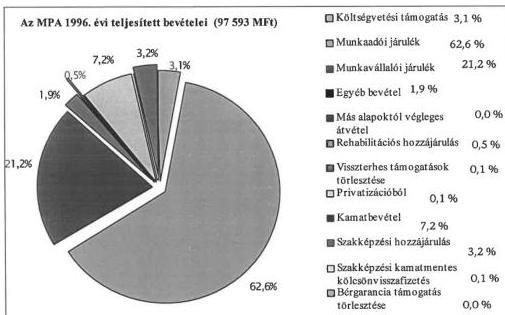

Az **1997. évtől** az alap költségvetési és privatizációs bevételei megszűntek. A **munkaadói és munkavállalói járulék aránya 1997. és 1998. évben** a bevételek 91-, illetve 92%-ára **emelkedtek**, a szakképzési hozzájárulás aránya 6,6%, illetve 5,6%-ra módosult, míg az egyéb bevételek - az 1996. évivel azonos jogcímen - aránya nem változott.

19

---

II. RÉSZLETES MEGÁLLAPÍTÁSOK

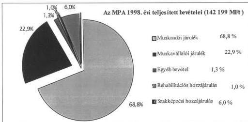

**A bevételi források mintegy 98%-át** - az adózás rendjéről szóló 1990. évi XCI. (Art.) törvény szerint - **az APEH szedi be**, a bevallások és befizetések jogszerűségét az adóellenőrzések keretében végzi.

Az APEH által kimutatott **hátralék a munkaadói járuléknál** 1996. évben 13.661 M Ft, 1997. évben 9.882 M Ft, a **munkavállalói járuléknál** 2.785 M Ft, illetve 1.524 M Ft volt. A **szakképzési hozzájárulásnál** az 1997. évi hátralék összege 413 M Ft. A hátralékok alakulása állandó mozgásban és változásban van, amely összefügg azzal, hogy - az Art eljárási rendje szerint - **az adómenkénti folyószámlák között az átvezetések lehetségesek**. A munkaadói és munkavállalói járulékok hátralék összegéből 1996. évben 5.013 M, 1997. évben 4.765 M Ft - felszámolási eljárás alatt levő adózói, a többi működő és átalakult, illetve végelszámolás nélkül megszűnt - vállalkozók hátraléka. Végrehajtás alatt 0,799 illetve 1.101 M Ft állt.

**A teljesített kiadás 1996. évben 91.281 M Ft**, az eredeti előirányzat 89,9%-a volt. Az eredeti, illetve módosított előirányzat és a teljesített kiadások szerkezeti megoszlásában nem volt lényeges eltérés. A teljesített kiadás **1997-ben 120.909 M Ft** az eredeti előirányzat 100,8%-a, a módosított előirányzat 105,2%-a volt. **Az 1998. évi kiadások összege 142.873 M Ft**. Az előirányzatok módosításáról a MAT hatáskörében rendelkezett, **a módosítások szabályszerűek voltak**.

A módosított előirányzatok és a teljesítések eltérése 1996-98. években az egyes alaprészeknél jelentősebb teljesítési különbséget takar: az aktív eszközöknél 96-98%-os, a munkanélküliek ellátásánál 90-93%-os, a bérgarancia alaprésznél a módosított előirányzathoz viszonyítva a teljesítés 70-74-91%-os.

20

---

II. RÉSZLETES MEGÁLLAPÍTÁSOK

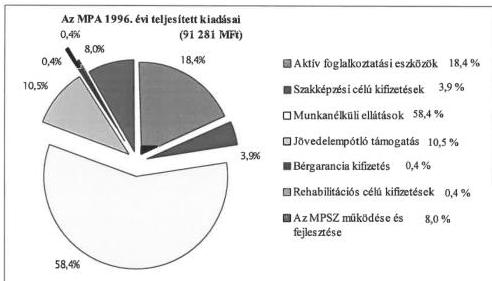

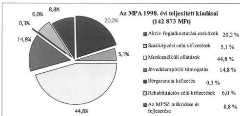

Az alap gazdálkodása több szinten folyt. A központi keretekkel alapvetően a minisztérium, a decentralizált keretekkel - (1997-től), illetve a központi keretből lebontott forrásokkal - az MK-k gazdálkodtak. A munkaerő-piaci helyzet átalakulásával megváltozott a kiadási jogcímeken felhasznált támogatások alaprészenkénti aránya. Csökkentek a munkanélküliek ellátására (passzív eszközök) fordított pénzeszközök.

A kifizetések legnagyobb, bár csökkenő hányadát a munkanélküli ellátások tették ki, ezt követte az aktív foglalkoztatási eszközök aránya, mely a teljes felhasználáson belül növekedett. Ugyancsak növekedő a jövedelempótló támogatások aránya is.

A támogatásoknál 1996-ról 1997-re arányeltolódás következett be a költségvetési szervek javára, mivel a működési alaprészből finanszírozott munkaerőpiaci szervezetek 1997-től a MüM (SzCsM) fejezethez kerültek át önálló címként.

21

---

II. RÉSZLETES MEGÁLLAPÍTÁSOK

Az alapból nyújtott támogatások 68,6%-át (1997-ben 52%-át) az önkormányzatok, 21,6%-át (1997-ben 17,8%-át) a vállalkozási szféra, 7,3%-át (1997-ben 6,9%-át) a lakosság és a társadalmi szervezetek kapták.

**Beruházási célra 22.266 M Ft-ot fordítottak, ebből a vállalkozások részesedtek a legnagyobb arányban, 1996-ban 42%-ban, illetve 1998-ban 50%-ban.** A költségvetési szervek részére beruházási célra átadott pénzeszközök aránya az 1996. évi 6%-ról 1997-re 30%-ra növekedett, mivel 1997-ben megkezdődött a munkaerő-piaci szervezetek 3 éves fejlesztési programja.

**A munkaerőpiac, a szakképzés, oktatás nem állami szervezésű programjait közalapítványokon keresztül támogatja** - törvényi felhatalmazás alapján - **a MAT.** Az MPA-ból támogatást nyert a Nyitott Szakképzésért Közalapítvány 1997-ben (1000 M Ft), 1998-tól a Határon Túli Magyar Oktatásért Apáczai Közalapítvány (500 M Ft) és a megyei Közoktatás Fejlesztési Közalapítványok (499,9 M Ft). Az Országos Foglalkoztatási Közalapítvány (OFA) 1996-ban 1050 M Ft-ot, 1997-ben és 1998-ban 1000-1000 M Ft-ot kapott. (Az OFA-t az ÁSZ még nem ellenőrizte.)

### 2.3. Az alap likviditása, követelésállománya

Az alap az ellenőrzött időszakban **folyamatosan likvid volt**, amit az 1995-1998. évi **költségvetési tartalékok** - 32.307,9 - 39.206,6 - 38.510,2 - 47.895,4 M Ft - folyamatosan **biztosítottak.** Az alap likviditási tervvel nem rendelkezett, mivel a működését rendező **jogszabályban szabályozatlan maradt az APEH adatszolgáltatási kötelezettsége az alapkezelő felé.**

Az **alapkezelő és az APEH között** - a finanszírozás ütemezéséről, a források és a hátralékok alakulásáról való folyamatos adatszolgáltatásra - **megállapodás nem jött létre.** Ezt befolyásolta az is, hogy az APEH magas térítési díj (80 M Ft) ellenében vállalná az adatszolgáltatást.

Az MPA 1996. év végi **követelésállománya 4.028,4 M Ft, 1997-ben 4.280,2 M Ft, 1998-ban 5.784,8 M Ft volt.** Az MPA 1996-ra jelentős nagyságú behajthatatlan követelésállományt halmozott fel annak ellenére, hogy az Áht. 108. §-a és az éves költségvetési törvény alapján a munkaügyi központok a MüM engedélye alapján kivezették követelésállományukból azokat a kis összegű (5.000 Ft alatti) követeléseket, amelyeket behajthatatlannak minősítettek.

Az MK-nál behajthatatlannak minősített állomány 1997. évben 400 M Ft, a MüM központi gazdálkodásában pedig 90 M Ft volt. A mérlegben kimutatott állomány 80%-a kétes követelés volt.

A **rehabilitációs alaprész** központi keretéből finanszírozott 10 minősített szerződésből 6 db kétesnek minősült, ezeknél a behajthatatlanság valószínűsíthető. (A Rehabilitációs Alap átvételekor 1996-ban könyvvizsgáló minősített 171 db szerződésből eredő követelésállományt.)

A visszafizetések teljesítésére vonatkozó jogi szabályozás (Flt-ben) garanciákat tartalmaz szerződésszegés, jogszerűtlenné váló támogatás visszakövetelések esetére.

22

---

II. RÉSZLETES MEGÁLLAPÍTÁSOK

A **szakképzési alaprész központi keretéből** nyújtott támogatásokra vonatkozó kölcsönszerződések biztosítékaként alkalmazott jelzálogbejegyzés lehetősége nem jelent kellő biztosítékot a támogatás visszafizetésére. Az 1991. évtől 1998. december 31-ig benyújtott 62 db jelzálog bejegyzési kérelemre - az önkormányzatok által megkötött hiányos hitelszerződés miatt - 42 esetben nem született bejegyzési határozat. A szerződések szerint biztosíték a beszedési megbízás is, melyvel az MPA még nem élt, mivel a kölcsönszerződésekben rögzített futamidő (10 év) nem járt le.

A **jövedelempótló támogatások** esetében a megállapítás és a visszakövetelés önkormányzati hatáskör, a finanszírozás azonban az MPA-ból történik.

### 3. A MUNKAERŐPIACI ALAP FORRÁSAINAK FELHASZNÁLÁSA

#### 3.1. Aktív munkaerőpiaci eszközök és programok

A kormányprogramok 1994-től aktív foglalkoztatás-politikát, új munkahelyek teremtését, a munkaerő-kereslet élénkítését tűzték ki célul. Ennek elősegítésére - többek között - olyan szabályozórendszer kialakítását szorgalmazták, amely a munkanélkülieket is érdekeltté teszi az elhelyezkedési, munkábaállási lehetőségek kihasználásában.

Ennek érdekében a **Foglalkoztatási és Rehabilitációs Alapokat** - 1996. január 1-jétől - **összevonták, ezzel megteremtették az aktív támogatások - eszközök és programok - forrását**. Az eszközök célja az, hogy támogatásukkal, szolgáltatásukkal, illetve ezek kombinációjával segítsék a munkanélküliek elhelyezkedését, illetve a munkahelyek megtartását. Az **ellenőrzött időszakban** a kijelölt célokra az MPA-ból **72.995 M Ft-ot használtak fel**, amit a központi költségvetésből 3.070 M Ft-tal egészítettek ki.

##### 3.1.1. A munkaerőpiaci képzés hatékonyságának, eredményességének, gazdaságosságának értékelése

A foglalkoztatás elősegítéséről és a munkanélküliek ellátásáról szóló **Flt. nem határozza meg részletesen a munkaerőpiaci képzés működtetésének célját**, de a jogosultság feltételeiből a célok egyértelműen adódnak.

Támogatható a képzése - többek között - a munkanélkülinek, a közhasznú munkát végzőknek, vagy akiknek a munkaviszonya várhatóan 1 éven belül megszűnik. A képzés elősegítésére keresetkiegészítés, keresetpótló juttatás és költségtérítés fizethető, azzal a céllal, hogy elősegítse a foglalkoztatást.

A képzés támogatására 1996-98. között összesen **19.370,6 M Ft-ot** - 1996-ban 4.857,6 M Ft-ot, 1997-ben 7.145 M Ft-ot, 1998-ban 7.368 M Ft-ot - **fordítottak, évente átlag 77 ezer fő vett részt a képzésben**.

Az oktatást az MK-k szervezik, irányítják a központi rendelkezések, irányelvek, a helyi munkaerőpiaci felmérések adatai, különböző, a témában érdekelt szervek

23

---

II. RÉSZLETES MEGÁLLAPÍTÁSOK

(kamarák, önkormányzatok, munkaügyi tanácsok stb.) véleménye, illetve döntése alapján.

A képzésre fordított **kiadások** az utóbbi 2 évben **több mint 50%-os növekedést mutattak**. Ez azonban annak a szervezeti változásnak a következménye, hogy a keresetpótló juttatásokat 1997-től nem a Szolidaritási alaprészből, hanem a Foglalkoztatási alaprészből finanszírozzák, a **tényleges növekedés 16%**.

A képzés **hatékonyságát és eredményességét a munkaügyi szervezet** félévenként **monitoring rendszerrel követi nyomon**. A képzés (tanfolyam) befejezését követő három hónap elteltével a munkaügyi szervezetek adatlapot (kérdőívet) juttattak el a végzettekhez. **Ellenőrzésünk** során az **1997. I. félévében befejezett** oktatási programok mutatóit elemeztük, amely a **3 képzési formára (ajánlott, elfogadott, munkaviszonyban levők) vonatkozik** (a kérdőívekre 58,3%-ban válaszoltak).

A képzés **hatékonyságát jelzi**, hogy 1997. I. félévben 23409 fő képzését kezdték meg, ebből **21843 fő fejezte be a tanulást, 12,7%-kal többen**, mint az előző év hasonló időszakában. Az ún. „lemorzsolódás” viszonylag alacsony, átlagosan 6,7%-os volt.

Az **ajánlott (tanfolyami csoportos) képzésben résztvevők létszáma 37,4%-kal, a munkaviszonyban állók képzési létszáma 52,9%-kal nőtt, csökkent viszont - 18,8%-kal - az elfogadott (egyéni) képzésben résztvevők száma**. A legnagyobb csökkenés a fővárosban volt, mivel ez utóbbi képzési forma iránt egy év alatt 64,8%-kal csökkent az érdeklődés.

A munkanélküliség kezeléséhez, a jövőbeni feladatok helyes megválasztásához segítséget adhat, ha a munkanélküliségi rátát régióinként egybevetjük a képzést befejezettek létszámának a munkanélküliek számához mért arányával. Eszerint az **alacsony munkanélküliségi rátájú - fejlettebb - régiókban a képzésben résztvevők aránya közel kétszerese a kedvezőtlenebb helyzetű régiókénak**. Ennek oka összetett: eltérő alapképzettség és környezet, a tudás megszerzése iránti eltérő hajlam stb.

A központi régióban (Budapest, Pest megye) és Észak-Dunántúlon (Fejér, Győr-Moson-Sopron, Komárom-Esztergom, Vas, Veszprém megyék) a munkanélküliek létszámához viszonyítva 6,1 - 6,6% fejezte be a képzést. Ezekben a régiókban a munkanélküliségi ráta 4,9 - 7,7% volt.

Ezzel szemben Észak-Magyarországon (BAZ, Heves, Nógrád megyék) és Észak-Alföldön (Hajdú-Bihar, Szabolcs-Szatmár-Bereg, Szolnok megyék) a képzést befejezettek aránya 3,6%, illetve 3,4%, míg ezekben az országrészekben a munkanélküliségi ráta 16,3%, illetve 15,7% volt.

A **regisztrált munkanélküliek több mint 40%-a legfeljebb 8 általános** - ezen belül 6,1% ez alatti - **iskolai végzettséggel rendelkezik**. Ez a **kb. 180 ezer fő** a munkához jutás szempontjából a legkritikusabb réteg. Képzettségük miatt csak a legegyszerűbb fizikai munkákra alkalmasak, munkájuk iránti igény csökkenő tendenciájú és várhatóan az lesz a jövőben is. Ezen belül

24

---

II. RÉSZLETES MEGÁLLAPÍTÁSOK

található a hazai roma népesség nagy hányada, akik képzésére eddig a munkaerőpiaci képzés keretében átütő megoldást még nem sikerült találni.

Megjegyezzük, hogy az egyetemi, főiskolai végzettséggel rendelkező munkanélküliek aránya mindössze 2,3%.

Az alacsony képzettségi szint és a munkanélküliségi ráta között szoros a korreláció. Azokban a régiókban, ahol az alacsony képzettségűek aránya magas (Észak-Magyarország, Dél-Magyarország, Észak-Alföld), ott a munkanélküliségi ráta magas. Ezek a mutatók régiónként differenciált képzési elveket, irányelveket igényelnek.

A képzést végző szervezetek száma - a munkaügyi tapasztalatok, szelekció miatt - jelentősen csökkent.

Ezt érzékeltetik pl. a fővárosi adatok, amelyek szerint korábban 200-300 képző költségvetési intézmény, vállalkozás működött közre, számuk 1996-ra 101-re, majd 1997-re 60-ra csökkent. A szelekció összefügg a képzés színvonalának emelkedésével is.

A képzést végző szervezetek összetételét jelzi, hogy köztük számszerűen jóval több a vállalkozás, mint a költségvetési intézmény, annak ellenére, hogy a képzés nagyrészt az utóbbiak helyiségeiben történik, de a vállalkozások keretében, a költségvetési intézményekben - iskolákban - dolgozó tanárok, oktatók közreműködésével. Az iskolák tartózkodása arra utal, hogy a fenntartó önkormányzatok a költségvetési támogatások megállapításánál csökkentő tényezőként veszik figyelembe a képzésért kapott intézményi bevételeket (pl. Somogy megye).

A képzés eredményességét jelzi, hogy a felméréskor a válaszadók 51,7%-ának volt munkahelye - az előző évi 49,1%-kal szemben - ezen belül 82,5%-a jutott szakmájának megfelelő munkakörbe.

A képzési költségek magas hányada - legalábbis rövid távon - csak részben hasznosult, ami a támogatási forma gazdaságosságát befolyásolja.

Az egy főre jutó támogatás az ajánlott (csoportos) képzésnél az ellenőrzött időszakban 87,7 E Ft/fő volt, 9%-kal magasabb, mint az előző időszakban. Az egy fő munkaviszonyban állóra jutó támogatás 361 E Ft/fő volt, 16,4%-kal magasabb, mint 1996-ban. Ugyanakkor 28%-kal csökkent az elfogadott (egyéni) képzés költsége (82,3 E Ft/fő) 1996-hoz képest.

A fajlagos költségek nagyságát nagymértékben befolyásolja, hogy a különböző időtartamú, más-más szakmai irányultságú, fokozatú, formájú stb. képzési rendszerek költségigényei igen eltérőek.

A monitoring rendszer az eltérő képzési kritériumok szerinti mutatókkal nem rendelkezik, így csak a képzési költségek eltéréseire utal, ami további elemzések szükségességére hívja fel a figyelmet.

Mindezt alátámasztja a költségek területenkénti jelentős szóródása, aminek tartalmi ismerete nélkül nem lehet minősíteni a szélső értékeket. Az el-

25

---

II. RÉSZLETES MEGÁLLAPÍTÁSOK

**térések** konkrét **okainak feltárása jelentős megtakarítások forrása lehet.**

Ajánlott (csoportos) képzésnél az átlagos támogatás összege 117,1 E Ft/fő, Vas megyében 70,6 E Ft/fő, Győr-Moson-Sopron megyében 221,7 E Ft/fő, az elfogadott (egyéni) képzésnél 82,3 Ft/fő, Hajdú-Bihar megyében 24,7 E Ft, Budapesten 169,0 Ft/fő volt.

A munkaerőpiaci **képzés jövőbeni nagyságát és irányát** az adott térségben lévő munkanélküliek **képzettség szerinti megoszlása befolyásolja**, ez régiónként jelentős eltéréseket mutat.

Az alacsony végzettségűek aránya kisebb a központi régióban (37,6%), illetve az Észak-Dunántúli régióban (39,5%), ezzel szemben magasabb az arány Észak-Magyarországon (42,9%) és az Észak-Alföldön (44,6%).

A munkaügyi központok a megyei munkaerőpiaci ismeretek alapján éves képzési tervet készítenek. A tervekben megjelölt és megvalósult képzések áttekintése és 7 megyei központnál végzett helyszíni tapasztalatok alapján megállapítottuk, hogy **rendkívül sok szakmában folyik képzés, nem érzékelhetők azok a tendenciák**, amelyek a **munkaerő igények és a képzés tekintetében új, ún. „húzóágazatok” és ezekhez kapcsolódó szakmák előretörésében nyilvánulnának meg.**

A viszonylag legnagyobb létszámot érintő támogatási forma a számítástechnikai ismeretek, a személy- és vagyonőr, az idegen nyelv tanulás (angol-német), könyvelő, asztalos, kőműves, hegesztő, áruházi eladó, pénztáros, gépkocsi vezető képzésére terjed ki.

### 3.1.2. Bértámogatás típusú eszközök

A **foglalkoztatás-bővítő bértámogatás**, a **munkatapasztalat szerzési és foglalkoztatási támogatás** általános **célja** az, hogy támogatásokkal, szolgáltatásokkal javítsák a munkanélküliek munkaerőpiaci pozícióját, segítsék elhelyezkedésüket.

A támogatási eszközök között a bértámogatás viszonylag **költséges támogatási forma**, a munkaerőpiaci képzés után **1997-ben** - az egy főre jutó támogatás összege alapján - **a második helyen volt.**

#### 3.1.2.1. A foglalkoztatást bővítő bértámogatás hatékonyságának, eredményességének értékelése

A foglalkoztatást bővítő **bértámogatás célja a tartósan munkanélküliek foglalkoztatásának elősegítése** az őket alkalmazó **munkáltatók támogatásával**, továbbá a **foglalkoztatási kötelezettség időtartamán túli továbbfoglalkoztatás esélyeinek megteremtése.**

A **bértámogatást** a foglalkoztatási alaprész decentralizált kerete finanszírozza, 1996-1998. között **7.715,9 M Ft** - 1996-ban 1.878,2 M Ft, 1997-ben

26

---

II. RÉSZLETES MEGÁLLAPÍTÁSOK

3.005,1 M Ft, 1998-ban 2.832,6 M Ft - **volt a kiadás**. A támogatási eszközt a **megyék eltérő mértékben alkalmazták**.

**BAZ megyében** 1997-ben a tartós munkanélkülieket foglalkoztató munkáltatót hat hónapig a munkavállaló bruttó bérének 100%-ig támogatta, a munkabér 75%-át finanszírozta, ha a munkavállaló egy évnél rövidebb ideig volt munkanélküli. Ettől szigorúbb feltételeket írt elő 1998-ban és a 70-100% közötti bértámogatást 3-6 hónapos időtartamra finanszírozta.

**Baranya megyében** 1996-ban a támogatás mértéke a magas munkanélküliségi rátával rendelkező térségekben egy évre 70-100% közötti. Minden más esetben a támogatás mértéke csak a bér 50%-a lehet és csak hat hónapra adható.

**Bács-Kiskun megyében** a támogatást a szervezet 1996-ban kétszer is megemelte, először 60%-ról 80%-ra, majd októbertől 100%-ra.

Monitoring vizsgálat segítségével ellenőrizték a fajlagos költségek alakulását. A **megyei központok által nyújtott támogatás** - amit a foglalkoztatások befejezéséig finanszíroztak - **csökkent**: 1996-ban 1,3 Mrd Ft, 1997-ben 1,1 Mrd Ft volt. **Növekedett viszont az egy főre jutó támogatás átlagos összege, 1996-ban 108,7 E Ft-ról 1997-ben 118,8 E Ft-ra**.

A **támogatás hatékonyságát jelzi**, hogy a támogatást igénybe vevő munkáltatók és a támogatással foglalkoztatott **munkavállalók** száma évről-évre emelkedett, **1996-ban 29,7 ezer fő, 1997-ben 38,5 ezer fő, 1998-ban közel 50 ezer fő munkanélküli alkalmazását tette lehetővé**. A támogatást igénylő **munkáltatók száma 1996-ban 20,5 ezer fő, 1997-ben 30,5 ezer fő volt**.

A bértámogatás működtetésével kapcsolatos ráfordítások hatékonyságát, eredményességét a munkaügyi szervezet monitoring módszer segítségével méri. A támogatott munkáltatókat a munkaügyi szervezet kérdőíves megkereséssel - a támogatás, illetve a továbbfoglalkoztatási idő befejezését követő három hónap elteltével - a befejezett foglalkoztatásokról nyilatkoztatta. A támogatást az OMMK monitoring felmérésének adatai alapján 1996-1997. évekre értékeltük.

A válaszok 1996-ban 11971 főre, 1997-ben 9425 főre vonatkoznak, a megkeresett munkáltatók közel 70%-a válaszolt a kérdőívekre.

Az egy munkáltatóra jutó, támogatással foglalkoztatott létszám az 1996. évi 1,4 főről 1997-ben 1,3 főre csökkent, ami azt jelzi, hogy **a támogatott munkáltatók jellemzően az egyéni vállalkozók**, illetve a kisebb társas vállalkozások köréből kerültek ki. A 10 főnél több dolgozót foglalkoztató vállalatok kevésbé igényelték ezt a támogatási formát.

A munkaügyi központok **a támogatási feltételek megyénként eltérő változtatásával befolyásolták a munkáltatói érdeklődést**, ennek következménye, hogy a **támogatásban részt vevők száma megyénként eltérő**.

A foglalkoztatást bővítő bértámogatással alkalmazottak száma 1996-ban négy megyében 2-4 ezer fő közötti (Borsod-Abaúj-Zemplén megyében, Szabolcs-

27

---

II. RÉSZLETES MEGÁLLAPÍTÁSOK

Szatmár-Bereg megyében, Békés megyében és Hajdú-Bihar megyében), a megyék felénél 1-2 ezer fő, öt megye nem éri el az ezer fő foglalkoztatást, pl. Vas-, Zala megye.

A munkaügyi központok többsége (15 megye) 1997-ben 1-1,5 ezer főt alkalmazott bértámogatással. Kiemelten több foglalkoztatás (3-6 ezer fő) a magas munkanélküliséget regisztráló megyékben volt. Pl. 1997-ben Borsod-Abaúj-Zemplén megyében 5674 ezer főt, Szabolcs-Szatmár-Bereg megyében 4154 főt, Hajdú-Bihar megyében 3038 főt, Békés megyében 3062 főt foglalkoztattak.

A felmérés választ adott arra, hogy a bértámogatásnak milyen szerepe volt a foglalkoztatásra irányuló döntésekben. **A támogatási forma hatékonyságára utal a munkaadók válasza.**

Az érintett **munkáltatók 72,1%-a (1996-ban), illetve 71,4%-a (1997-ben) úgy nyilatkozott, hogy a támogatás hozzájárult a foglalkoztatáshoz.** A munkaügyi központok által nyújtott támogatás lehetővé tette a foglalkoztatás megvalósítását, illetve elősegítette a továbbfoglalkoztatást.

**Növekedett** (39,3%-ról 43%-ra) azok száma, akik támogatás nélkül halasztották volna a munkavállalók felvételét.

**Kis mértékben csökkent** (19,9%-ról 18,0%-ra) azoknak az aránya, akik a **bértámogatás nélkül nem tudták volna bővíteni a foglalkoztatást.**

**Közel azonos szinten maradt** azoknak a munkaadóknak az aránya - 1996-ban a munkaadók **27,9%**, 1997-ben **28,6%** -, akik úgy nyilatkoztak, hogy a **támogatás nélkül is** azonos létszámot foglalkoztattak volna, **körükben tehát a támogatásnak** nem volt szerepe a foglalkoztatásra irányuló döntésükben.

**Csökkent** (12,9%-ról 10,4%-ra) azok aránya, akik a támogatás nélkül csak kevesebb munkavállalót alkalmaztak volna, ezen munkáltatóknál időben kedvezően befolyásolta a támogatás a foglalkoztatás lehetőségét.

A **támogatási forma eredményességét mutatja** - bár a foglalkoztatottak száma némileg csökkent -, hogy a kérdőíves megkérdezés időpontjában a felmérésben szereplő **foglalkoztatottak 70,1%-a (1996-ban), illetve 66,3%-a (1997-ben) ugyanannál a munkáltatónál munkaviszonyban állt.** Vagyis a munkáltatók a bértámogatással foglalkoztatottak több mint kétharmadát a támogatási idő lejártával - amikor a munkaügyi központok már nem támogatták - véglegesítették.

### 3.1.2.2. A munkatapasztalat szerzés és foglalkoztatási támogatás hatékonyságának, eredményességének értékelése

A passzív ellátást jelentő pályakezdők segélye helyett 1996. júliustól a **pályakezdő munkanélküliek elhelyezkedését két új aktív eszközzel ösztönzik. A munkatapasztalat szerzés és foglalkoztatási támogatás célja, hogy segítséget nyújtsanak a fiatalok pályakezdéséhez, az első munkahely megszerzéséhez, a munkatapasztalat szerzéséhez, a tartós foglalkoztatás esélyeinek megteremtéséhez.**

28

---

II. RÉSZLETES MEGÁLLAPÍTÁSOK

Az aktív eszközök bevezetését indokolta, hogy a regisztrált munkanélkülieken belül nőtt a pályakezdők száma és aránya.

A munkanélküliek száma 1991. és 1996. év februári adatok szerint 128 ezer főről 531 ezer főre emelkedett - amely négyszeres emelkedést mutat - míg a pályakezdő munkanélküliek növekedése több mint húszszoros (2,5 ezer főről 54 ezer főre) volt, az arányuk 2%-ról 10,2%-ra nőtt.

Általános tapasztalat volt a két új eszköz bevezetése előtt, hogy a munkaadók az üres álláshelyek betöltésénél a gyakorlott, azonnal munkába állítható munkaerőt részesítették előnyben még akkor is, ha a pályakezdő után magasabb összegű bértámogatáshoz juthattak volna.

**A munkatapasztalat szerzés támogatása** a munkáltatókat arra ösztönzi, hogy mind a szakképzett, mind a szakképzetlen pályakezdőket - legalább napi négy órában, legalább egy évig - olyan munkakörben foglalkoztassa, amelyben a munkanélküli megfelelő munkatapasztalatot szerezhet.

**A foglalkoztatási támogatás** a gyakorlati oktatást végző munkáltatókat ösztönzi a náluk tanuló fiatalok további foglalkoztatására. A munkaadó részére akkor állapítható meg támogatás, ha legalább napi 6 órában olyan pályakezdő fiatal - szakképzettségének megfelelő - foglalkoztatását vállalja, aki legalább egy tanéven keresztül a kérelmet benyújtó munkáltatónál részesült gyakorlati képzésben.

A munkatapasztalat szerzés és foglalkoztatási támogatások működését **1996-ban** a foglalkoztatási alaprész **központi kerete**, majd **1997-től** a megyékre bontott **decentralizált kerete finanszírozta**. **A munkatapasztalat szerzés támogatására 1996-ban 30,6 M Ft-ot, 1997-ben 629,7 M Ft-ot, 1998-ban 2266,8 M Ft-ot fordítottak.** A többszörös kiadásnövekedést a támogatási mérték és a létszám növekedése indokolta.

A pályakezdők **foglalkoztatási támogatásának** kiadása **1996-ban 74,5 M Ft, 1997-ben 190,0 M Ft, 1998-ban 117,0 M Ft volt**, változása összefüggött a támogatási formában részt vevők létszámával.

**A foglalkoztatási támogatás** munkában állókra vetített éves **összege 101,5 E Ft/fő, a munkatapasztalat szerzési támogatásnál 117,2 E Ft/fő.** Ez utóbbi támogatásból kikerültek körében a kiadások magasabbak voltak, egy fiatal foglalkoztatása - éves szinten átlagosan 113,6 E Ft - a foglalkoztatási támogatás egy főre átlagosan 73,4 E Ft volt.

A teljesítmények értékelését **a foglalkoztatási támogatásnál** a minisztérium által készített **monitoring vizsgálatra, a munkatapasztalat-szerzés támogatásnál** az ellenőrzésünk során összeállított **kérdőívekre** adott válaszokra építettük.

**Felmérésünk 6 megyére terjedt ki** (Vas, BAZ, Békés, Szabolcs-Szatmár-Bereg, Győr-Moson-Sopron, Pest megyékre), ahol az eszközfelhasználás a legkisebb, illetve a legnagyobb volt. **350 munkáltatót és 580 munkavállalót kerestünk meg, az átlagos válaszadási arány 48% volt.**

29

---

II. RÉSZLETES MEGÁLLAPÍTÁSOK

**A munkatapasztalat szerzés támogatásban részt vevő pályakezdők létszáma az előző évhez viszonyítva 1997. évben - 10904 fő - több mint négyszeresére nőtt (1996-ban 2713 fő), az 1998. évben 20.000 fő volt, mindez a támogatás működésének hatékonyságára utal.**

A létszám alakulására kedvezően hatott, hogy 1997-től nőtt a támogatási mérték (50%-ról 50-100%-ra), amelynek eredményeként a munkatapasztalat szerzés támogatási forma a munkáltatók körében kedvelt támogatási eszközzé vált.

**A foglalkoztatási támogatással érintett létszám 1997-ben 4661 fő, 48,6%-kal több, mint az 1996. évi (3137 fő) létszám, ugyanakkor 1998-ban 3300 fő volt, az előző évhez képest 22,9%-kal csökkent. Ez a támogatási eszköz a munkáltatók körében a támogatás alacsony mértéke, a továbbfoglalkoztatási kötelezettség miatt kevésbé kedvelt foglalkoztatási eszköz, mint a munkatapasztalat szerzés támogatása. Hatékonyságára kedvezőtlen, hogy a gyakorlati oktatást végző munkáltatókat arra készteti a jogszabály, hogy egy tanév lejárta után az addig náluk tanuló fiatalokat - további maximum 1 évig - támogatás nélkül foglalkoztassák.**

**A munkatapasztalat-szerzés támogatásának értékeléshez készített kérdőívekre adott válaszok arra utalnak, hogy a fiatalok egyharmada önerőből meg sem kísérelte az elhelyezkedést, a munkaügyi központ közreműködésével tervezte a munkavállalást. Többsége (66%-a) egyszer, illetve többször is megkísérelte a munkavállalást. Az elhelyezkedésük sikertelenségét a megkérdezettek fele a munkáltatók elutasító magatartásában látja.**

**A munkanélküliek 69%-át végzettségének megfelelő munkakörben foglalkoztatják.** Az iskolai végzettségtől eltérő munkavégzést a fiatal azért vállalta, mert szüksége volt keresetre, vagy érdekelte a felajánlott munka, illetve mindenképpen dolgozni akart.

**A munkáltatók úgy nyilatkoztak, hogy a pályakezdő munkanélküliek foglalkoztatását befolyásolná, ha a támogatás nem lenne, mert a 45%-a nem alkalmazna, 43%-a nem tudott volna pályakezdőt alkalmazni.** A támogatási eszköz a munkáltatókat részben a pályakezdők foglalkoztatására ösztönözte, másrészt viszont a támogatás lényegében a gazdálkodó szervezetek munkaerő költségéhez való részbeni hozzájárulást jelentette.

**Munkatapasztalat szerzés és foglalkoztatási támogatással a pályakezdő munkanélküliek elhelyezkedési pozíciója javult, az eszközök felhasználásának eredményességét mutatja, hogy 1996-ban átlagosan 3365, 1997-ben 6096, 1998. évben 10302 fiatalt foglalkoztattak.**

**Az eredményességi mutató** - melyet monitoring vizsgálattal a támogatás befejezése után 3 hónappal határoztak meg - **a foglalkoztatási támogatásnál kedvezőbb, a támogatás befejezése után a fiatalok 72,1%-át foglalkoztatták a már nem támogatott munkáltatók.** Kérdőíves felmérésünk alapján **a munkatapasztalat-szerzési támogatásnál a továbbfoglalkoztatás aránya 65,7%**, ami az eszköz felhasználásának eredményességét jelenti.

30

---

II. RÉSZLETES MEGÁLLAPÍTÁSOK

A munkaerőpiaci szervezettel együttműködő fiatalok fele a nyilvántartásba vétele után 1-3 hónapon belül el tudott helyezkedni. Egyharmada 4-12 hónap között és 14%-a egy év után azonban csak támogatással tudott elhelyezkedni. A fiatalok nagy részét (69%-át) a munkáltatók napi 6-8 órában foglalkoztatták, illetve egy részüket (26%) napi nyolc órát meghaladóan is.

A támogatással elhelyezett munkanélküli fiatalok többsége (68%) 19-22 év közötti, 58%-a nő, s lakóhelyüket tekintve 55%-a városban él. A megkérdezettek fele szakmunkásképző és szakközépiskolával rendelkezik, 16%-ának gimnáziumi, 12%-ának főiskolai végzettsége van.

### 3.1.3. Munkahelyteremtés eszközrendszere

A munkahelyteremtés támogatásának eszközrendszere **segíti a vállalkozást indító munkanélkülieket**, hozzájárul új munkahelyek létrehozásához, visszatérítendő tőkejuttatással ösztönzi **az önfoglalkoztatóvá válást**, illetve segíti **a munkaerőpiacról tartósan kiszoruló munkanélküliek alkalmazását**.

#### 3.1.3.1. Hagyományos munkahelyteremtés támogatásának gazdaságossága, hatékonysága

Munkahelyteremtés támogatására 1991. óta van lehetőség, pályázati eljárás alapján támogatás nyújtható a foglalkoztatási szempontból **különösen nehéz helyzetben lévő térségekben** a munkaerőpiacról tartósan kiszoruló rétegek foglalkoztatását elősegítő **új munkahelyek megvalósításához**.

Hagyományos munkahelyteremtésre **1996-98. között 3.495,2 M Ft-ot fordítottak**.

Ebből 715,5 M Ft-ot - a decentralizált keret kiegészítéseként - BAZ, Nógrád és Szabolcs-Szatmár-Bereg megyék kaptak.

**A támogatások túlnyomó többsége kamatmentes visszatérítendő támogatás** (1996-ban kb. 74%, 1997-ben 66%, 1998-ban 86%) volt. A vissza nem térítendő támogatást jellemzően Baranya megyében azok a munkáltatók kapták, akik a megváltozott munkaképességű munkanélküliek foglalkoztatását vállalták (1996-1998-ban összesen 54,8 M Ft-ot).

**A támogatás alkalmazása** - szabályozatlansága miatt - **nehézséget okozott**, ezért **több** (1996-ban 12, 1997-ben 8) **megyében nem írtak ki pályázatot**.

Nem volt szabályozva a támogatás formája, mértéke, feltétele. A tőkejuttatás formáját, a foglalkoztatási kötelezettség időtartamát a megyék önállóan - differenciáltan - állapították meg, figyelembe véve a szűk forráslehetőségeket.

A hagyományos munkahelyteremtési támogatás **hatékonyságát nem követik a monitoring vizsgálattal**. Az OMMK statisztikai rendszerében is viszonylag **kevés adat áll rendelkezésre**, a közölt adatok változtatása megnehezíti az összehasonlítást, a támogatás teljesítményellenőrzését.

31

---

II. RÉSZLETES MEGÁLLAPÍTÁSOK---

Az eszköz **célja az új munkahelyek létrehozása**. A kifizetés ugyan emelkedett 832,2 M Ft-ról 1552,3 M Ft-ra, de a **felhasználás során tapasztalt problémák** (pl. foglalkoztatási kötelezettségek be nem tartása, csődök, felszámolási eljárások) és a **szigorodó pályázati feltételek miatt csökkent a munkáltatók érdeklődése**.

Míg 1993-95. között 1730, addig 1996-98. között 1080 munkáltatót támogattak.

**A munkahelyek létrehozását - a romló alkalmazási mutatók ellenére - növekvő összeggel támogatták.** A támogatást általában az új munkahelyeken foglalkoztatottak létszámától függően állapították meg, munkahelyenként változó - **0,2 - 0,6 M Ft - között összegben**. A támogatást 3-5 év alatt kellett visszafizetni.

Egy munkahely létrehozását 1996-ban átlagosan 0,2 M Ft-tal, 1997-ben 0,5 M Ft-tal 1998-ban 0,6 M Ft-tal támogatták, a növekedést az infláció is befolyásolta.

Mindezek alapján a támogatás **nem minősíthető gazdaságosnak**.

A támogatás **hatékonyságát rontotta**, hogy az elfogadott pályázatokban tervezett **munkahelyek nem a vállalt mértékben valósultak meg, s kisebb volt a ténylegesen betöltött új munkahelyek száma**, ami azt jelzi, hogy a **szerződéses kötelezettségüknek nem tettek eleget a támogatottak**, jelentős volt a visszafizetési kötelezettség (lásd. 65. oldal).

**1996-ban** 188 pályázati szerződésben 1057 új munkahely kialakítását vállalták, de ennél több (1406) valósult meg. **1997-ben** 378 szerződésben 1492 új munkahelyet terveztek, de csak 1305 betöltött új munkahely jött létre, **1998-ban** az arányok tovább romlottak: az 516 szerződésben vállalt 3664 új munkahely helyett csak 1914 betöltött új munkahely létesült.

A támogatás **hatékonyságát kedvezőtlenül befolyásolta**, hogy több esetben szükséges volt a **szerződések** vagy a beruházások határidejének, az alkalmazottak számának **módosítása**. (Rossz kalkuláció, elhúzódó beruházások, romló értékesítési feltételek stb. miatt.)

**Nógrád megyében** 1997-ben 30 megkötött szerződésből 14-et módosítottak, **Baranya megyében** 53-ből 16-ot. Kedvezőbb az arány pl. Bács-Kiskun megyében, ahol 35-ből kettőt, Tolna megyében 45-ből 6 szerződést módosítottak.

Megjegyezzük, hogy a beérkezett, illetve a későbbiekben módosított pályázatok számáról országos összesítés nem áll rendelkezésre.

**Évről-évre csökkent a támogatással létrehozott új munkahelyen dolgozók száma is.** (Kevesebb pályázatot írtak ki, illetve lejárt a korábbi támogatásoknál vállalt foglalkoztatási kötelezettség.)

Támogatással létrehozott munkahelyen 1996. végén 19,1 ezren, 1997. végén 13,4 ezren, 1998. végén 12,4 ezren dolgoztak.

---32

---

II. RÉSZLETES MEGÁLLAPÍTÁSOK

### 3.1.3.2. Munkanélküliek vállalkozóvá válását segítő támogatás hatékonysága, eredményessége

Az 1991-től alkalmazott eszköz szabályozása érdemben nem változott, támogatásban - az Flt. szerint - **az a munkanélküli részesülhet, aki munkanélküli járadékot kap és az MK továbbra sem tud részére megfelelő munkahelyet felajánlani.** A támogatás célja, hogy a vállalkozóvá válás kezdetén a megélhetést biztosítsa.

A támogatás 4 címen adható. Elsősorban a **munkanélküli járadék összegének megfelelő támogatás - legfeljebb további 6 hónapig - vált gyakorivá.** (A vállalkozó válás támogatását megelőzően a munkanélküli járadék maximum 12 hónapig adható, vagyis ezzel az eszközzel a járadék folyósítást hosszabbították meg.) Általában a további 3 lehetőséget nem veszik igénybe, mivel a vállalkozónak a költségek 50%-át meg kell fizetni.

Ezek a vállalkozói tevékenység igazolásával igénybe vett, az MK által ajánlott **szaktanácsadás költségei** legfeljebb 50%-ának megtérítése; a vállalkozói tevékenység gyakorlásához szükséges **tanfolyami képzés költségeinek** maximum 50%-os megtérítése; hitel felvétele esetén a **hitelfedezeti biztosítás** költségeinek legfeljebb 50%-os megtérítése, legfeljebb egy éves időtartamra.

A támogatási forma aránya az aktív eszközökön belül nem jelentős (országosan 1,0-4,4% közötti). **1996-98. között 793,2 M Ft támogatást fizettek ki erre a célra.** A kifizetés évenkénti változása - 233,4 M Ft, 259,6 M Ft, 300,2 M Ft - nem jelentős, lényegében a járadékok összegének emelkedéséből adódik.

A fentiekre kifizetett támogatás a foglalkoztatási alaprész decentralizált keretének 1996-ban 2,1%-a, 1997-ben 1,2%-a, 1998-ban 1,4% volt.

**A támogatás fajlagos költsége nőtt, az egy főre jutó támogatás 1996-ban 65,0 E Ft, 1997-ben 78,2 E Ft, a követéskor még működő vállalkozásokra számított összegek: 72,1-86,6 E Ft/fő volt, a növekedés aránya mindkét esetben 20%-os volt.**

A fajlagos költségek növekedését a támogatás időtartamának változása, illetve a járadék átlagos összegének évenkénti növekedése befolyásolta.

A vállalkozóvá válási támogatás 1994. óta szerepel a monitoring felmérésekben. Megállapításainkat az OMMK felméréseire, adataira és teljesítménymutatókra alapoztuk.

**A támogatás hatékonyságára kedvezőtlen volt, hogy az adott évben belépők száma csökkent, 1996-ban 3755 fő, 1997-ben 3317 fő, 1998-ban már csak 3120 fő volt.**

A vállalkozóvá válók gazdasági ágak szerinti megoszlása kis mértékben változott. Csökkent - 17,7%-ról 13,4%-ra - a mezőgazdasági és építőipari tevékenységet folytatók, emelkedett a feldolgozóipar, kereskedelem és szolgáltatás területén vállalkozók száma. **A támogatottak több, mint harmada a kereskedelemben, egynegyede a szolgáltatásban vállalkozott, tehát a ki-**

33

---

II. RÉSZLETES MEGÁLLAPÍTÁSOK

**sebb tőkeigényű szakágazatokban.** Így a vállalkozások beindításához szükséges **tőke hiánya**, a kereskedelem, szolgáltatás telítettsége is **hozzájárult ahhoz, hogy 1996-tól 1998-ra 83%-ra csökkent az igénylők létszáma.**

A támogatást igénybe vevők száma jelentős területi különbségeket mutat.

A támogatás igénybevétele azokban a megyékben **alacsonyabb** (0,6-0,8-1%), **ahol magas a regisztrált munkanélküliség** (Nógrád, Szabolcs-Szatmár-Bereg, Borsod-Abaúj-Zemplén) a **kedvező helyzetű** (Győr-Moson-Sopron, Vas, Pest) megyékben **magasabb arányú** (1,9-3,3-1,6%) volt 1997-ben az eszköz igénybevétele az aktív eszközök között.

A magasabb arányú igénybevételt a kedvezőbb gazdasági környezeten túl az is indokolta, hogy az eszközt a **szakmunkás képzőt, illetve középiskolát végzettek nagyobb számban veszik igénybe, az alacsonyabb munkanélküliségi rátájú megyékben pedig magasabb az ilyen végzettségűek aránya.** A támogatást a még járadékban részesülők kérhetik, s a kedvezőtlenebb helyzetű megyékben magas a tartósan munkanélküli, járadékban már nem részesülők aránya.

A támogatás **hatékonyságát** segít megítélni az 1996. évre vonatkozó monitoring vizsgálat során feltett kérdés, amely arra keresett választ, hogy a **támogatás nélkül vállalkoztak volna-e a programban résztvevők.**

**A válaszolók egynegyede** - 1996-ban 25,5, 1997-ben 25,6% - **támogatás nélkül nem vállalkozott volna, a támogatást szükségesnek ítélte.**

**A válaszolók 46-47%-a a támogatás nélkül csak később vállalkozott volna, de a külső segítség meggyorsította, hogy vállalkozó legyen.**

Alig változott azoknak az aránya, akik a **támogatás nélkül is vállalkoztak volna** - 27,8, illetve 28,9% - ebben az esetben **megkérdőjelezhető a támogatás szükségessége.**

A **megyék közötti különbségek** a támogatás hatékonyságának megítélésénél is **jelentősek.**

Fejér, Tolna, Vas megyékben 30% fölött (30,3-35,7%) volt azoknak az aránya, akik támogatás nélkül nem vállalkoztak volna. Ez Baranya, Nógrád, Somogy megyékben 20% alatti. Jellemző azonban, hogy 1996-ról **1997-re csökkent azon megyék száma, ahol 30% fölött volt a támogatásra feltétlenül rászorulók aránya.**

**Kis mértékben növekedett** - 0,2-ről 0,3-ra - **a támogatással vállalkozóvá válók által foglalkoztatott alkalmazottak száma, tehát a támogatással döntően önfoglalkoztatók maradtak.**

1997-ben már **nőttek a megyék közötti különbségek**, 0,1-0,9 fő alkalmazott volt a jellemző, míg 1996-ban 0,1-0,4 fő. A magasabb alkalmazotti arány 1997-ben Bács-Kiskun, Fejér, Somogy megyékben, az alacsonyabb Baranya-, Győr-Moson-Sopron és Komárom megyékben volt.

34

---

II. RÉSZLETES MEGÁLLAPÍTÁSOK

**A támogatás eredményességét jelzi, hogy befejezése után három hónappal a támogatott vállalkozások közel 90%-a működött.**

A vállalkozások működőképességének megítéléséhez a három hónap megfigyelése nem elégséges, célszerű lenne hosszabb idő után megismételni a felmérést (pl. az önfoglalkoztatóvá válás támogatási forma esetén egy éves megfigyelésünk volt).

**A támogatott működő vállalkozások aránya megyénként 59-96% között változott, 1997-ben 86-96% volt a jellemző.**

**1996-ról 1997-re pl. csökkent** a fővárosban (97%-ról 91%-ra), Baranya megyében (70%-ról 59%-ra), Bács-Kiskun megyében (97%-ról 87%-ra), Békés megyében (88%-ról 78%-ra), Veszprém megyében (98%-ról 89%-ra), **kedvezően alakult** Heves megyében (88%-ról 97%-ra), Nógrád megyében (90%-ról 96%-ra) mert nőtt a működő vállalkozások aránya.

**A támogatást igénybe vevők lényegében saját erőből, 4-6 havi járadékfolyósítás meghosszabbítással kilépnek a munkanélküliek köréből, hosszabb ideig - 1-2 évig - nem vehetnek igénybe - még szükség (pl. a vállalkozás csődje) esetén sem munkanélküli támogatást.** (A jelenlegi szabályozás vállalkozók részére ezt nem teszi lehetővé.)

A monitoring vizsgálat kitért a vállalkozás jövőjének megítélésére is. A vállalkozás jövőjét kilátástalannak ítélők aránya 1996-ról 1997-re 2,2%-ról 0,5%-ra csökkent, **jelentősen emelkedett azonban a bizonytalan jövőképű vállalkozások aránya, 37,8%-ról 54,9%-ra. Kis mértékben nőtt a fejleszthetőnek vélt vállalkozások száma (10,8%-ról 12,5%-ra).** Korábban a válaszolók közel **50%-a szintentarthatónak** vélte a vállalkozását, 1997-re ez az arány már **32%-ra mérséklődött.**

A gazdaságilag kedvezőtlenebb helyzetű megyékben magasabb a kényszervállalkozók aránya, akik a kilátástalanabb munkavállalási lehetőségek miatt „menekülnek” a vállalkozásba. 1997-ben Bács-Kiskun, Békés, BAZ, Nógrád, Szabolcs-Szatmár-Bereg megyékben a támogatásban részesült vállalkozók több mint 60%-a bizonytalannak ítélte vállalkozását.

### 3.1.3.3. Önfoglalkoztatóvá válás támogatásának gazdaságossága, hatékonysága, eredményessége

Az Flt. szerint 1997-től **támogatás nyújtható** - pályázat útján - annak a munkanélkülinek, **aki munkaviszonyon kívüli tevékenységgel gondoskodik önmaga foglalkoztatásáról**, ideértve azt is, aki vállalkozást indít, vagy vállalkozáshoz csatlakozik, továbbá aki a törvény alapján munkanélküliek vállalkozóvá válását elősegítő támogatásban részesül.

A támogatásra fordított előirányzatok kialakítása a megyei munkaerőpiaci ismeretekre, illetve a becsült igények felmérésére épült. **1997-98. években 1.332 M Ft eredeti előirányzatával szemben 1.282 M Ft kifizetése történt meg.**

35

---

II. RÉSZLETES MEGÁLLAPÍTÁSOK

A pályázat feltételeit a 8/1997. (IV. 28.) MüM rendelet határozta meg. Maximum **500 E Ft támogatásra van lehetőség, amit 1,5-5 év között kellett visszafizetni** - kedvező feltétellel - **kamatmentesen**.

A **megyék** sajátosságaiknak megfelelően eltérő pályázati feltételeket írtak elő, azokat általában évenként módosították.

A **Vas Megyei Munkaügyi Központ** 1997-ben a törvényi lehetőségeknél szűkebb kör számára írt ki pályázatot, a törlesztési időt a törvényben megengedettnél (legfeljebb 5 év) rövidebb, 4 évben határozták meg. 1998-ra már - a törvény által megengedetten - társas vállalkozást indítók, illetve ahhoz csatlakozók számára is lehetővé tették a pályázatot.

**BAZ megyében** 1998-ban már kiterjesztették a tárgyi eszközök körét a vállalkozás beindítására alkalmas, megfelelő felépítménnyel rendelkező ingatlan, valamint mezőgazdasági művelésre alkalmas földterület vásárlására is.

A beérkezett pályázatok viszonylag jelentős hányada nem felelt meg a pályázati kiírásoknak. A tartalmi és formai felülvizsgálatot követően **1997-ben 1060 db, 1998-ban 1855 db pályázatot fogadtak el**.

A bevezetett új eszköz a monitoring felmérések között nem szerepel. A teljesítményellenőrzés keretében ezért a támogatás értékelésére **kérdőíves felmérést végeztünk**. Hatékonyságát az OMMK adatbázisa és a visszaérkezett kérdőívekre adott válaszok alapján ellenőriztük.

A **kérdőívet 1060 főnek küldtük meg** - akik 1997-ben önfoglalkoztatói támogatásban részesültek, így - a **felmérés teljes körű volt**. A visszaérkezett kérdőívek száma 603 volt, tehát a **megkérdezettek 56,9%-a válaszolt, a visszaérkezett kérdőívek megfelelően reprezentálják a támogatottak teljes körét**.

Pl. a támogatottak 40%-a nő, 60%-a férfi, a kérdőívek értékelése alapján a válaszolók 39,2%-a nő, 60,8%-a férfi. A támogatottak között 32,7% - meghatározó - a szakmunkásképzőt végzettek aránya, a válaszolók között 31,2% ez az arány.

A támogatás **gazdaságosságának megítélését jelzi**, hogy **visszatérítendő, de kamatmentes tőkejuttatás volt**. Beindítása óta (1997-98. év) **az önfoglalkoztatás támogatásának nominális összege nem nőtt** (a KSH által kimutatott infláció 1997-ben 18,3%, 1998-ban 14,3% volt) mindkét évben **átlag 500 E Ft/fő volt**, amiből a munkanélkülinek önmaga foglalkoztatásáról, vállalkozásáról kellett gondoskodni. Ezért a támogatás **gazdaságos volt**, mivel a szükséges **kiadások** - melyet a foglalkoztatási alaprészből finanszíroztak - **mérsékeltek voltak, a több évre (maximum 5 év) szóló visszatérítendő támogatás lehetőséget adott az anyagilag biztonságosabb életvitel megteremtéséhez**. Mint kamatmentes hitelkonstrukció **kedvező volt a munkanélkülinek is**, mivel a támogatást kamat nélkül kellett visszafizetni. (A banki hitelkamat mértéke 1996-ban kb. 30%, 1998-ban átlagosan 24% volt.)

A támogatás **hatékonyságára utal**, hogy 1997-ben a regisztrált munkanélküliek (átlagosan kb. 450 ezer fő) viszonylag kis hányadát (1060 fő) segítette a

36

---

II. RÉSZLETES MEGÁLLAPÍTÁSOK

vállalkozás indításához, 1998-ban a támogatásba belépők száma viszont 75 %-kal nőtt, 1.855 főre emelkedett.

A megyei megoszlásra jellemző, hogy **1997-ben a támogatottak fele - 530 fő - négy megyében koncentrálódott** (Bács-Kiskun, Hajdú-Bihar, Pest és Szabolcs-Szatmár-Bereg megyék). **1998-ban** ezekben a megyékben változatlanul magas a támogatottak száma - összesen 960 fő - , de jelentősen **nőtt a Békés megyei igénybevevők létszáma is.**

**A 25-44 éves korosztály**, a középiskolai, illetve felsőfokú végzettségűek - nem fizikai állománycsoportúak - **a regisztrációs arányuknál magasabb százalékban részesültek a támogatásban.**

A kérdőívekre adott válaszok alapján a támogatást legnagyobb arányban a 40-44 éves, városban élő, szakmunkásképzőt végzett, átlagosan 7-12 hónapot regisztrációban töltött férfiak veszik igénybe.

A támogatás **hatékonyságát mutatja, hogy a még munkanélküli járadékban részesülők is vállalkoznak, s igyekeznek a járadék megszűnése előtt megoldást találni. Jellemző volt, hogy a tartósan munkanélküliek** (a támogatottak 14%-a két éven túl volt munkanélküli) **egy részének is segítséget jelentett ez a támogatási forma.**

**Az eszköz hatékonyságára utal, hogy a támogatottak közel 60%-a a támogatás segítségével vált önfoglalkoztatóvá.**

32% korábban is tervezte, de nem voltak meg az anyagi feltételei, 28%-nál a támogatás tette lehetővé, hogy elkezdje a vállalkozást.

A hatékonyságra utal, hogy **a választ adók 31%-a** ugyan kényszerből döntött az önfoglalkoztatóvá válás mellett, de **a támogatással kikerült a munkanélküliek köréből.**

A fővárosban, Fejér, Heves és Somogy megyében az átlagosnál alacsonyabb; BAZ, Hajdú-Bihar, Szabolcs-Szatmár-Bereg megyékben magasabb a kényszerből vállalkozók száma.

**A vállalkozások jövője szempontjából** azonban **kedvezőtlen, hogy a válaszadók közel 60%-ának nem voltak vállalkozói ismeretei, tapasztalatai** az önfoglalkoztatás megkezdésekor, bár a szaktanácsadás költségeit is megtérítheti a megyei központ (1998-ban erre a célra összesen 2,8 M Ft-ot fizettek ki.)

Az átlagosnál kedvezőbb a Győr-Moson-Sopron és Vas megyei vállalkozók helyzete. Vas megyében a támogatottaknak kötelező vállalkozói ismeretek oktatásában részt venni.

Az önfoglalkoztatóvá válási támogatásra is jellemző - ami a vállalkozóvá válási támogatásra is igaz - hogy a **kis tőkeigényű vállalkozások indításához nyújt segítséget, ugyanakkor alkalmazottat alig foglalkoztatnak.**

37

---

II. RÉSZLETES MEGÁLLAPÍTÁSOK

A megkérdezettek válaszai jelzik, hogy a **támogatást igénybe vevők 65%-a az MK-k támogatásán kívül nem kapott más pénzügyi segítséget, enélkül munkanélküli maradt volna. Kedvezőtlen az is, hogy a támogatáson kívül valamilyen más anyagi segítséghez is jutók döntő többsége (42%) csak személyes kapcsolat útján kapott anyagi segítséget.** (Egyéb forrás aránya mintegy 30%). **Nem teljesült tehát** az a kormányzati, érdekképviseleti elvárás, **hogy az induló vállalkozások kedvező hitelfelvételi lehetőségekhez jussanak.** Nem valósult meg a helyi, megyei, regionális - pl. területfejlesztési, vállalkozásfejlesztési - források összehangolása, koncentrált felhasználása a kisvállalkozások hitelekhez, kedvező kamatozású forráslehetőségekhez juttatása.

A mezőgazdasági őstermelők vállalkozásának indításában az átlagosnál nagyobb szerepet játszott a támogatás, továbbá a 40 éven felülieknél, a községekben élőknél, a 8 általánost végzetteknél, a hosszabb ideje regisztráltaknál.

**Az eredményességet jelzi a támogatás céljának teljesítése. Ennek megfelelően nőtt a kis- és középvállalkozások száma és aránya, mivel kb. 2900 fő önfoglalkoztatóvá válását segítette.**

A kisvállalkozások támogatása a fejlett nyugati országokban is alkalmazott segítség, az ILO (Nemzetközi Munkaügyi Szervezet) ajánlásaiban is szerepel. Ez a támogatási forma azokat segítheti, akik megfelelő előképzettséggel, szakmai s némi anyagi háttérrel is rendelkeznek.

A támogatás **célja volt továbbá**, hogy a korábban **nem legális keretek között működőket, vagy őstermelői igazolvánnyal nem rendelkezőket bevonja** az önfoglalkoztatói körbe.

A kamatmentes tőkejuttatás segítségével a támogatottak 45,5 %-a **egyéni vállalkozóvá vált**, a választ adók **33,7%-a őstermelőként lett önfoglalkoztató**, társas vállalkozás tagjává 14,9% vált.

Az **őstermelők aránya** az alföldi megyékben magasabb (Bács-Kiskun, Békés, Csongrád, Hajdú-Bihar, Szabolcs-Szatmár-Bereg, Jász-Nagykun-Szolnok megyékben), mint a dunántúli megyékben.

A **társas vállalkozást választók aránya** a fővárosban 50%, Fejér megyében 35%, azaz magasabb az átlagosnál (ami 14,9%). Szellemi szabad foglalkozás gyakorlására egy megyében - Pest megye - találtunk példát.

Az **eredményesség megítélését segíti** annak vizsgálata is, hogy a **támogatottak vállalkozása működik-e**. A kérdőíves felmérés a **vállalkozások beindítása után kb. egy évvel történt, a támogatottak 97%-ának a vállalkozása működött.**

A fővárosban és 10 megyében 1-1, Pest megyében 7 vállalkozás szűnt meg. Csőd miatt megszűnt 5 vállalkozás, nem megfelelő jövedelmezőség miatt 3, egyéb okok miatt 9 szűnt meg.

38

---

II. RÉSZLETES MEGÁLLAPÍTÁSOK

A támogatás azoknál volt **legkevésbé eredményes** - 1 éven belül megszűnt - **akik kényszerből lettek önfoglalkoztatók**, illetve a támogatás hatására vállalkoztak.

### 3.1.3.4. A megváltozott munkaképességűek munkahely teremtésének és megőrzésének támogatása

Hazánkban a gazdasági rendszerváltozást követően közel **1,5 millió munkahely szűnt meg**. Az állami tulajdonú vállalatok megszüntetését követően az új munkaadók elsősorban jól képzett, terhelhető munkaerőt kívántak alkalmazni. **A munkanélküliség legnagyobb mértékben** a munkaerőpiacon hátrányos helyzetű munkavállalókat, köztük a **megváltozott munkaképességűeket érintette**, akik tartósan kiszorultak a munkaerőpiacról. A felmerült problémák megoldásaként a rokkantsági nyugdíj és a szociális ellátási eszközök szélesebb körű alkalmazását tartották célszerűnek.

**1992-ben** a korhatár alatti - nem balesettel összefüggő - **rokkant nyugdíjasok száma 307 ezer volt**, nyugdíjukra **33,2 Mrd Ft-ot** kellett fordítani. **1997-ben** a rokkant nyugdíjasok száma **402 ezer fő volt**, akik **93,5 Mrd Ft** nyugdíjellátásban részesültek. A különböző jogcímeken **szociális járadékra** jogosult megváltozott munkaképességűek **227 ezren voltak**, járadékuk **35,8 Mrd Ft** volt, amelyeket a társadalombiztosításnak kellett fedezni.

**Ennek a társadalmi rétegnek a munkaerőpiacra való visszavezetését**, illetve meglévő **munkahelyeik megőrzését szolgálta a rehabilitációs alaprész**.

**Az alaprészből** - az Flt. szerint - **támogatás nyújtható megváltozott munkaképességű személyek foglalkoztatását elősegítő beruházásokhoz, beruházásnak nem minősülő bővítésekhez és egyéb fejlesztési célú kifizetésekhez**. További támogatás nyújtható a foglalkoztatási rehabilitációs képzésre, rehabilitációs foglalkoztatást elősegítő közalapítványok támogatására. A támogatás odaítélése pályázati rendszerben történt.

Az egészségkárosodás miatt passzív ellátásba kerülők száma, ezzel együtt az ellátási terhek növekedése miatt az Országgyűlés a 75/1997. (VII.18.) sz. határozatával arról döntött, hogy **minden megváltozott munkaképességű, rehabilitálható személynek meg kell adni a segítséget az állapotához igazodó foglalkozási rehabilitációhoz**. Ehhez **ki kell építeni** a foglalkozási rehabilitáció **speciális intézményrendszerét**; a megváltozott munkaképességet kezelő **aktív foglalkoztatási eszközöket**, a foglalkoztatásukat elősegítő **munkaadói ösztönzőket**.

Az Országgyűlési határozat felgyorsította a foglalkoztatási rehabilitáció feltételeinek szervezeti kialakítását, ezzel **1998. január 1-jétől** megkezdték a **foglalkozási rehabilitáció beillesztését a munkaerőpiaci szolgáltatások rendszerébe**. Felállították a megyei rehabilitációs munkacsoportokat (létszámbővítéssel, illetve belső átcsoportosítással).

A rehabilitációs alaprészből az ellenőrzött időszakban **9.818 M Ft-ot használtak fel**. Az 1998. évi költségvetési törvény alapján, ebből az összegből

39

---

II. RÉSZLETES MEGÁLLAPÍTÁSOK

**7.000 M Ft átadásra került a központi költségvetés javára. A jogszabályban rögzített szakmai célok teljesítésére** - évente 387 M Ft, 896 M Ft, 1.535 M Ft - **összesen 2.818 M Ft összeget fordítottak**, amelyből **427 elfogadott pályázatot finanszíroztak**. Az ellenőrzött években (a tanúsítvány szerint) 4538 új munkahelyet hoztak létre, illetve 6305 munkahely megőrzéséhez nyújtott támogatást, így a felhasznált források összességében megfelelően hasznosultak. Az alaprész forrása - amelyről a MAT határozott - 1998-tól központi és decentralizált keretre került szétosztásra.

A támogatáshoz visszatérítési vagy vissza nem térítési kötelezettséggel lehet hozzájutni. **Nem szabályozták, hogy az alaprészből milyen elvek szerint kell, illetve lehet visszatérítési kötelezettség nélkül támogatást adni.** Az 1998. évi támogatási keret felhasználásakor az MK-k saját mérlegelésük alapján döntöttek a visszatérítési kötelezettség mértékéről, Nógrád és Somogy megyében minden támogatást visszatérítési kötelezettség nélkül adtak. Tolna megyében ez az arány 72%, Pest megyében 94%, Budapesten 89% volt.

A központilag kezelt rehabilitációs alaprészből 1998-ban miniszteri utasítás alapján **500 M Ft-ot a fogyatékos fiatalok komplex szakképző, rehabilitáló és foglalkoztató központok beruházásaihoz használtak fel**, amit a foglalkoztatási alaprészből (600 M Ft) és a szakképzési alaprészből (295 M Ft) kiegészítettek. A program **célja**, hogy Magyarországon **2000-re kialakuljanak** olyan **modellközpontok**, amelyek működése **minden fogyatékos célcsoport** - elsősorban fiatalok - **számára**, regionális szinten biztosítani tudja a szakképzés speciális intézményrendszerébe való bejutás lehetőségét, a szakképzettséghez és a munkatapasztalatokhoz való hozzájutást is.

A munkaügyi miniszter és a Nemzeti Gyermek- és Ifjúsági Közalapítvány (NGYIK) kuratóriumának elnöke oktatási intézmények létrehozását célzó beruházási támogatási szerződést írtak alá. A program keretében **három intézmény kialakítása megkezdődött** (Nyíregyházán, Balassagyarmaton és Sövénykúton). A beruházások az eredeti határidőre, az **1998. évi tanév kezdésre nem készültek el teljesen**. Az intézményekben a képzés ugyan megkezdődött, de a végleges műszaki átadás-átvétel nem történt meg. A megbízó a végleges átadás-átvétel és elszámolás határidejét 1999. április hónapban határozta meg.

Az 1998. augusztus 14-én kötött támogatási szerződés szerint három intézményben 1999-2000 tanévtől 24 éven keresztül minimum 321 fő részére bentlakásos szakképző, rehabilitáló és elhelyezkedést segítő képzést kell biztosítani.

Az NGYIK kötelezettséget vállalt arra, hogy a szerződésben biztosított támogatás mértékéig (295 M Ft) a szakképzési alaprész, illetve kezelője javára - az ingatlan nyilvántartásba - 24 évig szóló elidegenítési és terhelési tilalom kerüljön bejegyzésre. Megjegyezzük, hogy a **foglalkoztatási alaprészből és a rehabilitációs alaprészből folyósított támogatás felhasználására vonatkozó szerződések ilyen kötelezettséget nem írtak elő az NGYIK részére (1,1 Mrd Ft).**

40

---

II. RÉSZLETES MEGÁLLAPÍTÁSOK

### 3.1.4. Közhasznú munkavégzés támogatása

A közhasznú munka támogatásának célja, hogy átmeneti jelleggel biztosítson foglalkoztatást, jövedelemszerzési lehetőséget a legrosszabb munkaerő-piaci pozícióban levő munkanélküliek részére. Hatása többféle: a munkanélküli támogatási formáknál magasabb jövedelem szerzés mellett lehetőséget biztosít a járadék ismételt folyósításához szükséges idő újra megszerzésére, esélyt jelenthet állandó munkalehetőség elérésére is. (A foglalkoztatás időtartama maximum egy év, a támogatás mértékét a költségek 70 illetve 90%-ában határozták meg.)

Közhasznú munkavégzés támogatásra - a foglalkoztatási alaprészből (FA) - 1996-98. között 25.026 M Ft-ot használtak fel. A decentralizált keretre 24.032 M Ft-ot különítettek el, a felhasználás évente növekvő mértékben: 1996-ban 7.600 M Ft, 1997-ben 7.736 M Ft, 1998-ban 8.696 M Ft.

Az FA központi keretéből évente támogatták a Borsodi integrált szerkezet-átalakítási programon belül megvalósult közhasznú foglalkoztatást, amely nagyszámú munkanélküli foglalkoztatását jelentette, amire az ellenőrzött időszakban összesen 569 M Ft támogatást biztosítottak. A MAT - a törvényi előírás alapján - az egy éven túli foglalkoztatást határozatban engedélyezte.

Az ózdi foglalkoztatásra 1996-ban 223 M Ft, 1997-ben 224 M Ft, 1998-ban 122 M Ft volt a központi ráfordítás, a foglalkoztattak száma 2.442 fő, 1.956 fő, 773 fő volt.

A források felhasználása döntően igénylési, néhány esetben pályázati rendszerben történt. Az igényléseket nem együttesen, hanem érkezési sorrendben bírálták el. A kialakult rendszer kerethiány esetén esélyegyenlőséget nem biztosított. Előfordult, hogy elutasításként a keret hiányt jelölték meg, mert a megyei központok általában nem éltek az alaprészek közötti átcsoportosítás lehetőségével.

Az elutasított pályázóknak az Flt. alapján nem volt lehetőségük - a kirendeltségek által hozott határozatok ellen - fellebbezésre. A jogorvoslati lehetőség kizárását 1998-ban a Fővárosi Főügyészség - a fővárosi közhasznú foglalkoztatás (még le nem zárult) vizsgálatáról szóló jelentésében - az Flt. rendelkezését súlyosan törvénysértőnek és alkotmányos jogokat sértőnek minősítette.

Szabolcs-Szatmár-Bereg megyében 1998-ban kerethiány miatt utasítottak el pályázókat, annak ellenére, hogy a törvényi feltételeknek megfeleltek. Más támogatási formából való átcsoportosítás lehetőségével nem éltek.

Az aktív eszközökön belül ez a támogatás az érintett létszám tekintetében is a legnagyobb arányt képviselte. A támogatási forma fenntartása célszerű volt, a foglalkoztatott létszám 1996-ban a jövedelempótló támogatásban részesülők foglalkoztatásának kiemelt kezelése eredményeként elérte a 141 ezer főt, ezt követően csökkent, de 100 ezer fő körül alakult. A csökkenés részben az 1996-ban beindult, évente mintegy 15 ezer fő foglalkoztatását eredményező közmunka programok hatásaként következett

41

---

II. RÉSZLETES MEGÁLLAPÍTÁSOK

be. Éves szinten a munkanélküliek kb. 6%-a jutott közhasznú munkához.

A foglalkoztatott létszám 1996-ban 141 ezer fő, 1997-ben 94 ezer fő, 1998-ban 116 ezer fő volt.

A munkanélküliek minél nagyobb számban történő támogatását (a források korlátozottsága miatt) az átlagos foglalkoztatás időtartamának növekedése negatívan befolyásolta. Az átlagos foglalkoztatási idő hat hónapra növekedett, ezen belül az egyes megyékben 3-10 hónap között változott.

A megyék között legalacsonyabb 3-4 hónap körüli foglalkoztatás volt pl. Bács-Kiskun és Pest megyében, a legmagasabb 9-10 hónapos foglalkoztatási idő a fővárosban ill. Fejér és Veszprém megyében volt.

A támogatási formán belül ellentmondásos a passzív ellátási körbe tartozó jövedelempótló támogatottak foglalkoztatása. (A jövedelempótló támogatás folyósítása minimum 180 napos munkaviszonyt feltételez, ezért a kirendeltség által felajánlott közhasznú munkát el kell fogadni, ha erre nem kerül sor, szankcióval jár.) A közhasznú munkát végzőkön belül 1996-98-ban a jövedelempótló támogatásban részesülők aránya 36-47%, számuk 40 ezer körül volt. A jövedelempótló támogatásban részesülők összlétszámához viszonyítva a közhasznú munkát végzők száma ugyanakkor alacsony, pl. 1997-ben havi átlag kb. 6%-ot tett ki.

A közhasznú munkát végzők közül 1996-ban 63 ezer fő (45 %), 1997-ben 36 ezer fő (36 %), 1998-ban 40 ezer fő (47 %) jövedelempótló támogatásban részesülő személy volt.

A megyék a támogatások feltételeiről a munkaerőpiac helyi sajátosságai alapján döntöttek, tevékenységük azonban egymástól elszigetelt volt. A támogatási szempontok és feltételek indokolatlanul szerteágazók és eltérőek voltak, ami eltérő támogatási összeget, a foglalkoztatottak körében eltérő mértékű jövedelem szerzést eredményezett. Együttműködés még a hasonló gondokkal küzdő megyék között sem alakult ki. Az irányító és döntéshozó szervezetek által kiadott ajánlások a támogatás mértékének megállapítását nem segítették. Mivel a támogatott tevékenységek döntően önkormányzati feladatok ellátására irányultak, ezért célszerű lett volna a közhasznú munkások támogatásának egyik alternatívájaként a köztisztviselői, ill. közalkalmazotti bértáblát alkalmazni. Hasonló eltérések voltak a jogszabályban meghatározott támogatható költségek esetében is.

Borsod-Abaúj-Zemplén megyében 1998-ban - ahol a munkanélküliségi ráta 17,3% volt - a munkakör szerint megállapított norma 21-27 E Ft, az egy regisztrált munkanélkülire számított közhasznú munka támogatásának összege 17 E Ft. Szabolcs-Szatmár-Bereg megye esetében (a munkanélküliségi ráta 19%), a megállapított norma a nem kvalifikált munkakörökben 26-35 E Ft, az átlagos támogatás 23 E Ft volt. A 16,6%-os munkanélküliségi mutatóval rendelkező Jász-Nagykun-Szolnok megyében a norma 46,5-66 E Ft, az átlagos támogatás 25,6 E Ft.

42

---

II. RÉSZLETES MEGÁLLAPÍTÁSOK

**A közhasznú támogatás iránti igény nőtt**, elsősorban kommunális tevékenység végrehajtásához igényelték. Az önkormányzatok kiadásait a közhasznú munka támogatásának igénybevétele csökkentette, ugyanis ezzel saját forrásukat kímélték.

A részletes adatokat szolgáltató 16 megye összegzése alapján:

**Az önkormányzatok közül 1997-ben 2083 település vette igénybe** a támogatást, összesen 48.922 főt foglalkoztattak. A **támogatást nem igénylő települések** országos **száma** 1996-ban 311 volt, ez 1998-ra 234-re **csökkent**.

A **kommunális tevékenységet** végzők száma 1996-ban 51 ezer fő volt, ez a közhasznúak munkások 67%-a, 1997-ben 72 ezer fő (71 %).

A támogatást igénybevevő **oktatási és szociális intézmények** száma 1996-ban 1374 volt, ezek oktatói, illetve szociális jellegű munkakörben 3.711 közhasznút foglalkoztattak. A jelzett munkakörökben 1997-ben 1411 intézmény 4623 főt, az önkormányzatok által foglalkoztatottakkal együtt (akik önállóan is igényelték a támogatást) 7500 fő foglalkoztattak.

A közhasznú munkavégzést alkalmazóknál **a támogatható feladatokat igen tágan értelmezték**, így - elsősorban a kvalifikált munkakörök esetében - a település igazgatásához alapvetően szükséges **alapfeladatok ellátásához is alkalmaztak** munkanélkülieket. Az MPA pénzeszköze ezekben az esetekben a költségvetési támogatás **pótlólagos forrásaként funkcionált**.

**Munkanélkülinek nem minősíthető személyeket közvetítettek ki közhasznú munkásként**, akiket közigazgatási munkakörben alkalmaztak. Jellemző volt a név szerint kért kiközvetítés is. A hagyományos (támogatás nélküli) kiközvetítéssel is betölthető állások voltak pl. a tanár, tűzoltó, mezőgazdász, köztisztviselő, könyvtáros.

A kiközvetített személy azt megelőzően ugyanazon munkáltatónál dolgozott. Középiskolai tanárként kiközvetített több személynél a regisztrálás és kiközvetítés ugyanazon napon történt. Volt olyan foglalkoztatás is, hogy a kiközvetített személy két hónappal azelőtt frissen diplomázott.

**Előfordult, hogy egy-egy személy közhasznú foglalkoztatása több évig tartott**, illetve ugyanazon személyeket **visszatérően alkalmazták**. Az Flt. szerint egy évre korlátozott alkalmazást a munkaadók és munkavállalók a foglalkoztatás néhány napos megszakításával áthidalták. A **munkaügyi központok egy része korlátozó intézkedéseket vezetett be**. Az Flt. 1998. évi módosítása az ismételt alkalmazást **csak a munkanélküli járadékban részesülők esetében korlátozta**. A visszatérő, illetve éven túli alkalmazás a becsült adatok szerint a foglalkoztatottak mintegy **10-15%-át** érintette.

A munkaadó által kért **név szerinti kiközvetítés** mértéke a foglalkoztatottak számához viszonyítva 1996-ban 19%, 1997-ben 25%, 1998-ban 21% körül alakult (erről 11 megye tudott adatot szolgáltatni).

A **visszatérő alkalmazások** 1996-ban 15%-ot, 1997-ben 22%-ot, 1998-ban 17%-ot tettek ki (14 megye adatai alapján).

43

---

II. RÉSZLETES MEGÁLLAPÍTÁSOK

Egyik **könyvtár** közhasznú munkásként évente kb. 140 főt, néhány nap híján egy évig foglalkoztatott, ennek mintegy 10%-a visszatérő alkalmazott volt. Visszatérő alkalmazásra példa, hogy egy munkanélkülit 1997. január 22-től 1998. január 6-ig alkalmazott, 1998. január 11-én ismét kiközvetítették. A két időpont között a közhasznú munkás munkanélküli járadékos ellátásban részesült.

**Pest megyében az egyik önkormányzat** a közhasznú munkavégzők között 1 fő agrárszakembert, 10 fő tűzoltót, nyomdagépkezelőt stb. alkalmazott, ami néhány nap híján egy évig tartott. Rövidebb idő (10 nap - 3 hónap) elteltével ugyanoda közvetítették ki őket.

A megye egyik iskolája tanári munkakörben alkalmazott személyeket folyamatos három, hat, majd ismét három hónapra, összesen egy évre (1997 okt. 15-1998. okt. 14 között). Ezt megelőzően két hónapos megszakítással két évig főállásban alkalmazta őket.

### 3.1.5. Közmunkavégzés támogatása

A **közmunkavégzés** támogatásának **célja** a régiók, települések között a munkanélküliség területén jelentkező különbségek, feszültségek csökkentésére alkalmas területfejlesztési, illetve az elmaradott térségek felzárkózását segítő közfeladatok ellátásának ösztönzése. **Ennek érdekében a közmunkaprogramok** az értéket teremtő közcélú munkák összehangolt ellátását és a **munkanélküliek minél nagyobb számban történő** - átmeneti jellegű - **alkalmazását együttesen biztosították**. A támogatáshoz pályázat útján lehetett hozzájutni.

A támogatások **forrása nem az MPA**, hanem a MüM **fejezeti kezelésű előirányzata volt**. Az éves fejezeti előirányzaton túl **más tárcák forrásait is bevonták**. A támogatás ellenőrzését a munkanélküliek ellátásának rendszeréhez való szoros kapcsolata indokolta. A közmunkaprogramok végrehajtását a leghátrányosabb helyzetű munkanélküliek foglalkoztatásával kívánták megoldani, ezek kiközvetítését a munkaügyi kirendeltségek végezték. A foglalkoztatás hozzájárult a munkanélküliek számának átmeneti csökkenéséhez, az eltöltött idő a munkanélküli járadék, ill. jövedelempótló támogatás újbóli megszerzéséhez biztosított alapot.

A munkanélküliek minél nagyobb számú alkalmazását, a közfeladatok ellátását a közmunkaprogramok meghirdetésével támogatták. A programok az Flt. 58. § (5) bekezdésében meghatározott feladatokhoz kapcsolódtak, melyeket az Országgyűlés, illetve a Kormány hirdetett meg. Forrása fejezeti kezelésű előirányzatként az éves költségvetési törvényben jelent meg.

A feladatok ellátására a Kormány a 2155/1996 (VI. 25) - 49/1999. (III. 26.) Korm. rendelettel hatályon kívül helyezett - határozatával **létrehozta a Közmunkatanácsot (KMT)**. Feladatainak meghatározása csak később a 7/1996. (XII. 1.) MüM rendelettel történt meg, tagjait a minisztériumok (kivéve külügyminisztérium) képviselői alkották. A KMT munkájának elősegítésére a munkaügyi miniszter a tárca szervezetén belül létrehozta a Közmunkatanács Hivatalát, melynek vezetését a KMT elnökére bízta (a hivatalt 1998. augusztus-tól megszüntették).

44

---

II. RÉSZLETES MEGÁLLAPÍTÁSOK

A Kormány a KMT-t, mint testületet - a 7/1996. (XII. 1.) MüM rendeletet módosító - a 117/1997. (VII. 18.) Korm. rendelettel tárcaközi feladatokkal és ennek megfelelő jogosítványokkal látta el, megbízta a források koordinálásával, a közpénzek védelmét a támogatott tevékenység utólag igazolt teljesítményarányos finanszírozásával szabályozta.

Az 1996. évi elszámolásokat követően egy könyvvizsgáló cég az FM-et terhelő 127 M Ft visszafizetési kötelezettséget tárt fel. Az FM a kötelezettséget nem vitatta, a visszafizetése csak 1998. végén történt meg.

# **Közmunkaprogramok eredeti előirányzata 1996-98-ban 9.200 M Ft volt, ezzel szemben 8.690 M Ft-ot fordítottak támogatásra.**

Az odaítélt éves támogatás 1996-ban 901 M Ft, 1997-ben 3.809 M Ft, 1998-ban 3.980 M Ft volt, ebből ár- és belvízvédelemre 1997-ben 2.091 M Ft (55 %), 1998-ban 2.007 M Ft (50%), közútfejlesztésre 1997-ben 609 M Ft (16%), 1998-ban 423 M Ft (11%) támogatást biztosítottak.

A 117/1997. (VII. 18.) Korm. rendeletet módosító 133/1998. (VII. 29.) Korm. rendelet **a vissza nem térítendő támogatásokat nem kötötte kiemelt célokhoz, feltételekhez.** A KMT sem határozta meg a vissza nem térítendő **támogatások körét** és - a kormányrendelet előírásaival ellentétben - a visszatérítendő támogatás **visszafizetési feltételeit nem dolgozta ki.** Ennek csak a 49/1999. (III. 26.) Korm. rendelet oldotta meg, eszerint kizárólag vissza nem térítendő támogatás adható. **Ezek szabályozása az ellenőrzött időszakban hiányzott**, így csak egy esetben - 1996-ban - nyújtottak visszafizetési kötelezettség mellett támogatást.

A pályázó **FM-nek** három éves futamidővel **30 M Ft támogatást nyújtottak.** A program **végrehajtója egy gazdasági társaság volt.** A támogatások finanszírozása részelszámolások keretében történt, ennek ellenőrzését egy független könyvvizsgáló végezte.

A KMT a támogatáshoz való hozzájárulást biztosító **pályázatok elbírálási rendjét** az ellenőrzött időszakban **többször módosította.** Ennek eredményeként 1998-tól differenciált minősítést, szakmailag megalapozott döntést biztosító **egységes szempont és pontozási rendszert alkalmazott.** A hátrányos helyzetű munkanélküliek és térségek érdekeit szem előtt tartó **szempontrendszerben kiemelten szerepeltek a tartósan**, valamint a **különösen hátrányos helyzetben levő munkanélküliek.** A támogatást a legtöbb pontot kapott pályázók nyerték el, **alsó határát nem szakmai szempontok, hanem a pénzügyi keret jelentette.**

A pályázatokat kezdetben egyenként, 1997-től évente több ütemben bírálták el. A bírálati tevékenységnek ezen rendszerében az azonos témakörökben beadott pályázatok **korrekt összevetése nem valósult meg.** A pontozási rendszer az azonos célcsoportban azonos pontszámot elért, de más ütemben jelentkezett pályázók nyerési esélyét nem biztosította.

A kifogásolt bírálati és szempont rendszer a helyszíni ellenőrzést követően - 1999. márciusban - jóváhagyott változata megfelelően módosult. Az 1999-ben meghirdetett pályázati felhívás az azonos célcsoporton belüli pályázatok egy ütemben történő elbírálásának feltételeit biztosítja.

45

---

II. RÉSZLETES MEGÁLLAPÍTÁSOK

A közmunkaprogramok megkezdése óta - 1996-tól - **40.388 főt foglalkoztattak**. A támogatások **1996-ban 8734 fő, 1997-ben 18856 fő, 1998-ban 13098 fő** munkanélküli **foglalkoztatását biztosították**.

A KMT - a 117/1997. (VII. 8.) Korm. rendeletben foglalt **célok teljesülése érdekében** - az országos, regionális ill. helyi feladatok ellátásához **programokat hirdetett meg**. Ezekben **nem rögzítették az ágazati szakmai célokat**, a feladatokat nem indokolták, a teljesítéssel szembeni **elvárások** - az erdősítési program kivételével - **nem fogalmazódtak meg**. Ezért a **programok szakmai teljesítésének eredményessége nem mérhető**. A kifogásolt bírálati és szempont rendszer - a helyszíni ellenőrzést követő 1999. márciusban jóváhagyott változata megfelelően módosult.

A programokon belül az ágazati irányító szervek 1996-ban 8 szakmai célra tettek javaslatot, ezt követően a KMT **1997-ben 7, 1998-ban 9 általános célcsoport támogatását hirdette meg**. Ezek az egyes években gyakorlatilag azonos ágazati feladathoz kapcsolódtak.

A **célcsoportok között 1997-98. években** országos szintű feladatként a **közúthálózat, az árvíz és belvízvédelmi munkák**, regionális feladatként **környezetvédelmi**, helyi feladatként **ipari parkok** előkészítése, **középületek építése, felújítása szerepelt**.

A **közmunka programokat**, illetve az abban foglalt támogatható **célcsoportokat** a KMT évente egyszer **pályázatban hirdette meg**. A pályázati általános feltételek és - az elbírálási előnyt jelentő - szempontok között **súlyozottan** szerepelt a munkanélküliek **minél nagyobb számú foglalkoztatása**, illetve a támogatás ágazati célokhoz kapcsolódó - pl. éves alapfeladatokon felüli többletfelhasználás - **igénybevétele**.

A közmunka programokban megfogalmazott, a regisztrált munkanélküliek szempontjából **hátrányos helyzetű megyék, illetve régiók kiemelt támogatása érdekében megfogalmazott célkitűzések** (hátrányos helyzetű régiók és a különösen hátrányos helyzetű, alacsony végzettségű munkanélküliek foglalkoztatása) **alapvetően teljesültek**. Az éves támogatások mintegy **60%-a** a különösen érintett **északi országrésznek jutott**. Az ország települési önkormányzatai - mint pályázók - a támogatások kb. 40%-át nyerték el. Gyakoriak voltak a más megyébe történt kiközvetítések is.

Szabolcs-Szatmár-Bereg, Borsod-Abaúj-Zemplén és Hajdú-Bihar megyének 1997-ben 2.158 M Ft (az éves előirányzat 57%-a), 1998-ban 2.370 M Ft (59%) támogatás jutott. Jelentősebb támogatást kapott a déli régió is, így 1997-ben Békés és Bács-Kiskun megye 536 M Ft-ot (14%), 1998-ban Békés megye 298 M Ft-ot (7%) kapott.

A települési önkormányzatok 1997-ben 1.495 M Ft (39%), 1998-ban 1.794 M Ft (45%) támogatást nyertek el.

Más megyékbe történt kiközvetítés volt 1997-ben pl. Szabolcs-Szatmár-Bereg megyéből árvízvédelmi műtárgyak munkálataira 1859 fő, közút karbantartásra Komárom-Esztergom megyéből 87 fő, Vas megyéből 61 fő.

46

---

II. RÉSZLETES MEGÁLLAPÍTÁSOK

**Teljesültek azok az általános célkitűzések, amelyek a tartósan és a különösen hátrányos helyzetű munkanélküliek foglalkoztatását érintették.** A foglalkoztatottak csaknem teljes köre a szakmunkásképző iskolai és ennél alacsonyabb végzettségűek közül került ki, háromnegyede 6 hónapnál régebben regisztrált munkanélküli volt. A különösen hátrányos helyzetben levő északi régióban a támogatottak felét foglalkoztatták.

A **szakmunkás** és az ennél **alacsonyabb iskolai végzettségűek a foglalkoztatottak 90%-át tették ki** - ezen belül a 8 általános iskolai és ennél alacsonyabb végzettségűek aránya 60%-os volt - a **hat hónapnál régebben regisztráltak aránya 1997-ben 90%, 1998-ban 70% körül volt.**

**A pályázatokban foglalt feltételek teljesülésének eredményeként nőtt** az átlagos **foglalkoztatási idő**, 1997-ben közelítőleg 5 hónap volt, 1998-ban meghaladta a 6 hónapot. A munkanélkülieket döntően fizikai munkakörben foglalkoztatták, az egy főre jutó bértámogatás átlagos összege a munkaerő piacon ismert átlagbérekhez közelített.

A KMT adatai szerint az átlagos foglalkoztatási idő **1997-ben** 103 nap volt, ez 22 munkanapos hónappal számolva 4,7 hónap, a támogatás átlagos összege 1933 Ft/fő/nap, ez hónapra vetítve 42.526 Ft-t volt. Ugyanezen értékek **1998-ban** 135 nap (6,1 hónap), a támogatás átlagos összege 2147 Ft/fő/nap, ez 47.234 Ft havi támogatás volt (a támogatás a bérek és járulékok, valamint egyéb támogatott költségeket is tartalmazta.)

A munkaerőpiacon ismert fizikai átlagbérek 1997-ben 27-37 E Ft/hó, 1998-ban 31-44 E Ft/hó között mozogtak (KSH adatok).

A Kormány az erdőterület és ezzel a nemzeti vagyon növelése érdekében a 2302/1997. (IX. 30.) határozatával **központi erdősítési közmunka programot hirdetett meg.** A kitűzött célt a vidéki, elsősorban munkanélküli lakosság foglalkoztatásával kívánja megoldani. A **rövid távú** (három éves) program mintegy **40.000 fő munkanélküli foglalkoztatását tervezi, átlagosan 6 hónapra.** A program pénzügyi keretét más tárcák, elsősorban az FM (1998-tól FVM) forrásainak bevonásával biztosítják. A program indítására 377 M Ft-ot, az **1998. évi** végrehajtás pénzügyi fedezetére - több forrásból - összesen **1.194 M Ft előirányzatot biztosítottak.**

A program eddig 836 települést érintett, 5205 fő munkanélkülit alkalmaztak, átlag 117 munkanapra (5,3 hónap), a fajlagos támogatás 2364 Ft/fő/nap azaz 52.000 Ft/hó volt.

**Az 1998. évi támogatásokra felhasználható keret 133,4 M Ft-tal csökkent. A nem megfelelő tárcaközi egyeztetés következtében az FM 123 M Ft forrásátadást késedelmesen teljesített.** A KMT a költségvetési törvény rendelkezéseivel ellentétben más tárcák előirányzataiból származó forrásból is 2,5%-ot (10,4 M Ft) működési kiadásra fordított.

47

---

II. RÉSZLETES MEGÁLLAPÍTÁSOK

### 3.1.6. Központi programok

Az Flt. a központi programok működtetésének **célját válsághelyzetek kezelésében**, valamint a munkaerőpiacon **hátrányos helyzetben lévő rétegek foglalkoztatásának elősegítésében** jelöli meg.

A központi programok finanszírozására a foglalkoztatási alaprész központi kerete szolgál, amelyből **1996-1998. években** - a jövedelempótló támogatásra 1996-ban kifizetett összeget (2,6 Mrd Ft) nem számítva - **10 Mrd Ft felhasználás történt**.

A kitűzött célok érdekében a gazdasági válság és ennek hatásai által leginkább sújtott **Borsodi térségben** - ahol az alapvetően nehézipari (kohászati, bányászati) körzet strukturális problémáira több évtizede nem sikerült időtálló megoldást találni - több programot indítottak. A programokra 1996-1998. között 2.400 M Ft-ot fordítottak.

Az **ózdi munkahelyteremtő program** a beruházások támogatása mellett bértámogatási és képzési támogatási elemeket is tartalmazott. A pályázati kiírásra 51 pályázat érkezett, melyből 31 pályázatot ítélték támogatásra érdemesnek 315,0 M Ft összeggel. A nyertesek közül azonban csak 23 pályázóval kötöttek szerződést.

A támogatottak összesen 94,2 M Ft támogatást vettek igénybe, ezzel 242 munkahely létesült. A támogatások igénybevétele után szerződésszegés miatt visszavont 9 támogatás esetében 42,3 M Ft tőkekövetelés áll fenn, melyek 1998-ra 100,3 M Ft-ra nőttek. A követelés érvényesítése - jogi úton - folyamatban van, sikere kétséges.

A **borsodi kohászat reorganizációs** programot 450 M Ft-tal támogatták, ezzel 338 munkahelyet hoztak létre. A program a 2014/1994. (II. 16.) Korm. határozathoz kapcsolódott, amely 500 M Ft-ot irányzott elő a foglalkoztatási problémák enyhítésére. A beérkezett 152 db pályázatból 48 db nyert támogatást, a nyertesek közül 37-tel kötöttek szerződést, a támogatást 35-en vették igénybe 218,4 M Ft összegben.

Szerződésszegés miatt (10 eset) 63,1 M Ft tőke és ennek kamatai címén együttesen 105,2 M Ft visszakövetelése van folyamatban. A program végrehajtása során már 1995-ben érzékelhető volt, hogy az előirányzott összeg célszerűen nem lesz felhasználható, ezért a fel nem használt részt képzésre és bértámogatásra csoportosították át.

A **kistérségi programra** 70,5 M Ft-ot irányoztak elő, a tényleges felhasználás mindössze 2,7 M Ft volt. Az 1994-ben meghirdetett program különböző okok (pályázati felhívás hibái, határidők, saját forrásra vonatkozó előírás, stb.) miatt nem vezetett eredményre.

A **környezetvédelmi közhasznú** foglalkoztatási programra 2.000 M Ft előirányzat mellett 1.746 M Ft-ot használtak fel. Ebből 712 M Ft-ot az ózdi Ipari Park létrehozásának előkészítését célzó bontási munkákra, a Park létesítésére, míg 1.034 M Ft-ot a megye más területein illegális hulladék lerakók felszámolására, bányagödrök, bányatavak rendezésére, meddőhányók rekultiválására stb. fordítottak.

48

---

II. RÉSZLETES MEGÁLLAPÍTÁSOK

1995-1998. között átlag 6574 főt foglalkoztattak, ebből az ózdi ipari park létrehozására 1740 főt alkalmaztak. A fenti létszám foglalkoztatásához nem csak a Munkaerőpiaci Alap, hanem más állami pénzalapok, pénzforrások is jelentősen hozzájárultak (pl. Területfejlesztési Alap, Gazdaságfejlesztési Alap stb.).

**Jövedelempótló közhasznú foglalkoztatásra** két év alatt 408,6 M Ft-ot használtak fel a Munkaerőpiaci Bizottság 1995/6/3 számú és az OMT 28/1996. sz. határozata alapján. A támogatással érintett létszám 1995-ben 1564 fő, 1996-ban 11741 fő volt.

**Intervenciós támogatásra** 29 esetben kötöttek támogatási szerződést, amelyekre **1,2 Mrd Ft-ot fizettek ki, ezzel 10382 főt** - különböző időtartamra - **foglalkoztattak**. A támogatás **73%-át a válságban lévő kohászati és bányászati ágazatokhoz tartozó munkáltatók (16) kapták**, így nem valószínűsíthető, hogy ez az átmeneti segítség a munkavállalók hosszabb távú alkalmazását megoldotta volna. (Az MK-k három hónapig követik a foglalkoztatást.)

**Központi képzési programokat** indítottak sorkatonák és büntetésvégrehajtási intézetben lévők részére, 1996-98. között **238 M Ft felhasználással**. Az államilag elismert **szakképesítést 3500 fő szerezte meg**.

Hasonló **programban** 828 fő vett részt, akiknek átképzésére 1997-ben **40 M Ft-ot adtak át a költségek nagyobb hányadát viselő HM részére**. A képzés a honvédség állományából - az államháztartási reform keretében - kikerült közalkalmazottakat érintette.

Az **Országos Foglalkoztatási Közalapítvány** (OFA) 1996-98. között **3050 M Ft-ot kapott** különböző munkaerőpiaci feladatok megoldására. A támogatáshoz kapcsolódó feladatokat az alapítvány részére a MAT írta elő határozat formájában. A kitűzött céloknak megfelelő konkrét szakmai programokat az alapítvány dolgozta ki, amelyeket a MAT rendszeresen számonkért az OFA-tól. A programok elsősorban oktatásra, módszertanra, a foglalkoztatás javítására, pályáztatásra, kutatásra terjedtek ki.

A **Quick Start programra** 1996-ban **35,9 M Ft-ot fordítottak**, amivel az 50 főnél nagyobb létszámfejlesztést végrehajtó munkáltatókat támogatták. A résztvevők új termelési technológiákat ismerhettek meg, amelyek elsajátítása, illetve alkalmazása esetén **eladható, versenyképes javak előállítására válhattak képessé**. A külföldi tapasztalatok szerint is rendkívül hatékony képzési módszerrel az átképzettek 94%-a állásba került. **A képzésben 2800 fő vett részt**.

**A csúcstechnológiát igénylő képzéseket** a korlátozottan rendelkezésre álló **képzési kapacitások miatt regionálisan szervezték**. A képzési szakirányokat az MK-k és a képző-központok határozzák meg. Erre a célra 1998-ban **28,4 M Ft-ot fordítottak**, amellyel **234 fő képzése történt meg**.

**A tartós munkanélküliek speciális támogatási rendszerére létrehozott program célja az volt, hogy az érintetteket minél nagyobb számban munkába helyezzék**. A program azzal indul, hogy meg kell hatá-

49

---

II. RÉSZLETES MEGÁLLAPÍTÁSOK

rozni a munkaerőpiacra visszavezethetők körét, azt, hogy a visszatérés milyen támogatásokkal érhető el, kik azok, akik még „aktívak”, illetve kik „mozdíthatatlanok”, vagyis a „leépüléssel” fenyegetettek. A program végrehajtására **1997-ben 402,8 M Ft-ot** fordítottak. A **kiválogatottak - munkaerőpiacra visszavezethetők - létszáma 125,4 ezer fő volt**, ennek 45%-át (56,3 ezer fő) kívánták bevonni, **ezzel szemben 39,3 ezer fő bevonása történt meg**. A program segítségével 31,7 ezer fő helyezkedett el, képzésben 5000 fő részesült. A kitűzött feladatok teljesítését figyelembe véve a **program hasznos volt**.

### 3.1.7. Munkahelyek megőrzésének támogatása

Az **1997-ben bevezetett támogatási forma célja** az átmeneti likviditási gondokkal küzdő munkaadók részére **bér- és járuléktámogatás**, illetve **csökkentett munkaidőben történő továbbfoglalkoztatás** esetén a **kieső munkaidőre járó munkabérnek és járulékainak** meghatározott idejű és összegű **kiegészítése**. Lehetővé vált a kiskorú gyermeket nevelők, az öregségi nyugdíjkorhatár betöltése előtt állók és a csökkentett munkaképességűek **részmunkaidejű foglalkoztatásának vissza nem térítendő támogatása is**.

A munkahelymegőrzési támogatás a **korábbi részmunkaidős foglalkoztatási támogatást váltotta fel** (amit az Flt. vezetett be, s 1996. év végéig lehetett odaítélni).

A részmunkaidős foglalkoztatás támogatását a megyei decentralizált keretekből finanszírozták - **1996. előtti években** már odaítélt - közel **5700 fő részmunkaidős foglalkoztatását támogatták 56,5 M Ft-tal**.

**1996-tól 5100 fő kezdte meg a támogatott foglalkoztatást.** A foglalkoztatottak túlnyomó többsége (82%) a feldolgozóiparban dolgozott.

Az **1997-ben bevezetett munkahelymegőrzési támogatás, elsősorban a likviditási támogatás iránt - a vállalkozók részéről - kezdetben igen nagy érdeklődés nyilvánult meg**. A szigorú támogatási feltételeket (jelzálog, 30 napnál nem régebbi APEH és TB igazolás, mérleg, eredménykimutatás, cash-flow kimutatás stb.) megismerve, a vállalkozók érdeklődése erősen megcsappant.

Munkahelymegőrzési támogatásra **1997-98-ban 1166 M Ft-ot fordítottak, ami 8700 főt érintett**. A forrásokhoz a központi és megyei decentralizált keretekből lehetett hozzájutni vissza- (vissza nem) térítendő támogatás formájában. **Központi keretből** 1997-ben 407,9 M Ft-ot, 1998-ban 315,1 M Ft-ot költöttek ezekre a célokra.

A központi keretből 1997-ben 187 M Ft-ot a borsodi programokra költöttek, 1998-ban több mint 100 M Ft jutott erre a térségre, de ezt már a decentralizált keretből finanszírozták.

A megyei **decentralizált keretekből 1997-ben keveset használtak fel**. Ennek egyik oka, hogy a 6/1996. (VII. 16.) MüM rendelet hatályba lépése után vált felhasználhatóvá a támogatás, másik ok a munkaadók - szigorú feltételek

50

---

II. RÉSZLETES MEGÁLLAPÍTÁSOK

miatti - érdeklődésének hiánya volt. **Átmeneti likviditási támogatásra 83,3 M Ft-ot**, további két formájára (beleértve az 1996-ról áthúzódó, de 1997-ben már megszűnt részmunkaidős foglalkoztatást is) 33,6 M Ft-ot, **összesen 116,9 M Ft-ot** költöttek a munkaügyi központok, **összesen 2300 főre vonatkozott**. Ebből az 1996-ról áthúzódó részmunkaidős létszám 1400 fő volt.

A likviditási támogatást a magasabb munkanélküliségi rátájú BAZ, Bács-Kiskun, Békés, Zala megyékben igényelték többen. A fővárosban és 6 megyében nem alkalmazták.

A részmunkaidős rétegfoglalkoztatást 1997-ben csak a fővárosban, illetve Csongrád és Pest megyében vették igénybe (74 fő), döntő többségben kiskorú gyermeket nevelők (60 fő) és a nyugdíjkorhatár előtt állók (9 fő).

**1998-ban** a decentralizált keretből **325,7 M Ft-ot** - az előző év több mint kétszeresét - fordítottak támogatásra. A **likviditási támogatás** iránti igény nőtt - az előző évi 83,3 M Ft-tal szemben **306,1 M Ft-ra** - a részmunkaidős foglalkoztatásra 19,6 M Ft-ot fizettek ki.

A **likviditási** (létszámmegtartási) **támogatási** formát **1872 fő vette igénybe**, 1998. év végén kb. 1270 főt érintett. A megyék közötti megoszlás az előző évihez hasonló, döntően BAZ, Hajdú-Bihar, Heves, Somogy megyékben alkalmazták (összesen 1000 fő), 8 megyében és a fővárosban továbbra sem vették igénybe.

### 3.2. A munkanélküliek ellátó (passzív) rendszere

Magyarországon a tömeges munkanélküliség megjelenésekor az 1991. évben megalkotott Flt. **rendelkezett a munkanélküliek passzív ellátásáról, melynek célja a munkájukat elvesztők jövedelmének pótlása**. A későbbiekben a járadékjogosultságot kimerítők, de állást továbbra sem találok segítésére új ellátási formákat - jövedelempótló támogatás, rendszeres szociális segély - vezettek be. Ezek a támogatási formák csak a korábban bérből és fizetésből élőkre terjednek ki. A KSH munkaerő-felmérése alapján **a biztosítottak köre a foglalkoztatottak kb. 85%-ára becsülhető**, kb. 15% a vállalkozók aránya. (A témáról részletes elemzést készített Frey Mária „Munkanélküliek passzív ellátása 1991-1997.” címmel.)

**A passzív ellátásokat a szolidaritási és a jövedelempótló alaprészből finanszírozzák. A két alaprészből a munkanélküliek passzív ellátására 1996-ban 62.942,8 M Ft-ot, 1997-ben 74.391,2 M Ft-ot, 1998-ban 85.203,6 M Ft-ot fizettek ki.**

#### 3.2.1. A szolidaritási alaprészből finanszírozott kifizetések

A **szolidaritási alaprész három alapvető eleme**: a **munkanélküli járadék**, a **pályakezdők munkanélküli segélye** és az **előnyugdíj** volt. A pályakezdők munkanélküli segélye 1996-ban, az előnyugdíj 1998-tól megszűnt, ez **utóbbit a nyugdíj előtti munkanélküli segély váltotta fel**.

51

---

II. RÉSZLETES MEGÁLLAPÍTÁSOK

**Az alaprészből az évenként teljesített kiadások nem változtak jelentősen:** 1996-ban 53.314,8 M Ft, 1997-ben 55.806,4 M Ft volt, 1998-ban 64.122,4 M Ft volt.

1996-ban a teljesítés 11,1%-kal, 1997-ben 6,7%-kal maradt el a tervezettől, döntően az ellátottak számának vártnál nagyobb arányú csökkenése miatt. Az 1998. évi teljesítés az eredeti előirányzatot 11,1%-kal haladta meg, az előnyugdíj tervezettnél nagyobb összegű felhasználása miatt.

### 3.2.1.1. Munkanélküli járadék

A munkanélküli járadékban részesülők év végi zárólétszáma az ellenőrzött időszakban alig változott. **Az 1996. decemberi 139 ezer főről 1998. decemberére 142 ezer főre nőtt.** A keresetpótló funkciót betöltő járadék folyósításának szabályozását folyamatosan szigorították. Ennek indoka az volt, hogy **az ellátás szűkítésével is ösztönözzenek az aktív eszközök igénybevételére, az elhelyezkedésre.**

A szigorítás döntően 1995. év végéig tartott. Csökkentették a járadékok folyósításának idejét - a kezdeti két évről egy évre -, a járadék nagyságát, növekedett az újrafolyósításhoz szükséges munkavégzési idő.

**A járadékrendszer 1996-tól lényegében nem változott. A bruttó járadék** - munkanélküli járadék + TB + egészségügyi hozzájárulás - kifizetése 1996-tól **növekedett:** 37.400 M Ft-ról 1997-ben 40.485,7 M Ft-ra, 1998-ban 46.954,4 M Ft-ra. **Kisebb mértékben növekedett a nettó járadék** - a munkanélkülieknek ténylegesen kifizetett összeg - 1996-ban **kifizetés** 24.132 M Ft, 1997-ben 25.243 M Ft, míg 1998-ban 29.544,8 M Ft volt.

**A járadék folyósításának feltételei** a kezdeti viszonylag „laza” szabályozás után, a folyamatos szűkítések következtében az ellenőrzött időszakban már **nemzetközi viszonylatban is szigorúnak tekinthetők.**

Kutatások megállapítása szerint **az, hogy Magyarországon egy napi munkanélküli járadékhoz négy napi munkaviszony, járulékfizetés szükséges, nemzetközi viszonylatban is kirívóan szigorú követelménynek számít.** Külföldön az 1:3, vagy még inkább az 1:2 arány a gyakoribb.

**A járadékfolyósítási idő jelenleg maximum egy év, amihez legalább négy év munkaviszonnyal kell rendelkezni.**

A viszonylag hosszú - 4 év - jogszerző idő gondot okoz, mert folyamatosan nő azoknak a munkanélkülieknek a száma, akik ismételten kerülnek a munkanélküli regisztrációba. Előzőleg már állástalanok voltak és nem rendelkeznek 4 év munkaviszonnyal (egy évi munkaviszony után már csak három hónapig folyósítható a járadék), ezek aránya a munkanélküliek között 1993-ban még csak 37%, 1997-ben már 69,8% volt.

A járadékfolyósítás egyik **feltétele a munkavállalási hajlandóság, az együttműködési kötelezettség**, a megfelelő munkahely elfogadása.

A munkanélkülieknek azonban **maguknak nem kell önállóan állást keresniük**, ennek is következménye, hogy a KSH felmérései szerint 1997-ben a já-

52

---

II. RÉSZLETES MEGÁLLAPÍTÁSOK

radékban részesülők egyharmada nem tett semmit elhelyezkedése érdekében, illetve - a törvény által megengedetten - ellátása mellett a minimálbér feléért dolgozott.

Gondot okoz, hogy **az üres álláshelyek adatbázisa a megyei központok, illetve azok kirendeltségei között nincs összehangolva**, még a szomszédos kirendeltségek sem működnek együtt az üres álláshelyek felajánlásában, ami rontja a munkanélküliek elhelyezkedési lehetőségét.

A munkanélküli **járadék nagysága** - szintén több módosítás után - jelenleg a munkanélküliséget megelőző négy negyedév átlagkeresetének 65%-a, de nem lehet kevesebb, mint az öregségi nyugdíjminimum 90%-a, és nem haladhatja meg ennek kétszeresét. **A munkanélküli járadék keresetpótló funkciója folyamatosan csökkent**, a járadékok nagy része alacsonyabb volt, mint a KSH által számított létminimum. (A létminimum 1997-ben 18,6 E Ft, a nyugdíjminimum 11.500 Ft volt.)

A járadékosok közel 80%-ának 1996. decemberben a havi bruttó járadéka 8-16 E Ft között volt, 1997. végén ez a járadékosok kb. 50%-ára mérséklődött, ami közel 80 ezer munkanélkülit érintett. A járadék alsó határa 1997-ben a minimálbér 61%-a, 1998-ban 63,2%-a volt.

**Járadékok reálértéke folyamatos csökkenését mérsékelné, ha a járadékhatárokat a nyugdíjminimum helyett a minimálbérhez igazítanák.**

**A járadékösszegek felülvizsgálata azért is szükséges lenne, mert azok az ILO standard rendelkezéseinek jelenleg nem felelnek meg.**

A hazai munkanélküli járadékok kb. 20%-kal maradnak el az ILO standard mértékétől (kb. 6.300 Ft-tal). A járadékminimum környékén levő ellátottak száma az összes ellátotthoz képest 15% körüli.

A munkanélküli járadék **alanyi jogon jár**, a megyei kirendeltségek folyósítják, ők állapítják meg a jogosultságot, a járadék összegét, az együttműködési feltételeket, feladataikat Eljárási rendek rögzítik.

### 3.2.1.2. Az előnyugdíj, illetve a nyugdíj előtti munkanélküli segély

A munkanélküliek ellátásában 1991-1997. között alkalmazták az előnyugdíjat azzal a céllal, hogy **nyugdíjkorhatár közelében lévőknek biztonságos ellátást nyújtson**, mivel elhelyezkedésükre már kevés remény volt.

Az előnyugdíj **sajátságos** ellátási forma volt, **a munkanélküli és a társadalombiztosítási ellátások határterületét érintette.**

Az állampolgár az előnyugdíj megállapítását akkor kérhette, ha az öregségi nyugdíjkorhatár betöltéséhez legfeljebb három év hiányzott; legalább hat hónapja munkanélküli járadékban részesült és az öregségi nyugdíjhoz szükséges szolgálati idővel rendelkezett.

Az előnyugdíj megállapításánál a társadalombiztosítási szabályok az irányadók, az előnyugdíj összegét a társadalombiztosítás illetékes szervei állapítot-

53

---

II. RÉSZLETES MEGÁLLAPÍTÁSOK

ták meg. Az öregségi nyugdíjkorhatár betöltéséig az előnyugdíj összegét a szolidaritási alaprészből - havonta előre - át kell utalni a társadalombiztosítási szervnek.

Az előnyugdíjra kifizetett összegek növekedtek. 1996-ban 9.945 M Ft-ot, 1997-ben 13.999,9 M Ft-ot, 1998-ban 16.373,7 M Ft-ot fizettek ki erre a célra.

Az előnyugdíjban részesülők száma 1996-tól meredeken emelkedett, mivel az Flt. 1996. évi módosítása miatt az előnyugdíjba vonulás lehetősége csak 1997. december 31-ig állt fenn, így azok a munkanélküliek, akik az előnyugdíjazási feltételeknek megfeleltek, nagy számban használták ki a lehetőséget.

1995-ben az előnyugdíjasok havi átlagos létszáma 55 ezer fő, 1996-ban 58,3 ezer fő, 1997-ben 64,8 ezer fő, 1998. I. félévében 64,6 ezer fő volt. Az 1998. december havi zárólétszám már csak 45,9 ezer fő volt.

Az előnyugdíjat 1998. január 1-jétől felváltotta a nyugdíj előtti munkanélküli segély, amely már sokkal alacsonyabb összegű ellátást biztosít.

Az előnyugdíj összege alapvetően az öregségi nyugdíjnak felelt meg, sok munkanélkülinél a járadék összegénél magasabb volt, általában kedvező ellátási formát jelentett.

Ez az ellátás segély jellegű, összege megegyezik a jövedelempótló támogatással, azaz a saját jogú nyugdíjminimum 80%-a.

Gyakorlatilag a jövedelempótló támogatás feltételeinél némileg kedvezőbb, mert szolgálati időnek minősül, annak meghosszabbítása, legfeljebb öt évvel az öregségi nyugdíjkorhatár elérése előtt vehető igénybe. A folyósítás időtartama szolgálati időnek minősül, így a segélyt társadalombiztosítási járulék is terheli.

Viszonylag kevesen (500 fő) vették igénybe 1998. I. félévében, 11,3 M Ft-ot fizettek ki átlag havi 10,8 E Ft/fő összegben. Év végére jelentősen megnőtt az igény, így az 1998. évi kifizetés már 128,6 M Ft volt.

### 3.2.2. A jövedelempótló alaprészből finanszírozott kifizetések

A munkanélküli járadékukat kimerítők - s ezzel az ellátásból kikerülők - száma 1993-ra olyan mértékben megnövekedett, hogy újabb támogatási forma bevezetésére volt szükség. A szociális igazgatásról és a szociális ellátásokról szóló 1993. évi III. törvény vezette be a segélyezési típusú jövedelempótló támogatást.

A támogatás azoknak a rászorulóknak jár, akiknek a családjában az egy főre jutó havi jövedelem nem haladja meg az öregségi nyugdíj mindenkori legkisebb összegének 80%-át. Ugyanannyi a jövedelempótló támogatás összege (1997-ben 9.200 Ft, 1998-ban 10.960 Ft volt).

Ezzel a szabályozással 1997-re kialakult a munkanélküliek ellátásának jelenlegi - ún. passzív - rendszere. Ennek elemei: a biztosítási jel-

54

---

II. RÉSZLETES MEGÁLLAPÍTÁSOK

legű munkanélküli járadék (az előnyugdíj, illetve nyugdíj előtti munkanélküli segély), annak lejárta után a segélyezési típusú jövedelempótló támogatás, majd az aktív korúak rendszeres szociális segélye.

A munkanélküli járadékot és a jövedelempótló támogatást is kimerítő, vagy a jogosultságot megszerezni nem tudó munkanélküliek segélyezésére ugyancsak a szociális törvényben rendelkeztek. Az aktív korúak rendszeres szociális segélyt kaphatnak 1997. január 1-jétől - a jövedelempótló támogatáshoz hasonló jogosultságok esetén - ez a mindenkori nyugdíjminimum 70%-a (1998-ban 9.590 Ft volt).

A jövedelempótló támogatást a **járadékfolyósítási idő lejárta után az önkormányzatoktól lehet kérni**, erre a munkaügyi kirendeltségek felhívják a munkanélküliek figyelmét. A rászorultságot az önkormányzatok bírálják el, a feltételek megléte esetén megállapítják a jogosultságot. A munkaügyi kirendeltségek csak a járadék lejártát és az együttműködést igazolják.

A **jövedelempótló támogatás** összegének jelenleg **75%-át az MPA jövedelempótló alaprészéből, 25%-át az önkormányzatok** finanszírozzák. A támogatást az önkormányzatok fizetik ki, melynek fedezetét a TÁKISZ-okon (FÁKISZ-on) keresztül kapják. A lehívott összegeket az MPA-nál nem ellenőrzik. **Az MPSZ-nek nincs lehetősége a kifizetések jogosságának megállapítására, az önkormányzati törvény előírásai ezt nem teszik lehetővé.**

### 3.2.2.1. A támogatás felhasználása

Jövedelempótló támogatásra **1996-ban 9.628 M Ft-ot, 1997-ben** közel kétszeresét, **18.584,8 M Ft-ot fizettek ki**. (Ennek oka túlnyomórészt, hogy az MPA korábbi 50%-os részesedése 75%-ra emelkedett.) Az **1998. évi** kifizetése **21.081,2 M Ft volt**, meghaladta a tervezett 20.160 M Ft-ot.

**A támogatottak létszáma az 1994. évi 190 ezer főről 1998. év végére 158 ezer főre csökkent.**

**A csökkenés oka:** a korábbi szigorítások, a közhasznú foglalkoztatásban résztvevők segélyének szüneteltetése volt.

A szociális törvény szerint a segélyezett munkanélkülinek el kell fogadnia az önkormányzat által felajánlott közhasznú munkát, ha nem fogadja el, hat hónapra felfüggesztik a támogatást.

1996. januárjában a jövedelempótló támogatásra jogosultak közül alig 7 ezren végeztek közhasznú munkát, 1997. végén 61,5 ezer, **1998. decemberig 87,3 ezer fő támogatását szüneteltették közhasznú munka**, illetve egyéb kereső tevékenység végzése miatt. **Együttműködés hiánya miatt 1998. decemberben 15,2 ezer fő támogatását szüneteltették.**

A jövedelempótló támogatásban részesülők száma ugyan csökkent, de **arányuk** - a regisztrált munkanélküliek számán belül - **folyamatosan nőtt**.

55

---

II. RÉSZLETES MEGÁLLAPÍTÁSOK

1994. júniusban 35-35% volt a munkanélküli járadékosok és a jövedelempótló támogatásban részesülők aránya, 1998-ban ez az arány 35-39%-ra változott.

**1998. decemberében a regisztrált munkanélküliek 39%-a részesült jövedelempótló támogatásban.** A magas munkanélküliségi rátájú megyékben az átlagosnál magasabb a támogatottak száma

Az átlagosnál lényegesen magasabb - 45-50% közötti - volt Jász-Nagykun-Szolnok, Borsod-Abaúj-Zemplén, Nógrád, Szabolcs-Szatmár-Bereg megyékben.

**A megyei munkaügyi kirendeltségek és az önkormányzatok együttműködése, a támogatottak nyilvántartása nincs teljes körűen szabályozva, többnyire az együttműködésen múlik.**

Az önkormányzatok havonta egyszer „átküldik” - erről azonban átvételi igazolást nem tudtak mutatni - a támogatásban részesülők névsorát a kirendeltségre, ahol igazolják a munkanélküli együttműködését, s rögzítik a névsort. Ha a kirendeltség által felajánlott munkát a munkanélküli nem fogadja el, a kirendeltség értesíti az önkormányzatot, de a támogatás szüneteltetése vagy megszüntetése az önkormányzat hatásköre.

A jövedelempótló támogatás megállapításának, folyósításának, ellenőrzésének jelenlegi szabályozása, gyakorlata nem biztosítja teljeskörűen az alapból kifizetett összegek hatékony felhasználását. Előrelépés lehetne, ha a **jogosultságot** - a jelenlegi, tehát rászorultsági feltételek mellett - **a munkaügyi központok vagy kirendeltségek állapíthatnák meg** azoknak a munkanélkülieknek, akik korábban is járadékosok voltak, **ezáltal az ellenőrzés is rendszeressé válhatna.**

### 3.3. A szakképzési alaprész célja, felhasználása

A szakképzési hozzájárulásról és a szakképzés fejlesztésének támogatásáról szóló 1996. évi LXXVII. tv **célja** a nemzetgazdaság által igényelt, **korszerűen képzett szakemberek számának növelése** és az ezzel kapcsolatos **társadalmi érdekek érvényre juttatása.**

A **szakképzési hozzájárulási rendszer** - s ezen belül az **alaprész** - a humánerőforrás-fejlesztés számára stratégiai **fejlesztési forrás**, mely a központi és önkormányzati költségvetést kímélve **a gazdaság szereplőitől jelentős mértékű pénzeszköz bevonását teszi lehetővé.**

A szakképzésnek nemcsak a jogi, hanem tartalmi szabályozás tekintetében is új dokumentuma az Országos Képzési Jegyzék (OKJ). Az **OKJ a gazdaság igényei szerint miniszteri rendelettel, évente módosításra kerül.** A szakképzési hozzájárulás rendszere az OKJ-ba tartozó szakképesítések képzésének a fejlesztését támogatja.

A Nemzeti Szakképzési Intézet (NSZI) elvégezte **az európai harmonizálást elősegítő**, az OKJ-ban szereplő **szakképesítéseknek** az Európai Közösségben elfogadott szakképesítésekkel (209 db) történő összehasonlító elemzését, melynek **kiemelt célja a gyakorlati követelmények meghatározása.** Az NSZI kidolgozta az OKJ szakképesítések szakmai és vizsgáztatási követelményei alapján

56

---

II. RÉSZLETES MEGÁLLAPÍTÁSOK

a központi programok készítéséhez az országos útmutatót és a MüM hatáskörébe tartozó szakképesítések (343 db) központi programját.

A **munkahelyek számának csökkenése** 1994-95-ben megállt, a munkaerőpiac stabilizálódott, a munkaerőpiaci igények szerkezete gyorsabban változott, mint a képzés struktúrája. Mindez **nem hozott kedvező fordulatot a szakképzésből a munkaerőpiacra lépők számára**, 1997-ben az összes munkanélkülinek 48%-át a szakmunkásképzőt és szakiskolát végzettek jelentették (6. sz. melléklet). Képzésből **a munkaerőpiacra kerülők** összetételét jelzi, hogy **1997-ben a 155.220 fő pályakezdő 72%-a rendelkezett szakképesítéssel**.

1997. júniusában regisztrált 459.947 fő munkanélküli közül a szakképzettek aránya Budapesten 27%, Borsod-Abaúj-Zemplén megyében 40%, Szabolcs-Szatmár-Bereg megyében 36%, Tolna megyében 38% (OMMK adatok).

A szakképzés finanszírozásának fő forrása a **központi és önkormányzati költségvetés**, emellett a **szakképzési hozzájárulás** a szakképzés fejlesztésének fontos eszköze. A szakképzési hozzájárulás 1996-1998. évekre összesen 74 Mrd Ft-ot jelentett, melyből a szakképzési alaprészben 19,5 Mrd Ft tényleges bevétel realizálódott. **Szakképzésre** (az Oktatási Minisztérium becsült adatai alapján) 1996-ban 83,5 Mrd Ft, 1997-ben 94,3 Mrd Ft, 1998-ban 109 Mrd Ft, **összesen 287 Mrd Ft állt rendelkezésre**. Ennek kétharmadát a központi költségvetés és az önkormányzatok biztosították. Nagyságrendjét tekintve a gazdaságnak a szakképzéshez történő hozzájárulása 1996-ban 23%, 1998-ban már 27%-át teszi ki.

57

---

II. RÉSZLETES MEGÁLLAPÍTÁSOK

# **Iskolarendszerű szakképzés forrása 1996-ban 83 541 M Ft**

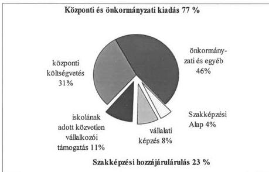

# **Iskolarendszerű szakképzés forrása 1998-ban 109 020 M Ft**

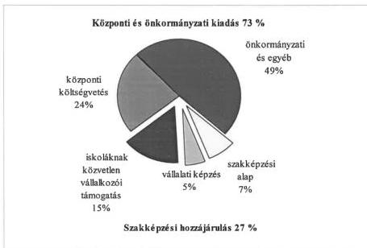

A **szakképzési alaprész is finanszírozta** (a központi költségvetés, az önkormányzati és egyéb forrásokkal együtt) **a szakképzési célú kiadásokat. Az alaprészből 1996-ban 3.606 M Ft, 1997-ben 7.918 M Ft, 1998-ban pe-**

58

---

II. RÉSZLETES MEGÁLLAPÍTÁSOK

**dig 7.221 M Ft-ot** (központi és decentralizált keret formájában) használtak fel.

A **központi keret** 1996-ban 58%, 1997-ben 75 % és 1998-ban 66%-os részarányt képviselt, ebből a forrásból évente számos programot támogatott a szakképzési alaprész: az NSZI szakképzés érdekében végzett fejlesztő tevékenységének, valamint a gyakorlati alapképzéshez szükséges szerszámbeszerzések támogatását. Ezeken felül a fogyatékos fiatalok szakképzésére, a kamaráknak a gyakorlati képzőhely ellenőrzésre, alapítványi támogatásra is felhasználtak.

A **decentralizált keretből** finanszírozott **pályázatok elbírálásánál** a megyei közoktatás fejlesztési koncepcióval összhangban lévő **képzések eszközfejlesztésének kialakítását támogatták**.

A szakképzési alaprészből pályázattal vissza nem térítendő forráshoz lehetett hozzájutni. Az MK-k 1997-ben 22 db pályázatot írtak ki. A pályázatok 59%-a (794 db) szakképző iskolákból érkezett. A decentralizált keretből 1997-ben **209 ezer fő szakképzésben részesülő tanuló gyakorlati képzését támogatták**.

A szakképző iskolák által megpályázott célokra, eszközökre 1.603 M Ft, a vállalkozások által megpályázott fejlesztésekre 697 M Ft jutott, elsősorban **a szakképzést segítő gépek, műszerek és berendezések beszerzését finanszírozták**.

Országos átlagban 1997-ben a decentralizált keretből az **egy tanulóra jutó támogatás értéke 11 E Ft volt**, ebből az **iskoláknál** egy tanulóra **8,8 E Ft, a vállalkozásoknál 25,4 E Ft jutott. A támogatások 30%-át a vállalkozások kapták, de e körben az összes pályázattal érintett létszámnak mindössze 13%-os részarányt képvisel**.

Az alaprészből felhasznált források (is) hozzájárultak a szakképzés szakmai és strukturális fejlesztéséhez, az ehhez szükséges beruházásokhoz, beszerzésekhez és az európai szakképzés-fejlesztési programokhoz, segítették a képzésben résztvevők számának elhelyezkedési lehetőségeit.

Az **alaprész** működtetése, forrásfelhasználása **a szakképző intézményekhez kapcsolódik**, feladatait azzal együttműködve hajtja végre. Ezzel összhangban **1999. január 1-jétől az Oktatási Minisztérium rendelkezik a szakképzési alaprésszel**.

### 3.4. A bérgarancia alaprész célja, felhasználása

A gazdasági átalakulás szükségessé tette egy olyan központi alap létrehozását, melynek az a célja, hogy **a felszámolás alá került cégek dolgozóinak munkabér-kifizetését** legalább részben **biztosítsa**.

A **Bérgarancia Alapról (Bg. tv.) szóló 1994. évi LXVI. tv.** egyik fontos eleme, hogy **biztosítási elvre épülve**, a tönkrement vállalkozások bértartozásait - saját forrás hiányában - ebből az alapból fedezzék.

59

---

II. RÉSZLETES MEGÁLLAPÍTÁSOK

A csődeljárásról, a felszámolási eljárásról és a végelszámolásról szóló 1991. évi IL. tv. (Cstv.) 1992. január 1-én történő hatálybalépésével egyidejűleg megszűnt a felszámolási eljárás alá kerülő gazdálkodó szervezetek bérkifizetéseivel kapcsolatos állami garanciavállalás.

Az esedékes bérfizetés elmaradása nehéz helyzet elé állítja a munkavállalót, ezért a tv. rövid határidőket ír elő a támogatás elbírálására és átutalására. A támogatás 1998. január 1-jétől decentralizált keretként funkcionál, a kérelmeket a megyei központok bírálják el a MüM által 1998. évben kiadott eljárási rend előírásai szerint. Ezt megelőzően az OMK, illetve a MüM hatásköre volt.

A munkaadók 1994-96. években a bérek után 8 Mrd Ft-ot fizettek be, ezzel szemben 757 M Ft kifizetés volt, **mivel az igények alacsonyabbak voltak a feltételezettnél, ezért - törvényi módosítás következtében** - 1996. január 1-jétől a 0,3 %-os bérgarancia járulékot már nem fizették a munkaadók, így az alaprész fedezete a munkaadói járulék.

Az 1994. évi LXVI. törvény hatálybalépésekor a bérgarancia támogatás nem a teljes munkaadói bértartozásra, hanem az 1995. év végéig a minimálbér 4-szeresét, 1996-tól pedig az 5-szörösét kitevő részére terjedt ki. Nyilvánvalóvá vált, hogy a 0,3%-os járulék is a szükségesnél nagyobb forrást jelentett. Nem lehetett megállapítani a törvény előkészítése idején a bértartozással összefüggő támogatási igényeket.

Az alaprész **1997-98-ban 900 M Ft kiadási előirányzattal rendelkezett**, melyből **666 M Ft** volt a **kifizetés**.

A Bg. tv. az alaprészből a támogatás igénybevételét nem a munkavállaló igényétől tette függővé, hanem a felszámoló hatáskörébe utalta. A törvény hatálybalépése óta a **támogatott létszám 1994-1996. között nőtt** - 5483 főről **7191 főre** - ezt követően **1998-ban** pedig **mérséklődött** 5306 főről **4621 főre**.

1994-től 1998-ig a létszám 9%-a (2.567 fő) Borsod megyét, 7%-a (2133 fő) Pest megyét, 2%-a (596 fő) Nógrád megyét, 0,9%-a (251 fő) Somogy megyét és 33%-a (9.437 fő) Budapestet érintette.

**Az 1 főre jutó támogatás összege az 1996. évi 33.539 Ft-ról, 1998. évre 80.510 Ft-ra növekedett.** (A tényleges kifizetések összegét a létszámon kívül a szorzószám és az évente növekvő összegű minimálbér határozta meg.)

**A bérgarancia rendszer áttekintését és módosítását az EU-hoz történő csatlakozás teszi szükségessé.** A jogharmonizáció előkészítése során - szakmai vezetői értekezleten - áttekintették, hogy a hazai gyakorlat mennyiben tér el az európaitól.

Abból az irányelvből indultak ki, amelyet az **Európai Közösségek Tanácsa** 1980. októberében **fogadott el. Az irányelv alapelvei**, melytől eltérés nem lehetséges: a garancia kedvezményezettje a munkavállaló, továbbá az, hogy a vállalkozói vagyontól elkülönítetten kell kezelni az ún. Garancia Alapot.

Összehasonlítva a Bg. tv. szerinti támogatási igényléshez számításba vehető felső határt (1998. évben a minimálbér ötszörösét, 97.500 Ft-ot) az **európai**

60

---

II. RÉSZLETES MEGÁLLAPÍTÁSOK

**garancia szinttel** (az átlagosan 3 havi bérnek megfelelő), **a magyarországi minimálbér legalább tízszeresének megfelelő felső határt jelentene**. Ezt támasztja alá, az is, hogy **1994-1998. között** a kérelmekben jelzett **teljes bértartozások** (3.006 M Ft) **47,3 %-át**, 1.423 M Ft-ot **folyósítottak**, a törvény korlátozó rendelkezései miatt.

A tényleges támogatás részaránya Borsod-Abaúj-Zemplén megyénél (102.697 E Ft) 7,5%-os, Pest megyénél (90.278 E Ft) 6,6%, Nógrád megyénél (29.926 E Ft) 2,2%, Somogy megyénél (11.638 E Ft) 0,8%, a fővárosnál (507.522 E Ft) 37%.

A bérgarancia alaprészből **1994-től 1998-ig a folyósított támogatások 50%-a**, összesen 713 M Ft **térült meg**. A vissza nem fizetett támogatás összege: 710 M Ft.

A megyénkénti támogatás megtérülési aránya Nógrád-, Somogy és Pest megyékben 26-28%-os, a fővárosnál 32%-os és Borsod-Abaúj-Zemplén megyében 40%-ot mutat.

## 4. A MUNKAERŐPIACI SZERVEZETEK MŰKÖDÉSE, SZÁMVITELE ÉS ELLENŐRZÉSI RENDSZERE

### 4.1. A munkaerőpiaci szervezetek működése

A **munkaerőpiaci szervezethez** 19 megyei, 1 fővárosi munkaügyi központ - melyek 175 kirendeltséggel rendelkeznek -, továbbá az OMMK (1997. január 1-jétől) tartozik, irányításukat a minisztérium végzi. A szervezeteket - **1997-től a MüM fejezetnek átadott pénzeszközként** - az alap **működési alaprésze finanszírozta**.

Az alapkezelő és a munkaerőpiaci szervezetek **működési kiadásának 1996. évi eredeti előirányzata** 6.800 M Ft volt, melyet az **1997. évi eredeti előirányzat** (9.562,8 M Ft) **38%-kal, az 1998. évi** (11.180,5 M Ft) **62%-kal haladta meg**. A teljesítés minden évben az eredeti előirányzat felett volt (1996-ban 3,7%-kal, 1997-ben 21,5%-kal, 1998-ban 1,4%-kal).

A növekedést egyrészt a munkaerőpiaci szervezet **3 éves fejlesztési programjának** 1997. évi elindulása, 1998. évben pedig **a rehabilitációs fejlesztési program**, illetve **feladatbővülés** indokolta. A fejlesztési program a szervezet ingatlan- és informatikai fejlesztését célozta meg. A program keretében 2.307 M Ft-ot használtak fel 1997-ben, majd 1998-ban további 1.000 M Ft-ot.

Az **ingatlanfejlesztés eredményeként** 1997-ben 28 ingatlant vásároltak, ebből 2 új munkaügyi központot, 2 új felügyelőséget, 15 új kirendeltség műszaki átadását végezték el, valamint 1998. évi átadással 9 új kirendeltséget indítottak be, 8 meglévő létesítményt felújítottak. 1998-ban pedig 14 megyében 23 kirendeltség felújítását, 5 db új épület beruházását végezték el. 1997-98-ban a számítógépes hálózat vezetékrendszerét az átadott és átadásra kerülő épületeknél kiépítették.

61

---

II. RÉSZLETES MEGÁLLAPÍTÁSOK

1998-ban a **rehabilitációs fejlesztési program** keretében - 300 M Ft felhasználásával - a mozgáskorlátozottak fogadására, az ingatlanok alkalmassá tételét célzó átalakításokat (felhajtó rámpa, lift, mosdóhelyiségek átépítése) hajtottak végre.

A regisztrált munkanélküliek számának mérséklődése nem járt együtt a feladatok hasonló arányú csökkenésével, mert pl. az elhelyezkedés elősegítése, állásajánlatok beszerzése folyamatos alapfeladatot jelentett, az új támogatási formák bevezetése feladatbővüléssel járt.

A munkaerő-piaci szervezet személyi juttatásának előirányzata jelentős 56%-os növekedést jelent 1996-ról 1998-ra, ami egy részről a feladatbővülésből és a szervezeti változásokból eredő 13%-os létszámnövekedésből, másrészről illetménynövekedésből (köztisztviselői törvény módosításából) adódik.

A támogatásokat közvetlenül kezelő munkaügyi központok és kirendeltségek **engedélyezett létszáma 1996-ban 4279 fő volt**, az OMK megszűnésével együtt járó átcsoportosítás és a rehabilitációs munkacsoportok létrehozása miatt **1998-ra az engedélyezett létszám 4326 főre nőtt**. A megyénkénti **létszám megállapítás nem feladatarányosan történt** - az egy dolgozó által ellátott feladatok mutatószáma alapján - **a megyék között jelentős eltérés tapasztalható**.

Az egy kirendeltségi dolgozóra jutó regisztrált munkanélküliek száma 1996-ban 183 volt, ez 1997-ben 172-re csökkent. Az 1997. évi adatok alapján az átlagnál magasabb mutatószámok voltak pl. Borsod-Abaúj-Zemplén (204), Győr-Moson-Sopron (222), Hajdú-Bihar megye (224) esetében. Az átlagnál alacsonyabb mutatószámok voltak pl. Csongrád (133), Nógrád (136), Vas megye (137) esetében. Hasonló a sorrend az egy dolgozóra jutó határozatok számának tekintetében is.

**A munkaügyi szervezetek feladatainak fontos eleme a munkaadók és a munkavállalók megfelelő tájékoztatása.** A megyei Munkaügyi Tanácsok és az MK-k változó szolgáltatásaik, eszközrendszerük bemutatására, a közvélemény tájékoztatására többféle eszközt alkalmaztak. Segítségükkel a munkaadók és a munkanélküliek megismerhették az MPA támogatási formáihoz való hozzájutás és a felhasználás feltételeit. A tájékoztatásban fontos szerepe volt a munkatársak személyes közreműködésének, a munkanélküliek számára tartott rendezvényeknek (pl. álláskeresők klubja, állásbőrzék), a sajtónak, TV-nek, rádiónak a tájékoztatásban, álláshirdetések, pályázati felhívások közlésében. **A tájékoztatási módszerek megyénként eltérőek, ezek eredményességének mérésére nincsenek központi ajánlások kidolgozva**, így a Public Relation (PR) tevékenység költségeinek hasznosulása sem minősíthető.

Tájékoztató tevékenysége eredményéről, fogadtatásáról több MK (pl. Nógrád, Vas megyei) is megkérdezte ügyfelei véleményét. Ezek a felmérések azonban egyediek, nem rendszeresek. Ennek az is oka, hogy nincsenek megfelelő mutatószámok kidolgozva. A mutatószámrendszer segítségével mérhető lenne a PR tevékenység eredménye is. A 2141/1996. (VI. II.) Korm. határozat előírta a mutatóhoz szükséges egységes nyilvántartási rendszer létrehozását, ez azonban az ellenőrzött időszak végéig nem valósult meg.

62

---

II. RÉSZLETES MEGÁLLAPÍTÁSOK

A megfelelő tájékoztatást, az ügyfelekkel való jó kapcsolattartást, továbbá a jogszabályok, eljárási rendek, számítástechnikai eszközök megismerését, alkalmazását segítették elő a dolgozók folyamatos képzésével. Az oktatásra fordított kiadás 1997-ben 92 M Ft, 1998-ban 77 M Ft volt.

## 4.2. Az alap működésének számviteli, bizonylati rendje

Az elkülönített állami pénzalapok beszámolójának auditálásáról az államháztartásról szóló, többször módosított 1992. évi XXXVIII. törvény 57. § (3) bekezdése rendelkezik, ennek alapján az MPA gazdálkodásáról szóló beszámolót és mérleget független könyvvizsgálóval hitelesítették.

Az alapkezelő által választott könyvvizsgáló a törvényi előírásoknak megfelelően folyamatos könyvvizsgálat mellett országos hatáskörben figyelemmel kísérte az alap gazdálkodását. A könyvvizsgáló által alkalmazott ellenőrzési módszerek - melyek kiegészültek a gazdasági és pénzügyi ellenőrzés elemeivel is - alkalmasak voltak arra, hogy az alap gazdálkodási-könyvvezetési és beszámoló készítési tevékenységét kellő biztonsággal, reálisan minősítsék.

A jó szakmai együttműködés eredményeként az alap működésének szabályozottsága, a számvitel, a bizonylati rend és a beszámoló jelentés készítésének színvonala 1996. évhez képest jelentősen javult. A könyvvizsgáló 1996. évi korlátozott záradékát követően az alapról készített 1997. és 1998. évi beszámoló jelentést már hitelesítő záradékkal látta el. Az 1998. évben havonként könyvvizsgálói jelentések készültek, nyomonkövetve az 1997. évi hibák időközbeni kijavítását is.

A bizonylati rend és okmányfegyelem a könyvvizsgáló megállapításai szerint megfelelt a számviteli törvény vonatkozó előírásainak, a főkönyvi könyvelés analitikus nyilvántartásokkal teljes körűen alátámasztott és egyeztetett volt. Az értékelés és leltározás 1997-től a jogszabályokban foglaltaknak megfelelt, a mérlegvalódiság biztosított volt.

## 4.3. Az alap működésének ellenőrzési rendszere

### 4.3.1. Felügyeleti ellenőrzés

Az ellenőrzött időszakban a központi alapkezelésre vonatkozó belső ellenőrzési feladatait és a munkaerőpiaci szervezetek felügyeleti ellenőrzési feladatait a minisztérium Ellenőrzési Főosztálya látta el 7 fővel. Az MPA létrehozását követően késedelmesen jelölték ki a felügyeleti ellenőrzés elvégzéséért felelős szervezetet, 1996. augusztusáig nem tettek eleget az Áht. végrehajtására kiadott 217/1998. (XII. 30.) Korm. rendelettel hatályon kívül helyezett 158/1995. (XII. 26.) Korm. rendelet 2. § 14-15. pontja szerinti felügyeleti ellenőrzési kötelezettségnek.

A jogszabályi változások következtében az MK-k felügyeleti ellenőrzése 1996. januárjától szünetelt. Ezt a feladatot az OMK-nak kellett volna ellátni, azonban erről nem intézkedtek. Az ellenőrzéseket 1996. augusztus 1-jétől a MűM Ellenőrzési Főosztálya kezdte meg, az éves ellenőrzési kötelezettségének eleget tett.

63

---

II. RÉSZLETES MEGÁLLAPÍTÁSOK

**Az ellenőrzések 1996. augusztustól rendszeressé váltak**, a megállapítások alapján minden esetben megtörtént a realizálás.

### 4.3.2. A belső ellenőrzés rendszere

A minisztérium az alap belső ellenőrzésének biztosítása érdekében a kötelező auditáláson túlmenően folyamatosan könyvvizsgálókat foglalkoztatott. Az 1996. évet követően a belső ellenőrzés hatékonysága javult, vezetői intézkedések eredményeként az MPA bevételeinek és kiadásainak felülvizsgálata 70-80%-ban megvalósult. A **függetlenített belső ellenőrzés** az Ellenőrzési Főosztályhoz tartozott. **A MPA-t átfogóan csak 1998-ban ellenőrizték.**

Az **MK-k belső ellenőrzésének hatékonysága** az ellenőrzött időszakban javult. Az **1997. végére a munkafolyamatba épített ellenőrzés rendszeressé vált**. A könyvvizsgálat és a függetlenített belső ellenőrzés által feltárt hiányosságokat megszüntették. Az ellenőrzött időszakban **viszont nem javult számottevően a függetlenített belső ellenőrzés feltételrendszere.**

Az MK-k többségében 1996-ban 1 fő belső ellenőrt alkalmaztak 1996-ban. (5 megyében 2 fő, 2 megyében 1 fő osztott munkakörben volt.) 1997-ben 26 fő belső ellenőrt alkalmaztak az MK-k és az OMMK. Ez utóbbi intézménynél az év jelentős részében betöltetlen volt a belső ellenőri státusz.

Változott a belső ellenőrzés szervezete, ami a 15/1999. (II. 5.) Korm. rendelettel módosított 96/1987. (XII. 30.) PM rendelet előírásaival nem volt összhangban. Kilenc megyében a **belső ellenőrzés szervezetét összevonták a munkaerőpiaci ellenőrzések osztályával**, ezzel áttételessé vált a belső ellenőrzés irányítása. A két szervezet összevonása ugyanakkor hatékonyabb ellenőrzési munkát eredményez, mivel a belső ellenőri feladatokba a munkaerőpiaci ellenőrök bevonása is lehetővé vált.

Vas- és Fejér megyében a kirendeltségek munkájának komplex pénzügyi-gazdasági és hatósági ellenőrzése megvalósult.

### 4.3.3. Munkaerőpiaci ellenőrzés

Az ellenőrzés az alaprészek központi és decentralizált kereteinek megyékhez kapcsolódó szakmai és pénzügyi felhasználását vizsgálja, létszáma 1997. január 1-jétől nem változott, **a feladatokat 90 fő látja el.**

A munkaerőpiaci ellenőrzések száma 1996-ban 19.896, 1997-ben 23.017, 1998-ban 24.480 volt, ami 23%-os növekedést mutat.

Az ellenőrzések megállapításai alapján a **visszakövetelések**, illetve a **megtakarítások jelentősek voltak**, bár 1998-ra mérséklődtek. **1996-ban 3434 esetben 482,7 M Ft visszakövetelés volt**, illetve az előzetes ellenőrzésekkel **83,0 M Ft kifizetést akadályoztak meg. 1998-ban 1752 esetben 276,0 M Ft visszafizetést állapítottak meg, a megtakarítás 47,9 M Ft volt. Szabálysértési eljárást 1998-ban 7 esetben** (képzéssel és munkahelyteremtéssel kapcsolatban), **büntetőeljárást 4 esetben kezdeményeztek.**

64

---

II. RÉSZLETES MEGÁLLAPÍTÁSOK

A pályakezdő munkanélküliek támogatását 1998-ban 58 esetben vizsgálták, 1,3 M Ft-ot követeltek vissza, a megtakarítás 0,8 M Ft volt, ez utóbbi megtakarítást a munkatapasztalat-szerzés támogatásának előzetes ellenőrzésével érték el. Az ellenőrzések száma a munkahelyteremtés támogatásnál volt a legjelentősebb (2617 db) 1998-ban 173 M Ft visszafizetésére tettek intézkedési javaslatot és 8,4 M Ft-ot takarítottak meg. 1996-ban 6 esetben fordultak bírósághoz, 1998-ban 1 esetben ismét bírósághoz kellett fordulni. Ugyancsak nagyarányú volt az ellenőrzések száma (2078 db) 1998-ban a foglalkoztatás bővítő támogatási formánál. Már alacsonyabb volt a visszafizetési kötelezettség: 4,7 M Ft és a megtakarítás 1,3 M Ft.

A munkaerőpiaci képzésnél Budapesten két képző intézményt - 1992-ig visszamenőleg - ellenőriztek. A képző intézmények a ténylegesnél nagyobb támogatást vettek fel. A jogtalanul felvett 16,6 M Ft visszafizetése érdekében az ellenőrzést követően feljelentést tettek, a rendőrség azonban - bizonyítékok hiányában - a nyomozást megszüntette. Ugyancsak a fővárosi munkaügyi központnál egy fiktív személy által „képviselt” amerikai cég és egy hazai kft. külföldi munkavállalásra felkészítő tanfolyamot szervezett, az üzlet meghiúsult, az MPA-t 1,7 M Ft kár érte, a peres eljárás folyamatban van. Egy szakmunkásképző iskola (Bp) 38,8 M Ft-ot vett fel képzési költség címén, holott ilyen oktatást nem végzett, a behajtásra intézkedtek.

A rehabilitációs alaprész ellenőrzésénél olyan tényeket tártak fel, amelyek nem feleltek meg az alaprész rendeltetésszerű felhasználásának. Előfordult, hogy olyan pályázókat támogattak munkahely létrehozására, akik nem erre a célra használták fel a forrásokat.

Pest megyében a helyszíni ellenőrzés megállapította, hogy 1996-ban 152 munkahelyen csak 86 munkanélküllt foglalkoztattak (56,6%), pl. 2 egyesület egyáltalán nem töltötte be a létrejött munkahelyeket. Egy ipari szövetkezet a létrejött 85 férőhelyből csak 42-t töltött be.

A két szociális intézményre a Pest Megyei MK - humanitárius okokból - a szerződések módosítását javasolta a Szociális és Családügyi Minisztériumnak. A jogosulatlan támogatásokra viszont visszavonó határozatot nem hoztak. Fedezetként rendelkezésre álló biztosítékot nem vonták be.

A szolidaritási alaprészből fizetett előnyugdíjjal kapcsolatban 1996-ban 426, 1998-ban 518 ellenőrzést végeztek.

Szabálytalanságok miatt 1996-ban 1,2 M Ft visszafizetésére tettek javaslatot, s mintegy 0,6 M Ft jogtalan kifizetést akadályoztak meg 1997-ben. Az ellenőrzések kedvezőtlenül alacsony számához hozzájárul az is, hogy a nyilvántartási rendszer (a számítógépes program) alkalmatlan a nyugdíjkorhatár betöltési időpontjának ellenőrzésére. Az ellátásban részesülők magas száma az ellenőrzést manuális úton nem teszi lehetővé.

65

---

II. RÉSZLETES MEGÁLLAPÍTÁSOK

## 5. AZ ALAP KEZELÉSÉT SEGÍTŐ INFORMATIKAI RENDSZER MŰKÖDÉSE

### 5.1. Az informatikai rendszer kialakítása

Az informatikai szakterület fejlesztésének és működtetésének 1996. végéig az Országos Munkaügyi Központ (OMK) volt a felelőse. Az OMK az **informatikai fejlesztéseket nem egységes koncepció szerint hajtotta végre**, a minisztérium Informatikai Főosztálya (IF) pedig nem kellően felügyelte azokat, így **átfogó fejlesztések nem történtek**.

Az OMK jogutódjaként - 1997-től - **az OMMK** középírányító funkciója megszűnt. **Feladatát az informatikai rendszerek fejlesztése és működtetése jelentette**, azonban a munkaerőpiaci szervezetekre kiterjedő országos informatikai irányítási funkcióját nem biztosították.

Az informatikai feladatokat ellátó szervezeti egységek - OMMK, IF - **munkamegosztását nem szabályozták, ezért a Flt. rendelkezéseivel ellentétesen két fejlesztési centrum alakult ki**.

Néhány támogatási forma esetében nem készültek el módosított eljárási rendek és az ezek kezelését támogató informatikai programok.

A megyék által évek óta igényelt utazási támogatásokat kezelő program jelenleg sem áll rendelkezésre. Nem készült központilag kiadott eljárási rend pl. a polgári szolgálat, az önfoglalkoztatás, a munkahelymegőrzés informatikai támogatására. A polgári szolgálatosok és a megváltozott munkaképességűek foglalkoztatási adatait kezelő informatikai programok fejlesztése az ellenőrzött időszak végén valósult meg.

A törvény rendelkezése szerint az OMMK feladata működtetni és fejleszteni a munkaerőpiaci és munkaügyi folyamatok informatikai és számítógépes rendszerét. Az IF a munkaerőpiaci informatika fejlesztéseket (pl. PIR rendszer) is ellátja.

Az operatív kapcsolatrendszer kialakítását - 1997. január 1-jétől - az is nehezítette, hogy az OMMK, az IF és a megyei MK-k felügyeletét más-más helyettes államtitkár látta el. Az így kialakított **irányítási struktúra** a MEH felügyelete alatt működő Informatikai Tárcaközi Bizottság (ITB) **ajánlásával ellentétes** volt, mivel az az informatikai terület irányítását közvetlenül a közigazgatási államtitkár irányítása alatt tartja célszerűnek.

Az IF felelős az ágazati **informatikai stratégia kidolgozásáért**, az informatikai **fejlesztések koordinálásáért**. Az IF által kidolgozott **Informatikai Stratégia** tartalmában általános volt, részletes és ütemezett feladattervet nem tartalmazott, így **átfogó jellegű, integrált rendszerfejlesztés nem valósult meg**.

Az alapból kifizetett összegek nyomonkövetését biztosító egységes személyi és cégtörzset nem alakítottak ki. Az ellenőrzött időszakban is elszigetelten működtek - az 1990-es évek elején készült - technikailag elavult számítógépes programok többször módosított változatai.

66

---

II. RÉSZLETES MEGÁLLAPÍTÁSOK

A munkaerőpiaci szervezetek informatikai feladatai a kormányzati szintű informatikai feladatok részeként, ahhoz szorosan kapcsolódva jelentkeztek. A **kormányzati információs stratégia és a tárcák közti koordináció hiánya, tervszerűtlensége és nem kellő összehangoltsága** a minisztérium informatikai stratégiájának kidolgozására és megvalósítására is negatívan hatott.

Elmaradt a Központi Adategyeztető és Továbbító rendszer létrehozása és így az ehhez illeszkedő Egységes Munkaügyi Alapnyilvántartás (EMA) kialakítása is.

A fejlesztések során az informatikai feladatokat **általánosan** fogalmazták meg, **folyamatosan változtatták**, emiatt a külső cégekkel megkötött szerződések teljesítése több esetben elhúzódott, egyes esetekben az MPSz **kiszolgáltatottá vált**.

A külső vállalkozó által készített Országos Közvetítői Rendszert (OKR) 1997. végén kénytelenek voltak átvenni, annak ellenére, hogy a kirendeltségi programok időközbeni változása következtében az ezekhez való illesztés és telepítés lehetetlenné vált.

Az 1997-ben elindult fejlesztésekre (EMA, PIR, KIR) külső projektmenedzsmentet alkalmaztak. A külső menedzserek fejlesztési folyamatba való beillesztése, a projektek előkészítetlensége, a feladatok, követelmények nem konkrét meghatározása miatt a **3 projekt nem volt sikeres**. Csak a PIR rendszer került olyan fejlesztési szintre, hogy bevezethetővé vált.

## 5.2. Az informatika háttere, eszközellátottsága, biztonságtechnikai helyzete

A szoftverfejlesztések átfogó tervezésének hiánya miatt a számítástechnikai rendszerek hatékony működésének kidolgozásában továbblépés nem történt. A **számítógépes programok esetenként elavult programnyelveken készültek**, ennek következtében a hardver és szoftver környezet nem illeszkedik, így a jelenleg működő számítógépes rendszerek **biztonságos üzemeltetése továbbra sincs biztosítva**.

Az átfogó stratégiai terv és fejlesztés hiányában megyénként eltérő rendszerek alakultak ki. A rendszerek **központilag koordinálatlanok, egyediek, nem egységes koncepcióba** illeszkedtek, a megyék adatbázis kezelése más-más szoftver támogatottsággal működött. A koordinálatlan fejlesztések következtében a szoftverek **biztonságos üzemeltetése** és a működőképesség fenntartása egyre **bizonytalanabb és költségesebb**. A központi rendszerek hiányosságait az **elkülönült**, de egymással **párhuzamos** helyi informatikai fejlesztések nem pótolták, egymással átfedésben levő adatállományok használata többféle értelmezést és esetenként **adateltérést okozott**.

A programokkal a pénzügyi teljesítések rögzítése, a visszakövetelések határidőre, számítógépes háttérrel történő elvégzése nem megoldott. A támogatások felhasználását kezelő programok az utólagos módosítást, kiegészítést nem teszik lehetővé.

67

---

II. RÉSZLETES MEGÁLLAPÍTÁSOK

Egyedi fejlesztésűek pl. a megyei pénzügyi analitikát támogató és az előnyugdíj kezelését végző programok. Különféle programok készültek pl. az utalások és visszakövetelések kezelésére.

A kifejlesztett **programok telepítését megelőző kétfázisú tesztelés általában nem volt, emiatt szükségszerűen jelentkezett az adathibák előfordulása, illetve a bizonylatok manuális kezelése.**

A színvonalasabb szoftvereszközök bevezetését biztosító **szoftverek minőség biztosításához szükséges minőségi követelmények kidolgozása 1998-tól megkezdődött.**

**Az informatikai szakterület** eszközellátottsága 1998-ra mennyiségileg elegendő volt, ugyanakkor a törvényben meghatározott feladatokhoz **szükséges fejlesztéshez megfelelő erőforrással nem rendelkezett.** A számítástechnikai eszközök gyors amortizációja következtében a biztonságos üzemeltetés érdekében az eszközállomány értékének minimum 1/4 részét szintentartó felújításra kellene fordítani. A beszerzett gépek az 5181 munkaállomásból álló elavult hálózat pótlását nem fedezték.

Fejlesztésre évenként 600 M Ft állt rendelkezésre, 1997-ben MAT határozat 940 M Ft-ot biztosított eszközbeszerzésre, ami jelentősen javította a munkaügyi szervezetek infrastruktúráját. 1998-ban 235 gépet szereztek be, azonban ez még a szükséglet negyedét sem biztosította.

**Átfogó központi biztonságtechnikai szabályzat 1997-ig nem volt.** A szervezetek saját hatáskörükben alakították ki informatikai és adatvédelmi biztonsági szabályozásukat, a rendszerek védelmét ezek nem teljes körűen, de elviselhető kockázattal szabályozták.

A hiányosságok megszüntetése érdekében az informatika biztonságtechnikai helyzetének felmérése **1998-ban** megtörtént, **a HM ajánlása alapján központi biztonságtechnikai szabályzat készült, hasznosítása folyamatban van.** A biztonságtechnikai szabályozás azonban - az adatok mentési gyakorisága és tárolásának változó módja miatt szükséges - **konkrét archiválási rendet nem tartalmaz.**

### 5.3. A 2000. év és az EU csatlakozás

A feladatok megoldására készített miniszteri utasítás tervezetéről döntés nem született. Feladatterv készült, azonban egyes részfeladatokat nem hajtották végre.

A minisztérium a „2000. év” **gondjait megkésve, folyamatos késéssel kezeli.** Az informatikai rendszerek ill. az eszközpark szükséges átalakításának felmérése megtörtént, a várható költségek nagyságrendje a minisztérium felmérése szerint kb. 325 M Ft. A kiemelt fontosságú rendszerek - a munkanélküli segély számfejtését végző és az ügyfélszolgálati rendszer - kijelölése megtörtént. Az új fejlesztéseket már a helyes dátumkezelés igényével fogalmazták meg.

A vonatkozó 1059/1998 (V. 7.) Korm. határozatot csak részben hajtották végre. A feladatok megoldásának menetét és annak időbeli ütemezését kidolgozták,

68

---

II. RÉSZLETES MEGÁLLAPÍTÁSOK

azonban a rendszerek javítási sorrendjére nem tértek ki. Katasztrófa terv - a kormányhatározatban 1998. június 30-ra meghatározott határidő ellenére - nem készült.

Az **EU elvárásokhoz kapcsolódó** - ezen belül a szezonális hatások kiküszöbölésének, valamint a kistérségi - programok nyomon követésének **informatikai támogatása megoldott**. A foglalkoztatással, képzéssel összefüggésben szükséges kódrendszereknek az átdolgozása 1998 végére lezárult.

A szervezet, illetve a munkaerőpiaci eszközök eredményességének, hatékonyságának mérésére szolgáló eredménymutatókat, illetve az ún. monitoring rendszert kidolgozták, bevezetésükről döntés nem született. A feladatok EU konformitása biztosított, azonban a mögötte álló informatikai támogatás csak részleges, az alapadatok nem megbízhatóak.

Az **EU részéről megfogalmazott elvárást** - a költségvetésből finanszírozott támogatási rendszerek, alapok kezelésének átláthatóságát - **az 1999-ben induló PIR rendszer képes biztosítani**.

## 6. AZ ALAPNÁL KORÁBBAN VÉGZETT SZÁMVEVŐSZÉKI ELLENŐRZÉSEK UTÓVIZSGÁLATÁNAK TAPASZTALATAI

A **Szakképzési Alapot 1990-ben ellenőriztük**. Kifogásoltuk, hogy **nem biztosított az alap nyilvántartási és adatszolgáltatási rendszerének teljessége és összhangja**, analitikusan nem tartják nyilván a szakképzési hozzájárulási kötelezettségeket, ezért nem került sor a szakképzési hozzájárulási kötelezettség megállapítására és a teljesítés elszámolására rendszeresített bevallások ellenőrzésére. Nem történt meg az alap felhasználásának szabályszerűségi és hatékonysági ellenőrzése.

Az ellenőrzés által feltárt hiányosságok a Minisztérium Ellenőrzési Főosztály utóvizsgálata során döntő részben változatlanul fennálltak. Megállapították, hogy nem hasznosultak az alapvizsgálatot követő, az Intézkedési Tervben (a nyilvántartási és az adatszolgáltatási rendszerrel kapcsolatosan) megfogalmazott **feladatok**, azokat **csak részben hajtották végre**.

Az Intézkedési Terv vonatkozó pontjai - melyek a szakmai munka javítására vonatkozó feladatok - a jogszabályok módosításával megvalósultak. A gazdálkodással kapcsolatos feladatok az MPA beszámolójának és mérlegének könyvvizsgálói hitelesítésével teljesültek.

**A komplex nyilvántartási rendszer** (amely a szakképzési hozzájárulás rendszeréből megbízható információkat nyújthatna) **alkalmazásához szükséges informatikai háttér megoldatlansága**, a szakképzési hozzájárulások, **bevallások adatbázisainak feltöltetlensége, adat hiánya miatt** a gazdálkodó szervek által **fizetendő szakképzési hozzájárulás összege pontosan nem számszerűsíthető**. (A gazdálkodó szervezetek saját ráfordításait nem tudják nyomon követni, ez önbevalláson alapul.)

69

---

II. RÉSZLETES MEGÁLLAPÍTÁSOK

A Foglalkoztatási Alap (FA) pénzeszközeinek felhasználását, a működtetéséhez szükséges feltételrendszer kialakítását 1992-ben ellenőriztük. 1994-ben utóvizsgálatot tartottunk, melynek célja az volt, hogy minősítsük, az alapvizsgálathoz képest milyen változások történtek az Alap tervezési, pénzgazdálkodási, könyvvezetési rendjében, a rendszer működésében.

Az intézkedési tervben foglaltak végrehajtásával - az 1994. évi utóvizsgálat megállapításai szerint - javult a Munkaügyi Minisztérium irányító és ellenőrző tevékenysége. A munkaerőpiaci szervezetek - az OMK és a megyei (fővárosi) munkaügyi központok - szervezettebben és célirányosabban látják el a FA-val kapcsolatos feladatokat. Csak részleges eredményt állapított meg az utóvizsgálat az FA pénzeszközeinek célszerű felhasználásánál. Nem volt javulás a számviteli előírások betartásában, az FA működésében, irányításában, az aktív foglalkoztatáspolitikai eszközök támogatására fordított kiadások felhasználásában és az Országos Foglalkoztatási Alapítvány működésében.

Az 1994. évi utóellenőrzés javaslataira készített intézkedési terv hét pontjában foglalt feladatok közül hat teljesült. Az új alap létesítésével időszerűtlenné vált az FA kezelésének miniszteri rendeletben történő szabályozása (7. sz. melléklet).

Az ellenőrzött időszakban a számvevőszéki költségvetési ellenőrzések megállapításaira tett javaslatok hasznosultak.

A Magyar Köztársaság 1997. évi költségvetéséről szóló számvevőszéki jelentésben az MPA-ra vonatkozó javaslatok alapján kidolgozták az aktív támogatási formák megalapozását segítő új pályázati rendszert és a szakképzési hozzájárulás ellenőrizhetőségének rendszerét kialakították, de az adatfeldolgozás rendszerét még nem.

Budapest, 1999. július

Melléklet: 13 lap

dr. Kovács Árpád  
elnök{
  "label": "",
  "top_left": [
    0.7299,
    0.7842
  ],
  "bottom_right": [
    0.8895,
    0.8997
  ]
}

70

---

1

,

---

1.sz.tanúsítvány

Munkaerőpiaci Alap
Kiadások

millió forintban,egy tizedessel

|  Megnevezés | 1996. évi |   |   | 1997. évi |   |   | 1998. évi |   |   | 1999. évi  |
| --- | --- | --- | --- | --- | --- | --- | --- | --- | --- | --- |
|   |  eredeti előirányzat | módosított előirányzat | teljesítés | eredeti előirányzat | módosított előirányzat | teljesítés | eredeti előirányzat | módosított előirányzat | teljesítés | eredeti előirányzat  |
|  1. FOLYÓ KIADÁSOK | 98 832,5 | 97 432,4 | 87 468,9 | 114 240,0 | 115 099,8 | 112 411,1 | 122 355,4 | 125 012,4 | 132 916,4 | 140 457,2  |
|  Áruk, szolgáltatások vásárlása | 70,0 | 3 815,0 | 3 338,9 | 3 100,0 | 3 100,0 |  |  |  |  | 240,0  |
|  Pénzbeli juttatás | 37 400,0 | 43 856,4 | 40 542,8 | 45 900,0 | 45 430,7 | 47 861,4 |  | 42 400,3 | 48 384,6 | 45 279,5  |
|  Kamatfizetés |  |  |  |  |  |  |  |  |  |   |
|  Támogatások összesen: | 31 455,0 | 27 779,1 | 23 627,5 | 46 740,0 | 48 069,1 | 49 430,0 | 115 355,4 | 59 599,1 | 60 928,0 | 67 849,2  |
|  - közszolgáltató vállalatoknak |  |  |  |  |  |  |  |  |  |   |
|  - vállalkozási szférának | 6 770,0 | 5 970,0 | 5 092,9 | 5 520,0 | 6 230,0 | 8 822,2 | 9 999,0 | 9 255,5 | 8 067,5 | 10 225,0  |
|  - lakosság, tárz.szervek | 5 530,0 | 3 094,6 | 1 727,1 | 3 790,0 | 4 790,0 | 3 356,1 |  |  |  |   |
|  - nonprofit intézményeknek |  |  |  |  |  |  | 45,0 | 2 950,0 | 3 994,0 | 580,0  |
|  - háztartások felé történő átadás |  |  |  |  |  |  | 48 986,3 | 6 586,0 | 6 806,6 | 7 010,0  |
|  Támogatások az államháztartás többi alrendszerének | 19 155,0 | 18 714,5 | 16 807,5 | 37 430,0 | 37 049,1 | 37 251,7 | 56 325,1 | 40 807,6 | 42 059,9 | 50 034,2  |
|  - költségvetési szerveknek | 1 585,0 | 1 125,0 | 590,7 | 10 820,0 | 9 939,1 | 11 511,3 | 11 391,0 | 12 020,5 | 12 969,6 | 15 104,2  |
|  - önkormányzatoknak | 17 570,0 | 17 579,5 | 16 209,3 | 26 610,0 | 27 110,0 | 25 740,4 | 29 172,1 | 28 787,1 | 29 050,9 | 34 930,0  |
|  - TB. igazgatási szerveknek |  | 10,0 | 7,5 |  |  |  | 15 762,0 |  | 39,4 |   |
|  Más alapoknak végleges átadás | 8 000,0 |  |  |  |  |  |  |  |  |   |
|  Egyéb kiadás összesen: | 21 907,5 | 21 981,9 | 19 959,7 | 18 500,0 | 18 500,0 | 15 119,7 | 0,0 | 16 013,0 | 16 603,8 | 17 098,5  |
|  Működési költségek | 6 527,5 | 6 701,9 | 6 507,3 | 400,0 | 400,0 | 164,5 | 0,0 | 251,0 | 591,0 | 0,0  |
|  - személyi juttatások | 3 340,0 | 3 352,2 | 3 294,2 |  |  |  |  |  |  |   |
|  - társadalombiztosítási járulék | 1 362,0 | 1 359,5 | 1 331,9 |  |  |  |  |  |  |   |
|  - munkaadói járulék |  |  |  |  |  |  |  |  |  |   |
|  - államháztartáson kívüli nyugdíj alaphoz hozzájárulás |  |  |  |  |  |  |  |  |  |   |
|  - dologi kiadások | 1 825,5 | 1 990,2 | 1 881,2 | 400,0 | 400,0 | 164,5 |  | 251,0 | 591,0 |   |
|  Működési célra átadás | 100,0 | 0,0 | 0,0 | 0,0 | 0,0 | 0,0 | 0,0 | 0,0 | 0,0 | 0,0  |
|  - költségvetési szerveknek | 100,0 |  |  |  |  |  |  |  |  |   |
|  - önkormányzatoknak |  |  |  |  |  |  |  |  |  |   |
|  Munkaadókat terhelő járulékok ellátottak után | 15 280,0 | 15 280,0 | 13 452,4 | 18 100,0 | 18 100,0 | 14 955,2 |  | 15 762,0 | 16 012,8 | 17 098,5  |

1/2

---

1

---

1. sz. tanúsítvány

Munkaerőpiaci Alap
Kiadások

|  Megnevezés | 1996. évi |   |   | 1997. évi |   |   | 1998. évi |   |   | 1999. évi  |
| --- | --- | --- | --- | --- | --- | --- | --- | --- | --- | --- |
|   |  eredeti előirányzat | módosított előirányzat | teljesítés | eredeti előirányzat | módosított előirányzat | teljesítés | eredeti előirányzat | módosított előirányzat | teljesítés | eredeti előirányzat  |
|  II. TÖKEKIADÁSOK ( felh.célú végleges pénzátadások és kölcsön nyújtások) | 2 722,5 | 4 278,4 | 3 811,7 | 5 632,8 | 11 916,4 | 8 497,6 | 9 768,5 | 11 857,5 | 9 956,7 | 10 982,0  |
|  Közvetlen tárgyi eszköz beszerzés |  | 1 200,3 | 739,4 | 30,0 | 30,0 | 314,0 |  |  |  |   |
|  Tőketranszferek összesen: | 2 722,5 | 3 078,1 | 3 072,3 | 5 602,8 | 11 886,4 | 8 183,6 | 9 768,5 | 11 857,5 | 9 956,7 | 10 982,0  |
|  Beruházási célú átadások államh.kivülre | 1 365,0 | 1 365,0 | 1 713,9 | 3 942,8 | 6 783,0 | 4 137,7 | 6 222,0 | 7 731,0 | 6 120,3 | 6 245,0  |
|  - közszolgáltató vállalatoknak |  |  |  |  |  |  |  |  |  |   |
|  - egyéb vállalatoknak | 1 365,0 | 1 215,0 | 1 591,9 | 2 500,0 | 5 340,0 | 3 146,3 | 4 862,0 | 6 374,5 | 5 001,9 | 5 945,0  |
|  - lakosság, társ. szervek |  | 150,0 | 122,0 | 1 442,8 | 1 443,0 | 991,4 |  |  |  |   |
|  - non-profit szervek |  |  |  |  |  |  | 460,0 | 456,5 | 1 077,3 | 300,0  |
|  - háztartások |  |  |  |  |  |  | 900,0 | 900,0 | 41,1 |   |
|  Beruházás célú támogatások az államháztartás |  |  |  |  |  |  |  |  |  |   |
|  többi alrendszerének | 1 357,5 | 1 713,1 | 1 358,4 | 1 660,0 | 5 103,4 | 4 045,9 | 3 546,5 | 4 126,5 | 3 836,4 | 4 737,0  |
|  - költségvetési szerveknek | 1 357,5 | 513,1 | 223,2 | 1 410,0 | 3 353,4 | 2 516,5 | 1 720,5 | 2 017,5 | 1 680,2 | 1 637,0  |
|  - önkormányzatoknak |  | 1 200,0 | 1 135,2 | 250,0 | 1 750,0 | 1 529,4 | 1 826,0 | 2 169,0 | 2 156,2 | 3 100,0  |
|  Beruházásokat terhelő ÁFA |  |  |  |  |  |  |  |  |  |   |
|  - ebből visszaigényelt ÁFA |  |  |  |  |  |  |  |  |  |   |
|  III. KÖLTSÉGVETÉS ÁLTAL ELVONT ÖSSZEG |  |  |  |  |  |  | 7 000,0 | 7 000,0 | 7 000,0 | 9 990,0  |
|  IV. HITELKAPCSOLATOK |  |  |  |  |  |  |  |  |  |   |
|  Hiteltörlesztés pénzintézetnek |  |  |  |  |  |  |  |  |  |   |
|  Hiteltörlesztés más alapnak |  |  |  |  |  |  |  |  |  |   |
|  V. FÜGGŐ, ÁTFUTÓ, KIEGYENLÍTŐ KIADÁSOK |  |  | -587,1 |  |  | -8,0 |  |  | -7,1 |   |
|  ÖSSZES KIADÁS (I+II+III+IV+V) | 101 555,0 | 101 710,8 | 90 693,5 | 119 872,8 | 127 016,2 | 120 900,7 | 132 123,9 | 136 869,9 | 142 866,0 | 151 439,2  |
|  ZÁRÓÁLLOMÁNY | 30 152,9 | 30 152,9 | 39 206,9 | 23 267,1 | 28 406,9 | 48 744,8 | 44 244,8 | 44 244,8 | 48 077,3 | 29 129,0  |
|  ZÁRÓÁLLOMÁNY ÖSSZES + KIADÁS | 131 707,9 | 131 863,7 | 129 900,4 | 143 139,9 | 155 423,1 | 169 645,5 | 176 368,7 | 181 114,7 | 190 943,3 | 180 568,2  |

Budapest, 1999. április 23.

M. Matoricz Anna
dr. Matoricz Anna
főosztályvezető

Sebestyén Judit
főov.h.

2/2

---

[Non-Text]

[Non-Text]

[Non-Text]

1. 2017年1月1日至2018年1月1日（含）的公司股票交易均价为4.56元/股，与前一交易日收盘价相比，涨幅为-0.97%。

[Non-Text]

[Non-Text]

[Non-Text]

[Non-Text]

[Non-Text]

[Non-Text]

[Non-Text]

[Non-Text]

[Non-Text]

[Non-Text]

[Non-Text]

[Non-Text]

[Non-Text]

[Non-Text]

[Non-Text]

[Non-Text]

[Non-Text]

[Non-Text]

[Non-Text]

[Non-Text]

[Non-Text]

[Non-Text]

[Non-Text]

[Non-Text]

1

[Non-Text]

[Non-Text]

[Non-Text]

[Non-Text]

[Non-Text]

[Non-Text]

[Non-Text]

[Non-Text]

[Non-Text]

[Non-Text]

[Non-Text]

[Non-Text]

[Non-Text]

[Non-Text]

[Non-Text]

[Non-Text]

[Non-Text]

[Non-Text]

[Non-Text]

[Non-Text]

1. 2017年1月1日，公司与上海浦东发展银行股份有限公司签订了《关于使用部分闲置募集资金进行现金管理的协议》。

---

2.sz.tanúsítvány

Munkaerőpiaci Alap
Kiadások jogcímenként

|  Előir. csop. | Kiem. el. sz. | Megnevezés | 1996. évi |   |   | 1997. évi |   |   | 1998. évi |   |   | 1999. évi  |   |   |
| --- | --- | --- | --- | --- | --- | --- | --- | --- | --- | --- | --- | --- | --- | --- |
|   |   |   |  eredeti előirányzat | módosított előirányzat | teljesítés | eredeti előirányzat | módosított előirányzat | teljesítés | eredeti előirányzat | módosított előirányzat | teljesítés | eredeti előirányzat | módosított előirányzat | teljesítés  |
|  1 |  | Aktív foglalkoztatási eszközök | 19 000,0 | 18 935,6 | 16 844,2 | 23 400,0 | 28 470,0 | 27 266,2 | 29 200,0 | 29 692,5 | 28 885,6 | 31 350,0 |  |   |
|   | 1 | Egyéb aktív foglalkoztatási eszközök |  |  |  | 21 900,0 | 26 170,0 | 25 373,5 | 28 200,0 | 28 684,5 | 27 849,0 | 29 850,0 |  |   |
|   | 2 | Foglalkoztatási fenntartó támogatás |  |  |  | 1 500,0 | 1 900,0 | 1 892,7 | 1 000,0 | 1 008,0 | 1 036,6 | 1 500,0 |  |   |
|   |  | Gazdasági Minicélelőirányzatnak átadás |  |  |  |  |  |  |  |  |  |  |  |   |
|  2 |  | Szakkezelési célú kifizetések | 3 915,0 | 3 915,0 | 3 601,1 | 3 100,0 | 7 536,4 | 6 444,8 | 4 100,0 | 7 497,0 | 7 221,2 | 8 000,0 |  |   |
|  3 |  | Munkanélküli ellátások | 59 980,0 | 59 302,0 | 53 314,8 | 63 600,0 | 59 825,7 | 55 806,4 | 57 613,3 | 57 613,3 | 64 122,4 | 61 848,0 |  |   |
|  4 |  | Jövedelempótló támogatás | 10 500,0 | 10 500,0 | 9 628,0 | 18 810,0 | 18 810,0 | 18 584,8 | 20 260,1 | 20 260,1 | 21 081,2 | 25 380,0 |  |   |
|  5 |  | Bérgárandó kifizetés | 500,0 | 500,0 | 348,0 | 400,0 | 400,0 | 294,0 | 420,0 | 500,0 | 454,5 | 600,0 |  |   |
|  6 |  | Rehabilitációs célú kifizetések | 760,0 | 760,0 | 386,8 | 1 000,0 | 1 000,0 | 895,8 | 8 600,0 | 8 596,5 | 8 535,0 | 11 690,0 |  |   |
|   | 1 | Munkahelyteremtés és megtartás támogatása |  |  |  |  |  |  | 1 600,0 | 1 596,5 | 1 535,0 | 1 700,0 |  |   |
|   | 2 | Megváltozott munkahelyzetek támogatása |  |  |  |  |  |  | 7 000,0 | 7 000,0 | 7 000,0 | 9 990,0 |  |   |
|  7 |  | Átadott pénz eszközök | 100,0 | 100,0 | 100,0 | 257,3 | 257,2 | 257,2 | 292,0 | 292,0 | 291,7 |  |  |   |
|   | 1 | pénzeszköz | 80,0 | 80,0 | 80,0 | 242,3 | 242,2 | 242,2 | 275,0 | 275,0 | 275,0 |  |  |   |
|   | 2 | Alapkezelőnek felhalmozási célra átadott pénzeszköz | 20,0 | 20,0 | 20,0 | 15,0 | 15,0 | 15,0 | 17,0 | 17,0 | 16,7 |  |  |   |
|  8 | 1 | Személyi juttatások | 3 340,0 | 3 352,2 | 3 294,2 |  |  |  |  |  |  |  |  |   |
|   | 2 | Társadalombiztosítási járulék | 1 362,0 | 1 359,5 | 1 331,9 |  |  |  |  |  |  |  |  |   |
|   | 3 | Dologi kiadások | 1 698,0 | 1 977,7 | 1 866,5 |  |  |  |  |  |  |  |  |   |
|   | 4 | Felújítás |  | 44,1 | 41,2 |  |  |  |  |  |  |  |  |   |
|   |  | Pénzeszközátadás, egyéb támogatás |  | 29,0 | 25,6 |  |  |  |  |  |  |  |  |   |
|   |  | Ellátottak pénzbeli juttatása (polgári szolgálat) |  | 119,5 | 119,5 |  |  |  |  |  |  |  |  |   |
|   |  | Felhalmozási kiadások |  | 816,2 | 378,8 |  |  |  |  |  |  |  |  |   |
|  9 |  | Beruházási céltartalék | 400,0 |  |  |  |  |  |  |  |  |  |  |   |
|  7 | 3 | Munkaerőpiaci szervezetnek működési célra |  |  |  | 7 799,6 | 7 904,0 | 8 546,6 | 9 250,0 | 9 510,0 | 9 510,0 |  |  |   |
|  7 | 4 | Munkaerőpiaci szervezetnek felhalm. célra |  |  |  | 370,0 | 370,0 | 370,0 | 388,5 | 388,5 | 388,5 |  |  |   |
|  7 | 5 | Működési célú tartalék |  |  |  | 135,9 | 135,9 | 135,9 | 150,0 | 150,0 | 150,0 |  |  |   |
|  7 | 6 | Munkaerőpiaci szervezet fejlesztési program |  |  |  | 1 000,0 | 2 307,0 | 2 307,0 | 1 000,0 | 1 000,0 | 1 000,0 |  |  |   |
|  7 | 7 | Rehabilitációs célú fejlesztési program |  |  |  |  |  |  | 300,0 | 300,0 | 300,0 |  |  |   |
|  8 |  | Közmunkavégzés támogatás |  |  |  |  |  |  | 550,0 | 1 070,0 | 933,0 |  |  |   |
|  7 |  | Az alapkezelőnek átadott pénz eszköz |  |  |  |  |  |  |  |  |  |  |  | 301,2  |
|  8 |  | A munkaerőpiaci szervezet működése és fejlesztése |  |  |  |  |  |  |  |  |  |  |  |   |
|  8 | 1 | Országos munkaerőpiaci szervezetnek átadott pénzeszköz |  |  |  |  |  |  |  |  |  |  |  | 11 000,0  |
|   | 2 | Országos munkaerőpiaci szervezetfejlesztési program |  |  |  |  |  |  |  |  |  |  |  | 1 100,0  |
|  9 | 1 | Működési célú tartalék |  |  |  |  |  |  |  |  |  |  |  | 170,0  |
|   |  | KÖLTSÉGVETÉSI KIADÁSOK | 101 555,0 | 101 710,8 | 91 280,6 | 119 872,8 | 127 016,2 | 120 903,7 | 132 123,9 | 136 869,9 | 142 873,1 | 151 439,2 |  |   |
|   |  | HITELTÖRLESZTÉS PÉNZINTÉZETNEK |  |  |  |  |  |  |  |  |  |  |  |   |
|   |  | HITELTÖRLESZTÉS MÁS ALAPNAK |  |  |  |  |  |  |  |  |  |  |  |   |
|   |  | FÜGGŐ, ÁTFÜTŐ, KIEGY, KIADÁSOK |  |  | -587,1 |  |  | -8,0 |  |  | -7,1 |  |  |   |
|   |  | ÖSSZES KIADÁS | 101 555,0 | 101 710,8 | 90 693,5 | 119 872,8 | 127 016,2 | 120 900,7 | 132 123,9 | 136 869,9 | 142 866,0 | 151 439,2 |  |   |

Budapest 1999. április 23.

dr. Matoricz Anna
főosztályvezető

---

i

---

Munkaerőpiaci Alap

Bevételek

3.sz.tanúsítvány

millió forintban,egy tizedessel

|  Megnevezés | 1996. évi |   |   | 1997. évi |   |   | 1998. évi |   |   | 1999. évi  |
| --- | --- | --- | --- | --- | --- | --- | --- | --- | --- | --- |
|   |  eredeti előirányzat | módosított előirányzat | teljesítés | eredeti előirányzat | módosított előirányzat | teljesítés | eredeti előirányzat | módosított előirányzat | teljesítés | eredeti előirányzat  |
|  I. FOLYÓ BEVÉTELEK ÖSSZESEN | 99 020,0 | 98 994,8 | 96 603,2 | 108 672,8 | 115 816,2 | 129 644,5 | 126 949,2 | 131 178,2 | 140 683,1 | 133 739,2  |
|  Adó jellegű bevételek (adók, járulékok, hozzájárulások stb.) | 88 450,0 | 88 490,0 | 85 993,2 | 108 072,8 | 115 216,2 | 128 727,3 | 126 626,7 | 130 461,7 | 139 861,2 | 132 939,2  |
|  Nem adó jellegű bevételek | 0,0 | 0,0 | 0,0 |  |  |  | 322,5 | 716,5 | 821,9 | 800,0  |
|  - befizetések vállalkozási szférától |  |  |  |  |  |  | 322,5 |  |  |   |
|  - befizetések lakosságtól |  |  |  |  |  |  |  |  |  |   |
|  - nonprofit intézményektől |  |  |  |  |  |  |  |  |  |   |
|  - bírságok |  |  |  |  |  |  |  | 716,5 | 388,7 | 800,0  |
|  - kamatbevételek |  |  |  |  |  |  |  |  | 35,6 |   |
|  - hatósági és eljárási bevételek |  |  |  |  |  |  |  |  | 397,6 |   |
|  Befizetések az államháztartás többi alrendszerétől |  |  |  |  |  |  |  |  |  |   |
|  - befizetések költségvetési szervektől |  |  |  |  |  |  |  |  |  |   |
|  - befizetések önkormányzatoktól |  |  |  |  |  |  |  |  |  |   |
|  Költségvetési támogatás | 3 070,0 | 3 070,0 | 3 070,0 |  |  |  |  |  |  |   |
|  Más alapoktól végleges átvétel |  |  |  |  |  |  |  |  |  |   |
|  Privatizációból | 7 000,0 | 7 000,0 | 7 000,0 |  |  |  |  |  |  |   |
|  Egyéb folyó bevételek | 500,0 | 434,8 | 540,0 | 600,0 | 600,0 | 917,2 |  |  |  |   |
|  II.Tőkebevételek (Kölcsön visszatérülések) | 380,0 | 561,0 | 977,9 | 400,0 | 400,0 | 849,6 | 674,7 | 1 191,7 | 1 347,1 | 350,0  |
|  Tágyi eszköz értékesítés |  | 4,6 | 4,6 |  |  |  |  |  |  |   |
|  Értékpapír elfogadása |  |  |  |  |  |  |  |  |  |   |
|  Értékpapírokból származó részesedés |  |  |  |  |  |  |  |  |  |   |
|  Egyéb tőkebevételek ( kölcsön visszatérülések ) | 380,0 | 556,4 | 973,3 | 400,0 | 400,0 | 849,6 | 674,7 | 1 191,7 | 1 347,1 | 350,0  |
|  III. HITELKAPCSOLATOK |  |  |  |  |  |  |  |  |  |   |
|  Hitelfelvétel pénzintézettől |  |  |  |  |  |  |  |  |  |   |
|  Hitelfelvétel más alapoktól |  |  |  |  |  |  |  |  |  |   |
|  IV. FÜGGŐ, ÁTFUTÓ, KIEGYENLÍTŐ BEV. |  |  | 11,4 |  |  | -55,5 |  |  | 168,3 |   |
|  ÖSSZES BEVÉTEL (I.+II.+III.+IV.) | 99 400,0 | 99 555,8 | 97 592,5 | 109 072,8 | 116 216,2 | 130 438,6 | 127 623,9 | 132 369,9 | 142 198,5 | 134 089,2  |
|  NYITÓÁLLOMÁNY+ÖSSZES BEVÉTEL | 131 707,9 | 131 863,7 | 129 900,4 | 143 139,9 | 155 423,1 | 169 645,5 | 176 368,7 | 181 114,7 | 190 943,3 | 180 568,2  |

Budapest,1999.április 23.

Sebestyén Judit
főov.h.

---

1

1

---

4.sz.tanúsítvány

Munkaerőplaci Alap

Bevételek jogcímenként

|  Előir.oc op. 96- BAN | Kiem.el ér. csup | Megnevezés | 1996.évi |   |   | 1997. évi |   |   | 1998. évi |   |   | 1999. évi  |
| --- | --- | --- | --- | --- | --- | --- | --- | --- | --- | --- | --- | --- |
|   |   |   |  eredeti előirányzat | módosított előirányzat | teljesítés | eredeti előirányzat | módosított előirányzat | teljesítés | eredeti előirányzat | módosított előirányzat | teljesítés | eredeti előirányzat  |
|  1 |  | Költségvetési támogatás | 3 070,0 | 3 070,0 | 3 070,0 |  |  |  |  |  |  |   |
|  2 |  | Munkaadói járulék | 62 800,0 | 62 800,0 | 61 115,4 | 77 845,0 | 79 902,0 | 91 148,1 | 89 862,0 | 90 300,0 | 97 730,2 | 85 411,2  |
|  3 |  | Munkavállalói járulék | 22 000,0 | 22 000,0 | 20 673,3 | 26 099,0 | 26 749,0 | 28 970,7 | 31 164,7 | 31 164,7 | 32 504,2 | 37 878,0  |
|  4 |  | Egyéb bevétel | 700,0 | 855,8 | 1 864,8 | 828,8 | 828,8 | 1 484,0 | 597,2 | 1 508,2 | 1 820,6 | 800,0  |
|  5 |  | Más alapoktól végleges átvétel |  |  |  |  |  |  |  |  |  |   |
|  6 |  | Rehabilitációs hozzájárulás | 450,0 | 450,0 | 495,0 | 900,0 | 900,0 | 632,1 | 1 600,0 | 1 600,0 | 1 059,8 | 1 700,0  |
|  7 |  | Visszterhes támogatások törlesztése | 80,0 | 80,0 | 72,1 | 100,0 | 100,0 | 56,3 | 100,0 | 100,0 | 61,3 | 100,0  |
|  8 |  | Privatizációból | 7 000,0 | 7 000,0 | 7 000,0 |  |  |  |  |  |  |   |
|  9 |  | Kamatbevétel |  |  | 112,3 |  |  |  |  |  |  |   |
|  10 |  | Szakképzési hozzájárulás | 3 200,0 | 3 200,0 | 3 107,5 | 3 000,0 | 7 436,4 | 7 918,4 | 4 000,0 | 7 397,0 | 8 488,7 | 7 950,0  |
|  11 |  | Szakképzési kamatmentes kölcsönvisszafizetés | 100,0 | 100,0 | 70,7 | 100,0 | 100,0 | 95,4 | 100,0 | 100,0 | 105,6 | 50,0  |
|   |  | Bérgarancia támogatás törlesztése |  |  |  | 200,0 | 200,0 | 189,1 | 200,0 | 200,0 | 259,8 | 200,0  |
|  |   |   |   |   |   |   |   |   |   |   |   |   |
|  |   |   |   |   |   |   |   |   |   |   |   |   |
|  |   |   |   |   |   |   |   |   |   |   |   |   |
|   |  | KÖLTSÉGVETÉSI BEVÉTELEK | 99 400,0 | 99 555,8 | 97 581,1 | 109 072,8 | 116 216,2 | 130 494,1 | 127 623,9 | 132 369,9 | 142 030,2 | 134 089,2  |
|   |  | HITELFELVÉTEL |  |  |  |  |  |  |  |  |  |   |
|  |   |   |   |   |   |   |   |   |   |   |   |   |
|  |   |   |   |   |   |   |   |   |   |   |   |   |
|   |  | FÜGGŐ, ÁTFUTÓ, KJEGY. BEV. |  |  | 11,4 |  |  | -55,5 |  |  | 168,3 |   |
|   |  | ÖSSZES BEVÉTEL | 99 400,0 | 99 555,8 | 97 592,5 | 109 072,8 | 116 216,2 | 130 438,6 | 127 623,9 | 132 369,9 | 142 198,5 | 134 089,2  |
|  |   |   |   |   |   |   |   |   |   |   |   |   |
|   |  | KÖLTSÉGVETÉSI BEVÉTELEK | 99 400,0 | 99 555,8 | 97 581,1 | 109 072,8 | 116 216,2 | 130 494,1 | 127 623,9 | 132 369,9 | 142 030,2 | 134 089,2  |
|   |  | KÖLTSÉGVETÉSI KIADÁSOK | 101 555,0 | 101 710,8 | 91 280,6 | 119 872,8 | 127 016,2 | 120 908,7 | 132 123,9 | 136 869,9 | 142 873,1 | 151 439,2  |
|   |  | GFS EGYENLEG | -2 155,0 | -2 155,0 | 6 300,5 | -10 800,0 | -10 800,0 | 9 585,4 | -4 500,0 | -4 500,0 | -842,9 | -17 350,0  |

Budapest, 1999. április 23.

---

1. 2017年，公司与上海浦东发展银行股份有限公司签订了《关于使用部分闲置募集资金进行现金管理的协议》。

[Non-Text]

1. 2017年，公司与上海浦东发展银行股份有限公司签订了《关于使用部分闲置募集资金进行现金管理的协议》。

[Non-Text]

[Non-Text]

[Non-Text]

[Non-Text]

[Non-Text]

[Non-Text]

[Non-Text]

[Non-Text]

[Non-Text]

[Non-Text]

[Non-Text]

[Non-Text]

[Non-Text]

[Non-Text]

[Non-Text]

[Non-Text]

[Non-Text]

[Non-Text]

[Non-Text]

[Non-Text]

[Non-Text]

[Non-Text]

[Non-Text]

[Non-Text]

[Non-Text]

[Non-Text]

[Non-Text]

[Non-Text]

[Non-Text]

[Non-Text]

[Non-Text]

[Non-Text]

[Non-Text]

1. 2017年1月1日至2018年1月1日（含）的公司股票交易均价为4.56元/股，与前一交易日收盘价相比，涨幅为-0.97%。

[Non-Text]

[Non-Text]

[Non-Text]

[Non-Text]

[Non-Text]

[Non-Text]

[Non-Text]

[Non-Text]

[Non-Text]

[Non-Text]

[Non-Text]

[Non-Text]

[Non-Text]

---

1. sz. melléklet
a V-16-199/1998-99. sz. jelentéshez

# Munkáltatók részére a pályakezdők
munkatapasztalat szerzési támogatásáról

Kérdés: Ha ez a támogatási forma nem létezne, egyáltalán
nem tudott volna pályakezdőket alkalmazni.

|  Válasz | Békés | B.-A.-Z. | Győr-S. | Pest | Szab.-Sz.-B. | Vas | Megyék  |
| --- | --- | --- | --- | --- | --- | --- | --- |
|   | megye | megye | megye | megye | megye | megye | összesen  |
|  Igen | 38,78% | 25,93% | 58,33% | 100,00% | 50,00% | 46,15% | 43,13%  |
|  Nem | 61,22% | 74,07% | 41,67% | 0,00% | 50,00% | 53,85% | 56,88%  |

Ha ez a támogatási forma nem létezne, egyáltalán nem tudott
volna pályakezdőket alkalmazni.

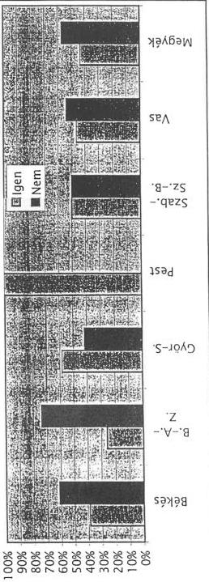

Hiányos, hibás ill. ellentmondást tartalmazó válaszok száma: 16

---

---

---

2. sz. melléklet
a V-16-199/1998-99. sz. jelentéshez

# Munkáltatók részére a pályakezdők
munkatapasztalat szerzési támogatásáról

Kérdés: Ha ez a támogatási forma nem létezne,
kevesebb pályakezdőt alkalmazna.

|  Válasz | Békés | B.-A.-Z. | Győr-S. | Pest | Szab.-Sz.-B. | Vas | Megyék  |
| --- | --- | --- | --- | --- | --- | --- | --- |
|   | megye | megye | megye | megye | megye | megye | összesen  |
|  Igen | 70,18% | 68,00% | 41,67% | 100,00% | 77,05% | 45,45% | 69,05%  |
|  Nem | 29,82% | 32,00% | 58,33% | 0,00% | 22,95% | 54,55% | 30,95%  |

Ha ez a támogatási forma nem létezne, kevesebb pályakezdőt
alkalmazna.

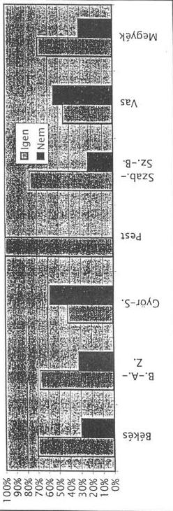

Hiányos, hibás ill. ellentmondást tartalmazó válaszok száma: 8

---

1

---

3. sz. melléklet

a V-16-199/1998-99. sz. jelentéshez

# Önfoglalkoztatóvá válási támogatás

Kérdés: Miért döntött vállalkozás indítása, "önfoglalkoztatóvá" válás mellett?

1. Kenyszerbol, mert nem volt mas lehetosegem a munkara
2. Korabban is terveztem, de nem'voltak meg az anyagi feltetelek
3. A támogatas tette lehetové, hogy elkezdjem a vallalkozást
4. Rabeszeltek a csaladban, barati korben
5. A munkauqyi kozpontban meggyoztek arrol, hogy ez a megoldas
6. Egyeb okbol es pedig ...

|  Megye megnev. | 2. válasz | 1. válasz | 3. válasz | egyéb okból | 4. válasz | 5. válasz | Összesen  |
| --- | --- | --- | --- | --- | --- | --- | --- |
|  Budapest | 8 | 5 | 15 | 2 | 0 | 1 | 31  |
|  Baranya m. | 1 | 2 | 1 | 0 | 0 | 0 | 4  |
|  Bács-Kiskun m. | 19 | 23 | 16 | 3 | 3 | 1 | 65  |
|  Békés m. | 5 | 13 | 11 | 0 | 2 | 0 | 31  |
|  Bor.-Abauj Z. m. | 9 | 11 | 4 | 0 | 3 | 0 | 27  |
|  Csongrád m. | 14 | 7 | 9 | 4 | 1 | 2 | 37  |
|  Fejér m. | 20 | 3 | 6 | 1 | 2 | 0 | 32  |
|  Győr-Sopron m. | 6 | 10 | 7 | 2 | 1 | 0 | 26  |
|  Hajdú Bihar m. | 18 | 29 | 14 | 1 | 0 | 2 | 64  |
|  Heves megye | 4 | 1 | 5 | 1 | 0 | 0 | 11  |
|  Kom.-Esz. m. | 11 | 8 | 10 | 0 | 0 | 0 | 29  |
|  Nógrád megye | 6 | 2 | 4 | 0 | 0 | 0 | 12  |
|  Pest megye | 25 | 19 | 21 | 1 | 0 | 2 | 68  |
|  Somogy megye | 6 | 5 | 11 | 1 | 2 | 1 | 26  |
|  Szab.-Sz-B. m. | 13 | 21 | 13 | 2 | 1 | 0 | 50  |
|  Jász-Nk.-Szoln. m. | 15 | 14 | 10 | 0 | 2 | 0 | 41  |
|  Tolna megye | 8 | 10 | 12 | 1 | 1 | 1 | 33  |
|  Vas megye | 4 | 3 | 1 | 2 | 1 | 0 | 11  |
|  Veszprém m. | 16 | 14 | 11 | 4 | 3 | 0 | 48  |
|  Zala megye | 1 | 3 | 2 | 0 | 2 | 1 | 9  |
|  Összesen: | 209 | 203 | 183 | 25 | 24 | 11 | 655*  |

* A kérdésre több választ is megjelölhettek.

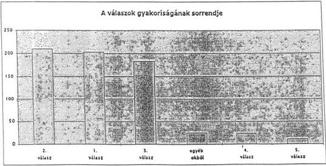

---

                                                                                    ---

---

4. sz. melléklet

a V-16-199/1998-99. sz. jelentéshez

# Önfoglalkoztatóvá válási támogatás

Kérdés: jelenleg milyen minőségben önfoglalkoztató?

|  Megye megnev. | Egyéni vállalkozó | Mezőgazd őstermelő | Társas vállalkoz. | Mezőgazd. kistermelő | Egyéb | Szellemi szabadfogl. | Összesen  |
| --- | --- | --- | --- | --- | --- | --- | --- |
|  Budapest | 14 | 1 | 15 | 0 | 0 | 0 | 30  |
|  Baranya Megye | 4 | 0 | 0 | 0 | 0 | 0 | 4  |
|  Bács-Kiskun Megye | 23 | 24 | 6 | 1 | 1 | 0 | 55  |
|  Békés Megye | 10 | 18 | 1 | 1 | 0 | 0 | 30  |
|  Borsod-A.-Z. Megye | 16 | 3 | 6 | 0 | 0 | 0 | 25  |
|  Csongrád Megye | 8 | 18 | 3 | 2 | 1 | 0 | 32  |
|  Fejér Megye | 13 | 7 | 11 | 0 | 0 | 0 | 31  |
|  Győr-Sopron Megye | 8 | 14 | 2 | 1 | 0 | 0 | 25  |
|  Hajdú Bihar Megye | 20 | 27 | 10 | 1 | 1 | 0 | 59  |
|  Heves Megye | 6 | 5 | 0 | 1 | 0 | 0 | 12  |
|  Komárom-Eszterg. M. | 18 | 3 | 5 | 1 | 0 | 0 | 27  |
|  Nógrád Megye | 9 | 2 | 1 | 0 | 0 | 0 | 12  |
|  Pest Megye | 36 | 0 | 4 | 22 | 0 | 1 | 62  |
|  Somogy Megye | 12 | 8 | 0 | 0 | 0 | 0 | 20  |
|  Szabolcs-Sz-B. M. | 16 | 25 | 6 | 1 | 0 | 0 | 48  |
|  Jász-Nk.-Szolnok M. | 13 | 17 | 6 | 1 | 0 | 0 | 37  |
|  Tolna Megye | 13 | 7 | 7 | 0 | 0 | 0 | 27  |
|  Vas Megye | 9 | 2 | 0 | 0 | 0 | 0 | 11  |
|  Veszprém Megye | 21 | 18 | 4 | 0 | 0 | 0 | 43  |
|  Zala Megye | 3 | 3 | 2 | 0 | 0 | 0 | 8  |
|  Összesen: | 272 | 202 | 89 | 32 | 3 | 1 | 598  |

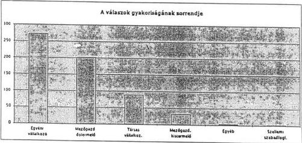

---

                                                                                     -

---

5. sz. melléklet

a V-16-199/1998-99. sz. jelentéshez

# Önfoglalkoztatóvá válási támogatás

|  Megye megnev. | 1. válasz  |
| --- | --- |
|  Heves megye | 1  |
|  Nógrád m. | 2  |
|  Baranya m. | 2  |
|  Zala megye | 3  |
|  Vas megye | 3  |
|  Fejér m. | 3  |
|  Somogy m. | 5  |
|  Budapest | 5  |
|  Csongrád m. | 7  |
|  Kom.-Esz. m. | 8  |
|  Tolna megye | 10  |
|  Győr-Sop. m. | 10  |
|  Bor.-Abauj Z. m. | 11  |
|  Békés m. | 13  |
|  Veszprém m. | 14  |
|  Jász-Nk.-Szoln. m. | 14  |
|  Pest megye | 19  |
|  Szab.-Sz-B. m. | 21  |
|  Bács-Kiskun m. | 23  |
|  Hajdú Bihar m. | 29  |
|  Összesen: | 203  |

|  Megye megnev. | 2. válasz  |
| --- | --- |
|  Baranya m. | 1  |
|  Zala megye | 1  |
|  Heves megye | 4  |
|  Vas megye | 4  |
|  Békés m. | 5  |
|  Győr-Sopron m. | 6  |
|  Nógrád megye | 6  |
|  Somogy megye | 6  |
|  Budapest | 8  |
|  Tolna megye | 8  |
|  Bor.-Abauj Z. m. | 9  |
|  Kom.-Esz. m. | 11  |
|  Szab.-Sz-B. m. | 13  |
|  Csongrád m. | 14  |
|  Jász-Nk.-Szoln. m. | 15  |
|  Veszprém m. | 16  |
|  Hajdú Bihar m. | 18  |
|  Bács-Kiskun m. | 19  |
|  Fejér m. | 20  |
|  Pest megye | 25  |
|  Összesen: | 209  |

|  Megye megnev. | 3. válasz  |
| --- | --- |
|  Baranya m. | 1  |
|  Vas megye | 1  |
|  Zala megye | 2  |
|  Bor.-Abauj Z. m. | 4  |
|  Nógrád megye | 4  |
|  Heves megye | 5  |
|  Fejér m. | 6  |
|  Győr-Sopron m. | 7  |
|  Csongrád m. | 9  |
|  Kom.-Esz. m. | 10  |
|  Jász-Nk.-Szoln. m. | 10  |
|  Békés m. | 11  |
|  Somogy megye | 11  |
|  Veszprém m. | 11  |
|  Tolna megye | 12  |
|  Szab.-Sz-B. m. | 13  |
|  Hajdú Bihar m. | 14  |
|  Budapest | 15  |
|  Bács-Kiskun m. | 16  |
|  Pest megye | 21  |
|  Összesen: | 183  |

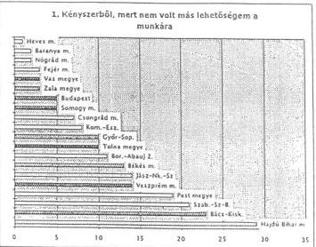

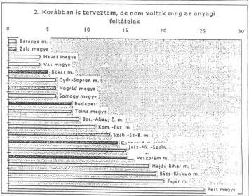

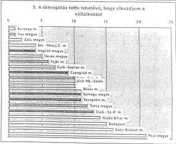

---

$$\therefore m = \frac{3}{11}$$

---

6. sz. melléklet
a V-16-199/1998-99. sz. jelentéshez

A munkanélküliek száma legmagasabb iskolai
végzettségük szerint (ezer fő)

|  Legmagasabb iskolai végzettség | 1996 | 1997  |
| --- | --- | --- |
|  8 általánosnál kevesebb | 19,6 | 15,4  |
|  Általános iskola 8 osztálya | 131,7 | 127,4  |
|  Szakmunkásképző | 140,5 | 120,2  |
|  Szakiskola | 5,7 | 4,6  |
|  Gimnázium | 34,6 | 30,4  |
|  Szakközépiskola | 51,5 | 40,9  |
|  Főiskola | 10,7 | 7  |
|  Egyetem | 5,8 | 2,9  |
|  Összesen | 400,1 | 348,8  |
|  Ebből: fizikai szakképzettséggel | 207,4 | ...  |

Forrás: Munkzerő-felmérés, lakossági adatgyűjtés.

A munkanélküliek száma legmagasabb iskolai végzettségük szerint (ezer fő)

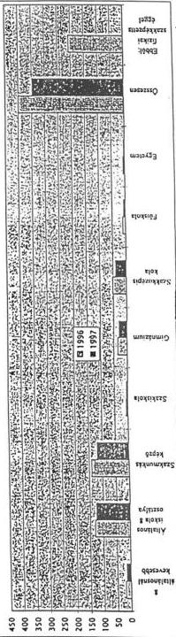

---

1

---

7. sz. melléklet
a V-16-199/1998-99. sz. jelentéshez

# A korábbi Számvevőszéki vizsgálatok utóellenőrzése

1.

A Foglalkoztatási Alap (FA) pénzeszközeinek felhasználását, a működtetéséhez szükséges feltételrendszer kialakítását 1992-ben ellenőriztük. Az 1994-ben végzett utóvizsgálat célja az volt, hogy minősítse, hogy az alapvizsgálathoz képest milyen változások történtek az Alap tervezési, pénzgazdálkodási, könyvvezetési rendjében, a rendszer működésében.

Az intézkedési tervben foglaltak végrehajtásával - az 1994. évi utóvizsgálat megállapításai szerint - javult a Munkaügyi Minisztérium irányító és ellenőrző tevékenysége. A munkaerőpiaci szervezetek - az OMK és a megyei (fővárosi) munkaügyi központok - szervezettebben és célirányosabban látták el a FA-val kapcsolatos feladatokat. Csak részleges eredményt állapított meg az utóvizsgálat az FA pénzeszközeinek célszerű felhasználásánál. Nem volt javulás a számviteli előírások betartásában, az FA működésében, irányításában, az aktív foglalkoztatáspolitikai eszközök támogatására fordított kiadások felhasználásában és az Országos Foglalkoztatási Alapítvány működésében.

A Foglalkoztatási Alap felhasználásának 1994. évi utóellenőrzésére készített intézkedési terv végrehajtása.

Az Intézkedési terv hét pontjában foglalt feladatok közül hat teljesült. Határidőn túli teljesítést okoztak az FA, illetve további négy alap összevonásával, az új alap (MPA 1996. január 1-jei) létesítésével kapcsolatos feladatok. Az új alap létesítésével időszerűtlenné vált - az intézkedési terv 3. pont - az FA kezelésének miniszteri rendeletben történő szabályozása is.

A Kormány döntése alapján létesített MPA-n belül a Foglalkoztatási Alap elkülönített alaprészeként (foglalkoztatási alaprész) működik 1996. január 1-jétől.

Az intézkedési terv egyes pontjaiban foglalt feladatok teljesítése:

Az 1. pontban foglaltak a foglalkoztatási törvény átfogó módosítását megalapozó törvényi koncepció elkészítését, továbbá az FA-hoz kapcsolódó szervezetek, az alap kezelésével és működtetésével összefüggő feladatok, hatáskörök részletes törvényi szabályozását írta elő.

---

A feladat az MPA összevonásával és a kapcsolódó jogi háttér kialakításával teljesült. A foglalkoztatási törvény módosítását a szervezet folyamatosan végzi.

A **2. pont** szerint az aktív foglalkoztatási eszközöknél alkalmazott államigazgatási eljárási rend felülvizsgálatát a szervezet elvégezte - az OMK 1996-ban, a minisztérium 1997-ben - az eszközökre mintaszabályzatot készített. Az eljárási rendek korszerűsítése rendszeres.

A **4. pontban** az FA 1993. évi költségvetési beszámolójának önrevízióval történő felülvizsgálata csak az MPA létesítésével összefüggésben teljesült. Az 1996. évi beszámolót a könyvvizsgáló még korlátozott hitelesítő záradékkal látta el.

A beszámolóban szereplő követeléseket az analitikus kimutatások nem támasztották alá. A függő, átfutó és kiegyenlítő bevételeket, kiadásokat nem alkalmazták minden esetben, s analitikájuk nem támasztotta alá a mérlegsorok adatait. A követelések és kötelezettségek mérlegben kimutatott értékének ellenőrzése az FA 1995. évi beszámolójának elkészítésekor teljesült. Az FA 1995. évi mérlegbeszámolóját az auditor hitelesítő záradékkal látta el.

Az Országos Foglalkoztatási Alapítvány Közalapítvánnyá történő átalakításának előkészítését, az Alapító Okirat tartalmának felülvizsgálatát végrehajtották. Kormánydöntés alapján 1997. január 1-jei hatállyal létrejött az Országos Foglalkoztatási Közalapítvány.

Az **5. pontban** előírt szabályozásokat - a foglalkoztatást elősegítő támogatásokról, a foglalkoztatási válsághelyzetek kezelését segítő elkülönített pénzügyi keret felhasználásáról - a 6/1996. (VII. 16.), a 8/1997. (IV. 28.) MüM rendeltek tartalmazzák. A miniszteri rendelet szabályozza a foglalkoztatást elősegítő képzések támogatási rendszerét is.

A **6. pontban** foglalt feladat teljesítését - a Monitoring rendszer tapasztalatainak és javaslatainak kiértékelése, továbbfejlesztése - az OMK, illetve a szervezet átalakítását követően az OMMK feladatkörében teljesítette, a tárgyévi tapasztalatok kiértékelését folyamatosan végzi és éves kiadványában megjelenteti.

A minisztérium beszámoltatta a Fővárosi Munkaügyi Központ igazgatóját a **7. pontban** foglalt feladat - a támogatott munkahelyteremtő beruházások során vállalt foglalkoztatási kötelezettségek - teljesítéséről és a jogtalanul felvett támogatások visszafizetésére tett intézkedésekről.

2. **Szakképzési célú pénzeszközök ellenőrzési rendszere, korábbi vizsgálatok realizálásának értékelése** (a fejezet Ellenőrzési Főosztálya által 1998. április hónapban készített jelentése alapján):

---2

---

A Szakképzési Alap, illetve szakképzési alaprész működtetéséhez szüksége **komplex információs** rendszert nem alakították ki. Kezdeményezték az információk, adatok összegyűjtését, azonban ezek rendszerezése, feldolgozása nem kellően dokumentált, több esetben nem történt meg.

A korábbi vizsgálat által feltárt hiányosságok döntő részben fennálltak, az alapvizsgálat megállapításai csak részben hasznosultak.

Megoldatlan feladatok voltak a jogosulatlanul felvett támogatások visszafizettetése, a szakképzési hozzájárulási kötelezettség téves elszámolásából eredő összegek visszakövetelése és a jelzálog bejegyzések tisztázása.

A kijelölt feladatok közül a szakmai munka javítását célzó intézkedések a jogszabályok módosításával megvalósultak. A gazdálkodással kapcsolatos feladatok az MPA beszámolójának és mérlegének könyvvizsgálói hitelesítésével teljesültek.

Budapest, 1999. augusztus

---3