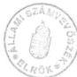
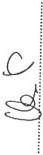

Állami Számvevőszék

# JELENTÉS

**a Magyar Távirati Iroda  
Részvénytársaság 1998. évi  
tevékenységének pénzügyi-gazdasági  
ellenőrzéséről**

1999. augusztus

9924

---

Az ellenőrzés végrehajtásáért felelős:
az ÁSZ III. Költségvetési Ellenőrzési Igazgatósága

Bihary Zsigmond

számvevő igazgató

Az ellenőrzést vezette:

Matusek István

számvevő igazgatóhelyettes

Az ellenőrzésben részt vettek:

dr. Horváth Margit

számvevő tanácsos

Szöllősiné Hrabóczki Etelka

számvevő tanácsos

Korábbi ellenőrzések:

a Magyar Távirati Iroda (MTI) 1990. évi pénzügyi-gazdasági
ellenőrzéséről

a Magyar Távirati Iroda költségvetési fejezet és a Magyar Távirati
Iroda Részvénytársaság pénzügyi-gazdasági ellenőrzéséről

(1998. augusztus)

Jelentéseink az Országgyűlés számítógépes hálózatán is olvashatók.

---

V-9-17/1999.

# TARTALOMJEGYZÉK

I. ÖSSZEGZŐ MEGÁLLAPÍTÁSOK, KÖVETKEZTETÉSEK, JAVASLATOK 5

II. RÉSZLETES MEGÁLLAPÍTÁSOK 11

1. Az MTI Rt. működésének szabályozottsága, törvényessége, a feladatok és a szervezeti rendszer összhangja 11

1.1.Az MTI Rt.szervezete es mukodese, belso informaciós rendszere 11
1.2.A TTT es az FB mukodese 14
1.3.A Kollektiv Szerzódés 16

2. Az MTI Rt. 1998. évi gazdálkodása 16

2.1.Az MTI Rt. 1998. evi uzleti tervenek es a terv teljesitsenek ertekelse 16
2.2.Az MTI Rt. letszam- es bergazdalkodasa 21
2.3.Az MTI Rt.eszkoz-és vagyongazdalkodasa 22

2.3.1. Az Rt. rendelkezésere alló eszközallomány összhangja a fel-adatellátással és a korszerü nemzetközi kapcsolattartás követelménye-ivel 22
2.3.2.A beruhazasok,felujitasok 1998.evi alakulasa 24
2.3.3.Az eszkoz- es vagyongazdalkodas egyes elemei 25
2.3.4. A befektetett eszközallomány alakulása, a vallalkozásokban való részvetel 27

2.4.A kulfodi tudositói halozat mukodese 28
2.5.A nemzetkozi hirhalozatban valo reszvetel,annak koltsegkihatasa 29
2.6.A gepjarmupark megujitasa,annak celszerusege 30

3. Az MTI Rt. számviteli rendje, a beszámoló valódisága 31

3.1.A szamvitel kialakitott rendje es a beszamoló osszhangja a szamviteli törvennyel 31
3.2.A leltarozas vegrehajtsanak szabályszerüsege 32

4. Az MTI Rt. ellenőrzési rendszere 33

4.1.A konyvvizsgaloi tevekenyseg ertekelse 33
4.2.A belso ellenorzés mukodese 33
4.3.A controlling rendszer kialakitasara tett intezkedesek 35

1

---

•

•

•

•

•

•

---

Állami Számvevőszék

V-9-17/1999.

Témaszám: 479.

# JELENTÉS

## a Magyar Távirati Iroda Részvénytársaság működésének pénzügyi-gazdasági ellenőrzéséről

A nemzeti hírügynökségről szóló 1996. évi CXXVII. törvény (Nht.) 9. §-a és az MTI Rt. Alapító Okirata 5.7. pontja szerint a részvénytársaság elnöke évente beszámol az Országgyűlésnek a részvénytársaság tevékenységéről, amelynek keretében sor kerül a mérleg és eredmény-kimutatás jóváhagyására, valamint a nyereség felosztására. Az elnök beszámolóját a részvénytársaság Felügyelő Bizottságának véleményével együtt kell az Országgyűlés (OGY) elé terjeszteni. A beszámolóhoz mellékelni kell az Állami Számvevőszék elnökének jelentését a részvénytársaság tevékenységéről.

Az MTI Rt-nek az Nht. 30. §-a alapján a közszolgálati feladatai ellátásához a Magyar Köztársaság 1998. évi költségvetéséről szóló 1997. évi CXLVI. törvény az OGY fejezetben 1998. évre 1.119,4 M Ft költségvetési támogatást hagyott jóvá. Ezen kívül az országgyűlési képviselői és az önkormányzati választásokkal összefüggő többletköltségek fedezetére 90,0 M Ft-ot, a szervezeti átalakulást elősegítő létszámleépítésekre 195,0 M Ft-ot kapott az MTI Rt.

Az Nht. 9. § és 29. §-a szerinti **ellenőrzés célja** volt, hogy eleget tegyen az MTI Rt. gazdálkodására vonatkozó ellenőrzési feladatnak és megállapításaival megalapozza az ÁSZ elnökének a részvénytársaság tevékenységéről szóló jelentését.

Az ellenőrzés során értékelni kellett az MTI Rt. 1998. évi gazdálkodási tervének megalapozottságát, a terv végrehajtásának törvényességét, célszerűségét és eredményességét. Ennek keretében ellenőriztük, hogy:

- az MTI Rt. az Alapító Okiratában és a vonatkozó törvényekben, egyéb jogszabályokban foglaltaknak megfelelően törvényesen, célszerűen és eredményesen gazdálkodott-e a rendelkezésére bocsátott vagyonnal és a központi

---3

---

költségvetésből a részvénytársaság közszolgálati feladatai ellátásához - ideértve a Tulajdonosi Tanácsadó Testület (a továbbiakban: TTT) Titkársága működésével kapcsolatos feladatokat is - nyújtott céltámogatással;

- az MTI Rt. ellenőrzési rendszere - ezen belül a TTT és a Felügyelő Bizottság (FB) - működése eredményes volt-e;
- a könyvvizsgálónak az auditálás során kialakított véleménye szerint az MTI Rt. 1998. évi beszámolója, mérleg és eredmény-kimutatása megfelel-e a számvitelről szóló, többször módosított 1991. évi XVIII. törvény (Szt.) előírásainak.

A vizsgálat kiterjedt az MTI Rt. elnöke által az ÁSZ 1998. évi ellenőrzési javaslataira kidolgozott intézkedési terv végrehajtásának ellenőrzésére is.

Megállapításainkat az MTI Rt. nyilvántartásaival egyező, a főbb adatokat tartalmazó tanúsítványokkal dokumentáljuk (1-12. sz. táblázatok).

Az ellenőrzést - az államháztartásról szóló 1992. évi XXXVIII. törvény 121. §. (1) bekezdése, az Állami Számvevőszékről szóló, többször módosított 1989. évi XXXVIII. törvény 2. §. (3) bekezdése, illetve a nemzeti hírügynökségről szóló (Nht.) 1996. évi CXXVII. törvény 9. §. és az MTI Rt. Alapító Okirata 5.7 pontja szerint végeztük - az 1998-as gazdasági évet illetően.

Az ellenőrzéssel, illetve az az alapján elkészült jelentéssel az ÁSZ elnöke eleget tesz az Nht. 9. §. és a 29. §-ban előírt ellenőrzési és az Rt. elnöke beszámolójához mellékelendő értékelő jelentési kötelezettségének.

4

---

I. ÖSSZEGZŐ MEGÁLLAPÍTÁSOK, KÖVETKEZTETÉSEK, JAVASLATOK

# I. ÖSSZEGZŐ MEGÁLLAPÍTÁSOK, KÖVETKEZTETÉSEK, JAVASLATOK

Az MTI Rt. gazdálkodásában az első teljes év az 1998. év volt. Az 1997. év végi előzetes tervet követően a gazdálkodási tervet 1998. május végére készítették el, mely időszakra az Rt. gazdálkodását a tervezés szempontjából meghatározó összes fontos körülmény ismert volt. A TTT által jóváhagyott díjszabás alapján a bevételt döntően befolyásoló szerződéseket megkötötték (vonali szolgáltatások), a költségek és ráfordítások keretében számolni lehetett a szolgáltatók által megállapított díjtételekkel, a többletfeladatok hatásával, valamint a tartozásokkal kapcsolatos intézkedésekkel (OEP-határozat). Az 1998. évi gazdálkodási terv a gazdálkodás főbb tényezőinek ismerete ellenére a lehetőségeket alábecsülve, 50 M Ft nagyságrendű veszteséggel számolt.

A könyvvizsgáló által auditált mérleg és eredmény-kimutatás szerint az Rt. üzleti eredménye (nyeresége) 104,3 M Ft volt, a pénzügyi műveletek nyeresége 128,2 M Ft, a rendkívüli eredmény 11,3 M Ft. Az adózás előtti nyereség 243,8 M Ft, amely - miután az Rt. mentes a társasági és osztalék adó fizetése alól - azonos a mérleg szerinti nyereséggel.

A gazdálkodás főbb tényezőinek és a megtett intézkedések részletesebb vizsgálata azt mutatja, hogy az MTI Rt. vezetése hatékony és eredményes döntéseket hozott, stabilizálni tudta az Rt. pénzügyi-gazdasági helyzetét és 1999-ben az előző évinél jobb alapokon indíthatta a gazdasági évet.

Az MTI Rt. 1998-ban törekedett a racionális gazdálkodásra. Ennek érdekében a bevételeit jelentősen növelte; átfogó költségcsökkentési programot hajtott végre; a késedelmes fizetések behajtására elnöki utasításban külön eljárási rendet dolgozott ki.

A pénzügyi befektetések a társaság mindenkori likviditási helyzetének figyelembevételével, a likviditás folyamatos fenntartása mellett rövid lejáratú bankbetétbe, illetve a maximális biztonságot jelentő állami értékpapírokba való befektetéssel valósultak meg, az üzleti eredményt meghaladó eredményességgel.

A beszámoló adatai szerint az MTI Rt. saját bevételének aránya 55%, költségvetési támogatásból származik a bevételek 45%-a. A saját bevételek az előző (1997.) évhez viszonyítva 40,4%-kal növekedtek. Költségvetési támogatást a közszolgálati feladatai ellátásához a költségvetési törvényben, az OGY fejezetben 1.119,4 M Ft összegben kapott, ezen túl az országgyűlési képviselői és az önkormányzati választásokhoz az igényelt 178,4 M Ft-hoz képest 90,0 M Ft-ot; valamint az Rt. szervezeti átalakulását elősegítő létszámleépítésekre 195,0 M Ft-ot. Külön támogatási szerződés keretében az Rt. egy új szolgáltatás, az Euro Atlanti Hírlevél megjelentetése érdekében 4,0 M Ft összegű egyszeri támogatást is kapott.

5

---

I. ÖSSZEGZŐ MEGÁLLAPÍTÁSOK, KÖVETKEZTETÉSEK, JAVASLATOK

**A létszámleépítésre kapott 195,0 M Ft-ból 1998-ban 119,8 M Ft-ot számoltak el.** A felhasználás szabályosságát a belső ellenőr vizsgálta. Jogtalan felhasználást állapított meg a felmentés, végkielégítés címén kifizetett összegeknél 5,6 M Ft összegben. Álláspontunk szerint a jogilag korrekt megállapításokkal alátámasztott kifizetéseknél a Kollektív Szerződés szerintiinél kedvezőbb feltételek alkalmazása nem volt jogtalan.

**A költségek és ráfordítások** összesen 37,7%-os növekedést mutattak a bázis időszakhoz képest. Az Rt. 180,0 M Ft-ot irányzott elő beruházásra, melyet 11,0 M Ft-tal egészítettek ki a választási céltámogatásból. Az aktivált beruházások értéke a beszámoló szerint 144,9 M Ft volt.

**Az MTI Rt. létszám- és bérgazdálkodásának fejlesztésére több lényeges intézkedést hoztak 1998-ban.** Szabályozták a bér-, kereset- és jövedelemkiáramlást, változtattak a bérek szerkezetén, létszámstoppot rendeltek el, külön rendelkeztek a jutalmazási rendről. A teljes munkaidőben foglalkoztatottak 1997. december 31-i 466 fős zárólétszáma 1998. december 31-én 431 fő volt. 1998-ban 34 fő lépett be az Rt-hez, e körben már a minőségi csere követelményeit is sikerült részben érvényesíteni. **Az átlagbérek 1998-ban 10,85%-kal, az átlagkeresetek 23,9%-kal emelkedtek.** A belsős és a külsős megbízási, (vállalkozási) jogviszony keretében történő foglalkoztatások felülvizsgálata 1998-ban nem történt meg.

**A szolgáltatási struktúrában 1998-ban az Rt-nél még nem következett be áttörés,** inkább a megalapozó, előkészítő lépéseket tették meg.

**Az MTI Rt. adósságai csökkentése érdekében intézkedett.** Az OEP-pel szemben fennálló tartozásait - annak az 1998. februári határozata szerint - úgy rendezte, hogy a késedelmi pótlékot méltányosságból elengedték, a járuléktartozásra 2001. január 20-ig pótlékmentes részletfizetést engedélyeztek, melynek keretében az 1998-ra esedékes összeget (195,1 M Ft) az Rt. befizette. A szállítói kötelezettségeket (1998. december 31-én 75,0 M Ft) a mérlegkészítés időszakában kiegyenlítették.

Az Rt. 29.980 E Ft összegű, még az 1997. évi költségvetésben **meghatározott bevételek utáni befizetési kötelezettségének eleget tett.**

**Az MTI Rt. stratégiai terve 1998-ban nem készült el.** Annak előkészítésére ugyanakkor érdemi lépéseket tettek.

**A műszaki, informatikai infrastruktúrának a nemzetközi követelményeket elérő fejlesztéséhez elengedhetetlen külső források megcélzása és bevonása is.**

Az MTI Rt. **1998. évben a műszaki fejlesztés terén áttörő változást** nem tudott, de a szervezeti felépítés folyamatban lévő átalakításával összefüggésben **nem is tervezett elérni.** Az 1998. évi megvalósult beruházások az eszközállomány szintentartását sem fedezték.

6

---

I. ÖSSZEZGŐ MEGÁLLAPÍTÁSOK, KÖVETKEZTETÉSEK, JAVASLATOK

A nagyléptékű fejlesztések a szervezeti struktúra véglegesítésével, több évre ütemezetten, az ellenőrzött évet követően indulhatnak meg. A társaság ennek megvalósításához kidolgozta a középtávú koncepcióját, emellett a gazdálkodási terv részeként az 1998. évre vonatkozó beruházási, felújítási tervét, amelyben azonban a megvalósítás forrásszükséglete mellett azok összetétele nem szerepelt.

**Az eszköz- és vagyongazdálkodás területén az előző ellenőrzésünk során feltárt hiányosságokat döntően rendezték**, pl. szabályozták az ingatlanhasznosítást és ennek megfelelően a bérleti szerződéseket folyamatosan az új konstrukciónak megfelelően módosították.

Az Rt. ingatlanainak telekkönyvi rendezése 1998-ban még nem volt teljes körű, a helyszíni ellenőrzésünk lezárásáig 6 ingatlan esetében történt meg. A telekkönyvi bejegyzés elhúzódását az egyes földhivatalok eltérő jogértelmezése, valamint az MTI Rt. és a Kincstári Vagyoni Igazgatóság közötti együttműködési problémák okozták.

Az eszközök selejtezése során szabályszerűen, a számviteli törvény (Szt.) előírásainak megfelelő módon jártak el.

**Az 1998. évi mérleget alátámasztó leltározási tevékenység szabályszerű volt.**

**A mérlegben** továbbra is az alapításkor megállapított **eszmei értéken szerepelt** - az immateriális javak között kimutatandó - **archívumok értéke, emiatt az 1998. évi mérleg nem felelt meg a számviteli törvényben deklarált teljesség elvének.**

A törvény hatása valamennyi közszolgálati tömegkommunikációs szervezetet érinti. A törvény pontosítására vonatkozó ÁSZ kezdeményezésre a Pénzügyminisztérium nem reagált. Az archívum reálértéken való felvétele az alapítói vagyonba az alapító szerv, az Országgyűlés jogköre. Az archívum folyamatos bővítése az amortizációs költségek növelésével jár.

**A vállalkozásokban való részvétel** pénzügyi szempontból **nem volt jelentős kihatással az Rt. eredményességére** (a realizált osztalék mintegy 3 M Ft volt). Az MTI Fotó Kft. helyzetét veszteségei miatt az Rt. és a testületek is felülvizsgálták, a Kft. jövőjéről azonban 1998-ban nem született döntés.

**Az MTI Rt. szervezete 1998-ban érdemben nem változott**, működésére a centralizált döntési struktúra volt a jellemző, ez különösen érvényesült a munkáltatói jogok koncentrálásában. Az Rt. alapvetően funkcionális munkamegosztás szerint működött, a felső szintű vezetésben fontos szerepük volt az ún. **kabineteknek és stratégiai tervező csoportoknak.**

Az MTI Rt. szervezetét és működését 1998-ban elnöki (alelnöki) utasítások szabályozták, egyben az új SZMSZ kidolgozása, a lehetőségekhez képest optimális szabályozás előkészítése érdekében - az 1998. évi jelentésünkben javasolt átfogó feladat-felülvizsgálattal összhangban - a helyzet felmérésére, értékelésére és annak alapján a szervezet és működés korszerűsítésére vonatkozó tanulmányt rendeltek meg a Budapesti Közgazdaságtudományi Egyetem szellemi potenciál-

7

---

I. ÖSSZEGZŐ MEGÁLLAPÍTÁSOK, KÖVETKEZTETÉSEK, JAVASLATOK

ját hasznosítva, egy kft-n keresztül. 1999. áprilisában készült el az SZMSZ-nek az az átdolgozott és kiegészített változata, amelyet már a Tulajdonosi Tanácsadó Testület (TTT) is véleményezésre alkalmasnak tartott, illetőleg a TTT Titkárságát érintő részhez az egyetértését adta. **Az SZMSZ 1999. június 1-jével lépett hatályba**, ezáltal lehetővé vált a szabályozási és ügyviteli hiányosságok felszámolása.

Az MTI Rt. működésében 1998-ban is fontos szerepet töltöttek be az Nht. alapján, speciális szabályok szerint és feladatkörrel létrehozott testületek, a **TTT és az FB**. Mindkét testület megfelelően részletezett - a TTT-é néhány előírásában már bürokratikusnak is tekinthető - **ügyrend szerint, elfogadott munkaterv alapján ellátta a tevékenységét**. A kormánytaggá kinevezett FB elnök helyett az Országgyűlés (OGY) még nem választott új elnököt, ennek ellenére az FB a működőképességét megőrizte, ügyrendi szinten áthidalta a problémát.

Az SZMSZ a testületek és az Rt. elnöke által megkötött együttműködési megállapodás szerint meghatározta e testületek tagjait megillető szolgáltatások és juttatások, illetve térítések jogcímeit és mértékét.

Egyes területek (informatikai, gazdasági alelnök alá tartozók, az üzemeltetés, a szállítás) rendelkeztek **ügyrendnek** megfelelő belső szabályzattal, továbbá a kiválasztott gazdasági alelnökség példaként alkalmazandó, tipizált **munkaköri leírás**-tervezetekkel, azok elkészítését az SZMSZ hatályba lépését követő reális határidőn belül lehet teljes körűen számon kérni.

Az MTI Rt. működésének és gazdálkodásának szabályozottságára speciális követelményeket is előírt az Nht. Ezeknek megfelelően elkészültek a testületi ügyrendek, az ORTT és a TTT egyetértésével kiadták az Archiválási Szabályzatot.

**A gazdasági társaságokra kötelező gazdálkodási szabályzatok elkészültek, azok korszerűnek tekinthetők.**

**A számvitel rendjének szabályozottsága** a számviteli politika kiegészítésével, a számlarend hatályba léptetésével - **az önköltségszámítás rendjének szabályzatát kivéve - teljes körűvé vált.**

1998-ban az MTI Rt-nél új Kollektív Szerződést (KSZ) nem kötöttek, a régi hatályának 1999. október 15-ig való meghosszabbítása a dolgozók számára a közalkalmazotti juttatási kedvezmények továbbvitelét jelentette.

**A külföldi tudósítókat megillető járandóságokról szabályzatot** - annak ellenére, hogy ennek szükségességét előző ellenőrzésünk is megállapította - **nem készítettek.**

Az 1998. év végétől működik, az FB-hez kapcsolva, a függetlenített belső ellenőr. Eljárási rendjét azonban nem alakították ki. Ennek következtében az Rt. elnöke nem minden esetben ismerhette meg az ellenőrzés programját, a megállapításokra esetenként nem volt módja észrevételt tenni és a jelentések megvitatására sem mindig kapott lehetőséget.

8

---

I. ÖSSZEGZŐ MEGÁLLAPÍTÁSOK, KÖVETKEZTETÉSEK, JAVASLATOK

A vezetői tevékenység megalapozása érdekében 1997-ben döntés született a controlling rendszer kialakítására. Az eddig alkalmazott megoldások a kívánalmaknak csak részlegesen felelnek meg, a szolgáltatott információk a vezetői döntések meghozatalához nem elégségesek, hiányzik belőlük az elemzés és az értékelés.

Az 1998-ban lefolytatott ellenőrzés alapján kidolgozott intézkedési tervben foglalt feladatok többségét végrehajtották.

Teljesültek az intézkedési terv szerinti alábbi feladatok:

az SZMSZ kidolgozása; a TTT és FB tagok részére adható juttatások körének az SZMSZ-ben, a mértékének a külön megállapodásban való meghatározása. Az Rt. a 29.980 E Ft bevételi járulékát befizette. Az Nht. előírásai alapján - az ORTT és a TTT egyetértésével - az Archiválási Szabályzatot kiadták. A Fotóarchívum tárgyi feltételeinek javítása érdekében intézkedtek.

Megvalósult a belső ellenőr kiválasztása; az intézkedési tervben előírt eszközállományra vonatkozóan a szabályszerű leltározás; a helyiséggazdálkodással kapcsolatban előírt feladatok; a közbeszerzési eljárás rendjének szabályozása; a selejtezések során az előző ellenőrzésünk által feltárt hiányosságok kiküszöbölése; a tervezettnél lassabb ütemben, de megindult a gépjárműpark cseréje is.

Az intézkedési tervben meghatározott határidőhöz képest késéssel, illetve részben teljesült az SZMSZ véglegézése után az ügyrendek és a munkaköri leírások elkészítése. Az 1999. évi üzleti terv az intézkedési tervben meghatározott 1998. december 15-i határidőhöz képest 1999. áprilisában készült el.

Nem teljesült az új KSZ kiadása; a belsős- és külsős megbízási (vállalkozási) jogviszony keretében történt foglalkoztatások felülvizsgálata; az önköltségszámítási szabályzat kidolgozása.

Az intézkedési terv egyes feladatai az SZMSZ, illetve az új KSZ kiadása függvényében teljesíthetők (pl. az önköltségszámítás rendjének-, a saját tulajdonú gépkocsik hivatali célú használatának szabályozása esetében). A szabályzatok folyamatos karbantartásának feladatát több területen annak ellenére nem hajtották végre, hogy akadályozó tényező nem merült fel (a külföldi tudósítók járandóságainak a megállapítása, az anyag- és készletgazdálkodás rendjének szabályzata).

A folyamatba épített és a vezetői ellenőrzés megerősítésére 1998-ban intézkedéseket nem hoztak, az erre vonatkozó szabályzatot 1999. májusában léptették hatályba, ami az intézkedési tervben megállapított határidőhöz képest (1998. december 15.) öt hónapos késedelmet jelentett.

Az MTI Rt. gazdálkodásának folyamatosságát, stabilitását hátrányosan befolyásolja az a körülmény, hogy az Országgyűlés - mint a Részvénytársaság tulajdonosa - még az 1997. évi beszámolót sem fogadta el és nem hagyta jóvá az eredményfelosztást. Országgyűlési választás hiányában nincs legitim elnöke a Felügyelő Bizottságnak.

9

---

I. ÖSSZEGZŐ MEGÁLLAPÍTÁSOK, KÖVETKEZTETÉSEK, JAVASLATOK

Az ellenőrzés megállapításainak hasznosítása mellett javasoljuk

# az Országgyűlésnek:

1. A Felugyelő Bizottság törvenyes muködésének helyreallitása igényli, hogy az Nht. 13. §. (1) bek. a/ pontja szerint az FB elnokét az Országgyűles minél hamarabb megvalassza.
2. Olyan dontesi eljarast javasolunk kialakitani, hogy az Orszaggyulés az MTI Rt. elnokének éves gazdasagi beszamolóját, eredményfelosztásat realisan rovid határidón belül tárgyalja meg és dontson azok elfogadásáról.
3. Kezdemenyezze, hogy a Kormány a szamviteli és szakmai szempontok merlegelése alapján szabályozza a kozszolgálati tomegkommunikácios szervezetek (MTI Rt., MTV Rt., Duna TV, MR) archivumainak keszletertekelesi rendjét.

# a Tulajdonosi Tanácsadó Testület elnökének:

1. A TTT és FB tagokat megillető juttatások tekintetében kezdéményezze az alapdij és a költségterítési atalány - méltányos keretek közötti - arányanak meghatározásat az Rt. működési költségeinek kimélse figyelembevételével.
2. Kezdemenyezze a TTT Ügyrendjenek felülvizsgalatát és olyan ertelmú modositásat, amely lehetőve teszi a hatékonyabb muködest, gyorsütja a TTT dontési folyamát, figyelembe veve az Nht. és az MTI Rt. Alapíto Okiratában a testületre vonatkozo jogosultságokat.

# a Felügyelő Bizottság elnökének:

Szabályozni kell a függetlenített belső ellenőrzés eljárási rendjét. A szabályzatnak lehetővé kell tennie, hogy az Rt. elnöke is ellenőriztethessen és a belső ellenőr által tett megállapításokra észrevételeket tehessen.

# a Részvénytársaság elnökének:

1. Az ügyrendek és a munkaköri leirások elkésztésére - az SZMSZ hatálybalépéséhez igazítva - határozzon meg a gezetők szárá uj határidőt. A teljesítés ellenőrzese képezze a belso ellenőri munkaterv részt.
2. Az uj KSZ kidolgozasi munkalataira es elfogadasara dolgozzon ki utemtervet.
3. Gondoskodjon az uzleti terv és a beszámoló megfelelo adatai kozotti egyezóségBiztositásáról; az uzleti terv számai (esetleges) valtozásai nyomonkövethetósegéról.
4. A letszam- es bergazdalkodás keretében - a keresetek szerkezeti átalakulására is figyelemmel - intézkedjen a külso's- és belso's megbizási (vallalkozási) jogviszony keretében törtent foglalkoztatások felülvizsgalatáról és azok szabályozásáról.

10

---

II. RÉSZLETES MEGÁLLAPÍTÁSOK

5. Az éves fejlesztési tervekben dolgozza ki a megvalósítás részletes utemezését és a forrasszükséglet tervezett struktúráját.
6. Keszittesse el es haladektalanul leptesse hatalyba a jelentésben hianyolt, a gazdalkodás egyes részterületeire irányul szabályzatokat (önköltseg-számítasi szabályzat, külföldi tudósítók jarandóságanak szabályzata).
7. Dontson az MTI Foto Kft. jovjéról.
8. A controlling rendszer eddigi fejlesztési eredményei felülvizsgálata alapján tegyen intézkedeseket a gezetői információs igények jobb kielégítésere. Az információs rendszer elemzesekkel kiegészítve segítse az operativ és távlatosabb gezetői dontésk megalapozásat.
9. A penzügyi helyzet folyamatos attekinthetösege erdekében valamennyi penzügyi kihatásu szerzódésrol (követelések és kõtelezettsegek) vezessenek központi nyilvántartást. Tegyen eleget az Nht. 27. § (2) bekezdésben foglalt elöirásnak, azaz gondoskodjon az 500 E Ft szerzódési ertéket meghaladó szerzódések külön nyilvántartásáról.
10. Az ügyrendek és a munkakör leirások elkésztésére az SZMSZ késedelmes hatálybalépese miatt új határidőket indokolt megállapítani.
11. A Kollektiv Szerzódés elkésztésére uj határidót szükséges megállapítani.

## II. RÉSZLETES MEGÁLLAPÍTÁSOK

1. Az MTI RT. MŰKÖDÉSÉNEK SZABÁLYOZOTTSÁGA, TÖRVÉNYESSÉGE, A FELADATOK ÉS A SZERVEZETI RENDSZER ÖSSZHANGJA

1.1. Az MTI Rt. szervezete és működése, belső információs rendszere

Az MTI Rt. szervezetére és működésére vonatkozóan 1998-ban a még 1994-ben kiadott (1996-ban módosított) Szervezeti és Működési Szabályzat (SZMSZ); továbbá néhány, a szervezeti rendszert érintő elnöki utasítás volt hatályban.

Az új SZMSZ kidolgozására az ÁSZ 1998-ban készült jelentése (J./22/1.) nyomán elhatározott intézkedésekről szóló 16/1998. sz. elnöki utasítás 1. pontja 1999. április 15-i határidőt szabott. Ennek az indoka az volt, hogy a lehetőségekhez képest optimális szabályozás előkészítése hosszabb időt vett igénybe. Ennek érdekében ugyanis - az ÁSZ jelentésében javasolt átfogó feladatfelülvizsgálattal összhangban - az MTI Rt. szervezetének fejlesztésére (egyben átvilágítására) szolgáló tanulmány elkészítésére szerződést kötöttek a Budapesti Közgazdaságtudományi Egyetem szellemi bázisán működő kft-vel.

A szerződésben a szervezetfejlesztés és az ehhez szükséges helyzetelemzés mellett a marketingstratégia koncepciójának elkészítése is szerepelt.

11

---

II. RÉSZLETES MEGÁLLAPÍTÁSOK

**A határidőre elkészült, jól hasznosítható, színvonalas anyag komoly támaszt jelentett az SZMSZ kidolgozási munkálataihoz.** Azzal, hogy a változtatások ütemezésére is adott javaslatot, praktikusan is segítette (segíti) az MTI Rt. vezetésének munkáját.

Az MTI Rt. Alapító Okiratának 5.5 pontja értelmében az SZMSZ-t kiadása előtt véleményezi a Tulajdonosi Tanácsadó Testület (TTT), illetve az SZMSZ-nek a TTT Titkárságára vonatkozó részéhez szükséges az egyetértése.

Az 1999. februárjában elkészült SZMSZ-tervezet még csekély mértékben mutatta a jelzett tanulmány hasznosításának nyomait, a TTT és a felügyelő bizottsági tagok juttatásairól pedig nem is szólt, azt a TTT érdemi tárgyalásra és véleményezésre alkalmatlannak találta (TTT-2/1999. (III. 4.) hat.).

Az SZMSZ-tervezettel kapcsolatban az Üzemi Tanács is megfogalmazta a kifogásait.

1999. áprilisában elkészült az SZMSZ-nek az az átdolgozott és kiegészített változata, amelyet már a TTT is véleményezésre alkalmasnak tartott. Az SZMSZ **1999. június 1-jével hatályba lépett.**

Tekintettel arra, hogy az egyes szervezeti egységekre vonatkozóan az ügyrendeket és a munkaköri leírásokat az SZMSZ hatályba lépése után lehet elkészíteni, annyit állapíthatunk meg, hogy az intézkedési terv 1. pontjában meghatározott 1999. április 15-i határidőt a tényleges helyzetnek megfelelően módosítani szükséges.

Ügyrendnek megfelelő belső szabályzattal egyes területek rendelkeztek pl. az informatikai alelnök és a gazdasági alelnök alá tartozó terület (a Termékfejlesztési és Értékesítési Igazgatóságot kivéve), az üzemeltetési osztály, a szállítási terület.

Megjegyezzük, hogy a mintavételként kiválasztott gazdasági alelnökséghez tartozó munkatársak munkaköri leírásainak tervezetei elkészültek. Figyelemre méltó, új szemléletet tükröző az a tipizálás, amelyet alkalmaznak a munkaköri leírásokhoz, így pl. az a feladat megnevezése mellett tartalmazza a hatásköröket, felelősségi köröket (döntési, tájékoztatási, ellenőrzési, végrehajtási, véleményezési, közreműködési), a külső-belső kapcsolattartás körét, az iskolai végzettség és a szakképzettség mellett, egyéb követelményként a szükséges szakmai gyakorlat, készség, képesség (pl. számítástechnikai ismeretek, kommunikációs készség, megbízhatóság, stb.) megjelölését is.

Az MTI Rt.-nél 1998-ban az ellenőrzésünket követően az alábbi szervezeti változások voltak:

Az Anyaggazdálkodási Osztály a gazdasági alelnök felügyelete alá került, az újonnan alakult hírszolgálati ügyelet a hírigazgató alá rendelt szervezeti egységként működik, az Értékesítési és Termékfejlesztési Igazgatóságot az elnök közvetlen irányítása alá vonta. Az illetékes szakmai alelnök a sportszerkesztőséget rovattá alakította át és racionalizálta a Külpolitikai és a Nemzetközi Tájékoztatási Szerkesztőség munkáját.

**Az MTI Rt. szervezetére, működésére 1998-ban a centralizált döntési struktúra volt a jellemző.** Ebben szerepe volt annak is, hogy az SZMSZ kiadásának hiányában az egyszemélyi felelősségű elnöki hatáskör elemeinek

12

---

II. RÉSZLETES MEGÁLLAPÍTÁSOK

széles körű delegálására nem volt mód. A munkáltatói jogok erős centralizáltsága különösen jellemző volt (az alapvető munkáltatói jogok az elnökhöz tartoztak minden dolgozó tekintetében).

Az MTI Rt. 1998-ban alapvetően funkcionális munkamegosztás szerint (hírügynökségi szakmai, illetve gazdasági, műszaki területek), az elnöki utasításokkal kialakított szervezeti rendhez igazodó hierarchiának megfelelően működött.

A belső vezetői rendszerben fontos szerepe volt az ún. kabinetek működtetésének (elnöki, informatikai, hír, gazdasági), amelyek a felső vezetés szintjén létrehozott és heti rendszerességgel működtetett, általában döntés-előkészítő, véleményező, tájékoztató szerepkört láttak el, adott esetben döntési, irányítási hatáskörrel kiegészítve, ez elsősorban az elnöki kabinetre vonatkozott, amely döntéséről határozatot is hozott, így pl. az 1998. évi bérfejlesztésről.

**Az Rt. vezetése** a stratégiai kérdések fontosságára tekintettel 1998. augusztusában az elnök vezetésével **stratégiai tervező csoportot hozott létre** az egyes funkcionális stratégiák kialakítására, külön alcsoportokkal.

Az Rt. elnöke által jóváhagyott feladat- és munkaterv szerint a stratégiai tervezés célja az MTI Rt. fejlődésének tudatos alakítása, kiinduló pontja az MTI Rt. belső helyzetelemzése, illetve a piac alapos felmérése, mindez azért, hogy a megfogalmazott MTI Rt. stratégiai akció alapján kidolgozható legyen a 3 éves üzleti terv a végrehajtás megszervezésével együtt. (1999. júniusában tervezetként a 3 éves üzleti terv már elkészült.)

**A gazdasági társaságokra kötelező gazdálkodási szabályzatokat** az MTI Rt.-nél - az önköltség-számítási szabályzat kivételével - **kiadták**.

**MTI Rt. - sajátossága az, hogy az Nht. is előír egyes területekre szabályozási feladatokat.** Az Nht. 11. §-a értelmében a közgyűjteménynek nem minősülő dokumentumokra az archiválás szabályait és feltételeit, a hasznosítás módját az elnöknek - a TTT egyetértésével - külön szabályzatban kell meghatároznia. A szabályozás komoly előkészítő munka eredményeként elkészült és 1999. január 18-án hatályba lépett, ahhoz az MTI Rt. Alapító Okirata 5.7. pontjába foglalt ORTT egyetértést is megkapták.

Az ORTT és a TTT megállapítása szerint az utasítás tartalmazza a speciális múzeumi (és levéltári) gyűjtemények megőrzését segítő, szigorú szakmai előírásokat, miközben maximálisan figyelembe veszi a helyi sajátosságokat is.

A szabályzat meghatározza a történelmi jelentőségű eredeti dokumentum és kulturális érték fogalomkörébe tartozó dokumentumok körét, majd az MTI Rt. archiválást végző részlegei (Sajtóadatbank, Fotóarchívum, Műszaki Igazgatóság) szerint a működtetés részletes szabályait (a Fotóarchívumnál külön az állagmegővállal összefüggő vagyonvédelmi-, tűzbiztonsági- és fotószakmai, valamint a fotóarchívum gyűjteményének hasznosítására vonatkozó rendszabályokat), végül a felelősségi szabályokat. Az intézkedési terv is előírta a szabályzat elkészítését és az ORTT-nél való egyeztetést.

**A szabályzat kiadásán túl a Fotóarchívumot érintően további jelentős intézkedések történtek.** Elkészültek a képértékesítő munka jogi biztonságát szolgáló belső szabályzatok, szerződés- és megrendelés formulák; az MTI

13

---

II. RÉSZLETES MEGÁLLAPÍTÁSOK

Rt. jogi védelmét szolgáló (egyszeri, illetve határozatlan időre szóló) felhasználási szerződési nyomtatványok.

Az Rt. az intézkedési tervben foglaltak végrehajtásaként 1998. november 16-i hatállyal **szabályozta a közbeszerzési eljárás rendjét**. (A közbeszerzésekről szóló 1995. évi XL. törvény szabályozási kötelezettséget nem ír elő, de az eljárások szabályszerű lebonyolítása érdekében az utasítás kiadása célszerű volt.) Az utasítás összhangban van a törvényi előírásokkal, de a döntési jogkörök tekintetében kisebb kiegészítésekre szorul. Az új SZMSZ hatályba léptetésével összefüggésben az Rt. napirendjén szerepel a módosítása az SZMSZ-szel való összhang megteremtése érdekében.

Kiegészítendő az utasítás azzal, hogy az ajánlati biztosíték formájára, mértékére, kezelésére, valamint a közbeszerzési eljárás fajtájának meghatározására vonatkozóan a döntési jogkört ki gyakorolja (az utasítás 11. és 13. pontja).

## 1.2. A TTT és az FB működése

Az MTI Rt. életében 1998-ban is fontos szerepet töltöttek be az Nht. alapján, speciális szabályok szerint és feladatkörrel létrehozott testületek, a TTT és az FB.

A TTT az Országgyűlés által a képviselőcsoportok jelöltjeiből választott, az MTI Rt. tanácsadó, javaslattevő, véleményező és egyes esetekben döntéshozó (az MTI Rt. elnöke díjazásának megállapítása, az Rt. díjszabásának jóváhagyása) szerve.

A létrehozásakor 10 tagú TTT 1998. év végén a választásokat követő új kormányzati ellenzéki viszonyok alapján az OGY által választott további tagokkal 16 fős lett /92/1998. (XII. 29.) OGY hat/.

Az FB az MTI Rt. ügyvezetését ellenőrző 5 tagú testület, amelynek elnökét és egyik tagját az OGY választja (115/1997. (XII. 17.) OGY hat.). 1998-ban az FB elnöke kormánytag lett, az OGY azóta nem választott új elnököt. Ezt - a működőképesség megőrzése érdekében - az FB saját ügyrendi szabályozásával úgy hidalta át, hogy az elnök az egyik FB-tagot kérte fel az elnöki tisztség ellátására. Ez a megoldás az Nht-nek nem felel meg.

### Mindkét testület megfelelően részletezett ügyrend szerint, elfogadott munkaterv alapján látta el a tevékenységét 1998-ban.

A TTT 1998. június 4-től hatályos ügyrendjében létrehozott szóvivői poszt ellentmondásos, hiszen a testület tevékenysége az Rt-re irányul, nem a széles körű nyilvánosság számára; ha ilyen típusú tájékoztatás válik szükségessé, azt az elnök feladatköre alapján tisztségénél fogva elláthatja.

### A TTT és az FB 1998-ban a munkaterveikben meghatározott feladatokat teljesítette.

A TTT az MTI Rt-vel kapcsolatos alábbi fontosabb kérdéseket tárgyalta meg 1998-ban: az MTI Rt-ben bevezetendő új javadalmazási rendszert; az 1998. évi választások alapelveit és munkaprogramját; az MTI Rt. informatikai és műszaki helyzetét, a vagyonkezelői tevékenységét; az MTI Rt. Archiválási Szabályzatának tervezetét stb.

14

---

II. RÉSZLETES MEGÁLLAPÍTÁSOK

A TTT 1998-ban 12 határozatot hozott, ebből 4 a saját tevékenységére (ügyrend, munkaterv) vonatkozott, a többiek között olyan fontosságúak voltak, mint pl. az Nht. és az Alapító Okirat módosítási javaslata; az FB elnökének és tagjainak költségtérítése; a TTT és FB közös költségvetésének jóváhagyása; az ÁSZ jelentésére készített intézkedési terv elfogadása.

Az FB 1998-ban a saját ügyrendjén, illetve a belső ellenőri szervezet kiépítésén túl több szakmai terület vezetőjének tájékoztatóját (általános szakmai alelnök, hírigazgató, informatikai alelnök, Külpolitikai Főszerkesztőség) ismerte meg; ezen túl - zömében a belső ellenőri jelentéseken keresztül - fontos témákat is megtárgyalt (az MTI Rt. pénzügyi- és gazdálkodási szabályzatainak vizsgálata; az MTI Rt-nél 1998. évben végrehajtott átvilágítások eredménye; az MTI Rt. helyzete és stratégiai feladatai az MTI Rt. 1997. évi mérleg és eredmény-kimutatása; előzetes tájékoztató az Rt. 1998. évi gazdálkodásáról).

Az FB 1998-ban hozott határozatai is ezekben a témakörökben születtek.

Az Rt. vezetése a testületek javaslatai, illetve esetenként határozatba foglalt döntései alapján a szükséges intézkedéseket megtette. A helyszíni ellenőrzés lezárásáig egy, az FB által határozatban kért feladatot nem sikerült végrehajtani külső szerv reagálásának hiánya miatt.

Az FB 9/1998 (X. 8.) határozatában felkérte a társaság elnökét, hogy egy több helyiséges és funkciós bérlemény (Bp. Károly körút) jogi helyzetét rendezze. Ennek rendezése a kerületi önkormányzat által a bérlemények elidegenítésének lebonyolításával megbízott szervezet állásfoglalásának hiánya miatt a helyszíni ellenőrzésünk lezárásáig sem történt meg.

A TTT és FB tagokat megillető juttatások tekintetében érvényben voltak azok a TTT határozatok, amelyek alapján mindkét testület tagjait havi 60 E Ft összegű (képviselői alapdíjnak megfelelő összegű /Nht. 22. §/) díjazás, a tisztségviselőket 100, 80, 60%-os pótlék, továbbá a TTT tagoknak ingyenesen juttatott mobil telefonok költségéből 150 perc havi díjának megfelelő összeg; (a TTT elnökét személygépkocsi-használat), és számlák alapján költségtérítések illették meg.

A TTT, az FB és az Rt. elnöke - 1998. április 1-i hatálybalépéssel - jegyzőkönyvbe foglalt együttműködési megállapodást kötött, amelynek értelmében a számlára történő költségtérítés-fizetés megszűnik; a még rendezetlen elszámolásokat azonban figyelembe veszik. Marad ugyanakkor az alapdíj, a tisztségviselői pótlék és a mobil-telefon kedvezmény.

A TTT-tagok mobiltelefon használatával kapcsolatos költségtérítést a TTT és az Rt. elnökének egyeztetése alapján az alapdíjra csökkentették 1998. szeptemberétől.

1998-ban az MTI Rt. a TTT tagjai részére - járulékokkal együtt számítva - díjazás, költségtérítési átalány és egyéb költségtérítés címén 32,0 M Ft-ot; az FB tagok részére - ugyanezen megoszlásban - 15,4 M Ft-ot fizetett ki.

1997-ben - féléves időszakra - a TTT-tagok díjazására és költségtérítésére összesen 12,2 M Ft-ot fizettek ki; az FB tagok sem díjazást, sem költségtérítést 1997-ben nem vettek igénybe.

15

---

II. RÉSZLETES MEGÁLLAPÍTÁSOK

Mindkét testület tagjainak juttatásainál magasnak ítéljük az alapdíjazás és a költségtérítési átalány közötti arányt. (A TTT tagok esetében a költségtérítési átalány az alapdíj közel 86%-a, az FB tagoknál 66%-ot meghaladó az arány.)

A TTT Titkárság 1998. évi működési költségei 14,7 M Ft-ot tettek ki.

Megjegyezzük, hogy 1998-ban jelentős, 5,3 M Ft összegű volt az 1997. évről áthúzódó költség és kifizetés. A TTT, az FB és a TTT Titkárság működési költségeire összesen 65,4 M Ft-ot fizettek ki a tervezett 62,8 M Ft-tal szemben. (Az 1999. évi tervezett összeg: 93,2 M Ft.)

Az 1999. június 1-vel hatályba léptetett SZMSZ a TTT és az FB tagjai részére adható juttatásokat jogcím szerint tartalmazza, a három oldalú együttműködési megállapodás a mértékre is támpontot ad. A juttatások kifizethetőségének ellenőrizhetőségét megkönnyíti, hogy a számvitelben azok elkülönített nyilvántartása biztosított. Az intézkedési terv a kifizetések szabályosságának ellenőrzését a könyvvizsgálóra, illetve a belső ellenőrre bízta. Szükséges, hogy az FB az ellenőrzés módszerére, gyakoriságára alakítsa ki szakmai álláspontját és e tevékenysége épüljön be a belső ellenőrzési munkatervbe.

# 1.3. A Kollektív Szerződés

Új Kollektív Szerződést (KSZ) az MTI Rt-nél 1998-ban nem kötöttek, erre várhatóan 1999. utolsó negyedévében kerül sor; ugyanis 1999. október 15-ig meghosszabbították a még költségvetési szerv időszakában megkötött, többször módosított KSZ-t. Az Rt. időszakára is értelmezett KSZ ezáltal biztosította a közalkalmazotti jogokat, mint szerzett jogokat a dolgozók számára (különböző költségtérítések, szociális juttatások stb.).

Az új KSZ előkészítésére az intézkedési terv 1999. április 15-i határidőt szabott. A határidőt módosítani szükséges.

# 2. Az MTI Rt. 1998. ÉVI GAZDÁLKODÁSA

# 2.1. Az MTI Rt. 1998. évi üzleti tervének és a terv teljesítésének értékelése

Az MTI Rt. gazdálkodásában az első teljes gazdasági év az 1998. év volt.

Az 1997. december 1-jével belépő elnök 1997. december 15-i dátummal vázlatos üzleti tervet készített az Rt. 1998. évi működtetésére és gazdálkodására.

Ebben rámutatott azokra a körülményekre, amelyek az Rt. pénzügyi helyzetét alapvetően meghatározták, így az 1998. évi költségvetési törvény már rendelkezett az Rt. állami támogatásáról (1.119,4 M Ft); a TTT egyetértésével az érvényesítendő szolgáltatási árak kialakultak (díjszabás). Ugyanakkor bizonytalan volt a TB-tartozás járulékösszegének rendezése; az alapítói készpénztőke pótlása; a 195,0 M Ft-os céltámogatás a létszámcsökkentés végrehajtására, az 1998. évi választási időszak többletkiadásainak fedezetére kért 178,4 M Ft sorsa. Így a hír- és képszolgáltatások árbevételénél az 1997. évi 20%-kal növelt összegével; az adatbanki, műszaki szolgáltatásoknál, helyiségbérleti díjaknál a folyamatos vagy újonnan megkötött szerződések szerinti összegekkel; a költségszámításoknál pedig az ismert forintleértékelések és árintézkedések, továbbá a társasági működéssel

16

---

II. RÉSZLETES MEGÁLLAPÍTÁSOK

összefüggő testületi működés többletével, valamint változatlan személyi költségekkel számoltak. (Ezen számítás alapján a költségek korrigált végösszege 23,9 M Ft-tal haladta meg az összbevételt, vagyis veszteséges gazdálkodást prognosztizáltak.)

Az előzetes terv alapján **1998. május 31-i keltezéssel írták alá az MTI Rt. 1998. évi gazdálkodási tervét, amelyhez árbevételi, költség- és beruházási terv** tartozik, melyek egyike sem teljes körű. Mindegyikre jellemző, hogy a szakmai szempontból releváns tételeket emelik ki, amelyeknél a **szakmai és pénzügyi összhang megállapítható volt.**

A gazdálkodási tervezés szempontjából időközben az összes fontos körülmény tisztázódott. Kiderült, hogy a TTT által elfogadott díjszabás alapján megkötött szerződések szerint realizálható bevételek a korábbi évekéhez képest emelkedést tesznek lehetővé, különösen a legjelentősebb súlyt képező vonali szolgáltatásoknál, mintegy 30%-ban; a köztartozások rendezésére az Rt. 400,0 M Ft összegben költségvetési támogatást kapott.

Mindezek figyelembevételével nem található kellő indok arra, hogy miért számolt a gazdasági-pénzügyi terület közel 50,0 M Ft-os veszteséggel a gazdálkodási tervben. Az Rt. gazdálkodási tervében 2.810,1 M Ft **bevétellel**, de 2.859,6 M Ft költséggel és ráfordítással számoltak, így - 49,5 M Ft veszteséget jeleztek, holott az árbevételi tervben már figyelembe lehetett venni az új szerződések, az új partnerek, új szolgáltatások bevételi hatását; mely elsősorban az alaptevékenységi (híranyag-térítés, vonali szolgáltatás, sajtófotó, kiadványok, Sajtóadatbank, műszaki szolgáltatások) bevételeknél, ráfordításoknál jelentkezett.

A helyiségbérleti díjaknál az évközi intézkedések hatására jelentős többlet bevétel volt várható. A választásokra, illetve a létszámleépítésre a költségvetési céltámogatást az MTI Rt. megkapta.

A vázlatos gazdálkodási tervben meghatározott 1.360,0 M Ft összesített saját árbevételhez képest a végleges tervbe 1.410,7 M Ft-ot állítottak be. Ténylegesen a saját bevételek összege 1.605,7 M Ft-ot ért el (118,1%).

A költségterv összeállításának időpontjában már ismertek voltak a szolgáltatók által megállapított díjtételek, a keresetek szerkezeti változása, valamint az új feladatok költségigénye.

A költségek és ráfordítások tervezett összege: 2.859,6 M Ft volt, amelybe beépítették a létszámleépítésre kapott támogatás még fel nem használt összegét is.

Az MTI Rt. Alapító Okirata 5.7 pontja értelmében az Rt. következő évi **gazdálkodási tervét** az elnök a beszámoló beterjesztése kapcsán **bemutatja** az OGY-nek és gondoskodik annak **végrehajtásáról**, a gazdálkodási tervhez nem kell az Alapító jóváhagyása. A GT. általános szabályai szerint sem kell közgyűlési jóváhagyás a tervhez, annak elkészítése és végrehajtása az ügyvezetés feladata, de a következő évi beszámoló kapcsán vissza kell tudni hivatkozni a bemutatott gazdálkodási tervre, annak számaira és a teljesítést aszerint kell értékelni. Ez az MTI Rt-nél is alapvető követelmény.

17

---

II. RÉSZLETES MEGÁLLAPÍTÁSOK

A gazdálkodási terv számainak módosulása, ill. módosítása szükséges lehet, a változások nyomonkövethetőségén túl viszont biztosítani kell az eredeti tervszámokhoz való visszacsatolást is.

Az **Rt. bevételei** a gazdálkodási terv adatai szerint 50,2%-ban **saját bevételből**, 49,8%-ban költségvetési támogatásból származnak. Ez az arány a beszámoló tényadatai szerint 55-45%-ra tolódott el. A saját bevételek 1998-ban jelentősen nőttek, a beszámoló adatai szerint 40,4%-kal a bázisidőszakhoz képest; ebből az árbevétel miatti növekedés 32,2%-os volt; a legjelentősebb tételt a híranyag-szolgáltatás bevétele jelentette, amely egyben 39%-kal haladta meg a bázisidőszakét. A Sajtófotó árbevételének növekedése 41,3%-os; az Archív fotó értékesítéséé 15,9%-os volt; a kiadványok árbevételének növekedése 42%-ot, a műszaki szolgáltatásoké 53,4%-ot tett ki.

A bevételek másik nagy összetevője a **költségvetési támogatás** volt. A működési és céltámogatás a gazdálkodási terv szerinti 1.399,4 M Ft-hoz (ebből működési 1.119,4 M Ft) képest pénzforgalmilag 1.296,2 M Ft összegben (92,6%) teljesült 1998-ban.

Az Nht. 30. §-a alapján az OGY az Rt-t a közszolgálati feladatai ellátásához szükséges mértékű céltámogatásban részesíti.

Egyértelműen a mai napig sem tisztázott, hogy pl. a jól leválasztható vállalkozási tevékenységet leszámítva, mely feladatokat kell fedeznie a költségvetési céltámogatásnak, mégpedig a szükséges mértékben. A költségvetési támogatás - bármely feladatcsoportosítás mellett - a gyakorlatban a működéshez való hozzájárulás, 50% körüli mértékben. Erre tekintettel az MTI Rt. megtette a kezdeményező lépéseket annak érdekében, hogy garanciát kapjon a következő évek gazdálkodásának és műszaki fejlesztésének forrásaira.

Szerződést kívánnak kötni feladataik biztonságos végrehajtása érdekében a tulajdonosi jogok gyakorlójával. Kezdeményezésüket a TTT támogatja.

Az országgyűlési és az önkormányzati képviselő választások többlet feladataihoz juttatott költségvetési céltámogatás felhasználását a Kormányzati Ellenőrzési Hivatal ellenőrizte.

A választási többletfeladatokra az MTI Rt. 178,4 M Ft-os igényt nyújtott be, arra a 2074/1998. (III. 31.) Korm. hat. alapján 90,0 M Ft-ot kapott.

**A KEHI több ponton állapított meg szabálytalanságot.** Három témában összegszerűen is kifogásolta az Rt. elszámolásait, valamint megállapította, hogy az elszámolások bizonylatolása sok esetben nem felelt meg a Szt. előírásainak.

A KEHI azokban az esetekben kifogásolta a jutalmazásokat, amikor a munkavállaló egyéni vállalkozóként a felvett jutalomról számlát állított ki, illetve megbízási díjként vett fel jutalmat. Az eszközvásárlásoknál indokolatlannak tekintette a választás előtt 2-4 nappal beszerzett eszközök ilyen célú felhasználását; végül kifogásolta a rezsiköltség nagyságrendjét.

18

---

II. RÉSZLETES MEGÁLLAPÍTÁSOK

A KEHI jelentés alapján - kormánydöntés hiányában -, a támogatásnak az Rt. által vitatott, további egyeztetést igénylő részét, 32,9 M Ft-ot az Szt. 15. § (9) bek. alapján az 1999. évet érintő bevételként elhatárolta az Rt.

Az MTI Rt. szervezeti átalakulásához kívánt a kormányzat segítséget nyújtani azzal, hogy a 2409/1997. (XII. 17.) Korm. határozatában a létszám-leépítéshez 195,0 M Ft céltámogatást biztosított.

A létszámcsökkentés végrehajtásához készített útmutatóban meghatározta a célt, az egyes nagyobb szervezeti egységek leépítési lehetőségeit és a végrehajtás ütemezését. A céltámogatás felhasználásának elszámolási rendszerét a Pénzügyi Igazgatóságon alakították ki. A munkaviszony megszüntetések jogilag megfelelő megállapodásokkal történtek.

A 195,0 M Ft-os keretből 1998-ban 119,8 M Ft-ot használtak fel, a maradvány 1998. december 31-én 70,2 M Ft volt.

A felhasznált összeg 100 főt érintett, de ez a munkajogi állományban az 1999. évre áthúzódó megszűnési időpontok miatt nem így jelenik meg.

A céltámogatás felhasználásának szabályosságát a belső ellenőr megvizsgálta. Jogtalan felhasználást állapított meg a felmentés és végkielégítés címén kifizetett 68,1 M Ft összegnél 5,6 M Ft tekintetében.

Érvelésének lényege, hogy 20 dolgozónál a KSZ-ben meghatározott időtartamoknál 1-7 hónappal több havi juttatást fizettek a dolgozóknak.

A KSZ hatályban tartása inkább azt a célt szolgálta, hogy a közalkalmazotti típusú kedvezmények megmaradjanak a dolgozóknak. Ha ehhez képest az Rt. még kedvezőbben járt el és ezt megfelelő megállapodásba foglalta, az nem tekinthető szabálytalannak.

Az MTI Rt. 1998-ban a Külügyminisztériumtól 4,0 M Ft összegű egyszeri támogatást kapott az Euro Atlanti Hírlevél megjelentetésére (a támogatási szerződés kelte 1998. szeptember 10.); 200 E Ft támogatást pályázaton nyert az MKM Magyar Millennium Emlékbizottságtól (109.181/1998. sz. szerződés) 1848-as anyag összeállítására, és szintén 200 E Ft összegű támogatást kapott novellapályázat keretében a Nemzeti Kulturális Alaptól (szerződés kelte: 1997. XII. 9.). A támogatások felhasználásával kapcsolatos előírásokat az MTI Rt. teljesítette.

A költségek és ráfordítások alakulását, azok kellő indokú háttérmagyarázatát a beszámoló kiegészítő melléklete részletesen taglalja. A költségek és ráfordítások összességükben 37,7%-os bővülést mutattak a bázis időszakhoz képest (2. és 12. sz. táblázatok).

Ebben szerepet játszottak pl. az anyagköltségnél a szakmai működtetési anyagok felhasználásának-; az anyagjellegű szolgáltatásoknál a távközlési költségeknek a növekedése (főleg a mobiltelefon-használatnál, ahol az emelkedés 54,7%-os volt); a személyi jellegű ráfordításokon belül a bérek 18,5%-kal, a megbízási díjak 55,3%-kal nőttek.

1998-ban az MTI Rt. törekedett a racionális gazdálkodásra; ennek érdekében a saját bevételeit 37,5%-kal növelte az elfogadott díjszabás alapján a

19

---

II. RÉSZLETES MEGÁLLAPÍTÁSOK

hírszolgáltatásnál megkötött, előnyös szerződésekből és az új vevők (elsősorban kereskedelmi tv-k, rádiók) belépéséből adódóan.

1998. júliusában az MTI Rt. vezetése **átfogó költségcsökkentési programot** hirdetett meg szervezeti egységenként, amelyben a működési költségek 20%-os csökkentését irányozta elő (létszámcsökkentés, távközlési költségek csökkentése, irodaszerek takarékos felhasználása, újszerű helyiséggazdálkodás). Ennek eredményeként pl. a közterhekkel számított bérmegtakarítás (65 főre számítva) 69,6 M Ft volt.

**A ki nem egyenlített követelésállomány** 1998. december 31-re vetítve 157,6 M Ft volt, ebből a vevők tartozása 132,1 M Ft-ot tett ki (7. sz. táblázat).

A belföldi követelések körében a **Magyar Televízió Rt.** tartozása a legnagyobb, 51,8 M Ft (1999. áprilisában már 55,0 M Ft). A tartozás kiegyenlítése érdekében a TTT elnöke is közben járt, ez ideig eredménytelenül.

A **késedelmes fizetések** eljárási rendjéről az Rt. külön utasítást dolgozott ki, a Pénzügyi Igazgatóság év közben is eszerint dolgozott.

**Az MTI Rt-nél a szolgáltatási struktúrában áttörés 1998-ban még nem következett be, inkább az előkészítő, megalapozó lépéseket tették meg.**

A Budapesti Közgazdaságtudományi Egyetem (BKE) elkészítette „A marketing-stratégia kialakításának koncepciója” c. tanulmányt; amelynek fő irányait az Rt. elfogadta. Felállt a Termékfejlesztési és Értékesítési Igazgatóság, néhány új szolgáltatás indult, új termékként megjelent pl. „Euro Atlanti Hírlevél, amely heti kétszeri megjelenéssel az Európai Unióhoz való csatlakozással és a NATO ügyekkel foglalkozó szakemberek számára nyújt információkat, háttéranyagokat.

Az Rt. a Magyar Atlétikai Szövetséggel közösen fotóalbumot adott ki „Budapest 98” címmel; a korábban megjelent Hungary c. kézikönyvet német nyelven is kiadják és kijuttatják a frankfurti nemzetközi könyvvásárra.

**Az MTI Rt-nél a költségvetési szerv időszakára visszanyúló adósságokat 1998-1999-ben rendezték, illetve átütemezték.**

Az OEP-pel szembeni tartozás a késedelem miatti pótlékok miatt elérte a 440,0 M Ft-ot, a fejezet saját bevételei után fizetendő mintegy 30,0 M Ft összegű befizetési kötelezettség állt fenn.

Ezeken túlmenően a szállítói tartozások kiegyenlítésének is eleget kellett tennie.

**Az MTI Rt-nek az OEP-pel szemben fennálló tartozásai rendezése az OEP 1998. február 4-i keltezésű határozata szerint** olyan formában **történt meg**, hogy az 1998. január 24-i felszámított 142.651.449 Ft késedelmi pótlékot kivételes méltányosságból, feltételesen elengedték, egyúttal az 1997. június 30-ig előírt és lejárt esedékességű 297.560.752 Ft járuléktartozásra - megfelelő feltételek mellett - 2001. I. 20-ig pótlékmentes részletfizetést engedélyeztek.

20

---

II. RÉSZLETES MEGÁLLAPÍTÁSOK

1998-ban a megállapodás értelmében az MTI Rt. 195,1 M Ft járuléktartozást kifizetett.

A szállítói kötelezettségeket (1998. december 31-én fennálló 75,0 M Ft) a mérlegkészítés időszakában teljes egészében kiegyenlítették (10. sz. táblázat).

Az 1997. évről áthúzódó 29.980 E Ft összegű, a költségvetést megillető befizetési kötelezettségének az MTI Rt. eleget tett. A negyedévek végén fennálló kötelezettségállomány alakulása a 6. sz. táblázatban látható.

Az MTI Rt. stratégiai tervének előkészítése érdekében 1998-ban érdemi lépéseket tettek.

A már említett BKE-szerződésen kívül 1998. március 31-én szerződést kötöttek a Pénzügykutató Rt-vel az MTI Rt. működésének kereteit meghatározó pénzügyi-gazdasági és jogi intézményrendszer definiálása és konszolidálása tárgyában.

1998. szeptember 24-én kötötték meg a Budapesti Műszaki Egyetem Villamosmérnöki Karának Híradástechnikai Tanszékével az MTI Rt. informatikai rendszerének távlati fejlesztését megalapozó stratégiai terv kidolgozását szolgáló szerződést.

Az elkészült anyagokat hasznosították. Tervezetként - a helyszíni ellenőrzés idején - készült el az MTI Rt. 3 éves üzleti terve, amely tartalmazta az MTI Rt. (alap) stratégiáját, valamint a 2000-2002. közötti időszakra az MTI Rt. költség, árbevételi, eredmény, marketing, középtávú informatikai és humánerőforrás tervét.

Az MTI Rt. gazdálkodásának 1998. évi eredményességét az auditált adatok is minősítik. Az eredmény-kimutatás szerint az 1997. (tört) évi 160,8 M Ft veszteséghez képest 1998-ban 104,3 M Ft üzleti eredményt ért el az Rt, mérleg szerinti eredménye 243,8 M Ft volt (1. sz. táblázat).

# 2.2. Az MTI Rt. létszám- és bérgazdálkodása

Az MTI Rt. létszám- és bérgazdálkodását illetően 1998-ban több intézkedést is hoztak. Az Elnöki Kabinet határozatot hozott az 1998. évi bér, kereset és jövedelem kiáramlásának szabályozásáról. Ebben az 1997. évi besorolási bérek bázisán átlag 20%-os emelést irányoztak elő. Meghatározták a bértömegnövekmény összegét (78,4 M Ft/év), ezt szervezeti egységenkénti keretekre osztották. A keretgazdálkodás figyelését a pénzügyi igazgató feladatkörébe utalták. A bérek szerkezetében olyan egyéni döntésen alapuló változtatást vezettek be, amely szerint az akár minimális bér mellett megbízási vagy vállalkozási díj címén is felvehető volt a juttatás, ezen túlmenően számoltak a 13. havi fizetés megszüntetése révén létrehozott jutalmazási-premizálási lehetőséggel.

A létszám- és bérgazdálkodást érintette az MTI Rt. elnökének az utasítása a dolgozói létszám alakulásának átmeneti szabályozásáról, amelyben az elnök 1998. augusztus 1-től létszámstopot rendelt el a munka-, vállalkozási és megbízási jogviszonyok létesítésére, valamint kimondta, hogy belső átszerve-

21

---

II. RÉSZLETES MEGÁLLAPÍTÁSOK

zéssel kell a feladatok ellátását megoldani. Az intézkedések eredményeként az 1998. év végi teljes munkaidőben foglalkoztatottak zárólétszáma 35 fővel volt kevesebb, mint 1997. év végén (3. sz. táblázat).

**Az Rt. jutalmazási rendjéről** szóló elnöki utasítás **meghatározta a jutalmazás feltételeit, alapját és formáit**. A választással kapcsolatos többletfeladatok ellátásához kapott költségvetési céltámogatás felhasználását az elnöki utasításban szabályozták, a létszámleépítéssel kapcsolatos költségek fedezetére adott 195,0 M Ft céltámogatás felhasználásához, útmutatót adtak ki.

A tanúsítványok adatai szerint 1997. december 31-én a teljes munkaidőben foglalkoztatottak zárólétszáma 466 fő volt, 1998. december 31-én 431 fő volt.

1998-ban 52 főnek szűnt meg a munkaviszonya (közös megegyezéssel 26; munkavállalói felmondással 12; Rt. rendes felmondással 4; nyugdíjazással 4 (ebből 2 korengedményes), szerződés lejárta miatt 1; próbaidőn belül 3; elhalálozás miatt 2 fő). Az új felvételeknél többnyire már a humánerőforrás fejlesztési terv szerinti minőségi cseréket hajtották végre.

A felső vezetői kategóriák figyelmen kívül hagyásával az átlagbérek 10,85%-kal, az átlagkeresetek 23,9%-kal emelkedtek.

Mind az alapbéreknél, mint a jutalmazásoknál választható forma volt a megbízási vagy vállalkozási díjként történő kifizetés.

Az MTI Rt. Pénzügyi Igazgatóságától kapott tájékoztatás szerint főleg az újságírói (Belpolitikai Szerk.) és a műszaki területről éltek a választási lehetőséggel, amely közel 60 főt érintett.

A mérlegbeszámoló kiegészítő mellékletében - a keresetszerkezet-változás miatt - a szerződések alapján kifizetett díjakat visszaszámították bére. E szerint 1998-ban az újságíróknál 28,6%-os, a nem újságíróknál 24,9%-os volt a bérek növekedése; az Rt. átlagára átszámítva 25,3%-os (4. és 5. sz. táblázat).

A belsős és külsős megbízási (vállalkozási) jogviszonyok felülvizsgálata 1998-ban nem történt meg. Ezt a belső ellenőr 1999. évi feladatává tették.

## 2.3. Az MTI Rt. eszköz- és vagyongazdálkodása

### 2.3.1. Az Rt. rendelkezésére álló eszközállomány összhangja a feladatellátással és a korszerű nemzetközi kapcsolattartás követelményeivel

Az 1998. évben a világ fejlett hírügynökségei műszaki színvonalának elérése érdekében - mivel ez több éves, nagy költségkihatású fejlesztéssel valósítható csak meg - az MTI Rt. lényeges áttörést az előző évhez képest nem tudott, de nem is tervezett megvalósítani. A társaság 1998. évre kidolgozott beruházási terve mind céljait, mind a tervezett források nagyságrendjét figyelembe véve tükrözi, hogy az ellenőrzött év még nem a nagy léptékű műszaki, technológiai fejlesztések megindításának éve volt. Ebben szerepet játszott a szervezeti struktúra folyamatban lévő átalakítása is.

Az 1998. évi beruházási tervszámok kialakításánál a szinten tartás biztosítása

22

---

II. RÉSZLETES MEGÁLLAPÍTÁSOK

volt az alapvető szempont. Ez azonban nem jelentette azt, hogy fejlesztésre 1998-ban egyáltalán ne került volna sor. (Scala ügyviteli rendszer-, telefonvonalak-, a primer ISDN projekt fejlesztése a hírközpontban és a megyei szerkesztőségeknél.)

Az informatika, a számítástechnika, a távközlés területein a robbanásszerű nemzetközi fejlődés, a NATO tagságból, az Európai Unióhoz való csatlakozásból, a nemzetközi hírügynökségekkel és a hazai piaci szereplőkkel való versenyből eredő feladatok, illetve kényszer miatt az Rt. számára elengedhetetlen a folyamatos műszaki fejlesztés. A lemaradás elkerülése érdekében az Rt. 1998. év elején ismételten felmérte a tényleges állapotot és meghatározta a lecserélni, illetve fejleszteni kívánt infrastruktúrát. Ennek során az 1998. évben az Rt. két középtávú műszaki tervet készített. Az egyik tervben a minősített időszaki működéssel kapcsolatos beruházási és fejlesztési javaslatokat fogalmazták meg a 2000-2004. évekre vonatkozóan. A fejlesztési javaslatot a Honvédelmi Minisztérium Védelmi Hivatala elfogadta, és beépítette egy 1999. évi kormányhatározat tervezetébe.

Továbbá, 1998. novemberében elkészült az 1999-2001. évekre vonatkozó „Középtávú Műszaki-technológiai Fejlesztési Koncepció”, ami azonban még nem tekinthető véglegesnek, folyamatos aktualizálása és pontosítása szükséges. A koncepció három év alatt a tervezett projectek megvalósításához 898,0 M Ft - 1.060,0 M Ft beruházási költséggel számolt.

A koncepció kitért a technikai infrastruktúra 1998. évi állapotára, a minimális technikai követelményekre, valamint megfogalmazta a műszaki fejlesztés céljait, ezen belül az egyes fejlesztési projekteket, meghatározta a tervezett forrásigényt és annak három évre való ütemezését. Hiányossága, hogy a szükséges források tervezett struktúráját (az Rt. eredményéből, az elszámolt amortizációból, költségvetési támogatásból, egyéb külső forrásból) nem tartalmazta.

A koncepcióból kitűnik, hogy az integrált szerkesztőségi rendszer megvalósítása a legsürgetőbb feladat, ezt a képarchivaló rendszer megvalósítása követi.

A helyszíni ellenőrzés időszakában a 2000-2002. közötti, a három éves üzleti terv részét képező, középtávú informatikai program kidolgozása folyt. Ez a terv az 1998. évinél részletesebben és tematikusabban dolgozza fel a következő évek műszaki fejlesztési feladatait, figyelembe véve a Budapesti Műszaki Egyetem által 1998-ban végzett informatikai átvilágítás megállapításait és javaslatait.

Az 1998. évben az Rt. hírügynökségi tevékenységét, a nemzetközi kapcsolattartás műszaki feltételeit a kompatibilitás igényeinek nem megfelelő, mind fizikailag, mind műszakilag elavult eszközrendszer, a különböző szervezeti egységeknél alkalmazott szoftverek átjárhatóságának (konvertálhatóságának) hiánya jellemezte.

A fejlettebb informatikai infrastruktúra, többek között kompatibilitásából következően, a számítógép-állománynak nemcsak a fokozatos lecserélését, hanem a géppark mennyiségének csökkenését is eredményezi majd. A jelenlegi rendszerben, éppen a kompatibilitás hiánya miatt, egyes számítógépeken csak a rá telepített program futtatható, amiből következik a jelenlegi magasabb számú gépigény.

23

---

II. RÉSZLETES MEGÁLLAPÍTÁSOK

Az archiválás területén az elektronikus képarchiválás teljesen megoldatlan, ez az Rt. véleménye szerint céltámogatás nélkül, kizárólag saját forrásból nem valósítható meg.

A Sajtóadatbank esetében problémát jelent a bővülő adatállomány archiválása, az információk megbízható tárolása, a visszakeresés sebessége, a biztonságtechnikai szempontok betartása.

A távközlési kapcsolatokban a nemzetközi hírügynökségekkel való kapcsolattartás esetében az információ-átadás sebességének növelése, az Rt. telefonközpontjának lecserélése tervbe vett feladat. A katasztrófatoleráns informatikai rendszer kiépítését 2000-ben tervezik megvalósítani.

**Az Rt. Számítástechnikai védelmi szabályzatát** 1999. február 1-jével léptették hatályba, ami az intézkedési tervben foglalt határidőhöz képest késedelmes megvalósítást jelentett.

### 2.3.2. A beruházások, felújítások 1998. évi alakulása

Az 1998. évi beruházások, felújítások tervszámait az 1998. évi gazdálkodási tervben határozták meg. Az egyes beruházások, felújítások megvalósításának ütemezését azonban sem a gazdálkodási terv, sem a lebontott tervek nem tartalmazták.

**Az 1998. évben beruházásra és felújításra 187,5 M Ft-ot fordítottak, ami a tervben előirányzott összeg 78,3%-a volt.** A mérleg szerinti befejezetlen beruházás állomány (9,5 M Ft) a tanúsítvány adataiban nem szerepel, mert bár lekötött keretet jelent, a mérlegzárásig még nem volt aktiválható.

A maradványból - mind összegét, mind arányát tekintve - a gépjárművek vásárlására fel nem használt összeg jelentős (20,7 M Ft).

A Műszaki Igazgatóság a keretéből 83%-ot használt fel. (Fotótechnikai eszközök vásárlására, - pl. digitális fényképezőgép, vakuk, akkumulátorok - személyi számítógépekre és szerver kategóriájú számítógépekre, valamint tartozékokra, szoftverekre és szoftver frissítésekre, az ISDN project megvalósítására. A beszerzések között szerepeltek még nyomtatók, modemek, telefonok, faxok, telefotó, digitális képfeldolgozó eszközök, hálózati elemek.)

Az ISDN rendszer, amelyet valamennyi megyei szerkesztőségnél kiépítettek, a hagyományos telefonkapcsolathoz képest gyorsabb és megbízhatóbb kommunikációs lehetőséget biztosít. A rendszer mind a megyei szerkesztőségek és az Rt., mind az egyes megyék között kiépített és működőképes.

A beruházások, felújítások forrása 95%-ban az Rt. saját forrása volt, amit költségvetési céltámogatás egészített ki.

A tervben 191,0 M Ft keretet határoztak meg, ebből 11,0 M Ft forrása „Az 1998. évi központi költségvetés általános tartalékából történő előirányzat átcsoportosításokról” szóló 2074/1998. (III. 31.) Korm. határozat alapján a választások lebonyolítására biztosított összesen 90,0 M Ft céltámogatásból származott.

A tervezett beruházások, felújítások döntően eszközpótlásra-, cserére irányultak. A fejlesztési célú beruházás aránya mintegy 10%-ot tett ki.

24

---

II. RÉSZLETES MEGÁLLAPÍTÁSOK

A szolgáltató rendszerek területén érdemi fejlesztést nem kezdtek meg. A szolgáltatások minőségét, választékát a meglévő rendszerek jobb kihasználásával javították. (Pl. a Telefotóban képátvitel - fájl transzfer, E-mail szolgáltatások bővítése, a Sajtóadatbankban szelektív előfizetői lekérdezési lehetőség.)

Az 1998. évben megvalósított, azonos tárgyú felújítások - a közbeszerzési törvény előírásainak betartása szempontjából való - felülvizsgálata során az ellenőrzés megállapította, hogy azok az értékhatárt nem érték el, így nem kellett közbeszerzési eljárást alkalmazni. A felújítási szerződéseket árajánlatok bekérését követően kötötték meg.

Az **immateriális javak** és a tárgyi eszközök állományainak értéke 1998-ban a megvalósult investíciók ellenére 3,1%-kal csökkent (8. sz. táblázat).

Az **ingatlanok** állományában vásárlásból, értékesítésből eredően változás nem volt. (Az 1997. évről készült jelentésünk az Rt. tulajdonában lévő ingatlanállomány összetételét részletesen tartalmazta.) Az ingatlanok mérleg szerinti nettó értéke mindössze 0,1 %-kal nőtt az előző évi záró értékhez képest.

### 2.3.3. Az eszköz- és vagyongazdálkodás egyes elemei

#### Az ingatlanvagyonnal kapcsolatos függőben lévő ügyek 1998. évben részben rendeződtek.

A Magyar Távirati Iroda Részvénytársaság létrehozásáról szóló módosított 70/1997. (VII. 15.) OGY határozat mellékletében szereplő Alapító Okirat 3.1. pontja szerint az Alapító az Alapító Okirat elfogadásával egyidejűleg az annak 1. számú mellékleteként csatolt vagyonmérlegben kimutatott vagyont az Rt. saját tőkéjeként a társaság tulajdonába és rendelkezésére bocsátotta.

Az Nht. 32. § (3) bekezdése értelmében az ingatlan-nyilvántartásban az Alapító Okiratban felsorolt állami tulajdonú ingatlanok tulajdonjogát hivatalból a részvénytársaság nevére kell jegyezni, ennek ellenére az ingatlanok tulajdonjogának telekkönyvi rendezése még messze nem teljes körű. (Hat ingatlan tulajdonjogának telekkönyvi rendezése történt meg 1998-ban, illetve helyszíni ellenőrzésünk lezárásáig.) **A telekkönyvi bejegyzés elhúzódását az egyes földhivatalok a bejegyzéshez szükséges eredeti iratokra vonatkozó eltérő jogértelmezése, valamint ebből adódóan az MTI Rt. és a Kincstári Vagyoni Igazgatóság (KVI) közötti együttműködési problémák okozzák.**

A KVI 1998. december 14-én kelt Átadás-átvételi Jegyzőkönyv alapján - figyelemmel az Áht. 109/C. § (1) bekezdésében foglalt felhatalmazásra, amely alapján a Magyar Állam tulajdonában lévő kincstári vagyontárgyak felett a tulajdonosi jogokat a KVI gyakorolja - a KVI végleges jelleggel és visszavonhatatlanul átadta, az Rt. pedig átvette a fentiekben hivatkozott OGY határozat 1. számú mellékletében tételesen felsorolt vagyontárgyakat, (ingó- és ingatlant) valamint a pénzeszközöket. A jegyzőkönyv szerint a KVI, mint átadó rendelkezik az Rt. tulajdonába került ingatlanok tulajdonjogának bejegyeztetéséről az illetékes földhivataloknál.

25

---

II. RÉSZLETES MEGÁLLAPÍTÁSOK

A területileg illetékes földhivatalok joggyakorlata nem egységes. Jellemzően, az Nht. hivatkozott §-ának teljesítéséhez a bejegyzéshez szükséges dokumentumként vagy eredeti alapító okiratot (ebből az Rt. csak egy példánnyal rendelkezik), vagy a KVI-vel a vagyonátvételről kötött megállapodás eredeti példányát fogadják csak el, amelyeket - mivel azt a vagyonátadás során nem a földhivatalok álláspontja miatt szükségessé vált példányszámban készítették el - az Rt. utólag elkészített, de a KVI-től aláírva még nem kapott meg.

Előző ellenőrzésünk kifogásolta az Rt. tulajdonában lévő ingatlanok hasznosítására vonatkozó szabályozás hiányát, valamint a hasznosítás gyakorlatát. Megállapításaink alapján **1998. áprilisában elkészült** a bérbeadás helyzetét részletesen elemző és az ingatlanhasznosítás új konstrukcióját tartalmazó **„Irányelvek a Magyar Távirati Iroda Rt. tulajdonában lévő ingatlanok hasznosításával kapcsolatosan” című előterjesztés**, amit az Elnöki Kabinet jóváhagyott. A körültekintően, minden részletre kiterjedően kidolgozott anyag tükrözi, hogy az ingatlanokkal való gazdálkodást az Rt. vezetése stratégiai fontosságú feladatként kezeli. **Mindezzel teljesítették az intézkedési tervben e kérdésre vonatkozóan előírtakat.**

Az új bérleti díjkonstrukció lényege, hogy a díjakat a piaci viszonyoknak megfelelően állapítják meg, a szerződésben elkülönítve az irodabérleti díjat, az üzemeltetési átalánydíjat és az esetleges egyéb díjakat (pl. az MTI TV rendszerének használata, az általános irodai funkciókon túlmenő villamos energiaszolgáltatás), mindezt forint alapról deviza alapra helyezve minden szerződésnél.

A bérleti szerződések felülvizsgálata és módosítása az elfogadott koncepció alapján 1998. évben és helyszíni ellenőrzésünk alatt is folyamatban volt. (1998-ban 35 ingatlanra, 13 parkolóra, valamint két öröklakás bérbeadására volt hatályos bérleti szerződés, a helyiségek bérbeadásából származó bevétel 119,5 M Ft volt.)

Az MTI Rt. tulajdonú öröklakások bérbeadásának helyzetét, valamint a hatályban lévő szerződéseket felülvizsgálták és **elkészítették a „Lakásingatlanok helyzete a Magyar Távirati Rt. gazdálkodásában” című anyagot.** Ebben kidolgozták a bérbeadás és elidegenítés elveit, amelyet az Rt. vezetése elfogadott, ezzel az intézkedési terv vonatkozó pontja teljesült.

Az Rt. vezetésének álláspontja szerint az öröklakások kezelése idegen a társaság profiljától, jövedelemtermelő képessége a számítások szerint mintegy egyharmada az irodák bérbeadásához viszonyítva, ezért a lakásokat felajánlották megvételre a bérlők részére. Az öröklakások bérleti díját 1998. évben nem emelték, 1999-ben értesítő levélben közölték a bérlőkkel a díj emelését. Az FB 1999. évben hozott határozata alapján várhatóan megvalósuló eladásokkal azonban - amelyek helyszíni ellenőrzésünk lezárásakor még folyamatban voltak - véglegesen megoldódik.

**A felesleges vagyontárgyak selejtezésére** általános érvényű szabályzatot nem adtak ki. Az 1998. évi selejtezések végrehajtását a Selejtezési utasításban szabályozták. A selejtezések az utasításban foglaltaknak megfelelően, a számviteli követelményeket is kielégítő módon történtek meg. **A korábbi ellenőrzésünk során feltárt hiányosságokat** (a selejtezési jegyzőkönyvek hiányosságai, a leselejtezett eszközök sorsának dokumentálatlansága, a raktárban lévő új, illetve használt és a leselejtezett eszközök elkülönítésének hiánya)

26

---

II. RÉSZLETES MEGÁLLAPÍTÁSOK

**megszüntették**, felállították a selejtraktárt, teljesítve ezzel az intézkedési tervben előírtakat.

Az előző ellenőrzésünk megállapította, hogy az anyag- és készletgazdálkodás rendjét nem szabályozták, a raktári nyilvántartási rend nem alkotott zárt rendszert. A 7/1998. sz. ügyviteli utasítással - 1998. november 1-jei hatállyal - kiadták „Az Anyaggazdálkodási Osztályhoz tartozó raktárak egységes ügyviteli rendjéről” szóló szabályzatot, ami alkalmas a korábbi nyilvántartási hiányosságok megszüntetésére. (A Scala rendszer keretében működő készletgazdálkodási rendszer bevezetését követően, amelyre várhatóan 1999. II. negyedév végétől kerül sor, új szabályozás kiadására lesz szükség.) **Nem készült el** ugyanakkor **az anyag- és készletgazdálkodás rendjéről szóló szabályzat**, holott az intézkedési terv ennek határidejét 1998. december 15-ében határozta meg. Az anyag- és készletgazdálkodás jellemző mutatói a 11. sz. táblázatban láthatók.

### 2.3.4. A befektetett eszközállomány alakulása, a vállalkozásokban való részvétel

A **pénzügyi befektetések** a társaság mindenkori likviditási helyzetének figyelembevételével, a likviditás folyamatos fenntartása mellett rövid lejáratú bankbetétbe, illetve a maximális biztonságot jelentő állami értékpapírokba való befektetésekkel valósultak meg. A rövid lejáratú befektetésekre részben a központi költségvetésből biztosított céltámogatások (a választásokra, létszámleépítésre) egy összegben való átutalása és a felhasználás közötti időbeni eltérések adtak lehetőséget. Az átmenetileg szabad pénzeszközök befektetéséből - az Rt. által az ellenőrzés részére kiállított tanúsítvány szerint - 109,9 M Ft bevételt (kamat és árfolyamnyereség) realizált a társaság.

**Az MTI Rt-nek 1998. január elsején hat gazdasági társaságban (kft-ben) volt érdekeltsége**, a nyitó mérlegben a társaságokban való részesedés értéke 38,2 M Ft volt.

Az 1998. január 1-jén kelt, az MTI Rt. és a Sedgwick International BV között létrejött, üzletrész átruházási szerződés alapján az Rt. eladta a Sedgwick Noble Lowdnes Adatszolgáltató és Tanácsadó Kft-ben lévő üzletrészét.

Az üzletrész átruházásával az Rt-nek öt Kft-ben maradt érdekeltsége, amelyekben részesedésének értéke a mérleg szerint 37,7 M Ft volt.

A mérleget auditáló könyvvizsgáló az Szt. értékelési szabályait figyelembe véve nem tartotta indokoltnak a részesedések esetében értékvesztés elszámolását.

Az öt kft közül az Rt-nek háromban volt 100%-os részesedése, összesen 36,8 M Ft névértékű üzletrésszel. Az Szt. 8/A. § (1) bekezdése értelmében **az Rt. anyavállalatnak**, a 100%-os tulajdonú Kft-k (MTI ECO Gazdasági és Üzleti Hír- és Információszolgáltató Kft., MTI FOTO Reklám és Kiadói Kft., MTI Kiadói, Ügynöki és Szolgáltató Kft.) **leányvállalatainak** minősülnek.

Az Szt. 8. §-a alapján az Rt. összevont (konszolidált) éves beszámolót és üzleti jelentést köteles készíteni, továbbá az Szt. 71. § (2), illetve a 72. § (5) bekezdése szerint a könyvvizsgálói záradékot is tartalmazó konszolidált beszámolót a tárgyévet

27

---

II. RÉSZLETES MEGÁLLAPÍTÁSOK

követő év szeptember 30-ig köteles letétbe helyezni és közzétenni. A hivatkozott előírásoknak való megfelelés érdekében alelnöki utasítással kiadták az Rt. 1998. évi Konszolidációs Számviteli Politikájára vonatkozó szabályzatot.

**Az Rt. vállalkozásokban való részvételében 1998. évben tehát lényeges változás nem következett be.** Ez azonban nem jelenti azt, hogy a társaság vezetése, a TTT és az FB az év során ne tekintette volna át a kft-k jövőjének, működtetésük, illetve irányításuk, tevékenységi körük változtatásának kérdéseit, valamint egy kft. esetében - pénzügyi helyzetének javítása érdekében - intézkedésre is sor került. Az intézkedés a kft. helyzetének rendezéséhez nem elegendő (nem is ezzel az igénnyel született meg). A kft. jövőjére vonatkozó döntés húzódik, a helyszíni ellenőrzés lezárásáig nem született meg.

Az MTI Fotó Kft. jövőjére vonatkozóan alternatívaként a feltőkésítés, illetve az eladás merült fel.

Az MTI Rt. az MTI Fotó Kft 20.681 E Ft tartozását elengedte, mivel a Kft. tartozásának kiegyenlítésére nem volt esély. Emellett a tartozás elengedésével javíthatóvá vált a társaság külső megítélése, az esetleges tőkebevonás, illetve ilyen értelmű döntés esetén az értékesítés lehetősége, valamint lehetőséget adott a Kft-nek, hogy a még fennálló köztartozásai kiegyenlítésének az előírtak szerint eleget tegyen.

A tartozás elengedése az Rt. mérlegére és eredményére nem volt kihatással, mivel az átalakuláshoz a vagyonértékelés során e követelést már a „0” számlaosztályba sorolták. Ugyanakkor a Kft-nél a tartozás elengedésének köszönhetően nőtt a saját tőke értéke.

Az MTI ECO Kft. viszonylag kis létszámmal, eredményesen működő szervezet, saját szoftver fejlesztéssel és értékesítéssel.

Az MTI érdekeltségével működő kft-k közül 1998. december 31-én három kft-nek (MTI Fotó Kft., MTI ECO Kft., Fotolux Extra Kft.) volt összesen mintegy 8,2 M Ft tartozása (késedelmi kamat nélkül) az Rt-nek.

A kft-k közül 1998-ban csak az MTI Informatikai Kft. fizetett - három részletben - 3.055 E Ft osztalékot a részvénytársaságnak.

## 2.4. A külföldi tudósítói hálózat működése

Az MTI Rt-nek, az Nht. 2. §-a alapján, egyes **közszolgálati** feladatai ellátásának érdekében **kötelezettsége a külföldi tudósítói hálózat működtetése**. Az Rt. e feladatának 1998-ban is eleget tett.

A tudósítói hálózat kiépítésének mértéke, a külföldi tudósítói posztok meghatározása azonban már az Rt. döntési kompetenciája volt.

1997. évhez képest 1998-ban a tudósítói hálózatban, a külföldi tudósítói jelenlétben változások nem következtek be. A tudósítói posztok növelése 1999. évben került napirendre. (1999-ben egy fővel tervezik a tudósítói létszámot növelni, Brüsszelben.)

28

---

II. RÉSZLETES MEGÁLLAPÍTÁSOK

Az 1998. évben az állandó külföldi tudósítók száma 13 fő volt, további 3 fő, mivel az adott országban él, megbízási szerződés alapján látott el tudósítói feladatokat. Szintén megbízási szerződést kötött az Rt. az MTI ECO Kft-vel napi rendszerességű, magyar nyelvű hírügynökségi szolgáltatások nyújtására Japánból, Kínából és Dél-Koreából. A Kft. a megbízást - szintén megbízási szerződés alapján - tovább adta a Japán Info Bt-nek.

A tudósítói feladatok közvetett módon való megoldásának indokoltsága megkérdőjelezhető. Továbbá az Rt. által kötött szerződés kifogásolható, abból a szempontból, hogy a Kft-nek adható költségtérítések fajtáit - az árfolyamveszteség kivételével, - valamint a költségek megtérítésének módját nem tartalmazza.

A külföldi tudósítókat megillető járandóságokról szabályzatot 1998. évben sem készítettek, annak ellenére, hogy ennek szükségességét az előző ellenőrzésünk megállapította. A gyakorlatban a tudósítók járandóságait 1998-ban is a már elavult „Tájékoztató a külföldi tudósítók járandóságairól, jogairól és kötelezettségeiről” alapján, valamint a jogszabályi előírások figyelembevételével állapították meg.

A tudósítói hálózat költsége 1998-ban 285,0 M Ft volt, ami 7%-kal haladta meg az 1997. évi költséget.

A személyi jellegű ráfordítások (120,8 M Ft) - legjelentősebb tételei a bérköltség, valutailletmény, családi pótlék, megbízási díj - a járulékokkal együtt az összes költségnek mintegy 49%-át, az egyéb költség és ráfordítás (94,9 M Ft) 33%-át, az anyagjellegű ráfordítások (50,9 M Ft) 18%-át tették ki.

Az 1999. évben az Rt., az 1998. évben megkezdett takarékossági és költségcsökkentési program folytatásaként, felülvizsgálta a tudósítói hálózat költségeinek alakulását. A jelenlegi posztok és a tervbe vett új állomáshely létesítése érdekében 1999. április 1-jétől költségcsökkentő intézkedéseket léptettek hatályba, illetve továbbiakat terveznek (pl. az üzemanyagköltségek, parkolási díjak, telefonköltségek korábbi 100%-os megtérítése helyett az Rt. a számlával igazolt költségek 90%-át vállalja át).

A tudósítói anyagok továbbítása az Rt-be sok esetben nehézkes, az irodákkal a kommunikáció változatlanul (bérelt) telefonvonalon keresztül történik.

## 2.5. A nemzetközi hírhálózatban való részvétel, annak költségkihatása

Az MTI Rt-nek a nemzetközi hírhálózatban való részvétele az 1997. évhez képest lényegesebb változásokon nem ment keresztül. A hírhálózatban való részvétel továbbra is kétoldalú szerződéses kapcsolatokon alapul. Ezek vagy kölcsönös hír-, illetve emellett munkatárs cserére vonatkoznak (tehát pénzügyi vonzatuk nincs), vagy üzleti alapú, pénzügyi kihatású szerződések. A megállapodások jellemzően hosszabb távra szólnak, (automatikusan meghosszabbodnak, ha egyik fél sem kívánja felmondani) módosításuk nem gyakori. Egyes esetekben a szerződések elavultak, azok megújítását tervezik (pl. a finn STT/FNB, a lengyelországi PAP, USA-AP hírügynökségek esetében).

29

---

II. RÉSZLETES MEGÁLLAPÍTÁSOK

Az 1998. évben **mintegy 62 hírügynökséggel állt az Rt. szerződéses kapcsolatban.**

E szerződésekből mintegy 29 hírügynökséggel a szerződés bár élő volt, a gyakorlatban az abban foglaltak nem valósultak meg. Ez elsősorban az ázsiai hírügynökségekkel való kapcsolatokra (16 hírügynökség) vonatkozik, de négy-négy afrikai és amerikai, valamint hat európai hírügynökségi viszonylatra is fennáll.

A gyakorlatban is élő szerződések közül mintegy 15 hírcsere, 18 üzleti alapon hírszolgáltatás (pl. Reuters Ltd), fotócsere (pl. AP) műszaki szolgáltatás (pl. Bloomberg), illetve esetenként hír- és műszaki szolgáltatás (APA) nyújtására irányul.

A hírügynökségekkel létrejött szerződéses kötelezettségek alapján 1998-ban az Rt-t terhelő költség 74,9 M Ft, az Rt. által nyújtott szolgáltatások bevétele 70,2 M Ft volt.

Az Rt. a nemzetközi távközlési kapcsolatok fejlesztését is a három éves fejlesztési koncepciójában fogalmazta meg, amelynek tervezett költségigénye 200,0-230,0 M Ft.

## 2.6. A gépjárműpark megújítása, annak célszerűsége

Az 1998. év elején az MTI Rt. gépkocsiállománya 45 db (8 db haszongépjármű, 37 db személygépkocsi), 1998. december 31-én 37 db (2 db haszongépjármű, 35 db személygépkocsi) gépjárműből állt. Ebből a tartósan Magyarországon futó gépkocsik száma 25 db, a külföldi tudósítók által használt személygépkocsiké 12 db volt. A megyei tudósítók saját tulajdonú gépkocsikat használtak feladataik ellátásához.

Az előző ellenőrzésünk megállapította, hogy **a társaság gépkocsiállománya** - figyelembe véve korösszetételét, futásteljesítményét és az előbbiekkel összefüggésben a növekvő javítási költségeket - **tervszerű cserére szorul.**

Az 1998. évi beruházási terv e célra 25,0 M Ft keretet állapított meg, amellyel szemben a felhasználás egy gépkocsi megvásárlásával mindössze 4,3 M Ft volt. A maradvány keletkezésében alapvetően a döntések elhúzódása játszott szerepet. A gépjárműpark érdemi megújulását az Rt. három éves ciklusban tervezi megvalósítani.

Zártkörű pályázat alapján (közbeszerzési eljárást nem kellett lefolytatni, mert a tervezett beszerzés az értékhatárt nem érte) 1998-ban egy szerződés keretében egy gépjárművet szereztek be, valamint nyolc gépjárművet értékesítettek 3,9 M Ft-ért. A beszerzett, illetve értékesített gépjárművekre beérkezett ajánlatokat Bizottság bírálta el és javaslata alapján az Rt. elnöke megkötötte a szerződést.

A 6 személy- és teherszállításra, valamint terepen való közlekedésre is alkalmas Toyota típusú gépjármű beszerzését az indokolta, hogy az addig használt - a vásárlással egyidejűleg értékesített - szintén Toyota tehergépkocsival, amellett, hogy az csak 3 fő szállítására volt alkalmas, a társaság a minősített időszaki feladatainak ellátását (terepen való közlekedést) nem tudná biztosítani.

Egy járművet, az említett eljáráson kívül, külön szerződés alapján értékesítettek.

30

---

II. RÉSZLETES MEGÁLLAPÍTÁSOK

A saját tulajdonú gépkocsik hivatali célú igénybevételének szabályzata, ami magában foglalja az Rt. tulajdonában lévő gépkocsiállomány üzemeltetési rendjének szabályait is, 1999. évben, helyszíni ellenőrzésünk lezárásakor is csak tervezetként állt rendelkezésre, ebből következően a szabályozás eredményessége 1998. évre nem volt megítélhető.

A gépkocsik különböző üzemeltetési módjának költségeire vonatkozóan 1998-ban végzett számítások szerint a saját tulajdonú gépkocsi használat költsége 18 Ft/km, szemben az Rt. tulajdonú, hivatásos gépkocsivezetővel futó gépjármű 72 Ft/km, illetve az Rt. tulajdonú, saját munkatárs által vezetett 38 Ft/km költséggel.

### 3. AZ MTI RT. SZÁMVITELI RENDJE, A BESZÁMOLÓ VALÓDISÁGA

#### 3.1. A számvitel kialakított rendje és a beszámoló összhangja a számviteli törvénnyel

**A könyvvizsgáló** a társaság 1998. évi beszámolójának felülvizsgálatához teljességi nyilatkozatot kért, amelyet az Rt. a rendelkezésére bocsátott. A könyvvizsgálat eredményeként **az Rt. 1998. évi beszámolóját „hitelesítő záradékkal” látta el**, mivel az éves beszámolót az Szt. és az általános számviteli elvekben foglaltak szerint állították össze, a beszámoló a társaság pénzügyi és jövedelmi helyzetéről megbízható és valós képet ad.

**A könyvvizsgáló, valamint az ellenőrzés megállapította, hogy az Szt. 14. § (5) bekezdésében előírt szabályzatokkal - az önköltségszámítás rendjének szabályzatát kivéve - a társaság 1998-ban rendelkezett.**

A szabályozás kidolgozását a társaság szervezeti felépítésének véglegesítése akadályozta, ennek hiányában az önköltségszámítás rendjének kialakításához szükséges előzetes felmérések nem indulhattak meg. Az Rt. ugyanakkor az egyes szervezeti egységekre (költséghelyekre) vonatkozóan 1998-ban is végzett közvetlen önköltségszintű számításokat, (amelyek eredményét a beszámoló részét képező kiegészítő mellékletben be is mutatta) szabályozást azonban a költséghelyekre elszámolt önköltség számítására sem készített, holott ennek nem volt akadálya.

Az Rt. a számviteli politika kiegészítésével eleget tett az Szt. - előző ellenőrzésünk során hiányolt - azon követelményének, hogy e szabályzat keretében meg kell határozni a jelentősebb összegű hibák, illetve a lényeges összegű hibák minősítési szempontjait. (Szt. 18. § (4), 15. § (14) bekezdései)

**Az alapító**, az Rt. 1998. évi tevékenységéről készült vélemény kialakítása céljából végzett helyszíni ellenőrzésünk lezárásáig, **nem gyakorolta az Nht. 9. §-a és a társaság Alapító Okirata IV. 4.1. pontjában foglalt jogát, azaz az Rt. elnöke által a társaság 1997. évi tevékenységéről készült, az OGY-hez benyújtott beszámolója alapján nem hagyta jóvá az 1997. évi mérleget és eredmény-kimutatást, valamint nem hozott döntést a nyereség felosztásáról.** Bár tulajdonosi döntés nem volt, az Rt.

31

---

II. RÉSZLETES MEGÁLLAPÍTÁSOK

más lehetőség hiányában, helyesen az 1997. évi mérleg szerinti eredményt 1998. évi mérlegében az eredménytartalékba helyezte.

Az előző ellenőrzésünk során a vagyonnyilvántartás hiányosságaira vonatkozó megállapításaink alapján az azok felszámolásához szükséges intézkedések nem voltak teljes körűek, **az archívumok értékelésére vonatkozó probléma 1998. évben is fennállt.**

Az 1998. évi vagyonnyilvántartás nem minősíthető teljes körűnek, illetve a mérleg szerinti eszközállomány - véleményünk szerint - nem elégti ki az Szt. 15.§ (2) bekezdésében megállapított teljesség elvét, mivel az archivált szellemi termékeket (negatív és pozitív fotókópiák, archivált hírek, képek és kiadványok) a vagyonnyilvántartás és a mérleg 1998-ban is az alapításkor megállapított eszmei értéken tartalmazta. (A mérlegben a három archívum értéke továbbra is egyenként 1 E Ft eszmei értékkel szerepelt.) Az Szt. 22.§ (3) és (5) bekezdései alapján az archivált anyagokat a mérlegben értékkel szerepeltetni kellett volna. Az 1998. évben írásban javasoltuk a PM-nek az Szt. 37. § (4) bekezdésének módosítását, annak érdekében, hogy az immateriális javak közé sorolandó archívumok után ne kelljen értékcsökkenést elszámolni, valamint az MTI ellenőrzéséről 1998. évben készült jelentésünkben javasoltuk a hivatkozott előírásnak az európai számviteli gyakorlattal összehangolt módosítását, a PM azonban a módosítást nem kezdeményezte. Az Országgyűlésnek, mint jogalkotó szervnek és az MTI Rt. tulajdonosának joga és lehetősége van a rendezetlen helyzet felszámolására.

1998. évben pl. a Fotóarchívumban 7.286 db képriportot és 24.300 db pozitív képet archiváltak.

A Fotóarchívum nyilvántartásának és az archivált anyagok kezelésének rendje 1998. évben még nem volt teljes körűen zárt rendszerű. A vagyonvédelmet emellett a digitalizálás hiánya, valamint az elhelyezési körülmények is veszélyeztették. (Ez utóbbi várhatóan 1999-ben megoldódik.)

A Fotószerkesztőség az 1998. évben még szóbeli kérés alapján, átadás-átvételi bizonylat kiállítása nélkül vett át ideiglenes jelleggel (pl. szkennelésre) archivált fotónegatívot, valamint az ügyfeleknek az un. nézőképet számolatlanul adták ki válogatásra. (Az Archiválási Szabályzat alapján 1999-től már csak írásos elismervény ellenében, illetve előzetes és utólagos számlálással van mindenre lehetőség.)

A vagyonvédelmet fizikai szempontból veszélyezteti a digitalizálás elmaradása, mivel ennek hiányában - elsősorban a 30-40 éves színes negatívok - tönkremennek. A digitalizálás emellett biztosítaná a biztonságos visszakeresést, valamint on-line szolgáltatás nyújtását.

### 3.2. A leltározás végrehajtásának szabályszerűsége

**Az 1998. évi leltározás szabályszerűen**, bár az eredeti elképzelésektől eltérően **valósult meg**. A leltározást leltározási utasítás és ütemterv alapján, szabályszerű leltárkiértékeléssel hajtották végre, leltáreltérés nem volt. A leltározás kiterjedt valamennyi eszközfajtára (a tárgyi eszközök esetében az állomány 50 %-ára), valamint az Rt. tulajdonát képező, idegen helyen tárolt, idegen kezelő részére átadott eszközökre és a társaságnál lévő, idegen tulajdonú eszközökre is

32

---

II. RÉSZLETES MEGÁLLAPÍTÁSOK

(a leltározás kiterjesztése ez utóbbi eszközökre előrelépést jelent, mivel ezt megelőzően ezeket az eszközöket nem leltározták). A leltározás szabályszerű lebonyolításával, némi eltéréssel, de teljesültek az Intézkedési terv erre vonatkozó feladatai. A szoftverek leltározását, a leltározási szabályzatnak és a leltározási ütemtervnek megfelelően, a nyilvántartásokkal való egyeztetéssel szabályszerűen hajtották végre.

Az intézkedési tervben az Rt. elnöke a tárgyi eszközök legalább 50%-ára kiterjedő, tényleges számbavétellel történő leltározást írt elő. (A fennmaradó eszközök leltározását legkésőbb 1999. december 31-ig kell végrehajtani.)

Az intézkedési tervtől eltérően a tárgyi eszközök leltározását a tényleges számbavétel helyett a nyilvántartásokkal egyeztetve végezték el, mert indoklásuk szerint a leltári számok gyakori hiánya, illetve a gyártási számok korábbi hibás, hiányos rögzítése gyakorlatilag lehetetlenné tette az eszközök azonosítását.

A leltározás során a leltári számok hiányát pótolták, a gyártási szám helyett pedig az egységes vonalkód alapú nyilvántartási rendszer kialakításáról döntöttek, bevezetése 1999-ben megkezdődött.

# 4. AZ MTI RT. ELLENŐRZÉSI RENDSZERE

# 4.1. A könyvvizsgálói tevékenység értékelése

Az Nht. 23.§ (2) bekezdése szerint a könyvvizsgáló feladatát, jog- és hatáskörét a gazdasági társaságokról szóló törvény (Gt.) - 1998-ban június 16-ig az 1988. évi VI. törvény, ezt követően az 1997. évi CXLIV. törvény - és az Szt. keretei között az Alapítói Okiratban kell meghatározni.

Az Rt. könyvvizsgálója a hivatkozott jogszabályokban, valamint az Alapító Okiratban előírt feladatait maradéktalanul teljesítette.

Az évközben ellátott feladatai közül megemlítendő pl. az 1997. évi beszámoló auditálása, rendszeres részvétele az FB, meghívás esetén a TTT ülésein, amelyeken véleményével, javaslataival támogatta a testületek munkáját. Továbbá, a TTT felkérésére az Rt. követelésállományának kezelésére, valamint az Rt. elnökének kérései alapján konkrét kérdésekre írásos állásfoglalást adott (pl. a választásokra biztosított központi céltámogatás külső szerv általi vizsgálatával kapcsolatban). Meggyőződött a folyamatban lévő leltározás helyességéről, több alkalommal végzett pénztárellenőrzést, folyamatosan ellenőrizte a szállítói-, vevőkapcsolatok rendezettségét, az 1998. évi konszolidált beszámoló előkészítő munkálataival kapcsolatosan már 1998. szeptemberében kérdéseket intézett az Rt-hez, valamint megfogalmazta ezzel összefüggő adatszolgáltatási igényeit.

# 4.2. A belső ellenőrzés működése

Az Nht. 12. § (2) bekezdése alapján a részvénytársaság belső ellenőrzési szervezete a Felügyelő Bizottság irányítása alá tartozik.

A függetlenített belső ellenőrt nyílt (napi- és hetilapban megjelentetett) pályázati kiírás alapján, az FB-6/1998 (IX. 10.) számú határozata szerint valamennyi pályázó személyes meghallgatása után, egyhangú testületi döntéssel választották ki. A belső ellenőr munkaszerződését 1998. december 1-től, határozatlan időre - három hónap próbaidővel - kötötték meg, munkaköri leírását elkészítették. A bel-

33

---

II. RÉSZLETES MEGÁLLAPÍTÁSOK

ső ellenőr kinevezésével és tevékenységének megkezdésével határidőre teljesült az intézkedési terv erre vonatkozó előírása.

A belső ellenőr jóváhagyott munkaterv alapján végzi vizsgálatait, a helyszíni ellenőrzésünk lezárásáig nyolc ellenőrzést folytatott le.

Az ellenőrzések az 1998-ban végrehajtott átvilágításoknak, a szabályzatok és utasítások törvényi megfelelőségének, az 1998. évi választásokra és a létszámcsökkentésre nyújtott költségvetési céltámogatások felhasználásának, a szabad pénzeszközök befektetése gyakorlatának, az intézkedési terv végrehajtásának, az 1998. évi beszámoló, kiegészítő melléklet, üzleti jelentés, a hivatali gépkocsik működtetésének vizsgálatára irányultak.

Szabályozás hiányában a függetlenített belső ellenőrzés és az Rt. közötti kapcsolat, eljárási rend nem alakult ki, a gyakorlatban ellentmondásosan működött. Belső ellenőrzési szabályzatot - amiben pl. az eljárás rendjét szabályozni lehetne - nem készítettek, illetve az FB Ügyrendje sem tért ki erre a kérdésre.

A belső ellenőri jelentések nem tartalmazták az Rt. észrevételezési jogát, annak határidejét.

Az MTI Rt. tulajdonában lévő gépkocsik használatáról szóló belső ellenőri jelentést az FB első alkalommal úgy tárgyalta, hogy az Rt. elnökének még nem volt módja észrevételeit megtenni. Részben ebből következően a jelentés tárgyalására újabb testületi ülést kellett tartani.

Szintén az Rt. észrevételeit megelőzően fogadta el az FB a létszámleépítésre biztosított költségvetési céltámogatás felhasználásáról készült belső ellenőri jelentést.

Az ellenőrzés álláspontja szerint szabályozni kell az Rt. elnökének észrevételezési jogát (ezt a belső ellenőr jelentéseiben minden esetben, a határidő megjelölésével, záradékban is fel kell tüntetni). A szabályzatnak tartalmaznia kell továbbá, hogy az FB csak abban az esetben tárgyalja meg a jelentést, ha a kitűzött határidőre az Rt. vezetése - döntése szerint - élt, avagy nem kívánt élni észrevételezési jogával.

A belső ellenőri tevékenység eddigi tapasztalatai alapján, valamint annak érdekében, hogy mind a belső ellenőr, mind a társaság számára egyértelmű legyen, hogy a szóban forgó ellenőrzési feladat mire terjed ki, a vizsgálatokat - az Rt. részére is megküldött - ellenőrzési program alapján célszerű lefolytatni.

A fentiekben hivatkozott, a gépkocsi használatra vonatkozó ellenőrzési jelentés kiegészítését kérte az FB, mivel a jelentésben foglaltak nem ölelték fel teljes körűen a vizsgálandó kérdéseket.

A folyamatba épített és a vezetői ellenőrzés megerősítése érdekében 1998-ban intézkedéseket nem hoztak. „A folyamatba épített és a vezetői ellenőrzés megerősítésére a Pénzügyi Igazgatóságon” című, ügyviteli utasítást 1999. május 1-től léptették hatályba, ami az intézkedési tervben meghatározott határidőhöz képest több hónapos késedelmet jelentett.

34

---

II. RÉSZLETES MEGÁLLAPÍTÁSOK

### 4.3. A controlling rendszer kialakítására tett intézkedések

**A felső vezetők gazdasági, pénzügyi tájékoztatását szolgálja a controlling rendszer, amely emellett ellenőrzési szerepet is betölt.**

A controlling rendszer bevezetéséről 1997. évben született döntés.

Az 1997. év kezdeti lépései után (pl. a hardver feltételek biztosítása, az 1997. évi adatokkal való feltöltés, dokumentumok, nyomtatási formátumok beállítása) 1998. évben a megrendelés, számlázás, vevő-, szállítói folyószámla nyilvántartás, főkönyvi könyvelés került a rendszer keretében működtetésre, amelyek ténylegesen nem léptek túl az egyébként is szükséges pénzügyi, számviteli nyilvántartások vezetésén.

Az év folyamán, különböző időszakokban megindult - a management információkkal való ellátása érdekében - a heti, havi és negyedéves jelentések összeállítása.

A jelentések hiányossága, hogy az azokban szereplő adathalmazon kívül konkrét, az adatokhoz kapcsolódó elemzést, illetve az adatok értékelése szempontjából fontos szöveges információkat nem tartalmaznak. Így a management számára a jelentésekben megjelenő adatok mögött húzódó vállalati (társasági) folyamatok rejtve maradnak, holott éppen ezek elemzése és értékelése jelentene érdemi információt. Kivételt képez ez alól az 1998. III-IV. negyedévre vonatkozó jelentés, amely a mérleg és eredmény-kimutatáshoz, az árbevétel, eredmény-kimutatás és költségek főbb tevékenységenkénti, illetve költségnemek szerinti részletezéséhez, valamint a költséghelyenkénti közvetlen költségkimutatáshoz szöveges értékelést is kapcsolt. Ez az értékelés azonban általános jellegűnek, nem kellően konkrétnak minősíthető, tehát célját csak részlegesen tölti be.

**Az 1998. év végéig kiépített rendszer - a vezetői információs rendszer szempontjából - nem több, mint meghatározott időszakonként a management adathalmazokkal való ellátása.**

A heti gyorsjelentés a rendelkezésre álló pénzeszközökre, a 10 napon túli lejárt követelésekre, a bankszámlák egyenlegére, a lekötött pénzeszközállomány, valamint a fennálló kötelezettségekre vonatkozó adatokat tartalmazza.

A havi jelentés az árbevétel-, rendelésállomány összesítő, vevő-, szállítóállomány, pénzforgalmi terv táblázatokat öleli fel, a két utóbbi táblát a 100%-ban az Rt. tulajdonában lévő Kft-kre vonatkozóan is elkészítették. A vezetői információs célt szolgáló egyes táblákban ( pl. az árbevétel, illetve a havi rendelésállományt összesítő táblák) a tervhez viszonyított, %-ban is meghatározott tényadatokhoz ugyanakkor semmiféle magyarázatot nem fűznek, abban az esetben sem, ha a tervhez képest a teljesítés pl. kiugróan magas, illetve alacsony.

A helyszíni ellenőrzés lezárásáig nem valósult meg a tervadatoknak és a marketing adatbázisnak a bevitele a rendszerbe, a készletnyilvántartás beindítása (ez utóbbi várhatóan az év közepétől beindul). A banki terminál 1999. május végén sem készült még el, így a szállítói átutalásokat még mindig manuális úton kell kitölteni. Megvalósult ugyanakkor a Scala-5 verzióra való átállás és beindult a Scala userbővítés.

35

---

II. RÉSZLETES MEGÁLLAPÍTÁSOK

A megvásárolt rendszert - megfelelő ellenőrzés nélkül - a régi ügyviteli folyamatokra építették rá, ebből következően esetenként a papírmunka nem csökkent és egyes munkafolyamatok kettőzöttek bár a rendszer megfelelő használata esetén ezt minimálisra lehetne csökkenteni.

Az integrált rendszerben az analitika és a szintetika elkülönült vezetésére nincs szükség abban az értelemben, hogy a rendszer az analitikában rögzített adatokat képes bevinni a főkönyvbe. Így, pl. elkerülhető lenne a számlák kétszeri rögzítése. Ezzel szemben a korábbi ügyviteli folyamatoknak megfelelően a számlát egyrészt manuális úton rögzítik a naplóban, másrészt a könyvelésen kontírozzák, majd beviszik az adatokat a számítógépbe.

Az MTI Rt. vezetése ugyanakkor tisztában van azzal, hogy a controlling rendszer kiépítésére eddig megtett intézkedések még messze nem elégségesek egy, a vállalati folyamatokról naprakész információkat szolgáltató rendszer kiépítéséhez, mivel eddig gyakorlatilag csak a pénzügyi modulok felépítése történt meg. A további lépések feltétele az új SZMSZ-ben foglaltaknak megfelelően a controlling csoport minél előbbi felállítása. A controlling rendszer helyzetértékelését 1999. júniusára tervezi a társaság vezetése.

Az MTI Rt. 1998-ban nem alakította ki az egységes, teljes körű szerződésnyilvántartási rendszerét. Ennek kiépítése egyrészt a vezetői információs rendszerhez kapcsolódva, másrészt a vezetői és a munkafolyamatba épített ellenőrzés eredményes működéséhez elengedhetetlen.

Az 1998. évben nem volt olyan előírás, amely szerint az egyes szervezeti egységek által kötött szerződések egy példányát a Pénzügyi Igazgatósághoz kellett volna továbbítani.

Az Nht. 27. § (2) bekezdésében előírtaknak - az 500 E Ft értéket meghaladó szerződésekről külön nyilvántartást kell vezetni - a részvénytársaság még helyszíni ellenőrzésünk lezárásáig sem tett eleget. (A Scala-rendszer szerződés-nyilvántartó modult nem tartalmaz, így azt e rendszeren kívül kell megoldani, aminek azonban már 1998. évben sem volt akadálya.)

Budapest, 1999. augusztus

dr. Kovács Árpád

36

---

Magyar Távirati Iroda Rt.

1. sz. Tanúsítvány

a V-9-17/1999. sz-hoz

# Az MTI Rt. mérleg szerinti eredmény alakulása

Adatok E Ft-ban

|  Megnevezés | 1998. tényleges  |
| --- | --- |
|  Értékesítés nettó árbevétele | 1 254 201  |
|  Egyéb bevételek | 1 383 957  |
|  Aktivált saját telj. értéke |   |
|  Anyag jellegű ráfordítások | 492 743  |
|  Személyi jellegű ráfordítások | 1 351 732  |
|  Értékcsökkenési leírás | 165 429  |
|  Egyéb költségek és ráfordítások | 523 974  |
|  Üzleti tevékenység eredménye | 104 280  |
|  Pénzügyi műveletek bevételei | 131 874  |
|  Pénzügyi műveletek ráfordításai | 3 613  |
|  Pénzügyi műveletek eredménye | 128 261  |
|  Szokásos vállalkozási eredmény | 232 541  |
|  Rendkívüli bevételek | 131 868  |
|  Rendkívüli ráfordítások | 120 600  |
|  Rendkívüli eredmény | 11 268  |
|  Adózás előtti eredmény | 243 809  |
|  Adófizetési kötelezettség* |   |
|  Adózott eredmény | 243 809  |
|  Eredménytartalék igénybevétele |   |
|  Fizetett osztalék és részesedés |   |
|  Mérleg szerinti eredmény | 243 809  |

* A társasági adóról és az osztalékadóról szóló 1996. évi LXXI. törvény 20. §. (1) bekezdés d.) pontja értelmében a Magyar Távirati Iroda Rt. mentes az adófizetési kötelezettség alól.

Budapest, 1999. május

Magyar Távirati Iroda Rt.

1016 Budapest, Naphegy tér 8.

Levélcím: Budapest, Pf. 3. 1426

K&H Rt. 10402143-21418581-00000000

Adószám: 12283226-2-41 04.

---

3

•

3

•

3

•

---

Magyar Távirati Iroda

2. sz. Tanúsítvány

a V- 9-17 /1999. sz-hoz

# A költségek költségnemenkénti alakulása

Adatok E Ft-ban

|  Megnevezés | 1998. tényleges  |
| --- | --- |
|  Anyagköltség | 139 503  |
|  Anyagjellegű költség | 352 080  |
|  Alvállalkozói teljesítmények értéke | 1 160  |
|  Anyagjellegű ráfordítások összesen | 492 743  |
|  Bérköltség | 738 402  |
|  Személyi jellegű költség | 363 815  |
|  Társadalombiztosítási járulék | 352 329  |
|  Személyi jellegű ráfordítások összesen | 1 454 546  |
|  Értékcsökkenési leírás | 165 429  |
|  Szakmai költségek | 253 215  |
|  -Kép, hírügynökségi szolgáltatás | 134 181  |
|  -Fotó szolgáltatás | 14 971  |
|  -Cikkírás vásárlás | 104 063  |
|  Egyéb költségek | 196 119  |
|  Költségek összesen | 2 562 052  |
|  Ráfordítások | 96 039  |
|  - ebből ÁFA | 1 357  |
|  Költségek és ráfordítások összesen | 2 658 091  |

|  Az 1998.évi Eredménykimutatásban az üzemi tevékenység eredményéből átvezetés rendkívüli eredménybe | Átvezetett összeg  |
| --- | --- |
|  Személyi jellegű ráfordításokból | 102 814  |
|  Egyéb ráfordításokból | 4 062  |
|  Összes átvezetés | 106 876  |

Budapest, 1999. május

Magyar Távirati Iroda Rt.
1016 Budapest, Naphegy tér 8.
Leválcím: Budapest, Pf. 3. 1426
K&H Rt. 10402142-21418581-00000000
Adószám: 12283226-2-41 04.

---

1

2

3

4

5

6

---

Magyar Távirati Iroda Rt.

3. sz. Tanúsítvány

a V-9-17/1999. sz-hoz

# Teljes munkaidős létszám alakulása
(fő)

|  Besorolási osztályok | 1997. dec. 31. |   | 1998. dec. 31.  |   |
| --- | --- | --- | --- | --- |
|   | Tényleges |   | Tényleges  |   |
|   | Zárólétszám | Átlaglétszám | Zárólétszám | Átlaglétszám  |
|  Elnök |  |  | 1 |   |
|  Alelnök |  |  | 3 |   |
|  Hírigazgató |  |  | 1 |   |
|  Főtitkár |  |  | 1 |   |
|  Szerkesztőségvezető |  |  | 5 |   |
|  Szerkesztőségvezető h. |  |  | 9 |   |
|  Turnusvezető |  |  | 14 |   |
|  Rovatvezető |  |  | 11 |   |
|  Szerkesztőségi titkár |  |  | 2 |   |
|  Igazgató |  |  | 2 |   |
|  Igazgató h. |  |  | 4 |   |
|  TTT Titkárságvezető |  |  | 1 |   |
|  Fotó Archívum vezető és hely. |  |  | 2 |   |
|  Osztályvezető |  |  | 8 |   |
|  Osztályvezető h. |  |  | 3 |   |
|  Újságírók |  |  | 139 |   |
|  Ügyintéző |  |  | 137 |   |
|  Adminisztrátor |  |  | 46 |   |
|  Fizikai |  |  | 42 |   |
|  Teljes munkaidőben fogl. összesen | 466 |  | 431 |   |

Budapest, 1999. május

Magyar Távirati Iroda Rt.
1016 Budapest, Napszegy tér 8.
Levélcím: Budapest, Pf. 3. 1426

---

3

4

5

6

7

8

---

Magyar Távirati Iroda Rt.

4. sz. Tanúsítvány
a V-9-17/1999. sz-hoz

# Személyi jellegű ráfordítások alakulása

|  Állománycsoportok | 1998. év |   | 1998. év  |   |
| --- | --- | --- | --- | --- |
|   |  Rendszeres személyi kifizetés | Nem rendszeres személyi kifizetés | Rendszeres személyi kifizetés | Nem rendszeres személyi kifizetés  |
|   | Tervezett |   | Tényleges  |   |
|  Teljes munkaidőben foglalkoztatott | 562 500 | 186 950 | 505 461 | 228 541  |
|  Részidőben foglalkoztatott | 1 600 | 600 | 1 600 | 504  |
|  Nyugdíjas foglalkoztatott | 15 000 | 2 500 | 15 120 | 5 416  |
|  Bérköltség-foglalkoztatottak összesen | 579 100 | 190 050 | 522 181 | 234 461  |
|  Megbízási díj | 60 000 | 42 000 | 61 076 | 53 100  |
|  Vállalkozási díj | 40 000 | - | 68 789 | 35 274  |
|  Tiszteletdíj | 23 900 | - | 20 318 | -  |
|  Egyéb kifizetések | 1 500 | 500 | 1 536 | 232  |
|  Béren kívüli kifizetések összesen * | 125 400 | 42 500 | 151 719 | 88 606  |
|  Mindösszesen | 704 500 | 232 550 | 673 900 | 323 067  |
|  Ebből |  |  |  |   |
|  ☐ Választási többletfeladat |  |  |  | 45 103  |
|  ☐ Létszámleépítés, felmentés (Tb-járulék nélkül) |  |  |  | 43 896  |

Megjegyzés: * állományba tartozók és nem tartozók adata együttesen

Az adatok az alábbi költségeket tartalmazzák:

☐ 521 Bérköltség

☐ 5221 Megbízási díj

☐ 56. Számlaosztályból vállalkozói díjak

Budapest, 1999. május

Magyar Távirati Iroda Rt.
1016 Budapest, Pöpegy tér 8.
Levélcím: Budapest, Pf. 3. 1426
K&H Rt. 10402142-21418581-00000000
Adószám: 12283226-2-41 04.

---

1

2

3

4

5

6

---

Magyar Távirati Iroda Rt.

# Egy főre jutó átlagbér és átlagkereset alakulása

5.sz.Tanúsítvány
a V-9-17/1999.sz-hoz

|   | 1997.év |   |   | 1998.év  |   |   |   |
| --- | --- | --- | --- | --- | --- | --- | --- |
|   |  Tényleges |   |   | Tényleges  |   |   |   |
|  Besorolási oszály | 1 főre jutó átlagbér | 1 főre jutó átlagkereset | 1 főre jutó megbízási díj | 1 főre jutó átlagbér | 1 főre jutó átlagkereset | 1 főre jutó megbízási díj | vállalkozás  |
|  Elnök, Alelnök | 206 | 358 | 0 | 632 | 771 | 0 | 0  |
|  Igazgató, Hírigazgató, Főtitkár, TTT Titk.vez | 162 | 204 | 0 | 430 | 562 | 0 | 0  |
|  Szerkesztőségvezető | 220 | 258 | 6 | 265 | 359 | 0 | 0  |
|  Szerkesztőségvezető helyettes | 162 | 183 | 36 | 194 | 223 | 30 | 94  |
|  Turnusvezető | 136 | 155 | 20 | 109 | 138 | 57 | 260  |
|  Rovatvezető | 129 | 147 | 17 | 141 | 165 | 40 | 176  |
|  Rov.vez.helyettes, rovatszerkesztő | 112 | 130 | 18 | 115 | 133 | 47 | 130  |
|  Igazgató helyettes | 156 | 205 | 7 | 158 | 262 | 0 | 0  |
|  Osztályvezető | 140 | 148 | 21 | 155 | 224 | 4 | 0  |
|  Osztályvezető helyettes, önálló csoport vez. | 101 | 111 | 0 | 131 | 162 | 10 | 0  |
|  Újságíró,fotóriporter,fordító | 84 | 100 | 12 | 89 | 108 | 38 | 89  |
|  Ügyintéző,adminisztrátor | 61 | 77 | 17 | 69 | 97 | 10 | 78  |
|  Operátor | 50 | 60 | 10 | 64 | 79 | 16 | 0  |
|  Mérnök | 88 | 126 | 8 | 107 | 162 | 31 | 0  |
|  Fizikai,gépkocsivezető,kézbesítő | 54 | 73 | 4 | 58 | 85 | 12 | 0  |
|  Teljes midőben fogl.összesen | 1861 | 2335 | 176 | 2717 | 3530 | 295 | 827  |
|  Részmunkaidő | 44 | 52 | 0 | 62 | 79 | 3 | 0  |
|  Nyugdíjas | 77 | 93 | 5 | 115 | 153 | 52 | 0  |
|  Összes foglalkoztatott | 1982 | 2480 | 181 | 2894 | 3762 | 350 | 827  |

Megjegyzés:

1. A megbízási díj és a vállalkozási díj átlaga az abban részesülőkre vonatkozik.

2. Az adatok soronként nem összeadhatók.

3. Az adatok tartalmazzák a választási többletmunka juttatásait is.

P.H.

Magyar Távirati Iroda Rt.

1

---

1

4

2

3

4

5

---

---

Magyar Távirati Iroda Rt.

6. sz. Tanúsítvány

a V-9-17/1999. sz-hoz

# A ki nem egyenlített kötelezettségállomány alakulása

|  Megnevezés | 1997. december 31. | 1998. március 31. | 1998. június 30. | 1998. szeptember 30.. | 1998. december 31.  |
| --- | --- | --- | --- | --- | --- |
|  Kötelezettségek | 628 192 | 456 033 | 451 618 | 401 868 | 435 289  |
|  ebből: - adóhátralék |  |  |  |  |   |
|  - tb. tartozás | 484 618 | 313 604 | 309 214 | 291 020 | 297 563  |
|  - egyéb köztartozás | 67 727 | 57 317 | 69 098 | 58 996 | 41 645  |
|  - szállítói kötelezettség | 44 762 | 43 210 | 63 419 | 41 893 | 74 991  |
|  Elengedett/átvállalt kötelezettség |  |  |  |  |   |

Budapest, 1999. május

|  Magyar Távirati Iroda Rt. 1016 Budapest, Nagypay tér 8. Levélcím: Budapest, Pf. 3. 1426 K&H Rt. 10402142-21418581-00000000 Adószám: 12283226-2-41 04.  |
| --- |

---

A

?

E

?

?

?

---

Magyar Távirati Iroda Rt.

7. sz. Tanúsítvány
a V-9-17/1999. sz-hoz

# A ki nem egyenlített követelés- és kötelezettségállomány alakulása

|  Megnevezés | 1997. december 31. | 1998. március 31. | 1998. június 30. | 1998. szeptember 30. | 1998. december 31.  |
| --- | --- | --- | --- | --- | --- |
|  Követelés állomány összesen | 99 520 | 165 773 | 103 696 | 114 062 | 157 604  |
|  -Ebből: |  |  |  |  |   |
|  31-90 nap | 8 769 | 5 476 | 826 | 4 609 | 30 078  |
|  91-180 nap | 5 998 | 3 156 | 2 953 | 34 | 15 445  |
|  181-360 | 6 621 | 7 172 | 8 122 | 5 943 | 1 440  |
|  360 napon túli | 1 657 | 4 914 | 6 530 | 7 190 | 9 134  |
|  "0" számlaosztályban nyilvántartott követelések | 116 842 | 109 599 | 107 491 | 102 787 | 80 998  |
|  Kötelezettségek összesen | 628 192 | 456 033 | 451 618 | 401 868 | 435 289  |
|  -Ebből: |  |  |  |  |   |
|  31-90 nap |  |  |  |  |   |
|  91-180 nap |  |  |  |  |   |
|  181-360 |  |  |  |  |   |
|  360 napon túli | 440 212 |  |  |  |   |

Megjegyzés: 1998. februárjában a társadalombiztosítási tartozások rendezésére az OEP-vel kötött megállapodás alapján a fennálló TB tartozást 1998. március 31-től a határidőn belüli tételek között szerepeltetjük.

Budapest, 1999. május

Magyar Távirati Iroda Rt.
1016 Budapest, Naphegy tér 8.
Levélcím: Budapest, Prt. 3. 1426
K&H Rt. 10402142-21418581-00000000
Adószám: 12283226-2-41 04.

---

1. 2. 3. 4. 5. 6. 7. 8. 9. 10. 11. 12. 13. 14. 15. 16. 17. 18. 19. 20. 21. 22. 23. 24. 25. 26. 27. 28. 29. 30. 31. 32. 33. 34. 35. 36. 37. 38. 39. 40. 41. 42. 43. 44. 45. 46. 47. 48. 49. 50. 51. 52. 53. 54. 55. 56. 57. 58. 59. 60. 61. 62. 63. 64. 65. 66. 67. 68. 69. 70. 71. 72. 73. 74. 75. 76. 77. 78. 79. 80. 81. 82. 83. 84. 85. 86. 87. 88. 89. 90. 91. 92. 93. 94. 95. 96. 97. 98. 99.

---

Magyar Távirati Iroda Rt.

B sz. Tanúsítvány

a V-9-17/1999. sz-hoz

# Az immateriális javak és tárgyi eszközök állományának alakulása 1998. évben

|  Megnevezés | Immateriális javak | Ingatlanok | Gépek, berendezések, felszerelések | Járművek | Összesen  |
| --- | --- | --- | --- | --- | --- |
|  Nyitó állomány | 107 884 | 2 450 398 | 328 186 | 51 059 | 2 937 527  |
|  Beszerzés, létesítés | 19 839 |  | 77 373 | 4 260 | 101 472  |
|  Felújítás |  | 42 648 |  |  | 42 648  |
|  Térítésmentes átvétel |  |  |  |  |   |
|  Egyéb növekedés | 44 |  |  |  |   |
|  - ebből apport |  |  |  |  |   |
|  Összes növekedés | 19 883 | 42 648 | 77 373 | 4 260 | 144 164  |
|  Selejtezés, megsemmisülés | 3 671 |  | 2 386 |  | 6 057  |
|  Térítésmentes átadás |  |  |  |  |   |
|  Értékesítés |  |  | 2 621 | 6 909 | 9 530  |
|  Egyéb csökkenés |  |  | 44 |  |   |
|  Tárgyévi záró állomány | 124 096 | 2 493 046 | 400 508 | 48 410 | 3 066 104  |
|  Értékcsökkenés |  |  |  |  |   |
|  Tárgyévi nyitó állomány | 6 517 | 16 296 | 33 066 | 4 254 | 60 133  |
|  Növekedés | 18 217 | 39 578 | 97 430 | 10 202 | 165 427  |
|  Csökkenés | 1 040 |  | 1 447 | 1 843 | 4 330  |
|  Értékcsökkenés tárgyévi záró állománya | 23 694 | 55 874 | 129 049 | 12 613 | 221 230  |
|  Eszközök nettó értéke | 100 402 | 2 437 172 | 271 459 | 35 797 | 2 844 830  |
|  Teljesen leírt eszközök eredeti bruttó értéke |  |  |  |  |   |

Budapest, 1999. május

Magyar Távirati Iroda Rt.
1016 Budapest, Naphegy tér 8.
Levélcím: Budapest, Pf. 3. 1426
K&H Rt. 10402142-21418581-00000000
Adószám: 12283226-2-41 04.

---

A

1

C

D

A

1

---

Magyar Távirati Iroda Rt.

9.-sz. Tanúsítvány

a V-9-17/1999. sz-hoz

# Felújítások és beruházások alakulása

Adatok E Ft-ban

|  Megnevezés | 1998. évi tervezett | 1998. évi tényleges  |
| --- | --- | --- |
|  Ingatlanok felújítása | 48 456 | 42 648  |
|  Gépek, berendezések felújítása | - | -  |
|  Járművek felújítása | - | -  |
|  Felújítás összesen | 48 456 | 42 648  |
|  Immateriális javak vásárlása | 19 318 | 19 839  |
|  Ingatlanok vásárlása | - | -  |
|  Gépek, berendezések vásárlása | 98 226 | 77 373  |
|  Járművek vásárlása | 25 000 | 4 260  |
|  Pénzügyi befektetések | - | 731  |
|  Beruházási kiadások összesen | 191 000 | 144 851  |

Budapest, 1999. május

Magyar Távirati Iroda Rt.

1016 Budapest, Naphegy tér 8.

Levélcím: Budapest, Pf. 3. 1426

K&H Rt. 10402142-2418581-00000000

Adószám: 12283226-2-41 04.

---

1

1

1

1

1

1

---

Magyar Távirati Iroda Rt.

10. sz. Tanúsítvány

a V-9 - 17/1999. sz-hoz

# A pénzügyi és likviditási helyzet alakulása
1998. évben

|  Megnevezés | 1998. március 31. | 1998. június 30. | 1998. szeptember 30. | 1998. december 31.  |
| --- | --- | --- | --- | --- |
|  Rendelkezésre álló pénzeszköz | 529 332 | 492 089 | 188 861 | 34 287  |
|  ebből: - pénztár | 362 | 1 074 | 1 211 | 701  |
|  - bankszámla egyenleg |  |  |  |   |
|  Rövid lejáratú kötelezettségek | 456 033 | 451 619 | 401 868 | 377 855  |
|  ebből: - vevői előleg |  |  |  |   |
|  - szállítók | 43 209 | 63 419 | 41 893 | 74 992  |
|  - egyéb | 412 824 | 388 200 | 359 975 | 302 863  |
|  = apport |  |  |  |   |
|  rövidlejáratú hitel |  |  |  |   |
|  Likviditási ráta % | 1,16 | 1,09 | 0,47 | 0,09  |

Megjegyzés: 1998. második félévében az átmenetileg szabad pénzeszközök jelentős része állampapírokban volt lekötve. Ez okozza a táblázatban feltüntetett adatoknál a likviditási mutató csökkenését.

Budapest, 1999. május

Magyar Távirati Iroda Rt.

1016 Budapest, Néphegy tér 8.

Levélcím: Budapest, Pf. 3. 1426

K&H Rt. 10402142-21418581-00000000

Adószám: 12283226-2-41 04.

---

1

1

1

1

1

1

---

Magyar Távirati Iroda Rt.

11. sz. Tanúsítvány
a V-9- 17/1999. sz-hoz

Az anyag- és készletgazdálkodás jellemző mutatóinak alakulása

|  Megnevezés | 1997. I. 1-XII. 31. |   |   |   | 1998. I. 1-XII. 31. |   |   |   | 1999. I. 1-III. 31.  |   |   |   |
| --- | --- | --- | --- | --- | --- | --- | --- | --- | --- | --- | --- | --- |
|   |  nyitókészlet | beszerzés | felhasználás | zárókészlet | nyitókészlet | beszerzés | felhasználás | zárókészlet | nyitókészlet | beszerzés | felhasználás | zárókészlet  |
|  Szakmai anyag | 1 040 | 6 017 | 6 353 | 704 | 704 | 7 649 | 6 758 | 1 595 | 1 595 | 1 347 | 1 623 | 1 319  |
|  Rezsianyag | 10 127 | 38 783 | 38 830 | 10 080 | 10 080 | 54 426 | 52 020 | 12 486 | 12 486 | 15 737 | 16 289 | 11 934  |
|  Munka-, védőruha | 9 | 462 | 466 | 5 | 5 | 382 | 377 | 10 | 10 | 80 | 80 | 10  |
|  Összesen | 11 176 | 45 262 | 45 649 | 10 789 | 10 789 | 62 457 | 59 155 | 14 091 | 14 091 | 17 164 | 17 992 | 13 263  |

Budapest, 1999. május

|  Magyar Távirati Iroda Rt. 1016 Budapest, Naphegy tér 8. Levélcím: Budapest, Pf. 3. 1426 K&H Rt. 10402142-21418581-00000000 Adószám: 12283226-2-41 04.  |
| --- |

---

4

1

3

4

4

4

---

Magyar Távirati Iroda Rt.

12. sz. Tanúsítvány

a V-9-17/1999. sz-hoz

## Anyagjellegű ráfordítások alakulása

Adatok E Ft-ban

|  Megnevezés | 1998. Tényleges  |
| --- | --- |
|  Irodaszer, nyomtatvány sokszorosítás | 18 845  |
|  Könyv folyóirat | 28 153  |
|  Kommunikációs rendszer működtetése | 237 195  |
|  Számítástechnikai eszközök működtetése |   |
|  Járművek működtetése | 34 703  |
|  Kiküldetés | 15 644  |
|  Reklám, propaganda | 3 341  |
|  Intézményüzemeltetési szolgáltatás díjai | 237 326  |
|  Üzemeltetési és fenntartási kiadások | 44 031  |
|  Élelmezési kiadások | 1 843  |
|  Szakmai tevékenységgel összefüggő speciális kiadások | 355 209  |
|  Jóléti, sport, kulturális kiadások |   |
|  Vásárolt termék és szolgáltatás áfája |   |
|  Költségvetési befizetések |   |
|  Különféle kiadások és befizetések | 52 760  |
|  **Összesen** | **1 029 050**  |

Budapest, 1999. május

Magyar Távirati Iroda Rt.
1015 Budapest, Nachegy tér 8.
I. sz. Közlön: Budapest, Pf. 3. 1426
K. a. Rt. 10462142-21418581-00000000
Időszám: 12283226-2-41 04.

Budapest, 1999. augusztus

---

1

2

3

4

5

6