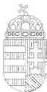
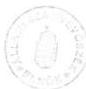

Állami Számvevőszék

# JELENTÉS

a költségvetési fejezetek jóléti célú kiadásainak és jóléti intézményei működésének pénzügyi-gazdasági utóellenőrzéséről

1999. augusztus

9925

---

Az ellenőrzés végrehajtásáért felelős:
az ÁSZ III. Költségvetési Ellenőrzési Igazgatósága

Bihary Zsigmond
igazgató

Az ellenőrzést vezette:

Matusek István
igazgatóhelyettes

Az ellenőrzésben részt vettek:

Belovai Sándorné számvevő tanácsos

Bittó Zoltán tanácsadó, számvevő tanácsos

dr. Fónyad Erzsébet számvevő tanácsos

Gömöri József számvevő tanácsos

dr. Kurucz István számvevő tanácsos

dr. Ligeti Miklós számvevő

Littomericzky Jánosné számvevő
tanácsos

dr. Mihály Sándor tanácsadó, számvevő
tanácsos

dr. Remport Katalin számvevő

Számely Kornél számvevő tanácsos

Szélpál Ferenc számvevő

Szendrődi Józsefné számvevő tanácsos

Varga Szabolcs számvevő

Az ÁSZ által végzett korábbi ellenőrzés:

A költségvetési fejezetek jóléti célú kiadásainak és jóléti intézményei működésének
pénzügyi-gazdasági ellenőrzése (1995)

A jelentés az internet www.asz.gov.hu alatt olvasható

Jelentéseink az Országgyűlés számítógépes hálózatán is olvashatók.

---

V-27-159/1998-99.

# TARTALOMJEGYZÉK

I. ÖSSZEGZÖ MEGÁLLAPÍTÁSOK, KÖVETKEZTÉSEK, JAVASLATOK 5
II. RÉSZLETES MEGÁLLAPÍTÁSOK 9

1. A joléti kiadások szabályozásának rendszere a költségvetési szerveknél 9
2. A joléti tevekenység aranya, súlya a fejezetek és intézményeik gazdalkodá-saban 11

2.1.A koltsegvetesi fejezetek joléti tevekenységénék alakulása 11
2.2.A fejezetak gazdalkod szervezeteinek joléti, szociális kiadásai 13
2.3.Az onallo joléti intézmények tevekenységénék ertékelése 15
2.4.Az onallo koltsegvetesi intezmenyek joléti tevekenysége 17

2.4.1.A joléti celu kiadások és bevetelek alakulása 18
2.4.2.Az onallo koltsegvetesi szervek joléti intézményei 21

2.5. A jóléti-, szociális intézmények és tevékenységek fejezeti szintű ellenőrzése 25

Melléklet 2 db

Függelék 3 db

Táblázat 24 db

1

---

3

.

.

.

3

.

.

---

# Rövidítések jegyzéke

|  AB | Alkotmánybíróság  |
| --- | --- |
|  APEH | Adó- és Pénzügyi Ellenőrzési Hivatal  |
|  ÁSZ | Állami Számvevőszék  |
|  BM | Belügyminisztérium  |
|  BM KGF | BM Központi Gazdasági Főigazgatóság  |
|  BM TOP | BM Tűzoltóparancsnokság  |
|  EüM | Egészségügyi Minisztérium  |
|  FVM | Földművelésügyi és Vidékfejlesztési Minisztérium  |
|  GM | Gazdasági Minisztérium  |
|  IKIM | Ipari, Kereskedelmi és Idegenforgalmi Minisztérium  |
|  IKM | Ipari és Kereskedelmi Minisztérium  |
|  HM | Honvédelmi Minisztérium  |
|  IM | Igazságügyi Minisztérium  |
|  ISM | Ifjúsági és Sportminisztérium  |
|  KEH | Köztársasági Elnök Hivatala  |
|  KHVM | Közlekedési, Hírközlési és Vízügyi Minisztérium  |
|  KüM | Külügyminisztérium  |
|  KVM | Környezetvédelmi Minisztérium  |
|  KSH | Központi Statisztikai Hivatal  |
|  LÜ | Legfőbb Ügyészség  |
|  MÁK | Magyar Államkincstár  |
|  MeH | Miniszterelnöki Hivatal  |
|  MH | Magyar Honvédség  |
|  MKM | Művelődési és Közoktatási Minisztérium  |
|  MüM | Munkaügyi Minisztérium  |
|  MTA | Magyar Tudományos Akadémia  |
|  NGKM | Nemzetközi Gazdasági Kapcsolatok Minisztérium  |
|  NKÖM | Nemzeti Kulturális Örökség Minisztériuma  |
|  NM | Népjóléti Minisztérium  |
|  OBH | Országgyűlési Biztosok Hivatala  |
|  OGYH | Országgyűlés Hivatala  |
|  OIT | Országos Igazságszolgáltatási Tanács  |
|  OM | Oktatási Minisztérium  |
|  PM | Pénzügyminisztérium  |
|  SzCsM | Szociális és Családügyi Minisztérium  |
|  TH | Történeti Hivatal  |
|  VPOP | Vám- és Pénzügyőrség Országos Parancsnoksága  |
|  Ktv. | A köztisztviselők jogállásáról szóló, többször módosított 1992. évi XXIII. törvény  |
|  Kjt. | A közalkalmazottak jogállásáról szóló többször módosított 1992. évi XXXIII törvény  |

---

.

.

.

.

,

.

---

Állami Számvevőszék
V-27-159 /1998-99.
Témaszám: 461

# JELENTÉS

# a költségvetési fejezetek jóléti célú kiadásainak és jóléti intézményei működésének pénzügyi-gazdasági utóellenőrzéséről

A költségvetési fejezetek jóléti és szociális célú kiadásait, jóléti intézményei működését és az ellátottság szintjét az 1993-94. évek adataira alapozva 1995. évben ellenőrizte az Állami Számvevőszék. Az ellenőrzés azt állapította meg, hogy a költségvetési intézményekben foglalkoztatott köztisztviselők és közalkalmazottak jóléti ellátásának rendszerét, a juttatások feltételeit átfogó és normatív módon hatályos jogszabályok (törvények) nem szabályozták és a Kormány idevonatkozó határozatait nem hajtották végre. Az ellátottság szintje többnyire alacsony színvonalú, egyenetlen és csak részben volt normatív alapú. (Az 1995. évi ellenőrzésünk ajánlásait az 1. sz. melléklet tartalmazza.)

Az utóellenőrzés célja annak megállapítása volt, hogy mennyiben változott a központi költségvetési szerveknél a jóléti ellátottság színvonala.

Ennek keretében értékeltük

- a központi költségvetés fejezeteinél 1997-1998. években a jóléti célokra és a jóléti intézményekre fordított kiadások mértékét, ezen belül az állami támogatás arányát;
- a központi költségvetés fejezeteinél a jóléti kiadásokra és a jóléti intézmények működtetésére fordított pénzeszközök felhasználásának törvényességét, célszerűségét és eredményességét;
- a jóléti intézmények és a szakfeladatok működtetési, finanszírozási rendszerében bekövetkezett változásokat;
- az 1995. évi ellenőrzés megállapításainak, javaslatainak a hasznosulását.

Az ellenőrzés jogalapját az Állami Számvevőszékről szóló 1989. évi XXXVIII. tv. 2. §. (5.) bekezdése, valamint a köztisztviselők jogállásáról szóló 1992. évi XXIII. tv. 80. §. (1) bekezdés e) pontja képezik. A közszolgálati jogviszonyban a munkavégzés sajátosságaira, a munka- és pihenőidőre, a jutalmazásra és a külön juttatásra, a kulturális, jóléti, egészségügyi ellátásra vonatkozó további

3

---

szabályokat a 170/1992. (XII. 22.) Korm. rendelet, valamint a 78/1993. (V. 12.) Korm. rendelet állapítja meg.

Az ellenőrzés - kérdőívek és tanúsítványok útján - a központi költségvetés valamennyi fejezetére kiterjedt, részletes információkat kértünk az 1997-98. évekről a költségvetési fejezetektől, a fejezeteket felügyelő szervektől, önálló jóléti intézményektől és az önálló költségvetési intézményektől. Valamennyi fejezet és csekély kivétellel (mindössze négy intézmény) valamennyi intézmény válaszolt. Az utóvizsgálat keretében több, mint 192 ezer adatot kaptunk és dolgoztunk fel.

Az intézményekre vonatkozó megállapításainkat elsősorban a dokumentális adatok elemzésére alapoztuk, kisebb mértékben a fejezeti konzultációkra.

Az elemi adatokat szolgáltatók között 26 költségvetési fejezet és mintegy 850 önálló költségvetési intézmény volt. Az ellenőrzést hátráltatta a késedelmes adatszolgáltatás és a kérdőívek, tanúsítványok hibás kitöltése.

Az utóvizsgálat megállapításait alátámasztó elemzések fejezetenkénti elvégzésére és az alapellenőrzés tényadataival való összehasonlításra a központi költségvetésben az elmúlt öt év alatt bekövetkezett szerkezeti változások miatt csak korlátozott volt a lehetőségünk. Ugyanis az éves központi költségvetések szerkezetében bekövetkezett kisebb, vagy nagyobb módosulások - különösen 1998. II. félévében - alig hagyták érintetlenül a fejezeteket és a költségvetési fejezetekhez tartozó intézményhálózatot. Intézmények megszűntek, összevonásra kerültek, vagy kiváltak a központi költségvetés köréből. A költségvetési fejezetek száma 1994-ben és 1998-ban is azonos volt, de azóta megszűnt több költségvetési fejezet, néhány pedig újonnan alakult. Időközben egyes fejezetek szétváltak, illetve összeolvadtak. A Magyar Távirati Iroda kivált a költségvetés rendszeréből.

A rendelkezésre álló adatok szerint a fejezeteknél és intézményeiknél 1994-98. között az üdülők száma 216-ról 241-re, a vendégházaké 187-ről 100-ra, az óvodáké 63-ról 43-ra, a bölcsődéké 30-ról 20-ra, az iskolai napközi otthonoké 6-ról 5-re változott. A szociális célú otthonok, szálláshelyek száma - nővérszállásokkal együtt - az 1998. évi teljes körű felmérés alapján 297 volt, szemben az 1994. évi részleges felmérés 22 intézményi adatával. Az 1994. évi felmérés nem tartalmazta az iskolai diákotthonokat, a HM átmeneti szálláshelyeket, a VPOP szolgálati szálláshelyeit és az EüM felügyelete alá tartozó nővérszállásokat.

A jóléti szakfeladatokra elszámolt kiadások összege 6,1 Mrd Ft-ról 10,3 Mrd Ft-ra emelkedett és aránya a költségvetési szervek összes kiadásaiból 0,7%-ról 0,9%-ra növekedett. A jóléti eszközök bruttó értéke 25,9 Mrd Ft-ról 30,5 Mrd Ft-ra, a teljes eszközállományhoz viszonyított aránya 1,6%-ról 1,5%-ra változott. A jóléti feladatok ellátásával összesen foglalkoztatottak száma 7914 főről 5691 főre, ebből a teljes munkaidőben foglalkoztatottaké 7.262 főről 5.205 főre csökkent.

Az 1995. évi ellenőrzés során a honvédelmi és belügyi tárcát együtt kezeltük a többi költségvetési fejezettel, de az ellenőrzés és utóellenőrzés közötti időszakban a fegyveres szervek hivatásos állományú tagjainak szolgálati viszonyáról szóló 1996. évi XLIII. törvény hatálybalépésével a törvény hatálya alá tartozó

4

---

I. ÖSSZEGZŐ MEGÁLLAPÍTÁSOK, KÖVETKEZTETÉSEK, JAVASLATOK

személyek tekintetében eltérő szabályozás érvényesült. Az összemérhetőség érdekében azonban - a biztonsági szolgálatok figyelmen kívül hagyásával - az utóellenőrzést kiterjesztettük a korábbi ellenőrzésben érintett valamennyi szervezetre, így a honvédelmi és rendvédelmi szervekre is. A honvédelmi és rendvédelmi szervekre vonatkozó részletes megállapításainkat az 1-2. sz. függelékben helyeztük el.

# I. ÖSSZEGZŐ MEGÁLLAPÍTÁSOK, KÖVETKEZTETÉSEK, JAVASLATOK

A költségvetési fejezetek jóléti célú kiadásainak és jóléti intézményei működésének pénzügyi-gazdasági ellenőrzéséről készült, az 1994. évi állapotokat felmérő, 1995. augusztusában közreadott ÁSZ jelentésben foglaltakhoz képest az 1997-1998. éveket markáns érdemi változások, különösképpen fejlődésként értékelhető mozzanatok nem jellemezték (lásd 1. sz. melléklet).

Egyértelmű szabályozás hiányában továbbra is meghatározatlan, hogy a központi költségvetési rendszerben működő szervezeteknél mely tevékenységeket és kiadásokat kell jóléti, illetve szociális célúaknak tekinteni. A költségvetési szakfeladati rend nem fedte le teljes egészében a jóléti kiadások, ráfordítások teljes körét.

**Korábbi ellenőrzési összefoglaló megállapításaink tehát továbbra is időszerűek. A köztisztviselők és közalkalmazottak jóléti ellátásának átfogó, szakszerű és közgazdaságilag, szociálpolitikailag is átgondolt jogszabályi rendezésére nem került sor.** Az ellenőrzött időszakban csak korrekciós jellegű módosítások történtek.

A jóléti ellátás helyzetének vizsgálata óta eltelt időszakban jelent meg a bírák jogállásáról és javadalmazásáról szóló 1997. évi LXVII. tv., a bírákat és a bírósági dolgozókat megillető egyes juttatásokat szabályozó 4/1996. (V. 3.) IM rendelet, mely 1997. október 1-től hatályát vesztette. Az ügyészségi szolgálati viszonyt szabályozó 1994. évi LXXX. törvényt kiegészítő 1997. évi LXXI. törvény 30. §-a az, amely 50/A-D §-ok beiktatásával módosította és kiegészítette a juttatások körét. A fegyveres szervek hivatásos állományú tagjainak szolgálati viszonyáról szóló 1996. évi XLIII. törvény és a hozzájuk kapcsolódó HM és BM rendeletek, utasítások újraszabályozták a hivatásos állomány tagjait megillető ellátások körét.

**Mindezek figyelembevételével sem állítható, hogy a fentiekben felsorolt területeken hosszabb távra rendezett az ellátottság, legfeljebb az átlagosnál jobb.**

A költségvetési fejezeteknek a témába vágó fejlesztési koncepciója nincs. A jóléti intézményrendszer fejlesztésére és a támogatások növelésére többnyire forrás sem állt rendelkezésre. A fejezeteken belüli szervezeti és költségvetési gazdálkodási változások együttesen az önálló költségvetési intézményként műkö-

5

---

I. ÖSSZEGZŐ MEGÁLLAPÍTÁSOK, KÖVETKEZTETÉSEK, JAVASLATOK

dő jóléti intézmények számának jelentős mérséklődéséhez vezettek, de ezek a jóléti ellátásban érdemi változást nem eredményeztek.

A közszolgálati szférában átfogó jóléti szociális rendszer nem működik, annak csak egyes elemei léteznek, részlegesen és következetlenül érvényesül a normatívitás elve. Az ellátottság mennyiségi-, minőségi mutatóiban sok az indokolatlan különbség. A köztisztviselői juttatások körében csak egy kötelező, normatív juttatás van (az étkezési hozzájárulás), a többi juttatási elem csak adható. A közalkalmazottak jóléti jellegű törvényi szabályozása nem ír elő kötelező juttatást, csak lehetőséget biztosít.

A közszolgálatban dolgozók bér- és kereseti szintje nem teszi lehetővé a direkt célú jóléti juttatások kiváltását, piaci alapokra helyezését. A jogszabályok által lehetővé tett juttatásokat a vizsgált időszakra jellemző magas infláció és a valorizálás elmaradása rendre elértéktelenítette, eredeti funkcióját beszűkítette. A költségvetési fejezetek által irányított költségvetési intézmények közalkalmazottainak juttatásai az intézmények pénzügyi lehetőségeinek romlása miatt csökkentek, részben megszűntek.

A jóléti célú kapacitások valamennyi típusára jellemző a nagyon eltérő, többnyire csökkenő mértékű igénybevétel. Csak szociológiai szempontú vizsgálattal lennének az okok pontosabban feltárhatók, hogy valóban csökkent-e irántuk az érdeklődés, vagy lenne igény rájuk, de az igénybevételhez elégtelen a saját jövedelem és az adható támogatás.

**A jóléti célú ráfordítások, a tárgyi- és pénzeszközök felhasználása alacsony hatásfokú, az érintettek anyagi ellátottságát alig befolyásolja.** A jóléti kiadások nominálértékben elért százalékos növekedése - az 1994. évi alapvizsgálathoz képest - a jóléti ellátásban nem tett lehetővé előrelépést. Egyes szerveknél az ellátottság romlott. A juttatások évenkénti nominál értékű növekedése alatta maradt a vizsgált időszak éves inflációs rátáinak.

A fejezetek költségvetésében a szakfeladatokon elszámolt jóléti bevételek és jóléti célú kiadások aránya a vizsgált időszakban továbbra is alacsony volt. Ezen a téren lényeges változás nem tapasztalható. Az arányok növelésére a rendelkezésre álló források nem adtak lehetőséget.

Az utóellenőrzési időszakban a szakfeladati rendben nem szereplő egyéb jóléti kiadási tételek (lakáskölcsön, a szolgálati lakás, a ruházati költségtérítés és munkahelyi étkeztetés támogatása stb.) közül a ruházati kiadás és a munkahelyi étkeztetés együttes aránya volt a meghatározó.

A fejezetek jóléti intézményi hálózatán belül 1998. évben **számottevően csökkent az intézmények által fenntartott vendégházak**, s mintegy harmadával az **óvodák és bölcsődék száma**, megszüntetésük következtében. Csekély mértékű volt az iskolai napközi otthonok számának mérséklődése. Az üdülők számának kis mértékű gyarapodása a kisebb átlagos férőhelyű üdülőkre történő csere következménye. A szociális otthonok, szálláshelyek számában bekövetkezett változás oka, hogy az otthonok felmérése szűkebb körre terjedt ki az 1994. évben, mint 1998. évben. Fentiek figyelembevételével

6

---

I. ÖSSZEGZŐ MEGÁLLAPÍTÁSOK, KÖVETKEZTETÉSEK, JAVASLATOK

összességében az 1998. évi jóléti intézmények száma csökkenést mutat az 1994. évi állományhoz képest.

Jelentősen csökkent a jóléti intézményekben foglalkoztatott dolgozók létszáma, amelyet az intézményhálózat szűkülése és tudatos létszámleépítések indokoltak.

**A jóléti célokra rendelkezésre álló tárgyi eszközállomány állapota folyamatosan tovább romlott** a felújítások és karbantartások elmaradása, vagy nem kielégítő mértéke miatt, pedig esetenként már 1994-ben sem voltak az állapotok elfogadhatóak. Részben ennek a körülménynek, részben pedig az ellátandók helyzetének romlása miatt a rendelkezésre álló kapacitások kihasználtsága minden intézménytípusnál fajlagosan csökkent, a működési költségek az indokoltnál gyorsabban növekedtek. 1994-ről 1998-ra a bölcsődék kihasználtsága 65%-ról 62%-ra, az óvodáké 77%-ról 70%-ra, az üdülőké 73%-ról 51%-ra esett vissza. A szabad férőhelyek kereskedelmi értékesítéséből származó bevételek marginális jelentőségűek az intézmények működése szempontjából.

Nem megoldott a jóléti tárgyi eszközállomány (ingatlanok) értékmegőrzése, fizikai állapotának fenntartása, különösen a használaton kívülieké.

A használaton kívüli, vagy alig használt ingatlanok értékesítéséből sem származtak számottevő bevételek. Arra példát sem találtunk, hogy az így keletkezett jövedelemből minőségi fejlesztés valósult volna meg. A szolgálati lakások értékesítése, illetve vásárlása területén volt észlelhető nagyobb számú mozgás (a szolgálati lakásállomány mintegy 40 %-át értékesítették). Az új szolgálati lakások bekerülési költsége nagyságrendekkel haladta meg az eladott lakások árát. Szakszerű téma-, vagy célvizsgálat tisztázhatná csak egyértelműen az ügyletek célszerűségét és törvényességét.

**A központi közigazgatásban dolgozó köztisztviselők és közalkalmazottak hatályos jóléti (szociális) ellátási rendszere** - az utóellenőrzés tapasztalatait összegezve - **céljának és rendeltetésének csak részben felel meg**. A rendszer az indokoltnál nagyobb mértékben differenciál, elsősorban az adott intézmény gazdasági helyzetétől függően. Esetenként, főképpen a kisebb szervezetek az adható juttatást minimálisan sem képesek nyújtani. A jóléti (szociális) infrastruktúra kapacitása meghaladja a valós igényeket, kihasználtságuk mértéke folyamatosan romlik. Főképpen a kisebb központi költségvetési szervek kezelésében lévő épületállomány fizikai állapota romlik a fenntartásukhoz és szinten tartásukhoz szükséges források szűkössége miatt.

A helyszíni ellenőrzés a **jóléti, szociális célú pénzfelhasználásnál törvénysértést nem tapasztalt**. A jóléti célokra fordított pénzeszközök eredményességi mutatói romlottak, valamennyi jóléti, szociális célú ingatlan igénybevételének fajlagos mutatója romlott, ezzel szemben a fenntartási költségek növekedtek. Az ellátottság szintje alacsonyabb, a ráfordítások nagyobbak, mint az alapellenőrzés időszakában voltak. Céltól eltérő pénzfelhasználást az ellenőrzés nem állapított meg, de a jelenlegi jóléti, szociális rendszer csak részben minősíthető célszerűnek.

7

---

I. ÖSSZEGZŐ MEGÁLLAPÍTÁSOK, KÖVETKEZTETÉSEK, JAVASLATOK

Az utóellenőrzés során rendelkezésünkre álló információk szerint a kormányzat jelenleg két kiemelt témakörben rendelkezik konkrét tervekkel és kezdte meg elgondolásai megvalósítását. Az egységesebb közszolgálati törvény megalkotásáról 1998. novemberében született kormányhatározat.

Kormányzati álláspont szerint az államnak kötelessége az alkalmazottai számára biztosítani az egységes közszolgálat jogi feltételeit és ehhez költségvetésileg rendelt, normatív alapú pénzügyi feltételeket. Az egységesebb közszolgálati törvény bevezetését a hatékonyabb közszolgálati rendszer megteremtése és működtetése, a köztisztviselői és közalkalmazotti törvény eltérései, valamint az állami tisztviselői munka presztízsének helyreállítása indokolja.

Ugyancsak a Kormány szándékai közé tartozik a központi közigazgatás integrált üdültetési rendszerének kialakítása a minisztériumok és a központi közigazgatási szervekben dolgozók részére. Az ehhez szükséges előkészítő munkálatokra a MeH közigazgatási államtitkára vezetésével 1998. decemberében bizottság alakult. A bizottság meghatározta az integrált üdülési rendszer céljait (családi üdültetés, gyermeküdültetés, regeneráló pihenés, gyógyító- megelőző ellátás) és felmérte a számításba vehető üdülőket. A tervbe vett központi kezdeményezés indokát az üdülők jobb kihasználása, a köztisztviselők üdültetési lehetőségeinek egységes színvonalú biztosítása, valamint célszerű takarékossági szempontok adják. Jelen összefoglaló készítésének időszakában volt tárcaközi egyeztetésen a kormányrendelet-tervezete az integrált üdültetési rendszer létrehozásáról.

A két vázlatos terv ismerete alapján feltételezhető, hogy a tervek megvalósulása esetén minőségi előrelépés várható az ellenőrzésünk témáját alkotó szociális ellátás területén.

Az ellenőrzés megállapításainak hasznosítása mellett javasoljuk

a Kormánynak

1. Dolgozza ki az 1995. évi ellenőrzési javaslataink figyelembevételével a köztisztviselők és közalkalmazottak egységes közszolgálati rendszerét, ezen belül az állami alkalmazottak jóléti, szociális juttatásainak egységes, normatív alapú rendszerét (1. sz. melléklet).

Az új szabályozás olyan távlatos megoldást eredményezzen, amely figyelembe veszi az aktuális költségvetések lehetőségeit, de a rövid távú költségvetési érdekek ne értéktelenítsék el az alapvető juttatásokat.

2. Tekintsék át a hasznosítatlan jóléti, szociális célú tárgyi eszközök, főképpen a használaton kívüli ingatlanok értékesítési lehetőségeit és dolgozzanak ki reális piaci viszonyokat figyelembe vevő megoldást ezen eszközök hasznosítására.
3. Vizsgáltassa meg átfogóan téma- vagy célvizsgálat keretében a költségvetési fejezetek- és szervezetek eddigi szolgálati lakás értékesítési gyakorlatát, annak törvényességét és célszerűségét. Az ellenőrzés megállapításai alapozzák meg a feladatvégzés és a költségvetési gazdálkodás együttes szempontjait fi-

8

---

II. RÉSZLETES MEGÁLLAPÍTÁSOK

gyelembe vevő új szolgálati lakás juttatási és elidegenítési szabályozás kidolgozását.

**a költségvetési fejezetek felügyeletét ellátó szervek vezetőinek:**

1. Javaslataikkal és a közszolgálat különböző területein foglalkoztatottakra vonatkozó jogi szabályozások felülvizsgálatával segítsék elő az egységesebb közszolgálati rendszer kialakítását, majd a jogalkotási folyamatot követően vegyenek részt annak hatékony működtetésében.
2. A központi közigazgatás integrált üdülési rendszerének létrehozása során megfelelő színvonalú és műszaki állapotú üdülők rendelkezésre bocsátásával segítsék elő és támogassák a koordinált üdültetés kialakítását.

**az önálló központi költségvetési szervek vezetőinek:**

1. Tekintsék át a szervezetükbe tartozó jóléti intézményeik (üdülő, vendégház stb.) működtetésének és az ellátott jóléti, szociális feladatok gazdasági szempontjait, azok célszerűségét, a kiadások (költségek) indokoltságát és tegyék meg, illetve kezdeményezzék a szükséges intézkedéseket.
2. A rendelkezésre álló jóléti kapacitások kihasználásának javítása érdekében végezzenek aktív marketing munkát. Új együttműködési formák kialakításával ellensúlyozzák az igénybevételi hajlandóság csökkenéséből keletkező veszteségeket.

## II. RÉSZLETES MEGÁLLAPÍTÁSOK

### 1. A JÓLÉTI KIADÁSOK SZABÁLYOZÁSÁNAK RENDSZERE A KÖLTSÉGVETÉSI SZERVEKNÉL

A központi költségvetési fejezetek és intézmények köztisztviselőinek és közalkalmazottainak jóléti és szociális juttatási rendszerének átfogó jogi rendezése továbbra is várat magára.

Az 1998-ban alakult Kormány a probléma megoldását viszonylag hamar felvette feladatai sorába és tervei szerint az üdültetés országosan koordinált rendszerét 2000. január 1-től kívánja bevezetni és foglalkozik az egységes közszolgálati törvény előkészítésével is. A törvény elfogadását 2000. év őszére, bevezetését 2001. január 1-jétől tervezi a Kormány.

Az ellenőrzött időszakban korrekciós jellegű módosításokra került sor. **A köztisztviselők** jogállására vonatkozó 1992. évi XXIII. törvényt az 1997. évi CI. törvény módosította, amelynek voltak jóléti vonatkozású szakaszai. A 165/1995. (XII. 27.) Korm. rendelet módosította a köztisztviselők munkavégzé-

9

---

II. RÉSZLETES MEGÁLLAPÍTÁSOK

séről, munka- és pihenőidejéről, jutalmazásáról, valamint juttatásairól szóló 170/1992. (XII. 22.) Korm. rendeletet. Az állami vezetői juttatások jogosultsági feltételeiről a 131/1997. (VII. 24.) Korm. rendelet intézkedett (több korábbi kormányrendelet egyidejű hatályon kívül helyezésével).

**A közalkalmazottakat** érintő szabályozások - ide értve a kormányrendeleteket és a miniszteri utasításokat is - csak a közalkalmazottakról szóló 1992. évi XXXIII. törvény intézménytípusonkénti végrehajtásáról intézkedtek. A Kjt. jóléti jellegű szabályozása nem kötelező érvényű, csak keretlehetőségeket biztosít.

A hatályos szabályozás a **köztisztviselők juttatásait** a következőképpen állapítja meg:

A juttatások közül egyedül a **kedvezményes munkahelyi étkezésre vagy étkezési hozzájárulásra**, a mindenkori illetményalap 5 %-ára **jogosult** a köztisztviselő. Ezt a hivatal vezetője felemelheti legfeljebb az illetményalap 10 %-áig, vagy a helyi közétkeztetés önköltségi árának 50 %-áig.

**A többi juttatás csak adható**, amelyeknek egyik oldalról a felső mérték szab határt, másik oldalról a lehetőségeket korlátozza a mindenkori személyi jövedelemadóról szóló törvény által meghatározott, adómentesen juttatható mérték.

A ruházati költségtérítés naptári évenként az illetményalap 100-150 %-a, az üdülési hozzájárulás az illetményalap 75-100 %-a között adható. Biztosítható juttatás a munkába járáshoz szükséges közlekedési költségtérítés, a lakásépítési- és lakásvásárlási támogatás, az albérleti hozzájárulás, a családi ház építési támogatás, telefonkötvény- és telefonrészvény-előleg, szociális támogatás, illetményelőleg, tanulmányi ösztöndíj, képzési, továbbképzési és nyelvtanulási támogatás formájában.

Néhány területen (ügyészségek, bíróságok, fegyveres szervezetek) az általános-tól részben eltérő szabályok érvényesülnek.

**Az ügyészségi szolgálati viszonyról** és ügyészségi adatkezelésről szóló, többször módosított 1994. évi LXXX. törvény előírásai a költségvetési előirányzatok terhére az ügyészségi munkatársak jóléti juttatásaihoz számos lehetőséget biztosítottak, azonban a törvény még nem foglalta magába a köztisztviselők számára adható valamennyi támogatást és járandóságot (pl. ruházati támogatást). Az 1997. október 1-jén hatályba lépett 1997. évi LXXI. törvény megszüntette a hátrányokat és az alaptörvényben 50/A-D. §-ok beiktatásával a következő juttatásokat határozta meg:

Az ügyésznek naptári évenként a legalacsonyabb ügyészi alapilletmény 25%-ának megfelelő összegű ruházati költségtérítés jár. Az ügyész kedvezményes munkahelyi étkezésre, vagy étkezési hozzájárulásra jogosult. Adható egyéb juttatások: lakásépítési-, lakásvásárlási támogatás, letelepedési segély, más településre költözés költségeihez való hozzájárulás, szociális-, beiskolázási-, temetési segély, üdülési támogatás, munkába járáshoz szükséges közlekedési bérlet vásárlásához hozzájárulás, tanulmányi ösztöndíj, képzési-, továbbképzési- és nyelvtanulási támogatás, nyugdíjpénztári tagság támogatása, napidíj, utazási és szállásköltség, továbbá más költségtérítés.

10

---

II. RÉSZLETES MEGÁLLAPÍTÁSOK

**A bíráknak és bírósági alkalmazottaknak** az alapellenőrzéskor hatályos szabályok nem biztosítottak külön jóléti juttatásokat. Az erre vonatkozó első jogszabály a 4/1996. (V. 3.) IM rendelet volt. A bírák jogállásáról és javadalmazásáról szóló 1997. évi LXVII. törvény beemelte az IM rendeletben felsorolt juttatásokat és azokat úgy egészítette ki, hogy azok tartalmilag azonossá váltak az ügyészeket megillető ellátásokkal.

**A fegyveres szervek hivatásos állományú tagjainak** jóléti és szociális ellátását alapvetően a szolgálati viszonyról szóló 1996. évi XLIII. törvény állapítja meg, amelyeket további jogszabályok egészítenek ki.

A HM fejezetnél a jóléti juttatásokat 4 törvény, 13 miniszteri rendelet és 18 HM utasítás szabályozza.

A BM fejezetnél külön belügyminiszteri utasítások vonatkoznak az üdültetésre, az étkezési hozzájárulásra, a ruházati költségekhez való hozzájárulásra.

Egyértelmű szabályozás hiányában 1994. és 1998. között **továbbra is meghatározatlan volt, hogy a központi költségvetési rendben működő szervezeteknél mely tevékenységeket és kiadásokat kell jóléti, illetve szociális célúaknak tekinteni** és a hozzáférési lehetőségeknek melyek a feltételei.

A szakfeladatrendre történő elszámolás gyakorlata fejezetenként és intézményenként eltérő. Az elszámolt jóléti és szociális célú bevételek és kiadások egy része ezért más tevékenységek bevételeként és kiadásaként kerül kimutatásra.

Fenti okokból a jóléti, szociális kiadások, ráfordítások pontos összege nem állapítható meg, mindenképpen több, mint ami ilyen címen kimutatható.

Az önálló jóléti intézmények a működési kiadásait a megfelelő szakfeladaton számolják el teljes egészében. A költségvetési intézmények többségénél az ilyen jellegű ráfordítások egy része működési kiadásként kerül elszámolásra. A szolgálati lakások részben más célú (pl. hivatali) épületekben vannak, értékük és a ráfordítások nem különülnek el. A kettős hasznosítású épületek esetében sem mindenütt kerül megbontásra az eltérő felhasználás bevétele és ráfordítása.

## 2. A JÓLÉTI TEVÉKENYSÉG ARÁNYA, SÚLYA A FEJEZETEK ÉS INTÉZMÉNYEIK GAZDÁLKODÁSÁBAN

### 2.1. A költségvetési fejezetek jóléti tevékenységének alakulása

A fejezetek költségvetéséhez viszonyítva a jóléti bevételek és jóléti célú kiadások aránya - ideértve az önálló jóléti intézmények fenntartását is - 1994-ben alacsony volt.

A bevételek 0,64%-a származott a jóléti célú tevékenységből (térítési díjak, bérleti díjak). A jóléti célokra jutó támogatás aránya 0,4% volt. A szakfeladatokra elszámolt jóléti kiadások a fejezetek kiadásainak mintegy 0,7%-át tették ki.

11

---

II. RÉSZLETES MEGÁLLAPÍTÁSOK

A korábbi időszakhoz képest markáns különbség az arányokban nem tapasztalható. Az arányok növelésére a rendelkezésre álló források nem adtak lehetőséget; az infláció a névleges ráfordítások növelését itt is kikényszerítette.

1998. évben a költségvetési bevételek 0,75%-a eredt jóléti célú tevékenységből. A szakfeladatonkénti jóléti kiadások a fejezeti kiadások 0,9%-át képezték. A jóléti célú kiadások költségvetési támogatási aránya 0,5% volt. (Az **MTA** fejezeti kiadásaihoz viszonyítva a jóléti intézmények támogatási aránya 0,6%. A többi költségvetési fejezethez viszonyítva magas a **BM** költségvetésében a jóléti tevékenységek aránya, a kiadások között 3,8%-ot tett ki. Az **ÁSZ-nál** a jóléti célú kiadások aránya mintegy 1,5% volt. A **GM** adatai szerint a jóléti célú kiadások aránya 2,5%, a **KüM** adata 1,1%.)

A **KHVM-nél** a bázisnak tekintett 1994. évhez viszonyítva a jóléti szakfeladatokra jutó támogatás a munkaegészségügyben bevezetett teljesítményfinanszírozással összefüggésben átvett pénzeszközök miatt ugyan nőtt, de a fejezet összes bevételéhez és kiadásához viszonyítva a jóléti bevételek 0,74%-át, a támogatások 0,93%-át, a kiadások 0,84%-át teszik ki.

A költségvetési szakfeladati rend nem fedte le teljesen a jóléti bevételek és kiadások teljes körét. Emiatt a fejezeteknél a **jóléti ráfordítások** egy része a szakfeladatok működésénél (a jóléti intézmények tevékenységével összefüggésben), másik része az egyéb jóléti kiadási tételeknél merült fel.

Az 1998. évi költségvetési **beszámolók szakfeladaton összesített fejezeti kiadásai** 10.274,4 M Ft-ot, az 1994. évi kiadások 167%-át tették ki. A szakfeladatok **bevételeinek növekedése** 48%-os, a **bevételek költségvetési támogatási aránya** az 1994. évi 38%-ról közel 58%-ra növekedett.

Az egyes szakfeladatokon elszámolt összes jóléti kiadások több, mint 60%-át a BM és az OM fejezeteknél használták fel.

**A jóléti kiadások** nominálértékben elért, **átlagosan 67%-os növekedése** reálértékben számolva az 1994. évi vizsgálat idejéhez képest a **jóléti ellátásban előrelépést nem tett lehetővé**, miután a vizsgált ötéves időszak pénzromlásának mértéke ennél magasabb volt. A szakfeladatok között történt kedvezőtlen arányváltozások (működtetés-, gyermekintézmények támogatásának csökkenése) tovább rontották a jóléti ellátás színvonalát.

Az egyéb jóléti kiadási tételek közül viszonylag jelentős súlyú volt a lakáskölcsön, a szolgálati lakás, a ruházati térítés és a munkahelyi étkeztetés támogatása. Az egyéb jóléti tételeken 1997-ben összesen 823M Ft, 1998-ban 1041M Ft bevétel folyt be szolgálati lakás és egyéb ingatlan elidegenítése, bérbeadása ellenértékeként. A jóléti ráfordítások között az egyéb jóléti kiadások 1997-ben 12.606 M Ft-ot, 1998-ban 14.703 M Ft-ot tettek ki, melyben a ruházati kiadás és a munkahelyi étkeztetés együttes aránya volt a domináns (63-64%).

A fejezeteknél a **jóléti eszközök** 1994. évi bruttó értéke 25.854 M Ft-ról 1998-ban 30.511 M Ft-ra (118,0%), nettó értéke 18.880 M Ft-ról 20.563 M Ft-ra (108,9%) emelkedett. Arányában legnagyobb mértékű volt a „0”-ra leírt eszközállomány növekedése (193,4%). A jóléti eszközállomány aránya - a bővülés ellenére - a fejezetek összes eszközállományából 1994-1998. között kismérték-

12

---

II. RÉSZLETES MEGÁLLAPÍTÁSOK

ben csökkent (bruttó értékben 1,6%-ról 1,5%-ra, nettó értékben 1,7%-ról 1,4%-ra).

A fejezetek az összes eszközállomány felújítására, karbantartására 1994. évhez képest 1998-ban 53%-kal többet (20.187 M Ft-ot), a **jóléti eszközök felújítására**, karbantartására pedig több mint dupláját fordították (841 M Ft-ot). Ezen jóléti célú ráfordítások aránya 3,0%-ról 4,2%-ra emelkedett.

A kitöltött kérdőívek tanúsága szerint a fejezeteknél a jóléti intézmények kiadásai az 1997. évi 4.119 M Ft-ról 1998-ban 4.231 M Ft-ra növekedtek (102,7%). Ezen belül nagyobb arányú emelkedés történt a működés és részben a felújítások kiadásainál, míg a beruházások kiadásai közel 50%-kal csökkentek, ami jelzi, hogy az utóbbiak nem kaptak prioritást a ráfordításoknál. A fejezetek 1997-ben 750 M Ft, 1998-ban 591 M Ft pótlólagos költségvetési támogatást nyújtottak a jóléti intézményeknek, melyet döntően belső átcsoportosítással biztosítottak (1997-ben 97%, 1998-ban 83%). Támogatáson felüli többletbevételhez 1997-ben 26 intézmény (374 M Ft), 1998-ban 25 intézmény (285 M Ft) jutott. A többletbevételt a tervezésnél döntően figyelembe vették és bázis jelleggel építették be az éves költségvetésbe. Feladatváltozás 1998-ban csak az OM fejezetnél következett be, aminek pénzügyi fedezetét nagyobb részt költségvetési támogatásból, kisebb részét egyéb bevételből finanszírozták.

## 2.2. A fejezetek gazdálkodó szervezeteinek jóléti, szociális kiadásai

Az egyes költségvetési fejezetek gazdálkodó szervezetei által biztosított jóléti, szociális juttatások rendszerében és mértékében **számottevő eltérések nincsenek**.

A minisztériumok köztisztviselőit és közalkalmazottait megillető juttatásokat az említett törvények, rendeletek és belső szabályzatok alapján az érintettek szabályszerűen megkapják. Bizonyos mértékig eltérő juttatási mértékeket és feltételeket a bírósági, ügyészségi kar köztisztviselői karára vonatkozó, részben eltérő szabályok jelentettek, illetve esetenként a juttatások mértékének eltérő értelmezéseiből eredő különbségek okoztak.

A költségvetési fejezetek a jóléti ellátást többnyire a fejezet gazdálkodó szervénél, belső utasításokban szabályozták.

**A lakástámogatási alapot** a fejezetek gazdálkodó szervei többsége egységesen, központilag kezeli. Az igénylők számától és az igényelt összegektől függ a kölcsönigények kielégítése.

A lakástámogatás többnyire kamatmentes. A támogatási összegek viszonylag ritkán akkorák, hogy a lakást építeni, vagy vásárolni szándékozók számára hatékony támogatást jelenthetnek.

A KHVM a támogatás feltételét úgy állapította meg, hogy az egy főre jutó kölcsön összege a lakás bekerülési költsége 40%-áig terjedhet, legfeljebb 450 E Ft lehet. A maximális összeg 1.125 E Ft/fő volt.

A Bíróságoknál a legalacsonyabb lakás támogatási összeg 270 E Ft volt, a legmagasabb 800 E Ft kamatmentes kölcsön. Az LÜ-nél a szélsőértékek hasonlóak.

13

---

II. RÉSZLETES MEGÁLLAPÍTÁSOK

Az **étkezési hozzájárulás** formája az esetek többségében utalvány, amelynek összege az ellenőrzött években az adómentesen juttatható 1200 Ft, illetve 1.400 Ft/hó volt személyenként.

Saját, melegkonyhai, illetve büfében történő étkezés igénybevétele esetén 2000, majd 2200 Ft belső étkezési jegyet biztosított az OM. A KúM 2000, ill. 2400 Ft/hó étkezési hozzájárulást fizetett, amely többlet utáni adót a munkáltató fizette meg. Az OTSH 4000 Ft étkezési hozzájárulást fizetett, az új minisztérium (ISM) visszaállította a jogszabály szerinti mértéket.

**Üdülési hozzájárulás** a köztisztviselőknek az illetményalap 75-100%-a között **adható**. A fakultatív támogatás juttatásának gyakorlata és összegszerűsége ennek megfelelően különböző.

Az **OM-ben** az illetményalap felső határának megfelelő összegben minden köztisztviselő részesült. A minisztériumi üdülő igénybevétele esetén a hozzájárulást beszámították az önköltséges térítési díjba.

A **MeH** a kedvezményt úgy érvényesíti, hogy a hivatali dolgozó és közvetlen családtagja napi térítési díja 1000 Ft a hivatali üdülőben.

A **Bíróságok és Ügyészségek** dolgozóinak üdültetési támogatásáról a rájuk vonatkozó külön törvények hatályosak.

Az **OBH** készpénzben 20 E Ft/fő összeget biztosít üdülési célra.

A **KEH** az illetményalap 100%-át folyósítja, amelyből 44% SZJA-t von le. Hasonló gyakorlatot követ a **KúM** is.

A **TH** 20 E Ft bruttó, illetve 12 E Ft nettó összeget fizet ki évente minden alkalmazottjának üdülési támogatásként.

Az **OGYH** üdülési támogatást nem fizet. (Korábban 13 E Ft összeg került évente kifizetésre.)

Az **EüM-ben** üdülési támogatást nem fizetnek. Ezzel szemben a hivatali üdülő igénybevétele kedvezményes (napi 1.400 Ft, az önköltség 3.711 Ft).

A **KSH** dolgozói a teljes üdülési költséget fizetik, de 10 E Ft-os csekken költségtérítést kapnak.

Az **FVM-ben** üdülési támogatásban csak az üdülést igénybevevők részesülnek.

A **ruházati költségtérítés** az illetményalap 100-150%-a lehet. A személyi jövedelemadóról szóló törvény módosítása kapcsán az adóalap kiszélesítésével adókötelessé vált a ruházati költségtérítés összege. Az adójogszabály eltérő értelmezéséből adódóan ugyancsak eltérő gyakorlat alakult ki.

A fejezetek egy része az illetményalap 150%-nak megfelelő összeget (39.000 Ft-ot) fizetett ki és megfizette annak 44%-os adóvonzatát. A kifizetés feltétele a munkáltató nevére szóló számlával történő igazolás volt.

Más fejezetek utalványt adtak dolgozóiknak és néhány fejezetnél lehetővé tették ezen összegeknek önkéntes nyugdíjpénztárba való befizetését.

14

---

II. RÉSZLETES MEGÁLLAPÍTÁSOK

A **munkábajárás támogatása** többnyire a lakhely szerinti utazási bérlet juttatásából, illetve más helységből való utazás költségeihez való hozzájárulásból állt.

A többi juttatási forma összegszerűsége nem volt jelentős.

### 2.3. Az önálló jóléti intézmények tevékenységének értékelése

Az alapvizsgálat időszakában - a HM, BM és az MTA fejezetet is figyelembevéve - 30 önálló jóléti költségvetési intézményt finanszírozott a költségvetés 12 költségvetési fejezetnél.

Az utóvizsgálat időszakában **7 költségvetési fejezetnél 14 önálló jóléti intézményt** tartottak fenn.

Nincs már önálló jóléti intézmény a MeH-nél, a HM-nél, a PM-nél, az NGKM-nél, az IKM-nél. Az utóbbi két fejezet közös utódánál, a GM-nél egy részben önálló jóléti intézmény maradt fenn.

A megszüntetett önálló jóléti intézményeket a fejezeti feladat felülvizsgálatok és az azt követő szervezeti változások során más költségvetési szervezetekbe olvasztották be.

A **PM**-nél az önálló jóléti költségvetési szervként működő Üzemeltetési Igazgatóságot 1997. I. 1-jével részben önálló költségvetési szervezetté alakították át. A **HM** korábbi önálló jóléti intézményei is részben önálló intézményekként működnek tovább.

A **BM** 1994. évi három önálló jóléti intézményéből egyedül a BM Dunapalota maradt meg önálló költségvetési intézménynek, a többiek részben önállóvá minősültek. Az **MTA** kilenc önálló jóléti intézményéből 7 üdülő önálló maradt, az óvoda és bölcsőde összevonásra került.

A **MeH** fejezetnél a fejezeti feladat- és intézményi struktúra egyszerűsítése során a hivatali bölcsődét és óvodát megszüntették, a volt MSZMP üdülők egyházi, illetve kincstári vagyonkezelésbe kerültek. A munkahelyi étkeztetést, a vendéglátó szolgáltatást Kft. kezelésébe adták, 1997. I. hóval az Üdülők költségvetési címet megszüntették és a jóléti intézmények kezelését egy új szervre, a Miniszterelnökség Közbeszerzési és Gazdasági Igazgatóságra bízták. A vizsgált időszakban (1997-98.) a fejezet már nem rendelkezett önálló jóléti intézménnyel. Az üdülők üzemeltetése vállalkozási konstrukcióban történik, mely célszerűen és eredményesen működik az eddigi tapasztalatok alapján.

Az **MKM**-ből az alapvizsgálatot követően kivált a zánkai Gyermeküdülő centrum, amely önálló jóléti intézményként működött. A jogutód OM-nél, így egy önálló jóléti intézmény maradt (OM Jóléti és Szociális intézmények).

A **GM** elődje - a korábban két fejezet (IKM és NGKM) önálló jóléti intézményeiből az IKM 1995. január 1-jei hatállyal hozta létre a részben önálló költségvetési rendszerben működő IKIM Jóléti Intézmények Igazgatóságát. A részben önálló megoldás nem bizonyult megfelelőnek. Az Igazgatóság tevékenységét több ellenőrzés kifogásolta és elhatározták annak 1998. december 31-ével történő megszüntetését, feladatait a GM Gazdasági Igazgatóság vette át.

15

---

II. RÉSZLETES MEGÁLLAPÍTÁSOK

Az **önálló jóléti intézmények összes bevételeinek** 54%-a származott mindkét (1994. és 1998.) évben költségvetési támogatásból, kiegészítésből és átvett pénzeszközből. A támogatás aránya 1998-ban a legnagyobb mértékű (72,7%) az MTA fejezetnél az „Akadémiai óvoda és bölcsőde” önálló jóléti intézménynél volt.

Az 1998. évi tényleges bevételek 19%-át az alaptevékenység bevételei, 18%-át az alaptevékenységgel összefüggő egyéb bevételek, 2%-át intézményi egyéb sajátos bevételek, 6%-át ÁFA visszatérítések és további 1%-át a felhalmozás és tőke jellegű, valamint pénzforgalom nélküli bevételek képezték, a fent említett költségvetési támogatáson túl.

Az **önálló jóléti intézmények 1998. évi kiadásaiból** a legmagasabb hányadot a dologi kiadások tették ki (39%). A személyi juttatások és azok közterhei 50%-ot képviseltek. A jóléti intézmények pénzügyi helyzetéből eredően rendkívül alacsony volt a felújítási (7%) és a felhalmozási kiadások aránya (3%). Az átadott pénzeszközök aránya 1%-os mértékű volt.

Az intézmények saját bevételeinek növekedését szinte minden intézménynél az áremelések biztosították 1997-98. években. Egyetlen önálló jóléti intézmény sem folytatott a vizsgált időszakban vállalkozási tevékenységet. Az intézményeknél az átlagos munkaerő-forgalom erőteljes volt, 30%-os arányt képviselt az állományi létszámon belül.

Az intézményi térítési díjak 9 önálló jóléti intézménynél önköltség számításon alapultak, 5 intézménynél egyéb módon alakították ki azokat. Finanszírozási gondok többségében nem jellemezték a jóléti intézmények gazdálkodását. 1998-ban egy üdülőnek volt költségvetéssel szembeni tartozása.

A 14 önálló jóléti intézmény 1997-ben 79 M Ft-os, 1998-ban 155 M Ft-os költségvetési támogatást kapott beruházási-felújítási célokra. Ezen összegek 12 intézmény véleménye szerint biztosították, 2 szerint nem biztosították a színterpartást. A vizsgált időszakban 3 önálló jóléti intézmény nyert el külön pályázati támogatást összesen 20 M Ft-os értékben (BM Dunapalota és Kiadó, OM Jóléti- és Szociális Intézmények, Akadémiai óvoda és bölcsőde).

### **A megismert elgondolások szerint az önálló jóléti intézmények további csökkenésére lehet számítani.**

Az **OM** tervei szerint a közeljövőben rendezni kell az OM Jóléti és Szociális Intézményekhez tartozó egyes létesítmények sorsát, meg kell osztani azokat az NKÖM-mel.

Nem végleges terveik szerint a művész otthonokat fel kell ajánlani az NKÖM-nek. A gyermekintézmények átadását azzal a feltétellel tervezik, hogy az OM bizonyos számú férőhelyre igényt tart. Üdültetés terén meg kell kísérelni az NKÖM-mel való természetbeni megosztást, de mindenképpen javítani szükséges a kihasználtságot a komfortos soproni és balatonszemesi üdülők egész évben történő kettős hasznosításával. A könyvtárat jelenlegi formájában meg kell szüntetni és új szakkönyvtár létesítésének feltételeit kell megteremteni.

16

---

II. RÉSZLETES MEGÁLLAPÍTÁSOK

A **KüM** jóléti intézményeihez tartozott 1997-98-ban a tihanyi üdülő, az agárdi horgásztanya, a római parti hétvégi pihenő és az óvoda, bölcsőde.

A KüM bölcsődéje és óvodájának kihasználtsága egyre csökkent, ezért 1996-ban döntés született megszüntetésükről és értékesítésükről. A gyermekintézményeket megszüntették és az épületet 1998-ban 123,7 M Ft-ért értékesítették. (A költségekkel csökkentett bevétel 50%-át a költségvetésnek befizették.)

A **MTA** jóléti intézményeinek vagyona az Akadémiáról szóló 1994. évi XL. törvény alapján az ún. törzsvagyoni körbe tartozik, amelynek alapján az Akadémia más vagyonelemeihez nem számíthatók hozzá. A jóléti ingatlanok a teljes akadémiai törzsvagyon 9%-át teszik ki. A gépek részaránya mintegy 7%, a járműveké 28%.

Mind a 7 akadémiai üdülő önálló jóléti intézmény. Ebből 3 hivatali üdülő, 4 tudós üdülő.

Az MTA hivatali üdülők kihasználtsága átlagosan 60%-os, ezért a fölös kapacitást külső hasznosításra kívánják átadni. A tudós üdülők esetében a gazdasági szempontokat megelőzően a tudósok nyugalma szigorú elsőbbséget élvez.

Az MTA további tervei szerint a mátrafüredi üdülő komfortosításával lehetőség lenne konferenciák szervezésére is és ezáltal a jobb kihasználásra. A visegrádi üdülő esetében döntés van hasznosításra történő meghirdetésre.

Mérlegelés tárgya az MTA-nál az is, hogy a hivatali üdülőket esetleg más konstrukcióban pl. gazdasági-, alapítványi vagy közhasznú társaságként működtessék tovább.

A **BM** a BM KGF irányítása alá tartozó jóléti intézményei számát csökkenteni kívánja. A BM a bölcsődék és óvodák megszüntetését 1999. augusztus 31-ével tervezi. A római parti szabadidő központot és a gödi üdülőt 1999. I. 1-jével bezárták.

A megszűnő intézményekből a gyermekek a lakóhely szerinti gyermekintézményekben nyernek elhelyezést. A kerületi polgármesteri hivatalok írásban vállalták a gyermekek elhelyezését.

## 2.4. Az önálló költségvetési intézmények jóléti tevékenysége

A felügyeleti szervek gyakorlata abban nem volt egységes, hogy intézményeik számára a jóléti tevékenységekkel és juttatásokkal kapcsolatban irányelvet, útmutatást, vagy utasítást adjanak ki. Általában nem kötelező módon szabályozták a követendő magatartást.

A költségvetési fejezetekhez tartozó, a Kjt. hatálya alá eső intézmények által adható támogatásoknak elvileg - a Ktv. és a kormányrendeletek által előírt lehetőségekkel szemben - korlátot csak a pénzügyi lehetőségek állítottak, illetve állítanak.

17

---

II. RÉSZLETES MEGÁLLAPÍTÁSOK

Az utóellenőrzésbe bevont 850 költségvetési intézménynél - főképpen a pénzügyi lehetőségek különbözősége miatt - igen eltérő módon és mértékben alakultak a jóléti, szociális jellegű juttatások, amelyeket alapvetően befolyásoltak a tárgyi eszközökkel való ellátottságbeli különbözőségek is.

Az 1998. évre bekért számviteli adatok szerint a költségvetési fejezetek közül a BM 11.050 M Ft, a HM 11.914 M Ft, az OM 2.561 M Ft, a PM 1.538 M Ft jóléti eszközállománnyal rendelkezett, ami 88%-os részesedést jelent az összes jóléti eszközállományból. Néhány fejezet birtokában viszont egyáltalán nincsenek ilyen eszközök (OBH, KEH, TH).

A fejezetek intézményeiben foglalkoztatott jóléti tevékenységet végző **dolgozók létszáma** az 1994. évi 7914 főről 1998-ban 5691 főre csökkent (71,9%-ra). A jelentős csökkenés ellenére 1998-ban változatlanul az üdülőkben és a munkaegészségügyi és étkeztetési feladatoknál foglalkoztatottak száma a legjelentősebb (1689 fő, illetve 1057 fő). Nagyobb mértékű létszámcsökkenés az óvodáknál (63,5%-ra), bölcsődéknél (64,7%-ra), általános iskolai napközi otthonoknál (33,3%-ra), valamint a munkaegészségügyi és étkeztetési intézményeknél (46,3%-ra) következett be, összesen 1789 fővel.

Az 1994-1998. évek között a jóléti szociális ellátást nyújtók létszáma átlagosan 28,0%-kal csökkent. Az ún. civil szférában a csökkenés mértéke nem éri el a 22%-ot, a BM és HM alkalmazottaké meghaladta a 27%-ot.

A jóléti létszám valamennyi állománycsoportban csökkent 1994-1998. között (vezetők 73,6%-ra, szakalkalmazottak 83,1%-ra, ügyviteli alkalmazottak 81,9%-ra, fizikai dolgozók 66,3%-ra). Az 1998. évi 5691 fős állományi létszámból a szakalkalmazottak 2020 főt, a fizikai dolgozók 3079 főt tettek ki (összesen 90%).

Az 1998. évi adatok alapján a jóléti feladatot ellátók 7,1%-a vezető (402 fő), 54%-a fizikai dolgozó, 35,5%-a szakalkalmazott, 3,3%-a ügyviteli dolgozó. A felsőfokú végzettségűek aránya 14,4%.

## 2.4.1. A jóléti célú kiadások és bevételek alakulása

### Munkahelyi étkeztetés

Az alkalmazott szervezeti megoldás jellemzője, hogy döntő mértékben különböző vállalkozások biztosítják a munkahelyi közétkeztetési feladatok ellátását.

A munkahelyi vendéglátás szakfeladaton 1998-ban a költségvetési fejezetek 1.454 M Ft bevételt mutattak ki, melyből a költségvetési támogatás 386 M Ft volt és 1.540 M Ft kiadást számoltak el, ami az összes jóléti kiadás 15,0%-át jelentette. 1994. évhez viszonyítva 15%-kal csökkentek a munkahelyi vendéglátás szakfeladat kiadásai, a munkahelyi étkeztetés leépülésével összefüggésben.

A költségvetési intézményeknél 1998-ban - HM adatok nélkül - 255.160 fő részesült 3.437 M Ft összegű étkezési hozzájárulásban. Ez évi 13.476 Ft/fős és havi 1.123 Ft/fő hozzájárulást tett ki átlagosan. A támogatás az intézményi szabályozásnak megfelelően készpénzben vagy túlnyomó részt étkezési utalvány formájában történt.

18

---

II. RÉSZLETES MEGÁLLAPÍTÁSOK

## Lakáskölcsönök

A költségvetési fejezetek - a TH kivételével - és intézményeik pénzügyi lehetőségük függvényében támogatták 1997-1998. években dolgozók lakáskölcsön igényét.

1998. évben 7.111 fő kért és 5.678 fő részére nyújtottak lakáskölcsönt a költségvetési szerveknél 2.778,2 M Ft összegben. A folyósított kölcsön nagysága az 27 E Ft-os minimum és a 2.500 E Ft-os maximum összeg között helyezkedett el. Az egy főre eső átlagos kölcsön összege 489 E Ft volt, szemben az 1994. évi 228 E Ft-tal.

A lakáskölcsönt nyújtó 25 fejezet és intézményei közül 16 fejezetnél kamatmentesen, 5 fejezetnél 0-8% közötti, 4 fejezetnél 0-20% közötti kamatfeltételekkel nyújtottak támogatást.

Az egy főre jutó folyósított lakáskölcsön összege az NKÖM fejezet intézményeinél a legalacsonyabb (154 E Ft), a kulturális intézmények szűkös anyagi helyzete következtében. A legmagasabb összegű fajlagos lakáskölcsön juttatás a HM és a BM fejezetek intézményeinél jelentkezett (794 E Ft, ill. 608 E Ft).

Az 1998. évi lakáskölcsön mintegy 47%-a a BM intézményeknél került folyósításra.

## Szolgálati lakás juttatások

A vizsgált 1997-1998. években tovább csökkent a költségvetési fejezetek és intézmények szolgálati lakásállománya, a szolgálati lakásértékesítés mennyiségének és ütemének mérséklődésével egyidejűleg. Az 1994. évi 3.198 db szolgálati lakás értékesítésével szemben 1997-ben 2086 db, 1998-ban 1.859 db lakást idegenítettek el a központi költségvetési szervezetek. Az értékesített szolgálati lakások 1998. évi szerződéses átlagára 599 E Ft volt, szemben az 1994. évi 360 E Ft-os átlagárral. A fejezetek közül továbbra is a HM a legnagyobb lakásértékesítést folytató fejezet. A vizsgált 1997-1998. években az összes értékesítés 87-88%-át a HM végezte.

A nagymérvű értékesítés mögött fejezeti költségvetési pénzügyi - saját bevételt növelő és kiadásokat csökkentő - szempontok állnak. A szolgálati lakások értékesítéséből származó bevételek hozzájárulnak a HM bevételi kötelezettségei teljesítéséhez. A lakásfenntartási költségeket viszont nem a központi költségvetés, hanem a korábbi bérlők, az új tulajdonosok viselik. Tekintettel a szolgálati lakások értékesítésének alacsony átlagárára és a fejezet részéről vásárolt új lakások 9-szeresen magasabb beszerzési árára, a fejezet által folytatott szolgálati lakásgazdálkodás rövid távú költségvetési szemléletet tükröz.

Ugyanakkor **1998-ban 225 szolgálati lakást vásároltak**, valamint 21 lakásnak a bérleti jogát vásárolták meg a **költségvetési intézmények**. A vásárolt lakások átlagára 5 M Ft-ot képviselt. A legnagyobb vásárló a **HM** volt (138 lakás, 5,1 M Ft-os átlagáron). Az adatok tartalmazzák az állami vezetők számára a 131/1997. (VII.24.) Korm. rendelet szerinti lakással való ellátást is.

19

---

II. RÉSZLETES MEGÁLLAPÍTÁSOK---

A rendelkezésre álló szolgálati lakásállomány fenntartására 1998-ban 1.382,1 M Ft-ot fordítottak, szemben az 1994. évi 682 M Ft-os összeggel.

## Ruházati költségtérítés

A ruházati költségtérítés 1998-ban a - HM adatai nélkül - 5.760 M Ft összegű volt, amelyben összesen 137.588 fő részesült. Az egy főre jutó átlagos kiadás 41.860 Ft, amely több mint másfélszerese az 1994. évinek. Az összeg tartalmazza a munkáltatók által átvállalt adótartalmat is, amely 1994-ben ezt a költségnemet még nem terhelte.

Az intézmények anyagi lehetőségei miatt a juttatások mértéke viszonylag nagy szóródást mutat.

Az **ISM** 10 intézménye közül csak kettő fizetett ruházati költségtérítést.

A **PM** fejezetnél a ruházati költségtérítés összegét - a dolgozók egy részének kérésére - a PM munkáltatói adományként önkéntes nyugdíjpénztárba fizette be.

Az **FVM** területén az átlagos ruházati költségtérítés 44,3 E Ft, illetve 47,5 E Ft volt a vizsgált években.

A köztisztviselőket foglalkoztató intézmények közül a földhivatalok csoportjának átlaga a legmagasabb mind a két évben. Ezek közül is kiemelkedő 1997-ben a Bács-Kiskun-, a Békés-, a Borsod-Abaúj-Zemplén-, a Fejér-, a Nógrád-, a Pest-, a Veszprém- és a Zala Megyei Földhivatal térítési átlaga, mely a munkáltató által átvállalt adóval és társadalombiztosítási járulékkal együtt meghaladta a 60 E Ft/fő értéket. 1998-ban a Fejér-, a Nógrád- és a Zala Megyei Földhivatalok átlaga már a 70 E Ft/fő értéket is túllépte. Ugyanakkor a Fővárosi Földhivatalban egyik évben sem kapott senki ilyen támogatást.

Az FVM Kiemelt Sportlétesítmények Intézményénél 1997-ben még 147 fő kapott ruházati költségtérítést 27,34 E Ft/fő átlaggal, 1998-ban már csak 31 fő, de 60 E Ft/fő átlaggal. Összehasonlításul, 1998-ban a köztisztviselőknek adható maximális összeg 39 E Ft/fő.

Az **SzCsM** 50 intézménye közül kb. 70% fizetett ún. ruhapénzt.

A **KVM** intézményeinél 1997-ben a ruházati támogatás egy főre jutó maximált összege 39 E Ft/fő volt, 1998-ban 35,7 E Ft/fő.

A **NKÖM** 31 intézményéből 40% volt képes ruházati költségtérítést fizetni.

A **KHVM** 54 intézményéből 29 fizetett ruházati támogatást.

## Munkaegészségügyi ellátás

A **munkaegészségügyi** tevékenység kiadásai 1998-ban 1.977,0 M Ft-ot tettek ki, a növekedés 1994-hez képest 132%-os volt. A szakfeladatok bevételeinek 60%-os növekedése mellett a költségvetési támogatás közel húszszorosára emelkedett.

---20

---

II. RÉSZLETES MEGÁLLAPÍTÁSOK

Az átlagos mértéket feltűnően meghaladó növekedést a foglalkozás - egészségügyi szolgálatról szóló 89/1995. (VII. 4.) Korm. rendelet bevezetése eredményezte, amely meghatározott foglalkoztatási körben foglalkozás- egészségügyi vizsgálatok kötelező biztosítása feltételeit szabályozta.

### **Jóléti ingatlanok értékesítése, bérbeadása**

A költségvetési intézményeknél a jóléti ingatlanok elidegenítése terén növekvő tendencia figyelhető meg.

A **jóléti intézmények eladásából** 1994. évben folyóáron számítva 589,6M Ft bevétele származott a költségvetési fejezeteknek. Bérbeadásból mintegy 82,8M Ft volt az összes bevétel. 1997-ben ugyancsak folyóáron az eladásból származó bevétel 609,7M Ft, 1998-ban 748,8 M Ft. A bérbeadás útján elért bevételek 213,7 M Ft-ot, illetve 292,2 M Ft-ot tettek ki.

Az 1998. évi jóléti ingatlan értékesítésen belül 74%-ot a lakás-, 18%-ot a bölcsőde és óvoda-, 1%-ot az üdülő értékesítések összege képviselt. A jóléti ingatlanok bérbeadásán belül legnagyobb hányadot (33%) az üdülők tették ki.

## **2.4.2. Az önálló költségvetési szervek jóléti intézményei**

### **Üdülők**

1998. évben 20 fejezethez tartozó költségvetési intézménynél működtek üdülők.

A jóléti intézményeknél általánosan tapasztalható csökkenéssel ellentétben az elmúlt négy év alatt az **üdülők száma 216-ról 241-re**, 11,6 %-kal **emelkedett**. A férőhelyek száma ugyanakkor 10,1 %-kal - 13.272 főről 11.930 főre mérséklődött. A tendencia legfőbb oka, hogy a korábban nagyobb férőhellyel rendelkező üdülők eladását követően az intézmények a kisebb, családiasabb és komfortosabb üdülők üzemeltetését helyezték előtérbe.

Az üdülők száma jelentősebben az OM és a NKÖM fejezetek (volt MKM) intézményeinél emelkedett. A fejezetekhez tartozó intézmények által üzemeltetett üdülők száma az 1994. évi MKM-hez képest több, mint kétszeresére nőtt, döntően az átvett egyetemek és főiskolák 'hozadékaként'. Az OM üdülőinek száma 41, a NKÖM-é 16 volt. A tanúsítványokból megállapítható, hogy az OM Jóléti és Szociális Intézményeken kívül leginkább a nagy egyetemek tartanak fenn üdülőket.

Számottevő emelkedés tapasztalható a KHVM fejezetnél is, ahol az üdülők száma a négy év alatt 23-ról 32-re emelkedett. Bővült a PM fejezet intézményeihez tartozó üdülők száma is, 11-ről 13-ra.

**Az üdülők számának növekedése mellett mintegy 31 %-kal csökkent az itt foglalkoztatottak átlagos állományi létszáma**, az 1994. évi 2432 főről 1689 főre. A vizsgálati tapasztalatok szerint ennek okai a fejezeteket és intézményeiket érintő létszámleépítésekben keresendők. A csökkenés ezt a terüle-

21

---

II. RÉSZLETES MEGÁLLAPÍTÁSOK

tet érintette elsősorban vagy teljes, vagy idényjellegű foglalkoztatással történő létszámleépítések formájában.

Az üdülők szolgáltatásai komfortosságuk hiányosságai - berendezéseik avuló állapota, fürdőszobák hiánya - és az étkezési lehetőségek miatt nem mindenütt felelnek meg az igényeknek. Amíg 1994. évben az üdülők 45,4 %-a étkezést is biztosított dolgozóinak, 1998. évben ezt már csak az üdülők 24,9 %-a nyújtotta.

A **PM** által irányított szervezetek közül 4 költségvetési szerv rendelkezik jóléti intézményekkel (PM GSZ Üzemeltetési Igazgatóság, APEH, VPOP, MÁK). Az általuk üzemeltetett 13 üdülő közül 3 biztosít étkezést. Az üdülők átlagos kihasználtsága 70% körüli.

A **KVM-hez** tartozó 23 költségvetési intézmény 8 db kis befogadóképességű üdülővel rendelkezik. Ebből a Környezetgazdálkodási Intézet üdülőjét annak alkalmatlan állapota miatt nem használták. Étkezést egyik üdülő sem biztosít.

Az üdülők kihasználtsága - a csereüdültetési és kereskedelmi értékesítési lehetőséggel együtt is - csak átlag 51%-os volt 1998. évben, amely 22%-kal volt alacsonyabb az 1994. évi üdülői kihasználtságnál. Összesített adatok szerint 1998-ban a saját dolgozók által igénybevett és a csereüdüléssel értékesített férőhelyek száma napokban mintegy 494 ezerrel csökkent 1994-hez képest. (A csökkenés mértéke 41%.) Ugyanakkor az üdültetés, szálláshely szakfeladaton elszámolt kiadások 44,4%-kal növekedtek.

Az üdülőket jellemzően a saját dolgozók és családtagjaik - 79,5%-ban és 74,9%-ban - vették igénybe. Kis mértékben javult - 17,8%-ról 22,5%-ra a kereskedelmi tevékenység útján értékesített napok aránya.

Az **OM** fejezethez tartozó üdülők kihasználtsága vegyes képet mutat. Azok az intézmények, amelyek csereüdülésre, kereskedelmi értékesítésre is kiadták - illetve egyáltalán az üdülők átlagos állaga, komfortfokozata stb. figyelembevételével ki tudták adni - üdülőket, az átlagosnál jobb kihasználtságot, s így bevételi többletet is tudtak elérni. A kihasználtság szélsőértékei 1997-ben és 1998-ban a 9 % (Szent-Györgyi Albert Orvostudományi Egyetem) és a 100 % (Kertészeti és Élelmiszeripari Egyetem) között szóródott.

Az **OGYH-nak** Lupa szigetén van egy kis férőhelyszámú üdülője, amelynek igénybevétele csekély, 1994. évhez képest tovább csökkent.

Az **FVM** intézményeinél a munkahelyi üdülést igénybe vevők száma 1994-hez képest 8%-kal növekedett, ugyanakkor az üdültetési támogatás abszolút összege a felénél is kevesebbre csökkent 1998-ra.

A főépítészeti irodáknál, az FVM intézeteknél és az oktatási intézményeknél 1997-ben ezen a címen nem volt kiadás. 1998-ban **az FVM intézeteknek és az oktatási intézményeknek továbbra sem adtak erre a célra támogatást.**

**A legmagasabb egy főre jutó átlagot** a két év alatt 1997-ben a köztisztviselői állományú Fővárosi Földhivatalban fizették. 302 fő kapott 9.060 E Ft-ot, mely 30 E Ft/fő átlagot jelent. A juttatások összege **nem felelt meg a 170/1992. (XII. 22.) a Korm. rend. 9. §-ában leírtaknak**, mert meghaladta az 1997. évi illetményalap 23.400 Ft-nyi összegét.

22

---

II. RÉSZLETES MEGÁLLAPÍTÁSOK

Az **IM**-hez tartozó intézmények összesen 3 üdülővel rendelkeznek. Mindhárom a büntetés-végrehajtás üdülője, kettő azonban oktatási célokat is szolgál.

A büntetés-végrehajtás elsősorban saját dolgozói igényeit elégti ki, a kapacitás 82%-át a saját igénybevétel jelenti.

A szakfeladatokkénti tagolás - az 1994. évivel azonosan - együtt kezelte az **üdültetés és szálláshely** bevételi és kiadási adatait. A kiadások 1998-ban 3.537,2 E Ft-ot tettek ki, a növekedés 1994-hez viszonyítva 44%-os volt.

### Bölcsődék

1998. évben a bölcsődék száma az 1994. évi 30-ról 20-ra apadt. Az **OM** költségvetési intézményei összesen **7**, a **HM** és a **BM 4-4**, a Bíróságok, a GM, a SzCsM, az EüM és az MTA pedig 1-1 bölcsődét üzemeltetett. (Az utóbbi gyermekintézmény Akadémiai Óvoda- Bölcsőde néven összevontan működik.)

A férőhelyek száma 1994. évről 1998. évre - a létesítmények számának csökkenése ellenére - a bölcsődék összevonása következtében csak minimálisan, 1062 főről 1008 főre, az átlagos kihasználtságuk 64,7 %-ról 62,4 %-ra csökkent. A bölcsődei ellátást nagyobb részben az intézmények saját dolgozóinak gyermekei vették igénybe, arányuk az összes létszámhoz viszonyítva 1998. évben 78 %-os volt az 1994. évi 69 %-kal szemben.

A legalacsonyabb kihasználtságú a Bíróságok fejezet (30 %) és az EüM (36,4 %) bölcsődéje. A többi fejezet kihasználtsági mutatója 1998. évben az OM 62,5 %-os és a GM 76 %-os értéke között szóródott.

A bölcsődékben foglalkoztatott alkalmazotti létszám 312 főről 202 főre történő csökkenése az intézmények számának csökkenésével közel arányosan alakult.

### Óvodák

A költségvetési intézmények óvodáinak száma 1998. évre a fejezeti felülvizsgálatok keretében végrehajtott óvoda megszüntetések és a gyermekszám csökkenés következményeként az 1994. évi 63-ról 43-ra csökkent. Ebből 15 db az **OM**, 13 a **BM**, 8 db a **HM** intézményeihez tartozott. A GM 2 óvodát, a Bíróságok, a FVM, az IM, a PM és az MTA intézményei mindössze 1-1 óvodát tartottak fenn.

A legnagyobb csökkenést a HM intézményeinél tapasztalta az utóellenőrzés, ahol a vizsgált időszak alatt az óvodák száma a felére, 16-ról 8-ra csökkent.

Míg 1994. évben egy kivételével az összes óvodai intézmény, 1998. évben az óvodák 86 %-a biztosított étkezést a gyermekeknek.

Az óvodák számának csökkenésével közel arányosan - az 1994. évi 5490 főről 1998. évre 3386 fő-re - alakult a férőhelyek száma is. Az átlagos kihasználtságuk 77,3 %-ról 70,2 %-ra romlott.

23

---

II. RÉSZLETES MEGÁLLAPÍTÁSOK

1998. évben a legkisebb igénybevétel az IM-nél (44 %) jelentkezett. Teljesen kihasználta óvodai férőhelyeit a FVM, s elfogadhatónak minősül még az OM 83,9 %-os és a MTA 88 %-os óvodai kihasználtsága.

Az óvodák számának csökkenésével arányosnak mondható az ott foglalkoztatott létszám csökkenése is, számuk 1112 főről 706 főre redukálódott.

**A gyermekintézmények** bevételeit és kiadásait a költségvetési beszámolókban nem óvodák, bölcsődék bontásban, hanem összevontan kezelték. A jóléti kiadások 1994-98. között 52%-kal emelkedtek, a bevételek 45%-os és az állami támogatás 56%-os növekedése mellett.

### Általános iskolai napközi otthonok

A saját dolgozók általános iskoláskorú gyermekeinek napközi otthont mindössze 3 fejezet intézményei -: a **BM, az OM és a PM** - tartottak fenn. A PM a napközi otthont 1999. január 31-én megszüntette. Összességében a napközi otthonok száma csekély: számuk az 1994. évi 6 db-ról 5 db-ra, a férőhelyek száma 645 főről 369 főre, 42,8 %-kal csökkent. A férőhelyek kihasználtsága kis mértékben, 68 %-ról 73 %-ra javult.

Egy napközi otthonos munkaerőre 1998. évben 9,9 tanuló jutott, az 1994. évi 6,4 tanulóval szemben.

A napközi otthonok könyvtárköteteinek száma - az otthonok számának csökkenése ellenére - 9347 kötetről 15254 kötetre gyarapodott az elmúlt időszak alatt.

### Jóléti célú szociális otthonok, szálláshelyek

A költségvetési intézmények kezelésében az 1998. évben összesen 297 jóléti célú otthon, szálláshely és kollégium működött. Felmérésünk szélesebb körre terjedt ki az 1997-1998. évben (HM átmeneti szálláshelyek, diákotthonok, VPOP szolgálati szálláshelyek, egészségügyi nővérszállások), mint az alapvizsgálatkor. Ez az oka az 1998. évi lényegesen nagyobb felmérési adatnak. **A szálláshelyek mintegy negyede** (73) a HM felügyelete alatt, döntően átmeneti szálláshelyként működik és főleg a családjuktól távol élő, vagy lakással nem rendelkező tiszti, tiszthelyettesi állomány elhelyezését biztosítja.

További 53 jóléti otthon, szálláshely a PM (VPOP), 108 az EüM, 26 az OM és 11 a BM intézmények hatáskörébe tartozik. Öt fejezet intézményeihez tartozó otthonok, szálláshelyek száma fejezetenként nem éri el a tízet. Ezek a szálláshelyek többnyire csak néhány fő elhelyezésére alkalmasak, többségük nem intézményi jelleggel működik.

Az otthonok összesen 10898 fő elhelyezését biztosíthatják, átlagos kihasználtságuk 78,2 %-os volt 1998. évben. Az igénybevevők száma 5388 fővel csökkent, miközben a szociális otthonok, szállások szakfeladaton elszámolt kiadások

24

---

II. RÉSZLETES MEGÁLLAPÍTÁSOK

369,0 M Ft-ról 885,0 M Ft-ra növekedtek, melyeknek 79%-át a fejezetek közötti feladatátcsoportosítás idézte elő (az NM-től az SzCsM-hez).

# Vendégházak, vendégszobák

Az 1994. évhez viszonyítva a vendégházak és vendégszobák száma majdnem a felére, az összes szobák száma 2423-ról 1060-ra, míg a férőhelyek száma 6762-ről 2906-ra csökkent.

Vendégházzal rendelkezik a fejezetek többsége - összesen 14. A legtöbb vendégházat a KVM és intézményei - összesen 24-et - tartottak fenn, ám kihasználtságuk mindössze 28,5 %-os volt.

A vendégházakban az összesen igénybevehető kapacitás 859.210 nap volt, ennek mindössze 31,4 %-át, 269.553 napot hasznosítottak. Egy férőhelyet az 1998. év során az év 365 napjából mindössze 115 napig vettek igénybe.

# Sportlétesítmények

A költségvetési intézmények jóléti célú sportlétesítményeinek száma 1998-ban 452 volt. (A HM intézmények létesítményeit a fejezet adatszolgáltatása nem tartalmazta.) A 452 létesítményből fedett (torna-, kondicionáló-, asztalitenisz terem, uszoda, tekepálya stb.) 178, szabadtéri (különböző labdajátékokra alkalmas sportpályák, vitorlás és evezős telepek stb.) 274 létesítmény.

Legnagyobb számban az OM (246) és a BM intézményei (102) rendelkeztek sportlétesítményekkel.

A fedett létesítményekből 69 a kondicionáló-, 59 a tornaterem. A fedett létesítményekből a kondicionáló terem 39%-kal, a tornaterem 33%-kal, a szabadtéri létesítményekből a teniszpálya 55%-kal, a labdarúgó-, illetve kézilabdapálya 14, illetve 12%-kal részesedik. A fejezetek a fedett sportlétesítmények között 3 uszodát és 2 tekepályát, a szabadtéri létesítmények között 3 vitorlástelepet is üzemeltettek.

# 2.5. A jóléti-, szociális intézmények és tevékenységek fejezeti szintű ellenőrzése

Az alapellenőrzés során a jóléti és szociális intézmények és tevékenységek fejezeti szintű ellenőrzését nem értékeltük kielégítőnek, rendszeresnek. Az utóvizsgálat e téren bizonyos javulást állapított meg.

Az FVM irányító tevékenysége során rendszeresen ellenőrizte a jóléti kiadások szabályszerűségét és a jóléti intézmények működését. Az átfogó, fejezeti ellenőrzések során a Revizori Osztály munkatársai az intézmények gazdálkodását vizsgálva áttekintették a jóléti kiadások alakulását is és megállapításaikat jelentéseikben rögzítették. Az érintett vezetők tájékoztatása megtörtént.

A korábbi ÁSZ jelentés hiányosságként állapította meg, hogy a MeH irányítása alatt működő üdülőknél, mint önálló költségvetési címnél felügyeleti ellen-

25

---

II. RÉSZLETES MEGÁLLAPÍTÁSOK

őrzésre a vizsgált időszakban - az ellenőrzési tervben foglaltakkal szemben - nem került sor.

A mostani utóellenőrzés azt állapította meg, hogy a fenti hiányosság kiküszöböléseként a MeH Gazdaságpolitikai és Költségvetési Főosztály 1995. évben - 1996. I. 2-i keltű jelentéssel - 1992-94. évekre kiterjedő szakmai szempontból alapos és **színvonalas fejezeti ellenőrzést** tartott a központi üdülőknél.

A felügyeleti ellenőrzés a Központi Állami Üdülő és Oktatási Központ és a MeH Hivatali Üdülő alcímek 1992-1994. évi költségvetési gazdálkodására, a pénzügyi-számviteli előírások betartására, a vagyonvédelem és a belső ellenőrzés helyzetére terjedt ki.

Az ellenőrzés az összességében megfelelő költségvetési gazdálkodás, vagyonvédelem és belső ellenőrzés mellett **több szabályozási hiányosságot** - mint pl. SZMSZ hiánya, nem kielégítő belső szabályozások stb. - és költségvetési törvénysértést - hitelfelvétel, felújításként elszámolt tárgyi eszköz beszerzés - tárt fel.

A vizsgálat lezárása után az üdülő vezetője írásbeli figyelmeztetésben részesült. A feltárt problémák felszámolására a MeH által elfogadott **megfelelő** részletezettségű **intézkedési terv** készült, melynek végrehajtása megtörtént.

Az **OM Elemzési és Ellenőrzési Főosztálya** - korábban az MKM Ellenőrzési Főosztálya - az elmúlt négy év alatt 4 alkalommal végzett (ebből 2 cél- és 2 pénzügyi-gazdasági) ellenőrzést az MKM, illetve az OM Jóléti és Szociális Intézményeknél.

Az ellenőrzést felelősségrevonások és személyi konzekvenciák követték.

Két ízben az Ellenőrzési Főosztály munkatársai a jóléti juttatásokhoz kapcsolódó belső ellenőrzési feladatokat láttak el. 1995-ben célvizsgálat készült az MKM lakástámogatási pénzeszközeinek képzése és felhasználása tárgyában, amely nyilvántartási hiányosságokat állapított meg. 1996-ban készült az a jelentés, amely az MKM köztisztviselőinek adott egyes juttatások elszámolásának szabályszerűségét értékelte. Az ellenőrzés jórészt a jóléti juttatásokat ölelte fel. A vizsgálat megállapította, hogy a szabályozás a juttatások nagyobb részénél teljes körű, s a juttatások elszámolásához és kifizetéséhez kialakított nyilvántartási rendszer is többségében - a ruházati költségtérítés és az üdülési hozzájárulás kivételével - megfelelő volt.

A **KHVM** Ellenőrzési Önálló Osztálya munkaterv alapján végezte a felügyeleti ellenőrzéseket. A vizsgált időszakban az önálló jóléti intézmény átfogó ellenőrzésére került sor.

A **Bíróságok** költségvetési fejezetnél 1997-ben 2 jóléti intézménynél volt fejezeti ellenőrzés.

Az **IM** a Büntetés-végrehajtásnál vizsgálta az adósságállomány halmazódásának okait. A szakértő bevonásával végzett ellenőrzés kiterjedt a büntetés-végrehajtás lakásgazdálkodására és a lakhatási támogatások folyósítására. A vizsgálat megállapításainak egyeztetése ellenőrzésünk időszakában még nem zárult le.

26

---

II. RÉSZLETES MEGÁLLAPÍTÁSOK

Az MTA a felügyeleti ellenőrzés során 1997-ben a jóléti intézmények teljes körét ellenőrizte. Az önálló költségvetési intézmények ellenőrzésekor kiemelten vizsgálták a lakáskölcsönöket. Egy esetben fegyelmi eljárásra került sor.

Az SzCsM a balatonboglári Oktatási és Pihenő Központnál végzett felügyeleti jellegű költségvetési ellenőrzést 1998. év végén.

A KSH az üdülőknél végzett ellenőrzések során a működés műszaki-technikai feltételeit és az étkeztetéssel kapcsolatos feltételeket vizsgálta.

Budapest, 1999. augusztus 25.

Melléklet: 40 lap

dr. Kovács Árpád
elnök

27

---

2

2

1

2

2

2

2

2

---

1. sz. melléklet
a V-27-154/1998-99. sz-hoz

# Az 1995. évi ellenőrzés alapján tett javaslataink és azok megvalósulásának helyzete az utóvizsgálat időszakában

1. Az egységes normatív alapú jóléti és szociális juttatások körébe javasoljuk sorolni az üdülési-, az étkeztetési- és a ruházati hozzájárulást, az egészségügyi ellátást, a kötelező munkáltatói nyugdíjkiegészítő biztosítást, a kedvezményes kamatozású lakáshitel keretet, valamint meghatározott munkakörökben a lakásfenntartáshoz való hozzájárulást, illetve szűk körben továbbá a fegyveres testületeknél a szolgálati lakás juttatást. A juttatásokat nem indokolt adó, illetve járulékalapként kezelni.

Az egységes normatív alapú jóléti és szociális juttatások rendszeréről a munkahelyi étkeztetés vagy étkezési hozzájárulás tekintetében van szó a köztisztviselők vonatkozásában. Minden más juttatás csak adható. Részben eltérő szabályozások vannak hatályban a bírákra és bírósági alkalmazottakra, valamint az ügyészekre vonatkozóan. A fegyveres szervek hivatásos állományú tagjainak jóléti és szociális ellátását a szolgálati viszonyról szóló törvény külön szabályozza.

2. A központi költségvetési szerveket mentesíteni célszerű az alaptevékenységüktől idegen jóléti és szociális létesítmények működtetésének és fenntartásának gondjaitól. Ezek a szolgáltatások más, az eddiginél célszerűbb rendszerben is elérhetővé tehetők. Az új alapú jóléti ellátási rendszer kidolgozása és elfogadtatása állami, kormányzati feladat.
- A kialakítandó rendszer átfogó szabályozásának alapelvei közé tartozónak tekintjük a társadalmi nyilvánosságot, meghatározott szempontok szerint érvényesített normativitást, a szakszervezeti és érdekvédelmi szervekkel való konszenzust, az államilag elismert igények pénzügyi szavatolását és értékállóságának fenntartását mindaddig, amíg az állami alkalmazottak javadalmazása beilleszthető a piac viszonyai közé. Az új alapú nivellációt az átlag feletti színvonalon képzeljük el.
- Az eredményes megvalósíthatóság feltételezi a jogszabályi háttér teljes körű áttekintését és harmonizációját a kialakuló új rendszerrel.
- Az átrendezés megalapozott végrehajtása szükségessé teszi az érintett ingatlanállomány tulajdonjogi helyzetének áttekintését, szükség szerinti rendezését.
- A központi költségvetési intézmények által fenntartott gyermekintézményeket, szociális otthonokat, napközi jellegű idősek otthonait, munkahelyi

---

konyhákat, vagy a megyei önkormányzatok kezelésébe javasoljuk adni, vagy non-profit szervezetté célszerű azokat átalakítani.

- A költségvetési fejezetek és az ún. kincstári finanszírozású költségvetési szervezetek jóléti intézményhálózatának megszüntetésével egyidejűleg a köztisztviselők és közalkalmazottak üdülésének megszervezését egy közszolgálati érdekből szervezett non-profit működésű üdülési központra (centrumra) javasoljuk bízni.

A létrehozott üdülési központ a költségvetési fejezetekkel és intézményekkel szoros együttműködésben mérje fel az üdülési célokat szolgáló ingatlan állományt, a várható igényeket és ezek együttes ismeretében tegyen javaslatot az állami üdülőhálózat kialakítására.

A központi üdültetés céljaira szükségtelen üdülőingatlanokat pedig az Állami Privatizációs és Vagyonkezelő Részvénytársaság hasznosíthatja.

Az üdülési központot a Kormány hatáskörében és kormányzati feladatként a Miniszterelnökség fejezeten belül, de a Miniszterelnöki Hivataltól független szervként javasoljuk létrehozni. Az üdülési központ kezelésébe kerülő üdülőhálózat igénybevételét a közszolgálati létszámmal arányosan célszerű lehetővé tenni. A térítési díj mértéke olyan legyen, hogy az fedezze az önköltséget.

- Vendégházak, vendégszobák további fenntartását csak azokon a településeken tartjuk indokoltnak, ahol nincs (megfelelő) szállodai elhelyezés. Azokat a vendégházakat és vendégszobákat, amelyek eredeti rendeltetéséhez egyéb állami, közszolgálati feladat is tartozik (pl. alkotóházak, tudósüdülők) javasoljuk továbbra is állami tulajdonban meghagyni.
- Szűk körben az arra alkalmas kettős hasznosítású létesítményekből célszerű országos, vagy nemzetközi szintű oktatási- továbbképző központokat kialakítani (pl. a nemzetközi és hazai ellenőrzés oktatási továbbképző bázisa).
- A fegyveres erők és rendvédelmi jóléti infrastruktúrájának elkülönült működtetését továbbra is célszerű fenntartani olyan gazdálkodási forma megválasztásával, ami a gazdálkodás eredményességét növeli, elősegíti a kapacitások jobb kihasználását és csökkenti, esetleg szükségtelenné teszi a költségvetési támogatás igényét. Ugyancsak indokolt lehet - legalább a legnagyobb igénybevétellel járó beosztásokban - a kötelező relaxálás intézményének bevezetése az egészség megőrzésének-, helyreállításának normatív alapú megszervezésével.
- Továbbra is az MTA kezelésében célszerű hagyni az akadémiai törzsvagyonba tartozó jóléti intézmények igénybevételének már kialakult rendszerét.

Az utóellenőrzés a fenti javaslatok vonatkozásában számottevő előrehaladást nem állapított meg. A Kormány jövőbeni szándékai között szerepel a köztisztviselők, közalkalmazottak országosan koordinált üdültetési rendszerének és az egységes közszolgálati törvénytervezet kidolgozása. Néhány költségvetési fejezet és költségvetési szerv az igények csökkenése és a források szűkössége miatt üdülői-

2

---

nek és gyermekintézményeinek egy részétől megvált, vagy működését szüneteltette, de ezek az intézkedések nem voltak részei valamely integrált folyamatnak. Szórványos törekvések vannak az oktatási bázisok fejlesztésére, az ingatlan állomány jobb hasznosítása érdekében. Fentmaradt a fegyveres erők, és rendvédelmi szervek, továbbá a Magyar Tudományos Akadémia jóléti infrastruktúrájának elkülönült működtetése.

---3

---

1

2

3

4

5

6

---

1. sz. Függelék

a V-27-157/1998-99. sz-hoz

# A Honvédelmi Minisztérium jóléti, szociális célú intézményei és kiadásai

A HM a jóléti kiadásokkal kapcsolatos adatszolgáltatási kötelezettségének a megjelölt határidő leteltéig nem tett eleget. Késedelmét ugyan egy levélben jelezte az ÁSZ felé, ezzel szemben több tanúsítványt, kérdőívet a helyszíni ellenőrzés időszaka alatt sem bocsátott rendelkezésre.

# 1. JOGI SZABÁLYOZOTTSÁG, ÁSZ ELLENŐRZÉS HATÁSA

# 1.1. Jogszabályi háttér

A fejezetnél a jóléti kiadásokat 4 törvény, 2 miniszteri rendelet, 11 HM rendelet és 18 HM utasítás szabályozza. A juttatásokat alapvetően a normatívitás alapján biztosítják, de a méltányos elbírálást is lehetővé teszik. A nem normatív úton juttatott támogatásokon kívül bizottságok útján teszik lehetővé a hozzáférési lehetőséget.

Az ellátáshoz való hozzájutás a HM alkalmazottak körében eltérő mértékű, a hivatásos állomány és a szerződéses, illetve a sorállomány, a katonák, illetve a polgári állomány, a minisztérium, illetve az MH, a köztisztviselők, illetve a közalkalmazottak között és az ellátáshoz való hozzáférés csökkenő tendenciájú.

Több juttatás, illetve feltétel és hozzájutási rend szabályozása nem miniszteri rendeletben, csak miniszteri utasításban történt. Ez azonban nem felel meg az előírt szabályozási szintnek. Módosításuk folyamatban van, célszerű e tárgykörben a rendeletalkotás felgyorsítása.

A jóléti kiadások szabályozása kiterjed a lakhatási, üdültetési, képzési, kegyeleti, egészségügyi, nyugdíj, szociális, anyagi jellegű (költségtérítés, utazási, étkezési, ruházati) támogatásokra, lakáskölcsönökre.

# 1.2. ÁSZ utóellenőrzés

Az ÁSZ 1995. évi ellenőrzését követően a HM-nél intézkedési terv nem készült. A fejezet az MH Költségvetési Ellenőrzési Hivatalának - a HM és MH szervezeti elkülönülése következtében - a jelentést nem küldte meg, így utólagosan belső ellenőrzést az ÁSZ javaslatainak megvalósítására nem folytattak le.

---

Az ÁSZ V-16-84/1994-95. számú jelentése két csoportra osztható javaslatot tartalmazott. Az első az üdültetési, étkezési, ruházati hozzájárulást, az egészségügyi ellátást, a nyugdíjkiegészítő biztosítást, a lakáshitelt, a lakásfenntartáshoz való hozzájárulást és a szolgálati lakáshoz juttatást javasolta a normatív alapú jóléti és szociális juttatások körébe sorolni. A fejezetnél a helyszíni ellenőrzést megelőzően megkezdődtek az átállásra való előkészületek, hatásvizsgálatok, azonban érdemi előrelépés - néhány terület kivételével - még nem történt.

A második javaslat szerint célszerű az alaptevékenységtől idegen jóléti és szociális létesítmények működtetésétől és fenntartásától mentesíteni a központi költségvetési szerveket. A fegyveres erőknél a sajátosságokra tekintettel a jóléti infrastruktúra elkülönült működtetésére tett javaslatot a jelentés azzal, hogy a gazdálkodás eredményességét a gazdálkodási forma megfelelő megválasztásával növelni kell. Több területen meg is történt az előrelépés, de az még nem járt a költségvetési támogatás csökkenésével.

A bölcsődéket az óvodák részeként működtetik. Az MH üdültetési rendjébe tartozó üdülők és gyermekintézmények átalakításával kapcsolatos feladatokról szóló 77/1997. sz. HM utasítással az üdülők szervezeti átalakítása megtörtént. A honvédelmi üdültetésről szóló 11/1998. sz. HM rendelet szabályozta az üdültetési juttatásokat. A HM jóléti-kulturális intézmények vonatkozásában a HM fejezet központi és intézményi gazdálkodási rendjéről szóló 9/1998. sz. HM utasítás alapján új alapító okiratokat készítettek, amelyek már tartalmazzák a vállalkozási vagy kiegészítő tevékenység végzésének engedélyezését.

## 2. JÓLÉTI INTÉZMÉNYEK, TÁMOGATÁSOK

### 2.1. Óvodák, bölcsődék, napközi otthonok

Az óvodák és bölcsődék száma 1995. évhez viszonyítva jelentősen csökkent. Míg 1995-ben 16 óvodát és 7 bölcsődét, addig 1997-ben 8 óvodát és 4 bölcsődét működtetett a HM. A bölcsődék szervezetileg átkerültek az óvodákhoz, 0. csoportként. Az óvodák és bölcsődék bérbeadásából 1997-ben 8,5 M Ft, 1998-ban 7,6 M Ft bevétel keletkezett.

A 760 fős óvodai férőhely kihasználtsága csökkenő tendenciát mutatott, 1997-ben 71 %-os, 1998-ban 55 %-os volt. Mindkét évben az igényjogosult dolgozók gyermekei képezték az óvodások döntő többségét (az átlagos létszám 88, illetve 86 %-át).

A 4 bölcsődében 370 férőhely van, amelyet teljes mértékben az igényjogosult dolgozók gyermekei vettek igénybe. A kapacitás kihasználtsága lényegesen romlott (101 %-ról 64 %-ra).

Bölcsődei, óvodai kiadásokra a HM 1997-ben 266,2 M Ft-ot, 1998-ban 228,8 M Ft-ot fordított.

A kereskedelmi kihasználtságot a gyermekintézmények esetében nehezíti, hogy üzemeltetési formájuk miatt az állami normatívák a nem HM dolgozók gyermekei után nem biztosíthatók, nekik a teljes önköltséget viselniük kell. A ki-

2

---

használtság javítása érdekében célszerű a működtetési formát megváltoztatni, nagyobb mértékben idegen dolgozók gyermekeit is bevonni az ellátásba.

A HM napközi otthont nem üzemeltetett.

# 2.2. Jóléti otthonok, szolgálati lakások, lakástámogatások

A HM-nek 73 munkásszállás jellegű jóléti otthona van, ezek alapvetően lakhatási célú és szolgálati áthelyezéseket biztosító szállási lehetőségek. Az elhelyezettek tényleges állománya 2.400 fő volt, amely a férőhely kapacitás 60 %-át tette ki.

A fegyveres testületek hivatásos állományú tagjainak szolgálati viszonyáról szóló 1996. évi XLIII. törvény alapján a hivatásos állomány részére lakhatási támogatás nyújtható. A létszám feltöltése szempontjából a fejezetnél a legnagyobb vonzerőt a lakáshoz jutás lehetősége jelenti.

A lakhatási támogatás szolgálati lakások rendelkezésre bocsátása, lakáskölcsönök, pénzbeli támogatások folyósítása, albérleti hozzájárulás, illetve átmeneti szállások biztosítása útján, valamint a lakhatással kapcsolatos költségekhez való hozzájárulással történik (115. § (1) bekezdés).

A szolgálati lakások száma az 1997-1998. években jelentős mértékben, összesen 2787 lakással csökkent. A nagymértékű értékesítés mögött költségvetési-pénzügyi-gazdálkodási szempontok (bevételek növelése, kiadások csökkentése) álltak. Ennek a gyakorlatnak a lényege, hogy a lakást a bennlakó vásárolja meg, azt követően pedig az üzemeltetési, fenntartási költségeket viselje. Ez a költségvetési szemlélet azonban rövidlátó, hiszen a rövidtávú, kisebb mértékű megtakarítás (üzemeltetési, fenntartási költségek csökkentése) hosszabbtávú, nagyobb mértékű kiadásnövekedéssel jár (a törvény betartása érdekében új szolgálati lakások vásárlása).

A fejezet sajátosságai miatt a belső mobilitást is biztosítani kell a HM-nek, ennek lakhatási hátterét is a szolgálati lakások lennének hivatottak megteremteni. A szolgálati lakások nem kellően átgondolt lakásértékesítése nem szolgálja a szakképzett utánpótlás biztosítását sem, hiszen a részben lakásmegoldás biztosítása érdekében munkavégzést vállaló fiatalok a szolgálati lakás megvásárlása és tulajdonba vétele után gyakran eltávoznak a HM kötelékéből, s ezáltal lényegesen csökken a lakásállomány. Ezért célszerű egy átgondoltabb lakáskoncepció kidolgozása, amely például meghatározott szolgálati idő letelte után tenné lehetővé a szolgálati lakás vásárlását.

A HM 1997-98-ban összesen 3.476 szolgálati lakást értékesített, 1.915,9 M Ft értékben. Az értékesítéshez kamatmentes kölcsönt biztosítanak, így a két év alatt összesen 737,7 M Ft folyt be az elidegenítésből. Az eladások mellett 288 új szolgálati lakást vásárolt a HM, 1.147,6 M Ft-ért. HM beruházással 401 lakást adtak át, 3.253,8 M Ft bekerülési költséggel. Az eladott szolgálati lakások átlagára 551 E Ft, a vásároltaké 3.985 E Ft, az építetteké 8.114 E Ft volt. Az eladásoknál a tájékoztatás szerint a régebbi építésű lakások voltak többségben, az eladási árat csökkentette a lakottság és a törvény szerinti kedvezmények. Az eladási ár megállapításának értékelése a jelen ellenőrzés lehetőségeit meghaladta.

3

---

A fenntartási, üzemeltetési költségekre a HM 1997-ben 1.202,7 M Ft-ot, 1998-ban 1.051,7 M Ft-ot fordított. A kiadás mérséklődésének oka - a rezsiköltségek növekedése ellenére - a szolgálati lakásállomány csökkenése volt.

A lakáskölcsönt igénylők számához, illetve az igényelt összeghez viszonyítva kiemelkedően magas volt - 93-96 % - a teljesítés. Lakáskölcsönt meghatározóan az értékesített szolgálati lakások megvásárlásához vettek igénybe.

A szolgálati lakások felújítására a HM külön kölcsönt nem nyújtott, azonban választási lehetőséget biztosított az igénylőknek (vagy a HM végzi a szükséges munkálatokat, vagy kifizeti az elvégzett munkák és a vásárolt anyagok árát).

### 2.3. Sportlétesítmények, támogatások

A sportlétesítményekről megküldött tanúsítványok hiányos volta miatt azok száma, rendeltetése nem volt feldolgozható. A nagyobb sportlétesítmények mellett minden bázison a kiképzés elősegítése érdekében vannak sportpályák, tornatermek, amelyek részben jóléti jellegűek, de azok kiadásai nem különíthetők el. A HM Társadalmi Kapcsolatok és Kulturális Főosztály 1997-re 850 E Ft, 1998-ra 6.550 E Ft sportcélú támogatást igazolt vissza. Az ÁSZ 1995. évi ellenőrzése időszakában sem állt rendelkezésre adat.

### 2.4. Jóléti eszközök értéke, karbantartása, felújítása

A HM jóléti tárgyi eszközeinek és az immateriális javak értékének meghatározó részét (mintegy 90 %-át) az ingatlanállomány alkotja. A fennmaradó rész alapvetően a gépek, berendezések értéke, míg a járművek és az immateriális javak elenyésző hányadot tesznek ki. Az ingatlanok nettó értéke folyamatosan csökkent (az 1994. évi 64 %-ról 1998-ra 52 %-ra). Természeténél fogva nagyobb arányú a gépek, berendezések értékcsökkenése (1994-ben 34 %, 1998-ban 19 % a nettó érték).

HM fejezet ingatlanok felújítására 1997-ben 2.918 M Ft-ot, 1998-ban 1.583 M Ft-ot fordított, amelyből 5 %-ot (313 M Ft-ot), illetve 20 %-ot (323 M Ft-ot) tett ki a jóléti intézmények felújítása. A jóléti intézmények tárgyi eszközeinek karbantartására 1997-ben 163 M Ft, 1998-ban 108 M Ft került felhasználásra.

### 2.5. Étkeztetési támogatás

Az étkeztetés támogatása a HM-ben két módon történik: egyrészt étkezési jegyek formájában, másrészt a különböző tiszti étkezdékben beszerzési áron történő ellátással.

A HM vizsgálja annak lehetőségét, hogy étkezési jeggyel kiváltsa a tiszti étkezdéket, és piaci értéken biztosítson ott ebédet. A rendszer bevezetését márciusra tervezik. Az átállás a normativitás szerinti elosztás felé való pozitív elmozdulásnak minősíthető, hiszen eddig csak az részesült támogatásban, aki igénybe

4

---

vette az étkezdét. Ugyanakkor az utóbbiak számára továbbra is nagyobb mértékű marad a támogatás.

Az étkezési jegyekre fordított költségvetési keretösszeggel a tiszti étkezdék által biztosított ebédek eladási árát növelnék. A bekerülési érték (helyőrségektől függően kb. 400-600 Ft) így is lényegesen meghaladná az ellenszolgáltatási értéket (várhatóan 240 Ft).

Étkezési jegyet a HM 1997-ben 3.661 fő részére 52,7 M Ft (átlag 14.400 Ft), 1998-ban 4.345 fő részére 73 M Ft (átlag 16.800 Ft) értékben bocsátott ki.

## 2.6. Ruházati támogatás

A HM által megküldött tanúsítványok kizárólag a készpénzben kifizetett értéket tartalmazták. Az ÁSZ korábbi ellenőrzésének adataihoz viszonyítva a támogatás összértékben és az egy főre kifizetett járandóság értéke tekintetében is növekedett. (1994: 9.000 Ft/fő/év; 1998: 16.231 Ft/fő/év)

## 2.7. Önkéntes nyugdíjpénztári hozzájárulás

Fokozatosan nőtt az önkéntes nyugdíjpénztárhoz csatlakozók száma, amellyel összefüggésben a HM is megnövelt támogatást utalt át önkéntes nyugdíjpénztárba. 1997-ben 10.991 fő után 238,1 M Ft (átlagosan 21.666 Ft/fő/év), 1998-ban 13.928 fő után 408,3 M Ft (átlagosan 29.317 Ft) összeget fizetett be önkéntes nyugdíjpénztárhoz.

A támogatási összeg változásának egyik oka az önkéntes nyugdíjpénztárba belépők számának a változása, másik oka a havi támogatás mértékének módosulása. 1997-ben az alapilletmény 3 %-a, ill. a nyugdíjkorhatárt 15 éven belül elérők esetében 4%-a volt, 1998-ban egységesen az alapilletmény 3 %-a).

## 2.8. Munkaegészségügyi ellátás

Fokozatosan növekedett az egészségügyi ellátásban, fogorvosi szolgáltatásban részesülők száma: az 1997. évi 22.506 főről 37.020 főre emelkedett. Ezzel összefüggésben nőtt a támogatásra fordított összeg is, 71,7 M Ft-ról 96,8 M Ft-ra.

## 3. JÓLÉTI INTÉZMÉNYEK MŰKÖDTETÉSE

A kulturális, üdültetési, gyermekintézményi támogatások a HM területén nem minden hivatásos szolgálati állományú alkalmazott, köztisztviselő és közalkalmazott számára járnak normatív alapon, hanem csak az igénybevevőket érintik. Ez a szabályozás és gyakorlat az esélyegyenlőséget nem biztosítja. Ezen intézmények általában profilidegenek is, ezért szükséges lenne a rendszer fenntartásának újraértelmezése. Célszerű a normatívitás irányába elmozdulni, a támogatási cél prioritásának megtartása mellett egyedi támogatásokat nyújtani, a szolgáltatásokat pedig kereskedelmi alapra helyezni.

---5

---

# 3.1. Kulturális létesítmények és kiadások

A fejezetnek 16 kulturális intézménye van. Az MH Kulturális és Média Igazgatóság együttesen szolgáltatott információt a 16 jóléti intézményről, azonban az adatszolgáltatása csak 1998-ra terjedt ki. A kulturális intézményeknek 1998-ban összesen 575,5 M Ft bevételük volt, amelyhez 190,6 M Ft központi támogatást kaptak. Térítési díjból 9 M Ft bevétel keletkezett.

# 3.2. Üdülők, vendégházak, üdülési támogatás

A vizsgálati időszakban a HM 6 üdülővel, 2 kettős hasznosítású üdülővel, egy vendégházzal, több vendégszobával és két kollégiummal rendelkezett.

A 6 üdülőben 1586 férőhely volt, amely 1997-ben 378.792, 1998-ban 390.592 üdülési nap igénybe vehető kapacitást jelentett. A kihasználtság mindkét évben megközelítőleg 50 %-os volt, amelynek túlnyomó részét saját dolgozók, illetve családtagjaik vettek igénybe (89, illetve 86 %-ban). A csekély mértékű csereüdültetés mellett a kereskedelmi tevékenység útján történt kihasználtság mértéke 9, illetve 12 %. Az üdülők alapító okirata a teljes kapacitás 25 %-át engedi kereskedelmi szálláshelyként értékesíteni.

A kettős hasznosítású üdülőkben 187 férőhelyre 65.566 nap igénybe vehető kapacitás volt, 57 %-os kihasználtsággal. Ebből a kereskedelmi tevékenységgel történő értékesítés 5 % körüli volt.

A vendégházban és vendégszobákban a 85.400, illetve 90.320 fős igénybe vehető kapacitás tényleges kihasználtsága 60%-os volt.

Az üdülők és kettős hasznosítású üdülők együttesen 1997-ben 865,6 M Ft, 1998-ban 1.078,4 M Ft saját bevétellel rendelkeztek, amelyhez a költségvetés 508,9 M Ft, illetve 671,3 M Ft támogatást nyújtott. Az ellátottak térítése 110,9 M Ft, illetve 158,4 M Ft volt.

A 6 üdülőben a bevételek és támogatások fele a Balatonkenesei Honvéd Üdülőnél keletkezett. 1997-ben 554,7 M Ft volt az üdülők saját bevétele, amelyhez 294,6 M Ft költségvetési támogatást kaptak, az ellátottak térítése pedig 91,3 M Ft volt. 1998-ban a saját bevétel 731 M Ft, a költségvetési támogatás 402,1 M Ft, a térítés 107,8 M Ft volt.

A kettős hasznosítású üdülőknek 1997-ben 310,9 M Ft, 1998-ban 337,4 M Ft bevétele volt, ezek döntő hányadát a költségvetési támogatás tette ki (214,3 M Ft, illetve 269,2 M Ft).

# 4. JÓLÉTI ÁLLOMÁNYI LÉTSZÁM

A fejezetnél a megküldött tanúsítványok alapján 1997-ben 1.657 fő, 1998-ban 2.312 fő dolgozott jóléti intézményeknél. Az állomány 9 %-a vezető beosztású, a szakalkalmazottak és ügyintézők aránya 40 % körüli, amelyből magas a felsőfokú végzettségűek aránya (37, illetve 33 %). Az állomány túlnyomó részét a fizikai alkalmazottak tették ki (831, illetve 1.086 fő).

6

---

2. sz. Függelék
a V-27-454/1998-99. sz-hoz

# A Belügyminisztérium országos hatáskörű
rendvédelmi szervezeteinek jóléti, szociális célú
kiadásai

A) A rendőrség alárendeltségébe tartozó jóléti intézmények és jóléti ki-
adások

A jóléti tevékenységet végző állományi létszáma 1997-ben 335 fő, 1998-ban
361 fő volt, mely 7,6 %-os növekedésnek felel meg. A jóléti tárgyi eszközök
bruttó értéke 1997-ben 1.603,2 M Ft 1998-ban 1.499,2 M Ft volt, mely 7 %-os
csökkenést mutat. Az eszközök nettó értéke 9 %-kal, az 1997. évi 1.419,1 M Ft-
ról az 1998-as évre 1.240,6 M Ft-ra csökkent. Jelentéktelen - mindössze 1,7 M
Ft volt a „0”-ra leírt eszközök (gépjárművek) értéke.

A gyermekintézmények körébe 1 bölcsőde (Baranya megye), 4 óvoda
(Baranya-, B-A-Z-, Csongrád-, Fejér megye) tartozik. A bölcsőde az ellátottak-
nak étkezést és ruházatot biztosít, melegítő konyhával rendelkezik. Férőhelyek
száma 25 fő, amelyet a közepesnél gyengébb - 44 %-os - kihasználtság jellem-
zett.

A 4 óvoda az ellátottaknak étkezést biztosít, konyhával rendelkezik. Férőhelyek
száma 1997-ben 383 fő, 1998-ban mintegy 30 %-kal kevesebb 272 fő. A tény-
leges létszám 1997-ben 281 fő és 1998-ban 207 fő, amely 73 és 76 %-os ki-
használtságnak felelt meg. A legalacsonyabb - 50%-os - kihasználtság Bara-
nya megyében jelentkezett.

A rendőrség öt megyei rendőr-főkapitánysága és a készenléti rendőrség 12
üdülővel rendelkezik. Férőhelyeinek száma mindkét évben 353 fő. Kapaci-
táskihasználtság mindkét évben 62-68% között mozgott. Vendégházak száma
9, saját konyhájuk nincs. Szobák száma (vendégszobákkal együtt) 54, a férőhe-
lyek száma 128-131 fő között mozgott. Kapacitás kihasználtságuk gyenge,
mintegy 30 %-os volt. Jóléti célú otthonokat csak a BRFK üzemeltetett, összesen
5 db-ot 505 férőhellyel. Az elhelyezettek tényleges átlagos létszáma 495-498 fő
tartósan bentlakó.

---

A **sportlétesítményekben** 11 db tornaterem, 27 kondicionáló terem, 1 uszoda, 10 egyéb és 10 szabadtéri sportlétesítmény üzemel. Ezen létesítményekben a szolgálat ellátásához szükséges kiképzés is történik.

1997-ben 1.776 fő igényelt 1.238,1 M Ft összegű **lakáskölcsönt**, amelyből 1.434 fő részesült 759,7 M Ft értékben. Az 1998. évben 1.773 fő igénylőből 1.352 fő kapott kölcsönt. Az 1.351,9 M Ft értékű igényelt összegből 802,0 M Ft-ot osztottak ki. Mindkét évben indokolatlanul magas volt a folyószámla záró állománya (160,3 M Ft, illetve 159,6 M Ft), miközben több száz igénylőt elutasítottak.

1997-ben 149 **szolgálati lakás került elidegenítésre** 99,6 M Ft értékben. A ténylegesen befolyt összeg 81,0 M Ft volt. 1998-ban 71 szolgálati lakást értékesítettek, amelyből 62,8 M Ft került befizetésre.

**Szolgálati lakásokat** 1997-1998-ban mintegy 46,0 M Ft értékben, összesen 24 db-ot vásároltak. Ezen kívül 20 bérlőkijelölési jogot is szereztek, mintegy 14,0 M Ft értékben. A rendelkezésre bocsátott szolgálati lakások száma 255, illetve 247 db volt. Az üzemben tartás költségeire a két év alatt mindössze 9,0 M Ft-ot fordítottak, amely rendkívül alacsonynak mondható. Jóléti ingatlanok elidegenítéséből két év alatt 37,0 M Ft bevételre tettek szert, bérbeadásból 44,8 M Ft bevétel származott.

**A ruházati kiadásokra** fordított összeg 1997-ben 1.582,9 M Ft, melyből a készpénzben kifizetett érték 1.486,4 M Ft volt, , utalványban 66,9 M Ft-ot adtak ki. 1998-ban a ruházati kiadások 1.898,0 M Ft-ot tettek ki, melyből 1.819,2 M Ft volt készpénzkifizetés és csak 49,5 M Ft az utalványban kiadott érték.

**Étkezési hozzájárulásban** évente mintegy 35.000 fő részesült 1997-ben 511,8 M Ft, 1998-ban 632,7 M Ft értékben. Az étkezési támogatás utalvány formájában történt az adómentes 1200-1400 Ft/fő/hó értékben.

## **B) A határőrség jóléti, szociális kiadásai**

**A határőrség** jóléti tárgyi eszközökkel és jóléti intézményekkel nem rendelkezik. (Mindössze az Orosházi Igazgatóság rendelkezik 1 labdarúgó pályával.)

1997-ben 325 fő, 1998-ban 501 fő igényelt **lakáskölcsönt** 422,5, ill. 651,3 M Ft értékben. A folyósított kölcsön 200-1.500 E Ft között mozgott. Kölcsönben 1997-ben 195 fő, 1998-ban 238 fő részesült, 165,0 M Ft ill. 205,4 M Ft értékben. A folyószámla záró állománya 1997-ben 84,9 M Ft, az 1998. évben 109,4 M Ft volt. A határőrség 1997-1998-ban 114 db szolgálati lakást elidegenített, mintegy 63,0 M Ft értékben. A befolyt összeg 88,0 M Ft. 1997-1998-ban 4 szolgálati lakást vásároltak mintegy 15 M Ft értékben. A rendelkezésre bocsátott szolgálati lakások száma 408-440 között mozgott, amelyeknek értéke mintegy 444,0 M Ft. A szolgálati lakások fenntartására 12,0 M Ft-ot fordítottak.

**Étkezési hozzájárulásban** 1997-ben 10.268 fő 1998-ban 10.724 fő részesült 149,5 M Ft, illetve 147,7 M Ft értékben. Mindkét évben 1.200 Ft/fő/hó étkezési utalványt adtak.

2

---

### C) A BM Tűzoltóparancsnokság jóléti, szociális kiadásai

A BM TOP-nál 1997-ben 241 fő igényelt lakáskölcsönt 64,4 M Ft értékben, amelyből 206 fő részesült összesen 38,1 M Ft értékű kölcsönben.

1998-ban 218 fő nyújtott be lakáskölcsön kérelmet 66,1 M Ft értékben. Ebből 193 főnek folyósítottak 44,3 M Ft értékű kölcsönt. A folyószámla záró állománya 18,6 M Ft-ot, illetve 23,3 M Ft-ot tett ki.

1997-1998-ban 12 szolgálati lakás került elidegenítésre. A befolyt összeg mintegy 8,6 M Ft volt. A szervezet 24 db szolgálati lakással rendelkezik, melyek értéke 14,2 M Ft.

Étkezési hozzájárulásban 1997-ben 995 fő, 1998-ban 1.002 fő részesült 13,3 M Ft, ill. 13,6 M Ft értékben. A kifizetések döntően utalvány formájában - 1.200 Ft/fő/hó értékben - történtek.

---3

---

1

2

3

4

5

6

---

3. sz. függelék

a V-27-459/1998-99. sz-hoz

# A jelentéshez mellékelt táblázatok

1. A költségvetési fejezetek joléti celu kiadásainak, beveteleinek és joléti intézményei muködtétésenek fòbb adatai 1994. és 1998. években
2. Koltségvetési fejezetek tenyleges beveetei 1998.
3. Koltségvetési fejezetek tenyleges kiadásai 1998.
4. Joléti bevetelek és kiadások szakfeladatonkénti összesitése fejezetenként 1998.
5. Targyi eszkozok es immaterialis javak allomanya fejezetenkent 1998.
6. Joléti tárgyi eszközok és immaterialis javak 1998.
7. A joléti tárgyi eszközok felujitasi és karbantartasi adatai (AFA nélkül) 1998.
8. Joléti allományi letszam összen 1998.
9. Joléti tevekenységgel foglalkozó dolgozok letszama intézménytipusonként 1998.
10. Az intezmenyeknel nyujtott lakaskolcsönok 1998.
11. Ruhazati ellatassal osszefuggo kiadasok 1998.
12. A munkahelyi etkeztetessel osszefuggo kiadasok 1998.
13. A szolgáliati lakásokkal összefuggö bevetelek és kiadások 1998.
14. A joléti ingatlanok hasznositásaból származó bevetelek 1998.
15. Bolcsodek osszefoglalo adatai 1998.
16. Ovodak osszefoglalo adatai 1998.
17. Udulok osszefoglalo adatai 1998.
18. Vendeghazak es vendegszobak osszefoglalo adatai 1998.
19. Altalanos iskolai napkozi otthonok osszefoglalo adatai 1998.
20. Joléti celu otthonok, szallashelyek összefoglalo adatai 1998.
21. A joléti celu sportlétésitmények adatai 1998.
22. Onallo joléti intézmenyek tényleges beveetei 1998.
23. Onallo joléti intézmenyek tényleges kiadásai 1998.
24. Onallo joléti intézmenyek tárgyi eszközei és immateriális javak allománya 1998.

---

3

4

5

6

7

8

---

1. sz. táblázat

a V-27-1998-99. sz-hoz

# A költségvetési fejezetek jóléti célú kiadásainak, bevételeinek és jóléti intézményei működtetésének főbb adatai 1994. és 1998. években

|  Sor-szám | Megnevezés | Mérték egység | 1994. év | 1998. év | Változási index %  |
| --- | --- | --- | --- | --- | --- |
|  1. | A jóléti szakfeladatok kiadásainak aránya a fejezetek összes kiadásán belül | % | 0,68 | 0,94 | -  |
|  2. | A jóléti célú támogatás aránya |  |  |  |   |
|   | - az összes támogatáson belül | % | 0,41 | 0,54 | -  |
|   | - a jóléti szakfeladatok kiadásain belül | % | 36,62 | 49,37 | -  |
|  3. | Az önálló jóléti intézmények kiadásainak aránya a fejezetek összes kiadásán belül | % | 0,46 | 0,15 | -  |
|  4. | A jóléti szakfeladatok bevételeinek aránya a fejezetek összes bevételén belül | % | 0,64 | 0,75 | -  |
|  5. | Jóléti tárgyi eszközök és immateriális javak |  |  |  |   |
|   | - bruttó értéke | E Ft | 25.854.438 | 30.510.664 | 118,0  |
|   | - nettó értéke | E Ft | 18.879.513 | 20.562779 | 108,9  |
|   | - a teljes bruttó eszközállományhoz viszonyított aránya | % | 1,6 | 1,5 | -  |
|  6. | Jóléti tárgyi eszközök felújítása, karbantartása | E Ft | 390.799 | 841.217 | 215,3  |
|  7. | Jóléti állományi létszám | fő | 7.914 | 5.691 | 71,9  |

---

|  8. | Üdülők száma | db | 216 | 241 | 111,6  |
| --- | --- | --- | --- | --- | --- |
|  9. | Óvodák száma | db | 63 | 43 | 68,3  |
|  10. | Bölcsődék száma | db | 30 | 20 | 66,7  |
|  11. | Vendégházak és vendégszobák száma | db | 187 | 100 | 53,5  |
|  12. | Jóléti célú otthonok száma | db | *22 | 297 | -  |
|  13. | Intézményi lakáskölcsön folyósítás | Eft/fő | 228 | 489 | 214,5  |
|  14. | Ruházati kiadások | EFt | 3.947.651 | 5.759.690 | 145,9  |
|  15. | Elidegenített szolgálati lakások száma | db | 3198 | 1859 | 58,1  |
|   | - árbevétele | E Ft | 477.209 | 555.460 | 116,4  |
|  16. | Vásárolt szolgálati lakások száma | db | 29 | 225 | 775,9  |
|   | - értéke | E Ft | 89.186 | 1.123.308 | 1.259,5  |
|  17. | Szolgálati lakások fenntartási költsége | E Ft | 682.203 | 1.438.788 | 210,9  |
|  18. | Jóléti ingatlanok értékesítéséből származó bevétel | E Ft | 589.644 | 748.770 | 127,0  |
|  19. | Jóléti ingatlanok bérbeadásából származó bevétel | E Ft | 82.832 | 292.181 | 352,7  |

* Az 1994. évi adat nem teljes körű felmérésen alapult

2

---

2. sz. táblázat

a V-27. 1991-99. sz-hoz

Költségvetési fejezetek tényleges bevételei

1998.

|  Fejezet megnevezése | Működési bevételek |   |   |   |   |   |   | Felhalmoz. és tökejell. bevételek (E Ft) | Támogat. kieg. és átvett p. (E Ft) | Hitelek, rövid lej. értékp. (E Ft) | Pénzforg. bevételek összesen (E Ft) | Pénzforg. nélküli bevételek (E Ft) | Ktv-i bevételek összesen (E Ft)  |
| --- | --- | --- | --- | --- | --- | --- | --- | --- | --- | --- | --- | --- | --- |
|   |  Alaptev. bevételei (E Ft) | Alaptev. összefügg. (E Ft) | Int. egyéb sajátos b. (E Ft) | ÁFA-bev., visszatér. (E Ft) | Vállalkoz. bevételek (E Ft) | Kamat- bevételek (E Ft) | Összesen (E Ft)  |   |   |   |   |   |   |
|   |  1 | 2 | 3 | 4 | 5 | 6 | 7 | 8 | 9 | 10 | 11 | 12 | 13  |
|  Országgyűlés | 6551 | 322322 | 39923 | 44283 | 0 | 0 | 413079 | 23250 | 7422135 | 0 | 7858464 | 456807 | 8315271  |
|  Köztársasági Elnökség | 0 | 0 | 1172 | 0 | 0 | 0 | 1172 | 0 | 367500 | 0 | 368672 | 21426 | 390098  |
|  Alkotmánybíróság | 0 | 0 | 0 | 0 | 0 | 0 | 3306 | 4367 | 669300 | 0 | 676973 | 2993 | 679966  |
|  Országgyűlési Biztosok Hivatala | 563 | 0 | 3 | 1152 | 0 | 0 | 1718 | 4608 | 518102 | 0 | 524428 | 48261 | 572689  |
|  Állami Számvevőszék | 8444 | 17749 | 16230 | 5728 | 0 | 19 | 48170 | 2090 | 1897030 | 0 | 1947290 | 35241 | 1982531  |
|  Bíróságok | 2886158 | 132845 | 76529 | 44468 | 0 | 0 | 3140000 | 8463 | 22251474 | 0 | 25399937 | 251455 | 25651392  |
|  Magyar Köztársaság Ügyészsége | 5443 | 4368 | 6744 | 6397 | 0 | 0 | 22952 | 9041 | 9656915 | 0 | 9688908 | 229503 | 9918411  |
|  Miniszterelnökség | 4836 | 1201964 | 155117 | 433359 | 0 | 1204 | 1796480 | 27988 | 19292800 | 0 | 21117268 | 1468724 | 22585992  |
|  Belügyminisztérium | 1197155 | 8414683 | 1860597 | 2359208 | 29978 | 10597 | 13872218 | 580676 | 170508806 | 25 | 184961725 | 3707269 | 188668994  |
|  Földművelésügyi és Vidékfejlesztési M. | 11783961 | 1606211 | 871682 | 3127605 | 299673 | 15349 | 17704481 | 139147 | 92471641 | 0 | 110315269 | 6128248 | 116443517  |
|  Hírevédelmi Minisztérium | 981995 | 1897697 | 2633838 | 1188030 | 123760 | 9880 | 6835200 | 1694770 | 98454141 | 0 | 106984111 | 1022467 | 108006578  |
|  Igazságügyi Minisztérium | 597514 | 477098 | 150030 | 117169 | 0 | 994 | 1342805 | 57811 | 17056439 | 0 | 18457055 | 264327 | 18721382  |
|  Gazdasági Minisztérium | 8946307 | 1258822 | 2194569 | 740292 | 471154 | 109081 | 13720225 | 460647 | 33788024 | 0 | 47968896 | 6036784 | 54005680  |
|  Környezetvédelmi Minisztérium | 8285 | 958246 | 175511 | 346733 | 0 | 1014 | 1489789 | 24866 | 11507341 | 0 | 13021996 | 725182 | 13747178  |
|  Közlekedési, Hírközlési és Vízügyi M. | 13281419 | 15816096 | 3565011 | 3961924 | 4645590 | 8704 | 41278744 | 163119 | 67012161 | 950105 | 109404129 | 12684704 | 122088833  |
|  Külföldi minisztérium | 3041306 | 1000250 | 105595 | 148598 | 0 | 96528 | 4392277 | 1023755 | 19455127 | 0 | 24871159 | 1111978 | 25983137  |
|  Szociális és Családügyi Minisztérium | 298791 | 1468887 | 207221 | 38704 | 2137 | 100 | 2015840 | 37414 | 40149300 | 0 | 42202554 | 3171119 | 45373673  |
|  Oktatási Minisztérium | 8373289 | 15852686 | 2515237 | 1942658 | 1202962 | 17727 | 29904559 | 207748 | 136453300 | 0 | 166565607 | 9985282 | 176550889  |
|  Egészségügyi Minisztérium | 2296200 | 2312742 | 592599 | 674550 | 994596 | 292 | 6872585 | 1263417 | 76031940 | 600 | 84168542 | 6188773 | 90357315  |
|  Pénzügyminisztérium | 7097740 | 2329565 | 671901 | 839020 | 47364 | 1246 | 10986836 | 112373 | 73312014 | 0 | 84411223 | 3283310 | 87694533  |
|  Nemzeti Kulturális Örökség Min. | 123166 | 1082362 | 571580 | 429551 | 41960 | 100 | 2248719 | 15615 | 12593256 | 0 | 14857590 | 1077329 | 15934919  |
|  Gazdasági Versenyhivatal | 194 | 196 | 1874 | 67 | 0 | 122 | 2453 | 0 | 432315 | 0 | 434768 | 6003 | 440771  |
|  Központi Statisztikai Hivatal | 8423 | 182718 | 80301 | 61813 | 0 | 0 | 333255 | 34737 | 8106444 | 7265 | 8481701 | 18482 | 8500183  |
|  Magyar Tudományos Akadémia | 104615 | 1771151 | 421780 | 915497 | 388973 | 38427 | 3640443 | 60271 | 19531699 | 0 | 23232413 | 2620907 | 25853320  |
|  Történeti Hivatal | 0 | 3042 | 27 | 0 | 0 | 0 | 3069 | 0 | 350000 | 0 | 353069 | 47140 | 400209  |
|  Ifjúsági és Sportminisztérium (OTSH) | 0 | 0 | 0 | 0 | 0 | 0 | 0 | 0 | 0 | 0 | 0 | 0 | 0  |

|  Összesen | 61052355 | 58111700 | 16915071 | 17426806 | 8248147 | 311384 | 162070375 | 5956173 | 939289204 | 957995 | 1108273747 | 60593714 | 1168867461  |
| --- | --- | --- | --- | --- | --- | --- | --- | --- | --- | --- | --- | --- | --- |
|  1994. összesen | 63562597 |  | 37861046 |  | 27552178 | 3391591 | 132367404 | 18866249 | 554837846 | 72996491 | 902384775 | 19235492 | 921620267  |
|  1998/1994 (%) | 96,05% |  | 44,68% |  | 29,94% | 9,18% | 122,44% | 31,57% | 169,29% | 1,31% | 122,82% | 315,01% | 126,83%  |
|  1997. összesen | 50944454 | 49572068 | 16336856 | 15858222 | 7514823 | 283758 | 140510181 | 11361638 | 1065632612 | 406 | 1217504837 | 65919855 | 1283424692  |
|  1998/1997 (%) | 119,84% | 117,23% | 103,54% | 109,89% | 109,76% | 109,74% | 115,34% | 52,42% | 88,14% | 235959,36% | 91,03% | 91,92% | 91,07%  |

---

A

B

C

D

E

F

---

3. sz. táblázat

a V-27-459/1998-99. sz-hoz

Költségvetési fejezetek tényleges kiadásai

1998.

|  Fejezet megnevezése | Személyi juttatások, munkaad. terh. jár. |   |   |   | Dologi kiadások (E Ft) | Végl. pénzeszk. átad. |   | Felúj..felhalm. kiad. |   | Hitelek, röv.lej. értékp. (E Ft) | Pénzforg. kiadások összesen (E Ft) | Pénzforg. nélk.kiad. összesen (E Ft) | Ktv-i kiadások összesen (E Ft)  |
| --- | --- | --- | --- | --- | --- | --- | --- | --- | --- | --- | --- | --- | --- |
|   |  Rendszer. szem. jutt. (E Ft) | Nem rend. szem.jutt. (E Ft) | Külső szem.jutt. (E Ft) | Munkaad. terh.jár. (E Ft) |   | Pénzeszk. átad. e.tám. (E Ft) | Ellátott. pénz. j. (E Ft) | Felújítás összesen (E Ft) | Felhalmoz. kiad. össz. (E Ft)  |   |   |   |   |
|   |  1 | 2 | 3 | 4 | 5 | 6 | 7 | 8 | 9 | 10 | 11 | 12 | 13  |
|  Országgyűlés | 2359174 | 413265 | 387251 | 1172154 | 1595077 | 25287 | 0 | 453203 | 1111114 | 0 | 7516525 | 0 | 7516525  |
|  Köztársasági Elnökség | 69085 | 26224 | 91747 | 40739 | 114314 | 18996 | 0 | 0 | 0 | 0 | 361105 | 0 | 361105  |
|  Alkotmánybíróság | 165083 | 91757 | 8789 | 111935 | 145445 | 0 | 0 | 3125 | 149078 | 0 | 675212 | 0 | 675212  |
|  Országgyűlési Biztosok Hivatala | 188567 | 62817 | 19739 | 121135 | 122995 | 3896 | 0 | 0 | 50284 | 0 | 569433 | 0 | 569433  |
|  Állami Számvevőszék | 819998 | 156005 | 22313 | 421713 | 291494 | 14946 | 0 | 36635 | 157709 | 0 | 1920813 | 0 | 1920813  |
|  Bíróságok | 9936759 | 2176143 | 859898 | 5369826 | 3521795 | 289607 | 0 | 354643 | 2514195 | 0 | 25022866 | 0 | 25022866  |
|  Magyar Köztársaság Ügyészsége | 3753821 | 1711344 | 66982 | 2390074 | 733812 | 83782 | 0 | 168421 | 3349 | 0 | 8911585 | 0 | 8911585  |
|  Miniszterelnökség | 1486287 | 688227 | 285075 | 1045139 | 3745820 | 12040883 | 0 | 399740 | 1084242 | 0 | 20775413 | 0 | 20775413  |
|  Belügyminisztérium | 49862649 | 14817564 | 2999492 | 27667710 | 44828188 | 21486316 | 2879 | 1923593 | 20333454 | 0 | 183921845 | 586 | 183922431  |
|  Földművelésügyi és Vidékfejlesztési M. | 11983855 | 5202570 | 909841 | 7716182 | 15744243 | 52887141 | 4876 | 1529531 | 8355452 | 10522 | 104344213 | 6517 | 104350730  |
|  Honvédelmi Minisztérium | 29363242 | 10181513 | 2449438 | 15633300 | 38279711 | 1340929 | 0 | 2356304 | 5571129 | 0 | 105175566 | 24534 | 105200100  |
|  Jozáságügyi Minisztérium | 5071775 | 1342886 | 337965 | 2709530 | 5170541 | 1384790 | 2558 | 298069 | 2081540 | 0 | 18399654 | 0 | 18399654  |
|  Gazdasági Minisztérium | 3557669 | 2457083 | 408714 | 2468530 | 12288625 | 15060205 | 0 | 412333 | 4252972 | 0 | 40906131 | 222799 | 41128930  |
|  Környezetvédelmi Minisztérium | 2620650 | 942078 | 209667 | 1611922 | 3413441 | 245732 | 0 | 315148 | 3689134 | 0 | 13047772 | 0 | 13047772  |
|  Közlekedési, Hírközlési és Vízügyi M. | 11302482 | 6485736 | 812708 | 7833888 | 21743239 | 10596350 | 0 | 1452817 | 49381843 | 406401 | 110015464 | 91058 | 110106522  |
|  Küllogyminisztérium | 2152151 | 6383946 | 771315 | 2042048 | 8495956 | 639290 | 232 | 309711 | 2347862 | 0 | 23142511 | 0 | 23142511  |
|  Szociális és Családügyi Minisztérium | 6344191 | 1643772 | 319510 | 3617964 | 6034022 | 19854611 | 381389 | 598995 | 2619273 | 0 | 41413727 | 88 | 41413815  |
|  Oktatási Minisztérium | 34459447 | 13363683 | 5573001 | 22145381 | 55439521 | 3806585 | 11805876 | 4138610 | 13288676 | 1000 | 164021780 | 154092 | 164175872  |
|  Egészségügyi Minisztérium | 16161717 | 4367139 | 2185453 | 9434765 | 22307359 | 18621497 | 979 | 1560281 | 10900974 | 65975 | 85606139 | 186612 | 85792751  |
|  Pénzügyminisztérium | 17598602 | 12139484 | 525595 | 12526576 | 20444178 | 3742854 | 0 | 2053197 | 13280954 | 0 | 82311440 | 29958 | 82341398  |
|  Nemzeti Kulturális Örökség Min. | 3511583 | 1003488 | 562872 | 2139668 | 4309642 | 938155 | 0 | 322054 | 1965326 | 0 | 14752788 | 0 | 14752788  |
|  Gazdasági Versenyhivatal | 1702770 | 55762 | 4449 | 99220 | 46357 | 36320 | 0 | 0 | 12595 | 0 | 1957473 | 0 | 1957473  |
|  Központi Statisztikai Hivatal | 1931572 | 649339 | 385913 | 1372288 | 2248974 | 95076 | 0 | 41580 | 1372700 | 0 | 8097442 | 0 | 8097442  |
|  Magyar Tudományos Akadémia | 4222064 | 1525090 | 2493149 | 2615229 | 5873531 | 4301596 | 0 | 443401 | 1892037 | 0 | 23366097 | 188230 | 23554327  |
|  Történeti Hivatal | 69408 | 14865 | 9286 | 39498 | 22777 | 0 | 0 | 125700 | 48947 | 0 | 330481 | 0 | 330481  |
|  Ifjúsági és Sportminisztérium (OTSH) | 0 | 0 | 0 | 0 | 0 | 0 | 0 | 0 | 0 | 0 | 0 | 0 | 0  |
|  Összesen | 220694601 | 87901780 | 22700162 | 132346414 | 276961057 | 167514844 | 12198789 | 19297091 | 146464839 | 483898 | 1086563475 | 904474 | 1087467949  |
|  1994. összesen | 190185834 |   |   |   | 156848156 |  |  | 21184595 | 78739946 |  |  | 6452839 | 899741317  |
|  1998/1994 (%) | 243,78% |   |   |   | 176,58% |  |  | 91,09% | 186,01% |  |  | 14,02% | 120,86%  |
|  1997. összesen | 184895172 | 73769248 | 18145722 | 110526626 | 252526360 | 368069372 | 9928355 | 17175512 | 171209666 | 95637 | 1206341670 | 933671 | 1207275341  |
|  1998/1997 (%) | 119,36% | 119,16% | 125,10% | 119,74% | 109,68% | 45,51% | 122,87% | 112,35% | 85,55% | 505,97% | 90,07% | 96,87% | 90,08%  |

---

1

1

1

1

1

1

---

4. sz. táblázat

a V-27-159/1998-99. sz-hoz

Jóléti bevételek és kiadások szakfeladatokkénti összesítése fejezetenként

1998.

|  Fejezet megnevezése | 1. Üdültetés és szálláshely |   |   | 2. Gyermekintézmények |   |   | 3. Kulturális tevékenység |   |   | 4. Munka-egészségügy |   |   | 5. Sport-tevékenység |   |   | 6. Munkahelyi vendéglátás |   |   | 7. Sznc. otthonok, szállások |   |   | 8. Összesen  |   |   |
| --- | --- | --- | --- | --- | --- | --- | --- | --- | --- | --- | --- | --- | --- | --- | --- | --- | --- | --- | --- | --- | --- | --- | --- | --- |
|   |  Összes bevét. (E Ft) | Bevételt támogatás* (E Ft) | Kiadás (E Ft) | Összes bevét. (E Ft) | Bevételt támogatás* (E Ft) | Kiadás (E Ft) | Összes bevét. (E Ft) | Bevételt támogatás* (E Ft) | Kiadás (E Ft) | Összes bevét. (E Ft) | Bevételt támogatás* (E Ft) | Kiadás (E Ft) | Összes bevét. (E Ft) | Bevételt támogatás* (E Ft) | Kiadás (E Ft) | Összes bevét. (E Ft) | Bevételt támogatás* (E Ft) | Kiadás (E Ft) | Összes bevét. (E Ft) | Bevételt támogatás* (E Ft) | Kiadás (E Ft) | Összes bevét. (E Ft) | Bevételt támogatás* (E Ft) | Kiadás (E Ft)  |
|   |  1 | 2 | 3 | 4 | 5 | 6 | 7 | 8 | 9 | 10 | 11 | 12 | 13 | 14 | 15 | 16 | 17 | 18 | 19 | 20 | 21 | 22 | 23 | 24  |
|  Országgyűlés | 0 | 0 | 0 | 0 | 0 | 0 | 0 | 0 | 0 | 0 | 0 | 0 | 0 | 0 | 0 | 0 | 0 | 0 | 0 | 0 | 0 | 0 | 0 | 0  |
|  Kintérzetségi Elnökség | 0 | 0 | 0 | 0 | 0 | 0 | 0 | 0 | 0 | 0 | 0 | 0 | 0 | 0 | 0 | 0 | 0 | 0 | 0 | 0 | 0 | 0 | 0 | 0  |
|  Alkotmánybíróság | 0 | 0 | 0 | 0 | 0 | 0 | 0 | 0 | 0 | 0 | 0 | 0 | 0 | 0 | 0 | 0 | 0 | 0 | 0 | 0 | 0 | 0 | 0 | 0  |
|  Országgyűlés Bsz. 18 | 0 | 0 | 0 | 0 | 0 | 0 | 0 | 0 | 0 | 0 | 0 | 0 | 0 | 0 | 0 | 0 | 0 | 0 | 0 | 0 | 0 | 0 | 0 | 0  |
|  Állami Szemvégszint | 22363 | 0 | 22256 | 0 | 0 | 0 | 0 | 0 | 0 | 0 | 0 | 0 | 0 | 0 | 0 | 16816 | 0 | 16800 | 0 | 0 | 0 | 39179 | 0 | 39056  |
|  Bíróságok | 46540 | 25528 | 47506 | 48920 | 38574 | 48638 | 0 | 0 | 0 | 0 | 0 | 0 | 0 | 0 | 0 | 0 | 0 | 0 | 0 | 0 | 0 | 95460 | 64102 | 96144  |
|  Végvár Kód. Ügyvezető | 15139 | 9230 | 16261 | 0 | 0 | 0 | 0 | 0 | 0 | 0 | 0 | 0 | 0 | 0 | 0 | 0 | 0 | 0 | 0 | 0 | 0 | 15139 | 9230 | 16261  |
|  Művészettudomány | 181223 | 178098 | 181223 | 0 | 0 | 0 | 0 | 0 | 0 | 0 | 0 | 0 | 0 | 0 | 0 | 0 | 0 | 0 | 0 | 0 | 0 | 181223 | 178098 | 181223  |
|  Ballogyminisztérium | 1182435 | 481603 | 1474480 | 448767 | 408862 | 395157 | 545916 | 365030 | 519956 | 370971 | 355409 | 611662 | 0 | 0 | 0 | 439027 | 161390 | 537490 | 19717 | 18880 | 19715 | 3006833 | 1791174 | 3557560  |
|  Földműv. és Vidékl. M. | 118248 | 50117 | 124251 | 10607 | 7312 | 10607 | 0 | 0 | 0 | 6517 | 3553 | 6517 | 0 | 0 | 0 | 87773 | 19079 | 87433 | 0 | 0 | 0 | 223145 | 80061 | 228808  |
|  Havvidélem Műv. | 9978 | 9663 | 9924 | 0 | 0 | 0 | 0 | 0 | 0 | 49424 | 40398 | 502066 | 0 | 0 | 0 | 37759 | 33411 | 37352 | 0 | 0 | 0 | 97163 | 83472 | 549342  |
|  Igazdálgatóy Műv. | 0 | 0 | 0 | 0 | 0 | 0 | 0 | 0 | 0 | 0 | 0 | 0 | 0 | 0 | 0 | 0 | 0 | 0 | 0 | 0 | 0 | 0 | 0 | 0  |
|  Gazdasági Műv. | 106980 | 49530 | 112676 | 81135 | 20760 | 81135 | 0 | 0 | 0 | 0 | 0 | 0 | 0 | 0 | 0 | 0 | 0 | 0 | 0 | 0 | 0 | 187215 | 70290 | 193811  |
|  Kormondóvállalmi Műv. | 818 | 744 | 1289 | 0 | 0 | 0 | 0 | 0 | 0 | 0 | 0 | 0 | 0 | 0 | 0 | 0 | 0 | 0 | 0 | 0 | 0 | 818 | 744 | 1289  |
|  KIFVM | 56425 | 33950 | 56524 | 0 | 0 | 0 | 0 | 0 | 0 | 503521 | 374184 | 562591 | 0 | 0 | 0 | 14565 | 0 | 14565 | 0 | 0 | 0 | 574511 | 408134 | 633680  |
|  Kullogyminisztérium | 36087 | 9400 | 31882 | 800 | 800 | 820 | 0 | 0 | 0 | 0 | 0 | 0 | 0 | 0 | 0 | 53737 | 0 | 52768 | 0 | 0 | 0 | 90624 | 10200 | 85470  |
|  Szociális és Csal. Műv. | 67545 | 32487 | 49019 | 0 | 0 | 0 | 0 | 0 | 0 | 0 | 0 | 0 | 0 | 0 | 0 | 67548 | 28172 | 75515 | 730841 | 559164 | 694723 | 865934 | 619823 | 819257  |
|  Oktatási Minisztérium | 647769 | 216768 | 645041 | 754085 | 591250 | 1189366 | 0 | 0 | 0 | 269930 | 241006 | 271195 | 565 | 0 | 565 | 589525 | 81530 | 585311 | 168951 | 86618 | 170816 | 2430816 | 1217192 | 2860288  |
|  Egészségügyi Műv. | 211969 | 148662 | 198248 | 15225 | 13877 | 17673 | 0 | 0 | 0 | 15640 | 7547 | 19535 | 0 | 0 | 0 | 147621 | 62377 | 132454 | 0 | 0 | 0 | 390455 | 252463 | 367910  |
|  Pénzügyi minisztérium | 219416 | 98255 | 272595 | 39436 | 33964 | 39575 | 0 | 0 | 0 | 3430 | 3430 | 3430 | 0 | 0 | 0 | 0 | 0 | 0 | 0 | 0 | 0 | 262282 | 135649 | 315600  |
|  Nemzet. Kult. Önk. M. | 4126 | 613 | 11640 | 0 | 0 | 0 | 0 | 0 | 0 | 0 | 0 | 0 | 0 | 0 | 0 | 0 | 0 | 0 | 0 | 0 | 0 | 4126 | 613 | 11640  |
|  Gazdasági Vernegyház | 0 | 0 | 0 | 0 | 0 | 0 | 0 | 0 | 0 | 0 | 0 | 0 | 0 | 0 | 0 | 0 | 0 | 0 | 0 | 0 | 0 | 0 | 0 | 0  |
|  KSH | 43243 | 26614 | 42398 | 0 | 0 | 0 | 0 | 0 | 0 | 0 | 0 | 0 | 0 | 0 | 0 | 0 | 0 | 0 | 0 | 0 | 0 | 43243 | 26614 | 42398  |
|  MTA | 246894 | 120742 | 241998 | 32928 | 23926 | 33675 | 0 | 0 | 0 | 0 | 0 | 0 | 0 | 0 | 0 | 0 | 0 | 0 | 0 | 0 | 0 | 279822 | 144668 | 274673  |
|  További Hivatal | 0 | 0 | 0 | 0 | 0 | 0 | 0 | 0 | 0 | 0 | 0 | 0 | 0 | 0 | 0 | 0 | 0 | 0 | 0 | 0 | 0 | 0 | 0 | 0  |
|  Ifjúsági és Sportművészet | 0 | 0 | 0 | 0 | 0 | 0 | 0 | 0 | 0 | 0 | 0 | 0 | 0 | 0 | 0 | 0 | 0 | 0 | 0 | 0 | 0 | 0 | 0 | 0  |
|  Összesen | 3216289 | 1492504 | 3537211 | 1431903 | 1139325 | 1815646 | 545916 | 365030 | 519056 | 1219433 | 1025527 | 1976996 | 565 | 0 | 565 | 1454371 | 385959 | 1539688 | 919509 | 684692 | 885244 | 6187986 | 5072527 | 10274410  |
|  1994. összesen | 2310784 | 794809 | 2449815 | 904455 | 751822 | 1197154 | 436499 | 69561 | 257011 | 759014 | 52404 | 852745 | 2272 | 322 | 3156 | 1057722 | 239258 | 1010084 | 450701 | 360440 | 368881 | 5921447 | 2249416 | 6138846  |
|  1998/1999 (%) | 139,19% | 187,72% | 144,30% | 158,32% | 155,73% | 151,66% | 125,07% | 524,76% | 201,96% | 160,66% | 1956,96% | 231,84% | 24,87% | 0,00% | 17,90% | 137,50% | 161,31% | 132,43% | 204,02% | 184,41% | 239,98% | 148,41% | 225,60% | 167,37%  |
|  1997. összesen | 2379663 | 777409 | 2841178 | 1053769 | 855680 | 1494323 | 433737 | 282992 | 363693 | 1239622 | 1042187 | 1489949 | 540 | 159 | 540 | 1214018 | 335745 | 1397340 | 794151 | 548774 | 719476 | 7115500 | 3842346 | 8306499  |
|  1998/1997 (%) | 135,16% | 191,92% | 124,50% | 135,88% | 133,15% | 121,50% | 125,86% | 128,99% | 142,72% | 98,37% | 98,40% | 132,69% | 104,63% | 0,00% | 104,63% | 119,80% | 114,96% | 110,19% | 115,79% | 121,12% | 123,04% | 123,50% | 132,60% | 123,69%  |

* Támogatások, kiegészítések, átvett pénzeszközök

---

•

•

•

•

•

•

---

Tárgyi eszközök és immateriális javak állománya fejezetenként

1998.

5. sz. táblázat / 1.lap

a V-27-459/1998-99. sz-hoz

|  Fejezet megnevezése | Immaterialis javak |   |   | Ingatlanok |   |   | Gépek, berendezések és felszerelések  |   |   |
| --- | --- | --- | --- | --- | --- | --- | --- | --- | --- |
|   |  Bruttó érték (E Ft) | Nettó érték (E Ft) | 0-ra leírt (E Ft) | Bruttó érték (E Ft) | Nettó érték (E Ft) | 0-ra leírt (E Ft) | Bruttó érték (E Ft) | Nettó érték (E Ft) | 0-ra leírt (E Ft)  |
|   |  1 | 2 | 3 | 4 | 5 | 6 | 7 | 8 | 9  |
|  Országgyűlés | 79 115 | 20 151 | 35 705 | 3 474 133 | 2 570 273 | 0 | 2 061 047 | 965 554 | 506 086  |
|  Köztársasági Elnökség | 0 | 0 | 0 | 0 | 0 | 0 | 1 604 | 253 | 810  |
|  Alkotmánybíróság | 19 426 | 3 975 | 3 459 | 675 273 | 610 018 | 0 | 167 743 | 69 257 | 19 015  |
|  Országgyűlési Biztosok Hivatala | 21 579 | 6 491 | 0 | 3 296 | 3 081 | 0 | 119 882 | 35 977 | 0  |
|  Állami Számvevőszék | 81 053 | 20 482 | 27 394 | 220 468 | 194 586 | 0 | 307 328 | 101 445 | 78 223  |
|  Bíróságok | 181 295 | 40 718 | 116 265 | 9 692 231 | 8 010 444 | 40 275 | 2 035 966 | 837 673 | 542 051  |
|  Magyar Köztársaság Ügyészsége | 95 652 | 43 022 | 4 647 | 1 372 595 | 1 281 590 | 6 902 | 610 665 | 168 135 | 183 147  |
|  Miniszterelnökség | 583 137 | 120 516 | 257 675 | 395 178 489 | 390 929 460 | 933 296 | 1 382 859 | 446 189 | 559 017  |
|  Belügyminisztérium | 5 717 538 | 2 157 177 | 701 654 | 101 299 183 | 91 452 243 | 7 031 | 31 239 642 | 10 560 239 | 9 145 231  |
|  Földművelésügyi és Vidékfejlesztési M. | 1 284 595 | 436 451 | 464 793 | 15 052 221 | 12 049 784 | 76 065 | 11 796 452 | 3 494 093 | 3 927 602  |
|  Honvédelmi Minisztérium | 1 119 639 | 550 749 | 220 346 | 536 208 577 | 343 757 081 | 7 540 394 | 211 562 690 | 35 750 260 | 100 403 913  |
|  Igazságügyi Minisztérium | 222 008 | 72 673 | 41 812 | 25 128 811 | 14 944 961 | 229 436 | 3 701 661 | 1 333 912 | 29 486  |
|  Gazdasági Minisztérium | 668 252 | 196 453 | 223 601 | 7 839 643 | 6 165 872 | 635 | 4 389 243 | 1 070 646 | 1 700 906  |
|  Környezetvédelmi Minisztérium | 516 523 | 158 123 | 107 527 | 9 572 185 | 8 905 448 | 2 661 | 4 172 735 | 1 665 855 | 688 265  |
|  Közlekedési, Hírközlési és Vízügyi M. | 1 581 526 | 546 751 | 265 625 | 117 801 989 | 95 485 259 | 149 878 | 21 003 078 | 7 873 939 | 6 678 858  |
|  Külföldi minisztérium | 417 767 | 146 944 | 78 990 | 11 887 890 | 10 063 986 | 0 | 3 758 097 | 1 115 853 | 308 099  |
|  Szociális és Családügyi Minisztérium | 1 158 251 | 191 864 | 599 042 | 8 854 548 | 7 616 165 | 15 210 | 8 154 441 | 2 484 832 | 2 388 499  |
|  Oktatási Minisztérium | 2 506 403 | 570 050 | 1 091 332 | 87 709 353 | 66 964 610 | 815 665 | 62 968 390 | 18 786 848 | 21 700 674  |
|  Egészségügyi Minisztérium | 447 704 | 89 786 | 222 701 | 17 681 809 | 13 506 297 | 41 637 | 15 586 007 | 4 820 411 | 5 289 335  |
|  Pénzügyminisztérium | 2 538 650 | 897 860 | 468 236 | 23 357 128 | 21 026 784 | 26 044 | 15 396 856 | 85 818 921 | 4 088 822  |
|  Nemzeti Kulturális Örökség Minisztériuma | 173 082 | 53 087 | 45 819 | 15 151 847 | 11 514 741 | 55 645 | 2 699 252 | 812 157 | 990 158  |
|  Gazdasági Versenyhivatal | 12 801 | 3 819 | 5 065 | 6 732 | 2 020 | 0 | 81 753 | 13 338 | 46 184  |
|  Központi Statisztikai Hivatal | 503 938 | 187 843 | 199 686 | 1 027 916 | 791 237 | 15 374 | 2 046 424 | 726 636 | 737 736  |
|  Magyar Tudományos Akadémia | 256 579 | 64 234 | 68 252 | 5 541 762 | 3 984 145 | 39 761 | 9 959 791 | 2 413 853 | 4 078 575  |
|  Történeti Hivatal | 11 427 | 7 652 | 0 | 195 378 | 186 576 | 0 | 75 472 | 46 340 | 0  |
|  Ifjúsági és Sportminisztérium (OTSH) | 0 | 0 | 0 | 0 | 0 | 0 | 0 | 0 | 0  |
|  Összesen | 20197940 | 6586871 | 5249626 | 1394933457 | 1112016661 | 9995909 | 415279078 | 181412616 | 164090692  |
|  1994. összesen | 6132000 | 2876860 | 967374 | 1024147582 | 789659314 | 7539542 | 342742561 | 123902266 | 77733286  |
|  1998/1994 (%) | 329,39% | 228,96% | 542,67% | 136,20% | 140,82% | 132,58% | 121,16% | 146,42% | 211,09%  |
|  1997. összesen | 14967343 | 5240728 | 3733604 | 1340591891 | 1073393684 | 9646875 | 368826390 | 92434616 | 169083261  |
|  1998/1997 (%) | 134,95% | 125,69% | 140,60% | 104,05% | 103,60% | 103,62% | 112,59% | 196,26% | 97,05%  |

---

1. 2017年1月1日

4

•

•

•

•

•

---

Tárgyi eszközök és immateriális javak állománya fejezetenként
1998.

5. sz. táblázat /2.lap

a V-27-459/1998-99. sz-hoz

|  Fejezet megnevezése | Járművek |   |   | Üzemeltetésre, kezelésre átadott eszk. |   |   | Összesen  |   |   |
| --- | --- | --- | --- | --- | --- | --- | --- | --- | --- |
|   |  Bruttó érték (E Ft) | Nettó érték (E Ft) | 0-ra leírt (E Ft) | Bruttó érték (E Ft) | Nettó érték (E Ft) | 0-ra leírt (E Ft) | Bruttó érték (E Ft) | Nettó érték (E Ft) | 0-ra leírt (E Ft)  |
|   |  10 | 11 | 12 | 13 | 14 | 15 | 16 | 17 | 18  |
|  Országgyűlés | 159 322 | 94 436 | 10 327 | 55 773 | 7 532 | 37 136 | 5 829 390 | 3 657 946 | 589 254  |
|  Köztársasági Elnökség | 0 | 0 | 0 | 0 | 0 | 0 | 1 604 | 253 | 810  |
|  Alkotmánybíróság | 112 935 | 72 301 | 2 879 | 0 | 0 | 0 | 975 377 | 755 551 | 25 353  |
|  Országgyűlési Biztosok Hivatala | 41 730 | 27 417 | 0 | 0 | 0 | 0 | 186 487 | 72 966 | 0  |
|  Állami Számvevőszék | 83 837 | 477 303 | 15 439 | 0 | 0 | 0 | 692 686 | 793 816 | 121 056  |
|  Bíróságok | 240 136 | 138 360 | 26 564 | 0 | 0 | 0 | 12 149 628 | 9 027 195 | 725 155  |
|  Magyar Köztársaság Ügyészsége | 152 835 | 84 180 | 13 869 | 0 | 0 | 0 | 2 231 747 | 1 576 927 | 208 565  |
|  Miniszterelnökség | 521 663 | 291 682 | 53 848 | 1 531 660 | 1 398 118 | 7 394 | 399 197 808 | 393 185 965 | 1 811 230  |
|  Belügyminisztérium | 15 385 380 | 6 366 855 | 3 772 103 | 458 193 | 209 862 | 46 163 | 154 099 936 | 110 746 376 | 13 672 182  |
|  Földművelésügyi és Vidékfejlesztési M. | 2 855 513 | 1 247 205 | 542 690 | 1 151 900 | 815 317 | 353 568 | 32 140 681 | 18 042 850 | 5 364 718  |
|  Honvédelmi Minisztérium | 30 055 847 | 8 610 507 | 17 127 452 | 182 528 088 | 178 936 497 | 144 315 | 961 474 841 | 567 605 094 | 125 436 420  |
|  Igazságügyi Minisztérium | 1 162 281 | 370 629 | 351 184 | 6 375 | 2 639 | 0 | 30 221 136 | 16 724 814 | 651 918  |
|  Gazdasági Minisztérium | 666 305 | 256 474 | 203 245 | 434 900 | 294 318 | 11 270 | 13 998 343 | 7 983 763 | 2 139 657  |
|  Környezetvédelmi Minisztérium | 913 398 | 3 698 528 | 78 489 | 44 256 | 12 617 | 10 560 | 15 219 097 | 14 440 571 | 887 502  |
|  Közlekedési, Hírközlési és Vízügyi M. | 6 693 146 | 2 322 998 | 2 491 331 | 481 649 | 350 448 | 103 181 | 147 561 388 | 106 579 395 | 9 688 873  |
|  Külügyminisztérium | 1 237 662 | 291 168 | 85 191 | 0 | 0 | 0 | 17 301 416 | 11 617 951 | 472 280  |
|  Szociális és Családügyi Minisztérium | 541 704 | 270 634 | 86 758 | 0 | 0 | 0 | 18 708 944 | 10 563 495 | 3 089 509  |
|  Oktatási Minisztérium | 1 493 652 | 514 027 | 498 198 | 77 927 | 58 357 | 1 801 | 154 755 725 | 86 893 892 | 24 107 670  |
|  Egészségügyi Minisztérium | 4 313 536 | 1 037 538 | 1 917 299 | 383 621 | 126 977 | 120 649 | 38 412 677 | 19 581 009 | 7 591 621  |
|  Pénzügyminisztérium | 2 642 862 | 1 492 261 | 203 294 | 8 517 | 894 | 0 | 43 944 013 | 109 236 720 | 4 786 396  |
|  Nemzeti Kulturális Örökség Minisztériuma | 154 493 | 46 336 | 52 589 | 16 863 | 150 | 15 926 | 18 195 537 | 12 426 471 | 1 160 137  |
|  Gazdasági Versenyhivatal | 9 984 | 367 | 9 374 | 0 | 0 | 0 | 111 270 | 19 544 | 60 623  |
|  Központi Statisztikai Hivatal | 93 796 | 53 451 | 17 220 | 459 679 | 111 365 | 284 682 | 4 131 753 | 1 870 532 | 1 254 698  |
|  Magyar Tudományos Akadémia | 183 409 | 58 225 | 49 239 | 0 | 0 | 0 | 15 941 541 | 6 520 457 | 4 235 827  |
|  Történeti Hivatal | 19 832 | 11 956 | 0 | 0 | 0 | 0 | 302 109 | 252 524 | 0  |
|  Ifjúsági és Sportminisztérium (OTSH) | 0 | 0 | 0 | 0 | 0 | 0 | 0 | 0 | 0  |
|  Összesen | 69735258 | 27834838 | 27608582 | 187639401 | 182325091 | 1136645 | 2087785134 | 1510176077 | 208081454  |
|  1994. összesen | 42187403 | 12565212 | 14326591 |  |  |  | 1590526864 | 1102039966 | 100602802  |
|  1998/1994 (%) | 165,30% | 221,52% | 192,71% |  |  |  | 131,26% | 137,03% | 206,83%  |
|  1997. összesen | 51169949 | 14683814 | 26953485 | 185054697 | 180947566 | 290746 | 1960610270 | 1366700408 | 209707971  |
|  1998/1997 (%) | 136,28% | 189,56% | 102,43% | 101,40% | 100,76% | 390,94% | 106,49% | 110,50% | 99,22%  |

---

•

•

•

•

•

•

---

6. sz. táblázat

a V-27- (53/1998-99. sz-hoz

Jóléti tárgyi eszközök és immateriális javak

1998.

|  Fejezet megnevezése | Ingatlanok |   |   | Gépek, berendezések |   |   | Járművek |   |   | Immateriális javak |   |   | Összesen  |   |   |
| --- | --- | --- | --- | --- | --- | --- | --- | --- | --- | --- | --- | --- | --- | --- | --- |
|   |  Bruttó érték (E Ft) | Nettó érték (E Ft) | Teljes. 0-ra le. (E Ft) | Bruttó érték (E Ft) | Nettó érték (E Ft) | Teljes. 0-ra le. (E Ft) | Bruttó érték (E Ft) | Nettó érték (E Ft) | Teljes. 0-ra le. (E Ft) | Bruttó érték (E Ft) | Nettó érték (E Ft) | Teljes. 0-ra le. (E Ft) | Bruttó érték (E Ft) | Nettó érték (E Ft) | Teljes. 0-ra le. (E Ft)  |
|   |  1 | 2 | 3 | 4 | 5 | 6 | 7 | 8 | 9 | 10 | 11 | 12 | 13 | 14 | 15  |
|  Országgyűlés | 3523 | 2649 | 0 | 1007 | 378 | 140 | 125 | 75 | 29 | 0 | 0 | 0 | 4655 | 3102 | 169  |
|  Köztársasági Elnökség | 0 | 0 | 0 | 0 | 0 | 0 | 0 | 0 | 0 | 0 | 0 | 0 | 0 | 0 | 0  |
|  Alkotmánybíróság | 0 | 0 | 0 | 127 | 55 | 0 | 0 | 0 | 0 | 0 | 0 | 0 | 127 | 55 | 0  |
|  Országgyűlési Biztosok Hivatala | 0 | 0 | 0 | 0 | 0 | 0 | 0 | 0 | 0 | 0 | 0 | 0 | 0 | 0 | 0  |
|  Állami Számvevőszék | 0 | 0 | 0 | 188 | 116 | 0 | 0 | 0 | 0 | 0 | 0 | 0 | 188 | 116 | 0  |
|  Bíróságok | 50213 | 29218 | 1397 | 4285 | 1564 | 2818 | 0 | 0 | 0 | 5668 | 2325 | 2918 | 60166 | 33107 | 7133  |
|  Magyar Köztársaság Ügyészsége | 100660 | 80058 | 504 | 4452 | 3219 | 425 | 0 | 0 | 0 | 0 | 0 | 0 | 105112 | 83277 | 929  |
|  Miniszterelnökség | 628126 | 499291 | 946 | 3650 | 34 | 2499 | 0 | 0 | 0 | 0 | 0 | 0 | 631776 | 499325 | 3445  |
|  Belügyminisztérium | 9553796 | 8714423 | 0 | 271172 | 79592 | 91078 | 5353 | 104 | 6204 | 1219918 | 466967 | 5725 | 11050239 | 9261086 | 103007  |
|  Földművelésügyi és Vidékfejlesztési M. | 154678 | 136579 | 174 | 19948 | 9313 | 1774 | 243 | 0 | 243 | 200 | 44 | 0 | 175069 | 145936 | 2191  |
|  Honvédelmi Minisztérium | 11188335 | 5799598 | 315202 | 459307 | 87465 | 306081 | 265923 | 62791 | 185416 | 581 | 11 | 296 | 11914146 | 5949865 | 806995  |
|  Egységügyi Minisztérium | 555137 | 353049 | 1332 | 7416 | 3409 | 1519 | 19 | 0 | 19 | 0 | 0 | 0 | 562572 | 356458 | 2870  |
|  Gazdasági Minisztérium | 654471 | 480351 | 6316 | 13674 | 7393 | 8784 | 3400 | 304 | 2024 | 295 | 157 | 632 | 671840 | 488205 | 17756  |
|  Környezetvédelmi Minisztérium | 31436 | 21373 | 504 | 382 | 169 | 85 | 352 | 84 | 544 | 10459 | 3153 | 1938 | 42629 | 24779 | 3071  |
|  Közlekedési, Hírközlési és Vízügyi M. | 272916 | 221901 | 0 | 47031 | 25629 | 5628 | 13332 | 5877 | 3594 | 4985 | 744 | 3184 | 338264 | 254151 | 12406  |
|  Külföldi minisztérium | 104066 | 89650 | 0 | 9214 | 3411 | 1934 | 5083 | 1024 | 165 | 1129 | 572 | 66 | 119492 | 94657 | 2165  |
|  Szociális és Családügyi Minisztérium | 37169 | 28842 | 0 | 7538 | 1981 | 642 | 1559 | 120 | 1409 | 340712 | 112999 | 211098 | 386978 | 143942 | 213149  |
|  Oktatási Minisztérium | 2373014 | 1886775 | 1026 | 111291 | 56875 | 28216 | 15209 | 7167 | 5171 | 61091 | 42777 | 28994 | 2560605 | 1993594 | 63407  |
|  Egységügyi Minisztérium | 40280 | 31922 | 0 | 385 | 206 | 0 | 671 | 0 | 671 | 0 | 0 | 0 | 41336 | 32128 | 671  |
|  Pénzügyminisztérium | 787633 | 677301 | 154 | 248468 | 122105 | 40832 | 45487 | 16449 | 5808 | 456623 | 137480 | 38073 | 1538211 | 953335 | 84867  |
|  Nemzeti Kulturális Örökség Min. | 15627 | 13446 | 12 | 2638 | 1012 | 653 | 0 | 0 | 0 | 0 | 0 | 0 | 18265 | 14458 | 665  |
|  Gazdasági Versenyhivatal | 6732 | 2019 | 0 | 0 | 0 | 0 | 0 | 0 | 0 | 0 | 0 | 0 | 6732 | 2019 | 0  |
|  Központi Statisztikai Hivatal | 194453 | 163658 | 113 | 3718 | 1632 | 988 | 207 | 10 | 182 | 0 | 0 | 0 | 198378 | 165300 | 1283  |
|  Magyar Tudományos Akadémia | 83300 | 63720 | 313 | 431 | 164 | 247 | 153 | 0 | 153 | 0 | 0 | 0 | 83884 | 63884 | 713  |
|  Történeti Hivatal | 0 | 0 | 0 | 0 | 0 | 0 | 0 | 0 | 0 | 0 | 0 | 0 | 0 | 0 | 0  |
|  Ifjúsági és Sportminisztérium (OTSH) | 0 | 0 | 0 | 0 | 0 | 0 | 0 | 0 | 0 | 0 | 0 | 0 | 0 | 0 | 0  |

|  Összesen | 26835565 | 19295823 | 327993 | 1216322 | 405722 | 494343 | 357116 | 94005 | 211632 | 2101661 | 767229 | 292924 | 30510664 | 20562779 | 1326892  |
| --- | --- | --- | --- | --- | --- | --- | --- | --- | --- | --- | --- | --- | --- | --- | --- |
|  1994. összesen | 24653227 | 18385626 | 357538 | 862910 | 410436 | 188311 | 325290 | 80850 | 138106 | 10715 | 4997 | 2041 | 25854438 | 18879513 | 686073  |
|  1998/1994 (%) | 108,85% | 104,95% | 91,74% | 140,96% | 98,85% | 262,51% | 109,78% | 116,27% | 153,24% | 19614,20% | 15353,79% | 14351,98% | 118,01% | 108,92% | 193,40%  |
|  1997. összesen | 26754154 | 19319217 | 356604 | 1809377 | 393853 | 1095737 | 378911 | 86982 | 265675 | 2039470 | 980406 | 237553 | 30795943 | 20622754 | 1954286  |
|  1998/1997 (%) | 100,30% | 99,88% | 91,98% | 67,22% | 103,01% | 45,12% | 94,25% | 108,07% | 79,66% | 103,05% | 78,26% | 123,31% | 99,07% | 99,71% | 67,90%  |

---

“

”

“

“

“

“

---

A jóléti tárgyi eszközök felújítási és karbantartási adatai (ÁFA nélkül)

1998.

7. sz. táblázat

a V-27-459/1998-99. sz-hoz

|  Fejezet megnevezése | Felújítási tevékenység |   |   | Karbantartás |   |   | Felújítás és karbantartás összesen  |   |   |
| --- | --- | --- | --- | --- | --- | --- | --- | --- | --- |
|   |  intézmények összesen (E Ft) | jóléti célú intézmények (E Ft) | jóléti célú int. aránya (E Ft) | intézmények összesen (E Ft) | jóléti célú intézmények (E Ft) | jóléti célú int. aránya (E Ft) | intézmények összesen (E Ft) | jóléti célú intézmények (E Ft) | jóléti célú int. aránya (E Ft)  |
|   |  1 | 2 | 3=2:1 | 4 | 5 | 6=5:4 | 7 | 8 | 9=8:7  |
|  Országgyűlés | 363147 | 0 | 0,0% | 78643 | 0 | 0,0% | 441790 | 0 | 0,0%  |
|  Köztársasági Elnökség | 0 | 0 |  | 0 | 0 |  | 0 | 0 |   |
|  Alkotmánybíróság | 0 | 0 |  | 0 | 0 |  | 0 | 0 |   |
|  Országgyűlési Biztosok Hivatala | 0 | 0 |  | 2066 | 0 | 0,0% | 2066 | 0 | 0,0%  |
|  Állami Számvevőszék | 16691 | 0 | 0,0% | 21577 | 0 | 0,0% | 38268 | 0 | 0,0%  |
|  Bíróságok | 216117 | 0 | 0,0% | 49510 | 2065 | 4,2% | 265627 | 2065 | 0,8%  |
|  Magyar Köztársaság Ügyészsége | 168421 | 1497 | 0,9% | 8976 | 225 | 2,5% | 177397 | 1722 | 1,0%  |
|  Miniszterelnökség | 71633 | 71633 | 100,0% | 0 | 0 |  | 71633 | 71633 | 100,0%  |
|  Belügyminisztérium | 1053602 | 21717 | 2,1% | 590498 | 25721 | 4,4% | 1644100 | 47438 | 2,9%  |
|  Földművelésügyi és Vidékfejlesztési M. | 637151 | 19223 | 3,0% | 282586 | 7328 | 2,6% | 919737 | 26551 | 2,9%  |
|  Honvédelmi Minisztérium | 1583580 | 323167 | 20,4% | 2795745 | 108483 | 3,9% | 4379325 | 431650 | 9,9%  |
|  Igazságügyi Minisztérium | 291460 | 3850 | 1,3% | 189576 | 24 | 0,0% | 481036 | 3874 | 0,8%  |
|  Gazdasági Minisztérium | 284567 | 16195 | 5,7% | 164910 | 9795 | 5,9% | 449477 | 25990 | 5,8%  |
|  Környezetvédelmi Minisztérium | 16050 | 4000 | 24,9% | 15669 | 276 | 1,8% | 31719 | 4276 | 13,5%  |
|  Közlekedési, Hírközlési és Vízügyi M. | 1005055 | 5553 | 0,6% | 1035009 | 13952 | 1,3% | 2040064 | 19505 | 1,0%  |
|  Külügyminisztérium | 267603 | 18562 | 6,9% | 410802 | 772 | 0,2% | 678405 | 19334 | 2,8%  |
|  Szociális és Családügyi Minisztérium | 59895 | 3334 | 5,6% | 27647 | 420 | 1,5% | 87542 | 3754 | 4,3%  |
|  Oktatási Minisztérium | 2343971 | 54241 | 2,3% | 1691831 | 22000 | 1,3% | 4035802 | 76241 | 1,9%  |
|  Egészségügyi Minisztérium | 364563 | 0 | 0,0% | 516485 | 70 | 0,0% | 881048 | 70 | 0,0%  |
|  Pénzügyminisztérium | 1608924 | 31377 | 2,0% | 940469 | 28282 | 3,0% | 2549293 | 59659 | 2,3%  |
|  Nemzeti Kulturális Örökség Minisztériuma | 70806 | 0 | 0,0% | 42555 | 103 | 0,2% | 113361 | 102 | 0,1%  |
|  Gazdasági Versenyhivatal | 0 | 0 |  | 0 | 0 |  | 0 | 0 |   |
|  Központi Statisztikai Hivatal | 25245 | 6091 | 24,1% | 105222 | 1408 | 1,3% | 130467 | 7499 | 5,7%  |
|  Magyar Tudományos Akadémia | 443401 | 32036 | 7,2% | 198983 | 7817 | 3,9% | 642384 | 39853 | 6,2%  |
|  Történeti Hivatal | 125700 | 0 | 0,0% | 500 | 0 | 0,0% | 126200 | 0 | 0,0%  |
|  Ifjúsági és Sportminisztérium (OTSH) | 0 | 0 |  | 0 | 0 |  | 0 | 0 |   |
|  Összesen | 11017582 | 612476 | 5,6% | 9162259 | 228741 | 2,5% | 20186841 | 841217 | 4,2%  |
|  1994. összesen | 7654807 | 302997 | 4,0% | 5518980 | 87802 | 1,6% | 13173787 | 390799 | 3,0%  |
|  1998/1994 (%) | 143,93% | 202,14% | 140,4% | 166,14% | 260,52% | 156,8% | 153,23% | 215,26% | 140,5%  |
|  1997. összesen | 10123494 | 504447 | 5,0% | 8787064 | 239186 | 2,7% | 18910558 | 743633 | 3,9%  |
|  1998/1997 (%) | 108,83% | 121,42% | 111,6% | 104,35% | 95,63% | 91,0% | 106,75% | 113,12% | 105,7%  |

---

1

1

1

1

1

1

---

Jóléti állományi létszám összesen

1998.

8. sz. táblázat

a V-27-153/1998-99. sz-hoz

|  Fejezet megnevezése | Vezetők, gazdasági vezetők ( fő ) | Szakalkalmazottak, ügyintézők |   |   | Ügyviteli alkalma- zottak ( fő ) | Fizikai dolgozók ( fő ) | Összesen ( fő ) | Összesenből  |   |   |
| --- | --- | --- | --- | --- | --- | --- | --- | --- | --- | --- |
|   |   |  összesen ( fő ) | felsőfokú végzettségű ( fő ) | középfokú végzettségű ( fő ) |   |   |   | teljes munkaidős ( fő ) | rész- munkaidős ( fő ) | nyugdíjas ( fő )  |
|   |  1 | 2 | 3 | 4 | 5 | 6 | 7 | 8 | 9 | 10  |
|  Országgyűlés | 0 | 1 | 0 | 1 | 0 | 0 | 1 | 1 | 0 | 0  |
|  Köztársasági Elnökség | 0 | 0 | 0 | 0 | 0 | 0 | 0 | 0 | 0 | 0  |
|  Alkotmánybíróság | 0 | 0 | 0 | 0 | 0 | 0 | 0 | 0 | 0 | 0  |
|  Országgyűlési Biztosok Hivatala | 0 | 0 | 0 | 0 | 0 | 0 | 0 | 0 | 0 | 0  |
|  Állami Számvevőszék | 4 | 4 | 0 | 4 | 0 | 21 | 29 | 29 | 0 | 0  |
|  Bíróságok | 7 | 18 | 11 | 7 | 4 | 48 | 77 | 66 | 5 | 6  |
|  Magyar Köztársaság Ügyészsége | 0 | 1 | 0 | 1 | 1 | 7 | 9 | 2 | 6 | 1  |
|  Miniszterelnökség | 0 | 0 | 0 | 0 | 0 | 0 | 0 | 0 | 0 | 0  |
|  Belügyminisztérium | 75 | 487 | 237 | 250 | 43 | 828 | 1433 | 1381 | 10 | 42  |
|  Földművelésügyi és Vidékfejlesztési M. | 5 | 12 | 5 | 5 | 7 | 73 | 97 | 89 | 3 | 5  |
|  Honvédelmi Minisztérium | 187 | 851 | 315 | 487 | 17 | 965 | 2020 | 1845 | 62 | 113  |
|  Igazságügyi Minisztérium | 13 | 65 | 2 | 63 | 13 | 53 | 144 | 130 | 10 | 4  |
|  Gazdasági Minisztérium | 12 | 46 | 19 | 30 | 3 | 25 | 86 | 82 | 3 | 1  |
|  Környezetvédelmi Minisztérium | 0 | 1 | 0 | 1 | 0 | 2 | 3 | 2 | 1 | 0  |
|  Közlekedési, Hírközlési és Vízügyi M. | 2 | 6 | 1 | 4 | 3 | 39 | 50 | 37 | 6 | 7  |
|  Külföldi minisztérium | 4 | 5 | 1 | 4 | 1 | 22 | 32 | 21 | 0 | 11  |
|  Szociális és Családügyi Minisztérium | 5 | 59 | 23 | 36 | 8 | 15 | 87 | 83 | 2 | 2  |
|  Oktatási Minisztérium | 50 | 305 | 135 | 159 | 49 | 642 | 1046 | 930 | 22 | 94  |
|  Egészségügyi Minisztérium | 3 | 15 | 2 | 13 | 2 | 52 | 72 | 57 | 7 | 8  |
|  Pénzügyminisztérium | 20 | 132 | 58 | 61 | 29 | 173 | 354 | 312 | 13 | 29  |
|  Nemzeti Kulturális Örökség Minisztériuma | 0 | 0 | 0 | 0 | 2 | 5 | 7 | 6 | 1 | 0  |
|  Gazdasági Versenyhivatal | 0 | 0 | 0 | 0 | 0 | 0 | 0 | 0 | 0 | 0  |
|  Közyonti Statisztikai Hivatal | 0 | 2 | 1 | 1 | 0 | 2 | 4 | 3 | 0 | 1  |
|  Magyar Tudományos Akadémia | 15 | 10 | 8 | 2 | 8 | 107 | 140 | 129 | 3 | 8  |
|  Történeti Hivatal | 0 | 0 | 0 | 0 | 0 | 0 | 0 | 0 | 0 | 0  |
|  Ifjúsági és Sportminisztérium (OTSH) | 0 | 0 | 0 | 0 | 0 | 0 | 0 | 0 | 0 | 0  |
|  Összesen | 402 | 2020 | 818 | 1129 | 190 | 3079 | 5691 | 5205 | 154 | 332  |
|  1994. összesen | 546 | 2431 | 937 | 1558 | 232 | 4641 | 7914 | 7262 | 219 | 433  |
|  1998/1994 (%) | 73,63% | 83,09% | 87,30% | 72,46% | 81,90% | 66,34% | 71,91% | 71,67% | 70,32% | 76,67%  |
|  1997. összesen | 321 | 1708 | 762 | 889 | 179 | 2803 | 5011 | 4640 | 131 | 240  |
|  1998/1997 (%) | 125,23% | 118,27% | 107,35% | 127,00% | 106,15% | 109,85% | 113,57% | 112,18% | 117,56% | 138,33%  |

---

2

4

1

1

1

1

---

Jóléti tevékenységgel foglalkozó dolgozók létszáma intézménytípusonként

9. sz. táblázat

a V-27-459/1998-99. sz-hoz

|  Fejezet megnevezése | Üdülők ( fő ) | Vendég-házak ( fő ) | Óvodák ( fő ) | Bölcsődék ( fő ) | Jóléti célú otthonok ( fő ) | Általános iskolai napköziotth. ( fő ) | Kulturális létesít-mények ( fő ) | Kettős hasznosít. jóléti int. ( fő ) | Munkaegész-ségügyi és étkeztet. felad. ( fő ) | Összesen ( fő )  |
| --- | --- | --- | --- | --- | --- | --- | --- | --- | --- | --- |
|   |  1 | 2 | 3 | 4 | 5 | 6 | 7 | 8 | 9 | 10  |
|  Országgyűlés | 1 | 0 | 0 | 0 | 0 | 0 | 0 | 0 | 0 | 1  |
|  Köztársasági Elnökség | 0 | 0 | 0 | 0 | 0 | 0 | 0 | 0 | 0 | 0  |
|  Alkotmánybíróság | 0 | 0 | 0 | 0 | 0 | 0 | 0 | 0 | 0 | 0  |
|  Országgyűlési Biztosok Hivatala | 0 | 0 | 0 | 0 | 0 | 0 | 0 | 0 | 0 | 0  |
|  Állami Számvevőszék | 29 | 0 | 0 | 0 | 0 | 0 | 0 | 0 | 0 | 29  |
|  Bíróságok | 37 | 0 | 27 | 13 | 0 | 0 | 0 | 0 | 0 | 77  |
|  Magyar Köztársaság Ügyészsége | 9 | 0 | 0 | 0 | 0 | 0 | 0 | 0 | 0 | 9  |
|  Miniszterelnökség | 0 | 0 | 0 | 0 | 0 | 0 | 0 | 0 | 0 | 0  |
|  Belügyminisztérium | 466 | 137 | 224 | 59 | 42 | 16 | 202 | 2 | 285 | 1433  |
|  Földművelésügyi és Vidékfejlesztési M. | 46 | 2 | 9 | 0 | 0 | 0 | 0 | 0 | 40 | 97  |
|  Honvédelmi Minisztérium | 583 | 0 | 218 | 0 | 90 | 0 | 612 | 311 | 206 | 2020  |
|  Igazságügyi Minisztérium | 2 | 1 | 0 | 0 | 0 | 0 | 0 | 120 | 21 | 144  |
|  Gazdasági Minisztérium | 44 | 0 | 27 | 7 | 0 | 0 | 0 | 8 | 0 | 86  |
|  Környezetvédelmi Minisztérium | 2 | 0 | 0 | 0 | 0 | 0 | 0 | 1 | 0 | 3  |
|  Közlekedési, Hírközlési és Vízügyi M. | 41 | 0 | 0 | 0 | 0 | 0 | 0 | 0 | 9 | 50  |
|  Külügyminisztérium | 32 | 0 | 0 | 0 | 0 | 0 | 0 | 0 | 0 | 32  |
|  Szociális és Családügyi Minisztérium | 1 | 2 | 0 | 24 | 60 | 0 | 0 | 0 | 0 | 87  |
|  Oktatási Minisztérium | 124 | 37 | 168 | 82 | 157 | 0 | 3 | 80 | 395 | 1046  |
|  Egészségügyi Minisztérium | 21 | 2 | 0 | 12 | 4 | 0 | 0 | 5 | 28 | 72  |
|  Pénzügyminisztérium | 135 | 15 | 12 | 0 | 0 | 7 | 85 | 34 | 66 | 354  |
|  Nemzeti Kulturális Örökség Minisztériuma | 6 | 1 | 0 | 0 | 0 | 0 | 0 | 0 | 0 | 7  |
|  Gazdasági Versenyhivatal | 0 | 0 | 0 | 0 | 0 | 0 | 0 | 0 | 0 | 0  |
|  Központi Statisztikai Hivatal | 4 | 0 | 0 | 0 | 0 | 0 | 0 | 0 | 0 | 4  |
|  Magyar Tudományos Akadémia | 106 | 6 | 21 | 5 | 0 | 0 | 0 | 0 | 7 | 145  |
|  Történeti Hivatal | 0 | 0 | 0 | 0 | 0 | 0 | 0 | 0 | 0 | 0  |
|  Ifjúsági és Sportminisztérium (OTSH) | 0 | 0 | 0 | 0 | 0 | 0 | 0 | 0 | 0 | 0  |
|  Összesen | 1689 | 203 | 706 | 202 | 353 | 23 | 902 | 561 | 1057 | 5696  |
|  1994. összesen | 2432 | 184 | 1112 | 312 | 326 | 69 | 958 | 237 | 2284 | 7914  |
|  1998/1994 (%) | 69,45% | 110,33% | 63,49% | 64,74% | 108,28% | 33,33% | 94,15% | 236,71% | 46,28% | 71,97%  |
|  1997. összesen | 1500 | 216 | 813 | 183 | 404 | 23 | 276 | 593 | 1003 | 5008  |
|  1998/1997 (%) | 112,60% | 93,98% | 86,84% | 110,38% | 87,38% | 100,00% | 326,81% | 94,60% | 105,38% | 113,74%  |

---

3

4

5

6

7

8

---

Az intézményeknél nyújtott lakáskölcsönök

1998.

10. sz. táblázat

a V-27- (5)/1998-99. sz-hoz

|  Fejezet megnevezése | Igénylők száma ( fő ) | Igényelt kölcsön |   |   | Kölcsönben részesültek száma ( fő ) | Folyósított kölcsön |   |   | Kamat |   | 1 főre eső igényelt kölcsön ( E Ft ) | 1 főre eső folyósított kölcsön ( E Ft )  |
| --- | --- | --- | --- | --- | --- | --- | --- | --- | --- | --- | --- | --- |
|   |   |  összege ( E Ft ) | min. ( E Ft ) | max. ( E Ft ) |   | összege ( E Ft ) | min. ( E Ft ) | max. ( E Ft ) | min. ( % ) | max. ( % )  |   |   |
|   |  1 | 2 | 3 | 4 | 5 | 6 | 7 | 8 | 9 | 10 | 11=2:1 | 12=6:5  |
|  Országgyűlés | 31 | 12077 | 100 | 600 | 29 | 10267 | 100 | 600 | 0 | 0 | 390 | 354  |
|  Köztársasági Elnökség | 2 | 624 | 0 | 312 | 2 | 624 | 0 | 312 | 0 | 0 | 312 | 312  |
|  Alkotmánybíróság | 4 | 1200 | 300 | 300 | 4 | 1200 | 300 | 300 | 0 | 0 | 300 | 300  |
|  Országgyűlési Biztosok Hivatala | 10 | 3450 | 200 | 500 | 10 | 3450 | 200 | 500 | 0 | 0 | 345 | 345  |
|  Állami Számvevőszék | 18 | 9000 | 500 | 500 | 16 | 8000 | 500 | 500 | 0 | 0 | 500 | 500  |
|  Bíróságok | 208 | 67466 | 70 | 1024 | 165 | 49197 | 27 | 800 | 0 | 0 | 324 | 298  |
|  Magyar Köztársaság Ügyészsége | 84 | 32997 | 147 | 1200 | 72 | 22698 | 100 | 800 | 0 | 0 | 393 | 315  |
|  Miniszterelnökség | 14 | 7291 | 150 | 800 | 16 | 7653 | 88 | 800 | 0 | 20 | 521 | 478  |
|  Belügyminisztérium | 2871 | 2689020 | 0 | 2300 | 2151 | 1308617 | 0 | 1500 | 0 | 20 | 937 | 608  |
|  Földművelésügyi és Vidékfejlesztési M. | 334 | 101186 | 0 | 1000 | 288 | 80403 | 0 | 1000 | 0 | 20 | 303 | 279  |
|  Honvédelmi Minisztérium | 756 | 616562 | 59 | 1500 | 721 | 572562 | 59 | 1500 | 0 | 0 | 816 | 794  |
|  Igazságügyi Minisztérium | 282 | 166656 | 100 | 2000 | 165 | 84086 | 100 | 1200 | 0 | 0 | 591 | 510  |
|  Gazdasági Minisztérium | 82 | 37707 | 0 | 2000 | 77 | 32837 | 0 | 2000 | 0 | 0 | 460 | 426  |
|  Környezetvédelmi Minisztérium | 59 | 15651 | 0 | 650 | 56 | 12331 | 0 | 400 | 0 | 3 | 265 | 220  |
|  Közlekedési, Hírközlési és Vízügyi M. | 312 | 92138 | 0 | 3000 | 270 | 73827 | 0 | 3000 | 0 | 6 | 295 | 273  |
|  Külügyminisztérium | 16 | 13569 | 344 | 1500 | 15 | 7844 | 300 | 800 | 0 | 0 | 848 | 523  |
|  Szociális és Családügyi Minisztérium | 95 | 20795 | 0 | 500 | 60 | 12236 | 0 | 500 | 0 | 3 | 219 | 204  |
|  Oktatási Minisztérium | 794 | 221131 | 0 | 2500 | 675 | 143144 | 0 | 2500 | 0 | 20 | 279 | 212  |
|  Egészségügyi Minisztérium | 360 | 94596 | 0 | 1000 | 273 | 61759 | 0 | 1000 | 0 | 0 | 263 | 226  |
|  Pénzügyminisztérium | 554 | 328385 | 0 | 2000 | 410 | 231667 | 0 | 2000 | 0 | 0 | 593 | 565  |
|  Nemzeti Kulturális Örökség Minisztériuma | 92 | 15750 | 0 | 500 | 81 | 12490 | 0 | 500 | 0 | 3 | 171 | 154  |
|  Gazdasági Versenyhivatal | 6 | 3220 | 250 | 600 | 6 | 3220 | 250 | 600 | 0 | 0 | 537 | 537  |
|  Központi Statisztikai Hivatal | 39 | 22587 | 200 | 3000 | 35 | 16607 | 200 | 2000 | 0 | 0 | 579 | 474  |
|  Magyar Tudományos Akadémia | 84 | 27944 | 0 | 500 | 77 | 20004 | 0 | 500 | 0 | 8 | 333 | 260  |
|  Történeti Hivatal | 0 | 0 | 0 | 0 | 0 | 0 | 0 | 0 | 0 | 0 | 0 | 0  |
|  Ifjúsági és Sportminisztérium (OTSH) | 4 | 1440 | 240 | 400 | 4 | 1440 | 240 | 400 | 0 | 0 | 360 | 360  |
|  Összesen | 7111 | 4602442 | 0 | 3000 | 5678 | 2778163 | 0 | 3000 | 0 | 20 | 647 | 489  |
|  1997. összesen | 6889 | 3802459 | 0 | 2500 | 5972 | 2689674 | 0 | 4000 | 0 | 22 | 552 | 450  |
|  1998/1997 (%) | 103,22% | 121,04% |  | 120,00% | 95,08% | 103,29% |  | 75,00% |  | 90,91% | 117,26% | 108,64%  |

---

3

4

5

6

7

8

---

Ruházati ellátással összefüggő kiadások

11. sz. táblázat

a V-27. 1998-99. sz-hoz

|  Fejezet megnevezése | Ruházati kiadások |   |   |   | Ellátásban részesültek száma |   |   |   | 1 főre jutó ruházati kiadás (E Ft/év)  |
| --- | --- | --- | --- | --- | --- | --- | --- | --- | --- |
|   |  összesen (E Ft) | ebből a kifizetés módja szerint |   |   | összesen (fő) | a kifizetés módja szerint  |   |   |   |
|   |   |  készpénz (E Ft) | utalvány (E Ft) | önkéntes nyp-hoz (E Ft) |   | készpénz (fő) | utalvány (fő) | önkéntes nyp-hoz (fő)  |   |
|   | 1 | 2 | 3 | 4 | 5 | 6 | 7 | 8 | 9=1:5  |
|  Országgyűlés | 29568 | 29497 | 0 | 71 | 778 | 777 | 0 | 1 | 38,01  |
|  Köztársasági Elnökség | 1422 | 1422 | 0 | 0 | 38 | 38 | 0 | 0 | 37,42  |
|  Alkotmánybíróság | 3153 | 3153 | 0 | 0 | 101 | 101 | 0 | 0 | 31,22  |
|  Országgyűlési Biztosok Hivatala | 6895 | 4784 | 0 | 0 | 136 | 136 | 0 | 0 | 50,70  |
|  Állami Számvevőszék | 16265 | 4661 | 0 | 11232 | 451 | 139 | 0 | 312 | 36,06  |
|  Bíróságok | 399075 | 395447 | 0 | 0 | 8775 | 8775 | 0 | 0 | 45,48  |
|  Magyar Köztársaság Ügyészsége | 128203 | 128203 | 0 | 0 | 3038 | 3038 | 0 | 0 | 42,20  |
|  Miniszterelnökség | 28533 | 24153 | 0 | 0 | 819 | 819 | 0 | 0 | 34,84  |
|  Belügyminisztérium | 2730805 | 2590154 | 55644 | 96 | 60822 | 59743 | 1077 | 2 | 44,90  |
|  Földművelésügyi és Vidékfejlesztési M. | 371429 | 259791 | 26336 | 0 | 7819 | 6661 | 539 | 0 | 47,50  |
|  Igazságügyi Minisztérium | 205249 | 202883 | 2366 | 0 | 6562 | 5483 | 79 | 0 | 31,28  |
|  Gazdasági Minisztérium | 119422 | 109018 | 1357 | 640 | 2463 | 2413 | 34 | 16 | 48,49  |
|  Környezetvédelmi Minisztérium | 92181 | 74355 | 920 | 0 | 2398 | 2349 | 23 | 0 | 38,44  |
|  Közlekedési, Hírközlési és Vízügyi M. | 210350 | 118668 | 0 | 24185 | 5551 | 3487 | 0 | 565 | 37,89  |
|  Külügyminisztérium | 51973 | 28400 | 0 | 0 | 947 | 947 | 0 | 0 | 54,88  |
|  Szociális és Családügyi Minisztérium | 272728 | 211072 | 10801 | 1183 | 5819 | 5574 | 222 | 23 | 46,87  |
|  Oktatási Minisztérium | 98084 | 75266 | 16188 | 3446 | 2658 | 2502 | 232 | 62 | 36,90  |
|  Egészségügyi Minisztérium | 69119 | 57102 | 0 | 11246 | 3715 | 1886 | 0 | 1413 | 18,61  |
|  Pénzügyminisztérium | 786774 | 693854 | 0 | 4278 | 21466 | 19662 | 0 | 83 | 36,65  |
|  Nemzeti Kulturális Örökség Minisztériuma | 23585 | 22492 | 0 | 0 | 693 | 628 | 0 | 0 | 34,03  |
|  Gazdasági Versenyhivatal | 4100 | 4100 | 0 | 0 | 116 | 116 | 0 | 0 | 35,34  |
|  Központi Statisztikai Hivatal | 89356 | 71045 | 0 | 1245 | 1802 | 1759 | 0 | 43 | 49,59  |
|  Magyar Tudományos Akadémia | 10878 | 7720 | 1901 | 1257 | 416 | 230 | 130 | 90 | 26,15  |
|  Történeti Hivatal | 1812 | 1812 | 0 | 0 | 58 | 58 | 0 | 0 | 31,24  |
|  Ifjúsági és Sportminisztérium (OTSH) | 8731 | 5530 | 0 | 0 | 147 | 147 | 0 | 0 | 59,39  |
|  Összesen (HM nélkül) | 5759690 | 5124582 | 115513 | 58879 | 137588 | 127468 | 2336 | 2610 | 41,86  |
|  1994. összesen (HM nélkül) | 3947651 | 3229424 | 686971 |  | 145880 | 115942 | 30012 |  | 27,06  |
|  1998/1994 (%) | 145,90% | 158,68% | 16,81% |  | 94,32% | 109,94% | 7,78% |  | 154,69%  |
|  1997. összesen (HM nélkül) | 4998211 | 4202921 | 123603 | 32500 | 136266 | 119527 | 2509 | 800 | 36,68  |
|  1998/1997 (%) | 115,24% | 121,93% | 93,45% | 181,17% | 100,97% | 106,64% | 93,10% | 326,25% | 114,13%  |

---

“

“

“

“

“

“

---

A munkahelyi étkeztetéssel összefüggő kiadások

12. sz. táblázat

a V-27- 453/1998-99. sz-hoz

|  Fejezet megnevezése | Étkezési hozzájárulás összesen ( E Ft ) | Éves átl. állományi létszám ( fő ) | Étkezési hozzájárulás- ban részesült ( fő ) | 1 főre jutó havi étkezési hozzájárulás ( Ft / fő /hó )  |
| --- | --- | --- | --- | --- |
|   |  1 | 2 | 3 | 4  |
|  Országgyűlés | 16232 | 872 | 1010 | 1339  |
|  Köztársasági Elnökség | 644 | 38 | 37 | 1450  |
|  Alkotmánybíróság | 2348 | 98 | 98 | 1997  |
|  Országgyűlési Biztosok Hivatala | 1980 | 122 | 128 | 1289  |
|  Állami Számvevőszék | 6401 | 418 | 423 | 1261  |
|  Bíróságok | 143295 | 8764 | 8684 | 1375  |
|  Magyar Köztársaság Ügyészsége | 43672 | 2668 | 2658 | 1369  |
|  Miniszterelnökség | 14095 | 648 | 879 | 1336  |
|  Belügyminisztérium | 997297 | 59798 | 98300 | 845  |
|  Földművelésügyi és Vidékfejlesztési M. | 244435 | 13936 | 13761 | 1480  |
|  Igazságügyi Minisztérium | 98270 | 6555 | 6700 | 1222  |
|  Gazdasági Minisztérium | 74871 | 2949 | 5104 | 1222  |
|  Környezetvédelmi Minisztérium | 43911 | 2479 | 2528 | 1447  |
|  Közlekedési, Hírközlési és Vízügyi M. | 234004 | 14255 | 11594 | 1682  |
|  Külügyminisztérium | 23968 | 1648 | 1029 | 1941  |
|  Szociális és Családügyi Minisztérium | 103827 | 6546 | 6093 | 1420  |
|  Oktatási Minisztérium | 532822 | 40706 | 39859 | 1114  |
|  Egészségügyi Minisztérium | 281736 | 21034 | 22649 | 1037  |
|  Pénzügyminisztérium | 378859 | 20361 | 20278 | 1557  |
|  Nemzeti Kulturális Örökség Minisztériuma | 73820 | 5119 | 6583 | 934  |
|  Gazdasági Versenyhivatal | 2675 | 105 | 116 | 1922  |
|  Központi Statisztikai Hivatal | 17658 | 1062 | 1082 | 1360  |
|  Magyar Tudományos Akadémia | 83489 | 5116 | 4666 | 1491  |
|  Történeti Hivatal | 899 | 55 | 53 | 1414  |
|  Ifjúsági és Sportminisztérium (OTSH) | 15963 | 895 | 848 | 1569  |
|  Összesen ( HM nélkül ) | 3437171 | 216247 | 255160 | 1123  |
|  1997. összesen ( HM nélkül ) | 2894701 | 210764 | 249001 | 969  |
|  1998/1997 (%) | 118,74% | 102,60% | 102,47% | 115,87%  |

---

2

4

•

2

3

•

---

A szolgálati lakásokkal összefüggő bevételek és kiadások

1998.

13. sz. táblázat

a V-27-459/1998-99. sz-hoz

|  Fejezet megnevezése | Elidegenített szolgálati lakások |   |   |   | Vásárolt szolgálati lakások |   |   | Vásárolt bérlőkéjelölési jog |   | Rendelkezésre bocsátott szolgálati lakások  |   |   |
| --- | --- | --- | --- | --- | --- | --- | --- | --- | --- | --- | --- | --- |
|   |  száma (db) | szerződés sz. értéke (E Ft) | befolyt összeg (E Ft) | átlagos értéke (E Ft) | száma (db) | értéke (E Ft) | átlagos ára (E Ft) | száma (db) | értéke (E Ft) | száma (db) | fenntart. költsége (E Ft) | átlagos fennt. költs. (E Ft)  |
|   |  1 | 2 | 3 | 4=2:1 | 5 | 6 | 7=6:5 | 8 | 9 | 10 | 11 | 12=11:10  |
|  Országgyűlés | 0 | 0 | 0 | 0 | 0 | 0 | 0 | 0 | 0 | 38 | 4075 | 107  |
|  Köztársasági Elnökség | 0 | 0 | 0 | 0 | 0 | 0 | 0 | 0 | 0 | 0 | 0 | 0  |
|  Alkotmánybíróság | 0 | 0 | 0 | 0 | 1 | 30000 | 30000 | 0 | 0 | 1 | 2820 | 2820  |
|  Országgyűlési Biztosok Hivatala | 0 | 0 | 0 | 0 | 0 | 0 | 0 | 0 | 0 | 0 | 0 | 0  |
|  Állami Számvevőszék | 0 | 0 | 0 | 0 | 0 | 0 | 0 | 0 | 0 | 0 | 0 | 0  |
|  Bíróságok | 0 | 0 | 0 | 0 | 0 | 0 | 0 | 0 | 0 | 0 | 0 | 0  |
|  Magyar Köztársaság Ügyészsége | 0 | 0 | 0 | 0 | 0 | 0 | 0 | 0 | 0 | 0 | 0 | 0  |
|  Miniszterelnökség | 1 | 16000 | 17442 | 16000 | 0 | 0 | 0 | 0 | 0 | 4 | 0 | 0  |
|  Belügyminisztérium | 124 | 106965 | 144446 | 863 | 20 | 135453 | 6773 | 18 | 13564 | 989 | 129990 | 131  |
|  Földművelésügyi és Vidékfejlesztési M. | 7 | 7800 | 4222 | 1114 | 1 | 6700 | 6700 | 0 | 0 | 172 | 6825 | 40  |
|  Honvédelmi Minisztérium | 1628 | 834205 | 322112 | 512 | 138 | 698505 | 5062 | 0 | 0 | 137 | 1051748 | 7677  |
|  Igazságügyi Minisztérium | 36 | 53833 | 21080 | 1495 | 13 | 64483 | 4960 | 2 | 14873 | 249 | 4611 | 19  |
|  Gazdasági Minisztérium | 0 | 0 | 0 | 0 | 0 | 0 | 0 | 0 | 0 | 2 | 598 | 299  |
|  Környezetvédelmi Minisztérium | 0 | 0 | 0 | 0 | 1 | 3100 | 3100 | 0 | 0 | 20 | 5756 | 288  |
|  Közlekedési, Hírközlési és Vízügyi M. | 7 | 8965 | 6306 | 1281 | 1 | 4317 | 4317 | 0 | 0 | 471 | 85568 | 182  |
|  Külföldi Minisztérium | 1 | 6300 | 6300 | 6300 | 0 | 0 | 0 | 0 | 0 | 0 | 0 | 0  |
|  Szociális és Családügyi Minisztérium | 0 | 0 | 170 | 0 | 1 | 4800 | 4800 | 0 | 0 | 194 | 12728 | 66  |
|  Oktatási Minisztérium | 34 | 37235 | 18991 | 1095 | 2 | 17300 | 8650 | 0 | 0 | 283 | 18540 | 66  |
|  Egészségügyi Minisztérium | 0 | 0 | 0 | 0 | 0 | 0 | 0 | 1 | 5500 | 63 | 76 | 1  |
|  Pénzügyminisztérium | 21 | 41369 | 14391 | 1970 | 46 | 158500 | 3446 | 0 | 0 | 46 | 40458 | 880  |
|  Nemzeti Kulturális Örökség Minisztériuma | 0 | 0 | 0 | 0 | 0 | 0 | 0 | 0 | 0 | 5 | 1291 | 258  |
|  Gazdasági Versenyhivatal | 0 | 0 | 0 | 0 | 0 | 0 | 0 | 0 | 0 | 0 | 0 | 0  |
|  Központi Statisztikai Hivatal | 0 | 0 | 0 | 0 | 0 | 0 | 0 | 0 | 0 | 1 | 0 | 0  |
|  Magyar Tudományos Akadémia | 0 | 0 | 0 | 0 | 1 | 150 | 150 | 0 | 0 | 72 | 73704 | 1024  |
|  Történeti Hivatal | 0 | 0 | 0 | 0 | 0 | 0 | 0 | 0 | 0 | 0 | 0 | 0  |
|  Ifjúsági és Sportminisztérium (OTSH) | 0 | 0 | 0 | 0 | 0 | 0 | 0 | 0 | 0 | 0 | 0 | 0  |
|  Összesen | 1859 | 1112672 | 555460 | 599 | 225 | 1123308 | 4992 | 21 | 33937 | 2747 | 1438788 | 524  |
|  1994. összesen | 3198 | 1152516 | 477209 | 360 | 29 | 89186 | 3075 | 5 | 20191 |  | 682203 |   |
|  1998/1994 (%) | 58,13% | 96,54% | 116,40% | 166,08% | 775,86% | 1259,51% | 162,34% | 420,00% | 168,08% |  | 210,90% |   |
|  1997. összesen | 2086 | 1241856 | 536749 | 595 | 207 | 648661 | 3134 | 22 | 32927 | 2943 | 1394765 | 473  |
|  1998/1997 (%) | 89,12% | 89,60% | 103,49% | 100,54% | 108,70% | 173,17% | 159,32% | 95,45% | 103,07% | 93,34% | 103,16% | 110,64%  |

---

1

1

1

1

1

1

---

A jóléti ingatlanok hasznosításából származó bevételek

1998.

14. sz. táblázat

n V-27-153/1998-99. sz-hoz

|  Fejezet megnevezése | Jóléti ingatlan elidegenítés |   |   |   |   |   | Jóléti ingatlan bérbeadás  |   |   |   |   |   |
| --- | --- | --- | --- | --- | --- | --- | --- | --- | --- | --- | --- | --- |
|   |  üdülő (E Ft) | bölcsőde, óvoda (E Ft) | lakás (E Ft) | vendég- ház (E Ft) | egyéb (E Ft) | összesen (E Ft) | üdülő (E Ft) | bölcsőde, óvoda (E Ft) | lakás (E Ft) | vendég- ház (E Ft) | egyéb (E Ft) | összesen (E Ft)  |
|   |  1 | 2 | 3 | 4 | 5 | 6 | 7 | 8 | 9 | 10 | 11 | 12  |
|  Országgyűlés | 0 | 0 | 0 | 0 | 0 | 0 | 0 | 0 | 0 | 0 | 0 | 0  |
|  Köztársasági Elnökség | 0 | 0 | 0 | 0 | 0 | 0 | 0 | 0 | 0 | 0 | 0 | 0  |
|  Alkotmány bíróság | 0 | 0 | 0 | 0 | 0 | 0 | 0 | 0 | 0 | 0 | 0 | 0  |
|  Országgyűlési Biztosok Hivatala | 0 | 0 | 0 | 0 | 0 | 0 | 0 | 0 | 0 | 0 | 0 | 0  |
|  Állami Számvevőszék | 0 | 0 | 0 | 0 | 0 | 0 | 0 | 0 | 0 | 0 | 0 | 0  |
|  Bíróságok | 0 | 0 | 0 | 0 | 0 | 0 | 398 | 19 | 283 | 17 | 0 | 717  |
|  Magyar Köztársaság Ügyészsége | 0 | 0 | 0 | 0 | 0 | 0 | 0 | 0 | 0 | 0 | 0 | 0  |
|  Miniszterelnökség | 3125 | 0 | 17442 | 0 | 0 | 20567 | 0 | 0 | 0 | 0 | 0 | 0  |
|  Belügyminisztérium | 0 | 0 | 144446 | 0 | 8840 | 153286 | 5505 | 12180 | 1393 | 1224 | 45229 | 65531  |
|  Földművelésügyi és Vidékfejlesztési M. | 0 | 0 | 4222 | 0 | 0 | 4222 | 23190 | 0 | 3424 | 110 | 300 | 27024  |
|  Honvédelmi Minisztérium | 0 | 0 | 322112 | 0 | 0 | 322112 | 0 | 7585 | 0 | 0 | 0 | 7585  |
|  Igazságügyi Minisztérium | 0 | 0 | 21080 | 0 | 0 | 21080 | 492 | 0 | 2646 | 222 | 144 | 3504  |
|  Gazdasági Minisztérium | 4040 | 9485 | 0 | 0 | 43520 | 57045 | 11904 | 29522 | 0 | 0 | 300 | 41726  |
|  Környezetvédelmi Minisztérium | 0 | 0 | 0 | 0 | 0 | 0 | 0 | 0 | 998 | 0 | 0 | 998  |
|  Közlekedési, Hírközlési és Vízügyi M. | 0 | 0 | 6306 | 0 | 0 | 6306 | 1806 | 0 | 1810 | 0 | 2941 | 6557  |
|  Külfögyminisztérium | 0 | 123700 | 6300 | 0 | 0 | 130000 | 22046 | 0 | 0 | 0 | 9347 | 31393  |
|  Szociális és Családügyi Minisztérium | 0 | 0 | 170 | 0 | 0 | 170 | 0 | 0 | 19110 | 2137 | 0 | 21247  |
|  Oktatási Minisztérium | 600 | 0 | 18991 | 0 | 0 | 19591 | 2592 | 0 | 4591 | 2864 | 12199 | 22246  |
|  Egészségügyi Minisztérium | 0 | 0 | 0 | 0 | 0 | 0 | 144 | 770 | 3837 | 1148 | 883 | 6782  |
|  Pénzügyminisztérium | 0 | 0 | 14391 | 0 | 0 | 14391 | 26122 | 0 | 24411 | 0 | 0 | 50533  |
|  Nemzeti Kulturális Örökség Minisztériuma | 0 | 0 | 0 | 0 | 0 | 0 | 998 | 0 | 0 | 0 | 0 | 998  |
|  Gazdasági Versenyhivatal | 0 | 0 | 0 | 0 | 0 | 0 | 0 | 0 | 0 | 0 | 0 | 0  |
|  Központi Statisztikai Hivatal | 0 | 0 | 0 | 0 | 0 | 0 | 0 | 0 | 0 | 0 | 2566 | 2566  |
|  Magyar Tudományos Akadémia | 0 | 0 | 0 | 0 | 0 | 0 | 1528 | 0 | 60 | 111 | 1075 | 2774  |
|  Történeti Hivatal | 0 | 0 | 0 | 0 | 0 | 0 | 0 | 0 | 0 | 0 | 0 | 0  |
|  Ifjúsági és Sportminisztérium (OTSH) | 0 | 0 | 0 | 0 | 0 | 0 | 0 | 0 | 0 | 0 | 0 | 0  |
|  Összesen | 7765 | 133185 | 555460 | 0 | 52360 | 748770 | 96725 | 50076 | 62563 | 7833 | 74984 | 292181  |
|  1994. összesen | 12935 | 17500 | 477209 | 0 | 82000 | 589644 | 26761 | 15547 | 27542 | 2629 | 10353 | 82832  |
|  1998/1994 (%) | 60,03% | 761,06% | 116,40% | 0 | 63,85% | 126,99% | 361,44% | 322,09% | 227,15% | 297,95% | 724,27% | 352,74%  |
|  1997. összesen | 22316 | 0 | 536749 | 0 | 50637 | 609702 | 74533 | 36700 | 48083 | 11047 | 43322 | 213685  |
|  1998/1997 (%) | 34,80% | 0 | 103,49% | 0 | 103,40% | 122,81% | 129,77% | 136,45% | 130,11% | 70,91% | 173,09% | 136,73%  |

---

2

3

4

5

6

7

---

Bölcsődék összefoglaló adatai

1998.

15. sz. táblázat

a V-27-459/1998-99. sz-hoz

|  Fejezet megnevezése | Összes intézmény száma ( db ) | Összes intézményből |   | Férőhelyek száma ( fő ) | Tényleges átlagos létszám ( fő ) | Tényleges létszámból  |   |
| --- | --- | --- | --- | --- | --- | --- | --- |
|   |   |  étkezést biztosít ( db ) | ruházatot biztosít ( db ) |   |   | haját dolg. gyermekei ( fő ) | idegen dolg. gyermekei ( fő )  |
|   |  1 | 2 | 3 | 4 | 5 | 6 | 7  |
|  Országgyűlés | 0 | 0 | 0 | 0 | 0 | 0 | 0  |
|  Köztársasági Elnökség | 0 | 0 | 0 | 0 | 0 | 0 | 0  |
|  Alkotmánybíróság | 0 | 0 | 0 | 0 | 0 | 0 | 0  |
|  Országgyűlési Biztosok Hivatala | 0 | 0 | 0 | 0 | 0 | 0 | 0  |
|  Állami Számvevőszék | 0 | 0 | 0 | 0 | 0 | 0 | 0  |
|  Bíróságok | 1 | 1 | 1 | 50 | 15 | 9 | 6  |
|  Magyar Köztársaság Ügyészsége | 0 | 0 | 0 | 0 | 0 | 0 | 0  |
|  Miniszterelnökség | 0 | 0 | 0 | 0 | 0 | 0 | 0  |
|  Belügyminisztérium | 4 | 3 | 4 | 155 | 104 | 93 | 11  |
|  Földművelésügyi és Vidékfejlesztési M. | 0 | 0 | 0 | 0 | 0 | 0 | 0  |
|  Honvédelmi Minisztérium | 4 | 4 | 4 | 370 | 238 | 238 | 0  |
|  Igazságügyi Minisztérium | 0 | 0 | 0 | 0 | 0 | 0 | 0  |
|  Gazdasági Minisztérium | 1 | 0 | 0 | 25 | 19 | 4 | 15  |
|  Környezetvédelmi Minisztérium | 0 | 0 | 0 | 0 | 0 | 0 | 0  |
|  Közlekedési, Hírközlési és Vízügyi M. | 0 | 0 | 0 | 0 | 0 | 0 | 0  |
|  Külügyminisztérium | 0 | 0 | 0 | 0 | 0 | 0 | 0  |
|  Szociális és Családügyi Minisztérium | 1 | 1 | 0 | 80 | 58 | 0 | 58  |
|  Oktatási Minisztérium | 7 | 6 | 4 | 269 | 168 | 130 | 38  |
|  Egészségügyi Minisztérium | 1 | 1 | 1 | 44 | 16 | 8 | 3  |
|  Pénzügyminisztérium | 0 | 0 | 0 | 0 | 0 | 0 | 0  |
|  Nemzeti Kulturális Örökség Minisztériuma | 0 | 0 | 0 | 0 | 0 | 0 | 0  |
|  Gazdasági Versenyhivatal | 0 | 0 | 0 | 0 | 0 | 0 | 0  |
|  Központi Statisztikai Hivatal | 0 | 0 | 0 | 0 | 0 | 0 | 0  |
|  Magyar Tudományos Akadémia | 1 | 1 | 0 | 15 | 11 | 8 | 3  |
|  Történeti Hivatal | 0 | 0 | 0 | 0 | 0 | 0 | 0  |
|  Ifjúsági és Sportminisztérium (OTSH) | 0 | 0 | 0 | 0 | 0 | 0 | 0  |
|  Összesen | 20 | 17 | 14 | 1008 | 629 | 490 | 139  |
|  1994. összesen | 30 | 29 | 28 | 1062 | 687 | 475 | 212  |
|  1998/1994 (%) | 66,67% | 58,62% | 50,00% | 94,92% | 91,56% | 103,16% | 65,57%  |
|  1997. összesen | 20 | 17 | 15 | 992 | 708 | 629 | 79  |
|  1998/1997 (%) | 100,00% | 100,00% | 93,33% | 101,61% | 88,84% | 77,90% | 175,95%  |

---

•

•

•

•

•

•

---

16. sz. táblázat

a V-27-153/1998-99. sz-hoz

Óvodák összefoglaló adatai

1998.

|  Fejezet megnevezése | Összes intézmény száma ( db ) | Összes intézményből |   | Férőhelyek száma ( fő ) | Tényleges átlagos létszám ( fő ) | Tényleges létszámból  |   |
| --- | --- | --- | --- | --- | --- | --- | --- |
|   |   |  étkezést biztosít ( db ) | ruházatot biztosít ( db ) |   |   | saját dolg. gyermekei ( fő ) | idegen dolg. gyermekei ( fő )  |
|   |  1 | 2 | 3 | 4 | 5 | 6 | 7  |
|  Országgyűlés | 0 | 0 | 0 | 0 | 0 | 0 | 0  |
|  Köztársasági Elnökség | 0 | 0 | 0 | 0 | 0 | 0 | 0  |
|  Alkotmánybíróság | 0 | 0 | 0 | 0 | 0 | 0 | 0  |
|  Országgyűlési Biztosok Hivatala | 0 | 0 | 0 | 0 | 0 | 0 | 0  |
|  Állami Számvevőszék | 0 | 0 | 0 | 0 | 0 | 0 | 0  |
|  Bíróságok | 1 | 1 | 0 | 125 | 66 | 32 | 34  |
|  Magyar Köztársaság Ügyészsége | 0 | 0 | 0 | 0 | 0 | 0 | 0  |
|  Miniszterelnökség | 0 | 0 | 0 | 0 | 0 | 0 | 0  |
|  Belügyminisztérium | 13 | 12 | 0 | 989 | 677 | 601 | 76  |
|  Földművelésügyi és Vidékfejlesztési M. | 1 | 0 | 0 | 20 | 20 | 3 | 17  |
|  Honvédelmi Minisztérium | 8 | 8 | 0 | 760 | 416 | 358 | 58  |
|  Igazságügyi Minisztérium | 1 | 1 | 0 | 25 | 11 | 7 | 4  |
|  Gazdasági Minisztérium | 2 | 0 | 0 | 168 | 107 | 30 | 77  |
|  Környezetvédelmi Minisztérium | 0 | 0 | 0 | 0 | 0 | 0 | 0  |
|  Közlekedési, Hírközlési és Vízügyi M. | 0 | 0 | 0 | 0 | 0 | 0 | 0  |
|  Külügyminisztérium | 0 | 0 | 0 | 0 | 0 | 0 | 0  |
|  Szociális és Családügyi Minisztérium | 0 | 0 | 0 | 0 | 0 | 0 | 0  |
|  Oktatási Minisztérium | 15 | 14 | 0 | 1149 | 964 | 803 | 161  |
|  Egészségügyi Minisztérium | 0 | 0 | 0 | 0 | 0 | 0 | 0  |
|  Pénzügyminisztérium | 1 | 0 | 0 | 75 | 49 | 16 | 33  |
|  Nemzeti Kulturális Örökség Minisztériuma | 0 | 0 | 0 | 0 | 0 | 0 | 0  |
|  Gazdasági Versenyhivatal | 0 | 0 | 0 | 0 | 0 | 0 | 0  |
|  Központi Statisztikai Hivatal | 0 | 0 | 0 | 0 | 0 | 0 | 0  |
|  Magyar Tudományos Akadémia | 1 | 1 | 0 | 75 | 66 | 46 | 20  |
|  Történeti Hivatal | 0 | 0 | 0 | 0 | 0 | 0 | 0  |
|  Ifjúsági és Sportminisztérium (OTSH) | 0 | 0 | 0 | 0 | 0 | 0 | 0  |
|  Összesen | 43 | 37 | 0 | 3386 | 2376 | 1896 | 480  |
|  1994. összesen | 63 | 62 | 32 | 5490 | 4246 | 2856 | 1390  |
|  1998/1994 (%) | 68,25% | 59,68% | 0,00% | 61,68% | 55,96% | 66,39% | 34,53%  |
|  1997. összesen | 45 | 39 | 0 | 3605 | 2686 | 2137 | 549  |
|  1998/1997 (%) | 95,56% | 94,87% |  | 93,93% | 88,46% | 88,72% | 87,43%  |

---

1. 2017年1月1日

1

1

1

1

1

1

---

Üdülők összefoglaló adatai

17. sz. táblázat

a V-27-153/1998-99. sz-hoz

|  Fejezet megnevezése | Összes intézmény száma (db) | Összes intézményből |   |   | Férőhelyek száma |   | Igénybevehető kapacitás (nap) | Ténylegesen igénybevett kapacitás  |   |   |   |
| --- | --- | --- | --- | --- | --- | --- | --- | --- | --- | --- | --- |
|   |   |  étkezést biztosít (db) | saját konyha (db) | melegítő konyha (db) | összesen (fő) | ebből pótágyak (fő) |   | összesen (nap) | saját dolg. részére (nap) | esere-üdültetés (nap) | keresked. tevékenység (nap)  |
|   |  1 | 2 | 3 | 4 | 5 | 6 | 7 | 8 | 9 | 10 | 11  |
|  Országgyűlés | 1 | 0 | 0 | 0 | 21 | 0 | 2247 | 350 | 97 | 0 | 253  |
|  Köztársasági Elnökség | 0 | 0 | 0 | 0 | 0 | 0 | 0 | 0 | 0 | 0 | 0  |
|  Alkotmány bíróság | 0 | 0 | 0 | 0 | 0 | 0 | 0 | 0 | 0 | 0 | 0  |
|  Országgyűlési Biztosok Hivatala | 0 | 0 | 0 | 0 | 0 | 0 | 0 | 0 | 0 | 0 | 0  |
|  Állami Számvevőszék | 1 | 1 | 1 | 0 | 69 | 0 | 4830 | 4412 | 2586 | 1826 | 0  |
|  Bíróságok | 10 | 0 | 1 | 3 | 414 | 11 | 26236 | 12676 | 9405 | 21 | 3250  |
|  Magyar Köztársaság Ügyészségé | 3 | 1 | 0 | 1 | 77 | 0 | 10060 | 4221 | 3948 | 273 | 0  |
|  Miniszterelnökség | 4 | 3 | 3 | 0 | 329 | 22 | 38085 | 18065 | 18065 | 0 | 0  |
|  Belügyminisztérium | 27 | 9 | 10 | 4 | 3363 | 1272 | 532362 | 255834 | 159908 | 6056 | 89870  |
|  Földművelésügyi és Vidékfejlesztési M. | 30 | 5 | 6 | 11 | 762 | 133 | 69439 | 46648 | 31468 | 1399 | 13781  |
|  Honvédelmi Minisztérium | 8 | 8 | 8 | 0 | 1773 | 12 | 446157 | 237353 | 207746 | 3615 | 25992  |
|  Igazságügyi Minisztérium | 3 | 1 | 1 | 2 | 113 | 23 | 22083 | 16809 | 13767 | 700 | 2342  |
|  Gazdasági Minisztérium | 17 | 0 | 4 | 7 | 618 | 71 | 47823 | 34515 | 21059 | 0 | 13456  |
|  Környezetvédelmi Minisztérium | 9 | 0 | 0 | 4 | 124 | 13 | 14044 | 3474 | 3242 | 126 | 106  |
|  Közlekedési, Hírközlési és Vízügyi M. | 32 | 3 | 4 | 16 | 536 | 36 | 49662 | 26810 | 22791 | 1264 | 2755  |
|  Külföldi minisztérium | 1 | 1 | 1 | 0 | 208 | 51 | 17052 | 10765 | 7872 | 0 | 2893  |
|  Szociális és Családügyi Minisztérium | 1 | 0 | 0 | 0 | 43 | 6 | 6579 | 0 | 0 | 0 | 0  |
|  Oktatási Minisztérium | 41 | 13 | 10 | 20 | 1617 | 51 | 211481 | 94415 | 56337 | 2178 | 35900  |
|  Egészségügyi Minisztérium | 4 | 1 | 1 | 2 | 115 | 3 | 26769 | 6751 | 6484 | 0 | 267  |
|  Pénzügyi minisztérium | 13 | 3 | 4 | 6 | 708 | 82 | 124602 | 67311 | 54598 | 6551 | 6162  |
|  Nemzeti Kulturális Örökség Minisztériuma | 16 | 0 | 9 | 3 | 236 | 46 | 18264 | 13602 | 12745 | 0 | 857  |
|  Gazdasági Versenyhivatal | 1 | 1 | 0 | 0 | 20 | 0 | 1400 | 1012 | 1012 | 0 | 0  |
|  Központi Statisztikai Hivatal | 3 | 2 | 2 | 0 | 122 | 36 | 12768 | 7843 | 7843 | 0 | 0  |
|  Magyar Tudományos Akadémia | 16 | 8 | 9 | 0 | 662 | 85 | 114637 | 45680 | 39449 | 0 | 6231  |
|  Történeti Hivatal | 0 | 0 | 0 | 0 | 0 | 0 | 0 | 0 | 0 | 0 | 0  |
|  Ifjúsági és Sportminisztérium (OTSH) | 0 | 0 | 0 | 0 | 0 | 0 | 0 | 0 | 0 | 0 | 0  |
|  Összesen | 241 | 60 | 74 | 79 | 11930 | 1953 | 1796580 | 908546 | 680422 | 24009 | 204115  |
|  1994. összesen | 216 | 98 | 80 | 78 | 13272 | 1988 | 1990800 | 1448690 | 1151350 | 38801 | 258539  |
|  1998/1994 (%) | 111,57% | 61,22% | 92,50% | 101,28% | 89,89% | 98,24% | 90,24% | 62,72% | 59,10% | 61,88% | 78,95%  |
|  1997. összesen | 243 | 61 | 76 | 79 | 11956 | 1934 | 1807283 | 913484 | 703037 | 22475 | 187972  |
|  1998/1997 (%) | 99,18% | 98,36% | 97,37% | 100,00% | 99,78% | 100,98% | 99,41% | 99,46% | 96,78% | 106,83% | 108,59%  |

---

•

•

•

•

•

•

---

18. sz. táblázat

a V-27-458/1998-99. sz-hoz

Vendégházak és vendégszobák összefoglaló adatai

1998.

|  Fejezet megnevezése | Összes intézmény száma (db) | Összes intézményből |   |   | Szobák száma |   | Férőhelyek száma |   | Igénybevehető kapacitás (nap) | Ténylegesen igénybevett kapacitás (nap)  |
| --- | --- | --- | --- | --- | --- | --- | --- | --- | --- | --- |
|   |   |  étkezést biztosít (db) | saját konyha (db) | melegítő konyha (db) | összesen (db) | tartós igénybevét. (db) | összesen (fő) | tartós igénybevét. (fő)  |   |   |
|   |  1 | 2 | 3 | 4 | 5 | 6 | 7 | 8 | 9 | 10  |
|  Országgyűlés | 0 | 0 | 0 | 0 | 0 | 0 | 0 | 0 | 0 | 0  |
|  Köztársasági Elnökség | 0 | 0 | 0 | 0 | 0 | 0 | 0 | 0 | 0 | 0  |
|  Alkotmánybíróság | 0 | 0 | 0 | 0 | 0 | 0 | 0 | 0 | 0 | 0  |
|  Országgyűlési Biztosok Hivatala | 0 | 0 | 0 | 0 | 0 | 0 | 0 | 0 | 0 | 0  |
|  Állami Számvevőszék | 0 | 0 | 0 | 0 | 0 | 0 | 0 | 0 | 0 | 0  |
|  Bíróságok | 6 | 0 | 3 | 0 | 41 | 2 | 112 | 4 | 27830 | 5997  |
|  Magyar Köztársaság Ügyészsége | 0 | 0 | 0 | 0 | 26 | 0 | 57 | 0 | 20805 | 3275  |
|  Miniszterelnökség | 0 | 0 | 0 | 0 | 0 | 0 | 0 | 0 | 0 | 0  |
|  Belügyminisztérium | 12 | 1 | 2 | 8 | 67 | 5 | 171 | 12 | 46766 | 14585  |
|  Földművelésügyi és Vidékfejlesztési M. | 9 | 0 | 0 | 5 | 158 | 25 | 378 | 68 | 123107 | 18662  |
|  Honvédelmi Minisztérium | 1 | 1 | 1 | 0 | 70 | 76 | 256 | 6304 | 90320 | 52598  |
|  Igazságügyi Minisztérium | 10 | 0 | 3 | 5 | 29 | 8 | 65 | 22 | 18892 | 6732  |
|  Gazdasági Minisztérium | 2 | 0 | 0 | 1 | 12 | 0 | 39 | 0 | 7220 | 2778  |
|  Környezetvédelmi Minisztérium | 24 | 0 | 9 | 7 | 76 | 20 | 356 | 84 | 114455 | 32585  |
|  Közlekedési, Hírközlési és Vízügyi M. | 1 | 0 | 0 | 1 | 39 | 0 | 151 | 0 | 13651 | 3849  |
|  Külügyminisztérium | 0 | 0 | 0 | 0 | 0 | 0 | 0 | 0 | 0 | 0  |
|  Szociális és Családügyi Minisztérium | 2 | 0 | 0 | 2 | 12 | 0 | 27 | 0 | 2079 | 1488  |
|  Oktatási Minisztérium | 10 | 0 | 1 | 3 | 310 | 118 | 762 | 312 | 233831 | 95546  |
|  Egészségügyi Minisztérium | 9 | 0 | 0 | 8 | 48 | 2 | 117 | 2 | 33841 | 5811  |
|  Pénzügyminisztérium | 9 | 0 | 0 | 8 | 71 | 42 | 190 | 112 | 62190 | 12923  |
|  Nemzeti Kulturális Örökség Minisztériuma | 3 | 0 | 0 | 3 | 54 | 3 | 120 | 6 | 41784 | 8187  |
|  Gazdasági Versenyhivatal | 0 | 0 | 0 | 0 | 0 | 0 | 0 | 0 | 0 | 0  |
|  Központi Statisztikai Hivatal | 0 | 0 | 0 | 0 | 0 | 0 | 0 | 0 | 0 | 0  |
|  Magyar Tudományos Akadémia | 2 | 0 | 1 | 1 | 47 | 0 | 105 | 0 | 22439 | 4537  |
|  Történeti Hivatal | 0 | 0 | 0 | 0 | 0 | 0 | 0 | 0 | 0 | 0  |
|  Ifjúsági és Sportminisztérium (OTSH) | 0 | 0 | 0 | 0 | 0 | 0 | 0 | 0 | 0 | 0  |
|  Összesen | 100 | 2 | 20 | 52 | 1060 | 301 | 2906 | 6926 | 859210 | 269553  |
|  1994. összesen | 187 | 63 | 55 | 49 | 2423 |  | 6762 |  |  |   |
|  1998/1994 (%) | 53,48% | 3,17% | 36,36% | 106,12% | 43,75% |  | 42,98% |  |  |   |
|  1997. összesen | 96 | 3 | 18 | 52 | 1049 | 288 | 2826 | 6209 | 851907 | 272392  |
|  1998/1997 (%) | 104,17% | 66,67% | 111,11% | 100,00% | 101,05% | 104,51% | 102,83% | 111,55% | 100,86% | 98,96%  |

---

1

2

3

4

5

6

---

# Általános iskolai napközi otthonok összefoglaló adatai

1998.

19. sz. táblázat

a V-27-4S/1998-99. sz-hoz

|  Fejezet megnevezése | Összes intézmény száma (db) | Összes intézményből |   |   |   |   | Rendelkezésre álló tanulószob. (db) | Szabad fogl. rend. álló szobák (db) | Férőhelyek száma (fő) | Tényleges átlagos létszám (fő) | Könyvtár köteteinek száma (db)  |
| --- | --- | --- | --- | --- | --- | --- | --- | --- | --- | --- | --- |
|   |   |  udvarral rendelkez. (db) | étkezést biztosít (db) | szakképzett pedag. van (db) | nyári szün. tábor (db) | tábori felügy. szakk. pedag. (db)  |   |   |   |   |   |
|   | 1 | 2 | 3 | 4 | 5 | 6 | 7 | 8 | 9 | 10 | 11  |
|  Országgyűlés | 0 | 0 | 0 | 0 | 0 | 0 | 0 | 0 | 0 | 0 | 0  |
|  Köztársasági Elnökség | 0 | 0 | 0 | 0 | 0 | 0 | 0 | 0 | 0 | 0 | 0  |
|  Alkotmánybíróság | 0 | 0 | 0 | 0 | 0 | 0 | 0 | 0 | 0 | 0 | 0  |
|  Országgyűlési Biztosok Hivatala | 0 | 0 | 0 | 0 | 0 | 0 | 0 | 0 | 0 | 0 | 0  |
|  Állami Számvevőszék | 0 | 0 | 0 | 0 | 0 | 0 | 0 | 0 | 0 | 0 | 0  |
|  Bíróságok | 0 | 0 | 0 | 0 | 0 | 0 | 0 | 0 | 0 | 0 | 0  |
|  Magyar Köztársaság Ügyészsége | 0 | 0 | 0 | 0 | 0 | 0 | 0 | 0 | 0 | 0 | 0  |
|  Miniszterelnökség | 0 | 0 | 0 | 0 | 0 | 0 | 0 | 0 | 0 | 0 | 0  |
|  Belügyminisztérium | 1 | 1 | 1 | 1 | 1 | 1 | 9 | 4 | 200 | 62 | 1251  |
|  Földművelésügyi és Vidékfejlesztési M. | 0 | 0 | 0 | 0 | 0 | 0 | 0 | 0 | 0 | 0 | 0  |
|  Honvédelmi Minisztérium | 0 | 0 | 0 | 0 | 0 | 0 | 0 | 0 | 0 | 0 | 0  |
|  Igazságügyi Minisztérium | 0 | 0 | 0 | 0 | 0 | 0 | 0 | 0 | 0 | 0 | 0  |
|  Gazdasági Minisztérium | 0 | 0 | 0 | 0 | 0 | 0 | 0 | 0 | 0 | 0 | 0  |
|  Környezetvédelmi Minisztérium | 0 | 0 | 0 | 0 | 0 | 0 | 0 | 0 | 0 | 0 | 0  |
|  Közlekedési, Hírközlési és Vízügyi M. | 0 | 0 | 0 | 0 | 0 | 0 | 0 | 0 | 0 | 0 | 0  |
|  Külügyminisztérium | 0 | 0 | 0 | 0 | 0 | 0 | 0 | 0 | 0 | 0 | 0  |
|  Szociális és Családügyi Minisztérium | 0 | 0 | 0 | 0 | 0 | 0 | 0 | 0 | 0 | 0 | 0  |
|  Oktatási Minisztérium | 3 | 2 | 3 | 3 | 0 | 0 | 0 | 5 | 123 | 123 | 14003  |
|  Egészségügyi Minisztérium | 0 | 0 | 0 | 0 | 0 | 0 | 0 | 0 | 0 | 0 | 0  |
|  Pénzügyminisztérium | 1 | 0 | 0 | 1 | 0 | 0 | 4 | 0 | 46 | 42 | 0  |
|  Nemzeti Kulturális Örökség Minisztériuma | 0 | 0 | 0 | 0 | 0 | 0 | 0 | 0 | 0 | 0 | 0  |
|  Gazdasági Versenyhivatal | 0 | 0 | 0 | 0 | 0 | 0 | 0 | 0 | 0 | 0 | 0  |
|  Központi Statisztikai Hivatal | 0 | 0 | 0 | 0 | 0 | 0 | 0 | 0 | 0 | 0 | 0  |
|  Magyar Tudományos Akadémia | 0 | 0 | 0 | 0 | 0 | 0 | 0 | 0 | 0 | 0 | 0  |
|  Történeti Hivatal | 0 | 0 | 0 | 0 | 0 | 0 | 0 | 0 | 0 | 0 | 0  |
|  Ifjúsági és Sportminisztérium (OTSH) | 0 | 0 | 0 | 0 | 0 | 0 | 0 | 0 | 0 | 0 | 0  |
|  Összesen | 5 | 3 | 4 | 5 | 1 | 1 | 13 | 9 | 369 | 227 | 15254  |
|  1994. összesen | 6 | 4 | 4 | 5 | 6 | 5 | 24 | 17 | 645 | 439 | 9347  |
|  1998/1994 (%) | 83,33% | 75,00% | 100,00% | 100,00% | 16,67% | 20,00% | 54,17% | 52,94% | 57,21% | 51,71% | 163,20%  |
|  1997. összesen | 5 | 3 | 4 | 5 | 1 | 1 | 13 | 9 | 428 | 303 | 15121  |
|  1998/1997 (%) | 100,00% | 100,00% | 100,00% | 100,00% | 100,00% | 100,00% | 100,00% | 100,00% | 86,21% | 74,92% | 100,88%  |

---

2

1

2

1

1

1

---

Jóléti célú otthonok, szálláshelyek összefoglaló adatai

1998.

20. sz. táblázat

a V-27. 459/1998-99. sz-hoz

|  Fejezet megnevezése | Összes szálláshely száma ( db ) | Összes otthonból, szálláshelyből |   |   |   | Férőhelyek száma ( fő ) | Tényleges átlagos létszám ( fő ) | Tényleges létszámból  |   |   |
| --- | --- | --- | --- | --- | --- | --- | --- | --- | --- | --- |
|   |   |  étkezést biztosít ( db ) | saját konyha ( db ) | melegítő konyha ( db ) | ruházatot biztosít ( db ) |   |   | tartósan bentlakók ( fő ) | megőrzéses felvétel ( fő ) | napközis igénybevét. ( fő )  |
|   |  1 | 2 | 3 | 4 | 5 | 6 | 7 | 8 | 9 | 10  |
|  Országgyűlés | 0 | 0 | 0 | 0 | 0 | 0 | 0 | 0 | 0 | 0  |
|  Köztársasági Elnökség | 0 | 0 | 0 | 0 | 0 | 0 | 0 | 0 | 0 | 0  |
|  Alkotmány bíróság | 0 | 0 | 0 | 0 | 0 | 0 | 0 | 0 | 0 | 0  |
|  Országgyűlési Biztosok Hivatala | 0 | 0 | 0 | 0 | 0 | 0 | 0 | 0 | 0 | 0  |
|  Állami Számvevőszék | 0 | 0 | 0 | 0 | 0 | 0 | 0 | 0 | 0 | 0  |
|  Bíróságok | 0 | 0 | 0 | 0 | 0 | 0 | 0 | 0 | 0 | 0  |
|  Magyar Köztársaság Ügyészsége | 0 | 0 | 0 | 0 | 0 | 0 | 0 | 0 | 0 | 0  |
|  Miniszterelnökség | 0 | 0 | 0 | 0 | 0 | 0 | 0 | 0 | 0 | 0  |
|  Belügyminisztérium | 11 | 2 | 0 | 3 | 0 | 814 | 757 | 682 | 0 | 75  |
|  Földművelésügyi és Vidékfejlesztési M. | 5 | 4 | 1 | 1 | 0 | 555 | 343 | 343 | 0 | 0  |
|  Honvédelmi Minisztérium | 73 | 2 | 6 | 61 | 2 | 3955 | 2438 | 2123 | 429 | 0  |
|  Igazságügyi Minisztérium | 9 | 6 | 0 | 2 | 0 | 378 | 308 | 121 | 90 | 0  |
|  Gazdasági Minisztérium | 0 | 0 | 0 | 0 | 0 | 0 | 0 | 0 | 0 | 0  |
|  Környezetvédelmi Minisztérium | 0 | 0 | 0 | 0 | 0 | 0 | 0 | 0 | 0 | 0  |
|  Közlekedési, Hírközlési és Vízügyi M. | 1 | 0 | 0 | 0 | 0 | 60 | 0 | 0 | 0 | 0  |
|  Külügyminisztérium | 0 | 0 | 0 | 0 | 0 | 0 | 0 | 0 | 0 | 0  |
|  Szociális és Családügyi Minisztérium | 7 | 7 | 7 | 0 | 7 | 96 | 48 | 48 | 0 | 0  |
|  Oktatási Minisztérium | 26 | 5 | 5 | 7 | 0 | 4194 | 3880 | 2792 | 41 | 0  |
|  Egészségügyi Minisztérium | 108 | 0 | 12 | 10 | 0 | 460 | 415 | 379 | 0 | 0  |
|  Pénzügyminisztérium | 53 | 0 | 0 | 43 | 0 | 374 | 326 | 280 | 46 | 0  |
|  Nemzeti Kulturális Örökség Minisztériuma | 0 | 0 | 0 | 0 | 0 | 0 | 0 | 0 | 0 | 0  |
|  Gazdasági Versenyhivatal | 0 | 0 | 0 | 0 | 0 | 0 | 0 | 0 | 0 | 0  |
|  Központi Statisztikai Hivatal | 0 | 0 | 0 | 0 | 0 | 0 | 0 | 0 | 0 | 0  |
|  Magyar Tudományos Akadémia | 4 | 0 | 1 | 0 | 0 | 12 | 12 | 0 | 0 | 0  |
|  Történeti Hivatal | 0 | 0 | 0 | 0 | 0 | 0 | 0 | 0 | 0 | 0  |
|  Ifjúsági és Sportminisztérium (OTSH) | 0 | 0 | 0 | 0 | 0 | 0 | 0 | 0 | 0 | 0  |
|  Összesen | 297 | 26 | 32 | 127 | 9 | 10898 | 8527 | 6768 | 606 | 75  |
|  1994. összesen | 22 | 10 | 11 | 12 | 4 | 7180 | 13915 | 5444 | 7843 | 137  |
|  1998/1994 (%) | 1350,00% | 260,00% | 290,91% | 1058,33% | 225,00% | 151,78% | 61,28% | 124,32% | 7,73% | 54,74%  |
|  1997. összesen | 295 | 26 | 31 | 129 | 9 | 10673 | 7950 | 6347 | 520 | 77  |
|  1998/1997 (%) | 100,68% | 100,00% | 103,23% | 98,45% | 100,00% | 102,11% | 107,26% | 106,63% | 116,54% | 97,40%  |

---

2

3

4

5

6

7

---

A jóléti célú sportlétesítmények adatai

1998.

21. sz. táblázat

a V-27-159/1998-99. sz-hoz

|  Fejezet megnevezése | Fedett sportlétesítmények |   |   |   |   |   | Szabadtéri sportlétesítmények  |   |   |   |   |   |   |   |   |
| --- | --- | --- | --- | --- | --- | --- | --- | --- | --- | --- | --- | --- | --- | --- | --- |
|   |  Torna-terem (db) | Kondi-terem (db) | Asztali-tenisz (db) | Uszoda (db) | Teke-pálya (db) | Egyéb (db) | Labdar-pálya (db) | Atlétikai pálya (db) | Kézilab-da pálya (db) | Röplab-da pálya (db) | Kosárl. pálya (db) | Tenisz-pálya (db) | Vitorlás-telep (db) | Evezős-telep (db) | Egyéb (db)  |
|   |  1 | 2 | 3 | 4 | 5 | 6 | 7 | 8 | 9 | 10 | 11 | 12 | 13 | 14 | 15  |
|  Országgyűlés | 0 | 0 | 0 | 0 | 0 | 0 | 0 | 0 | 0 | 0 | 0 | 0 | 0 | 0 | 0  |
|  Köztársasági Elnökség | 0 | 0 | 0 | 0 | 0 | 0 | 0 | 0 | 0 | 0 | 0 | 0 | 0 | 0 | 0  |
|  Alkotmánybíróság | 0 | 0 | 0 | 0 | 0 | 0 | 0 | 0 | 0 | 0 | 0 | 0 | 0 | 0 | 0  |
|  Országgyűlési Biztosok Hivatala | 0 | 0 | 0 | 0 | 0 | 0 | 0 | 0 | 0 | 0 | 0 | 0 | 0 | 0 | 0  |
|  Állami Számvevőszék | 0 | 0 | 0 | 0 | 0 | 0 | 0 | 0 | 0 | 0 | 0 | 0 | 0 | 0 | 0  |
|  Bíróságok | 0 | 1 | 0 | 0 | 0 | 0 | 0 | 0 | 0 | 0 | 0 | 2 | 0 | 0 | 0  |
|  Magyar Köztársaság Ügyészsége | 0 | 0 | 0 | 0 | 0 | 0 | 0 | 0 | 0 | 0 | 0 | 0 | 0 | 0 | 0  |
|  Miniszterelnökség | 0 | 1 | 0 | 0 | 0 | 1 | 0 | 0 | 0 | 0 | 0 | 0 | 0 | 0 | 0  |
|  Belügyminisztérium | 17 | 28 | 0 | 1 | 0 | 11 | 12 | 4 | 4 | 1 | 0 | 20 | 0 | 1 | 3  |
|  Földművelésügyi és Vidékfejl. M. | 2 | 6 | 2 | 0 | 0 | 1 | 2 | 0 | 2 | 1 | 2 | 4 | 0 | 0 | 1  |
|  Honvédelmi Minisztérium | 0 | 0 | 0 | 0 | 0 | 0 | 0 | 0 | 0 | 0 | 0 | 0 | 0 | 0 | 0  |
|  Igazságügyi Minisztérium | 1 | 1 | 0 | 0 | 0 | 10 | 5 | 0 | 1 | 0 | 1 | 4 | 0 | 0 | 1  |
|  Gazdasági Minisztérium | 0 | 1 | 0 | 0 | 0 | 0 | 0 | 0 | 0 | 0 | 0 | 1 | 0 | 0 | 2  |
|  Környezetvédelmi Minisztérium | 0 | 0 | 0 | 0 | 0 | 0 | 0 | 0 | 0 | 0 | 0 | 0 | 0 | 0 | 0  |
|  Közlekedési, Hírközlési és Vízügyi M. | 0 | 1 | 0 | 0 | 0 | 1 | 0 | 0 | 0 | 0 | 0 | 0 | 0 | 0 | 0  |
|  Külügyminisztérium | 0 | 0 | 0 | 0 | 0 | 0 | 0 | 0 | 0 | 0 | 0 | 0 | 0 | 1 | 1  |
|  Szociális és Családügyi Min. | 0 | 1 | 0 | 0 | 0 | 1 | 0 | 0 | 1 | 0 | 0 | 1 | 0 | 0 | 0  |
|  Oktatási Minisztérium | 38 | 28 | 7 | 2 | 1 | 6 | 16 | 6 | 23 | 6 | 11 | 93 | 2 | 2 | 5  |
|  Egészségügyi Minisztérium | 0 | 0 | 0 | 0 | 0 | 0 | 0 | 0 | 0 | 0 | 0 | 5 | 0 | 0 | 0  |
|  Pénzügyminisztérium | 1 | 1 | 0 | 0 | 1 | 3 | 1 | 0 | 0 | 0 | 0 | 5 | 1 | 1 | 0  |
|  Nemzeti Kulturális Örökség Min. | 0 | 0 | 0 | 0 | 0 | 0 | 0 | 0 | 0 | 0 | 0 | 0 | 0 | 0 | 0  |
|  Gazdasági Versenyhivatal | 0 | 0 | 0 | 0 | 0 | 0 | 0 | 0 | 0 | 0 | 0 | 0 | 0 | 0 | 0  |
|  Központi Statisztikai Hivatal | 0 | 0 | 0 | 0 | 0 | 0 | 0 | 0 | 0 | 0 | 0 | 1 | 0 | 1 | 0  |
|  Magyar Tudományos Akadémia | 0 | 0 | 2 | 0 | 0 | 0 | 1 | 0 | 1 | 0 | 0 | 14 | 0 | 0 | 1  |
|  Történeti Hivatal | 0 | 0 | 0 | 0 | 0 | 0 | 0 | 0 | 0 | 0 | 0 | 0 | 0 | 0 | 0  |
|  Ifjúsági és Sportminisztérium (OTSH) | 0 | 0 | 0 | 0 | 0 | 0 | 0 | 0 | 0 | 0 | 0 | 0 | 0 | 0 | 0  |
|  Összesen | 59 | 69 | 11 | 3 | 2 | 34 | 37 | 10 | 32 | 8 | 14 | 150 | 3 | 6 | 14  |

---

2

3

4

5

6

7

---

Önálló jóléti intézmények tényleges bevételei

1998.

22. sz. táblázat

a V-27.459/1998-99. sz-hoz

|  Intézmény megnevezése | Működési bevételek |   |   |   |   |   |   | Felhalmoz. és tökejell. bevételek ( E Ft) | Támogat. kieg. és átvett p. ( E Ft) | Hitelek, rövid lej. értékp. ( E Ft) | Pénzforg. bevételek összesen ( E Ft) | Pénzforg. nélküli bevételek ( E Ft) | Kív-i bevételek összesen ( E Ft)  |
| --- | --- | --- | --- | --- | --- | --- | --- | --- | --- | --- | --- | --- | --- |
|   |  Alaptev. bevételei ( E Ft) | Alaptev. összefügg. ( E Ft) | Int. egyéb sajátos b. ( E Ft) | ÁFA-bev., visszatér. ( E Ft) | Vállalkoz. bevételek ( E Ft) | Kamat- bevételek ( E Ft) | Összesen ( E Ft)  |   |   |   |   |   |   |
|   |  1 | 2 | 3 | 4 | 5 | 6 | 7 | 8 | 9 | 10 | 11 | 12 | 13  |
|  ÁSZ TOVÁBBKÉPZÉSI INTÉZET ÉS ÜDÜLŐ | 8444 | 17749 | 12376 | 4778 | 0 | 0 | 43347 | 0 | 51300 | 0 | 94647 | 680 | 95327  |
|  BM DUNAPALÓTA ÉS KIADÓ | 111 | 176408 | 2981 | 24852 | 0 | 0 | 204352 | 608 | 221441 | 0 | 426401 | 1450 | 427851  |
|  ORSZÁGOS VÍZÜGYI FŐIG. HIV. ÜDÜLŐ | 7048 | 3828 | 858 | 2329 | 0 | 0 | 14063 | 0 | 23262 | 0 | 37325 | 3952 | 41277  |
|  KÜLÜGYMINISZTÉRIUM JÓLÉTI INTÉZMÉNYEI | 56351 | 7899 | 7766 | 9946 | 0 | 0 | 81962 | 0 | 23300 | 0 | 105262 | 3208 | 108470  |
|  OM JÓLÉTI ÉS SZOCIÁLIS INTÉZMÉNYEK | 155155 | 54254 | 12017 | 30130 | 0 | 0 | 251556 | 960 | 394121 | 0 | 646637 | 8094 | 654731  |
|  EGÉSZSÉGÜGYI MINISZTÉRIUM ÜDÜLŐJE | 217 | 7303 | 76 | 1195 | 0 | 0 | 8791 | 0 | 18600 | 0 | 27391 | 507 | 27898  |
|  SIÓFOKI AKADÉMIAI ÜDÜLŐ | 6308 | 697 | 449 | 4610 | 0 | 0 | 12064 | 70 | 29125 | 0 | 41259 | 51 | 41310  |
|  MÁTRAFÜREDI AKADÉMIAI ÜDÜLŐ | 12705 | 10697 | 95 | 3723 | 0 | 0 | 27220 | 0 | 26630 | 0 | 53850 | 1537 | 55387  |
|  VISEGRÁDI AKADÉMIAI ÜDÜLŐ | 2754 | 849 | 29 | 1339 | 0 | 0 | 4971 | 0 | 11018 | 0 | 15989 | 30 | 16019  |
|  BALATONALMÁDI AKADÉMIAI TUDÓS ÜDÜLŐ | 6254 | 3357 | 0 | 1787 | 0 | 0 | 11398 | 0 | 11295 | 0 | 22693 | 269 | 22962  |
|  BALATONVILÁGOSI AKADÉMIAI TUDÓS ÜDÜLŐ | 9711 | 1399 | 30 | 3800 | 0 | 0 | 14940 | 975 | 22300 | 0 | 38215 | 80 | 38295  |
|  MÁTRAHÁZAI AKADÉMIAI TUDÓS ÜDÜLŐ | 20282 | 5455 | 258 | 3751 | 0 | 0 | 29746 | 0 | 15804 | 0 | 45550 | 529 | 46079  |
|  AKADÉMIAI ÓVODA ÉS BÖLCSŐDE | 4037 | 4617 | 8 | 0 | 0 | 0 | 8662 | 0 | 23926 | 0 | 32588 | 340 | 32928  |
|  ERDŐTARCSAI AKADÉMIAI TUDÓS ÜDÜLŐ ÉS ALKOTÓHÁZ | 15541 | 2948 | 1216 | 2554 | 0 | 0 | 22259 | 0 | 4570 | 0 | 26829 | 13 | 26842  |
|  Összesen | 304918 | 297460 | 38159 | 94794 | 0 | 0 | 735331 | 2613 | 876692 | 0 | 1614636 | 20740 | 1635376  |
|  1997. összesen | 246570 | 388210 | 30462 | 86770 | 0 | 7 | 752019 | 1685 | 514502 | 0 | 1268206 | 29323 | 1297529  |
|  1998/1997 (%) | 123,66% | 76,62% | 125,27% | 109,25% | 0,00% | 0,00% | 97,78% | 155,07% | 170,40% | 0 | 127,32% | 70,73% | 126,04%  |

---

1

2

3

4

5

6

---

Önálló jóléti intézmények tényleges kiadásai

1998.

23. sz. táblázat

a V-27-455/1998-99. sz-hoz

|  Fejezet megnevezése | Személyi juttatások, munkaad. terh. jár. |   |   |   | Dologi kiadások ( E Ft) | Végl. pénzeszk. átad. |   | Felúj..felhalm. kiad. |   | Hitelek, röv.lej. értékp. ( E Ft) | Pénzforg. kiadások összesen ( E Ft) | Pénzforg. nélk.kiad. összesen ( E Ft) | Ktv-i kiadások összesen ( E Ft)  |
| --- | --- | --- | --- | --- | --- | --- | --- | --- | --- | --- | --- | --- | --- |
|   |  Rendszer. szem. jutt. ( E Ft) | Nem rend. szem.jutt. ( E Ft) | Külső szem.jutt. ( E Ft) | Munkaad. terh.jár. ( E Ft) |   | Pénzeszk. átad. e.tám. ( E Ft) | Ellátott. pénz. j. ( E Ft) | Felújítás összesen ( E Ft) | Felhalmoz. kiad. össz. ( E Ft)  |   |   |   |   |
|   |  1 | 2 | 3 | 4 | 5 | 6 | 7 | 8 | 9 | 10 | 11 | 12 | 13  |
|  ÁSZ TOVÁBBKÉPZÉSI INTÉZET ÉS ÜDÜLŐ | 16875 | 7021 | 290 | 11143 | 36571 | 230 | 0 | 15814 | 4076 | 0 | 92020 | 0 | 92020  |
|  BM.DUNAPALOTA ÉS KIADÓ | 113582 | 48564 | 6559 | 66481 | 137902 | 2522 | 0 | 19010 | 11777 | 0 | 406397 | 0 | 406397  |
|  ORSZÁGOS VÍZÜGYI FŐIG. HIV. ÜDÜLŐ | 9957 | 2337 | 0 | 5408 | 14399 | 0 | 0 | 5002 | 598 | 0 | 37701 | 0 | 37701  |
|  KÜLÜGYMINISZTÉRIUM JÓLÉTI INTÉZMÉNYEI | 16308 | 6679 | 378 | 10777 | 62461 | 45 | 232 | 0 | 4475 | 0 | 101355 | 0 | 101355  |
|  OM.JÓLÉTI ÉS SZOCIÁLIS INTÉZMÉNYEK | 162848 | 74631 | 7273 | 120793 | 255396 | 1506 | 0 | 25992 | 4878 | 0 | 653317 | 0 | 653317  |
|  EGÉSZSÉGÜGYI MINISZTÉRIUM ÜDÜLŐJE | 4256 | 220 | 1718 | 2789 | 7626 | 0 | 0 | 9901 | 318 | 0 | 26828 | 0 | 26828  |
|  SIÓFOKI AKADÉMIAI ÜDÜLŐ | 5695 | 1567 | 27 | 3327 | 8987 | 2619 | 0 | 17982 | 1095 | 0 | 41299 | 0 | 41299  |
|  MÁTRAFÜREDI AKADÉMIAI ÜDÜLŐ | 11919 | 6284 | 326 | 7993 | 19777 | 1000 | 0 | 5061 | 718 | 0 | 53078 | 0 | 53078  |
|  VISEGRÁDI AKADÉMIAI ÜDÜLŐ | 2893 | 384 | 230 | 1647 | 5698 | 750 | 0 | 4000 | 385 | 0 | 15987 | 0 | 15987  |
|  BALATONALMÁDI AKADÉMIAI TUDÓS ÜDÜLŐ | 4558 | 195 | 0 | 2159 | 10347 | 311 | 0 | 1556 | 3353 | 0 | 22479 | 0 | 22479  |
|  BALATONVILÁGOSI AKADÉMIAI TUDÓS ÜDÜLŐ | 5228 | 2272 | 416 | 3641 | 13443 | 2200 | 0 | 5438 | 4632 | 0 | 37270 | 0 | 37270  |
|  MÁTRAHÁZAI AKADÉMIAI TUDÓS ÜDÜLŐ | 8849 | 1955 | 157 | 4948 | 24228 | 450 | 0 | 2538 | 2198 | 0 | 45323 | 0 | 45323  |
|  AKADÉMIAI ÓVODA ÉS BÖLCSŐJE | 9259 | 3330 | 870 | 5553 | 12501 | 0 | 0 | 1087 | 75 | 0 | 32675 | 0 | 32675  |
|  ERDŐTARCSAI AKADÉMIAI TUDÓS ÜDÜLŐ ÉS ALKOTÓHÁZ | 5498 | 3072 | 0 | 4018 | 12313 | 0 | 0 | 288 | 1373 | 0 | 26562 | 0 | 26562  |
|  Összesen | 377725 | 158511 | 18244 | 250677 | 621649 | 11633 | 232 | 113669 | 39951 | 0 | 1592291 | 0 | 1592291  |
|  1997. összesen | 291850 | 124800 | 25217 | 181218 | 540049 | 18707 | 176 | 69513 | 25009 | 0 | 1276539 | 0 | 1276539  |
|  1998/1997 (%) | 129,42% | 127,01% | 72,35% | 138,33% | 115,11% | 62,19% | 131,82% | 163,52% | 159,75% | 0 | 124,74% | 0 | 124,74%  |

---

1

1

1

1

1

1

---

Önálló jóléti intézmények tárgyi eszközei és immateriális javak állománya

1998.

24. sz. táblázat /1.lap

a V-27-159/1998-99. sz-hoz

|  Önálló jóléti intézmény megnevezése | Immateriális javak |   |   | Ingatlanok |   |   | Gépek, berendezések és felszerelések  |   |   |
| --- | --- | --- | --- | --- | --- | --- | --- | --- | --- |
|   |  Bruttó érték ( E Ft ) | Nettó érték ( E Ft ) | 0-ra leírt ( E Ft ) | Bruttó érték ( E Ft ) | Nettó érték ( E Ft ) | 0-ra leírt ( E Ft ) | Bruttó érték ( E Ft ) | Nettó érték ( E Ft ) | 0-ra leírt ( E Ft )  |
|   |  1 | 2 | 3 | 4 | 5 | 6 | 7 | 8 | 9  |
|  ÁSZ TOVÁBBKÉPZÉSI INTÉZET ÉS ÜDÜLŐ | 1405 | 218 | 1113 | 65631 | 50964 | 0 | 25336 | 4819 | 9612  |
|  BM DUNAPALOTA ÉS KIADÓ | 1281 | 288 | 0 | 722916 | 644129 | 0 | 89583 | 30692 | 20005  |
|  ORSZÁGOS VÍZÜGYI FŐIG. HIV. ÜDÜLŐ | 0 | 0 | 0 | 45556 | 35609 | 0 | 4159 | 1854 | 818  |
|  KÜLÜGYMINISZTÉRIUM JÓLÉTI INTÉZMÉNYEI | 1150 | 545 | 66 | 0 | 0 | 0 | 11067 | 3543 | 1934  |
|  OM JÓLÉTI ÉS SZOCIÁLIS INTÉZMÉNYEK | 2068 | 425 | 897 | 0 | 0 | 0 | 42873 | 13235 | 8137  |
|  EGÉSZSÉGÜGYI MINISZTÉRIUM ÜDÜLŐJE | 226 | 158 | 0 | 46680 | 37272 | 0 | 2769 | 1289 | 4905  |
|  SÍOFOKI AKADÉMIAI ÜDÜLŐ | 0 | 0 | 0 | 0 | 0 | 0 | 0 | 0 | 0  |
|  MÁTRAFÜREDI AKADÉMIAI ÜDÜLŐ | 0 | 0 | 0 | 0 | 0 | 0 | 0 | 0 | 0  |
|  VISEGRÁDI AKADÉMIAI ÜDÜLŐ | 0 | 0 | 0 | 0 | 0 | 0 | 0 | 0 | 0  |
|  BALATONALMÁDI AKADÉMIAI TUDÓS ÜDÜLŐ | 0 | 0 | 0 | 0 | 0 | 0 | 0 | 0 | 0  |
|  BALATONVILÁGOSI AKADÉMIAI TUDÓS ÜDÜLŐ | 0 | 0 | 0 | 0 | 0 | 0 | 0 | 0 | 0  |
|  MÁTRAHÁZAI AKADÉMIAI TUDÓS ÜDÜLŐ | 0 | 0 | 0 | 0 | 0 | 0 | 0 | 0 | 0  |
|  AKADÉMIAI ÓVODA ÉS BÖLCSŐDE | 0 | 0 | 0 | 0 | 0 | 0 | 0 | 0 | 0  |
|  ERDŐTARCSAI AKADÉMIAI TUDÓS ÜDÜLŐ ÉS ALKOTÓHÁZ | 0 | 0 | 0 | 0 | 0 | 0 | 0 | 0 | 0  |
|  Összesen | 6130 | 1634 | 2076 | 880783 | 767974 | 0 | 175787 | 55432 | 45411  |
|  1997. összesen | 4737 | 1357 | 2346 | 974865 | 874488 | 0 | 150259 | 50384 | 44006  |
|  1998/1997 (%) | 129,41% | 120,41% | 88,49% | 90,35% | 87,82% | 0 | 116,99% | 110,02% | 103,19%  |

---

2

3

4

5

6

7

---

Önálló jóléti intézmények tárgyi eszközei és immateriális javak állománya
1998.

24. sz. táblázat /2.lap

a V-27-459/1998-99. sz-hoz

|  Önálló jóléti intézmény megnevezése | Járművek |   |   | Üzemeltetésre, kezelésre átadott eszk. |   |   | Összesen  |   |   |
| --- | --- | --- | --- | --- | --- | --- | --- | --- | --- |
|   |  Bruttó érték ( E Ft ) | Nettó érték ( E Ft) | 0-ra leírt ( E Ft) | Bruttó érték ( E Ft ) | Nettó érték ( E Ft) | 0-ra leírt ( E Ft) | Bruttó érték ( E Ft ) | Nettó érték ( E Ft) | 0-ra leírt ( E Ft)  |
|   |  10 | 11 | 12 | 13 | 14 | 15 | 16 | 17 | 18  |
|  ÁSZ TOVÁBBKÉPZÉSI INTÉZET ÉS ÜDÜLŐ | 4939 | 1703 | 2811 | 0 | 0 | 0 | 97311 | 57704 | 13536  |
|  IBM DUNAPALOTA ÉS KIADÓ | 1545 | 47 | 1373 | 1476 | 103 | 0 | 816801 | 675259 | 21378  |
|  ORSZÁGOS VÍZÜGYI FŐIG. HIV. ÜDÜLŐ | 3625 | 2175 | 0 | 0 | 0 | 0 | 53340 | 39638 | 818  |
|  KÜLÜGYMINISZTÉRIUM JÓLÉTI INTÉZMÉNYEI | 5083 | 1024 | 165 | 0 | 0 | 0 | 17300 | 5112 | 2165  |
|  OM JÓLÉTI ÉS SZOCIÁLIS INTÉZMÉNYEK | 6698 | 4943 | 159 | 0 | 0 | 0 | 51639 | 18603 | 9193  |
|  EGÉSZSÉGÜGYI MINISZTÉRIUM ÜDÜLŐJE | 0 | 0 | 1385 | 0 | 0 | 0 | 49675 | 38719 | 6290  |
|  SIÓFOKI AKADÉMIAI ÜDÜLŐ | 0 | 0 | 0 | 0 | 0 | 0 | 0 | 0 | 0  |
|  MÁTRAFÜREDI AKADÉMIAI ÜDÜLŐ | 0 | 0 | 0 | 0 | 0 | 0 | 0 | 0 | 0  |
|  VISEGRÁDI AKADÉMIAI ÜDÜLŐ | 0 | 0 | 0 | 0 | 0 | 0 | 0 | 0 | 0  |
|  BALATONALMÁDI AKADÉMIAI TUDÓS ÜDÜLŐ | 0 | 0 | 0 | 0 | 0 | 0 | 0 | 0 | 0  |
|  BALATONVILÁGOSI AKADÉMIAI TUDÓS ÜDÜLŐ | 0 | 0 | 0 | 0 | 0 | 0 | 0 | 0 | 0  |
|  MÁTRAHÁZAI AKADÉMIAI TUDÓS ÜDÜLŐ | 0 | 0 | 0 | 0 | 0 | 0 | 0 | 0 | 0  |
|  AKADÉMIAI ÓVODA ÉS BÖLCSŐDE | 0 | 0 | 0 | 0 | 0 | 0 | 0 | 0 | 0  |
|  ERDŐTARCSAI AKADÉMIAI TUDÓS ÜDÜLŐ ÉS ALKOTÓHÁZ | 0 | 0 | 0 | 0 | 0 | 0 | 0 | 0 | 0  |
|  Összesen | 21890 | 9892 | 5893 | 1476 | 103 | 0 | 1086066 | 835035 | 53380  |
|  1997. összesen | 14886 | 5247 | 4679 | 1476 | 317 | 258 | 1146223 | 931793 | 51289  |
|  1998/1997 (%) | 147,05% | 188,53% | 125,95% | 100,00% | 32,49% | 0,00% | 94,75% | 89,62% | 104,08%  |

Budapest, 1999. augusztus

---

2

1

2

1

3

4