Állami Számvevőszék

J. 1514

## JELENTÉS

**az Állami Privatizációs és Vagyonkezelő
Rt. 1998. évi működésének és a központi
költségvetés végrehajtásához kapcsolódó
tevékenységének ellenőrzéséről**

9926

1999. augusztus

9926.

---

Az ellenőrzés végrehajtásáért felelős:

az ÁSZ III. Költségvetési Ellenőrzési Igazgatósága

Bihary Zsigmond

számvevő igazgató

Az ellenőrzést vezette:

Nagy Ákosné

számvevő igazgatóhelyettes

Az ellenőrzésben részt vettek:

Bátory Béláné

számvevő

Becske Mihályné

számvevő

dr. Borisz József

számvevő tanácsos

Szarka Péterné

számvevő tanácsos

Szíjártó Károly

számvevő tanácsos

Vörös Mária

számvevő

Az ÁPV Rt-nél korábban végzett számvevőszéki ellenőrzések:

Az Állami Privatizációs és Vagyonkezelő Rt. 1996. évi tevékenységének ellenőrzése

Az Állami Privatizációs és Vagyonkezelő Rt. hozzárendelt vagyonnal kapcsolatos 1997. évi tevékenységének ellenőrzése

A jelentés az internet www.asz.gov.hu alatt olvasható.

Jelentéseink az Országgyűlés számítógépes hálózatán is olvashatók.

---

V-6-31/1999.

# TARTALOMJEGYZÉK

|  **I. ÖSSZEGZŐ MEGÁLLAPÍTÁSOK, KÖVETKEZTETÉSEK, JAVASLATOK** | **5**  |
| --- | --- |
|  **II. RÉSZLETES MEGÁLLAPÍTÁSOK** | **13**  |
|  1. AZ ÁPV RT. TEVÉKENYSÉGÉNEK, MŰKÖDÉSÉNEK SZABÁLYOZOTTSÁGA | 13  |
|  2. AZ ÁPV. RT. MŰKÖDÉSE, SAJÁT VAGYONNAL VALÓ GAZDÁLKODÁSA | 16  |
|  2.1. A gazdálkodás tervszerűsége | 16  |
|  2.2. A működés eredményessége, a bevételek és a költségek alakulása | 17  |
|  2.3. Az erőforrásokkal való gazdálkodás | 21  |
|  2.3.1. A létszám és a személyi jellegű ráfordítások alakulása | 21  |
|  2.3.1.1. A létszámgazdálkodás | 21  |
|  2.3.1.2. A bérgazdálkodás | 22  |
|  2.3.1.3. A létszámleépítés költségei | 25  |
|  2.3.1.4. Béren kívüli juttatások | 26  |
|  2.3.2. Eszközgazdálkodás | 28  |
|  3. A BELSŐ ELLENŐRZÉSI TEVÉKENYSÉG | 32  |
|  3.1. A vezetői és a folyamatba épített ellenőrzés érvényesülése és funkcionálása | 33  |
|  3.2. Az ÁPV Rt. Felügyelő Bizottsága | 33  |
|  3.3. A belső ellenőrzési szervezet irányítása, munkaszervezete | 35  |
|  3.4. A könyvvizsgálói tevékenység | 36  |
|  4. AZ ELŐZŐ SZÁMVEVŐSZÉKI ELLENŐRZÉS TAPASZTALATAINAK HASZNOSULÁSA | 37  |
|  5. AZ ÁPV RT. MŰKÖDÉSÉHEZ KAPCSOLÓDÓ GAZDASÁGI TÁRSASÁGOK | 37  |
|  5.1. Az ÁPV Rt. alapfeladatának ellátásában közreműködő társaságok | 37  |
|  5.2. A saját vagyoni körbe tartozó társaságok | 39  |
|  6. A SZÁMVITELI REND | 40  |
|  7. A KÖZPONTI KÖLTSÉGVETÉSBEN ELŐÍRT KÖTELEZETTSÉGEK TELJESÍTÉSE | 45  |
|  7.1. Az ÁPV Rt. 1998. évi, hozzárendelt vagyonból származó bevételei | 45  |
|  7.2. A költségvetési befizetési kötelezettség alakulása | 45  |
|  7.2.1. Az állami vagyon privatizációjának bevételéből teljesített befizetési kötelezettség | 46  |
|  7.2.2. Az állami vagyon utáni részesedés és az adóskonszolidációs követelések értékesítése alapján együttesen teljesített befizetési kötelezettség | 46  |
|  7.3. A privatizációs bevételek terhére teljesített ráfordítások | 47  |
|  7.3.1. Közvetlen privatizációs és privatizációt előkészítő kiadások (díjak, jutalékok), vagyonkezeléssel kapcsolatos ráfordítások | 47  |
|  7.3.2. Működési költségek | 50  |
|  7.3.3. A kárpótlási jegyek életjáradékra váltásával kapcsolatos kifizetések | 51  |
|  7.3.4. Reorganizációs kifizetések | 51  |
|  7.3.5. Az agrár ágazatot érintő ráfordítások, az agrár-reorganizációs program kamatterheinek átvállalása | 51  |
|  7.3.6. A honvédelmi célú erdőgazdaságok reorganizációs ráfordításai | 52  |
|  7.3.7. A gazdálkodók által okozott, a vállalkozókra át nem hárítható környezeti károk és veszélyeztetések elhárításának támogatása | 52  |
|  7.3.8. A területfejlesztés központi, megyei és regionális programjainak támogatására | 52  |
|  7.3.9. Nem az ÁPV Rt. portfóliójába tartozó volt szovjet ingatlanok környezetvédelmi kárelhárítása | 53  |
|  7.4. PRIVATIZÁCIÓS TARTALÉKKÉPZÉS ÉS -FELHASZNÁLÁS | 53  |
|  7.4.1. A privatizációs tartalék képzése | 54  |
|  7.4.2. A privatizációs tartalék kötelezettségállománya | 56  |
|  7.4.3. A privatizációs tartalék felhasználása | 58  |
|  7.4.4. Ingatlanok átadásával kapcsolatos kötelezettségek | 64  |

1

---

•

•

•

•

---

## Rövidítések jegyzéke

|  ÁVÜ | - | Állami Vagyonügynökség  |
| --- | --- | --- |
|  ÁV Rt. | - | Állami Vagyonkezelő Részvénytársaság  |
|  ÁPV Rt. | - | Állami Privatizációs és Vagyonkezelő Részvénytársaság  |
|  BEÜI | - | Belső Ellenőrzési Ügyvezető Igazgatóság  |
|  FB | - | Felügyelő Bizottság  |
|  IG | - | Igazgatóság  |
|  OKKH | - | Országos Kárpótlási és Kárrendezési Hivatal  |
|  PÁB | - | Privatizációs Ágazati Bizottság  |
|  PEH | - | Privatizációs Ellenérték Hányad  |
|  PIR | - | Privatizációs Információs Rendszer  |
|  RPTT | - | Romániai Privatizációs Tanácsadó Testület  |
|  ÜVÉ |  | ügyvezetőségi értekezlet  |
|  MT | - | Munka Törvénykönyve  |
|  Priv. tv. | - | Az állam tulajdonában lévő vállalkozói vagyon értékesítéséről szóló 1995. évi XXXIX. törvény  |
|  Kbt. | - | A közbeszerzésekről szóló 1995. évi XL. törvény  |
|  Gt. | - | A gazdasági társaságokról szóló 1988. évi VI. tv.  |
|  új Gt. |  | A gazdasági társaságokról szól 1997. évi CXLIV. törvény  |
|  Szt. | - | A számvitelről szóló 1991. évi XVIII. törvény  |

---2

---

•
•
•
•

---

I. ÖSSZEGZŐ MEGÁLLAPÍTÁSOK, KÖVETKEZTETÉSEK, JAVASLATOK

**ÁLLAMI SZÁMVEVŐSZÉK**  
**V-6-31/1999.**  
**Témaszám: 472.**

## Jelentés

### **az Állami Privatizációs és Vagyonkezelő Rt. 1998. évi működésének és a központi költségvetés végrehajtásához kapcsolódó tevékenységének ellenőrzéséről**

Az állam tulajdonában lévő vállalkozói vagyon értékesítéséről szóló 1995. évi XXXIX. törvény (továbbiakban Priv. tv.) többek között meghatározza az Állami Privatizációs és Vagyonkezelő Részvénytársaság (ÁPV Rt.) szervezetét, működését, a saját, illetve a hozzárendelt vagyonnal való gazdálkodás főbb szabályait.

Az ÁPV Rt. egyszemélyes részvénytársaság, 9.698 M Ft névértékű részvénye névre szóló és forgalomképtelen, a részvényesi jogokat - azok kivételével, amelyeket a törvény a Kormány hatáskörébe utal - a privatizációért felelős miniszter gyakorolja.

Az ÁPV Rt. saját vagyona 1998. év elején 10,7 Mrd Ft, az abból alapított, illetve vásárolt gazdasági társaságainak száma 2, az 1998. évi üzleti terve szerint a saját működési bevétele 150 M Ft, a működési ráfordítása 3.072 M Ft, létszáma - az év eleji 275 fővel szemben - az év végére várhatóan 200 fő körül alakul. A társaság részére működési költségekre fordítható előirányzatként a Magyar Köztársaság 1998. évi költségvetéséről szóló 1997. évi CXLVI. törvény 3.000 M Ft-ot határozott meg, amit az 1998. évi XC. tv. 3.300 M Ft-ra módosított.

Az ellenőrzött időszakban az ÁPV Rt.-t érintően számos jelentős változás történt. Megváltozott az ÁPV Rt-t felügyelő szervezet (1998. I. félévében a privatizációt felügyelő tárca nélküli miniszter gyakorolta a részvényesi jogokat, 1998. II. félévtől pedig a Miniszterelnöki Hivatalt irányító miniszter). Változások következtek be az Rt. szervezetében, menedzsmentjében, valamint feladatstruktúrájában. A kormányváltást követően ugyanis módosultak az ÁPV Rt-t érintő elgondolások: a privatizációs folyamat lezárásához kapcsolt fokozatos szervezet-leépítés és a vagyonkezelési feladatok utódintézményhez rendelése helyett a szervezet hosszabb távú vagyonkezelésre készül. Az ÁPV Rt. könyvvizsgálójának (KPMG Hungária Kft.) megbízása 1998. június 30-i határidővel lejárt, ezt követően a Részvényesi Jogok Gyakorlója jóváhagyásával az Arthur Andersen Audit Kft-t bízták meg három évre a könyvvizsgálói feladatok ellátásával.

Az eltelt években nagyrészt befejeződtek a nagyértékű privatizációk, és ebből következően az 1998. évi privatizációs tevékenység már csak néhány nagyobb és több kísértékű társaság többségi, vagy kisebbségi tulajdonrészének, továbbá ingatlanok értékesítésére korlátozódott. A hozzárendelt vagyonnal kapcsolatban 1998-ban az ÁPV Rt. 111,7 Mrd Ft összbevételt realizált, ami 22 Mrd Ft-tal (16%-kal) elmaradt a tervezettől (meghatározóan az eredetileg vártnál kevesebb vagyonhasznosítás, értékesítés miatt). Az üzleti tervben e jogcímen célul

3

---

I. ÖSSZEGZŐ MEGÁLLAPÍTÁSOK, KÖVETKEZTETÉSEK, JAVASLATOK

kitűzött 127 Mrd Ft-tal szemben 104,2 Mrd Ft volt a teljesítés, s a 2,4 Mrd Ft összegben befolyt egyéb bevételek sem érték el a tervezettet (3,3 Mrd Ft). Ugyanakkor a kapott, arányaiban nem számottevő (4,6%) 5,1 Mrd Ft osztalék az előirányzatot (3,5 Mrd Ft) meghaladta, de az előző évben realizáltat (5,8 Mrd Ft) nem érte el.

A privatizációs szerződésekben vállalt és egyéb törvényekben előírt kötelezettségek hosszabb távon - a privatizációs bevételek alakulásától függetlenül - terhelik az ÁPV Rt., illetve az állam kiadásait. Ebből is következően a Magyar Köztársaság 1998. évi költségvetéséről szóló 1997. évi CXLVI. törvény - a korábbi költségvetési törvényektől eltérően - más felhasználási csoportosításban és finanszírozási formában határozta meg a privatizációs bevételek felhasználásának jogcímeit, továbbá nagymértékben növekedett a privatizációs tartalék összege.

Az Állami Számvevőszékről szóló 1989. évi XXXVIII. törvény 17. § (1) bekezdése és részben a Priv. tv. 25. § (1) bek. alapján - a központi költségvetés 1998. évi zárszámadásához kapcsolódóan - végzett ellenőrzésünk az ÁPV Rt. (társaság) részére meghatározott kötelezettségek, előirányzatok teljesítésére, a társaság működésére, a saját vagyonnal való gazdálkodására irányult. (Az 1998. és 1999. évi privatizációs tevékenységet, a hozzárendelt vagyon kezelését, hasznosítását együttesen 2000-ben fogjuk ellenőrizni.) **Az ellenőrzés célja:** annak értékelése volt, hogy az 1998. évi költségvetési törvényben az ÁPV Rt. tevékenységét érintő előirányzatok, kötelezettségek hogyan teljesültek, összhangban voltak-e a törvényi előírásokkal; a társaság működési bevételei, ráfordításai az üzleti tervében meghatározott célkitűzéseknek megfelelően, a törvényben előírt keretek között alakultak-e; a társaság gazdálkodásában érvényesültek-e a szabályszerűségi, takarékossági, célszerűségi szempontok, továbbá az ellenőrzés tárgykörében hogyan hasznosították az előző számvevőszéki ellenőrzés megállapításait, javaslatait.

Az ellenőrzés 1998. évre irányult, azonban esetenként - amikor a folyamatok áthúzódása azt indokolta - kiterjedt 1999. I. félévére is. A megállapítások a szabályzatok, az üzleti terv, a különböző beszámolók és egyéb dokumentumok áttekintésére, a szűrőpróbaszerűen kiválasztott bizonylatok vizsgálatára, a tanúsítványok adatainak ellenőrzésére, értékelésére alapozódnak.

Az ellenőrzés során törekedtünk az éves működés egységes szemléletű értékelésére, ugyanakkor esetenként nem tekinthettünk el a két különböző vezetés időszakára utalástól. Egyes témakörökben nehezítette a munkánkat az, hogy az ellenőrzött feladatot végző, azért felelős személy(ek) munkaviszonya megszűnt, s a szükséges információk nem, vagy csak részben voltak megszerezhetők (pl. beruházás, felújítás).

A számvitelről szóló 1991. évi XVIII. törvény (továbbiakban Szt.) 71. § (1) bekezdése szerint az ÁPV Rt. - a jóváhagyásra jogosult testület által elfogadott, könyvvizsgálói záradékot is tartalmazó - beszámolóját (amelynek része a hozzárendelt vagyonról szóló beszámoló és a könyvvizsgáló erre vonatkozó véleménye) a tárgyévet követő augusztus 31-ig köteles letétbe helyezni. E törvényi szabályozásból következően a helyszíni vizsgálat befejezésekor (június végén)

4

---

I. ÖSSZEGZŐ MEGÁLLAPÍTÁSOK, KÖVETKEZTETÉSEK, JAVASLATOK

nem állt rendelkezésre a társaság beszámolója és a könyvvizsgáló véleménye. Ezért a jelentés számszerű adatai eltérhetnek a végleges adatoktól.

# I. ÖSSZEGZŐ MEGÁLLAPÍTÁSOK, KÖVETKEZTETÉSEK, JAVASLATOK

A kormányváltást követően a tartósan állami tulajdonban maradó társaságok, vagyonrészek kezelésének, hasznosításának szervezeti kereteire vonatkozó elgondolások változása kapcsán végbemenő - ellenőrzésünk idején sem lezárult - folyamatok révén az ÁPV Rt. 1998. évi működése, gazdálkodása speciális hatásokat is tükröz.

**Az ÁPV Rt.** - az ellenőrzés tárgykörébe tartozó - **tevékenységének jogszabályi kereti adottak**, azonban a törvényekben meghatározott **egyes kötelezettségek, ráfordítások teljesítéséhez nem adtak** (adnak) **egyértelmű eligazítást**.

Az állami vagyon utáni részesedés és az adóskonszolidációs követelések ellenértékeként előírt együttes befizetési kötelezettség előirányzatának az 1998. évi XC. törvény szerinti módosítása a normaszöveget (6. § (3) bek.) érintően nem volt következetes, továbbá a bizonytalan források mellett a befizetési jogcímek és az előirányzat egyidejű megkötése a törvényi előírás teljesítése szempontjából ellentmondást hordozott. (Ezeket a problémákat a zárszámadási törvényjavaslat 16. § (2)-(3) bekezdése megoldja.) Nincs meg az összhang az MFB Rt. tőketartaléka és a K&H Bank Rt. részvények vételára tekintetében a végrehajtásban alapul vett kapcsolódó kormányhatározatok és a módosított 1998. évi CXLVI. törvény vonatkozó szakaszai között. Hiányolható továbbá, hogy a privatizációs tartalékképzés záró készpénzállományát szabályozó előírás nem elég konkrét, továbbá pontatlan a pénzbeni térítés nélkül átadandó ingatlanok megjelenítése.

**A társaság működését, gazdálkodását a belső szabályzatok lefedik. Visszalépést jelentett** ugyanakkor, hogy a működést meghatározó átfogó szabályzatok kormányhatározattal elfogadott módosítása nem történt meg a feladat- és szervezetstruktúra változtatásával párhuzamosan és összehangoltan. Az **SZMSZ elavulása**, illetve **hozzákapcsolódóan a belső ellenőrzési szabályzat korszerűtlenné válása** mellett gyengítette a szabályozottságot a gazdálkodás részterületeire vonatkozó egyes belső rendelkezések (munkaügyi szabályzat) felfüggesztése, vagy azok előírásai jogszabályokkal való (ügyvédi megbízások közbeszerzési eljárás alá vonása) összhangjának hiánya is.

A vezérigazgató és az igazgató tanács elnöke feladat- és hatáskörének összevonása, az Ügyvezetőségi Értekezlet és a Privatizációs Ágazati Bizottságok tevékenységének felfüggesztése, a **döntési jogkörük** elnök-vezérigazgatói hatáskörbe vonása a **centralizált vezetés, és ezen keresztül a**

5

---

I. ÖSSZEGZŐ MEGÁLLAPÍTÁSOK, KÖVETKEZTETÉSEK, JAVASLATOK

**döntéselőkészítő folyamatok gyorsítása irányába mutatnak.** A minisztériumok, érdekképviseleti szervek Priv. tv.-ből eredő véleményezési, javaslattételi, egyetértési joggyakorlásában a munkaközi konzultációt felváltó írásbeliség gyengít(het)i a döntések szakmai megalapozottságát.

A társaság számítástechnikával támogatott információs rendszere nem működtethető komplex irányítási rendszerként. A fejlesztések nem kellő összehangoltságára is visszavezethető, hogy nem biztosítja megfelelően az információk zavartalan áramlását.

Az ÁPV Rt. **működésének, saját vagyonnal való gazdálkodásának tervszerűsége nem, illetve csak korlátozottan volt megítélhető.** A szervezet fokozatos leépítését célul tűző 1998. évi üzleti pénzügyi terv nem szolgált megfelelő alapul a társaság működéséhez, gazdálkodásához, a tervszámokban mutatkozó megalapozatlanság, a feladat- és szervezetrendszert érintő koncepcionális változások által indokolt tervfelülvizsgálat elmaradása, valamint a működésre fordítható előirányzat év végi módosítása miatt.

Az ÁPV Rt. által elért **privatizációs bevételek és a saját vagyonnal való gazdálkodása eredményének változásai között nincs közvetlen összefüggés**, ugyanis az eredmény egyik fő elemét jelentő bevétel nem a tevékenység piaci megmérettetése útján alakul ki, hanem döntő hányadában (96%) a költségvetési törvény által meghatározott. Ezért **az eredmény művinek, technikai jellegűnek tekinthető.**

Az előző évihez mért eredménynövekedés forrása a költségek - részben a második félévben elrendelt takarékossági intézkedések hatására bekövetkezett - csökkenése volt.

A működési költségek kétharmadát kitevő személyi jellegű ráfordítások változása 164,3 M Ft-tal növelte az eredményt, a közel 30%-os létszámcsökkentéssel összefüggésben. Az anyagjellegű ráfordítások mérséklődése 40,3 M Ft-tal, ezen belül az anyagköltségek csökkenése 29,4 M Ft-tal, az anyagjellegű szolgáltatások csökkenése 10,9 M Ft-tal növelte az eredményt. Sajátos „eredménybefolyásoló” tényező a saját és a hozzárendelt vagyon költségei elkülönítésének rendszere, továbbá a vonatkozó szabályok alkalmazásában rejlő rugalmasság, hibalehetőség.

A lényegében változatlan eszközérték mellett a tárgyévben **számottevően módosult az eszközök összetétele, ami az ingatlanok részarányának növekedésében és a pénzeszközök arányának csökkenésében nyilvánult meg.** A változások mögött a rendelt vagyonból vásárolt ingatlan saját vagyonba vétele és ezen ingatlan felújítása húzódik meg.

**A pénzeszközök túlsúlya nem változott**, ami arra utal, hogy az ÁPV Rt. **finanszírozása** - a központi költségvetés folyamatos feszültségei mellett - **bőkezűen** történt. A társaság MNB-nél vezetett bankszámláján lévő **éveken át felhasználatlan 6-8 Mrd Ft jelzi**, hogy 1995-ben a saját és rendelt vagyon elkülönítésekor nem voltak elképzelések ennek a vagyonrésznek a működtetéséről, az lényegében tartaléknak tekinthető.

6

---

I. ÖSSZEGZŐ MEGÁLLAPÍTÁSOK, KÖVETKEZTETÉSEK, JAVASLATOK

Az ÁPV Rt. **humán erőforrásokat érintő intézkedései** - a vezetésben-irányításban végbement változáshoz is kapcsolhatóan - 1998-ban **eltérő irányúak voltak**. Az üzleti terv szerinti - éves szinten a statisztikai létszám 20%-ának megfelelő - első félévi **létszámleépítést** a munkajogi eljárási szabályoknak megfelelően hajtották végre. Az új irányítás a feladatstruktúra megváltoztatását és ehhez a szükséges létszám biztosítását helyezte előtérbe az alkalmazottak számának növelésével, cserével. A létszámleépítés, **-csere költsége** erőteljesen növekedett. Ebben szerepet játszott, hogy a - második félévig alkalmazott - belső szabályzat a Munka Törvénykönyve szerinti mértéknél kedvezőbb feltételeket határozott meg a távozók (kilépők) számára. **A szervezet le- és visszaépítése jelentős anyagi terhet rótt a társaságra és ezen keresztül a költségvetésre.**

Az ÁPV Rt-nél a főállású munkaviszonyban foglalkoztatottak létszáma és a feladatok közötti összhang rövid távon és mérhetően nem ítélhető meg, mivel nincs rögzítve a feladatokhoz szükséges létszám. Az rt. átlagos állományi létszáma - bár a tendenciát jelzi - önmagában nem mutatja meg, hogy a tevékenységgel hány fő foglalkozik. Az alaptevékenységtől elválaszthatatlan egyes funkciókat ugyanis - a Priv. tv. 24. § (2) bekezdése alapján - más (PRIV-DAT Kft., PRI-MAN Kft.) gazdasági társaságba helyezték ki, továbbá a feladatok egy részét folyamatos (határozatlan idejű) megbízási szerződések alapján végeztetik.

**Az átlagkeresetek** növekedése társasági szinten 14,25% volt, az üzleti tervben meghatározott 16%-os növekedési mértéken belül alakult. A kialakított **érdekeltségi** rendszer a bérszerkezet (alapbér-mozgóbér arány) szempontjából megfelelő keretet adott a társasággal szemben támasztott követelmények teljesítésének ösztönzésére. **Célrendszere, a teljesítmények elismerésének módja** ugyanakkor **kevésbé volt ösztönző**, a mérhető egyéni teljesítmény alacsony aránya miatt. Az alkalmazottakat számos jogcímen és növekvő mértékben részesítették béren kívüli juttatásban, ezáltal többnyire biztosították azok reálértékének megőrzését, illetve növelését.

**A beruházási és felújítási költségek meghatározóan** - az ÁPV Rt. által - az eredetileg a rendelt vagyonban lévő, majd az év végén igazgatósági döntés alapján, de a Kormány hozzájárulásának kikérése nélkül, a saját pénzeszközéből megvásárolt - a Bp. XI. **Fehérvári u. 70. sz. alatti ingatlan hasznosításáról szóló 2079/1998. (III. 31.) Korm. határozat végrehajtásához kapcsolódtak.** E szerint felújítás után ebben az épületben helyezik el az OKKH jogutódját, annak irattárát és a privatizáció során keletkezett iratanyagot. A felújításra alig két hónap állt rendelkezésre.

A rendkívül **szűkre szabott megvalósítási idő a későbbiekben igen sok probléma forrásává vált.** A vállalkozó kivitelező kiválasztásánál **nem** jártak el körültekintően, nem **vették figyelembe a lebonyolító, és kivitelező cégek tulajdonosi kapcsolatait**, ugyanis a lebonyolító és a kivitelező kft. azonos tulajdonosi körhöz tartozott. Így a lebonyolító kft-nek a saját tulajdonosával szemben kellett képviselnie az ÁPV Rt. érdekeit.

A beruházásra, felújításra 1998. áprilisában kötött vállalkozási szerződésből, majd annak áprilisi, illetve júniusi módosításaiból - a kapcsolódó dokumen-

7

---

I. ÖSSZEGZŐ MEGÁLLAPÍTÁSOK, KÖVETKEZTETÉSEK, JAVASLATOK

tumok hiányosságai miatt - nem volt megállapítható, hogy az ÁPV Rt. mit rendelt meg és a vállalkozó mire is vállalkozott. **A dokumentumok**, köztük az építési napló **hiánya a számlák érdemi ellenőrzését is lehetetlenné tette**. Ugyanakkor a szerződésben foglaltaktól eltérően a használható és bontott anyagokkal kapcsolatos jegyzőkönyvet, a kapcsolódó elszámolásokat bemutatni nem tudtak, az anyagok pedig nem voltak már a helyszínen. A szerződés mellékletét **képező munkanemenkénti főösszesítőhöz mérten a számlák szerinti teljesítmények jelentős eltéréseket mutattak**. A leszámlázott tételek meglétének szűrőpróbaszerű ellenőrzése sem vezetett eredményre. Mindezek alapján a beruházás, felújítás tételes felülvizsgálatát és annak eredményétől függően felelősség érvényesítését tartjuk szükségesnek.

Az ingatlanvásárlás vizsgálata mutatott rá egy, az ÁPV Rt. tulajdonosi joggyakorlási körébe tartozó állami vagyonnal kapcsolatos - az ügyre is vonatkozó - általános problémára. A Földhivatal nem tulajdonít annak jelentőséget, hogy az ÁPV Rt. hozzárendelt (állami tulajdonú) vagy saját vagyoni körébe tartozik az ingatlan. A tárgyi, állami tulajdonú - a hozzárendelt vagyonban szereplő - ingatlant érintően is az ÁPV Rt. tulajdonosként jelent meg az ingatlan-nyilvántartásban.

A belső ellenőrzés három ága (a vezetői, a munkafolyamatba épített és a függetlenített belső ellenőrzés) a saját vagyonnal való gazdálkodást, működést érintően nem funkcionált egymást kiegészítő rendszerként, e tevékenység kontrollja háttérbe szorult. A munkafolyamatba épített ellenőrzés hézagos és gyenge színvonalú volt.

**A tulajdonosi ellenőrzés és a könyvvizsgálói tevékenység 1998-ban nem volt folyamatos.** A kinevezések elhúzódása miatt a Felügyelő Bizottság közel három hónapig nem volt működőképes. Az ekkor hozott és az előírások szerint FB véleményhez kötött határozat részvényesi jogok gyakorlója elé terjesztése függőben maradt. **Az FB működése** a fentiekben jelzettektől eltekintve **megfelelt az előírásoknak**, érvényesítette a függetlenített belső ellenőrzés koordináló hatáskörét. Tevékenységének hatékonyságát a határozatainak esetenként vontatott, időben elhúzódó végrehajtása fékezte.

A Belső Ellenőrzési Igazgatóság a Felügyelő Bizottság funkciójához igazodó feladatait munkaterv alapján látta el. Tevékenysége tervszerűségét egy-két vizsgálat ütemezettől eltérő, késedelmes, következő évre áthúzódó teljesítése gyengítette. Feladata ellátásához - az évközi személycserék, létszámkiesés mellett is - a szükséges feltételek rendelkezésre álltak.

Az új könyvvizsgáló cég megbízása a Priv. tv. előírása szerint, de időbeli eltolódással történt. Hiányolható, hogy kötelezettségeinek szerződésbeli megfogalmazása általános, nem tükrözi vissza az SZMSZ-ben előírtakat.

Az ÁPV Rt. **saját vagyona terhére alapított, illetve vásárolt társaságai felett a tulajdonosi jogokat megfelelően gyakorolta**, kapcsolatrendszerük szabályozott és szerződésre alapozott. Ugyanakkor a Priv. tv. alapján iratarchiválásra létrehívott társasága tekintetében nem szabályozott megfelelően a speciális adatvédelmet igénylő adatbázis feletti rendelkezés szempontjából - a köziratokról, a közlevéltárakról és a magánlevéltári anyag védelméről szóló

8

---

I. ÖSSZEGZŐ MEGÁLLAPÍTÁSOK, KÖVETKEZTETÉSEK, JAVASLATOK

1995. évi LXVI. tv. 9. §-ában foglalt - a közfeladatokat ellátó szervre vonatkozó külön feladatok teljesítése, illetve nem célszerű a tulajdonlás „közvetettsége". A PRIV-DAT Kft. alapítása ugyanis nem közvetlen állami tulajdonlás, hanem a saját tulajdon terhére történt, továbbá a társasági szerződésben, (SZMSZ-ben) nem tükröztették az ÁPV Rt-re, mint közfeladatot ellátó szervre vonatkozó többletfeladat ellátási kötelezettségeket. (Az ÁPV Rt. augusztus 16-án bocsátotta rendelkezésünkre a PRIV-DAT Kft. módosított - de még jóvá nem hagyott - SZMSZ-ét, amely már kitér ezekre a kérdésekre.)

Az ÁPV Rt. könyvvezetése az előző évihez mérten javult. A saját vagyonnal való gazdálkodásához kapcsolódó számviteli szabályozás a jogszabályi előírásoknak megfelelt. Ugyanakkor a főkönyvi számlák nyitásában, illetve alkalmazásában esetenként eltértek a jóváhagyott számlarendtől. A hozzárendelt vagyont érintő elszámolásoknál - a költségvetési törvényben előírt kötelezettségek, ráfordítások teljesítésének - a helyszíni ellenőrzés tapasztalata szerint nem érvényesült maradéktalanul a folytonosság, a teljes körűség és valódiság számviteli alapelve. A főkönyvi nyilvántartás számítástechnikai rendszere nem biztosította a gazdasági események rögzítésének és korrekcióinak teljes körűségét, időrendi sorrendjét. A követelések nyilvántartása nem volt teljes, melynek következtében a hozzárendelt vagyon 1998. évi vagyonmérlegének adatai - helyszíni ellenőrzésünkkor - nem a valóságot tükrözték, továbbá a beszámoló a részvényesi jogok gyakorlója hatályos rendelkezésétől eltérő formában és adattartalommal mutatta be az év végi kötelezettségállományt.

Az előző évi számvevőszéki ellenőrzések tapasztalatai az ÁPV Rt-nél érdemben még nem hasznosultak, ajánlásaink végrehajtására a szükséges intézkedéseket ütemezték, s megkezdték azok végrehajtását.

Az ÁPV Rt. az 1998. évi módosított költségvetési törvény 11. sz. mellékletében előírt összesen 17,8 Mrd Ft költségvetési befizetési kötelezettségét teljesítette. Ugyanakkor az állami vagyon utáni részesedés, az adóskonszolidációs követelések értékesítése során együttesen teljesített befizetési kötelezettség forrásszerkezete eltért a törvény 6. § (3) bekezdés normaszövegében előírttól.

A privatizációs és vagyonhasznosítási tevékenységből származó bevételekből teljesített ráfordítások összege 2.067 M Ft-tal (1999. július 29-i adat) kevesebb volt mint az előirányzott 78.100 M Ft. Ugyanakkor a közvetlen privatizációs és privatizációt előkészítő kiadások, vagyonkezeléssel kapcsolatos ráfordítások a költségvetési törvényben meghatározott (6. § (11) bekezdés és 11. sz. melléklet) keretösszeget - a még nem lezárt beszámolójuk szerint - 231 M Ft-tal meghaladták. A K&H Bank részvénycsomagjának vételára (a könyvvizsgáló által meghatározott érték figyelembevételével) az e célra előirányzott keretösszeget (15.300 M Ft) 37 M Ft-tal haladta meg, ami összefügg az 1057/1998. (V. 6.) Korm. határozattal módosított 1046/1998. (IV. 8.) Korm. határozat 6/b. pontjában foglaltakkal. A költségvetési törvény azonban nem adott felhatalmazást az eltérésre.

A közvetlen privatizációs és privatizációt előkészítő kiadások között működési célú ráfordításokat is elszámoltak, továbbá egyes költségtételeket nem a megfelelő jogcímen számolták el. A költségtételek jelzett nem megfelelő jogcímeken

9

---

I. ÖSSZEGZŐ MEGÁLLAPÍTÁSOK, KÖVETKEZTETÉSEK, JAVASLATOK

történt elszámolása - a működési költségek közé tartozó tételek kivételével - azonban nem érintette a közvetlen privatizációs és privatizációt előkészítő kiadások, vagyonkezeléssel kapcsolatos ráfordítások költségcsoport fő összegét. Ugyanakkor a volt szovjet ingatlanok környezetvédelmi kárelhárítása jogcímen elszámolt ráfordítások közül 48,7 M Ft-ot a privatizációs költségek között kellett volna elszámolni.

Az ÁPV Rt. a Magyar Fejlesztési Bank tőketartalékának növelése céljára a 37,7 Mrd Ft-ot fordított, megegyezően a kapcsolatos 1155/1998. (XII. 9.) Korm. határozat szerint végzett könyvvizsgálói értékelés összegével. A társaság privatizációs tartalékába a központi költségvetésből e célra juttatott forrás is 37,7 Mrd Ft volt, szemben a törvény 40 Mrd Ft-os előirányzatával (6.§ (13) bek.).

**A ráfordítások ellenőrzése során megállapított hiányosságok, szabálytalanságok nagyobb része számviteli jellegű volt.** (A ráfordítások jogcím szerinti elszámolása több esetben nem felelt meg a saját számviteli előírásaiknak.) Ugyanakkor több alkalommal a közbeszerzési törvény előírásainak megsértését is tapasztaltunk.

A költségvetési törvény által előírt **tartalékképzési kötelezettségének** az ÁPV Rt. **eleget tett**. A saját forrásból ténylegesen képzett privatizációs tartalék összege 51.611 M Ft volt, amit az MFB Rt. tőkeemelése fedezetére, a költségvetési forrásból származó 37.700 M Ft, valamint a vagyonnövekményként nyilvántartott 50.000 M Ft értékű államkötvény egészített ki. Az 1998. évi privatizációs tartalék-felhasználás 78.971 M Ft volt, s így a záró állomány 99.145 M Ft lett.

Az előző években képzett tartalék az 1998. évi üzleti tervben előirányzott képzéssel együtt fedezetet nyújtott tehát az 1998. év elején nyilvántartott kötelezettségállomány alapján prognosztizált tartalék-felhasználásra. A kötelezettségállomány megítélésének metodikája 1998. év folyamán megváltozott, gyakorlatilag a teljes kötelezettségállomány felülvizsgálata a helyszíni ellenőrzésünk idején folyamatban volt.

A költségvetési törvényben a privatizációs tartalék felhasználásra vonatkozó hatásköri megkötések és a teljesítésekkel kapcsolatos tájékoztatási kötelezettségek végrehajtása nem volt maradéktalan. A privatizációval összefüggésben kialakult válsághelyzet kezelése jogcímen eszközölt ráfordításoknál a hatásköri előírásokat érvényesítették. Ugyanakkor a privatizációért felelős tárca nélküli miniszter költségvetési törvény 6. § (5) bekezdés a) pontjában előírt előzetes hozzájárulását egy esetben nem tudták bemutatni.

A privatizációs tartalék-felhasználásra vonatkozó hatályos kormánydöntések végrehajtása nem volt teljes, így elmaradtak a Simontornyai Börgyárat érintő 1067/1998. (V. 20.) és a Volán társaságokra vonatkozó 1065/1998. (V. 20.) Korm. határozatokkal kapcsolatos kifizetések. (az utóbb hivatkozott kormányhatározatot 1999-ben hatályon kívül helyezték). Még csak részben tett eleget az ÁPV Rt. a költségvetési törvény 6. § (5) bekezdés c) pontjában előírt tájékoztatási kötelezettségének, mivel az 1998. második félévben teljesített reorganizációs és válságkezelési kiadásairól a Kormány részére készített tájékoztató átdolgozása (az FB, valamint a könyvvizsgáló észrevételei alapján) helyszíni ellenőrzésünk idején folyamatban volt.

10

---

I. ÖSSZEGZŐ MEGÁLLAPÍTÁSOK, KÖVETKEZTETÉSEK, JAVASLATOK

Az ÁPV Rt. nem tett eleget a költségvetési törvény 7. § (1) bekezdésében foglalt kötelezettségének, mivel a szovjet csapatkivonás révén felszabadult ingatlanok hasznosításából származó - a ráfordításokkal csökkentett - nettó készpénzbevétel 50 %-át (841 E Ft) nem utalta át a központi költségvetésnek. E körbe tartozó további hiányosság, hogy a társaság analitikus és főkönyvi nyilvántartása nem biztosítja a költségvetési törvényben meghatározott ráfordítások elkülönített elszámolását.

Az ÁPV Rt. nem tudott eleget tenni a költségvetési törvény 7. § (4)-(5) bekezdéseiben foglalt térítésmentes ingatlan-átadási kötelezettségének (Budapest, XI. ker. 6420-as tulajdoni lapon szereplő 4197/2 hrsz. alatt lévő ingatlan E-3 számú ingatlan rész). Az ügyben peres eljárást indított, s a jelzett ingatlanrész KVI részére történő átadására a jogcím nélküli használat alóli tehermentesítést követően nyílik majd lehetősége.

A társaság a költségvetési törvény 9. § (2) bekezdésében foglalt kötelezettségét teljes körűen nem tudta teljesíteni, tekintettel arra, hogy a Társadalmi Unió jelenlegi elhelyezésére (székhely) szolgáló ingatlan nem szerepel sem a saját, sem pedig a hozzárendelt vagyona körében.

## Az ellenőrzés részletes megállapításainak hasznosítása mellett javasoljuk

### a Kormánynak

Tekintse át a tartósan állami tulajdonban maradó társaságok, vagyonrészek kezelésének, hasznosításának hosszú távú feladataihoz kapcsolódóan az ÁPV Rt. tevékenységét, vizsgálja meg a (saját vagyon körébe tartozó) eszközállományát, annak összetételét, határozza meg a valós szükségleteket és intézkedjen az ezen felüli pénztőke központi költségvetés javára történő mobilizálása érdekében.

### a privatizációért felelős miniszternek

Kísérje figyelemmel az ellenőrzés megállapításainak, ajánlásainak végrehajtását az ÁPV Rt.-nél.

### az ÁPV Rt. menedzsmentje részére

1. Intézkedjen a Budapest, XI. ker. Fehérvári u. 70. sz. alatti épület beruházási-felújítási költségeinek tételes ellenőrzéséről, és a vizsgálat eredményétől függően érvényesítsen felelősségre vonást.
2. Terjessze a Kormány elé az átdolgozott Szervezeti Működési Szabályzatát és kapcsolódóan a Belső Ellenőrzési Szabályzatát. Továbbá gondoskodjon arról, hogy szabályzatai összhangban legyenek a hatályos jogszabályokkal és folyamatosan aktualizálja azokat.
3. Fizesse be a központi költségvetés javára a módosított 1997. évi CXLVI. tv. 7. § (1) bekezdésében foglaltak szerint a szovjet csapatkivonás révén felszaba-

11

---

I. ÖSSZEGZŐ MEGÁLLAPÍTÁSOK, KÖVETKEZTETÉSEK, JAVASLATOK

dult ingatlanok hasznosításából származó (ráfordításokkal csökkentett) nettó bevétel 50 %-át.

4. Érvényesítse számvitelében a költségek helyes jogcím szerinti elszámolásának követelményét. A korábbi helytelen elszámolásokat korrigálja (pl. a közvetlen privatizációs és privatizációt előkészítő kiadások terhére elszámolt működési költségeket, a működési költségek között elszámolt 48,7 M Ft privatizációs költséget).
5. Vizsgálja felül a PRI-MAN és a PRIV-DAT Kft. társasági szerződésében rögzített, továbbá a működésükkel kapcsolatos szabályokat az adatvédelem érvényesítése érdekében.
6. Vizsgálja felül a megbízási szerződéseket és a feladat ellátásához szükséges folyamatos munkaviszonyt takaró szerződéseket váltsa fel munkaszerződésekkel.

12

---

II. RÉSZLETES MEGÁLLAPÍTÁSOK

## II. RÉSZLETES MEGÁLLAPÍTÁSOK

### 1. AZ ÁPV RT. TEVÉKENYSÉGÉNEK, MŰKÖDÉSÉNEK SZABÁLYOZOTTSÁGA

A társaság tevékenységének, működésének **jogszabályi keretei adottak**. A költségvetési törvényben meghatározott **kötelezettségek, ráfordítások teljesítéséhez** azonban **nem minden esetben adtak egyértelmű eligazítást**. (Részletesen a központi költségvetésben előírt kötelezettségek teljesítéséről szóló 7. pontban.)

**A társaság működését, gazdálkodását a belső szabályzatok lefedik.** A tevékenységet, működést átfogó szabályzatokat a gazdálkodás részterületeire - elsősorban a különböző juttatások körére - vonatkozóan rövidtávra hatályos utasítások egészítik ki.

Az ÁPV Rt. **szervezete, működése az év első felében összhangban volt a többször módosított 1076/1995.** (VIII.8.) Korm. határozattal jóváhagyott **Szervezeti, Működési Szabályzattal** (SZMSZ), annak folyamatos karbantartása révén.

Az SZMSZ-t jóváhagyó kormányhatározatot 1998-ban kétszer módosították. Az 1031/1998. (III.27.) Korm. határozattal történő módosítás - az üzleti tervben megfogalmazottakkal összhangban - szűkítette a szervezetet, a vezérigazgató helyettesek számát a korábbi háromról kettőre, az ügyvezető igazgatóságok számát 18-ról 15-re csökkentette. (Megszűnt a Vegyes Portfólió, a Pénzintézeti és a Nemzetközi Tőkepiaci Ügyvezető Igazgatóság.)

Az SZMSZ 1103/1998. (VII.31.) Korm. határozat szerinti módosítása elsősorban munkajogi kérdésekben jelentett változást (pl. az elnök és a vezérigazgató lehet ugyanaz a személy is; a vezérigazgató helyettesek feletti munkáltatói jogok gyakorlása az igazgatóság helyett a vezérigazgató hatáskörébe került).

**Az év utolsó harmadában a szabályozottság** romlott az átfogó szabályzatok (SZMSZ, Belső ellenőrzési szabályzat) korszerűtlenné válása, illetve **egyes részterületek szabályzatának felfüggesztése** (munkaügyi szabályzat) következtében. Az SZMSZ számos előírása - a módosításának kezdeményezése hiányában - aktualitását vesztette, mivel a társaság feladat- és szervezetrendszerét a Priv. tv. rendelkezései ellenére kormányhatározat nélkül változtatták meg.

Év végére a vezérigazgató helyettesek száma 4-re (pénzintézeti vezérigazgató helyettes, tranzakciós vezérigazgató helyettes) emelkedett. Módosult az ügyvezető igazgatóságok feladatköré (pl. Biztonsági és Adminisztratív Ügyvezető Igazgatóság, Tranzakciós Ellenőrzési és Szerződésmenedzsment Ügyvezető Igazgatóság). A véleményező, tanácsadó testületek (Privatizációs Ágazati Bizottság Ügyvezetőségi Értekezlet) működését felfüggesztették és hatáskörüket elvonták.

13

---

II. RÉSZLETES MEGÁLLAPÍTÁSOK

A helyszíni ellenőrzésünk lezárása idején (1999. június vége) készült el az új SZMSZ tervezete, amely elfogadása esetén hatályon kívül helyezi majd a jelenlegit.

Az SZMSZ tervezet a szervezeti struktúra változtatására a társaság vezetésének nagyobb mozgásteret biztosít pl. azzal, hogy a feladat- és hatásköröket címzetten csak a (gazdasági, funkcionális, pénzintézeti és tőkepiaci tranzakciós vagyonkezelési) vezérigazgató-helyettesek szintjéig határolja be.

A gazdálkodás, működés részterületeire vonatkozó szabályzatok közül a közbeszerzésről szóló 5/1998. sz. vezérigazgatói utasítás egyes rendelkezései nem harmonizálnak a közbeszerzésről szóló 1995. évi XI. törvény (továbbiakban Kbt.) vonatkozó előírásával.

Az ÁPV Rt. nem privatizációs eljárásának és a közbeszerzési törvény alkalmazásának egyes kérdéseiről szóló 5/1998. számú vezérigazgatói utasítás tárgyi hatálya - helyesen - kiterjed az ügyvédi megbízásra, ugyanakkor értékhatárra tekintet nélkül rögzíti, hogy az ügyvédi megbízási szerződéseket nem kell megelőznie három írásos ajánlatnak, ami viszont ellentmond a közbeszerzési törvény előírásainak. Az ÁPV Rt. Jogi Igazgatóságának írásban kifejtett véleménye szerint az ügyvédekről szóló 1998. évi XI. tv. 4. §-a megfogalmazza a szabad ügyvédválasztás elvét, amivel összeegyeztethetetlennek tartanák a Kbt. szerinti pályáztatást. Álláspontjuk szerint véleményüket alátámasztja a Kbt. 9. §-a (2) bekezdésének a., és b. pontja is. Részükre az ügyben a Közbeszerzések Tanácsa az azonos tárgyú közbeszerzések részekre bontásának tilalmáról adott állásfoglalást.

Álláspontunk szerint az ügyvédi tevékenység, mint szolgáltatás a közbeszerzési törvény hatálya alá tartozik, amennyiben a díjazás eléri a közbeszerzési értékhatárt (1999-ben 7,5 millió Ft). Ez nem jelenti az ÁPV Rt. esetében a szabad ügyvédválasztás sérelmét. Pusztán arról van szó, hogy amióta az ügyvédi pálya nyitottá vált, itt is versenyhelyzet alakult ki az ügyvédi szolgáltatások kínálatát illetően.

(A jelzett jogértelmezési problémával összefüggésben az ÁPV Rt. összesen 96,3 M Ft ügyvédi költség esetében nem alkalmazta a közbeszerzési törvényt.)

Az ÁPV Rt. döntéselőkészítő folyamatait, a döntési hatásköröket - a Priv. tv.-ben és a gazdasági társaságokról szóló 1988. évi VI. törvényben (továbbiakban Gt.) előírtakhoz igazodó - SZMSZ, a kapcsolódó ügyrendek és más szabályzatok rögzítik. A döntési hatáskörök megosztott rendszeréhez szakmai tanácsadó, véleményező testületek kapcsolódnak. A heti rendszerességgel ülésező testületek leterheltsége - az előterjesztések alapján hozott határozatok tükrében - nagyfokú volt. (1998-ban az Igazgatóság 537, az Ügyvezetőségi Értekezlet 766 önálló határozatot hozott.)

A vezetésváltásnál, majd azt követően is a döntési mechanizmusban bekövetkezett változások a hatáskörök központosítása, a döntéselőkészítő folyamat rövidítése, gyorsítása irányába mutatnak. (Megjegyezzük, hogy az Igazgatótanács régi és új elnöke és vezérigazgatója között a jogszabályban előírt munkakör átadás-átvétel jegyzőkönyvileg dokumentáltan megtörtént.)

A vezérigazgató és az Igazgatótanács elnöke feladat- és hatáskörének összevonásával az ÁPV Rt. élén elnök-vezérigazgató áll, figyelemmel az SZMSZ 5.3. pontjára.

14

---

II. RÉSZLETES MEGÁLLAPÍTÁSOK

A 293/1998. (VIII. 27.) IG határozattal jóváhagyott elnök-vezérigazgatói döntés - az SZMSZ átfogó módosításának Kormány által történt jóváhagyásáig - az Ügyvezetőségi Értekezlet Ügyrendjéről és a Privatizációs Ágazati Bizottság Ügyrendjéről szóló 2/1998. sz., valamint az ÁPV Rt-n belüli tulajdonosi döntési hatáskörökről szóló 14/1995. sz. vezérigazgatói utasítások végrehajtását felfüggesztette és az azokban rögzített döntési hatásköröket magához vonta. (Az Ügyvezetőségi Értekezlet (ÜVÉ) a vezérigazgató tanácsadó véleményező testülete. A Privatizációs Ágazati Bizottságok (PÁB) a vezérigazgató által döntésre felhatalmazott vezető véleményező tanácsadó testületei az egyes portfóliókba tartozó cégekkel kapcsolatos tranzakciós döntéseknél.)

Az ÜVÉ és a PÁB tevékenységének felfüggesztése, illetve a döntési jogkörükkel az elnök-vezérigazgató döntési hatáskörének kiszélesítése (8/1998. sz. elnök-vezérigazgatói utasítás) módosította az érintett minisztériumok, főhatóságok, illetve érdekképviseleti szervek Priv. tv.-ből eredő véleményezési, javaslattételi és egyetértési jogának kifejezési módját. Az előterjesztések korábbi, munkaközi konzultációval történő egyeztetési fórumait az érintettek jogosítványainak külön, írásbeli gyakorlása váltotta fel. A megoldás elvileg gyorsítja a döntéseket, egyszerűsíti a dokumentáltságot, ugyanakkor a vélemények kicserélésének elmaradása gyengít(het)i a döntések szakmai megalapozását.

Az előterjesztések készítése, a döntés előkészítés folyamata szabályozott, attól eltérni csak engedéllyel, felhatalmazással lehet. A különböző döntési (véleményezési) szinten hozott határozatok nyilvántartása, dokumentáltsága rendezett, ugyanakkor a határozatok „terítése” - az információ házon belüli áramoltatása - esetenként lassú.

Az eredeti, hitelesített előterjesztések és határozatok az Igazgatósági Titkárság dokumentumtárában megtalálhatók, a számítógépes nyilvántartás segíti és biztosítja a gyors visszakeresést, előfordult ugyanakkor, hogy egy-egy határozathoz házon kívül előbb hozzájutottak, mint házon belül.

Megjegyezzük, hogy ellenőrzésünk nem terjedt ki az ÁPV Rt. iratkezelésének, az előterjesztések dokumentáltságának ellenőrzésére. A belső ellenőrzés megállapításai szerint azonban ezen a téren előrelépés a korábban tapasztaltakhoz képest lényegében nem történt. Az iratkezelést, az előterjesztések dokumentáltságát a Belső Ellenőrzési Ügyvezető Igazgatóság 1999. év elején vizsgálta, s többek között megállapította: az ÁPV Rt. Iratkezelési rendjének szabályozottsága összhangban van a Levéltári törvénnyel (1995. évi LXVI. sz. tv.); a szabályzat nem rendelkezik ügyintézői szinten az iratok nyilvántartási és rendezési kötelezettségeiről; nem definiált: mi értendő lezárt tranzakciónak. Ezért az iratok lerakása évekig elhúzódhat.

Az ÁPV Rt. **számítástechnikával támogatott információs rendszere** nem működtethető (vezetői) irányítást támogató komplex rendszerként, mivel **nem biztosítja megfelelően a szükséges információk időbeni gyors, zavartalan áramlását**, a döntések megalapozását.

A fejlesztések nem kellő összehangolására is visszavezethető, hogy a különböző szakterületek információs rendszereinek korszerűségi szintje jelentősen eltérő, így az adatbevitel, a visszakérdezés gyorsasága, az információ tartalom mélysége is eltérő. Az egyes információs rendszerek nem integráltak, köztük az átjárás technikailag és adattartalom szempontjából megoldatlan. A különböző szervezeti egységek a saját rendszerüket működtetik, és az annak megfelelő szerkezetű és mélységű információt továbbítanak.

15

---

II. RÉSZLETES MEGÁLLAPÍTÁSOK

## 2. AZ ÁPV. RT. MŰKÖDÉSE, SAJÁT VAGYONNAL VALÓ GAZDÁLKODÁSA

### 2.1. A gazdálkodás tervszerűsége

A társaság éves pénzügyi üzleti terv alapján gazdálkodik. Ugyanakkor az üzletpolitika, üzleti terv kötelező tartalmáról jogszabály állami tulajdonú társaságok esetén nem rendelkezik. Az rt. belső szabályzatai sem tartalmaznak erre vonatkozóan előírást. Gazdálkodásának tervszintű megalapozását az is indokolja, hogy a saját vagyonnal való gazdálkodásának „eredményessége” erősen függ a központi költségvetés tervezésének folyamatában a működési célra jóváhagyott előirányzattól.

A társaság 1998. évi pénzügyi, üzleti tervét az Igazgatóság elfogadta, majd a Felügyelő Bizottság véleményére tekintettel részben kiegészítette, módosította.

Az FB véleménye szerint az Igazgatóság 97/1998. (III.4.) sz. határozatával elfogadott pénzügyi üzleti terv tartalmában bővebb az előző években előterjesztetteknél. Mindezek mellett korrekciót, kiegészítést tartott szükségesnek mind a hozzárendelt vagyon, mind a működési költségek tekintetében. Javasolta továbbá, hogy az Igazgatóság a véleményük figyelembevételével felülvizsgált tervet terjessze elfogadásra a Részvényesi Jogok Gyakorlója (továbbiakban RJGy) elé, figyelemmel arra is, hogy a költségvetési törvény az ÁPV Rt. befizetési kötelezettségeit érintően a privatizációs tárca nélküli miniszter számára is tartalmaz konkrét feladatokat.

A privatizációért felelős tárca nélküli miniszter az FB véleményének célszerűségi érveivel egyetértett, tekintettel azonban arra, hogy az alapító okirat 3.2. pontjának rendelkezése nem írja elő az ÁPV Rt. üzleti pénzügyi tervének az RJGY részéről történő jóváhagyás kötelezettségét, továbbá az ÁPV Rt. felügyeletében változások várhatók, nem tartotta indokoltnak a korábbiaktól eltérő gyakorlat kialakítását.

(Megjegyezzük, hogy az ÁPV Rt. 1999. évi üzleti tervét az RJGY a 3/1999. (VI. 25.) számú határozatával jóváhagyta.)

A társaság 1998. évi pénzügyi üzleti terve a működés fedezetére 3.150 M Ft bevétellel és 3.102 M Ft költséggel (egyenlege 48 M Ft eredmény) számolt.

Az ÁPV Rt. Igazgatósága 125/1998. (III.25.) számú határozatával elfogadott - az 1998. évi költségvetésről szóló 1997. évi CXLVI. törvény vonatkozó előirányzatait figyelembe vevő - pénzügyi üzleti tervét a nagy privatizációk lezárására, a szervezet leépítésére, a tartós vagyonkezelés megoldására való felkészülésre alapozták.

Az **üzleti terv** - különös tekintettel a feladatrendszeren belüli átrendeződésre és az azzal járó költségváltozásra - **nem szolgált megfelelő alapul a szervezet működéséhez, gazdálkodásához**. Ebben a tervszámokban mutatkozó megalapozatlanság, a kapcsolódó célok és a végrehajtás eszközrendszerének - a figyelemmel kísérés és számonkérés szempontjából - hiányos megfogalmazása, a változások által indokolt tervfelülvizsgálat elmaradása és nem utolsó sorban a működésre fordítható előirányzat év végén történő módosítása egyaránt szerepet játszott.

16

---

II. RÉSZLETES MEGÁLLAPÍTÁSOK

Az üzleti tervben a keretszámokat főbb bevételi jogcímenként, költségnemenként rögzítették. A tervezett költségek belső tartalmát (összetételét), a kapcsolódó intézkedéseket azonban nem, vagy nem kellő részletezettséggel határozták meg. Az üzleti terv jelzi pl. az iratarchiváló szervezet létrehozását, a létszámleépítést, ugyanakkor nem bontja ki ezek költségkihatását. Az üzleti terv csak éves szintre készült, nem tartalmaz időbeli ütemezést. Ebből következően az időarányostól való eltérések indokoltsága, tervszerűsége nem ítélhető meg. A társaság szervezetét, működését is érintő koncepció változást az üzleti tervben nem tükröztették. A működési költségekre fordítható előirányzat-emelést az 1998. december 29-én hatályba lépő 1998. évi XC. törvény hagyta jóvá, ekkor az ÁPV Rt-nek gyakorlatilag nem volt lehetősége a törvényi rendelkezések módosításával összhangba hozni üzleti tervét.

Nem volt kellően megalapozottnak, számszakilag alátámasztottnak tekinthető a működésre fordítható, eredetileg 3 Mrd Ft privatizációs bevétel módosításának - a kormány-előterjesztéshez a Pénzügyminisztériummal közölt - indoklása.

Eszerint az ÁPV Rt. már az első félévben túllépte az időarányos működési költségkeretet 220 M Ft-tal. Az eredeti üzleti terv a második félévben egy feladataiban és létszámában csökkenő szervezetet feltételezett, amellyel ellentétesen a feladatok nőttek (pl. bank portfólió). Az ÁPV Rt. székházának csak egy részét használja és néhány egységének székházon kívüli elhelyezéséről is gondoskodnia kellett a II. félévben, amelyek nem tervezett kiadásokat eredményeztek.

Az első félévi mérleg a költségvetési törvény alapján járó bevételek tervezett ütem szerinti igénybevétele mellett 219,7 M Ft veszteséget mutatott. Az üzleti tervben a költségek időbeli ütemezésének hiányára tekintettel azonban az időarányos kerettúllépés - figyelemmel a létszámleépítés első félévi kihatásait is - az okok feltárásának, elemzésének közlése nélkül nem tekinthető megalapozott indoknak. Hiányolható az is, hogy a bank portfólió miatti feladatnövekedésre való felkészülés 1998. évi hatásait az indoklásban számszerűsítve nem mutatják be.

Mindebből következően a gazdálkodás nem, vagy csak erős korlátok között ítélhető tervszerűnek.

## 2.2. A működés eredményessége, a bevételek és a költségek alakulása

A társaság a saját vagyonnal való gazdálkodásáról a vállalkozásokra jellemző eredmény-kimutatást készít. Az elmúlt három évben a mérleg szerinti eredmény a következő volt: 1996-ban 574,7 M Ft, 1997-ben 85,8 M Ft, 1998-ban 125,7 M Ft. Az évek sorrendjében 162,3 Mrd Ft, 341,7 Mrd Ft, 111,7 Mrd Ft privatizációs bevételt realizáltak.

Az ÁPV Rt. által elért privatizációs bevételek, valamint működése, gazdálkodása eredményének változása között nincs összefüggés, ugyanis a társaság működési célú bevételeinek kb. 96%-át a költségvetési törvény határozza meg. A bevétel döntő részének törvényi meghatározottsága azt jelenti, hogy az eredmény egyik fő eleme nem a tevékenység piaci megmérettetése alapján alakul ki, és ezért az eredmény csak művinek, technikai jellegűnek tekinthe-

17

---

II. RÉSZLETES MEGÁLLAPÍTÁSOK

**tő.** (Az alkalmazott módszer a költségvetési gazdálkodást folytató szervezetekre jellemző.)

Az eredmény, amint az az előzőkből is kitűnik, az 1997. évi 85,8 M Ft-ról 125,7 M Ft-ra, 39,9 M Ft-tal nőtt. **Az eredménynövekedés forrása a költségek előző évihez mért csökkenése volt**, ami a bevételek mérséklődését is ellensúlyozta.

A társaság működési költségeinek alakulásában szerepe volt a második félévben a 309/1998. (VIII. 27.) Igazgatósági határozattal elrendelt takarékossági intézkedéseknek, melyek 100 M Ft-os megtakarítás elérését tűzték ki célul.

Az ÁPV Rt. beszámolójában kimutatott összes működési költsége és ráfordítása a központi költségvetésben meghatározott (módosított) előirányzaton belül alakult: 3.269 M Ft volt. Ez az eredetileg tervezettet (3.103 M Ft) 5,4%-kal meghaladta, ugyanakkor közel 10%-kal kevesebb az előző évben működésre fordított (3.576 M Ft) költségnél.

**A bevételek 213,6 M Ft-ot kitevő csökkenése**, a központi költségvetésben e célra meghatározott előirányzat mérséklésének (200,0 M Ft), a tiszteletdíjak beszedésére vonatkozó jogosultság megszűnésének (48,2 M Ft), az egyéb (immateriális javak, tárgyi eszközök stb. értékesítéséből származó) bevételek csökkenésének (28,1 M Ft), valamint a bérleti díjbevételek emelkedésének (+29,0 M Ft), az üzemeltetési díjbevételek növekedésének (+29,7 M Ft) és a céltartalék-felhasználás növekményének (+4,0 M Ft) eredőjeként alakult ki.

A bevételek alakulásában - mint már jeleztük - meghatározó szerepe van a költségvetési „támogatás”-nak, melynek az összbevételen belüli aránya a bázis- és tárgyévben is meghaladta a 96%-ot. A saját bevételeket illetően pozitívum, hogy a bérleti és üzemeltetési díjbevételek emelkedtek, nagyrészt a tudatos (helyiség) gazdálkodás révén. Azonban a források növelésére az év második felében tett intézkedések (a helyiség-bérbeadás, üzemeltetési díj, bérleti díj emelés stb.) sem ellensúlyozták a - hozzárendelt vagyoni körbe tartozó társaságoknál az ÁPV Rt., mint jogi személy képviseletében végzett - tisztségviselés tiszteletdíjaiból származó bevételek jelentős mérvű (73%-os: 65,9 M Ft-ról 18 M Ft-ra) csökkenését (1/a. tanúsítvány).

A működési költségek több mint kétharmadát kitevő **személyi jellegű ráfordítások** változása 164,3 M Ft-tal növelte az eredményt, ami a közel 30%-os, 102 főt érintő létszámcsökkentéssel van összefüggésben (4. sz. tanúsítvány).

Az eredménynövekedés a bérköltség 69,6 M Ft-os, a személyi jellegű kifizetések 56,9 M Ft-os, valamint a (Tb) járulékok 37,8 M Ft-os csökkenéséből tevődik össze.

**Az anyagjellegű ráfordítások mérséklődése** 40,3 M Ft-tal, ezen belül az anyagköltségek csökkenése 29,4 M Ft-tal, az anyagjellegű szolgáltatások csökkenése 10,9 M Ft-tal növelte az eredményt (6. sz. tanúsítvány).

Az anyagköltségeken belül - az energia költség kivételével - valamennyi költségtényező (üzemanyag, nyomtatvány, egyéb anyag stb.) csökkent.

Az anyagjellegű szolgáltatásokon belül a fenntartás, javítás, karbantartás költségei nőttek számottevően (23%-kal), ami a különböző tárgyi eszközök jelentős

18

---

II. RÉSZLETES MEGÁLLAPÍTÁSOK

avultságára is utal. Növekedtek a székházfenntartás, üzemeltetés költségei is (12,5%-kal).

Az anyagköltségek közel 30%-os, az anyagjellegű szolgáltatások költségeinek 2,5%-os, az ezeket magába foglaló anyagjellegű ráfordítások 7,5%-os csökkenése - tekintettel az infláció mértékére - az előző évinél takarékosabb, visszafogottabb gazdálkodásra utal.

Az ÁPV Rt. évközi értékelése szerint a létesítményeinek, eszközeinek üzemeltetésével, fenntartásával, a kapcsolódó beruházásokkal összefüggő ráfordítások a tervezett kereteken belül maradtak. Megtakarítások származtak pl. az egyes épületfelújítási tételek (irodai világítótestek, radiátorok cseréje) elhagyásából (kb. 50 M Ft), illetve beszerzések (kísértékű eszközök) elmaradásából (kb. 5 M Ft).

Az értékcsökkenési leírás mérséklődésének eredményjavító hatása volt (2,3 M Ft).

Az egyéb költségek (-49,2 M Ft), illetve az egyéb ráfordítások (+100,6 M Ft) változásának együttesen számba vett hatása 51,4 M Ft eredménynövekedés volt.

A sok tételű költségérszletezésen belül az eredményt javítva mérséklődtek többek között: a nem anyagjellegű szolgáltatások (39,1 M Ft); a bankköltségek (4,5 M Ft); a lízingdíjak (9,4 M Ft); az adóterhek (80,6 M Ft visszatérítés).

Az eredményt csökkentve növekedtek: a Romániai Privatizációs Tanácsadó Testület költségei (16,2 M Ft); a belföldi reklám költségek (4,3 M Ft); a könyvvizsgáló díjak (29,5 M Ft).

A pénzügyi tevékenység eredménye 1,7 M Ft-tal, a rendkívüli eredmény 3,1 M Ft-tal csökkentette az eredményt.

A lényegében változatlan (1998. év végén 11,1 Mrd Ft mérleg szerinti) eszközérték mellett a tárgyévben számottevően megváltozott az eszközök összetétele, ami az ingatlanok részarányának (20,7%-ról 37,8%-ra) növekedésében és a pénzeszközök arányának (71,2%-ról 55,9%-ra) csökkenésében nyilvánult meg. A változások mögött a rendelt vagyonból vásárolt ingatlan (Bp. XI. Fehérvári út 70.; 1,2 Mrd Ft) saját vagyonba vétele és ezen ingatlan felújítása (közel 600 M Ft) húzódik meg. Ezen túlmenően a tárgyi eszközöknél az értékcsökkenési leírás állománycsökkentő hatása mellett a saját székházban végzett (főleg hálózatépítési) munkák növelték a nettó értéket (7. sz. tanúsítvány).

Az eszközökön belül a pénzeszközök túlsúlya (55,9 %) továbbra is megmaradt, a kötelezettségek állományának, több mint 180,0 M Ft-os csökkenése ellenére. (Mindez arra utal, hogy a társaság finanszírozása - figyelemmel a központi költségvetés folyamatos külső forrásigényére is - meglehetősen bőkezű volt. Ez tükröződik a pénzügyi mutatók alakulásában is.)

A befektetett pénzügyi eszközök növekménye a PRIV-DAT Kft. létrehozásával (90,0 M Ft) és az adott kölcsönök csökkenésével (15,4 M Ft) van összefüggésben, illetve ezek egyenlegéből adódik. A követelések több mint 140,0 M Ft-os csökkenésével szemben a kötelezettségek ezt meghaladó mértékű (több mint

19

---

II. RÉSZLETES MEGÁLLAPÍTÁSOK

180,0 M Ft) mérséklődése áll. (A társaságnak csak rövid lejáratú kötelezettségei vannak.)

A tárgyi eszközök körébe sorolt gépek, berendezések, felszerelések, járművek együttes értéke 40,5 M Ft-tal alacsonyabb a nyitó értéknél.

**A pénzügyi helyzetet jelző mutatók** kedvezően változtak a következők szerint:

|   |  | 1996 | 1997 | 1998  |
| --- | --- | --- | --- | --- |
|  Tárgyi eszközök aránya | % | 24,10 | 24,24 | 40,29  |
|  Forgóeszközök aránya | % | 74,56 | 74,21 | 57,65  |
|  Tőkeellátottság (saját tőke/összes forrás) | % | 94,92 | 96,47 | 97,88  |
|  Likviditás (forgóeszközök/rövid lejáratú köt.) | % | 1484,59 | 2170,02 | 3240,29  |

A tárgyi eszközök és a forgóeszközök arányát jelző mutatók az eszközállomány összetételében bekövetkezett - már ismertetett - változásokat (ingatlan vásárlás, felújítás saját pénzeszközből) tükrözik. A tőkeellátottsági, valamint a likviditási mutatók pedig az ÁPV Rt. igen kedvező pénzügyi helyzetét tanúsítják. **A társaság bankszámláján lévő** éveken át felhasználatlan **6-8 Mrd Ft** azt is jelzi, hogy 1995. évben a saját és a rendelt vagyon elkülönítésekor nem voltak elképzelések ezen vagyonrész „működtetéséről”, az **lényegében tartalék**nak tekinthető.

**Sajátos „eredménybefolyásoló” tényező** a saját vagyon és a hozzárendelt vagyon **költsége elkülönítésének rendszere**, továbbá a vonatkozó **szabályok alkalmazásában rejlő rugalmasság**, hibalehetőség. (Erről részletesen a számviteli rendről szóló fejezetben szólunk.)

Az ÁPV Rt. alaptevékenységének a saját szervezettel, vagy társaságokba szervezéssel, illetve megbízással való ellátására vonatkozóan nincs jogszabályi tiltás. **Az egyértelmű elhatárolhatóság hiányában** azonban **nézőpont kérdésevé is válik, hogy hol a racionális határ** a saját munkavégzés és a munkák külső szervezetekkel történő végeztetése között. **Az alaptevékenységgel összefüggő társasági szolgáltatások költségei azonban a működési ráfordítások körébe tartoznak.** (A költség-elkülönítés kérdéseiről a számviteli rend témakörében szólunk.)

20

---

II. RÉSZLETES MEGÁLLAPÍTÁSOK

## 2.3. Az erőforrásokkal való gazdálkodás

### 2.3.1. A létszám és a személyi jellegű ráfordítások alakulása

#### 2.3.1.1. A létszámgazdálkodás

Az ÁPV Rt. humán erőforrásokat érintő intézkedései - a vezetésben-irányításban végbement változáshoz is kapcsolhatóan - 1998-ban eltérő irányúak voltak.

**Az üzleti terv a szervezeti egységek számának csökkentését és a létszám leépítését tűzte ki célul**, a második félévre az induló 275 főről 200 fő körüli létszámra történő beállással.

A leépítés szinte valamennyi igazgatóságot érintette. A leépítések szervezeti helyéből stratégiára utaló irányultságra nem lehetett következtetni.

A 17/1998. (I.12.) ÜVÉ sz. határozat megfogalmazta az éves, átlagos statisztikai létszám 20 %-ának megfelelő leépítést.

**A létszámleépítés a munkajogi szabályok szerinti eljárással történt**, eredményeként 1998 július 1-ére a létszám 220 főre fogyott.

A tervezett mértékű, csoportos létszámleépítésről a Munka Törvénykönyve (MT) 94/A § (5) bekezdése előírásának megfelelően a Fővárosi Munkaügyi Központot 1998. január 18-án tájékoztatták, a leépítést az MT szabályainak megfelelően Létszámleépítési Bizottság létrehozásával és működése mellett valósították meg. Az elképzelésről a vezérigazgató az Üzemi Tanácsot értesítette.

A cél eléréséhez tartozó, **második féléves létszámcsökkentést** már nem hajtották végre, tekintettel arra, hogy az új irányítás a szervezet leépítése **helyett** a feladatstruktúra megváltoztatását és ehhez **a szükségesnek tartott létszám** biztosítását (cserék, **növelés**) helyezte előtérbe. **Nyomon követhető**, hogy a feladatok változásával összefüggésben 1998. év utolsó harmadában megkezdték a szervezeti átalakítást. Hiányolható, hogy az új irányítás **a létszám- és szervezetbővítést** - mint már korábban jeleztük - az üzleti terv megfelelő módosításával, Kormány által jóváhagyott SZMSZ-szel és belső határozatokkal nem támasztotta alá 1998-ban. A szervezet átalakítása nem zárult le, a helyszíni ellenőrzésünk idején is folyamatban volt.

A változások révén a vezetői és a menedzseri (felsőfokú végzettségű, érdemi munkát végző) munkakört betöltők aránya nőtt az ügyintézői és ügyviteli állománycsoportba tartozókkal szemben.

A foglalkoztattak 1998. évi nyitó és záró létszáma között - a kétirányú létszámmozgás hatására - végbement összesen 49 fős csökkenés valamennyi állománycsoportot érintette. A munkaerő mozgás az előző évihez képest erősödött, a belépők és kilépők száma egyaránt nőtt. Elsősorban vezetői és menedzser állománycsoportban cserélődtek az alkalmazottak (5/b. sz., 5/c. sz. tanúsítványok).

21

---

II. RÉSZLETES MEGÁLLAPÍTÁSOK

A létszámmozgás iránya a második félévben megfordult. A kilépettek száma összesen 110 fő, a belépettek összesen 61 fő volt (mely utóbbiból 57 főt 1998. augusztus 1-jét követően alkalmaztak). Az év végi záró létszám a felmentettek nélkül 258 fő, az éves korrigált munkajogi állományi létszám 255 fő, az átlagos állományi létszám 240 fő.

**Az Rt. átlagos állományi létszáma** (1996-ban 416 fő, 1997-ben 342 fő, 1998-ban 240 fő), **bár a tendenciát jelzi, önmagában nem mutatja meg, hogy a tevékenységgel hány fő foglalkozik. Az alaptevékenységtől elválaszthatatlan egyes funkciókat ugyanis - a Priv. tv. 24. § (2) bekezdése alapján - más gazdasági társaságba kiszervezték, továbbá a feladatok egy részét** (könyvelés, titkárnői feladatok stb.) **folyamatos munkavégzést takaró megbízási szerződések alapján látják el.**

A privatizációt végrehajtó szervezetek (ÁVÜ, ÁV Rt., ÁPV Rt.), mint törvényben meghatározott közfeladatot ellátó szervezetek, irattáruk tekintetében az 1995. évi LXVI. (Levéltári) tv. hatálya alá tartoznak (tevékenységük ellátása során keletkezett iratok köziratok), előírásainak betartásáért a közfeladatot ellátó szerv - az ÁPV Rt. - vezetője a felelős. Az ÁPV Rt. a Priv. tv.-ben és Alapító Okiratában rögzített alaptevékenységét részben más társaságokon keresztül végzi (pl. PRI-MAN Kft., PRIV-DAT Kft.).

A természetes személyekkel kötött megbízásokból (1998-ban 112 darab, összegük 35,2 M Ft volt) a 8%-os, szűrőpróbaszerűen vizsgált szerződés kétharmada folyamatos munkavégzést takaró, illetve határozatlan időre kötött megbízási szerződés. Például: B. Gy. ingatlanértékesítések és ingatlanhasznosítás tárgyú (vizsgálatunk ideje alatt is folyamatosan tartó) munkavégzése 1998. 07. 23.-tól; B. M. 1997. 05. 5-én megkötött, folyamatosan végzett, könyvelői munkára vonatkozó megbízása; vagy B. L-né dr. 1996. június 1-jétől 1998. augusztus 10-ig munkaviszony szerűen, folyamatosan ellátott könyvszakértői tevékenysége; K. Z-né titkárnői munkája 1998. jan. 1-jétől július 23.-ig; M. I. Antenna Hungária Rt. 'menedzsment munkálatok'-kal kapcsolatban 1998. szeptember 4-ig folytatott tevékenysége; P. F. Volán társaságok 'tranzakciós ügyeinek koordinálása' 1997. október 1-jétől 1998. augusztus 31-ig. A példaként hozott személyek mindegyike munkaviszony szerűen látta el feladatát, bejárt dolgozni.

Az ÁPV Rt.-nél a főállású munkaviszonyban **foglalkoztatottak létszáma és a feladatok közötti összhang rövid távon és mérhetően nem ítélhető meg**, részben a társaság tevékenységének sajátos szabályozásából, részben - és az előzőtől nem elválaszthatóan - a létszámgazdálkodási gyakorlatából következően. A társaság sem üzleti tervében, sem külön, munkaügyi-személyzeti anyagokban nem rögzítette szervezeti egységenként a feladatokhoz a szükséges létszámot, 'statust' nem határozott meg. Így a létszámalakulás és a feladatcsökkenés egymásnak megfelelősége etalon hiányában nem minősíthető.

Mindezekre tekintettel a létszám feladatokkal való összhangjára is kiterjedő értékelésétől el kellett tekintenünk.

### 2.3.1.2. A bérgazdálkodás

Az ÁPV Rt. sajátos és a nemzetgazdaság szempontjából kiemelkedő fontosságú tevékenységére, a további foglalkozás tilalmára tekintettel - a működési célú előirányzatok megállapításán keresztül - a költségvetés átlagon felüli mértékű

22

---

II. RÉSZLETES MEGÁLLAPÍTÁSOK

javadalmazást ismert el és tett lehetővé a társaság állományába tartozók számára.

Az **átlagkeresetek növekedése társasági szinten 14,25% volt**, az állománycsoportokat tekintve 4-19,8% értékhatárok között mozgott (12. sz. tanúsítvány). A legnagyobb arányú átlagkereset növekedés az ügyintéző, illetve ügyviteli alkalmazott kategóriában volt (19,8-18,3%), a legalacsonyabb a felsővezetők állománycsoportjában (4%).

A kilépések többletköltségei nélkül számított egy főre jutó havi átlagkereset az 1997. évi 295.123 Ft-ról 1998-ra 337.204 Ft-ra emelkedett. Az egy főre jutó alapbérek átlagos növekedése ugyanakkor 21,1%-os volt (192.812 Ft/fő/hó-ról 233.607 Ft/fő/hó-ra) a 14%-os bérfejlesztés a kilépők és belépők alapbér különbségének és a vezetői létszám aránya növekedésének együttes hatására (1998-ban a KSH adatai szerint a nemzetgazdasági szinten budapesti viszonylatban a havi átlagkereset 89.400/fő, pénzügyi tevékenységből származó pedig 144.650 Ft/fő).

Az ÁPV Rt-nél az **anyagi érdekeltség** az alapbér, prémium és jutalom fizetés rendszerére épült, állománycsoportonként differenciált mértékben kötődött az egyén számára meghatározott követelményekhez. (Az ügyintéző és ügyviteli kategóriában a célprémium helyett is jutalmat fizettek.)

A kialakított **érdekeltségi rendszer** a **bérszerkezet** (alapbér-mozgóbér arány) **szempontjából megfelelő keretet adott** a társasággal szemben támasztott követelmények teljesítésének **ösztönzésére**. **Célrendszere**, a teljesítmények elismerésének módja ugyanakkor **kevésbé** tekinthető ösztönzőnek, a mérhető egyéni teljesítmény elismerésének alacsony arányával összefüggésben.

Az 1998. évi prémium és jutalom adatok viszonyítása az alapbérhez

értékadatok: Ft-ban

|  Megnevezés | Bérköltség | Prémium | Jutalom | Index prémium/ bér | Index jutalom/ bér  |
| --- | --- | --- | --- | --- | --- |
|  Felső vezetők | 44 679 514 | 15 880 000 | 29 584 000 | 0,36 | 0,66  |
|  Vezetők | 215 702 959 | 35 600 690 | 54 346 400 | 0,17 | 0,25  |
|  Menedzserek | 318 299 237 | 53 148 800 | 81 407 997 | 0,17 | 0,26  |
|  Ügyintézők | 61 405 730 | 340 000 | 19 254 373 | 0,01 | 0,31  |
|  ügyviteliek | 32 119 312 | 340 000 | 8 475 765 | 0,01 | 0,26  |
|  Egyéb | 581 992 |  |  | 0,00 | 0,00  |
|  **Összesen** | **672 788 744** | **105 309 490** | **193 068 535** | **0,16** | **0,29**  |

A ténylegesen kifizetett mozgóbér aránya az alapbér 45%-át tette ki, állománycsoportonként - a döntési felelősségi szintekhez igazodóan - differenciáltan 102-27% között mozgott. A mozgóbéren belül valamennyi kategóriában a

23

---

II. RÉSZLETES MEGÁLLAPÍTÁSOK

jutalom képviselt nagyobb arányt, a társaság szintjén közel duplája volt, mint a kifizetett prémium. Ebben szerepet játszott, hogy a második félévi mozgóbér kiáramlás visszafogottabb volt, erre az időszakra a célfeladathoz kötött érdekeltséget - a 17/1998. (I.12.) ÜVÉ határozattól eltérően - nem állapítottak meg. (A kialakított gyakorlat szerint a prémiummal elismert feladatokat félévenként állapították meg és értékelték.)

1998. elején az 1997. évi munka elismeréseképpen vezetőknek és menedzsereknek átlag 2 hónap, az ügyviteli dolgozóknak 1 hónap jutalmat fizettek.

1998. decemberében átlagosan 1 hónap jutalmat fizettek, s így a tervezett 16 %-os keresetnövekedés 14,25%-ban realizálódott.

**Célprémiumot** valamennyi állományban lévő vezető és menedzseri munkakörben dolgozó részére kitűztek, megosztott (egyéni, szervezeti és társasági) szintű feladatok teljesítéséhez kötötten. A célfeladatok meghatározása sem arányait, sem tartalmát tekintve nem jelentett külön húzóerőt, többletteljesítményre való ösztönzést.

A prémium 30%-ának kifizetését egységesen az ÁPV Rt. első félévre előirányzott privatizációs bevételének teljesítéséhez, további 20 %-át a hozzárendelt vagyon társaságai közgyűléseinek időben megtartásához, az új Gt.-re felkészüléshez kötötték. A szervezeti egység tevékenységéhez kapcsolódó sajátos célok 10-20%-ot, a fennmaradó 30-40%-ot a személyes tevékenységhez kötődő egyéni - valamely munkakörbe tartozó - feladatok kitűzése tette ki. A kifizetéshez kizáró feltételként határozták meg az előirányzott privatizációs bevétel teljesítésének elmaradását. Csökkentő (10-10%) feltételek voltak valamennyi érintett számára a hozzárendelt vagyon társaságaival kapcsolatos tulajdonosi feladatok ellátásában mutatkozó hiányosságok, az ágazati minisztériumokkal, illetve egyéb, szakmai érdekképviseleti szervekkel tartott kapcsolat hiányossága, határidők be nem tartásából adódó veszteségek, belső (szervezeti egységek közötti) együttműködési problémák, vezetői utasítás nem megfelelő végrehajtása.

A felső vezetők prémiumának mértékét a munkaszerződésük tartalmazza. A célfeladatok meghatározására vonatkozó döntés tekintetében változást a munkáltatói jog gyakorlásának átrendezése jelentett.

Az év első felében a prémium kitűzése, a jutalom mértékének megállapítása az ÁPV Rt. Igazgatóságának hatáskörébe tartozott, míg ez 1998. augusztus 1-től a vezérigazgató tekintetében továbbra is az Igazgatóság, a vezérigazgatóhelyettesek tekintetében pedig az elnök-vezérigazgató hatásköre.

A feladatok teljesítésének értékelése lényegében formális volt, amit a csökkentő tényezők érvényesítésének teljes hiánya, továbbá az igazol, hogy a **prémiumokat a társaság egészét érintve, teljes körűen és maradéktalanul kifizették az ÁPV Rt. nyilatkozata szerint.**

Az ÁPV Rt. dolgozói a gazdasági társaságokról szóló 1997. évi CXLIV. törvény hatályba lépése előtt az ÁPV Rt., mint jogi személy képviseletében külön díjazás nélkül viseltek tisztséget a hozzárendelt vagyon társaságainál. A Gt. módosulásával a dolgozók természetes személy minőségükben vállalták a tisztségeket, amelyből jövedelmük keletkezett.

24

---

II. RÉSZLETES MEGÁLLAPÍTÁSOK

Az Ügyvezetőségi Értekezlet **498/1998. (IX.1.) sz. határozata** szerint: „az állam tulajdonosi érdekeinek védelmében az ÁPV Rt. portfóliójába tartozó társaságok testületeiben az ÁPV Rt. közvetlen képviseletét csak az ÁPV Rt-vel munkaviszonyban állók láthatják el”.

A 6/1998. (1998. V. 5-i) vezérigazgatói utasítás - kihirdetése napjától érvényesen - azoknak a tisztségviselőknek is engedélyezi a tiszteletdíj felvételét, akik nem magánszemélyként töltik be a tisztséget, hanem még az ÁPV Rt. jogi személy képviseletében.

Az ÁPV Rt-hez rendelt állami tulajdonú társaságokban 49 fő ÁPV Rt. munkavállaló töltött be összesen 64 vezető tisztséget jogi személy képviselőként. Ebből 22 társaság állt az ÁPV Rt. 100%-os tulajdonosi joggyakorlási körében.

1998. december 31-én 99 fő ÁPV Rt. dolgozó viselt tisztséget a hozzárendelt vagyoni körbe tartozó 101 társaságánál. A viselt tisztségek száma: 70 igazgatósági tagság és 65 FB tagság.

A változások az ÁPV Rt. bérezési politikáját és érdekeltségi rendszerét nem érintették. A dolgozók természetes - magán - személyként vállalt feladatukat hivatali idő alatt végezték el, szabadságot nem vettek ki.

### 2.3.1.3. A létszámleépítés költségei

A társaság bérszerkezetén belül - az előző évihez mérten - mind összegében (139,5 M Ft-tal), mind arányában (15,5%-ról 26,2%-ra) **erőteljesen** (63%-kal) **nőtt a létszámleépítés, -csere költsége** (2. sz. tanúsítvány). Az e célú ráfordítások összege (362,5 M Ft) az üzleti tervben előirányzottat is jelentősen, 45%-kal túlhaladta. Hasonló mértékű volt az egy kilépőre jutó többletköltség 1997. évihez mért emelkedése is. Ez utóbbi meghatározóan a kiléptettek eltérő állománycsoport összetételének különbözőségével függ össze. A társaság irányításában ugyanis az 1998-ban bekövetkezett változások a jelentős összegű végkielégítésre jogosult beosztásúak munkaerőforgalmát erősítették (felsőszintű vezetők, vezetők).

Az 1998-ban eltávozott felsőszintű vezetők részére teljesített egyösszegű kifizetés és szabadság megváltás (38,3 M Ft, illetve 5,3 M Ft), az e jogcímeken történt kifizetések 15%-át tette ki.

A kilépésekkel kapcsolatos költségek alakulásában **szerepet játszott** az is, **hogy** belső szabályzatuk - a jogszabály által megengedett módon - **az MT szerinti mértéknél kedvezőbb feltételeket** határozott meg.

Az MT a felmondási idő minimumát 0-3 évig 30 nap, 3-5 évig 35 nap, 5-8 évig 50 napban határozta meg.

Az ÁPV Rt. szabályzata szerint például: ügyvezető igazgató és kinevezett helyettese, továbbá igazgató munkakör 0 - 2 évig: 4 hónap, 2 - 3 évig: 6 hónap, 3 év felett 10 hónap; felsőfokú végzettségű érdemi munkatárs munkakör 0 - 2 évig 3 hónap, 2 - 3 évig 5 hónap, 3 év felett 6 hónap.

Az ÁPV Rt-nél az első félévben, a tervbe vett szervezeti átalakulás miatti létszámleépítést elsősorban közös megegyezéssel hajtották végre, amit jól tükröz

25

---

II. RÉSZLETES MEGÁLLAPÍTÁSOK

az **egyösszegű kifizetések** magas összege és aránya (1997-ben 173,6 M Ft, 12,1%; 1998-ban 269,5 M Ft, 20,1%). A közös megegyezés alapján meghatározott 'egyösszegű kifizetés' felső határa a munkáltató rendes felmondása esetén járó juttatás együttes összege volt (a teljes felmondás és a végkielégítés). Az ellenőrzött tételek az elv betartását támasztották alá.

A szűrőpróbaszerűen kiválasztott 10%-os mintavételből négy esetben a felmondásnak megfelelő juttatást számolták el, két esetben egyeztek meg kisebb összegben, egy esetben peresített követelésnél egyeztek meg peren kívül a felmondásnál járó összegen belül. Az egyösszegű kifizetések meghatározásához, a munkaszerződések egységes feltételeiről szóló szabályzat (a 2/1995. sz. Vezérigazgatói Utasítás) tartalmazza a felmondási időket és a végkielégítés mértékét. (A végkielégítés a felmondási idő felének megfelelő időtartamra járó átlagkereset.) A munkaszerződéseket a szabályzat előírásainak megfelelően kötötték.

Az **alkalmazott megoldás jogszerű** volt és mind a társaságra, mind a munkavállalóra nézve kedvezőbb, ugyanakkor **az államháztartás egyes alrendszereit érintően** közvetetten **hátrányos volt**. A közös megegyezéssel történt egyösszegű kifizetés mellett ugyanis a kilépett dolgozó elhelyezkedéséig jogosult a munkanélküli járadékra, a társaság járulékfizetési kötelezettsége alacsonyabb.

Az egyösszegű kifizetést 39 % TB járulék, a végkielégítést a 39 % TB járulék és a lejáratig szólóan EÜ járulék is terheli.

A **szabadságmegváltás** címén fizetett összeg közel megduplázódott (13,6 M Ft-ról 25,3 M Ft-ra), növekedésében a kilépők számának hatása tükröződik. A megegyezés napján ki nem vett szabadságokat ugyanis pénzben megváltották.

A **második félévtől** a kilépésekkel összefüggő bérkiáramlás visszafogottabbá vált a **felmondási idő törvényi keretekre szűkítésével**.

A 2/1995. sz. vezérigazgatói utasítást 1998. szeptember 14-én a 7/1998. sz. vezérigazgatói utasítás felfüggesztette. Az ezt követően megkötött munkaszerződések az MT előírását követik.

A társaság új munkaügyi szabályzata ellenőrzésünk idején kidolgozás alatt állt. Tájékoztatásuk szerint az új szabályozásban a felmondási időt és a vezetői pótszabadságok mértékét kívánják csökkenteni. A felmondási idő mérséklése a végkielégítések összegét is érinti.

Megállapítható, hogy a szakmai szintű **le- és visszaépítkezés jelentős anyagi terhet rótt a társaságra és ezen keresztül a költségvetésre**.

#### 2.3.1.4. Béren kívüli juttatások

Az alkalmazottakat különböző jogcímen és növekvő mértékben részesítették **béren kívüli juttatásban** (4. sz. tanúsítvány). A személyi jellegű ráfordítások közel 10%-át kitevő **személyi jellegű kifizetések** a tervezettet (190,9 M Ft) 12,2%-kal meghaladták, azonban a - külföldi napidíjat, az üdülési támogatást és a gépjármű használati költségeket kivéve - a létszám csökkenés és a juttatások összegének emelése eredőjeként **57 M Ft-tal elmaradtak** az előző évitől. Egyes juttatásokat - így pl. a ruházati költségtérítést, részben az étkezési

26

---

II. RÉSZLETES MEGÁLLAPÍTÁSOK

hozzájárulást - a prognosztizált, a KSH által kimutatott tényleges inflációt (13%) meghaladó arányban növelték, így azok **reálértéke nőtt**.

A juttatások időarányos visszatérítési kötelezettsége tekintetében a kilépők részére biztosított kedvezmények, ha nem is számottevően, de mérsékelték a létszámleépítések költségcsökkentő hatását.

**Ruházati költségtérítés** címén összesen 39,8 M Ft-ot, az előző évinél 7 M Ft-tal kevesebbet fizettek ki. A juttatás differenciált, mértéke a vezetői, menedzseri munkakörökben 18,6%-kal (156 E Ft/fő/évről 185 E Ft/fő/év-re), ügyintézői, ügyviteli beosztásokban 19,8%-kal (96 E Ft/fő/évről 115 E Ft/fő/évre) emelkedett.

**Az étkezési hozzájárulás** 6 M Ft költsége közel 20%-kal volt kevesebb, mint 1997-ben. A térítés emelésének mértéke 200 Ft/fő volt mindkét kategóriában (2.000 Ft/fő/hóról 2.200 Ft/fő/hóra (10%), illetve 1.200 Ft/fő/hóról 1.400 Ft/fő/hóra 16,7%).

**Beiskolázási segélyt és üdülési támogatást** 1998. évben a menedzseri, az ügyintézői és az ügyviteli besorolású dolgozók kaphattak. Az üdülési hozzájárulás 4,1 M Ft-ról 7,5 M Ft-ra emelkedésében a támogatás módjának változása kapott meghatározó szerepet. Míg 1997-ben üdülési lehetőséget, vagy eltérő összegű pénzbeli hozzájárulást biztosítottak az alkalmazottaknak, addig 1998-ban egy főre vetítve 40.000 Ft-ot fizettek e célra.

A fentieken túlmenően **nyugdíjpénztári, egészségpénztári** hozzájárulást is fizettek.

A társaság az önkéntes nyugdíjpénztári tagokat az alapfizetésük 10%-ával támogatta, összesen 63,5 M Ft költségkihatással. A 'fogkassa' tagok számlával elszámolt fogászati költségeit 300 E Ft-ig természetbeni juttatásként támogatták, ami adóköteles jövedelem. E jogcímen összesen 6,1 M Ft-ot fizettek ki.

A társaság **a saját dolgozói lakáshoz jutását** 1998-ban 21,1 M Ft-tal segítette. A kölcsönök felső határa - vásárlás vagy építés esetén - 1000 E Ft, felújításhoz 500 E Ft volt. A lakáskölcsönök 1998. január 1-jei állománya 126,5 M Ft volt, a tartozások év végi záró állománya 112,6 M Ft.

A közös megegyezéssel távozottak közül a szűrőpróbaszerűen vizsgált hét esetből kettőnek volt lakáskölcsön tartozása a munkaviszony megszüntetésekor. G. Nné dr. és S. J. munkavállaló az öt éves átfutású, kamatmentesen felvett lakáskölcsönből 500 E Ft-ot változatlan feltételekkel fizet tovább, az azt meghaladó összesen 386,3 E Ft-ot a járandóságaiból (bér, szabadság megváltás, felmondási időre jutó bér és végkielégítés összege) levonták. Dr. W. F. az 500.000 Ft-os kölcsön hátralévő részét egy összegben kifizette, a 739.000 Ft-os kölcsönt pedig változatlan feltételekkel törleszti tovább.

**Reprezentációs célra** 11,5 M Ft-ot fordítottak, 2,1 M Ft-tal kevesebbet, mint 1997-ben. A ráfordítások csökkenése összefüggött a reprezentációs keretek második félévi újraszabályozásával.

A 10/1998. sz. elnök-vezérigazgatói utasítás egyaránt szűkítette a személyes, az üzleti és a központi reprezentációs keret igénybevételét, az engedélyezett mérté-

27

---

II. RÉSZLETES MEGÁLLAPÍTÁSOK

kek változatlanul hagyása mellett. (A szabály módosítás féléves szinten 5% körüli költségmegtakarítást eredményezett.)

A gépjárműhasználati költségek (2,8 M Ft-ról 6 M Ft-ra) megduplázódásában tükröződött a romániai privatizációval kapcsolatos költségek hatása.

Az állományon kívüliek bér- és személyi költségeinek összege 101,1 M Ft volt, 20 M Ft-tal kevesebb a tervezettnél, részben a (saját társasági) tiszteletdíjak túltervezése, részben a takarékosság, a megbízások leépítése, átrendezése folytán.

Tiszteletdíjban az Igazgatóság tagjai, továbbá a Felügyelő Bizottság tagjai részesülnek a RJGY által meghatározott mérték szerint. Az e jogcímen kifizetett költségekre a díjtételek emelése mellett a társaságok alkalmazásában állók tiszteletdíj igénybevételében - a korábbi lemondásokhoz képest - bekövetkezett változások is növelő hatással voltak.

A Felügyelő Bizottság elnökét, tagjait szabályozott keretek között költségtérítés is megilleti (jellemzően a reprezentációs célú, saját gépjármű eseti használatának költségtérítése, telefonkészülék használat, szakértői foglalkoztatás költsége, továbbá irodaszer ellátás).

# 2.3.2. Eszközgazdálkodás

A tárgyi eszközök bruttó értéken számított év végi 4.962 M Ft-os állománya a nyitó értéket 39%-kal haladta meg, az ingatlanok 1.888 M Ft-os, valamint a gépek, berendezések állományának - a beszerzések (97,6 M Ft) és a selejtezések, értékesítések, stb. (46,6 M Ft) egyenlegeként - 51 M Ft-os növekedése következtében. Az immateriális javak 117 M Ft-os nyitó értékét a 18 M Ft-os beszerzés növelte.

A tárgyi eszközök használhatósági foka - az eszközök nettó/bruttó értéke - arány alapján - a számítástechnikai eszközöknél 25,6 %, az irodagépeknél és berendezéseknél 55,6%, járműveknél 43,8% volt.

Az éves leírási kulcs a számítástechnikai eszközöknél és az irodagépeknél, berendezéseknél évi 33,3%, míg a járműveknél évi 20% a számviteli politika szerint. Ezt figyelembe véve a számítástechnikai eszközök egy éven belül, az irodagépek és a járművek kettő, illetve alig több mint két év múlva 0-ra íródnak le.

Ugyanakkor a megújítási érték (tárgyévi aktivált érték/bruttó érték) a számítástechnikai eszközöknél 9,97%, az irodagépeknél 16,87%, a járműveknél 12,30% volt 1998-ban, ami a leírási kulcsokat tekintve mindhárom eszközcsoportnál igen alacsony.

A székház és berendezése színvonalas munkahelyet nyújt, már nemcsak az ÁPV Rt. dolgozóinak, hanem a székházban működő (megszaporodott létszámot foglalkoztató) bérlőknek is. Helyszíni bejárás során szerzett tapasztalatok alapján a kihasználtság megfelelőnek minősíthető.

28

---

II. RÉSZLETES MEGÁLLAPÍTÁSOK

**Az eszközbeszerzéseket** a teljesítés igazolás megtörténtére koncentrálva szúrópróbaszerűen ellenőriztük és a Fehérvári úti felújítások kivételével hiányosságot nem észleltünk.

**A beruházási és felújítási költségek** 1998-ban meghatározóan az eredetileg az ÁPV Rt. rendelt vagyonában lévő - Bp. XI. Fehérvári út 70. szám alatti - ingatlan hasznosításáról szóló 2079/1998. (III.31.) Korm. határozat végrehajtásához kapcsolódtak.

A hivatkozott határozat szerint a Kormány egyetért azzal, hogy a fenti épület III. emeletén helyezzék el az Országos Kárpótlási és Kárrendezési Hivatal (OKKH) jogutódját működésének hátralévő idejére, irattárát pedig az épület I. emeletén, melynek használatáért a második félévre 50 M Ft bérleti díjat fizet az ÁPV Rt-nek. A határozat szól arról is, hogy ugyanezen épületben helyezzék el a privatizáció során keletkezett kortörténeti értékű iratanyagot is, az illetékes levéltárnak történő átadásáig.

A kormányhatározat végrehajtásáról a privatizációért felelős tárca nélküli miniszter a 6/1998. (IV. 9.) RJGY határozatával, továbbá az ÁPV Rt. ügyvezetői értekezlete 220/1998. (IV.6.) ÜVÉ határozatával rendelkezett. Ez utóbbiban - többek között - a szervezeti egységeknél iratrendezést, iratellenőrzést rendeltek el, ugyanakkor az iratkezelési feladatok végrehajtására gazdasági társaság alapítását kezdeményezték.

Az épület felújítására a pénzügyi tervben 500 M Ft-ot irányoztak elő.

**A kormányhatározat rendkívül szűkre szabta a megvalósítási időt (május vége), ami a későbbiekben igen sok probléma forrásává vált.**

A beruházást, felújítást a közbeszerzési törvény 70. § d. pontjában foglaltak alapján készítették elő. A **vállalkozó kivitelező kiválasztásánál nem jártak el körültekintően**, nem vették figyelembe a lebonyolító és kivitelező cégek tulajdonosi kapcsolatait.

A munkálatok lebonyolítóját, szervezőjét ún. tárgyalásos eljárás útján választották ki három cég közül. A feladattal a PIAC-KONFORM Kft-t (1138 Budapest, Újpalotai út 10.) bízták meg. A kivitelező kiválasztása szintén nyilvános pályázat nélkül, tárgyalásos eljárással történt. Az eljárás megszervezését már a PIAC-KONFORM Kft. végezte. A kivitelezői feladatot a LAVINA Építő és Szerelőipari Rt. (1138 Budapest, Újpalotai út 12.) nyerte el. A Cégközlönyben megjelentek szerint a LAVINA Rt. ügyvezető igazgatója és tulajdonosa egyben tulajdonosa a PIAC-KONFORM Kft-nek is, míg a PIAC-KONFORM Kft. ügyvezetője és a LAVINA Rt. felügyelő bizottságának egyik tagja azonos nevű személy.

A beruházást, felújítást szervező (lebonyolító) és a kivitelező közötti tulajdonviszonyok miatt az a sajátos helyzet alakult ki, hogy **a szervező kft.-nek a saját tulajdonosával szemben kellett képviselnie** a megbízó **ÁPV Rt. érdekeit**. Ennek a kapcsolatrendszernek is része lehet abban, hogy a munkálatok során érdemi vita - a rendelkezésünkre bocsátott dokumentumokból következtethetően - nem volt a közreműködők között.

A **munkaterületet** már a szerződéskötést megelőzően (1998. 04. 10-én) a kivitelező rendelkezésére bocsátották. Az **átadásról**, a munkaterületen található eszközökről **jegyzőkönyv** a dokumentációban **nem volt fellelhető**.

29

---

II. RÉSZLETES MEGÁLLAPÍTÁSOK

A LAVINA Rt. által vállalt munkák kivitelezésre vonatkozó vállalkozási szerződést 448,3 M Ft + ÁFA értékre (1998. 04. 14-én) kötötték meg, amit később (04. 28-án) 493,9 M Ft +ÁFA-ra, majd (1998. VI. 9-én) 521 M Ft +ÁFA-ra módosítottak. A szerződés-módosításhoz szöveges indoklást nem csatoltak. Nem mutattak be arról sem dokumentumot, hogy a jelentős eltérés minek a következménye. Az elvégzendő feladatokat a szerződésekhez csatolt „Munkanemenkénti főösszesítő”-k tartalmazzák. Ezekben azonban csak az összefoglaló adatokat rögzítették, a hozzájuk tartozó feladatok tételes jegyzéke szintén hiányzik a dokumentációból. Így megállapíthatatlan, hogy az ÁPV Rt. mit rendelt meg és a vállalkozó mire is vállalkozott. E dokumentum hiánya a számlák érdemi ellenőrzését is lehetetlenné tette.

A kivitelezésre vonatkozó vállalkozási szerződésekhez kapcsolódó tényleges költség 520,8 M Ft, az ingatlan felújítás és beruházás összes költség 596,2 M Ft volt.

Az első, nagyrészt a bontási munkák ellenértékét tartalmazó (ÁFA nélkül) 67,2 M Ft-ról szóló számlát a kivitelező 1998. 04. 21-én - a kezdést követő 12. napon - már be is nyújtotta, ami 18,1 M Ft anyagköltségből és 49,1 M Ft ún. rezsi óradíjból tevődött össze.

A rezsi óradíj 41.948 munkaóra és 1.170 Ft/óra óradíj szorzata, ami azt jelenti, hogy az elszámolás szerinti 11 napon át - 10 óra/fővel számolva - a vállalkozó 381 dolgozója végzett munkát a helyszínen naponta, amelyet alátámasztó dokumentum nem volt fellelhető.

A tényleges létszámot az építési naplóból - szándékunk ellenére - nem tudtuk ellenőrizni, mert az nem volt fellelhető, holott 3 példányban történő vezetését a 14/1970. (VI. 6.) ÉVM rendelet előírja. (A létszám ellenőrzésére a portakönyv - ebbe minden belépőt feljegyeznek - kínált volna lehetőséget, de az ellenőrzés lezárásáig ez sem került elő.)

A vonatkozó szerződés 2. számú mellékletének 1. pontja rögzíti, hogy „A hasznosítható bontott anyagról jegyzőkönyv készül és az anyagok a megrendelő felé átadásra kerülnek”. A használható bontott anyagokról szóló jegyzőkönyvnek és a kapcsolódó elszámolásoknak azonban a beruházási dokumentációban és a számviteli elszámolásokban nem volt nyoma, az anyagok viszont ellenőrzésünkkor már nem voltak a helyszínen.

Az ellenőrzés során megkíséreltük a szerződések mellékletét képező (említett) munkanemenkénti főösszesítő és a számlák (tételes) adatainak egybevetését. Ebből kitűnik, hogy a szerződöttel (főösszesítő) szemben a számlákban elszámoltak nagy eltéréseket mutatnak.

Bontásnál például 180%, a padlóburkolatoknál 148%, a belső ajtóknál 500%, a homlokzati nyílászáróknál -100% volt az eltérés. Padló burkolatokra eredetileg 29,9 M Ft-ot, majd a módosítás szerint 34,4 M Ft-ot terveztek. Ezzel szemben a számlák 44,3 M Ft-ról szólnak. A szerződések következetesen 6.700 m²-ben határozták meg a beruházás, felújítás hasznos alapterületét. Ugyanakkor a számlák szerint 10.087 m² padlóburkolatot (kerámia 243 m², PVC 7.224 m², szőnyegpadló 2.620 m²) fektettek le.

30

---

II. RÉSZLETES MEGÁLLAPÍTÁSOK

A homlokzati nyílászárókra 97,7 M Ft-ot irányoztak elő. Erre a tételre számlázás nem történt, holott a szerződések 2. sz. melléklete szerint: „... elsősorban vagyonvédelmi és hőtechnikai megfontolásból szükséges a meglévő acélszerkezetes ablakok elé egy új nyílászáró szerkezetek kiépítése, amely KÖMMERLING típusú, szükség szerint golyóálló, reflexiós, illetve hagyományos hőszigetelt kettős rétegű üvegezéssel készülnek.” (A számlák szerint az előzőekben jellemzett ablakok nem készültek el.) Ugyanakkor belső ajtókra az előirányzottnak (17,7 M Ft, illetve 23,3 M Ft) ötszörösét, közel 90 M Ft-ot költötték.

A LAVINA Rt. 2. számlájának „Teljesítés igazolás” című mellékletében a 46. sorszám alatt 2 db belső választófal ajtó elhelyezése, szerelvényezése stb. szerepel, 1.443.600 Ft anyagértékben és 8 óra munkaráfordítással. (A két db ajtó járulékkal és rezsi órabérrel számított számlázott értéke 1.774.305 Ft volt.)

**A leszámlázott tételek meglétének** (2 db nagyértékű, különleges kialakítású ajtó) **ellenőrzése nem vezetett eredményre.** Az egyenként közel 900 E Ft-ot érő ajtók beazonosítása a helyszínen az épület kezelőjének (IMMO Kft.) és a helyszínen működő PRIV-DAT Kft. képviselőinek közreműködésével sem sikerült. Megjegyezzük, hogy a társaság vezérigazgató helyettesével 1999. augusztus 13-án kelt levele szerint „Az ajtók a helyszínen beazonosíthatók.”

Az év második felében - az átadás-átvételt megelőzően - **az ÁPV Rt. részéről is felvetődött a LAVINA Rt. és a PIACKON-FORM Kft. számlái felülvizsgálatának szükségessége.**

A tárgyban 1998. 10. 13-án az érdekeltek (ÁPV Rt, PIAC-KONFORM Kft., LAVINA Kft.) megbeszélést folytattak és megállapodtak, hogy a felülvizsgálatot az épület jelenlegi kezelője, az IMMO SERVICE Kft. végzi el. **A vizsgálati anyagot nem tudták rendelkezésünkre bocsátani**, de a vizsgálatot végző IMMO SERVICE Kft. az illetékes ÁPV Rt. ügyvezető igazgató részére a tárgyban küldött telexében (1998. 11. 02.) közölte:

- „- a beépítésre került anyagok kereskedelmi és számlázott ára között általánosságban 10-15%-os többletkülönbözet mutatkozik, melyek az anyagigazgatási és szállítási költségekkel plusz még 22,26%-kal növekednek,
- a díj „munkaóra” 1.170 Ft/óra része az átlagos piaci árhoz képest - mely 600-800 Ft/óra - 45%-32%-kal több.”

Az épület kezelőjének fenti megállapításával összefüggő többlet költség, kb. 90-95 M Ft-ra tehető, ezért a Kft. árszakértő megbízását és 1998. decemberében garanciális bejárás összehívását javasolta. (Arról nincs dokumentum, hogy ezeket követően történt-e intézkedés.)

A PIAC-KONFORM Kft. sávos díjazással 13,3 M Ft-ot kapott a szervezésért, lebonyolításért, ami átlagosan 2,7%-nak felel meg.

**A beruházás**, felújítás az 1998. 08. 11-én kelt átadás-átvételi jegyzőkönyv szerint **befejeződött.** Az OKKH jogutódja és az ÁPV Rt. két kft-je (PRIV-DAT Kft. és PRI-MAN Kft.) a felújított részekbe beköltözött. A privatizációs iratok elhelyezése azonban igen vontatottan haladt.

Az ellenőrzést nagymértékben nehezítette, hogy a munkálatokért felelős 2 fő ügyvezető igazgató és egy fő menedzser az ellenőrzés idején már nem dolgozott az ÁPV Rt-nél.

31

---

II. RÉSZLETES MEGÁLLAPÍTÁSOK

A **beruházás, felújítás** ellenőrzése során észlelt, az előzőekben ismertetett megállapítások alapján **tételes felülvizsgálatot és** annak eredményétől függő **felelősségérvényesítést tartunk szükségesnek**.

A felújítási költségeket az ÁPV Rt. év közben részben a hozzárendelt vagyon bankszámlájáról fizette, majd a „saját” bankszámláról megtérítette. Az eljárás az ingatlanhoz fűződő tulajdoni viszonyokhoz igazodott.

Az ingatlan a 2079/1998. (III.31.) Korm. határozat megszületése időpontjában az ÁPV Rt.-hez rendelt, az ÁPV Rt. tulajdonosi joggyakorlási köréhez tartozó állami vagyon része volt. A vételről az 1998. december 23-i Igazgatósági határozat döntött. Az 1,2 milliárd Ft ellenértéket a saját pénzeszközeiből 1998. december 28-i beérkezéssel térítették meg a hozzárendelt vagyonnak. **Az ingatlanvásárlást az ÁPV Rt. úgy valósította meg igazgatósági döntés alapján, hogy egy személyben volt a vevő és az eladó.** Az ügylethez az állami tulajdon és a társaság felett is tulajdonosi jogokat gyakorló **Kormány hozzájárulását indokolt lett volna beszerezni.** A kormányhozzájárulás szükségessége levezethető abból is, hogy a nevezett ingatlan hasznosításáról a döntés is kormányhatározattal született.

Az ÁPV Rt. észrevétele szerint a 30/1998. (XII. 22.) Ig. határozat vételre szólóan megfogalmazott szövege pontatlan. A Jogi Ügyvezető Igazgatóságuk 1999. január 13-i állásfoglalásának megfelelően a társaság az adásvételt szerződés nélkül, pénzmozgással járó könyveléssel eszközölte.

A konkrét ügy mutatott rá egy, az ÁPV Rt. tulajdonosi joggyakorlási körébe tartozó **állami vagyonnal kapcsolatos általános problémára, hogy „a Földhivatal nem tesz különbséget az ÁPV Rt. hozzárendelt (állami tulajdonú) vagy saját vagyoni körébe tartozó ingatlan”** között. A tárgyi, állami tulajdonú - a hozzárendelt vagyonban szereplő - ingatlant érintően is az ÁPV Rt. tulajdonosként jelent meg az ingatlan-nyilvántartásban.

Az ÁPV Rt. tulajdonoskénti megjelölése az 1995. december 31-i tőkeleszállítást megelőző jogi szituációt tükrözi, amikor is a tőkeleszállítással érintett vagyon a társasági tulajdon részét képezte. Az elvonást, tőkeleszállítást követően az ÁPV Rt-nek - mint az elvont vagyon tekintetében a Magyar Állam megbízottjának - el kellett volna járni annak érdekében, hogy a tulajdonos változás az ingatlan-nyilvántartásban megjelenjen. (Megjegyezzük, hogy az Állam nevében - törvények alapján - tulajdonosi jogokat gyakorló egyéb szervezetek esetében tulajdonosként a Magyar Állam szerepel a közhiteles ingatlan-nyilvántartásban.)

### 3. A BELSŐ ELLENŐRZÉSI TEVÉKENYSÉG

Az ÁPV Rt. komplex belső ellenőrzési rendszere magában foglalja a vezetői ellenőrzést, a tevékenységek folyamatába épített ellenőrzést, az etikai ellenőrzést és a függetlenített belső ellenőrzési tevékenységet, amelyet a feladatokra, eljárási kérdésekre, együttműködésre stb. kiterjedő tartalommal több - részben egymásra épülő - szabályzat fog keretbe. Közülük az 1084/1995. (IX.8.) Korm. határozattal jóváhagyott belső ellenőrzési szabályzat - figyelemmel a szervezet struktúrájában végbemenő és a függetlenített ellenőrző szervezeteket érintő változásra - felülvizsgálatot, korszerűsítést igényel.

32

---

II. RÉSZLETES MEGÁLLAPÍTÁSOK

Az Etikai és Tranzakciós Ellenőrzési Igazgatóságot átszervezték, ellenőrzési feladata 1999-ben a Kontrolling Ügyvezető Igazgatósághoz került át.

Az ÁPV Rt. **saját vagyonnal való gazdálkodását, működését érintően a belső ellenőrzés** három ága (a vezetői, a munkafolyamatba épített és a függetlenített belső ellenőrzés) **nem működik egymást kiegészítő rendszerként**. (Az etikai ellenőrzés a privatizációs tranzakciókhoz kötődik.)

A függetlenített ellenőrzés tevékenységében **a saját vagyonnal való gazdálkodás vizsgálata nem kapott megfelelő súlyt**. Az rt. tevékenységéről, gazdálkodásáról szóló tájékoztatókkal kapcsolatos feladatokon túlmenően a működést, illetve annak egy-egy meghatározó területét (pl. munkaerő-gazdálkodás, beruházás-felújítás) nem kontrollálták.

### 3.1. A vezetői és a folyamatba épített ellenőrzés érvényesülése és funkcionálása

A **vezetői ellenőrzés** gyakorlásának formáit tekintve - a hatásköri átrendezésekkel is összefüggésben - a vezetők személyes ellenőrzési tevékenysége került előtérbe a testületek ellenőrzési funkciójával szemben.

A korábbi időszakhoz mérten a szervezeti egységek vezető testületek (igazgatóság, ügyvezetőségi értekezlet) előtti beszámoltatása a tervezettnél kisebb számban történt meg, illetve elmaradt a véleményező, tanácsadó testületek tevékenységének már jelzett felfüggesztése következtében.

Az előterjesztések megalapozottságának és a javasolt intézkedések helyénvalóságának felülvizsgálati rendje a testületek, illetve az elnök-vezérigazgató tevékenységéhez kapcsolódóan funkcionált, azonban - a döntést igénylő ügyek korábbiakban jelzett nagy számára tekintettel - nem volt kellően hatékony.

Erre utal, hogy több, a különböző döntéshozó, vagy javaslattevő fórumok előtt szerepelt előterjesztést - megalapozatlan, vagy hiányos adattartalom miatt - nem fogadtak el.

A **munkafolyamatba épített ellenőrzés** hézagosan funkcionált, illetve nem volt hatékony, mint ahogy azt a gazdálkodás egyes részterületén (beruházás, felújítás), a számvitelben tapasztalt és az előzőekben jelzett szabálytalanságok, hiányosságok, hibák mutatják.

A munkafolyamatba épített ellenőrzés feltételrendszerének - szabályozás szempontjából - a munkakörökben történő személyi és/vagy feladatváltozásokhoz kötődő karbantartása nem folyamatos (új szervezeti egységek ügyrendje, munkaköri leírások kiadása stb.). Hiányolható, hogy a kilépők 'elszámoltatásakor' sem kezelték kellő súllyal az ügyintézés folyamatosságát biztosító követelmények - folyamatban lévő ügyek, feladatok állásának rögzítése, munkakör átadás-átvételek - érvényesítését (pl. felújítás, beruházás).

### 3.2. Az ÁPV Rt. Felügyelő Bizottsága

A tulajdonosi ellenőrzést 1998-ban megszakítással két, személyi összetételében különböző Felügyelő Bizottság (FB) végezte. Az év első felében funkcionáló FB

33

---

II. RÉSZLETES MEGÁLLAPÍTÁSOK

mandátuma lejártát követően a **Kormány kinevezte az FB elnökét**, majd **késedelmesen és fokozatosan a tagjait**. (Az FB tagok száma azonban a helyszíni ellenőrzésünkkor sem volt teljes.)

Az előző Felügyelő Bizottság mandátuma 1998. június 16-án lejárt, az új elnök 1998. június 23-án kapta meg mandátumát, hét tagot szeptember 11-én, két tagot októberben neveztek ki. Így az FB létszáma még csak 10 fő, szemben a Priv. tv-ben rögzített 11 fővel.

A leköszönő és az új felügyelő bizottsági elnök között a feladatok átadása, átvétele szabályszerűen, írásban megtörtént.

**A kinevezések elhúzódása miatt az FB közel három hónapig nem volt működőképes.** A működés szünetelése azzal járt, hogy az ÁPV Rt. Igazgatósága és Ügyvezetése által **ez időben hozott határozatok nélkülözték az előírások szerinti FB véleményt**.

Ezek közül az SZMSZ 1. fejezet 3. cím 5.3. pontja alapján - az ÁPV Rt. 1997. évi tevékenységéről, a hozzárendelt vagyonváltozásról készült Tájékoztatóról hozott 313/1998. (IX. 3.) Igazgatósági határozat - az FB működésének, s így írásos véleményének hiányában nem lett volna meghozható.

Megjegyezzük, hogy az Igazgatóság a Tájékoztató RJGY elé terjesztését az FB véleményének elfogadásához - ami a 369/1998. (X. 1.) határozattal megtörtént - ütemezte.

A Felügyelő Bizottság törvényes működésének feltételeihez kedvezően hozzájárult, hogy az új Gt-ből és a Priv. tv-ből adódó feladatok szabályszerű teljesítése érdekében az RJGY határozatával jóváhagyta Ügyrendjüket, amely szabályozza a testület feladatát és hatáskörét, a bizottság taglétszámát, a tagok jogait és kötelezettségeit, felelősségüket, valamint meghatározta az elnök feladatait, az FB működésének eljárási rendjét.

**Az ÁPV Rt. régi és új Felügyelő Bizottsága működése** - a jelzett probléma mellett - **megfelelt az előírásoknak**.

Az FB működési ideje alatt folyamatosan ellenőrizte az ÁPV Rt. Igazgatósága és Ügyvezetése tevékenységét. Az Igazgatóság ülésein az FB tagok, elsősorban az elnök személyes részvétele a testület jelenlétét biztosította. Az előterjesztéseket, a kapcsolatos hiányosságokat észrevételezték, a döntésben azonban - helyesen - nem vettek részt.

1998. év folyamán mind a régebbi összetételű, mind az új összetételű FB összesen 8 alkalommal véleményezte az ÁPV Rt. tevékenységéről készített - Kormány, vagy kormányszervek elé kerülő - anyagokat. Ezen felül az év folyamán 19 témavizsgálatot végeztek, melyek javaslatai az ÁPV Rt. döntéshozó testületei elé kerültek. Tájékoztatókat fogadtak el, továbbá a privatizációval kapcsolatosan megtett intézkedésekről, a fennálló problémákról, vagy a privatizációs ügyek lezárásáról.

Az FB az ÁPV Rt. Igazgatósága és Ügyvezetőségi Értekezlete által elfogadott valamennyi határozat írásos tájékoztatóját megvizsgálta, így átfogó képet kapott az ÁPV Rt. teljes működéséről. Az új FB első feladatának tekintette a korábban hozott ügyvezetői és igazgatósági határozatok tételes ellenőrzését is.

34

---

II. RÉSZLETES MEGÁLLAPÍTÁSOK

Az FB a vizsgálati jelentéseket megküldte az ÁPV Rt. Igazgatóságának, elnökvezérigazgatójának, valamint a Részvényesi Jogok Gyakorlójának. A személyes felelősség megállapítása esetén az FB a személyi felelősségre vonatkozó nyilatkozatokat figyelembe véve, ismételten megtárgyalta az előterjesztést és végleges álláspontját intézkedés végett megküldte az ÁPV Rt. Igazgatóságának, elnökvezérigazgatójának, valamint a Részvényesi Jogok Gyakorlójának.

**Az FB tevékenységének hatékonyságát fékezte, hogy határozatainak végrehajtása esetenként lassú, nehézkes volt.** Kedvező ugyanakkor, hogy a végzett vizsgálatok hasznosulásának ellenőrzésére is súlyt helyezett.

Az FB 1998. II. félévében - a véleményezéseken kívül 'intézkedés' céljából 13 megküldött határozatából 6 témában rövid időn belül történt intézkedés, 7 téma még kidolgozás alatt volt.

Az FB munkatervi programjai alapján végzett vizsgálatai hasznosulásának tapasztalatait az 1995-1997. közötti időszakban lezárt ellenőrzéseire irányultan végezték el.

Az FB irányította az ÁPV Rt. függetlenített belső ellenőri szervezetének, a Belső Ellenőrzés Ügyvezetői Igazgatóságának a tevékenységét. **A korábbi FB és a függetlenített belső ellenőrzési szervezet közötti kapcsolat rendszeres, az információ áramlás folyamatos volt.** Az új FB-nek és a RJGY hivatali szervezetével, továbbá a könyvvizsgálóval az együttműködése alkalomszerű, még nem alakultak ki a kapcsolattartás eszközei, módja.

### 3.3. A belső ellenőrzési szervezet irányítása, munkaszervezete

Az ÁPV Rt. átfogó belső ellenőrzési feladatait, az ÁPV Rt. Felügyelő Bizottságának szakmai irányítása alatt működő **Belső Ellenőrzési Ügyvezető Igazgatóság** (BEÜI) látja el. Az FB tevékenységéhez igazodó **feladatait** - a vezérigazgatóval egyeztetett - féléves ellenőrzési **munkaterv**, illetve az **FB határozatai alapján végezte.**

A BEÜI 1998. I-II. félévi munkatervében szereplő témavizsgálatok megegyeztek a Felügyelő Bizottság munkatervében foglalt ellenőrzési feladatokkal. Eltérés a bejelentések alapján végzett ellenőrzéseknél volt tapasztalható, mert az FB tagok egyénileg és külső szakértők igénybevételével is végezhettek vizsgálatokat.

A BEÜI munkatervében folyamatos feladatként szerepelt a Gt., a Priv. tv. és a költségvetési törvény által előírt, az ÁPV Rt. Igazgatósága részéről elfogadott beszámolók, jelentések véleményezése, továbbá döntéshozó, tanácsadó szerveik tevékenységének figyelemmel kísérése, ellenőrzése: (PÁB határozatok, Ügyvezető Értekezlet határozatai, Igazgatóság határozatai). Ezekről havonta tájékoztató készült az FB részére.

A törvények által előírt jelentések, beszámolók véleményezésén kívül a BEÜI alapvető feladatát képezte az ÁPV Rt. privatizációs és vagyonkezelési tevékenységének egyedi és átfogó témavizsgálatok keretében történő ellenőrzése.

A BEÜI tervezett és teljesített feladatai az előző évihez hasonlóan alakultak. 1998-ban az előző évivel azonos számú, 14 munkatervi témavizsgálat készült el. A BEÜI a munkatervi feladatok egy részét a nem időben történő adatszolgál-

35

---

II. RÉSZLETES MEGÁLLAPÍTÁSOK

tatás miatt csak késedelmesen teljesítette, illetve egy-két témaellenőrzése áthúzódott 1999. I. félévére.

A BEÜI a rendelkezésre álló munkatársi létszámmal - a fluktuáció mellett is - eleget tett a Belső Ellenőrzési Szabályzatban foglaltaknak, az 1998. évi ellenőrzési követelményeknek, a Felügyelő Bizottság elvárásainak.

A BEÜI 1998. évi közvetlen induló létszáma 13 fő volt, ami az évközi létszámmozgás (3 fő eltávozott és 2 fő belépett) miatt év végén 12 fő lett. (1999. januárjától - belső átszervezés miatt - kivált 5 fő. A pótlás ellenőrzésünk idején részben megtörtént.)

Folyamatosan biztosították az FB információval történő ellátását. Szervezték továbbá az ÁPV Rt. tevékenységére vonatkozó belső és külső információkat tartalmazó jelentések, tájékoztatók rendelkezésre bocsátását. A BEÜI munkatársai részt vettek a bejelentések kivizsgálásában, amelyhez a Felügyelő Bizottság esetenként külső szakértőket is igénybe vett.

### 3.4. A könyvvizsgálói tevékenység

A törvényes működés biztosítékaként eljáró könyvvizsgáló az 1998. évet érintően változott, mivel az ÁPV Rt. alapszabálya szerint a korábbi auditor (KPMG Hungária Kft.) megbízása az 1997. évi üzleti évet lezáró mérlegbeszámoló elfogadásával lejárt. Az **új könyvvizsgáló cég megbízása a Priv. tv. előírása szerint, de időbeli eltolódással történt.**

A 11/1998. (VI.30.) RJGY határozat alapján a KPMG Könyvvizsgáló Tanácsadó Kft. megbízása 1998. 08. 31-ével járt le.

A hivatkozott törvény 15. §-ában előírtak szerint az ÁSZ elnökének javaslatára a Részvényesi Jogok Gyakorlója a 17/1998. (XII. 31.) sz. határozatában három évre - 1998-2000. évekre - az Arthur Andersen Audit Kft-t bízta meg a társaság könyvvizsgálatával. A könyvvizsgálói feladatok ellátására a szerződést az ÁPV Rt. 1999. februárban kötötte meg, a közjegyzői hitelesítés 1999. május 4-én történt.

A könyvvizsgáló **kötelezettségeinek szerződésbeli megfogalmazása nem tükrözi** vissza az **SZMSZ-ben** (4. cím 2. pont) az ÁPV Rt. könyvvizsgálójának feladat- és hatáskörére **megfogalmazottakat.**

A kötelezettségek megfogalmazása **túl általános**, például nincs kiemelve a kötelezettségek között, hogy az RJGY-nek megküldött minden jelentést véleményeznie kell, e nélkül határozat érvényesen nem hozható; valamint a Belső Ellenőrzési Ügyvezető Igazgatóság által végzendő célvizsgálatokban - felkérés esetén - való közreműködés.

Észrevételezhető az is, hogy a harmadik személlyel szembeni üzleti titoktartási kötelezettség alól az Állami Számvevőszéket kivételként nem vették ki.

A könyvvizsgálói tevékenység - tekintettel a megbízás elhúzódására - 1998-ban nem volt folyamatos. Ez is közrejátszott abban, hogy **a könyvvizsgálói feladatellátás nem felelt meg teljes körűen** az SZMSZ-ben, illetve **a szerződésben foglaltaknak.**

36

---

II. RÉSZLETES MEGÁLLAPÍTÁSOK

Az RJGY elé terjesztett jelentések könyvvizsgálói véleményezése 1998-ban csak egy esetben történt meg.

Az ÁPV Rt. tevékenységéről az ÁSZ részére félévenként készítendő tájékoztatókhoz a könyvvizsgálati jelentések elkészültek, ezek közül azonban csak a korábbi auditáló cég 1998. I. félévéről szóló tájékoztatóhoz csatolt jelentése volt felülvizsgálati jelentés. Az 1998. július 1. - december 31. közötti időszakra a könyvvizsgáló - a szerződésben rögzített felülvizsgálati jelentéstől eltérően, de az ÁPV Rt. által előzetesen elfogadottak alapján - megállapodás szerinti vizsgálatról szóló jelentést csatolt. (A könyvvizsgáló cégtől kapott információ szerint a könyvvizsgálói szerződés megkötésének időpontjában nem volt ismeretes, hogy az ÁPV mind a saját, mind a hozzárendelt vagyonra vonatkozó zárási időpontja időben megelőzi az ÁSZ jelentés határidejét, ezért az ÁSZ jelentésre vonatkozó munkánkat a szerződéstől eltérően csak a megállapodás szerinti megbízásokra vonatkozó szabályok szerint tudták elvégezni.)

Az új könyvvizsgáló kapcsolata - a megbízása óta eltelt idő rövidsége - az ÁPV Rt. ellenőrző szervezeteivel ellenőrzésünk idején formálódott, még nem volt rendszeres.

#### 4. AZ ELŐZŐ SZÁMVEVŐSZÉKI ELLENŐRZÉS TAPASZTALATAINAK HASZNOSULÁSA

Az ÁPV Rt. 1997. évi tevékenységének ellenőrzése során tett ajánlásainkat - melyek nagyobb része a privatizációs tevékenységgel volt kapcsolatos, a társaság ügyvezetése 1998. decemberében áttekintette és a szükségesnek tartott feladatok végrehajtását intézkedési tervben ütemezte.

Megjegyezzük, hogy a Kormány és a Pénzügyminisztérium részére kezdeményezett ajánlások alapján a Magyar Köztársaság 1999. évi költségvetéséről szóló 1998. évi XC. törvény 6. § (12) bekezdésében intézkedik az ÁPV Rt. által a HM-nek 1997-ben kifizetett előleg rendezéséről, továbbá a 114. § (3) bekezdése a javaslat szerint módosította az 1997. évi CXLIV. törvény 6. § (1)-(2) bekezdéseit.

#### 5. AZ ÁPV RT. MŰKÖDÉSÉHEZ KAPCSOLÓDÓ GAZDASÁGI TÁRSASÁGOK

##### 5.1. Az ÁPV Rt. alapfeladatának ellátásában közreműködő társaságok

Iratarchiválás céljára az ÁPV Rt. alapíthat társaságot (Priv. tv. 24 § (2) és (3), hatályos 1997. VIII. 1-től, illetve 1998. VI. 16-tól). A Priv. tv. nem tér ki arra, hogy az ÁPV Rt. alapításában az egyszemélyes társaság állami tulajdonú, vagy ÁPV Rt. tulajdonú lehet-e. Tekintettel azonban arra a körülményre, hogy **ezek a társaságok olyan adatbázis felett rendelkeznek, amelyeket speciális védelem illet meg** és az ÁPV Rt. működésétől elhatárolhatatlan feladatokat látnak el, azokat **célszerűbb lett volna a közvetlen állami tulajdonlással, a hozzárendelt vagyon terhére alapítani. E kft.-k meg-**

37

---

II. RÉSZLETES MEGÁLLAPÍTÁSOK

## **bízási szerződés alapján ellátott tevékenysége pedig az ÁPV Rt. működési költsége.**

A társaságok alapításánál csak részben jártak el az előzőek szerint.

Az Igazgatóság 1998. április 15-én a 172/1998. számú határozatával - a privatizációs iratok rendezésével, tárolásával és őrzésével kapcsolatos feladatok ellátására - **megalapította a PRIV-DAT Dokumentum Archiváló és Tároló Kft-t** az MFB-nél letett készpénz törzstőke terhére, 85 M Ft pénzbetét és 5 M Ft apport (összesen **90 M Ft**) **törzstőkével**.

A PRIV-DAT Kft. szervezeti és működési szabályzatát, ügyrendjét az ÁPV Rt. határozta meg alapítói határozattal. A kft. fő profiljaként a privatizáció során az ÁPV Rt-nél és jogelődeinél keletkezett papír alapú dokumentumok rendezését, tárolását, archiválását és őrzését, valamint a tulajdonos megkeresése alapján adatszolgáltatás teljesítését határozták meg. A társaság székhelyének és működésének helyeként a Budapest, XI., Fehérvári út 70. szám alatti - volt BHG - ingatlant jelölték meg.

Az ÁPV Rt. a Priv. tv. 1. § (1) és (3) bekezdése értelmében állami feladatokat ellátó szervnek minősül, melynek értelmében köteles - figyelemmel a köziratokról, a közlevéltárokról és a magánlevéltári anyag védelméről szóló 1995. évi LXVI. tv. 2. § a) és 3. § b) alpontjában foglaltakra - a levéltári törvény 9. §-ban foglalt, a közfeladatokat ellátó szervre vonatkozó külön feladatok teljesítésére. Az ÁPV Rt. a PRIV-DAT Kft. megalapításakor a kft. tevékenységi körébe „kiszervezte” a könyvtári, levéltári végzésének jogosultságát, ugyanakkor annak társasági szerződésében és az SZMSZ-ében nem szabályozta a levéltári tv. 9. §-ában meghatározott, kizárólag a közfeladatokat ellátó szervekre vonatkozó többletfeladat ellátási kötelezettségeket.

A **PRI-MAN Kft.** az ÁPV Rt. alaptevékenységétől elválaszthatatlan privatizációs utógondozási, dokumentálási és elszámolási feladatokat lát el.

Az ÁPV Rt. és jogelődei által - saját hatáskörben, vagy a feladatot más szervezetbe delegálva - ellátott közvetlen privatizációs és a levéltári tv. szerinti iratgondozásra, privatizációs utókezelésre vonatkozó tevékenység a - törvényből is következően - saját működési feladat. Ennek ellenére a PRI-MAN Kft. által benyújtott számlákat az ÁPV Rt. a hozzárendelt vagyont terhelő költségek között mutatja ki (Pl.: hozzárendelt vagyon 71500101 sz. főkönyvi számla), tehát ezek a saját működési költségben nem jelennek meg.

A PRI-MAN Kft-t - amely a hozzárendelt vagyon részeként jogutódással került az ÁPV Rt-hez - 1 M Ft alaptőkével 1991. szeptember 20-án határozatlan időre hozta létre az ÁVÜ, majd novemberben alapítói határozattal 1994. december 31-ig szóló határozott időre módosította. Az ÁPV Rt. 1995. december 18-án alapítói határozattal rögzítette, hogy 'a Kft. működési határideje: alapítástól határozatlan.' Az alaptőkét 1997. március 26-án szintén alapítói határozattal 50 M Ft-ra emelték. A módosítások cégbírósági bejelentése elmaradt. A korábbi alapítói határozatokat az 1998. szeptemberi Alapító Okirat módosításával együtt vették figyelembe.

38

---

II. RÉSZLETES MEGÁLLAPÍTÁSOK

## 5.2. A saját vagyoni körbe tartozó társaságok

Az ÁPV Rt. működéséhez kapcsolódóan, a **saját vagyoni körében két** - egy 1996-ban vásárolt és egy 1998-ban alapított - 100%-os tulajdonában lévő **gazdasági társaságot mutat ki** a könyveiben.

Az ÁPV Rt. 1996-ban megvásárolta a HUNGALU Magyar Alumíniumipari Részvénytársaságtól az 1990-ben alapított HUNGALU-SERVICE Szolgáltató és Információtechnikai Kft-t (**HUNGALU-SERVICE Kft.**) 4 M Ft - annak teljes törzstőkéjét megtestesítő üzletrész - értékben.

A Hungalu Service Kft-t érintően a cégbíróság Cg.01-09-070350/28 számon a tagváltozást tudomásul vette és elrendelte annak tagjegyzéken történő átvezetését.

Az **ÁPV Rt. az egyszemélyes tulajdonosi jogait az előírások szerint gyakorolta** a kft. vétele tevékenységi körének módosítása, továbbá a vonatkozó jogszabályi változások követése tekintetében.

A TEÁOR változásából eredően az ÁPV Rt. az alapító okirat módosításával 1997. január 2-án módosította a társaság tevékenységi körét.

Az ÁPV Rt. a 43/1998. (IV.28.) Alapítói Határozattal kiadott 'Alapító Okirat'-ban ismételten meghatározta a társaság tevékenységi körét, szervezetét; megerősítette a társaság addigi ügyvezetőjét, továbbá előírta feladatait, összeférhetetlenségi körét. Rögzítették, hogy az ügyvezető 'a társaság tevékenységi körébe tartozó üzletszerű gazdasági tevékenységet saját nevében nem folytathat'. Kijelölték 5 év időtartamra a társaság felügyelő bizottságának tagjait, valamint meghatározták az FB feladatait, jogait és kötelezettségeit, továbbá megválasztották a társaság könyvvizsgálóját 5 év határozott időtartamra és meghatározták jogait és kötelezettségeit.

A Gt. módosításával összhangban az ÁPV Rt. a 260/1998. (XI.10.) számú Alapítói Határozatával módosította a Kft. Alapító Okiratát. A Cégbíróság 1999. január 13-án kelt Cg.01-09-070350/40 számú végzésével a cég kérelme alapján elfogadta és elrendelte a felügyelő bizottság tagjainak 1998. november 10-i hatállyal történő törlését.

Az **ÁPV Rt. másik saját társasági tulajdonát** képező társasága az előző fejezetben részletesen ismertetett **PRIV-DAT Kft.**

Az ellenőrzött időszakban az ÁPV Rt. a **saját tulajdonú társaságai közül üzleti kapcsolatban még csak a Hungalu Service Kft-vel volt. Az egymásnak nyújtott szolgáltatások szerződésre alapozottak**, amelyek ellenőrizhető keretül szolgálnak a vállalások és teljesítések számonkérésére és nyomonkövetésére.

Az ÁVÜ (mint az ÁPV Rt. jogelődje) és a Hungalu Service Kft. között a székház üzemeltetésére és fenntartására vonatkozó 1993. július elsejével létrejött „Vállalkozási szerződés” (és aktuális módosításai) keretében pontosan meghatározták a kft. által az ÁPV Rt. részére végzendő üzemeltetési, fenntartási, és egyéb ellátási feladatokat. Rögzítették, hogy a kft. a különböző feladatok ellátására milyen külső vállalkozók igénybevételével és milyen vállalási összegben köthet szerződést, továbbá a kft. által végzett (végeztetett) szolgáltatások költségstruktúráját és a vállalási díj havi összegét, valamint a vállalási díj számlázásának havi

39

---

II. RÉSZLETES MEGÁLLAPÍTÁSOK

ütemezését. A kft. feladatainak ellátásához folyamatosan mintegy 25 külső vállalkozóval áll szerződésben. A nagyobb összegű, eseti feladatok ellátása céljából igénybe vett külső vállalkozók megbízásához az ÁPV Rt. egyedi jóváhagyásával rendelkezett. A „Vállalkozói szerződés” 1998. évi módosítása szerint a kft. vállalási díját 18,5 M Ft/hó + ÁFA összegben határozták meg.

A HUNGALU-SERVICE Kft. elhelyezését és feladatainak teljesítéséhez szükséges raktárhelyiségek igénybevételére kötött bérleti szerződésben meghatározták a kft. által igénybe vett irodai- és raktárhelyiségek területét, azok bérleti díját, valamint a számlázási és fizetési feltételeket. A szerződés szerinti éves bérleti díj 3 M Ft + ÁFA.

A **Hungalu Service Kft. működése nyereséges**, a realizált eredmény összege folyamatosan növekedett. Az ÁPV Rt. tulajdonosi jogait gyakorolva - 1998-ban is hozzájárult ahhoz, hogy a társaság az előző évek adózott eredményét az eredménytartalékba helyezze.

Az ÁPV Rt. a 120/1997. (V.20.) számú, valamint a 43/1998. (IV.28.) számú Alapítói határozatával hozzájárult, hogy a társaság az 1996. évi 4,786 M Ft, illetve az 1997. évi 6,445 M Ft adózott eredményét eredménytartalékba helyezze. A kft. az 1998-as gazdálkodási évet 6,87 M Ft adózott eredménnyel zárta.

A **PRIV-DAT Kft.** - a hozzárendelt vagyon és a saját működés könyvelését áttekintve - **tevékenységével kapcsolatos számlát** 1998-ban az ÁPV Rt-nek **nem nyújtott be**. Így működését az alapítói törzstőke terhére finanszírozta.

## 6. A SZÁMVITELI REND

Az **ÁPV Rt. könyvvezetéséről**, számviteli rendjéről külön jogszabályok is rendelkeznek, s így **az** a gazdasági társaságokra vonatkozó **általános előírásoktól számos ponton eltér**.

A Priv. tv. 21. §-a előírja, hogy az ÁPV Rt. saját vagyonával való gazdálkodásától el kell különíteni az állam tulajdonát képező ún. hozzárendelt vagyon, valamint e vagyon értékesítésével és hasznosításával összefüggő bevételeket és kiadásokat. A társaság saját vagyonnal való gazdálkodásról az Szt. előírásai szerinti, a hozzárendelt vagyonnal való gazdálkodásról egyszeres pénzforgalmi könyvelést vezet.

Az Szt. 71. § (1) bekezdése szerint az ÁPV Rt. a jóváhagyásra jogosult testület által elfogadott, könyvvizsgálói záradékot is tartalmazó beszámolóját - amelynek része a hozzárendelt vagyonról szóló beszámoló és a könyvvizsgáló erre vonatkozó véleménye - a tárgyévet követő augusztus 31-ig köteles letétbe helyezni. Beszámolási és könyvvezetési kötelezettségének sajátosságait az Szt. felhatalmazása alapján a 87/1996. (VI.19.) Korm. rendelet határozza meg.

Az ÁPV Rt. Igazgatósága 1998. április 29-én a 209/1998. számú határozatával fogadta el az ÁPV Rt. 1998. évi Számviteli politikáját. Meghatározták mind a saját, mind a hozzárendelt vagyon könyvvezetése, beszámoló készítése során az Szt. alapelveinek érvényesítését, azok sajátosságait a hozzárendelt vagyon tekintetében, továbbá a főkönyvi könyveléshez kapcsolódó analitikákat, azok egyeztethetőségét a főkönyvvel.

A Számviteli politika mellékleteként összeállított saját vagyon, illetve a hozzárendelt vagyon számlarendjében rögzítették az alkalmazható főkönyvi számlá-

40

---

II. RÉSZLETES MEGÁLLAPÍTÁSOK

kat, azok tartalmát. **Hibaforrást jelentő hiányosság ugyanakkor, hogy a számlarend nem tartalmazza az adott főkönyvi számlákra elszámolható kiadások konkrét meghatározását.**

További hibaforrást jelentett, illetve nehezítette a költségvetési kapcsolatok ellenőrizhetőségét, hogy a hozzárendelt vagyon értékesítésével és hasznosításával kapcsolatos egyes kiadási előirányzatok felhasználásának szabályairól szóló **4/1998. számú vezérigazgatói utasítás nem tartalmaz egyértelmű iránymutatást a tárgyévi költségvetési törvényben az ÁPV Rt-re meghatározott kiadási jogcímekre elszámolható különböző kiadási tételekről.** Ezért fordulhatott elő például, hogy azonos jogcímű kiadási tételeket (pl. kamatteher átvállalás) számoltak el a hozzárendelt vagyon reorganizációs, valamint válsághelyzet kezelését szolgáló kiadásai között.

A társaság saját vagyonnal kapcsolatos **főkönyvi számlavezetése, számviteli elszámolásai nem minden tekintetben feleltek meg a belső** szabályozásnak. Olyan főkönyvi számlákat is alkalmaztak, amelyek nem szerepeltek sem a számlarendben, sem a számlatükörben. Ezáltal a kiadási jogcímek teljes köre nem a szabályozott módon elszámolt.

Ezek például: a 367001. Nemzetközi Privatizációs Tanácsadó Kft.; a 367002 PRIV-DAT Kft.; a 4626 Magánszemélynek fizetett egyéb díjak Szja-ja; 568. Privatizációs Tanácsadó Testület romániai kiküldtetési költségei főkönyvi számlák.

A főkönyvi nyilvántartások helyességét, teljes körűségét a **költségvetési törvényben foglalt kötelezettségek, ráfordítások teljesítésének vizsgálatához kapcsolódóan**, a hozzárendelt vagyon főkönyvi kivonatát **szúrópróbaszerűen kiválasztott tételek alapján** ellenőriztük. **Megállapítottuk, hogy a számviteli alapelvek érvényesítése nem volt teljes körű**, az ÁPV Rt. megsértette az Szt. 15. §-ában meghatározott folytonosság elvét, továbbá a teljes körűség, a valódiság elvét.

A 4. számlaosztály érintett főkönyvi számláinak 1998. évi nyitó egyenlege eltért az 1997. évi záró egyenleg összegétől (pl. 411,421 főkönyvi számlák).

**A hozzárendelt vagyon főkönyvi nyilvántartásának számítástechnikai rendszere** nem zárt, manipulálható, ugyanis a főkönyvi könyvelés során nem biztosítja azt a követelményt, hogy a gazdasági események rögzítése, azokban az egyeztetések és ellenőrzések során feltárt hibák javítása teljes körűen, időrendi sorrendben szerepeljen.

A Délgabona Rt. által benyújtott 344 M Ft-os számla kifizetésének főkönyvi nyilvántartásba vétele nem a számlának megfelelően történt. A két részletben történt átutalás könyvelésénél az egyik - 40 M Ft - összeget előzetesen felszámított ÁFA-ként vették nyilvántartásba, majd a fennmaradó 304 M Ft kifizetésének könyvelésénél 57 M Ft-ot ÁFA-ként, és 247 M Ft-ot eszközkivásárlás jogcímen a 71100112. főkönyvi számlára. ( A számla összesen 84 M Ft ÁFA összeget tartalmazott.)

Észrevételeink alapján többször módosították a kifizetés főkönyvi nyilvántartását. A módosítások során a korábban a főkönyvi kartonon könyvelt tételek eltűntek, és a módosítások a pénzforgalmi teljesítés dátumának megfelelően - a főkönyvi rendszer alapján időrendben sorba szedve - szerepeltek. Ezáltal az ellenőrzés részére átadott utolsó főkönyvi számla nem tartalmazza a korábbi helytelen köny-

41

---

II. RÉSZLETES MEGÁLLAPÍTÁSOK

velési tételeket, azok javításait, és a javítások nem a végrehajtásuknak megfelelő időrendben szerepelnek.

A Szerződéstár adatai és ezáltal a hozzárendelt vagyon 1998. évi vagyonmérlegében szereplő követelés adatai nem a valóságot tükrözték.

A Szerződéstár a HUNGAROCAMION Rt.-vel szemben - az ellenőrzés időpontjában is - a 200 M Ft értékű kölcsön összeget tartott követelésként nyilván, holott a teljes összeg részben pénzforgalmi, részben pénzforgalom nélküli elszámolással visszafizetettnek tekinthető. A helyszíni ellenőrzés befejezését követően adott tájékoztatásuk szerint a követelésállomány felülvizsgálata megtörtént.

**A hozzárendelt vagyont érintő kötelezettségek nyilvántartása nem volt teljes körű**, melynek folytán a hozzárendelt vagyon 1998. évi vagyonmérlegében szereplő adatok nem a valóságot tükrözik. **Ebben a belső szabályozás hiányossága is szerepet játszott.**

A vagyon, valamint a kötelezettségek kezelését és figyelemmel kísérését a PIR rendszer végzi a 41/1995. és a 20/1996. számú Vezérigazgatói utasítások szerint. A rendszer lenne hivatott a hozzárendelt vagyon vagyonmérlegét és kötelezettségállományát alátámasztó analitika szerepének betöltésére. A beszámoló készítéshez szükséges adatok a PIR lekérdezések alapján nem minden esetben automatikusan adódnak, esetenként csak manuális kigyűjtések alapján határozhatók meg. Havi egyeztetések csak a PEH, az önkormányzati járandóságok és a garancia kötelezettségek esetében biztosítottak, ezek is manuális adatfelvitel, módosítással.

Ellenőrzésünk során a rendszereket részleteiben nem vizsgáltuk, csak jelen vizsgálathoz szűrőpróbaszerűen kiválasztott tételek közül néhányat kerestünk ki a PIR-ben. Ezek alapján következtetések vonhatók le: a PIR és a szerződés-nyilvántartó rendszer összekapcsolása a szerződés-beazonosítás szintig megoldott; a PIR és a pénzügyi-számviteli rendszer kapcsolata gyakorlatilag manuális; a mentéseket bizonyos időpontra vonatkozóan végzik - általában fél éves zárások -, ezáltal egy konkrét időpontra vonatkozó kötelezettség gyakorlatilag nem kereshető ki a rendszerből. A privatizációs folyamat lezárása utáni információk hiányosak, a tranzakció 'utóélete' gyakorlatilag csak a dokumentumok átvizsgálása és az ügyletért felelős menedzser - amennyiben még munkaviszonyban áll - segítségével követhető.

A kiskereskedelmi, a vendéglátóipari és fogyasztási szolgáltató tevékenységet végző állami vállalatok vagyonának privatizálásáról szóló 1990. évi LXXIV. törvény hatálya alá eső vagyonelemek egyáltalán nem szerepelnek a PIR-ben, azok nyilvántartását az ÁPV Rt. által a hozzárendelt vagyonból alapított PRI-MAN Kft. külön munkacsoportja végzi az ÁPV Rt. információs rendszerétől független irattározási és információs rendszeren. Az ÁPV Rt. Felügyelő Bizottsága által végzett vizsgálat megállapítása szerint **az előprivatizációs dokumentumok irattározására, információs rendszerére vonatkozólag nincs az ÁPV Rt. által kiadott érvényben lévő szabályozás**, ezeket a PRI-MAN Kft. szakterületi munkatársai saját szervezésük szerint alakították ki igen jó eredménnyel. A szakterület tehát nem épül be a 'szabályozott' rendszerbe. **Az ÁPV Rt. vagyonmérlegében az előprivatizációval érintett vagyonelemek nem szerepelnek**, noha a szűrőpróbaszerűen kiválasztott esetben - X-TRADE Kft a komlói Béke Szálló - a bejegyzett tulajdonos az ÁPV Rt.

42

---

II. RÉSZLETES MEGÁLLAPÍTÁSOK

**A hozzárendelt vagyon 1998. évi vagyonmérlegében - és a részünkre átadott tanúsítványon - nem a hatályos 2/1996. (II.1.) RJGY határozatban foglaltak szerinti formában és adattartalommal mutatják be 1998. december 31-i állapotra a hozzárendelt vagyon kötelezettségállományát.**

Az 1999. április 29-én elfogadott 146/1999 számú Igazgatósági határozat értelmében a kötelezettségállományt az 1998. év zárására vonatkozólag - visszamenőleg - két csoportba sorolják. Az egyik csoportot az un. normatív kötelezettségek állománya adja, amelyek jogilag egyértelműek, tételes analitikákon alapulnak az ÁPV Rt. által kiadott belső utasítások szerint. A másik csoportot a függő kötelezettségek alkotják, amelyek bizonytalan eseményektől, jogértelmezési lehetőségektől, illetve későbbi bírói döntésektől függő kötelezettségek különböző valószínűséggel súlyozott értékeit tartalmazzák (8/d. tanúsítvány).

Az ÁPV Rt. 1998. évi üzleti tervében a kötelezettség nyilvántartása más struktúrában készült, mint az 1998. évi zárására vonatkozóan elfogadott, így a terv és a teljesülés összevetése nehéz, a teljesülés mértéke nem ítélhető meg egyértelműen.

Az ÁFA elszámolással kapcsolatos gyakorlatot tekintve helytelenítjük, hogy a visszaigényelt ÁFA összegét a hozzárendelt vagyon nyilvántartásában mutatják ki, és innen a saját vagyont illető visszaigényelt ÁFA-t nem a visszaigénylést követően közvetlenül rendezik a két elszámolási rendszer között.

A visszatérült ÁFA összegének saját vagyont illető részének átutalása 1998. évben két alkalommal történt, először 1998. szeptember 2-án, majd december 4-én.

Több esetben a **saját vagyont terhelő kiadást** a hozzárendelt vagyon terhére számoltak el.

Az ÁPV Rt. alaptevékenységének végzéséhez szükséges számítógépes „PIR” információs rendszer a saját vagyon részét képezi, nyilvántartása az immateriális javak között történik. Bővítésére és karbantartására az IDOM Rt. által 1998-ban benyújtott számlák összege és a főkönyvi elszámolás helye a partnerekre kigyűjtött teljes folyószámla kartonok szerint az alábbi:

|  Hozzárendelt vagyon: | 15 279 625.- Ft  |
| --- | --- |
|  saját működés: | 2 851 500.- Ft  |
|  Összesen: | 18 131 125.- Ft  |

Az ÁPV Rt. a saját tulajdonú PRIV-DAT Kft. megalapítását megelőzően, az alapítási döntés előkészítésére a DIALÓG Plusz Számítástechnikai Kft-től tanulmánytervet rendelt 2,9 M Ft + ÁFA díjazásért, melyet a hozzárendelt vagyonra (71100021 főkönyvi számla) terhelt.

Az ÁPV Rt-t törvény kötelezi az erdők Kincstári Vagyoni Igazgatóság részére történő átadására, tehát az a szervezet tevékenysége. Ezzel kapcsolatban a Tannenbaum Consult Bt-től rendelt módszertani tanácsadás kiszámlázott összegét (180 000.- Ft + ÁFA) a hozzárendelt vagyon 71100021 sz. főkönyvi számlára terheltek.

Ügyfélszolgálati iroda működtetési díja (7 tételben 25 273 333.- Ft + ÁFA) a hozzárendelt vagyon 71500101 sz. szla főkönyvi kartonon szerepelt, azaz növelte a privatizációs kiadásokat. Az ÁPV Rt. szervezetét eleve ilyen tevékenységekre hozták létre, ezért azt a működési költségek között kellett volna elszámolni.

43

---

II. RÉSZLETES MEGÁLLAPÍTÁSOK

A privatizációt előkészítő kiadások között számolták el továbbá a gyorsmásolás kiadásait is, így pl. az ÁPV Rt. hozzárendelt vagyonához tartozó társaság beszámolójának; különböző értekezletekre készített előterjesztések, az ÁPV Rt. házi telefonkönyvének több példányban történő sokszorosítását.

Mindebből következően a **saját működést és a hozzárendelt vagyont érintő kimutatása** a számvitelben - a saját és hozzárendelt vagyon szabályozásában, elszámolási gyakorlatában mutatkozó hiányosságok, munkahibák miatt (a tapasztalható fejlődés ellenére) - **még nem megoldott**. Ez egyben azt is jelzi, hogy **a költségvetési törvényben előírt költségkeret és a társaság könyveiben kimutatott működési költség megfelelése költségelszámolási kérdéssé is válhat**.

**Egyéb, eseti munkahibát** állapítottunk meg a Romániai Privatizálás Tanácsadó Testület (továbbiakban RPTT) költségelszámolásánál.

A 2323/1997. (X. 15.) Korm. határozat - a Román Kormány megkeresésének eleget téve - rendelkezett a három fős RPTT három hónapos romániai kiküldetéséről, tudomásul véve, hogy a kiküldetés költségeit az ÁPV Rt. viseli. Az ÁPV Rt. és az RPTT közötti kapcsolat szerződésen alapult. A szerződést 1997. december 10.-én 1997. november 15.-ére visszamenőleges hatállyal, 1998. február 15.-i lejárati határidővel kötötték, majd az 1998. február 6.-i szerződésmódosítással a határidőt április 30-ig hosszabbították, amit nem támaszt alá kormányhatározat.

A RPTT tételesen ellenőrzött január havi költségelszámolása a szerződésben foglaltaktól eltérő és indokolatlan tételeket is tartalmazott. A megbízott szállodászámla szerinti itt tartózkodása nem egyezett a repülőjegy szerintivel, a gépkocsi igénybevétel elfogadott költségein kívül (benzin, szerviz) ugyanarra az időszakra gépkocsi átalányt is fizettek. Az átvett eszközökkel a szerződés lejártát követően, jelentős, több mint féléves késedelemmel számolt el a megbízott. Ezek elfogadása az érdemi felülvizsgálat hiányosságára - ezen keresztül a munkafolyamatba épített ellenőrzés gyengeségére - utal.

**Az ÁPV Rt. saját vagyonával kapcsolatos mérlegadatai - az irodai berendezések kivételével leltárral alátámasztottak.** A leltározás előkészítése, folyamata, kiértékelése, a hiányok és többletek elszámolása az átadott dokumentumok alapján megfelelt a szabályzatoknak.

A leltár kiértékelése kiterjedt a számítástechnikai eszközök, járművek és a mobil telefonok tételes egyeztetésén túl a tényleges hiányok és többletek megállapítására, az irodatechnikai eszközök, egyéb gépek, berendezések és képzőművészeti alkotások esetében ezen kívül az analitikus nyilvántartások hiányosságainak pótlására.

A leltárkülönbözetek értékét a leltári hiányoknál a könyv szerinti érték, a többleteknél a forgalmi érték alapulvételével állapították meg. A számítástechnikai eszközöknél a leltárhiány 417 E Ft, a többlet értéke 50 E Ft. A gépkocsik esetében a hiány (1.229 E Ft) oka, hogy 5 db gépkocsit eltulajdonítottak. A rádiótelefonok leltári eltérése technikai okokból eredően: lopás miatt 387 E Ft; korábbi értékesítések nyilvántartásból történő kivezetésének elmaradása miatt 1.526 E Ft; leszerelt, használaton kívüli készülékek miatt 397 E Ft; tényleges hiányból eredően 2 db telefon értéke 165 E Ft.

44

---

II. RÉSZLETES MEGÁLLAPÍTÁSOK

A hiányok okának igazolásából eredően felelősségre vonás nem történt, ugyanakkor az ÁPV Rt. vezérigazgatója hozzájárult „a többnyire technikai jellegű hiányok törléséhez”.

Az eszközmozgatásokhoz kapcsolt nyilvántartások nem mentesek a munkahibáktól, így a PRTT-nek a lézernyomtató átadását és visszavételét a nyilvántartáson - dokumentáció hiányában - nem vezették át.

A helyszíni vizsgálat befejezését követően négy oldalas listával tájékoztatás kaptunk az ÁPV Rt.-től hozzárendelt vagyon főkönyvi könyvelésében végrehajtott korrekciókról, valamint egyéb, újonnan nyilvántartásba vett tételekről (29-36 sorszámok). Ezen adatok ellenőrzésére azonban már nem volt módunk, így azokat jelentésünkben nem szerepeltetjük.

## 7. A KÖZPONTI KÖLTSÉGVETÉSBEN ELŐÍRT KÖTELEZETTSÉGEK TELJESÍTÉSE

### 7.1. Az ÁPV Rt. 1998. évi, hozzárendelt vagyonból származó bevételei

A rendelt vagyonnal kapcsolatos 1998. évi bevétel összesen 111,7 Mrd Ft volt, ami az 1997. évi ténylegeshez képest 31,9 %-os, az üzletipénzügyi tervben előirányzotthoz mérten 83,5 %-os teljesítést jelent. A készpénzbevételek aránya 86,7 % volt (99.020 M Ft), ezen belül a devizabevételek 39,8 %-os részaránya (38.615 M Ft) a külföldi befektetők előző évekhez képest kisebb érdeklődését jelzi.

Az E-hitelből származó bevétel az előző évihez viszonyítva értékében 685 M Ft-tal magasabb összegben, 322,4 %-ban teljesült. A kárpótlási jegyek bevonásából elszámolt bevétel 4.502 M Ft, ami jelentősen elmaradt az előző év kárpótlási jegy bevonásának értékétől.

A kapott osztalék az előző évek tendenciáját követve alacsonyabb összegben realizálódott, mint 1997 évben. Ezt az ÁPV Rt. a tulajdonában lévő társaságok számának és vagyonának csökkenésével indokolja. Az egyéb bevételek jogcímen 2.217 M Ft folyt be, melyből a legjelentősebb összeg 1.200 M Ft, ami az ÁPV Rt. saját vagyonából származott a Bp. XI. Fehérvári út 70. szám alatti, volt BHG épület kivásárlásának ellenértékeként (1/b. sz. tanúsítvány).

### 7.2. A költségvetési befizetési kötelezettség alakulása

A Magyar Köztársaság 1999. évi költségvetéséről szóló 1998. évi XC. törvény 114. §-a jelentős mértékben - 1998. év utolsó napjaiban - visszamenőleg módosította az ÁPV Rt. 1998. évi költségvetési befizetési kötelezettségét, az ÁPV Rt. hozzárendelt vagyona értékesítéséből befolyó bevételből teljesítendő ráfordítások nagyságrendjét, valamint a privatizációs szervezet tartalék-feltöltési és felhasználási kötelezettségét.

Az eredeti (1997. évi CXLVI. tv.) és a (1998. évi XC. tv-vel) módosított költségvetési törvény előirányzatai között szerkezetében, tartalmában

45

---

II. RÉSZLETES MEGÁLLAPÍTÁSOK

és összegszerűségében is jelentős eltérés mutatkozik. Az eredeti költségvetési törvény az ÁPV Rt. költségvetési befizetési kötelezettségének előirányzatát 20.000 M Ft-ban határozta meg, amit a módosítás 17.800 M Ft-ra mérsékelt, a ráfordítások 42.800 M Ft-os előirányzatát azonban 78.100 M Ft-ra növelte.

### 7.2.1. Az állami vagyon privatizációjának bevételéből teljesített befizetési kötelezettség

A költségvetési törvény módosításával a (6. § (2) bekezdés) meghatározott - 1997. évi privatizációs bevételből származó és az 1998. évi nyitó pénzkészlet részét képező - 11.800 M Ft befizetési kötelezettségét az ÁPV Rt. 1998. január 12-én teljesítette.

Az ÁPV Rt. költségvetési befizetési kötelezettségén belül az állami vagyon tárgyévi privatizációjából származó bevételek 8.000 M Ft összegű előirányzata a módosításban nem szerepel, azonban a pénzügyminiszter és a privatizációt felügyelő tárca nélküli miniszter egyeztetése alapján az ÁPV Rt-nek ezen a jogcímen, de az előző évi (1997. évi) privatizációs bevételeiből, 11.800 M Ft-ot kellett befizetnie a költségvetésbe. (Tárgyévi privatizációs bevétel átadás jogcímen 8.000 M Ft-ot, privatizációs többletbevétel átadás jogcím megjelöléssel pedig 3.800 M Ft-ot utalt át az ÁPV Rt. a központi költségvetés részére.)

### 7.2.2. Az állami vagyon utáni részesedés és az adóskonszolidációs követelések értékesítése alapján együttesen teljesített befizetési kötelezettség

Az ÁPV Rt. az állami vagyon utáni részesedés és adóskonszolidációs követelések értékesítése jogcímen - a módosított költségvetési törvény 11. számú mellékletében meghatározott 6.000 M Ft-os befizetést teljesítette. A befizetés összege azonban eltért a költségvetési törvény 6. § (3) bekezdésében előírttól (12.000 M Ft).

Az 1997. évi CXLVI. törvény 6. § (3) bekezdése az állami vagyon utáni részesedés címén és az adóskonszolidációs követelések ellenértékeként együttesen 12.000 M Ft befizetési kötelezettséget írt elő, amit nem változtatott meg a szóban forgó törvényt módosító 1998. évi XC. törvény, miközben az ÁPV Rt. kötelezettségeit összegző 11. sz. melléklet ide vonatkozó előirányzatát 6.000 M Ft-ra csökkentette.

A befizetés forrásösszetétele eltért a költségvetési törvényben meghatározott jogcímek szerintől.

Az 1997. évi CXLVI. törvény 6. § (3) bekezdése - a befizetési források és az előirányzat egyidejű megkötésével - nem biztosította a lehetőséget a társaság számára, hogy az előírt befizetési kötelezettséget a forrásai tényleges alakulásához igazodva (szükség esetén más forrásból kiegészítve) teljesítse. Ebből következően a befizetési kötelezettség előirányzat szerinti teljesítése - az attól eltérő forrásképződés miatt - a normaszövegben előírtak megsértésével járt.

A zárszámadási törvényjavaslat 16. § (2)-(3) bekezdése a jelzett problémát rendezi.

Az állami vagyon utáni részesedés jogcímen az ÁPV Rt-nek 1998-ban összesen 5.071,8 M Ft bevétele keletkezett, ezzel szemben ezen a jogcímen

46

---

II. RÉSZLETES MEGÁLLAPÍTÁSOK

5.780,6 M Ft-ot (szeptember 30-án 4.000, december 29-én 1.780,6 M Ft-ot) utalt át a költségvetésnek. A különbözőt forrása az ÁPV Rt. privatizációs bevétele volt. **Adóskonszolidációs követelések értékesítése címen** 1998. április - október között 5 tételben összesen 219,4 M Ft-ot utaltak át a költségvetésnek.

A befizetés forrásösszetételét érintő - de a teljesítés összegét nem befolyásoló - megállapításunk volt, hogy az IKARUS Rt. adóskonszolidációs elszámolása tárgyában született 227/1998. (V.20.) számú Ig. határozatnak az ÁPV Rt. sem az 1998. október 31-i határidőre, sem a helyszíni ellenőrzés időtartama alatt nem tett eleget, ezáltal e tétel (253,5 M Ft) átutalása elmaradt.

A helyszíni ellenőrzésünket követően az ÁPV Rt. a következő számviteli korrekciót hajtotta végre: „Az állami vagyon utáni részesedés” című számláról 707,4 M Ft költségvetési befizetési kötelezettséget átkönyvelt az „adóskonszolidációs kifizetések” számlára. E helyesbítés eredményeképpen egyrészt megegyezik az állami vagyon utáni részesedés jogcímen az ÁPV Rt-nél keletkezett bevétel és az e jogcímen teljesített költségvetési befizetési kötelezettség összege, másrészt az „adóskonszolidációs kifizetés” jogcímen ezáltal korrigált többlet-teljesítés valóban magában foglalhatja az IKARUS Rt. ilyen jogcímű elszámolását.

### 7.3. A privatizációs bevételek terhére teljesített ráfordítások

Az ÁPV Rt. a folyó évi privatizációs bevételeiből – a költségvetési befizetési kötelezettség teljesítése után – finanszírozza a privatizációval, a vagyonkezeléssel összefüggő ráfordításokat, valamint a külön jogszabályokban meghatározott kiadásokat.

#### 7.3.1. Közvetlen privatizációs és privatizációt előkészítő kiadások (díjak, jutalékok), vagyonkezeléssel kapcsolatos ráfordítások

A módosított **költségvetési törvény 6. § (11) bek., valamint 11. számú mellékletében** a közvetlen privatizációs és privatizációt előkészítő kiadások előirányzatát 43.000 M Ft-ra emelte, ezen belül a Kereskedelmi és Hitelbank Rt. részvényeinek vételárát 15.300 M Ft-ban, valamint a Postabank Rt. tőkeemelésének ráfordítását 20.000 M Ft-ban határozta meg.

Az eredeti költségvetési törvény a ráfordítások között a közvetlen privatizációs és privatizációt előkészítő kiadások (díjak, jutalékok, vagyonkezeléssel kapcsolatos ráfordítások) előirányzatát még 6.000 M Ft-ban irányozta elő.

Tekintettel arra, hogy év közben a Postabank Rt. pénzügyi helyzetének rendezésében a Kormány nagyobb szerepet kívánt vállalni, az 1057/1998. (V. 6.) határozatával módosított 1046/1998. (IV. 8.) határozatában úgy rendelkezett, hogy az ÁPV Rt. részt vesz a Postabank Rt. alaptőke-emelésében. Fenti kormányhatározatok és a költségvetési törvény 6. § (8) bekezdésében biztosított lehetőség alapján a 8/1998.(VI.30.) határozatában - a pénzügyminiszter egyetértésével - engedélyezte, hogy az ÁPV Rt. az eredeti költségvetési törvény 11. sz. mellékletében a közvetlen privatizációs és privatizációt előkészítő kiadások előirányzatát mintegy 16.000 M Ft-tal túllépje.

Az **ÁPV Rt.** a közvetlen privatizációs és privatizációt előkészítő kiadásainak a módosított költségvetési **törvényben előírt ráfordítási előirányzatát túllépte.**

47

---

II. RÉSZLETES MEGÁLLAPÍTÁSOK

A költségcsoport ráfordításainak 50-100 % közötti mintavétellel végzett ellenőrzése során több esetben tapasztaltuk a **ráfordítások nem megfelelő jogcímű elszámolását**, ezek azonban - az egyéb kiadások között a „**szervezés nyilvántartás**” főkönyvi számlán szereplő és jogcím szerint a **működési költségek** közé tartozó tételek kivételével - **nem érintették a közvetlen privatizációs és privatizációt előkészítő kiadások** kimutatott **összegét**, hanem csak az elszámolt költségek összetételét. Ugyanakkor a költségvetési törvény 6. § (7) bekezdése elszámolt tételek közül a volt szovjet ingatlanok környezetvédelmi kárelhárítása ráfordítások közül 48,7 M Ft a privatizációs költségek körébe tartozott.

A privatizáció előkészítésének kiadásai összesen 2301,6 M Ft-tal terhelték a privatizációs bevételeket.

Ezen az összesítő jogcímen számolták el a vagyonértékelés, tanulmány, szakvélemény díját; a hirdetéseket és PR kiadásokat, a kiküldetések, forgalomba hozatal, pályáztatás kiadásait, az ügyvédi díjakat, perköltségeket, illetékeket, eljárási, tanácsadói és szakértői díjakat, valamint a fordítás, tolmácsolás költségeit, eszközkivásárlást, és a privatizáció előkészítéséhez kapcsolódó egyéb kiadásokat.

A **vagyonértékelés díjaként** kimutatott **60,7 M Ft** közel 70%-át kitevő 4 tétel **elszámolása jogcím szerinti** volt. Kapcsolódóan a **közbeszerzési törvény 95. § d) pontja alkalmazásának elmulasztását** kifogásoltuk, mivel a saját könyvvizsgáló cégüket „szerződés-kiegészítésben” bízták meg vagyonértékelési feladattal (30 M Ft + ÁFA értékben), figyelmen kívül hagyva a hivatkozott törvény előírásait. (A szerződés-kiegészítés ez esetben önálló szerződésnek minősül, ugyanis e megbízás nem tartozott az alapszerződésben meghatározott könyvvizsgálati feladatok közé.)

A **tanulmány, szakvélemény** kiadási jogcímen elszámolt **42,7 M Ft** 66%-át ellenőriztük, **jogcím eltérést nem tapasztaltunk**. Ugyanakkor megállapítottuk, hogy az e költségcsoportban elszámolt kutatási szolgáltatások esetében **sem érvényesítették a közbeszerzési törvény 53. § (1) bekezdése** követelményét, hanem pályáztatás mellőzésével (a szolgáltatás részekre bontásával) az azonos témában, ugyanazzal a megbízottal és határidőre két szerződést kötöttek (összesen 10 M Ft+ÁFA összegre).

A **forgalombahozatal** kiadásaiként **129 M Ft**-ot számoltak el, melynek 52,7%-ára kiterjedő ellenőrzésünk **hiányosságot, szabálytalanságot nem tárt fel**.

**Eszközkivásárlás** pénzforgalommal teljesült kiadásaként **497,5 M Ft**-ot, pénzforgalom nélkül teljesült (fiktív) kiadásként pedig **569,8 M Ft**-ot mutattak ki. A pénzforgalmi kiadások 98,7%-ának (6 tétel) ellenőrzése alapján a **kifizetések elszámolása számviteli szempontból szabályos volt**.

Az **értékesítésért járó díj** jogcímen az ÁPV Rt. összesen **2.254,2 M Ft** ráfordítást számolt el. Ebben a körben mutatták ki az értékesítésért járó díj, a forgalmazók részére fizetett díj kiadásait.

A **vagyonkezelés kiadásai** jogcímen összesen **1.372,2 M Ft**-ot fizettek ki.

48

---

II. RÉSZLETES MEGÁLLAPÍTÁSOK

E költségcsoportban számolják el a vagyonkezelők részére fizetett díjakat, a vagyon működtetésével, üzemeltetésével kapcsolatos költségeket, a részvényőrzés, forgalmazás és szelvényvágás, valamint a kárpótlási jegy kezelési és feldolgozási kiadásait, a gazdasági ellenőrzés költségeit, a felszámolás és végelszámolás kiadásait, a környezetvédelmi kiadásokat, valamint egyéb vagyonkezeléssel összefüggő kiadásokat.

**A vagyonkezelők részére fizetett díj 76 M Ft volt, melynek 64,5%-át (9 tétel) ellenőrizve hiányosságot, szabálytalanságot nem tártunk fel.**

**A vagyon működtetésével, üzemeltetésével** kapcsolatos kiadásokként pedig **743,7 M Ft**-ot mutattak ki. A költségcsoport kiadásai között **más jogcímű** - de a közvetlen privatizációs és privatizációt előkészítő kiadások, vagyonkezeléssel kapcsolatos ráfordítások körébe tartozó - **tételeket is elszámoltak** (pl. vagyonkezelői díjakat, a környezetvédelmi kárelhárítási munkák, valamint tűzszerészeti mentesítési munkák díjait, tanácsadói és egyéb megbízási díjakat és összevontan a volt szovjet ingatlanok vagyonkezeléssel és üzemeltetéssel kapcsolatos elszámolásait is.)

Kifogásoljuk ezzel összefüggésben azt az elszámolási gyakorlatot, amely szerint a vagyonkezelő által a megfelelő részletezettséggel (a számla a vagyonkezelés kiadásai mellett külön összegként szerepelteti a vagyonkezelői díjat) benyújtott számla alapján teljesített kifizetést jogcím szerinti részletezettség nélkül, egy összegben ezen a jogcímen mutatják ki.

**A környezetvédelmi kiadásokra** fordított **349,6 M Ft** 59,4%-át (11 tétel) ellenőriztük. Megállapítottuk, hogy helytelenül, **más kiadási jogcímhez tartozó tételeket** (pl. a környezetvédelemhez tartozó 7,5 M Ft szakértői díjat, valamint a Nitrokémia Rt. részére a Balaton Uszoda társaságba vitele kapcsán kifizetett 50 M Ft működési hozzájárulást) ennek a költségcsoportnak a terhére **számoltak el.**

**Az egyéb vagyonkezeléssel összefüggésben elszámolt kiadások** (40,7 M Ft) 57,1%-át (8 tétel) ellenőriztük, amelynek során **nem ide tartozó tételek elszámolását** állapítottuk meg (12,6 M Ft perköltség, 2,2 M Ft megbízási díj és 1,8 M Ft PR kiadás).

Megállapítottuk továbbá, hogy az ÁPV Rt. szerződés „kiegészítés” alapján 6,3 M Ft megbízási díjat fizetett ki annak ellenére, hogy az abban meghatározott feladat - a K&H Bank Rt. portfóliójának értékelése - meghiúsult. (Megjegyezzük, hogy ez a megbízás is a közbeszerzési törvény hatálya alá tartozott volna.)

A kifizetett díjjal (6,3 M Ft) szemben nem állt ellenszolgáltatás. Amennyiben a számlán feltüntetett „megállapodás” megjelölés szerződés-módosításnak, megszüntetésnek, felmondásnak tekinthető, akkor azt írásba kellett volna foglalni. Meg kellett volna jelölni azt is, hogy a kifizetés milyen jogcímen történt (pl. kártérítés, kötbér, költségtérítés stb.)

**Befektetések kiadásaira** az ÁPV Rt. 1998. évben összesen **35.959,3 M Ft**-ot számolt el, azon belül az **Egyéb befektetések** címen elszámolt 35.764,3 M Ft ráfordítás 99%-át (5 tétel) ellenőriztük. A kiválasztott öt tétel közül négy a Pos-

49

---

II. RÉSZLETES MEGÁLLAPÍTÁSOK

tabank Rt-ét és a K&H Bank Rt-ét érinti, a módosított **költségvetési törvényben (11. sz. melléklet) előirányzott** ráfordításokat tartalmazza **az előírások szerinti tartalommal, de a K&H Bank Rt vonatkozásában 37 M Ft többlet ráfordítással.**

Az ÁPV Rt. a 1057/1998. (V. 6.) Korm. határozattal módosított 1046/1998. (IV. 8.) Korm. határozat 6.b. pontjában foglaltak alapján a Szerencsejáték Rt-vel megkötött szerződés szerint megvásárolta a K&H Bank Rt. összesen 4.524,2 M Ft névértékű részvénycsomagját 15.337 M Ft vételáron, 339 %-os árfolyamon. A költségvetési törvény a K&H részvények vételára ráfordításaként 15.300 M Ft előirányzatot tartalmaz, ezzel szemben a kormányhatározat előírja a könyvvizsgáló által meghatározott értéket, az pedig 15.337 M Ft.

Eleget tett az ÁPV Rt. a módosított költségvetési törvényben (11. sz. melléklet) meghatározott azon kötelezettségének is, hogy részt vegyen a **Postabank Rt. alaptőke-emelésében. Az előirányzatnak megfelelően a 20.000 M Ft-ot az rt. részére 1998. december 30-án átutalta.**

Az **Egyéb kiadások** jogcímen **1.147,6 M Ft** kifizetést számoltak el. E költségcsoporton belül a **Szervezés, nyilvántartás** főkönyvi számlán kimutatott **275,3 M Ft** 77,5 %-át (15 tétel) **ellenőriztük.** Megállapítottuk, hogy az ÁPV Rt. jogelődje által alapított **PRI-MAN Kft. részére** a szerződések szerinti **elszámolt 211,6 M Ft a működési költségek körébe** - és nem a közvetlen privatizációs és privatizációt előkészítő kiadások körébe - **tartozik, indokolatlanul terheli a közvetlen privatizációs és privatizációt előkészítő kiadások, vagyonkezeléssel kapcsolatos ráfordítások előirányzott kereteit.**

A PRI-MAN Kft. az ÁPV Rt. alaptevékenységének egy részét végzi önálló gazdasági társaságként, a tevékenységért járó díjak kifizetését az ÁPV Rt. működési költségei terhére kellett volna elszámolni, nem pedig a privatizációs költségek között. A további összesen 1,8 M Ft-ot kitevő 4 tétel is az ÁPV Rt. működésével összefüggő költségelszámolás (számítógépes adatfeldolgozás és rendszer kiépítése, gyorsmásolási üzem díja, fuvardíj, valamint postai feladás elszámolása), ezeket is a költségvetési törvényben előirányzott működési költségek terhére kellett volna az ÁPV Rt-nek elszámolnia.

A **tulajdonosi kölcsön** főkönyvi kartonon szereplő tételek egyenlege **971,5 M Ft.**

A szűrőpróbaszerűen ellenőrzött 10 tétel közül egynél merült fel kifogás. (A helyszíni ellenőrzést követően az ÁPV Rt. a szükséges korrekciókat elvégezte.)

### 7.3.2. Működési költségek

Az ÁPV Rt. a **költségvetési törvény (11. sz. melléklet)** szerint a saját működésére fordítható **3.300 M Ft-ot öt tételben** (négyszer 750 M Ft-ot időarányosan és 300 M Ft-ot az 1998. évi XC. tv. hatályba lépését követően) vezette át a működési költségek fedezetéül szolgáló egyszámlájára.

50

---

II. RÉSZLETES MEGÁLLAPÍTÁSOK

# 7.3.3. A kárpótlási jegyek életjáradékra váltásával kapcsolatos kifizetések

A kárpótlási jegyek életjáradékra váltásával kapcsolatos kifizetéseknél betartották a költségvetési törvényben (11. sz. melléklet) meghatározott 2.500 M Ft előirányzati korlátot, az ezen a jogcímen történt kifizetés 2.146 M Ft-ot tett ki.

# 7.3.4. Reorganizációs kifizetések

Az 1998. évi XC. törvény a 114. §-ában az eredeti költségvetési törvényben meghatározott (11. sz. melléklet) reorganizációra felhasználható 17.000 M Ft keretösszeget 15.000 M Ft-ra mérsékelte, az ÁPV Rt. Igazgatóságának hatáskörébe utalt döntési jogosultság megváltoztatása nélkül.

1.000 M Ft értékig, ügyletenként 200 M Ft összeghatárig az ÁPV Rt. Igazgatósága saját hatáskörben hozott döntéssel reorganizációs célú kifizetéseket eszközölhet, az ezt meghaladó összegű felhasználáshoz azonban a Kormány egyedi jóváhagyását kell kérnie.

A törvény lehetőségeit alapul véve az ÁPV Rt. 1998. évi pénzügyi-üzleti tervében összeállította a saját hatáskörű reorganizációs keret felhasználására vonatkozó előirányzatait.

Az ÁPV Rt. 1998. évben a rendelkezésére álló 15.000 M Ft-os reorganizációs keretéből összesen 13.459 M Ft-ot számolt el, ebből 12.481 M Ft a Kormány, 978 M Ft pedig az Igazgatóság döntése alapján került kifizetésre (2. sz. melléklet a reorganizációs kiadások tételes listája).

A Kormány hatáskörében eldöntött összegben teljesített ráfordítás - a tételes vizsgálat alapján - megalapozott, szabályszerű, dokumentált volt. Az ÁPV Rt. Igazgatóságának saját hatáskörében hozott döntései alapján elszámolt tételek összegszerűségükben nem haladták meg a törvényben rögzített 200 M Ft-os egyedi értékhatárt, elszámolásuk igazgatósági határozatok alapján történt.

# 7.3.5. Az agrár ágazatot érintő ráfordítások, az agrár-reorganizációs program kamatterheinek átvállalása

Az ÁPV Rt. agrár reorganizációs kamattámogatás jogcímen - a költségvetési törvényben (6. § (7) bek.) meghatározott előirányzat szerint - 3.000 M Ft-ot utalt át (5 tételben) az APEH számlájára 1998. január hó és szeptember hó között. Az átutalásokat a földművelési miniszternek az ÁPV Rt-t felügyelő tárca nélküli miniszterhez címzett levelében meghatározott ütemezés szerint teljesítették.

Ugyancsak a földművelési miniszter által meghatározott ütemezés szerint utalták át a nem biztosítható mezőgazdasági elemi károk kezelése céljára a költségvetési törvényben (6. § (7) bekezdés, illetve 11. sz. melléklet) előírt összesen 700 M Ft-ot.

51

---

II. RÉSZLETES MEGÁLLAPÍTÁSOK

**A mezőgazdasági alaptevékenységek beruházási támogatása** jogcímen az ÁPV Rt. a földművelési miniszter által kért ütemezés és a költségvetési törvény (6. § (7) bekezdés, illetve 11. sz. melléklet) szerint összesen 1.300 M Ft-ot utalt át.

### 7.3.6. A honvédelmi célú erdőgazdaságok reorganizációs ráfordításai

Honvédelmi célú erdőgazdaságok reorganizációs ráfordításaként az ÁPV Rt. 1998. február 19-én egy összegben **utalta át** a Honvédelmi Minisztérium részére a **költségvetési törvény 6. § (7) bek. szerinti 500 M Ft-ot**.

### 7.3.7. A gazdálkodók által okozott, a vállalkozókra át nem hárítható környezeti károk és veszélyeztetések elhárításának támogatása

Az **1.000 M Ft befizetési kötelezettségét** az ÁPV Rt. az előírásnak (költségvetési tv. 11. sz. melléklet) **megfelelő módon és ütemezésben teljesítette**. A Központi Környezetvédelmi Alap részére - 1998. júniusban és októberben - kétszer 500 M Ft-ot utalt át.

### 7.3.8. A területfejlesztés központi, megyei és regionális programjainak támogatására

A költségvetési törvény **6. § (9) bekezdése szerint** 'Az ÁPV Rt a privatizációs bevételek terhére **7.000 M Ft értékben járul hozzá a területfejlesztés központi, regionális és megyei** - kiemelten a legsúlyosabb helyzetű Borsod-Abaúj-Zemplén, Nógrád és Szabolcs-Szatmár-Bereg megyék - **szerkezetátalakítási programjainak** támogatásához.' A hozzájárulás módjáról és feltételeiről a környezetvédelmi és területfejlesztési miniszter, a pénzügyminiszter és az ÁPV Rt. felügyeletét ellátó tárca nélküli miniszter 1998. február 27-én - a törvényben meghatározott határidőre - 'Keretmegállapodást' kötött.

Az ÁPV Rt. kötelezettségét a megállapodás 3/ pontja rögzíti, mely szerint „ az ÁPV Rt. vállalja, hogy a 7.000 M Ft-ot a pénzellátási tervnek megfelelő ütemezésben a következő részletekben és határidőre átutalja a Magyar Államkincstárnál vezetett Területfejlesztési programok lebonyolítási számlára, amely felett a rendelkezési jogot a KTM gyakorolja.'

Az **ÁPV Rt. az átutalások közül** az első háromat a megállapodásban rögzített határidőre teljesítette (1998. február 27-én 300 M Ft, április 28-án 1.500 M Ft és június 29-én 1.800 M Ft), az 1998. augusztus 31-ig és október 31-ig esedékes **1.800 M Ft és 1.600 M Ft fizetési kötelezettségének csak késedelmesen**, 1998. november 6-i időpontban **tett eleget**.

Az 1997. évi CXLVI. törvény 6. § (9) bekezdése (és ezzel összhangban a 11. sz. melléklet vonatkozó előirányzatai) a területfejlesztés szerkezeti átalakítása programjaihoz a privatizációs bevételekből való hozzájárulás meghatározása félreérhető az előirányzott összegből a kijelölt megyéket megillető keretösszegek ÁPV Rt-t érintő kötelezettségek közötti szerepeltetése miatt. A társaságtól csak a hozzájá-

52

---

II. RÉSZLETES MEGÁLLAPÍTÁSOK

rulás teljes előirányzatának teljesítése függ, az abból finanszírozandó célokhoz meghatározott előirányzat biztosítására már nincs ráhatása.

# 7.3.9. Nem az ÁPV Rt. portfoliójába tartozó volt szovjet ingatlanok környezetvédelmi kárelhárítása

A költségvetési törvény 6. § (7) bekezdés szerint az ÁPV Rt. vállalja át a nem a portfoliójába tartozó volt szovjet ingatlanok környezetvédelmi és kárelhárítási feladatait, s az ilyen jogcímen teljesíthető ráfordításokat 800 M Ft-ban maximálta.

Az ÁPV Rt. e jogcímen kimutatott ráfordításai az előirányzott kereten belül maradtak, azonban az elszámolt jogcímek tekintetében a törvényi előírástól eltért. A főkönyvi nyilvántartásban kimutatott 425,1 M Ft helyett 376,4 M Ft számolható csak el. A különbözetet, 48,7 M Ft-ot a privatizációs költségek között kellett volna elszámolni.

Az ÁPV Rt. kimutatása szerint a nem a portfoliójába tartozó ilyen ingatlan csak a Tököli repülőtér (kezelője a HM), ennek kármentesítése jogcímen elszámolt összes költség 376,4 M Ft.

A főkönyvi karton adatainak tételes átvizsgálása során az ilyen jogcímen elszámolt költségek között egyéb, az ÁPV Rt. portfoliójába tartozó, illetve az önkormányzatoknak korábban már térítésmentesen átadott volt szovjet ingatlanok környezetvédelemmel kapcsolatos költségeinek elszámolása is megtalálható (mint pl. hajmáskéri laktanya, kiskunmajsai laktanya, Kalocsa környéki repülőtér stb.).

# 7.4. PRIVATIZÁCIÓS TARTALÉKKÉPZÉS ÉS -FELHASZNÁLÁS

Az ÁPV Rt. privatizációs bevételeiből képzett tartalék célja a törvényekben, valamint határozatokban előírt, szerződésekben rögzített és a vagyonkezeléssel kapcsolatos kötelezettségvállalások fedezetének biztosítása. A tartalékképzés és felhasználás pénzforgalmát az MNB-nél vezetett, e célra elkülönített számlán tartják nyilván, mely után a társaságot kamat nem illeti meg.

Az ÁPV Rt. „saját” forrásból 1998-ban összesen 51.611 M Ft privatizációs tartalékot képzett, ami összetevődött az 1998. évi nyitó pénzkészletből megképzett 26.799 M Ft-ból, az évközi - két alkalommal az ÁPV Rt. likviditási helyzetét figyelembe vevő 10.000 M Ft és 12.000 M Ft - tartalékba tételből és az év végi - költségvetési törvényi előírások szerinti - pénzkészlet beállításából eredő 2.812 M Ft tartalékba helyezésből. Ezt egészítette ki az MFB Rt. tőkeemelését szolgáló költségvetési forrásból származó 37.700 M Ft és a vagyonnövekményként nyilvántartott 50.000 M Ft értékű államkötvény.

Az ÁPV Rt. 125/1998. (III.25.) IG határozattal jóváhagyott 1998. évi üzleti tervében 79.000 M Ft tartalék felhasználással számolt. A tényleges felhasználás 78.971 Ft volt, a privatizációs tartalék záró állománya pedig - a gázközmű állampapírral együtt - 99.145 M Ft-ot tett ki.

53

---

II. RÉSZLETES MEGÁLLAPÍTÁSOK

### 7.4.1. A privatizációs tartalék képzése

Az 1997. évi CXLVI. költségvetési törvény 28.000 M Ft tartalékképzési kötelezettséget írt elő és további feltöltési lehetőséget biztosított azzal, hogy az 1998. évi nyitó készpénzállománynak a folyó működéséhez szükséges 5.000 M Ft-ot meghaladó részét is az év folyamán a privatizációs tartalékba kellett helyezni.

(A költségvetési törvény módosítása bővítette a privatizációs tartalék felhasználás jogcímeit és forrásait is.)

Az 1998. évi XC. törvény 114. § (3) és (12) bekezdéseivel módosított **tartalékfeltöltési** szabályok közül a záró készpénzállomány „beállítására” vonatkozó előírás nem konkrét, mivel a társaság több bankszámlával rendelkezik. (Az ÁPV Rt. hozzárendelt vagyonának 1998. évi nyitó készpénzállománya 84.524 M Ft volt, melyből 43.599 M Ft a privatizációs bevételi számlán, 38.854 Ft a tartalék számlán, 2.071 M Ft az egyéb elkülönített jogcímű számlákon volt.) Az előírás csak a privatizációs bevételi számlán lévő készpénzállományra vonatkozhat. A többi bankszámla gyakorlatilag célirányosan nyitott és vezetett, (privatizációs tartalék számla, Bánatpénz számlák, Alkaloida környezetvédelmi fedezet számla) az azokon lévő összegek kizárólag a meghatározott célokra használhatók fel.

**Az előírt évközi tartalékképzési kötelezettségnek - miután a Pénzügyminisztériummal egyeztettek** - úgy tettek eleget, hogy 1998. április 8-án **26.799 M Ft-ot áttettek a tartalékszámlára**. (Ekkor a privatizációs bevételi számla záró egyenlege a 11.800 M Ft költségvetési befizetési kötelezettség teljesítése és a tartalékba helyezés után 5.000 M Ft volt.)

A főkönyvi kartonok tételes átvizsgálása során megállapítottuk, hogy a privatizációs bevételi bankszámla 1998. évi nyitó, illetve záró egyenlegét jelentősen befolyásolta a bankszámlák közötti, illetve a saját vagyon és a rendelt vagyon egymással szembeni elszámolásainak évek közötti áthúzódásából eredő követelések és kötelezettségek összege.

Különösen év elején fordul elő, hogy a tartalék bankszámla helyett a privatizációs bevételi bankszámláról teljesítették a kifizetést. A bankszámlák közötti átutalások tárgyévi rendezésének elmaradása (következő évre történő áthúzódása) miatt a privatizációs bevételi bankszámla év végi záró egyenlege - és ezáltal természetesen a privatizációs tartalékszámla záró egyenlege - nem a valós képet mutatja. E miatt közel 50 M Ft-tal kevesebb volt a privatizációs bevételi bankszámla 1998. évi nyitóegyenlege. A 26.799 M Ft tartalékszámlára való áttételével ez a probléma rendeződött.

A bánatpénzek kamatprémiuma a privatizációs bevételeket növeli. A bánatpénz bankszámla 1998. év nyitó készpénzállománya külön bankszámlán tartalmazott közel 1 M Ft kamatprémiumot, mellyel a privatizációs bevételi bankszámla 1998. évi nyitó állományát kellett volna emelni. Az 1998. év záró készpénzállománya is külön bankszámlán tartalmaz közel 2 M Ft ilyen összeget. A privatizációs bevételi bankszámlára történő év végi áttétele szintén elmaradt, így a tartalékképzés ennyivel kevesebb volt.

Befolyásolják a privatizációs bankszámla nyitó illetve záró egyenlegének meghatározását a hozzárendelt és saját vagyont érintő ÁFA utalással visszaigényléssel kapcsolatos korrekciók. (Az APEH-től pénzügyileg teljesült ÁFA visszatérítés saját vagyont érintő részének átutalása nem volt folyamatos, ezáltal a privatizációs

54

---

II. RÉSZLETES MEGÁLLAPÍTÁSOK

bevételi bankszámla záró illetve nyitó pénzkészletét a saját vagyonnal kapcsolatos kötelezettség terhelte.)

Nehezítette a privatizációs bevételi bankszámla 1998. évi nyitógyenlegének megállapítását, hogy a hozzárendelt vagyon 1998. évi főkönyvi kivonatának nyitó adatai - a rendező tételeket is tartalmazó 4. számlaosztály esetében - több számlánál nem egyeztek meg az 1997. év záró adataival.

A vázolt problémák egyértelműen szemléltetik, hogy a **privatizációs** bevételi bankszámla 1998. évi nyitógyenlegének pontos meghatározása és ezáltal a **tartalékba teendő pontos összeg megállapítása csak a megelőző évek könyvelési hibáinak kiküszöbölése után lehetséges.**

A privatizációval és vagyonkezeléssel kapcsolatos bevételből képzett privatizációs tartalékot a módosított költségvetési törvény (6. § (13) bekezdés) 40.000 M Ft-tal megemelte a Magyar Fejlesztési Bank Rt. tőketartalékának növelési céljából, ami további problémákat eredményezett.

A 1155/1998. (XII. 9.) Korm. határozat a pénzügyminiszter számára az 1998. évi költségvetési törvény olymódon történő módosításának kezdeményezését írta elő, hogy az MFB Rt. tőke-helyzetének rendezéséhez az ÁPV Rt. legfeljebb 40.000 M Ft tőketartalék emelést valósítson meg a válságkezelési keret terhére. Azt is előírta, hogy a tőketartalék-emelés konkrét összegét a könyvvizsgáló hivatalos vizsgálatának megfelelően kell meghatározni 34.000 M Ft készpénz és 6.000 M Ft összegű államkötvény összetételben.

Ugyanakkor a módosított költségvetési törvény 6. § (13) bekezdése a MFB Rt. tőkehelyzetének javítása érdekében további tartalékképzési és egyidejűleg felhasználási kötelezettséget ír elő. E szerint a központi költségvetés által az ÁPV Rt. részére a MFB Rt. tőketartalékának növelése céljából biztosított 40.000 M Ft forrás is az ÁPV Rt. privatizációs tartalékát kell, hogy képezze és ezen belül a 6. § (4) bekezdés l) pontjában, a tartós állami tulajdonú társaságok tőkehelyzetének rendezése felhasználási jogcím előirányzatát növeli. A központi költségvetésben a módosítások forrását a XXII. Pénzügyminisztérium fejezet 24. Kormányzati rendkívüli kiadások cím kiegészítésével biztosították: '3. Magyar Fejlesztési Bank Rt. tőkeemelés fedezete alcím rendkívüli előirányzat 40.000 M Ft'.

A Pénzügyminisztériummal szakértői szinten folytatott konzultáció során megállapítást nyert, hogy a **költségvetési törvény módosítása kétszeresen és különböző jogcímeken tartalmazza** - egyszer a válsághelyzetek kezelését szolgáló kifizetések, másodszor a tartós állami tulajdonú társaságok tőkehelyzetének rendezése - a **Magyar Fejlesztési Bank Rt. tőketartalékának növelése finanszírozását.** Szóbeli megállapodás született arra, hogy a Pénzügyminisztérium az 1998. évi zárszámadási törvényjavaslatban kezdeményezi az 1998. évi módosított költségvetési törvény 6. § (4) bekezdés l) pontjában, valamint a 6. § (13) bekezdésében meghatározott rendelkezések szükséges korrekcióját. (Erre vonatkozó módosítást a zárszámadási törvényjavaslat azonban nem tartalmaz.)

További problémát jelent, hogy az MFB Rt. tőketartalékára vonatkozóan a beiktatott 6. § (13) bekezdése nem tükrözi a törvénymódosítás kezdeményezésének alapját képező 1155/1998. (XII. 9.) Korm. határozatban foglalt feltételt, s így ez utóbbi szerinti végrehajtás a törvényben előirányzott összegtől (40 Mrd Ft) való eltéréssel járt.

55

---

II. RÉSZLETES MEGÁLLAPÍTÁSOK

A Magyar Államkincstár a Pénzügyminisztérium rendelkezése alapján ezen a jogcímen 37.700 M Ft-ot utalt át 1998. december 30-án és 31-én - tévedésből kétszer - az ÁPV Rt. részére. A második tétel 1998. december 31-én a Kincstárhoz visszautalásra került, így pénzforgalmilag még 1998-ban rendeződött. Az összeget a Magyar Fejlesztési Bank Rt. részére az ÁPV Rt. soron kívül átutalta, a privatizációval összefüggésben kialakult válsághelyzet kezelési (költségvetési tv. 6. § (4) j) pont) címen.

**Az önkormányzatokat megillető gázközművekkel kapcsolatos kötelezettségek fedezetére a módosított költségvetési törvény 50.000 M Ft-tal** megemelte a privatizációs tartalékot. A törvénymódosítás alapját az 1155/1998. (XII. 9.) Korm. határozat 10. pontjában foglaltak képezték. A módosítás azonban nem tükrözi teljes mértékben a határozatot.

A kormányhatározat szerint államkötvény kibocsátásával és a kötvényeknek az ÁPV Rt-nél történő elkülönített elhelyezésével kell a tartalék fedezetét megteremteni. Ennek megfelelően a Magyar Államkincstár Államadósság Kezelő Központ és az ÁPV Rt. közötti megállapodás értelmében 1998. december 30-án 50.000 M Ft névértékű, változó kamatozású 8-12 éves futamidejű, 10.000 Ft alapcímletű államkötvényt bocsátottak ki. A kibocsátási cél a költségvetési hiány részbeni finanszírozására szolgál és az államadósság részét képezi.

A kötvények kamatfizetése 1999. augusztus 12-től fél évente esedékes, minden év február 12-én és augusztus 12-én. Az első kamatperiódus tehát 1998. december 30-tól 1999. augusztus 12-ig tartott. A kötvény névleges kamata 17,03%, de a fizetendő kamat 1999. augusztus 12-én 10,50%, tehát 1999. évre 5.250 M Ft. Ebből következően az **1999. évi költségvetési törvényben az ÁPV Rt. számára** 'az ÁPV Rt tartalékfeltöltését a gázközművek céljára fedező államkötvények **kamatának visszafizetése**' címen **előírt 7.000 M Ft költségvetési befizetési kötelezettségéből** csak **5.250 M Ft-ot tud teljesíteni**. Az 1999. évi üzleti terve szerint a fennmaradó 1.750 M Ft-ot a privatizációs bevételekből kívánja teljesíteni az ÁPV Rt, erre azonban az 1999. évi költségvetési törvény normaszövege nem ad lehetőséget.

Az 5 db 10.000 M Ft kibocsátási összegű államkötvényt a KELLER-nél az ÁPV Rt. részére vezetett 400. sz. értékpapírszámlán 1998. december 31-én helyezték letétbe. Az ÁPV Rt. a hozzárendelt vagyonaként az államkötvényeket nyilvántartásba vette, a vagyonváltozást feltüntette.

### 7.4.2. A privatizációs tartalék kötelezettségállománya

Az ÁPV Rt. a privatizációs szerződésekben különböző kötelezettségeket vállalt fel, melyek érvényesítése esetén helyt kell állnia. A vállalt kötelezettségek egy része 1997. év végén megszűnt, de a túlnyomó többségük hosszútávra jelent „kiadási veszélyt” a szervezet részére. Növekedett ugyanakkor a nyilvántartott kötelezettségállomány a gázközművekkel kapcsolatos Alkotmánybírósági döntés eredményeként, a jogszavatosság körébe tartozó szavatossági kötelezettség kiterjesztésével és az elvont vagyon utáni kezesség kockázati megítélésének emelésével.

Az 1999. április 29-én elfogadott 146/1999. számú Igazgatósági határozat értelmében a kötelezettség-állomány meghatározását, nyilvántartását az 1998. év zárására vonatkozólag - visszamenőleg - módosították. Az ÁPV Rt. **1998. év**

56

---

II. RÉSZLETES MEGÁLLAPÍTÁSOK

**végi nyilvántartott kötelezettségállománya 155.906 M Ft volt, amelynek 63 %-át fedi le a privatizációs tartalék záróállománya.**

Az ÁPV Rt. 1998. évi üzleti tervében a kötelezettség-állomány meghatározása és nyilvántartása más struktúrában készült, mint az 1998. évi zárásakor, ezért az egyes kötelezettség-jogcím állományváltozása nemcsak a tényleges kötelezettség-állomány változásból, hanem szerkezetváltozásból is ered.

A kötelezettség-állomány főként a települési önkormányzatok belterületi föld jogán keletkezett járandóságai kiadása, a társaságoknak kiadott privatizációs ellenértékhányad (PEH) járandóság, a közművagyon kiadása, illetve a társadalombiztosításnak történő vagyonátadás átértékelése, továbbá a több, nagyértékű környezetvédelmi garancia megszűnése kapcsán csökkent, valamint a gázközművekkel kapcsolatos alkotmánybírósági döntés, a jogszavatosság körébe tartozó szavatossági kötelezettség kiterjesztése és az elvont vagyon utáni kezesség kockázati megítélésének emelése miatt növekedett.

A privatizációs vagyonkezeléshez kapcsolódó, valamint jogszabályokból eredő kötelezettségek (új) szerkezetén belül a függő kötelezettségek állománya növekedett (összesen 30.123 M Ft összegben), ugyanakkor - a gázközművekkel kapcsolatos várható kötelezettséget nem számítva - a normatív terhek állománya 31.955 M Ft-tal csökkent (8/d. sz. tanúsítvány).

Az ÁPV Rt. hozzárendelt vagyonával kapcsolatos 1997. évi ellenőrzésünk kifogásolta, hogy a **szavatossági kötelezettségek beváltásának** tervezésénél alkalmazott számítási metodika és a figyelembe vett valószínűségi kulcsok évek óta változatlanok, a tényleges kifizetés lényegesen kisebb, a becsültnél. A jótállással, szavatossággal, kezességvállalással kapcsolatos jövőbeli kifizetések 1998. évi teljesülésének vizsgálata során is megállapítást nyert, hogy ez a tendencia továbbra is érvényesül. Az üzleti tervhez képest nagyságrendekkel kisebb volt a tényleges kifizetés, mint azt a 8./b. tanúsítvány is mutatja.

Megjegyezzük, hogy az ÁPV Rt. 1999. év folyamán kezdte meg és a helyszíni vizsgálat ideje alatt is folytatta a kötelezettség-állomány átfogó felülvizsgálatát, melyről az egyes jogcímeknél részletesen szólunk.

**Egyéb, a korábbi időszakról áthúzódó, de az 1998. évet érintő kötelezettségek különböző okból keletkezett tételei között az ÁPV Rt. 1998. január 1-jén a Nyugdíjbiztosítási Önkormányzat részére 4.600 M Ft kötelezettséget tartott nyilván, melynek jogi felülvizsgálata ellenőrzésünkkor folyt.**

Az ÁPV Rt. ezen kötelezettségét 1.500 M Ft értékű közvetlen vagyon átadással, illetve a Pénzügyminisztérium kezelésében lévő 3.100 M Ft értékű K & H Bank Rt. részesedésének átadásával tervezte teljesíteni. A társadalombiztosítási önkormányzatok megszüntetése azonban a vagyonátadási elképzelés átértékelését eredményezte.

Az egyéb kötelezettségek között nyilvántartott szállítói, vagyonkezelői díjak, illetve a bánatpénz 1999. évet is érintő kötelezettségek. Ebből az 1998. december 31-én a **bánatpénz** 67 M Ft, a **szállítói kötelezettség** 206 M Ft volt.

A tulajdonosi felelősség alapján - elsősorban a **felszámolás alatt álló cégek esetében** - az ÁPV Rt. esetlegesen kötelezhető **környezetvédelmi kár-**

57

---

II. RÉSZLETES MEGÁLLAPÍTÁSOK

**elhárításra.** Az ilyen jellegű károk várható mértékével kapcsolatos előzetes információ hiányára, valamint a korlátozott tulajdonosi felelősség elvére tekintettel, jelenleg ezeket **nem szerepeltetik a kötelezettségek között.**

Az ÁPV Rt. kötelezettség-állományának meghatározásában sok a bizonytalansági tényező, ami tükröződik a tartalékképzési igény mértékének bizonytalanságában. A nyilvántartások strukturális változása következtében a tartalék igénybevétele évről évre nem összehasonlítható. Mindez gátolja a privatizációs tartalék reális igényének meghatározását. Erre vonatkozó megállapítást már az 1996. és az 1997. évi ellenőrzéseinek is tettek (szavatossági kötelezettségek állománya tekintetében).

### 7.4.3. A privatizációs tartalék felhasználása

**A privatizációs szerződésekben vállalt** - jogszavatosságból, pénzügyi és környezetvédelmi garanciákból származó - kötelezettség teljesítésére két tételben összesen **45,4 M Ft-ot fizettek ki.**

Az Egri Dohánygyár Kft. részére kifizetett 3,5 M Ft APEH bírság és 1996. évi késedelmi pótlék bizonylatolása a teljesítésigazolás a belső szabályzatoknak és a jogszabályi előírásoknak megfelelt, kifizetéséhez rendelkeztek a pénzügyminiszter és a privatizációért felelős tárca nélküli miniszter előzetes hozzájárulásával.

A Palace Kft. privatizációja kapcsán az AWIMPEX GmbH részére kifizetett 41,9 M Ft bizonylatolása, analitikai alátámasztottsága, valamint a teljesítésigazolás a belső szabályzatoknak és a jogszabályi előírásoknak megfelelt. **Nem csatolták** azonban sem az ATS Ft-ra átszámításánál alkalmazott banki árfolyam-igazolást, sem a **pénzügyminiszter és a privatizációért felelős tárca nélküli miniszter előzetes hozzájárulását.** Az iratanyagot jelenleg kezelő PRI-MAN Kft. több helyen ( ÁPV Rt. Irattára, Szerződéstár, Központi Iktató, Gazdasági Vezérigazgató-helyettes titkársága, a céget kezelő - közben munkaviszonyát megszüntető - menedzser irattárba le nem adott anyagai) kereste a kérdéses előzetes hozzájárulást, de sem azt, sem annak ÁPV Rt. általi kezdeményezésére vonatkozó iratanyagot nem lelte fel.

**A villamos-ipari dolgozókkal az energiaszektor privatizációja kapcsán kötött megállapodás teljesítésének fedezete** jogcímén 1998. évben **kifizetés nem volt.** A villamosipari dolgozók járandósága címen nyilvántartott kötelezettségállomány 8,6 Mrd Ft.

Az 1998. évi költségvetési törvényben szereplő kifizetési jogcím alapja az 1995. július 4-én, a privatizációért felelős tárca nélküli miniszter és az illetékes szakszervezetek között a villamosenergia-ipar privatizációja folytán bekövetkező létszámváltozások kezelése érdekében kötött megállapodás. A megállapodás 2.1. pontjának végrehajtásáról a pénzügyminiszter, a privatizációért felelős tárca nélküli miniszter, a Villamosenergia-ipari Dolgozók Szakszervezeti szövetsége és a Bánya-és Energiaipari Dolgozók Szakszervezeti Szövetsége 1998. május 8-án kötött megállapodást. A megállapodást aláíró két szakszervezet a Megállapodás 11. pontjának megfelelő kalkulációt a keretösszeg felhasználására nem küldött és egyedi kifizetéseket sem kezdeményezett. Ilyen jogcímen 1998-ban kifizetés nem volt. A Megállapodásban foglalt kifizetések jogosultsága 2001. december 21. és 2004. december 31. között jár le a juttatásra jogosult társaságokra lebontott differenciált határidőkkel.

58

---

II. RÉSZLETES MEGÁLLAPÍTÁSOK

A garanciális kifizetéseken belül - a készfizető kezességi nyilatkozat alapján - az átvállalt tartozás kiegyenlítése 323,3 M Ft volt. (Az összeg 66 %-a a DAM hitelkamata.)

Az ÁPV Rt. a kezességvállalásokat egyedileg értékeli és a bekövetkezés valószínűségével súlyozza, függő kötelezettség címén tartja nyilván. A kötelezettségállományok között ezen a jogcímen 1998. december 31-ével 1.939 M Ft-ot regisztrált, azonban a kezességvállalások átfogó felülvizsgálata a helyszíni vizsgálat befejezéséig nem történt meg.

A "reverzális" levelek alapján csak a Technoimpex Rt. részére (egyiptomi ellengarancia) fizettek ki 13,5 M Ft-ot.

A reverzális levelek alapján nyilvántartott kötelezettségek bruttó értéke 1998. december 31-én 12.904 M Ft, az átértékelt összeg 5.200 M Ft. (Az értékelés során az MNB és a Pénzügyminisztérium szakértői által 1996-ban megállapított beváltási valószínűséget vette figyelembe az ÁPV Rt.) Az átvállalt tartozások - részbeni vagy teljes - megtérülését privatizációs tartalékmegtérülésként számolják el. Ezen a jogcímen 1998-ban visszatérülés nem volt.

Az E-hitel garancia lehívás jogcímen kifizetés nem történt.

Az összesen 58.260 M Ft felvett E hitelhez (4000 hitelezési akció) mindössze 5 esetben fizetett az ÁPV Rt. kötelezettként az érintett bankoknak. Elfogadva, hogy az E hitel felvevők hiteltörlesztése, a viszonylag magas inflációs ráta és a gazdasági konjunktúra beindulása miatt biztonságosnak ítélhető - érdemleges kezesi kötelezettsége a társaságnak nem merül fel.

Az elvont ingatlanok után beálló kezesi felelősség rendezése címén 686,8 M Ft-ot fizettek ki.

A legjelentősebb az AGROTEK vállalatnak kifizetett 444,5 M Ft volt, a CENTRUM Áruházak Rt. részére 241,1 M Ft-ot fizettek ki ilyen jogcímen "Egyezségi megállapodás" alapján.

Az elvont vagyon utáni kezesség mértékét az ÁPV Rt. 1998. december 31-én a felszámolás és végelszámolás alatt álló társaságoktól és vállalatoktól elvont eszközök könyv szerinti értékének az elvonáskor fennálló kötelezettségekből az elvont eszközre jutó kötelezettség összegét figyelembe véve állapította meg. Az így megállapított kötelezettség 9.498 M Ft, melyet az 1998. évi kötelezettségállományban 100%-os értéken vettek figyelembe. Az ÁPV Rt. ellen jelenleg folyamatban vannak kezességi perek, amelyek végső kimenetele a kötelezettségállomány mértékének megállapítását bizonytalanná teszi.

A bírósági határozat alapján a garanciális kifizetések összege - a peren kívüli egyezségeket is beleértve - 2.029,4 M Ft volt. Ezen belül a privatizációs szerződésekben vállalt garanciákhoz kapcsolódóan bírósági végzés alapján 1.895,4 M Ft-ot - az összes kifizetés 52%-át - fizettek ki.

A legnagyobb összeget (994 M Ft) a Humán Rt. privatizációja után az elővásárlási jog figyelmen kívül hagyása miatt indított bírósági perben szenvedte el az ÁPV Rt. a Humán Rt. vevőjétől, a Novopharm Ltd-től. Ezt növelte a Szekszárdi Húsipari Rt-vel folytatott és vesztett per kapcsán kifizetett 523,3 M Ft.

59

---

II. RÉSZLETES MEGÁLLAPÍTÁSOK

A készfizető kezességhez kapcsolódóan, bírósági végzés alapján 19,2 M Ft-ot és az elvont ingatlanok után beálló kezesi felelősséghez kapcsolódóan, bírósági végzés alapján 9,8 M Ft-ot fizettek ki.

Peren kívüli egyezség címén 104,9 M Ft-ot - az összes kifizetés 74%-át - fizették ki, melyből a két legnagyobb tétel a Belvárosi KÖZÉRT Rt 26 M Ft-ja és az X -TRADE Kft. 51, 7 M Ft-ja volt.

Az ÁPV Rt. Jogi Ügyvezető Igazgatóság nyilvántartása szerint 1998. december 31-én 609 folyamatban lévő peres ügy volt. (Az ÁPV Rt. 497 per esetében alperes, míg 96 per esetében felperes, 16 per esetében beavatkozó.) A peres ügyek nyilvántartásának felülvizsgálata és aktualizálása a helyszíni vizsgálat ideje alatt is folyamatban volt, ezért nem lehet megítélni, hogy a különféle jogcímeknél megállapított függő kötelezettség összege összhangban áll-e az ÁPV Rt. pervesztései kapcsán bekövetkező fizetési kötelezettségekkel, ez is a függő kötelezettségek állományának bizonytalanságára utal.

Az önkormányzati járandóságokra kifizetett összeg 1.033 Mrd Ft volt.

Alapítói jogon a helyi önkormányzatokat törvény alapján megillető kifizetések címen 4.258 M Ft-ot, ebből 1.669 M Ft kamatot utaltak át.

A legnagyobb tételt - az összes kifizetés 45%-át - a Budapest Főváros Önkormányzatának kifizetett 1.915, 7 M Ft és annak 1.489, 7 M Ft kamata képviselte.

Az önkormányzatoknak alapítói jogon járó kötelezettségek számítását előíró ÁPV Rt. belső szabályozást az érintett önkormányzatok vitatták. A vitás tételek várható rendezése miatti jövőbeni kötelezettségek kamattal növelt, 754 M Ft-ra becsült értékét az ÁPV Rt. a függő kötelezettségek között tartja nyilván.

A belterületi földek után az önkormányzatokkal szembeni kötelezettségként 1998. december 31-én 4.251 M Ft-ot tartottak nyilván, melyben nem szerepel a bizonytalan jogi környezet miatti kockázat. (Ezeket a függő kötelezettségek között mutatják ki.)

A kifizetésekhez kapcsolódó eljárási rendet az ÁPV Rt. a 107/1997. (II. 05.) számú Igazgatósági határozatával elfogadta. Az önkormányzatoknak az ÁPV Rt-től járó - a belterületi föld értékének megfelelő - vagyonrészesedések átadási körülményeinek vizsgálatáról* szóló 1997. évi jelentésünk kifogásolta a hivatkozott Igazgatósági határozatban foglaltak azon részét, hogy az ÁPV Rt. a teljesítést az önkormányzatoknak a további igényérvényesítési, valamint szerződésmegtámadási jogáról való lemondásához kötötte. Ennek eredményeként az ÁPV Rt. Igazgatósága hatályon kívül helyezte a joglemondásról szóló kitételt és a sajtó útján értesítette az önkormányzatokat, hogy a már kiküldött megállapodás-tervezetek e pontjának nem kíván érvényt szerezni.

Az ÁPV Rt. az 1125/1996. (XII. 19.) Korm. határozatban megadott időpontig (1997. június 30-ig) nem tudott a vagyonkiadási, illetve fizetési kötelezettségeinek maradéktalanul eleget tenni.

Megjegyezzük, hogy a gazdálkodó szervezetek és gazdasági társaságok átalakulásáról szóló 1989. évi XIII. törvény szerinti járandóságok kifizetésénél fellépő további kockázatok értékelése a helyszíni vizsgálat alatt folyamatban volt, aminek eredménye szintén befolyásolhatja a nyilvántartott kötelezettségek állományát.

60

---

II. RÉSZLETES MEGÁLLAPÍTÁSOK

Az 1989. évi XIII. tv. alapján az önkormányzatokat a belterületi föld értéke után megillető járandóságok címen 1998-ban 2.734,6 M Ft-ot, kamatként 842,7 M Ft-ot fizettek ki.

A legnagyobb tételt az ÉGIS Gyógyszergyár Rt. privatizációjával összefüggésben kifizetett 2.428,9 M Ft járandóság - az összes kifizetés 89 %-a - és 313,1 M Ft kamat - az összes kamatfizetés 37 %-a - képviselte. Megállapodás alapján 255,3 M Ft-ot és annak 313,1 M Ft kamatát, valamint bírósági végzés alapján 2.173,6 M Ft-ot számolt el az ÁPV Rt.

### **A belterületi föld értéke szerint a helyi önkormányzatokat megillető kifizetések összege 6.041,6 M Ft volt.**

Az 1989. évi XIII. törvény szerinti kifizetés összege kamattal együtt 3.608,5 M Ft, ebből az alapjárandóság 2.734,6 M Ft, a kamat 842,7 M Ft, az osztalék 22,7 M Ft és az osztalék kamat 8,5 M Ft volt. Az időlegesen állami tulajdonban lévő vagyon értékesítésének, hasznosításáról és védelméről szóló 1992. évi LIV. törvény alapján történő kifizetés összege 2.433,1 M Ft volt, melyből a kamat összege 500,3 M Ft.

Az 1992. évi LIV. törvény azonban nem határozta meg egyértelműen, hogy a járandóság mértékének alapja a saját tőke vagy a privatizációs árbevétel. Az ÁPV Rt. Igazgatósága 1997. év folyamán több ízben foglalkozott ezzel a kérdéssel. A Pénzügyminisztérium, illetve az Igazságügyi Minisztérium véleményének kikérése után - összhangban a két minisztérium állásfoglalásával - határozatában úgy döntött, hogy a járandóság vetítési alapja az elért privatizációs bevétel.

A Csongrád Megyei Bíróság jogerős ítélete szerint a járandóság vetítési alapja az átalakuláskori saját tőke. Az ÁPV Rt. a bírósági ítélet ellen fellebbezett és felülvizsgálati kérelemmel is élt, de 1998-ban pert vesztett. E precedens jellegű per elvesztése miatt a kötelezettségállomány - utólagos kifizetések kamatterhel, a privatizációs árfolyam és a vagyonmérlegben szereplő saját tőke értékének negatív különbsége miatt - növekedésére lehetett számítani. Az ÁPV Rt. 1999. január 6-án jogegységi eljárást kezdeményezett a Legfelsőbb Bíróság előtt az 1992. évi LIV. tv. 42. § (1) bekezdésének pontos bírói értelmezése kapcsán. Az ÁPV Rt. tájékoztatása szerint jogegységi eljárás-kezdeményezési kérelme alapján a Legfelsőbb Bíróság Jogegységi Tanácsa az eljárást lefolytatta a 3/1999. PJE sz. jogegyezési határozatot 1999. június 30-án kihirdették.

### **1998. évben a gázközművekkel kapcsolatos önkormányzati igények rendezése címen tartalékból kifizetés nem történt.**

A helyszíni ellenőrzés lezárásáig nem volt ismert az önkormányzatokat e címen megillető összeg. Az önkormányzati igények és jogosultságok feltárására közbeszerzési pályázatot írtak ki.

**Privatizációs ellenértékhányad** jogcímen 1998-ban 12.840,5 M Ft-ot fizettek ki, mely 5.283 M Ft kamatot tartalmaz.

Az ÁPV Rt. 153/1997. (II. 17.) számú Igazgatósági határozata döntött a PEH igények rendezésére vonatkozó eljárási rendről, ebben rendelkezett a társasági joglemondások tipizálásáról és ennek alapján a teljesítés, vagy annak további elutasítása elveiről. Bizonytalanságok az alábbi kérdések körül csoportosultak az

61

---

II. RÉSZLETES MEGÁLLAPÍTÁSOK

elmúlt években: joglemondások jogszerűsége, a késedelmi kamat mértéke, elévülési problémakör. A határozat alapján megkezdődött a PEH járandóságok kifizetése.

Az 1998. december 31-én a nyilvántartott tételes PEH kötelezettségek értéke 1.598 M Ft-ot tett ki. Ez az összeg tartalmaz mintegy 862 M Ft értékű peresített kötelezettséget is.

A függő kötelezettségek között 10.518 M Ft kötelezettséget tartanak nyilván, mely összeg a peres eljárások ÁPV Rt. re nézve kedvezőtlen lezárása esetén fellépő kötelezettségek kielégítésére szolgálhat. A függő kötelezettség összegét a bruttó kötelezettség 25%-ában valószínűsítik.

A költségvetési törvény 6. § (4) bekezdés j) pontja, valamint az (5) bekezdés c) pontja alapján az egyes társaságoknál **a privatizációval összefüggésben kialakult válsághelyzetek kezelésére** fordítható összeget az eredeti költségvetési törvény 20.000 M Ft-ban határozta meg. Ebből éves szinten 1.000 M Ft értékig – ügyletenként 200 M Ft összeghatárig – az ÁPV Rt. Igazgatósága – a Kormány félévenkénti utólagos tájékoztatása mellett – dönthet. A további összeg felhasználására a Kormány egyedi döntései alapján kerülhet sor. A módosított költségvetési törvény a válsághelyzet kezelését szolgáló kifizetések előirányzatát 55.000 M Ft-ra módosította, az ÁPV Rt. Igazgatóságának hatáskörébe utalt döntési jogosultság megváltoztatása nélkül.

Az ÁPV Rt. portfóliójában több olyan társaság maradt, amelyek gazdasági stabilitásának biztosítása a korábbi időszakban elmaradt, vagy nem fejeződött be és a privatizáció révén ezen források biztosítása nem várható. Szükségessé vált több esetben az állam átmeneti aktív tulajdonosi részvétele ezen társaságok működésének helyreállítása érdekében.

Az ÁPV Rt. a válsághelyzetek kezelését szolgáló keret terhére 1998. évben **52.702 M Ft kifizetést** számolt el, melyből **52.225 M Ft a Kormány, 477 M Ft az Igazgatóság saját hatáskörű döntése** alapján került kifizetésre.

**A Kormány hatáskörébe utalt döntések** alapján (tételes vizsgálat szerint) **a kifizetések megalapozottan, szabályszerűen és megfelelően dokumentáltan történtek.**

A Postabank Rt. tőkeemeléséhez a válságkezelési keret terhére összesen 6.250 M Ft-ot fizettek ki. Ezen összegből az 1057/1998. (V. 6.) Korm. határozattal módosított 1046/1998. (IV. 8.) Korm. határozat végrehajtásához kiadott 8/1998. (IV. 30.) RJGY határozatában foglaltaknak megfelelően 2.000 M Ft a Magyar Villamos Művek Rt.-én, 2.450 M Ft a Magyar Fejlesztési Bank Rt-én keresztül került felhasználásra. Az ÁPV Rt. közvetlenül 1.800 M Ft tőkeemelést hajtott végre a kormányhatározat alapján elfogadott 218/1998. (V. 6.) IG határozatnak megfelelően.

A válságkezelési kiadások között számoltak el az integráción kívüli szénbányatársaságok problémáinak rendezéséről szóló 1127/1997. (XII. 18.) Korm. határozat alapján 1998-ban 1.650 M Ft kifizetését. A szerződések alapján 1.200 M Ft a Magyar Villamos Művek Rt., 450 M Ft a Szénbányászati Szerkezetátalakítási Központ részére utalták át.

62

---

II. RÉSZLETES MEGÁLLAPÍTÁSOK

A Nitrokémia Rt. válságkezeléséről szóló 1066/1998. (V. 20.) Korm. határozat alapján az ÁPV Rt. 1.130 M Ft összegű vissza nem térítendő támogatást folyósított. Ezen összegből 800 M Ft a likviditási helyzet stabilizálására, 130 M Ft a létszámleépítések fedezetére, 200 M Ft a használaton kívüli robbanóanyag ipari kapacitások veszélytelenítésére volt fordítható.

A lóverseny- és fogadásszervezés helyzetének rendezéséről szóló 2178/1997. (VII. 3.) Korm. határozat 1. bekezdése szerint 'az 1998. évi reorganizációs előirányzat kialakításánál a bevételekkel nem fedezett működési költségtérítés fenntartásával számolni kell.' Az ÁPV Rt. az 1998. évi pénzügyi-üzleti tervében a költségvetési törvény alapján ezen kifizetés forrásaként a válsághelyzetek kezelésére fordítható keretet jelölte meg. A kifizetéseket - összesen 300 M Ft értékben - a Magyar Lóverseny Szövetség, valamint a Nemzeti Lóverseny Társaság részére ezen a jogcímen számolta el.

Az elmúlt évek gazdálkodási hibáiból adódó tőkevesztés pótlására 4.195 M Ft összegben a válságkezelésre rendelkezésre álló keret terhére teljesített kifizetést az ÁPV Rt., a Bábolnai Mezőgazdasági Termelő Fejlesztő és Kereskedelmi Rt. reorganizációja pénzügyi forrásának jóváhagyásáról szóló 1062/1998. (V. 15.) Korm. határozat alapján.

Nem valósult meg a Simontornyai Bőrgyár Rt. csődeljárásának eredményes befejezése érdekében szükséges tulajdonosi intézkedésekről szóló 1067/1998. (V. 20.) Korm. határozatban előírt 272 M Ft összegű vissza nem térítendő támogatás folyósítása, mivel az Rt. felszámolásra került.

A Volán gazdasági társaságok autóbusz rekonstrukciójának tulajdonosi támogatásáról szóló 1065/1998. (V.20.) Korm. határozatban előírt 5.000 M Ft összeg kifizetése 1998. december 31-ig nem történt meg. (A hivatkozott kormányhatározatot a 2124/1999. (V. 28.) sz. Korm. határozat hatályon kívül helyezte.)

### **A saját hatáskörű döntéseknél az ÁPV Rt. betartotta a költségvetési törvényben meghatározott - ügyletenkénti 200 M Ft - összeghatárt.**

A Bábolna Rt. helyzetének rendezésére született kormányhatározatot megelőzően - gyors, likviditást elősegítő intézkedésként - a 70/1998. (II. 25.) IG számú határozata alapján 1998. március 9-én 200 M Ft összegű kamattámogatást adott a társaság felhalmozódott hitelállománya aktuális kamatainak kifizetésére.

A Csepeli Csőgyár Rt. f.a. dolgozói bérkövetelésének teljesítésére a 28/1998. (XII. 21.) számú GM-MeHVM együttes miniszteri rendelet végrehajtásaként az Igazgatóság 524/1998. (XII. 22.) IG számú határozat alapján a fennálló tartozás rendezésére a Bérgarancia alapnak 76,8 M Ft-ot átutalták.

A Recski Ércbánya Rt. mélyművelésű rézerc bányájának tartós szüneteltetése miatt az ÁPV Rt. Igazgatósága utasította a társaság ügyvezetését a tervezési és tanulmánykészítési feladatok haladéktalan megrendelésére, a tartós szüneteltetés műszaki és humán munkáinak elkezdésére, a bánya tartós szüneteltetési programja kötelezettségeinek felülvizsgálatára, valamint új végrehajtási időütemezés elkészítésére. A munkák megkezdése érdekében az 510/1998. (XII. 17.) IG határozata alapján 1998. december 22-én 200 M Ft-ot utaltak át a társaságnak.

63

---

II. RÉSZLETES MEGÁLLAPÍTÁSOK

A **Munkaerőpiaci Alap** támogatásának módjáról, feltételeiről a munkaügyi miniszter, a pénzügyminiszter és a privatizációt felügyelő tárca nélküli miniszter nem kötött megállapodást, így az ÁPV Rt. ezen a jogcímen **1998. évben nem teljesített kifizetést.**

Az 1998. évi költségvetési törvény **6.§ (5) bekezdés b.) pontja** előírja, hogy a -készfizető kezességi nyilatkozat alapján történő lehívás, az átvállalt tartozáskiegyenlítése, a bírósági végzés alapján történő kifizetések, a 'reverzális' levelek alapján történő kifizetések, az E-hitel garancia lehívás, az elvont ingatlanok után beálló kezesi felelősség rendezése, a belterületi föld értéke alapján, alapítói jogon kifizetendő, a helyi önkormányzatokat törvény alapján megillető kifizetések és a PEH jogcímeken tartalékalapból történő kifizetés esetén az ÁPV Rt. utólag **negyedévenként tájékoztatja a pénzügyminisztert.** Az ÁPV Rt-től kapott nyilatkozat szerint **nem tettek eleget** a tájékoztatási kötelezettségnek.

Az ÁPV Rt. **még csak részben teljesítette a költségvetési törvény 6.§ (5) bekezdés c.) pontjában meghatározott kötelezettségét.** Az 1998. I. félévben teljesített reorganizációs és válságkezelési kiadásairól az ÁPV Rt. a Felügyelő Bizottsága által véleményezett tájékoztatót a Kormány részére megküldte. Az **1998. évi II. félévben teljesített kifizetésekről** készített Kormánytájékoztatót az ÁPV Rt. Igazgatósága 54/1999. (II. 25.) számú határozatával elfogadta. Az anyag átdolgozása a Felügyelő Bizottság 21/1999. (III. 24.) számú határozatában, valamint a könyvvizsgáló 1999. április 12-én kelt jelentéstervezetében tett észrevételek alapján helyszíni ellenőrzésünk lezárásakor folyamatban volt.

#### 7.4.4. Ingatlanok átadásával kapcsolatos kötelezettségek

Az ÁPV Rt. **nem tett eleget a költségvetési törvény 7. § (1) bekezdésében foglalt kötelezettségének**, miszerint a szovjet csapatkivonás révén felszabadult ingatlanok hasznosításából származó, a ráfordításokkal csökkentett nettó készpénzbevétel 50 %-át ilyen jogcímen a központi költségvetés részére átutalja. Az ÁPV Rt. 1998. év során összesen 841.196 Ft-ot utalt át 4 önkormányzat részére, a **törvény rendelkezése szerint tehát ugyanilyen összeg illette volna meg a költségvetést.**

**Az ÁPV Rt-nek analitikus és főkönyvi nyilvántartása nem részletezi a törvény 7. § (2) bekezdése szerinti költségelemeket egyes ingatlanonként.** Az ÁPV Rt. a volt szovjet ingatlanokkal kapcsolatban felmerült különböző költségeket (pl. őrzés-védelem, környezetvédelem, állagmegóvás, értékesítés stb.) az azonos jogcímű, az ÁPV Rt. hozzárendelt vagyonába tartozó vagyonelemek azonos jogcímű ráfordításaival együtt tartja nyilván. **Ezért nem biztosított a költségvetési törvényben meghatározott ráfordítások elkülönült elszámolása.**

A vagyonkezelők által megkötött bérleti szerződések alapján nincs az ÁPV Rt-nek olyan tételes nyilvántartása, mely tartalmazná, hogy mely ingatlanok után mennyi bérleti díj illeti meg a privatizációs szervezetet. Az ÁPV Rt. egyetlen vagyonkezelőnél nem folytatott ellenőrzést, a vagyonkezelőkkel kötött megállapo-

64

---

II. RÉSZLETES MEGÁLLAPÍTÁSOK

dásban sem rögzítette saját tulajdonosi ellenőrzésének lehetőségét, kötelezettségét.

Nincs az ÁPV Rt-nek olyan jogszabályi, vagy belső szabályi kötelezettsége, hogy az önkormányzatokkal tételes költség-bevétel kimutatás mellett számoljon el. Nem dolgoztak ki olyan eljárási rendet sem, hogy a volt szovjet ingatlanok értékesítésére kiírt pályázatoknál az ÁPV Rt. egységesen elfogad-e kárpótlási jegyet és ha igen, a vételár hány százalékában.

Nem megalapozott az ÁPV Rt-nek az a gyakorlata, (nincs rá sem jogszabály, sem belső utasítás) hogy az önkormányzattal - ha annak illetékességi területén több volt szovjet ingatlan (laktanya, vagy repülőtér) található - értékesítésük esetén a bevételeket és a ráfordításokat összevontan számolja el.

Az ÁPV Rt. kezelésében lévő volt szovjet és egyéb ingatlanok térítésmentes önkormányzati tulajdonba adásáról az 1998. évi költségvetési törvény, valamint a 2141/1998. (V. 20.) Korm. határozat rendelkezik. Az ÁPV Rt. Igazgatósága a fenti jogszabályokban meghatározott kötelezettségének teljesítése érdekében a 96/1998. (III. 4.), valamint a 207/1998. (IV. 29.) számú határozataiban döntött a kezelésében lévő volt szovjet és egyéb ingatlanok térítésmentes önkormányzati átadásáról. A szóban forgó ingatlanokat - **a Debrecen-Apafa-i lőszerraktár kivételével**, ahol az ingatlan tűzszerészeti mentesítése határidőre nem fejeződött be - **1998. december 31-ig az önkormányzatok birtokába adták**.

Az ÁPV Rt. **nem tett (tudott)** eleget (tenni) **a költségvetési törvény 7. § (4)-(5) bekezdésében** foglalt azon **kötelezettségének**, hogy a Magyar Állam tulajdonában és az ÁPV Rt. kezelésében lévő Budapest, XI. kerület, belterületi, 6420-as tulajdoni lapon szereplő 4197/2 hrsz. alatt lévő ingatlan E-3 számú ingatlan részéből térítésmentesen adja át a KVI részére az ingatlan raktárhelyiség céljára szolgáló állami tulajdonú részét per- és tehermentesen 1998. december 31-ig.

Az átadás meghiúsulásának oka, hogy a Hungarotabak Dohányértékesítő Rt. egy 1965-ös rendelkezésre hivatkozva - mely szerint a Magyar Dohányipar megkapta ezen terület ingyenes használati jogát - mindeddig megtagadta az ingatlan kiürítését és átadását az ÁPV Rt. részére.

Az ÁPV Rt. a peres eljárást megindította, a tárgyi ingatlanrész KVI részére történő átadására a jogcím nélküli használat alóli tehermentesítést követően nyílik majd lehetősége.

**A költségvetési törvény 9. § (2) bekezdésében** foglaltak alapján az ÁPV Rt-nek pénzbeli térítés nélkül kell átadnia a KVI részére a saját, illetve a hozzárendelt vagyonába tartozó ingatlanokat 6 társadalmi szervezet elhelyezésének céljára.

Az ÁPV Rt. fenti kötelezettségének 5 társadalmi szervezet esetében eleget tett, így azok székházai 1998. év folyamán átadásra került a KVI részére.

65

---

II. RÉSZLETES MEGÁLLAPÍTÁSOK

Tekintettel arra, hogy a Társadalmi Unió jelenlegi elhelyezésére szolgáló ingatlan (székhely) nem tartozik sem saját, sem pedig a hozzárendelt vagyona körébe, a privatizációs szervezet nem teljesíthette a törvény előírásait, a költségvetési törvény vonatkozó előírásának törlése szükséges.

Budapest, 1999. augusztus

Melléklet: 27 lap

Sándor István  
alelnök

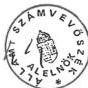

66

---

Állami Privatizációs és Vagyonkezelő Rt.

1/a. sz. tanúsítvány

a V-6-31/1999. évi jelentéshez

# Az ÁPV Rt. működéséhez kapcsolódó bevételek alakulása az 1997-1998. években

értékadatok: E Ft-ban

|  Megnevezés | 1997. |   |   |   | 1998. |   |   |   | Telj. %  |   |
| --- | --- | --- | --- | --- | --- | --- | --- | --- | --- | --- |
|   |  terv | % | tény | % | terv | % | tény | % | bázishoz | tervhez  |
|  Költségvetési tv. szerint a priv. bevételből |  |  | 3500.000 | 95,57 | 3000.000 | 95,24 | 3300.000 | 96,13 | 94,29 | 110  |
|  Tiszteletdíjakból származó bevétel |  |  | 65882 | 1,80 | 70.000 | 2,22 | 17.999 | 0,53 | 27,32 | 25,71  |
|  Idegen szervezetek bérleti díja |  |  | 1246 | 0,03 | 20.000 | 0,63 | 28.950 | 0,84 | 2323,43 | 144,75  |
|  Immat. javak és tárgyi eszközök értékesítéséből származó bevétel |  |  | 20986 | 0,57 | 30.000 | 0,95 | 22.378 | 0,65 | 106,63 | 74,59  |
|  Káreseményekkel kapcsolatos bevétel |  |  | 5488 | 0,15 | 15.000 | 0,48 | 3.025 | 0,09 | 55,12 | 20,17  |
|  Egyéb ki nem emelt bevétel |  |  | 42753 | 1,17 | 15.000 | 0,48 | 46.061 | 1,34 | 107,74 | 307,07  |
|  Céltártalék felhasználás |  |  | 3649 | 0,10 |  |  | 7.600 | 0,22 | 208,28 |   |
|  Egyéb bevétel össz. |  |  | 3640.004 | 99,39 | 3150.000 |  | 3426.013 | 99,80 | 94,12 | 108,76  |
|  Kamatbevételek pénzintézettől |  |  | 2434 | 0,07 |  |  | 665 | 0,02 | 27,32 |   |
|  Deviza és valutabevételek árfolyam bev. |  |  | 3 |  |  |  | 13 |  | 433,33 |   |
|  Pénzügyi műveletek bevételei összesen |  |  | 2437 | 0,07 |  |  | 678 | 0,02 | 27,82 |   |
|  Rendkívüli bevételek |  |  | 19.729 | 0,54 |  |  | 6.181 | 0,18 | 31,33 |   |
|  Bevételek mindössz. | 3500.000 | 100 | 3662.170 | 100 | 3150.000 | 100 | 3432.872 | 100 | 93,74 | 108,98  |

Budapest, 1999. ...április 23. ... PH.

* A költségvetési törvény decemberi módosítását követően 3300.000 változó.

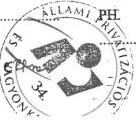

Toma Róma Tóth JL
aláírás

---

3

3

1

2

3

---

Állami Privatizációs és Vagyonkezelő Rt.

1/b. sz. tanúsítvány

a V-6-31/1999. évi jelentéshez

# Az ÁPV Rt. rendelt vagyonnal kapcsolatos bevételeinek alakulása
az 1997-1998. években

értékadatok: E Ft-ban

|  Megnevezés | 1997. |   | 1998. |   | Telj. %  |   |
| --- | --- | --- | --- | --- | --- | --- |
|   |  terv | tény | terv | tény | bázishoz | tervhez  |
|  Értékesítés, vagyonhasznosítás bev. | 238 200 000 | 341 686 739 | 127 000 000 | 104 204 076 | 30,5 | 82,1  |
|  ebből: - készpénzbevétel | 181 600 000 | 318 180 975 | - | 99 020 305 | 31,12 | 100,0  |
|  - E hitel bevétel | 1 500 000 | 307 547 | - | 992 857 | 322,83 | 100,0  |
|  - kárpótlási jegybevétel | 55 100 000 | 23 198 217 | 16 800 000 | 4 190 914 | 18,07 | 24,95  |
|  Kapott osztalék | 4 000 000 | 5 970 524 | 3 500 000 | 5 073 195 | 87,92 | 144,95  |
|  Egyéb bevétel | 2 610 000 | 2 916 565 | 3 300 000 | 2 424 440 | 83,13 | 73,47  |
|  Bevétel összesen | 244 810 000 | 350 373 828 | 133 800 000 | 114 701 711 | 31,88 | 83,48  |

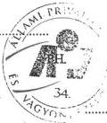

Budapest, 1999. április 23.

aláírás

---

,

,

,

-

,

,

---

Állami Privatizációs és Vagyonkezelő Rt.

2.sz. tanúsítvány

a V-6-31/1999. évi jelentéshez

# **Az ÁPV Rt. működéséhez kapcsolódó állományi dolgozók bérköltségének alakulása**

értékadatok: E Ft.

|  Megnevezés | 1997. |   | 1998. |   |   |   | Telj. %  |   |
| --- | --- | --- | --- | --- | --- | --- | --- | --- |
|   |  tény | % | terv | % | tény | % | bázishoz | tervhez  |
|  Alapbér | 791.304 | 55,18 | 679.200 | 54,94 | *672.789 | 50,45 | 85,02 | 99,06  |
|  Prémium | 242.617 | 16,92 | 106.590 | 8,62 | 105.309 | 7,89 | 43,41 | 98,80  |
|  Jutalom | 177.246 | 12,36 | 200.590 | 16,22 | 193.069 | 14,48 | 108,93 | 96,25  |
|  Végkielégítés | 15.591 | 1,09 | 250.000 | 20,22 | 25.318 | 1,90 | 162,38 | 145,01  |
|  Felmentési időre járó bér | 19.995 | 1,39 |   |   | 44.936 | 3,37 | 224,73  |   |
|  Egyösszegű kifizetés | 173.632 | 12,11 |   |   | 269.527 | 20,21 | 162,71  |   |
|  Szabadság-megváltás | 13.584 | 0,95 |   |   | 22.747 | 1,70 | 167,49  |   |
|  Fizetett távollét | 16 | - |  |  | - | - | - |   |
|  **állományba tartozók bérköltsége összesen** | **1.433.985** | **100,0** | **1.236.380** | **100,0** | **1.333.695** | **100,0** | **93,01** | **107,87**  |

*Megjegyzés: a főkönyvi számla módosítás miatt átdolgozott végleges adatok.

Budapest, 1999. július 20.

aláírás

---

,

,

i

,

,

---

Állami Privatizációs és Vagyonkezelő Rt.

3. sz. tanúsítvány

a V-6-31/1999. évi jelentéshez

# Az ÁPV Rt. működésével kapcsolatos állományon kívüliek bér és személyi költségei

értékadatok: E Ft-ban

|  Megnevezés | 1997. |   | 1998. |   |   |   | Telj. %  |   |
| --- | --- | --- | --- | --- | --- | --- | --- | --- |
|   |  tény | % | terv | % | tény | % | bázishoz | tervhez  |
|  Megbízási díj | 44.730 | 45,18 | 40.000 | 32,95 | 35.181 | 34,81 | 78,65 | 87,95  |
|  Tiszteletdíj | 53.392 | 53,94 | 80.400 | 66,23 | 64.939 | 64,24 | 121,63 | 80,77  |
|  Szerzői díj | 870 | 0,88 | 1.000 | 0,82 | 500 | 0,49 | 57,47 | 50,00  |
|  Összesen fin. szellemi díjak | — | — | — | — | 462 | 0,46 | — | —  |
|  Összesen | 98.792 | 100,0 | 121.400 | 100,0 | 101.082 | 100,0 | 102,11 | 83,26  |

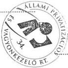

Budapest, 1999. április 23.

Toma Bóra Tóth
aláírás

---

1

2

3

4

5

---

Állami Privatizációs és Vagyonkezelő Rt.

4. sz. tanúsítvány

a V-6-31/1999. évi jelentéshez

# Az ÁPV Rt. működésével kapcsolatos személyi jellegű ráfordítások alakulása

értékadatok: E Ft-ban

|  Megnevezés | 1997. |   | 1998. |   |   |   | Telj. %  |   |
| --- | --- | --- | --- | --- | --- | --- | --- | --- |
|   |  tény | % | terv | % | tény | % | bázishoz | tervhez  |
|  Bérköltség | 1,478,714 | 61,92 | 1,356,780 | 63,37 | 1,409,064 | 63,43 | 95,29 | 103,85  |
|  Személyi jellegű kifizetések | 271,201 | 11,27 | 190,910 | 8,92 | 214,264 | 9,64 | 79,01 | 112,23  |
|  ebből: Szerzői díjak | 870 | 0,03 |  |  | 500 | 0,02 | 57,47 |   |
|  Étkezési hozzájárulás | 7,326 | 0,30 |  |  | 5,965 | 0,27 | 81,42 |   |
|  Üdülési hozzájárulás | 4,072 | 0,17 |  |  | 7,480 | 0,34 | 183,69 |   |
|  Albérleti hozzájárulás | — | — |  |  | 240 | 0,01 | — |   |
|  Utazási hozzájárulás | 2,123 | 0,08 |  |  | 1,600 | 0,07 | 75,36 |   |
|  Reprezentáció | 13,606 | 0,56 |  |  | 11,513 | 0,52 | 84,62 |   |
|  Segélyek | 7,772 | 0,32 |  |  | 4,270 | 0,19 | 54,94 |   |
|  Gépjárműhasználati költség | 2,802 | 0,11 |  |  | 6,016 | 0,27 | 214,70 | +  |
|  Belföldi napidíj | 51 | — |  |  | 41 | — | 80,39 |   |
|  Külföldi napidíj | 9,365 | 0,39 |  |  | 11,929 | 0,54 | 127,38 |   |
|  Betegszabadság | 10,371 | 0,43 |  |  | 8,888 | 0,40 | 85,70 |   |
|  Egyéb személyi jell. kifiz. | 70,822 | 2,96 |  |  | 32,125 | 1,45 | 45,36 |   |
|  Táppénz | 1,528 | 0,06 |  |  | 1,074 | 0,05 | 70,29 |   |
|  Nyugdíjpénztári hozzájár. | 71,590 | 2,99 |  |  | 63,476 | 2,86 | 88,67 |   |
|  Dolgozók életbiztosítása | 1,842 | 0,07 |  |  | — | — | — |   |
|  Oktatás továbbképzés | 18,924 | 0,79 | 20,000 | 0,93 | 13,191 | 0,59 | 69,71 | 65,96  |
|  Egészségpénztári hozzájár. | 1,028 | 0,04 |  |  | 6,147 | 0,27 | 597,96 |   |
|  Munkaruha | 47,109 | 1,97 |  |  | 39,609 | 1,79 | 84,50 |   |
|  Társadalombizt. járulék | 637,986 | 26,81 | 593,190 | 27,71 | 598,178 | 26,93 | 93,76 | 100,84  |
|  Személyi jellegű ráfordítások összesen | 2,387,901 | 100 | 2,140,880 | 100 | 2,221,506 | 100 | 93,03 | 103,77  |

Budapest, 1999. április 23.

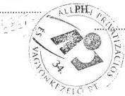

Tomás Bóna Tóth

aláírás

---

1

2

3

4

---

Állami Privatizációs és Vagyonkezelő Rt.

5/a..sz. tanúsítvány
a V-6-31/1999. évi jelentéshez

# Az ÁPV Rt. átlagos állományi létszámának alakulása
az 1997-1998. években

létszámadatok: főben

|  Megnevezés | 1997. tény | 1998. |   | teljesítés %  |   |
| --- | --- | --- | --- | --- | --- |
|   |   |  terv | tény | bázishoz | tervhez  |
|  teljes munkaidőben foglalkoztatott | 342 | 234 | 240 | 70,18 | 102,6  |
|  Részmunkaidőben foglalkoztatott | - | - | - | - | -  |
|  **Állományi létszám összesen:** | **342** | **234** | **240** | **70,18** | **102,6**  |

Budapest, 1999. április 22.

PH.

aláírás

PH

---

1

1

1

1

1

---

Állami Privatizációs és Vagyonkezelő Rt.

5/b. sz. tanúsítvány

a V-6-31/1999. évi jelentéshez

# Az ÁPV Rt. állományi létszámának alakulása az 1997-1998. években

létszámadatok: főben

|  Megnevezés | 1997.XII.31. |   | 1998.XII.31.  |   |
| --- | --- | --- | --- | --- |
|   |  státusz** | betöltött állás | státusz** | betöltött állás  |
|  Vezető |  | 52 |  | 48  |
|  Menedzser* |  | 140 |  | 129  |
|  Ügyintéző |  | 56 |  | 50  |
|  Ügyviteli |  | 36 |  | 31  |
|  Fizikai |  | - |  | -  |
|  Összesen |  | 284*** |  | 258***  |

* Felsőfokú vegzettségő érdemi munkát vegző munkatársak.
** Az üzleti tervCsak atl. all. letszamot tartalmaz, kozponti letszamgazdalkodas folyt.
*** - 1997. december 31-én 9 fonek szünt meg a munkaviszonya, ezert az 1998. évi nyitó letszám 275 fó (felmentettek nélkül).
- nem tartalmazza a 38 fó felmentett dolgozót.
*** -1998. december 31-én 1 fonek szünt meg a munkaviszonya, ezert az 1999.-évi nyitó letszám 257 fó (felmentettek nélkül).
-nem tartalmazza a 6 fofelmentett dolgozot.

Budapest, 1999. július 20.

PH.

---

1

1

1

1

---

Állami Privatizációs és Vagyonkezelő Rt.

5/c. sz. tanúsítvány

a V-6-31/1999. évi jelentéshez

# ÁPV Rt. munkaerőforgalom alakulása

Létszám: főben

|  Megjegyzés | 1997 |   | 1998  |   |
| --- | --- | --- | --- | --- |
|   |  Belépők | Kilépők | Belépők | Kilépők  |
|  Vezető | 2 | 23 | 20 | 32  |
|  Menedzser* | 13 | 46 | 28 | 51  |
|  Ügyintéző | - | 19 | 7 | 17  |
|  Ügyviteli | 2 | 18 | 6 | 10  |
|  Fizikai | - | - | - | -  |
|  Összes: | 17 | 106 | 61 | 110  |

*Felsőfokú végzettségű érdemi munkát végző munkatársak.

Budapest, 1999. július 20.

aláírás

---

,

,

1

,

,

.

---

Állami Privatizációs és Vagyonkezelő Rt.

6. sz. tanúsítvány

a V-6-31/1999. évi jelentéshez

# Az ÁPV Rt. működéséhez kapcsolódó anyagjellegű ráfordításainak alakulása

értékadatok: E Ft-ban

|  Megnevezés | 1997. |   | 1998. |   |   |   | Telj. %  |   |
| --- | --- | --- | --- | --- | --- | --- | --- | --- |
|   |  tény | % | terv | % | tény | % | bázishoz | tervhez  |
|  Energia | 21.035 | 3,89 |  |  | 22.869 | 4,58 | 108,72 |   |
|  Üzemanyag | 20.449 | 3,79 |  |  | 16.215 | 3,24 | 79,29 |   |
|  Nyomtatvány, irodaszer | 28.714 | 5,31 |  |  | 17.918 | 3,59 | 62,40 |   |
|  Egyéb ki nem emelt anyagköltség | 28.415 | 5,26 |  |  | 12.210 | 2,44 | 42,97 |   |
|  1. Anyag költség összesen | 98.613 | 18,25 |  |  | 69.212 | 13,85 | 70,19 |   |
|  Utazás- és szállásköltség | 48.201 | 8,92 |  |  | 28.088 | 5,61 | 58,27 |   |
|  Fenntartás, javítás és karbantartás | 78.473 | 14,53 |  |  | 96.659 | 19,34 | 123,17 |   |
|  Posta telefon, futárszolgálat | 73.109 | 13,54 |  |  | 67.099 | 13,42 | 91,78 |   |
|  Székház fenntartás, üzemeltetés | 201.082 | 37,23 |  |  | 226.196 | 45,25 | 112,49 |   |
|  Egyéb ki nem emelt anyagjellegű szolgáltatás | 40.698 | 7,53 |  |  | 12.630 | 2,53 | 31,03 |   |
|  2. Anyag jellegű szolgáltatások összesen | 441.563 | 81,75 |  |  | 430.672 | 86,15 | 97,53 |   |
|  3. Anyag jellegű ráfordítások összesen (1+2) | 540.176 | 100 | 627.000 |  | 499.884 | 100 | 92,54 | 79,73  |

Budapest, 1999. április 23.

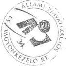

Toma Bóra Tóth JL
aláírás

---

•

•

•

•

---

Állami Privatizációs és Vagyonkezelő Rt.

7. sz. tanúsítvány

a V-6-31/1999. évi jelentéshez

# Saját vagyon összetétele, állománya 1998-ban

értékadatok: E Ft-ban

|  Megnevezés | 1997. évi záró állomány (nyitó) | Változás |   |   | 1998. évi záró állomány  |
| --- | --- | --- | --- | --- | --- |
|   |   |  növekedés | csökkenés | áll. vált.  |   |
|  Immateriális javak | 60.850 | 18.275 | 26.559 | - 8.284 | 52.566  |
|  Tárgyi eszközök | 2.690.081 | 2.013.714 | 244.740 | 1.768.974 | 4.459.055  |
|  Befektetett pénzügyi eszközök | 99.092 | 107.144 | 32.567 | 74.577 | 173.669  |
|  Befektett eszközök összesen | 2.850.023 | 2.130.133 | 303.866 | 1.835.267 | 4.685.290  |
|  Követelések | 339.784 | 695.917 | 838.472 | - 142.555 | 197.229  |
|  Péneszközök | 7.895.390 | 4.453.407 | 6.166.031 | -1.712.624 | 6.182.766  |
|  Forgóeszközök összesen | 8.235.174 | 5.149.324 | 7.004.503 | -1.855.179 | 6.379.995  |
|  Aktív időbeli elhatárolások | 11.225 | 4.264 | 13.495 | - 9.231 | 1.994  |
|  **ESZKÖZÖK ÖSSZESEN** | 11.096.422 | 7.292.721 | 7.321.864 | - 29.143 | 11.067.279  |
|  Saját tőke | 10.705.243 | 127.685 |  | 127.685 | 10.832.928  |
|  Céltartalék | 7.600 | 11.774 | 7.600 | 4.174 | 11.774  |
|  Kötelezettségek | 379.496 | 8.143.278 | 8.325.878 | - 182.600 | 196.896  |
|  Passzív időbeli elhatárolások | 4.083 | 115.145 | 93.547 | 21.598 | 25.681  |
|  **FORRÁSOK ÖSSZESEN** | 11.096.422 | 8.397.882 | 8.427.025 | - 29.143 | 11.067.279  |

Budapest, 1999. április 23.

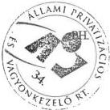

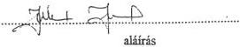

---

1

2

3

4

5

---

Állami Privatizációs és Vagyonkezelő Rt.

8/a. sz. tanúsítvány

a V-6-31/1999. évi jelentéshez

# Az állam vagyonával és felhasználásával kapcsolatos rendelkezések I.

értékadatok: E Ft-ban

|  Megnevezése | Előirányzat | Teljesítés | Eltérés  |
| --- | --- | --- | --- |
|  Az állami vagyon privatizációja bevételéből | 11.800.000 | 11.800.000 | -  |
|  ebből: 1997. évi bevételekből | 11.800.000 | 11.800.000 | -  |
|  1998. évi bevételekből | - | - | -  |
|  Az állami vagyon utáni részesedés, az adósságkonszolidációs követelések értékesítése alapján együttesen | 6.000.000 | 6.000.000 | -  |
|  1. Költségvetési befizetési kötelezettség összesen | 17.800.000 | 17.800.000 | -  |
|  Közvetlen privatizációs és privatizációt előkészítő kiadások (díjak, jutalékok), vagyonkezeléssel kapcsolatos ráfordítások | 43.000.000 | 43.516.357 | + 516.357  |
|  ebből: K&H részvények vételára | 15.000.000 | 15.357.000 | + 357.000  |
|  Postabank tőkeemelése | 20.000.000 | 20.000.000 | -  |
|  Működési költségek összesen | 3.300.000 | 3.300.000 | -  |
|  A kárpótlási jegyek életjáradékra váltásával kapcsolatos kifizetések | 2.500.000 | 2.146.150 | - 353.850  |
|  Reorganizációra a Kormány egyedi jóváhagyásával, ebből éves szinten 1.000 M Ft értékig ügyletenként 200 M Ft összeghatárig az ÁPV Rt. Igazgatósága - a Kormány félévenkénti utólagos tájékoztatása mellett - dönthet | 15.000.000 | 13.458.370 | - 1.541.630  |
|  Agrárreorganizációs program kamatterheinek átvállalása | 3.000.000 | 3.000.000 | -  |

%

---

|  Megnevezése | Előirányzat | Teljesítés | Eltérés  |
| --- | --- | --- | --- |
|  Nem biztosítható mezőgazdasági elemi károk kezelése | 700.000 | 700.000 | –  |
|  Gázolaj fogyasztási adója visszaigénylésének kiegészítése | 1.300.000 | 1.300.000 | –  |
|  A honvédelmi célú erdőgazdaságok reorganizációs ráfordításai | 500.000 | 500.000 | –  |
|  A gazdálkodók által okozott, a vállalkozókra át nem hárítható környezeti károk és veszélyeztetések elhárításának támogatására a Központi Környezetvédelmi Alapba félévente egyenlő összegű átutalás | 1.000.000 | 1.000.000 | –  |
|  A területfejlesztési központi, megyei és regionális programjainak támogatására a területfejlesztésről és területrendezésről szóló 1996. évi XXI. törvény rendelkezései szerint | 7.000.000 | 7.000.000 | –  |
|  ebből: Borsod-Abaúj-Zemplén megye | 1.500.000 |  |   |
|  Nógrád megye | 360.000 |  |   |
|  Szabolcs-Szatmár-Bereg megye | 900.000 |  |   |
|  Nem az ÁPV Rt. portfóliójába tartozó volt szovjet ingatlanok környezetvédelmi kárelhárítása | 800.000 | 425.106 | -374.894  |
|  **2. Ráfordítások összesen** | **78.100.000** | **76.045.983** | **-1.754.017**  |

Budapest, 1999. ... 23

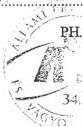

aláírás

2

---

Állami Privatizációs és Vagyonkezelő Rt.

8/b. sz. tanúsítvány

a V-6-31/1999. évi jelentéshez

# Az állam vagyonával és felhasználásával kapcsolatos rendelkezések II.

# Privatizációs tartalék felhasználása

értékadatok: E Ft-ban

|  Feladat megnevezése | 1998. évi |   | Megjegyzés  |
| --- | --- | --- | --- |
|   |  üzleti tervének előirányzata | teljesítés  |   |
|  a) jótállással, szavatossággal kezességvállalással kapcsolatos jövőbeli kifizetésekre | 15.000.000 | 45.390 |   |
|  b) vill. ipari dolgozókkal kötött privatizációs megállapodás teljesítésével kapcs. kifizetésekre | 9.000.000 | Ø |   |
|  c) készfizetői kezességre, átvállalt tartozások kifizetésére | 4.000.000 | 323.294 |   |
|  d) bírósági végzés alapján tört. kifizetésekre | 500.000 | 2.029.362 |   |
|  e) "reverzális" levelek alapján történő kifizetésekre | 2.000.000 | 13.462 |   |
|  f) E-hitel garanciavállalásra | 100.000 | Ø |   |
|  g) elvont ingatlanok után beálló kezesi felelősségre | - | 685.753 |   |
|  h) belter. föld önkorm. részére fizetendő kötelezettségekre | 15.800.000 | 4.257.994 6.041.544 |   |
|  i) 20 %-os privatizációs részesed. igények visszautalására | 12.600.000 | 12.540.526 |   |
|  j) priv. összefüggésben kialakult válsághelyzet kezelését szolgáló kifizetésekre | 20.000.000 | 15.001.835 |   |
|  h) gázközművekkel kapcs önkorm. igények rendezésére | - | 31.463 |   |
|  l) tartós áll. tul. társaságok tőkerendezésére | - | 37.700.000 |   |
|  Privatizációs tartalék felhasználása összesen | 79.000.000 | 78.970.323 |   |

Budapest, 1999. 23.

aláírás

---

1

2

3

4

5

---

Állami Privatizációs és Vagyonkezelő Rt.

8/c. sz. tanúsítvány

a V-6-31/1999. évi jelentéshez

# A privatizációs tartalék állományának alakulása 1998. évben

értékadatok: E Ft-ban

|  Megnevezése |   |
| --- | --- |
|  Privatizációs tartalék 1998. évi nyitó állománya | 38.853.805  |
|  Növekedés a privatizációs bevételekből | 51.610.952  |
|  Növekedés a közp. költségvetésből történő forrásátadásból | 37.700.000  |
|  Növekedés a pénzkészletekből | -  |
|  Tartalékképzés 1998. évben | 89.310.952  |
|  a) jótállással, szavatossággal kezességvállalással kapcsolatos jövőbeli kifizetésekre | 45.390  |
|  b) vill. ipari dolgozókkal kötött privatizációs megállapodás teljesítésével kapcs. kifizetésekre | 0  |
|  c) készfizetői kezességre, átvállalt tartozások kifizetésére | 323.294  |
|  d) bírósági végzés alapján tört. kifizetésekre | 2.029.362  |
|  e) "reverzális" levelek alapján történő kifizetésekre | 13.462  |
|  f) E-hitel garanciavállalásra | 0  |
|  g) elvont ingatlanok után beálló kezesi felelősségre | 685.753  |
|  h) belter. föld önkorm. részére fizetendő kötelezettségekre | 4.251.994 6.041.544  |
|  i) 20 %-os privatizációs részesed. igények visszautalására | 12.840.526  |
|  j) priv. összefüggésben kialakult válsághelyzet kezelését szolgáló kifizetésekre | 15.001.835  |
|  ebből: egyedi kormánydöntés alapján kifizetett | 14.525.005  |
|  ÁPV Rt. Igazgatósága döntésének alapján kifizetett | 476.830  |
|  h) gázközművekkel kapcs önkorm. igények rendezésére | 31.163  |
|  l) tartós áll. tul. társaságok tőkerendezésére | 37.700.000  |
|  Privatizációs tartalék felhasználása összesen (a-l) | 78.970.323  |
|  Privatizációs tartalék záró állománya | ** 49.144.790  |

Budapest, 1999.

* Nem tartalmazza a gázközművekkel kapcs önkorm. igények (50 000 mFt)

** Darkszámlák közötti áttekintés elérés 49.644 e Ft

---

1

1

1

1

1

---

Állami Privatizációs és Vagyonkezelő Rt.

8/d sz. tanúsítvány

a V-6-31/1999. évi jelentéshez

# A privatizációs vagyonkezeléshez kapcsolódó, valamint a jogszabályokból eredő kötelezettségek alakulása

értékadatok MFt-ban

|  Megnevezés | 1998.I.1. | 1998.XII.31.  |
| --- | --- | --- |
|  *Normatív kötelezettségek* |  |   |
|  Gázközművagyonnal kapcsolatos kötelezettség |  | 50 000  |
|  PEH | 14 600 | 1 598  |
|  Önkormányzati járandóságok | 16 495 | 8 633  |
|  Adóskonszolidáció miatt fennálló kötelezettség | 4 767 | 4 388  |
|  TB részére fennálló kötelezettség | 4 600 | 4 600  |
|  Villamosipari dolgozók járandósága | 8 600 | 8 600  |
|  Költségvetési befizetési kötelezettség | 11 800 | 0  |
|  Egyéb kötelezettség | 1 500 | 2 588  |
|  *Normatív kötelezettségek összesen:* | 62 362 | 80 407  |
|  *Függő kötelezettségek* |  |   |
|  Privatizációhoz kapcsolódó szavatosság | 31 607 | 20 486  |
|  jogszavatosság |  | 5 726  |
|  egyéb garanciavállalás (pénzügyi, környezetvédelmi) |  | 14 760  |
|  Vagyonkezeléshez kapcsolódó garancia | 5 372 | 1 939  |
|  Elvont vagyon utáni kezesség | 3 500 | 9 498  |
|  PEH | 0 | 10 518  |
|  Önkormányzati járandóságok | 0 | 27 858  |
|  Reverzális levelek utáni kötelezettség | 4 897 | 5 200  |
|  *Függő kötelezettségek összesen:* | 45 376 | 75 499  |
|  **Mindösszesen:** | **107 738** | **155 906**  |

Analitikus kimutatás jelenleg csak a nyitó és záró adatokról áll rendelkezésre.
A kötelezettségek nyilvántartásának struktúrája 1998-ban jelentősen módosult;
a táblázatot az új szerkezetnek megfelelően állítottuk össze.

Budapest, 1999. április 23.

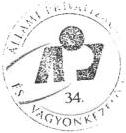

L:\AVU\MIS\APV98\IKOT98.XLS

1999.04.23 12:48

---

1

，

.

1

，

---

Állami Privatizációs és Vagyonkezelő Rt.

9/a. sz. tanúsítvány

a V-6-31/1999. évi jelentéshez

# A szovjet csapatkivonás révén felszabadult ingatlanok ráfordításai

értékadatok: E Ft-ban

|  Megnevezés | 1997. |   | 1998. |   |   |   | Telj. %  |   |
| --- | --- | --- | --- | --- | --- | --- | --- | --- |
|   |  tény | % | terv | % | tény | % | bázishoz | tervhez  |
|  Őrzés védelemre |  |  |  |  |  |  |  |   |
|  Állagmagóvásra |  |  |  |  |  |  |  |   |
|  Kártalanítással összefüggésben |  |  |  |  |  |  |  |   |
|  Értéknövelő beruházásokra |  |  |  |  |  |  |  |   |
|  Környezetvédelmi károk elhárítására |  |  |  |  |  |  |  |   |
|  Tűzrendészeti mentesítésre |  |  |  |  |  |  |  |   |
|  Értékesítéssel kapcs. költségekre |  |  |  |  |  |  |  |   |
|  **Összesen** |  | 100,0 |  | 100,0 |  | 100,0 |  |   |

Budapest, 1999. április 29.

Stabun!

aláírás

Jelenlegi nyilvántartásunk nem teszi lehetővé a tanúsítványban kért adatok rendszerezni kihívásukat, ugyanakkor a teljes év adataillomány kiki átvizsgálása aránytalanul nagy munkát igényelt az információ szolgáltatásához.
Nyertiekre tekintettel léptek a tanúsítvány kitöltésétől eltekinteni szíveskedjenek.

---

1

1

1

1

---

Állami Privatizációs és Vagyonkezelő Rt.

9/b. sz. tanúsítvány

a V-6-31/1999. évi jelentéshez

# A szovjet csapatkivonás révén felszabadult ingatlanok hasznosításából származó bevételek megoszlása a központi költségvetés és az önkormányzatok között

értékadatok: E Ft-ban

|  Ingatlan megnevezés | Önkormányzat megnevezése | Értékesített ingatlan |   |   | Nettó évi 50% Önkormányzat részére átadott összeg | Kárp- fegy  |
| --- | --- | --- | --- | --- | --- | --- |
|   |   |  1 Bruttó-értéke Bruttó évi | 2 Ráfordítás Priv. Keg | Nettó-értéke ** Nettó évi  |   |   |
|  KV52/Szolcs 711/1 4811 | Szolcs Önkorm. | 528.560 | 506.950 | - 82.910 | Ø | 104.52  |
|  KV52/Szolcs 711/1 51 | -"- | 28.800 | 86.625 | - 75.245 | Ø | 17.420  |
|  KV52/Szolcs 769/39 | -"- | 2.000.000 | 296.625 | 1.415.945 | Ø | 287.43  |
|  KV52/Szolcs 711/1 1300 m² | -"- | 500.000 | 792.000 | - 292.000 | Ø | -  |
|  KV52/Szolcs 711/1 | -"- | 1.996.500 | 5.485.390 | - 1.488.890 | Ø | -  |
|  KV52/Szolcs 711/1 2576 m² | -"- | 700.000 | 776.750 | - 76.750 | Ø | -  |
|  KV52/Jap- fegy | Jap- fegy | 300.000 | 40.000 | 260.000 | 130.000 | -  |
|  KV52/Jap- fegy | Jap- fegy | 1.250.000 | 300.000 | 950.000 | 475.000 | -  |
|  KV52/Jap- fegy | Jap- fegy | 425.000 | 531.000 | - 106.000 | - 53.000 | -  |
|  Összesen | - | 7.728.860 | 6.815.340 | 504.150 | 552.000 | 409.37  |

Budapest, 1999.

6. sz. 29.

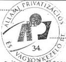

Kovács

aláírás

* Nem pár összeggel az önkormányzatnak

** Nettó évi - Bruttó évi - Priv. Keg - Kárp. fegy

---

1

•

•

•

---

Állami Privatizációs és Vagyonkezelő Rt.

9/b. sz. tanúsítvány

a V-6-31/1999. évi jelentéshez

# A szovjet csapatkivonás révén felszabadult ingatlanok hasznosításából származó bevételek megoszlása a központi költségvetés és az önkormányzatok között

értékadatok: E Ft-ban

|  Ingatlan megnevezés | Önkormányzat megnevezése | Értékesített ingatlan |   |   | Nettó évi 50% Önkormányzat részére átadott összeg | Könyv jegy  |
| --- | --- | --- | --- | --- | --- | --- |
|   |   |  Bruttó értéke | Ráfordítás | Nettó értéke*  |   |   |
|  KUSZ/N. 2000 0536/15 | Vagyonköz Önkorm. | 1.300.000 | 1.283.975 | 16.025 | 8.013 | -  |
|  KUSZ/N. 2000 0536/13 | -"- | 400.000 | 98.798 | 301.202 | 150.601 | -  |
|  KUSZ/N. 2000 0536/18 | -"- | 160.000 | 40.000 | 120.000 | 60.000 | -  |
|  KUSZ/N. 2000 0536/25 | -"- | 128.200 | 32.035 | 96.165 | 48.082 | -  |
|  KUSZ/ Vac - Választó | Választó Önkorm. | 60.000 | 15.000 | 45.000 | 22.500 | -  |
|  - | - | - | - | - | - | -  |
|  - | - | - | - | - | - | -  |
|  - | - | - | - | - | - | -  |
|  - | - | - | - | - | - | -  |
|  Összesen | - | 2.048.200 | 1.469.808 | 578.392 | 289.196 | -  |

Budapest, 1999. ... 29

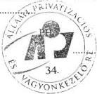

Kovács

aláírás

* Nettó évi - Bruttó évi - Priv. Ktq - Könyv jegy

---

1

•

1

1

1

---

Állami Privatizációs és Vagyonkezelő Rt

10.sz tanusítvány

a V-6-31/1999. évi jelentéshez

Reorganizációra jóváhagyott ráfordítások részletezése (MFt)

|  Reorganizációs program megnevezése | Előirányzat | Teljesítés | Eltérés | IG. határozat sz.*  |
| --- | --- | --- | --- | --- |
|  **DAM Rt** | **2 000** | **2 000** | **0** |   |
|  **MFB Rt** |  | **4 250** | **4 250** |   |
|  *Volánbusz* | **800** | **238** | **-563** |   |
|  *Tokaj Kereskedőház* |  | **200** | **200** |   |
|  *Nemzeti Tankönyvkiadó* | **300** | **300** | **0** |   |
|  Abaúj Charolais Rt. |  | 30 |  |   |
|  Agroprodukt Rt. |  | 200 |  |   |
|  Alcsiszigeti Mg. Rt. |  | 80 |  |   |
|  Balatoni Halászati Rt. |  | 100 |  |   |
|  Bácsalmási Agráripari Rt. |  | 100 |  |   |
|  Bólyi Mg. Rt. |  | 750 |  |   |
|  Dalmandi Mg. Rt. |  | 200 |  |   |
|  Dél-Pesti Mg. Rt. |  | 300 |  |   |
|  Enyingi Agrár Rt. |  | 100 |  |   |
|  Fertő-tavi Nádgazd. Rt. |  | 50 |  |   |
|  Gödöllői Tangazdaság rt. |  | 100 |  |   |
|  Herceghalmi KG. Rt. |  | 100 |  |   |
|  Hidasháti Mg.Rt. |  | 150 |  |   |
|  Hód-Mezőgazda Rt. |  | 250 |  |   |
|  Komáromi Mg. Rt. |  | 180 |  |   |
|  Lajta-Hansági Mg. Rt. |  | 140 |  |   |
|  Lábod-Mavad Rt. |  | 30 |  |   |
|  Martonseed Rt. |  | 100 |  |   |
|  Mezőfalvai |  | 200 |  |   |
|  Mezőhegyesi Á.M. Rt. |  | 200 |  |   |
|  Sárvári Mg. Rt. |  | 80 |  |   |
|  Szarvasi Agrár Rt. |  | 80 |  |   |
|  Szerencsi Mg. Rt. |  | 250 |  |   |
|  Szombathelyi Tg. Rt. |  | 30 |  |   |
|  Törökszentmiklósi Mg.Rt. |  | 200 |  |   |
|  **Agrár társaságok** | **4 500** | **4 000** | **-500** |   |
|  Mecseki Erdészeti Rt. |  | 90 |  |   |
|  Somogyi Erd. és Faipari Rt |  | 50 |  |   |
|  Szombathelyi Erdészeti Rt. |  | 100 |  |   |
|  Tanulmányi Erdőgazdaság Rt. |  | 40 |  |   |
|  Ipoly Rt. |  | 100 |  |   |
|  Mátra-Ny-bükki Erdő- és Fafeldolgozó Rt. |  | 100 |  |   |
|  Északerdő Rt. |  | 120 |  |   |
|  Kiskunsági Erd. és Faipari Rt. |  | 125 |  |   |
|  Kisalföldi Erdőgazdaság Rt. |  | 50 |  |   |
|  Vértesi Erdészeti és Faipari Rt. |  | 200 |  |   |
|  Pilisi Parkerdő Rt. |  | 100 |  |   |
|  Nagykunsági Erd. és Faipari . |  | 100 |  |   |
|  "Gyulaj" Erdészeti és Vadászati Rt. |  | 100 |  |   |
|  Balatonfelvidéki Erdő- és Fafeldolgozó Rt. |  | 90 |  |   |
|  **Erdőgazdaságok** | **1 500** | **1 365** | **-135** |   |
|  **Kamatátvállalások (Erdőgazdaságok; DAM)** | **200** | **128** | **-72** |   |
|  **Egyedi Kormányjóváhagyással megvalósított reorganizációs programra fordított ráfordítás összesen** | **9 300** | **12 481** | **3 181** |   |

ÁSZreorg981999.04.26

1

---

Állami Privatizációs és Vagyonkezelő Rt

10.sz tanusítvány

a V-6-31/1999. évi jelentéshez

# Reorganizációra jóváhagyott ráfordítások részletezése (MFt)

|  Reorganizációs program megnevezése | Előirányzat | Teljesítés | Eltérés | IG. határozat sz.*  |
| --- | --- | --- | --- | --- |
|  Belvárosi Irodaház |  | 82 | 82 | 204/98  |
|  Nitrokémia Rt |  | 100 | 100 | 272/98  |
|  Baranya tégla |  | 2 | 2 | 427/92  |
|  Szarvasi Agrár Rt. |  | 50 | 50 | 535/98  |
|  Mezőfalvai Mg Rt |  | 70 | 70 | 535/98  |
|  Balatoni Halászati Rt. |  | 80 | 80 | 535/98  |
|  Törökszentmiklósi Mg.Rt. |  | 100 | 100 | 535/98  |
|  Dalmandi Rt |  | 150 | 150 | 535/98  |
|  Kiskunsági Erd. és Faipari Rt. |  | 150 | 150 | 535/98  |
|   |  |  |  | 495/98;  |
|  Kamatátvállalás (Erdőgazdaságok, Törökszentmiklós Mg, MFS) |  | 194 | 194 | 777/97, 494/97  |
|  Az ÁPV Rt Igazgatósága általi jóváhagyással megvalósított reorganizációs programra fordított ráfordítás összesen | 0 | 978 | 978 |   |
|  Antenna Hungária | 3 500 |  | -3 500 |   |
|  MFS Magyar lőszergyártó Kft | 150 |  | -150 |   |
|  MM Special | 150 |  | -150 |   |
|  FÉG Ármy | 200 |  | -200 |   |
|  MOKÉP Rt | 300 |  | -300 |   |
|  Bábolna Rt | 3 200 |  | -3 200 |   |
|  Tartalék | 200 |  | -200 |   |
|  Mindösszesen | 17 000 | 13 459 | -3 542 |   |

* Értelemszerűen csak az ÁPV Rt Igazgatósága általi jóváhagyással megvalósított reorganizációs programok esetében kell kitölteni

Budapest 1999.április 26.

ÁSZreorg981999.04.26

2

---

Állami Privatizációs és Vagyonkezelő Rt.

11. sz. tanúsítvány

a V-6-31/1999. évi jelentéshez

# Az ÁPV Rt. jövedelmezőségét, pénzügyi helyzetét jellemző
főbb mutatószámok alakulása

% -ban

értékadatok: E-Ft-ban

|  Megnevezése | 1996. | 1997. | 1998.  |
| --- | --- | --- | --- |
|  1. Tárgyi eszköz arány = Tárgyi eszközök Összes eszköz | 24,10 | 24,24 | 40,29  |
|  2. Forgóeszköz arány = Forgóeszközök Összes eszköz | 74,56 | 74,21 | 57,65  |
|  3. Tőkeellátottság = Saját tőke Összes forrás | 94,92 | 96,47 | 97,88  |
|  4. Források aránya = Kötelezettségek Saját tőke | 5,29 | 3,54 | 1,82  |
|  5. Likviditás = Forgóeszközök Rövid lejáratú kötelezettségek | 1484,59 | 2170,02 | 3240,29  |
|  6. Árbevételarányos = Adózás előtti eredmény jövedelmezőség Összes bevétel | 13,64 | 2,34 | 3,72  |
|  7. Eszközarányos = Adózás előtti eredmény jövedelmezőség Összes eszköz | 5,13 | 0,77 | 1,15  |
|  8. Költségszint = Működési költségek összesen Összes árbevétel | 81,11 | 91,53 | 92,99  |
|  9. Személyi költségarányos = Adózás előtti eredmény jövedelmezőség Áll-ba tartozók és áll-on kív. bér- és személyi költségei | 35,24 | 4,90 | 7,87  |
|  10. Vagyonarányos = Adózás előtti eredmény jövedelmezőség Saját tőke | 5,41 | 0,80 | 1,18  |

Budapest, 1999. április 23.

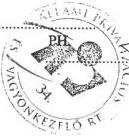

Toma Róza Tóth M.
aláírás

---

1

•

1

1

---

12. sz. tanúsítvány

a V-6-31/1999. évi jelentéshez

## 1997 ÉVI ÉS 1998 ÉVI ÁTLAGKERESETEK ÁLLOMÁNYCSOPORTONKÉNT

|  sor-szám | ÁLLOMÁNYCSOPORT | 1997.-évi ÁTLAG- KERESET Ft/fő/hó | 1998.-évi ÁTLAG- KERESET Ft/fő/hó | Index % 98/97  |
| --- | --- | --- | --- | --- |
|  1 | FELSŐVEZETŐK | 1.520.729.- | 1.581.237.- | 103,98  |
|  2 | ÜGYVEZETŐ IGAZGATÓK | 660.769.- | 704.454.- | 106,61  |
|  3 | ÜGYVEZETŐ IGAZGATÓ- HELYETTESEK | 460.895.- | 501.299.- | 108,77  |
|  4 | MENEDZSEREK | 284.986.- | 312.354.- | 109,60  |
|  5 | ÜGYINTÉZŐK | 127.196.- | 152.407.- | 119,82  |
|  6 | ÜGYVITELI ALKALMAZOTTAK | 105.133.- | 124.377.- | 118,30  |
|  7 | ÁPV RT. ÖSSZESEN | 295.123.- | 337.204.- | 114,25  |

99.06.15/15:51/ÁTL9798

---

1

•

1

•

---

A. sz. melléklet

a V-6-31/1999. évi jelentéshez

# Az ÁPV Rt. Budapest XI. Fehérvári út 70. sz. alatti épületének 1998. évi beruházási, felújítási költségei

E Ft-ban

|   | Szerződés szerint |   | Tény szla szerint | Eltérés  |   |
| --- | --- | --- | --- | --- | --- |
|  Összes ktg. | 448313 | 2. sz. mód. 493946 | 520770 | az eredeti szerz.-től 72457 | a mód. szerződéstől 26824  |
|  Ebből: |  |  |  |  |   |
|  Bruttó alapter. m² | 10950 | 10950 | 10950 | - | -  |
|  Hasznos alapter. m² | 6700 | 6700 | 6700 | - | -  |
|  Bontás | 29565 | 29565 | 53388 (1 szla) | 23823 | 23823  |
|  Válaszfalak | 23103 | 24939 | 25252 | 2149 | 313  |
|  Álmennyezet | 16441 | 17097 | 19354 | 2913 | 2257  |
|  Burkolatok (padló) | 29925 | 34425 | 44297 | 14372 | 9872  |
|  Falburkolatok | 48691 | 54441 | 55701 | 7010 | 1260  |
|  Vakolatok | 1350 | 1630 | 3722 | 2372 | 2092  |
|  Bádogos+tetőszerk. | 5000 | 5000 | - | -5000 | -5000  |
|  Homlokzati nyílászárók | 97736 | 97736 | - | -97736 | -97736  |
|  Belső nyílászárók | 17732 | 23312 | 89909 | 72177 | 66597  |
|  Lakatosszerkezetek | 2080 | 2080 | 485 | -1595 | -1595  |
|  Víz csatorna | 14500 | 16500 | 27170 | 12670 | 10670  |
|  Fűtés | 32595 | 34715 | 35073 | 2478 | 358  |
|  Szellőzés | 8840 | 21641 | 18512 | 9672 | -3129  |
|  Tűzi víz | 4380 | 5180 | 1759 | -2621 | -3421  |
|  Elektromos főelosztó | 15480 | 15480 |  |  |   |
|  Elektromos elosztó | 18000 | 18000 | 71743 | -2712 | -11512  |
|  Elektromos installáció | 40975 | 49775 |  |  |   |
|  Alközpont+hálózat | - | - | 23272 | 23272 | 23272  |
|  Telepítés GOMPUSAVE, felvonó | - | - | 13822 (1 szla) | 13822 | 13822  |
|  Falazás | - | - | 4272 | 4272 | 4272  |
|  Alj. beton | - | - | 5864 | 5864 | 5864  |
|  Egyéb | - | - | 1069 | 1069 | 1069  |
|  (kerekítés) | - | - | (5) | (5) | (5)  |
|  Lift | 39200 | 39200 | 24574 | -14626 | -14626  |
|  Szalagfüggöny | 2720 | 3230 | 1527 | -1193 | -1703  |

99.07.27 02:50 DU o:\users\gyongyi\wmunka\ápv\szij1mel.doc

---

1

2

3

4

---

2. sz. melléklet

a V-6-31/1999. évi jelentéshez

# REORGANIZÁCIÓS KIADÁSOK KORMÁNYHATÁROZATOK ALAPJÁN

|  Sorsz. | Társaság megnevezése | Korm.hat. száma | Kifizetés M Ft  |
| --- | --- | --- | --- |
|  Tőkeemelés és végleges forrásjuttatás  |   |   |   |
|  1. | Törökszentmiklósi Mg. Rt. | 1068/1998. | 200  |
|  2. | Mezőfalvai | 1068/1998 | 200  |
|  3. | DAM | 1073/1998 | 2 000  |
|  4. | Volánbusz | 2017/1998 | 238  |
|  5. | Tokaj Kereskedőház | 1068/1998 | 200  |
|  6. | Nemzeti Tankönyvkiadó | 2100/1998 | 300  |
|  7. | MFB Rt. (Postabank Rt.) | 1046/1998 | 4 250  |
|  8. | Abaúj Charolais Rt. | 1068/1998 | 30  |
|  9. | Agroprodukt Rt. | 1068/1998 | 200  |
|  10. | Alcsiszigeti Mg. Rt. | 1068/1998 | 80  |
|  11. | Balatoni Halászati Rt. | 1068/1998 | 100  |
|  12. | Bácsalmási Agráripari Rt. | 1068/1998 | 100  |
|  13. | Bólyi Mg. Rt. | 1068/1998 | 750  |
|  14. | Dalmadi Mg. Rt. | 1068/1998 | 200  |
|  15. | Dél-Pesti Mg.Rt. | 1068/1998 | 300  |
|  16. | Enyingi Agrár Rt. | 1068/1998 | 100  |
|  17. | Fertő-tavi Nádgazd.Rt. | 1068/1998 | 50  |
|  18. | Gödöllői Tandgazdaság Rt. | 1068/1998 | 100  |
|  19. | Herceghalmi KG Rt. | 1068/1998 | 100  |
|  20. | Hidasháti Mg. Rt. | 1068/1998 | 150  |
|  21. | Hód-Mezőgazda Rt. | 1068/1998 | 250  |
|  22. | Komáromi Mg. Rt. | 1068/1998 | 180  |
|  23. | Lajta-Hansági Mg. Rt. | 1068/1998 | 140  |
|  24. | Lábod-Mavad Rt. | 1068/1998 | 30  |
|  25. | Martonseed Rt. | 1068/1998 | 100  |
|  26. | Mezőhegyesei Á.M. Rt. | 1068/1998 | 200  |
|  27. | Sárvári Mg. Rt. | 1068/1998 | 80  |
|  28. | Szarvasi Agrár Rt. | 1068/1998 | 80  |
|  29. | Szerencsi Mg. Rt. | 1068/1998 | 250  |
|  30. | Szombathelyi Tg. Rt. | 1068/1998 | 30  |
|  31. | Mecseki Erdészeti Rt. | 1069/1998 | 90  |
|  32. | Somogyi Erd. és Faipari Rt. | 1069/1998 | 50  |
|  33. | Szombathelyi Erdészeti Rt. | 1069/1998 | 100  |
|  34. | Tanulmányi Erdőgazdaság Rt. | 1069/1998 | 40  |
|  35. | Ipoly Rt. | 1069/1998 | 100  |
|  36. | Mátra-Ny-bükki Erdő és Fafeldolgozó Rt. | 1069/1998 | 100  |
|  37. | Északerdő Rt. | 1069/1998 | 120  |
|  38. | Kiskumsági Erd. és Faipari Rt. | 1069/1998 | 125  |
|  39. | Kisalföldi Erdőgazdaság Rt. | 1069/1998 | 50  |
|  40. | Vértesi Erdészeti és Faipari Rt. | 1069/1998 | 200  |
|  41. | Pilisi Parkerdő Rt. | 1069/1998 | 100  |
|  42. | Nagykunsági Erd. és Faipari Rt. | 1069/1998 | 100  |
|  43. | "Gyulaj" Erdészeti és Vadászati Rt. | 1069/1998 | 100  |
|  44. | Balatonfelvidési Erdő- és Fafeldolgozó Rt. | 1069/1998 | 90  |
|  Tőkeemelés és végleges forrásjuttatás összesen: |   |   | 12 353  |

- 1. -

---

|  Sorsz. | Társaság megnevezése | Korm.hat. száma | Kifizetés M Ft  |
| --- | --- | --- | --- |
|  Kamatátvállalás  |   |   |   |
|  1. | Somogyi Erd. és Faipari Rt. | 1069/1998 | 8  |
|  2. | Szombathelyi Erdészeti Rt. | 1069/1998 | 2  |
|  3. | Tanulmányi Erdőgazdaság Rt. | 1069/1998 | 4  |
|  4. | Ipoly Rt. | 1069/1998 | 7  |
|  5. | Mátra-Ny-bükki Erdő és Fafeldolgozó Rt. | 1069/1998 | 9  |
|  6. | Kiskunsági Erd. és Faipari Rt. | 1069/1998 | 8  |
|  7. | Vértesi Erdészeti és Faipari Rt. | 1069/1998 | 4  |
|  8. | 'Gyulaj' Erdészeti és Vadászati Rt. | 1069/1998 | 3  |
|  9. | Balatonfelvidési Erdő és Fafeldolgozó Rt. | 1069/1998 | 2  |
|  10. | DNM | 2364/1995 | 81  |
|  Kamatátvállalás összesen: |   |  | 128  |
|  **Kiadások összesen:** |   |  | **12 481**  |

2. oldal

---

# REORGANIZÁCIÓS KIADÁSOK

# AZ ÁPV Rt. IGAZGATÓSÁGI HATÁSKÖRBEN HOZOTT DÖNTÉSEI ALAPJÁN

|  Sorsz. | Társaság megnevezése | IG.hat. száma | Kifizetés M Ft  |
| --- | --- | --- | --- |
|  Tőkeemelés és végleges forrásjuttatás  |   |   |   |
|  1. | Belvárosi Irodaház Kft. | 204/1998 | 82  |
|  2. | Nitrokémiai Rt. | 272/1998 | 100  |
|  3. | Baranya tégla | 427/1998 | 2  |
|  4. | Szarvasi Agrár Rt. | 535/1998 | 50  |
|  5. | Mezőfalvai Mg. Rt. | 535/1998 | 70  |
|  6. | Balatoni Halászati Rt. | 535/1998 | 80  |
|  7. | Törökszentmiklósi Mg. Rt. | 535/1998 | 100  |
|  8. | Dalmadi Rt. | 535/1998 | 150  |
|  9. | Kiskunsági Erd. és Faipari Rt. | 535/1998 | 150  |
|  Tőkeemelés és végleges forrásjuttatás összesen |   |   | 784  |
|  Kamatátvállalás  |   |   |   |
|  1. | Erdőgazd. és egyéb hitelek kamatai (1997) | 495/1998 | 147  |
|  2. | Törökszentmiklósi Mg. Rt. 777/1997 | 777/1997 | 21  |
|  3. | MFS | 497/1997 | 26  |
|  Kamatátvállalás összesen: |   |   | 194  |
|  **Kiadások összesen:** |   |   | 978  |

- 3. -

---

1

1

1

1

1

---

a V-6-31/1999. évi jelentéshez

Állami Privatizációs és Vagyonkezelő Rt.
Jogi Ügyvezető Igazgatóság

# FELJEGYZÉS

01.13

Címzett: Pájer Péter ügyvezető igazgató

407/99/HT.

Küldi: Dr. Halasi Tibor jogi igazgató/vezető jogtanácsos

Készítette: Dr. Hajdu Judit /MM

Vas tagjai

29.01.14.

Dátum: 1999. Január 13.

74

Tárgy: A Budapest, XI. ker. Fehérvári út 70. sz. alatti ingatlan "kettős tulajdonának" rendezése

A Budapest, XI. ker. Fehérvári út 70. sz. alatti ingatlan "kettős tulajdonának" rendezése tárgyú ügyben az alábbi jogi állásfoglalást adjuk:

Állásfoglalásunk alapján nem szükséges az ügyben adásvételi szerződés, mivel a tulajdoni lapon széljegyben az ingatlan az ÁPV Rt. tulajdonában van. Megjegyezzük, hogy az ÁPV Rt. tulajdonjoga valószínűleg már bejegyzésre került, mivel a tulajdoni lap 1997. november 6-i keletű. Egyben kérjük, hogy az ügylet lebonyolításához egy új, aktuális tulajdoni lapot beszerezni szíveskedjenek.

A Földhivatal az ingatlannyilvántartás vezetése során nem tulajdonít annak jelentőséget, hogy az ÁPV Rt. hozzárendelt vagy saját vagyoni körébe tartozik az ingatlan és mivel az ingatlannyilvántartásba a tulajdonosváltozást kell bejegyezni - és jelen esetben az ÁPV Rt. lenne az eladó és a vevő is - nem tudja kezelni az ügyet.

Természetesen az ingatlan ÁPV Rt-n belüli pénzügyi, könyvviteli rendezése szükséges az ÁPV Rt. Igazgatósága 530/1998. (XII.22.) sz. határozata alapján. Számviteli oldalról meg kell vizsgálni, hogy esetleg a határozaton kívül szükséges-e egyéb okirat, átutalási bizonylat beszerzése.?

Cicicéjes?

Üdvözlettel,
Cicicéjes 199.01.13.

- 1. -

---

j

j

i

A

j

---

# TULAJDONI LAP MÁSOLAT

## Fedőlap

Ingatlan azonosító: BUDAPEST XI.KER. belterület 3893
Ügyirat azonosító: 7000001/710/1999
Ügyintéző: ROZSAHT
Másolat típus: TELJES
Megrendelés dátuma: 1999.02.02
Teljesítés dátuma: 1999.02.02
Kért példány: 1 db
Átadott példány: 1 db
Átvevő: DOMBI ÉS TSA ÜGYVÉDI IRODA
címe: 1000 BUDAPEST Pozsonyi utca 26
Megrendelő: DOMBI ÉS TSA ÜGYVÉDI IRODA
címe: 1000 BUDAPEST Pozsonyi utca 26

- 2 -

---

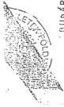

7428.

# TULAJDONI LAP I. RÉSZ

1983 MARCIUS

BUDAPEST XI. KER.
körség (koron)

BELTERÜLET

SOPRON

UT

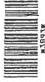

6109

Tulajdoni lap szám

3893

Helyrajzi szám

15
34

| Átérület idő | A földrészlet (alacserlő) | A termőhely | Utalás a változásra |
| --- | --- | --- | --- |
| művelési ága, művelés alól kivett terület megnevezése | területe | területe |
| hektár | m² | hektár | m² |
| 1 | ~~EPÜLET~~ Telephely | 1.4465 | Cím: 11875/86 (4.1.) 60158/86 6/1 70.602/86 24.205.743/96 |

194. r. sz. Tulajdoni lap I. részt - Bóka-n Nyomda - M 144

1. oldal A Tulajdoni lap adatai csak a csatolt 4. oldalon feltüntetett elintézetlen széljegy információkkal együtt érvényesek! HRSZ:3893

---

TULAJDONI LAP II. RÉSZ

TULAJDONI LAP II. RÉSZ

6109 2. oldal

|  Sor-szám | Jogcím, határozat száma, érkezési idő | A t u l a j d o n o s |   |   | Tulajdonl hányad | Utalás a változás sor-számára | Jegyzet (száljegy, utalás a III. rész sor-számára stb.)  |
| --- | --- | --- | --- | --- | --- | --- | --- |
|   |   |  kezelő, használó termelőszövetkezet neve, lakáscíme (székhelye) | szül. éve | anyja neve  |   |   |   |
|  1 | 2 | 3 | 4 | 5 | 6 | 7 | 8  |
|  1. | Államosítás 1948.évi XXV.tc. 17051/1963 /XI.1/ | Magyar Állam |  |  | 1/1 | 3. |   |
|  2. |  | Kezelő: BHC-Hiradástechnikai Vállalat 1509. Fehérvári út 70. |  |  |  |  |   |
|  3. | Jogutódlás 209181/1995./1994.IX.23./ | BHC-Hiradástechnikai Rt. 1119. Fehérvári út 70. |  | Ellenőrizte: J. J. J. | 1/1 |  | 207995/94  |

MEM-OPTH III. r. sz. - Tulajdoni lap II-III. rész. - 78. - DR. - 78108 - NY. NY.

2. oldal A Tulajdoni lap adatai csak a csatolt 4. oldalon feltüntetett elintézetlen széljegy információkkal együtt érvényesek! HRSZ:3893

---

# TULAJDONI LAP III. KESZ

3. oldal

|  Sorszám | Határozat száma, érkezési idő | A megkereső szerv megnevezése |   | Jog, tény megnevezése | Jegyzők (széljegy, törlés stb.)  |
| --- | --- | --- | --- | --- | --- |
|   |   |  A jogosult neve (szül. éve, anyja neve) (szülő, törlés neve)  |   |   |   |
|  1 | 2 | 3 |   | 4 | 5  |
|  1. | 141032/1996 (VII.17.) | Adó és Pénzügyi Ellenőrzési Hivatal Pest Megyei és Fővárosi Kiemelt Adózóinak Igazgatósága Adóügyi Főosztálya Ügyszám: 6460051837 1115 Bartók Béla u 156. |   | Végrehajtási jog 1.473.199.542. Ft és járulékai erejéig. | 141032/96  |
|   |  |  |   |  | 179706/96  |

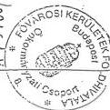

...oldal

A Tulajdoni lap adatai csak a csatolt 4. oldalon feltüntetett elintézetlen széljegy információkkal együtt érvényesek

- 5 -

---

MAGYAROSI KERÜLETEK FÖLDHIVATALA
Budapest, XI., Budafoki út 59.
1519 Pf.: 415.

4. oldal

# TULAJDONI LAP - SZÉLJEGYEK
1999.02.02

3893
helyrajzi szám

BUDAPEST XI.KER. belterület
község (város)

széljegy:

179706/1996

Tárgykör: Végrehajtási jog törlése, BHG HIRADÁSTECHNIKAI RT

Tárgykör: Tulajdonjog bejegyzés, ÁLLAMI PRIVATIZÁCIÓS VAGYONKEZELŐ RT

205743/1996

Tárgykör: Házszám változás, XI.KER.ÖNKORMÁNYZAT

A másolat kiadását megelőző napig
- a személyazonosító kivételével -
az eredetivel megegyezik

Ez a tulajdoni lap technikai okokból 2 vagy több oldalából áll,
melyek kizárólag együtt érvényesek.

Felhasználáskor kérjük győződjék meg az egyes tulajdoni lap részek
(II.-III.) sorszámozásának folytonosságáról.

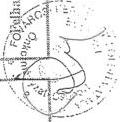

---

j

j

1

j

j