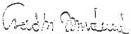
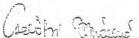
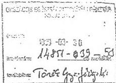

Állami Számvevőszék

# JELENTÉS

a társadalombiztosítás pénzügyi alapjai
1998. évi költségvetése végrehajtásának
ellenőrzéséről

Összefoglaló és javaslatok

T.1507/1.

1. sz. füzet

1999. augusztus

9928.

---

Jelentéseink az INTERNETEN 1999. június 1-től www.asz.gov.hu címen olvashatók.

Jelentéseink az Országgyűlés számítógépes hálózatán is olvashatók.

---

A-295-7/99.

# BEVEZETŐ

Az államháztartásról szóló 1992. évi XXXVIII. tv. (Áht.) 86. §-a értelmében az Országgyűlés a társadalombiztosítás pénzügyi alapjai költségvetésének végrehajtásáról szóló törvényjavaslatot az Állami Számvevőszék jelentésével együtt tárgyalja meg. A számvevőszéki ellenőrzés keretében a költségvetés végrehajtásának helyszíni ellenőrzésére és az előterjesztett zárszámadási törvényjavaslat dokumentumának törvényességi, számszaki ellenőrzésére került sor.

Az alapoknál előírt kötelező könyvvizsgálatra tekintettel az ellenőrzés az adatok valódiságának, hitelességének vizsgálatára csak korlátozottan terjedt ki. A fő cél annak megállapítása volt, hogy:

- az előterjesztett törvényjavaslat normaszövege teljes körűen és helyesen tartalmazza-e a költségvetési év lezárásához szükséges rendelkezéseket;
- a társadalombiztosítás pénzügyi alapjainak 1998. évi költségvetéséről szóló 1997. évi CLIII tv. (K.T.), valamint az ezt módosító 1998. évi LXX tv. és az 1998. évi XCI tv. előírásait hogyan hajtották végre;
- hogyan és milyen tényezők hatására teljesültek az alapok bevételi előirányzatai, a nyugdíjbiztosítás és az egészségbiztosítás ellátási és működési kiadásai;
- a végrehajtás során a K.T., az Áht., továbbá a társadalombiztosítás pénzügyi alapjairól szóló 1992. évi LXXXIV törvény (A.T.), valamint a társadalombiztosítás működését, gazdálkodását érintő más jogszabályok előírásait miként tartották be.

Az ellenőrzések legfontosabb megállapításait és a javaslatokat a Jelentés Összefoglaló és javaslatok c. füzete (1.sz. füzet) tartalmazza, amit a TB alapok helyszíni ellenőrzésének részletes jelentése (2. sz. füzet) egészít ki és támaszt alá.

---

## ÖSSZEFOGLALÓ MEGÁLLAPÍTÁSOK

Az államháztartási törvény 1999. január 1-től hatályos 86/A. § (4) bekezdése értelmében 1998. az első év, amikor a központi költségvetés végrehajtásával egyidőben kerül benyújtásra a Társadalombiztosítási Alapok költségvetésének zárszámadása az Országgyűlésnek. Az újfajta szabályozás lehetőséget ad e két fontos államháztartási alrendszer zárszámadási beszámolásának egyidejű megítélésére, az összefüggések pontosabb feltárására.

Ugyanakkor a korábbi évekhez hasonlóan az 1998. év tapasztalatai is megerősítették az ÁSZ-nak azt a véleményét, hogy a költségvetési tervezés módszereit javítani kell.

Az Állami Számvevőszék az 1998. évi zárszámadás ellenőrzésének tapasztalatait az alábbiakban összegzi.

### A zárszámadási dokumentumra vonatkozóan:

- Az államháztartási törvény 86/A. § (4) bekezdése és az 53. §-a alapján a Kormány a társadalombiztosítás pénzügyi alapjainak zárszámadásáról szóló törvényjavaslatot a költségvetési évet követően nyolc hónapon belül terjeszti az Országgyűlés elé. A zárszámadásról szóló törvényjavaslatot az Országgyűlés elé történő terjesztést megelőzően két hónappal benyújtja az Állami Számvevőszéknek. A törvényben előírt határidőig (június 30.) az előterjesztő az 1998. évi zárszámadási törvényjavaslat tervezetét küldte meg az Állami Számvevőszéknek.

Az e dokumentumról elkészített számvevőszéki jelentés tervezetét egyeztettük a Pénzügyminisztérium szakértőivel. **Az egyeztetések következtében az Országgyűlés elé benyújtásra kerülő – végleges – törvényjavaslatba az Állami Számvevőszék észrevételeinek jelentős része beépült, a helyszíni ellenőrzés által feltárt számszaki eltéréseket a T/1507. számú törvényjavaslaton átvezették. Ennek megfelelően a korábbi megállapításokat az Állami Számvevőszék véglegegzett zárszámadási jelentése már nem tartalmazza.**

- A társadalombiztosítás előterjesztett törvényjavaslata eleget tesz az államháztartási törvény 86. §, 86/A-F. §-ai előírásainak, azaz rendelkezik az alapok hiányának finanszírozásáról és a működési költségvetés előirányzatmaradványának felhasználásáról. A törvényjavaslat szerkezete, címrendje megegyezik a társadalombiztosítás pénzügyi alapjai 1998. évi költségvetéséről szóló 1997. évi CLIII. törvény felépítésével. A törvényjavaslat teljesíti a társadalombiztosítás pénzügyi alapjairól és azok 1993. évi költségvetéséről szóló 1992. évi LXXXIV. törvény 11. §-ának a zárszámadásra vonatkozó előírásait, bemutatja az alapok vagyoni helyzetét, és annak alakulását az 1998. év során.

2

---

- A törvényjvaslat 14. §-aban hivatkozott 3.123 M Ft-os (Ny. Alap) és 3.088 M Ft-os (E. Alap) értékvesztések, értékcsökkenések a hivatkozott 10. és 11. számú törvényi mellekletekben nem követhetők nyomon. Erre vonatkoź adatokat a mellekletek nem tartalmaznak.
- A törvényjvaslat záró rendelkezese nem a társadalombítzosítás zárszámadásához tartozó kerdeseket kiván rendezni, hanem a társadalombítzosítási alapok 1999. évi költségvetéséról szólo törvényt kivánja modositani. Ez a gyakorlat bár jogilag nem kifogásolhato, rontja a jogszabályok átlathatóságát.

A törvényjavaslat 21. §-a az Ny. Alapot 1.000,7 M Ft, az E. Alapot 767,3 M Ft átadására kötelezi az Adó- és Pénzügyi Ellenőrzési Hivatal (APEH) számára. Így a két alap (növelve az 1999. évi hiányt) együttesen 1,7 Mrd Ft -ot meghaladó összeggel járulna hozzá ahhoz, hogy – az indokolás szerint – az APEH-nál alkalmazott személyi ösztönzési rendszer kiterjesztésre kerüljön a járulékbeszedési feladatokra is. A normaszöveg az átadott pénzeszközök elszámolási kötelezettségét nem írja elő. Így a kapott összeget az APEH bármilyen célra – nem csak a járulékokkal foglalkozók ösztönzésére – felhasználhatja.

A Penzugyminisztérium altal kiadott, a zarszamadasi törveny elokeszítese soran elvégzendó feladatokat tartalmazó köriratban foglalt rendelkezesek jelentós részt a törvenyjvaslat nem, vagyCsak részben teljesiti. Az Alapok vagyonával kapcsolatos allományváltozásokat a zarszamadasi törvenyben részletesen be kell mutatni, a törvenyjvaslatban azonbanCsak a befektetett eszközok bemutatasa történik meg a 10.és 11.számú törvenyi mellekletekben.A jogtalan kifizetesek alakulásaról a törvenyjvaslat nem ad tajékoztatast.A vagyongazdalkodásból - ezen belül a tartozás fejiben atvett vagyonelemek eladásaból - származó bevetelek felhasznalásanak bemutatasa hiányzik.
- A TB alapok kintlevosege a zarszamadasi törvényjvaslat indokolása szerint 1998. december 31-én 251,25 Mrd Ft. A kintlevoseg összegénék nagysagrendje indokolja annak részletesebb - lejarat szerinti, a behajtás valószinú-segét realisan szambavevo - bemutatasát is.
- Nem kovetho a mukodesi koltsegvetes esetuben a cimrend alkalmazasa az eltero szerkezet miatt. Amig az Alapok koltsegveteset bemutato 3. es a 6. szamu torvenyi mellekletben a mukodesre forditott kiadasok egytlen cimet (2. cim) alkotnak, addig az Alapok mukodesi koltsegveteset bemutato 4. es 8. mellekletben ugyanezen osszegek tobb cimre bomlanak.

3

---

- Az 1992. évi LXXXIV. törvény 11. §-a (1) bekezdése a) és b) pontjai alapján a zárszámadási törvénynek be kell mutatnia az alapok kiadási többletét és annak fedezetét. Ugyanakkor a törvényjavaslat indokolása 46. oldala 3. bekezdésében tárgyalt vagyongazdálkodással kapcsolatos kiadások a tervezett 252 M Ft-hoz képest 357 M Ft teljesítést, az E. Alap vagyongazdálkodásával kapcsolatos kiadások 133 M Ft-os előirányzat túllépést tartalmaznak. Az előirányzat túllépésére az indokolás nem ad magyarázatot.
- Az államháztartási törvény 86/A. §-a (3) bekezdése szerint a „Kormány ...a könyvvizsgálatok eredményéről a zárszámadás keretében tájékoztatja az Országgyűlést.” Ennek, a társadalombiztosítási alapokkal kapcsolatos törvényi rendelkezésnek, a Kormány a törvényjavaslat keretében nem tett eleget.

### A TB alapok helyszíni ellenőrzésére vonatkozóan:

- Az 1998. évi költségvetési törvény az államháztartás társadalombiztosítási alrendszerének bevételi főösszegét 1.359,6 Mrd Ft-ban, a kiadásokat 1.381,7 Mrd Ft-ban, 22,1 Mrd Ft hiány mellett állapította meg. A Nyugdíjbiztosítási Alap költségvetését null-szaldósra tervezték, a teljes hiány az Egészségbiztosítási Alapnál jelentkezett.

Az alrendszer elmúlt évi pénzügyi helyzete a vártnál lényegesen kedvezőtlenebbül alakult. A bevételek 1.342,6 Mrd Ft-ra, a kiadások pedig 1.433,3 Mrd Ft-ra teljesültek, a hiány meghaladja a 90,7 Mrd Ft-ot (a Nyugdíjbiztosítási Alap hiánya 20 Mrd Ft, az Egészségbiztosítási Alap hiánya pedig 70,7 Mrd Ft). A hiány finanszírozásáról – az eddigi gyakorlat szerint – a központi költségvetés 1998. évi zárszámadási törvénye intézkedik.

A hiány kialakulásának okai mindkét alap esetében összetettek. Abban a bevételi elmaradás és a kiadások túllépése mellett egyéb tényezők is (ezeket a helyszíni jelentés 2., 3., 4. és 5. pontjai részletesen értékelik) szerepet játszanak. (Az alapok 1998. évi költségvetéséről készült ÁSZ vélemény – elsődlegesen az Egészségbiztosítási Alap esetében – a tervezettnél nagyobb hiány kialakulását és pótköltségvetés készítésének szükségességét valószínűsítette).

Az alapok pénzügyi helyzetének romlása már év közben nyilvánvalóvá vált. Ezért az alapokat kezelő Országos Nyugdíjbiztosítási Főigazgatóság és az Országos Egészségbiztosítási Pénztár elkészítette a pótköltségvetési javaslatát, azok benyújtására azonban nem került sor.

4

---

- Lényeges változás volt 1998-ban, hogy módosult a társadalombiztosítási ellátások törvényi szabályozása, a társadalombiztosításról szóló 1975. évi II. törvény helyébe (a társadalombiztosítás ellátásaira és a magánnyugdíjra való jogosultságról, az ellátások fedezetéről, a társadalombiztosítási nyugellátásról, az egészségbiztosítás ellátásairól, illetve a magánnyugdíjakról szóló) új törvények léptek. E törvények a költségvetés bevételi és kiadási oldalát egyaránt érintették. Azok számszerű hatásait a tervezés időszakában nem minden esetben sikerült jól felmérni, előre becsülni. Mindez fokozta a tervezés bizonytalanságát.

- Az ellátó rendszereket érintő 'reformértékű' változtatásra a nyugdíjbiztosítás területén került sor. Az elmúlt évtől kezdték meg működésüket a magánnyugdíjpénztárak, amelyekbe az átlépők egyéni járulékainak összege korábban a Nyugdíjbiztosítási Alap bevételét képezte. A pénztárakba a számítottnál többen léptek be, így az Alap hiányzó bevételének pótlására a központi költségvetésben térítésként tervezett 20 Mrd Ft-os összeg kevésnek bizonyult.

- Hátrányosan érintette a Nyugdíjbiztosítási Alapot, hogy a rokkantság rendszer átalakításának első lépéseként a korhatárt be nem töltött I-II. csoportba tartozó rokkantak nyugellátását csak részleges forrás biztosítása mellett tették át az Alap kiadásai közé. Jelentős mértékben átalakult a hozzátartozói nyugellátások rendszere.

Mindezek alapján az ÁSZ megítélése szerint a Nyugdíjbiztosítási Alapot érintő változtatásoknak tartósan „egyenleg-rontó” hatása van, amihez a jelenlegi járulékrendszer nem biztosítja a szükséges fedezetet.

- Az év során a nyugdíjak 21,6%-kal emelkedtek, amiből a költségvetésben a második ütemű nyugdíjemelésnek nem volt meg a fedezete (azt a jóváhagyott költségvetés nem tartalmazta).

- Az Egészségbiztosítási Alap kiadásainak összege 632,2 Mrd Ft volt, amiből 458,5 Mrd Ft-ot a különböző természetbeni juttatások kiadásai tesznek ki.

A legjelentősebb tétel a gyógyító-megelőző egészségügyi ellátásra felhasznált 299,1 Mrd Ft, ami 790 M Ft-tal több, mint az eredetileg „zárt előirányzat” összege volt. A túllépés – a kialakított szabályozással összhangban – a végkielégítésre és az ügyeleti díjakra teljesített kifizetések miatt következett be.

- A gyógyító-megelőző ellátáson belül az aktív fekvőbeteg ellátás területén 1998-ban bevezették az egységes alapdíjakat, ami számottevően befolyásolta, átrendezte az intézmények bevételeit.

5

---

- Az ellenőrzés tapasztalatai szerint az egészségügyben a magánosítás folyamatai részben spontán módon, jogilag nem megfelelően szabályozottan, ellenőrizetlenül zajlanak, ami az Egészségbiztosítási Alapból származó források jogszerű és célszerű felhasználása szempontjából is aggályos.
- Az Alap legkritikusabb előirányzatát évek óta a gyógyszer kiadások alkotják. Az ígért intézkedések, a támogatási rendszer érdemi átalakítása mindaddig elmaradt. A gyógyszerek támogatásának kiadási összege – a Pénzügyminisztérium kezdeményezésére 1998. évi kiadásként lekönyvelt 10,5 Mrd Ft összegű decemberi támogatással – 135,5 Mrd Ft-ra emelkedett, szemben a 102,6 Mrd Ft-os előirányzattal.
- Az Országos Nyugdíjbiztosítási Főigazgatóság és az Országos Egészségbiztosítási Pénztár működési kiadásainak összege együttesen 36,6 Mrd Ft volt, ami az alapok összes kiadásának mintegy 2,6%-át (az Országos Nyugdíjbiztosítási Főigazgatóság esetében 1,9%-át, az Országos Egészségbiztosítási Pénztár esetében 3,8%-át) teszi ki. A költségvetésekben jelentős (egy milliárd forintot meghaladó) a működési előirányzat-maradvány nagysága, főként az elmaradt, illetve áthúzódó feladatok miatt.
- Mindkét szervezet működési költségvetését érintő megállapítás, hogy a társadalombiztosítás 1998. közepétől állami feladatot képező felügyeleti és irányítási teendőinek költségeit – helytelenül – részlegesen az alapokból fedezték a központi költségvetés helyett.
- Az alapok zárszámadása 1998-ra vonatkozóan megismerteti (1999-től ez már nem szerepel az alapok költségvetési törvényében) az alapok forrásait nem terhelő ellátások pénzügyi adatait, amelyeket a nyugdíjbiztosítás és az egészségbiztosítás szervei állapítanak meg és folyósítanak. Ennek nagysága az elmúlt évben megközelítette a 286 Mrd Ft-ot.
- Továbbra is megoldatlan a régi korengedményes nyugdíjak tartozásállományának ügye. A jelenlegi konstrukcióban az új típusú korengedményes nyugellátások is biztos veszteségforrásnak tekinthetőek.

6

---

## JAVASLATOK

Javaslataink egy része a rendszerbeli problémákra vonatkozik. Ezek szabályozási kérdéseket érintenek és az évek óta visszatérően jelzett hiányosságok megszüntetését célozzák. A javaslatainkat megalapozó indokolások a 2. számú füzetben találhatók.

### a Kormánynak

1. Tekintse át a rokkantsági ellátások komplex rendszerét, annak a társadalombiztosítás pénzügyi alapjait érintő sajátos kérdéseit. Tegye meg a szükséges intézkedéseket a társadalombiztosítási ellátások – ezen belül is a rokkantsági nyugdíjak – jogszabályjogosultsági háttere és az alapokhoz rendelt források összhangjának megteremtése (a nyugellátások fedezetét kockázatok szerint meghatározó járulék mértékek kialakítása) érdekében. (Lásd a helyszíni jelentés 3.1.3. és 4.2.3. pontjait.)
2. Módosítsa a gyógyszer-támogatás finanszírozási rendszerét, hogy a tényleges kiadások jogcím szerint legyenek elszámolhatók (ehhez kapcsolódóan az Országos Egészségbiztosítási Pénztár számviteli rendjét).

### a pénzügyminiszternek

3. Gondoskodjon arról, hogy a társadalombiztosítási alapok kezelői a költségvetési beszámolók konszolidálásánál azonos elveket és gyakorlatot kövessenek. (Lásd a helyszíni jelentés 1.1. pontját.)
4. Intézkedjen arra, hogy a zárszámadás az alapok működési költségvetése esetében is igazodjon a költségvetési beszámolás rendjéhez. (Lásd a helyszíni jelentés 5.2.4. és 6.2.4. pontjait.)
5. Csatoltassa a törvényjavaslathoz mellékletként az alapok könyvvizsgálatáról szóló záradékokat.
6. Elemeztesse a megbízhatóbb költségvetési tervezés érdekében az egyes járulék-kategóriák (munkáltatói járulék, egészségügyi hozzájárulás, egyéni járulékok) alakulására ható tényezőket. (Lásd a helyszíni jelentés 2.2./b. pontját.)
7. Kezdeményezze a társadalombiztosítás pénzügyi alapjai 1999. évi költségvetéséről szóló 1998. évi XCI. törvény módosítását a társadalombiztosítási alapok Postabankkal kapcsolatos garanciális kötelezettségét illetően oly módon, hogy amennyiben a vagyonértékesítésből származó bevétel nem elegendő e kötelezettség teljesítésére, ezt a központi költségvetésből kell a szükséges mértékben kiegészíteni. (Lásd a helyszíni jelentés 3.2. és 4.3. pontjait.)

7

---

8. Vizsgáltassa meg a társadalombiztosítás 2000. évi költségvetéséhez kapcsolódóan az Országos Egészségbiztosítási Pénztár és az Országos Nyugdíjbiztosítási Főigazgatóság fővárosi igazgatási szerveinek elhelyezését, intézkedjen a több éve húzódó ügy megoldása érdekében. (Lásd a helyszíni jelentés 5.2.3. pontját.)
9. Intézkedjen a régi korengedményes nyugdíjtartozások leírásáról, vagy más módon történő rendezéséről, illetve az új korengedményes nyugdíjak emelésének pénzügyi fedezetéről. (Lásd a helyszíni jelentés 7.1.1. pontját.)
10. Értékelje irányítás-szakmai, jogi-munkajogi, célszerűségi szempontból a társadalombiztosítási alapok állami irányítását és felügyeletét ellátó, tevékenységét segítő hivatali szervezeti egység(ek) működését és amennyiben indokolt azt módosítsa. Kezdeményezze a Miniszterelnöki Hivatalt vezető miniszternek és a pénzügyminiszternek az Országos Nyugdíjbiztosítási Főigazgatósággal és az Országos Egészségbiztosítási Pénztárral megkötött megállapodások módosítását annak érdekében, hogy az irányító politikai államtitkár hivatala által igénybevett szolgáltatásokat és az értük fizetett térítési díjat részletesen, költségarányosan állapítsák meg.

# az egészségügyi miniszternek

11. Vizsgáltassa meg az egészségügy területén a magánosítás folyamatát és határozza meg a jogi háttér, a finanszírozási szabályokkal való összhang, az ellenőrzés feltételeinek megteremtéséhez szükséges tennivalókat. (Lásd a helyszíni jelentés 4.1.1. j) pontját.)

# az Országos Egészségbiztosítási Pénztár főigazgatójának

12. Vizsgálja meg a közbeszerzési eljárások jelenleginél kiterjedtebb alkalmazásának lehetőségeit. (Lásd a helyszíni jelentés 4.4.3. pontját.)
13. Szabályozza a szolgálati lakások igénybevételének rendjét. (Lásd a helyszíni jelentés 6.2.4. pontját.)

Budapest, 1999. augusztus 31.

alelnök...

alelnök...

Dr. Kovács Árpád
elnök

8

---

Állami Számvevőszék

Együtt kezelendő a T.1507/1-gyel

# JELENTÉS

## a társadalombiztosítás pénzügyi alapjai 1998. évi költségvetése végrehajtásának ellenőrzéséről

A TB alapok helyszíni ellenőrzése

2. sz. füzet

1999. augusztus

9928.

---

Az ellenőrzés végrehajtásáért felelős:

### III. Költségvetési Ellenőrzési Igazgatóság

**Bihary Zsigmond**

számvevő igazgató

Az ellenőrzést vezette:

**dr. Csépán Magdolna**

számvevő főtanácsos

Az ellenőrzésben részt vettek:

**Balla Józsefné**

számvevő tanácsos

**dr. Fónyad Erzsébet**

számvevő tanácsos

**Horváth Erika**

számvevő

**dr. Kurucz István**

számvevő tanácsos

**Molnár Istvánné**

számvevő tanácsadó

**Szendrődi Józsefné**

számvevő tanácsos

**dr. Boldoczki Jánosné**

külső munkatárs

Jelentéseink az INTERNETEN 1999. június 1-től www.asz.gov.hu címen olvashatók.

Jelentéseink az Országgyűlés számítógépes hálózatán is olvashatók.

---

V-4-34/1999. TÉMASZÁM: 470

# TARTALOMJEGYZÉK

|  **RÉSZLETES MEGÁLLAPÍTÁSOK** | **4**  |
| --- | --- |
|  1. AZ ALAPOK ZÁRSZÁMADÁSÁT MEGALAPOZÓ BESZÁMOLÁSI ÉS KÖNYVVEZETÉSI KÖTELEZETTSÉG TELJESÍTÉSE | 4  |
|  1.1. A költségvetési beszámolók valódisága és a zárszámadás elkészítésére hozott intézkedések | 4  |
|  1.2. A költségvetési beszámolók elkészítése és könyvvizsgálata | 5  |
|  2. Az alapok pénzügyi helyzetének alakulása 1998-ban | 6  |
|  2.1. Az alapok hiánya, annak okai és napi likviditási helyzetük | 6  |
|  2.2. Az alapok összes bevételének alakulása | 7  |
|  2.3. A bevételek teljesülése főbb jogcímek szerint | 8  |
|  3. A Nyugdíjbiztosítási Alap kiadási előirányzatainak teljesülése | 11  |
|  3.1. Az 1998. évi nyugdíjkiadásokat meghatározó főbb tényezők | 12  |
|  3.1.1. A nyugellátások kiadásainak alakulása 1998-ban | 12  |
|  3.1.2. Az 1998. évi nyugdíjemelések mértéke | 12  |
|  3.1.3. A nyugellátások rendszerében bekövetkezett változások | 13  |
|  3.2. A Nyugdíjbiztosítási Alap egyéb kiadásainak alakulása | 15  |
|  4. Az Egészségbiztosítási Alap kiadásainak teljesülése 1998-ban | 15  |
|  4.1. Az Egészségbiztosítási Alap természetbeni ellátásainak kiadásai | 16  |
|  4.1.1. A gyógyító-megelőző egészségügyi ellátásra fordított kiadások | 16  |
|  4.1.1.1. Végkielégítés címén elszámolt kiadások | 17  |
|  4.1.1.2. Nagy értékű diagnosztikai eljárások finanszírozása | 17  |
|  4.1.1.3. Az ágazati bérmegállapodás végrehajtása, figyelemmel a K. T. előírásaira | 18  |
|  4.1.1.4. A fekvőbeteg szakellátás finanszírozása | 19  |
|  4.1.1.5. Az ügyeleti díj kiegészítésére a központi költségvetésből átadott forrás felhasználása | 20  |
|  4.1.1.6. Művesekezelések finanszírozása | 20  |
|  4.1.1.7. A gyógyító-megelőző ellátások ellenőrzései | 20  |
|  4.1.2. A gyógyszertámogatás kiadásai | 21  |
|  4.1.3. A gyógyászati segédeszköz támogatás kiadásai | 23  |
|  4.2. Az Egészségbiztosítási Alap pénzbeli ellátásainak kiadásai | 23  |
|  4.2.1. A terhességi-gyermekágyi segély | 24  |
|  4.2.2. A táppénzkiadások | 24  |
|  4.2.3. A korhatár alatti III. csoportos rokkantsági és baleseti rokkantsági nyugellátások | 24  |
|  4.2.4. Betegségekkel kapcsolatos segélyek | 25  |
|  4.3. Az Egészségbiztosítási Alapot terhelő egyéb kiadások | 25  |
|  4.4. A zárszámadás ellenőrzése keretében vizsgált egyéb kiadások az Egészségbiztosítási Alapnál | 27  |

1

---

4.4.1. A fizetési nehézségekkel küzdő kórházaknak nyújtott különféle támogatások 27
4.4.2. Az 1998-tól a központi költségvetés részére átadott feladatokkal kapcsolatos elszámolások utóellenőrzése 28
4.4.3. Nagyértékű tételes elszámolású eszközök, kontrasztanyagok központosított közbeszerzése 28
4.4.4. Az egészségügyi privatizáció kérdései, vállalkozások finanszírozása 29
5. A Nyugdíjbiztosítási Alap 1998. évi működési költségvetésének végrehajtása 31
5.1. A működési költségvetés bevételei 31
5.2. A működési költségvetést terhelő kiadások 32
5.2.1. A személyi juttatások és a kapcsolódó járulékok kiadásai 32
5.2.2. A dologi kiadások alakulása 33
5.2.3. Felújítási kiadások 33
5.2.4. Felhalmozási és fejlesztési kiadások 34
5.2.5. A működési költségvetés 1997. és 1998. évi előirányzatmaradványa 35
5.2.6. A társadalombiztosítás irányítási rendszerének változása és kapcsolata a működési költségvetéssel 35
6. Az Egészségbiztosítási Alap működési költségvetésének végrehajtása 36
6.1. A működési költségvetés bevételei 36
6.2. A működési költségvetés kiadásai 37
6.2.1. A személyi juttatások és a kapcsolódó járulékok kiadásai 37
6.2.2. A dologi kiadások alakulása 37
6.2.3. Felújítási kiadások 38
6.2.4. Felhalmozási és fejlesztési kiadások 38
6.2.5. A működési költségvetés 1997. és 1998. évi előirányzatmaradványa 39
6.2.6. A társadalombiztosítás irányítási rendszere változásának kapcsolata az egészségbiztosítás működési költségvetésével 39
7. A társadalombiztosítás igazgatási szervei által folyósított ellátások kiadásai és bevételei 40
7.1. A nyugdíjbiztosítás által folyósított ellátások 40
7.1.1. A korengedményes nyugdíjak kiadásai 41
7.1.2. Az előnyugdíjak alakulása 42
7.1.3. A vagyoni kárpótlás alapján folyósított életjáradék 42
7.1.4. A hadigondozotti ellátások 43
7.2. Az egészségbiztosítás által folyósított ellátások 43

2

---

# JELENTÉS

## A TÁRSADALOMBIZTOSÍTÁS PÉNZÜGYI ALAPJAI 1998. ÉVI KÖLTSÉGVETÉSE VÉGREHAJTÁSÁNAK HELYSZÍNI ELLENŐRZÉSÉRŐL

**Az államháztartásról szóló 1992. évi XXXVIII. törvény (Áht) 86. §-a** értelmében az Országgyűlés a társadalombiztosítás pénzügyi alapjai (a továbbiakban: alapok) költségvetésének végrehajtásáról szóló törvényjavaslatot az Állami Számvevőszék (ÁSZ) jelentésével együtt tárgyalja meg.

Ezen törvényi előírás alapján végeztük el az alapok 1998. évi zárszámadásának helyszíni ellenőrzését (azt közvetlenül - kötelező feladatként - sem az ÁSZ-ról szóló, sem más törvény nem írja elő).

Az alapoknál előírt kötelező könyvvizsgálatra tekintettel az ellenőrzés az adatok valódiságának, hitelességének vizsgálatára csak korlátozottan terjedt ki. **A fő cél annak megállapítása volt, hogy:**

- a társadalombiztosítás pénzügyi alapjainak 1998. évi költségvetéséről szóló 1997. évi CLIII. törvény (K. T.), valamint az ezt módosító 1998. évi LXX. törvény és az 1998. évi XCI. törvény előírásait hogyan hajtották végre;

- hogyan és milyen tényezők hatására teljesültek az alapok bevételi előirányzatai, a nyugdíjbiztosítás és az egészségbiztosítás ellátási és működési kiadásai;

- a végrehajtás során a K. T., az Áht., továbbá a társadalombiztosítás pénzügyi alapjairól szóló 1992. évi LXXXIV. törvény (A.T.), valamint a társadalombiztosítás működését, gazdálkodását érintő más jogszabályok előírásait miként tartották be.

---3

---

RÉSZLETES MEGÁLLAPÍTÁSOK

Az Áth. módosításával megteremtődtek a törvényes feltételei annak, hogy a törvényjavaslatokat az Országgyűlés a központi költségvetéssel, illetve annak zárszámadásával együtt tárgyalja meg és nyerjen áttekintést az államháztartás e két meghatározó, egymáshoz szorosan kapcsolódó alrendszerének helyzetéről, pénzügyi-gazdasági folyamatairól. Így nyílt lehetőség arra is, hogy az alapok 1998. évi zárszámadásának ellenőrzését a központi költségvetés zárszámadásának ellenőrzésével egy időben, azzal összehangoltan végezzük el. Erre eddig nem volt mód.

A helyszíni ellenőrzés 1999. április végétől június végéig tartott. A jelentés alapvetően az ennek során szerzett tapasztalatokat foglalja össze. A feltárt számszaki eltéréseket a T/1507. számú törvényjavaslat korrigálta. A vizsgálatokat a Nyugdíjbiztosítási Alapot kezelő Országos Nyugdíjbiztosítási Főigazgatóságon és az Egészségbiztosítási Alapot kezelő Országos Egészségbiztosítási Pénztárnál folytattuk le. Tájékozódás, kiegészítő információk szerzése céljából megkerestük a Pénzügyminisztériumot, az Egészségügyi Minisztériumot és az alapok állami felügyeletét, az igazgatási szervek irányítását ellátó politikai államtitkár hivatalát is.

# RÉSZLETES MEGÁLLAPÍTÁSOK

## 1. AZ ALAPOK ZÁRSZÁMADÁSÁT MEGALAPOZÓ BESZÁMOLÁSI ÉS KÖNYVVEZETÉSI KÖTELEZETTSÉG TELJESÍTÉSE

### 1.1. A költségvetési beszámolók valódisága és a zárszámadás elkészítésére hozott intézkedések

A beszámolók összeállítását szolgáló **nyomtatványok**, kitöltési **tájékoztató**, továbbá a zárszámadás elkészítését szabályozó PM „**körirat**” **továbbra sem tartalmaznak elegendő útmutatást** az egységes szemléletű zárszámadás és az alapját képező „G” jelű (konszolidált) beszámoló összeállításához. (A konszolidáció gyakorlatát a két ág egységes iránymutatás hiányában külön-külön alakította ki.)

Ebből eredően fordulhatott elő, hogy a dolgozóknak hosszú lejáratra adott lakáskölcsön megtérülésének újból kikölcsönzött összegével az ONYF (21 millió forinttal) csökkentette, az OEP azonban nem csökkentette a „G” beszámoló megfelelő adatát. Az auditor mindkét „megoldást” elfogadta.

Ezért az „A” jelű intézményi auditált beszámoló és a zárszámadás adatai sem az ONYF-nél, sem az OEP-nél nem egyeznek meg. Továbbra sem igazodik egymáshoz a beszámolás és a zárszámadás számbavételi rendje. (Erről a jelentés

4

---

RÉSZLETES MEGÁLLAPÍTÁSOK

5. és 6. pontjai szólnak, a dologi, a felújítási és felhalmozási kiadások, a központosított előirányzatok ellenőrzési tapasztalatai kapcsán.)

A beszámolókat az ONYF és az OEP az alapokat felügyelő politikai államtitkár jóváhagyásával készítette el, hasonlóan a zárszámadási javaslatot is. Ezzel összefüggő egyéb intézkedést a felügyeleti szerv nem adott ki.

# 1.2. A költségvetési beszámolók elkészítése és könyvvizsgálata

A társadalombiztosítási alapok és az (alapkezelő) központi igazgatási szervek a számviteli törvény és az 54/1996. (IV. 12.) Korm. rendelet szerint a költségvetési szervekre vonatkozó számviteli rendet alkalmazzák.

Az ONYF és az OEP az igazgatási szervek „A”-jelű beszámolóját és az alapok „D”-jelű beszámolójából az előírt pénzforgalmi kimutatást 1999. április 30-áig megküldték a PM-nek és az APEH-SZTADI-nak.

Az Ny. és az E. Alap 1998. évi működési költségvetésének „A” jelű (intézményi) beszámolóját a könyvvizsgáló hitelesítő záradékkal látta el.

Az alapok „D” és „G” jelű (ellátási és konszolidált) beszámolóit azonban - hasonlóan az előző évhez - csak korlátozó záradékkal látta el, a folyószámla nyilvántartás súlyos hibái, pontatlanságai miatt. A könyvvizsgálói záradékokat a jelentés 1. sz. melléklete ismerteti.

A rendezetlenség is oka volt annak, hogy a járulékok beszedésével, nyilvántartásával, behajtásával és ellenőrzésével kapcsolatos feladatokat 1999-től a Kormány átadta az APEH-nek.

Időben megkaptuk az auditálás előtti és utáni beszámolókat, a könyvvizsgálói jelentéseket, valamint az ONYF és az OEP által elkészített zárszámadási javaslatot. A PM zárszámadási javaslatát viszont az Áht. június 30. határidejét követően ismertük meg.

Lényeges változás történt az Egészségbiztosítási Alap ellátási kiadásainak elszámolásánál. Az OEP a PM (2. sz. melléklet szerinti) átiratára az 1998-ban kiegyenlítő kiadásként lekönyvelt decemberi gyógyszertámogatás összegét, a költségvetési év eltelte után, - eltérve az eddig követett számviteli rendtől - a tárgyévi (folyó) kiadások között számolta el. Ezt a könyvvizsgáló is tudomásul vette.

Ennek következtében a gyógyszerkiadások összege az eredeti 125 milliárd forintról 135,5 milliárd forintra nőtt. A kiadások - utólagos - megváltoztatása (a jelentés 4.1.2. pontjában foglalt részletes indokok miatt) nem felel meg a jogszabályi előírásoknak. Ezt a - pénzügyi helyzetre jelentős hatást gyakorló - tényt a kiegészítő mellékletben nem ismertették.

5

---

RÉSZLETES MEGÁLLAPÍTÁSOK

Az alapok mérlegeiben a befektetett eszközöket a számviteli törvény szerinti értékcsökkenéssel, értékvesztéssel csökkentett könyv szerinti értéken mutatják ki. Ez azonban jelentősen (sokszorosan) eltér a piaci értéktől és így nem alkalmas a valós vagyoni helyzet bemutatására.

A vagyonnal kapcsolatos nyilvántartások az ONYF-nél áttekinthetőek, teljes és valós képet nyújtanak a bevételekről és a kiadásokról, az évközi vagyonmozgásról.

Az OEP-nél ezek a nyilvántartások még most sem teljesek.

Az alapok vagyonának tulajdonosa 1998. közepétől a Magyar Állam. A tulajdonjog átírására, illetve a kezelői jog bejegyzésére megtették a szükséges intézkedéseket. Több esetben előfordult, hogy a működési célt szolgáló ingatlanoknál a földhivatalok nem jegyezték be a kezelői jogot és a rendezés 1999-re maradt.

Az elmúlt évben végzett informatikai témavizsgálatunk jelezte, hogy több TAJ-kártya van forgalomban, mint a lakosság összlétszáma. A háziorvosok finanszírozása TAJ-szám alapján történik és a OEP így ezen a címen 1998-ban a szükségesnél többet fizetett ki. Ennek hatása azonban - a jelenlegi nyilvántartási és bizonylatolási feltételek között - nem számszerűsíthető. Az OEP vizsgálatot helyezett kilátásba.

## 2. AZ ALAPOK PÉNZÜGYI HELYZETÉNEK ALAKULÁSA 1998-BAN

### 2.1. Az alapok hiánya, annak okai és napi likviditási helyzetük

Az államháztartás társadalombiztosítási alrendszerének elmúlt évi pénzügyi helyzete a vártnál lényegesen kedvezőtlenebbül alakult. A bevételek nem fedezték a kiadásokat, az alrendszer hiánya az eredetileg tervezett 22,1 milliárd forinttal szemben meghaladja a 90 milliárd forintot (ami az 4.1.2. pontban tett észrevételünk mellett is több, mint 80 milliárd forint).

Az NY. Alap hiánya elérte a 20 milliárd forintot, amit (az 1997. évi bevételi többlettel csökkentett összegben) a zárszámadási törvény rendez. A hiány kialakulásának okai összetettek, a bevételek és kiadások alakulásával egyaránt összefüggnek. Abban szerepet játszik a következő pontban részletesen ismertetett bevételi elmaradás, a magánnyugdíjpénztárak pontatlanul becsült tőkekivonó hatása, az Alaphoz 1998-tól finanszírozási szempontból átkerült korhatár alatti I-II. csoportos rokkantak nyugdíjkiadásainak részleges fedezetlensége és az, hogy a K. T. nem tartalmazott fedezetet az augusztusi - második - nyugdíjemelésre.

Az E. Alap esetében eredetileg is hiánnyal számoltak, 22,1 milliárd forinttal. Az Alap bevételei 11,7 milliárd forinttal maradtak el a tervezettől és a kiadásoknál - a megismert zárszámadási javaslat szerint - 36,9 milliárd forinttal túllépték az előirányzatot, ami együttesen 70,7 milliárd forintos hiány ki-

6

---

RÉSZLETES MEGÁLLAPÍTÁSOK

**alakulását jelenti. A hiány okai immár „hagyományosnak”** tekinthetők, a bevételeket rendre felül-, a kiadásokat pedig alul tervezik.

**Az alapok pénzügyi helyzetének romlása már év közben látható volt.** Az alapokat kezelő ONYF és az OEP az A. T. (1998. folyamán még érvényben lévő) 11. § (8) bekezdésének megfelelően elkészítették a pótköltségvetésre vonatkozó javaslataikat. Ezt azonban a **Kormány** a törvény szerinti szeptember 30-i határidőig nem tárgyalta meg és **nem nyújtott be pótköltségvetési törvényjavaslatot az Országgyűlés elé.** Az említett előírást a társadalombiztosítás pénzügyi alapjai 1997. évi költségvetésének végrehajtásáról szóló 1998. évi LXX. törvény 18. § (2) bekezdésével - 1998. december 16-ával - helyezték hatályon kívül. Egyidejűleg a (3) bekezdésben az Országgyűlés „tudomásul vette”, hogy az alapok együttes hiánya 54.953 millió forinttal túlteljesül, ami azt jelentette, hogy a hiány nem lesz több 77.043 millió forintnál.

Ezt - az alapok 1997. évi zárszámadásának ellenőrzéséről szóló jelentésünkben - nem tekintettük egyenértékű intézkedésnek az elmaradt pótköltségvetéshez mérten. Azt valószínűsítettük, hogy a hiány elérheti a 80 milliárd forintot, ami be is következett.

A Magyar Köztársaság 1998. évi költségvetéséről szóló **1997. évi CXLVI. törvény 28. § (1) bekezdése** megengedte, hogy a bevételek és a kiadások időbeli eltéréséből adódó átmeneti pénzügyi hiányok fedezetére a **központi költségvetés** a Kincstári Egységes Számla igénybevételével **kamatmentes hitelt nyújtson.**

Az **NY. Alap** hitelfelvételi lehetőségének kamatmentes összeghatára **napi 65 milliárd forint volt.** Ez az év folyamán elegendőnek bizonyult. Nagyobb összegre csak decemberben volt szükség, az Alap **KESZ kamatkiadása** ezzel összefüggően **141 millió forint volt.** Az év első felében **hitelmentes napok** is előfordultak, amikor élve a törvény adta lehetőséggel, **az ONYF rövid lejáratú befektetéseket hajtott** végre és ebből hozambevételt ért el, amit az ellátási kiadások finanszírozására használtak fel.

Az **E. Alapnak napi 40 milliárd forintig volt lehetősége** kamatmentesen igénybe venni a KESZ-t. Az Alap napi likviditási helyzete egész évben - minden nap - szükségessé tette a KESZ használatát. A hitelállomány legkisebb összege 41,4 milliárd, legmagasabb összege pedig 139,8 milliárd forint volt. Mindezek miatt az OEP rövid lejáratú befektetéseket nem eszközölhetett.

## 2.2. Az alapok összes bevételének alakulása

A tervezéskor már ismertek voltak **a társadalombiztosítás bevételi oldalát is érintő törvényi változások**, az előirányzatokat már ezekre figyelemmel alakították ki. Ezeket a tényezőket az 1998. évi költségvetésről alkotott véleményünkben tételesen nem tudtuk elemezni, mert a tervezés alapadatai ilyen részletezettséggel nem álltak rendelkezésre. A változások egy része **a bevételekre csökkentő, más része pedig növelő hatással volt.**

7

---

RÉSZLETES MEGÁLLAPÍTÁSOK

Így 1998-tól kezdték meg működésüket a **magánnyugdíjpénztárak**, aminek következtében az átlépők egyéni járulékainak nagyobb része (1998-ban annak 6%-a) már nem az Ny. Alap bevétele volt.

Nem változott a **munkáltatók által fizetendő 39 %-os járulék** (24 % nyugdíjbiztosítási és 15 % egészségbiztosítási járulék), illetve az **egyéni járulék 10 %-os** mértéke. Utóbbi esetében változott az alapokat megillető mérték, a nyugdíjbiztosítási járulék 6 %-ról 7 %-ra nőtt, az egészségbiztosítási járulék 4 %-ról 3 %-ra csökkent.

Emelkedett az **egyéni járulékfizetés felső határa**, az 1997. évi 3300 forintról **1998-ban napi 4290 forintra**.

Az **egészségügyi hozzájárulás** havi összege 1800 forintról **2100 forintra** nőtt.

A zárszámadás szerint a **bevételek 1342,6 milliárd, ezen belül az Ny. Alap esetében 781,1 milliárd, az E. Alap esetében pedig 561,5 milliárd forintra teljesültek**.

A tervtől való **bevételi elmaradás** összességében **17 milliárd forint**.

Ebből az **Ny. Alapot kisebb rész, 5,3 milliárd forint érintette**, ami az alapokat arányosan megillető egyéni járulékbevételek, késedelmi pótlék és bírság, a behajtási bevételek elmaradása, illetve a magánnyugdíjpénztárak működésének hatására következett be. Ezzel függ össze, hogy az Alapot az **Áht. jelenleg hatályos 86. § (10) bekezdése szerint megillető**, a Magyar Köztársaság 1998. évi költségvetésében számszerűsített **20 milliárd forintos költségvetési támogatás nem bizonyult elegendőnek**.

Az Állami Pénztárfelügyelet közlése szerint (3. sz. melléklet) **1998. december 31-éig a magánnyugdíj pénztárakba 28,6 milliárd forintot fizettek be** a kötelező 6 %-os tagdíj címén.

**Az Alapot kizárólagosan megillető nyugdíjjárulékok** (GYES-ben részesülők utáni költségvetési térítés, munkanélküli és szociális ellátások utáni járulékok) az előirányzat szerint, vagy azt meghaladóan teljesültek.

Az **E. Alapnál 11,7 milliárd forintos bevételi elmaradás volt**. Ezt főként a késedelmi pótlék és bírság, behajtási bevételek, továbbá az Alapot kizárólagosan megillető bevételek (egészségügyi hozzájárulás, különféle - nem költségvetéstől származó - megtérítések) elmaradása okozta.

**A költségvetés bevételi** oldalának **feszültségpontjaira** a költségvetés véleményezésekor **felhívtuk a figyelmet**.

### 2.3. A bevételek teljesülése főbb jogcímek szerint

Az alapok gazdálkodásában **meghatározóak a járulék, illetve járulékjellegű bevételek**, amit a foglalkoztatók és a munkavállalók fizetnek az alapoknak. E bevételek a terv szerinti 1257,9 milliárd forinttal szemben **1291,1 milliárd forintra teljesültek**. A társadalombiztosítás bevételeinek fő jogcí-

8

---

RÉSZLETES MEGÁLLAPÍTÁSOK

mek szerinti 1994-1998 közötti alakulását a **4. sz. melléklet táblázata** mutatja be. A bevételi többlet itt azonban csak látszólagos, mert a tervezés időszakában ezen felül további 52 milliárd forintos járulékbehajtási bevétellel is számoltak, a teljesítés adata viszont már ezt is tartalmazza. Így számítva az elmaradás 18,8 milliárd forint. A bevételek eltérő számbavétele a költségvetésben és a zárszámadásban sérti az Áht. 18. §-át, amely szerint a zárszámadást az elfogadott költségvetéssel összehasonlítható módon (azonos szerkezetben) kell elkészíteni. Ezt a gondot évek óta jelezzük.

Az e körbe tartozó egyes bevételi tételek teljesülését több tényező befolyásolta.

- **A munkáltatói járulékok összege 1998-ban 965,2 milliárd forint volt**, ami a behajtási bevételek figyelembe vételének előzőekben kifejtett sajátossága miatt lényegében **az előirányzattal közel azonos teljesítést** jelent. (Az adatok pontos összevetése nem lehetséges, mert nincs olyan megbízható nyilvántartás, amiből kitűnne, hogy a behajtási bevételből a különböző járulék jogcímekre mennyi jut. Tapasztalati adatok alapján azt lehet feltételezni, hogy a behajtási bevételek 85-15 % arányban oszlanak meg a munkáltatói és az egyéni járulékok között.)

**A munkáltatói járulék teljesülése** azzal függ össze, hogy a tervezéskor 14,5 %-os bruttó keresettömeg növekedéssel számoltak, de a járulékköteles jövedelmek az elmúlt évben ennél magasabb mértékben, 18,3 %-kal emelkedtek. Az előirányzat szerinti bevétel elérése tehát **a magasabb keresetkiáramlásnak** tudható be. (Az 1998. évi költségvetés véleményezésénél az előirányzatot erősen felültervezettnek minősítettük. Jó tervezés mellett a keresetek növekedésével arányos járulékbevétel növekedésnek kellett volna járnia, de nem ez történt.)

- **Az egyéni nyugdíjbiztosítási és egészségbiztosítási járulékok összege 1998-ban 179,5 milliárd forint volt**, ami - a behajtási bevételeket is figyelembe véve - **kb. 5 %-kal maradt el a tervezettől**. Ez elsődlegesen az Ny. Alapot érintette hátrányosan. (Pontos számítás elvégzésére itt sincs lehetőség.) Az elmaradás okai összetettek, abban főként a magánnyugdíjpénztárakba átlépők vártnál nagyobb száma, az egyéni járulék-plafon felső határának a számítottól eltérő hatása, a keresetek tervezettnél nagyobb emelkedése játszik szerepet, de a különböző tényezők hatásai nem választhatók szét. A tervezés ezekkel összefüggésben inkább feltételezésekre, mint megalapozott számításokra épült.

**Az egyéni (munkavállalói) járulékok évek óta a munkáltatói járulékoktól eltérően alakulnak**, holott a két meghatározó járulék-kategóriánál a tervezés idején már ismert tényezőket kell számításba venni (járulék-alap, járulék mérték, fizetési hajlandóság, az aktív keresők, illetve a munkanélküliek száma, a bruttó keresetek - keresettömeg - növekedése, az egyéni járulékfizetés felső határa stb.). Ennek ellenére 'tartós' tendencia, hogy az egyéni járulékbevételek a munkáltatói járulékoktól elmaradó ütemben növekednek és az előirányzott bevételeket nem sikerül teljesíteni. Az elmúlt öt évben, 1994-től 1998. végéig a munkáltatói járulékbevételek nagysága 526 milliárd forintról

9

---

RÉSZLETES MEGÁLLAPÍTÁSOK

965 milliárd forintra (egészségügyi hozzájárulással együtt 1158 milliárd forintra) nőtt, tehát megkétszereződött. Ez alatt az egyéni járulékok összege 120 milliárd forintról 180 milliárd forintra emelkedett, itt a növekedés mértéke csak 50%-os.

- **Az egészségügyi hozzájárulás összege 1998-ban 92,6 milliárd forint volt, 3,6 milliárd forinttal kevesebb, mint az előirányzat.** Tervezéskor a reálisnál magasabb létszámmal (4 millió fővel) és javuló (98 %-os) fizetési hajlandósággal számoltak.

- **A kintlévőség behajtásából** tervezett 52 milliárd forintos bevétellel szemben **a teljesítés 35,5 milliárd forint** volt. Az elmaradás oka, hogy az eredetileg tervezett összeg önmagában véve is túlzott volt, amit a költségvetés véleményezésénél jeleztünk. Nem sikerült megfelelő együttműködést kialakítani az APEH-és az OEP között sem. Az év második felében ismertté vált, hogy a járulékokkal kapcsolatos feladatokat az APEH veszi át, ami kiváltotta az OEP „érdektelenségét” is.

A korábbi években rendszeresen ellenőriztük **a behajtás eredményeként kimutatott bevételek adatának valódiságát** és a zárszámadás keretében számszaki pontosításokat is javasoltunk. Erre most csak szűrőpróbaszerűen volt lehetőség, ami azonban ezúttal is igazolta, hogy a bevételek között folyó havi járulékot tüntettek fel és azután ösztönzési jutalmat is fizettek, ami szabálytalan. A korrekcióra, tekintettel a kis összegekre és a feladatnak az adóhivatalhoz kerülésére az 1998-as zárszámadás keretében nem tettünk javaslatot.

**Tovább nőtt a társadalombiztosítással szembeni tartozások nagysága** is (az 1997 évi 230 milliárd forintról 1998. végére már 251 milliárd forint fölé emelkedett).

- **A vagyonból származó bevételként** a K. T. 13,6 milliárd forint elérését tűzte célul, ami **15 milliárd forintra teljesült**. A többlet mindkét ágazatot érintette. A K. T. már nem tett különbséget a kamat és hozambevételek, valamint a vagyonértékesítés bevételei között.

A megismert zárszámadási törvény-javaslat az alrendszer szintjén 14,2, az Ny. Alapnál 12,3 milliárd forint vagyonbevételt tüntet fel. Ezekben az összegekben már nem szerepel az a 787 millió forint, amit a K. T. 15. §-a alapján a működési költségvetésben lehet felhasználni.

**Az Ny. Alap bevétele 13,1 milliárd forint volt.** Ennek **nagyobb része - 10 milliárd forint - 4 vagyonelem értékesítéséből származott**, amelyekre a döntéseket 1998. első felében még a Nyugdíjbiztosítási Önkormányzat Közgyűlése hozta meg. Az ügyletek összességében eredményesek voltak, a lebonyolítás törvényességével, szabályszerűségével kapcsolatosan kifogás nem merült fel.

Így **9,7 milliárd forint értékben OTP részvényeket értékesítettek**, amiből csaknem 8,8 milliárd forint az árfolyamnyereség összege. Az egyéb részesedéseket a könyv szerinti értékhez viszonyítva veszteséggel, de piaci áron értékesítették.

10

---

RÉSZLETES MEGÁLLAPÍTÁSOK

A vagyon hasznosításából összesen 2,3 milliárd forintos bevétel származott (államkötvény tőketörlesztéséből és kamatából, részvények osztalékából, rövid lejáratú ügyletek kamatából, ingatlanok bérleti díj bevételeből).

Az Ny. Alap befektetett eszközeinek mérleg szerinti állománya az 1997. végi 23,9 milliárd forintról 1998. végére 19,2 milliárd forintra csökkent, az előbb említett vagyonértékesítések és a tárgyévben elszámolt értékvesztések (értékcsökkenések) következtében. A vagyon könyv szerinti értéke megközelítőleg sem fejezi ki annak valós piaci értékét. Egyes vagyonelemek (pl. OTP részvények) a nyilvántartási értéknek a többszörösét érik, mások (pl. Postabank részvények) gyakorlatilag elveszítették az értéküket.

Az E Alap vagyonbevétele 1998-ban meghaladta az 1,9 milliárd forintot. A vagyongazdálkodással kapcsolatos döntéseket többségében még az Egészségbiztosítási Önkormányzat Közgyűlése hozta meg. Az év második felében néhány járulék tartozás fejében átvett vagyonelem értékesítésére - az irányító politikai államtitkár meghatalmazása alapján - került sor.

A bevételekből 1,5 milliárd forintot vagyonértékesítéssel értek el. Az ügyletek kedvezően ítélhetők meg, mert az eladási ár megfelelt a piaci árnak és élve a tulajdonosi jogokkal a tárgyévi osztalék kifizetését is kikötötték. A többi bevétel hozambevétel és árfolyamnyereség volt.

Az E. Alap befektetett eszközeinek állománya az 1997. decemberi 16,9 milliárd forintról 1998. végére 12,8 milliárd forintra csökkent, kisebb részben az előbbi vagyonértékesítések, illetve az elszámolt értékvesztések (értékcsökkenések) következtében. A vagyon könyv szerinti értéke az E. Alap esetében sem fejezi ki annak tényleges értékét.

A K. T. 63. §-a előírta a Club Aliga üdülő együttes 1998. évi értékesítését és az ellenérték bevonását a folyó finanszírozásba. Ennek végrehajtása érdekében érdemi intézkedést nem tett sem az Önkormányzat, sem az irányító politikai államtitkár. A törvényi előírást a társadalombiztosítás pénzügyi alapjainak 1999. évi költségvetéséről szóló 1998. évi XCI. törvény decemberben hatályon kívül helyezte. A törvény az alapok vagyonának 1999. végéig az ellátások érdekében történő értékesítését tűzte célul, összesen 53,7 milliárd forint értékben.

# 3. A NYUGDÍJBIZTOSÍTÁSI ALAP KIADÁSI ELŐIRÁNYZATAINAK TELJESÜLÉSE

A K. T. az Ny. Alap kiadási előirányzatainak főösszegét 786,4 milliárd forintban határozta meg (a bevételek tervezett összegével megegyezően). Ezt a kiadások 15,0 milliárd forinttal haladták meg, a tényleges teljesítés 801,2 milliárd forint volt.

11

---

RÉSZLETES MEGÁLLAPÍTÁSOK

### 3.1. Az 1998. évi nyugdíjkiadásokat meghatározó főbb tényezők

#### 3.1.1. A nyugellátások kiadásainak alakulása 1998-ban

Az Ny. Alap kiadásai között a nyugellátások kiadásai a meghatározóak.

A nyugellátások **terv szerinti** kiadásainak összege **766,5 milliárd forint** volt, ami az előző évinél (608,5 milliárd forint) 158 milliárd forinttal, 26%-kal volt magasabb. A tervezés időszakában - a kiadásokat érintően - a saját jogú nyugellátások 19 %-os év eleji emelésével, a hozzátartozói (özvegyi és árva) ellátások rendszerének változtatásával és a korhatár alatti I-II. fokozatú rokkantsági és a baleseti rokkantsági nyugdíjaknak az E. Alaptól az Ny. Alaphoz történő átcsoportosítással számoltak.

A **nyugdíjkiadások 1998. évi tényleges összege** végül is **781,8 milliárd forintra teljesült**, ami az eredeti előirányzathoz viszonyítva 15,3 milliárd forintos túllépést jelent és **173,3 milliárd forinttal, 28,5%-kal több az előző évinél**.

A kiadások növekedéséből az egészségbiztosítástól átvett I-II. csoportos rokkantsági ellátások és az özvegyi rendszer átalakításának pénzügyi hatása **39,8 milliárd forint volt** (az előbbieké 23,5 milliárd, az utóbbiaké 16,3 milliárd forint), **amit a nyugdíjrendszerben bekövetkezett „szerkezeti változásnak”** kell tekinteni.

A bázisévvel azonos szerkezetben (az előbbi tételek nélkül) vizsgálva a kiadásokat, a növekedés 133,5 milliárd forint.

#### 3.1.2. Az 1998. évi nyugdíjemelések mértéke

Az 1998 évi nyugdíjkiadások alakulására - hasonlóan a korábbi évekhez - a **nyugdíjemelés** mértéke gyakorolta a legnagyobb hatást és az **eredeti előirányzat 15,3 milliárd forintos túllépésének** is ez volt az **oka**.

A **nyugdíjak emelése** a társadalombiztosítási nyugellátásról szóló 1997. évi LXXXI. törvény (Tny.) 62. §-a, valamint a 187/1997. (X. 31.) és a 126/1998. (VII. 1.) Korm. rendeletek előírásai szerint valósult meg.

Az **év elején** a várható 1997. évi nettó keresetnövekedés 21,5 %-os mértékét 2,5 %-ponttal csökkentve, **19 %-kal emelték meg az 1998. január 1-je előtt megállapított ellátásokat**.

Az **özvegyi nyugdíjrendszer átalakítására az egyszeri fedezetet az említett 2,5 % biztosította**, tulajdonképpen a nettó keresetek növekedéséből adódó nyugdíjemelési mérték „rovására”.

A Tny. 1998-ra érvényes szabályai szerint a nyugellátásokat 1998. januárjában az 1997. évi nettó keresetek növekedésének megfelelően 2,5 %-kal csökkentett mértékben kellett megemelni. **Az 1997. évi nettó keresetnövekedés mér-**

12

---

RÉSZLETES MEGÁLLAPÍTÁSOK

**téke (a vártnál magasabb) 24,1 % lett, ezért az Országgyűlés döntése alapján - az eredeti időpont helyett - 1998. augusztusában újabb 2,2 %-os, visszamenőleges hatályú nyugdíjemelésre került sor.**

A második nyugdíjemelésre az Ny. Alap 1998. évi költségvetése nem tartalmazott fedezetet, így az alapvetően emiatt bekövetkezett kiadásnövekedés egyértelműen hiánynövelő tényezővé (is) vált.

A K. T. 13. §-a szerint a két biztosítási alap nyugdíjkiadási előirányzatából elkülönített összesen 900 millió forintos keretösszegből a nyugdíjbiztosítási ágban a nyugdíjak **méltányosságból** történő megemelésére (egyszeri segélyekre) **800 millió forintot** fordítottak.

A nyugdíjbiztosítás területén - a szerkezeti változásokkal együtt - 2 millió 411 ezer fő részére összesen 2 millió 911 ezer ellátást folyósítottak. A kiegészítő ellátásokkal együttesen számított átlagos ellátás havi 27 000 forint volt, ezen belül a korhatár feletti nyugdíjaké 26 900 forint, a rokkantsági ellátásoké 25 000 forint. Az **1998. évben** - figyelemmel a fogyasztói árnövekedés 14,3 %-os mértékére - **hosszú idő után következett be a nyugdíjak 'érezhető' reálérték növekedése** és javult a nyugdíjasoknak az aktív korosztályok tárgyévi 18,4 %-os nettó keresetnövekedéséhez viszonyított pozíciója is.

### 3.1.3. A nyugellátások rendszerében bekövetkezett változások

Az Ny. Alapból finanszírozott **ellátások rendszerében 1998-ban változások következtek be**, amelyeknek a kiadásokra, illetőleg az Alap pénzügyi pozíciójára gyakorolt „egyenleg-rontó” hatása nemcsak a tárgyévet, hanem az elkövetkező éveket is érinti. Lényegét tekintve olyan változtatások (a rokkantsági nyugdíjak egy részének az Ny. Alaphoz kerülése és a hozzátartozói ellátások rendszerének átalakítása) történtek, amelyek következtében a kiadások az eddigieknél erőteljesebben növekedhetnek és amihez a jelenlegi járulék rendszerben a szükséges fedezet nem biztosított. **A tartós hatásokat nem mérték fel**, ilyen dokumentumot az ellenőrzésnek nem adtak át.

A K. T. 31. §-a értelmében (ami a társadalombiztosítás pénzügyi alapjairól szóló 1992. évi LXXXIV. törvény 4. § (1) bekezdését módosította) 1998-tól **az Ny. Alapot terhelik az öregségi nyugdíjkorhatárt be nem töltött személyek I-II. csoportos rokkantsági és baleseti rokkantsági nyugdíjának - ideértve az ezekhez kapcsolódó hozzátartozói ellátásokat is - kiadásai.** Az 1998-ban felmerült kiadások összege 23,5 milliárd forint (a hozzátartozói ellátásokra fordított összeg további 200 millió forint), az érintettek létszáma pedig 78 ezer fő volt. **Az öregségi nyugdíjkorhatár emelkedésével a rokkantak érintett korosztályai később kerülnek át a korhatárt betöltöttek közé. Ez az újonnan megállapított nyugdíjak miatt a létszámösszetételben és a nyugdíjkiadások struktúrájában is érezteti majd hatását.**

13

---

RÉSZLETES MEGÁLLAPÍTÁSOK---

A feladatátcsoportosítás indokaként a rokkantsági rendszer „küszöbön álló” reformját jelölték meg.

Az volt az alapgondolat, hogy a rokkantság ténye a munkaképesség teljes és végleges elvesztéséhez kapcsolódjon, amitől elválna azon személyek helyzetének kezelése, akik még rendelkeznek valamilyen munkavégző képességgel. Ennek első lépéseként kerültek a korhatár alatti I-II. fokozatú rokkantak (az idetartozás megegyező kritériuma a teljes munkaképtelenség fennállása), illetőleg a részükre folyósított ellátások kiadásai az Ny. Alaphoz, 1998-ban részben, hosszabb távon pedig teljesen fedezet nélkül.

Az említett **rokkantsági ellátások Ny. Alaphoz kerülése egyéb gondokat is felvet.** A társadalombiztosításról szóló 1997. végéig hatályos **1975. évi II. törvény** a társadalombiztosítás keretében járó ellátásokat egységesen szabályozta, nem tett különbséget nyugdíjbiztosítási és egészségbiztosítási ellátások között. Az **A. T.** határozta meg - és határozza meg ma is -, hogy mely ellátások terhelik az Ny, illetőleg az E. Alapot. (Az eredeti szabály szerint a korhatár alatti rokkantsági ellátások minden kiadását - beleértve a kapcsolódó hozzátartozói ellátásokat is - az E. Alapból kellett finanszírozni.) A társadalombiztosítási járulékok is ennek figyelembevételével osztódtak meg a két alap között. Az ellátások új törvényi előírásainak és azok finanszírozási-gazdálkodási szabályainak összhangja nem biztosított.

**A rokkantsági rendszer átalakítására azonban nem került sor.**

A **hozzátartozói ellátások** 1998. évi kiadása 111,2 milliárd forint volt, ami az előző év 81,2 milliárd forintos kiadását 30,1 milliárd forinttal, 37 %-kal haladta meg. Ezen belül özvegyi nyugdíjakra és az árvaellátásokra 70,2 milliárd forintot, a saját jogon szerzett ellátások mellett folyósított kiegészítő ellátásokra 41 milliárd forintot fordítottak.

A jelentős mértékű kiadásnövekedés részben az ellátások évenkénti „szokásos” emelésével, részben pedig az együtt folyósítható „új” özvegyi nyugdíjak bevezetésével függ össze. **Az özvegyi nyugdíj** 1998-tól a saját jogú ellátások mellett is jár az eredeti jogosultnak elvileg járó ellátás 20 %-ának megfelelő mértékben. Közel 500 ezer özvegy ellátását vizsgálták felül a nyugdíjbiztosítás igazgatás szervei, hogy az érintettek számára a kedvezőbb juttatást állapítsák meg (figyelemmel a régi és az új özvegyi nyugdíjrendszer közötti választás lehetőségére).

Az **árvaellátások** összege az újonnan megállapított ellátások esetében az alapját képező nyugellátás 25 %-áról, annak 30 %-ára emelkedett. Ezen intézkedésnek számottevő kiadásnövelő hatása 1998 -ban még nem volt (mert kevés új ellátást állapítottak meg és zömében csak az ellátás legkisebb összegének megállapítására volt mód).

---14

---

RÉSZLETES MEGÁLLAPÍTÁSOK

### 3.2. A Nyugdíjbiztosítási Alap egyéb kiadásainak alakulása

Az Alap ellátásaihoz kapcsolódó **posta, bank és egyéb költségek 1998. évi összege az előirányzattal megegyező szinten teljesült, megközelítőleg 3 milliárd forintra.** A kiadások között helytelenül számolták el a folyósított ellátásokkal kapcsolatosan az ÁPV Rt. által meg nem térített 15 millió forintot. Ennek rendezésére utólag már nincs lehetőség.

A **Kincstári Egységes Számla** kamatmentes összeghatáron felüli **igénybevétele miatt felmerült kamatkiadások összege 141 millió forint volt.** Ilyen kiadás az Alap 1998. évi költségvetésében eredetileg nem szerepelt. Az igényelt hitelek egész évben az összeghatár alatt voltak, de decemberben a nyugdíjak korábbi kifizetése miatt a limitet meghaladóan volt szükség hitelre.

A **Postabank garanciális kötelezettségének** teljesítésére 1998-ban 320 millió forintot terveztek, a **tényleges kiadás 569 millió forint** lett. Ebből a tőketörlesztés 293 millió forint (amivel a költségvetésben nem számoltak), az esedékes kamatfizetés pedig 276 millió forint.

A bank által 1997-ben és 1998-ban igénybevett állami garanciára a Nyugdíjbiztosítási Önkormányzat 1997-ben vállalt kezességet. A viszont-garancia vállalása miatt az Önkormányzatnak, mint tulajdonosnak mintegy 5,9 milliárd forintos tőke fizetési kötelezettsége keletkezett, amit a jegybanki alapkamat 50 %-ával megnövelve 1999-től 2003-ig éves (kb. 1,2 - 1,5 milliárd forint közötti) részletekben kell megfizetni. A társadalombiztosítási önkormányzatok időközben megszűntek, jogutódjuk a Magyar Állam, a vagyon 1998. közepétől szintén állami tulajdon, így a tulajdonos kötelezettségei is átszálltak az államra. A tulajdonosi jogokhoz kötődő viszont-garancia költségvetési megjelenítése ma már indokolatlan. Ezt a vagyon 1999-re előírt értékesítési kötelezettsége csak alátámasztja.

A **vagyongazdálkodással kapcsolatos kiadások** eredetileg tervezett 252 millió forintos összege **357 millió forintra teljesült.** A kiadások a vagyonelemek őrzésével, működtetésével, illetőleg az eladásukhoz kapcsolódóan merültek fel.

### 4. AZ EGÉSZSÉGBIZTOSÍTÁSI ALAP KIADÁSAINAK TELJESÜLÉSE 1998-BAN

Az **Egészségbiztosítási Alapból teljesített kiadások összege** az elmúlt évben **632,2 milliárd forint volt**, ami a tervhez viszonyítva (595,3 milliárd forint) 36,9 milliárd forintos, 6,1 %-os túllépést jelent.

Az Alap auditált beszámolójában és az annak alapján az OEP (majd a PM) által készített zárszámadási javaslatban szereplő kiadási főösszeg - azon belül is gyógyszer-támogatások tétele - a jelentés 4.1.2. pontjában foglaltak alapján **helytelen, azt 10,5 milliárd forinttal kisebb összegben kell jóváhagyni.**

15

---

RÉSZLETES MEGÁLLAPÍTÁSOK

A kiadási többletből 500 millió forint a központi költségvetésből forrásátadással fedezett, az nem növelte az Alap hiányát. A túllépés alapvetően a **természetbeni ellátásoknál** keletkezett, főleg a **gyógyszer és gyógyászati segédeszköz-támogatások előirányzata bizonyult alultervezettnek**. Az **1998. évi költségvetés véleményezésekor felhívtuk a figyelmet a fő feszültségpontokra**, és vitattuk az említett tételek megalapozottságát. Kiadási oldalon (ismételten) elmaradtak a költségvetési előirányzatok megtartásához szükséges intézkedések és a várt hatások.

A pénzbeli ellátások közül a III. fokozatú korhatár alatti rokkantsági és baleseti rokkantsági nyugellátásoknál következett be 4,1 milliárd forintos túllépés, aminek lehetőségét a költségvetés véleményezése során jeleztük.

#### 4.1. Az Egészségbiztosítási Alap természetbeni ellátásainak kiadásai

A természetbeni ellátásokra elszámolt kiadások 1998. évi összege **458,5 milliárd forint**, szemben a tervezett 423,7 milliárd forinttal.

Az ide tartozó ellátások köre 1998-ban változott. Egyes, 1997. végéig a gyógyító-megelőző ellátások közé sorolt feladatokat a központi költségvetésből finanszíroznak. A változásokat már a tervezés időszakában figyelembe vették, a bázis-előirányzatot összesen 7,8 milliárd forinttal csökkentették.

**A zárszámadás helyszíni ellenőrzése során a gyógyító-megelőző ellátás, a gyógyszer támogatás és gyógyászati segédeszköz ellátás kiadási tételeit vizsgáltuk részletesebben.**

##### 4.1.1. A gyógyító-megelőző egészségügyi ellátásra fordított kiadások

A K. T. a gyógyító-megelőző ellátás kiadási **előirányzatát 298,3 milliárd forintban** határozta meg. Ebből **297,5 milliárd forint a kasszák** (amelyek az egészségügy különböző szintjeihez, konkrét feladataihoz tartoznak) és **789 millió forint a célelőirányzatok** keretösszege, amit a végkielégítés tényleges kiadásainak mértékéig a K. T. megengedett túllépni.

A jóváhagyott összeg **2,3 milliárd forint** nagyságrendben magában foglalta a finanszírozásban bekövetkezett változások 'kezelésére' szolgáló **kiegyenlítő keretet**.

A kasszák szerinti bontás már induláskor sem felelt meg a szerződések szerinti finanszírozási igényeknek, az átcsoportosítások előre várhatóak voltak.

A tervezéskor januártól **10,5 %-os dologi**, márciustól pedig **16 %-os bérfejlesztéssel számoltak**, e címeken 10,4, illetve 25,1 milliárd forint épült be az előirányzatba.

**Fejlesztések (beruházások)** működési többleteire és **szerkezeti változásokra** a tervezéskor 5,7 milliárd forintot irányoztak elő, amiből 2,3 milliárd forint volt a már említett kiegyenlítő keret.

16

---

RÉSZLETES MEGÁLLAPÍTÁSOK

A törvényi előirányzat nem tartalmazott fedezetet az 1997-ben a kapacitás normákon felül befogadott szolgáltatások finanszírozására.

**A tényleges teljesítés összege 299,1 milliárd forint lett.** A 792 millió forintos többletből 667 millió forint a kasszáknál, 125 millió forint a célelőirányzatoknál jelentkezik.

A társadalombiztosítás pénzügyi alapjai 1997. évi költségvetésének végrehajtásáról szóló 1998. évi LXX. törvény 18. §-a megengedte a gyógyító-megelőző ellátások előirányzatainak legfeljebb 1,6 milliárd forintos túllépését. A „pótkeret” felhasználására azonban nem került sor, arra nem volt szükség. A törvényi előírás indokoltságát az 1997. évi zárszámadás ellenőrzéséről készített jelentésben is vitattuk.

#### 4.1.1.1. Végkielégítés címén elszámolt kiadások

A K. T. 7. számú melléklete a **célelőirányzatok között 100 millió forintot** tartalmazott a 'kórház-átalakítással és létszám-racionalizálással összefüggő végkielégítéssel és felmentési időre járó illetménnyel kapcsolatos kiadások' fedezetére. A törvény 11. §-a lehetővé teszi a túllépést, ha az (5) bekezdésben foglaltak szerint a kifizetések valóban megtakarítást, illetve átalakítást eredményeznek.

**A tényleges teljesítés 391 millió forint** lett, amiből 147 millió forint volt a végkielégítés, 127 millió forint a felmentési időre járó kereset és 117 millió forint a járulékok összege. A kifizetések 34 egészségügyi intézményt érintettek. Összesen 638 fő közalkalmazotti státusza szűnt meg, amiből 23 fő volt az orvos. Az intézmények által benyújtott dokumentáció alapján az igények jogosságának elbírálását és a folyósítást az OEP a MEP-eken keresztül bonyolította le. Konkrét ellenőrzés azonban e témakörben 1998-ban nem történt.

A dokumentumokból megállapítható, hogy végkielégítés fizetésére változatos okokból került sor (különböző szolgáltató részlegek vállalkozásba adása, nyugdíjazás, a tulajdonos által elhatározott létszámcsökkentés stb. miatt).

Szűrőpróbaszerűen **két fővárosi kórházban végeztünk** a témához kapcsolódó helyszíni **ellenőrzést**. Mindkét helyen tartós létszámleépítés valósult meg, részben átalakítási célokhoz is kapcsolódva.

#### 4.1.1.2. Nagy értékű diagnosztikai eljárások finanszírozása

A speciális szerződés szerint finanszírozott nagy értékű diagnosztikai eljárások (CT, MRI) K. T-ben meghatározott költségvetési előirányzata és a tényleges kifizetés összege megegyezett, **6,2 milliárd forint volt**. Új szolgáltatók befogadására 1998-ban nem került sor. A zárszámadás helyszíni ellenőrzése idején a biztosító 48 szolgáltatót - ebből 8 közvetlenül szerződött magánvállalkozást - finanszírozott. Az összesen elvégzett vizsgálatszám 866.773 volt, melynek 57 %-a CT, 43 %-a pedig MRI vizsgálat.

17

---

RÉSZLETES MEGÁLLAPÍTÁSOK

A K. T. 11. § (3) bekezdése úgy rendelkezik, hogy „a CT-MRI előirányzat felhasználása során a finanszírozó elkülönítetten kezeli a járó-, illetve fekvőbetegek részére elvégzett vizsgálatok elszámolását”.

Az elkülönítés célja az volt, hogy a járó beteg ellátást szolgáló előirányzatból ne finanszírozzanak olyan - a fekvőbetegek számára végzett vizsgálatokat, amire elvileg a HBCS szerinti teljesítménydíjaknak kellene fedezetet nyújtani.

Az elkülönítést az OEP végrehajtotta. Az adatok azonban mégsem tükrözik a valóságos helyzetet és a finanszírozás sem vált átláthatóbbá. Az önállóan finanszírozott - járó beteg ellátási egységként működtetett - CT és MRI laborok mögött nem áll kórházi háttér. Ezek, a hatályos elszámolási rendszer miatt, azokat a betegeket is járó betegként tüntetik fel, akik más kórházban egyébként fekvő betegek és csak a vizsgálat miatt jelennek meg a diagnosztikai egységben. (Megjegyezzük, hogy az EüM 1999-ben az OEP-vel közösen vizsgálta és módosította a CT finanszírozásának szabályait.)

#### 4.1.1.3. Az ágazati bérmegállapodás végrehajtása, figyelemmel a K. T. előírásaira

A gyógyító-megelőző ellátások 1998. évi előirányzatát a közalkalmazotti szféra egészére érvényes 16 %-os illetményemelés mértékével határozták meg. (A szerkezeti változásokkal korrigált 1997. évi előirányzat 60 %-os bérhányadára vetítve átlagosan 16 %-os növekményt tartalmaz az előirányzat.) A költségvetési törvény értelmében a bérfejlesztés forrása 1998. márciusától jut el az intézményekhez. A végrehajtás a fix díjak emelésével történt meg.

A költségvetés elfogadása után ágazati bérmegállapodás jött létre a népjóléti tárca és az EDDSZ (Egészségügyi Dolgozók Demokratikus Szövetsége) között, annak érdekében, hogy a keresetek növelésének forrása intézményi szinten is biztosított legyen és a 13. havi bért lehetőleg még a tárgyévben kifizethessék.

A megállapodás fő témakörei az ügyeleti rendszer szabályozási folyamatának befejezése, a szükséges fedezet biztosítása, a kiegyenlítő finanszírozás bevezetése céljainak meghatározása, továbbá a finanszírozásban fennmaradó fix elem mértékének a béremeléshez igazodó növelése voltak.

Ezt követően a 13/1998. (I.30.) Korm. rendelettel módosították az egészségügy finanszírozásának szabályairól szóló 103/1995. (VIII. 25.) Korm. rendeletet és a 2015/1998. (I. 30.) Korm. határozattal intézkedtek az ügyeleti díjkiegészítés központi költségvetési forrásból történő átadására.

Mindez a teljesítmény alapján történő finanszírozás szabályai miatt nem jelenthetett garanciát az általános, minden intézményt érintő 16 %-os béremelés megvalósítására. A finanszírozásban bevezetett egységes alapdíj olymértékben rendezte át az intézményi bevételeket, hogy a bérfejlesztés forrását nem mindenhol tudták kigazdálkodni. Főleg országos intézetek (Pl.:Országos Fizikóterápiás és Reumatológiai Intézet, Országos Traumatológiai Intézet), gyermekkórház (Pl.: Bethezda Gyermekkór-

18

---

RÉSZLETES MEGÁLLAPÍTÁSOK

ház, Heim Pál Gyermekkórház), és tüdőgyógyászati intézet (Törökbálint Pestmegyei Tüdőgyógyászati Intézet) került nehéz helyzetbe. Ezeknél az OEP-től származó bevétel nem érte el még az 1997. évi bázis-szintet sem.

Az OEP nem rendelkezik megbízható, szervezett információval az intézményeknél végrehajtott bérintézkedésekről. A probléma feloldására (mint azt már többször is javasoltuk) az intézményi költségvetési beszámolókat sem kéri be.

Évek óta **gondot okoz a 13. havi bér kifizetése is.** Erre a költségvetés külön - nevesített - forrást nem tartalmaz, azt az intézményeknek kell a teljesítménydíjakból kigazdálkodni. A K. T. lehetőséget biztosított **az OEP**-nek, hogy e célra 1998. januárjában **előleget adjon**, 5 havi részletre. Összesen **4,2 milliárd forintot** fizettek ki.

#### 4.1.1.4. A fekvőbeteg szakellátás finanszírozása

A gyógyító-megelőző ellátások meghatározó részét képező **aktív fekvőbeteg ellátás finanszírozásában** a legjelentősebb változást **az egységes alapdíj 1998. áprilisától történt bevezetése** jelentette.

A **13/1998. (I. 3.) Korm. rendelet** a havi teljesítmény ingadozásából adódó különbségek megfelelő kezelésére **kiegyenlítő keret** létrehozásáról intézkedett, aminek **nagysága 1998-ban 2,3 milliárd forint volt** és azt a K. T. már tartalmazta.

Az **országos alapdíj** összegét az OEP határozza meg, az egészségügyi miniszterrel történt egyeztetés után. Ez a összeg 1998-ra vonatkozóan **az aktív fekvőbeteg ellátásban** (teljesítmény egységenként) **56.250 forint, a krónikus ellátásban** (naponként) **2.150 forint.** A díjat újra meg kell határozni, ha a kiegyenlítő keret összegének 70 %-a már elfogyott, illetve, ha azt a vártnál kisebb teljesítmény miatt nem kell igénybe venni. Erre azonban nem került sor, a 'maradékot' végül is az év végén osztották fel.

Élve a **K. T. 23. § (2)** bekezdésében biztosított jogával, **az OEP** vezetése az év folyamán **két alkalommal hajtott végre átcsoportosításokat a kasszák között**, amihez az egészségügyi miniszter írásban adta a hozzájárulását.

**Először** 1998. szeptemberében 1,3 milliárd forinttal növelték meg az aktív fekvőbeteg ellátás előirányzatát, elsődlegesen a működési költség előlegkeret terhére. Kisebb átcsoportosítások érintették még az alapellátást is.

**A második átcsoportosításra** az év végén került sor, a kasszák maradványának számbavétele után. A megmaradt összeget, mint a kiegyenlítő keret fel nem használt részét kezelték, amiből az aktív fekvőbeteg ellátás 632 millió forintot, a krónikus ellátás pedig 403 millió forintot kapott, teljesítményarányosan felosztva az intézmények között.

19

---

RÉSZLETES MEGÁLLAPÍTÁSOK---

A maradvány számításánál figyelmen kívül hagyták a végkielégítés célelőirányzatán keletkezett túllépés 291 millió forintos összegét, amire a K. T. szerint lehetőség volt.

#### 4.1.1.5. Az ügyeleti díj kiegészítésére a központi költségvetésből átadott forrás felhasználása

A szakellátási ügyelet fogalmának, szakmai tartalmának **1997.** évi tisztázása után meghatározták az ügyeleti típusokat, a díjak minimum-szintjét. Az OEP felmérte a működő ügyeletek számát.

Az ügyeleti rendszer továbbfejlesztése **1998.**-ban folytatódott. Az ügyeleti díj számításánál alkalmazott szorzók 10%-os emelése és az 1998. július 1-jétől bevezetett minősített ügyelet finanszírozásához a kiegészítés 1997. évi 3000 millió forintos keretösszegét megemelték a 16%-os bérfejlesztés mértékével (480 millió forinttal) és további 1150 millió forinttal. Így alakult ki a K. T. szerinti **1998. évi 4630 millió forintos előirányzat, ami 4628 millió forintra teljesült.**

Ezt a forrást növelte meg az az **500 millió forint**, amit az ügyeleti díjak megemelésének biztosítására - kiegészítésként - **a központi költségvetés adott át, ami tehát az E. Alap bevételi oldalán is megjelenik.** A többlet kifizetését a 116/1998. (IV. 16.) Korm. rendelet az év második felében havi egyenlő részletekben írta elő. Így **havonta további 83,3 millió forintot fordítottak a kórházi ügyeleti díjakra.**

Az ügyeleti díjkiegészítés a fix díj részeként került az intézményekhez. Ezzel együttesen a kórház-finanszírozás kerete 1998-ban a gyógyító előirányzat egészét meghaladó mértékben (17,7%-kal) emelkedett.

#### 4.1.1.6. Művesekezelések finanszírozása

A kassza 1998. évi előirányzata - átcsoportosítás után - 7.182 millió forintról **7.482 millió forintra** emelkedett, amivel **a tényleges felhasználás** megegyezett. Ez az összeg 10,5%-kal több az 1997. évinél, amivel arányosan a kezelések esetszáma (1998-ban 427 ezer) is növekedett.

A kassza 1998. évi 'bezárása' nem gyakorolt hatást a kezelések számának alakulására.

#### 4.1.1.7. A gyógyító-megelőző ellátások ellenőrzései

Az OEP szakfőosztálya folyamatosan ellenőrizte a **100%-on felüli teljesítményeket**, az indokolatlan többletteljesítések kiszűrése érdekében, támogatásvisszavonásra is sor került, mintegy 320 millió forint összegben.

---20

---

RÉSZLETES MEGÁLLAPÍTÁSOK

A fekvőbeteg ellátás területén megkezdték a **HBCS súlyszám alakulásának** vizsgálatát.

A **TAJ-szám hibás (hiányos) esetekre** az OEP nem fizet. A feltárt esetekre folyósított támogatásokat a már elszámolt, lejelentett teljesítményekből visszavonták.

A **MEP-ek** általában a nyilvántartásokat, a dokumentáltságot vizsgálták, az alapellátási ügyeleteket, a vállalkozó háziorvosokat, fogorvosokat, az otthoni szakellátást, a betegszállítást stb. érintően. Számos esetben tártak fel szabálytalanságokat is. Célellenőrzéseket folytattak a művese-kezelések területén, szívsebészeti centrumokban, külföldi állampolgárokat ellátó intézményekben stb.

A biztosító általi **minőség-ellenőrzések irányába** azonban **még mindig nem sikerült elmozdulni**, noha a szolgáltatások minőségének meghatározása és annak szigorú számonkérése az egészségügy ellátórendszere átalakításának is egyik kulcskérdése.

Az OEP és a MEP-ek ellenőrzései mellett 1998-ban, illetve az elmúlt évet érintően a társadalombiztosítás állami irányítását és felügyeletét ellátó **MEH Politikai Államtitkár Hivatala is végzett ellenőrzéseket** (korábban az Egészségbiztosítási Önkormányzat hatáskörében elbírált kockázatkezelésre szolgáló támogatások felhasználása, művesekezelések finanszírozása, kórházaknak az E. Alapból adott támogatások beruházási célra történő felhasználása, fiktív tevékenységek elszámolása stb. témakörökben), **amelyeknek egy része büntető feljelentéssel zárult.**

#### 4.1.2. A gyógyszertámogatás kiadásai

A K. T. a gyógyszertámogatások **1998. évi előirányzatát 102,6 milliárd forintban** határozta meg, ami csaknem azonos volt az 1997. évi tényadattal. Több év tapasztalatai alapján már ekkor jeleztük, hogy az előirányzat nem lesz tartható.

A **tényleges teljesítés** összege az E. Alap auditálás előtti beszámolója szerint **125 milliárd forint**, 21,8%-kal magasabb a törvényi előirányzatnál. A zárszámadás helyszíni vizsgálata során a kiadási tétel bizonylatokkal alátámasztott volt, az adat pontosságát nem kifogásoltuk.

Az **Alap auditált beszámolójában** ezzel szemben külön soron egy **újabb összeg** is (a december havi gyógyszer-előleg) szerepel, nagysága **10,5 milliárd forint**. Ezzel együtt számítva, **a gyógyszerkiadások 135,5 milliárd forintra emelkedtek**, megnövelve az Alap hiányát is. Az auditált beszámoló alapján készült **zárszámadási törvény-tervezetben gyógyszerkiadásként már ez a szám szerepel.**

A **PM** helyettes államtitkárának az OEP főigazgatójához 1999. márciusában intézett (2. sz. melléklet) **levele** szerint - a költségvetés alapján gazdálkodó szervezetek beszámolási és könyvvezetési kötelezettségéről szóló **54/1996. (IV. 12.) Korm. rendelet előírásaira (a pénzforgalmi szemlélet érvényesí-**

21

---

RÉSZLETES MEGÁLLAPÍTÁSOK

**tésére) hivatkozva - az említett 10,5 milliárd forintos összeget, mint 1998. évi gyógyszer kiadást kívánják figyelembe venni.** Az OEP gyakorlata az volt, hogy a havonta (így az év utolsó hónapjában is) kiutalt támogatási összeget előlegnek tekintették, mert a végleges kiadási összeg alapját képező vényszintű - bizonylatokkal alátámasztott - **elszámolás csak a következő hónapban lehetséges.** Mindez összhangban van a finanszírozásra vonatkozó 8/1994. (IV. 22.) NM rendeletben foglaltakkal.

A PM igényét az OEP tudomásul vette és az eredeti számokat megváltoztatta. A költségvetési beszámoló hitelesítését végző könyvvizsgáló pedig csupán a beszámolóhoz fűzött megjegyzések között - szakmai álláspont közlése nélkül - említi meg a történeteket. (Megjegyezzük, hogy lényegében hasonló gyakorlat működik a gyógyító-megelőző ellátásokhoz nyújtott év végi előlegek, támogatások elszámolásánál, aminek azonban a PM nem kezdeményezte a megváltoztatását.)

Az 1998. december havi pénzforgalom kiadásként való elszámolásával a zárszámadásban nem az 1998. évi valós kiadás szerepel (12 hónap helyett 13 hónapot vesznek figyelembe), hiszen abban benne van az 1997. decemberi támogatás is. Emellett **bizonylatokkal nincs alátámasztva.** Mindez sérti a mérleg valódiság elvét.

**Az Áht. 8/A § (5) bekezdése** értelmében kiegyenlítő tételt nem lehet az előző évre elszámolni, mivel az módosítja a költségvetési hiány összegét.

A gyógyszertámogatás finanszírozási technikájának és számviteli elszámolása rendjének meg kell felelni a pénzforgalmi szemléletnek és a kincstári finanszírozás követelményeinek. Ezért egyetértünk a PM azon törekvésével, hogy a tárgy havi kifizetéseket a tárgy hóra számolják el. Az eddigi gyakorlat megváltoztatása azonban csak abban az esetben támogatható, ha az elszámolandó kifizetések bizonylatokkal alátámaszthatók és az átállás nem sérti az Áht., az alapok költségvetési törvénye, valamint a számviteli törvény előírásait. Ha ezek a követelmények nem teljesíthetők, nem értünk egyet a visszamenőleges módosítással.

Mindenek előtt úgy kell módosítani a gyógyszer-támogatás finanszírozási rendszerét és ehhez igazodóan az OEP számviteli rendjét, hogy a tényleges kiadások jogcím szerint legyenek elszámolhatók. (Az OEP könyvelési rendszeréből adódóan az ilyen tételek egyben tartalmazzák - tartalmazhatják - a gyógyszerekhez, a gyógyszertári forgalomban lévő gyógyászati segédeszközökhöz nyújtott támogatásokat, illetve a közgyógyellátás kiadásait is. A jogcím csak az elszámolásokat követően határozható meg egyértelműen.)

Az előzőek figyelmen kívül hagyásával végrehajtott módosítás megsértette a mérleg valódiság elvét és az Áht. 8/A. §-ának (5) bekezdését.

A kapott tájékoztatás szerint a Kormány módosította a társadalombiztosítási támogatással rendelhető gyógyszerek árához nyújtott támogatás igénybevételének szabályozását. Eszerint megvalósul az a követelmény, hogy támogatás kifizetésére csak elszámolás alapján kerülhet sor, és a tárgyhavi részelszámolá-

22

---

RÉSZLETES MEGÁLLAPÍTÁSOK

sok meghatározott eseteiben megtörténik a tárgyhavi pénzügyi teljesítés is a Kincstár részéről.

**A gyógyszer-előirányzat túllépésének okai 'hagyományosak',** abban az alultervezés mellett a nem kalkulált árváltozások, a terápiás struktúra változásai, a támogatotti körbe bekerült új készítmények, a vények számának növekedése stb. egyaránt szerepet játszottak. A szabályozás terén érdemi változások nem történtek, a megtett intézkedések gyakorlatilag nem jártak megtakarító hatással.

A gyógyszerkiadások részét képező, speciális szerződés szerint támogatott, ún. **külön keretes gyógyszerekre** a K. T. szerint 6,3 milliárd forint szolgált. Itt is túllépés következett be, a tényleges kiadás meghaladta a **7,2 milliárd forintot**.

Az 1998. évi témavizsgálatunkat követően elkezdődött a rendszer szabályozása (a nyilvántartások rendezése, a finanszírozás és az ellenőrzés rendjének kidolgozása stb.).

A külön keretes gyógyszereket 1998-ban is közbeszerzés útján szerezték be. A nyílt eljárások helyett ismét csak tárgyalásos, gyorsított eljárásokat folytattak le, amit korábban formálisnak minősítettünk.

#### 4.1.3. A gyógyászati segédeszköz támogatás kiadásai

A gyógyászati segédeszközök támogatásának K. T. szerinti **előirányzata 17,6 milliárd forint volt**, melyet a több éves tapasztalatok ismeretében alultervezettnek tartottunk. A **tényleges teljesítés 19,6 milliárd forint lett**, 11,4 %-kal magasabb.

A túllépés alapvetően az árak növekedésének, a közgyógyellátáshoz kapcsolódó támogatások arány-emelkedésének, a 100 %-kal támogatott termékkör bővülésének következménye.

Az előirányzat betartása érdekében az elmúlt esztendőben sem történtek érdemi, megtakarítást célzó intézkedések.

**Az OEP szakmai ellenőrzései a rendszer számos hiányosságát tárták fel.** A vények többsége hibás, a forgalmazókkal történő elszámolás nem áttekinthető, még mindig bárki kaphat forgalmazási engedélyt, amelyeket az OEP-nek be kell fogadnia és visszaélések is előfordultak. Ilyen esetek miatt a **MEH Politikai Államtitkár Hivatala** feljelentéseket is tett.

#### 4.2. Az Egészségbiztosítási Alap pénzbeli ellátásainak kiadásai

A pénzbeli ellátásokra felhasznált összeg 1998-ban **149,7 milliárd forint** volt, ami a tervezettet összességében 1,8%-kal haladta meg. Ezen belül az egyes kiadási tételek teljesülése eltérő képet mutat.

Ezen ellátásokat érintő lényeges **változás** volt az elmúlt évben, hogy a korhatár alatti I-II. fokozatú rokkantsági és baleseti **rokkantsági nyugellátások**

23

---

RÉSZLETES MEGÁLLAPÍTÁSOK

**forrás és finanszírozás** szempontjából az Ny. Alaphoz kerültek át. Az E. Alapnál csak az orvos-szakmai véleményezés feladata maradt.

#### 4.2.1. A terhességi-gyermekágyi segély

A **tervezés** időszakában az 1997. évi 6 milliárd forinttal szemben 20%-kal magasabb, **7,2 milliárd forintos** kifizetéssel számoltak, amitől a **teljesítés** elmaradt, **6,9 milliárd forint lett**.

Az egy segélyezési napra jutó kifizetés 1998-ban 893 forint volt, ami 23,5 %-kal haladta meg az előző évit. Ebben szerepet játszott a bruttó keresetek vártnál nagyobb mértékű növekedése és a jogszabályi változás (hogy a segély összege egységesen a napi átlagkereset 70%-a). A segélyben részesülők száma - hasonlóan a születések számához - azonban még mindig csökkenő tendenciát mutat. Ugyanakkor e kiadások 1995-től abszolút összegben is csökkenő tendenciája 1998-ban 'megtört', amit a családtámogatási ellátások kiszélesítése, a születésszám kedvezőbb alakulása pozitív irányba változtathat.

#### 4.2.2. A táppénzkiadások

A táppénzkiadások kismértékben szintén alatta maradtak a tervezettnek. Az **előirányzat 42,1 milliárd forint volt**, a **teljesítés 41,3 milliárd forint lett**.

Az 1994. évi kiugróan magas - 40,8 milliárd forintos - kiadáshoz viszonyítva, az 1995-ben hozott szigorító rendelkezések következtében a **táppénzkiadásokat hosszabb távra sikerült 'stabilizálni'**. Ebben az OEP ellenőrző főorvosi hálózatának tevékenysége is szerepet játszott.

A kiadások alakulását befolyásoló tényezők közül fokozatosan csökkent a táppénzt igénybevevők létszáma és a táppénzes napok száma is. A kiadásokon belül nőtt a baleseti táppénzre, illetve a gyermekápolási táppénzre fordított kiadás összege és részaránya.

#### 4.2.3. A korhatár alatti III. csoportos rokkantsági és baleseti rokkantsági nyugellátások

Az 1998. előtt a korhatár alatti rokkantsági és baleseti rokkantsági nyugellátások teljes körűen az E. Alaphoz tartoztak. Az ellátások **1997. évi teljes kiadási összege 98 milliárd forint volt** (aminek fokozatok szerint bontott adatai nem ismeretesek).

A K. T. szerint az Alapnál maradt III. csoportos rokkantak nyugdíjkiadásainak **1998. évi előirányzata 95,8 milliárd forint, a tényleges teljesítés pedig 99,9 milliárd forint volt**. Az I-II. csoportos rokkantak nyugdíjkiadásainak az Ny. Alaphoz történt átkerülésével, a nyugdíjak éves emelésével összefüggésben az E. Alapot terhelő rokkantsági nyugdíjkiadások változatlan szinten maradtak.

24

---

RÉSZLETES MEGÁLLAPÍTÁSOK

**Az előirányzat túllépése alapvetően** (a többi nyugdíjkiadáshoz hasonlóan) az 1998. augusztusában végrehajtott, eredetileg nem tervezett **második nyugdíjemelés miatt következett be.**

A megváltozott munkaképességűek és rokkantak társadalombiztosítási és szociális ellátórendszerének átalakításával kapcsolatosan az OEP-nél több munkaanyag, tanulmány készült. Az Országos Orvosszakértői Intézetnél (OOSZI) folytatódott az 1997. évi zárszámadási jelentésben is említett modell-kísérlet, arról összefoglaló értékelés is készült. A modellkísérlet a munkaképesség változás új alapelvek szerinti orvosszakmai minősítésében, a megmaradt munkaképesség differenciált kategorizálásában, a foglalkozási rehabilitáció elősegítését célzó javaslatok megfogalmazásában érdemi eredményeket hozott.

Mindezeknek hasznosulásáról azonban nem lehet beszámolni, mert - mint azt a 3.1.3. pont részletesen ismerteti - az ellátórendszer átalakítására nem került sor.

Az OOSZI 1998. évi adatai szerint változatlanul igen magas a III. csoportos rokkantak aránya, - az új és az ún. soros felülvizsgálatoknál egyaránt 75- 80% között mozog, ami az új igénylők csökkenő száma és a 'szigorúbb' elbírálás ellenére sem mérséklődött. Ez a tény még inkább jelzi **az egész ellátórendszer átalakításának szükségességét, ami nélkül a kötelező társadalombiztosítás a növekvő terheket egyre nagyobb pénzügyi feszültségek mellett kényszerül elviselni.**

#### 4.2.4. Betegségekkel kapcsolatos segélyek

E pénzbeli juttatás **1998. évi előirányzata 930 millió forint volt, ami 639 millió forintra teljesült.** Az elmaradás minden ide tartozó tételre jellemző.

Az engedélyezett (javasolt) **külföldi gyógykezelések** a tervezettnél rövidebb ideig tartottak, a külszolgálatot teljesítő személyek és családtagjaik **külföldi sürgősségi gyógykezelésére** vonatkozó megállapodás az elmúlt évben nem született meg, alacsonyabbak voltak a **nemzetközi egyezményekből** eredő kiadások.

**Méltányossági jogkörében** eljárva az OEP főigazgatója a biztosítottat segélyben részesítheti. Ennek keretében 1998-ban több, mint 28 ezer kérelmet teljesítettek, egy esetre átlagosan 8600 forint jutott. A kérelmek leggyakoribb indokai a magas gyógyszerköltség, a fogászati ellátás jelentős terhei, beteg hozzátartozó ápolása, gondozása miatti kiadások, a betegséggel összefüggő jelentős keresetveszteség.

#### 4.3. Az Egészségbiztosítási Alapot terhelő egyéb kiadások

A **társadalombiztosítási kifizetőhelyeket megillető költségtérítés** kiadásai az előirányzott 500 millió forint helyett **381 millió forintra** teljesültek.

25

---

RÉSZLETES MEGÁLLAPÍTÁSOK

Az A. T. értelmében a társadalombiztosítási kifizetőhely fenntartóját az általa folyósított ellátások összegének 1 %-át kitevő mértékű költségtérítés illeti meg. A kifizetőhelyek száma 1998-ban kismértékben meghaladta a tízezret, ami hasonló a korábbi évek adatahoz.

Az E. Alap ellátásaihoz kapcsolódó **posta, bank és egyéb költségek** a tervezett 1730 millió forint helyett **1156 millió forintra** teljesültek. A tervezésnél az igénybe vett szolgáltatások költségeinek fokozottabb növekedésével és a behajtási tevékenység erősödésével számoltak, ami nem következett be.

Az E. Alap 1998. évi költségvetése nem tartalmazott előirányzatot a **Kincstári Egységes Számla igénybevételével kapcsolatosan**. Az e címen **felmerült kiadás 430 millió forint** volt, ami azonban sokkal kisebb az 1997. évi 3,3 milliárd forintnál.

**A vagyongazdálkodással kapcsolatos kiadások összege 141 millió forint** volt, szemben a 8 millió forintos előirányzattal, ami már a tervezés időszakában is irreális - sőt ismeretlen tartalmú - szám volt. A legtöbb kiadás az időközben állami tulajdonba vett ingyenesen juttatott vagyonnal, azon belül is a Club Aliga üdülőegyüttessel, a Blaha Lujza téri és a Wesselényi utcai ingatlanokkal kapcsolatosan merült fel.

**A Postabank garanciális kötelezettségének teljesítésével** összefüggésben a tervezett 130 millió forint helyett **254 millió forintos kiadás (117 millió forintos tőketörlesztés és 137 millió forintos kamatkiadás)** jelentkezett. A bank 1998. júliusában lehívta az állam által biztosított 12 milliárd forintos likviditási hitel (garancia) újabb részletét, ami a tulajdonos E. Alap által vállalt viszontgarancia teljesítését is maga után vonta. Az alapnak összesen 2,3 milliárd forintos tőkefizetési kötelezettsége keletkezett, amit a jegybanki alapkamat 50 %-ával megnövelve 1999-től 2003-ig éves (5-600 millió forintos) részletekben kell megfizetni. A felmerült kiadásoknak az E. Alap költségvetésében történő szerepeltetésével kapcsolatosan **álláspontunk azonos a 3.2. pontban kifejtettekkel**.

**Az APEH-OEP együttműködés** keretében a behajtási tevékenység **ösztönzésére átadott összeg 100 millió forintos előirányzatát** 10 milliárd forintos közös behajtási bevétel elérését feltételezve határozták meg. Ezt azonban nem sikerült teljesíteni, így az átadható összeg is kevesebb lett. A **kiadásként** feltüntetett **12 millió forint** azonban csak az 1998. év első félévi bevételéhez kapcsolódik, további 18 millió forint átadása áthúzódott 1999-re. Ennek pénzügyi rendezése a zárszámadás helyszíni ellenőrzéséig még nem történt meg.

26

---

RÉSZLETES MEGÁLLAPÍTÁSOK

#### 4.4. A zárszámadás ellenőrzése keretében vizsgált egyéb kiadások az Egészségbiztosítási Alapnál

##### 4.4.1. A fizetési nehézségekkel küzdő kórházaknak nyújtott különféle támogatások

A zárszámadási ellenőrzések kapcsán évek óta figyelemmel kísérjük a kórházi adósságállomány alakulását. Erre vonatkozó széles körű felmérést 1998-ban az egészségügyi tárca is végzett.

Az OEP-nek csak az egyes előlegfajták kérésekor hozzájuk forduló kórházak helyzetéről van tudomása, információi így csak részlegesek.

Az **EüM felmérései** szerint a **kórházak összes szállítói tartozása** 1998. végén mintegy **14 milliárd forint volt** (szemben az 1997. évi 10 milliárd forinttal). Ebből a fizetési határidőn túli (ami megállapodástól függően lehet 8, 30, de 60 nap is) tartozások nagysága 7,6 milliárd forint.

A felmérés kiterjedt az intézményeknek a **munkavállalókkal szembeni tartozásaira** is. Az **ügyeleti díjtartozás 28,6**, a tárgyévben **ki nem fizetett 13. havi illetmény 7 milliárd forintot** tett ki.

Az EüM tájékoztatása szerint **időközben új felmérés készült**, ami már csupán **13,6 milliárd forintos ügyeleti díjtartozásról szól**. Ez a jogi rendezés **kedvező hatásait jelzi**. A kórházak likviditási helyzetét azonban még így is erőteljesen befolyásolják ezek a kötelezettségek.

Az E. Alap költségvetésében az intézmények adósságállományának kezelésére az OEP **kétféle előleg-konstrukciót** alkalmazhat.

**A K.T. működési költség előlegkeret címén 1 milliárd forintot irányzott elő**, amelyet kritikus pénzügyi helyzetbe került kórházak kamatmentesen, 3 hónapi türelmi idő után, 6 hónap alatt fizethetnek vissza. Ezzel szemben **mindössze 65 millió forintot használtak fel**. Az OEP-hez 13 intézmény fordult, ebből három kérelemnek adtak helyt.

A 'kritikus helyzet' ismérveinek meghatározatlansága miatt az elbírálás (bár formálisan megfelelt az előírásoknak) nem lehetett objektív.

**Az önkormányzati kórházak csődjével összefüggő visszatérítendő támogatás** olyan hosszú távú hitel, amelyet a települési önkormányzatok vehetnek fel abban az esetben, ha az intézmény 60 napos tartozásának kifizetése ellehetetlenítené a kórház működését. Az e célra jóváhagyott költségvetési előirányzat összege 1 milliárd forint volt, ami 381 millió forintra teljesült.

Az OEP 6 önkormányzat igényét fogadta el, betartva a jogszabályi előírásokat.

27

---

RÉSZLETES MEGÁLLAPÍTÁSOK

#### 4.4.2. Az 1998-tól a központi költségvetés részére átadott feladatokkal kapcsolatos elszámolások utóellenőrzése

A társadalombiztosítás pénzügyi alapjai 1997. évi zárszámadásának ellenőrzésekor az 1998-tól a központi költségvetésből finanszírozott feladatok átadása kapcsán két témánál tartunk fel elszámolási problémákat és tettünk javaslatokat a rendezésére.

A **vérellátási feladatokkal** összefüggésben az OEP és az NM között többszöri levélváltás ellenére sem került sor az elszámolások lezárására, pénzügyi rendezésére.

Az 1998. évi zárszámadás helyszíni ellenőrzése során **1997-ről három** darab (az analitikában és a főkönyvben sem szereplő) **kifizetetlen számla 'került elő', 26 millió forint összértékben**. Ezeket 1998-ban az OEP - a vezetői értekezlet jóváhagyása alapján - megfelelő törvényi előirányzat hiányában végül is **az orvosi vények célelőirányzata terhére egyenlítette ki**. (Az orvosspecifikus vények 222 millió forintos kiadása ezt az összeget is magában foglalja.)

Ez **az eljárás azért volt szabálytalan**, mert a K.T. 6. § (3) bekezdés szerint, a 7. számú mellékletben nevesített célelőirányzatokat csak az ott meghatározott célokra szabad felhasználni. Ilyen cél (vérellátás) 1998-ban már nem volt. A szabálytalan elszámolás korrekciójára azonban utólag már nincs lehetőség.

A **Semmelweis Orvostudományi Egyetem az 1997. november és december hónapokban elvégzett szív- és máj átültetések után nem kapta meg a teljesítmények ellenértékét**, amit az utólagos finanszírozás szabályai miatt már az egészségügyi tárcának kellett volna megtérítenie. A javasolt rendezésre mindeddig nem került sor.

#### 4.4.3. Nagyértékű tételes elszámolású eszközök, kontrasztanyagok központosított közbeszerzése

Az OEP-nek a 103/1995. (VIII. 25.) Korm. rendelet lehetővé teszi, hogy az egészségügyi tárca rendeletében közzétett **nagy értékű, tételes elszámolású eszközöket közbeszerzés útján természetben bocsássa az intézmények rendelkezésére**.

A tételes elszámolású eszközök közül **1998-ban nyílt eljárással szerezték be a szív- és érsebészeti eszközök egy részét, összese 895 millió forint értékben**. Orvosszakmai megegyezés hiányában eredménytelen volt a szívbillentyűk tendereztetése, azokat a centrumok végül is maguk szerezték be.

Az ilyen megoldások **alkalmazási köre azonban ma még nem elég széles körű**. Két kórházban tapasztaltuk, hogy - egyes implantátumok esetében - az intézmények az elvégzett beavatkozások (a szívsebészet mellett ilyen például a gerincsebészet, a különféle protézis műtétek stb.) után járó teljesítménydíjat - amelyben a 'beépített implantátum' ellenértékét is megkapják - nem az érintett szállítói tartozások kiegyenlítésére használták fel. Ez a folyamatos betegel-

28

---

RÉSZLETES MEGÁLLAPÍTÁSOK

látást is veszélyezteti, amennyiben a szállító nem 'hitelez' tovább. A közbeszerzések kiterjesztése - a OEP-nél szükséges tárgyi és technikai feltételek megteremtésével - ezeken a gondokon is enyhíthetne.

Az **OEP**-nek arra is lehetősége van, hogy **meghatározott termékkörben központosított közbeszerzési eljárásokat bonyolítson** le. A tendert nyert szállítóktól az intézmények szerzik be és fizetik ki a szükséges mennyiséget (az OEP csak keretszerződést köt).

A radiológiában használt röntgen **kontrasztanyagok, kötszerek, fertőtlenítő szerek stb.** esetében az OEP 1998. májusában kérte be az intézményektől a közbeszerzési eljárások lefolytatásához szükséges adatokat. A felmérés éves szintre vonatkozott, ennek megfelelő mennyiségre kötött keretszerződést az OEP. Figyelemmel annak szeptemberi megkötésére, az intézmények csak negyedéves mennyiséget vettek igénybe.

Több terméknél merültek fel kifogások a kórházak részéről, mert olyan fertőtlenítő szert szereztek be, amit évek óta nem használnak, a kötszerek egy részét drágábban vette az OEP, mint korábban az intézmény.

**A központosított közbeszerzés elvi és gyakorlati előnyeiről**, megtakarító hatásáról az OEP-nél még nem állnak rendelkezésre adatok, elemzések, az eddigi tapasztalatokat nem értékelték.

#### 4.4.4. Az egészségügyi privatizáció kérdései, vállalkozások finanszírozása

A zárszámadási ellenőrzések kapcsán visszatérően merül fel az egészségügyben folyó privatizáció kérdésköre. Az utóbbi években **felgyorsultak a magánosítás törekvései**. Az **alapellátásban a háziorvosok, a fogorvosok** többsége már vállalkozóként tevékenykedik, hasonló a helyzet a **betegszállítás** esetében is. E területek finanszírozására 1998-ban az OEP mintegy **40 milliárd forintot** használt fel.

A **szakellátásban** a vállalkozások 'hagyományos' területei (a fekvőbeteg gyógyintézeti ellátást kiváltó) **otthoni szakápolás, a tételesen finanszírozott ellátások** (pl. a CT-MRI diagnosztika), **a művese kezelések**, de már működnek a járóbeteg szakellátás egyéb, illetve a fekvőbeteg ellátás területein is.

**Az egészségügyi szolgáltatók befogadása** a társadalombiztosítási finanszírozás körébe - amennyiben azok megfelelnek a jogszabályi feltételeknek - **kétféle módon történhet**.

Az egészségügyi ellátási kötelezettségről és a finanszírozási normatívákról szóló **1996. évi LXIII. törvény szerint** kapacitás-ajánlat alapján, a szükséges egyeztetések után az OEP a szolgáltatókkal közvetlenül (szektorsemlegesen) szerződést köt.

29

---

RÉSZLETES MEGÁLLAPÍTÁSOK

**Az OEP az egészségügyi miniszter egyetértésével** a kötelező egészségbiztosítás ellátásairól szóló 1997. évi LXXXIII. törvény 30. § (3) bekezdésében foglaltak alapján **szerződést köthet a területi normákat meghaladó kapacitásra is**. Ezekben az esetekben viszont hiányoznak a befogadás szakmapolitikai elvei, rendezetlen a finanszírozó szerepe a döntés előkészítésében. A költségvetés nem tartalmaz forrást a kapacitás tetszőleges bővítésére, a finanszírozás csak a már befogadott intézmények terhére történhet.

E két fő típuson kívül mind gyakoribb, hogy **az intézmények tulajdonosai** (ezek jellemzően a települési-helyi önkormányzatok) **az intézmény egészének, vagy meghatározó egységének működtetésével magánszolgáltatókat bíznak meg**. Az OEP ekkor az említett törvény alapján a szerződést ezzel a szervezettel köti meg, illetve módosítja az intézménnyel korábban kötött szerződést. (Ilyen eset 1998-ban nem fordult elő.)

A háziorvosi szolgálatokon, a fogászaton, illetve az otthoni szakápoláson kívül **az OEP által közvetlenül finanszírozott nem költségvetési rend szerint gazdálkodó szervezeteknek 1998-ban 14,5 milliárd forintot fizettek ki az 1997. évi 11,2 milliárd forinttal szemben**. A törvényen meghatározott kapacitáson belüli, illetve az azon felüli befogadásokra 1997-ben és 1998-ban is számos példa volt.

Az OEP-nek egyáltalán nincs rátekintése azokra az esetekre, amikor **az egészségügyi intézmény a saját nevében** (a tulajdonos részvételével, hozzájárulásával, vagy anélkül) **köt szerződést vállalkozással**. A finanszírozás ilyenkor az intézményi teljesítmény alapján történik, a folyósítás címzettje is a kórház marad. A szerződéses vállalkozó díjazását egy belső szerződés rögzíti, aminek feltételei a tapasztalatok szerint eltérnek a finanszírozási szabályok által megengedettől.

Az OEP-nél az említett megoldásokról - amit a szakmában **'funkcionális privatizáció'** néven említenek - nincs információ. Adatszolgáltatási, bejelentési kötelezettség hiányában, a folyamatok lényegében **spontán módon zajlanak**.

A megismert vállalkozási szerződések alapján megállapítható, **hogy azok a jelenlegi bizonytalan jogi környezetben jönnek létre, az ebből eredő ellentmondásokkal, visszásságokkal együtt. Ezt az egymásnak ellentmondó állásfoglalások is alátámasztják**. Az egészségügyi privatizáció kérdéseivel foglalkozó (5. sz. melléklet szerinti) NM közlemény ezeket az ellentmondásokat nem oldja fel.

A zárszámadási ellenőrzés keretében **öt kórház 34 szerződését tekintettük át**. Ezekről a **6. sz. melléklet** összegzi a tapasztalatokat.

**A fő problémák abban foglalhatók össze, hogy:**

* sérülhetnek a betegellátási felelősség és az orvos-szakmai követelmények érvényesülésének alapvető elvei;

30

---

RÉSZLETES MEGÁLLAPÍTÁSOK

* az intézmények eltérhetnek a velük kötött finanszírozási szerződések érvényességi idejétől, hosszabb időre kötnek szerződést, vállalnak pénzügyi kötelezettséget;

* az egészségügyi intézményre vonatkozó finanszírozási szabályoktól eltérő módon szabályozzák (szabályozhatják) a szolgáltatás ellenértékét. A vizsgált szerződések közül 14 esetben bizonyítható, hogy ezáltal pénzt vonnak el a betegellátás más területeitől. Ezen belül öt esetben a kapott teljesítménydíjnál magasabb összegű kifizetésekkel teremtették meg a finanszírozásból jelenleg hiányzó amortizáció forrását;

* előfordul, hogy az intézmény közalkalmazottai egyúttal az intézménnyel szerződéses kapcsolatban álló gazdasági társaságnak is tagjai, ami munkajogi, illetve összeférhetetlenségi gondokat is jelezhet;

* számos egyéb kérdés is felmerül (a tulajdonjog, eszközhasználat, számviteli nyilvántartások, elszámolások, a biztosító ellenőrzési jogosultsága stb. tekintetében);

* az egészségügyi intézmény és a vele szerződő fél egyike sem tartozik az 1996. évi LXIII. törvény 2. §-ának hatálya szerinti alanyi körbe, amelyek a kötelező egészségbiztosítás keretében kapacitás lekötésére megállapodni jogosultak;

* a kötelező egészségbiztosítás ellátásairól szóló 1997. évi LXXXIII. törvény szerint az egészségügyi szolgáltatások az OEP-pel finanszírozási szerződéssel rendelkező szolgáltatónál vehetők igénybe, ami ezekben az esetekben nem áll fenn. A szerződő intézmény működési engedélye és finanszírozási szerződése ugyanakkor már nem felel meg a valós helyzetnek, a változtatásra pedig nem kerül sor.

## 5. A NYUGDÍJBIZTOSÍTÁSI ALAP 1998. ÉVI MŰKÖDÉSI KÖLTSÉGVETÉSÉNEK VÉGREHAJTÁSA

A K. T. az Ny. Alap működési költségvetésének bevételi és kiadási főösszegét 16.280 millió forintban határozta meg. A bevételek tényleges összege 16.676 millió forint, a kiadások összege pedig 15.258 millió forint lett.

### 5.1. A működési költségvetés bevételei

A működési költségvetés auditált 'A'-jelű beszámolójában a bevételek előirányzat-maradvánnyal növelt összege 17.376 millió forint, amiről a zárszámadási ellenőrzés megállapította, hogy nem valós adat. Abban - helytelenül - duplán vettek figyelembe 'költségvetési visszatérítésként' 157 millió forintot, egyéb tételekkel együtt összesen 178 millió forintot. Az ONYF ezt az összeget a beszámoló konszolidálásakor kihagyta, amiből 21 millió forintot továbbra is szükséges figyelembe venni.

31

---

RÉSZLETES MEGÁLLAPÍTÁSOK---

**A zárszámadásban** az előirányzat-maradvány nélküli **16.676 millió forintos bevétel szerepel. Ezt növeli** az előző évek fel nem használt tartalékával megemelt 1997. évi előirányzat-maradvány **523 millió forintos** összege.

A K. T. által biztosított bevételekhez viszonyítva a nyugdíjbiztosítási és a folyósított ellátásokkal kapcsolatos **ügyviteli feladatok ellátására** 1998-ban 919 millió forinttal több forrás, **összesen 17.199 millió forint állt rendelkezésre.**

A bevételek meghatározó részét **az Alaptól folyamatos működésre átvett pénzeszközök** teszik ki, aminek **nagysága** az előirányzattal megegyezően **11.644 millió forint volt.**

**Beruházásokra, felhalmozási és fejlesztési kiadásokra, továbbá a K. T.-ben nevesített célfeladatokra 3.030 millió forintot vettek át az Alaptól.** További 831 millió forint külső forrásból (Világbanki hitel) származik.

A vizsgált évben is alultervezték a költségvetés **saját bevételeit** (erre rendszeresen felhívtuk a figyelmet), a 95 millió forintos eredeti előirányzattal szemben az elért bevétel **1.243 millió forint** volt. Ebből a vagyonértékesítésből származó többletbevétel 787 millió forint.

**A nem nyugdíjbiztosítási feladatok ellátásáért a finanszírozók általi térítés** is meghaladta a tervezettet, a teljesítés 680 millió forint helyett **759 millió forint volt.**

## 5.2. A működési költségvetést terhelő kiadások

A működési költségvetés auditált 'A'-jelű beszámolójában a működési kiadások 1998. évi összege 15.292 millió forint, amelyet a konszolidáció során két tétel (pénzmaradványt terhelő befizetési kötelezettség és a dolgozók befizetéseiből visszatérülő lakáskölcsön támogatások) figyelmen kívül hagyása miatt 34 millió forinttal csökkentettek. **A működési kiadások tárgyévi összege így lett 15.258 millió forint.**

A kiadások összességében 1.022 millió forinttal maradtak el a K. T. szerinti 16.280 millió forintos előirányzattól. Az egyes jogcímeknél túllépés, illetve elmaradás egyaránt előfordult.

Az ONYF a kiadásokkal kapcsolatos törvényi előírásokat betartotta.

### 5.2.1. A személyi juttatások és a kapcsolódó járulékok kiadásai

**A személyi juttatások kiadásainak összege 1998-ban 6.212 millió forint volt**, ami az eredeti előirányzatot 818 millió forinttal, 15,2 %-kal haladta meg és csaknem 30 %-kal volt több az 1997. évinél. A kiadásokat főleg a központosított előirányzat, az előző évi pénzmaradvány terhére növelték.

---32

---

RÉSZLETES MEGÁLLAPÍTÁSOK

**A teljes munkaidőben foglalkoztatottak átlagos statisztikai létszáma 4443 fő volt.** Ez 66 fős átlaglétszámkeret növekedést jelentett. Az év során 251 főt vettek fel, alapvetően a megyei igazgatóságok és a NYUFIG létszáma emelkedett.

A létszám alapján számítva **a rendszeres személyi juttatások havi átlaga 70 ezer forint** volt, ami 16 ezer forinttal több az előző évinél. A növekedés a köztisztviselői illetményalap, az illetménykiegészítés emelés, illetve kisebb részben a létszámösszetétel változásának hatásából adódott.

**Személyi illetményt** négy főnél, az általános főigazgató-helyetteshez tartozó új szervezeti egységben dolgozók esetében állapítottak meg. Az eltérítés mértéke a besorolás szerinti illetményhez viszonyítva 1,5 -2,5 -szeres.

A kifizetett **jutalom éves átlagos összege 240 ezer forint**, a főigazgatóságon ennél átlagosan 80 %-kal magasabb. Az ellenőri tevékenység ösztönzésére a tervezett 75 millió forint helyett 65 millió forintot fizettek ki.

**Megbízási díjként** összesen **109 millió forintot** költöttek el, ami kétszerese a tervezettnek. Tíz darab, együttesen 10 millió forint értékű szerződés konkrét ellenőrzésére került sor. A szerződések pénzügyi-számviteli elszámolása megfelelő, de a vonatkozó főigazgatói utasítást nem minden tekintetben tartották be.

A személyi juttatásokhoz kapcsolódó **társadalombiztosítási és munkaadói járulékokra** fordított kiadások nagysága **2.346, illetve 232 millió forint** volt

### 5.2.2. A dologi kiadások alakulása

A dologi kiadásokra 3.986 millió forintot használtak fel, ami 75 millió forinttal, 1,9 %-kal több, mint a K. T.-ben tervezett összeg.

A kiadások 60 %-a, 2.400 millió forint az üzemeltetési és fenntartási költség, mintegy 600 millió forint a szakmai tevékenységgel összefüggő kiadás és több, mint 900 millió forint a különféle adók összege.

### 5.2.3. Felújítási kiadások

A 969 millió forintos K. T. szerinti előirányzattal szemben **az ágazat összes felújítási kiadása 578 millió forint volt.**

A K. T. a területi igazgatóságokon, a NYUFIG-nál tervezett felújításokat és a központosított előirányzatnak is volt felújítás-tartalma. Az elmaradás elsődlegesen azzal függ össze, hogy **1998-ban sem került sor a Fiumei úti székház felújítására.**

A **K. T. 20. §-a** erről úgy rendelkezett, hogy a szükséges fedezetet az ingyenes vagyonjuttatás körébe tartozó **BHG-ingatlan hasznosításából**, az ezt kiváltó **vagyonkonverzió** bevételéből kell megteremteni. **A törvény ezen előírá-**

33

---

RÉSZLETES MEGÁLLAPÍTÁSOK

**sának végrehajtása nem történt meg.** A megkezdett tárgyalások ellenére az ÁPV Rt. nem tett eleget vagyonátadási kötelezettségének.

**A nyugdíjbiztosítás fővárosi igazgatósága elhelyezésének több éve húzódó ügye** (ami az egészségbiztosítás és a járulékfeladatokat 1999-től ellátó APEH fővárosi szervének elhelyezésétől sem választható el) **holtpontra jutott.** Közben a Fiumei úti épület állaga tovább romlik és a legszükségesebb javítási, balesetveszély elhárítási munkákra, valamint a tervezett rekonstrukció előkészítésére az elmúlt években több száz millió forintot költött a két ágazat. A helyzet megoldatlansága az ágazatok ügyviteli és informatikai fejlesztését is gátolja.

A felújítási célokra felhasznált összegből a fővárosi NYUFIG székház (Váci út), a Kresz Géza utcai, a hódmezővásárhelyi, a kaposvári, a salgótarjáni ingatlanok felújítását finanszírozták.

#### 5.2.4. Felhalmozási és fejlesztési kiadások

A K. T. a központosított előirányzatok címen belül a célfeladatok alcímen 'összevontan' 2.619 millió forintot tartalmazott felhalmozási és fejlesztési célú, alapvetően a világbanki kölcsönnel és az egyéb informatikai fejlesztésekkel kapcsolatos kiadásokra. A K. T. szerinti vagyonértékesítési kötelezettség túlteljesítéséből és az egyéb átcsoportosítási lehetőségekből adódóan a felhasználás keretösszege 3.640 millió forintra emelkedett.

**A többletforrások felhasználására nem került sor, az előirányzat 1.782 millió forintra teljesült.** Ebből 377 millió forint dologi, 1.360 millió forint felhalmozási jellegű kiadás és 44 millió forint a hitelek összege.

Nem éltek a K. T. 14. § (3) bekezdés által **a társadalombiztosítás informatikai programjának megvalósítását** célzó, alapok közötti forrásátcsoportosítás lehetőségével sem. Az ezzel összefüggő **világbanki hitelfelhasználás összege 559 millió forint** (amiből ténylegesen informatikai célokat 373 millió forint szolgált), a kapcsolódó **hazai ráfordításoké** mintegy **95 millió forint** volt, ami jóval alatta maradt a lehetőségeknek.

**A törvényi prezentáció** e jogcímnél - felhalmozási és fejlesztési kiadások - eltér a költségvetési beszámolásban alkalmazott felhalmozás-felújítás fogalmi meghatározásától, ezért a törvényi előirányzatok teljesülésének nyomon követése, hasonlóan az előző évekhez nehéz.

**Felhalmozási kiadási előirányzatokat** a központosított előirányzatokon kívül **más címeknél nem határoztak meg.** A költségvetés végrehajtása során - az ONYF saját hatáskörében, a K. T. 17. §-a értelmében szabályszerűen, engedélyezett átcsoportosítások következtében - azonban ilyen kiadások (az 5.2.3. pontban részletezett felújítási kiadásokon kívül) több helyen is megjelennek, a zárszámadás szerint 287 millió forint értékben, gépjárművek vásárlásával, ingatlan - és egyéb beruházási célokkal összefüggésben.

34

---

RÉSZLETES MEGÁLLAPÍTÁSOK

### 5.2.5. A működési költségvetés 1997. és 1998. évi előirányzat-maradványa

A társadalombiztosítás pénzügyi alapjai 1997. évi költségvetésének végrehajtásáról szóló **1998. évi LXX. törvény** az Ny. Alap működési költségvetésének **1997. évi maradványát 421 millió forintban** hagyta jóvá. Ezt különböző előző évekről 'áthozott' tételekkel megnövelve **523 millió forintot vontak be az 1998. évi működési költségvetés forrásai közé, amiből 509 millió forint felhasználása** - személyi juttatásokra, dologi kiadásokra, felújítási és felhalmozási célokra - **megtörtént**.

**Az 1998. évi előirányzat-maradvány összege 1.927 millió forint.** A zárszámadási törvény tervezetében - helytelenül - 1.941 millió forint szerepel, ami tartalmazza a működési költségvetést egyébként megillető, de 1997-hez kapcsolódó 14 millió forintos maradvány összegét is.

A maradvány azért ilyen szokatlanul magas (a felhasználható forrás 11.2 %-át kitevő) összeg, mert a világbanki célkeretet részben használták csak fel, a vagyonértékesítés többletbevételéből a K. T. 15. § (2) bekezdés a) pontja szerint a működési költségvetést jogszerűen illeti meg 787 millió forint és a felújítási, illetve a folyamatos informatikai előirányzatok teljes felhasználására sem került sor.

A zárszámadási törvény tervezetében az 1997. és az 1998. évi maradványok az adott évhez tartozó pénzforgalmi adatainál magasabb összeggel szerepelnek, mert tartalmazzák az előző évek fel nem használt maradványát is.

### 5.2.6. A társadalombiztosítás irányítási rendszerének változása és kapcsolata a nyugdíjbiztosítás működési költségvetésével

A társadalombiztosítás pénzügyi alapjainak és a társadalombiztosítás szerveinek állami felügyeletéről szóló **1998. évi XXXIX. törvény** jelentős változást hozott a Nyugdíjbiztosítási Alap irányítási rendszerében, szervezeti felépítésében, valamint költséggazdálkodásában is.

A megszüntetett társadalombiztosítási önkormányzatokkal együtt megszűnt az ONYF szervezetében az önkormányzati titkárság is. Az OEP-nél alkalmazott szervezeti változtatások alapján az ONYF-nél is létrejött az **általános főigazgató-helyettesi poszt, önálló titkársággal, illetve a kormányzati kapcsolatok főosztályával**, összesen 15 fővel. A főosztály alapvető feladata az irányító politikai államtitkár (1998-tól a MEH, 1999. júniusától a PM szervezetébe tartozó) kabinetirodája közötti kapcsolattartás, koordináció. Ez igazgatási szempontból az addig is ellátott feladatok újabb áttételét jelenti.

Korábbi döntés alapján az **informatikai főigazgató-helyettesi munkakört** is betöltötték.

**Mindez megnövelte az ONYF működési költségvetését**, azon belül is elsődlegesen a személyi juttatások és a járulékok kiadási tételeit.

35

---

RÉSZLETES MEGÁLLAPÍTÁSOK

A felügyeleti szerv engedélye alapján az önkormányzati kiadási előirányzat 1998-ban keletkezett 57 millió forintos maradványát átcsoportosították az ONYF költségvetésébe.

Az irányítási rendszer változásával összefüggően a politikai államtitkár apparátusának egy részét is az ONYF székházában helyezték el. A MEH és az ONYF között 1998. októberében született (7. sz. melléklet szerinti) megállapodás alapján az érintett szervezeti egység elhelyezését, ellátását és egyéb működési (védettségi) feltételeit az ONYF havi 200 ezer forintos átalány-jellegű térítés ellenében biztosítja.

Az ONYF adatközlése szerint a térítés nem állt arányban az igénybevett szolgáltatások ellenértékével. A felmerült működési költségek jelentős része nem térült meg, az az Ny. Alapot terhelte. A PM Társadalombiztosítást Felügyelő Államtitkárságának főosztályvezetője - a zárszámadási jelentésre tett észrevételében - a megállapodás kifogásolt pontjainak ezévi módosítását jelezte.

Sem az 1998. évi XXXIX. törvény, sem a végrehajtására kiadott 131/1998. (VII. 23.) Korm. rendelet nem intézkedett a társadalombiztosítás felügyeletének és irányításának pénzügyi feltételeiről. Mivel állami feladatról van szó, a szükséges forrásokat a központi költségvetésben (a MEH, 1999-től pedig a PM fejezetében) kell megteremteni. Ez az államháztartási törvény előírásaiból is következik. Az alkalmazott pénzügyi megoldással ez a követelmény nem érvényesülhetett.

## 6. AZ EGÉSZSÉGBIZTOSÍTÁSI ALAP MŰKÖDÉSI KÖLTSÉGVETÉSÉNEK VÉGREHAJTÁSA

A K. T. az E. Alap működési költségvetésének bevételi és kiadási főösszegét 21.150 millió forintban határozta meg. A bevételek tényleges nagysága 22.829 millió forintra, a kiadásoké 21.332 millió forintra teljesült.

### 6.1. A működési költségvetés bevételei

A működési költségvetés tárgyévi bevételeinek összege az auditált beszámolóban és a zárszámadási törvény tervezetében 21.246 millió forint. Ezt növeli az 1997. évi előirányzat-maradvány 1.583 millió forintos összegének bevonása. Így az OEP feladatainak ellátásához 1998-ban összesen 22.829 millió forint felhasználására volt lehetőség, ami 1679 millió forinttal haladta meg a K. T. által biztosított bevételek összegét.

A bevételek legnagyobb részét, 15.891 millió forintot a folyamatos működésre átvett pénzeszközök teszik ki.

Felhalmozási és fejlesztési kiadásokra, valamint a K. T.-ben nevesített célfeladatok fedezetére az E. Alaptól további 3.492 millió forintot vettek át.

36

---

RÉSZLETES MEGÁLLAPÍTÁSOK

A költségvetés **saját bevételeinek** összege a tervezett 150 millió forinttal szemben **563 millió forint**, az előirányzat minden évben túlteljesül.

A **nem egészségbiztosítási feladatok ellátásáért**, az előirányzattal megegyezően, **1.300 millió forint** bevételhez jutottak.

## 6.2. A működési költségvetés kiadásai

### 6.2.1. A személyi juttatások és a kapcsolódó járulékok kiadásai

A személyi jellegű kiadások **1998. évi összege 9.318 millió forint volt**, ami 316 millió forinttal több a tervezettnél. Az eredeti előirányzatokat címen belüli és címek közötti átcsoportosításokkal év közben - a jogszabályok által megengedett módon - módosították. Ennek következtében az OEP-nél előirányzott személyi juttatásokat mérsékelték, az igazgatási szerveknél pedig megnövelték. A növekmény forrása a maradvány, a saját bevételek többlete, illetve a behajtás ösztönzésének keretösszege volt.

A teljes munkaidőben foglalkoztatottak átlagos statisztikai **létszáma 7270 fő** volt, 426 fővel több az előző évinél.

A **rendszeres személyi juttatások havi átlaga 67 ezer forint volt**, 13 ezer forinttal magasabb, mint 1997-ben. A növekedés a köztisztviselői illetmények szabályainak módosulásából eredt.

**Személyi illetményben**, az OEP központi apparátusában 21 munkatárs részesült. Javadalmazásuk 1,4-3,0 - szorosa volt a besorolás szerinti illetménynek.

A **jutalom** átlagos összege **266 ezer forint volt éves szinten**. Az OEP-ben fizetett átlagos jutalom ennek a kétszerese volt. A kintlévőségek csökkentése érdekében végzett munkával kapcsolatosan - a jogszabályi lehetőségekkel összhangban - személyi juttatásokra és a járulékokra 570 millió forintot fordítottak.

**Megbízási díjként 149 millió forintot fizettek ki**, ami nem haladta meg az előző évi összeget. Huszonnégy darab, összesen 18 millió forint értékű szerződés átvizsgálása azt mutatta, hogy a pénzügyi elszámolások megfelelőek, ám a vonatkozó főigazgatói utasítást az OEP-nél sem tartották be teljes körűen. Összeférhetetlenségi szempontból aggályos, hogy szerződéses feladatot kapott az irányító politikai államtitkár szervezetének néhány munkatársa is.

A személyi juttatásokhoz kapcsolódó **társadalombiztosítási és munkaadói járulékok, hozzájárulások összege 3.963 millió forint volt** az elmúlt évben.

### 6.2.2. A dologi kiadások alakulása

A **dologi kiadások** költségvetési beszámoló szerinti **teljes összege 5.655 millió forint**. Ebből a **zárszámadásban** az egyes címeken csak **4588 millió**

37

---

RÉSZLETES MEGÁLLAPÍTÁSOK

**forint jelenik meg**, ami a folyamatos működési kiadások 'dologi' tartalmának felel meg.

A dologi kiadások zöme a készletbeszerzéssel, a különféle szolgáltatások igénybevételével, üzemeltetéssel, karbantartással kapcsolatosan merült fel. A dologi kiadások között elszámolt különféle adók nagysága is több, mint egy milliárd forint.

### 6.2.3. Felújítási kiadások

A **felújítási kiadások beszámoló szerinti összege 379 millió forint**, amiből a zárszámadás nevesítetten 376 millió forintot jelenít meg, mivel a zárszámadásban az egészségbiztosítási célfeladatok is tartalmaznak felújítási kiadásokat. A területi szerveknél 358 millió forintot költöttek épület- és gépészeti felújításokra. Legtöbbet - 80 millió forintot - a veszprémi MEP épület felújítására fordítottak.

### 6.2.4. Felhalmozási és fejlesztési kiadások

A K. T. az egészségbiztosítási célfeladatok között **2459 millió forintot** jelölt meg a felhalmozási és fejlesztési kiadások összesített előirányzataként, a világbanki hitel és a hazai hozzájárulás, az egyéb informatikai fejlesztések és beruházások céljaira. A törvény az egészségbiztosítás esetében is lehetőséget adott a vagyonhasznosítás többletbevételének felhasználására, ami azonban nem realizálódott.

A **kiadások teljesítésének** összege a zárszámadás szerint **2479 millió forint**. Az 1390 millió forintos világbanki hitelkeretből 1011 millió forintot használtak fel.

A K. T. felhalmozási kiadási előirányzatokat a célfeladatokon kívül az egészségbiztosítás esetében sem határozott meg, a végrehajtás során azonban a többi címen **további 186 millió forintos felhalmozási kiadás** jelenik meg. Mindezek miatt a **zárszámadási kiadások csak nehezen feleltethetők meg a költségvetési beszámoló adatainak**.

Az **OEP felhalmozási kiadásainak** 99 millió forintos összege **tartalmazza három szolgálati** célra megvásárolt **lakás értékét és ingatlan közvetítési díját, mintegy 44 millió forint nagyságrendben**. A lakásvásárlást a politikai államtitkár engedélyezte. Az egyik szolgálati lakást az OEP volt főigazgatója, mint állami vezető a 131/1997. (VII. 24.) Korm. rendelet alapján kapta meg. A jogosultság elbírálásának dokumentumait az ellenőrzést végzők részére azonban nem tudták bemutatni.

Az OEP-nek jelenleg öt szolgálati lakás áll rendelkezésére. Az igénybevételre belső szabályozás nincs.

A felügyeleti szerv engedélyével került sor **az OEP épületében két fürdőszoba és két teakonyha kialakítására, mintegy 10 millió forint ér-**

38

---

RÉSZLETES MEGÁLLAPÍTÁSOK

**tékben.** A helyiségeket a korábbi fénymásoló-irattárból alakították ki. A beruházás dokumentumait csak késve és hiányosan kaptuk meg. A megismert dokumentumokból megállapítható, hogy **a beruházás előkészítését és megvalósítását több hiányosság kísérte.** (Nem világos, hogy miért az adott vállalkozással végeztették el a munkát, a tervezés-kivitelezés dokumentumai hiányosak, a műszaki tartalom nem egyértelmű, nem rendelkeztek építési engedéllyel, az építési naplót nem vezették szabályszerűen stb.)

### 6.2.5. A működési költségvetés 1997. és 1998. évi előirányzat-maradványa

Az **1998. évi LXX.** (zárszámadási) **törvény** az E. Alap működési költségvetésének **1997. évi maradványát 1.612 millió forintban** határozta meg. Ebből **az elmúlt évben 1.583 millió forintot használtak fel**, személyi juttatásokra, dologi kiadásokra, felújítási és felhalmozási célokra.

Az 1998. évben keletkezett maradvány összege 1.497 millió forint, amit a zárszámadási törvényben kell jóváhagyni. A törvény-tervezetben 1.526 millió forint maradvány összeg szerepel, mert - helytelenül - az 1997. évi fel nem használt összeget (29 millió forintot) is figyelembe vették, ami egyébként a működési költségvetést jogszerűen megilleti.

### 6.2.6. A társadalombiztosítás irányítási rendszere változásának kapcsolata az egészségbiztosítás működési költségvetésével

A társadalombiztosítás múlt évi állami felügyelet és irányítás alá kerülésével **az E. Alap irányítási rendszere, szervezeti felépítése hasonló módon változott, mint az Ny. Alap esetében.** Létrehozták az általános főigazgatóhelyettesi posztot és az önálló titkárságot, valamint a kormányzati kapcsolatok főosztályát is. Az OEP szervezetében is betöltötték az informatikai főigazgatóhelyettesi beosztást.

Az új szervezetek megalakulása, a vezetői kör bővülése az 1998. évi törvényi előirányzathoz képest nem növelte az OEP tényleges működési kiadásait. A folyamatos személyi és dologi kiadások felmerülése mellett irodaátalakításokat végeztek, az irodákat bebútorozták és személygépkocsikat biztosítottak. A megszüntetett Egészségbiztosítási Önkormányzat 1998-ban keletkezett 66 millió forintos előirányzat-maradványát a felügyeleti szerv engedélyével átcsoportosították az OEP működési költségvetésébe.

Az irányítási rendszer változásával összefüggően **a politikai államtitkár szervezetét az OEP épületében helyezték el.** A vonatkozó megállapodás szerint az elhelyezés minden feltételét és a gépjárműhasználatot az OEP biztosítja, **havi 1 millió forintos térítés ellenében.** Az OEP adatközlése szerint **a fizetett összeg nem fedezte a tényleges költségeket**, az az E. Alapot terhelte. A PM Társadalombiztosítást Felügyelő Politikai Államtitkárság főosztályvezetője az OEP estében is jelezte a megállapodás módosítását.

39

---

RÉSZLETES MEGÁLLAPÍTÁSOK

## 7. A TÁRSADALOMBIZTOSÍTÁS IGAZGATÁSI SZERVEI ÁLTAL FOLYÓSÍTOTT ELLÁTÁSOK KIADÁSAI ÉS BEVÉTELEI

A társadalombiztosítás pénzügyi alapjait nem terhelő, költségvetési és egyéb forrásból finanszírozott huszonötféle pénzbeni ellátásra 1998-ban összesen **286 milliárd forintot fordítottak, ami megfelel az eredeti előirányzatnak** és az előző évhez képest 11,2 %-os emelkedést jelentett. A finanszírozók által **megtérített összeg** ezzel szemben csak **281,2 milliárd forint volt**. Az **elmaradás** - megtérítési különbözet - (4,8 milliárd forint) túlnyomó része a központi költségvetésen kívüli forrásokhoz kapcsolódik, azok közül is alapvetően a munkáltatói befizetésekből finanszírozott korengedményes nyugdíjakhoz.

A tárgyévi meg nem térülő többletkifizetések ugyan - elvileg - nem növelhetik az alapok hiányát, de mindenképpen rontják a likviditási helyzetet. Adott esetben ezen ellátások kifizetése érdekében (is) kell KESZ - hitelt igénybe venni, esetleg kamatfizetési kötelezettség mellett, ami így közvetve mégis hozzájárul az alapok éves hiányának kialakulásához és növekszik az alapok követelés - állománya is. A megtérítési különbözetek rendezésére a zárszámadási törvény keretében eddig csak a központi költségvetéssel kapcsolatos elszámolások esetében történt intézkedés.

Az ellátások 38,5 %-át a nyugdíjbiztosítás, 61,5 %-át pedig az egészségbiztosítás szervei állapítják meg és folyósítják. Az eddigi évekhez hasonlóan **a folyósított ellátások tekintetében a két ág zárszámadása nem egyforma**, mert a központi költségvetés által finanszírozott ellátásoknál az egészségbiztosítás ellátásonként hozzáadja a postaköltséget a kiadásokhoz, a nyugdíjbiztosítás pedig az összes postaköltséget egy ellátáshoz (politikai rehabilitációval kapcsolatos és más nyugdíjkiegészítésekhez) adja hozzá. Már eddig is hiányoltuk az azonos szemléletmódot.

### 7.1. A nyugdíjbiztosítás által folyósított ellátások

Az ágazat által folyósított ellátások 1998. évi tényleges **kiadásainak összege 109,8 milliárd forint volt**, a kapott **megtérítéseké** pedig **105,2 milliárd forint**, az **elmaradás 4,6 milliárd forint** (ami alapvetően a 7.1.1. pontban foglaltakkal függ össze).

A kiadások összességében 6,6 %-kal maradtak az eredetileg tervezett 117,6 milliárd forinttól. Ezen belül azonban az **egyes kiadások eltérően alakultak**, túllépés és előirányzat alatti teljesítés a központi költségvetésből, illetve az egyéb külső forrásokból finanszírozott ellátásoknál egyaránt előfordult.

Az eltérések oka részben **a tervezés pontatlanságával** magyarázható. Ez jellemzi például az egyébként jól tervezhető mezőgazdasági járadékokat és a házastársi pótlékokat, ahol az ellátottak száma már nem nőhet, a kiadásokat csak az emelések mindenkori mértéke növelheti.

Más esetekben **igen nehéz az előirányzat 'pontos' meghatározása**, mert azt külső körülmények, feltételek befolyásolhatják, ezért gyakori az előirány-

40

---

RÉSZLETES MEGÁLLAPÍTÁSOK

zattól való kisebb-nagyobb eltérés. Ilyen ellátások például a katonai családi segély, a rokkantsági járadék, a cukorbetegnek járó kisösszegű támogatás, a vakok személyi járadéka stb.

A személyi kárpótlás alapján megállapított életjáradékot a központi költségvetés finanszírozza. Itt az 5,6 milliárd forintos teljesítés az eredetileg tervezett összegnek csak 43 %-a. A tervezés időszakában már ismert volt az 1997. évi XXIX. törvény, amely előírta, hogy 'az élet elvesztéséért' járó kárpótlásról külön törvényt kell hozni. Ez a törvény azonban csak 1999-ben jelent meg, így 1998-ban nem lehetett hatása.

A kiadások alakulásának általános elemzése mellett a **nem költségvetésből finanszírozott** egyes **ellátások részletes ellenőrzésére** került sor.

### 7.1.1. A korengedményes nyugdíjak kiadásai

A korengedményes nyugdíjak **eredete szerint két**, az ún. régi és az új korengedményes nyugdíjak **csoportja különböztethető meg**, attól függően, hogy az ellátásokat a korengedményes nyugdíjazásról szóló eredeti 5/1990. (I. 18.) MT rendelet szerint, vagy az azt módosító 52/1995. (V. 10.) Korm. rendelet, illetve az e jogszabály helyébe lépett 181/1996.(XII. 6.) Korm. rendelet alapján állapítottak meg.

**A régi korengedményes nyugdíjak** 2000. végével megszűnnek, pontosabban átalakulnak öregségi nyugdíjakká. Ezen ellátásokat a munkáltatók félévenként teljesített befizetéseiből kell finanszírozni, ami azonban (felszámolás, fizetésképtelenség stb. miatt) nem fedezi a tényleges kiadásokat.

Az elmúlt évben **a kiadások összege 3 milliárd forint volt**, a befolyt **bevételeké** azonban csak **2,5 milliárd forint**. A különbség tovább növeli a már meglévő igen jelentős követelés állományt.

Az ellátások megállapításának kezdetétől, 1990-től **1998. végéig összesen közel 10 milliárd forint tartozás halmazódott fel**, aminek jelentős része ma már behajthatatlan. A leírás engedélyezése érdekében az ONYF a PM-hez fordult, de megállapodás még nem született.

**Új típusú korengedményes nyugdíjat** 1996. januárjától csak az a dolgozó kaphat, akinek a munkáltatója a folyósítás teljes tartamára, legfeljebb azonban öt éves időtartamra - 1997. óta postaköltséggel együtt - előre megfizeti az ellátás értékét. Az eredeti cél az volt, hogy az átutalt összegek befektetéséből gazdálkodják ki a mindenkori emelések fedezetét. Erre azonban egyáltalán nem kerülhetett sor, mert már az első évben be kellett vonni ezeket az összegeket a folyó finanszírozásba. Ily módon **a nyugdíjemeléseknek nem biztosított a fedezete**. Ez a probléma azonban mindeddig nem került felszínre.

Az ellátásokra **1998-ban 9,8 milliárd forintot fordítottak**, ami kevéssel alatta marad a tervezett összegnek, de az előző évhez viszonyítva 35 %-os növekedést jelent. A munkáltatók által 1998-ban **megfizetett térítés** (aminek jelentős része, 4,8 milliárd forint nem 1998-ra, hanem az azt követő évekre -

41

---

RÉSZLETES MEGÁLLAPÍTÁSOK---

legfeljebb 2003-ig - szól) ennél sokkal kevesebb, mindössze **5,8 milliárd forint**.

A **4 milliárd forintos elmaradás** az előbb említett **nyugdíjemelések hatását** fejezi ki, ami újabb intézkedések nélkül 2003-ig - a jelenleg előre kiszámítható öt év elteltéig - megduplázódhat.

**A szabályozási háttér és az átutalt összegekkel való gazdálkodás lehetőségének hiánya miatt a korengedményes nyugdíjak új konstrukciója is biztos veszteségforrásnak tekinthető.**

Az ONYF és a NYUFIG a helyszíni ellenőrzés idején vizsgálta a központi költségvetési szervektől korengedményes nyugdíjba menteknek kifizetett ellátások és azok megtérítésének összegeit. E körben sem megfelelő a fizetési fegyelem, a fennálló hátralék 23,5 millió forint, ezt tovább növeli a honvédség 44,4 millió forintos tartozása, ami a főkönyvben még a függő tételek között található. A költségvetési szerveknek most is lehetőségük van a félévenkénti megtérítésre, állami garancia mellett. A működő jogi - pénzügyi konstrukció azonban nem biztosítja a korengedményes nyugdíjkiadások teljes fedezetét.

### 7.1.2. Az előnyugdíjak alakulása

Előnyugdíj iránti kérelmet az 1996. évi LIX. törvény előírásai alapján 1997. végéig lehetett benyújtani. Az ellátást a Munkaerőpiaci Alapból finanszírozzák.

Az **előnyugdíjak 1998. évi kiadási összege 16,5 milliárd forint volt**, ami 18 %-kal több, mint az előirányzat. Az igénybenyújtási időszak végén a vártnál többen éltek ezzel a lehetőséggel, ami - az évközi nem tervezett nyugdíjemelés mellett - a túllépést eredményezte. Az Országos Munkaügyi Központ 1998. végén 63 millió forinttal tartozott az ONYF-nek, ami ez évben már rendeződött.

Időközben megtörtént az előnyugdíjak elszámolásainak visszamenőleges egyeztetése is, amit korábban többször kifogásoltunk.

### 7.1.3. A vagyoni kárpótlás alapján folyósított életjáradék

Az ellátást az ÁPV Rt. finanszírozza. Az e célra **1998-ban kifizetett összeg 2,1 milliárd forint volt**, amit az ÁPV Rt. megtérített. Az elszámolásokat rendben találtuk.

A vagyoni kárpótlási eljárások lezárásával összefüggő egyes kérdésekről szóló 1997. évi XXXIII. törvényben megjelölt igény-bejelentési határidő lejárt, új ellátás megállapítása már csak az áthúzódó esetekben lehetséges.

Az életjáradékban részesültek év végi létszáma 67.319 fő volt.

---42

---

RÉSZLETES MEGÁLLAPÍTÁSOK

### 7.1.4. A hadigondozotti ellátások

**A Hadigondozottak Közalapítványát terhelő ellátások kiadása 1998-ban 5,2 milliárd forint volt, ami az előirányzatnál 4 %-kal magasabb teljesítést jelent.**

A hadigondozásról szóló **1994. évi XLV. törvény** a hadiárvák részére, 1995-től 50 ezer forintos egyösszegű térítést írt elő. A határidőt az éves költségvetési törvények mindig halasztották. Az Alkotmánybíróság 2/1998. (II. 4.) AB. határozatában ezeket az előírásokat visszamenőlegesen megsemmisítette. Az ezt követően hozott 2149/1998. (V. 20.) Korm. határozat értelmében a kártérítés mértékét a késedelemmel együtt kellett kiszámítani. A kifizetések pótlólagos rendezése 1998-ban hozzájárult a hadigondozotti ellátások kiadásainak alakulásához.

### 7.2. Az egészségbiztosítás által folyósított ellátások

A nem az E. Alap forrásaiból finanszírozott ellátások **összes kiadásainak** nagysága **1998-ban 176,2 milliárd forint volt**, 7,6 milliárd forinttal több az eredeti előirányzatnál. Legjobban a családi támogatások körébe tartozó családi pótlék, illetőleg a gyermekgondozási segély kiadásai emelkedtek. (Ilyen ellátásokat a nyugellátásokhoz kapcsolódóan - a nyugdíj-ágazat is megállapít és folyósít.)

A kiadásokkal szemben **176 milliárd forintos megtérítés** áll. A különbözetet a központi költségvetés a zárszámadás keretében tervezi rendezni.

A zárszámadási ellenőrzés részletesen a **közgyógyellátás** témakörét tekintette át. A zárszámadásban ez két kiadási tételként jelenik meg. **A helyi önkormányzatok által** méltányossági alapon biztosított közgyógyellátásokért **fizetett normatív hozzájárulás** összege **1,4 milliárd forint**, megegyezik a tervezettel. **A központi költségvetés térítése** ezen felül **11,2 milliárd forint**, 12 %-kal több az előirányzatnál.

A közgyógyellátás 12,6 milliárd forintos kiadásának közel 80 %-át a gyógyszerhozzájárulás tette ki, a többi gyógyászati segédeszköz és csekély mértékben gyógyfürdői szolgáltatások igénybevétele.

Az említett természetbeni **juttatásokból a közgyógyellátottak által igénybe vett társadalombiztosítási támogatás értéke további 18,5 milliárd forint**, ami azt jelenti, hogy a közgyógyellátás terheinek mintegy 60 %-át az E. Alap viseli, évről évre növekvő mértékben.

A közgyógyellátottak, akiknek a száma 1998-ban meghaladta az 568 ezer főt, a támogatások összértékéből kb. 13 %-ot (tehát létszámarányuknál lényegesen nagyobb hányadot) vesznek igénybe.

43

---

RÉSZLETES MEGÁLLAPÍTÁSOK

Az OEP-nél működő vényellenőrzési rendszer (KEVER) alkalmas a közgyógyellátási jogosultság ellenőrzésére, de csak utólag, így vásárláskor az érvénytelen igazolványra történő felírás nem szűrhető ki.

Budapest, 1999. augusztus

44

---

1. sz. melléklet

00.00.00 00:00 DE dokumentum2

---

1

1

1

1

1

1

1

1

1

1

1

1

1

1

1

1

1

1

1

1

1

1

1

1

1

1

1

1

1

1

1

1

1

1

1

1

1

1

1

1

1

1

1

1

1

1

1

1

1

1

1

1

1

1

1

1

1

1

1

1

1

1

1

1

1

1

1

1

1

1

1

1

1

1

1

1

1

1

1

1

1

1

1

1

1

1

1

1

1

1

1

1

1

1

1

1

1

1

1

1

1

1

1

1

1

1

1

1

1

1

1

1

1

1

1

1

1

1

1

1

1

1

1

1

1

1

1

1

1

1

1

1

1

1

1

1

1

1

1

1

1

1

1

1

1

1

1

1

1

1

1

1

1

1

1

1

1

1

1

1

1

1

1

1

1

1

1

1

1

1

1

1

1

1

1

1

1

1

1

1

1

1

1

1

1

1

1

1

1

1

1

1

1

1

1

1

1

1

1

1

1

1

1

1

1

1

1

1

1

1

1

1

1

1

1

1

1

1

1

1

1

1

1

1

1

1

1

1

1

1

1

1

1

1

1

1

1

1

1

1

1

1

1

1

1

1

1

1

1

1

1

1

1

1

1

1

1

1

1

1

1

1

1

1

1

1

1

1

1

1

1

1

1

1

1

1

1

1

1

1

1

1

1

1

1

1

1

1

1

1

1

1

1

1

1

1

1

1

1

1

1

1

1

1

1

1

1

1

1

1

1

1

1

1

1

1

1

1

1

1

1

1

1

1

1

1

1

1

1

1

1

1

1

1

1

1

1

1

1

1

1

1

1

1

1

1

1

1

1

1

1

1

1

1

1

1

1

1

1

1

1

1

1

1

1

1

1

1

1

1

1

1

1

1

1

1

1

1

1

1

1

1

1

1

1

1

1

1

1

1

1

1

1

1

1

1

1

1

1

1

1

1

1

1

1

1

1[{"box_2d":

---

KPMG Pentaudit Kft.

Forgách u. 4.
H-1139 Budapest
Hungary

Tel.: (36-1) 270 7116
Fax: (36-1) 270 7133

e-mail: info@kpmg.hu
Internet: www.kpmg.hu

# I.2 Független Könyvvizsgálói Jelentés

Készült az Országos Egészségbiztosítási Pénztár megbízásából:

Egészségbiztosítási Alap Működési szektor

Elvégeztük az Egészségbiztosítási Alap Működési szektora mellékelt 1998. december 31-i mérlegének – melyben az eszközök és források egyező végösszege 11.929.915 eFt, a költségvetési tartalék 1.526.267 eFt – az 1998. évre vonatkozó pénzforgalmi jelentésének és előirányzat-maradvány kimutatásának, valamint a kiegészítő mellékletének (együtt: költségvetési beszámoló) vizsgálatát, melyeket az Alap 1998. évi éves költségvetési beszámolója tartalmaz. Az éves költségvetési beszámoló elkészítése az Országos Egészségbiztosítási Pénztár vezetésének a feladata. A mi feladatunk a költségvetési beszámoló hitelesítése könyvvizsgálatunk alapján.

A könyvvizsgálatot a Nemzetközi Könyvvizsgálati Szabványok és a Magyarországon érvényben lévő, a könyvvizsgálatra vonatkozó törvények és egyéb jogszabályok alapján hajtottuk végre. A fenti szabványok értelmében a könyvvizsgálat tervezése és elvégzése révén kellő bizonyosságot kell szereznünk arról, hogy az éves költségvetési beszámoló nem tartalmaz jelentős mértékű tévedéseket. A könyvvizsgálat magában foglalja a költségvetési beszámoló tényszámait alátámasztó bizonylatok szűrőpróbaszerű vizsgálatát. Emellett tartalmazza az alkalmazott számviteli alapelvek és az Alap vezetése által tett lényegesebb becsléseinek, valamint az éves költségvetési beszámoló összeállításának értékelését. Az auditálási munkánk a fent említett területre korlátozódott és nem tartalmazza egyéb, nem az Alap auditált számviteli nyilvántartásaiból levezetett információk áttekintését. Meggyőződésünk, hogy munkánk megfelelő alapot nyújt a független könyvvizsgálói jelentés megadásához.

Véleményünk szerint:

Az éves költségvetési beszámolót a számvitelről szóló 1991. évi XVIII. törvény és a költségvetés alapján gazdálkodó szervek beszámolási és könyvvezetési kötelezettségére vonatkozó módosított 54/1996. (IV. 12.) számú Korm. rendelet, a társadalombiztosítás pénzügyi alapjairól és azok 1993. évi költségvetéséről szóló 1992. évi LXXXIV. törvény, valamint a társadalombiztosítás pénzügyi alapjainak 1998. évi költségvetéséről szóló 1997. évi CLIII. törvény és a társadalombiztosítás pénzügyi alapjai 1997. évi költségvetésének végrehajtásáról szóló 1998. évi LXX. törvény előírásainak megfelelően állították össze.

Az éves költségvetési beszámoló megbízható és valós képet ad az Egészségbiztosítási Alap Működési szektorának 1998. december 31-i vagyoni és pénzügyi helyzetéről, valamint az éves pénzforgalom alakulásáról.

Véleményünk korlátozása nélkül kiemelten hangsúlyozzuk, hogy az évezredváltás komoly gondokat okozhat az Egészségbiztosítási Alap működésében, mivel nem látszik biztosítottnak, hogy az Alap informatikai rendszere a 2000. éves váltás követelményeinek időbeni korlátok és az anyagi források bizonytalanságából adódóan meg tud felelni.

Budapest, 1999. május 31.

KPMG Pentaudit Kft.

Kamarai nyilvántartásba vétel száma: 001462

dr. Cselőtei Istvánné

Ügyvezető igazgató

Bejegyzett könyvvizsgáló

Könyvvizsgálói igazolvány száma: 001136

KPMG Pentaudit Kft.

KPMG Pentaudit Könyvvizsgálói, Pénzügyi, Gazdasági és Adótervezett Kft. a company incorporated under the Hungarian Companies Act, is a member of KPMG International, a Swiss association.

---

1

1

1

1

---

KPMG Pentaudit Kft.

A társadalombiztosítási kiadások fedezetét képező befizetési kötelezettségek bevallásának és pénzügyi teljesítésének nyilvántartására és a főkönyvi könyvelés alapjául szolgáló folyószámla rendszer nem képes teljeskörűen az adatok valóságnak megfelelő, megbízható eredményt biztosító feldolgozására és könyvelésére.

A folyószámla-vezetés hiányosságai alapvetően rendszerbeli korlátokra vezethetők vissza. A visszamenőleges hatályú adatkezelés hiányában, meghatározott esetekben tévesen kerül megbontásra a tartozás rendezésére befizetett összeg. Mindezek eredményeként az adott folyószámlákon jóváírt befizetések téves folyószámla egyenleget eredményeznek, valamint a bevételi jogcímek téves aránya torzítja az Egészségbiztosítási és Nyugdíjbiztosítási Alap közötti bevétel megosztását. A folyószámla egyenlegek összegében és összetételében mutatkozó eltérés, valamint annak bevételre gyakorolt hatása sem az adott feldolgozási rendszerben, sem manuálisan nem számszerűsíthető.

Az éves költségvetési beszámoló az Egészségbiztosítási Alap Ellátási szektorának 1998. december 31-i vagyoni és pénzügyi helyzetéről, valamint az éves pénzforgalom alakulásáról, a fenti korlátozással ad megbízható és valós képet.

Véleményünk korlátozása nélkül kiemelten hangsúlyozzuk, hogy az évezredváltás komoly gondokat okozhat az Egészségbiztosítási Alap működésében, mivel nem látszik biztosítottnak, hogy az Alap informatikai rendszere a 2000. éves váltás követelményeinek időbeni korlátok és az anyagi források bizonytalanságából adódóan meg tud felelni.

Véleményünk korlátozása nélkül felhívjuk a figyelmet, hogy a társadalombiztosítás pénzügyi alapjainak 1999. évi költségvetéséről szóló 1998. évi XCI. törvény 9.§ alapján az Egészségbiztosítási Alap vagyonát – a működést közvetlenül szolgáló vagyonelemek kivételével – értékesíteni kell. A költségvetési beszámolóban az egyes vagyonelemek értékelése a számviteli törvény vonatkozó előírásai alapján történt, amely lényeges eltérést jelenthet a vagyonelemek értékesítése során kialakuló árhoz viszonyítva.

Budapest, 1999. május 31.

KPMG Pentaudit Kft.

Kamarai nyilvántartásba vétel száma: 001462

dr. Cselőtei Istvánné

Ügyvezető igazgató

Bejegyzett könyvvizsgáló

Könyvvizsgálói igazolvány száma: 001136

KPMG Pentaudit Kft.

---

+

.

+

.

---

KPMG Pantaudit Kft.

Forgách u. 4.  
H-1139 Budapest  
Hungary

Tel.: (36-1) 270 7116  
Fax: (36-1) 270 7133

e-mail: info@kpmg.hu  
Internet: www.kpmg.hu

## I.1 Független Könyvvizsgálói Jelentés

Készült az Országos Egészségbiztosítási Pénztár megbízásából:

### Egészségbiztosítási Alap Ellátási szektor

Elvégeztük az Egészségbiztosítási Alap Ellátási szektora mellékelt 1998. december 31-i mérlegének – melyben az eszközök és források egyező végösszege 149.295.865 eFt, a tárgyévi költségvetési tartalék 12.386.951 eFt – az 1998. évre vonatkozó pénzforgalmi jelentésének és pénzmaradvány kimutatásának, valamint a kiegészítő mellékletének (együtt: költségvetési beszámoló) vizsgálatát, melyeket az Alap 1998. évi éves költségvetési beszámolója tartalmaz. Az éves költségvetési beszámoló elkészítése az Országos Egészségbiztosítási Pénztár vezetésének a feladata. A mi feladatunk a költségvetési beszámoló hitelesítése könyvvizsgálatunk alapján.

Az előző évi költségvetési beszámolóról a KPMG Hungária Kft. 1998. május 29-én kibocsátott könyvvizsgálói jelentése a járulék folyószámla nyilvántartás rendszerbeli hiányosságaiból adódóan a folyószámla egyenlegek összegében és összetételében mutatkozó eltérés és annak bevételre gyakorolt hatása miatt korlátozó véleményt tartalmazott.

A könyvvizsgálatot a Nemzetközi Könyvvizsgálati Szabványok és a Magyarországon érvényben lévő, a könyvvizsgálatra vonatkozó törvények és egyéb jogszabályok alapján hajtottuk végre. A fenti szabványok értelmében a könyvvizsgálat tervezése és elvégzése révén kellő bizonyosságot kell szereznünk arról, hogy az éves költségvetési beszámoló nem tartalmaz jelentős mértékű tévedéseket. A könyvvizsgálat magában foglalja a költségvetési beszámoló tényszámait alátámasztó bizonylatok szűrőpróbaszerű vizsgálatát. Emellett tartalmazza az alkalmazott számviteli alapelvek és az Alap vezetése által tett lényegesebb becsléseinek, valamint az éves költségvetési beszámoló összeállításának értékelését. Az auditálási munkánk a fent említett területre korlátozódott és nem tartalmazza egyéb, nem az Alap auditált számviteli nyilvántartásaiból levezetett információk áttekintését. Meggyőződésünk, hogy munkánk megfelelő alapot nyújt a független könyvvizsgálói jelentés megadásához.

Véleményünk szerint:

Az éves költségvetési beszámolót az alábbi korlátozó tényezők beszámolóra gyakorolt hatása kivételével a számvitelről szóló 1991. évi XVIII. törvény és a költségvetés alapján gazdálkodó szervek beszámolási és könyvvezetési kötelezettségére vonatkozó módosított 54/1996. (IV. 12.) számú Korm. rendelet, a társadalombiztosítás pénzügyi alapjairól és azok 1993. évi költségvetéséről szóló 1992. évi LXXXIV. törvény, valamint a társadalombiztosítás pénzügyi alapjainak 1998. évi költségvetéséről szóló 1997. évi CLIII. törvény és a társadalombiztosítás pénzügyi alapjai 1997. évi költségvetésének végrehajtásáról szóló 1998. évi LXX. törvény előírásainak megfelelően állították össze.

KPMG Pantaudit Könyvvizsgálói, Pénzügyi, Gazdasági és Adóbanácsadó Kft. a company incorporated under the Hungarian Companies Act, is a member of KPMG International, a Swiss association.

---

KPMG

KPMG Pentaudit Kft.

Forgách u. 4.
H-1139 Budapest
Hungary

Tel.: (36-1) 270 7116
Fax: (36-1) 270 7133

e-mail: info@kpmg.hu
Internet: www.kpmg.hu

# Független Könyvvizsgálói Jelentés

Készült az Országos Nyugdíjbiztosítási Főigazgatóság megbízásából.

Elvégeztük a Nyugdíjbiztosítási Alap Működési szektora mellékelt 1998. december 31-i mérlegének – melyben az eszközök és források egyező végösszege 10.055.983 eFt, a tartalék 1.941.022 eFt többlet –, az 1998. évre vonatkozó pénzforgalmi kimutatásának és előirányzat maradvány kimutatásának, valamint az ezeket kiegészítő mellékletnek (együttesen: Költségvetési beszámoló) vizsgálatát. Az éves Költségvetési beszámoló elkészítése az Országos Nyugdíjbiztosítási Főigazgatóság vezetésének feladata. A mi feladatunk a Költségvetési beszámoló hitelesítése könyvvizsgálatunk alapján.

A könyvvizsgálatot a Nemzetközi Könyvvizsgálati Szabványok és a Magyarországon érvényben lévő, a könyvvizsgálatra vonatkozó törvények és egyéb jogszabályok alapján hajtottuk végre. A fenti szabványok értelmében a könyvvizsgálat tervezése és elvégzése révén kellő bizonyosságot kell szereznünk arról, hogy a Költségvetési beszámoló nem tartalmaz jelentős mértékű tévedéseket. A könyvvizsgálat magában foglalja a Költségvetési beszámoló tényszámait alátámasztó bizonylatok minisvétel alapján történő vizsgálatát. Emellett tartalmazza az alkalmazott számviteli alapelvek és az Alap vezetése által tett lényegesebb becsléseinek, valamint az éves Költségvetési beszámoló bemutatásának értékelését. Az auditálási munkánk a fent említett területre korlátozódott és nem tartalmazta egyéb, az Alap nem auditált számviteli nyilvántartásaiból levezetett információk áttekintését. Meggyőződésünk, hogy munkánk megfelelő alapot nyújt a független könyvvizsgálói jelentés megadásához.

Véleményünk szerint az éves Költségvetési beszámolót a számvitelről szóló 1991. évi XVIII. törvény és a költségvetés alapján gazdálkodó szervek beszámolási és könyvvezetési kötelezettségre vonatkozó 54/1996. (IV. 12.) számú Korm. rendelet, a társadalombiztosítás pénzügyi alapjairól és azok 1993. évi költségvetéséről szóló 1992. évi LXXXIV törvény, valamint a társadalombiztosítás pénzügyi alapjainak 1998. évi költségvetéséről szóló 1997. évi CLIII. törvény és a társadalombiztosítás pénzügyi alapjai 1997. évi költségvetésének végrehajtásáról szóló 1998. évi LXX. törvény előírásainak megfelelően állították össze.

Az éves Költségvetési beszámoló megbízható és valós képet ad a Nyugdíjbiztosítási Alap Működési szektorának 1998. december 31-i vagyoni és pénzügyi helyzetéről, valamint az éves pénzforgalom alakulásáról.

Budapest, 1999. május 31.

KPMG Pentaudit Kft.
Kamarai bejegyzés: 001462

dr. Cselőtei Istvánné
ügyvezető igazgató/
bejegyzett könyvvizsgáló
Igazolvány szám: 001136

KPMG Pentaudit Kft

KPMG Pentaudit Könyvvizsgálói, Fővizsgálói, Gazdasági és Adóvárosok Kft. a company incorporated under the Hungarian Companies Act, is a member of KPMG International, a Swiss association

---

KPMG Pentaudit Kft.

A folyószámla-vezetés hiányosságai alapvetően rendszerbeli korlátokra vezethetők vissza. A visszamenőleges hatályú adatkezelés hiányában, meghatározott esetekben tévesen kerül megbontásra a tartozás rendezésére befizetett összeg. Mindezek eredményeként az adott folyószámlákon jóváírt befizetések téves folyószámla egyenleget eredményeznek, valamint a bevételi jogcímek téves aránya torzítja az Egészségbiztosítási és Nyugdíjbiztosítási Alap közötti bevétel megosztását. A folyószámla egyenlegek összegében és összetételében mutatkozó eltérés, valamint annak bevételre gyakorolt hatása sem az adott feldolgozási rendszerben, sem manuálisan nem számszerűsíthető.

Az éves Költségvetési beszámoló a Nyugdíjbiztosítási Alap Ellátási szektorának 1998. december 31-i vagyoni és pénzügyi helyzetéről, valamint az éves pénzforgalom alakulásáról, a fenti korlátozással ad megbízható és valós képet.

Véleményünk korlátozása nélkül felhívjuk a figyelmet, hogy a társadalombiztosítás pénzügyi alapjainak 1999. évi költségvetéséről szóló 1998. évi XCI. törvény 9. §-a alapján a Nyugdíjbiztosítási Alap vagyonát – a működést közvetlenül szolgáló vagyonelemek kivételével – értékesíteni kell. A Költségvetési beszámolóban az egyes vagyonelemek értékelése a számviteli törvény vonatkozó előírási alapján történt, amely lényeges eltérést jelenthet a vagyonelemek értékesítése során kialakuló árhoz viszonyítva.

Budapest, 1999. május 31.

KPMG Pentaudit Kft.
Kamarai bejegyzés: 001462

KPMG Pentaudit Kft.

dr. Cselótei Istvánné  
ügyvezető igazgató/  
bejegyzett könyvvizsgáló  
Igazolvány szám: 001136

2

---

KPMG Pentaudit Kft.

Forgách u. 4.
H-1139 Budapest
Hungary

Tel.: (36-1) 270 7116
Fax: (36-1) 270 7133

e-mail: info@kpmg.hu
Internet: www.kpmg.hu

# Független Könyvvizsgálói Jelentés

Készült az Országos Nyugdíjbiztosítási Főigazgatóság megbízásából

Elvégeztük a Nyugdíjbiztosítási Alap Ellátási szektora mellékelt 1998. december 31-i mérlegének
– melyben az eszközök és források egyező végösszege 175.912.784 eFt, a tartalék 1.207.051 eFt
hiány –, az 1998. évre vonatkozó pénzforgalmi kimutatásának és pénzmaradvány kimutatásának,
valamint az ezeket kiegészítő mellékletnek (együttesen: Költségvetési beszámoló) vizsgálatát. Az
éves Költségvetési beszámoló elkészítése az Országos Nyugdíjbiztosítási Főigazgatóság
vezetésének feladata. A mi feladatunk a Költségvetési beszámoló hitelesítése könyvvizsgálatunk
alapján.

Az előző évi költségvetési beszámolóról a KPMG Hungária Kft. 1998. május 29-én kibocsátott
könyvvizsgálói jelentése a járulék folyószámla nyilvántartás rendszerbeli hiányosságaiból
adódóan a folyószámla egyenlegek összegében és összetételében mutatkozó eltérés és annak
bevételre gyakorolt hatása miatt korlátozó véleményt tartalmazott.

A könyvvizsgálatot a Nemzetközi Könyvvizsgálati Szabványok és a Magyarországon érvényben
lévő, a könyvvizsgálatra vonatkozó törvények és egyéb jogszabályok alapján hajtottuk végre. A
fenti szabványok értelmében a könyvvizsgálat tervezése és elvégzése révén kellő bizonyosságot
kell szereznünk arról, hogy az éves Költségvetési beszámoló nem tartalmaz jelentős mértékű
tévedéseket. A könyvvizsgálat magában foglalja a Költségvetési beszámoló tényszámait
alátámasztó-bizonylatok szűrőpróbaszerű vizsgálatát. Emellett tartalmazza az alkalmazott
számviteli alapelvek és az Alap vezetése által tett lényegesebb becsléseinek, valamint az éves
Költségvetési beszámoló bemutatásának értékelését. Az auditálási munkánk a fent említett
születre korlátozódott és nem tartalmazza egyéb, nem az Alap auditált számviteli
nyilvántartásaiból levezetett információk áttekintését. Meggyőződésünk, hogy munkánk
megfelelő alapot nyújt a független könyvvizsgálói jelentés megadásához.

Véleményünk szerint:

Az éves Költségvetési beszámolót az alábbi korlátozó tényezők beszámolóra gyakorolt hatása
kivételével a számvitelről szóló 1991. évi XVIII. törvény és a költségvetés alapján gazdálkodó
szervek beszámolási és könyvvezetési kötelezettségre vonatkozó 54/1996. (IV. 12.) számú Korm.
rendelet, a társadalombiztosítás pénzügyi alapjairól és azok 1993. évi költségvetéséről szóló
1992. évi LXXXIV törvény, valamint a társadalombiztosítás pénzügyi alapjainak 1998. évi
költségvetéséről szóló 1997. évi CLIII. törvény és a társadalombiztosítás pénzügyi alapjai 1997.
évi költségvetésének végrehajtásáról szóló 1998. évi LXX. törvény előírásainak megfelelően
állították össze.

A társadalombiztosítási kiadások fedezetét képező befizetési kötelezettségek bevallásának és
pénzügyi teljesítésének nyilvántartására és a főkönyvi könyvelés alapjául szolgáló folyószámla
rendszer nem képes teljes körűen az adatok valóságnak megfelelő, megbízható eredményt
biztosító feldolgozására és könyvelésére.

KPMG Pentaudit Könyvvizsgálói Pénzügyi Gazdasági
és Adótervezett Kft. a company incorporated under the
Hungarian Commission Act, is a member of KPMG
International, a Swiss association.

---

A

•

•

•

---

2. sz. melléklet

00.00.00 00:00 DE dokumentum2

---

1

•

•

•

---

PÉNZÜGYMINISZTÉRIUM
HELYETTES ÁLLAMTITKÁR

3251/99.

dr. Mikó Tivadar úr
főigazgató

Országos Egészségbiztosítási Pénztár

Budapest

Tisztelt Főigazgató Úr!

év: 13699-05-
99.03.30. 299

Lov. Lőrinczér
közben javítani v. törvény
d. j.

Az Egészségbiztosítási Alap 1998. évi költségvetésének teljesítéséről szóló beszámoló készítése során kérem, szíveskedjenek figyelemmel lenni a költségvetés alapján gazdálkodó szervek beszámolási és könyvvezetési kötelezettségéről szóló 54/1996. (IV. 12.) Korm. rendelet 4. és 5. §-ában megfogalmazott előírásokra. A rendelet hatálya alá tartozók - így a társadalombiztosítási alapok is - pénzforgalmi szemléletű nyilvántartást vezetnek, költségvetésük naptári évre vonatkozik, a maradvány /hiány/ megállapításakor a tárgyévben ténylegesen befolyt bevételeket és a tárgyévre vonatkozó ténylegesen teljesített kiadásokat kell figyelembe venniük, az időbeli elhatárolás elvét nem alkalmazhatják

A korábbi évek zárszámadásainak tapasztalatai - különösen mióta az Alapok számláit a Kinostár vezeti - azt mutatták, hogy könyvvezetésükben, s így a beszámolóban sem érvényesítették teljes körűen ezen előírásokat.

Az Egészségbiztosítási Alap mérlegében a decemberi gyógyszerforgalom társadalombiztosítási támogatására a gyógyszertáraknak kiutalt összeg a "költségvetési kiegyenlítő kiadások" között, mint szállítói szerződés alapján folyósított előleg szerepelt a korábbi években, nem számolták el a megfelelő kiadási jogcímre. Az előzetes teljesítési adatok alapján, arra lehet következtetni, hogy 1998-ra vonatkozóan is ezt a gyakorlatot szeretnék érvényesíteni.

---

2

A társadalombiztosítás pénzügyi alapjainak kincstári körbe kerülésével még inkább szükségszerűvé vált, hogy az Alap nyilvántartásai és a Kincstár által biztosított információk azonosan, pénzforgalmi szemléletben készüljenek.

Tudomásom szerint folyik az előkészítő munka a gyógyszerek, gyógyászati segédeszközök árához nyújtott társadalombiztosítási támogatás finanszírozásáról szóló rendelettel kapcsolatban, amely a Kincstár szabályaihoz való igazodás érdekében csak a forgalom utáni elszámolást követően ad lehetőséget a támogatás kiutalására, s így egyértelmű lehet a számbavétel módja is.

Annak érdekében, hogy 1999-ben már ne legyen értelmezési probléma, s eltérés a Kincstár és az OEP adatai között, kérem, hogy a gyógyszertáraknak a decemberi forgalom finanszírozására kiutalt támogatás 1998. évi gyógyszertámogatási kiadásként történő elszámolásával készítsek el az 1998. évi költségvetés teljesítéséről szóló beszámolót.

Budapest, 1999. március "25"

Üdvözlettel:

---

3. sz. melléklet

00.00.00 00:00 DE dokumentum2

---

1

1

---

# ÁLLAMI PÉNZTÁRFELÜGYELET

1051 Budapest, Roosevelt tér 7-8. Levélcím: 1372 Budapest, Pf. 486
Telefon: 374-8500 Fax: 311-4270, E-mail: penztar@penztarfelugyelet.hu

R III.8.

PF/1462/99.

Tárgy: adatszolgáltatás

Rába Ferenc
főosztályvezető úr részére
ONYF
Informatikai Főosztály
Nyilvántartási

Országos Nyugdíjbiztosítási Főfizetési
Budapest

Tisztelt Főosztályvezető Úr!

1999 MÁRC 08

ONYF szám: 5199
Iktatószám: ...
Melléklet:...

Tájékoztatásként megküldöm a magánnyugdíjpénztáraktól 1999. februárjában közvetlenül
bekért tagi, illetve bevallási és megfizetési adatokra vonatkozó információkat:

|   | 1998. december 31. | 1999. január 31.  |
| --- | --- | --- |
|  1, A magánnyugdíjpénztárak taglétszáma (fő) | 1 363 596 | 1 392 942  |
|  1/a, ebből a pályakezdők száma (fő) | 60 565 | 62 927  |
|  2, A magánnyugdíjpénztárakhoz befolyt befizetések visszautalásokkal csökkentett összege (ezer Ft) | 29 049 222 | 32 609 393  |
|  3, A tárgyhónapokra vonatkozóan bevallott magánnyugdíjpénztári tagdíjak összesen (ezer Ft) | 30 968 724 |   |
|  3/a, ebből a kötelező, 6 %-os tagdíj összege (ezer Ft) | 29 600 785 |   |
|  4, A tárgyhónapokra vonatkozóan befizetett és a bevallások alapján egyéni számlához rendelt magánnyugdíjpénztári tagdíjak összesen (ezer Ft) | 29 940 724 |   |
|  4/a, ebből a kötelező, 6 %-os tagdíj összege (ezer Ft) | 28 639 700 |   |

---

+

+

+

+

---

4. sz. melléklet

00.00.00 00:00 DE dokumentum2

---

[{"box_2d": [0, 0, 999, 999], "label": "equation", "caption": "\\[ \\left\\|\\mathbf {x} \\right\\|^{2}\\left\\|\\mathbf {x} \\right\\|^{2}=\\left\\|\\mathbf {x} \\right\\|^{2}\\left\\|\\mathbf {x} \\right\\|^{2}=\\left\\|\\mathbf {x} \\right\\|^{2}\\left\\|\\mathbf {x} \\right\\|^{2}=\\left\\|\\mathbf {x} \\right\\|^{2}\\left\\|\\mathbf {x} \\right\\|^{2}=\\left\\|\\mathbf {x} \\right\\|^{2}\\left\\|\\mathbf {x} \\right\\|^{2}=\\left\\|\\mathbf {x} \\right\\|^{2}\\left\\|\\mathbf {x} \\right\\|^{2}=\\left\\|\\mathbf {x} \\right\\|^{2}\\left\\|\\mathbf {x} \\right\\|^{2}=\\left\\|\\mathbf {x} \\right\\|^{2}\\left\\|\\mathbf {x} \\right\\|^{2}=\\left\\|\\mathbf {x} \\right\\|^{2}\\left\\|\\mathbf {x} \\right\\|^{2}=\\left\\|\\mathbf {x} \\right\\|^{2}\\left\\|\\mathbf {x} \\right\\|^{2}=\\left\\|\\mathbf {x} \\right\\|^{2}\\left\\|\\mathbf {x} \\right\\|^{2}=\\left\\|\\mathbf {x} \\right\\|^{2}\\left\\|\\mathbf {x} \\right\\|^{2}=\\left\\|\\mathbf {x} \\right\\|^{2}\\left\\|\\mathbf {x} \\right\\|^{2}=\\left\\|\\mathbf {x} \\right\\|^{2}\\left\\|\\mathbf {x} \\right\\|^{2}=\\left\\|\\mathbf {x} \\right\\|^{2}\\left\\|\\mathbf {x} \\right\\|^{2}=\\left\\|\\mathbf {x} \\right\\|^{2}\\left\\|\\mathbf {x} \\right\\|^{2}=\\left\\|\\mathbf {x} \\right\\|^{2}\\left\\|\\mathbf {x} \\right\\|^{2}=\\left\\|\\mathbf {x} \\right\\|^{2}\\left\\|\\mathbf {x} \\right\\|^{2}=\\left\\|\\mathbf {x} \\right\\|^{2}\\left\\|\\mathbf {x} \\right\\|^{2}=\\left\\|\\mathbf {x} \\right\\|^{2}\\left\\|\\mathbf {x} \\right\\|^{2}=\\left\\|\\mathbf {x} \\right\\|^{2}\\left\\|\\mathbf {x} \\right\\|^{2}=\\left\\|\\mathbf {x} \\right\\|^{2}\\left\\|\\mathbf {x} \\right\\|^{2}=\\left\\|\\mathbf {x} \\right\\|^{2}\\left\\|\\mathbf {x} \\right\\|^{2}=\\left\\|\\mathbf {x} \\right\\|^{2}\\left\\|\\mathbf {x} \\right\\|^{2}=\\left\\|\\mathbf {x} \\right\\|^{2}\\left\\|\\mathbf {x} \\right\\|^{2}=\\left\\|\\mathbf {x} \\right\\|^{2}\\left\\|\\mathbf {x} \\right\\|^{2}=\\left\\|\\mathbf {x} \\right\\|^{2}\\left\\|\\mathbf {x} \\right\\|^{2}=\\left\\|\\mathbf {x} \\right\\|^{2}\\left\\|\\mathbf {x} \\right\\|^{2}=\\left\\|\\mathbf {x} \\right\\|^{2}\\left\\|\\mathbf {x} \\right\\|^{2}=\\left\\|\\mathbf {x} \\right\\|^{2}\\left\\|\\mathbf {x} \\right\\|^{2}=\\left\\|\\mathbf {x} \\right\\|^{2}\\left\\|\\mathbf {x} \\right\\|^{2}=\\left\\|\\mathbf {x} \\right\\|^{2}\\left\\|\\mathbf {x} \\right\\|^{2}=\\left\\|\\mathbf {x} \\right\\|^{2}\\left\\|\\mathbf {x} \\right\\|^{2}=\\left\\|\\mathbf {x} \\right\\|^{2}\\left\\|\\mathbf {x} \\right\\|^{2}=\\left\\|\\mathbf {x} \\right\\|^{2}\\left\\|\\mathbf {x} \\right\\|^{2}=\\left\\|\\mathbf {x} \\right\\|^{2}\\left\\|\\mathbf {x} \\right\\|^{2}=\\left\\|\\mathbf {x} \\right\\|^{2}\\left\\|\\mathbf {x} \\right\\|^{2}=\\left\\|\\mathbf {x} \\right\\|^{2}\\left\\|\\mathbf {x} \\right\\|^{2}=\\left\\|\\mathbf {x} \\right\\|^{2}\\left\\|\\mathbf {x} \\right\\|^{2}=\\left\\|\\mathbf {x} \\right\\|^{2}\\left\\|\\mathbf {x} \\right\\|^{2}=\\left\\|\\mathbf {x} \\right\\|^{2}\\left\\|\\mathbf {x} \\right\\|^{2}=\\left\\|\\mathbf {x} \\right\\|^{2}\\left\\|\\mathbf {x} \\right\\|^{2}=\\left\\|\\mathbf {x} \\right\\|^{2}\\left\\|\\mathbf {x} \\right\\|^{2}=\\left\\|\\mathbf {x} \\right\\|^{2}\\left\\|\\mathbf {x} \\right\\|^{2}=\\left\\|\\mathbf {x} \\right\\|^{2}\\left\\|\\mathbf {x} \\right\\|^{2}=\\left\\|\\mathbf {x} \\right\\|^{2}\\left\\|\\mathbf {x} \\right\\|^{2}=\\left\\|\\mathbf {x} \\right\\|^{2}\\left\\|\\mathbf {x} \\right\\|^{2}=\\left\\|\\mathbf {x} \\right\\|^{2}\\left\\|\\mathbf {x} \\right\\|^{2}=\\left\\|\\mathbf {x} \\right\\|^{2}\\left\\|\\mathbf {x} \\right\\|^{2}=\\left\\|\\mathbf {x} \\right\\|^{2}\\left\\|\\mathbf {x} \\right\\|^{2}=\\left\\|\\mathbf {x} \\right\\|^{2}\\left\\|\\mathbf {x} \\right\\|^{2}=\\left\\|\\mathbf {x} \\right\\|^{2}\\left\\|\\mathbf {x} \\right\\|^{2}=\\left\\|\\mathbf {x} \\right\\|^{2}\\left\\|\\mathbf {x} \\right\\|^{2}=\\left\\|\\mathbf {x} \\right\\|^{2}\\left\\|\\mathbf {x} \\right\\|^{2}=\\left\\|\\mathbf {x} \\right\\|^{2}\\left\\|\\mathbf {x} \\right\\|^{2}=\\left\\|\\mathbf {x} \\right\\|^{2}\\left\\|\\mathbf {x} \\right\\|^{2}=\\left\\|\\mathbf {x} \\right\\|^{2}\\left\\|\\mathbf {x} \\right\\}^{2}=\\left\\|\\mathbf {x} \\right\\|^{2}\\left\\|\\mathbf {x} \\right\\|^{2}=\\left\\|\\mathbf {x} \\right\\|^{2}\\left\\|\\mathbf {x} \\right\\|^{2}=\\left\\|\\mathbf {x} \\right\\|^{2}\\left\\|\\mathbf {x} \\right\\|^{2}=\\left\\|\\mathbf {x} \\right\\|^{2}\\left\\|\\mathbf {x} \\right\\}^{2}=\\left\\|\\mathbf {x} \\right\\}^{2}\\left\\|\\mathbf {x} \\right\\}^{2}=\\left\\|\\mathbf {x} \\right\\|^{2}\\left\\|\\mathbf {x} \\right\\|^{2}=\\left\\|\\mathbf {x} \\right\\|^{2}\\left\\|\\mathbf {x} \\right\\|^{2}=\\left\\|\\mathbf {x} \\right\\|^{2}\\left\\|\\mathbf {x} \\right\\}^{2}=\\left\\|\\mathbf {x} \\right\\}^{2}\\left\\|\\mathbf {x} \\right\\}^{2}=\\left\\|\\mathbf {x} \\right\\}^{2}\\left\\|\\mathbf {x} \\right\\}^{2}=\\left\\|\\mathbf {x} \\right\\}^{2}\\left\\|\\mathbf {x} \\right\\}^{2}=\\left\\|\\mathbf {x} \\right\\}^{2}\\left\\|\\mathbf {x} \\right\\}^{2}=\\left\\|\\mathbf {x} \\right\\}^{2}\\left\\|\\mathbf {x} \\right\\}^{2}=\\left\\|\\mathbf {x} \\right\\}^{2}\\left\\|\\mathbf {x} \\right\\}^{2}=\\left\\|\\mathbf {x} \\right\\}^{2}\\left\\|\\mathbf {x} \\right\\}^{2}=\\left\\|\\mathbf {x} \\right\\}^{2}\\left\\|\\mathbf {x} \\right\\}^{2}=\\left\\|\\mathbf {x} \\right\\}^{2}\\left\\|\\mathbf {x} \\right\\}^{2}=\\left\\|\\mathbf {x} \\right\\}^{2}\\left\\|\\mathbf {x} \\right\\}^{2}=\\left\\|\\mathbf {x} \\right\\}^{2}\\left\\|\\mathbf {x} \\right\\}^{2}=\\left\\|\\mathbf {x} \\right\\}^{2}\\left\\|\\mathbf {x} \\right\\}^{2}=\\left\\|\\mathbf {x} \\right\\}^{2}\\left\\|\\mathbf {x} \\right\\}^{2}=\\left\\|\\mathbf {x} \\right\\}^{2}\\left\\|\\mathbf {x} \\right\\}^{2}=\\left\\|\\mathbf {x} \\right\\}^{2}\\left\\|\\mathbf {x} \\right\\}^{2}=\\left\\|\\mathbf {x} \\right\\}^{2}\\left\\|\\mathbf {x} \\right\\}^{2}=\\left\\|\\mathbf {x} \\right\\}^{2}\\left\\|\\mathbf {x} \\right\\}^{2}=\\left\\|\\mathbf {x} \\right\\}^{2}\\left\\|\\mathbf {x} \\right\\}^{2}=\\left\\|\\mathbf {x} \\right\\}^{2}\\left\\|\\mathbf {x} \\right\\}^{2}=\\left\\|\\mathbf {x} \\right\\}^{2}\\left\\|\\mathbf {x} \\right\\}^{2}=\\left\\|\\mathbf {x} \\right\\}^{2}\\left\\|\\mathbf {x} \\right\\}^{2}=\\left\\|\\mathbf {x} \\right\\}^{2}\\left\\|\\mathbf {x} \\right\\}^{2}=\\left\\|\\mathbf {x} \\right\\}^{2}\\left\\|\\mathbf {x} \\right\\}^{2}=\\left\\|\\mathbf {x} \\right\\}^{2}\\left\\|\\mathbf {x} \\right\\}^{2}=\\left\\|\\mathbf {x} \\right\\}^{2}\\left\\|\\mathbf {x} \\right\\}^{2}=\\left\\|\\mathbf {x} \\right\\}^{2}\\left\\|\\mathbf {x} \\right\\}^{2}=\\left\\|\\mathbf {x} \\right\\}^{2}\\left\\|\\mathbf {x} \\right\\}^{2}=\\left\\|\\mathbf {x} \\right\\}^{2}\\left\\|\\mathbf {x} \\right\\}^{2}=\\left\\|\\mathbf {x} \\right\\}^{2}\\left\\|\\mathbf {x} \\right\\}^{2}=\\left\\|\\mathbf {x} \\right\\}^{2}\\left\\|\\mathbf {x} \\right\\}^{2}=\\left\\|\\mathbf {x} \\right\\}^{2}\\left\\|\\mathbf {x} \\right\\}^{2}=\\left\\|\\mathbf {x} \\right\\}^{2}\\left\\|\\mathbf {x} \\right\\}^{2}=\\left\\|\\mathbf {x} \\right\\}^{2}\\left\\|\\mathbf {x} \\right\\}^{2}=\\left\\|\\mathbf {x} \\right\\}^{2}\\left\\|\\mathbf {x} \\right\\}^{2}=\\left\\|\\mathbf {x} \\right\\}^{2}\\left\\|\\mathbf {x} \\right\\}^{2}=\\left\\|\\mathbf {x} \\right\\}^{2}\\left\\|\\mathbf {x} \\right\\}^{2}=\\left\\|\\mathbf {x} \\right\\}^{2}\\left\\|\\mathbf {x} \\right\\}^{2}=\\left\\|\\mathbf {x} \\right\\}^{2}\\left\\|\\mathbf {x} \\right\\}^{2}=\\left\\|\\mathbf {x} \\right\\}^{2}\\left\\|\\mathbf {x} \\right\\}^{2}=\\left\\|\\mathbf {x} \\right\\}^{2}\\left\\|\\mathbf {x} \\right\\}^{2}=\\left\\|\\mathbf {x} \\right\\}^{2}\\left\\|\\mathbf {x} \\right\\}^{2}=\\left\\|\\mathbf {x} \\right\\}^{2}\\left\\|\\mathbf {x} \\right\\}^{2}=\\left\\|\\mathbf {x} \\right\\}^{2}\\left\\|\\mathbf {x} \\right\\}^{2}=\\left\\|\\mathbf {x} \\right\\}^{2}\\left\\|\\mathbf {x} \\right\\}^{2}=\\left\\|\\mathbf {x} \\right\\}^{2}\\left\\|\\mathbf {x} \\right\\}^{2}=\\left\\|\\mathbf {x} \\right\\}^{2}\\left\\|\\mathbf {x} \\right\\}^{2}=\\left\\|\\mathbf {x} \\right\\}^{2}\\left\\|\\mathbf {x} \\right\\}^{2}=\\left\\|\\mathbf {x} \\right\\}^{2}\\left\\|\\mathbf {x} \\right\\}^{2}=\\left\\|\\mathbf {x} \\right\\}^{2}\\left\\|\\mathbf {x} \\right\\}^{2}=\\left\\|\\mathbf {x} \\right\\}^{2}\\left\\|\\mathbf {x} \\right\\}^{2}=\\left\\|\\mathbf {x} \\right\\}^{2}\\left\\|\\mathbf {x} \\right\\}^{2}=\\left\\|\\mathbf {x} \\right\\}^{2}\\left\\|\\mathbf {x} \\right\\}^{2}=\\left\\|\\mathbf {x} \\right\\}^{2}\\left\\|\\mathbf {x} \\right\\}^{2}=\\left\\|\\mathbf {x} \\right\\}^{2}\\left\\|\\mathbf {x} \\right\\}^{2}=\\left\\|\\mathbf {x} \\right\\}^{2}\\left\\|\\mathbf {x} \\right\\}^{2}=\\left\\|\\mathbf {x} \\right\\}^{2}\\left\\|\\mathbf {x} \\right\\}^{2}=\\left\\|\\mathbf {x} \\right\\}^{2}\\left\\|\\mathbf {x} \\right\\}^{2}=\\left\\|\\mathbf {x} \\right\\}^{2}\\left\\|\\mathbf {x} \\right\\}^{2}=\\left\\|\\mathbf {x} \\right\\}^{2}\\left\\|\\mathbf {x} \\right\\}^{2}=\\left\\|\\mathbf {x} \\right\\}^{2}\\left\\|\\mathbf {x} \\right\\}^{2}=\\left\\|\\mathbf {x} \\right\\}^{2}\\left\\|\\mathbf {x} \\right\\}^{2}=\\left\\|\\mathbf {x} \\right\\}^{2}\\left\\|\\mathbf {x} \\right\\}^{2}=\\left\\|\\mathbf {x} \\right\\}^{2}\\left\\|\\mathbf {x} \\right\\}^{2}=\\left\\|\\mathbf {x} \\right\\}^{2}\\left\\|\\mathbf {x} \\right\\}^{2}=\\left\\|\\mathbf {x} \\right\\}^{2}\\left\\|\\mathbf {x} \\right\\}^{2}=\\left\\|\\mathbf {x} \\right\\}^{2}\\left\\|\\mathbf {x} \\right\\}^{2}=\\left\\|\\mathbf {x} \\right\\}^{2}\\left\\|\\mathbf {x} \\right\\}^{2}=\\left\\|\\mathbf {x} \\right\\}^{2}\\left\\|\\mathbf {x} \\right\\}^{2}=\\left\\|\\mathbf {x} \\right\\}^{2}\\left\\|\\mathbf {x} \\right\\}^{2}=\\left\\|\\mathbf {x} \\right\\}^{2}\\left\\|\\mathbf {x} \\right\\}^{2}=\\left\\|\\mathbf {x} \\right\\}^{2}\\left\\|\\mathbf {x} \\right\\}^{2}=\\left\\|\\mathbf {x} \\right\\}^{2}\\left\\|\\mathbf {x} \\right\\}^{2}=\\left\\|\\mathbf {x} \\right\\}^{2}\\left\\|\\mathbf {x} \\right\\}^{2}=\\left\\|\\mathbf {x} \\right\\}^{2}\\left\\|\\mathbf {x} \\right\\}^{2}=\\left\\|\\mathbf {x} \\right\\}^{2}\\left\\|\\mathbf {x} \\right\\}^{2}=\\left\\|\\mathbf {x} \\right\\}^{2}\\left\\|\\mathbf {x} \\right\\}^{2}=\\left\\|\\mathbf {x} \\right\\}^{2}\\left\\|\\mathbf {x} \\right\\}^{2}=\\left\\|\\mathbf {x} \\right\\}^{2}\\left\\|\\mathbf {x} \\right\\}^{2}=\\left\\|\\mathbf {x} \\right\\}^{2}\\left\\|\\mathbf {x} \\right\\}^{2}=\\left\\|\\mathbf {x} \\right\\}^{2}\\left\\|\\mathbf {x} \\right\\}^{2}=\\left\\|\\mathbf {x} \\right\\}^{2}\\left\\|\\mathbf {x} \\right\\}^{2}=\\left\\|\\mathbf {x} \\right\\}^{2}\\left\\|\\mathbf {x} \\right\\}^{2}=\\left\\|\\mathbf {x} \\right\\}^{2}\\left\\|\\mathbf {x} \\right\\}^{2}=\\left\\|\\mathbf {x} \\right\\}^{2}\\left\\|\\mathbf {x} \\right\\}^{2}=\\left\\|\\mathbf {x} \\right\\}^{2}\\left\\|\\mathbf {x} \\right\\}^{2}=\\left\\|\\mathbf {x} \\right\\}^{2}\\left\\|\\mathbf {x} \\right\\}^{2}=\\left\\|\\mathbf {x} \\right\\}^{2}\\left\\|\\mathbf {x} \\right\\}^{2}=\\left\\|\\mathbf {x} \\right\\}^{2}\\left\\|\\mathbf {x} \\right\\}^{2}=\\left\\|\\mathbf {x} \\right\\}^{2}\\left\\|\\mathbf {x} \\right\\}^{2}=\\left\\|\\mathbf {x} \\right\\}^{2}\\left\\|\\mathbf {x} \\right\\}^{2}=\\left\\|\\mathbf {x} \\right\\}^{2}\\left\\|\\mathbf {x} \\right\\}^{2}=\\left\\|\\mathbf {x} \\right\\}^{2}\\left\\|\\mathbf {x} \\right\\}^{2}=\\left\\|\\mathbf {x} \\right\\}^{2}\\left\\|\\mathbf {x} \\right\\}^{2}=\\left\\|\\mathbf {x} \\right\\}^{2}\\left\\|\\mathbf {x} \\right\\}^{2}=\\left\\|\\mathbf {x} \\right\\}^{2}\\left\\|\\mathbf {x} \\right\\}^{2}=\\left\\|\\mathbf {x} \\right\\}^{2}\\left\\|\\mathbf {x} \\right\\}^{2}=\\left\\|\\mathbf {x} \\right\\}^{2}\\left\\|\\mathbf {x} \\right\\}^{2}=\\left\\|\\mathbf {x} \\right\\}^{2}\\left\\|\\mathbf {x} \\right\\}^{2}=\\left\\|\\mathbf {x} \\right\\}^{2}\\left\\|\\mathbf {x} \\right\\}^{2}=\\left\\|\\mathbf {x} \\right\\}^{2}\\left\\|\\mathbf {x} \\right\\}^{2}=\\left\\|\\mathbf {x} \\right\\}^{2}\\left\\|\\mathbf {x} \\right\\}^{2}=\\left\\|\\mathbf {x} \\right\\}^{2}\\left\\|\\mathbf {x} \\right\\}^{2}=\\left\\|\\mathbf {x} \\right\\}^{2}\\left\\|\\mathbf {x} \\right\\}^{2}=\\left\\|\\mathbf {x} \\right\\}^{2}\\left\\|\\mathbf {x} \\right\\}^{2}=\\left\\|\\mathbf {x} \\right\\}^{2}\\left\\|\\mathbf {x} \\right\\}^{2}=\\left\\|\\mathbf {x} \\right\\}^{2}\\left\\|\\mathbf {x} \\right\\}^{2}=\\left\\|\\mathbf {x} \\right\\}^{2}\\left\\|\\mathbf {x} \\right\\}^{2}=\\left\\|\\mathbf {x} \\right\\}^{2}\\left\\|\\mathbf {x} \\right\\}^{2}=\\left\\|\\mathbf {x} \\right\\}^{2}\\left\\|\\mathbf {x} \\right\\}^{2}=\\left\\|\\mathbf {x} \\right\\}^{2}\\left\\|\\mathbf {x} \\right\\}^{2}=\\left\\|\\mathbf {x} \\right\\}^{2}\\left\\|\\mathbf {x} \\right\\}^{2}=\\left\\|\\mathbf {x} \\right\\}^{2}\\left\\|\\mathbf {x} \\right\\}^{2}=\\left\\|\\mathbf {x} \\right\\}^{2}\\left\\|\\mathbf {x} \\right\\}^{2}=\\left\\|\\mathbf {x} \\right\\}^{2}\\left\\|\\mathbf {x} \\right\\}^{2}=\\left\\|\\mathbf {x} \\right\\}^{2}\\left\\|\\mathbf {x} \\right\\}^{2}=\\left\\|\\mathbf {x} \\right\\}^{2}\\left\\|\\mathbf {x} \\right\\}^{2}=\\left\\|\\mathbf {x} \\right\\}^{2}\\left\\|\\mathbf {x} \\right\\}^{2}=\\left\\|\\mathbf {x} \\right\\}^{2}\\left\\|\\mathbf {x} \\right\\}^{2}=\\left\\|\\mathbf {x} \\right\\}^{2}\\left\\|\\mathbf {x} \\right\\}^{2}=\\left\\|\\mathbf {x} \\right\\}^{2}\\left\\|\\mathbf {x} \\right\\}^{2}=\\left\\|\\mathbf {x} \\right\\}^{2}\\left\\|\\mathbf {x} \\right\\}^{2}=\\left\\|\\mathbf {x} \\right\\}^{2}\\left\\|\\mathbf {x} \\right\\}^{2}=\\left\\|\\mathbf {x} \\right\\}^{2}\\left\\|\\mathbf {x} \\right\\}^{2}=\\left\\|\\mathbf {x} \\right\\}^{2}\\left\\|\\mathbf {x} \\right\\}^{2}=\\left\\|\\mathbf {x} \\right\\}^{2}\\left\\|\\mathbf {x} \\right\\}^{2}=\\left\\|\\mathbf {x} \\right\\}^{2}\\left\\|\\mathbf {x} \\right\\}^{2}=\\left\\|\\mathbf {x} \\right\\}^{2}\\left\\|\\mathbf {x} \\right\\}^{2}=\\left\\|\\mathbf {x} \\right\\}^{2}\\left\\|\\mathbf {x} \\right\\}^{2}=\\left\\|\\mathbf {x} \\right\\}^{2}\\left\\|\\mathbf {x} \\right\\}^{2}=\\left\\|\\mathbf {x} \\right\\}^{2}\\left\\|\\mathbf {x} \\right\\}^{2}=\\left\\|\\mathbf {x} \\right\\}^{2}\\left\\|\\mathbf {x} \\right\\}^{2}=\\left\\|\\mathbf {x} \\right\\}^{2}\\left\\|\\mathbf {x} \\right\\}^{2}=\\left\\|\\mathbf {x} \\right\\}^{2}\\left\\|\\mathbf {x} \\right\\}^{2}=\\left\\|\\mathbf {x} \\right\\}^{2}\\left\\|\\mathbf {x} \\right\\}^{2}=\\left\\|\\mathbf {x} \\right\\}^{2}\\left\\|\\mathbf {x} \\right\\}^{2}=\\left\\|\\mathbf {x} \\right\\}^{2}\\left\\|\\mathbf {x} \\right\\}^{2}=\\left\\|\\mathbf {x} \\right\\}^{2}\\left\\|\\mathbf {x} \\right\\}^{2}=\\left\\|\\mathbf {x} \\right\\}^{2}\\left\\|\\mathbf {x} \\right\\}^{2}=\\left\\|\\mathbf {x} \\right\\}^{2}\\left\\|\\mathbf {x} \\right\\}^{2}=\\left\\|\\mathbf {x} \\right\\}^{2}\\left\\|\\mathbf {x} \\right\\}^{2}=\\left\\|\\mathbf {x} \\right\\}^{2}\\left\\|\\mathbf {x} \\right\\}^{2}=\\left\\|\\mathbf {x} \\right\\}^{2}\\left\\|\\mathbf {x} \\right\\}^{2}=\\left\\|\\mathbf {x} \\right\\}^{2}\\left\\|\\mathbf {x} \\right\\}^{2}=\\left\\|\\mathbf {x} \\right\\}^{2}\\left\\|\\mathbf {x} \\right\\}^{2}=\\left\\|\\mathbf {x} \\right\\}^{2}\\left\\|\\mathbf {x} \\right\\}^{2}=\\left\\|\\mathbf {x} \\right\\}^{2}\\left\\|\\mathbf {x} \\right\\}^{2}=\\left\\|\\mathbf {x} \\right\\}^{2}\\left\\|\\mathbf {x} \\right\\}^{2}=\\left\\|\\mathbf {x} \\right\\}^{2}\\left\\|\\mathbf {x} \\right\\}^{2}=\\left\\|\\mathbf {x} \\right\\}^{2}\\left\\|\\mathbf {x} \\right\\}^{2}=\\left\\|\\mathbf {x} \\right\\}^{2}\\left\\|\\mathbf {x} \\right\\}^{2}=\\left\\|\\mathbf {x} \\right\\}^{2}\\left\\|\\mathbf {x} \\right\\}^{2}=\\left\\|\\mathbf {x} \\right\\}^{2}\\left\\|\\mathbf {x} \\right\\}^{2}=\\left\\|\\mathbf {x} \\right\\}^{2}\\left\\|\\mathbf {x} \\right\\}^{2}=\\left\\|\\mathbf {x} \\right\\}^{2}\\left\\|\\mathbf {x} \\right\\}^{2}=\\left\\|\\mathbf {x} \\right\\}^{2}\\left\\|\\mathbf {x} \\right\\}^{2}=\\left\\|\\mathbf {x} \\right\\}^{2}\\left\\|\\mathbf {x} \\right\\}^{2}=\\left\\|\\mathbf {x} \\right\\}^{2}\\left\\|\\mathbf {x} \\right\\}^{2}=\\left\\|\\mathbf {x} \\right\\}^{2}\\left\\|\\mathbf {x} \\right\\}^{2}=\\left\\|\\mathbf {x} \\right\\}^{2}\\left\\|\\mathbf {x} \\right\\}^{2}=\\left\\|\\mathbf {x} \\right\\}^{2}\\left\\|\\mathbf {x} \\right\\}^{2}=\\left\\|\\mathbf {x} \\right\\}^{2}\\left\\|\\mathbf {x} \\right\\}^{2}=\\left\\|\\mathbf {x} \\right\\}^{2}\\left\\|\\mathbf {x} \\right\\}^{2}=\\left\\|\\mathbf {x} \\right\\}^{2}\\left\\|\\mathbf {x} \\right\\}^{2}=\\left\\|\\mathbf {x} \\right\\}^{2}\\left\\|\\mathbf {x} \\right\\}^{2}=\\left\\|\\mathbf {x} \\right\\}^{2}\\left\\|\\mathbf {x} \\right\\}^{2}=\\left\\|\\mathbf {x} \\right\\}^{2}\\left\\|\\mathbf {x} \\right\\}^{2}=\\left\\|\\mathbf {x} \\right\\}^{2}\\left\\|\\mathbf {x} \\right\\}^{2}=\\left\\|\\mathbf {x} \\right\\}^{2}\\left\\|\\mathbf {x} \\right\\}^{2}=\\left\\|\\mathbf {x} \\right\\}^{2}\\left\\|\\mathbf {x} \\right\\}^{2}=\\left\\|\\mathbf {x} \\right\\}^{2}\\left\\|\\mathbf {x} \\right\\}^{2}=\\left\\|\\mathbf {x} \\right\\}^{2}\\left\\|\\mathbf {x} \\right\\}^{2}=\\left\\|\\mathbf {x} \\right\\}^{2}\\left\\|\\mathbf {x} \\right\\}^{2}=\\left\\|\\mathbf {x} \\right\\}^{2}\\left\\|\\mathbf {x} \\right\\}^{2}=\\left\\|\\mathbf {x} \\right\\}^{2}\\left\\|\\mathbf {x} \\right\\}^{2}=\\left\\|\\mathbf {x} \\right\\}^{2}\\left\\|\\mathbf {x} \\right\\}^{2}=\\left\\|\\mathbf {x} \\right\\}^{2}\\left\\|\\mathbf {x} \\right\\}^{2}=\\left\\|\\mathbf {x} \\right\\}^{2}\\left\\|\\mathbf {x} \\right\\}^{2}=\\left\\|\\mathbf {x} \\right\\}^{2}\\left\\|\\mathbf {x} \\right\\}^{2}=\\left\\|\\mathbf {x} \\right\\}^{2}\\left\\|\\mathbf {x} \\right\\}^{2}=\\left\\|\\mathbf {x} \\right\\}^{2}\\left\\|\\mathbf {x} \\right\\}^{2}=\\left\\|\\mathbf {x} \\right\\}^{2}\\left\\|\\mathbf {x} \\right\\}^{2}=\\left\\|\\mathbf {x} \\right\\}^{2}\\left\\|\\mathbf {x} \\right\\}^{2}=\\left\\|\\mathbf {x} \\right\\}^{2}\\left\\|\\mathbf {x} \\right\\}^{2}=\\left\\|\\mathbf {x} \\right\\}^{2}\\left\\|\\mathbf {x} \\right\\}^{2}=\\left\\|\\mathbf {x} \\right\\}^{2}\\left\\|\\mathbf {x} \\right\\}^{2}=\\left\\|\\mathbf {x} \\right\\}^{2}\\left\\|\\mathbf {x} \\right\\}^{2}=\\left\\|\\mathbf {x} \\right\\}^{2}\\left\\|\\mathbf {x} \\right\\}^{2}=\\left\\|\\mathbf {x} \\right\\}^{2}\\left\\|\\mathbf {x} \\right\\}^{2}=\\left\\|\\mathbf {x} \\right\\}^{2}\\left\\|\\mathbf {x} \\right\\}^{2}=\\left\\|\\mathbf {x} \\right\\}^{2}\\left\\|\\mathbf {x} \\right\\}^{2}=\\left\\|\\mathbf {x} \\right\\}^{2}\\left\\|\\mathbf {x} \\right\\}^{2}=\\left\\|\\mathbf {x} \\right\\}^{2}\\left\\|\\mathbf {x} \\right\\}^{2}=\\left\\|\\mathbf {x} \\right\\}^{2}\\left\\|\\mathbf {x} \\right\\}^{2}=\\left\\|\\mathbf {x} \\right\\}^{2}\\left\\|\\mathbf {x} \\right\\}^{2}=\\left\\|\\mathbf {x} \\right\\}^{2}\\left\\|\\mathbf {x} \\right\\}^{2}=\\left\\|\\mathbf {x} \\right\\}^{2}\\left\\|\\mathbf {x} \\right\\}^{2}=\\left\\|\\mathbf {x} \\right\\}^{2}\\left\\|\\mathbf {x} \\right\\}^{2}=\\left\\|\\mathbf {x} \\right\\}^{2}\\left\\|\\mathbf {x} \\right\\}^{2}=\\left\\|\\mathbf {x} \\right\\}^{2}\\left\\|\\mathbf {x} \\right\\}^{2}=\\left\\|\\mathbf {x} \\right\\}^{2}\\left\\|\\mathbf {x} \\right\\}^{2}=\\left\\|\\mathbf {x} \\right\\}^{2}\\left\\|\\mathbf {x} \\right\\}^{2}=\\left\\|\\mathbf {x} \\right\\}^{2}\\left\\|\\mathbf {x} \\right\\}^{2}=\\left\\|\\mathbf {x} \\right\\}^{2}\\left\\|\\mathbf {x} \\right\\}^{2}=\\left\\|\\mathbf {x} \\right\\}^{2}\\left\\|\\mathbf {x} \\right\\}^{2}=\\left\\|\\mathbf {x} \\right\\}^{2}\\left\\|\\mathbf {x} \\right\\}^{2}=\\left\\|\\mathbf {x} \\right\\}^{2}\\left\\|\\mathbf {x} \\right\\}^{2}=\\left\\|\\mathbf {x} \\right\\}^{2}\\left\\|\\mathbf {x} \\right\\}^{2}=\\left\\|\\mathbf {x} \\right\\}^{2}\\left\\|\\mathbf {x} \\right\\}^{2}=\\left\\|\\mathbf {x} \\right\\}^{2}\\left\\|\\mathbf {x} \\right\\}^{2}=\\left\\|\\mathbf {x} \\right\\}^{2}\\left\\|\\mathbf {x} \\right\\}^{2}=\\left\\|\\mathbf {x} \\right\\}^{2}\\left\\|\\mathbf {x} \\right\\}^{2}=\\left\\|\\mathbf {x} \\right\\}^{2}\\left\\|\\mathbf {x} \\right\\}^{2}=\\left\\|\\mathbf {x} \\right\\}^{2}\\left\\|\\mathbf {x} \\right\\}^{2}=\\left\\|\\mathbf {x} \\right\\}^{2}\\left\\|\\mathbf {x} \\right\\}^{2}=\\left\\|\\mathbf {x} \\right\\}^{2}\\left\\|\\mathbf {x} \\right\\}^{2}=\\left\\|\\mathbf {x} \\right\\}^{2}\\left\\|\\mathbf {x} \\right\\}^{2}=\\left\\|\\mathbf {x} \\right\\}^{2}\\left\\|\\mathbf {x} \\right\\}^{2}=\\left\\|\\mathbf {x} \\right\\}^{2}\\left\\|\\mathbf {x} \\right\\}^{2}=\\left\\|\\mathbf {x} \\right\\}^{2}\\left\\|\\mathbf {x} \\right\\}^{2}=\\left\\|\\mathbf {x} \\right\\}^{2}\\left\\|\\mathbf {x} \\right\\}^{2}=\\left\\|\\mathbf {x} \\right\\}^{2}\\left\\|\\mathbf {x} \\right\\}^{2}=\\left\\|\\mathbf {x} \\right\\}^{2}\\left\\|\\mathbf {x} \\right\\}^{2}=\\left\\|\\mathbf {x} \\right\\}^{2}\\left\\|\\mathbf {x} \\right\\}^{2}=\\left\\|\\mathbf {x} \\right\\}^{2}\\left\\|\\mathbf {x} \\right\\}^{2}=\\left\\|\\mathbf {x} \\right\\}^{2}\\left\\|\\mathbf {x} \\right\\}^{2}=\\left\\|\\mathbf {x} \\right\\}^{2}\\left\\|\\mathbf {x} \\right\\}^{2}=\\left\\|\\mathbf {x} \\right\\}^{2}\\left\\|\\mathbf {x} \\right\\}^{2}=\\left\\|\\mathbf {x} \\right\\}^{2}\\left\\|\\mathbf {x} \\right\\}^{2}=\\left\\|\\mathbf {x} \\right\\}^{2}\\left\\|\\mathbf {x} \\right\\}^{2}=\\left\\|\\mathbf {x} \\right\\}^{2}\\left\\|\\mathbf {x} \\right\\}^{2}=\\left\\|\\mathbf {x} \\right\\}^{2}\\left\\|\\mathbf {x} \\right\\}^{2}=\\left\\|\\mathbf {x} \\right\\}^{2}\\left\\|\\mathbf {x} \\right\\}^{2}=\\left\\|\\mathbf {x} \\right\\}^{2}\\left\\|\\mathbf {x} \\right\\}^{2}=\\left\\|\\mathbf {x} \\right\\}^{2}\\left\\|\\mathbf {x} \\right\\}^{2}=\\left\\|\\mathbf {x} \\right\\}^{2}\\left\\|\\mathbf {x} \\right\\}^{2}=\\left\\|\\mathbf {x} \\right\\}^{2}\\left\\|\\mathbf {x} \\right\\}^{2}=\\left\\|\\mathbf {x} \\right\\}^{2}\\left\\|\\mathbf {x} \\right\\}^{2}=\\left\\|\\mathbf {x} \\right\\}^{2}\\left\\|\\mathbf {x} \\right\\}^{2}=\\left\\|\\mathbf {x} \\right\\}^{2}\\left\\|\\mathbf {x} \\right\\}^{2}=\\left\\|\\mathbf {x} \\right\\}^{2}\\left\\|\\mathbf {x} \\right\\}^{2}=\\left\\|\\mathbf {x} \\right\\}^{2}\\left\\|\\mathbf {x} \\right\\}^{2}=\\left\\|\\mathbf {x} \\right\\}^{2}\\left\\|\\mathbf {x} \\right\\}^{2}=\\left\\|\\mathbf {x} \\right\\}^{2}\\left\\|\\mathbf {x} \\right\\}^{2}=\\left\\|\\mathbf {x} \\right\\}^{2}\\left\\|\\mathbf {x} \\right\\}^{2}=\\left\\|\\mathbf {x} \\right\\}^{2}\\left\\|\\mathbf {x} \\right\\}^{2}=\\left\\|\\mathbf {x} \\right\\}^{2}\\left\\|\\mathbf {x} \\right\\}^{2}=\\left\\|\\mathbf {x} \\right\\}^{2}\\left\\|\\mathbf {x} \\right\\}^{2}=\\left\\|\\mathbf {x} \\right\\}^{2}\\left\\|\\mathbf {x} \\right\\}^{2}=\\left\\|\\mathbf {x} \\right\\}^{2}\\left\\|\\mathbf {x} \\right\\}^{2}=\\left\\|\\mathbf {x} \\right\\}^{2}\\left\\|\\mathbf {x} \\right\\}^{2}=\\left\\|\\mathbf {x} \\right\\}^{2}\\left\\|\\mathbf {x} \\right\\}^{2}=\\left\\|\\mathbf {x} \\right\\}^{2}\\left\\|\\mathbf {x} \\right\\}^{2}=\\left\\|\\mathbf {x} \\right\\}^{2}\\left\\|\\mathbf {x} \\right\\}^{2}=\\left\\|\\mathbf {x} \\right\\}^{2}\\left\\|\\mathbf {x} \\right\\}^{2}=\\left\\|\\mathbf {x} \\right\\}^{2}\\left\\|\\mathbf {x} \\right\\}^{2}=\\left\\|\\mathbf {x} \\right\\}^{2}\\left\\|\\mathbf {x} \\right\\}^{2}=\\left\\|\\mathbf {x} \\right\\}^{2}\\left\\|\\mathbf {x} \\right\\}^{2}=\\left\\|\\mathbf {x} \\right\\}^{2}\\left\\|\\mathbf {x} \\right\\}^{2}=\\left\\|\\mathbf {x} \\right\\}^{2}\\left\\|\\mathbf {x} \\right\\}^{2}=\\left\\|\\mathbf {x} \\right\\}^{2}\\left\\|\\mathbf {x} \\right\\}^{2}=\\left\\|\\mathbf {x} \\right\\}^{2}\\left\\|\\mathbf {x} \\right\\}^{2}=\\left\\|\\mathbf {x} \\right\\}^{2}\\left\\|\\mathbf {x} \\right\\}^{2}=\\left\\|\\mathbf {x} \\right\\}^{2}\\left\\|\\mathbf {x} \\right\\}^{2}=\\left\\|\\mathbf {x} \\right\\}^{2}\\left\\|\\mathbf {x} \\right\\}^{2}=\\left\\|\\mathbf {x} \\right\\}^{2}\\left\\|\\mathbf {x} \\right\\}^{2}=\\left\\|\\mathbf {x} \\right\\}^{2}\\left\\|\\mathbf {x} \\right\\}^{2}=\\left\\|\\mathbf {x} \\right\\}^{2}\\left\\|\\mathbf {x} \\right\\}^{2}=\\left\\|\\mathbf {x} \\right\\}^{2}\\left\\|\\mathbf {x} \\right\\}^{2}=\\left\\|\\mathbf {x} \\right\\}^{2}\\left\\|\\mathbf {x} \\right\\}^{2}=\\left\\|\\mathbf {x} \\right\\}^{2}\\left\\|\\mathbf {x} \\right\\}^{2}=\\left\\|\\mathbf {x} \\right\\}^{2}\\left\\|\\mathbf {x} \\right\\}^{2}=\\left\\|\\mathbf {x} \\right\\}^{2}\\left\\|\\mathbf {x} \\right\\}^{2}=\\left\\|\\mathbf {x} \\right\\}^{2}\\left\\|\\mathbf {x} \\right\\}^{2}=\\left\\|\\mathbf {x} \\right\\}^{2}\\left\\|\\mathbf {x} \\right\\}^{2}=\\left\\|\\mathbf {x} \\right\\}^{2}\\left\\|\\mathbf {x} \\right\\}^{2}=\\left\\|\\mathbf {x} \\right\\}^{2}\\left\\|\\mathbf {x} \\right\\}^{2}=\\left\\|\\mathbf {x} \\right\\}^{2}\\left\\|\\mathbf {x} \\right\\}^{2}=\\left\\|\\mathbf {x} \\right\\}^{2}\\left\\|\\mathbf {x} \\right\\}^{2}=\\left\\|\\mathbf {x} \\right\\}^{2}\\left\\|\\mathbf {x} \\right\\}^{2}=\\left\\|\\mathbf {x} \\right\\}^{2}\\left\\|\\mathbf {x} \\right\\}^{2}=\\left\\|\\mathbf {x} \\right\\}^{2}\\left\\|\\mathbf {x} \\right\\}^{2}=\\left\\|\\mathbf {x} \\right\\}^{2}\\left\\|\\mathbf {x} \\right\\}^{2}=\\left\\|\\mathbf {x} \\right\\}^{2}\\left\\|\\mathbf {x} \\right\\}^{2}=\\left\\|\\mathbf {x} \\right\\}^{2}\\left\\|\\mathbf {x} \\right\\}^{2}=\\left\\|\\mathbf {x} \\right\\}^{2}\\left\\|\\mathbf {x} \\right\\}^{2}=\\left\\|\\mathbf {x} \\right\\}^{2}\\left\\|\\mathbf {x} \\right\\}^{2}=\\left\\|\\mathbf {x} \\right\\}^{2}\\left\\|\\mathbf {x} \\right\\}^{2}=\\left\\|\\mathbf {x} \\right\\}^{2}\\left\\|\\mathbf {x} \\right\\}^{2}=\\left\\|\\mathbf {x} \\right\\}^{2}\\left\\|\\mathbf {x} \\right\\}^{2}=\\left\\|\\mathbf {x} \\right\\}^{2}\\left\\|\\mathbf {x} \\right\\}^{2}=\\left\\|\\mathbf {x} \\right\\}^{2}\\left\\|\\mathbf {x} \\right\\}^{2}=\\left\\|\\mathbf {x} \\right\\}^{2}\\left\\|\\mathbf {x} \\right\\}^{2}=\\left\\|\\mathbf {x} \\right\\}^{2}\\left\\|\\mathbf {x} \\right\\}^{2}=\\left\\|\\mathbf {x} \\right\\}^{2}\\left\\|\\mathbf {x} \\right\\}^{2}=\\left\\|\\mathbf {x} \\right\\}^{2}\\left\\|\\mathbf {x} \\right\\}^{2}=\\left\\|\\mathbf {x} \\right\\}^{2}\\left\\|\\mathbf {x} \\right\\}^{2}=\\left\\|\\mathbf {x} \\right\\}^{2}\\left\\|\\mathbf {x} \\right\\}^{2}=\\left\\|\\mathbf {x} \\right\\}^{2}\\left\\|\\mathbf {x} \\right\\}^{2}=\\left\\|\\mathbf {x} \\right\\}^{2}\\left\\|\\mathbf {x} \\right\\}^{2}=\\left\\|\\mathbf {x} \\right\\}^{2}\\left\\|\\mathbf {x} \\right\\}^{2}=\\left\\|\\mathbf {x} \\right\\}^{2}\\left\\|\\mathbf {x} \\right\\}^{2}=\\left\\|\\mathbf {x} \\right\\}^{2}\\left\\|\\mathbf {x} \\right\\}^{2}=\\left\\|\\mathbf {x} \\right\\}^{2}\\left\\|\\mathbf {x} \\right\\}^{2}=\\left\\|\\mathbf {x} \\right\\}^{2}\\left\\|\\mathbf {x} \\right\\}^{2}=\\left\\|\\mathbf {x} \\right\\}^{2}\\left\\|\\mathbf {x} \\right\\}^{2}=\\left\\|\\mathbf {x} \\right\\}^{2}\\left\\|\\mathbf {x} \\right\\}^{2}=\\left\\|\\mathbf {x} \\right\\}^{2}\\left\\|\\mathbf {x} \\right\\}^{2}=\\left\\|\\mathbf {x} \\right\\}^{2}\\left\\|\\mathbf {x} \\right\\}^{2}=\\left\\|\\mathbf {x} \\right\\}^{2}\\left\\|\\mathbf {x} \\right\\}^{2}=\\left\\|\\mathbf {x} \\right\\}^{2}\\left\\|\\mathbf {x} \\right\\}^{2}=\\left\\|\\mathbf {x} \\right\\}^{2}\\left\\|\\mathbf {x} \\right\\}^{2}=\\left\\|\\mathbf {x} \\right\\}^{2}\\left\\|\\mathbf {x} \\right\\}^{2}=\\left\\|\\mathbf {x} \\right\\}^{2}\\left\\|\\mathbf {x} \\right\\}^{2}=\\left\\|\\mathbf {x} \\right\\}^{2}\\left\\|\\mathbf {x} \\right\\}^{2}=\\left\\|\\mathbf {x} \\right\\}^{2}\\left\\|\\mathbf {x} \\right\\}^{2}=\\left\\|\\mathbf {x} \\right\\}^{2}\\left\\|\\mathbf {x} \\right\\}^{2}=\\left\\|\\mathbf {x} \\right\\}^{2}\\left\\|\\mathbf {x} \\right\\}^{2}=\\left\\|\\mathbf {x} \\right\\}^{2}\\left\\|\\mathbf {x} \\right\\}^{2}=\\left\\|\\mathbf {x} \\right\\}^{2}\\left\\|\\mathbf {x} \\right\\}^{2}=\\left\\|\\mathbf {x} \\right\\}^{2}\\left\\|\\mathbf {x} \\right\\}^{2}=\\left\\|\\mathbf {x} \\right\\}^{2}\\left\\|\\mathbf {x} \\right\\}^{2}=\\left\\|\\mathbf {x} \\right\\}^{2}\\left\\|\\mathbf {x} \\right\\}^{2}=\\left\\|\\mathbf {x} \\right\\}^{2}\\left\\|\\mathbf {x} \\right\\}^{2}=\\left\\|\\mathbf {x} \\right\\}^{2}\\left\\|\\mathbf {x} \\right\\}^{2}=\\left\\|\\mathbf {x} \\right\\}^{2}\\left\\|\\mathbf {x} \\right\\}^{2}=\\left\\|\\mathbf {x} \\right\\}^{2}\\left\\|\\mathbf {x} \\right\\}^{2}=\\left\\|\\mathbf {x} \\right\\}^{2}\\left\\|\\mathbf {x} \\right\\}^{2}=\\left\\|\\mathbf {x} \\right\\}^{2}\\left\\|\\mathbf {x} \\right\\}^{2}=\\left\\|\\mathbf {x} \\right\\}^{2}\\left\\|\\mathbf {x} \\right\\}^{2}=\\left\\|\\mathbf {x} \\right\\}^{2}\\left\\|\\mathbf {x} \\right\\}^{2}=\\left\\|\\mathbf {x} \\right\\}^{2}\\left\\|\\mathbf {x} \\right\\}^{2}=\\left\\|\\mathbf {x} \\right\\}^{2}\\left\\|\\mathbf {x} \\right\\}^{2}=\\left\\|\\mathbf {x} \\right\\}^{2}\\left\\|\\mathbf {x} \\right\\}^{2}=\\left\\|\\mathbf {x} \\right\\}^{2}\\left\\|\\mathbf {x} \\right\\}^{2}=\\left\\|\\mathbf {x} \\right\\}^{2}\\left\\|\\mathbf {x} \\right\\}^{2}=\\left\\|\\mathbf {x} \\right\\}^{2}\\left\\|\\mathbf {x} \\right\\}^{2}=\\left\\|\\mathbf {x} \\right\\}^{2}\\left\\|\\mathbf {x} \\right\\}^{2}=\\left\\|\\mathbf {x} \\right\\}^{2}\\left\\|\\mathbf {x} \\right\\}^{2}=\\left\\|\\mathbf {x} \\right\\}^{2}\\left\\|\\mathbf {x} \\right\\}^{2}=\\left\\|\\mathbf {x} \\right\\}^{2}\\left\\|\\mathbf {x} \\right\\}^{2}=\\left\\|\\mathbf {x} \\right\\}^{2}\\left\\|\\mathbf {x} \\right\\}^{2}=\\left\\|\\mathbf {x} \\right\\}^{2}\\left\\|\\mathbf {x} \\right\\}^{2}=\\left\\|\\mathbf {x} \\right\\}^{2}\\left\\|\\mathbf {x} \\right\\}^{2}=\\left\\|\\mathbf {x} \\right\\}^{2}\\left\\|\\mathbf {x} \\right\\}^{2}=\\left\\|\\mathbf {x} \\right\\}^{2}\\left\\|\\mathbf {x} \\right\\}^{2}=\\left\\|\\mathbf {x} \\right\\}^{2}\\left\\|\\mathbf {x} \\right\\}^{2}=\\left\\|\\mathbf {x} \\right\\}^{2}\\left\\|\\mathbf {x} \\right\\}^{2}=\\left\\|\\mathbf {x} \\right\\}^{2}\\left\\|\\mathbf {x} \\right\\}^{2}=\\left\\|\\mathbf {x} \\right\\}^{2}\\left\\|\\mathbf {x} \\right\\}^{2}=\\left\\|\\mathbf {x} \\right\\}^{2}\\left\\|\\mathbf {x} \\right\\}^{2}=\\left\\|\\mathbf {x} \\right\\}^{2}\\left\\|\\mathbf {x} \\right\\}^{2}=\\left\\|\\mathbf {x} \\right\\}^{2}\\left\\|\\mathbf {x} \\right\\}^{2}=\\left\\|\\mathbf {x} \\right\\}^{2}\\left\\|\\mathbf {x} \\right\\}^{2}=\\left\\|\\mathbf {x} \\right\\}^{2}\\left\\|\\mathbf {x} \\right\\}^{2}=\\left\\|\\mathbf {x} \\right\\}^{2}\\left\\|\\mathbf {x} \\right\\}^{2}=\\left\\|\\mathbf {x} \\right\\}^{2}\\left\\|\\mathbf {x} \\right\\}^{2}=\\left\\|\\mathbf {x} \\right\\}^{2}\\left\\|\\mathbf {x} \\right\\}^{2}=\\left\\|\\mathbf {x} \\right\\}^{2}\\left\\|\\mathbf {x} \\right\\}^{2}=\\left\\|\\mathbf {x} \\right\\}^{2}\\left\\|\\mathbf {x} \\right\\}^{2}=\\left\\|\\mathbf {x} \\right\\}^{2}\\left\\|\\mathbf {x} \\right\\}^{2}=\\left\\|\\mathbf {x} \\right\\}^{2}\\left\\|\\mathbf {x} \\right\\}^{2}=\\left\\|\\mathbf {x} \\right\\}^{2}\\left\\|\\mathbf {x} \\right\\}^{2}=\\left\\|\\mathbf {x} \\right\\}^{2}\\left\\|\\mathbf {x} \\right\\}^{2}=\\left\\|\\mathbf {x} \\right\\}^{2}\\left\\|\\mathbf {x} \\right\\}^{2}=\\left\\|\\mathbf {x} \\right\\}^{2}\\left\\|\\mathbf {x} \\right\\}^{2}=\\left\\|\\mathbf {x} \\right\\}^{2}\\left\\|\\mathbf {x} \\right\\}^{2}=\\left\\|\\mathbf {x} \\right\\}^{2}\\left\\|\\mathbf {x} \\right\\}^{2}=\\left\\|\\mathbf {x} \\right\\}^{2}\\left\\|\\mathbf {x} \\right\\}^{2}=\\left\\|\\mathbf {x} \\right\\}^{2}\\left\\|\\mathbf {x} \\right\\}^{2}=\\left\\|\\mathbf {x} \\right\\}^{2}\\left\\|\\mathbf {x} \\right\\}^{2}=\\left\\|\\mathbf {x} \\right\\}^{2}\\left\\|\\mathbf {x} \\right\\}^{2}=\\left\\|\\mathbf {x} \\right\\}^{2}\\left\\|\\mathbf {x} \\right\\}^{2}=\\left\\|\\mathbf {x} \\right\\}^{2}\\left\\|\\mathbf {x} \\right\\}^{2}=\\left\\|\\mathbf {x} \\right\\}^{2}\\left\\|\\mathbf {x} \\right\\}^{2}=\\left\\|\\mathbf {x} \\right\\}^{2}\\left\\|\\mathbf {x} \\right\\}^{2}=\\left\\|\\mathbf {x} \\right\\}^{2}\\left\\|\\mathbf {x} \\right\\}^{2}=\\left\\|\\mathbf {x} \\right\\}^{2}\\left\\|\\mathbf {x} \\right\\}^{2}=\\left\\|\\mathbf {x} \\right\\}^{2}\\left\\|\\mathbf {x} \\right\\}^{2}=\\left\\|\\mathbf {x} \\right\\}^{2}\\left\\|\\mathbf {x} \\right\\}^{2}=\\left\\|\\mathbf {x} \\right\\}^{2}\\left\\|\\mathbf {x} \\right\\}^{2}=\\left\\|\\mathbf {x} \\right\\}^{2}\\left\\|\\mathbf {x} \\right\\}^{2}=\\left\\|\\mathbf {x} \\right\\}^{2}\\left\\|\\mathbf {x} \\right\\}^{2}=\\left\\|\\mathbf {x} \\right\\}^{2}\\left\\|\\mathbf {x} \\right\\}^{2}=\\left\\|\\mathbf {x} \\right\\}^{2}\\left\\|\\mathbf {x} \\right\\}^{2}=\\left\\|\\mathbf {x} \\right\\}^{2}\\left\\|\\mathbf {x} \\right\\}^{2}=\\left\\|\\mathbf {x} \\right\\}^{2}\\left\\|\\mathbf {x} \\right\\}^{2}=\\left\\|\\mathbf {x} \\right\\}^{2}\\left\\|\\mathbf {x} \\right\\}^{2}=\\left\\|\\mathbf {x} \\right\\}^{2}\\left\\|\\mathbf {x} \\right\\}^{2}=\\left\\|\\mathbf {x} \\right\\}^{2}\\left\\|\\mathbf {x} \\right\\}^{2}=\\left\\|\\mathbf {x} \\right\\}^{2}\\left\\|\\mathbf {x} \\right\\}^{2}=\\left\\|\\mathbf {x} \\right\\}^{2}\\left\\|\\mathbf {x} \\right\\}^{2}=\\left\\|\\mathbf {x} \\right\\}^{2}\\left\\|\\mathbf {x} \\right\\}^{2}=\\left\\|\\mathbf {x} \\right\\}^{2}\\left\\|\\mathbf {x} \\right\\}^{2}=\\left\\|\\mathbf {x} \\right\\}^{2}\\left\\|\\mathbf {x} \\right\\}^{2}=\\left\\|\\mathbf {x} \\right\\}^{2}\\left\\|\\mathbf {x} \\right\\}^{2}=\\left\\|\\mathbf {x} \\right\\}^{2}\\left\\|\\mathbf {x} \\right\\}^{2}=\\left\\|\\mathbf {x} \\right\\}^{2}\\left\\|\\mathbf {x} \\right\\}^{2}=\\left\\|\\mathbf {x}

---

# Társadalombiztosítási Alapjainak bevételei 1994-1998

millió forint

|  Megnevezés | 1994 |   | 1995 |   | 1996 |   | 1997 |   | 1998  |   |
| --- | --- | --- | --- | --- | --- | --- | --- | --- | --- | --- |
|   |  előirány-zat | teljesítés | előirány-zat | teljesítés | előirány-zat* | teljesítés | előirány-zat | teljesítés | előirány-zat | teljesítés  |
|  1. Járulék bevételek | 647670 | 671476 | 803684 | 768068 | 883144 | 869300 | 1071936 | 1080054 | 1309927 | 1291105  |
|  munkáltatói | 492 610 | 525 969 | 608 485 | 632 478 | 680 360 | 720 052 | 770 310 | 822 896 | 922 824 | 965 200  |
|  egyéni | 116350 | 119831 | 135669 | 93734 | 133600 | 126050 | 170310 | 158083 | 182466 | 179515  |
|  munkan. után fiz ny. j. | 27 000 | 14 910 | 17 977 | 7 561 | 14 984 | 13 679 | 11 959 | 11 871 | 20 570 | 20 126  |
|  baleseti járulék |  |  | 1 792 | 1 837 | 1 500 | 1 593 | 990 | 1 251 | 1 496 | 960  |
|  munkáltatói táppénz hozzájárulás |  |  |  |  | 6 000 | 3 530 | 7 000 | 7 658 | 9 000 | 9 499  |
|  Egészségügyi hozzájár. |  |  |  |  |  |  | 71 000 | 71 974 | 96 171 | 92 592  |
|  egyéb | 11710 | 10766 | 4360 | 7668 | 3700 | 4396 | 4100 | 5993 | 25400 | 23213  |
|  Ebből: behajtásból j. b.** |  |  | 35400 |  | 43000 |  | 36267 |  | 52000 |   |
|  2. Tb. tev. kapcs. bevétel | 14 141 | 15 753 | 12 765 | 12 731 | 13 700 | 12 571 | 11 574 | 12 121 | 4 158 | 2 590  |
|  3. Vagyonnal kapcsolatos bevételek | 19640 |  | 6306 | 5836 | 6160 | 1205 | 13864 | 10771 | 13627 | 14234  |
|  4. Működési célú bev. | 830 | 2898 | 1660 | 3097 | 1898 | 3694 | 3445 | 2442 | 5005 | 5435  |
|  5. Állami támogatás | 10 900 | 9 862 | 13 782 | 13 782 | 14 500 | 14 500 | 2 500 | 2 500 | 22600 | 22600  |
|  6. Egyéb bevételek | 20 569 | 18 639 | 15 303 | 17 788 | 16 700 | 20 939 | 18 051 | 18 929 | 4 247 | 6 595  |
|  Bevételek összesen | 713 750 | 718 628 | 853 500 | 821 302 | 936 102 | 922 209 | 1121370 | 1126817 | 1359564 | 1342559  |

*módosított előirányzat

**behajtásból eredő bevétel teljesítése a járulék bevételek egyes csoportjában van

1. oldal

---

1

1

1

1

---

5. sz. melléklet

00.00.00 00:00 DE dokumentum2

---

1

1

1

1

---

6. szám

NÉPJÓLETI KÖZLÖNY

267

13. cikk

Az ellátás nyújtására köteles teherviselő közvetlenül azon határidőre folyósítja az ellátásokat, amelyet az ellátás nyújtására köteles teherviselőkre nézve hatályos jogszabályok előírnak.

# IV. rész

# Vegyes rendelkezések

14. cikk

Az Egyezmény 24. cikke 2. bekezdésében foglalt esetekben azon Szerződő Fél teherviselője, amelynek területén az adós tartózkodik, a másik Szerződő Fél teherviselőjének kérésére a teljes követelést behajtja az adóson.

15. cikk

A Szerződő Felek összekötő szervei minden naptári évre megküldik egymásnak az Egyezmény értelmében a jogosultaknak folyósított kifizetésekről szóló statisztikákat. A statisztikák ellátások szerinti csoportosításban tartalmazzák a jogosultak számát és a nyújtott ellátások összértékét.

16. cikk

1. Azok az egyik Szerződő Fél jogszabályai alapján ellátásokat igénybevevők, akik a másik Szerződő Fél területén laknak, a személyes vagy családi állapotukban, egészségi állapotukban vagy munka- és keresőképességükben bekövetkezett mindazon változásokat, amelyek az Egyezmény 2. cikkében felsorolt jogszabályokból, valamint az Egyezmény rendelkezéseiből eredő jogaikat és kötelezettségeiket befolyásolhatják, közvetlenül vagy az összekötő szervek útján közlik az illetékes teherviselővel.

2. A teherviselők az összekötő szervek közvetítésével tájékoztatják egymást minden változásról, amelyet az 1. bekezdés értelmében közölnek velük.

17. cikk

1. Megkeresés esetén az egyik Szerződő Fél teherviselője térítésmentesen megküldi a másik Szerződő Fél teherviselőjének az ellátást igénylő vagy abban részesülő személy rokkantságával kapcsolatosan rendelkezésére álló összes orvosi igazolást és iratot.

2. Amennyiben az egyik Szerződő Fél teherviselője az ellátást igénylő vagy abban részesülő személy orvosi vizsgálatát kéri, a másik Szerződő Fél teherviselője a rá vonatkozó hatályos jogszabályok szerint és a megbízó teherviselő költségére azon a területen végezteti el a kért vizsgálatot, ahol az érintett személy lakik.

3. A 2. bekezdésben említett költségeket a bizonylatokkal ellátott részletes elszámolás benyújtása után megtérítik.

A megtérítési eljárás részleteit az összekötő szervek kölcsönös egyetértéssel határozzák meg.

18. cikk

Amennyiben az egyik Szerződő Fél jogszabályai szerinti rokkantsági nyugdíjat igénylő vagy abban részesülő személy a másik Szerződő Fél területén lakik, az illetékes teherviselő bármikor felkérheti ezen Szerződő Fél összekötő szervét, hogy végeztessen orvosi vizsgálatokat vagy szerezzen be a rá vonatkozó jogszabályok alapján szükséges további információkat. Az illetékes teherviselő döntésén múlik, hogy a nyugdíjat igénylő vagy abban részesülő személyt a szabadon választott orvosával vizsgálatja-e meg.

19. cikk

Az Egyezmény és a jelen Megállapodás végrehajtásából eredő igazgatási költségeket a végrehajtással megbízott szervek viselik.

20. cikk

Ez az Igazgatási Megállapodás az Egyezménnyel egyidejűleg lép hatályba, a hatályát illetően követi az Egyezmény jogi sorsát.

Készült Budapesten, 1998. február 20-án két eredeti példányban, az egyik magyar, a másik német nyelven."

# A Népjóléti Minisztérium

# közleménye

az egészségügyi vállalkozások létrehozásának feltételeiről és az állami és önkormányzati egészségügyi intézmények privatizációjáról

Jelen közlemény az egészségügyi privatizációra vonatkozó szempontok és jogszabályok ismertetésével a privatizáció szereplőinek, elsősorban az önkormányzatoknak és a befektetőknek nyújt áttekintést a magánosítás lehetséges megoldásairól, a vállalkozások feltételeiről, a döntésnél figyelembe vételre ajánlott előnyökről és hátrányokról.

1. Az egészségügyi szolgáltatók jogi helyzete, létesítése

Az egészségügy szektorsemleges működésének alapjait a jogi szabályozás megteremtette. Az egészségügyi szolgáltató fogalma az 1998. július 1-jén hatályba lépő, az egészségügyről szóló 1997. évi CLIV. törvény 3. § f) pontja szerint független a tulajdoni formától és a fenntartótól.

Az egészségügyi szolgáltatók típusai az ellátásban elfoglalt jogi helyzetük szerint:

- állami és önkormányzati költségvetési intézmények,

---

853

NÉPJÓLÉTI KÖZLÖNY

6. szám

- területi ellátási kötelezettséggel működő vállalkozások amelyeknél az intézmény vagyona (ingatlan és eszközök) döntően önkormányzati vagy állami tulajdonban maradt. Funkcionális privatizációnak is nevezik, arra utalva, hogy csak a tevékenységet adták vállalkozásba. Ez a forma jellemző a háziorvosi szolgálatoknál,

- területi ellátási kötelezettséggel működő magántulajdonú vállalkozások,

- területi ellátási kötelezettséggel nem rendelkező szolgáltatók (állami, önkormányzati és magántulajdonban egyaránt lehetnek).

A szolgáltatók létesítésére vonatkozó főbb jogszabályok:

A szakmai követelmények fő szabályait az új egészségügyi törvény V. fejezete tartalmazza. A működési engedély megszerzésének kötelezettségét az egészségügyi szolgáltatás nyújtására jogosító működési engedélyekről szóló 113/1996. (VII. 23.) Korm. rendelet és az egészségügyi szolgáltatást nyújtó egyes intézmények működésének szakmai minimumfeltételeiről szóló 19/1996. (VII. 26.) NM rendelet szabályozza. A 32/1997. (X. 28.) NM rendelet szerint kötelező nyilvántartásba vétetniük magukat és 1998. II. félévtől az állami és önkormányzati tulajdonú szolgáltatókra is kiterjed a felelősségbiztosítási szerződéskötési kötelezettség.

Az egészségügyi vállalkozások tekintetében az egészségügyi sajátos előírásai az egészségügyi és szociális vállalkozásról szóló 113/1989. (XI. 15.) MT rendeletben, valamint az orvosi magángyakorlatról és az egészségügyi magántevékenységről szóló 30/1989. (XI. 16.) SZEM rendeletben találhatóak. Az egyéni vállalkozásokról szóló 1990. évi V. törvény hatálya az egészségügyi vállalkozásokra nem terjed ki, azonban a gazdasági társaságokról szóló 1988. évi VI. törvény, illetve az ennek hatályon kívül helyezésével 1998. VI. 18-án hatályba lépő 1997. évi CXLIV. törvény, valamint a közhasznú szervezetekről szóló 1997. évi CLVI. törvény szabályai rájuk is érvényesek, amennyiben gazdasági társasági vagy közhasznú szervezeti (kht. alapítvány, vagy közalapítvány) formában működnek.

Az orvosi magángyakorlat folytatására az előírásoknak megfelelő orvos jogosult engedélyt kapni, azaz a hatóság célszerűségi szempontokat nem vizsgálhat, azonban az engedély nem jogosít az Egészségbiztosítási Alapból történő finanszírozásra. Az egészségügyi magántevékenység keretében a szakképesítés határozza meg a szakterületet, amelyre az engedély kiadható.

A profitorientáltság vagy a non profit jelleg a tulajdoni formától független: Gazdasági társasági és egyéni vállalkozói formában is lehet az egészségügyi tevékenység non profit jellegű, amennyiben az egyéb tevékenységek hozzák létre a nyereséget. Ugyanakkor a közhasznú szervezeteknél is keletkezhet nyereség, csak az tiltott, hogy azt a tulajdonosok a szervezetből kivonják, mivel a közhasznú szervezetek kedvezményei azt a célt szolgálják, hogy a tulajdonosok a

nyereséget a kedvezményezett tevékenységre fordítsák. A kedvezményezett tevékenységek közé tartozik az egészségmegőrzés, a betegség megelőzés, a gyógyító és rehabilitációs ellátás.

II. Az egészségügyi szolgáltatók bevételei, az Egészségbiztosítási Alap finanszírozásának feltételei

Az egészségügyi szolgáltatók bevételei a biztosító általi finanszírozásból, a beteg térítési díjából, vállalkozási tevékenységből, valamint a tulajdonos hozzájárulásából származnak, továbbá meghatározott területeken a kiadások finanszírozásából az állami költségvetés is részt vállal. A területi ellátási kötelezettséget vállalók bevételeinek döntő része az Egészségbiztosítási Alap (a továbbiakban: tb.) finanszírozásából ered.

A tb. finanszírozás a működési költségekre szól, az eszközmegújítási, amortizációs költségeket általában nem foglalja magában. Feltételei:

- működési engedély,

- területi ellátási kötelezettség vagy az önkormányzattal való megállapodás - feladatátvállalási szerződés - szerint ennek átvállalása,

- az egészségügyi ellátási kötelezettségről és a területi finanszírozási normatívákról szóló 1996. évi LXIII. törvénynek megfelelő kapacitás lekötési megállapodás,

- az OEP-pel kötött finanszírozási szerződés.

Bizonyos esetekben azok a vállalkozások is részesülhetnek tb. finanszírozásban, amelyek nem rendelkeznek területi ellátási kötelezettséggel. Ehhez a kötelező egészségbiztosítás ellátásairól szóló 1997. évi LXXXIII. törvény 30. § (3) bek. szerint a népjóléti miniszter egyetértése szükséges.

Az egészségbiztosítási törvény és végrehajtási rendeletei határozzák meg azokat a szolgáltatásokat, amelyekre a biztosított térítésmentesen vagy térítéssel jogosult.

A beutalás rendjét a 217/1997. (XII. 1.) Korm. rendelet szabályozza. Eszerint a tb. finanszírozási szerződéssel rendelkező orvosoknak van beutalási joguk. A beutalási jogosultsággal nem rendelkező orvos által beutalt (szakrendelőbe vagy fekvőbeteg intézménybe továbbküldött) vagy az adott szolgáltatóhoz szóló beutalóval nem rendelkező betegnek részleges térítési díjat kell fizetnie.

A biztosított számára térítéssel igénybe vehető szolgáltatások közül a hatósági áruakat a 284/1997. (XII. 23.) Korm. rendelet szabályozza. A szabadáras szolgáltatások esetén azok tartalmát és díját a beteggel előre kell közölni. A térítési díj egy részét vagy egészét a beteg magánbiztosítása is fedezheti.

A térítésmentes szolgáltatásokért a tb. által finanszírozott magánvállalkozás - pl. az önkormányzattal szerződésben álló vállalkozó háziorvos - sem kérhet térítést. A törvényben nem szabályozott ellátások, továbbá a külön szolgáltatások - pl. fekvőbeteg ellátásban az egy ágyas szoba - általában teljes térítés mellett vehetők igénybe.

---

6. szám

NÉPIÓLET: KÖZLÖNY

359

A területi ellátási kötelezettség keretében a helyi önkormányzatokról szóló 1990. évi LXV. törvény alapján az alapellátásról a helyi önkormányzat köteles gondoskodni. A szakellátásban nem feltétlenül szükséges a helyi intézményben történő ellátás, más önkormányzat területén - általában tulajdonában is - lévő intézményben is megoldható. Nem kötelező, de nem is kizárt, hogy ezen intézmények fenntartásához az érintett önkormányzatok hozzájáruljanak. Az intézményfenntartók az önkormányzatokkal egyeztetve a megyei egyeztető fórumokon állapodnak meg az ellátandó feladatokban és az ellátási körzetben. A minimális ellátó kapacitást a tb. kötelezően finanszírozza.

Fontos szempont, hogy a tb. finanszírozás feltételei között felsorolt feladatátvállalási szerződésben a feladatot átadó önkormányzat mások kötelezettségét - az intézményében ellátott regionális, országos szakfeladatot - nem adhatja át, az átadott feladatokból pedig a vállalkozó az esetleges veszteséges tevékenységeket sem számolhatja fel egyoldalúan.

### III. A privatizáció formái, előnyei, a folyamat szempontjai és hátráltató tényezői

A privatizáció történhet a vagyon átadásával, illetve anélkül: csak a feladat átadásával, és az eszközök bérbeadása vagy térítésmentes rendelkezésre bocsátása mellett. Az önkormányzatok kötelező feladatai ellátását szolgáló vagyon a törzsvagyon része, forgalomképessége korlátozott, e vagyonnal törvény vagy az önkormányzat rendelete szerint lehet rendelkezni. Az állami intézmények vagyona pedig kincstári tulajdon, és felette a pénzügyminiszter gyakorolja a tulajdonosi jogokat, a Kincstári Vagyoni Igazgatóságon keresztül.

A vagyonátadással egybekötött költségvetési intézmény megszüntetésre, illetve az intézmény átalakításra vonatkozó szabályok az államháztartásról szóló 1992. évi XXXVIII. törvény 89-91. §-ában és e törvény végrehajtására kiadott 156/1995. (XII. 26.) 6. §-ában szerepelnek. A vagyon kvázi privatizálását és általában a tényleges privatizáció első lépcsőfokát jelenti az az eset, amikor a költségvetési intézményt az alapító átalakítja gazdasági társasággá vagy közhasznú szervezetté, de egyedüli vagy többségi tulajdonosa marad.

Egyelőre az egészségügyben inkább a működtetés privatizációja terjedt el. Ez esetben az eszközök felújításáról és megújításáról a tulajdonos gondoskodik. Az eszközigenes területeken - tekintettel arra, hogy így nagyságrendileg kisebb tőkebefektetést kell eszközölnie, továbbá arra, hogy a tb. finanszírozás amortizációt nem tartalmaz, - ez az adekvát forma a vállalkozó számára. Ugyanígy az ellátásért felelős számára is biztonságos, mivel ha a vállalkozó esetleg csődbe megy, a tevékenység folytatható, ugyanis az eszközök nem képezik a csődeljárás részét.

A szakmai szempontokat tekintve szakértői vélemények a következőkre mutatnak rá:

Veszélyeket rejt magában, ha a privatizáció - a tulajdonosváltás nélküli, közhasznú szervezetté való átalakítást nem ide értve - azon fekvőbeteg intézményekben kezdődik,

ahol az ellátás a legkomplexebb, és a feladatátadás a legbonyolultabb szerződéseket igényli.

A fekvőbeteg intézetek részlegeinek magánosítását pedig akkor látják indokoltnak, ha

- a tevékenység elkülöníthető, valamennyi szakmai és gazdasági aspektusa az adott szervezeti egységben befejeződik,

- a tevékenység egzakt módon mérhető, elszámolható és ellenőrizhető.

Vagyonprivatizáció az egyes egységeknél, részlegeknél-elsősorban a betegellátást végzőknél - ezen feltételek megléte esetén is súlyos gondokat okozhat.

A szakrendelők privatizációjának szempontjai ettől részben eltérőek: A tevékenységek ugyanis szétválaszthatóak, azonban a szakmai együttműködésük igénye azt indokolja, hogy inkább egy-egy szolgáltatási csomag - pl. diagnosztika - más működési formába alakítását kezdeményezzék.

A privatizációtól várható főbb előnyök:

- a tulajdonos, illetve a működtető fokozott érdekeltsége a jó minőségű szolgáltatásban, a lakosság ellátásában,

- kiegészítő szolgáltatások felajánlása,

- hatékonyabb gazdálkodás, a piacgazdasági tényezők, motivációk megjelenése, a költségvetési gazdálkodás bizonyos kötöttségeinek megszűnése,

- a humán erőforrás hatékonyabb menedzselése, a dolgozók magasabb jövedelme,

- tőkebevonás és tulajdonosi kör bővítésének lehetősége.

A privatizációt hátráltató főbb tényezők:

- a tb. finanszírozás esetenkénti szükség, az Egészségbiztosítási Alap tartós hiánya,

- az amortizációs forrás képzésének megoldatlansága,

- a szakmai előírások és a fokozott ellenőrzés miatt a piaci magatartás korlátozott lehetőségei,

- a gazdasági szabályozó rendszer gyakori változása,

- a vagyon felmérésével és a vagyoni döntésekkel kapcsolatos problémák,

- a közalkalmazottak egy részének ellenérdekeltsége, ugyanis a privatizációval az intézmények közalkalmazottainak e státus megszűnik, a továbbiakban a Munka Törvénykönyve hatálya alá tartoznak,

- a lakosságnak, illetve a közvéleménynek az egészségügyi privatizációval kapcsolatos aggodalmai,

- az ez irányú tapasztalatok hiánya.

Összefoglalva: az egészségügyben a magánosítás alapvető feltételei jogi szempontból adottak. A privatizációban az első lépések már megtörténtek, és a privatizációt nehezítő tényezők fokozatos leépítésével e téren is további, megfontolt, a gazdaságossági igényeket a szakmai, ellátási követelményekkel összevető előrehaladásra lehet számítani.

---

1

1

1

1

1

---

C. 2014.10.15

---

1

---

# Az egészségügyi privatizáció helyzete, problémái a szerződések tükrében

A társadalombiztosítás pénzügyi alapjai 1998. évi zárszámadásának helyszíni vizsgálata alkalmával öt kórház vállalkozásokkal kötött szerződéseit elemeztük (összesen 34 db.).

Két kórházból helyszíni tájékozódás révén jutottunk a szerződésekhez, 2 intézménytől pedig levélben kértük azok átadását. Egy kórház esetében egy korábban lefolytatott - hasonló témát is érintő - vizsgálat anyagait hasznosítottuk.

A szerződések áttekintésével és feldolgozásával általános képet kívánunk bemutatni a spontán, "funkcionális privatizáció" helyzetéről, ezért nem neveztük meg sem az intézményeket, sem pedig szerződéses partnereiket.

### 1. A funkcionális privatizáció területei

A megvizsgált szerződések a bennük vállalt egészségügyi szakellátási tevékenységek szerint az alábbi csoportokba oszthatók:

- fekvőbeteg ügyeleti ellátás (6 db. szerződés)
- laboratórium üzemeltetése (3 db. szerződés)
- röntgenosztály üzemeltetése (1 db. szerződés)
- bakteriológiai vizsgálatok végzése (5 db. szerződés)
- műtő üzemeltetése (1 db. szerződés)
- fogászati ellátás (1 db. szerződés)
- közúzás(ESWL) (1 db. szerződés)
- CT-MRI diagnosztika, központi képalkotó diagnosztika üzemeltetése (3 db szerződés)
- laboratóriumi szűrővizsgálat terheseknek (1 db. szerződés)
- citológia, kórbonctan, kórszövettani vizsgálat (2 db. szerződés)
- belgyógyászati, kardiológiai, lágyrész ultrahang (1 db. szerződés)
- anaestheziológiai szakorvosi ellátás (1 db. szerződés)
- hiányszakmák pótlása vagy tartós helyettesítés (bőrgyógyászat, ortopéd konziliárius, andrológus, logopédus, gyógytornász (8 db. szerződés)

### 2. A szerződések érvényességi ideje

A kórházak és az egészségügyi szakellátást nyújtó magánvállalkozások szerződései sok esetben nincsenek összhangban az OEP és a kórházak - törvényekben ill. ezek végrehajtási rendeleteiben szabályozott - finanszírozási szerződéseivel. Vannak határozatlan idejű (általában éves felülvizsgálati záradékkal) és meghatározott időre kötött szerződések, ( 1 egy 2 év, 3 év, 5 év, 7 év, másfél év, kölcsönös megegyezés esetén automatikusan meghosszabbítva).

99.08.04 04:27 DU o:\users\horvathe\wmunka\1999\peldathe.doc

---

### 3. A teljesítmények díjazása

Az egészségügyi szakellátás díjazását a tevékenység jellegétől, illetve a teljesítés számbavételének módjától függően alapvetően **kétféleképpen** határozzák meg.

1. Egyes tevékenységeknél a teljesítés **elszámolási módja azonos a finanszírozási jogszabályban előírtakkal** (pl. laborvizsgálatok, bakteriológiai vizsgálatok, képalkotó diagnosztika, fogászat, ultrahangos diagnosztika).

Ezekben a szerződésekben rendszerint előírják, hogy a vállalkozó és a kórház közötti elszámolás alapját képező teljesítmény-jelentést **az OEP által előírt formában kell elkészíteni**, így az egyidejűleg a kórház teljesítmény-jelentéseként is felhasználható. Azt is kiköti a bérbeadó kórház, hogy csak az **OEP által is elismert (kifizetett) teljesítmények után fizet a vállalkozónak**. (E pont végrehajtását nehezíti, hogy a vállalkozó **sokkal előbb érvényesíti igényét**, mint ahogy az OEP feldolgozná a kórházi teljesítések adatait. A végzett teljesítmény elszámolására, illetve a díjazás fizetésére a kórház és a vállalkozó közötti szerződés **lényegesen rövidebb időt szab meg**, mint amit a kórház és az OEP közötti elszámolásra vonatkozóan a finanszírozási rendeletek tartalmaznak)

2. A vállalkozások szerződéseinek többségében **előre meghatározott összegben rögzítik a pontértékeket** (a tényleges betegforgalmi adatok alapján havonta változó országos pontértékektől függetlenül).

A kórházak által fizetett, havonta nem lebegtetett pontértékek összege (1,3-1,5 Ft./pont) jelentősen meghaladja az adott évben fizetett - rendszerint 1 Ft/pont alatti - országos átlagot. Vannak olyan szerződések, amelyek úgy rendelkeznek, hogy a vállalkozó az OEP finanszírozás **'100%-ra kiegészített összegét'** kapja. (A 'kiegészítés' úgy értendő, hogy az OEP finanszírozás a szerződés szerint a költségek kb. 90%-ára nyújt fedezetet, ezt egészíti ki a bérbeadó intézmény 100%-ra)

**A fekvőbeteg osztályokon vállalkozások által teljesített ügyelet ellátásáról szóló** szerződések díjazása rendkívül nagy szórást mutat (azonos intézményen belül is). Találkoztunk olyan (1995-ben aláírt) vállalkozási szerződéssel, amelyből egyáltalán nem derült ki, hogy a díjazás egy teljesített 16 órás ügyeletre vagy egy órára vonatkozik, továbbá bruttó vagy nettó összegről van-e szó benne.

**A hiány szakmák esetében** (pl. anaesthesiologia) 'piaci díjakat' fizetnek a kórházak. Egyes szerződésekben a **'kialkudott hiányszakma pótlék'** (az alapdíj 70 %-a!) felett még részarányos 13 havi fizetés is szerepel (ez pedig csak közalkalmazottakra vonatkozhat).

A szerződésekben **szinte kivétel nélküli kikötés, hogy a díjazást évente felülvizsgálják**. Léteznek olyanok, amelyekben egyértelműen benne van, hogy a vállalkozásnak **megfelelő jövedelmezőséget** kell biztosítania, mégpedig a kórház részére működésre fizetett OEP finanszírozásból.

2

---

A szerződéses kikötések egyértelműen mutatják, hogy ahol korábban közalkalmazott orvosok lesznek vállalkozók, a díjazás szorosan kötődik a közalkalmazotti szférában elérhető jövedelem mértékéhez, annak változásaihoz. A tőkét is befektető vállalkozások esetében viszont a befektetések megtérülését kell biztosítania a kórháznak egy olyan közegben, amelyben a jelenlegi törvényi keretek között erre nincs forrás.

Csak a szerződések alapján nem ítélhető meg a funkcionális privatizáció gazdaságossága a kórházak számára, rövid távon ezek jelentős része forrásátcsoportosítást tesz szükségessé a működés más területeiről, az átcsoportosítás esetenként az amortizációra illetve a befektetések megtérülésére nyújt fedezetet.

#### 4. A vállalkozásba adott területeken dolgozók munkajogi helyzetére vonatkozó megállapodások

Több szerződésben külön pontok foglalkoznak a funkcionális privatizációba bevont területen dolgozók jövőbeni munka- és kereseti feltételeivel. Ezek lényege, hogy a vállalkozást a szerződés kötelezi, hogy a privatizált tevékenységben közreműködő dolgozókat legalább a közalkalmazottakat megillető feltételekkel folyamatosan foglalkoztassa (Előírják például, hogy a dolgozók fizetése a jelenleginél nem lehet kevesebb, meg kell kapniuk prémiumként a 13 havi fizetést, valamint a kórház közalkalmazottainak járó egyéb juttatásokat). Néhány esetben azt is rögzítik, hogy a szerződés meghiúsulása esetén a kórház köteles a dolgozókat közalkalmazotti státuszba visszavenni.

Véleményünk szerint ezeknek a szerződéses kikötéseknek a dolgozók érdekvédelme szempontjából nincs igazi jelentősége. A vállalkozások egyenlőre elfogadják a kórház vezetése által részükre átengedett személyi döntéseket, tudomásul veszik a számukra kijelölt korlátokat akkor is, ha ennek jogszabályi háttere nincs.

Találtunk olyan szerződést amely egyenesen ellentétes a közalkalmazotti törvénnyel: az intézmény a kórház dolgozóiból alakult Bt-vel szerződött, és a szerződésben kikötötte, hogy a Bt az ügyelet ellátására csak a kórházzal közalkalmazotti jogviszonyban álló személyeket foglalkoztathat.

#### 5. A privatizált tevékenységhez a kórház által biztosított infrastruktúra átvételének feltételei

A vizsgált szerződésekben az alábbi megoldásokkal találkoztunk:

- a tevékenység folytatásához szükséges helyiségeket a kórház ingyen, vagy bérleti díjért átengedi a vállalkozónak használatra
- a nagy értékű tárgyi eszközöket a vállalkozás "üzemeltetésre átveszi" (a tulajdonjog, a számviteli nyilvántartás kérdéseiről nem szólnak a szerződések)

3

---

- a kis értékű tárgyi eszközöket, anyagokat a vállalkozó könyv szerinti értéken megvásárolja a kórháztól, szerződésbontás esetére kikötve a visszavásárlási kötelezettséget
- a vállalkozók által telepített nagy értékű berendezések a szerződés lejártáig az ő tulajdonában maradnak. Ezt követően a
  - a vállalkozó elővételi jogot biztosít a kórháznak (önkormányzatnak a berendezésekre amortizációval csökkentett könyv szerinti értéken,
  - olyan megoldás is van, hogy a szerződésben meghatározott összegű beruházás 5 év alatt 20%-os amortizációs kulcs alkalmazásával a kórház tulajdonába kerül. Az amortizációt tevékenység után fizetendő díjban a szerződéskötés napjától felszámítják, függetlenül a beruházások tényleges belépésétől. Ez jogszabály ellenes,
  - más esetben a vállalkozás által eszközölt beruházás megtérülését 3 évben állapítják meg, ami a szerződés érvényességének minimális ideje, és ez idő alatt a szerződésben rögzített finanszírozási feltételeknek fenn kell maradniuk.

## 6. Felújítás, karbantartás, vagyonbiztosítás. A vállalkozás által igénybevett szolgáltatások elszámolása.

Az épület felújítása, a különböző szerelvények karbantartása rendszerint a bérbeadó kórház feladata. Az üzemeltető felújítási kötelezettsége általában csak a tulajdonában lévő berendezésekre terjed ki, de felelős az üzemeltetésre átvett berendezések állag-megóvásáért is. Egyes szerződésekben a kórház térítés ellenében felajánlja szabad karbantartó kapacitását.

Van olyan szerződés, ahol a nagy értékű tárgyi eszközök felújítása és karbantartása a vállalkozó (üzemeltető) feladata, azonban nincs rögzítve, hogy a felújítást milyen módon könyvelik, hiszen a berendezések a kórház nyilvántartásában szerepelnek, a ráfordítások az üzemeltetőnél jelentkeznek.

A vagyonbiztosítás hasonlóképpen oszlik meg: az üzemeltető csak a tulajdonát képező berendezésekre köt biztosítást, a többi a kórház feladata. A közüzemi szolgáltatásokat általában külön mérő alapján téríti az üzemeltető gazdasági társaság.

Különös helyzetet mutat be egy, a műtőblokk üzemeltetésére kötött szerződés. A műtő üzemeltetését (személyi-, tárgyi feltételek biztosítását, orvosokat nem beleértve) a városi önkormányzat által létrehozott Kft. kapta meg feladatként, miután elvégezte az önkormányzat tulajdonában lévő kórház központi műtőjének és sterilizálójának rekonstrukcióját. A műszaki átadás után a Kft megszerezte egészségügyi szolgáltatás nyújtására is az ÁNTSZ engedélyt.

A Kft. "műtéti órákat" számláz a kórház felé, a díj önköltség számításon alapul. A szerződésben rögzítik, hogy a Kft. "az ingatlan használati jogát tagi mellékszolgáltatásként kapta meg az alapítóktól a későbbi üzemeltetési feladatok átvállalása érdekében".

A szerződés a továbbiakban nem téri ki a gépek, berendezések átvételének feltételeire, az üzemeltetési költségek (közműdíjak) elszámolására, különösen nem a számviteli nyilvántartások kérdésére.

4

---

## 7. Betegjogok, adatvédelem szabályozása a szerződésekben

Az adatvédelem kérdéseire **meglepően kevés** (összesen 5) szerződés tért ki

Véleményünk szerint nem jelent elegendő garanciát az a megfogalmazás, hogy 'a vállalkozás tulajdonosai, vezetői, vagy bármely más, a betegellátással közvetlen kapcsolatban nem álló dolgozói a betegek részletes vizsgálati adataiba, leleteibe betekintést nem nyerhetnek. Részükre csak összefoglaló adatok adhatók át'.

A legtöbb esetben az egészségügyi szolgáltatás **csak egy a vállalkozás számos** (nem egészségügyi) **tevékenysége közül**. (az alapító okirat humán egészségügyi ellátás mellett kereskedelmi,

## 8. A folyamatos betegellátás garanciái a vállalkozás esetleges 'gazdasági ellehetetlenülése' esetén

A vizsgált 34 szerződés közül **csupán egyetlen (!)** szerződés foglalkozik ezzel a kérdéssel. Eszerint 'a vállalkozás, ellehetetlenülése esetén köteles biztosítani, hogy a kórház az üzemeltetést a lehető legrövidebb idő alatt visszavehesse'. **Kérdés, hogy a betegellátás szempontjából ez elegendő garancia-e?** Mi minősül 'ellehetetlenülésnek'? (A jogszabályok ilyen kifejezést nem ismernek.) Csak a csődhelyzet, vagy az azt megelőző likviditási zavarok is ennek tekinthetők?

A szerződésbontás eseteit a szerződő feleknek felróható okok szempontjából taglalják, a **zavartalan betegellátás folyamatosságának feltétlen biztosításáról** sehol nem esik szó.

Budapest, 1999.08.04.

---5

---

1