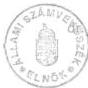
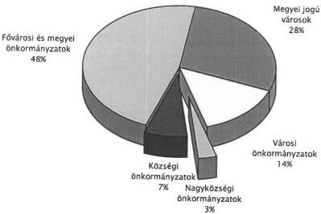
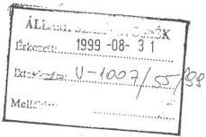
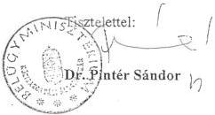
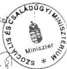
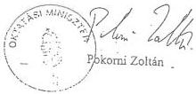
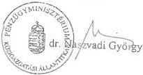
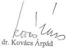

Állami Számvevőszék

# JELENTÉS

a helyi önkormányzatok 1998. évi
normatív állami hozzájárulás, valamint
az ezekhez kapcsolt kiegészítő
támogatások igénybevételének és
elszámolásának ellenőrzéséről

1999. szeptember

9929

---

Az ellenőrzés végrehajtásáért felelős:
V. Önkormányzati és Területi Ellenőrzési Igazgatóság

dr. Lóránt Zoltán
számvevő igazgató

Az ellenőrzést vezette és a jelentést összeállította:

Csecserits Imréné
vizsgálatvezető főtanácsos

Ambrus Lajos
számvevő tanácsos

dr. Csapó Anna
számvevő tanácsos

Németh Gábor
számvevő tanácsos

Az ellenőrzésben részt vevők névsorát az 1. számú melléklet tartalmazza.

A témakörrel foglalkozó ÁSZ vizsgálatok jegyzéke:

A normatív tanácsi támogatási rendszer kezdeti tapasztalatainak vizsgálata (V-26/1990.)

Normatív állami hozzájárulás igénybevételének és elszámolásának ellenőrzése (V-70/1991.)

Az önkormányzat 1991. évi normatív állami támogatása igénybevételének és elszámolásának ellenőrzése (V-1007/1992.)

Az önkormányzatok 1992. évi normatív támogatás igénybevételének és elszámolásának az ellenőrzése (V-1005/1993.)

Az önkormányzatok 1993. évi normatív támogatás igénybevételének és felhasználásának az ellenőrzése (V-1006/1994.)

A helyi önkormányzatok normatív hozzájárulás 1994. évi igénybevételének és elszámolásának a vizsgálata (V-1001/1995.)

A helyi önkormányzatok 1995. évi normatív állami hozzájárulás igénybevételének és elszámolásának ellenőrzése (V-1010/1996.)

Az önkormányzatok 1996. évi normatív állami hozzájárulás igénybevételének és elszámolásának vizsgálata (V-1004/1997.)

A helyi önkormányzatok 1997. évi normatív állami hozzájárulás igénybevételének és elszámolásának ellenőrzése (V-1012/1998.)

Jelentéseink az INTERNETEN 1999. június 1-től a WWW.ASZ.gov.hu. címen olvashatók.

Jelentéseink az Országgyűlés számítógépes hálózatán is olvashatók.

---

V-1007-58/1999. TÉMASZÁM: 477

# TARTALOMJEGYZÉK

# I. ÖSSZEGZŐ MEGÁLLAPÍTÁSOK, KÖVETKEZTETÉSEK, JAVASLATOK ... 4

# II. RÉSZLETES MEGÁLLAPÍTÁSOK ... 11

1. A NORMATIV ALLAMI HOZZAJARULASOK 1998. EVI FELTETELRENDSZERE, SZABALYOZASA 11
2. A NORMATIV ALLAMI HOZZAJARULASOK TERVEZESENEK ES ELSZAMOLASANAK HELYESSEGE A HELYI ONKORMANYZATOKNAL 20

2.1. Altalanos tapasztalatok 20
2.2.Jogcimenkenti tapasztalatok 21

2.2.1. Népességszám és idegenforgalmi adó alapjánBiztosított hozzájárulások 21
2.2.1.1. Korzeti igazgatasi feladatok 21
2.2.1.2. Udulohelyi feladatok 22
2.2.1.3. Szociális és gyermekjoléti alapszolgáltatási feladatok 22
2.2.1.4. Egyeb, nepessegszam alapjanBiztositott hozzajarulasok 22

2.2.2. A helyi önkormányzatok szociális feladataihoz kapcsolódó normatív állami hozzájárulások ... 22

2.2.2.1. Gyermek- es ifjusagvedelem (gyermekvédelmi szakellatas) 23
2.2.2.2. Bentlakasos es atmeneti elhelyezest nyuji to intezmenyi ellatas 23
2.2.2.3. Nappali szocialis intezmenyi ellatas 24
2.2.2.4. Hajlektalanok atmeneti intezmenyei 24
2.2.2.5. A pszichiátriai és szenvedélybetegek, valamint fogyatékos gyermekek bentla-kásos intézményi ellatása 25
2.2.2.6. Bolcsodei ellatas 25

2.2.3. A helyi önkormányzatok közoktatási feladataihoz kapcsolódó normatív állami hozzájárulások ... 25

2.2.3.1. Ovodai nevelés 26
2.2.3.2. Iskolai oktatás; 1-13. evfolyamokon és iskolai szakképszés 27
2.2.3.3. Kollégiumi, externatusi ellatas 28
2.2.3.4. Különleges gondozas keretében nyújtott ellatás 29
2.2.3.5. Alapfoku muveszetoktatas 29
2.2.3.6. Egyeb kozoktatasi hozzajarulasok 29

2.2.4. Kiegészítő támogatás egyes közoktatási feladatok ellátásához ... 32

2.2.4.1. A nemzeti etnikai kisebbséghez tartozók ávodai nevelése, iskolai nevelése és oktatása 33
2.2.4.2. A kistelepulseken kisletszammal mukdo nemzeti, etnikai kisebsegi ovodai neveles, iskolai oktatas 34
2.2.4.3. Cigánytanulok kollégiumi keretek kozotti felzarkóztató nevelése 34
2.2.4.4. A konyvtari feladatok es/vagy informatikai oktatas ellatasa 34

Melléklet: 1-től 10-ig

1

---

[Non-Text]

[Non-Text]

[Non-Text]

[Non-Text]

[Non-Text]

[Non-Text]

[Non-Text]

[Non-Text]

[Non-Text]

[Non-Text]

[Non-Text]

[Non-Text]

[Non-Text]

[Non-Text]

[Non-Text]

[Non-Text]

[Non-Text]

[Non-Text]

[Non-Text]

[Non-Text]

[Non-Text]

[Non-Text]

[Non-Text]

[Non-Text]

[Non-Text]

[Non-Text]

[Non-Text]

[Non-Text]

[Non-Text]

[Non-Text]

[Non-Text]

[Non-Text]

[Non-Text]

[Non-Text]

[Non-Text]

[Non-Text]

[Non-Text]

[Non-Text]

[Non-Text]

[Non-Text]

[Non-Text]

[Non-Text]

[Non-Text]

[Non-Text]

[Non-Text]

[Non-Text]

[Non-Text]

[Non-Text]

[Non-Text]

[Non-Text]

[Non-Text]

[Non-Text]

[Non-Text]

[Non-Text]

[Non-Text]

[Non-Text]

[Non-Text]

[Non-Text]

[Non-Text]

[Non-Text]

[Non-Text]

[Non-Text]

[Non-Text]

[Non-Text]

[Non-Text]

[Non-Text]

[Non-Text]

[Non-Text]

[Non-Text]

[Non-Text]

[Non-Text]

[Non-Text]

[Non-Text]

[Non-Text]

[Non-Text]

[Non-Text]

[Non-Text]

[Non-Text]

[Non-Text]

[Non-Text]

[Non-Text]

[Non-Text]

[Non-Text]

[Non-Text]

[Non-Text]

[Non-Text]

[Non-Text]

[Non-Text]

[Non-Text]

[Non-Text]

---

# Jelentés

# a helyi önkormányzatok 1998. évi normatív állami hozzájárulás, valamint az ezekhez kapcsolt kiegészítő támogatások igénybevételének és elszámolásának ellenőrzéséről

Az Állami Számvevőszék az 1989. évi XXXVIII. számú törvény, valamint az államháztartásról szóló 1992. évi XXXVIII. számú törvény előírásai alapján, az 1998. évi zárszámadási törvényjavaslathoz kapcsolódóan ellenőrizte az 1997. évi CXLVI. törvényben a helyi önkormányzatok 1998. évi – felhasználási kötöttség nélkül és meghatározott célra történő felhasználási kötöttséggel biztosított – normatív állami hozzájárulások, valamint az ezekhez kapcsolt kiegészítő támogatások igénybevételének és elszámolásának célszerűségét, törvényességét, szabályszerűségét.

A vizsgálat célja annak megállapítása volt, hogy:

- a normativ allami hozzajárulas és az azt kiegészítő támogatás (a továbbiakban a szövegen és tablázatokban egyarant: normativ allami hozzajárulas) tervezese összhangban volt-e a költségvetési törveny 3. és 8. számú melleketeben foglalt előirásokkal;
- az onkormanyzatoknál a tervezés alapját képező mutatószámok, adatok idöben megfeleloen dokumentálva rendelkezésre alltak-e;
- az onkormanyzatok koltsegvetesi szerveiknél az elszamolast megelozoen ellenoriztek-e a mutatoszamok meghatarozáshoz szükséges nyilvantartasok megletét, adatainak helytallosagat, törvenyi elorásoknak valo megfelelesét;
- a törvényi elóirásoknak megfelelo volt-e a normativ állami hozzájárulások igénybejelentése és elszámolása.

Teljes körű, minden feladatmutatóhoz kötött jogcímre kiterjedő tételes helyszíni ellenőrzést végeztünk az önkormányzatok 5%-ánál, 156 önkormányzatnál és ezen önkormányzatok irányítása alá tartozó összesen 1101 szociális, gyermekvédelmi és oktatási feladatot ellátó intézménynél. Ez évben a községek 4,4%-ára, a nagyközségek 6,1%, a városok 8,3%, a megyei jogú városok 13,6%, valamint a megyei önkormányzatok 10%-ára, és a fővárosi önkormányzatra terjedt ki az ellenőrzés. (A vizsgált önkormányzatokat megyénként és településtípusonként csoportosítva a 2. számú melléklet részletezi.)

A helyszíni vizsgálatokat az önkormányzati hivataloknál és intézményeiknél az 1997. és 1998. évi dokumentumok alapján végeztük. A vizsgálatot végzőknek részletes ellenőrzési útmutató állt rendelkezésére, amelyet az elszámolást megelőzően az önkormányzatok is megismerhettek.

3

---

I. ÖSSZEGZŐ MEGÁLLAPÍTÁSOK, KÖVETKEZTETÉSEK, JAVASLATOK

A vizsgálat során tájékoztatást kértünk a Pénzügyminisztériumtól, az Oktatási Minisztériumtól, valamint a Szociális és Családügyi Minisztériumtól.

**Az ellenőrzésbe bevont önkormányzatok összesen 43 milliárd Ft normatív állami hozzájárulásban részesültek.** (Részletezését a 2/a és a 3. számú melléklet tartalmazza.) **Ez az összeg a költségvetési törvényben a helyi önkormányzatok részére ilyen címen tervezett eredeti előirányzat 15,5%-a.**

Az ellenőrzött önkormányzatok kiválasztásánál szempont volt az egyes településtípusok reprezentatív megjelenítése mellett a kisvárosokra és a községekre való összpontosítás. Igazodtunk az 1991. év óta követett gyakorlatunkhoz, hogy évente más-más településtípusokra koncentrálódik a vizsgálat, biztosítva ezzel, hogy minden önkormányzat ellenőrzése bizonyos időközönként megtörténjen. Így kijelöltük azokat a községi önkormányzatokat is, amelyeknél valamilyen ok miatt (pl. más településből kivált, vagy nagyon alacsony népességszámú önkormányzatok) még nem volt számvevőszéki ellenőrzés.

A kiválasztás módszere és a vizsgálati megállapításokkal érintett önkormányzatok aránya (5%) az önkormányzatokra vonatkozóan általánosítható megállapítások megtételét tette lehetővé. A normatív állami hozzájárulás és azt kiegészítő támogatás 15,5%-ára kiterjedő helyszíni részletes vizsgálat pedig ezen költségvetési hozzájárulás igénylésének és elszámolásának általános megítéléséhez nyújt kellő alapot.

# I. ÖSSZEGZŐ MEGÁLLAPÍTÁSOK, KÖVETKEZTETÉSEK, JAVASLATOK

**A helyi önkormányzatok forrás-finanszírozási rendszerében 1990. év óta meghatározó jelentőségű, de minden évben kismértékben változó tartalmú elem a normatív állami hozzájárulás, amely az 1998. évi költségvetési törvényben előirányzott hozzájárulások, támogatások 67,7%-át képviselte, azaz a 410,0 milliárd Ft eredeti előirányzatból 277,5 milliárd Ft volt a normatív állami hozzájárulás és az azt kiegészítő normatív támogatás.**

Az elmúlt években a normatív állami hozzájárulásként meghatározott összeg nominálértéken évről-évre egyre csökkenő mértékben, de emelkedett (1997-ről 1998. évre 7,1%-kal). Ez az összeg a helyi önkormányzatok összes bevételeinek évente csökkenő részarányát képviseli. Az inflációt figyelembe véve megállapítható, hogy a normatív állami hozzájárulások reálértéke is csökkent 1998. évben. (A normatív állami hozzájárulás évenkénti költségvetési törvényben megállapított eredeti előirányzatainak 1991-1998. évi nominálértékét az 5. számú melléklet tartalmazza.)

A normatív állami hozzájárulások jogcímeit és összegét a központi költségvetési törvény 25 kiemelt előirányzatban, továbbá egy önálló alcímen, összesen 56 fajlagos összeggel határozta meg. **A helyi önkormányzatok az 1998. évi igénybejelentés és költségvetési beszámolók elkészítése során en-**

4

---

I. ÖSSZEGZŐ MEGÁLLAPÍTÁSOK, KÖVETKEZTETÉSEK, JAVASLATOK

nél sokkal részletesebb elszámolást készítettek. Az államháztartásról szóló 1992. évi XXXVIII. tv. 124. § (2) bekezdésben kapott felhatalmazás alapján a Belügyminisztérium, a Pénzügyminisztérium, valamint az érintett ágazati minisztériumok által közösen kialakított 210 tételes igény-bejelentési adatlapot és a kapcsolódó kódjegyzéket alkalmazva állították össze normatív állami hozzájárulás igényüket és elszámolásukat. A költségvetési törvényben meghatározottat jóval (3,75-szeres) meghaladó részletes (jogcímbontásos) adatkérés és elszámoltatás elsősorban közoktatási szakmai információk megszerzését biztosította, sok esetben párhuzamosan a statisztikai jelentésekkel. A jogcímbontások révén mind az igénylésnél, mind az elszámolásnál, esetenként 8-10 különböző tételben, illetve feldolgozási kódszámhoz rendelve részleteztek azonos fajlagos összegű hozzájárulást a kapcsolható szakmai információk megszerzése érdekében.

A normatív állami hozzájárulások igénybejelentésének és elszámolásának módosítását és nagyszámú feldolgozási kódjainak csökkentését az Állami Számvevőszék évek óta folyamatosan javasolja, tekintettel arra, hogy a hozzájáruláshoz az önkormányzati törvényben foglaltak alapján a jogcímmel összefüggő felhasználási kötöttség nem kapcsolódik és nagymértékben megnehezíti az igénylési-elszámolási rendszer áttekinthetőségét. Az elmúlt évekhez hasonlóan úgy az önkormányzatok, mint az ellenőrzés számára szükségtelen terhet jelentett a nagy tételszámú bonyolult feldolgozási kódszám-rendszer kezelése. Az egyszerűsítés célszerűségével a vizsgálat keretében végzett tájékozódás során az Oktatási Minisztérium egyetértett. A kívánt célt egy jobban áttekinthető, kevesebb tételszámú kódszámrendszer is teljesíthetné. A túl-részletezettség következtében gyakran előfordult, hogy a kódszám helytelen megállapítása, vagy téves számítógépes rögzítése miatt az önkormányzat által elszámolt teljes összeg az egyik kódszámnál jogtalanná vált, míg más kódszámon ugyanezt az összeget az önkormányzat részére még járó hozzájárulásként kellett szerepeltetni. Az egymást kiegyenlítő plusz-mínusz különbözetek az eltérések felnagyításához vezettek.

Az 1998. évi költségvetésről szóló 1997. évi CXLVI. számú törvényben (továbbiakban: költségvetési törvény) az egyes jogcímek tervezésére vonatkozó előírásokat az önkormányzati hivatalok nem teljes körűen tartották be. A Belügyminisztérium és a Pénzügyminisztérium illetékes főosztályai által kiadott tájékoztató csupán a törvényjavaslat 3. és 8. számú mellékletét tartalmazta. Az egyes jogcímeknél nem hivatkozott a kapcsolódó betartandó konkrét szakmai jogszabályi előírásokra, ezért végeredményben kevés érdemi (tartalmi) segítséget adott az önkormányzatoknak a hozzájárulás igényléséhez és a tervezéséhez. Az elszámoláshoz ugyanezt a tájékoztatót, adatlapot használták az önkormányzatok, amely a tervezett és elfogadott központi költségvetés eltéréséből, valamint az év közben hatályba lépő jogszabályváltozásokból adódóan több tekintetben téves elszámolást okozott.

Az önkormányzati hivatalok időben, de többnyire nem megfelelően dokumentálva kapták meg az intézményektől a központi tervezés alapját képező alapadatokat. A hiányosságot elsősorban az okozta, hogy az önkormányzati hivatalok – megfelelő központi tájékoztató hiányában – az intézményeik részére nem adtak útmutatást a szakmai jogszabályokban meg-

5

---

I. ÖSSZEGZŐ MEGÁLLAPÍTÁSOK, KÖVETKEZTETÉSEK, JAVASLATOK

fogalmazott követelményekkel összhangban lévő adatszolgáltatás elkészítéséhez. Az éves elszámoláshoz bekért adatokra is ugyanez vonatkozik. Az önkormányzati hivatalok nem fordítottak kellő figyelmet arra, hogy az elszámolásba a megfelelő (nyilvántartási, statisztikai) alapadatokra épülő mutatószámok kerüljenek.

Az előző években végzett számvevőszéki ellenőrzések során tett felelősségi felvetéseink ellenére **a vizsgált önkormányzati hivataloknak csak 24,4%-a ellenőrizte a helyszínen az intézmények által közölt adatok valódiságát.** Az ellenőrzések egy-egy önkormányzatnál átlagosan csak az intézményi kör 37,1%-át érintették. **A végrehajtott ellenőrzések szakmai színvonala nem volt megfelelő,** nem terjedtek ki a szakmai jogszabályokban foglalt előírások betartására és az önkormányzati szintű összesítés, elszámolás ellenőrzése is elmaradt. Pontatlan volt a belső ellenőrzés, az intézményvezetők a pontatlan megállapításokra nem reagáltak, még a városi önkormányzatoknál is jogértelmezési gondok voltak. Mindezek miatt az önkormányzatok saját ellenőrzése erősen kifogásolható.

A cél szerinti felhasználási kötöttséggel biztosított kiegészítő támogatások esetében elméletileg feladatfinanszírozás van, de az elszámolható költségek körének, módjának részletes központi, valamint helyi meghatározatlansága következtében a feladatokra fordított közvetlen és közvetett kiadások nem állapíthatók meg, nem mérhetők egyértelműen, a felhasználási kötöttség dokumentálása közvetlen adatgyűjtéssel nem biztosítható. A cél szerinti felhasználás megfelelő dokumentálása csak a könyvtári ellátás és/vagy informatikai oktatás jogcím esetében volt megvalósítható, azonban az elszámolható kiadások szabályozása nem volt következetes és egyértelmű (nemcsak működési, hanem felhalmozási kiadások elszámolását is lehetővé tette). A többi jogcím esetében – mivel nem egyértelműen elhatárolható részfeladatot, kiadást érintenek – erőltetett a kiadás-arányosításon alapuló utólagos dokumentálás, ezért célszerűtlen a felhasználási kötöttség fenntartása.

A gyakran változó költségvetési törvényi és szakmai jogszabályi előírások következtében fokozódtak a tervezés és az elszámolás hibái, amelyek jogosulatlan igénybevételeket, illetve elszámolásokat okoztak, de a jogos hozzájárulások és támogatások el nem számolása ugyanúgy jellemző volt.

**A gyermekjóléti és szociális ellátást érintően a jogcímek szabályozási hiányosságai és értelmezési problémái, valamint a működési engedélyek, alapító okiratok és a törzskönyvi bejegyzések hiánya, illetve hiányosságai okoztak gondokat. A törzskönyvi bejegyzés rendszere jelenleg nem kellően szabályozott, az alapító okiratokban az ellátandó feladat meghatározása nincs összhangban a normatív állami hozzájárulás kapcsolódó jogcíménél leírt követelményekkel.**

A szociális intézmények működési engedélyét 1997. évben, a gyermekvédelmi intézményeket pedig 1998. évben jogszabályi előírás alapján meg kellett újítani. A szociális és gyermekvédelmi intézmények alapító okiratainak a normatív állami hozzájárulás feltételrendszerével összhangban lévő ágazati tartalmi követelményeit meghatározó jogszabályi előírás hiányzott.

6

---

I. ÖSSZEGZŐ MEGÁLLAPÍTÁSOK, KÖVETKEZTETÉSEK, JAVASLATOK

A gyermek- és ifjúságvédelem jogcímű normatív állami hozzájárulást a költségvetési törvény 3. számú melléklet 8/A pontjában leírt tiltás ellenére igénybe vették a helyi önkormányzatok a központi költségvetési szervek által fenntartott intézményekben ellátott fogyatékos állami gondoskodás alatt álló gyermekek után is.

A nappali szociális intézményeknél gondot jelentett a mutatószám megállapítása, mivel nem egyértelmű, hogy a 30 napnál folyamatosan hosszabb ideig távolmaradók számának meghatározásánál naptári, vagy nyitvatartási napokat kell figyelembe venni, továbbá, hogy az engedélyezett férőhely milyen mértékben (arányban) léphető túl a hozzájárulás elszámolásánál. **A hajléktalanok nappali intézményeinél a napi taglétszám dokumentálása és nyomon követése az előírt nyilvántartási rendszerben nem megoldott**, tekintettel arra, hogy ezen intézményeknél a taglétszámból a folyamatosan hosszabb ideig – 30 napon túl – távollévőket sem kell figyelmen kívül hagyni.

**A hiányos jogszabályi előírás miatt nem egyértelmű, hogy a mozgásfogyatékosok esetében ki jogosult megállapítani az ápoló-, gondozóotthoni ellátást indokló mozgásfogyatékosság mértékét.**

**A közoktatást érintően a legtöbb problémát a közoktatási törvény alapján szervezett középfokú oktatás és szakképzés, a különleges gondozás keretében végzett korai fejlesztés-gondozás és fejlesztő felkészítés, a szervezett közoktatási intézményi étkeztetés és az általános iskolai napközis ellátás, az óvodai nevelés, valamint a cigánytanulók felzárkóztatása jogcímeknél észleltünk. Ezen jogcímeknél a feladatmutató meghatározása túlzottan bonyolultnak minősült az önkormányzatok számára, ezt igazolja, hogy a legnagyobb összegű eltéréseket is ezeknél állapította meg a vizsgálat.**

Az egyes iskolatípusokon belüli évfolyamszámozás, az oktatási törvény szerinti régi rendszerű, és a közoktatási törvény vagy egyedi engedély szerinti új rendszerű elméleti és gyakorlati képzés alapján történő elkülönítés, az „Egyéb közoktatási hozzájárulások” jogcímeinek oktatási forma szerinti bontása, azonos fajlagos támogatási összegű és jogcímű, de különböző kódszámú hozzájárulási jogcímek alkalmazásai, valamint a jogi szabályozás pontatlansága a normatív állami hozzájárulások tervezési, elszámolási és ellenőrzési feladatait megnehezítette.

**A közoktatási célú normatív állami hozzájárulás központi tervezéséhez a közoktatásról szóló 1993. évi LXXIX. törvény (továbbiakban: közoktatási törvény) kötelező jellegű előírást tartalmaz, amely feltételeknek az 1998. évi eredeti előirányzat megfelelt.**

A normatív állami hozzájárulások jogcímeinek szabályozása, kapcsolódó összegeinek tervezése, elszámolása az 1996. évet érintő vizsgálat alapján megfogalmazott javaslataink ellenére nem egyszerűsödött kellő mértékben. A normatívánkénti szabályozás hiányosságainak egy része megmaradt. **A közoktatási statisztikai jelentések adattartalma jelenleg sem alkalmas a normatív állami hozzájárulás tervezésénél és elszámolásánál a költ-**

7

---

I. ÖSSZEGZŐ MEGÁLLAPÍTÁSOK, KÖVETKEZTETÉSEK, JAVASLATOK

ségvetési és a közoktatási törvényben előírtak szerinti mutatószámok megállapítására annak ellenére, hogy a költségvetési törvény 3. számú mellékletben foglalt kiegészítő szabályok g) pontja ezt követelményként tartalmazza.

A vizsgált 156 helyi önkormányzat elszámolásának kódszámainál összesen 945 954 038 Ft jogosulatlanul elszámolt összeget és 583 503 674 Ft pótlólagos állami hozzájárulást állapítottunk meg.

A kódszámonkénti eltérések egyenlegeként 97 önkormányzatnál 376 474 540 Ft központi költségvetés részére történő visszafizetési kötelezettséget, 44 önkormányzatot érintően pedig 14 024 176 Ft központi költségvetésből pótlólagosan kiutalandó hozzájárulást tártunk fel. Az 362 450 364 Ft különbözet a központi költségvetés egyensúlyát javítja. Az ellenőrzés 15 önkormányzatnál az elszámolásban eltérést nem állapított meg.

A vizsgálati megállapítások alapján összesen 15 önkormányzatnál vetettük fel a jegyző felelősségét az ellenőrzési kötelezettség visszatérő elmulasztása, valamint jogosulatlan állami hozzájárulás igénylése és elszámolása miatt. A jogszabályi előírásoktól eltérő elszámolás következtében néhány önkormányzatnál a gazdálkodási előadó felelősségét is felvetettük.

Mindezeket figyelembe véve az Állami Számvevőszék javasolja, hogy a pénzügyminiszter

1. kezdemenyeze, hogy az Orszaggyulés az 1998. évi zárszámadási törveny elfogadása során hagyja jová a jalentés 8. számú melleketeben részletezettek szerint az önkormányzatok által a kozponti koltségvetésbe visszafizetendő 362 450 364 Ft-os, illetve az önkormányzatoknak a koltségvetésból potlólag kiutalandó 14 024 176 Ft-os összeget;
2. biztositsa, hogy a jelenlegi bonyolult kódszámrendszer egyszerúsitévelCsak a normativ allami hozzajárulási elóirányzatok koltsegvetési törvenyben elóirt részletezésu tervezésere és elszamolására terjedjen ki a szabályozás;
3. kezdemenyeze a felhasznalasi kotttseg megszunteteset a koltsegvetesi törveny 8. szamú melleketeben szerepló kiegészító tamogatások azon jogcimeinél, amelyeknel a cel szerinti felhasznalasi kotttseg dokumentálasa kozvetlen adatgyüjtessel nemBiztosithato;
4. hatarozza meg az egyertelmu szambavetel es ellenorzs lehetosegenekBiztositasa erdekuben az elszamolhato mukodesi es felhalmozasi kiadasokat a 8. szamu mellekletben szereplo azon jogcimeknel, ahol a felhasznalas kozvetlenul dokumentalhato;
5. kezdemenyeze, hogy az éves koltsegvetesi beszamolohoz kapcsoló tajekoztató részekent az igenyfelmereshez kiadott adatlapok, utmutató es segédlet a bekovetkezett valtozasok miatt aktualizárasa keruljön;
6. rendeletben szabalyozza az onkormanyzati koltsegvetesi szervek törzskonyvvezetésenek rendjét.

8

---

I. ÖSSZEGZŐ MEGÁLLAPÍTÁSOK, KÖVETKEZTETÉSEK, JAVASLATOK

# **az oktatási miniszter**

1. kezdemenyeze a 2000. evi koltsegvetesi törvenyjvaslat elokeszitekor, hogy az ovodai nevelés, a korai fejlesztés-gondozas és a fejlesztő felkésztés, a szervezzett etkeztétés és a napközis ellatás jogcimeinél a feladatmutató megallapitasa egyszerü-södjön;
2. biztositsa a ciganytanulok felzarkoztatasahoz, tarsadalmi beilleszkedeshez kapcsolod szabad es kott felhasznalasu jogcimek tartalmanak, igenylésuk, elszamolásuk kovetelmenyinek pontositásat, egyertelmübbe tetelet;
3. hozza összhangba a normativ allami hozzájárulas feltételrendszerét a szakmai statisztikai adatszolgaltatasokat és a költségvetési információs rendszert, ennek során szüntesse meg a szükségtelen párhuzamosságokat.

# **a szociális és családügyi miniszter**

1. hatarozza meg a normativ allami hozzajárulas elszamolásanál figylembe vehető fogyatékosság megallapítására iltekesek körét a mozgásfogyatékosok esetében;
2. kezdemenyezzen jogszabaly-módositast annak érdekében, hogy a gyermekjoléti és szociális intézmények alapíto okirata legalább a normativ allami hozzájárulás kialakí-tott feltételeinek megfelelo részletezettséggel határozza meg az ellatando szakmai feladatot;
3. pontosítsa az ellenőrizhetőség érdekében a Hajléktalan nappali melegedőknél a mutatószám meghatározásanak mośdzerét.

# **A helyszíni vizsgálati jelentésekben az önkormányzatok részére a következő javaslatokat fogalmaztuk meg:**

Fizessek vissza az elszamolásukban kimutatott jogtalanul igenyelt összeget (vizsgalt önkormányzatoknál együttesen: 1012,1 millio Ft), valamint az Országgyűles dontese alapján az allami szamvevószéki Ellenőrzés altal vegzett vizsgalat során feltart, összesen 395,9 millio Ft jogtalanul elszamolt normativ allami hozzájárulás összeget.
- Adjanak tobb konkret segitséget az intezményeiknek a normativ allami hozzájárulások tervezéséhez és elszamolásához. Az egyertelmü intezményi adatszolgaltatasBiztositasa erdekében gondoskodjanak arról, hogy az éves elszamoláshoz - a tervezéshez hasonloan - megfelelo felmerolapok rendelkezesre alljanak, továbbá azon a tenyleges adat megjelolés és az adatszolgaltatas kelte megjelenjen.
- A normativ allami hozzajárulások igénylésénél és elszamolásanál vegyék figyelembe az éves költségvetési törveny mellett a szakmai jogszabályok elóirásait és a saját Ellenőrzeseik megallapításait.
Vonjak be az onkormanyzati hivatal kozoktatasi, valamint a gyermekjoleti es szocialis teruleten dolgoz munkatarsait a letszam es gondozasi napok intezmenyi adatainak ellenorzesebe, valamint konkret normativ allami hozzajarulasi jogcim (kodszam) azonositasaba.

9

---

I. ÖSSZEGZŐ MEGÁLLAPÍTÁSOK, KÖVETKEZTETÉSEK, JAVASLATOK

- Ütemezzék az oktatási intézmények létszámadatainak ellenőrzését a tanévnyitó statisztikai jelentések leadását követő időre, hogy az éves beszámoló elkészítéséhez az ellenőrzött adatok időben rendelkezésre álljanak.
- Elkülönítve mutassák ki a felhasználási kötöttséggel biztosított normatív állami hozzájárulási jogcímeknél a bevételi és kiadási előirányzatot az önkormányzati költségvetési rendeletekben; a cél szerinti felhasználást elkülönítetten dokumentálják; az erre vonatkozó előírásokat a helyi számviteli politikában rögzítsék.
- Kérjék meg pótlólag a hiányzó intézményi működési engedélyeket és alakítsák ki az előírásszerű működéshez, illetve feladatellátáshoz szükséges személyi és tárgyi feltételeket. Gondoskodjanak arról, hogy a működési engedélyek tartalmazzanak minden olyan adatot, amelyet a 161/1996.(XI. 7.) Korm.rendelet, valamint a 281/1997.(XII. 23.) Korm.rendelet előír.
- Egészítsék ki az intézmények alapító okiratát a még nem rögzített, de már ellátott, és a tervezett tevékenységekkel (napközis ellátás, könyvtári ellátás, informatikai oktatás). Az önállóan és a részben önállóan gazdálkodó költségvetési szervek közötti munka-megosztás és felelősségvállalás rendjét szabályozzák.
- Intézkedjenek a törzskönyvi bejegyzések – bejelentés útján történő – helyesbítésére. Teremtsek meg az alapító okiratok és a törzskönyvi nyilvántartás szinkronját.
- Az oktatási intézményeik konyháját legfeljebb az Állami Népegészségügyi és Tisztiorvosi Szolgálat által kiadott működési engedélynek megfelelő kapacitással működtessék.
- A közoktatásról szóló 1993. évi LXXIX. törvény 65. § (1) bekezdésének előírása alapján 3 év alatti gyermeket ne vegyenek fel az óvodába, illetve ne számoljanak el utánuk normatív állami hozzájárulást. Gondoskodjanak arról, hogy az óvodában a felvételi és mulasztási naplókat a nyomtatványon jelzett előírásoknak megfelelően vezessék.
- A közös fenntartású oktatási intézmények működését az 1997. évi CXXXV. törvény előírásai alapján szabályozzák, illetve a korábbi szerződést vizsgálják felül.
- Intézkedjenek a napközis ellátás, valamint a szervezett intézményi étkeztetés törvényi előírás szerinti biztosítására, számbavételére, dokumentálására és elszámolására.
- Beilleszkedési, magatartási, tanulási zavarral küzdők vizsgálata esetén ragaszkodjanak a 14/1994.(VI. 24.) MKM rendelet 23. § (1) bekezdés b) pontjában előírt, az éves költségvetési törvények előírásait is kielégítő egyértelmű szakvéleményhez.
- Az óvodai ellátás napi időtartamára, a nemzetiségi oktatásra, a cigánytanulók kollégiumi nevelésére vonatkozó szülői igények dokumentálásáról gondoskodjanak az intézmények. A nemzetiségi nyelv oktatására vonatkozó szülői igényt az elsőosztályos gyermekek szüleitől minden tanév kezdetén írásban kérjék be az iskolák. Az országos kisebbségi önkormányzatok véle-

10

---

II. RÉSZLETES MEGÁLLAPÍTÁSOK

ményét – hogy az intézmény nemzeti, etnikai kisebbségi feladatot lát el – legalább a választási ciklusok elején szerezzék be.

- A tervezéshez és elszámoláshoz szükséges adatokat írásban is kérjék be az intézményektől és gondoskodjanak azok ellenőrzéséről, jegyzőkönyvi rögzítéséről. Terjesszék ki az ellenőrzést a szakmai jogszabályokban előírt feltételek meglétének ellenőrzésére, valamint az adatrögzítés és feldolgozás helyességének ellenőrzésére is. Évközi mutatószám-felülvizsgálattal és szükség esetén állami hozzájárulás-lemondással is kerüljék el a büntetőkamat fizetési kötelezettséget.
- Vizsgálják meg, hogy a helyi szabályozási hiányosságokért, működési hibákért és az ellenőrzések elmaradásáért kit (polgármester, jegyző, gazdálkodási előadó, belső ellenőr, intézményvezető stb.) milyen mértékben terhel felelősség. Indokolt esetben gondoskodjanak a felelősségrevonásról.

## II. RÉSZLETES MEGÁLLAPÍTÁSOK

### 1. A NORMATÍV ÁLLAMI HOZZÁJÁRULÁSOK 1998. ÉVI FELTÉTELRENDSZERE, SZABÁLYOZÁSA

**Az 1998. évi költségvetési törvény előkészítése keretében a normatív állami hozzájárulások keretösszegeinek és jogcímeinek, valamint az ehhez kapcsolódó fajlagos értékek kialakítása a korábbi évekhez hasonló elvek és módszerek szerint történt.** A költségvetési irányelvek a normatív állami hozzájárulások szabályozása kapcsán a szociális és gyermekjóléti területen a feladatorientáltság erősítését, a közoktatás-területén a jogcímrendszer egyszerűsítését, az önkormányzati társulási hajlandóság ösztönzését, továbbá az 1998. évben hatályba lépő kulturális törvény előírásaiból adódó helyi önkormányzati feladatok forrásainak biztosítását írták elő. Folytatódott az egészségügyi és szociális intézményrendszer struktúrájának átalakítása; megkezdődött a többször módosított közoktatási törvény alapján 1998. szeptember 1-től a nemzeti alaptanterv részleges – felmenő rendszerben való – bevezetése.

Az előző évhez viszonyítva a szociális feladatokhoz kapcsolódó normatív állami hozzájárulások jogcímköre bővült, az egyes jogcímek meghatározása módosult:

- a gyermekvédelmi törvény elfogadásával a gyermekvédelmi szakellátás és a gyermekjóléti szolgáltatások kikerültek a szociális törvény hatálya alól;
- elkülönítették a szociális és gyermekjóléti alapszolgáltatási feladatokat (alapellátás, családsegítő, illetve gyermekjóléti szolgáltatás, falugondnoki szolgálat), valamint a pénzbeli-természetbeni szociális és gyermekjóléti ellátásokat;
- a fogyatékosok bentlakásos intézményi ellátása jogcímhez kapcsolták a pszichiátriai szenvedélybetegek ellátását;

11

---

II. RÉSZLETES MEGÁLLAPÍTÁSOK

- a körzeti gyámügyi és építésügyi feladatok ellátása (alap-hozzájárulás és kiegészítő hozzájárulás) új jogcímként jelent meg;
- a gyermekvédelmi és szociális intézményeknél a hozzájárulás jogosultsági feltételeként az alapító okirat és a működési engedély meglétét együttesen írták elő feltételként.

A költségvetési irányelvekben meghatározott közoktatás finanszírozási célkitűzések nem valósultak meg teljes körűen az 1998. évi költségvetés tervezése és végrehajtása során, mivel a jogcímrendszer kellő mértékben nem egyszerűsödött. A helyi önkormányzatok közoktatási feladatainak központi költségvetési finanszírozási rendszere nem változott lényegesen. A kormány által benyújtott törvényjavaslatban a közoktatást érintő normatív állami hozzájárulás és a közoktatás cél szerinti felhasználási kötöttséggel javasolt kiegészítő támogatása együtt 187 milliárd Ft tett ki, az előző évi előirányzathoz képest 12,3%-kal növekedett, ami 4,4%-kal magasabb volt a normatív állami hozzájárulások átlagos növekedésénél. A költségvetési törvényjavaslat előirányzati összege több volt mint a közoktatási törvény által előírt minimum összeg, azaz az 1996. évi – a törvényi előírásoknak megfelelően korrigált – közoktatásra fordított kiadás 80%-a és elérte, illetve meghaladta az 1997. évi eredeti előirányzatot.

Az elfogadott 1998. évi költségvetési törvényben – a létszámfelmérés alapján – közoktatási feladatokra 186 540 millió Ft szerepelt, amely az 1997. évi költségvetési törvény eredeti előirányzatánál 12%-kal magasabb, ugyanakkor 429,8 millió Ft-tal kevesebb, mint a törvényjavaslatban szereplő összeg.

Kismértékben módosult a közoktatási célú normatív állami hozzájárulások rendszere, amelyben a kiemelt jogcímek un. alap-, egyéb- és kiegészítő jogcímcsoportokat alkottak. Az alap-jogcímek között összesen 9 kiemelt jogcím szerepelt. Az „Egyéb közoktatási hozzájárulások”-nak nevezett gyűjtő jogcím összesen 8 + 2 részből állt. A „Kiegészítő támogatások”-at az önkormányzatok a nemzeti és etnikai kisebbséghez tartozók neveléséhez és oktatásához, a kistelepülések kis létszámú intézményben folytatott nemzeti, etnikai kisebbséghez tartozók óvodai neveléshez és iskolai oktatáshoz, a cigány kisebbséghez tartozó tanulók kollégiumi neveléséhez, valamint a könyvtári ellátáshoz és/vagy informatikai oktatáshoz vehették igénybe. A közoktatáshoz kapcsolódó keretösszegek és a fajlagos értékek meghatározásakor a kiindulási alapot a közoktatási törvényben előírt kötelezettségek teljesítése jelentette.

A közoktatási hozzájárulások jogcíme az előző évivel azonosan 10 féle, az összevont jogcímekhez tartozó fajlagos összegek száma 32-ről 28-ra csökkent. Az alapnormatívák fajlagos összegeibe 1998. évben beépültek a szülői szervezetek, tanulói önkormányzatok és az iskolai sportkör működtetéséhez biztosított hozzájárulások. Bővült ugyanakkor a fajlagos összegek száma a napközis foglalkozásnál a cigánytanulók felzárkóztatását, beilleszkedését segítő foglalkoztatás külön (kétszeres) fajlagos összegével, valamint különböző mértékben illette meg az állami hozzájárulás az önkormányzatokat a felnőttoktatás különböző területein oktatottak, illetve a magán és vendégtanulók, továbbá a térítési díjat fizetők után.

12

---

II. RÉSZLETES MEGÁLLAPÍTÁSOK

A közoktatási feladatokhoz kapcsolódó jogcímek fajlagos összegei 6,7 és 27,5% közötti mértékben emelkedtek, nagyobb arányú növekedést a szakképzés, a különleges gondozás és az alapfokú művészetoktatás hozzájárulásai mutattak. Az egyéb közoktatási hozzájárulások előző évhez viszonyított növekménye átlagosan 29,5%-os. Ezen belül a szervezett intézményi étkeztetés, a napközis ellátás, valamint az intézményfenntartó társulás hozzájárulási jogcímeinek növekedése volt kiemelkedő mértékű.

A felhasználási kötöttség nélküli normatív állami hozzájárulások és a felhasználási kötöttségű kiegészítő támogatások ugyanazon intézményi kör feladatellátásához kapcsolódtak, ezért a gyakorlatban – egy jogcím kivételével – a kiegészítő támogatások útja nem volt nyomon követhető. A csak feladatmutatóhoz kötött hozzájárulásokat az önkormányzatok nem voltak kötelesek átadni a feladatot ellátó intézmények részére, ebből következően nem kifogásolható, ha egyazon intézménynek adott önkormányzati támogatás (intézményfinanszírozás) kevesebb, mint a normatív hozzájárulás és az azt kiegészítő támogatások együttes összege. Az önkormányzatok a közoktatási hozzájárulásokat felhasználási kötöttség nélkül kapják, intézményeik működési költségeihez még további támogatást, forrást biztosítanak. A cél szerinti felhasználási kötöttség általános előírása ellenére központilag nem határozták meg az elszámolható működési és felhalmozási kiadások körét (pl. épület-felújítás, bővítés, tárgyévi eszközbeszerzés esetében a kiadások milyen hányada vehető figyelembe).

A felhasználási kötöttségű kiegészítő támogatások közül azokat, amelyeknél a felhasználási kötöttség közvetlenül nem dokumentálható – hasonlóan a normatív állami hozzájárulások ellenőrzésének gyakorlatához – az ÁSZ a hozzájárulás igényléséhez és elszámolásához szükséges feltételek meglétét, és az ágazati-szakmai szabályok alapján meghatározott feladatok tényleges ellátását ellenőrizte.

Az önkormányzatok költségvetésének tervezését segítő tájékoztató, valamint a létszámfelmérő adatlapok elkészítésében a Népjóléti Minisztérium, valamint a Művelődési és Közoktatási Minisztérium közreműködött. A tájékoztatót és adatlapokat a Belügyminisztérium és a Pénzügyminisztérium illetékes főosztályai küldték meg a TÁKISZ-okon keresztül az önkormányzatoknak. Az önkormányzatok által kitöltött és visszaküldött felmérő adatlapok alapján történt az egyes jogcímekhez tartozó mutatószámok és hozzájárulási összegek meghatározása. Az 1998. évi költségvetésről szóló törvény 3. és 8. számú mellékletei szerint kiszámított normatív állami hozzájárulások önkormányzatonként és ezen belül jogcímenként részletezve a 4/1998. (I. 28.) PM-BM együttes rendeletben tették közzé, amely segítette a helyi önkormányzati költségvetések elkészítését.

A PM-BM tájékoztatókkal kapcsolatban megjegyzést érdemel, hogy a létszámfelmérő adatlapok és az év végi elszámoláshoz kiadott kódjegyzékek tartalma nem volt teljesen összhangban a közoktatási törvény vonatkozó előírásaival. Pl. a közoktatási törvény szerint meghatározott esetekben a gyermek és tanulólétszám osztása helyett a fajlagos hozzájárulás összegét arányosították. A kétféle számítási mód ugyanazt az eredményt adja az alapjogcímeknél, azonban az egyéb közoktatási hozzájárulásoknál, valamint a kiegészítő támogatások esetében a kódszám-kialakítás nem volt következetes.

13

---

II. RÉSZLETES MEGÁLLAPÍTÁSOK

**A helyi önkormányzatok számára az 1998. évi költségvetési beszámoló elkészítéséhez kiadott pénzügyminisztériumi tájékoztató a normatív állami hozzájárulás elszámolásához nem tartalmazott – évközben hatályba lépő jogszabályváltozásokkal – aktualizált útmutatást, a tényleges intézményi létszámot és gondozási napokat felmérő adatlapokat.**

Ennek hiányát az önkormányzatok az 1999. évi tervezéshez kapott nyomtatványok adatainak felhasználásával, vagy az 1998. évi tervezési adatlapok becsült adatainak felülírásával igyekeztek pótolni. Az 1998. évi szabályokhoz viszonyítva bekövetkezett változások miatt nem volt megfelelő az 1999. évi tervezési felmérőlapok adatainak felhasználása. **Az önkormányzatok számára elsősorban bonyolultsága és többletmunka igénye miatt jelentett gondot a költségvetési törvényben megfogalmazott jogcímeknél sokkal részletesebben kialakított feldolgozási kódszámok alkalmazási kényszere.**

**Az államháztartásról szóló 1992. évi XXXVIII. törvény 124. § (2) bekezdésben kapott felhatalmazás alapján kiadott előírás szerint a hozzájárulás tervezésénél és elszámolásánál kötelezően alkalmazni kellett a törvényi előírást meghaladó jogcímeken belüli részletezést (kódszámokat), amelyet – intézménytípusonként (nevelési, oktatási), alkalmazott oktatási programonként, valamint szakmai szempontok szerint – a költségvetési törvényben meghatározottnál sokkal részletesebben alakítottak ki.**

Hasonló a tapasztalat a különleges gondozás keretében nyújtott gyógypedagógiai ellátásnál, amely a költségvetési törvény 3. számú mellékletében egy jogcím alábontásaként azonos fajlagos összeggel jelent meg. Az előírt csoportosítási rendszerben azonban 10 kódszám alkalmazása biztosított további szakmai információt az ellátást nyújtó intézmények típusáról, az ellátottak korösszetételéről, az szolgáltatással szembeni igényéről, tanulói jogviszonyáról, az ellátást nyújtó oktatási intézmények által alkalmazott oktatási programról. Ezeket az információkat ennél a jogcímnél a közoktatási hozzájárulások összes kódszámainak 5%-a nyújtja, ugyanakkor az óvodai, iskolai nevelésben, oktatásban részesülők mindössze 2%-ára vonatkoztak az adatok a vizsgált önkormányzatoknál. Erre a kis létszámra a 10 féle csoport (kódszám) kialakítása túlzott és szükségtelen volt.

**Ezen szakmai szempontból fontos információkat az elrendelt statisztikai jelentések is tartalmazzák, illetve tartalmazhatják, szükségtelen a párhuzamosság kiépítése az egyébként felhasználási kötöttség nélküli, normatív forrás-finanszírozási rendszerben.**

Az egyes iskolatípusokon belüli évfolyamszámozás, az oktatási törvény szerinti régi rendszerű, és a közoktatási törvény vagy egyedi engedély szerinti új rendszerű elméleti és gyakorlati képzés alapján történő elkülönítés, az „Egyéb közoktatási hozzájárulások” jogcímeinek oktatási forma szerinti bontása, azonos fajlagos támogatási összegű és jogcímű, de különböző kódszámú hozzájárulási jogcímek alkalmazásai, valamint a jogi szabályozás pontatlansága a normatív állami hozzájárulások tervezési, elszámolási és ellenőrzési feladatait megnehezítette.

14

---

II. RÉSZLETES MEGÁLLAPÍTÁSOK

A túl-részletezettség következtében gyakran előfordult, hogy a kódszám helytelen megállapítása, vagy téves számítógépes rögzítése miatt az önkormányzat által elszámolt teljes összeg az egyik kódszámnál jogtalanná vált, míg más kódszámon ugyanezt az összeget az önkormányzat részére még járó hozzájárulásként kellett szerepeltetni. Az egymást kiegyenlítő plusz-mínusz különböztek az eltérések felnagyításához vezettek. Az 1998. évi jogtalan elszámolás 39%-kal, a pótlólagos járandóság 83%-kal magasabb a kódszámonkénti összesítésben, mint a jogcím szerinti összevonást követően.

A költségvetési törvényben meghatározott normatív állami hozzájárulási jogcímek (kiemelt előirányzatok) alábontásával kialakított kódszámonkénti elszámolást az áttekinthetőség érdekében jogcímenként és önkormányzatonként összevontuk. Az összevonás során az alábontott jogcímek esetében az egyes kódszámokhoz kapcsolódóan feltárt (±) eltérések egymást részben ellentételezték. Ezért a jogcímenkénti és önkormányzatonkénti együttes eltérések összege alacsonyabb, mint a kódszámonkénti részletezésű eltérés, azonban az eltérések különbözete mindegyik kimutatásban megegyező. Erre mutat rá az összesített (±) eltéréseket és az egyenleget vizsgált kódszámonként, valamint jogcímenként és önkormányzatonként összevontan bemutató 4. és 4/a számú melléklet. A jogcímenkénti és önkormányzatonkénti eltérést részletesen a 10. számú melléklet tartalmazza.

A normatív állami hozzájárulás rendkívül nagyszámú igényfelmérési tételeinek, illetve feldolgozási kódjainak csökkentését az Állami Számvevőszék évek óta folyamatosan javasolta, ennek figyelembevétele azonban nem történt meg. A vizsgálat keretében folytatott tájékozódás során a közoktatási mutatószámok tekintetében az Oktatási Minisztérium az egyszerűsítés szükségességével egyetértett.

**A költségvetési törvényben foglalt előírások mellett a szociális és közoktatási jogszabályok részletes ismeretére és körültekintő, összehangolt alkalmazására volt szükség az 1998. évi hozzájárulás önkormányzati tervezéséhez és elszámolásához, amely követelménynek az önkormányzatok nem tudtak teljes körűen megfelelni. Ugyanakkor a szabályozásban több pontatlanság volt tapasztalható.**

**A számvevőszéki vizsgálat a szociális és gyermekvédelmi feladatokhoz kapcsolódó jogcímeknél a következő – a helyi önkormányzatok munkáját hátráltató – szabályozási hiányosságokat tapasztalta:**

- A normatív állami hozzájárulás igénybevétele szempontjából kiemelt hangsúlyt kapott az alapító okirat és a működési engedély, viszont a **törzskönyvi bejegyzésre nem hivatkozott a szabályozás.**

A községi önkormányzatok mintegy 20%-a – nem részben önálló intézményként, hanem – önkormányzati hivatali szakfeladatként működteti a nappali szociális intézményét. Ilyen esetben a törzskönyvi bejegyzés hiányzik, ezért az intézmény jogi szempontból nem tekinthető megalapítottnak.

- A szociális ellátást nyújtó intézmények alapító okiratai az alapfeladatokat csak általánosságban határozták meg, így nem egyér-

15

---

II. RÉSZLETES MEGÁLLAPÍTÁSOK

telmű, hogy milyen jogcímen vehetik igénybe az önkormányzatok az intézményi feladatellátások után a normatív állami hozzájárulást. Az alapító okiratok jellemzően nem tartalmazták az intézményi férőhelyek számát sem.

- A nappali szociális intézményi ellátás jogcímnél a heti 5 napos nyitva tartás miatt a 313-as osztószám megtévesztő volt, továbbá nem volt egyértelműen meghatározva, hogy a 30 napos távollétet a naptári vagy a nyitvatartási napok alapján kell számításba venni.
- A hajléktalan nappali melegedők esetében – a nyári bezárások miatt – a 313-as osztószám nem a tényleges ellátáshoz kapcsolódott, emellett **gondot jelentett a napi taglétszám nyomon követése**, mivel a tartósan – 30 napon túl – távollevőket sem kellett kivenni és az elhalálozás, elköltözés stb. miatt a gondozási napokat nem lehetett követni. Hiányzott a kapacitáskihasználás felső korlátjának meghatározása. (A nappali intézmények 100%-on felüli kapacitáskihasználásánál a működési engedély módosításnál előírt 105%-os felső határt vettük figyelembe a vizsgálat során.)
- A gyermek- és ifjúságvédelem (gyermekvédelmi szakellátás), a pszichiátriai és szenvedélybetegek, valamint fogyatékos gyermekek bentlakásos intézményi ellátása jogcím előző években is jelzett szabályozási problémái a végrehajtott változtatással nem oldódtak meg 1998. évben.

A fogyatékos gyermekek bentlakásos intézményi ellátásán belül a gyógypedagógiai oktatásban is részesülők leválasztását és Oktatási Minisztérium részére történő feladatátadást a Szociális és Családügyi Minisztérium az 1999. évi költségvetés tervezése során már kezdeményezte, de nem járt eredménnyel.

A pszichiátriai és szenvedélybetegek, valamint a fogyatékosok bentlakásos intézeti ellátása keretében végeznek szociális és közoktatási feladatot is. A szociális ellátást biztosító ápoló-, és gondozóotthonok igénybevételéhez szükséges igazolásokra vonatkozó követelményeket a jogszabályok hiányosan tartalmazzák. **A normatív állami hozzájárulásra való jogosultság megítélésénél gondot jelentett, hogy – az értelmi fogyatékosság kivételével – a hatáskörök és illetékességi szabályok hiányosak, nincs szabályozva kinek a hatáskörébe tartozik a mozgásfogyatékosság mértéke alapján a konkrét ápoló-, és gondozóotthoni elhelyezésre való jogosultság megállapítása.**

- A szabályozás szerint központi költségvetési szerv által fenntartott intézményekben és a központi költségvetés által fenntartott humánszolgáltatás keretében ellátott, állami gondoskodás alatt állók után nem lehetett igénybe venni a gyermekvédelmi szakellátáshoz kapcsolt normatív állami hozzájárulást. Az önkormányzati gyermekvédelmi szakszolgálat a központi költségvetés által fenntartott Vakok Intézetében elhelyezett utógondozottak után 280 ezer Ft/fő/év kollégiumi térítési díjat fizetett. Ellentmondásos helyzet alakult ki: a költségvetési törvény 3. számú mellékletének 8. pontjában előírt tiltás szerint a 400 000 Ft/fő/év állami hozzájárulás elszámolása az önkormányzat részéről szabálytalannak minősült, ugyanakkor a központi költségvetési szerv pedig igényelte a térítési díj fizetést.

16

---

II. RÉSZLETES MEGÁLLAPÍTÁSOK

- Bentlakásos és átmeneti elhelyezést nyújtó intézményi ellátások közül a „hetes otthonok” esetében a beutalás és a szolgáltatások rendje nem kellően szabályozott. Ez az intézménytípus a szabad kapacitása erejéig befogadja azokat a nem állami gondoskodás alatt álló gyermekeket is, akikről a szülő átmenetileg, vagy tartósan nem gondoskodik.
- Bölcsődei ellátásnál az önkormányzatok számára a heti 5 napos nyitva tartás mellett a 365 nappal történő osztás előírása helyett a tényleges nyitvatartási időt tükröző 261 nap a célszerűbb. (Az 1999. évi szabályozás már ezt az osztószámot tartalmazza a fajlagos hozzájárulás csökkentése mellett.)

**Az óvodai nevelés, iskolai oktatás és szakképzés területén a következő szabályozási pontatlanságokat tapasztaltuk a helyszíni vizsgálat során.**

- Az óvodai nevelést érintően az ellátást heti 30 óránál rövidebb időtartamra igénylők átlagos aránya 5%. A két kategória kialakítását a hozzájárulás szempontjából célszerűtlennek tartjuk.

Az óvodában a nevelési év átlagából név szerint számítandó óvodai létszám számítási módjának módosítását már korábban is javasolta az Állami Számvevőszék. Ennek ellenére nem történt érdemi intézkedés ennek módosítására. **Amikor a két érintett tanév adatából az átlaglétszámot ki kell számolni (február hó), a második figyelembe veendő nevelési év átlaga még nem lehet ismert.** Ezért a szülői igények csak a statisztikai időpontokban mérhetőek (ha azokat írásban rögzítették).

- **A közoktatási statisztikai jelentések adattartalmi követelménye többnyire 1998. évben sem volt alkalmas a normatív állami hozzájárulások alábontott jogcímei mutatószámainak képzésére, annak ellenére, hogy a költségvetési törvény 3. számú mellékletében szereplő kiegészítő szabályok g) pontja ezt követelményként tartalmazza. Legtöbb problémát a különleges gondozás keretében végzett korai fejlesztés-gondozás, fejlesztő felkészítés (képzési kötelezettség), a közoktatási törvény alapján szervezett oktatás, a cigánytanulók több jogcímen történő felzárkóztatása, valamint az egyéb közoktatási hozzájárulások csoportjába sorolt tevékenységek értelmezése, illetve mutatószámainak megállapítása okozta.**
- A közoktatásról szóló 1993. évi LXXIX. törvény 1. számú melléklete második rész 2/b) pontjával ellentétben nem differenciáló tényezőként, hanem alapnormatívaként vették figyelembe a korai fejlesztést-gondozást és a fejlesztő felkészítést (képzési kötelezettség).
- A költségvetési törvényi szabályozás 1998. évi megváltoztatását – az iskolaszék, szülői szervezet, diák-önkormányzat, iskolai sportkör működtetésének hozzájárulása beépült az egyes alapjogcímekbe – nem követte a közoktatásról szóló törvény megfelelő módosítása.
- A szabályozás nem szűri ki a nappali és a felnőttoktatás statisztikai mérési időpontjainak eltérése miatti kétszeres figyelembevétel és elszámolás lehetőségét. A duplikáció azon tanulók esetében lépett fel, akik a két mérési idő-

17

---

II. RÉSZLETES MEGÁLLAPÍTÁSOK

pont között mentek át nappaliból esti vagy levelező oktatásba (számarányuk alacsony, de évek óta emelkedő tendenciát mutat).

- A különleges gondozás keretében végzett korai fejlesztés-gondozás és a fejlesztő felkészítés jogcímek esetében az átlaglétszám számítása nem megfelelően szabályozott. Az egységesebb igénybevételi jogosultság eldöntésére az 1998. évinél konkrétabb időpont vagy időtartam megjelölésére lenne szükség, mivel a költségvetési törvény 3. számú melléklete kiegészítő szabályainak 1/f) pontjában foglaltak a statisztikai mérési időpont hiányában nem alkalmazhatók egyértelműen e jogcímnél. (A dokumentáltan ellátottakat vettük figyelembe az ellenőrzés során és a létszám figyelembe vétele, vagy figyelmen kívül hagyása attól függött, hogy legalább 51%-ban megtartották-e az előírt foglalkozásokat.)
- A cigány tanulók felzárkóztató oktatásához, társadalmi beilleszkedéséhez több jogcímen, de eltérő fajlagos összegekkel történt hozzájárulás és támogatás, amely a feltételek közel azonos, de mégis eltérő szabályozása mellett nehezen áttekinthető. A fajlagos támogatási összegek túlzottan szóródtak.
  - 3. számú melléklet 23/g) pont cigánytanulók napközi keretében való felzárkóztatása napi 1 órában, legfeljebb 3 fős csoportban 7 600 Ft/fő
  - 8. számú melléklet I/1/b.) pont cigány etnikumhoz tartozó tanulók iskolai keretek közötti felzárkóztató oktatása legalább heti 6 tanórai, vagy tanórán kívüli foglalkozásban (a legfeljebb 3 fős csoport nem feltétel) 24 000 Ft/fő
  - 8. számú melléklet I/3. pont a cigány tanulók kollégiumi keretek közötti felzárkóztatása a szülők kérésére legalább heti 6 órában, legfeljebb 3 fős csoportokban 10 000 Ft/fő

A kötelező heti felzárkóztatási óraszámot a 32/1997.(XI. 5.) MKM rendelet 2. számú melléklete 4 + 3 = 7 órában állapította meg. Ugyanakkor ennél alacsonyabb óraszám (5, illetve 6) esetén már elszámolható a hozzájárulás, illetve támogatás. A két szabályozás közötti eltérés megszüntetése célszerű lenne.

A jogszabályok szerint egy-egy cigánytanulóra csak egyféle kiegészítő támogatás volt elszámolható. Nem volt egyértelmű, hogy a különleges gondozás keretében a gyógypedagógiai oktatás magas állami hozzájárulási összege mellett elszámolható-e ezen jogcímek valamelyike.

- A napközi-otthonos ellátás foglalkozásainak időtartama esetében szintén nem volt egyértelmű, hogy az előírt óraszámot 45 perces, vagy 60 perces órákban kell érteni. A napi mérés többlet-adminisztrációt jelentett az intézmények számára.
- A szervezett intézményi étkeztetésnél és napközis foglalkoztatásoknál a feldolgozási kódszámok alapján az egyes intézménytípusok szerinti részletezés és az állami gondoskodás alatt álló gyermekek miatti korrekció naponkénti követésének adminisztrációs többletterhet jelentett az önkormányzati hivataloknak és az ön-

18

---

II. RÉSZLETES MEGÁLLAPÍTÁSOK

**kormányzati intézményeknek**, ugyanakkor az igénybe vett napi főétkezések (1-3) számától függetlenül azonos hozzájárulást biztosított valamennyi legalább egy főétkezést igénybe vevő után.

A szervezett közoktatási intézményi étkezéssel kapcsolatban a költségvetési törvény 3.számú mellékletének 23/f pontja, valamint a kiegészítő szabályok i) pontja nem határozta meg – jogszabályra való hivatkozással sem – hogy mi minősül főétkezésnek és azt sem, hogy hideg, vagy meleg étel biztosítása esetén jogosult az intézményfenntartó a hozzájárulás igénybevételére. A szabályozás nem zárta ki melegszenvicses tízórai, mint főétkezés figyelembevételét tartalmazó önkormányzati elszámolás lehetőségét.

- Az 1998. évi költségvetési törvény 3. számú mellékletének 23/c) pontja alapján az 1998. évben létrehozott intézményirányító társulások esetében az ellátottakhoz kapcsolódó fajlagos költségek összehasonlításához hiányoztak azok az inflációs ráták, amelyek segítségével a fajlagos kiadások csökkenését változatlan árakon ki lehetne mutatni. A tanévkezdéskor indított társulás esetén kiegészítő szabályok m) pontjában előírtakat – a társulás létrehozását követő évre számított fajlagos kiadás csökkentését – nem lehetett számítani és dokumentálni. A társulás létrehozását követő (naptári) évre még nincsen tényadat az elszámoláskor. A társulás létrehozása nem minden résztvevő önkormányzatnak hoz megtakarítást, és ez nem lehet az egyetlen cél.
- A költségvetési törvény 17. § (1) bekezdés e) pontjában meghatározott, és a 8. számú melléklet I. pontjában részletezett, felhasználási kötöttséggel járó állami támogatások elkülönített kezelésére és a cél szerinti felhasználás egyértelmű dokumentálására nem született központi intézkedés. A helyi önkormányzatok jegyzőit sem kötelezte közvetlenül és egyértelműen jogszabály a helyi szabályozásra. A számviteli törvény számlarendre vonatkozó előírásai és a költségvetési törvény alapján közvetett módon tudtuk felvetni a helyi szabályozás elmulasztását.

Az előző évben végrehajtott vizsgálataink és a jelenlegi vizsgálati tapasztalataink szerint csak utólagos kigyűjtéssel lehet a felhasználási kötöttség teljesítéséről véleményt mondani.

A nemzeti, etnikai kisebbségi nyelvoktatásra, valamint a kis létszámú nemzetiségi iskolára kapott kiegészítő állami támogatás költségvetési rendeletben előirányzatkénti elkülönítését, a felhasználásnak tételes dokumentálását az önkormányzatok jellemzően nem oldották meg. A jegyzők a számviteli politika keretében nem szabályozták az elszámolható költségek körét és az elszámolás módját. A cél szerinti felhasználás tartalmi körét, elszámolás módját (közvetlen + arányosított közvetett), a közvetett költségek felosztásának vetítési alapjait elsődlegesen a támogatást nyújtónak kellett volna meghatározni.

- A költségvetési törvény 17. § (1) bekezdése e) pontja és 8. számú mellékletének II. pontja felsorolta az elszámolható célok körét, azonban az informatikai oktatás elszámolható kiadásainak szabályozása nem volt következetes. Nemcsak működési, hanem felhalmozási kiadások elszámolását is lehetővé tette (informatikai berendezések vásárlása). A támogatási célok szétaprózásaként ítélhető meg az, hogy a költségvetési törvény a 8. számú mellékleten kívül az 5. számú mellékletben (központosított előirányzatok) is biztosított fedezetet tartós tankönyvek vásárlására.

19

---

II. RÉSZLETES MEGÁLLAPÍTÁSOK

# 2. A NORMATÍV ÁLLAMI HOZZÁJÁRULÁSOK TERVEZÉSÉNEK ÉS ELSZÁMOLÁSÁNAK HELYESSÉGE A HELYI ÖNKORMÁNYZATOKNÁL

# 2.1. Általános tapasztalatok

A normatív állami hozzájárulások mutatószámainak és összegeinek tervezése, elszámolása a korábbi években megfogalmazott javaslataink ellenére nem egyszerűsödött az 1998. évi költségvetés tervezésekor.

A rendkívül bonyolult szabályozás, az intézményi adatszolgáltatás, valamint az önkormányzati szakterületek közreműködésének hiánya, de különösen a csak alulról építkező tervezés miatt 3,2%-os többlet-igénybevételekhez vezetett a becslésen alapuló mutatószám felmérés az önkormányzati elszámolásoknál.

A vizsgált önkormányzatoknál a tervezett (igényelt) normatív állami hozzájárulás összege 0,84%-kal haladta meg az Állami Számvevőszék által felülvizsgált és jogosnak minősített összegeket. (Lásd 6. számú melléklet) Ez az arány a korábbi években tapasztalt eltérésekhez és az előző évihez viszonyítva is emelkedést jelent, (az 1998. évre vonatkozóan feltárt eltérések egyenlegének aránya 28%-kal, 0,21% ponttal magasabb az 1997. évben feltártnál) rámutat a helyi ellenőrzés hiányosságaira.

Az évközi lemondási lehetőség alkalmat adott az igénylési hibák kijavítására, ezzel azonban az önkormányzatok még jelentős, de az 5%-os bírságolási hibahatáron belüli túltervezés esetében sem éltek. Az önkormányzatok intézet átvétel-átadás, valamint évközi lemondás egyenlegeként az eredeti előirányzat 0,24%-áról mondtak le 1998. évben. Az önkormányzatok év végi elszámolása során az egyes önkormányzati elszámolási egyenlegek alapján döntően a költségvetésbe való visszafizetési pozíció volt jellemző és a számvevőszéki ellenőrzés megállapításai alapján is az önkormányzati szintű eltéréseken belül a visszafizetési kötelezettség túlsúlya (62%) dominált. A tervezési hiányosságokra mutat rá, hogy az önkormányzati elszámolásokban a jogtalanul elszámolt összeg a teljes eredeti előirányzathoz viszonyítva 3,2%-ot, a pótlólagos járandóság 2,3%-ot tett ki. Az eltérések abszolút összege 5,5%-ot ért el.

Az előző években végzett számvevőszéki ellenőrzések során tett felelősségi felvetések ellenére az önkormányzati hivataloknak csak 24,4%-a ellenőrizte a helyszínen az intézmények által közölt adatok valódiságát. Az ellenőrzött intézmények 63%-ánál az elszámoláshoz szolgáltatott adatokban hiányosságot állapítottak meg az önkormányzati hivatalok.

A nagyobb önkormányzatoknál vizsgálati program és megbízólevél is készült az ellenőrzéshez. A vizsgálati jegyzőkönyvek egy része egyben adatszolgáltatást pótló adatfelvételt tartalmazott, míg más esetekben csak az intézményi jelentésben foglaltakhoz viszonyított eltéréseket rögzítették. A községi önkormányzatoknál a jegyző és a gazdálkodási főelőadó végezte az ellenőrzést. Vizsgálati program nem készült, az ellenőrzött, jegyzőkönyvezett adatok szolgáltak az elszámolás alapjául. Az ellenőrzés esetenként formálissá vált azáltal, hogy az intézmények éves elszámoláshoz adott hibás adatszolgáltatását nem vetették össze a ko-

20

---

II. RÉSZLETES MEGÁLLAPÍTÁSOK

rábban már ellenőrzött statisztikai jelentés adataival. Így, bár volt ellenőrzés, de a normatív állami hozzájárulás elszámolása ellenőrizetlen adatokon alapult.

Az alapadatok jogcímenkénti összesítését, valamint a mutatószámok kiszámítását tartalmazó kimutatást az önkormányzatok fele nem tudta az ÁSZ ellenőrzés során bemutatni, mivel a számításokat nem őrizték meg.

Az önkormányzati ellenőrzések nem foglalkoztak a személyes felelősség felvetésével. A jogszabályi előírásoktól eltérő elszámolás, valamint az ellenőrzések elmaradása miatt a számvevőszéki ellenőrzések 15 önkormányzatnál vetették fel a jegyző és néhány esetben a gazdálkodási előadó felelősségét.

Az önkormányzati hivatalok az előírt határidőn belül elkészítették a normatív állami hozzájárulásokkal kapcsolatos elszámolásaikat és azokat az éves költségvetési beszámoló keretében benyújtották a TÁKISZ-okhoz, illetve a FÁKISZ-hoz. Az önkormányzati saját elszámolások alapján megállapított eltérések összesített adatait az 5. számú melléklet tartalmazza.

## 2.2. Jogcímenkénti tapasztalatok

**Az önkormányzati elszámolásokban szereplő kódszámonkénti adatokhoz viszonyítva a vizsgált körben összesen 946,0 millió Ft jogtalanul elszámolt, valamint az önkormányzatokat pótlólagosan megillető 583,5 millió Ft hozzájárulást állapítottunk meg.**

A jogcímekre történő összevonás során az egyes kódszámokhoz kapcsolódóan feltárt (±) eltérések egymást részben ellentételezték, így 681,3 millió Ft a jogtalanul elszámolt, valamint 318,9 millió Ft az önkormányzatokat pótlólagosan megillető hozzájárulás. (Ez az eltérés az önkormányzati szintre történő összevonás során tovább mérséklődik. Lásd 4/a számú melléklet)

**A vizsgálati megállapítások alapján a jogcímenkénti eltérésekről, önkormányzatonként a javasolt elvonásokról és a pótlólagos hozzájárulások összegéről a csatolt mellékletek tájékoztatást nyújtanak, ezért az eltérések okainak részletezésénél az érintett önkormányzatok ismételt felsorolásától eltekintettünk.**

### 2.2.1. Népességszám és idegenforgalmi adó alapján biztosított hozzájárulások

Az önkormányzatoknál az 1997. január 1-jei állandó népességszám alapján feltétel nélkül igénybe vett normatív állami hozzájárulási jogcímeket nem érintette a vizsgálat, mivel ezekhez nem kapcsolódott elszámolási kötelezettség, az összeg automatikusan megillette az önkormányzatokat.

#### 2.2.1.1. Körzeti igazgatási feladatok

A 200 Ft/fő hozzájárulás a kijelölt önkormányzatok elsőfokú gyámügyi és építésügyi igazgatási feladataihoz kapcsolódott. Ezen a jogcímen jogtalanul elszámolt összeget nem tapasztaltunk.

21

---

II. RÉSZLETES MEGÁLLAPÍTÁSOK---

### 2.2.1.2. Üdülőhelyi feladatok

Az üdülővendégek tartózkodási ideje alapján beszedett idegenforgalmi adó minden forintjához a normatív állami hozzájárulási rendszer 1990. év óta minden évben 2 Ft hozzájárulást biztosít az önkormányzatoknak. Ez a normatív állami hozzájárulási rendszer egyetlen, évek óta változatlan eleme. Ezen a jogcímen 1998. évben 3 415,2 millió Ft volt a költségvetés eredeti előirányzata.

Az ellenőrzött önkormányzatok közül 21 számolt el ezen a jogcímen hozzájárulást. A vizsgálat során 11 polgármesteri hivatalnál tapasztaltunk nem megfelelő elszámolást. Az eltérést az okozta, hogy helytelenül nem a beszedett, hanem a tárgyévben a költségvetési számlára átutalt összeget vették figyelembe az elszámolásnál, ami gyakran kevesebb volt, mint a ténylegesen beszedett összeg, illetve a késedelmi pótlék összegét is beszámították a hozzájárulás alapjába, vagy az elszámolást előzetes feldolgozási adat alapján végezték, vagy a jogos járandóságot figyelmetlenség miatt nem számolták el.

### 2.2.1.3. Szociális és gyermekjóléti alapszolgáltatási feladatok

A vizsgált önkormányzatok a szolgáltatás bevezetésére a Népjóléti Minisztériummal 1997. évben támogatási szerződést kötöttek, a szolgáltatást végző intézménynek alapító okirata tartalmazta a támogatott feladatot és 1998. évben folyamatosan működtették a szolgáltatást. A hozzájárulást az 1997. január 1-jei állandó népességszám figyelembevételével számították.

Az ellenőrzött önkormányzatok a felsorolt alapvető követelmények megléte és a Népjóléti Minisztériummal a falugondnoki szolgáltatás működtetésére kötött szerződés alapján jogosultak voltak igénybe venni a normatív állami hozzájárulást. A falugondnoki szolgáltatás után járó állami hozzájárulás megfelelő igénybevétele és elszámolása mellett a működés teljes szabályozatlansága volt tapasztalható.

### 2.2.1.4. Egyéb, népességszám alapján biztosított hozzájárulások

A népességszám alapján automatikusan kapott normatív állami hozzájárulásokat nem vizsgáltuk.

### 2.2.2. A helyi önkormányzatok szociális feladataihoz kapcsolódó – feladatmutatótól függő – normatív állami hozzájárulások

A helyi önkormányzatok szociális feladatait ellátó intézmények működtetéséhez a költségvetési törvény eddig minden évben – változó tartalommal – biztosított normatív állami hozzájárulásokat. Az 1998. évi költségvetési törvény a normatív állami hozzájárulási alcímen belül hat jogcímen (kiemelt előirányzatként) feladatmutatóhoz kötötten 33 803 millió Ft, valamint a települések állandó népességszáma alapján 22 545,7 millió Ft eredeti előirányzatot tartalmazott. (Költségvetési törvény BM fejezet 23. cím 8-13., illetve 6-7 kiemelt előirányzata.)

A szociális feladatokhoz kapcsolódóan elszámolt normatív állami hozzájárulási jogcímeknél összesen 256,1 millió Ft jogtalan igénybe-

---22

---

II. RÉSZLETES MEGÁLLAPÍTÁSOK

vételt és 98,9 millió Ft pótlólagos járandóságot tártak fel a helyszíni vizsgálatok.

# 2.2.2.1. Gyermek- és ifjúságvédelem (gyermekvédelmi szakellátás)

Ezen a jogcímen elszámolt hozzájárulásnál eltérést okozott:

- a fogyatékos gyermekeket ellató intézményben elhelyezett allami gondoskó-dásban részesülo gyermekek utan a gyermek- és ifjuságvédelem jogcímú allami hozzájárulas helyett a pszichiátriai és szenvedélybetegek, valamint fogyatékosok bentlakásos intézményi ellatása jogcím allami hozzájárulásnak elszámolása;
- a kozponti koltsegvetesi szervkent mukdo Vakok Intezetuben elhelyezett allami gondoskadas alatt allok utan a koltsegvetesi törveny tiltasa ellene onkormanyzat altal elszamolt allami hozzajarulas;
- a helytelen gondozişi nap megallapitás (kétseres szambavétel, szamítasi hiba).

A gyermekek védelméről és gyámügyi igazgatásról szóló 1997. évi XXXI. tv. 73., 79., 80., 157. és 158.§-ában előírt felülvizsgálat még a gondozottak 50%-a esetében sem történt meg a gyámhivatalok részéről. Az ideiglenes elhelyezési státusz tartós fennmaradását tapasztalta a helyszíni ellenőrzés során az ÁSZ.

# 2.2.2.2. Bentlakásos és átmeneti elhelyezést nyújtó intézményi ellátás

A hozzájárulást a szociális törvényben meghatározott ápolást, gondozást nyújtó otthonokban, illetve rehabilitációs, valamint átmeneti elhelyezést biztosító intézményekben, és a gyermekvédelemről szóló törvényben szabályozott módon gyermekek és családok átmeneti gondozását biztosító intézetben, helyettes szülőnél ellátottak után igényelheti az önkormányzat. Ezek a feladatok a vizsgált intézmények alapító okiratában szerepeltek. A működési engedélyek mintegy 60%-a ideiglenes volt a személyi, illetve tárgyi feltételek hiányosságai miatt. A fenntartó önkormányzatok nem szabályozták teljes körűen a személyes gondoskodást nyújtó ellátások formáit, azok igénybevételéről, valamint a fizetendő térítési díjakról nem minden esetben alkottak rendeletet.

Az ellenőrzésnél a megfelelő intézményalapító okirat hiánya miatt működési engedély nélkül üzemelő intézmények esetében elvonást javasoltunk. A már előző években is működő intézményeknél, amelyekre vonatkozóan az önkormányzat a működési engedélyt az előírt határidőben megkérte, a hozzájárulás elszámolását nem módosítottuk akkor, ha a határidőben megkért engedélyt 1998. évben nem, de 1999. május 28-ig pótlólag megkapták. Ezen túlmenően a vizsgálat során tapasztaltuk, hogy helytelenül a férőhelyek száma és nem a ténylegesen teljesített gondozási nap alapján készítették az elszámolást.

Helytelenül a férőhelyeket jelentősen (esetenként 30-50%-kal) meghaladó ellátottra számolták el hozzájárulást, valamint az idősek és mozgásfogyatékosok otthonában ellátottak gondozási napjait teljes egészében a fogyatékosok bentlakásos intézményi ellátásnál vették figyelembe. Az ún. „hetes otthon”-okban ellátott gyermekek után e jogcímű hozzájárulás elszámolása nem felelt meg a

23

---

II. RÉSZLETES MEGÁLLAPÍTÁSOK

jogszabályi előírásoknak, mivel a költségvetési törvény 3. számú mellékletének 9.számú jogcíme ezt nem tette lehetővé.

# 2.2.2.3. Nappali szociális intézményi ellátás

A hozzájárulás az időskorúak, a fogyatékosok, a pszichiátriai és szenvedélybetegek a hajléktalanok nappali intézményeiben ellátottak után illeti meg az önkormányzatokat. Ilyen intézményt 80 vizsgált önkormányzat működtetett. Ezen önkormányzatok közül 30-nál állapított meg az elszámolt hozzájáruláshoz viszonyított eltérést az ellenőrzés.

Típushibaként jelentkezett a naponkénti összesített taglétszám helytelen megállapítása. A napi taglétszám helyett a naponta étkezőket, vagy a naponta megjelenteket vették figyelembe, a napi taglétszámot nem korrigálták megfelelően a 30 napon túl távollévőkkel, illetve a 30 napi távollét után visszatérőkkel; a csak szociális étkeztetésben részt vevőket is szerepeltették a taglétszámban; azokat a napokat is gondozási napoknak számolták el, amely napokon az intézmény szolgáltatást nem nyújtott, vagy kizárólag az ebédeltetés időtartamára nyitott ki.

A számvevőszéki ellenőrzés szabálytalannak minősítette az engedélyezetten működő intézmény befogadóképességénél 5%-kal magasabb taglétszám helytelen figyelembevételét, valamint az ellátások alapvető részét jelentő étkezéseket igénybe nem vevő időskorúak után elszámolt normatív állami hozzájárulást.

További eltéréseket okozott a költségvetési törvényben előírt osztószám (313) helyett a tényleges nyitva tartási napokkal vagy élelmezési napokkal történő osztás, a naptári év átlagos taglétszámának egyszerű számtani átlaggal való meghatározása (a havi létszámok 1/12 részét összegezték).

# 2.2.2.4. Hajléktalanok átmeneti intézményei

A hozzájárulás a hajléktalanok átmeneti intézményében működő férőhelyek száma alapján illeti meg az önkormányzatokat.

A vizsgált önkormányzatok közül 9 működtetett ilyen feladatot ellátó intézményt és ezek közül 6-nál tapasztaltunk eltérést, amelyet elsősorban az engedélyezettől eltérő férőhelyszám figyelembevétele, illetve a működési engedéllyel nem rendelkező és a követelményeknek sem megfelelő szállások utáni jogosulatlan igénybevétel okozott.[{"box_2d": [192, 753, 881, 832], "label": "text", "caption": "Eltérést okozott még, hogy a jelenlévőket vették figyelembe a gondozási napokon rendelkezésre álló férőhelyek helyett, továbbá az év közben belépő férőhelyek után is az egész évre járó hozzájárulást számolták el. (A költségvetési törvényben előírt 365-ös osztószám helyett a töredékévi nyitvatartási napokkal számoltak."

24

---

II. RÉSZLETES MEGÁLLAPÍTÁSOK

# 2.2.2.5. A pszichiátriai és szenvedélybetegek, valamint fogyatékos gyermekek bentlakásos intézményi ellátása

A vizsgált önkormányzatok közül 9 működtetett ilyen feladatot ellátó intézményt. Az ellenőrzés 3 önkormányzatnál eltérést állapított meg az alábbiak miatt:

- bentlakásos intézményi ellatást számoltak el a nappali ellatás esétén is;
- a MOZgásfogatyékosok otthonában ellatott, megfelelo szakvélemény hiányában erre nem jogosult idösek gondozişi napjainak elszamolása a bent-lakásos elhelyezest nyúto ellatás helyett;
- az allami gondoskodás alatt allók esetében e jogcim elszámolása a gyermek- és ifjuságvédelem jogcim helyett.

# 2.2.2.6. Bölcsődei ellátás

E jogcímen hozzájárulás 1997. évtől kezdődően illeti meg az önkormányzatokat az általuk fenntartott (napos és/vagy hetes) bölcsődében ellátott bent lévő gyermekek után.

A vizsgált önkormányzatok közül 21 működtetett bölcsődét és a vizsgálat 6-nál állapított meg eltérést a saját elszámoláshoz viszonyítva.

Eltérést okozott, hogy a bent lévő gyermekek fogalmát a beíratott gyermekekkel azonosították; az elszámolásnál a távollévő gyermekek gondozási napjait is figyelembe vették; az ellátás mutatószámát nem a gondozási napok alapján, hanem közoktatási feladatokhoz hasonló számítási módszerrel alakították ki; a gondozási napok osztószámaként a tényleges nyitvatartási napok számát vették figyelembe az előírt 365-tel ellentétben.

# 2.2.3. A helyi önkormányzatok közoktatási feladataihoz kapcsolódó normatív állami hozzájárulások

A helyi önkormányzatok részére a központi költségvetésben 1998. évben a BM fejezeten belül a normatív állami hozzájárulás alcímen belül közoktatási célra 180 057 millió Ft (14-23. kiemelt előirányzatok), a nemzeti, etnikai kisebbséghez tartozók óvodai neveléséhez, iskolai neveléséhez és oktatásához, a cigánytanulók kollégiumi nevelése keretében végzett társadalmi beilleszkedéséhez, felzárkóztatásához, továbbá könyvtári feladatok ellátása, vagy informatikai oktatáshoz kiegészítő hozzájárulás 8-as számú alcímen 6 483,1 millió Ft eredeti előirányzat szerepelt.

A helyi önkormányzatok közoktatási feladatainak megvalósításához létrehozott intézmények működtetéséhez a központi költségvetés évente eltérő kiemelt előirányzati megnevezéssel, változó összetételben és tartalommal biztosított hozzájárulást.

A normatív állami hozzájárulás alcímen belül 1998. évben 10 jogcímen (kiemelt előirányzaton) 26 alpontra bontottan, valamint a kiegészítő támogatások keretében 7 jogcímen juthattak az önkormányzatok központi költségve-

25

---

II. RÉSZLETES MEGÁLLAPÍTÁSOK

tési hozzájáruláshoz, illetve támogatáshoz. A tervezéshez és az elszámoláshoz 182 feldolgozási kódszámot alakítottak ki.

A vizsgált 156 önkormányzatnál összesen 884, oktatási feladatokat ellátó intézmény létszámnyilvántartásának, statisztikai jelentésének ellenőrzését végeztük el és foglalkoztunk az intézmények által alkalmazott nevelési-oktatási programok engedélyezettségének vizsgálatával is. Kiterjedt az ellenőrzés az intézményi alapító okiratok meglétére, tartalmára, az intézmények törzskönyvi bejegyzésére, szervezeti és működési szabályzatára is.

Az intézményi nyilvántartás ellenőrzése során megállapított és önkormányzati szinten összesített tényadatokat hasonlítottuk össze az önkormányzati összevont elszámolással. A közoktatási feladatok hozzájárulási jogcímeinél összesen 369,2 millió Ft többlet-hozzájárulás elszámolását és 206,1 millió Ft pótlólagos járandóságot állapítottunk meg.

# 2.2.3.1. Óvodai nevelés

A hozzájárulás a helyi önkormányzatokat az általuk fenntartott óvodában ellátott óvodáskorúak után illeti meg.

A vizsgált önkormányzatok 93,6%-a (146) működtetett óvodát. A vizsgálat során összesen 336 óvodai létszámnyilvántartás ellenőrzését végzetük el. Ennek során 33,9 millió Ft jogtalan elszámolás és 2,2 millió Ft pótlólagos járandóságot tártunk fel.

Az eltéréseket a három éves korhatár alatt felvett gyermekek; a felvételre előjegyzett, de ténylegesen óvodába nem járó gyermekek helytelen figyelembevétele; a csoportot váltó gyermekek kétszeres szerepeltetése; a heti 30 óra alatti foglalkoztatásúak heti 30 óra feletti igénylőként történő számításba vétele; az állami gondoskodás alatt álló gyermek esetében előírt korrekció elmaradása; a tervadat változatlan elszámolása; a statisztikai mérési időpontok létszámából számított átlag helyett egy időponti létszám, vagy az 1998-as naptári év átlagának figyelembevétele és egyéb számítási hibák okozták. Előfordult, hogy az ellátást heti 30 óra alatt igénylők esetében a létszámot kettővel osztották annak ellenére, hogy a kapcsolódó kódszámhoz már felezett összeg volt rendelve. Az intézmény alapító okiratában nem szereplő óvodai ellátás után elszámolt hozzájárulás is szabálytalannak minősült.

Az óvodai felvételi és mulasztási naplókból nem minden esetben állapítható meg az óvodai ellátást heti 30 óra alatt igénylők száma. A heti 30 óra feletti-alatti ellátást igénylők elkülönítése a vizsgálati tapasztalatok szerint nehezen oldható meg egyértelműen.

Az alapnormatíva vizsgálata során a - bölcsőde hiánya miatt - községeknél volt tapasztalható 3 éven aluli gyermekek felvétele és az állami hozzájárulás során történő figyelembevétele. A törvénysértő óvodai felvételeket az motiválta, hogy a bölcsőde hiánya miatt a gyermekek elhelyezését az önkormányzat így akarta megoldani az anya munkába állásának elősegítése érdekében.

Az önkormányzatok számára megtévesztő volt, hogy a statisztikai jelentésekben a 3 éves és annál fiatalabbak létszámát összevontan kellett szerepeltetni.

26

---

II. RÉSZLETES MEGÁLLAPÍTÁSOK

Előfelvételes, óvodába még nem járó gyermekek szerepeltetése a X. 15-i statisztikákban és a felvételi és mulasztási naplókban nem a valós állapotot tükrözte, jogtalan állami hozzájárulás igénybevételét és elszámolását okozta.

Az óvodákban felvételi és mulasztási naplóként a régebbi és az újabb nyomtatványokat vegyesen használták, nem az előírások szerint vezették.

### 2.2.3.2. Iskolai oktatás; 1-13. évfolyamokon és iskolai szakképzés

A hozzájárulást a helyi önkormányzat az általa fenntartott iskolában – iskolatípustól függetlenül az általános műveltséget megalapozó pedagógiai szakasz időtartama alatt oktatott –, valamint az iskolai rendszerű szakmai elméleti és gyakorlati képzésben részt vevő tanulók után vehette igénybe.

Ehhez a költségvetési törvény 3. számú mellékletében 4 jogcímen 12 csoportot alakítottak ki, eltérő fajlagos összegek meghatározása mellett. A kiadott feldolgozási kódszámrendszer 76 különböző további részletezést tartalmaz, amely a törvényben megfogalmazottnál sokkal részletesebb információgyűjtési lehetőséget biztosított.

Összesen 78 önkormányzatnál tartottuk indokoltnak az iskolai oktatás és szakképzés kódszámainál elszámolt normatív állami hozzájárulás módosítását az alábbi okok miatt.

A költségvetési törvény 3. számú mellékletében lévő kiegészítő szabályok 1/g.) pontja szerint a közoktatási célú normatív állami hozzájárulásokkal az elszámolás az intézményi étkezés és a napközis ellátás kivételével a közoktatási statisztikai adatokra és az azt megalapozó tanügyi okmányokra épül. **A statisztikai jelentésekből azonban nem állapítható meg, hogy a tanulók képzése hogyan oszlott meg az oktatási és a közoktatási törvény szerint. Nem tartalmazott arra vonatkozó adatot, hogy a szakmai képzést szakképzési évfolyamon végezték, vagy az oktatási törvény szerinti formában.**

Szinte mindegyik évfolyamon és minden oktatási formánál előfordultak számítási hibák, a tényleges – a statisztika szerinti időpontban mért – létszámadat helyett a tervezett, vagy más időpontra vonatkozó (pl. I. 1-i, vagy 1998. X. 1-i) létszámmal, illetve az intézményi statisztikától eltérően történt az elszámolás. Előfordult a 8/12 és 4/12 arány felcserélése is.

Jellemző az általános iskolákban a magántanulók és a gyógypedagógiai oktatottak kétszeres figyelembevétele miatti jogtalan állami hozzájárulás elszámolás. A statisztikában szereplő összes létszámot (normál) nappali tanulónak értelmezték, és e felett számolták el a magántanulókat, gyógypedagógiai oktatottakat, annak ellenére, hogy a statisztikai jelentésben a létszámadatuk az összesen adat részletezéseként szerepelt.

A vizsgálati tapasztalatok szerint az 1-6. évfolyamokon oktatottaknál eltérést a beiratkozott, de ténylegesen iskolába nem járó gyermekek számításba vétele és az iskolánként 1-2 fős különbözőek okozták. Helytelenül a 7-8. évfolyamosok egy részét is figyelembe vették ennél a jogcímnél

27

---

II. RÉSZLETES MEGÁLLAPÍTÁSOK---

A 7-8. évfolyamokon oktatottaknál eltérést, illetve halmozott igénybevételt okozott, hogy a felnőttoktatásban (esti tagozaton) résztvevők nappali tagozaton kezdték a tanulmányaikat, a nappali tagozatosokra vonatkozó statisztika készítés határideje után kapták meg a felmentő határozatot a rendszeres iskolalátogatás alól, majd ezt követően őket a dolgozók általános iskolájának létszámában is figyelembe vették.

A 9-10. évfolyamon oktatottaknál az eltéréseket az oktatási törvény és a közoktatási törvény szerinti oktatás nem megfelelő minősítése, az érettségizett tanulók oktatási tantervüktől eltérő normatív állami hozzájárulási jogcímnél történt figyelembevétele okozta. A vizsgált önkormányzatok és intézményeik számára nem volt egyértelmű, ezért gyakran félreértésekre adott okot az oktatási törvény és az 1993. évtől fokozatosan helyébe lépő közoktatási törvény alapján történő iskolai oktatás és szakképzés szétválasztása. A szakiskolai tanulókra gyógypedagógiai ellátás normatíváját igényelték, illetve szakmunkásképzésben résztvevőkre nem az oktatási tantervnek megfelelő jogcím szerinti fajlagos összeggel számoltak el.

A középfokú oktatásban az oktatási törvény és a közoktatási törvény szerinti tanulólétszám szétválasztása, középiskolát végzett 13. évfolyamos tanulók 9. évfolyamnál történt elszámolása, a szakképzési évfolyam kategória rossz értelmezése, ebből következően a tanulói létszámok kétszeres számbavétele vagy helytelenül ennél a jogcímnél történő elszámolása okozott eltérést.

A 11-13. évfolyamon történő oktatás esetén az eltéréseket a szakközépiskolában a 13. szakképzési évfolyamon új rendszerben oktatottak helytelen kétszeres figyelembevétele jelentette. Eltérést okozott továbbá a szakmával már rendelkezők után a másodszakma megszerzéséhez is elszámolt hozzájárulás, valamint a kereskedelmi szakközépiskola és szakmunkásképző iskola a részleges gyakorlati képzése után a teljes összegű hozzájárulás igénylése és a szakközépiskolai gyakorlati képzés kétszeres figyelembe vétele (9-10. és 11-13. évfolyam) az elszámolásban.

### 2.2.3.3. Kollégiumi, externátusi ellátás

Ezen a jogcímen 1990. év óta igényelhettek az önkormányzatok normatív állami hozzájárulást.

A számvevőszéki vizsgálat 3 önkormányzatnál 4,5 millió Ft jogtalan elszámolást, 3 önkormányzatnál 2,4 millió Ft pótlólagos járandóságot állapított meg és további 3 önkormányzatnál a kódszámok téves alkalmazását kellett korrigálni, amelynek eredményeként a (±) eltérések ellentételezték egymást.

Az eltéréseket az iskolatípusok szerinti téves besorolás, az állami gondoskodás alatt álló gyermek utáni helytelen elszámolás, valamint a téves létszámmegállapítás okozta.

A kollégiumi ellátás alapdokumentumát, a 11/1994. (VI. 8.) MKM rendelet 4. számú mellékletében kötelezően alkalmazandóként előírt kollégiumi törzskönyvet az intézmények pontatlanul és hiányosan vezették.

---28

---

II. RÉSZLETES MEGÁLLAPÍTÁSOK

# 2.2.3.4. Különleges gondozás keretében nyújtott ellátás

A hozzájárulást az illetékes szakértői és rehabilitációs bizottság szakvéleménye alapján otthoni vagy intézeti ellátás keretében a gyermekek, tanulók részére végzett meghatározott tartalmú nevelés, oktatás, foglalkozás, felkészítés esetén, illetve nem közoktatási intézményben korai fejlesztésben és gondozásban részesülő gyermek után vehette igénybe a feladatot ellátó helyi önkormányzat a jogcímen belül kialakított hármas alábontásban. A fogyatékosok bentlakásos intézményében, a bölcsődében ellátott után is járt a hozzájárulás abban az esetben, ha az intézet az ellátott részére habilitációs, rehabilitációs célú foglalkoztatást is nyújtott.

Eltérést állapítottunk meg, ha az intézmény a gyermekekre vonatkozóan nem rendelkezett az illetékes szakértői bizottság szakvéleményével, vagy rendelkezett az illetékes szakértői és rehabilitációs bizottság szakvéleményével, mégsem számolták el a hozzájárulást.

Néhány önkormányzat tévesen a nem egyértelmű szakvélemények miatt a különleges gondozás keretében végzett gyógypedagógiai nevelés oktatás hozzájárulása helyett a súlyos beilleszkedési, magatartási zavarral küzdő gyermekek után járó alap-hozzájárulást és az ehhez kapcsolódó egyéb közoktatási hozzájárulásokat vette igénybe.

# 2.2.3.5. Alapfokú művészetoktatás

A helyi önkormányzat az általa fenntartott alapfokú művészetoktatási intézményben oktatott tanulók után – több-tanszakos képzésben történő párhuzamos részvétel esetén is csak tanulónként egyszer vehette igénybe a hozzájárulást.

A költségvetési törvény az oktatásban résztvevőkre érdemleges szabályozást nem tartalmazott, míg a közoktatási törvény 1996. szeptember 1-jétől hatályos szabályozása a tanítási év első napjáig huszonkettedik életévüket betöltő tanulókat és a hat év alatti életkorúakat kizárta az igényjogosultak köréből. (Közoktatási törvény 1. sz. melléklet 2. rész.)

Eltérést okozott a 6 éves kor alatti gyermekek számbavétele, a közoktatási statisztikai jelentés készítése utáni felvétel, valamint statisztikai jelentés készítését megelőzően megszüntetett tanulói jogviszony; az első évfolyami létszám 120%-a feletti számban oktatott előképzősök figyelembevétele; a heti két foglalkozáson részt vevők után vagy a zenetagozaton tanulás miatt 4 tanórából 1 tanóra felmentés esetén a legalább 4 foglalkozáson részt vevők után igényelhető hozzájárulás helytelen elszámolása.

A hozzájárulás igénybevételénél évek óta gondot jelentett a képzési követelmény pontos meghatározása, amelyet az 1998. évben megjelent [27/1998. (VI.10.) MKM rendelet] új szabályozás pótolt.

# 2.2.3.6. Egyéb közoktatási hozzájárulások

Ezen gyűjtő jogcím keretében a helyi önkormányzatok meghatározott feltételek teljesülése esetén az alap-hozzájáruláson felül kiegészítő jelleggel 8 + 2 jogcí-

29

---

II. RÉSZLETES MEGÁLLAPÍTÁSOK

men, ezen belül 31 kódszámon az oktatáshoz döntően csak közvetetten, vagy egyáltalán nem kapcsolódó feladat, feltétel alapján vehettek igénybe és számolhattak el felhasználási kötöttség nélküli normatív állami hozzájárulásokat.

Az egyéb közoktatási hozzájárulások gyűjtő-jogcím egészét tekintve a számvevőszéki ellenőrzés 62,9 millió Ft többlet-igénybevételt és 14,9 millió Ft pótlólagos járandóságot állapított meg. Az eltérések nagyobb része a szervezett intézményi étkeztetést, valamint a napközis ellátást érintette.

**Szervezett közoktatási intézményi étkeztetést** különböző módon, de a vizsgált önkormányzatok mindegyike biztosított. Az önkormányzatok által ezen jogcímen elszámolt összeg 51%-a azonban pontatlannak minősült a vizsgálatok során. Az óvodai, iskolai étkezések mutatószámainál tapasztalt eltérések következtében az ezekhez kapcsolódó kódszámoknál összesen 90,7 millió Ft jogtalan elszámolást és 47,1 millió Ft pótlólagos hozzájárulást állapítottunk meg. (Ez az eltérés a jogcímre történt összevonás során mérséklődött.)

A helyszíni vizsgálatok e jogcím ellenőrzése során a következő hiba-okokat tárták fel:

- • az étkezők tervezett adatát szerepeltették tényleges adatként;
- • az átlaglétszám meghatározásakor az 1998. évre érvényes szabályoktól eltérve tényleges nyitvatartási napok helyett az 1999. évre hatályos osztószámokat vették figyelembe;
- • a csak hideg tízórait igénylők létszámát is szerepeltették az óvodai élelmezési nyilvántartásban;
- • a nem tanítási napokon iskolában étkezőket is figyelembe vették;
- • naptári év helyett tanítási évre számították ki az átlaglétszámot;
- • az egyes évek oktatási statisztikai jelentésében feltüntetett étkező létszámok 8/12, illetve 4/12 részével számoltak;
- • az adatszolgáltatás időpontjában, vagy decemberben étkezők létszámát szerepeltették az elszámolásban;
- • nem vették számításba a tagóvoda, a tagiskola étkezőit, a menzás tanulókat;
- • az élelmezési napokat nem gyűjtötték, illetve rosszak voltak az összegezések. Az állami gondoskodásban részesülők után is elszámolták ezt a hozzájárulást;
- • a fogyatékos gyermekeket oktató intézmények az otthonszerű ellátás ellenére elszámolták e jogcím szerinti hozzájárulást is.

Az intézmények számára felesleges többletmunkát okozott az étkezők számának oktatási formák szerinti utólagos kigyűjtése, de a kódszámrendszer megkövetelte ezt.

**Napközis ellátást** a vizsgált önkormányzatok 79%-a (125) biztosította intézményeinél. Az önkormányzatok 69%-ánál (85) az elszámolt összeghez vi-

30

---

II. RÉSZLETES MEGÁLLAPÍTÁSOK

szonyítva eltérést állapítottunk meg, az átlagos 10 fős eltérés mögött jelentős a szóródás. Öt fő alatti eltérést 35 településnél, 50 fő feletti eltérést 2 városi és 2 községi önkormányzatnál tártunk fel. A két városnál a sok intézménynél megállapított 1-2 fős eltérés, a két községnél pedig a téves számítási módszer (4/12 és 8/12) okozta ez eltérést.

A napközis ellátásban ténylegesen részesülőkről az általános iskolákban a vizsgálat során kellett a kigyűjtést és összesítést elvégezni, mivel az elszámoláshoz készített kigyűjtést nem tudták az önkormányzatok bemutatni.

Az iskolai napközi-otthonos foglalkozások időtartama az alsó tagozatnál, az intézmények mintegy felénél nem érte el a közoktatásról szóló 1993. évi LXXIX. tv. 53. § (4) bekezdésében előírt napi 4,5 óra időtartamot. A szülők igénye és a napközis tanárok órabeosztása – tanórai foglalkozásokkal együtt – nem biztosította a törvényi előírás betartását, ezen túlmenően takarékossági szempontok is közrejátszottak az előírtnál rövidebb idejű napközis foglalkozások megszervezésében.

Az eltérések okai a következők voltak:

- Az also és felső tagozatos napközisek az egyetlen vegyes csoportban nem voltak naponta elkülönítve, igy az atlagosan 4,5 ora napközis foglalkozás rendszere sem volt biztosított;
- az atlagletszamot a targyevben befejezett, lezart tanev adatabol szamitottak;
- a cigánytanulók napközis foglalkozásairól nem, vagy hiányosan gezettek naplót, a szülői nyilatkozatok pontatlanok voltak, vagy hiányoztak;
- az allami gondoskodásban részesülo tanulók után is igénybe vették és elszámolták a hozzájárulást;
- helytelenül, az érintett tanévek statisztikai mérési idöponti letszámadatanak 8/12-ed és 4/12-ed részt szerepeltéték az elszamolásban;
- jogtalan elszamolast eredmenyezett a dokumentalatlansag melletti elszamolás is.

A napközis foglalkozáson legalább napi egy órában, legfeljebb három tanulóból álló csoport keretében a cigány tanulók részére biztosított tanulmányi felzárkóztatás, a társadalmi beilleszkedést segítő foglalkozás tartása miatt a vizsgált önkormányzatok 27%-a (46) számolt el hozzájárulást. Az elszámolások felénél eltérést tártunk fel, ebből 8 településnél többletet, 21 településnél pedig jogtalan elszámolást állapítottunk meg. Az ezen a jogcímen történt elszámolást 13 önkormányzatnál, összesen 143 fő esetében tartottuk teljes mértékben szabálytalannak, tekintettel arra, hogy a feladat elvégzését utólag nem tudták igazolni.

Két tanítási nyelvű (nem nemzetiségi) oktatás kiegészítő hozzájárulása jogcímen 5 önkormányzat számolt el hozzájárulást. Két település tévesen a nemzetiségi két tanítási nyelvű oktatás alapján ezen a jogcímen is elszámolt párhuzamosan hozzájárulást, valamint egy önkormányzatnál az érintett in-

31

---

II. RÉSZLETES MEGÁLLAPÍTÁSOK

tézmény nem rendelkezett az oktatás előírt feltételeivel (alapító okiratban ezen oktatás nem szerepelt, az oktatási program sem tartalmazta ezt a tevékenységet).

**Súlyos beilleszkedési, tanulási, magatartási zavarral küzdő gyermek** esetében a vizsgálati tapasztalatok szerint nem egyértelműek a nevelési tanácsadók, illetve pedagógiai szakszolgálatok által kiadott szakvélemények. A szabályozás szerint a hozzájárulás csak súlyos esetekre jár. A szakvélemények végén levő összefoglaló következtetés és javaslat alapján nem dönthető el egyértelműen e támogatási formára való jogosultság. Egyes önkormányzatok a szükséges szakvélemény hiánya ellenére, valamint az enyhébb, nem súlyos esetekre is igényeltek és számoltak el hozzájárulást.

Eltéréseket okozott a nevelési tanácsadó (pedagógiai szakszolgálat) súlyos zavart megállapító szakvéleményének hiánya; a maximum 15 fős óvodai és iskolai tanórai foglalkozás biztosításának hiánya; a veszélyeztetett és fogyatékos gyermekre, tanulóra ezen hozzájárulás igénylése.

**A nem állandó lakóhelyükön óvodába, általános iskolába járó „bejáró” gyermekek, tanulók ellátásának kiegészítő hozzájárulása jogcímnél** eltéréseket okozott, hogy a település közigazgatási határán belül, de a településközponttól viszonylag nagy távolságra levő településrészekről bejáró gyermekek, tanulók után is elszámolták ezt a hozzájárulást; a kollégiumban elhelyezettek után elmaradt a hozzájárulás elszámolása; a más településekről naponta bejárók után nem számolták el e hozzájárulást.

Új társulás alakítását a helyszíni ellenőrzések során nem tapasztaltunk. Egy önkormányzatnál viszont óvodai ellátás társulási formában történő működésének 1998. I. 1-i megszűnése miatt az 58 fő óvodás után ezen a jogcímen az elszámolt hozzájárulást jogszabályellenesnek minősítettük.

Az eltérések okaként az alap-hozzájárulás mutatószámának megváltozása, magántanulók, vendégtanulók, heti 30 óra alatti óvodai ellátást igénylőknél a létszámosztások elmaradása jelölhető meg.

**A 3000 fő alatti állandó lakosságszámú** önálló településeknek az óvodai ellátás után biztosított hozzájárulást 115 önkormányzat számolta el. Ennek közel felénél 5 fő alatti eltérést állapítottunk meg. A jogosultság miatt többlet-hozzájárulás biztosítását egy önkormányzatnál javasoltuk.

#### 2.2.4. Kiegészítő támogatás egyes közoktatási feladatok ellátásához

A költségvetési törvény 8. számú mellékletében foglaltak alapján a helyi önkormányzatok ez évben az előző évihez viszonyítva 3-mal több, hét különböző jogcímen és a tavalyi 16 feldolgozási kódszám helyett 33 feldolgozási kódszámon számolhattak el támogatást. Az önkormányzatok az 1998. évi költségvetési rendeletükben, és annak módosításaiban a cél szerinti felhasználási kötöttséggel kapott források és kapcsolódó kiadási előirányzatok elkülönítéséről többnyire nem gondoskodtak. Az intézményfinanszírozáson belül és az intézményi kiadások között címzetten és célonként e támogatásokat és felhasználásokat nem részletezték. A jegyzők a felhasználási kötöttség dokumentálására, bizonylatolására vonatkozó követelményeket sem előzetesen, de többnyire

32

---

II. RÉSZLETES MEGÁLLAPÍTÁSOK

utólag sem határozták meg. Az intézményi számlarendek ez évben sem tartalmaztak útmutatást a felhasználási kötöttség dokumentálásának rendszerére, módjára, tartalmi követelményeire. Az önkormányzati hivatalok nem számoltatták el az e jogcímen kapott támogatásról a feladatellátó intézményeket.

A felhasználási kötöttségű normatív állami támogatásban érintett intézmények a cél szerinti felhasználást nem, vagy csak utólagos kigyűjtéssel tudták dokumentálni. Amennyiben a feladat maradéktalan ellátása, és ehhez a fedezet összességében biztosított volt a számvevőszéki vizsgálat a dokumentálás teljes hiánya, vagy annak részlegessége miatt csak a könyvtári ellátás és/vagy informatikai oktatás jogcímnél tett elvonási javaslatot. Egyéb esetekben csak a mutatószám pontosítása miatt állapítottunk meg visszafizetési kötelezettséget, illetve pótlólagos járandóságot.

**A számvevőszéki vizsgálatok összesen 54,9 millió Ft jogtalan elszámolást és 13,3 millió Ft pótlólagos hozzájárulást állapítottak meg a kötött felhasználású támogatásoknál.**

Eltérést tártunk fel:

- a nemzeti, etnikai kisebbséghez tartozók ávodai nevelése jogcímnél 27 kozül 11 önkormányzatnál;
- altalános iskolai, kózepiskolai, szakiskolai, szakmunkásképő iskolai oktatáshoz kapcsolódoan a kisebbségi nyelv oktatása eseten 18 kozül 7 önkormányzatnál;
- cigány etnikumhoz tartozók felzárköztató oktatása eseten 48 kozül 15 önkormányzatnál;
- a kisebbség nyelven vagy két tanitasi - kisebbségi és magyar - nyelven történő oktatás eseten 10 kozül 5 önkormányzatnál;
- a kis letszámú nemzeti, etnikai kisebbségi ávodába, iskolába jaróknál 15 kozül 10 önkormányzatnál;
- a cigány tanulók kollégiumi nevelése kiegészítő támogatásnál 10 kozül 3 önkormányzatnál;
- a konyvtári feladatok ellatasához és/vagy az informatikai oktatáshoz biztosított támogatás eseten az önkormányzatok felénél.

# **2.2.4.1. A nemzeti etnikai kisebbséghez tartozók óvodai nevelése, iskolai nevelése és oktatása**

A feltárt eltérések okai: hiányzott a szülők igénybejelentése; nem rendelkeztek az MKM által elfogadott nevelési programmal; a legalább heti 6 tanórai, vagy tanórán kívüli foglalkozást nem biztosították; a foglalkozások időtartama, tananyaga, a résztvevő tanulók száma a foglalkozási naplók hiányos vezetése miatt nem volt megállapítható; tévedésből felcserélték a kódszámot és emiatt a nemzetiségi nyelv oktatását a nemzetiségi nyelven oktatásnál számolták el.

Az általános-, közép-, szak- és szakmunkásképző iskolai oktatás keretében végzett kisebbségi nyelvre oktatás, cigány etnikumhoz tartozók felzárkóztatása, a

33

---

II. RÉSZLETES MEGÁLLAPÍTÁSOK

kisebbség nyelvén vagy két tanítási – kisebbségi és magyar – nyelven történő oktatás támogatását az előírásokat megsértve tanulónként több jogcímen is igénybe vették.

Az óvodáknak, iskoláknak az 1997/98. tanév nevelési programjának megtervezését már 1997. nyarán el kellett végezniük. A tanévkezdéskor még nem volt ismert az 1997. novemberében kiadott MKM irányelv. A hatálybalépést követően felkészülési idő következett. Az irányelvek kiadásáról szóló 14/1998. (III. 25.) MKM és a 2/1998. (VII. 24.) OM rendelettel módosított 32/1997. (XI. 5.) MKM rendelet előírásai csak az 1998/99. tanév során tudták az oktatásban ténylegesen alkalmazni.

Önkormányzati észrevételben szereplő vélemény szerint az MKM rendeletben lévő előírások túlzottak és indokolatlanok, szinte lehetetlenné teszik a cigánytanulók felzárkóztatását segítő támogatás igénybevételét.

# 2.2.4.2. A kistelepüléseken kislétszámmal működő nemzeti, etnikai kisebbségi óvodai nevelés, iskolai oktatás

A helyszíni ellenőrzések ezen a jogcímen csak pótlólagos támogatást állapítottak meg. Eltérést az intézményi létszám-megállapítás módjánál tapasztaltunk.

# 2.2.4.3. Cigánytanulók kollégiumi keretek közötti felzárkóztató nevelése

Az intézmények a támogatás cél szerinti felhasználását utólag a számvevőszéki ellenőrzés során a közvetlen költségek kigyűjtésével, a közvetett költségek arányosításával dokumentálták. Központi és helyi szabályozás hiányában ez a dokumentálás formális. Eltérést okozott, hogy nem csak cigánytanulók kollégiumi neveléséhez számolták el a támogatást, valamint a kollégiumi felzárkóztató oktatást iskolai felzárkóztatásnak számolták el.

# 2.2.4.4. A könyvtári feladatok és/vagy informatikai oktatás ellátása

A kiegészítő támogatás felhasználását közvetlen kigyűjtéssel, utólag a számvevőszéki ellenőrzés során dokumentálták az intézmények.

Iskolai könyvtár hiányában a települési közművelődési könyvtár feladatellátása esetén a cél szerinti felhasználás tételes dokumentálásakor az ellenőrzés elfogadott minden beszerzést, függetlenül attól, hogy az adott könyv iskoláskorúaknak szólt, vagy sem.

A támogatási célok szétaprózásaként ítéljük meg azt, hogy a költségvetési törvény a 8. számú mellékleten kívül az 5. számú mellékletben (központosított támogatások) is biztosított fedezetet tartós tankönyvek vásárlására. Az egyes vételi számlák kétszeri figyelembevételét lehetőség szerint kiszűrtük az ellenőrzés során.

Az általános iskolai könyvtári ellátáshoz és/vagy informatikai oktatáshoz kapcsolt cél szerinti felhasználási kötöttséggel biztosított kiegészítő állami támogatás elszámolásakor a legtöbb önkormányzatnál elmaradt a tételes dokumentálás. Az utólagos kigyűjtés alapján a helyszíni számvevőszéki vizsgálatok az el-

34

---

II. RÉSZLETES MEGÁLLAPÍTÁSOK

számolt, de a meghatározott célra fel nem használt összegek elvonására tettek javaslatot.

Több önkormányzat tévesen a könyvtári bútorzat, irodagép (pl. fénymásoló) beszerzését is célszerintinek tekintette. Nem vették figyelembe, hogy a költségvetési törvény 8.számú melléklete szerint könyvtár esetében csak könyvbeszerzésre fordítható ez a támogatás. Az informatikai berendezéseknél pedig gyakran elkerülte a figyelmet az, hogy támogatás csak az informatikai oktatáshoz kapcsolódó eszközökre vonatkozik az ügyviteli eszközökre pedig nem fordítható. Ezen túlmenően a létszám helytelen megállapítása miatt is keletkeztek eltérések.

Budapest, 1999. szeptember „23”.

Kovács Árpád

35

---

1. 2017年，公司与上海浦东发展银行股份有限公司签订了《关于使用部分闲置募集资金进行现金管理的协议》。

[Non-Text]

[Non-Text]

[Non-Text]

[Non-Text]

[Non-Text]

[Non-Text]

[Non-Text]

[Non-Text]

[Non-Text]

[Non-Text]

[Non-Text]

[Non-Text]

[Non-Text]

[Non-Text]

[Non-Text]

1. 2017年1月1日至2018年1月1日（含）的公司股票交易均价为4.56元/股，与前一交易日收盘价相比，涨幅为-0.97%。

[Non-Text]

[Non-Text]

[Non-Text]

[Non-Text]

[Non-Text]

[Non-Text]

[Non-Text]

[Non-Text]

[Non-Text]

[Non-Text]

[Non-Text]

[Non-Text]

[Non-Text]

[Non-Text]

[Non-Text]

[Non-Text]

[Non-Text]

[Non-Text]

[Non-Text]

[Non-Text]

[Non-Text]

[Non-Text]

[Non-Text]

[Non-Text]

[Non-Text]

[Non-Text]

[Non-Text]

[Non-Text]

[Non-Text]

[Non-Text]

[Non-Text]

[Non-Text]

1. 2017年1月1日至2018年1月1日（含）的公司股票交易均价为4.56元/股，与前一交易日收盘价相比，涨幅为-0.97%。

---

V-1007/1999. sz.vizsgálati jelentés

# Mellékletek felsorolása:

|  1. számú | Helyszíni vizsgálatot végzők neve  |
| --- | --- |
|  2. számú | Tájékoztató a vizsgált önkormányzatok településtípusonkénti megoszlásáról  |
|  2/a számú | Tájékoztató a vizsgált önkormányzatok részére a PM-BM e. rendeletben megállapított normatív állami hozzájárulás összegéről (Településtípusonként)  |
|  3. számú | Tájékoztató a vizsgált önkormányzatok részére a PM-BM e. rendeletben megállapított normatív állami hozzájárulás összegéről (Önkormányzatonként és megyénként összesítve)  |
|  4. számú | Tájékoztató a helyi önkormányzatok 1998. évi normatív állami hozzájárulás elszámolásának eltéréseiről  |
|  4/a. számú | Tájékoztató a helyi önkormányzatok 1998. évi normatív állami hozzájárulás elszámolásának ÁSZ vizsgálat során feltárt eltéréseiről 1991-1998. évben  |
|  5. számú | Tájékoztató a helyi önkormányzatok részére 1991-1998. évben a PM-BM együttes rendeletben megállapított normatív állami hozzájárulás elszámolásáról (országos összesítés)  |
|  6. számú | Tájékoztató az Állami Számvevőszék vizsgálati jelentésben rögzített eltérésekről 1991-1998. évben  |
|  7. számú | A feladatmutatókhoz, mutatószámokhoz kötött 1998. évi normatív állami hozzájárulások jogcímei és feldolgozási kódjai  |
|  8. számú | Tájékoztató a vizsgált helyi önkormányzatoknál az ÁSZ ellenőrzés során 1998. évben feltárt eltérésekről (Önkormányzatonként és megyénként összesítve)  |
|  8/a.számú | Tájékoztató azon önkormányzatokról, ahol az 1998. évi normatív állami hozzájárulás vizsgálatánál elszámolt eltérést az ÁSZ nem állapított meg  |
|  9. számú | Tájékoztató a vizsgált helyi önkormányzatoknál az ÁSZ ellenőrzés során 1998. évben feltárt eltérésekről (Jogcímenként összesen)  |
|  10. számú | Tájékoztató a vizsgált helyi önkormányzatoknál az ÁSZ ellenőrzés során 1998. évben feltárt eltérésekről normatív állami hozzájárulási jogcímenként (Önkormányzatonként és megyénként összesítve)  |

---

                                                                                    ---

---

V-1007/1999. sz. vizsgálati jelentés

1. sz. melléklete

# Helyszíni vizsgálatot végzők neve:

|  Megye | Vizsgálatot végző neve  |
| --- | --- |
|  Baranya megye: | Alexovics Ágota számvevő Remeczki László számvevő tanácsos  |
|  Bács-Kiskun megye: | dr. Botta Tibor számvevő tanácsos dr. Csikai Zsolt számvevő Tréfás Antal számvevő tanácsos  |
|  Békés megye: | Koltay Zsoltné számvevő Vida László számvevő  |
|  Borsod-Abaúj-Zemplén megye: | Kerezsi Pál számvevő Kocsis István számvevő tanácsos dr. Takács András számvevő tanácsos  |
|  Csongrád megye: | Benkéné dr. Lavner Klára számvevő tanácsos dr. Boda Sándor számvevő tanácsos dr. Fülöp László számvevő  |
|  Fejér megye: | Benn Imréné számvevő tanácsos Czifra Erzsébet számvevő  |
|  Győr-Moson-Sopron megye: | Varga József külső szakértő  |
|  Hajdú-Bihar megye: | Pálfi András számvevő  |
|  Heves megye: | Maróti Sándor számvevő tanácsos Nagy Sándorné számvevő tanácsos  |
|  Jász-Nagykun-Szolnok megye | Buczkó András számvevő tanácsos dr. Csapó Anna számvevő tanácsos  |
|  Komárom-Esztergom megye: | Ambrus Lajos számvevő tanácsos  |
|  Nógrád megye: | Huszár Sándorné számvevő tanácsos  |
|  Somogy megye: | Huszti István számvevő tanácsos Tormáné Ivánfi Irén számvevő  |
|  Szabolcs-Szatmár-Bereg megye: | Kenéz Sándor számvevő tanácsos Valu Tibor számvevő  |

1. oldal

---

|  Megye | Vizsgálatot végző neve  |
| --- | --- |

Tolna megye:

Kopaczné Horváth Zsuzsanna számvevő

Major Lászlóné számvevő tanácsos

Péntek László számvevő tanácsos

Vas megye:

dr. Gyuk József számvevő tanácsos

Horváth János számvevő tanácsos

Kántor Ilona számvevő tanácsos

dr. Pál Lehelné számvevő

Veszprém megye:

Komlósiné Bogár Éva számvevő

Zala megye:

Dér Lívia számvevő

Pest megye és Főváros:

dr. Csillag Dezső számvevő tanácsos

dr. Kőrös István számvevő

Gordos László számvevő tanácsos

Németh Gábor számvevő tanácsos

Szabó Gabriella számvevő

Szabó Tamás számvevő

dr. Telkes Imre számvevő

Bedike György külső szakértő

Cséffai János külső szakértő

2. oldal

---

A V-1007/1999. sz. vizsgálati jelentés

2. számú melléklete

# Tájékoztató

# a vizsgált önkormányzatok településtípusonkénti megoszlásáról

|  Sor-szám | Megnevezés | Megyei (főváros) | Megyei jogú városi | Városi és kerületi | Nagy-községi | Községi | Összesen | Vizsgált önkormányzatok intézményeinek száma  |
| --- | --- | --- | --- | --- | --- | --- | --- | --- |
|   |   |  Önkormányzat  |   |   |   |   |   |   |
|  1 | Budapest főváros | 1 |  |  |  |  | 1 | 203  |
|  2 | Baranya megye |  |  | 1 |  | 2 | 3 | 32  |
|  3 | Bács-Kiskun megye |  |  | 2 | 1 | 11 | 14 | 52  |
|  4 | Békés megye |  |  | 1 | 1 | 2 | 4 | 60  |
|  5 | Borsod-Abaúj-Zemplén megye |  | 1 |  |  | 1 | 2 | 78  |
|  6 | Csongrád megye |  | 1 |  |  |  | 1 | 156  |
|  7 | Fejér megye | 1 |  |  |  |  | 1 | 25  |
|  8 | Győr-Moson-Sopron megye |  |  |  |  | 14 | 14 | 29  |
|  9 | Hajdú-Bihar megye |  |  | 1 | 2 | 7 | 10 | 43  |
|  10 | Heves megye | 1 |  |  |  | 4 | 5 | 30  |
|  11 | Komárom-Esztergom megye |  |  |  |  | 3 | 3 | 6  |
|  12 | Nógrád megye |  |  | 1 |  | 13 | 14 | 32  |
|  13 | Pest megye |  |  | 1 | 1 |  | 2 | 30  |
|  14 | Somogy megye |  |  | 2 | 1 | 14 | 17 | 60  |
|  15 | Szabolcs-Szatmár-Bereg megye |  |  | 3 | 1 | 13 | 17 | 51  |
|  16 | Jász-Nagykun-Szolnok megye |  |  | 1 | 2 |  | 3 | 17  |
|  17 | Tolna megye |  |  | 3 | 1 | 6 | 10 | 51  |
|  18 | Vas megye |  | 1 | 1 |  | 16 | 18 | 97  |
|  19 | Veszprém megye |  |  | 1 |  | 6 | 7 | 19  |
|  20 | Zala megye |  |  |  | 1 | 9 | 10 | 30  |
|   | **Összesen:** | **3** | **3** | **18** | **11** | **121** | **156** | **1 101**  |

---

$$\therefore m = \frac{3}{11}$$

---

V-1007/1999. sz.vizsgálati jelentés

2/a számú melléklete

# Tájékoztató

# a vizsgált önkormányzatok részére a PM-BM e. rendeletben megállapított
normatív állami hozzájárulás összegéről
(Településtípusonként)

Adatok: Ft-ban

|  Vizsgált önkormányzatok száma | Megnevezés | Normatív állami hozzájárulás összege (Ft)  |
| --- | --- | --- |
|  3 | Fővárosi és megyei önkormányzatok | 20 161 125 743  |
|  3 | Megyei jogú városok | 12 238 014 605  |
|  18 | Városi önkormányzatok | 6 133 282 457  |
|  11 | Nagyközségi önkormányzatok | 1 299 971 308  |
|  121 | Községi önkormányzatok | 3 163 188 950  |
|  156 | Összesen: | 42 995 583 063  |

Normatív állami hozzájárulás településtípusonkénti megoszlása

---

                                                                                     ---

---

V-1007/1999. sz. vizsgálati jelentés

3. számú melléklete

# Tájékoztató

a vizsgált önkormányzatok részére a PM-BM e. rendeletben megállapított
normatív állami hozzájárulás összegéről

(Önkormányzatonként és megyénként összesítve)

|  Sor-szám | BM | KSH kódszám | Önkormányzat megnevezése | Normatív állami hozzájárulás |   | Kiegészítő támogatás felhasználási kötöttséggel | Összesen  |
| --- | --- | --- | --- | --- | --- | --- | --- |
|   |   |   |   |  Népességszám | Feladatmutató  |   |   |
|   |   |   |   |  alapján  |   |   |   |
|  Budapest Főváros  |   |   |   |   |   |   |   |
|  1 | 1 | 0113578 | Budapest Főváros | 2 278 092 760 | 15 059 567 750 | 176 468 000 | 17 514 128 510  |
|   |  | összesen |  | 2 278 092 760 | 15 059 567 750 | 176 468 000 | 17 514 128 510  |
|  Baranya megye  |   |   |   |   |   |   |   |
|  1 | 5 | 0217419 | Drávafok | 5 318 785 | 16 555 300 | 935 600 | 22 809 685  |
|  2 | 5 | 0213444 | Mecseknádasd | 8 456 294 | 35 096 600 | 6 605 400 | 50 158 294  |
|  3 | 3 | 0223959 | Mohács | 98 265 624 | 546 527 200 | 26 777 100 | 671 569 924  |
|   |  | összesen |  | 112 040 703 | 598 179 100 | 34 318 100 | 744 537 903  |
|  Bács-Kiskun megye  |   |   |   |   |   |   |   |
|  1 | 5 | 0313408 | Ballószög | 11 112 181 | 33 917 200 | 475 200 | 45 504 581  |
|  2 | 5 | 0312025 | Csólyospálos | 8 965 382 | 20 420 800 | 363 000 | 29 749 182  |
|  3 | 5 | 0307524 | Drágszél | 3 553 566 | 1 261 900 | - | 4 815 466  |
|  4 | 5 | 0314766 | Dunatetétlen | 4 375 509 | 7 043 300 | 99 000 | 11 517 809  |
|  5 | 5 | 0303230 | Fajsz | 9 233 085 | 28 029 300 | 446 600 | 37 708 985  |
|  6 | 5 | 0308350 | Harkakötöny | 6 523 028 | 22 953 000 | 272 800 | 29 748 828  |
|  7 | 5 | 0317923 | Jakabszállás | 12 221 066 | 39 859 400 | 598 400 | 52 678 866  |
|  8 | 5 | 0305856 | Kunadacs | 8 982 984 | 23 399 400 | 409 200 | 32 791 584  |
|  9 | 3 | 0328130 | Kunszentmiklós | 44 056 384 | 185 053 200 | 6 975 000 | 236 084 584  |
|  10 | 5 | 0325955 | Nagybaracska | 12 260 822 | 31 756 100 | 517 000 | 44 533 922  |
|  11 | 5 | 0332540 | Nemesnádudvar | 10 069 783 | 29 314 300 | 8 032 200 | 47 416 283  |
|  12 | 5 | 0319947 | Szalkszentmárton | 13 903 025 | 31 588 200 | 591 800 | 46 083 025  |
|  13 | 3 | 0330623 | Tiszakécske | 53 217 006 | 202 558 000 | 2 422 200 | 258 197 206  |
|  14 | 4 | 0328486 | Tompa | 20 056 709 | 54 894 800 | 891 000 | 75 842 509  |
|   |  | összesen |  | 218 530 530 | 712 048 900 | 22 093 400 | 952 672 830  |
|  Békés megye  |   |   |   |   |   |   |   |
|  1 | 4 | 0424819 | Dévaványa | 42 662 499 | 126 881 500 | 1 969 000 | 171 512 999  |
|  2 | 5 | 0404279 | Kamut | 7 026 188 | 13 434 800 | 206 800 | 20 667 788  |
|  3 | 5 | 0403106 | Kétsoprony | 7 717 471 | 20 641 800 | 3 108 100 | 31 467 371  |
|  4 | 3 | 0423065 | Orosháza | 150 042 257 | 563 125 733 | 10 998 400 | 724 166 390  |
|   |  | összesen |  | 207 448 415 | 724 083 833 | 16 282 300 | 947 814 548  |
|  Borsod-Abaúj-Zemplén megye  |   |   |   |   |   |   |   |
|  1 | 2 | 0530456 | Miskolc | 854 620 688 | 4 631 199 200 | 125 496 000 | 5 611 315 888  |
|  2 | 5 | 0503212 | Sajóivánka | 4 099 208 | 2 792 200 | - | 6 891 408  |
|   |  | összesen: |  | 858 719 896 | 4 633 991 400 | 125 496 000 | 5 618 207 296  |
|  Csongrád megye  |   |   |   |   |   |   |   |
|  1 | 2 | 0633367 | Szeged | 707 042 061 | 3 573 078 033 | 61 534 000 | 4 341 654 094  |
|   |  | összesen |  | 707 042 061 | 3 573 078 033 | 61 534 000 | 4 341 654 094  |
|  Fejér megye  |   |   |   |   |   |   |   |
|  1 | 1 | 0700000 | Megyeközpont | 176 207 270 | 1 254 792 233 | 7 211 200 | 1 438 210 703  |
|   |  | összesen |  | 176 207 270 | 1 254 792 233 | 7 211 200 | 1 438 210 703  |
|  Győr-Moson-Sopron megye  |   |   |   |   |   |   |   |
|  1 | 5 | 0804880 | Ágfalva | 8 836 980 | 18 195 800 | 7 749 900 | 34 782 680  |
|  2 | 5 | 0826921 | Ásványráró | 9 075 160 | 26 171 500 | 415 800 | 35 662 460  |
|  3 | 5 | 0809487 | Fertőendréd | 4 301 405 | 11 912 500 | 147 400 | 16 361 305  |
|  4 | 5 | 0831316 | Győrság | 7 137 565 | 16 692 100 | 259 600 | 24 089 265  |
|  5 | 5 | 0820604 | Ikrény | 7 559 249 | 21 240 900 | 316 800 | 29 116 949  |
|  6 | 5 | 0831635 | Iván | 7 459 827 | 31 223 500 | 446 600 | 39 129 927  |
|  7 | 5 | 0812113 | Kajárpéc | 7 475 853 | 31 009 300 | 582 200 | 39 067 353  |
|  8 | 5 | 0831194 | Lövő | 6 816 593 | 21 752 200 | 299 200 | 28 867 993  |

1. oldal

---

|  Sor-szám | BM | KSH | Önkormányzat megnevezése | Normatív állami hozzájárulás |   | Kiegészítő támogatás felhasználási kötöttséggel | Összesen  |
| --- | --- | --- | --- | --- | --- | --- | --- |
|   |   |   |   |  Népességszám | Feladatmutató  |   |   |
|   |   |   |   |  alapján  |   |   |   |
|  9 | 5 | 0812812 | Mezőőrs | 5 409 500 | 16 537 300 | 268 400 | 22 215 200  |
|  10 | 5 | 0819752 | Nyalka | 3 529 420 | 3 724 200 | 37 400 | 7 291 020  |
|  11 | 5 | 0814261 | Táp | 4 573 181 | 9 895 900 | 165 000 | 14 634 081  |
|  12 | 5 | 0819673 | Újkér | 5 875 199 | 13 464 200 | 224 400 | 19 563 799  |
|  13 | 5 | 0816319 | Völcsej | 3 467 557 | 2 798 500 | 37 400 | 6 303 457  |
|  14 | 5 | 0804622 | Zsira | 5 416 691 | 12 974 800 | 198 000 | 18 589 491  |
|  összesen |   |   |   | 86 934 180 | 237 592 700 | 11 148 100 | 335 674 980  |
|  Hajdú-Bihar megye  |   |   |   |   |   |   |   |
|  1 | 5 | 0903319 | Ártánd | 4 440 002 | 2 675 100 | - | 7 115 102  |
|  2 | 4 | 0920011 | Bagamér | 13 259 821 | 45 984 700 | 4 422 800 | 63 667 321  |
|  3 | 5 | 0925256 | Bihardancsháza | 3 973 009 | 604 200 | - | 4 577 209  |
|  4 | 3 | 0919956 | Biharkeresztes | 23 562 649 | 60 930 100 | 1 269 400 | 85 762 149  |
|  5 | 5 | 0934102 | Bocskaikert | 11 058 715 | 22 479 800 | 314 600 | 33 853 115  |
|  6 | 5 | 0916993 | Furta | 7 363 111 | 18 916 900 | 299 200 | 26 579 211  |
|  7 | 5 | 0904118 | Hortobágy | 9 257 518 | 39 170 700 | 466 400 | 48 894 618  |
|  8 | 5 | 0925894 | Monostorpályi | 11 162 048 | 31 679 100 | 468 600 | 43 309 748  |
|  9 | 4 | 0932294 | Nyírábrány | 19 917 278 | 51 596 600 | 3 682 800 | 75 196 678  |
|  10 | 5 | 0911925 | Újtikos | 6 121 127 | 13 255 900 | 180 400 | 19 557 427  |
|  összesen |   |   |   | 110 115 278 | 287 293 100 | 11 104 200 | 408 512 578  |
|  Heves megye  |   |   |   |   |   |   |   |
|  1 | 1 | 1000000 | Megyeközpont | 147 830 630 | 1 052 585 700 | 8 370 200 | 1 208 786 530  |
|  2 | 5 | 1024554 | Abasár | 14 139 598 | 30 817 300 | 470 800 | 45 427 698  |
|  3 | 5 | 1023241 | Adács | 13 114 176 | 36 723 600 | 1 778 600 | 51 616 376  |
|  4 | 5 | 1024022 | Bátor | 3 664 224 | 1 278 500 | - | 4 942 724  |
|  5 | 5 | 1009982 | Szúcsi | 8 576 976 | 17 826 500 | 261 800 | 26 665 276  |
|  összesen |   |   |   | 187 325 604 | 1 139 231 600 | 10 881 400 | 1 337 438 604  |
|  Komárom-Esztergom megye  |   |   |   |   |   |   |   |
|  1 | 5 | 1134227 | Annavölgy | 5 672 292 | 18 163 900 | 4 002 000 | 27 838 192  |
|  2 | 5 | 1125229 | Bakonysárkány | 5 907 363 | 13 869 800 | 228 800 | 20 005 963  |
|  3 | 5 | 1133163 | Dad | 6 020 847 | 16 529 600 | 248 600 | 22 799 047  |
|  összesen |   |   |   | 17 600 502 | 48 563 300 | 4 479 400 | 70 643 202  |
|  Nógrád megye  |   |   |   |   |   |   |   |
|  1 | 5 | 1230270 | Csécse | 5 943 372 | 14 208 600 | 215 600 | 20 367 572  |
|  2 | 5 | 1218625 | Karancsalja | 8 522 572 | 20 213 100 | 308 000 | 29 043 672  |
|  3 | 5 | 1220190 | Lucfalva | 5 739 135 | 13 552 800 | 5 966 000 | 25 257 935  |
|  4 | 5 | 1226967 | Magyargéc | 6 466 196 | 12 780 400 | 2 589 200 | 21 835 796  |
|  5 | 5 | 1216391 | Nagybárkány | 5 163 252 | 23 564 000 | 2 226 000 | 30 953 252  |
|  6 | 5 | 1229832 | Nógrádmarcal | 5 154 143 | 4 170 100 | 39 600 | 9 363 843  |
|  7 | 5 | 1207199 | Patak | 6 164 158 | 14 954 200 | 211 200 | 21 329 558  |
|  8 | 3 | 1223825 | Rétság | 19 532 722 | 47 746 900 | 904 200 | 68 183 822  |
|  9 | 5 | 1228884 | Rimóc | 9 776 119 | 30 718 300 | 431 200 | 40 925 619  |
|  10 | 5 | 1224572 | Sámsonháza | 3 217 973 | - | - | 3 217 973  |
|  11 | 5 | 1214881 | Sóshartyán | 6 619 816 | 15 761 100 | 5 094 400 | 27 475 316  |
|  12 | 5 | 1218786 | Szügy | 7 575 402 | 33 114 200 | 2 590 400 | 43 280 002  |
|  13 | 5 | 1224174 | Tereske | 5 145 708 | 15 927 800 | 1 640 400 | 22 713 908  |
|  14 | 5 | 1229498 | Varsány | 9 567 943 | 21 812 700 | 485 000 | 31 865 643  |
|  összesen |   |   |   | 104 588 511 | 268 524 200 | 22 701 200 | 395 813 911  |
|  Pest megye  |   |   |   |   |   |   |   |
|  1 | 3 | 1330988 | Érd | 214 260 369 | 731 556 200 | 13 594 100 | 959 410 669  |
|  2 | 4 | 1306372 | Pomáz | 48 734 723 | 171 277 500 | 11 708 700 | 231 720 923  |
|  összesen |   |   |   | 262 995 092 | 902 833 700 | 25 302 800 | 1 191 131 592  |
|  Somogy megye  |   |   |   |   |   |   |   |
|  1 | 5 | 1406080 | Ádánd | 10 538 710 | 33 878 200 | 462 000 | 44 878 910  |
|  2 | 3 | 1407117 | Balatonföldvár | 14 749 739 | 126 647 700 | 677 600 | 142 075 039  |
|  3 | 5 | 1406910 | Bélavár | 3 950 999 | 2 000 300 | - | 5 951 299  |
|  4 | 5 | 1413985 | Felsőmocsolád | 5 115 932 | 14 857 600 | 200 200 | 20 173 732  |
|  5 | 4 | 1411192 | Igal | 7 052 909 | 57 060 500 | 380 600 | 64 494 009  |
|  6 | 5 | 1426301 | Inke | 7 739 220 | 23 497 500 | 301 400 | 31 538 120  |
|  7 | 5 | 1414386 | Kercseliget | 4 152 156 | 1 620 000 | - | 5 772 156  |
|  8 | 5 | 1415510 | Köröshegy | 8 611 994 | 31 874 300 | 404 800 | 40 891 094  |
|  9 | 3 | 1418500 | Marcali | 62 177 196 | 288 308 900 | 4 237 200 | 354 723 296  |
|  10 | 5 | 1430854 | Mezőcsokonya | 6 702 420 | 17 863 500 | - | 24 565 920  |

2. oldal

---

|  Sor-szám | BM | KSH | Önkormányzat megnevezése | Normatív állami hozzájárulás |   | Kiegészítő támogatás felhasználási kötöttséggel | Összesen  |
| --- | --- | --- | --- | --- | --- | --- | --- |
|   |   |   |   |  Népességszám | Feladatmutató  |   |   |
|   |   |   |   |  alapján  |   |   |   |
|  11 | 5 | 1421449 | Nagyberki | 8 056 662 | 64 367 500 | 869 000 | 73 293 162  |
|  12 | 5 | 1419026 | Pusztakovácsi | 6 514 864 | 12 959 000 | 160 600 | 19 634 464  |
|  13 | 5 | 1428963 | Somogyjád | 9 356 645 | 47 181 100 | 576 400 | 57 114 145  |
|  14 | 5 | 1421856 | Somogyvámos | 5 133 653 | 8 440 900 | 88 000 | 13 662 553  |
|  15 | 5 | 1434236 | Szántód | 3 157 596 | 20 000 000 | - | 23 157 596  |
|  16 | 5 | 1413693 | Táska | 4 905 871 | 1 931 800 | - | 6 837 671  |
|  17 | 5 | 1429780 | Vízvár | 4 969 584 | 14 775 500 | - | 19 745 084  |
|  összesen |   |   |   | 172 886 150 | 767 264 300 | 8 357 800 | 948 508 250  |
|  Szabolcs-Szatmár-Bereg megye  |   |   |   |   |   |   |   |
|  1 | 4 | 1502325 | Baktalórántháza | 22 947 630 | 254 933 300 | 16 491 000 | 294 371 930  |
|  2 | 5 | 1502945 | Biri | 9 480 373 | 24 763 700 | 481 800 | 34 725 873  |
|  3 | 3 | 1530641 | Csenger | 32 694 655 | 83 996 800 | 2 293 000 | 118 984 455  |
|  4 | 5 | 1524095 | Csengersima | 5 112 303 | 10 835 300 | - | 15 947 603  |
|  5 | 5 | 1513000 | Gemzse | 5 352 969 | 14 410 300 | 1 075 400 | 20 838 669  |
|  6 | 5 | 1503629 | Géberjén | 4 512 379 | 13 234 400 | 189 200 | 17 935 979  |
|  7 | 5 | 1510126 | Győrtelek | 9 087 703 | 27 900 700 | 3 249 800 | 40 238 203  |
|  8 | 5 | 1532869 | Kérsemjén | 3 522 929 | 360 000 | - | 3 882 929  |
|  9 | 3 | 1524785 | Nagykálló | 49 938 826 | 370 950 500 | 8 773 800 | 429 663 126  |
|  10 | 5 | 1519211 | Nábrád | 6 449 917 | 28 026 000 | 321 200 | 34 797 117  |
|  11 | 5 | 1511129 | Olcsva | 5 446 198 | 3 559 000 | 299 000 | 9 304 198  |
|  12 | 5 | 1527924 | Ópályi | 14 782 848 | 45 217 600 | 4 245 600 | 64 246 048  |
|  13 | 5 | 1532692 | Penyige | 5 278 019 | 19 546 600 | 253 000 | 25 077 619  |
|  14 | 5 | 1513860 | Pusztadobos | 8 356 118 | 19 356 100 | 1 422 200 | 29 134 418  |
|  15 | 5 | 1531273 | Szamosújlak | 4 982 397 | - | - | 4 982 397  |
|  16 | 5 | 1506433 | Tiszadada | 12 423 448 | 38 956 100 | 3 299 800 | 54 679 348  |
|  17 | 3 | 1516203 | Záhony | 25 908 167 | 91 822 800 | 1 722 600 | 119 453 567  |
|  összesen: |   |   |   | 226 276 879 | 1 047 869 200 | 44 117 400 | 1 318 263 479  |
|  Jász-Nagykun-Szolnok megye  |   |   |   |   |   |   |   |
|  1 | 4 | 1622938 | Cibakháza | 21 593 537 | 49 871 300 | 2 120 800 | 73 585 637  |
|  2 | 3 | 1622105 | Jászárokszállás | 40 608 060 | 106 095 300 | 2 250 600 | 148 953 960  |
|  3 | 4 | 1622798 | Jászkisér | 28 733 315 | 74 849 900 | 8 251 600 | 111 834 815  |
|  összesen |   |   |   | 90 934 912 | 230 816 500 | 12 623 000 | 334 374 412  |
|  Tolna megye  |   |   |   |   |   |   |   |
|  1 | 5 | 1732735 | Attala | 5 312 134 | 6 516 000 | 50 600 | 11 878 734  |
|  2 | 3 | 1706497 | Bonyhád | 71 271 720 | 406 824 299 | 36 393 500 | 514 489 519  |
|  3 | 3 | 1731501 | Dunaföldvár | 39 826 745 | 148 399 100 | 2 692 800 | 190 918 645  |
|  4 | 5 | 1714100 | Kajdacs | 7 828 193 | 20 482 400 | 268 400 | 28 578 993  |
|  5 | 5 | 1731185 | Kisvejke | 4 527 451 | 1 885 900 | - | 6 413 351  |
|  6 | 5 | 1724411 | Lengyel | 5 077 078 | 18 505 900 | 5 560 100 | 29 143 078  |
|  7 | 4 | 1718388 | Nagydorog | 14 143 749 | 53 369 800 | 1 436 200 | 68 949 749  |
|  8 | 3 | 1704862 | Paks | 85 931 330 | 370 579 000 | 23 979 800 | 480 490 130  |
|  9 | 5 | 1719938 | Pusztahencse | 6 347 980 | 18 883 100 | 288 200 | 25 519 280  |
|  10 | 5 | 1721360 | Udvari | 4 611 644 | 5 487 000 | 79 200 | 10 177 844  |
|  összesen |   |   |   | 244 878 024 | 1 050 932 499 | 70 748 800 | 1 366 559 323  |
|  Vas megye  |   |   |   |   |   |   |   |
|  1 | 5 | 1810384 | Bejcgyertyános | 5 026 093 | 3 280 200 | 28 600 | 8 334 893  |
|  2 | 5 | 1832124 | Bérbaltavár | 5 014 828 | 6 643 000 | 83 600 | 11 741 428  |
|  3 | 5 | 1811651 | Bögöt | 3 460 992 | 1 033 000 | - | 4 493 992  |
|  4 | 5 | 1812724 | Csehimindszent | 3 859 694 | 26 512 400 | 382 800 | 30 754 894  |
|  5 | 5 | 1809070 | Csénye | 4 056 216 | 7 153 500 | 70 400 | 11 280 116  |
|  6 | 5 | 1826064 | Csipkerek | 4 776 469 | 2 880 800 | - | 7 657 269  |
|  7 | 5 | 1811387 | Ikervár | 8 263 301 | 25 904 200 | 442 200 | 34 609 701  |
|  8 | 5 | 1812247 | Kemenesmagasi | 5 786 844 | 19 117 800 | 281 600 | 25 186 244  |
|  9 | 5 | 1826143 | Nagysimonyi | 5 612 045 | 13 335 200 | 195 800 | 19 143 045  |
|  10 | 5 | 1822318 | Nyőgér | 4 228 479 | 3 894 400 | - | 8 122 879  |
|  11 | 5 | 1807667 | Oszkó | 4 622 926 | 9 083 400 | 140 800 | 13 847 126  |
|  12 | 5 | 1823108 | Pankasz | 4 310 149 | 11 420 200 | 169 400 | 15 899 749  |
|  13 | 5 | 1814988 | Pecöl | 4 876 335 | 17 810 100 | 279 400 | 22 965 835  |
|  14 | 3 | 1821306 | Sárvár | 72 427 037 | 366 185 900 | 5 794 800 | 444 407 737  |
|  15 | 5 | 1830748 | Sitke | 4 445 653 | 6 119 400 | - | 10 565 053  |
|  16 | 5 | 1817729 | Szarvaskend | 2 834 907 | 6 580 000 | - | 9 414 907  |
|  17 | 2 | 1803009 | Szombathely | 340 296 992 | 1 908 823 331 | 35 924 300 | 2 285 044 623  |

3. oldal

---

|  Sor-szám | BM | KSH | Önkormányzat megnevezése | Normatív állami hozzájárulás |   | Kiegészítő támogatás felhasználási kötöttséggel | Összesen  |
| --- | --- | --- | --- | --- | --- | --- | --- |
|   |   |   |   |  Népességszám | Feladatmutató  |   |   |
|   |  kódszám | alapján  |   |   |   |   |   |
|  18 | 5 | 1803142 | Vönöck | 5 093 687 | 14 831 000 | 202 400 | 20 127 087  |
|   |  | összesen |  | 488 992 647 | 2 450 607 831 | 43 996 100 | 2 983 596 578  |
|  Veszprém megye  |   |   |   |   |   |   |   |
|  1 | 5 | 1905944 | Bakonyszentlászló | 10 193 930 | 45 807 500 | 596 200 | 56 597 630  |
|  2 | 5 | 1930924 | Csabrendek | 15 086 308 | 54 149 300 | 899 800 | 70 135 408  |
|  3 | 5 | 1902185 | Csopak | 7 840 477 | 35 662 000 | 308 000 | 43 810 477  |
|  4 | 5 | 1918193 | Gógánfa | 5 286 131 | 18 218 000 | 290 400 | 23 794 531  |
|  5 | 5 | 1922451 | Pécsely | 4 141 079 | 18 749 200 | 237 600 | 23 127 879  |
|  6 | 3 | 1925593 | Sümeg | 34 336 339 | 148 941 300 | 2 470 600 | 185 748 239  |
|  7 | 5 | 1924891 | Szigliget | 5 729 532 | 22 554 200 | 305 800 | 28 589 532  |
|   |  | összesen |  | 82 613 796 | 344 081 500 | 5 108 400 | 431 803 696  |
|  Zala megye  |   |   |   |   |   |   |   |
|  1 | 5 | 2026462 | Balatonmagyaród | 4 263 633 | 8 028 500 | 125 400 | 12 417 533  |
|  2 | 5 | 2012991 | Galambok | 7 186 947 | 30 671 400 | 2 547 800 | 40 406 147  |
|  3 | 5 | 2008068 | Gellénháza | 7 826 477 | 49 903 800 | 710 600 | 58 440 877  |
|  4 | 5 | 2018041 | Karmacs | 5 144 963 | 13 635 500 | 200 200 | 18 980 663  |
|  5 | 5 | 2028167 | Lovászi | 6 963 434 | 26 636 600 | 358 600 | 33 958 634  |
|  6 | 5 | 2019080 | Söjtör | 9 014 289 | 21 383 900 | 360 800 | 30 758 989  |
|  7 | 5 | 2011165 | Szentpéterúr | 6 182 748 | 12 593 100 | 1 684 400 | 20 460 248  |
|  8 | 4 | 2012919 | Vonyarcvashegy | 8 361 738 | 59 951 200 | 481 800 | 68 794 738  |
|  9 | 5 | 2004002 | Zalacsány | 5 652 963 | 19 189 000 | 253 000 | 25 094 963  |
|  10 | 5 | 2017057 | Zalavég | 3 861 382 | 2 844 800 | 17 600 | 6 723 782  |
|   |  | összesen |  | 64 458 574 | 244 837 800 | 6 740 200 | 316 036 574  |
|  **156** |  |  | **Országos összesen** | **6 698 681 784** | **35 576 189 479** | **720 711 800** | **42 995 583 063**  |

4. oldal

---

V-1007/1999.sz. vizsgálati jelentés
4. számú melléklete

# Tájékoztató

# a helyi önkormányzatok 1998. évi normatív állami hozzájárulás
elszámolásának eltéréseiről

A helyi önkormányzatok elszámolásában kimutatott eltérés *
(országos szintű összesítés)

Adatok: Ft-ban

|  Megnevezés |   | Önkormányzatok által jogtalanul elszámolt | Önkormányzatokat pótlólagosan megillető | Egyenleg  |
| --- | --- | --- | --- | --- |
|  1 |   | 2 | 3 | 4 (3-2)  |
|  1. | Kódszámonkénti eltérések | 8 941 258 595 | 6 281 922 021 | - 2 659 336 574  |
|  2. | Jogcímenkénti eltérések (Kódszámonkénti eltérések jogcímenkénti összevonása után) | 7 063 470 298 | 4 404 133 724 | - 2 659 336 574  |
|  3. | Önkormányzati szintű eltérések (Jogcímenkénti eltérések önkormányzati szintű össze- vonása után) | 3 725 449 932 | 1 066 113 358 | - 2 659 336 574  |

* Forrás: APEH-SZTADI

---

1

1

，

---

V-1007/1999. számú vizsgálati jelentés

4/a. számú melléklete

# Tájékoztató

a helyi önkormányzatok 1998. évi normatív állami hozzájárulás elszámolásának

ÁSZ vizsgálat során feltárt eltéréseiről

1996-1998. évben

Adatok: Ft-ban

|  Megnevezés | Darab szám | Önkormányzatok által jogtalanul elszámolt normatív állami hozzájárulás | Önkormányzatokat pótlólagosan megillető normatív állami hozzájárulás | Egyenleg  |
| --- | --- | --- | --- | --- |
|  1 | 2 | 3 | 4 | 5 (4-3)  |
|  **1996. év**  |   |   |   |   |
|  1. Kódszámonkénti eltérések Elszámolási kódszám: | 249 | 215 946 607 | 169 627 349 | - 46 319 258  |
|  2. Jogcímenkénti eltérések (Kódszámonkénti eltérések jogcímenkénti összevonása után) |  | 69 816 732 | 23 497 474 | - 46 319 258  |
|  Normatív állami hozzájárulás jogcímei: | 14 |  |  |   |
|  3. Önkormányzati szintű eltérések (Jogcímenkénti eltérések önkormányzati szintű összevonása után) |  | 66 291 881 | 19 972 623 | - 46 319 258  |
|  **1997. év**  |   |   |   |   |
|  1. Kódszámonkénti eltérések Elszámolási kódszám: | 196 | 774 915 856 | 545 503 602 | - 229 412 254  |
|  2. Jogcímenkénti eltérések (Kódszámonkénti eltérések jogcímenkénti összevonása után) |  | 358 076 139 | 128 663 885 | - 229 412 254  |
|  Norm.áll.hozzájár. és kieg.tám.jogcímei: (18+4) | 22 |  |  |   |
|  3. Önkormányzati szintű eltérések (Jogcímenkénti eltérések önkormányzati szintű összevonása után) |  | 267 191 382 | 37 779 128 | - 229 412 254  |
|  **1998. év**  |   |   |   |   |
|  1. Kódszámonkénti eltérések Feldolgozási kódszám: | 210 | 945 954 038 | 583 503 674 | - 362 450 364  |
|  2. Jogcímenkénti eltérések (Kódszámonkénti eltérések jogcímenkénti összevonása után) |  | 681 321 938 | 318 871 574 | - 362 450 364  |
|  Norm.áll.hozzájár. és kieg.tám.jogcímei: (25+7) | 32 |  |  |   |
|  3. Önkormányzati szintű eltérések (Jogcímenkénti eltérések önkormányzati szintű összevonása után) |  | 376 474 540 | 14 024 176 | - 362 450 364  |

---

$$\therefore m = \frac{3}{11}$$

---

V-1007/1999. sz.vizsgálati jelentés

5.számú melléklete

# Tájékoztató

a helyi önkormányzatok részére 1991-1998. évben
a PM-BM együttes rendeletben megállapított
normatív állami hozzájárulás elszámolásáról *
(országos összesítés)

Adatok: millió Ft-ban

|  Év | Normatív állami hozzájárulás |   |   |   | Egyenleg a normatív állami hozzájárulás %-ában  |
| --- | --- | --- | --- | --- | --- |
|   |  PM-BM e.rendeletben megállapított összege | Önkormányzati elszámolás szerint  |   |   |   |
|   |   |  önkormányzatok által jogtalanul elszámolt | önkormányzatokat pótlólagosan megillető | különbözet  |   |
|  1 | 2 | 3 | 4 | 5 (4-3) | 6 (5/2*100)  |
|  1991. | 148 527 | 1 860,40 | 360,90 | - 1 499,5 | 1,01  |
|  1992. | 170 314 | 1 489,80 | 629,20 | - 860,6 | 0,51  |
|  1993. | 207 782 | 1 206,30 | 831,30 | - 375,0 | 0,18  |
|  1994. | 210 828 | 1 283,80 | 665,30 | - 618,5 | 0,29  |
|  1995. | 204 821 | 1 442,60 | 501,20 | - 941,4 | 0,46  |
|  1996. | 232 183 | 1 775,30 | 1 257,20 | - 518,1 | 0,22  |
|  1997. | 259 127 | 3 392,30 | 1 234,80 | - 2 157,5 | 0,83  |
|  1998. | 277 518 | 3 725,45 | 1 066,11 | - 2 659,3 | 0,96  |

Megjegyzés:

* 1998.év kivételével az Országgyűlés által jóváhagyott önkormányzati elszámolási adatok

---

6.

---

V-1007/1999. sz.vizsgálati jelentés

6.számú melléklete

# Tájékoztató

# az Állami Számvevőszék vizsgálati jelentésben rögzített eltérésekről
1991-1998. évben

Adatok: millió Ft-ban

|  Év | Normatív állami hozzájárulás |   |   |   |   |   | Egyenleg a normatív állami hozzájárulás %-ában  |
| --- | --- | --- | --- | --- | --- | --- | --- |
|   |  PM-BM e.rendeletben megállapított összege |   |   | Állami Számvevőszék vizsgálata szerint  |   |   |   |
|   |  országos adat | vizsgált kör adata | vizsgált hozzájárulás aránya % | önk-ok által jogtalanul elszámolt | önk-okat pótlólagosan megillető | különbözet  |   |
|  1 | 2 | 3 | 4 (3/2*100) | 5 | 6 | 7 (6-5) | 8 (7/3*100)  |
|  1991. | 148 527 | 48 924 | 32,94 | 177,12 | 27,84 | - 149,28 | 0,31  |
|  1992. | 170 314 | 50 705 | 29,77 | 136,20 | 16,92 | - 119,28 | 0,24  |
|  1993. | 207 782 | 77 895 | 37,49 | 256,93 | 42,45 | - 214,48 | 0,28  |
|  1994. | 210 828 | 160 150 | 75,96 | 240,09 | 106,58 | - 133,51 | 0,08  |
|  1995. | 204 821 | 66 783 | 32,61 | 134,57 | 54,66 | - 79,91 | 0,12  |
|  1996. | 232 183 | 20 670 | 8,90 | 66,29 | 19,97 | - 46,32 | 0,22  |
|  1997. | 259 127 | 36 445 | 14,06 | 267,19 | 37,78 | - 229,41 | 0,63  |
|  1998. | 277 518 | 42 996 | 15,49 | 376,47 | 14,02 | - 362,45 | 0,84  |

---

The Ground Truth image displays a single, solid horizontal line. According to Rule 2 (UNDERSCORE & LINE RULES), this is a stylistic or background line, not a placeholder underscore. Therefore, the OCR result must ignore it and output nothing or only meaningful text. The provided OCR content is "____", which consists of four underscores. This is an incorrect interpretation of the line as a placeholder, violating the rule that stylistic lines must be ignored. The OCR has hallucinated underscores where none should exist based on the GT's visual context. Hence, the OCR result is inconsistent with the Ground Truth.

[Non-Text]

[Non-Text]

[Non-Text]

[Non-Text]

[Non-Text]

[Non-Text]

[Non-Text]

[Non-Text]

[Non-Text]

[Non-Text]

[Non-Text]

[Non-Text]

[Non-Text]

[Non-Text]

[Non-Text]

[Non-Text]

[Non-Text]

[Non-Text]

[Non-Text]

[Non-Text]

[Non-Text]

[Non-Text]

[Non-Text]

[Non-Text]

[Non-Text]

[Non-Text]

[Non-Text]

[Non-Text]

[Non-Text]

[Non-Text]

[Non-Text]

[Non-Text]

[Non-Text]

[Non-Text]

[Non-Text]

[Non-Text]

[Non-Text]

[Non-Text]

[Non-Text]

[Non-Text]

[Non-Text]

[Non-Text]

[Non-Text]

[Non-Text]

[Non-Text]

1

[Non-Text]

[Non-Text]

The Ground Truth image displays a single, solid horizontal line. According to Rule 2 (UNDERSCORE & LINE RULES), this is a stylistic or background line, not a placeholder underscore. Therefore, the OCR result must ignore it and output nothing or only meaningful text. The provided OCR content is "____", which consists of four underscores. This is an incorrect interpretation of the line as a placeholder, violating the rule that stylistic lines must be ignored. The OCR has hallucinated underscores where none should exist based on the GT's visual context. Hence, the OCR result is inconsistent with the Ground Truth.

---

V-1007/1999.sz.vizsgálati jelentés

7. számú melléklete

# A feladatmutatókhoz, mutatószámokhoz kötött
1998. évi normatív állami hozzájárulások jogcímei és
feldolgozási kódjai *

|  Feldolgozási kód | Költség-vetési törvény 3/8.sz.mell. jogcím | Az 1998.évre jóváhagyott hozzájárulás Ft/mutató | A jogcímek és kódszámos részletezésének megnevezése  |
| --- | --- | --- | --- |
|  Nem közoktatási normatív állami hozzájárulások  |   |   |   |
|  1030201 | 3b | 200 vagy 130 | körzeti igazgatási feladatok  |
|  1030301 | 3c | 70 | körzeti igazgatási feladatok  |
|  1050101 | 5 | 2 | üdülőhelyi feladatok  |
|  1060201 | 6b | 300 | családsegítő ill. gyermekjóléti szolg.  |
|  1060301 | 6c | 900000 | falugondnoki szolgáltatás (12*75000)  |
|  1080104 | 8 | 400000 | gyermek-és ifjúságvédelem  |
|  1080105 | 8 | 80000 | gyermek-és ifjúságvédelem (sorkatona)  |
|  1090105 | 9 | 292000 | bentlakásos és átmeneti elhely.nyújtó intézményi ell.  |
|  1100101 | 10 | 60000 | nappali szociális intézményi ellátás  |
|  1110101 | 11 | 120200 | hajléktalanok átmeneti intézményei  |
|  1120101 | 12 | 391000 | pszichiátriai és szenvedélybetegek fogy.bentlak ell.  |
|  1130101 | 13 | 161000 | bölcsődei ellátás  |
|  Közoktatási normatív állami hozzájárulások  |   |   |   |
|   |  | Óvodai nevelés |   |
|  1140101 | 14 | 67000 | óvodai ellátást legalább heti 30 órában igénylők  |
|  1140102 | 14 | 33500 | óvodai ellátást heti 30 óránál rövidebb időtart. ig.  |
|   |  | Iskolai oktatás az 1-6. évfolyamokon |   |
|  1150101 | 15 | 72000 | isk.okt.1-6.évfoly. nappali rendsz.okt-ban résztvevők  |
|  1150102 | 15 | 14400 | isk.okt.1-6.évfoly. magántanulók  |
|  1150103 | 15 | 24000 | isk.okt.1-6.évfoly. vendégtanulók  |
|  1150104 | 15 | 36000 | isk.okt.1-6.évfoly. felnőttokt.esti munkarend szerint  |
|  1150105 | 15 | 14400 | isk.okt.1-6.évfoly. felnőttokt.level.távokt.keretében  |
|   |  | Iskolai oktatás az 7-8. évfolyamokon |   |
|  1160101 | 16 | 75000 | isk.okt.7-8.évfoly. nappali  |
|  1160102 | 16 | 15000 | isk.okt.7-8.évfoly. magántanulók  |
|  1160103 | 16 | 25000 | isk.okt.7-8.évfoly. vendégtanulók  |
|  1160104 | 16 | 37500 | isk.okt.7-8.évfoly. felnőttokt.esti munkarend szerint  |
|  1160105 | 16 | 15000 | isk.okt.7-8.évfoly. felnőttokt.esti,távokt.keretében  |
|   |  | Iskolai oktatás a 9-10, évfolyamokon |   |
|  1170101 | 17/a | 76000 | isk.okt.9-10.évf.nap.okt-ban résztv.ált.isk.-ban  |
|  1170102 | 17/b | 68000 | isk.okt.9-10.évf.szakiskolában nappali oktatási tv.a.  |
|  1170103 | 17/a | 76000 | isk.okt.9-10.évf.nap.szakisk. közokt. tv. alapján  |
|  1170104 | 17/b | 68000 | isk.okt.9-10.évf.szakmunk.isk.nappali oktatási tv.a.  |
|  1170105 | 17/a | 76000 | isk.okt.9-10.évf.nap.okt-ban résztv.szakmun.közokt.tv  |
|  1170106 | 17/a | 76000 | isk.okt.9-10.évf.nap.okt-ban résztv.gimnáziumban  |
|  1170107 | 17/a | 76000 | isk.okt.9-10.évf.nap.okt-ban résztv.szakköz.isk.  |
|  1170108 | 17 | 15200 | isk.okt.9-10.évf.magántanulók ált.isk.-ban  |
|  1170109 | 17 | 15200 | isk.okt.9-10.évf.magántanulók szakisk.közokt.tv.alapj  |
|  1170110 | 17 | 15200 | isk.okt.9-10.évf.magántanulók szakmunk.közokt.tv.alap  |
|  1170111 | 17 | 15200 | isk.okt.9-10.évf.magántanulók gimnáziumban  |

1. oldal

---

|  Feldolgozási kód | Költség-vetési törvény 3/8.sz.mell. jogcím | Az 1998.évre jóváhagyott hozzájárulás Ft/mutató | A jogcímek és kódszámos részletezésének megnevezése  |
| --- | --- | --- | --- |
|  1170112 | 17 | 15200 | isk.okt.9-10.évf.magántanulók szakköz.isk.  |
|  1170113 | 17 | 25333 | isk.okt.9-10.évf.vendégtanulók ált.isk.-ban  |
|  1170114 | 17 | 25333 | isk.okt.9-10.évf.vendégtanulók szakisk.közokt.tv.alap  |
|  1170115 | 17 | 25333 | isk.okt.9-10.évf.vendégtanulók szakmunk.közokt.tv.ala  |
|  1170116 | 17 | 25333 | isk.okt.9-10.évf.vendégtanulók gimnáziumban  |
|  1170117 | 17 | 25333 | isk.okt.9-10.évf.vendégtanulók szakköz.isk.  |
|  1170118 | 17 | 38000 | isk.okt.9-10.évf.felnőttokt.r.ált.isk.esti munkar.sz.  |
|  1170119 | 17 | 38000 | isk.okt.9-10.évf.felnőttokt.r.szakisk.esti munkar.sze  |
|  1170120 | 17 | 38000 | isk.okt.9-10.évf.felnőttokt.r.szakmunk.isk.közokt.tv.  |
|  1170121 | 17 | 38000 | isk.okt.9-10.évf.felnőttokt.r.gimnáziumban esti  |
|  1170122 | 17 | 38000 | isk.okt.9-10.évf.felnőttokt.r.szakköz.isk.esti  |
|  1170123 | 17 | 15200 | isk.okt.9-10.évf.felnőttokt.r.ált.isk.levelez.távokt.  |
|  1170124 | 17 | 15200 | isk.okt.9-10.évf.felnőttokt.r.szakisk.levelező távokt  |
|  1170125 | 17 | 15200 | isk.okt.9-10.évf.felnőttokt.r.szakmunk.levelező távok  |
|  1170126 | 17 | 15200 | isk.okt.9-10.évf.felnőttokt.r.gimnáziumban level.távo  |
|  1170127 | 17 | 15200 | isk.okt.9-10.évf.felnőttokt.r.szakköz.isk.level.távok  |
|  **Iskolai oktatás a 11-13. évfolyamokon**  |   |   |   |
|  1180101 | 18/b | 70000 | isk.okt.11-13.évf.szakiskolában nappali oktatási tv.a  |
|  1180102 | 18/b | 70000 | isk.okt.11-13.évf.szakmunk.isk.nappali oktatási tv.a.  |
|  1180103 | 18/a | 96000 | isk.okt.11-13.évf.nap.okt-ban gimnáziumban  |
|  1180104 | 18/a | 96000 | isk.okt.11-13.évf.nap.okt-ban szakközépisk.  |
|  1180105 | 18 | 19200 | isk.okt.11-13.évf.magántanulók gimnáziumban  |
|  1180106 | 18 | 19200 | isk.okt.11-13.évf.magántanulók szakközépisk.  |
|  1180107 | 18 | 32000 | isk.okt.11-13.évf.vendégtanulók gimnáziumban  |
|  1180108 | 18 | 32000 | isk.okt.11-13.évf.vendégtanulók szakközépisk.  |
|  1180109 | 18 | 48000 | isk.okt.11-13.évf.felnőttokt.r.gimnáziumban esti  |
|  1180110 | 18 | 48000 | isk.okt.11-13.évf.felnőttokt.szakközépisk. esti  |
|  1180111 | 18 | 19200 | isk.okt.11-13.évf.felnőttokt.r.gimn.-ban lev.távok.  |
|  1180112 | 18 | 19200 | isk.okt.11-13.évf.felnőttokt.szakközép.lev.távokt.  |
|  **Iskolai szakképzés**  |   |   |   |
|  1190101 | 19/a | 25000 | isk.szkép.1-6.évf.párh.okt.5-6.évf.műv.képz.közo.tv.  |
|  1190102 | 19/e | 45000 | isk.szkép.1-6.évf.párh.okt.5-6.évf.műv.szakközépisk.  |
|  1190103 | 19/a | 25000 | isk.szkép.7-8.évf.párh.okt.műv. szakisk.közo.tv.  |
|  1190104 | 19/b | 45000 | isk.szkép.7-8.évf.párh.okt.műv. szakköz.isk.  |
|  1190105 | 19/a | 25000 | isk.szkép.9-10.évf.1985.l.tv.párh.okt.szakisk.okt.tv  |
|  1190106 | 19/a | 25000 | isk.szkép.9-10.évf.1985.l.tv.párh.okt.szakisk.közo.t  |
|  1190107 | 19/b | 45000 | isk.szkép.9-10.évf.1985.l.tv.párh.okt.szakmunk.okt.t  |
|  1190108 | 19/b | 45000 | isk.szkép.9-10.évf.1985.l.tv.párh.okt.szakközépisk.  |
|  1190109 | 19/a | 25000 | isk.szkép.9-10.évf.1985.l.tv.párh.okt.kül.gyógyped.el  |
|  1190110 | 19/a | 25000 | isk.szkép.11-13.évf.1985.l.tv.párh.okt.szakisk.okt.tv  |
|  1190111 | 19/a | 25000 | isk.szkép.11-13.évf.1985.l.tv.párh.okt.szakisk.közo.t  |
|  1190112 | 19/b | 45000 | isk.szkép.11-13.évf.1985.l.tv.párh.okt.szakmun.okt.tv  |
|  1190113 | 19/b | 45000 | isk.szkép.11-13.évf.1985.l.tv.párh.okt.szakközépisk.  |
|  1190114 | 19/a | 25000 | isk.szkép.11-13.évf.1985.l.tv.párh.okt.kül.gyógyped.e  |
|  1190115 | 19/c | 77000 | isk.szkép.1993.LXXIX.tv.elmél.nappali szakisk.közo.tv  |
|  1190116 | 19/c | 77000 | isk.szkép.1993.LXXIX.tv.elmél.nap. szakmunk.kozokt.tv  |
|  1190117 | 19/d | 100000 | isk.szkép.1993.LXXIX.tv.elméleti nappali szakközépisk  |
|  1190118 | 19/f | 30000 | isk.szkép.1993.LXXIX.tv.gyak.kép.nap. szakisk.közokt.  |
|  1190119 | 19/e | 45000 | isk.szkép.1993.LXXIX.tv.gyak.kép.nap.szakmunk.közokt.  |
|  1190120 | 19/e | 45000 | isk.szkép.1993.LXXIX.tv.gyak.kép.nappali szakközépisk  |
|  1190121 | 19/a | 25000 | isk.szkép.1993.LXXIX.tv.gyak.kép.kül.gond.gyógyped.el  |
|  1190122 | 19 | 38500 | isk.szkép.esti munkarend felnőttokt.szakisk.közokt.tv  |
|  1190123 | 19 | 38500 | isk.szkép.esti munkarend felnőttokt.szakmunk.közok.tv  |

2. oldal

---

|  Feldolgozási kód | Költség-vetési törvény 3/8.sz.mell. jogcím | Az 1998.évre jóváhagyott hozzájárulás Ft/mutató | A jogcímek és kódszámos részletezésének megnevezése  |
| --- | --- | --- | --- |
|  1190124 | 19 | 50000 | isk.szkép.esti munkarend felnőttokt.szakközépiskola  |
|  1190125 | 19 | 15400 | isk.szkép.lev.v.távokt.felnőtt szkép.évf.szakis.közok  |
|  1190126 | 19 | 15400 | isk.szkép.lev.v.távokt.felnőtt szkép.évf.szakm.közokt  |
|  1190127 | 19 | 20000 | isk.szkép.lev.v.távokt.felnőtt szkép.évf.szakközépisk  |
|  **Kollégiumi, externátusi ellátás**  |   |   |   |
|  1200101 | 20 | 135500 | koll.,ext. elhely. ingynesen r.óvodás  |
|  1200102 | 20 | 135500 | koll.,ext. elhely. ingynesen r.ált.isk.  |
|  1200103 | 20 | 135500 | koll.,ext. elhely. ingynesen r.szakisk. közokt.tv.  |
|  1200104 | 20 | 135500 | koll.,ext. elhely. ingynesen r.szakmunk. közokt.tv.  |
|  1200105 | 20 | 135500 | koll.,ext. elhely. ingynesen r.gimnázium  |
|  1200106 | 20 | 135500 | koll.,ext. elhely. ingynesen r.szakköz.isk.  |
|  1200107 | 20 | 67750 | koll.,ext. elhely. tér.d.fiz.ált.isk.  |
|  1200108 | 20 | 67750 | koll.,ext. elhely. tér.d.fiz.szakisk.közokt. tv.  |
|  1200109 | 20 | 67750 | koll.,ext. elhely. tér.d.fiz.szakmunk. közokt.tv.  |
|  1200110 | 20 | 67750 | koll.,ext. elhely. tér.d.fiz.gimnáziumi  |
|  1200111 | 20 | 67750 | koll.,ext. elhely. tér.d.fiz.szakköz.isk.  |
|  **Különleges gondozás keretében nyújtott ellátás**  |   |   |   |
|  1210101 | 21/b | 130000 | kül.gond.gyógyped.óvodai ellátás heti 30 órában  |
|  1210102 | 21/b | 65000 | kül.gond.gyógyped.óvodai ellátás heti 30 óránál röv.  |
|  1210103 | 21/b | 130000 | kül.gond.gyógyped.ellát.1-6.évf. nappali  |
|  1210104 | 21/b | 130000 | kül.gond.gyógyped.ellát.1-6.évf. magántanuló nappali  |
|  1210105 | 21/b | 43333 | kül.gond.gyógyped.ellát.1-6.évf.vendégtan.nappali  |
|  1210106 | 21/b | 65000 | kül.gond.esti munkr.sz.felnőttokt.r.gyógyp.ell.  |
|  1210107 | 21/b | 26000 | kül.gond.gyógyped.ellát.1-6.évf. felnőttokt.lev.táv.  |
|  1210108 | 21/b | 130000 | kül.gond.gyógyped.ellát. 7-8.évf. nappali  |
|  1210109 | 21/b | 130000 | kül.gond.gyógyped.ellát. 7-8.évf. magántanuló  |
|  1210110 | 21/b | 43333 | kül.gond.gyógyped.ellát. 7-8.évf.vendegtanuló nappali  |
|  1210111 | 21/b | 65000 | kül.gond.gyógyped.ellát.7-8.évf.esti munkr.felnőttokt  |
|  1210112 | 21/b | 26000 | kül.gond.gyógyped.ellát.7-8.évf.lev.v.távokt.felnőtt  |
|  1210113 | 21/b | 130000 | kül.gond.gyógyped.ellát. 9-10.évf. nappali  |
|  1210114 | 21/b | 130000 | kül.gond.gyógyped.ellát. 9-10.évf. magántanuló  |
|  1210115 | 21/b | 43333 | kül.gond.gyógyped.ellát. 9-10.évf. vendégtanuló  |
|  1210116 | 21/b | 65000 | kül.gond.gyógyped.ellát.9-10.évf.esti mrend.felnőtto.  |
|  1210117 | 21/b | 26000 | kül.gond.gyógyped.ellát.9-10.évf.lev.v.távok.felnőtt  |
|  1210118 | 21/b | 130000 | kül.gond.gyógyped.ellát.11-13.évf. nappali  |
|  1210119 | 21/b | 130000 | kül.gond.gyógyped.ellát.11-13.évf. magántanuló  |
|  1210120 | 21/b | 43333 | kül.gond.gyógyped.ellát.11-13.évf. vendégtanuló  |
|  1210121 | 21/b | 65000 | kül.gond.gyógyped.ellát.11-13.évf.esti mren.nem szak.  |
|  1210122 | 21/b | 26000 | kül.gond.gyógyped.ellát.11-13.évf.lev.távo.nem szakk.  |
|  1210123 | 21/b | 130000 | kül.gond.gyógyped.ellát.1993.évi LXXIX. tv.elméleti  |
|  1210124 | 21/b | 65000 | kül.gond.gyógyped.ellát.esti munkar.felnőtt  |
|  1210125 | 21/b | 26000 | kül.gond.gyógyped.ellát.lev.v.távokt.felnőtt  |
|  1210126 | 21/a | 94000 | kül.gond.gyógyped.ellát.korai fej.gondozás r.  |
|  1210127 | 21/c | 130000 | kül.gond.gyógyped.ellát.képz.köt.alapján fejl.felké.  |
|  **Alapfokú művészetoktatás**  |   |   |   |
|  1220101 | 22 | 45000 | alapfokú műv.okt. leagalább heti 4 foglalkozás  |
|  1220102 | 22 | 22500 | alapfokú műv.okt. heti 4 foglalkozásnál kevesebb  |
|  **Egyéb közoktatási hozzájárulások**  |   |   |   |
|  1230101 | 23/a | 3200 | egyéb közokt.hozzájár.súlyos beill.zav.óvodás  |
|  1230102 | 23/a | 3200 | egyéb közokt.hozzájár.beill.zav.ált.isk.nappali  |
|  1230103 | 23/a | 3200 | egyéb közokt.hozzájár.beill.zav.szak.isk.közokt.tv.  |
|  1230104 | 23/a | 3200 | egyéb közokt.hozzájár.beill.zav.szakmunk.közokt.tv.  |
|  1230105 | 23/a | 9600 | egyéb közokt.hozzájár.felzárk.okt.szak.i.1993.LXXIX.  |

3. oldal

---

|  Feldolgozási kód | Költség-vetési törvény 3/8.sz.mell. jogcím | Az 1998.évre jóváhagyott hozzájárulás Ft/mutató | A jogcímek és kódszámos részletezésének megnevezése  |
| --- | --- | --- | --- |
|  1230106 | 23/b | 10500 | egyéb közokt.hozzájár.nem lakóh.járó óvodás  |
|  1230107 | 23/b | 10500 | egyéb közokt.hozzájár.nem lakóh.járó ált.isk.  |
|  1230108 | 23/b | 10500 | egyéb közokt.hozzájár.nem lakóhelyen különös gond.  |
|  1230109 | 23/c | 12000 | egyéb közokt.hozzájár.intézmenyfennt.óvodás  |
|  1230110 | 23/c | 12000 | egyéb közokt.hozzájár.intézmenyfennt.ált.isk.  |
|  1230111 | 23/c | 12000 | egyéb közokt.hozzájár.int.fenntart társ.gyógyped.el.  |
|  1230112 | 23/d | 20000 | egyéb közokt.hozzájár.3000-nél kisebb telep.óvodás  |
|  1230113 | 23/d | 20000 | egyéb közokt.hozzájár.3000-nél kisebb telep.ált.isk.  |
|  1230114 | 23/d | 20000 | egyéb közokt.hozzájár.3000 lak.kisebb gyógyped.ellát  |
|  1230115 | 23/e | 10000 | egyéb közokt.hozzájár.3000-3499 fős telep.óvodás  |
|  1230116 | 23/e | 10000 | egyéb közokt.hozzájár.3000-3499 fős telep.ált.isk.  |
|  1230117 | 23/e | 10000 | egyéb közokt.hozzájár.3000-3499 lak.tel.gyógyped.ell  |
|  1230118 | 23/f | 13700 | egyéb közokt.hozzájár.intézm.étkezt.óvodás  |
|  1230119 | 23/f | 13700 | egyéb közokt.hozzájár.intézm.étkezt.ált.isk.  |
|  1230120 | 23/f | 13700 | egyéb közokt.hozzájár.intézm.étkezt.szakis.közokt.tv  |
|  1230121 | 23/f | 13700 | egyéb közokt.hozzájár.intézm.étkezt.szakmun.közokt.tv  |
|  1230122 | 23/f | 13700 | egyéb közokt.hozzájár.intézm.étkezt.gimnázium  |
|  1230123 | 23/f | 13700 | egyéb közokt.hozzájár.intézm.étkezt.szakköz.  |
|  1230124 | 23/f | 13700 | egyéb közokt.hozzájár.intézm.étkezt.gyógyped.ellát.  |
|  1230125 | 23/g | 3800 | egyéb közokt.hozzájár.ált.isk.napközis fogl.résztv.  |
|  1230126 | 23/g | 3800 | egyéb közokt.hozzájár.ált.isk.napközis gyógyp.ellát.  |
|  1230127 | 23/g | 7600 | egyéb közokt.hozzájár.ált.isk.napközis f.cigány tan.  |
|  1230128 | 23/g | 7600 | egyéb közokt.hozzájár.ált.isk.napközis fog.cigány ta  |
|  1230129 | 23/h | 19200 | egyéb közokt.hozzájár.két tanítási nyelvű ált.isk.  |
|  1230130 | 23/h | 19200 | egyéb közokt.hozzájár.két tanítási nyelvű gimn.  |
|  1230131 | 23/h | 19200 | egyéb közokt.hozzájár.két tanítási nyelvű szakközép.  |
|  **Közoktatási kiegészítő támogatások**  |   |   |   |
|  8010101 |  | 23000 | nemzeti,etnikai nyelvre oktatás óvodás  |
|  8010102 |  | 24500 | nemzeti,etnikai nyelvre oktatás ált.isk.  |
|  8010103 |  | 24500 | nemzeti,etnikai nyelvre oktatás szakisk.közokt.tv.  |
|  8010104 |  | 24500 | nemzeti,etnikai nyelvre oktatás szakmunk.közokt.tv.  |
|  8010105 |  | 24500 | nemzeti,etnikai nyelvre oktatás gimnázium  |
|  8010106 |  | 24500 | nemzeti,etnikai nyelvre oktatás szakköz.  |
|  8010107 |  | 24500 | nemzeti,etnikai nyelvre oktatás gyógyped. ellátás  |
|  8010114 |  | 24000 | cigány tanulók felzárkoztatása ált.isk.  |
|  8010115 |  | 24000 | cigány tan. felzárk. okt.szakisk.közokt.tv.  |
|  8010116 |  | 24000 | cigány tan. felzárk. okt.szakmunk.közokt.tv.  |
|  8010117 |  | 24000 | cigány tan. felzárk. okt.gimnázium  |
|  8010118 |  | 24000 | cigány tan. felzárk. okt.szakközépisk.  |
|  8010119 |  | 24000 | cigány tan. felzárk. okt. gyógyped.ellátás  |
|  8010120 |  | 27000 | nemzeti, etn. nyelvre okt. v.két nyelv okt. óvoda  |
|  8010121 |  | 27000 | nemzeti, etn. nyelvre v. két nyelv okt. ált isk.  |
|  8010122 |  | 27000 | nemzeti,etnikai nyelvre két nyelv oktatás szakisk.  |
|  8010123 |  | 27000 | nemzeti,etnikai nyelvre két nyelv oktatás szakmunk.  |
|  8010124 |  | 27000 | nemzeti,etnikai nyelvre két nyelv oktatás gimnázium  |
|  8010125 |  | 27000 | nemzeti,etnikai nyelvre két nyelv oktatás szakköz.  |
|  8010126 |  | 20000 | kislétszámu nemzetiségi óvodás  |
|  8010127 |  | 20000 | kislétszámu nemzetiségi általános iskolás  |
|  8010128 |  | 10000 | etn. kollégiumi ellátás óvoda  |
|  8010129 |  | 10000 | etn. kollégiumi ellátás ált.isk.  |
|  8010130 |  | 10000 | etn.kollégiumi ellát. szakisk. közokt.tv.  |
|  8010131 |  | 10000 | etn.kollégiumi ellát. szakmunk.közokt.tv.  |

4. oldal

---

|  Feldolgozási kód | Költség-vetési törvény 3/8.sz.mell. jogcím | Az 1998.évre jóváhagyott hozzájárulás Ft/mutató | A jogcímek és kódszámos részletezésének megnevezése  |
| --- | --- | --- | --- |
|  8010132 |  | 10000 | etn.kollégiumi ellát. gimnázium  |
|  8010133 |  | 10000 | etn.kollégiumi ellát. szakközépisk.  |
|  8010134 |  | 2200 | iskolai könyvtár ellát. és/v. inf.okt. ált.isk.  |
|  8010135 |  | 2200 | iskolai könyvtár ellát. és/v. inf.okt. szakisk.  |
|  8010136 |  | 2200 | iskolai könyvtár ellát. és/v. inf.okt. szakmunkás  |
|  8010137 |  | 2200 | iskolai könyvtár ellát. és/v. inf.okt. gimnázium  |
|  8010138 |  | 2200 | iskolai könyvtár ellát. és/v. inf.okt.szakközépisk.  |
|  8010139 |  | 2200 | iskolai könyvtár ellát. és/v. inf.okt.gyógyped.ell.  |

* Forrás: APEH-SZTADI

5. oldal

---

(1) 2017年，公司与上海浦东发展银行股份有限公司签订了《关于使用部分闲置募集资金进行现金管理的协议》。

[Non-Text]

[Non-Text]

[Non-Text]

[Non-Text]

[Non-Text]

[Non-Text]

[Non-Text]

[Non-Text]

[Non-Text]

[Non-Text]

[Non-Text]

[Non-Text]

[Non-Text]

[Non-Text]

[Non-Text]

[Non-Text]

[Non-Text]

[Non-Text]

[Non-Text]

[Non-Text]

[Non-Text]

[Non-Text]

[Non-Text]

[Non-Text]

[Non-Text]

[Non-Text]

[Non-Text]

[Non-Text]

[Non-Text]

[Non-Text]

[Non-Text]

[Non-Text]

[Non-Text]

[Non-Text]

[Non-Text]

[Non-Text]

[Non-Text]

[Non-Text]

[Non-Text]

[Non-Text]

[Non-Text]

[Non-Text]

[Non-Text]

[Non-Text]

[Non-Text]

[Non-Text]

[Non-Text]

[Non-Text]

[Non-Text]

---

V-1007/1999. sz. vizsgálati jelentés

8. számú melléklete

# Tájékoztató

# a vizsgált helyi önkormányzatoknál az ÁSZ ellenőrzés során

# 1998. évben feltárt eltérésekről

# (Önkormányzatonként és megyénként összesítve)

Adatok: Ft-ban

|  Sor-szám | BM kód | KSH kód | Önkormányzat megnevezése | Normatív állami hozzájárulás |   | Egyenleg  |   |
| --- | --- | --- | --- | --- | --- | --- | --- |
|   |   |   |   |  Önkormányzatok által jogtalanul elszámolt | Önkormányzatokat pótlólagosan megillető | Önkormányzat által vissza-fizetendő (-) | Önkormányzat részére járó (+)  |
|  Budapest Főváros  |   |   |   |   |   |   |   |
|  1 | 1 | 0113578 | Budapest Főváros | 648 830 450 | 347 320 600 | 301 509 850 | -  |
|   |  |  | Összesen: | 648 830 450 | 347 320 600 | 301 509 850 | -  |
|  Baranya megye  |   |   |   |   |   |   |   |
|  1 | 5 | 0217419 | Drávafok | 306 500 | 364 700 | - | 58 200  |
|  2 | 5 | 0213444 | Mecseknádasd | 7 032 100 | 5 725 000 | 1 307 100 | -  |
|  3 | 3 | 0223959 | Mohács | 15 595 500 | 8 905 600 | 6 689 900 | -  |
|   |  |  | Összesen: | 22 934 100 | 14 995 300 | 7 997 000 | 58 200  |
|  Bács-Kiskun megye  |   |   |   |   |   |   |   |
|  1 | 5 | 0313408 | Ballószög | 920 400 | 427 700 | 492 700 | -  |
|  2 | 5 | 0312025 | Csólyospálos | 123 300 | 10 500 | 112 800 | -  |
|  3 | 5 | 0307524 | Drágszél | 221 000 | 67 000 | 154 000 | -  |
|  4 | 5 | 0314766 | Dunatetétlen | 237 700 | 21 000 | 216 700 | -  |
|  5 | 5 | 0303230 | Fajsz | 33 500 | 29 400 | 4 100 | -  |
|  6 | 5 | 0308350 | Harkakötöny | 442 400 | 445 800 | - | 3 400  |
|  7 | 5 | 0317923 | Jakabszállás | 219 000 | 3 800 | 215 200 | -  |
|  8 | 5 | 0305856 | Kunadacs | 499 700 | 216 000 | 283 700 | -  |
|  9 | 3 | 0328130 | Kunszentmiklós | 5 230 800 | 3 359 200 | 1 871 600 | -  |
|  10 | 5 | 0319947 | Szalkszentmárton | 475 000 | 30 400 | 444 600 | -  |
|  11 | 3 | 0330623 | Tiszakécske | 826 500 | 605 000 | 221 500 | -  |
|  12 | 4 | 0328486 | Tompa | 13 700 | 436 900 | - | 423 200  |
|   |  |  | Összesen: | 9 243 000 | 5 652 700 | 4 016 900 | 426 600  |
|  Békés megye  |   |   |   |   |   |   |   |
|  1 | 4 | 0424819 | Dévaványa | - | 13 700 | - | 13 700  |
|  2 | 5 | 0404279 | Kamut | 41 100 | - | 41 100 | -  |
|  3 | 5 | 0403106 | Kétsoprony | 22 200 | 221 000 | - | 198 800  |
|  4 | 3 | 0423065 | Orosháza | 2 314 400 | 1 946 300 | 368 100 | -  |
|   |  |  | Összesen: | 2 377 700 | 2 181 000 | 409 200 | 212 500  |
|  Borsod-Abaúj-Zemplén megye  |   |   |   |   |   |   |   |
|  1 | 2 | 0530456 | Miskolc | 23 328 200 | 19 354 800 | 3 973 400 | -  |
|   |  |  | Összesen: | 23 328 200 | 19 354 800 | 3 973 400 | -  |
|  Csongrád megye  |   |   |   |   |   |   |   |
|  1 | 2 | 0633367 | Szeged | 31 111 100 | 21 006 600 | 10 104 500 | -  |
|   |  |  | Összesen: | 31 111 100 | 21 006 600 | 10 104 500 | -  |
|  Fejér megye  |   |   |   |   |   |   |   |
|  1 | 1 | 0700000 | Megyeközpont | 81 888 700 | 79 377 800 | 2 510 900 | -  |
|   |  |  | Összesen: | 81 888 700 | 79 377 800 | 2 510 900 | -  |
|  Győr-Moson-Sopron megye  |   |   |   |   |   |   |   |
|  1 | 5 | 0804880 | Ágfalva | 1 829 600 | 68 400 | 1 761 200 | -  |
|  2 | 5 | 0826921 | Ásványráró | 43 200 | 191 400 | - | 148 200  |
|  3 | 5 | 0809487 | Fertőendréd | 381 300 | 14 900 | 366 400 | -  |
|  4 | 5 | 0831316 | Győrság | 975 900 | 409 600 | 566 300 | -  |
|  5 | 5 | 0820604 | Ikrény | 19 000 | 54 300 | - | 35 300  |
|  6 | 5 | 0831635 | Iván | 739 100 | 135 500 | 603 600 | -  |
|  7 | 5 | 0812113 | Kajárpéc | 109 200 | 103 500 | 5 700 | -  |
|  8 | 5 | 0831194 | Lövő | 47 200 | 41 100 | 6 100 | -  |
|  9 | 5 | 0812812 | Mezőörs | 155 100 | - | 155 100 | -  |
|  10 | 5 | 0819752 | Nyalka | 435 000 | 135 500 | 299 500 | -  |
|  11 | 5 | 0814261 | Táp | 22 000 | 13 700 | 8 300 | -  |
|  12 | 5 | 0819673 | Újkér | 365 300 | 247 100 | 118 200 | -  |
|  13 | 5 | 0816319 | Völcsej | 17 600 | 11 400 | 6 200 | -  |
|  14 | 5 | 0804622 | Zsira | 83 800 | 48 000 | 35 800 | -  |
|   |  |  | Összesen: | 5 223 300 | 1 474 400 | 3 932 400 | 183 500  |

1. oldal

---

|  Sor-szám | BM kód | KSH kód | Önkormányzat megnevezése | Normatív állami hozzájárulás |   | Egyenleg  |   |
| --- | --- | --- | --- | --- | --- | --- | --- |
|   |   |   |   |  Önkormányzatok által jogtalanul elszámolt | Önkormányzatokat pótlólagosan megillető | Önkormányzat által vissza-fizetendő (-) | Önkormányzat részére járó (+)  |
|  Hajdú-Bihar megye  |   |   |   |   |   |   |   |
|  1 | 5 | 0903319 | Ártánd | - | 21 000 | - | 21 000  |
|  2 | 4 | 0920011 | Bagamér | 376 600 | 332 400 | 44 200 | -  |
|  3 | 3 | 0919956 | Biharkeresztes | 449 600 | 275 700 | 173 900 | -  |
|  4 | 5 | 0934102 | Bocskaikert | 91 200 | 21 000 | 70 200 | -  |
|  5 | 5 | 0904118 | Hortobágy | 1 717 944 | 790 700 | 927 244 | -  |
|  6 | 5 | 0925894 | Monostorpályi | 348 900 | 491 800 | - | 142 900  |
|  7 | 4 | 0932294 | Nyírábrány | 144 400 | 421 000 | - | 276 600  |
|  8 | 5 | 0911925 | Újtikos | 292 200 | 115 600 | 176 600 | -  |
|  Összesen: |   |   |   | 3 420 844 | 2 469 200 | 1 392 144 | 440 500  |
|  Heves megye  |   |   |   |   |   |   |   |
|  1 | 1 | 1000000 | Megyeközpont | 3 636 900 | 4 791 500 | - | 1 154 600  |
|  2 | 5 | 1024554 | Abasár | 260 300 | 1 049 900 | - | 789 600  |
|  3 | 5 | 1023241 | Adács | 1 204 400 | 543 400 | 661 000 | -  |
|  4 | 5 | 1024022 | Bátor | - | 13 700 | - | 13 700  |
|  5 | 5 | 1009982 | Szúcsi | 717 900 | - | 717 900 | -  |
|  Összesen: |   |   |   | 5 819 500 | 6 398 500 | 1 378 900 | 1 957 900  |
|  Komárom-Esztergom megye  |   |   |   |   |   |   |   |
|  1 | 5 | 1134227 | Annavölgy | 401 300 | 10 500 | 390 800 | -  |
|  2 | 5 | 1125229 | Bakonysárkány | 356 200 | 54 800 | 301 400 | -  |
|  3 | 5 | 1133163 | Dad | 746 200 | 450 800 | 295 400 | -  |
|  Összesen: |   |   |   | 1 503 700 | 516 100 | 987 600 | -  |
|  Nógrád megye  |   |   |   |   |   |   |   |
|  1 | 5 | 1230270 | Csécse | 257 500 | 152 200 | 105 300 | -  |
|  2 | 5 | 1218625 | Karancsalja | 392 100 | 183 900 | 208 200 | -  |
|  3 | 5 | 1220190 | Lucfalva | 506 000 | 874 500 | - | 368 500  |
|  4 | 5 | 1226967 | Magyargéc | 843 400 | 363 000 | 480 400 | -  |
|  5 | 5 | 1216391 | Nagybárkány | 133 700 | 130 000 | 3 700 | -  |
|  6 | 5 | 1229832 | Nógrádmarcal | 115 900 | 13 700 | 102 200 | -  |
|  7 | 5 | 1207199 | Patak | 174 000 | 31 200 | 142 800 | -  |
|  8 | 3 | 1223825 | Rétság | 376 300 | 429 600 | - | 53 300  |
|  9 | 5 | 1228884 | Rimóc | 2 788 600 | 409 700 | 2 378 900 | -  |
|  10 | 5 | 1224572 | Sámsonháza | 13 700 | 296 000 | - | 282 300  |
|  11 | 5 | 1214881 | Sóshartyán | 915 000 | 754 800 | 160 200 | -  |
|  12 | 5 | 1218786 | Szügy | 342 000 | 211 200 | 130 800 | -  |
|  13 | 5 | 1224174 | Tereske | 551 200 | 576 200 | - | 25 000  |
|  14 | 5 | 1229498 | Varsány | 1 004 600 | 462 400 | 542 200 | -  |
|  Összesen: |   |   |   | 8 414 000 | 4 888 400 | 4 254 700 | 729 100  |
|  Pest megye  |   |   |   |   |   |   |   |
|  1 | 3 | 1330988 | Érd | 4 018 000 | 538 100 | 3 479 900 | -  |
|  2 | 4 | 1306372 | Pomáz | 694 900 | 58 700 | 636 200 | -  |
|  Összesen: |   |   |   | 4 712 900 | 596 800 | 4 116 100 | -  |
|  Somogy megye  |   |   |   |   |   |   |   |
|  1 | 5 | 1406080 | Ádánd | 182 000 | 988 600 | - | 806 600  |
|  2 | 5 | 1413985 | Felsőmocsolád | 498 400 | 87 000 | 411 400 | -  |
|  3 | 4 | 1411192 | Igal | 292 500 | 307 600 | - | 15 100  |
|  4 | 5 | 1426301 | Inke | 98 000 | 252 700 | - | 154 700  |
|  5 | 5 | 1415510 | Kőröshegy | 99 000 | 21 000 | 78 000 | -  |
|  6 | 3 | 1418500 | Marcali | 520 400 | 1 115 300 | - | 594 900  |
|  7 | 5 | 1421449 | Nagyberki | 75 000 | 386 700 | - | 311 700  |
|  8 | 5 | 1419026 | Pusztakovácsi | - | 8 800 | - | 8 800  |
|  9 | 5 | 1421856 | Somogyvámos | 113 400 | 249 700 | - | 136 300  |
|  10 | 5 | 1413693 | Táska | - | 27 400 | - | 27 400  |
|  Összesen: |   |   |   | 1 878 700 | 3 444 800 | 489 400 | 2 055 500  |
|  Szabolcs-Szatmár-Bereg megye  |   |   |   |   |   |   |   |
|  1 | 4 | 1502325 | Baktalórántháza | 9 201 000 | 5 873 400 | 3 327 600 | -  |
|  2 | 5 | 1502945 | Biri | 1 866 000 | 281 000 | 1 585 000 | -  |
|  3 | 3 | 1530641 | Csenger | 3 613 800 | 4 106 800 | - | 493 000  |
|  4 | 5 | 1524095 | Csengersima | 174 000 | 47 400 | 126 600 | -  |
|  5 | 5 | 1513000 | Gemzse | 1 390 200 | 1 297 600 | 92 600 | -  |
|  6 | 5 | 1503629 | Géberjén | 92 700 | 990 300 | - | 897 600  |
|  7 | 5 | 1510126 | Györtelek | 1 209 600 | 157 400 | 1 052 200 | -  |
|  8 | 5 | 1532869 | Kérsemjén | - | 60 000 | - | 60 000  |
|  9 | 3 | 1524785 | Nagykálló | 5 632 800 | 6 228 300 | - | 595 500  |
|  10 | 5 | 1519211 | Nábrád | 1 544 800 | 806 100 | 738 700 | -  |

2. oldal

---

|  Sor-szám | BM kód | KSH kód | Önkormányzat megnevezése | Normatív állami hozzájárulás |   | Egyenleg  |   |
| --- | --- | --- | --- | --- | --- | --- | --- |
|   |   |   |   |  Önkormányzatok által jogtalanul elszámolt | Önkormányzatokat pótlólagosan megillető | Önkormányzat által vissza-fizetendő (-) | Önkormányzat részére járó (+)  |
|  11 | 5 | 1527924 | Ópályi | 3 835 900 | 3 160 400 | 675 500 | -  |
|  12 | 5 | 1532692 | Penyige | - | 236 600 | - | 236 600  |
|  13 | 5 | 1513860 | Pusztadobos | 1 485 400 | 77 000 | 1 408 400 | -  |
|  14 | 5 | 1506433 | Tiszadada | 168 200 | 41 100 | 127 100 | -  |
|  15 | 3 | 1516203 | Záhony | 5 711 900 | 3 925 500 | 1 786 400 | -  |
|  Összesen: |   |   |   | 35 926 300 | 27 288 900 | 10 920 100 | 2 282 700  |
|  Jász-Nagykun-Szolnok megye  |   |   |   |   |   |   |   |
|  1 | 4 | 1622938 | Cibakháza | 861 000 | 169 700 | 691 300 | -  |
|  2 | 3 | 1622105 | Jászárokszállás | 821 900 | 394 200 | 427 700 | -  |
|  3 | 4 | 1622798 | Jászkisér | 954 400 | 60 600 | 893 800 | -  |
|  Összesen: |   |   |   | 2 637 300 | 624 500 | 2 012 800 | -  |
|  Tolna megye  |   |   |   |   |   |   |   |
|  1 | 5 | 1732735 | Attala | 417 300 | 10 500 | 406 800 | -  |
|  2 | 3 | 1706497 | Bonyhád | 7 201 400 | 5 320 200 | 1 881 200 | -  |
|  3 | 3 | 1731501 | Dunaföldvár | 9 492 800 | 9 257 228 | 235 572 | -  |
|  4 | 5 | 1714100 | Kajdacs | 445 000 | 237 500 | 207 500 | -  |
|  5 | 5 | 1731185 | Kisvejke | 87 000 | 13 700 | 73 300 | -  |
|  6 | 5 | 1724411 | Lengyel | 745 800 | 779 000 | - | 33 200  |
|  7 | 4 | 1718388 | Nagydorog | 1 506 100 | 1 102 500 | 403 600 | -  |
|  8 | 3 | 1704862 | Paks | 491 900 | 1 571 800 | - | 1 079 900  |
|  9 | 5 | 1719938 | Pusztahencse | 1 427 000 | 57 100 | 1 369 900 | -  |
|  10 | 5 | 1721360 | Udvari | - | 10 500 | - | 10 500  |
|  Összesen: |   |   |   | 21 814 300 | 18 360 028 | 4 577 872 | 1 123 600  |
|  Vas megye  |   |   |   |   |   |   |   |
|  1 | 5 | 1810384 | Bejcgyertyános | 208 800 | - | 208 800 | -  |
|  2 | 5 | 1832124 | Bérbaltavár | 85 300 | 471 000 | - | 385 700  |
|  3 | 5 | 1812724 | Csehimindszent | 449 200 | 88 700 | 360 500 | -  |
|  4 | 5 | 1809070 | Csénye | 227 400 | - | 227 400 | -  |
|  5 | 5 | 1826064 | Csipkerek | 174 000 | - | 174 000 | -  |
|  6 | 5 | 1811387 | Ikervár | 196 400 | 82 200 | 114 200 | -  |
|  7 | 5 | 1812247 | Kemenesmagasi | 174 000 | 145 000 | 29 000 | -  |
|  8 | 5 | 1826143 | Nagysimonyi | 162 700 | 3 800 | 158 900 | -  |
|  9 | 5 | 1822318 | Nyőgér | 68 500 | - | 68 500 | -  |
|  10 | 5 | 1807667 | Oszkó | 85 400 | 13 700 | 71 700 | -  |
|  11 | 5 | 1823108 | Pankasz | 91 300 | 44 700 | 46 600 | -  |
|  12 | 5 | 1814988 | Pecöl | 185 200 | 754 500 | - | 569 300  |
|  13 | 3 | 1821306 | Sárvár | 10 531 226 | 5 204 600 | 5 326 626 | -  |
|  14 | 5 | 1830748 | Sitke | 131 200 | 21 300 | 109 900 | -  |
|  15 | 5 | 1817729 | Szarvaskend | - | 44 900 | - | 44 900  |
|  16 | 2 | 1803009 | Szombathely | 13 410 600 | 15 556 100 | - | 2 145 500  |
|  17 | 5 | 1803142 | Vönöck | 7 600 | 41 100 | - | 33 500  |
|  Összesen: |   |   |   | 26 188 826 | 22 471 600 | 6 896 126 | 3 178 900  |
|  Veszprém megye  |   |   |   |   |   |   |   |
|  1 | 5 | 1905944 | Bakonyszentlászló | 717 300 | 534 200 | 183 100 | -  |
|  2 | 5 | 1930924 | Csabrendek | 670 300 | 143 600 | 526 700 | -  |
|  3 | 5 | 1902185 | Csopak | 302 100 | 48 002 | 254 098 | -  |
|  4 | 5 | 1918193 | Gógánfa | 116 500 | 193 800 | - | 77 300  |
|  5 | 5 | 1922451 | Pécsely | 165 200 | 419 824 | - | 254 624  |
|  6 | 3 | 1925593 | Sümeg | 3 958 056 | 1 851 100 | 2 106 956 | -  |
|  7 | 5 | 1924891 | Szigliget | 283 314 | - | 283 314 | -  |
|  Összesen: |   |   |   | 6 212 770 | 3 190 526 | 3 354 168 | 331 924  |
|  Zala megye  |   |   |   |   |   |   |   |
|  1 | 5 | 2026462 | Balatonmagyaród | 613 700 | 135 400 | 478 300 | -  |
|  2 | 5 | 2012991 | Galambok | 10 500 | 80 000 | - | 69 500  |
|  3 | 5 | 2008068 | Gellénháza | 735 000 | 285 000 | 450 000 | -  |
|  4 | 5 | 2018041 | Karmacs | 206 200 | 61 920 | 144 280 | -  |
|  5 | 5 | 2028167 | Lovászi | 97 300 | 721 000 | - | 623 700  |
|  6 | 5 | 2019080 | Söjtör | 114 400 | - | 114 400 | -  |
|  7 | 5 | 2011165 | Szentpéterúr | 54 800 | 120 000 | - | 65 200  |
|  8 | 4 | 2012919 | Vonyarcvashegy | 748 | 285 600 | - | 284 852  |
|  9 | 5 | 2004002 | Zalacsány | 568 700 | 202 200 | 366 500 | -  |
|  10 | 5 | 2017057 | Zalavég | 87 000 | - | 87 000 | -  |
|  Összesen: |   |   |   | 2 488 348 | 1 891 120 | 1 640 480 | 1 043 252  |
|  **141 Országos összesen:** |   |   |   | **945 954 038** | **583 503 674** | **376 474 540** | **14 024 176**  |

3. oldal

---

V-1007/1999. vizsgálati jelentés

8/a. számú melléklete

# Tájékoztató

azon önkormányzatokról, ahol az 1998. évi normatív állami hozzájárulás vizsgálatánál elszámolási eltérést az ÁSZ nem állapított meg

|  Sorsz. | BM | KSH | Önkormányzat megnevezése  |
| --- | --- | --- | --- |
|   |  kódszám  |   |   |
|  **Bács-Kiskun megye**  |   |   |   |
|  1 | 5 | 0325955 | Nagybaracska  |
|  2 | 5 | 0332540 | Nemesnádudvar  |
|  **Borsod-Abaúj-Zemplén megye**  |   |   |   |
|  3 | 5 | 0503212 | Sajóivánka  |
|  **Hajdú-Bihar megye**  |   |   |   |
|  4 | 5 | 0916993 | Furta  |
|  5 | 5 | 0925256 | Bihardancsháza  |
|  **Somogy megye**  |   |   |   |
|  6 | 5 | 1406910 | Bélavár  |
|  7 | 3 | 1407117 | Balatonföldvár  |
|  8 | 5 | 1414386 | Kercseliget  |
|  9 | 5 | 1428963 | Somogyjád  |
|  10 | 5 | 1429780 | Vízvár  |
|  11 | 5 | 1430854 | Mezőcsokonya  |
|  12 | 5 | 1434236 | Szántód  |
|  **Szabolcs-Szatmár-Bereg megye**  |   |   |   |
|  13 | 5 | 1511129 | Olcsva  |
|  14 | 5 | 1531273 | Szamosújlak  |
|  **Vas megye**  |   |   |   |
|  15 | 5 | 1811651 | Bögöt  |

Az ÁSZ vizsgálat a 156 önkormányzati elszámolás ellenőrzése során

- 15 önkormányzat esetében elterést nem allapitott meg;
- 97 önkormányzatnál jogosulatlanul elszámolt összeget;
- 44 önkormányzat esetében pedig meg pólolagosan megillető hozzájárulást tart fel.

---

V-1007/1999. sz. vizsgálati jelentés

9. számú melléklete

# Tájékoztató

# a vizsgált helyi önkormányzatoknál

# az ÁSZ ellenőrzés során 1998. évben feltárt eltérésekről

# (jogcímenként összesen)

Adatok: Ft-ban

|  Normatíva jogcím | Önkormányzatok által jogosulatlanul elszámolt | Önkormányzatokat pótlólagosan megillető | Különbözet  |
| --- | --- | --- | --- |
|  **1. Felhasználási kötöttség nélküli normatív állami hozzájárulási jogcímek:**  |   |   |   |
|  Körzeti igazgatási feladatok | - | - | -  |
|  Üdülőhelyi feladatok | 1 085 188 | 491 974 | 593 214  |
|  Szociális és gyermekjóléti alapszolgáltatási feladatok | - | - | -  |
|  Gyermek- és ifjúságvédelem | 16 080 000 | 76 400 000 | 60 320 000  |
|  Bentlakásos és átmeneti elhelyezést nyújtó intézményi ellátás | 135 196 000 | 2 628 000 | 132 568 000  |
|  Nappali szociális intézményi ellátás | 5 700 000 | 3 540 000 | 2 160 000  |
|  Hajléktalanok átmeneti intézményei | 1 923 200 | 16 347 200 | 14 424 000  |
|  Pszichiátriai és szenvedélybetegek, fogy. bentlakásos intézm. ell. | 93 840 000 | - | 93 840 000  |
|  Bölcsőde ellátás | 3 381 000 | - | 3 381 000  |
|  Óvodai nevelés | 28 441 500 | 2 211 000 | 26 230 500  |
|  Iskolai oktatás |  |  |   |
|  az 1-6. évfolyamon | 27 760 800 | 3 681 600 | 24 079 200  |
|  a 7-8. évfolyamon | 4 635 000 | 25 372 500 | 20 737 500  |
|  a 9-10. évfolyamon | 3 835 200 | 48 550 400 | 44 715 200  |
|  a 11-13. évfolyamon | 6 761 600 | 94 577 200 | 87 815 600  |
|  Iskolai szakképzés | 146 698 800 | 6 316 400 | 140 382 400  |
|  Kollégiumi, externátrusi ellátás | 4 539 250 | 2 439 000 | 2 100 250  |
|  Különleges gondozás keretében nyújtott ellátás | 77 059 000 | 4 716 000 | 72 343 000  |
|  Alapfokú művészetoktatás | 6 525 000 | 3 352 500 | 3 172 500  |
|  Egyéb közoktatási hozzájárulások | 62 921 600 | 14 906 000 | 48 015 600  |
|  **Összesen** | **626 383 138** | **305 529 774** | **320 853 364**  |
|  **2. Felhasználási kötöttséggel biztosított kiegészítő támogatási jogcímek:**  |   |   |   |
|  I. A nemzeti, etnikai kisebbséghez tartozók óvodai neveléséhez, iskolai neveléséhez és oktatásához  |   |   |   |
|  1. Nemzeti, etnikai kisebbséghez tartozók  |   |   |   |
|  a) óvodai neveléshez | 828 000 | 2 438 000 | 1 610 000  |
|  b) ált.isk, középpisk.,szakisk.szakmunkásképző isk.oktatáshoz: |  |  |   |
|  -kisebbségi nyelv oktatása | 1 127 000 | 3 675 000 | 2 548 000  |
|  -cigány etnikumhoz tartozók felzárkóztató oktatása | 4 152 000 | 2 352 000 | 1 800 000  |
|  - kisebbség nyelvén,vagy két tanítási nyelven tört.okt. | 4 779 000 | 837 000 | 3 942 000  |
|  2. Kiegészítő támogatás a kislétszámú nemzeti,etnikai kisebbségi óvodai neveléshez, iskolai neveléséhez | 140 000 | 1 820 000 | 1 680 000  |
|  3. Kieg.tám. a cigány tanulók kollégiumi neveléséhez | 3 050 000 | 110 000 | 2 940 000  |
|  II. Kiegészítő támogatás a könyvtári feladatok ellátásához és/vagy az informatikai oktatáshoz | 40 862 800 | 2 109 800 | 38 753 000  |
|  **Összesen** | **54 938 800** | **13 341 800** | **41 597 000**  |
|  **Mindösszesen** | **681 321 938** | **318 871 574** | **362 450 364**  |

---

1

---

V-1007/1999. számú vizsgálati jelentés  
10. számú melléklete

# **T á j é k o z t a t ó**

**a vizsgált helyi önkormányzatoknál az ÁSZ ellenőrzés során 1998. évben feltárt eltérésekről normatív állami hozzájárulási jogcímenként**

**(önkormányzatonként és megyénként összesítve)**

**Adatok: Forintban**

Megjegyzés: A kódszám szerinti eltérések jogcímekre történt összevonása során a (+, –) összegek részben ellentételezték egymást, ezért az ezen tájékoztatóban szereplő (+, –) eltérésekre vonatkozó adatok alacsonyabbak, mint a 8. számú mellékletben kimutatottak. Az eltérések különbözete (egyenlege) minden mellékletben azonos.

---

[Non-Text]

[Non-Text]

[Non-Text]

[Non-Text]

[Non-Text]

[Non-Text]

[Non-Text]

[Non-Text]

[Non-Text]

[Non-Text]

[Non-Text]

[Non-Text]

[Non-Text]

[Non-Text]

[Non-Text]

[Non-Text]

[Non-Text]

[Non-Text]

[Non-Text]

[Non-Text]

[Non-Text]

[Non-Text]

[Non-Text]

[Non-Text]

[Non-Text]

[Non-Text]

[Non-Text]

[Non-Text]

[Non-Text]

[Non-Text]

[Non-Text]

[Non-Text]

[Non-Text]

[Non-Text]

[Non-Text]

[Non-Text]

[Non-Text]

[Non-Text]

[Non-Text]

[Non-Text]

[Non-Text]

[Non-Text]

[Non-Text]

[Non-Text]

[Non-Text]

[Non-Text]

[Non-Text]

[Non-Text]

[Non-Text]

[Non-Text]

[Non-Text]

[Non-Text]

[Non-Text]

[Non-Text]

[Non-Text]

[Non-Text]

[Non-Text]

[Non-Text]

[Non-Text]

[Non-Text]

[Non-Text]

[Non-Text]

[Non-Text]

[Non-Text]

[Non-Text]

[Non-Text]

---

A MAGYAR KÖZTÁRSASÁG

BELÜGYMINISZTERE

Szám: 1-a-2/29/99.

Dr. Kovács Árpád úr

elnök

Állami Számvevőszék

Budapest

# Tisztelt Elnök Úr!

A helyi önkormányzatok 1998. évi normatív állami hozzájárulás, valamint az ezekhez kapcsolt kiegészítő támogatások igénybevételének és elszámolásának ellenőrzéséről szóló – részemre megküldött – jelentést köszönettel vettem, arra észrevételt nem teszek.

A jelentésben foglalt megállapításokat és javaslatokat munkánk során hasznosítjuk.

Budapest, 1999. augusztus „16”

---

$$\therefore m = \frac{3}{11}$$

---

-36 1 3325125

SZOC.MIN.TITK.

01

SZOCIÁLIS ÉS CSALÁDÜGYI
MINISZTÉRIUM
MINISZTER

N-1007-52/99

6541-1/1999-3022

Dr. Kovács Árpád úr
Állami Számvevőszék
elnöke

Budapest

Tisztelt Elnök Úr!

A helyi önkormányzatok 1998. évi normatív állami hozzájárulás, valamint az ezekhez kapcsolt kiegészítő támogatások igénybevételének és elszámolásának ellenőrzéséről szóló jelentést köszönettel vettem.

A jelentésben foglalt összegző megállapításokkal egyetértek. A Szociális és Családügyi Minisztérium részére javasolt pontokra vonatkozó megállapításokat a szociális törvény módosításához kapcsolódó végrehajtási rendeletek jelenlegi módosításánál, illetve a 2000. évi költségvetés tervezésénél figyelembe vesszük.

Budapest, 1999. szeptember " 15. "

Tisztelettel

Harrach Péter

---

# A MAGYAR KÖZTÁRSASÁG
OKTATÁSI MINISZTERE

ÁLLAMI SZÁMVEVŐSZÉK
Érkezett: 1999-09-01
Iktatószám: V-1007-56/99
Melléklet:
502/E/11/99
436/59/99

T-500.283/1999.

Hiv.sz.: V-1007-51/1999.

Állami Számvevőszék
dr. Kovács Árpád
elnök

Budapest

Tisztelt Elnök Úr!

Köszönettel vettem a helyi önkormányzatok 1998. évi normatív hozzájárulás, valamint az ezekhez kapcsolt kiegészítő támogatások igénybevételének és elszámolásának ellenőrzéséről szóló jelentés tervezetet. A jelentésben foglalt megállapításokkal, javaslatokkal alapvetően egyetértek.
Az Oktatási Minisztérium a korábbi években is igyekezett figyelembe venni az Állami Számvevőszék által megfogalmazott észrevételeket és igényeket. Azonban számos, elsősorban pénzügyi, elszámolási rendszer áttekinthetőségét szolgáló javaslat nem hozható összhangba a közoktatás szakmai irányításával.

Az összegző megállapítások, következtetések, javaslatok című fejezettel kapcsolatban az alábbi észrevételeink vannak:

1. Az Oktatasi Minisztérium kezdeményezte az ovodai nevelés jogcimeinél a feladatmutató megallapitasának egyszerusitését. A 2000. évi feladatmutatok meghatározásanál minded ovodás gyermeket egy foként kell szamítasba venni, azaz nincs különbség azon ellatottak kozött, akik az ovodai nevelest heti 30 oránal tobb, illetve kevesebb oraszámmal igenylik.
2. Az Oktatasi Minisztérium hatalmas erofeszítéseket tesz a normativ hozzajárulási feltételrendszer és a szakmai adatszolgaltatas összehangolása érdekében. Ennek egyik fontos eleme a megújuló közoktatási statisztkai rendszer.
3. A költségvetési információs rendszer alapját a Belügyminisztérium által összesített önkormányzati költségvetési beszámolók adják. Az 1997. ev ota lenyegesen egyszerüsitett költségvetési beszámolók szakfeladati mutatórendszere nem hozható összhangba a normativ hozzájárulások feltételrendszével.

A minisztérium szakmai vezetése törekszik arra, hogy a jelentésben megfogalmazott hasznos javaslatok mielőbb megvalósításra kerüljenek.

Budapest, 1999. augusztus 27.

---

The Ground Truth image displays a single, solid horizontal line. According to Rule 2 (UNDERSCORE & LINE RULES), this is a stylistic or background line, not a placeholder underscore. Therefore, the OCR result must ignore it and output nothing or only meaningful text. The provided OCR content is "____", which consists of four underscores. This is an incorrect interpretation of the line as a placeholder, violating the rule that stylistic lines must be ignored. The OCR has hallucinated underscores where none should exist based on the GT's visual context. Hence, the OCR result is inconsistent with the Ground Truth.

[Non-Text]

[Non-Text]

[Non-Text]

[Non-Text]

[Non-Text]

[Non-Text]

[Non-Text]

[Non-Text]

[Non-Text]

[Non-Text]

[Non-Text]

[Non-Text]

[Non-Text]

[Non-Text]

[Non-Text]

[Non-Text]

[Non-Text]

[Non-Text]

[Non-Text]

[Non-Text]

[Non-Text]

[Non-Text]

[Non-Text]

[Non-Text]

[Non-Text]

[Non-Text]

[Non-Text]

[Non-Text]

[Non-Text]

[Non-Text]

[Non-Text]

[Non-Text]

[Non-Text]

[Non-Text]

[Non-Text]

[Non-Text]

[Non-Text]

[Non-Text]

[Non-Text]

[Non-Text]

[Non-Text]

[Non-Text]

[Non-Text]

[Non-Text]

[Non-Text]

[Non-Text]

[Non-Text]

[Non-Text]

[Non-Text]

---

|  KSH szám | Megye/önkormányzat | Körzeti igazgatási feladatok | Üdülőhelyi feladatok | Szociális és gyermekjóléti alapszolgált feladatok | Gyermek- és ifjúságvédelem | Bentlakásos és átmeneti elhelyezést nyújtó intézményi ellátás | Nappali szociális intézményi ellátás | Hajléktalanok átmeneti intézményei  |
| --- | --- | --- | --- | --- | --- | --- | --- | --- |
|  1 | 2 | 3 | 4 | 5 | 6 | 7 | 8 | 9  |
|  **Budapest Főváros**  |   |   |   |   |   |   |   |   |
|  0113578 | Budapest Főváros |  |  |  | - 16 080 000 | - 135 196 000 |  | 14 544 200  |
|   | Eltérés iránya (-) | - | - | - | - 16 080 000 | - 135 196 000 | - | -  |
|   | Eltérés iránya (+) | - | - | - | - | - | - | 14 544 200  |
|   | **Összesen:** |  |  |  | **- 16 080 000** | **- 135 196 000** |  | **14 544 200**  |
|  **Baranya megye**  |   |   |   |   |   |   |   |   |
|  0217419 | Drávafok |  |  |  |  |  | 60 000 |   |
|  0213444 | Mecseknádasd |  |  |  |  |  | 60 000 |   |
|  0223959 | Mohács |  |  |  |  |  | - 60 000 |   |
|   | Eltérés iránya (-) | - | - | - | - | - | - 60 000 | -  |
|   | Eltérés iránya (+) | - | - | - | - | - | 120 000 | -  |
|   | **Összesen:** |  |  |  |  |  | **60 000** |   |
|  **Bács-Kiskun megye**  |   |   |   |   |   |   |   |   |
|  0313408 | Ballószög |  |  |  |  |  | - 180 000 |   |
|  0312025 | Csólyospálos |  |  |  |  |  |  |   |
|  0307524 | Drágszél |  |  |  |  |  |  |   |
|  0314766 | Dunatetétlen |  |  |  |  |  |  |   |
|  0303230 | Fajsz |  |  |  |  |  |  |   |
|  0308350 | Harkakötöny |  |  |  |  |  | 360 000 |   |
|  0317923 | Jakabszállás |  |  |  |  |  |  |   |
|  0305856 | Kunadacs |  |  |  |  |  |  |   |
|  0328130 | Kunszentmiklós |  |  |  |  |  | - 120 000 |   |
|  0325955 | Nagybaracska |  |  |  |  |  |  |   |
|  0332540 | Nemesnádudvar |  |  |  |  |  |  |   |
|  0319947 | Szalkszentmárton |  |  |  |  |  |  |   |
|  0330623 | Tiszakécske |  |  |  |  |  |  |   |
|  0328486 | Tompa |  |  |  |  |  |  |   |
|   | Eltérés iránya (-) | - | - | - | - | - | - 300 000 | -  |
|   | Eltérés iránya (+) | - | - | - | - | - | 360 000 | -  |
|   | **Összesen:** |  |  |  |  |  | **60 000** |   |

1. oldal

---

|  KSH szám | Megye/önkormányzat | Pszichiátriai és szenvedélybetegek vagy fogyatékosok bentlakásos intézeti ellátása | Bölcsődei ellátás | Óvodai nevelés | Iskolai oktatás  |   |   |   |
| --- | --- | --- | --- | --- | --- | --- | --- | --- |
|   |   |   |   |   |  az 1-6. évf. | a 7-8. évf. | a 9-10. évf. | a 11-13. évf.  |
|  1 | 2 | 10 | 11 | 12 | 13 | 14 | 15 | 16  |
|  **Budapest Főváros**  |   |   |   |   |   |   |   |   |
|  0113578 | Budapest Főváros | - 16 031 000 | - 483 000 | - 2 278 000 | - 20 462 400 | 21 480 000 | 43 103 200 | 92 107 200  |
|   | Eltérés iránya (-) | - 16 031 000 | - 483 000 | - 2 278 000 | - 20 462 400 | - | - | -  |
|   | Eltérés iránya (+) | - | - | - | - | 21 480 000 | 43 103 200 | 92 107 200  |
|   | **Összesen:** | **- 16 031 000** | **- 483 000** | **- 2 278 000** | **- 20 462 400** | **21 480 000** | **43 103 200** | **92 107 200**  |
|  **Baranya megye**  |   |   |   |   |   |   |   |   |
|  0217419 | Drávafok | - | - | - 67 000 | 14 400 | - | - | -  |
|  0213444 | Mecseknádasd | - | - | - 167 500 | - 72 000 | - | - | -  |
|  0223959 | Mohács | - | - | - 2 043 500 | - 561 600 | - 480 000 | - 91 200 | - 236 000  |
|   | Eltérés iránya (-) | - | - | - 2 278 000 | - 633 600 | - 480 000 | - 91 200 | - 236 000  |
|   | Eltérés iránya (+) | - | - | - | 14 400 | - | - | -  |
|   | **Összesen:** | **-** | **-** | **- 2 278 000** | **- 619 200** | **- 480 000** | **- 91 200** | **- 236 000**  |
|  **Bács-Kiskun megye**  |   |   |   |   |   |   |   |   |
|  0313408 | Ballószög | - | - | - 33 500 | - 432 000 | 375 000 | - | -  |
|  0312025 | Csólyospálos | - | - | - | - | - | - | -  |
|  0307524 | Drágszél | - | - | - 134 000 | - | - | - | -  |
|  0314766 | Dunatetétlen | - | - | - 100 500 | - | - | - | -  |
|  0303230 | Fajsz | - | - | - 33 500 | 14 400 | 15 000 | - | -  |
|  0308350 | Harkakötöny | - | - | - 134 000 | - 144 000 | - | - | -  |
|  0317923 | Jakabszállás | - | - | - 134 000 | - | - | - | -  |
|  0305856 | Kunadacs | - | - | - 201 000 | 216 000 | - 225 000 | - | -  |
|  0328130 | Kunszentmiklós | - | - | - 368 500 | - 360 000 | - | 2 158 400 | 890 000  |
|  0325955 | Nagybaracska | - | - | - | - | - | - | -  |
|  0332540 | Nemesnádudvar | - | - | - | - | - | - | -  |
|  0319947 | Szalkszentmárton | - | - | - | - | - | - | -  |
|  0330623 | Tiszakécske | - | - | - 335 000 | - | - 225 000 | - 68 000 | -  |
|  0328486 | Tompa | - | - | - 67 000 | - | - | - | -  |
|   | Eltérés iránya (-) | - | - | - 1 474 000 | - 936 000 | - 450 000 | - 68 000 | -  |
|   | Eltérés iránya (+) | - | - | - 67 000 | - 230 400 | - 390 000 | - 2 158 400 | 890 000  |
|   | **Összesen:** | **-** | **-** | **- 1 407 000** | **- 705 600** | **- 60 000** | **- 2 090 400** | **890 000**  |

2. oldal

---

|  KSH szám | Megye/önkormányzat | Iskolai szakképzés | Kollégiumi, exteriátrusi ellátás | Különleges gondozás keretében nyújtott ellátás | Alapfokú művészet-oktatás | Egyéb közoktatási hozzájárulások | Felhasználási kötöttség nélküli norm.áll.hozzájár. összesen (3-21-ig)  |
| --- | --- | --- | --- | --- | --- | --- | --- |
|  1 | 2 | 17 | 18 | 19 | 20 | 21 | 22  |
|  **Budapest Főváros**  |   |   |   |   |   |   |   |
|  0113578 | Budapest Főváros | - 138 708 800 | - 4 132 750 | - 73 130 000 | 990 000 | - 29 599 000 | - 263 876 350  |
|   | Eltérés iránya (-) | - 138 708 800 | - 4 132 750 | - 73 130 000 | - | - 29 599 000 | - 436 100 950  |
|   | Eltérés iránya (+) | - | - | - | 990 000 | - | 172 224 600  |
|   | **Összesen:** | **- 138 708 800** | **- 4 132 750** | **- 73 130 000** | **990 000** | **- 29 599 000** | **- 263 876 350**  |
|  **Baranya megye**  |   |   |   |   |   |   |   |
|  0217419 | Drávafok |  |  |  |  | 88 200 | 95 600  |
|  0213444 | Mecseknádasd |  |  |  |  | - 1 942 400 | - 2 121 900  |
|  0223959 | Mohács | - 145 000 | - 135 500 |  | - 427 500 | 1 885 800 | - 2 294 500  |
|   | Eltérés iránya (-) | - 145 000 | - 135 500 |  | - 427 500 | - 1 942 400 | - 6 429 200  |
|   | Eltérés iránya (+) | - | - |  | - | 1 974 000 | 2 108 400  |
|   | **Összesen:** | **- 145 000** | **- 135 500** |  | **- 427 500** | **31 600** | **- 4 320 800**  |
|  **Bács-Kiskun megye**  |   |   |   |   |   |   |   |
|  0313408 | Ballószög |  |  |  |  | - 220 000 | - 490 500  |
|  0312025 | Csólyospálos |  |  |  |  | - 112 800 | - 112 800  |
|  0307524 | Drágszél |  |  |  |  | - 20 000 | - 154 000  |
|  0314766 | Dunatetétlen |  |  |  |  | - 116 200 | - 216 700  |
|  0303230 | Fajsz |  |  |  |  |  | - 4 100  |
|  0308350 | Harkakötöny |  |  |  |  | - 87 400 | - 5 400  |
|  0317923 | Jakabszállás |  |  |  | - 45 000 | - 36 200 | - 215 200  |
|  0305856 | Kunadacs |  |  |  |  | - 73 700 | - 283 700  |
|  0328130 | Kunszentmiklós | - 3 200 000 |  | 130 000 | - 225 000 | - 589 100 | - 1 684 200  |
|  0325955 | Nagybaracska |  |  |  |  |  |   |
|  0332540 | Nemesnádudvar |  |  |  |  |  |   |
|  0319947 | Szalkszentmárton |  |  |  |  | - 442 400 | - 442 400  |
|  0330623 | Tiszakécske | 77 000 |  |  |  | - 198 500 | - 749 500  |
|  0328486 | Tompa |  |  |  |  | 356 200 | 423 200  |
|   | Eltérés iránya (-) | - 3 200 000 |  |  | - 270 000 | - 1 896 300 | - 8 594 300  |
|   | Eltérés iránya (+) | 77 000 |  | 130 000 |  | - 356 200 | - 4 659 000  |
|   | **Összesen:** | **- 3 123 000** |  | **130 000** | **- 270 000** | **- 1 540 100** | **- 3 935 300**  |

3. oldal

---

|  KSH szám | Megye/önkormányzat | Nemzeti, etnikai kisebbséghez tartozók óvodai neveléséhez | Ált. iskolai, középiskolai, szakiskolai, szakmunkásképző isk.oktatásához |   |   | Kiegészítő támogatás a nemzeti, etnikai kisebbségi óvodai neveléshez, iskolai neveléshez  |
| --- | --- | --- | --- | --- | --- | --- |
|   |   |   |  a kisebbségi nyelv oktatása esetén | cigány entikumhoz tartozók felzárkóztató oktatása esetén | kisebbség nyelvén vagy két tanítási - kisebbségi és magyar - nyelven történő oktatás esetén  |   |
|  1 | 2 | 23 | 24 | 25 | 26 | 27  |
|  **Budapest Főváros**  |   |   |   |   |   |   |
|  0113578 | Budapest Főváros | 1 035 000 | - 24 500 | - 624 000 | 837 000 | - 100 000  |
|   | Eltérés iránya (-) | - | - 24 500 | - 624 000 | - | - 100 000  |
|   | Eltérés iránya (+) | 1 035 000 | - | - | 837 000 | -  |
|   | **Összesen:** | **1 035 000** | **- 24 500** | **- 624 000** | **837 000** | **- 100 000**  |
|  **Baranya megye**  |   |   |   |   |   |   |
|  0217419 | Drávafok | - | - | 24 000 | - | 20 000  |
|  0213444 | Mecseknádasd | - 69 000 | 1 960 000 | - | - 2 214 000 | 1 140 000  |
|  0223959 | Mohács | 1 196 000 | - 1 078 000 | - 2 496 000 | - | -  |
|   | Eltérés iránya (-) | - 69 000 | - 1 078 000 | - 2 496 000 | - 2 214 000 | -  |
|   | Eltérés iránya (+) | 1 196 000 | 1 960 000 | 24 000 | - | 1 160 000  |
|   | **Összesen:** | **1 127 000** | **882 000** | **- 2 472 000** | **- 2 214 000** | **1 160 000**  |
|  **Bács-Kiskun megye**  |   |   |   |   |   |   |
|  0313408 | Ballószög |  |  |  |  |   |
|  0312025 | Csólyospálos |  |  |  |  |   |
|  0307524 | Drágszél |  |  |  |  |   |
|  0314766 | Dunatetétlen |  |  |  |  |   |
|  0303230 | Fajsz |  |  |  |  |   |
|  0308350 | Harkakötöny |  |  |  |  |   |
|  0317923 | Jakabszállás |  |  |  |  |   |
|  0305856 | Kunadacs |  |  |  |  |   |
|  0328130 | Kunszentmiklós |  |  | - 216 000 |  |   |
|  0325955 | Nagybaracska |  |  |  |  |   |
|  0332540 | Nemesnádudvar |  |  |  |  |   |
|  0319947 | Szalkszentmárton |  |  |  |  |   |
|  0330623 | Tiszakécske |  |  |  |  |   |
|  0328486 | Tompa |  |  |  |  |   |
|   | Eltérés iránya (-) | - | - | - 216 000 | - | -  |
|   | Eltérés iránya (+) | - | - | - | - | -  |
|   | **Összesen:** |  |  | **- 216 000** |  |   |

4. oldal

---

|  KSH szám | Megye/önkormányzat | Kiegészítő támogatás a cigány tanulók kollégiumi neveléséhez | Kiegészítő támogatás a könyvtári feladatok ellátásához és/vagy az informatikai oktatáshoz | Felhasználási kötöttséggel járó normatív állami hozzájárulás összesen (23-29) | Együttesen (22+30)  |
| --- | --- | --- | --- | --- | --- |
|  1 | 2 | 28 | 29 | 30 | 31  |
|  **Budapest Főváros**  |   |   |   |   |   |
|  0113578 | Budapest Főváros | 3 040 000 | 35 717 000 | 37 633 500 | 301 509 850  |
|   | Eltérés iránya (-) | 3 040 000 | 35 717 000 | 39 505 500 | 475 606 450  |
|   | Eltérés iránya (+) |  |  | 1 872 000 | 174 096 600  |
|   | **Összesen:** | **3 040 000** | **35 717 000** | **37 633 500** | **301 509 850**  |
|  **Baranya megye**  |   |   |   |   |   |
|  0217419 | Drávafok |  | 81 400 | 37 400 | 58 200  |
|  0213444 | Mecseknádasd |  | 2 200 | 814 800 | 1 307 100  |
|  0223959 | Mohács |  | 2 017 400 | 4 395 400 | 6 689 900  |
|   | Eltérés iránya (-) |  | 2 101 000 | 7 958 000 | 14 387 200  |
|   | Eltérés iránya (+) |  |  | 4 340 000 | 6 448 400  |
|   | **Összesen:** |  | **2 101 000** | **3 618 000** | **7 938 800**  |
|  **Bács-Kiskun megye**  |   |   |   |   |   |
|  0313408 | Ballószög |  | 2 200 | 2 200 | 492 700  |
|  0312025 | Csólyospálos |  |  |  | 112 800  |
|  0307524 | Drágszél |  |  |  | 154 000  |
|  0314766 | Dunatetétlen |  |  |  | 216 700  |
|  0303230 | Fajsz |  |  |  | 4 100  |
|  0308350 | Harkakötöny |  | 8 800 | 8 800 | 3 400  |
|  0317923 | Jakabszállás |  |  |  | 215 200  |
|  0305856 | Kunadacs |  |  |  | 283 700  |
|  0328130 | Kunszentmiklós |  | 28 600 | 187 400 | 1 871 600  |
|  0325955 | Nagybaracska |  |  |  |   |
|  0332540 | Nemesnádudvar |  |  |  |   |
|  0319947 | Szalkszentmárton |  | 2 200 | 2 200 | 444 600  |
|  0330623 | Tiszakécske |  | 528 000 | 528 000 | 221 500  |
|  0328486 | Tompa |  |  |  | 423 200  |
|   | Eltérés iránya (-) |  | 4 400 | 220 400 | 8 814 700  |
|   | Eltérés iránya (+) |  | 565 400 | 565 400 | 5 224 400  |
|   | **Összesen:** |  | **561 000** | **345 000** | **3 590 300**  |

5. oldal

---

|  KSH szám | Megye/önkormányzat | Körzeti igazgatási feladatok | Üdülőhelyi feladatok | Szociális és gyermekjóléti alapszolgált feladatok | Gyermek- és ifjúságvédelem | Bentlakásos és átmeneti elhelyezést nyújtó intézményi ellátás | Nappali szociális intézményi ellátás | Hajléktalanok átmeneti intézményei  |
| --- | --- | --- | --- | --- | --- | --- | --- | --- |
|  1 | 2 | 3 | 4 | 5 | 6 | 7 | 8 | 9  |
|  **Békés megye**  |   |   |   |   |   |   |   |   |
|  0424819 | Dévaványa |  |  |  |  |  |  |   |
|  0404279 | Kamut |  |  |  |  |  |  |   |
|  0403106 | Kétsoprony |  |  |  |  |  |  |   |
|  0423065 | Orosháza |  |  |  |  |  |  | 961 600  |
|   | Eltérés iránya (-) | - | - | - | - | - | - | -  |
|   | Eltérés iránya (+) | - | - | - | - | - | - | 961 600  |
|   | **Összesen:** |  |  |  |  |  |  | **961 600**  |
|  **Borsod-Abaúj-Zemplén megye**  |   |   |   |   |   |   |   |   |
|  0530456 | Miskolc |  |  |  |  |  |  |   |
|  0503212 | Sajóivánka |  |  |  |  |  |  |   |
|   | Eltérés iránya (-) | - | - | - | - | - | - | -  |
|   | Eltérés iránya (+) | - | - | - | - | - | - | -  |
|   | **Összesen:** |  |  |  |  |  |  |   |
|  **Csongrád megye**  |   |   |   |   |   |   |   |   |
|  0633367 | Szeged |  |  |  |  |  | 300 000 | 601 000  |
|   | Eltérés iránya (-) | - | - | - | - | - | 300 000 | -  |
|   | Eltérés iránya (+) | - | - | - | - | - | - | 601 000  |
|   | **Összesen:** |  |  |  |  |  | **300 000** | **601 000**  |
|  **Fejér megye**  |   |   |   |   |   |   |   |   |
|  0700000 | Megyeközpont |  |  |  | 76 400 000 |  |  |   |
|   | Eltérés iránya (-) | - | - | - | - | - | - | -  |
|   | Eltérés iránya (+) | - | - | - | 76 400 000 | - | - | -  |
|   | **Összesen:** |  |  |  | **76 400 000** |  |  |   |
|  **Győr-Moson-Sopron megye**  |   |   |   |   |   |   |   |   |
|  0804880 | Ágfalva |  |  |  |  |  |  |   |
|  0826921 | Ásványráró |  |  |  |  |  |  |   |
|  0809487 | Fertőendréd |  |  |  |  |  |  |   |
|  0831316 | Győrság |  |  |  |  |  |  |   |
|  0820604 | Ikrény |  |  |  |  |  |  |   |
|  0831635 | Iván |  |  |  |  |  |  |   |

6. oldal

---

|  KSH szám | Megye/önkormányzat | Pszichiátriai és szenvedélybetegek vagy fogyatékosok bentlakásos intézeti ellátása | Bölcsődei ellátás | Óvodai nevelés | Iskolai oktatás  |   |   |   |
| --- | --- | --- | --- | --- | --- | --- | --- | --- |
|   |   |   |   |   |  az 1-6. évf. | a 7-8. évf. | a 9-10. évf. | a 11-13. évf.  |
|  1 | 2 | 10 | 11 | 12 | 13 | 14 | 15 | 16  |
|  **Békés megye**  |   |   |   |   |   |   |   |   |
|  0424819 | Dévaványa |  |  |  |  |  |  |   |
|  0404279 | Kamut |  |  |  |  |  |  |   |
|  0403106 | Kétsoprony |  |  |  | 144 000 |  |  |   |
|  0423065 | Orosháza |  |  | - 2 077 000 |  |  | 8 000 |   |
|   | Eltérés iránya (-) | - | - | - 2 077 000 | - | - | - | -  |
|   | Eltérés iránya (+) | - | - | - | 144 000 | - | 8 000 | -  |
|   | **Összesen:** |  |  | **- 2 077 000** | **144 000** |  | **8 000** |   |
|  **Borsod-Abaúj-Zemplén megye**  |   |   |   |   |   |   |   |   |
|  0530456 | Miskolc |  |  | - 268 000 | - 72 000 |  | 2 712 800 | - 364 800  |
|  0503212 | Sajóivánka |  |  |  |  |  |  |   |
|   | Eltérés iránya (-) | - | - | - 268 000 | - 72 000 | - | - | - 364 800  |
|   | Eltérés iránya (+) | - | - | - | - | - | 2 712 800 | -  |
|   | **Összesen:** |  |  | **- 268 000** | **- 72 000** |  | **2 712 800** | **- 364 800**  |
|  **Csongrád megye**  |   |   |   |   |   |   |   |   |
|  0633367 | Szeged |  |  | - 9 011 500 | 144 000 | - 90 000 | 267 200 | - 5 905 600  |
|   | Eltérés iránya (-) | - | - | - 9 011 500 | - | - 90 000 | - | - 5 905 600  |
|   | Eltérés iránya (+) | - | - | - | 144 000 | - | 267 200 | -  |
|   | **Összesen:** |  |  | **- 9 011 500** | **144 000** | **- 90 000** | **267 200** | **- 5 905 600**  |
|  **Fejér megye**  |   |   |   |   |   |   |   |   |
|  0700000 | Megyeközpont | - 74 290 000 |  |  |  |  | 166 400 |   |
|   | Eltérés iránya (-) | - 74 290 000 | - | - | - | - | - | -  |
|   | Eltérés iránya (+) | - | - | - | - | - | 166 400 | -  |
|   | **Összesen:** | **- 74 290 000** |  |  |  |  | **166 400** |   |
|  **Győr-Moson-Sopron megye**  |   |   |   |   |   |   |   |   |
|  0804880 | Ágfalva |  |  | - 100 500 | - 72 000 |  |  |   |
|  0826921 | Ásványráró |  |  |  | 72 000 | 75 000 |  |   |
|  0809487 | Fertőendréd |  |  |  | - 72 000 |  |  |   |
|  0831316 | Győrság |  |  | - 402 000 | - 288 000 | 300 000 |  |   |
|  0820604 | Ikrény |  |  |  |  |  |  |   |
|  0831635 | Iván |  |  | - 201 000 | - 144 000 | - 150 000 |  |   |

7. oldal

---

|  KSH szám | Megye/önkormányzat | Iskolai szakképzés | Kollégiumi, externátrusi ellátás | Különleges gondozás keretében nyújtott ellátás | Alapfokú művészet-oktatás | Egyéb közoktatási hozzájárulások | Felhasználási kötöttség nélküli norm.áll.hozzájár. összesen (3-21-ig)  |
| --- | --- | --- | --- | --- | --- | --- | --- |
|  1 | 2 | 17 | 18 | 19 | 20 | 21 | 22  |
|  **Békés megye**  |   |   |   |   |   |   |   |
|  0424819 | Dévaványa |  |  |  |  | 13 700 | 13 700  |
|  0404279 | Kamut |  |  |  |  | 41 100 | 41 100  |
|  0403106 | Kétsoprony |  |  |  |  | 54 800 | 198 800  |
|  0423065 | Orosháza | 25 000 | 271 000 |  |  | 493 300 | 368 100  |
|   | Eltérés iránya (-) | 25 000 | - | - | - | 41 100 | 2 143 100  |
|   | Eltérés iránya (+) | - | 271 000 | - | - | 561 800 | 1 946 400  |
|   | **Összesen:** | **25 000** | **271 000** |  |  | **520 700** | **196 700**  |
|  **Borsod-Abaúj-Zemplén megye**  |   |   |   |   |   |   |   |
|  0530456 | Miskolc | 4 030 000 | 1 897 000 | 390 000 | 270 000 | 7 272 800 | 6 737 800  |
|  0503212 | Sajóivánka |  |  |  |  |  |   |
|   | Eltérés iránya (-) | 4 030 000 | - | - | - | 7 272 800 | 12 007 600  |
|   | Eltérés iránya (+) | - | 1 897 000 | 390 000 | 270 000 | - | 5 269 800  |
|   | **Összesen:** | **4 030 000** | **1 897 000** | **390 000** | **270 000** | **7 272 800** | **6 737 800**  |
|  **Csongrád megye**  |   |   |   |   |   |   |   |
|  0633367 | Szeged | 4 512 400 | 271 000 | 520 000 | 67 500 | 6 500 | 10 105 500  |
|   | Eltérés iránya (-) | - | - | 520 000 | 67 500 | 6 500 | 15 901 100  |
|   | Eltérés iránya (+) | 4 512 400 | 271 000 | - | - | - | 5 795 600  |
|   | **Összesen:** | **4 512 400** | **271 000** | **520 000** | **67 500** | **6 500** | **10 105 500**  |
|  **Fejér megye**  |   |   |   |   |   |   |   |
|  0700000 | Megyeközpont | 135 000 | 271 000 | 224 000 | 157 500 | 4 106 700 | 2 347 800  |
|   | Eltérés iránya (-) | - | 271 000 | 224 000 | 157 500 | 4 106 700 | 79 049 200  |
|   | Eltérés iránya (+) | 135 000 | - | - | - | - | 76 701 400  |
|   | **Összesen:** | **135 000** | **271 000** | **224 000** | **157 500** | **4 106 700** | **2 347 800**  |
|  **Győr-Moson-Sopron megye**  |   |   |   |   |   |   |   |
|  0804880 | Ágfalva |  |  |  |  | 754 500 | 927 000  |
|  0826921 | Ásványráró |  |  |  |  | 3 200 | 143 800  |
|  0809487 | Fertőendréd |  |  |  |  | 298 800 | 370 800  |
|  0831316 | Győrság |  |  |  |  | 176 300 | 566 300  |
|  0820604 | Ikrény |  |  |  |  | 35 300 | 35 300  |
|  0831635 | Iván |  |  |  |  | 102 000 | 597 000  |

8. oldal

---

|  KSH szám | Megye/önkormányzat | Nemzeti, etnikai kisebbséghez tartozók óvodai neveléséhez | Ált. iskolai, középiskolai, szakiskolai, szakmunkásképző isk.oktatásához |   |   | Kiegészítő támogatás a nemzeti, etnikai kisebbségi óvodai neveléshez, iskolai neveléshez  |
| --- | --- | --- | --- | --- | --- | --- |
|   |   |   |  a kisebbségi nyelv oktatása esetén | cigány entikumhoz tartozók felzárkóztató oktatása esetén | kisebbség nyelvén vagy két tanítási - kisebbségi és magyar - nyelven történő oktatás esetén  |   |
|  1 | 2 | 23 | 24 | 25 | 26 | 27  |
|  **Békés megye**  |   |   |   |   |   |   |
|  0424819 | Dévaványa |  |  |  |  |   |
|  0404279 | Kamut |  |  |  |  |   |
|  0403106 | Kétsoprony |  |  |  |  |   |
|  0423065 | Orosháza |  |  |  |  |   |
|   | Eltérés iránya (-) | - | - | - | - | -  |
|   | Eltérés iránya (+) | - | - | - | - | -  |
|   | **Összesen:** |  |  |  |  |   |
|  **Borsod-Abaúj-Zemplén megye**  |   |   |   |   |   |   |
|  0530456 | Miskolc |  |  | 1 968 000 |  |   |
|  0503212 | Sajóivánka |  |  |  |  |   |
|   | Eltérés iránya (-) | - | - | - | - | -  |
|   | Eltérés iránya (+) | - | - | 1 968 000 | - | -  |
|   | **Összesen:** |  |  | **1 968 000** |  |   |
|  **Csongrád megye**  |   |   |   |   |   |   |
|  0633367 | Szeged |  |  |  |  |   |
|   | Eltérés iránya (-) | - | - | - | - | -  |
|   | Eltérés iránya (+) | - | - | - | - | -  |
|   | **Összesen:** |  |  |  |  |   |
|  **Fejér megye**  |   |   |   |   |   |   |
|  0700000 | Megyeközpont |  | 1 641 500 | - | 1 809 000 |   |
|   | Eltérés iránya (-) | - | - | - | 1 809 000 | -  |
|   | Eltérés iránya (+) | - | 1 641 500 | - | - | -  |
|   | **Összesen:** |  | **1 641 500** |  | **1 809 000** |   |
|  **Győr-Moson-Sopron megye**  |   |   |   |   |   |   |
|  0804880 | Ágfalva | - 299 000 |  |  | - 513 000 | - 20 000  |
|  0826921 | Ásványráró |  |  |  |  |   |
|  0809487 | Fertőendréd |  |  |  |  |   |
|  0831316 | Győrság |  |  |  |  |   |
|  0820604 | Ikrény |  |  |  |  |   |
|  0831635 | Iván |  |  |  |  |   |

9. oldal

---

|  KSH szám | Megye/önkormányzat | Kiegészítő támogatás a cigány tanulók kollégiumi neveléséhez | Kiegészítő támogatás a könyvtári feladatok ellátásához és/vagy az informatikai oktatáshoz | Felhasználási kötöttséggel járó normatív állami hozzájárulás összesen (23-29) | Együttesen (22+30)  |
| --- | --- | --- | --- | --- | --- |
|  1 | 2 | 28 | 29 | 30 | 31  |
|  **Békés megye**  |   |   |   |   |   |
|  0424819 | Dévaványa |  |  |  | 13 700  |
|  0404279 | Kamut |  |  |  | 41 100  |
|  0403106 | Kétsoprony |  |  |  | 198 800  |
|  0423065 | Orosháza |  |  |  | 368 100  |
|   | Eltérés iránya (-) |  |  |  | 2 143 100  |
|   | Eltérés iránya (+) |  |  |  | 1 946 400  |
|   | **Összesen:** |  |  |  | **196 700**  |
|  **Borsod-Abaúj-Zemplén megye**  |   |   |   |   |   |
|  0530456 | Miskolc |  | 796 400 | 2 764 400 | 3 973 400  |
|  0503212 | Sajóivánka |  |  |  |   |
|   | Eltérés iránya (-) |  |  |  | 12 007 600  |
|   | Eltérés iránya (+) |  | 796 400 | 2 764 400 | 8 034 200  |
|   | **Összesen:** |  | **796 400** | **2 764 400** | **3 973 400**  |
|  **Csongrád megye**  |   |   |   |   |   |
|  0633367 | Szeged | 10 000 | 11 000 | 1 000 | 10 104 500  |
|   | Eltérés iránya (-) | 10 000 |  | 10 000 | 15 911 100  |
|   | Eltérés iránya (+) |  | 11 000 | 11 000 | 5 806 600  |
|   | **Összesen:** | **10 000** | **11 000** | **1 000** | **10 104 500**  |
|  **Fejér megye**  |   |   |   |   |   |
|  0700000 | Megyeközpont |  | 4 400 | 163 100 | 2 510 900  |
|   | Eltérés iránya (-) |  |  | 1 809 000 | 80 858 200  |
|   | Eltérés iránya (+) |  | 4 400 | 1 645 900 | 78 347 300  |
|   | **Összesen:** |  | **4 400** | **163 100** | **2 510 900**  |
|  **Győr-Moson-Sopron megye**  |   |   |   |   |   |
|  0804880 | Ágfalva |  | 2 200 | 834 200 | 1 761 200  |
|  0826921 | Ásványráró |  | 4 400 | 4 400 | 148 200  |
|  0809487 | Fertőendréd |  | 4 400 | 4 400 | 366 400  |
|  0831316 | Győrság |  |  |  | 566 300  |
|  0820604 | Ikrény |  |  |  | 35 300  |
|  0831635 | Iván |  | 6 600 | 6 600 | 603 600  |

10. oldal

---

|  KSH szám | Megye/önkormányzat | Körzeti igazgatási feladatok | Üdülőhelyi feladatok | Szociális és gyermekjóléti alapszolgált feladatok | Gyermek- és ifjúságvédelem | Bentlakásos és átmeneti elhelyezést nyújtó intézményi ellátás | Nappali szociális intézményi ellátás | Hajléktalanok átmeneti intézményei  |
| --- | --- | --- | --- | --- | --- | --- | --- | --- |
|  1 | 2 | 3 | 4 | 5 | 6 | 7 | 8 | 9  |
|  0812113 | Kajárpéc |  |  |  |  |  |  |   |
|  0831194 | Lövő |  |  |  |  |  |  |   |
|  0812812 | Mezőörs |  |  |  |  |  |  |   |
|  0819752 | Nyalka |  |  |  |  |  |  |   |
|  0814261 | Táp |  |  |  |  |  |  |   |
|  0819673 | Újkér |  |  |  |  |  |  |   |
|  0816319 | Völcsej |  |  |  |  |  |  |   |
|  0804622 | Zsira |  |  |  |  |  |  |   |
|   | Eltérés iránya (-) | - | - | - | - | - | - | -  |
|   | Eltérés iránya (+) | - | - | - | - | - | - | -  |
|   | Összesen: |  |  |  |  |  |  |   |
|  **Hajdú-Bihar megye**  |   |   |   |   |   |   |   |   |
|  0903319 | Ártánd |  |  |  |  |  |  |   |
|  0920011 | Bagamér |  |  |  |  |  | - 300 000 |   |
|  0925256 | Bihardancsháza |  |  |  |  |  |  |   |
|  0919956 | Biharkeresztes |  |  |  |  |  | 180 000 |   |
|  0934102 | Bocskaikert |  |  |  |  |  |  |   |
|  0916993 | Furta |  |  |  |  |  |  |   |
|  0904118 | Hortobágy |  | - 896 144 |  |  |  |  |   |
|  0925894 | Monostorpályi |  |  |  |  |  | 60 000 |   |
|  0932294 | Nyírábrány |  |  |  |  |  |  |   |
|  0911925 | Újtikos |  |  |  |  |  |  |   |
|   | Eltérés iránya (-) | - | - 896 144 | - | - | - | - 300 000 | -  |
|   | Eltérés iránya (+) | - | - | - | - | - | 240 000 | -  |
|   | Összesen: |  | - 896 144 |  |  |  | - 60 000 |   |
|  **Heves megye**  |   |   |   |   |   |   |   |   |
|  1000000 | Megyeközpont |  |  |  |  | 1 460 000 | 360 000 |   |
|  1024554 | Abasár |  |  |  |  |  | 120 000 |   |
|  1023241 | Adács |  |  |  |  |  |  |   |
|  1024022 | Bátor |  |  |  |  |  |  |   |

11. oldal

---

|  KSH szám | Megye/önkormányzat | Pszichiátriai és szenvedélybetegek vagy fogyatékosok bentlakásos intézeti ellátása | Bölcsődei ellátás | Óvodai nevelés | Iskolai oktatás  |   |   |   |
| --- | --- | --- | --- | --- | --- | --- | --- | --- |
|   |   |   |   |   |  az 1-6. évf. | a 7-8. évf. | a 9-10. évf. | a 11-13. évf.  |
|  1 | 2 | 10 | 11 | 12 | 13 | 14 | 15 | 16  |
|  0812113 | Kajárpéc |  |  |  |  | - 75 000 |  |   |
|  0831194 | Lövő |  |  |  |  |  |  |   |
|  0812812 | Mezőörs |  |  |  |  |  |  |   |
|  0819752 | Nyalka |  |  | - 234 500 |  |  |  |   |
|  0814261 | Táp |  |  |  |  |  |  |   |
|  0819673 | Újkér |  |  | 134 000 | 72 000 | - 225 000 |  |   |
|  0816319 | Völcsej |  |  |  |  |  |  |   |
|  0804622 | Zsira |  |  |  |  |  |  |   |
|   | Eltérés iránya (-) | - | - | - 938 000 | - 576 000 | - 450 000 | - | -  |
|   | Eltérés iránya (+) | - | - | 134 000 | 144 000 | 375 000 | - | -  |
|   | Összesen: |  |  | - 804 000 | - 432 000 | - 75 000 |  |   |
|  **Hajdú-Bihar megye**  |   |   |   |   |   |   |   |   |
|  0903319 | Ártánd |  |  |  |  |  |  |   |
|  0920011 | Bagamér |  |  |  | 144 000 | 75 000 |  |   |
|  0925256 | Bihardancsháza |  |  |  |  |  |  |   |
|  0919956 | Biharkeresztes |  |  | - 201 000 | - 144 000 | - 75 000 |  |   |
|  0934102 | Bocskaikert |  |  |  |  |  |  |   |
|  0916993 | Furta |  |  |  |  |  |  |   |
|  0904118 | Hortobágy |  |  | - 335 000 | - 288 000 |  |  |   |
|  0925894 | Monostorpályi |  |  |  |  |  |  |   |
|  0932294 | Nyírábrány |  |  | - 67 000 | - 72 000 |  |  |   |
|  0911925 | Újtikos |  |  | 67 000 |  |  |  |   |
|   | Eltérés iránya (-) | - | - | - 603 000 | - 504 000 | - 75 000 | - | -  |
|   | Eltérés iránya (+) | - | - | 67 000 | 144 000 | 75 000 | - | -  |
|   | Összesen: |  |  | - 536 000 | - 360 000 |  |  |   |
|  **Heves megye**  |   |   |   |   |   |   |   |   |
|  1000000 | Megyeközpont | - 3 519 000 |  |  |  |  |  |   |
|  1024554 | Abasár |  |  |  | 72 000 | 150 000 |  |   |
|  1023241 | Adács |  |  | - 67 000 | 28 800 | - 60 000 |  |   |
|  1024022 | Bátor |  |  |  |  |  |  |   |

12. oldal

---

|  KSH szám | Megye/önkormányzat | Iskolai szakképzés | Kollégiumi, externátrusi ellátás | Különleges gondozás keretében nyújtott ellátás | Alapfokú művészet-oktatás | Egyéb közoktatási hozzájárulások | Felhasználási kötöttség nélküli norm.áll.hozzájár. összesen (3-21-ig)  |
| --- | --- | --- | --- | --- | --- | --- | --- |
|  1 | 2 | 17 | 18 | 19 | 20 | 21 | 22  |
|  0812113 | Kajárpéc |  |  |  |  | 71 500 | 3 500  |
|  0831194 | Lövő |  |  |  |  | 6 100 | 6 100  |
|  0812812 | Mezőörs |  |  |  |  | 49 500 | 49 500  |
|  0819752 | Nyalka |  |  |  |  | 65 000 | 299 500  |
|  0814261 | Táp |  |  |  |  | 13 700 | 13 700  |
|  0819673 | Újkér |  |  |  |  | 94 800 | 113 800  |
|  0816319 | Völcsej |  |  |  |  | 11 400 | 11 400  |
|  0804622 | Zsira |  |  |  |  | 35 800 | 35 800  |
|   | Eltérés iránya (-) | - | - | - | - | 1 586 000 | 3 550 000  |
|   | Eltérés iránya (+) | - | - | - | - | 131 900 | 784 900  |
|   | Összesen: |  |  |  |  | 1 454 100 | 2 765 100  |
|  **Hajdú-Bihar megye**  |   |   |   |   |   |   |   |
|  0903319 | Ártánd |  |  |  |  | 21 000 | 21 000  |
|  0920011 | Bagamér |  |  |  |  | 63 000 | 18 000  |
|  0925256 | Bihardancsháza |  |  |  |  |  |   |
|  0919956 | Biharkeresztes |  |  |  |  | 68 300 | 171 700  |
|  0934102 | Bocskaikert |  |  |  |  | 70 200 | 70 200  |
|  0916993 | Furta |  |  |  |  |  |   |
|  0904118 | Hortobágy |  |  | 520 000 |  | 76 300 | 922 844  |
|  0925894 | Monostorpályi |  |  | 260 000 |  | 179 300 | 140 700  |
|  0932294 | Nyírábrány |  |  | 130 000 |  | 285 600 | 276 600  |
|  0911925 | Újtikos |  |  |  |  | 272 200 | 205 200  |
|   | Eltérés iránya (-) | - | - | - | - | 521 700 | 2 899 844  |
|   | Eltérés iránya (+) | - | - | 910 000 | - | 514 200 | 1 950 200  |
|   | Összesen: |  |  | 910 000 |  | 7 500 | 949 644  |
|  **Heves megye**  |   |   |   |   |   |   |   |
|  1000000 | Megyeközpont |  |  |  |  | 2 853 600 | 1 154 600  |
|  1024554 | Abasár |  |  |  |  | 441 000 | 783 000  |
|  1023241 | Adács |  |  | 130 000 |  | 246 400 | 214 600  |
|  1024022 | Bátor |  |  |  |  | 13 700 | 13 700  |

13. oldal

---

|  KSH szám | Megye/önkormányzat | Nemzeti, etnikai kisebbséghez tartozók óvodai neveléséhez | Ált. iskolai, középiskolai, szakiskolai, szakmunkásképző isk.oktatásához |   |   | Kiegészítő támogatás a nemzeti, etnikai kisebbségi óvodai neveléshez, iskolai neveléshez  |
| --- | --- | --- | --- | --- | --- | --- |
|   |   |   |  a kisebbségi nyelv oktatása esetén | cigány entikumhoz tartozók felzárkóztató oktatása esetén | kisebbség nyelvén vagy két tanítási - kisebbségi és magyar - nyelven történő oktatás esetén  |   |
|  1 | 2 | 23 | 24 | 25 | 26 | 27  |
|  0812113 | Kajárpéc |  |  |  |  |   |
|  0831194 | Lövő |  |  |  |  |   |
|  0812812 | Mezőörs |  |  |  |  |   |
|  0819752 | Nyalka |  |  |  |  |   |
|  0814261 | Táp |  |  |  |  |   |
|  0819673 | Újkér |  |  |  |  |   |
|  0816319 | Völcsej |  |  |  |  |   |
|  0804622 | Zsira |  |  |  |  |   |
|   | Eltérés iránya (-) | - 299 000 | - | - | - 513 000 | - 20 000  |
|   | Eltérés iránya (+) | - | - | - | - | -  |
|   | Összesen: | - 299 000 |  |  | - 513 000 | - 20 000  |
|  **Hajdú-Bihar megye**  |   |   |   |   |   |   |
|  0903319 | Ártánd |  |  |  |  |   |
|  0920011 | Bagamér |  |  | - 24 000 |  |   |
|  0925256 | Bihardancsháza |  |  |  |  |   |
|  0919956 | Biharkeresztes |  |  |  |  |   |
|  0934102 | Bocskaikert |  |  |  |  |   |
|  0916993 | Furta |  |  |  |  |   |
|  0904118 | Hortobágy |  |  |  |  |   |
|  0925894 | Monostorpályi |  |  |  |  |   |
|  0932294 | Nyírábrány |  |  |  |  |   |
|  0911925 | Újtikos |  |  |  |  |   |
|   | Eltérés iránya (-) | - | - | - 24 000 | - | -  |
|   | Eltérés iránya (+) | - | - | - | - | -  |
|   | Összesen: |  |  | - 24 000 |  |   |
|  **Heves megye**  |   |   |   |   |   |   |
|  1000000 | Megyeközpont |  |  |  |  |   |
|  1024554 | Abasár |  |  |  |  |   |
|  1023241 | Adács | - 322 000 |  | - 120 000 |  |   |
|  1024022 | Bátor |  |  |  |  |   |

14. oldal

---

|  KSH szám | Megye/önkormányzat | Kiegészítő támogatás a cigány tanulók kollégiumi neveléséhez | Kiegészítő támogatás a könyvtári feladatok ellátásához és/vagy az informatikai oktatáshoz | Felhasználási kötöttséggel járó normatív állami hozzájárulás összesen (23-29) | Együttesen (22+30)  |
| --- | --- | --- | --- | --- | --- |
|  1 | 2 | 28 | 29 | 30 | 31  |
|  0812113 | Kajárpéc |  | 2 200 | 2 200 | 5 700  |
|  0831194 | Lövő |  |  |  | 6 100  |
|  0812812 | Mezőörs |  | 105 600 | 105 600 | 155 100  |
|  0819752 | Nyalka |  |  |  | 299 500  |
|  0814261 | Táp |  | 22 000 | 22 000 | 8 300  |
|  0819673 | Újkér |  | 4 400 | 4 400 | 118 200  |
|  0816319 | Völcsej |  | 17 600 | 17 600 | 6 200  |
|  0804622 | Zsira |  |  |  | 35 800  |
|   | Eltérés iránya (-) |  | 160 600 | 992 600 | 4 542 600  |
|   | Eltérés iránya (+) |  | 8 800 | 8 800 | 793 700  |
|   | Összesen: |  | 151 800 | 983 800 | 3 748 900  |
|  **Hajdú-Bihar megye**  |   |   |   |   |   |
|  0903319 | Ártánd |  |  |  | 21 000  |
|  0920011 | Bagamér |  | 2 200 | 26 200 | 44 200  |
|  0925256 | Bihardancsháza |  |  |  |   |
|  0919956 | Biharkeresztes |  | 2 200 | 2 200 | 173 900  |
|  0934102 | Bocskaikert |  |  |  | 70 200  |
|  0916993 | Furta |  |  |  |   |
|  0904118 | Hortobágy |  | 4 400 | 4 400 | 927 244  |
|  0925894 | Monostorpályi |  | 2 200 | 2 200 | 142 900  |
|  0932294 | Nyírábrány |  |  |  | 276 600  |
|  0911925 | Újtikos |  | 28 600 | 28 600 | 176 600  |
|   | Eltérés iránya (-) |  | 8 800 | 32 800 | 2 932 644  |
|   | Eltérés iránya (+) |  | 30 800 | 30 800 | 1 981 000  |
|   | Összesen: |  | 22 000 | 2 000 | 951 644  |
|  **Heves megye**  |   |   |   |   |   |
|  1000000 | Megyeközpont |  |  |  | 1 154 600  |
|  1024554 | Abasár |  | 6 600 | 6 600 | 789 600  |
|  1023241 | Adács |  | 4 400 | 446 400 | 661 000  |
|  1024022 | Bátor |  |  |  | 13 700  |

15. oldal

---

|  KSH szám | Megye/önkormányzat | Körzeti igazgatási feladatok | Üdülőhelyi feladatok | Szociális és gyermekjóléti alapszolgált feladatok | Gyermek- és ifjúságvédelem | Bentlakásos és átmeneti elhelyezést nyújtó intézményi ellátás | Nappali szociális intézményi ellátás | Hajléktalanok átmeneti intézményei  |
| --- | --- | --- | --- | --- | --- | --- | --- | --- |
|  1 | 2 | 3 | 4 | 5 | 6 | 7 | 8 | 9  |
|  1009982 | Szücsi |  |  |  |  |  |  |   |
|   | Eltérés iránya (-) | - | - | - | - | - | - | -  |
|   | Eltérés iránya (+) | - | - | - | - | 1 460 000 | 480 000 | -  |
|   | Összesen: |  |  |  |  | 1 460 000 | 480 000 |   |
|  Komárom-Esztergom megye  |   |   |   |   |   |   |   |   |
|  1134227 | Annavölgy |  |  |  |  |  |  |   |
|  1125229 | Bakonysárkány |  |  |  |  |  |  |   |
|  1133163 | Dad |  |  |  |  |  |  |   |
|   | Eltérés iránya (-) | - | - | - | - | - | - | -  |
|   | Eltérés iránya (+) | - | - | - | - | - | - | -  |
|   | Összesen: |  |  |  |  |  |  |   |
|  Nógrád megye  |   |   |   |   |   |   |   |   |
|  1230270 | Csécse |  |  |  |  |  |  |   |
|  1218625 | Karancsalja |  |  |  |  |  |  |   |
|  1220190 | Lucfalva |  |  |  |  |  |  |   |
|  1226967 | Magyargéc |  |  |  |  |  |  |   |
|  1216391 | Nagybárkány |  |  |  |  |  |  |   |
|  1229832 | Nógrádmarcal |  |  |  |  |  |  |   |
|  1207199 | Patak |  |  |  |  |  |  |   |
|  1223825 | Rétság |  |  |  |  |  |  |   |
|  1228884 | Rimóc |  |  |  |  |  | - 600 000 |   |
|  1224572 | Sámsonháza |  |  |  |  |  |  |   |
|  1214881 | Sóshartyán |  |  |  |  |  | 120 000 |   |
|  1218786 | Szügy |  |  |  |  |  |  |   |
|  1224174 | Tereske |  |  |  |  |  |  |   |
|  1229498 | Varsány |  |  |  |  |  | - 480 000 |   |
|   | Eltérés iránya (-) | - | - | - | - | - | - 1 080 000 | -  |
|   | Eltérés iránya (+) | - | - | - | - | - | - 120 000 | -  |
|   | Összesen: |  |  |  |  |  | - 960 000 |   |
|  Pest megye  |   |   |   |   |   |   |   |   |
|  1330988 | Érd |  |  |  |  |  |  | 240 400  |

16. oldal

---

|  KSH szám | Megye/önkormányzat | Pszichiátriai és szenvedélybetegek vagy fogyatékosok bentlakásos intézeti ellátása | Bölcsődci ellátás | Óvodai nevelés | Iskolai oktatás  |   |   |   |
| --- | --- | --- | --- | --- | --- | --- | --- | --- |
|   |   |   |   |   |  az 1-6. évf. | a 7-8. évf. | a 9-10. évf. | a 11-13. évf.  |
|  1 | 2 | 10 | 11 | 12 | 13 | 14 | 15 | 16  |
|  1009982 | Szűcsi |  |  | - 268 000 |  |  |  |   |
|   | Eltérés iránya (-) | - 3 519 000 | - | - 335 000 | - | - 60 000 | - | -  |
|   | Eltérés iránya (+) |  | - | - | 100 800 | 150 000 | - | -  |
|   | Összesen: | - 3 519 000 |  | - 335 000 | 100 800 | 90 000 |  |   |
|  **Komárom-Esztergom megye**  |   |   |   |   |   |   |   |   |
|  1134227 | Annavölgy |  |  | - 268 000 |  |  |  |   |
|  1125229 | Bakonysárkány |  |  | - 167 500 |  |  |  |   |
|  1133163 | Dad |  |  | - 67 000 | 360 000 | - 450 000 |  |   |
|   | Eltérés iránya (-) | - | - | - 435 500 | - | - 450 000 | - | -  |
|   | Eltérés iránya (+) | - | - | - 67 000 | 360 000 | - | - | -  |
|   | Összesen: |  |  | - 368 500 | 360 000 | - 450 000 |  |   |
|  **Nógrád megye**  |   |   |   |   |   |   |   |   |
|  1230270 | Csécse |  |  |  |  |  |  |   |
|  1218625 | Karancsalja |  |  | - 134 000 | - 72 000 |  |  |   |
|  1220190 | Lucfalva |  |  | - 268 000 | 144 000 | - 75 000 |  |   |
|  1226967 | Magyargéc |  |  | - 67 000 |  |  |  |   |
|  1216391 | Nagybárkány |  |  | - 67 000 |  |  |  |   |
|  1229832 | Nógrádmarcal |  |  | - 67 000 |  |  |  |   |
|  1207199 | Patak |  |  | - 134 000 |  |  |  |   |
|  1223825 | Rétság |  |  | - 67 000 |  |  |  |   |
|  1228884 | Rimóc |  |  | - 770 500 | - 72 000 | 90 000 |  |   |
|  1224572 | Sámsonháza |  |  | - 134 000 |  |  |  |   |
|  1214881 | Söshartyán |  |  |  | 360 000 | 75 000 |  |   |
|  1218786 | Szügy |  |  | - 134 000 | - 115 200 |  |  |   |
|  1224174 | Tereske |  |  |  | - 72 000 | - 75 000 |  |   |
|  1229498 | Varsány |  |  |  | 216 000 | - 225 000 |  |   |
|   | Eltérés iránya (-) | - | - | - 1 440 500 | - 331 200 | - 375 000 | - | -  |
|   | Eltérés iránya (+) | - | - | - 402 000 | 720 000 | 165 000 | - | -  |
|   | Összesen: |  |  | - 1 038 500 | 388 800 | - 210 000 |  |   |
|  **Pest megye**  |   |   |   |   |   |   |   |   |
|  1330988 | Érd |  | - 161 000 | - 268 000 | - 57 600 | - 60 000 |  | - 96 000  |

17. oldal

---

|  KSH szám | Megye/önkormányzat | Iskolai szakképzés | Kollégiumi, externátrusi ellátás | Különleges gondozás keretében nyújtott ellátás | Alapfokú művészet-oktatás | Egyéb közoktatási hozzájárulások | Felhasználási kötöttség nélküli norm.áll.hozzájár. összesen (3-21-ig)  |
| --- | --- | --- | --- | --- | --- | --- | --- |
|  1 | 2 | 17 | 18 | 19 | 20 | 21 | 22  |
|  1009982 | Szűcsi |  |  |  |  | 449 900 | 717 900  |
|   | Eltérés iránya (-) | - | - | - | - | 696 300 | 4 610 300  |
|   | Eltérés iránya (+) | - | - | 130 000 | - | 3 308 300 | 5 629 100  |
|   | Összesen: |  |  | 130 000 |  | 2 612 000 | 1 018 800  |
|  **Komárom-Esztergom megye**  |   |   |   |   |   |   |   |
|  1134227 | Annavölgy |  |  |  |  | 122 800 | 390 800  |
|  1125229 | Bakonysárkány |  |  |  |  | 133 900 | 301 400  |
|  1133163 | Dad |  |  |  |  | 270 200 | 293 200  |
|   | Eltérés iránya (-) | - | - | - | - | 526 900 | 1 412 400  |
|   | Eltérés iránya (+) | - | - | - | - | - | 427 000  |
|   | Összesen: |  |  |  |  | 526 900 | 985 400  |
|  **Nógrád megye**  |   |   |   |   |   |   |   |
|  1230270 | Csécse |  |  | 130 000 |  | 233 100 | 103 100  |
|  1218625 | Karancsalja |  |  | 130 000 |  | 132 200 | 208 200  |
|  1220190 | Lucfalva |  |  |  |  | 233 900 | 103 100  |
|  1226967 | Magyargéc |  |  | 260 000 |  | 273 400 | 600 400  |
|  1216391 | Nagybárkány |  |  | 130 000 |  | 66 700 | 3 700  |
|  1229832 | Nógrádmarcal |  |  |  |  | 35 200 | 102 200  |
|  1207199 | Patak |  |  |  |  | 8 800 | 142 800  |
|  1223825 | Rétság |  |  |  |  | 120 300 | 53 300  |
|  1228884 | Rimóc |  |  | 130 000 |  | 896 400 | 2 378 900  |
|  1224572 | Sámsonháza |  |  |  |  | 62 300 | 196 300  |
|  1214881 | Sóshartyán |  |  | 650 000 |  | 10 400 | 84 600  |
|  1218786 | Szügy |  |  |  |  | 118 400 | 130 800  |
|  1224174 | Tereske |  |  | 260 000 |  | 162 200 | 49 200  |
|  1229498 | Varsány |  |  |  |  | 162 800 | 326 200  |
|   | Eltérés iránya (-) | - | - | 1 040 000 | - | 2 041 900 | 6 308 600  |
|   | Eltérés iránya (+) | - | - | 650 000 | - | 474 200 | 2 531 200  |
|   | Összesen: |  |  | 390 000 |  | 1 567 700 | 3 777 400  |
|  **Pest megye**  |   |   |   |   |   |   |   |
|  1330988 | Érd |  |  |  | 1 800 000 | 985 400 | 3 187 600  |

18. oldal

---

|  KSH szám | Megye/önkormányzat | Nemzeti, etnikai kisebbséghez tartozók óvodai neveléséhez | Ált. iskolai, középiskolai, szakiskolai, szakmunkásképző isk.oktatásához |   |   | Kiegészítő támogatás a nemzeti, etnikai kisebbségi óvodai neveléshez, iskolai neveléshez  |
| --- | --- | --- | --- | --- | --- | --- |
|   |   |   |  a kisebbségi nyelv oktatása esetén | cigány entikumhoz tartozók felzárkóztató oktatása esetén | kisebbség nyelvén vagy két tanítási - kisebbségi és magyar - nyelven történő oktatás esetén  |   |
|  1 | 2 | 23 | 24 | 25 | 26 | 27  |
|  1009982 | Szúcsi |  |  |  |  |   |
|   | Eltérés iránya (-) | - 322 000 | - | - 120 000 | - | -  |
|   | Eltérés iránya (+) | - | - | - | - | -  |
|   | Összesen: | - 322 000 |  | - 120 000 |  |   |
|  **Komárom-Esztergom megye**  |   |   |   |   |   |   |
|  1134227 | Annavölgy |  |  |  |  |   |
|  1125229 | Bakonysárkány |  |  |  |  |   |
|  1133163 | Dad |  |  |  |  |   |
|   | Eltérés iránya (-) | - | - | - | - | -  |
|   | Eltérés iránya (+) | - | - | - | - | -  |
|   | Összesen: |  |  |  |  |   |
|  **Nógrád megye**  |   |   |   |   |   |   |
|  1230270 | Csécse |  |  |  |  |   |
|  1218625 | Karancsalja |  |  |  |  |   |
|  1220190 | Lucfalva | 92 000 | 49 000 |  |  | 120 000  |
|  1226967 | Magyargéc | 23 000 |  |  | - 243 000 | 340 000  |
|  1216391 | Nagybárkány |  |  |  |  |   |
|  1229832 | Nógrádmarcal |  |  |  |  |   |
|  1207199 | Patak |  |  |  |  |   |
|  1223825 | Rétság |  |  |  |  |   |
|  1228884 | Rimóc |  |  |  |  |   |
|  1224572 | Sámsonháza | 46 000 |  |  |  | 40 000  |
|  1214881 | Söshartyán | - 23 000 |  | - 48 000 |  | - 20 000  |
|  1218786 | Szügy |  |  |  |  |   |
|  1224174 | Tereske |  |  | 72 000 |  |   |
|  1229498 | Varsány |  |  | - 216 000 |  |   |
|   | Eltérés iránya (-) | - 23 000 | - | - 264 000 | - 243 000 | - 20 000  |
|   | Eltérés iránya (+) | 161 000 | 49 000 | - 72 000 | - | 500 000  |
|   | Összesen: | 138 000 | 49 000 | - 192 000 | - 243 000 | 480 000  |
|  **Pest megye**  |   |   |   |   |   |   |
|  1330988 | Érd |  | 24 500 |  |  |   |

19. oldal

---

|  KSH szám | Megye/önkormányzat | Kiegészítő támogatás a cigány tanulók kollégiumi neveléséhez | Kiegészítő támogatás a könyvtári feladatok ellátásához és/vagy az informatikai oktatáshoz | Felhasználási kötöttséggel járó normatív állami hozzájárulás összesen (23-29) | Együttesen (22+30)  |
| --- | --- | --- | --- | --- | --- |
|  1 | 2 | 28 | 29 | 30 | 31  |
|  1009982 | Szűcsi |  |  |  | 717 900  |
|   | Eltérés iránya (-) | - | 4 400 | 446 400 | 5 056 700  |
|   | Eltérés iránya (+) | - | 6 600 | 6 600 | 5 635 700  |
|   | Összesen: |  | 2 200 | 439 800 | 579 000  |
|  Komárom-Esztergom megye  |   |   |   |   |   |
|  1134227 | Annavölgy |  |  |  | 390 800  |
|  1125229 | Bakonysárkány |  |  |  | 301 400  |
|  1133163 | Dad |  | 2 200 | 2 200 | 295 400  |
|   | Eltérés iránya (-) | - | 2 200 | 2 200 | 1 414 600  |
|   | Eltérés iránya (+) | - | - | - | 427 000  |
|   | Összesen: |  | 2 200 | 2 200 | 987 600  |
|  Nógrád megye  |   |   |   |   |   |
|  1230270 | Csécse |  | 2 200 | 2 200 | 105 300  |
|  1218625 | Karancsalja |  |  |  | 208 200  |
|  1220190 | Lucfalva |  | 4 400 | 265 400 | 368 500  |
|  1226967 | Magyargéc |  |  | 120 000 | 480 400  |
|  1216391 | Nagybárkány |  |  |  | 3 700  |
|  1229832 | Nógrádmarcal |  |  |  | 102 200  |
|  1207199 | Patak |  |  |  | 142 800  |
|  1223825 | Rétság |  |  |  | 53 300  |
|  1228884 | Rimóc |  |  |  | 2 378 900  |
|  1224572 | Sámsonháza |  |  | 86 000 | 282 300  |
|  1214881 | Sóshartyán |  | 15 400 | 75 600 | 160 200  |
|  1218786 | Szügy |  |  |  | 130 800  |
|  1224174 | Tereske |  | 2 200 | 74 200 | 25 000  |
|  1229498 | Varsány |  |  | 216 000 | 542 200  |
|   | Eltérés iránya (-) | - | 2 200 | 552 200 | 6 860 800  |
|   | Eltérés iránya (+) | - | 22 000 | 804 000 | 3 335 200  |
|   | Összesen: |  | 19 800 | 251 800 | 3 525 600  |
|  Pest megye  |   |   |   |   |   |
|  1330988 | Érd |  | 316 800 | 292 300 | 3 479 900  |

20. oldal

---

|  KSH szám | Megye/önkormányzat | Körzeti igazgatási feladatok | Üdülőhelyi feladatok | Szociális és gyermekjóléti alapszolgált feladatok | Gyermek- és ifjúságvédelem | Bentlakásos és átmeneti elhelyezést nyújtó intézményi ellátás | Nappali szociális intézményi ellátás | Hajléktalanok átmeneti intézményei  |
| --- | --- | --- | --- | --- | --- | --- | --- | --- |
|  1 | 2 | 3 | 4 | 5 | 6 | 7 | 8 | 9  |
|  1306372 | Pomáz |  |  |  |  |  |  |   |
|   | Eltérés iránya (-) | - | - | - | - | - | - | -  |
|   | Eltérés iránya (+) | - | - | - | - | - | - | 240 400  |
|   | Összesen: |  |  |  |  |  |  | 240 400  |
|  Somogy megye  |   |   |   |   |   |   |   |   |
|  1406080 | Ádánd |  |  |  |  |  | - 60 000 |   |
|  1407117 | Balatonföldvár |  |  |  |  |  |  |   |
|  1406910 | Bélavár |  |  |  |  |  |  |   |
|  1413985 | Felsőmocsolád |  |  |  |  |  |  |   |
|  1411192 | Igal |  |  |  |  |  |  |   |
|  1426301 | Inke |  |  |  |  |  |  |   |
|  1414386 | Kercseliget |  |  |  |  |  |  |   |
|  1415510 | Kőröshegy |  |  |  |  |  |  |   |
|  1418500 | Marcali |  |  |  |  |  |  |   |
|  1430854 | Mezőcsokonya |  |  |  |  |  |  |   |
|  1421449 | Nagyberki |  |  |  |  |  |  |   |
|  1419026 | Pusztakovácsi |  |  |  |  |  |  |   |
|  1428963 | Somogyjád |  |  |  |  |  |  |   |
|  1421856 | Somogyvámos |  |  |  |  |  |  |   |
|  1434236 | Szántód |  |  |  |  |  |  |   |
|  1413693 | Táska |  |  |  |  |  |  |   |
|  1429780 | Vízvár |  |  |  |  |  |  |   |
|   | Eltérés iránya (-) | - | - | - | - | - | - 60 000 | -  |
|   | Eltérés iránya (+) | - | - | - | - | - | - | -  |
|   | Összesen: |  |  |  |  |  | - 60 000 |   |
|  Szabolcs-Szatmár-Bereg megye  |   |   |   |   |   |   |   |   |
|  1502325 | Baktalórántháza | - |  |  |  | 292 000 |  |   |
|  1502945 | Biri |  |  |  |  |  | - 900 000 |   |
|  1530641 | Csenger | - |  |  |  | 584 000 |  |   |
|  1524095 | Csengersima |  |  |  |  |  |  |   |

21. oldal

---

|  KSH szám | Megye/önkormányzat | Pszichiátriai és szenvedélybetegek vagy fogyatékosok bentlakásos intézeti ellátása | Bölcsődei ellátás | Óvodai nevelés | Iskolai oktatás  |   |   |   |
| --- | --- | --- | --- | --- | --- | --- | --- | --- |
|   |   |   |   |   |  az 1-6. évf. | a 7-8. évf. | a 9-10. évf. | a 11-13. évf.  |
|  1 | 2 | 10 | 11 | 12 | 13 | 14 | 15 | 16  |
|  1306372 | Pomáz |  |  | - 134 000 | - 144 000 | - 225 000 |  |   |
|   | Eltérés iránya (-) |  | - 161 000 | - 402 000 | - 201 600 | - 285 000 |  | - 96 000  |
|   | Eltérés iránya (+) |  |  |  |  |  |  |   |
|   | Összesen: |  | - 161 000 | - 402 000 | - 201 600 | - 285 000 |  | - 96 000  |
|  **Somogy megye**  |   |   |   |   |   |   |   |   |
|  1406080 | Ádánd |  |  | - 67 000 | 72 000 | 225 000 |  |   |
|  1407117 | Balatonföldvár |  |  |  |  |  |  |   |
|  1406910 | Bélavár |  |  |  |  |  |  |   |
|  1413985 | Felsőmocsolád |  |  | 67 000 | - 144 000 | - 75 000 |  |   |
|  1411192 | Igal |  |  | - 201 000 |  |  |  |   |
|  1426301 | Inke |  |  | 33 500 | - 72 000 |  |  |   |
|  1414386 | Kercseliget |  |  |  |  |  |  |   |
|  1415510 | Köröshegy |  |  | - 67 000 |  |  |  |   |
|  1418500 | Marcali |  |  | - 67 000 | 648 000 | 75 000 | 76 000 |   |
|  1430854 | Mezőcsokonya |  |  |  |  |  |  |   |
|  1421449 | Nagyberki |  |  |  | 216 000 | - 75 000 |  |   |
|  1419026 | Pusztakovácsi |  |  |  |  |  |  |   |
|  1428963 | Somogyjád |  |  |  |  |  |  |   |
|  1421856 | Somogyvámos |  |  | 67 000 | 72 000 |  |  |   |
|  1434236 | Szántód |  |  |  |  |  |  |   |
|  1413693 | Táska |  |  |  |  |  |  |   |
|  1429780 | Vízvár |  |  |  |  |  |  |   |
|   | Eltérés iránya (-) |  |  | - 402 000 | - 216 000 | - 150 000 |  |   |
|   | Eltérés iránya (+) |  |  | - 167 500 | 1 008 000 | 300 000 | 76 000 |   |
|   | Összesen: |  |  | - 234 500 | 792 000 | 150 000 | 76 000 |   |
|  **Szabolcs-Szatmár-Bereg megye**  |   |   |   |   |   |   |   |   |
|  1502325 | Baktalórántháza |  |  |  |  | - 60 000 | - 2 220 800 | - 159 200  |
|  1502945 | Biri |  | - 966 000 | 201 000 |  |  |  |   |
|  1530641 | Csenger |  |  | - 67 000 |  |  |  |   |
|  1524095 | Csengersima |  |  | - 134 000 |  |  |  |   |

22. oldal

---

|  KSH szám | Megye/önkormányzat | Iskolai szakképzés | Kollégiumi, externátrusi ellátás | Különleges gondozás keretében nyújtott ellátás | Alapfokú művészet-oktatás | Egyéb közoktatási hozzájárulások | Felhasználási kötöttség nélküli norm.áll.hozzájár. összesen (3-21-ig)  |
| --- | --- | --- | --- | --- | --- | --- | --- |
|  1 | 2 | 17 | 18 | 19 | 20 | 21 | 22  |
|  1306372 | Pomáz |  |  | - 130 000 | 45 000 | - 10 500 | - 598 500  |
|   | Eltérés iránya (-) | - | - | - 130 000 | - 1 800 000 | - 995 900 | - 4 071 500  |
|   | Eltérés iránya (+) | - | - | - | 45 000 | - | 285 400  |
|   | Összesen: |  |  | - 130 000 | - 1 755 000 | - 995 900 | - 3 786 100  |
|  **Somogy megye**  |   |   |   |   |   |   |   |
|  1406080 | Ádánd |  |  |  |  | 627 800 | 797 800  |
|  1407117 | Balatonföldvár |  |  |  |  |  |   |
|  1406910 | Bélavár |  |  |  |  |  |   |
|  1413985 | Felsőmocsolád |  |  |  |  | - 250 600 | - 402 600  |
|  1411192 | Igal |  |  | 260 000 |  | - 43 900 | 15 100  |
|  1426301 | Inke |  |  |  |  | 195 400 | 156 900  |
|  1414386 | Kercseliget |  |  |  |  |  |   |
|  1415510 | Kőröshegy |  |  |  |  | - 11 000 | - 78 000  |
|  1418500 | Marcali | - 45 000 |  |  | - 45 000 | - 75 700 | 566 300  |
|  1430854 | Mezőcsokonya |  |  |  |  |  |   |
|  1421449 | Nagyberki |  |  |  |  | 168 500 | 309 500  |
|  1419026 | Pusztakovácsi |  |  |  |  |  |   |
|  1428963 | Somogyjád |  |  |  |  |  |   |
|  1421856 | Somogyvámos |  |  |  |  | - 4 900 | 134 100  |
|  1434236 | Szántód |  |  |  |  |  |   |
|  1413693 | Táska |  |  |  |  | 27 400 | 27 400  |
|  1429780 | Vízvár |  |  |  |  |  |   |
|   | Eltérés iránya (-) | - 45 000 |  | - | - 45 000 | - 386 100 | - 1 304 100  |
|   | Eltérés iránya (+) | - |  | 260 000 | - | 1 019 100 | 2 830 600  |
|   | Összesen: | - 45 000 |  | 260 000 | - 45 000 | 633 000 | 1 526 500  |
|  **Szabolcs-Szatmár-Bereg megye**  |   |   |   |   |   |   |   |
|  1502325 | Baktalórántháza | - 420 000 |  |  |  | - 739 800 | - 3 307 800  |
|  1502945 | Biri |  |  |  |  | 80 000 | - 1 585 000  |
|  1530641 | Csenger |  |  |  |  | - 24 000 | 493 000  |
|  1524095 | Csengersima |  |  |  |  | 7 400 | - 126 600  |

23. oldal

---

|  KSH szám | Megye/önkormányzat | Nemzeti, etnikai kisebbséghez tartozók óvodai neveléséhez | Ált. iskolai, középiskolai, szakiskolai, szakmunkásképző isk.oktatásához |   |   | Kiegészítő támogatás a nemzeti, etnikai kisebbségi óvodai neveléshez, iskolai neveléshez  |
| --- | --- | --- | --- | --- | --- | --- |
|   |   |   |  a kisebbségi nyelv oktatása esetén | cigány entikumhoz tartozók felzárkóztató oktatása esetén | kisebbség nyelvén vagy két tanítási - kisebbségi és magyar - nyelven történő oktatás esetén  |   |
|  1 | 2 | 23 | 24 | 25 | 26 | 27  |
|  1306372 | Pomáz | - | 24 500 | - | - | -  |
|   | Eltérés iránya (-) | - | 24 500 | - | - | -  |
|   | Eltérés iránya (+) | - | 24 500 | - | - | -  |
|   | Összesen: |  |  |  |  |   |
|  Somogy megye |   |  |  |  |  |   |
|  1406080 | Ádánd |  |  |  |  |   |
|  1407117 | Balatonföldvár |  |  |  |  |   |
|  1406910 | Bélavár |  |  |  |  |   |
|  1413985 | Felsőmocsolád |  |  |  |  |   |
|  1411192 | Igal |  |  |  |  |   |
|  1426301 | Inke |  |  |  |  |   |
|  1414386 | Kercseliget |  |  |  |  |   |
|  1415510 | Köröshegy |  |  |  |  |   |
|  1418500 | Marcali |  |  |  |  |   |
|  1430854 | Mezőcsokonya |  |  |  |  |   |
|  1421449 | Nagyberki |  |  |  |  |   |
|  1419026 | Pusztakovácsi |  |  |  |  |   |
|  1428963 | Somogyjád |  |  |  |  |   |
|  1421856 | Somogyvámos |  |  |  |  |   |
|  1434236 | Szántód |  |  |  |  |   |
|  1413693 | Táska |  |  |  |  |   |
|  1429780 | Vízvár |  |  |  |  |   |
|   | Eltérés iránya (-) | - | - | - | - | -  |
|   | Eltérés iránya (+) | - | - | - | - | -  |
|   | Összesen: |  |  |  |  |   |
|  Szabolcs-Szatmár-Bereg megye |   |  |  |  |  |   |
|  1502325 | Baktalórántháza |  |  |  |  |   |
|  1502945 | Biri |  |  |  |  |   |
|  1530641 | Csenger |  |  |  |  |   |
|  1524095 | Csengersima |  |  |  |  |   |

24. oldal

---

|  KSH szám | Megye/önkormányzat | Kiegészítő támogatás a cigány tanulók kollégiumi neveléséhez | Kiegészítő támogatás a könyvtári feladatok ellátásához és/vagy az informatikai oktatáshoz | Felhasználási kötöttséggel járó normatív állami hozzájárulás összesen (23-29) | Együttesen (22+30)  |
| --- | --- | --- | --- | --- | --- |
|  1 | 2 | 28 | 29 | 30 | 31  |
|  1306372 | Pomáz | - | 13 200 | 37 700 | 636 200  |
|   | Eltérés iránya (-) | - | 330 000 | 354 500 | 4 426 000  |
|   | Eltérés iránya (+) | - | - | 24 500 | 309 900  |
|   | Összesen: | - | 330 000 | 330 000 | 4 116 100  |
|  **Somogy megye**  |   |   |   |   |   |
|  1406080 | Ádánd |  | 8 800 | 8 800 | 806 600  |
|  1407117 | Balatonföldvár |  |  |  | -  |
|  1406910 | Bélavár |  |  |  | -  |
|  1413985 | Felsőmocsolád |  | 8 800 | 8 800 | 411 400  |
|  1411192 | Igal |  |  |  | 15 100  |
|  1426301 | Inke |  | 2 200 | 2 200 | 154 700  |
|  1414386 | Kercseliget |  |  |  | -  |
|  1415510 | Kőröshegy |  |  |  | 78 000  |
|  1418500 | Marcali |  | 28 600 | 28 600 | 594 900  |
|  1430854 | Mezőcsokonya |  |  |  | -  |
|  1421449 | Nagyberki |  | 2 200 | 2 200 | 311 700  |
|  1419026 | Pusztakovácsi |  | 8 800 | 8 800 | 8 800  |
|  1428963 | Somogyjád |  |  |  | -  |
|  1421856 | Somogyvámos |  | 2 200 | 2 200 | 136 300  |
|  1434236 | Szántód |  |  |  | -  |
|  1413693 | Táska |  |  |  | 27 400  |
|  1429780 | Vízvár |  |  |  | -  |
|   | Eltérés iránya (-) | - | 11 000 | 11 000 | 1 315 100  |
|   | Eltérés iránya (+) | - | 50 600 | 50 600 | 2 881 200  |
|   | Összesen: |  | 39 600 | 39 600 | 1 566 100  |
|  **Szabolcs-Szatmár-Bereg megye**  |   |   |   |   |   |
|  1502325 | Baktalórántháza |  | 19 800 | 19 800 | 3 327 600  |
|  1502945 | Biri |  |  |  | 1 585 000  |
|  1530641 | Csenger |  |  |  | 493 000  |
|  1524095 | Csengersima |  |  |  | 126 600  |

25. oldal

---

|  KSH szám | Megye/önkormányzat | Körzeti igazgatási feladatok | Üdülőhelyi feladatok | Szociális és gyermekjóléti alapszolgált feladatok | Gyermek- és ifjúságvédelem | Bentlakásos és átmeneti elhelyezést nyújtó intézményi ellátás | Nappali szociális intézményi ellátás | Hajléktalanok átmeneti intézményei  |
| --- | --- | --- | --- | --- | --- | --- | --- | --- |
|  1 | 2 | 3 | 4 | 5 | 6 | 7 | 8 | 9  |
|  1513000 | Gemzse |  |  |  |  |  |  |   |
|  1503629 | Géberjén |  |  |  |  |  |  |   |
|  1510126 | Györtelek |  |  |  |  |  | - 480 000 |   |
|  1532869 | Kérsemjén |  |  |  |  |  | 60 000 |   |
|  1524785 | Nagykálló | - |  |  |  |  |  |   |
|  1519211 | Nábrád |  |  |  |  |  |  |   |
|  1511129 | Olcsva |  |  |  |  |  |  |   |
|  1527924 | Ópályi |  |  |  |  |  | - 240 000 |   |
|  1532692 | Penyige |  |  |  |  |  | 120 000 |   |
|  1513860 | Pusztadobos |  |  |  |  |  |  |   |
|  1531273 | Szamosújlak |  |  |  |  |  |  |   |
|  1506433 | Tiszadada |  |  |  |  |  |  | - 120 200  |
|  1516203 | Záhony | - |  |  |  |  | - 180 000 |   |
|   | Eltérés iránya (-) | - | - | - | - | - | - 1 800 000 | - 120 200  |
|   | Eltérés iránya (+) | - | - | - | - | 876 000 | 180 000 | -  |
|   | Összesen: | - |  |  |  | 876 000 | - 1 620 000 | - 120 200  |
|  **Jász-Nagykun-Szolnok megye**  |   |   |   |   |   |   |   |   |
|  1622938 | Cibakháza |  |  |  |  |  | - 480 000 |   |
|  1622105 | Jászárokszállás |  |  |  |  |  | - 300 000 |   |
|  1622798 | Jászkisér |  |  |  |  |  |  |   |
|   | Eltérés iránya (-) | - | - | - | - | - | - 780 000 | -  |
|   | Eltérés iránya (+) | - | - | - | - | - | - | -  |
|   | Összesen: |  |  |  |  |  | - 780 000 |   |
|  **Tolna megye**  |   |   |   |   |   |   |   |   |
|  1732735 | Attala |  |  |  |  |  | - 240 000 |   |
|  1706497 | Bonyhád |  |  |  |  |  |  |   |
|  1731501 | Dunaföldvár |  | 346 828 |  |  |  |  | - 1 803 000  |
|  1714100 | Kajdacs |  |  |  |  |  | - 60 000 |   |
|  1731185 | Kisvejke |  |  |  |  |  |  |   |
|  1724411 | Lengyel |  |  |  |  |  |  |   |

26. oldal

---

|  KSH szám | Megye/önkormányzat | Pszichiátriai és szenvedélybetegek vagy fogyatékosok bentlakásos intézeti ellátása | Bölcsődei ellátás | Óvodai nevelés | Iskolai oktatás  |   |   |   |
| --- | --- | --- | --- | --- | --- | --- | --- | --- |
|   |   |   |   |   |  az 1-6. évf. | a 7-8. évf. | a 9-10. évf. | a 11-13. évf.  |
|  1 | 2 | 10 | 11 | 12 | 13 | 14 | 15 | 16  |
|  1513000 | Gemzse |  |  |  | - 936 000 | - 75 000 |  |   |
|  1503629 | Géberjén |  |  | - 67 000 |  |  |  |   |
|  1510126 | Győrtelek |  |  | - 134 000 | - 144 000 | - 225 000 |  |   |
|  1532869 | Kérsemjén |  |  |  |  |  |  |   |
|  1524785 | Nagykálló |  |  | - 201 000 |  |  |  |   |
|  1519211 | Nábrád |  |  | - 67 000 | 57 600 | - 75 000 |  |   |
|  1511129 | Olcsva |  |  |  |  |  |  |   |
|  1527924 | Ópályi |  |  | 402 000 | - 259 200 | 255 000 |  |   |
|  1532692 | Penyige |  |  |  | 24 000 | 15 000 |  |   |
|  1513860 | Pusztadobos |  |  | - 134 000 |  |  |  |   |
|  1531273 | Szamosújlak |  |  |  |  |  |  |   |
|  1506433 | Tiszadada |  |  |  |  |  |  |   |
|  1516203 | Záhony |  | - 966 000 |  |  |  |  |   |
|   | Eltérés iránya (-) |  | - 1 932 000 | - 804 000 | - 1 339 200 | - 435 000 | - 2 220 800 | - 159 200  |
|   | Eltérés iránya (+) |  | - | 603 000 | 81 600 | 270 000 | - | -  |
|   | Összesen: |  | - 1 932 000 | - 201 000 | - 1 257 600 | - 165 000 | - 2 220 800 | - 159 200  |
|  **Jász-Nagykun-Szolnok megye**  |   |   |   |   |   |   |   |   |
|  1622938 | Cibakháza |  |  | 67 000 | - 216 000 |  |  |   |
|  1622105 | Jászárokszállás |  |  | - 167 500 |  | - 150 000 |  | 96 000  |
|  1622798 | Jászkisér |  |  |  | - 57 600 | - 60 000 |  |   |
|   | Eltérés iránya (-) |  |  | - 167 500 | - 273 600 | - 210 000 |  |   |
|   | Eltérés iránya (+) |  |  | - 67 000 |  |  |  | 96 000  |
|   | Összesen: |  |  | - 100 500 | - 273 600 | - 210 000 |  | 96 000  |
|  **Tolna megye**  |   |   |   |   |   |   |   |   |
|  1732735 | Attala |  |  |  |  |  |  |   |
|  1706497 | Bonyhád |  | - 644 000 | - 2 345 000 | 86 400 | - 150 000 | 58 400 | 441 600  |
|  1731501 | Dunaföldvár |  |  |  | - 216 000 |  | - 12 000 |   |
|  1714100 | Kajdacs |  |  | - 167 500 | - 144 000 | 150 000 |  |   |
|  1731185 | Kisvejke |  |  | - 67 000 |  |  |  |   |
|  1724411 | Lengyel |  |  | - 67 000 | - 144 000 | 165 000 |  |   |

27. oldal

---

|  KSH szám | Megye/önkormányzat | Iskolai szakképzés | Kollégiumi, externátrusi ellátás | Különleges gondozás keretében nyújtott ellátás | Alapfokú művészet-oktatás | Egyéb közoktatási hozzájárulások | Felhasználási kötöttség nélküli norm.áll.hozzájár. összesen (3-21-ig)  |
| --- | --- | --- | --- | --- | --- | --- | --- |
|  1 | 2 | 17 | 18 | 19 | 20 | 21 | 22  |
|  1513000 | Gemzse |  |  | 1 040 000 |  | 64 800 | 35 800  |
|  1503629 | Géberjén |  |  |  |  | 962 400 | 895 400  |
|  1510126 | Győrtelek |  |  |  |  | 57 400 | 925 600  |
|  1532869 | Kérsemjén |  |  |  |  |  | 60 000  |
|  1524785 | Nagykálló |  |  |  |  | 794 300 | 593 300  |
|  1519211 | Nábrád |  |  | 260 000 |  | 433 900 | 778 300  |
|  1511129 | Olcsva |  |  |  |  |  |   |
|  1527924 | Ópályi |  |  | 72 000 |  | 1 191 100 | 961 300  |
|  1532692 | Penyige |  |  |  |  | 77 600 | 236 600  |
|  1513860 | Pusztadobos |  |  |  |  | 1 351 400 | 1 485 400  |
|  1531273 | Szamosújlak |  |  |  |  |  |   |
|  1506433 | Tiszadada |  |  |  |  | 41 100 | 79 100  |
|  1516203 | Záhony |  |  |  |  | 644 800 | 1 790 800  |
|   | Eltérés iránya (-) | 420 000 |  | 260 000 |  | 4 449 800 | 13 940 200  |
|   | Eltérés iránya (+) |  |  | 1 112 000 |  | 2 020 200 | 5 142 800  |
|   | Összesen: | 420 000 |  | 852 000 |  | 2 429 600 | 8 797 400  |
|  **Jász-Nagykun-Szolnok megye**  |   |   |   |   |   |   |   |
|  1622938 | Cibakháza |  |  |  |  | 102 700 | 526 300  |
|  1622105 | Jászárokszállás |  |  |  |  | 102 600 | 418 900  |
|  1622798 | Jászkisér |  |  |  |  | 774 000 | 891 600  |
|   | Eltérés iránya (-) |  |  |  |  | 774 000 | 2 205 100  |
|   | Eltérés iránya (+) |  |  |  |  | 205 300 | 368 300  |
|   | Összesen: |  |  |  |  | 568 700 | 1 836 800  |
|  **Tolna megye**  |   |   |   |   |   |   |   |
|  1732735 | Attala |  |  |  |  | 166 800 | 406 800  |
|  1706497 | Bonyhád | 827 000 |  | 1 170 000 |  | 1 099 200 | 1 796 400  |
|  1731501 | Dunaföldvár |  |  | 130 000 | 1 800 000 | 474 800 | 228 972  |
|  1714100 | Kajdacs |  |  |  |  | 14 000 | 207 500  |
|  1731185 | Kisvejke |  |  |  |  | 6 300 | 73 300  |
|  1724411 | Lengyel |  |  | 260 000 |  | 238 200 | 24 200  |

28. oldal

---

|  KSH szám | Megye/önkormányzat | Nemzeti, etnikai kisebbséghez tartozók óvodai neveléséhez | Ált. iskolai, középiskolai, szakiskolai, szakmunkásképző isk.oktatásához |   |   | Kiegészítő támogatás a nemzeti, etnikai kisebbségi óvodai neveléshez, iskolai neveléshez  |
| --- | --- | --- | --- | --- | --- | --- |
|   |   |   |  a kisebbségi nyelv oktatása esetén | cigány entikumhoz tartozók felzárkóztató oktatása esetén | kisebbség nyelvén vagy két tanítási - kisebbségi és magyar - nyelven történő oktatás esetén  |   |
|  1 | 2 | 23 | 24 | 25 | 26 | 27  |
|  1513000 | Gemzse |  |  | - 48 000 |  |   |
|  1503629 | Geberjén |  |  |  |  |   |
|  1510126 | Györtelek |  |  | - 120 000 |  |   |
|  1532869 | Kérsemjén |  |  |  |  |   |
|  1524785 | Nagykálló |  |  |  |  |   |
|  1519211 | Nábrád |  |  |  |  |   |
|  1511129 | Olcsva |  |  |  |  |   |
|  1527924 | Ópályi |  |  | 288 000 |  |   |
|  1532692 | Penyige |  |  |  |  |   |
|  1513860 | Pusztadobos |  |  |  |  |   |
|  1531273 | Szamosújlak |  |  |  |  |   |
|  1506433 | Tiszadada |  |  | - 48 000 |  |   |
|  1516203 | Záhony |  |  |  |  |   |
|   | Eltérés iránya (-) | - | - | - 216 000 | - | -  |
|   | Eltérés iránya (+) | - | - | 288 000 | - | -  |
|   | Összesen: |  |  | 72 000 |  |   |
|  **Jász-Nagykun-Szolnok megye**  |   |   |   |   |   |   |
|  1622938 | Cibakháza |  |  |  |  |   |
|  1622105 | Jászárokszállás |  |  |  |  |   |
|  1622798 | Jászkisér |  |  |  |  |   |
|   | Eltérés iránya (-) | - | - | - | - | -  |
|   | Eltérés iránya (+) | - | - | - | - | -  |
|   | Összesen: |  |  |  |  |   |
|  **Tolna megye**  |   |   |   |   |   |   |
|  1732735 | Attala |  |  |  |  |   |
|  1706497 | Bonyhád | - 115 000 |  | - 192 000 |  |   |
|  1731501 | Dunaföldvár |  |  |  |  |   |
|  1714100 | Kajdacs |  |  |  |  |   |
|  1731185 | Kisvejke |  |  |  |  |   |
|  1724411 | Lengyel | 46 000 |  |  |  | 40 000  |

29. oldal

---

|  KSH szám | Megye/önkormányzat | Kiegészítő támogatás a cigány tanulók kollégiumi neveléséhez | Kiegészítő támogatás a könyvtári feladatok ellátásához és/vagy az informatikai oktatáshoz | Felhasználási kötöttséggel járó normatív állami hozzájárulás összesen (23-29) | Együttesen (22+30)  |
| --- | --- | --- | --- | --- | --- |
|  1 | 2 | 28 | 29 | 30 | 31  |
|  1513000 | Gemzse |  | 8 800 | 56 800 | 92 600  |
|  1503629 | Géberjén |  | 2 200 | 2 200 | 897 600  |
|  1510126 | Győrtelek |  | 6 600 | 126 600 | 1 052 200  |
|  1532869 | Kérsemjén |  |  |  | 60 000  |
|  1524785 | Nagykálló |  | 2 200 | 2 200 | 595 500  |
|  1519211 | Nábrád |  | 39 600 | 39 600 | 738 700  |
|  1511129 | Olcsva |  |  |  | -  |
|  1527924 | Ópályi |  | 2 200 | 285 800 | 675 500  |
|  1532692 | Penyige |  |  |  | 236 600  |
|  1513860 | Pusztadobos |  | 77 000 | 77 000 | 1 408 400  |
|  1531273 | Szamosújlak |  |  |  | -  |
|  1506433 | Tiszadada |  |  | 48 000 | 127 100  |
|  1516203 | Záhony |  | 4 400 | 4 400 | 1 786 400  |
|   | Eltérés iránya (-) |  | 37 400 | 253 400 | 14 193 600  |
|   | Eltérés iránya (+) |  | 125 400 | 413 400 | 5 556 200  |
|   | Összesen: |  | 88 000 | 160 000 | 8 637 400  |
|  **Jász-Nagykun-Szolnok megye**  |   |   |   |   |   |
|  1622938 | Cibakháza |  | 165 000 | 165 000 | 691 300  |
|  1622105 | Jászárokszállás |  | 8 800 | 8 800 | 427 700  |
|  1622798 | Jászkisér |  | 2 200 | 2 200 | 893 800  |
|   | Eltérés iránya (-) |  | 176 000 | 176 000 | 2 381 100  |
|   | Eltérés iránya (+) |  | - | - | 368 300  |
|   | Összesen: |  | 176 000 | 176 000 | 2 012 800  |
|  **Tolna megye**  |   |   |   |   |   |
|  1732735 | Attala |  |  |  | 406 800  |
|  1706497 | Bonyhád | 110 000 | 112 200 | 84 800 | 1 881 200  |
|  1731501 | Dunaföldvár |  | 6 600 | 6 600 | 235 572  |
|  1714100 | Kajdacs |  |  |  | 207 500  |
|  1731185 | Kisvejke |  |  |  | 73 300  |
|  1724411 | Lengyel |  | 28 600 | 57 400 | 33 200  |

30. oldal

---

|  KSH szám | Megye/önkormányzat | Körzeti igazgatási feladatok | Üdülőhelyi feladatok | Szociális és gyermekjóléti alapszolgált feladatok | Gyermek- és ifjúságvédelem | Bentlakásos és átmeneti elhelyezést nyújtó intézményi ellátás | Nappali szociális intézményi ellátás | Hajléktalanok átmeneti intézményei  |
| --- | --- | --- | --- | --- | --- | --- | --- | --- |
|  1 | 2 | 3 | 4 | 5 | 6 | 7 | 8 | 9  |
|  1718388 | Nagydorog |  |  |  |  |  |  |   |
|  1704862 | Paks |  |  |  |  |  |  |   |
|  1719938 | Pusztahencse |  |  |  |  |  |  |   |
|  1721360 | Udvari |  |  |  |  |  |  |   |
|   | Eltérés iránya (-) | - | - | - | - | - | 300 000 | 1 803 000  |
|   | Eltérés iránya (+) | - | 346 828 | - | - | - | - | -  |
|   | Összesen: |  | 346 828 |  |  |  | 300 000 | 1 803 000  |
|  Vas megye |  |  |  |  |  |  |  |   |
|  1810384 | Bejcgyertyános |  |  |  |  |  |  |   |
|  1832124 | Bérbaltavár |  |  |  |  |  |  |   |
|  1811651 | Bögöt |  |  |  |  |  |  |   |
|  1812724 | Csehimindszent |  |  |  |  |  |  |   |
|  1809070 | Csénye |  |  |  |  |  |  |   |
|  1826064 | Csipkerek |  |  |  |  |  |  |   |
|  1811387 | Ikervár |  |  |  |  |  |  |   |
|  1812247 | Kemenesmagasi |  |  |  |  |  |  |   |
|  1826143 | Nagysimonyi |  |  |  |  |  |  |   |
|  1822318 | Nyógér |  |  |  |  |  |  |   |
|  1807667 | Oszkó |  |  |  |  |  |  |   |
|  1823108 | Pankasz |  |  |  |  |  |  |   |
|  1814988 | Pecöl |  |  |  |  |  |  |   |
|  1821306 | Sárvár |  | 60 826 |  |  |  | 300 000 |   |
|  1830748 | Sitke |  | 44 200 |  |  |  |  |   |
|  1817729 | Szarvaskend |  |  |  |  |  |  |   |
|  1803009 | Szombathely |  |  |  |  |  | 1 440 000 |   |
|  1803142 | Vönöck |  |  |  |  |  |  |   |
|   | Eltérés iránya (-) | - | 105 026 | - | - | - | - | -  |
|   | Eltérés iránya (+) | - | - | - | - | - | 1 740 000 | -  |
|   | Összesen: |  | 105 026 |  |  |  | 1 740 000 |   |

31. oldal

---

|  KSH szám | Megye/önkormányzat | Pszichiátriai és szenvedélybetegek vagy fogyatékosok bentlakásos intézeti ellátása | Bölcsődei ellátás | Óvodai nevelés | Iskolai oktatás  |   |   |   |
| --- | --- | --- | --- | --- | --- | --- | --- | --- |
|   |   |   |   |   |  az 1-6. évf. | a 7-8. évf. | a 9-10. évf. | a 11-13. évf.  |
|  1 | 2 | 10 | 11 | 12 | 13 | 14 | 15 | 16  |
|  1718388 | Nagydorog |  |  | - 100 500 | - 86 400 | 750 000 |  |   |
|  1704862 | Paks |  |  | - 100 500 |  |  |  |   |
|  1719938 | Pusztahencse |  |  | - 33 500 | - 576 000 | - 300 000 |  |   |
|  1721360 | Udvari |  |  |  |  |  |  |   |
|   | Eltérés iránya (-) | - | - 644 000 | - 2 780 500 | - 1 166 400 | - 450 000 | - 12 000 | -  |
|   | Eltérés iránya (+) | - | - | 100 500 | 86 400 | 1 065 000 | 58 400 | 441 600  |
|   | **Összesen:** |  | **- 644 000** | **- 2 680 000** | **- 1 080 000** | **615 000** | **46 400** | **441 600**  |
|  **Vas megye**  |   |   |   |   |   |   |   |   |
|  1810384 | Bejcgyertyános |  |  | - 134 000 |  |  |  |   |
|  1832124 | Bérbaltavár |  |  | 134 000 | 216 000 |  |  |   |
|  1811651 | Bögöt |  |  |  |  |  |  |   |
|  1812724 | Csehimindszent |  |  | - 201 000 |  | 15 000 |  |   |
|  1809070 | Csénye |  |  | - 33 500 |  |  |  |   |
|  1826064 | Csipkerek |  |  | - 134 000 |  |  |  |   |
|  1811387 | Ikervár |  |  | - 100 500 |  |  |  |   |
|  1812247 | Kemenesmagasi |  |  | - 134 000 |  | 75 000 |  |   |
|  1826143 | Nagysimonyi |  |  |  | - 72 000 |  |  |   |
|  1822318 | Nyögér |  |  |  |  |  |  |   |
|  1807667 | Oszkó |  |  |  |  |  |  |   |
|  1823108 | Pankasz |  |  |  |  |  |  |   |
|  1814988 | Pecöl |  |  |  | 72 000 | - 75 000 |  |   |
|  1821306 | Sárvár |  |  | - 201 000 | - 84 000 | - 150 000 | - 136 000 | 140 000  |
|  1830748 | Sitke |  |  | - 67 000 |  |  |  |   |
|  1817729 | Szarvaskend |  |  |  |  |  |  |   |
|  1803009 | Szombathely |  | - 161 000 |  | - 604 800 | 862 500 | - 608 000 | 19 200  |
|  1803142 | Vönöck |  |  |  |  |  |  |   |
|   | Eltérés iránya (-) | - | - 161 000 | - 1 005 000 | - 760 800 | - 225 000 | - 744 000 | -  |
|   | Eltérés iránya (+) | - | - | 134 000 | - 288 000 | 952 500 | - | 159 200  |
|   | **Összesen:** |  | **- 161 000** | **- 871 000** | **- 472 800** | **727 500** | **- 744 000** | **159 200**  |

32. oldal

---

|  KSH szám | Megye/önkormányzat | Iskolai szakképzés | Kollégiumi, externátrusi ellátás | Különleges gondozás keretében nyújtott ellátás | Alapfokú művészet-oktatás | Egyéb közoktatási hozzájárulások | Felhasználási kötöttség nélküli norm.áll.hozzájár. összesen (3-21-ig)  |
| --- | --- | --- | --- | --- | --- | --- | --- |
|  1 | 2 | 17 | 18 | 19 | 20 | 21 | 22  |
|  1718388 | Nagydorog |  |  |  |  | 766 500 | 203 400  |
|  1704862 | Paks |  |  | 195 000 | 247 500 | 555 100 | 708 100  |
|  1719938 | Pusztahencse |  |  | 130 000 |  | 323 800 | 1 363 300  |
|  1721360 | Udvari |  |  |  |  | 10 500 | 10 500  |
|   | Eltérés iránya (-) |  |  | 1 495 000 |  | 1 976 400 | 10 627 300  |
|   | Eltérés iránya (+) | 827 000 |  | 390 000 | 2 047 500 | 1 678 800 | 7 042 028  |
|   | Összesen: | 827 000 |  | 1 105 000 | 2 047 500 | 297 600 | 3 585 272  |
|  Vas megye |  |  |  |  |  |  |   |
|  1810384 | Bejcgyertyános |  |  |  |  | 74 800 | 208 800  |
|  1832124 | Bérbaltavár |  |  |  |  | 110 500 | 460 500  |
|  1811651 | Bögöt |  |  |  |  |  |   |
|  1812724 | Csehimindszent |  |  | 130 000 |  | 42 300 | 358 300  |
|  1809070 | Csénye |  |  |  |  | 143 300 | 176 800  |
|  1826064 | Csipkerek |  |  |  |  | 40 000 | 174 000  |
|  1811387 | Ikervár |  |  |  |  | 13 700 | 114 200  |
|  1812247 | Kemenesmagasi |  |  |  |  | 30 000 | 29 000  |
|  1826143 | Nagysimonyi |  |  |  |  | 84 700 | 156 700  |
|  1822318 | Nyögér |  |  |  |  | 68 500 | 68 500  |
|  1807667 | Oszkó |  |  |  |  | 71 700 | 71 700  |
|  1823108 | Pankasz |  |  |  |  | 48 800 | 48 800  |
|  1814988 | Pecöl |  |  |  |  | 572 300 | 569 300  |
|  1821306 | Sárvár | 765 000 |  | 130 000 | 3 645 000 | 2 184 600 | 5 126 426  |
|  1830748 | Sitke |  |  |  |  | 1 300 | 109 900  |
|  1817729 | Szarvaskend |  |  |  |  | 44 900 | 44 900  |
|  1803009 | Szombathely | 125 000 |  | 94 000 | 112 500 | 1 378 500 | 2 182 900  |
|  1803142 | Vönöck |  |  |  |  | 33 500 | 33 500  |
|   | Eltérés iránya (-) | 125 000 |  | 130 000 | 3 757 500 | 2 772 400 | 9 785 726  |
|   | Eltérés iránya (+) | 765 000 |  | 224 000 |  | 2 171 000 | 6 433 700  |
|   | Összesen: | 640 000 |  | 94 000 | 3 757 500 | 601 400 | 3 352 026  |

33. oldal

---

|  KSH szám | Megye/önkormányzat | Nemzeti, etnikai kisebbséghez tartozók óvodai neveléséhez | Ált. iskolai, középiskolai, szakiskolai, szakmunkásképző isk.oktatásához |   |   | Kiegészítő támogatás a nemzeti, etnikai kisebbségi óvodai neveléshez, iskolai neveléshez  |
| --- | --- | --- | --- | --- | --- | --- |
|   |   |   |  a kisebbségi nyelv oktatása esetén | cigány entikumhoz tartozók felzárkóztató oktatása esetén | kisebbség nyelvén vagy két tanítási - kisebbségi és magyar - nyelven történő oktatás esetén  |   |
|  1 | 2 | 23 | 24 | 25 | 26 | 27  |
|  1718388 | Nagydorog |  |  |  |  |   |
|  1704862 | Paks |  |  |  |  |   |
|  1719938 | Pusztahencse |  |  |  |  |   |
|  1721360 | Udvari |  |  |  |  |   |
|   | Eltérés iránya (-) | - 115 000 | - | - 192 000 | - | -  |
|   | Eltérés iránya (+) | 46 000 | - | - | - | 40 000  |
|   | Összesen: | - 69 000 |  | - 192 000 |  | 40 000  |
|  **Vas megye**  |   |   |   |   |   |   |
|  1810384 | Bejcgyertyános |  |  |  |  |   |
|  1832124 | Bérbaltavár |  |  |  |  |   |
|  1811651 | Bögöt |  |  |  |  |   |
|  1812724 | Csehimindszent |  |  |  |  |   |
|  1809070 | Csénye |  |  |  |  |   |
|  1826064 | Csipkerek |  |  |  |  |   |
|  1811387 | Ikervár |  |  |  |  |   |
|  1812247 | Kemenesmagasi |  |  |  |  |   |
|  1826143 | Nagysimonyi |  |  |  |  |   |
|  1822318 | Nyőgér |  |  |  |  |   |
|  1807667 | Oszkó |  |  |  |  |   |
|  1823108 | Pankasz |  |  |  |  |   |
|  1814988 | Pecöl |  |  |  |  |   |
|  1821306 | Sárvár |  |  |  |  |   |
|  1830748 | Sitke |  |  |  |  |   |
|  1817729 | Szarvaskend |  |  |  |  |   |
|  1803009 | Szombathely |  |  |  |  |   |
|  1803142 | Vönöck |  |  |  |  |   |
|   | Eltérés iránya (-) | - | - | - | - | -  |
|   | Eltérés iránya (+) | - | - | - | - | -  |
|   | Összesen: |  |  |  |  |   |

34. oldal

---

|  KSH szám | Megye/önkormányzat | Kiegészítő támogatás a cigány tanulók kollégiumi neveléséhez | Kiegészítő támogatás a könyvtári feladatok ellátásához és/vagy az informatikai oktatáshoz | Felhasználási kötöttséggel járó normatív állami hozzájárulás összesen (23-29) | Együttesen (22+30)  |
| --- | --- | --- | --- | --- | --- |
|  1 | 2 | 28 | 29 | 30 | 31  |
|  1718388 | Nagydorog |  | - 200 200 | - 200 200 | - 403 600  |
|  1704862 | Paks |  | 371 800 | 371 800 | 1 079 900  |
|  1719938 | Pusztahencse |  | - 6 600 | - 6 600 | - 1 369 900  |
|  1721360 | Udvari |  |  |  | 10 500  |
|   | Eltérés iránya (-) | - | 242 000 | - 549 000 | - 11 176 300  |
|   | Eltérés iránya (+) | 110 000 | 484 000 | 680 000 | 7 722 028  |
|   | Összesen: | 110 000 | 242 000 | 131 000 | 3 454 272  |
|  Vas megye |  |  |  |  | -  |
|  1810384 | Bejcgyertyános |  |  |  | - 208 800  |
|  1832124 | Bérbaltavár |  | - 74 800 | - 74 800 | 385 700  |
|  1811651 | Bögöt |  |  |  | -  |
|  1812724 | Csehimindszent |  | - 2 200 | - 2 200 | - 360 500  |
|  1809070 | Csénye |  | - 50 600 | - 50 600 | - 227 400  |
|  1826064 | Csipkerek |  |  |  | - 174 000  |
|  1811387 | Ikervár |  |  |  | - 114 200  |
|  1812247 | Kemenesmagasi |  |  |  | - 29 000  |
|  1826143 | Nagysimonyi |  | - 2 200 | - 2 200 | - 158 900  |
|  1822318 | Nyőgér |  |  |  | - 68 500  |
|  1807667 | Oszkó |  |  |  | - 71 700  |
|  1823108 | Pankasz |  | 2 200 | 2 200 | - 46 600  |
|  1814988 | Pecöl |  |  |  | 569 300  |
|  1821306 | Sárvár |  | - 200 200 | - 200 200 | - 5 326 626  |
|  1830748 | Sitke |  |  |  | - 109 900  |
|  1817729 | Szarvaskend |  |  |  | 44 900  |
|  1803009 | Szombathely |  | - 37 400 | - 37 400 | 2 145 500  |
|  1803142 | Vönöck |  |  |  | 33 500  |
|   | Eltérés iránya (-) | - | - 367 400 | - 367 400 | - 10 153 126  |
|   | Eltérés iránya (+) | - | 2 200 | 2 200 | 6 435 900  |
|   | Összesen: |  | - 365 200 | - 365 200 | - 3 717 226  |

35. oldal

---

|  KSH szám | Megye/önkormányzat | Körzeti igazgatási feladatok | Üdülőhelyi feladatok | Szociális és gyermekjóléti alapszolgált feladatok | Gyermek- és ifjúságvédelem | Bentlakásos és átmeneti elhelyezést nyújtó intézményi ellátás | Nappali szociális intézményi ellátás | Hajléktalanok átmeneti intézményei  |
| --- | --- | --- | --- | --- | --- | --- | --- | --- |
|  1 | 2 | 3 | 4 | 5 | 6 | 7 | 8 | 9  |
|  **Veszprém megye**  |   |   |   |   |   |   |   |   |
|  1905944 | Bakonyszentlászló |  |  |  |  |  |  |   |
|  1930924 | Csabrendek |  |  |  |  |  |  |   |
|  1902185 | Csopak |  | 27 002 |  |  |  | 60 000 |   |
|  1918193 | Gógánfa |  |  |  |  |  |  |   |
|  1922451 | Pécsely |  | 36 224 |  |  |  |  |   |
|  1925593 | Sümeg |  | - 13 856 |  |  |  |  |   |
|  1924891 | Szigliget |  | - 69 414 |  |  |  |  |   |
|   | Eltérés iránya (-) | - | - 83 270 | - | - | - | - | -  |
|   | Eltérés iránya (+) | - | 63 226 | - | - | - | 60 000 | -  |
|   | **Összesen:** |  | **- 20 044** |  |  |  | **60 000** |   |
|  **Zala megye**  |   |   |   |   |   |   |   |   |
|  2026462 | Balatonmagyaród |  |  |  |  |  | - 600 000 |   |
|  2012991 | Galambok |  | 80 000 |  |  |  |  |   |
|  2008068 | Gellénháza |  |  |  |  |  | - 120 000 |   |
|  2018041 | Karmacs |  | 1 920 |  |  |  | 60 000 |   |
|  2028167 | Lovászi |  |  |  |  | 292 000 | 180 000 |   |
|  2019080 | Söjtör |  |  |  |  |  |  |   |
|  2011165 | Szentpéterúr |  |  |  |  |  |  |   |
|  2012919 | Vonyarcvashegy |  | - 748 |  |  |  |  |   |
|  2004002 | Zalacsány |  |  |  |  |  |  |   |
|  2017057 | Zalavég |  |  |  |  |  |  |   |
|   | Eltérés iránya (-) | - | - 748 | - | - | - | - 720 000 | -  |
|   | Eltérés iránya (+) | - | 81 920 | - | - | 292 000 | 240 000 | -  |
|   | **Összesen:** |  | **81 172** |  |  | **292 000** | **- 480 000** |   |
|   | **Eltérés iránya (-)** |  | **- 1 085 188** |  | **- 16 080 000** | **- 135 196 000** | **- 5 700 000** | **- 1 923 200**  |
|   | **Eltérés iránya (+)** |  | **- 491 974** |  | **- 76 400 000** | **- 2 628 000** | **- 3 540 000** | **- 16 347 200**  |
|   | **Országos összesen** |  | **- 593 214** |  | **- 60 320 000** | **- 132 568 000** | **- 2 160 000** | **- 14 424 000**  |

36. oldal

---

|  KSH szám | Megye/önkormányzat | Pszichiátriai és szenvedélybetegek vagy fogyatékosok bentlakásos intézeti ellátása | Bölcsődei ellátás | Óvodai nevelés | Iskolai oktatás  |   |   |   |
| --- | --- | --- | --- | --- | --- | --- | --- | --- |
|   |   |   |   |   |  az 1-6. évf. | a 7-8. évf. | a 9-10. évf. | a 11-13. évf.  |
|  1 | 2 | 10 | 11 | 12 | 13 | 14 | 15 | 16  |
|  **Veszprém megye**  |   |   |   |   |   |   |   |   |
|  1905944 | Bakonyszentlászló |  |  | - 67 000 | - 72 000 | - 75 000 |  |   |
|  1930924 | Csabrendek |  |  | - 268 000 |  |  |  |   |
|  1902185 | Csopak |  |  |  |  |  |  |   |
|  1918193 | Gógánfa |  |  | 67 000 | 72 000 | - 75 000 |  |   |
|  1922451 | Pécsely |  |  |  |  |  |  |   |
|  1925593 | Sümeg |  |  | - 1 139 000 |  | - 75 000 | - 699 200 | 883 200  |
|  1924891 | Szigliget |  |  |  |  | - 75 000 |  |   |
|   | Eltérés iránya (-) | - | - | - 1 474 000 | - 72 000 | - 300 000 | - 699 200 | -  |
|   | Eltérés iránya (+) | - | - | 67 000 | 72 000 | - | - | 883 200  |
|   | **Összesen:** |  |  | **- 1 407 000** |  | **- 300 000** | **- 699 200** | **883 200**  |
|  **Zala megye**  |   |   |   |   |   |   |   |   |
|  2026462 | Balatonmagyaród |  |  | 67 000 |  |  |  |   |
|  2012991 | Galambok |  |  |  |  |  |  |   |
|  2008068 | Gellénháza |  |  |  | 144 000 | - 150 000 |  |   |
|  2018041 | Karmacs |  |  |  | - 72 000 |  |  |   |
|  2028167 | Lovászi |  |  | 67 000 |  |  |  |   |
|  2019080 | Söjtör |  |  | - 67 000 |  |  |  |   |
|  2011165 | Szentpéterúr |  |  |  |  |  |  |   |
|  2012919 | Vonyarcvashegy |  |  | 201 000 |  |  |  |   |
|  2004002 | Zalacsány |  |  | - 134 000 | - 144 000 | 150 000 |  |   |
|  2017057 | Zalavég |  |  | - 67 000 |  |  |  |   |
|   | Eltérés iránya (-) | - | - | - 268 000 | - 216 000 | - 150 000 | - | -  |
|   | Eltérés iránya (+) | - | - | 335 000 | 144 000 | 150 000 | - | -  |
|   | **Összesen:** |  |  | **67 000** | **- 72 000** |  |  |   |
|   | **Eltérés iránya (-)** | **- 93 840 000** | **- 3 381 000** | **- 28 441 500** | **- 27 760 800** | **- 4 635 000** | **- 3 835 200** | **- 6 761 600**  |
|   | **Eltérés iránya (+)** | **-** | **-** | **2 211 000** | **3 681 600** | **25 372 500** | **48 550 400** | **94 577 200**  |
|   | **Országos összesen** | **- 93 840 000** | **- 3 381 000** | **- 26 230 500** | **- 24 079 200** | **20 737 500** | **44 715 200** | **87 815 600**  |

37. oldal

---

|  KSH szám | Megye/önkormányzat | Iskolai szakképzés | Kollégiumi, externátrusi ellátás | Különleges gondozás keretében nyújtott ellátás | Alapfokú művészet-oktatás | Egyéb közoktatási hozzájárulások | Felhasználási kötöttség nélküli norm.áll.hozzájár. összesen (3-21-ig)  |
| --- | --- | --- | --- | --- | --- | --- | --- |
|  1 | 2 | 17 | 18 | 19 | 20 | 21 | 22  |
|  **Veszprém megye**  |   |   |   |   |   |   |   |
|  1905944 | Bakonyszentlászló |  |  |  |  | 35 300 | 178 700  |
|  1930924 | Csabrendek |  |  | 130 000 |  | 186 500 | 524 500  |
|  1902185 | Csopak |  |  |  |  | 281 100 | 254 098  |
|  1918193 | Gógánfa |  |  |  |  | 13 300 | 77 300  |
|  1922451 | Pécsely |  |  |  |  | 218 400 | 254 624  |
|  1925593 | Sümeg |  |  | 520 000 |  | 40 900 | 564 756  |
|  1924891 | Szigliget |  |  |  |  | 83 900 | 228 314  |
|   | Eltérés iránya (-) |  |  | 130 000 |  | 592 400 | 3 350 870  |
|   | Eltérés iránya (+) |  |  | 520 000 |  | 267 000 | 1 932 426  |
|   | **Összesen:** |  |  | **390 000** |  | **325 400** | **1 418 444**  |
|  **Zala megye**  |   |   |   |   |   |   |   |
|  2026462 | Balatonmagyaród |  |  |  |  | 54 700 | 478 300  |
|  2012991 | Galambok |  |  |  |  | 10 500 | 69 500  |
|  2008068 | Gellénháza |  |  |  |  | 324 000 | 450 000  |
|  2018041 | Karmacs |  |  |  |  | 39 600 | 49 680  |
|  2028167 | Lovászi |  |  |  |  | 84 700 | 623 700  |
|  2019080 | Söjtör |  |  |  |  | 47 400 | 114 400  |
|  2011165 | Szentpéterúr |  |  |  |  | 54 800 | 54 800  |
|  2012919 | Vonyarcvashegy |  |  |  |  | 84 600 | 284 852  |
|  2004002 | Zalacsány |  |  |  |  | 240 700 | 368 700  |
|  2017057 | Zalavég |  |  |  |  | 20 000 | 87 000  |
|   | Eltérés iránya (-) |  |  |  |  | 737 000 | 2 091 748  |
|   | Eltérés iránya (+) |  |  |  |  | 224 000 | 1 466 920  |
|   | **Összesen:** |  |  |  |  | **513 000** | **624 828**  |
|   | **Eltérés iránya (-)** | - | 4 539 250 | - | 77 059 000 | - | 62 921 600  |
|   | **Eltérés iránya (+)** | 6 316 400 | 2 439 000 | - | 4 716 000 | 3 352 500 | 14 906 000  |
|   | **Országos összesen** | - | 2 100 250 | - | 72 343 000 | - | 3 172 500  |
|   |  | 140 382 400 |  |  |  | 48 015 600 | 620 853 364  |

38. oldal

---

|  KSH szám | Megye/önkormányzat | Nemzeti, etnikai kisebbséghez tartozók óvodai neveléséhez | Ált. iskolai, középiskolai, szakiskolai, szakmunkásképző isk.oktatásához |   |   | Kiegészítő támogatás a nemzeti, etnikai kisebbségi óvodai neveléshez, iskolai neveléshez  |
| --- | --- | --- | --- | --- | --- | --- |
|   |   |   |  a kisebbségi nyelv oktatása esetén | cigány entikumhoz tartozók felzárkóztató oktatása esetén | kisebbség nyelvén vagy két tanítási - kisebbségi és magyar - nyelven történő oktatás esetén  |   |
|  1 | 2 | 23 | 24 | 25 | 26 | 27  |
|  **Veszprém megye**  |   |   |   |   |   |   |
|  1905944 | Bakonyszentlászló |  |  |  |  |   |
|  1930924 | Csabrendek |  |  |  |  |   |
|  1902185 | Csopak |  |  |  |  |   |
|  1918193 | Gógánfa |  |  |  |  |   |
|  1922451 | Pécsely |  |  |  |  |   |
|  1925593 | Sümeg |  |  |  |  |   |
|  1924891 | Szigliget |  |  |  |  |   |
|   | Eltérés iránya (-) | - | - | - | - | -  |
|   | Eltérés iránya (+) | - | - | - | - | -  |
|   | **Összesen:** |  |  |  |  |   |
|  **Zala megye**  |   |   |   |   |   |   |
|  2026462 | Balatonmagyaród |  |  |  |  |   |
|  2012991 | Galambok |  |  |  |  |   |
|  2008068 | Gellénháza |  |  |  |  |   |
|  2018041 | Karmacs |  |  |  |  |   |
|  2028167 | Lovászi |  |  |  |  |   |
|  2019080 | Söjtör |  |  |  |  |   |
|  2011165 | Szentpéterúr |  |  |  |  | 120 000  |
|  2012919 | Vonyarcvashegy |  |  |  |  |   |
|  2004002 | Zalacsány |  |  |  |  |   |
|  2017057 | Zalavég |  |  |  |  |   |
|   | Eltérés iránya (-) | - | - | - | - | -  |
|   | Eltérés iránya (+) | - | - | - | - | 120 000  |
|   | **Összesen:** |  |  |  |  | **120 000**  |
|   | **Eltérés iránya (-)** | **- 828 000** | **- 1 127 000** | **- 4 152 000** | **- 4 779 000** | **- 140 000**  |
|   | **Eltérés iránya (+)** | **2 438 000** | **3 675 000** | **2 352 000** | **837 000** | **1 820 000**  |
|   | **Országos összesen** | **1 610 000** | **2 548 000** | **1 800 000** | **3 942 000** | **1 680 000**  |

39. oldal

---

|  KSH szám | Megye/önkormányzat | Kiegészítő támogatás a cigány tanulók kollégiumi neveléséhez | Kiegészítő támogatás a könyvtári feladatok ellátásához és/vagy az informatikai oktatáshoz | Felhasználási kötöttséggel járó normatív állami hozzájárulás összesen (23-29) | Együttesen (22+30)  |
| --- | --- | --- | --- | --- | --- |
|  1 | 2 | 28 | 29 | 30 | 31  |
|  **Veszprém megye**  |   |   |   |   |   |
|  1905944 | Bakonyszentlászló |  | 4 400 | 4 400 | 183 100  |
|  1930924 | Csabrendek |  | 2 200 | 2 200 | 526 700  |
|  1902185 | Csopak |  |  |  | 254 098  |
|  1918193 | Gógánfa |  |  |  | 77 300  |
|  1922451 | Pécsely |  |  |  | 254 624  |
|  1925593 | Sümeg |  | 1 542 200 | 1 542 200 | 2 106 956  |
|  1924891 | Szigliget |  | 55 000 | 55 000 | 283 314  |
|   | Eltérés iránya (-) |  | 1 603 800 | 1 603 800 | 4 954 670  |
|   | Eltérés iránya (+) |  |  |  | 1 932 426  |
|   | **Összesen:** |  | **1 603 800** | **1 603 800** | **3 022 244**  |
|  **Zala megye**  |   |   |   |   |   |
|  2026462 | Balatonmagyaród |  |  |  | 478 300  |
|  2012991 | Galambok |  |  |  | 69 500  |
|  2008068 | Gellénháza |  |  |  | 450 000  |
|  2018041 | Karmacs |  | 94 600 | 94 600 | 144 280  |
|  2028167 | Lovászi |  |  |  | 623 700  |
|  2019080 | Söjtör |  |  |  | 114 400  |
|  2011165 | Szentpéterúr |  |  | 120 000 | 65 200  |
|  2012919 | Vonyarcvashegy |  |  |  | 284 852  |
|  2004002 | Zalacsány |  | 2 200 | 2 200 | 366 500  |
|  2017057 | Zalavég |  |  |  | 87 000  |
|   | Eltérés iránya (-) |  | 94 600 | 94 600 | 2 186 348  |
|   | Eltérés iránya (+) |  | 2 200 | 122 200 | 1 589 120  |
|   | **Összesen:** |  | **92 400** | **27 600** | **597 228**  |
|   | **Eltérés iránya (-)** | **3 050 000** | **40 862 800** | **54 938 800** | **681 321 938**  |
|   | **Eltérés iránya (+)** | **110 000** | **2 109 800** | **13 341 800** | **318 871 574**  |
|   | **Országos összesen** | **2 940 000** | **38 753 000** | **41 597 000** | **362 450 364**  |

40. oldal

---

PÉNZÜGYMINISZTÉRIUM
ÁLLAMTITKÁR

ÁLLAMI SZÁMVEVŐSZÉK
1999 -09- 09
Érkezett:
Iktatószám: V-1007/57/99
Melléklet:

7709/1/99

dr. Kovács Árpád
elnök úr

Állami Számvevőszék

Budapest.

Tisztelt Elnök Úr!

A helyi önkormányzatok 1998. évi normatív állami hozzájárulása, valamint a kapcsolódó kiegészítő támogatások igénybevételének és elszámolásának ellenőrzéséről készült jelentéssel kapcsolatban - Miniszter Úr megbízásából - az alábbiakról tájékoztatom Elnök Urat.

Munkatársaink előzetesen több fordulóban egyeztették a jelentés tervezetében foglalt megállapításokat. Örömmel tapasztalom, hogy észrevételeink döntő többsége hasznosult.

Budapest, 1999. szeptember 2.

Üdvözlettel:

---

Állami Számvevőszék

Elnök

V-1007-60/1999.

Pokorni Zoltán úr

oktatási miniszter

Oktatási Minisztérium

Budapest

Tisztelt Miniszter Úr!

A helyi önkormányzatok 1998. évi normatív állami hozzájárulás, valamint az ezekhez kapcsolt kiegészítő támogatások igénybevételének és elszámolásának vizsgálatáról készített jelentésre tett észrevételét köszönettel megkaptam.

A javaslataink megvalósítására vonatkozó kezdeményezéseit, jelzett erőfeszítéseit örömmel vettem. Az önkormányzati költségvetéshez kapcsolódó szakfeladati mutató-rendszerre vonatkozó észrevételével egyetértek, bár az valószínűleg félreértésen alapul, mivel jelentésünkben nem tértünk ki semmilyen módon a szakfeladat-rendszerre.

A normatív állami hozzájárulási jogcímeknél a szakmai statisztikai rendszerben, valamint a költségvetés tervezéséhez és zárszámadásához kialakított információs rendszerben a normatív hozzájárulás feltételeinek (mutatószámainak) tartalmi, időbeli összehangolásának indokoltságára kívántuk a 3. pontban foglalt javaslatunkkal a figyelmet felhívni. (Pl. célszerűnek tartanánk, ha a költségvetési hozzájárulás feltételét jelentő mutatószám kiszámításához szükséges alapadatok a statisztikai jelentésből közvetlenül, korrekciók nélkül átvehetők lennének.)

A közoktatási statisztikai rendszer megújítására vonatkozó összehangolási törekvéseit ezért jelentős előrelépésnek tekintem és köszönöm.

Budapest, 1999. szeptember 17.

Tisztelettel:

---

[Non-Text]

[Non-Text]

[Non-Text]

[Non-Text]

[Non-Text]

[Non-Text]

[Non-Text]

[Non-Text]

[Non-Text]

[Non-Text]

[Non-Text]

[Non-Text]

[Non-Text]

[Non-Text]

[Non-Text]

[Non-Text]

[Non-Text]

[Non-Text]

[Non-Text]

[Non-Text]

[Non-Text]

[Non-Text]

[Non-Text]

[Non-Text]

[Non-Text]

[Non-Text]

[Non-Text]

[Non-Text]

[Non-Text]

[Non-Text]

[Non-Text]

[Non-Text]

[Non-Text]

[Non-Text]

[Non-Text]

[Non-Text]

[Non-Text]

[Non-Text]

[Non-Text]

[Non-Text]

[Non-Text]

[Non-Text]

[Non-Text]

[Non-Text]

[Non-Text]

[Non-Text]

[Non-Text]

[Non-Text]

[Non-Text]

[Non-Text]

[Non-Text]

[Non-Text]

[Non-Text]

[Non-Text]

[Non-Text]

[Non-Text]

[Non-Text]

[Non-Text]

[Non-Text]

[Non-Text]

[Non-Text]

[Non-Text]

[Non-Text]

[Non-Text]

[Non-Text]

[Non-Text]