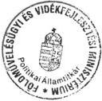
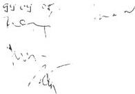
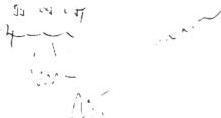
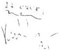
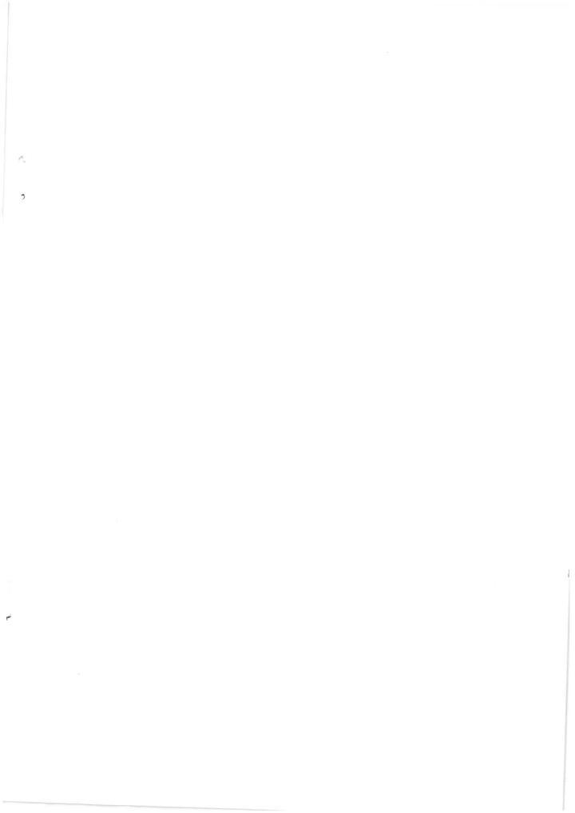

Állami Számvevőszék

TSZ: 451

V- 20-35/

1999.

## JELENTÉS

**az állami erdővagyon működtetésének**
**ellenőrzéséről a „Gyulaj” Erdészeti és**
**Vadászati Rt. és az Ipoly Erdő Rt. 1997-**
**1998. évi gazdálkodása tükrében**

1999. szeptember

9930

---

Az ellenőrzés végrehajtásáért felelős:
az ÁSZ IV. Vagyonellenőrzési Igazgatósága

Kemény Emil

mb számvevő igazgató

Az ellenőrzést vezette:

Dr. Podonyi László

osztályvezető főtanácsos

Az ellenőrzésben részt vettek:

Bátory Béláné számvevő

Dr. Gálik Jenő számvevő tanácsos

Koós Lászlóné számvevő tanácsos

Korondi János számvevő tanácsos

Dr. Németh Klára számvevő tanácsos

Rideg Margit számvevő tanácsos

Bedike György szakértő

Dr. Csikai Zsolt szakértő

Az ÁSZ által a témában eddig készült ellenőrzések listája:

Jelentés a Földművelésügyi Minisztérium pénzügyi-gazdasági
ellenőrzéséről (1991, 1998).

Jelentés a Kincstári Vagyoni Igazgatóság vagyonkezelő és hasznosító
tevékenységének vizsgálatáról (1997).

A jelentés az internet www.asz.gov.hu alatt olvasható

Jelentéseink az Országgyűlés számítógépes hálózatán is olvashatók.

---

V-20- 35/1998-1999. TÉMASZÁM: 451

# TARTALOMJEGYZÉK

|  **MEGÁLLAPÍTÁSOK, KÖVETKEZTETÉSEK, JAVASLATOK** | **6**  |
| --- | --- |
|  1. MEGÁLLAPÍTÁSOK, KÖVETKEZTETÉSEK | 6  |
|  1.1. A társaságok működésének jogi, szabályozási környezete | 6  |
|  1.2. A társaságok gazdálkodásának vagyoni, gazdálkodási és pénzügyi jellemzői | 7  |
|  1.3. A társaságok teljesítőképessége és teljesítményei | 14  |
|  2. JAVASLATOK, AJÁNLÁSOK | 17  |

Függelékek:

1. A „Gyulaj” Erdészeti és Vadászati Rt. 1997-1998. évi gazdálkodása
2. Az Ipoly Erdő Rt. 1997-1998. évi gazdálkodása

Mellékletek:

1. Erdőgazdasági társaságok eredménye az 1997-98. évben
2. Jogszabálygyűjtemény

1

---

---

---

# Függelékek

Az állami erdővagyon működtetése

1. A "Gyulaj" Erdészeti és Vadászati Rt. 1997-1998. évi gazdálkodása

2. Az Ipoly Erdő Rt. 1997-1998. évi gazdálkodása

1

---

2

---

# JELENTÉS

## az állami erdővagyon működtetésének ellenőrzéséről a „Gyulaj” Erdészeti és Vadászati Rt. és az Ipoly Erdő Rt. 1997-1998. évi gazdálkodása tükrében

1998-ban Magyarország 1,9 millió ha erdőgazdálkodás alá vont területéből 60% köztulajdonban, 21% magántulajdonban, 19% pedig rendezetlen vagy társulás előtti tulajdonban volt.

Az erdőgazdálkodás alá vont terület 51%-át (972 ezer ha) az ÁPV Rt. hozzárendelt vagyonában lévő, tartósan 100 %-ban állami tulajdonban maradó 19 erdőgazdasági részvénytársaság kezelte. E társaságok feladata, hogy piaci viszonyok között gazdálkodva a kezelésükbe adott kincstári tulajdonú erdőket a közcéloknak megfelelően fenntartsák és gyarapítsák. (A Honvédelmi Minisztérium irányítású erdőgazdasági rt.-k az erdőgazdálkodás alá vont terület mintegy 5%-át kezelik.)

A nemzeti erdővagyon jogi helyzetét alapvetően az állam vállalkozói és kincstári vagyonát kialakító, illetőleg elválasztó államháztartási és privatizációs törvény Ptk.-án alapuló előírásai, továbbá az erdőre, a vadászatra és vadgazdálkodásra, valamint a természetvédelemre vonatkozó 1996-ban megalkotott szakmai törvények rendezik. Ennek értelmében az állami tulajdonban lévő - kincstári vagyoni körbe tartozó - erdők felett a tulajdonosi jogokat a pénzügyminiszter (jelenleg a Miniszterelnöki Hivatalt vezető, egyben a kincstári vagyonért felelős miniszter) gyakorolja, aki e jogoknak 1996. január 1-től a Kincstári Vagyoni Igazgatóság (KVI) útján szerez érvényt. A KVI a kincstári erdők kezelésére az ÁPV Rt. hozzárendelt vagyonában lévő részvénytársaságokkal csak ideiglenes vagyonkezelési szerződéseket kötött amelyek csak használati jogot biztosítanak. A mai napig nem kerültek megkötésre az Aht.-ban előírt végleges vagyonkezelési szerződések, amelyek vagyonkezelői jogot is keletkeztek. A társaságok szakmai működése felett a Földművelésügyi és Vidékfejlesztési Minisztérium (FVM) és a Környezetvédelmi Minisztérium (KÖM) gyakorol hatósági felügyeletet. Az FVM irányítja az erdőfelügyelet és erdőrendezés, valamint a vadgazdálkodás hatósági feladatait, a KÖM pedig a védett erdőterületeken és a vadgazdálkodási terv védett természeti területet érintő részeire kapott hatósági jogkört. **Az erdő- és vadgazdálkodást** tehát egy **sokszereplős intézményi rendszer irányítja**, amelyben a résztvevők működésének összehangoltsága az állami erdővagyon sorsának alakulásában kiemelkedő jelentőségű. Az erdők nemzetgazdasági, közjóléti és védelmi szerepe, az erdők hosszú távú fenntartásának társadalmi igénye az irányításban résztvevő szervezetek folyamatos együttműködését feltételezi.

---3

---

Az Állami Számvevőszék a 19 erdőgazdaság közül kettőben - a 'Gyulaj' Erdészeti és Vadászati Részvénytársaságnál (Tamási) és az Ipoly Erdő Részvénytársaságnál (Balassagyarmat), továbbiakban: Rt.-k - részletesen vizsgálta, hogy az adott társaságok közcélú feladataikat milyen jogi, vagyoni, piaci, irányítási körülmények között, milyen szakmai, pénzügyi-gazdasági eredménnyel végezték 1997-98-ban. E két társaság ellenőrzése során felmerült rendszerbeli problémák megítélésére bekérte és elemezte az ÁPV Rt., a KVI és a minisztériumok dokumentumait is. A levont igazolható és általánosítható következtetéseket ezekben az intézményekben is ellenőriztük.

A helyszínen vizsgált két társaság gazdálkodásának nagyságrendjét az alábbi - 1997. évi - adatok szemléltetik:

|   | 19 erdőgazdasági rt. |   | 'Gyulaj' Rt. | Ipoly Rt.  |
| --- | --- | --- | --- | --- |
|   |  összesen | átlagosan  |   |   |
|  Kezelt kincstári erdőterület (ha) | 900 950 | 47 418 | 20 895 | 64 187  |
|  Saját tőke (millió Ft) | 27 530 | 1 449 | 613 | 834  |
|  Mérleg-főösszeg (millió Ft) | 34 125 | 1 796 | 733 | 934  |
|  Árbevétel (millió Ft) | 31 151 | 1 640 | 639 | 767  |
|  Üzemi tev. eredménye (millió Ft) | 707 | 37 | - 3 | - 21  |
|  Pénzügyi műv.eredménye (millió Ft) | 216 | 11 | 16 | 26  |
|  Szokásos váll.eredmény (millió Ft) | 923 | 49 | 13 | 5  |
|  Átlagos statisztikai létszám (fő) | 12 310 | 648 | 244 | 378  |

A 'Gyulaj' Rt.-t 188 millió Ft alaptőkével 1993. július 3-án, az Ipoly Rt.-t 124 millió Ft alaptőkével 1993. július 1-jén alapította az ÁV Rt. Az átalakulással létrejött Rt.-k a korábbi állami vállalatok általános jogutódai. A termőhelyi adottságaikat tekintve a 'Gyulaj' Rt. erdőterületei a gyenge-közepes, az Ipoly Rt.-é pedig a közepes kategóriába tartoznak. 1997. március 1-től a 'Gyulaj' Rt. 33 ezer ha - kifejezetten nagyvadás -, az Ipoly Rt. 45 ezer ha - jellemzően apróvadás - vadászterületen jogosult vadászatra. Tevékenységi körük szinte kizárólag az alaptévékenységre - az erdősítésre, a fahasználatra, a vadgazdálkodásra - korlátozódik.

A vizsgálat reprezentációja az egyes témakörökben eltérő volt. Teljeskörűnek mondható a következtetések megalapozottsága a társaságok átalakítása, szabályozása, tőkejuttatás vonatkozásában. Az átalakítás, szabályozás, tőkejuttatás valamennyi társaságnál azonos elvek szerint történt, a jogi környezet pedig természetéből adódóan igaz valamennyi társaságra. A vizsgált két Rt. gazdál-

4

---

kodásából levont következtetéseket csak kevésbé lehet általánosítani a többi társaságra.

A két társaságnál tapasztaltakat - figyelemmel arra is, hogy az összes ilyen állami tulajdonú társaság profilja, feladatköre azonos - az ÁSZ alkalmasnak tartja kisebb megszorításokkal, általánosítható következtetések levonására.

Az általánosnak tűnő szabályozási, összehangolási hiányosságokra segítő, feltáró szándékkal célszerű már most felhívni az illetékesek figyelmét. A következő évben az egyenlőre jelzés értékű következtetések az intézményeknél végzett további ellenőrzéssel kerülnek megerősítésre.

**Az ellenőrzés során az Állami Számvevőszék** - az Állami Számvevőszékről szóló 1989. évi XXXVIII. törvény 2. § (6) bekezdésében foglaltaknak megfelelően - **részletesen arra kereste a választ**, hogy az Rt.-vé alakult erdőgazdaságokhoz közcélra rendelt vagyon elegendő volt-e a működésükhöz, a fejlesztésekhez szükség volt-e a társaságok feltőkésítésére. A Magyar Állam képviseletében különböző minőségben eljáró szervezetek intézkedései elősegítették-e a kincstári erdővagyon hatékony működését. Biztosítottak-e a részvénytársaságok törvényes és hosszú távú működésének feltételei. A részvénytársaságok alapítása és működésük tulajdonosi irányítása, a menedzsment döntései, intézkedései alapján

- működésük jogszerű és szabályos volt-e,
- elősegítették-e a rendelkezésre álló állami tulajdon hatékony hasznosítását, megőrzését és gyarapítását, s eközben
- javult-e az állam közszolgáltatási feladata teljesítésének színvonala.

A helyszíni ellenőrzés és elemzés a részvénytársaságok működésének a vizsgálat szempontjából meghatározó területeire terjedt ki, nem célozta meg az Rt.-k teljes átvilágítását, átfogó vagyon- és költségelemzését. Az ellenőrzés formálisan a társaságok 1997-98. évi gazdálkodására terjedt ki, de a vagyoni és a jogi körülmények miatt szükséges volt 1993-ig vissza-, illetve 1999-re előretekinteni.

Az ellenőrzött társaságoknak a rájuk vonatkozó konkrét vizsgálati jelentéseinkben tettük meg a megállapításaink alapján a javaslatainkat.

A jelentéshez függelékként csatoltuk a két társaságra vonatkozó részletes megállapításokat. Az Ipoly Erdő Rt. vizsgálatáról szóló 2. számú Függelék - részben technikai okok miatt - dőlt betűkkel írott része a társaságra nem vonatkozó megállapításokat tartalmazza.

5

---

# MEGÁLLAPÍTÁSOK, KÖVETKEZTETÉSEK, JAVASLATOK

## 1. MEGÁLLAPÍTÁSOK, KÖVETKEZTETÉSEK

### 1.1. A társaságok működésének jogi, szabályozási környezete

A „Gyulaj” Erdészeti és Vadászati Rt.-t, valamint az Ipoly Erdő Rt.-t - az állami tulajdonú további 17 erdőgazdasági rt.-vel együtt - az ÁV Rt. egységes szempontok szerint alakította át a jogelőd állami vállalatokból 1993-ban. Az átalakítást olyan körülmények között vezényelték le, amikor nem voltak egyértelműek a kincstári vagyon fogalmára, összetételére, kezelésére, működtetésére és számviteli nyilvántartására irányuló koncepciók. Ebben az időszakban kellett megújítani a nemzeti erdővagyon megőrzésével és gyarapításával, a tartamosság (fenntartható fejlődés) fenntartásával összefüggő szakmai törvényeket is, figyelemmel arra, hogy az erdő nemzeti kincs, fenntartása és védelme az egész társadalom érdeke, jóléti szolgáltatásai minden embert megilletnek. Az ún. erdőtörvény mellett az erdők haszonvétel jellegéhez kapcsolódóan megalkották a vadászatról és a vadgazdálkodásról szóló, és az erdő élővilágához is kapcsolódó természetvédelmi törvényt. E szakmai törvényekben megfogalmazott végrehajtási rendeletek készítése jelenleg is folyamatban van. Az erdőgazdasági rt.-k működési szabályozottságának helyzete, gyakorlata példázza az erdőgazdálkodás általános helyzetét. Az állam az erdőgazdálkodással kapcsolatos közcélú feladatainak ellátását az agrárgazdaság támogatási rendszerén keresztül szinte átláthatatlanul bonyolult, gyakran változó szabályozási keretek között hajtotta végre.

Jelenleg sem egyértelmű az állami - ezen belül - a kincstári erdővagyon, az erdő és azzal szorosan összefüggő vagyontárgyak összetételének, kezelésének, működtetésének és számvitelének szabályozása. A kincstári vagyon felett tulajdonosi jogokat gyakorló állami szervek körének és jogállásának meghatározásában jelenleg is átfedések vannak. Egyértelmű pontosításra vár e vagyoni kör vagyontárgyainak, a működtető szervezetek feladat- és hatáskörének meghatározása. Elkerülhetetlen az állami erdővagyon működtetésének összehangolt szabályozása, beleértve a sokszereplős intézményi rendszert is. **Az állami erdők fenntartása, védelme és gyarapítása, az erdőgazdálkodás nem szabályozott teljes körűen. Az erdővagyon-kezelés szabályai hiányoznak, az állami pénzek felhasználása nem minden esetben a rendeltetésnek megfelelő és nem a szükségességnek alárendelt.**

Az államháztartási törvény 1996. január 1-i hatályú módosítása az állami tulajdonú erdőket is e törvény hatálya alá vonta. A máig hatályos, többször módosított privatizációs törvény az állami erdőket az ÁVÜ és ÁV Rt. kezeléséből, illetőleg hozzárendelt vagyonából kiemelte. A KVI felállításával az állam kincstári és vállalkozói vagyonának szétválasztása megtörtént, a kincstári vagyonrészeket - köztük az állami tulajdonú erdők egy részét - az ÁV Rt. hozzá-

6

---

rendelt vagyonából kiemelték és a KVI kezelésébe adták. Az átalakított állami erdőgazdasági Rt.-k részvényei felett a tulajdonosi jogok gyakorlója az ÁV Rt. jogutódja, az ÁPV Rt. maradt. Az állami tulajdonú kincstári erdőket ezek a társaságok működtetik.

A jogalkotás folyamatában sok éven át nem kapott kellő figyelmet, hogy az erdő mint természeti képződmény elsősorban dologi jogi, ingatlanjogi és vagyonjogi kategóriákkal írható le és rendezhető. E kategóriák közül az állami tulajdonú erdők jogi sorsát alapjaiban meghatározó ingatlan- és földjogi megközelítést figyelmen kívül hagyták. Ennek oka az ingatlan-nyilvántartás rendezetlen állapota és az, hogy az 1970-es években a 'telekkönyvi' bíróságokat megszüntették. A 'telekkönyvi' bíróságok megszüntetése miatt törlődött ki a köztudatból, hogy csak ezen bíróságok által vezetett nyilvántartásokba való bejegyzés keletkeztet jogot, így kincstári tulajdonjogot is. A különböző jogállású szervezetek közötti ingatlan átadás-átvétel bejegyzés nélkül érvénytelen. A jelenlegi megoldás nem teljesíti a forgalombiztonság elvét, mert nem jár azzal az eredménnyel, hogy a forgalomban tanúsítaná az érintett ingatlanon fennálló kincstári és vagyonkezelői jogokat.

A vad állami tulajdonának Ptk.-n belüli deklarációja kiürült, tényleges jogi tartalmat nem takar. Az állami tulajdonjogot élővad esetében a vadászterület kezelője, a 100 %-os állami tulajdonú erdőgazdaság gyakorolja mint az élővad vagyonkezelője. A lőtt vad, mint haszonvétel tárgya az erdőgazdaság tulajdonát képezi. A lőtt vad továbbértékesítése esetén pedig a különböző jogállású tulajdonosok érdekeltségeinek tárgyává válik. Azáltal, hogy a vadászat vagyoni értékű joggá vált, haszonelvűvé vált a vad fenntartásához és értékesítéséhez fűződő érdek is. Az állam az érdekek egyensúlyát erős hatósági kontrollal igyekszik megtartani, ugyanakkor a pénzügyi támogatás rendszerét változatlanul hagyta. Mindezek szükségessé teszik a vad jogállásának újra fogalmazását a Ptk.-ban, és természetesen a számviteli törvényen is valamint a bonyolult tulajdonosi szerkezet átgondolását is.

## 1.2. A társaságok gazdálkodásának vagyoni, gazdálkodási és pénzügyi jellemzői

A „Gyulaj” Erdészeti és Vadászati Rt. és az Ipoly Erdészeti Rt. tőkeszerkezetét az ÁV Rt. 1993. július 1-én, illetve 2-án - az átalakulás időpontjában - az alábbiak szerint határozta meg:

|  „Gyulaj” Erdészeti és Vadászati Rt: |  | Ipoly Erdő Rt.  |
| --- | --- | --- |
|  Jegyzett tőke | 188 230 e Ft | 124 480 e Ft  |
|  Tőketartalék | 427 699 e Ft | 345 016 e Ft  |
|  **Saját tőke** | **615 929 e Ft** | **469 496 e Ft**  |

Mindkét társaság 1993-as - jogszabályok hiányában az ÁV Rt. irányelvei szerinti - átalakításakor kényszerű tőkeszerkezetet alakított ki. (Az átalakulás idő-

7

---

pontjában a KVI még nem létezett.) A vagyonrészeket a kincstári vagyoni körbe tartozó és a működtetéshez szükséges vagyonra bontották. Meghatározták a privatizálásra szánt vagyontárgyak körét is. Kincstári vagyoni körbe sorolták és felértékelték az állami erdővagyonhoz fizikailag kapcsolódó ingatlanokat, utakat, közjóléti eszközöket, vadászházakat, vadvédelmi kerítéseket. Ezek a vagyonelemek a társaság tőketartalékába kerültek. A tőketartalékba került még - a kincstári vagyoni körbe soroltakon kívül - a jegyzett tőkén felüli működtető vagyon is. A jegyzett tőkébe a működéshez szükséges, ugyancsak felértékelt telkesített belterületi ingatlanokat és eszközöket sorolták. A vagyonelemek - irányelvek szerinti - szétválasztása azonban csak formai volt, mert a vállalatok könyveiben meglévő teljes vagyon társasági vagyon lett. A tőketartalékból később - a KVI megalakulása után - sem vonták el az eredetileg kincstári vagyoni körbe sorolt vagyonrészeket, az átalakuláskor kialakított kényszer-tőkeszerkezet megmaradt. Ez lehetővé tette az eszközök vegyes tulajdonlását. A vegyes tulajdonú eszközök egy része a társaságok könyveiben szerepel, kincstári tulajdonú földterületeken az Rt.-k tulajdonában lévő ingatlanok (pi: az erdei utak) vannak. **A mai napig nem határozták meg jogszabályban a kincstári erdővagyonnal szorosan összefüggő vagyontárgyak körét.** A számviteli törvény 1996. január 1-i módosítása után a társaságok könyveiben a beruházások között, illetve a tőketartalékban maradt az állami támogatásból megvalósított erdőtelepítések értéke. **A vagyonelemek egyértelmű tulajdonjogi és számviteli rendezése,** az állami erdőkkel kapcsolatos jelenlegi szakmai és számviteli szabályozás újragondolása **elkerülhetetlen.** A bonyolulttá vált tulajdoni szerkezet - a tőketartalék működtető és kincstári vagyonelemeket is tartalmaz - szinte megoldhatatlanná tesz egy esetleges kezelőváltást.

Mindezek a további 17 erdőgazdasági rt.-re is jellemzőek. E rendszerbeli hiba - a tőketartalék összetétele, a fogalom-meghatározás hiánya - miatt kerültek erdőgazdasági társaságok tulajdonába és kezelésébe - a KVI kimutatása szerint - országos jelentőségű műemlékek, például a visegrádi Várhegy, a Fellegvár, a Királyi Palota felépítményei. A törvény szerint kizárólagos állami tulajdonúnak minősített műemlék-ingatlanok felépítményei találhatóak az erdőgazdasági rt.-k vagyonában ma is.

Egyes erdőgazdasági rt.-k jegyzett tőke apportja - a működtető vagyonon felül - korlátozottan forgalomképes, társasági tulajdont nem képezhető erdő művelési ágú ingatlanokat is tartalmaz. Az FM Erdészeti Hivatala az erdőfelügyelőségek közreműködésével országosan összesítette a jogsértő társaságbavitelt. Az összesítés szerint a jogellenes erdőapport 4568,8 ha volt. Ebből 2956,5 ha-t a földhivatalok átjegyeztek társasági tulajdonba, 1612,3 ha átjegyzése az összesítés időpontjában (1996. szeptember) még nem történt meg.

A kialakult gyakorlat szerint több esetben olyan vagyon - az erdők - került társasági tulajdonba, amelyekre nézve az apportálás tilalmát már a társaságok megalakulása időpontjában is jogszabály tartalmazta. A társasággá alakítás jogszabályba ütköző apporttal semmis. A PM 1996. szeptember 19-én utasította a KVI-t a jogellenes helyzet feltárására és megszüntetésére. Az utasítás ellenére a KVI vizsgálatunkhoz semmi - érdemleges intézkedést bizonyító - dokumentumot nem adott át.

8

---

Az állami erdővagyon (a külterületi földet, az erdővel borított területet) a két vállalat könyveiben értékkel nem tartották nyilván sem az átalakulás előtt, sem azt követően. A könyvekben - az eszközök között - az erdőfelújításnak és az erdőtelepítésnek volt nyilvántartott értéke. Az 1996. január 1-től hatályos számviteli szabályozás szerint jelenleg csak az erdőtelepítéseket - mint befejezetlen beruházásokat - kell ráfordítási költségen a könyvekben nyilvántartani a tőketartalékkal szemben. Hosszabb távon a beruházási érték - amely a társaság vagyonát gyarapítja - az évenkénti erdőtelepítések összegével folyamatosan növekszik. Ez a szabályozás - rendszerbeli hiba - a működtető társaságok vagyonösszetételét torzítja.

A termőföld, az erdő nyilvántartása analitikus, csak naturális adatokat tartalmaz. Ez a nyilvántartás a melléklete a KVI-vel 1996 novemberében kötött ideiglenes vagyonkezelési szerződésnek is. A KVI mind a 19 erdőgazdasági rt.-vel egységes szempontok szerint kötött szerződést. Az Áht. nem ismeri az ideiglenes vagyonkezelői jog fogalmát, így a társaságok valójában csak használók és nem vagyonkezelők. A problémakör része, hogy az erdőtörvény előírása szerint állami tulajdonú erdőben csak a kincstári vagyonkezelő lehet erdőgazdálkodó, következésképpen az ideiglenes vagyonkezelési szerződés alapján a 19 erdőgazdasági rt. sem lehet jogszerű erdőgazdálkodó.

A „Gyulaj” Erdészeti és Vadászati Rt. és az Ipoly Erdő Rt. az első évben hektáronként 50-60 Ft, csekély mértékben differenciált, jelképes vagyonkezelési díjat fizetett a KVI-nek. A vagyonkezelői díj országos átlagban hektáronként 67 Ft volt. A díjban a hatósági úton előírt használati korlátozásokat (elsősorban természetvédelmi), a termőhelyi adottságokat nem vették figyelembe. A vagyonkezelői díjak a vadászati jogok ellenértékét is tartalmazzák. A díjak számlázásakor a KVI a szerződések felülvizsgálata nélkül egyoldalúan emelte meg a vagyonkezelés díját. A szerződésekben a KVI nem járult hozzá az ideiglenes vagyonkezelői jognak - az Áht.-ban a jog létrejöttéhez előírt - ingatlan-nyilvántartási megjelenítéséhez. Az ideiglenes vagyonkezelési szerződésben nem rögzítették azt a számviteli törvény támasztotta követelményt, hogy a kezelt állami vagyont értéken kell a vagyonkezelő mérlegében az eszközök között kimutatni a hosszúlejáratú kötelezettségekkel szemben. **A végleges és jogszerű vagyonkezelői szerződéseket a KVI és a társaságok között a mai napig nem kötötték meg, így a vagyonkezelői jogot az ingatlan-nyilvántartásban emiatt, és az illetékes minisztériumok (FVM, KÖM) egyetértése nélkül, sem lehet érvényesíteni.**

Az erdőről szóló törvény végrehajtási rendelete előírja, hogy az állam a tulajdonában lévő erdőkben a közérdek fokozottabb érvényesüléséről tulajdonosi képviselete útján, az erdővagyon-kezelés szabályainak meghatározásával és betartásával gondoskodik. A vagyonkezelési szabályok még nem készültek el. A KVI nem adott választ arra a kérdésre, hogy ezek hiányában, milyen más módon gondoskodik az állami erdőkben a közérdek fokozottabb érvényesüléséről.

---9

---

A két állami vállalat átalakulásakor az állami erdővagyon fenntartásának és gyarapításának finanszírozhatóságát, a közcélok megvalósíthatóságának forrásszükségletét nem számszerűsítették.

# 1996-tól mindkét társaság az alaptevékenysége üzleti eredményéhez viszonyítva jelentős pénzügyi nyereséget realizált.

A „Gyulaj” Erdészeti és Vadászati Rt. 1997-ben és 1998-ban is mérleg szerinti nyereségét a pénzügyi műveletek eredményéből biztosította. A társaság először 1997 szeptemberében vett fel hitelt, majd 1998 novemberéig összesen 351 millió Ft külső forráshoz jutott. Ebből 150 millió Ft kamattámogatásos éven túli agrárhitel, 101 millió Ft kamatmentes reorganizációs célú hitel és 100 millió Ft készpénz formájában történő jegyzett tőke emelés volt. E két utóbbit az ÁPV Rt. engedélyezte, a kamatot átvállalta, a tőkeemelés összegét átutalta. A társaság - beszámolói szerint - a külső források döntő részét felhasználta, 1999. évi felhasználásra összesen 78,6 millió Ft maradt. Ezzel szemben a társaság pénzeszközei 1998. december 31-én 391,1 millió Ft-ot tettek ki, ebből 363,3 millió Ft-ot kamatozó értékpapírba fektettek, és 1999-re is 300 millió Ft körüli folyamatos betétállományt terveztek. A külső források biztosításakor a célok között nem szerepelt a közpénzek több éven keresztüli lekötése.

Az Ipoly Erdő Rt. az Ipolyvidéki Erdő és Fafeldolgozó Gazdaságtól 236 millió Ft terhet örökölt, ebből 202 millió Ft rövidlejáratú kötelezettség volt. A csődhelyzetet az Rt. úgy oldotta meg, hogy vagyonának nyereséget nem hozó részét privatizálta, és az ebből rendelkezésre álló forrásból adósságát visszafizette. A rendezésben szerepe volt az ÁV Rt. garanciájával felvett 99 millió Ft-os hitelnek is, amely lehetővé tette, hogy az Rt. valamennyi adósát kifizesse, és csak egy bankkal kerüljön adós viszonyba. Az ÁPV Rt. két esetben, 1997-ben és 1998-ban, reorganizáció keretében készpénzes tőkeemeléssel 400 millió Ft, kamatátvállalásos hitel nyújtásával 150 millió Ft, összesen 550 millió Ft külső forráshoz juttatta az Ipoly Erdő Rt.-t. Az Rt. az így kapott tőkeemelés nagy részét beruházásokra, a hitelt pedig nagy értékű tárgyi eszközök (gépkocsik, erőgépek, berendezések) vásárlására fordította. Az útépítésre tervezett 150 millió Ft beruházási keret felét az Rt. 1997-ben és 1998-ban nem tudta elkölteni azért, mert a 4 tervezett útépítés és rekonstrukció közül az illetékes természetvédelmi hatóság 2 út építését nem engedélyezte. Az Ipoly Erdő Rt. mérleg szerinti eredményét 1997-ben és 1998-ban a pénzügyi műveletek eredményéből biztosította. A reorganizációra kapott, de fel nem használt - és így állampapírba fektetett - pénzösszeg kamataiból származó pénzügyi bevétel tette az Rt.-t nyereségessé. Az értékpapírok összege 1998. december 31-én 391,9 millió Ft volt.

A 19 erdőgazdasági rt. vagyona is az alaptevékenységük jövedelmét meghaladó mértékben gyarapodott 1997-98-ban.

10

---

# A 19 erdőgazdasági rt. eredményadatai

millió Ft-ban

|  Megnevezés/Év | 1994 | 1995 | 1996 | 1997 | 1998 *  |
| --- | --- | --- | --- | --- | --- |
|  Üzleti eredmény | 1008 | 1706 | 1379 | 707 | 993  |
|  Pénzügyi m. e. | - 121 | 159 | 147 | 216 | 460  |
|  Szokásos váll.e. | 887 | 1865 | 1526 | 923 | 1453  |
|  Rendkívül e. | - 439 | - 258 | - 256 | - 69 | - 82  |
|  Adózás előtti e. | 448 | 1607 | 1270 | 854 | 1371  |

* nyers mérlegadat

A 19 erdőgazdasági rt. részletes eredményadatát az 1. sz. melléklet tartalmazza.

A 19 erdőgazdasági rt. pénzügyi tevékenysége már 1995-től nyereséges volt. Voltak ugyan forráshiányos időszakaik, de éves szinten egyre több szabad pénzeszközük halmozódott fel. A pénzügyi műveletek nyeresége 1997-ben a szokásos vállalkozói eredmény 25 %-át, 1998-ban pedig már 30 %-át tette ki. A társaságok 40 %-ánál a szokásos vállalkozói eredményre a pénzügyi műveletek nyeresége volt döntő hatással.( A megfigyelési időszakban a társaságok közül csak néhány társaságnak volt a pénzügyi eredménye veszteség.)

Az ÁPV Rt. 1998-ban 14 társaság tulajdonosi reorganizációjáról intézkedett. Ennek keretében 1515 millió Ft tőkeemelést és 1196 millió Ft kamatmentes hitelfelvételt - a kamatokat az ÁPV Rt. vállalta át - biztosított a társaságoknak. Az erdőgazdasági rt.-k nyereségének forrása elsősorban az ÁPV Rt. alaptőkeemeléseiből, a tőketartalékba adott állami támogatásokból származott. A mérleg szerinti eredményen keresztül vagyont növelő tétel az a pénzügyi eredmény is, amelyet a társaságok a kedvezményes kamatozású, vagy az ÁPV Rt. garanciájával és kamat-átvállalásával felvett hitelek és a tőkeemelés kamatozó értékpapírokban tartásából nyertek. Ebből azt a következtetést lehet levonni, hogy a társaságoknak a milliárd Ft-os nagyságrendű, különböző címeken felvett külső forrásra nem ilyen összegben, illetve nem ilyen ütemezésben volt szükségük. Összehangolt stratégia a kincstári vagyont, a részvényvagyont kezelők és az állami támogatást biztosító FM között nem volt. Ugyanazokra a célokra hivatkozva lehetett több helyről pénzhez, külső forráshoz jutni. A társaságok rövid időn belüli túlzott mértékű pénzellátása azért következett be, mert nem készült a vagyonkezelés és működtetés fő elveire irányuló, a tulajdonos képviselői és a szakmai irányítók közötti összehangolt stratégia.

A két társaság gazdálkodását a jogelődöktől örökölt gazdasági adottságok és az alaptevékenységek arányaiban való eltérés határozta meg.

A "Gyulaj" Rt. 1997. évi gazdálkodásának társasági szintű eredménye jelentős mértékben, mintegy 30 %-ára, csökkent az előző évhez képest. A csökkenés,

11

---

amelyet a pénzügyi tevékenység eredményének apadása okozott, átmeneti jellegű volt, mert a társaság 1998-ban a tulajdonos segítségével újabb kamatoztatható pénztartalékra tett szert. Alaptevékenységének nullához közeli üzleti eredménye a piaci helyzet romlása, az új szakmai alaptörvények hatályba lépésének tervezett negatív hatásai ellenére - pl. a három szakmai törvény változásának negatív hatását 33 millió Ft-ra becsülték - alig változott.

Az alaptevékenység jövedelmezőségének szintentartásában jelentős - 18 millió Ft - szerepe volt a nagy értékű tárgyi eszközök előző évi értékesítésével keletkezett üzemi (üzleti) eredménytartaléknak, a költségtakarékosságnak, amelyet a halasztható erdőművelési munkák elhagyásával ért el a társaság, a tulajdonos által engedélyezett kereset-növelésen felül az üzemi (üzleti) eredmény terhére tervezett egyéb bérjellegű juttatás (ún. étkezési hozzájárulás) elmaradásának, valamint az erdőműveléshez pályázati úton igénybe vehető költségvetési támogatások kihasználásának.

**Az agrárgazdasági célok költségvetési támogatásának rendkívül bonyolult, szinte áttekinthetetlen rendszerében a társaság 1997-ben jogosulatlanul igénybevett támogatással is gyarapította eredményét.** A társaság 1997-ben különféle jogcímeken összesen 66 millió Ft egyéb bevételt növelő állami támogatást kapott. Az ebben szereplő **erdészeti közcélú feladatokra kiírt pályázaton elnyert 11 493 500 Ft-ból 3 838 000 Ft-ot jogosulatlanul vett igénybe a társaság.** A pályázható jogcímek közül ugyanis az abiotikus erdőkárok felszámolására, elhárítására 10 056 000 Ft-ot kért, de feltehetően forráshiány miatt csak 5 500 000 Ft-ot hagyott jóvá részére a bíráló bizottság. A különbséget - 4 556 000 Ft-ot - azonban később újabb pályázat, kérelem benyújtása nélkül is megkapta. Az FM 1997. december 16-i keltezéssel igazolást adott a társaságnak 4 556 000 Ft költségvetési támogatás állami adóhatóságtól történő igénybevételéhez. Az igazolás szerint a társaság a „Rendkívüli erdőkárok elhárításának támogatása” jogcímre kötött 36.899/1/97. számú szerződés szerint 4 556 000 Ft támogatási összegről szóló, vállalt kötelezettségeinek eleget tett és ennek alapján ez az összeg végelszámolás címén a társaságnak átutalható. A támogatás négy nappal korábbi végelszámolásában viszont a ténylegesen elvégzett erdőkár-felszámolás pályázati kiírás szerinti jogos támogatási igénye csak 6 218 000 Ft. Ez a két részletben megkapott összegnél 3 838 000 Ft-tal kevesebb. A társaság a fenti számú szerződést nem tudta bemutatni. A jogosulatlanul igénybe vett összeg visszautalásáról sem a társaság, sem az állami erdészeti szolgálat illetékes szerve nem intézkedett. A támogatások számviteli nyilvántartása a társaságnál ugyancsak nehezen áttekinthető, jogcímenkénti pontos kimutatásuk sok időt igényelt. A támogatások jogosultságát igazoló okiratok hiányosak, irattározási rendjük nem megfelelő.

A társaság az adózás előtti eredményt tekintve éves terveit következetesen túlteljesítette, a tulajdonos ösztönzési rendszere erre készítette a társaság vezetését. Mivel a tulajdonos nagy súllyal szerepeltette a nyereségterv túlteljesítését a prémiumfizetés feltételei között, a menedzsmenttől nem is volt elvárható, hogy a tervek minden tartalékot feltárva készüljenek. Ezt az ösztönzési módszert az ÁPV Rt. megbízásából a társaság átvilágításáról készített Phare-tanulmány már kifogásolta 1995 közepén. A tulajdonos ezt az észrevételt azóta sem vette

12

---

figyelembe. Az 1997-es nehéz gazdasági év után nem készültek tartalékfeltáró elemzések a társaságnál.

Az 1996-97. évi cash flow-kimutatások a társaság 1997. évi pénzügyi helyzetének gyengülését jelzik, ennek ellenére a társaság pénzügyi helyzete 1997-ben is az erdőgazdasági átlagot messze meghaladóan jónak minősíthető. A belföldi vevőinek tartozása csekély növekedés mellett szerkezetileg kedvezőtlenül változott, 1996 végén 29 millió, 1997 végén 52 milliót Ft volt a lejárt (fizetési határidőn túli) vevőtartozás.

A társaság vezetésének véleménye szerint a romló fapiaci helyzet, az erdőfelújítás nem elégséges költségvetési támogatása miatt az intenzív vadgazdálkodás a társaság gazdálkodásának célszerű fejlesztési iránya. A közvetlen költséggel arányos rezsiviselést is elvárva a vadgazdálkodás az elmúlt négy évben a társasági szintű üzemi (üzleti) eredményt nem gyarapította, hanem fogyasztotta. Ugyanakkor az erdőfelújítás és fahasználat (fakitermelés) együttvéve az arányos rezsiteherrel is nyereséges ágazata volt a gazdaságnak. Akkor is nyereséges lett volna, ha a társaság a törvényes kötelezettsége szerint fizette volna az erdőfenntartási járulékot. 1993 óta - az erdőfenntartási járulék törvényi szabályozásának kezdete óta - ugyanis a **'Gyulaj' Rt. az FM Erdészeti Hivatalának hozzájárulásával a nagyalföldi tájegységre érvényes - a törvényi szabályozástól eltérő - mértékekkel számított erdőfenntartási járulékot fizet.** A 'Gyulaj' Rt. a törvény szerint a dél-dunántúli tájegységbe tartozik. A törvényes mértékekkel számított fizetési kötelezettsége 1996-ban 10,1 millió Ft-tal, 1997-ben 17,6 millió Ft-tal lett volna több, mint amennyit ténylegesen fizetett. 1998-ban a várható különbség 15,9 millió Ft. Az FM a törvénytől eltérő fizetési kötelezettséget szakmai érvek alapján engedélyezte. E szerint a fahasználattal elérhető árbevételhez képest a törvényes mértékkel számított erdőfenntartási járulék méltánytalanul terhelné a társaságot. Ugyanakkor a dél-dunántúli tájegységben csak a „Gyulaj” Rt. kapott ilyen kedvezményt. A szakmai megkülönböztetést azonban csak az erdőrészletek minőségéhez jobban igazodó járulék-kategóriák törvényi meghatározása tenné megalapozottá.

A társaság 1998-ban az állami költségvetésből kétszer annyi támogatást kapott, mint 1997-ben. Az 1998. évi támogatás feléhez a központi erdősítési közmunkaprogramhoz kapcsolódó eredményes pályázatával jutott. A Közmunkatanácsától a tervezett közmunka teljes költségéből a 12,3 millió Ft saját erőn felüli rész megtérítését - 50,5 millió Ft-ot -, az FM-től pedig a pályázati kiírás szerint járó 16 millió Ft normatív támogatást igényelte. Támogatási szerződést csak a Közmunkatanáccsal kötöttek 50,5 millió Ft-ról. A pályázat eredményhirdetése a kiírás ellenére az Önkormányzatok Közlönyében nem jelent meg. A társaságnál a közmunka lebonyolítása, a Közmunkatanácsától kapható támogatás elszámolása és jogosságának ellenőrzése a szerződésben foglaltaknak megfelelt. Az elszámolt, igazolt támogatás-részletek átutalása azonban a szerződésben vállaltakkal ellentétben 2-4 hónapos késéssel történt meg. Az FM-támogatás elszámolásának módja azonban jogszabályi rendezetlenség miatt még 1998 decemberében sem volt egyértelmű.

---13

---

**Az Ipoly Erdő Rt.** eredményes gazdálkodását 1997-ben és 1998-ban döntő módon befolyásolta az ÁPV Rt. által nyújtott tőkeemelés és kamattámogatásos hitel. Az üzemi tevékenység 1997-ben negatív eredményt hozott. A reorganizációra kapott, de fel nem használt - és így állampapírba fektetett - pénzösszeg kamataiból származó pénzügyi bevétel tette az Rt.-t nyereségessé, de ez a konstrukció hosszú távon nem tartható.

1998-ban az Rt. megkezdte marketing- és piackutatási tevékenységét, stratégiai tervet dolgozott ki, ennek első eredményei már jelentkeztek. A társaság pénzügyi helyzetét nehezíti a határidőn túli követelések növekedése. Az Rt. vezetősége az 1998-as évet megelőző időkben ezt a kérdést nem kezelte súlyának megfelelően.

A vadászati törvény hatályba lépése után az Rt. a vadászterületét többszörösére növelte. A törvény végrehajtása számtalan új feladat megoldása elé állította az Rt.-t. Döntően ezek az új feladatok, illetve a szakszemélyzet hiánya, a tapasztalatlanság okozta azt, hogy a társaság 1997-ben jelentősen, 37 %-ban, elmaradt attól az eredménytől, amit a vadászati ágazat részére előírt. 1998-ban a vadászati tevékenység eredménye - részben a beruházások eredményeként - javult.

A pályázatokkal elnyert és a jelenlegi szabályozás szerint a társaság tőketartalékába kerülő állami támogatások egy része forrása olyan beruházásoknak és értéknövelő felújításoknak, amelyek az átalakuláskor kincstári elvonásra javasolt vagyont érintik. Így a támogatási rendszer tovább növeli a társasági tulajdonból el nem vont - a korlátozottan forgalomképes állami erdőkkel szorosan összefüggő erdei úthálózaton és egyéb kincstári - vagyontárgyakon a társasági tulajdon értékét, fokozva ezzel a már meglévő vagyonkeveredést. E problémakör része - mivel szintén vagyonkeveredést okoz - az ÁPV Rt. tőkeemeléséből megvalósított beruházások (feltáró utak, vasúti pályák) társasági eszközként történő aktiválása is.

### 1.3. A társaságok teljesítőképessége és teljesítményei

1997-ben és 1998-ban is mindkét társaság csak alaptevékenységet - erdő- és vadgazdálkodást - végzett. Eltérő volt azonban a működési területükön lévő erdők faállományának minősége és a vadgazdálkodásuk jellege is.

**A 'Gyulaj' Erdészeti és Vadászati Rt.** Tolna megyében 46 község határában, az ország erdőterületének 1,35 %-án, a megye erdőterületének 36,9 %-án, 21 ezer hektáron gazdálkodik. Az Rt. kezelésében lévő terület négy erdőgazdasági tájba tartozik. A társaság erdőterületei a termőhely fatermőképessége alapján gyenge és közepes kategóriájúak. Az Rt. területét nemzeti park, tájvédelmi körzet nem érinti, csak országos és helyi jelentőségű védett természeti területük van. A társaság az erdő szociális funkciójának érvényesülése és a közcélú feladatok ellátása érdekében két parkerdőt tart fenn.

A társaság **erdőgazdálkodási tevékenysége** keretében 1997-98-ban is erdősítési, fahasználati és vadgazdálkodási feladatokat látott el. A társaság által

---14

---

kezelt erdőterületen négy erdészet érvényes üzemterv alapján gazdálkodik. A legfontosabb állományalkotó fafajok: a cser 28,3 %, az akác 21,3 % és a különböző fafajú tölgy 14,7 %.

Az Rt. csemetetermelést lényegében nem folytatott, ezért a szaporítóanyag döntő többségét vásárlásból fedezte.

A társaság erdőfelújítási tevékenysége eredményes volt, a korábban felhalmozódott hátralékos erdőrészek területét az 1994. évi 276 ha-ról 1998 végére 77 ha-ra csökkentették. Az első kivitelek (az erdősítések elvégzése) területe átlagosan évi 300 ha felett volt. Az első kivitelek sikeressége évek óta 80 % feletti, az erdészeti normatívák alapján jó minőségű volt. A társaság területének 50 %-án csak kerítés mögött lehetett az erdőfelújítást elvégezni, ezért évente mintegy 25 km kerítés megépítésével védekeztek a vadkár ellen.

A társaság 1997-ben 1360 hektáron 120 600 bruttó m³ fát termelt ki. A társaság erdészetei a tízéves üzemtervi időszak végén járnak, és a korábbi időszakban már kihasználták a jobb erdőrészeket, ezért az üzemtervi előirányzattól egyre inkább elmaradtak. 1998-ban a kitermelt fa mennyisége az előző évhez képest közel 20 %-kal csökkent. Az egészségügyi fakitermelés 1995 óta növekedett, emiatt tovább csökkent a véghasználati lehetőség.

Értékesítés szempontjából a tűzifa értékesítése okozta az Rt.-nek a legnagyobb gondot. A gázprogramok és a magánerdők fokozódó kitermelése miatt a kereslet jelentősen csökkent. A iparifa-piac 1990-es évek elején kialakult kedvező helyzete 1995 közepétől folyamatosan romlott, az exportárak az utóbbi három évben több mint 20 %-kal csökkentek.

Az Rt. 1997-98-ban **intenzív vadgazdálkodást** folytatott, az ideiglenes vagyonkezelésében lévő kincstári tulajdonú területek 87 %-án, - összesen 33 ezer ha-on - szerzett vadászati jogosultságot. Egy területet haszonbérlőként, hármat a földtulajdonosi közösség képviselőjeként kezel. A vadászterületek kifejezetten nagyvadás területek, erdősültségi arányuk magas, kiemelkedően nagy vadsűrűséggel.

**A vadlétszám-becslési adatok nem nyújtottak megbízható forrást a vadgazdálkodáshoz. A társaság által készített éves vadgazdálkodási tervek - vadkilövési tervek - nem voltak kellően megalapozottak.**

A vadkilövések száma 1993 óta minden vadfajnál csökkent. A terítékcsökkenésben a legjelentősebb - elsősorban gazdasági szempontból - a gím és dámbika négy év alatti 60 %-os csökkenése. A társaság árbevételének egyharmadát kitevő vadgazdálkodási ágazat 1996-ban 13,0 millió Ft, 1997-ben 24,3 millió Ft veszteséggel zárt. A társaság a vadgazdálkodási tevékenységet kevés gazdasági eredménnyel végezte.

Az **Ipoly Erdő Rt.** az Északi középhegység Börzsöny és Cserhát tájegységében gazdálkodik. A társaság által kezelt erdőterület 64 ezer ha, amelyen a szakmai

---15

---

feladatokat az érvényes üzemterv alapján a terület nagyságára és tagoltságára szervezett, nagyfokú önállósággal bíró 11 erdészet látja el.

Az Rt. **erdőgazdálkodási tevékenysége** során a vizsgált időszakban is erdőművelési, fakitermelési-fahasználati és vadgazdálkodási feladatokat látott el. Kezelt erdőinek fafaj-összetétele: a legnagyobb területen a tölgy hódít 35,1 %-kal, majd ezt a cser követi 24,7 %-kal, közel azonos területet foglal el a bükk és az akác 11,2 és 12,6 %-kal. Említést érdemel még a gyertyán és a fenyő 7,7 és 5,9 %-os mértékkel. A részvénytársaság teljes területének 51 %-a természetvédelmi terület. A társaság erdőgazdálkodási tevékenysége - a vonatkozó szakmai mutatószámok és a hatóság értékelése alapján - a vizsgált időszakban megfelelő volt.

A társaság erdőgazdálkodáson belüli tevékenységének legjelentősebb ágazata a fakitermelés, fahasználat. A társaság 1997-ben 5486 hektáron 164 522 bruttó m³ fát termelt ki. Ezzel szemben 1998-ban 4607 ha-on volt ugyanannyi a kitermelt fa mennyisége. Az ágazat szereplése alapvetően meghatározza a részvénytársaság eredményes gazdálkodását. A faterméken belül az ipari fa iránt volt kereslet, de a belföldi tűzifa piac beszűkülése jelentős gondokat okozott a részvénytársaságnak. A fakitermelés jövedelmezőségét - a fatermékek piaci megítélésén túl - az erdőművelési ágazat szakmai színvonala határozza meg. Az erdőművelés szakmai színvonalát a befejezett erdősítések tervszintet 23 %-kal meghaladó területi teljesítménye (1997-ben: terv 453,1 ha, tény 558,1 ha), a sikeres mesterséges erdősítések, a sarjeredetű erdősítések arányának és az erdősítési hátralék jelentős csökkenése (1996. évi 76,8 ha-ról 1997-ben 25,2 ha-ra) minősíti. Az erdőművelés költségeinek mérséklését szolgálja a csemetetermelés, amely gyakorlatilag fedezi a társaság szükségletét.

A társaság **vadgazdálkodási tevékenységét** - hatósági vélemény szerint - megfelelő színvonalon és gazdasági eredménnyel végezte. A vadászati ágazat tradicionális módon kettős funkciót tölt be a cég gazdálkodásában. Egyrészt eredményt hoz, másrészt a vadlétszám szinten tartásával csökkenti az erdőművelés terheit.

Az Ipoly Erdő Rt. az 1996. évi LV. törvény végrehajtása alapján 1 önálló jogú, 6 társult jogú és 1 különleges rendeltetésű társult jogú vadászterületet kezel, összesen 45 ezer ha vadgazdálkodásra alkalmas területen. A kialakult új vadászterületeken elkezdődött a vadgazdálkodási tevékenység, az erdészeteknél megteremtették a vadgazdálkodás és a vadásztatás személyi és tárgyi feltételeit. A vadászterületek kialakításánál elsődleges szempont volt az erdészeti és vadászati ágazat egy kézben való összpontosítása, így az erdő és vadállomány összhangjának megteremtése.

**A „Gyulaj” és az Ipoly Erdő Rt. teljesítőképességére és teljesítményeire** az ideiglenes vagyonkezelési szerződés alapvetően nem gyakorolt hatást. A vadászterületek kialakítására és a vadászati jogosultság megszerzésére azonban ösztönző volt. Az ideiglenes vagyonkezelési szerződést a felek azzal a céllal kötötték, hogy az állami tulajdonban lévő erdővagyon megőrzését, gyarapítását szakszerű és eredményes gazdálkodással biztosítsák. A szerződés azonban

16

---

nem tartalmaz a szerződés célját elősegítő érdekeltségi rendszert a vagyongyarapítás elősegítésére.

A vadászati törvény szerint vadászati jogot a körzeti vadgazdálkodási terv alapján elkészített, tíz évre szóló vadgazdálkodási üzemterv előírásai szerint lehet gyakorolni. A törvény végrehajtási rendelete szerint 1998. szeptember 1-ig kellett volna a társaságoknak az üzemtervet az illetékes vadászati hatósághoz benyújtania. A földművelésügyi miniszter nem gondoskodott kellő időben a körzeti vadgazdálkodási terv elkészítéséről és annak közzétételéről, a vadászatra jogosult erdőgazdasági rt-knek ezért nem volt módjuk a vadgazdálkodási üzemtervüket az előírt határidőre elkészíteni.

Az erdőgazdálkodás, a vadgazdálkodás és a természetvédelem eredetileg egységet képezett. Ezt a korábbi egységet is jelzi, hogy a három törvényt egyszerre alkották meg. A mai napig nem készültek el viszont a természetvédelmi törvényben előírt különböző kormány- és végrehajtási rendeletek. Így nem készültek el a természetvédelmi fenntartási-kezelési tervek sem a védett területekre. A társaságok véleménye szerint ez az engedélyezési eljárást bonyolítja, időben elnyújtja, ill. az egyes betervezett, de nem engedélyezett munkákra már felhasznált költség (pl. becslés, jelölés, tervezés) veszteséggé válik. Ezt a veszteséget csak a természetvédelmi szabályozás terhére felróni nem lehet, mert az üzemterveket a védetté nyilvánítás előkészítő folyamatában a hatóság áttekinti.

## 2. JAVASLATOK, AJÁNLÁSOK

A javaslatok és ajánlások között az ÁSZ megfogalmazott jelzésértékű általános feladatokat is, ezek az ÁSZ következő évi tervében az intézmények további ellenőrzésével kerülnek megerősítésre.

Az Állami Számvevőszék az ellenőrzés tapasztalatai alapján javasolja, hogy

a Kormány

1. Gondolja át és korszerűsítse - a jelenleg folyamatban lévő Ptk. kodifikációja és az egyéb jogszabály-előkészítés során - az erdő és a vad bonyolult tulajdonosi szerkezetét, a földtulajdon-nyilvántartás lajstromozási helyzetét az állami tulajdongyakorlás tényleges megvalósulása érdekében.
2. Koordinálja az érintett tárcák között egy összehangolt erdővagyon-kezelési stratégia kidolgozását az állami erdővagyon megőrzése, védelme és gyarapítása érdekében.

17

---

# a Miniszterelnöki Hivatalt vezető miniszter

1. Intézkedjen az állam vállalkozói és kincstári vagyona hasznosítása jogi, közgazdasági és szervezeti keretei átfogó áttekintésének folyamatában a kincstári és társasági vagyonrészek szétválasztása, a vagyonjogi kérdések egyértelmű tisztázása érdekében.
2. Vizsgálja felül és hangolja össze a KVI és az ÁPV Rt. - mint a tulajdonosi jogok gyakorlóinak - feladatait (a vagyonkezelési szerződések megkötése). Intézkedjen arról, hogy az állami tulajdon funkció szerint elkülönült vagyoncsoportjaiban a gyakorlatban is egységes állami tulajdoni joggyakorlás érvényesüljön. Ebben a folyamatban valósuljon meg a feladat és forrásigény meghatározása és összhangja.
3. Kérje számon az erdőről szóló 1996. évi LIV. törvény végrehajtási rendeletének 1. §-ában megfogalmazott erdővagyon-kezelés szabályait.

# a pénzügyminiszter

Tegye egységessé az állami erdővagyon jelenlegi számviteli elszámolását és nyilvántartását, megszüntetve az erdőtelepítések eltérő - a társaságok vagyonszerkezetét torzító - számviteli szabályozást.

# a földművelésügyi és vidékfejlesztési miniszter

1. Vizsgálja meg, van-e lehetőség az agrárgazdasági célok költségvetési támogatási rendszerének áttekinthetőbbé tételére. Gondoskodjon a „Gyulaj” Rt. által jogosulatlanul igénybe vett állami támogatás visszafizettetéséről.
2. Mérje fel, van-e lehetőség az erdőfenntartási járulék mainál differenciáltabb, az erdőrészletek minőségéhez igazodó kategóriáinak kialakítására. Ennek függvényében kezdeményezze az erdőről szóló 1996. évi LIV. törvény módosítását.
3. Készítse el és tegye közzé a vadászati törvényben előírt körzeti vadgazdálkodási üzemterveket.

# a környezetvédelmi miniszter

Gondoskodjon a természetvédelmi törvény végrehajtási rendeleteinek mielőbbi megalkotásáról és biztosítsa a végrehajtásához szükséges forrásokat.

18

---

### a Kincstári Vagyoni Igazgatóság vezetője

1. Kösse meg az Áht.-nak megfelelő vagyonkezelési szerződéseket, és jelenítse meg azokban a kincstári vagyonhoz fűződő minősített közérdeket.
2. Vizsgálja meg a hozamtermelő képességhez, a természetvédelmi korlátozásokhoz jobban igazodó vagyonkezelési díjak alkalmazásának lehetőségét.

### az Állami Privatizációs és Vagyonkezelő Rt. elnöke

1. Dolgozzon ki az erdőgazdasági rt.-kre egységes elveken alapuló, valós többlet-teljesítményre ösztönző érdekeltségi rendszert.
2. Határozza meg és biztosítsa az erdőgazdasági rt.-k gazdasági-, pénzügyi teljesítményeinek egységes elveken alapuló mérhetőségét és összehasonlíthatóságát.

Budapest, 1999. július „ 23 „

Dr. Kovács Árpád

elnök

19

---

---

---

---

## 1. sz. Függelék

A „Gyulaj” Erdészeti és Vadászati Rt. 1997-1998.
évi gazdálkodása

2

---

Az ellenőrzésben részt vettek, és a vizsgálati jelentést készítették:

Koós Lászlóné
számvevő tanácsos

Dr. Németh Klára
számvevő tanácsos

Rideg Margit
számvevő tanácsos

Dr. Csikai Zsolt
szakértő

3

---

# TARTALOMJEGYZÉK

|  **1. A társaság működésének törvényessége** | **5**  |
| --- | --- |
|  1.1. A kincstári vagyon, ezen belül az állami tulajdonú erdő jogpolitikai státusa | 5  |
|  1.2. Az erdő jogállását meghatározó dologi jogi alapkategóriák | 6  |
|  1.3. Az erdő ingatlanjogi jellemzői és mellőzésük következményei | 7  |
|  1.4. Az erdő mint vagyonjogi kategória | 8  |
|  1.5. Az erdő és vadgazdálkodás szakmai törvényei | 8  |
|  1.6. A vad jogpolitikai helyzete a hatályos jogi szabályozásban | 10  |
|  1.7. Az ismertetett állami tulajdonpolitika és tulajdon-joggyakorlás hatása a "Gyulaj" Rt. társasági működésére és gazdálkodására. | 11  |
|  1.7.1. A "Gyulaj" Rt. társasági működése | 11  |
|  1.7.2. A Felügyelő Bizottság működése, és a belső ellenőrzés helyzete | 12  |
|  1.7.3. Gyulaj" Rt. érdekeltségei | 12  |
|  1.7.4. A társaság tevékenysége és működése | 14  |
|  1.7.5. A társaság vagyonvédelmi helyzete és tevékenysége | 14  |
|  **2. A társaság gazdálkodásának vagyoni, jövedelmi és pénzügyi jellemzői** | **15**  |
|  2.1. A társaság gazdálkodásának vagyoni jellemzői | 15  |
|  2.1.1. A kincstári vagyon számbavétele, a vagyonátadás-átvétel folyamata és dokumentumai, | 15  |
|  2.1.2. A közfeladatok ellátásának forrásai | 18  |
|  2.1.3. A forráshiány okai, a feltőkésítés indoka | 20  |
|  2.1.4. A tulajdonosnak az állami erdővagyonnal kapcsolatos stratégiája | 24  |
|  2.2. A társaság gazdálkodása | 25  |
|  2.2.1. Bevételek, költségek, eredmények, jövedelmezőség, hatékonyság | 25  |
|  2.2.2. A társaság pénzügyi helyzete | 31  |
|  2.2.3. Az államháztartási kapcsolatok | 34  |
|  **3. A társaság teljesítőképessége és teljesítményei** | **38**  |
|  3.1. A vagyonkezelésre kialakított megoldás hatása a társaság teljesítőképességére | 38  |
|  3.1.1. A társaság működésének mozgástere | 39  |
|  3.1.2. A vagyonkezelésre kialakított megoldás hatása a társaság teljesítőképességére és teljesítményeire | 40  |
|  3.1.3. Stratégiai terv hatása az erdő- és vadgazdálkodás ökológiai egyensúlyának kialakulására | 40  |
|  3.2. A "Gyulaj" Rt. erdő- és vadgazdálkodási, természetvédelmi és környezetvédelmi tevékenysége | 41  |
|  3.2.1. Erdőművelés, erdősítés | 41  |
|  3.2.2. Fakitermelés (fahasználat) | 43  |
|  3.2.3. Vadgazdálkodás, vadászat | 45  |
|  3.2.4. Természetvédelem, környezetvédelem | 48  |
|  3.3. Az erdővagyon elsődleges rendeltetésének és hosszú távú fenntartásának feltételrendszere | 49  |

4

---

---

---

# 1. A TÁRSASÁG MŰKÖDÉSÉNEK TÖRVÉNYESSÉGE

## 1.1. A kincstári vagyon, ezen belül az állami tulajdonú erdő jogpolitikai státusza

A kincstári vagyont érintő valamennyi lényeges jogszabályban következetlen fogalomhasználat és szabályozás nyilvánul meg, amelyben tükröződnek az eltérő koncepciók, a kincstári vagyon kialakulásában és működésében vállalható állami szerepvállalás módozatairól és mértékéről.

Az államháztartásról szóló 1992. XXXVIII. tv. szövege és indoklása szerint a kincstári vagyon az állami feladatok ellátását közvetlen szolgáló **vagyon-tárgy**, amely felett az állam a tulajdonjogi viszonyok alanyaként rendelkezik, másrészt olyan **vagyontömeg**, amely biztosítja az állami feladatok ellátását, és **elsősorban költségvetési szervek kezelik**.

Az Áht. 1995. CV. tv.-nyél történt módosítása már kiterjedtebben határozza meg a kincstári vagyont.

Ennek lényege, hogy kincstári vagyon tárgya az állami feladat ellátását szolgáló vagyonon kívül törvényes költségvetési pénzeszközökből származó állami tulajdonú **társasági részesedések**, a törvény által **kizárólagos állami** tulajdonnak minősített vagyon, továbbá olyan vagyon vagy **vagyonértékű jog**, amelynek hasznosítására koncessziós szerződés köthető, valamint **műemlék, védett természeti terület, termőföld, erdő, régészeti emlék, egyéb jogcímen állami tulajdonba került vagyon**.

A módosítás szerint 1996. január 1-től a pénzügyminiszter a kincstári vagyon felett a Magyar Állam nevében őt megillető tulajdonosi jogokat a KVI útján gyakorolja úgy, hogy a kincstári vagyonnal kapcsolatos polgári jogviszonyokban az államot a KVI képviseli. Körvonalazódott a vagyonkezelői jog intézménye, amely szerint a központi költségvetési szervek által ellátott állami feladatokhoz szükséges kincstári vagyon kezelőjének minősülnek ugyan e szervek, de vagyonkezelésre más személyek (természetes, jogi és nem jogi) is kijelölhetők, így az erdőtársaságok is.

A vagyoni viszonyok differenciálódása azt eredményezi, hogy az 1999. évi költségvetésről szóló 1998. XC. tv. az Áht. a 109/F §-t már úgy módosítja, hogy a KVI a törvény alapján közvetlenül vagyonkezelői jogot gyakorol minden olyan kincstári vagyontárgy felett, amelynek nincs más vagyonkezelője. A Kormány a kincstári vagyonért való felelősséget is újraszabályozta az 1998. évi XL. tv.-nyel. Általános indoklása szerint az összehangolt állami tulajdonpolitika érvényesítése érdekében a kincstári vagyon tekintetében egységes szemléletű tulajdonosi joggyakorlást kíván megvalósítani, ezért a privatizációs ügyek felügyeletével megbízott Miniszterelnöki Hivatalt vezető minisztert kijelöli a KVI feletti felügyeletre. Egyúttal bevezeti a kincstári vagyonért felelős miniszter fogalmát, amely által törvénymódosítás kezdeményezése nélkül a mindenkori kormányok megvalósíthatják kormányzati szerkezeti elképzeléseiket. Ennek értelmében az Áht. jogszabályhelyeit, ahol a pénzügyminiszter hatásköre szerepel, a kincstári vagyon tekintetében a kincstári vagyonért felelős miniszter megjelölés beiktatásával módosítja.

5

---

Az állami tulajdonú erdők jogi sorsát és vagyonkezelését eredetileg a privatizációs törvények keretében kívánták rendezni. A tartósan állami tulajdonban maradó vállalkozói vagyon kezeléséről és hasznosításáról szóló 1992. évi LVIII. tv. végrehajtásáról rendelkező 126/1992. (VIII.28.) Korm.rend. 3. §-ában rendelkeztek arról, hogy a tv. 1. sz. mellékletében nevesített tulajdonon felül az ÁV Rt. induló vagyoni köréhez tartoznak - a **kincstári törvény hatálybalépéséig** - azon, jelenleg állami tulajdonú földterületek, **erdők** meghatározott természetvédelmi oltalom alatt álló földterületek, amelyek az ÁV Rt.-hez tartozó gazdálkodó szervezetek kezelésében vannak. Ezen területeket (beleértve az erdőket) az ÁV Rt. alaptőkén felüli vagyonában vagyonértékelés szerinti értéken kell nyilvántartani.

Az újabb privatizációs törvény - az 1995. évi XXXIX. tv. - szerint annak hatályba lépésekor állami tulajdonban lévő erdők nem e törvény hatálya alá, hanem az Áht. 104. § (3) bek. c. pontja alá tartoztak. Ezt a rendelkezést az 1995. évi XXXIX. tv.-t módosító 1997. évi IV. tv. hatályon kívül helyezte azzal a kiegészítéssel, hogy mint az Állami Vagyonügynökség kezelésében álló, vagy az ÁV Rt.-hez tartozó vagyoni körből is törölte és egyben az Áht. előbb idézett paragrafusa alól is kivette az állami tulajdonú erdőket.

Ekkor született meg az a jogértelmezés, amely szerint a törvényben való kihirdetéssel már végbement az állam vállalkozói és kincstári vagyonának a szétválasztása, ezért elégséges a KVI portfóliójából a vállalkozói vagyont átadni az ÁPV Rt.-nek és annak a hozzárendelt vagyonából kiemelni az állami erdőket és a KVI kezelésébe adni.

Nem vették figyelembe, hogy az erdő olyan dologi jogi kategóriákkal meghatározható területhez kötött életközösség, amelynek sorsa elsősorban tulajdonjogi és ingatlanjogi ismérvek - azaz ingatlan-nyilvántartás - útján rendezhető.

## 1.2. Az erdő jogállását meghatározó dologi jogi alapkategóriák

Az erdő olyan életközösség amely fákból, cserjékből egyéb növényzetből, valamint állatokból és talajból álló Haszna vagyoni és eszmei előnyökből áll. Jogi műkifejezéssel gyümölcs, ami azt jelenti, hogy az erdőből, mint dologból időszakonként visszatérően származik egy másik 'dolog' (fa, stb.). Ezt növedéknek nevezik, ami a fő dologtól (talaj vagy faállomány) úgy válik el, hogy az nem jár a dolog (az erdő, a talaj) állagának sérelmével. A gyümölcs tehát a dolog elválasztható és elválasztásra szánt **alkotórésze**. További alfaja a természeti és polgári gyümölcs. Az erdőnek mint természeti gyümölcsnek időszakos természeti hozadéka van: ez a fakitermelés, állatszaporulat, polgári gyümölcse pedig mindaz, amit valamely jogviszonynál fogva nyújt, pl: vagyonkezelésbe adásának ellenértéke. A látszólag elvont elemzést alátámasztja az a tény, hogy az erdőgazdálkodás évszázados kategóriái a fenti jogi fogalmi rendet tökéletesen lefedik és ennek megfelelő fogalmi rendszerben illeszkednek a szakmai törvények szerkezeti rendjébe.

Az erdő haszonvételei ugyanis a természet rendjéhez igazodnak és jogtörténetileg az elemzett jogi alapfogalmak is a természet rendjének elvonatkoztatásai.

6

---

Amint az erdő természete alapvetően nem változott, úgy jogi természete sem, emiatt annak figyelembe vétele nem mellőzhető.

### 1.3. Az erdő ingatlanjogi jellemzői és mellőzésük következményei

Az erdő meghatározható és mérhető földrészleten nő, mint növedék jellegű alkotórész. Amíg nem vágásra érett, nincs elválasztásra szánva, ezért használata korlátozott, vagy tilos. Az erdővel borított földrészletek összessége tájat alkot, mint táj egységes természetvédelem tárgya. Az erdő fái, vadjai, növényzete szintén lehetnek természeti okok miatt védettek, ekkor az a földrészlet is, amelyből sarjadt, védetté válik.

Mindez mindenki számára akkor válik közhitelesen nyilvánvalóvá, ha az **ingatlan-nyilvántartásba** egyéb jellemzőivel és a reá telepített jogokkal, kötelezettségekkel együtt **bejegyzésre kerül és így minden egyes földrészleten mutatja** a reá vonatkozó jogokat (tulajdon, művelési ág), tényeket és körülményeket stb. (Reálfólium elve).

Az ingatlan-nyilvántartásról szóló 1997. CXLI tv., amely eredetileg 1999. január 1-én lépett volna hatályba, de törvénymódosítás miatt csak 2000. január 1-vel, egyértelműen a reálfólium elve alapján áll. Ez azt jelenti, hogy ingatlanonkénti nyilvántartást folytat, nem tulajdonosonkénti (perszonálfólium), amely a korábbi korszak maradványa. Egyértelműen kimondja a törvény, hogy egyes jogok az ingatlan-nyilvántartásban a tulajdoni lapra történő bejegyzéssel keletkeznek, ezáltal okiraton alapuló bejegyzés keletkezteti az átruházáson alapuló tulajdonjogot, továbbá a szerződésen alapuló vagyonkezelői jogot (3. §) is. Rendelkezik továbbá arról, hogy milyen ingatlanhoz kapcsolódó jogok, illetve ennek jogosultjai jegyezhetők be az ingatlan-nyilvántartásba. Ezek a 16. § a./ pontja szerint állami tulajdonban álló ingatlan esetében az állam tulajdonosi jogait gyakorló szervezet és a vagyonkezelői jog.

Ebből következik, hogy **minden korábbi kincstári vagyont - így az erdőt is - érintő átadás-átvételi aktus az ÁVÜ, az ÁV Rt., ÁPV Rt. és a KVI között bejegyzés hiányában nem keletkeztetett állami tulajdonosi jogot és vagyonkezelői jogot és nem is keletkeztet mindaddig, amíg a vagyonkezelési szerződést az állami tulajdonú, erdőművelési ágú valamennyi földrészletre** - a törvényben meghatározott kivételekkel - a KVI **be nem jegyezteti** az ingatlan-nyilvántartásba.

Amíg ez a folyamat végbe nem megy, a **forgalombiztonság elve sérül**, mivel az állami tulajdonú erdők nem választhatók le a társasági tulajdonban lévő és tulajdonba adható ingatlanokról. Ezért az érintett ingatlanokhoz kapcsolódó vagyoni értékű jogok gyakorlása is sérelmet szenvedhet. Tekintettel arra, hogy a bejegyzés folyamata a korábbi hatályba lépés folytán megindult, a továbbiakban indokolt a függő jogi helyzet mielőbbi megszüntetése.

---7

---

## 1.4. Az erdő mint vagyonjogi kategória

A vagyon, mint alapfogalom valamely jogalanyhoz kapcsoltan jelenik meg, mint jogok és kötelezettségek vagyoni érdekű összessége. Az aktív vagyon egyes elemei a vagyontárgyak, amelyek dolgok, vagyoni értékű jogok és követelések. Passzív elemei a kötelezettségek, amelyeket az aktív vagyonból kell kielégíteni. Ebben a fogalmi körben tehát az előbb részletezett kategóriák által már rendezett jogok és kötelezettségek a különböző jogterületek szabályai alá rendelhetők (pénzügyi jog, számvitel).

Ennek a problémakörnek az elemzése a további gazdálkodásról szóló fejezetek tárgya.

## 1.5. Az erdő és vadgazdálkodás szakmai törvényei

Az erdőről és az erdő védelméről szóló 1996. évi LIV. tv, valamint a vad védelméről, a vadgazdálkodásról és a vadászatról szóló 1996. évi LV. hatálybalépése előtt az 1961. évi többször módosított VII. tv. szabályozta az erdő és vadgazdálkodás területét. Magába foglalta az erdészeti igazgatás szabályait és az erdőbirtokossági társulatokra vonatkozó rendelkezéseket is.

Az új erdőtörvény és részben a vadgazdálkodásról szóló törvény az erdőgazdálkodás szabályait az állami feladatellátás céljai szerint határozza meg és nem ismeri az állam szolgáltató szerepének piacgazdasági jellemzőit. A törvény rendelkezései nem tükrözik annak felismerését, hogy címzettjei olyan természetes személyek, vagy jogi és nem jogi személyiségű társaságok, akik önálló piaci szereplők és ennek megfelelően gazdálkodnak. Ennek értelmében nem írható elő számukra az erdőgazdálkodás minden mozzanata olyan módon, mintha előttük a rendes gazdálkodás fogalma, követelményei és felelőssége ismeretlen volna, és ezért nem volna elvárható.

Az erdőtörvény alábbi egyes megfogalmazásaiban az állam irányító, szervező és hatósági funkcióját úgy jeleníti meg, hogy még mindig az állam puszta létének tulajdonít jogi hatást és nem vesz tudomást arról, hogy az állam önálló jogi személy, aki polgári jogi viszonyokban más jogalanyokkal azonos megítélés alá esik még akkor is, ha a tulajdonosi jogokat az állam költségvetési szervek útján gyakorolja. Ebből eredően a 100 %-os állami tulajdonú erdőgazdaságok nem a régi értelmében vett államigazgatási felügyelet alatt álló vállalatok, hanem vagyonkezelő társaságok.

Gondosan kimunkált ellenben a törvény szövege azokban a megfogalmazásaiban, amelyekben az erdő fogalmáról, típusairól, területéről, rendeltetéséről, stb. szól, részletezi az erdőgazdálkodás munkafázisait, igazgatási, rendészeti intézkedések hatósági szankcióit.

Az előzőek értelmében módosított megfogalmazásra szorulnak azonban az alábbi rendelkezések:

1. Evt. 31. §-a az erdőgazdálkodó jogai és kötelezettségeiről szóló fejezetről:

a) Az erdőgazdálkodó az erdőgazdálkodási tevékenysége keretében jogosult, illetve köteles gondoskodni:

8

---

b) az állammal szembeni pénzügyi kötelezettségek elszámolásának elkészítéséről, a befizetés teljesítéséről,

c) az erdőgazdálkodót jogszabály szerint megillető állami támogatás igényléséről, felhasználásáról, valamint a juttatott támogatás elszámolásáról.

/2./ Ha (...) az erdőgazdálkodó az erdészeti hatóság felszólítása ellenére nem tesz eleget az e törvény szerinti erdőgazdálkodási kötelezettségének (...), az erdészeti hatóság az állami tulajdonban lévő erdő esetében a tulajdonosi jogokat gyakorló szervezet erről értesíti, egyebekben javaslatot tesz arra, hogy a miniszter - az érintett költségére - a szükséges munkák elvégzése céljából más erdőgazdálkodó szerv kijelöléséről gondoskodjon, illetőleg állami tulajdonban lévő erdő esetében a vagyonkezelő személyének megváltoztatását kezdeményezze. A felszólítás hirdetményi úton is kézbesíthető.

/3./ Az így kijelölt erdőgazdálkodót feljogosíthatja a miniszter a ténylegesen felmerült és igazolt költségeinek az erdei haszonvételekből való kielégítésére. Ez a rendelkezés nem alkalmazható a kincstári vagyon kezelőjére.

A b. pont megfogalmazása akkor helyénvaló, ha a szaktárca, illetőleg a szakhatóságok rendelkezése alapján teljesítendő pénzügyi kötelezettségekről szól. Az állammal szemben fennálló más kötelezettségek teljesítése, a pénzügyi kötelezettség rendeltetése szerinti közhatalmi szervek hatáskörébe tartozik.

A c. pontban a törvény az erdőgazdálkodót megillető állami támogatás igénylését, felhasználását, illetőleg az igénybe vett támogatás elszámolását azonos súlyú kötelezettségként írja elő. Az állami támogatás igénybe vétele az erdő gazdálkodó szabad döntésétől függ. Ez a megfogalmazás így lehetőséget ad a közpénzeknek az erdőgazdálkodó rászorultságától vagy szükségleteitől független felhasználására, mert nem az okszerű gazdálkodás követelményeire épül, hanem hatósági előírásokra.

## 2. Evt. 31. §, 32. §

Az erdőgazdálkodás országos szintű szabályozása érdekében a miniszter az országos erdészeti hatóság útján állami feladatként Országos Erdőállomány Adattárat működtet, amelyet a tervezés, irányítás, ellenőrzés és tájékoztatás eszközeként tart fenn, és a feladatokkal összefüggő adatfelhasználásról az Erdőrendezési Szabályzatban foglaltak szerint rendelkezik.

Az Adattár nyilvánossága korlátozott, az adatszolgáltatást a miniszter feltételhez és díjfizetéshez kötheti.

A Vhr. 47. § (2) bek. értelmében az ország erdőállomány állapotára vonatkozó adatok közül csak a miniszter által közzétett adatok nyilvánosak. Az adattár adatairól kiállított igazolás közokiratnak minősül. Az erdő tulajdonosa, használója stb. csak a reá vonatkozó adatokról tájékozódhat.

– Fentiek értelmében kitűnik a törvény szövegéből, hogy miként az erdőgazdálkodási tevékenység elemeit, a róluk vezetett nyilvántartást is, az állam létéből levezetett állami feladatként írja elő, illetőleg szabályozza a felhasználását.

9

---

Azaz a

- törvényben szabályozott és kialakított Adattárat egy másik ugyanebben a törvényben előírt szabályzatban foglaltak szerint lehet igénybe venni és felhasználni,
- az adattár nyilvánossága a nyilvántartott erdő rendeltetéséről, telepítéséről stb. függetlenül korlátozott.

A törvény előírásai nem ismerik a szolgáltató állam szerepét, amely adatszolgáltatását a nyilvánossághoz fűződő közcélok alapján szabályozza, és elsősorban honvédelmi, nemzetbiztonsági, továbbá az alkotmányos alapjogok védelmének érdekében korlátozhatja a nyilvánosságot.

## 1.6. A vad jogpolitikai helyzete a hatályos jogi szabályozásban

A vad jogpolitikai státusát elsősorban a vadászat és a lőtt vad értékesítés érdekeltségeit megjelenítő szabályozás határozza meg. A Ptk. 128. §-a szerint a vad állami tulajdonban van, de az érintett paragrafus nem a tulajdonjog tárgyairól szóló fejezetben, hanem a tulajdonjog megszerzése fejezetbe épült be. Ebben kifejezésre juttatja a jogalkotó, hogy a vad polgári jogi szabályozása közelebb áll ahhoz, hogy jogi státusát a gazdátlan dolgok státusa szerint határozza meg, mivel a vad csak sajátos módon birtokba vehető dolog, tehát felette tulajdont szerezni csak kötött feltételek között lehetséges. A korábbi rendszer jogfelfogása az ilyen természetű dologra előre kiterjeszthetőnek tartotta az állami tulajdon fogalmát, annak kizárólagosságát azonban mellőzte, és a tulajdonszerzést a vadászatra jogosult személyhez kötötte, amelyet szintén államilag határozott meg.

A korábban hatályos 1961. VII. tv., amelynek a 32-36. §-ait az új erdőtörvény és a később hatályba lépő vadgazdálkodási törvény kihirdetéséig hatályában fenntartott, deklarálja, hogy a vadászati jog az ország egész területén kizárólag az államot illeti.

Az új vadgazdálkodásról szóló törvény 9. §-a lényegében megismétli a Ptk. rendelkezéseit, de a vad vadászati jogát a vadászterület földtulajdon jogához, mint önálló vadászterület tulajdonjogához kötődő vagyoni értékű jogot szabályozza, az állam kizárólagos vadászati jogát pedig megszünteti. Kijelenti továbbá, hogy a törvény hatálya nem terjed ki a természetes élő környezetben vadon élő, nem vadászható állatfajra, valamint arra a vadra, amelyet nem a vadászati jog hasznosítása érdekében tartanak bekerített helyen. A törvény végrehajtási rendelete egyben felsorolja a vadászható állatfajokat.

Az 1997. január 1-vel hatályba lépett 1996. évi LIII. tv. a természetvédelemről a vadat természeti értékként, a maga biológiai sokféleségében, tájegységhez tartozó védettségi fokozatokba sorolható élő szervezetként határozza meg. Kizárólagos állami tulajdonban egyes élőhelyek (barlang) vannak, védett állatfaj egyede állami tulajdonban van.

Az ismertetett szabályozás burkolt ellentmondásai abban nyilvánulnak meg, hogy a tulajdonformák egyenértékűségének és az államnak mint önálló jogi

10

---

személynek jogállami szerepváltásai miatt **a vad állami tulajdonára hivatkozás nem képezi le a hivatkozott törvényekben a valóságos viszonyokat.** Az állami tulajdon ugyanis a polgári jogviszonyok tárgya is lehet az állami szerepvállalás szerint. Bizonyítja a szabályozhatóság sokrétűségét az is, hogy a vad elejtése, elfogása és elhullása előtt más a jogállása, mint utána és más akkor, ha intenzív vadgazdálkodási célra mesterséges körülmények között tenyésztik, nevelik. A vad és szaporulata elejtése előtt lényegében forgalomképtelen természeti érték, maga a vadászat tárgya és a vadászat eredménye szerint mint lőtt vad pedig vállalkozás eleme. A különböző típusú vadászatot szervezők, bonyolítók és lőtt vadat értékesítő piaci szereplők érdekei miatt **a vad állami tulajdonának kijelentése a valódi tulajdonosi helyzetet nem tükrözi, mivel a vad ténylegesen nincs állami tulajdonban.**

Egyébiránt a vadászati jogok az alábbi jogcímeken gyakorolhatók: **önálló vadászati jog** (vadászterület tulajdonosa), **társult vadászati jog** (vadászterület tulajdonosainak közössége), **vadászati jog haszonbérbevevés útján** (haszonbérlő).

Önálló vadászat alfajai: ha a jogosult **maga vadászik**, vagy

- ha meghívott vadász esetén **vendégvadászatot** folytat, vagy
- ha más vadász számára a jogosult megállapodásban meghatározott fajú és darabszámú vad vadászatát biztosítja - **bérvadászat** útján. A vadászati jog egyben vadgazdálkodási kötelezettséget is jelent, nem pusztán a vadelejtés-elfogás jogát.

A felsorolt jogcímek halmozása arra utal, hogy nem a vadra, mint természeti értékre alapozódott a szabályozás, hanem a vadászatra, mint haszonvételre és annak teljes folyamatában irányadó vagyoni előnyökre. A vadászterület nem nőtt, az intenzív vadgazdálkodásnak is vannak határai, de ugyanezen **a vadállományon bővülő jogcímeken több társaság és magánszemély osztozhat**, beleértve a külföldi ügynökségeket, felvásárló áruházláncokat is.

A vadra, mint természeti értékre és mint az erdőgazdálkodás haszonvételére vonatkozó eszmei és anyagi előnyök közötti különbségtétel megfogalmazódik az idézett szakmai törvényekben, de a két érdekviszony egyensúlyára gyakorlatilag hatékony állami intézkedés még nem született.

## **1.7. Az ismertetett állami tulajdonpolitika és tulajdonjoggyakorlás hatása a "Gyulaj" Rt. társasági működésére és gazdálkodására.**

### **1.7.1. A "Gyulaj" Rt. társasági működése**

A "Gyulaj" Erdészeti és Vadászati Részvénytársaságot (továbbiakban Rt., társaság) 188 millió Ft alaptőkével az ÁV Rt. 1993. július 3-án alapította. Az átalakulással létrejött Rt. a korábbi állami vállalat általános jogutódja. A hatályos

11

---

jogszabályok szerint tulajdonosa tartósan, 100 %-ban a Magyar Állam. Alaptevékenysége az erdő- és vadgazdálkodás.

Az 1999. évi költségvetésről szóló 1998. évi XC. tv. rendelkezései és indoklása szerint, valamint a kincstári vagyonért felelős miniszter státusának 1998. évi XL. tv.-nyél történt bevezetésével a kincstári vagyon tekintetében egységes szemléletű tulajdonosi joggyakorlás számottevő hatással még nem volt a vizsgálat időszakában a társaság működésére.

### 1.7.2. A Felügyelő Bizottság működése, és a belső ellenőrzés helyzete

A társaság Alapító Okirata szerint (14.11.p.) a belső ellenőrzési szervezete a Felügyelő Bizottság irányítása alatt működik, amely azonban nem vonatkozik a munkáltatói jogok gyakorlására.

Ezzel szemben a társaságnál belső ellenőrzési szervezet nem működik, eseti ellenőrzési feladatokat a vezérigazgató utasítása alapján egy személy, az ellenőrzési és igazgatási vezető végez.

A munkakört az erdőőrzéssel és a munkavédelemmel kapcsolatban látja el. A társaság vezetése a vállalat nagysága miatt nem lát célszerűnek külön belső ellenőrt, vagy szervezetet működtetni.

Sem a jelenlegi, sem a korábban hatályos társasági törvény belső ellenőrzést végző szervezet alkalmazását nem tett kötelezővé a jogi személyiségű gazdasági társaságok számára.

Ellenben, ha a társaság alapdokumentuma ezt előírja, akkor a belső ellenőrzési szervezet alkalmazásának hiánya, vagy eseti jellegű, a Felügyelő bizottság tényleges irányítása nélkül működő egyszemélyes feladat-ellátó szerepe az alapító okirattal ellentétes. Az alapító okirat előírásai ellenére a FB ügyrendjében a belső ellenőrzési feladatok nem szerepelnek.

A Felügyelő Bizottság tagjai a korábbi és a jelenleg hatályos társasági törvény előírásai szerint tisztségüket személyesen kötelesek ellátni, képviseletükkel más személyt nem bízhatnak meg (LB Cg. törv. II. 31803/1991/6.sz. állásfoglalás). A társaság FB elnöke a vizsgált időszak igazgatósági és FB üléseinek jegyzőkönyvei és az ülések jelenléti íveinek tanúsága szerint több ülésen személyesen nem vett részt, illetőleg képviseletével más tagot bízott meg, véleményét, hozzászólását stb. írásban juttatta el. Különösen jellemző volt ez az eljárás az 1997. év ülésein.

### 1.7.3. Gyulaj' Rt. érdekeltségei

A 'Gyulaj' Rt. öt jogi személyiségű társaságban rendelkezik kisebb - nagyobb részesedéssel, amelyek közül a legjelentősebb a MAVAD Vecsés Kft.-ben szerzett részesedése, amely 10 M Ft.

A MAVAD Rt.-vel és más erdőgazdaságokkal együtt vadhús-feldolgozó üzemet működtet.

---12

---

A társasági szerződéstervezet szerint a társaság szavazatszáma 600 (12,25 %), mely megegyezik a Gemenci és az Észak Magyarországi Erdőgazdasági Rt.-ék szavazatszámaival, a MAVAD Rt. 2500 szavazattal 51 %, a Pilisi Parkerdő Rt. 600 szavazattal, 12,25 %-os részesedéssel bír.

Az ismertetett törzsbetét-részesedést és az alapul szolgáló társasági szerződés-módosítást a Pest Megyei Bíróság mint Cégbíróság Cg 13-09-075347/12 szám alatt 1998. február 20-án kelt végzésével bejegyezte. A törzsbetét-összeg 1998. január 1-től hatályos . A tagjegyzék szerint a "Gyulaj" Rt. sorrendben a MAVAD Rt.-t követő jogosult az üzletrész elővásárlási jogára.

A módosított társasági szerződés szerint a tagok vállalják, hogy az általuk évente termelt ill., egyéb módon a tulajdonukba került vadhús alapanyagokat a külön szerződésekben meghatározott értékben a társaság részére értékesítik. A társaság adózott eredményéből úgy részesednek, hogy annak 50 %-a törzsbetétek arányában, 50 %-a pedig az egyes tagok által beszállított vadhúsmennyiség arányában kerül felosztásra.

Lehetővé teszi továbbá a módosítás az üzletrész elzálogosítását, megterhelését, de kizárólag taggyűlési hatáskörben.

A kft. egyébiránt 1997. április 24-én alakult, tevékenységét 1997. május 1-én kezdte meg.

A Kft-ben szerzett társasági részesedés ismertetésén túlmenően leánytársasági törvény illetőleg ÁSZ törvény felhatalmazása hiányában - a 100 %-os részesedéssel alapított leánytársaságok kivételével - a részesedéssel szerzett befolyás, illetőleg a részesedés megszerzett mértékétől független, más polgári jogi szerződésekkel egyéb módon is biztosítható befolyásszerzés a "Gyulaj" Rt. javára vagy kárára jelenleg nem vonható ellenőrzés alá .

Ugyanakkor az ellenőrzést az alábbi piaci tényezők indokolnák:

- a MAVAD Rt. privatizált, monopolhelyzetben lévo vadhús - felvásárló és - exportör volt állami nagyvállalat,
- a MAVAD Rt. és a tagsági jogokkal rendelkező erdőtársaságok különboző pénzügyi eszközöket és gazdalkodási veszteségeiket érdekeik szerint, a kft. műkódésen keresztül "szétterithetik",
- az allam nagymennyiségu vadhust ertekesit a MAVAD Rt. hazai es kulföldi piacain, áruházlancokon és vendéglató-ipari egységeken keresztül, miközben a "Gyulaj" Rt. a termelő hátrányos pozićójában van a felvasárlo jogilag vitathato erőfölényével szemben,
- az APV Rt. mint a "Gyulaj" Rt. tulajdonosa a kft. uzleti tervét megvizsgálta, de nem ismeretes, hogy milyen befolyással volt ez a körülmény a részesedés megszerzésére, a MAVAD Rt. valóságos erőfölényének érvényesithetőségère.

A rendelkezésre bocsátott, egyébként hiányos társasági törzsanyag és kiemelt egyes részei a MAVAD Rt. és könyvvizsgálója kikötései szerint üzleti titokként kezelendők.

13

---

### 1.7.4. A társaság tevékenysége és működése

A társaság a kincstári erdők kezelésére a KVI-vel kötött ideiglenes vagyonkezelési szerződést.

A szerződés a KVI-vel kötött olyan atipikus szerződésfajta, amely a privatizációs törvényen kívül máshol nem szabályozott.

A vagyonkezelési szerződés kikötései és feltételei minősített kincstári vagyonhoz fűződő közérdeket nem jelenítenek meg annak létrehozásában, fenntartásában, vagy működtetésében. A szakmai törvények egyébként aprólékos és kimerítő részletezésű előírásain túlmutató számottevő feltételt alig tartalmaz. A vagyonkezelői jog gyakorlásáért fizetendő ellenértékek számításának alapja elnagyolt és esetleges. Ezek:

- a kezelésbe adott vagyon nagysága,
- elérhető hozama,
- az erdő ökológiai és genetikai adottságai,
- az erdei haszonvételek hatósági és szakhatósági korlátozásai,
- az erdő közjóléti funkciói.

A számszerűsítés módját a szerződés nem tartalmazza, az alapul vett tényezők közül pedig hozamszámítást még nem tett közzé a földművelési és vidékfejlesztési miniszter.

A vagyonkezelési szerződésnek tartalmaznia kellene a kincstári erdők fekvésére, közigazgatására vonatkozó részletezett adatokat, továbbá a kincstári erdőkkel szomszédos földrészletek birtokviszonyait, a tulajdonosokkal kötött esetleges megállapodásokat, a kár egymás közötti rendezését kárfajtánként. Feltételeinek és kikötéseinek meghatározásakor ki kellene térni más nyilvántartásokkal való összefüggő adatkezelésre (pl: Erdőállományi Adattár).

Megfontolandó lenne felülvizsgálni a vagyonkezelési szerződést, abból a szempontból is, hogy mely része kerülhet bejegyzésre az ingatlan-nyilvántartásba, mivel a kincstári erdőkre vonatkozó egyes kikötések képezhetnek állam- vagy üzleti titkot, amely nem tartozik az ingatlan-nyilvántartás nyilvánossága elé.

A vadászati jog részét képező vadgazdálkodás tárgyi, pénzügyi feltételeit az erdőgazdálkodással összefüggő elemeit is figyelembe kellene venni a szerződésben, mert a jelenlegi ún. ideiglenes szerződés ilyen kötelezettségeket nem említ.

### 1.7.5. A társaság vagyonvédelmi helyzete és tevékenysége

A társaság vagyonvédelmi helyzetét vagyonvédelmi szabályzat rendezi. Elsősorban az erdő- és vadgazdálkodással kapcsolatos erdő- és vadvédelmi őrfeladatok területeire kiterjedő szabályozást nyújt. A veszélyeztetés, megelőzés kívánalmait azonban nem rendszerezi és konkretizálja. Ezek a vadászattal kap-

14

---

csolatos adminisztráció és az erdészeti hatóságokkal való együttműködés területei.

A törvények által előírt adminisztrációs kötelezettségek magukban rejtik az összejátszás veszélyeit és az adminisztrációs kötelezettségek manipulálásának lehetőségeit. Az erdészeti hatóságok és az erdőgazdaság együttműködése belterjes, évtizedes, a gazdálkodás minden mozzanatát átfogóan szabályozó és szankcionáló tevékenység magában hordja a körülményekkel való megalkuvás veszélyét, vagy előnyök, hátrányok kihasználásának lehetőségét.

A korrupciónak lehetőséget nyújtó munka- és vendégkapcsolatok átlátható szervezése, ellenőrzése, vagy erre utaló kísérlet nincs kimunkálva a szabályzatban.

# 2. A TÁRSASÁG GAZDÁLKODÁSÁNAK VAGYONI, JÖVEDELMI ÉS PÉNZÜGYI JELLEMZŐI

# 2.1. A társaság gazdálkodásának vagyoni jellemzői

# 2.1.1. A kincstári vagyon számbavétele, a vagyonátadás-átvétel folyamata és dokumentumai,

A társaság tőkeszerkezetét a tulajdonos ÁV Rt. az átalakulás időpontjában 1993. július 2-án az alábbiak szerint határozta meg:

ezer Ft-ban

|  Saját tőke | 615 929  |
| --- | --- |
|  1.Jegyzett tőke | 188 230  |
|  Apport összege | 129 977  |
|  Pénzbeni betét | 58 253  |
|  2.Tőketartalék | 427 699  |

A társaság jegyzett tőkéje 18 823 db 10 000 Ft névértékű, névre szóló részvényből állt. A részvények 100 %-os tulajdonosa az átalakulást vezénylő ÁV Rt. volt. A Magyar Állam tulajdonosi jogait jelenleg a jogutód ÁPV Rt. gyakorolja.

Az átalakuláskor az ÁV Rt. irányelvei szerint a kincstári vagyoni körbe tartozó erdővagyont és az azt működtető vagyont - az állam vállalkozói vagyonát - egymástól el kellett választani. A vagyonelemek szétválasztását későbbi törvény alapján a várható kincstári vagyonátadás végrehajthatósága indokolta. Kincstári vagyoni körbe sorolták, felértékelték és a cég tőketartalékában hagyták a kincstári erdővagyonhoz fizikailag kapcsolódó, a vállalat mérlegében szereplő ingatlanokat (utak, közjóléti eszközök, vadászházak, vadvédelmi kerítések, megbontva külön tulajdoni lappal rendelkező erdőn belüli ingatlanokra, közös tulajdoni lapon lévő erdőn belüli ingatlanokra), az erdőtelepítést és az erdőfelújítást. Ezen túlmenően az átalakulás filozófiája az volt, hogy profiltisz-

15

---

títás után az alaptevékenység ellátásában feleslegesnek tartott eszközöket - a tőketartalékból - értékesítsék üzleti értékkel korrigált vagyonértéken (decentralizált privatizáció). A jegyzett tőkébe az ingatlanok közül csak a felértékelt telkesített belterületi ingatlanok, a működtetéshez szükséges eszközök kerülhettek. Végeredményben **az állami vállalat könyveiben meglévő teljes vagyon - a formai elkülönítés ellenére - társasági vagyon lett.** Ebből kincstári vagyon címén a KVI megalakulása után sem vontak el vagyon-elemeket.

**A külterületi föld - beleértve 1992. január 1. előtt, az új számviteli törvény hatályba lépése előtt erdővel borított területeket is - amelyeket a társaság, illetve jogelődje telepített - mint erdővagyon a vállalat könyveiben nem szerepelt értékkel sem az átalakulás előtt, sem azt követően.** Ma sincs szabályozás arról, hogy a számviteli törvény életbelépése előtt már meglévő erdőállomány hogyan kerüljön értékkel számbavételre, illetve hogyan vegyék figyelembe az erdők természetes növekményét. A könyvekben csak az erdőtelepítés és az erdőfelújítás volt nyilvántartva értékkel a beruházások között. Az 1996. január 1-től érvényes számviteli szabályok az erdőfelújítást már nem tekintik beruházásnak, ezért annak halmozott értékét a könyvekből kivezették. A könyvekben, mint beruházás az erdőtelepítés maradt.

**A termőföld, az erdő csak naturális adatokat tartalmazó analitikus nyilvántartása a körzeti földhivataloktól rendszeresen megküldött összesítőkre épült.** Olyan dokumentumot, amelyben az erdőt, illetve az erdőgazdálkodási tevékenységet közvetlenül szolgáló földterületet az átalakuláskor leltárszerűen számba vették volna, a társaság bemutatni nem tudott. A társaság a földhivatali összesítők alapján 1995-ben számítógépes nyilvántartást (Földkönyv) vezetett be, községhatárok, helyrajzi számok, művelési ágak szerinti bontásban, feltüntetve a területek nagyságát hektárban, az értéket pedig aranykoronában. A kimutatás tovább bontható külterület, belterület és zárkert megnevezéssel. Ez a kimutatás volt a KVI-vel 1996. november 1-én kötött ideiglenes vagyonkezelési szerződés alapja, a szerződés 1. sz. melléklete, az állami erdő, illetve azzal szerves egységet képező egyéb földterület, mint sajátos vagyonkategória naturális mértékegységekkel kifejezett tételes felsorolása. A társaság saját belátása szerint ma is ezt a nyilvántartást pontosítja évenként 1-2 alkalommal, változó időpontokban.

A társaságnál található dokumentumok szerint (az ÁV Rt. elnökvezérigazgatójának 1993. július 21-i nyilatkozata, az Rt. KVI-nek küldött 1996. január 22-i levele) a vagyonkezelésben lévő összes terület a különböző időpontokban 22,8 - 23,5 ezer ha közötti volt. Ebből az erdő területe 21- 21,2 ezer ha. **Az ideiglenes vagyonkezelési szerződés 1. sz. melléklete szerint (1996. dec. 2-i állapot) a szerződés tárgya 22,65 ezer ha földterület, ebből 20,80 ezer ha erdő.** A fizetendő vagyonkezelési díj az első évben az összes földterület után hektáronként 50 Ft volt. Az ideiglenes vagyonkezelési szerződés szerint a díjat évente felülvizsgálják szerződésmódosítással. A szerződés azonban nem rendelkezik arról, hogy melyik évet tekinti az első évnek, illetve arról, hogy a szerződés mely időponttól hatályos. A társaság 1997-re és 1998-ra fizetett vagyonkezelési díjat, mindkét évben egy összegben 1 617 786 Ft-ot ÁFA nélkül, számla alapján. Ez az összeg nem azonos a szerződésben

16

---

rögzített 1 136 000 Ft-tal, a fizetési feltételekkel, de szerződésmódosítás sem készült. A KVI egyoldalúan 70 Ft/ha díjat számlázott.

Az erdőről szóló 1996. évi LIV. tv. végrehajtási rendeletének 1. §. szerint 'Az állam a tulajdonában lévő erdőkben a közérdek fokozottabb érvényesüléséről tulajdonosi képviselete útján az erdővagyon kezelés szabályainak megalkotásával és betartásával gondoskodik.' A végrehajtási rendelet nem ír elő határidőt, illetve azt sem, hogy a szabályozás kinek a feladata. A társaság nem tudott arról, a KVI pedig nem válaszolt arra a kérdésre, hogy megalkotta-e ezt a szabályozást, vagy, ha nem milyen más módon gondoskodik erről. Bizonyos vagyonkezelési előírásokat az ideiglenes vagyonkezelési szerződésben rögzítettek, ezekből azonban speciálisan állami erdőre mindössze 3, vadgazdálkodásra pedig 2 bekezdés vonatkozik. A szerződés szerinti tételes vagyonleltár sem készült el, hacsak a kincstári vagyon nyilvántartására vonatkozó 1998. nov. 30-ra teljesített adatszolgáltatást nem tekintjük annak. A helyszíni ellenőrzés befejezéséig rendelkezésre álló dokumentumok alapján az állapítható meg, hogy a **KVI nem alkotta meg a vagyonkezelés szabályait, az erre megkötött ideiglenes vagyonkezelési szerződésben rögzítetteket pedig önmaga sem tartotta be.**

**Az állami vállalat átalakításakor kényszerű tőkeszerkezetet alakítottak ki**, mert az átalakulás időpontjában hatályos különböző törvényi előírások alapján más lehetőséget a tőkeszerkezet kialakítására nem találtak. Az állami erdővagyon tulajdonjoga és az erdőgazdálkodó vagyonának a tulajdonjoga egymástól elkülönült. **Ugyanakkor** az átalakuláskor, illetve azt követően a KVI megalakulásakor a **mai napig nem pontosították** - az erdőről szóló, illetve az államháztartási törvényben - a **kincstári erdővagyon tárgyait. Nem határozták meg az állami erdők szakkezelését szolgáló az erdővel szorosan összefüggő vagyontárgyak körét szakmai szempontok szerint.** A vegyes tulajdonú vagyonelemek, eszközök egy része ma is a társaság könyveiben szerepel, a kincstári tulajdonú földterületeken az Rt. tulajdonában lévő ingatlanok, berendezések vannak. A társaságnál az erdei utak többféle megnevezéssel más és más főkönyvi számlákon vannak nyilvántartva, ugyanakkor egy részük szerepel a kincstári vagyonnyilvántartásban is. A két nyilvántartás egymással nem összehasonlítható. Ez a tény megnehezítette az ellenőrzést, de a társaság is csak kigyűjtések sorozata után jut információhoz. Az ingatlanok sorsának rendezése miatt a társaság több területmegosztási kérelmet nyújtott be a földhivatalokhoz arra törekedve, hogy mind a felépítmény, mind a földterület önálló, vagy alrészlet helyrajzi számot kapjon még akkor is, ha így osztatlan tulajdonközösség jött létre. Az ingatlanok tulajdonjogi rendezése jelenleg is folyamatban van.

**A vagyonértékelésben még kincstári vagyonként meghatározott, de a társaság tőketartalékában hagyott erdőn belüli ingatlanok többsége, néhány kivételével, a társaság tulajdonában van tulajdoni lap szerint is, míg az erdő, az egyéb külterületi földterületek és utak tulajdonosa a Magyar Állam, ideiglenes vagyonkezelője pedig az Rt. lett. Az így kialakult bonyolult tulajdoni szerkezet szinte megoldhatatlanná teszi egy esetleges kezelőváltás keresztülvitelét.**

17

---

## 2.1.2. A közfeladatok ellátásának forrásai

Az erdőről szóló 1996. évi LIV. törvény szerint az erdő fenntartása és védelme az egész társadalom érdeke, jóléti szolgáltatásai minden embert megilletnek. Közös érdek, hogy az erdővagyon folyamatosan fennmaradjon és gyarapodjon. Erdőgazdálkodás alatt az erdők fenntartását, közcélú funkcióinak biztosítását, őrzését, védelmét, az erdővagyon bővítését, az erdei haszonvételek gyakorlását kell érteni. (E tekintetben a korábbi, az átalakuláskor hatályos törvény sem fogalmazott másként.)

**Az átalakításkor az állami ( kincstári ) erdővagyon fenntartásának és gyarapításának finanszírozhatóságát, a közcélok megvalósíthatóságának forrásszükségletét nem számszerűsítették.** A működtető vagyon (társasági vagyon) nagyságát sem az erdőgazdálkodási feladatokhoz szabták. A rendelkezésre bocsátott vagyont nem a feladat elvégzéséhez, illetve nem a tevékenységhez igazították, a vagyonelemeket sem választották szét az állami erdő és az azt működtető erdőgazdálkodó tulajdonos szerint abból a célból, hogy a forrásszükségleteket meghatározzák. Emiatt **arra a kérdésre sem lehet objektív módon választ adni, hogy a közfeladatok ellátására rendelt állami vagyon elegendő volt-e a működéshez elengedhetetlen fejlesztésekre.**

### A társaság beruházásai, pénzeszközei, mérleg szerinti eredménye

|  Év | Beruházások értéke | Beruházások lehetséges forrása | millió Ft-ban  |   |
| --- | --- | --- | --- | --- |
|   |   |   |  Mérleg sz.eredmény | Pénzeszközök értéke  |
|  1994 | 18,5 | 40,4 | 9,2 | 70,2  |
|  1995 | 59,4 | 66,0 | 10,0 | 86,2  |
|  1996 | 60,4 | 104,3 | 31,4 | 92,1  |
|  1997 | 60,3 | 36,0 | 8,7 | 77,9  |
|  1998 | 35,7 | 47,0 | 15,7 | 396,1  |

*Beruházások lehetséges forrása:* mérleg szerinti eredmény + értékcsökkenési leírás + értékesített tárgyi eszközök nyilvántartási értéke

*Pénzeszközök:* értékpapírok + bankszámla + pénztár

Azt a következtetést lehet levonni, hogy az átalakuláskor meglévő és többek között ezt a célt szolgáló erdőtelepítések és erdőfelújítások értékét - mint kincstári vagyoni kört - hagyták forrásként a társaság tőketartalékában. Ez azonban a már korábban elvégzett közfeladatok - 1992. január 1-től halmazott - ellenértéke volt. Forrásnak tekinthető az a vagyonrész is, bár nem címkézetten, amit decentralizált privatizációs célú eszközökben a vagyonértékelésben feltüntettek és a társaság tőketartalékában hagytak. Ezeknek az eszközöknek az értéke a vagyonértékelés szerint jelentős, a jegyzett tőkével közel azonos nagyságrendű 170,9 millió Ft volt. A Phare program keretében 1995 júniusában az ÁPV Rt. által készíttetett Erdészeti Portfolió Üzleti és Stratégiai Elemzés szerint tőkeellá-

18

---

tottsága (mutatója 1994. december 31-én 1,0 volt) és likviditása is jó pénzügyi helyzetben lévőnek mutatta az Rt-t.

Tény az, hogy a társaság 1994-97 között beruházásokra - az 1994. évi 18,5 millió Ft-ot kivéve - minden évben 60 millió Ft körüli értéket fordított. Beruházásra 1997-ig a képződött saját forrásainál nem költött többet. Ugyanebben az időszakban pénzeszközei (értékpapírok, pénztár, bank) 70,2 - 92,1 millió Ft-ot tettek ki. (Eszközértékesítésből 1993-98 között összesen 57,0 millió Ft pénzeszközre tett szert. Ez az összeg a decentralizált privatizációra szánt vagyonérték 1/3-a volt.) A társaság minden évben nyereséges volt, úgy, hogy a szakmai felügyelet szerint az erdőgazdálkodási feladatait egyre jobb minőségben látta el, idegen forrást, 50 millió Ft-ot, először 1997 második félévében vett igénybe éven túli forgóeszköz-finanszírozási hitel formájában. Éves beszámolóiban maga a társaság is jónak ítélte likviditását, 1997-ig működését saját forrásból finanszírozta. Mindezek alapján az a következtetés vonható le, hogy **az átalakuláskor rendelkezésre bocsátott állami vagyon 1997 első félévéig elegendő volt a működéshez. Elegendő volt az erdőgazdálkodással kapcsolatos közfeladatok ellátására.**

### A beruházások megoszlása ágazatonként

millió Ft-ban

|  Ágazat | 1996 | 1997 | 1998  |
| --- | --- | --- | --- |
|  Erdőfelújítás | 2,0 | 1,0 | 0,1  |
|  Fahasználat | 1,0 | 1,0 | 0,0  |
|  Vadászat | 40,0 | 44,0 | 29,0  |
|  Más ágazat | - | 3,0 | 0,3  |
|  Központi igaz.,irányítás | 18,0 | 11,0 | 6,3  |
|  **Összesen** | **61,0** | **60,0** | **35,7**  |

A társaság 1996-98. évi erdőgazdálkodással kapcsolatos fejlesztési igénye nem volt számottevő - mindössze évi 1 - 2 millió Ft -, miután az erdőművelést és a fakitermelést vállalkozókkal végeztette, akik a munkához szükséges eszközöket is megvásárolták. A társaság csak az erdőműveléshez és a fahasználathoz szükséges egy-két speciális eszközt, pl. talajlazítót vásárolt, amelyeket aktiválás után a vállalkozóknak bérbe adott.

A beruházások között tartják nyilván az évente 2 - 3 millió Ft-ot kitevő erdőtelepítés értékét. Az erdőtelepítések 1992. január 1-től halmozott értéke 1997. december 31-én 16,7 millió Ft volt.

A vizsgált években **a társaság elsősorban a vadászati ágazatban végzett beruházásokat** 40 - 44 millió Ft értékben, (vadászházak felújítása, vadvédelmi kerítések építése, gépjárművek beszerzése, iroda-felújítás, Pincehelyi vadászterület átvételével kapcsolatos beruházások). Ezek - **tekintettel a va-**

19

---

dászat erdei haszonvét jellegére, valamint arra, hogy a vadászatot a társaság intenzív módon piaci viszonyok között végzi - **nem tekinthetők közcélú beruházásnak**, ugyanúgy, mint a központi igazgatás beruházásai sem.

### 2.1.3. A forráshiány okai, a feltőkésítés indoka

A társaság vagyoni helyzetét a vizsgált években az alábbi főbb mérlegadatok jellemzik:

|  E s z k ö z ö k | 1996 |   | 1997 |   | 1998  |   |
| --- | --- | --- | --- | --- | --- | --- |
|   |  ezer Ft. | % | ezer Ft. | % | ezer Ft | %  |
|  **Befektetett eszközök** | **382 422** | **58** | **415 929** | **57** | **438 627** | **41**  |
|  Immateriális javak | 1 189 | 0 | 1 060 | 0 | 1 452 | 0  |
|  Tárgyi eszközök | 363 540 | 55 | 398 356 | 55 | 409 476 | 38  |
|  Befektetett pénzügyi eszközök | 17 693 | 3 | 16 513 | 2 | 27 699 | 3  |
|  **Forgóeszközök** | **269 018** | **40** | **308 625** | **42** | **567 826** | **53**  |
|  Készletek | 45 383 | 7 | 72 006 | 9 | 42 067 | 4  |
|  Követelések | 131 559 | 20 | 158 643 | 22 | 129 581 | 12  |
|  Értékpapírok | 61 600 | 9 | 30 000 | 4 | 363 434 | 34  |
|  Pénzeszközök | 30 476 | 4 | 47 976 | 7 | 32 744 | 3  |
|  **Aktív időbeli elhatárolások** | **15 182** | **2** | **8 542** | **1** | **60 172** | **6**  |
|  **Eszközök összesen** | **666 222** | **100** | **733 096** | **100** | **1 066 625** | **100**  |

|  F o r r á s o k | 1996 |   | 1997 |   | 1998  |   |
| --- | --- | --- | --- | --- | --- | --- |
|   |  ezer Ft | % | ezer Ft | % | ezer Ft | %  |
|  **Saját tőke** | **602 302** | **90** | **613 266** | **84** | **733 088** | **69**  |
|  Jegyzett tőke | 188 230 | 28 | 188 230 | 26 | 288 230 | 27  |
|  Tőketartalék | 360 265 | 54 | 362 528 | 50 | 366 695 | 34  |
|  Eredménytartalék | 22 381 | 3 | 53 806 | 7 | 62 509 | 6  |
|  Mérleg sz.eredmény | 31 426 | 5 | 8 702 | 1 | 15 654 | 2  |
|  **Céltartalék** | **1 192** | **0** | **820** | **0** | **8 144** | **1**  |
|  **Kötelezettségek** | **61 554** | **10** | **111 623** | **15** | **321 684** | **30**  |
|  **Passzív időbeli elhatárolások** | **1 574** | **0** | **7 387** | **1** | **3.709** | **0**  |
|  **Források összesen** | **666 622** | **100** | **733 096** | **100** | **1 066 625** | **100**  |

20

---

A társaság saját vagyona 1997-ben az átalakuláskor juttatott 615,9 millió Ft vagyonnal kismértékben kevesebb volt. Ugyanakkor mind 1996-ban, mind 1997-ben a társaság mérleg szerinti eredménye nyereség volt, mindkét évben saját tőkét növelő állami támogatást is kapott, 1996-ban 5,4 millió, 1997-ben 2,3 millió Ft -ot. Az Rt-nek vagyonvesztése 1995-ben volt, ez azonban a társaság működésétől független külső okokra vezethető vissza. A számviteli törvény 1996. január 1-i módosítása miatt a halmozott erdőfelújítások értékét, 143,9 millió Ft-ot, a könyvekből a tőketartalék terhére ki kellett vezetni. Tekintettel azonban az 1992 - 94 közötti időszakban erre a célra kapott saját tőkét növelő állami támogatásra, az erdőfelújítás kivezetése miatti tényleges vagyonvesztés 42,1 millió Ft volt. A számviteli törvény módosításával megszűnt az állami forrásokból (állami támogatásból) állami erdőkben végzett és korábban beruházásnak minősített erdőfelújítás értékének társasági könyvekben való nyilvántartása. Változatlanul a **könyvekben maradt** azonban **a már említett erdőtelepítések értéke, ami ugyancsak az állami erdők területét növelő tétel, de társasági vagyonként van nyilvántartva.** Ez a tény indokolttá teszi **az állami erdőkkel kapcsolatos jelenlegi számviteli szabályozás és gyakorlat újragondolását.** Szükséges lenne a vagyonelemek egyértelmű tulajdonjogi, majd ezt követően számviteli rendezése, **a cél, feladat, vagyon, forrás összhangjának megteremtése** is. (2.2.1. pontban leírt állami (kincstári) tulajdonú földterületen végzett beruházás, az azokon lévő felépítmények sorsa.)

### A vagyoni helyzet mutatószámai

|  Mutató | 1996 | 1997 | 1998  |
| --- | --- | --- | --- |
|  Tőkeerősségi mutató % (saját tőke/össz.forrás.x100) | 90 | 84 | 69  |
|  Kötelezettségek részaránya % (kötelezettség/össz.forrásx100) | 9,2 | 15,3 | 30,2  |
|  Befektetett eszk. fedezete % ( saját tőke/befekt. eszk.x100) | 157 | 147 | 167  |
|  Tőke forgási sebessége (netto árbevétel/saját tőke ) | 0,99 | 1,05 | 1,01  |

A társaság az éves beszámolóiban bemutatta ugyanazokat a vagyoni mutatókat. A tőkeerősségi mutató az 1995. évi 92 %-ról 1997-ben 84 %-ra csökkent, a kötelezettség részaránya ugyanebben az időszakban 7,8 %-ról 15,3 %-ra nőtt. A befektetett eszközök fedezete csökkent, az Rt. saját forrásait kénytelen volt kiegészíteni. A saját források 1997. évi csökkenése amiatt következett be, hogy a társaság beruházásokra 1997-ben saját fejlesztési forrásainál 24 millió Ft-tal

21

---

többet költött, a készletek értéke 26,6 millió Ft-tal, a követelésállomány 27 millió Ft-tal nőtt. Összességében a társaság 1996. december 31-én meglévő 92 milliós pénztartalékai - amelyek nagy részben a decentralizált privatizációból származtak - jelentősen lecsökkentek. A pénzeszköztartalékok meglétét a társaság azért tartotta fontosnak, mert mind 1996-ban, mind 1997-ben a mérleg szerinti pozitív eredményt a pénzügyi műveletek nyereségéből biztosította.

Az Rt. igazgatósági hatáskörben 1997. szeptember 3-án 50 millió Ft az 51/1997.(VII. 24) FM rendelet szerinti kedvezményes kamatozású (kamattámogatásos) éven túli (1 + 5 év) forgóeszközhitelt vett fel termelésfinanszírozási céllal a számlavezető bankjától. A kamattámogatás mértéke 50 % volt. A hitelkérelemben a nagyobb fakitermelési költségek (biztonsági készlet) finanszírozása, az erdőfelújítás és erdősítési munkák, a vadgazdálkodásban a takarmányozás finanszírozása felhasználási területeket jelölték meg. A menedzsmentet a felhasználásról sem a tulajdonos, sem az igazgatóság nem számoltatta be. A társaság szerint a hitelt a megnövekedett készletek finanszírozására és a pincehelyi vadászterület fejlesztésére fordított saját forgóeszköz visszapótlására fordították. Mindenesetre az év végére a felvett hitel segítségével pénztartalékainak nagy részét a társaság visszapótolta. 1997. december 31-én pénzeszközeinek összege 77,9 millió Ft volt, csak 14 millió Ft-tal kevesebb, mint az előző finanszírozási szempontból jónak tartott év azonos időpontjában.

Az állami erdő gazdálkodója 1996-98-ban a közfeladatok ellátására különböző állami pénzforrásokhoz juthatott. Ezen források alapvetően az erdőtelepítéshez, az erdőfelújításhoz és az erdő jóléti szolgáltatásaihoz kapcsolódtak. A társaság véleménye szerint a kapott állami támogatások nem fedezték az elvégzett munkák ellenértékét, azokat minden évben, folyamatosan a társaság saját forrásaiból kellett kiegészíteni. A társaság kimutatása szerint 1992-96 között a forráshiány 200 millió Ft - a bevételek és a ráfordítások közötti hiány 157 millió Ft, a kerítésépítésre fordított összeg 43 millió Ft - volt. Ez a vélemény azonban nem volt okjektív módon bizonyítható, mert az összevetést minden beszámolóban és előterjesztésben csak az erdőfelújításra végezték el, nem vették figyelembe az erdőgazdálkodás hasznait, azaz a fahasználatot. A kerítés építésére pedig azért volt szükség, mert a társaság intenzív vadgazdálkodást folytatott. Az erdőgazdálkodás teljes folyamatának bevételeit és költségeit ebben az értelmezésben a társaság nem mutatta ki, illetve az állítás igazolását a társaságtól a tulajdonos sem kérte.

Az Rt. 1997. augusztus 12-én - az 50 millió Ft-os hitelkérelem ügyintézésével csaknem egy időben - reorganizációs segítségért fordult a részvénytulajdonoshoz, összesen 300 millió Ft külső forrást kérve. Az előterjesztésben egyrészt 200 millió Ft alaptőke-emelést (100 milliót az erdőkezelési munkák ellátása miatti tőkekivonás részleges visszapótlására, 100 milliót a Pincehelyi Erdészet területén útépítésre), másrészt 100 millió Ft reorganizációs hitelt kért a társaság új vadászterülete (Pincehely) infrastruktúrájának kiépítésére. A kérelemben foglaltak szerint a reorganizációval helyreállna a társaság pénzügyi egyensúlya, korszerűbb technikai színvonalú erdőgazdálkodást, biztonságos működést tenne lehetővé. Az erdei út fejlesztésével a társadalom megítélése javul, a kincstári vagyon gyarapszik. A vadgazdálkodási infrastruktúra fejlesztésével hosszú tá-

22

---

von megalapozhatóak a tartamos erdőgazdálkodás anyagi feltételei, a vadgazdálkodási tevékenység bővítésével pedig többletjövedelem keletkezik a közcélú feladatok ellátása forrásaként.

**Az ÁPV Rt. 1998-ban** - csak az erdőművelés miatti tőkekivonást elismerve - a 76/1998.(V.06.) alapítói határozattal **engedélyezett 100 millió Ft reorganizációs célú alaptőke-emelést a társaságnak. Engedélyezte, illetve átvállalta 101 millió Ft reorganizációs hitelfelvétel teljes kamattámogatását is** a pincehelyi vadászterület infrastruktúrájának kiépítésére. A tőkeemelés 1998. június 2-án egyösszegben, a hitel 1998. október 27-én állt rendelkezésre. Az ÁPV Rt. erdőgazdasági vagyonkezelői indoklása és stratégiája szerint ugyanis magas színvonalú tartamos erdőgazdálkodás (fenntartható fejlődés) csak jó pozícióban lévő gazdálkodótól várható el.

Az ÁPV Rt. erdészeti részvénytársaságokkal szemben támasztott elvárásaiban az erdővagyon megőrzése, védelme és gyarapítása kapott prioritást. Ugyanezeket a célokat fogalmazta meg a KVI is az ideiglenes vagyonkezelési szerződésben, de a megvalósításhoz forrásokat nem rendelt. A KVI azonban az Rt-t az erdő hasznainak szedésére is felhatalmazta, ezért csak feltételezhető, hogy ezt tekintette a feladatok forrásának. Ezt a feltételezést a KVI nem erősítette meg. **A részvény- és erdővagyon tulajdonosai** a rendelkezésre álló dokumentumokban nem utaltak arra, hogy **a források ilyen jellegű megosztásában, átvállalásában, a célok és az azokhoz rendelt feladatok megfogalmazásában, az ehhez szükséges források összegének meghatározásában megegyeztek volna.**

**Időközben** - a külső forrásokat kérő előterjesztés elbírálásának időszakában - a társaság 1998. március 12-én számlavezető bankjának ajánlata alapján **további 100 millió Ft** mezőgazdasági, éven túli tartós forgóeszközfinanszírozást célzó **állami kamattámogatásos hitelt vett fel 1 + 6 év lejárattal** a 109 /1997.(XII.30.) FM rendelet alapján. A kamattámogatás mértéke átlagosan maximum 50 % volt. A hitelkérelemben megfogalmazott okok, célok és a felhasználási terület megegyezett a korábbi, 1997. évi, 50 milliós kamattámogatásos hitelkérelemben leírtakkal. A hitel felvételét engedélyező 183/1998.(VIII.27.) sz. alapítói határozatot az ÁPV Rt. utólag - félévvel a hitel felvétele után - hozta meg, a hitel felhasználásáról 1998. október 25-ig kért tájékoztatást.

**A társaság 1997. szeptember 3-a és 1998. október 28-a között összességében 351 millió Ft pénzeszközhöz jutott**, amelyből 50 millió Ft 1 + 5 év lejáratú kamattámogatásos, 100 millió Ft tőkeemelés, 101 millió 2 + 5 év lejáratú kamatmentes, 100 millió 1 + 6 év lejáratú kamattámogatásos hitel volt. A társaság a 100 millió Ft kamattámogatásos hitel felhasználásáról az ÁPV Rt-nek az előírt határidőre beszámolt, úgy, mintha a teljes összeget 1998. március - szeptember hónapokban vadgazdálkodásra, erdőfelújításra és fakitermelésre felhasználta volna. A társaság a 100 millió Ft tőkeemelés és a 101 millió Ft reorganizációs hitel 1998. évi felhasználásáról az igazgatóságnak 1999. január 25-én számolt be. **A beszámoló szerint a 100 millió Ft tőkeemelésből** 1999 első négy hónapjában felhasználandó 14 millió Ft, **a 101 milliós hitelből** pedig **1999. évben felhasználandó** 64,6 millió Ft, **összesen 78,6 millió Ft maradt**. A társaság működési cash flow-ja 1996-97-ben

23

---

32-33 millió Ft volt. Ezzel szemben a **társaság 1998. december 31-i pénzeszközállománya 391,1 millió Ft volt. Ebből 363,3 millió Ft-ot Diszkont kincstárjegybe és Optima befektetési jegybe fektettek.** Az 1999. évi eredmény megtervezésnél pedig feltételezték azt, hogy a társaságnak legalább féléven keresztül 350 millió Ft lekötött betétje lesz, ami az év folyamán sem csökken 300 millió Ft alá. Mindebből azt a következtetést lehet levonni, hogy **az összesen 351 millió Ft-os külső forrásra a társaságnak nem, vagy nem ilyen ütemezésben volt szüksége, mert az állami pénzeket** 1998-ban befektette, 1999-ben is befektetni tervezi, 50 %-nál nagyobb kamatnyereséget produkálva.

### 2.1.4. A tulajdonosnak az állami erdővagyonnal kapcsolatos stratégiája

**Összehangolt stratégia a kincstári vagyont és a részvényvagyont kezelő tulajdonosok között nem volt.** A társaság az ÁPV Rt-nek nyújtott be Stratégiai tervjavaslatot 1997. augusztus 26-án az 1998-2000 közötti időszakra. Ebben beszámolt az 1995-97. évi stratégiai tervben megfogalmazott célok megvalósításáról is. Az 1998 - 2000. évi stratégiai tervben fogalmazták meg először a külső erőforrások bevonásának igényét 'az egyetlen lehetséges területen, a vadászatnál'. Bár ugyanebben az időpontban fogalmazták meg a reorganizációs célú tőkeemelésre és hitelkérelemre vonatkozó előterjesztést is, az igazgatóság és a felügyelő bizottság is egy napon tárgyalta, a stratégiai terv ezeket a külső forrásokból megvalósítandó elképzeléseket nem tartalmazta. A KVI-t ezekről az elképzelésekről nem tájékoztatták. Az ideiglenes vagyonkezelési szerződés csak az erdőről és a vadászatról szóló törvényből vett általánosságokat tartalmaz. A KVI tevékenysége a vagyonkezelési díj beszedésére, a kincstári erdő nyilvántartására, illetve az ezzel kapcsolatos feladatokra, valamint a tulajdonnal kapcsolatos engedélyeztetésre korlátozódott. Nem volt összehangolt stratégia az állami források egy részét rendelkezésre bocsátó FM és az ÁPV Rt. között sem. A vagyonkezelés és működtetés fő elveiben való megállapodás, az **összehangolt stratégia hiánya miatt következett be a társaság túlzott mértékű, illetve rossz ütemezésű pénzellátása**, a közpénzek éveken keresztül lekötése.

### 2.2. A társaság gazdálkodása

#### 2.2.1. Bevételek, költségek, eredmények, jövedelmezőség, hatékonyság

A társaság gazdálkodásának főbb adatait a következő táblázat foglalja össze.

---24

---

millió Ft

|   | 1996 | 1997 (terv) | 1997 | 1998  |
| --- | --- | --- | --- | --- |
|  Belföldi értékesítés nettó árbevétele | 484 |  | 505 | 616  |
|  Export értékesítés nettó árbevétele | 112 |  | 134 | 126  |
|  **1. Nettó árbevétel összesen** | **596** | **696** | **639** | **742**  |
|  Ebből: fakitermelés (fahasználat) | 379 | 415 | 425 | 438  |
|  vadászat | 191 | 255 | 188 | 277  |
|  **2. Egyéb bevételek** | **91** | **50** | **68** | **141**  |
|  Ebből: állami költségvetésből kapott támogatás | 57 | 50 | 66 | 131  |
|  **3. Aktivált saját teljesítmények értéke** | **49** | **28** | **59** | **9**  |
|  ÖSSZESEN (1 + 2 + 3) | 736 | 774 | 766 | 892  |
|  **4. Anyagjellegű ráfordítások összesen** | **362** | **382** | **405** | **429**  |
|  Ebből: anyagjellegű szolgáltatások | 260 | 287 | 314 | 309  |
|  **5. Személyi jellegű ráfordítás összesen** | **227** | **267** | **239** | **321**  |
|  **6. Értékcsökkenési leírás** | **25** | **29** | **27** | **29**  |
|  **7. Egyéb költségek** | **26** | **31** | **27** | **39**  |
|  **8. Egyéb ráfordítások** | **97** | **77** | **71** | **70**  |
|  **ÖSSZESEN (4+5+6+7+8)** | **737** | **786** | **769** | **888**  |
|  Üzemi (üzleti) tevék. eredm. (1+2+3-4-5-6-7-8) | -1 | -12 | -3 | 4  |
|  Pénzügyi műveletek eredménye | 32 | 15 | 16 | 20  |
|  Szokásos vállalkozási eredmény | 31 | 3 | 13 | 24  |
|  Rendkívüli eredmény | 0 |  | -3 | -2  |
|  Adózás előtti eredmény | 31 | 3 | 10 | 22  |
|  Mérleg szerinti eredmény | 31 |  | 9 | 16  |
|  Összes eszköz | 667 | 659 | 733 | 1066  |
|  Saját tőke | 602 | 607 | 613 | 733  |
|  Átlagos statisztikai létszám (fő) | 276 | 266 | 244 | 240  |
|  Szokásos vállalkozási eredmény az árbevétel %-ában | 5,2 | 0,4 | 2,0 | 3,2  |
|  Szokásos vállalkozási eredmény a saját tőke %-ában | 5,1 | 0,5 | 2,1 | 3,3  |
|  Adózás előtti eredmény az összes eszköz %-ában | 4,6 | 0,5 | 1,4 | 2,1  |
|  1 főre jutó nettó árbevétel (millió Ft) | 2,2 | 2,6 | 2,6 | 3,1  |
|  1 főre jutó szokásos vállalkozási eredmény (ezer Ft) | 112 | 11 | 53 | 100  |

25

---

**1997-ben a gazdálkodás eredményei**, jövedelmezőségi, hatékonysági mutatói az előző évhez képest **jelentősen csökkentek**. A tervezésnél a ténylegesnél nagyobb mértékű csökkenéssel számoltak, de a tervet sikerült túlteljesíteni. Az adózás előtti eredmény tervezett összegét pl. annyival, amennyihez a tulajdonos a terv-túlteljesítési prémium maximumát kötötte. Így volt ez 1996-ban is. 1995-ben és 1998-ban is az adózás előtti eredmény tervezett összegének túlteljesítése volt a jellemző, de valamivel nagyobb mértékben, mint 96-97-ben. Mivel a tulajdonos nagy súllyal szerepeltette a nyereségterv túlteljesítését a prémiumfizetés feltételei között, a menedzsmenttől nem is volt elvárható, hogy a tervek minden tartalékot maximálisan feltárva készüljenek. A vezérigazgató prémiumának maximuma az éves alapbérének 50 %-a, ebből az 1995-96 és az 1998. években 20 %, 1997-ben 30 % függött a tervezett adózás előtti eredmény túlteljesítésétől. Ezt az ösztönzési módszert az ÁPV Rt. megbízásából a társaság átvilágításáról készített Phare-tanulmány már kifogásolta 1995 közepén. A tulajdonos ezt az észrevételt azóta sem vette figyelembe.

#### **a./ A gazdálkodás eredményessége 1997. évi romlásának főbb okai**

**Eredményrontó** tényezőként a különféle beszámolók mindenekelőtt külső okokat említettek. Például:

- a fahasználati ágazatban folytatódott a külső és belső piaci kereslet beszűkülése, a magánerdők fakitermelése egyre erősödő konkurenciát jelentett, a fapiacon felhalmozódott a nehezen értékesíthető tömegáru,
- a vadászati ágazatban a hús, a fahasználati ágazatban az alacsonyabb rendű választékok csak nyomott árakon voltak értékesíthetők,
- a közöspiaci devizáknál szeptemberig tartott a kedvezőtlen árfolyamváltozás,
- a szabályozóváltozások negatív hatása nagyobb volt a tervezettnél.

A felsorolt **tényezők hatása a társaság gazdálkodására az ellenőrzéskor nem volt értékelhető, mert ezt utólag teljes körűen nem elemezték, nem számszerűsítették**. Ilyen igény nem is merült fel a menedzsmenttel szemben.

Csak a jogszabály-változások hatásáról készült egy kimutatás az 1997. évi tervben, de utólagos összegzés hiányában nem állítható, hogy negatív hatásuk nagyobb volt a tervezettnél. Az előzetes becslés szerint

- a három új szakmai alaptörvény - a természet védelméről, az erdőről és az erdő védelméről, a vad védelméről, vadgazdálkodásról, vadászatról - végrehajtásának a társaságot érő várható negatív hatása 33 millió Ft lesz 1997-ben. Ezen belül az erdőfenntartási járulék növelésének ráfordítás-növelő hatása 20 millió Ft. (Egy 1997. októberi hatásvizsgálat szerint az erdőfenntartási járulék emelése ténylegesen mintegy 15 millió Ft-tal növelte a társaság ráfordításait.) E becslés hiányossága, hogy nem összegezte teljes körűen a várható hatásokat. Pl. az 1997. év elejei vadászati moratórium hatását, amelyet beszámolókban 10 millió Ft bevételkiesésre becsültek, ez a kalkuláció nem nevesítette. A változások pozitív hatásaival sem kalkuláltak. Holott

26

---

a vadászat új törvényi szabályozása és a kincstár mint erdőtulajdonos elvárása a társaságot új vadászterületek megszerzésére ösztönözte. A pincehelyi vadászterület pl. újonnan került a társaság kezelésébe. Ennek hozadékaként az 1997. évi terv más részében 10,5 millió Ft nyereségre számítottak.

- A személyi jövedelemadóról szóló törvény változása - az erdőművelés kiemelése a mezőgazdasági kistermelés köréből - a vállalkozói díj mintegy 25 %-os várható növekedése miatt az előkalkuláció szerint összhatásában 10 millió Ft többletterhet jelentett. (A tényleges hatást utólag nem mutatták ki.)
- A tb-törvény változásának várható hatását 5 millió Ft-ra becsülték.

A becslés szerint 1997-ben - inflációval és bérfejlesztéssel nem számolva, mert ezeket az értékesített termékek és szolgáltatások áremelkedéséből fedezhetőnek tartották - az 1996. évi tevékenység változatlan megismétlése esetén a szabályozóváltozások negatív összhatása 48 millió Ft lett volna. E feltételek esetén 1997-ben az üzemi eredmény 49 millió Ft veszteség, a szokásos vállalkozási eredmény pedig 17 millió Ft veszteség lett volna. Az eredmények azonban ehhez képest már a tervben is jobbak voltak, ténylegesen azonban még jobbak. 1997-ben a jogszabály-változások, a piaci változások stb. hatásait is magába összegző tényleges üzemi eredmény a tervezett 13 millió Ft veszteséggel szemben csak 3 millió Ft veszteség volt.

A jogszabály-változások 48 millió Ft-os várható negatív hatásának ellensúlyozását, kigazdálkodását a menedzsment a tervezettnél is jobban megoldotta. Annak ellenére, hogy a terv szerinti árbevételnél 57 millió Ft-tal kevesebbet értek el, a költségek és ráfordítások összege viszont csak 17 millióval lett kevesebb. Az árbevételen belül a gyakran hivatkozott romló fapiaci helyzet ellenére a faértékesítés árbevétele 10 millió Ft-tal meghaladta a tervezettet, a vadászatban viszont a moratórium becsült negatív hatását messze meghaladó csökkenés - 67 millió Ft - következett be a tervhez képest.

A tervezés időszakában várt negatív hatások ellensúlyozásában jelentős szerepet játszottak az eredménytartalékok, a költségvetési támogatások, a költségtakarékosság.

- Az 1996. évi mínusz 1 millió Ft üzemi (üzleti) eredmény mögött pl. legalább 31 millió Ft tartalék volt. Az 1996-ban értékesített tárgyi eszközök könyv szerinti értéke pl. 47,5 millió Ft volt (egyéb ráfordítások között elszámolva), árbevétele 29,5 millió (egyéb bevételek között elszámolva). Különbségük - a 18 millió Ft veszteség - más bevételekben megtérült. Az 1996. évi bevételek fedeztek továbbá az adómentes összeg felett mintegy 9,5 millió Ft ebédhozzájárulást mint személyi jellegű egyéb kifizetést és ennek 4 millió forintos közterhét is. Ha 1996-ban e két tétel elszámolására nem került volna sor, akkor az üzemi (üzleti) eredmény nem 1 millió Ft veszteség lett volna, hanem 30 millió Ft nyereség.
- 1997-ben különféle jogcímeken összesen 66 millió Ft egyéb bevételt növelő állami támogatást kapott a társaság, 16 millióval többet a tervezettnél. Ebből az erdőfelújítás támogatása után legnagyobb összegű támogatás az erdészeti közcélú feladatokra kiírt pályázaton elnyert 11 493 500 Ft volt. A vizsgálat során bebizonyosodott, hogy ebből 3 838 000 Ft-ot

27

---

**jogosulatlanul vett igénybe a társaság.** A pályázható jogcímek közül ugyanis az abiotikus erdőkárok felszámolására, elhárítására 10 056 000 Ft-ot kért, de feltehetően forráshiány miatt csak 5 500 000 Ft-ot hagyott jóvá részére a bíráló bizottság. A különbséget - 4 556 000 Ft-ot - azonban később újabb pályázat, kérés benyújtása nélkül is megkapta. Erre a földművelési miniszter 104/1997.(XII.17.) FM rendelete az agrárgazdasági célok 1997. évi költségvetési támogatásáról szóló 3/1997.(I.18.) FM rendelet módosításáról lehetőséget adott. Az FM 1997. december 16-i keltezéssel igazolást adott ki 4 556 000 Ft költségvetési támogatás állami adóhatóságtól történő igénybevételéhez. Az igazolásban az áll, hogy a társaság a "Rendkívüli erdőkárok elhárításának támogatása" jogcímre kötött 36.899/1/97. számú szerződés szerint 4 556 000 Ft támogatási összegről szóló, vállalt kötelezettségeinek eleget tett és ennek alapján ez az összeg végelszámolás címén a társaságnak átutalható. A támogatás négy nappal korábbi végelszámolása szerint viszont a ténylegesen elvégzett erdőkár-felszámolás pályázati kiírás szerinti jogos támogatási igénye csak 6 218 000 Ft. Ez a két részletben megkapott összegnél 3 838 000 Ft-tal kevesebb. A társaság a fenti számú szerződést nem tudta bemutatni. A jogosulatlanul igénybe vett összeg visszautalásáról sem a társaság, sem az állami erdészeti szolgálat illetékes szerve nem intézkedett.

- Meg kell jegyezni, hogy a társaságnál a bevételt növelő költségvetési támogatások számviteli nyilvántartása nehezen áttekinthető. A támogatások jogcímek szerinti kimutatása a főkönyvi számlákon könyvelt tételek alapján szinte lehetetlen. A könyvelés alapjául szolgáló kimutatások adatai és a könyvelt tételek pl. 1997-ben néhány ponton eltértek egymástól, ill. az alapdokumentumok adataitól. Előfordultak kétszer könyvelt 1-2 millió Ft-os tételek, de le nem könyvelt tételek is. A társaság számlarendjének, önköltségszámítási szabályzatának folyamatos karbantartása, a gyakorlathoz igazítása félbemaradt, ezért bennük elavult, hibás, hiányos előírások vannak. E szabályzatok az ellenőrzéshez használhatatlanok. A támogatások igénybevételének jogosságát igazoló okiratok előkeresése hosszú időt vett igénybe.
- Az erdőművelésbe fektetett munka mennyisége nemcsak a tervezetthez, hanem az előző évben elvégzett tényleges teljesítményhez képest is lényegesen kevesebb volt. Az erdősítési, ápolási munkák visszafogása a tervezetthez képest 14 millió Ft költségmegtakarítást jelentett.

Az 1997. évi **eredményesség romlását egyértelműen a pénzügyi műveletek eredményének terv szerű csökkenése okozta.** A pénzügyi műveletek eredménye csak fele volt az előző évinek. 1996-ban a 32,5 millió Ft bevétel mellett a kiadások a félmillió Ft-ot sem érték el. 1997-ben viszont az előző évhez képest a kétharmadára - 21 millióra - csökkent bevételhez közel 5 millió Ft-os ráfordítás is társult. A pénzügyi eredményterv realitása azonban megkérdőjelezhető. A pénzügyi folyamat (cash flow) tervezett változása ugyanis a tényleges folyamathoz képest nagyobbrészt pozitív előjelű változásból állt. A beruházások, pénzügyi befektetések fedezetéül az addig nem kamatozó pénzforrásokat tervezte mozgósítani a társaság. Nevezetesen: a vevőállomány csökkenésével 28 millió Ft lekötött pénzt tervezett felszabadítani. Egyéb rövidlejáratú követeléseinek csökkenésével 10 millió plusz pénzhez jutott volna. A kamatozó betétek tervezett csökkenése csak harmada a ténylegesnek. Hitellel és annak terheivel nem is számolt. Reális terv esetén a pénzügyi műveletek tervezett

28

---

eredménye talán több is lehetett volna. Mivel azonban a társaságnál havi bontású pénzügyi költségvetési terv nem készült, ezért a pénzügyi tervezés gyenge pontjai rejtve maradtak.

### **A pénzügyi műveletek eredménye csökkenésének belső okai voltak.**

A társaság kevesebb szabad pénzeszközt tudott értékpapírokban kamatoztatni, mert az előző évben még stabilnak tartott pénztartalékait a mindennapi gazdálkodás finanszírozásához vette igénybe. A szabad pénzeszközök felhasználása már az első félévben megtörtént. Az 1997. évi gazdálkodás első öt hónapjának folyamatait értékelve a pénztartalékok felhasználásának legfőbb oka a menedzsment szerint az volt, hogy a fakitermelés 23 %-kal meghaladta az értékesítést. Ez azonban nem a pangó fapiaci viszonyokkal volt összefüggésben, hanem a fa-kitermelés ütemével. Az év első öt hónapjában kitermelték az egész évre tervezett mennyiség 67 %-át, értékesíteni viszont csak időarányos mennyiséget tudtak. Emiatt május végéig az év elejéhez képest közel 28 millió Ft -tal nőtt a fakészletben lekötött pénz. Ezen túlmenően az újonnan átvett pincehelyi vadászterületen a 10 millió Ft költséggel szemben nem volt árbevétel. 14 millió Ft-tal nőtt a vevőállomány értéke is, a beruházási pénzkiadások pedig 16 millió Ft-tal haladták meg az időszakban rendelkezésre álló amortizációt.

Az 1996. évi gazdálkodást értékelve az igazgatóság, a felügyelő bizottság, a könyvvizsgáló, a tulajdonos képviselője egyaránt elismerését fejezte ki a társaság menedzsmentjének a kiváló eredményekért. Az igazgatóság elnöke szerint a menedzsment tevékenysége különösen kiemelkedő volt a többi társasághoz képest, és ellentétes az általános szakmai tendenciával. A könyvvizsgáló szerint átgondolt, tudatos gazdálkodás folyt a társaságnál. A pozíció felmérése előre megtörtént, a veszteségforrásokat felszámolták. A gazdálkodás jó színvonalú, sőt a természeti adottságokat is figyelembe véve a többi erdőgazdasághoz képest kiemelkedően jónak minősíthető. A tulajdonos képviselője szerint különösen értékes volt az elért eredmény, mert a társaság által kezelt erdők a rossz és a közepesen rossz állományúak között helyezkednek el. A tervezett - évek óta lassan, de kitartóan emelkedő - eredményt csökkenő fakitermelés és vadlövés, katasztrófális piaci körülmények között (az export az előző évinek 47 %-a) is túlteljesítette a társaság. Az eredmény a takarékos költséggazdálkodásnak köszönhető.

Ezzel szemben **az 1997. évi gazdálkodást értékelve az igazgatósági és a felügyelő bizottsági üléseken** olyan vélemények hangzottak el, hogy a tulajdonosnak mindenképpen segítenie kell a problémák megoldásában, mert a problémák megoldására nem elegendőek a belső tartalékok. Elengedhetetlenül szükséges, hogy a tulajdonos reorganizációs célú tőkepótlást hajtson végre. De elhangzott olyan vélemény is, hogy a szervezet- és a költségracionalizálásban még vannak tartalékai a társaságnak. Az 1998. évi terv készítésekor mindenképpen össze kell állítani egy költségcsökkentési programot. A kereskedelmi tevékenységet erősíteni kell, akár külső cég igénybevételével, akár belső marketing-szervezet kialakításával. Az 1997. évről készült **könyvvizsgálói jelentés** az üzleti tevékenységben és a jövedelmezőségben bekövetkezett kedvezőtlen változások megszüntetése érdekében szükségesnek tartja pl. a faanyag-kereskedésben az integrátori szerep felvállalását, a vadgazdálkodásban az eredményesség visszaesése okainak alapos feltárását a további beruházások megalapozottságának növelése céljából, a marketingmunka hatékonyságának

29

---

növelését, a fahasználati ágazat alacsonyabb rendű választékai keresletkínálati egyensúlyának megteremtése céljából az értékkhozatal-növelő fejlesztést, felhasználva a társulásos alapon hozzáférhető idegen pénzforrásokat, ill. vissza nem térítendő pénzügyi támogatásokat. A **felügyelő bizottság** az 1997. üzleti évről írt jelentésében fontosnak tartotta - és szándékában is állt az 1998. évi munkaprogramjába ezt beépíteni - a marketing-munka, szervezet-racionalizálás, költség-racionalizálás területén létező esetleges belső tartalékok feltárását. Az **1998. évi terv** azzal kezdődik, hogy a társaság talponmaradásának egyetlen járható útja 1998-ban a költségfelhasználásban rejlő tartalékok feltárása, és feltétlenül szükség van a tulajdonos reorganizációs célú tőkeemelésére a kiegyensúlyozott középtávú gazdálkodáshoz.

# **b./ Az 1997. évi gazdálkodás negatív tapasztalatai alapján tervezett változtatások és megvalósításuk a társaság 1998. évi gazdálkodásában**

A vezérigazgató szóbeli tájékoztatása szerint az igazgatóság, a felügyelő bizottság és a könyvvizsgáló javaslatait mérlegelték ugyan, de külön **tartalékfeltáró elemzések, szervezet- és költségracionalizálási programok 1998-ban nem készültek**. A dokumentumokból nem derült ki, hogy végül is milyen területen, mekkora tartalékai voltak a társaságnak. Az 1998. évi terv sem tért ki ezekre. A dokumentumokból mindössze annyi változtatási igény olvasható ki, hogy a fakitermelés ütemének a jövőben szigorúbban kell a kereslet, az eladás üteméhez igazodnia, az eladási problémákat nem szabad csak a termelés visszafogásával megoldani. A felügyelő bizottság 1998. évi programjában nem voltak tartalékfeltáró elemzések.

# **c./ A gazdálkodási problémák megoldásához várt tulajdonosi segítség, a tulajdonos intézkedései**

# **1998-ban a 'Gyulaj' Rt. konkrétan pénzügyi problémák megoldásához kért segítséget a tulajdonostól.**

A társaság Igazgatósága az 1/1998. (II. 23.) sz. határozatával a tulajdonosi jogok gyakorlójától 100 millió Ft hosszúlejáratú hitel felvételének engedélyezését kérte, amit meg is kapott.

1998-ban 101 millió Ft reorganizációs célú hitelre is pályázott, amit ugyancsak megkapott. A hitel utáni kamatot - amely 1998-ban 3,3 millió Ft -ot tett ki - a kormány jóváhagyásával (1069/1998.(V.20.)Korm.hat.) az ÁPV Rt. a reorganizációs kerete terhére átvállalta.

Az előbbi kormányhatározat szerint 1998-ban a társaság 100 millió Ft készpénzes tőkeemelésben is részesült az ÁPV Rt. reorganizációs kerete terhére.

Kéréseit az előírt formában előterjesztette. Megalapozottságukkal, a támogatás feltételeivel a vagyongazdálkodásról szóló vizsgálati jelentés-rész foglalkozik.

30

---

## 2.2.2. A társaság pénzügyi helyzete

Az 1996-97. évi **cash flow-kimutatások a társaság 1997. évi pénzügyi helyzetének gyengülését jelzik.** A társaság év végi készpénz-állománya 17,5 millió Ft-tal több volt ugyan, mint 1996-ban, és ez a növekmény kétszerese a tervezettnek, viszont az adózott eredmény kevesebb mint harmada volt az 1996. évinek, a nullára tervezett készletérték-növekedés helyett a készletek értéke 27 millió Ft-tal nőtt, a vevők tartozásai pedig a 28 millió Ft-os tervezett csökkenés helyett 34 millió Ft-tal nőttek. Beruházásokra a tervezett összeget költötte a társaság (62 millió Ft-ot), de közel kétszer annyit, mint amennyi saját forrás 1997-ben keletkezett. E kedvezőtlen pénzügyi változásokat értékpapírok eladásával és hitelfelvétellel ellensúlyozta a társaság. A tervezett 12 millió Ft értékű értékpapír eladása helyett 32 millió Ft értékűt kellett eladnia, és évközben 50 millió Ft hosszú lejáratú forgóeszközpótló hitel felvételére is rákényszerült, bár ezt sem tervezte. A fentiek ellenére **a társaság pénzügyi helyzete 1997-ben is** - az ÁPV Rt.-hez tartozó 19 erdőgazdasági társaság összesített adataihoz viszonyítva - **az átlagot messze meghaladóan jónak minősíthető.**

**Rövid távú likviditás**

%

|   | 1996 |   | 1997  |   |
| --- | --- | --- | --- | --- |
|   |  19 Rt. | 'Gyula'Rt. | 19 Rt. | 'Gyula' Rt.  |
|  Likviditási mutató I.(gyorsráta) | 163,7 | 386,9 | 228,1 | 371,9  |
|  Likviditási mutató II. | 291,4 | 465,4 | 331,1 | 485,1  |

Likviditási mutató I. (gyorsráta): forgóeszközök - készletek/rövid lejáratú kötelezettségek

Likviditási mutató II.: forgóeszközök/rövid lejáratú kötelezettségek

### a./ Beruházások hatékonysága

**Lehetséges beruházási források**

**millió Ft**

|   | 1995 | 1996 | 1997 | 1998  |
| --- | --- | --- | --- | --- |
|  Mérleg szerinti eredmény | 10,0 | 31,4 | 8,7 | 15,7  |
|  Értékcsökkenési leírás | 54,3 | 25,4 | 27,3 | 28,5  |
|  Értékesített tárgyi eszközök nyilvántartási értéke | 1,7 | 47,5 | 0,0 | 2,8  |
|  **Összes forrás** | **66,0** | **104,3** | **36,0** | **47,0**  |
|  Beruházás | 59,4 | 60,7 | 60,3 | 35,7  |

A beruházások értéke 1997-ben nemcsak a képződő értékcsökkenési leírás értékét haladta meg jelentős összeggel, hanem az 1997-ben képződő összes forrását is. Ennek magyarázata, hogy a társaság 1997. március 1-i hatállyal új va-

31

---

dászterülethez jutott, amelynek meglévő infrastruktúrájáért 12 millió Ft-ot fizetett ki az előző tulajdonosoknak, fejlesztését pedig már 1997-ben elkezdtek. A társaság a fejlesztéshez reorganizációs hitel-kérelmet nyújtott be a tulajdonoshoz 1997 augusztusában, de csak 1998. október végén kapta meg a hitelt.

A beruházások többsége iroda-felújítás, irodavásárlás, gépjármű-beszerzés, vadvédelmi kerítés építése volt. A menedzsment szerint hatékonyságukat nehéz megítélni, mivel ezek jövedelmezősége közvetlenül nem mutatható ki. Ezért **a beruházásokhoz előzetes költség-haszon elemzéseket nem készítettek.**

1995-ben az összes beruházás 50,5 %-a, 1996-ban 65,1 %-a, 1997-ben 73,5 %-a, 1998-ban 81,5 %-a vadászati célú beruházás volt, de a vadászat esetében sem alakult ki olyan elemző-értékelő módszer, amellyel mérhető és ellenőrizhető lenne, hogy a fejlesztéstől várt eredmények (pl. az ágazati eredmény javulása) az elvárt ütemben teljesülnek-e, a fejlesztés hatékonysága megfelelő-e. Pedig a társaság vezetése úgy látja, hogy **a fapiaci helyzet várható kedvezőtlen alakulása, az erdőfelújítás nem megfelelő támogatása miatt az intenzív vadgazdálkodás a lehetséges fejlesztési irány.**

**A vadgazdálkodás eredményessége egyelőre ezt a stratégiát nem igazolta.** 1995-ben a vadászat minden korábbinál jobb eredményt ért el. Árbevétele 187, ágazati eredménye 68 millió Ft volt. Azóta az ágazati eredménye ennél lényegesen alacsonyabb, eredménytervei túlzottan optimisták. Az ágazat rezsiviselő képessége alacsony. A közvetlen költségei arányában ráeső központi rezsi az ágazati eredményt jelentős összeggel meghaladja. Az arányos rezsiviselést is feltételül szabva tehát az elmúlt négy évben a vadászat a társasági szintű üzleti eredményt nem gyarapította, hanem fogyasztotta, saját erőből nem volt képes finanszírozni szükségesnek tartott beruházásait.

# **A vadgazdálkodás eredményességének alakulása** **millió Ft**

|   | 1995 |   | 1996 |   | 1997 |   | 1998  |   |
| --- | --- | --- | --- | --- | --- | --- | --- | --- |
|   |  terv | tény | terv | tény | terv | tény | terv | tény  |
|  Termelési érték | 124 | 187 | 200 | 191 | 255 | 196 | 252 | 270  |
|  Termelési költség | 80 | 119 | 146 | 157 | 186 | 171 | 187 | 221  |
|  Ágazati eredmény | 44 | 68 | 54 | 34 | 69 | 25 | 65 | 49  |
|  Rezsi-költség |  | 90 |  | 45 |  | 46 |  | 68  |
|  Üzleti eredmény |  | -22 |  | -13 |  | -24 |  | -21  |
|  Ágazati beruházás |  | 30 |  | 40 |  | 44 |  | 29  |

32

---

## b./ A vevői tartozások, a tartozások beszedésére tett intézkedések

### Vevők tartozásai

millió Ft

|   | 1996 | 1997  |
| --- | --- | --- |
|  Követelések áruszállításból és szolgáltatásból | 98 | 131  |
|  Ebből: export | 18 | 49  |
|  belföldi | 80 | 82  |

A vevők tartozásának növekménye szinte teljes egészében az exportból származik. Ezen belül két vevő tartozása nőtt összesen 34 millió Ft-tal az előző év végén nyilvántartott tartozásukhoz képest. Mindkét esetben az évvégi (X-XII. havi) szállítások kifizetetlen számláiról volt szó, a két vevő fizetési készsége a pénzügy értékelése szerint megfelelő. A MAVAD 28 millió Ft-os tartozásával szemben pl. 15 millió Ft MAVAD által fizetett előleg is szerepelt a nyilvántartásban.

A belföldi vevők tartozásai mindösszesen 2 millió Ft-tal növekedtek. A társaság által tervezett tartozáscsökkenés elmaradása a menedzsment szerint jórészt a belföldi vevők fizetőkészségének romlásával magyarázható. A két év végén közel azonos összegű **belföldi vevőtartozás belső szerkezete kedvezőtlenül változott**. Míg 1996 végén 29 millió Ft volt a lejárt (fizetési határidőn túli) tartozás, addig 1997 végén ez már 52 milliót tett ki. Az 52 millió Ft lejárt tartozás között a társaság nem szerepeltette azt a 14 millió Ft és kamatai tartozást, amelyet a Csibráki Fűrészüzem 25 millió Ft+ÁFA vételárából esedékes részletként a vevő nem fizetett meg. Miközben a társaság - beszámolói szerint - lividitási gondok miatt 1997-ben 50 millió Ft hitel felvételére kényszerült, 1998. február 5-én ugyanennek a vevőnek 10,2 millió Ft kamatmentes kölcsönt adott 1+2 év lejáratra fedezet és biztosíték kikötése nélkül. Igaz, hogy a vevő a teljes tartozását - a késedelmi kamatokkal és az 1998. december 31-én esedékes 10 millió Ft-os törlesztőrészlettel együtt - 1998. január 31-én kifizette, a fedezet és biztosíték kikötése nélküli kölcsönszerződés megkötésekor a társaságnak nagyobb körültekintéssel kellett volna eljárnia. A kölcsönvevőnek 1998 végén is voltak lejárt tartozásai.

A tartozások behajtására a pénzügyi részleg negyedévenként listát állít össze az indokolt fizetési felszólításokról. A listán szereplő partnereket minősítve, ill. a kapcsolatok súlyát mérlegelve a felső vezetés dönt a ténylegesen kiküldhető felszólításokról.

### 2.2.3. Az államháztartási kapcsolatok

A vizsgált időszakban a társaság által igénybevett állami támogatás összesen a következő volt:

33

---

|   | millió Ft-ban  |   |   |
| --- | --- | --- | --- |
|   | 1996 | 1997 | 1998  |
|  **'Egyéb bevétel'-t növelő támogatás összesen (1)** | **56,5** | **65,8** | **131,2**  |
|  Ebből: erdőfelújítás költségvetési támogatása | 47,3 | 45,8 | 45,8  |
|  Erdőfelújítás költségvetési támogatásának nagysága az (árbevétel+egyéb bevétel)-hez viszonyítva (%) | 6,9 | 6,5 | 5,2  |
|  **'Tőketartalék'-ot növelő támogatás összesen (2)** | **5,3** | **2,3** | **2,3**  |
|  Ebből: erdőtelepítés költségvetési támogatása | 3,5 | 2,3 | 2,3  |
|  **Mindösszesen (1)+(2)** | **61,8** | **68,1** | **133,5**  |

### a./ Az erdőfelújításhoz kapott állami támogatás és a befizetett erdőfenntartási járulék hatása a társaság gazdálkodására

A társaságot 1996-ban 28,3 millió Ft, 1997-ben 48,2 millió Ft erdőfenntartási járulék terhelte az erdészeti hatóság engedélye alapján kitermelt bruttó fatérfogat mennyisége után a véghasználatok, valamint a növedékfokozó gyérítések esetében. A földművelésügyi alapokról szóló 1992. évi LXXXVIII. tv. 1993. január 1-i hatálybalépésétől kezdve törvény mondja ki az erdőfenntartási járulék fizetésének kötelezettségét. Törvény melléklete tartalmazza az erdőfenntartási járulék fafajonként és tájegységenként számítandó mértékét is. Sem az 1992. évi LXXXVIII. tv., sem az azt, ill. egymást felváltó újabb törvények nem adtak felhatalmazást a bennük foglaltaktól való eltérésre. Ennek ellenére az **FM Erdészeti Hivatalának** 1994. január 27-én kelt **hozzájárulásával a 'Gyulaj' Rt. már az 1993-ban kitermelt fa után is és azóta is a nagyalföldi tájegységre érvényes mértékekkel számított erdőfenntartási járulékot fizet.** A 'Gyulaj' Rt. a törvény szerint a dél-dunántúli tájegységbe tartozik. A törvényes mértékekkel számított fizetési kötelezettsége 1996-ban 10,1 millió Ft-tal, 1997-ben 17,6 millió Ft-tal lett volna több, mint amennyit ténylegesen fizetett. 1998-ban a várható különbség 15,9 millió Ft. A társaság vezetői szerint a fahasználattal elérhető árbevételhez képest a törvényes mértékkel számított erdőfenntartási járulék méltánytalanul terhelné a társaságot. Erdőterületeinek zöme ugyanis a dél-dunántúli tájegységre jellemzőnél kedvezőtlenebb adottságokkal rendelkezik mind az 1 ha-ról kitermelhető véghasználati fatömeg, mind annak fafajmegoszlása tekintetében. Az állami erdészeti szolgálat szóbeli tájékoztatása szerint a dél-dunántúli tájegységben ilyen előnyökkel járó különbségtétel járulékfizetési kötelezettségben más esetekben, pl. magángazdaságoknál nem fordult elő.

A járulékfizettetés célja, hogy a kitermelt fa üzleti eredményéből pénzügyi forrást biztosítson a véghasználattal (tarvágással) kitermelt erdők helyének újraerdősítése, az erdők fenntartása, nevelése, jó egészségi állapotának megóvása (együttvéve: erdőfelújítás) költségeinek fedezetére.

Ebből a forrásból - az agrárgazdaság költségvetési támogatási rendszerébe építve - az erdőfelújítás normatív és pályázati úton elnyerhető támogatásokat kap. A normatív támogatás rendszere tájegységenkénti differenciálást nem alkal-

34

---

maz, de pl. a gazdaságtalan erdőrészletek felújítására többlet-támogatást biztosít. Egy adott erdőrészlet felújítására az erdőrészlet élete során kapott költségvetési támogatás összességében több is lehet, mint az arról a területről kitermelt famennyiség után fizetett erdőfenntartási járulék összege. Ilyen esetben az adott erdőrészlet az állami támogatás szempontjából támogatottnak minősül. Azonban egy adott évben egy társaság által összesen befizetett járulék és az ugyanabban az évben összesen kapott normatív támogatás különbsége nem tájékoztat arról, hogy egy társaság az erdőfelújításban támogatott-e, vagy befizető. A járulékot ugyanis a fakitermelés évében kell elszámolni, az erdőfelújítást viszont a fakitermelést követő két éven belül kell elkezdeni, a járulék egyszeri befizetési kötelezettség, a normatív támogatás folyamatos az erdőrészlet életében. Technikailag az adott évi jogos normatív támogatás az adott évi járulékbefizetési kötelezettséggel szemben elszámolható, de a kettő között tartalmi azonosság nincs. Hogy a társaság méltányos, vagy méltánytalan helyzetben van-e a törvényes mértékű járulék fizetése szempontjából, csak az erdőrészletenkénti vizsgálat dönthetné el. Egy objektívebb rendszer - amely az erdőrészlet minőségéhez jobban igazodó járulékkategóriákat állapítana meg - kidolgozásához az erdőrészlet-mélységű adatnyilvántartás rendelkezésre áll, az aprólékos munkát az agrárirányításnak kellene elvégeznie. Feltéve, hogy az erdőfenntartás fent ismertetett finanszírozási rendszerét továbbra is érdemes fenntartani. Van olyan vélemény is, amely szerint ez a tervgazdaság idején kialakult finanszírozási rendszer ma már elavult, nem piackonform. Keresztfinanszírozással jövedelmeket csoportosít át hatósági úton országrészek, magán- és állami erdőgazdálkodók között.

A "Gyulaj" Rt.-nél 1997-ben 90 millió Ft volt az erdőfelújítás közvetlen költsége (általános, irányítási költségek nélküli költségről van szó). Ugyanebben az évben a fakitermelés közvetlen költsége 219 millió Ft, a vadgazdálkodásé 172 millió Ft volt. A társaság tevékenységeit a közvetlen költségek nagysága alapján rangsorolva a fakitermelést és a vadgazdálkodást követő harmadik legnagyobb "termelési ágazat" az erdőfelújítás. Az erdőfelújítást a számviteli törvény 1996. január 1-től nem tekinti beruházásnak, költségei teljes egészében elszámolhatók az üzemi (üzleti) tevékenység költségei között. Az erdőfelújításnak önálló piacra vihető eredménye sincs, tehát a társaságot árbevételhez is csak akkor juttatja majd, ha a felújított erdő kivágható lesz. "Saját bevétele" a költségvetési támogatás.

Az Rt. üzemi (üzleti) tevékenysége 1996-ban és 1997-ben is veszteséges volt. 1997-ben az egyes ágazatok üzemi eredményhez való hozzájárulása a következő:

|  - erdőfelújítás | 57 millió Ft veszteség,  |
| --- | --- |
|  - fakitermelés (fahasználat) | 102 millió Ft nyereség,  |
|  - vadgazdálkodás | 24 millió Ft veszteség,  |
|  - az összes többi ágazat együtt | 24 millió Ft veszteség.  |

(Az ágazatok üzemi eredményének kiszámításakor az ágazati költségek a közvetlen költségeken felül a közvetlen költségek arányában az ágazatra terhelt rezsi-költségeket, azaz a központi irányítás költségeit is tartalmazzák.)

A társaság pénzügyi helyzetét értékelő vélemények között akad olyan, amelyik szerint az erdőfelújítás mint veszteségforrás nagyban hozzájárul a társaság

35

---

pénzügyi tartalékainak feléléséhez. Az erdőfelújítás költségei mindig nagyobbak, mint az erdőfelújítás normatív állami támogatása. Más vélemény szerint az erdőfelújítás mesterséges elkülönítése a fakitermeléstől, önálló ágazatként kezelése nem jogos. Az erdőfelújítás szorosan hozzátartozik a fakitermeléshez, a két tevékenység eredményessége csak együttesen minősíthető.

**Az erdőgazdálkodás** ez utóbbi szemlélet szerint is - tehát **az erdőfelújítást és fakitermelést együtt tekintve - nyereséges ágazat a "Gyulaj" Rt.-nél.** 1997-ben az erdőgazdálkodás üzleti eredménye 45 millió Ft nyereség. Ha a társaság a törvényes mértékekkel számított erdőfenntartási járulékot fizette volna, ez a nyereség csak 27 millió Ft lett volna.

### **b./ Az erdősítési közmunkákra pályázattal elnyert támogatás felhasználása és hatása a társaság gazdálkodására**

A Munkaügyi Minisztérium Közmunkatanács Hivatala és a Földművelésügyi Minisztérium Erdészeti Hivatala 1997 novemberében pályázati felhívást tett közzé központi erdősítési közmunkaprogram megvalósításának 1998. évi támogatására. A pályázati kiírás szerint a támogatás vissza nem térítendő támogatás, amely két részből áll:

- a Közmunkatanács által nyújtható támogatás, amely a módosított 117/1997.(VII.8.) Korm. rendelet szerinti költségekre terjedhetett ki. Erre a részre pozitív döntés esetén a Közmunkatanács Hivatala támogatási szerződést köt a pályázóval.
- Az FM által nyújtható normatív támogatás, amely csak abban az esetben igényelhető, ha a Közmunkatanács az általa nyújtható támogatási részre elfogadta a pályázatot.

A pályázati kiírás szerint a pályázat eredményhirdetése országos napilapban, Interneten, Önkormányzatok Közlönyében fog megjelenni.

A "Gyulaj" Rt. integrátorként pályázott, és pályázatában vállalta, hogy hat hónapon keresztül 172 fő munkanélkülit foglalkoztat úgy, hogy ez többletfoglalkoztatást jelentsen a közmunkát megelőző átlaglétszámhoz képest. Vállalta, hogy halmozottan hátrányos helyzetű munkanélkülieket foglalkoztat, és a program megvalósításában a helyi kisebbségi önkormányzatokkal, civil szervezetekkel együttműködik. Saját forrásként - amelynek felajánlása előnyt jelentett a pályázati kiírás szerint - vállalta, hogy a közmunkát saját szakembereivel irányítja, vezeti, 12,3 millió Ft költséggel. A Közmunkatanácstól részletes költségvetés alapján a tervezett közmunka teljes költségéből a saját erőn felüli rész megtérítését - 50,5 millió Ft-ot -, az FM-től pedig az előbbin felül ugyanarra a feladatra a pályázati kiírás szerint járó 16 millió Ft normatív támogatást igényelte.

A Közmunkatanács a társaság pályázatát teljes egészében elfogadta, és 1998. március 25-én megkötötték a támogatási szerződést 50,5 millió Ft-ról.

36

---

**A pályázat eredményhirdetése az Önkormányzatok Közlönyében nem jelent meg**, és a helyszíni vizsgálat idején senki nem tudta megmondani, hogy hol jelent meg.

A helyszíni vizsgálat idején rendelkezésre álló dokumentumok szerint **a társaságnál a közmunka lebonyolítása, a Közmunkatanáctól kapható támogatás elszámolása és a támogatási igény jogosságának ellenőrzése a szerződésben foglaltaknak megfelelt**. Az elszámolt, igazolt **támogatás-részletek átutalása azonban** a szerződés 21. b) pontjában vállaltakkal ellentétben **késéssel történt meg**. A június havi igazolt felhasználás összegét augusztus 27-én utalta át a Kincstár. A július hóban felhasznált 7,8 millió Ft-ról szóló elszámolását a társaság augusztus 18-án átadta ellenőrzésre. Az ellenőrző szerv augusztus 26-án kiállította az igazoló dokumentumot. A banki átutalás október 22-én történt meg.

A társaság igazgatósága és felügyelő bizottsága 1998 novemberében és decemberében is foglalkozott a közmunka eredményességével. A jegyzőkönyvek tanúsága szerint a közmunkának egyértelműen pozitív eredménye volt. A korábbi évekhez viszonyítva lényegesen nagyobb területen lehetett elvégeztetni az ápolási munkákat. Olyanokat is, amelyeket vállalkozókkal nem tudtak volna elvégeztetni. Az 1997. évben költségkímélés miatt visszafogottabb ápolás után 1998-ban lehetőség adódott nagyobb hangsúlyt helyezni az ápolásra, aminek az erdők mindenképpen hasznát látták. A közmunkások fokozott felügyelet mellett elfogadható szakmai teljesítményt nyújtottak. A vállalkozók szerepe a művelésben átmenetileg csökkent, mert a munkák jelentős részét közmunkások végezték el. Az év végi elszámolást megelőző társasági becslés szerint összességében mintegy 10 millió Ft megtakarítást ért el a társaság a közmunkával. Véleményünk szerint a megtakarítás összege legalább 44 millió Ft, megegyezik a közmunkára befolyt összeggel. **Az FM-támogatás elszámolásának módja azonban még decemberben sem volt egyértelmű**, így a támogatás e részének haszna kérdéses.

Az erdősítési közmunkaprogram támogatásának vizsgálata során bebizonyosodott, hogy **az agrárgazdaság költségvetési támogatási rendszere szinte az áttekinthetetlenségig bonyolult, a gazdálkodók által is követhetetlen**, lehetőséget ad támogatás jogosulatlan felhasználásra.

A pályázati kiírásban meghirdetett FM-támogatással kapcsolatban pl. az alábbi kérdések merültek fel:

- Mi indokolta olyan feladatok normatív támogatását, amelyek elvégzésének költségeit a Közmunkatanáctól kapott támogatás és a felajánlott saját rész teljes egészében fedezett?
- A pályázattal elnyert normatív támogatás hogy viszonyul az agrárgazdasági célok 1998. évi költségvetési támogatásáról szóló 109/1997.(XII.30.) FM rendelet IV. fejezet B) Erdészeti közcélú feladatok ellátásának támogatása címén általában kapható normatív támogatásokhoz?
- Az FM miért nem kötött támogatási szerződést az összes támogatás általa felajánlott részére?

37

---

A pályázati felhívás többször hivatkozik az agrártámogatásról szóló FM rendeletben foglaltakra, de nem nevezi meg pontosan a hivatkozott rendeletet. Az 1998. január 1-től hatályos, az agrártámogatások igénybevételének általános feltételeiről szóló 273/1997.(XII.22.) Korm. rendelet 15. § (1) bekezdése szerint a támogatás igénybevételére, elszámolására - jogszabály eltérő rendelkezése hiányában - a támogatási kérelem elbírálásakor érvényes rendelkezéseket kell alkalmazni. A fenti pályázat elbírálásának időpontja 1998. február 28. volt, amikor is az agrárgazdasági célok 1998. évi költségvetési támogatásáról szóló 109/1997.(XII.30.) FM rendelet tartalmazta az érvényes rendelkezéseket. A pályázati felhívásban meghirdetett támogatási normák nem egyeztek meg az e rendeletben foglaltakkal, többnyire alacsonyabbak voltak azoknál.

A közmunkaprogram 1997. évi támogatásának szabályozása e tekintetben egyértelmű volt. A 2302/1997.(IX.30.) Korm. határozat - a Központi erdősítési program munkanélküliek foglalkoztatására - 7. pontja előírta, hogy a program végrehajtása és finanszírozhatósága érdekében 1997. október 31-ig felül kell vizsgálni és szükség szerint módosítani kell a Közmunkatanácsról és a közmunkaprogramok támogatási rendjéről szóló 117/1997.(VII.8.) Korm. rendeletet és az agrárgazdasági célok 1997. évi költségvetési támogatásáról szóló 3/1997.(I.18.) FM rendeletet. A rendeletmódosítások megtörténtek. A 80/1997.(XI.19.) FM rendelettel módosított 3/1997.(I.18.) FM rendelet külön paragrafusokban és mellékletben szabályozta a munkanélküliek foglalkoztatását szolgáló központi erdősítési program 1997. évi támogatását. A módosított rendelet 192. § (2) bekezdése szerint a fenti programban résztvevő erdőgazdálkodó, amennyiben erdőfelújításban végez erdőápolási munkát, az általános normatív támogatás helyett az új melléklet szerinti normatív támogatást veheti igénybe. E két FM rendelet 1998. január 1-től már nem hatályos, az agrárgazdasági célok 1998. évi költségvetési támogatásáról szóló 109/1997.(XII.30.) FM rendeletben viszont nincs ilyen előírás.

A fejezeti kezelésű előirányzatok és az elkülönített állami pénzalapok egymáshoz kapcsolódó célú, rendeltetésű előirányzatainak összehangolt felhasználásának szabályairól szóló 263/1997.(XII.21.) Korm. rendelet 3. §-ának (8) bekezdése előírja, hogy a rendelet hatálya alá tartozó előirányzatok közül több előirányzatra is benyújtott támogatási igény esetén az érintett előirányzatok kezelői, illetve az általuk szerződéskötésre felhatalmazott szerv külön-külön kötnek szerződést a támogatás igénylőjével. A kormányrendelet 1. számú melléklete szerint az FM fejezeti kezelésű 'Erdőszerkezet-átalakítás, fásítás' előirányzat és az MüM fejezeti kezelésű 'Közmunkavégzés támogatása' előirányzat is a rendelet hatálya alá tartozik.

### 3. A TÁRSASÁG TELJESÍTŐKÉPESSÉGE ÉS TELJESÍTMÉNYEI

#### 3.1. A vagyonkezelésre kialakított megoldás hatása a társaság teljesítőképességére

##### 3.1.1. A társaság működésének mozgástere

Az erdő- és vadgazdálkodás szintjén jelenleg két 'tulajdonos' és három hatóság jelenik meg:

38

---

Az állami erdők tulajdonosi jogosítványait a pénzügyminiszter (jelenleg a MEH) gyakorolta a KVI-n keresztül.

A 19 állami erdőgazdasági részvénytársaság részvényei az ÁPV Rt. - mint a Magyar Állam tulajdonosi jogainak gyakorlója - tulajdonában vannak, ezért a társaság közgyűlési jogainak gyakorlója is az ÁPV Rt.

A földművelésügyi miniszter - mint az erdőért felelős ágazati miniszter - állapítja meg a körzeti erdőtervet, melyben hosszútávra meghatározza:

- az erdők elsődleges, illetőleg szükség szerint további rendeltetésének megfelelő erdőfelújítási, erdőnevelési feladatokat, a fakitermelési lehetőségeket és gazdálkodási korlátozásokat;
- Az erdei haszonvételek mértékét, gyakorlásának lehetséges és ajánlott módját.

A földművelésügyi miniszter - a természetvédelemért felelős miniszterrel egyetértésben - állapítja meg a természetvédelmi oltalom alatt nem álló nagyvadnak, illetve apróvadnak minősülő vadászható állatfajokat.

A szakmai működés felett az FVM és a KÖM gyakorol hatósági felügyeletet. Az FVM irányítja az erdőfelügyelet, erdőrendezés és a vadgazdálkodás hatósági feladatait, a KÖM pedig a védett erdőterületeken és a vadgazdálkodási terv védett természeti területet érintő részeire kapott hatósági jogkört.

Az erdőtulajdon és az erdőgazdálkodás - az állami erdők vonatkozásában - jelenleg szétvált.

Az erdőgazdasági társaságok mozgásterét szűkítette e sokszereplős rendszer. A piacgazdaság körülményei gyors reagálást igényeltek, amit a tulajdonosokkal, a hatóságokkal kialakított bonyolult, többlépcsős - és sokszor költséges - kapcsolatrendszer hátráltatott, esetenként ellehetetlenített.

A hatósági előírások költségérzékenységi szintje alacsony (példaként említhető az elejtett vad azonosító jellel való ellátása, trófeabírálat rendje és a trófeaexport bizonylatolása.)

A földművelésügyi miniszter által megállapított körzeti erdőterv alapvetően meghatározza az erdőgazdálkodók feladatit. Az erdőgazdálkodók üzemterveit a területileg illetékes erdészeti hatóság hagyja jóvá.

### 3.1.2. A vagyonkezelésre kialakított megoldás hatása a társaság teljesítőképességére és teljesítményeire

A "Gyulaj" Rt. és a KVI között 1996. november 1-én jött létre az ideiglenes vagyonkezelési szerződés az állami erdők feletti vagyonkezelői jog ideiglenes megszerzésére és gyakorlására.

A szerződést a felek azzal a céllal kötötték, hogy az állami tulajdonban lévő erdővagyon megőrzését, védelmét, gyarapítását, közcélú

39

---

szolgáltatásainak érvényesülését a környezet- és természetvédelmi szempontokat egyidejűleg figyelembe véve **szakszerű és eredményes gazdálkodás révén tartamosan biztosítsák.**

A szerződés **részletesen taglalja a társaság** mint vagyonkezelő **kötelezettségeit** (melyek jelentős részét a különböző szinten kiadott jogszabályok előírnak). **Nem tartalmaz a szerződés** sem a társaság, sem annak menedzsmentje részére **érdekeltségi rendszert** a kincstári erdővagyon gyarapodásának elősegítésére.

Az ideiglenes vagyonkezelési **szerződés** 3.5.1. pontja **feljogosítja a vagyonkezelőt arra, hogy meghatalmazottjaként képviselje a vadászterületek kijelölésére irányuló eljárásban. E jogosítvány és a KVI 1996. október 7-i meghatalmazása tette lehetővé, hogy a társaság a 6238 hektárterületű pincehelyi vadászterületen, amely 4402 ha kincstári tulajdonú erdőtömböt is magában foglal, a vadászatra jogosultságot szerezzen, és a vadászterületet a földtulajdonosi közösség képviselőjeként kezelje. Korábban e területen három különböző vadásztársaság volt a vadászatra jogosult.**

**A társaság teljesítőképességére és teljesítményeire a vagyonkezelési szerződés megkötése csak a vadászterületek kialakításán és a vadászati jogosultság megszerzésén keresztül gyakorolt hatást.**

### 3.1.3. Stratégiai terv hatása az erdő- és vadgazdálkodás ökológiai egyensúlyának kialakulására

A 'Gyulaj' Rt.-nek mind a négy erdészete érvényes üzemtervvel rendelkezik, melyek az 1996. évi LIV. Vtv. hatályba lépése előtt készültek.

A vad védelméről, a vadgazdálkodásról, valamint a vadászatról szóló 1996. évi LV. törvény (Vtv.) 42. § (1) bek. **szerint a körzeti vadgazdálkodási terv** az e törvényben foglalt célok megvalósítását szolgáló hosszú távú vadgazdálkodási előírás. A Vtv. 42. § (2) bek. szerint a körzeti vadgazdálkodási terv elkészítéséről a földművelésügyi miniszter állami feladatként gondoskodik.

A Vtv. 44 § szerint **vadászati jogot a vadászterületre vonatkozóan a körzeti vadgazdálkodási terv alapján elkészített 10 évre szóló vadgazdálkodási üzemterv előírásai szerint lehet gyakorolni. A vadgazdálkodási üzemterv elkészítése a vadászatra jogosult feladata, akinek a vadgazdálkodási üzemtervet 1998. szeptember 1-jéig kellett volna az illetékes vadászati hatósághoz benyújtania a Vhr. 66 § (3) bek. szerint.**

**A földművelésügyi miniszter azonban nem gondoskodott kellő időben a körzeti vadgazdálkodási terv elkészítéséről és annak közzétételéről, így a vadászatra jogosultaknak nem volt módjuk a vadgazdálkodási üzemtervüket a Vtv-ben, ill. a Vhr.-ben előírt határidőre elkészíteni.**

40

---

A Vtv. 45 § (2) bek. szerint a vadgazdálkodási körzetterveknél kiadandó minimum-maximum vadlétszámok meghatározásához a természetvédelemért felelős miniszter egyetértése szükséges.

A FVM Vadgazdálkodási és Halászati Főosztályának tájékoztatása szerint az FM már 1996 novemberében megkezdte a szükséges egyeztetéseket, a KöM. hozzájárulását azonban csak 1998. novemberében kapták meg a vadlétszámok vonatkozásában.

Ezt megelőzően a megyei földművelésügyi hivatalok vezetőinek írt 1998. aug. 18-i levelében az FVM helyettes államtitkára tájékoztatta a hivatalok vezetőit az egyeztető tárgyalások elhúzódásáról, és kérte, értesítsék a vadászatra jogosultakat arról, hogy " a Földművelésügyi és Vidékfejlesztési Minisztérium a vadászterületekre vonatkozó tervezhető vadlétszám rendelkezésre bocsátásától számított 60 napig az üzemtervek vadászati hatósághoz jóváhagyásra történő beterjesztésre türelmi időt biztosít."

Vadgazdálkodási üzemterv hiányában nem ítélhető meg, hogy mennyiben biztosítja a társaság stratégiai terve az erdő- és vadgazdálkodás ökológiai egyensúlyának kialakítását.

# 3.2. A "Gyulaj" Rt. erdő- és vadgazdálkodási, természetvédelmi és környezetvédelmi tevékenysége

# 3.2.1. Erdőművelés, erdősítés

A "GYULAJ" Rt. csak alaptevékenységet végez, így 1997-98-ban is erdősítési, fahasználati és vadgazdálkodási feladatokat látott el.

A társaság vagyonkezelésében lévő erdőterület 20.895 ha, amelyben üzemtervi adatok alapján a fafaj-összetétel 1997-ben a következő volt:

|  Fajok: | Terület (ha) | %  |
| --- | --- | --- |
|  Kocsányos tölgy | 1 753 | 8,4  |
|  Kocsánytalan tölgy | 854 | 4,1  |
|  Egyéb tölgy | 463 | 2,2  |
|  Cser | 5 880 | 28,3  |
|  Akác | 4 426 | 21,3  |
|  Egyéb kemény lombos | 2 520 | 12,1  |
|  Egyéb lágy lombos | 1 555 | 7,4  |
|  Fenyők | 2 505 | 12,0  |
|  Egyéb | 939 | 4,2  |
|  Összesen: | 20 895 | 100,0  |

41

---

A legfontosabb állományalkotó fafajok: a tölgy, a cser és az akác.

Az erdőállomány korosztály szerinti összetétele (egyéb nélkül) 1997-ben (haban):

|  Fafaj/év | 1-20 | 21-40 | 41-60 | 61-80 | 81-100 | 100- | Összes  |
| --- | --- | --- | --- | --- | --- | --- | --- |
|  Összesen: | 5 940 | 6 100 | 3 604 | 2 518 | 1 630 | 164 | 19 956  |

A tölgy és cser korösszetétele egyenletesen oszlik meg, az akác 90 %-a 40 év alatti.

**A társaság csemetetermelést** csupán egy 1,8 hektáros csemetekertben (Cseffő) végez a Hőgyészi Erdészetnél, ahol vöröstölgy, feketedió és cser csemetét termeltek összesen évi 30-40 ezer db mennyiségben, melyek általában pótlásokba kerültek. A csemete előállítási költsége magas, felhasználása bizonytalan, ezért a **szaporítóanyag döntő többségét vásárlásból fedezték.**

Az erdőfelújítás jellemző adatai, alakulása:

|  Megnevezés | M.e | 1996. tény | 1997. terv | 1997. tény | 1998. (várh)  |
| --- | --- | --- | --- | --- | --- |
|  Köt.alá vont összes terület | ha | 1902 | 1950 | 1952 | 1947  |
|  Sikeresen erdősült terület | ha | 1609 | 1626 | 1630 | 1694  |
|  Sikeresség (felúj.alatt állóra) | % | 85 | 84 | 84 | 87  |
|  Ez évben keletkezett kötelezettség | ha | 293 | 314 | 317 | 302  |
|  Elvégzett I. kivitel | ha | 351 | 308 | 332 | 275  |
|  Befejezett | ha | 439 | 249 | 262 | 255  |
|  I. kivitel/keletkezett köt.aránya | % | 120 | 101 | 105 | 87  |
|  Befejezett/keletkezett ' | % | 150 | 80 | 83 | 84  |
|  1 ha befejezettre fordított munka | ha | 1,4 | 1,4 | 1,3 | 1,3  |
|  Befejezésig felhasznált idő | év | 7,7 | 7,5 | 6,6 | 6,5  |
|  Hátralék összesen: | ha | 93 | 80 | 83 | 77  |
|  Szankció | mFt | 1760 | 1890 | 2843 | 2500  |

A mesterséges erdősítések talaj-előkészítése gépi altalajlazítással, meredek területeken kézi padkázással történt. A pótlásokban egyedi talajelőkészítést (gödörfúrást, tányérozást) végeztek. Minden olyan **sarjaztatásban**, ahol ezt a domborzati viszonyok lehetővé tették, a **gyökérszaggatást elvégezték. A hátralék csökkentése érdekében tett erőfeszítések eredményre vezettek.**

A hátralékos erdőrészek területcsökkenése - a csapadékosabb időjáráson túl - az évek óta folytatott jó minőségű munka eredménye. 1994-ben még 276 ha erdőfelújítási hátralék volt a társaságnál. Jelenleg jelentős mennyiségű hátraléka (57 ha) csak a Nagydorogi Erdészetnek van, melyből 15-20 ha felszámolása a termőhelyi adottságok miatt reménytelen. A problémát az 1999-ben életbe lépő új üzemterv várhatóan rendezni fogja.

42

---

1998-ban - a sok felújítási, telepítési átvétel és a folyamatban lévők jó minőségének köszönhetően - a pótlások mennyisége is tovább csökkent.

Az erdősítések ápoltsága a szakhatóságok szerint megfelelő volt. Az ápolási munkák elvégzését 1998-ban júniustól-októberig havi átlagban 130 fő közmunkás is segítette, kiknek szakmai teljesítménye megfelelő volt.

A társaság területének 50 %-án, a várható vadkár miatt csak kerítés mögött lehet az erdőfelújítást elvégezni. 1997-ben 19 863 fm drótfonatos kerítés, 6 920 fm villanypásztor, míg 1998-ban 21 200 fm drótfonatos kerítés és 4 650 fm villanypásztor kiépítésének köszönhetően a vadkár a töredékére esett vissza a felújítási területeken.

1997-98-as években az előző évekhez képest az aszálykár is nagymértékben csökkent, jelentősebb erdőkárosító gombákat, rovarokat nem észleltek az Rt. területén.

# Erdőtelepítés

A kárpótlás során az erdőtelepítésre alkalmas területek elkeltek, ezért első kivitelt a vizsgált időszakban nem végeztek.

Erdőtelepítési tevékenységet - az előírt minimális pótlások érdekében - csak a Pincehelyi Erdészetnél folytattak.

Az erdőtelepítés jellemző adatai az utóbbi 3 évben:

|  Megnevezés | Me | 1996. | 1997. | 1998.  |
| --- | --- | --- | --- | --- |
|  Köt. alá vont terület | ha | 71 | 31 | 26  |
|  Sikeresen erdősült terület | ha | 65 | 13 | 21  |
|  Sikeresség | % | 92 | 42 | 81  |
|  Ez évben keletkezett köt. | ha | - | - | -  |
|  Elvégzett I. kivitel | ha | - | - | -  |
|  Befejezett | ha | 21 | 39 | 6  |
|  Hátralék | ha | 25 | 11 | 5  |

Az átlagos erdőtelepítési sikeresség 1997. évi csökkenését az okozta, hogy két erdőrészletben összesen 16,2 ha-on termőhelyi ok miatt teljes fafajcsere vált szükségessé, mely sikertelen volt. Ezek figyelmen kívül hagyásával számított átlagos sikeresség 1997-ben is 90 % feletti volt.

1998-ban az erdőtelepítésben is javuló eredményt értek el, a hátralék mértéke jelentősen csökkent. Az ápolásokkal érintett halmozott terület az évi kötelezettség háromszorosát érte el. Több erdőrészletnél a régi kerítések felújításával, karbantartásával, illetve egyes erdőrészek önálló elkerítésével fokozták a folyamatban lévő telepítések eredményességét.

# 3.2.2. Fakitermelés (fahasználat)

A magyar erdőgazdálkodók 1997-ben 88 ezer hektár területen végeztek fakitermelési tevékenységet, amelyből 24 ezer hektár véghasználati terület volt. A kitermelt fatömeg 6,7 millió bruttó m³ volt, a 8,4 millió erdőtervi lehetőség közel 80 %-a.

43

---

**A 'Gyulaj' Rt. 1997-ben 1360 hektáron** - az ország fakitermeléssel érintett területének 1,5 %-án - **120 600 bruttó m³ fát**, az országos fakitermelés 1,5 %-át termelte ki. A véghasználattal érintett terület 317 ha, az ország véghasználati területének 1,3 %-a volt.

A fakitermelés 1997. évi tény- és 1998. évi tervszámai nettó m³-ben erdészetenként a következők:

|  1997. évi tény | 1998. évi terv(póttervvel) | 1998/1997. %  |
| --- | --- | --- |
|  107 568 | 87 240 | 81,1  |

A fakitermelés 1998. évi közel 20 %-os tervezett csökkenését eredményezte:

- A Pincehelyi Erdészetet kivéve **az üzemtervi időszak végén járnak, és a korábbi években már letermelték a jobb erdőrészleteket**, ezért az üzemtervi lehetőségek kihasználása egyre nehezebb. Ezt mutatja az üzemtervi előirányzat 1997. évi 86 %-ról 1998-ra 79 %-ra történő csökkenése a véghasználatokban.

A véghasználati területeken jelentős megtakarítás mutatkozott a cser, gyertyán, fenyő és egyéb fafajoknál, míg túlhasználat mind a két évben csak a tölgynél volt.

- Az egészségügyi termelés 1995. óta bekövetkezett **növekedése** - hosszú távra - **lecsökkenti a véghasználati lehetőségeket**.

A részvénytársaság kezelésében lévő erdőterületeken az egészségügyi termelés alakulása:

|  Év | 1995 | 1996 | 1997 | 1998  |
| --- | --- | --- | --- | --- |
|  Egészségügyi term.(m³) | 13 200 | 14 900 | 18 600 | 17 240  |

Minden korosztályban észlelhető volt a természetes mértéket meghaladó száradásos elhalás, míg az **1996-97-es télen bekövetkezett erős hó- és jégkár elsősorban a fenyveseket sújtotta**.

A károsodott állományok élőfa-készlete csökkent, növedékük az üzemtervi leírásnál jóval alacsonyabb.

A kitermelt fa 1997. évi választékmegoszlása a következő volt:

|   | %  |
| --- | --- |
|  Rönk | 12,3  |
|  Kivágás | 0,7  |
|  Egyéb fűrészipari alapanyag | 0,2  |
|  Bányászati fa | 1,9  |
|  Papírfa | 9,1  |
|  Rostfa | 18,0  |
|  Egyéb ipari fa | 0,5  |
|  Vastag tűzifa | 46,7  |
|  **Vastagfa összesen:** | **89,4**  |
|  **Vékonyfa** | **10,6**  |
|  **Mindösszesen:** | **100,0**  |

44

---

Értékesítés szempontjából az elmúlt két évben a tűzifa okozta az Rt.-nek a legnagyobb gondot. A magánerdők fokozódó kitermelése és a gázprogramok miatt a kereslet csökkent.

1992-től az Rt. "lábon" is értékesít faanyagot. 1994-től törzsenkénti fatömegbecsléssel határozták meg a faanyag mennyiségét, majd ezt licitáláson értékesítették, ezáltal pontosabb képet nyertek a faárak piaci alakulásáról. Lábon a véghasználat mintegy 10 %-át értékesítették, főként az alacsonyabb értéket képviselő cser- és akácállományból. A fakitermelést teljes egészében vállalkozókkal végeztették.

A kitermelt fa szállítását és rakodását is vállalkozókkal végeztették vezérigazgatói utasításban meghatározott díjtételek szerint.

A hengeres faanyagok értékesítési jogát az Rt. vezérigazgatója magának tartotta fenn, amelyet a kereskedelmi ágazatvezetőn keresztül érvényesített.

Egyes választékok értékesítése - tűzifa, ágtuskó, kerítésoszlop, szőlőtám, egyéb ipari fa - az erdészetvezetők hatáskörébe utalt. Az erdészeti hatáskörbe utalt választék - értékesítést is folyamatosan ellenőrizték, a központilag megállapított minimálárak betartása itt is kötelező volt.

A hengeresfa-piac 1990-es évek elején kialakult kedvező helyzete 1995 közepétől folyamatosan romlik. Ez mutatkozott meg a faértékesítés egyhatodát kitevő exportnál is. (Példaként említhető a cser- és tölgy-rostfa exportja az olasz BIPAN és FANTONI cégeknek, ahol az exportárak határparitáson a következők szerint alakultak:

|  1995. június 30-ig | 58 DM/to  |
| --- | --- |
|  1995. szept. 30-ig. | 55 "  |
|  1995. IV. n.évben | 51,5 "  |
|  1997-ben | 47 "  |
|  1998-ban | 40-38 "  |

Szintén jelentősen csökkent az osztrák PAPIERHOLZ-nak szállított évi 5000 nürm fenyő papírfa ára is. A 90-es évek elején elért 330 ATS/nürm-ről 1998-ra 230 ATS/nürm-re.

Az árcsökkenésben jelentős szerepet játszott a magánerdőkből 1997-ben kitermelt mintegy 1,5 millió m³ hengeresfa, mely jelentős túlkínálatot idézett elő mind a belföldi, mind az exportpiacon.

Fakitermelési tevékenysége miatt az Rt. szankcióban még sohasem részesült, a fakitermeléseket minden használati módban a szakmai követelményeknek, előírásoknak megfelelően hajtották végre.

A "Gyulaj" Erdészeti és Vadászati Részvénytársaság erdőművelési tevékenysége javuló tendenciájú, fakitermelési tevékenysége kifogástalan, a kezelésére bízott állami tulajdonú erdőkre a jó gazda gondosságával ügyelt. Ezt állapította meg az Állami Erdészeti Szolgálat Pécsi Igazgatósága az 1997. évi mérlegbeszámolójában.

45

---

# 3.2.3. Vadgazdálkodás, vadászat

A "Gyulaj" Rt. 1997. március 1-től négy, összesen 32 825 ha vadászterületre szerzett vadászati jogosultságot. Ezek között egy területet, a 11256 ha kiterjedésű "gyulaji" területet haszonbérlőként, a másik hármat a hőgyészi 8257 ha, a pincehelyi 6 238 ha és a németkéri 7074 ha területeket a földtulajdonosi közösség képviselőjeként kezeli.

A vizsgálat során bemutatott dokumentumokban az előzőektől eltérő, különböző területnagyságok szerepeltek. Az eltérés oka: az elmúlt időszakban a területhatárok módosultak, másrészt a területek nagyságának megállapítása különböző módszerekkel történt. 1998 decemberében az Országos Vadgazdálkodási Adattár által az üzemtervezéshez biztosított adatokból, az időközi módosítások helyesbítésével a vadgazdálkodásra alkalmas összes terület: 31.965 ha. Az eltérés: 860 ha, 2,6%. Haszonbérleti díj 200 Ft/ha/év, a többi területen a nem kincstári tulajdonú földterületekre a "Gyulaj" Rt., mint vadászatra jogosult, 200 Ft/ha/év garantált hozamot biztosít a tulajdonosoknak. A vadászterületek kifejezetten nagyvadas területek, erdősültségi arányuk magas, átlagosan 70 %-os.

A vadlétszámbecslési adatok - különösen ha több év becslési és apadási adatait vizsgáljuk - nem nyújtanak megbízható adatokat a vadlétszám-gazdálkodás megítéléséhez. (Az elfogadott vadgazdálkodási irányelv szerint a törzsállomány egyharmada lőhető ki évente, hogy a tavaszi törzsállomány ne változzon.)

A vadgazdálkodási tervek kellő megalapozottságának hiányát mutatja az 1997. március 1-től 1998. február 28-ig tartó vadászati év terv- és tényszámainak összehasonlítása:

|  Vadfaj (db) | tervezett lelövések | tényleges terv % | tény  |
| --- | --- | --- | --- |
|  **Gím** bika | 171 | 53 | 31,0  |
|  tehén | 180 | 84 | 46,7  |
|  borjú | 170 | 145 | 85,3  |
|  **összesen:** | **521** | **282** | **54,1**  |
|  **Dám** bika | 287 | 145 | 50,5  |
|  tehén | 340 | 331 | 97,4  |
|  borjú | 335 | 353 | 105,4  |
|  **összesen:** | **962** | **829** | **86,2**  |
|  **Őz** bak | 135 | 113 | 83,7  |
|  suta | 135 | 84 | 62,2  |
|  gida | 135 | 83 | 61,5  |
|  **összesen:** | **405** | **280** | **69,1**  |
|  **Vaddisznó** kan | 195 | 173 | 89,7  |
|  koca | 225 | 161 | 71,6  |
|  süldő | 325 | 190 | 58,5  |
|  malac | 115 | 79 | 68,7  |
|  **összesen:** | **860** | **603** | **68,7**  |

46

---

Különösen jelentős - árbevétel szempontjából is - az eltérés a gím- és a dámbi-káknál.

A tervezés túlzott 'optimizmusán' kívül az **1997. évi terv- és tényszámok jelentős eltérésében közrejátszott az új vadászati törvény hatálybalépését követő bizonytalanság, az orvvadászat 1997. évi kiugróan magas mértéke is.**

**A vadlelövések száma 1993 óta minden vadfajnál csökkent.**

**A terítékcsökkenésben legjelentősebb - elsősorban gazdasági szempontból - a gím- és dámbika négy év alatt 60 %-kal(!) történő csökkenése.** A társasági becslés szerint a csökkenési tendencia várhatóan 1998-ban már megáll, és ismét jelentősebb növekedés következik be.

**A részvénytársaság árbevételének közel egyharmada a vadgazdálkodási ágazatból származott.** Az ágazat árbevételének szintén egyharmadát adja a külföldiek bérvadászatából származó exportárbevétel. A társaság gazdálkodása szempontjából ezért jelentős, hogy a **vadászati ágazat 1996-ban 13,0 millió Ft, 1997-ben 24 millió Ft veszteséggel zárt.**

A vadászterületek mindegyikén elsődleges cél az ott élő vadállomány védelme, létszámának tervszerű szabályozása, minőségének fejlesztése, az adott életévben hosszútávon történő megőrzése. Mégis ki kell emelni a különleges rendeltetésű vadászterületnek kijelölt 'gyulaji' terület vadvédelmi és vadgazdálkodási feladatát, elsősorban az ott élő világhírű dámvadállomány - mint nemzetközileg is kiemelkedő jelentőségű génállomány - megőrzését és fejlesztését. A 11 256 ha kiterjedésű vadászterületből 7 376 ha 59 700 m hosszúságban 1,8 m magas vadvédelmi kerítéssel védett. E zárt vadászterületen az 1997. évi vadlétszámbecslés adatai szerint 260 db gímszarvas, 2900 db dámvad, 35 db őz és 330 db vaddisznó élt. Ez a vadmennyiség veszélyt jelent az élőhelyre, emiatt jelentős többletköltséget kell fordítani az erdőfelújítások bekerítéssel történő védelmére. Fokozott feladatot jelent a vadállomány célszerű és szükséges takarmányozása, a vadföldek művelése.

A vadászterület kezelési gondjaihoz tartozik a kiemelt jelentőségű ún. 'Pacsmagi tavak természetvédelmi Terület' madárrezervátuma. Ezt a 485,2 ha kiterjedésű területet felvették a 'Nemzetközi Jelentőségű Vadvizek Jegyzék'-be, így ezen a területen mindennemű vízivadászat tilos.

A vadgazdálkodási tervek anomáliáit leszámítva az egész év során tartó intenzív etetés biztosítja a magas vadállomány-létszámot és a megfelelő minőséget. **A vadászterületeken az elmúlt években járványos fertőző állatbetegség nem volt.** A tamási bekerített területen és a disznóskertekben folyamatos állatorvosi kontroll van. Az időnkénti magas elhullás - 1997. évben a hőgyészi vadászterületen 269 db vaddisznó, 1996-ban a tamási vadászterületen 299 db dám - sem fertőzéses eredetű volt. (Az 1997. évi vaddisznóelhullás (a társaság szerint) főként a befogott vadmalacoknál a befogás miatti stressz miatt, a dámelhullás a kemény tél és a magas kilövésekkel együtt járó sebzésekből adódott.)

47

---

Az Rt.-nek nyolc vadászháza van, összesen 2 apartmannal és 30 szobával. A vadászházak kihasználtsága 7 és 37 % között volt 1998-ban.

A vadállomány minősége, a vadászati szolgáltatások magas színvonala miatt a társaság 15 %-kal az átlagos piaci ár felett állapíthatja meg vadászati díjtételeit.

# 3.2.4. Természetvédelem, környezetvédelem

A "Gyulaj" Rt. területén Nemzeti park, tájvédelmi körzet nincs. Csak országos és megyei védettségű területek vannak, ezek is elszórtan, főleg a Nagydorogi Erdészetnél Mezőföldön és a Tengelici homokvidéken. A társaság kezelésében lévő területen - vagy közvetlenül azok mellett - számos, többé-kevésbé érintetlen, különböző kiterjedésű maradványjellegű területek is vannak, amelyek botanikai és zoológiai szempontból is jelentős értéket képviselnek.

A Mezőföld botanikai kutatottsága az 1990-es évek közepéig csak alkalomszerű látogatásokra korlátozódott. Az újabb kutatások azonban több florisztikai, növényföldrajzi és vegetációtörténeti szempontból is jelentős eredményt hoztak:

a tatorjan uj, egyben kozepeuropai legnagyobb lelohelyenek,
a zergeboglár harmadik alföldi előfordulásanak,
a szennyes infu es a pokbango tobb termohelyenek megtalalasat.

A kutatott területek zöme még érintetlen vagy alig bolygatott, növény és állatvilága pedig feltűnően gazdag.

Az Rt. kezelésében lévő erdők az értékes "magterületek" körül védőzónát, pufferövezetet képeznek, ezáltal csökkentik a káros hatásokat.

A társaságnál 255 hektár (a kezelt terület 1,3 %-a) természetvédelmi terület.

A társaság az üzemtervezett területen az erdő szociális funkciójának érvényesülése és közcélú feladatok ellátása érdekében két parkerdőt tart fenn és kezel.

# Tengelici parkerdő (Benyovszky park)

A Tengelic község határában lévő 43 ha-ból 28 ha az Rt. kezelésében van. A parkban erdőgazdasági munkákat 1996-ig nem végeztek. 1996-ban - a természetvédelmi hatóság engedélyével és 1.150. ezer Ft állami támogatás felhasználásával - a millecentenáriumi év emlékére felújítási és karbantartási munkát végeztek. (Utak, fahidak rendbe hozása, hiányzó részek, üres foltok betelepítése.)

A parkban található különleges fafajok: kalábriai fenyő, mocsári ciprus, virginiai boróka. A parkban és környékén fészkelő madárfajok száma meghaladja

48

---

az ötvenet. Az énekesmadarak fajgazdagsága itt rendkívül nagy. Külön vonzerőt jelent a védett területen a 80-100 párból álló szürke-gém kolónia.

### **Tamási Parkerdő**

Tamási város külterületén fekvő parkerdő területe a rajta lévő tóval 345 ha. Karbantartására, gondozására - általában évi 300 ezer Ft állami támogatással - nagy gondot fordítanak. A területen sport-, tenisz-, kosárlabda- és tornapálya szolgálja az egészséges kikapcsolódást.

**A társaság és a természetvédők kapcsolatát az együttműködés jellemezte.** Ennek eredménye annak a sok természeti szépségnek és értéknek a megőrzése, amelyet a 'Gyulaj' Rt. által kezelt erdők rejtenek magukban.

### **3.3. Az erdővagyon elsődleges rendeltetésének és hosszú távú fenntartásának feltételrendszere**

#### **A beruházási és fenntartási tevékenység**

'Az erdő a szárazföld legösszetettebb természeti (ökológiai) rendszere, amelynek léte a környezetre gyakorolt hatásaiból eredően az egészséges emberi élet egyik alapvető feltétele.' (1996. LIV.tv.)

Az erdővagyon elsődleges rendeltetésének és hosszú távú fenntartásának elengedhetetlen feltétele, hogy az erdőgazdálkodó folyamatosan gondoskodjon az egyes erdőgazdálkodási munkák - törvényben és az erdészeti hatóság határozatában foglaltak szerinti - szakszerű elvégzéséről, az erdő védelméről és őrzéséről, az erdő közcélú funkcióinak biztosítását szolgáló tevékenység teljesítéséről.

Az erdőgazdálkodó - e tevékenységéhez - saját forrásokon túlmenően állami támogatást is igénybe vehet.

A 'Gyulaj' Rt.-nél az elmúlt év csökkenő eredménye - a mérleg szerinti eredmény 1996-ban 31,4 millió Ft, 1997-ben 8,7 millió Ft - miatt a társaság rendelkezésére álló saját forrás az erdősítést védő kerítések megépítésén túl alig nyújt fedezetet a feltétlenül szükséges fejlesztésekre.

**Az érvényben lévő elszámolási rendszerrel kimutatva a társaság erdőművelési és erdőfelújítási tevékenysége veszteséges.** E veszteséget a fahasználati és vadgazdálkodási tevékenységből kell (kellene) a társaságnak kigazdálkodni. A fakitermelés 'privatizálása' miatt **beruházási igény elsősorban a vadászati infrastruktúra megfelelő mennyiségű és színvonalú kiépítésénél jelentkezik.** A kultúrált és eredményes bérvadászat jelentős beruházásokat és többletforrásokat igényel: új vadászház építése, meglévők felújítása, gépjármű-forgalom ellenőrzéséhez megfelelő beléptető rendszer és vezérelt sorompók kiépítése, magaslesek és vadászati célú hidak építése, mesterséges dagonyák építése, terepjáró gépkocsik beszerzése, szilárd burkolatú úthálózat bővítése.

49

---

**A társaság vezetésének véleménye szerint a jelenlegi helyzetből történő kitöréshez** - mindaddig, amíg az erdőfenntartás, erdőfelújítás támogatási rendszere meg nem változik - **szinte egyetlen út áll rendelkezésre: az intenzív vadgazdálkodás továbbfejlesztése.**

**A vadászati infrastruktúrában jelentős különbségek vannak az Rt. által kezelt vadászterületek között.** Legszerényebb infrastruktúrája a korábban vadásztársaságok kezelésében lévő pincehelyi vadászterületnek van. A 6 238 ha-os vadászterület 71 %-a kincstári erdőterület, mely feltáratlan, úthálózata nincs, a vadászterület közepén csak egy 4 km hosszú erdészeti feltáró út vezet az egyetlen - 3 kétágyas szobával rendelkező - III/b kategóriájú vadászházhoz.

A területen lévő felkészült szakembergárda, a kiemelkedően jó vadállomány és vadgazdálkodási lehetőségek alapján az ÁPV Rt. közreműködésével **a társaság 101 millió Ft reorganizációs hitelben részesült.** E hitelből a társaság a vadászterületen a következő beruházásokat tudja megvalósítani:

- 300 m² alapterületű, 6-8 szobás vadászház **48,0 millió Ft,**
- horgásztó létesítése (a vadászház idényen kívüli kihasználásának növelése érdekében) **10,0 millió Ft,**
- útépítési feladatok (meglévő út felületi bevonása) **6,0 millió Ft,**
- vadásztársaságoktól megvásárolt infrastruktúra **12,0 millió Ft,**
- a vadászterület üzembe helyezéséhez szükséges egyéb beruházás (kerítésépítés, terepjáró, cserkészút, magasles stb.) **25,0 millió Ft.**

A kiépítésre tervezett infrastruktúra növeli a kincstári vagyon értékét, stabilizálja a társaság gazdasági helyzetét. **A társaság véleménye szerint a vadgazdálkodási infrastruktúra fejlesztésével** - az általános költségek jelentősebb növekedése nélkül - **jelentősen nőhet a társaság árbevétele, nyeresége, mely hosszútávon megalapozhatja a tartamos erdőgazdálkodás anyagi feltételeit.**

(A reorganizációs hitelből megvalósuló beruházások az előkészítés szakaszában voltak a helyszíni vizsgálat idején.)

**A társaság 1997. évben 60,3 millió Ft-ot fordított beruházásra,** melynek közel egynegyedét a különböző erdőrészletekben készített **vadvédelmi kerítések** tették ki, az 1 millió Ft feletti beruházások: 1 db minibusz, 2 db Lada Niva beszerzéséből, vadászházak fűtésének korszerűsítéséből, ill. részleges felújításából, átalakításából adódtak, és több 50-300 ezer Ft közötti beszerzést valósítottak meg.

Az 1997. évi építési jellegű beruházások között a "legnagyobb" a Nagydorogi erdészház irodává történő átalakítása volt (a szerződés összege: 4,4 millió Ft + 1,1 millió Ft ÁFA).

50

---

A kivitelezési munkára - meghívásos alapon - két pályázat érkezett, 4,1 millió Ft és 3,2 millió Ft-os ajánlati összeggel, a társaság a magasabb árajánlatot tevővel kötötte meg a vállalkozási szerződést, tételes elszámolás mellett. A kivitelezést végző vállalkozó a munkát közel 6 hónapos késéssel tudta átadni, a szerződött összeg 111,4 %-át kitevő tételes számlával. Ezt a számlát a társaság collaudó és késedelmi kötbér érvényesítése nélkül egyenlített ki.

Az 1998. évi beruházások összege 35,6 millió Ft, amelyből 24 millió Ft - többségében 1997-ben készült - vadkárelhárító kerítések aktiválásának az értéke volt.

A "Gyulaj" Rt. által kezelt kincstári tulajdonú területek 87 %-án megszerezte a vadászati jogosultságot.

Budapest, 1999. március 19.

51

---

|  序号 | 名称 | 数量  |
| --- | --- | --- |
|  1 | 2017年1月1日 | 150  |
|  2 | 2017年1月2日 | 150  |
|  3 | 2017年1月3日 | 150  |
|  4 | 2017年1月4日 | 150  |
|  5 | 2017年1月5日 | 150  |
|  6 | 2017年1月6日 | 150  |
|  7 | 2017年1月7日 | 150  |
|  8 | 2017年1月8日 | 150  |
|  9 | 2017年1月9日 | 150  |
|  10 | 2017年1月10日 | 150  |
|  11 | 2017年1月11日 | 150  |
|  12 | 2017年1月12日 | 150  |
|  13 | 2017年1月13日 | 150  |
|  14 | 2017年1月14日 | 150  |
|  15 | 2017年1月15日 | 150  |
|  16 | 2017年1月16日 | 150  |
|  17 | 2017年1月17日 | 150  |
|  18 | 2017年1月18日 | 150  |
|  19 | 2017年1月19日 | 150  |
|  20 | 2017年1月20日 | 150  |
|  21 | 2017年1月21日 | 150  |
|  22 | 2017年1月22日 | 150  |
|  23 | 2017年1月23日 | 150  |
|  24 | 2017年1月24日 | 150  |
|  25 | 2017年1月25日 | 150  |
|  26 | 2017年1月26日 | 150  |
|  27 | 2017年1月27日 | 150  |
|  28 | 2017年1月28日 | 150  |
|  29 | 2017年1月29日 | 150  |
|  30 | 2017年1月30日 | 150  |
|  31 | 2017年1月31日 | 150  |
|  32 | 2017年1月32日 | 150  |
|  33 | 2017年1月33日 | 150  |
|  34 | 2017年1月34日 | 150  |
|  35 | 2017年1月35日 | 150  |
|  36 | 2017年1月36日 | 150  |
|  37 | 2017年1月37日 | 150  |
|  38 | 2017年1月38日 | 150  |
|  39 | 2017年1月39日 | 150  |
|  40 | 2017年1月40日 | 150  |
|  41 | 2017年1月41日 | 150  |
|  42 | 2017年1月42日 | 150  |
|  43 | 2017年1月43日 | 150  |
|  44 | 2017年1月44日 | 150  |
|  45 | 2017年1月45日 | 150  |
|  46 | 2017年1月46日 | 150  |
|  47 | 2017年1月47日 | 150  |
|  48 | 2017年1月48日 | 150  |
|  49 | 2017年1月49日 | 150  |
|  50 | 2017年1月50日 | 150  |
|  51 | 2017年1月51日 | 150  |
|  52 | 2017年1月52日 | 150  |
|  53 | 2017年1月53日 | 150  |
|  54 | 2017年1月54日 | 150  |
|  55 | 2017年1月55日 | 150  |
|  56 | 2017年1月56日 | 150  |
|  57 | 2017年1月57日 | 150  |
|  58 | 2017年1月58日 | 150  |
|  59 | 2017年1月59日 | 150  |
|  60 | 2017年1月60日 | 150  |
|  61 | 2017年1月61日 | 150  |
|  62 | 2017年1月62日 | 150  |
|  63 | 2017年1月63日 | 150  |
|  64 | 2017年1月64日 | 150  |
|  65 | 2017年1月65日 | 150  |
|  66 | 2017年1月66日 | 150  |
|  67 | 2017年1月67日 | 150  |
|  68 | 2017年1月68日 | 150  |
|  69 | 2017年1月69日 | 150  |
|  70 | 2017年1月70日 | 150  |
|  71 | 2017年1月71日 | 150  |
|  72 | 2017年1月72日 | 150  |
|  73 | 2017年1月73日 | 150  |
|  74 | 2017年1月74日 | 150  |
|  75 | 2017年1月75日 | 150  |
|  76 | 2017年1月76日 | 150  |
|  77 | 2017年1月77日 | 150  |
|  78 | 2017年1月78日 | 150  |
|  79 | 2017年1月79日 | 150  |
|  80 | 2017年1月80日 | 150  |
|  81 | 2017年1月81日 | 150  |
|  82 | 2017年1月82日 | 150  |
|  83 | 2017年1月83日 | 150  |
|  84 | 2017年1月84日 | 150  |
|  85 | 2017年1月85日 | 150  |
|  86 | 2017年1月86日 | 150  |
|  87 | 2017年1月87日 | 150  |
|  88 | 2017年1月88日 | 150  |
|  89 | 2017年1月89日 | 150  |
|  90 | 2017年1月90日 | 150  |
|  91 | 2017年1月91日 | 150  |
|  92 | 2017年1月92日 | 150  |
|  93 | 2017年1月93日 | 150  |
|  94 | 2017年1月94日 | 150  |
|  95 | 2017年1月95日 | 150  |
|  96 | 2017年1月96日 | 150  |
|  97 | 2017年1月97日 | 150  |
|  98 | 2017年1月98日 | 150  |
|  99 | 2017年1月99日 | 150  |
|  100 | 2017年1月100日 | 150  |

---

## 2. sz. Függelék

Az Ipoly Erdő Rt.1997-1998. évi gazdálkodása

1

---

Az ellenőrzésben részt vettek, és a vizsgálati jelentést
készítették:

Bátory Béláné
számvevő

Dr. Gálik Jenő
számvevő tanácsos

Korondi János
számvevő tanácsos

Bedike György
szakértő

2

---

# Tartalomjegyzék

1. A társaság működésének törvényessége 5

1.1.A belso ellenorzs mukodese 5
1.2.A tarsasag vagyonvédelmi tevekenysége 5
1.3.Az allam tulajdonosi szerepenek valtozásai 5
1.4.A jogi szabalyozas hatasa az erdo- es vadgazdalkodasra 6

2. A társaság gazdálkodásának vagyoni, jövedelmi és pénzügyi jellemzői 7

2.1. A társaság gazdálkodásának vagyoni jellemzői 7

2.1.1.A vagyonjuttatas a tarsasagok megalakulasakor 7
2.1.2. Az allami (FM) támogatások és az APV Rt. tokeemelések hatása a társaság vagyonára 10
2.1.3. Erdofelujitask es erdotelepitsek mint tarsasagi vagyon 13
2.1.4. Gazdalkodás a korlatozottan forgalomképes allami tulajdonú kincstári erdökkel és az allami tulajdonú vadaszati jogokkal 14

2.2. A társaság gazdálkodása 16

2.2.1.A bevetelek, koltsegek, eredmenyek alakulasa 16
2.2.2.Azeredmeny alakulasa 18
2.2.3.Az Rt.penzugyi helyzetenek alakulasa 19
2.2.4.Koltségvetési kapcsolatok 20
2.2.5.Letszam-és bergazdalkodás 21
2.2.6.A beruhazasi es fenntartasi tevekenyseg alakulasa 22

3. A társaság teljesítőképességének és teljesítményeinek helyzete, alakulása 24

3.1. A vagyonkezelésre kialakított megoldás hatása a társaság teljesítőképességére és teljesítményeire 24

3.1.1.A tarsasag mukodesenek mozgastere 24
3.1.2. Az erdovagyon rendeltetésenek és hosszú távú fenntartásanak feltételrendszere 25
3.1.3. A kialakitott vagyonkezelési megoldás hatása a társaság teljesí-tóképességére és teljesítményeire 26
3.1.4. A strategiai terv hatasa az erdo- es vadgazdalkodas okologiai egyensulyanak kialakitasara 27

3.2. Az Ipoly Erdő Rt. erdő- és vadgazdálkodási, természetvédelmi és környezetvédelmi tevékenysége 28

3.2.1.Erdomuveles,erdosites,erdefuljitas 28
3.2.2.Fakitermelés,fahasznalat 31
3.2.3.Az erdo- es vadgazdalkodas osszhangja 32
3.2.4. Vadgazdalkodás - vadászat 32
3.2.5.Termeszetvedelem -kornyezetvedelem 35

3

---

4

---

# 1. A TÁRSASÁG MŰKÖDÉSÉNEK TÖRVÉNYESSÉGE

## 1.1. A belső ellenőrzés működése

1993-tól a társaságnál 1 fő látta el belső ellenőrzési feladatokat munkaterv alapján. A belső ellenőr 1998-ra kidolgozott munkatervét a Felügyelő Bizottság nem hagyta jóvá.

Az ellenőrzésekről jelentések nem készültek, az éves jelentések is formálisak voltak. Az éves jelentések tartalma szó szerint megegyezett, csak a dátum változott.

A társaság még az Állami Számvevőszék helyszíni vizsgálata ideje alatt intézkedett a belső ellenőrzés működésének megerősítésére.

## 1.2. A társaság vagyonvédelmi tevékenysége

A társaság erdői és telephelyei két megye területén - 12 telephely köré szerveződve - szétszórtan helyezkednek el. Emiatt a vagyonvédelem is kiemelt jelentőségű feladata az Rt.-nek.

A társaságnál nincs külön nyilvántartás a lopáskárokról. A vizsgálathoz kigyűjtetett adatok szerint:

1997. évben 130 esetben fordult elő lopás, a kár értéke 9 813 315 Ft volt.

1998. évben 109 esetben történt lopás 6 383 094 Ft kárértékben.

A kár értéke és az ügyek száma azt bizonyítja, hogy a tulajdon védelmét saját erőből nem lehet megoldani, ezért az Rt. együttműködési megállapodást kötött a területileg illetékes rendőri szervekkel.

A lopáskárok nyomán tett büntető feljelentések szakszerűtlenek voltak, a legtöbb esetben azokban a kárértéket sem tüntették fel. Előfa-lopás esetén az Állami Erdészeti Szolgálatot - a jogszabállyal ellentétesen - csak szóban értesítették.

## 1.3. Az állam tulajdonosi szerepének változásai

A társaság jogelődje az Ipolyvidéki Erdő és Fafeldolgozó Gazdaság volt (IEFAG). Alapító: mezőgazdasági és élelmezésügyi miniszter 8300/1969. sz. határozata. Az alapítás időpontja: 1970. január 1. Az Alapító Határozat a Gazdasági Bizottság 4/1969. (XII. 15.) GB határozatán alapult.

Az Ipoly Erdő Rt. 1993. július 1-én az IEFG általános jogutódjaként 124 480 e Ft tőkével jött létre. A tartósan 100 %-ban állami tulajdonban maradó társaság felett a tulajdonosi jogokat az ÁPV Rt. gyakorolja.

A társaság a kárpótlási folyamat befejezését követően, mintegy 65 666 ha erdőterületen a a jelenleg Miniszterelnöki Hivatalhoz tartozó Kincstári Vagyoni

---5

---

Igazgatósággal kötött ideiglenes vagyonkezelési szerződés alapján gazdálkodik, hagyományos erdőgazdálkodást folytat.

Az IEFAG irányítója a Mezőgazdasági és Élelmezésügyi Minisztérium volt, amely az Erdészeti és Faipari Hivatalon keresztül végezte a gazdaság közvetlen irányítását. Az ellenőrzést a MÉM Egri Állami Erdőgazdaság Balassagyarmati Erdő-felügyelőség, illetve ennek jogutódja az Egri Erdőfelügyelőség Ipolyvidéki Osztálya végezte.

Jelenleg az FVM látja el az ágazati irányítást, a szakmai ellenőrzést és hatósági feladatokat pedig az Állami Erdészeti Szolgálat Egri Igazgatósága végzi.

Az Ipoly Erdő Rt.-t a társasági törvény értelmében a közgyűlés, illetve az igazgatóság irányítja.

# 1.4. A jogi szabályozás hatása az erdő- és vadgazdálkodásra

Az intézményi és törvényi háttérben nagy változás következett be az 1996. évi LV. törvény (vadászati törvény) hatályba lépésével, amely teljesen megváltoztatta az Rt. vadgazdálkodását s ezzel az erdőgazdálkodás és vadgazdálkodás összehangolásának követelményét.

A törvény hatályba lépése előtti időszakban, az 1950-es évek elejétől 1996-ig a vadászterületek állami tulajdonban voltak, részben vadásztársaságok részére bérbe adva. Az állami kezelésű terület 18 %, még a bérbe adott vadászterület 82 % volt. Az IEFAG által kezelt mintegy 65 000 hektár erdőterületen 10 000 hektár volt az Rt. jogelődje által működtetett vadászterület és 55 000 hektár bérbe adott terület volt. Mind az állami vállalati, mind a bérbe adott vadászterületek kialakítása és a bérbe adott területre a bérlő vadásztársaságok kijelölése a földművelésügyi miniszter utasítása alapján történt. A fentiekben leírt intézményi háttérrel 1996-ig az erdőgazdálkodás és vadgazdálkodás összhangja nem volt megteremthető. Ez a megállapítás különösen igaz a bérbe adott vadásztársasági területekre. Egyazon erdőterületen két gazdálkodó működött teljes ellenérdekeltségben.

A vadászatból minimális volt az árbevétel a rendszerváltásig. 1990-ig a hektáronkénti bérleti díj 3 Ft és 3,50 Ft között mozgott. 1990 után az erdőgazdaság élve az új lehetőségekkel 70, ill. 90 Ft-ban állapította meg a bérleti díjakat a vadásztársaságok részére.

Az Rt. által kezelt ún. üzemi vadászterületen a vadászati ágazat eredménye 800-1 000 Ft hektáronként.

6

---

# 2. A TÁRSASÁG GAZDÁLKODÁSÁNAK VAGYONI, JÖVEDELMI ÉS PÉNZÜGYI JELLEMZŐI

# 2.1. A társaság gazdálkodásának vagyoni jellemzői

# 2.1.1. A vagyonjuttatás a társaságok megalakulásakor

Az Ipoly Erdő Rt. a volt állami vállalat vagyonából az értékkel rendelkező (felértékelt) vagyont kapta tulajdonba:

A vagyont az ÁV Rt. akkor hatályos irányelveinek megfelelően az alábbi csoportokra osztották a vagyon későbbi rendeltetésének megfelelően (az alkalmazott számozás a vagyonértékelés dokumentumainak megfelelő).

03. Ingatlanok szelekciós azonosító listái

(a külterületi erdők nélkül)

031. Társaságba bemenő, további múkódéshez szükséges telkek
032. Társaságba bemenő, további múkódéshez szükséges épuletek
033. Társaságba bemenő, értékesitésre szánt telkek (ún. decentralizált privatizácio)
034. Társaságba bemenő, értékesitésre szánt épuletek (ún. decentralizált privatizácio)
035. Kincstári elvonásra javasolt telkek (a kincstári elvonásra javasolt felépitmények alatti területek, úgymint utak, erdei vasutak stb. belterületre eső felértekelt részei, valamint érték nélkül a kincstári elvonásra javasolt felépitmények alatti külterületi - nem erdő muvelési ágba tartozó, altalaban kivett minősítésu külterületi ingatlanok. Egyes erdő rt.-nél ennek és a következő vagyoncsomagnak „erdővel összefüggő" megnevezest adtak)
036. Kincstári elvonásra javasolt felépitmények (itt szerepelnek az erdóktól elvalaszthatatlan utak, az erdei vasutak, az erdok kozepén létesült vadaszházak és egyeb, az erdöhöz kozvetlenül kotóld létesitmények)
037. Kincstári elvonásra elóirányzott külterületi földek (értek nélkül)
038. Onkormányzati atadásra javasolt ingatlanok (értek nélkül)
039. Kárpótlásra kijelölt területek

05. Erdők (külterületi)

Érték nélkül, az átalakulási vagyonmérlegben nem szerepel, társasági vagyont nem képez. (Az FM Erdőrendezési Szolgálat adatai alapján,

7

---

helységenként összevontan, területmértékben, helyrajzi szám azonosítás nélkül.)

Az 1992-t követően aktivált és befejezetlen erdőfelújítások és erdőtelepítések értékkel szerepeltek és társasági tulajdonná váltak. Korrekciója a számviteli tv. 1995. évi módosításakor történt. Egyes társaságoknál törvényi előírás ellenére erdő is került az apportba. A törvénybe ütköző apportot az FM összesíttette.

# 06. Műszaki berendezések

061. Társaságba bemenő, további működéshez szükséges tételek.

062. Társaságba bemenő, értékesítésre szánt tételek.

063. Kincstári elvonásra előirányzott tételek. ( Az elvonásra előirányzott felépítményekhez kötődő tételek, pl. transzformátor, kerítés stb.)

Az Alapító Okiratban a saját tőke összege nem került számszerűen meghatározásra. (Összeggel csak a törzstőkét határozták meg, a tőketartalék fedezetéül átadott vagyon nagyságát csak a vagyonmérleg tartalmazza.) Az alapító az Alapító Okiratban úgy fogalmazott, hogy az átalakulási vagyonmérlegben szereplő, értékkel rendelkező vagyont bocsátja - teljes mértékben - a társaság rendelkezésére. Értékkel rendelkező kincstári elvonásra javasolt vagyon így került a tőketartalék fedezetéül a társaságok tulajdonába. (Az átalakítás időpontjában Kincstári Vagyoni Igazgatóság, - továbbiakban: KVI - még nem létezett.)

Az Ipoly Erdő Rt. saját tőkéje az átalakulási vagyonmérleg alapján a következőképpen alakul:

Törzstőke: 124 480 e Ft

Tőketartalék: 345 016 e Ft

**Saját tőke: 469 496 e Ft**

*A jelenlegi rendezetlen állapotot jól példázza, hogy a visegrádi Várhegy, a Fellegvár és Királyi Palota országos jelentőségű műemlék együttes részei a mai napig is a Pilisi Parkerdő Rt.-nél társasági tulajdonban vannak a KVI kimutatása szerint. A fent részletezett körülmények között a tőketartalék fedezeteként társasági tulajdonba került kiemelt országos műemlékeket a Pilisi Parkerdő Rt. a „vagyonvesztésének” kompenzálása mellett adná vissza állami tulajdonba annak ellenére, hogy a kiemelt műemlékek nemcsak későbbi elvonásra szánt vagyoncsomag részei, hanem törvényi előírás szerint kizárólagos állami tulajdonú kincstári vagyontárgyak (1992. XXXVIII. tv. (Áht.) 109/B. § 5.), és így nem kerülhetnek ki az állam tulajdonából. (51/1995. (V. 10.) Korm. rendelet). Ennek ellenére a műemléki és természetvédelem alatt álló területen önkormányzati és kft. tulajdonjog is bejegyzésre került.*

*Országosan kiemelt jelentőségű és törvény szerint kizárólagos állami tulajdonú műemlékingatlanok felépítményeinek sora található*

8

---

erdő rt.-k vagyonában. (Az épületek alatti földterület állami tulajdonjoga az ingatlan-nyilvántartásban mára néhány kivételtől eltekintve rendezett. A földhivatali nyilvántartás szerinti állami tulajdon esetén is a felépítmények társasági tulajdonban vannak, de a földterülettől eltérő tulajdonjog nem került bevezetésre.)

Az Ipoly Erdő Rt.-nél az Egri Erdőfelügyelőség 1996. évi megállapítása szerint az apportban öt helyrajzi számot érintő, erdő művelési ágba tartozó csemetekert került a jogszabályokkal ellentétesen társasági tulajdonba. A társasági tulajdonba adott erdőterületek összesen 45,4 ha területet jelentenek. Az érintett ingatlanok helyszíni vizsgálatunk időpontjában változatlanul a társaság tulajdonában voltak. Az ötből három tekintetében az illetékes földhivatal a társaság javára nem jegyezte be a tulajdont.

Az FM Erdészeti Hivatala felismerte, hogy az erdő rt.-k apportja erdő művelési ágú ingatlanokat is tartalmaz, így jogszabályba ütköző, és 33646/I/1996. sz. felhívásával - az erdőfelügyelőségek közreműködésével - országosan összesítette a jogsértő társasági apportot. Az összesítés szerint a jogellenes erdőapport összesen 4588,8 ha volt az erdő rt.-knél. Ebből 2956,5 ha-t a földhivatalok átjegyeztek társasági tulajdonba, 1612,3 ha átjegyzése az összesítés időpontjában (1996. szeptember) még nem történt meg.

Apportálás nélkül is került erdő részvénytársasági tulajdonba földhivatali közreműködéssel, például a Gemenc Rt.-nél és a Pilisi Parkerdő Rt.-nél, többnyire „jogutódlás” vagy esetleg „átalakulás” jogcímén. Ilyen volt az Északerdő Rt. több mint 100 000 ha erdeje is.

Az erdő művelési ágat tartalmazó ingatlanok apportálásáról, illetve az erdő társasági tulajdonba jegyzéséről az FM a PM-et és a KVI-t a felülvizsgálatot követően értesítette. A PM utasította a KVI-t a jogellenes helyzet feltárására és megszüntetésére. Az utasítás ellenére a KVI vizsgálatunkhoz érdemleges intézkedést bizonyító dokumentumot nem adott át.

Fenti példák bemutatják, hogy több esetben olyan vagyon került társasági tulajdonba, amelyekre nézve az apportálás tilalmát már a társaságok megalakulása időpontjában is jogszabály írta elő (erdők, műemlékek). A társasággá alakítás jogszabályba ütköző apporttal semmis.

A későbbi kincstári átadásra szánt vagyon társasági tőketartalékba helyezése 1993-94-ben gyakran előfordult. Ez történt például a vízmű rt.-knél, ahol kizárólagos állami tulajdonnak minősített vagyon volt jogellenesen a tőketartalékban.

Az 1992. évi XXXVIII. (államháztartási) tv. 109/A. § (1) az állami feladat ellátását, a társadalom működését, a nemzetgazdaság céljainak megvalósítását elősegítő vagyont a kincstári vagyon körébe sorolja. Nincs feltérképezve, hogy a vagyonból mi került társasági tulajdonba. (Pl. bármilyen, közfeladat ellátásához szükséges vagyon) Az erdőgazdaságok átalakítása is példa erre, ahol a vagyoncsoportok elkülönítése az átalakítás időpontjában megtörtént, de az eredeti alapítói szándékot a KVI megalapítása után nem hajtották végre.

9

---

### 2.1.2. Az állami (FM) támogatások és az ÁPV Rt. tőkeemelések hatása a társaság vagyonára

Az Ipoly Erdő Rt. alapítása óta alacsony üzemi eredménnyel dolgozik. A mérlegben jelentkező pozitívum nagyrészt pénzbeli műveletek eredménye. A forrás az ÁPV Rt. be nem fektetett tőkeemelése és a kedvező feltételekkel - az ÁPV Rt. garanciájával - felvett hitelek kamatoztatásából származik.

**A társaság vagyona jövedelmezőségét meghaladó módon gyarapszik.** Az előző bekezdésben részletezett források mellett ebben nagy szerepe van az FM támogatásoknak is.

|  Év | ezer Ft  |   |
| --- | --- | --- |
|   |  saját tőke |   |
|  1993 | 469 496 |   |
|  1996 | 517 082 |   |
|  1997 | 834 492 |   |

Az Ipoly Erdő Rt. részt vett a Földművelésügyi Minisztérium pályázatain, agrár (erdészeti és vadászati) támogatások elnyerése érdekében.

A pályázatokkal elnyert állami támogatások szolgáltak a forrásként az átalakulást követően 1997. év végéig összesen 37 789 334 Ft értékű beruházáshoz, amelyekre az Rt. javára aktiváltak. A beruházások értéknövelő felújítások voltak, jellemzően olyan vagyont érintettek, amely az átalakuláskor a kincstári elvonásra javasolt vagyoncsoport része volt. Tekintettel arra, hogy a támogatásokat a kormányrendeletek, - például a 273/1997. (XII. 22.) Korm. rendelet az agrártámogatások igénybevételének általános feltételeiről szóló 4. § (1) b.) pontja - a tőketartalékba rendeli elhelyezni, ezért a létrejött beruházás társasági tulajdonba kerül. **A támogatási rendszer tovább növeli a társasági tulajdonból vissza nem vont, a korlátozottan forgalomképes állami tulajdonú erdőkkel szorosan összefüggő erdei úthálózaton mint felépítményen és egyéb, kincstári elvonásra javasolt vagyontárgyakon a társasági tulajdont, ezzel a nem kívánatos vagyoni összefonódásokat, keveredést fokozva.**

Annak következtében, hogy a társaságok vagyonából nem vonták vissza az átalakításkor a tőketartalék fedezetéül átadott, de későbbi kincstári elvonásra javasolt vagyontárgyakat, úgymint az állam, mind a társaság korlátozott jelenleg tulajdonosi jogosítványaiban. Az erdők tekintetében a Magyar Állam tulajdonosi jogosítványai csorbultak, mert a földterülettel szorosan összefüggő erdei utak, vasutak, erdő közepén álló vadászházak, transzformátorok stb. társasági tulajdonban vannak. Így a Ptk. előírásai szerint a felépítmény fennállásáig a földterületre földhasználati joga van az Rt.-nek. Tekintettel arra, hogy a felépítmények az erdő közepén vannak, megközelítésükhöz az állami tulajdont szolgálni jog is terheli. A helyzet nem csak nehezíti a gazdálkodást és a vagyoni viszonyok tisztázását, de az idő előrehaladtával és az állami támogatá-

10

---

sok folyamatos odaítélésével a helyzet rendezése egyre nehezebbé is válik. Törvényi előírás esetén is lehetetlen lenne ma a társasági vagyon és az állam vagyonának ilyen mértékű összekeveredése miatt az állami tulajdonú erdők vagyonkezelését más jelentkezőre bízni, mert a vagyoni összenövések rendezetlen tulajdoni, birok és használati viszonyokat eredményeztek.

**Tisztázni szükséges az eredetileg különböző célú vagyoncsomagok jelenlegi rendeltetését.** Ha a cél az, hogy a felépítmények maradjanak a társaságok kezében, a földterület eltérő, állami tulajdona miatt a társaságok is korlátozottak lesznek tulajdonuk feletti szabad rendelkezésben.

A társaságok nemcsak értéknövelő felújításokat, hanem új beruházásokat - elsősorban utakat - is építenek költségvetési támogatásból, vagy az ÁPV Rt. tőkeemeléséből a kincstári erdők területén. (Az Ipoly Erdő Rt. befejezett és aktivált beruházásai értéknövelő felújítások voltak.)

Az rt.-k az állami tulajdont is érintő beruházásaikhoz a tulajdonost képviselő KVI hozzájárulásával nem rendelkeznek. Az agrártámogatások odaítélésével kapcsolatban ezt sem a kormányrendelet, sem az évente megjelenő FM rendelet nem is írta elő. A támogatásokkal foglalkozó FM rendeletek kizárólag szakmai szempontokat vesznek figyelembe.

A KVI nem rendelkezik információval arra nézve, hogy a felügyelete alá, a tulajdonosi joggyakorlásába tartozó kincstári erdőkben a vagyonkezelő mit hoz létre. Az építési engedélyeket a hatóság a tulajdonos Magyar Állam hozzájárulásának csatolása nélkül beadott kérelemre is megadja az Rt.-knek, sőt az engedélyről a KVI-t nem is értesíti.

Az erdőtörvény „erdőgazdálkodó” kategóriája nem tesz különbséget, hogy tulajdonos-e a gazdálkodó, vagy az állam tulajdonán vagyonkezelő gazdálkodik. **Így a kormány és (kormányrendelet alapján megalkotott) FM agrártámogatási rendszer sem tesz különbséget a támogatott cél (az erdő - a tulajdonos), vagy a vagyonkezelő - gazdálkodó szervezet támogatása között.** A pályázatokkal elnyert állami támogatások szolgálnak forrásként beruházásokhoz, amelyeket az Rt.-k javára aktiválnak. A beruházások értéknövelő felújítások és új beruházások, amelyek jellemzően olyan vagyont érintenek, amely az átalakuláskor a kincstári elvonásra javasolt vagyoncsoport része volt.

Az állami támogatásokat a Magyar Államkincstár (továbbiakban: MÁK) folyósítja a kedvezményezetteknek. A MÁK a támogatások folyósításához nem kérte a Magyar Állam tulajdonosi képviseleti jogával rendelkező KVI nyilatkozatát a beruházások támogatásához az állami tulajdonú erdő rt.-ktől. (Van már arra is példa, hogy kéri, ilyen a 9020/81/1998 számú vaddisznóskert létesítését célzó FM támogatás. A támogatási szerződéshez csatolt egy, az ÁPV Rt.-vel 1997. június 15-én megkötött földhaszonbérleti szerződést a lábodi kincstári tulajdonú 1045 ha 6529 m² nagyságú erdőterületekre. A földhaszonbérleti szerződés melléklete egy nyilatkozat az erdőterületekről, amely szerint a haszonbérlő kötelezettséget vállal, hogy a magyar állam tulajdonosi jogait gyakorló szervezettel annak felkérésére erdőbérleti szerződést köt. Nem tartalmazza a dokumentum az ÁPV Rt. jogcímét az erdőterületekre vonatkozó földhaszonbérleti

11

---

szerződés megkötéséhez, a tulajdonosi jogokat gyakorló KVI-nek pedig senki nem szolgáltatott információt a terület létezését, illetve a haszonbérletet érintően. A MÁK a támogatási szerződés 1998. augusztus 6-i aláírását követően, 1998. november 18-án kelt levelével kérte a KVI hozzájárulás 15 napon belüli, pótlólagos megküldését az érintett rt.-től azzal, hogy annak hiánya esetén kezdeményezni fogja az FVM-nél a támogatás visszavonását.)

**Az ÁPV Rt. tőkeemelésből származó pénzösszegeket az Ipoly Erdő Rt. részben felépítményi beruházásokra (felújítások, értéknövelő beruházások) fordította. A felépítmények elsősorban a kincstári elvonásra javasolt vagyoncsomag részei** (erdők közepén álló vadászházak, feltáró utak, vasúti pálya). Például a töviki vadászház felújításához, amely szintén ehhez a vagyoncsomaghoz tartozik, a tőkeemelésből 25 100 000 .- Ft-ot költöttek 1998-ban. A KVI-től - ebben az egy esetben - megkérték az eltérő felépítményi tulajdonjog elismerését és intézkedtek annak bevezetésére a közhiteles ingatlan-nyilvántartásba.

*A KVI a vagyonkezelő erdő rt.-k vagyonáról, az apport összetételéről nem rendelkezik hivatalos adatállománnyal, így arról sem, hogy a vagyonjuttatásnak voltak olyan részei, amelyeket későbbi kincstári elvonásra javasoltak. Adatszolgáltatás és nyilvántartás hiányában a vagyont nem is kérte. A földhivataloknál eljárt annak érdekében, hogy az rt. - tulajdonba bejegyzett erdő és termőföld művelési ágú ingatlanokról információkat gyűjtsön, ám a földhivatalok csak konkrét helyrajzi számokkal kapcsolatban adtak volna információkat. Az állami tulajdonjog bejegyzése iránt így csak olyan, nagyobb összefüggő területek esetében tudott intézkedni, amelyek földhivatali információ hiányában is ismertek lehettek. Ilyen például az Északerdő Rt. már említett mintegy 100 000 ha nagyságú erdőterülete, amit „jogutódlás” hivatkozással - több törvényt is megsértve - az illetékes földhivatal társasági tulajdonként jegyzett be.*

Az agrártámogatások másik része a vadászattal kapcsolatos beruházásokat segíti. Ezekre ugyanaz a jellemző, mint az erdőgazdálkodási célú támogatásokra. Építési beruházási támogatások esetén eredményük az, hogy a vegyes tulajdonú ingatlanok száma szaporodik, és a társaságok vadászatra vonatkozó jogosultsága az állami tulajdonú vadászterületektől elválaszthatatlan lesz.

Az Ipoly Erdő Rt. az átalakulástól 1998. november 30-ig az ÁPV Rt. tőkeemelésből 43 214 140.- Ft, egyéb saját forrásból 50 000 .- Ft értékű beruházást valósított meg és aktivált társasági tulajdonba az önálló állami tulajdonú vadászati joggal rendelkező kincstári erdők területén. Ebből az összegből a legnagyobb tétel a már említett töviki vadászház. A többi esetben a KVI hozzájárulását nem kérték meg a beruházáshoz. A területen folytatott vadászathoz beszerzett gépek, berendezések (terepjáró gépkocsik, vadászfegyverek, vadetetők, magaslesek stb.) szintén elsősorban az ÁPV Rt. tőkeemelésből származnak összesen 26 751 692.- Ft értékben (ÁPV Rt. 25 812 599.- Ft, saját 939 093.- Ft).

Azokon a területeken, ahol a Magyar Állam a vadászterületből csak részterülettel bír, esetenként a tulajdonközösség megbízása alapján az Ipoly Erdő Rt. képviseli a többi tulajdonost. Ezeken a vadászterületeken saját erőből 280 000.- Ft értékű ingatlan beruházást végeztek. Az ÁPV Rt. tőkeemeléséből is beruháztak gépek, berendezések kategóriában 20 000 730.- Ft, egyéb saját forrásból

12

---

408 666.- Ft értékben. A beruházásokat az Rt. javára aktiválták. Az ilyen területekhez fűződő részjogosítványok alapján végzett beruházás az egész tulajdonközösség érdekében történik, tekintettel arra, hogy a Ptk. közös tulajdonra vonatkozó szabályai (141. §) szerint a közös tulajdon hasznai a tulajdonostársakat tulajdoni hányaduk arányában illeti meg. Ugyanakkor, a jelenlegi rendszer szerint nem érvényesül az a feltétel, hogy a terheket is tulajdoni arányban viseljék. A közgyűlések jegyzőkönyvei szerint az Ipoly Erdő Rt. a Ptk. közös tulajdonra vonatkozó előírásainak ellentmondóan garantált hozamot (hasznot) ígért be és azt ki is fizeti a jelentkezőknek. A garantált haszon feletti elszámolást is elvállalja a jegyzőkönyvek tanúsága szerint. Az Rt. a közös érdekből végzett munkájáért a tulajdonostársak felé nem számláz. Így előfordul az, hogy a vadászati tevékenység az adott területen az Ipoly Rt. részére veszteséges, ugyanakkor a tulajdonostársak a garantált hasznot megkapják.

Egy másik típusú vadászati joggyakorlás az, ahol a Magyar Állam a vadászterületnek csak egy részét birtokolja és a részjogosítvány alapján nem az Rt.-kapta meg a tulajdonközösségtől a képviselet jogát, hanem valaki más, vagy a tulajdonosok közössége a vadászati jog bérbeadása mellett döntött. A bérbeadások esetén a társaság kiszámlázza a számára jogos bérleti díjat. A más megbízott által gyakorolt vadászati jogok esetében egy-két kivételtől eltekintve garantált hozamot kap az Ipoly Erdő Rt. A garantált hozamok szimbolikus mértékűek (50-200.- Ft/ha/év), és ennek fejében a jogokat ténylegesen gyakorlók a gazdálkodással nem számolnak el. Az Ipoly Erdő Rt. a garantált hozam kiszámlázásán túl nem követelte a törvényi előírásoknak megfelelő, a közös tulajdonból származó hasznot, illetve a gazdálkodás elszámolását.

### 2.1.3. Erdőfelújítások és erdőtelepítések mint társasági vagyon

Az erdő rt.-k alapításakor az 1992-t követő erdőfelújítások részben aktivált értéken, részben befejezetlen beruházásként szerepeltek állományukban, az 1991. évi XVIII. (számviteli) tv. (továbbiakban: Sztv.) előírásainak megfelelően. Az átalakításkor ezek értéke a tőketartalékba került. Évek során a felújításra fordított összegek egyre emelkedtek, azt eredményezve, hogy a társasági tulajdonú erdő növekedett az állami tulajdon terhére. A megoldásból az következett volna, hogy elég hosszú időt kivárva az erdők teljes egészében - szinte észrevétlenül - társasági tulajdonba kerülnek.

Korábban (a rendszerváltás előtt, a régi számviteli előírásoknak megfelelően) sem az erdőfelújítást, sem az erdőtelepítést nem aktiválták az erdőtulajdonosok (gazdálkodók). A vállalati vagyonban értékben csak a vásárolt erdők jelentek meg (a földterület és a faállomány együttesét jelentve). Az erdőtelepítés és az erdőfelújítás az európai gyakorlat szerint sem kerülnek aktiválásra és így a könyvekben vagyonként kimutatásra. A gazdálkodók az erdősítésekkel (felújítás, telepítés) kapcsolatos ráfordításokat a fahasználat bevételeivel szemben költségként számolják el.

A probléma egyik részének megoldását jelentette az Sztv 1995. évi módosítása (93. § (5)), amely elrendelte, hogy az erdőfelújításból aktivált erdőállomány értékét az 1995. évi mérlegből ki kell vezetni a tőketartalékkal szemben.

13

---

**Az Sztv. módosítását követően a felújítások nem, de a telepítések változatlanul beruházásként könyvelendők és így problémát jelentenek vagyonjogi szempontból.** Az eddig nem erdő művelési ágú területeken a vagyonkezelők által végrehajtott telepítések változatlanul aktiválásra kerülnek, azt eredményezve, hogy a földterület tulajdonjogától függetlenül a rajta lévő faállomány (az erdő) társasági tulajdont képez. Így a földtörvény előírásait kikerülve társaságok is rendelkeznek erdővel, különös tekintettel arra, hogy erdő esetében a földterület és a „felépítmény” eltérő tulajdonjoga a gyakorlatban nem értelmezhető.

Az erdőterület állami célkitűzésként deklarált növekedését szem előtt tartva nehéz - az állam tulajdonosi jogosítványait képviselve is - az újabb, fenti okokból előálló nem kívánatos tulajdoni összefonódásokkal szemben tiltással élni.

**Az erdőtelepítéseket jelenleg az állam szektorsemleges módon támogatja. A támogatások, mint az erdőgazdálkodás és vadgazdálkodás egyéb területein is, nem egyértelműek a tekintetben, hogy a földterület tulajdonosnál jelentkező (infrastrukturális, erdőtelepítési stb.) fejlesztését, vagy a gazdálkodó (vagyon-kezelő) szervezetet célozták-e meg. Ezzel a rendezetlenséggel újabb problematikus vagyonjogi helyzetet teremtenek az állami tulajdonú erdők és egyéb művelési ágú (rét, szántó) területeken.**

Tekintettel arra, hogy a támogatások általános rendjéről szóló kormányrendelet a társasági tőketartalékba helyezi a szükséges pénzeszközöket (saját részt is előírva), a PM a KVI kérésére megerősítette, hogy - számviteli szempontból - a társasági tulajdonba aktiválás helyes. Közölte azt is, hogy ha ez a KVI egyéb szempontjainak nem felel meg, akkor kezdeményezze, hogy a támogatásokat ne a társaságok (a vagyonkezelők) kapják, hanem a tulajdonos képviseletében a KVI. A számvitel ismeri az idegen tulajdonon létrehozott beruházás fogalmát, ezért a kérdést - a tulajdonjogot - az dönti el, hogy ki a támogatással megcélzott. A javasolt megoldás - természetesen azzal, hogy a lebonyolítás a vagyonkezelő feladata kellene maradjon - kiküszöbölné a továbbiakra nézve a lavinaszerűen növekvő problémát.

**A KVI az ügy rendezésére helyszíni vizsgálatunk befejeztéig nem intézkedett.**

A kérdést az agrártámogatások általános rendjéről szóló kormányrendelet, a támogatási rendszer tulajdonjogi következményeket feltáró átalakításával lehet orvosolni.

#### **2.1.4. Gazdálkodás a korlátozottan forgalomképes állami tulajdonú kincstári erdőkkel és az állami tulajdonú vadászati jogokkal**

Az Áht. 109/F. § (c.) szerint az erdő rt.-k lehetnek a kincstári erdők vagyonkezelői. Az Áht. kivételként tartalmazza ezt a jogosultságot az erdő rt.-k tekintetében. Más gazdasági társaság - a tulajdonos személyétől függetlenül is - csak pályázat útján, a legjobb feltételeket ígérve szerezheti meg a Magyar Állam vagyonának vagyonkezelői jogát. Az erdő rt.-k vagyonkezelői jogának létrejöt-

---14

---

téhez feltétel a törvény szerint a vagyonkezelői szerződés megkötése, amelyhez a KÖM és az FVM miniszterének egyetértése is szükséges.

A végleges vagyonkezelői szerződések a KVI és a társaságok között a mai napig nem jöttek létre. A működést ideiglenes szerződés biztosítja.

A 183/1996.(XII.11.) Korm. rendelet a KVI-nek határidővel írta elő a vagyonkezelői szerződések megkötését, de csak a költségvetési szervek vagyonára. Így az rt.-kel a szerződések megkötésének csúszása nem von semmilyen jogszabályból következő konzekvenciát maga után.

A KVI 1996 novemberében „**ideiglenes**” **vagyonkezelési szerződéseket** kötött az erdő rt.-kkel. A szerződésekben a KVI nem járult hozzá a vagyonkezelői jognak az Áht.-ban a jog létrejöttéhez előírt ingatlan-nyilvántartási megjelenítéséhez (szerződés 6.1. pontja). A szerződések nem rendelkeznek az Áht. előírásai szerinti miniszteri hozzájárulásokkal. Így a szerződések nevük ellenére valójában csak használati jogot biztosítanak.

A 126/1992.(VIII. 28.) Korm. rendelet - a részben vagy teljesen tartósan állami tulajdonban maradó gazdálkodó szervezetekről - intézkedett arról, hogy a kincstári törvény hatályba lépéséig az állami tulajdonú földterületek, erdők, védett területek stb. az ÁV Rt. induló vagyoni körébe tartozzanak.

A KVI megalakulása után az 1997. évi IV. tv. 2.§. (2), az 1995. évi XXXIX. (privatizációs) tv. 5.§ (3) c) alapján az ÁPV Rt. átadta az erdők egy részét - így az erdőgazdaságok által kezelt erdőket. (Bizonyos - nagy területet jelentő - erdők még mindig az ÁPV Rt.-nél vannak, így pl. a volt állami gazdaságok által kezelt erdők.) Az átadás alapjául szolgáló nyilvántartások csak aranykoronában adták meg a kezelt vagyon értékét, illetve mennyiségét, az egyes helységekhez tartozóan, helyrajzi számok szerint nem.

A vagyonkezelés tárgyát képező erdőterületek nyilvántartása a múlt év második feléig csak analitikusan létezett. A KVI által átadott szoftver alapján az ingatlan-nyilvántartással összevethető, helyrajzi számos nyilvántartást a vagyonkezelők töltötték fel 1998. év végére.

Az ÁPV Rt. társaságait egy, a földhivatalok által már nem használt, régi nyilvántartó programmal látta el. A programot a KVI nem alkalmazza. A társaságok így jelenleg kétfajta nyilvántartást vezetnek.

A vagyonkezelési szerződések **vagyonkezelői díjat** tartalmaznak. A díjak jelképes mértékűek, az Ipoly Erdő Rt.-nél 1996-ban, az indulásnál 60.- Ft/ha volt a díj. A díjat évente állapítják meg. A bevételek a központi költségvetést illetik.

**A díjakat csekély mértékben differenciálták. A tulajdonos Magyar Állam hatósági utakon előírt használati korlátozásait (elsősorban természetvédelmi előírások) nem vették figyelembe. A hozamtermelő képességben megnyilvánuló különbségek a befizetendő díjban nagyon lecsökkentett arányokkal jelennek meg, annak ellenére, hogy hatósági korlátozások miatt fizetendő kártérítések csak tulaj-**

15

---

**donosnak járnak, vagyonkezelőnek nem.** (1996. évi LIII. (természetvédelmi) tv. 72 §. (1))

A vagyonkezelői díjak a - pályáztatás nélkül - odaítélt vadászati jogok ellenértékét is tartalmazzák. A vadászati jogok gyakorlásáért elkülönített díj a szerződésekben nem jelenik meg.

A KVI nem pályáztatta az Ipoly Erdő Rt. erdőgazdálkodási területére szóló, 5704. számú önálló vadászterület vadászati jogát. A jogot az Rt. szerződéses háttér és pályáztatás nélkül gyakorolja, a KVI hallgatólagos beleegyezése mellett. Az ideiglenes vagyonkezelői szerződés önálló vadászati joggal kapcsolatban csak arra tartalmaz felhatalmazást, hogy az Rt. járjon el a Magyar Állam képviseletében és érvényesítse érdekeit a vadászterületek kialakításakor, vadászati jogot egyértelműen csak a társult vadászati jogok gyakorlására biztosít. (Ideiglenes vagyonkezelői szerződés 3.5.1. és 3.5.2. pontjai.) A jogszabályi háttér nem egyértelmű a kérdésben. A vadászatról szóló törvény a részterületek esetében lehetőséget ad a jogok nélküli odaítélésére, önálló állami tulajdonú vadászati jog esetében azonban a pályáztatás alól felmentést nem ad. Ennek ellentmond az Áht., amely szerint a földterületek vagyonkezelője a tulajdonos jogaival rendelkezik (néhány részjogosítvány kivételétől eltekintve). A vadászati jog pedig a törvény szerint a földtulajdonhoz kötődik.

**A társaságok csak nevükben vagyonkezelők, valójában az ideiglenes szerződés alapján és a két miniszter egyetértésének hiányában csak használati joggal rendelkeznek.**

Az alapítói jogokat gyakorló ÁPV Rt. a jogi szituációt úgy értelmezi, hogy a társaságok az Áht. „kijelölése” alapján már vagyonkezelőknek tekintendők miközben nincs érvényes vagyonkezelői szerződés.

A szerződések nem tartalmaznak kitételeket arra nézve, hogy a részvénytársaságoknak az összes, a területükre eső állami tulajdonú erdők vagyonkezelését kell végezniük a törvényi „kijelölés” alapján (Áht. 109/F. § (2) c.).

*Például a Zalaerdő Rt. a Baki Mg. Rt. végelszámolója által a KVI megyei kirendeltségének 1996. július 10-én átadott erdőterületeket nem vette át teljes körűen és az átvett területekhez is a KVI-től pénzeszközöket igényelt. A szerződések nem tudatosítják, hogy a törvényi „kijelölés” a kevésbé rentábilis erdőrészletek vagyonkezelését is jelenti, csak a jobb minőségűek kiemelésére nincs lehetőség.*

## 2.2. A társaság gazdálkodása

### 2.2.1. A bevételek, költségek, eredmények alakulása

Az Rt. gazdálkodásának vizsgálatakor figyelembe kell venni, hogy 1992-ben a jogelőd vállalatnál csődhelyzet állott elő, amely a hitelezőkkel folytatott kétszeri tárgyalás után egyezséggel végződött. A helyzet megoldásában sokat segített az ÁPV Rt. garanciájával felvett 99 millió Ft-os hitel. Ez tette lehetővé a hitelezők kifizetését.

16

---

A bevételeknél belföldi értékesítés nettó árbevétele 1994-ben, az Rt. megalakulását követő első teljes gazdálkodási évben 376 millió Ft volt. Ez az összeg évről-évre emelkedett. Az 1998-as valószínűsíthető árbevétel 729,5 millió Ft lesz. Ez 94 %-os emelkedést jelent.

A belföldi értékesítés nettó árbevételének ilyen nagyfokú emelkedése az infláció, a termelés kiszélesítése és az értékesített fa tömegének növekedése hatására alakult ki. Szerepet játszottak még a különböző munka- és üzemszervezési intézkedések is.

Az Rt. bevételeinek 83 %-át 1998-ban a fahasználat ágazat adta. Ez 141 700 m³ fatömeg kitermelést jelentette, amelyből 23 000 m³ fűrészipari alapanyag. A cser rönk kivételével a fűrészipari alapanyagokra a kereslet évek óta jó, a sarangolt választékok piaca viszont szűkülő tendenciát mutat. Az Rt. piackutató és marketing munkáját - amely az 1998-at megelőző években alig-alig működött - elsősorban ebben az irányban szélesítette. 1998-ban kidolgozták a Marketing és Értékesítési Stratégiát és ennek megvalósítása érdekében számtalan intézkedést hoztak. Például:

- a reklám - propaganda tevékenység fokozása,
- új értékesítési formák (saját TÜZÉP telepek) kialakítása, faszénégetés és értékesítés, kereskedőkön, ill. saját munkavállalókon keresztül,
- az erdészetek részvétele a marketing tevékenységben,
- "Szedd magad" mozgalom elterjesztése,
- célprémiumok kitűzése, az anyagi érdekeltség fokozása,
- erdőállomány "lábon" (kivágás előtti) vétele és eladása,
- új vevőkör felkutatása.

Az exportértékesítés nettó árbevételének alakulása évenkénti hullámzást mutat. Az erdőgazdálkodás természetéből fakadóan a gazdálkodás minden tekintetben több év átlagában mutatja csak a valódi tendenciát. Export tekintetében külpiaci változások is befolyásoló tényezőt jelentenek. Például: az exportértékesítés megélénkítésére 1998-ban exportbizományosi szerződést kötöttek két kft.-vel, de ezzel egyidőben szűkült Horvátországba és Olaszországba a papírfa, rostfa exportjának lehetősége.

Az exportértékesítés árbevétele 1994-től (48,7 millió Ft) 1997-re (180,2 millió Ft) 3,7-szeresére emelkedett, de 1998-ban (124,7 millió Ft) visszaesés tapasztalható.

Az egyéb bevételek évenként fokozatosan emelkedtek és a vizsgált időszak végén (1998) több mint 2,5-szer (257,7%) haladták meg az 1994. évi összeget. Az egyéb bevételek döntő részét (1997-ben pl: 86 %-át) a normatív és egyéb támogatások adták, amelyek alakulására az Rt.-nek csak kismértékben volt hatása.

A pénzügyi műveletek bevételei 1997-ben ugrottak meg, ami elsősorban az ÁPV Rt. által nyújtott 300 millió Ft készpénzes tőkeemelés beruházásra fel nem

17

---

használt 160 millió Ft -jának jelentős hozamot biztosító állampapírokba történt befektetéséből adódott. Ez a tranzakció 25,9 millió Ft eredményt jelentett az Rt.-nek és kompenzálta az üzleti tevékenység veszteségét.

1998-ban újabb 100 millió Ft-os tőkeemelést hajtott végre az ÁPV Rt. Ennek következtében a pénzügyi műveletekből származó bevételek tovább növekedtek. A tavalyi év végén 391,9 millió Ft volt a befektetett értékpapírok állománya és 77 millió Ft a tervezett bevétel nagysága.

Tekintettel arra, hogy a tervezett mérleg szerinti eredmény 30,3 millió Ft, könnyen belátható, hogy az elmúlt 2 évben e pénzügyi bevételek nélkül az Rt. veszteségessé vált volna.

Az Rt. összes bevétele a vizsgált időszakban több mint kétszeresére nőtt, 1994: 512,2 millió Ft, 1998: 1.125,1 millió Ft (tervezett). A bevételek ilyen jelentős növekedése már megteremthette volna az Rt. tartós gazdasági fellendülését, de a költségek és ráfordítások emelkedése "lépést tartott" ezzel a növekedéssel.

# A költségek és ráfordítások közül

- az értékesítés közvetlen költségeinek emelkedése jelentősen meghaladta a bevételek növekedését, 1994 és 1998 között 335 %-ot ért el,
- az értékesítés közvetett (általános) költségeinek növekedése elmaradt ugyan a közvetlen költségek emelkedésétől, de eléri a 173 %-ot.

E két költségfajta (927,2 millió Ft) az összes költségen és ráfordításon belül (1 084,8 millió Ft) 85,5 %-ot tesz ki, ezért elemzésük indokolt. Az Rt. adottságaiból eredően a vezérterméknek számító tűzifa irányában évek óta szűkülő a kereslet. Az így kiesett árbevételt a több költséget felemésztő export értékesítéssel pótolták és így jelentős költségnövekedés mellett csökkent a realizált eredmény.

1997-ben az értékesítés közvetlen költségeinek 27 %-át meghaladó mértékű és az általános költségek 15 %-ot közelítő emelkedése azt eredményezte, hogy 60 millió Ft-tal csökkent az arra az évre előirányzott eredmény. A fatermelés költségei - a vizsgált időszakban - az inflációt meghaladó mértékben növekedtek és erre a folyamatra az Rt.-nek közvetlen ráhatása nem volt. A pénzügyi fegyelem javításával, még takarékosabb költséggazdálkodással azonban az üzemi szintű veszteséget (1997) el lehetett volna kerülni.

# 2.2.2. Az eredmény alakulása

A bevételek, ráfordítások alakulása az eredményt döntő részben meghatározta. 1997-ben az üzemi tevékenység eredménye veszteség (- 20,6 millió Ft) volt. A negatív eredmény nem írható teljes egészében az Rt. számlájára, tekintettel arra, hogy az 1997-ben hatályba lépett új törvények (erdő, vadgazdálkodási és természetvédelmi) és részben az erdőgazdálkodást érintő adó - és tb. - szabályozás a korábbinál kedvezőtlenebb helyzetet teremtett a gazdálkodás számára. A finanszírozási rendszerben nem történt lényeges elmozdulás. Így az addig minden évben pozitív üzemi eredmény negatívvá változott. Ezt csak a pénzügyi műveletek már az előzőekben bemutatott eredménye ellensúlyozta.

18

---

Csökkentette az eredményt az is, hogy az Rt. az erdőfelújítás sikere érdekében a normatív támogatáson felül 1997-ben 18,9 millió Ft-ot investált. Ezt a fahasználati ágazat nem tudta kigazdálkodni.

A 3 % körüli eredmény az erdőgazdaságoknál közepes működésnek tekinthető, az 5 % körüli eredmény jó gazdálkodást jelez. Az Ipoly Erdő Rt. 1997-ben mínusz jövedelmezőségi szintet ért el, és ezzel az eredménnyel a 18., azaz az utolsó előtti helyre került.

Az Rt. termőhelyi adottságai, (az éghajlat, a csapadék, a fafajösszetétel) gazdasági szempontból nem kedvezőek. Működési területének fele természetvédelmi oltalom alatt áll, ami a kitermelés korlátozásával jár együtt. De az összes körülmény, adottság maximális figyelembevétele sem indokolta az Rt. 1997. évi 'mélyrepülését'. A működési feltételek 1998-ban sem változtak. Ennek ellenére az Rt. 1998-ra várhatóan 3 % körüli jövedelmezőséget realizál és ezzel az eredménnyel az erdőgazdasági társaságok középmezőnyébe kerül. Ez a javulás az újbóli tőkeemelés és az Rt. évközi intézkedései (marketing- és piackutató tevékenység) hatásának tudható be.

### 2.2.3. Az Rt. pénzügyi helyzetének alakulása

Az ÁPV Rt. 1997. április 9-én döntött az erdőgazdaságok **reorganizációjáról**. Ezt a lépést az 1997-től hatályba lépett törvények (természetvédelmi, erdő, ill. vadászati) és részben az erdőgazdálkodást is érintő közgazdasági szabályozó kedvezőtlen változása indokolta.

Az erdőgazdálkodási tevékenység jellemzője a befektetett tőke igen alacsony megtérülési foka. Ez az erdővagyon értékét nem tekintve kb. 1-5 %, az erdővagyon is figyelembe véve csupán 0,1-0,3 %, ezért az elmaradt infrastrukturális fejlesztést, az amortizálódott eszközök pótlását az alaptevékenység nem tudja megtermelni.

1998-ban a Kormány 1069/1998. (V. 20.) határozata jóváhagyta az ÁPV Rt. erdőgazdasági portfólióba tartozó társaságok reorganizációját.

Az Rt. újra pályázatot nyújtott be és

- • 150 millió Ft kamatmentes hitelben részesült.

Az ÁPV Rt. tehát 1997-98-ban összesen

- • 150 millió Ft hosszúlejáratú hitel kamatainak megfizetését vállalta át.

Az Rt.-nél - elsősorban a tőkeemelés hatására - a **pénzügyi helyzet** fokozatosan javul. 1997-ben a tőkeemelésből fel nem használt 160 millió Ft banki kamatoknál kedvezőbb hozamot biztosító állampapírokba fektetve 25,9 millió Ft pénzügyi eredményt hozott az Rt.-nek, ellensúlyozva az üzleti tevékenység veszteségét.

---19

---

1998-ban a helyzet tovább javult, egyes költségfajták csökkentésének is köszönhetően. A terepjáró gépkocsipark megújításának eredményeként a munkásszállító gépkocsik költségcsökkenése jelentősnek ítélhető meg. A műszaki megújulás során feleslegessé vált UAZ-okat eladták. A gépkocsipark lecserélése után jól megfigyelhető a költségek mérséklődése.

Az Rt. eszközállománya már az 1993. VII. 1-én történt megalakuláskor is elöregedett volt. Akkor cserére nem kerülhetett sor, mert az adósságállomány törlesztése volt a legfontosabb feladat. Ez valamennyi szabad forrást lekötötte. 1995. dec. 31-ig az Rt. teljesítette a csődeljárásból eredő kötelezettségeit. Ezt követően az eszközpark egyszerű pótlását tudták megoldani. Csak 1997-ben gondolhattak kapacitásbővítő beruházásokra, döntő részben a kapott reorganizációs keretből.

Gondot jelentett az Rt. gazdálkodásában, pénzügyi helyzetének alakulásában a vevők fizetési moráljának romlása. 1997-ben a vevőállomány 22,8 millió Ft-tal nőtt. Az Rt. vezetősége több olyan intézkedést hozott (pl. egy kft.-t bízott meg a határidőn túli kintlévőségek behajtásával), amelyek a vevőállomány csökkenését irányozták elő. E törekvésük eredményeképpen az 1997. évi 76 millió Ft-os állomány az 1998-ra 70,8 millió Ft-ra csökkent, miközben az árbevétel 87 millió Ft-tal nőtt.

Az elért eredmények (vevőállomány csökkenése) jobbak is lehettek volna, ha az Rt. nem hoz - egy-két esetben - megkérdőjelezhető intézkedést. Egy vállalkozó 1992 óta ügyfele az Rt.-nek, illetve jogelődjének, tartozása 652.395 Ft + járulékok. Ez az összeg 1998. év végére - kamattal növelve - kb. 4 millió Ft-ot tesz ki. Az Rt. régi vezetésétől részletfizetési kedvezményt kapott, de tartozását ezután sem fizette. Az idén az egyik egységnél hitelben vásárolt - annak ellenére -, hogy évek óta tilalmi listán van.

A peres ügyek nyomon követése területén is történtek lazaságok, amelyek nem erősítik a pénzügyi fegyelmet. (Pl. egy milliós nagyságrendben jogerősen megítélt peres követelésről csak egy évvel később szereztek tudomást ami a késői intézkedés miatt kamatveszteséget jelentett.)

## 2.2.4. Költségvetési kapcsolatok

1996 és 1998 között 131 millió Ft-ról 210,1 millió Ft-ra növekedtek a költségvetésből kapott támogatások. Ez 60,4 %-os emelkedést jelent.

- FVM kezelésű előirányzat az erdei vasút működtetésének támogatására. A kapott támogatás az erdei kisvasút üzemeltetését segíti elő. Mivel e tevékenységnek gazdasági haszna nincs, (árufuvarozásra nem használják) ezért tisztán turisztikai célú a működtetés, amely a támogatás ellenére is veszteséges.
- Károsodott faanyag után kapott összeg. Azt a kártételt hivatott részben ellensúlyozni, amelyet az ipari levegőszennyezés okoz (elsősorban a tölgyesekben). A kitermelés és az elszállítás a kincstári erdők állapotát javítja.
- Erdészeti közcélú pályázat, illetve KKA pályázat.

20

---

Az erdőállomány minőségi javítását szolgálja, vele szemben konkrét tevékenység állítható.

# - • Erdőfelújítások támogatása

A legnagyobb tétel a támogatások sorában, az 1998-ban kapott összes támogatásnak (210,1 millió Ft) 73 %-a, azaz 153,2 millió Ft. A költségvetési törvényben az erdészeti közcélú feladatok támogatása kiemelt előirányzatként szerepel. (Összegének mintegy 90 %-át kitevő mértékű az erdőgazdálkodók által a költségvetésbe befizetett erdőfenntartási járulék. Az Ipoly Erdő Rt. 1996 és 1998 között 218,5 millió Ft erdőfenntartási járulékot fizetett be, ezzel szemben 365,8 millió Ft erdő-felújítási támogatást kapott. Így a költségvetési befizetés és a támogatás egyenlege 147,3 millió Ft az Rt. javára.)

Az Rt. ÁFA-befizető, mivel tevékenysége kitermelő jellegű. Viszonylag kevés anyagot és szolgáltatást vásárol, közvetlen importja jelentéktelen, jelentős exportja után nincs ÁFA. A beruházások ÁFÁ-ját visszaigényli.

A **költségvetési befizetések** nagysága 1996 és 1998 között 876 millió Ft volt. A tendencia - akárcsak a támogatásoknál, itt is növekvő. (1996: 266,5 millió Ft = 100 %, 1998: 340 millió Ft = 127,6 %). A támogatás emelkedése (60,4 %) meghaladja a befizetés növekedését, a 27,6 %-ot.

Az összes befizetés nagysága (876 millió Ft) jelentősen meghaladja a támogatások mértékét (514,2 millió Ft), és így az Rt. nettó befizető. A csődegyezés óta az Rt. minden befizetési kötelezettségét határidőre teljesítette.

### 2.2.5. Létszám- és bérgazdálkodás

Az Rt. **létszámalakulására** jellemző, hogy a jogelődnél 1200 fő munkavállaló dolgozott. A létszám drasztikus mértékben csökkent a profiltisztítás és a tevékenységek vállalkozókkal történő elvégeztetése következtében.

Az 1996-os esztendőben 366 fő volt az éves statisztikai létszám, 1997-ben pedig 378 fő. Amíg a fizikai állományú munkavállalóknál 4 fős csökkenés tapasztalható, addig a nem fizikai állomány 3 fővel növekedett. A létszám növekedést a nem teljes munkaidőben foglalkoztatott nyugdíjasok létszámának 13 fős növekedése (18 főről 31 főre) okozta.

Az Rt. 1997. évi **bérszínvonala** - beleszámítva a részmunkaidős munkavállalókat is - 42 757 Ft/fő/hó volt. Ezzel az erdészeti gazdaságok közül a 15. helyet foglalta el. A fizikai dolgozóknál 25 500 Ft/fő/hó, a szellemieknél 58 800 Ft/fő/hó volt a havi bruttó átlagkereset. Ez - elsősorban a fizikai munkavállalóknál - kirívóan alacsony.

1998-ra az Rt. terveiben 49 759 Ft/fő/hó havi átlagkereset szerepel, ez 16,38 %-os bérnövekedést jelent. Mivel a többi erdőgazdaság merészebben tervezett, az erdőgazdaságok rangsorában bérszínvonal tekintetében várhatóan a 16. helyre kerülnek. (A tényadatok a helyszíni ellenőrzés lezárásának időpontjában még nem voltak ismertek.) Az Rt. igen alacsony bérszínvonala feszültségek forrása a gazdálkodásban.

---21

---

Az Rt. ösztönzési rendszere 1997-ben és 1998-ban változatlanul

- teljesitményhez kottbérfejlesztési rendszer alkalmazása.
- Az alkalmazotti letszam éves bertomegenek 5%-a fordithato az egységekben celprémium-feladatok kiadasára.
- A ber- és letszamgazdalkodásban a sarokszámokon belül az egységeknek dontési joguk van.

# 2.2.6. A beruházási és fenntartási tevékenység alakulása

Az Ipoly Erdő Rt. 1997-ben és 1998-ban reorganizációs célú tőkeemelésben részesült, 1998-ban reorganizációs (kamatmentes) hitel felvételére nyílt lehetősége az alábbi kimutatás szerint:

|  Megnevezés: | I.tőkeemelés | II.tőkeemelés | Reorg.hitel  |
| --- | --- | --- | --- |
|  Pályázat benyújt. időpontja | 1997.02.hó | 1998.03.hó | 1998.03.hó  |
|  A pályázat összege (millió Ft) | 312 | 150 | 150  |
|  Megítélt támogatás (millió Ft) | 300 | 100 | 150  |
|  A támogatás rendelkezésre állásának időpontja és összege (millió Ft) | 1997.06.17. | 1998.06.02. | 1998.10.07.  |
|   |  300 | 100 | 150  |
|  A támogatás általános célja | Útberuházások, géppark megújítása, vadászati infrastruktúra | Eszközök megújítása | 100 M Ft útrekonstrukció, 50 M Ft forgóeszközpótlás  |

Az Rt. 1997-ben 160,8 millió Ft beruházást valósított meg, ebből 127,8 millió Ft forrást a tőkeemelés jelentett.

Beruházások tőkeemelésből 1997-ben:

- Utrekonstrukcio 20,2 millio Ft
Vadaszati infrastruktura 11,0 millio Ft
Gépbeszerzések 96,6 millio Ft

Összesen: 127,8 millió Ft

1998. évben a tőkeemelés 172,2 millió Ft-ját is felhasználták a következő bontásban:

- Utepités 128,0 millio Ft
Vadaszati infrastruktura 38,0 millio Ft
Gépberendezesek 25,0 millio Ft

Összesen: 191,0 millió Ft

Tőkeemelésből: 172,2 millió Ft

22

---

Egyéb forrásból

18,2 millió Ft

Az I. tőkeemelés biztosította forrás közel felét útrekonstrukcióra kívánták fordítani, tekintettel arra, hogy az Rt. feltártsága messze elmarad az optimálistól. Ezzel szemben 1997 és 1998-ban együttesen csak 78,9 millió Ft került felhasználásra. Az 1997-ben kapott I. tőkeemelés összegét gyakorlatilag 1998 végére használták fel.

A késedelem okai az alábbiak:

- Az útrekonstrukcióknál a természetvédelmi előírások miatt (1997 novemberében a Börzsöny-hegység a Duna-Ipoly Nemzeti Park részévé vált) többször módosítani kellett a terveket. Az elhúzódó engedélyezési procedúra miatt a tervezett építési ütemezés megvalósíthatatlanná vált, két út beruházása pedig engedélyek hiányában meghiúsult.
- A vadászati infrastruktúra kiépítésénél meg kellett várniuk, hogy a területet korábban használó vadásztársaságok milyen anyagi követelésekkel lépnek fel velük szemben, illetve milyen eszközöket kellett átvenniük tőlük. Így az Rt.-nél komolyabb beruházásra csak 1998. II. félévben kerülhetett sor. (Tóviki-ház átalakítása vadászházzá.)
- A pályázatok elbírálása hosszabb időt vett igénybe, csak az összeg kiutalását követően kerülhetett sor a konkrét célok megvalósítására.

Az 1997. évi beruházási tevékenységüket elsősorban a vadászati ágazat eszközeinek beszerzése, és a vadásztársaságok által végzett korábbi fejlesztések megfizetése, illetve annak egyeztetése kötötte le. Párhuzamosan erdészeti gépeket is vásároltak, valamint elkészült egy út rekonstrukciója.

1998-ban az építési beruházások kerültek túlsúlyba, ezen belül is az útrekonstrukciók. Az Rt. a feltártságát növelő útépítési beruházást utoljára 1989-ben hajtott végre. Számításaik alapján a 63 902 ha erdőterületre 198,5 km saját használatú út jut, mely alapján feltártságuk 3,02 fm/ha. (Az optimális feltártság 18 fm/ha). Gazdálkodási szempontokból a meglévő utak rekonstrukciójának, új utak építésének nagy a jelentősége, tekintettel arra, hogy az erdő faállományához megfelelő úthálózat kiépítése nélkül nem lehet hozzáférni. Ahhoz, hogy kitermelési szempontból megfelelő mennyiségű úttal rendelkezzenek (jelenlegi úthálózatuk jóval az erdészeti gazdaságok átlaga alatt van) 700-900 millió Ft-os beruházásra lenne szükség. Ilyen mértékű fedezet nem áll rendelkezésre. 1998. évben öt út megépítését kezdték el, ebből 3 áthúzódik 1999. évre is.

Magasépítési beruházásaik közül kiemelkedik a Tóviki vadászház felújítása, valamint 2 erdészeti iroda belső felújítása. Gépi beruházásoknál az irányítási, személyszállító gépkocsik modernizálása és a számítógép hálózatuk fejlesztése szerepelt fő célként.

A beruházások megtervezése után, a dokumentációt 10 céghez küldték ki kivitelezési ajánlat kérési célból. A beérkezett pályázatok közül a zsűri 1998. aug. 5-én egy kft-t és egy rt.-t jelölt meg győztesnek.

23

---

Szabályosan bonyolódott a Szokolya, 0449/4 hrsz. vadászház felújítási munkája. Árajánlatot három építőipari vállalkozó tett. A győztes kft.-t 1998. július 14-én nevezték meg. A vállalkozási szerződést július 30-án írták alá, a vállalkozási díj összege: 27 208 650 Ft + 25 % ÁFA. Kezdés: 1998. aug. 5. Befejezés: 1998. dec. 17. A szerződés szerint öt szakaszban valósul meg a felújítás, a szakaszigazolások építési naplóban, külön oldalon történtek, melyek alapján a szakaszszámla benyújtható. Fizetés: átutalás, számla benyújtásától számított 8 napon belül. A teljesítés elszámolásának módja: átalányár, I. o. minőségben.

Az Rt. beruházási - műszaki felügyelője mint műszaki ellenőr az egész építkezést felügyelte, a szükséges intézkedéseket menet közben megtette. Az épületet teljesen felújítva, funkciójában jelentősen kibővítve 1998 decemberében átadták, költségelőirányzaton belül maradva.

Az Rt. beruházási tevékenysége a vizsgált esetekben a dokumentumok tanúsága szerint szabályos volt.

Az Rt. az 1997. évi 56 187 millió Ft fenntartási költséggel szemben 1998. évben 45 470 millió Ft-ot használt fel.

### 3. A TÁRSASÁG TELJESÍTŐKÉPESSÉGÉNEK ÉS TELJESÍTMÉNYEINEK HELYZETE, ALAKULÁSA

#### 3.1. A vagyonkezelésre kialakított megoldás hatása a társaság teljesítőképességére és teljesítményeire

##### 3.1.1. A társaság működésének mozgástere

Az erdő- és vadgazdálkodás irányítási, vezetési szintjén az Ipoly Erdő Rt.-nél is, - ugyanúgy, mint a többi 19 állami tulajdonú erdőgazdasági rt.-nél - két 'tulajdonos' és három hatóság jelenik meg.

Az állami erdők tulajdonosi jogosítványait a KVI közreműködésével a Miniszterelnöki Hivatal vezetője gyakorolja. A társaság részvényei az ÁPV Rt. - mint a Magyar Állam társaságok feletti tulajdonosi joga gyakorlójának - tulajdonában vannak.

A földművelésügyi és vidékfejlesztési miniszter, mint az erdőért felelős ágazati miniszter - a természetvédelemért felelős miniszter véleménye alapján - állapítja meg a körzeti erdőtervet, amely tartalmazza az adott társaságra vonatkozó jellemző adatok leírását, különböző feladatokat (erdőfelújítási, erdőnevelési, stb.) erdészeti üzemi térképeket, stb.

A FVM minisztere - szintén a természetvédelemért felelős miniszterrel egyetértésben - határozza meg a természetvédelmi oltalom alatt nem álló nagyvadnak, illetve apróvadnak minősülő vadászható állatfajokat.

Az általános erdővagyon-védelem kormányzati felelőse a KÖM alá tartozó természetvédelmi hatóság, továbbá az FVM Állami Erdészeti Szolgálat (volt Erdőfelügyelet) területi igazgatóságai.

24

---

Az állami erdők tulajdonosa a Magyar Állam, a Részvénytársaság erdőgazdálkodó. A körzeti erdőterv meghatározza az erdőgazdálkodók feladatait. Az erdőgazdálkodók üzemterveit a területileg illetékes erdészeti hatóság hagyja jóvá.

A rendszer sokszereplős, ez az erdőgazdasági társaságok mozgásterét jelentősen szűkíti, ami nehezíti a piacgazdaság körülményeihez a gyors alkalmazkodást. Az erdőművelésben, tekintettel arra, hogy a gazdaság egyéb területeihez képest a szabályozás erős, a szokásosnál nagyobb mértékben korlátozott a vállalkozói szabadság. Ezek a tényezők a társaságok gazdasági hatékonyságával szemben hatnak.

### 3.1.2. Az erdővagyon rendeltetésének és hosszú távú fenntartásának feltételrendszere

Az Rt. által használt erdővagyon gazdasági, közjóléti, természetvédelmi és egyéb okok miatt védelmi rendeltetésű. A törvények és rendeletek a hosszú távú társadalmi elvárások, közcélú feladatok teljesülése érdekében szabályozzák az erdőgazdálkodást, korlátozzák a gazdálkodót (tulajdonost, kezelőt). A gazdálkodás, az erdővagyon kezelésének pénzügyi fedezetét az erdőből kikerülő haszonvételnek (fa, vadászat) kell fedezni, amelyet kiegészít egy támogatási rendszer. A költségek és bevételek egymással nincsenek szinkronban, közöttük a távolság növekszik, amely egyre erősödő feszültségeket eredményez.

Ezek a feszültségek a legmarkánsabban ott jelentkeznek, ahol az adottságok a legkedvezőtlenebbek, tekintettel arra, hogy **a gazdálkodó szervezetekkel szembeni tulajdonosi - alapítói - elvárások ugyanolyan szintűek, mint a kedvező adottságú helyeken.**

Az Ipoly Erdő Rt. gazdálkodási adottságai a rosszabbak közé tartoznak (az erdőterület több mint 50 %-a természetvédelmi terület), ezért a hasonló, vagy nagyobb területen gazdálkodókkal szemben a jövedelemtermelő képesség tekintetében a társaság hátrányban van. Ugyanakkor teljesíti az erdőgazdálkodással kapcsolatos elvárásokat és biztosítja az erdő közcélú funkcióit.

Minden erdőterületükre 10 évre szóló üzemtervük van, amely az erdőtörvény szellemében készült. Az Rt. az üzemtervben betervezett véghasználati lehetőségeket teljes mértékben nem tudja kihasználni a hiányos feltártság miatt, helyenként nem használja ki 'gazdaságtalanság' miatt.

A kedvezőtlen termőhely, faállomány, domborzati viszonyok és természetvédelmi korlátozások miatt a kitermelt faanyag ára nem nyújt elegendő fedezetet az erdőfelújítás költségeire. A jelenlegi támogatási rendszer a saját erőt is feltételezi az erdőfelújításokhoz. Hasonlóan problematikus a befejezett ápolások és tisztítások helyzete. Elvégzésük kötelező, de a bevételek nem fedezik a költségeket.

**A társaság erdőművelési, erdőfelújítási ágazata összességében veszteséges (a fa használatba vételeivel összevetve).** Mindezek ellenére az évente keletkező véghasználati terület és a befejezett erdősítések területe egyensúlyban van, a folyamatban lévő erdősítések erdősültsége nem csökken. Elvégzik az előírt erdőnevelési munkákat is. A jelzett problémáktól függetlenül a tár-

25

---

saságnál a kérdéses feltételrendszer működik, az Rt. eleget tesz az erdővagyon kezelésével vállalt feladatainak.

A megállapításokat összefoglalva, az Ipoly Erdő Rt. által kezelt kincstári tulajdonú erdőterületeken a jelentős anyagi juttatások (tulajdonosi reorganizáció, agrártámogatások) biztosítják az erdővagyon elsődleges rendeltetésének és hosszú távú fenntartásának feltételrendszerét.

### 3.1.3. A kialakított vagyonkezelési megoldás hatása a társaság teljesítőképességére és teljesítményeire

Az Ipoly Erdő Rt. és a KVI 'Ideiglenes vagyonkezelési szerződés'-t kötött. 'A szerződő felek a megállapodást azzal a céllal kötötték, hogy az Áht. 109/B. §. d. pontja 4. alpontja szerinti állami tulajdonban lévő erdővagyon megőrzését, védelmét gyarapítását, közcélú szolgáltatásainak érvényesülését, a környezet- és természetvédelmi szempontokat egyidejűleg figyelembe véve szakszerű és eredményes erdőgazdálkodás révén tartamosan biztosítsák.'

A tartamos erdőgazdálkodást elősegítő, az elmaradt, vagy szükségessé váló fejlesztésekre, beruházásokra forrást teremtő juttatás a szerződésben nem szerepel, az állami erdők fenntartását, fejlesztését célzó állami támogatások nem a KVI-n keresztül érhetők el.

A létrejött ideiglenes vagyonkezelési szerződés pozitívuma, hogy előírja: hogy a tartamos, együttes maximális hozam elérése érdekében a vagyonkezelő köteles törekedni az erdő- és vadgazdálkodás összhangjának megteremtésére.

Az Rt. a rendelkezésére bocsátott állami erdőterületen tartamos erdőgazdálkodást folytat, az Állami Erdészeti Szolgálat által készített üzemtervekben rögzítettek szerint kezeli a rábízott állami vagyont.

A vagyonkezelés részterületei (csemetetermelés, erdőfelújítás, erdőnevelés, véghasználat) gazdaságosság szempontjából nagyon különböznek. Míg a véghasználat fakitermelési munkái általában jelentős nyereséget hoznak, addig az erdőfelújítások ápolása költségként jelentkezik. A szakaszok egymáshoz viszonyított arányát és így a fahasználat tárgyévi eredményét az erdőterület fafaj összetétele, korosztályviszonyai, termőhelyi adottságai meglehetősen összetett módon befolyásolják. Ezen túlmenően a kezelt terület nagysága, szétszórtsága is hatással van a gazdaságosságra.

A társaság teljesítőképességét és teljesítményét a kezelt erdővagyonból kitermelhető faanyag mint fedezet és az erdőre vonatkozó előírások, korlátozások költségeinek viszonya határozza meg. A gyenge termőhelyi adottságok a magas és rosszul értékesíthető tűzifahányad, kedvezőtlen domborzati viszonyok, alacsony feltártság, stb. összetett módon hatnak a teljesítményekre és kedvezőtlenül alakítják ki a jövedelmezőséget.

Az Rt. az általa használt erdővagyon kezelését az Alapító Okiratban és a Szervezeti és Működési Szabályzatban rögzítettek szerint végzi.

26

---

### 3.1.4. A stratégiai terv hatása az erdő- és vadgazdálkodás ökológiai egyensúlyának kialakítására

Az Ipoly Erdő Rt. mind a 11 erdészete érvényes üzemtervvel rendelkezik, amelyek - három erdészet (Diósjenő, Királyrét, Kisterenye) kivételével - az 1996. évi LIV. tv. hatályba lépése előtt készültek.

A 10 évre szóló vadgazdálkodási üzemtervet az Rt. nem készítette el. Ennek okai az alábbiak:

A vadgazdálkodásról, a vadvédelemről, továbbá a vadászatról szóló 1996. évi LV. tv. (Vtv.) 42. § (1) bekezdése körzeti vadgazdálkodási terv készítését írja elő. A Vtv. 42. § (2) bek. szerint a körzeti vadgazdálkodási terv elkészítése a földművelésügyi miniszter feladatkörébe tartozik.

A vadászterületre vonatkozóan a vadászati jogot - a Vtv. 44 § szerint - csak a körzeti vadgazdálkodási terv alapján elkészített 10 éves vadgazdálkodási üzemterv előírásai szerint lehet gyakorolni. A vadgazdálkodási üzemterv elkészítése a vadászatra jogosult feladata, akinek ezt a tervet 1998. szeptember 1-ig kellett volna az illetékes vadászati hatósághoz benyújtania. Tekintettel arra, hogy az FVM kellő időben nem gondoskodott a körzeti vadgazdálkodási terv elkészítéséről és annak közzétételéről, ezért a vadászatra jogosultaknak nem volt lehetőségük arra, hogy a vadgazdálkodási üzemtervüket határidőre elkészítsék.

A vadgazdálkodási körzetterveknél kiadandó minimum-maximum vadlétszámok meghatározásához a természetvédelemért felelős miniszter egyetértése szükséges (Vtv. 45. § (2) bek.).

Az Rt. jóváhagyott vadgazdálkodási üzemtervvel nem rendelkezik, ezért ez nem vethető össze a társaság stratégiai tervével.

Az Ipoly Erdő Rt. 1999-2003. évekre szóló saját, stratégiai terve rögzíti az alapelveket, amelyeket az erdő- és vadgazdálkodás ökológiai egyensúlyának megteremtéséhez, illetve megtartásához szükségesnek tartanak. Ezek a következők:

- egy kézben összpontosul az erdő- és vadgazdálkodás irányítása;
- az erdő érdekeivel összhangban tervszerűen folyik a vadállomány szabályozása;
- a piac- és marketingtevékenység növelése.

Elsődleges szempont az erdő érdekeinek biztosítása. Ennek megvalósítása érdekében az Rt. legfontosabb feladatként a vadlétszám csökkentését, a természetes vadeltartó képességre való beállítást, illetve a szinten tartást oldotta meg. Néhány helyi problémát leszámítva, az általuk hozott területeken a vadlétszám normalizálódott. Az erdőgazdálkodás szervezeti - működési rendje adott volt. Ehhez a társaság kialakította a vadgazdálkodás, vadászat szervezeti rendszerét. Ennek pénzügyi fedezetét részben "erdőgazdálkodás" adta, de teljes fedezetét

27

---

nem tudta volna kigazdálkodni. Az Rt. vezetése a probléma súlyát ismerve a vadgazdálkodási ágazat fejlesztését is beépítette reorganizációs tervébe.

Az új vadászati törvény életbelépése után a korábbi vadásztársaságoktól átvették (megvásárolták) azokat a vadgazdálkodási létesítményeket, amelyek a további munkákhoz szükségesek, illetve használhatóak voltak (pl.: magasles, etető, stb.). Az átvett létesítményeket folyamatosan fenntartják, felújítják, illetve szükség szerint újak létesítésével egészítik ki.

A vadgazdálkodás az éves vadgazdálkodási tervek alapján történik. A tervek az Rt.-hez tartozó erdészetek adatai alapján (vadlétszám-becslés stb.) készülnek, melyeket a vadászati hatóság (FVM, Megyei Hivatal) hagyja jóvá.

Az éves tervnek a vadgazdálkodási üzemtervben foglalt szakmai elvek alapján kellene elkészülnie. Ez az üzemterv még nem készült el, tekintettel a körzeti vadgazdálkodási terv hiányára (1996. évi LV. tv. 40-47 §). Az éves tervnek tartalmazni kellene többek között az egyes vadfajok szerint fenntartható legkisebb vadlétszámot (törzsállomány), valamint az élőhelyet még nem veszélyeztető legmagasabb vadlétszámot. Az FVM által kiadott formanyomtatvány még rovatot sem ad ezeknek az adatoknak a feltüntetésére.

A vadgazdálkodás alapvetően három adatra épül:

- fenntartható vadlétszám,
- meglévő (becsült) vadlétszám,
- kilőhető (kilövendő) vadlétszám.

A tervnyomtatvány a becsült vadlétszám adatait sem tartalmazza, ezt külön kell jelenteni a hatóságoknak. (A "kilövési" terv leadási határideje III. 1., az alapul szolgáló becslésé viszont III. 20.)

Az Rt. az előzőeket figyelembe véve éves vadgazdálkodási tervének elkészítéséhez és végrehajtásához kénytelen volt "saját" utat járni. A társaság a kötelező évi egy vadlétszám-becslés kiegészítésére a kilövések eredményének év közben ellenőrzéseként még kétszer végeztet az általa kezelt vadászterületen vadlétszám-becslést. Ugyancsak kénytelen volt a fenntartható vadlétszámot is saját hatáskörében megállapítani, vadgazdálkodási üzemterv hiányában.

Az erdőgazdálkodás és vadgazdálkodás egyensúlyi helyzetéhez szorosan kapcsolódik a társaság pénzügyi - gazdálkodási egyensúlya is.

### 3.2. Az Ipoly Erdő Rt. erdő- és vadgazdálkodási, természetvédelmi és környezetvédelmi tevékenysége

#### 3.2.1. Erdőművelés, erdősítés, erdőfelújítás

Az Ipoly Erdő Rt.-nél csak alaptevékenységet végeznek, így a vizsgált időszakban is erdőművelési - felújítási, fakitermelési, fahasználati és vadgazdálkodási feladatokat láttak el. A társaság erdőgazdálkodási tevékenységét a FVM által jóváhagyott 10 éves időszakra szóló erdőtervek alapján végzi. Az Rt. által vagyonkezelt erdőterület 64.087 ha, amelyben az üzemtervi adatok alapján a fafaj összetétel 1997-ben a következők szerint alakult:

28

---

|  Fafaj | Terület (ha) | %  |
| --- | --- | --- |
|  Kocsányos tölgy | 626 | 1  |
|  Kocsánytalan tölgy | 20 207 | 32  |
|  Egyéb tölgy | 1 049 | 2  |
|  Cser | 16 176 | 25  |
|  Bükk | 7 329 | 11  |
|  Gyertyán | 4 953 | 8  |
|  Akác | 8 307 | 13  |
|  Egyéb kemény lombos | 1 204 | 2  |
|  Egyéb lágy lombos | 477 | 1  |
|  Nyárak | 104 | -  |
|  Fenyők | 3 655 | 5  |
|  Összesen: | 64 087 | 100  |

A táblázatból látható, hogy a legfontosabb állományalkotó fafajok a tölgyek, a cser, a bükk és az akác.

A társaság erdőállományának korosztály szerinti összetétele 1997-ben (ha)

|   | Korosztályok (év) |   |   |   |   |   | Összesen  |
| --- | --- | --- | --- | --- | --- | --- | --- |
|   |  1-20. | 21-40. | 41-60. | 61-80. | 81-100. | 100-  |   |
|  **Összesen** | 11376 | 13280 | 14637 | 14466 | 7839 | 2489 | **64.087**  |

A két legjelentősebb fafaj a kocsánytalan tölgy (20 207 ha) és a cser (16 170 ha) kétharmada 41 és 80 év közötti korosztályú. A legfiatalabb fafaj az akác (8307 ha) kétharmada 20 év alatti.

Az Rt. csak egy **csemetek**ertet üzemeltet, 28,9 hektáros területen, a Szécsényi Erdészeten belül. Nagyobb mennyiségben kocsánytalan tölgy, vöröstölgy, cser, akác, lucfenyő és vörösfenyő csemetét termeltek, évi 186-786 ezer db mennyiségben. A megtermelt mennyiség a saját szükséglet legnagyobb részét biztosítani tudja. Vásárlásra néhány csemeteféleségnél (pl.: bükk, kocsányos tölgy stb.) van szükség. A termelésnek kb. felét értékesítik. A termelés jelenleg alacsony mennyiségi szinten van. Ennek egyik oka, hogy megszűntek az erőltetett és nagy csemeteigényű állomány-átalakítások, visszaesett a gazdaságtalanul felújítható, szintén nagy csemeteigényű véghasználatok aránya. A másik ok az erdőtelepítések visszaesése részben támogatási, részben a tulajdoni és termelési viszonyok kuszáltsága miatt.

29

---

# Erdőfelújítás alakulása:

|  Megnevezés | M.e. | 1996 | 1997 |   | 1998  |
| --- | --- | --- | --- | --- | --- |
|   |   |   |  Terv | Tény  |   |
|  Kötelezettség alá vont összes terület | ha | 3331,0 | 3202,3 | 3086,1 | 3001,7  |
|  Sikeresen erdősült terület | ha | 2626,4 | 2576,3 | 2627,1 | 2 458,8  |
|  Sikeresség (felúj. alatt állóra) | % | 79 | 80 | 85 | 82  |
|  Ez évben keletkezett kötelezettség | ha | 522,9 | 379,0 | 408,6 | 441,1  |
|  Elvégzett I. kivitel | ha | 444,0 | 522,0 | 490,9 | 364,6  |
|  Befejezett | ha | 625,4 | 453,1 | 558,1 | 525,1  |
|  I. kivitel/keletkezett köt. aránya | % | 85 | 138 | 120 | 83  |
|  Befejezett/keletkezett ' | % | 120 | 120 | 137 | 119  |
|  1 ha befejezettre fordított munka | ha | 1,2 | 1,2 | 1,1 | 1,4  |
|  Befejezésig felhasznált idő | év | 7,6 | 7,8 | 7,7 | 11,4  |
|  Hátralék összesen | ha | 76,1 | - | 25,2 | 17,1  |
|  Szankció | M Ft | 0,7 | - | 0,3 | 1,3  |

Bár a terv-tény számok évente ingadozást mutatnak, az erdők felújítása a technológiában előírtak szerint, tervszerűen történik.

Az évente keletkező erdő-felújítási kötelezettséggel egyensúlyban van a befejezett erdőfelújítás, illetve a keletkező, sikeresen felújított terület.

Meghatározó a természetes felújítás aránya. Magról újítják fel a tölgy, cser és bükk erdőket, amelyekben az elegyesség is biztosított. Sarjról csak az akácosok felújítása történik.

Mesterséges felújítást kis arányban, tarvágásokban (nyár, fenyő) végeztek. Esetenként szükség volt a hiányzó természetes újulat pótlására, kiegészítésére.

A vadkár csökkenő mértékű, de a korábbi időszak drasztikus vadkárait az erdő nehezen tudja kiheverni.

A befejezett **erdősítések** ápolásában és a tisztításában a tervhez viszonyítva kis mértékű elmaradás van. Ez az erdő fejlődését nem veszélyezteti, pótolható.

# Az **erdőtelepítés** jellemző adatai:

|  Megnevezés | M.e. | 1996 | 1997 | 1998  |
| --- | --- | --- | --- | --- |
|  Kötelezettség alá vont terület | ha | 9,8 | 9,1 | 5,3  |
|  Sikeresen erdősült terület | ha | 8,5 | 8,6 | 5,3  |
|  Sikeresség | % | 87 | 95 | 100  |
|  Ez évben keletkezett köt. | ha | - | - | -  |
|  Elvégzett I. kivitel | ha | - | - | -  |
|  Befejezett | ha | 4,7 | 0,7 | 3,8  |
|  Hátralék | ha | 0,7 | - | -  |

30

---

Az erdőtelepítésben elért eredmények nagymértékű javulása 1997-ben és 1998-ban a hátralék teljes megszűnését eredményezte.

### 3.2.2. Fakitermelés, fahasználat

Az Ipoly Erdő Rt. 1997-ben 5486, 1998-ban 4607 hektáron - az ország fakitermeléssel érintett területének 6,2, illetve 5,2 %-án - 164 522, illetve 163 451 bruttó m³ fát, az országos fakitermelés 2,5 %-át termelte ki mindkét évben. A véghasználattal érintett terület 1997-ben 800 ha, 1998-ban 872 ha volt, mely az ország véghasználati területének 3,3, illetve 3,9 %-a.

A véghasználati területeken jelentős megtakarítás 1997-ben volt a kimutatott összes fafajnál. Ezzel szemben 1998-ban túlhasználat keletkezett az egyéb kemény, lombos és a fenyő fafajnál, míg a többi fafajoknál jelentős megtakarítás mutatkozott.

A társaság kezelésében lévő erdőterületeken az egészségügyi termelés alakulása a következő volt:

|   | 1995 | 1996 | 1997 | 1998  |
| --- | --- | --- | --- | --- |
|  Egészségügyi termelés (m³) | 18892 | 40290 | 21038 | 7541  |

A természetes mértéket meghaladó száradás elsősorban a tölgy és a cser fafajt érinti, ennek is a középkorú és idősebb állományait. Ez a folyamat kb. 15-20 éve tart, jelenleg mértéke csökkenő tendenciát mutat. A tölgy és cser fafaj mellett az utóbbi években a feketefenyő és hegyi juhar állományokban volt észlelhető pusztulás, de ennek mértéke nem jelentős a fafajok alacsony területaránya miatt. 1996 januárjában igen erős jégkár érte a Börzsöny középső területeit. A kár elsősorban a bükk fafajt érintette.

A kitermelt fa választékmegoszlása %-ban a következő volt:

|  Megnevezés | %  |
| --- | --- |
|  Rönk | 8,7  |
|  Kivágás | 5,2  |
|  Rúdanyag | 0,6  |
|  Papírfa | 3,9  |
|  Egyéb ipari fa | 4,2  |
|  Tűzifa | 68,2  |
|  Lábon eladott vastagfa | 2,2  |
|  **Vastagfa összesen** | **93,4**  |
|  **Vékonyfa** | **6,6**  |
|  **Összesen** | **100,0**  |

Fafeldolgozással az Rt. nem foglalkozik, korábbi üzemeit eladta vagy bérbe adta.

A hengeres faválasztékok értékesítése jellemzően keresleti piacon történik, a folyamatos és ütemes értékesítés az utóbbi években nem jelentett gondot. A társaságnak hazai rönkpiacon az utóbbi években jelentős árnövekedést nem sikerült elérnie.

31

---

A hazai tűzifa-felvevő piacot erőteljesen lerontotta a gázfűtés elterjedése. Az értékesítést nehezíti a konkurrencia (magánerdők) megjelenése a tűzifapiacon.

Az ipari fát és a sarangolt választékok egy részét szerződésben rögzített feltételek szerint értékesítik. Az értékesítés a kereskedelmi felügyelő hatásköre. A "szedd magad" és kisebb árutételek készpénzes értékesítése erdészetvezetői hatáskörbe tartozik.

Az Ipoly Erdő Rt. 199.7 és 1998. évi erdőművelési, erdőfelújítási, fakitermelési tevékenységében hiányosságokat a szakhatóságok nem találtak.

### 3.2.3. Az erdő- és vadgazdálkodás összhangja

Az Rt. által kezelt és vadgazdálkodásra alkalmas terület (erdő, szántó, rét, legelő) 64.901 ha. Ez a terület vadászati (vadgazdálkodási) szempontból a következők szerint oszlik meg:

- Onallo jogu vadaszterulet az Rt. kezelésében: 17.505 ha,
Társult jogu vadaszterület: 47.396 ha,

melyből: 16733 ha-on az Rt. a közös képviselő,

30663 ha-on az Rt. kisebbségben van, nem a társaság a közös képviselő.

Az önálló jogú vadászterületen és a társult jogú vadászterületek közül azokon, ahol az Ipoly Erdő Rt. a közös képviselő az erdőgazdálkodás és a vadgazdálkodás összhangja biztosított. Azokon a területeken, ahol egyéb közös képviselők működnek, az erdő- és vadgazdálkodás összhangja nem, vagy csak nagyon nehezen érvényesíthető az Rt. területein. Ez a nem kívánatos helyzet az 1996. évi LV. tv. hiányosságai miatt alakulhatott ki. A törvény rögzíti, hogy a vadászati jog a földtulajdon elválaszthatatlan része, de az elv érvényre jutása akadályozott a vadászterületek 3000 ha-ban meghatározott minimális mérete miatt.

Abban az esetben, ha a törvény a minimális vadászterület nagyságát 300 ha-ban - azaz a földtörvény által meghatározott maximális birtoknagyságban - határozta volna meg, a jelenleginél sokkal jobban érvényesülhetne a földtulajdonosi akarat.

### 3.2.4. Vadgazdálkodás - vadászat

Az ágazat tevékenységének fő célja a tartamos erdő- és vadgazdálkodás összhangjának a megteremtése, különösen az erdőben vad által okozott károk mérséklése, a sikeres erdőfelújítások megvalósítása érdekében.

A vadgazdálkodásra alkalmas 64 901 ha területből az Rt..

a 17 505 ha-os önálló jogú vadászterületen és a

16 733 ha-os társult jogú vadászterületen vadgazdálkodik.

32

---

A vadgazdálkodási tevékenység a vadállomány szakszerű kezelését (állomány szabályozás, selejtezés) vadgazdálkodási berendezések létesítését, működtetését (etető, sózó, szóró) és a vadászati lehetőségek értékesítését jelenti.

Az 1996. évi LV. tv. hatályba lépése után az Rt. által eddig csak kismértékben folytatott vadászati tevékenység nagyságrendileg megnövekedett, 9 771 hektáros vadászterülete 45 338 ha-ra növekedett. Az új feltételek mellett a piacszerzés, a vadászati lehetőségek értékesítése, területeinek piacra történő bevezetése okozott kisebb - nagyobb nehézséget.

Haszonbérbe adott vadászterületeken a haszonbérleti díj hektáronként 50-900 Ft/év.

Az 1997. március 1-től 1998. február 28-ig tartó vadászati év terv és tényszámainak összehasonlító táblázata:

|  Vadfaj: | tervezett | tényleges | Tény/terv  |
| --- | --- | --- | --- |
|   | lelövések (db) |   | (%)  |
|  • Gímszarvas bika | 147 | 67 | 45,6  |
|  tehén | 242 | 161 | 66,5  |
|  borjú | 258 | 164 | 63,6  |
|  összesen: | 647 | 392 | 60,6  |
|  • Dámszarvas bika | 2 | - | -  |
|  tehén | 2 | 1 | 50,0  |
|  borjú | 2 | - | -  |
|  összesen: | 6 | 1 | 16,7  |
|  • Őz bak | 111 | 76 | 68,5  |
|  suta | 131 | 109 | 83,2  |
|  gida | 153 | 118 | 77,1  |
|  összesen: | 395 | 303 | 76,7  |
|  • Muflon kos | 48 | 27 | 56,3  |
|  jerke | 65 | 38 | 58,5  |
|  bárány | 61 | 18 | 29,5  |
|  összesen: | 174 | 83 | 47,7  |
|  • Vaddisznó kan | 126 | 80 | 63,5  |
|  koca | 163 | 72 | 44,2  |
|  süldő | 529 | 290 | 54,8  |
|  összesen: | 818 | 442 | 54,0  |

A táblázatból látható a vadgazdálkodási tervek kellő megalapozottságának hiánya. (A vadlelövések száma 1993-1996 között a gím és az őz vadfajoknál csökkent). A csökkenési tendencia 1996-ban megállt, és 1997-től jelentősebb növekedés következett be.

33

---

A vadászati ágazat három egyenértékű fő bevételi forrással rendelkezik:

- vadhús árbevétel,
- egyéni bérvadásztatás árbevétele,
- csomagterves pausál vadásztatás árbevétele.

A részvénytársaság árbevételének közel 10 %-a vadgazdálkodási ágazatból származik. A vadászati ágazat adózás előtti eredménye 1996-ban 7,881 millió Ft, 1997-ben 4,927 millió Ft, míg 1998-ban 13,312 millió Ft volt.

A vadászati ágazat 1998. évi gazdálkodása tervszerűen alakult, az árbevétel és a költségek kicsit meghaladták a tervet.

Az Rt. kezelésében csak szabadterületi vadgazdálkodás folyik. A vadászterületet vadvédelmi kerítés sehol sem védi, a vadállomány őrzése, védelme a szakszemélyzet napi feladata. Több területen az átmenő forgalom elől sorompóval zárták le az üzemi kezelésben lévő utakat.

A társaságnak 3 vadászháza van összesen 18 szobával, melyből 5 szoba nincs berendezve. A vadászházak kihasználtsága 8-15 % között változott.

Az Rt.-nél a vadgazdálkodás szakmai színvonala a hatóságok szerint megfelelő volt. A társaság vadászterületein az elmúlt években járványos fertőző állatbetegségek nem fordultak elő.

Az Rt. vezetése 1997 júliusában megjelentette a "vadászattal kapcsolatos elszámolás, számlarend és számlatükör módosítása" elnevezésű utasítást, amely teljes részletességgel tartalmazza a tennivalókat, elsősorban számviteli területen.

1998 januárjában megjelent a "Társult jogú vadászterület hozamainak elszámolását" szabályozó utasítás, amely az erdészetek vezetőinek, vezető könyvelőinek és a társult jogú vadászterületek vezetőinek adott útmutatót.

A társult jogú vadászterületeken történő földtulajdonosi vadászati jog gyakorlásáról és az azzal kapcsolatos kötelezettségek viseléséről "Működési szabályzatot" adtak ki.

Részletesen szabályozták a vadászati jogosultságot, a vadászati, vadgazdálkodási feladatok ellátását, a vadgazdálkodással megbízott és a földtulajdonosok hozammal kapcsolatos jogait és kötelezettségeit, a vadászati lehetőségek szétosztásának szabályait.

A kezdeti gondok időnként párosultak a vadhús-értékesítés nehézségeivel is. Ennek következtében az Rt. 1997-ben árbevételi tervét 60 %-ra (53,9 millió Ft), eredménytervét 16 %-ra (4 millió Ft) teljesítette. Az Rt. által kezelt ún. üzemi vadászterületen a vadászati ágazat eredménye 800-1000 Ft hektáronként.

Az Rt. vezetése a jövedelmezőség javítása érdekében intézkedéseket hozott:

34

---

- folytatják a beruházási programot,
- személycseréket hajtottak végre,
- piackutató és marketingmunkával kibővítették a vendégkört,
- jelentős összegeket fordítottak a vadállomány etetésére,
- lelövési tervet készítettek az egységek részére, és ennek teljesítését számon kérik.

Az Rt. 1998-ban a vadászati ágazat eredményét - az 1997-es évhez viszonyítva - megnégyszerezte a piaci körülmények javulása és a leírt intézkedések miatt.

### 3.2.5. Természetvédelem - környezetvédelem

Az Rt.-nél természetvédelem jelentős, mivel a kezelt erdőterület 52 %-a (33.322 ha) védett.

A Duna-Ipoly Nemzeti Park (DINP) esetében feladat a Duna-Ipoly térségében a folyók és mellékrendszerük, a védettséggel érintett területek természeti értékeinek, a felszíni és felszín alatti vízkészleteknek, termőtalajának és más megújuló természeti erőforrásainak, gazdag élővilágának, tájképi és történelmi emlékeinek védelme.

A Karancs-Medves Tájvédelmi Körzet esetében feladat a földtani értékeknek, a táj jellegét meghatározó, az andezit és bazalt vulkánosság jeleit őrző földfelszíni formáknak, a felszíni vizeknek, a védett növény- és állatfajoknak, a természetes növénytársulásoknak, a települések jellegzetes tájképi környezetének, valamint a történelmi múlt emlékének megóvása, fenntartása és védelme.

A Kelet-Cserhát Tájvédelmi Körzet feladata a természeti, tájképi és kultúrtörténeti szempontból egyaránt gazdag tájegység értékeinek megőrzése, a vulkáni működések következtében kialakult felszíni képződmények megóvása, az erdős területek gazdag élővilágának fenntartása, a háborítatlan gyepterületek, pusztafüves legelők és sziklafüves területek védett növényritkaságainak élőhelyéül szolgáló növénytársulások megóvása, védelme.

Az éves erdőgazdálkodási tervek (fakitermelés, erdőművelés) a 10 éves erdőtervek alapján az erdőtörvény és a természetvédelmi törvény szerint készülnek. Az Állami Erdészeti Szolgálat a tervek jóváhagyása előtt szakhatósági eljárás keretében kikéri a természetvédelmi hatóság véleményét, és annak figyelembe vételével engedélyezi azok végrehajtását. A Szolgálat a végrehajtást évközben folyamatosan ellenőrzi.

A részvénytársaság és természetvédők közötti kapcsolat nem zavartalan. A problémákat elsősorban az ellentétes érdekek (természetvédelem - erdőgazdálkodás) érintkezési pontjainak túlszabályozása, illetve bizonyos esetek szabályozatlansága okozza.

35

---

**Környezetvédelemmel** kapcsolatos feladatok ellátását kapcsolt munkakörben egy fő erdőmérnök végzettségű termelési felügyelő végzi. A vizsgált időszakban környezetvédelmi ellenőrzés nem volt.

Az erdőgazdálkodás termelési folyamatai során számottevően nem keletkezik veszélyes hulladék.

Kisebb mennyiségű veszélyes hulladék keletkezik csemetetermelés, (növényvédőszer csomagolóanyagai) gépjármű üzemeltetése, javítása (fáradt olaj, olajos textília, akkumulátor, stb.) során.

Egyéb okok miatt keletkezett veszélyes hulladék:

- Kirándulók az erdőben szétszórtan, a pihenőhelyeken "koncentráltan" szemetelnek (zsákokban, stb.). A veszélyes hulladékot (pl. akkumulátort) átvevőnél adják le.
- Vadászatkor a megtalált betegséggyanús állati maradványokat a vadőrök helyben elássák.

A társasághoz tartozó erdészeteknél keletkezett veszélyes hulladékokat az elszállításig, illetve leadásig helyben tárolják. A legnagyobb tételben keletkező fáradt olajat a MOL Rt. veszi át és szállítja el.

Az erdők védelme érdekében komplex védelmi rendszer működik.

- A kerületvezető erdészek, vadászok védelmi szolgálatot is ellátnak az üzemi munka mellett. Az erdőt ért károkat (falopás, orvvadászat, szélőtés, jégtörés, rovarkárosodás, stb.) jelentik, az erdészetek pedig megteszik a további intézkedéseket.
- Erdővédelmi jelzőrendszer működik, az erdészetek folyamatosan figyelik az erdő egészségi állapotát.
- A rendőrséggel együttműködési megállapodásokat kötöttek. Közös ellenőrzések szolgálják a lopások, orvvadászat csökkentését.
- A nyári tűzveszélyes időszakokban tűzörség működik. A teendőket tűzvédelmi szabályzat rögzíti.

Budapest, 1999. március 19.

36

---

1. sz. melléklet

Erdőgazdasági társaságok eredménye az 1997-98. évben

|  Sor-szám | Megnevezés | Üzemi eredmény (üzleti) |   | Pü.műv. eredm. |   | Szokásos váll.eredmény |   | Rendkív. eredm. |   | Adózás előtti e.  |   |
| --- | --- | --- | --- | --- | --- | --- | --- | --- | --- | --- | --- |
|   |   |  1997 | 1998 | 1997 | 1998 | 1997 | 1998 | 1997 | 1998 | 1997 | 1998  |
|  1. | Balatonfelv. Erdő- és Fafeld. Rt. | 87 | 132 | -5 | 34 | 83 | 167 | -1 | -21 | 81 | 145  |
|  2. | Dél-Alföldi Erdőgazdasági Rt. | 1 | 3 | 21 | 13 | 22 | 16 | 40 | 0 | 61 | 17  |
|  3. | Észak-Magyaro. Erdőgazd. Rt. | 10 | 18 | 95 | 126 | 105 | 144 | -45 | -55 | 60 | 90  |
|  4. | Gemenci Erdő- és Vadgazd. Rt. | 52 | 45 | -33 | -13 | 19 | 32 | -3 | 72 | 16 | 104  |
|  5. | "GYULAJ" Erd. és Vadászati Rt. | -3 | 2 | 16 | 36 | 13 | 36 | -3 | -2 | 11 | 34  |
|  6. | Ipoly Erdő Rt. | -21 | 8 | 26 | 49 | 5 | 57 | 4 | -12 | 10 | 44  |
|  7. | Kisalföldi Erdőgazd. Rt. | 48 | 39 | -8 | 12 | 40 | 51 | -5 | -11 | 35 | 40  |
|  8. | Kiskuns.Erd.és Faipari Rt. | 124 | 97 | 16 | 12 | 140 | 109 | -30 | 3 | 109 | 112  |
|  9. | Mátra-Nyugatb. Erdő- és Fafel. Rt. | 67 | 64 | 12 | 16 | 80 | 81 | -14 | -11 | 66 | 70  |
|  10. | Mecseki Erdész. és Faipari Rt. | 92 | 119 | -35 | -34 | 57 | 85 | -5 | -12 | 52 | 72  |
|  11. | Nagykunsági Erd. és Faipari Rt. | 64 | 47 | -35 | -18 | 28 | 29 | -2 | 8 | 27 | 37  |
|  12. | Nyírs. Erdészet Rt. | 18 | 123 | 33 | 44 | 51 | 167 | 34 | 5 | 85 | 172  |
|  13. | Pilisi Parkerdőgazd. Rt. | 12 | 9 | 17 | 27 | 29 | 36 | -10 | 9 | 19 | 45  |
|  14. | Somogyi Erdészeti és Faipari Rt. | 25 | 106 | 61 | 78 | 86 | 184 | -26 | -32 | 60 | 152  |
|  15. | Szombathelyi Erdészeti Rt. | 35 | 30 | -16 | 18 | 19 | 48 | 13 | 0 | 32 | 48  |
|  16. | Tanulmányi Erdőgazdaság Rt. | 3 | -113 | -6 | -7 | -3 | -120 | 7 | 2 | 5 | -117  |
|  17. | VADEX Mezőf. Erdő- és Vadg. Rt. | -8 | 9 | 9 | 8 | 1 | 17 | 3 | 1 | 4 | 18  |
|  18. | Vértesi Erdészeti és Faipari Rt. | 1 | 3 | 13 | 20 | 14 | 23 | -11 | -9 | 2 | 14  |
|  19. | Zalai Erdészeti és Faipari Rt. | 101 | 252 | 34 | 39 | 135 | 291 | -15 | -17 | 120 | 274  |
|   | Összesen: | 708 | 993 | 215 | 460 | 924 | 1.453 | -69 | -82 | 855 | 1.371  |

---

1

1

1

---

2.sz. melléklet

# JOGSZABÁLYGYŰJTEMÉNY

E jogszabálygyűjtemény reprezentatív jellegű jegyzéke a nemzeti erdővagyon működtetésére, fenntartására és gyarapítására irányadó gazdasági, ágazati és szakmai jogszabályoknak. Nem törekszik teljességre, a vizsgálati program és a vizsgálat folyamatában értékelhető és figyelembe vehető tulajdonosi, ágazati, szakmai irányítás értékelésére, elemzésére és bemutatására alkalmas gyűjtemény.

A gyűjteményben számottevő helyet foglal el a szakmai, ágazati, kormány- és minisztériumi rendeletek olyan összessége, amelynek egyes részletei alkalmasak lehetnek - dereguláció vagy a szolgáltató közigazgatás elveinek meghonosodása esetén - üzletszabályzatokban, műszaki leírásokban, szabványokban stb. való megjelenítésre is. (Pl. erdészeti szaporítóanyagok, vagy a villamosművek vezetékeinek erdőt keresztezése esetén a megközelítés szabályozása, erdészeti egyenruha viselése stb.)

E célok elvi, vagy gyakorlati jellegű alkalmazására a kormányzati, ágazati és a szakmai érdekképviseleti szervek egyeztetése, összehangolt döntése alapján van lehetőség.

- 1988. évi VI. tv., valamint az 1997. évi CXLIV. tv. a gazdasági társaságokról
- 1992. évi XXXVIII. tv. az államháztartásról és módosításai
- 1995. évi CV. tv. az államháztartásról szóló 1992. évi XXXVIII. tv. és az ahhoz kapcsolódó egyes törvényi rendelkezések módosításáról
- 1994. évi LV. tv. a termőföldről
- 1988. évi XXIV. tv. a külföldiek magyarországi befektetéseiről
- 1990. évi LXV. tv. a helyi önkormányzatokról
- 1996. évi XXI. tv. a területfejlesztésről
- 1995. évi XXXIX. tv. az állam tulajdonában lévő vállalkozói vagyon értékesítéséről
- 1992. évi LIII. tv. a tartósan állami tulajdon maradó vállalkozói vagyon kezeléséről és hasznosításáról
- 1998. évi XXVIII. tv. az állatok védelméről és kíméletéről

---

- 1994. évi XVI. tv. a gazdasági kamarákról
- 1996. évi LIII. tv. a természet védelméről
- 1998. évi XXVII. tv. a géntechnológiai tevékenységről
- 1978. évi IV. tv. a büntető törvénykönyvről
- 1990. évi LXXXVII. tv. az árak megállapításáról
- 1988. évi 2. tvr. a növényvédelemről
- 1995. évi XCI. tv. az állategészségügyről
- 1996. évi CXI. tv. az értékpapírok forgalomba hozataláról, a befektetési szolgáltatásokról és az értékpapírtőzsdéről
- 1995. évi XL. tv. a közbeszerzésről
- 1992. évi LXXXIII. tv. egyes elkülönített állami pénzalapokról
- 1998. XL. tv. a kincstári vagyonért való miniszteri felelősség rendjének megváltoztatásáról
- 1998. évi XC. tv. a Magyar Köztársaság 1999. évi költségvetéséről
- 1986. évi 15. tv. r. a Washingtonban, 1973. március 3. napján elfogadott a veszélyeztetett vadon élő állat és növényfajok nemzetközi kereskedelméről szóló egyezmény kihirdetéséről, a végrehajtására kiadott 4/1990. (XII. 7.) KTM rendelettel egységes szerkezetben
- 1995. évi C. tv. a vámjogról, a vámeljárásról, valamint a vámigazgatásról, egységes szerkezetben a végrehajtásáról szóló 45/1996. (III. 25.) Korm. r.-tel
- 1995. évi CI. tv. a vámtarifáról
- 1991. évi XVIII. tv. a számvitelről
- 1997. év CXLV. tv. a cégnyilvántartásról, a cégnyilvánosságról és a bírósági cégeljárásról
- 1959. évi IV. tv. a Polgári Törvénykönyvről
- 1997. évi CXLI. tv. az ingatlan-nyilvántartásról
- 1996. évi LIV. tv. az erdőről és az erdő védelméről, egységes szerkezetben a végrehajtására kiadott 29/1997. (IV. 30.) FM rendelettel

2

---

- • **1994. évi XLIX. tv.** az erdőbirtokossági társulatról
- • **1961. évi VII. tv.** az erdőkről és a vadgazdálkodásról (hat.kívül)
- • **1981. évi 31. tvr.** az erdőkről és a vadgazdálkodásról szóló 1961. évi VII. tv. módosításáról
- • **1970. évi 28. tvr.** az erdőkről és a vadgazdálkodásról szóló 1961. évi VII. tv. egyes rendelkezéseinek módosításáról
- • **1963. évi 14. tv. erejű rendelet** az erdőbirtokossági társulatok jövedelemadójáról szóló 1958. évi 25. tvr. módosításáról
- • **1958. évi 25. tvr.** az erdőbirtokossági társulatok jövedelemadójáról
- • **1997. évi XLVI. törvény** az Országos Magyar Vadászkamaráról
- • **1996. évi LV. tv.** a vad védelméről, a vadgazdálkodásról, valamint a vadászatról, egységes szerkezetben a végrehajtására kiadott 30/1997. (IV. 30.) FM rendelettel, valamint a módosítására kiadott 1998. évi LXXVIII. tv.
- • **1993. évi XLII. tv.** a nemzetközi jelentőségű vadvizekről, különösen mint a vízimadarak tartózkodási helyéről szóló, Ramsarban, 1971. február 2-án elfogadott Egyezmény és annak 1982. december 3-án és 1987. május 28. - június 3. között elfogadott módosításai egységes szerkezetben történő kihirdetéséről
- • **1986. évi 15. tvr.** a Washingtonban, 1973. március 3. napján elfogadott, a veszélyeztetett vadon élő állat- és növényfajok nemzetközi kereskedelméről szóló egyezmény kihirdetéséről, a végrehajtására kiadott 4/1990. (XII. 7.) KTM rendelettel egységes szerkezetben
- • **1986. évi 6. tvr.** a Bonnban, az 1979. évi június hó 23. napján kelt, a vándorló vadon élő állatfajok védelméről szóló egyezmény kihirdetéséről
- • **1981. évi 31. tvr.** az erdőkről és a vadgazdálkodásról szóló 1961. évi VII. törvény módosításáról
- • **1979. évi 28. tvr.** a nemzetközi jelentőségű vadvizekről, különösen mint a vízimadarak tartózkodási helyéről szóló, Ramsarban, 1971. Február 2-án elfogadott egyezmény kihirdetéséről
- • **1970. évi 28. tvr.** az erdőkről és a vadgazdálkodásról szóló 1961. évi VII. tv. egyes rendelkezéseinek módosításáról
- • **183/1996. (XII. 11.) Korm.r.** a kincstári vagyon kezeléséről, értékesítéséről és az e vagyonnal kapcsolatos egyéb kötelezettségekről

---3

---

- • **137/1998. (VIII. 18.) Korm.r.** a Miniszterelnöki Hivatalról
- • **61/1990. (X.1.) Korm. r.** az egyes nemzetközileg ellenőrzött termékek és technológiák forgalmának engedélyezéséről
- • **112/1990. (XII. 23.) Korm r.** az áruk, szolgáltatások és anyagi értéket képviselő jogok kiviteléről, illetőleg behozataláról
- • **43/1990. (IX. 15.) Korm. r.** a környezetvédelmi és területfejlesztési miniszter feladat- és hatásköréről
- • **211/1997. (XI. 26.) Korm. r.** a környezetvédelmi felügyelőségek, valamint a nemzeti park igazgatóságok feladat- és hatásköréről, továbbá a Környezet- és Természetvédelmi Felügyelőségről
- • **1/1982. (III. 15.) OKTH** rendelkezés a védett és fokozottan védett növény- és állatfajokról, egyedeik értékéről, a fokozottan védett barlangok körének megállapításáról, valamint egyes védett állatfajokkal kapcsolatos korlátozások felmentésekről
- • **30/1994. (X. 6.) KTM** rendelet egyes környezetvédelmi és építésügyi nemzeti szabályok kötelezővé nyilvántartásáról
- • **48/1997. (XII. 31.) PM r. c.** költségvetési viszontgarancia vállalásának és érvényesítésének részletes szabályairól
- • **109/1997. (XII. 30.) FM** rendelet az agrárgazdasági célok 1998. évi költségvetési támogatásáról
- • **126/1992. (VIII.28.) Korm.r.** a részben vagy teljesen tartósan állami tulajdonban maradó gazdálkodó szervezetekről és módosításai (jelenleg hat. kívül)
- • **92/1997. (VI. 4.) Korm. rend.** a közúti gépjárművek, az egyes mezőgazdasági, erdészeti és halászati erőgépek üzemanyag- és kenőanyag-fogyasztásának igazolás nélkül elszámolható mértékéről szóló 60/1992. (IV. 1.) Korm. rendelet, továbbá a járművezető gyakorlati szakoktatók saját jármű üzemeltetésének költségtérítéséről szóló 124/1994. (IX. 5.) Korm. rendelet módosításáról
- • **122/1996. (VII. 24.) Korm.rend.** a mezőgazdasági termelő és erdőgazdálkodó gázolaj felhasználása utáni fogyasztási adó-visszatérítés feltételeiről és szabályairól szóló 2/1995. (I.20.) Korm. rendelet módosításáról
- • **31/1996. (II. 27.) Korm. rend.** a mezőgazdasági termelő és erdőgazdálkodó gázolaj felhasználása utáni fogyasztásiadó-visszatérítés feltételeiről és szabályairól szóló 2/1995. (I. 20.) Korm. rend. módosításáról
- • **145/1995. (XII. 7.) Korm. rend.** a Magyar Köztársaság Kormánya és az Osztrák Szövetségi Kormány között a közös államhatáron új határátkelőhelyek létesítéséről

---4

---

1991. április 5-én aláírt Megállapodás, illetőleg a két Kormány között a közúti és vízi határforgalom ellenőrzéséről szóló Egyezmény végrehajtására vonatkozó 1993. október 11-én aláírt Megállapodásban meghatározott Fertőd-Pamhagen határátkelőhelyen mező- és erdőgazdasági járművek határátlépése tárgyában készített szóbeli jegyzék kihirdetéséről

2/1995. (I. 20.) Korm. rend. A mezőgazdasági termelő és erdőgazdalkodó gázolaj felhasználása utáni fogyasztásiadó-visszaterités feltételeiról és szabályairól
126/1993. (IX. 22.) Korm.rend. az egyes erdokarok merseklesenek tamogatasarol
60/1992. (IV. 1.) Korm. rendelet a kozuti gepjarmuek, az egyes mezogazdasagi, erdeszeti es halaszati erogepek üzemanyag- es kenanyag-fogyasztasanak igazolás nélkül elszamolhato mertékeröl
120/1991. (IX. 15.) Korm. rend. a fahasznalatok fokozottan védett erdokben való felfuggesztéséról
116/1990. (XII. 25.) Korm rend. az erdokrol es a vadgazdalkodarsrol szoló 1961. evi VII. tv. vegrehajtsara kiadott 73/1981. (XII. 29.) MT rendelet modositásaról
21/1965. (X. 24.) Korm rend. egyes erdo'teruletek felulvizsgalatarol es szantofoldi muvelesbe adasarol
33/1962. (IX. 12.) Korm rend. az erdokrol es a vadgazdalkodarsrol szoló 1961. evi VII. tv. vegrehajtsarol
4054/1949. (V. 25.) Korm. rend. az erdesz (alerdesz), tovabb erdoori szakiskolat vegzett, valamint alerdeszi kulonbozeti szakvizsgat tett erdeszek iskolai vegzettsgenek es képesitésenek minositéserol
33/1987. (IX. 1.) MT rend. az erdokrol es a vadgazdalkodarsrol szoló 1961. evi VII. tv. vegrehajtsara kiadott 73/1981. (XII. 29.) MT rendelet modositásarol
73/1981. (XII. 29.) MT rend. az erdokrol es a vadgazdalkodarsrol szoló 1961. evi VII. tv. vegrehajtsarol
6/1975. (II. 26.) MT rend. "az erdogazdasagi munkak komplex gepesitese" cimuroblemaval kapcsolatos muszaki-tudomanyos egyuttmukodesrol szoló, Drezdaban, 1971. november 19. napjan alairtegyzemny kihirdetéserol
20/1953. (V. 8.) MT rend. az erdogazdasagi fatermekek szallitasa esetuben szukseges igazolaskrol
12/1997. (II. 26.) BM rend. az erdok tuz elleni vedelméról
4/1983. (III. 16.) BM-MÉM együttes rendelet az erdok tuz elleni védelméról

5

---

32/1998. (V. 8.) FM rend. a mező- és erdőgazdalkodási, valamint az éelmiszer-ipari tevekenységhez kapcsoló szakertői működés engedélyezésével kapcsolatos eljárásrol szólo 61/1994. (XI. 8.) FM rend. modosításáról
31/1998. (V. 6.) FM rend. az erdöról és az erdő védelméról szólo 1996. évi LIV. tv. vegrehajtásanak szabályairól szólo 29/1997. (IV. 30.) FM rendelet módosításáról
107/1997. (XII. 20.) FM rend. az erdöról és az erdő védelméról szólo 1996. évi LIV. tv.-nek a honvédelmi kezelésben levő erdöterületekre és fásításokra vonatkozo egyes szabályainak vegrehajtásáról
91/1997. (XI. 28.) FM rend. az erdészeti szaporítóanyagokról
29/1997. (IV. 30.) FM rend. az erdöról és az erdő védelméról szólo 1996. évi LIV. törveny vegrehajtásanak szabályairól
37/1996. (XII. 29.) FM rend. az Állami Erdészeti Szolgálat létrehozasáról és szervezetéról
36/1995. (XI. 9.) FM rend. az erdokrol es a vadgazdalkodásrol szólo 1961. évi VII. tv. vegrehajtásáról szólo 73/1981. (XII. 29.) MT rendelet vegrehajtására kiadott 27/1981. (XII. 29.) MÉM rend. modosításáról
25/1995. (VII. 12.) FM rend. az erdo-felugyelosegkrrol
13/1995. (V. 10.) FM rend. az erdotelepités, az erdoszerkezet-atalakitás és a fasítás támogatásanak felteteleiröl
9/1995. (IV. 28.) FM rend. a Mezogazdasagi és Erdészeti Alap felhasznalásanak részletes szabályairól
61/1994. (XI. 8.) FM rend. a mező- és erdőgazdalkodási, valamint az éelmiszeripari tevekenységhez kapcsolódo szakertői működés engedélyezésével kapcsolatos eljárásrol
12/1994. (III. 31.) FM rend. az erdotelepités, az erdoszerkezet-atalakitas és a fasitas tamogatasanak felteteleiröl
5/1993. (I. 30.) FM-HM együttes rend. az Országos Erdészeti Alap külön jogszabály szerint elkülönítét része kezelésenek és felhasználásanak szabályairól
4/1993. (I. 30.) FM rend. az Orszagos Erdészeti Alap kezelésenek és felhasznalásanak egyes szabályairól

6

---

25/1992. (XII. 29.) FM-PM együttes rend. az erdok fenntartásanak és bovitésenek penzügyi rendjéról szólo 16/1985. (XII. 29.) MEM-PM-AH együttes rend. modositá-sáról
17/1991. (VII. 22.) FM rend. az Erdészeti Biztonsági szabályzat kiadásáról szólo 15/1989. (X. 8.) MÉM rend. módosításáról
14/1991. (VI. 29.) FM-PM együttes rend. az erdok fenntartásanak és bovitésenek penzügyi rendjéról szólo 16/1985. (XII. 28.) MEM-PM-AH együttes rendelet modositásáról
5/1990. (III. 6.) MÉM rend. az Országos Erdei Értek- és Árszabályzat kiadásáról szólo 10/1982. (V. 18.) MÉM-AH rendelet modositásáról
2/1990. (I. 23.) MÉM-PM együttes rend. az erdok fenntartásanak és bovitésenek penzügyi rendjéról szólo 16/1985. (XII. 28.) MÉM-PM-AH együttes rendelet modositásáról
15/1989. (X. 8.) MÉM rend. az Erdészeti Biztonsági Szabályzat kiadásáról
17/1987. (XII. 31.) MÉM-PM-AH együttes rend. az erdok fenntartásanak és bovitésenek penzügyi rendjéról szólo 16/1985. (XII. 28.) MÉM-PM-AH együttes rend. modositásáról
9/1987. (IX. 1.) MÉM rend. az erdőkról és a vadgazdalkodásról szólo 1961. évi VII. tv. és a 73/1981. (XII. 29.) MT rend. vegrehajtásáról szólo 27/1981. (XII. 29.) MÉM rend. modositásáról
16/1985. (XII. 28.) MÉM-PM-AH együttes rend. az erdok fenntartásanak és bovitésenek penzügyi rendjéról
10/1983. (V. 25.) MÉM rend. a mezőgazdasági és erdészeti gépkezelői jogosítány bevezétéséről
10/1982. (V. 18.) MÉM-AH együttes rend. az Országos Erdei Értek- és Árszabályzat kiadásáról
8/1982. (IV. 16.) MÉM rend. az "Erdészek Szolgálati Szabályzata"-nak és az "Erdész Egyenruha Viselési Szabályzata"-nak kiadásról
27/1981. (XII. 29.) MÉM rend. az erdőkról és a vadgazdalkodásról szólo 1961. évi VII. tv. és a 73/1981. (XII. 29.) MT rendelet vegrehajtásáról
23/1975. (XI. 5.) MÉM rend. az Erdészeti Balesetelhárító és Egészségvédő ovórendszabály kiadásáról

7

---

1/1967. (XII. 19.) NIM-MÉM együttes rend. a villamosmühöz tartozó gezeték és erdő keresztezésenek és megközelítésenek szabályozásáról
61/1982. (XI. 5.) PM rend. az erdöbirtokossagi tarsulatok felszámolásáról
14/1965. (X. 31.) PM rend. az erdok haszonberenek megallapitasarol es fizeteserol, valamint az erdok kezelesi es hasznalati viszonyainak rendezesevel kapcsolatos iltekmentessegrol szlo 15/1963. (X. 12.) PM rend. modositasarol
7/1959. (II. 8.) PM rend. A juttatott mező- és erdőgazdasági ingatlanok, házhelyek és épuletek megváltási aranak megállapításáról, valamint az elidegenítési és terhelési tilalom törleséról szólo 22/1957. (VI. 16.) PM rendelet kiegészítéséról
16/1958. (IX. 26.) PM rend. az erdöbirtokossagi társulatok jövedelemadójáról szólo 1958. évi 25. tvr. vegrehajtásáról
3/1958. (II. 4.) PM rend. a juttatott mező- és erdőgazdasági ingatlanok, házhelyek és épuletek megváltási aranak megállapításáról, valamint az elidegenités és terhelési tilalom törleséról szólo 22/1957. (VI. 16.) PM rendelet kiegészítéséról
22/1957. (VI. 16.) PM rend. a juttatott mező- és erdőgazdasági ingatlanok, házhelyek és épuletek megváltási aranak megállapításáról, valamint az elidegenités és terhelési tilalom törleséról
30/1991. (V. 14.) OGY határozat a fokozottan védett erdők használatáról
1069/1998. (V. 20.) Korm. határozat az Állami Privatizációs és Vagyonkezelő Rt. Erdőgazdasági portfoliójába tartozó társaságok reorganizációjának jováhagyásáról
1120/1994. (XII. 20.) Korm. hat. a mező-, erdő- és vadgazdaságba, továbbá a halászati ágazatokba tartozó adóalanyok minimumadó fizétés alóli mentesítéséról 1994. évre
1001/1992. (I. 6.) Korm. hat. a Delmagyarorszagi Allami Erdogazdasag allamigazgatasi felugyelet alatt allo vallalatta tortenokijelolserol
2302/1997. (IX. 30.) Korm. hat. a Központi erdositési program munkanelküliek foglalkoztatására
2152/1997. (VI. 11.) Korm. hat. az Állami Privatizációs és Vagyonkezelő Rt. erdőgazdasági portfoliójának jováhagyásáról
56/1997. (X. 21.) BM-FM együttes rend. a határterülen a vadászat, határvízen a kozlekedés, a halászat és a horgászat rendjéról

8

---

35/1998. (V. 15.) rendelet a vadaszati es halaszati felugyelosegek mukodesenek felteleirol
7/1998. (II. 13.) FM rendelet a vad védelméról, a vadgazdalkodásról, valamint a vadaszatról szólo 1996. évi LV. törveny vegrehajtásanak szabályairól szólo 30/1997. (IV. 30.) FM rend. modositásáról
30/1997. (IV. 30.) FM rendelet a vad védelméról, a vadgazdalkodásról, valamint a vadaszatról szólo 1996. évi LV. tv. vegrehajtásanak szabályairól
14/1997. (II. 28. FM rendelet a vad védelméról, a vadgazdalkodásról, valamint a vadaszatról szólo 1996. évi LV. tv. vegrehajtásával kapcsolatos atmeneti szabályokról szólo 28/1996. (X. 10.) FM rendelet módosításáról
28/1996. (X. 10.) FM rendelet a vad védelméról, a vadgazdalkodásról, valamint a vadaszatról szólo 1996. évi LV. törveny vegrehajtásával kapcsolatos atmeneti szabályokról
38/1995. (XI. 14.) FM rend. a vadgazdalkodásról és a vadászatról szólo 8/1993. (I. 30.) FM rendelet módosításáról
36/1995. (XI. 9.) FM rendelet az erdokrol es a vadgazdalkodásrol szólo 1961. évi VII. törveny vegrehajtásáról szólo 73/1981. (XII. 29.) MT rendelet vegrehajtására kiadott 27/1981. (XII. 29.) MEM rendelet modositásáról
8/1995. (IV. 28.) FM rendelet a Vadgazdalkodási Alap felhasználásanak részletes szabályairól
5/1994. (II. 4.) FM rendelet a vadgazdalkodásról és a vadászatról szólo 8/1993. (I. 30.) FM rendelet módosításáról
8/1993. (I. 30.) FM rendelet a vadgazdalkodásról és a vadászatról
7/1993. (I. 30.) FM rendelet a Vadgazdalkodási Alap kezelésenek és felhasználásanak szabályairól
14/1992. (IV. 1.) FM rendelet a vadgazdalkodásról és a vadászatról szólo 30/1970. (XII. 24.) MÉM rendelet módosításáról és egyes miniszteri rendeletek hatályon kívül helyezéséról
24/1991. (XII. 27.) FM rendelet a vadgazdalkodásról és a vadászatról szólo 30/1970. (XII. 24.) MÉM rendelet módosításáról
3/1990. (VIII. 17.) FM rendelet a vadgazdalkodásról és a vadászatról szólo 30/1970. (XII. 24.) MÉM rendelet módosításáról

9

---

4/1990. (XII. 7.) KTM rendelet a Washingtonban 1973. marcius 3. napjan elfogadott, a veszelyeztetett vadon elo allat- es novenyfajok nemzetkozi kereskedelmerol, szoló egyezmény (a tovabbiakban: Egyezmény) kihirdetéserol szoló 1986. evi 15. törvenyereju rendelet vegrehajtsarol
6/1989. (V. 7.) MÉM rendelet a vadgazdalkodásról és a vadászatról szólo 30/1970. (XII. 24.) MÉM rendelet módosításáról
12/1987. (XII. 30. MÉM rendelet a Hivatasos Vadászok Szolgálati Szabályzataról szólo 14/1971. (XII. 14.) MÉM rendelet módosításáról
9/1987. (IX. 1.) MÉM rendelet az erdőkról és a vadgazdalkodásról szólo 1961. évi VII. törveny és a 73/1981. (XII. 29.) MT rendelet vegrehajtsáról szólo 27/1981. (XII. 29. MÉM rendelet módosításáról
1/1983. (VI. 9.) MÉM rendelet az állami vadászterületek vadászati szabályzatań kiadásáról
27/1981. (XII. 29.) MÉM rendelet az erdőkról és a vadgazdalkodásról szólo 1961. évi VII. törveny és a 73/1981. (XII. 29.) MT rendelet vegrehajtsáról
24/1981. (XII. 23.) MÉM rendelet a Hivatasos Vadászok Szolgálati Szabályzataról szólo 14/1971. (XII. 14.) MÉM rendelet módosításáról
30/1980. (XII. 18.) MÉM rendelet a vadgazdalkodásról és a vadászatról szólo 30/1970. (XII. 24.) MÉM rendelet módosításáról
21/1977. (VI. 7.) MÉM rendelet a Hivatasos Vadászok Szolgálati Szabályzataról szólo 14/1971. (XII. 14.) MÉM rendelet módosításáról
17/1977. (V. 6.) MÉM rendelet a vadgazdalkodásról és a vadászatról szólo 30/1970. (XII. 24.) MÉM rendelet módosításáról
4/1973. (III. 22.) MÉM rendelet a vadgazdalkodásról és a vadászatról szólo 30/1970. (XII. 24.) MÉM rendelet módosításáról
14/1971. (XII. 14.) MÉM rendelet a Hivatasos Vadászok Szolgálati Szabályzataról
30/1970. (XII. 24.) MÉM rendelet a vadgazdalkodásról és a vadászatról
1120/1994. (XII. 20.) Korm. határozat a mező-, erdő- és vadgazdaságba, továbbá a halászati ágazatokba tartozó adóalanyok minimumadó fizétés alóli mentesítéséról 1994. évre

10

---

2142/1997. (VI. 4.) Korm. hatarozat a veszelyeztetett, vadon elo allat- es novenyfajok nemzetkozi kereskedelmerol szoló Egyezmény részes országai Konferenciájanak 10. ülesen valo részvetelrol
2090/1997. (IV. 10) Korm. hatarozat a vandorlo, vadon elo allatfajok vedelmrol szoló Bonni Egyezmény részes országai konferenciájanak ötödk ülesen valo magyar részvetelrol
2050/1996. (III.5.) Korm. hatarozat a nemzetkozi jelentosegu vadvizekrol, kulonosen mint a vizimadarak tartozkodasi helyerol szoló Ramsari Egyezmény részes orszagainak 6. Konferenciájan valo magyar részvetelrol
1990/7. Nemzetkozi Szerzódés a környezetvédelmi miniszteröl EGYEZMÉNY az europai vadon elő novenyek, allatok és természetes elöhelyeik védelméröl
1/1991. KTM tajekoztato, kivetelek az europai vadon elo novenyek es allatok es termeszetes elohelyeik vedelmrol szol o egyezmenyhez
1998/86. APEH iránymutatas a vadászati jog hasznosításaból származó jövedelem adókötelezettsége
1998/29. APEH iránymutatas, vadászati jog hasznosításaból származó jövedelem
1997/249. APEH iránymutatas, vadon termo novenyek ertekesitése kompenzációs felárra nem jogosit
1997/213. APEH iránymutatas, vadászati jog hasznosításaból származó jövedelem
1995/125. APEH iránymutatas, a vadásztársaság által nyújtott természetbeni juttatások adókötelezettsege
1994/179. APEH iránymutatas, vadásztársaságok tagdijbevételének áfakötelezettsege
Magyar Agrarkamara kozlemeny a mezogazdasagi es erdogazdasagi tevekenysegek jegyzeke
43/1996. Szamviteli kerdés, hogyan kell elszamolni az egyszeres konyvvitelt gezető vallalkozásnál az erdőtelepítéshez, erdőfelujitáshoz, erdőfenntartáshoz 1995. januar 1-jét követően kapott tamogatásokat
43/1995. Szamviteli kerdés a mezőgazdasági termelő és az erdőgazdalkodó gázolaj felhasznalása utan fogyasztási adó-visszateritésre jogosult. Hogyan kell elszamolni a visszaterístest a kettős konyvvitelben, illetve az egyszeres konyvvitelben

11

---

39/1995. Szamviteli kerdés termöfänd és erdö apportálasa eseten lehet-e a társasági adó számítás alapját csökkenteni
1996/88. APEH iránymutatas termöfänd vagy erdö muvelési ágba tartozó tárgyi eszköz-ertékesités hatasa a társasági adóalapra
1996/46. APEH iránymutatas az erdöbirtokossagi tarsulat altal 1995. evben fizetett jovelem osztalekkenti minösítese
1996/34. APEH iránymutatas az erdőfelújítás áfa-kötelezettségéról szoló iránymutatas módosításá
1990/157. APEH iránymutatas, erdöbirtokossagi tarsulat erdo hasznositasi jove delmenek adóztatasa

12

---

A jelentésre tett észrevételek és az arra adott válaszok

---

T-2264/99.

XXII/K-207/1/1999.

# MINISZTERELNÖKI HIVATAL
MINISZTER

Sándor u.
08.25.

|  ÁLLAMI SZÁMVEVŐSZÉK  |
| --- |
|  Érkezett: 1999 -08- 25  |
|  Iktatószám: V-20/43/98-99  |
|  Melléklet: —  |

Dr. Kovács Árpád úr,
elnök

Állami Számvevőszék
Budapest

Tárgy: „az állami erdővagyon működtetésének ellenőrzéséről a „Gyulaj”
Erdészeti és Vadászati Rt. és az Ipoly Erdő Rt. 1997-1998. évi gazdálkodása
tükrében” című ÁSZ jelentés

# Tisztelt Elnök Úr!

A tárgyban megküldött V-20-37/1999. iktatószámú jelentésben figyelembevételre
kerültek a MEH Kormányzati Referatúrák vezetője által a jelentés korábbi
változatához tett észrevételek.

A jelentésben foglaltakhoz észrevételt nem teszek.

Budapest, 1999. augusztus „11”.

Üdvözlettel:

dr. Stumpf István

---

FÖLDMŰVELÉSÜGYI ÉS VIDÉKFEJLESZTÉSI
MINISZTER

57.613/2/1999.

430/Elu/99

Dr. Kovács Árpád úr
elnök

Állami Számvevőszék

Budapest

Tisztelt Elnök Úr!

I. Kevés, G. et al

14.9. S.

T. Podayik
9.5.08.10

1+1
08.12. 1999

|  ÁLLAMI SZÁMVEVŐSZÉK  |
| --- |
|  Érkezett: 1999.-08-..0.9...  |
|  Iktatószám: V-2C/39/98-99  |
|  Melléklet: ...  |

"Az állami erdővagyon működtetésének ellenőrzéséről a "Gyulaj" Erdészeti és Vadászati Rt. és az Ipoly Erdő Rt. 1997-1998. évi gazdálkodás tükrében" szóló jelentésben foglaltakra az alábbi észrevételeket teszem.

Az Állami Vagyonkezelő és Privatizációs Rt. Erdészeti portfóliójának korábbi vezetése által a számvevőszéki vizsgálatra kijelölt két állami tulajdonú társaság véleményem szerint nem reprezentálja az állami erdőgazdálkodást, ezért általános következtetésekre még kisebb megszorításokkal sem alkalmas.

Részletesebb észrevételek:

1./ Az 1996. évben elfogadott szakmai törvények kozülCsak a természetvédelmi törvény vegrehajtasi rendelete nem keszült el.
2/. A "Gyulaj" Rt 1997. evben harom jogcimen kapott palyazat utjan tamogatast: erdofelujitasra 1.116 eFt-ot, talajelokeszites tamogatasara 777,5 eFt-ot, erdokar megelozes, elharitas cimen pedig 5.500 eFt-ot, osszesen 7.393,5 eFt-ot. Ennek kozzétetele a MEM Ertesitó 1997. evi 25. szamaban kerult sor.

Az agrárgazdasági célok 1997. évi költségvetési támogatásáról szóló 3/1997.(I.18.)FM rendeletet módosító 104/1997.(XII.17.)FM rendelet lehetővé tette, hogy az Erdészeti közcélú feladatok jogcímen belül az erdőkárok elhárítására pályázatot benyújtó gazdálkodók a pályázat elbírálásakor a források korlátozott volta miatt csak részlegesen folyósított támogatásokon túlmenően második ütemben a teljes pályázott összeget megkaphassák. Ezt nem csak a "Gyulaj" Rt, hanem valamennyi pályázó gazdálkodó számára biztosította a rendeletmódosítás.

---

3

is érintő megállapítással kapcsolatosan meg kívánom jegyezni, hogy a kincstári erdő-
vagyon valós értéken történő nyilvántartásához feltétlenül szükséges az erdőértékelés
módszerének jogszabályi szintű kidolgozása. Ez véleményem szerint az állami erdők
vonatkozásában tulajdonosi jogot gyakorló tárca - a Miniszterelnöki Hivatal - feladata,
melyben a Földművelésügyi és Vidékfejlesztési Minisztérium természetesen
közreműködik.

Kérem, hogy észrevételeimet és javaslataimat a parlamenthez benyújtandó jelentés
összeállításánál figyelembe venni szíveskedjenek.

Budapest, 1999. augusztus " 1 "

Tisztelettel:

Dr. Torgyán József

---

Állami Számvevőszék

Elnök

V-20- 44 1998-1999.

# Dr. Torgyán József úr

miniszter

Földművelésügyi és Vidékfejlesztési Minisztérium

Budapest

# Tisztelt Miniszter Úr!

Az Állami Számvevőszék 19 állami erdőgazdasági rt. közül kettőben - a "Gyulaj" Erdészeti és Vadászati Rt. és az Ipoly Erdő Rt. 1997-1998. évi gazdálkodása tükrében - ellenőrizte az állami erdővagyon működtetését. Az ÁSZ jelentés-tervezetre tett minisztériumi észrevételeket megköszönve - amelyek egyes részeit a jelentésben figyelembe is vettünk - változatlanul fenntartjuk a minisztérium hatáskörét érintő alábbi megállapításokat:

- Az agrargazdasagi celok koltsegvetesi tamogatasanak rendkivul bonyolult, szinte attekinthetlen rendszere lehtoseget adott arra, hogy a "Gyulaj" Rt. jogosulatlanul vegyen igenybe 3,838 millio Ft allami tamogatast. Szamvevoink a tamogatasi folyamatot attekintettek es ismerik. Az erintettek es a FVM sem bocsatott rendelkezesunkre oyan uj dokumentumot, amely szerint a "Gyulaj" Rt. tenylegesen elvégzett erdokar-felszamolas palyazati kiiras szerinti jogos tamogatasi igenye nem 6.218.000 Ft, hanem ennel 3.838.000 Ft-tal tobb lett volna.
A "Gyulaj" Rt. az FVM erdszeti Hivatalanak hozzajarulasaval a tverenyi szabalyozastol eltro mertekkel szamitott erdofenntartasi jarulekot fizet. Az FVM velemenye szerint szakmailag indokolt a kedvezmeny. Az erdorol es az erdo vedelmrol szol 1996. evi LIV. tvereny mellekete azonban ezt a szakmailag indokolt kedvezmenyt a "Gyulaj" Rt. reszere nem nevesiti, es az FVM Erdszeti Hivatalat sem jogositja fel a tverenytol eltro jarulekmetekek meghatarozasara.

Az FVM észrevételeiben megjelölt jogszabályok a közmunkaprogram támogatásának 1997. évi szabályozását ölelik fel. Az 1998. évi agrárgazdasági célú támogatásokra a 109/1997. (XII. 30.) FVM rendelet vonatkozott, ezért indokolatlan, nem elfogadható az 1997. évi gyakorlat alkalmazása.

---

448/Elu/99

A MAGYAR KÖZTÁRSASÁG

környezetvédelmi minisztere

M-203-6/99.

I. hemlig E. 20. f
16. D.

|  ÁLLAMI SZÁMVEVŐSZÉK  |   |
| --- | --- |
|  Érkezett: | 1999 -08- 13  |
|  Átkozászám: | V-20-111/98  |
|  Melléklet: | 99.  |

Dr. Kovács Árpád úr
elnök

Állami Számvevőszék

Budapest

Tisztelt Elnök Úr!

„Az állami erdővagyon működtetésének ellenőrzéséről, a „Gyulaj” Erdészeti és Vadászati Rt. és az Ipoly Erdő rt. 1997-1998. évi gazdálkodása tükrében” szóló jelentéshez a következő észrevételeket teszem.

„MEGÁLLAPÍTÁSOK, KÖVETKEZTETÉSEK, JAVASLATOK” fejezet:

1. MEGÁLLAPÍTÁSOK, KÖVETKEZTETÉSEK

1.1. A társaságok működésének jogi, szabályozási környezete

Nem világos, hogy mi értendő a Jelentés azon a megállapításán, hogy „a kincstári vagyon felett tulajdonosi jogokat gyakorló állami szervek körének és jogállásának meghatározásában jelenleg is átfedések vannak (6. oldal 2. bekezdése). A megállapítást a jelentés nem részletezi és nem indokolja. A kincstári vagyon felett tulajdonosi jogokat jogszerűen egy szerv, a KVI gyakorolhat. Amennyiben más szerv a számára jogszabályban vagy szerződésben meghatározott jogokon túlmenő jogokat gyakorol, azt jogellenesen teszi és a probléma valójában nem a jogállás meghatározásában meglevő átfedés. A megoldás pedig a jogszerű helyzet helyreállítása.

Ugyanitt felmerül, hogy pontosítani szükséges a kincstári vagyoni kör vagyontárgyainak meghatározását. Ez a megállapítás leginkább a kincstári vagyoni

KÖRNYEZETVÉDELMI MINISZTÉRIUM

1011 Budapest I., Fő utca 44-50. • Levélcím: 1394 Budapest, Postafiók: 351

Telefon: 201-2964 • Telefax: 201-3134

---

3

A 8. oldal 3-4 bekezdésében említett jogellenes apportok (semmis) tekintetében a megállapítások rögzítésén túlmenően a jelentés a jogszerű állapot helyreállítása érdekében nem rögzít konkrét javaslatot.

Ugyancsak nincs konzekvenciája – a KVI számára a vagyonkezelői szerződések megkötésének előírásán túl – annak a korábbi észrevételünk elfogadásaként a jelentésbe bekerült megállapításnak (9. oldal 2. bekezdés), hogy az erdőgazdaságok (mind a 19) jogszerű vagyonkezelői szerződés hiányában jogszerűen erdőgazdálkodóként sem működhetnek. Ebben az esetben pedig a vagyonkezelői – és ebből eredően az erdőgazdálkodói – jogokat az Áht. 109/F. § (3) bekezdése csak a KVI gyakorolhatja a törvény erejénél fogva.

A 11. oldal táblázat alatti 2. bekezdésében meg szükséges említeni az 1997. évi a 19 erdőgazdaság esetében az 1 milliárd Ft-ot meghaladó tulajdonosi reorganizációt is.

A 12. oldal 1. bekezdésében foglaltak szerint a „Gyulaj” Rt „az alaptevékenység nullához közeli üzleti eredménye a piaci helyzet romlása és az új szakmai törvények hatályba lépésnek negatív hatásai ellenére alig változott”. A jelentés részletes anyaga szerint az 1997. évi a -3 millió Ft üzleti eredmény a kedvezőtlen feltételek ellenére 1998-ban 5 millió Ft-tal javult (+2 millió Ft üzleti eredmény), és bár a változás – noha a mértéke valóban nem túl jelentős –, iránya miatt csekélynek mégsem tekinthető.

A jelentés a 17. oldal 1. bekezdésében (és még több helyen) megemlíti, hogy az ideiglenes vagyonkezelői szerződés nem tartalmaz a szerződés célját elősegítő érdekeltségi rendszert a vagyongyarapítás elősegítésére. Ez a megállapítás igaz, de emellett megjegyzendő, hogy ilyen jogszabályi kötelezettsége nincs a KVI-nek (a vagyongyarapítás követelményeit a vagyonkezelési szerződésben szükséges rögzíteni). Egy ilyen érdekeltségi rendszer kialakításához a vagyongyarapodás rendszerszeres és hiteles mérése megoldásán túlmenően jelentős további változtatások is szükségesek lennének: pl. a KVI javaslattételi és egyetértési joga a vezető prémiumfeltételek tekintetében, vagy a vagyonkezelési díjak kellő differenciálása vagy a KVI számára – a jelenleg a költségvetés központosított bevételét képező vagyonkezelési díjak, illetve a költségvetési szerveket terhelő állami vagyon utáni részesedés egy részéből – képződő „érdekeltségi alap” biztosítása. Ilyen érdekeltségi rendszernek a kidolgozására – a megállapításokkal szemben – a „Javaslatok, ajánlások” nem tartalmaznak előírást.

A 17. oldal 3. bekezdésében kiemelten szerepel, hogy „a mai napig nem készültek el a természetvédelmi törvényben előírt különböző kormány- és végrehajtási rendeletek. Ez a sommás és általánosító megállapítás nem helytálló. A természetvédelméről szóló 1996. évi LIII. törvényben szereplő végrehajtási rendeletek közül – amint arra a Természetvédelmi Hivatal korábbi észrevétele is utal – a legtöbb elkészült. Az helytálló azonban, hogy a jelentés tárgyköre szempontjából fontos (a természetvédelmi kártalanításokról és támogatásokról, valamint a természetvédelmi kezelési tervek kidolgozásáról szóló) végrehajtási rendeletek még nem születtek meg (bár már egyeztetés alatt állnak).

A kezelési tervekről szóló jogszabály hiánya azonban nem akadálya a természetvédelmi érdekkel összhangban levő kezelésnek (erdőgazdálkodásnak), mivel az üzemtervek (amelyek az erdőgazdálkodásban a természetvédelmi hatóság

---

5

A Miniszterelnöki Hivatalt vezető miniszter számára tett 2. sz. javaslat pontosítása szükséges aszerint, hogy a KVI és az ÁPV Rt. milyen jellegű feladatai milyen irányú felülvizsgálatára és összehangolására irányul a javaslat, továbbá jelenleg milyen jogalapja van az ÁPV Rt-nek, mint az erdőgazdaságok részvényei feletti tulajdonosi jogok gyakorlójának az önálló jogi személyiségű erdőgazdaságok kincstári vagyonkezelői szerződéseinek megkötésében való közreműködéshez.

A pénzügyminiszter számára tett javaslatnak konkrétan tartalmaznia kellene, hogy a számviteli szabályozást úgy szükséges módosítani, hogy az az erdőgazdálkodás teljes folyamatában tartósan biztosítsa az erdő állami tulajdonjogát, kincstári vagyoni jellegét.

A földművelésügyi és vidékfejlesztési miniszternek tett 1. sz. javaslat kiegészítéseképpen - az agrártámogatások számviteli elszámolása kapcsán - ugyancsak rögzítendő az előbbi követelmény.

A környezetvédelmi miniszter számára tett javaslat vonatkozásában a következő pontosítás indokolt:

„Gondoskodjon a természetvédelmi törvény még hiányzó végrehajtási rendeleteinek mielőbbi megalkotásáról...”

Az ÁPV Rt. számára a javaslat – korábbi észrevételünk figyelmen kívül hagyásával – nem tartalmazza a kincstári vagyonba tartozó vagyontárgyak átadási kötelezettségét, jóllehet ez a jogszerű állapot helyreállításának előfeltétele. Ennek rögzítését mindenképpen szükségesnek tartom.

Továbbá, figyelemmel arra, hogy az erdők vagyonértékelése az ÁPV Rt., illetve jogelődje kötelezettsége volt (amelyet nem hajtott végre), indokolt, hogy a KVI-nél a közelmúltban kezdődött ezzel kapcsolatos munka pénzügyi fedezetét az ÁPV Rt. biztosítsa.

Az 1. sz. Függelékhez a következő megjegyzések indokoltak.

Az Áht. a vagyonkezelő kijelölését a központi költségvetési szervek számára tartja fenn, a vagyonkezelő jog „kijelölés” útján tehát „más személy (természetes, jogi és nem jogi)” nem adható (5. oldal 4. bekezdés).

A 6. oldal második bekezdésének megfogalmazása nem érthető. A privatizációs törvény eredeti megfogalmazásban (5. § (3) bekezdés c) pont) **teljes körűen** kivette az állami tulajdonú erdőket a vállalkozói vagyonból, az ÁPV Rt. illetékességi köréből. Az Áht. 1996. január 1-jei hatályba lépéssel tartalmazta, hogy az állami tulajdonú erdők **teljes körűen** a kincstári vagyonba tartoznak. A privatizációs törvény ez után, 1997. márciusában hatályba lépett módosítása tartalmazza csak azt a kiegészítést, hogy „(Nem tartoznak a törvény hatálya alá... c) az állami tulajdonban lévő erdők), illetőleg az erdővel együtt önálló földrészletként nyilvántartott más művelési ágú vagy művelés alól kivett olyan terület, amely a törvény hatálybalépésekor az Állami Vagyonügynökség kezelésében állt vagy az Állami Vagyonkezelő Részvénytársaság vagyoni köréhez tartozott”.

---

# Állami Számvevőszék

Elnök

V-20- 46 1998-1999.

**Dr. Pepó Pál úr**

miniszter

Környezetvédelmi Minisztérium

**Budapest**

**Tisztelt Miniszter Úr!**

Az Állami Számvevőszék 19 állami erdőgazdasági rt. közül kettőben - a "Gyulaj" Erdészeti és Vadászati Rt. és az Ipoly Erdő Rt. 1997-1998. évi gazdálkodása tükrében - ellenőrizte az állami erdővagyon működtetését. Az ÁSZ jelentés-tervezetre tett alapos és részletesen kidolgozott minisztériumi észrevételeket megköszönjük, azok egy részét az ÁSZ jelentés készítésekor már figyelembe vettük.

Az észrevételek egy részében olyan konkrét feladatok megfogalmazását ajánlják az ÁSZ figyelmébe, amelyek teljesítése nem tartozik az ÁSZ hatáskörébe.

A kincstári vagyonról, valamint a Miniszterelnöki Hivatal feladatairól szóló új törvények, illetőleg törvényi módosítások indoklásaiban egyértelmű kormányzati feladatként fogalmazódik meg a kincstári vagyon egységes jogállásának kidolgozása, működésének egységes, jogi feltételei megteremtése.

A kincstári erdővagyon ellenőrzéséből fakadó tanulságok, következtetések megállapításokba foglalása nem tartalmazhat a kormányzat részére számonkérő előírásokat, az ÁSZ csupán ajánlások formájában hasznosítható megállapításokat tehet. Különösen nem akkor, amikor a szóban forgó terület szabályozására, kezelésére az eddigi észrevételek tanúsága szerint előkészületek folynak. Ezen túlmenően azért sem, mert a Miniszterelnöki Hivatalról szóló Korm.rendelet 9. §-a egyértelműen előírja, hogy az Állami Számvevőszék vizsgálatainak megállapításai alapján a kormányzati feladatok meghatározása és végrehajtása a Miniszterelnöki Hivatal feladata.

Budapest, 1999. szeptember " 9 "

Tisztelettel: /

dr. Kovács Árpád

---

PÉNZÜGYMINISZTÉRIUM
ÁLLAMTITKÁR

|  **ÁLLAMI SZÁMVEVŐSZÉK**  |   |
| --- | --- |
|  Érkezett: | 1999 -08- 13  |
|  Iktatószám: | V-20-12/95  |
|  Melléklet: | 99  |

Ikt.sz.: 8072/99
Ügyintéző: Csuka Mária
Hiv.szám.:

Dr. Kovács Árpád úr
elnök
Állami Számvevőszék
Budapest

Tárgy: Jelentés az állami erdővagyon
működtetésének ellenőrzéséről a "Gyulaj"
Erdészeti és Vadászati Rt. és az Ipoly Erdő Rt.
1997-1998. évi gazdálkodása tükrében

Tisztelt Elnök Úr!

A tárgybani Jelentés pénzügyminiszter úrnak címzett javaslatával kapcsolatban álláspontom az alábbi:

A Jelentés (a 18. oldalon) javasolja a pénzügyminiszternek: "Tegye egységessé az állami erdővagyon jelenlegi számviteli elszámolását és nyilvántartását, megszüntetve az erdőtelepítések eltérő - a társaságok vagyonszerkezetét torzító - számviteli szabályozását".

A Javaslatban megfogalmazott feladat elvégzésére véleményünk szerint nincs szükség, mert az a számviteli törvény és az államháztartási törvény 1996. január 1-jétől hatályos módosításával már megtörtént. Nem a szabályozásból adódik a probléma, hanem a végrehajtásból, pontosabban a szabályok végre nem hajtásából, és ebben a vonatkozásban jelentős késedelemben a Kincstári Vagyoni Igazgatóság (KVI) van.

A kincstári vagyont is kezelő állami vállalatok 1993. évi átalakulása során egységesen jártak el (nemcsak az erdőgazdaságoknál): a kincstári vagyoni körbe sorolt eszközök forrása a tőketartalék, a működéshez szükséges eszközök forrása pedig a jegyzett tőke lett. A későbbiek során a kapott külső források - jogszabályi előírás alapján - a tőketartalékba kerültek. A rendezés törvényi feltételeit az 1992. évi XXXVIII. törvény 1996. január 1-jétől hatályos előírásai teremtették meg, míg a technikai lebonyolítást az 1997. január 1-jétől hatályos, a kincstári vagyon kezeléséről szóló 183/1996. (XII. 11.) Korm.rendelet biztosította.

A kincstári erdővagyonba tartozó eszközök körének meghatározása nem a számviteli szabályozás feladata. Ha ez megtörtént, akkor ezen eszközök elkülönített számviteli nyilvántartását - természetesen - biztosítani kell, de ezt nem szükséges külön szabályozni.

A jelenlegi számviteli szabályozás szerint is a vagyonkezelő (tehát az erdőgazdaságok) eszközei között kell kimutatni az erdőtelepítés költségeit, mint beruházási ráfordítást. Az

1051 Budapest, József nádor tér 2-4.
Telefon:318-2066 Telefax 118-2570

---

# Állami Számvevőszék

Elnök

V-20- 47 1998-1999.

**Dr. Járai Zsigmond úr**
miniszter

Pénzügyminisztérium

**Budapest**

**Tisztelt Miniszter Úr!**

Az Állami Számvevőszék 19 állami erdőgazdasági rt. közül kettőben - a "Gyulaj" Erdészeti és Vadászati Rt. és az Ipoly Erdő Rt. 1997-1998. évi gazdálkodása tükrében - ellenőrizte az állami erdővagyon működtetését. Az ÁSZ jelentés-tervezetre tett minisztériumi észrevételeket megköszönjük, azok egy részét az ÁSZ jelentés készítésekor már figyelembe vettük.

Változatlanul fenntartjuk a számviteli szabályozásra vonatkozó megállapításunkat és javaslatunkat. Véleményünk szerint az erdővagyonba tartozó eszközök körének - beleértve az erdőtelepítést is - meghatározása csak látszólag nem a számviteli szabályozás feladata.

Az erdő élő és holt, tehát dologi jellegű vagyoni elemeinek külön - külön való, valamint együttes értelmezése nélkül a számviteli szabályozás illetőleg a szabályozás nyomán folytatott gyakorlat nem lehet egyértelmű, világos és teljes körű. Emiatt ebben a különböző szakterületek művelőinek meg kell egyezniük. Ennek tükröződnie kell egységes fogalomrendszerben, egységes elvek alkalmazásában, egységes számviteli szabályozásban. Ameddig ez nem valósul meg egységesen a szabályozás és a gyakorlati alkalmazás olyan lesz, amilyennek a vizsgálat során az erdőgazdasági rt.-knél tapasztaltuk.

*Budapest, 1999. szeptember " 9 "*

Tisztelettel:

dr. Kovács Árpád

---

ÁLLAMI
PRIVATIZÁCIÓS ÉS
VAGYONKEZELŐ RT.

1/1/99

31350/99

Ikt. sz.: /ÁPV Rt./99.

Kovács Árpád úrnak
elnök

Állami Számvevőszék

Budapest

|  ÁLLAMI SZÁMVEVŐSZÉK 1999 -08- 12  |
| --- |
|  Érkezett:...  |
|  Iktatószám: V-20-37/1999  |
|  Melléklet:...  |

Tisztelt Elnök Úr!

Hivatkozva V-20-37/1999. sz. levelére, "az állami erdővagyon működtetésének ellenőrzéséről a Gyulaj Erdészeti és Vadászati Rt. és az Ipoly Erdő Rt. 1997-1998. évi gazdálkodása tükrében" készített jelentésre a mellékelt választ adjuk.

Budapest, 1999. augusztus 6.

Üdvözlettel,

Gansperger Gyula
Elnök-vezérigazgató

Melléklet: Észrevételek az állami erdővagyon működtetésének ellenőrzéséről szóló jelentésről

VALEVKA.DOC 99.08.09 15:01

---

# Észrevételek
az állami erdővagyon működtetésének ellenőrzéséről szóló jelentésről

# Általánosságban

Az Állami Erdőgazdasági Rt.-k félpiaci viszonyok között működnek. 10 éves erdőtervek és annak éves lebontású részei határozzák meg az erdővel kapcsolatos feladatokat (fakitermelés, erdőművelés, stb.) melyeknek végrehajtását állami apparátus ellenőrzi. Az Erdőtörvény 1997. január 1-től ellentételezés nélkül az állami erdőkezelőre rója az állami erdő közcélú szolgáltatásának biztosítását, e mellett a kezelt állami erdőterület mintegy 35 %-a esik természetvédelmi korlátozás, illetve tiltás alá, ami egyébként Magyarországon 20 % és Európában csupán 6-8 %. Van több olyan erdőgazdasági rt., ahol ez az arány több mint 50 %!

Az erdő természeti közkincs, feltehetően erre való figyelemmel a jogalkotók rendkívül bonyolult, sok szereplős - esetenként ellentétes érdekű - rendszert hoztak létre. Ezen belül a legfeltűnőbb, hogy az erdő és az azt működtető termelő vagyon (részvényvagyon) közvetlen tulajdonosi joggyakorlója nem azonos. Ebből eredően az a furcsa helyzet állt elő, hogy az erdőgazdasági rt.-k eredményük terhére, esetenként az üzleti értékük csökkenésével az erdőre olyan ráfordításokat végeznek, amit az ÁPV. Rt. kényszerűen elismer, a KVI pedig még nem is regisztrál (van olyan erdőgazdasági rt. amelynek alaptevékenysége - fakitermelés, erdőművelés - ma már veszteséges). Az ÁPV. Rt. reorganizációs pénzeszközeiből támogatta az erdők instabilitásának javítását: kopár területek erdőfelújítását, az erdő száradási folyamatát csökkentő vízvisszapótlását, vagy egyéb erdei infrastruktúra kialakítását, holott ez elsősorban az erdők tulajdonosi jogait gyakorló szervezetnek lenne feladata.

Az erdőtulajdonos jogait gyakorló KVI ugyanakkor az erdővel kapcsolatos természeti katasztrófák (tűz, árvíz, hókár, stb.) elhárítására rendszert nem működtet, a kezelési díjban ezt nem veszi figyelembe, sőt a gazdaságtalan erdők kezelését sem választja szét a többi gazdaságosan kezelt erdőterülettől.

Ilyen előzmények után a pénzügyi segítség indokolt volt, a reorganizáció a több lábon állást segítette (például faipar fejlesztés) és a felhasználás folyamatosan ellenőrzésre került.

Mindezek ellenére az erdőgazdasági rt-k az erdőgazdálkodási feladataikat az elmúlt öt év alatt folyamatosan javuló színvonalon végezték. A késedelmes erdősítések (erdő-felújítási hátralék) felére csökkentek. Összehasonlítva a magánerdők esetében, ahol ez

---

3

8. oldal 1. bekezdés: "vegyes tulajdonlás" - a Ptk. szerint a földterület és a felépítmény eltérő tulajdonlása értelmezhető. Amíg a felépítmény társasági tulajdon, karbantartásuk és felújításuk is társasági feladat. A számviteli és a társasági törvény is ismeri az idegen tulajdonú területen végzett beruházásokat.

10. oldal 4. bekezdéshez és a 11. oldalhoz: A társaság eredményessége a vezérigazgató váltás óta javuló tendenciát mutat. A társaság pénzügyi műveleteinek eredménye meghatározó a mérleg szerint eredmény alakulásában. A pénzeszközök tartalékolásának oka kettős. Egyrészt az Ipoly Erdő Rt. erdőállományait csak megfelelő úthálózattal tudja kezelni, a jelenlegi feltártsága elmaradott. Az útépítés rendkívül drága beruházás, pénzeszközeit az engedélyezés elhúzódása miatt is részben erre tartalékolta.

A pénzeszközök tartalékolásának másik indoka a természetvédelmi korlátozásból származó elmaradt árbevétel és többlet költség ami jelentős mértékben súlytja az Ipoly Erdő Rt-t, de az erdőgazdasági portfoliót összességében is.

10. oldal 4. bekezdés 13. sor helyesen: 6 tervezett útépítés és rekonstrukció (nem 4)

A jelentés 11-14. oldala:

A 11. oldal elején közölt táblázat a 216 mFt pénzügyi eredmény 460 mFt-ra növekedését mutatja, aminek azonban több oka van. Egyrészt a társaságok előző években kényszerűségből elhanyagolt szinttartó fejlesztéseikre tárolták a pénzt, és a növekedéshez jelentősen járult hozzá a támogatási döntések és a pénzek rendelkezésre állásának elhúzódása, melynek során a cégek az eredetileg tervezett időponthoz képest jelentős késéssel tudják beruházásaikat indítani. Másrészt pedig a cégek kötelezettségei is jelentősen nőttek. A pénzügyi eredmény növekedéséből a jelentéssel ellentétben a gazdálkodás javulására lehet következtetni.

A természet védelméről szóló 1996. évi LIII. törvény életbelépése óta a 19 erdőgazdasági társaság által kezelt erdőterületek 35 %-át érinti valamilyen természetvédelmi korlátozás. Felmérésünk szerint a korlátozásokból eredően - az 1997. és 1998. év átlaga alapján - évente portfolió szinten 1,2 milliárd Ft elmaradt árbevétel és többlet költség jelentkezett. A társaságok az így kiesett üzemi eredmény egy részét pénzügyi eredménnyel kompenzálják, így teremtik meg az eszközeik szintentartásához, fejlesztéséhez szükséges forrásokat. A saját fejlesztési források szűkössége miatt elengedhetetlen volt a társaságok reorganizációja. A reorganizációs források ütemezett

VELEM DÓF

---

5

vadgazdálkodás üzemi eredménye (mely az ágazat közvetlen irányítási, általános költségeit is tartalmazza) pozitív, ez fedezetet nyújt az általános irányítási költségekre. Ha a vadgazdálkodásban a társaság nem tud üzemi eredményt elérni, akkor a művelés "veszteségét", a teljes általános költséget a fahasználatnak kellene viselnie, mely volumenében nem bővíthető. A közvetlen költségek arányában a vadászatra osztott költségek a vadászattól függetlenül léteznek.

A "GYULAJ" Rt. az erdészeti hatósági igazgatás tekintetében a dél-dunántúli természeti tájegységbe tartozik, természeti adottságait tekintve viszont a nagyalföldi tájegységhez. Emiatt került sor az erdőfenntartási járulék tekintetében az átsorolásra, mivel annak mértéke a faállomány minőségéhez kötött.

A jelentés 18. oldal Javaslatok-hoz: A vagyonkezeléssel kapcsolatban leírt problémák megoldása lehet, hogy az erdő tulajdon és a részvény vagyon tulajdonosi joggyakorlása egy helyre kerüljön.

Az ösztönző rendszer átalakítása 1999. évben megtörtént, az anyagi érdekeltségi rendszer középpontjába a jövedelmezőség került.

Függelék: A "GYULAJ" Erdészeti és Vadászati Rt. 1997-98. évi gazdálkodása

7. oldal alulról a második bekezdés: A tulajdoni állapot bejegyzése nem a valós helyzetet tükrözi. A rendezés több száz millió Ft-ot igényelne, ennek finanszírozása a KVI. részéről forráshiány miatt nem történt meg.

11-14 oldal: A Felügyelő Bizottság és belső ellenőrzés működésével kapcsolatos észrevételt a Gyulaj Erdő Rt. az 1999. április 8-án kelt 2549/6/98. sz. ügyiratban rögzítette, azt továbbra is fenntartja.

A társaság Alapító Okirata rendelkezik a belső ellenőrzési szervezetről, de nem rendelkezik arról, hogy ez a szervezet hány főből álljon. A társaság, a Felügyelő Bizottság nem sértette az Alapító Okirat előírásait amikor a belső ellenőrzést kapcsolt munkakörben láttatja el.

A hatályos társasági törvény előírásai szerint a Felügyelő Bizottság tagjai valóban személyesen kötelesek tisztségüket ellátni. Ez azt jelenti, hogy az ülésen képviseletével nem bízhat meg külső személyt. Azonban ez nem jelenti azt, hogy az FB. elnök köteles valamennyi ülésen személyesen részt venni. Az FB. elnök azért felel, hogy a testület törvényesen működjön, az Alapító Okiratban megjelölt feladatait a minimálisan előírt

VELEM3 DOC

---

7

9. oldal 2.1.2. pontja 4. bekezdés: az átalakulástól 1997. végéig összes beruházás 280,6 MFt.

12. oldal 2.1.2. pont utolsó bekezdés: Társult jogú vadászterületen az Ipolyerdő Rt. által végzett beruházások nem képezhetik a közösség tulajdonát. A tulajdonostársak hozzájárulnak a költségekhez, mivel az évenkénti elszámoláskor a költségekkel csökkentett területarányos rész kerül számunkra kifizetésre, a beruházások az amortizáción keresztül kerülnek elszámolásra.

17. oldal 2.2.2. pont 1. bekezdés: 1996-ban az üzemi tevékenység eredmény + 40,5 Mft (nem veszteség).

18. oldal 2.2.3. pont: Az új vezérigazgató kinevezése óta a társaság pénzügyi tevékenysége jelentősen javult, a gazdasági igazgató személyében változás történt.

32. oldal táblázat: A tervezett vadkilövés jelentősen eltért a tényleges számoktól, ennek oka az új vadászterületek "levadászott" állapotban történő átvétele. A megfelelő szakszemélyzet hiánya is oka volt a nem reális tervezésnek, amit a társaság már megoldott.

Budapest, 1999. augusztus 6.

VELEM3.DOC

---

Állami Számvevőszék

Elnök

V-20- 115 1998-1999.

Gansperger Gyula úr

elnök-vezérigazgató

Állami Privatizációs és Vagyonkezelő Rt

Budapest

# Tisztelt Elnök-vezérigazgató Úr!

Az Állami Számvevőszék 19 állami erdőgazdasági rt. közül kettőben - a "Gyulaj" Erdészeti és Vadászati Rt. és az Ipoly Erdő Rt. 1997-1998. évi gazdálkodása tükrében - ellenőrizte az állami erdővagyon működtetését. Az ÁSZ jelentés-tervezetre tett pontosító jellegű ÁPV Rt. észrevételeket megköszönjük jelezve azt, hogy az észrevételek egy részét az ÁSZ jelentés készítésekor már figyelembe vettük.

Változatlanul fenntartjuk azonban azokat a megállapításainkat, amelyekre az ÁPV Rt. észrevételekben új dokumentumot nem mutattak be, vagy nem jelöltek meg. Nem indokolják megállapításaink felülvizsgálatát azok az észrevételek sem amelyekben az 1999. évre vonatkozó intézkedésekre, illetve azok hatásaira hivatkoznak.

Budapest, 1999. szeptember " 9 "

Tisztelettel:

dr. Kovács Árpád

---

KINCSTÁRI VAGYONI IGAZGATÓSÁG
VEZÉRIGAZGATÓ

Válaszadás esetén kérem levélszámunkra hivatkozzon!

K/11000-6322/1999.

Hivatkozási szám: V-20-37/1999

Állami Számvevőszék
Dr. Kovács Árpád úr
Elnök

Budapest

Tisztelt Elnök Úr!

Jut. L. Kemény E. u. 7

v. 6 - László

kor 8/6

Tóthy J. u.

18.06

A. 7
7.6

ÁLLAMI SZÁMVEVŐSZÉK
1999 -08- 0 6
Érkezett:
I. K. 7
V. 6

Köszönettel kézhez vettük az Állami Számvevőszéknek „az állami erdővagyon működtetésének ellenőrzéséről a Gyulaj Erdészeti és Vadászati Rt. és az Ipoly Erdő Rt. 1997-1998. évi gazdálkodása tükrében” készített jelentését.

A jelentés tervezetére Kemény Emil számvevő-igazgató úr részére (1999. június 9-én) megküldött levélben részletes észrevételeket tettünk, azokat változatlanul fenntartjuk.

A rendelkezésre álló határidőben a jelentést végleges formában áttanulmányoztuk, az abban megállapított tényekkel, valamint a javaslatokkal és ajánlásokkal alapvetően egyetértünk.

A kincstári erdőket is érintő, - a jelentésben foglalt megállapításokat figyelembe véve - az összehangolt jogi szabályozás rendezésére, a Miniszterelnöki Hivatal részére, a jogszabály módosítási javaslat elkészítése folyamatban van.

Az ajánlások végrehajtása érdekében "intézkedési terv" elkészítését rendeltem el, a következő szerint:

- A vagyonkezelési szerződések megkötéséhez szükséges feltételek teljes körű előkészítése, a szerződési feltételek kidolgozása, szaktárcákkal egyeztetése.
- A kincstári erdők felmérése, a vagyonkataszterrel egyeztetése, tulajdonjogi és ingatlan-nyilvántartási rendezése. A hozamtermelő képességhez, a természetvédelmi korlátozásokhoz igazodóan az erdővagyon értékének megállapítása, és a valós vagyonkezelési díjak mértékének kidolgozása.

1054 Budapest, Zoltán u. 16., 1392 Pf: 282. Tel.: (36-1) 311-7467, 331-7148 Fax: 312-1828

---

