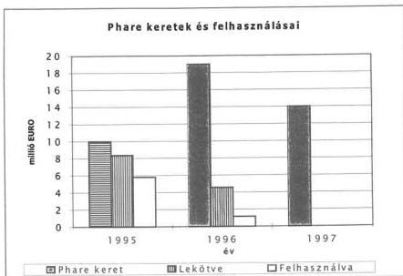
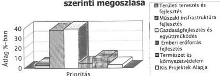
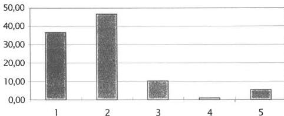
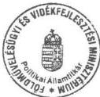

Állami Számvevőszék

# JELENTÉS

a határmenti együttműködést (Cross Border Cooperation - CBC) támogató Phare programok ellenőrzéséről

1999. szeptember

9931

---

**Az ellenőrzés végrehajtásáért felelős:**

**Kemény Emil**

mb. számvevő igazgató

**Az ellenőrzést vezette:**

**Karsainé Dömsödi Éva**

osztályvezető számvevő főtanácsos

**Az ellenőrzésben részt vettek:**

**Bank Lajos**

számvevő tanácsos

**Kapronczai Gabriella**

számvevő

**Tardos József**

számvevő

**A témához kapcsolódó korábbi ÁSZ vizsgálatok:**

|  A magyar környezetvédelmi programok támogatása | (KTM, 1992.)  |
| --- | --- |
|  Az Állami Vagyonügynökség tevékenysége | (ÁVÜ, 1993.)  |
|  A Magyar Vállalkozásfejlesztési Alapítvány tevékenysége | (MVA, 1994.)  |
|  A Központi Statisztikai Hivatal támogatása | (KSH, 1994.)  |
|  A pénzügyi szektor fejlesztése | (PM, 1995.)  |
|  A magyar tudományos kutatási és fejlesztési tevékenység | (OMFB, 1996.)  |
|  A PHARE program helyzete Magyarországon | (1997.)  |

Jelentéseink az INTERNET-en 1999. június 1-től a www.asz.gov.hu címen olvashatók.

Jelentéseink az Országgyűlés számítógépes hálózatán is olvashatók.

---

V-2-28/1999 TÉMASZÁM: 467

# TARTALOMJEGYZÉK

1. A CBC PHARE ÉS A TERÜLETFEJLESZTÉS... 14
2. A CBC PHARE TÁMOGATÁST ELBÍRÁLÓ SZERVEZETRENDSZER ÉS MŰKÖDÉSE... 16
2.1. A MAGYAR-OSZTRÁK LEGFŐBB DÖNTÉSHOZÓ SZERVEZET (JPMC) MŰKÖDÉSE... 16
2.2. A KORMÁNYZÓ BIZOTTSÁG MŰKÖDÉSE... 17
2.3. A CBC PHARE IRODA SZERVEZETE ÉS MŰKÖDÉSE... 18
2.4. A REGIONÁLIS CBC PHARE IRODÁK SZERVEZETE ÉS MŰKÖDÉSE... 19
2.5. A TERÜLETFEJLESZTÉSI CBC PHARE IRODA ÉS REGIONÁLIS SZERVEZETEINEK KAPCSOLATRENDSZERE... 20
3. A CBC PHARE PROGRAMOK FINANSZÍROZÁSA... 23
3.1. A PHARE TERVEZÉS ÉS A KÖLTSÉGVETÉSI TERVEZÉS... 24
3.2. TÁRSFINANSZÍROZÁSI VÁLLALÁSOK... 25
3.3. SZÁMLÁK VEZETÉSE... 27
3.4. LEKÖTÖTTSÉGEK EU ELŐÍRÁSOK SZERINTI KÖNYVELÉSE... 28
3.5. ENGEDÉLYOKIRATOK KEZELÉSE... 28
3.6. AZ ÁFA KEZELÉSE... 29
3.7. CBC PHARE IRODA TANULMÁNYUTAI ÉS AZOK HASZNOSÍTÁSA... 30
4. A PHARE-CBC PROGRAMOK BEMUTATÁSA... 31
4.1. EGYÜTTMŰKÖDÉS AZ OSZTRÁK KÖZTÁRSASÁG HATÁRMENTI TERÜLETEIVEL... 34
4.1.1. Phare-CBC Ausztria-Magyarország program - 1995... 38
4.1.2. A Győri Ro-Ro kikötő építési beruházása... 39
4.1.3. Phare-CBC Ausztria-Magyarország program - 1996. és 1997... 40
4.2. MAGYAR-ROMÁN PHARE CBC PROGRAMOK... 41
4.2.1. 1996. évi magyar-román Phare CBC program... 42
4.2.2. 1997. évi magyar-román határ menti fejlesztési program... 43
4.3. TRILATERALIS PHARE CBC PROGRAM... 43
4.3.1. 1995. évi magyar-osztrák-szlovák Phare CBC program... 44
4.3.2. 1995. évi magyar-osztrák-szlovén Phare CBC program... 44
4.3.3. 1996. évi magyar-osztrák-szlovák Phare CBC program... 45
4.3.4. 1996. évi magyar-osztrák-szlovén Phare CBC program... 45
4.4. KIS PROJEKT ALAPOK HELYZETE, MEGVALÓSÍTÁSA... 46

Mellékletek

1

---

•
•
•

•
•

---

# Alkalmazott rövidítések jegyzéke

|  APEH | Adó- és Pénzügyi Ellenőrzési Hivatal  |
| --- | --- |
|  ÁVÜ | Állami Vagyonügynökség  |
|  CBC | Cross Border Cooperation - Határon átnyúló együttműködés  |
|  DG | Directorate General - Főigazgatóság  |
|  DIS | Decentralised Implementation System - Decentralizált Megvalósítási Rendszer  |
|  DPAO | Deputy Programme Authorising Officer - Tárcaszintű felelős helyettese  |
|  EU | Európai Unió  |
|  FVM | Földművelésügyi és Vidékfejlesztési Minisztérium  |
|  JPMC | Joint Programing and Monitoring Committee - Programirányító és Ellenőrző Vegyesbizottság  |
|  JWG | Joint Working Group - Közös munkacsoport  |
|  KHVM | Közlekedési, Hírközlési és Vízgazdálkodási Minisztérium  |
|  KM | Környezetvédelmi Minisztérium  |
|  KPA | Kis Projektek Alapja - Small Projects Fund  |
|  KSH | Központi Statisztikai Hivatal  |
|  KTM | Környezetvédelmi és Területfejlesztési Minisztérium  |
|  MÁK | Magyar Államkincstár  |
|  MeH | Miniszterelnöki Hivatal  |
|  MIP | Multi Indicative Programme - Többéves Indikatív Program  |
|  MNB | Magyar Nemzeti Bank  |
|  MVA | Magyar Vállalkozásfejlesztési Alap  |
|  OMFB | Országos Műszaki Fejlesztési Bizottság  |
|  PAO | Programme Authorising Officer - Tárcaszintű felelős  |
|  Phare | Poland-Hungary Assistance for the Reconstruction of Economy - Támogatás Lengyelország és Magyarország számára a gazdaság átalakításához  |
|  PM | Pénzügyminisztérium  |
|  PMU | Programme Management Unit - Programirányítási Egység  |
|  PR | Public Relation - reklámtevékenység  |
|  SP | Strategic Plan - Stratégiai terv  |
|  SZMSZ | Szervezeti és Működési Szabályzat  |
|  VÁTI | Városépítési Tudományos Tervező Intézet  |
|  WP | Work Programme - Munkaprogram  |

3

---

---

·  
·  
·

·  
·

---4

---

# Jelentés

## a határmenti együttműködést (Cross Border Cooperation - CBC) támogató Phare programok ellenőrzéséről

Az Európai Unió tagországai és a tagjelölt országok határmenti együttműködésének támogatására az EU Bizottsága sajátos programot hagyott jóvá 1994-ben, amellyel a Phare programok nyújtotta támogatási formákat bővítette. A program keretében először Magyarország számára nyílt lehetőség, 1995-től - Ausztria EU taggá válásától kezdődően - az úgynevezett határon átnyúló együttműködést támogató Phare programok (Cross Border Cooperation - CBC) megvalósítására. Ez a támogatási forma esélyt jelent az EU taggá válás szempontjából kiemelt régiók fejlesztésére - a beruházások, az ipari szerkezetátalakítás, a vidékfejlesztés, a foglalkoztatás és az emberi erőforrás-fejlesztés támogatása révén.

Elsősorban az EU tag Ausztria és Magyarország határmenti megyéi közötti gazdasági együttműködés feltételeinek javítása volt a cél, de különböző bilaterális és trilaterális programok jöttek létre magyar-román, magyar-osztrák-szlovák, magyar-osztrák-szlovén viszonylatban is, amelyek az országok közös projektjeinek összehangolt megvalósítását szolgálták.

E vizsgálatra elnöki döntés alapján, az Állami Számvevőszék 1998. évi jóváhagyott ellenőrzési terve szerint került sor. Az ellenőrzés elvégzésére az Állami Számvevőszék kompetenciáját az államháztartásról szóló 1992. évi XXXVIII. törvény 21. §-a - amelynek értelmében valamennyi külföldi támogatás a költségvetés bevételi részét képezi - és az Állami Számvevőszékről szóló 1989. évi XXXVIII. törvény 2. §-a együttesen határozzák meg.

Az ellenőrzés céljának megfelelően, az Állami Számvevőszékről szóló 1989. évi XXXVIII. törvény alapján feltártuk a határmenti területek fejlesztésére adott Phare támogatások felhasználásának körülményeit, figyelembe véve a magyar területfejlesztési és közbeszerzési előírások, a költségvetési és Phare szabályok teljesülését, valamint az EU Bizottsága és a magyar kormány által jóváhagyott célkitűzések megvalósulását.

A vizsgálat elvégzését időszerűvé és indokolttá tette több tényező együttes hatása, nevezetesen: a határmenti együttműködés támogatására fordítható pénzeszközök volumene, a regionális fejlesztések gazdasági jelentősége, a programirányítás 1998. évi kormányzati átszervezése, illetve mindezeken túlmenően az a tény, hogy 1999. december 31-én lejár az 1996-ban és 1997-ben Magyarországnak biztosított Phare támogatások lehetséges igénybevételére rendelkezésre álló idő.

---5

---

I. ÖSSZEGZŐ MEGÁLLAPÍTÁSOK, KÖVETKEZTETÉSEK, JAVASLATOK

A Phare CBC határmenti együttműködési programok legfontosabb célkitűzései:

- a tagjelölt országok átalakulási folyamatának támogatása, azok EU integrációjának megkönnyítese,
- a határmenti régiók gazdasági fejlódsének támogatása, a meglévo infrastruktúra továbbfejlesztésével, a helyi vallalkozók versenyképességenek novelésével,
- a határmenti területek környezetvédelmi problémainak megoldása,
- a területek elkülönütségenek csökkentése, az életminóseg javitása, a két oldal együttmuködésével,
szeles kóru együttmuködes kialakitása a két szomszédos ország kozott.

A vizsgálat kiterjedt az 1995-1998 közötti időszak CBC programjaira, továbbá - azok ráfordítási nagyságrendje és regionális jelentősége alapján kiválasztott - projektjeire, elemezve a megvalósítás szervezeti, eljárásbeli, pénzügyi helyzetét, és az EU szervezetekkel történt kapcsolattartás és koordináció folyamatát. A jelentés során - az egységes kezelés érdekében - az eredetileg ECU-ben jóváhagyott támogatási összegeket az EU közös pénzének bevezetése miatt EURO-ban szerepelnek. Az EURO-ban feltüntetett összegek mellett szereplő forint összegek csak tájékoztató jellegűek (1 EURO az 1999. július 28-i MNB árfolyamon számolva 252,88 Ft).

A Phare eljárások menetét az EU Bizottsága által kialakított un. Decentralizált Megvalósítási Rendszer (DIS) szabályozza. A DIS-ben előírt eljárások egyúttal meghatározzák a Phare támogatások pénzügyi felhasználásának rendjét is. Ennek függvényében a vizsgálat során a szabályok betartásának ellenőrzése egyúttal lefedte a Phare programok pénzügyi ellenőrzését is.

# I. ÖSSZEGZŐ MEGÁLLAPÍTÁSOK, KÖVETKEZTETÉSEK, JAVASLATOK

A Phare CBC program az Európai Unió által nyújtott segélyprogramok egyike, amely Közép-Kelet Európában egyedülálló lehetőségként támogatta az országhatárokon átnyúló racionális gazdasági együttműködés különböző formáinak kialakítását, megerősítését. Emiatt jelentősége különleges, messze túl mutatott a pénzben kifejezhető felhasználások volumenén, a határ-régiók együttműködését minőségileg helyezte magasabb szintre, ugyanakkor pozitív hatást gyakorolt az országos szintű kapcsolatok alakulására is.

A programok mindegyike komplex területfejlesztési jellegű, amelyekben egyaránt érvényesültek az érintett határmenti területek legfontosabb fejlesztési prioritásai, valamint az európai területfejlesztési elvek.

6

---

I. ÖSSZEGZŐ MEGÁLLAPÍTÁSOK, KÖVETKEZTETÉSEK, JAVASLATOK

A Phare segélyprogramok keretében Magyarország számára 1990 és 1998 között összességében mintegy 800 millió EURO (202.304 millió forint) vissza nem térítendő támogatás jutott, amelyhez viszonyítva a határmenti régiók fejlesztésére 1995-től folyamatosan lebonyolított programok 5,5 %-os arányt képviseltek.

**A CBC Phare programokra 1998. december 31-ig rendelkezésre bocsátott támogatási keret 47 millió EURO (kb. 11.885 millió Ft) volt, amelyből az 1995-1996-1997. évi programokra összesen 13,9 millió EURO (kb. 3.515 millió Ft) támogatás igénybevételét (lekötését) hagyta jóvá az Európai Unió Bizottsága.**

**Fennáll a veszélye, hogy a rendelkezésre álló támogatási keretösszeg több, mint 70 %-a - az igénybevétel megadott határidejéig a jelenlegi helyzet és ügyintézés előhaladta esetén - kihasználatlan marad, és így Magyarország számára végérvényesen elveszhet, a CBC Phare programokban érintett partnerek kölcsönösen kedvező véleménye és pozitív szándékai ellenére.** Ez a nem kívánatos következmény az EU szervezetek döntési folyamatainak felgyorsításával elkerülhető lenne. A CBC Phare programcélok a határmenti térségek érdekeinek megfeleltek, a kedvezményezettek elképzeléseiket más forrásból jellemzően nem fedezhették volna és ez egybeesett azzal, hogy a támogatást igénybe venni szándékozók fokozott érdeklődést mutattak a program iránt.

A CBC Phare program hozzájárult a határmenti térségek fejlesztésével kapcsolatos célkitűzések teljesítéséhez. Az EU előírások szerint kialakított projektkiválasztási technika megalapozta, hogy a programok célrendszerét a megyei ill. a regionális prioritások határozták meg, az országos szintű ágazati struktúrák figyelembevételével. A területfejlesztési prioritások szinte teljesen azonosak voltak az EU strukturális politikájának részeként lebonyolított belső, közösségi kezdeményezésű programokéval.

**A hatályban lévő, területfejlesztésre vonatkozó magyar szabályozási hiányosságok** - a megyei területrendezési szemlélet és dokumentációs előírások megyére korlátozott volta - **hátrányosan befolyásolták a regionális szempontok érvényesítését a megyei rangsorokhoz képest.** Különösen az okozott nehézségeket, hogy a regionális területfejlesztési tanácsok működésének keretei, térségi terv dokumentumainak kapcsolatai szabályozatlanok voltak, továbbá hogy a tanácsok forráskoncentrációban játszott szerepe nem volt eldöntött. A Phare CBC program megvalósulása során sikerült áthidalni a magyar szabályozás hiányosságait, az európai területfejlesztési elvek alkalmazásával.

Az Ausztria és Magyarország eltérő Európai Uniós jogállásából következő eljárásbeli különbségek (a magyar Phare eljárás és az osztrák Interreg eljárás közötti eltérések) hátráltató tényezőnek bizonyultak az EU döntéshozóinál - a térségi szempontok figyelembevételével a társfinanszírozás keretében megvalósuló - programok elbírálásánál, kiválasztásánál. A negatív hatások kiküszöbölése csak részben, az osztrák partner következetes és erőteljes támogatása révén vált lehetségessé.

7

---

I. ÖSSZEZGŐ MEGÁLLAPÍTÁSOK, KÖVETKEZTETÉSEK, JAVASLATOK

**Az 1995., 1996. és 1997. évi Magyar-osztrák programokra 32 millió EURO (kb. 8.092 millió Ft) támogatási keretet hagyott jóvá az EU Bizottsága, amelyből a kedvezményezettek 8,6 millió EURO-t (kb. 2.175 millió Ft) kötöttek le szerződésekkel az egyes projektekre.** Szakértői vélemények szerint jelentős régiófejlesztési beruházásnak minősült a Szentgotthárdi Ipari Park kialakítása és továbbfejlesztése az osztrák partnerekkel összhangban. A régió turisztikai fejlesztését nagy mértékben elősegítette a kerékpárutak kiépítése. Megkönnyítették a helybeli munkavállalók elhelyezkedését a különböző ismeretbővítő, illetve szakképesítést adó magyar-osztrák oktatási projektek. Nem valósult meg, közel két éves előkészítés után sem a Győr-Gönyű Ro-Ro kikötő beruházás első szakasza az 1995. évi programból. A lejárati időhöz közeledő projektnél a magyar programirányítók az EU illetékes szerveinél nem kezdeményezték a lejárati idő indokolt hosszabbítását.

**A Magyar-román programokra 9 millió EURO (kb. 2.276 millió Ft) támogatási keretet hagyott jóvá az EU Bizottsága, amelyből a kedvezményezettek 3 millió EURO-t (kb. 759 millió Ft) kötöttek le szerződésekkel az egyes projektekre.** A szakértői számítások szerint kiemelkedő az árvízvédelmi és környezetvédelmi projektek beindítása, amelyek megvalósításukat követően biztonságosabbá teszik majd a régiót fenyegető elemi csapások előrejelzését. Az áruforgalom gördülékenyebb lebonyolítását eredményezheti a Csengersima Határátkelőhely rekonstrukciója.

**A trilaterális Magyar-Osztrák-Szlovák és Magyar-Osztrák-Szlovén programokra 6 millió EURO (kb. 1.517 millió Ft) támogatási keretet hagyott jóvá az EU Bizottsága, amelyből a kedvezményezettek 2,3 millió EURO-t (kb. 582 millió Ft) kötöttek le szerződésekkel az egyes projektekre.** A szakértői hatástanulmányok szerint természetvédelmi területek kialakítása és közös, összehangolt védelme jelentős mértékben hozzájárul majd a régió ökológiai egyensúlyának helyreállításához. Ugyancsak e célt szolgálják a környezetbarát hulladék-elhelyezést támogató projektek.

**A Kis Projekt Alapokból finanszírozott programokra 1,7 millió EURO (kb. 430 millió Ft) támogatási keretet hagyott jóvá az EU Bizottsága, amelyből a kedvezményezettek 0,96 millió EURO-t (kb. 243 millió Ft) kötöttek le szerződésekkel az egyes projektekre.** Olyan kisebb projektek támogatására fordították, amelyek összértéke nem haladta meg a 2 millió Ft-ot. Jelentősége az idegenforgalmi kisegítő szolgáltatások ellátásában és a kulturális programok szervezésében nyilvánult meg, kiadványok, népszerűsítő konferenciák finanszírozásával.

**Mindegyik program esetében jellemző a megítélt támogatási kerethez képest alacsony felhasználás.** A keret csekély mértékű lekötésének okai összetettek, döntő mértékben az EU jóváhagyási folyamatok időtartamának folyamatos növekedésére vezethetők vissza, de szerepet játszottak a Phare Iroda szervezeti kialakításának időbeni elhúzódása, a szakértői háttérbázis szűkössége, a kapacitásfejlesztés pénzügyi korlátai, a Phare eljárások alkalmazási tapasztalatainak kezdeti hiánya, továbbá a széles szakmai területen, térben, időben szétszórtan megvalósuló projektek, nagyszámú közreműködő partner tevékenységét időben megfelelő részletességgel összehangoló szervezési technikák alkalmazásának hiánya. Esetenként megjelentek a programokban

8

---

I. ÖSSZEGZŐ MEGÁLLAPÍTÁSOK, KÖVETKEZTETÉSEK, JAVASLATOK

résztvevők helyi és globális érdekei között a felszín alatt megbúvó érdekkülönbségek is. Az egyedi Phare eljárások időbeni tervezhetősége évről évre romlott, így az időtényező az eljárás lebonyolításában a megvalósítás legkockázatosabb elemévé vált, különösen annak ismeretében, hogy 1999. december 31-én egyszerre lejár az 1996-ban és 1997-ben Magyarországnak biztosított Phare támogatások lehetséges igénybevételére rendelkezésre álló idő.

Az Európai Unió Bizottsága jóváhagyási időszükségletének tapasztalt mértékű megnövekedése nem támasztható alá egyértelműen az ellenőrzéskor átvizsgált dokumentumokkal, különös tekintettel arra, hogy a CBC Phare Iroda több éves gyakorlattal rendelkezik a benyújtott dokumentumok összeállításában, a Phare eljárások szabályszerű alkalmazásában. A dokumentumok javítására illetve elutasítására felhozott indokok tartalmi alátámasztása hiányosnak, több esetben látszólagosnak tűnt az EU rögzített szabályaival és az 1997-ig követett elbírálási gyakorlattal összevetve. Az utóbbi évek lassuló jóváhagyási folyamata veszélyezteti a Magyarország számára megítélt Phare támogatások teljes mértékű felhasználását.

Ellentmondásos, hogy a lekötések alacsony volta mellett az Európai Bizottság a CBC magyar-osztrák programra 1995-1999. időszakra tervezett eredeti keretösszeget 35 millió EURO-ról (kb. 8.850 millió Ft) 42 millió EURO-ra (kb. 10.621 millió Ft) emelte úgy, hogy döntését a program sikerességével támasztotta alá. Ugyancsak ellentmondásos, hogy a benyújtott pályázatok átdolgoztatásánál (elutasításánál) az EU szervezetei által kifogásolt hiányosságok és szakmai átdolgozási igények növekvő tendenciát mutattak, miközben a CBC Phare Iroda és a kedvezményezettek egyre több tapasztalat birtokában készítették el a dokumentumokat. Projektszinten több alkalommal kritikus helyzetet teremtett, hogy a minőségbiztosítást végző szakértők feladatait, a minőségbiztosítás rendszerét nem sikerült az EU illetékes szerveivel összehangoltan kialakítani. A vázolt körülmények között kétségessé vált a CBC keretei között igénybe vehető támogatások teljes körű felhasználása. A lekötések teljesítése - a jóváhagyás időtartamától függetlenül - a trilaterális programok esetében a legveszélyeztetettebb.

A ténylegesen lekötött, felhasznált CBC Phare támogatást kiegészítette a részben költségvetésből, részben a kedvezményezettek saját forrásaiból fedezett hazai hozzájárulás, amely mintegy 480 millió Ft felhasználást tett ki 1996-1998. között.

A reprezentatív vizsgálat körébe vont Phare és központi költségvetési források felhasználásakor sem a befejezett, sem a folyamatban lévő programoknál nem volt pénzügyi szabálytalanság a végrehajtás során. Az esetenként bekövetkezett tartalmi változások nem jelentettek eltávolodást az eredeti céloktól, jogellenességet nem tapasztaltunk. A társfinanszírozások elszámolásakor, a könyvelésekben, az előirányzatok felhasználásakor, a nyilvántartásoknál feltárt kisebb hiányosságok lényegében az EU-Phare és a magyar szabályozási rendszer összehangolatlanságából adódtak.

A magyar-osztrák határon átnyúló együttműködési Phare (CBC) program előkészítésének és végrehajtásának pénzügyi és szervezeti feltételeiről szóló

9

---

I. ÖSSZEGZŐ MEGÁLLAPÍTÁSOK, KÖVETKEZTETÉSEK, JAVASLATOK---

2057/1996. (III. 13.) Korm. határozattal összhangban, a KTM célelőirányzatból a programok fedezetéhez szükséges és előírt összegek rendelkezésre álltak, a befejezett programszinten előírt, legalább 25%-os társfinanszírozás teljesült. A társfinanszírozási vállalásokat tartalmazó nyilatkozatok nem rendezettek programonként, illetve projektenként elkülönítetten a CBC és a regionális programokra, aminek következtében az adatokat nem aktualizálták, nehézkessé vált mind a külső felügyeleti, mind a belső kontroll.

A felhasználások elszámolásánál a Phare és a magyar költségvetés az alkalmazott eltérő tervezési időszakok miatt nem volt összhangban, mivel a magyar költségvetés éves tervezésű, míg a Phare programok több éves kalkulációt alkalmaznak. A lekötések könyvelése megfelel a tényleges felhasználásoknak, a néhány esetben tapasztalt eltérések technikai jellegű hibának minősíthetők. A központi célelőirányzatok felhasználása nem az előre tervezett ütemben történt, mivel az EU Phare eljárásoknak a tervezettnél hosszabb időigénye miatt az eredeti végrehajtási ütemtervet a CBC Phare Iroda nem tudta teljesíteni. A CBC Phare Iroda a Phare devizaszámlákat az államháztartásról szóló 1992. évi XXXVIII. törvényt módosító 1995. évi CV. törvény és a 211/1996. (XII. 23.) Korm. rendelet előírásainak, a számlavezetési jogszabályokban foglaltaknak megfelelően vezette a Magyar Államkincstárnál.

**Országos szinten még nem készült összehasonlító elemzés az egyes tárcák rendelkezésére bocsátott, de fel nem használt társfinanszírozási keret igénybevételéről**, különös tekintettel arra, hogy más tárcák Phare programjainál ez a keret hiányként jelentkezett-e, s ez milyen gazdasági kihatással volt az egyes projektek lebonyolítására, illetve költségeire. Egy ilyen elemzés elkészítése a Miniszterelnöki Hivatal Segélykoordinációs és Modernizációs Titkárságának feladata lenne.

A Phare CBC eljárások szabályainál a benyújtás és a jóváhagyás metodikája közelítette az EU belső adminisztrációs rendjét, előtérbe került a regionális szemlélet, továbbá az EU-csatlakozásra fokozatosan felkészítő szándékot tükrözték a bekövetkezett eljárási-, szervezeti- és működési szabály-változások is. Így a CBC programok megvalósítása értékes, az EU csatlakozási folyamatban számos területen hasznosítható tapasztalatot eredményezett. A határmenti régiókban és a lebonyolító Phare szervezeteknél felhalmozódott ismeretek hozzásegíthetik Magyarországot ahhoz, hogy az EU bővítés idejére az egyes régiók elsajátíthassák a strukturális alapok irányelveit és eljárásait, továbbá kialakulhasson a döntéshozatal és a projektmenedzsment Európai Unióban szokásos rutinja.

A közbenső felmérések alapján a határon átnyúló együttműködést szolgáló programok végrehajtása kapcsán - a projekt szintű eredményeken túl - egymást erősítő gazdasági folyamatok indultak meg az adott térségben (pl. ipari park, idegenforgalom, innováció), a CBC programok beépültek az egyes ágazati és regionális stratégiákba (pl. infrastrukturális beruházások), erősödött az együttműködési intézményrendszer (pl. az Eurorégió alakulása, munkaerőpiaci kérdések egyeztetése), valamint a CBC programok konkrét tapasztalatait felhasználták a csatlakozási tárgyalásokon (pl. területfejlesztés).

---10

---

I. ÖSSZEGZŐ MEGÁLLAPÍTÁSOK, KÖVETKEZTETÉSEK, JAVASLATOK

**A támogatott programok kiválasztása**, az azokon belül megvalósítandó projektek pályáztatása és végrehajtása **az EU Bizottsága által kiadott**, a CBC Phare programok jellegének megfelelően **módosított Phare eljárás szabályai szerint történt**. A programok jóváhagyási folyamata a nemzeti és az EU-s szervezetek hierarchikus kapcsolatára épülő, strukturált és szabályozott szervezeti és hatásköri rendben valósult meg, **ám az egyes együttműködő országok programjai esetében nem azonos eljárási renddel történt** (lsd. magyar Phare és osztrák Interreg közötti eltérés). Nem volt teljes mértékben egységes a program-elbírálási folyamat szabályozása és a döntési mechanizmus sem, amelyek ugyancsak befolyásolták az elbírálási folyamat időszükségletét.

A Magyar-Osztrák Programirányító és Ellenőrző Vegyesbizottság (JPMC) működése elősegítette és eredményessé tette az európai területfejlesztési elvek alkalmazását és azok ötvözését a régiók fejlesztési elképzeléseivel. Működése a projekt-előkészítésben hatékonyan segítette a stratégiai kérdések meghatározását, a konszenzuson alapuló fejlesztési prioritások kijelölését és a támogatások elnyerésére leginkább esélyes projektek kiválasztását, továbbá lehetővé tette a magyar területfejlesztési szabályozás hiányosságainak kiküszöbölését. A kedvező tapasztalatok miatt követték ezt a szervezeti mintát a Magyar-Román programok esetében is. A JPMC-nek a projektek megvalósítását követő tevékenysége, monitoring jellegű működése még nem erősödött meg, e területen nem tükröződött az előkészítő folyamatoknál tapasztalt következetesség. Az osztrák partnerek teljeskörűen érvényesítették hozzájárulási jogosultságukat a magyar projekteknél, amelyet a magyar fél nem tudott érvényre juttatni az osztrák projektekkel kapcsolatban az eltérő szabályozás miatt.

A Kormányzó Bizottság szakmai összetétele alapján alkalmas volt a pályázatok elbírálására, a prioritásokat, a programok összetételét a térségi szempontok és a tárcák által képviselt országos érdekek figyelembevételével határozta meg és döntött.

A CBC Phare Iroda Szervezeti és Működési Szabályzata (SZMSZ) megfelelően, részletesen szabályozta az Iroda szervezeti felépítését, működését és munkaköri leírásait. Az SZMSZ-ben lényeges hibát nem, csupán néhány technikai jellegű ellentmondást és hiányt tapasztaltunk, amelyek egyrészt a döntési és az aláírási jogosultság pontos elkülönítésének hiányából, másrészt a kevésbé jelentős munkaköri meghatározásokból adódtak. A projektmenedzserek és a külső szakértők munkaköri leírásában, továbbá a megbízási szerződésekben szerepelt az ütemezési feladatok ellátása. Az időbeni koordináció biztosításakor a kritikus helyzeteket előre részletesen feltáró, az időgazdálkodást segítő tervezési technikát nem alkalmaztak. Az EU Bizottságának és a Delegációnak küldött dokumentumokban és tárgyalásokon csak 1999-ben használták fel a befejezési határidőkből történő visszaszámlálás módszerét az EU döntések időbeni korlátozottságának bemutatására és igazolására.

A Phare eljárások projektenkénti tényleges alakulásának figyelésére a CBC Iroda saját kezdeményezéssel vezetési információrendszer fejlesztését indította el. A rendszer felépítése teljes összhangban volt a Phare eljárásban keletkezett adatok nyilvántartási igényével. A rendszer adott formájában nem volt maradéktalanul alkalmas a teljesítés és az eredeti ütemtervek folyamatos összeha-

11

---

I. ÖSSZEGZŐ MEGÁLLAPÍTÁSOK, KÖVETKEZTETÉSEK, JAVASLATOK

sonlítására, mivel az egyes információk aktualizálásakor a tervadatok felül-íródtak. Az adatbázis feltöltöttsége nem volt teljes körű, bár ez a munkaköri le-írás szerint a projektmenedzserek és a funkcionális feladatokat ellátók feladata lett volna.

Az iratkezelés megfelelő szabályozása hiányzik, emiatt a gyakorlatban a do-kumentumok kezelése nem egységes, személyfüggő, de alapvető dokumentum-hiányt nem tapasztaltunk. Az Iroda által kialakított regionális iroda-rendszerű szervezeti felépítés révén megteremtődtek a hatékony együttműködés feltételei a térségi területfejlesztési tanácsokkal és lehetővé vált a konkrét projektek hely-színi menedzselése.

Hátrányos a PR és a tanulságok levonása szempontjából, hogy az Iroda a pro-jektek befejezésekor nem végezte el azok teljeskörű utóértékelését és nem vizs-gálta meg az üzemeltetési feltételeket, a tulajdonviszonyok rendezettségének helyzetét. Hiányoztak az erre vonatkozó módszertani útmutatók és a belső el-lenőrzés menetének szabályozása. A közvélemény tájékoztatása, többek között a programok időbeni csúszása, az utóértékelések hiánya miatt is visszafogottan történt. Az elért eredményekről történő médián keresztüli tájékoztatás nem ka-pott megfelelő hangsúlyt a PR kapacitás hiányából következően.

A CBC Phare programok nyújtotta támogatás segítette a határmenti területek összehangolt területfejlesztési, környezetvédelmi és természetvédelmi elképzelé-seinek megvalósítását, hozzájárult az emberi erőforrást fejlesztő, munkahelyte-remtő beruházások megvalósulásához. A beszerzett eszközök javították a mun-kafeltételeket, az elkészült tanulmányok, kiadványok és a közös konferenciák, tanácskozások jó irányban befolyásolták mind a szervezetek közötti, mind az emberi kapcsolatok alakulását.

Az ellenőrzés részletes megállapításainak hasznosítása mellett ajánljuk:

# a Kormánynak

Dolgozza ki a területfejlesztési Phare pályázati dokumentumok átmeneti illetve megelőlegezett finanszírozásának módját és gondoskodjon a források rendelke-zésre állásáról.

# a Miniszterelnöki Hivatal Segélykoordinációs és Modernizációs Titkársá-got felügyelő tárca nélküli miniszternek

1. Tegyen lépéseket az EU szervezeteinél a jováhagyási folyamatok gyorsabb lebonyolítására, járjon el az EU Budapesti Képviseleténél a magyar Phare támogatási keretek lehető legnagyobb mertékü felhasznalhatósága érdekében.
2. Kezdemenyezze az osztrák partnerekkel kozosen az EU szervezeteinél - az FVM bevonásával - a CBC Phare eljárások és az Interreg eljárások egymáshoz valo kozelitését, a magyar-osztrák kozos projektek hatékonyabb lebonyolítása érdekében.
3. Keszitsen orszagos elemzest a tarsfinanszirozásra rendelkezésre bocsátott, de meg fel nem hasznalt források helyzetéról, dolgozza ki a mobilizálhato források fel

12

---

I. ÖSSZEGZŐ MEGÁLLAPÍTÁSOK, KÖVETKEZTETÉSEK, JAVASLATOK

használásának működőképes rendszerét és tegye lehetővé az országos alkalmazást.

# a földművelésügyi és vidékfejlesztési miniszternek

1. Vegye figyelembe a CBC Phare programok ellenőrzési tapasztalatait a területfejlesztési törvény módosítási javaslataihoz annak érdekében, hogy az előírások jobban igazodjanak az EU szabályozásokhoz.
2. Mérje föl és elemezze a megkötött, illetve a lejárathoz közeledő programokat a lejárati idő lehetséges és indokolt meghosszabbítása érdekében, továbbá kezdeményezze a szükséges meghosszabbítást az EU illetékes szervezeteinél.
3. Alakítsa ki az EU illetékes szervezeteivel egyetértésben a minőségbiztosítás rendszerét.
4. Gondoskodjon arról, hogy a JPMC üléseken a magyar tagok az osztrák projektekkel kapcsolatban érvényesítsék jóváhagyási jogosultságukat.

# a CBC Phare Programiroda igazgatójának

1. Készítsen program/projekt szintű nyilvántartást a társfinanszírozásokról azok naprakész rendszerezése és ellenőrizhetősége érdekében.
2. Alkalmazza a programok/projektek előkészítésekor és aktualizálásakor azokat a szervezési technikákat, amelyek a tevékenységek lebonyolítását hatékonyabbá tehetik, az időgazdálkodást javíthatják.
3. Végezze el a Phare szabályoknak megfelelően a projektek utóértékelését a kedvezményezettek bevonásával a pénzügyi lezárással egyidőben.
4. Ellenőrizze a tulajdonviszonyok rendezettségét és az üzemeltetési feltételek meglétét a projektek befejezésekor.
5. Javítsa a meglévő informatikai rendszert, bővítse ennek moduljait annak érdekében, hogy a tervezés és a teljesítés értékeléséhez naprakészen követhető és visszakereshető, elemzésre alkalmas adatokat szolgáltasson.
6. Tegye hatékonyabbá a CBC Phare Iroda PR tevékenységét.
7. Dolgozza át és tegye teljes körűvé az SZMSZ előírásait, beleértve:
- munkaköri leírások pontosítását, a hiányok pótlását,
- az iratkezelés és iratselejtezés teljes szabályozását,
- a cégbélyegző használatának szabályozását.

13

---

II. RÉSZLETES MEGÁLLAPÍTÁSOK

## II. RÉSZLETES MEGÁLLAPÍTÁSOK

### 1. A CBC PHARE ÉS A TERÜLETFEJLESZTÉS

A tagországok és a tagjelölt országok határmenti együttműködésének támogatására rendkívül kecsegtető, jó kezdeményezésként indult a Közép-kelet Európában egyedülálló, komplex területfejlesztési célú, az EU Bizottsága által jóváhagyott program 1994-ben. A program keretében először Magyarország számára 1995-től - Ausztria EU taggá válásától kezdődően - nyílt kedvező lehetőség az úgynevezett határmenti együttműködési programok (CBC) megvalósítására. Ez a támogatási forma lehetőséget nyújtott az EU taggá válás szempontjából kiemelt régiók fejlesztésére - a beruházások, az ipari szerkezet-átalakítás, a vidékfejlesztés, a foglalkoztatás és az emberi erőforrás-fejlesztés támogatása révén.

Elsősorban az EU tag Ausztria és Magyarország határmenti megyéi közötti gazdasági együttműködés feltételeinek javítása volt a cél, de különböző bilaterális és trilaterális programok jöttek létre magyar-román, magyar-osztrák-szlovák, magyar-osztrák-szlovén viszonylatban is, amelyek a három ország projektjeinek összehangolt megvalósítását szolgálták. A megjelölt prioritások lefedték az adott térség legfontosabb stratégiai fejlesztési területeit.

Magyarországon a program végrehajtási folyamata nehézkesen indult, 1996. májusától kezdődően gyorsult fel a Phare Programirányító Iroda felállításával. Az elmúlt két évben a Phare támogatási keret felhasználására több, az adott régió területfejlesztését, gazdasági fellendülésének megindítását szolgáló programot szerveztek és indítottak be az országban:

- a magyar-osztrák bilaterális CBC program
- a magyar-osztrák-szlovén trilaterális CBC program
- a magyar-osztrák-szlovák trilaterális CBC program
- a magyar-román bilaterális CBC program.

A Nyugat-Dunántúli régióban a Phare CBC Program célterülete és az önkéntesen kialakított területfejlesztési régió lefedte egymást. A CBC Programot vezető Kormányzó Bizottság elmúlt öt éves működése stratégiaalkotási, egyeztetési, eljárási és finanszírozási tapasztalatokat is jelentett a Nyugat-Dunántúli Regionális Fejlesztési Tanács 1997. évi megalakulásához, amely összehangolta a térségi fejlesztési elképzeléseket és koncentrált, célorientált program-előkészítési tevékenységet tett lehetővé. A megyék ezen lépésével a térség területfejlesztési intézményrendszere részben összhangba került a Phare CBC eljárási szabályokkal. A határterületek fejlesztésére adott támogatások felhasználása megfelelt a magyar területfejlesztési előírásoknak és szervezeti kereteknek.

A projektek meghatározása az EU szabályainak megfelelően, messzemenő figyelembevételükkel történt meg az ezekhez igazodó szervezeti rend kialakításával és működtetésével. A döntések az erre közösen, célirányosan, egyetértés

14

---

II. RÉSZLETES MEGÁLLAPÍTÁSOK

alapján létrehozott legfőbb döntéshozatali fórumokban, a JPMC-ben és a Kormányzó Bizottságban születtek meg. Ezekben a szervezetekben folyt a stratégiai tervezés, a monitoring és az igénybe vehető finanszírozási források összehangolása, amely tevékenység eredményességéhez jelentősen hozzájárult, hogy a három megye területfejlesztési tanácsának elnöke szavazati joggal vett részt az üléseken. A megyék fejlesztési stratégiájának megfelelően a projektek értékelését a területfejlesztéssel foglalkozó szakértők bevonásával elsősorban megyei szinten végezték. A legfőbb fórumokban a megyei fejlesztési tanácsok elnökei megyei testületi álláspontot képviseltek.

**A projektek kiválasztásában** a komplex területfejlesztési szemlélet érvényesült, részben a fejlesztési prioritások meghatározásával, részben a térségi fejlesztési tanácsok döntési folyamatban történő részvételén keresztül. A területfejlesztési prioritások - EU-konform módon - a következőkre terjedtek ki:

- a regionális tervezésre,
- a határmenti műszaki infrastruktúra fejlesztésre,
- a gazdasági és turisztikai fejlesztésre,
- a humánerőforrás fejlesztésre,
- a környezet- és természetvédelemre.

**A támogatási források elosztását - összhangban az EU irányelveivel - a térségi szemlélet határozta meg, a stratégiai célkitűzéseknek megfelelő forrás allokáció biztosításával.**

A hatályban lévő, területfejlesztésre vonatkozó magyar szabályozási hiányosságok - a megyei területrendezési szemlélet és dokumentációs előírások megyékre korlátozott volta - hátrányosan befolyásolták a regionális szempontok érvényesítését a megyei rangsorokhoz képest. Különösen az okozott nehézségeket, hogy a regionális területfejlesztési tanácsok működésének keretei, térségi tervdokumentumainak kapcsolatai szabályozatlanok voltak, továbbá hogy a tanácsok forráskoncentrációban játszott szerepe nem volt eldöntött.

A Phare CBC program projekt kiválasztási folyamatában sikerült áthidalni az előkészítés alatt álló, a regionális fejlesztési tanácsok működését meghatározó magyar szabályozás hiányát (pl. forráselosztás, tervdokumentumok összehangoltsága, stb.) az európai területfejlesztési elvek alkalmazásával. Így a döntéshozatalban a meghatározó elvek: a többéves stratégiai programozás, az addicionalitás és a forráskoordináció, valamint a partnerségen alapuló együttműködés voltak. A javaslati, illetve döntési folyamatban a Phare programdokumentumok eredményes alkalmazásával helyettesítették az Európai Unió területfejlesztési programjaihoz szükséges nemzeti belső programdokumentumokat, mindenekelőtt a regionális területfejlesztési koncepciókat, programokat.

A Phare CBC eljárás lebonyolítása, szervezeti és működési rendszere a programok működése alatt változott, egyre inkább megközelítve az Európai Unióban alkalmazott szabályokat, így az eddig megszerzett tapasztalatok a későbbiek folyamán is jól hasznosíthatóvá válhatnak az EU csatlakozási folyamatra való magyar felkészülésben. A Phare CBC programok keretében kialakult határon

15

---

II. RÉSZLETES MEGÁLLAPÍTÁSOK

átnyúló területfejlesztés-tervezési együttműködés elősegítette a Nyugat-Pannon-Euro Régió megalakítását 1998-ban Burgenland tartomány részvételével.

## 2. A CBC PHARE TÁMOGATÁST ELBÍRÁLÓ SZERVEZETRENDSZER ÉS MŰKÖDÉSE

A CBC Phare programot irányító magyar kormányzati szervezet a Környezetvédelmi és Területfejlesztési Minisztérium (KTM) volt, amely a CBC programok kezelésére - a támogatási formának megfelelően - a minisztériumnak adott Phare támogatások menedzsment irodájától elkülönített szervezeti egységet hozott létre. Az 1998. évi kormányzati átszervezések eredményeként e tevékenység, illetve szervezete átkerült a Földművelésügyi és Vidékfejlesztési Minisztériumhoz (FVM), amely a program irányítását helyettes államtitkári szinten látta el (PAO).

A Phare CBC programok hazai legfőbb fóruma a Kormányzó Bizottság volt, míg a megvalósítás szintjét a Phare CBC Iroda regionális szervezetei látták el. A Kormányzó Bizottság tagjait - a területfejlesztési prioritások érvényesítésének megfelelően - a programban résztvevő megyék és tárcák delegálták, de tanácskozási joggal részt vettek az érdekelt önkormányzatok képviselői is.

A szervezeti hierarchiában e szervezet fölött a JPMC állt, amelynek program-döntéselőkészítő munkáját szakértői bizottság is segítette (osztrák részről Burgenland és Bécs vett részt a munkában). Hasonló közös bizottság működött a magyar-román programok előkészítése esetében. A CBC trilaterális programokban ilyen elkülönült bizottságot nem hoztak létre. A Szlovák Köztársaság illetve a Szlovén Köztársaság határmenti régióit érintő programok esetében a tárgyalásokon az adott ország képviselői részt vettek a magyar-osztrák JPMC munkájában, ami a javaslatok kidolgozását eredményesen befolyásolta, elkerülhetővé tette a többszörös adminisztráció miatti időszükséglet további növekedését.

### 2.1. A magyar-osztrák legfőbb döntéshozó szervezet (JPMC) működése

A Magyar Köztársaság Kormánya és az Osztrák Köztársaság Kormánya - a miniszterelnökök aláírásával - Szándéknyilatkozatot hagytak jóvá Rustban 1995. július 7-én a határon átnyúló együttműködésről az EU Phare CBC és az Interreg II. programok keretében. A Szándéknyilatkozat az EU szabályozásokkal összhangban, annak megfelelően tűzte ki a fő célokat, kijelölte az együttműködő régiókat, magyar oldalon Győr-Moson-Sopron, Vas és Zala megyéket. A két ország megállapodott az együttműködés kiemelt területeiben.

A Szándéknyilatkozat intézkedett arról, hogy 1994. július 4-i Phare szabályzat 7. cikke szerint kell létrehozni a Magyar-Osztrák Programirányító és Ellenőrző Vegyesbizottságot, a JPMC-t, amelyet a szabályozásnak megfelelően tettek meg. Magyarország és Ausztria 6-6 képviselője vett részt a JPMC-ben, az EU Bizottság képviselői tanácsadóként működtek közre.

16

---

II. RÉSZLETES MEGÁLLAPÍTÁSOK

A magyar-osztrák PHARE CBC projektek kiválasztásának legmagasabb szintű döntéshozó fórumai - a Phare szabályzatot teljesítve - a JPMC ülések voltak. A JPMC üléseiről előírásszerűen vezették a jegyzőkönyveket, angol nyelven. Magyar nyelvű jegyzőkönyvek nem készültek minden ülésről, bár a kétoldalú kormány-megállapodás erre lehetőséget adott, de ez kimutatható hátrányos következményekkel nem járt.

Az osztrák tagok a magyar projekteket érdemben véleményezték a megvalósíthatóság szempontjából, ezen felül jóváhagyó nyilatkozatot is tettek, annak érdekében és előfeltételeként, hogy az EU Bizottsága az előterjesztett projekteket elfogadja a Phare támogatási programok részeként.

Magyar oldalról a hatékonyság további növelése érdekében igényként merült fel a JPMC ülések gyakoriságának növelése, azonban ez az osztrák partner fokozott EU feladatokkal történt leterheltsége miatt nem teljesült, viszont nem járt kimutatható negatív hatásokkal. A program megvalósítás szakaszában a JPMC konkrét ellenőrző és controlling tevékenységet nem folytatott - noha a Phare szabályok szerint ez is a feladatkörébe tartozott -, ami a bizottság más feladatokból következő leterheltségével hozható összefüggésbe. 1998 második félévében az osztrák partner töltötte be az EU elnöki tisztséget és ezért a kancellária, a külügy-, közlekedési és gazdasági minisztériumi JPMC tagok elfoglaltsága nem tette lehetővé a gyakoriság növelését. E tapasztalatok a feladatok és a lehetőségek összhangjának részleges hiányát mutatják.

## 2.2. A Kormányzó Bizottság működése

**A Kormányzó Bizottság volt a hazai legfőbb fóruma a Phare CBC Program stratégiai tervezésének, magyarországi monitoringjának, valamint forráskoordinációjának.** A programozási folyamat lépései a 2. mellékletben találhatók, amelyek bemutatják az egymásra épülő szervezetek feladatait, eljárási lépéseit.

A Kormányzó Bizottság összetétele megfelelt a Phare szabályoknak, elnöke a földművelésügyi és vidékfejlesztési miniszter, tagjai a Gazdasági Minisztérium, a Külügyminisztérium, a Környezetvédelmi Minisztérium, a Belügyminisztérium, a Közlekedési, Hírközlési és Vízügyi Minisztérium, az Oktatási Minisztérium, a Pénzügyminisztérium államtitkári rangú képviselői, továbbá az érintett megyei területfejlesztési tanácsok elnökei voltak. Az adott térségek megyei jogú városainak polgármesterei a kormányzó bizottsági üléseken szavazati jog nélküli tagként vettek részt, véleményükkel rendszeresen segítették a szakmai elbírálási folyamatot. Az üléseken megfigyelői minőségben részt vett az Európai Bizottság, illetve a külföldi partnerrégiók egy-egy képviselője.

A Kormányzó Bizottság tevékenységét az ügyrendjében foglalt előírásoknak megfelelően, szabályosan végezte:

- ellátta a program egésze felett a nemzeti ellenőrzési feladatokat,
- meghatározta az 5 éves keretprogramon belül a végrehajtás prioritásait és elfogadta az évente kidolgozott projektcsomagokat,

17

---

II. RÉSZLETES MEGÁLLAPÍTÁSOK

- egyeztette és összehangolta az érintett minisztériumok és önkormányzati szervek magyar oldalon felmerülő társfinanszírozási feladatait.

A Kormányzó Bizottság felett áll a JPMC. A JPMC határozatai kerültek az Európai Bizottság Phare Ügyvezető Bizottsága elé előterjesztésként.

# 2.3. A CBC Phare Iroda szervezete és működése

Az Iroda alapítására a Kormány 2057/1996. (III. 13.) határozatában foglalt előírásoknak megfelelően került sor. Az Iroda alapítója a Környezetvédelmi és Területfejlesztési Minisztérium volt, amelynek jogutódja 1998. évtől a 155/1998. (IX. 30.) és a 164/1998. (IX. 30.) Korm. rendeletek alapján a Földművelésügyi és Vidékfejlesztési Minisztérium. Az Iroda a vizsgálat lezárásakor az FVM keretein belül megfelelő körülmények között működött, a Városépítési Tudományos Tervező Intézet Kht. (VÁTI Kht.) részben önálló igazgatási egységeként. Az Iroda a CBC határon átnyúló programok mellett a Regionális Phare programok lebonyolítását is ellátta. Ez az egyes eljárások lebonyolítását kedvezően befolyásolta, mivel a két típusú program szorosan összefügg egymással, mindkettő az ország meghatározott régióinak fejlesztését irányozta elő. Ez megfelelő alátámasztása annak a szervezeti-felügyeleti szabályozásnak, hogy az Iroda a szakmai felügyeletét az FVM területfejlesztési és építésügyi helyettes államtitkára, mint tárcaszintű főfelelős (PAO) lássa el.

A CBC Phare Iroda tevékenységét megalakulása óta - az EU Bizottsága megbízásából - az OMAS angol cég vizsgálta a Phare szabályok betartása szempontjából, amely - az ÁSZ vizsgálat eredményeihez hasonlóan - nem tapasztalt e téren hiányosságokat.

Az Iroda működését a Phare eljárások tekintetében a Decentralizált Megvalósítási Rendszer (Decentralised Implementation System - DIS), az általános működtetési kérdések tekintetében a VÁTI SZMSZ-e, a társfinanszírozások esetében az FVM SZMSZ-e határozta meg. A három szabályzat alapján az Iroda 1998. októberében kidolgozta, és az FVM illetve a VÁTI Kht. vezetése 1999. január 1-vel hatályba léptette „A Földművelési és Vidékfejlesztési Minisztérium Phare Programirányító Iroda Szervezeti és Működési Szabályzat”-ot, amely a felsorolt három szabályozással összhangban készült el. Az Iroda az SZMSZ-ben megfogalmazottak szerint végezte tevékenységét, a szakmastruktúra illeszkedett a meghatározott feladatkörhöz, valamennyi funkció betöltött.

A cégbélyegző használatát az SZMSZ nem szabályozta, e címszó alatt a cégbélyegző fogalma volt található. Az SZMSZ nem tért ki a rendelkezési jog, a tárolás és használat módjának előírásaira. Az Iroda egy cégbélyegzővel rendelkezett, amelyet a Pénzügyi Osztály páncélszekrényében, szabályosan tároltak.

A munkaköri leírásokat elkészítették, amelyek áttanulmányozása során néhány kisebb ellentmondást tapasztaltuk:

- Az 1. igazgatóhelyettes feladatainál nem szerepelt a 2. igazgatóhelyettesnél meghatározott feladat, amely szerint feladatai közé tartozik „a programfelelős tisztviselő (PAO) naprakész informálása, döntési helyzetek előkészítése”.

18

---

II. RÉSZLETES MEGÁLLAPÍTÁSOK

- Az osztályvezető, a projektmenedzserek és a regionális irodavezetők feladatai között szerepelt a kapcsolattartás a román, illetve az osztrák partnerszervezetekkel. A CBC programok ugyanakkor a trilaterális programok révén igénylik a szlovák és szlovén partnerekkel történő kapcsolattartást is.
- A pénzügyi osztályvezető munkaköri leírásában nem szerepeltek a társfinanszírozások nyilvántartásával és elszámoltatásával kapcsolatos feladatok. Ezt a feladatot egyik munkaköri leírás sem tartalmazta.

**Az Iroda nem rendelkezett hatályos iratkezelési szabályzattal** a vizsgált időszakban. Az iratkezelés előírásait részben az SZMSZ röviden tartalmazta, részben a VÁTI Kht. általános iratkezelési szabályzata volt érvényben. A helyszíni vizsgálat befejezéséig elkészült a CBC Phare Iroda saját iratkezelési szabályzatának tervezete, de még nem lépett hatályba. Az iratok tárolásának rendjére kötelező előírás nem volt.

**A projektmenedzserek ügyirat tárolási módszere nem egységes.** Egyikük az iratokat a keletkezésük szerinti sorrendben, másikuk Phare eljárás típusonként kezeli az iratokat (pl. a tenderek elkészítésével, a tenderek jóváhagyásával, tenderezési eljárással kapcsolatos iratok, stb.). Mindkét tárolási móddal biztosítható a projekttel kapcsolatos iratok és jegyzetek visszakeresése, ugyanakkor ez gördülékenyen csak a projektmenedzser jelenlétében volt megoldható. Ez az iratkezelési mód nem eredményezett dokumentációs hiányosságot, de az irat-visszakeresést megnehezítette, személyfüggővé tette.

**Az Iroda iratainak selejtezésére** a DIS előírásai a mérvadóak. Selejtezés - a DIS szabályozásnak megfelelően - még nem történt, mivel az Iroda által lebonyolított első program teljes lezárulása csak 1999. július 31-én esedékes.

## 2.4. A regionális CBC Phare irodák szervezete és működése

**A nemzeti Phare rendszer reformjával összhangban a kompatibilitást biztosítva vezették be a regionális iroda rendszert.** (A Phare CBC esetében Sopron és Békéscsaba). A központi Iroda szabályozta helyi szervezeteinek hatáskörét, amelyben figyelembe vette a támogatások igénybevételével jelentkező igények várható alakulását is. Igazgatói utasítás (2/1998. sz.) intézkedett a központi és regionális egységek közötti munkamegosztásról, amelyben a központi Iroda vezetése részéről pozitív szemlélet érvényesült, folyamatosan növelte a regionális irodák szerepét. A kezdeti szakaszban a projektek pályáztatása volt a feladatuk, később a programok tervezési és pályáztatási feladatain kívül egyre több feladatot vettek át a központi Irodától. Így részt vettek a térségi programozási feladatokban, kapcsolatot tartottak a térségi döntéshozókkal és területfejlesztési tanácsokkal, pl. a Soproni Iroda projektmenedzsere fő-felelősi szerepet töltött be a "Soft" projekteknél, a Kis Projekt Alapokat (Small Project Funds - SPF) eredményesen koordinálta, a térségi PR és képzési feladatokat is teljesítette (részletezve lsd. 4.4 pontnál).

19

---

II. RÉSZLETES MEGÁLLAPÍTÁSOK

## 2.5. A területfejlesztési CBC Phare Iroda és regionális szervezeteinek kapcsolatrendszere

Az Iroda SZMSZ-ében meghatározottak szerint, szabályosan végezte tevékenységét a következő kapcsolattartási területeken:

- kapcsolattartás és jelentések készítése az EU magyarországi delegációja, valamint az érintett EU főigazgatóságok (DG-I, DG-XVI., stb.) felé,
- az egyes programok társfinanszírozásában érdekelt főhatóságok tevékenységének koordinálása,
- a decentralizált projekt megvalósító intézményekkel (a megyei és regionális fejlesztési tanácsokkal, valamint projekt kedvezményezettekkel) történő kapcsolattartás,
- a közreműködő szervezetekkel, intézményekkel tartott kapcsolatok, tevékenységük folyamatos szakmai segítése.

**Az Iroda nem teljesítette a Phare szabályokban előírt projekt szintű utóértékelési feladatát, és ezt a befejezett projektek esetében a kedvezményezettektől sem igényelte.** Az Iroda ezt azzal indokolta, hogy a projektek átfogó utóértékelését a programok lezárását követően végzi, mivel addig az időpontig formálisan fennáll a lehetőség a még fel nem használt, de a projektet segítő keretek igénybevételére. Az 1995. évi program keretében megvalósult projektek befejezése óta több év eltelt, ezért az Irodának ki kellett volna dolgoznia a kedvezményezettek utóértékelési tevékenységének útmutatóját és a tulajdonviszonyok rendezésének szabályozását. A befejezett projektek legutolsó kifizetésével egyidejűleg az Irodának el kellett volna végeznie az utóértékelést. 1998. júniusában az EU időközi jelentésével összhangban elvégezte az addig lezárult projektek időközi értékelését (OMAS jelentés 1998. július 3.).

A programelbírálásban résztvevő szervezetek eredményes koncepcionális együttműködését támasztja alá, hogy az 1995-1999. időszakra eredetileg előirányzott 35 millió EURO-val (kb. 8.850 millió Ft) szemben 42 millió EURO (kb. 10.621 millió Ft) támogatást hagyott jóvá. Ez az Iroda és az EU Bizottság céljaiban elért konszenzust bizonyítja.

A három magyar-osztrák program céljait és az elvárt eredményeket összefoglalóan a 3. sz. melléklet értékelési mátrixai mutatják. A mutatók oszlopában található paraméterek megvilágítják a polgárok környezeti és életkörülményei, a vállalkozási szféra fejlesztését elősegítő Phare támogatások megcélzott hatását és jelentőségét.

**A programozási, illetve tervezési szakaszban az EU Bizottsággal és budapesti képviseletével** az Iroda a programozás és a pályáztatások előírt lépéseit betartotta, tevékenységét a Phare szabályoknak megfelelően szervezte és fejtette ki.

A Phare CBC Programok és a Nemzeti Phare Programok tervezési szakaszában eltérő döntéshozatali rendszer volt érvényes. Az EU által a CBC programokra külön meghatározott eljárások az Európai Unió belső strukturális programjá-

20

---

II. RÉSZLETES MEGÁLLAPÍTÁSOK

hoz, az Interreg-hez álltak közel. A területfejlesztési CBC programok menetét az „alulról építkezés elve” jellemezte. A programszintű kapcsolattartásban (magyar-osztrák programok viszonylatában) eltérő tendencia alakult ki. Az Iroda részéről egy összességében javuló szolgáltatás mutatkozott meg, az EU Delegáció részéről pedig a kedvezőtlen tendenciák (időigény-növekedés) stabilizálódtak ill. esetenként felerősödtek. A kapcsolattartás növekvő dinamikáját jelentősen fékezte, hogy az 1996. évi és az 1997. évi programoknál a stratégiai tervek és az első munkaprogramok jóváhagyási időszükségletei megközelítették az 1 évet és e jóváhagyástól függött a projektek konkrét megvalósításának kezdete.

A stratégiai szintű programdokumentumok benyújtását és jóváhagyását tekintve, részleteiben a következő késedelmi helyzetek alakultak ki:

- Az 1995. évi magyar-osztrák CBC program (HU 9502) stratégiai szintű dokumentumainak benyújtásánál az Iroda a 2., és 3. munkaprogramnál 4-5 hónapot késett, a 4., és 5. munkaprogramokat már határidőre nyújtotta be. Ez utóbbi munkaprogramokat az EU Bizottság az érvényességi időszakukat követően hagyta jóvá.
- Az 1996. évi magyar-osztrák CBC programnál (HU 9610) az Iroda betartotta a benyújtási határidőket. Az EU Bizottság-i jóváhagyási folyamat elhúzódása miatt a jóváhagyási események a munkaprogramok érvényességi időszakába estek. Az 1. és 3. munkaprogram esetében az aktuális időszak utolsó harmadában történtek az EU jóváhagyások.
- Az 1997. évi magyar-osztrák CBC program (HU 9701) stratégiai tervét és első munkaprogramját másfél hónapos késedelemmel nyújtotta be az Iroda. Az EU Bizottsága részéről a stratégiai terv és az 1. munkaprogram jóváhagyása közel egy évet vett igénybe és ezáltal a második munkaprogram érvényességi időszakának az elején valósult meg. A Phare szabályok értelmében szerződéses kötelezettséget a munkaprogram jóváhagyása nélkül nem lehetett vállalni, mely előnytelen helyzetet teremtett a kedvezményezettek számára és a jóváhagyás elhúzódása az eredeti ütemtervek átdolgozását igényelte.

A vizsgálat során átadott adatlapok azt bizonyították - diplomáciai szempontból szinte kölcsönösen elfogadottá vált -, hogy a stratégiai programokban és a munkaprogramokban megtervezett, majd jóváhagyott pénzügyi teljesítések (szerződéses lekötések és kifizetések) tervezett időben nem realizálódtak (4. sz. melléklet).

**A projekt végrehajtási szinten az EU Bizottsággal és budapesti képviseletével a kapcsolattartási folyamatot jelentősen lassította, hogy a szabályozást tartalmazó DIS nem tért ki teljes körűen az EU szervezetek válaszadási és jóváhagyási határidőinek mértékére a program ill. projektszintű jóváhagyási folyamatokban.** A végrehajtási szakaszban szűk keresztmetszetet jelentett a minőségbiztosítási kapacitás, különösen a tenderdokumentációk és a szerződések jóváhagyását megelőző szakértői véleményezéskor. Az Iroda rendszeresen megtett felvetései eredménytelenek maradtak a minőségbiztosítással kapcsolatos feladatoknak az EU szerveivel ill. szakér-

21

---

II. RÉSZLETES MEGÁLLAPÍTÁSOK

tőivel történő összehangolására. Az Iroda a minőségbiztosítást elsősorban külföldi és hazai külső szakértők felkérésével szervezte meg. A külső szakértők tevékenysége önmagában nem bizonyult elegendőnek és nem biztosította a kívánt rugalmasságot a feladatok végrehajtásához. Nem fejlesztették párhuzamosan a regionális szintű minőségbiztosítási és tanácsadói kapacitásokat, a központi humán erőforrás fejlesztéssel.

A Phare DIS Manual a projektek jellegétől és a támogatás összegétől függően háromféle típusú eljárásrendet írt elő: szolgáltatási, beszerzési és építési típusú eljárásrendet. Az EU Bizottság illetve annak Budapesti Delegációja, minél magasabb összegű volt az adott projekt, annál több döntési pontban vett részt a jóváhagyási folyamatokban. A tenderdokumentációk műszaki részletezettségükben nem voltak egységesek, esetenként felesleges részletezettségük szembeötlő volt (pl. betonkeverés lépéseit taglalták), erre vonatkozó módszertani útmutató hiányában.

A projekt végrehajtás lépéseit és a pénzfelhasználást ütemező tervek - amelyeket az EU szervezetei a program-dokumentumok részeként is átvizsgáltak és jóváhagytak -, nem voltak alkalmasak a kapcsolattartás hivatalos szabályozására, mert azok a határidőkhöz igazodó megvalósításukat tekintve nem kötelezték az EU Delegációt a lebonyolítás lépéseire, a Phare szabályokban előírt időtartamok betartására.

Az Iroda az elmúlt évben jelezte az EU Delegációnak és felügyeleti szerveinek a problémákat és számos alkalommal tett kísérletet a jóváhagyási időigények egyeztetésére, pl. a PAO részvételével tartott Delegáció és Irodai közös értekezleteken (un. monthly meeting-en). Az időigényeket a szerződéskötési határidőkből visszaszámlálással korrekten és a korábbiaknál részletesebben határozták meg. Az egyeztetéseket jól előkészítették, a magyar érdekeknek megfelelően úgy, hogy a jóváhagyott források 1999-ben a lehető legkisebb mértékben veszhessenek el Magyarország számára, ugyanakkor hozzájárultak a Delegációval történő rugalmasabb kapcsolattartás felújításához is. Ezt megelőzően az 1996-1998. időszakában a havi értekezletek megtartása eseti volt és a jegyzőkönyvekben nem szerepeltek teljes részletességgel az időbeni konfliktusokat feltáró elemzések ill. problémák. Az Iroda - 1998. II. félévi ill. 1999. I. félévi - levelezései azt bizonyították, hogy a felmerült problémákról tájékoztatták a magyar és EU Phare felügyeleti és irányító szerveket és kérték segítségüket. Az Iroda legújabb, 1999. júniusi kezdeményezésére a megoldások keresésével kapcsolatban az EU Delegáció pozitívan nyilatkozott.

A megváltozott legújabb Phare szabályozás a felmerült problémák nagy részére megoldást jelent. A stratégiai terv és munkaprogram dokumentumok megszűnnek, továbbá a tender-dokumentációk teljes körű előkészítettségének elvárása a pályázatoknál vagy a 2 milliós EURO (kb. 506 millió Ft) alsó értékhatár előírása a projekteknél okozza a legfontosabb változásokat. A 2 millió EURO-s alsó értékhatárból adódóan negatív következmények merültek fel mind a CBC, mind a regionális programokra nézve. Ezek közül a legfontosabb, hogy nehézséget jelent az előírt közös Interreg-Phare projektek programozása: ugyanis az Interreg projektek jellemzően 50-100 ezer EURO (kb. 25 millió Ft) közötti un. „puha” projektek.

22

---

II. RÉSZLETES MEGÁLLAPÍTÁSOK

**Az EU Delegációval történő kapcsolattartás felelősei** a központi Iroda munkatársai voltak. A minőségbiztosítás koordinálásáért ugyancsak ők tartoztak felelősséggel. A projektek végrehajtásáért való elsődleges felelősséget azért nem tudták teljes körűen a regionális irodák feladatává tenni, mert egyes infrastrukturális fejlesztések több (évente egymást követő) programban fordultak elő és az illetékes projektmenedzser tapasztalatait hasznosítani kívánták a következő évi programokban. Ez a kényszerű munkamegosztás egyes központi projektmenedzsereknél projekt halmozódást eredményezett. Az átmenetinek tartott munkamegosztás nem kedvezett a kedvezményezettekkel való közvetlenebb kapcsolattartási és minőségbiztosítási célok elérésének.

**A programban résztvevő közigazgatási szervekkel való kapcsolattartás** folyamatát nem terhelték olyan problémák, amelyek az együttműködés zavarai miatt veszélyeztették volna a programok végrehajthatóságát. Az Iroda részéről többletráfordítást igényelt - a több mint 100 projektnél - az, hogy a Phare eljárásokban és projekt menedzselésben járatlan közigazgatási szervezeteket a kezdeti nehézségeken átvezesse. A közigazgatási szervezetek (minisztériumok, önkormányzatok, területfejlesztési tanácsok) közreműködését igénylő feladatok:

- részt vettek a döntéshozó testületek munkájában,
- szakértői hátteret biztosítottak a pályázatok értékelésénél,
- társfinanszírozást vállaltak,
- engedélyező hatósági ügyekben jártak el,
- pályázóként és kedvezményezettként vettek részt a Phare folyamatokban.

A kedvezményezettek megoszlását tekintve a közigazgatási szervek az átlagot meghaladva részesültek a térségben Phare támogatásban (5. melléklet).

### 3. A CBC PHARE PROGRAMOK FINANSZÍROZÁSA

A Phare segélyprogramok keretében Magyarország számára 1990 és 1998 között összességében mintegy 800 millió EURO (202.304 millió forint) vissza nem térítendő támogatás jutott, amelyhez viszonyítva a határmenti régiók fejlesztésére 1995-ben indított programok 5,5 %-os arányt képviseltek.

A CBC Phare programokra 1998. december 31-ig rendelkezésre bocsátott támogatási keret 47 millió EURO (kb. 11.885 millió Ft) volt, amelyből az 1995-1996-1997-1998. évi programokra összesen 12,9 millió EURO (kb. 3.252 millió Ft) támogatás igénybevételét (lekötését) hagyta jóvá az Európai Unió Bizottsága.

23

---

II. RÉSZLETES MEGÁLLAPÍTÁSOK

A projektek finanszírozására vonatkozó megállapításokat a vizsgált 30 projekt szerződései és kifizetései alapján tettük meg. A projektek egységes pénzügyi ellenőrzését a két forrásösszetevő - a Phare támogatás összege és a magyar hozzájárulás (költségvetési forrás, kedvezményezett saját forrása), mint társfinanszírozás - vizsgálatára terjesztettük ki, kiegészítve az ÁFA kifizetések ellenőrzésével.

### 3.1. A Phare tervezés és a költségvetési tervezés

Az 1996-os Phare programok költségvetési tervezésénél a tervezési idő 3 év volt a lekötésekre, további 1 év a kifizetésekre. Az 1997-es programoktól kezdődően a lekötési határidő 2 évre csökkent, amelyhez változatlanul, további 1 év áll rendelkezésre a kifizetésekre.

A CBC programok pénzügyi feltételeiről szóló 2057/1996. (III. 13.) Korm. határozattal összhangban, a KTM célelőirányzatból az alábbi összegek álltak rendelkezésre:

millió Forintban

|  Év | Célelőirányzat |   |   | Felhasználás | Maradvány  |
| --- | --- | --- | --- | --- | --- |
|   |  Maradvány előző évről | Tárgyévi | Összesen  |   |   |
|  1996 | 0 | 165,0 | 165,0 | 0 | 165,0  |
|  1997 | 165,0 | 350,0 | 515,0 | 34,7 | 480,3  |
|  1998 | 480,3 | 387,0* | 867,3 | 445,2 | 422,1  |
|  1999 | 422,1 | 681,0* | 1.103,1 |  |   |

\* programfinanszírozási keret

24

---

II. RÉSZLETES MEGÁLLAPÍTÁSOK

**Az eltérő költségvetési tervezés és szabályozás egy tényezőként akadályozta a támogatások eredeti ütemterv szerinti felhasználását, az EU programok társfinanszírozását.** Az államháztartási működési rendjéről szóló 217/1998. (XII. 31.) Korm. rendelet 70.§ (1) bekezdés d) pontja értelmében a Phare előirányzatokat a központi költségvetés más beruházási előirányzataival megegyezően kell felhasználni.

Országos szinten még nem készült olyan összehasonlító elemzés, amely megvizsgálná, hogy az egyes tárcák rendelkezésére bocsátott, de fel nem használt társfinanszírozási keret más tárcák Phare programjainál hiányként jelentkezett-e, s ez milyen gazdasági kihatással volt az egyes projektek lebonyolítására, illetve költségeire. Egy ilyen elemzés elkészítése a Miniszterelnöki Hivatal Segélykoordinációs és Modernizációs Titkárságának feladata lenne.

Független szakértői tanulmány is alátámasztotta e problémát, és megalapozta a támogatási rendszerünk EU konform átalakításáról szóló 2307/1998. (XII. 31.) Korm. határozat létrejöttét. A határozat 7. pontja a pénzügyminisztert tette felelőssé a több évre szóló, társfinanszírozásban megvalósítható fejlesztési, támogatási programokhoz illeszkedő költségvetési gyakorlat kialakításáért, amelyet teljesített. Az 1998. évi költségvetési törvény lehetőséget adott arra, hogy a maradvány összegeket, mint engedélyokirattal lekötött (kötelezettségvállalással terhelt) előirányzatot áthúzódó tételként kezelhessék. A maradványt az érvényes szabályoknak megfelelően, mint egyéb központi beruházási forrást szerepeltették, a kifizetéseket a beruházási előirányzatokra szabályosan teljesítették, a szerződés-bejelentések és az átutalások is forrásonként bontva szerepeltek. Így előfordult, hogy egy kivitelezési szerződést három forrásból finanszíroztak. A maradványösszegek felhasználásukig megfelelően elkülönítve szerepeltek beruházási előirányzatként.

1998. december 31-én 422,1 millió forint maradvány összeg állt a CBC Phare Iroda rendelkezésére.

### 3.2. Társfinanszírozási vállalások

**Az EU-val kötött megállapodás értelmében szükséges társfinanszírozás összege valamennyi szerződéssel teljesen lekötött projekt esetében rendelkezésre állt.** A befejezett programszinten az előírt társfinanszírozás teljesült (6. sz. melléklet). Az EU Bizottsága által programonként megítélt támogatáshoz tartozó, legalább annak 25%-át kitevő társfinanszírozás minimális összege valamennyi programra összesen 11.125.000 EURO-t tett ki. A legkorábban indított, 1995. évi magyar-osztrák határon átnyúló együttműködési programok elszámolási ideje 1999. júliusában lejárt, ezeket összegezve a vállalt társfinanszírozási kötelezettség minden projekt esetében teljesült. A befejezett projektek esetében jellemző volt, hogy az eredetileg kitűzött célok teljes megvalósítása és finanszírozhatósága érdekében a kedvezményezettek a kötelezően előírt 25 % feletti társfinanszírozási összeg feletti teljesítést vállaltak (pl. 89-es számú szombathelyi út, Fertő-tó menti kerékpárút, déli-határmenti kerékpárút, stb.).

25

---

II. RÉSZLETES MEGÁLLAPÍTÁSOK

|  Kimutatás a társfinanszírozásokról  |   |   |   |   |   |   |
| --- | --- | --- | --- | --- | --- | --- |
|  Projekt |   | Phare támogatás | Szerződéssel lekötött összegek (1998. december 31.)  |   |   |   |
|  száma | megnevezése | EURO | Phare | Egyéb forrás | Központi forrás | Társfin.-i arány %-ban  |
|   |   |   |  1000/HUF  |   |   |   |
|  HU9502 | Magyar-osztrák | 7 000 000 | 2 398 554 | 695 748 | 631 119 | 35,62%  |
|  HU9610 | Magyar-osztrák | 11 000 000 | 1 781 049 | 1 023 131 | 63 100 | 37,88%  |
|  HU9701 | Magyar-osztrák | 14 000 000 | 3 472 040 | 1 311 050 | 172 250 | 29,93%  |
|  ZZ9524.06 | Magyar-osztrák-szlovák | 1 500 000 | 172 813 | 500 000 | 7 800 | 74,61%  |
|  ZZ9524.07 | Magyar-osztrák-szlovén | 1 500 000 | 357 550 | 38 821 | 69 340 | 23,22%  |
|  ZZ9621.03 | Magyar-osztrák-szlovák | 1 500 000 | 312 000 | 186 200 | 0 | 37,37%  |
|  ZZ9621.04.01* | Magyar-osztrák-szlovén | 1 500 000 | 0 | 0 | 0 | 0,00%  |
|  ZZ9622 | Magyar-román | 5 000 000 | 1 256 086 | 385 274 | 27 995 | 24,76%  |
|  Összesen |   | 43 000 000 | 9 750 092 | 4 140 224 | 971 604 | 34,40%  |

\* Szerződéskötés még nem történt

A társfinanszírozást a központi költségvetési keretből és a kedvezményezett saját forrásából fedezték, amelyeket részben kiegészítettek különböző pénzügyi megoldásokkal, pl. a kedvezményezettek a különböző elkülönített állami alapoknál (pl. Útalap, Munkaerőpiaci Alap, stb.) pályáztak vagy eszközöket apportáltak. Az elnyert támogatások mértékét és típusát a CBC Phare Iroda az egyes projektek végső elszámolásakor összesíti, mivel a korrekt adatokat a kedvezményezettek csak a projekt végelszámolásakor bocsátják rendelkezésére. Ez utóbbihoz néhány kisebb projekt esetében szükség volt az EU Bizottság hozzájárulásához, amelyet ezekben az esetekben az előírt módon megkértek. A HU9502.04.03 Vállalati adminisztrációs képzés, Fertőd projekt esetében a társfinanszírozást a számítógépes laboratórium épületének és bútorzatának tárgyi apportként való elfogadása jelentette. A társfinanszírozási kötelezettség teljesült, mivel ezt az EU Bizottsága nem projekt, hanem program szinten ellenőrizte.

A társfinanszírozás pénzforgalmi lebonyolítására a Magyar Államkincstárnál elkülönített keretszámla is rendelkezésre állt. Alkalmazását nem tették kötelezővé, így az eljárás nehézkes volta miatt a kedvezményezettek - a jogszabályokkal nem ellentétes módon - inkább éltek a saját számláról történő közvetlen kifizetés és az utólagos elszámolás lehetőségével. Az elkülönített számlára egy esetben, Szombathely Megyei Jogú Város Önkormányzata 2 millió forintot utalt át a HU9610.05.02 Légszennyezés Vizsgálat projektre, az elszámolás szabályos volt.

**A társfinanszírozási dokumentumok rendezetlen nyilvántartása nem tette lehetővé az adatok naprakész követését, ellenőrzését, a helyzetelemzések elvégzését jelentősen hátráltatta, megnehezítette.** A CBC Phare Iroda a központi programfinanszírozásból származó társfinanszírozásrészt nyilvántartotta, a saját forrás összetevőinek és alakulásának nyomon követése a kedvezményezett hatáskörébe tartozott. A társfinanszírozás tervezését, aktualizálását kedvezőtlenül befolyásolta az adatok bizonytalansága (pl. szer-

26

---

II. RÉSZLETES MEGÁLLAPÍTÁSOK

zódéssel nem rendelkező projektek esetében). Emiatt az EU Képviselet adatszolgáltatási kéréseinek teljesítésekor, nem szerencsés módon keveredtek a szerződéssel alátámasztott, pontos adatok a becsült adatokkal. A CBC Phare Iroda 1998. szeptember 30-i határidővel valamennyi kedvezményezettől bekérte „a pályázatban vállalt saját rész befizetéséről, felhasználásáról, vállalásáról” szóló összesített adatokat, amelyek valódiságát azonban nem ellenőrizte, így a kimutatások továbbra sem naprakészek. A nyilatkozatokat az Iroda a helyszíni vizsgálat befejezéséig nem rendezte programonként/projektenként, elkülönítve a CBC és a Regionális programokra. Az egyes projektek irattározott okmányainak átvizsgálásakor bekért társfinanszírozási vállalási nyilatkozatok másolatai az adott projekt okmányai között nem szerepeltek.

A DIS előírások értelmében a CBC Phare Iroda a program befejezésekor a projektek végső elszámolására kötelezett (az első ilyen határidő 1999. július 31. volt), amelyhez a kedvezményezettek saját forrásként vállalt kötelezettségeinek teljesítését igazoló pénzügyi dokumentumokat át kellett adni. A vizsgálat befejezéséig a kedvezményezettek csak két projekt esetében adták át a saját forrásból történt kötelezettségvállalási igazolásokat. Az Iroda nem végzett a DIS előírásoknak megfelelő projektszintű elszámolást, annak ellenére, hogy a befejezett projektek végleges lezárásához ez szükséges lett volna.

### 3.3. Számlák vezetése

A CBC Phare Iroda a Phare devizaszámlákat az államháztartásról szóló 1992. évi XXXVIII. törvényt módosító 1995. évi CV. törvény és a 211/1996. (XII. 23.) Korm. rendelet előírásainak, a számlavezetési jogszabályokban foglaltaknak megfelelően a Magyar Államkincstárnál vezette, mivel a központi költségvetési szervek feladatainak ellátásához nyújtott külföldi támogatások is a költségvetés részét képezték. Az Iroda ezt megelőzően kereskedelmi banknál vezette számláját. **A MÁK elnöke által 1998. április 20-án kiadott körlevélben - a kormányrendelet megjelenését követő 16 hónap késedelemmel - kezdeményezte a Phare ECU keretek 1998. május 1-vel történő átutalását a Phare programok számára megnyitott számlákra.** A CBC Phare Iroda a jogszabályi előírásokat betartva tett eleget a felszólításnak, 1998. április 23-án levélben intézkedett a kereskedelmi banknál, hogy az ott vezetett ECU számlákat 1998. április 30. fordulónappal zárja le, és a keletkezett egyenleget a MÁK-nál vezetett számlákra utalja át, amely szabályosan megtörtént.

Az államháztartás alrendszereinek bankszámla vezetési rendjéről szóló 211/1996. (XII. 23.) Korm. rendelet 3. § (3) bekezdésében rögzített számlarendelkezési jogával élve a MÁK szóbeli engedélyt adott, hogy az 1998. májusi fordulónapig érvényes lekötéseket a CBC Iroda a fordulónap lejártáig a kereskedelmi banknál vezesse az esedékes kamatok felszámolása érdekében. A MÁK engedélyéről írásbeli dokumentum nem állt rendelkezésre, erről az Iroda a kereskedelmi banknak küldött, a fentebb említett rendelkező levelében adott tájékoztatást.

27

---

II. RÉSZLETES MEGÁLLAPÍTÁSOK

### 3.4. Lekötöttségek EU előírások szerinti könyvelése

A Phare támogatásból fedezett szerződéses lekötéseket és teljesítéseket az EU Bizottsága által kialakított és telepített Perseus programrendszer keretében kell könyvelni. Az EU Bizottsága által felhasználásra projektenként jóváhagyott kereteket csak az EU Bizottsága tudja az adatok közé rögzíteni, azt a Phare Iroda nem tudja módosítani. A program keretében a szerződéses adatok és kifizetések bevitel ellenőrzötten történik. Az EU Bizottsága csak a program keretében történő könyveléseket, illetve a programmal készített kimutatásokat fogadja el igazolásként.

A 1998. december 31-i állapotot tükröző Perseus könyvelési programban szereplő lekötések 4 CBC program esetében nem egyeztek a Miniszterelnöki Hivatal Segélykoordinációs és Modernizációs Titkárságának küldött kimutatással (7. sz. melléklet). A négy program közül háromnál az eltérés 500.000 EURO (kb. 126 millió Ft), vagy meghaladta azt. Ezek oka egyrészt az EU jóváhagyás miatt eltérő projektösszetétel, illetve szerződéses összeg, másrészt az, hogy az EU a Perseus könyvelési rendszer adataktualizálását késedelmesen hajtotta végre. (A jóváhagyott munkaprogramok adatait az EU aktualizálja a rendszer adatállományában, s a szerződések könyvelésére csak ezután nyílik lehetőség. Az aktuális, az EU karbantartást is tartalmazó adatállomány 1999. február 4-én érkezett meg, a CBC Phare Iroda többszöri sürgetése ellenére, egy hónapot késve. A szerződések könyvelése 1999. február folyamán megtörtént.)

**A Perseus programban a szerződések adatainak rögzítése és a lekötöttségek könyvelése helyes volt**, mindössze két projekt esetében nem felelt meg az EU elveknek. Az egyik eltérés a *HU9502.04.03* „Vállalati adminisztrációs képzés, Fertőd” program esetében volt, egy tendereztetési eljárás lefolytatása után a projektek lebonyolítása több szerződés keretében történt. A pénzforgalmi iratok szerint a három szállító cégre külön-külön szerződést kötöttek ugyanazon szerződésszám alatt. A kifizetések is a három szerződésben foglaltak alapján történtek. Ugyanakkor a Perseus könyvelési rendszerben a teljes szállítási összeget egy szerződésre könyvelték, a másik szállítóra könyvelés sem lekötésként, sem kifizetésként nem történt. A másik eltérés a HU9502.02.03 „Sármelléki repülőtérhez vezető út építése” projekt esetében volt, ahol az ismertetetthez hasonló jelenséget tapasztaltunk. A Perseus könyvelő program kimutatásának átvizsgálása során hat projektnél (HU9502.01.01, HU9502.03.03, HU9502.03.05, HU9502.04.02, HU9502.05.02, HU9610.03.03) tapasztaltuk, hogy a könyvelés tévedésből a szerződő fél helyett a kedvezményezettre történt.

A téves könyvelés a Phare támogatás felhasználását nem befolyásolta (a rendelkezésre álló keretet nem lépték túl), csupán technikai jellegű hibának minősíthető, ami a szerződések statisztikai kimutatásánál jelentett kisebb pontatlanságot. A CBC Phare Iroda még a vizsgálat alatt a téves könyveléseket kijavította, amit az 1999. június 9-i keltezésű Perseus kimutatással igazolt.

### 3.5. Engedélyokiratok kezelése

**Az Iroda olyan folyamatos nyilvántartást vezetett a központi forrásokról és azok felhasználásáról, amelyet minden egyes engedélyokirat elfogadásakor aktualizáltak.** A kimutatás elemzésre alkalmas részle-

28

---

II. RÉSZLETES MEGÁLLAPÍTÁSOK

tezettséggel tartalmazta valamennyi, a MÁK által elfogadott engedélyokirat megnevezését, s a fedezet összegét, megkülönböztetve a Phare támogatást és a központi forrásokat. Az engedélyezést megelőzően, 1998. december 31-ig a KTM a kimutatás tartalmát minden esetben ellenőrizte, mind a nyilvántartás, mind az ellenőrzési módszer megfelelő volt.

Az államháztartás működési rendjéről szóló 217/1998. (XII. 31.) Korm. rendelet 73. § (5) bekezdése szerint minden, elfogadott engedélyokirattal rendelkező projekt számára jelzett összeg lekötöttnek minősül. Ennek figyelembe vételével, a CBC Phare Iroda az év befejezése előtt a még szabad keretet a szerződéskötés előtt álló projektekre lekötötte. Szükség esetén a szerződéskötéskor az engedélyokiratot módosították a végleges összegre. Ez a megoldás az előírások betartásával lehetővé tette, hogy minden rendelkezésre álló központi forrást lekösse-nek, s így a következő költségvetési évben is felhasználhassák. Az 1998. évi maradványt az FVM rendelkező levéllel biztosította, ami fedezte a projektek teljesítéséhez nélkülözhetetlen forrásokat.

**Az engedélyokiratok kiadásában mintegy négy hónapos fennakadást jelentett a kormányzati változások miatt bekövetkezett szervezeti átalakítás.** A CBC Phare Iroda 1998. júliusától a KTM szervezeti keretéből átkerült az FVM felügyeletébe. Az 1998. júliustól októberig tartó átmeneti időszakban az engedélyokiratok aláírása rendezetlen volt. Ebben az időszakban az előírásoknak megfelelően KTM már nem engedélyezhette az okiratokat, az FVM vezetése még nem rendelkezett az aláírásra jogosult személy felől, így az engedélyokiratok benyújtása megtorpant. A két minisztérium egy közös megállapodással hidalta át a problémát. 1998. december 31-ig a FVM CBC programért felelős helyettes államtitkár szignálta, a KTM közigazgatási államtitkára pedig aláírta az engedélyokiratokat.

A felügyeleti jogkör megváltozása következtében 1998. december 31-vel megszűnt a KTM költségvetésében a Phare CBC programokkal kapcsolatos előirányzatok szerepeltetése, azokat átvezették az FVM költségvetési fejezetbe.

### 3.6. Az ÁFA kezelése

Az Iroda 252 millió Ft ÁFA összeget igényelt vissza az 1995-1998 közötti időszakban 20 számla alapján, szabályosan. Az ÁFA kezelés EU és magyar szabályozása között nem volt összhang, amelyet csak törvénymódosítással lehetett áthidalni. Ez megfelelő időben történt meg a CBC programok vonatkozásában, így már az első számlák esetében lehetséges volt az összehangolt szabályozás alkalmazása.

Az EU és a Magyar Köztársaság között 1991-ben létrejött nemzetközi megállapodás lehetővé tette, hogy a szerződések mentesüljenek az általános forgalmi adó, illetve egyéb hasonló hatású díjfizetési kötelezettség alól. Ugyanakkor az érvényben lévő ÁFA-törvény szerint az adóalanyokra a Phare támogatások finanszírozásakor is vonatkozik az ÁFA-fizetési kötelezettség. Az ÁFA-törvény 1995. január 1-ével érvénybe lépett módosítása adott lehetőséget - külön írásos kérelem alapján - a támogatásból finanszírozott kiadásokban foglalt adó visszatérítésére.

29

---

II. RÉSZLETES MEGÁLLAPÍTÁSOK

A KTM 1996-ban az ÁFA mozgásra külön számlát nyitott a MÁK-nál. A beérkező számlákat két ütemben egyenlítették ki. A szállítóknak kifizették a nettó összeget, ezzel betartva az Európai Unió és a Magyar Köztársaság között 1991-ben a Phare támogatások kezelésére vonatkozó nemzetközi megállapodás azon előírását, amely szerint az adók, vámok és import-illetékek nem finanszírozhatók az EU segélyből. Az Iroda ezzel párhuzamosan, a nettó összeg kifizetésével egyidejűleg benyújtotta az APEH felé az ÁFA-visszaigénylési kérelmet, amelyet elfogadása után rendben átutaltak a szállítónak. 1998-tól az ÁFA kifizetése a költségvetési támogatással fedezett részprogramok terhére a nettó értékkel együtt, de elkülönítve történt meg.

### 3.7. CBC Phare Iroda tanulmányutai és azok hasznosítása

Az Iroda kiutazásainak és azok költségelszámolásának ellenőrzésekor jogosulatlan felhasználást, indokolatlan külföldi tanulmányút vagy konferencia finanszírozást nem tapasztaltunk. Kifogásoljuk a részletes útjelentések hiányát, annak ellenére, hogy elkészítésüket kötelező rendelkezés nem írja elő. Az Iroda utazásainak 80%-át a határmenti találkozók és azok az országon belüli utak jelentették, amelyek az egyes programok kialakítását és a projektek lebonyolítását segítették elő. A belföldi utak száma 1998. december 31-ig 37 db volt.

A programokon belül az utazások típusok szerinti megoszlása a következő:

|  Program száma | EU megbeszélések Brüsszelben | Határmenti találkozók | Konferenciák / Tanulmányutak | Összesen | Ebből útjelentések száma  |
| --- | --- | --- | --- | --- | --- |
|  HU9502 | 9 | 40 | 8 | 57 | 4  |
|  HU9610 | 5 | 2 | 7 | 14 | 8  |
|  ZZ9622 | 0 | 2 | 0 | 2 | 2  |
|  **Összesen:** | **14** | **44** | **15** | **73** | **14**  |
|  %-os megoszlás | 19,18 | 60,27 | 20,55 | 100,00 | 19,18  |

Ezeken kívül más programhoz kötődő kiutazás nem volt. Az 1995. évi *magyar-osztrák* program keretében számolták el az EU Bizottság szóbeli hozzájárulása alapján több olyan határmenti találkozó költségét, amelyek a magyar-román, illetve a trilaterális programok előkészítésére és lebonyolítására vonatkoztak. Az elszámolásnak ezt a módját indokolta, hogy csak a magyar-osztrák programok keretében rendelkezett az Iroda PMU kerettel. A CBC Phare Iroda a külföldi tanulmányutak és konferenciák részvételi költségeit a PMU keret terhére, szabályosan számolta el, minden esetben megfelelő időben megkérte az EU Budapesti Képviselőjének hozzájárulását.

A külföldi kiutazások szabályozására az SZMSZ nem tért ki. Az utazásokat a munkatársaknak minden esetben a CBC Phare Iroda Igazgatója engedélyezte, az SZMSZ-nek megfelelően, mint munkáltatói jogokat gyakorló vezető. Ennek oka:

- a PAO a CBC Phare Iroda igazgatójára, mint DPAO-ra átruházta a CBC Phare Irodával kapcsolatos valamennyi döntési jogot.

30

---

II. RÉSZLETES MEGÁLLAPÍTÁSOK

- a határmenti találkozók eseti, olykor sürgős lebonyolítása csak egy gyors engedélyezési eljárás mellett volt lehetséges.

**A brüsszeli utazások** tárgyaló delegációk tagjaként történtek, saját hatáskörben kiutazást nem kezdeményeztek. Ebben az esetben a CBC Phare Iroda igazgatójának vagy a CBC Phare Iroda valamelyik munkatársának kiutazási költségeit a CBC Phare Iroda a PMU működési Phare keretéből fedezte, szabályosan, az EU Képviselet előzetes jóváhagyása alapján. A határmenti találkozók témakörébe tartozott olyan bizottsági üléseken történő részvétel, amelyek az egyes programok kialakítását, illetve azok körébe vonandó projektek meghatározását segítették elő. Ugyancsak ebbe a témakörbe tartoztak azok a találkozók, amelyek során a két országot kölcsönösen érintő projektek lebonyolításával kapcsolatos részletek egyeztetése zajlott. Az utazások iratainak tárolása megfelelő, valamennyi, a felmerülő költségek elszámolásához szükséges alapbizonylatot a CBC Phare Iroda együttesen tárolta, beleértve az utazást engedélyező iratot és a konferenciák meghívóit is. Hiányosságokat nem tapasztaltunk, az elszámolások a tárolt bizonylatok alapján helytállóak, követhetők.

A külföldi kiutazások esetében részletes útjelentés nem készült, azok elkészítését és tartalmi követelményét sem a KTM, sem az FVM nem szabályozta, jogszabály nem írta elő, így szabályozás hiányában a számonkérés és az ellenőrzés is esetlegesen alakult. Az útról néhány jellemző adatot tartalmazó rövid jelentések csak az elszámolást segítették, nem tartalmazták, hogy a megbeszélésen milyen, a CBC programokat érintő konkrét témákról volt szó. Tanulmányutak esetében nem készültek írásos beszámolók a látottakról, a szerzett és esetlegesen hasznosítható tapasztalatokról.

A CBC Phare Iroda képviselői 1996. óta rendszeresen részt vettek az Európai Határmenti Régiók Gyűlésének éves közgyűlésén, amelyek egyrészt a CBC programokkal kapcsolatos megbeszélések, másrészt elősegítették az EU Strukturális Alapok kezelésére történő felkészülést. A határmenti találkozókról, stratégiai megbeszélésekről jegyzőkönyvek készültek, amelyek az adott program dokumentációs részét képezték. Ezekben az esetekben a jegyzőkönyv - mivel minden lényeges kérdést tartalmazott - helyettesítette az útjelentést.

#### 4. A PHARE-CBC PROGRAMOK BEMUTATÁSA

**A programok lebonyolítása nem az EU által a Stratégiai Tervekben elfogadott eredeti ütemterv szerint történt**, ami jelentős mértékben az EU jóváhagyási időszükséglet kritikus mértékű megnövekedésének következménye, de szerepet játszottak a CBC Phare Iroda koordinatív tevékenységének kisebb zökkenői, hiányosságai, átszervezési hatásai is.

Az 1996-os és 1997-es programok teljesíthetősége is veszélybe került. A CBC Phare Iroda valamennyi eljárást az EU előírásoknak (DIS Manual) megfelelően folytatott le. Az eddig befejezett projektek a Phare előírásoknak, a kitűzött átfogó és rövidtávú céloknak megfelelően teljesültek a rendszeressé vált időbeni átütemezés kényszere ellenére.

**Az eljárások időtartamát befolyásoló magyar tevékenységeket** az jellemezte, hogy a PMU felkért külföldi és hazai szakértőket minőségbiztosítási

31

---

II. RÉSZLETES MEGÁLLAPÍTÁSOK

feladatok ellátására, növelte a humán erőforrás kapacitását, megkezdte a megvalósításban résztvevők és irányítók közti koordinációt segítő informatikai fejlesztéseket. A humánerőforrás kapacitások 1998. évig nem voltak elégségek. A Phare tapasztalatok megszerzését követően 1998-1999-ben kiadványok készültek a kedvezményezettek Phare eljárásokban való alaposabb felkészüléséhez.

A vezetési információrendszer fejlesztését a CBC Iroda saját kezdeményezéssel indította el. A rendszer felépítése teljes összhangban volt a Phare eljárásban keletkezett adatok nyilvántartási igényével. Sajnálatos, hogy az adatfeltöltöttség a vizsgálat befejezéséig még nem volt teljes körű. Hátrányos, hogy a rendszer nem volt alkalmas a teljesítés és az eredeti ütemtervek folyamatos összehasonlítására az egyes információk aktualizálásával (felülírásával). A kedvezményezettek, projektmenedzserek, programszintű információkat kezelők, funkcionális feladatokat ellátók (számvitel) közötti adatkoordinációt csak részben sikerült megoldani.

A Phare által kötelezően előírtakon felül nem alkalmaztak korszerű szervezéstechnikai eszközöket (pl. hálótervezést) a projektek irányításában, az időbeni és pénzügyi ütemtervek aktualizálásánál. A megbízott szakértőktől nem követelték meg a hálótervezési technika alkalmazását az ütemterv készítési feladataikban ill. nem írták elő az e területen szerzett jártasságot a pályáztatások során, így:

- a gyakori átütemezési igényeket, a növekvő mennyiségű programokat, a bonyolult kapcsolati-felelősségi viszonyokat (EU, társfinanszírozás, szakértők, kedvezményezettek) csak konfliktus orientáltan tudták kezelni,
- kevésbé tudták az időtervezés során előzetesen feltárni a párhuzamos és átlapoló tevékenységeket.

Az eljárások időtartamát befolyásoló külső folyamatjellemző, hogy az EU Bizottság jóváhagyási időszükséglete nőtt, ami jelentősen csökkentette a ténylegesen felhasználható támogatások mennyiségét, így a CBC Phare támogatás egy része csak formális ígéret maradt. Ez a legkedvezőtlenebb hatást a főbb Phare stratégiai és munka dokumentumok átlagos jóváhagyási időigényét alapul véve a magyar-osztrák Phare CBC programoknál fejtette ki (program javaslat esetén: 5 hónap, stratégiai terv esetén: 11 hónap, munkaprogramok esetén: 7 hónap). A projekt szintű eljárások esetében az 1 millió EURO (kb. 252,9 millió Ft) feletti projekteknél összességében az EU jóváhagyási időigényének tendenciája is kedvezőtlenül alakult. Az 50.000 - 1 millió EURO értéktartományba eső projektek esetében az 1995. évi adatokhoz képest az 1996. évi programnál a tényadatok a tender dossziék és szerződések jóváhagyási időigényének megháromszorozódását, az 1997. évi programnál a tényadatok nyolcszoros időigényt mutattak. A Phare szabályok változása miatt a korábban 3 év, illetve 1997-től 2 év érvényességi időből a magyar felhasználásra maradt időtartam 1998-ban drasztikusan lecsökkent. Az 1999. május végéig benyújtott és jóváhagyásra váró Phare CBC programok igényelt támogatása elérte a 24 millió EURO-t (kb. 6.069 millió Ft), tehát a jóváhagyott támogatásból 72,5% mértékű várakozott. Az 1999-ben havonta jóváhagyásra benyújtott projektek üteme meghaladta az EU jóváhagyások

32

---

II. RÉSZLETES MEGÁLLAPÍTÁSOK

ütemét (8. melléklet). A jóváhagyási időigények alakulásának hátrányos következményei:

- a jóváhagyási eljárási időtartamok nagy szórása miatt (pl. tender doszszék jóváhagyása 1995-ben 7 naptól 100 napig tartott) nem volt előre megbízhatóan tervezhető a megvalósítási folyamat,
- a jóváhagyott stratégiai tervek tarthatatlanokká váltak, a jóváhagyott dokumentumok a határidő, a pénzfelhasználás és a társfinanszírozás ütemezése szempontjából értéküket vesztették,
- a folyamatos áttervezés felesleges többletenergiát emésztett fel.

Ellentmondásos, hogy miközben a Phare eljárásokban nőtt az Iroda, valamint a magyar Phare CBC program irányítók és kedvezményezettek jártassága, erőforrásaik gyarapodtak, ugyanakkor nem tudták az 1995. évi programoknál nyújtott teljesítményt elérni.

Az 1995. évi XL. számú közbeszerzési törvény 6.§ (b) pontja értelmében a nemzetközi szerződésen alapuló Phare eljárás tendereit nem kötelező a közbeszerzési törvény szerinti eljárás alá vonni, a Phare eljárások szabályozottsága, szigorú miatt. Ennek ellenére a CBC Phare Iroda 1998. december 31-ig egy beszerzést közbeszerzési eljárás alá vont - álláspontunk szerint feleslegesen, indokolatlanul -, és ezt a beszerzés értéke (bruttó 10.901.474 forint) sem indokolta, mivel az nem érte el az azévi költségvetési törvényben közbeszerzésekre megállapított minimális értéket. Az Iroda a közbeszerzési eljárás alkalmazása mellett a közpénzek szakszerű felhasználása érdekében döntött. A beszerzési projekt a Győr-Pér repülőtér fejlesztése volt, amelynél a kedvezményezett a pályázati eredmény közzétételének elmulasztása miatt megsértette a törvény 63. paragrafus (1) bekezdés formai előírását, amit a CBC Iroda valamennyi pályázó írásos tájékoztatásával pótolt, utólagos reklamáció nélkül.

**A kedvezményezettek** nyilatkozatai megerősítették a helyszíni tapasztalatokat, vagyis a projektek többségében a Phare támogatás jelentette az egyedüli lehetőséget fejlesztési elképzeléseik valóra váltására. A Phare eljárás követése a stratégiai gondolkodásmód, a cél-hierarchia és a határon átnyúló térségi szemlélet fokozott érvényesítését eredményezte tevékenységükben, az előirányzott céloknak megfelelően, különösen a következő projekteknél:

- a kerékpárút-hálózat fejlesztési projektek,
- a Győr-Pér repülőtér,
- a Szentgotthárdi Ipari Park,
- az oktatás és foglalkoztatás fejlesztési projektek.

A kedvezményezettek jó együttműködést alakítottak ki a CBC Phare Irodákkal, amelyhez mindkét fél azonos érdekeltsége is hozzájárult, ugyanakkor észrevételezték, hogy az időigényes EU jóváhagyási folyamat esetenként kedvezőtlenül befolyásolta a projektre fordított pénzeszközök megtérülését és különösen az osztrák partnerekkel történő rugalmas együttműködés fenntartását.

33

---

II. RÉSZLETES MEGÁLLAPÍTÁSOK

## 4.1. Együttműködés az Osztrák Köztársaság határmenti területeivel

**A kiválasztott projektek összhangban voltak egyrészt az EU Bizottság által megfogalmazott prioritásokkal, másrészt a regionális területfejlesztési igényekkel, továbbá a Magyarország Európai Unióhoz történő csatlakozásának felkészülési feladataival, a különbségek forrása Ausztria EU tagságából fakadt.**

A határon átnyúló hatást kifejtő projektek megvalósítását szabályozó EU előírások a határ két oldalán eltérőek voltak. Az osztrák partnernek az ún. Interreg, a magyar partnernek a Phare CBC előírásoknak megfelelően kellett kifejteni irányító tevékenységét az alapvetően közös térségi célok elérésében. A döntési mechanizmusban, a finanszírozás bizonytalanságában jelentkező eljárásbeli különbségek korlátozták az együttműködésben rejlő lehetőségek teljes körű kihasználását, így pl. a „tükörprojektek” számának növelését.

A magyar projektek kiválasztása során kialakult döntési helyzetekben az osztrák partner élt döntési jogosítványával, míg a magyar partner az eltérő szabályozás miatt nem kerülhetett ilyen döntési helyzetbe. Az osztrák partner határmenti regionális hatásokat mérlegelő és figyelembe vevő magatartása és együttműködési készsége, a magyar projektek előkészítettségének megfelelő színvonala, az egyeztetéseket lefolytató PAO és a PMU eredményes tevékenysége együttesen hozzájárultak ahhoz, hogy egyetlen magyar projektjavaslatot sem utasított el végül az osztrák partner.

A magyar Phare CBC és az osztrák Interreg keretében megvalósuló programok és az EU szabályozási környezet közelítésére tett JPMC javaslatok nem hasznosultak, az eltérés hátráltató tényező volt, mivel:

- a pénzügyi keretek előzetes információit az EU nem biztosította időben,
- a Phare CBC eljárásokat nem közelítette az Interreg programokéhoz.

**Az osztrák partner jóváhagyási jogosultságát érvényre juttatva** vett részt a magyar projektek EU támogatás-odaítélési folyamatában, a szélesebb Euro-régió érdekeit szem előtt tartva támogatta a projektek megvalósítását. Egyes projektek és prioritások esetében érezhető volt, hogy az osztrák partnerek által kért többszörös projekt-egyeztetések hátterében a burgenlandi gazdasági érdekek védelme húzódott meg:

- a magyar regionális repülőtér fejlesztés révén gyengülhet az osztrák regionális repülőtér fejlesztések szerepe,
- a győri innovációs és technológiai központ projektjének jóváhagyását befolyásolta az eisenstadti hasonló intézmény létrehozása, illetve a kettő szakterületi specializálódásának esetleges konkurenciája,
- a győri Trade Center esetében kérdéses volt, hogy csak oktatási és kamarai továbbképzési központként, vagy kereskedelmi központként működik majd.

34

---

II. RÉSZLETES MEGÁLLAPÍTÁSOK

A Phare CBC programok megvalósításának 1995-1999-re szóló előirányzatáról alapvető egyetértés volt, a projektek többségét már az előkészítési folyamatban egyeztették.

A regionális érdekek érvényesülését és a helyi fejlesztéseket összehangoltan, mindkét fél számára előnyösen tükrözték a javasolt és kiválasztott projektek (pl. a gyógyturizmus és közigazgatási képzés, a vasúti projektek, a győri innovációs és technológiai központ, a természeti parkok, a Szentgotthárdi Ipari Park, a magyar-osztrák kerékpárút-hálózat megvalósítása, a Haydn és Liszt zenei munkásságával kapcsolatos kulturális turizmus, a Győri Kereskedelmi Központ, a jánossomorjai hulladéktároló, a zsírai határátkelőhely, stb.). 1999-ben olyan közös fejlesztési területek is kialakultak, ahol az osztrák és a magyar oldal egyeztetett prioritásait az EU a jövőben nem támogatja (pl. a kerékpárutak építése, a natúrparkok fejlesztése).

**A magyar partner nem tudta érvényesíteni jóváhagyási jogosultságát** az osztrák CBC Phare projektek kiválasztási és jóváhagyási folyamataiban. Nem fejtette ki kellő hangsúllyal véleményét, amelyet a JPMC jegyzőkönyvek alátámasztanak. Az ülések magyar résztvevői a napirendeknek megfelelően elsősorban tájékoztatást kaptak azokról a projektekről, amelyeket az osztrák régióban elindítottak. A magyar befolyásnak eseti pozitív példája volt a Szombathely-Graz vasútvonal villamosításának ügye, amit először Burgenland elutasított, majd magyar közbenjárásra felülvizsgálva a témát, az osztrák Interreg-en belül is elindították a projektet, így "tükör" projekt lett. A magyar oldal nem tudta érvényesíteni a gyakorlatban a magyar-osztrák Szándéknyilatkozat adta lehetőségeket, az Interreg keretében folyó határon átnyúló együttműködés közös programozására sem, mivel:

- az Interreg időben rugalmasabb és folyamatos eljárást tett lehetővé, amely nem illeszkedett a JPMC éves ülésrendjéhez és a Phare eljárások menetéhez,
- az osztrák oldal EU tagországi minőségben saját hatáskörben kívánt dönteni,
- a magyar oldal rendre arra törekedett, hogy a magyar projektek osztrák támogatottságát megfelelően igazolhassa az EU Bizottság számára, míg ilyen dokumentálási igényt az osztrák oldallal szemben az EU Bizottsága nem támasztott.

A Phare CBC programokban **a prioritások meghatározása** a stratégiai dokumentum szerint történt, és a hozzájuk tartozó költségarányok alapulvételével választották ki a projekteket illetve a kedvezményezettek körét az 1995-1997. évi programoknál. A projektek összetétele 1997-ig összességében megfelelt a magyar-osztrák együttműködés koncepcionális keretét adó, többéves program-dokumentumban rögzített arányoknak (Többéves Indikatív Program - MIP).

35

---

II. RÉSZLETES MEGÁLLAPÍTÁSOK

|  Prioritások | MIP (%) | Programok (%) |   |   |   | Súlyozott átlag 1995-1999 (%) | Súlyozott átlag /MIP (%)  |
| --- | --- | --- | --- | --- | --- | --- | --- |
|   |  1995-1999 | 1995 | 1996 | 1997 | 1999 |  |   |
|  Területi tervezés és fejlesztés | 3,7 | 10,4 | 3,7 | 2,1 | 0,0 | 3,5 | 94,6  |
|  Műszaki infrastruktúra fejlesztés | 30,0 | 26,7 | 28,9 | 26,2 | 80,5 | 38,4 | 128,0  |
|  Gazdaságfejlesztés és együttműködés | 42,6 | 39,8 | 38,4 | 56,1 | 14,5 | 39,9 | 93,7  |
|  Emberi erőforrás fejlesztés | 9,7 | 6,2 | 4,3 | 7,0 | 0 | 4,6 | 47,4  |
|  Természet- és környezetvédelem | 10,0 | 11,8 | 22,1 | 6,4 | 0 | 10,1 | 101,0  |
|  Kis Projekt Alap | 4,0 | 5,1 | 2,6 | 2,2 | 5 | 3,5 | 87,5  |
|  Összesen | 100 | 100 | 100 | 100 | 100 | 100 |   |

### Phare programok prioritásai súlyozott átlag szerinti megoszlása

Az 1999. évi jóváhagyott 10 millió EURO-s programjavaslat 80%-ban infrastruktúra és 15%-ban környezetvédelmi projekteket tartalmaz. Ez a tervezett MIP-hez képest a prioritásokban arányeltérést jelentett, amelyet a fenti táblázat legutolsó oszlopa mutat. Az emberi erőforrás-fejlesztés prioritás aránya fele lett a tervezettnek. A tervezett és elfogadott arányok változása a következőkre vezethető vissza: időközben módosultak a Phare szabályok, s ezért 2 millió EURO alsó értékhatár alkalmazása volt kötelező projekt szinten, elmaradt az 1998-as program, s figyelembe kellett venni egyes építési beruházásoknál az üzembe helyezhetőségi szempontokat (pl. városi elkerülő utak építése). A döntéshozó szervezetek az adott korlátok között megfelelően mérlegelték a lehetőségeket.

A magyar-osztrák programban az 1995-1997. év közötti időszakra 32 millió EURO (kb. 8.092 millió Ft) támogatást hagytak jóvá, amely arányaiban kedvezőbb teljesítésre nyújtott lehetőséget az 1995-99-re szóló MIP 35 millió EURO-s (kb. 8.850 millió Ft) támogatású keretéhez képest.

36

---

II. RÉSZLETES MEGÁLLAPÍTÁSOK

**A magyar-osztrák programok időbeli helyzete**, lebonyolítása a jóváhagyott három programnál (1995, 1996, 1997. évi) eltérően alakult, a készültségi fokuk is különböző volt. A problémát az jelentette döntően, hogy az EU jóváhagyási időráfordítások növekedési trendjének megváltoztatására a magyar közreműködőknek nem volt befolyásuk. A Phare szabályok által rendelkezésre álló időkeret (korábban 3 év, majd 2 év a szerződéskötésekig) felhasználásának a közreműködők közti tényleges megosztása nem felelt meg a stratégiai tervekben jóváhagyottaknak. A projektek megvalósításának ismételten átdolgozott terveiben tovább görgették a kedvezményezettek az idő-ráfordítás növekményeket. A magyar-osztrák CBC programok időbeni helyzete az 1999. június 9-i állapotnak megfelelően készített következő táblázat pénzügyi teljesítési adatai szerint aggasztóan alakult.

|  Phare támogatás (1999. június 9-i állapot) | 1995. évi program |   | 1996. évi program |   | 1997. évi program  |   |
| --- | --- | --- | --- | --- | --- | --- |
|   |  millió EURO | % | millió EURO | % | millió EURO | %  |
|  Jóváhagyott támogatás | 7.000 |  | 11.000 |  | 14.000 |   |
|  Szerződések összege | 6.156 | 88 | 1.456 | 13 | 1.030 | 7  |
|  Kifizetett összeg | 5.514 | 79 | 0.540 | 5 | 0.060 | 0  |

A programok készültségi foka a tényadatok szerint nem felelt meg a munkaprogramokban jóváhagyott ütemterveknek, a PMU által tervezett és várt teljesítéseknek és a legújabb, az 1999. első félévére elkészített intézkedési tervnek sem.

Az EU jóváhagyási időráfordítások két szinten merültek fel: először programszinten, másodszor pedig projekt szinten (3 alkalommal). A programszintű döntések (stratégiai terv, munkaprogram) érintették a program valamennyi projektjének kezdhetőségét, mivel a magyar programirányítók addig nem bocsáthattak ki tendert, amíg a Stratégiai Tervet és az 1. Munkaprogramot az EU Bizottsága nem fogadta el. A programszintű EU döntések meghozatala igénybe vette a Phare szabályok adta 3 évi időkeret egyharmadát, majd az 1997. évi programtól kezdődően a két éves időkeret felét. Az 1996. és 1997. évi programok projekt szintű döntéseinél a jóváhagyási eljárás időigénye az 1995. évi programhoz képest megnövekedett, s ebben az esetben is a magyar programirányítók a projektek lebonyolításában nem léphettek addig tovább, amíg az EU a szükséges dokumentumokat nem fogadta el.

**Az EU szervezetek megnövekedett jóváhagyási időszükségleteit** mutatta az, hogy bár a munkaprogramokat félévente kellett benyújtani hatályba lépésük előtt 3 hónappal, jóváhagyásuk meghaladta a 3 hónapot.

37

---

II. RÉSZLETES MEGÁLLAPÍTÁSOK

A projektszinten az építési tenderek esetében a jóváhagyási időigényeket két bontásban, az 1 millió EURO feletti projekteknél és az 50.000 - 1 millió EURO közti kategóriában vizsgáltuk:

- Az 1 millió EURO feletti projekt kategóriába 8 tartozott a magyar-osztrák tenderek közül. Ebből a Győr-Gönyű projekt esetét külön elemeztük. 1999. május 5-ig 1 projekt tender-dossziéját (Regionális hulladéktároló, Zala) 27 nap alatt jóváhagyták. A vizsgált időszakban 2 projekt várakozott jóváhagyásra az EU szervezeteinél (a kommunális hulladéklerakó, a Vas- és a Szombathelyi elkerülő út) elérve a 3 hónapot. A Sármelléki repülőtérhez vezető út tender-dossziéja másfél hónapja várakozott jóváhagyásra, további 3 projektet a PMU áprilisban nyújtott be, ezért azok még nem elemezhetők.
- Az 50.000 - 1 millió EURO értéktartományba eső projekteknél az átlagos jóváhagyási időigények az 1995. évi adatokhoz képest az 1996. évi programnál a tender dossziék esetében 19 napról 64 napra és szerződések esetében 26 napról 66 napra emelkedtek, az 1997. évi programnál az átlagos jóváhagyási időigény 180 nap. (Számításba kell venni, hogy az 1996. és 1997. évi elemzések, s különösen az 1998. évi adatok a programok alacsony készültségi foka miatt csak néhány projektre terjedhettek ki. A kiugróan magas két értéket a kerékpárutak esetében - 100 ill. 229 napot - figyelmen kívül hagytuk az átlagszámításban).

Mindezek következménye lett az alacsony pénzügyi teljesítés.

A projekt ívekben eredetileg szereplő kockázati tényezők eltörpültek a később tapasztalt rendkívül nagy EU jóváhagyási időigényekhez képest, amelyek végül a fő kockázati tényezővé váltak. A munkaprogramok rendszeres féléves áttervezésével formailag eliminálódott a probléma.

A Phare 1995-1997. évi munka-dokumentumok elvileg egy tudományosan felépített, gondosan leszabályozott célrendszert foglaltak magukban. A EU jóváhagyás menete igazodott a célhierarchiához, megfelelt a középtávú (MIP) stratégiai terv és operatív tervezés (munkaprogram) és számonkérhetőség igényének, a magyar közpénzekkel való takarékosság szempontjainak is.

#### 4.1.1. Phare-CBC Ausztria-Magyarország program - 1995.

Az 1995. évi 7 millió EURO-s (kb. 1.770 millió Ft) fejlesztési program átfogó és közvetlen céljai egy projekt, a Győri Ro-Ro kivételével eredményesen megvalósultak. A 7 millió EURO jóváhagyott keretből 0,844 millió EURO-t (kb. 213 millió Ft) nem sikerült felhasználni, mivel a maradványt nem lehet átvinni a későbbi évekre a Phare szabályok szerint. Megvalósult pl. a Bozsoki határállomáshoz vezető út, a Bécsi Ablak Marketing Információs Központ, a Győri Innovációs és Technológia Központ I. üteme, a határmenti fejlesztési program, a szociál-ökonómiai menedzserek képzése és a megújuló energia források hasznosítására megoldásokat megfogalmazó tanulmány.

38

---

II. RÉSZLETES MEGÁLLAPÍTÁSOK

#### 4.1.2. A Győri Ro-Ro kikötő építési beruházása

A Győri Ro-Ro kikötő építési beruházási projekt az 1995. évi programban az egyetlen és jelentős projekt, amely nem teljesült, de az 1996. évi második szakasz megvalósíthatóságát is befolyásolta a projekt jóváhagyásának hiánya. Az 1995. és 1996. évi programokban jóváhagyott keret együttes értéke 1,825 millió EURO (kb. 461 millió Ft).

A CBC Iroda menedzsmentje dokumentumokkal alátámaszthatóan, több kezdeményezést tett mind az EU, mind a Phare magyar szervezeteinél, a jóváhagyási folyamat megszakadásának tisztázása, a projekt folytatása érdekében, eredménytelenül. Az EU Bizottsága válaszában lévő indoklás szerint a csúszások okai:

- a tenderdokumentációval kapcsolatos komoly technikai problémák,
- az 1995. évi program szerződéskötési lejárati idejét túllépte a CBC Iroda.

A tenderdokumentáció technikai problémái ellenére az EU Bizottság feltételezésen hozzájárult az 1996. évi programból történő finanszírozáshoz, amelyet írásban is visszaigazolt, jelezve, hogy a szerződés aláírását a HU9610 programból való forrásátcsoportosítást követően semmi sem gátolhatja. A szerződéskötési lejárati határidő részkérdéseit tekintve továbbra is kétséges maradt a jóváhagyási folyamat megszakításának indokoltsága. A CBC Iroda az értékelési jegyzőkönyvet a lejárati határidő szem előtt tartásával, időben megküldte az EU Delegációnak. A kivitelezőt kiválasztották, az értékelési bizottságban két szakértő is képviselte a Delegációt. A tender-felhívás megjelent az EU hivatalos lapjában, az Official Journal-ban, amely a projekt jóváhagyását, elfogadását jelenti az EU Bizottsága részéről.

A tenderdokumentációval kapcsolatos komoly technikai problémákat az EU döntéshozó szervezete nem részletezte, a dokumentumokból az alábbiakat tapasztaltuk:

- A CBC Iroda a minőségbiztosítási feladatok elvégzésére hazai és külső (angol) szakértőket bízott meg. Az EU által igényelt, többszöri módosítást végrehajtotta (pl. 1997. szeptember 23-án értesítést küldött a kedvezményezetteknek, hogy a külföldi szakértő megfelelőnek ítélte a tenderdokumentációt). Informális csatornákon kapott tájékoztatásra alapulva 1998. július 27-én a CBC Iroda még kiegészítő szerződési feltételeket, módosítást elfogadó vállalkozói nyilatkozatot is megküldött faxon, amelyre nem reagáltak.
- Az átdolgozási igényeket a kedvezményezett vállalta és megfelelően teljesítette.

A tender-dokumentációval kapcsolatos komoly technikai problémák hátterében rejlő hiányosságokat hivatalosan, szakmai érvekkel nem világította meg kellő és elfogadható részletességben az EU Delegáció.

A szerződés aláírását a vizsgálat lezárásáig még nem engedélyezte a Budapesti EU Delegáció annak ellenére, hogy a szükséges források 1999. május 21-e óta rendelkezésre állnak (HU9610 4. munkaprogram jóváhagyása), sőt az EU Bi-

39

---

II. RÉSZLETES MEGÁLLAPÍTÁSOK

zottság I. sz. Főigazgatóság helyettes vezetője leírt álláspontja szerint a szerződés aláírása előtti egyetlen akadály kizárólag a források biztosítása lehetett volna.

A helyszíni vizsgálat lezárását követően az EU Delegáció engedélyével 1999. július 27-vel alá lehetett írni a kivitelezői szerződést.

Az indokoltnál hosszabb időt vett igénybe a koncessziós-pályázattal is összefüggő megoldások kialakítása, továbbá, a rugalmas együttműködés megteremtése a CBC Iroda menedzsmentje, a kedvezményezettek, a hazai és a külföldi szakértők számára, mivel a pályázat elnyerésétől számítva a pályázati felhívásig 1 év telt el. Ennek többek között az volt az oka, hogy:

- időközben a két építési szakasz, ill. fázis dokumentációját össze kellett vonni,
- mintegy fél évet vett igénybe a tenderdokumentáció tartalmi és határidőket érintő összehangolása a KHVM által párhuzamosan a Győr-Gönyű kikötő teljes területére kiírt teljes pályázattal,
- a tender szintű dokumentációval részletesebben specifikált terv (kiviteli terv szintű) állt rendelkezésre, melyet át kellett alakítani (álláspontunk szerint ez utóbbinak nem kellett volna időtényező növelőnek lenni, bár gyakorlatilag az lett).

Az írott dokumentumok nem fedték le teljes körűen az időcsökkentés érdekében megtett intézkedéseket. Az információáramlás esetenként a közreműködők között a kölcsönös lojalitás keretei között történt.

### 4.1.3. Phare-CBC Ausztria-Magyarország program - 1996. és 1997.

Az 1996. évi 11 millió EURO-s (kb. 2.782 millió Ft) és az 1997. évi 14 millió EURO-s (kb. 3.540 millió Ft) Phare CBC program projektjeinek teljesítése eltér a stratégiai programokban tervezett időpontoktól. A felelős Phare irányítószervek (minisztérium, PAO) és a program végrehajtói feltérképezték a lemaradásokat, helyzetértékelésük korrekt volt. Az adatok azt mutatták, hogy a programok megvalósításának döntő része az ún. kritikus útra került. Ezt a kritikus utat a PMU által készített logikai sávos ütemtervek (tevékenységenként minimális megvalósítási időtartamokat feltételezve) bizonyították (9. melléklet), melyről időben tájékoztatták a Delegációt.

Álláspontunk szerint, amennyiben az EU jóváhagyási folyamatában az időráfordítások növekvő tendenciája nem fordul meg, Magyarország több milliárd forint nagyságrendű, már odaítélt támogatást nem tud hasznosítani és képtelen beépíteni a gazdaság fejlesztésébe. 1999-ben válságmenedzselési helyzet alakult ki a Phare CBC programok megvalósításában.

**Az 1996-os program** javaslatának benyújtásától a stratégia terv jóváhagyásáig 18 hónap telt el (1996.08.13-1997.12.12), emiatt a szerződéskötésekre rendelkezésre álló időkeret 3 évről 2 évre csökkent. (A 25 kedvezményezett támogatását a JPMC 1996. június 4-én már elfogadta, amelyet módosítás nélkül hagyott jóvá az Európai Bizottság). Az első munkaprogram elfogadását követően (1997.12.12.) a projektek megvalósítása megkezdődött, de elsősorban a jóvá-

40

---

II. RÉSZLETES MEGÁLLAPÍTÁSOK

hagyási folyamatok időigényessége miatt a stratégiai tervben és a munkaprogramokban jóváhagyott szerződéses lekötések és pénzfelhasználások üteme nem volt tartható (4. sz. melléklet). Nem valósult meg az a PMU terv, hogy a Delegációval közös bizottságban együtt végezzék a minőségbiztosítási tevékenységet. Az 1996-os programmal kapcsolatban az elhúzódó szerződéskötés, a megvalósításra maradt idő megrövidülése miatt a kedvezményezettek részéről egyre fokozódó elégedetlenség fogalmazódott meg egyrészt a Phare irányítók, másrészt az EU adminisztráció felé.

Az 1997. évi program pénzügyi keretét nyilvános pályázattal hirdették meg. A régióból 87 pályázatot nyújtottak be, 53 millió EURO (kb. 13.402 millió Ft) támogatási igénnyel. A három érintett megye terület-fejlesztési tanácsa a megyei fejlesztési stratégiához való illeszkedés szempontjából is rangsorolta a projekteket, a régiók fejlesztési stratégiájának elkészítése ugyanis a megyei anyagok alapján folyamatban van. A Kormányzó Bizottság kezdeményezésében egy 14 milliós program került beterjesztésre, amelyről az EU Bizottság 1997. október 2-án hozta meg a kedvező, jóváhagyó döntést. A Programirányító Iroda elkészítette és 1998. február 20-án benyújtotta az 1997. évi program végrehajtásának részleteit tartalmazó Stratégiai Tervet és Munkaprogramot, amelyre 1998. december 21-én kapta meg a jóváhagyást. Az 1997. évi program esetében a szerződéskötésig rendelkezésre álló időkeret az EU szabályozás következményeként időközben a korábbi 3 évről 2 évre csökkent. Ebből az időkeretből a programindításhoz szükséges jóváhagyásra az EU Bizottsága közel 1 évet vett igénybe.

Az 1997. évi projekteket 1999. év végéig le kell szerződni, ellenkező esetben a Phare támogatási forrás elveszett a kedvezményezettek számára, miközben a teljesítés mértéke a vizsgálat lezárásakor mindössze 7 %-os volt. A CBC Iroda elkészített intézkedési tervében (féléves) a PMU az 1999. év végi szerződéskötési időkorlátot vette alapul, azonban az EU jóváhagyási időszükségletek optimista alulbecslésével az elfogadhatónál nagyobb mértékű kockázatot vállalt arra nézve, hogy a program év végéig teljesülni fog. Az intézkedési terv EU jóváhagyási véghatáridőket tartalmazott, amely nem kötelezi az EU Bizottságot. A PMU erről is tájékoztatta a Bizottságot, kérve annak támogató együttműködését. Az elmúlt időszakok jóváhagyási időszükségletét statisztikai alapon feldolgozó elemzések a jelen vizsgálat keretében azt mutatták, hogy a Delegáció és CBC Iroda együttműködésének fejlesztése nélkül a jóváhagyott Phare támogatások rendelkezésre állása illetve felhasználhatósága erősen veszélyeztetett.

# 4.2. Magyar-Román Phare CBC programok

A Phare CBC programokon belüli projektek kialakítása a magyar és a román fél kölcsönös megegyezésén, rendszeres egyeztetésén alapult - az EU elvárásának megfelelően -, amelyet az EU szervezeti rendjéhez jól illesztett bizottságok létrehozásával valósítottak meg. Az 1996. évi Phare CBC program koordinálására 2-3 havi gyakorisággal egyeztető megbeszéléseket tartottak, az erre külön felhatalmazást kapott bizottságok. A stratégiai fontosságú döntések meghozatalára a magyar-osztrák Phare CBC programok mintájára előkészítő szakértői bizottságot (JWG - Joint Working Group), valamint ideiglenes döntéshozó testületet (JPMC) hoztak létre.

41

---

II. RÉSZLETES MEGÁLLAPÍTÁSOK

A projektjavaslatok között olyan, előremutató projektek is szerepeltek, amelyek nemcsak a határmenti térség, hanem a két ország együttműködését is igényelték, un. tükör-projekteknek feleltethetők meg (pl. Csengersima-Petea határátkelő fejlesztése, Körös folyó árvízvédelmi rendszerének modernizálása).

#### 4.2.1. 1996. évi magyar-román Phare CBC program

A programra felhasználható 5 millió EURO (kb. 1.264 millió Ft) kerethez a magyar hozzájárulás (központi és helyi társfinanszírozás) 1,55 millió ECU-t (kb. 392 millió Ft) jelentett. A könyvelések szerint 1998. december 31-ig 545.383 EURO-t (kb. 138 millió Ft) kötöttek le szerződéssel, ami 10 %-os teljesítést jelent. A MeH-nek adott jelentés ettől eltérő adatot tartalmaz, eszerint a lekötöttség értéke 1.441.100 EURO (kb. 264 millió Ft), ami a program teljes értékének 29%-a. A CBC Phare Iroda 1999. június 30-i kimutatása szerint a támogatási keret 60%-a, azaz 3.082.929 EURO (kb. 779,6 millió Ft) lekötése megtörtént. A program lejárati ideje 1999. december 31., aminek következménye, hogy - amennyiben a vizsgálat során tapasztalt jóváhagyási idő nem rövidül le jelentős mértékben - a támogatási keret jelentős részének lekötése és így felhasználása veszélyeztetett. Ez a veszély az 1999. II. negyedévében tapasztalt jóváhagyások ellenére is fennáll.

A program lekötéséhez a Phare eljárásban előírt dokumentumokat a CBC Phare Iroda a tartalmi, formai és határidős követelményeket teljesítve készítette elő, valamennyi kedvezményezett megkapta a projektek tervezett végrehajtási ütemtervét. Az Iroda megtette a szükséges lépéseket, hogy a kedvezményezettek időben elkészíthessék a projektek lebonyolításához szükséges dokumentációkat.

A program beindítását hátráltatta, hogy a Stratégiai Terv jóváhagyása az EU Budapesti Képviselőtén és az EU I. Főigazgatóságán négy hónapot vett igénybe. A munkaprogramok jóváhagyása az EU részéről 2-5 hónapot igényelt (10. melléklet). A munkaprogram készítésénél az Iroda által alkalmazott külföldi szakértő pontatlanságainak korrekciója technikai problémák miatt elhúzódott, ezzel is lassítva a lebonyolítás folyamatát. A CBC Phare Iroda a Stratégiai Tervben szereplő ütemtervet nem vizsgálta felül, ennek következtében a munkaprogramokban a lekötéseket az eredeti ütemtervnek megfelelőnek tervezték. Emiatt az EU a munkaprogramokban kért átutalásokat csökkentett mértékben teljesítette, de ez a projektek lebonyolításában nem okozott fennakadást.

**A Fekete- és Sebes-Körös vízvédelmi fejlesztése (ZZ9622.03.02) projekt** 900.000 EURO (kb. 227 millió Ft) Phare támogatásban részesült. Az eredeti ütemterv szerint a projekt befejezési ideje 1998. december 31. volt, ugyanakkor a tényleges munkák csak több éves késéssel, 1999. januárjában kezdődhettek meg. A projekt késedelmét egyrészt a CBC Phare Iroda menedzselési hiányosságai (pl. az Iroda nem segítette eléggé a kedvezményezettet a tenderdosszié időbeni elkészítésében), másrészt az EU szervezetek - dokumentumok alapján nem indokolható - hosszadalmas jóváhagyási procedúrái okozták.

A tender dokumentum elkészítéséhez szükséges közigazgatási megbeszélést a CBC Phare Iroda jelentős késedelemmel szervezte meg, így a Stratégiai Terv ütemtervében meghatározott időpont helyett a projekt indítása négy hónapos késedelemmel történt.

42

---

II. RÉSZLETES MEGÁLLAPÍTÁSOK

A kedvezményezett által elkészített tenderdokumentáció nem felelt meg a Phare előírásoknak. A CBC Phare Iroda külső szakértő cége (EUROÚT) és az EU Bizottság szakértő cége (Ove Arup - Nagy-Britannia) szakvéleménye alapján indokolt és szükséges változtatásokat a CBC Phare Iroda szabályosan jóváhagyatta az EU Képviseletével. A tenderdokumentáció javításának többletidőigénye miatt a projekt az eredeti tervhez képest 9 hónapos késedelmet szenvedett.

A tender felhívást további egy hónapos késedelemmel jelentették meg. A tender értékelése az ajánlati határidő leteltével azonnal megkezdődött, a CBC Phare Iroda a tender értékelési jegyzőkönyvet és a szerződéstervezetet az eljárásban szokásos időben benyújtotta jóváhagyásra az EU Budapesti Képviseletének. A jóváhagyási folyamatban az EU Budapesti Képviselte a már egyszer elfogadott és jóváhagyott tender dosszié módosítását kérte. Az EU Képviselet utólagos javítási igénye a projekt lebonyolítását további két hónappal növelte, ami már egy éves késedelmet jelentett.

A CBC Phare Iroda a lehetséges legrövidebb időn belül teljesítette az EU Képviselet további kiegészítő anyagok átadására vonatkozó kéréseit, mégis a nyertes céggel kötendő szerződéstervezet elfogadása újabb négy hónappal növelte a csúszást. A kiegészítő dokumentumok alapja az EU Képviselet 1998. szeptemberi deklarációja, amely szerint a tenderezés és a szerződés során a mértékadó nyelv az angol.

#### 4.2.2. 1997. évi magyar-román határ menti fejlesztési program

A programhoz tartozó projektek lebonyolítása nem kezdődött meg, a munkaprogramot még nem fogadták el, részben a CBC Iroda által előterjesztet anyagok kifogásolása, részben az EU szervezetek késedelmes ügyintézése miatt, így a program részleteiben nem vizsgálható.

A 34 millió EURO (kb. 8.598 millió Ft) Phare támogatásra vonatkozó nemzeti program negyedik, elkülönített részében, 4 millió EURO-t (kb. 1.011 millió Ft) tartalmazott a román határ melletti négy megye területfejlesztésére, a CBC programoknak megfelelő lebonyolításra. A program Pénzügyi Megállapodása 1997. decemberi keltű, amelyre alapozva a CBC Phare Iroda a szokásos eljárást és időtartamot rendben betartva készítette el a program Stratégiai tervét és munkaprogramját. A korábbi, bevált gyakorlatot követve az Iroda féléves időszakokra tervezte a támogatás lekötését és felhasználását. Az átadott anyagok véleményezése az EU Képviseletén, illetve Bizottságánál 7 hónapig nem történt meg, majd azokat az eltelt idő miatt aktualizálásra visszaküldték. Az Iroda a dokumentumokat haladéktalanul, három héten belül átdolgozta, újra megküldte jóváhagyásra. A munkaprogram érvényességi időszakát az Iroda az átdolgozáskor, 1999. december 31-ig terjesztette ki.

#### 4.3. Trilaterális Phare CBC program

A trilaterális Phare CBC programok a hármashatár térség területére közös fejlesztési stratégián alapultak, számos közösen finanszírozott fejlesztéssel, amelyek az 1995. és 1996. évi magyar-osztrák-szlovák és magyar-osztrák-szlovén programokon keresztül valósultak meg. Az egyes projekteket az EU elvárásának

43

---

II. RÉSZLETES MEGÁLLAPÍTÁSOK---

megfelelően alakították ki, a magyar-osztrák Phare CBC programokkal megegyezően.

### 4.3.1. 1995. évi magyar-osztrák-szlovák Phare CBC program

A programra igénybe vehető Phare támogatás lekötésére a CBC Phare Irodának mindössze egy év állt rendelkezésére, holott az 1995. évi Phare programok szabályai szerint a lekötéseket általában három éven belül kellett teljesíteni. Az 1,5 millió EURO (kb. 379 millió Ft) Phare támogatásra vonatkozó program Egyetértési Nyilatkozatát 1997. március 26-án írták alá.

A CBC Phare Iroda a program Stratégiai tervét az eljárási szabályoktól eltérően nem bontotta részletes ütemtervre, hanem féléves időszakokra tervezte a támogatás lekötését és felhasználását az idő rövidsége és a minél több támogatás igénybevétele érdekében. Így előfordult, hogy egy adott féléves időszakra a projektek végrehajtási terve késve, már az adott időszak kezdete után készült el, amelyben további csúszást okozott az EU Bizottsági jóváhagyás 2-4 hónapot igénybe vevő folyamata. A CBC Phare Iroda az eljárási szabályok adta keretek között célszerűen alkalmazott időtakarékos megoldások ellenére sem tudta a projekt-lekötéseket növelni.

1998. december 31-ig a könyvelések szerint a CBC Phare Iroda 250.000 EURO-t (kb. 63 millió Ft) kötött le, ugyanakkor az aláírás alatt álló szerződéseket is figyelembe véve a Miniszterelnöki Hivatal Modernizációs és Segélykoordinációs Titkárságának 750.000 EURO (kb. 190 millió Ft) lekötését jelentették.

Az 1,5 milliós támogatási keret 50%-a 750.000 EURO támogatás felhasználása veszélyeztetetté vált, mivel a CBC Phare Iroda a rendelkezésre álló keret felét nem tudta szerződéssel lekötni. Ez meghatározó mértékben a Pénzügyi Memorandum késedelmes aláírásának következménye, mivel emiatt a szabályokhoz kötött eljárás lebonyolítására rendelkezésre álló idő a szokásos időtartam egyharmadára csökkent.

### 4.3.2. 1995. évi magyar-osztrák-szlovén Phare CBC program

A CBC Phare Iroda a program Stratégiai tervét egyidőben készítette el az 1,5 millió EURO (kb. 379 millió Ft) Phare támogatásra vonatkozó program 1997. március 26-án aláírt Egyetértési Nyilatkozatával. Ezt formailag megfelelő részletezettségű ütemterv egészítette ki, ám tartalmilag nem lehetett betartani annak megalapozatlansága miatt. A Stratégiai Tervet az Iroda kellő gondossággal megválasztott külföldi szakértővel készítette, aki nem teljesítette a korábban, más programoknál nyújtott minőségű munkát. Az Iroda által észlelt pontatlanságokat technikai problémák halmazódása miatt nem javította ki, így a továbbiakban az Iroda nem alkalmazta (lásd: az 1996. évi magyar-román program).

A féléves időszaki munkaprogramokat az Iroda megfelelő határidőben elkészítette, az EU jóváhagyás - minden indoklás nélkül - hét hónapig is elhúzódott.

Az 1998. december 31-ig végzett könyvelések szerint a CBC Phare Iroda 356.000 EURO-t (kb. 90 millió Ft) kötött le, de a Miniszterelnöki Hivatal Mo-

---44

---

II. RÉSZLETES MEGÁLLAPÍTÁSOK

dernizációs és Segélykoordinációs Titkársága felé a teljes, 1.500.000 EURO lekötését jelentették. A különbséget az EU Perseus könyvelési program hibája okozta. Az EU által kifejlesztett szoftvert az EU Bizottsága nem módosította megfelelő időben a "ZZ" programok adatainak fogadására, így helyes adatjelentéskor is hibaüzenetet küldött. A CBC Phare Iroda a hibát felfedezve többször kérte az EU-t a helyes programváltozat telepítésére, de erre 2 hónap elteltével, 1999. februárjában került sor.

# 4.3.3. 1996. évi magyar-osztrák-szlovák Phare CBC program

Az 1,5 millió EURO (kb. 379 millió Ft) Phare támogatásra vonatkozó program Egyetértési Nyilatkozatát a munkaprogramok adatai szerint 1998. január 28-án írták alá, az irattári példányon helytelenül, csak az aláírások szerepeltek.

A CBC Phare Iroda a program Stratégiai tervét az 1998-99. évekre 1998. február 1-vel készítette el, és megküldte jóváhagyásra az EU Budapesti Képviseletére. Az Iroda nem készített részletes ütemtervet, csupán féléves időszakokra tervezte a támogatás lekötését és felhasználását. A Stratégiai Tervet az EU Bizottsága a helyszíni vizsgálat befejezéséig, az eltelt 16 hónap alatt nem hagyta jóvá, s nem is véleményezte, dokumentálható indoklás nélkül. A munkaprogramokat a CBC részben a Stratégiai tervvel együtt határidőre, részben mintegy két hónapos késedelemmel nyújtotta be, az EU jóváhagyás 2-3 hónapot vett igénybe.

Az 1998. december 31-ig végzett könyvelések szerint a CBC Phare Iroda 67.886 EURO-t (kb. 17 millió Ft) kötött le.

A támogatási keret lekötése minimális, veszélyezteti az 1999 végéig igénybe vehető keret teljes felhasználását. A program részét képező 3 projekt a vizsgált időszakban kezdeti előkészítés alatt állt, részletes vizsgálatuk nem volt lehetséges.

# 4.3.4. 1996. évi magyar-osztrák-szlovén Phare CBC program

A program a helyszíni vizsgálat befezésekor előkészítés alatt volt, a Pénzügyi Megállapodást még nem írták alá, végrehajtása nem vizsgálható. Az Iroda az eljárási szabályok szerint szükséges dokumentumok tervezetét 1998. október 15-én küldte meg az EU Képviseletének, ahol iratkezelési problémák miatt elveszett, így az EU Bizottság kérésére 1999. március 8-án újra felterjesztették, de az eltelt 5 hónap miatt az anyag aktualizálása szükséges volt.

Az EU általános szabályozások szerint az 1996. évi programok lejárati ideje 1999. december 31., ebből következően - figyelemmel az eljárási szabályokból következő és a gyakorlatban tapasztalt időigényre - a program végrehajtására csak abban az esetben kerülhet sor, ha az EU Bizottsága a lejárati időt meghosszabbítja, vagy a jóváhagyási időszükségletet lecsökkenti. Ettől eltérő esetben a programban szereplő projektek nem, vagy csak magyar költségvetési hozzájárulással valósíthatók meg. A CBC Phare Iroda fokozatosan, szabályszerűen előkészítette a tenderdokumentációkat, de azok jóváhagyása nélkül a tenderezési eljárások nem kezdődhetnek meg. A program jóváhagyásának elhúzódásáért az EU szervezeteinek felelőssége állapítható meg.

45

---

II. RÉSZLETES MEGÁLLAPÍTÁSOK

#### 4.4. Kis Projekt Alapok helyzete, megvalósítása

A Kis Projekt Alapokból (SPF) a határmenti találkozók, tréningek, konferenciák, tanulmányutak, kulturális programok megrendezését, kiadványok, kisebb tanulmányok megjelentetését, illetve esetenként nagyobb CBC projektek előkészítését támogatták, összhangban a Phare CBC Ausztria-Magyarország Programok programdokumentumában (MIP) meghatározott célterületekkel és pénzügyi kerettel.

A kis projektek támogatására a 8 vizsgált programra felhasználható Phare támogatás 43 millió EURO (kb. 10.874 millió Ft) összegéből 1.733.800 EURO (kb. 448 millió Ft) támogatás jutott, ami a teljes támogatási keret mindössze 4%-át tette ki. Új szemléletet hoztak a kis projektek a CBC Phare megvalósítási folyamatába. Az EU Bizottsága szinte teljes körűen delegálta a döntési jogot a magyar térségi program irányítóknak a projektek kiválasztására és felügyeletére.

Az SPF felhasználását az EU Bizottság által ajánlott eljárásrend szabályozta, amelyet a magyar programirányítók - megfelelő bizottsági jóváhagyás mellett - adaptáltak. Ez az eljárásrend körültekintően szabályozta a döntéshozó testületek felállítását, összetételét (előírva a regionális szereplők bevonását) és az értékelési szempontrendszert is tartalmazta. A közpénzekkel való takarékosság és a hatékonyság iránti fokozott igények szerint kialakított SPF eljárásrend megfelelően szolgálta a rugalmasság elve alapján történő megvalósítást. Alkalmazásával a résztvevők tapasztalatokat szereztek a majdani EU Strukturális Alapok területfejlesztésre fordítható forrásainak megszerzésére való felkészüléshez.

Az EU Bizottság a hatékonyságot érintő főbb döntési pontokban megtartotta a döntési jogosultságot. Az eljárásrend és a döntőbizottság összetételének jóváhagyásánál, továbbá a magyar döntéshozók által hozott legfontosabb határozatoknál az EU Bizottság a folyamatba épített ellenőrzést alkalmazta, a magyar programirányítók tevékenységét nem észrevételezte.

A PHARE CBC Magyarország-Ausztria Program Kis Projekt Alapja az 1995. évi támogatási keret terhére 55 projektet támogatott 357.905 EURO (kb. 90 millió Ft) értékben. Az 1996. évi támogatási keretből 45 pályázó részesült támogatásban 285.100 EURO (kb. 72 millió Ft) összegben. Az 1997. évi SPF alap pályázatása a tervezett ütemezésnek megfelelően 1999-ben szabályszerűen beindult.

Az 1995. és az 1996. évi tervezett projekteket összehasonlítva a támogatási keret és a beérkezett pályázatok száma növekedett, ugyanakkor mind a támogatásban részesített pályázatok száma, mind a szerződéssel lekötött projektek száma enyhe csökkenést mutatott. A befejezett projektek száma jelentősen csökkent 53 db-ról 11 db-ra, miként a felhasznált támogatás 278.841 EURO-ról (kb. 70 millió Ft) 71.571 EURO-ra (kb. 18 millió Ft). Ennek magyarázata, hogy az emberi erőforrás fejlesztés, a gazdaság-fejlesztés céljait szolgáló felhasználások kaptak nagyobb teret, mind a jóváhagyott projektek száma, mind a felhasznált támogatás szerint. E céloknak megfelelően az 1995. évi SPF programból a tanulmányok és kiadványok szerkesztésére, rendezvényekre fordították a legtöbbet. Az 1996. évi programban a tevékenységi megoszlás változott, a kiadványok mellett a tervek, tanulmányok, egyéb támogatások voltak a jellemzőek (11. melléklet).

46

---

II. RÉSZLETES MEGÁLLAPÍTÁSOK

A PHARE CBC Magyarország-Ausztria Kis Projekt Alap tervezett megvalósítási menetéhez viszonyított teljesítés időarányos volt. Az elnyert SPF támogatásokat a PHARE CBC programok prioritásainak és céljainak megfelelően használták fel.

**Az SPF döntési folyamata** megfelelt a PHARE CBC előírásoknak, az eljárás megalapozta a magyar irányítók és közreműködők által is szükségesnek tartott törekvéseket. A döntési jogkört delegálták a regionális szintre, csökkentették az idő- és adminisztrációs ráfordításokat és bevezették a magyar nyelv használatát a teljes eljárás során. A PMU az eljárásrendet szabályszerűen alkalmazta, ami elősegítette az SPF céljainak teljesítését. Szabályosan létrehozták az SPF felhasználására a döntéshozó, irányító és szakértői testületeket. A testületek összeállításánál követték - mind a térség, mind az EU Delegáció által támogatott módon - a Phare CBC Programok döntéshozatalában résztvevő helyi és regionális közreműködők összetételére vonatkozó előírásokat. A szakértők körét a PHARE CBC döntéshozatali rendjében mandátummal rendelkező felelős szervezetek biztosították.

**A kedvezményezettek körének meghatározásához** a PMU és a Soproni Iroda megfelelő nyilvánosságot és átláthatóságot biztosított az SPF pályázatok meghirdetésével és a megyei szintű tájékoztatók megtartásával. A pályázati dokumentumok könnyen áttekinthetők, a kialakításnál a „pályázó barát” felfogást követték. A pályázattal kapcsolatban negatív észrevétel nem érkezett a kedvezményezettek részéről. Pozitív PR tevékenységet fejtettek ki a minél több pályázó megnyerése érdekében. A jó színvonalon benyújtott pályázatok száma négyszerese volt a támogatásban részesülőkének.

A projektek kiértékelése és a kiválasztott projektekről a döntések meghozatala koordináltan és szabályszerűen történt. A döntőbizottság - alapul vette az EU Bizottsága által javasolt kiválasztási kritérium táblázatot - és kisebb módosítással 30 %-os arányban a szervezeti megfelelőségét, 70 %-ban a projekt jellemzőket súlyozta. Az EU Bizottsága a megküldött jegyzőkönyvekre nem tett észrevételt.

Nem szerencsés, hogy a szakértői értékeléseknél az indokoltnál nagyobb véleménykülönbségek, szélsőséges megítélés alakult ki. A pályázatok értékelésekor tapasztalt hiányosságok:

- Az értékelési kritériumok szubjektív értelmezésre adtak lehetőséget. A megyei fejlesztési tanácsok elnökei, illetve a megyei jogú városi polgármesterek által értékelésre felkért szakértők nem azonos módszerrel ítélték meg a szervezeteket, a projektek innovatív jellegének minősítésében és esetenként más értékelési kritériumoknál eltérő szempontokat alkalmaztak. Az értékelési szempontrendszer egységes értelmezését segítő módszereket nem alkalmaztak (útmutató készítése, oktatás, stb.). A kiírási dokumentációban az értékelési szempontokat nem megfelelően pontosították, hanem célként fogalmazták meg. A szakértők nem részesültek díjazásban, így hiányzott a megfelelő motiváció, ami hátrányosan befolyásolta az elvégzett munka minőségét.
- Az értékelést végző szakemberek kiválasztása, szakmai kompetenciájának ellenőrzése nem kapott kellő figyelmet, a hangsúlyt a pályázók

47

---

II. RÉSZLETES MEGÁLLAPÍTÁSOK

kompetenciájára tették. A négy célterület és az összetett értékelési szempontok indokolták volna az értékelést végzők szakmai kompetenciájának vizsgálatát, mivel a bírálók megfelelő ismeretei hiányoztak, a célterületenkénti jártasságuk nem volt megfelelő.

Előremutató, hogy a PMU, a vizsgálat alatt felismerve a pályázatok értékelési problémáit, 1999-ben intézkedett a megfelelő szakértői kapacitás rendelkezésre állásáról - független szakértők bevonásával - és megkezdte az értékelési szempontok korrekcióját, valamint az ellenőrzés megerősítését.

**Az SPF felhasználásának ellenőrzését** a PMU - kapacitáshiány miatt, elfogadható indokkal - időszakos beszámoltatásokkal oldotta meg. A kis projektek volumenét meghaladó jelentőségük miatt célszerűbb lett volna a Phare szabályokban előírt folyamatos ellenőrzés és teljesítési monitoring alkalmazása. Dokumentálási hiányt egy projektben, egy alkalommal tapasztaltunk: a bizonylatok hiányosak voltak és a kedvezményezett projektmenedzsere megbízási díjban részesült. Hiányoztak a megbízási szerződésekben szereplő díjak megalapozottságát alátámasztó idő-ráfordítási adatok és hiányos volt a megbízások feladat megfogalmazása. A vizsgálat alatt kiegészített adatok bizonyították a kifizetett díjak jogosságát.

Az SPF belső ellenőrzési ügyrendjét nem dolgozták ki a felsoroltaknak megfelelő szempontok figyelembevételével.

Budapest, 1999. szeptember „17.”

elnök

48

---

# MELLÉKLETEK

---

•
•
•

•
•

•

---

## Mellékletek jegyzéke:

1. melléklet Jogszabályok jegyzéke
2. melléklet A Phare CBC programozás lépései
3. melléklet Osztrák-magyar programok céljai
4. melléklet Az 1996. évi Phare-CBC Ausztria-Magyarország program stratégiai tervének alakulása
5. melléklet Pályázó szervezetek típusainak %-os megoszlása összeg alapján
6. melléklet Kimtatás a társfinanszírozásokról
7. melléklet Phare CBC programok helyzete az 1998. december 31-i állapot szerint
8. melléklet 1999. május 26-án az EU Budapesti Delegáció/EU Bizottság jóváhagyására váró dokumentumok
9. melléklet Phare eljárások időszükséglete
10. melléklet 1996. évi Magyar-román Phare CBC program munkaprogramjainak benyújtási és elfogadási időszükséglete
11. melléklet Kis Projekt Alap típusonkénti megoszlása

---

.

.

.

.

---

1. melléklet

## Jogszabályok jegyzéke

- 1989. évi XXXVIII. tv. az Állami Számvevőszékéről
- 1992. évi XXXVIII. tv. az államháztartásról
- 1995. évi XL. tv. a közbeszerzésről
- 1995. évi CV. tv. az államháztartásról szóló 1992 évi XXXVIII.tv. és az ahhoz kapcsolódó egyes törvényi rendelkezések módosításáról
- 1996. évi XXI. tv. a területfejlesztésről és területrendezésről
- 2057/1996 (III.13.) Korm. hat. a magyar-osztrák határon átnyúló együttműködési Phare (CBC) program előkészítésének és végrehajtásának pénzügyi és szervezeti feltételeiről
- 211/1996 (XII. 23.) Korm. r. az államháztartás alrendszereinek bankszámla vezetési rendjéről
- 40/1998. (III. 6.) Korm. r. a minisztériumok és az országos hatáskörű államigazgatási szervek iratkezelési mintaszabályzatáról
- 155/1998. (IX. 30.) Korm. r. a földművelésügyi és vidékfejlesztési miniszter feladatairól és hatásköréről
- 164/1998 (IX.20.) Korm.r. a Phare program koordinációjáért felelős tárca nélküli miniszter feladat- és hatásköréről
- 217/1998 (XII.31.) Korm. r. az államháztartás működési rendjéről
- 2307/1998 (XII.31). Korm hat. a támogatási rendszerünk EU konform átalakításáról

---

.

.

.

.

---

2. melléklet

## A Phare CBC programozás lépései

- ■ A területfejlesztési Phare Programirányító Iroda az érintett határmenti régióban pályázati felhívást tesz közzé. A pályázatokat, a megadott határidőn belül, a Területfejlesztési Phare Programirányító Irodához kell benyújtani.
- ■ A benyújtott pályázatokat a Területfejlesztési Phare Programirányító Iroda formai előminősítésnek veti alá majd továbbítja az érintett Megyei Területfejlesztési Tanácsokhoz.
- ■ A Területfejlesztési Tanácsok fejlesztési prioritásaik szempontjából véleményezik a beérkezett pályázatokat.
- ■ Ezek után egy szakértői munkacsoport a pályázatokból és a bírálatokból a Phare CBC Program Kormányzó Bizottság számára a döntés-előkészítő anyagot készít.
- ■ A pályázatok, valamint a szakértői munkacsoport által elkészített anyag ezután a Phare CBC Program Kormányzó Bizottsága elé kerül. A Phare CBC Program Kormányzó Bizottsága hozza az első hivatalos döntést a pályázatok elbírálásának ügyében, nevezetesen eldönti, hogy mely projektjavaslatok terjeszthetők az adott Közös „Partnerország-magyar Programozó és Ellenőrző Vegyesbizottság (JPMC) elé.
- ■ Ezt követően egy kétoldalú, magyar- és partnerországbeli szakértőkből álló, munkacsoport a két partnerország által külön-külön javasolt projektekről a JPMC számára döntés-előkészítő anyagot állít össze.
- ■ A JPMC a kétoldalú munkacsoport által készített anyag alapján az elé kerülő pályázatokat 1 millió EURO értékhatárig saját hatáskörben elfogadhatja, ekkor a javasolt projekt automatikusan bekerül az adott éves Phare CBC programba, az 1 millió EURO feletti projektjavaslatok sorsa felől pedig a JPMC javaslata alapján az EU Bizottságának Phare Vezetői Bizottsága dönt.

---

.

.

.

.

---

3. melléklet

## Osztrák-magyar programok céljai

### HU9502 Logframe Tervezési Mátrix

|  Célkitűzések szintje | Mutatók  |
| --- | --- |
|  **Átfogó célkitűzések** - Magyarországnak az EU-ba történő integrációs folyamatának támogatása, - jószomszédi kapcsolatok elősegítése Ausztriával, - a magyarországi határrégiók közötti együttműködés támogatása. | - a határrégióban élő emberek által megértett és támogatott EU integrációs célok, - a határmenti kapcsolatok és közös tevékenységek növekedése, - a határmenti üzleti tevékenységek és a gazdasági növekedés fokozása.  |
|  **Azonnali intézkedések** - javuló területfejlesztési tervezés Nyugat-Magyarországon, - új vagy felújított határmenti infrastrukturális kapcsolatok, - üzleti vállalkozások közötti határmenti kooperáció, több belső befektetés, növekvő idegenforgalom, - gyorsuló gazdasági fejlődés a határmenti térség vidéki területein, - kooperáció a munka-erőpiaci politika és képzés terén, - határmenti együttműködés az oktatásban és képzésben, - jobban képzett diákok, jobb projektvezetési készségek helyi szinten, - csökkenő környezetszennyezés és a közös környezeti források fenntartható kezelése, - több kapcsolat az emberek között a határrégió mindkét oldalán egy Kisprojekt Alapok (KPA) keresztül. | - a határmenti tevékenységek integrált megtervezése, - a torlódások csökkentése a határmenti közlekedésben, - külföldi befektetés beáramlása, vegyes vállalatok, az üzleti vállalkozások jobb teljesítménye, - az új munka-erőpiaci politikák ismerete, a helyi fejlesztés szereplőinek nagyobb kapacitása, - a víz- és talajszennyezés csökkentése, - a természeti erőforrások körültekintő kezelése, - több kapcsolat az emberek között  |
|  **Projektek eredményei** - működő PMU, - kész területfejlesztési terv, - infrastrukturális befektetések biztosítása, - befejezett kerékpárutak, - megvásárolt berendezések, - elkészült tanulmányok, - képzés, szeminárium / kinevezések megvalósítása, - működő KPA és befejezett projektek | - minden projekt végrehajtása az előírásoknak megfelelően történt, - a mennyiségi és minőségi célok megvalósítása, - megfelelő számú projekt benyújtása a KPA-hoz, - a KPA második köre legalább 20 %-ban tartalmaz közös projekteket.  |

---

.

.

.

.

---

# HU9610 Logframe Tervezési Mátrix

|  Célkitűzések szintje | Mutatók  |
| --- | --- |
|  **Átfogó célkitűzések** - Magyarországnak az EU-ba történő integrációs folyamatának támogatása, - a regionális gazdasági tevékenységek fejlesztése és a projektrégiók periférikus helyzetéből adódó sajátos problémák leküzdésének segítése, - konstruktív személyközi kapcsolatok kialakítása a projektrégió egész területén. | - a határmenti kapcsolatok a projektek térségeiben feszültségmentesek, - a regionális gazdaság ugyanolyan, illetve nagyobb mértékben bővül az országos átlagnál, - a személyes kapcsolatok bővülnek és elérik a magyar-osztrák határon meglévőhöz hasonló szinteket.  |
|  **Azonnali intézkedések** - javuló területfejlesztési tervezés Nyugat-Magyarországon, - javuló infrastruktúra a határmenti régióban, - vállalkozások és több befelé irányuló befektetés a projektrégióban, - együttműködés a munka-erőpiaci politikák és képzés területein, - csökkenő levegő- és szilárd hulladék szennyezés, illetve a közös környezeti erőforrások jobb kezelése, - a szomszédok közötti szilárd kapcsolatok biztosítása. | - a *Soproni Fejlesztési Tervet* és az idegenforgalmi fejlesztési tervet minden érintett szisztematikusan használja, - az elkerülő utak és folyami kikötő tervszerű használata, - több vegyes vállalkozás, s külföldi befektetések fokozódó beáramlása, az üzleti vállalkozások jobb teljesítménye, különösen az idegenforgalmi szektorban, - a munkaügyi szakemberek innovatív munkaerőpiaci politikákat alkalmaznak, - a levegőszennyezés szabályozása és a szilárd hulladék biztonságos elhelyezése, - legalább harminccal több pozitív *személyközi* kapcsolat kialakulása a projektrégióban.  |
|  **Projektek eredményei** - Sopron minőségi fejlesztési terve és az idegenforgalom fejlesztési terve elkészült, - Sopron, Szombathely és Fertőrákos elkerülő útjai és Győr-Gönyű folyami kikötője megépült, - lezárult a regionális piaci elemzés, a Soproni Vállalkozási övezet, a Győri kereskedelmi Központ és a zsírai határállomás megvalósíthatósági tanulmányai elkészültek, a Szentgotthárdi Ipari Park és a Szombathelyi Innovációs Övezet kiépítése befejeződött, készen vannak a kerékpárutak a Duna menté és Büknél, - a turistáknak szóló útikönyvek és a kijelölt kirándulóhelyek elkészültek, - a foglalkoztatási és képzési stratégiai ismeretek átadása megtörtént, - működő szemétlerakók és a levegőt vizsgáló berendezés telepítése, kb. 30, személyek közötti projekt | - a projektek pénzalapja teljes mértékben lekötött, - a program vezetői és fejlesztései a helyükön vannak.  |

---

•

•

•

•

---

# HU9701 Logframe Tervezési Mátrix

|  Célkitűzések szintje | Mutatók  |
| --- | --- |
|  **Átfogó célkitűzések** - Magyarországnak az EU-ba történő integrációs folyamatának támogatása, - a regionális gazdasági tevékenységek fejlesztése és a projektrégiók periférikus helyzetéből adódó sajátos problémák leküzdésének segítése, - konstruktív személyközi kapcsolatok kialakítása a projektrégió egész területén. | - a határrégióban élő emberek által megértett és támogatott EU integrációs célok, - a határmenti kapcsolatok és közös tevékenységek növekedése, - a határmenti üzleti tevékenységek és a gazdasági növekedés fokozása.  |
|  **Azonnali intézkedések** - javuló területfejlesztési tervezés Nyugat-Magyarországon, - hatékony programirányító rendszerek kialakítása a kedvezményezettek maximális bevonásával, - biztonságos és zavartalan forgalomáramlás a határrégióban, - határmenti együttműködés az üzleti vállalkozások között, több belső befektetés, idegenforgalomból származó növekvő bevételek, - az innovatív kis- és középvállalkozások magasabb túlélési aránya, - az európai uniós kérdések javuló ismerete a közalkalmazottak és a diákok körében, - az együttműködés az iparművészetben és a balettintézetek között szilárdan megalapozott, - integrált gimnáziumi tanterv, jól képzett gimnáziumi oktatók és diákok, - határmenti természetparkok további fejlesztése, - fejlődő kerékpáros és gyógytúrizmus a célrégióban, - több kapcsolat az emberek között a határrégióban. | - a határmenti együttműködési tevékenységek szisztematikusan az elfogadott fejlesztési terveken és megvalósíthatósági tanulmányokon alapulnak, - a balesetek száma és a szennyezettség mérhetően csökkent Fertőszentmiklós és Zalaegerszeg városközpontjaiban, a sármelléki repülőtérhez vezető úton a torlódások megszűntek, - a külföldi befektetések növekedése, a vegyes vállalatok száma, illetve az üzleti vállalkozások teljesítménye túllépik a történelmi tendenciákat, - a szombathelyi dokumentációs központot a tervek szerint használják, - a CERNET iskola és a balettintézet végzőseinek száma a tervek szerint alakul, - a vízszennyezést a projekt térségeinek sikerült megszüntetni, - a természetparkokat és a gyógyfürdőket mérhetően nagyobb számban látogatják a turisták, - a határmentén élő emberek közötti konstruktív kapcsolatok száma az utóbbi idők trendjét meghaladó mértékben növekszik  |
|  **Projektek eredményei** - működő PMU, - kész területfejlesztési terv, - infrastrukturális befektetések befejeződtek, - megvásárolt és telepített berendezések, - elkészült tanulmányok, - képzési programok megvalósítása, - Kisprojekt Alapok projektjei lezárultak | - minden projekt megvalósítása a Logframe mátrixokban meghatározottak szerint történt, lefedve a kiemelt térségeket az 1997-es Magyarország-Ausztria közötti CBC programban.  |

---

1

1

1

1

---

4. melléklet

Az 1996. évi Phare-CBC Ausztria-Magyarország program jóváhagyott stratégiai tervének teljesülése

|  projekt rövid megnevezése | ütemezett szerződéses lekötések EURO-ban |   | tényleges szerződéses lekötések EURO-ban 1998. december 31-ig  |
| --- | --- | --- | --- |
|   | 1997. év | 1998. év |   |
|  Sopron fejlesztése | 58 500 | 0 | 0  |
|  Programirányító Iroda | 200 000 | 150 000 | 72 502  |
|  Soproni elkerülőút | 713 000 | 0 | 652 663  |
|  Győr-Gönyű kikötő | 1 267 000 | 0 | 0  |
|  Regionális trend és piacelemzés | 71 000 | 0 | 0  |
|  Soproni vállalkozói övezet | 75 000 | 0 | 0  |
|  Kereskedelmi központ, Győr | 30 000 | 0 | 30 000  |
|  Szentgotthárdi Ipari Park | 40 000 | 1 412 000 | 0  |
|  Szombathelyi innovációs övezet | 40 000 | 357 200 | 0  |
|  Dunamenti kerékpárút | 80 000 | 620 000 | 0  |
|  Fertőrákos - Sopron kerékpárút | 0 | 298 900 | 0  |
|  Zsirai határátkelőhöz vezető út | 8 000 | 0 | 0  |
|  Határmenti kerékpárút, Vas és Zala megye | 0 | 920 000 | 0  |
|  Bükki kerékpárút | 20 000 | 142 300 | 0  |
|  Turisztikai promóció- Natúrparkok | 36 000 | 0 | 0  |
|  Turisztikai fejlesztés | 73 000 | 0 | 73 000  |
|  Munkaerőpiaci együttműködés | 236 000 | 0 | 164 987  |
|  Pályaválasztási tanácsadók közös kérdése | 240 000 | 0 | 240 000  |
|  Vasi kommunális hulladéklerakó | 1 180 000 | 0 | 0  |
|  Légszennyezettség-mérő berendezés | 100 000 | 0 | 0  |
|  Zalai regionális hulladéklerakó | 0 | 1 125 000 | 0  |
|  Zalaegerszegi elkerülőút | 30 000 | 135 000 | 0  |
|  Ókoturisztikai övezet | 12 000 | 12 000 | 0  |
|  Kis Projektek alapja | 285 000 | 0 | 108 640  |
|  Összesen | 4 794 500 | 5 172 400 | 1 341 792  |

---

.

.

.

.

---

5. melléklet

# **Pályázó szervezetek típusainak %-os megoszlása összeg alapján**

|  Pályázó szervezetek típusa | 1995 | 1996 | 1997  |
| --- | --- | --- | --- |
|  1. Állami dekoncentrált szervezetek | 47 | 35 | 28  |
|  2. Önkormányzatok és intézményei | 44 | 47 | 49  |
|  3. Önkormányzatok és állami tulajdonú gazdasági társaságok | 6 | 18 | 7  |
|  4. Kistérségi területfejlesztési társaságok | 1 | 0 | 2  |
|  5. Egyéb | 2 | 0 | 14  |
|  Összesen | 100 | 100 | 100  |

---

•
•
•

•
•

---

6. melléklet

Kimutatás a társfinanszírozásokról

|  Projekt |   | Phare támogatás | F.M./Strat. Tervben vállalt társfinanszírozás |   |   | Engedélyokirattal tervezett finanszírozás (1998.dec.31.) |   |   |   | Tényleges kifizetések (1998.dec.31.)  |   |   |   |
| --- | --- | --- | --- | --- | --- | --- | --- | --- | --- | --- | --- | --- | --- |
|  száma | megnevezése | EURO | Egyéb forrás | Központi forrás | Teljes bekerülés %-a | Phare | Egyéb forrás | Központi forrás | Társfin. arány %-ban | Phare | Egyéb forrás | Központi forrás | Társfin. arány %-ban  |
|   |   |  | EURO |   |   | 1000/HUF |   |   |   | 1000/HUF  |   |   |   |
|  **HU9502 Magyar-osztrák CBC program**  |   |   |   |   |   |   |   |   |   |   |   |   |   |
|  01.01 | Regionális rendezési és fejlesztési program | 38 000 | 47 000 |  | 55,29% | 9 498 | 3 250 |  | 25,49% | 8 067 |  |  | 0,00%  |
|  02.01 | RO-RO Kikötő I-II. ütem | 558 000 | 140 560 | 45 440 | 25,00% | 267 960 | 82 701 | 196 152 | 51,00% |  |  | 14 750 | 100,00%  |
|  02.02 | Győr-Pér repülőtér | 225 000 | 22 222 | 52 778 | 25,00% | 49 499 | 4 000 | 15 481 | 28,24% | 45 460 |  | 10 911 | 19,36%  |
|  02.03 | Megközelítő utak a Sármellék i repülőtérhez | 750 000 | 820 000 | 110 000 | 55,36% | 180 000 | 150 000 | 64 125 | 54,33% | 16 143 |  | 9 684 | 37,50%  |
|  02.04 | 89. sz. Szombathely-i út | 440 000 | 30 000 |  | 6,38% | 346 470 | 62 640 |  | 15,31% |  |  |  |   |
|  02.05 | Szentpéterfa-Eberau út korszerűsítése | 54 000 | 18 000 |  | 25,00% | 36 687 | 10 000 |  | 21,42% | 36 687 |  |  | 0,00%  |
|  02.06 | Bozsok-Reicnitz határát-kelőhöz út korszerűsítése | 110 000 | 40 000 |  | 26,67% | 24 200 | 8 800 |  | 26,67% | 23 186 |  |  | 0,00%  |
|  02.07 | 84-85.sz. út | 73 000 | 24 000 |  | 24,74% | 16 060 | 5 280 |  | 24,74% | 15 400 |  |  | 0,00%  |
|  03.01 | Szentgotthárd ipari park I.-II. ütem | 1 065 000 |  | 100 000 | 8,58% | 555 865 | 53 760 | 261 465 | 36,19% | 157 893 |  | 14 625 | 8,48%  |
|  03.02 | Innovációs és techn. központ Győr | 65 000 | 23 000 |  | 26,14% | 16 250 | 1 331 |  | 7,57% | 12 555 |  |  | 0,00%  |
|  03.03 | Bécsi Ablak marketing info. közp. | 40 000 | 11 000 |  | 21,57% | 8 000 | 2 660 |  | 24,95% | 7 081 |  |  | 0,00%  |
|  03.04 | Zalaegerszeg mobil kiállítócarnok | 102 000 | 34 000 |  | 25,00% | 22 440 | 7 480 |  | 25,00% | 21 462 |  |  | 0,00%  |
|  03.05 | Határmenti foglalkoztatás politikai fejl. | 49 500 | 5 500 |  | 10,00% | 12 870 | 1 430 |  | 10,00% | 8 436 |  |  | 0,00%  |
|  03.06 | Duna menti kerékpárút | 630 000 | 183 498 | 26 502 | 25,00% | 203 728 |  | 7 116 | 3,38% | 180 450 |  | 1 984 | 1,09%  |
|  03.07 | Fertő tó menti kerékpárút | 330 000 | 110 000 |  | 25,00% | 76 560 | 34 808 | 15 160 | 39,49% | 71 182 |  |  | 0,00%  |
|  03.08 | Déli határmenti út | 270 000 | 90 000 |  | 25,00% | 98 700 | 261 000 |  | 72,56% | 98 656 |  |  | 0,00%  |
|  04.01 | Szociálókonómiai projektmenedzser képzés | 21 000 | 4 000 |  | 16,00% | 5 460 | 1 040 |  | 16,00% |  |  |  |   |
|  04.02 | Menedzserek továbbképzése | 44 000 | 5 000 |  | 10,20% | 55 680 | 5 568 |  | 9,09% | 9 494 |  |  | 0,00%  |
|  04.03 | Vállalat adminisztrációs képzés, Fertőd | 366 000 | 110 000 |  | 23,11% | 65 130 |  |  | 0,00% | 65 130 |  |  | 0,00%  |

1. oldal

---

6. melléklet

Kimutatás a társfinanszírozásokról

|  Projekt |   | Phare támogatás | F.M./Strat. Tervben vállalt társfinanszírozás |   |   | Engedélyokirattal tervezett finanszírozás (1998.dec.31.) |   |   |   | Tényleges kifizetések (1998.dec.31.)  |   |   |   |
| --- | --- | --- | --- | --- | --- | --- | --- | --- | --- | --- | --- | --- | --- |
|  száma | megnevezése | EURO | Egyéb forrás | Központi forrás | Teljes bekerülés %-a | Phare | Egyéb forrás | Központi forrás | Társfin. arány %-ban | Phare | Egyéb forrás | Központi forrás | Társfin. arány %-ban  |
|   |  |  | EURO |   |   | 1000/HUF |   |   |   | 1000/HUF  |   |   |   |
|  05.01 | Veszélyes hulladékégető (törölve) | 233 000 |  | 77 000 | 24,84% |  |  |  |  |  |  | 7 250 |   |
|  05.02 | Megújuló energiaforrások hasznosítása | 45 500 |  | 15 500 | 25,41% | 10 550 |  | 10 620 | 50,17% | 10 183 |  | 1 465 | 12,58%  |
|  05.03 | Határmenti nemzeti park fejlesztés | 72 500 |  | 8 500 | 10,49% | 15 950 |  | 2 299 | 12,60% | 13 408 |  | 1 290 | 8,78%  |
|  05.04 | Kőszeg-Irottkő naturpark kerékpárút | 370 000 |  | 83 000 | 18,32% | 102 817 |  | 58 701 | 36,34% | 102 744 |  | 32 608 | 24,09%  |
|  06.00 | Kis projektek | 360 000 | 36 000 |  | 9,09% | 66 710 |  |  | 0,00% | 64 691 |  |  | 0,00%  |
|  07.00 | PMU | 688 500 |  | 194 000 | 21,98% | 151 470 |  |  | 0,00% | 147 169 |  |  | 0,00%  |
|  **HU9502 összesen** |   | **7 000 000** | **1 753 780** | **712 720** | **26,06%** | **2 398 554** | **695 748** | **631 119** | **35,62%** | **1 115 477** | **0** | **94 567** | **7,82%**  |

2. oldal

---

6. melléklet

Kimutatás a társfinanszírozásokról

|  Projekt |   | Phare támogatás | F.M./Strat. Tervben vállalt társfinanszírozás |   |   | Engedélyokirattal tervezett finanszírozás (1998.dec.31.) |   |   |   | Tényleges kifizetések (1998.dec.31.)  |   |   |   |
| --- | --- | --- | --- | --- | --- | --- | --- | --- | --- | --- | --- | --- | --- |
|  száma | megnevezése | EURO | Egyéb forrás | Központi forrás | Teljes bekerülés %-a | Phare | Egyéb forrás | Központi forrás | Társfin. arány %-ban | Phare | Egyéb forrás | Központi forrás | Társfin. arány %-ban  |
|   |   |   |  EURO |   |   | 1000/HUF |   |   |   | 1000/HUF  |   |   |   |
|  **HU9610 Magyar-osztrák program**  |   |   |   |   |   |   |   |   |   |   |   |   |   |
|  01.01 | Soproni fejlesztési terv | 58 500 | 19 500 |  | 25,00% | 15 210 | 5 070 |  | 25,00% |  |  |  |   |
|  02.01 | 84-85. sz. elkerülő út Sopron | 713 000 | 238 000 |  | 25,03% | 155 000 | 61 880 |  | 28,53% | 10 326 |  |  | 0,00%  |
|  02.02 | RO-RO kikötő Győr-Gönyű | 1 267 000 | 300 940 | 121 060 | 24,99% | lsd. HU9502 |   |   |   |  |  |  |   |
|  02.03 | 89. sz. elkerülő szakasz Szombathely | 1 033 000 | 480 000 |  | 31,73% | lsd. HU9502 |   |   |   |  |  |  |   |
|  03.01 | Regionális piac elemzés | 71 000 | 7 500 | 7 500 | 17,44% | 16 117 | 3 300 | 1 650 | 23,50% |  |  |  |   |
|  03.02 | Sopron vállalkozói zóna | 75 000 | 25 000 |  | 25,00% | 19 500 | 6 500 |  | 25,00% |  |  |  |   |
|  03.03 | Győr kereskedelmi központ | 30 000 | 10 000 |  | 25,00% | 7 200 | 5 697 |  | 44,17% | 6 957 |  |  | 0,00%  |
|  03.04 | Szentgotthárd ipari park II. ütem | 1 452 000 | 249 000 | 258 000 | 25,88% | lsd. HU9502 |   |   |   |  |  |  |   |
|  03.05 | Szombathely innovációs zóna | 397 200 | 258 800 |  | 39,45% | 103 272 | 67 288 |  | 39,45% |  |  |  |   |
|  03.06 | Dunamenti kerékpár út II. | 700 000 | 190 000 |  | 21,35% | 162 400 | 72 620 | 59 250 | 44,81% |  |  | 8 493 | 100,00%  |
|  03.07 | Fertőrákos elkerülő út | 298 900 | 101 100 |  | 25,28% | 77 744 | 88 660 |  | 53,28% |  |  |  |   |
|  03.08 | Zsira határátkelőhely | 8 000 | 2 000 |  | 20,00% | 2 080 | 520 |  | 20,00% |  |  |  |   |
|  03.09 | Határmenti kerékpárút II. | 920 000 | 310 000 |  | 25,20% | 239 200 | 80 600 |  | 25,20% |  |  |  |   |
|  03.10 | Thermál kerékpárút | 162 300 | 54 100 |  | 25,00% | 42 198 | 42 686 |  | 50,29% |  |  |  |   |
|  03.11 | Túrizmus promóció | 36 000 | 12 000 |  | 25,00% | 9 360 | 3 120 |  | 25,00% |  |  |  |   |
|  03.12 | Határmenti túrizmus fejlesztés | 73 000 | 24 300 |  | 24,97% | 18 980 | 6 318 |  | 24,97% |  |  |  |   |
|  04.01 | Közös képzés munkanélkülieknek | 236 300 | 23 600 |  | 9,08% | 61 438 | 6 136 |  | 9,08% |  |  |  |   |
|  04.02 | Munkaerőpiaci együttműködés | 240 000 | 24 000 |  | 9,09% | 62 400 | 6 240 |  | 9,09% | 32 012 |  |  | 0,00%  |
|  05.01 | Kommunális hulladéklerakó Vas m. | 1 180 000 | 505 000 |  | 29,97% | 306 800 | 353 600 |  | 53,54% |  |  |  |   |
|  05.02 | Légszennyezés vizsgálat | 100 000 | 10 000 | 10 000 | 16,67% | 22 000 | 22 000 | 2 200 | 52,38% |  |  |  |   |
|  05.03 | Regionális hulladéklerakó, Zala m. | 1 125 000 | 528 542 |  | 31,96% | 292 500 | 174 620 |  | 37,38% |  |  |  |   |
|  05.04 | 74. sz. elkerülő út; Zalaegerszeg | 165 000 | 27 300 |  | 14,20% | 4 290 | 14 196 |  | 76,79% |  |  |  |   |

3. oldal

---

Kimutatás a társfinanszírozásokról

6. melléklet

|  Projekt |   | Phare támogatás | F.M./Strat. Tervben vállalt társfinanszírozás |   |   | Engedélyokirattal tervezett finanszírozás (1998.dec.31.) |   |   |   | Tényleges kifizetések (1998.dec.31.)  |   |   |   |
| --- | --- | --- | --- | --- | --- | --- | --- | --- | --- | --- | --- | --- | --- |
|  száma | megnevezése | EURO | Egyéb forrás | Központi forrás | Teljes bekerülés %-a | Phare | Egyéb forrás | Központi forrás | Társfin. arány %-ban | Phare | Egyéb forrás | Központi forrás | Társfin. arány %-ban  |
|   |   |   |  EURO |   |   | 1000/HUF |   |   |  | 1000/HUF |   |   |   |
|  05.05 | Okoturisztikai zóna | 24 000 | 8 000 |  | 25,00% | 6 240 | 2 080 |  | 25,00% |  |  |  |   |
|  06.00 | Kis projektek | 284 800 |  |  | 0,00% | 66 120 |  |  | 0,00% | 16 605 |  |  | 0,00%  |
|  07.00 | PMU | 350 000 |  | 209 000 | 37,39% | 91 000 |  |  | 0,00% | 21 651 |  |  | 0,00%  |
|  **HU9610 összesen** |   | **11 000 000** | **3 408 682** | **605 560** | **26,74%** | **1 781 049** | **1 023 131** | **63 100** | **37,88%** | **87 551** | **0** | **8 493** | **8,84%**  |

4. oldal

---

6. melléklet

Kimutatás a társfinanszírozásokról

|  Projekt |   | Phare támogatás | F.M./Strat. Tervben vállalt társfinanszírozás |   |   | Engedélyokirattal tervezett finanszírozás (1998.dec.31.) |   |   |   | Tényleges kifizetések (1998.dec.31.)  |   |   |   |
| --- | --- | --- | --- | --- | --- | --- | --- | --- | --- | --- | --- | --- | --- |
|  száma | megnevezése | EURO | Egyéb forrás | Központi forrás | Teljes bekerülés %-a | Phare | Egyéb forrás | Központi forrás | Társfin. arány %-ban | Phare | Egyéb forrás | Központi forrás | Társfin. arány %-ban  |
|   |   |  | EURO |   |   | 1000/HUF |   |   |   | 1000/HUF  |   |   |   |
|  **HU9701 Magyar-osztrák program**  |   |   |   |   |   |   |   |   |   |   |   |   |   |
|  01.01 | Regionális területfejlesztési program | 100 000 |  | 30 000 | 23,08% | 26 000 | 7 800 |  | 23,08% |  |  |  |   |
|  01.02 | PMU | 346 000 |  | 200 000 | 36,63% |  |  |  |  |  |  |  |   |
|  02.01 | 84-85. sz. út korszerűsítése - Fertőszentmiklós | 1 200 000 | 400 000 |  | 25,00% | 312 000 |  |  | 0,00% |  |  |  |   |
|  02.02 | 74.sz. Zalaegerszegi elkerülő út | 1 288 000 | 829 000 |  | 39,16% | 334 880 | 215 540 |  | 39,16% |  |  |  |   |
|  02.03 | Sármelléki repülőtér megközelítő útak | 1 057 000 | 352 000 |  | 24,98% | 274 820 | 91 520 |  | 24,98% |  |  |  |   |
|  02.04 | Szombathely-Szentgotthárd-Grác vasút villamosítása | 63 000 | 25 000 |  | 28,41% | 16 380 | 6 500 |  | 28,41% |  |  |  |   |
|  02.05 | Lapincs árapasztó vápa | 60 000 | 550 000 |  | 90,16% | 15 600 | 143 000 |  | 90,16% |  |  |  |   |
|  03.01 | Szentgotthárd ipari park | 1 900 000 | 640 000 |  | 25,20% | 494 000 | 166 400 |  | 25,20% |  |  |  |   |
|  03.02 | Sopron vállalkozói zóna | 1 554 000 | 518 000 |  | 25,00% | 404 040 | 134 680 |  | 25,00% |  |  |  |   |
|  03.03 | Győr kereskedelem képző központ | 990 000 | 330 000 |  | 25,00% | 257 400 | 85 800 |  | 25,00% |  |  |  |   |
|  03.04 | Győr innovációs és techn. központ | 870 000 | 290 000 |  | 25,00% | 226 200 |  | 75 400 | 25,00% |  |  |  |   |
|  03.05 | Szombathely innovációs zóna | 1 680 000 | 6 113 000 | 200 000 | 78,98% | 436 800 | 208 000 |  | 32,26% |  |  |  |   |
|  03.06 | Lenti inkubátorház | 302 000 | 252 000 |  | 45,49% | 78 520 | 65 520 |  | 45,49% |  |  |  |   |
|  03.07 | Fertő-tó menti kerékpárút | 277 000 | 80 500 | 12 500 | 25,14% | 72 020 | 8 450 | 3 250 | 13,98% |  |  |  |   |
|  03.08 | Határmenti kerékpárút - Őrség | 285 000 |  | 96 000 | 25,20% | 74 100 |  | 23 400 | 24,00% |  |  |  |   |
|  04.01 | Európai Tanulmányok Intézete és Dokumentációs Központ | 435 000 | 135 000 | 60 000 | 30,95% | 113 100 |  | 15 600 | 12,12% |  |  |  |   |
|  04.02 | CERNET Közép-európai Gimnázium | 165 000 |  | 55 200 | 25,07% | 42 900 |  | 15 600 | 26,67% |  |  |  |   |
|  04.03 | Táncművészeti képzés és együttműködés | 228 000 | 80 000 |  | 25,97% | 59 280 |  |  | 0,00% |  |  |  |   |

5. oldal

---

6. melléklet

Kimutatás a társfinanszírozásokról

|  Projekt |   | Phare támogatás EURO | F.M./Strat. Tervben vállalt társfinanszírozás |   |   | Engedélyokirattal tervezett finanszírozás (1998.dec.31.) |   |   |   | Tényleges kifizetések (1998.dec.31.)  |   |   |   |
| --- | --- | --- | --- | --- | --- | --- | --- | --- | --- | --- | --- | --- | --- |
|  száma | megnevezése |   | Egyéb forrás EURO | Központi forrás | Teljes bekerülés %-a | Phare | Egyéb forrás | Központi forrás | Társfin. arány %-ban | Phare | Egyéb forrás | Központi forrás | Társfin. arány %-ban  |
|   |  |  |  |  |  | 1000/HUF |   |   |   | 1000/HUF  |   |   |   |
|  05.01 | Oriszentpéter szennyvíztisztító | 400 000 | 177 000 | 90 000 | 40,03% | 104 000 | 46 020 | 23 400 | 40,03% |  |  |  |   |
|  05.02 | Irottkő Naturpark | 200 000 | 70 000 |  | 25,93% | 52 000 | 18 200 |  | 25,93% |  |  |  |   |
|  05.03 | Kőszeg regionális gyógyúszoda | 300 000 | 437 000 | 60 000 | 62,36% | 78 000 | 113 620 | 15 600 | 62,36% |  |  |  |   |
|  05.06 | Kis projektek | 300 000 | 30 000 |  | 9,09% |  |  |  |  |  |  |  |   |
|  **HU9701 összesen** |   | **14 000 000** | **11 308 500** | **803 700** | **46,39%** | **3 472 040** | **1 311 050** | **172 250** | **29,93%** | **0** | **0** | **0** | **0,00%**  |

6. oldal

---

6. melléklet

Kimutatás a társfinanszírozásokról

|  Projekt |   | Phare támogatás | F.M./Strat. Tervben vállalt társfinanszírozás |   |   | Engedélyokirattal tervezett finanszírozás (1998.dec.31.) |   |   |   | Tényleges kifizetések (1998.dec.31.)  |   |   |   |
| --- | --- | --- | --- | --- | --- | --- | --- | --- | --- | --- | --- | --- | --- |
|  száma | megnevezése | EURO | Egyéb forrás | Központi forrás | Teljes bekerülés %-a | Phare | Egyéb forrás | Központi forrás | Társfin. arány %-ban | Phare | Egyéb forrás | Központi forrás | Társfin. arány %-ban  |
|   |   |  | EURO |   |   | 1000/HUF |   |   |   | 1000/HUF  |   |   |   |
|  **ZZ9524.06 Magyar-osztrák-szlovák program**  |   |   |   |   |   |   |   |   |   |   |   |   |   |
|  01.01 | Hármas régió területfejlesztési stratégia | 300 000 |  |  | 0,00% | 77 068 |  |  | 0,00% |  |  |  |   |
|  02.00 | Kommunikációs lehetőségek | 100 000 |  |  | 0,00% |  |  |  |  |  |  |  |   |
|  03.01 | Fertő Nemzeti Park Szigetköz Információs | 150 000 |  | 30 000 | 16,67% | 39 000 |  | 7 800 | 16,67% |  |  |  |   |
|  03.02 | Jánossomorjai hulladéklerakó | 950 000 | 3 000 000 |  | 75,95% | 56 745 | 500 000 |  | 89,81% |  |  |  |   |
|  **ZZ9524.06 összesen** |   | **1 500 000** | **3 000 000** | **30 000** | **66,89%** | **172 813** | **500 000** | **7 800** | **74,61%** | **0** | **0** | **0** | **0,00%**  |

7. oldal

---

6. melléklet

Kimutatás a társfinanszírozásokról

|  Projekt |   | Phare támogatás | F.M./Strat. Tervben vállalt társfinanszírozás |   |   | Engedélyokirattal tervezett finanszírozás (1998.dec.31.) |   |   |   | Tényleges kifizetések (1998.dec.31.)  |   |   |   |
| --- | --- | --- | --- | --- | --- | --- | --- | --- | --- | --- | --- | --- | --- |
|  száma | megnevezése | EURO | Egyéb forrás | Központi forrás | Teljes bekerülés %-a | Phare | Egyéb forrás | Központi forrás | Társfin. arány %-ban | Phare | Egyéb forrás | Központi forrás | Társfin. arány %-ban  |
|   |   |   |  EURO |   |   | 1000/HUF |   |   |  | 1000/HUF |   |   |   |
|  **ZZ9524.07 Magyar-osztrák-szlovén program**  |   |   |   |   |   |   |   |   |   |   |   |   |   |
|  01.01 | Örség nemzeti park fejlesztése | 40 000 | 1 200 | 6 600 | 16,32% | 10 400 | 8 580 | 1 716 | 49,75% |  |  |  |   |
|  01.02 | Info és képző központ, Őriszentpéter | 220 000 | 43 340 | 36 660 | 26,67% | 51 040 | 4 253 | 8 505 | 20,00% |  |  | 150 | 100,00%  |
|  01.03 | Info és képző központ, Szécsisziget | 230 000 | 31 670 | 38 330 | 23,33% | 53 360 | 4 447 | 13 340 | 25,00% | 2 144 |  | 3 160 | 59,58%  |
|  01.04 | 7451. sz., határát-kelőhöz vezető út | 80 000 | 16 670 | 13 330 | 27,27% | 18 560 | 1 545 | 3 093 | 19,99% |  |  |  |   |
|  01.05 | Örségi hulladék kezelés | 230 000 |  | 46 000 | 16,67% | 53 360 | 1 777 | 16 008 | 25,00% |  |  |  |   |
|  01.06 | Csesztreg szennyvíztisztító | 300 000 | 10 000 | 90 000 | 25,00% | 69 600 | 2 320 | 20 880 | 25,00% |  |  |  |   |
|  02.01 | Határtérség komplex fejlesztés | 100 000 |  |  | 0,00% | 23 200 | 2 899 | 5 798 | 27,27% |  |  |  |   |
|  03.01 | Kis projektek | 300 000 | 30 000 |  | 9,09% | 78 030 | 13 000 |  | 14,28% |  |  |  |   |
|  **ZZ9524.07 összesen** |   | **1 500 000** | **132 880** | **230 920** | **19,52%** | **357 550** | **38 821** | **69 340** | **23,22%** | **2 144** | **0** | **3 310** | **60,69%**  |

8. oldal

---

Kimutatás a társfinanszírozásokról

6. melléklet

|  Projekt |   | Phare támogatás | F.M./Strat. Tervben vállalt társfinanszírozás |   |   | Engedélyokirattal tervezett finanszírozás (1998.dec.31.) |   |   |   | Tényleges kifizetések (1998.dec.31.)  |   |   |   |
| --- | --- | --- | --- | --- | --- | --- | --- | --- | --- | --- | --- | --- | --- |
|  száma | megnevezése | EURO | Egyéb forrás | Központi forrás | Teljes bekerülés %-a | Phare | Egyéb forrás | Központi forrás | Társfin. arány %-ban | Phare | Egyéb forrás | Központi forrás | Társfin. arány %-ban  |
|   |   |  | EURO |   |   | 1000/HUF |   |   |   | 1000/HUF  |   |   |   |
|  **ZZ9621.03 Magyar-osztrák-szlovák program**  |   |   |   |   |   |   |   |   |   |   |   |   |   |
|  02.01 | Bécsi telekommunikációs együttműködés | 200 000 | 45 000 |  | 18,37% | 52 000 | 10 700 |  | 17,07% |  |  |  |   |
|  02.02 | Talajvízgazdálkodás | 250 000 | 150 000 |  | 37,50% | 65 000 | 3 900 |  | 5,66% |  |  |  |   |
|  02.03 | Trilaterális mezőgazdasági együttműködés | 750 000 | 660 000 |  | 46,81% | 195 000 | 171 600 |  | 46,81% |  |  |  |   |
|  02.04 | Kis projektek | 300 000 |  |  | 0,00% |  |  |  |  |  |  |  |   |
|  **ZZ9621.03.02 összesen** |   | **1 500 000** | **855 000** | **0** | **36,31%** | **312 000** | **186 200** | **0** | **37,37%** | **0** | **0** | **0** | **0,00%**  |

9. oldal

---

6. melléklet

Kimutatás a társfinanszírozásokról

|  Projekt |   | Phare támogatás | F.M./Strat. Tervben vállalt társfinanszírozás |   |   | Engedélyokirattal tervezett finanszírozás (1998.dec.31.) |   |   |   | Tényleges kifizetések (1998.dec.31.)  |   |   |   |
| --- | --- | --- | --- | --- | --- | --- | --- | --- | --- | --- | --- | --- | --- |
|  száma | megnevezése | EURO | Egyéb forrás | Központi forrás | Teljes bekerülés %-a | Phare | Egyéb forrás | Központi forrás | Társfin. arány %-ban | Phare | Egyéb forrás | Központi forrás | Társfin. arány %-ban  |
|   |   |  | EURO |   |   | 1000/HUF |   |   |   | 1000/HUF  |   |   |   |
|  **ZZ9621.04.01 Magyar-osztrák-szlovén program**  |   |   |   |   |   |   |   |   |   |   |   |   |   |
|  01.01 | Nemsenép-Kobolje határátkelőhöz vezető út | 300 000 |  |  | 0,00% |  |  |  |  |  |  |  |   |
|  01.02 | Kerékpártirusztikai központ - Zalalövő | 300 000 |  |  | 0,00% |  |  |  |  |  |  |  |   |
|  01.03 | Déli határmenti kerékpár út (Vas megye) | 300 000 |  |  | 0,00% |  |  |  |  |  |  |  |   |
|  01.04 | Biokulturális fejlesztés - Őrség Nemzeti Park | 300 000 |  |  |  |  |  |  |  |  |  |  |   |
|  02.00 | Területfejlesztés - Interreg IIC Programalap | 300 000 |  |  | 0,00% |  |  |  |  |  |  |  |   |
|  **ZZ9621.04.01 összesen** |   | **1 500 000** | **0** | **0** | **0,00%** | **0** | **0** | **0** | **0,00%** | **0** | **0** | **0** | **0,00%**  |

10. oldal

---

Kimutatás a társfinanszírozásokról

6. melléklet

|  Projekt |   | Phare támogatás EURO | F.M./Strat. Tervben vállalt társfinanszírozás |   |   | Engedélyokirattal tervezett finanszírozás (1998.dec.31.) |   |   |   | Tényleges kifizetések (1998.dec.31.)  |   |   |   |
| --- | --- | --- | --- | --- | --- | --- | --- | --- | --- | --- | --- | --- | --- |
|  száma | megnevezése |   | Egyéb forrás EURO | Központi forrás | Teljes bekerülés %-a | Phare | Egyéb forrás | Központi forrás | Társfin. arány %-ban | Phare | Egyéb forrás | Központi forrás | Társfin. arány %-ban  |
|  **ZZ9622 Magyar-román program** |   |  |  |  |  |  |  |  |  |  |  |  |   |
|  01.01 | Területfejlesztési koncepció | 270 000 | 45 000 | 45 000 | 25,00% | 61 560 | 5 175 | 10 260 | 20,05% |  |  |  |   |
|  01.02 | Nemzetközi oktatási központ | 115 000 | 19 000 | 19 000 | 24,84% | 26 220 | 2 185 | 4 332 | 19,91% |  |  |  |   |
|  01.03 | Eurorégió tanulmányi központ | 120 000 | 20 000 | 20 000 | 25,00% | 16 400 | 2 300 | 4 400 | 29,00% |  |  | 4 400 | 100,00%  |
|  02.01 | Csengersima határátkelő | 1 295 250 | 431 750 |  | 25,00% | 336 765 | 112 255 |  | 25,00% |  |  |  |   |
|  02.02 | Mezőgazd. techn. Csenger | 18 000 | 3 000 | 3 000 | 25,00% | 3 960 | 660 | 660 | 25,00% |  |  |  |   |
|  02.03 | Ipari park Békéscsaba | 158 000 | 36 750 | 36 750 | 31,75% | 36 656 | 14 000 | 8 343 | 37,87% | 36 656 | 12 687 | 8 343 | 36,46%  |
|  03.01 | Maros hordalékkup | 1 129 200 | 374 000 |  | 24,88% | 293 592 | 97 240 |  | 24,88% |  |  |  |   |
|  03.02 | Fekete és Sebes-Körös | 900 000 | 300 000 |  | 25,00% | 234 000 | 78 000 |  | 25,00% |  |  |  |   |
|  03.03 | Fehér-Körös árvízvédelmi előrejelzés | 395 550 | 131 850 |  | 25,00% | 102 843 | 34 281 |  | 25,00% |  |  |  |   |
|  03.04 | Berettyó folyó hidrológiai monitoring | 210 000 | 69 000 |  | 24,73% | 49 000 | 16 000 |  | 24,62% | 5 391 |  |  | 0,00%  |
|  04.00 | Kis projektek | 189 000 |  |  | 0,00% | 43 090 | 23 178 |  | 34,98% | 25 141 |  |  | 0,00%  |
|  05.00 | PMU | 200 000 |  |  | 0,00% | 52 000 |  |  | 0,00% | 11 934 |  |  | 0,00%  |
|  **ZZ9622 összesen** |   | **5 000 000** | **1 430 350** | **123 750** | **23,71%** | **1 256 086** | **385 274** | **27 995** | **24,76%** | **79 122** | **12 687** | **12 743** | **24,32%**  |

11. oldal

---

1. 2. 3. 4. 5. 6. 7. 8. 9. 10. 11. 12. 13. 14. 15. 16. 17. 18. 19. 20. 21. 22. 23. 24. 25. 26. 27. 28. 29. 30. 31. 32. 33. 34. 35. 36. 37. 38. 39. 40. 41. 42. 43. 44. 45. 46. 47. 48. 49. 50. 51. 52. 53. 54. 55. 56. 57. 58. 59. 60. 61. 62. 63. 64. 65. 66. 67. 68. 69. 70. 71. 72. 73. 74. 75. 76. 77. 78. 79. 80. 81. 82. 83. 84. 85. 86. 87. 88. 89. 90. 91. 92. 93. 94. 95. 96. 97. 98. 99.

•
•
•

---

7. melléklet

Phare CBC programok szerződéses helyzete
az 1998. december 31-i állapot szerint

|  Program száma és megnevezése | Szerződéskötési határidő | Rendelkezésre álló Phare keret | Miniszterelnöki Hivatal felé jelentett lekötés | Szerződéskötés EU felé történő könyvelés szerint | Eltérés  |
| --- | --- | --- | --- | --- | --- |
|  EURO  |   |   |   |   |   |
|  HU9502 Magyar-osztrák | 1998.06.30. | 7 000 000 | 6 155 700 | 6 155 700 |   |
|  HU9610 Magyar-osztrák | 1999.12.31. | 11 000 000 | 1 176 805 | 1 176 805 |   |
|  HU9701 Magyar-osztrák | 1999.12.31. | 14 000 000 | 0 | 0 |   |
|  ZZ9622 Magyar-román | 1999.12.31. | 5 000 000 | 1 441 100 | 545 383 | 895 717  |
|  ZZ9705.04 Magyar-román | 1999.12.31. | 1 500 000 | 0 | 0 |   |
|  ZZ9524.01.06 Magyar- osztrák-szlovák | 1998.12.31. | 1 500 000 | 750 000 | 250 000 | 500 000  |
|  ZZ9621 Magyar-osztrák- szlovák | 1999.12.31. | 1 500 000 | 100 000 | 67 886 | 32 114  |
|  ZZ9524.01.07 Magyar- osztrák-szlovén | 1998.12.31. | 1 500 000 | 1 500 000 | 356 000 | 1 144 000  |
|  ZZ9621 Magyar-osztrák- szlovén | 1999.12.31. | 1 500 000 | 0 | 0 |   |
|  **Összesen:** |   | **44 500 000** | **11 123 605** | **8 551 774** | **2 571 831**  |

---

1. 2. 3. 4. 5. 6. 7. 8. 9. 10. 11. 12. 13. 14. 15. 16. 17. 18. 19. 20. 21. 22. 23. 24. 25. 26. 27. 28. 29. 30. 31. 32. 33. 34. 35. 36. 37. 38. 39. 40. 41. 42. 43. 44. 45. 46. 47. 48. 49. 50. 51. 52. 53. 54. 55. 56. 57. 58. 59. 60. 61. 62. 63. 64. 65. 66. 67. 68. 69. 70. 71. 72. 73. 74. 75. 76. 77. 78. 79. 80. 81. 82. 83. 84. 85. 86. 87. 88. 89. 90. 91. 92. 93. 94. 95. 96. 97. 98. 99.

1. 2. 3. 4. 5. 6. 7. 8. 9. 10. 11. 12. 13. 14. 15. 16. 17. 18. 19. 20. 21. 22. 23. 24. 25. 26. 27. 28. 29. 30. 31. 32. 33. 34. 35. 36. 37. 38. 39. 40. 41. 42. 43. 44. 45. 46. 47. 48. 49. 50. 51. 52. 53. 54. 55. 56. 57. 58. 59. 60. 61. 62. 63. 64. 65. 66. 67. 68. 69. 70. 71. 72. 73. 74. 75. 76. 77. 78. 79. 80. 81. 82. 83. 84. 85. 86. 87. 88. 89. 90. 91. 92. 93. 94. 95. 96. 97. 98. 99.

1

---

8. melléklet

1999. május 26-án az EU Budapesti Delegáció / EU Bizottság jóváhagyására váró dokumentumok

|  Projektszám | Projektcím | EU által elvégzendő lépés | Benyújtás ideje | Érték EURO-ban  |
| --- | --- | --- | --- | --- |
|  HU9610-02-01 | Győr-Gönyű kikötő építése | Értékelési jelentés és szerződés jóváhagyása | 26/05/98 | 1,825,000  |
|  HU9610-03-04 | Szentgotthárd Ipari Park, környezet- és árvízvédelmi munkák | Tender dok. jóváhagyása | 19/03/99 | 237,000  |
|  HU9610-03-05 | Szombathely Ipari Park I. ütem | Tender dok. jóváhagyása | 05/02/99 | 397,200  |
|  HU9610-03-06 | Dunamenti kerékpárút L001 | Tender dok. jóváhagyása | 16/09/98 | 560,000  |
|  HU9610-0309 | Határmenti kerékpárút (Vas, Zala) | Tender dok. jóváhagyása | 08/02/99 | 920,000  |
|  HU9610-05-01 | Vasi kommunális hulladéklerakók | Tender dok. jóváhagyása | 05/02/99 | 1,180,000  |
|  HU9610-05-02 | Légszennyezés mérése a nyugati határmentén | Szerződés jóváhagyása | 08/09/98 | 100,000  |
|  HU9610-05-03 | Zalai regionális hulladéklerakó | Meghirdetés OJ-ban | as from 30/03/99 | 1,125,000  |
|  HU9610-02-03 | 8721. sz. elkerülőút, Szombathely | Tender dok. jóváhagyása | 05/02/99 | 1,975,000  |
|  HU9610-05-04 & HU9701-02 | Elkerülőút, Zalaegerszeg | Tender dok. jóváhagyása | 09/04/99 | 2,953,000  |
|  HU9610-03-11 | Turizmus elősegítése - Natúrpark | Értékelési jelentés és szerződés jóváhagyása | 03/02/99 | 36,000  |
|  ZZ9621-03-02 | Talajvízkezelés | TOR jóváhagyása | 31/10/98 | 250,000  |
|  ZZ9622-03-03 | Fehér-Körös árvízvédelmi monitoringja | Meghirdetés OJ-ban | as from 30/03/99 | 307,426  |
|  ZZ9622-03-04 | Monitoring rendszer a Berettyón | Műszaki leírás jóváhagyása | 31/01/99 | 186,614  |
|  ZZ9622-01-02 | Nemzetközi Oktatási Központ, Békéscsaba L001 | Tender dok. jóváhagyása | 19/02/99 | 72,000  |
|  ZZ9622-01-03 | Európai Tanulmányok Központja L001 | Tender dok. jóváhagyása | 07/05/99 | 86,000  |
|  ZZ9622-01-03 | Európai Tanulmányok Központja L002 | Tender dok. jóváhagyása | 07/05/99 | 34,000  |
|  ZZ9622-03-01 | Maros hordalékkúp vízkészletének megőrzése | Tender dok. jóváhagyása | 21/04/99 | 1,129,000  |
|  HU9701-02-01 | 74-75. sz. elkerülőút, Fertőszentmiklós | Tender dok. jóváhagyása | 30/04/99 | 2,400,000  |

(1,500,000 99-ben)

(1,500,000 99-ben)

(1,500,000 99-ben)

(1,200,000 99-ben)

---

(1,900,000 99-ben)

|  Projektszám | Projektcím | EU által elvégzendő lépés | Benyújtás ideje | Érték EURO-ban  |
| --- | --- | --- | --- | --- |
|  HU9701-02-04 | Szombathely-Graz vasútvillamosítási tanulmány | TOR jóváhagyása | 17/02/99 | 63,000  |
|  HU9701-02-05 | **Lepincs árapasztó vápa** | Tender dok. jóváhagyása | **30/04/99** | **1,960,000**  |
|  HU9701-04-03 | Győri Balett támogatása | TOR jóváhagyása | 01/02/99 | 228,000  |
|  HU9701-02-03 | **Megközelítő úr a sármelléki repülőtérhez** | Tender dok. jóváhagyása | **19/03/99** | **1,057,000**  |
|  HU9701-03-05 | **Szombathely Ipari Park, 2. ütem** | Tender dok. jóváhagyása | **18/05/99** | 1,680,000  |
|  HU9701-03-06 | Lenti inkubátorház építése | Szerződés jóváhagyása | 23/04/99 | 302,000  |
|  HU9701-03-07 | Fertő-tavi kerékpárút, 2. ütem | Tender dok. jóváhagyása | 06/05/99 | 277,000  |
|  HU9701-04-02 | CERNET Európai Nyelviskola | TOR jóváhagyása | 26/02/99 | 165,000  |
|  HU9701-05-02 | Irottkő Natúrpark fejlesztése | Tender dok. jóváhagyása | 17/05/99 | 200,000  |
|  HU9701-03-03 | Szolgáltatási és Képzési Központ, Győr | Értékelési jelentés és szerződés jóváhagyása | 12/04/99 | 990,000  |
|  HU9701-03-01 | Szentgotthárd Ipari Park, tanműhely építése | Tender dok. jóváhagyása | 14/04/99 | 691,000  |
|  HU9705-04-02 | Állattenyésztési mintaform, Csenger | Tender dok. jóváhagyása | 28/02/99 | 286,000  |
|  HU9705-04-08 | Kübekháza-Nagylak kistérség-fejlesztési tanulmány | TOR jóváhagyása | 13/01/99 | 24,750  |
|  HU9701-05-01 | Szennyvízkezelés az őrségi natúrpark területén | Tender dok. jóváhagyása | 30/04/99 | 400,000  |

Összesen: 24,096,990

Sötétített, vastagított: Megjelentetés OJ-ban
Alapnyomtatás: Dokumentációt Ove Arup ellenőrizte

---

P. melléklet

# Phare eljárások időszükséglete

# PHARE ELJÁRÁS: ÉPÍTÉSI MUNKÁK (50 ezer és 1 millió EURO között), BESZERZÉSEK (50 és 300 ezer EURO között) NYÍLT VERSENYTÁRGYALÁS, HELYI LAPOKBAN MEGHÍRDETVE

|   | Augusztus |   |   |   | Szeptember |   |   |   | Október |   |   |   | November  |   |   |   |   |
| --- | --- | --- | --- | --- | --- | --- | --- | --- | --- | --- | --- | --- | --- | --- | --- | --- | --- |
|  naptári hetek | 31 | 32 | 33 | 34 | 35 | 36 | 37 | 38 | 39 | 40 | 41 | 42 | 43 | 44 | 45 | 46 | 47  |
|  QA1 észrevételezés | 14.n. |  |  |  |  |  |  |  |  |  |  |  |  |  |  |  |   |
|  QA1 észrevételei alapján javítások |  |  | 7. |  |  |  |  |  |  |  |  |  |  |  |  |  |   |
|  Final checking javításokkal |  |  |  | 7. |  |  |  |  |  |  |  |  |  |  |  |  |   |
|  QA2 értékelése |  |  |  |  | 14.d. |  |  |  |  |  |  |  |  |  |  |  |   |
|  QA2 észrevételei alapján javítások |  |  |  |  |  |  | 7. |  |  |  |  |  |  |  |  |  |   |
|  Delegáció az engedélyt kiadja |  |  |  |  |  |  |  | 7. |  |  |  |  |  |  |  |  |   |
|  Meghirdetés helyi lapokban |  |  |  |  |  |  |  |  |  | 14.n. |  |  |  |  |  |  |   |
|  Ajánlatok készítése, benyújtása (regiszter vezetése az érkezésről) |  |  |  |  |  |  |  |  |  |  |  |  |  |  |  |  |   |
|  Értékelő bizottság kialakítása (minimum 7 fős, 5 szavazati jogú) |  |  |  |  |  |  |  |  |  |  |  |  |  |  |  |  |   |
|  Delegáció értesítése az alakuló ülésről és összetételről |  |  |  |  |  |  |  |  |  |  |  |  |  |  |  |  |   |
|  Alakuló ülés |  |  |  |  |  |  |  |  |  |  |  |  |  |  |  |  |   |
|  Tender bontás |  |  |  |  |  |  |  |  |  |  |  |  |  |  |  |  |   |
|  Tender értékelés |  |  |  |  |  |  |  |  |  |  |  |  |  |  |  |  |   |
|  Értékelési jegyzőkönyv elkészítése (normál eset nincs tárgyalás vagy törlés) |  |  |  |  |  |  |  |  |  |  |  |  |  |  |  |  |   |
|  Szerződési dosszié elkészítése |  |  |  |  |  |  |  |  |  |  |  |  |  |  |  |  |   |
|  Szerződési dosszié benne az értékelési jelentés megküldése a Delegációnak: jóváhagyás |  |  |  |  |  |  |  |  |  |  |  |  |  |  |  |  |   |
|  Titemezés dátumokkal |  |  |  |  |  |  |  |  |  |  |  |  |  |  |  |  |   |
|  Szerződési dosszié felküldése a Delegációra: |  |  |  |  |  |  |  |  |  |  |  |  |  |  |  |  |   |
|  11/26/99 | 11/5/99 | 11/16/99 | 11/23/99 | 11/30/99 | 11/13/99 | 11/20/99 | 11/27/99 | 10/11/99 |  |  |  |  |  |  |  |  |   |

---

A

1

A

A

A

---

PHARE ELJÁRÁS: ÉPÍTÉSI MUNKÁK (1 millió EURO felett), BESZERZÉSEK (300 ezer EURO felett) NYÍLT NEMZETKÖZI VERSENYTÁRGYALÁS, OJ-BEN MEGHÍRDETVE

|  naptári hetek | jún. |   | július |   |   |   | augusztus |   |   |   | szeptember |   |   |   | október |   |   |   | november  |   |   |   |
| --- | --- | --- | --- | --- | --- | --- | --- | --- | --- | --- | --- | --- | --- | --- | --- | --- | --- | --- | --- | --- | --- | --- |
|   |  24 | 25 | 26 | 27 | 28 | 29 | 30 | 31 | 32 | 33 | 34 | 35 | 36 | 37 | 38 | 39 | 40 | 41 | 42 | 43 | 44 | 45  |
|  QA1 észrevételezés | 14 n. |  |  |  |  |  |  |  |  |  |  |  |  |  |  |  |  |  |  |  |  |   |
|  QA1 észrevételei alapján javítások |  | 7 |  |  |  |  |  |  |  |  |  |  |  |  |  |  |  |  |  |  |  |   |
|  Final checking javításokkal |  |  | 7 |  |  |  |  |  |  |  |  |  |  |  |  |  |  |  |  |  |  |   |
|  QA2 értékelése |  |  |  | 14 n. |  |  |  |  |  |  |  |  |  |  |  |  |  |  |  |  |  |   |
|  QA2 észrevételei alapján javítások |  |  |  |  |  | 7 |  |  |  |  |  |  |  |  |  |  |  |  |  |  |  |   |
|  Delegáció az engedélyt kiadja |  |  |  |  |  |  | 7 |  |  |  |  |  |  |  |  |  |  |  |  |  |  |   |
|  OJ meghirdetés szövegének felküldése a Del. által |  |  |  |  |  |  |  |  |  |  |  |  |  |  |  |  |  |  |  |  |  |   |
|  OJ-ben történő meghirdetés |  |  |  |  |  |  |  |  |  |  |  |  |  |  |  |  |  |  |  |  |  |   |
|  Ajánlatok készítése, benyújtása (regiszter vezetése az érkezésről) |  |  |  |  |  |  |  |  |  |  |  |  |  |  |  |  |  |  |  |  |  |   |
|  Értékelő bizottság kialakítása (minimum 7 fős, 5 szavazati jogú) |  |  |  |  |  |  |  |  |  |  |  |  |  |  |  |  |  |  |  |  |  |   |
|  Delegáció értesítése az alakuló ülésről és összetételről |  |  |  |  |  |  |  |  |  |  |  |  |  |  |  |  |  |  |  |  |  |   |
|  Alakuló ülés |  |  |  |  |  |  |  |  |  |  |  |  |  |  |  |  |  |  |  |  |  |   |
|  Tender bontás |  |  |  |  |  |  |  |  |  |  |  |  |  |  |  |  |  |  |  |  |  |   |
|  Tender értékelés |  |  |  |  |  |  |  |  |  |  |  |  |  |  |  |  |  |  |  |  |  |   |
|  Értékelési jegyzőkönyv elkészítése (normál eset nincs tárgyalás vagy törlés) |  |  |  |  |  |  |  |  |  |  |  |  |  |  |  |  |  |  |  |  |  |   |
|  Szerződési dosszié elkészítése |  |  |  |  |  |  |  |  |  |  |  |  |  |  |  |  |  |  |  |  |  |   |
|  Szerződési dosszié benne az értékelési jelentés megküldése a Delegációnak: jóváhagyás |  |  |  |  |  |  |  |  |  |  |  |  |  |  |  |  |  |  |  |  |  |   |
|  Ütemezés dátumokkal |  |  |  |  |  |  |  |  |  |  |  |  |  |  |  |  |  |  |  |  |  |   |
|  Szerződési dosszié felküldése a Delegációra: | 6/14/99 | 6/25/99 | 7/2/99 | 7/9/99 | 7/23/99 | 7/30/99 | 8/6/99 |  |  |  |  |  |  |  |  |  |  |  |  |  |  |   |
|  11/26/99 |  |  |  |  |  |  |  |  |  |  |  |  |  |  |  |  |  |  |  |  |  |   |

---

1. 2. 3. 4. 5. 6. 7. 8. 9. 10. 11. 12. 13. 14. 15. 16. 17. 18. 19. 20. 21. 22. 23. 24. 25. 26. 27. 28. 29. 30. 31. 32. 33. 34. 35. 36. 37. 38. 39. 40. 41. 42. 43. 44. 45. 46. 47. 48. 49. 50. 51. 52. 53. 54. 55. 56. 57. 58. 59. 60. 61. 62. 63. 64. 65. 66. 67. 68. 69. 70. 71. 72. 73. 74. 75. 76. 77. 78. 79. 80. 81. 82. 83. 84. 85. 86. 87. 88. 89. 90. 91. 92. 93. 94. 95. 96. 97. 98. 99.

•

---

10. sz. melléklet

# **1996. évi Magyar-román Phare CBC program munkaprogramjainak  
benyújtási és elfogadási időszükséglete**

|  Program-szám | Érvényességi idő | Benyújtási határidő | Benyújtás kelte | Késedelmi idő | EU vélemény kelte | Eltelt idő | Jóváhagyás kelte | Jóváhagyási idő  |
| --- | --- | --- | --- | --- | --- | --- | --- | --- |
|  1 | 1997. március - 1997. augusztus | 1997. március | 1997. március | 0 hó | 1997. július 25. | 4 hó | 1997. július 31. | 4 hó  |
|  2 | 1997. szeptember - 1998. június | 1997. június 1. | 1997. december 16. | 6,5 hó | 1998. február 10. | 2,5 hó | 1998. március 3. | 3 hó  |
|  3 | 1998. július - 1998. december | 1998. március 31. | 1998. március 31. | 0 | nincs dokumentált vélemény |  | 1998. augusztus 24. | 5 hó  |
|  4 | 1999. január - 1999. június | 1998. szeptember 30. | 1998. október 18. | 0,5 hó | 1999. január 13. | 3 hó | 1999. február 24-ig nem történt meg  |   |

---

1

1

1

1

---

11. melléklet

# **Kis Projekt Alap típusonkénti megoszlása**

|  Megnevezés | Jóváhagyott projektek  |   |   |   |   |   |
| --- | --- | --- | --- | --- | --- | --- |
|   |  1995 |   | 1996 |   | Összesen  |   |
|   |  db | EURO | db | EURO | db | EURO  |
|  Emberi erőforrás fejlesztése | 23 | 128 150 | 23 | 126 200 | 46 | 254 350  |
|  Természet- és környezetvédelem | 9 | 63 423 | 2 | 19 000 | 11 | 82 423  |
|  Gazdaságfejlesztés | 16 | 112 618 | 13 | 90 100 | 29 | 202 718  |
|  Területi tervezés | 7 | 53 715 | 7 | 49 700 | 14 | 103 415  |
|  Összesen | 55 | 357 906 | 45 | 285 000 | 100 | 642 906  |

---

1

1

1

1

---

FÖLDMŰVELÉSÜGYI ÉS VIDÉKFEJLESZTÉSI MINISZTÉRIUM
Területfejlesztési Phare Programirányító Iroda

MINISTRY OF AGRICULTURE AND REGIONAL DEVELOPMENT
Phare Regional Development Programme Management Unit

8196/99
Phare

|  ÁLLAMI SZÁMVEVŐSZÉK  |   |
| --- | --- |
|  Érkezett: | 1999 -09- 29  |
|  Iktatószám: | V-2/32/99  |
|  Melléklet: |   |

Kemény Emil úr részére
Mb. Igazgató

Állami Számvevőszék

BUDAPEST 4
Pf. 54

1364

Tisztelt Igazgató Úr!

Korszervező Éva!

09.28.
09.29. Különös
09.30. Kapnóci

Az Állami Számvevőszék „A határon átnyúló együttműködést (Cross-Border Co-operation - CBC) támogató Phare programok ellenőrzése” című jelentést köszönettel vettük kézhez. Az abban foglaltakhoz nem kívánunk észrevételt tenni.

Budapest, 1999. Szeptember 27.

Üdvözlettel:

Balogh Ottó
igazgató

Központi Iroda/Central Office: 1016 Budapest, Gellérthegy utca 30-32. • Telefon: (36-1) 488-7171 • Telefax: (36-1) 488-7188, (36-1) 488-7188
Körzeti Irodák/Regional Offices: 9400 Sopron, Templom utca 4. • Telefon: (36-99) 329-751 • Telefax: (36-99) 510-150
5601 Békéscsaba, Derkovits sor 2. • Telefon: (36-66) 441-716 • Telefax: (36-66) 441-593
9970 Szentgotthárd, Száll Kálmán tér 11. • Telefon/fax: (36-94) 830-929
E-mail: balogh@pharereg.org.hu • korek@pharereg.org.hu • uszta@pharereg.org.hu • bobonyi@pharereg.org.hu
lunk@pharereg.org.hu • szatmary@pharereg.org.hu • donath@pharereg.org.hu

---

1

1

---

FÖLDMŰVELÉSÜGYI ÉS VIDÉKFEJLESZTÉSI MINISZTÉRIUM
POLITIKAI ÁLLAMTITKÁR

ÁLLAMI SZÁMVEVŐSZÉK
Bérkezett: 1999.-09.-30.
Iktatószám: V-2-34/99
Melléklet: —

Kemény Emil Úr
Mb. igazgató

T. Karácsi D. Éva!

Állami Számvevőszék
IV. Vagyonellenőrzési Igazgatósága

0930.

Tisztelt Igazgató Úr!

Dr. Kovács Árpád úr, az Állami Számvevőszék elnöke 1999. szeptember 17-én Dr. Torgyán József miniszter úrnak jelentést küldött „A határon átnyúló együttműködést (Cross-Border Cooperation – CBC) támogató Phare programok ellenőrzése” címmel.

Tekintettel arra, hogy véleményünket figyelembe vették, a jelentésben foglaltakhoz nem kívánunk észrevételt tenni.

Budapest, 1999. szeptember 28.

Üdvözlettel:

Dr. Szabadi Béla

---

•

---

# MINISZTERELNÖKI HIVATAL

Dr. Rapcsák János
Helyettes Államtitkár
A Segélykoordinációs Titkárság vezetője

ÁLLAMI SZÁMVEVŐSZÉK
Írkezett: 1999.-09.-30.
Iktatószám: V-2-33/99
Melléklet:

Dr. Kovács Árpád úr
elnök
Állami Számvevőszék
Budapest

Tisztelt Elnök Úr!

Hivatkozással 1999. szeptember 17-én küldött „A határon átnyúló együttműködést (Cross Border Cooperation – CBC) támogató PHARE programok ellenőrzéséről” készült jelentésre, az alábbiakról tájékoztatom.

A jelentés reálisan értékeli a CBC programot, összegző megállapításokat, következtetéseket, javaslatokat téve az 1995 óta futó programról. Egyenként értékeli az elmúlt négy év két-, illetve háromoldalú programjait (oszták-magyar, román-magyar, osztrák-szlovák-magyar, osztrák-szlovén-magyar).

A Segélykoordinációs Titkárságot felügyelő tárca nélküli miniszternek tett ajánlások kapcsán a következő észrevételeket kívánom tenni.

Az első javaslat – mely arra szólítja fel a tárca nélküli minisztert, hogy tegyen lépéseket az EU szervezeteinél a jóváhagyási folyamatok gyorsabb lebonyolítására, és járjon el az EU Budapesti Képviselőjénél a magyar PHARE támogatási keretek lehető legnagyobb mértékű felhasználhatósága érdekében – szellemében számos lépést tettünk az elmúlt hónapok alatt.

Az Unió szerveinek elégtelen munkájával nemcsak a CBC programoknál szembesülünk, hanem a többi PHARE programnál is. A PHARE irodák tapasztalatai alapján világossá vált, hogy a Decentralizált Megvalósítási Rendszer (DIS) követelményeinek valójában az EU bürokráciája sem tud megfelelni. Mindennapi tapasztalat, hogy a kötelező jóváhagyások rendszeresen késnek, az előírt jóváhagyási határidőket az EU-szervek nem tudják betartani. Egyrészt azért, mert a Bizottságnak sincs elég munkatársa a PHARE által megkövetelt dokumentummennyiség kezelésére. Másrészt azért, mert – tapasztalataink szerint – a jóváhagyási idők betartását a vezetés (sem a Delegáción, sem Brüsszelben) nem kéri számon kellő szigorral.

Mindennek tudatában, a PHARE irodáktól kapott adatok alapján a Segélykoordinációs Titkárság is kísérletet tett arra, hogy a jóváhagyási folyamat sebességét számszerűsítse, összevetve azt a tempót, amellyel a PHARE irodák a különböző tender- és szerződéskötési dokumentumokat jóváhagyásra benyújtják és a bizottsági jóváhagyások sebességét. A Segélykoordinációs Titkárság a Delegáció munkatársaival folytatott rendszeres heti találkozók alkalmával folyamatosan felhívta figyelmüket a várakozó dokumentumok növekvő számára. Havi rendszerességgel

1133 Budapest, Pozsonyi út 56. Tel: 220-4770

10'd 2JFF 022 1 92-

NEW TIGER NEW, MII

20-SEP-1999 10:12

---

kimutatást készítettünk a Delegáción várakozó dokumentumokról programokra lebontva, egyes esetekben grafikonon ábrázolva azok növekvő mennyiségét. Rendszeresen szerveztünk kétoldalú találkozókat, a feladatfelelősök állandó kapcsolattartása mellett a vezetők, sőt a Nagykövet úr szintjén is. Bízunk abban, hogy a megtett erőfeszítések meghozzák az eredményeket. Ezt az 1996-os és 1997-es programok szerződéskötési határidejének lejártakor mérhetjük majd le.

A jelentés ajánlást fogalmaz meg arra vonatkozóan, hogy kezdeményezni kell az osztrák partnerekkel közösen az EU szervezeteinél – az FVM bevonásával – a CBC PHARE eljárások és az INTERREG eljárások egymáshoz való közelítését, a magyar-osztrák közös projektek hatékonyabb lebonyolítása érdekében.

A megfogalmazott célkitűzést idejekorán felismerve 1999 júliusában megszületett egy Közös Nyilatkozat a programokban érintett országok minisztereinek jóváhagyásával Ausztria (Peter Wittmann államtitkár úr), Magyarország (Boros Imre miniszter úr), Cseh Köztársaság (Jaromír Cisar miniszter úr), Szlovák Köztársaság (Pavol Hamzik miniszterelnök helyettes úr) és Szlovénia (Igor Baucar miniszter úr) között. A Nyilatkozatot az osztrák fél az Európai Bizottság illetékes szervének átadta. A Közös Nyilatkozat megfogalmazta, hogy a határon átnyúló együttműködési programoknak integrált és decentralizált regionális fejlesztési módszeren kellene alapulniuk, ahogy azt a Strukturális Alapok is megvalósítják. A Nyilatkozatban az országok az Európai Unió határon átnyúló együttműködésre vonatkozó belső és külső instrumentumai szerkezetének, szabályainak és eljárási rendjének további kiigazításának igényét fogalmazták meg. Bízunk abban, hogy a megfogalmazott igények az EU oldaláról kedvező fogadtatásra találnak.

A jelentés ajánlásként fogalmazza meg a tárca nélküli miniszternek, hogy készítsen országos elemzést a társfinanszírozásra rendelkezésre bocsátott, de még fel nem használt források helyzetéről, dolgozza ki a mobilizálható források felhasználásának működőképes rendszerét és tegye lehetővé az országos alkalmazást.

A megfogalmazott feladat nem tartozik a PHARE programokat koordináló tárca nélküli miniszter feladatkörébe, a szükséges információ hiányában annak végrehajtására nem is képes. A tárca nélküli miniszter feladata az éves PHARE programokhoz szükséges társfinanszírozási forrás előteremtése, illetve annak a költségvetésbe való betervezése. Az egyes szaktárcák belső forrásainak elosztásáról a tárca nélküli miniszter információkkal nem rendelkezik, abba beleszólási jogköre nincs. A társfinanszírozásra rendelkezésre bocsátott források felhasználásáról a tárcák nem tartoznak beszámolási kötelezettséggel, így annak országos nyilvántartására nincs lehetőség.

Budapest, 1999. szeptember 29.

+36 1 320 4473 P.02

MEH TARCA HELM MIN.

30-SEP-1999 10:14

---

1. 2. 3. 4. 5. 6. 7. 8. 9. 10. 11. 12. 13. 14. 15. 16. 17. 18. 19. 20. 21. 22. 23. 24. 25. 26. 27. 28. 29. 30. 31. 32. 33. 34. 35. 36. 37. 38. 39. 40. 41. 42. 43. 44. 45. 46. 47. 48. 49. 50. 51. 52. 53. 54. 55. 56. 57. 58. 59. 60. 61. 62. 63. 64. 65. 66. 67. 68. 69. 70. 71. 72. 73. 74. 75. 76. 77. 78. 79. 80. 81. 82. 83. 84. 85. 86. 87. 88. 89. 90. 91. 92. 93. 94. 95. 96. 97. 98. 99.

•

[Non-Text]

[Non-Text]

[Non-Text]

[Non-Text]

[Non-Text]

[Non-Text]

[Non-Text]

[Non-Text]

[Non-Text]

[Non-Text]

[Non-Text]

[Non-Text]

[Non-Text]

[Non-Text]

[Non-Text]

[Non-Text]

[Non-Text]

[Non-Text]

[Non-Text]

[Non-Text]

[Non-Text]

[Non-Text]

[Non-Text]

[Non-Text]

[Non-Text]

[Non-Text]

[Non-Text]

[Non-Text]

[Non-Text]

[Non-Text]

[Non-Text]

[Non-Text]

[Non-Text]

[Non-Text]

[Non-Text]

[Non-Text]

[Non-Text]

[Non-Text]

[Non-Text]

[Non-Text]

[Non-Text]

[Non-Text]

[Non-Text]

[Non-Text]

[Non-Text]

[Non-Text]

[Non-Text]

[Non-Text]

[Non-Text]

[Non-Text]

[Non-Text]

[Non-Text]

[Non-Text]

[Non-Text]

[Non-Text]

[Non-Text]

[Non-Text]

[Non-Text]

[Non-Text]

[Non-Text]

[Non-Text]

[Non-Text]

[Non-Text]

[Non-Text]

[Non-Text]

[Non-Text]

[Non-Text]

[Non-Text]

[Non-Text]

[Non-Text]

[Non-Text]

[Non-Text]

[Non-Text]

[Non-Text]

[Non-Text]

[Non-Text]

[Non-Text]

[Non-Text]

[Non-Text]

[Non-Text]

[Non-Text]

[Non-Text]

[Non-Text]

[Non-Text]

[Non-Text]

[Non-Text]

[Non-Text]

[Non-Text]

[Non-Text]

[Non-Text]

[Non-Text]

[Non-Text]

[Non-Text]

[Non-Text]

[Non-Text]

[Non-Text]

[Non-Text]

[Non-Text]

[Non-Text]

[Non-Text]

[Non-Text]

[Non-Text]

[Non-Text]

[Non-Text]

[Non-Text]

[Non-Text]

[Non-Text]

[Non-Text]

[Non-Text]

[Non-Text]

[Non-Text]

[Non-Text]

[Non-Text]

[Non-Text]

[Non-Text]

[Non-Text]

[Non-Text]

[Non-Text]

[Non-Text]

[Non-Text]

[Non-Text]

[Non-Text]

[Non-Text]

[Non-Text]

[Non-Text]

[Non-Text]

[Non-Text]

[Non-Text]

[Non-Text]

[Non-Text]

[Non-Text]

[Non-Text]

[Non-Text]

[Non-Text]

[Non-Text]

[Non-Text]

[Non-Text]

[Non-Text]

[Non-Text]

[Non-Text]

[Non-Text]

[Non-Text]

[Non-Text]

[Non-Text]

[Non-Text]

[Non-Text]

[Non-Text]

[Non-Text]

[Non-Text]

[Non-Text]

[Non-Text]

[Non-Text]

[Non-Text]

[Non-Text]

[Non-Text]

[Non-Text]

[Non-Text]

[Non-Text]

[Non-Text]

[Non-Text]

[Non-Text]

[Non-Text]

[Non-Text]

[Non-Text]

[Non-Text]

[Non-Text]

[Non-Text]

[Non-Text]

[Non-Text]

[Non-Text]

[Non-Text]

[Non-Text]

[Non-Text]

[Non-Text]

[Non-Text]

[Non-Text]

[Non-Text]

[Non-Text]

[Non-Text]

[Non-Text]

[Non-Text]

[Non-Text]

[Non-Text]

[Non-Text]

[Non-Text]

[Non-Text]

[Non-Text]

[Non-Text]

[Non-Text]

[Non-Text]

[Non-Text]

[Non-Text]

[Non-Text]

[Non-Text]

[Non-Text]

[Non-Text]

[Non-Text]

[Non-Text]

[Non-Text]

[Non-Text]

[Non-Text]

[Non-Text]

[Non-Text]

[Non-Text]

[Non-Text]

[Non-Text]

[Non-Text]

[Non-Text]

[Non-Text]

[Non-Text]

[Non-Text]

[Non-Text]

[Non-Text]

[Non-Text]

[Non-Text]

[Non-Text]

[Non-Text]

[Non-Text]

[Non-Text]

[Non-Text]

[Non-Text]

[Non-Text]

[Non-Text]

[Non-Text]

[Non-Text]

[Non-Text]

[Non-Text]

[Non-Text]

[Non-Text]

[Non-Text]

[Non-Text]

[Non-Text]

[Non-Text]

[Non-Text]

[Non-Text]

[Non-Text]

[Non-Text]

[Non-Text]

[Non-Text]

[Non-Text]

[Non-Text]

[Non-Text]

[Non-Text]

[Non-Text]

[Non-Text]

[Non-Text]

[Non-Text]

[Non-Text]

[Non-Text]

[Non-Text]

[Non-Text]

[Non-Text]

[Non-Text]

[Non-Text]

[Non-Text]

[Non-Text]

[Non-Text]

[Non-Text]

[Non-Text]

[Non-Text]

[Non-Text]

[Non-Text]

[Non-Text]

[Non-Text]

[Non-Text]

[Non-Text]

[Non-Text]

[Non-Text]

[Non-Text]

[Non-Text]

[Non-Text]

[Non-Text]

[Non-Text]

[Non-Text]

[Non-Text]

[Non-Text]

[Non-Text]

[Non-Text]

[Non-Text]

[Non-Text]

[Non-Text]

[Non-Text]

[Non-Text]

[Non-Text]

[Non-Text]

[Non-Text]

[Non-Text]

[Non-Text]

[Non-Text]

[Non-Text]

[Non-Text]

[Non-Text]

[Non-Text]

[Non-Text]

[Non-Text]

[Non-Text]

[Non-Text]

[Non-Text]

[Non-Text]

[Non-Text]

[Non-Text]

[Non-Text]

[Non-Text]

[Non-Text]

[Non-Text]

[Non-Text]

[Non-Text]

[Non-Text]

[Non-Text]

[Non-Text]

[Non-Text]

[Non-Text]

[Non-Text]

[Non-Text]

[Non-Text]

[Non-Text]

[Non-Text]

[Non-Text]

[Non-Text]

[Non-Text]

[Non-Text]

[Non-Text]

[Non-Text]

[Non-Text]

[Non-Text]

[Non-Text]

[Non-Text]

[Non-Text]

[Non-Text]

[Non-Text]

[Non-Text]

[Non-Text]

[Non-Text]

[Non-Text]

[Non-Text]

[Non-Text]

[Non-Text]

[Non-Text]

[Non-Text]

[Non-Text][{"box [0, [0, [0, [0, [0, [0, 0, 0, 0, 0, 0, 0, 0, 0, 0, 0, 0, 0, 0, 0, 0, 0, 0, 0, 0, 0, 0, 0, 0, 0, 0, 0, 0, 0, 0, 0, 0"}]

[Non-Text][

[Non-Text]

[Non-Text]

[Non-Text]

[Non-Text]

[Non-Text]

[Non-Text][{"box [0, [0, [0, [0, [0, 0, 0, 0, 0, 0, 0, 0, 0, 0, 0, 0, 0, 0, 0, 0, 0, 0, 0, 0, 0, 0, 0, 0, 0, 0, 0, 0, 0"}][{"box_2d": [0, 250, 

---

1

1