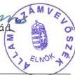
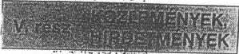

Állami Számvevőszék

# JELENTÉS

a Köztársaság Párt 1997-1998. évi
gazdálkodása törvényességének
ellenőrzéséről

1999. december

9937

---

Az ellenőrzés végrehajtásáért felelős:

Kemény Emil

mb. számvevő igazgató

Az ellenőrzést vezette:

Dr. Szávai Tamás

számvevő főtanácsos

Az összefoglaló jelentést készítette:

Dr. Dotterweich Antal

számvevő tanácsos

Az ellenőrzésben részt vettek:

Dr. Szávai Tamás

számvevő főtanácsos

Dr. Dotterweich Antal

számvevő tanácsos

A pártnál folytatott korábbi ellenőrzések:

A Köztársaság Pár 1993-1994. évi gazdalkodása tevekenységének Ellenőrzese (1995.)
A Köztársaság Pár 1995-1996. évi gazdalkodása törvenyességének Ellenőrzese (1997.)

www.asz.gov.hu

Jelentéseink az Országgyűlés számítógépes hálózatán is olvashatók.

---

V-1014-7/1999. TÉMASZÁM: 491

# TARTALOMJEGYZÉK

# I. RÉSZLETES MEGÁLLAPÍTÁSOK 4

1. A párt gazdálkodásáról szóló 1997-1998. évi beszámolók valódisága 4

1.1. A teljes vizsgálati időszakra érvényes megállapítások 4

1.2. Az 1997. évi beszámoló ellenőrzése 5

1.2.1. Bevételek 5

1.2.2. Kiadások 5

1.3. Az 1998. évi beszámoló ellenőrzése 5

1.3.1. Bevételek 5

1.3.2. Kiadások 6

2. Az 1997. és 1998. évi beszámolók megalapozottságát alátámasztó könyv-viteli megállapítások 6

2.1. A könyvvezetés szabályozottsága, gyakorlata 6

2.2. Az analitikus nyilvántartások és a bizonylati elv érvényesülése 7

2.2.1. Analitikus nyilvántartások 7

2.2.1.1. Eszköznyilvántartás 7

2.2.1.2. Elszámolásra kiadott előlegek 7

2.2.1.3. Szigorú számadású bizonylatok 8

2.2.1.4. Gépjármű üzemeltetés 8

2.2.1.5. A Párt és a saját Kft-je pénzügyi kapcsolatainak nyil-vántartása 8

2.2.2. A bizonylati elv és a bizonylati fegyelem érvényesülése 8

2.2.2.1. Kötelezettségvállalás, utalványozás 8

2.2.2.2. Bizonylatolás 8

2.3. Az adózásra, illetőleg járulékfizetésre vonatkozó jogszabályok betar-tása 9

3. A Párt bevételszerző, gazdálkodó tevékenysége 9

3.1. A párt bevételszerző tevékenysége 9

3.2. A párt alaptevékenységével összefüggő bevételek 10

4. A PÁRT GAZDÁLKODÁSÁNAK BELSŐ ELLENŐRZÉSE 10

5. AZ ELŐZŐ ELLENŐRZÉS MEGÁLLAPÍTÁSÁRA TETT INTÉZKEDÉSEK 10

# II. ÖSSZEFOGLALÓ MEGÁLLAPÍTÁSOK, FELHÍVÁS A TÖRVÉNYES ÁLLAPOT HELYREÁLLÍTÁSÁRA 12

1. Összefoglaló megállapítások 12

2. Felhívás a törvényes állapot helyreállítására 12

1

---

1. RÉSZLETES MEGÁLLAPÍTÁSOK

2

---

I. RÉSZLETES MEGÁLLAPÍTÁSOK

# JELENTÉS

# a Köztársaság Párt 1997-1998. évi gazdálkodása törvényességének ellenőrzéséről

# A VIZSGÁLAT CÉLJA, MÓDSZERE, IDŐSZAKA, KÖRÜLMÉNYEI

A pártok működéséről és gazdálkodásáról szóló - többször módosított - 1989. évi XXXIII. tv. (továbbiakban: párttörvény) 10. § (1) bekezdése, valamint az Állami Számvevőszékről szóló 1989. évi XXXVIII. tv. 5. §-a alapján a pártok gazdálkodása törvényességének ellenőrzésére az Állami Számvevőszék (továbbiakban: ÁSZ) jogosult. A törvényi felhatalmazás alapján az ÁSZ 1999. évi ellenőrzési tervének megfelelően vizsgálta a Köztársaság Párt (továbbiakban: Párt) gazdálkodása törvényességét.

Az ellenőrzött szervezet neve: Köztársaság Párt

Címe: 1137 Szent István krt. 16.

Jogállása: önálló jogi személy (9. Pk. 69359/1)

Az ellenőrzött időszak: 1997. január 1.- 1998. december 31.

Az ellenőrzés célja annak megállapítása volt, hogy:

- a Part altal keszitett es a Magyar Kozlonyben kozzett etves beszamolok a törvenyi elóirasoknak megfelelnek-e, es a konyvvezetessel es a valósaggal megegyez adatokat tartalmaznak-e;
a konyvvezetés és a gazdalkodás során betartották-e a vonatkozo jogszabá-lyi elóirásokat;
a Part a mukodeshez szabályszerien igenybevehétó forrásokat hasznalt-e fel, nem folytatott-e a partörvény által tiltott gazdalkodó tevekenységet, il- letve nem fogadott-e el tiltott adományt.

Az ellenőrzés módszere: törvényességi ellenőrzés, szúrópróbaszerű kiválasztás alapján.

3

---

I. RÉSZLETES MEGÁLLAPÍTÁSOK

Az ÁSZ a Párt gazdálkodásának törvényességét ezúttal harmadízben vizsgálta. Ezért az ellenőrzés kiterjedt annak vizsgálatára is, hogy a Párt megtette-e az 1997. évben végzett vizsgálat alapján kezdeményezett intézkedéseket.

A helyszíni ellenőrzés: 1999. augusztus 24-től 1999. szeptember 24-ig tartott.

A jelentés megállapításai a Párt Országos Központjában rendelkezésre bocsátott iratok, dokumentumok tanulmányozásával megvalósított ellenőrzés tapasztalatain alapulnak. A Pártnak az Alapszabálya szerint önálló jogi személy helyi szervezetei nincsenek. Gazdálkodási adatainak teljes körű könyvelése az Országos Központban történik.

A Párt gazdálkodása törvényességének ellenőrzését az ÁSZ a Magyar Közlöny 1997. évi 42. számában közzétett ÁSZ általános ellenőrzési program alapján végezte.

# I. RÉSZLETES MEGÁLLAPÍTÁSOK

# 1. A PÁRT GAZDÁLKODÁSÁRÓL SZÓLÓ 1997-1998. ÉVI BESZÁMOLÓK VALÓDISÁGA

# 1.1. A teljes vizsgálati időszakra érvényes megállapítások

A Párt az 1997. évi gazdálkodásáról szóló beszámolót a párttörvény 9. § (1) bekezdésében megjelölt határidőn belül és a hivatkozott törvény 1. sz. mellékletében előírt formában hozta nyilvánosságra (Magyar Közlöny 1998. április 30-i 36. száma). Az 1998. évi gazdálkodásról készült beszámolót azonban a törvényben megjelölt április 30-i határidőn túl, a Magyar Közlöny 1999. július 21-i, 66. számában tették közzé (1. és 2. sz. mellékletek).

A beszámoló alapjául szolgáló tételes könyvelési kigyűjtés készült, mely a Párt összes bevételét és kiadását tartalmazza. A kigyűjtést az ellenőrzés rendelkezésére bocsátották. A kigyűjtés alapján az egyes bevételi és kiadási tételek a könyvelésben könnyen visszakereshetők. Az egyes kiadások beszámolóbeli kategóriák szerinti csoportosítását a beszámoló alapjául szolgáló összesítőkből meg lehetett állapítani, mivel felsorolták az egyes kiadási sorokhoz tartozó költségszámlákat, illetve kiadásfajtákat.

A beszámoló összeállítása és a könyvvezetés során a számvitelről szóló - többször módosított - 1991. évi XVIII. törvényben (továbbiakban: számviteli törvény) megfogalmazott alapelveket alapvetően betartották.

A következetesség és a bruttó elszámolás elvét azonban a könyvvezetés és a beszámoló készítése során megsértették mindkét vizsgált évben néhány esetben, azonban az összegek csekély mértékére tekintettel ez nem oly nagyságrendű, amely a Párt vagyoni, jövedelmi és pénzügyi helyzetéről a beszámoló alapján kialakult összképet módosítaná.

4

---

I. RÉSZLETES MEGÁLLAPÍTÁSOK

# 1.2. Az 1997. évi beszámoló ellenőrzése

# 1.2.1. Bevételek

A Párt az 1997. évben központi költségvetésből származó támogatásból 32.700.000 Ft bevételt realizált a beszámoló szerint, ez megegyezik a könyvelés adataival.

A másik bevételi forrás az „egyéb bevételek” volt, amelynek beszámolóban közölt 14.086.590 Ft összege a következőkből tevődött össze:

- 1996. évi értékpapir visszavásárlás 10.000.000 Ft
- értékpapir bevétel 3.930.906 Ft
- kamatbevétel 104.162 Ft
- 1996. évi elszámolási előleg visszavételezese 30.000 Ft
- betegszabadsag visszafizetes 21.522 Ft

Annak következtében, hogy a Párt naplófőkönyvet vezet, a felsoroltak bevételként jelentkeznek a beszámolóban, valójában az összeg egy része csak elszámolás-technikai jellegű.

# 1.2.2. Kiadások

A kiadások összesen adata és az egyes sorok beszámolóban közölt összege megegyezik a számviteli adatokkal, de kis mértékben pontatlan. A bruttó elszámolás elvét sértő módon ugyanis a „gépkocsi költségtérítés” kiadások összesen adatát csökkentették 11.456 Ft-tal, amely gépkocsi átalány miatti Szja befizetésből adódik (egy magánszemély 8 Ft/km összeget kapott I-VI. hó folyamán az adómentes 3 Ft/km helyett, a két összeg különbözetének a megtett km-ekkel történt beszorzása eredményezte az említett 11.456 Ft összeget). Helyesen az összeget a bevételek és a kiadások között is szerepeltetni kellett volna.

# 1.3. Az 1998. évi beszámoló ellenőrzése

# 1.3.1. Bevételek

A központi költségvetési támogatás beszámolóban szerepeltetett 20.944.500 Ft adata megegyezik a számviteli nyilvántartásokban rögzített összeggel.

Az egyéb bevételek beszámoló szerinti 172.788 Ft összege a részletező nyilvántartás szerint a következő tételekből adódik:

- kamat bevétel 87.455 Ft
- Együtt Magyarországért UNIÓ kölcsön 85.333 Ft

Az ellenőrzés megállapítása szerint azonban a rövidlejáratú kölcsönök között található még egy 20.000 Ft magánszemélytől származó összeg is, ezt ugyancsak bevételként kellett volna számba venni, visszafizetését pedig tényleges kiadásként.

5

---

I. RÉSZLETES MEGÁLLAPÍTÁSOK

### 1.3.2. Kiadások

A kiadások összege egyezik a számviteli nyilvántartás szerinti összeggel. Az előző év gyakorlatával és a belső szabályzás előírásaival szemben a helyiségek bérlete kiadások teljes összegét a működési költségek között szerepeltetik, ez sérti a következetesség számviteli alapelvet.

## 2. Az 1997. és 1998. évi beszámolók megalapozottságát alátámasztó könyvviteli megállapítások

### 2.1. A könyvvezetés szabályozottsága, gyakorlata

A Párt **könyvvezetési kötelezettsége teljesítésének** a vizsgált időszakban a 8/1996. (I.24.) Korm. rendelet 8. § (3) bekezdése alapján **egyszeres könyvvitel vezetésével tett eleget**. A számviteli törvény szerinti egyéb szervezetek éves beszámoló készítésének és könyvvezetési kötelezettségének sajátosságairól szóló, hivatkozott kormányrendelet a vizsgált időszakban volt hatályos, 1999. január 1-jével hatályát vesztette. A gazdasági események rögzítésére a számviteli törvény 80. § (2) bekezdésében felsorolt nyilvántartási lehetőségek közül a **naplófőkönyvet alkalmazták**. A naplófőkönyv rovatait egyes esetekben igényeiknek megfelelően alakították ki, illetőleg módosították. A Párt területi szervezetei nem rendelkeztek önálló gazdálkodási jogkörrel, **bevételeiket és kiadásaikat** az eredeti bizonylatok alapján **a központ naplófőkönyvében vezették** számítógépes feldolgozással, amelynek havonkénti összesített adatait a hagyományos naplófőkönyvben is rögzítették havonta, göngyölítve.

A Párt a vizsgált időszakban rendelkezett számviteli szabályzattal, azonban azt **nem módosították a helyszíni ellenőrzés időpontjáig** a számviteli törvény 14. § (3)-(6) bekezdését megállapító, 1997. január 1-jével hatályba lépett 1996. évi CXV. törvény 10. §-a előírásainak megfelelően. A Párt nem rendelkezett megfelelő számviteli politikával, nem rögzítették a törvény 14. § (4) bekezdésében előírt követelményeket, továbbá nem készült el az eszközök és források értékelési szabályzata a 14. § (5) bekezdésében a számviteli politika keretében kötelezően elkészíteni előírt szabályzatok közül.

A vizsgált időszakban a könyvvezetési kötelezettség teljesítésének a Párt külső vállalkozás igénybevételével tett eleget.

**A könyvvezetés során betartották a számviteli törvényben** megfogalmazott **alapelveket** és tételes előírásokat. A beszámolókészítés ellenőrzése során megállapított néhány nem jelentős hibát a Jelentés 1.2. és 1.3. pontjai rögzítik.

A beszámoló pontosságát nem érinti, de az ellenőrzés megállapításai szerint 1997. évben autópálya díj, parkolási díj két költségfajta között is megjelenik (gépkocsik költségtérítés, továbbá különféle egyéb költségek).

Mivel mindkét költségfajta a működési költségek közé tartozik, ez csak az egyes költségfajták összegét teszi pontatlanná, illetve belső előírás hiányában nem állapítható meg, hogy mely esetben lehet autópálya és parkolási díjat valamely költségek közt elszámolni. A helytelen gyakorlatot 1998. évben megszüntették.

6

---

I. RÉSZLETES MEGÁLLAPÍTÁSOK

A felsorolt hibáktól eltekintve a kontírozás pontos, a számítógépes könyvelés adataiban a bank, illetve pénztárbizonylat sorszámán túlmenően az alapbizonylatok sorszámát is rögzítik a gazdasági esemény szöveges megnevezésén túlmenően, így minden tétel könnyen azonosítható, a teljesség megállapítható.

A zárlati munkálatokat mindkét vizsgált évben elvégezték, főkönyvi kivonat készült, bár az 1998. évről határidőn túl, 1999. május 28-i keltezéssel.

## 2.2. Az analitikus nyilvántartások és a bizonylati elv érvényesülése

### 2.2.1. Analitikus nyilvántartások

A vizsgált időszakban a számviteli törvény előírásainak megfelelően vezették a beszámoló összeállításához szükséges kiegészítő és analitikus nyilvántartásokat. E nyilvántartások a Számviteli Szabályzatban is rögzítetteknek megfelelően a következők:

a targyi eszkozok nyilvantartasa;
- az elszamolásra kiadott elölegek nyilvantartása;
szigoru szamadásuBizonylatok nyilvantartasa;
a Part egyszemelyes Kft-je reszere adott kolcsonok nyilvantartasa;
- a személyi jövedelemadó alapjául szolgálo jövedelmek és levont adóelölegek személyenkénti nyilvántartása;
- a tarsadalombitzositast megilleto jarulekok alapjanak es osszegenek nyilvantartasa;
- vásárolt értekpapirok nyilvantartása.

#### 2.2.1.1. Eszköznyilvántartás

A Párt a beszerzett tárgyi eszközöket a hatályos számviteli előírásoknak megfelelően tartja nyilván, a 30 E Ft feletti egyedi értékű eszközökről egyedi nyilvántartást, a 30 E Ft alatti értékű eszközökről folyamatos mennyiségi nyilvántartást vezetett. A nyilvántartásból összesítés készült, amelyből megállapítható értékben a nyitó, a növekedés, az értékcsökkenés és a záró állomány adata.

#### 2.2.1.2. Elszámolásra kiadott előlegek

Az elszámolásra kiadott előlegekről - a Számviteli Szabályzatnak megfelelően - analitikus nyilvántartást vezetnek. A nyilvántartás vezetési kötelezettség mellett a Számviteli Szabályzatban meghatározták, hogy milyen célra lehet elszámolási előleget kiadni. A nyilvántartás tartalma a követelményeknek megfelel. Az előleget felvevő személyek az előírt határidőre eleget tettek elszámolási kötelezettségüknek.

7

---

I. RÉSZLETES MEGÁLLAPÍTÁSOK

# 2.2.1.3. Szigorú számadású bizonylatok

A Párt Számviteli Szabályzata meghatározta a szigorú számadás alá vont bizonylatok körét. A Pártnál szigorú számadású bizonylatként kezelik a kiadási és bevételi pénztárbizonylatokat és a készpénzcsekket.

A szigorú számadású bizonylatok nyilvántartása megfelelt a Szt. 86. §-ában foglalt követelményeknek és a belső szabályzatok előírásainak.

# 2.2.1.4. Gépjármű üzemeltetés

A Pártnak a vizsgált időszakban saját tulajdonú gépkocsija nem volt. A Párt bérelt gépkocsit nem üzemeltetett. Magántulajdonú gépkocsi hivatali célú használatára is csak elvétve került sor. Ezekben az esetekben mindig szabályos kiküldetési rendelvényt állítottak ki. Költségként csak a hivatalos norma szerinti üzemanyag mennyiséget az érvényes ár figyelembevételével számoltak el és fizettek ki. Az 1997. évben egy esetben fizettek a 3 Ft/km összegnél többet ki egy személy részére, de ennek személyi jövedelemadó vonzatát rendezték még az év folyamán.

# 2.2.1.5. A Párt és a saját Kft-je pénzügyi kapcsolatainak nyilvántartása

A Párt 1995. évben „Aranyút Kft” néven 1.000.000 Ft alaptőkével egyszemélyes gazdasági társaságot alapított. A Kft és a Párt között 1995. április 1-jén határozatlan időre kötött és azóta többször módosított szerződés értelmében a Kft havi átalánydíj ellenében biztosítja a Párt Országos Központjának működtetését. A Párt szerződés keretében kölcsönöket nyújtott a Kft részére. Az analitikus nyilvántartások szerint 1998. év végén a Kft 8,9 M Ft-tal tartozott a Pártnak. Hiányosság azonban, hogy az analitikus nyilvántartásokban befektetett pénzügyi eszközként nem tartják nyilván a Kft-be befektetett 1.000.000 Ft összegű törzsbetétet. A pártigazgatótól kapott szóbeli tájékoztatás szerint a Kft-t a Párt az 1999. év folyamán értékesítette.

# 2.2.2. A bizonylati elv és a bizonylati fegyelem érvényesülése

# 2.2.2.1. Kötelezettségvállalás, utalványozás

A Pártnál a kötelezettségvállalás, érvényesítés és utalványozás rendjét a Számviteli és Pénzforgalmi Szabályzatban - megfelelő részletezettséggel - szabályozták. A vizsgált időszakban a gyakorlat is megfelelő volt, megszüntették a korábbi ÁSZ vizsgálat során fennállt összeférhetetlenséget, nem azonos az utalványozó és a kifizető személye.

# 2.2.2.2. Bizonylatolás

A vizsgált időszakban minden gazdasági műveletről bizonylatot állítottak ki a felmerülés időpontjában, bizonylat nélkül nem könyveltek gazdasági eseményt.

8

---

I. RÉSZLETES MEGÁLLAPÍTÁSOK

A bizonylatok szabályszerűek, a bankbizonylatokon túlmenően használták a bevételi és kiadási pénztárbizonylatokat, amelyeket emelkedő sorszám szerint, idősorrendben használtak fel, adataik összesítése napi pénztárjelentésen történt meg.

A pénztárbizonylatokhoz szabályszerű alapbizonylatok kapcsolódnak (számlák, kiküldetési rendelvények stb).

Az 1997. évi novemberi 18 db pénztárbizonylat közül egy esetben nem szerepel az összeg befizetőjének, egy esetben pedig az összeg átvevőjének aláírása.

A decemberi 17 db pénztárbizonylat közül egy esetben hiányzik az összeg átvevőjének aláírása.

Mindhárom eset a Párt és az általa alapított egyszemélyes Kft közötti pénzmozgást rögzít, ezen elszámolások kivételével a bizonylati fegyelem érvényesült a vizsgált hónapokban.

Az 1998. évi márciusi, áprilisi és májusi pénztárbizonylatok tételes ellenőrzése során (összesen 73 db pénztárbizonylat) az volt megállapítható, hogy valamennyi bizonylatot szabályszerűen, a törvényi előírásoknak megfelelően töltötték ki.

Az ÁSZ előző ellenőrzésének felhívása nyomán biztosították a készpénzforgalommal összefüggő bizonylatok haladéktalan rögzítését a számviteli nyilvántartásokban.

### **2.3. Az adózásra, illetőleg járulékfizetésre vonatkozó jogszabályok betartása**

A Párt **mindkét évben vezette az előírt nyilvántartásokat**, amelyek alkalmasak a személyi jövedelemadó, a társadalombiztosítási, nyugdíj- és egészségbiztosítási járulék, valamint a munkaadói és munkáltatói járulék alapjának, összegének megállapítására. **E nyilvántartások alapján teljes körűen ellenőrizhető a kötelezettségek megállapítása és teljesítése.**

Személyi jövedelemadó és társadalombiztosítási járulékok **bevallási és befizetési kötelezettségének a Párt mindkét évben eleget tett.**

## **3. A PÁRT BEVÉTELSZERZŐ, GAZDÁLKODÓ TEVÉKENYSÉGE**

### **3.1. A párt bevételszerző tevékenysége**

A Párt a saját nyilatkozata és az ellenőrzés megállapítása szerint a vizsgált időszakban bevételszerző gazdálkodó tevékenységet nem folytatott.

9

---

I. RÉSZLETES MEGÁLLAPÍTÁSOK

### 3.2. A párt alaptevékenységével összefüggő bevételek

A Pártnak a vizsgált időszakban a központi költségvetési támogatáson kívül csak banki kamatbevétele volt.

A szúrópróbaszerű ellenőrzés tapasztalata és a pártigazgató nyilatkozata alapján a Párt a vizsgált időszakban számára **tiltott adományokat nem fogadott el, a számára tiltott értékpapírt nem vásárolt, többszemélyes Kft-ben vagy egyéb gazdasági társaságban részesedést nem szerzett.**

A Párt **1995-ben** Aranyút Kft néven **egyszemélyes Kft-t alapított. A Kft nyereségéből** a vizsgált időszakban a Pártnak **bevétele nem származott.**

A Párt megtakarított pénzét a párttörvény szerint engedélyezett értékpapírba fektette, részvényt nem vásárolt.

### 4. A PÁRT GAZDÁLKODÁSÁNAK BELSŐ ELLENŐRZÉSE

A Pártnál alapszabályának megfelelően Számvizsgáló Bizottság működik. A bizottság minden évben megvizsgálta a Párt által közzétett beszámolót, a tárgyi eszközök nyilvántartását, az elszámolásra felvett pénzeszközök nyilvántartását és elszámoltatását, valamint a személyi jellegű kifizetéseket és az azokhoz kapcsolódó nyilvántartásokat, az adó- és járulék fizetési kötelezettségek teljesítését. A munkafolyamatokba épített ellenőrzés a központban az utalványozáson, adatszolgáltatáson, számlaellenőrzésen keresztül érvényesül.

A pártigazgató - az utalványozási rendben foglaltaknak megfelelően - rendszeresen igazolja a teljesítéseket és ellenőrzi a házipénztári és banki kifizetések jogosságát.

### 5. AZ ELŐZŐ ELLENŐRZÉS MEGÁLLAPÍTÁSÁRA TETT INTÉZKEDÉSEK

Az ÁSZ elnöke a Párt 1995-1996. évi gazdálkodása törvényességének vizsgálatát követően - a vizsgálat megállapításaira támaszkodva - a párttörvény 10. § (4) bekezdésében kapott felhatalmazás alapján felhívta a Párt elnökét, hogy:

- Szabályozza, hogy a Párt beszámolójában mi minősül működési, politikai vagy egyéb kiadásoknak.
- Intézkedjenek a számviteli törvény 83. § (2) bekezdésében előírt - készpénz és a banki forgalom azonnali rögzítésére vonatkozó - követelményeknek megfelelő nyilvántartási rendszer kialakítása érdekében. (A hivatkozott bekezdés szövege időközben többször módosult, a felhívás az akkor hatályos szöveg szerinti követelmények betartására irányult.)
- Az 1995. december 31. és 1996. december 31-i tárgyi eszköz leltárak közötti eltérés okait vizsgáltassa ki, és az alapján tegye meg a szükséges intézkedéseket.

10

---

I. RÉSZLETES MEGÁLLAPÍTÁSOK

- Tegyen intézkedéseket a szigorú számadású bizonylatok felhasználását megfelelően rögzítő nyilvántartás vezetésére.
- Válassza szét az utalványozási és pénzkezelési feladatköröket, hogy önmagának senki ne utalványozhasson és fizethessen ki.

A Párt az ÁSZ felhívásának eleget tett, a megállapított szabálytalanságokat kiküszöbölte.

11

---

II. ÖSSZEFOGLALÓ MEGÁLLAPÍTÁSOK, FELHÍVÁS A TÖRVÉNYES ÁLLAPOT HELYREÁLLÍTÁSÁRA

## II. ÖSSZEFOGLALÓ MEGÁLLAPÍTÁSOK, FELHÍVÁS A TÖRVÉNYES ÁLLAPOT HELYREÁLLÍTÁSÁRA

### 1. ÖSSZEFOGLALÓ MEGÁLLAPÍTÁSOK

**A Párt** a vizsgált évekről **eleget tett beszámolási kötelezettségének**. Az 1997. évi gazdálkodásról határidőben, az **1998. évi gazdálkodásról** azonban **határidőn túl tették közzé a beszámolót**.

A beszámolók elkészítése során néhány esetben **megsértették a következetesség és a bruttó elszámolás számviteli alapelveket**. Ugyanis a két egymást követő évben a működési és a politikai költségek tartalma nem azonos (következetesség), továbbá bevételeket költségekkel szemben számoltak el (bruttó elszámolás).

A Párt Számviteli Szabályzatában **meghatározta számviteli politikáját, a gazdálkodás és a könyvvezetés, valamint a kötelezettségvállalás és utalványozás rendjét**. A számviteli politikát azonban nem módosították a számviteli törvény 14. § (3)-(5) bekezdései előírásainak megfelelően, továbbá nem készítették el a számviteli politika keretében kötelezően elkészíteni előírt szabályzatok közül az Eszközök- és források értékelési szabályzatát.

A Párt könyvvezetési kötelezettségének az egyszeres könyvvitel keretében naplófőkönyv alkalmazásával tett eleget, a könyvvezetést külső cég végezte.

A Párt a számviteli törvényben előírt, valamint a gazdálkodáshoz szükséges **analitikus nyilvántartásokat a törvényi előírásoknak megfelelően vezette**.

**A bizonylati fegyelem a törvényi előírásoknak megfelelő volt**, néhány nem jelentős hiba csak 1997. évben volt tapasztalható.

Az **adózásra**, illetőleg a **járulék fizetésre**, valamint az azokhoz kapcsolódó **nyilvántartások vezetésére és a beszámolásra vonatkozó követelményeknek a Párt maradéktalanul eleget tett**.

### 2. FELHÍVÁS A TÖRVÉNYES ÁLLAPOT HELYREÁLLÍTÁSÁRA

A Jelentés 2.1 pontjában megállapított hiányosságokra tekintettel a párttörvény 10. § (4) bekezdésében kapott felhatalmazás alapján az Állami Számvevőszék felhívja a Párt elnökét, hogy intézkedjen a számviteli törvény 14. § (3)-(5) bekezdésének megfelelő számviteli politika és a hiányzó értékelési szabályzat elkészítése érdekében.

Budapest, 1999. december „3”

Dr. Kovács Árpád

Melléklet: 2 db

12

---

1. sz. melléklet a
V-1014-7/1999. sz. jelentéshez

1998/36. szám

MAGYAR KÖZLÖNY

2947

A Környezeti Katasztrófa Ellenes Párt 1997. évi pénzügyi zárómérlege

|   | Bevételek | Forintban  |
| --- | --- | --- |
|  1. Tagdíjak |  | 12 000  |
|  2. Állami költségvetésből származó támogatás |  | —  |
|  3. Képviselőcsoportnak nyújtott állami támogatás |  | —  |
|  4. Egyéb hozzájárulások, adományok |  | —  |
|  5. A párt által alapított vállalat és korlátolt felelősségű társaság nyereségéből származó bevétel |  | —  |
|  6. Egyéb bevételek |  | 31 000  |
|  Összes bevétel a gazdasági évben |  | 43 000  |
|   | Kiadások |   |
|  1. Támogatás a párt országgyűlési csoportja számára |  | —  |
|  2. Támogatás egyéb szervezeteknek |  | —  |
|  3. Vállalkozások alapítására fordított összegek |  | —  |
|  4. Működési kiadások |  | 2 791 000  |
|  5. Eszközbeszerzések |  | —  |
|  6. Politikai tevékenység kiadásai |  | —  |
|  7. Egyéb kiadások |  | —  |
|  Összes kiadás a gazdasági évben |  | 2 791 000  |
|   | Simon Csaba s. k., elnök |   |

A Köztársaság Párt 1997. évi pénzügyi zárómérlege

|   | Bevételek | Forintban  |
| --- | --- | --- |
|  1. Tagdíjak |  | —  |
|  2. Állami költségvetésből származó támogatás |  | 32 700 000  |
|  3. Képviselőcsoportnak nyújtott állami támogatás |  | —  |
|  4. Egyéb hozzájárulások, adományok |  | —  |
|  5. A párt által alapított vállalat és korlátolt felelősségű társaság nyereségéből származó bevétel |  | —  |
|  6. Egyéb bevételek |  | 14 086 590  |
|  Összes bevétel a gazdasági évben |  | 46 786 590  |
|   | Kiadások |   |
|  1. Támogatás a párt országgyűlési csoportja számára |  | —  |
|  2. Támogatás egyéb szervezeteknek |  | 18 097 196  |
|  3. Vállalkozások alapítására fordított összegek |  | —  |
|  4. Működési kiadások |  | 18 731 282  |
|  5. Eszközbeszerzések |  | 300 000  |
|  6. Politikai tevékenység kiadásai |  | 4 620 962  |
|  7. Egyéb kiadások |  | 1 522 121  |
|  Összes kiadás a gazdasági évben |  | 43 271 561  |
|   | Rogányi József s. k., pártigazgató |   |

---

1. 2017年1月1日，公司与上海浦东发展银行股份有限公司签订了《关于使用部分闲置募集资金进行现金管理的协议》。

[Non-Text]

[Non-Text]

[Non-Text]

[Non-Text]

[Non-Text]

[Non-Text]

[Non-Text]

[Non-Text]

[Non-Text]

[Non-Text]

[Non-Text]

[Non-Text]

[Non-Text]

[Non-Text]

[Non-Text]

[Non-Text]

[Non-Text]

[Non-Text]

[Non-Text]

[Non-Text]

[Non-Text]

[Non-Text]

[Non-Text]

[Non-Text]

[Non-Text]

[Non-Text]

[Non-Text]

[Non-Text]

[Non-Text]

[Non-Text]

[Non-Text]

[Non-Text]

[Non-Text]

[Non-Text]

[Non-Text]

[Non-Text]

[Non-Text]

[Non-Text]

[Non-Text]

[Non-Text]

[Non-Text]

[Non-Text]

[Non-Text]

[Non-Text]

[Non-Text]

[Non-Text]

[Non-Text]

The Ground Truth image displays a single, solid horizontal line. According to Rule 2 (UNDERSCORE & LINE RULES), this is a stylistic or background line, not a placeholder underscore. Therefore, the OCR result must ignore it and output nothing or only meaningful text. The provided OCR content is "____", which consists of four underscores. This is an incorrect interpretation of the line as a placeholder, violating the rule that stylistic lines must be ignored. The OCR has hallucinated underscores where none should exist based on the GT's visual context. Hence, the OCR result is inconsistent with the Ground Truth.

(1) 2017年1月1日至2018年1月1日，公司与关联方累计发生的交易金额为人民币4,500万元。

---

2. sz. melléklet a

V-1014-7/1999. sz. jelentéshez

1999/66. szám

MAGYAR KÖZLÖNY

4389

# A Fogyasztóvédelmi Főfelügyelőség
közleménye

A Békés Megyei Közigazgatási Hivatal Fogyasztóvédel-
mi Felügyelősége mintavétellel egybekötött ellenőrzést
képzett a megye területén. A Fogyasztóvédelmi Főfelügye-
lőség és a Hírközlési Főfelügyelet laboratóriumaiban vég-
gett vizsgálatok alapján a

TERMINÁTOR VI. Modell BS 500 AS (NN—999)
típusú TV játék

századata a környezet számára rádió és televízió vételi
tavarokat okoz, hálózati adapterének kialakítása balcset-
észélyes.

A Fogyasztóvédelmi Főfelügyelőség a fenti termék for-
almazását az áruk és szolgáltatások biztonságosságáról és
ezzel kapcsolatos piacfelügyeleti eljárásról szóló
1998. (IV.-29.) Korm. rendelet 6. § d) pontja alapján
segítik.

A kereskedelmi egységek a fogyasztók által a vásárlás
helyére visszaszállított termékeket kötelesek visszavásá-
ni.

Dr. Huszay Gábor s. k.,
főigazgató

# A Köztársaság Párt
1998. évi pénzügyi beszámolója

|   | Forintban  |
| --- | --- |
|  Bevételek |   |
|  1. Tagdíjak | —  |
|  2. Állami költségvetésből származó tá- mogatás | 20 944 500  |
|  3. Képviselőcsoportnak nyújtott állami támogatás | —  |
|  4. Egyéb hozzájárulások, adományok | —  |
|  5. A párt által alapított vállalat és korlá- tolt felelősségű társaság nyereségéből származó bevétel | —  |
|  6. Egyéb bevételek | 172 788  |
|  Összes bevétel a gazdasági évben | 21 117 288  |

# Kiadások

|  1. Támogatás a párt országgyűlési cso- portja számára | —  |
| --- | --- |
|  2. Támogatás egyéb szervezeteknek | 609 009  |
|  3. Vállalkozások alapítására fordított összegek | —  |
|  4. Működési kiadások | 9 136 246  |
|  5. Eszközbeszerzés | —  |
|  6. Politikai tevékenység kiadásai | 13 446 432  |
|  7. Egyéb kiadások | 5 034 460  |
|  Összes kiadás a gazdasági évben | 28 226 147  |

Rogányi József s. k.,
pártigazgató

Helyesbítés: A Magyar Közlöny 1999. évi 51. számában kihirdetett, a technológia-átadási megállapodások egyes csoportjainak a versenykorlá-
s tilalma alól történő mentesítéséről szóló 86/1999. (VI. 11.) Korm. rendelet

2. §-ának (1) bekezdése helyesen:

„(1) ..., hogy a megállapodásban meghatározott

a) legkisebb összegű licencdíjat fizeti;

b) legkisebb mennyiséget állítja el a licencia tárgyát képező termékből;

c) legkisebb számú műveletet végzi el a licencia tárgyát képező technológia kihasználására.”

4. §-ának f) pontjában „a felhasználók” szövegrész törlésre kerül.

(Nyomdahiba)

A Magyar Közlöny 1999. évi 61. számában kihirdetett, a diákigazolványról szóló 30/1999. (II. 15.) Korm. rendelet módosításáról rendelkező
1999. (VII. 6.) Korm. rendelet 2. §-ával módosított R. d) pontja helyesen:

„d) a kormányközi és más oktatási együttműködési megállapodás vagy egyezmény alapján magyarországi közoktatási vagy felsőoktatási
ményben tanuló, részképzésben részt vevő, valamint a Magyar Nyelvi Intézetben tanuló külföldi hallgató.”

(Kézirathiba)