**Audit report on railway construction Zalalövő–Bajánsenye–Hodoš–Murska Sobota**

**Poročilo o revizijah gradnje železniške proge Zalalövő–Bajánsenye–Hodoš–Murska Sobota**

**Jelentés a Zalalövő–Bajánsenye–Hodoš–Murska Sobota vasútvonal építésének ellenőrzéséről**

**2003**

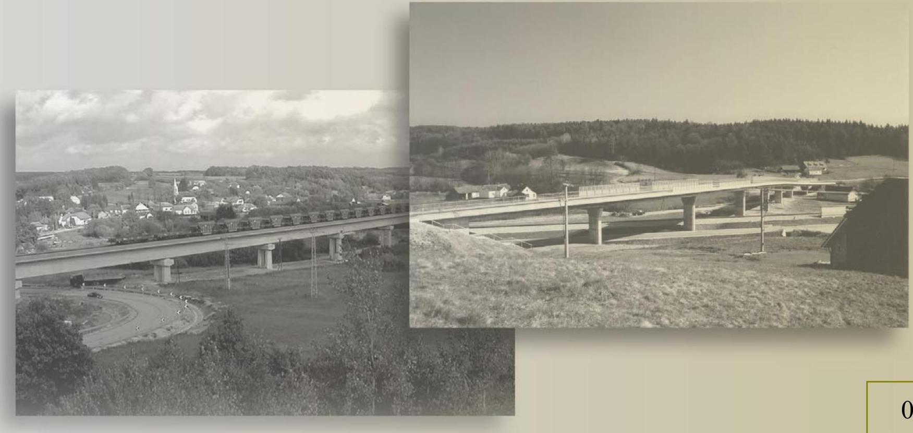

---

.

---

## Tartalomjegyzék

BEVEZETŐ ..... 5
MEGÁLLAPÍTÁSOK ÖSSZEFOGLALÁSA ..... 11
AJÁNLÁSOK ..... 17
MEGÁLLAPÍTÁSOK ..... 21

1. A projektvezetés szervezeti felépítése ..... 23
2. A beruházás kivitelezésének és tervezésének előkészítése ..... 25
3. Finanszírozási források a vasútépítés kivitelezéséhez ..... 31
3.1. A vasútvonal magyarországi szakaszának finanszírozása ..... 31
3.2. A vasútvonal szlovén szakaszának finanszírozása ..... 33
4. A beruházás kivitelezése ..... 35
4.1. A beruházás kivitelezésének ellenőrzése ..... 36
4.2. A kivitelezök kiválasztása ..... 38
4.3. A beruházás jelentősebb módosításainak áttekintése ..... 41
4.4. A beruházás helyzete ..... 44
4.5. A beruházás ökológiai szempontjai ..... 47
4.6. A két ország beruházási költségeinek összehasonlítása ..... 49
5. A beruházás hatása ..... 53
6. A személyforgalom beindítása az új vasútvonalon ..... 61

## Contents

INTRODUCTION ..... 5
SUMMARY OF FINDINGS ..... 11
RECOMMENDATIONS ..... 17
FINDINGS ..... 21

1. Organisation of project management ..... 23
2. Preparation for implementation and investment planning ..... 25
3. Financial sources for railway construction ..... 31
3.1. Financing of the railway construction in Hungary ..... 31
3.2. Financing of the railway construction in Slovenia ..... 33
4. Investment implementation ..... 35
4.1. Control over the investment implementation ..... 36
4.2. Selection of service providers ..... 38
4.3. Review of major investment changes ..... 41
4.4. Situation analysis of the investment ..... 44
4.5. Environmental aspect of the investment ..... 47
4.6. Comparison of investment costs between the countries ..... 49
5. Investment impacts ..... 53
6. Introduction of passenger traffic via new the railway line ..... 61

## Vsebina

UVOD ..... 5
POVZETEK UGOTOVITEV ..... 11
PRIPOROČILA ..... 17
UGOTOVITVE ..... 21

1. Organizacija vodenja projekta ..... 23
2. Priprave na izvedbo in načrtovanje investicije ..... 25
3. Zagotavljanje virov sredstev za financiranje investicije ..... 31
3.1. Financiranje gradnje na Madžarskem ..... 31
3.2. Financiranje gradnje v Sloveniji ..... 33
4. Izvedba investicije ..... 35
4.1. Nadzor izvajanja investicije ..... 36
4.2. Izbira izvajalcev. ..... 38
4.3. Pregled večjih sprememb investicije ..... 41
4.4. Stanje investicije ..... 44
4.5. Ekološki vidik investicije ..... 47
4.6. Primerjava stroškov investicije med državama ..... 49
5. Učinki investicije ..... 53
6. Uvedba potniškega prometa na novi progi ..... 61

---

.

---

# INTRODUCTION

## UVOD

## BEVEZETÉS

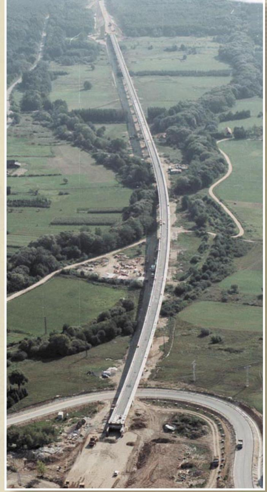

---

.

---

Magyarország és Szlovénia között a vasúti kapcsolat 1906-1907 között indult meg Murska Sobota-Šalovci-Zalalövő-Körmend vasútvonalon. Ebben az időben még mindkét ország az Osztrák-Magyar Monarchia része volt. A vasutat 1913-ban tovább építették Zalaegerszegig. A vasútvonal helyi jellegű volt, számos éles kanyarral, amelyek miatt a vonatok sebességét $60-80 \mathrm{~km} / \mathrm{h}$-ra, illetve ennél alacsonyabb sebességre korlátozták. A két ország közötti forgalmat a második világháború végén megszüntették, a vasútvonalat hivatalosan 1968-ban zárták be. Ebben az időben a teljes vasúti forgalom Horváth országon keresztül bonyolódott. A forgalom a Szlovén Köztársaság és a Horváth Köztársaság között a Središče ob Dravi és Čakovec határátkelőn keresztül, a Horváth Köztársaság és a Magyar Köztársaság között pedig Murakeresztúr és Kotoriba határátkelőn keresztül bonyolódott.

A két ország közötti vasúti kapcsolat újbóli megindítását az 1980-as években kezdeményezték. Elkészült (korábban Magyar Népköztársaság és a Szlovén Szocialista Köztársaság között) az Ormož-Murska Sobota-Szentgotthárd nyomvonalon megépítendő vasútvonal gazdaságossági tanulmánya, amely megerősítette a beruházás létjogosultságát. A volt Jugoszlávia szétesése és az önálló szlovén állam megalakulása miatt a vasútvonal nem épült meg.

A 90-es évek elején délnyugat és északkelet Európa között a megnőtt áruforgalom miatt újból előtérbe kerültek Magyarország és Szlovénia között a közvetlen vasúti kapcsolat létesítése irányuló törekvések. Újabb gazdaságossági tanulmány készült, amely három lehetséges vasúti nyomvonalat tanulmányozott át (1. sz. ábra):

The original railway connection between Hungary and Slovenia was opened in 1906 and 1907 between Murska Sobota-Šalovci-ZalalövőKörmend. At that time, both countries had been part of the Austro-Hungarian Monarchy. In 1913 it was extended to Zalaegerszeg. The railway was used for rural rather than main line services. The track was laid with a large number of tight curves which imposed speed restrictions of $60-80 \mathrm{~km}$ per hour or less. The railway link was officially closed in 1968, even though the traffic had stopped after the second World War. During that time the countries used railway links via Croatia (border crossing Središče ob Dravi-Čakovec between Slovenia and Croatia and border crossing Murakeresztur- Kotoriba between Hungary and Croatia).

In the 1980s the activities for reestablishing the railway link were started. The cost benefit analysis on railway line Ormož-Murska SobotaSzentgotthard (between the former Peoples Republic of Hungary and the Socialist Republic of Slovenia) was made. The study economically justified the investment. However because of the disintegration of former Yugoslavia and the formation of the new independent state of Slovenia, the railway track was not constructed.

At the beginning of the 1990s the cargo traffic between the SW and NE Europe increased therefore activities referred to railway construction between Slovenia and Hungary were undertaken. A new cost efficiency study on railway link between the countries was prepared. There were three routes for railway link proposed, in Figure 1.:

Med Madžarsko in Slovenijo je neposredna železniška povezava v preteklosti že obstajala. V letih 1906 in 1907, ko sta bili obe državi še del Avstroogrske monarhije, je bila na odseku Murska Sobota-Šalovci-Zalalövő-Körmend zgrajena železniška proga, leta 1913 pa še podalǰ̌ana do Zalaegerszega. Proga je bila lokalnega značaja, z mnogimi ostrimi zavoji, zato je bila vozna hitrost vlakov omejena na 60 do $80 \mathrm{~km} / \mathrm{h}$. Uradno je bila proga zaprta leta 1968, čeprav promet po progi med državama že od konca druge svetovne vojne ni več potekal. V tem času se je ves promet med državama odvijal po Hrvaški prek mejnega prehoda Središče ob Dravi-Čakovec, med republikama Slovenijo in Hrvaško ter Murakeresztúr-Kotoriba, med republikama Hrvaško in Madžarsko.

Aktivnosti za ponovno vzpostavitev železniške povezave so se pričele v 80 . letih prejšnjega stoletja. Izdelana je bila študija upravičenosti železniške povezave med tedanjima Ljudsko Republiko Madžarsko in Socialistično Republiko Slovenijo na trasi Ormož-Murska Sobota-Szentgotthárd, ki je potrdila ekonomsko upravičenost investicije. Zaradi razpada tedanje Jugoslavije in nastanka samostojne države Slovenije do realizacije gradnje proge ni prišlo.

Povečanje prometnih tokov blaga v smeri JZ - SV Evrope je v začetku 90. let ponovno obudilo aktivnosti za gradnjo železniške povezave med republikama Madžarsko in Slovenijo. Izdelana je bila študija upravičenosti gradnje železniške proge med državama, v kateri so bile proučene tri možne variante tras (slika 1), in sicer:

---

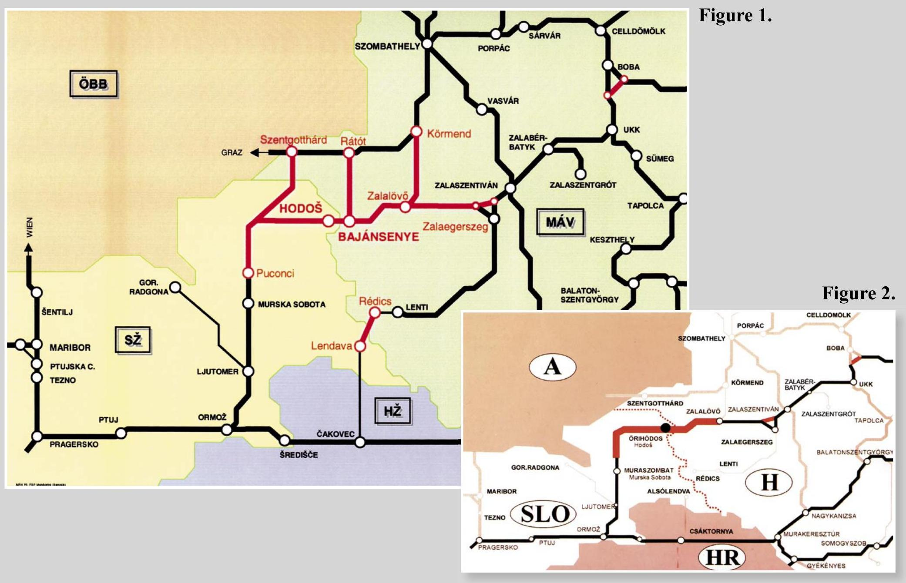

8

---

- Murska Sobota-Hodoš-Bajánsenye-Zalalövő,
- Lendva-Rédics és
- Murska Sobota-Martinje-Szentgotthárd (Monošter).

A két ország a harmadik változat mellett döntött, mely nyomvonal kiépítésének a belső megtérülési rátája a legmagasabb volt. Mindkét ország közlekedési minisztériuma aláirta a vasút megépítéséről szóló szándéknyilatkozatot, és elkezdődött a felkészülés a beruházásra. Annak ellenére, hogy az előkészítő munkálatok befejeződtek, a magyar Környezetvédelmi és Területfejlesztési Minisztérium a természeti környezetbe történő súlyos beavatkozás miatt 1993 márciusában negatív véleményt adott ki a javasolt nyomvonalon megépítendő vasútvonalról. A résztvevő országok a Lendva-Rédics nyomvonal változatot is elvetették, mert Magyarországon a meglévő vasútvonal korszerűsítése túlságosan nagy befektetést igényelt volna, Szlovéniában pedig nem volt mód a teljes vasútvonal szlovén területen történő kiépítésére.

Az említett változatok elutasítása után a résztvevő országok jóváhagyták a Murska Sobota-Hodoš-Bajánsenye-Zalalövő nyomvonalon megépülő vasútvonalat, amely részben az egykor megszüntetett vasútvonal nyomvonalán halad (2. sz. ábra). A két ország közlekedési minisztere 1993. év végén aláírta a vasúti összeköttetés újra létesítéséről szóló szándéknyilatkozatot, 1995-ben pedig aláírták a vasútvonal megépítéséről szóló megállapodást. Államok az Szlovén - magyar Vegyes Bizottság alakult, amely irányította és összehangolta az építkezés előkészületeit. A két ország 1996-ban elfogadta a vasútvonal megépítéséről szóló végső döntést, és októberben aláírták a vasútvonal létesítéséről szóló

- Murska Sobota-Hodoš-Bajánsenye-Zalalövő,
- Lendava-Rédics and
- Murska Sobota-Martinje-Szentgotthard.

The last route was selected because of the highest internal rate of return. The Ministries for transport from Slovenia and Hungary signed Letter of intent of railway construction. Both countries started carrying out preparations for construction. Even though the preparatory work was completed, the Hungarian Ministry for Environmental and Regional Policy in March 1993 issued a negative opinion on the railway construction because of its damaging inpacts influence on the natural environment. The second variant of the railway link Lendava - Redics was also rejected, because on Hungarian side there were too many deteriorated railway lines which would require renovation and on Slovenian side it would not be possible to complete the railway track entirely on Slovene territory.

After the two variants were rejected both countries supported the construction of the railway route: Murska Sobota-Hodoš-Bajánsenye-Zalalövő, which is partly following the original and abandoned railway link (Figure 2.). At the end of the year 1993 the Ministries of transport from both countries signed Letter of Intent for re-establishing the railway connection. In 1995 the agreement on railway construction was signed. A Joint Interstate Committee (Slovene-Hungarian) was established with the purpose of managing and co-ordinating construction preparations. In 1996 the countries adopted finalised decision on railway construction and in October 1996 the agreement on establishing railway connection was signed. The main objectives were to enable the

- Murska Sobota-Hodoš-Bajánsenye-Zalalövő,
- Lendava-Rédics (Redič) in
- Murska Sobota-Martinje-Szentgotthárd (Monošter).

Izbrana je bila slednja, za katero je bila izračunana najvišja interna stopnja donosa. Ministrstvi za promet obeh držav sta podpisali pismo o nameri za gradnjo proge in na obeh straneh so stekle priprave na gradnjo. Kljub temu da so bila pripravljalna dela opravljena, je madžarsko ministrstvo za urejanje okolja zaradi prehudih posegov v naravno okolje v marcu 1993 podalo negativno mnenje o gradnji proge na predlagani trasi. Varianta trase LendavaRédics je bila zavrnjena, ker bi bilo na madžarski strani potrebno posodobiti preveč že obstoječih prog, na slovenski strani pa ne bi bilo mogoče celotne proge speljati po slovenskem ozemlju.

Po zavrnitvi navedenih variant sta državi potrdili gradnjo železnice po trasi proge Murska Sobota-Hodoš-Bajánsenye-Zalalövő, ki deloma poteka po ukinjeni trasi proge nekdanje železniške proge (slika 2). Ob koncu leta 1993 sta Ministrstvi za promet obeh držav podpisali izjavo o nameri za ponovno vzpostavitev neposredne železniške povezave, v letu 1995 pa je bil podpisan dogovor o gradnji proge ter ustanovljena mešana komisija na meddržavni ravni, ki je vodila in usklajevala priprave na gradnjo. V letu 1996 sta državi sprejeli dokončno odločitev o gradnji proge in v oktobru 1996 podpisali sporazum o vzpostavitvi neposredne železniške povezave. Poglavitna cilja gradnje proge sta bila povečati obseg in olajšati tranzitni tovorni in potniški promet med zahodno, srednjo in jugovzhodno Evropo, s tem pa ustvariti razmere za razvoj boljšega sodelovanja med državama.

---

egyezményt. A vasútvonal megépítésének fő célja a Nyugat-, Közép- és Kelet-Európa közötti államközi tranzit- és személyforgalom volumenének növelése és megkönnyítése volt, biztosítva ezzel a két ország közötti jobb együttműködés körülményeit is.

A két ország megállapodott abban, hogy együttműködik a vasúti összeköttetés tervezésében és kivitelezésében, ezért a résztvevő országok számvevőszékei is úgy döntöttek, hogy elvégzik a beruházás közös vizsgálatát. A vasútvonal magyar szakaszának vizsgálatát a Magyar Köztársaság Állami Számvevőszéke (ÁSZ) 2001. évben végezte el, a vasútvonal szlovén szakaszának vizsgálatát a Szlovén Köztársaság Számvevőszéke (Számvevőszék) végezte. A beruházás tervezésének, a közbeszerzési pályázatoknak és a beruházás finanszírozás helyességének vizsgálata mellett mindkét állami számvevőszék vizsgálta a vasútvonal építésének környezetvédelmi szempontjait, valamint a beruházás egyéb hatásait is. A közös jelentés bemutatja a két ország részvételét a vasútépítésben, összehasonlítja a vizsgálatok néhány eredményét - különösen a két ország közötti vasúti összeköttetés építési költségeinek mértékéről szóló adatokat - ezek alapján megállapítja, hogy a vasútvonal építése során mely ország volt gazdaságilag hatékonyabb, valamint a tervezett célok tükrében értékeli a beruházás sikerességét.
cargo and passenger traffic between the countries, to improve the traffic links between the Western or Central and south-eastern Europe and to create conditions for development of better co-operation between the two countries.

Since the two countries adopted an agreement on co-operation when planning and realising the investment, the supreme audit institutions decided to carry out a parallel audit of the investment. The audit on construction of Hungarian part of the railway was carried out in 2001 by the State Audit Office of Hungary (herein after referred to as SAO). The audit on construction of Slovene part of the railway was carried out by Court of Audit of the Republic of Slovenia (herein after referred to as Court of Audit). Both supreme audit institutions reviewed apart from regularity of planning the investment public procurement process and financing the investment, also the ecological aspect of railway construction and other impacts of the investment. The joint report will present the activities referred to railway construction undertaken by both countries and it will show some comparable audit results (data on railway construction costs and the answer to the question: which country was more cost efficient), and present an assessment of effectiveness of the investment referred to achievement of planned objectives.

Ker sta državi sprejeli dogovor o sodelovanju pri načrtovanju in izvajanju železniške povezave, sta se tudi vrhovni revizijski instituciji odločili, da izvedeta paralelno revizijo te investicije. Revizijo gradnje madžarskega dela železniške proge je v letu 2001 izvedel Državni revizijski urad Republike Madžarske, revizijo gradnje slovenskega dela železniške proge pa je opravilo Računsko sodišče Republike Slovenije. Poleg preizkušanja pravilnosti načrtovanja investicije, oddaje javnih naročil in financiranja investicije sta obe vrhovni državni revizijski instituciji pregledali tudi ekološki vidik gradnje proge in druge učinke investicije. S skupnim poročilom želita predstaviti aktivnosti obeh držav pri gradnji proge in poudariti nekatere primerljive rezultate obeh revizij, zlasti podatke o obsegu stroškov gradnje železniške povezave med državama, na tej podlagi ugotoviti, katera država je bila pri gradnji proge ekonomsko bolj učinkovita, ter oceniti uspešnost investicije z vidika doseganja načrtovanih ciljev.

---

# SUMMARY OF FINDINGS 

## POVZETEK UGOTOVITEV

## A MEGÁLLAPÍTÁSOK ÖSSZEFOGLALÁSA

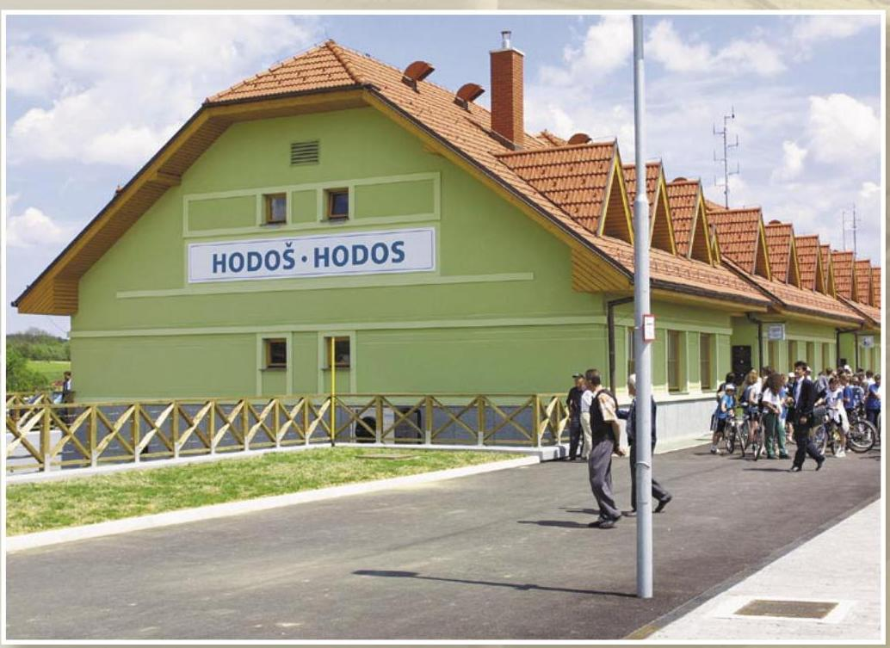

---

.

---

A két állam a közvetlen vasúti összeköttetést államközi projektként határozta meg, amelyet a közlekedési minisztériumok irányítottak. Elsősorban a tervezés fázisában müködtek együtt. Megállapodtak a költségbecslés közös alapelveiről és a beruházás várható hatásairól, továbbá közösen kiszámították a beruházás gazdaságossági mutatóit. A beruházási költségek növekedése miatt a két ország a beruházás kivitelezése során újból kiszámította a gazdaságossági mutatókat, de a számítás során nem alkalmaztak egységes alapelveket, éppen ezért az eredményeket nem lehet összehasonlítani.

Mindkét országban a beruházás legfontosabb finanszírozási forrása a felvett kölcsön volt, az országok a szükséges eszközök kisebb hányadát biztosították állami költségvetésükből. A magyar fél a beruházás értékének megközelítőleg egytizedére Phare támogatáshoz jutott.

A beruházást mindkét országban a vasút-társaságok bonyolították le. Elkészítették a beruházás dokumentációját, versenyeztetési eljárásokat folytattak le, szerződést kötöttek a nyertes ajánlattevőkkel és ellenőrizték a szerződések végrehajtását. A vasút-társaságok irányították és ellenőrizték a beruházás megvalósítását, melynek következtében a vasútvonal felépítése és a vasúti forgalom beindítása határidőre megtörtént. Az összes jelentős döntést megfelelően dokumentálták, és ezzel biztosították a beruházás összes fázisának nyomon követhetőségét és átláthatóságát. A beruházás kivitelezőit a közbeszerzést szabályozó nemzeti előírásokkal összhangban nyilvános pályázatokon választották ki. Szlovéniában nyilvános versenytárgyalást írtak ki, melyet a Szlovén Vasutak (SŽ) bonyolított. Magyarországon nyilvános nemzetközi pályáza-

The railway construction was defined by both countries as an interstate project. It was managed by ministries responsible for transport. The ministries from both countries co-operated mainly in the planning phase. They adopted an agreement on joint basis for assessing costs and the expected benefits of the investment and prepared a joint calculation of the cost efficiency indicators. Because the investment costs increased, the countries carried out recalculation of the cost efficiency indicators during the investment implementation. Since they did not use unified basis for the recalculation the results are not comparable.

The most important source for investment financing were loans, smaller part of funds were acquired from the state budgets in both countries. Hungary succeeded in obtaining Phare funds which represented almost one tenth of the total investment value.

The investment was, in both countries, managed by railways companies. They prepared investment documentation, carried out tender selection procedures, made contracts with selected tenders and controlled the implementation of the contract. The railways companies managed and monitored the investment and the result was a constructed railway track and the introduction of railway traffic in due time. All important decisions were properly documented and in this way all investment phases were recorded and could be reviewed, therefore the transparency was provided. The service providers were selected in line with national legislation referred to public procurement. In Slovenia the national public invitations for bids were published, and the Slovene Railways carried out all phases of

Gradnjo neposredne železniške povezave sta državi opredelili kot meddržavni projekt, ki sta ga vodili ministrstvi, pristojni za promet. Sodelovali sta predvsem pri predpripravah na gradnjo. Dogovorili sta se o skupnih izhodisččih za vrednotenje stroškov in pričakovanih prihodnjih učinkov investicije in pripravili skupen izračun kazalcev ekonomske učinkovitosti investicije. Zaradi povečanja investicijskih stroškov sta državi med izvajanjem investicije ponovno opravili izračune kazalcev ekonomske učinkovitosti, vendar pri tem nista uporabili enotnih izhodisčč, zaradi česar rezultati med seboj niso primerljivi.

Najpomembnejši vir sredstev za financiranje investicije so bila v obeh državah najeta posojila, manjši delež potrebnih sredstev pa sta državi zagotovili v državnih proračunih. Madžarska stran je za financiranje približno desetine celotne vrednosti investicije uspela pridobiti sredstva pomoći Phare.

Investicijo sta v obeh državah izvajali železniški družbi. Pripravljali sta investicijsko dokumentacijo, izvajali postopke izbire izvajalcev, z njimi sklepali pogodbe ter nadzorovali njihovo izvajanje. Železniški družbi sta vodili in spremljali investicijo tako, da je bila proga zgrajena in železniški promet uveden v dogovorjenih rokih. Vse poglavitne odločitve sta ustrezno dokumentirali in s tem zagotovili sledljivost in transparentnost izvajanja vseh faz investicije. Izvajalci del so bili, v skladu z nacionalnimi predpisi, ki urejajo javno naročanje, izbrani na javnih razpisih. Slovenski izvajalci so bili izbrani na nacionalnih razpisih, pri čemer so Slovenske železnice (v nadaljevanju: SŽ) same izvajale vsa dejanja v postopkih izbire. Za gradnjo madžarskega dela proge so bili opravljeni mednarodni razpisi, ministr-

---

tokat írtak ki, a versenytárgyalás összes fázisának döntését a Közlekedési, Hírközlési és Vízügyi Minisztérium (KHMV) és a Pénzügyminisztérium (PM) fogadta el. A magyar fél a nemzetközi pályázatokkal nagyobb versenyt biztosított az ajánlattevőknek, a döntések illetékes intézmények által történő jóváhagyásával pedig biztosította a kiválasztási eljárások hatékony ellenőrzését. A beruházás összes költsége Magyarországon 117,37 millió EURO Szlovéniában pedig 107,96 millió EURO volt. Szlovéniában egy kilométer vasútvonal átlagban alacsonyabb költségekkel épült meg ( 4,40 millió EURO), mint Magyarországon (5,97 millió EURO).

Mindkét országban az érték szempontjából legfontosabb szerződéseket vizsgáltuk. A beruházás előre nem látható változásai miatt a kiinduló szerződéses összeg mindkét országban megváltozott, különösen Szlovéniában, ahol a változás $42,7 \%$ volt. Az összes előre nem látható növekedést mindkét országban megfelelően igazolták és dokumentálták.

A vasútvonal építés környezetre gyakorolt negatív hatásainak enyhítése érdekében mindkét országban környezetvédelmi intézkedéseket hoztak, mindenekelőtt a felszíni és a talajvizek, az állat- és növényvilág, természeti és kulturális örökség védelme, valamint a zajhatás csökkentése érdekében. A beruházás magyar szakaszának környezetvédelmi költségei a teljes beruházás értékének 2,7\%-a, a szlovén szakaszon pedig a beruházás $5 \%$-a volt. A két ország környezetvédelmi intézkedéseinek költségei a különböző nemzeti környezetvédelmi törvények és a természeti környezet különbözősége miatt eltértek.
the public procurement process. In Hungary the international public invitations for bids were published, the Ministry of Transport, Communication and Water Management and the Ministry of Finance approved decisions in all phases of the public procurement process. In this way Hungary assured higher level of competition between tenders, the process of approving the decisions by authorised institutions provided efficient control over selection procedures. The final total value of the investment amounted to 117,37 million EUR in Hungary and 107,96 million EUR in Slovenia. In Slovenia one kilometre of railway was in average constructed with lower costs ( 4,40 million EUR per km) than in Hungary ( 5,97 million EUR per km).

In both countries the contracts which were most important due to the value where reviewed. Because of unpredicted changes during the investment construction, the basic value increased in both countries, especially in Slovenia it increased by $42,7 \%$. All unexpected changes were appropriately approved and documented in both countries.

In order to mitigate negative impacts of railway construction on the environment measures were undertaken in both countries. The measures referred to protection of underground and surface water, flora, fauna, natural and cultural heritage and mitigation of noise. In Hungary the costs of nature preservation activities represented $2,7 \%$ of total investment value, in Slovenia they represented $5 \%$ of total value. The environmental costs differ because of different regulations of the national acts and of the heterogeneous environmental circumstances.

On the basis of data on cargo transport via new railway track in 2002 it was found that the basic
stvi, pristojni za promet in finance, pa sta potrjevali odločitve v vseh fazah izbire. Madžarska stran je z izvajanjem mednarodnih javnih razpisov omogočila večjo konkurenčnost med ponudniki, potrjevanje odločitev pristojnih institucij pa je zagotovilo učinkovit nadzor izvajanja postopkov izbire.

Končna vrednost investicije je na Madžarskem znašala 117,37 milijona evrov, v Sloveniji pa 107,96 milijona evrov. V Sloveniji je bil kilometer proge v povprečju zgrajen z nižjimi stroški ( 4,40 milijona evrov na kilometer proge) kot na Madžarskem (5,97 milijona evrov na kilometer proge).

V obeh državah so bile revidirane vrednostno najpomembnejše pogodbe. Zaradi nepredvidenih sprememb med izvajanjem investicije se je osnovna pogodbena vrednost v obeh državah povečala, predvsem v Sloveniji, kar za 42,7 odstotka. Vse nepredvidene spremembe so bile v obeh državah ustrezno potrjene in dokumentirane.

Za ublažitev negativnih vplivov gradnje proge na okolje so bili v obeh državah izvedeni okoljevarstveni ukrepi, predvsem za zaščito površinskih in podtalnih voda, živalstva, rastlinstva in naravne in kulturne dediščine ter zmanjšanje hrupa. Okoljevarstveni stroški madžarskega dela investicije predstavljajo 2,7 odstotka celotne investicijske vrednosti, okoljevarstveni ukrepi slovenskega dela investicije pa 5 odstotkov. Stroški okoljevarstvenih ukrepov med državama se razlikujejo zaradi različnih zahtev nacionalnih okoljevarstvenih zakonodaj in raznolikosti naravnega okolja.

Na podlagi podatkov o prepeljanem tovoru po novi progi v letu 2002 je bilo ugotovljeno, da se niso uresničile izhodiščne predpostavke o letnih stopnjah rasti železniškega prometa, na podlagi ka-

---

Az új vasútvonalon bonyolított teherforgalom 2002. évi adatai alapján megállapítható, hogy még nem valósultak meg a vasúti forgalom elvárt éves növekedési arányai. A vasút-társaságoknak az új vasútvonalra elsősorban a meglevő, Horvátországon át vezető vasúti összeköttetésről sikerült árut szerezniük, de nem sikerült a közúti teherforgalmat a vasútvonalra átirányítaniuk. A személyszállító vonatok kapacitása sincs kihasználva, de az új vasúti összeköttetés ennek ellenére különösen a helyi lakosság számára fontos vívmány, hiszen új vonal létesült és olcsóbb személyszállítási szolgáltatást nyújt.
predictions on railway transport annual growth rates were not achieved. The railways companies attracted to the new railway track cargo from existing railway track via Croatia, but they were not successful in directing road cargo transport to the railway track. The passenger train capacities are not used entirely. Nevertheless the new railway track is an important achievement for the local people, because it brought new links and cheaper passenger public transport services.
terih so bili načrtovani učinki investicije. Železniški družbi sta na novo progo uspeli pridobiti predvsem tovor z obstoječe železniške povezave prek Hrvaške, nista pa uspeli preusmeriti cestnega tovornega prometa na železnico. Tudi kapacitete vlakov za prevoz potnikov niso ustrezno izkoriščene, kljub temu pa je nova železniška povezava pomembna pridobitev predvsem za lokalno prebivalstvo, ker je prinesla nove povezave in cenejše storitve javnega potniškega prometa.

---

.

---

# RECOMMENDATIONS 

## PRIPOROČILA

## AJÁNLÁSOK

Tunel at Nagyrákos

---

.

---

## Ajánlások

- A két ország közötti vasúti kapcsolat kiépítésének tervezésében és kivitelezésében illetékes intézmények elsősorban a beruházás előkészítő fázisában müködtek együtt, meghatározták a beruházás gazdaságossági értékelésének egységes alapelveit. Javasoljuk, hogy a jövőben az intézmények szorosabban müködjenek együtt a beruházások megvalósítása és végrehajtásának ellenőrzése során. Az ilyen együttmüködés lehetővé tette volna a beruházási költségek, a beruházás végrehajtásának és hatásainak követésére szolgáló egységes módszertan kidolgozását, és ezzel biztosított lett volna a beruházás nagyobb összehasonlíthatósága a két ország között.
- Javasoljuk, hogy a két ország illetékes intézményei (a közlekedési minisztériumok a vasút-társaságokkal együttmüködve) közösen elemezzék azokat az okokat, amelyek miatt nem teljesültek az új vasútvonalra tervezett teherforgalom és gyengén kihasznált a személyszállító vonatok kapacitása, valamint minél előbb hozzanak megfelelő intézkedéseket, melyek a teher- és személyforgalom növelését eredményezik.

## Recommendations

- The institutions of both countries responsible for planning and implementation of railway line, cooperated mainly in planning phase. They defined a unified basis for assessing the cost efficiency of the investment. It is recommended that, the institutions in the future should realise a closer co-operation also during the implementation and monitoring phase of the investments. This type of co-operation would have been enabled a unified methodology for monitoring investment costs, construction implementation and investment impacts, therefore the better comparability of the investment between the countries would be reached.
- It is recommended that the authorised institutions of both countries (the Ministries of transport in cooperation with railways companies) carry out an analysis of reasons for not realising the forecasted quantities of cargo transport via new railway line and for the poor use of passenger trains' capacities. They should as soon as possible apply and implement appropriate measures which will result increase in the cargo transit and passenger transport.

## Priporočila

- Institucije obeh držav, pristojne za načrtovanje in izvedbo gradnje železniške povezave, so sodelovale predvsem v pripravljalni fazi investicije, pri čemer so bila določena enotna izhodišča za ekonomsko vrednotenje investicije. Menimo, da bi bila tesnejše sodelovanje in natančna opredelitev pristojnosti in odgovornosti posameznih institucij potrebna tudi med izvajanjem in spremljanjem učinkov investicije. Takšno sodelovanje bi omogočilo izdelavo enotne metodologije za spremljanje investicijskih stroškov, poteka izvedbe in učinkov investicije in tako zagotovilo večjo primerljivost investicije med državama.
- Predlagamo, da pristojne institucije obeh držav (ministrstvi za promet ob sodelovanju z železniškima družbama) skupaj analizirajo vzroke za neizpolnitev predvidevanj o načrtovanih količinah prevoženega tovora po novi progi in za slabo izkoriščenost vlakov za prevoz potnikov ter čim prej oblikujejo ustrezne ukrepe za povečanje prevozov tovora in potnikov in jih začnejo izvajati.

---

.

---

# FINDINGS 

## UGOTOVITVE

## MEGÁLLAPÍTÁSOK

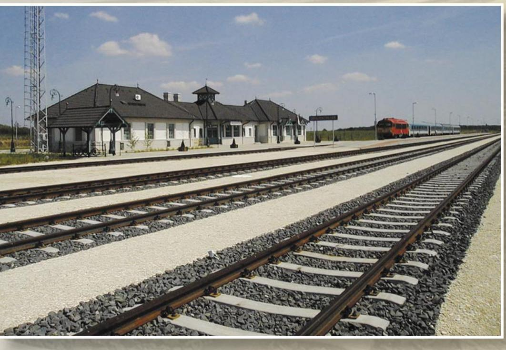

---

.

---

## 1. A projektvezetés szervezeti felépítése

A két ország a közvetlen vasúti összeköttetést államközi projektnek nyilvánította. Állami szinten azt a Szlovén Köztársaság Közlekedési és Hírközlési Minisztériuma (MPZ) és a Magyar Köztársaság Közlekedési, Hírközlési és Vízügyi Minisztériuma (KHVM) vezette. Az összes projekttevékenység összehangolt lebonyolítása érdekében államközi és nemzeti szinten szélesebb körű vezetésszervezési formát hoztak létre.

Államközi szinten 1995 júniusában Vegyes Bizottság alakult, amelynek feladata volt a vasútvonal építésére történő előkészületek vezetése és öszszehangolása. E bizottság keretében jogi, pénzügyi, műszaki és technológiai albizottságok müködtek.

A két ország beruházásprojekt-szervezetének vázlata a 3. sz. ábrán látható.

A beruházást mindkét országban stratégiai projektként határozták meg. A vasútvonal szlovén szakaszára öttagú Projekttanácsot nevezetek ki, amely a MPZ két és a SŽ három képviselőjéből állt. 1998. évben a Kormány a beruházás kivitelezésével a SŽ-t hatalmazta fel, amely rendszeresen beszámolt a MPZ-nek, a Kormánynak és az Országgyűlésnek. Magyarországon a beruházás kivitelezésével a MÁV Rt.-t hatalmazták fel. A döntésekért a beruházás öszszes fázisában a KHVM, a Pénzügyminisztérium és a Magyar Államkincstár is felelős volt.

## 1. Organisation of project management

The countries defined the construction of the direct railway connection as an interstate project. The project was on the state level managed by the Ministry of Transport (MPZ) of the Republic of Slovenia and the Ministry of Transport, Communication and Water Management (KHVM) of the Republic of Hungary. In order to co-ordinate implementation of the project activities they created a broader organisational management system on interstate and national level.

In June 1995 the Joint Interstate Committee was established on interstate level. Its task was to manage and co-ordinate preparatory work on railway construction. Within the committee there were subcommittees for legal, financial, technical and technological areas.

The organisation of project management for both countries is presented in Figure 3.

The investment was defined as a strategic project in both countries. In Slovenia there was a project board appointed which consisted of five members: two of them were representing MPZ and three of them representing Slovene Railways. In 1998 the Government authorised the Slovene Railways to undertake the investment realisation. The Slovene Railways regularly reported on progress to the Ministry of Transport, the Government and the National Assembly. In Hungary the MAV was authorised to implement the investment. The decision making process in all phases of the investment was undertaken also by the Ministry of Transport, Communication and Water Management, the Ministry of Finance and the Hungarian StateTreasury.

## 1. Organizacija vodenja projekta

Državi sta gradnjo neposredne železniške povezave opredelili kot meddržavni projekt. Na ravni držav sta ga vodila Ministrstvo za promet in zveze Republike Slovenije (v nadaljevanju: MPZ) in Ministrstvo za promet, zveze in vodno gospodarstvo Republike Madžarske (v nadaljevanju: MPZVG). Za usklajeno izvajanje vseh projektnih aktivnosti sta vzpostavili širšo organizacijsko obliko vodenja na meddržavni in nacionalni ravni.

Na meddržavni ravni je bila junija 1995 ustanovljena mešana madžarsko - slovenska komisija, ki je vodila in usklajevala priprave na gradnjo proge. V sklopu te komisije so delovale podkomisije za pravno, finančno, tehnično in tehnološko področje.

Organizacija vodenja investicije v obeh državah je prikazana v sliki 3.

Na nacionalni ravni je bila investicija v obeh državah opredeljena kot strateški projekt. Za slovenski del investicije je bil imenovan projektni svet, sestavljen iz petih članov, dveh predstavnikov MPZ in treh predstavnikov SŽ. V letu 1998 je Vlada za izvajanje investicije pooblastila SŽ, ki so o napredku redno poročale MPZ, vladi in državnemu zboru. Tudi na Madžarskem so bile za izvedbo investicije pooblaščene Madžarske železnice (v nadaljevanju: MÁV). Za sprejemanje odločitev v vseh fazah investicije pa so bili odgovorni še MPZVG, Ministrstvo za finance in Madžarska zakladnica.

---

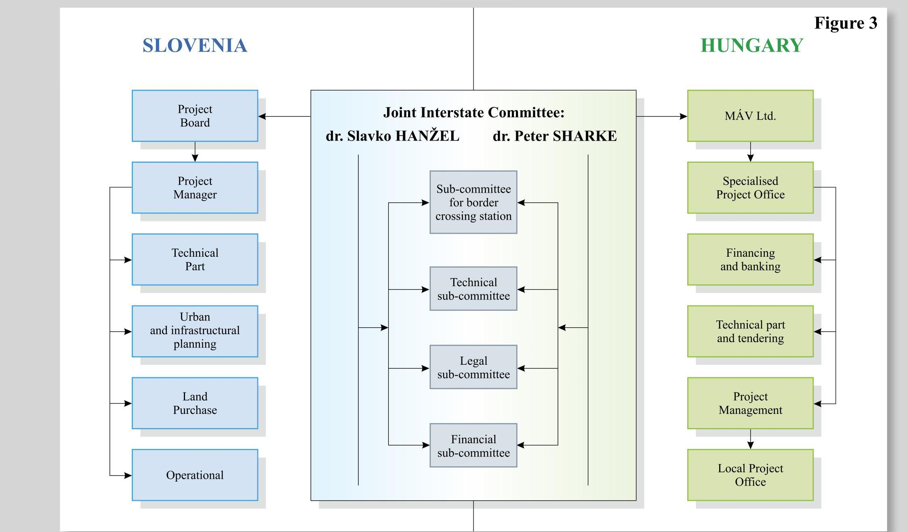

# Figure 3

## SLOVENIA

### Joint Interstate Committee: dr. Slavko HANŽEL
### dr. Peter SHARKE

### Sub-committee for border crossing station

### Technical sub-committee

### Legal sub-committee

### Financial sub-committee

### Sub-committee

### Financial sub-committee

### MÁV Ltd.

### Financing and banking

### Technical part and tendering

### Project Management

### Local Project Office

---

## 2. A beruházás kivitelezésének és tervezésének előkészítése

1995. évben a beruházás előkészítő szakaszában az Európai Fejlesztési és Újjáépítési Bank (EBRD) megbízásából a beruházásról megvalósíthatósági tanulmány ${ }^{1}$ készült. A tanulmány elkészítésében közremüködtek a magyar és szlovén vasutak tervezőintézetei. A tanulmány meghatározta a szlovén és a magyar vasútvonalszakasz tervezésének és kivitelezésének kiindulópontjait.

A tanulmányban három különböző vonatsebességet biztosító vasútvonal nyomvonalára becsülték meg a szakértők a vasútvonal építési költségeit. A különböző áruforgalmi prognózisok figyelembe vételével felbecsülték a szállítási útvonalat és az új vasútvonalra tervezett teherforgalom volumenét, a beruházás gazdaságosságát, valamint felbecsülték az új vasútvonal megépítésének és üzemeltetésének várható környezeti hatásait.

A tanulmányban a beruházás költségeit a vasútvonal három különböző változatára becsülték meg, figyelembe véve azokat a körülményeket, hogy a vasútvonal megvalósításának első szakaszában egyvágányú és nem villamosított lesz, hat közbülső állomást, illetve kitérőt és határállomást kell megépíteni, továbbá majdnem az összes közúti útkereszteződésben rendezni kell a szintbeli kereszteződéseket is.

A beruházás gazdaságossági mutatóinak kiszámításához a tanulmányban felbecsülték a vasútvonal megépítésének jövőbeni hasznát. Ebből a célból meghatározták:
${ }^{1}$ Sir Alexander Gibb \& Partners: Slovenia-Hungary Rail Link Feasibility Study, Final Report, 1995. június

## 2. Preparation for implementation and investment planning

In 1995 in the preparatory phase of the investment, the Feasibility study ${ }^{1}$, (hereinafter referred to as Study) was prepared under the patronage of the EBRD. Extensive information and professional services were provided by the Slovene and Hungarian railway design institute. The Study introduced the basis for investment planning and realisation for Slovene and Hungarian part of the railway track.

The Study assessed the costs of railway track construction for three different variants of railway track which allow different speed limits, and prepared freight demand forecasts, economic evaluations in terms of the costs and benefits and assessed the aspected environmental impacts.

Investment costs were assessed for three different routes including the facts that the railway will be single track and not electrified in the first phase, that six intermediate stops or bypasses and border crossing station will be constructed, that level crossings on all crossroads will be arranged.

In order to calculate the economic efficiency indicators, the study assessed the benefits of the constructed railway. Therefore the following impacts were defined:
${ }^{1}$ Sir Alexander Gibb \& Partners: Slovenia - Hungary Rail Link Feasibility Study, Final Report, June 1995.

## 2. Priprave na izvedbo in načrtovanje investicije

V pripravljalni fazi investicije, leta 1995, je bila pod okriljem Evropske banke za obnovo in razvoj izdelana študija izvedljivosti investicije ${ }^{1}$ (v nadaljevanju: študija). Pri pripravi študije sta sodelovali projektivni podjetji obeh železníških družb. Študija je postavila izhodišča za načrtovanje in izvedbo investicije, tako za gradnjo slovenskega kot tudi madžarskega dela proge.

V študiji so bili ocenjeni stroški gradnje železniške povezave za tri variante trase proge, ki omogočajo različne potovalne hitrosti vlakov, izdelana je bila ocena predvidenega obsega prepeljanega tovora po novi progi, ekonomska upravičenost investicije ob upoštevanju različnih vhodnih predpostavk ter podana ocena možnih vplivov gradnje in obratovanja nove proge na okolje.

Stroški investicije so bili ocenjeni na podlagi predvidevanj, da bo proga v prvi fazi enotirna in neelektrificirana, da bo potrebno zgraditi šest vmesnih postaj oziroma izogibališč in mejno postajo ter urediti nivojska križanja na skoraj vseh cestnih križiščih.

Za izračun kazalcev ekonomske upravičenosti investicije so bile v študiji ocenjene prihodnje koristi gradnje proge. V ta namen so bili opredeljeni:
${ }^{1}$ Sir Alexander Gibb \& Partners: Slovenia-Hungary Rail Link Feasibility Study, Final Report, junij 1995.

---

- a mérhető hatásokat (szállítási útvonal és azon teherszállítmányok volumene, amelyeket erre a vasútvonalra lehet átterelni),
- a vasútépítés nem mérhető hatásait (jobb és szorosabb együttműködés mindkét ország vasút-társaságai között, gyorsabb és kedvezőbb szállítás, a két ország beilleszkedése a fejlődő európai vasúti folyosó rendszerébe, megbízható és gyors szállítás bevezetése, amely megerősíti a vasúti összeköttetés használóinak bizalmát, árban versenyképes szállítások lehetősége, valamint a határátkelőkön a várakozási idők csökkenése és a vámeljárások egyszerűsödése).

A beruházás becsült költségei és a felmért jövőbeni haszon (leszállított tehermennyiség) alapján kiszámították a beruházás gazdasági hatékonyságának két mutatóját: a belső megtérülési rátát (IRR) és a nettó jelenértéket (NPV). A számításokat arra a vasútvonal-változatra készítették el, amely legfeljebb $120 \mathrm{~km} / \mathrm{h}$, illetve $160 \mathrm{~km} / \mathrm{h}$ utazó sebességet engedélyez, feltételezve a vasúti forgalom alacsony és magas növekedését a forgalomnak a meglevő vasútról és a közutakról különböző forgatókönyvek szerint, ${ }^{2}$ történő átterelésével.
${ }^{2}$ A tanulmány négy különböző forgatókönyvet tárgyal:
A: a Horvátországon keresztül vezető meglevő összeköttetésről és a közutakról semmilyen átterelés nem lesz az új vasútvonalra;
B: a Horvátországon átvezető meglevő összeköttetésről semmilyen átterelés nem lesz és $50 \%$-os forgalomátterelés lesz a közutakról az új vasútvonalra;
C: $50 \%$-os forgalomátterelés lesz a Horvátországon átvezető meglevő összeköttetésről és semmilyen átterelés nem lesz a közutakról az új vasútvonalra;
D: $50 \%$-os forgalomátterelés lesz a Horvátországon átvezető meglevő összeköttetésről és $50 \%$-os átterelés lesz a közutakról az új vasútvonalra.

- measurable impacts (transport routing and the volume of cargo transit via the new railway track)
- non-measurable impacts (better and closer cooperation between the railways companies of both countries, quicker and more comfortable transport, inclusion of both countries in developing European railway corridor, reliable and quick cargo transport which will improve users confidence in services, possibilities for competitive prices and shortening waiting times at the border crossing and simplifying customs procedures).

On the basis of the assessed costs and evaluated future investment benefits (scope of cargo transport) the cost efficiency indicators were calculated: internal rate of return (IRR) and net present value (NPV) for two variants of the railway routs that allow top speed limit $120 \mathrm{~km} / \mathrm{h}$ or $160 \mathrm{~km} / \mathrm{h}$, including the low and high rate of railway traffic in line with different scenarios ${ }^{2}$ that show directing the traffic from the existing railway and road.
${ }^{2}$ The Study dealt with four different scenarios about directing cargo transport to the new railway route:

A: Without directing railway cargo traffic from existing line via Croatia to the new railway line and without directing road traffic to the railway;
B: Without directing railway cargo traffic from existing line via Croatia to the new railway line and directing $50 \%$ of the road traffic to the railway;

C: Directing $50 \%$ of railway traffic from existing line via Croatia to the new railway line and without directing road cargo traffic to the railway;

D: Directing $50 \%$ of railway cargo traffic from existing line via Croatia to the new railway line and directing $50 \%$ of the road cargo traffic to the railway;

- merljivi učinki (transportni substrat in obseg tovora, ki bi ga bilo mogoče pridobiti na novo progo) in
- nemerljivi učinki gradnje proge (boljše in tesnejše sodelovanje železniških družb obeh držav, hitrejši in ugodnejši prevoz tovora, umestitev obeh držav v razvijajoči se evropski sistem železniških koridorjev, uvedbo zanesljivih in hitrih prevozov tovora, ki bo utrdila zaupanje uporabnikov železniške povezave, možnosti za cenovno konkurenčne prevoze ter skrajšanje čakalnih dob na mejnih prehodih in poenostavitev carinskih postopkov).

Na podlagi ocenjenih stroškov in ovrednotenih prihodnjih koristi investicije (prepeljanih količin tovora) sta bila izračunana kazalca ekonomske učinkovitosti investicije interna stopnja donosa (v nadaljevanju: ISD) in neto sedanja vrednost (v nadaljevanju: NSV) za varianti proge, ki dopuščata največjo potovalno hitrost vlakov $120 \mathrm{~km} / \mathrm{h}$ oziroma $160 \mathrm{~km} / \mathrm{h}$, ob predvidevanjih za nizko in visoko rast železniškega prometa za različne scenarije ${ }^{2}$ preusmeritve prometa z obstoječe železnice in s cest.
${ }^{2}$ Študija je obravnavala štiri različne možnosti (scenarije) preusmeritve tovornega tranzitnega prometa na novo progo z obstoječe železniške proge prek Hrvaške in s ceste:
scenarij A: ni preusmeritve železniškega tovornega prometa na novo progo z obstoječe povezave prek Hrvaške in ni nobene preusmeritve cestnega prometa;
scenarij B: ni preusmeritve železniškega tovornega prometa na novo progo z obstoječe povezave prek Hrvaške, s cest pa naj bi se preusmerilo 50 odstotkov tovornega prometa;
scenarij C: 50 -odstotna preusmeritev železniškega prometa na novo progo z obstoječe povezave prek Hrvaške in brez preusmeritve cestnega tovornega prometa;
scenarij D: 50-odstotna preusmeritev železniškega tovornega prometa na novo progo z obstoječe povezave prek Hrvaške in 50-odstotna preusmeritev cestnega tovornega prometa.

---

A tanulmány az összegzésben az új vasúti kapcsolat megépítésének indokoltságáról globális értékelést ad. Hangsúlyozza, hogy a vasútvonal fontos összekötő kapcsolatot jelent Kelet- és KözépEurópának az Adriai tenger és Olaszország felé, kiegészíti a Horvátországon és Ausztrián átvezető nyomvonalakat, és egyben konkurenciát is jelent azoknak. A tanulmány felhívja a figyelmet arra, hogy az új vasúti kapcsolat sikeressége mindenek előtt függ a két ország vasút-társaságai szerkezetváltási lehetőségeitől és a megfelelő kereskedelmi gyakorlat kialakításától.

A két ország kormánya 1995 novemberében a megvalósíthatósági tanulmány alapján úgy döntött, hogy a vasútvonalat $120 \mathrm{~km} / \mathrm{h}$ üzemi sebességre alkalmas nyomvonalon építi meg, amely $160 \mathrm{~km} / \mathrm{h}$ legmagasabb vonatsebességet tesz lehetővé.

Tekintettel arra, hogy a megvalósíthatósági tanulmány költség- és haszonbecsléséhez 1993. évi adatok álltak rendelkezésre, a két ország a beruházás megkezdése előtt újból értékelte a beruházás költségeit és a várható jövőbeni hasznokat. A közös kiindulópontok alapján a felek közös analízist ${ }^{3}$ (a továbbiakban: közös tanulmány) dolgoztak ki a teljes projektberuházás gazdaságosságának elemzésével, amelyben kimutatták a belső megtérülési rátát, a nettó jelenértéket és a beruházás megtérülési idejét. Továbbá kidolgozták a projekt érzékenységi elemzését azon paraméterekre, amelyek a projekt legkockázatosabb részét képezik (a teherszállít-

[^0]The Study presented a general assessment of the economic efficiency referred to new railway construction. The study stressed that the railway represented an important linking element in traffic system: between Eastern and Central Europe towards Adriatic and Italy, and an additional and competitive element in traffic system linking Austria and Croatia. The Study showed that the economic effectiveness of the new railway track will depend mostly on restructuring of railways companies in both countries and their ability to adopt commercial practice.

On the basis of the findings of the Study both governments decided in November 1995 to construct the new railway on the line to accommodate an average speed of $120 \mathrm{~km} / \mathrm{h}$, and top speed of $160 \mathrm{~km} / \mathrm{h}$.

The Feasibility study used data from 1993 for cost-benefit assessment, therefore the countries before undertaking the investment carried out another analysis of investment costs and benefits. They also wanted to ensure the data to be comparable between the countries. On the basis of unified points they prepared Joint Cost Efficiency Analysis ${ }^{3}$ for the whole project. It presents calculated internal profit level, net current value and investment return period. A sensitivity test of the project was prepared in line with the parameters which presented most risky parts of the project (changes in scope of cargo transit, investment costs and changes in state budget preference.
${ }^{3}$ Ministry of Transport of the Republic of Slovenia and the Ministry of Transport, Communication and Water management of the Republic of Hungary: Slovenia - Hungary Railway Line/ Joint Cost Efficiency Analysis, September 1996

Po ocenah študije nova proga predstavlja pomembno povezavo med vzhodno in srednjo Evropo proti Jadranu in Italiji ter dopolnilo in hkrati konkurenco obstoječim železniškim povezavam prek Hrvaške in Avstrije. Študija pa je ob tem opozorila, da bo uspešnost nove železniške povezave odvisna predvsem od zmožnosti prestrukturiranja železniških družb obeh držav in oblikovanja ustrezne komercialne prakse prevozov po novi progi.

Na podlagi ugotovitev študije sta se vladi obeh držav v novembru 1995 odločili, da bosta železniško progo zgradili na trasi, primerni za povprečne hitrosti vlakov do $120 \mathrm{~km} / \mathrm{h}$, ob največji dovoljeni hitrosti do $160 \mathrm{~km} / \mathrm{h}$.

Glede na to, da so bili v študiji podlaga za oceno stroškov in koristi podatki iz leta 1993, ter da bi zagotovili medsebojno primerljivost vseh podatkov, sta državi pred začetkom izvajanja investicije ponovno ocenili investicijske stroške in pričakovane prihodnje koristi. Na podlagi dogovorjenih skupnih izhodišč sta izdelali elaborat z analizo ekonomske upravičenosti investicije ${ }^{3}$ (v nadaljevanju: elaborat) za celotni projekt, v katerem sta prikazali izračun interne stopnje donosa, neto sedanje vrednosti in dobe vračanja investicije. Izdelana je bila tudi občutljivostna analiza projekta za parametre, ki predstavljajo najbolj tvegan del projekta (sprememba količine prepeljanega tovora, obseg investicijskih stroškov in sprememba narodno-gospodarske preference).
${ }^{3}$ Ministrstvo za promet, zveze in vodno gospodarstvo Republike Madžarske in Ministrstvo za promet in zveze Republike Slovenije: Slovenia-Hungary Railway Line/Joint Cost Efficiency Analysis, September 1996.

[^0]:    ${ }^{3}$ A Magyar Köztársaság Közlekedési, Hírközlési és Vízgazdálkodási Minisztériuma és a Szlovén Köztársaság Közlekedési és Hírközlési Minisztériuma: Slovenia-Hungary Railway Line/Joint Cost Efficiency Analysis, september 1996.

---

Table 1 Assessed construction costs for routes in regarding different speed limits in million ECU*

|  Variant of railway rout | Total assessed
costs | Hungary |  | Slovenia |   |
| --- | --- | --- | --- | --- | --- |
|   |  | Assessed costs | Part of total costs \% | Assessed costs | Part of total costs \%  |
|  Top speed limit $120 \mathrm{~km} / \mathrm{h}$ | 59,9 | 29,1 | 48,6 | 30,8 | 51,4  |
|  Top speed limit $160 \mathrm{~km} / \mathrm{h}$ | 88,8 | 42,0 | 47,3 | 46,8 | 52,7  |
|  Travelling speed $120 \mathrm{~km} / \mathrm{h}$,
with the top speed limit $160 \mathrm{~km} / \mathrm{h}$ | 73,6 | 38,5 | 52,3 | 35,1 | 47,7  |

Source: Feasibility study, pg. S-2.

- by the exchange rate on 1. 11. 1994.

Table 2 Calculated IRR and NPV in line with changed key parameters

|  Changes in parameters | IRR | NPV | NPV  |
| --- | --- | --- | --- |
|   | (in per cents) | (in million ECU) $\mathbf{r = 6 \%}$ | (in million ECU) $\mathbf{r = 1 0 \%}$  |
|  1. Investment costs of the project | 133,65 million ECU |  |   |
|  2. Basic calculation | 12,45 | 96,93 | 25,68  |
|  3. Quantity of cargo transported
- Redirecting $60 \%$ of railway traffic
- Reducing $50 \%$ of road traffic | 15,34
10,79 | 128,34
68,33 | 51,28
7,90  |
|  4. Investment costs
- increased for $10 \%$
- reduced for $10 \%$ | 11,30
13,78 | 85,03
108,84 | 14,62
36,76  |
|  5. State budget preference
- reduced for $50 \%$ | 10,56 | 66,12 | 5,67  |

Source: Joint Cost Efficiency Analysis.

---

Table 3 Calculation of project economic efficiency indicators in line with changed investment costs

|  Indicators | Total project | Hungary |  | Slovenia |   |
| --- | --- | --- | --- | --- | --- |
|   | Before the investment | Before the investment | After the investment | Before the investment | After the investment  |
|  Investment costs (in million ECU) | 133,65 | 73,68 | 81,06 | 59,97 | 91,86  |
|  IRR (in per cents) | 12,45 | 12,50 | 9,36 | 12,39 | 8,16  |
|  NPV (in million ECU/EUR) |  |  |  |  |   |
|  - discount factor $=6 \%$ | 96,93 | 53,74 | 28,61 | 43,19 | 16,81  |
|  - discount factor $=10 \%$ | 25,68 | 14,41 | $-2,75$ | 11,27 | $-3,43$  |
|  Dynamic time of return (in years) |  |  |  |  |   |
|  - discount factor $=6 \%$ | 13 | 13 | 19 | 14 | 20  |
|  - discount factor $=10 \%$ | 17 | 17 | / | 18 | /  |

Source: Cost-efficiency study, investment programme, October 1996, investment programme, November 2000 in Economic Analysis of the Building Costs of the Zalalövő.

Table 4 Financial sources according to the years and countries millió EURO*

|  Year | HUNGARY |  |  |  | SLOVENIA |  |   |
| --- | --- | --- | --- | --- | --- | --- | --- |
|   | Budget | Loan | Phare funds ECU | Total | Budget | Loan | TOTAL  |
|  1996 | 0,76 | - | - | 0,76 | 0,11 | - | 0,11  |
|  1997 | 4,74 | - | - | 4,74 | 4,59 | - | 4,59  |
|  1998 | 0,32 | 0,82 |  | 1,14 | 2,73 | - | 2,73  |
|  1999 | 0,07 | 25,88 | 7,50 | 33,45 | 1,75 | 9,45 | 11,20  |
|  2000 | 0,19 | 29,84 | 2,50 | 32,53 | 5,56 | 50,32 | 55,88  |
|  2001 | 15,85 | 5,24 | - | 21,09 | 0 | 23,93 | 23,93  |
|  2002 | 0,66 | - | - | 0,66 | 0 | 9,52 | 9,52  |
|  2003 | 0,96 | - | - | 0,96 | - | - | -  |
|  TOTAL | 23,54 | 61,78 | 10,0 | 95,32 | 14,74 | 93,22 | 107,96  |

- The values in EUR represents the HUF and SIT values converted on the yearly average rate of exchange.

---

mány mennyiségének, a beruházási költségek mértékének, valamint a nemzetgazdasági preferenciák megváltozása).

A számítás azt mutatja, hogy a projekt különösen a teherforgalom mennyiségére érzékeny. A beruházás sikerességére így nagymértékben hat mindkét ország közlekedéspolitikája, valamint azok a döntések, hogy a tranzit teherszállításban a vasúti vagy a közúti forgalmat részesítik-e előnyben.

A beruházás két külön forrásának összevont figyelembe vétele miatt a beruházás gazdaságossági mutatói is megváltoztak.

A 3. sz. táblázat adataiból kitűnik, hogy a vasútvonal mindkét szakaszának gazdaságossági mutatói (IRR, NPV és a megtérülési idő) a beruházás kivitelezése során - a beruházási költségek változása miatt - jelentősen romlottak. Annak ellenére, hogy a két ország a beruházás kivitelezése előtt a költség és a jövőbeni haszon becslés kidolgozására azonos alapelvekben állapodott meg, a projekt további gazdaságossági mutatóinak kiszámítása nem azonos alapelvek figyelembe vételével történt. A magyar fél az IRR az NPV és a megtérülési idő kiszámítását a megnövekedett beruházási költségek alapján határozta meg. Szlovéniában a mutatókat a tervezett beruházási költségek alapján kalkulálták. A beruházás gazdasági hatékonyságának újbóli kiszámításánál alkalmazott - nem egységes - bázisadatok nem teszik lehetővé a két ország mutatóinak teljes mértékủ összehasonlíthatóságát.

A vasút-társaságok az újbóli számításokat a tervezett teherszállítmány mennyisége alapján végezték el, mert a tényleges paraméterek a számítás idején még nem álltak rendelkezésre. Ezért javasoljuk mindkét vasút-társaságnak, hogy az üzleti év lezárása után számítsák ki újból a beruházás gazdaságossági mutatóit, és hasonlítsák össze azokat a beruházás megkezdése előtt kiszámított mutatókkal.

The calculation shows that the project is very sensitive mostly to the parameter "quantity of transported cargo". The economic effectiveness of the investment is influenced by transport policy of both countries and the decision whether they will give preference to railway or road for cargo transport.

Due to the increase of the investment costs during the realisation of investment, the economic efficiency indicators altered, as seen below.

The data in the Table 3 show that the economic efficiency indicators (IRR, NPV and dynamic rate of return) have deteriorated during the investment implementation, because of investment costs. Even though the countries used a unified basis for assessing costs and benefits that were defined before the investment implementation, the calculations of economic efficiency indicators were not based on the same elements. Calculation of IRR, NPV and Dynamic Time Return indicators in Hungary were based on the effective and increased investment costs. In Slovenia the indicators were calculated on the basis of the planned investment costs. Because the countries used basis which were not unified for the recalculation of cost efficiency, the indicators are not fully comparable.

The railways companies carried out recalculation which was based on forecasted freight demand, because the actual parameters were not available at the time. Therefore it is proposed to the railways companies that they should after the year end recalculate the economic efficiency indicators and carry out a comparison with the indicators that were calculated before the investment.

Izračun prikazuje, da je projekt občutljiv predvsem na spremembo vhodnega parametra 'količina prepeljanega tovora'. Uspešnost investicije je tako predvsem odvisna od prometne politike obeh držav ter njune odločitve, ali bosta v prihodnje dali prednost železniškemu ali cestnemu tovornemu tranzitnemu prometu.

Zaradi povečanja investicijskih stroškov med izvajanjem investicije sta državi ponovno izračunali kazalce ekonomske učinkovitosti projekta (tabela 3).

Iz podatkov v tabeli 3 je razvidno, da so se kazalci ekonomske učinkovitosti (ISD, NSV in doba vračanja) med izvajanjem investicije zaradi višjih investicijskih stroškov za oba dela proge precej poslabšali. Kljub enotnim izhodis̆̌̌em, za kateri sta se državi dogovorili pred začetkom izvajanja investicije za izdelavo ocene stroškov in pričakovanih koristi, nadaljnji izračuni kazalcev ekonomske učinkovitosti projekta niso bili opravljeni ob enakih predpostavkah. Madžarska stran je za izračun ISD in NSV ponovno ocenila prihodnje koristi po natančni določitvi investicijskih stroškov. Izračun kazalcev za slovenski del investicije je bil opravljen ob višjih investicijskih stroških in ob predvidenih prihodnjih koristih, ocenjenih na ravni prvotnih investicijskih stroškov. Neenotna izhodis̆ča za ponoven izračun ekonomske učinkovitosti investicije ne omogočajo popolne primerljivosti kazalcev med državama.

Železniški družbi sta ponovne izračune opravili na podlagi načrtovanih količin prepeljanega tovora, ker dejanski parametri ob izračunu še niso bili na voljo. Revizijski instituciji obeh držav sta železniškima družbama zato predlagali, da po zaključenem prvem letu poslovanja ponovno izračunata kazalce ekonomske učinkovitosti investicije in opravita primerjavo s kazalci, ki so bili izračuni pred začetkom investicije.

---

## 3. Finanszírozási források a vasútépítés kivitelezéséhez

A beruházás megkezdése előtt a vasútvonal mindkét szakaszára készült olyan beruházási program, amely felbecsülte a szükséges beruházási költségeket és az építkezés időütemét. A beruházási programokban szerepeltek a beruházás tervezett finanszírozási forrásai, valamint a szükséges pénzforrások biztosításának tervezett ütemezése.
A beruházási program kivitelezése során többször növekedtek a beruházási költségek, melynek következtében megváltoztak a projektfinanszírozás forrásai és ütemezése.
A két ország a beruházás finanszírozási forrásait állami költségvetésből, kölcsönökből és Magyar Köztársaság Kormánya Phare-támogatásokból is biztosította (4. sz. táblázat).
A vasútépítés - részvevő országok szerinti - finanszírozásának szerkezetét a 4. sz. ábra mutatja be.

### 3.1. A vasútvonal magyarországi szakaszának finanszírozása

A MÁVTI Kft. 1997. évben elkészítette a beruházási programot, amelyben az 1996. évi állandó árak alapján - PHARE-támogatás nélkül - a beruházási költségeket 14 milliárd forint ( 73,2 millió EURO) értékre, illetve ugyanezt folyó árakon 21,6 milliárd forint ( 85,4 millió EURO) értékre becsülte.

1996-97. évekre a vasútépítés engedélyezési tervdokumentációjának és a beruházási program elkészítésére, a biztosító- és távközlési berendezések

## 3. Financial sources for railway construction

Before the start of investment implementation the investment programmes referred to railway construction were prepared for both countries. The investment programmes assessed required investment costs and construction time schedule. The investment programme identified the financial sources for railway construction and the schedule of the needed financial sources. During the investment realisation the investment costs increased which had an impact on alteration of financial sources and the time schedule of financing the project.
The countries identified the following sources: state budget and loans, the Hungarian Government also obtained Phare funds (Table 4).
The structure of financial sources for railway construction in both countries is presented on Figure 4.

### 3.1. Financing of the railway construction in Hungary

The investment programme for railway construction in Hungary was prepared in 1997. The investment costs (excluding the PHARE funds) amounted to 14.000 millions of HUF in fixed prices from 1996 ( 73,2 millions of Euro), or 21.600 millions of HUF ( 85,4 millions of EUR) in current prices.
For the period from 1996 to 1997 the funds amounted to 180 millions HUF were planned for obtaining approvals, preparation of the investment programme, implementation plans referred to light-

## 3. Zagotavljanje virov sredstev za financiranje investicije

Pred začetkom izvedbe investicije sta državi izdelali investicijska programa, v katerih sta ocenili potrebne investicijske stroške in dinamiko gradnje ter načrtovali vire in dinamiko zagotavljanja potrebnih sredstev. Povečanje investicijskih stroškov med izvajanjem investicije je vodilo v spremembe virov in dinamike financiranja projekta.

Državi sta vire za financiranje investicije zagotovili z najetjem posojil, iz državnih proračunov, Vlada Republike Madžarske pa je pridobila tudi sredstva pomoći Phare (tabela 4).

Strukturo virov financiranja gradnje železniške proge v obeh državah prikazuje slika 4.

### 3.1. Financiranje gradnje na Madžarskem

Investicijski program za madžarski del proge je bil izdelan leta 1997. V njem so bili investicijski stroški ocenjeni v znesku 14.000 milijonov forintov po stalnih cenah iz leta 1996 ( 73,2 milijona evrov), oz. 21.600 milijonov forintov ( 85,4 milijona evrov) po tekočih cenah.

Za obdobje od leta 1996 do leta 1997 so bila načrtovana sredstva v vrednosti 180 milijonov forintov za pridobivanje dovoljenj, izdelavo investicijskega programa, prednačrtov in izvedbenih načrtov za signalno varnostne in telekomunikacijske naprave ter pridobivanje potrebnih zemljišč. Glede na to, da brez podrobnih načrtov ni bilo mogoče natančno opredeliti tehnične vsebine investicije, je bil inve-

---

Figure 4
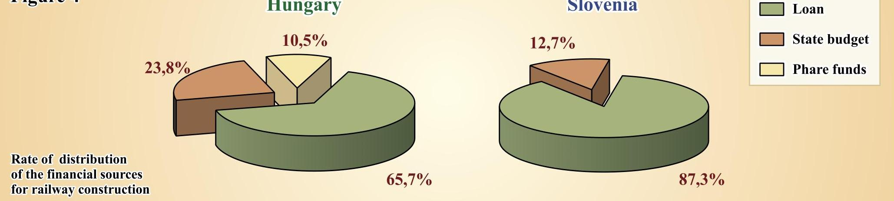
engedélyezési- és kiviteli terveinek elkészitésére, valamint a szükséges földterületek megszerzésére 180 millió Ft-ot irányoztak elő. A beruházás finanszírozási programját több alkalommal módosították, mivel a beruházás műszaki tartalmát - a részletes tervek hiányában - nem lehetett meghatározni .
1998-ban az építési munkaterületet előkészítő helyszíni kivitelezések megkezdődtek. Ebben az évben a beruházás műszaki tartalmának pontosabb meghatározása következtében a beruházás finanszírozásának költségelőirányzata 21626 millió forint ( 85,4 millió EURO) volt, amely tartalmazta a német Kreditanstalt für Wiederaufbau (KfW) pénzintézettől kapott 15845 milliárd forint ( 61,8 millió EURO) hitelt is.
A Magyar Köztársaság Kormánya a vasútvonal építési munkáihoz Phare-támogatást is igénybe vett 2545,9 millió forint ( 10,0 millió EURO) értékben.
ing - safety devices and telecommunication devices and for land purchase. Due to the fact that the technical part of investment could not be defined without detailed plans, the investment programme as a base for financial sources was later on more times amended.
In 1998 the preparatory construction works began. Due to more precise definition of the technical part of investment, the statement of investment costs amounted to 21626 millions HUF ( 85,4 millions EUR). In this amount a loan in the amount of 15845 millions HUF ( 61,8 millions EUR) raised at the German financial institution Kreditanstalt für Wiederaufbau (hereinafter referred to as KfW) is included.
In order to implement the construction of railway track the Hungarian government obtained Phare funds in the amount of 2545,9 millions HUF
sticijski program kot temelj financiranja investicije, kasneje večkrat dopolnjen.
V letu 1998 so se začela pripravljalna dela na gradbišču. Zaradi natančneǰ̌e opredelitve tehnične vsebine investicije je bil v tem letu pripravljen celovit dokument o financiranju investicije v vrednosti neto 21626 milijonov forintov ( 85,4 milijona evrov). V tem znesku je vključeno tudi posojilo v znesku 15845 milijonov forintov ( 61,8 milijona evrov), ki je bilo najeto pri nemški finančni ustanovi Kreditanstalt für Wiederaufbau (v nadaljevanju: KfW).
Za izvedbo gradbenih del železniške proge je Vlada Republike Madžarske pridobila tudi pomoć Phare v vrednosti neto 2545,9 milijona forintov ( 10 milijonov evrov). Skupaj s tem zneskom so sredstva za financiranje gradnje madžarskega dela proge povečala na neto 24140,9 milijona forintov.

---

Ezzel a forrással a vasútépítés magyar szakaszának finanszírozási előirányzata 24 140,9 millió forint összegre emelkedett.
2000. évben bizonyos módosításokra került sor a beruházási tervben, de a beruházási költségek összege nem változott. Az állami költségvetésben erre az évre 5 milliárd forintot (19,2 millió EURO) biztosítottak.

### 3.2. A vasútvonal szlovén szakaszának finanszírozása

A vasútvonal szlovén szakaszára 1996. évben beruházási program készült. A beruházás értékét folyó áron 13092,5 millió tolárra ( 79,8 millió ECU) becsülték, állandó árakon ${ }^{4}$ pedig 10676,4 millió tolart ( 65,1 millió ECU) tett ki.
1997. évben a beruházás értéke állandó árakon összesen 3267 millió tolarral növekedett, amely a helyi közösségek további 967 millió tolar értékủ követeléseinek és a földterületek rendeltetésének megváltoztatása miatt 2300 millió tolar kártérítés kifizetésének következménye volt. A beruházás módosított költségvetése így állandó árakon 13679 millió tolart ( 83,4 millió EURO) tett ki, illetve folyó árakon 18 320,1 millió SIT-et ( 94,3 millió EURO).
2000. évben a projekt beruházási értéke a földmunkáknál bekövetkezett váratlan építőipari többletmunkák miatt 2513,3 millió tolar összegben, a hozzáadott értékadó bevezetése (ÁFA) miatt 2095,3 millió tolarral és 709,8 millió tolar (állandó áron) becsült kötelezettségekkel az építkezés befejezéséig újból növekedett. A beruházás új értéke így,
${ }^{4}$ Átszámítva az 1996. januári árszintre.
(10,0 millions EUR). Together with this funds the total amount of financial resources for the Hungarian part of the railway track increased up to amount 24 140,9 millions HUF.

In 2000 the changes in the investment programme occurred but the investment costs that were planned did not increase. There were 5 billion HUF (19,2 millions EUR) assured by the state budget for that year.

### 3.2. Financing of the railway construction in Slovenia

The investment programme for railway construction in Slovenia was prepared in 1996. The project value amounted to 13092,5 millions SIT ( 79,8 millions EUR) in the current prices or 10676,4 millions SIT ( 65,1 millions EUR) in fixed prices ${ }^{4}$.

In 1997 there was an increase in investment value for 3267 millions SIT according to the fixed prices what was the result of additional demands of local communities (in amount of 967 millions SIT) and planned indemnity referred to use of land with purpose appropriation (in amount of 2300 millions SIT). The new value of the investment amounted to 13679,0 millions SIT ( 83,4 millions EUR) in fixed prices or 18320,1 millions SIT ( 94,3 millions EUR) in the current prices.

In 2000 the project value was increased again due to unpredicted construction work connected with excavations in amount of 2513,3 millions SIT, to the introduction of VAT in amount of 2095,3 millions SIT and to the assessment of liabilities in
${ }^{4}$ recalculated on costs level from January 1996

V letu 2000 je prišlo do določenih sprememb investicijskega programa, vendar se vrednost predvidenih investicijskih stroškov ni povečala. V državnem proračunu je bilo za to leto zagotovljenih 5 milijard forintov ( 19,2 milijona evrov).

### 3.2. Financiranje gradnje v Sloveniji

Investicijski program za slovenski del železniške proge je bil izdelan leta 1996. Vrednost projekta je bila ocenjena na 13092,5 milijona tolarjev ( 79,8 milijona ekujev) po tekočih cenah, po stalnih cenah ${ }^{4}$ pa je znašala 10676,4 milijona tolarjev ( 65,1 milijona ekujev).

V letu 1997 je prišlo do povečanja investicijske vrednosti za skupaj 3267 milijonov tolarjev po stalnih cenah, ki so bile posledica dodatnih zahtev lokalnih skupnosti, v znesku 967 milijonov tolarjev, in načrtovanih odškodnin zaradi spremembe namembnosti zemljišč, v znesku 2300 milijonov tolarjev. Nova vrednost investicije je tako znašala 13679 milijonov tolarjev ( 83,4 milijona evrov) po stalnih cenah, oziroma 18320,1 milijona tolarjev ( 94,3 milijona evrov) po tekočih cenah.

V letu 2000 se je investicijska vrednost projekta ponovno zvečala zaradi nepredvidenih gradbenih del pri izvedbi zemeljskih del, v znesku 2513,3 milijona tolarjev, uvedbe davka na dodano vrednost (v nadaljevanju: DDV) v znesku 2095,3 milijona tolarjev ter ocenjene obveznosti do konca gradnje, v znesku 709,8 milijona tolarjev (po stalnih cenah).
${ }^{4}$ Preračunano na cenovno raven iz januarja 1996.

---

17 115,4 millió SIT-et (104,4 millió EURO) tett ki állandó áron, illetve 22333 millió SIT-et (108,0 millió EURO) folyó áron.

A Szlovén Köztársaság Kormánya az eredeti költségvetés jóváhagyásánál kötelezte magát, hogy az 1996-1999 évi költségvetésekben a finanszírozás éves ütemezésének figyelembe vételével biztosítja a tervezett beruházási eszközöket. A kormány 1997. évben ismételten döntött, hogy a költségvetésekben biztosítja a szükséges többletpénzeszközöket. A fent említettek megvalósítására nem került sor, mert az 1997. évi költségvetésben a pénzeszközök nem voltak biztosítva a tervezett mértékben, de azokat a következő évekre sem tervezték be. A SŽ így 1999. évben állami kezességvállalás mellett - szlovén bankkonzorciumtól - 13 233,2 millió SIT ( 64,8 millió EURO) kölcsönt, a beruházási költségek további növekedése miatt, 2000. évben pedig 6265,5 millió SIT (28,4 millió EURO) értékben újabb kölcsönt vett fel. A Szlovén Köztársaság Kormányának a beruházás kölcsönnel - és nem az eredetileg tervezett költségvetési eszközökkel vagy más forrásokból - történő finanszírozásáról szóló döntése miatt a kölcsön visszafizetésére 36797 millió tolart kell biztosítania, mely $35,2 \%$-kal több a tervezettnél.

Mindkét országban a beruházás finanszírozásának lő forrását a hitelfelvételek biztosították, az állami költségvetésböl származó finanszírozás kisebb mértékủ volt. A Magyar Kormány Phare támogatást is kapott a beruházás megvalósításához.
amount of 709,8 millions SIT (in fixed prices). The new investment value amounted in total 17.115,4 millions SIT (104,4 millions EUR) in fixed prices or 22333 millions SIT (108,0 millions EUR) in current prices.

The government of the Republic of Slovenia decided, when adopting the budget, that the planned investment funds will be assured in the budgets for the period between 1996 to 1999 in line with planned time schedule of expenditures. When the investment value increased in 1997 the government again decided to assure the investment funds in line with the increased value in the state budget. But the decision was not realised, because the budget for 1997 did not include funds in the planned amount, furthermore the funds were not planned also for the next years. Therefore in 1999 the Slovenian Railways took up a loan quarantined by the state at the consortium of Slovene banks in the amount of 13233,2 millions SIT ( 64,8 millions EUR) and in 2000 due to increase of investment costs the Slovene Railways took up a loan in the amount of 6265,5 millions SIT (28,4 millions EUR). Due to the decision of the Government on financing the investment with a loan and not by budgetary funds as planned at the beginning, or other sources, the State will have to assure 36797 millions SIT for project realisation and settling debts which represents 35,2 $\%$ more funds than planned.

The main source for financing the investment in both countries was represented by loans, smaller part of funds was earmarked in the state budgets. The Hungarian government succeeded in obtaining Phare funds.

Nova vrednost investicije je tako znašala 17 115,4 milijona tolarjev ( 104,4 milijona evrov), po stalnih cenah, oz. 22333 milijonov tolarjev ( 108 milijonov evrov) po tekočih cenah.

Vlada Republike Slovenije se je ob potrditvi prvotnega proračuna zavezala, da bo v državnih proračunih za obdobje od leta 1996 do leta 1999 zagotovila načrtovana investicijska sredstva v skladu s predvideno dinamiko financiranja po letih. Ob povečanju investicijske vrednosti v letu 1997 se je ponovno zavezala, da bo v proračunih zagotovila potrebna višja finančna sredstva. Do realizacije navedenega ni prišlo, saj v proračunu za leto 1997 sredstva v načrtovani vrednosti niso bila zagotovljena, prav tako pa niso bila načrtovana za prihodnja leta. SŽ so zato v letu 1999 ob poroštvu države pri konzorciju slovenskih bank najele posojilo v znesku 13 233,2 milijona tolarjev ( 64,8 milijona evrov), v letu 2000 pa zaradi ponovnega povečanja investicijskih stroškov še novo posojilo v znesku 6265,5 milijona tolarjev ( 28,4 milijona evrov). Zaradi odločitve Vlade Republike Slovenije o financiranju investicije s posojilom in ne s sredstvi državnega proračuna, kot je bilo prvotno predvideno, ali drugimi viri, bo morala država za realizacijo projekta in odplačilo posojila zagotoviti 36797 milijonov tolarjev, kar je za 35,2 odstotka več, kot je bilo predvideno.

Poglavitni vir financiranja investicije v obeh državah predstavljajo najeta posojila, nekaj sredstev pa sta državi zagotovili tudi iz državnih proračunov. Vlada Republike Madžarske je uspela pridobiti tudi sredstva pomoći Phare.

---

## 4. A beruházás kivitelezése

A két ország kormánya a beruházás kivitelezésével a vasút-társaságokat hatalmazta fel (Magyarországon a beruházást a MÁV Rt., Szlovéniában pedig a SŽ végezte). A vasút-társaságok készíttették el a beruházási dokumentációt, bonyolították le a kivitelező kiválasztásával kapcsolatos eljárásokat, szerződéseket kötöttek azokkal, valamint ellenőrizték a szerződések végrehajtását. A MÁV Rt. a beruházás kivitelezési és tervezési munkáira összesen 847 db szerződést kötött 28977 millió forint ( 114,3 millió EURO) összegben, ebből mintegy 600 db kisajátításokkal és kártalanításokkal kapcsolatos szerződés volt. A társaság 11 szerződést kötött a vasútépítésre, a biztonságtechnikai és távközlési berendezések gyártására és felszerelésére, melyek szállítóit nemzetközi tenderek alapján választották ki. Ezen kívül 236 db szerződést kötöttek egyéb munkákra és szolgáltatásokra.
A SŽ összesen 923 db szerződést kötött 22333 millió tolar (107,96 EUR) összértékben. A szerződések közül 63 db a vasútépítés építőipari munkáira, a jelző- és biztosítóberendezések, valamint a telekommunikációs eszközök beszerzésére és felszerelésére, a mérnöki és tervezői munka kivitelezésére, valamint a környezetvédelemmel és telekkönyvezéssel összefüggő munkákra és szolgáltatásokra vonatkoztak. A földkisajátításokra és a szolgalmi földhasználati jog megváltására 860 szerződést írtak alá.

## 4. Investment implementation

Governments of both countries appointed railways companies (in Hungary the realisation was undertaken by MAV Ltd., in Slovenia by Slovene Railways) for managing the investment. The companies prepared all investment documentation, undertook procurement procedures, made contracts with selected bidders, carried out control over the contract implementation.

The MAV made 847 contracts in total value of 28977 millions HUF (114,3 millions EUR), 600 of them refer to land purchase and connected indemnities. 11 contracts which refer to railway construction, setting up lighting safety devices and telecommunication network were made with service providers selected on the basis of international invitations for bids. In addition there were 236 contracts made for other works and services.

The Slovenian Railways made 923 contracts in total value of 22333 millions SIT (107,96 EUR). The subject of the 63 contracts was referred to construction work, delivery and setting up lighting - safety devices, telecommunication devices, engineering and architectural work, implementation of other work and services referred to nature protection and land-registry tasks. 860 contracts were signed referred to land purchase and servitude rights of the land owners.

## 4. Izvedba investicije

Vladi obeh držav sta za izvajanje investicije pooblastili železniški družbi (na Madžarskem so investicijo izvajale MÁV, v Sloveniji pa SŽ), ki sta pripravljali investicijsko dokumentacijo, izvajali postopke izbire izvajalcev, z njimi sklepali pogodbe ter nadzorovali izvajanje pogodb.

MÁV je tako za izvedbo investicije sklenil skupaj 847 pogodb v skupni vrednosti 28977 milijonov forintov ( 114,3 milijona evrov) z domačimi izvajalci, od katerih se jih je okrog 600 nanašalo na pridobivanje zemljišč in s tem povezanimi odškodninami. 11 pogodb za gradnjo proge, postavitev signalnovarnostnih naprav in gradnjo telekomunikacijskega omrežja je bilo sklenjenih z izvajalci, ki so bili izbrani na mednarodnih javnih razpisih, poleg teh pa je bilo sklenjenih še 236 pogodb za druga dela.

SŽ so sklenile skupaj 923 pogodb, v skupni vrednosti 22333 milijonov tolarjev ( 107,96 milijona evrov). 63 sklenjenih pogodb se je nanašalo na izvedbo gradbenih del železniške proge, dobavo in namestitev svetlobno-varnostne in telekomunikacijske opreme, izvajanje inženiringa in projektiranja ter na izvedbo del in storitev, povezanih z okoljevarstvom in zemljiškimi zadevami. 860 pogodb je bilo sklenjenih za odkupe zemljišč ter ureditev služnostnih pravic z lastniki zemljišč.

---

### 4.1. A beruházás kivitelezésének ellenörzése

A KHVM a beruházás folyamatos ellenőrzése céljából Tárcaszintű Bizottságot hozott létre a Pénzügyminisztérium, a Gazdasági Minisztérium (GM), a KHVM Vasúti Közlekedési Főosztálya, a Magyar Államkincstár és a MÁV Rt. bevonásával. A tárcaközi bizottság munkáját tanácsadó szervezet segítette, mely rendszeresen vizsgálta és ellenőrizte a beruházás előrehaladását. A mérnöki tevékenységet a MÁV Rt. Vezérigazgatóság, Fejlesztési és Beruházási Főosztály Kiemelt Projekt Iroda (FBF), a műszaki ellenőrzést pedig a MÁV Rt. Beruházás Lebonyolító Igazgatóság (BLI), illetve megbízottja a Beruházást Lebonyolító Osztály (BLO) végezte. A beruházás magyar szakaszának műszaki ellenőrzését a BLO Szombathely végezte. A völgyhidak és az alagút műszaki ellenőrzésére - mivel a helyi szervezetnek nem volt megfelelő szakértője - közbeszerzési pályázattal az UTIBER Kft.-t választották ki. Valamennyi kijelölt ellenőrző szervezet rendszeresen tartott koordinációs megbeszéléseket. Az értekezleteken hozott döntéseket jegyzőkönyvben dokumentálták, amely az elvégzett munkákkal összefüggő problémák megoldásának ellenőrzését biztosította.

A beruházás szlovén szakaszának ellenőrzésére, a vasútvonal építési projektjének követésére a Szlovén Vasutak és a Közlekedési Minisztérium képviselőiből álló Projekttanácsot neveztek ki, amely gondoskodott a beruházás határidőre történő megvalósításáról, javaslatokat készített olyan fontos tartalmi döntések végrehajtásához és elfogadásához, amelyek a projekt rendeltetési és tartalmi céljait (technológia módosítása, műszaki dokumen-

### 4.1. Control over the investment implementation

In Hungary the Ministry of Transport, Communication and Water Management established a committee which included the Ministry of Finance, Ministry of Economic Affairs, Office for railway traffic at the Ministry of Transport, Communication and Water Management, Hungarian State Treasury and MAV Ltd.. The committee was assisted by consultant organisation which carried out controls and monitored investment development. The engineering activities were undertaken by Specialised Project Office within Development and Investment Department of the MAV Ltd., the technical control was undertaken by the Directorate for Realisation of Investments at MAV Ltd. and its authorised Local Project Office at Szombathely. Because there was a lack of experts with skills referred to construction work of tunnels and viaducts, a public invitation for technical supervision over construction work was published and a special engineering organisation (UTIBER Kft.) was selected. All authorised bodies regularly met at co-ordination meetings. The conclusions reached at the meetings were documented in such a way which enabled the monitoring of tasks being implemented and referred to problem solving.

In Slovenia the project board was established to control and monitor the railway construction. The project board consisted of representatives of the Slovene Railways and the Ministry of Transport. Its task was to monitor the realisation of investment according to the time schedule, preparation of changes in the investment, adopting important decisions referred to planned project objectives (change in tech-

### 4.1. Nadzor izvajanja investicije

Ministrstvo za promet, zveze in vodno gospodarstvo je za spremljanje madžarskega dela investicije ustanovilo medresorsko komisijo, v kateri so sodelovali Ministrstvo za finance, Ministrstvo za gospodarstvo, Služba za železniški promet pri Ministrstvu za promet, zveze in vodno gospodarstvo, Madžarska državna zakladnica in MÁV. Pomoč je medresorski komisiji nudila tudi konzultantska organizacija, ki je po potrebi opravljala kontrolne naloge in spremljala napredek investicije. Inženirsko dejavnost je izvajala Posebna projektna pisarna pri razvojnem in investicijskem oddelku Generalne uprave MÁV Rt., tehnični nadzor pa Uprava za nadzor investicij pri MÁV, oziroma Oddelek za izvajanje investicij. Zaradi pomanjkanja strokovnjakov z izkušnjami pri gradnji predorov in viaduktov je bila za tehnični nadzor izvajanja gradbenih del na javnem razpisu izbrana posebna inženirska organizacija (UTIBER Kft.). Vsi pooblaščeni za izvajanje nadzora so se redno sestajali na koordinacijskih sestankih. Zaključki in sklepi sestankov so bili dokumentirani na način, ki je omogočal spremljanje poteka izvajanja vseh nalog in reševanja problemov, do katerih je prihajalo med izvajanjem investicije.

Za nadzor in spremljanje gradnje slovenskega dela železniške proge je bil imenovan projektni svet, sestavljen iz predstavnikov SŽ in MP. Skrbel je za pravočasno izvajanje investicije, pripravo predlogov za spremembe izvedbe, sprejemanje pomembnih vsebinskih odločitev, ki so zadevale namenske in vsebinske cilje projekta (spremembo tehnologije, tehnično dokumentacijo, financiranje projekta ter roke izvedbe).

---

táció, projektfinanszírozás és teljesítési határidők) érintették.

A beruházás irányítását a Szlovén Köztársaság Kormányának határozata alapján egy irányító projektcsoport vezette. A csoport a beruházás megvalósításáról havonta, írásos jelentésekben tájékoztatta a Projekttanácsot. A csoport a kivitelezés ütemtervének figyelembe vételével beszámolt a projekt realizálásáról, a beruházás tényleges pénzügyi helyzetéről, tekintettel a projekt tervezett értékére, valamint felhívta a figyelmet a tervtől való összes eltérésre, továbbá elemezte azok okait és következményeit. A tervtől való minden fontosabb eltéréssel kapcsolatban tárgyalásokat szerveztek a kivitelezőkkel, amelyeken a Projekttanács tagjai is részt vettek.

Az építési munkák a biztonsági és távközlési berendezések üzembe helyezésének műszaki ellenőrzésére - versenyeztetés útján - műszaki ellenőrt választottak ki. A műszaki ellenőr rendszeresen ellenőrizte és jóváhagyta a számlákat és a csatolt igazolásokat, valamint a pótmunkákra vonatkozó igényeket.

Megállapítottuk, hogy mindkét ország vasúttársasága oly módon vezette és követte nyomon a beruházás lebonyolítását, hogy az biztosította a vasútvonal megépítését és a vasúti forgalom beindítását az elfogadott határidőre. A vasút-társaságok olyan dokumentációt szolgáltattak, amelyek lehetővé tették a beruházás összes szakaszának nyomon követését és áttekinthetőségét ezúton biztosították a beruházás átláthatóságát.
nology, technical documentation, project financing and time limits).

The investment management was carried out by head project team appointed by the Government of the Republic of Slovenia. The team informed the project board on monthly basis about investment realisation in written form. The reports included information on project realisation against time schedule, on financial realisation against planned project value, and about all deviations from plans and presented an analysis of reasons and consequences. If there were any major deviations from plans the meetings with service providers and project board were organised.

A supervisor engineer, was selected on the basis of public invitation for controlling and monitoring construction work, setting up lighting-safety devices, telecommunication devices. The engineer regularly reviewed and approved documentation referred to statements of accounts, and demands for additional work.

It was found out that railways companies from both countries managed and controlled investment implementation in such a way which enabled railway construction and railway operation in due time. The railways companies provided appropriate documentation which assured that all investment phases were recorded and could be reviewed and in this way assured their transparency.

Vodenje investicije je, v skladu s sklepom Vlade RS, izvajala vodstvena projektna skupina. Skupina je redno mesečno obveščala projektni svet s pisnimi poročili o izvajanju investicije. Skupina je poročala o realizaciji projekta v primerjavi s terminskim načrtom izvedbe in o dejanski finančni realizaciji investicije glede na načrtovano vrednost projekta opozarjala na vsa odstopanja od načrtov ter analizirala njihove vzroke in posledice. O vseh pomembnih odstopanjih od načrtov so bili organizirani sestanki z izvajalci, v katerih so sodelovali tudi člani projektnega sveta.

Za tehnični nadzor izvajanja gradbenih del in montaže svetlobno-varnostne in telekomunikacijske opreme je bil z javnim razpisom izbran nadzorni inženir, ki je redno pregledoval in potrjeval vso obračunsko dokumentacijo in zahtevke za dodatna dela.

Revizorji obeh revizijskih institucij so ugotovili, da sta železniški družbi obeh držav vodili in spremljali izvajanje investicije na način, ki je zagotavljal dokončanje gradnje proge in uvedbo železniškega prometa v dogovorjenih rokih. Z ustreznim dokumentiranjem sta železniški družbi zagotovili sledljivost in transparentnost izvajanja vseh faz investicije.

---

### 4.2. A kivitelezők kiválasztása

A vasút-társaságok a kivitelezők és beszállítók kiválasztásával kapcsolatos eljárásokat az egyes országokban a közbeszerzéseket szabályozó hatályos nemzeti törvényekkel (Magyarországon a közbeszerzésekről szóló 1995. évi XL. törvény, Szlovéniában pedig a Közbeszerzési törvény, az SzK Hivatalos Közlönye, 24/97 sz.) összhangban végezték el. A kivitelezők kiválasztásánál és a szerződéskötéseknél mindkét ország figyelembe vette a FIDIC nemzetközi szervezet ajánlásait és irányelveit.
Az összes jelentős értéket képviselő munkára a beruházók nyilvános tendert írtak ki. A vasútvonal magyar szakaszánál a kivitelezők kiválasztása során összesen tizenegy nyilvános tendert, a szlovén vasútvonal kivitelezőinek kiválasztásnál pedig kilencet bonyolítottak le.
A beruházás magyar szakaszának vizsgálata során két nyilvános tendert ellenőriztünk. A megvizsgált építőipari munkák a teljes beruházási érték $43 \%$-át teszik ki melyek az alábbiak:

- a kiírt tender alapján a völgyhidak megépítésére a Zalahidak Konzorciummal kötöttek szerződést (a konzorciumban részt vett a Hídépítő Rt., DUMEZ GTM SA és a Betonútépítő Nemzetközi Építőipari Rt. mint kivitelezők), melynek végleges értéke 7209,3 millió forint ( 28,4 millió EURO) volt, valamint
- a vasútvonal teljes szakaszán a vágányépítési munkákra kiírt nyilvános tender alapján a kivitelezési munkákra a Mávépcell Kft.-vel kötöttek szerződést 3339,3 millió forint ( 12,9 millió EURO) értékben.

### 4.2. Selection of service providers

The selection procedures were carried out in line with the valid national legislation (in Hungary Public Procurement Act, No. XL from 1995, in Slovenia: Public procurement act, Official Gazette RS, no. 24/97) by the railways companies. When selecting service providers and making contracts referred to construction work, both countries consulted recommendations and guidelines of the international organisation FIDIC.
The public tenders were published for all work assessed as important due to high value. In Hungary they published eleven public invitations for bidders and in Slovenia they published nine public invitations bidders.
During the audit of the Hungarian railway investment two public procurements referred to construction work were reviewed. The total value of reviewed contracted construction work presented $43 \%$ of total investment value. That is:

- Public invitation for bidders referred to viaduct construction: contract made with Zalahidak consortium (the consortium included Hídépítő Rt., DUMEZ GTM SA and Betonútépítő Nemzetközi Epítőpari Rt.), in the amount of 7209,3 millions of HUF (28,4 millions of EUR) and
- Public invitation for bidders referred to railway track construction. The contract was made with Mávépcell Kft., in the amount of 3339,3 millions of HUF ( 12,9 millions of EUR).

The documentation for implementation of both procurement procedures was prepared by project office in co-operation with MAV and Department

### 4.2. Izbira izvajalcev

Postopke izbire izvajalcev in dobaviteljev sta železniški družbi izvajali v skladu z veljavno nacionalno zakonodajo, ki v posamezni državi ureja področje javnega naročanja (na Madžarskem XL. Zakon o javnih naročilih iz leta 1995, v Sloveniji pa Zakon o javnih naročilih, Uradni list RS, št. 24/97.). Pri izbiri izvajalcev in sklepanju pogodb za izvedbo gradbenih del sta obe državi upoštevali tudi priporočila in smernice mednarodne organizacije FIDIC.
Javni razpisi so bili izvedeni za vsa vrednostno pomembnejša dela. Za gradnjo madžarskega dela proge je bilo za izbiro izvajalcev skupaj izvedenih enajst mednarodnih javnih razpisov, za izbiro izvajalcev slovenskega dela proge pa devet.

V reviziji madžarskega dela investicije sta bili pregledani dve oddaji gradenj. Skupna vrednost pregledanih oddanih gradbenih del predstavlja 43 odstotkov vrednosti celotne investicije, in sicer:
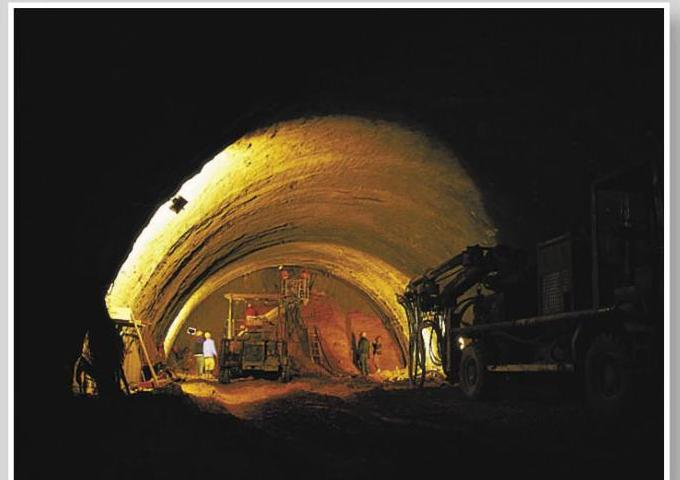

---

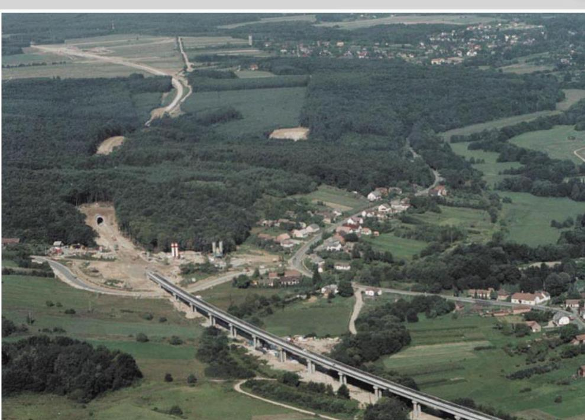

Viaduct and tunnel construction
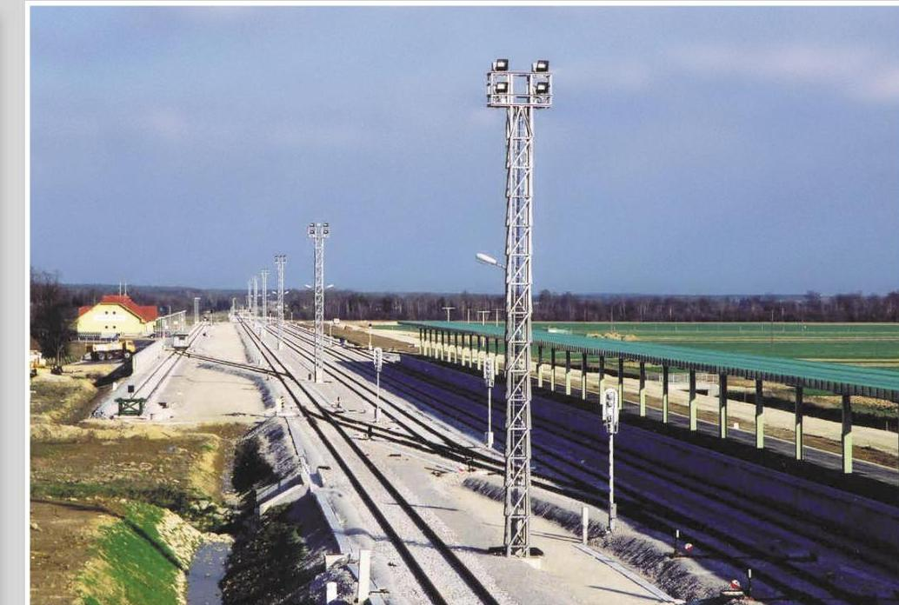

Lighting-safety devices and telecommunication devices

A tenderdokumentációt mindkét pályázati eljáráshoz a MÁV Rt. a KPI és a BLO közremüködésével dolgozta ki. A tenderdokumentációt a KHVM, a Közlekedési Föfelügyelet, a GM, a PM és a Magyar Államkincstár tekintette át és hagyta jóvá.

Az építőipari munkák kivitelezését részben Phare-eszközökkel finanszírozták, ezért mindkét pályázat nyilvános nemzetközi pályázat volt, és az Európai Unió közbeszerzési törvényével összhangban lett lebonyolítva.

Az ajánlatokat a MÁV Rt., a KHVM, a Közlekedési Föfelügyelet, a GM, a PM és a Magyar Államkincstár képviselőiből álló bizottság értékelte. Az ajánlatokat jogi, kereskedelmi,
for Investments Realisation. The documentation was reviewed and approved by the Ministry of Transport, Communication and Water Management, General Inspectorate of Transport, Ministry of Economy, Ministry of Finance and the Hungarian State Treasury.

Due to the fact that the construction work referred in the above procurement procedures was partly financed by Phare funds, the public invitations for bidders were international and carried out in line with the legislation which deals with public procurement in European Union.

The bids were assessed by committee which included representatives of MAV, Ministry

- javni razpis za oddajo gradnje viadukta, za katerega je bila sklenjena pogodba z izvajalcem Zalahidak konzorcium (v konzorcij so bili vključeni izvajalci Hídépítő Rt., DUMEZ GTM SA in Betonútépítő Nemzetközi Építőipari Rt.), v vrednosti 7209,3 milijona forintov ( 28,4 milijona evrov) in
- javni razpis za oddajo gradnje tirov na celotnem odseku proge. Pogodba za izvedbo del je bila sklenjena z izvajalcem Mávépcell Kft., v vrednosti 3339,3 milijona forintov ( 12,9 milijona evrov).

Razpisno dokumentacijo za izvedbo obeh razpisnih postopkov je izdelala projektna pisarna ob sodelovanju z MÁV in Oddelkom za nadzor inve-

---

müszaki és pénzügyi szempontból értékelték. Az ajánlatok értékelését és a vállalkozók kiválasztását a KHVM és a hitelező KfW Bank hagyta jóvá.

A vasútvonal szlovén szakaszának vizsgálata során azok a közbeszerzések képezték a vizsgálat tárgyát, amelyek a teljes beruházási érték több mint $85 \%$-kát tették ki. Ezek az alábbiak:

- a Puconci-Hodoš-államhatár közötti szakaszon épült teljes vasútvonal építését, amelynek értéke 16 406,7 millió tolar ( 78,9 millió EURO) volt, és az SCT d.d., Ljubljana-nak adták ki;
- a Murska Sobota-Hodoš kábelkapcsolat, a telekommunikációs kapcsolatok bemeneteinek tervezése és kiépítése, a berendezések szállítása, a telefonos és adatbázisrendszerek összeszerelése a pályaelemekkel és a rádiórendszerekkel (telekommunikációs berendezések), melyeket a Siemens A. G., Bécs, Ausztria kivitelezőnek adták ki 1.8 millió DEM és 372,8 millió tolar értékben (összesen 11,2 millió EURO);
- a Puconci-Hodoš-államhatár pályán a jelző- és biztosítóberendezések tervezése, szállítása és üzembe helyezése, amelyet a Siemens A.G. kivitelezőnek adtak ki 5,6 millió EURO és 412,9 millió tolar értékben (összesen 6,7 millió EURO), valamint
- a Kompas vadaskert új helyre telepítése, amelyet az SGP Pomgrad ABI Gradnje, Murska Sobota kivitelezőnek adtak ki 137,1 millió tolar ( 0,7 millió EURO) értékben.

A nyilvános pályázatok dokumentációt a SŽ dolgozta ki és lebonyolította az összes ezzel kapcsolatos eljárást, valamint a kiválasz-
of Transport, Communication and Water Management, General Inspectorate of Transport Ministry of Economic Affairs, Ministry of Finance and Hungarian State Treasury. The bids were assessed from legal, commercial, technical and financial point of view. The assessment and selection of the tender were approved by the Ministry of Transport, Communication and Water Management and KfW bank, which granted a loan and had the right to review all the documentation on the selection.

During the audit of the Slovene part of the railway construction the auditors reviewed four public procurements which represented more than $85 \%$ of the total investment value. That is:

- Construction of the railway track Puconci-Hodoš-state border in the amount of 16 406,7 millions SIT ( 78,9 millions EUR), the contract was made with SCT d.d., Ljubljana;
- Preparation of architectural plans, supply of the equipment and construction of cable links Murska Sobota - Hodoš, introductory work for telecommunication links, installation of telecommunications and data systems (communication system and radio system) - the contract made with Siemens A. G., Wiena, Austria (here in after referred to as: Siemens A. G.), in the amount of 1.8 millions DEM and 372,8 millions SIT (total amount 11,2 millions EUR );
- Preparation of architectural plans, supply and delivery of lighting-safety devices on the railway track Puconci-Hodoš-state border, contract made with Siemens A.G., in the amount of 5,6 millions EUR and 412,9 millions SIT (in total 6,7 millions EUR) and
sticij. Razpisno dokumentacijo so pregledali in potrdili MPZVG, Prometni inšpektorat, Ministrstvo za gospodarstvo, Ministrstvo za finance in Madžarska zakladnica.

Glede na to, da se je izvedba gradbenih del za obravnavani oddaji delno financirala iz pridobljenih sredstev Phare, sta bila oba javna razpisa mednarodna in izvedena v skladu z zakonodajo, ki ureja področje javnega naročanja v Evropski uniji.

Ponudbe je ocenjevala komisija, sestavljena iz predstavnikov MÁV, MPZVG, Prometnega inšpektorata, Ministrstva za gospodarstvo, Ministrstva za finance in Madžarske zakladnice. Ponudbe so bile ocenjene s pravnega, komercialnega, tehničnega in finančnega vidika. Oceno ponudb in izbiro dobavitelja sta potrdila MPZVG in banka KfW, ki je imela kot posojilodajalec pravico do pregleda vse dokumentacije o izbiri.

V reviziji slovenskega dela gradnje proge so bila pregledana štiri javna naročila, oddana z javnimi razpisi, ki predstavljajo več kot 85 odstotkov vrednosti celotne investicije, kot sledi:

- gradnja celotne železniške proge na odseku Puconci-Hodoš-državna meja, v vrednosti 16 406,7 milijona tolarjev ( 78,9 milijona evrov), oddano izvajalcu SCT d.d., Ljubljana;
- projektiranje, dobava opreme in gradnja kabelskih povezav Murska Sobota-Hodoš, uvodov v telekomunikacijske povezave, instalacije telefonskih in podatkovnih sistemov s progovnimi elementi in radijskim sistemom (v nadaljevanju: TK naprave), oddano izvajalcu Siemens A. G., Dunaj, Avstrija (v nadaljevanju: Siemens A. G.), v vrednosti 1.8 milijona nemških mark ter 372,8 milijona tolarjev (v skupnem znesku 11,2 milijona evrov);

---

tott kivitelezőkkel megkötötte a szerződéseket. A nyilvános versenyeztetési eljárás lebonyolítására vonatkozóan nem állapítottunk meg hiányosságokat.

A két számvevőszék a közbeszerzési eljárások lefolytatásával kapcsolatos megállapításainak összehasonlításából kitűnik, hogy a magyar beruházó a nemzetközi pályázatok lebonyolításával nagyobb versenyt biztosított az ajánlattevők között. A pályázati dokumentáció, valamint az ajánlattevők értékelésének és kiválasztásának illetékes intézmények részéről történő jóváhagyásával pedig a közbeszerzési eljárások nagyobb és hatékonyabb ellenőrzést biztosítottak.

### 4.3. A beruházás jelentősebb módosításainak áttekintése

A vasútvonal magyar és szlovén szakaszának megépítésével, valamint a nyilvános pályázatok alapján kötött szerződésekkel kapcsolatban a vizsgálat kimutatta a beruházás lebonyolításának legfontosabb módosításait, azok okait, valamint kihatását a beruházás értékére és a munkálatok kivitelezésének határidejére.

A föbb változásokat az 5. sz. táblázatban lévő adatok mutatják be.

Magyar részről a völgyhíd építéséről szóló szerződés induló értékének módosítására a magas szerves anyag tartalmú talaj cseréje miatt került sor. A vágányépítésről szóló szerződés értékének módosítását pedig az okozta, hogy a felépítményt nem rögzítették megfelelően. Az említett pótmunkák nem befolyásolták az eredetileg elfogadott teljesítési határidőt. A szerződéses összegek összes módosítását, a felügyeletet végző mérnök és felhatalmazottja bírálta el és hagyta jóvá.

- Establishment of substitute Breeding Hunting Ground Kompas, the contract was made with SGP Pomgrad ABI Gradnje, Murska Sobota, in the amount of 137,1 millions SIT ( 0,7 millions EUR).

The documentation for implementation of the procurement procedures was prepared by the Slovene Railways that managed all the procedures referred to selection of tenders and made contracts with the selected tenders. Irregularities referred to the public procurement process were not found.

The comparison of findings referred to public procurement procedures presented by both SAIs shows that the Hungarian investor assured higher degree of competition between bidders due to the international public invitations. The demand to approve the documentation referred to public invitations and to assess and to select the tenders by the authorised institutions, made the control over public procurement procedures more efficient and better.

### 4.3. Review of major investment changes

In both countries the auditors found out when reviewing the selected public procurement procedures that changes occurred when implementing public procurement. The audit reviewed the reasons for the changes and assessed impacts of those changes on the investment value and time limits.

More important changes referred to scope and value of the railway construction are presented in the Table 5.

- projektiranje, dobava in predaja v obratovanje signalno-varnostne naprave na progi Puconci-Hodoš-državna meja (v nadaljevanju: SV naprave), oddano izvajalcu Siemens A.G., v vrednosti 5,6 milijona evrov ter 412,9 milijona tolarjev (skupaj 6,7 milijona evrov) in
- vzpostavitev nadomestnega obratovanja Gojitvenega lovišča Kompas, oddano izvajalcu SGP Pomgrad ABI Gradnje, Murska Sobota, v vrednosti 137,1 milijona tolarjev ( 0,7 milijona evrov).

Razpisno dokumentacijo za izvedbo javnih razpisov so izdelale SŽ, ki so tudi izvedle vse postopke izbire ter z izbranimi izvajalci sklenile pogodbe. Nepravilnosti pri oddaji del niso bile ugotovljene.

Iz primerjave ugotovitev obeh revizijskih institucij o izvajanju postopkov oddaje javnih naročil je razvidno, da je madžarski investitor z izvedbo mednarodnih javnih razpisov zagotovil večjo konkurenčnost med ponudniki. Z zahtevo, da pristojne institucije potrjujejo razpisno dokumentacijo in ocenjujejo ter izbirajo ponudnike, je zagotovil boljši in učinkovitejši nadzor izvajanja postopkov javnih naročil.

### 4.3. Pregled večjih sprememb investicije

V obeh državah so bile v revidiranih primerih javnih razpisov ugotovljene spremembe pri izvedbi javnega naročila. V postopku revidiranja so bili raziskani vzroki zanje ter ocenjen vpliv sprememb na investicijsko vrednost in rok za izvedbo del.

Pomembnejše spremembe obsega in vrednosti gradnje železniške proge so predstavljene v tabeli 5.

---

Table 5 More important changes of the basic contract (values in million)

|  Contract subject | Contract value |  |  |  |  |   |
| --- | --- | --- | --- | --- | --- | --- |
|   | Basis |  | Changes |  | Total |   |
|  Hungary | HUF | EUR | HUF | EUR | HUF | EUR  |
|  Viaduct construction | 7003,1 | 27,6 | 206,2 | 0,8 | 7209,3 | 28,4  |
|  Construction of the trail Zalalövő-Bajánsenye | 3077,5 | 11,9 | 261,8 | 1,0 | 3339,3 | 12,9  |
|  Total | 10080,6 | 39,5 | 468,0 | 1,8 | 10548,6 | 41,3  |
|  Slovenia | SIT |  | SIT |  | SIT |   |
|  Construction of the railway track | 10985,6 | 52,8 | 5421,1 | 26,1 | 16406,7 | 78,9  |
|  Construction of the lighting-safety devices | 1648,1 | 10,8 | 59,8 | 0,4 | 1707,9 | 11,2  |
|  Construction of the telecommunication devices | 571,1 | 5,2 | 161,4 | 1,5 | 732,5 | 6,7  |
|  Total | 13204,8 | 68,8 | 5642,3 | 28,0 | 18847,1 | 96,8  |

---

Szlovén részről a szerződéses érték legnagyobb mértékủ módosulása a vasútvonal építéséről szóló alapszerződés módosítása miatt történt, mely az eredeti összeghez képest $50 \%$-kal emelkedett. A növekedés tartalmazza az ÁFA bevezetéséből eredő 2010 millió SIT összeget is. A 3411 millió toláros tényleges növekedés pedig a vasútvonal nyomvonalán a kedvezőtlen (heterogén) talajösszetétel miatt bekövetkezett földcsuszamlás következménye. A talaj megerősítése érdekében a nyomvonalba kavicsrétegeket építettek be, megerősítették a nem tartó alapokat, horgonyzott cölöpfalat építettek, és további geotechnikai monitoringot végeztek. A szakértő véleménye szerint szondázó furatok racionális számával gyakorlatilag nem lehetett előre kimutatni a kedvezőtlen talajösszetételt.

A jelző- és biztonságtechnikai berendezések kivitelezésénél az alábbi kiegészítő munkákat végezték el: Murska Sobota állomásra utólag építették meg a váltók fütését, utólag szerelték fel az ASPRAS utastájékoztató rendszert és kicserélték a váltórendszert. A távközlési berendezések beépítésénél bizonyos változásokat végeztek el. Acél védőcsövet építettek ki, helyi kábelezést végeztek, valamint biztosították a vágányok kommunikációs helyeinek szelektivitását.

A beruházás lebonyolítása közben bekövetkezett fontosabb értékmódosításokat a beruházási tervben és a beruházási terv mellékleteiben hagyták jóvá. A tartalmilag és értékében fontosabb módosításokat operatív szinten a Projekttanács hagyta jóvá, az összes többi módosítást pedig a hatáskörén belül a beruházó (SZ̆).

In Hungary the basic contract value of the viaduct construction was altered because of the need to change the ground due to large amount of organic substances in it. The contract value increased also because the upper railway track structure was not attached properly. The tasks which were carried out additionally did not influence on time schedule which was agreed. All changes referred to contract values were approved by the supervising engineer and his authorised deputy.

The major change of the contracting value (almost $50 \%$ increase of the initial contract value) occurred in Slovenia referred to railway track construction. The amount includes the value of 2010 millions SIT which occurred due to the introduction of VAT. The increase of 3411 millions SIT was the consequence of the landslide on the railway track because of heterogeneous ground composition. In order to strengthen the ground, the gravel layers were provided, nonsupporting grounding was hardened, anchored pile walls were constructed and geo-technical monitoring was carried out. The expert's opinion was that it was impossible to predict the heterogeneous ground composition, even though a reasonable number of probes was carried out.

When constructing lighting-safety devices the following work was additionally carried out: warming the switches for the station Murska Sobota, installation of ASPRAS system for informing the passengers about trains, change of the switch system. When constructing telecommunication devices some changes were carried out: Still protecting duct was built in, local cables were placed and selectivity of railway track communicative posts were

Sprememba osnovne vrednosti pogodbe pri gradnji viadukta na madžarskem delu proge je posledica potrebe po zamenjavi zemljin zaradi velike vsebnosti organskih snovi v zemlji. Na povečanje vrednosti pogodbe pri gradnji tira pa je vplivala neustrezna pričvrstitev zgornjega ustroja proge. Dodatno opravljena dela niso vplivala na podalǰ̌anje dogovorjenega roka za dokončanje investicije. Vse spremembe pogodbenih vrednosti sta obravnavala in potrdila nadzorni inženir in njegov pooblaščenec.

Največjo spremembo pogodbene vrednosti (skoraj 50-odstotno povečanje) na slovenski strani predstavlja povečanje osnovne pogodbe, ki se nanaša na gradnjo železniške proge. V tem povečanju je vključen tudi znesek 2010 milijonov tolarjev zaradi vpliva uvedbe DDV. Dejansko povečanje v znesku 3411 milijonov tolarjev pa je posledica splazitve zemlje na trasi proge zaradi neugodne (heterogene) sestave tal. Za utrditev so bile v traso vgrajene gramozne plasti, izdelane ojačitve nenosilne podlage, izdelane sidrane pilotne stene in izveden dodaten geotehnični monitoring. Po mnenju izvedenca se neugodne heterogene sestave tal z razumnim številom sondažnih vrtin v naprej praktično ni moglo ugotoviti.

Pri izvedbi SV naprav je bilo dodatno izvedeno ogrevanje kretnic za postajo Murska Sobota, vgrajen sistem ASPRAS za obveščanje potnikov ter zamenjan kretniški sistem. Pri vgradnji TK naprav pa so bile izvedene določene spremembe, in sicer je bilo vgrajeno jekleno korito, opravljeno je bilo lokalno kabliranje ter zagotovljena selektivnost progovnih komunikacijskih mest. Vse pomembnejše spremembe so bile potrjene v investicijskem programu in dodatkih k investicijskemu programu.

---

A fenti változások nem befolyásolták a két ország által jóváhagyott beruházás befejezési határidejét.

Az alapokmányokban jóváhagyott beruházási érték mindkét országhan megváltozott. Szlovéniában 42,7\%-al, Magyarországon pedig csak 4,6\%-al emelkedett a szerződéses érték. Megállapítottuk, hogy mindkét ország vasútvonal épitésében bekövetkezett változásokat és módosításokat megfelelően alátámasztották és dokumentálták. A módosítások nem változtatták meg a nemzetközileg elfogadott befejezési határidőt.

### 4.4. A beruházás helyzete

A beruházás műszakilag és pénzügyileg még egyik országban sem zárult le. Magyar oldalon az ETC-rendszer (Egységes Európai Vonatbefolyásoló Rendszer) jelenleg csak próbaüzemben müködik, mert a vontatójárművek többségére a vevőkészülék nincs felszerelve. A hagyatéki eljárások rendezetlensége miatt, a vasútépítéshez megvásárolt földterületek vagyonjogi rendezéséhez külön beruházás szükséges. A próbaüzemi tapasztalatok alapján a végleges üzembe helyezés 2003. év közepén várható. A vasútvonal magyar szakaszára vonatkozó müködési engedélyt 2000 decemberében adták ki. Az összes létesítményre szóló használatbavételi engedély megszerzését követően az új vasútvonal 2001 novemberétől üzemel.

A vasútvonal teljes nyomvonalára, összes objektumára, berendezésére és vasúti szerelvényére kiadott használatbavételi engedéllyel, valamint az ideiglenes forgalomszervezésről szóló határozattal 2001 novemberében az újonnan épült vasútvonal
assured. All major changes were approved in the investment programme and in appendixes to the investment programme. On the operational level all more important changes (in content and value) were approved by project board, all other changes were approved by the investor (the Slovene Railways) in accordance with its authority.

None of the changes influenced the extension of the time limit for conclusion of the investment which was approved by both countries.

The investment value which was adopted in the initial contracts was changed in both countries. In Slovenia the contract values increased for $42,7 \%$, while in Hungary the construction value increased only for $4,6 \%$. It was found out that in both countries the changes referred to railway track construction were supported by evidence and documented. They did not influence the internationally approved time limit for concluding the investment.

### 4.4. State of the investment

The investment is technically and financially not entirely completed. In Hungary the ETC system is not set up. Unified European system for the safety devices on locomotives, which is operating on trial, because most of the locomotives is not equipped with appropriate receivers. The system will start operating in the middle of 2003, on the basis of the results from trial period. Arrangements referred to property rights, land registration, indemnities for expropriators will be the subject of separate investment. The trial operational permit for Hungarian railway track was issued in December 2000. After

Na operativni ravni je vsebinsko in vrednostno pomembnejše spremembe potrjeval projektni svet, vse ostale spremembe pa investitor (SŽ) v skladu s svojimi pristojnostmi.

Nobena od sprememb ni vplivala na podalǰ̌anje med državama dogovorjenega roka za dokončanje investicije.

Vrednost investicije, dogovorjene v osnovnih pogodbah se je v obeh državah spremenila. Najbolj so bile spremenjene pogodbene vrednosti v Sloveniji, kjer so se zvečale za 42,7 odstotka, medtem ko se je vrednost gradnje na madžarskem povečala le za 4,6 odstotka. Za gradnjo obeh delov proge je bilo ugotovljeno, da so bile spremembe izvedbe investicije ustrezno potrjene in dokumentirane in niso vplivale na mednarodno dogovorjene roke za dokončanje investicije.

### 4.4. Stanje investicije

Investicija tehnično in finančno še ni popolnoma zaključena. Na Madžarskem še ni zgrajen celovit sistem ETC (enotni evropski sistem za varnostne neprave na lokomotivi), ki trenutno deluje poskusno, ker večina lokomotiv ni opremljena z ustreznimi sprejemniki. Sistem bo na podlagi izkušenj poskusnega obratovanja začel delovati sredi leta 2003. Premoženjskopravna ureditev odkupov in razmejitve zemljišč ter določitev odškodnin razlaščencev bo predmet posebne investicije. Dovoljenje za poskusno obratovanje madžarskega dela proge je bilo izdano v decembru 2000, po pridobitvi vseh potrebnih dovoljenj pa proga polno obratuje od novembra 2001.

---

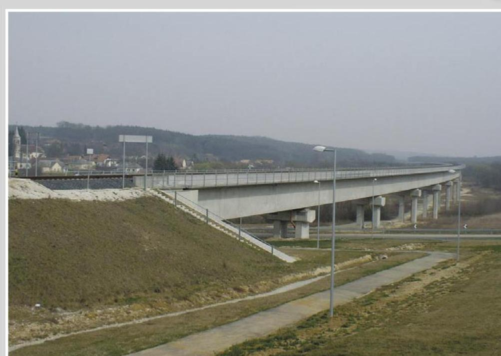

Viaduct at Nagyrákos
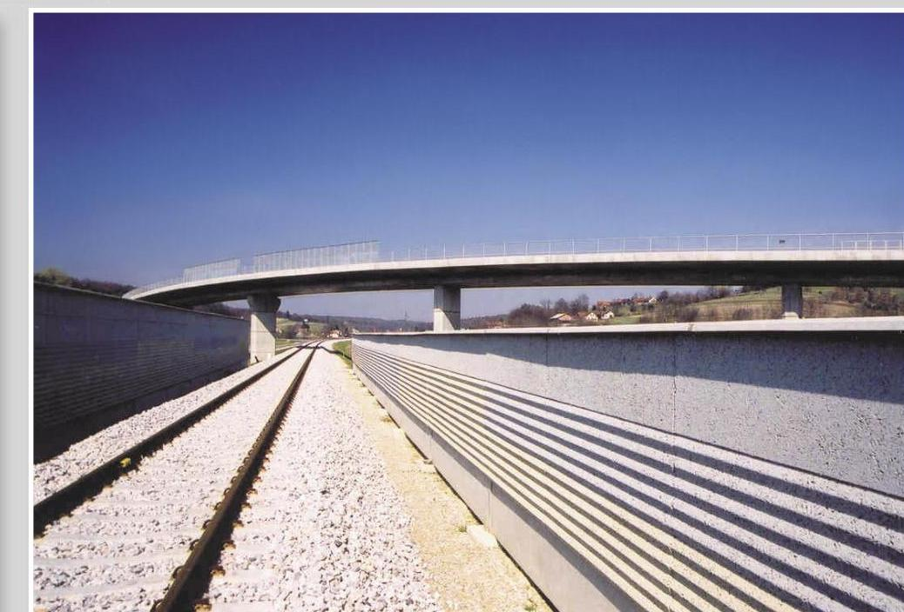

Environmental protection: noise barriers
szlovén szakaszára is teljesült a vasúti forgalom beindításának összes feltétele.

Befejeződött az összes építőipari munka és a vasútvonal összes műszaki vizsgálata. A SIMIS-rendszerrel kapcsolatban felmerült problémák miatt a jelző- és biztonságtechnikai berendezésekről kötött szerződés szerinti munkák még nem fejeződtek be. A kivitelező becslése szerint 2003 szeptemberéig befejezi a teljes munkát, és beszerzi a megfelelő engedélyeket.

A vasútépítés miatt a SŽ által megvásárolt telkek helyett adott földterületek parcellázása 2003. évben valósul meg, a földhivatali bejegyzés és a művelési ág meghatározás pedig előreláthatólag 2004. évben
all necessary permits the new railway line has fully operated since November 2001.

In November 2001 the Operation permit for railway track and all buildings, devices and machines on the railway track and Decree on temporary organisation of the traffic were issued. Therefore all conditions were fulfilled for regular railway operation in Slovenia.

After the construction work and set up of telecommunication devices were completed the technical review of the railway track was carried out. The work defined in the contract for setting up lighting-safety devices is not completed due to problems with SIMIS system. The service provider

Z izdajo uporabnega dovoljenja za traso proge z vsemi objekti, napravami in postroji na progi ter odločbo o začasni organizaciji prometa so bili izpolnjeni vsi pogoji za začetek rednega železniškega prometa tudi za slovenski del novozgrajene proge v novembru 2001. Gradbena dela in namestitev TK naprav so bila opravljena, izvedeni so bili tudi vsi tehnični pregledi proge, niso pa še zaključena dela pri namestitvi SV naprav zaradi težav z izvedbo SIMIS sistema. Po oceni izvajalca naj bi se vsa dela zaključila s pridobitvijo ustreznih dovoljenj do septembra 2003. Končna izmera parcel, ki so jih SŽ zaradi gradnje proge morale odkupiti, bo opravljena v letu 2003, komasacije in

---

Table 6 Investment to environmental protection measures (values in thousands)

|  No. | Description of measures | Slovenia |  | Hungary |   |
| --- | --- | --- | --- | --- | --- |
|   |  | in SIT | in EUR | in HUF | in EUR  |
|  I | MEASURES IMPLEMENTED DURING RAILWAY CONSTRUCTION |  |  |  |   |
|  1 | Construction of refuse pits Kuštanovci | 156886 | 810 | - | -  |
|  2 | Preparation of the plan and vegetation planting | 56523 | 292 | 83499 | 396  |
|  3 | Water flows regulation (removals and hydromeliorations) | 144850 | 748 | 520422 | 2050  |
|  4 | Documentation and construction of biological purifying plants | 51254 | 265 | - | -  |
|  5 | Animal protection (artificial habitat, boundary fencing) | 25456 | 131 | 23080 | 88  |
|  6 | Passages for amphibians | 131946 | 681 | - | -  |
|  7 | Noise barriers | 184520 | 953 | - | -  |
|  8 | Recultivation of the old railway dam | 103383 | 534 | - | -  |
|  9 | Other |  |  | 33499 | 129  |
|  I | Total (from 1 to 9) | 854818 | 4414 | 660500 | 2663  |
|  II | OTHER MEASURES |  |  |  |   |
|  10 | Removal of the pheasant hatchery in Breeding Hunting Ground Kompas because of vibration | 137105 | 708 | - | -  |
|  II | Total (10) | 137105 | 708 | - | -  |
|  III | CONTROL OVER AND MONITORING DURING THE CONSTRUCTION AND RAILWAY OPERATION |  |  |  |   |
|  11 | Control and monitoring within the contract With the DIS Consulting | 37788 | 195 | - | -  |
|  12 | Monitoring in Breeding Hunting Ground Kompas | 2973 | 15 | - | -  |
|  13 | Nature protection control | 5631 | 29 | - | -  |
|  III | Total (from 11 to 13) | 46392 | 239 | - | -  |
|  IV | Total I+II+III | 1038345 | 5361 | 660500 | 2663  |

---

fejezödik be. A kisajátitási kártérítéseket teljes egészében még nem fizették ki.

A vasútvonal épitési munkái még nem fejezödtek be teljesen. Mindkét országban dolgoznak még a jei-zö- és biztonságtechnikai rendszereken és a megrásárolt földek tulajdonjogi bejegyzésén. A kisajátitási kártérítéseket teljes mértékben még nem fizették ki.

### 4.5. A beruházás ökológiai szempontjai

A környezetvédelmi kérdésekről rendelkező szlovén és magyar törvényi előírások figyelembe vételével - továbbá feltételezve, hogy a vasútvonal oly módon ${ }^{5}$ épül meg, hogy a környezetre gyakorolt hatása a lehető legkisebb lesz - a megvalósíthatósági tanulmány bemutatta a vasútvonal megépitésének és üzemeltetésének lehetséges hatásait a levegő minőségére, a mezőgazdasági földterületekre, az új vasútvonal mellett szélesebb sávban elhelyezkedő talajrétegekre és védett területekre, a természetes és kulturális örökségre, a növényzetre, az állatvilágra és az ökorendszerre, valamint a vasútvonal üzemeléséből eredő zajhatásokat, a felszíni vizeket és a talajvizet érő hatásokat.

A vasútvonal magyar szakaszának épitési munkálatai előtt hatósági környezetvédelmi engedélyt adtak ki. A meglévő természeti környezet megóvását mind a tervezés, mind pedig a kivitelezés során szem előtt
${ }^{5}$ A vasútvonal épitésénél korszerü technológiát alkalmaztak. Betonküszöb készült, és a vágányokat elasztikusan rögzítették. Kavicságyás készült, amelyre tamponréteget épitettek, továbbá a kritikus helyeken a talaj teherbíró képességének javítása érdekében geotechnikai megoldásokat alkalmaztak. A töltéseket olyan anyagokból építették, amelyek nem közvetítik a rezgéseket a környezet felé.
assessed that the work will be completed and all approvals obtained by September 2003. The alignment of the new land properties granted for the lands purchased by the Slovenian Railway will be completed in 2003. The official property registrations and the registration of their agricultural-operational status shall be completed in 2004. The indemnities were not paid to the expropriators entirely.

Railway track construction work is not completed. In both countries the work on lighting-safety devices is being carried out and the procedure referred to land registration and ownership of the purchased land was not completed. The indemnities were not paid to the expropriators entirely.

### 4.5. Environmental aspects of the investment

In accordance with the Slovene and Hungarian legislation which defines the environmental protection and also provides for that the railway track shall be constructed in a way ${ }^{5}$ which will assure minimal negative impacts on nature, the Feasibility study presented possible impacts of railway construction and operation on air quality, agricultural land, soil and preservation areas along the new railway track, impacts caused by railway noise, impacts on natural and cultural heritage, flora, fauna and ecosystems, underground water and surface water.
${ }^{5}$ When constructing railway line the modern technology was used. The concrete sleeper was constructed and used flexible fixation of the rails. The gravel pit was engraved in buffer layer. Geotechnical measures were undertaken to improve ground stability on critical points. The dams were made of materials that do not transmit vibration.
agrooperacije pa bodo predvidoma zaključene v letu 2004. Izplačila odškodnin še niso bila opravljena v celoti.

Dela gradnje železniške proge še niso povsem zaključena. V obeh državah potekajo še dela na signalno-varnostnih sistemih ter postopek dokončne razmejitve lastništva odkupljenih parcel. Odškodnine razlaščencem še niso bile izplačane v celoti.

### 4.5. Ekološki vidik investicije

Ob upoštevanju zahtev slovenske in madžarske zakonodaje, ki ureja področje varovanja okolja, ter ob predvidevanjih, da naj bi bila proga zgrajena na način ${ }^{5}$, da bi bili vplivi na okolje čim manjši, so bili v študiji izvedljivosti opisno predstavljeni možni vplivi gradnje in obratovanja proge na kvaliteto zraka, vplivi zaradi hrupa pri obratovanju železniške proge, vplivi na kmetijska zemljišča, zemljine in zaščitena območja v širšem koridorju nove proge, vplivi na naravno in kulturno dediščino, na floro, favno in ekosisteme ter vplivi na površinske vode in podtalnice.

Pred začetkom gradnje madžarskega dela proge je bilo izdano uradno okoljevarstveno dovoljenje. Pri projektiranju in izvedbi proge so bile upoštevane vse okoljevarstvene zahteve, največ pozornosti
${ }^{5}$ Pri gradnji proge je bila uporabljena sodobna tehnologija. Izdelan je bil betonski prag in uporabljena elastična pritrditev tirnic. Izvedena je bila gramozna greda, vgrajena na tamponski sloj in uporabljeni geotehnični ukrepi za izboljšanje nosilnosti tal na kritičnih mestih. Nasipi pa so bili zgrajeni iz materialov, ki ne prenašajo tresljajev v okolico.

---

tartották. Az építés során a Beruházó, a Tervező és a Lebonyolító a legtöbb figyelmet a káros terhelések (zaj, rezgés, por stb.) enyhítésére fordította.

A vasútvonal szlovén szakaszának környezetre gyakorolt hatásáról jelentés készült, amely a negatív hatások enyhítését célzó intézkedési javaslatokat tartalmazott. A javasolt intézkedéseket az Építmény elhelyezési engedélyről szóló rendeletbe és az egységes építési engedélybe foglalták. Az ellenőrzés megállapította, hogy a beruházás során az összes környezetvédelmi intézkedést végrehajtották. A végrehajtott intézkedések költségeit a 6. sz. táblázat tartalmazza.

A környezetvédelemmel kapcsolatosan a felszíni vizek rendezésével összefüggésben jelentkező költségek voltak a legmagasabbak mindkét országban. Magyarországon kiemelt figyelmet fordítottak a meglévő vad-élőhelyek megőrzésére. A környezetvédelmi szempontok alapján a vasútvonal mellett $8,8 \mathrm{~km}$ hosszban vadvédelmi kerítést építettek, illetve - a talaj egyedülálló biokémiai összetétele miatt - több hektár területen áttelepítették a természetvédelmi értéket jelentő ősgyepet. A szlovén fél a legtöbb forrást a zajvédelmi kerítések telepítésére, a fácánkeltető-telep áttelepítésére és a kétéltűek speciális átjáróinak kialakítására használta fel.

A környezetvédelmi intézkedések, valamint a vasútvonal szlovén szakaszán elvégzett ellenőrzés és monitoring a beruházás teljes értékének 5\%-át teszi ki, a beruházás magyar szakaszának környezetvédelmi költségei pedig a teljes beruházás $2,7 \%$-át jelentik. A környezetre gyakorolt negatív hatások enyhítésére fordított költségek a két ország között eltérnek, a nemzeti törvények különböző környezetvédelmi követelményei és a különböző terepviszonyok miatt, amelyen a vasútvonal nyomvonala halad.

Before the start of the railway construction in Hungary the nature protection official approval was issued. When designing and constructing the railway line all nature protection demands were considered. The most attention was paid to mitigation of negative impacts of noise, vibration and dust.

In Slovenia the report on moderation of negative impacts caused by railway on nature was prepared, it included the proposal for mitigating measures. The proposed measures were included in the Decree on site permit and unified building permit. The audit showed that all measures for environmental protection were carried out. The costs referred to the environmental protection measures are presented in Table 6.

The highest costs related to environmental protection activities were occurred when managing waterflows in both countries. In Hungary the attention was paid to preservation of existing habitats. Due to unique biochemical structure of the ground, a couple hectares of sod were transposed; along the railway line $8,8 \mathrm{~km}$ of fence for deer protection was set up. In Slovenia a lot of funds were used for setting up noise barriers, removal of pheasant hatchery and creating passages for amphibians.

The costs of environmental protection activities represented $2,7 \%$ of total investment value in Hungary, the costs of nature protection activities including control and monitoring represented 5\% of total investment value in Slovenia. The costs referred to mitigation of negative impacts on nature differ from one country to another because of different nature protection demands within national legislation, differences in landscape where the railway line was set.
pa je bilo namenjeno ublažitvi negativnih vplivov hrupa, tresljajev in prahu.

Za ocenitev vpliva slovenskega dela proge na okolje je bilo pripravljeno poročilo, v katerem so bili za omilitev negativnih vplivov predlogi ublažitvenih ukrepov. Predlagani ukrepi so bili vključeni v Uredbo o lokacijskem dovoljenju in enotno dovoljenje za gradnjo. V reviziji je bilo ugotovljeno, da so bili vsi ukrepi za zaščito okolja izvedeni. Stroški izvedenih ukrepov so predstavljeni v tabeli 6.

Največ stroškov za uresničevanje okoljevarstvenih zahtev sta imeli državi pri urejanju vodotokov. Na Madžarskem so posebno pozornost namenili ohranjanju obstoječih biotopov. Zaradi edinstvene biokemične sestave zemljin so premestili več hektarjev travne ruše, vzdolž železniške proge pa namestili 8,8 kilometra dolgo ograjo za zaščito divjadi. Slovenska stran je vložila precej sredstev v namestitev protihrupnih ograj, premestitev valilnice fazanov in ureditev specialnih prepustov za dvoživke.

Okoljevarstveni stroški madžarskega dela investicije predstavljajo 2,7 odstotka celotne investicijske vrednosti, okoljevarstveni ukrepi ter opravljeni nadzor in monitoring slovenskega dela investicije pa 5 odstotkov vrednosti celotne investicije. Stroški za ublažitev negativnih vplivov na okolje med državama so različni zaradi različnih okoljevarstvenih zahtev nacionalnih zakonodaj in različnosti terena, po katerem poteka trasa proge.

---

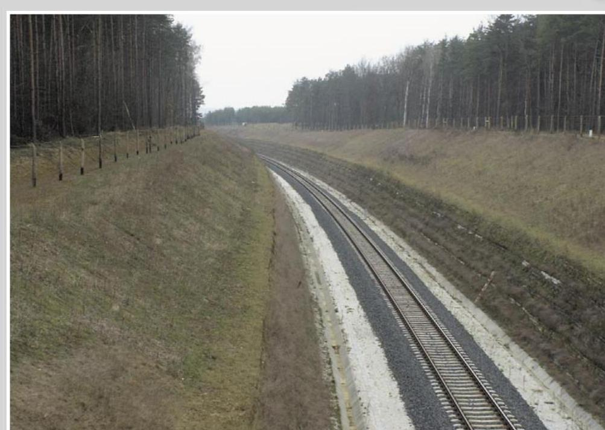

Environmental measures: fence for deer protection
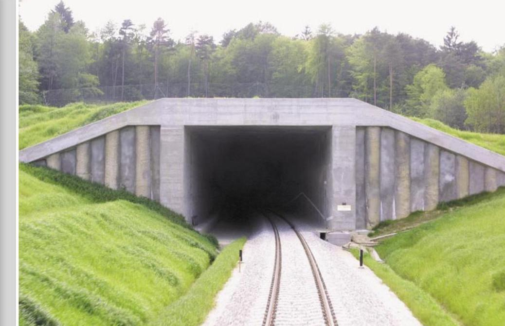

Underpass for wild animals

### 4.6. A két ország beruházási költségeinek összehasonlítása

A két ország beruházási költségeinek összehasonlítását 7. sz. táblázat mutatja be. Az összehasonlíthatóság érdekében a költségeket EURO-ban is megadtuk. Az átszámítást az EURO éves átlagárfolyamával végeztük az egyes években kifizetett beruházási költségek alapján.

A fenti táblázatból kitűnik, hogy Magyarországon és Szlovéniában is az építési munkák költségei a legnagyobb részarányt - az összes beruházási költség közel kétharmadát - képviselik. Mindkét országban fontosak a jelző- és biztonságtechnikai berendezések és a táv-

### 4.6. Comparison of investment costs between the countries

The table 7 shows the investment costs for both countries collected on the basis of defined methodology. The value is presented in national currencies and in EUR on the basis of average annual rate of exchange, in line with the amounts paid for investment costs in certain year.

The Table 7. shows that the major share (almost two thirds of the total investment costs) is represented by construction costs for both countries. The costs for setting up lighting safety devices and telecommunication devices are an important expendi-

### 4.6. Primerjava stroškov investicije med državama

Za primerjavo investicijskih stroškov med državama so v tabeli 7 prikazani istovrstni stroški investicije, zbrani v skladu z dogovorjeno metodologijo. Vrednosti stroškov v valutah držav so bile preračunane v evre po povprečnem letnem tečaju, glede na vrednost plačanih investicijskih stroškov v posameznem letu.

Iz tabele 7 je razvidno, da največji delež, skoraj dve tretjini vseh investicijskih stroškov, tako na Madžarskem kot v Sloveniji, predstavljajo stroški gradbenih del. V obeh državah so pomembni tudi stroški izvedbe signalno-varnostnih in telekomu-

---

Table 7 Investment costs for Hungarian and Slovene part of the railway construction (values in millions)

|  Type of costs | Hungary |  |  |  | Slovenia |  |  |   |
| --- | --- | --- | --- | --- | --- | --- | --- | --- |
|   | In HUF | In EUR | Part in \% | In EUR per km track | In SIT | In EUR | Part in \% | In EUR per km track  |
|  Railway track construction | 19117,37 | 75,22 | 64,1 | 3,83 | 14300,80 | 69,09 | 64,0 | 2,82  |
|  Lighting-safety devices | 2331,61 | 9,06 | 7,7 | 0,46 | 1471,82 | 7,11 | 6,6 | 0,29  |
|  Telecommunication devices | 1129,87 | 4,37 | 3,7 | 0,22 | 615,60 | 3,02 | 2,8 | 0,12  |
|  Land purchase | 339,32 | 1,44 | 1,2 | 0,07 | 1385,50 | 6,69 | 6,2 | 0,27  |
|  Control activities | 376,53 | 1,48 | 1,3 | 0,08 | 708,79 | 3,45 | 3,2 | 0,14  |
|  Investment and project documentation | 846,21 | 3,75 | 3,2 | 0,19 | 550,46 | 2,70 | 2,5 | 0,11  |
|  Total | 24140,91 | 95,32 | 81,2 | 4,85 | 19032,97 | 92,06 | 85,3 | 3,75  |
|  VAT | 5587,57 | 22,05 | 18,8 | 1,12 | 3299,73 | 15,90 | 14,7 | 0,65  |
|  TOTAL | 29728,48 | 117,37 | 100 | 5,97 | 22332,70 | 107,96 | 100 | 4,40  |

Source: MAV, Slovene Railways.

Table 8 Predicted quantities of cargo transit via new railway line in million net tons/year

|  Scenario | Low level of growth (2,4 \% per year) |  | High level of growth (3,5 \% per year) |   |
| --- | --- | --- | --- | --- |
|   | $\mathbf{2 0 0 0}$ | $\mathbf{2 0 1 5}$ | $\mathbf{2 0 0 0}$ | $\mathbf{2 0 1 5}$  |
|  A | 0,24 | 1,13 | 0,36 | 1,73  |
|  B | 0,67 | 1,76 | 0,82 | 2,51  |
|  C | 1,58 | 2,47 | 1,70 | 3,07  |
|  D | 2,01 | 3,10 | 2,16 | 3,85  |

Source: Feasibility study.

---

közlési berendezések kivitelezésének költségei is. A két ország között leginkább a földek megszerzésével kapcsolatos költségek térnek el, amelyek Szlovéniában 3,5-szer magasabbak, mint Magyarországon.

A vasútvonal építésénél annak megállapítására, hogy mely ország volt hatékonyabb, a 7. sz. táblázat mutatja be mindkét országra vonatkoztatva a beruházási költségek különböző fajtáinak egy kilométer megépített vasúti pályára jutó hányadát. Az összes beruházási költség - kivéve az ellenőrzés és a föld megszerzésének költségeit - Szlovéniában alacsonyabb, mint Magyarországon. Magyarországon a megépített vasútvonal egy kilométerére számított költség végösszege magasabb volt, mint Szlovéniában. Magyarországon 5,97 millió, Szlovéniában pedig 4,40 millió EURO volt.

Az egyes országoknál feltüntetett adatok összehasonlíthatóságát nehezíti a beruházás sajátossága és különbözősége. Figyelembe kell venni, hogy a vasútvonal hossza Magyarországon $19,6 \mathrm{~km}$, a vasútvonal mentén 2 megállóhelyet, 45 vasúti és 4 közúti felüljárót, 1 völgyhidat, 13 átereszt, 3 aluljárót, 375 méter hosszú alagutat és 28,2 kilométer összekötő utat építettek. Szlovéniában 24,5 kilométer vasútvonalat, Bajánsenye-Hodoš közös határállomást, 4 megállóhelyet és egy kitérőt, 4 felüljárót, 3 közúti aluljárót, 6 vasúti és 7 közúti hidat, 2 aluljárót, 72 átereszt, 320 méter alagutat és 24 kilométer összekötő utat építettek. A két ország adóelszámolásában eltérőek az adókulcsok is, melyek szerint elszámolják az általános forgalmi adót. Az adókulcsok a beruházás kivitelezése alatt mindkét országban változtak. A felsoroltak miatt az egy kilométer vasútvonalra kiszámított költségadatok csak informatív jellegüek és nem tesznek lehetővé részletes összehasonlítást.
ture too. The costs referred to land purchase differ from one country to another: in Slovenia those costs are for 4,6 times higher than in Hungary.

In order to find out which country was more effective in railway line construction, the table 7 shows costs for each investment calculated for one kilometre of the railway line. All costs presented in this way are in Slovenia lower than in Hungary except for costs referred to supervision and land purchase. In Hungary the value of one kilometre of the railway line was higher than in Slovenia. It amounted to 5,97 millions EUR and in Slovenia it amounted to 4,40 millions EUR more.

The comparison of the presented data is difficult because of peculiarities of the investment in each country. It is necessary to consider that the railway line in Hungary is $19,6 \mathrm{~km}$ long, there are two stations, 45 railway and 4 road bridges, viaducts, 13 passages, 3 under ways, the tunnel which is 375 m long and that there are linking roads $28,2 \mathrm{~km}$ long. In Slovenia the railway line is $24,5 \mathrm{~km}$ long, there are the joint border crossing station Hodoš - Bájansenye, 4 stations, one bypass, 4 overcrossing, 3 underpasses, 6 railway and 7 road bridges, 2 under ways, 72 passages, the tunnel which is 320 m long and there are linking roads which are 24 km long. Apart from that the countries have different means for calculating value added tax. The levels had been changing during the implementation of the investment, therefore the data on costs per kilometre of railway line are mainly informative and do not enable detailed comparisons.
nikacijskih naprav. Najbolj se med državama razlikujejo stroški, povezani s pridobivanjem zemljišč, ki so v Sloveniji kar 4,6-krat višji od istovrstnih stroškov na Madžarskem.

Da bi ugotovili, katera država je bila pri gradnji proge bolj učinkovita, so v tabeli 7 za obe državi prikazani preračuni investicijski stroški posameznih vrst na kilometer zgrajene proge. Vsi tako prikazani investicijski stroški razen stroškov izvajanja nadzora in pridobivanja zemljišč so v Sloveniji nižji kot na Madžarskem. Na Madžarskem je bila končna vrednost zgrajenega kilometra proge večja kot v Sloveniji. Znašala je 5,97 milijona evrov, v Sloveniji pa 4,40 milijona evrov.

Primerljivost navedenih podatkov otežujejo posebnosti in raznolikosti investicije v posamezni državi. Potrebno je upoštevati, da je proga na Madžarskem dolga 19,6 kilometra, ob njej sta urejeni 2 postajališči, zgrajenih je 45 železniških in 4 cestni nadvozi, viadukt, 13 prepustov, 3 podhodi, predor v dolžini 375 metrov in urejenih 28,2 kilometra povezovalnih cest. Slovenija je zgradila progo v dolžini 24,5 kilometra, skupno mejno postajo v Hodoš-Bájansenye, 4 postajališča in eno izogibališče, 4 nadvoze, 3 podvoze, 6 železniških in 7 cestnih mostov, 2 podhoda, 72 prepustov, predor dolžine 320 metrov in 24 kilometrov povezovalnih cest. Različne so tudi stopnje po katerih državi obračunavata davek na dodano vrednost. Višine stopenj so se med izvajanjem investicije v obeh državah spreminjale. Zaradi navedenega so podatki o stroških na kilometer zgrajene proge zgolj informativni in ne omogočajo podrobnejših primerjav.

---

Table 9 Predicted quantities of cargo transit via new railway line in the study (million net tons/year)

|  Type of transport | $\mathbf{2 0 0 0}$ | $\mathbf{2 0 0 5}$ | $\mathbf{2 0 1 5}$  |
| --- | --- | --- | --- |
|  Direction from the existing railway line: | 1,53 | 2,34 | 3,72  |
|  Direction from the roads: | 0,58 | 0,67 | 0,94  |
|  Total | $\mathbf{2 , 1 1}$ | $\mathbf{3 , 0 1}$ | $\mathbf{4 , 6 6}$  |
|  Referred to: |  |  |   |
|  - Export | 0,13 | 0,18 | 0,28  |
|  - Import | 0,42 | 0,57 | 0,84  |
|  - Transit | 1,56 | 2,26 | 3,54  |

Source: Cost benefit analysis.

Table 10 Transported quantities of the cargo via railway line between Slovenia and Hungary in million tons

|  Year | Border crossing
Čakovec-Središče | Border crossing
Bajánsenye-Hodoš | Total |   |
| --- | --- | --- | --- | --- |
|   |  |  | Transported
Quantities | Chain index  |
|  $\mathbf{1 9 9 7}$ | 3,20 | 0 | 3,20 | -  |
|  $\mathbf{1 9 9 8}$ | 3,02 | 0 | 3,02 | 94,38  |
|  $\mathbf{1 9 9 9}$ | 2,28 | 0 | 2,28 | 75,50  |
|  $\mathbf{2 0 0 0}$ | 2,22 | 0 | 2,22 | 97,37  |
|  $\mathbf{2 0 0 1}$ | 2,45 | 0,11 | 2,56 | 115,32  |
|  $\mathbf{2 0 0 2}$ | 1,18 | 1,08 | 2,26 | 88,28  |

Source: data by the Slovene Railways.

---

## 5. A beruházás hatása

Az új vasútvonaltól várt hatásokat gazdasági, politikai és szociális szemszögből is meghatározták. A legfontosabb gazdasági szempont - és egyúttal a beruházás egyetlen mérhető hatása - az új vasútvonalon szállítható teherszállítmány mennyisége. A két ország között 1985-1993 között zajló vasúti és közúti forgalom adatai alapján a gazdaságossági tanulmányban - az érintett minisztériumok segítsége mellett - elemezték a szállítási útvonalat, és felbecsülték a vasút-társaságok által az új vasútvonalra irányítható teherszállítmányok mennyiségét.

A tanulmány az alábbi három útvonalat tekintette át a potenciális teherszállítási piac meghatározásához:

- Magyarország, a kelet-európai országok és Szlovénia, valamint az észak-adriai kikötők - Trieszt és Koper - között bonyolódó nemzetközi vasúti forgalmat,
- Dél-Lengyelország, Szlovákiaés Ukrajna, Magyarország és Szlovénia (koperi kikötő) között bonyolódó nemzetközi vasúti forgalmat, továbbá
- A kelet-európai országok, Magyarország, Szlovénia és Olaszország között bonyolódó nemzetközi közúti forgalmat.

A tanulmány értékelése alapján az új vasútvonalon a potenciális áruforgalmat elsősorban a gabona, állati takarmány, feldolgozatlan fa, cellulóz, kőolajszármazék, vaskohászati termékek, ércek és ásványi anyagok szállítása jelenti.

Az új vasútvonalon szállítható tehermennyiség becslésére négy lehetséges forgatókönyvet dolgoztak ki, az 1993. évi forgalomhoz viszonyított vasúti forgalom alacsony és magas éves átlagnövekedését

## 5. Investment impacts

The expected impacts of the railway track construction were defined on the basis of economical as well as political and social aspect. The most important economical aspect, which is the only measurable investment impact, is the quantity freight demand via new railway track. On the basis of data on railway and road traffic flow between the countries in the period from 1985 to 1993 the feasibility study presented an analysis of possible level of future freight traffic on the new railway track by the railways companies with the appropriate assistance of the competent ministries.

To identify the size of the potential market for freight, the study has looked closely at the following three factors:

- international railway traffic between Hungary, Eastern Europe and Slovenia and North Adriatic ports (Triest and Koper )
- international railway traffic coming from Southern Poland, Slovakia and Ukraine passing Hungary and Slovenia (to ports Koper)
- international road cargo traffic destined for Eastern Europe, Hungary, Slovenia and Italy.

Potential transport substrate of the new railway track in line with the study represents cargo of: cereals, animal fodder, wood, cellulose, oil derivative, iron metallurgy, ore and minerals.

In order to assess the quantity of cargo transit via new railway line, four forecast scenarios were prepared for both low and high railway traffic growth annual cases (referred to transport level form 1993).

## 5. Učinki investicije

Pričakovani učinki gradnje nove proge so bili opredeljeni tako z ekonomskega kot tudi s političnega in socialnega vidika. Najpomembnejši ekonomski vidik, hkrati pa tudi edini merljivi učinek investicije, je količina prepeljanega tovora po novi progi. Na podlagi podatkov o gibanju železniškega in cestnega prometa med državama v obdobju od leta 1985 do leta 1993 je bila v študiji izvedljivosti opravljena analiza možnega transportnega substrata in ocenjena količina tovora, ki bi ga lahko železniški družbi ob ustrezni pomoči resornih ministrstev, pridobili na novo progo.

Po ocenah študije bi na novo progo lahko pridobili tovor predvsem iz

- mednarodnega železniškega prometa med Madžarsko, vzhodnoevropskimi državami in Slovenijo ter severnojadranskima pristaniščema Trst in Koper,
- mednarodnega železniškega prometa med južno Poljsko, Slovaško in Ukrajino ter Madžarsko in Slovenijo (pristanišče Koper) in
- mednarodnega cestnega tovornega prometa med vzhodnoevropskimi državami in Madžarsko, Slovenijo in Italijo.

Potencialni transportni substrat nove proge po ocenah iz študije predstavljajo predvsem prevozi žita, živinske krme, neobdelanega lesa, celuloze, naftnih derivatov, proizvodov črne metalurgije, rud in mineralov.

Za oceno količine prepeljanega tovora po novi železniški progi so bili izdelani štirje možni scenariji ob predvidevanjih za nizko in visoko povprečno

---

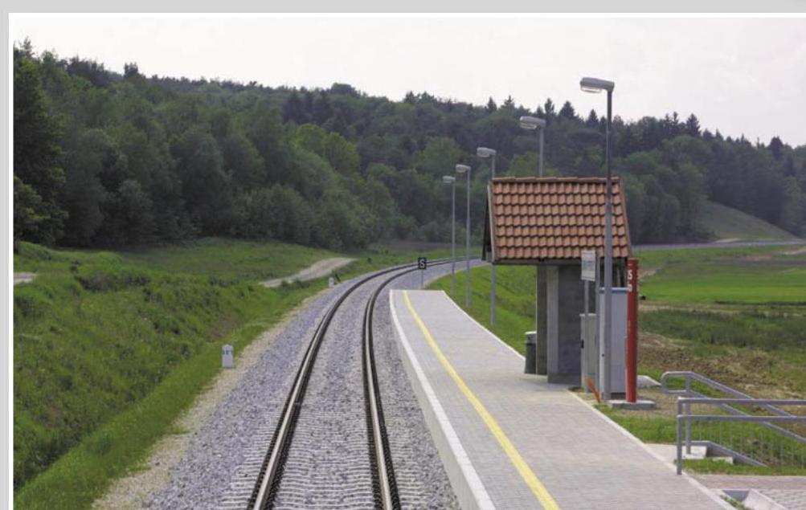

Gornji Petrovci Railway station
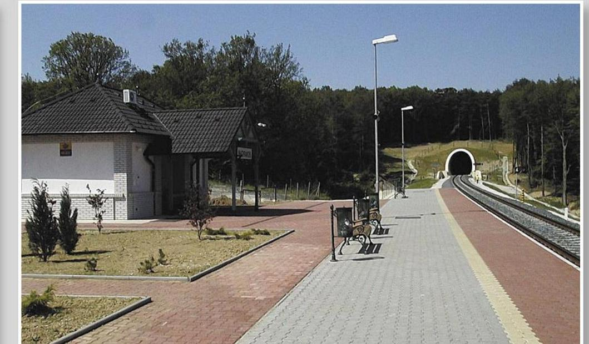

Nagyrákos Railway station
feltételezve. Az előre jelzett szállítható tehermenynyiségeket a 8. sz. táblázat tartalmazza.

A tanulmány kihangsúlyozta: nagyon bizonytalan annak prognosztizálása, hogy a Magyarország és Szlovénia között bonyolódó forgalom azon része, amely a közvetlen vasúti kapcsolat előtt Horvátországon át bonyolódott, milyen mértékben irányul az új vasútvonalra. Valószínủnek tekintette azt a prognózist, hogy a nemzetközi szállítók a horvát vasutak versenyképes ajánlata ellenére inkább az új vasútvonal felé irányulnak az általa nyújtott előnyök miatt (a közép-európai vasúthálózattal teljes egészében összehangolt, közvetlen, gyors, jól felszerelt vasúti kapcsolat).

A SŽ-nek és a MÁV Rt.-nek az új vasútvonal megépítése előtt meg kellett határoznia az építés néhány paraméterét. A Bajánsenye-Hodoš közös határ-

Forecasted quantities of cargo transit are presented in the Table 8.

The study stressed that the prediction referred to direction of the scope of transport from railway via Croatia to the new railway line Hungary-Slovenia as very uncertain. But the study assessed the prediction that international transport firms will decide to use the new railway line regardless the economical bids of the Croatian railways as highly possible, also because of the advantages such as: direct, quick, well maintained railway link which is co-ordinated with the Central European railway net.

Before the start of the construction work the Slovene Railways and MAV had to complete some of the construction parameters. They had to define the planned scope of cargo transport in detail in
letno stopnjo rasti železniškega prometa glede na raven transporta iz leta 1993. Napovedane količine prepeljanega tovora prikazuje tabela 8.

Študija je poudarila, da je napoved v kolikšnem obsegu se bo promet med Madžarsko in Slovenijo, ki je pred gradnjo neposredne povezave potekal prek Hrvaške, preusmeril na novo progo, zelo negotova. Kot zelo verjetno pa je obravnavala napoved, da se bodo mednarodni prevozniki, kljub zelo konkurenčni ponudbi hrvaških železnic, raje preusmerili na novo progo zaradi prednosti, ki jih bo le-ta nudila (direktna, hitra, dobro oskrbovana železniška povezava, ki je povsem usklajena s srednjeevropskim železniškim omrežjem).

Pred začetkom gradnje nove proge sta morali SŽ in MÁV določiti nekatere parametre gradnje. Za do-

---

állomás vasúti közlekedés technológiájának és az infrastrukturális határszolgáltatások kapacitásának meghatározása miatt pontosan meg kellett becsülni a tervezett áthaladó tehermennyiséget. Tekintettel arra, hogy 1993-1995 évek között a vasúti forgalom nagyon megnövekedett, az 1993. évig terjedő időszakra vonatkozó adatokon alapuló megvalósíthatósági tanulmány feltételezései már nem voltak reálisak. A közös tanulmány bemutatta a két ország közötti vasúti és közúti közlekedés forgalmi-piaci elemzését. Ezen az alapon a vasúti, illetve a közúti közlekedés növekedésének tervezett éves rátáinak figyelembe vételével meghatározták az új vasútvonalra tervezett éves tehermennyiségeket. (9. sz. táblázat).

A közös tanulmányban kiszámított tervezett tehermennyiségi adatok egyben kulcsfontosságú kiinduló adatot jelentenek az új vasútvonal gazdaságossági mutatói kiszámításához (részletesebben a jelen jelentés 2. pontjában). A szakértők nem terveztek olyan programot és intézkedéscsomagot, amelyekkel a vas-út-társaságok az új vasútvonalra teherszállítmányt irányítanának át, melynek következtében elérhetnék a közös tanulmányban és a megvalósíthatósági tanulmányban tervezett tételeket.

A megvalósíthatósági és a közös tanulmányban tervezett adatok ellenőrzése céljából a vizsgálatot végzők beszerezték a Središče és Hodoš határátkelőkön keresztül bonyolódó alábbi vasúti teherforgalmi adatokat:

- Szlovénia és Magyarország között szállított tehermennyiség, 1997. évtől hónapokra és negyedévekre bontva,
- a két ország között szállított tehermennyisége fajtánként, 1997. évtől hónapokra és negyedévekre bontva, valamint
order to determine traffic technology on the joint border crossing Bajánsenye - Hodoš and to identify capability of the infrastructure of border devices. Due to the fact that the railway traffic increased between 1993 and 1995, the elements included in the Feasibility study based on data from 1993 were no longer realistic.

The joint Cost benefit analysis presented trans-port-marketing analysis of the railway and road traffic between the two countries. On the basis of the analysis the defined planned annual quantities of the cargo transport were defined in line with the predicted annual railway or road traffic growth rates (as seen in the Table 9).

The data on planned quantities of cargo transport presented in the Cost benefit analysis are also the key input data for calculation of economic efficiency indicators (detailed presentation in point 2 of this report). The activities and measures which would be used by the railways companies to attract cargo to the new railway line and achieve planned objectives were not planned in the Cost benefit analysis or Feasibility study.

In order to check realisation of the planned elements presented in the Feasibility study and Cost benefit analysis the auditors obtained data on actual scope of railway cargo transit via border crossings Čakovec-Središče and BajánsenyeHodoš, that is:

- the quantity of cargo transported via railway line Hungary-Slovenia, by months and quarters since 1997,
- the quantity of cargo transported via railway line Hungary-Slovenia in line with the type of cargo, by months and quarters since 1997,
ločítev prometne tehnologije proge na skupni mejni postaji Bajánsenye-Hodoš in definiranje zmogljivosti infrastrukturnih mejnih naprav sta morali natančno opredeliti načrtovani obseg tovora. Glede na to, da se je promet po železnici med leti 1993 in 1995 močno povečal, predvidevanja študije izvedljivosti, ki so temeljila na podatkih iz obdobja do leta 1993, niso bile več realne.

V elaboratu je bila izdelana prometno - tržna analiza železniškega in cestnega prometa med državama. Na tej osnovi so bile, ob upoštevanju predvidenih letnih stopenj rasti železniškega oziroma cestnega prometa, opredeljene in med državama usklajene načrtovane prepeljane letne količine tovora za novo progo, kot je prikazano v tabeli 9.

Podatki o načrtovanih količinah prepeljanega tovora, izračunani v elaboratu, so tudi ključni vhodni podatki za izračun kazalcev ekonomske učinkovitosti nove proge (podrobneje v točki 2 tega poročila). Aktivnosti in ukrepi, s pomočjo katerih bi železniški družbi pridobivali tovor na novo progo in dosegli načrtovana predvidevanja iz elaborata kakor tudi iz študije izvedljivosti, niso bile načrtovane.

Da bi preverili uresničevanje načrtovanih predvidevanj v študiji in elaboratu smo v reviziji pridobili podatke o dejanskem železniškem tovornem prometu prek mejnih prehodov Čakovec-Središče in Bajánsenye-Hodoš, in sicer o

- količini prepeljanega tovora po železnici med Madžarsko in Slovenijo, po mesecih in četrtletjih od leta 1997 dalje,
- prepeljanih količinah tovora med državama glede na vrsto, po mesecih in četrtletjih za obdobje od leta 1997 dalje ter

---

**Figure 5.**

Quantity of cargo transport via railway line between Slovenia and Hungary in 2001 and 2002 in tons

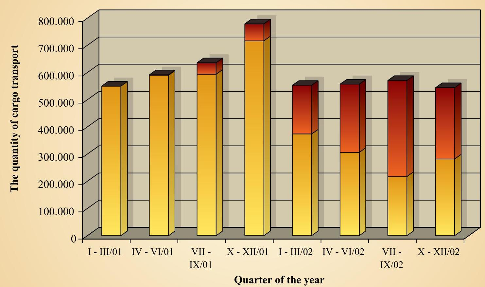

Source: data by the Slovene Railways.

*Kalalövő – Bajánsenye – Hodos – Murska Sobota railway*

---

- a szállított tehermennyiség származási országának és rendeltetésének figyelembe vételével, 1997. évtől hónapokra és negyedévekre bontva.

A forgalom az új vasútvonal beindításáig kizárólag csak a Središče határátkelőn át bonyolódott, a vasútvonal megnyitása után pedig a Szlovénia és Magyarország közötti forgalom egy része Bajánsenye-Hodoš határátkelőn, egy része pedig a régi vasútvonalon (Čakovec-Središče határátkelőn át) bonyolódik. Az adatokból kitűnik, hogy Szlovénia és Magyarország között az 1997. és 2002. közötti időszakban a vasúti teherforgalom évente átlagosan 7,3\%-al csökkent (kivételt képez a 2001. év, amikor a korábbi évhez képest $15 \%$-al növekedett).

Az 5. sz. ábra bemutatja, hogy az új vasútvonalon leszállított tehermennyiség 2001. év elejétől (2002. november és december hónap kivételével) folyamatosan nőtt, a meglevő - Horvátországon átvezető - vasútvonalon keresztül pedig ennek következményeként csökkent. Magyarország és Szlovénia között 2002. évben az összes teherszállítmány közel felét ( $47,7 \%$ ) szállították az új vasútvonalon Bajánsenye-Hodoš határátkelőn át.
2002. évben Szlovénia és Magyarország között a vasúti teherforgalomban a legnagyobb részesedésük a vas- és acélszállítmányoknak voltak ( $28,4 \%$ ). Jelentősek voltak továbbá a nagy konténerszállítmányok ( $14,9 \%$ ), a mezőgazdasági termékek $(11,6 \%)$, valamint a hulladékvas-szállítmányok $(8,3 \%)$. A fuvar fajtája szerint a szállítmányok szerkezete a Bajánsenye-Hodoš határátkelőn is hasonló (az összes fuvar 51,8\%-kát teszi ki a vasés acélszállítás, $12,2 \%$-kot a hulladékvas, $9,9 \%$ a fürészelt és rönk faáru).

- the quantity of cargo transported via railway in line with the cargo origin and direction, by months and quarters since 1997.

Until the new railway line was introduced the traffic was exclusively directed via border crossing Središče, after the new railway line was opened part of the traffic was directed to the new railway line via border crossing Bajánsenye-Hodoš, a part of the railway traffic remained on the old railway line (via border crossing Čakovec-Središče). The data show that the railway cargo transport was on a decline from 1997 till 2002 on an average level of $7,3 \%$ per year, except for 2001 when it increased for $15 \%$ referred to the previous year.

The Figure 5. shows that the quantity of cargo transported via new railway line was increasing since the beginning of 2001 (except for November and December), the quantity of cargo transported via existing railway line (via Croatia) was on the decline. In 2002 almost half of all cargo transport between Slovenia and Hungary ( $47,7 \%$ ) was transported via new railway line and border crossing Bajánsenye-Hodoš.

In 2002 the biggest part of railway cargo transit service between Slovenia and Hungary represented: iron and steel ( $28,4 \%$ ), containers ( $14,9 \%$ ), agricultural produce ( $11,6 \%$ ), scrap iron ( $8,3 \%$ ). The structure of railway cargo transit via border crossing Bajánsenye-Hodoš is similar: $51,8 \%$ of all cargo represented steel and iron, $12,2 \%$ scrap iron, $9,9 \%$ logs and sawn wood.

In 2002 the following cargo transport on the railway line Hungary-Slovenia (via both border crossings) were recorded: the most important cargo

- prepeljanih količinah tovora glede na poreklo in namembnostjo, po mesecih in četrtletjih za obdobje od leta 1997 dalje.

Do uvedbe prometa po novi progi je promet potekal le prek mejnega prehoda Središče, po odprtju proge pa se del prometa med Madžarsko in Slovenijo odvija prek mejnega prehoda BajánsenyeHodoš, del prometa pa še vedno prek mejnega prehoda Čakovec-Središče. Iz podatkov je razvidno, da je železniški tovorni promet med Madžarsko in Slovenijo v obdobju od leta 1997 do leta 2002 upadal po povprečni stopnji 7,3 odstotka na leto (razen leta 2001, ko je narasel za 15,0 odstotkov glede na predhodno leto).

Kot prikazuje slika 5, je količina tovora, prepeljanega po novi progi, od začetka leta 2001 stalno naraščala (razen v novembru in decembru 2002), količina tovora, prepeljanega po obstoječi progi prek Hrvaške pa padala. V letu 2002 je bilo skoraj polovico vsega tovora med Madžarsko in Slovenijo (47,7 odstotka) prepeljanega po novi progi prek mejnega prehoda Bajánsenye-Hodoš.

Največji delež železniškega tovornega prometa med Madžarsko in Slovenijo so v letu 2002 predstavljali prevozi železa in jekla ( 28,4 odstotka), pomembni pa so še prevozi velikih kontejnerjev (14,9 odstotka), kmetijskih pridelkov (11,6 odstotka) ter starega železa ( 8,3 odstotka). Podobna je tudi struktura prevozov glede na vrsto tovora prek mejnega prehoda Bajánsenye-Hodoš (51,8 odstotka vsega tovora predstavlja prevoz železa in jekla, 12,2 odstotka prevoz starega železa, 9,9 odstotka pa prevozi žaganega lesa in hlodov).

---

Szlovénia és Magyarország között 2002. évben a két határátkelőn keresztül bonyolódó vasúti teherszállításban a legnagyobb szerepet a szárazföldi tranzitszállítás játszotta (az összes szállítás 44\%-a). Szlovénia és Magyarország saját szükségleteire történő kikötői tranzitszállítások pedig a két ország közötti összes szállítás 28\%-a volt. A Bajánsenye-Hodoš határátkelőn keresztül bonyolódó vasúti teherszállításban is a szárazföldi tranzitszállítás volt a legkiemelkedőbb ( $52 \%$ ). A vasúti teherszállításban a legnagyobb részesedést a Szlovákiából Olaszországba irányuló tranzit képviseli (a két ország közötti teljes szárazföldi tranzit 59\%-a), ezt követi a kikötői tranzit ( $27 \%$; a legnagyobb a Szlovákiába irányuló szállítás, amely a teljes kikötői tranzit 75\%-a), valamint Szlovénia és Magyarország saját szükségleteire történő szállítások.
Az új vasútvonal megnyitása után mindkét ország vasút-társasága az alább felsorolt intézkedésekkel igyekezett a teherforgalmat megnövelni:

- Bajánsenye-Hodoš határátkelőn át történő szállítás esetén a szállítóknak kedvezményes árakat kínáltak, amelyek versenyképesé tették a szállítási árakat,
- Bajánsenye-Hodoš határátkelőn folyamatos, 24órás forgalmat biztosítottak,
- a Szlovákiába történő áruszállítás megszerzése érdekében az értékesítés feltételeiről keretegyezményt kötöttek a SŽ-vel,
- a Romániából és Ukrajnából történő szállításokra kölcsönös felhatalmazásról szóló megállapodást kötöttek,
- Bajánsenye-Hodoš határátkelőn keresztül növelték a menetrend szerinti vonatok számát, és csökkentették a Čakovec-Središče határátkelőn keresztül közlekedők számát,
- növelték a vonatok szállítási kapacitását, valamint
- az új vasútvonal rakodó- és megállóhelyein lerövidítették a technológiai időt.
transport was land transit which represented $44 \%$ of all transport, transport for Hungarian or Slovene needs, port transit which represented $28 \%$ of all transport between the countries. The biggest part of railway cargo transport was directed to the border crossing Bajánsenye-Hodoš was land transit which represented $52 \%$ (the largest part of transit represents transit from Slovakia to Italy: $59 \%$ of all land transit between the countries), port transit represented $27 \%$ (most important transport was for Slovakia which represented more than $75 \%$ of all port transit), and the transport for Slovene and Hungarian needs.
Immediately after the new railway line was opened the railways companies started implementing activities for attracting cargo:
- they offered transport firms reduced prices for using railway line via border crossing BajánsenyeHodoš, that helped to realise competitive prices,
- they introduced non-stop, 24 hours a day service via border crossing Bajánsenye-Hodoš,
- in order to attract cargo transport to Slovakia, they made a frame agreement with the Slovak railways on sale conditions,
- they adopted an mutual agreement of authority for transporting services from Ukraine and Rumania,
- the number of regular trains via border crossing Bajánsenye-Hodoš was increased and the number of trains via border crossing ČakovecSredišče was reduced,
- they increased train capacities,
- the technological time at the loading platforms and stations on the new railway line was shortened.

V železniškem tovornem transportu med Madžarsko in Slovenijo, prek obeh mejnih prehodov, je bil v letu 2002 najpomembnejši kopenski tranzit (44 odstotkov vseh prevozov), prevozi za potrebe Madžarske in Slovenije ter luški tranzit pa so predstavljali po 28 odstotkov vseh prevozov med državama. Najpomembnejša vrsta železniškega tovornega prometa prek mejnega prehoda BajánsenyeHodoš pa je kopenski tranzit ( 52 odstotkov; največji delež predstavlja tranzit s Slovaške v Italijo - 59 odstotkov vsega kopenskega tranzita med državama), sledita pa luški tranzit ( 27 odstotkov; najpomembnejši so prevozi za Slovaško, ki predstavljajo več kot 75 odstotkov vsega luškega tranzita) ter prevozi za potrebe Madžarske in Slovenije.

Železniški družbi obeh držav sta takoj po odprtju nove proge poskušali pridobiti tovor z izvajanjem naslednjih aktivnosti:

- za prevoze prek mejnega prehoda BajánsenyeHodoš sta prevoznikom ponudili promocijske cene, kar je omogočilo oblikovanje konkurenčnih cen prevozov,
- zagotovili sta neprekinjeno 24-urno odvijanje prometa prek mejnega prehoda Bajánsenye-Hodoš,
- za pridobitev prevozov tovora na Slovaško sta s slovaškimi železnicami sklenili okvirni sporazum o prodajnih ukrepih,
- sklenili sta dogovor o medsebojnih pooblastilih za prevoze iz Romunije in Ukrajine,
- povečali sta število rednih vlakov prek mejnega prehoda Bajánsenye-Hodoš in zmanjšali prek mejnega prehoda Čakovec-Središče,
- povečali sta zmogljivosti vlakov,
- skrajšali tehnološke čase na nakladališčih in postajališčih na novi progi.

---

A közúti teherszállítás 1998-2002 közötti időszakra vonatkozó adatai (Szlovénia és Magyarország között a Dolga vas-Rédics közúti határátkelőhelyen átlépő tehergépjárművek száma) alapján megállapítható, hogy a teherforgalom ebben az időszakban azonos szinten maradt. A határátkelőhely teherforgalma 2002. évben pedig a korábbi évhez viszonyítva $15 \%$-kal magasabb volt. Annak ellenére, hogy megnyitották az új vasútvonalat megállapítható volt, hogy az országok közötti közúti teherforgalom nem csökkent.

Az új vasútvonalon 2002. évben ténylegesen leszállított tehermennyiséget összehasonlítva a megvalósíthatósági tanulmányban és a közös tanulmányban az üzemelés első évére tervezett mennyiséggel megállapítható, hogy a prognózis az említett intézkedések ellenére nem teljesült. A magvalósíthatósági tanulmányban prognosztizált tehermennyiség $68,1 \%$-át, a közös tanulmányban tervezettnek csupán $51 \%$-át szállították le az új vasútvonalon. A közúti forgalommal kapcsolatos megállapításokhoz és azon megállapításokhoz, hogy az új vasútvonalon történő szállítások megközelítőleg a Szlovénia és Magyarország között bonyolódó teljes teherforgalom felét teszik ki, a „C" forgatókönyvet vették összehasonlítási alapul. Megállapítottuk, hogy nem teljesültek a vasúti forgalom éves rátáinak növekedési prognózisai, amelyek alapján a beruházás mérhető hatásait tervezték, és kiszámolták a gazdaságossági mutatókat.

Megállapítást nyert, hogy a vasút-társaságoknak az említett intézkedésekkel elsősorban a meglevő, Horvátországon át vezető vasútvonalról sikerült tehermennyiséget biztosítaniuk, azonban a teherforgalmat nem sikerült a közútról, a vasútra terelni.

On the basis of the data on road cargo transit (number of lorries which crossed the most important border crossing between Slovenia and Hungary: Redics-Dolga vas) which were obtained form the Customs administration of the Republic of Slovenia for the period from 1998 till 2002, it was found out that that the road cargo transit remained on the same level, in 2002 it increased for $15 \%$ compared to the previous year. It was assessed that the road cargo transit was not reduced even though the new railway line was opened.

A comparison between the actual scope of cargo transit in 2002 with the scope of cargo transit planned for the first operational year in the Feasibility study and Cost benefit analysis showed that the predictions did not take place even though all described activities were undertaken. There was $68,1 \%$ of cargo transit planned in the feasibility study realised and only $51 \%$ of cargo transit planned in the Cost benefit analysis realised. On the basis of the findings referred to road traffic and finding that cargo transport via new railway line represented approximately $50 \%$ of all cargo transport between the countries the auditors used scenario C for the comparison. It was found out that the predictions on annual railway traffic growth rates, on the basis of which the measurable investment impacts were planned and cost efficiency indicators were calculated, were not achieved.

It was assessed that the railways companies from both countries implementing measures were successful in attracting the cargo traffic from the existing railway line via Croatia, but they could not direct the road cargo transit to the new railway line.

Na podlagi podatkov o cestnem tovornem prometu (številu tovornih vozil, ki so prestopila najpomembnejši cestni mejni prehod za tovorni promet med Madžarsko in Slovenijo Rédics-Dolga vas), pridobljenih od Carinske uprave Republike Slovenije za obdobje od leta 1998 do 2002 ugotavljamo, da je le-ta v vsem obdobju na približno enaki ravni, v letu 2002 pa je bil celo za 15 odstotkov večji kot v letu poprej. Ocenjujemo, da se cestni tovorni promet med državama zaradi odprtja nove železniške proge ni zmanjšal.

S primerjavo dejansko prepeljanega tovora v letu 2002 s količino, načrtovano za prvo leto obratovanja proge v študiji izvedljivosti in elaboratu, smo ugotovili, da se napovedi, kljub izvajanju opisanih aktivnosti, niso uresničile. Prepeljano je bilo 68,1 odstotka načrtovane količine tovora v študiji izvedljivosti in le 51 odstotkov tovora, načrtovanega v elaboratu. Na podlagi ugotovitev o cestnem prometu in ugotovitve, da prevozi tovora po novi progi predstavljajo približno polovico vsega tovornega transporta med Madžarsko in Slovenijo, smo za primerjavo izbrali scenarij C. Ugotavljamo, da se niso uresničila izhodiščna predvidevanja o letnih stopnjah rasti železniškega prometa, na podlagi katerih so bili načrtovani merljivi učinki investicije in izračunani kazalci ekonomske učinkovitosti.

Ocenjujemo, da sta železniški družbi obeh držav ob izvajanju navedenih ukrepov uspeli pridobiti predvsem tovor z obstoječe železniške povezave prek Hrvaške, nista pa uspeli preusmeriti cestnega tovornega prometa na železnico.

---

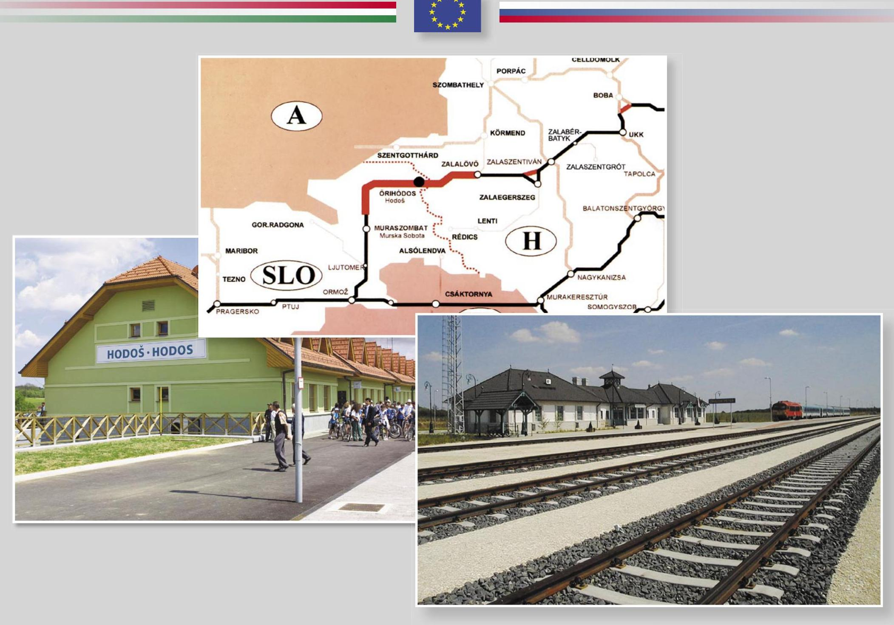

Kalalövô - Bajánsenye - Hodoš - Murska Sobota railway

---

## 6. A személyforgalom bevezetése az új vasútvonalon

A megépült vasútvonal hatása a két ország közötti személyforgalom növekedésére a megvalósíthatósági tanulmányban és a közös tanulmányban nem volt mérhető hatásként feltüntetve. A két ország megállapodást kötött arról, hogy az új vasútvonalon naponta két pár távolsági és öt pár helyi személyvonatot indít.

Az új vasútvonalon bevezetett személyforgalomról szóló adatok alapján megállapítottuk, hogy a személyforgalmat teljes mértékben az új vasútvonalra irányították, és az kizárólag Bajánsenye-Hodoš határátkelőn át bonyolódik le. A tervekkel összhangban az új vasútvonalon a határ menti forgalomban öt pár vonat közlekedik (Hodoš-Öriszentpéter-Hodoš relációban), valamint két pár nemzetközi vonat (Velence-Ljubljana-Hodoš-Budapest vonalon).

A feldolgozott adatok alapján megállapítható volt, hogy az új vonal létesítésével a helyi lakosság olcsóbb szolgáltatásokhoz jutott a személyforgalomban. Ennek ellenére a személyvonatok kapacitásának kihasználtsága nem éri el az 5\%-ot.

Budapest/Ljubljana, 2003. április

## 6. Introduction of passenger traffic via the new railway line

The impact of the railway line construction on the increase of passenger traffic between the countries was not assessed as a measurable investment impact in the Feasibility study and Cost efficiency analysis. The two countries adopted an agreement that they will introduce two pairs of long distance and five pairs of local passenger trains daily.

On the basis of the data on the introduction of passenger trains via new railway line it was found out that the passenger traffic was directed from the old to the new railway line exclusively via border crossing BajánsenyeHodoš. In accordance with the plans there are five pairs of passenger trains on border area (Hodoš-ÖriszentpéterHodoš) and two pairs of international trains (in direction of Venice-Ljubljana-Hodoš-Budapest).

The introduction of the railway line brought to the local people a new, economical link and a cheaper public services of the passenger traffic. Nevertheless on the basis of the traffic data it was found that the capacities of the passenger trains are used in less than $5 \%$.

Budapest/Ljubljana, April 2003

## 6. Uvedba potniškega prometa na novi progi

Vpliv gradnje proge na povečanje potniškega prometa med državama v študiji izvedljivosti in elaboratu ni bil ocenjen kot merljiv učinek investicije. Državi sta sprejeli le dogovor, da bosta na novo progo dnevno uvedli dva para daljinskih potniških vlakov in pet parov lokalnih.

Na podlagi podatkov o uvedbi potniškega prometa na novi progi smo ugotovili, da je potniški promet v celoti preusmerjen na novo progo in poteka izključno prek mejnega prehoda Bajánsenye-Hodoš. V skladu z načrti vozi po novi progi pet parov vlakov v maloobmejnem prometu (na relaciji Hodoš-Öriszentpéter-Hodoš) ter dva para mednarodnih (v smeri Benetke-Ljubljana-Hodoš-Budimpešta).

Kljub temu da je nova proga lokalnemu prebivalstvu prinesla nove, ugodnejše povezave in cenejše storitve javnega potniškega prometa, na osnovi pridobljenih podatkov ugotavljamo, da je kapaciteta potniških vlakov izkoriščena manj kot 5-odstotno.

Budimpešta/Ljubljana, aprila 2003

## 

Dr. Vojko A. Antončič
General State Auditor - Court of Audit
Republic of Slovenia

---

.

---

.

---

Edited by
Zsigmond Bihary, Director General of Audit
Zdenka Vidovič, Second Deputy President
Compiled by
Dr. László Podonyi, Head of Department
Jerneja Vrabič, Senior Auditor
Responsible for publishing
Pál Csapodi PhD, Secretary General
Cover Design by
István Kiss
Tipographer-designer
Gergely Pattantyus
Published by
Király \& Társai Ltd., Budapest
Printed and bound by
Typo-Rep Nyomda, Budapest